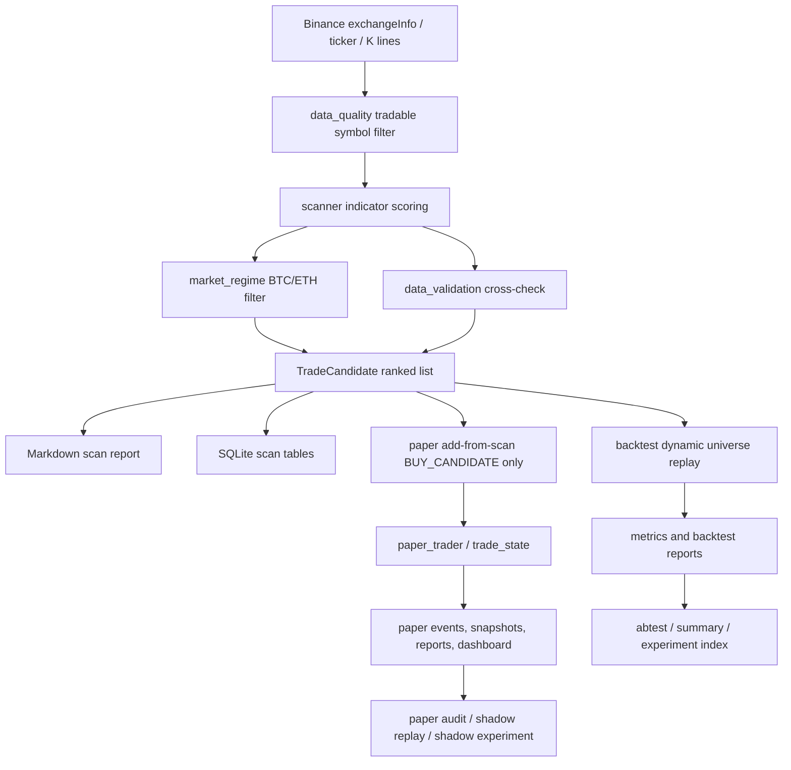

# CryptoTradingSystem 系统总览

更新时间：2026-07-26 18:00 +08:00

## 1. 系统当前在解决什么问题

CryptoTradingSystem 当前不是自动实盘机器人，而是一个本地加密货币交易研究与模拟盘验证系统。它要解决的核心问题是：

> 在不使用未来数据、不自动实盘下单的前提下，每天从 Binance USDT 现货市场中筛出可复核的候选交易计划，并通过回测、A/B、模拟盘和审计流程判断这些规则是否有稳定、可解释的交易优势。

当前策略的主要假设是：

> 某些流动性足够、数据质量可交叉验证、且处在较好市场环境中的加密货币，在趋势恢复、重新站上关键入场区间或趋势支撑后，未来继续上涨的概率和盈亏比可能足以覆盖止损、手续费、滑点和资金占用成本。

这仍然是候选策略假设，不是已经证明的长期优势。

## 2. 策略靠什么可能赚钱

策略不是靠单一指标赚钱，而是靠多个防线叠加后试图提高“买入计划质量”：

| 组件 | 可能提供的优势 | 当前证据等级 |
|---|---|---|
| Universe / 选币 | 过滤低流动性、稳定币、杠杆币和历史不足的币，优先让策略面对更可交易的标的 | 事实：代码已实现；观察：`liquidity_50m` 多次改善但仍是 `retest` |
| Market Regime | BTC/ETH 弱势时降低或暂停新开仓，减少弱市共振亏损 | 观察：`risk_off_no_core_entry_reclaim_ema_stop` 曾进入 `candidate_keep_review`；默认配置已采用更严格 regime 阈值 |
| Entry / 入场 | 不在第一次触碰入场区间时立刻成交，而等待 4h 收盘重新站回 `entry_high` | 决策：`entry_reclaim_close_enabled=true` 已在默认配置中启用 |
| Stop / 止损 | 用近期低点和 ATR 设定认错价，限制单笔亏损 | 事实：状态机和回测均使用 stop；风险：止损率仍偏高 |
| TP1 / 趋势确认 | TP1 不是立即平仓收益，而是确认趋势推进到第一目标 | 事实：当前回测中 TP1 touched 只作为状态推进 |
| EMA trailing / 移动止损 | TP1 后用 EMA20 抬高止损，减少盈利后完全回吐 | 决策：`tp1_ema_trailing_stop_enabled=true` 已在默认配置中启用 |
| Max holding / 最大持仓时间 | 处理入场后长期未触发 TP1 的停滞交易，降低资金占用和拖延亏损 | 候选：42 根 4h 固定退出表现较平衡，但尚未写入默认配置 |
| Position sizing | 按账户资金和单笔风险控制仓位 | 事实：默认单笔风险 1%，组合活跃风险上限 5% |

当前最重要的风险是：策略由多层过滤和退出规则组成，部分规则已有候选证据，但还没有形成一份足够稳定的“优势来源归因”。因此后续研究应优先解释优势来自哪里，而不是继续叠加规则。

## 3. 模块职责地图

| 模块 | 要解决的问题 | 输入 | 输出 | 当前依据 |
|---|---|---|---|---|
| `market_data.py` | 获取 Binance 公开行情 | exchange info、24h ticker、1h/4h/1d K 线 | 原始行情数据 | Binance 公开现货 API |
| `data_quality.py` | 初筛可交易标的 | exchange info、ticker、配置过滤条件 | 可扫描交易对 | 排除稳定币、杠杆币、低成交额、低交易数 |
| `scanner.py` | 生成候选交易计划 | 行情、EMA、RSI、MACD、ATR、成交量、regime、数据质量 | `TradeCandidate`、`BUY_CANDIDATE` / `WAIT_PULLBACK` / `WATCH_ONLY` / `REJECT` | 趋势、支撑距离、动量、波动、数据质量打分 |
| `market_regime.py` | 判断是否适合开仓 | BTC/ETH 日线 EMA、7d 涨跌 | `RISK_ON` / `NEUTRAL` / `RISK_OFF` | 弱市中山寨币风险更高 |
| `data_validation.py` | 验证行情一致性 | Binance 候选、CoinGecko、CoinMarketCap | `DATA_OK` / `DATA_WARNING` / `DATA_ERROR` | 避免错误映射或异常价格污染信号 |
| `trade_state.py` | 统一交易状态推进 | 计划、K 线 high/low/close、入场/止损/TP 配置 | `WATCHING`、`ENTERED`、`TP1_HIT`、`STOPPED`、`CLOSED` 等事件 | 回测和模拟盘共用核心状态机 |
| `paper_trader.py` | 模拟盘跟踪 | 扫描计划、当前行情、账户配置 | paper plans、events、snapshots、报告 | 验证真实运行链路和信号频率 |
| `backtest/replay.py` | 历史回放 | 历史 K 线、扫描规则、状态机 | 回测交易明细 | 决策只使用已收盘 K 线，降低未来函数风险 |
| `backtest/runner.py` | 回测运行与报告 | 回测结果、指标、benchmark | Markdown 报告、SQLite 记录 | 固化假设、成本、指标和配置快照 |
| `abtest.py` | 单变量 A/B | 默认配置、实验 override、同一 universe/区间 | baseline vs variant 报告 | 限制 override 白名单，降低不可归因修改 |
| `abtest_summary.py` | 多窗口汇总 | 已生成 A/B 报告 | 跨窗口结论 | 检查样本不足、窗口重叠、universe 偏差 |
| `research_tools.py` | 实验索引和观察 dashboard | reports、SQLite paper 数据 | experiment index、observation dashboard | 让结论可追踪 |
| `paper_audit.py` / `paper_shadow_*` | 模拟盘离线归因 | paper opportunities、成熟样本、固定 opportunity set | shadow replay / shadow experiment 报告 | 在不改 live/paper 配置下评估候选规则 |
| `storage.py` / `paper_db.py` / `database.py` | 本地持久化和健康检查 | scans、paper、backtest、runs | SQLite 表、健康状态 | 支持审计、复盘、稳定性门槛 |

## 4. 当前默认配置快照

来源：`config/settings.toml`

| 领域 | 当前默认 |
|---|---|
| 交易市场 | Binance USDT 现货 |
| 最低 24h 成交额 | `30,000,000` USDT |
| 最低 24h 交易数 | `30,000` |
| 每次输出候选 | `top_n=5` |
| 最小历史长度 | `min_history_days=180` 日线 |
| 市场环境过滤 | `market_regime_filter_enabled=true` |
| 数据质量过滤 | `strict_data_quality_for_buy=true` |
| RISK_OFF 核心币开仓 | `risk_off_core_buy_enabled=false` |
| 入场确认 | `entry_reclaim_close_enabled=true` |
| TP1 后保本止损 | `tp1_move_stop_to_breakeven_enabled=false` |
| TP1 后 EMA20 trailing | `tp1_ema_trailing_stop_enabled=true` |
| Regime 阈值 | BTC 7d <= `-3%`、ETH 7d <= `-5%`，且要求两者趋势 |
| 相对强度门槛 | 默认关闭：`relative_strength_soft_gate_enabled=false` |
| ATR reclaim 门槛 | 默认关闭：`entry_reclaim_min_atr_enabled=false`；`atr_reclaim_0_35` 人工路径复盘后降为 `retest_path_dependent`，尚未部署 |
| 最大持仓时间 | 默认未启用：`max_holding_bars_without_tp1=0` |
| 回测成本 | maker 4 bps、taker 10 bps、entry slippage 5 bps、stop slippage 10 bps |
| Intrabar 假设 | `stop_first` |
| 单笔风险 | `1%` |
| 最大活跃仓位 | `5` |
| 组合活跃风险上限 | `5%` |

## 5. 数据流

## 6. 关键约束和已知风险

| 风险 | 当前处理 | 仍未解决 |
|---|---|---|
| 未来数据泄漏 | 回测使用已收盘 K 线，动态 universe 每日重建；测试覆盖部分无未来读取场景 | 历史退市币 master 仍不完整，存在幸存者偏差 |
| intrabar 路径不确定 | 默认 `stop_first`，偏保守 | 未用 5m/15m 还原真实路径 |
| 样本不足 | `closed_trades < 20` 自动标记 `sample_sufficient=false` | 多数早期窗口仍容易样本不足 |
| 过拟合 | A/B 限制单变量、跨窗口 summary、窗口重叠检查 | 候选规则越来越多，需要实验卡片和账本约束 |
| 模拟盘与回测不一致 | `trade_state.py` 共享状态机，paper 已补齐 reclaim 与 EMA trailing | 仍需持续检查 4h 实际运行、漏信号、数据延迟 |
| 成本假设偏差 | 已建手续费和滑点模型 | 未覆盖历史费率变化、盘口冲击、资金费率、实盘部分成交 |

## 7. 当前策略说明

用非技术语言说，当前系统在做的是：

> 先找市场里流动性和数据质量合格、近期表现不差、趋势形态还可以的币。只有当大盘环境允许、并且价格在回调后重新站回入场区间时，才把它当作模拟买入。买入后如果跌破预设止损就认错；如果先到 TP1，说明趋势有一定延续，再用 EMA20 逐步抬高止损保护利润；如果到 TP2 则平仓。所有规则必须先在回测和模拟盘里留下证据，不能只因为某次收益变好就改默认配置。

系统目前最强但仍需继续验证的主线是：

1. 用 `risk_off_core_buy_enabled=false` 限制弱市开仓。
2. 用 `entry_reclaim_close_enabled=true` 避免首次触碰入场区间就接入。
3. 用 `tp1_ema_trailing_stop_enabled=true` 替代简单 TP1 后保本。
4. 继续研究但尚未部署：`max_holding_bars_without_tp1=42`、`relative_strength_soft_gate`、`entry_reclaim_min_atr=0.35`；其中 `atr_reclaim_0_35` 已降为 `retest_path_dependent`，容量复核显示满仓和长持仓确实影响路径，但证据不足以修改仓位上限或排序。
