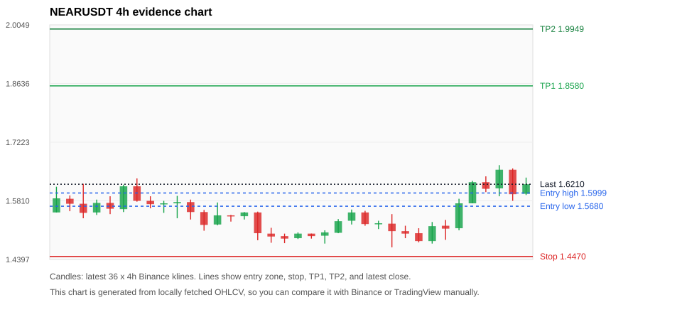
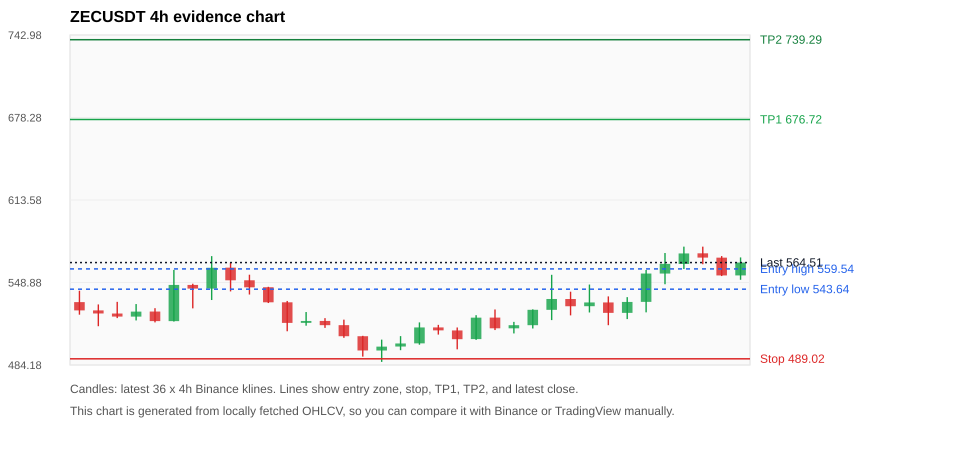
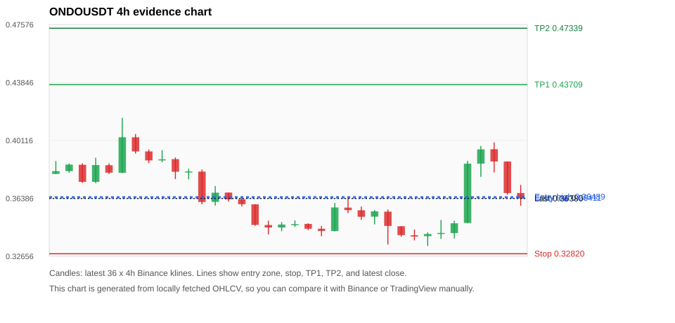
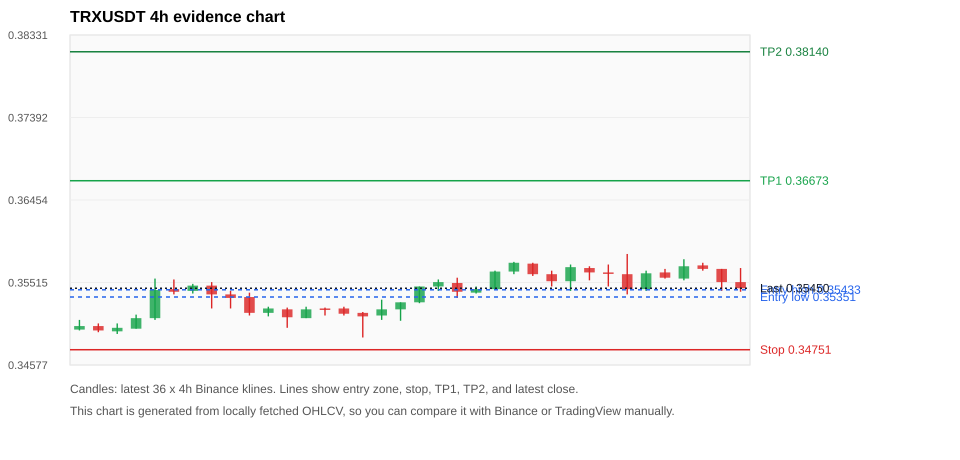
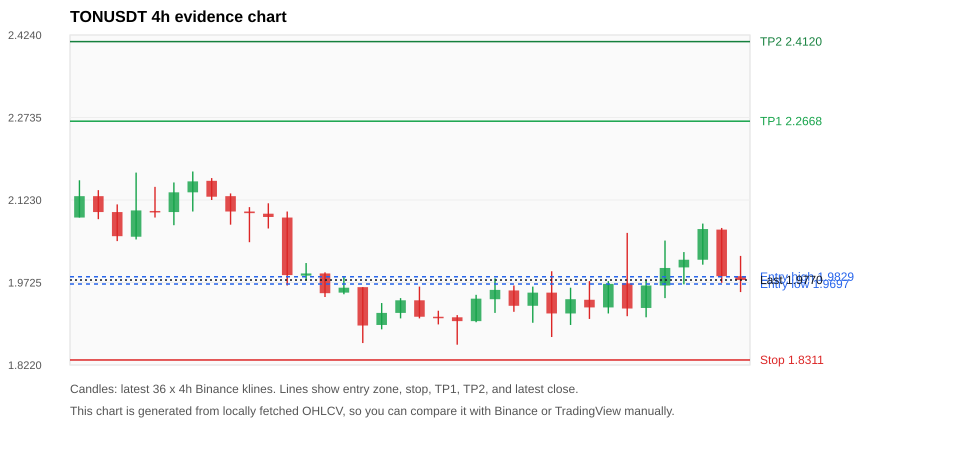

# Crypto 市场扫描报告 c2d8a8204b8a

- 报告时间：2026-05-19 23:37:15 CST
- 数据源：Binance public spot API
- 过滤条件：USDT spot; 24h quote volume >= 30,000,000; trades >= 30,000; exclude stables/leveraged tokens; analyze 1h/4h/1d klines
- 默认单笔风险：账户权益的 1.00%

## 限制说明

- MVP 当前只使用 Binance 现货公开数据，暂未接入 CoinGecko/CoinMarketCap 交叉验证。
- 结果是研究和模拟盘计划，不是确定收益或实盘下单指令。

## 5 个候选交易计划

| Rank | Coin | Setup | Entry Zone | Stop Loss | TP1 | TP2 / Exit Rule | R/R | Verdict |
|---:|---|---|---:|---:|---:|---|---:|---|
| 1 | `NEAR` | 回踩支撑/4h EMA 附近 | 1.5680 - 1.5999 | 1.4470 | 1.8580 | 1.9949 或跌破 4h 关键支撑 | 2.00-3.00 | 可考虑 |
| 2 | `ZEC` | 趋势中，等回调入场 | 543.64 - 559.54 | 489.02 | 676.72 | 739.29 或跌破 4h 关键支撑 | 2.00-3.00 | 只等回调 |
| 3 | `ONDO` | 回踩支撑/4h EMA 附近 | 0.36411 - 0.36489 | 0.32820 | 0.43709 | 0.47339 或跌破 4h 关键支撑 | 2.00-3.00 | 只观察 |
| 4 | `TRX` | 回踩支撑/4h EMA 附近 | 0.35351 - 0.35433 | 0.34751 | 0.36673 | 0.38140 或跌破 4h 关键支撑 | 2.00-4.29 | 可考虑 |
| 5 | `TON` | 回踩支撑/4h EMA 附近 | 1.9697 - 1.9829 | 1.8311 | 2.2668 | 2.4120 或跌破 4h 关键支撑 | 2.00-3.00 | 只观察 |

## 候选币说明

### 1. NEAR `NEARUSDT`



- 入选原因：回踩支撑/4h EMA 附近；24h +7.85%，7d +5.47%，4h RSI 61.32，24h 成交额 $31.1M。
- 交易失效条件：跌破 1.446965 或 4h 收盘重新失守关键支撑。
- 主要风险：主要风险是大盘同步回撤。

#### 可点击人工验证

- [Binance 交易页](https://www.binance.com/en/trade/NEAR_USDT)
- [TradingView 图表](https://www.tradingview.com/chart/?symbol=BINANCE%3ANEARUSDT)
- [CoinGecko 搜索](https://www.coingecko.com/en/search?query=NEAR)
- [CoinMarketCap 搜索](https://coinmarketcap.com/search/?q=NEAR)

#### 指标证据

| 指标 | 数值 | 人工核对用途 |
|---|---:|---|
| 当前价 | 1.6210 | 与 Binance/TradingView 当前价格对照 |
| 24h 涨跌 | +7.85% | 与交易所 24h 涨跌对照 |
| 7d 涨跌 | +5.47% | 判断短线趋势是否延续 |
| 4h EMA20 | 1.5649 | 判断短期趋势支撑 |
| 4h EMA50 | 1.5436 | 判断中期趋势支撑 |
| 1d EMA20 | 1.5049 | 判断日线趋势 |
| 1d EMA50 | 1.4112 | 判断日线趋势 |
| 4h RSI14 | 61.32 | 判断是否过热/过弱 |
| 4h ATR14 | 0.04993 | 推导止损和入场缓冲 |
| 最近 18 根 4h 最低点 | 1.4690 | 支撑/止损参考 |
| 最近 36 根 4h 最高点 | 1.6670 | TP/压力参考 |
| 支撑位 | 1.5649 | 入场区间推导基础 |

#### 交易计划推导

- 支撑位 = 最近低点、4h EMA20、4h EMA50、1d EMA20 中不高于当前价的最高有效支撑 = `1.5649`。
- 入场区间 = 支撑位附近 + ATR 缓冲 = `1.5680 - 1.5999`。
- 止损 = min(最近 18 根 4h 最低点 * 0.985, 入场中位价 - 1.15 * ATR14) = `1.4470`。
- TP1 = max(最近 36 根 4h 最高点 * 0.995, 入场中位价 + 2R) = `1.8580`。
- TP2 = max(入场中位价 + 3R, TP1 * 1.04) = `1.9949`。

#### 最近 10 根 4h K线

| UTC 开盘时间 | Open | High | Low | Close | Quote Volume | Trades |
|---|---:|---:|---:|---:|---:|---:|
| 2026-05-18T00:00+00:00 | 1.5080 | 1.5210 | 1.4910 | 1.5020 | $2.7M | 23459 |
| 2026-05-18T04:00+00:00 | 1.5030 | 1.5150 | 1.4810 | 1.4840 | $3.0M | 15786 |
| 2026-05-18T08:00+00:00 | 1.4840 | 1.5300 | 1.4780 | 1.5200 | $3.7M | 20486 |
| 2026-05-18T12:00+00:00 | 1.5210 | 1.5350 | 1.4870 | 1.5140 | $4.1M | 30352 |
| 2026-05-18T16:00+00:00 | 1.5150 | 1.5860 | 1.5100 | 1.5750 | $6.2M | 38761 |
| 2026-05-18T20:00+00:00 | 1.5750 | 1.6290 | 1.5750 | 1.6260 | $5.5M | 29653 |
| 2026-05-19T00:00+00:00 | 1.6260 | 1.6400 | 1.6020 | 1.6100 | $4.3M | 25301 |
| 2026-05-19T04:00+00:00 | 1.6110 | 1.6670 | 1.5920 | 1.6560 | $4.9M | 26702 |
| 2026-05-19T08:00+00:00 | 1.6560 | 1.6590 | 1.5810 | 1.5970 | $5.2M | 26302 |
| 2026-05-19T12:00+00:00 | 1.5980 | 1.6370 | 1.5950 | 1.6210 | $4.7M | 24341 |

### 2. ZEC `ZECUSDT`



- 入选原因：趋势中，等回调入场；24h +7.32%，7d +2.95%，4h RSI 67.69，24h 成交额 $138.4M。
- 交易失效条件：跌破 489.02295 或 4h 收盘重新失守关键支撑。
- 主要风险：主要风险是大盘同步回撤。

#### 可点击人工验证

- [Binance 交易页](https://www.binance.com/en/trade/ZEC_USDT)
- [TradingView 图表](https://www.tradingview.com/chart/?symbol=BINANCE%3AZECUSDT)
- [CoinGecko 搜索](https://www.coingecko.com/en/search?query=ZEC)
- [CoinMarketCap 搜索](https://coinmarketcap.com/search/?q=ZEC)

#### 指标证据

| 指标 | 数值 | 人工核对用途 |
|---|---:|---|
| 当前价 | 564.51 | 与 Binance/TradingView 当前价格对照 |
| 24h 涨跌 | +7.32% | 与交易所 24h 涨跌对照 |
| 7d 涨跌 | +2.95% | 判断短线趋势是否延续 |
| 4h EMA20 | 542.30 | 判断短期趋势支撑 |
| 4h EMA50 | 534.43 | 判断中期趋势支撑 |
| 1d EMA20 | 509.02 | 判断日线趋势 |
| 1d EMA50 | 424.63 | 判断日线趋势 |
| 4h RSI14 | 67.69 | 判断是否过热/过弱 |
| 4h ATR14 | 19.8786 | 推导止损和入场缓冲 |
| 最近 18 根 4h 最低点 | 496.47 | 支撑/止损参考 |
| 最近 36 根 4h 最高点 | 577.00 | TP/压力参考 |
| 支撑位 | 542.30 | 入场区间推导基础 |

#### 交易计划推导

- 支撑位 = 最近低点、4h EMA20、4h EMA50、1d EMA20 中不高于当前价的最高有效支撑 = `542.30`。
- 入场区间 = 支撑位附近 + ATR 缓冲 = `543.64 - 559.54`。
- 止损 = min(最近 18 根 4h 最低点 * 0.985, 入场中位价 - 1.15 * ATR14) = `489.02`。
- TP1 = max(最近 36 根 4h 最高点 * 0.995, 入场中位价 + 2R) = `676.72`。
- TP2 = max(入场中位价 + 3R, TP1 * 1.04) = `739.29`。

#### 最近 10 根 4h K线

| UTC 开盘时间 | Open | High | Low | Close | Quote Volume | Trades |
|---|---:|---:|---:|---:|---:|---:|
| 2026-05-18T00:00+00:00 | 535.93 | 541.66 | 523.09 | 530.25 | $23.0M | 75509 |
| 2026-05-18T04:00+00:00 | 530.30 | 547.28 | 525.37 | 533.23 | $15.7M | 61545 |
| 2026-05-18T08:00+00:00 | 533.23 | 537.97 | 515.39 | 525.05 | $17.2M | 53258 |
| 2026-05-18T12:00+00:00 | 525.05 | 537.40 | 520.18 | 533.63 | $19.0M | 68990 |
| 2026-05-18T16:00+00:00 | 533.68 | 558.70 | 525.47 | 555.91 | $23.7M | 76670 |
| 2026-05-18T20:00+00:00 | 555.89 | 572.00 | 547.51 | 563.48 | $32.5M | 89014 |
| 2026-05-19T00:00+00:00 | 563.43 | 577.00 | 559.46 | 571.67 | $35.1M | 128190 |
| 2026-05-19T04:00+00:00 | 571.76 | 577.00 | 563.20 | 568.40 | $13.5M | 63166 |
| 2026-05-19T08:00+00:00 | 568.37 | 569.61 | 553.94 | 554.42 | $9.9M | 47536 |
| 2026-05-19T12:00+00:00 | 554.43 | 568.55 | 551.00 | 564.54 | $19.1M | 77218 |

### 3. ONDO `ONDOUSDT`



- 入选原因：回踩支撑/4h EMA 附近；24h +6.78%，7d -6.84%，4h RSI 52.56，24h 成交额 $34.2M。
- 交易失效条件：跌破 0.328202 或 4h 收盘重新失守关键支撑。
- 主要风险：7d 趋势未确认。

#### 可点击人工验证

- [Binance 交易页](https://www.binance.com/en/trade/ONDO_USDT)
- [TradingView 图表](https://www.tradingview.com/chart/?symbol=BINANCE%3AONDOUSDT)
- [CoinGecko 搜索](https://www.coingecko.com/en/search?query=ONDO)
- [CoinMarketCap 搜索](https://coinmarketcap.com/search/?q=ONDO)

#### 指标证据

| 指标 | 数值 | 人工核对用途 |
|---|---:|---|
| 当前价 | 0.36380 | 与 Binance/TradingView 当前价格对照 |
| 24h 涨跌 | +6.78% | 与交易所 24h 涨跌对照 |
| 7d 涨跌 | -6.84% | 判断短线趋势是否延续 |
| 4h EMA20 | 0.36338 | 判断短期趋势支撑 |
| 4h EMA50 | 0.36737 | 判断中期趋势支撑 |
| 1d EMA20 | 0.35340 | 判断日线趋势 |
| 1d EMA50 | 0.31628 | 判断日线趋势 |
| 4h RSI14 | 52.56 | 判断是否过热/过弱 |
| 4h ATR14 | 0.01502 | 推导止损和入场缓冲 |
| 最近 18 根 4h 最低点 | 0.33320 | 支撑/止损参考 |
| 最近 36 根 4h 最高点 | 0.41570 | TP/压力参考 |
| 支撑位 | 0.36338 | 入场区间推导基础 |

#### 交易计划推导

- 支撑位 = 最近低点、4h EMA20、4h EMA50、1d EMA20 中不高于当前价的最高有效支撑 = `0.36338`。
- 入场区间 = 支撑位附近 + ATR 缓冲 = `0.36411 - 0.36489`。
- 止损 = min(最近 18 根 4h 最低点 * 0.985, 入场中位价 - 1.15 * ATR14) = `0.32820`。
- TP1 = max(最近 36 根 4h 最高点 * 0.995, 入场中位价 + 2R) = `0.43709`。
- TP2 = max(入场中位价 + 3R, TP1 * 1.04) = `0.47339`。

#### 最近 10 根 4h K线

| UTC 开盘时间 | Open | High | Low | Close | Quote Volume | Trades |
|---|---:|---:|---:|---:|---:|---:|
| 2026-05-18T00:00+00:00 | 0.34590 | 0.34600 | 0.33920 | 0.34020 | $2.1M | 20815 |
| 2026-05-18T04:00+00:00 | 0.34010 | 0.34370 | 0.33680 | 0.33930 | $1.2M | 11839 |
| 2026-05-18T08:00+00:00 | 0.33950 | 0.34200 | 0.33320 | 0.34090 | $2.0M | 12152 |
| 2026-05-18T12:00+00:00 | 0.34090 | 0.34990 | 0.33780 | 0.34160 | $3.4M | 28207 |
| 2026-05-18T16:00+00:00 | 0.34150 | 0.34950 | 0.33800 | 0.34780 | $1.8M | 16788 |
| 2026-05-18T20:00+00:00 | 0.34800 | 0.38800 | 0.34800 | 0.38620 | $8.0M | 63273 |
| 2026-05-19T00:00+00:00 | 0.38620 | 0.39760 | 0.37770 | 0.39540 | $8.4M | 66298 |
| 2026-05-19T04:00+00:00 | 0.39550 | 0.39990 | 0.38050 | 0.38760 | $5.7M | 46378 |
| 2026-05-19T08:00+00:00 | 0.38760 | 0.38770 | 0.36620 | 0.36730 | $4.6M | 31760 |
| 2026-05-19T12:00+00:00 | 0.36730 | 0.37250 | 0.35910 | 0.36380 | $5.7M | 44214 |

### 4. TRX `TRXUSDT`



- 入选原因：回踩支撑/4h EMA 附近；24h +0.03%，7d +2.01%，4h RSI 50.33，24h 成交额 $40.6M。
- 交易失效条件：跌破 0.347508 或 4h 收盘重新失守关键支撑。
- 主要风险：主要风险是大盘同步回撤。

#### 可点击人工验证

- [Binance 交易页](https://www.binance.com/en/trade/TRX_USDT)
- [TradingView 图表](https://www.tradingview.com/chart/?symbol=BINANCE%3ATRXUSDT)
- [CoinGecko 搜索](https://www.coingecko.com/en/search?query=TRX)
- [CoinMarketCap 搜索](https://coinmarketcap.com/search/?q=TRX)

#### 指标证据

| 指标 | 数值 | 人工核对用途 |
|---|---:|---|
| 当前价 | 0.35450 | 与 Binance/TradingView 当前价格对照 |
| 24h 涨跌 | +0.03% | 与交易所 24h 涨跌对照 |
| 7d 涨跌 | +2.01% | 判断短线趋势是否延续 |
| 4h EMA20 | 0.35510 | 判断短期趋势支撑 |
| 4h EMA50 | 0.35265 | 判断中期趋势支撑 |
| 1d EMA20 | 0.34683 | 判断日线趋势 |
| 1d EMA50 | 0.33300 | 判断日线趋势 |
| 4h RSI14 | 50.33 | 判断是否过热/过弱 |
| 4h ATR14 | 0.0021785714 | 推导止损和入场缓冲 |
| 最近 18 根 4h 最低点 | 0.35280 | 支撑/止损参考 |
| 最近 36 根 4h 最高点 | 0.35840 | TP/压力参考 |
| 支撑位 | 0.35280 | 入场区间推导基础 |

#### 交易计划推导

- 支撑位 = 最近低点、4h EMA20、4h EMA50、1d EMA20 中不高于当前价的最高有效支撑 = `0.35280`。
- 入场区间 = 支撑位附近 + ATR 缓冲 = `0.35351 - 0.35433`。
- 止损 = min(最近 18 根 4h 最低点 * 0.985, 入场中位价 - 1.15 * ATR14) = `0.34751`。
- TP1 = max(最近 36 根 4h 最高点 * 0.995, 入场中位价 + 2R) = `0.36673`。
- TP2 = max(入场中位价 + 3R, TP1 * 1.04) = `0.38140`。

#### 最近 10 根 4h K线

| UTC 开盘时间 | Open | High | Low | Close | Quote Volume | Trades |
|---|---:|---:|---:|---:|---:|---:|
| 2026-05-18T00:00+00:00 | 0.35530 | 0.35720 | 0.35420 | 0.35690 | $6.7M | 13868 |
| 2026-05-18T04:00+00:00 | 0.35680 | 0.35700 | 0.35540 | 0.35630 | $5.8M | 11917 |
| 2026-05-18T08:00+00:00 | 0.35630 | 0.35720 | 0.35470 | 0.35620 | $10.9M | 17565 |
| 2026-05-18T12:00+00:00 | 0.35610 | 0.35840 | 0.35380 | 0.35440 | $14.0M | 24825 |
| 2026-05-18T16:00+00:00 | 0.35440 | 0.35650 | 0.35420 | 0.35620 | $8.9M | 14137 |
| 2026-05-18T20:00+00:00 | 0.35630 | 0.35670 | 0.35560 | 0.35570 | $3.0M | 9035 |
| 2026-05-19T00:00+00:00 | 0.35560 | 0.35780 | 0.35540 | 0.35700 | $7.9M | 11222 |
| 2026-05-19T04:00+00:00 | 0.35710 | 0.35740 | 0.35650 | 0.35670 | $3.7M | 9648 |
| 2026-05-19T08:00+00:00 | 0.35670 | 0.35670 | 0.35420 | 0.35520 | $8.5M | 15691 |
| 2026-05-19T12:00+00:00 | 0.35520 | 0.35680 | 0.35410 | 0.35450 | $7.3M | 17065 |

### 5. TON `TONUSDT`



- 入选原因：回踩支撑/4h EMA 附近；24h +2.54%，7d -14.19%，4h RSI 53.59，24h 成交额 $37.4M。
- 交易失效条件：跌破 1.831115 或 4h 收盘重新失守关键支撑。
- 主要风险：7d 趋势未确认。

#### 可点击人工验证

- [Binance 交易页](https://www.binance.com/en/trade/TON_USDT)
- [TradingView 图表](https://www.tradingview.com/chart/?symbol=BINANCE%3ATONUSDT)
- [CoinGecko 搜索](https://www.coingecko.com/en/search?query=TON)
- [CoinMarketCap 搜索](https://coinmarketcap.com/search/?q=TON)

#### 指标证据

| 指标 | 数值 | 人工核对用途 |
|---|---:|---|
| 当前价 | 1.9770 | 与 Binance/TradingView 当前价格对照 |
| 24h 涨跌 | +2.54% | 与交易所 24h 涨跌对照 |
| 7d 涨跌 | -14.19% | 判断短线趋势是否延续 |
| 4h EMA20 | 1.9863 | 判断短期趋势支撑 |
| 4h EMA50 | 2.0362 | 判断中期趋势支撑 |
| 1d EMA20 | 1.9658 | 判断日线趋势 |
| 1d EMA50 | 1.7215 | 判断日线趋势 |
| 4h RSI14 | 53.59 | 判断是否过热/过弱 |
| 4h ATR14 | 0.07986 | 推导止损和入场缓冲 |
| 最近 18 根 4h 最低点 | 1.8590 | 支撑/止损参考 |
| 最近 36 根 4h 最高点 | 2.1750 | TP/压力参考 |
| 支撑位 | 1.9658 | 入场区间推导基础 |

#### 交易计划推导

- 支撑位 = 最近低点、4h EMA20、4h EMA50、1d EMA20 中不高于当前价的最高有效支撑 = `1.9658`。
- 入场区间 = 支撑位附近 + ATR 缓冲 = `1.9697 - 1.9829`。
- 止损 = min(最近 18 根 4h 最低点 * 0.985, 入场中位价 - 1.15 * ATR14) = `1.8311`。
- TP1 = max(最近 36 根 4h 最高点 * 0.995, 入场中位价 + 2R) = `2.2668`。
- TP2 = max(入场中位价 + 3R, TP1 * 1.04) = `2.4120`。

#### 最近 10 根 4h K线

| UTC 开盘时间 | Open | High | Low | Close | Quote Volume | Trades |
|---|---:|---:|---:|---:|---:|---:|
| 2026-05-18T00:00+00:00 | 1.9160 | 1.9630 | 1.8950 | 1.9420 | $5.0M | 41168 |
| 2026-05-18T04:00+00:00 | 1.9410 | 1.9750 | 1.9060 | 1.9270 | $5.4M | 44607 |
| 2026-05-18T08:00+00:00 | 1.9270 | 1.9750 | 1.9160 | 1.9700 | $5.9M | 39644 |
| 2026-05-18T12:00+00:00 | 1.9710 | 2.0630 | 1.9110 | 1.9250 | $18.8M | 124256 |
| 2026-05-18T16:00+00:00 | 1.9260 | 1.9770 | 1.9090 | 1.9670 | $5.4M | 50997 |
| 2026-05-18T20:00+00:00 | 1.9670 | 2.0490 | 1.9440 | 1.9990 | $5.8M | 51897 |
| 2026-05-19T00:00+00:00 | 2.0000 | 2.0280 | 1.9690 | 2.0140 | $5.5M | 42021 |
| 2026-05-19T04:00+00:00 | 2.0140 | 2.0800 | 2.0050 | 2.0700 | $6.7M | 54711 |
| 2026-05-19T08:00+00:00 | 2.0690 | 2.0720 | 1.9720 | 1.9840 | $7.9M | 55395 |
| 2026-05-19T12:00+00:00 | 1.9840 | 2.0210 | 1.9550 | 1.9770 | $5.6M | 48118 |

## 组合风控

- 不要 5 个候选全部满仓买入。
- 同时持仓总风险建议控制在账户权益的 3% - 5% 以内。
- 如果 BTC/ETH 同时破位，暂停山寨币多头计划或降低仓位。
- 第一版报告用于模拟盘和人工复核，不自动下单。

## 原始数据

```json
[
  {
    "rank": 1,
    "symbol": "NEARUSDT",
    "base_asset": "NEAR",
    "price": 1.621,
    "score": 69.85352159032462,
    "setup": "回踩支撑/4h EMA 附近",
    "verdict": "可考虑",
    "entry_low": 1.5680499301009136,
    "entry_high": 1.5998700899210716,
    "stop_loss": 1.446965,
    "take_profit_1": 1.857950030032978,
    "take_profit_2": 1.9949450400439708,
    "risk_reward_1": 2.0,
    "risk_reward_2": 3.0,
    "pct_24h": 7.851,
    "pct_3d": 8.646112600536204,
    "pct_7d": 5.465191932335722,
    "quote_volume_24h": 31121613.8002,
    "trades_24h": 173384,
    "high_low_range_24h": 10.98535286284954,
    "rsi_1h": 51.97740112994347,
    "rsi_4h": 61.323155216285,
    "ema20_4h": 1.5649200899210716,
    "ema50_4h": 1.5435754187649506,
    "ema20_1d": 1.5049189864961134,
    "ema50_1d": 1.411204922193123,
    "atr_4h": 0.049928571428571385,
    "macd_hist_4h": 0.0134781670153601,
    "volume_ratio_24h": 1.209013487330496,
    "support_level": 1.5649200899210716,
    "recent_low_4h_18": 1.469,
    "recent_high_4h_36": 1.667,
    "distance_to_support_pct": 3.5835638151822113,
    "binance_trade_url": "https://www.binance.com/en/trade/NEAR_USDT",
    "tradingview_url": "https://www.tradingview.com/chart/?symbol=BINANCE%3ANEARUSDT",
    "coingecko_search_url": "https://www.coingecko.com/en/search?query=NEAR",
    "coinmarketcap_search_url": "https://coinmarketcap.com/search/?q=NEAR",
    "invalidation": "跌破 1.446965 或 4h 收盘重新失守关键支撑",
    "recent_4h_klines": [
      {
        "open_time_utc": "2026-05-13T16:00+00:00",
        "open": 1.553,
        "high": 1.615,
        "low": 1.553,
        "close": 1.587,
        "quote_volume": 7755693.2474,
        "trades": 31191
      },
      {
        "open_time_utc": "2026-05-13T20:00+00:00",
        "open": 1.586,
        "high": 1.594,
        "low": 1.556,
        "close": 1.574,
        "quote_volume": 2190924.6775,
        "trades": 13831
      },
      {
        "open_time_utc": "2026-05-14T00:00+00:00",
        "open": 1.574,
        "high": 1.622,
        "low": 1.539,
        "close": 1.552,
        "quote_volume": 5363810.4212,
        "trades": 25593
      },
      {
        "open_time_utc": "2026-05-14T04:00+00:00",
        "open": 1.553,
        "high": 1.584,
        "low": 1.547,
        "close": 1.576,
        "quote_volume": 3096682.6139,
        "trades": 18279
      },
      {
        "open_time_utc": "2026-05-14T08:00+00:00",
        "open": 1.576,
        "high": 1.592,
        "low": 1.549,
        "close": 1.562,
        "quote_volume": 3873283.4654,
        "trades": 20011
      },
      {
        "open_time_utc": "2026-05-14T12:00+00:00",
        "open": 1.561,
        "high": 1.62,
        "low": 1.554,
        "close": 1.616,
        "quote_volume": 3896822.383,
        "trades": 28469
      },
      {
        "open_time_utc": "2026-05-14T16:00+00:00",
        "open": 1.616,
        "high": 1.635,
        "low": 1.579,
        "close": 1.581,
        "quote_volume": 5275576.7754,
        "trades": 30291
      },
      {
        "open_time_utc": "2026-05-14T20:00+00:00",
        "open": 1.581,
        "high": 1.592,
        "low": 1.563,
        "close": 1.573,
        "quote_volume": 2683686.6878,
        "trades": 16518
      },
      {
        "open_time_utc": "2026-05-15T00:00+00:00",
        "open": 1.573,
        "high": 1.581,
        "low": 1.552,
        "close": 1.575,
        "quote_volume": 2781881.366,
        "trades": 18843
      },
      {
        "open_time_utc": "2026-05-15T04:00+00:00",
        "open": 1.575,
        "high": 1.593,
        "low": 1.539,
        "close": 1.578,
        "quote_volume": 4494224.7385,
        "trades": 21880
      },
      {
        "open_time_utc": "2026-05-15T08:00+00:00",
        "open": 1.578,
        "high": 1.584,
        "low": 1.536,
        "close": 1.554,
        "quote_volume": 2887709.4466,
        "trades": 17488
      },
      {
        "open_time_utc": "2026-05-15T12:00+00:00",
        "open": 1.554,
        "high": 1.559,
        "low": 1.509,
        "close": 1.523,
        "quote_volume": 5011815.9453,
        "trades": 35076
      },
      {
        "open_time_utc": "2026-05-15T16:00+00:00",
        "open": 1.524,
        "high": 1.577,
        "low": 1.522,
        "close": 1.546,
        "quote_volume": 3589682.8065,
        "trades": 22948
      },
      {
        "open_time_utc": "2026-05-15T20:00+00:00",
        "open": 1.546,
        "high": 1.547,
        "low": 1.531,
        "close": 1.545,
        "quote_volume": 1500221.1115,
        "trades": 9251
      },
      {
        "open_time_utc": "2026-05-16T00:00+00:00",
        "open": 1.544,
        "high": 1.554,
        "low": 1.536,
        "close": 1.553,
        "quote_volume": 1366851.4826,
        "trades": 8582
      },
      {
        "open_time_utc": "2026-05-16T04:00+00:00",
        "open": 1.553,
        "high": 1.555,
        "low": 1.486,
        "close": 1.503,
        "quote_volume": 4409419.5489,
        "trades": 21972
      },
      {
        "open_time_utc": "2026-05-16T08:00+00:00",
        "open": 1.502,
        "high": 1.516,
        "low": 1.48,
        "close": 1.495,
        "quote_volume": 5709102.4382,
        "trades": 26778
      },
      {
        "open_time_utc": "2026-05-16T12:00+00:00",
        "open": 1.496,
        "high": 1.502,
        "low": 1.479,
        "close": 1.49,
        "quote_volume": 1872205.7021,
        "trades": 10405
      },
      {
        "open_time_utc": "2026-05-16T16:00+00:00",
        "open": 1.491,
        "high": 1.505,
        "low": 1.489,
        "close": 1.502,
        "quote_volume": 1496334.5984,
        "trades": 7379
      },
      {
        "open_time_utc": "2026-05-16T20:00+00:00",
        "open": 1.502,
        "high": 1.502,
        "low": 1.49,
        "close": 1.496,
        "quote_volume": 485264.5168,
        "trades": 3297
      },
      {
        "open_time_utc": "2026-05-17T00:00+00:00",
        "open": 1.497,
        "high": 1.51,
        "low": 1.478,
        "close": 1.505,
        "quote_volume": 1990546.0011,
        "trades": 9760
      },
      {
        "open_time_utc": "2026-05-17T04:00+00:00",
        "open": 1.504,
        "high": 1.537,
        "low": 1.503,
        "close": 1.532,
        "quote_volume": 1637931.4618,
        "trades": 9987
      },
      {
        "open_time_utc": "2026-05-17T08:00+00:00",
        "open": 1.533,
        "high": 1.56,
        "low": 1.524,
        "close": 1.553,
        "quote_volume": 2515700.0965,
        "trades": 15587
      },
      {
        "open_time_utc": "2026-05-17T12:00+00:00",
        "open": 1.553,
        "high": 1.557,
        "low": 1.521,
        "close": 1.525,
        "quote_volume": 1957606.0887,
        "trades": 11985
      },
      {
        "open_time_utc": "2026-05-17T16:00+00:00",
        "open": 1.526,
        "high": 1.533,
        "low": 1.513,
        "close": 1.527,
        "quote_volume": 1348189.1593,
        "trades": 9786
      },
      {
        "open_time_utc": "2026-05-17T20:00+00:00",
        "open": 1.526,
        "high": 1.549,
        "low": 1.469,
        "close": 1.508,
        "quote_volume": 4046970.2571,
        "trades": 27417
      },
      {
        "open_time_utc": "2026-05-18T00:00+00:00",
        "open": 1.508,
        "high": 1.521,
        "low": 1.491,
        "close": 1.502,
        "quote_volume": 2748274.5465,
        "trades": 23459
      },
      {
        "open_time_utc": "2026-05-18T04:00+00:00",
        "open": 1.503,
        "high": 1.515,
        "low": 1.481,
        "close": 1.484,
        "quote_volume": 2980704.2235,
        "trades": 15786
      },
      {
        "open_time_utc": "2026-05-18T08:00+00:00",
        "open": 1.484,
        "high": 1.53,
        "low": 1.478,
        "close": 1.52,
        "quote_volume": 3722610.2315,
        "trades": 20486
      },
      {
        "open_time_utc": "2026-05-18T12:00+00:00",
        "open": 1.521,
        "high": 1.535,
        "low": 1.487,
        "close": 1.514,
        "quote_volume": 4149952.1067,
        "trades": 30352
      },
      {
        "open_time_utc": "2026-05-18T16:00+00:00",
        "open": 1.515,
        "high": 1.586,
        "low": 1.51,
        "close": 1.575,
        "quote_volume": 6184011.4509,
        "trades": 38761
      },
      {
        "open_time_utc": "2026-05-18T20:00+00:00",
        "open": 1.575,
        "high": 1.629,
        "low": 1.575,
        "close": 1.626,
        "quote_volume": 5542943.2774,
        "trades": 29653
      },
      {
        "open_time_utc": "2026-05-19T00:00+00:00",
        "open": 1.626,
        "high": 1.64,
        "low": 1.602,
        "close": 1.61,
        "quote_volume": 4277219.112,
        "trades": 25301
      },
      {
        "open_time_utc": "2026-05-19T04:00+00:00",
        "open": 1.611,
        "high": 1.667,
        "low": 1.592,
        "close": 1.656,
        "quote_volume": 4883494.3989,
        "trades": 26702
      },
      {
        "open_time_utc": "2026-05-19T08:00+00:00",
        "open": 1.656,
        "high": 1.659,
        "low": 1.581,
        "close": 1.597,
        "quote_volume": 5192961.2569,
        "trades": 26302
      },
      {
        "open_time_utc": "2026-05-19T12:00+00:00",
        "open": 1.598,
        "high": 1.637,
        "low": 1.595,
        "close": 1.621,
        "quote_volume": 4703812.412,
        "trades": 24341
      }
    ],
    "risks": [
      "主要风险是大盘同步回撤"
    ]
  },
  {
    "rank": 2,
    "symbol": "ZECUSDT",
    "base_asset": "ZEC",
    "price": 564.51,
    "score": 64.83161555457342,
    "setup": "趋势中，等回调入场",
    "verdict": "只等回调",
    "entry_low": 543.6375,
    "entry_high": 559.5403571428571,
    "stop_loss": 489.02295000000004,
    "take_profit_1": 676.7208857142857,
    "take_profit_2": 739.2868642857143,
    "risk_reward_1": 2.0,
    "risk_reward_2": 3.0,
    "pct_24h": 7.317,
    "pct_3d": 12.032626815908554,
    "pct_7d": 2.9507778162785048,
    "quote_volume_24h": 138428659.33921,
    "trades_24h": 497016,
    "high_low_range_24h": 9.80645897958019,
    "rsi_1h": 47.63486790064862,
    "rsi_4h": 67.68966363859563,
    "ema20_4h": 542.3030310018587,
    "ema50_4h": 534.4270245122751,
    "ema20_1d": 509.0177107368586,
    "ema50_1d": 424.62589075481577,
    "atr_4h": 19.878571428571416,
    "macd_hist_4h": 5.321112831063086,
    "volume_ratio_24h": 1.2448923393737499,
    "support_level": 542.3030310018587,
    "recent_low_4h_18": 496.47,
    "recent_high_4h_36": 577.0,
    "distance_to_support_pct": 4.0949372820424434,
    "binance_trade_url": "https://www.binance.com/en/trade/ZEC_USDT",
    "tradingview_url": "https://www.tradingview.com/chart/?symbol=BINANCE%3AZECUSDT",
    "coingecko_search_url": "https://www.coingecko.com/en/search?query=ZEC",
    "coinmarketcap_search_url": "https://coinmarketcap.com/search/?q=ZEC",
    "invalidation": "跌破 489.02295 或 4h 收盘重新失守关键支撑",
    "recent_4h_klines": [
      {
        "open_time_utc": "2026-05-13T16:00+00:00",
        "open": 533.5,
        "high": 542.42,
        "low": 523.64,
        "close": 527.0,
        "quote_volume": 19411220.3254,
        "trades": 52256
      },
      {
        "open_time_utc": "2026-05-13T20:00+00:00",
        "open": 526.99,
        "high": 531.68,
        "low": 514.6,
        "close": 524.58,
        "quote_volume": 19340315.07389,
        "trades": 73229
      },
      {
        "open_time_utc": "2026-05-14T00:00+00:00",
        "open": 524.55,
        "high": 533.71,
        "low": 520.96,
        "close": 522.15,
        "quote_volume": 13197513.90019,
        "trades": 50951
      },
      {
        "open_time_utc": "2026-05-14T04:00+00:00",
        "open": 522.12,
        "high": 531.97,
        "low": 519.12,
        "close": 526.05,
        "quote_volume": 10064224.56006,
        "trades": 33535
      },
      {
        "open_time_utc": "2026-05-14T08:00+00:00",
        "open": 526.1,
        "high": 528.73,
        "low": 517.59,
        "close": 518.6,
        "quote_volume": 10406328.96026,
        "trades": 28002
      },
      {
        "open_time_utc": "2026-05-14T12:00+00:00",
        "open": 518.58,
        "high": 558.77,
        "low": 518.27,
        "close": 546.98,
        "quote_volume": 34821906.60767,
        "trades": 108955
      },
      {
        "open_time_utc": "2026-05-14T16:00+00:00",
        "open": 546.97,
        "high": 547.92,
        "low": 528.59,
        "close": 544.08,
        "quote_volume": 34299356.59282,
        "trades": 99270
      },
      {
        "open_time_utc": "2026-05-14T20:00+00:00",
        "open": 544.09,
        "high": 569.56,
        "low": 535.14,
        "close": 560.43,
        "quote_volume": 26333875.953,
        "trades": 103688
      },
      {
        "open_time_utc": "2026-05-15T00:00+00:00",
        "open": 560.53,
        "high": 564.43,
        "low": 541.88,
        "close": 550.6,
        "quote_volume": 18377966.82075,
        "trades": 67641
      },
      {
        "open_time_utc": "2026-05-15T04:00+00:00",
        "open": 550.62,
        "high": 554.99,
        "low": 539.44,
        "close": 545.09,
        "quote_volume": 11144175.52428,
        "trades": 44119
      },
      {
        "open_time_utc": "2026-05-15T08:00+00:00",
        "open": 545.16,
        "high": 545.51,
        "low": 532.78,
        "close": 533.35,
        "quote_volume": 9870519.89923,
        "trades": 33961
      },
      {
        "open_time_utc": "2026-05-15T12:00+00:00",
        "open": 533.34,
        "high": 534.41,
        "low": 510.63,
        "close": 517.19,
        "quote_volume": 20081513.98389,
        "trades": 70996
      },
      {
        "open_time_utc": "2026-05-15T16:00+00:00",
        "open": 517.22,
        "high": 525.72,
        "low": 515.0,
        "close": 518.71,
        "quote_volume": 9093596.41199,
        "trades": 43216
      },
      {
        "open_time_utc": "2026-05-15T20:00+00:00",
        "open": 518.72,
        "high": 520.92,
        "low": 513.27,
        "close": 515.4,
        "quote_volume": 4628869.67293,
        "trades": 23219
      },
      {
        "open_time_utc": "2026-05-16T00:00+00:00",
        "open": 515.43,
        "high": 519.75,
        "low": 505.49,
        "close": 506.75,
        "quote_volume": 10405020.59828,
        "trades": 35798
      },
      {
        "open_time_utc": "2026-05-16T04:00+00:00",
        "open": 506.75,
        "high": 507.07,
        "low": 490.75,
        "close": 495.56,
        "quote_volume": 15940219.64499,
        "trades": 56328
      },
      {
        "open_time_utc": "2026-05-16T08:00+00:00",
        "open": 495.54,
        "high": 504.08,
        "low": 486.61,
        "close": 498.59,
        "quote_volume": 14781738.9071,
        "trades": 55947
      },
      {
        "open_time_utc": "2026-05-16T12:00+00:00",
        "open": 498.66,
        "high": 506.83,
        "low": 495.8,
        "close": 501.06,
        "quote_volume": 9760086.29137,
        "trades": 39310
      },
      {
        "open_time_utc": "2026-05-16T16:00+00:00",
        "open": 501.14,
        "high": 517.59,
        "low": 500.08,
        "close": 513.63,
        "quote_volume": 14351246.27936,
        "trades": 44396
      },
      {
        "open_time_utc": "2026-05-16T20:00+00:00",
        "open": 513.65,
        "high": 515.66,
        "low": 508.03,
        "close": 511.34,
        "quote_volume": 7057162.69703,
        "trades": 24426
      },
      {
        "open_time_utc": "2026-05-17T00:00+00:00",
        "open": 511.27,
        "high": 513.6,
        "low": 496.47,
        "close": 504.41,
        "quote_volume": 10597854.31494,
        "trades": 35215
      },
      {
        "open_time_utc": "2026-05-17T04:00+00:00",
        "open": 504.49,
        "high": 523.24,
        "low": 503.87,
        "close": 521.31,
        "quote_volume": 14668093.10581,
        "trades": 48632
      },
      {
        "open_time_utc": "2026-05-17T08:00+00:00",
        "open": 521.36,
        "high": 527.73,
        "low": 511.58,
        "close": 512.96,
        "quote_volume": 18348364.20973,
        "trades": 68020
      },
      {
        "open_time_utc": "2026-05-17T12:00+00:00",
        "open": 512.94,
        "high": 518.0,
        "low": 508.93,
        "close": 515.4,
        "quote_volume": 10098179.17257,
        "trades": 42014
      },
      {
        "open_time_utc": "2026-05-17T16:00+00:00",
        "open": 515.4,
        "high": 527.8,
        "low": 512.8,
        "close": 527.46,
        "quote_volume": 9595463.67219,
        "trades": 37959
      },
      {
        "open_time_utc": "2026-05-17T20:00+00:00",
        "open": 527.43,
        "high": 554.92,
        "low": 519.4,
        "close": 535.95,
        "quote_volume": 37817033.66624,
        "trades": 125711
      },
      {
        "open_time_utc": "2026-05-18T00:00+00:00",
        "open": 535.93,
        "high": 541.66,
        "low": 523.09,
        "close": 530.25,
        "quote_volume": 23005644.13499,
        "trades": 75509
      },
      {
        "open_time_utc": "2026-05-18T04:00+00:00",
        "open": 530.3,
        "high": 547.28,
        "low": 525.37,
        "close": 533.23,
        "quote_volume": 15740944.90346,
        "trades": 61545
      },
      {
        "open_time_utc": "2026-05-18T08:00+00:00",
        "open": 533.23,
        "high": 537.97,
        "low": 515.39,
        "close": 525.05,
        "quote_volume": 17202010.14693,
        "trades": 53258
      },
      {
        "open_time_utc": "2026-05-18T12:00+00:00",
        "open": 525.05,
        "high": 537.4,
        "low": 520.18,
        "close": 533.63,
        "quote_volume": 19034854.14086,
        "trades": 68990
      },
      {
        "open_time_utc": "2026-05-18T16:00+00:00",
        "open": 533.68,
        "high": 558.7,
        "low": 525.47,
        "close": 555.91,
        "quote_volume": 23661497.93151,
        "trades": 76670
      },
      {
        "open_time_utc": "2026-05-18T20:00+00:00",
        "open": 555.89,
        "high": 572.0,
        "low": 547.51,
        "close": 563.48,
        "quote_volume": 32519524.7322,
        "trades": 89014
      },
      {
        "open_time_utc": "2026-05-19T00:00+00:00",
        "open": 563.43,
        "high": 577.0,
        "low": 559.46,
        "close": 571.67,
        "quote_volume": 35085086.86415,
        "trades": 128190
      },
      {
        "open_time_utc": "2026-05-19T04:00+00:00",
        "open": 571.76,
        "high": 577.0,
        "low": 563.2,
        "close": 568.4,
        "quote_volume": 13506927.64481,
        "trades": 63166
      },
      {
        "open_time_utc": "2026-05-19T08:00+00:00",
        "open": 568.37,
        "high": 569.61,
        "low": 553.94,
        "close": 554.42,
        "quote_volume": 9937110.45423,
        "trades": 47536
      },
      {
        "open_time_utc": "2026-05-19T12:00+00:00",
        "open": 554.43,
        "high": 568.55,
        "low": 551.0,
        "close": 564.54,
        "quote_volume": 19132170.24001,
        "trades": 77218
      }
    ],
    "risks": [
      "主要风险是大盘同步回撤"
    ]
  },
  {
    "rank": 3,
    "symbol": "ONDOUSDT",
    "base_asset": "ONDO",
    "price": 0.3638,
    "score": 45.78724466404941,
    "setup": "回踩支撑/4h EMA 附近",
    "verdict": "只观察",
    "entry_low": 0.3641061665330989,
    "entry_high": 0.3648914,
    "stop_loss": 0.328202,
    "take_profit_1": 0.43709234979964834,
    "take_profit_2": 0.4733891330661978,
    "risk_reward_1": 2.0,
    "risk_reward_2": 3.0,
    "pct_24h": 6.784,
    "pct_3d": 4.6304285303422565,
    "pct_7d": -6.8373879641485225,
    "quote_volume_24h": 34213379.9899,
    "trades_24h": 269856,
    "high_low_range_24h": 18.313609467455617,
    "rsi_1h": 38.612565445026185,
    "rsi_4h": 52.55731922398591,
    "ema20_4h": 0.3633794077176636,
    "ema50_4h": 0.3673702925377174,
    "ema20_1d": 0.35339976289821934,
    "ema50_1d": 0.3162776156417519,
    "atr_4h": 0.015021428571428571,
    "macd_hist_4h": 0.004388729775997801,
    "volume_ratio_24h": 2.4567947664989487,
    "support_level": 0.3633794077176636,
    "recent_low_4h_18": 0.3332,
    "recent_high_4h_36": 0.4157,
    "distance_to_support_pct": 0.1157446661543382,
    "binance_trade_url": "https://www.binance.com/en/trade/ONDO_USDT",
    "tradingview_url": "https://www.tradingview.com/chart/?symbol=BINANCE%3AONDOUSDT",
    "coingecko_search_url": "https://www.coingecko.com/en/search?query=ONDO",
    "coinmarketcap_search_url": "https://coinmarketcap.com/search/?q=ONDO",
    "invalidation": "跌破 0.328202 或 4h 收盘重新失守关键支撑",
    "recent_4h_klines": [
      {
        "open_time_utc": "2026-05-13T16:00+00:00",
        "open": 0.3796,
        "high": 0.3879,
        "low": 0.3796,
        "close": 0.3814,
        "quote_volume": 2145731.2676,
        "trades": 17446
      },
      {
        "open_time_utc": "2026-05-13T20:00+00:00",
        "open": 0.3814,
        "high": 0.3863,
        "low": 0.3804,
        "close": 0.3856,
        "quote_volume": 1347127.10507,
        "trades": 10540
      },
      {
        "open_time_utc": "2026-05-14T00:00+00:00",
        "open": 0.3855,
        "high": 0.3864,
        "low": 0.3738,
        "close": 0.3745,
        "quote_volume": 2296932.56086,
        "trades": 18477
      },
      {
        "open_time_utc": "2026-05-14T04:00+00:00",
        "open": 0.3745,
        "high": 0.39,
        "low": 0.3736,
        "close": 0.3853,
        "quote_volume": 2334531.96863,
        "trades": 21012
      },
      {
        "open_time_utc": "2026-05-14T08:00+00:00",
        "open": 0.3852,
        "high": 0.3864,
        "low": 0.3795,
        "close": 0.3804,
        "quote_volume": 1385262.86127,
        "trades": 12668
      },
      {
        "open_time_utc": "2026-05-14T12:00+00:00",
        "open": 0.3803,
        "high": 0.4157,
        "low": 0.3801,
        "close": 0.4032,
        "quote_volume": 6970432.39568,
        "trades": 59066
      },
      {
        "open_time_utc": "2026-05-14T16:00+00:00",
        "open": 0.4032,
        "high": 0.4053,
        "low": 0.3927,
        "close": 0.3941,
        "quote_volume": 3676160.97347,
        "trades": 29109
      },
      {
        "open_time_utc": "2026-05-14T20:00+00:00",
        "open": 0.3941,
        "high": 0.3953,
        "low": 0.3865,
        "close": 0.3883,
        "quote_volume": 1653630.65645,
        "trades": 14359
      },
      {
        "open_time_utc": "2026-05-15T00:00+00:00",
        "open": 0.3883,
        "high": 0.3949,
        "low": 0.3872,
        "close": 0.389,
        "quote_volume": 2383258.12485,
        "trades": 19799
      },
      {
        "open_time_utc": "2026-05-15T04:00+00:00",
        "open": 0.3891,
        "high": 0.3902,
        "low": 0.3763,
        "close": 0.381,
        "quote_volume": 2416732.88404,
        "trades": 17654
      },
      {
        "open_time_utc": "2026-05-15T08:00+00:00",
        "open": 0.3811,
        "high": 0.383,
        "low": 0.3761,
        "close": 0.3812,
        "quote_volume": 1282496.50564,
        "trades": 11595
      },
      {
        "open_time_utc": "2026-05-15T12:00+00:00",
        "open": 0.3811,
        "high": 0.3824,
        "low": 0.36,
        "close": 0.3615,
        "quote_volume": 4735779.77805,
        "trades": 33238
      },
      {
        "open_time_utc": "2026-05-15T16:00+00:00",
        "open": 0.3616,
        "high": 0.3718,
        "low": 0.3592,
        "close": 0.3675,
        "quote_volume": 1788324.15559,
        "trades": 13921
      },
      {
        "open_time_utc": "2026-05-15T20:00+00:00",
        "open": 0.3676,
        "high": 0.3677,
        "low": 0.3617,
        "close": 0.3632,
        "quote_volume": 760232.55688,
        "trades": 7849
      },
      {
        "open_time_utc": "2026-05-16T00:00+00:00",
        "open": 0.3633,
        "high": 0.3648,
        "low": 0.3587,
        "close": 0.3601,
        "quote_volume": 992270.31015,
        "trades": 9530
      },
      {
        "open_time_utc": "2026-05-16T04:00+00:00",
        "open": 0.36,
        "high": 0.3601,
        "low": 0.3462,
        "close": 0.3468,
        "quote_volume": 2119725.60624,
        "trades": 16565
      },
      {
        "open_time_utc": "2026-05-16T08:00+00:00",
        "open": 0.3467,
        "high": 0.3494,
        "low": 0.3407,
        "close": 0.3451,
        "quote_volume": 2521029.36196,
        "trades": 18628
      },
      {
        "open_time_utc": "2026-05-16T12:00+00:00",
        "open": 0.3451,
        "high": 0.3486,
        "low": 0.3427,
        "close": 0.347,
        "quote_volume": 1259629.12035,
        "trades": 9821
      },
      {
        "open_time_utc": "2026-05-16T16:00+00:00",
        "open": 0.347,
        "high": 0.3497,
        "low": 0.3455,
        "close": 0.3473,
        "quote_volume": 1110587.84519,
        "trades": 8499
      },
      {
        "open_time_utc": "2026-05-16T20:00+00:00",
        "open": 0.3474,
        "high": 0.3478,
        "low": 0.3434,
        "close": 0.3443,
        "quote_volume": 633630.57318,
        "trades": 5554
      },
      {
        "open_time_utc": "2026-05-17T00:00+00:00",
        "open": 0.3443,
        "high": 0.3461,
        "low": 0.3395,
        "close": 0.3429,
        "quote_volume": 1371648.5881,
        "trades": 10271
      },
      {
        "open_time_utc": "2026-05-17T04:00+00:00",
        "open": 0.3428,
        "high": 0.3609,
        "low": 0.3427,
        "close": 0.358,
        "quote_volume": 2263294.1329,
        "trades": 23317
      },
      {
        "open_time_utc": "2026-05-17T08:00+00:00",
        "open": 0.3579,
        "high": 0.3636,
        "low": 0.3543,
        "close": 0.3563,
        "quote_volume": 2209299.65214,
        "trades": 17286
      },
      {
        "open_time_utc": "2026-05-17T12:00+00:00",
        "open": 0.3562,
        "high": 0.3586,
        "low": 0.35,
        "close": 0.352,
        "quote_volume": 1364593.84625,
        "trades": 11246
      },
      {
        "open_time_utc": "2026-05-17T16:00+00:00",
        "open": 0.3521,
        "high": 0.3563,
        "low": 0.3471,
        "close": 0.3555,
        "quote_volume": 1215036.79753,
        "trades": 9237
      },
      {
        "open_time_utc": "2026-05-17T20:00+00:00",
        "open": 0.3553,
        "high": 0.3567,
        "low": 0.3341,
        "close": 0.3461,
        "quote_volume": 2103359.19106,
        "trades": 18281
      },
      {
        "open_time_utc": "2026-05-18T00:00+00:00",
        "open": 0.3459,
        "high": 0.346,
        "low": 0.3392,
        "close": 0.3402,
        "quote_volume": 2052874.14686,
        "trades": 20815
      },
      {
        "open_time_utc": "2026-05-18T04:00+00:00",
        "open": 0.3401,
        "high": 0.3437,
        "low": 0.3368,
        "close": 0.3393,
        "quote_volume": 1246924.55844,
        "trades": 11839
      },
      {
        "open_time_utc": "2026-05-18T08:00+00:00",
        "open": 0.3395,
        "high": 0.342,
        "low": 0.3332,
        "close": 0.3409,
        "quote_volume": 2008538.38067,
        "trades": 12152
      },
      {
        "open_time_utc": "2026-05-18T12:00+00:00",
        "open": 0.3409,
        "high": 0.3499,
        "low": 0.3378,
        "close": 0.3416,
        "quote_volume": 3376753.9239,
        "trades": 28207
      },
      {
        "open_time_utc": "2026-05-18T16:00+00:00",
        "open": 0.3415,
        "high": 0.3495,
        "low": 0.338,
        "close": 0.3478,
        "quote_volume": 1783972.5936,
        "trades": 16788
      },
      {
        "open_time_utc": "2026-05-18T20:00+00:00",
        "open": 0.348,
        "high": 0.388,
        "low": 0.348,
        "close": 0.3862,
        "quote_volume": 7952891.96681,
        "trades": 63273
      },
      {
        "open_time_utc": "2026-05-19T00:00+00:00",
        "open": 0.3862,
        "high": 0.3976,
        "low": 0.3777,
        "close": 0.3954,
        "quote_volume": 8362831.04797,
        "trades": 66298
      },
      {
        "open_time_utc": "2026-05-19T04:00+00:00",
        "open": 0.3955,
        "high": 0.3999,
        "low": 0.3805,
        "close": 0.3876,
        "quote_volume": 5673857.88498,
        "trades": 46378
      },
      {
        "open_time_utc": "2026-05-19T08:00+00:00",
        "open": 0.3876,
        "high": 0.3877,
        "low": 0.3662,
        "close": 0.3673,
        "quote_volume": 4635598.39089,
        "trades": 31760
      },
      {
        "open_time_utc": "2026-05-19T12:00+00:00",
        "open": 0.3673,
        "high": 0.3725,
        "low": 0.3591,
        "close": 0.3638,
        "quote_volume": 5718046.76665,
        "trades": 44214
      }
    ],
    "risks": [
      "7d 趋势未确认"
    ]
  },
  {
    "rank": 4,
    "symbol": "TRXUSDT",
    "base_asset": "TRX",
    "price": 0.3545,
    "score": 39.739846235943816,
    "setup": "回踩支撑/4h EMA 附近",
    "verdict": "可考虑",
    "entry_low": 0.3535056,
    "entry_high": 0.354325,
    "stop_loss": 0.347508,
    "take_profit_1": 0.3667299,
    "take_profit_2": 0.381399096,
    "risk_reward_1": 2.0,
    "risk_reward_2": 4.289450470557019,
    "pct_24h": 0.028,
    "pct_3d": 0.0,
    "pct_7d": 2.0143884892086295,
    "quote_volume_24h": 40583228.16568,
    "trades_24h": 79842,
    "high_low_range_24h": 1.0449025698955117,
    "rsi_1h": 40.84507042253497,
    "rsi_4h": 50.32679738562088,
    "ema20_4h": 0.35509746818414734,
    "ema50_4h": 0.3526506086220622,
    "ema20_1d": 0.3468292923479497,
    "ema50_1d": 0.3330003780903072,
    "atr_4h": 0.0021785714285714186,
    "macd_hist_4h": -0.0002469541953712146,
    "volume_ratio_24h": 1.046433046271039,
    "support_level": 0.3528,
    "recent_low_4h_18": 0.3528,
    "recent_high_4h_36": 0.3584,
    "distance_to_support_pct": 0.48185941043084046,
    "binance_trade_url": "https://www.binance.com/en/trade/TRX_USDT",
    "tradingview_url": "https://www.tradingview.com/chart/?symbol=BINANCE%3ATRXUSDT",
    "coingecko_search_url": "https://www.coingecko.com/en/search?query=TRX",
    "coinmarketcap_search_url": "https://coinmarketcap.com/search/?q=TRX",
    "invalidation": "跌破 0.347508 或 4h 收盘重新失守关键支撑",
    "recent_4h_klines": [
      {
        "open_time_utc": "2026-05-13T16:00+00:00",
        "open": 0.3498,
        "high": 0.3509,
        "low": 0.3497,
        "close": 0.3502,
        "quote_volume": 4927786.84541,
        "trades": 12580
      },
      {
        "open_time_utc": "2026-05-13T20:00+00:00",
        "open": 0.3502,
        "high": 0.3505,
        "low": 0.3495,
        "close": 0.3497,
        "quote_volume": 3374174.04765,
        "trades": 7769
      },
      {
        "open_time_utc": "2026-05-14T00:00+00:00",
        "open": 0.3496,
        "high": 0.3505,
        "low": 0.3493,
        "close": 0.35,
        "quote_volume": 3965233.91125,
        "trades": 9408
      },
      {
        "open_time_utc": "2026-05-14T04:00+00:00",
        "open": 0.3499,
        "high": 0.3515,
        "low": 0.3499,
        "close": 0.3511,
        "quote_volume": 3956098.96715,
        "trades": 10815
      },
      {
        "open_time_utc": "2026-05-14T08:00+00:00",
        "open": 0.3511,
        "high": 0.3556,
        "low": 0.3509,
        "close": 0.3543,
        "quote_volume": 13391138.66749,
        "trades": 25636
      },
      {
        "open_time_utc": "2026-05-14T12:00+00:00",
        "open": 0.3544,
        "high": 0.3555,
        "low": 0.3538,
        "close": 0.3541,
        "quote_volume": 7456291.47391,
        "trades": 16421
      },
      {
        "open_time_utc": "2026-05-14T16:00+00:00",
        "open": 0.3542,
        "high": 0.355,
        "low": 0.3539,
        "close": 0.3548,
        "quote_volume": 5475416.20214,
        "trades": 12824
      },
      {
        "open_time_utc": "2026-05-14T20:00+00:00",
        "open": 0.3548,
        "high": 0.3552,
        "low": 0.3522,
        "close": 0.3538,
        "quote_volume": 5457881.61578,
        "trades": 10262
      },
      {
        "open_time_utc": "2026-05-15T00:00+00:00",
        "open": 0.3538,
        "high": 0.3542,
        "low": 0.3522,
        "close": 0.3534,
        "quote_volume": 6333338.63293,
        "trades": 12379
      },
      {
        "open_time_utc": "2026-05-15T04:00+00:00",
        "open": 0.3535,
        "high": 0.354,
        "low": 0.3514,
        "close": 0.3517,
        "quote_volume": 8547355.31779,
        "trades": 12150
      },
      {
        "open_time_utc": "2026-05-15T08:00+00:00",
        "open": 0.3517,
        "high": 0.3524,
        "low": 0.3513,
        "close": 0.3522,
        "quote_volume": 6981967.81618,
        "trades": 13003
      },
      {
        "open_time_utc": "2026-05-15T12:00+00:00",
        "open": 0.3521,
        "high": 0.3523,
        "low": 0.35,
        "close": 0.3512,
        "quote_volume": 9321544.2643,
        "trades": 17913
      },
      {
        "open_time_utc": "2026-05-15T16:00+00:00",
        "open": 0.3511,
        "high": 0.3524,
        "low": 0.3511,
        "close": 0.3521,
        "quote_volume": 6156218.42322,
        "trades": 13107
      },
      {
        "open_time_utc": "2026-05-15T20:00+00:00",
        "open": 0.3522,
        "high": 0.3523,
        "low": 0.3514,
        "close": 0.3521,
        "quote_volume": 3150117.34219,
        "trades": 7749
      },
      {
        "open_time_utc": "2026-05-16T00:00+00:00",
        "open": 0.3522,
        "high": 0.3524,
        "low": 0.3514,
        "close": 0.3516,
        "quote_volume": 2784448.0603,
        "trades": 7752
      },
      {
        "open_time_utc": "2026-05-16T04:00+00:00",
        "open": 0.3517,
        "high": 0.3518,
        "low": 0.3489,
        "close": 0.3513,
        "quote_volume": 7820959.95641,
        "trades": 14566
      },
      {
        "open_time_utc": "2026-05-16T08:00+00:00",
        "open": 0.3514,
        "high": 0.3532,
        "low": 0.3509,
        "close": 0.3521,
        "quote_volume": 10608002.88739,
        "trades": 21316
      },
      {
        "open_time_utc": "2026-05-16T12:00+00:00",
        "open": 0.3521,
        "high": 0.3529,
        "low": 0.3508,
        "close": 0.3529,
        "quote_volume": 5758446.75639,
        "trades": 14335
      },
      {
        "open_time_utc": "2026-05-16T16:00+00:00",
        "open": 0.3529,
        "high": 0.3547,
        "low": 0.3528,
        "close": 0.3547,
        "quote_volume": 6275289.07807,
        "trades": 13905
      },
      {
        "open_time_utc": "2026-05-16T20:00+00:00",
        "open": 0.3547,
        "high": 0.3555,
        "low": 0.3542,
        "close": 0.3552,
        "quote_volume": 4723697.34255,
        "trades": 11438
      },
      {
        "open_time_utc": "2026-05-17T00:00+00:00",
        "open": 0.3551,
        "high": 0.3557,
        "low": 0.3534,
        "close": 0.3541,
        "quote_volume": 4570901.90999,
        "trades": 9463
      },
      {
        "open_time_utc": "2026-05-17T04:00+00:00",
        "open": 0.354,
        "high": 0.3547,
        "low": 0.3539,
        "close": 0.3544,
        "quote_volume": 2583545.07551,
        "trades": 7999
      },
      {
        "open_time_utc": "2026-05-17T08:00+00:00",
        "open": 0.3544,
        "high": 0.3565,
        "low": 0.3543,
        "close": 0.3564,
        "quote_volume": 5654514.73349,
        "trades": 13311
      },
      {
        "open_time_utc": "2026-05-17T12:00+00:00",
        "open": 0.3564,
        "high": 0.3575,
        "low": 0.3561,
        "close": 0.3574,
        "quote_volume": 5282348.88394,
        "trades": 13325
      },
      {
        "open_time_utc": "2026-05-17T16:00+00:00",
        "open": 0.3573,
        "high": 0.3574,
        "low": 0.3559,
        "close": 0.3561,
        "quote_volume": 3752166.82171,
        "trades": 10130
      },
      {
        "open_time_utc": "2026-05-17T20:00+00:00",
        "open": 0.3561,
        "high": 0.3565,
        "low": 0.3547,
        "close": 0.3553,
        "quote_volume": 5282086.07,
        "trades": 9624
      },
      {
        "open_time_utc": "2026-05-18T00:00+00:00",
        "open": 0.3553,
        "high": 0.3572,
        "low": 0.3542,
        "close": 0.3569,
        "quote_volume": 6689652.32199,
        "trades": 13868
      },
      {
        "open_time_utc": "2026-05-18T04:00+00:00",
        "open": 0.3568,
        "high": 0.357,
        "low": 0.3554,
        "close": 0.3563,
        "quote_volume": 5809853.07053,
        "trades": 11917
      },
      {
        "open_time_utc": "2026-05-18T08:00+00:00",
        "open": 0.3563,
        "high": 0.3572,
        "low": 0.3547,
        "close": 0.3562,
        "quote_volume": 10899050.44785,
        "trades": 17565
      },
      {
        "open_time_utc": "2026-05-18T12:00+00:00",
        "open": 0.3561,
        "high": 0.3584,
        "low": 0.3538,
        "close": 0.3544,
        "quote_volume": 14040781.62662,
        "trades": 24825
      },
      {
        "open_time_utc": "2026-05-18T16:00+00:00",
        "open": 0.3544,
        "high": 0.3565,
        "low": 0.3542,
        "close": 0.3562,
        "quote_volume": 8879791.0758,
        "trades": 14137
      },
      {
        "open_time_utc": "2026-05-18T20:00+00:00",
        "open": 0.3563,
        "high": 0.3567,
        "low": 0.3556,
        "close": 0.3557,
        "quote_volume": 3010632.46666,
        "trades": 9035
      },
      {
        "open_time_utc": "2026-05-19T00:00+00:00",
        "open": 0.3556,
        "high": 0.3578,
        "low": 0.3554,
        "close": 0.357,
        "quote_volume": 7853289.06538,
        "trades": 11222
      },
      {
        "open_time_utc": "2026-05-19T04:00+00:00",
        "open": 0.3571,
        "high": 0.3574,
        "low": 0.3565,
        "close": 0.3567,
        "quote_volume": 3716811.21332,
        "trades": 9648
      },
      {
        "open_time_utc": "2026-05-19T08:00+00:00",
        "open": 0.3567,
        "high": 0.3567,
        "low": 0.3542,
        "close": 0.3552,
        "quote_volume": 8545237.90997,
        "trades": 15691
      },
      {
        "open_time_utc": "2026-05-19T12:00+00:00",
        "open": 0.3552,
        "high": 0.3568,
        "low": 0.3541,
        "close": 0.3545,
        "quote_volume": 7297268.409,
        "trades": 17065
      }
    ],
    "risks": [
      "主要风险是大盘同步回撤"
    ]
  },
  {
    "rank": 5,
    "symbol": "TONUSDT",
    "base_asset": "TON",
    "price": 1.977,
    "score": 35.11433860043644,
    "setup": "回踩支撑/4h EMA 附近",
    "verdict": "只观察",
    "entry_low": 1.9697345548574363,
    "entry_high": 1.9829309999999998,
    "stop_loss": 1.831115,
    "take_profit_1": 2.266768332286154,
    "take_profit_2": 2.411986109714872,
    "risk_reward_1": 2.0,
    "risk_reward_2": 3.0,
    "pct_24h": 2.54,
    "pct_3d": 1.6452442159383018,
    "pct_7d": -14.192708333333325,
    "quote_volume_24h": 37393701.43137,
    "trades_24h": 308220,
    "high_low_range_24h": 8.957569408067044,
    "rsi_1h": 50.0,
    "rsi_4h": 53.58649789029536,
    "ema20_4h": 1.9862787705154914,
    "ema50_4h": 2.036183541678132,
    "ema20_1d": 1.9658029489595172,
    "ema50_1d": 1.7214856037098187,
    "atr_4h": 0.07985714285714292,
    "macd_hist_4h": 0.01823679453819021,
    "volume_ratio_24h": 0.921879389362664,
    "support_level": 1.9658029489595172,
    "recent_low_4h_18": 1.859,
    "recent_high_4h_36": 2.175,
    "distance_to_support_pct": 0.5695917307688037,
    "binance_trade_url": "https://www.binance.com/en/trade/TON_USDT",
    "tradingview_url": "https://www.tradingview.com/chart/?symbol=BINANCE%3ATONUSDT",
    "coingecko_search_url": "https://www.coingecko.com/en/search?query=TON",
    "coinmarketcap_search_url": "https://coinmarketcap.com/search/?q=TON",
    "invalidation": "跌破 1.831115 或 4h 收盘重新失守关键支撑",
    "recent_4h_klines": [
      {
        "open_time_utc": "2026-05-13T16:00+00:00",
        "open": 2.091,
        "high": 2.159,
        "low": 2.091,
        "close": 2.13,
        "quote_volume": 7947712.63211,
        "trades": 63031
      },
      {
        "open_time_utc": "2026-05-13T20:00+00:00",
        "open": 2.13,
        "high": 2.141,
        "low": 2.088,
        "close": 2.101,
        "quote_volume": 3498604.42835,
        "trades": 31210
      },
      {
        "open_time_utc": "2026-05-14T00:00+00:00",
        "open": 2.101,
        "high": 2.115,
        "low": 2.048,
        "close": 2.057,
        "quote_volume": 6857226.35442,
        "trades": 48302
      },
      {
        "open_time_utc": "2026-05-14T04:00+00:00",
        "open": 2.056,
        "high": 2.173,
        "low": 2.051,
        "close": 2.104,
        "quote_volume": 13492420.70647,
        "trades": 80095
      },
      {
        "open_time_utc": "2026-05-14T08:00+00:00",
        "open": 2.103,
        "high": 2.147,
        "low": 2.091,
        "close": 2.101,
        "quote_volume": 6164221.74534,
        "trades": 44816
      },
      {
        "open_time_utc": "2026-05-14T12:00+00:00",
        "open": 2.101,
        "high": 2.155,
        "low": 2.077,
        "close": 2.137,
        "quote_volume": 14881197.75038,
        "trades": 85694
      },
      {
        "open_time_utc": "2026-05-14T16:00+00:00",
        "open": 2.137,
        "high": 2.175,
        "low": 2.102,
        "close": 2.157,
        "quote_volume": 8281890.2803,
        "trades": 54470
      },
      {
        "open_time_utc": "2026-05-14T20:00+00:00",
        "open": 2.158,
        "high": 2.163,
        "low": 2.123,
        "close": 2.129,
        "quote_volume": 3467691.88635,
        "trades": 30180
      },
      {
        "open_time_utc": "2026-05-15T00:00+00:00",
        "open": 2.13,
        "high": 2.135,
        "low": 2.078,
        "close": 2.102,
        "quote_volume": 5343463.36259,
        "trades": 33096
      },
      {
        "open_time_utc": "2026-05-15T04:00+00:00",
        "open": 2.102,
        "high": 2.11,
        "low": 2.046,
        "close": 2.099,
        "quote_volume": 6390664.17914,
        "trades": 38846
      },
      {
        "open_time_utc": "2026-05-15T08:00+00:00",
        "open": 2.098,
        "high": 2.117,
        "low": 2.071,
        "close": 2.092,
        "quote_volume": 5337189.24416,
        "trades": 33606
      },
      {
        "open_time_utc": "2026-05-15T12:00+00:00",
        "open": 2.091,
        "high": 2.102,
        "low": 1.967,
        "close": 1.986,
        "quote_volume": 10913361.33367,
        "trades": 72622
      },
      {
        "open_time_utc": "2026-05-15T16:00+00:00",
        "open": 1.985,
        "high": 2.008,
        "low": 1.976,
        "close": 1.989,
        "quote_volume": 3565944.48368,
        "trades": 32469
      },
      {
        "open_time_utc": "2026-05-15T20:00+00:00",
        "open": 1.989,
        "high": 1.991,
        "low": 1.946,
        "close": 1.953,
        "quote_volume": 3333397.90426,
        "trades": 26196
      },
      {
        "open_time_utc": "2026-05-16T00:00+00:00",
        "open": 1.954,
        "high": 1.984,
        "low": 1.951,
        "close": 1.963,
        "quote_volume": 2942157.90942,
        "trades": 20493
      },
      {
        "open_time_utc": "2026-05-16T04:00+00:00",
        "open": 1.964,
        "high": 1.964,
        "low": 1.862,
        "close": 1.894,
        "quote_volume": 9273311.1639,
        "trades": 53751
      },
      {
        "open_time_utc": "2026-05-16T08:00+00:00",
        "open": 1.895,
        "high": 1.935,
        "low": 1.887,
        "close": 1.917,
        "quote_volume": 5340790.50917,
        "trades": 36300
      },
      {
        "open_time_utc": "2026-05-16T12:00+00:00",
        "open": 1.917,
        "high": 1.944,
        "low": 1.907,
        "close": 1.94,
        "quote_volume": 2720586.23418,
        "trades": 23863
      },
      {
        "open_time_utc": "2026-05-16T16:00+00:00",
        "open": 1.94,
        "high": 1.965,
        "low": 1.907,
        "close": 1.91,
        "quote_volume": 2790005.84109,
        "trades": 20838
      },
      {
        "open_time_utc": "2026-05-16T20:00+00:00",
        "open": 1.91,
        "high": 1.921,
        "low": 1.896,
        "close": 1.908,
        "quote_volume": 1782778.30335,
        "trades": 13294
      },
      {
        "open_time_utc": "2026-05-17T00:00+00:00",
        "open": 1.909,
        "high": 1.913,
        "low": 1.859,
        "close": 1.902,
        "quote_volume": 3203917.427,
        "trades": 19452
      },
      {
        "open_time_utc": "2026-05-17T04:00+00:00",
        "open": 1.902,
        "high": 1.95,
        "low": 1.9,
        "close": 1.943,
        "quote_volume": 3528087.1764,
        "trades": 21072
      },
      {
        "open_time_utc": "2026-05-17T08:00+00:00",
        "open": 1.942,
        "high": 1.98,
        "low": 1.917,
        "close": 1.959,
        "quote_volume": 4254938.45975,
        "trades": 32906
      },
      {
        "open_time_utc": "2026-05-17T12:00+00:00",
        "open": 1.958,
        "high": 1.967,
        "low": 1.919,
        "close": 1.93,
        "quote_volume": 3561455.46503,
        "trades": 25390
      },
      {
        "open_time_utc": "2026-05-17T16:00+00:00",
        "open": 1.93,
        "high": 1.965,
        "low": 1.899,
        "close": 1.954,
        "quote_volume": 3192060.33781,
        "trades": 22522
      },
      {
        "open_time_utc": "2026-05-17T20:00+00:00",
        "open": 1.954,
        "high": 1.993,
        "low": 1.873,
        "close": 1.916,
        "quote_volume": 9431529.70836,
        "trades": 61766
      },
      {
        "open_time_utc": "2026-05-18T00:00+00:00",
        "open": 1.916,
        "high": 1.963,
        "low": 1.895,
        "close": 1.942,
        "quote_volume": 5011920.93462,
        "trades": 41168
      },
      {
        "open_time_utc": "2026-05-18T04:00+00:00",
        "open": 1.941,
        "high": 1.975,
        "low": 1.906,
        "close": 1.927,
        "quote_volume": 5425481.38043,
        "trades": 44607
      },
      {
        "open_time_utc": "2026-05-18T08:00+00:00",
        "open": 1.927,
        "high": 1.975,
        "low": 1.916,
        "close": 1.97,
        "quote_volume": 5906798.04823,
        "trades": 39644
      },
      {
        "open_time_utc": "2026-05-18T12:00+00:00",
        "open": 1.971,
        "high": 2.063,
        "low": 1.911,
        "close": 1.925,
        "quote_volume": 18803594.31079,
        "trades": 124256
      },
      {
        "open_time_utc": "2026-05-18T16:00+00:00",
        "open": 1.926,
        "high": 1.977,
        "low": 1.909,
        "close": 1.967,
        "quote_volume": 5420274.22821,
        "trades": 50997
      },
      {
        "open_time_utc": "2026-05-18T20:00+00:00",
        "open": 1.967,
        "high": 2.049,
        "low": 1.944,
        "close": 1.999,
        "quote_volume": 5831389.34515,
        "trades": 51897
      },
      {
        "open_time_utc": "2026-05-19T00:00+00:00",
        "open": 2.0,
        "high": 2.028,
        "low": 1.969,
        "close": 2.014,
        "quote_volume": 5472984.30737,
        "trades": 42021
      },
      {
        "open_time_utc": "2026-05-19T04:00+00:00",
        "open": 2.014,
        "high": 2.08,
        "low": 2.005,
        "close": 2.07,
        "quote_volume": 6721197.16236,
        "trades": 54711
      },
      {
        "open_time_utc": "2026-05-19T08:00+00:00",
        "open": 2.069,
        "high": 2.072,
        "low": 1.972,
        "close": 1.984,
        "quote_volume": 7877771.35704,
        "trades": 55395
      },
      {
        "open_time_utc": "2026-05-19T12:00+00:00",
        "open": 1.984,
        "high": 2.021,
        "low": 1.955,
        "close": 1.977,
        "quote_volume": 5594597.00509,
        "trades": 48118
      }
    ],
    "risks": [
      "7d 趋势未确认"
    ]
  }
]
```
