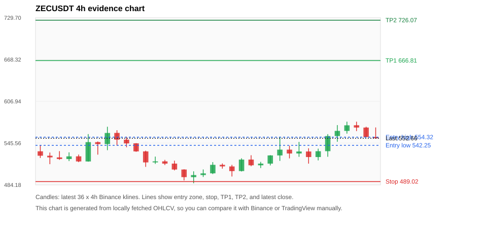

# Crypto 单币复核报告 ZECUSDT

- 报告时间：2026-05-19 22:47:10 CST
- 数据源：Binance public spot API
- 过滤条件：single-symbol verification for ZECUSDT; analyze 1h/4h/1d klines
- 默认单笔风险：账户权益的 1.00%

## 限制说明

- 单币复核报告用于人工核对数据、指标和交易计划推导。
- 当前复核只使用 Binance 公开现货数据；请用报告里的 Binance/TradingView 链接人工对照。
- 本报告同时附带当前大盘扫描候选，来源 scan_id=74730a7e1ace。

## 单币复核交易计划：ZECUSDT

| Rank | Coin | Setup | Entry Zone | Stop Loss | TP1 | TP2 / Exit Rule | R/R | Verdict |
|---:|---|---|---:|---:|---:|---|---:|---|
| 1 | `ZEC` | 回踩支撑/4h EMA 附近 | 542.25 - 554.32 | 489.02 | 666.81 | 726.07 或跌破 4h 关键支撑 | 2.00-3.00 | 可考虑 |

## 当前大盘 5 个候选币对照

下面这张表是复核 `ZECUSDT` 时同步跑出的当前大盘候选，方便你比较复核币和系统 Top 5 的相对位置。

| Rank | Coin | Setup | Entry Zone | Stop Loss | TP1 | TP2 / Exit Rule | R/R | Verdict |
|---:|---|---|---:|---:|---:|---|---:|---|
| 1 | `ZEC` | 回踩支撑/4h EMA 附近 | 542.25 - 554.48 | 489.02 | 667.04 | 726.38 或跌破 4h 关键支撑 | 2.00-3.00 | 可考虑 |
| 2 | `NEAR` | 回踩支撑/4h EMA 附近 | 1.5665 - 1.5983 | 1.4470 | 1.8534 | 1.9888 或跌破 4h 关键支撑 | 2.00-3.00 | 可考虑 |
| 3 | `ONDO` | 回踩支撑/4h EMA 附近 | 0.36419 - 0.36579 | 0.32820 | 0.43858 | 0.47537 或跌破 4h 关键支撑 | 2.00-3.00 | 只观察 |
| 4 | `TRX` | 回踩支撑/4h EMA 附近 | 0.35351 - 0.35429 | 0.34751 | 0.36668 | 0.38135 或跌破 4h 关键支撑 | 2.00-4.29 | 只观察 |
| 5 | `TON` | 回踩支撑/4h EMA 附近 | 1.9693 - 1.9789 | 1.8311 | 2.2600 | 2.4030 或跌破 4h 关键支撑 | 2.00-3.00 | 只观察 |

## 复核币种说明

### 1. ZEC `ZECUSDT`



- 入选原因：回踩支撑/4h EMA 附近；24h +5.54%，7d +1.52%，4h RSI 63.76，24h 成交额 $137.3M。
- 交易失效条件：跌破 489.02295 或 4h 收盘重新失守关键支撑。
- 主要风险：主要风险是大盘同步回撤。

#### 可点击人工验证

- [Binance 交易页](https://www.binance.com/en/trade/ZEC_USDT)
- [TradingView 图表](https://www.tradingview.com/chart/?symbol=BINANCE%3AZECUSDT)
- [CoinGecko 搜索](https://www.coingecko.com/en/search?query=ZEC)
- [CoinMarketCap 搜索](https://coinmarketcap.com/search/?q=ZEC)

#### 指标证据

| 指标 | 数值 | 人工核对用途 |
|---|---:|---|
| 当前价 | 552.66 | 与 Binance/TradingView 当前价格对照 |
| 24h 涨跌 | +5.54% | 与交易所 24h 涨跌对照 |
| 7d 涨跌 | +1.52% | 判断短线趋势是否延续 |
| 4h EMA20 | 541.17 | 判断短期趋势支撑 |
| 4h EMA50 | 533.96 | 判断中期趋势支撑 |
| 1d EMA20 | 507.88 | 判断日线趋势 |
| 1d EMA50 | 424.16 | 判断日线趋势 |
| 4h RSI14 | 63.76 | 判断是否过热/过弱 |
| 4h ATR14 | 19.8114 | 推导止损和入场缓冲 |
| 最近 18 根 4h 最低点 | 496.47 | 支撑/止损参考 |
| 最近 36 根 4h 最高点 | 577.00 | TP/压力参考 |
| 支撑位 | 541.17 | 入场区间推导基础 |

#### 交易计划推导

- 支撑位 = 最近低点、4h EMA20、4h EMA50、1d EMA20 中不高于当前价的最高有效支撑 = `541.17`。
- 入场区间 = 支撑位附近 + ATR 缓冲 = `542.25 - 554.32`。
- 止损 = min(最近 18 根 4h 最低点 * 0.985, 入场中位价 - 1.15 * ATR14) = `489.02`。
- TP1 = max(最近 36 根 4h 最高点 * 0.995, 入场中位价 + 2R) = `666.81`。
- TP2 = max(入场中位价 + 3R, TP1 * 1.04) = `726.07`。

#### 最近 10 根 4h K线

| UTC 开盘时间 | Open | High | Low | Close | Quote Volume | Trades |
|---|---:|---:|---:|---:|---:|---:|
| 2026-05-18T00:00+00:00 | 535.93 | 541.66 | 523.09 | 530.25 | $23.0M | 75509 |
| 2026-05-18T04:00+00:00 | 530.30 | 547.28 | 525.37 | 533.23 | $15.7M | 61545 |
| 2026-05-18T08:00+00:00 | 533.23 | 537.97 | 515.39 | 525.05 | $17.2M | 53258 |
| 2026-05-18T12:00+00:00 | 525.05 | 537.40 | 520.18 | 533.63 | $19.0M | 68990 |
| 2026-05-18T16:00+00:00 | 533.68 | 558.70 | 525.47 | 555.91 | $23.7M | 76670 |
| 2026-05-18T20:00+00:00 | 555.89 | 572.00 | 547.51 | 563.48 | $32.5M | 89014 |
| 2026-05-19T00:00+00:00 | 563.43 | 577.00 | 559.46 | 571.67 | $35.1M | 128190 |
| 2026-05-19T04:00+00:00 | 571.76 | 577.00 | 563.20 | 568.40 | $13.5M | 63166 |
| 2026-05-19T08:00+00:00 | 568.37 | 569.61 | 553.94 | 554.42 | $9.9M | 47536 |
| 2026-05-19T12:00+00:00 | 554.43 | 568.55 | 551.94 | 552.65 | $14.5M | 58821 |

## 组合风控

- 不要 5 个候选全部满仓买入。
- 同时持仓总风险建议控制在账户权益的 3% - 5% 以内。
- 如果 BTC/ETH 同时破位，暂停山寨币多头计划或降低仓位。
- 第一版报告用于模拟盘和人工复核，不自动下单。

## 原始数据

```json
[
  {
    "rank": 1,
    "symbol": "ZECUSDT",
    "base_asset": "ZEC",
    "price": 552.66,
    "score": 68.43682448267526,
    "setup": "回踩支撑/4h EMA 附近",
    "verdict": "可考虑",
    "entry_low": 542.2529913495766,
    "entry_high": 554.3179799999999,
    "stop_loss": 489.02295000000004,
    "take_profit_1": 666.8105570243649,
    "take_profit_2": 726.0730926991532,
    "risk_reward_1": 2.0,
    "risk_reward_2": 3.0,
    "pct_24h": 5.544,
    "pct_3d": 10.298167884085728,
    "pct_7d": 1.5247262840767162,
    "quote_volume_24h": 137318204.64972,
    "trades_24h": 490463,
    "high_low_range_24h": 10.36725325172152,
    "rsi_1h": 40.59372349448682,
    "rsi_4h": 63.76493323963458,
    "ema20_4h": 541.1706500494777,
    "ema50_4h": 533.9607500024712,
    "ema20_1d": 507.88437740352526,
    "ema50_1d": 424.15922408814913,
    "atr_4h": 19.811428571428557,
    "macd_hist_4h": 4.562320808271064,
    "volume_ratio_24h": 1.280427184778572,
    "support_level": 541.1706500494777,
    "recent_low_4h_18": 496.47,
    "recent_high_4h_36": 577.0,
    "distance_to_support_pct": 2.1230548902590796,
    "binance_trade_url": "https://www.binance.com/en/trade/ZEC_USDT",
    "tradingview_url": "https://www.tradingview.com/chart/?symbol=BINANCE%3AZECUSDT",
    "coingecko_search_url": "https://www.coingecko.com/en/search?query=ZEC",
    "coinmarketcap_search_url": "https://coinmarketcap.com/search/?q=ZEC",
    "invalidation": "跌破 489.02295 或 4h 收盘重新失守关键支撑",
    "recent_4h_klines": [
      {
        "open_time_utc": "2026-05-13T16:00+00:00",
        "open": 533.5,
        "high": 542.42,
        "low": 523.64,
        "close": 527.0,
        "quote_volume": 19411220.3254,
        "trades": 52256
      },
      {
        "open_time_utc": "2026-05-13T20:00+00:00",
        "open": 526.99,
        "high": 531.68,
        "low": 514.6,
        "close": 524.58,
        "quote_volume": 19340315.07389,
        "trades": 73229
      },
      {
        "open_time_utc": "2026-05-14T00:00+00:00",
        "open": 524.55,
        "high": 533.71,
        "low": 520.96,
        "close": 522.15,
        "quote_volume": 13197513.90019,
        "trades": 50951
      },
      {
        "open_time_utc": "2026-05-14T04:00+00:00",
        "open": 522.12,
        "high": 531.97,
        "low": 519.12,
        "close": 526.05,
        "quote_volume": 10064224.56006,
        "trades": 33535
      },
      {
        "open_time_utc": "2026-05-14T08:00+00:00",
        "open": 526.1,
        "high": 528.73,
        "low": 517.59,
        "close": 518.6,
        "quote_volume": 10406328.96026,
        "trades": 28002
      },
      {
        "open_time_utc": "2026-05-14T12:00+00:00",
        "open": 518.58,
        "high": 558.77,
        "low": 518.27,
        "close": 546.98,
        "quote_volume": 34821906.60767,
        "trades": 108955
      },
      {
        "open_time_utc": "2026-05-14T16:00+00:00",
        "open": 546.97,
        "high": 547.92,
        "low": 528.59,
        "close": 544.08,
        "quote_volume": 34299356.59282,
        "trades": 99270
      },
      {
        "open_time_utc": "2026-05-14T20:00+00:00",
        "open": 544.09,
        "high": 569.56,
        "low": 535.14,
        "close": 560.43,
        "quote_volume": 26333875.953,
        "trades": 103688
      },
      {
        "open_time_utc": "2026-05-15T00:00+00:00",
        "open": 560.53,
        "high": 564.43,
        "low": 541.88,
        "close": 550.6,
        "quote_volume": 18377966.82075,
        "trades": 67641
      },
      {
        "open_time_utc": "2026-05-15T04:00+00:00",
        "open": 550.62,
        "high": 554.99,
        "low": 539.44,
        "close": 545.09,
        "quote_volume": 11144175.52428,
        "trades": 44119
      },
      {
        "open_time_utc": "2026-05-15T08:00+00:00",
        "open": 545.16,
        "high": 545.51,
        "low": 532.78,
        "close": 533.35,
        "quote_volume": 9870519.89923,
        "trades": 33961
      },
      {
        "open_time_utc": "2026-05-15T12:00+00:00",
        "open": 533.34,
        "high": 534.41,
        "low": 510.63,
        "close": 517.19,
        "quote_volume": 20081513.98389,
        "trades": 70996
      },
      {
        "open_time_utc": "2026-05-15T16:00+00:00",
        "open": 517.22,
        "high": 525.72,
        "low": 515.0,
        "close": 518.71,
        "quote_volume": 9093596.41199,
        "trades": 43216
      },
      {
        "open_time_utc": "2026-05-15T20:00+00:00",
        "open": 518.72,
        "high": 520.92,
        "low": 513.27,
        "close": 515.4,
        "quote_volume": 4628869.67293,
        "trades": 23219
      },
      {
        "open_time_utc": "2026-05-16T00:00+00:00",
        "open": 515.43,
        "high": 519.75,
        "low": 505.49,
        "close": 506.75,
        "quote_volume": 10405020.59828,
        "trades": 35798
      },
      {
        "open_time_utc": "2026-05-16T04:00+00:00",
        "open": 506.75,
        "high": 507.07,
        "low": 490.75,
        "close": 495.56,
        "quote_volume": 15940219.64499,
        "trades": 56328
      },
      {
        "open_time_utc": "2026-05-16T08:00+00:00",
        "open": 495.54,
        "high": 504.08,
        "low": 486.61,
        "close": 498.59,
        "quote_volume": 14781738.9071,
        "trades": 55947
      },
      {
        "open_time_utc": "2026-05-16T12:00+00:00",
        "open": 498.66,
        "high": 506.83,
        "low": 495.8,
        "close": 501.06,
        "quote_volume": 9760086.29137,
        "trades": 39310
      },
      {
        "open_time_utc": "2026-05-16T16:00+00:00",
        "open": 501.14,
        "high": 517.59,
        "low": 500.08,
        "close": 513.63,
        "quote_volume": 14351246.27936,
        "trades": 44396
      },
      {
        "open_time_utc": "2026-05-16T20:00+00:00",
        "open": 513.65,
        "high": 515.66,
        "low": 508.03,
        "close": 511.34,
        "quote_volume": 7057162.69703,
        "trades": 24426
      },
      {
        "open_time_utc": "2026-05-17T00:00+00:00",
        "open": 511.27,
        "high": 513.6,
        "low": 496.47,
        "close": 504.41,
        "quote_volume": 10597854.31494,
        "trades": 35215
      },
      {
        "open_time_utc": "2026-05-17T04:00+00:00",
        "open": 504.49,
        "high": 523.24,
        "low": 503.87,
        "close": 521.31,
        "quote_volume": 14668093.10581,
        "trades": 48632
      },
      {
        "open_time_utc": "2026-05-17T08:00+00:00",
        "open": 521.36,
        "high": 527.73,
        "low": 511.58,
        "close": 512.96,
        "quote_volume": 18348364.20973,
        "trades": 68020
      },
      {
        "open_time_utc": "2026-05-17T12:00+00:00",
        "open": 512.94,
        "high": 518.0,
        "low": 508.93,
        "close": 515.4,
        "quote_volume": 10098179.17257,
        "trades": 42014
      },
      {
        "open_time_utc": "2026-05-17T16:00+00:00",
        "open": 515.4,
        "high": 527.8,
        "low": 512.8,
        "close": 527.46,
        "quote_volume": 9595463.67219,
        "trades": 37959
      },
      {
        "open_time_utc": "2026-05-17T20:00+00:00",
        "open": 527.43,
        "high": 554.92,
        "low": 519.4,
        "close": 535.95,
        "quote_volume": 37817033.66624,
        "trades": 125711
      },
      {
        "open_time_utc": "2026-05-18T00:00+00:00",
        "open": 535.93,
        "high": 541.66,
        "low": 523.09,
        "close": 530.25,
        "quote_volume": 23005644.13499,
        "trades": 75509
      },
      {
        "open_time_utc": "2026-05-18T04:00+00:00",
        "open": 530.3,
        "high": 547.28,
        "low": 525.37,
        "close": 533.23,
        "quote_volume": 15740944.90346,
        "trades": 61545
      },
      {
        "open_time_utc": "2026-05-18T08:00+00:00",
        "open": 533.23,
        "high": 537.97,
        "low": 515.39,
        "close": 525.05,
        "quote_volume": 17202010.14693,
        "trades": 53258
      },
      {
        "open_time_utc": "2026-05-18T12:00+00:00",
        "open": 525.05,
        "high": 537.4,
        "low": 520.18,
        "close": 533.63,
        "quote_volume": 19034854.14086,
        "trades": 68990
      },
      {
        "open_time_utc": "2026-05-18T16:00+00:00",
        "open": 533.68,
        "high": 558.7,
        "low": 525.47,
        "close": 555.91,
        "quote_volume": 23661497.93151,
        "trades": 76670
      },
      {
        "open_time_utc": "2026-05-18T20:00+00:00",
        "open": 555.89,
        "high": 572.0,
        "low": 547.51,
        "close": 563.48,
        "quote_volume": 32519524.7322,
        "trades": 89014
      },
      {
        "open_time_utc": "2026-05-19T00:00+00:00",
        "open": 563.43,
        "high": 577.0,
        "low": 559.46,
        "close": 571.67,
        "quote_volume": 35085086.86415,
        "trades": 128190
      },
      {
        "open_time_utc": "2026-05-19T04:00+00:00",
        "open": 571.76,
        "high": 577.0,
        "low": 563.2,
        "close": 568.4,
        "quote_volume": 13506927.64481,
        "trades": 63166
      },
      {
        "open_time_utc": "2026-05-19T08:00+00:00",
        "open": 568.37,
        "high": 569.61,
        "low": 553.94,
        "close": 554.42,
        "quote_volume": 9937110.45423,
        "trades": 47536
      },
      {
        "open_time_utc": "2026-05-19T12:00+00:00",
        "open": 554.43,
        "high": 568.55,
        "low": 551.94,
        "close": 552.65,
        "quote_volume": 14482294.66752,
        "trades": 58821
      }
    ],
    "risks": [
      "主要风险是大盘同步回撤"
    ]
  }
]
```
