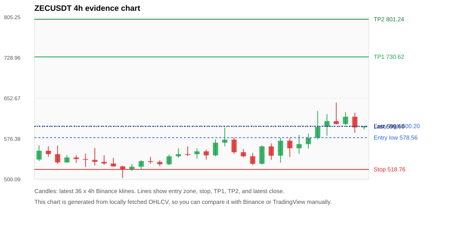
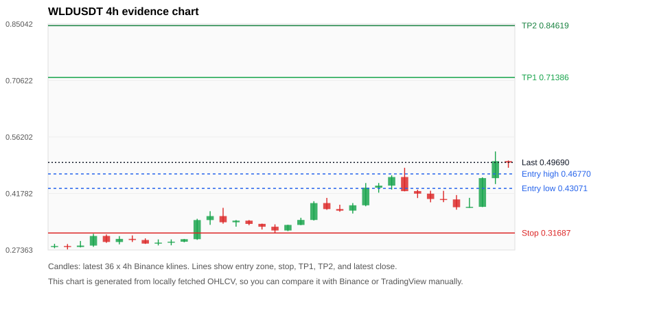
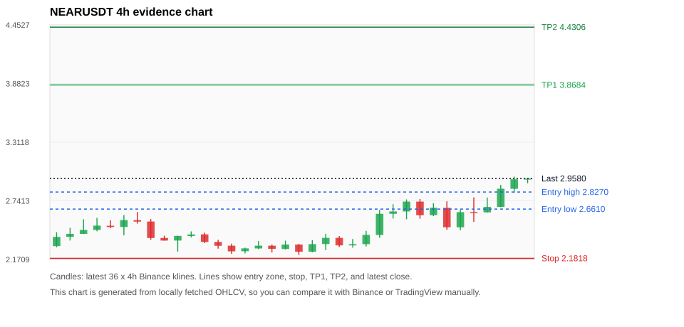
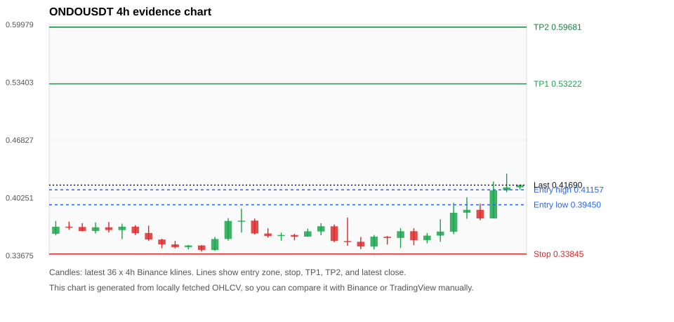
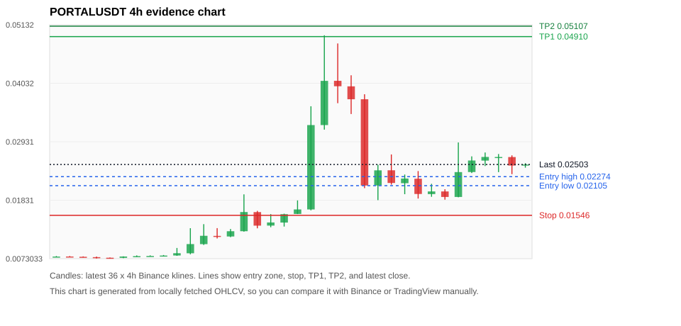

# Crypto 市场扫描报告 7a562bac13ec

- 报告时间：2026-06-03 20:11:39 CST
- 数据源：Binance public spot API
- 过滤条件：USDT spot; 24h quote volume >= 30,000,000; trades >= 30,000; exclude stables/leveraged tokens; analyze 1h/4h/1d klines
- 默认单笔风险：账户权益的 1.00%

## 限制说明

- MVP 当前只使用 Binance 现货公开数据，暂未接入 CoinGecko/CoinMarketCap 交叉验证。
- 结果是研究和模拟盘计划，不是确定收益或实盘下单指令。

## 5 个候选交易计划

| Rank | Coin | Setup | Entry Zone | Stop Loss | TP1 | TP2 / Exit Rule | R/R | Verdict |
|---:|---|---|---:|---:|---:|---|---:|---|
| 1 | `ZEC` | 回踩支撑/4h EMA 附近 | 578.56 - 600.20 | 518.76 | 730.62 | 801.24 或跌破 4h 关键支撑 | 2.00-3.00 | 可考虑 |
| 2 | `WLD` | 涨幅较远，只等深回调 | 0.43071 - 0.46770 | 0.31687 | 0.71386 | 0.84619 或跌破 4h 关键支撑 | 2.00-3.00 | 只等回调 |
| 3 | `NEAR` | 涨幅较远，只等深回调 | 2.6610 - 2.8270 | 2.1818 | 3.8684 | 4.4306 或跌破 4h 关键支撑 | 2.00-3.00 | 只等回调 |
| 4 | `ONDO` | 趋势中，等回调入场 | 0.39450 - 0.41157 | 0.33845 | 0.53222 | 0.59681 或跌破 4h 关键支撑 | 2.00-3.00 | 只等回调 |
| 5 | `PORTAL` | 涨幅较远，只等深回调 | 0.02105 - 0.02274 | 0.01546 | 0.04910 | 0.05107 或跌破 4h 关键支撑 | 4.23-4.54 | 只等回调 |

## 候选币说明

### 1. ZEC `ZECUSDT`



- 入选原因：回踩支撑/4h EMA 附近；24h +5.69%，7d +3.99%，4h RSI 61.77，24h 成交额 $370.8M。
- 交易失效条件：跌破 518.7601 或 4h 收盘重新失守关键支撑。
- 主要风险：主要风险是大盘同步回撤。

#### 可点击人工验证

- [Binance 交易页](https://www.binance.com/en/trade/ZEC_USDT)
- [TradingView 图表](https://www.tradingview.com/chart/?symbol=BINANCE%3AZECUSDT)
- [CoinGecko 搜索](https://www.coingecko.com/en/search?query=ZEC)
- [CoinMarketCap 搜索](https://coinmarketcap.com/search/?q=ZEC)

#### 指标证据

| 指标 | 数值 | 人工核对用途 |
|---|---:|---|
| 当前价 | 599.60 | 与 Binance/TradingView 当前价格对照 |
| 24h 涨跌 | +5.69% | 与交易所 24h 涨跌对照 |
| 7d 涨跌 | +3.99% | 判断短线趋势是否延续 |
| 4h EMA20 | 577.41 | 判断短期趋势支撑 |
| 4h EMA50 | 569.98 | 判断中期趋势支撑 |
| 1d EMA20 | 566.93 | 判断日线趋势 |
| 1d EMA50 | 496.00 | 判断日线趋势 |
| 4h RSI14 | 61.77 | 判断是否过热/过弱 |
| 4h ATR14 | 32.5600 | 推导止损和入场缓冲 |
| 最近 18 根 4h 最低点 | 526.66 | 支撑/止损参考 |
| 最近 36 根 4h 最高点 | 644.51 | TP/压力参考 |
| 支撑位 | 577.41 | 入场区间推导基础 |

#### 交易计划推导

- 支撑位 = 最近低点、4h EMA20、4h EMA50、1d EMA20 中不高于当前价的最高有效支撑 = `577.41`。
- 入场区间 = 支撑位附近 + ATR 缓冲 = `578.56 - 600.20`。
- 止损 = min(最近 18 根 4h 最低点 * 0.985, 入场中位价 - 1.15 * ATR14) = `518.76`。
- TP1 = max(最近 36 根 4h 最高点 * 0.995, 入场中位价 + 2R) = `730.62`。
- TP2 = max(入场中位价 + 3R, TP1 * 1.04) = `801.24`。

#### 最近 10 根 4h K线

| UTC 开盘时间 | Open | High | Low | Close | Quote Volume | Trades |
|---|---:|---:|---:|---:|---:|---:|
| 2026-06-02T00:00+00:00 | 544.65 | 577.96 | 531.37 | 572.68 | $28.6M | 202993 |
| 2026-06-02T04:00+00:00 | 572.72 | 577.50 | 542.16 | 558.48 | $35.7M | 247297 |
| 2026-06-02T08:00+00:00 | 558.47 | 583.43 | 548.10 | 566.40 | $30.3M | 219113 |
| 2026-06-02T12:00+00:00 | 566.39 | 586.13 | 557.91 | 578.07 | $47.0M | 334944 |
| 2026-06-02T16:00+00:00 | 578.10 | 628.74 | 575.11 | 598.84 | $87.7M | 486120 |
| 2026-06-02T20:00+00:00 | 598.84 | 623.01 | 581.94 | 609.69 | $73.6M | 399793 |
| 2026-06-03T00:00+00:00 | 609.64 | 644.51 | 603.30 | 604.18 | $71.4M | 423267 |
| 2026-06-03T04:00+00:00 | 604.18 | 626.70 | 601.89 | 617.98 | $49.4M | 292054 |
| 2026-06-03T08:00+00:00 | 617.97 | 625.61 | 587.52 | 597.81 | $41.5M | 250715 |
| 2026-06-03T12:00+00:00 | 597.83 | 599.79 | 594.09 | 599.79 | $1.1M | 8604 |

### 2. WLD `WLDUSDT`



- 入选原因：涨幅较远，只等深回调；24h +20.06%，7d +37.38%，4h RSI 70.61，24h 成交额 $118.7M。
- 交易失效条件：跌破 0.3168745 或 4h 收盘重新失守关键支撑。
- 主要风险：距离支撑偏远，不能追市价；24h 振幅较大，回撤风险高。

#### 可点击人工验证

- [Binance 交易页](https://www.binance.com/en/trade/WLD_USDT)
- [TradingView 图表](https://www.tradingview.com/chart/?symbol=BINANCE%3AWLDUSDT)
- [CoinGecko 搜索](https://www.coingecko.com/en/search?query=WLD)
- [CoinMarketCap 搜索](https://coinmarketcap.com/search/?q=WLD)

#### 指标证据

| 指标 | 数值 | 人工核对用途 |
|---|---:|---|
| 当前价 | 0.49690 | 与 Binance/TradingView 当前价格对照 |
| 24h 涨跌 | +20.06% | 与交易所 24h 涨跌对照 |
| 7d 涨跌 | +37.38% | 判断短线趋势是否延续 |
| 4h EMA20 | 0.41051 | 判断短期趋势支撑 |
| 4h EMA50 | 0.36703 | 判断中期趋势支撑 |
| 1d EMA20 | 0.33429 | 判断日线趋势 |
| 1d EMA50 | 0.30537 | 判断日线趋势 |
| 4h RSI14 | 70.61 | 判断是否过热/过弱 |
| 4h ATR14 | 0.03894 | 推导止损和入场缓冲 |
| 最近 18 根 4h 最低点 | 0.32170 | 支撑/止损参考 |
| 最近 36 根 4h 最高点 | 0.52500 | TP/压力参考 |
| 支撑位 | 0.41051 | 入场区间推导基础 |

#### 交易计划推导

- 支撑位 = 最近低点、4h EMA20、4h EMA50、1d EMA20 中不高于当前价的最高有效支撑 = `0.41051`。
- 入场区间 = 支撑位附近 + ATR 缓冲 = `0.43071 - 0.46770`。
- 止损 = min(最近 18 根 4h 最低点 * 0.985, 入场中位价 - 1.15 * ATR14) = `0.31687`。
- TP1 = max(最近 36 根 4h 最高点 * 0.995, 入场中位价 + 2R) = `0.71386`。
- TP2 = max(入场中位价 + 3R, TP1 * 1.04) = `0.84619`。

#### 最近 10 根 4h K线

| UTC 开盘时间 | Open | High | Low | Close | Quote Volume | Trades |
|---|---:|---:|---:|---:|---:|---:|
| 2026-06-02T00:00+00:00 | 0.43780 | 0.46410 | 0.42770 | 0.45970 | $20.5M | 222819 |
| 2026-06-02T04:00+00:00 | 0.45980 | 0.48330 | 0.42330 | 0.42370 | $30.1M | 258119 |
| 2026-06-02T08:00+00:00 | 0.42380 | 0.42740 | 0.40610 | 0.41730 | $19.1M | 151934 |
| 2026-06-02T12:00+00:00 | 0.41730 | 0.42480 | 0.39520 | 0.40370 | $18.8M | 141553 |
| 2026-06-02T16:00+00:00 | 0.40370 | 0.42450 | 0.39560 | 0.40260 | $14.7M | 116424 |
| 2026-06-02T20:00+00:00 | 0.40260 | 0.41370 | 0.37640 | 0.38270 | $12.0M | 97905 |
| 2026-06-03T00:00+00:00 | 0.38260 | 0.40660 | 0.38110 | 0.38370 | $10.8M | 93708 |
| 2026-06-03T04:00+00:00 | 0.38360 | 0.45890 | 0.38310 | 0.45700 | $19.5M | 169497 |
| 2026-06-03T08:00+00:00 | 0.45690 | 0.52500 | 0.44180 | 0.50020 | $40.7M | 369433 |
| 2026-06-03T12:00+00:00 | 0.50030 | 0.50200 | 0.48340 | 0.49660 | $3.2M | 27063 |

### 3. NEAR `NEARUSDT`



- 入选原因：涨幅较远，只等深回调；24h +9.77%，7d +16.50%，4h RSI 74.96，24h 成交额 $208.4M。
- 交易失效条件：跌破 2.181775 或 4h 收盘重新失守关键支撑。
- 主要风险：距离支撑偏远，不能追市价。

#### 可点击人工验证

- [Binance 交易页](https://www.binance.com/en/trade/NEAR_USDT)
- [TradingView 图表](https://www.tradingview.com/chart/?symbol=BINANCE%3ANEARUSDT)
- [CoinGecko 搜索](https://www.coingecko.com/en/search?query=NEAR)
- [CoinMarketCap 搜索](https://coinmarketcap.com/search/?q=NEAR)

#### 指标证据

| 指标 | 数值 | 人工核对用途 |
|---|---:|---|
| 当前价 | 2.9580 | 与 Binance/TradingView 当前价格对照 |
| 24h 涨跌 | +9.77% | 与交易所 24h 涨跌对照 |
| 7d 涨跌 | +16.50% | 判断短线趋势是否延续 |
| 4h EMA20 | 2.6253 | 判断短期趋势支撑 |
| 4h EMA50 | 2.4793 | 判断中期趋势支撑 |
| 1d EMA20 | 2.2654 | 判断日线趋势 |
| 1d EMA50 | 1.8765 | 判断日线趋势 |
| 4h RSI14 | 74.96 | 判断是否过热/过弱 |
| 4h ATR14 | 0.17471 | 推导止损和入场缓冲 |
| 最近 18 根 4h 最低点 | 2.2150 | 支撑/止损参考 |
| 最近 36 根 4h 最高点 | 2.9770 | TP/压力参考 |
| 支撑位 | 2.6253 | 入场区间推导基础 |

#### 交易计划推导

- 支撑位 = 最近低点、4h EMA20、4h EMA50、1d EMA20 中不高于当前价的最高有效支撑 = `2.6253`。
- 入场区间 = 支撑位附近 + ATR 缓冲 = `2.6610 - 2.8270`。
- 止损 = min(最近 18 根 4h 最低点 * 0.985, 入场中位价 - 1.15 * ATR14) = `2.1818`。
- TP1 = max(最近 36 根 4h 最高点 * 0.995, 入场中位价 + 2R) = `3.8684`。
- TP2 = max(入场中位价 + 3R, TP1 * 1.04) = `4.4306`。

#### 最近 10 根 4h K线

| UTC 开盘时间 | Open | High | Low | Close | Quote Volume | Trades |
|---|---:|---:|---:|---:|---:|---:|
| 2026-06-02T00:00+00:00 | 2.6380 | 2.7550 | 2.5620 | 2.7340 | $25.8M | 209373 |
| 2026-06-02T04:00+00:00 | 2.7340 | 2.7590 | 2.5670 | 2.6010 | $19.6M | 161273 |
| 2026-06-02T08:00+00:00 | 2.6020 | 2.7180 | 2.5920 | 2.6740 | $24.2M | 168106 |
| 2026-06-02T12:00+00:00 | 2.6730 | 2.7370 | 2.4590 | 2.4840 | $34.8M | 253080 |
| 2026-06-02T16:00+00:00 | 2.4840 | 2.6570 | 2.4550 | 2.6310 | $33.3M | 240339 |
| 2026-06-02T20:00+00:00 | 2.6310 | 2.7750 | 2.5370 | 2.6280 | $36.5M | 244145 |
| 2026-06-03T00:00+00:00 | 2.6290 | 2.7730 | 2.6280 | 2.6820 | $30.4M | 225917 |
| 2026-06-03T04:00+00:00 | 2.6820 | 2.8960 | 2.6800 | 2.8590 | $29.1M | 224319 |
| 2026-06-03T08:00+00:00 | 2.8580 | 2.9770 | 2.8180 | 2.9510 | $43.2M | 237421 |
| 2026-06-03T12:00+00:00 | 2.9510 | 2.9610 | 2.9120 | 2.9580 | $1.6M | 14732 |

### 4. ONDO `ONDOUSDT`



- 入选原因：趋势中，等回调入场；24h +15.72%，7d +4.12%，4h RSI 76.68，24h 成交额 $67.4M。
- 交易失效条件：跌破 0.338446 或 4h 收盘重新失守关键支撑。
- 主要风险：距离支撑偏远，不能追市价；4h RSI 偏热；成交量突增，可能是事件驱动。

#### 可点击人工验证

- [Binance 交易页](https://www.binance.com/en/trade/ONDO_USDT)
- [TradingView 图表](https://www.tradingview.com/chart/?symbol=BINANCE%3AONDOUSDT)
- [CoinGecko 搜索](https://www.coingecko.com/en/search?query=ONDO)
- [CoinMarketCap 搜索](https://coinmarketcap.com/search/?q=ONDO)

#### 指标证据

| 指标 | 数值 | 人工核对用途 |
|---|---:|---|
| 当前价 | 0.41690 | 与 Binance/TradingView 当前价格对照 |
| 24h 涨跌 | +15.72% | 与交易所 24h 涨跌对照 |
| 7d 涨跌 | +4.12% | 判断短线趋势是否延续 |
| 4h EMA20 | 0.37920 | 判断短期趋势支撑 |
| 4h EMA50 | 0.37724 | 判断中期趋势支撑 |
| 1d EMA20 | 0.38148 | 判断日线趋势 |
| 1d EMA50 | 0.35060 | 判断日线趋势 |
| 4h RSI14 | 76.68 | 判断是否过热/过弱 |
| 4h ATR14 | 0.02133 | 推导止损和入场缓冲 |
| 最近 18 根 4h 最低点 | 0.34360 | 支撑/止损参考 |
| 最近 36 根 4h 最高点 | 0.42990 | TP/压力参考 |
| 支撑位 | 0.38148 | 入场区间推导基础 |

#### 交易计划推导

- 支撑位 = 最近低点、4h EMA20、4h EMA50、1d EMA20 中不高于当前价的最高有效支撑 = `0.38148`。
- 入场区间 = 支撑位附近 + ATR 缓冲 = `0.39450 - 0.41157`。
- 止损 = min(最近 18 根 4h 最低点 * 0.985, 入场中位价 - 1.15 * ATR14) = `0.33845`。
- TP1 = max(最近 36 根 4h 最高点 * 0.995, 入场中位价 + 2R) = `0.53222`。
- TP2 = max(入场中位价 + 3R, TP1 * 1.04) = `0.59681`。

#### 最近 10 根 4h K线

| UTC 开盘时间 | Open | High | Low | Close | Quote Volume | Trades |
|---|---:|---:|---:|---:|---:|---:|
| 2026-06-02T00:00+00:00 | 0.35680 | 0.36790 | 0.34530 | 0.36440 | $2.4M | 24303 |
| 2026-06-02T04:00+00:00 | 0.36440 | 0.36790 | 0.34850 | 0.35420 | $3.1M | 26913 |
| 2026-06-02T08:00+00:00 | 0.35420 | 0.36230 | 0.35070 | 0.35940 | $2.5M | 20396 |
| 2026-06-02T12:00+00:00 | 0.35940 | 0.37800 | 0.35240 | 0.36400 | $8.2M | 66124 |
| 2026-06-02T16:00+00:00 | 0.36390 | 0.39680 | 0.36110 | 0.38540 | $13.5M | 105327 |
| 2026-06-02T20:00+00:00 | 0.38550 | 0.40300 | 0.37860 | 0.38880 | $17.6M | 120962 |
| 2026-06-03T00:00+00:00 | 0.38880 | 0.39580 | 0.37690 | 0.37900 | $5.5M | 43040 |
| 2026-06-03T04:00+00:00 | 0.37900 | 0.42100 | 0.37890 | 0.41110 | $14.8M | 70111 |
| 2026-06-03T08:00+00:00 | 0.41110 | 0.42990 | 0.40890 | 0.41430 | $7.6M | 51665 |
| 2026-06-03T12:00+00:00 | 0.41440 | 0.41690 | 0.41190 | 0.41690 | $219,417 | 2084 |

### 5. PORTAL `PORTALUSDT`



- 入选原因：涨幅较远，只等深回调；24h +24.74%，7d +204.87%，4h RSI 30.89，24h 成交额 $35.3M。
- 交易失效条件：跌破 0.0154645 或 4h 收盘重新失守关键支撑。
- 主要风险：距离支撑偏远，不能追市价；24h 振幅较大，回撤风险高。

#### 可点击人工验证

- [Binance 交易页](https://www.binance.com/en/trade/PORTAL_USDT)
- [TradingView 图表](https://www.tradingview.com/chart/?symbol=BINANCE%3APORTALUSDT)
- [CoinGecko 搜索](https://www.coingecko.com/en/search?query=PORTAL)
- [CoinMarketCap 搜索](https://coinmarketcap.com/search/?q=PORTAL)

#### 指标证据

| 指标 | 数值 | 人工核对用途 |
|---|---:|---|
| 当前价 | 0.02503 | 与 Binance/TradingView 当前价格对照 |
| 24h 涨跌 | +24.74% | 与交易所 24h 涨跌对照 |
| 7d 涨跌 | +204.87% | 判断短线趋势是否延续 |
| 4h EMA20 | 0.02270 | 判断短期趋势支撑 |
| 4h EMA50 | 0.01774 | 判断中期趋势支撑 |
| 1d EMA20 | 0.01475 | 判断日线趋势 |
| 1d EMA50 | 0.01231 | 判断日线趋势 |
| 4h RSI14 | 30.89 | 判断是否过热/过弱 |
| 4h ATR14 | 0.0053128571 | 推导止损和入场缓冲 |
| 最近 18 根 4h 最低点 | 0.01570 | 支撑/止损参考 |
| 最近 36 根 4h 最高点 | 0.04935 | TP/压力参考 |
| 支撑位 | 0.02270 | 入场区间推导基础 |

#### 交易计划推导

- 支撑位 = 最近低点、4h EMA20、4h EMA50、1d EMA20 中不高于当前价的最高有效支撑 = `0.02270`。
- 入场区间 = 支撑位附近 + ATR 缓冲 = `0.02105 - 0.02274`。
- 止损 = min(最近 18 根 4h 最低点 * 0.985, 入场中位价 - 1.15 * ATR14) = `0.01546`。
- TP1 = max(最近 36 根 4h 最高点 * 0.995, 入场中位价 + 2R) = `0.04910`。
- TP2 = max(入场中位价 + 3R, TP1 * 1.04) = `0.05107`。

#### 最近 10 根 4h K线

| UTC 开盘时间 | Open | High | Low | Close | Quote Volume | Trades |
|---|---:|---:|---:|---:|---:|---:|
| 2026-06-02T00:00+00:00 | 0.02151 | 0.02314 | 0.01944 | 0.02239 | $4.5M | 70946 |
| 2026-06-02T04:00+00:00 | 0.02235 | 0.02379 | 0.01862 | 0.01948 | $3.3M | 50449 |
| 2026-06-02T08:00+00:00 | 0.01946 | 0.02139 | 0.01895 | 0.01996 | $2.4M | 30146 |
| 2026-06-02T12:00+00:00 | 0.01996 | 0.02037 | 0.01841 | 0.01892 | $2.1M | 21140 |
| 2026-06-02T16:00+00:00 | 0.01892 | 0.02918 | 0.01886 | 0.02360 | $17.1M | 163920 |
| 2026-06-02T20:00+00:00 | 0.02361 | 0.02656 | 0.02342 | 0.02578 | $5.2M | 58373 |
| 2026-06-03T00:00+00:00 | 0.02576 | 0.02729 | 0.02474 | 0.02645 | $4.6M | 49400 |
| 2026-06-03T04:00+00:00 | 0.02644 | 0.02700 | 0.02359 | 0.02644 | $3.5M | 37753 |
| 2026-06-03T08:00+00:00 | 0.02643 | 0.02675 | 0.02321 | 0.02483 | $2.7M | 35565 |
| 2026-06-03T12:00+00:00 | 0.02482 | 0.02527 | 0.02443 | 0.02503 | $274,871 | 3315 |

## 组合风控

- 不要 5 个候选全部满仓买入。
- 同时持仓总风险建议控制在账户权益的 3% - 5% 以内。
- 如果 BTC/ETH 同时破位，暂停山寨币多头计划或降低仓位。
- 第一版报告用于模拟盘和人工复核，不自动下单。

## 原始数据

```json
[
  {
    "rank": 1,
    "symbol": "ZECUSDT",
    "base_asset": "ZEC",
    "price": 599.6,
    "score": 73.06351048380243,
    "setup": "回踩支撑/4h EMA 附近",
    "verdict": "可考虑",
    "entry_low": 578.5613821262509,
    "entry_high": 600.1985689882744,
    "stop_loss": 518.7601,
    "take_profit_1": 730.6197266717882,
    "take_profit_2": 801.2396022290509,
    "risk_reward_1": 2.0,
    "risk_reward_2": 3.0,
    "pct_24h": 5.686,
    "pct_3d": 9.173008994574117,
    "pct_7d": 3.987096997970907,
    "quote_volume_24h": 370784673.9036,
    "trades_24h": 2187254,
    "high_low_range_24h": 15.522216845010849,
    "rsi_1h": 53.39291912530373,
    "rsi_4h": 61.76598521096127,
    "ema20_4h": 577.4065689882743,
    "ema50_4h": 569.9830788494735,
    "ema20_1d": 566.9279036149841,
    "ema50_1d": 496.0046704295036,
    "atr_4h": 32.56,
    "macd_hist_4h": 5.169475689994513,
    "volume_ratio_24h": 2.8138661399504374,
    "support_level": 577.4065689882743,
    "recent_low_4h_18": 526.66,
    "recent_high_4h_36": 644.51,
    "distance_to_support_pct": 3.843640201498366,
    "binance_trade_url": "https://www.binance.com/en/trade/ZEC_USDT",
    "tradingview_url": "https://www.tradingview.com/chart/?symbol=BINANCE%3AZECUSDT",
    "coingecko_search_url": "https://www.coingecko.com/en/search?query=ZEC",
    "coinmarketcap_search_url": "https://coinmarketcap.com/search/?q=ZEC",
    "invalidation": "跌破 518.7601 或 4h 收盘重新失守关键支撑",
    "recent_4h_klines": [
      {
        "open_time_utc": "2026-05-28T16:00+00:00",
        "open": 537.34,
        "high": 564.1,
        "low": 534.59,
        "close": 553.88,
        "quote_volume": 27081461.62267,
        "trades": 180775
      },
      {
        "open_time_utc": "2026-05-28T20:00+00:00",
        "open": 553.87,
        "high": 562.12,
        "low": 542.72,
        "close": 547.53,
        "quote_volume": 18370534.86302,
        "trades": 144286
      },
      {
        "open_time_utc": "2026-05-29T00:00+00:00",
        "open": 547.52,
        "high": 563.56,
        "low": 529.13,
        "close": 531.9,
        "quote_volume": 25339494.9406,
        "trades": 161762
      },
      {
        "open_time_utc": "2026-05-29T04:00+00:00",
        "open": 531.92,
        "high": 545.68,
        "low": 531.32,
        "close": 541.21,
        "quote_volume": 10431254.33339,
        "trades": 78925
      },
      {
        "open_time_utc": "2026-05-29T08:00+00:00",
        "open": 541.25,
        "high": 546.05,
        "low": 531.12,
        "close": 538.22,
        "quote_volume": 15193695.28099,
        "trades": 76956
      },
      {
        "open_time_utc": "2026-05-29T12:00+00:00",
        "open": 538.18,
        "high": 548.53,
        "low": 523.28,
        "close": 536.77,
        "quote_volume": 23944865.60538,
        "trades": 144733
      },
      {
        "open_time_utc": "2026-05-29T16:00+00:00",
        "open": 536.76,
        "high": 559.14,
        "low": 526.12,
        "close": 533.0,
        "quote_volume": 29199242.51925,
        "trades": 200807
      },
      {
        "open_time_utc": "2026-05-29T20:00+00:00",
        "open": 533.02,
        "high": 545.49,
        "low": 527.28,
        "close": 529.89,
        "quote_volume": 13829794.04478,
        "trades": 103652
      },
      {
        "open_time_utc": "2026-05-30T00:00+00:00",
        "open": 529.85,
        "high": 540.33,
        "low": 523.82,
        "close": 524.38,
        "quote_volume": 10796238.64058,
        "trades": 83991
      },
      {
        "open_time_utc": "2026-05-30T04:00+00:00",
        "open": 524.39,
        "high": 525.8,
        "low": 502.6,
        "close": 518.59,
        "quote_volume": 26366613.32443,
        "trades": 170240
      },
      {
        "open_time_utc": "2026-05-30T08:00+00:00",
        "open": 518.58,
        "high": 529.05,
        "low": 515.86,
        "close": 523.81,
        "quote_volume": 8734900.23086,
        "trades": 60002
      },
      {
        "open_time_utc": "2026-05-30T12:00+00:00",
        "open": 523.81,
        "high": 536.0,
        "low": 519.05,
        "close": 534.3,
        "quote_volume": 12765082.92875,
        "trades": 84537
      },
      {
        "open_time_utc": "2026-05-30T16:00+00:00",
        "open": 534.3,
        "high": 542.39,
        "low": 529.0,
        "close": 532.85,
        "quote_volume": 12248214.94856,
        "trades": 101177
      },
      {
        "open_time_utc": "2026-05-30T20:00+00:00",
        "open": 532.85,
        "high": 535.84,
        "low": 524.81,
        "close": 528.49,
        "quote_volume": 7396492.70742,
        "trades": 51811
      },
      {
        "open_time_utc": "2026-05-31T00:00+00:00",
        "open": 528.49,
        "high": 546.93,
        "low": 526.74,
        "close": 543.37,
        "quote_volume": 14692134.79914,
        "trades": 87226
      },
      {
        "open_time_utc": "2026-05-31T04:00+00:00",
        "open": 543.37,
        "high": 558.34,
        "low": 540.87,
        "close": 547.57,
        "quote_volume": 16621844.46921,
        "trades": 150075
      },
      {
        "open_time_utc": "2026-05-31T08:00+00:00",
        "open": 547.57,
        "high": 562.24,
        "low": 543.77,
        "close": 547.41,
        "quote_volume": 24774392.80859,
        "trades": 125710
      },
      {
        "open_time_utc": "2026-05-31T12:00+00:00",
        "open": 547.4,
        "high": 558.5,
        "low": 538.97,
        "close": 552.7,
        "quote_volume": 21753001.30409,
        "trades": 117774
      },
      {
        "open_time_utc": "2026-05-31T16:00+00:00",
        "open": 552.69,
        "high": 556.0,
        "low": 537.0,
        "close": 545.19,
        "quote_volume": 17813643.25369,
        "trades": 115682
      },
      {
        "open_time_utc": "2026-05-31T20:00+00:00",
        "open": 545.17,
        "high": 575.14,
        "low": 543.38,
        "close": 569.01,
        "quote_volume": 29056762.83825,
        "trades": 160253
      },
      {
        "open_time_utc": "2026-06-01T00:00+00:00",
        "open": 568.99,
        "high": 597.39,
        "low": 562.18,
        "close": 574.79,
        "quote_volume": 43698437.69394,
        "trades": 233915
      },
      {
        "open_time_utc": "2026-06-01T04:00+00:00",
        "open": 574.79,
        "high": 578.8,
        "low": 548.16,
        "close": 551.1,
        "quote_volume": 17394083.54525,
        "trades": 130654
      },
      {
        "open_time_utc": "2026-06-01T08:00+00:00",
        "open": 551.11,
        "high": 557.33,
        "low": 541.22,
        "close": 543.42,
        "quote_volume": 13111792.47294,
        "trades": 96130
      },
      {
        "open_time_utc": "2026-06-01T12:00+00:00",
        "open": 543.47,
        "high": 549.67,
        "low": 526.66,
        "close": 529.34,
        "quote_volume": 30556277.21165,
        "trades": 190086
      },
      {
        "open_time_utc": "2026-06-01T16:00+00:00",
        "open": 529.33,
        "high": 563.84,
        "low": 528.18,
        "close": 562.06,
        "quote_volume": 26125630.08557,
        "trades": 145375
      },
      {
        "open_time_utc": "2026-06-01T20:00+00:00",
        "open": 562.06,
        "high": 567.8,
        "low": 536.73,
        "close": 544.59,
        "quote_volume": 17136568.45047,
        "trades": 123784
      },
      {
        "open_time_utc": "2026-06-02T00:00+00:00",
        "open": 544.65,
        "high": 577.96,
        "low": 531.37,
        "close": 572.68,
        "quote_volume": 28555528.15381,
        "trades": 202993
      },
      {
        "open_time_utc": "2026-06-02T04:00+00:00",
        "open": 572.72,
        "high": 577.5,
        "low": 542.16,
        "close": 558.48,
        "quote_volume": 35722202.74451,
        "trades": 247297
      },
      {
        "open_time_utc": "2026-06-02T08:00+00:00",
        "open": 558.47,
        "high": 583.43,
        "low": 548.1,
        "close": 566.4,
        "quote_volume": 30299071.32548,
        "trades": 219113
      },
      {
        "open_time_utc": "2026-06-02T12:00+00:00",
        "open": 566.39,
        "high": 586.13,
        "low": 557.91,
        "close": 578.07,
        "quote_volume": 46992255.34852,
        "trades": 334944
      },
      {
        "open_time_utc": "2026-06-02T16:00+00:00",
        "open": 578.1,
        "high": 628.74,
        "low": 575.11,
        "close": 598.84,
        "quote_volume": 87708394.74843,
        "trades": 486120
      },
      {
        "open_time_utc": "2026-06-02T20:00+00:00",
        "open": 598.84,
        "high": 623.01,
        "low": 581.94,
        "close": 609.69,
        "quote_volume": 73618487.95115,
        "trades": 399793
      },
      {
        "open_time_utc": "2026-06-03T00:00+00:00",
        "open": 609.64,
        "high": 644.51,
        "low": 603.3,
        "close": 604.18,
        "quote_volume": 71374672.35292,
        "trades": 423267
      },
      {
        "open_time_utc": "2026-06-03T04:00+00:00",
        "open": 604.18,
        "high": 626.7,
        "low": 601.89,
        "close": 617.98,
        "quote_volume": 49369205.23678,
        "trades": 292054
      },
      {
        "open_time_utc": "2026-06-03T08:00+00:00",
        "open": 617.97,
        "high": 625.61,
        "low": 587.52,
        "close": 597.81,
        "quote_volume": 41497316.47242,
        "trades": 250715
      },
      {
        "open_time_utc": "2026-06-03T12:00+00:00",
        "open": 597.83,
        "high": 599.79,
        "low": 594.09,
        "close": 599.79,
        "quote_volume": 1094118.9801,
        "trades": 8604
      }
    ],
    "risks": [
      "主要风险是大盘同步回撤"
    ]
  },
  {
    "rank": 2,
    "symbol": "WLDUSDT",
    "base_asset": "WLD",
    "price": 0.4969,
    "score": 65.24212261517273,
    "setup": "涨幅较远，只等深回调",
    "verdict": "只等回调",
    "entry_low": 0.43070928571428574,
    "entry_high": 0.4676982142857143,
    "stop_loss": 0.3168745,
    "take_profit_1": 0.71386225,
    "take_profit_2": 0.8461915,
    "risk_reward_1": 2.0,
    "risk_reward_2": 2.9999999999999996,
    "pct_24h": 20.058,
    "pct_3d": 51.72519083969465,
    "pct_7d": 37.37904340613767,
    "quote_volume_24h": 118684759.40574,
    "trades_24h": 1008754,
    "high_low_range_24h": 39.47927736450585,
    "rsi_1h": 78.5310734463277,
    "rsi_4h": 70.61479680444599,
    "ema20_4h": 0.410509840133801,
    "ema50_4h": 0.36703044517589184,
    "ema20_1d": 0.3342906509960975,
    "ema50_1d": 0.3053730200162794,
    "atr_4h": 0.03893571428571429,
    "macd_hist_4h": 0.007129418308982685,
    "volume_ratio_24h": 1.803067615411072,
    "support_level": 0.410509840133801,
    "recent_low_4h_18": 0.3217,
    "recent_high_4h_36": 0.525,
    "distance_to_support_pct": 21.044601473631207,
    "binance_trade_url": "https://www.binance.com/en/trade/WLD_USDT",
    "tradingview_url": "https://www.tradingview.com/chart/?symbol=BINANCE%3AWLDUSDT",
    "coingecko_search_url": "https://www.coingecko.com/en/search?query=WLD",
    "coinmarketcap_search_url": "https://coinmarketcap.com/search/?q=WLD",
    "invalidation": "跌破 0.3168745 或 4h 收盘重新失守关键支撑",
    "recent_4h_klines": [
      {
        "open_time_utc": "2026-05-28T16:00+00:00",
        "open": 0.2835,
        "high": 0.2893,
        "low": 0.2781,
        "close": 0.2836,
        "quote_volume": 6426808.78036,
        "trades": 65116
      },
      {
        "open_time_utc": "2026-05-28T20:00+00:00",
        "open": 0.2836,
        "high": 0.2887,
        "low": 0.275,
        "close": 0.2813,
        "quote_volume": 5272613.85085,
        "trades": 50226
      },
      {
        "open_time_utc": "2026-05-29T00:00+00:00",
        "open": 0.2812,
        "high": 0.2965,
        "low": 0.2801,
        "close": 0.2848,
        "quote_volume": 8948513.19554,
        "trades": 109808
      },
      {
        "open_time_utc": "2026-05-29T04:00+00:00",
        "open": 0.2848,
        "high": 0.3148,
        "low": 0.2816,
        "close": 0.3093,
        "quote_volume": 7837819.52996,
        "trades": 82287
      },
      {
        "open_time_utc": "2026-05-29T08:00+00:00",
        "open": 0.3094,
        "high": 0.3133,
        "low": 0.2917,
        "close": 0.294,
        "quote_volume": 6308361.59459,
        "trades": 66106
      },
      {
        "open_time_utc": "2026-05-29T12:00+00:00",
        "open": 0.2939,
        "high": 0.309,
        "low": 0.2879,
        "close": 0.3018,
        "quote_volume": 8463747.66698,
        "trades": 87539
      },
      {
        "open_time_utc": "2026-05-29T16:00+00:00",
        "open": 0.3019,
        "high": 0.3107,
        "low": 0.294,
        "close": 0.299,
        "quote_volume": 7083911.42223,
        "trades": 68798
      },
      {
        "open_time_utc": "2026-05-29T20:00+00:00",
        "open": 0.299,
        "high": 0.3032,
        "low": 0.289,
        "close": 0.2899,
        "quote_volume": 2603094.517,
        "trades": 29789
      },
      {
        "open_time_utc": "2026-05-30T00:00+00:00",
        "open": 0.2899,
        "high": 0.3005,
        "low": 0.2852,
        "close": 0.2923,
        "quote_volume": 4485026.82764,
        "trades": 42124
      },
      {
        "open_time_utc": "2026-05-30T04:00+00:00",
        "open": 0.2923,
        "high": 0.3006,
        "low": 0.2855,
        "close": 0.2947,
        "quote_volume": 2998550.38484,
        "trades": 34542
      },
      {
        "open_time_utc": "2026-05-30T08:00+00:00",
        "open": 0.2947,
        "high": 0.3017,
        "low": 0.2932,
        "close": 0.3011,
        "quote_volume": 2184276.3963,
        "trades": 26201
      },
      {
        "open_time_utc": "2026-05-30T12:00+00:00",
        "open": 0.3011,
        "high": 0.3531,
        "low": 0.2994,
        "close": 0.3499,
        "quote_volume": 17381100.23022,
        "trades": 197974
      },
      {
        "open_time_utc": "2026-05-30T16:00+00:00",
        "open": 0.3499,
        "high": 0.3725,
        "low": 0.3377,
        "close": 0.36,
        "quote_volume": 16839455.317,
        "trades": 225685
      },
      {
        "open_time_utc": "2026-05-30T20:00+00:00",
        "open": 0.3601,
        "high": 0.3811,
        "low": 0.3406,
        "close": 0.3443,
        "quote_volume": 14993561.6321,
        "trades": 189938
      },
      {
        "open_time_utc": "2026-05-31T00:00+00:00",
        "open": 0.3443,
        "high": 0.3499,
        "low": 0.333,
        "close": 0.3484,
        "quote_volume": 7516081.91573,
        "trades": 96401
      },
      {
        "open_time_utc": "2026-05-31T04:00+00:00",
        "open": 0.3484,
        "high": 0.3499,
        "low": 0.3368,
        "close": 0.3401,
        "quote_volume": 4042292.75168,
        "trades": 52618
      },
      {
        "open_time_utc": "2026-05-31T08:00+00:00",
        "open": 0.3402,
        "high": 0.3408,
        "low": 0.3258,
        "close": 0.3329,
        "quote_volume": 4539305.3771,
        "trades": 51051
      },
      {
        "open_time_utc": "2026-05-31T12:00+00:00",
        "open": 0.3329,
        "high": 0.339,
        "low": 0.317,
        "close": 0.3233,
        "quote_volume": 9686505.87295,
        "trades": 89893
      },
      {
        "open_time_utc": "2026-05-31T16:00+00:00",
        "open": 0.3233,
        "high": 0.3378,
        "low": 0.3217,
        "close": 0.3375,
        "quote_volume": 4521611.16336,
        "trades": 53183
      },
      {
        "open_time_utc": "2026-05-31T20:00+00:00",
        "open": 0.3375,
        "high": 0.3557,
        "low": 0.337,
        "close": 0.3502,
        "quote_volume": 6973203.86104,
        "trades": 73837
      },
      {
        "open_time_utc": "2026-06-01T00:00+00:00",
        "open": 0.3502,
        "high": 0.398,
        "low": 0.3488,
        "close": 0.3932,
        "quote_volume": 15472770.15978,
        "trades": 197411
      },
      {
        "open_time_utc": "2026-06-01T04:00+00:00",
        "open": 0.3933,
        "high": 0.4065,
        "low": 0.376,
        "close": 0.3779,
        "quote_volume": 21107792.64027,
        "trades": 253427
      },
      {
        "open_time_utc": "2026-06-01T08:00+00:00",
        "open": 0.378,
        "high": 0.389,
        "low": 0.3712,
        "close": 0.3739,
        "quote_volume": 11782043.61504,
        "trades": 139239
      },
      {
        "open_time_utc": "2026-06-01T12:00+00:00",
        "open": 0.374,
        "high": 0.3933,
        "low": 0.3666,
        "close": 0.3876,
        "quote_volume": 13770626.1725,
        "trades": 130935
      },
      {
        "open_time_utc": "2026-06-01T16:00+00:00",
        "open": 0.3876,
        "high": 0.4444,
        "low": 0.3851,
        "close": 0.4325,
        "quote_volume": 37937900.59349,
        "trades": 287219
      },
      {
        "open_time_utc": "2026-06-01T20:00+00:00",
        "open": 0.4324,
        "high": 0.4445,
        "low": 0.4198,
        "close": 0.4377,
        "quote_volume": 20257767.6766,
        "trades": 178025
      },
      {
        "open_time_utc": "2026-06-02T00:00+00:00",
        "open": 0.4378,
        "high": 0.4641,
        "low": 0.4277,
        "close": 0.4597,
        "quote_volume": 20494227.79992,
        "trades": 222819
      },
      {
        "open_time_utc": "2026-06-02T04:00+00:00",
        "open": 0.4598,
        "high": 0.4833,
        "low": 0.4233,
        "close": 0.4237,
        "quote_volume": 30093898.21231,
        "trades": 258119
      },
      {
        "open_time_utc": "2026-06-02T08:00+00:00",
        "open": 0.4238,
        "high": 0.4274,
        "low": 0.4061,
        "close": 0.4173,
        "quote_volume": 19130485.31098,
        "trades": 151934
      },
      {
        "open_time_utc": "2026-06-02T12:00+00:00",
        "open": 0.4173,
        "high": 0.4248,
        "low": 0.3952,
        "close": 0.4037,
        "quote_volume": 18761529.37781,
        "trades": 141553
      },
      {
        "open_time_utc": "2026-06-02T16:00+00:00",
        "open": 0.4037,
        "high": 0.4245,
        "low": 0.3956,
        "close": 0.4026,
        "quote_volume": 14655553.95055,
        "trades": 116424
      },
      {
        "open_time_utc": "2026-06-02T20:00+00:00",
        "open": 0.4026,
        "high": 0.4137,
        "low": 0.3764,
        "close": 0.3827,
        "quote_volume": 11994740.92188,
        "trades": 97905
      },
      {
        "open_time_utc": "2026-06-03T00:00+00:00",
        "open": 0.3826,
        "high": 0.4066,
        "low": 0.3811,
        "close": 0.3837,
        "quote_volume": 10756627.67993,
        "trades": 93708
      },
      {
        "open_time_utc": "2026-06-03T04:00+00:00",
        "open": 0.3836,
        "high": 0.4589,
        "low": 0.3831,
        "close": 0.457,
        "quote_volume": 19547459.22638,
        "trades": 169497
      },
      {
        "open_time_utc": "2026-06-03T08:00+00:00",
        "open": 0.4569,
        "high": 0.525,
        "low": 0.4418,
        "close": 0.5002,
        "quote_volume": 40721376.50189,
        "trades": 369433
      },
      {
        "open_time_utc": "2026-06-03T12:00+00:00",
        "open": 0.5003,
        "high": 0.502,
        "low": 0.4834,
        "close": 0.4966,
        "quote_volume": 3202337.66504,
        "trades": 27063
      }
    ],
    "risks": [
      "距离支撑偏远，不能追市价",
      "24h 振幅较大，回撤风险高"
    ]
  },
  {
    "rank": 3,
    "symbol": "NEARUSDT",
    "base_asset": "NEAR",
    "price": 2.958,
    "score": 64.53001533921095,
    "setup": "涨幅较远，只等深回调",
    "verdict": "只等回调",
    "entry_low": 2.6609857142857147,
    "entry_high": 2.826964285714286,
    "stop_loss": 2.181775,
    "take_profit_1": 3.868375000000001,
    "take_profit_2": 4.430575000000001,
    "risk_reward_1": 2.0,
    "risk_reward_2": 3.0,
    "pct_24h": 9.773,
    "pct_3d": 27.33534222987517,
    "pct_7d": 16.502560063016936,
    "quote_volume_24h": 208427071.148,
    "trades_24h": 1435060,
    "high_low_range_24h": 21.262729124236234,
    "rsi_1h": 76.60256410256412,
    "rsi_4h": 74.96159754224273,
    "ema20_4h": 2.625299770598463,
    "ema50_4h": 2.4792508835469245,
    "ema20_1d": 2.2654163632250075,
    "ema50_1d": 1.8765100006455426,
    "atr_4h": 0.17471428571428566,
    "macd_hist_4h": 0.04786481384061224,
    "volume_ratio_24h": 1.9018859950359979,
    "support_level": 2.625299770598463,
    "recent_low_4h_18": 2.215,
    "recent_high_4h_36": 2.977,
    "distance_to_support_pct": 12.67284723548714,
    "binance_trade_url": "https://www.binance.com/en/trade/NEAR_USDT",
    "tradingview_url": "https://www.tradingview.com/chart/?symbol=BINANCE%3ANEARUSDT",
    "coingecko_search_url": "https://www.coingecko.com/en/search?query=NEAR",
    "coinmarketcap_search_url": "https://coinmarketcap.com/search/?q=NEAR",
    "invalidation": "跌破 2.181775 或 4h 收盘重新失守关键支撑",
    "recent_4h_klines": [
      {
        "open_time_utc": "2026-05-28T16:00+00:00",
        "open": 2.301,
        "high": 2.436,
        "low": 2.29,
        "close": 2.39,
        "quote_volume": 11320379.513,
        "trades": 83060
      },
      {
        "open_time_utc": "2026-05-28T20:00+00:00",
        "open": 2.391,
        "high": 2.479,
        "low": 2.355,
        "close": 2.42,
        "quote_volume": 14561464.1472,
        "trades": 79298
      },
      {
        "open_time_utc": "2026-05-29T00:00+00:00",
        "open": 2.42,
        "high": 2.562,
        "low": 2.419,
        "close": 2.458,
        "quote_volume": 30266491.1642,
        "trades": 145171
      },
      {
        "open_time_utc": "2026-05-29T04:00+00:00",
        "open": 2.458,
        "high": 2.576,
        "low": 2.445,
        "close": 2.5,
        "quote_volume": 15288643.6704,
        "trades": 90492
      },
      {
        "open_time_utc": "2026-05-29T08:00+00:00",
        "open": 2.499,
        "high": 2.551,
        "low": 2.475,
        "close": 2.487,
        "quote_volume": 23290022.2397,
        "trades": 114191
      },
      {
        "open_time_utc": "2026-05-29T12:00+00:00",
        "open": 2.487,
        "high": 2.603,
        "low": 2.406,
        "close": 2.554,
        "quote_volume": 30141171.9535,
        "trades": 195564
      },
      {
        "open_time_utc": "2026-05-29T16:00+00:00",
        "open": 2.553,
        "high": 2.633,
        "low": 2.519,
        "close": 2.539,
        "quote_volume": 21980954.4612,
        "trades": 176381
      },
      {
        "open_time_utc": "2026-05-29T20:00+00:00",
        "open": 2.54,
        "high": 2.564,
        "low": 2.362,
        "close": 2.38,
        "quote_volume": 21677795.5631,
        "trades": 116811
      },
      {
        "open_time_utc": "2026-05-30T00:00+00:00",
        "open": 2.38,
        "high": 2.403,
        "low": 2.354,
        "close": 2.355,
        "quote_volume": 8690563.693,
        "trades": 69629
      },
      {
        "open_time_utc": "2026-05-30T04:00+00:00",
        "open": 2.355,
        "high": 2.402,
        "low": 2.248,
        "close": 2.4,
        "quote_volume": 15007342.081,
        "trades": 82495
      },
      {
        "open_time_utc": "2026-05-30T08:00+00:00",
        "open": 2.399,
        "high": 2.444,
        "low": 2.385,
        "close": 2.414,
        "quote_volume": 8854769.9083,
        "trades": 54147
      },
      {
        "open_time_utc": "2026-05-30T12:00+00:00",
        "open": 2.415,
        "high": 2.432,
        "low": 2.33,
        "close": 2.341,
        "quote_volume": 8391620.2359,
        "trades": 61572
      },
      {
        "open_time_utc": "2026-05-30T16:00+00:00",
        "open": 2.341,
        "high": 2.362,
        "low": 2.276,
        "close": 2.304,
        "quote_volume": 9398761.5992,
        "trades": 58491
      },
      {
        "open_time_utc": "2026-05-30T20:00+00:00",
        "open": 2.305,
        "high": 2.325,
        "low": 2.226,
        "close": 2.25,
        "quote_volume": 8687495.7691,
        "trades": 52324
      },
      {
        "open_time_utc": "2026-05-31T00:00+00:00",
        "open": 2.251,
        "high": 2.286,
        "low": 2.23,
        "close": 2.279,
        "quote_volume": 7462072.5617,
        "trades": 52920
      },
      {
        "open_time_utc": "2026-05-31T04:00+00:00",
        "open": 2.278,
        "high": 2.35,
        "low": 2.271,
        "close": 2.305,
        "quote_volume": 13032559.3926,
        "trades": 69858
      },
      {
        "open_time_utc": "2026-05-31T08:00+00:00",
        "open": 2.305,
        "high": 2.316,
        "low": 2.239,
        "close": 2.274,
        "quote_volume": 12922700.2626,
        "trades": 60926
      },
      {
        "open_time_utc": "2026-05-31T12:00+00:00",
        "open": 2.273,
        "high": 2.354,
        "low": 2.268,
        "close": 2.316,
        "quote_volume": 12324037.3568,
        "trades": 74566
      },
      {
        "open_time_utc": "2026-05-31T16:00+00:00",
        "open": 2.316,
        "high": 2.322,
        "low": 2.215,
        "close": 2.246,
        "quote_volume": 7728059.2979,
        "trades": 52628
      },
      {
        "open_time_utc": "2026-05-31T20:00+00:00",
        "open": 2.246,
        "high": 2.358,
        "low": 2.241,
        "close": 2.32,
        "quote_volume": 9308648.0755,
        "trades": 73283
      },
      {
        "open_time_utc": "2026-06-01T00:00+00:00",
        "open": 2.321,
        "high": 2.421,
        "low": 2.261,
        "close": 2.381,
        "quote_volume": 17230273.4602,
        "trades": 113569
      },
      {
        "open_time_utc": "2026-06-01T04:00+00:00",
        "open": 2.381,
        "high": 2.399,
        "low": 2.291,
        "close": 2.308,
        "quote_volume": 13256764.9646,
        "trades": 97373
      },
      {
        "open_time_utc": "2026-06-01T08:00+00:00",
        "open": 2.308,
        "high": 2.37,
        "low": 2.286,
        "close": 2.32,
        "quote_volume": 13776230.4353,
        "trades": 82736
      },
      {
        "open_time_utc": "2026-06-01T12:00+00:00",
        "open": 2.32,
        "high": 2.45,
        "low": 2.297,
        "close": 2.41,
        "quote_volume": 32484000.9805,
        "trades": 195158
      },
      {
        "open_time_utc": "2026-06-01T16:00+00:00",
        "open": 2.409,
        "high": 2.653,
        "low": 2.382,
        "close": 2.615,
        "quote_volume": 33573032.4498,
        "trades": 201329
      },
      {
        "open_time_utc": "2026-06-01T20:00+00:00",
        "open": 2.615,
        "high": 2.709,
        "low": 2.569,
        "close": 2.638,
        "quote_volume": 31444191.4632,
        "trades": 191135
      },
      {
        "open_time_utc": "2026-06-02T00:00+00:00",
        "open": 2.638,
        "high": 2.755,
        "low": 2.562,
        "close": 2.734,
        "quote_volume": 25816574.0442,
        "trades": 209373
      },
      {
        "open_time_utc": "2026-06-02T04:00+00:00",
        "open": 2.734,
        "high": 2.759,
        "low": 2.567,
        "close": 2.601,
        "quote_volume": 19596563.5297,
        "trades": 161273
      },
      {
        "open_time_utc": "2026-06-02T08:00+00:00",
        "open": 2.602,
        "high": 2.718,
        "low": 2.592,
        "close": 2.674,
        "quote_volume": 24177520.8172,
        "trades": 168106
      },
      {
        "open_time_utc": "2026-06-02T12:00+00:00",
        "open": 2.673,
        "high": 2.737,
        "low": 2.459,
        "close": 2.484,
        "quote_volume": 34835201.208,
        "trades": 253080
      },
      {
        "open_time_utc": "2026-06-02T16:00+00:00",
        "open": 2.484,
        "high": 2.657,
        "low": 2.455,
        "close": 2.631,
        "quote_volume": 33280207.7551,
        "trades": 240339
      },
      {
        "open_time_utc": "2026-06-02T20:00+00:00",
        "open": 2.631,
        "high": 2.775,
        "low": 2.537,
        "close": 2.628,
        "quote_volume": 36520005.0527,
        "trades": 244145
      },
      {
        "open_time_utc": "2026-06-03T00:00+00:00",
        "open": 2.629,
        "high": 2.773,
        "low": 2.628,
        "close": 2.682,
        "quote_volume": 30434778.6316,
        "trades": 225917
      },
      {
        "open_time_utc": "2026-06-03T04:00+00:00",
        "open": 2.682,
        "high": 2.896,
        "low": 2.68,
        "close": 2.859,
        "quote_volume": 29146241.5176,
        "trades": 224319
      },
      {
        "open_time_utc": "2026-06-03T08:00+00:00",
        "open": 2.858,
        "high": 2.977,
        "low": 2.818,
        "close": 2.951,
        "quote_volume": 43197938.2809,
        "trades": 237421
      },
      {
        "open_time_utc": "2026-06-03T12:00+00:00",
        "open": 2.951,
        "high": 2.961,
        "low": 2.912,
        "close": 2.958,
        "quote_volume": 1637887.9742,
        "trades": 14732
      }
    ],
    "risks": [
      "距离支撑偏远，不能追市价"
    ]
  },
  {
    "rank": 4,
    "symbol": "ONDOUSDT",
    "base_asset": "ONDO",
    "price": 0.4169,
    "score": 63.961068351814866,
    "setup": "趋势中，等回调入场",
    "verdict": "只等回调",
    "entry_low": 0.394505,
    "entry_high": 0.41156785714285715,
    "stop_loss": 0.338446,
    "take_profit_1": 0.5322172857142857,
    "take_profit_2": 0.5968077142857142,
    "risk_reward_1": 2.000000000000001,
    "risk_reward_2": 3.0,
    "pct_24h": 15.718,
    "pct_3d": 16.355009768350538,
    "pct_7d": 4.120879120879128,
    "quote_volume_24h": 67383375.37755,
    "trades_24h": 458026,
    "high_low_range_24h": 21.992054483541445,
    "rsi_1h": 63.47914547304169,
    "rsi_4h": 76.67785234899328,
    "ema20_4h": 0.3792024918349091,
    "ema50_4h": 0.3772404598515126,
    "ema20_1d": 0.3814797268823246,
    "ema50_1d": 0.3505968176974211,
    "atr_4h": 0.021328571428571436,
    "macd_hist_4h": 0.0073819475880955426,
    "volume_ratio_24h": 3.490600698516247,
    "support_level": 0.3814797268823246,
    "recent_low_4h_18": 0.3436,
    "recent_high_4h_36": 0.4299,
    "distance_to_support_pct": 9.28496866849271,
    "binance_trade_url": "https://www.binance.com/en/trade/ONDO_USDT",
    "tradingview_url": "https://www.tradingview.com/chart/?symbol=BINANCE%3AONDOUSDT",
    "coingecko_search_url": "https://www.coingecko.com/en/search?query=ONDO",
    "coinmarketcap_search_url": "https://coinmarketcap.com/search/?q=ONDO",
    "invalidation": "跌破 0.338446 或 4h 收盘重新失守关键支撑",
    "recent_4h_klines": [
      {
        "open_time_utc": "2026-05-28T16:00+00:00",
        "open": 0.3615,
        "high": 0.3761,
        "low": 0.3597,
        "close": 0.3695,
        "quote_volume": 4082361.15608,
        "trades": 22933
      },
      {
        "open_time_utc": "2026-05-28T20:00+00:00",
        "open": 0.3696,
        "high": 0.3753,
        "low": 0.3661,
        "close": 0.3693,
        "quote_volume": 2313175.32001,
        "trades": 19239
      },
      {
        "open_time_utc": "2026-05-29T00:00+00:00",
        "open": 0.3692,
        "high": 0.3736,
        "low": 0.3643,
        "close": 0.3645,
        "quote_volume": 1629670.0464,
        "trades": 15543
      },
      {
        "open_time_utc": "2026-05-29T04:00+00:00",
        "open": 0.3647,
        "high": 0.3743,
        "low": 0.3619,
        "close": 0.3689,
        "quote_volume": 1413081.24533,
        "trades": 11824
      },
      {
        "open_time_utc": "2026-05-29T08:00+00:00",
        "open": 0.3689,
        "high": 0.375,
        "low": 0.3629,
        "close": 0.3658,
        "quote_volume": 3119522.00932,
        "trades": 19832
      },
      {
        "open_time_utc": "2026-05-29T12:00+00:00",
        "open": 0.3657,
        "high": 0.373,
        "low": 0.3554,
        "close": 0.3696,
        "quote_volume": 3064434.87398,
        "trades": 24543
      },
      {
        "open_time_utc": "2026-05-29T16:00+00:00",
        "open": 0.3696,
        "high": 0.3713,
        "low": 0.3601,
        "close": 0.3622,
        "quote_volume": 2018049.09016,
        "trades": 18835
      },
      {
        "open_time_utc": "2026-05-29T20:00+00:00",
        "open": 0.3624,
        "high": 0.3707,
        "low": 0.3533,
        "close": 0.3549,
        "quote_volume": 2106333.82753,
        "trades": 15055
      },
      {
        "open_time_utc": "2026-05-30T00:00+00:00",
        "open": 0.3549,
        "high": 0.3558,
        "low": 0.3451,
        "close": 0.3494,
        "quote_volume": 3709549.87287,
        "trades": 19723
      },
      {
        "open_time_utc": "2026-05-30T04:00+00:00",
        "open": 0.3494,
        "high": 0.3534,
        "low": 0.3449,
        "close": 0.3463,
        "quote_volume": 1392745.18261,
        "trades": 10936
      },
      {
        "open_time_utc": "2026-05-30T08:00+00:00",
        "open": 0.3462,
        "high": 0.3487,
        "low": 0.3437,
        "close": 0.3482,
        "quote_volume": 1255564.73448,
        "trades": 8718
      },
      {
        "open_time_utc": "2026-05-30T12:00+00:00",
        "open": 0.3482,
        "high": 0.3485,
        "low": 0.3413,
        "close": 0.343,
        "quote_volume": 2817685.27305,
        "trades": 13859
      },
      {
        "open_time_utc": "2026-05-30T16:00+00:00",
        "open": 0.343,
        "high": 0.3578,
        "low": 0.3421,
        "close": 0.3555,
        "quote_volume": 2746947.8826,
        "trades": 14608
      },
      {
        "open_time_utc": "2026-05-30T20:00+00:00",
        "open": 0.3556,
        "high": 0.3793,
        "low": 0.3538,
        "close": 0.3761,
        "quote_volume": 6038619.50956,
        "trades": 51599
      },
      {
        "open_time_utc": "2026-05-31T00:00+00:00",
        "open": 0.3762,
        "high": 0.39,
        "low": 0.3628,
        "close": 0.3764,
        "quote_volume": 6557907.56328,
        "trades": 44157
      },
      {
        "open_time_utc": "2026-05-31T04:00+00:00",
        "open": 0.3765,
        "high": 0.3788,
        "low": 0.3607,
        "close": 0.3618,
        "quote_volume": 3390329.41278,
        "trades": 22086
      },
      {
        "open_time_utc": "2026-05-31T08:00+00:00",
        "open": 0.3618,
        "high": 0.3677,
        "low": 0.3572,
        "close": 0.3589,
        "quote_volume": 2686343.2855,
        "trades": 20881
      },
      {
        "open_time_utc": "2026-05-31T12:00+00:00",
        "open": 0.359,
        "high": 0.3628,
        "low": 0.3536,
        "close": 0.3601,
        "quote_volume": 2399845.42069,
        "trades": 14249
      },
      {
        "open_time_utc": "2026-05-31T16:00+00:00",
        "open": 0.3601,
        "high": 0.3614,
        "low": 0.3541,
        "close": 0.3581,
        "quote_volume": 1066274.63874,
        "trades": 9065
      },
      {
        "open_time_utc": "2026-05-31T20:00+00:00",
        "open": 0.3582,
        "high": 0.3673,
        "low": 0.3582,
        "close": 0.3643,
        "quote_volume": 1379175.51654,
        "trades": 10636
      },
      {
        "open_time_utc": "2026-06-01T00:00+00:00",
        "open": 0.3641,
        "high": 0.3735,
        "low": 0.3599,
        "close": 0.3701,
        "quote_volume": 2552846.59961,
        "trades": 17946
      },
      {
        "open_time_utc": "2026-06-01T04:00+00:00",
        "open": 0.37,
        "high": 0.3721,
        "low": 0.352,
        "close": 0.3533,
        "quote_volume": 2409896.27052,
        "trades": 17920
      },
      {
        "open_time_utc": "2026-06-01T08:00+00:00",
        "open": 0.3532,
        "high": 0.38,
        "low": 0.3479,
        "close": 0.3524,
        "quote_volume": 6369469.07057,
        "trades": 45254
      },
      {
        "open_time_utc": "2026-06-01T12:00+00:00",
        "open": 0.3524,
        "high": 0.3579,
        "low": 0.344,
        "close": 0.347,
        "quote_volume": 3244644.25703,
        "trades": 31434
      },
      {
        "open_time_utc": "2026-06-01T16:00+00:00",
        "open": 0.3469,
        "high": 0.3602,
        "low": 0.3436,
        "close": 0.3582,
        "quote_volume": 2119199.39696,
        "trades": 20228
      },
      {
        "open_time_utc": "2026-06-01T20:00+00:00",
        "open": 0.3581,
        "high": 0.359,
        "low": 0.3493,
        "close": 0.3567,
        "quote_volume": 1342466.67447,
        "trades": 12900
      },
      {
        "open_time_utc": "2026-06-02T00:00+00:00",
        "open": 0.3568,
        "high": 0.3679,
        "low": 0.3453,
        "close": 0.3644,
        "quote_volume": 2420106.66265,
        "trades": 24303
      },
      {
        "open_time_utc": "2026-06-02T04:00+00:00",
        "open": 0.3644,
        "high": 0.3679,
        "low": 0.3485,
        "close": 0.3542,
        "quote_volume": 3087049.004,
        "trades": 26913
      },
      {
        "open_time_utc": "2026-06-02T08:00+00:00",
        "open": 0.3542,
        "high": 0.3623,
        "low": 0.3507,
        "close": 0.3594,
        "quote_volume": 2539701.1012,
        "trades": 20396
      },
      {
        "open_time_utc": "2026-06-02T12:00+00:00",
        "open": 0.3594,
        "high": 0.378,
        "low": 0.3524,
        "close": 0.364,
        "quote_volume": 8211693.72896,
        "trades": 66124
      },
      {
        "open_time_utc": "2026-06-02T16:00+00:00",
        "open": 0.3639,
        "high": 0.3968,
        "low": 0.3611,
        "close": 0.3854,
        "quote_volume": 13511580.09634,
        "trades": 105327
      },
      {
        "open_time_utc": "2026-06-02T20:00+00:00",
        "open": 0.3855,
        "high": 0.403,
        "low": 0.3786,
        "close": 0.3888,
        "quote_volume": 17635670.83785,
        "trades": 120962
      },
      {
        "open_time_utc": "2026-06-03T00:00+00:00",
        "open": 0.3888,
        "high": 0.3958,
        "low": 0.3769,
        "close": 0.379,
        "quote_volume": 5525368.39665,
        "trades": 43040
      },
      {
        "open_time_utc": "2026-06-03T04:00+00:00",
        "open": 0.379,
        "high": 0.421,
        "low": 0.3789,
        "close": 0.4111,
        "quote_volume": 14825485.51219,
        "trades": 70111
      },
      {
        "open_time_utc": "2026-06-03T08:00+00:00",
        "open": 0.4111,
        "high": 0.4299,
        "low": 0.4089,
        "close": 0.4143,
        "quote_volume": 7600808.09537,
        "trades": 51665
      },
      {
        "open_time_utc": "2026-06-03T12:00+00:00",
        "open": 0.4144,
        "high": 0.4169,
        "low": 0.4119,
        "close": 0.4169,
        "quote_volume": 219416.60528,
        "trades": 2084
      }
    ],
    "risks": [
      "距离支撑偏远，不能追市价",
      "4h RSI 偏热",
      "成交量突增，可能是事件驱动"
    ]
  },
  {
    "rank": 5,
    "symbol": "PORTALUSDT",
    "base_asset": "PORTAL",
    "price": 0.02503,
    "score": 61.49382828019735,
    "setup": "涨幅较远，只等深回调",
    "verdict": "只等回调",
    "entry_low": 0.021045357142857143,
    "entry_high": 0.022741222531280733,
    "stop_loss": 0.015464499999999999,
    "take_profit_1": 0.04910325,
    "take_profit_2": 0.05106738,
    "risk_reward_1": 4.232516671494868,
    "risk_reward_2": 4.5380376248591645,
    "pct_24h": 24.739,
    "pct_3d": 78.65810135617417,
    "pct_7d": 204.87210718635808,
    "quote_volume_24h": 35263970.848625,
    "trades_24h": 368513,
    "high_low_range_24h": 58.50081477457905,
    "rsi_1h": 49.866190900981266,
    "rsi_4h": 30.89494163424125,
    "ema20_4h": 0.02269583086954165,
    "ema50_4h": 0.01774003934408882,
    "ema20_1d": 0.014748527366970389,
    "ema50_1d": 0.012312696794477222,
    "atr_4h": 0.005312857142857143,
    "macd_hist_4h": -0.00043680088164972,
    "volume_ratio_24h": 1.0877501228221813,
    "support_level": 0.02269583086954165,
    "recent_low_4h_18": 0.0157,
    "recent_high_4h_36": 0.04935,
    "distance_to_support_pct": 10.284572280589476,
    "binance_trade_url": "https://www.binance.com/en/trade/PORTAL_USDT",
    "tradingview_url": "https://www.tradingview.com/chart/?symbol=BINANCE%3APORTALUSDT",
    "coingecko_search_url": "https://www.coingecko.com/en/search?query=PORTAL",
    "coinmarketcap_search_url": "https://coinmarketcap.com/search/?q=PORTAL",
    "invalidation": "跌破 0.0154645 或 4h 收盘重新失守关键支撑",
    "recent_4h_klines": [
      {
        "open_time_utc": "2026-05-28T16:00+00:00",
        "open": 0.00761,
        "high": 0.0078,
        "low": 0.00758,
        "close": 0.0077,
        "quote_volume": 8947.511682,
        "trades": 176
      },
      {
        "open_time_utc": "2026-05-28T20:00+00:00",
        "open": 0.00771,
        "high": 0.0078,
        "low": 0.00763,
        "close": 0.00763,
        "quote_volume": 17445.249247,
        "trades": 223
      },
      {
        "open_time_utc": "2026-05-29T00:00+00:00",
        "open": 0.00766,
        "high": 0.00773,
        "low": 0.00757,
        "close": 0.00759,
        "quote_volume": 18903.533715,
        "trades": 239
      },
      {
        "open_time_utc": "2026-05-29T04:00+00:00",
        "open": 0.00759,
        "high": 0.0077,
        "low": 0.00734,
        "close": 0.00748,
        "quote_volume": 74917.053462,
        "trades": 1119
      },
      {
        "open_time_utc": "2026-05-29T08:00+00:00",
        "open": 0.00748,
        "high": 0.00752,
        "low": 0.00736,
        "close": 0.00745,
        "quote_volume": 15563.340334,
        "trades": 316
      },
      {
        "open_time_utc": "2026-05-29T12:00+00:00",
        "open": 0.00746,
        "high": 0.00774,
        "low": 0.0074,
        "close": 0.00771,
        "quote_volume": 46831.337718,
        "trades": 578
      },
      {
        "open_time_utc": "2026-05-29T16:00+00:00",
        "open": 0.0077,
        "high": 0.00792,
        "low": 0.00767,
        "close": 0.00778,
        "quote_volume": 85869.512557,
        "trades": 1264
      },
      {
        "open_time_utc": "2026-05-29T20:00+00:00",
        "open": 0.00779,
        "high": 0.00793,
        "low": 0.00775,
        "close": 0.00781,
        "quote_volume": 35360.577665,
        "trades": 629
      },
      {
        "open_time_utc": "2026-05-30T00:00+00:00",
        "open": 0.00781,
        "high": 0.00799,
        "low": 0.00778,
        "close": 0.00789,
        "quote_volume": 20397.964639,
        "trades": 606
      },
      {
        "open_time_utc": "2026-05-30T04:00+00:00",
        "open": 0.0079,
        "high": 0.00932,
        "low": 0.00784,
        "close": 0.00833,
        "quote_volume": 985304.993157,
        "trades": 21044
      },
      {
        "open_time_utc": "2026-05-30T08:00+00:00",
        "open": 0.00832,
        "high": 0.01304,
        "low": 0.00813,
        "close": 0.01005,
        "quote_volume": 8537654.936083,
        "trades": 115281
      },
      {
        "open_time_utc": "2026-05-30T12:00+00:00",
        "open": 0.01004,
        "high": 0.0138,
        "low": 0.00989,
        "close": 0.01161,
        "quote_volume": 6790765.056807,
        "trades": 110122
      },
      {
        "open_time_utc": "2026-05-30T16:00+00:00",
        "open": 0.01159,
        "high": 0.01305,
        "low": 0.01111,
        "close": 0.01148,
        "quote_volume": 3144662.442173,
        "trades": 46098
      },
      {
        "open_time_utc": "2026-05-30T20:00+00:00",
        "open": 0.01148,
        "high": 0.01289,
        "low": 0.01135,
        "close": 0.01247,
        "quote_volume": 2614560.928223,
        "trades": 31117
      },
      {
        "open_time_utc": "2026-05-31T00:00+00:00",
        "open": 0.01247,
        "high": 0.01941,
        "low": 0.01239,
        "close": 0.01608,
        "quote_volume": 13099217.87088,
        "trades": 146605
      },
      {
        "open_time_utc": "2026-05-31T04:00+00:00",
        "open": 0.01607,
        "high": 0.0163,
        "low": 0.01302,
        "close": 0.01352,
        "quote_volume": 5603979.777842,
        "trades": 96244
      },
      {
        "open_time_utc": "2026-05-31T08:00+00:00",
        "open": 0.01353,
        "high": 0.01569,
        "low": 0.01322,
        "close": 0.01412,
        "quote_volume": 5830031.221654,
        "trades": 57318
      },
      {
        "open_time_utc": "2026-05-31T12:00+00:00",
        "open": 0.0141,
        "high": 0.01577,
        "low": 0.01335,
        "close": 0.01568,
        "quote_volume": 4016731.1738,
        "trades": 60355
      },
      {
        "open_time_utc": "2026-05-31T16:00+00:00",
        "open": 0.01572,
        "high": 0.01827,
        "low": 0.0157,
        "close": 0.01657,
        "quote_volume": 6227050.712939,
        "trades": 83077
      },
      {
        "open_time_utc": "2026-05-31T20:00+00:00",
        "open": 0.01657,
        "high": 0.03599,
        "low": 0.0164,
        "close": 0.03245,
        "quote_volume": 24381028.104833,
        "trades": 336948
      },
      {
        "open_time_utc": "2026-06-01T00:00+00:00",
        "open": 0.03245,
        "high": 0.04935,
        "low": 0.03159,
        "close": 0.04077,
        "quote_volume": 34928051.677532,
        "trades": 555314
      },
      {
        "open_time_utc": "2026-06-01T04:00+00:00",
        "open": 0.04078,
        "high": 0.04781,
        "low": 0.03657,
        "close": 0.03976,
        "quote_volume": 20504127.453523,
        "trades": 245722
      },
      {
        "open_time_utc": "2026-06-01T08:00+00:00",
        "open": 0.03974,
        "high": 0.04182,
        "low": 0.03453,
        "close": 0.03731,
        "quote_volume": 8716351.917817,
        "trades": 148395
      },
      {
        "open_time_utc": "2026-06-01T12:00+00:00",
        "open": 0.03731,
        "high": 0.03825,
        "low": 0.02058,
        "close": 0.02107,
        "quote_volume": 14814734.801724,
        "trades": 172290
      },
      {
        "open_time_utc": "2026-06-01T16:00+00:00",
        "open": 0.02108,
        "high": 0.02499,
        "low": 0.01832,
        "close": 0.02393,
        "quote_volume": 13226617.514317,
        "trades": 137639
      },
      {
        "open_time_utc": "2026-06-01T20:00+00:00",
        "open": 0.02394,
        "high": 0.02692,
        "low": 0.02124,
        "close": 0.02155,
        "quote_volume": 8021503.793932,
        "trades": 92316
      },
      {
        "open_time_utc": "2026-06-02T00:00+00:00",
        "open": 0.02151,
        "high": 0.02314,
        "low": 0.01944,
        "close": 0.02239,
        "quote_volume": 4451639.387389,
        "trades": 70946
      },
      {
        "open_time_utc": "2026-06-02T04:00+00:00",
        "open": 0.02235,
        "high": 0.02379,
        "low": 0.01862,
        "close": 0.01948,
        "quote_volume": 3289415.137157,
        "trades": 50449
      },
      {
        "open_time_utc": "2026-06-02T08:00+00:00",
        "open": 0.01946,
        "high": 0.02139,
        "low": 0.01895,
        "close": 0.01996,
        "quote_volume": 2448629.672807,
        "trades": 30146
      },
      {
        "open_time_utc": "2026-06-02T12:00+00:00",
        "open": 0.01996,
        "high": 0.02037,
        "low": 0.01841,
        "close": 0.01892,
        "quote_volume": 2088577.050205,
        "trades": 21140
      },
      {
        "open_time_utc": "2026-06-02T16:00+00:00",
        "open": 0.01892,
        "high": 0.02918,
        "low": 0.01886,
        "close": 0.0236,
        "quote_volume": 17053204.610653,
        "trades": 163920
      },
      {
        "open_time_utc": "2026-06-02T20:00+00:00",
        "open": 0.02361,
        "high": 0.02656,
        "low": 0.02342,
        "close": 0.02578,
        "quote_volume": 5154559.438286,
        "trades": 58373
      },
      {
        "open_time_utc": "2026-06-03T00:00+00:00",
        "open": 0.02576,
        "high": 0.02729,
        "low": 0.02474,
        "close": 0.02645,
        "quote_volume": 4603853.411677,
        "trades": 49400
      },
      {
        "open_time_utc": "2026-06-03T04:00+00:00",
        "open": 0.02644,
        "high": 0.027,
        "low": 0.02359,
        "close": 0.02644,
        "quote_volume": 3458087.063767,
        "trades": 37753
      },
      {
        "open_time_utc": "2026-06-03T08:00+00:00",
        "open": 0.02643,
        "high": 0.02675,
        "low": 0.02321,
        "close": 0.02483,
        "quote_volume": 2720843.682428,
        "trades": 35565
      },
      {
        "open_time_utc": "2026-06-03T12:00+00:00",
        "open": 0.02482,
        "high": 0.02527,
        "low": 0.02443,
        "close": 0.02503,
        "quote_volume": 274870.838432,
        "trades": 3315
      }
    ],
    "risks": [
      "距离支撑偏远，不能追市价",
      "24h 振幅较大，回撤风险高"
    ]
  }
]
```
