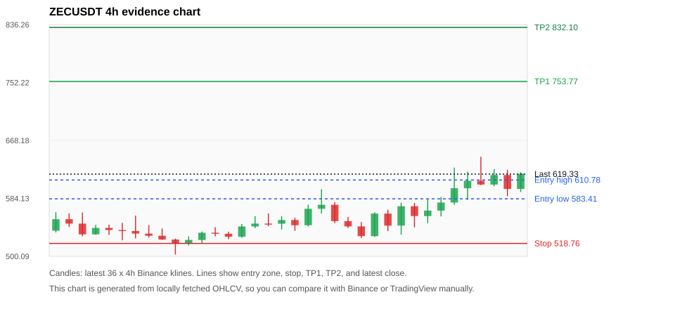
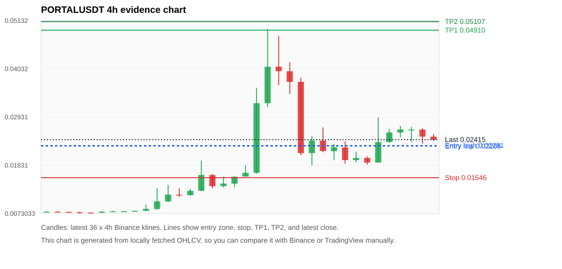

# Crypto 市场扫描报告 v3

- 报告时间：2026-06-03 21:48:23 CST
- 报告版本：v3
- 扫描 ID：a4011d044311
- 数据源：Binance public spot API + CoinGecko/CoinMarketCap cross-check
- 过滤条件：USDT spot; 24h quote volume >= 30,000,000; trades >= 30,000; exclude stables/leveraged tokens; analyze 1h/4h/1d klines
- 默认单笔风险：账户权益的 1.00%

## 限制说明

- 交易信号仍以 Binance 现货公开 K 线为主源；外部数据源用于一致性复核。
- 结果是研究和模拟盘计划，不是确定收益或实盘下单指令。
- 已启用数据交叉验证：Binance 主源 + CoinGecko 自动对照；CoinMarketCap 在配置 API Key 后自动对照。
- CoinMarketCap 对照已跳过：未配置 CMC_API_KEY 或 COINMARKETCAP_API_KEY。

## 2 个候选交易计划

| Rank | Coin | Setup | Entry Zone | Stop Loss | TP1 | TP2 / Exit Rule | R/R | Verdict |
|---:|---|---|---:|---:|---:|---|---:|---|
| 1 | `ZEC` | 趋势中，等回调入场 | 583.41 - 610.78 | 518.76 | 753.77 | 832.10 或跌破 4h 关键支撑 | 2.00-3.00 | 只等回调 |
| 2 | `PORTAL` | 趋势中，等回调入场 | 0.02266 - 0.02281 | 0.01546 | 0.04910 | 0.05107 或跌破 4h 关键支撑 | 3.63-3.90 | 只等回调 |

## 数据交叉验证摘要

价格差异以 Binance 当前价为基准；成交量口径不同，Binance 是 USDT 现货成交额，CoinGecko/CoinMarketCap 通常是全市场成交量。

| Rank | Coin | Data Status | Max Price Diff | Max 24h Diff | Message |
|---:|---|---|---:|---:|---|
| 1 | `ZEC` | DATA_OK | 0.16% | 0.69 pts | External provider checks agree with Binance within configured thresholds. |
| 2 | `PORTAL` | DATA_OK | 0.01% | 0.60 pts | External provider checks agree with Binance within configured thresholds. |

## 候选币说明

### 1. ZEC `ZECUSDT`



- 入选原因：趋势中，等回调入场；24h +8.09%，7d +8.81%，4h RSI 65.14，24h 成交额 $370.0M。
- 交易失效条件：跌破 518.7601 或 4h 收盘重新失守关键支撑。
- 主要风险：主要风险是大盘同步回撤。
- 数据交叉验证：DATA_OK；External provider checks agree with Binance within configured thresholds.

#### 可点击人工验证

- [Binance 交易页](https://www.binance.com/en/trade/ZEC_USDT)
- [TradingView 图表](https://www.tradingview.com/chart/?symbol=BINANCE%3AZECUSDT)
- [CoinGecko 搜索](https://www.coingecko.com/en/search?query=ZEC)
- [CoinMarketCap 搜索](https://coinmarketcap.com/search/?q=ZEC)

#### 多数据源对照

| Source | Status | Asset ID | Price | 24h Change | 24h Volume | Price Diff | 24h Diff | Updated | Message |
|---|---|---|---:|---:|---:|---:|---:|---|---|
| Binance | DATA_OK | ZECUSDT | 619.33 | +8.09% | $370.0M | 0.00% | 0.00 pts | 2026-06-03T13:48:21+00:00 | Primary market data source used by scanner. |
| CoinGecko | DATA_OK | zcash | 618.32 | +7.40% | $1.37B | 0.16% | 0.69 pts | 2026-06-03T13:48:06.002Z | External source agrees with Binance within thresholds. |
| CoinMarketCap | DATA_SKIPPED | n/a | n/a | n/a | n/a | n/a | n/a | 2026-06-03T13:48:21+00:00 | Skipped because CMC_API_KEY or COINMARKETCAP_API_KEY is not configured. |

#### 指标证据

| 指标 | 数值 | 人工核对用途 |
|---|---:|---|
| 当前价 | 619.33 | 与 Binance/TradingView 当前价格对照 |
| 24h 涨跌 | +8.09% | 与交易所 24h 涨跌对照 |
| 7d 涨跌 | +8.81% | 判断短线趋势是否延续 |
| 4h EMA20 | 579.31 | 判断短期趋势支撑 |
| 4h EMA50 | 570.77 | 判断中期趋势支撑 |
| 1d EMA20 | 568.82 | 判断日线趋势 |
| 1d EMA50 | 496.78 | 判断日线趋势 |
| 4h RSI14 | 65.14 | 判断是否过热/过弱 |
| 4h ATR14 | 34.2064 | 推导止损和入场缓冲 |
| 最近 18 根 4h 最低点 | 526.66 | 支撑/止损参考 |
| 最近 36 根 4h 最高点 | 644.51 | TP/压力参考 |
| 支撑位 | 579.31 | 入场区间推导基础 |

#### 交易计划推导

- 支撑位 = 最近低点、4h EMA20、4h EMA50、1d EMA20 中不高于当前价的最高有效支撑 = `579.31`。
- 入场区间 = 支撑位附近 + ATR 缓冲 = `583.41 - 610.78`。
- 止损 = min(最近 18 根 4h 最低点 * 0.985, 入场中位价 - 1.15 * ATR14) = `518.76`。
- TP1 = max(最近 36 根 4h 最高点 * 0.995, 入场中位价 + 2R) = `753.77`。
- TP2 = max(入场中位价 + 3R, TP1 * 1.04) = `832.10`。

#### 最近 10 根 4h K线

| UTC 开盘时间 | Open | High | Low | Close | Quote Volume | Trades |
|---|---:|---:|---:|---:|---:|---:|
| 2026-06-02T00:00+00:00 | 544.65 | 577.96 | 531.37 | 572.68 | $28.6M | 202993 |
| 2026-06-02T04:00+00:00 | 572.72 | 577.50 | 542.16 | 558.48 | $35.7M | 247297 |
| 2026-06-02T08:00+00:00 | 558.47 | 583.43 | 548.10 | 566.40 | $30.3M | 219113 |
| 2026-06-02T12:00+00:00 | 566.39 | 586.13 | 557.91 | 578.07 | $47.0M | 334944 |
| 2026-06-02T16:00+00:00 | 578.10 | 628.74 | 575.11 | 598.84 | $87.7M | 486120 |
| 2026-06-02T20:00+00:00 | 598.84 | 623.01 | 581.94 | 609.69 | $73.6M | 399793 |
| 2026-06-03T00:00+00:00 | 609.64 | 644.51 | 603.30 | 604.18 | $71.4M | 423267 |
| 2026-06-03T04:00+00:00 | 604.18 | 626.70 | 601.89 | 617.98 | $49.4M | 292054 |
| 2026-06-03T08:00+00:00 | 617.97 | 625.61 | 587.52 | 597.81 | $41.5M | 250715 |
| 2026-06-03T12:00+00:00 | 597.83 | 622.12 | 593.37 | 619.81 | $19.1M | 139916 |

### 2. PORTAL `PORTALUSDT`



- 入选原因：趋势中，等回调入场；24h +20.31%，7d +194.15%，4h RSI 30.00，24h 成交额 $35.8M。
- 交易失效条件：跌破 0.0154645 或 4h 收盘重新失守关键支撑。
- 主要风险：24h 振幅较大，回撤风险高。
- 数据交叉验证：DATA_OK；External provider checks agree with Binance within configured thresholds.

#### 可点击人工验证

- [Binance 交易页](https://www.binance.com/en/trade/PORTAL_USDT)
- [TradingView 图表](https://www.tradingview.com/chart/?symbol=BINANCE%3APORTALUSDT)
- [CoinGecko 搜索](https://www.coingecko.com/en/search?query=PORTAL)
- [CoinMarketCap 搜索](https://coinmarketcap.com/search/?q=PORTAL)

#### 多数据源对照

| Source | Status | Asset ID | Price | 24h Change | 24h Volume | Price Diff | 24h Diff | Updated | Message |
|---|---|---|---:|---:|---:|---:|---:|---|---|
| Binance | DATA_OK | PORTALUSDT | 0.02415 | +20.31% | $35.8M | 0.00% | 0.00 pts | 2026-06-03T13:48:21+00:00 | Primary market data source used by scanner. |
| CoinGecko | DATA_OK | portal-2 | 0.02415 | +20.90% | $160.2M | 0.01% | 0.60 pts | 2026-06-03T13:48:19.306Z | External source agrees with Binance within thresholds. |
| CoinMarketCap | DATA_SKIPPED | n/a | n/a | n/a | n/a | n/a | n/a | 2026-06-03T13:48:21+00:00 | Skipped because CMC_API_KEY or COINMARKETCAP_API_KEY is not configured. |

#### 指标证据

| 指标 | 数值 | 人工核对用途 |
|---|---:|---|
| 当前价 | 0.02415 | 与 Binance/TradingView 当前价格对照 |
| 24h 涨跌 | +20.31% | 与交易所 24h 涨跌对照 |
| 7d 涨跌 | +194.15% | 判断短线趋势是否延续 |
| 4h EMA20 | 0.02261 | 判断短期趋势支撑 |
| 4h EMA50 | 0.01771 | 判断中期趋势支撑 |
| 1d EMA20 | 0.01466 | 判断日线趋势 |
| 1d EMA50 | 0.01228 | 判断日线趋势 |
| 4h RSI14 | 30.00 | 判断是否过热/过弱 |
| 4h ATR14 | 0.0053757143 | 推导止损和入场缓冲 |
| 最近 18 根 4h 最低点 | 0.01570 | 支撑/止损参考 |
| 最近 36 根 4h 最高点 | 0.04935 | TP/压力参考 |
| 支撑位 | 0.02261 | 入场区间推导基础 |

#### 交易计划推导

- 支撑位 = 最近低点、4h EMA20、4h EMA50、1d EMA20 中不高于当前价的最高有效支撑 = `0.02261`。
- 入场区间 = 支撑位附近 + ATR 缓冲 = `0.02266 - 0.02281`。
- 止损 = min(最近 18 根 4h 最低点 * 0.985, 入场中位价 - 1.15 * ATR14) = `0.01546`。
- TP1 = max(最近 36 根 4h 最高点 * 0.995, 入场中位价 + 2R) = `0.04910`。
- TP2 = max(入场中位价 + 3R, TP1 * 1.04) = `0.05107`。

#### 最近 10 根 4h K线

| UTC 开盘时间 | Open | High | Low | Close | Quote Volume | Trades |
|---|---:|---:|---:|---:|---:|---:|
| 2026-06-02T00:00+00:00 | 0.02151 | 0.02314 | 0.01944 | 0.02239 | $4.5M | 70946 |
| 2026-06-02T04:00+00:00 | 0.02235 | 0.02379 | 0.01862 | 0.01948 | $3.3M | 50449 |
| 2026-06-02T08:00+00:00 | 0.01946 | 0.02139 | 0.01895 | 0.01996 | $2.4M | 30146 |
| 2026-06-02T12:00+00:00 | 0.01996 | 0.02037 | 0.01841 | 0.01892 | $2.1M | 21140 |
| 2026-06-02T16:00+00:00 | 0.01892 | 0.02918 | 0.01886 | 0.02360 | $17.1M | 163920 |
| 2026-06-02T20:00+00:00 | 0.02361 | 0.02656 | 0.02342 | 0.02578 | $5.2M | 58373 |
| 2026-06-03T00:00+00:00 | 0.02576 | 0.02729 | 0.02474 | 0.02645 | $4.6M | 49400 |
| 2026-06-03T04:00+00:00 | 0.02644 | 0.02700 | 0.02359 | 0.02644 | $3.5M | 37753 |
| 2026-06-03T08:00+00:00 | 0.02643 | 0.02675 | 0.02321 | 0.02483 | $2.7M | 35565 |
| 2026-06-03T12:00+00:00 | 0.02482 | 0.02548 | 0.02376 | 0.02415 | $1.5M | 17756 |

## 组合风控

- 不要 5 个候选全部满仓买入。
- 同时持仓总风险建议控制在账户权益的 3% - 5% 以内。
- 如果 BTC/ETH 同时破位，暂停山寨币多头计划或降低仓位。
- 第一版报告用于模拟盘和人工复核，不自动下单。

## 原始数据

```json
[
  {
    "rank": 1,
    "symbol": "ZECUSDT",
    "base_asset": "ZEC",
    "price": 619.33,
    "score": 72.57594413754546,
    "setup": "趋势中，等回调入场",
    "verdict": "只等回调",
    "entry_low": 583.4132500000001,
    "entry_high": 610.7783928571429,
    "stop_loss": 518.7601,
    "take_profit_1": 753.7672642857146,
    "take_profit_2": 832.1029857142862,
    "risk_reward_1": 2.0,
    "risk_reward_2": 3.0,
    "pct_24h": 8.093,
    "pct_3d": 13.503161367176775,
    "pct_7d": 8.807097680955733,
    "quote_volume_24h": 370046926.25073,
    "trades_24h": 2188121,
    "high_low_range_24h": 15.522216845010849,
    "rsi_1h": 54.11754655732102,
    "rsi_4h": 65.13902965672233,
    "ema20_4h": 579.313235654941,
    "ema50_4h": 570.7681768886891,
    "ema20_1d": 568.8212369483175,
    "ema50_1d": 496.7842782726409,
    "atr_4h": 34.20642857142858,
    "macd_hist_4h": 6.4471053196241215,
    "volume_ratio_24h": 2.839066959457159,
    "support_level": 579.313235654941,
    "recent_low_4h_18": 526.66,
    "recent_high_4h_36": 644.51,
    "distance_to_support_pct": 6.9076212801902015,
    "binance_trade_url": "https://www.binance.com/en/trade/ZEC_USDT",
    "tradingview_url": "https://www.tradingview.com/chart/?symbol=BINANCE%3AZECUSDT",
    "coingecko_search_url": "https://www.coingecko.com/en/search?query=ZEC",
    "coinmarketcap_search_url": "https://coinmarketcap.com/search/?q=ZEC",
    "invalidation": "跌破 518.7601 或 4h 收盘重新失守关键支撑",
    "recent_4h_klines": [
      {
        "open_time_utc": "2026-05-28T16:00+00:00",
        "open": 537.34,
        "high": 564.1,
        "low": 534.59,
        "close": 553.88,
        "quote_volume": 27081461.62267,
        "trades": 180775
      },
      {
        "open_time_utc": "2026-05-28T20:00+00:00",
        "open": 553.87,
        "high": 562.12,
        "low": 542.72,
        "close": 547.53,
        "quote_volume": 18370534.86302,
        "trades": 144286
      },
      {
        "open_time_utc": "2026-05-29T00:00+00:00",
        "open": 547.52,
        "high": 563.56,
        "low": 529.13,
        "close": 531.9,
        "quote_volume": 25339494.9406,
        "trades": 161762
      },
      {
        "open_time_utc": "2026-05-29T04:00+00:00",
        "open": 531.92,
        "high": 545.68,
        "low": 531.32,
        "close": 541.21,
        "quote_volume": 10431254.33339,
        "trades": 78925
      },
      {
        "open_time_utc": "2026-05-29T08:00+00:00",
        "open": 541.25,
        "high": 546.05,
        "low": 531.12,
        "close": 538.22,
        "quote_volume": 15193695.28099,
        "trades": 76956
      },
      {
        "open_time_utc": "2026-05-29T12:00+00:00",
        "open": 538.18,
        "high": 548.53,
        "low": 523.28,
        "close": 536.77,
        "quote_volume": 23944865.60538,
        "trades": 144733
      },
      {
        "open_time_utc": "2026-05-29T16:00+00:00",
        "open": 536.76,
        "high": 559.14,
        "low": 526.12,
        "close": 533.0,
        "quote_volume": 29199242.51925,
        "trades": 200807
      },
      {
        "open_time_utc": "2026-05-29T20:00+00:00",
        "open": 533.02,
        "high": 545.49,
        "low": 527.28,
        "close": 529.89,
        "quote_volume": 13829794.04478,
        "trades": 103652
      },
      {
        "open_time_utc": "2026-05-30T00:00+00:00",
        "open": 529.85,
        "high": 540.33,
        "low": 523.82,
        "close": 524.38,
        "quote_volume": 10796238.64058,
        "trades": 83991
      },
      {
        "open_time_utc": "2026-05-30T04:00+00:00",
        "open": 524.39,
        "high": 525.8,
        "low": 502.6,
        "close": 518.59,
        "quote_volume": 26366613.32443,
        "trades": 170240
      },
      {
        "open_time_utc": "2026-05-30T08:00+00:00",
        "open": 518.58,
        "high": 529.05,
        "low": 515.86,
        "close": 523.81,
        "quote_volume": 8734900.23086,
        "trades": 60002
      },
      {
        "open_time_utc": "2026-05-30T12:00+00:00",
        "open": 523.81,
        "high": 536.0,
        "low": 519.05,
        "close": 534.3,
        "quote_volume": 12765082.92875,
        "trades": 84537
      },
      {
        "open_time_utc": "2026-05-30T16:00+00:00",
        "open": 534.3,
        "high": 542.39,
        "low": 529.0,
        "close": 532.85,
        "quote_volume": 12248214.94856,
        "trades": 101177
      },
      {
        "open_time_utc": "2026-05-30T20:00+00:00",
        "open": 532.85,
        "high": 535.84,
        "low": 524.81,
        "close": 528.49,
        "quote_volume": 7396492.70742,
        "trades": 51811
      },
      {
        "open_time_utc": "2026-05-31T00:00+00:00",
        "open": 528.49,
        "high": 546.93,
        "low": 526.74,
        "close": 543.37,
        "quote_volume": 14692134.79914,
        "trades": 87226
      },
      {
        "open_time_utc": "2026-05-31T04:00+00:00",
        "open": 543.37,
        "high": 558.34,
        "low": 540.87,
        "close": 547.57,
        "quote_volume": 16621844.46921,
        "trades": 150075
      },
      {
        "open_time_utc": "2026-05-31T08:00+00:00",
        "open": 547.57,
        "high": 562.24,
        "low": 543.77,
        "close": 547.41,
        "quote_volume": 24774392.80859,
        "trades": 125710
      },
      {
        "open_time_utc": "2026-05-31T12:00+00:00",
        "open": 547.4,
        "high": 558.5,
        "low": 538.97,
        "close": 552.7,
        "quote_volume": 21753001.30409,
        "trades": 117774
      },
      {
        "open_time_utc": "2026-05-31T16:00+00:00",
        "open": 552.69,
        "high": 556.0,
        "low": 537.0,
        "close": 545.19,
        "quote_volume": 17813643.25369,
        "trades": 115682
      },
      {
        "open_time_utc": "2026-05-31T20:00+00:00",
        "open": 545.17,
        "high": 575.14,
        "low": 543.38,
        "close": 569.01,
        "quote_volume": 29056762.83825,
        "trades": 160253
      },
      {
        "open_time_utc": "2026-06-01T00:00+00:00",
        "open": 568.99,
        "high": 597.39,
        "low": 562.18,
        "close": 574.79,
        "quote_volume": 43698437.69394,
        "trades": 233915
      },
      {
        "open_time_utc": "2026-06-01T04:00+00:00",
        "open": 574.79,
        "high": 578.8,
        "low": 548.16,
        "close": 551.1,
        "quote_volume": 17394083.54525,
        "trades": 130654
      },
      {
        "open_time_utc": "2026-06-01T08:00+00:00",
        "open": 551.11,
        "high": 557.33,
        "low": 541.22,
        "close": 543.42,
        "quote_volume": 13111792.47294,
        "trades": 96130
      },
      {
        "open_time_utc": "2026-06-01T12:00+00:00",
        "open": 543.47,
        "high": 549.67,
        "low": 526.66,
        "close": 529.34,
        "quote_volume": 30556277.21165,
        "trades": 190086
      },
      {
        "open_time_utc": "2026-06-01T16:00+00:00",
        "open": 529.33,
        "high": 563.84,
        "low": 528.18,
        "close": 562.06,
        "quote_volume": 26125630.08557,
        "trades": 145375
      },
      {
        "open_time_utc": "2026-06-01T20:00+00:00",
        "open": 562.06,
        "high": 567.8,
        "low": 536.73,
        "close": 544.59,
        "quote_volume": 17136568.45047,
        "trades": 123784
      },
      {
        "open_time_utc": "2026-06-02T00:00+00:00",
        "open": 544.65,
        "high": 577.96,
        "low": 531.37,
        "close": 572.68,
        "quote_volume": 28555528.15381,
        "trades": 202993
      },
      {
        "open_time_utc": "2026-06-02T04:00+00:00",
        "open": 572.72,
        "high": 577.5,
        "low": 542.16,
        "close": 558.48,
        "quote_volume": 35722202.74451,
        "trades": 247297
      },
      {
        "open_time_utc": "2026-06-02T08:00+00:00",
        "open": 558.47,
        "high": 583.43,
        "low": 548.1,
        "close": 566.4,
        "quote_volume": 30299071.32548,
        "trades": 219113
      },
      {
        "open_time_utc": "2026-06-02T12:00+00:00",
        "open": 566.39,
        "high": 586.13,
        "low": 557.91,
        "close": 578.07,
        "quote_volume": 46992255.34852,
        "trades": 334944
      },
      {
        "open_time_utc": "2026-06-02T16:00+00:00",
        "open": 578.1,
        "high": 628.74,
        "low": 575.11,
        "close": 598.84,
        "quote_volume": 87708394.74843,
        "trades": 486120
      },
      {
        "open_time_utc": "2026-06-02T20:00+00:00",
        "open": 598.84,
        "high": 623.01,
        "low": 581.94,
        "close": 609.69,
        "quote_volume": 73618487.95115,
        "trades": 399793
      },
      {
        "open_time_utc": "2026-06-03T00:00+00:00",
        "open": 609.64,
        "high": 644.51,
        "low": 603.3,
        "close": 604.18,
        "quote_volume": 71374672.35292,
        "trades": 423267
      },
      {
        "open_time_utc": "2026-06-03T04:00+00:00",
        "open": 604.18,
        "high": 626.7,
        "low": 601.89,
        "close": 617.98,
        "quote_volume": 49369205.23678,
        "trades": 292054
      },
      {
        "open_time_utc": "2026-06-03T08:00+00:00",
        "open": 617.97,
        "high": 625.61,
        "low": 587.52,
        "close": 597.81,
        "quote_volume": 41497316.47242,
        "trades": 250715
      },
      {
        "open_time_utc": "2026-06-03T12:00+00:00",
        "open": 597.83,
        "high": 622.12,
        "low": 593.37,
        "close": 619.81,
        "quote_volume": 19074136.68521,
        "trades": 139916
      }
    ],
    "risks": [
      "主要风险是大盘同步回撤"
    ],
    "data_quality_status": "DATA_OK",
    "data_quality_message": "External provider checks agree with Binance within configured thresholds.",
    "data_checks": [
      {
        "provider": "Binance",
        "status": "DATA_OK",
        "provider_asset_id": "ZECUSDT",
        "provider_symbol": "ZECUSDT",
        "price_usd": 619.33,
        "pct_24h": 8.093,
        "volume_24h": 370046926.25073,
        "last_updated": null,
        "fetched_at_utc": "2026-06-03T13:48:21+00:00",
        "price_diff_pct": 0.0,
        "pct_24h_diff": 0.0,
        "volume_note": "Binance USDT spot 24h quoteVolume.",
        "message": "Primary market data source used by scanner."
      },
      {
        "provider": "CoinGecko",
        "status": "DATA_OK",
        "provider_asset_id": "zcash",
        "provider_symbol": "ZEC",
        "price_usd": 618.32,
        "pct_24h": 7.40188,
        "volume_24h": 1370493368.0,
        "last_updated": "2026-06-03T13:48:06.002Z",
        "fetched_at_utc": "2026-06-03T13:48:21+00:00",
        "price_diff_pct": 0.1630794568323819,
        "pct_24h_diff": 0.6911199999999997,
        "volume_note": "CoinGecko total market volume; not the same venue scope as Binance quoteVolume.",
        "message": "External source agrees with Binance within thresholds."
      },
      {
        "provider": "CoinMarketCap",
        "status": "DATA_SKIPPED",
        "provider_asset_id": null,
        "provider_symbol": "ZEC",
        "price_usd": null,
        "pct_24h": null,
        "volume_24h": null,
        "last_updated": null,
        "fetched_at_utc": "2026-06-03T13:48:21+00:00",
        "price_diff_pct": null,
        "pct_24h_diff": null,
        "volume_note": "CoinMarketCap requires an API key.",
        "message": "Skipped because CMC_API_KEY or COINMARKETCAP_API_KEY is not configured."
      }
    ]
  },
  {
    "rank": 2,
    "symbol": "PORTALUSDT",
    "base_asset": "PORTAL",
    "price": 0.02415,
    "score": 69.54904559811669,
    "setup": "趋势中，等回调入场",
    "verdict": "只等回调",
    "entry_low": 0.02265724538842359,
    "entry_high": 0.02280607142857143,
    "stop_loss": 0.015464499999999999,
    "take_profit_1": 0.04910325,
    "take_profit_2": 0.05106738,
    "risk_reward_1": 3.6288725398728223,
    "risk_reward_2": 3.8991473693994965,
    "pct_24h": 20.309,
    "pct_3d": 72.37687366167025,
    "pct_7d": 194.15347137637028,
    "quote_volume_24h": 35764960.051986,
    "trades_24h": 376339,
    "high_low_range_24h": 58.50081477457905,
    "rsi_1h": 42.570647219690066,
    "rsi_4h": 30.002562131693566,
    "ema20_4h": 0.022612021345732126,
    "ema50_4h": 0.017705529540167252,
    "ema20_1d": 0.014662813081256103,
    "ema50_1d": 0.012277402676830163,
    "atr_4h": 0.005375714285714285,
    "macd_hist_4h": -0.0004929604258092626,
    "volume_ratio_24h": 1.1077006186941571,
    "support_level": 0.022612021345732126,
    "recent_low_4h_18": 0.0157,
    "recent_high_4h_36": 0.04935,
    "distance_to_support_pct": 6.801597392610637,
    "binance_trade_url": "https://www.binance.com/en/trade/PORTAL_USDT",
    "tradingview_url": "https://www.tradingview.com/chart/?symbol=BINANCE%3APORTALUSDT",
    "coingecko_search_url": "https://www.coingecko.com/en/search?query=PORTAL",
    "coinmarketcap_search_url": "https://coinmarketcap.com/search/?q=PORTAL",
    "invalidation": "跌破 0.0154645 或 4h 收盘重新失守关键支撑",
    "recent_4h_klines": [
      {
        "open_time_utc": "2026-05-28T16:00+00:00",
        "open": 0.00761,
        "high": 0.0078,
        "low": 0.00758,
        "close": 0.0077,
        "quote_volume": 8947.511682,
        "trades": 176
      },
      {
        "open_time_utc": "2026-05-28T20:00+00:00",
        "open": 0.00771,
        "high": 0.0078,
        "low": 0.00763,
        "close": 0.00763,
        "quote_volume": 17445.249247,
        "trades": 223
      },
      {
        "open_time_utc": "2026-05-29T00:00+00:00",
        "open": 0.00766,
        "high": 0.00773,
        "low": 0.00757,
        "close": 0.00759,
        "quote_volume": 18903.533715,
        "trades": 239
      },
      {
        "open_time_utc": "2026-05-29T04:00+00:00",
        "open": 0.00759,
        "high": 0.0077,
        "low": 0.00734,
        "close": 0.00748,
        "quote_volume": 74917.053462,
        "trades": 1119
      },
      {
        "open_time_utc": "2026-05-29T08:00+00:00",
        "open": 0.00748,
        "high": 0.00752,
        "low": 0.00736,
        "close": 0.00745,
        "quote_volume": 15563.340334,
        "trades": 316
      },
      {
        "open_time_utc": "2026-05-29T12:00+00:00",
        "open": 0.00746,
        "high": 0.00774,
        "low": 0.0074,
        "close": 0.00771,
        "quote_volume": 46831.337718,
        "trades": 578
      },
      {
        "open_time_utc": "2026-05-29T16:00+00:00",
        "open": 0.0077,
        "high": 0.00792,
        "low": 0.00767,
        "close": 0.00778,
        "quote_volume": 85869.512557,
        "trades": 1264
      },
      {
        "open_time_utc": "2026-05-29T20:00+00:00",
        "open": 0.00779,
        "high": 0.00793,
        "low": 0.00775,
        "close": 0.00781,
        "quote_volume": 35360.577665,
        "trades": 629
      },
      {
        "open_time_utc": "2026-05-30T00:00+00:00",
        "open": 0.00781,
        "high": 0.00799,
        "low": 0.00778,
        "close": 0.00789,
        "quote_volume": 20397.964639,
        "trades": 606
      },
      {
        "open_time_utc": "2026-05-30T04:00+00:00",
        "open": 0.0079,
        "high": 0.00932,
        "low": 0.00784,
        "close": 0.00833,
        "quote_volume": 985304.993157,
        "trades": 21044
      },
      {
        "open_time_utc": "2026-05-30T08:00+00:00",
        "open": 0.00832,
        "high": 0.01304,
        "low": 0.00813,
        "close": 0.01005,
        "quote_volume": 8537654.936083,
        "trades": 115281
      },
      {
        "open_time_utc": "2026-05-30T12:00+00:00",
        "open": 0.01004,
        "high": 0.0138,
        "low": 0.00989,
        "close": 0.01161,
        "quote_volume": 6790765.056807,
        "trades": 110122
      },
      {
        "open_time_utc": "2026-05-30T16:00+00:00",
        "open": 0.01159,
        "high": 0.01305,
        "low": 0.01111,
        "close": 0.01148,
        "quote_volume": 3144662.442173,
        "trades": 46098
      },
      {
        "open_time_utc": "2026-05-30T20:00+00:00",
        "open": 0.01148,
        "high": 0.01289,
        "low": 0.01135,
        "close": 0.01247,
        "quote_volume": 2614560.928223,
        "trades": 31117
      },
      {
        "open_time_utc": "2026-05-31T00:00+00:00",
        "open": 0.01247,
        "high": 0.01941,
        "low": 0.01239,
        "close": 0.01608,
        "quote_volume": 13099217.87088,
        "trades": 146605
      },
      {
        "open_time_utc": "2026-05-31T04:00+00:00",
        "open": 0.01607,
        "high": 0.0163,
        "low": 0.01302,
        "close": 0.01352,
        "quote_volume": 5603979.777842,
        "trades": 96244
      },
      {
        "open_time_utc": "2026-05-31T08:00+00:00",
        "open": 0.01353,
        "high": 0.01569,
        "low": 0.01322,
        "close": 0.01412,
        "quote_volume": 5830031.221654,
        "trades": 57318
      },
      {
        "open_time_utc": "2026-05-31T12:00+00:00",
        "open": 0.0141,
        "high": 0.01577,
        "low": 0.01335,
        "close": 0.01568,
        "quote_volume": 4016731.1738,
        "trades": 60355
      },
      {
        "open_time_utc": "2026-05-31T16:00+00:00",
        "open": 0.01572,
        "high": 0.01827,
        "low": 0.0157,
        "close": 0.01657,
        "quote_volume": 6227050.712939,
        "trades": 83077
      },
      {
        "open_time_utc": "2026-05-31T20:00+00:00",
        "open": 0.01657,
        "high": 0.03599,
        "low": 0.0164,
        "close": 0.03245,
        "quote_volume": 24381028.104833,
        "trades": 336948
      },
      {
        "open_time_utc": "2026-06-01T00:00+00:00",
        "open": 0.03245,
        "high": 0.04935,
        "low": 0.03159,
        "close": 0.04077,
        "quote_volume": 34928051.677532,
        "trades": 555314
      },
      {
        "open_time_utc": "2026-06-01T04:00+00:00",
        "open": 0.04078,
        "high": 0.04781,
        "low": 0.03657,
        "close": 0.03976,
        "quote_volume": 20504127.453523,
        "trades": 245722
      },
      {
        "open_time_utc": "2026-06-01T08:00+00:00",
        "open": 0.03974,
        "high": 0.04182,
        "low": 0.03453,
        "close": 0.03731,
        "quote_volume": 8716351.917817,
        "trades": 148395
      },
      {
        "open_time_utc": "2026-06-01T12:00+00:00",
        "open": 0.03731,
        "high": 0.03825,
        "low": 0.02058,
        "close": 0.02107,
        "quote_volume": 14814734.801724,
        "trades": 172290
      },
      {
        "open_time_utc": "2026-06-01T16:00+00:00",
        "open": 0.02108,
        "high": 0.02499,
        "low": 0.01832,
        "close": 0.02393,
        "quote_volume": 13226617.514317,
        "trades": 137639
      },
      {
        "open_time_utc": "2026-06-01T20:00+00:00",
        "open": 0.02394,
        "high": 0.02692,
        "low": 0.02124,
        "close": 0.02155,
        "quote_volume": 8021503.793932,
        "trades": 92316
      },
      {
        "open_time_utc": "2026-06-02T00:00+00:00",
        "open": 0.02151,
        "high": 0.02314,
        "low": 0.01944,
        "close": 0.02239,
        "quote_volume": 4451639.387389,
        "trades": 70946
      },
      {
        "open_time_utc": "2026-06-02T04:00+00:00",
        "open": 0.02235,
        "high": 0.02379,
        "low": 0.01862,
        "close": 0.01948,
        "quote_volume": 3289415.137157,
        "trades": 50449
      },
      {
        "open_time_utc": "2026-06-02T08:00+00:00",
        "open": 0.01946,
        "high": 0.02139,
        "low": 0.01895,
        "close": 0.01996,
        "quote_volume": 2448629.672807,
        "trades": 30146
      },
      {
        "open_time_utc": "2026-06-02T12:00+00:00",
        "open": 0.01996,
        "high": 0.02037,
        "low": 0.01841,
        "close": 0.01892,
        "quote_volume": 2088577.050205,
        "trades": 21140
      },
      {
        "open_time_utc": "2026-06-02T16:00+00:00",
        "open": 0.01892,
        "high": 0.02918,
        "low": 0.01886,
        "close": 0.0236,
        "quote_volume": 17053204.610653,
        "trades": 163920
      },
      {
        "open_time_utc": "2026-06-02T20:00+00:00",
        "open": 0.02361,
        "high": 0.02656,
        "low": 0.02342,
        "close": 0.02578,
        "quote_volume": 5154559.438286,
        "trades": 58373
      },
      {
        "open_time_utc": "2026-06-03T00:00+00:00",
        "open": 0.02576,
        "high": 0.02729,
        "low": 0.02474,
        "close": 0.02645,
        "quote_volume": 4603853.411677,
        "trades": 49400
      },
      {
        "open_time_utc": "2026-06-03T04:00+00:00",
        "open": 0.02644,
        "high": 0.027,
        "low": 0.02359,
        "close": 0.02644,
        "quote_volume": 3458087.063767,
        "trades": 37753
      },
      {
        "open_time_utc": "2026-06-03T08:00+00:00",
        "open": 0.02643,
        "high": 0.02675,
        "low": 0.02321,
        "close": 0.02483,
        "quote_volume": 2720843.682428,
        "trades": 35565
      },
      {
        "open_time_utc": "2026-06-03T12:00+00:00",
        "open": 0.02482,
        "high": 0.02548,
        "low": 0.02376,
        "close": 0.02415,
        "quote_volume": 1529999.080764,
        "trades": 17756
      }
    ],
    "risks": [
      "24h 振幅较大，回撤风险高"
    ],
    "data_quality_status": "DATA_OK",
    "data_quality_message": "External provider checks agree with Binance within configured thresholds.",
    "data_checks": [
      {
        "provider": "Binance",
        "status": "DATA_OK",
        "provider_asset_id": "PORTALUSDT",
        "provider_symbol": "PORTALUSDT",
        "price_usd": 0.02415,
        "pct_24h": 20.309,
        "volume_24h": 35764960.051986,
        "last_updated": null,
        "fetched_at_utc": "2026-06-03T13:48:21+00:00",
        "price_diff_pct": 0.0,
        "pct_24h_diff": 0.0,
        "volume_note": "Binance USDT spot 24h quoteVolume.",
        "message": "Primary market data source used by scanner."
      },
      {
        "provider": "CoinGecko",
        "status": "DATA_OK",
        "provider_asset_id": "portal-2",
        "provider_symbol": "PORTAL",
        "price_usd": 0.02415293,
        "pct_24h": 20.90459,
        "volume_24h": 160180121.0,
        "last_updated": "2026-06-03T13:48:19.306Z",
        "fetched_at_utc": "2026-06-03T13:48:21+00:00",
        "price_diff_pct": 0.012132505175976032,
        "pct_24h_diff": 0.5955899999999978,
        "volume_note": "CoinGecko total market volume; not the same venue scope as Binance quoteVolume.",
        "message": "External source agrees with Binance within thresholds."
      },
      {
        "provider": "CoinMarketCap",
        "status": "DATA_SKIPPED",
        "provider_asset_id": null,
        "provider_symbol": "PORTAL",
        "price_usd": null,
        "pct_24h": null,
        "volume_24h": null,
        "last_updated": null,
        "fetched_at_utc": "2026-06-03T13:48:21+00:00",
        "price_diff_pct": null,
        "pct_24h_diff": null,
        "volume_note": "CoinMarketCap requires an API key.",
        "message": "Skipped because CMC_API_KEY or COINMARKETCAP_API_KEY is not configured."
      }
    ]
  }
]
```
