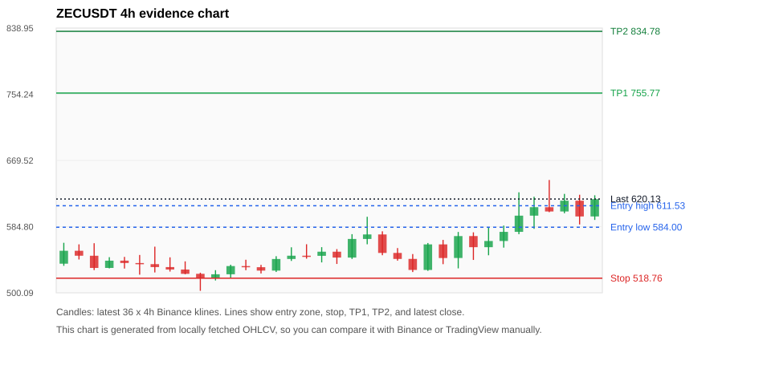

# Crypto 市场扫描报告 v5

- 报告时间：2026-06-03 22:20:05 CST
- 报告版本：v5
- 扫描 ID：f7c75400df7a
- 数据源：Binance public spot API + CoinGecko/CoinMarketCap cross-check
- 过滤条件：USDT spot; 24h quote volume >= 30,000,000; trades >= 30,000; exclude stables/leveraged tokens; analyze 1h/4h/1d klines
- 默认单笔风险：账户权益的 1.00%

## 限制说明

- 交易信号仍以 Binance 现货公开 K 线为主源；外部数据源用于一致性复核。
- 结果是研究和模拟盘计划，不是确定收益或实盘下单指令。
- 已启用数据交叉验证：Binance 主源 + CoinGecko 自动对照；CoinMarketCap 在配置 API Key 后自动对照。
- CoinMarketCap 对照已跳过：未配置 CMC_API_KEY 或 COINMARKETCAP_API_KEY。

## 1 个候选交易计划

| Rank | Coin | Setup | Entry Zone | Stop Loss | TP1 | TP2 / Exit Rule | R/R | Verdict |
|---:|---|---|---:|---:|---:|---|---:|---|
| 1 | `ZEC` | 趋势中，等回调入场 | 584.00 - 611.53 | 518.76 | 755.77 | 834.78 或跌破 4h 关键支撑 | 2.00-3.00 | 只等回调 |

## 数据交叉验证摘要

价格差异以 Binance 当前价为基准；成交量口径不同，Binance 是 USDT 现货成交额，CoinGecko/CoinMarketCap 通常是全市场成交量。

| Rank | Coin | Data Status | Max Price Diff | Max 24h Diff | Message |
|---:|---|---|---:|---:|---|
| 1 | `ZEC` | DATA_OK | 0.19% | 0.24 pts | External provider checks agree with Binance within configured thresholds. |

## 候选币说明

### 1. ZEC `ZECUSDT`



- 入选原因：趋势中，等回调入场；24h +8.31%，7d +8.79%，4h RSI 65.17，24h 成交额 $370.5M。
- 交易失效条件：跌破 518.7601 或 4h 收盘重新失守关键支撑。
- 主要风险：主要风险是大盘同步回撤。
- 数据交叉验证：DATA_OK；External provider checks agree with Binance within configured thresholds.

#### 可点击人工验证

- [Binance 交易页](https://www.binance.com/en/trade/ZEC_USDT)
- [TradingView 图表](https://www.tradingview.com/chart/?symbol=BINANCE%3AZECUSDT)
- [CoinGecko 搜索](https://www.coingecko.com/en/search?query=ZEC)
- [CoinMarketCap 搜索](https://coinmarketcap.com/search/?q=ZEC)

#### 多数据源对照

| Source | Status | Asset ID | Price | 24h Change | 24h Volume | Price Diff | 24h Diff | Updated | Message |
|---|---|---|---:|---:|---:|---:|---:|---|---|
| Binance | DATA_OK | ZECUSDT | 620.13 | +8.31% | $370.5M | 0.00% | 0.00 pts | 2026-06-03T14:20:04+00:00 | Primary market data source used by scanner. |
| CoinGecko | DATA_OK | zcash | 621.31 | +8.54% | $1.36B | 0.19% | 0.24 pts | 2026-06-03T14:19:43.934Z | External source agrees with Binance within thresholds. |
| CoinMarketCap | DATA_SKIPPED | n/a | n/a | n/a | n/a | n/a | n/a | 2026-06-03T14:20:04+00:00 | Skipped because CMC_API_KEY or COINMARKETCAP_API_KEY is not configured. |

#### 指标证据

| 指标 | 数值 | 人工核对用途 |
|---|---:|---|
| 当前价 | 620.13 | 与 Binance/TradingView 当前价格对照 |
| 24h 涨跌 | +8.31% | 与交易所 24h 涨跌对照 |
| 7d 涨跌 | +8.79% | 判断短线趋势是否延续 |
| 4h EMA20 | 579.33 | 判断短期趋势支撑 |
| 4h EMA50 | 570.78 | 判断中期趋势支撑 |
| 1d EMA20 | 568.87 | 判断日线趋势 |
| 1d EMA50 | 496.81 | 判断日线趋势 |
| 4h RSI14 | 65.17 | 判断是否过热/过弱 |
| 4h ATR14 | 34.4079 | 推导止损和入场缓冲 |
| 最近 18 根 4h 最低点 | 526.66 | 支撑/止损参考 |
| 最近 36 根 4h 最高点 | 644.51 | TP/压力参考 |
| 支撑位 | 579.33 | 入场区间推导基础 |

#### 交易计划推导

- 支撑位 = 最近低点、4h EMA20、4h EMA50、1d EMA20 中不高于当前价的最高有效支撑 = `579.33`。
- 入场区间 = 支撑位附近 + ATR 缓冲 = `584.00 - 611.53`。
- 止损 = min(最近 18 根 4h 最低点 * 0.985, 入场中位价 - 1.15 * ATR14) = `518.76`。
- TP1 = max(最近 36 根 4h 最高点 * 0.995, 入场中位价 + 2R) = `755.77`。
- TP2 = max(入场中位价 + 3R, TP1 * 1.04) = `834.78`。

#### 最近 10 根 4h K线

| UTC 开盘时间 | Open | High | Low | Close | Quote Volume | Trades |
|---|---:|---:|---:|---:|---:|---:|
| 2026-06-02T00:00+00:00 | 544.65 | 577.96 | 531.37 | 572.68 | $28.6M | 202993 |
| 2026-06-02T04:00+00:00 | 572.72 | 577.50 | 542.16 | 558.48 | $35.7M | 247297 |
| 2026-06-02T08:00+00:00 | 558.47 | 583.43 | 548.10 | 566.40 | $30.3M | 219113 |
| 2026-06-02T12:00+00:00 | 566.39 | 586.13 | 557.91 | 578.07 | $47.0M | 334944 |
| 2026-06-02T16:00+00:00 | 578.10 | 628.74 | 575.11 | 598.84 | $87.7M | 486120 |
| 2026-06-02T20:00+00:00 | 598.84 | 623.01 | 581.94 | 609.69 | $73.6M | 399793 |
| 2026-06-03T00:00+00:00 | 609.64 | 644.51 | 603.30 | 604.18 | $71.4M | 423267 |
| 2026-06-03T04:00+00:00 | 604.18 | 626.70 | 601.89 | 617.98 | $49.4M | 292054 |
| 2026-06-03T08:00+00:00 | 617.97 | 625.61 | 587.52 | 597.81 | $41.5M | 250715 |
| 2026-06-03T12:00+00:00 | 597.83 | 624.94 | 593.37 | 620.00 | $23.7M | 169799 |

## 组合风控

- 不要 5 个候选全部满仓买入。
- 同时持仓总风险建议控制在账户权益的 3% - 5% 以内。
- 如果 BTC/ETH 同时破位，暂停山寨币多头计划或降低仓位。
- 第一版报告用于模拟盘和人工复核，不自动下单。

## 原始数据

```json
[
  {
    "rank": 1,
    "symbol": "ZECUSDT",
    "base_asset": "ZEC",
    "price": 620.13,
    "score": 72.31815193518366,
    "setup": "趋势中，等回调入场",
    "verdict": "只等回调",
    "entry_low": 584.00175,
    "entry_high": 611.5280357142857,
    "stop_loss": 518.7601,
    "take_profit_1": 755.7744785714286,
    "take_profit_2": 834.7792714285715,
    "risk_reward_1": 2.0,
    "risk_reward_2": 3.0,
    "pct_24h": 8.308,
    "pct_3d": 12.200108557988054,
    "pct_7d": 8.79282819599656,
    "quote_volume_24h": 370463601.11272,
    "trades_24h": 2181262,
    "high_low_range_24h": 15.522216845010849,
    "rsi_1h": 44.33633756657104,
    "rsi_4h": 65.16819302571326,
    "ema20_4h": 579.3313308930362,
    "ema50_4h": 570.7756278690813,
    "ema20_1d": 568.8736179006984,
    "ema50_1d": 496.80584690009186,
    "atr_4h": 34.407857142857154,
    "macd_hist_4h": 6.4592306757494296,
    "volume_ratio_24h": 2.7487142853110718,
    "support_level": 579.3313308930362,
    "recent_low_4h_18": 526.66,
    "recent_high_4h_36": 644.51,
    "distance_to_support_pct": 7.042372288768295,
    "binance_trade_url": "https://www.binance.com/en/trade/ZEC_USDT",
    "tradingview_url": "https://www.tradingview.com/chart/?symbol=BINANCE%3AZECUSDT",
    "coingecko_search_url": "https://www.coingecko.com/en/search?query=ZEC",
    "coinmarketcap_search_url": "https://coinmarketcap.com/search/?q=ZEC",
    "invalidation": "跌破 518.7601 或 4h 收盘重新失守关键支撑",
    "recent_4h_klines": [
      {
        "open_time_utc": "2026-05-28T16:00+00:00",
        "open": 537.34,
        "high": 564.1,
        "low": 534.59,
        "close": 553.88,
        "quote_volume": 27081461.62267,
        "trades": 180775
      },
      {
        "open_time_utc": "2026-05-28T20:00+00:00",
        "open": 553.87,
        "high": 562.12,
        "low": 542.72,
        "close": 547.53,
        "quote_volume": 18370534.86302,
        "trades": 144286
      },
      {
        "open_time_utc": "2026-05-29T00:00+00:00",
        "open": 547.52,
        "high": 563.56,
        "low": 529.13,
        "close": 531.9,
        "quote_volume": 25339494.9406,
        "trades": 161762
      },
      {
        "open_time_utc": "2026-05-29T04:00+00:00",
        "open": 531.92,
        "high": 545.68,
        "low": 531.32,
        "close": 541.21,
        "quote_volume": 10431254.33339,
        "trades": 78925
      },
      {
        "open_time_utc": "2026-05-29T08:00+00:00",
        "open": 541.25,
        "high": 546.05,
        "low": 531.12,
        "close": 538.22,
        "quote_volume": 15193695.28099,
        "trades": 76956
      },
      {
        "open_time_utc": "2026-05-29T12:00+00:00",
        "open": 538.18,
        "high": 548.53,
        "low": 523.28,
        "close": 536.77,
        "quote_volume": 23944865.60538,
        "trades": 144733
      },
      {
        "open_time_utc": "2026-05-29T16:00+00:00",
        "open": 536.76,
        "high": 559.14,
        "low": 526.12,
        "close": 533.0,
        "quote_volume": 29199242.51925,
        "trades": 200807
      },
      {
        "open_time_utc": "2026-05-29T20:00+00:00",
        "open": 533.02,
        "high": 545.49,
        "low": 527.28,
        "close": 529.89,
        "quote_volume": 13829794.04478,
        "trades": 103652
      },
      {
        "open_time_utc": "2026-05-30T00:00+00:00",
        "open": 529.85,
        "high": 540.33,
        "low": 523.82,
        "close": 524.38,
        "quote_volume": 10796238.64058,
        "trades": 83991
      },
      {
        "open_time_utc": "2026-05-30T04:00+00:00",
        "open": 524.39,
        "high": 525.8,
        "low": 502.6,
        "close": 518.59,
        "quote_volume": 26366613.32443,
        "trades": 170240
      },
      {
        "open_time_utc": "2026-05-30T08:00+00:00",
        "open": 518.58,
        "high": 529.05,
        "low": 515.86,
        "close": 523.81,
        "quote_volume": 8734900.23086,
        "trades": 60002
      },
      {
        "open_time_utc": "2026-05-30T12:00+00:00",
        "open": 523.81,
        "high": 536.0,
        "low": 519.05,
        "close": 534.3,
        "quote_volume": 12765082.92875,
        "trades": 84537
      },
      {
        "open_time_utc": "2026-05-30T16:00+00:00",
        "open": 534.3,
        "high": 542.39,
        "low": 529.0,
        "close": 532.85,
        "quote_volume": 12248214.94856,
        "trades": 101177
      },
      {
        "open_time_utc": "2026-05-30T20:00+00:00",
        "open": 532.85,
        "high": 535.84,
        "low": 524.81,
        "close": 528.49,
        "quote_volume": 7396492.70742,
        "trades": 51811
      },
      {
        "open_time_utc": "2026-05-31T00:00+00:00",
        "open": 528.49,
        "high": 546.93,
        "low": 526.74,
        "close": 543.37,
        "quote_volume": 14692134.79914,
        "trades": 87226
      },
      {
        "open_time_utc": "2026-05-31T04:00+00:00",
        "open": 543.37,
        "high": 558.34,
        "low": 540.87,
        "close": 547.57,
        "quote_volume": 16621844.46921,
        "trades": 150075
      },
      {
        "open_time_utc": "2026-05-31T08:00+00:00",
        "open": 547.57,
        "high": 562.24,
        "low": 543.77,
        "close": 547.41,
        "quote_volume": 24774392.80859,
        "trades": 125710
      },
      {
        "open_time_utc": "2026-05-31T12:00+00:00",
        "open": 547.4,
        "high": 558.5,
        "low": 538.97,
        "close": 552.7,
        "quote_volume": 21753001.30409,
        "trades": 117774
      },
      {
        "open_time_utc": "2026-05-31T16:00+00:00",
        "open": 552.69,
        "high": 556.0,
        "low": 537.0,
        "close": 545.19,
        "quote_volume": 17813643.25369,
        "trades": 115682
      },
      {
        "open_time_utc": "2026-05-31T20:00+00:00",
        "open": 545.17,
        "high": 575.14,
        "low": 543.38,
        "close": 569.01,
        "quote_volume": 29056762.83825,
        "trades": 160253
      },
      {
        "open_time_utc": "2026-06-01T00:00+00:00",
        "open": 568.99,
        "high": 597.39,
        "low": 562.18,
        "close": 574.79,
        "quote_volume": 43698437.69394,
        "trades": 233915
      },
      {
        "open_time_utc": "2026-06-01T04:00+00:00",
        "open": 574.79,
        "high": 578.8,
        "low": 548.16,
        "close": 551.1,
        "quote_volume": 17394083.54525,
        "trades": 130654
      },
      {
        "open_time_utc": "2026-06-01T08:00+00:00",
        "open": 551.11,
        "high": 557.33,
        "low": 541.22,
        "close": 543.42,
        "quote_volume": 13111792.47294,
        "trades": 96130
      },
      {
        "open_time_utc": "2026-06-01T12:00+00:00",
        "open": 543.47,
        "high": 549.67,
        "low": 526.66,
        "close": 529.34,
        "quote_volume": 30556277.21165,
        "trades": 190086
      },
      {
        "open_time_utc": "2026-06-01T16:00+00:00",
        "open": 529.33,
        "high": 563.84,
        "low": 528.18,
        "close": 562.06,
        "quote_volume": 26125630.08557,
        "trades": 145375
      },
      {
        "open_time_utc": "2026-06-01T20:00+00:00",
        "open": 562.06,
        "high": 567.8,
        "low": 536.73,
        "close": 544.59,
        "quote_volume": 17136568.45047,
        "trades": 123784
      },
      {
        "open_time_utc": "2026-06-02T00:00+00:00",
        "open": 544.65,
        "high": 577.96,
        "low": 531.37,
        "close": 572.68,
        "quote_volume": 28555528.15381,
        "trades": 202993
      },
      {
        "open_time_utc": "2026-06-02T04:00+00:00",
        "open": 572.72,
        "high": 577.5,
        "low": 542.16,
        "close": 558.48,
        "quote_volume": 35722202.74451,
        "trades": 247297
      },
      {
        "open_time_utc": "2026-06-02T08:00+00:00",
        "open": 558.47,
        "high": 583.43,
        "low": 548.1,
        "close": 566.4,
        "quote_volume": 30299071.32548,
        "trades": 219113
      },
      {
        "open_time_utc": "2026-06-02T12:00+00:00",
        "open": 566.39,
        "high": 586.13,
        "low": 557.91,
        "close": 578.07,
        "quote_volume": 46992255.34852,
        "trades": 334944
      },
      {
        "open_time_utc": "2026-06-02T16:00+00:00",
        "open": 578.1,
        "high": 628.74,
        "low": 575.11,
        "close": 598.84,
        "quote_volume": 87708394.74843,
        "trades": 486120
      },
      {
        "open_time_utc": "2026-06-02T20:00+00:00",
        "open": 598.84,
        "high": 623.01,
        "low": 581.94,
        "close": 609.69,
        "quote_volume": 73618487.95115,
        "trades": 399793
      },
      {
        "open_time_utc": "2026-06-03T00:00+00:00",
        "open": 609.64,
        "high": 644.51,
        "low": 603.3,
        "close": 604.18,
        "quote_volume": 71374672.35292,
        "trades": 423267
      },
      {
        "open_time_utc": "2026-06-03T04:00+00:00",
        "open": 604.18,
        "high": 626.7,
        "low": 601.89,
        "close": 617.98,
        "quote_volume": 49369205.23678,
        "trades": 292054
      },
      {
        "open_time_utc": "2026-06-03T08:00+00:00",
        "open": 617.97,
        "high": 625.61,
        "low": 587.52,
        "close": 597.81,
        "quote_volume": 41497316.47242,
        "trades": 250715
      },
      {
        "open_time_utc": "2026-06-03T12:00+00:00",
        "open": 597.83,
        "high": 624.94,
        "low": 593.37,
        "close": 620.0,
        "quote_volume": 23704718.34136,
        "trades": 169799
      }
    ],
    "risks": [
      "主要风险是大盘同步回撤"
    ],
    "data_quality_status": "DATA_OK",
    "data_quality_message": "External provider checks agree with Binance within configured thresholds.",
    "data_checks": [
      {
        "provider": "Binance",
        "status": "DATA_OK",
        "provider_asset_id": "ZECUSDT",
        "provider_symbol": "ZECUSDT",
        "price_usd": 620.13,
        "pct_24h": 8.308,
        "volume_24h": 370463601.11272,
        "last_updated": null,
        "fetched_at_utc": "2026-06-03T14:20:04+00:00",
        "price_diff_pct": 0.0,
        "pct_24h_diff": 0.0,
        "volume_note": "Binance USDT spot 24h quoteVolume.",
        "message": "Primary market data source used by scanner."
      },
      {
        "provider": "CoinGecko",
        "status": "DATA_OK",
        "provider_asset_id": "zcash",
        "provider_symbol": "ZEC",
        "price_usd": 621.31,
        "pct_24h": 8.54312,
        "volume_24h": 1362593410.0,
        "last_updated": "2026-06-03T14:19:43.934Z",
        "fetched_at_utc": "2026-06-03T14:20:04+00:00",
        "price_diff_pct": 0.19028268266330445,
        "pct_24h_diff": 0.23512000000000022,
        "volume_note": "CoinGecko total market volume; not the same venue scope as Binance quoteVolume.",
        "message": "External source agrees with Binance within thresholds."
      },
      {
        "provider": "CoinMarketCap",
        "status": "DATA_SKIPPED",
        "provider_asset_id": null,
        "provider_symbol": "ZEC",
        "price_usd": null,
        "pct_24h": null,
        "volume_24h": null,
        "last_updated": null,
        "fetched_at_utc": "2026-06-03T14:20:04+00:00",
        "price_diff_pct": null,
        "pct_24h_diff": null,
        "volume_note": "CoinMarketCap requires an API key.",
        "message": "Skipped because CMC_API_KEY or COINMARKETCAP_API_KEY is not configured."
      }
    ]
  }
]
```
