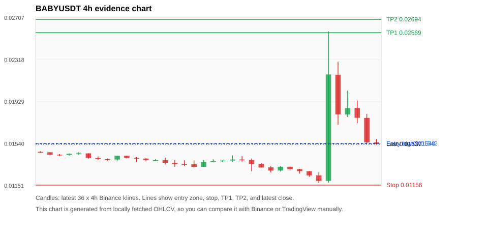
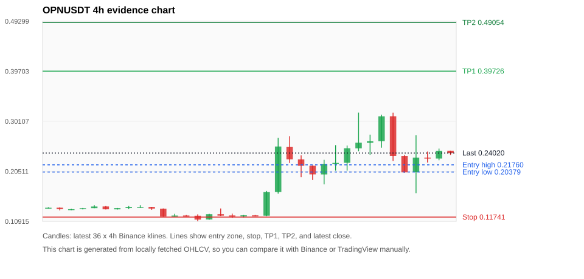
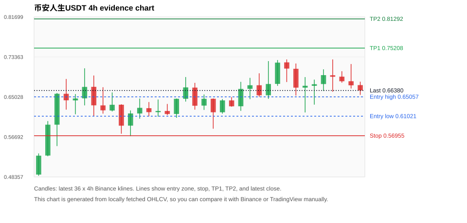
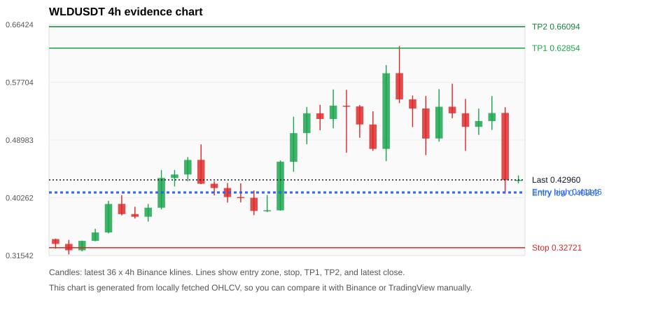
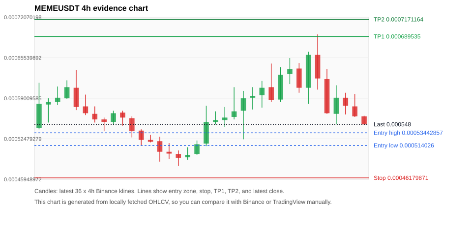

# Crypto 市场扫描报告 v1

- 报告时间：2026-06-06 12:14:49 CST
- 报告版本：v1
- 扫描 ID：b0cc27696225
- 数据源：Binance public spot API + CoinGecko/CoinMarketCap cross-check
- 过滤条件：USDT spot; 24h quote volume >= 30,000,000; trades >= 30,000; exclude stables/leveraged tokens; analyze 1h/4h/1d klines
- 默认单笔风险：账户权益的 1.00%

## 限制说明

- 交易信号仍以 Binance 现货公开 K 线为主源；外部数据源用于一致性复核。
- 结果是研究和模拟盘计划，不是确定收益或实盘下单指令。
- 已启用数据交叉验证：Binance 主源 + CoinGecko 自动对照；CoinMarketCap 在配置 API Key 后自动对照。
- BABYUSDT 交叉验证状态 DATA_WARNING：At least one external provider needs manual review.
- OPNUSDT 交叉验证状态 DATA_WARNING：At least one external provider needs manual review.
- WLDUSDT 交叉验证状态 DATA_WARNING：At least one external provider needs manual review.
- MEMEUSDT 交叉验证状态 DATA_WARNING：At least one external provider needs manual review.

## 5 个候选交易计划

| Rank | Coin | Setup | Entry Zone | Stop Loss | TP1 | TP2 / Exit Rule | R/R | Verdict |
|---:|---|---|---:|---:|---:|---|---:|---|
| 1 | `BABY` | 回踩支撑/4h EMA 附近 | 0.01540 - 0.01542 | 0.01156 | 0.02569 | 0.02694 或跌破 4h 关键支撑 | 2.68-3.00 | 可考虑 |
| 2 | `OPN` | 涨幅较远，只等深回调 | 0.20379 - 0.21760 | 0.11741 | 0.39726 | 0.49054 或跌破 4h 关键支撑 | 2.00-3.00 | 只等回调 |
| 3 | `币安人生` | 趋势中，等回调入场 | 0.61021 - 0.65057 | 0.56955 | 0.75208 | 0.81292 或跌破 4h 关键支撑 | 2.00-3.00 | 只等回调 |
| 4 | `WLD` | 趋势中，等回调入场 | 0.40982 - 0.41146 | 0.32721 | 0.62854 | 0.66094 或跌破 4h 关键支撑 | 2.61-3.00 | 只观察 |
| 5 | `MEME` | 趋势中，等回调入场 | 0.000514026 - 0.00053442857 | 0.00046179871 | 0.000689535 | 0.0007171164 或跌破 4h 关键支撑 | 2.65-3.09 | 只观察 |

## 数据交叉验证摘要

价格差异以 Binance 当前价为基准；成交量口径不同，Binance 是 USDT 现货成交额，CoinGecko/CoinMarketCap 通常是全市场成交量。

| Rank | Coin | Data Status | Max Price Diff | Max 24h Diff | Message |
|---:|---|---|---:|---:|---|
| 1 | `BABY` | DATA_WARNING | 0.53% | 0.25 pts | At least one external provider needs manual review. |
| 2 | `OPN` | DATA_WARNING | 0.38% | 0.54 pts | At least one external provider needs manual review. |
| 3 | `币安人生` | DATA_OK | 0.29% | 0.57 pts | External provider checks agree with Binance within configured thresholds. |
| 4 | `WLD` | DATA_WARNING | 0.34% | 0.38 pts | At least one external provider needs manual review. |
| 5 | `MEME` | DATA_WARNING | 0.45% | 0.10 pts | At least one external provider needs manual review. |

## 候选币说明

### 1. BABY `BABYUSDT`



- 入选原因：回踩支撑/4h EMA 附近；24h +23.03%，7d +1.45%，4h RSI 53.67，24h 成交额 $37.0M。
- 交易失效条件：跌破 0.0115639 或 4h 收盘重新失守关键支撑。
- 主要风险：24h 振幅较大，回撤风险高；成交量突增，可能是事件驱动；数据交叉验证需要人工复核。
- 数据交叉验证：DATA_WARNING；At least one external provider needs manual review.

#### 可点击人工验证

- [Binance 交易页](https://www.binance.com/en/trade/BABY_USDT)
- [TradingView 图表](https://www.tradingview.com/chart/?symbol=BINANCE%3ABABYUSDT)
- [CoinGecko 搜索](https://www.coingecko.com/en/search?query=BABY)
- [CoinMarketCap 搜索](https://coinmarketcap.com/search/?q=BABY)

#### 多数据源对照

| Source | Status | Asset ID | Price | 24h Change | 24h Volume | Price Diff | 24h Diff | Updated | Message |
|---|---|---|---:|---:|---:|---:|---:|---|---|
| Binance | DATA_OK | BABYUSDT | 0.01537 | +23.03% | $37.0M | 0.00% | 0.00 pts | 2026-06-06T04:14:37+00:00 | Primary market data source used by scanner. |
| CoinGecko | DATA_WARNING | babylon | 0.01545 | +23.28% | $138.7M | 0.53% | 0.25 pts | 2026-06-06T04:14:28.217Z | CoinGecko symbol mapping has 2 exact matches; selected highest market-cap rank |
| CoinMarketCap | DATA_WARNING | 32198 | 0.01543 | +23.25% | $259.6M | 0.39% | 0.22 pts | 2026-06-06T04:13:02.000Z | CoinMarketCap symbol mapping has 10 matches; selected lowest cmc_rank |

#### 指标证据

| 指标 | 数值 | 人工核对用途 |
|---|---:|---|
| 当前价 | 0.01537 | 与 Binance/TradingView 当前价格对照 |
| 24h 涨跌 | +23.03% | 与交易所 24h 涨跌对照 |
| 7d 涨跌 | +1.45% | 判断短线趋势是否延续 |
| 4h EMA20 | 0.01523 | 判断短期趋势支撑 |
| 4h EMA50 | 0.01484 | 判断中期趋势支撑 |
| 1d EMA20 | 0.01537 | 判断日线趋势 |
| 1d EMA50 | 0.01561 | 判断日线趋势 |
| 4h RSI14 | 53.67 | 判断是否过热/过弱 |
| 4h ATR14 | 0.00233 | 推导止损和入场缓冲 |
| 最近 18 根 4h 最低点 | 0.01174 | 支撑/止损参考 |
| 最近 36 根 4h 最高点 | 0.02582 | TP/压力参考 |
| 支撑位 | 0.01537 | 入场区间推导基础 |

#### 交易计划推导

- 支撑位 = 最近低点、4h EMA20、4h EMA50、1d EMA20 中不高于当前价的最高有效支撑 = `0.01537`。
- 入场区间 = 支撑位附近 + ATR 缓冲 = `0.01540 - 0.01542`。
- 止损 = min(最近 18 根 4h 最低点 * 0.985, 入场中位价 - 1.15 * ATR14) = `0.01156`。
- TP1 = max(最近 36 根 4h 最高点 * 0.995, 入场中位价 + 2R) = `0.02569`。
- TP2 = max(入场中位价 + 3R, TP1 * 1.04) = `0.02694`。

#### 最近 10 根 4h K线

| UTC 开盘时间 | Open | High | Low | Close | Quote Volume | Trades |
|---|---:|---:|---:|---:|---:|---:|
| 2026-06-04T16:00+00:00 | 0.01326 | 0.01326 | 0.01297 | 0.01304 | $78,042 | 2441 |
| 2026-06-04T20:00+00:00 | 0.01304 | 0.01306 | 0.01263 | 0.01285 | $45,618 | 2119 |
| 2026-06-05T00:00+00:00 | 0.01285 | 0.01285 | 0.01234 | 0.01246 | $97,242 | 3706 |
| 2026-06-05T04:00+00:00 | 0.01246 | 0.01275 | 0.01174 | 0.01194 | $234,424 | 5937 |
| 2026-06-05T08:00+00:00 | 0.01195 | 0.02582 | 0.01176 | 0.02182 | $17.9M | 205851 |
| 2026-06-05T12:00+00:00 | 0.02180 | 0.02300 | 0.01715 | 0.01812 | $8.0M | 129274 |
| 2026-06-05T16:00+00:00 | 0.01811 | 0.02032 | 0.01788 | 0.01870 | $5.0M | 66571 |
| 2026-06-05T20:00+00:00 | 0.01871 | 0.01940 | 0.01730 | 0.01780 | $2.6M | 37053 |
| 2026-06-06T00:00+00:00 | 0.01779 | 0.01817 | 0.01541 | 0.01552 | $2.9M | 50333 |
| 2026-06-06T04:00+00:00 | 0.01552 | 0.01583 | 0.01534 | 0.01537 | $271,948 | 5137 |

### 2. OPN `OPNUSDT`



- 入选原因：涨幅较远，只等深回调；24h -8.60%，7d +69.63%，4h RSI 52.02，24h 成交额 $54.7M。
- 交易失效条件：跌破 0.117412 或 4h 收盘重新失守关键支撑。
- 主要风险：距离支撑偏远，不能追市价；24h 振幅较大，回撤风险高；24h 动量未确认；数据交叉验证需要人工复核。
- 数据交叉验证：DATA_WARNING；At least one external provider needs manual review.

#### 可点击人工验证

- [Binance 交易页](https://www.binance.com/en/trade/OPN_USDT)
- [TradingView 图表](https://www.tradingview.com/chart/?symbol=BINANCE%3AOPNUSDT)
- [CoinGecko 搜索](https://www.coingecko.com/en/search?query=OPN)
- [CoinMarketCap 搜索](https://coinmarketcap.com/search/?q=OPN)

#### 多数据源对照

| Source | Status | Asset ID | Price | 24h Change | 24h Volume | Price Diff | 24h Diff | Updated | Message |
|---|---|---|---:|---:|---:|---:|---:|---|---|
| Binance | DATA_OK | OPNUSDT | 0.24020 | -8.60% | $54.7M | 0.00% | 0.00 pts | 2026-06-06T04:14:37+00:00 | Primary market data source used by scanner. |
| CoinGecko | DATA_WARNING | opinion | 0.24007 | -9.14% | $192.0M | 0.06% | 0.54 pts | 2026-06-06T04:14:24.056Z | CoinGecko symbol mapping has 2 exact matches; selected highest market-cap rank |
| CoinMarketCap | DATA_WARNING | 39564 | 0.23929 | -8.29% | $273.7M | 0.38% | 0.31 pts | 2026-06-06T04:13:02.000Z | CoinMarketCap symbol mapping has 3 matches; selected lowest cmc_rank |

#### 指标证据

| 指标 | 数值 | 人工核对用途 |
|---|---:|---|
| 当前价 | 0.24020 | 与 Binance/TradingView 当前价格对照 |
| 24h 涨跌 | -8.60% | 与交易所 24h 涨跌对照 |
| 7d 涨跌 | +69.63% | 判断短线趋势是否延续 |
| 4h EMA20 | 0.21716 | 判断短期趋势支撑 |
| 4h EMA50 | 0.18703 | 判断中期趋势支撑 |
| 1d EMA20 | 0.18460 | 判断日线趋势 |
| 1d EMA50 | 0.18834 | 判断日线趋势 |
| 4h RSI14 | 52.02 | 判断是否过热/过弱 |
| 4h ATR14 | 0.04854 | 推导止损和入场缓冲 |
| 最近 18 根 4h 最低点 | 0.11920 | 支撑/止损参考 |
| 最近 36 根 4h 最高点 | 0.31780 | TP/压力参考 |
| 支撑位 | 0.21716 | 入场区间推导基础 |

#### 交易计划推导

- 支撑位 = 最近低点、4h EMA20、4h EMA50、1d EMA20 中不高于当前价的最高有效支撑 = `0.21716`。
- 入场区间 = 支撑位附近 + ATR 缓冲 = `0.20379 - 0.21760`。
- 止损 = min(最近 18 根 4h 最低点 * 0.985, 入场中位价 - 1.15 * ATR14) = `0.11741`。
- TP1 = max(最近 36 根 4h 最高点 * 0.995, 入场中位价 + 2R) = `0.39726`。
- TP2 = max(入场中位价 + 3R, TP1 * 1.04) = `0.49054`。

#### 最近 10 根 4h K线

| UTC 开盘时间 | Open | High | Low | Close | Quote Volume | Trades |
|---|---:|---:|---:|---:|---:|---:|
| 2026-06-04T16:00+00:00 | 0.22150 | 0.25470 | 0.20640 | 0.24940 | $6.0M | 85348 |
| 2026-06-04T20:00+00:00 | 0.24930 | 0.31780 | 0.24370 | 0.26000 | $14.2M | 224149 |
| 2026-06-05T00:00+00:00 | 0.25980 | 0.27550 | 0.23680 | 0.26280 | $5.7M | 130384 |
| 2026-06-05T04:00+00:00 | 0.26290 | 0.31380 | 0.25030 | 0.31060 | $9.1M | 165676 |
| 2026-06-05T08:00+00:00 | 0.31070 | 0.31770 | 0.22510 | 0.23480 | $13.1M | 211474 |
| 2026-06-05T12:00+00:00 | 0.23470 | 0.23640 | 0.20260 | 0.20310 | $4.3M | 77561 |
| 2026-06-05T16:00+00:00 | 0.20330 | 0.27420 | 0.16330 | 0.23150 | $23.5M | 384035 |
| 2026-06-05T20:00+00:00 | 0.23150 | 0.24320 | 0.22200 | 0.22950 | $2.3M | 45386 |
| 2026-06-06T00:00+00:00 | 0.22960 | 0.24890 | 0.22630 | 0.24430 | $2.6M | 68624 |
| 2026-06-06T04:00+00:00 | 0.24440 | 0.24440 | 0.23640 | 0.24020 | $123,120 | 2633 |

### 3. 币安人生 `币安人生USDT`



- 入选原因：趋势中，等回调入场；24h +1.02%，7d +47.87%，4h RSI 56.78，24h 成交额 $30.8M。
- 交易失效条件：跌破 0.56955035 或 4h 收盘重新失守关键支撑。
- 主要风险：距离支撑偏远，不能追市价。
- 数据交叉验证：DATA_OK；External provider checks agree with Binance within configured thresholds.

#### 可点击人工验证

- [Binance 交易页](https://www.binance.com/en/trade/币安人生_USDT)
- [TradingView 图表](https://www.tradingview.com/chart/?symbol=BINANCE%3A币安人生USDT)
- [CoinGecko 搜索](https://www.coingecko.com/en/search?query=币安人生)
- [CoinMarketCap 搜索](https://coinmarketcap.com/search/?q=币安人生)

#### 多数据源对照

| Source | Status | Asset ID | Price | 24h Change | 24h Volume | Price Diff | 24h Diff | Updated | Message |
|---|---|---|---:|---:|---:|---:|---:|---|---|
| Binance | DATA_OK | 币安人生USDT | 0.66380 | +1.02% | $30.8M | 0.00% | 0.00 pts | 2026-06-06T04:14:37+00:00 | Primary market data source used by scanner. |
| CoinGecko | DATA_OK | bianrensheng | 0.66190 | +0.58% | $55.9M | 0.29% | 0.44 pts | 2026-06-06T04:14:29.185Z | External source agrees with Binance within thresholds. |
| CoinMarketCap | DATA_OK | 38590 | 0.66371 | +0.45% | $58.6M | 0.01% | 0.57 pts | 2026-06-06T04:13:02.000Z | External source agrees with Binance within thresholds. |

#### 指标证据

| 指标 | 数值 | 人工核对用途 |
|---|---:|---|
| 当前价 | 0.66380 | 与 Binance/TradingView 当前价格对照 |
| 24h 涨跌 | +1.02% | 与交易所 24h 涨跌对照 |
| 7d 涨跌 | +47.87% | 判断短线趋势是否延续 |
| 4h EMA20 | 0.66420 | 判断短期趋势支撑 |
| 4h EMA50 | 0.60900 | 判断中期趋势支撑 |
| 1d EMA20 | 0.54570 | 判断日线趋势 |
| 1d EMA50 | 0.43198 | 判断日线趋势 |
| 4h RSI14 | 56.78 | 判断是否过热/过弱 |
| 4h ATR14 | 0.05291 | 推导止损和入场缓冲 |
| 最近 18 根 4h 最低点 | 0.58410 | 支撑/止损参考 |
| 最近 36 根 4h 最高点 | 0.72850 | TP/压力参考 |
| 支撑位 | 0.60900 | 入场区间推导基础 |

#### 交易计划推导

- 支撑位 = 最近低点、4h EMA20、4h EMA50、1d EMA20 中不高于当前价的最高有效支撑 = `0.60900`。
- 入场区间 = 支撑位附近 + ATR 缓冲 = `0.61021 - 0.65057`。
- 止损 = min(最近 18 根 4h 最低点 * 0.985, 入场中位价 - 1.15 * ATR14) = `0.56955`。
- TP1 = max(最近 36 根 4h 最高点 * 0.995, 入场中位价 + 2R) = `0.75208`。
- TP2 = max(入场中位价 + 3R, TP1 * 1.04) = `0.81292`。

#### 最近 10 根 4h K线

| UTC 开盘时间 | Open | High | Low | Close | Quote Volume | Trades |
|---|---:|---:|---:|---:|---:|---:|
| 2026-06-04T16:00+00:00 | 0.67750 | 0.72720 | 0.67340 | 0.72180 | $4.9M | 35462 |
| 2026-06-04T20:00+00:00 | 0.72240 | 0.72850 | 0.68140 | 0.70940 | $3.7M | 30157 |
| 2026-06-05T00:00+00:00 | 0.70900 | 0.72000 | 0.65320 | 0.66970 | $4.5M | 35547 |
| 2026-06-05T04:00+00:00 | 0.66970 | 0.69170 | 0.61800 | 0.67360 | $5.9M | 54395 |
| 2026-06-05T08:00+00:00 | 0.67350 | 0.68640 | 0.63430 | 0.67680 | $4.3M | 48867 |
| 2026-06-05T12:00+00:00 | 0.67720 | 0.70790 | 0.66280 | 0.69580 | $5.3M | 46316 |
| 2026-06-05T16:00+00:00 | 0.69550 | 0.72850 | 0.66110 | 0.69240 | $7.9M | 86471 |
| 2026-06-05T20:00+00:00 | 0.69260 | 0.70390 | 0.68000 | 0.68300 | $2.5M | 23116 |
| 2026-06-06T00:00+00:00 | 0.68310 | 0.71890 | 0.66790 | 0.67450 | $4.3M | 38438 |
| 2026-06-06T04:00+00:00 | 0.67500 | 0.68210 | 0.65460 | 0.66380 | $827,450 | 6844 |

### 4. WLD `WLDUSDT`



- 入选原因：趋势中，等回调入场；24h -13.71%，7d +44.84%，4h RSI 38.28，24h 成交额 $212.4M。
- 交易失效条件：跌破 0.32720775 或 4h 收盘重新失守关键支撑。
- 主要风险：24h 振幅较大，回撤风险高；24h 动量未确认；数据交叉验证需要人工复核。
- 数据交叉验证：DATA_WARNING；At least one external provider needs manual review.

#### 可点击人工验证

- [Binance 交易页](https://www.binance.com/en/trade/WLD_USDT)
- [TradingView 图表](https://www.tradingview.com/chart/?symbol=BINANCE%3AWLDUSDT)
- [CoinGecko 搜索](https://www.coingecko.com/en/search?query=WLD)
- [CoinMarketCap 搜索](https://coinmarketcap.com/search/?q=WLD)

#### 多数据源对照

| Source | Status | Asset ID | Price | 24h Change | 24h Volume | Price Diff | 24h Diff | Updated | Message |
|---|---|---|---:|---:|---:|---:|---:|---|---|
| Binance | DATA_OK | WLDUSDT | 0.42960 | -13.71% | $212.4M | 0.00% | 0.00 pts | 2026-06-06T04:14:37+00:00 | Primary market data source used by scanner. |
| CoinGecko | DATA_OK | worldcoin-wld | 0.42813 | -14.09% | $1.33B | 0.34% | 0.38 pts | 2026-06-06T04:14:26.750Z | External source agrees with Binance within thresholds. |
| CoinMarketCap | DATA_WARNING | 13502 | 0.42979 | -13.65% | $1.32B | 0.05% | 0.06 pts | 2026-06-06T04:13:02.000Z | CoinMarketCap symbol mapping has 2 matches; selected lowest cmc_rank |

#### 指标证据

| 指标 | 数值 | 人工核对用途 |
|---|---:|---|
| 当前价 | 0.42960 | 与 Binance/TradingView 当前价格对照 |
| 24h 涨跌 | -13.71% | 与交易所 24h 涨跌对照 |
| 7d 涨跌 | +44.84% | 判断短线趋势是否延续 |
| 4h EMA20 | 0.48644 | 判断短期趋势支撑 |
| 4h EMA50 | 0.43575 | 判断中期趋势支撑 |
| 1d EMA20 | 0.37930 | 判断日线趋势 |
| 1d EMA50 | 0.32836 | 判断日线趋势 |
| 4h RSI14 | 38.28 | 判断是否过热/过弱 |
| 4h ATR14 | 0.07255 | 推导止损和入场缓冲 |
| 最近 18 根 4h 最低点 | 0.40900 | 支撑/止损参考 |
| 最近 36 根 4h 最高点 | 0.63170 | TP/压力参考 |
| 支撑位 | 0.40900 | 入场区间推导基础 |

#### 交易计划推导

- 支撑位 = 最近低点、4h EMA20、4h EMA50、1d EMA20 中不高于当前价的最高有效支撑 = `0.40900`。
- 入场区间 = 支撑位附近 + ATR 缓冲 = `0.40982 - 0.41146`。
- 止损 = min(最近 18 根 4h 最低点 * 0.985, 入场中位价 - 1.15 * ATR14) = `0.32721`。
- TP1 = max(最近 36 根 4h 最高点 * 0.995, 入场中位价 + 2R) = `0.62854`。
- TP2 = max(入场中位价 + 3R, TP1 * 1.04) = `0.66094`。

#### 最近 10 根 4h K线

| UTC 开盘时间 | Open | High | Low | Close | Quote Volume | Trades |
|---|---:|---:|---:|---:|---:|---:|
| 2026-06-04T16:00+00:00 | 0.59080 | 0.63170 | 0.54560 | 0.55120 | $73.5M | 615488 |
| 2026-06-04T20:00+00:00 | 0.55120 | 0.55700 | 0.50930 | 0.53740 | $30.6M | 330177 |
| 2026-06-05T00:00+00:00 | 0.53740 | 0.55630 | 0.46700 | 0.49200 | $43.1M | 470170 |
| 2026-06-05T04:00+00:00 | 0.49210 | 0.56660 | 0.48730 | 0.54000 | $40.4M | 381946 |
| 2026-06-05T08:00+00:00 | 0.54010 | 0.57490 | 0.52270 | 0.53010 | $28.9M | 297761 |
| 2026-06-05T12:00+00:00 | 0.53010 | 0.55190 | 0.47340 | 0.50970 | $40.6M | 335186 |
| 2026-06-05T16:00+00:00 | 0.50970 | 0.53730 | 0.49750 | 0.51850 | $27.9M | 266244 |
| 2026-06-05T20:00+00:00 | 0.51840 | 0.55620 | 0.50500 | 0.53050 | $19.8M | 197508 |
| 2026-06-06T00:00+00:00 | 0.53070 | 0.53940 | 0.40900 | 0.42940 | $54.1M | 481199 |
| 2026-06-06T04:00+00:00 | 0.42930 | 0.43630 | 0.42430 | 0.42960 | $3.2M | 26105 |

### 5. MEME `MEMEUSDT`



- 入选原因：趋势中，等回调入场；24h -9.85%，7d +6.41%，4h RSI 47.03，24h 成交额 $57.2M。
- 交易失效条件：跌破 0.00046179871 或 4h 收盘重新失守关键支撑。
- 主要风险：24h 振幅较大，回撤风险高；日线趋势未完全确认；24h 动量未确认；数据交叉验证需要人工复核。
- 数据交叉验证：DATA_WARNING；At least one external provider needs manual review.

#### 可点击人工验证

- [Binance 交易页](https://www.binance.com/en/trade/MEME_USDT)
- [TradingView 图表](https://www.tradingview.com/chart/?symbol=BINANCE%3AMEMEUSDT)
- [CoinGecko 搜索](https://www.coingecko.com/en/search?query=MEME)
- [CoinMarketCap 搜索](https://coinmarketcap.com/search/?q=MEME)

#### 多数据源对照

| Source | Status | Asset ID | Price | 24h Change | 24h Volume | Price Diff | 24h Diff | Updated | Message |
|---|---|---|---:|---:|---:|---:|---:|---|---|
| Binance | DATA_OK | MEMEUSDT | 0.000548 | -9.85% | $57.2M | 0.00% | 0.00 pts | 2026-06-06T04:14:37+00:00 | Primary market data source used by scanner. |
| CoinGecko | DATA_OK | memecoin-2 | 0.00054919 | -9.95% | $187.9M | 0.22% | 0.10 pts | 2026-06-06T04:14:45.928Z | External source agrees with Binance within thresholds. |
| CoinMarketCap | DATA_WARNING | 28301 | 0.00055043898 | -9.77% | $197.1M | 0.45% | 0.08 pts | 2026-06-06T04:13:02.000Z | CoinMarketCap symbol mapping has 15 matches; selected lowest cmc_rank |

#### 指标证据

| 指标 | 数值 | 人工核对用途 |
|---|---:|---|
| 当前价 | 0.000548 | 与 Binance/TradingView 当前价格对照 |
| 24h 涨跌 | -9.85% | 与交易所 24h 涨跌对照 |
| 7d 涨跌 | +6.41% | 判断短线趋势是否延续 |
| 4h EMA20 | 0.00057869293 | 判断短期趋势支撑 |
| 4h EMA50 | 0.00055816422 | 判断中期趋势支撑 |
| 1d EMA20 | 0.00054803258 | 判断日线趋势 |
| 1d EMA50 | 0.00055263636 | 判断日线趋势 |
| 4h RSI14 | 47.03 | 判断是否过热/过弱 |
| 4h ATR14 | 5.4285714e-05 | 推导止损和入场缓冲 |
| 最近 18 根 4h 最低点 | 0.000513 | 支撑/止损参考 |
| 最近 36 根 4h 最高点 | 0.000693 | TP/压力参考 |
| 支撑位 | 0.000513 | 入场区间推导基础 |

#### 交易计划推导

- 支撑位 = 最近低点、4h EMA20、4h EMA50、1d EMA20 中不高于当前价的最高有效支撑 = `0.000513`。
- 入场区间 = 支撑位附近 + ATR 缓冲 = `0.000514026 - 0.00053442857`。
- 止损 = min(最近 18 根 4h 最低点 * 0.985, 入场中位价 - 1.15 * ATR14) = `0.00046179871`。
- TP1 = max(最近 36 根 4h 最高点 * 0.995, 入场中位价 + 2R) = `0.000689535`。
- TP2 = max(入场中位价 + 3R, TP1 * 1.04) = `0.0007171164`。

#### 最近 10 根 4h K线

| UTC 开盘时间 | Open | High | Low | Close | Quote Volume | Trades |
|---|---:|---:|---:|---:|---:|---:|
| 2026-06-04T16:00+00:00 | 0.000588 | 0.00064 | 0.000584 | 0.000628 | $5.1M | 107799 |
| 2026-06-04T20:00+00:00 | 0.000629 | 0.000655 | 0.000613 | 0.000637 | $4.0M | 102984 |
| 2026-06-05T00:00+00:00 | 0.000638 | 0.000647 | 0.000599 | 0.000607 | $6.1M | 136348 |
| 2026-06-05T04:00+00:00 | 0.000607 | 0.000665 | 0.000581 | 0.00066 | $24.2M | 283830 |
| 2026-06-05T08:00+00:00 | 0.00066 | 0.000693 | 0.000604 | 0.000622 | $27.7M | 265011 |
| 2026-06-05T12:00+00:00 | 0.000621 | 0.000637 | 0.000565 | 0.000566 | $2.7M | 17100 |
| 2026-06-05T16:00+00:00 | 0.000565 | 0.000611 | 0.000548 | 0.000591 | $1.7M | 11719 |
| 2026-06-05T20:00+00:00 | 0.000591 | 0.000599 | 0.000564 | 0.000578 | $639,668 | 5326 |
| 2026-06-06T00:00+00:00 | 0.000577 | 0.000597 | 0.00056 | 0.000561 | $659,185 | 5719 |
| 2026-06-06T04:00+00:00 | 0.000561 | 0.000562 | 0.000547 | 0.000548 | $43,773 | 481 |

## 组合风控

- 不要 5 个候选全部满仓买入。
- 同时持仓总风险建议控制在账户权益的 3% - 5% 以内。
- 如果 BTC/ETH 同时破位，暂停山寨币多头计划或降低仓位。
- 第一版报告用于模拟盘和人工复核，不自动下单。

## 原始数据

```json
[
  {
    "rank": 1,
    "symbol": "BABYUSDT",
    "base_asset": "BABY",
    "price": 0.01537,
    "score": 63.95436132285957,
    "setup": "回踩支撑/4h EMA 附近",
    "verdict": "可考虑",
    "entry_low": 0.015399591908486512,
    "entry_high": 0.015416109999999998,
    "stop_loss": 0.0115639,
    "take_profit_1": 0.0256909,
    "take_profit_2": 0.02693970381697302,
    "risk_reward_1": 2.675124934777201,
    "risk_reward_2": 3.0000000000000004,
    "pct_24h": 23.028,
    "pct_3d": 11.781818181818181,
    "pct_7d": 1.4521452145214608,
    "quote_volume_24h": 37021533.16459,
    "trades_24h": 499782,
    "high_low_range_24h": 119.93185689948893,
    "rsi_1h": 29.34947049924355,
    "rsi_4h": 53.67428003972195,
    "ema20_4h": 0.015231760847371736,
    "ema50_4h": 0.014842482017334945,
    "ema20_1d": 0.01536885420008634,
    "ema50_1d": 0.015605434495451164,
    "atr_4h": 0.00233,
    "macd_hist_4h": 0.0002847151028561813,
    "volume_ratio_24h": 67.85964375335142,
    "support_level": 0.01536885420008634,
    "recent_low_4h_18": 0.01174,
    "recent_high_4h_36": 0.02582,
    "distance_to_support_pct": 0.007455337260298123,
    "binance_trade_url": "https://www.binance.com/en/trade/BABY_USDT",
    "tradingview_url": "https://www.tradingview.com/chart/?symbol=BINANCE%3ABABYUSDT",
    "coingecko_search_url": "https://www.coingecko.com/en/search?query=BABY",
    "coinmarketcap_search_url": "https://coinmarketcap.com/search/?q=BABY",
    "invalidation": "跌破 0.0115639 或 4h 收盘重新失守关键支撑",
    "recent_4h_klines": [
      {
        "open_time_utc": "2026-05-31T08:00+00:00",
        "open": 0.01464,
        "high": 0.0147,
        "low": 0.01456,
        "close": 0.0146,
        "quote_volume": 89127.35073,
        "trades": 745
      },
      {
        "open_time_utc": "2026-05-31T12:00+00:00",
        "open": 0.0146,
        "high": 0.0146,
        "low": 0.0143,
        "close": 0.01438,
        "quote_volume": 189943.15463,
        "trades": 2164
      },
      {
        "open_time_utc": "2026-05-31T16:00+00:00",
        "open": 0.01438,
        "high": 0.01443,
        "low": 0.01425,
        "close": 0.01436,
        "quote_volume": 41183.57998,
        "trades": 948
      },
      {
        "open_time_utc": "2026-05-31T20:00+00:00",
        "open": 0.01436,
        "high": 0.0145,
        "low": 0.0143,
        "close": 0.01447,
        "quote_volume": 30008.64931,
        "trades": 615
      },
      {
        "open_time_utc": "2026-06-01T00:00+00:00",
        "open": 0.01447,
        "high": 0.01463,
        "low": 0.01437,
        "close": 0.0145,
        "quote_volume": 20195.11971,
        "trades": 748
      },
      {
        "open_time_utc": "2026-06-01T04:00+00:00",
        "open": 0.0145,
        "high": 0.01451,
        "low": 0.01402,
        "close": 0.01407,
        "quote_volume": 118837.97667,
        "trades": 2335
      },
      {
        "open_time_utc": "2026-06-01T08:00+00:00",
        "open": 0.01407,
        "high": 0.01422,
        "low": 0.01389,
        "close": 0.01397,
        "quote_volume": 65894.35633,
        "trades": 1363
      },
      {
        "open_time_utc": "2026-06-01T12:00+00:00",
        "open": 0.01396,
        "high": 0.01403,
        "low": 0.01383,
        "close": 0.01392,
        "quote_volume": 80737.63458,
        "trades": 1806
      },
      {
        "open_time_utc": "2026-06-01T16:00+00:00",
        "open": 0.01393,
        "high": 0.01429,
        "low": 0.01383,
        "close": 0.01428,
        "quote_volume": 76384.39303,
        "trades": 1377
      },
      {
        "open_time_utc": "2026-06-01T20:00+00:00",
        "open": 0.01428,
        "high": 0.01428,
        "low": 0.01404,
        "close": 0.01408,
        "quote_volume": 43788.14877,
        "trades": 970
      },
      {
        "open_time_utc": "2026-06-02T00:00+00:00",
        "open": 0.01408,
        "high": 0.01415,
        "low": 0.01371,
        "close": 0.01401,
        "quote_volume": 96244.5801,
        "trades": 1558
      },
      {
        "open_time_utc": "2026-06-02T04:00+00:00",
        "open": 0.01402,
        "high": 0.01405,
        "low": 0.01376,
        "close": 0.01388,
        "quote_volume": 34233.57265,
        "trades": 904
      },
      {
        "open_time_utc": "2026-06-02T08:00+00:00",
        "open": 0.01388,
        "high": 0.01398,
        "low": 0.01377,
        "close": 0.01388,
        "quote_volume": 41975.00406,
        "trades": 1261
      },
      {
        "open_time_utc": "2026-06-02T12:00+00:00",
        "open": 0.01387,
        "high": 0.0141,
        "low": 0.01347,
        "close": 0.01363,
        "quote_volume": 279602.84406,
        "trades": 3415
      },
      {
        "open_time_utc": "2026-06-02T16:00+00:00",
        "open": 0.01362,
        "high": 0.01389,
        "low": 0.01326,
        "close": 0.01351,
        "quote_volume": 99996.87285,
        "trades": 2438
      },
      {
        "open_time_utc": "2026-06-02T20:00+00:00",
        "open": 0.01351,
        "high": 0.01386,
        "low": 0.01333,
        "close": 0.01349,
        "quote_volume": 99799.1561,
        "trades": 2531
      },
      {
        "open_time_utc": "2026-06-03T00:00+00:00",
        "open": 0.01349,
        "high": 0.01385,
        "low": 0.01318,
        "close": 0.01325,
        "quote_volume": 234178.53096,
        "trades": 3599
      },
      {
        "open_time_utc": "2026-06-03T04:00+00:00",
        "open": 0.01325,
        "high": 0.01388,
        "low": 0.01325,
        "close": 0.01371,
        "quote_volume": 74756.77617,
        "trades": 1903
      },
      {
        "open_time_utc": "2026-06-03T08:00+00:00",
        "open": 0.01371,
        "high": 0.01394,
        "low": 0.01368,
        "close": 0.01379,
        "quote_volume": 94896.01399,
        "trades": 1321
      },
      {
        "open_time_utc": "2026-06-03T12:00+00:00",
        "open": 0.01378,
        "high": 0.01391,
        "low": 0.01371,
        "close": 0.01383,
        "quote_volume": 84077.03595,
        "trades": 1426
      },
      {
        "open_time_utc": "2026-06-03T16:00+00:00",
        "open": 0.01384,
        "high": 0.01432,
        "low": 0.01372,
        "close": 0.01393,
        "quote_volume": 225826.35106,
        "trades": 4733
      },
      {
        "open_time_utc": "2026-06-03T20:00+00:00",
        "open": 0.01393,
        "high": 0.01425,
        "low": 0.01374,
        "close": 0.01389,
        "quote_volume": 90713.39555,
        "trades": 2632
      },
      {
        "open_time_utc": "2026-06-04T00:00+00:00",
        "open": 0.01389,
        "high": 0.01403,
        "low": 0.01283,
        "close": 0.01352,
        "quote_volume": 209800.38077,
        "trades": 5621
      },
      {
        "open_time_utc": "2026-06-04T04:00+00:00",
        "open": 0.01353,
        "high": 0.01359,
        "low": 0.01318,
        "close": 0.01319,
        "quote_volume": 39008.28031,
        "trades": 1681
      },
      {
        "open_time_utc": "2026-06-04T08:00+00:00",
        "open": 0.0132,
        "high": 0.01332,
        "low": 0.01273,
        "close": 0.01291,
        "quote_volume": 87886.88858,
        "trades": 3335
      },
      {
        "open_time_utc": "2026-06-04T12:00+00:00",
        "open": 0.01291,
        "high": 0.01331,
        "low": 0.01283,
        "close": 0.01326,
        "quote_volume": 46297.45137,
        "trades": 1899
      },
      {
        "open_time_utc": "2026-06-04T16:00+00:00",
        "open": 0.01326,
        "high": 0.01326,
        "low": 0.01297,
        "close": 0.01304,
        "quote_volume": 78042.48582,
        "trades": 2441
      },
      {
        "open_time_utc": "2026-06-04T20:00+00:00",
        "open": 0.01304,
        "high": 0.01306,
        "low": 0.01263,
        "close": 0.01285,
        "quote_volume": 45618.09998,
        "trades": 2119
      },
      {
        "open_time_utc": "2026-06-05T00:00+00:00",
        "open": 0.01285,
        "high": 0.01285,
        "low": 0.01234,
        "close": 0.01246,
        "quote_volume": 97241.82073,
        "trades": 3706
      },
      {
        "open_time_utc": "2026-06-05T04:00+00:00",
        "open": 0.01246,
        "high": 0.01275,
        "low": 0.01174,
        "close": 0.01194,
        "quote_volume": 234423.6116,
        "trades": 5937
      },
      {
        "open_time_utc": "2026-06-05T08:00+00:00",
        "open": 0.01195,
        "high": 0.02582,
        "low": 0.01176,
        "close": 0.02182,
        "quote_volume": 17856560.72064,
        "trades": 205851
      },
      {
        "open_time_utc": "2026-06-05T12:00+00:00",
        "open": 0.0218,
        "high": 0.023,
        "low": 0.01715,
        "close": 0.01812,
        "quote_volume": 8039689.59029,
        "trades": 129274
      },
      {
        "open_time_utc": "2026-06-05T16:00+00:00",
        "open": 0.01811,
        "high": 0.02032,
        "low": 0.01788,
        "close": 0.0187,
        "quote_volume": 5041505.81929,
        "trades": 66571
      },
      {
        "open_time_utc": "2026-06-05T20:00+00:00",
        "open": 0.01871,
        "high": 0.0194,
        "low": 0.0173,
        "close": 0.0178,
        "quote_volume": 2649981.74594,
        "trades": 37053
      },
      {
        "open_time_utc": "2026-06-06T00:00+00:00",
        "open": 0.01779,
        "high": 0.01817,
        "low": 0.01541,
        "close": 0.01552,
        "quote_volume": 2940848.80101,
        "trades": 50333
      },
      {
        "open_time_utc": "2026-06-06T04:00+00:00",
        "open": 0.01552,
        "high": 0.01583,
        "low": 0.01534,
        "close": 0.01537,
        "quote_volume": 271947.91183,
        "trades": 5137
      }
    ],
    "risks": [
      "24h 振幅较大，回撤风险高",
      "成交量突增，可能是事件驱动",
      "数据交叉验证需要人工复核"
    ],
    "data_quality_status": "DATA_WARNING",
    "data_quality_message": "At least one external provider needs manual review.",
    "data_checks": [
      {
        "provider": "Binance",
        "status": "DATA_OK",
        "provider_asset_id": "BABYUSDT",
        "provider_symbol": "BABYUSDT",
        "price_usd": 0.01537,
        "pct_24h": 23.028,
        "volume_24h": 37021533.16459,
        "last_updated": null,
        "fetched_at_utc": "2026-06-06T04:14:37+00:00",
        "price_diff_pct": 0.0,
        "pct_24h_diff": 0.0,
        "volume_note": "Binance USDT spot 24h quoteVolume.",
        "message": "Primary market data source used by scanner."
      },
      {
        "provider": "CoinGecko",
        "status": "DATA_WARNING",
        "provider_asset_id": "babylon",
        "provider_symbol": "BABY",
        "price_usd": 0.0154513,
        "pct_24h": 23.27715,
        "volume_24h": 138742705.0,
        "last_updated": "2026-06-06T04:14:28.217Z",
        "fetched_at_utc": "2026-06-06T04:14:37+00:00",
        "price_diff_pct": 0.528952504879632,
        "pct_24h_diff": 0.2491500000000002,
        "volume_note": "CoinGecko total market volume; not the same venue scope as Binance quoteVolume.",
        "message": "CoinGecko symbol mapping has 2 exact matches; selected highest market-cap rank"
      },
      {
        "provider": "CoinMarketCap",
        "status": "DATA_WARNING",
        "provider_asset_id": "32198",
        "provider_symbol": "BABY",
        "price_usd": 0.015429476532491182,
        "pct_24h": 23.25237599,
        "volume_24h": 259554046.76456678,
        "last_updated": "2026-06-06T04:13:02.000Z",
        "fetched_at_utc": "2026-06-06T04:14:37+00:00",
        "price_diff_pct": 0.38696507801680136,
        "pct_24h_diff": 0.2243759900000022,
        "volume_note": "CoinMarketCap total market volume; not the same venue scope as Binance quoteVolume.",
        "message": "CoinMarketCap symbol mapping has 10 matches; selected lowest cmc_rank"
      }
    ],
    "action": "BUY_CANDIDATE"
  },
  {
    "rank": 2,
    "symbol": "OPNUSDT",
    "base_asset": "OPN",
    "price": 0.2402,
    "score": 63.502817196696896,
    "setup": "涨幅较远，只等深回调",
    "verdict": "只等回调",
    "entry_low": 0.20379285714285714,
    "entry_high": 0.21759520101456226,
    "stop_loss": 0.117412,
    "take_profit_1": 0.3972580872361291,
    "take_profit_2": 0.49054011631483885,
    "risk_reward_1": 1.9999999999999998,
    "risk_reward_2": 3.0,
    "pct_24h": -8.603,
    "pct_3d": 99.66749792186201,
    "pct_7d": 69.63276836158192,
    "quote_volume_24h": 54689868.4433,
    "trades_24h": 949236,
    "high_low_range_24h": 94.54990814451926,
    "rsi_1h": 57.47070312499999,
    "rsi_4h": 52.02020202020203,
    "ema20_4h": 0.21716087925605015,
    "ema50_4h": 0.18702893315060087,
    "ema20_1d": 0.18460048969796608,
    "ema50_1d": 0.18833869408102008,
    "atr_4h": 0.04854285714285715,
    "macd_hist_4h": -0.001535737684225373,
    "volume_ratio_24h": 2.79701680221276,
    "support_level": 0.21716087925605015,
    "recent_low_4h_18": 0.1192,
    "recent_high_4h_36": 0.3178,
    "distance_to_support_pct": 10.609240864596448,
    "binance_trade_url": "https://www.binance.com/en/trade/OPN_USDT",
    "tradingview_url": "https://www.tradingview.com/chart/?symbol=BINANCE%3AOPNUSDT",
    "coingecko_search_url": "https://www.coingecko.com/en/search?query=OPN",
    "coinmarketcap_search_url": "https://coinmarketcap.com/search/?q=OPN",
    "invalidation": "跌破 0.117412 或 4h 收盘重新失守关键支撑",
    "recent_4h_klines": [
      {
        "open_time_utc": "2026-05-31T08:00+00:00",
        "open": 0.1348,
        "high": 0.1362,
        "low": 0.1337,
        "close": 0.1353,
        "quote_volume": 69959.05061,
        "trades": 964
      },
      {
        "open_time_utc": "2026-05-31T12:00+00:00",
        "open": 0.1354,
        "high": 0.1361,
        "low": 0.1302,
        "close": 0.1325,
        "quote_volume": 160235.01536,
        "trades": 1408
      },
      {
        "open_time_utc": "2026-05-31T16:00+00:00",
        "open": 0.1322,
        "high": 0.1333,
        "low": 0.1307,
        "close": 0.1325,
        "quote_volume": 45335.94138,
        "trades": 487
      },
      {
        "open_time_utc": "2026-05-31T20:00+00:00",
        "open": 0.1327,
        "high": 0.1349,
        "low": 0.1321,
        "close": 0.1344,
        "quote_volume": 68745.32654,
        "trades": 769
      },
      {
        "open_time_utc": "2026-06-01T00:00+00:00",
        "open": 0.1345,
        "high": 0.1403,
        "low": 0.1344,
        "close": 0.1377,
        "quote_volume": 256113.4692,
        "trades": 2697
      },
      {
        "open_time_utc": "2026-06-01T04:00+00:00",
        "open": 0.1378,
        "high": 0.1385,
        "low": 0.132,
        "close": 0.1323,
        "quote_volume": 107120.04626,
        "trades": 1799
      },
      {
        "open_time_utc": "2026-06-01T08:00+00:00",
        "open": 0.1322,
        "high": 0.1349,
        "low": 0.1318,
        "close": 0.1346,
        "quote_volume": 58633.32912,
        "trades": 1016
      },
      {
        "open_time_utc": "2026-06-01T12:00+00:00",
        "open": 0.1347,
        "high": 0.1386,
        "low": 0.1326,
        "close": 0.1368,
        "quote_volume": 148058.22473,
        "trades": 2808
      },
      {
        "open_time_utc": "2026-06-01T16:00+00:00",
        "open": 0.1369,
        "high": 0.1402,
        "low": 0.1351,
        "close": 0.137,
        "quote_volume": 99306.36399,
        "trades": 1752
      },
      {
        "open_time_utc": "2026-06-01T20:00+00:00",
        "open": 0.1369,
        "high": 0.137,
        "low": 0.1313,
        "close": 0.1337,
        "quote_volume": 102218.52774,
        "trades": 1406
      },
      {
        "open_time_utc": "2026-06-02T00:00+00:00",
        "open": 0.1335,
        "high": 0.134,
        "low": 0.1183,
        "close": 0.1187,
        "quote_volume": 440839.93189,
        "trades": 5721
      },
      {
        "open_time_utc": "2026-06-02T04:00+00:00",
        "open": 0.119,
        "high": 0.1236,
        "low": 0.1184,
        "close": 0.1203,
        "quote_volume": 200451.28378,
        "trades": 2126
      },
      {
        "open_time_utc": "2026-06-02T08:00+00:00",
        "open": 0.1204,
        "high": 0.1215,
        "low": 0.1189,
        "close": 0.1202,
        "quote_volume": 133981.35446,
        "trades": 1636
      },
      {
        "open_time_utc": "2026-06-02T12:00+00:00",
        "open": 0.1199,
        "high": 0.1226,
        "low": 0.1097,
        "close": 0.1127,
        "quote_volume": 769466.54035,
        "trades": 8491
      },
      {
        "open_time_utc": "2026-06-02T16:00+00:00",
        "open": 0.1129,
        "high": 0.1236,
        "low": 0.1123,
        "close": 0.1229,
        "quote_volume": 387037.12215,
        "trades": 3531
      },
      {
        "open_time_utc": "2026-06-02T20:00+00:00",
        "open": 0.1229,
        "high": 0.1339,
        "low": 0.1195,
        "close": 0.1201,
        "quote_volume": 478097.74355,
        "trades": 5400
      },
      {
        "open_time_utc": "2026-06-03T00:00+00:00",
        "open": 0.1205,
        "high": 0.124,
        "low": 0.116,
        "close": 0.1186,
        "quote_volume": 129384.85122,
        "trades": 1874
      },
      {
        "open_time_utc": "2026-06-03T04:00+00:00",
        "open": 0.1189,
        "high": 0.1216,
        "low": 0.1168,
        "close": 0.1208,
        "quote_volume": 133686.6747,
        "trades": 1592
      },
      {
        "open_time_utc": "2026-06-03T08:00+00:00",
        "open": 0.1207,
        "high": 0.1215,
        "low": 0.1192,
        "close": 0.12,
        "quote_volume": 75507.01581,
        "trades": 949
      },
      {
        "open_time_utc": "2026-06-03T12:00+00:00",
        "open": 0.12,
        "high": 0.1675,
        "low": 0.1193,
        "close": 0.1653,
        "quote_volume": 2846056.03972,
        "trades": 38022
      },
      {
        "open_time_utc": "2026-06-03T16:00+00:00",
        "open": 0.1654,
        "high": 0.2694,
        "low": 0.1623,
        "close": 0.2527,
        "quote_volume": 25624870.49155,
        "trades": 249521
      },
      {
        "open_time_utc": "2026-06-03T20:00+00:00",
        "open": 0.2523,
        "high": 0.2726,
        "low": 0.2211,
        "close": 0.2282,
        "quote_volume": 11041970.22751,
        "trades": 128686
      },
      {
        "open_time_utc": "2026-06-04T00:00+00:00",
        "open": 0.2281,
        "high": 0.2357,
        "low": 0.1939,
        "close": 0.2158,
        "quote_volume": 11858282.10307,
        "trades": 186055
      },
      {
        "open_time_utc": "2026-06-04T04:00+00:00",
        "open": 0.2159,
        "high": 0.2167,
        "low": 0.1885,
        "close": 0.1993,
        "quote_volume": 5412548.65723,
        "trades": 85845
      },
      {
        "open_time_utc": "2026-06-04T08:00+00:00",
        "open": 0.1992,
        "high": 0.2272,
        "low": 0.1802,
        "close": 0.2194,
        "quote_volume": 11803760.8984,
        "trades": 172022
      },
      {
        "open_time_utc": "2026-06-04T12:00+00:00",
        "open": 0.2194,
        "high": 0.2553,
        "low": 0.2064,
        "close": 0.2213,
        "quote_volume": 12295247.19514,
        "trades": 158203
      },
      {
        "open_time_utc": "2026-06-04T16:00+00:00",
        "open": 0.2215,
        "high": 0.2547,
        "low": 0.2064,
        "close": 0.2494,
        "quote_volume": 5963496.64241,
        "trades": 85348
      },
      {
        "open_time_utc": "2026-06-04T20:00+00:00",
        "open": 0.2493,
        "high": 0.3178,
        "low": 0.2437,
        "close": 0.26,
        "quote_volume": 14210754.71761,
        "trades": 224149
      },
      {
        "open_time_utc": "2026-06-05T00:00+00:00",
        "open": 0.2598,
        "high": 0.2755,
        "low": 0.2368,
        "close": 0.2628,
        "quote_volume": 5747271.17616,
        "trades": 130384
      },
      {
        "open_time_utc": "2026-06-05T04:00+00:00",
        "open": 0.2629,
        "high": 0.3138,
        "low": 0.2503,
        "close": 0.3106,
        "quote_volume": 9076824.90817,
        "trades": 165676
      },
      {
        "open_time_utc": "2026-06-05T08:00+00:00",
        "open": 0.3107,
        "high": 0.3177,
        "low": 0.2251,
        "close": 0.2348,
        "quote_volume": 13092123.29484,
        "trades": 211474
      },
      {
        "open_time_utc": "2026-06-05T12:00+00:00",
        "open": 0.2347,
        "high": 0.2364,
        "low": 0.2026,
        "close": 0.2031,
        "quote_volume": 4313845.13975,
        "trades": 77561
      },
      {
        "open_time_utc": "2026-06-05T16:00+00:00",
        "open": 0.2033,
        "high": 0.2742,
        "low": 0.1633,
        "close": 0.2315,
        "quote_volume": 23471132.00026,
        "trades": 384035
      },
      {
        "open_time_utc": "2026-06-05T20:00+00:00",
        "open": 0.2315,
        "high": 0.2432,
        "low": 0.222,
        "close": 0.2295,
        "quote_volume": 2291890.79585,
        "trades": 45386
      },
      {
        "open_time_utc": "2026-06-06T00:00+00:00",
        "open": 0.2296,
        "high": 0.2489,
        "low": 0.2263,
        "close": 0.2443,
        "quote_volume": 2600325.00208,
        "trades": 68624
      },
      {
        "open_time_utc": "2026-06-06T04:00+00:00",
        "open": 0.2444,
        "high": 0.2444,
        "low": 0.2364,
        "close": 0.2402,
        "quote_volume": 123120.33407,
        "trades": 2633
      }
    ],
    "risks": [
      "距离支撑偏远，不能追市价",
      "24h 振幅较大，回撤风险高",
      "24h 动量未确认",
      "数据交叉验证需要人工复核"
    ],
    "data_quality_status": "DATA_WARNING",
    "data_quality_message": "At least one external provider needs manual review.",
    "data_checks": [
      {
        "provider": "Binance",
        "status": "DATA_OK",
        "provider_asset_id": "OPNUSDT",
        "provider_symbol": "OPNUSDT",
        "price_usd": 0.2402,
        "pct_24h": -8.603,
        "volume_24h": 54689868.4433,
        "last_updated": null,
        "fetched_at_utc": "2026-06-06T04:14:37+00:00",
        "price_diff_pct": 0.0,
        "pct_24h_diff": 0.0,
        "volume_note": "Binance USDT spot 24h quoteVolume.",
        "message": "Primary market data source used by scanner."
      },
      {
        "provider": "CoinGecko",
        "status": "DATA_WARNING",
        "provider_asset_id": "opinion",
        "provider_symbol": "OPN",
        "price_usd": 0.240067,
        "pct_24h": -9.13984,
        "volume_24h": 192035109.0,
        "last_updated": "2026-06-06T04:14:24.056Z",
        "fetched_at_utc": "2026-06-06T04:14:37+00:00",
        "price_diff_pct": 0.055370524562861886,
        "pct_24h_diff": 0.5368399999999998,
        "volume_note": "CoinGecko total market volume; not the same venue scope as Binance quoteVolume.",
        "message": "CoinGecko symbol mapping has 2 exact matches; selected highest market-cap rank"
      },
      {
        "provider": "CoinMarketCap",
        "status": "DATA_WARNING",
        "provider_asset_id": "39564",
        "provider_symbol": "OPN",
        "price_usd": 0.2392900902219624,
        "pct_24h": -8.29217371,
        "volume_24h": 273738343.2721413,
        "last_updated": "2026-06-06T04:13:02.000Z",
        "fetched_at_utc": "2026-06-06T04:14:37+00:00",
        "price_diff_pct": 0.3788133963520371,
        "pct_24h_diff": 0.3108262899999996,
        "volume_note": "CoinMarketCap total market volume; not the same venue scope as Binance quoteVolume.",
        "message": "CoinMarketCap symbol mapping has 3 matches; selected lowest cmc_rank"
      }
    ],
    "action": "WATCH_ONLY"
  },
  {
    "rank": 3,
    "symbol": "币安人生USDT",
    "base_asset": "币安人生",
    "price": 0.6638,
    "score": 57.45522404722652,
    "setup": "趋势中，等回调入场",
    "verdict": "只等回调",
    "entry_low": 0.6102139231758676,
    "entry_high": 0.6505732142857142,
    "stop_loss": 0.5695503544450766,
    "take_profit_1": 0.7520799973022194,
    "take_profit_2": 0.8129232115879337,
    "risk_reward_1": 2.0,
    "risk_reward_2": 3.0,
    "pct_24h": 1.021,
    "pct_3d": 3.6539662710805665,
    "pct_7d": 47.87257741145019,
    "quote_volume_24h": 30828057.71755,
    "trades_24h": 302434,
    "high_low_range_24h": 17.88025889967639,
    "rsi_1h": 41.33247089262609,
    "rsi_4h": 56.78453947368419,
    "ema20_4h": 0.6641952356202443,
    "ema50_4h": 0.6089959313132411,
    "ema20_1d": 0.5456967305200883,
    "ema50_1d": 0.4319833600037846,
    "atr_4h": 0.052907142857142854,
    "macd_hist_4h": -0.005852588861116503,
    "volume_ratio_24h": 0.8615093786779041,
    "support_level": 0.6089959313132411,
    "recent_low_4h_18": 0.5841,
    "recent_high_4h_36": 0.7285,
    "distance_to_support_pct": 8.999086179209614,
    "binance_trade_url": "https://www.binance.com/en/trade/币安人生_USDT",
    "tradingview_url": "https://www.tradingview.com/chart/?symbol=BINANCE%3A币安人生USDT",
    "coingecko_search_url": "https://www.coingecko.com/en/search?query=币安人生",
    "coinmarketcap_search_url": "https://coinmarketcap.com/search/?q=币安人生",
    "invalidation": "跌破 0.56955035 或 4h 收盘重新失守关键支撑",
    "recent_4h_klines": [
      {
        "open_time_utc": "2026-05-31T08:00+00:00",
        "open": 0.4885,
        "high": 0.5326,
        "low": 0.486,
        "close": 0.5279,
        "quote_volume": 3328361.4827,
        "trades": 38781
      },
      {
        "open_time_utc": "2026-05-31T12:00+00:00",
        "open": 0.5282,
        "high": 0.6,
        "low": 0.5267,
        "close": 0.5925,
        "quote_volume": 13917767.18436,
        "trades": 93427
      },
      {
        "open_time_utc": "2026-05-31T16:00+00:00",
        "open": 0.5925,
        "high": 0.6585,
        "low": 0.5479,
        "close": 0.6569,
        "quote_volume": 16322890.18071,
        "trades": 112978
      },
      {
        "open_time_utc": "2026-05-31T20:00+00:00",
        "open": 0.6569,
        "high": 0.6878,
        "low": 0.6238,
        "close": 0.6433,
        "quote_volume": 10512359.50189,
        "trades": 70288
      },
      {
        "open_time_utc": "2026-06-01T00:00+00:00",
        "open": 0.6431,
        "high": 0.6563,
        "low": 0.6142,
        "close": 0.6471,
        "quote_volume": 4106653.58668,
        "trades": 39312
      },
      {
        "open_time_utc": "2026-06-01T04:00+00:00",
        "open": 0.6474,
        "high": 0.71,
        "low": 0.6327,
        "close": 0.6712,
        "quote_volume": 12138272.5947,
        "trades": 87722
      },
      {
        "open_time_utc": "2026-06-01T08:00+00:00",
        "open": 0.6714,
        "high": 0.695,
        "low": 0.6105,
        "close": 0.6328,
        "quote_volume": 11346597.35728,
        "trades": 66124
      },
      {
        "open_time_utc": "2026-06-01T12:00+00:00",
        "open": 0.6327,
        "high": 0.6706,
        "low": 0.6155,
        "close": 0.6224,
        "quote_volume": 6163968.10475,
        "trades": 40301
      },
      {
        "open_time_utc": "2026-06-01T16:00+00:00",
        "open": 0.622,
        "high": 0.6598,
        "low": 0.62,
        "close": 0.634,
        "quote_volume": 3931318.24128,
        "trades": 22937
      },
      {
        "open_time_utc": "2026-06-01T20:00+00:00",
        "open": 0.6341,
        "high": 0.635,
        "low": 0.5737,
        "close": 0.5904,
        "quote_volume": 3666265.39763,
        "trades": 24029
      },
      {
        "open_time_utc": "2026-06-02T00:00+00:00",
        "open": 0.5905,
        "high": 0.6222,
        "low": 0.5686,
        "close": 0.6159,
        "quote_volume": 4599276.06117,
        "trades": 31001
      },
      {
        "open_time_utc": "2026-06-02T04:00+00:00",
        "open": 0.6158,
        "high": 0.6469,
        "low": 0.605,
        "close": 0.6276,
        "quote_volume": 8187761.67891,
        "trades": 44144
      },
      {
        "open_time_utc": "2026-06-02T08:00+00:00",
        "open": 0.6269,
        "high": 0.6397,
        "low": 0.6097,
        "close": 0.6186,
        "quote_volume": 4294983.71632,
        "trades": 28981
      },
      {
        "open_time_utc": "2026-06-02T12:00+00:00",
        "open": 0.6186,
        "high": 0.645,
        "low": 0.6093,
        "close": 0.6211,
        "quote_volume": 4748079.99533,
        "trades": 30592
      },
      {
        "open_time_utc": "2026-06-02T16:00+00:00",
        "open": 0.6211,
        "high": 0.6357,
        "low": 0.6125,
        "close": 0.6147,
        "quote_volume": 2473962.21104,
        "trades": 24236
      },
      {
        "open_time_utc": "2026-06-02T20:00+00:00",
        "open": 0.6148,
        "high": 0.6469,
        "low": 0.6068,
        "close": 0.6465,
        "quote_volume": 3252981.72099,
        "trades": 27464
      },
      {
        "open_time_utc": "2026-06-03T00:00+00:00",
        "open": 0.6465,
        "high": 0.6918,
        "low": 0.6406,
        "close": 0.6702,
        "quote_volume": 9045850.83873,
        "trades": 76780
      },
      {
        "open_time_utc": "2026-06-03T04:00+00:00",
        "open": 0.6698,
        "high": 0.6797,
        "low": 0.6238,
        "close": 0.632,
        "quote_volume": 4209697.51435,
        "trades": 28991
      },
      {
        "open_time_utc": "2026-06-03T08:00+00:00",
        "open": 0.6323,
        "high": 0.6555,
        "low": 0.6233,
        "close": 0.6465,
        "quote_volume": 2746805.75451,
        "trades": 21364
      },
      {
        "open_time_utc": "2026-06-03T12:00+00:00",
        "open": 0.6465,
        "high": 0.6472,
        "low": 0.5841,
        "close": 0.6184,
        "quote_volume": 4829181.48116,
        "trades": 37919
      },
      {
        "open_time_utc": "2026-06-03T16:00+00:00",
        "open": 0.6184,
        "high": 0.6459,
        "low": 0.6155,
        "close": 0.6431,
        "quote_volume": 2834574.23634,
        "trades": 26937
      },
      {
        "open_time_utc": "2026-06-03T20:00+00:00",
        "open": 0.6431,
        "high": 0.65,
        "low": 0.63,
        "close": 0.6308,
        "quote_volume": 1700776.23159,
        "trades": 24345
      },
      {
        "open_time_utc": "2026-06-04T00:00+00:00",
        "open": 0.6309,
        "high": 0.6818,
        "low": 0.6213,
        "close": 0.667,
        "quote_volume": 7591014.542,
        "trades": 60042
      },
      {
        "open_time_utc": "2026-06-04T04:00+00:00",
        "open": 0.6672,
        "high": 0.6901,
        "low": 0.6457,
        "close": 0.6747,
        "quote_volume": 5404479.31093,
        "trades": 31572
      },
      {
        "open_time_utc": "2026-06-04T08:00+00:00",
        "open": 0.6747,
        "high": 0.6996,
        "low": 0.6508,
        "close": 0.6537,
        "quote_volume": 5920844.08334,
        "trades": 54877
      },
      {
        "open_time_utc": "2026-06-04T12:00+00:00",
        "open": 0.6538,
        "high": 0.725,
        "low": 0.6464,
        "close": 0.6773,
        "quote_volume": 9745635.41157,
        "trades": 73220
      },
      {
        "open_time_utc": "2026-06-04T16:00+00:00",
        "open": 0.6775,
        "high": 0.7272,
        "low": 0.6734,
        "close": 0.7218,
        "quote_volume": 4884938.58979,
        "trades": 35462
      },
      {
        "open_time_utc": "2026-06-04T20:00+00:00",
        "open": 0.7224,
        "high": 0.7285,
        "low": 0.6814,
        "close": 0.7094,
        "quote_volume": 3671707.24295,
        "trades": 30157
      },
      {
        "open_time_utc": "2026-06-05T00:00+00:00",
        "open": 0.709,
        "high": 0.72,
        "low": 0.6532,
        "close": 0.6697,
        "quote_volume": 4526939.51495,
        "trades": 35547
      },
      {
        "open_time_utc": "2026-06-05T04:00+00:00",
        "open": 0.6697,
        "high": 0.6917,
        "low": 0.618,
        "close": 0.6736,
        "quote_volume": 5925309.44315,
        "trades": 54395
      },
      {
        "open_time_utc": "2026-06-05T08:00+00:00",
        "open": 0.6735,
        "high": 0.6864,
        "low": 0.6343,
        "close": 0.6768,
        "quote_volume": 4322058.46752,
        "trades": 48867
      },
      {
        "open_time_utc": "2026-06-05T12:00+00:00",
        "open": 0.6772,
        "high": 0.7079,
        "low": 0.6628,
        "close": 0.6958,
        "quote_volume": 5259774.03193,
        "trades": 46316
      },
      {
        "open_time_utc": "2026-06-05T16:00+00:00",
        "open": 0.6955,
        "high": 0.7285,
        "low": 0.6611,
        "close": 0.6924,
        "quote_volume": 7925080.58142,
        "trades": 86471
      },
      {
        "open_time_utc": "2026-06-05T20:00+00:00",
        "open": 0.6926,
        "high": 0.7039,
        "low": 0.68,
        "close": 0.683,
        "quote_volume": 2493266.05483,
        "trades": 23116
      },
      {
        "open_time_utc": "2026-06-06T00:00+00:00",
        "open": 0.6831,
        "high": 0.7189,
        "low": 0.6679,
        "close": 0.6745,
        "quote_volume": 4259372.20389,
        "trades": 38438
      },
      {
        "open_time_utc": "2026-06-06T04:00+00:00",
        "open": 0.675,
        "high": 0.6821,
        "low": 0.6546,
        "close": 0.6638,
        "quote_volume": 827450.47631,
        "trades": 6844
      }
    ],
    "risks": [
      "距离支撑偏远，不能追市价"
    ],
    "data_quality_status": "DATA_OK",
    "data_quality_message": "External provider checks agree with Binance within configured thresholds.",
    "data_checks": [
      {
        "provider": "Binance",
        "status": "DATA_OK",
        "provider_asset_id": "币安人生USDT",
        "provider_symbol": "币安人生USDT",
        "price_usd": 0.6638,
        "pct_24h": 1.021,
        "volume_24h": 30828057.71755,
        "last_updated": null,
        "fetched_at_utc": "2026-06-06T04:14:37+00:00",
        "price_diff_pct": 0.0,
        "pct_24h_diff": 0.0,
        "volume_note": "Binance USDT spot 24h quoteVolume.",
        "message": "Primary market data source used by scanner."
      },
      {
        "provider": "CoinGecko",
        "status": "DATA_OK",
        "provider_asset_id": "bianrensheng",
        "provider_symbol": "币安人生",
        "price_usd": 0.661897,
        "pct_24h": 0.5813,
        "volume_24h": 55872948.0,
        "last_updated": "2026-06-06T04:14:29.185Z",
        "fetched_at_utc": "2026-06-06T04:14:37+00:00",
        "price_diff_pct": 0.2866827357637825,
        "pct_24h_diff": 0.43969999999999987,
        "volume_note": "CoinGecko total market volume; not the same venue scope as Binance quoteVolume.",
        "message": "External source agrees with Binance within thresholds."
      },
      {
        "provider": "CoinMarketCap",
        "status": "DATA_OK",
        "provider_asset_id": "38590",
        "provider_symbol": "币安人生",
        "price_usd": 0.6637076122212292,
        "pct_24h": 0.44905654,
        "volume_24h": 58569871.1753151,
        "last_updated": "2026-06-06T04:13:02.000Z",
        "fetched_at_utc": "2026-06-06T04:14:37+00:00",
        "price_diff_pct": 0.013918014277002361,
        "pct_24h_diff": 0.57194346,
        "volume_note": "CoinMarketCap total market volume; not the same venue scope as Binance quoteVolume.",
        "message": "External source agrees with Binance within thresholds."
      }
    ],
    "action": "WAIT_PULLBACK"
  },
  {
    "rank": 4,
    "symbol": "WLDUSDT",
    "base_asset": "WLD",
    "price": 0.4296,
    "score": 35.47397946431409,
    "setup": "趋势中，等回调入场",
    "verdict": "只观察",
    "entry_low": 0.40981799999999996,
    "entry_high": 0.41146249999999995,
    "stop_loss": 0.3272077499999999,
    "take_profit_1": 0.6285415000000001,
    "take_profit_2": 0.66093775,
    "risk_reward_1": 2.611707068588381,
    "risk_reward_2": 3.0,
    "pct_24h": -13.706,
    "pct_3d": 2.8243178554332227,
    "pct_7d": 44.841537424140256,
    "quote_volume_24h": 212445147.30852,
    "trades_24h": 1963837,
    "high_low_range_24h": 40.562347188264056,
    "rsi_1h": 33.942439470077645,
    "rsi_4h": 38.28320802005013,
    "ema20_4h": 0.48644282872961286,
    "ema50_4h": 0.43574889017834706,
    "ema20_1d": 0.37930129440946675,
    "ema50_1d": 0.3283592009903352,
    "atr_4h": 0.07255,
    "macd_hist_4h": -0.015701325593488524,
    "volume_ratio_24h": 1.5292835346613585,
    "support_level": 0.409,
    "recent_low_4h_18": 0.409,
    "recent_high_4h_36": 0.6317,
    "distance_to_support_pct": 5.036674816625908,
    "binance_trade_url": "https://www.binance.com/en/trade/WLD_USDT",
    "tradingview_url": "https://www.tradingview.com/chart/?symbol=BINANCE%3AWLDUSDT",
    "coingecko_search_url": "https://www.coingecko.com/en/search?query=WLD",
    "coinmarketcap_search_url": "https://coinmarketcap.com/search/?q=WLD",
    "invalidation": "跌破 0.32720775 或 4h 收盘重新失守关键支撑",
    "recent_4h_klines": [
      {
        "open_time_utc": "2026-05-31T08:00+00:00",
        "open": 0.3402,
        "high": 0.3408,
        "low": 0.3258,
        "close": 0.3329,
        "quote_volume": 4539305.3771,
        "trades": 51051
      },
      {
        "open_time_utc": "2026-05-31T12:00+00:00",
        "open": 0.3329,
        "high": 0.339,
        "low": 0.317,
        "close": 0.3233,
        "quote_volume": 9686505.87295,
        "trades": 89893
      },
      {
        "open_time_utc": "2026-05-31T16:00+00:00",
        "open": 0.3233,
        "high": 0.3378,
        "low": 0.3217,
        "close": 0.3375,
        "quote_volume": 4521611.16336,
        "trades": 53183
      },
      {
        "open_time_utc": "2026-05-31T20:00+00:00",
        "open": 0.3375,
        "high": 0.3557,
        "low": 0.337,
        "close": 0.3502,
        "quote_volume": 6973203.86104,
        "trades": 73837
      },
      {
        "open_time_utc": "2026-06-01T00:00+00:00",
        "open": 0.3502,
        "high": 0.398,
        "low": 0.3488,
        "close": 0.3932,
        "quote_volume": 15472770.15978,
        "trades": 197411
      },
      {
        "open_time_utc": "2026-06-01T04:00+00:00",
        "open": 0.3933,
        "high": 0.4065,
        "low": 0.376,
        "close": 0.3779,
        "quote_volume": 21107792.64027,
        "trades": 253427
      },
      {
        "open_time_utc": "2026-06-01T08:00+00:00",
        "open": 0.378,
        "high": 0.389,
        "low": 0.3712,
        "close": 0.3739,
        "quote_volume": 11782043.61504,
        "trades": 139239
      },
      {
        "open_time_utc": "2026-06-01T12:00+00:00",
        "open": 0.374,
        "high": 0.3933,
        "low": 0.3666,
        "close": 0.3876,
        "quote_volume": 13770626.1725,
        "trades": 130935
      },
      {
        "open_time_utc": "2026-06-01T16:00+00:00",
        "open": 0.3876,
        "high": 0.4444,
        "low": 0.3851,
        "close": 0.4325,
        "quote_volume": 37937900.59349,
        "trades": 287219
      },
      {
        "open_time_utc": "2026-06-01T20:00+00:00",
        "open": 0.4324,
        "high": 0.4445,
        "low": 0.4198,
        "close": 0.4377,
        "quote_volume": 20257767.6766,
        "trades": 178025
      },
      {
        "open_time_utc": "2026-06-02T00:00+00:00",
        "open": 0.4378,
        "high": 0.4641,
        "low": 0.4277,
        "close": 0.4597,
        "quote_volume": 20494227.79992,
        "trades": 222819
      },
      {
        "open_time_utc": "2026-06-02T04:00+00:00",
        "open": 0.4598,
        "high": 0.4833,
        "low": 0.4233,
        "close": 0.4237,
        "quote_volume": 30093898.21231,
        "trades": 258119
      },
      {
        "open_time_utc": "2026-06-02T08:00+00:00",
        "open": 0.4238,
        "high": 0.4274,
        "low": 0.4061,
        "close": 0.4173,
        "quote_volume": 19130485.31098,
        "trades": 151934
      },
      {
        "open_time_utc": "2026-06-02T12:00+00:00",
        "open": 0.4173,
        "high": 0.4248,
        "low": 0.3952,
        "close": 0.4037,
        "quote_volume": 18761529.37781,
        "trades": 141553
      },
      {
        "open_time_utc": "2026-06-02T16:00+00:00",
        "open": 0.4037,
        "high": 0.4245,
        "low": 0.3956,
        "close": 0.4026,
        "quote_volume": 14655553.95055,
        "trades": 116424
      },
      {
        "open_time_utc": "2026-06-02T20:00+00:00",
        "open": 0.4026,
        "high": 0.4137,
        "low": 0.3764,
        "close": 0.3827,
        "quote_volume": 11994740.92188,
        "trades": 97905
      },
      {
        "open_time_utc": "2026-06-03T00:00+00:00",
        "open": 0.3826,
        "high": 0.4066,
        "low": 0.3811,
        "close": 0.3837,
        "quote_volume": 10756627.67993,
        "trades": 93708
      },
      {
        "open_time_utc": "2026-06-03T04:00+00:00",
        "open": 0.3836,
        "high": 0.4589,
        "low": 0.3831,
        "close": 0.457,
        "quote_volume": 19547459.22638,
        "trades": 169497
      },
      {
        "open_time_utc": "2026-06-03T08:00+00:00",
        "open": 0.4569,
        "high": 0.525,
        "low": 0.4418,
        "close": 0.5002,
        "quote_volume": 40721376.50189,
        "trades": 369433
      },
      {
        "open_time_utc": "2026-06-03T12:00+00:00",
        "open": 0.5003,
        "high": 0.5397,
        "low": 0.4834,
        "close": 0.5302,
        "quote_volume": 36527966.23498,
        "trades": 331948
      },
      {
        "open_time_utc": "2026-06-03T16:00+00:00",
        "open": 0.5301,
        "high": 0.5429,
        "low": 0.5045,
        "close": 0.5216,
        "quote_volume": 29750056.31455,
        "trades": 279477
      },
      {
        "open_time_utc": "2026-06-03T20:00+00:00",
        "open": 0.5215,
        "high": 0.5661,
        "low": 0.5075,
        "close": 0.5418,
        "quote_volume": 28939622.6488,
        "trades": 265149
      },
      {
        "open_time_utc": "2026-06-04T00:00+00:00",
        "open": 0.5416,
        "high": 0.5656,
        "low": 0.4706,
        "close": 0.5405,
        "quote_volume": 43558001.29244,
        "trades": 466898
      },
      {
        "open_time_utc": "2026-06-04T04:00+00:00",
        "open": 0.5405,
        "high": 0.5427,
        "low": 0.4932,
        "close": 0.5133,
        "quote_volume": 31982757.49598,
        "trades": 344580
      },
      {
        "open_time_utc": "2026-06-04T08:00+00:00",
        "open": 0.5133,
        "high": 0.5331,
        "low": 0.4734,
        "close": 0.4764,
        "quote_volume": 27540445.17265,
        "trades": 293437
      },
      {
        "open_time_utc": "2026-06-04T12:00+00:00",
        "open": 0.4764,
        "high": 0.6029,
        "low": 0.4579,
        "close": 0.5907,
        "quote_volume": 64240474.94075,
        "trades": 537796
      },
      {
        "open_time_utc": "2026-06-04T16:00+00:00",
        "open": 0.5908,
        "high": 0.6317,
        "low": 0.5456,
        "close": 0.5512,
        "quote_volume": 73543768.6487,
        "trades": 615488
      },
      {
        "open_time_utc": "2026-06-04T20:00+00:00",
        "open": 0.5512,
        "high": 0.557,
        "low": 0.5093,
        "close": 0.5374,
        "quote_volume": 30621975.44659,
        "trades": 330177
      },
      {
        "open_time_utc": "2026-06-05T00:00+00:00",
        "open": 0.5374,
        "high": 0.5563,
        "low": 0.467,
        "close": 0.492,
        "quote_volume": 43127167.6702,
        "trades": 470170
      },
      {
        "open_time_utc": "2026-06-05T04:00+00:00",
        "open": 0.4921,
        "high": 0.5666,
        "low": 0.4873,
        "close": 0.54,
        "quote_volume": 40400972.60877,
        "trades": 381946
      },
      {
        "open_time_utc": "2026-06-05T08:00+00:00",
        "open": 0.5401,
        "high": 0.5749,
        "low": 0.5227,
        "close": 0.5301,
        "quote_volume": 28914361.66182,
        "trades": 297761
      },
      {
        "open_time_utc": "2026-06-05T12:00+00:00",
        "open": 0.5301,
        "high": 0.5519,
        "low": 0.4734,
        "close": 0.5097,
        "quote_volume": 40577898.06694,
        "trades": 335186
      },
      {
        "open_time_utc": "2026-06-05T16:00+00:00",
        "open": 0.5097,
        "high": 0.5373,
        "low": 0.4975,
        "close": 0.5185,
        "quote_volume": 27893283.28122,
        "trades": 266244
      },
      {
        "open_time_utc": "2026-06-05T20:00+00:00",
        "open": 0.5184,
        "high": 0.5562,
        "low": 0.505,
        "close": 0.5305,
        "quote_volume": 19764048.06152,
        "trades": 197508
      },
      {
        "open_time_utc": "2026-06-06T00:00+00:00",
        "open": 0.5307,
        "high": 0.5394,
        "low": 0.409,
        "close": 0.4294,
        "quote_volume": 54137609.73761,
        "trades": 481199
      },
      {
        "open_time_utc": "2026-06-06T04:00+00:00",
        "open": 0.4293,
        "high": 0.4363,
        "low": 0.4243,
        "close": 0.4296,
        "quote_volume": 3188854.02522,
        "trades": 26105
      }
    ],
    "risks": [
      "24h 振幅较大，回撤风险高",
      "24h 动量未确认",
      "数据交叉验证需要人工复核"
    ],
    "data_quality_status": "DATA_WARNING",
    "data_quality_message": "At least one external provider needs manual review.",
    "data_checks": [
      {
        "provider": "Binance",
        "status": "DATA_OK",
        "provider_asset_id": "WLDUSDT",
        "provider_symbol": "WLDUSDT",
        "price_usd": 0.4296,
        "pct_24h": -13.706,
        "volume_24h": 212445147.30852,
        "last_updated": null,
        "fetched_at_utc": "2026-06-06T04:14:37+00:00",
        "price_diff_pct": 0.0,
        "pct_24h_diff": 0.0,
        "volume_note": "Binance USDT spot 24h quoteVolume.",
        "message": "Primary market data source used by scanner."
      },
      {
        "provider": "CoinGecko",
        "status": "DATA_OK",
        "provider_asset_id": "worldcoin-wld",
        "provider_symbol": "WLD",
        "price_usd": 0.428133,
        "pct_24h": -14.08999,
        "volume_24h": 1334850139.0,
        "last_updated": "2026-06-06T04:14:26.750Z",
        "fetched_at_utc": "2026-06-06T04:14:37+00:00",
        "price_diff_pct": 0.3414804469273734,
        "pct_24h_diff": 0.3839900000000007,
        "volume_note": "CoinGecko total market volume; not the same venue scope as Binance quoteVolume.",
        "message": "External source agrees with Binance within thresholds."
      },
      {
        "provider": "CoinMarketCap",
        "status": "DATA_WARNING",
        "provider_asset_id": "13502",
        "provider_symbol": "WLD",
        "price_usd": 0.42979337532977197,
        "pct_24h": -13.64571217,
        "volume_24h": 1324820727.6544502,
        "last_updated": "2026-06-06T04:13:02.000Z",
        "fetched_at_utc": "2026-06-06T04:14:37+00:00",
        "price_diff_pct": 0.04501287936964225,
        "pct_24h_diff": 0.06028783000000004,
        "volume_note": "CoinMarketCap total market volume; not the same venue scope as Binance quoteVolume.",
        "message": "CoinMarketCap symbol mapping has 2 matches; selected lowest cmc_rank"
      }
    ],
    "action": "WATCH_ONLY"
  },
  {
    "rank": 5,
    "symbol": "MEMEUSDT",
    "base_asset": "MEME",
    "price": 0.000548,
    "score": 18.049594593949973,
    "setup": "趋势中，等回调入场",
    "verdict": "只观察",
    "entry_low": 0.000514026,
    "entry_high": 0.0005344285714285714,
    "stop_loss": 0.0004617987142857143,
    "take_profit_1": 0.000689535,
    "take_profit_2": 0.0007171164000000001,
    "risk_reward_1": 2.647949656750573,
    "risk_reward_2": 3.089756979405037,
    "pct_24h": -9.852,
    "pct_3d": 5.384615384615388,
    "pct_7d": 6.4077669902912415,
    "quote_volume_24h": 57193552.040778,
    "trades_24h": 582540,
    "high_low_range_24h": 26.459854014598562,
    "rsi_1h": 34.26966292134833,
    "rsi_4h": 47.025495750708224,
    "ema20_4h": 0.0005786929264881039,
    "ema50_4h": 0.000558164224418032,
    "ema20_1d": 0.0005480325755396596,
    "ema50_1d": 0.0005526363596661348,
    "atr_4h": 5.428571428571428e-05,
    "macd_hist_4h": -7.2877044916704105e-06,
    "volume_ratio_24h": 1.9601852300643714,
    "support_level": 0.000513,
    "recent_low_4h_18": 0.000513,
    "recent_high_4h_36": 0.000693,
    "distance_to_support_pct": 6.822612085769975,
    "binance_trade_url": "https://www.binance.com/en/trade/MEME_USDT",
    "tradingview_url": "https://www.tradingview.com/chart/?symbol=BINANCE%3AMEMEUSDT",
    "coingecko_search_url": "https://www.coingecko.com/en/search?query=MEME",
    "coinmarketcap_search_url": "https://coinmarketcap.com/search/?q=MEME",
    "invalidation": "跌破 0.00046179871 或 4h 收盘重新失守关键支撑",
    "recent_4h_klines": [
      {
        "open_time_utc": "2026-05-31T08:00+00:00",
        "open": 0.000542,
        "high": 0.000615,
        "low": 0.00054,
        "close": 0.000581,
        "quote_volume": 15082150.808106,
        "trades": 89116
      },
      {
        "open_time_utc": "2026-05-31T12:00+00:00",
        "open": 0.00058,
        "high": 0.00059,
        "low": 0.000551,
        "close": 0.000584,
        "quote_volume": 3968683.926706,
        "trades": 41768
      },
      {
        "open_time_utc": "2026-05-31T16:00+00:00",
        "open": 0.000584,
        "high": 0.000609,
        "low": 0.000579,
        "close": 0.000591,
        "quote_volume": 5077083.782471,
        "trades": 54127
      },
      {
        "open_time_utc": "2026-05-31T20:00+00:00",
        "open": 0.00059,
        "high": 0.000619,
        "low": 0.000589,
        "close": 0.000608,
        "quote_volume": 2279706.72723,
        "trades": 22791
      },
      {
        "open_time_utc": "2026-06-01T00:00+00:00",
        "open": 0.000607,
        "high": 0.000636,
        "low": 0.000571,
        "close": 0.000576,
        "quote_volume": 3578772.643931,
        "trades": 44921
      },
      {
        "open_time_utc": "2026-06-01T04:00+00:00",
        "open": 0.000577,
        "high": 0.000596,
        "low": 0.000563,
        "close": 0.000566,
        "quote_volume": 6921304.551738,
        "trades": 57637
      },
      {
        "open_time_utc": "2026-06-01T08:00+00:00",
        "open": 0.000565,
        "high": 0.000577,
        "low": 0.000551,
        "close": 0.000556,
        "quote_volume": 6284791.418318,
        "trades": 37123
      },
      {
        "open_time_utc": "2026-06-01T12:00+00:00",
        "open": 0.000556,
        "high": 0.000559,
        "low": 0.000537,
        "close": 0.000552,
        "quote_volume": 9582919.684355,
        "trades": 62732
      },
      {
        "open_time_utc": "2026-06-01T16:00+00:00",
        "open": 0.000552,
        "high": 0.00057,
        "low": 0.000548,
        "close": 0.000566,
        "quote_volume": 8181329.247207,
        "trades": 45473
      },
      {
        "open_time_utc": "2026-06-01T20:00+00:00",
        "open": 0.000567,
        "high": 0.00057,
        "low": 0.000546,
        "close": 0.000559,
        "quote_volume": 2804075.557538,
        "trades": 26094
      },
      {
        "open_time_utc": "2026-06-02T00:00+00:00",
        "open": 0.000558,
        "high": 0.000561,
        "low": 0.000527,
        "close": 0.000537,
        "quote_volume": 1641023.522221,
        "trades": 15992
      },
      {
        "open_time_utc": "2026-06-02T04:00+00:00",
        "open": 0.000538,
        "high": 0.00054,
        "low": 0.000514,
        "close": 0.000523,
        "quote_volume": 3854304.421495,
        "trades": 29124
      },
      {
        "open_time_utc": "2026-06-02T08:00+00:00",
        "open": 0.000523,
        "high": 0.000531,
        "low": 0.000519,
        "close": 0.00052,
        "quote_volume": 2597657.692198,
        "trades": 27972
      },
      {
        "open_time_utc": "2026-06-02T12:00+00:00",
        "open": 0.000521,
        "high": 0.000528,
        "low": 0.000488,
        "close": 0.000504,
        "quote_volume": 1414299.569771,
        "trades": 26531
      },
      {
        "open_time_utc": "2026-06-02T16:00+00:00",
        "open": 0.000504,
        "high": 0.000518,
        "low": 0.000492,
        "close": 0.000501,
        "quote_volume": 800252.560865,
        "trades": 15394
      },
      {
        "open_time_utc": "2026-06-02T20:00+00:00",
        "open": 0.0005,
        "high": 0.000506,
        "low": 0.000481,
        "close": 0.000494,
        "quote_volume": 530628.596748,
        "trades": 12738
      },
      {
        "open_time_utc": "2026-06-03T00:00+00:00",
        "open": 0.000495,
        "high": 0.000511,
        "low": 0.000491,
        "close": 0.000499,
        "quote_volume": 1202065.436843,
        "trades": 62469
      },
      {
        "open_time_utc": "2026-06-03T04:00+00:00",
        "open": 0.0005,
        "high": 0.000522,
        "low": 0.000499,
        "close": 0.000516,
        "quote_volume": 1010496.768559,
        "trades": 28451
      },
      {
        "open_time_utc": "2026-06-03T08:00+00:00",
        "open": 0.000517,
        "high": 0.000578,
        "low": 0.000513,
        "close": 0.000552,
        "quote_volume": 2463471.005787,
        "trades": 40248
      },
      {
        "open_time_utc": "2026-06-03T12:00+00:00",
        "open": 0.000552,
        "high": 0.000569,
        "low": 0.000548,
        "close": 0.000555,
        "quote_volume": 2049816.605327,
        "trades": 33351
      },
      {
        "open_time_utc": "2026-06-03T16:00+00:00",
        "open": 0.000555,
        "high": 0.000576,
        "low": 0.000544,
        "close": 0.000559,
        "quote_volume": 2003209.159726,
        "trades": 30336
      },
      {
        "open_time_utc": "2026-06-03T20:00+00:00",
        "open": 0.00056,
        "high": 0.000608,
        "low": 0.000556,
        "close": 0.000569,
        "quote_volume": 2024911.902504,
        "trades": 32384
      },
      {
        "open_time_utc": "2026-06-04T00:00+00:00",
        "open": 0.00057,
        "high": 0.000602,
        "low": 0.000524,
        "close": 0.00059,
        "quote_volume": 2950143.572323,
        "trades": 88466
      },
      {
        "open_time_utc": "2026-06-04T04:00+00:00",
        "open": 0.000591,
        "high": 0.000608,
        "low": 0.000572,
        "close": 0.000594,
        "quote_volume": 4702285.838887,
        "trades": 65564
      },
      {
        "open_time_utc": "2026-06-04T08:00+00:00",
        "open": 0.000595,
        "high": 0.000618,
        "low": 0.000575,
        "close": 0.000607,
        "quote_volume": 4275442.18536,
        "trades": 61169
      },
      {
        "open_time_utc": "2026-06-04T12:00+00:00",
        "open": 0.000608,
        "high": 0.000646,
        "low": 0.000584,
        "close": 0.000587,
        "quote_volume": 6567537.277567,
        "trades": 86594
      },
      {
        "open_time_utc": "2026-06-04T16:00+00:00",
        "open": 0.000588,
        "high": 0.00064,
        "low": 0.000584,
        "close": 0.000628,
        "quote_volume": 5067709.459681,
        "trades": 107799
      },
      {
        "open_time_utc": "2026-06-04T20:00+00:00",
        "open": 0.000629,
        "high": 0.000655,
        "low": 0.000613,
        "close": 0.000637,
        "quote_volume": 3977970.819623,
        "trades": 102984
      },
      {
        "open_time_utc": "2026-06-05T00:00+00:00",
        "open": 0.000638,
        "high": 0.000647,
        "low": 0.000599,
        "close": 0.000607,
        "quote_volume": 6144690.078887,
        "trades": 136348
      },
      {
        "open_time_utc": "2026-06-05T04:00+00:00",
        "open": 0.000607,
        "high": 0.000665,
        "low": 0.000581,
        "close": 0.00066,
        "quote_volume": 24166321.375423,
        "trades": 283830
      },
      {
        "open_time_utc": "2026-06-05T08:00+00:00",
        "open": 0.00066,
        "high": 0.000693,
        "low": 0.000604,
        "close": 0.000622,
        "quote_volume": 27732460.258273,
        "trades": 265011
      },
      {
        "open_time_utc": "2026-06-05T12:00+00:00",
        "open": 0.000621,
        "high": 0.000637,
        "low": 0.000565,
        "close": 0.000566,
        "quote_volume": 2661094.80344,
        "trades": 17100
      },
      {
        "open_time_utc": "2026-06-05T16:00+00:00",
        "open": 0.000565,
        "high": 0.000611,
        "low": 0.000548,
        "close": 0.000591,
        "quote_volume": 1728539.029078,
        "trades": 11719
      },
      {
        "open_time_utc": "2026-06-05T20:00+00:00",
        "open": 0.000591,
        "high": 0.000599,
        "low": 0.000564,
        "close": 0.000578,
        "quote_volume": 639668.395007,
        "trades": 5326
      },
      {
        "open_time_utc": "2026-06-06T00:00+00:00",
        "open": 0.000577,
        "high": 0.000597,
        "low": 0.00056,
        "close": 0.000561,
        "quote_volume": 659185.177028,
        "trades": 5719
      },
      {
        "open_time_utc": "2026-06-06T04:00+00:00",
        "open": 0.000561,
        "high": 0.000562,
        "low": 0.000547,
        "close": 0.000548,
        "quote_volume": 43772.925679,
        "trades": 481
      }
    ],
    "risks": [
      "24h 振幅较大，回撤风险高",
      "日线趋势未完全确认",
      "24h 动量未确认",
      "数据交叉验证需要人工复核"
    ],
    "data_quality_status": "DATA_WARNING",
    "data_quality_message": "At least one external provider needs manual review.",
    "data_checks": [
      {
        "provider": "Binance",
        "status": "DATA_OK",
        "provider_asset_id": "MEMEUSDT",
        "provider_symbol": "MEMEUSDT",
        "price_usd": 0.000548,
        "pct_24h": -9.852,
        "volume_24h": 57193552.040778,
        "last_updated": null,
        "fetched_at_utc": "2026-06-06T04:14:37+00:00",
        "price_diff_pct": 0.0,
        "pct_24h_diff": 0.0,
        "volume_note": "Binance USDT spot 24h quoteVolume.",
        "message": "Primary market data source used by scanner."
      },
      {
        "provider": "CoinGecko",
        "status": "DATA_OK",
        "provider_asset_id": "memecoin-2",
        "provider_symbol": "MEME",
        "price_usd": 0.00054919,
        "pct_24h": -9.95409,
        "volume_24h": 187896147.0,
        "last_updated": "2026-06-06T04:14:45.928Z",
        "fetched_at_utc": "2026-06-06T04:14:37+00:00",
        "price_diff_pct": 0.21715328467152925,
        "pct_24h_diff": 0.10209000000000046,
        "volume_note": "CoinGecko total market volume; not the same venue scope as Binance quoteVolume.",
        "message": "External source agrees with Binance within thresholds."
      },
      {
        "provider": "CoinMarketCap",
        "status": "DATA_WARNING",
        "provider_asset_id": "28301",
        "provider_symbol": "MEME",
        "price_usd": 0.000550438977559292,
        "pct_24h": -9.77293585,
        "volume_24h": 197074390.8524428,
        "last_updated": "2026-06-06T04:13:02.000Z",
        "fetched_at_utc": "2026-06-06T04:14:37+00:00",
        "price_diff_pct": 0.44506889768101904,
        "pct_24h_diff": 0.07906415000000067,
        "volume_note": "CoinMarketCap total market volume; not the same venue scope as Binance quoteVolume.",
        "message": "CoinMarketCap symbol mapping has 15 matches; selected lowest cmc_rank"
      }
    ],
    "action": "REJECT"
  }
]
```
