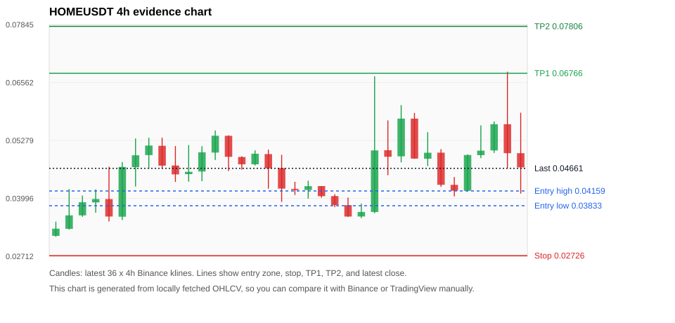
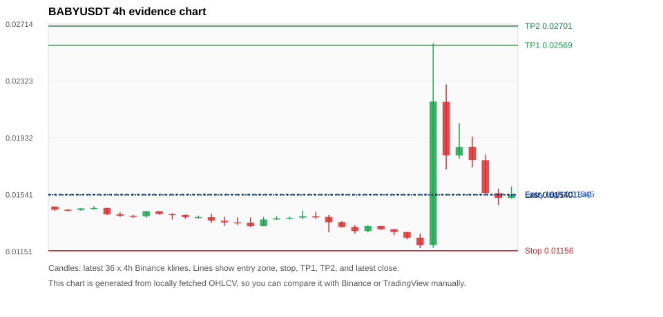
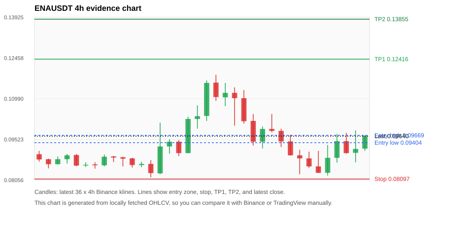

# Crypto 市场扫描报告 v2

- 报告时间：2026-06-06 17:34:36 CST
- 报告版本：v2
- 扫描 ID：603df2a8ae59
- 数据源：Binance public spot API + CoinGecko/CoinMarketCap cross-check
- 过滤条件：USDT spot; 24h quote volume >= 30,000,000; trades >= 30,000; exclude stables/leveraged tokens; analyze 1h/4h/1d klines
- 默认单笔风险：账户权益的 1.00%

## 限制说明

- 交易信号仍以 Binance 现货公开 K 线为主源；外部数据源用于一致性复核。
- 结果是研究和模拟盘计划，不是确定收益或实盘下单指令。
- 历史长度过滤：候选币至少需要 180 根 1d K 线。
- 大盘环境过滤：RISK_OFF; BTC/ETH 大盘偏弱，山寨币买入候选降级为观察。 BTC 7d=-17.050802889595886; ETH 7d=-21.54773441980973.
- 已启用数据交叉验证：Binance 主源 + CoinGecko 自动对照；CoinMarketCap 在配置 API Key 后自动对照。
- HOMEUSDT 交叉验证状态 DATA_WARNING：At least one external provider needs manual review.
- BABYUSDT 交叉验证状态 DATA_WARNING：At least one external provider needs manual review.
- ENAUSDT 交叉验证状态 DATA_WARNING：At least one external provider needs manual review.

## 3 个候选交易计划

| Rank | Coin | Setup | Entry Zone | Stop Loss | TP1 | TP2 / Exit Rule | R/R | Verdict |
|---:|---|---|---:|---:|---:|---|---:|---|
| 1 | `HOME` | 涨幅较远，只等深回调 | 0.03833 - 0.04159 | 0.02726 | 0.06766 | 0.07806 或跌破 4h 关键支撑 | 2.18-3.00 | 只等回调 |
| 2 | `BABY` | 回踩支撑/4h EMA 附近 | 0.01540 - 0.01545 | 0.01156 | 0.02569 | 0.02701 或跌破 4h 关键支撑 | 2.66-3.00 | 只观察 |
| 3 | `ENA` | 回踩支撑/4h EMA 附近 | 0.09404 - 0.09669 | 0.08097 | 0.12416 | 0.13855 或跌破 4h 关键支撑 | 2.00-3.00 | 只观察 |

## 数据交叉验证摘要

价格差异以 Binance 当前价为基准；成交量口径不同，Binance 是 USDT 现货成交额，CoinGecko/CoinMarketCap 通常是全市场成交量。

| Rank | Coin | Data Status | Max Price Diff | Max 24h Diff | Message |
|---:|---|---|---:|---:|---|
| 1 | `HOME` | DATA_WARNING | 0.98% | 2.42 pts | At least one external provider needs manual review. |
| 2 | `BABY` | DATA_WARNING | 1.09% | 11.03 pts | At least one external provider needs manual review. |
| 3 | `ENA` | DATA_WARNING | 0.06% | 0.15 pts | At least one external provider needs manual review. |

## 候选币说明

### 1. HOME `HOMEUSDT`



- 入选原因：涨幅较远，只等深回调；24h +3.70%，7d +72.76%，4h RSI 55.96，24h 成交额 $67.2M。
- 交易失效条件：跌破 0.027260574 或 4h 收盘重新失守关键支撑。
- 主要风险：距离支撑偏远，不能追市价；24h 振幅较大，回撤风险高；成交量突增，可能是事件驱动；BTC/ETH 大盘环境未确认强势，山寨币买入信号降级；数据交叉验证需要人工复核。
- 数据交叉验证：DATA_WARNING；At least one external provider needs manual review.

#### 可点击人工验证

- [Binance 交易页](https://www.binance.com/en/trade/HOME_USDT)
- [TradingView 图表](https://www.tradingview.com/chart/?symbol=BINANCE%3AHOMEUSDT)
- [CoinGecko 搜索](https://www.coingecko.com/en/search?query=HOME)
- [CoinMarketCap 搜索](https://coinmarketcap.com/search/?q=HOME)

#### 多数据源对照

| Source | Status | Asset ID | Price | 24h Change | 24h Volume | Price Diff | 24h Diff | Updated | Message |
|---|---|---|---:|---:|---:|---:|---:|---|---|
| Binance | DATA_OK | HOMEUSDT | 0.04661 | +3.70% | $67.2M | 0.00% | 0.00 pts | 2026-06-06T09:34:30+00:00 | Primary market data source used by scanner. |
| CoinGecko | DATA_OK | home | 0.04671 | +2.15% | $173.5M | 0.21% | 1.55 pts | 2026-06-06T09:34:24.444Z | External source agrees with Binance within thresholds. |
| CoinMarketCap | DATA_WARNING | 36133 | 0.04707 | +1.28% | $221.9M | 0.98% | 2.42 pts | 2026-06-06T09:33:04.000Z | CoinMarketCap symbol mapping has 5 matches; selected lowest cmc_rank |

#### 指标证据

| 指标 | 数值 | 人工核对用途 |
|---|---:|---|
| 当前价 | 0.04661 | 与 Binance/TradingView 当前价格对照 |
| 24h 涨跌 | +3.70% | 与交易所 24h 涨跌对照 |
| 7d 涨跌 | +72.76% | 判断短线趋势是否延续 |
| 4h EMA20 | 0.04699 | 判断短期趋势支撑 |
| 4h EMA50 | 0.04151 | 判断中期趋势支撑 |
| 1d EMA20 | 0.03495 | 判断日线趋势 |
| 1d EMA50 | 0.02667 | 判断日线趋势 |
| 4h RSI14 | 55.96 | 判断是否过热/过弱 |
| 4h ATR14 | 0.01104 | 推导止损和入场缓冲 |
| 最近 18 根 4h 最低点 | 0.03557 | 支撑/止损参考 |
| 最近 36 根 4h 最高点 | 0.06800 | TP/压力参考 |
| 支撑位 | 0.04151 | 入场区间推导基础 |

#### 交易计划推导

- 支撑位 = 最近低点、4h EMA20、4h EMA50、1d EMA20 中不高于当前价的最高有效支撑 = `0.04151`。
- 入场区间 = 支撑位附近 + ATR 缓冲 = `0.03833 - 0.04159`。
- 止损 = min(最近 18 根 4h 最低点 * 0.985, 入场中位价 - 1.15 * ATR14) = `0.02726`。
- TP1 = max(最近 36 根 4h 最高点 * 0.995, 入场中位价 + 2R) = `0.06766`。
- TP2 = max(入场中位价 + 3R, TP1 * 1.04) = `0.07806`。

#### 最近 10 根 4h K线

| UTC 开盘时间 | Open | High | Low | Close | Quote Volume | Trades |
|---|---:|---:|---:|---:|---:|---:|
| 2026-06-04T20:00+00:00 | 0.04927 | 0.06062 | 0.04793 | 0.05762 | $5.0M | 101086 |
| 2026-06-05T00:00+00:00 | 0.05762 | 0.05887 | 0.04870 | 0.04876 | $4.9M | 87090 |
| 2026-06-05T04:00+00:00 | 0.04873 | 0.05461 | 0.04711 | 0.05006 | $5.5M | 108890 |
| 2026-06-05T08:00+00:00 | 0.05008 | 0.05085 | 0.04253 | 0.04296 | $4.9M | 85860 |
| 2026-06-05T12:00+00:00 | 0.04295 | 0.04469 | 0.04039 | 0.04164 | $4.3M | 162667 |
| 2026-06-05T16:00+00:00 | 0.04164 | 0.04970 | 0.04150 | 0.04956 | $4.0M | 64071 |
| 2026-06-05T20:00+00:00 | 0.04953 | 0.05612 | 0.04887 | 0.05053 | $3.0M | 69456 |
| 2026-06-06T00:00+00:00 | 0.05057 | 0.05700 | 0.05002 | 0.05638 | $1.8M | 104749 |
| 2026-06-06T04:00+00:00 | 0.05638 | 0.06800 | 0.04671 | 0.04996 | $14.9M | 371332 |
| 2026-06-06T08:00+00:00 | 0.04996 | 0.05893 | 0.04102 | 0.04682 | $37.0M | 551920 |

### 2. BABY `BABYUSDT`



- 入选原因：回踩支撑/4h EMA 附近；24h -16.40%，7d +2.80%，4h RSI 54.66，24h 成交额 $37.1M。
- 交易失效条件：跌破 0.0115639 或 4h 收盘重新失守关键支撑。
- 主要风险：24h 振幅较大，回撤风险高；成交量突增，可能是事件驱动；BTC/ETH 大盘环境未确认强势，山寨币买入信号降级；24h 动量未确认；数据交叉验证需要人工复核。
- 数据交叉验证：DATA_WARNING；At least one external provider needs manual review.

#### 可点击人工验证

- [Binance 交易页](https://www.binance.com/en/trade/BABY_USDT)
- [TradingView 图表](https://www.tradingview.com/chart/?symbol=BINANCE%3ABABYUSDT)
- [CoinGecko 搜索](https://www.coingecko.com/en/search?query=BABY)
- [CoinMarketCap 搜索](https://coinmarketcap.com/search/?q=BABY)

#### 多数据源对照

| Source | Status | Asset ID | Price | 24h Change | 24h Volume | Price Diff | 24h Diff | Updated | Message |
|---|---|---|---:|---:|---:|---:|---:|---|---|
| Binance | DATA_OK | BABYUSDT | 0.01540 | -16.40% | $37.1M | 0.00% | 0.00 pts | 2026-06-06T09:34:30+00:00 | Primary market data source used by scanner. |
| CoinGecko | DATA_WARNING | babylon | 0.01538 | -14.90% | $185.2M | 0.11% | 1.50 pts | 2026-06-06T09:34:31.426Z | CoinGecko symbol mapping has 2 exact matches; selected highest market-cap rank |
| CoinMarketCap | DATA_WARNING | 32198 | 0.01557 | -5.37% | $271.8M | 1.09% | 11.03 pts | 2026-06-06T09:33:04.000Z | price diff 1.09% exceeds warning threshold; 24h change diff 11.03 points exceeds warning threshold; CoinMarketCap symbol mapping has 10 matches; selected lowest cmc_rank |

#### 指标证据

| 指标 | 数值 | 人工核对用途 |
|---|---:|---|
| 当前价 | 0.01540 | 与 Binance/TradingView 当前价格对照 |
| 24h 涨跌 | -16.40% | 与交易所 24h 涨跌对照 |
| 7d 涨跌 | +2.80% | 判断短线趋势是否延续 |
| 4h EMA20 | 0.01523 | 判断短期趋势支撑 |
| 4h EMA50 | 0.01485 | 判断中期趋势支撑 |
| 1d EMA20 | 0.01537 | 判断日线趋势 |
| 1d EMA50 | 0.01568 | 判断日线趋势 |
| 4h RSI14 | 54.66 | 判断是否过热/过弱 |
| 4h ATR14 | 0.00235 | 推导止损和入场缓冲 |
| 最近 18 根 4h 最低点 | 0.01174 | 支撑/止损参考 |
| 最近 36 根 4h 最高点 | 0.02582 | TP/压力参考 |
| 支撑位 | 0.01537 | 入场区间推导基础 |

#### 交易计划推导

- 支撑位 = 最近低点、4h EMA20、4h EMA50、1d EMA20 中不高于当前价的最高有效支撑 = `0.01537`。
- 入场区间 = 支撑位附近 + ATR 缓冲 = `0.01540 - 0.01545`。
- 止损 = min(最近 18 根 4h 最低点 * 0.985, 入场中位价 - 1.15 * ATR14) = `0.01156`。
- TP1 = max(最近 36 根 4h 最高点 * 0.995, 入场中位价 + 2R) = `0.02569`。
- TP2 = max(入场中位价 + 3R, TP1 * 1.04) = `0.02701`。

#### 最近 10 根 4h K线

| UTC 开盘时间 | Open | High | Low | Close | Quote Volume | Trades |
|---|---:|---:|---:|---:|---:|---:|
| 2026-06-04T20:00+00:00 | 0.01304 | 0.01306 | 0.01263 | 0.01285 | $45,618 | 2119 |
| 2026-06-05T00:00+00:00 | 0.01285 | 0.01285 | 0.01234 | 0.01246 | $97,242 | 3706 |
| 2026-06-05T04:00+00:00 | 0.01246 | 0.01275 | 0.01174 | 0.01194 | $234,424 | 5937 |
| 2026-06-05T08:00+00:00 | 0.01195 | 0.02582 | 0.01176 | 0.02182 | $17.9M | 205851 |
| 2026-06-05T12:00+00:00 | 0.02180 | 0.02300 | 0.01715 | 0.01812 | $8.0M | 129274 |
| 2026-06-05T16:00+00:00 | 0.01811 | 0.02032 | 0.01788 | 0.01870 | $5.0M | 66571 |
| 2026-06-05T20:00+00:00 | 0.01871 | 0.01940 | 0.01730 | 0.01780 | $2.6M | 37053 |
| 2026-06-06T00:00+00:00 | 0.01779 | 0.01817 | 0.01541 | 0.01552 | $2.9M | 50333 |
| 2026-06-06T04:00+00:00 | 0.01552 | 0.01583 | 0.01470 | 0.01519 | $2.2M | 46371 |
| 2026-06-06T08:00+00:00 | 0.01519 | 0.01597 | 0.01513 | 0.01540 | $914,834 | 17850 |

### 3. ENA `ENAUSDT`



- 入选原因：回踩支撑/4h EMA 附近；24h +9.42%，7d +9.05%，4h RSI 38.28，24h 成交额 $56.6M。
- 交易失效条件：跌破 0.080967 或 4h 收盘重新失守关键支撑。
- 主要风险：日线趋势未完全确认；BTC/ETH 大盘环境未确认强势，山寨币买入信号降级；数据交叉验证需要人工复核。
- 数据交叉验证：DATA_WARNING；At least one external provider needs manual review.

#### 可点击人工验证

- [Binance 交易页](https://www.binance.com/en/trade/ENA_USDT)
- [TradingView 图表](https://www.tradingview.com/chart/?symbol=BINANCE%3AENAUSDT)
- [CoinGecko 搜索](https://www.coingecko.com/en/search?query=ENA)
- [CoinMarketCap 搜索](https://coinmarketcap.com/search/?q=ENA)

#### 多数据源对照

| Source | Status | Asset ID | Price | 24h Change | 24h Volume | Price Diff | 24h Diff | Updated | Message |
|---|---|---|---:|---:|---:|---:|---:|---|---|
| Binance | DATA_OK | ENAUSDT | 0.09640 | +9.42% | $56.6M | 0.00% | 0.00 pts | 2026-06-06T09:34:30+00:00 | Primary market data source used by scanner. |
| CoinGecko | DATA_OK | ethena | 0.09638 | +9.57% | $357.1M | 0.02% | 0.15 pts | 2026-06-06T09:34:34.061Z | External source agrees with Binance within thresholds. |
| CoinMarketCap | DATA_WARNING | 30171 | 0.09646 | +9.48% | $359.8M | 0.06% | 0.06 pts | 2026-06-06T09:33:04.000Z | CoinMarketCap symbol mapping has 2 matches; selected lowest cmc_rank |

#### 指标证据

| 指标 | 数值 | 人工核对用途 |
|---|---:|---|
| 当前价 | 0.09640 | 与 Binance/TradingView 当前价格对照 |
| 24h 涨跌 | +9.42% | 与交易所 24h 涨跌对照 |
| 7d 涨跌 | +9.05% | 判断短线趋势是否延续 |
| 4h EMA20 | 0.09350 | 判断短期趋势支撑 |
| 4h EMA50 | 0.09385 | 判断中期趋势支撑 |
| 1d EMA20 | 0.09834 | 判断日线趋势 |
| 1d EMA50 | 0.10297 | 判断日线趋势 |
| 4h RSI14 | 38.28 | 判断是否过热/过弱 |
| 4h ATR14 | 0.0086214286 | 推导止损和入场缓冲 |
| 最近 18 根 4h 最低点 | 0.08220 | 支撑/止损参考 |
| 最近 36 根 4h 最高点 | 0.11850 | TP/压力参考 |
| 支撑位 | 0.09385 | 入场区间推导基础 |

#### 交易计划推导

- 支撑位 = 最近低点、4h EMA20、4h EMA50、1d EMA20 中不高于当前价的最高有效支撑 = `0.09385`。
- 入场区间 = 支撑位附近 + ATR 缓冲 = `0.09404 - 0.09669`。
- 止损 = min(最近 18 根 4h 最低点 * 0.985, 入场中位价 - 1.15 * ATR14) = `0.08097`。
- TP1 = max(最近 36 根 4h 最高点 * 0.995, 入场中位价 + 2R) = `0.12416`。
- TP2 = max(入场中位价 + 3R, TP1 * 1.04) = `0.13855`。

#### 最近 10 根 4h K线

| UTC 开盘时间 | Open | High | Low | Close | Quote Volume | Trades |
|---|---:|---:|---:|---:|---:|---:|
| 2026-06-04T20:00+00:00 | 0.09830 | 0.09910 | 0.09250 | 0.09450 | $5.7M | 43405 |
| 2026-06-05T00:00+00:00 | 0.09450 | 0.09690 | 0.08940 | 0.08950 | $6.0M | 39060 |
| 2026-06-05T04:00+00:00 | 0.08950 | 0.09150 | 0.08270 | 0.08840 | $10.5M | 55374 |
| 2026-06-05T08:00+00:00 | 0.08840 | 0.09080 | 0.08500 | 0.08550 | $5.1M | 30939 |
| 2026-06-05T12:00+00:00 | 0.08550 | 0.09110 | 0.08310 | 0.08320 | $9.1M | 47514 |
| 2026-06-05T16:00+00:00 | 0.08320 | 0.09320 | 0.08220 | 0.08860 | $12.6M | 84251 |
| 2026-06-05T20:00+00:00 | 0.08860 | 0.09720 | 0.08690 | 0.09460 | $9.3M | 53375 |
| 2026-06-06T00:00+00:00 | 0.09460 | 0.09760 | 0.09010 | 0.09030 | $5.3M | 24432 |
| 2026-06-06T04:00+00:00 | 0.09040 | 0.09850 | 0.08700 | 0.09180 | $14.7M | 67547 |
| 2026-06-06T08:00+00:00 | 0.09190 | 0.09680 | 0.09110 | 0.09650 | $2.6M | 12382 |

## 组合风控

- 不要 5 个候选全部满仓买入。
- 同时持仓总风险建议控制在账户权益的 3% - 5% 以内。
- 如果 BTC/ETH 同时破位，暂停山寨币多头计划或降低仓位。
- 第一版报告用于模拟盘和人工复核，不自动下单。

## 原始数据

```json
[
  {
    "rank": 1,
    "symbol": "HOMEUSDT",
    "base_asset": "HOME",
    "price": 0.04661,
    "score": 35.25427785601558,
    "setup": "涨幅较远，只等深回调",
    "verdict": "只等回调",
    "entry_low": 0.038327321428571426,
    "entry_high": 0.041594040333377456,
    "stop_loss": 0.0272605737381173,
    "take_profit_1": 0.06766,
    "take_profit_2": 0.07806100230954588,
    "risk_reward_1": 2.181030349386016,
    "risk_reward_2": 3.0,
    "pct_24h": 3.702,
    "pct_3d": 13.433925529325851,
    "pct_7d": 72.75759822090437,
    "quote_volume_24h": 67161452.32023,
    "trades_24h": 1370513,
    "high_low_range_24h": 68.35850458034167,
    "rsi_1h": 45.77242762969332,
    "rsi_4h": 55.96225336002288,
    "ema20_4h": 0.046993420690152124,
    "ema50_4h": 0.041511018296783886,
    "ema20_1d": 0.03494504246024565,
    "ema50_1d": 0.026671684929154067,
    "atr_4h": 0.01104357142857143,
    "macd_hist_4h": -7.191145657632755e-05,
    "volume_ratio_24h": 3.4711467650134207,
    "support_level": 0.041511018296783886,
    "recent_low_4h_18": 0.03557,
    "recent_high_4h_36": 0.068,
    "distance_to_support_pct": 12.28344163171531,
    "binance_trade_url": "https://www.binance.com/en/trade/HOME_USDT",
    "tradingview_url": "https://www.tradingview.com/chart/?symbol=BINANCE%3AHOMEUSDT",
    "coingecko_search_url": "https://www.coingecko.com/en/search?query=HOME",
    "coinmarketcap_search_url": "https://coinmarketcap.com/search/?q=HOME",
    "invalidation": "跌破 0.027260574 或 4h 收盘重新失守关键支撑",
    "recent_4h_klines": [
      {
        "open_time_utc": "2026-05-31T12:00+00:00",
        "open": 0.03165,
        "high": 0.03481,
        "low": 0.03145,
        "close": 0.03324,
        "quote_volume": 1803758.03815,
        "trades": 21986
      },
      {
        "open_time_utc": "2026-05-31T16:00+00:00",
        "open": 0.03321,
        "high": 0.04201,
        "low": 0.03306,
        "close": 0.03619,
        "quote_volume": 3797865.00791,
        "trades": 52755
      },
      {
        "open_time_utc": "2026-05-31T20:00+00:00",
        "open": 0.03619,
        "high": 0.04059,
        "low": 0.03588,
        "close": 0.0391,
        "quote_volume": 2795626.93602,
        "trades": 33181
      },
      {
        "open_time_utc": "2026-06-01T00:00+00:00",
        "open": 0.03906,
        "high": 0.04195,
        "low": 0.03678,
        "close": 0.03981,
        "quote_volume": 2949555.5366,
        "trades": 33687
      },
      {
        "open_time_utc": "2026-06-01T04:00+00:00",
        "open": 0.0398,
        "high": 0.04696,
        "low": 0.03484,
        "close": 0.03593,
        "quote_volume": 5288360.19174,
        "trades": 62471
      },
      {
        "open_time_utc": "2026-06-01T08:00+00:00",
        "open": 0.03589,
        "high": 0.048,
        "low": 0.03517,
        "close": 0.04691,
        "quote_volume": 5312016.16086,
        "trades": 67798
      },
      {
        "open_time_utc": "2026-06-01T12:00+00:00",
        "open": 0.04688,
        "high": 0.05323,
        "low": 0.04257,
        "close": 0.0495,
        "quote_volume": 9850712.83016,
        "trades": 120657
      },
      {
        "open_time_utc": "2026-06-01T16:00+00:00",
        "open": 0.04954,
        "high": 0.05338,
        "low": 0.04658,
        "close": 0.05166,
        "quote_volume": 4948368.82794,
        "trades": 77576
      },
      {
        "open_time_utc": "2026-06-01T20:00+00:00",
        "open": 0.0516,
        "high": 0.0534,
        "low": 0.04654,
        "close": 0.0472,
        "quote_volume": 2360900.7618,
        "trades": 34491
      },
      {
        "open_time_utc": "2026-06-02T00:00+00:00",
        "open": 0.04724,
        "high": 0.05155,
        "low": 0.0436,
        "close": 0.04527,
        "quote_volume": 2583509.63337,
        "trades": 43691
      },
      {
        "open_time_utc": "2026-06-02T04:00+00:00",
        "open": 0.04532,
        "high": 0.05177,
        "low": 0.04364,
        "close": 0.04584,
        "quote_volume": 3350430.09271,
        "trades": 66476
      },
      {
        "open_time_utc": "2026-06-02T08:00+00:00",
        "open": 0.04591,
        "high": 0.05152,
        "low": 0.04376,
        "close": 0.05016,
        "quote_volume": 3836579.44522,
        "trades": 47038
      },
      {
        "open_time_utc": "2026-06-02T12:00+00:00",
        "open": 0.0501,
        "high": 0.055,
        "low": 0.04846,
        "close": 0.05383,
        "quote_volume": 4437547.93345,
        "trades": 46402
      },
      {
        "open_time_utc": "2026-06-02T16:00+00:00",
        "open": 0.05381,
        "high": 0.05392,
        "low": 0.04601,
        "close": 0.04916,
        "quote_volume": 1661073.10394,
        "trades": 25046
      },
      {
        "open_time_utc": "2026-06-02T20:00+00:00",
        "open": 0.04912,
        "high": 0.04928,
        "low": 0.04632,
        "close": 0.0475,
        "quote_volume": 409233.62254,
        "trades": 8320
      },
      {
        "open_time_utc": "2026-06-03T00:00+00:00",
        "open": 0.0475,
        "high": 0.0506,
        "low": 0.04724,
        "close": 0.04984,
        "quote_volume": 1000537.13619,
        "trades": 14357
      },
      {
        "open_time_utc": "2026-06-03T04:00+00:00",
        "open": 0.04976,
        "high": 0.05075,
        "low": 0.04211,
        "close": 0.0466,
        "quote_volume": 2295879.47921,
        "trades": 31651
      },
      {
        "open_time_utc": "2026-06-03T08:00+00:00",
        "open": 0.04666,
        "high": 0.04961,
        "low": 0.03917,
        "close": 0.04212,
        "quote_volume": 2472768.74623,
        "trades": 49856
      },
      {
        "open_time_utc": "2026-06-03T12:00+00:00",
        "open": 0.04207,
        "high": 0.04363,
        "low": 0.04071,
        "close": 0.0418,
        "quote_volume": 914911.71642,
        "trades": 22704
      },
      {
        "open_time_utc": "2026-06-03T16:00+00:00",
        "open": 0.04182,
        "high": 0.04386,
        "low": 0.03988,
        "close": 0.04266,
        "quote_volume": 702037.54382,
        "trades": 13453
      },
      {
        "open_time_utc": "2026-06-03T20:00+00:00",
        "open": 0.04268,
        "high": 0.04268,
        "low": 0.04011,
        "close": 0.04044,
        "quote_volume": 261292.13209,
        "trades": 5039
      },
      {
        "open_time_utc": "2026-06-04T00:00+00:00",
        "open": 0.04046,
        "high": 0.04088,
        "low": 0.03802,
        "close": 0.03848,
        "quote_volume": 308134.55437,
        "trades": 8932
      },
      {
        "open_time_utc": "2026-06-04T04:00+00:00",
        "open": 0.03845,
        "high": 0.04012,
        "low": 0.03585,
        "close": 0.03593,
        "quote_volume": 522762.37812,
        "trades": 9397
      },
      {
        "open_time_utc": "2026-06-04T08:00+00:00",
        "open": 0.03594,
        "high": 0.0388,
        "low": 0.03557,
        "close": 0.03695,
        "quote_volume": 3387171.81954,
        "trades": 74602
      },
      {
        "open_time_utc": "2026-06-04T12:00+00:00",
        "open": 0.03694,
        "high": 0.067,
        "low": 0.03665,
        "close": 0.05058,
        "quote_volume": 13758130.3752,
        "trades": 207251
      },
      {
        "open_time_utc": "2026-06-04T16:00+00:00",
        "open": 0.05062,
        "high": 0.05723,
        "low": 0.04508,
        "close": 0.04917,
        "quote_volume": 7257645.52459,
        "trades": 168714
      },
      {
        "open_time_utc": "2026-06-04T20:00+00:00",
        "open": 0.04927,
        "high": 0.06062,
        "low": 0.04793,
        "close": 0.05762,
        "quote_volume": 4960174.31952,
        "trades": 101086
      },
      {
        "open_time_utc": "2026-06-05T00:00+00:00",
        "open": 0.05762,
        "high": 0.05887,
        "low": 0.0487,
        "close": 0.04876,
        "quote_volume": 4924013.97114,
        "trades": 87090
      },
      {
        "open_time_utc": "2026-06-05T04:00+00:00",
        "open": 0.04873,
        "high": 0.05461,
        "low": 0.04711,
        "close": 0.05006,
        "quote_volume": 5488456.96109,
        "trades": 108890
      },
      {
        "open_time_utc": "2026-06-05T08:00+00:00",
        "open": 0.05008,
        "high": 0.05085,
        "low": 0.04253,
        "close": 0.04296,
        "quote_volume": 4945391.86007,
        "trades": 85860
      },
      {
        "open_time_utc": "2026-06-05T12:00+00:00",
        "open": 0.04295,
        "high": 0.04469,
        "low": 0.04039,
        "close": 0.04164,
        "quote_volume": 4280039.40122,
        "trades": 162667
      },
      {
        "open_time_utc": "2026-06-05T16:00+00:00",
        "open": 0.04164,
        "high": 0.0497,
        "low": 0.0415,
        "close": 0.04956,
        "quote_volume": 3950233.98932,
        "trades": 64071
      },
      {
        "open_time_utc": "2026-06-05T20:00+00:00",
        "open": 0.04953,
        "high": 0.05612,
        "low": 0.04887,
        "close": 0.05053,
        "quote_volume": 2964378.05321,
        "trades": 69456
      },
      {
        "open_time_utc": "2026-06-06T00:00+00:00",
        "open": 0.05057,
        "high": 0.057,
        "low": 0.05002,
        "close": 0.05638,
        "quote_volume": 1811466.38302,
        "trades": 104749
      },
      {
        "open_time_utc": "2026-06-06T04:00+00:00",
        "open": 0.05638,
        "high": 0.068,
        "low": 0.04671,
        "close": 0.04996,
        "quote_volume": 14854402.62987,
        "trades": 371332
      },
      {
        "open_time_utc": "2026-06-06T08:00+00:00",
        "open": 0.04996,
        "high": 0.05893,
        "low": 0.04102,
        "close": 0.04682,
        "quote_volume": 37022106.97471,
        "trades": 551920
      }
    ],
    "risks": [
      "距离支撑偏远，不能追市价",
      "24h 振幅较大，回撤风险高",
      "成交量突增，可能是事件驱动",
      "BTC/ETH 大盘环境未确认强势，山寨币买入信号降级",
      "数据交叉验证需要人工复核"
    ],
    "data_quality_status": "DATA_WARNING",
    "data_quality_message": "At least one external provider needs manual review.",
    "data_checks": [
      {
        "provider": "Binance",
        "status": "DATA_OK",
        "provider_asset_id": "HOMEUSDT",
        "provider_symbol": "HOMEUSDT",
        "price_usd": 0.04661,
        "pct_24h": 3.702,
        "volume_24h": 67161452.32023,
        "last_updated": null,
        "fetched_at_utc": "2026-06-06T09:34:30+00:00",
        "price_diff_pct": 0.0,
        "pct_24h_diff": 0.0,
        "volume_note": "Binance USDT spot 24h quoteVolume.",
        "message": "Primary market data source used by scanner."
      },
      {
        "provider": "CoinGecko",
        "status": "DATA_OK",
        "provider_asset_id": "home",
        "provider_symbol": "HOME",
        "price_usd": 0.04670674,
        "pct_24h": 2.15296,
        "volume_24h": 173535100.0,
        "last_updated": "2026-06-06T09:34:24.444Z",
        "fetched_at_utc": "2026-06-06T09:34:30+00:00",
        "price_diff_pct": 0.20755202746191365,
        "pct_24h_diff": 1.5490399999999998,
        "volume_note": "CoinGecko total market volume; not the same venue scope as Binance quoteVolume.",
        "message": "External source agrees with Binance within thresholds."
      },
      {
        "provider": "CoinMarketCap",
        "status": "DATA_WARNING",
        "provider_asset_id": "36133",
        "provider_symbol": "HOME",
        "price_usd": 0.047067276902014475,
        "pct_24h": 1.28034432,
        "volume_24h": 221910106.56546995,
        "last_updated": "2026-06-06T09:33:04.000Z",
        "fetched_at_utc": "2026-06-06T09:34:30+00:00",
        "price_diff_pct": 0.9810703754869696,
        "pct_24h_diff": 2.4216556799999998,
        "volume_note": "CoinMarketCap total market volume; not the same venue scope as Binance quoteVolume.",
        "message": "CoinMarketCap symbol mapping has 5 matches; selected lowest cmc_rank"
      }
    ],
    "action": "WATCH_ONLY"
  },
  {
    "rank": 2,
    "symbol": "BABYUSDT",
    "base_asset": "BABY",
    "price": 0.0154,
    "score": 32.32294827658062,
    "setup": "回踩支撑/4h EMA 附近",
    "verdict": "只观察",
    "entry_low": 0.015402584467887503,
    "entry_high": 0.015446199999999998,
    "stop_loss": 0.0115639,
    "take_profit_1": 0.0256909,
    "take_profit_2": 0.02700586893577501,
    "risk_reward_1": 2.6593779093212477,
    "risk_reward_2": 3.0000000000000004,
    "pct_24h": -16.404,
    "pct_3d": 11.191335740072205,
    "pct_7d": 2.8037383177570208,
    "quote_volume_24h": 37101937.70682,
    "trades_24h": 518489,
    "high_low_range_24h": 75.64625850340137,
    "rsi_1h": 18.390804597701106,
    "rsi_4h": 54.66269841269841,
    "ema20_4h": 0.015232271250070106,
    "ema50_4h": 0.014853762939678283,
    "ema20_1d": 0.015371840786314874,
    "ema50_1d": 0.015680192401953272,
    "atr_4h": 0.00235,
    "macd_hist_4h": 0.0001556350747237193,
    "volume_ratio_24h": 23.77196169952342,
    "support_level": 0.015371840786314874,
    "recent_low_4h_18": 0.01174,
    "recent_high_4h_36": 0.02582,
    "distance_to_support_pct": 0.18318699807375882,
    "binance_trade_url": "https://www.binance.com/en/trade/BABY_USDT",
    "tradingview_url": "https://www.tradingview.com/chart/?symbol=BINANCE%3ABABYUSDT",
    "coingecko_search_url": "https://www.coingecko.com/en/search?query=BABY",
    "coinmarketcap_search_url": "https://coinmarketcap.com/search/?q=BABY",
    "invalidation": "跌破 0.0115639 或 4h 收盘重新失守关键支撑",
    "recent_4h_klines": [
      {
        "open_time_utc": "2026-05-31T12:00+00:00",
        "open": 0.0146,
        "high": 0.0146,
        "low": 0.0143,
        "close": 0.01438,
        "quote_volume": 189943.15463,
        "trades": 2164
      },
      {
        "open_time_utc": "2026-05-31T16:00+00:00",
        "open": 0.01438,
        "high": 0.01443,
        "low": 0.01425,
        "close": 0.01436,
        "quote_volume": 41183.57998,
        "trades": 948
      },
      {
        "open_time_utc": "2026-05-31T20:00+00:00",
        "open": 0.01436,
        "high": 0.0145,
        "low": 0.0143,
        "close": 0.01447,
        "quote_volume": 30008.64931,
        "trades": 615
      },
      {
        "open_time_utc": "2026-06-01T00:00+00:00",
        "open": 0.01447,
        "high": 0.01463,
        "low": 0.01437,
        "close": 0.0145,
        "quote_volume": 20195.11971,
        "trades": 748
      },
      {
        "open_time_utc": "2026-06-01T04:00+00:00",
        "open": 0.0145,
        "high": 0.01451,
        "low": 0.01402,
        "close": 0.01407,
        "quote_volume": 118837.97667,
        "trades": 2335
      },
      {
        "open_time_utc": "2026-06-01T08:00+00:00",
        "open": 0.01407,
        "high": 0.01422,
        "low": 0.01389,
        "close": 0.01397,
        "quote_volume": 65894.35633,
        "trades": 1363
      },
      {
        "open_time_utc": "2026-06-01T12:00+00:00",
        "open": 0.01396,
        "high": 0.01403,
        "low": 0.01383,
        "close": 0.01392,
        "quote_volume": 80737.63458,
        "trades": 1806
      },
      {
        "open_time_utc": "2026-06-01T16:00+00:00",
        "open": 0.01393,
        "high": 0.01429,
        "low": 0.01383,
        "close": 0.01428,
        "quote_volume": 76384.39303,
        "trades": 1377
      },
      {
        "open_time_utc": "2026-06-01T20:00+00:00",
        "open": 0.01428,
        "high": 0.01428,
        "low": 0.01404,
        "close": 0.01408,
        "quote_volume": 43788.14877,
        "trades": 970
      },
      {
        "open_time_utc": "2026-06-02T00:00+00:00",
        "open": 0.01408,
        "high": 0.01415,
        "low": 0.01371,
        "close": 0.01401,
        "quote_volume": 96244.5801,
        "trades": 1558
      },
      {
        "open_time_utc": "2026-06-02T04:00+00:00",
        "open": 0.01402,
        "high": 0.01405,
        "low": 0.01376,
        "close": 0.01388,
        "quote_volume": 34233.57265,
        "trades": 904
      },
      {
        "open_time_utc": "2026-06-02T08:00+00:00",
        "open": 0.01388,
        "high": 0.01398,
        "low": 0.01377,
        "close": 0.01388,
        "quote_volume": 41975.00406,
        "trades": 1261
      },
      {
        "open_time_utc": "2026-06-02T12:00+00:00",
        "open": 0.01387,
        "high": 0.0141,
        "low": 0.01347,
        "close": 0.01363,
        "quote_volume": 279602.84406,
        "trades": 3415
      },
      {
        "open_time_utc": "2026-06-02T16:00+00:00",
        "open": 0.01362,
        "high": 0.01389,
        "low": 0.01326,
        "close": 0.01351,
        "quote_volume": 99996.87285,
        "trades": 2438
      },
      {
        "open_time_utc": "2026-06-02T20:00+00:00",
        "open": 0.01351,
        "high": 0.01386,
        "low": 0.01333,
        "close": 0.01349,
        "quote_volume": 99799.1561,
        "trades": 2531
      },
      {
        "open_time_utc": "2026-06-03T00:00+00:00",
        "open": 0.01349,
        "high": 0.01385,
        "low": 0.01318,
        "close": 0.01325,
        "quote_volume": 234178.53096,
        "trades": 3599
      },
      {
        "open_time_utc": "2026-06-03T04:00+00:00",
        "open": 0.01325,
        "high": 0.01388,
        "low": 0.01325,
        "close": 0.01371,
        "quote_volume": 74756.77617,
        "trades": 1903
      },
      {
        "open_time_utc": "2026-06-03T08:00+00:00",
        "open": 0.01371,
        "high": 0.01394,
        "low": 0.01368,
        "close": 0.01379,
        "quote_volume": 94896.01399,
        "trades": 1321
      },
      {
        "open_time_utc": "2026-06-03T12:00+00:00",
        "open": 0.01378,
        "high": 0.01391,
        "low": 0.01371,
        "close": 0.01383,
        "quote_volume": 84077.03595,
        "trades": 1426
      },
      {
        "open_time_utc": "2026-06-03T16:00+00:00",
        "open": 0.01384,
        "high": 0.01432,
        "low": 0.01372,
        "close": 0.01393,
        "quote_volume": 225826.35106,
        "trades": 4733
      },
      {
        "open_time_utc": "2026-06-03T20:00+00:00",
        "open": 0.01393,
        "high": 0.01425,
        "low": 0.01374,
        "close": 0.01389,
        "quote_volume": 90713.39555,
        "trades": 2632
      },
      {
        "open_time_utc": "2026-06-04T00:00+00:00",
        "open": 0.01389,
        "high": 0.01403,
        "low": 0.01283,
        "close": 0.01352,
        "quote_volume": 209800.38077,
        "trades": 5621
      },
      {
        "open_time_utc": "2026-06-04T04:00+00:00",
        "open": 0.01353,
        "high": 0.01359,
        "low": 0.01318,
        "close": 0.01319,
        "quote_volume": 39008.28031,
        "trades": 1681
      },
      {
        "open_time_utc": "2026-06-04T08:00+00:00",
        "open": 0.0132,
        "high": 0.01332,
        "low": 0.01273,
        "close": 0.01291,
        "quote_volume": 87886.88858,
        "trades": 3335
      },
      {
        "open_time_utc": "2026-06-04T12:00+00:00",
        "open": 0.01291,
        "high": 0.01331,
        "low": 0.01283,
        "close": 0.01326,
        "quote_volume": 46297.45137,
        "trades": 1899
      },
      {
        "open_time_utc": "2026-06-04T16:00+00:00",
        "open": 0.01326,
        "high": 0.01326,
        "low": 0.01297,
        "close": 0.01304,
        "quote_volume": 78042.48582,
        "trades": 2441
      },
      {
        "open_time_utc": "2026-06-04T20:00+00:00",
        "open": 0.01304,
        "high": 0.01306,
        "low": 0.01263,
        "close": 0.01285,
        "quote_volume": 45618.09998,
        "trades": 2119
      },
      {
        "open_time_utc": "2026-06-05T00:00+00:00",
        "open": 0.01285,
        "high": 0.01285,
        "low": 0.01234,
        "close": 0.01246,
        "quote_volume": 97241.82073,
        "trades": 3706
      },
      {
        "open_time_utc": "2026-06-05T04:00+00:00",
        "open": 0.01246,
        "high": 0.01275,
        "low": 0.01174,
        "close": 0.01194,
        "quote_volume": 234423.6116,
        "trades": 5937
      },
      {
        "open_time_utc": "2026-06-05T08:00+00:00",
        "open": 0.01195,
        "high": 0.02582,
        "low": 0.01176,
        "close": 0.02182,
        "quote_volume": 17856560.72064,
        "trades": 205851
      },
      {
        "open_time_utc": "2026-06-05T12:00+00:00",
        "open": 0.0218,
        "high": 0.023,
        "low": 0.01715,
        "close": 0.01812,
        "quote_volume": 8039689.59029,
        "trades": 129274
      },
      {
        "open_time_utc": "2026-06-05T16:00+00:00",
        "open": 0.01811,
        "high": 0.02032,
        "low": 0.01788,
        "close": 0.0187,
        "quote_volume": 5041505.81929,
        "trades": 66571
      },
      {
        "open_time_utc": "2026-06-05T20:00+00:00",
        "open": 0.01871,
        "high": 0.0194,
        "low": 0.0173,
        "close": 0.0178,
        "quote_volume": 2649981.74594,
        "trades": 37053
      },
      {
        "open_time_utc": "2026-06-06T00:00+00:00",
        "open": 0.01779,
        "high": 0.01817,
        "low": 0.01541,
        "close": 0.01552,
        "quote_volume": 2940848.80101,
        "trades": 50333
      },
      {
        "open_time_utc": "2026-06-06T04:00+00:00",
        "open": 0.01552,
        "high": 0.01583,
        "low": 0.0147,
        "close": 0.01519,
        "quote_volume": 2235770.77431,
        "trades": 46371
      },
      {
        "open_time_utc": "2026-06-06T08:00+00:00",
        "open": 0.01519,
        "high": 0.01597,
        "low": 0.01513,
        "close": 0.0154,
        "quote_volume": 914834.48145,
        "trades": 17850
      }
    ],
    "risks": [
      "24h 振幅较大，回撤风险高",
      "成交量突增，可能是事件驱动",
      "BTC/ETH 大盘环境未确认强势，山寨币买入信号降级",
      "24h 动量未确认",
      "数据交叉验证需要人工复核"
    ],
    "data_quality_status": "DATA_WARNING",
    "data_quality_message": "At least one external provider needs manual review.",
    "data_checks": [
      {
        "provider": "Binance",
        "status": "DATA_OK",
        "provider_asset_id": "BABYUSDT",
        "provider_symbol": "BABYUSDT",
        "price_usd": 0.0154,
        "pct_24h": -16.404,
        "volume_24h": 37101937.70682,
        "last_updated": null,
        "fetched_at_utc": "2026-06-06T09:34:30+00:00",
        "price_diff_pct": 0.0,
        "pct_24h_diff": 0.0,
        "volume_note": "Binance USDT spot 24h quoteVolume.",
        "message": "Primary market data source used by scanner."
      },
      {
        "provider": "CoinGecko",
        "status": "DATA_WARNING",
        "provider_asset_id": "babylon",
        "provider_symbol": "BABY",
        "price_usd": 0.01538348,
        "pct_24h": -14.90368,
        "volume_24h": 185165159.0,
        "last_updated": "2026-06-06T09:34:31.426Z",
        "fetched_at_utc": "2026-06-06T09:34:30+00:00",
        "price_diff_pct": 0.10727272727273228,
        "pct_24h_diff": 1.5003200000000003,
        "volume_note": "CoinGecko total market volume; not the same venue scope as Binance quoteVolume.",
        "message": "CoinGecko symbol mapping has 2 exact matches; selected highest market-cap rank"
      },
      {
        "provider": "CoinMarketCap",
        "status": "DATA_WARNING",
        "provider_asset_id": "32198",
        "provider_symbol": "BABY",
        "price_usd": 0.015567566183647434,
        "pct_24h": -5.37232576,
        "volume_24h": 271758925.30212456,
        "last_updated": "2026-06-06T09:33:04.000Z",
        "fetched_at_utc": "2026-06-06T09:34:30+00:00",
        "price_diff_pct": 1.0880921016067095,
        "pct_24h_diff": 11.031674240000001,
        "volume_note": "CoinMarketCap total market volume; not the same venue scope as Binance quoteVolume.",
        "message": "price diff 1.09% exceeds warning threshold; 24h change diff 11.03 points exceeds warning threshold; CoinMarketCap symbol mapping has 10 matches; selected lowest cmc_rank"
      }
    ],
    "action": "WATCH_ONLY"
  },
  {
    "rank": 3,
    "symbol": "ENAUSDT",
    "base_asset": "ENA",
    "price": 0.0964,
    "score": 26.157943079673707,
    "setup": "回踩支撑/4h EMA 附近",
    "verdict": "只观察",
    "entry_low": 0.09403804257505462,
    "entry_high": 0.09668919999999999,
    "stop_loss": 0.080967,
    "take_profit_1": 0.12415686386258191,
    "take_profit_2": 0.13855348515010923,
    "risk_reward_1": 2.0,
    "risk_reward_2": 3.000000000000001,
    "pct_24h": 9.421,
    "pct_3d": -9.227871939736353,
    "pct_7d": 9.049773755656098,
    "quote_volume_24h": 56625626.381746,
    "trades_24h": 306668,
    "high_low_range_24h": 19.82968369829685,
    "rsi_1h": 64.8854961832061,
    "rsi_4h": 38.27586206896552,
    "ema20_4h": 0.09350000014411933,
    "ema50_4h": 0.09385034189127207,
    "ema20_1d": 0.09834022714039163,
    "ema50_1d": 0.10296618075738646,
    "atr_4h": 0.008621428571428575,
    "macd_hist_4h": -0.00045043187314147633,
    "volume_ratio_24h": 1.2213732740804197,
    "support_level": 0.09385034189127207,
    "recent_low_4h_18": 0.0822,
    "recent_high_4h_36": 0.1185,
    "distance_to_support_pct": 2.71672756576824,
    "binance_trade_url": "https://www.binance.com/en/trade/ENA_USDT",
    "tradingview_url": "https://www.tradingview.com/chart/?symbol=BINANCE%3AENAUSDT",
    "coingecko_search_url": "https://www.coingecko.com/en/search?query=ENA",
    "coinmarketcap_search_url": "https://coinmarketcap.com/search/?q=ENA",
    "invalidation": "跌破 0.080967 或 4h 收盘重新失守关键支撑",
    "recent_4h_klines": [
      {
        "open_time_utc": "2026-05-31T12:00+00:00",
        "open": 0.0899,
        "high": 0.0911,
        "low": 0.0872,
        "close": 0.088,
        "quote_volume": 3124620.802554,
        "trades": 15968
      },
      {
        "open_time_utc": "2026-05-31T16:00+00:00",
        "open": 0.0881,
        "high": 0.0883,
        "low": 0.0848,
        "close": 0.0863,
        "quote_volume": 1291571.672624,
        "trades": 6604
      },
      {
        "open_time_utc": "2026-05-31T20:00+00:00",
        "open": 0.0863,
        "high": 0.0891,
        "low": 0.0862,
        "close": 0.0881,
        "quote_volume": 1598520.515963,
        "trades": 5485
      },
      {
        "open_time_utc": "2026-06-01T00:00+00:00",
        "open": 0.0881,
        "high": 0.09,
        "low": 0.0865,
        "close": 0.0895,
        "quote_volume": 1600622.240555,
        "trades": 7989
      },
      {
        "open_time_utc": "2026-06-01T04:00+00:00",
        "open": 0.0896,
        "high": 0.09,
        "low": 0.0856,
        "close": 0.0858,
        "quote_volume": 1582119.619976,
        "trades": 7356
      },
      {
        "open_time_utc": "2026-06-01T08:00+00:00",
        "open": 0.0859,
        "high": 0.087,
        "low": 0.0853,
        "close": 0.0861,
        "quote_volume": 1512685.51368,
        "trades": 6930
      },
      {
        "open_time_utc": "2026-06-01T12:00+00:00",
        "open": 0.0862,
        "high": 0.087,
        "low": 0.0847,
        "close": 0.0859,
        "quote_volume": 3080181.326046,
        "trades": 18179
      },
      {
        "open_time_utc": "2026-06-01T16:00+00:00",
        "open": 0.0859,
        "high": 0.0898,
        "low": 0.0855,
        "close": 0.089,
        "quote_volume": 3267987.639542,
        "trades": 17999
      },
      {
        "open_time_utc": "2026-06-01T20:00+00:00",
        "open": 0.0891,
        "high": 0.0893,
        "low": 0.0871,
        "close": 0.0887,
        "quote_volume": 1239295.000984,
        "trades": 6117
      },
      {
        "open_time_utc": "2026-06-02T00:00+00:00",
        "open": 0.0888,
        "high": 0.089,
        "low": 0.0855,
        "close": 0.0883,
        "quote_volume": 1515326.484617,
        "trades": 7642
      },
      {
        "open_time_utc": "2026-06-02T04:00+00:00",
        "open": 0.0884,
        "high": 0.0886,
        "low": 0.0851,
        "close": 0.086,
        "quote_volume": 1645456.777976,
        "trades": 9181
      },
      {
        "open_time_utc": "2026-06-02T08:00+00:00",
        "open": 0.086,
        "high": 0.0872,
        "low": 0.0852,
        "close": 0.0864,
        "quote_volume": 1131205.872257,
        "trades": 6587
      },
      {
        "open_time_utc": "2026-06-02T12:00+00:00",
        "open": 0.0864,
        "high": 0.0878,
        "low": 0.0816,
        "close": 0.0831,
        "quote_volume": 4496413.913559,
        "trades": 22162
      },
      {
        "open_time_utc": "2026-06-02T16:00+00:00",
        "open": 0.083,
        "high": 0.1013,
        "low": 0.0827,
        "close": 0.0927,
        "quote_volume": 34272461.292268,
        "trades": 102416
      },
      {
        "open_time_utc": "2026-06-02T20:00+00:00",
        "open": 0.0927,
        "high": 0.0953,
        "low": 0.0901,
        "close": 0.0944,
        "quote_volume": 6383999.555447,
        "trades": 39115
      },
      {
        "open_time_utc": "2026-06-03T00:00+00:00",
        "open": 0.0944,
        "high": 0.095,
        "low": 0.0892,
        "close": 0.0903,
        "quote_volume": 5512553.158108,
        "trades": 28140
      },
      {
        "open_time_utc": "2026-06-03T04:00+00:00",
        "open": 0.0903,
        "high": 0.1034,
        "low": 0.0903,
        "close": 0.1026,
        "quote_volume": 15828629.880295,
        "trades": 53134
      },
      {
        "open_time_utc": "2026-06-03T08:00+00:00",
        "open": 0.1026,
        "high": 0.1075,
        "low": 0.0991,
        "close": 0.1036,
        "quote_volume": 20035559.563222,
        "trades": 87421
      },
      {
        "open_time_utc": "2026-06-03T12:00+00:00",
        "open": 0.1037,
        "high": 0.1165,
        "low": 0.1019,
        "close": 0.1156,
        "quote_volume": 26975250.657304,
        "trades": 106834
      },
      {
        "open_time_utc": "2026-06-03T16:00+00:00",
        "open": 0.1157,
        "high": 0.1185,
        "low": 0.1091,
        "close": 0.1105,
        "quote_volume": 23014170.077408,
        "trades": 84248
      },
      {
        "open_time_utc": "2026-06-03T20:00+00:00",
        "open": 0.1104,
        "high": 0.1156,
        "low": 0.1072,
        "close": 0.112,
        "quote_volume": 12086421.643896,
        "trades": 56487
      },
      {
        "open_time_utc": "2026-06-04T00:00+00:00",
        "open": 0.112,
        "high": 0.114,
        "low": 0.1002,
        "close": 0.1101,
        "quote_volume": 21151418.171339,
        "trades": 111090
      },
      {
        "open_time_utc": "2026-06-04T04:00+00:00",
        "open": 0.1101,
        "high": 0.113,
        "low": 0.1009,
        "close": 0.1018,
        "quote_volume": 14065642.000536,
        "trades": 66781
      },
      {
        "open_time_utc": "2026-06-04T08:00+00:00",
        "open": 0.1019,
        "high": 0.1044,
        "low": 0.093,
        "close": 0.0944,
        "quote_volume": 14866792.323962,
        "trades": 72441
      },
      {
        "open_time_utc": "2026-06-04T12:00+00:00",
        "open": 0.0944,
        "high": 0.0999,
        "low": 0.092,
        "close": 0.099,
        "quote_volume": 11747364.223114,
        "trades": 63777
      },
      {
        "open_time_utc": "2026-06-04T16:00+00:00",
        "open": 0.099,
        "high": 0.1044,
        "low": 0.0978,
        "close": 0.0983,
        "quote_volume": 8890252.914576,
        "trades": 53631
      },
      {
        "open_time_utc": "2026-06-04T20:00+00:00",
        "open": 0.0983,
        "high": 0.0991,
        "low": 0.0925,
        "close": 0.0945,
        "quote_volume": 5689083.253075,
        "trades": 43405
      },
      {
        "open_time_utc": "2026-06-05T00:00+00:00",
        "open": 0.0945,
        "high": 0.0969,
        "low": 0.0894,
        "close": 0.0895,
        "quote_volume": 6012066.518791,
        "trades": 39060
      },
      {
        "open_time_utc": "2026-06-05T04:00+00:00",
        "open": 0.0895,
        "high": 0.0915,
        "low": 0.0827,
        "close": 0.0884,
        "quote_volume": 10492200.939168,
        "trades": 55374
      },
      {
        "open_time_utc": "2026-06-05T08:00+00:00",
        "open": 0.0884,
        "high": 0.0908,
        "low": 0.085,
        "close": 0.0855,
        "quote_volume": 5059748.236637,
        "trades": 30939
      },
      {
        "open_time_utc": "2026-06-05T12:00+00:00",
        "open": 0.0855,
        "high": 0.0911,
        "low": 0.0831,
        "close": 0.0832,
        "quote_volume": 9136782.292207,
        "trades": 47514
      },
      {
        "open_time_utc": "2026-06-05T16:00+00:00",
        "open": 0.0832,
        "high": 0.0932,
        "low": 0.0822,
        "close": 0.0886,
        "quote_volume": 12589248.709054,
        "trades": 84251
      },
      {
        "open_time_utc": "2026-06-05T20:00+00:00",
        "open": 0.0886,
        "high": 0.0972,
        "low": 0.0869,
        "close": 0.0946,
        "quote_volume": 9331286.195497,
        "trades": 53375
      },
      {
        "open_time_utc": "2026-06-06T00:00+00:00",
        "open": 0.0946,
        "high": 0.0976,
        "low": 0.0901,
        "close": 0.0903,
        "quote_volume": 5318847.718833,
        "trades": 24432
      },
      {
        "open_time_utc": "2026-06-06T04:00+00:00",
        "open": 0.0904,
        "high": 0.0985,
        "low": 0.087,
        "close": 0.0918,
        "quote_volume": 14736613.095586,
        "trades": 67547
      },
      {
        "open_time_utc": "2026-06-06T08:00+00:00",
        "open": 0.0919,
        "high": 0.0968,
        "low": 0.0911,
        "close": 0.0965,
        "quote_volume": 2635477.20531,
        "trades": 12382
      }
    ],
    "risks": [
      "日线趋势未完全确认",
      "BTC/ETH 大盘环境未确认强势，山寨币买入信号降级",
      "数据交叉验证需要人工复核"
    ],
    "data_quality_status": "DATA_WARNING",
    "data_quality_message": "At least one external provider needs manual review.",
    "data_checks": [
      {
        "provider": "Binance",
        "status": "DATA_OK",
        "provider_asset_id": "ENAUSDT",
        "provider_symbol": "ENAUSDT",
        "price_usd": 0.0964,
        "pct_24h": 9.421,
        "volume_24h": 56625626.381746,
        "last_updated": null,
        "fetched_at_utc": "2026-06-06T09:34:30+00:00",
        "price_diff_pct": 0.0,
        "pct_24h_diff": 0.0,
        "volume_note": "Binance USDT spot 24h quoteVolume.",
        "message": "Primary market data source used by scanner."
      },
      {
        "provider": "CoinGecko",
        "status": "DATA_OK",
        "provider_asset_id": "ethena",
        "provider_symbol": "ENA",
        "price_usd": 0.096376,
        "pct_24h": 9.56796,
        "volume_24h": 357060510.0,
        "last_updated": "2026-06-06T09:34:34.061Z",
        "fetched_at_utc": "2026-06-06T09:34:30+00:00",
        "price_diff_pct": 0.02489626556016208,
        "pct_24h_diff": 0.14695999999999998,
        "volume_note": "CoinGecko total market volume; not the same venue scope as Binance quoteVolume.",
        "message": "External source agrees with Binance within thresholds."
      },
      {
        "provider": "CoinMarketCap",
        "status": "DATA_WARNING",
        "provider_asset_id": "30171",
        "provider_symbol": "ENA",
        "price_usd": 0.0964607332295767,
        "pct_24h": 9.4798354,
        "volume_24h": 359754015.87821853,
        "last_updated": "2026-06-06T09:33:04.000Z",
        "fetched_at_utc": "2026-06-06T09:34:30+00:00",
        "price_diff_pct": 0.06300127549450026,
        "pct_24h_diff": 0.058835400000001314,
        "volume_note": "CoinMarketCap total market volume; not the same venue scope as Binance quoteVolume.",
        "message": "CoinMarketCap symbol mapping has 2 matches; selected lowest cmc_rank"
      }
    ],
    "action": "WATCH_ONLY"
  }
]
```
