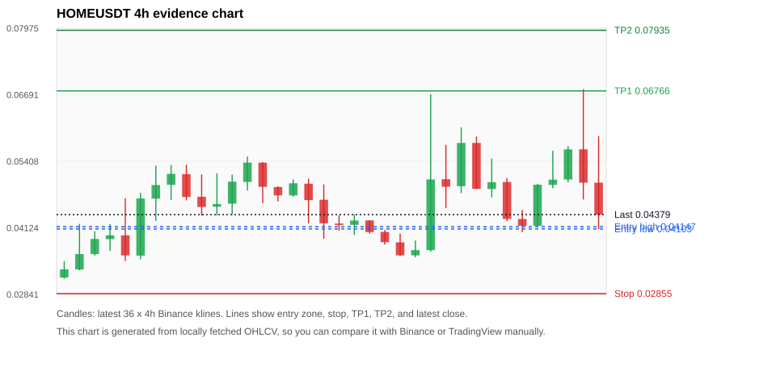
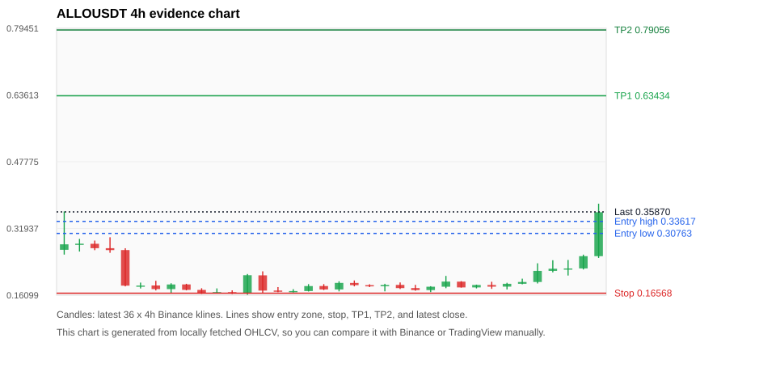
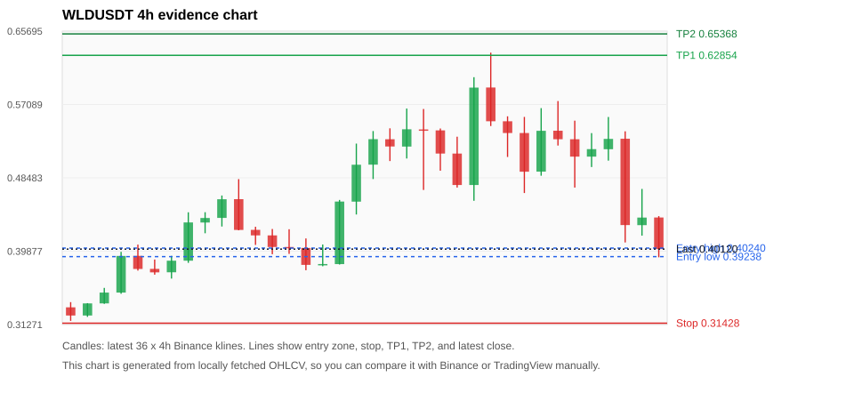
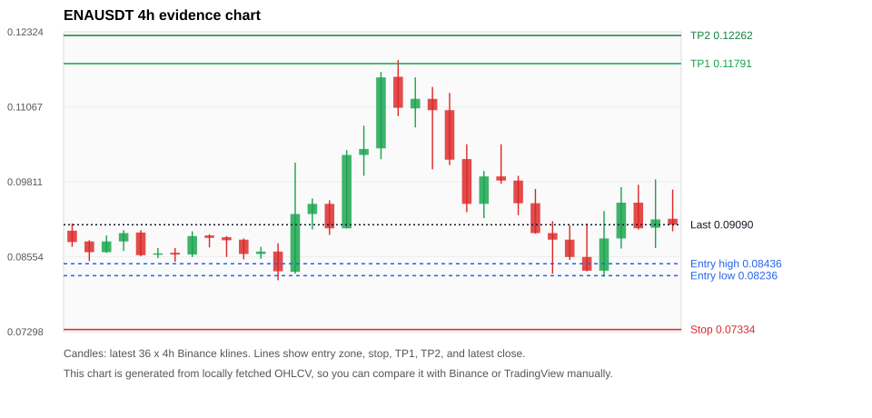
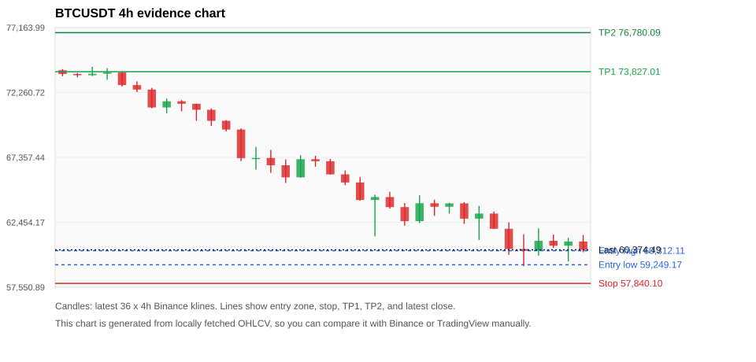

# Crypto 市场扫描报告 v3

- 报告时间：2026-06-06 18:38:52 CST
- 报告版本：v3
- 扫描 ID：502521f405e0
- 数据源：Binance public spot API + CoinGecko/CoinMarketCap cross-check
- 过滤条件：USDT spot; 24h quote volume >= 30,000,000; trades >= 30,000; exclude stables/leveraged tokens; analyze 1h/4h/1d klines
- 默认单笔风险：账户权益的 1.00%

## 限制说明

- 交易信号仍以 Binance 现货公开 K 线为主源；外部数据源用于一致性复核。
- 结果是研究和模拟盘计划，不是确定收益或实盘下单指令。
- 历史长度过滤：候选币至少需要 180 根 1d K 线。
- 数据质量验证池：先验证 score 排名前 min(top_n * 2, 10) 的候选，再按 action + score 补足最终名单。
- 大盘环境过滤：RISK_OFF; BTC/ETH 大盘偏弱，山寨币买入候选降级为观察。 BTC 7d=-18.316577874782205; ETH 7d=-23.79600878147189.
- 已启用数据交叉验证：Binance 主源 + CoinGecko 自动对照；CoinMarketCap 在配置 API Key 后自动对照。
- HOMEUSDT 交叉验证状态 DATA_WARNING：At least one external provider needs manual review.
- ALLOUSDT 交叉验证状态 DATA_WARNING：At least one external provider needs manual review.
- WLDUSDT 交叉验证状态 DATA_WARNING：At least one external provider needs manual review.
- ENAUSDT 交叉验证状态 DATA_WARNING：At least one external provider needs manual review.
- BTCUSDT 交叉验证状态 DATA_WARNING：At least one external provider needs manual review.
- ETHUSDT 交叉验证状态 DATA_WARNING：At least one external provider needs manual review.
- TRXUSDT 交叉验证状态 DATA_WARNING：At least one external provider needs manual review.
- BNBUSDT 交叉验证状态 DATA_WARNING：At least one external provider needs manual review.
- XLMUSDT 交叉验证状态 DATA_WARNING：At least one external provider needs manual review.
- ASTERUSDT 交叉验证状态 DATA_WARNING：At least one external provider needs manual review.

## 5 个候选交易计划

| Rank | Coin | Action | Setup | Entry Zone | Stop Loss | TP1 | TP2 / Exit Rule | R/R | Verdict |
|---:|---|---|---|---:|---:|---:|---|---:|---|
| 1 | `HOME` | `WATCH_ONLY` | 趋势中，等回调入场 | 0.04103 - 0.04147 | 0.02855 | 0.06766 | 0.07935 或跌破 4h 关键支撑 | 2.08-3.00 | 只观察 |
| 2 | `ALLO` | `WATCH_ONLY` | 涨幅较远，只等深回调 | 0.30763 - 0.33617 | 0.16568 | 0.63434 | 0.79056 或跌破 4h 关键支撑 | 2.00-3.00 | 只等回调 |
| 3 | `WLD` | `WATCH_ONLY` | 回踩支撑/4h EMA 附近 | 0.39238 - 0.40240 | 0.31428 | 0.62854 | 0.65368 或跌破 4h 关键支撑 | 2.78-3.08 | 只观察 |
| 4 | `ENA` | `REJECT` | 涨幅较远，只等深回调 | 0.08236 - 0.08436 | 0.07334 | 0.11791 | 0.12262 或跌破 4h 关键支撑 | 3.45-3.92 | 只等回调 |
| 5 | `BTC` | `REJECT` | 回踩支撑/4h EMA 附近 | 59,249.17 - 60,312.11 | 57,840.10 | 73,827.01 | 76,780.09 或跌破 4h 关键支撑 | 7.24-8.76 | 只观察 |

## 数据交叉验证摘要

价格差异以 Binance 当前价为基准；成交量口径不同，Binance 是 USDT 现货成交额，CoinGecko/CoinMarketCap 通常是全市场成交量。

| Rank | Coin | Data Status | Max Price Diff | Max 24h Diff | Message |
|---:|---|---|---:|---:|---|
| 1 | `HOME` | DATA_WARNING | 1.35% | 1.15 pts | At least one external provider needs manual review. |
| 2 | `ALLO` | DATA_WARNING | 1.06% | 3.05 pts | At least one external provider needs manual review. |
| 3 | `WLD` | DATA_WARNING | 0.62% | 0.94 pts | At least one external provider needs manual review. |
| 4 | `ENA` | DATA_WARNING | 0.02% | 0.24 pts | At least one external provider needs manual review. |
| 5 | `BTC` | DATA_WARNING | 0.16% | 0.07 pts | At least one external provider needs manual review. |

## 候选币说明

### 1. HOME `HOMEUSDT`



- 入选原因：趋势中，等回调入场；24h -2.11%，7d +62.25%，4h RSI 53.62，24h 成交额 $75.8M。
- 交易失效条件：跌破 0.028551543 或 4h 收盘重新失守关键支撑。
- 主要风险：24h 振幅较大，回撤风险高；成交量突增，可能是事件驱动；BTC/ETH 大盘环境未确认强势，山寨币买入信号降级；24h 动量未确认；数据交叉验证需要人工复核。
- 数据交叉验证：DATA_WARNING；At least one external provider needs manual review.

#### 可点击人工验证

- [Binance 交易页](https://www.binance.com/en/trade/HOME_USDT)
- [TradingView 图表](https://www.tradingview.com/chart/?symbol=BINANCE%3AHOMEUSDT)
- [CoinGecko 搜索](https://www.coingecko.com/en/search?query=HOME)
- [CoinMarketCap 搜索](https://coinmarketcap.com/search/?q=HOME)

#### 多数据源对照

| Source | Status | Asset ID | Price | 24h Change | 24h Volume | Price Diff | 24h Diff | Updated | Message |
|---|---|---|---:|---:|---:|---:|---:|---|---|
| Binance | DATA_OK | HOMEUSDT | 0.04379 | -2.11% | $75.8M | 0.00% | 0.00 pts | 2026-06-06T10:38:09+00:00 | Primary market data source used by scanner. |
| CoinGecko | DATA_OK | home | 0.04355 | -1.61% | $173.7M | 0.56% | 0.50 pts | 2026-06-06T10:38:04.237Z | External source agrees with Binance within thresholds. |
| CoinMarketCap | DATA_WARNING | 36133 | 0.04320 | -3.27% | $248.0M | 1.35% | 1.15 pts | 2026-06-06T10:37:05.000Z | price diff 1.35% exceeds warning threshold; CoinMarketCap symbol mapping has 5 matches; selected lowest cmc_rank |

#### 指标证据

| 指标 | 数值 | 人工核对用途 |
|---|---:|---|
| 当前价 | 0.04379 | 与 Binance/TradingView 当前价格对照 |
| 24h 涨跌 | -2.11% | 与交易所 24h 涨跌对照 |
| 7d 涨跌 | +62.25% | 判断短线趋势是否延续 |
| 4h EMA20 | 0.04670 | 判断短期趋势支撑 |
| 4h EMA50 | 0.04139 | 判断中期趋势支撑 |
| 1d EMA20 | 0.03465 | 判断日线趋势 |
| 1d EMA50 | 0.02655 | 判断日线趋势 |
| 4h RSI14 | 53.62 | 判断是否过热/过弱 |
| 4h ATR14 | 0.01104 | 推导止损和入场缓冲 |
| 最近 18 根 4h 最低点 | 0.03557 | 支撑/止损参考 |
| 最近 36 根 4h 最高点 | 0.06800 | TP/压力参考 |
| 支撑位 | 0.04139 | 入场区间推导基础 |

#### 交易计划推导

- 支撑位 = 最近低点、4h EMA20、4h EMA50、1d EMA20 中不高于当前价的最高有效支撑 = `0.04139`。
- 入场区间 = 支撑位附近 + ATR 缓冲 = `0.04103 - 0.04147`。
- 止损 = min(最近 18 根 4h 最低点 * 0.985, 入场中位价 - 1.15 * ATR14) = `0.02855`。
- TP1 = max(最近 36 根 4h 最高点 * 0.995, 入场中位价 + 2R) = `0.06766`。
- TP2 = max(入场中位价 + 3R, TP1 * 1.04) = `0.07935`。

#### 最近 10 根 4h K线

| UTC 开盘时间 | Open | High | Low | Close | Quote Volume | Trades |
|---|---:|---:|---:|---:|---:|---:|
| 2026-06-04T20:00+00:00 | 0.04927 | 0.06062 | 0.04793 | 0.05762 | $5.0M | 101086 |
| 2026-06-05T00:00+00:00 | 0.05762 | 0.05887 | 0.04870 | 0.04876 | $4.9M | 87090 |
| 2026-06-05T04:00+00:00 | 0.04873 | 0.05461 | 0.04711 | 0.05006 | $5.5M | 108890 |
| 2026-06-05T08:00+00:00 | 0.05008 | 0.05085 | 0.04253 | 0.04296 | $4.9M | 85860 |
| 2026-06-05T12:00+00:00 | 0.04295 | 0.04469 | 0.04039 | 0.04164 | $4.3M | 162667 |
| 2026-06-05T16:00+00:00 | 0.04164 | 0.04970 | 0.04150 | 0.04956 | $4.0M | 64071 |
| 2026-06-05T20:00+00:00 | 0.04953 | 0.05612 | 0.04887 | 0.05053 | $3.0M | 69456 |
| 2026-06-06T00:00+00:00 | 0.05057 | 0.05700 | 0.05002 | 0.05638 | $1.8M | 104749 |
| 2026-06-06T04:00+00:00 | 0.05638 | 0.06800 | 0.04671 | 0.04996 | $14.9M | 371332 |
| 2026-06-06T08:00+00:00 | 0.04996 | 0.05893 | 0.04102 | 0.04377 | $46.7M | 712815 |

### 2. ALLO `ALLOUSDT`



- 入选原因：涨幅较远，只等深回调；24h +92.06%，7d +16.92%，4h RSI 87.18，24h 成交额 $35.6M。
- 交易失效条件：跌破 0.165677 或 4h 收盘重新失守关键支撑。
- 主要风险：距离支撑偏远，不能追市价；4h RSI 偏热；24h 振幅较大，回撤风险高；BTC/ETH 大盘环境未确认强势，山寨币买入信号降级；数据交叉验证需要人工复核。
- 数据交叉验证：DATA_WARNING；At least one external provider needs manual review.

#### 可点击人工验证

- [Binance 交易页](https://www.binance.com/en/trade/ALLO_USDT)
- [TradingView 图表](https://www.tradingview.com/chart/?symbol=BINANCE%3AALLOUSDT)
- [CoinGecko 搜索](https://www.coingecko.com/en/search?query=ALLO)
- [CoinMarketCap 搜索](https://coinmarketcap.com/search/?q=ALLO)

#### 多数据源对照

| Source | Status | Asset ID | Price | 24h Change | 24h Volume | Price Diff | 24h Diff | Updated | Message |
|---|---|---|---:|---:|---:|---:|---:|---|---|
| Binance | DATA_OK | ALLOUSDT | 0.35870 | +92.06% | $35.6M | 0.00% | 0.00 pts | 2026-06-06T10:38:09+00:00 | Primary market data source used by scanner. |
| CoinGecko | DATA_WARNING | allora | 0.35491 | +89.01% | $221.0M | 1.06% | 3.05 pts | 2026-06-06T10:38:05.356Z | price diff 1.06% exceeds warning threshold; 24h change diff 3.05 points exceeds warning threshold |
| CoinMarketCap | DATA_OK | 38908 | 0.35803 | +90.23% | $235.1M | 0.19% | 1.83 pts | 2026-06-06T10:37:05.000Z | External source agrees with Binance within thresholds. |

#### 指标证据

| 指标 | 数值 | 人工核对用途 |
|---|---:|---|
| 当前价 | 0.35870 | 与 Binance/TradingView 当前价格对照 |
| 24h 涨跌 | +92.06% | 与交易所 24h 涨跌对照 |
| 7d 涨跌 | +16.92% | 判断短线趋势是否延续 |
| 4h EMA20 | 0.21640 | 判断短期趋势支撑 |
| 4h EMA50 | 0.19594 | 判断中期趋势支撑 |
| 1d EMA20 | 0.17753 | 判断日线趋势 |
| 1d EMA50 | 0.14046 | 判断日线趋势 |
| 4h RSI14 | 87.18 | 判断是否过热/过弱 |
| 4h ATR14 | 0.03004 | 推导止损和入场缓冲 |
| 最近 18 根 4h 最低点 | 0.16820 | 支撑/止损参考 |
| 最近 36 根 4h 最高点 | 0.37820 | TP/压力参考 |
| 支撑位 | 0.21640 | 入场区间推导基础 |

#### 交易计划推导

- 支撑位 = 最近低点、4h EMA20、4h EMA50、1d EMA20 中不高于当前价的最高有效支撑 = `0.21640`。
- 入场区间 = 支撑位附近 + ATR 缓冲 = `0.30763 - 0.33617`。
- 止损 = min(最近 18 根 4h 最低点 * 0.985, 入场中位价 - 1.15 * ATR14) = `0.16568`。
- TP1 = max(最近 36 根 4h 最高点 * 0.995, 入场中位价 + 2R) = `0.63434`。
- TP2 = max(入场中位价 + 3R, TP1 * 1.04) = `0.79056`。

#### 最近 10 根 4h K线

| UTC 开盘时间 | Open | High | Low | Close | Quote Volume | Trades |
|---|---:|---:|---:|---:|---:|---:|
| 2026-06-04T20:00+00:00 | 0.19310 | 0.19430 | 0.17900 | 0.17940 | $981,954 | 21761 |
| 2026-06-05T00:00+00:00 | 0.17940 | 0.18600 | 0.17710 | 0.18520 | $932,603 | 20519 |
| 2026-06-05T04:00+00:00 | 0.18510 | 0.19280 | 0.17600 | 0.18120 | $1.4M | 40208 |
| 2026-06-05T08:00+00:00 | 0.18130 | 0.19040 | 0.17460 | 0.18800 | $927,223 | 20764 |
| 2026-06-05T12:00+00:00 | 0.18800 | 0.20020 | 0.18680 | 0.19230 | $2.7M | 71670 |
| 2026-06-05T16:00+00:00 | 0.19230 | 0.23670 | 0.18880 | 0.21870 | $5.8M | 127740 |
| 2026-06-05T20:00+00:00 | 0.21870 | 0.24390 | 0.21520 | 0.22370 | $4.1M | 100178 |
| 2026-06-06T00:00+00:00 | 0.22370 | 0.24460 | 0.20760 | 0.22440 | $4.1M | 75855 |
| 2026-06-06T04:00+00:00 | 0.22450 | 0.25720 | 0.22200 | 0.25360 | $4.9M | 82948 |
| 2026-06-06T08:00+00:00 | 0.25360 | 0.37820 | 0.24940 | 0.35800 | $13.8M | 178439 |

### 3. WLD `WLDUSDT`



- 入选原因：回踩支撑/4h EMA 附近；24h -26.24%，7d +33.24%，4h RSI 36.69，24h 成交额 $199.6M。
- 交易失效条件：跌破 0.31428126 或 4h 收盘重新失守关键支撑。
- 主要风险：24h 振幅较大，回撤风险高；BTC/ETH 大盘环境未确认强势，山寨币买入信号降级；24h 动量未确认；数据交叉验证需要人工复核。
- 数据交叉验证：DATA_WARNING；At least one external provider needs manual review.

#### 可点击人工验证

- [Binance 交易页](https://www.binance.com/en/trade/WLD_USDT)
- [TradingView 图表](https://www.tradingview.com/chart/?symbol=BINANCE%3AWLDUSDT)
- [CoinGecko 搜索](https://www.coingecko.com/en/search?query=WLD)
- [CoinMarketCap 搜索](https://coinmarketcap.com/search/?q=WLD)

#### 多数据源对照

| Source | Status | Asset ID | Price | 24h Change | 24h Volume | Price Diff | 24h Diff | Updated | Message |
|---|---|---|---:|---:|---:|---:|---:|---|---|
| Binance | DATA_OK | WLDUSDT | 0.40120 | -26.24% | $199.6M | 0.00% | 0.00 pts | 2026-06-06T10:38:09+00:00 | Primary market data source used by scanner. |
| CoinGecko | DATA_OK | worldcoin-wld | 0.39870 | -27.02% | $1.26B | 0.62% | 0.78 pts | 2026-06-06T10:38:02.307Z | External source agrees with Binance within thresholds. |
| CoinMarketCap | DATA_WARNING | 13502 | 0.39997 | -27.19% | $1.27B | 0.31% | 0.94 pts | 2026-06-06T10:37:05.000Z | CoinMarketCap symbol mapping has 2 matches; selected lowest cmc_rank |

#### 指标证据

| 指标 | 数值 | 人工核对用途 |
|---|---:|---|
| 当前价 | 0.40120 | 与 Binance/TradingView 当前价格对照 |
| 24h 涨跌 | -26.24% | 与交易所 24h 涨跌对照 |
| 7d 涨跌 | +33.24% | 判断短线趋势是否延续 |
| 4h EMA20 | 0.47907 | 判断短期趋势支撑 |
| 4h EMA50 | 0.43467 | 判断中期趋势支撑 |
| 1d EMA20 | 0.37658 | 判断日线趋势 |
| 1d EMA50 | 0.32690 | 判断日线趋势 |
| 4h RSI14 | 36.69 | 判断是否过热/过弱 |
| 4h ATR14 | 0.07227 | 推导止损和入场缓冲 |
| 最近 18 根 4h 最低点 | 0.39160 | 支撑/止损参考 |
| 最近 36 根 4h 最高点 | 0.63170 | TP/压力参考 |
| 支撑位 | 0.39160 | 入场区间推导基础 |

#### 交易计划推导

- 支撑位 = 最近低点、4h EMA20、4h EMA50、1d EMA20 中不高于当前价的最高有效支撑 = `0.39160`。
- 入场区间 = 支撑位附近 + ATR 缓冲 = `0.39238 - 0.40240`。
- 止损 = min(最近 18 根 4h 最低点 * 0.985, 入场中位价 - 1.15 * ATR14) = `0.31428`。
- TP1 = max(最近 36 根 4h 最高点 * 0.995, 入场中位价 + 2R) = `0.62854`。
- TP2 = max(入场中位价 + 3R, TP1 * 1.04) = `0.65368`。

#### 最近 10 根 4h K线

| UTC 开盘时间 | Open | High | Low | Close | Quote Volume | Trades |
|---|---:|---:|---:|---:|---:|---:|
| 2026-06-04T20:00+00:00 | 0.55120 | 0.55700 | 0.50930 | 0.53740 | $30.6M | 330177 |
| 2026-06-05T00:00+00:00 | 0.53740 | 0.55630 | 0.46700 | 0.49200 | $43.1M | 470170 |
| 2026-06-05T04:00+00:00 | 0.49210 | 0.56660 | 0.48730 | 0.54000 | $40.4M | 381946 |
| 2026-06-05T08:00+00:00 | 0.54010 | 0.57490 | 0.52270 | 0.53010 | $28.9M | 297761 |
| 2026-06-05T12:00+00:00 | 0.53010 | 0.55190 | 0.47340 | 0.50970 | $40.6M | 335186 |
| 2026-06-05T16:00+00:00 | 0.50970 | 0.53730 | 0.49750 | 0.51850 | $27.9M | 266244 |
| 2026-06-05T20:00+00:00 | 0.51840 | 0.55620 | 0.50500 | 0.53050 | $19.8M | 197508 |
| 2026-06-06T00:00+00:00 | 0.53070 | 0.53940 | 0.40900 | 0.42940 | $54.1M | 481199 |
| 2026-06-06T04:00+00:00 | 0.42930 | 0.47180 | 0.41700 | 0.43820 | $30.2M | 319492 |
| 2026-06-06T08:00+00:00 | 0.43830 | 0.43990 | 0.39160 | 0.40120 | $18.4M | 188516 |

### 4. ENA `ENAUSDT`



- 入选原因：涨幅较远，只等深回调；24h +3.53%，7d +2.94%，4h RSI 32.29，24h 成交额 $58.4M。
- 交易失效条件：跌破 0.073342914 或 4h 收盘重新失守关键支撑。
- 主要风险：距离支撑偏远，不能追市价；日线趋势未完全确认；BTC/ETH 大盘环境未确认强势，山寨币买入信号降级；数据交叉验证需要人工复核。
- 数据交叉验证：DATA_WARNING；At least one external provider needs manual review.

#### 可点击人工验证

- [Binance 交易页](https://www.binance.com/en/trade/ENA_USDT)
- [TradingView 图表](https://www.tradingview.com/chart/?symbol=BINANCE%3AENAUSDT)
- [CoinGecko 搜索](https://www.coingecko.com/en/search?query=ENA)
- [CoinMarketCap 搜索](https://coinmarketcap.com/search/?q=ENA)

#### 多数据源对照

| Source | Status | Asset ID | Price | 24h Change | 24h Volume | Price Diff | 24h Diff | Updated | Message |
|---|---|---|---:|---:|---:|---:|---:|---|---|
| Binance | DATA_OK | ENAUSDT | 0.09090 | +3.53% | $58.4M | 0.00% | 0.00 pts | 2026-06-06T10:38:09+00:00 | Primary market data source used by scanner. |
| CoinGecko | DATA_OK | ethena | 0.09089 | +3.39% | $356.3M | 0.01% | 0.14 pts | 2026-06-06T10:38:02.708Z | External source agrees with Binance within thresholds. |
| CoinMarketCap | DATA_WARNING | 30171 | 0.09088 | +3.30% | $366.2M | 0.02% | 0.24 pts | 2026-06-06T10:37:05.000Z | CoinMarketCap symbol mapping has 2 matches; selected lowest cmc_rank |

#### 指标证据

| 指标 | 数值 | 人工核对用途 |
|---|---:|---|
| 当前价 | 0.09090 | 与 Binance/TradingView 当前价格对照 |
| 24h 涨跌 | +3.53% | 与交易所 24h 涨跌对照 |
| 7d 涨跌 | +2.94% | 判断短线趋势是否延续 |
| 4h EMA20 | 0.09297 | 判断短期趋势支撑 |
| 4h EMA50 | 0.09363 | 判断中期趋势支撑 |
| 1d EMA20 | 0.09781 | 判断日线趋势 |
| 1d EMA50 | 0.10275 | 判断日线趋势 |
| 4h RSI14 | 32.29 | 判断是否过热/过弱 |
| 4h ATR14 | 0.0087142857 | 推导止损和入场缓冲 |
| 最近 18 根 4h 最低点 | 0.08220 | 支撑/止损参考 |
| 最近 36 根 4h 最高点 | 0.11850 | TP/压力参考 |
| 支撑位 | 0.08220 | 入场区间推导基础 |

#### 交易计划推导

- 支撑位 = 最近低点、4h EMA20、4h EMA50、1d EMA20 中不高于当前价的最高有效支撑 = `0.08220`。
- 入场区间 = 支撑位附近 + ATR 缓冲 = `0.08236 - 0.08436`。
- 止损 = min(最近 18 根 4h 最低点 * 0.985, 入场中位价 - 1.15 * ATR14) = `0.07334`。
- TP1 = max(最近 36 根 4h 最高点 * 0.995, 入场中位价 + 2R) = `0.11791`。
- TP2 = max(入场中位价 + 3R, TP1 * 1.04) = `0.12262`。

#### 最近 10 根 4h K线

| UTC 开盘时间 | Open | High | Low | Close | Quote Volume | Trades |
|---|---:|---:|---:|---:|---:|---:|
| 2026-06-04T20:00+00:00 | 0.09830 | 0.09910 | 0.09250 | 0.09450 | $5.7M | 43405 |
| 2026-06-05T00:00+00:00 | 0.09450 | 0.09690 | 0.08940 | 0.08950 | $6.0M | 39060 |
| 2026-06-05T04:00+00:00 | 0.08950 | 0.09150 | 0.08270 | 0.08840 | $10.5M | 55374 |
| 2026-06-05T08:00+00:00 | 0.08840 | 0.09080 | 0.08500 | 0.08550 | $5.1M | 30939 |
| 2026-06-05T12:00+00:00 | 0.08550 | 0.09110 | 0.08310 | 0.08320 | $9.1M | 47514 |
| 2026-06-05T16:00+00:00 | 0.08320 | 0.09320 | 0.08220 | 0.08860 | $12.6M | 84251 |
| 2026-06-05T20:00+00:00 | 0.08860 | 0.09720 | 0.08690 | 0.09460 | $9.3M | 53375 |
| 2026-06-06T00:00+00:00 | 0.09460 | 0.09760 | 0.09010 | 0.09030 | $5.3M | 24432 |
| 2026-06-06T04:00+00:00 | 0.09040 | 0.09850 | 0.08700 | 0.09180 | $14.7M | 67547 |
| 2026-06-06T08:00+00:00 | 0.09190 | 0.09680 | 0.08980 | 0.09090 | $5.8M | 26051 |

### 5. BTC `BTCUSDT`



- 入选原因：回踩支撑/4h EMA 附近；24h -3.35%，7d -17.97%，4h RSI 30.30，24h 成交额 $3.02B。
- 交易失效条件：跌破 57840.095 或 4h 收盘重新失守关键支撑。
- 主要风险：日线趋势未完全确认；24h 动量未确认；7d 趋势未确认；数据交叉验证需要人工复核。
- 数据交叉验证：DATA_WARNING；At least one external provider needs manual review.

#### 可点击人工验证

- [Binance 交易页](https://www.binance.com/en/trade/BTC_USDT)
- [TradingView 图表](https://www.tradingview.com/chart/?symbol=BINANCE%3ABTCUSDT)
- [CoinGecko 搜索](https://www.coingecko.com/en/search?query=BTC)
- [CoinMarketCap 搜索](https://coinmarketcap.com/search/?q=BTC)

#### 多数据源对照

| Source | Status | Asset ID | Price | 24h Change | 24h Volume | Price Diff | 24h Diff | Updated | Message |
|---|---|---|---:|---:|---:|---:|---:|---|---|
| Binance | DATA_OK | BTCUSDT | 60,374.49 | -3.35% | $3.02B | 0.00% | 0.00 pts | 2026-06-06T10:38:09+00:00 | Primary market data source used by scanner. |
| CoinGecko | DATA_OK | bitcoin | 60,306.00 | -3.32% | $67.20B | 0.11% | 0.03 pts | 2026-06-06T10:38:06.386Z | External source agrees with Binance within thresholds. |
| CoinMarketCap | DATA_WARNING | 1 | 60,280.18 | -3.42% | $64.97B | 0.16% | 0.07 pts | 2026-06-06T10:37:05.000Z | CoinMarketCap symbol mapping has 13 matches; selected lowest cmc_rank |

#### 指标证据

| 指标 | 数值 | 人工核对用途 |
|---|---:|---|
| 当前价 | 60,374.49 | 与 Binance/TradingView 当前价格对照 |
| 24h 涨跌 | -3.35% | 与交易所 24h 涨跌对照 |
| 7d 涨跌 | -17.97% | 判断短线趋势是否延续 |
| 4h EMA20 | 63,259.04 | 判断短期趋势支撑 |
| 4h EMA50 | 67,216.56 | 判断中期趋势支撑 |
| 1d EMA20 | 70,671.62 | 判断日线趋势 |
| 1d EMA50 | 73,683.52 | 判断日线趋势 |
| 4h RSI14 | 30.30 | 判断是否过热/过弱 |
| 4h ATR14 | 1,687.43 | 推导止损和入场缓冲 |
| 最近 18 根 4h 最低点 | 59,130.91 | 支撑/止损参考 |
| 最近 36 根 4h 最高点 | 74,198.00 | TP/压力参考 |
| 支撑位 | 59,130.91 | 入场区间推导基础 |

#### 交易计划推导

- 支撑位 = 最近低点、4h EMA20、4h EMA50、1d EMA20 中不高于当前价的最高有效支撑 = `59,130.91`。
- 入场区间 = 支撑位附近 + ATR 缓冲 = `59,249.17 - 60,312.11`。
- 止损 = min(最近 18 根 4h 最低点 * 0.985, 入场中位价 - 1.15 * ATR14) = `57,840.10`。
- TP1 = max(最近 36 根 4h 最高点 * 0.995, 入场中位价 + 2R) = `73,827.01`。
- TP2 = max(入场中位价 + 3R, TP1 * 1.04) = `76,780.09`。

#### 最近 10 根 4h K线

| UTC 开盘时间 | Open | High | Low | Close | Quote Volume | Trades |
|---|---:|---:|---:|---:|---:|---:|
| 2026-06-04T20:00+00:00 | 63,629.38 | 63,918.00 | 63,106.04 | 63,885.99 | $197.8M | 924567 |
| 2026-06-05T00:00+00:00 | 63,885.99 | 63,978.00 | 62,339.00 | 62,730.00 | $262.5M | 1225987 |
| 2026-06-05T04:00+00:00 | 62,730.00 | 63,688.00 | 61,126.01 | 63,115.99 | $668.4M | 2270535 |
| 2026-06-05T08:00+00:00 | 63,115.99 | 63,259.90 | 61,964.98 | 61,964.99 | $269.1M | 1142388 |
| 2026-06-05T12:00+00:00 | 61,964.99 | 62,457.86 | 60,000.00 | 60,438.01 | $903.3M | 2679839 |
| 2026-06-05T16:00+00:00 | 60,438.00 | 61,547.24 | 59,130.91 | 60,300.24 | $828.6M | 2680737 |
| 2026-06-05T20:00+00:00 | 60,300.24 | 62,000.00 | 59,940.01 | 61,056.47 | $447.0M | 1659370 |
| 2026-06-06T00:00+00:00 | 61,056.47 | 61,530.05 | 60,520.00 | 60,687.04 | $179.8M | 973252 |
| 2026-06-06T04:00+00:00 | 60,687.05 | 61,276.95 | 59,500.00 | 61,004.95 | $427.8M | 1567097 |
| 2026-06-06T08:00+00:00 | 61,004.95 | 61,500.00 | 60,198.00 | 60,374.48 | $146.4M | 577278 |

## 组合风控

- 不要 5 个候选全部满仓买入。
- 同时持仓总风险建议控制在账户权益的 3% - 5% 以内。
- 如果 BTC/ETH 同时破位，暂停山寨币多头计划或降低仓位。
- 第一版报告用于模拟盘和人工复核，不自动下单。

## 原始数据

```json
[
  {
    "rank": 1,
    "symbol": "HOMEUSDT",
    "base_asset": "HOME",
    "price": 0.04379,
    "score": 34.76491112043901,
    "setup": "趋势中，等回调入场",
    "verdict": "只观察",
    "entry_low": 0.041029107142857145,
    "entry_high": 0.04147419327455392,
    "stop_loss": 0.028551543065848388,
    "take_profit_1": 0.06766,
    "take_profit_2": 0.07935197163727697,
    "risk_reward_1": 2.0793800787851757,
    "risk_reward_2": 3.0000000000000004,
    "pct_24h": -2.114,
    "pct_3d": 3.964862298195637,
    "pct_7d": 62.24527602815859,
    "quote_volume_24h": 75826493.38452,
    "trades_24h": 1512398,
    "high_low_range_24h": 68.35850458034167,
    "rsi_1h": 34.32835820895522,
    "rsi_4h": 53.62378408001096,
    "ema20_4h": 0.046702944499675936,
    "ema50_4h": 0.04139141045364663,
    "ema20_1d": 0.034652661507864696,
    "ema50_1d": 0.026551292772291322,
    "atr_4h": 0.01104357142857143,
    "macd_hist_4h": -0.00026655533122020136,
    "volume_ratio_24h": 3.883955107546662,
    "support_level": 0.04139141045364663,
    "recent_low_4h_18": 0.03557,
    "recent_high_4h_36": 0.068,
    "distance_to_support_pct": 5.79489686402328,
    "binance_trade_url": "https://www.binance.com/en/trade/HOME_USDT",
    "tradingview_url": "https://www.tradingview.com/chart/?symbol=BINANCE%3AHOMEUSDT",
    "coingecko_search_url": "https://www.coingecko.com/en/search?query=HOME",
    "coinmarketcap_search_url": "https://coinmarketcap.com/search/?q=HOME",
    "invalidation": "跌破 0.028551543 或 4h 收盘重新失守关键支撑",
    "recent_4h_klines": [
      {
        "open_time_utc": "2026-05-31T12:00+00:00",
        "open": 0.03165,
        "high": 0.03481,
        "low": 0.03145,
        "close": 0.03324,
        "quote_volume": 1803758.03815,
        "trades": 21986
      },
      {
        "open_time_utc": "2026-05-31T16:00+00:00",
        "open": 0.03321,
        "high": 0.04201,
        "low": 0.03306,
        "close": 0.03619,
        "quote_volume": 3797865.00791,
        "trades": 52755
      },
      {
        "open_time_utc": "2026-05-31T20:00+00:00",
        "open": 0.03619,
        "high": 0.04059,
        "low": 0.03588,
        "close": 0.0391,
        "quote_volume": 2795626.93602,
        "trades": 33181
      },
      {
        "open_time_utc": "2026-06-01T00:00+00:00",
        "open": 0.03906,
        "high": 0.04195,
        "low": 0.03678,
        "close": 0.03981,
        "quote_volume": 2949555.5366,
        "trades": 33687
      },
      {
        "open_time_utc": "2026-06-01T04:00+00:00",
        "open": 0.0398,
        "high": 0.04696,
        "low": 0.03484,
        "close": 0.03593,
        "quote_volume": 5288360.19174,
        "trades": 62471
      },
      {
        "open_time_utc": "2026-06-01T08:00+00:00",
        "open": 0.03589,
        "high": 0.048,
        "low": 0.03517,
        "close": 0.04691,
        "quote_volume": 5312016.16086,
        "trades": 67798
      },
      {
        "open_time_utc": "2026-06-01T12:00+00:00",
        "open": 0.04688,
        "high": 0.05323,
        "low": 0.04257,
        "close": 0.0495,
        "quote_volume": 9850712.83016,
        "trades": 120657
      },
      {
        "open_time_utc": "2026-06-01T16:00+00:00",
        "open": 0.04954,
        "high": 0.05338,
        "low": 0.04658,
        "close": 0.05166,
        "quote_volume": 4948368.82794,
        "trades": 77576
      },
      {
        "open_time_utc": "2026-06-01T20:00+00:00",
        "open": 0.0516,
        "high": 0.0534,
        "low": 0.04654,
        "close": 0.0472,
        "quote_volume": 2360900.7618,
        "trades": 34491
      },
      {
        "open_time_utc": "2026-06-02T00:00+00:00",
        "open": 0.04724,
        "high": 0.05155,
        "low": 0.0436,
        "close": 0.04527,
        "quote_volume": 2583509.63337,
        "trades": 43691
      },
      {
        "open_time_utc": "2026-06-02T04:00+00:00",
        "open": 0.04532,
        "high": 0.05177,
        "low": 0.04364,
        "close": 0.04584,
        "quote_volume": 3350430.09271,
        "trades": 66476
      },
      {
        "open_time_utc": "2026-06-02T08:00+00:00",
        "open": 0.04591,
        "high": 0.05152,
        "low": 0.04376,
        "close": 0.05016,
        "quote_volume": 3836579.44522,
        "trades": 47038
      },
      {
        "open_time_utc": "2026-06-02T12:00+00:00",
        "open": 0.0501,
        "high": 0.055,
        "low": 0.04846,
        "close": 0.05383,
        "quote_volume": 4437547.93345,
        "trades": 46402
      },
      {
        "open_time_utc": "2026-06-02T16:00+00:00",
        "open": 0.05381,
        "high": 0.05392,
        "low": 0.04601,
        "close": 0.04916,
        "quote_volume": 1661073.10394,
        "trades": 25046
      },
      {
        "open_time_utc": "2026-06-02T20:00+00:00",
        "open": 0.04912,
        "high": 0.04928,
        "low": 0.04632,
        "close": 0.0475,
        "quote_volume": 409233.62254,
        "trades": 8320
      },
      {
        "open_time_utc": "2026-06-03T00:00+00:00",
        "open": 0.0475,
        "high": 0.0506,
        "low": 0.04724,
        "close": 0.04984,
        "quote_volume": 1000537.13619,
        "trades": 14357
      },
      {
        "open_time_utc": "2026-06-03T04:00+00:00",
        "open": 0.04976,
        "high": 0.05075,
        "low": 0.04211,
        "close": 0.0466,
        "quote_volume": 2295879.47921,
        "trades": 31651
      },
      {
        "open_time_utc": "2026-06-03T08:00+00:00",
        "open": 0.04666,
        "high": 0.04961,
        "low": 0.03917,
        "close": 0.04212,
        "quote_volume": 2472768.74623,
        "trades": 49856
      },
      {
        "open_time_utc": "2026-06-03T12:00+00:00",
        "open": 0.04207,
        "high": 0.04363,
        "low": 0.04071,
        "close": 0.0418,
        "quote_volume": 914911.71642,
        "trades": 22704
      },
      {
        "open_time_utc": "2026-06-03T16:00+00:00",
        "open": 0.04182,
        "high": 0.04386,
        "low": 0.03988,
        "close": 0.04266,
        "quote_volume": 702037.54382,
        "trades": 13453
      },
      {
        "open_time_utc": "2026-06-03T20:00+00:00",
        "open": 0.04268,
        "high": 0.04268,
        "low": 0.04011,
        "close": 0.04044,
        "quote_volume": 261292.13209,
        "trades": 5039
      },
      {
        "open_time_utc": "2026-06-04T00:00+00:00",
        "open": 0.04046,
        "high": 0.04088,
        "low": 0.03802,
        "close": 0.03848,
        "quote_volume": 308134.55437,
        "trades": 8932
      },
      {
        "open_time_utc": "2026-06-04T04:00+00:00",
        "open": 0.03845,
        "high": 0.04012,
        "low": 0.03585,
        "close": 0.03593,
        "quote_volume": 522762.37812,
        "trades": 9397
      },
      {
        "open_time_utc": "2026-06-04T08:00+00:00",
        "open": 0.03594,
        "high": 0.0388,
        "low": 0.03557,
        "close": 0.03695,
        "quote_volume": 3387171.81954,
        "trades": 74602
      },
      {
        "open_time_utc": "2026-06-04T12:00+00:00",
        "open": 0.03694,
        "high": 0.067,
        "low": 0.03665,
        "close": 0.05058,
        "quote_volume": 13758130.3752,
        "trades": 207251
      },
      {
        "open_time_utc": "2026-06-04T16:00+00:00",
        "open": 0.05062,
        "high": 0.05723,
        "low": 0.04508,
        "close": 0.04917,
        "quote_volume": 7257645.52459,
        "trades": 168714
      },
      {
        "open_time_utc": "2026-06-04T20:00+00:00",
        "open": 0.04927,
        "high": 0.06062,
        "low": 0.04793,
        "close": 0.05762,
        "quote_volume": 4960174.31952,
        "trades": 101086
      },
      {
        "open_time_utc": "2026-06-05T00:00+00:00",
        "open": 0.05762,
        "high": 0.05887,
        "low": 0.0487,
        "close": 0.04876,
        "quote_volume": 4924013.97114,
        "trades": 87090
      },
      {
        "open_time_utc": "2026-06-05T04:00+00:00",
        "open": 0.04873,
        "high": 0.05461,
        "low": 0.04711,
        "close": 0.05006,
        "quote_volume": 5488456.96109,
        "trades": 108890
      },
      {
        "open_time_utc": "2026-06-05T08:00+00:00",
        "open": 0.05008,
        "high": 0.05085,
        "low": 0.04253,
        "close": 0.04296,
        "quote_volume": 4945391.86007,
        "trades": 85860
      },
      {
        "open_time_utc": "2026-06-05T12:00+00:00",
        "open": 0.04295,
        "high": 0.04469,
        "low": 0.04039,
        "close": 0.04164,
        "quote_volume": 4280039.40122,
        "trades": 162667
      },
      {
        "open_time_utc": "2026-06-05T16:00+00:00",
        "open": 0.04164,
        "high": 0.0497,
        "low": 0.0415,
        "close": 0.04956,
        "quote_volume": 3950233.98932,
        "trades": 64071
      },
      {
        "open_time_utc": "2026-06-05T20:00+00:00",
        "open": 0.04953,
        "high": 0.05612,
        "low": 0.04887,
        "close": 0.05053,
        "quote_volume": 2964378.05321,
        "trades": 69456
      },
      {
        "open_time_utc": "2026-06-06T00:00+00:00",
        "open": 0.05057,
        "high": 0.057,
        "low": 0.05002,
        "close": 0.05638,
        "quote_volume": 1811466.38302,
        "trades": 104749
      },
      {
        "open_time_utc": "2026-06-06T04:00+00:00",
        "open": 0.05638,
        "high": 0.068,
        "low": 0.04671,
        "close": 0.04996,
        "quote_volume": 14854402.62987,
        "trades": 371332
      },
      {
        "open_time_utc": "2026-06-06T08:00+00:00",
        "open": 0.04996,
        "high": 0.05893,
        "low": 0.04102,
        "close": 0.04377,
        "quote_volume": 46737846.93761,
        "trades": 712815
      }
    ],
    "risks": [
      "24h 振幅较大，回撤风险高",
      "成交量突增，可能是事件驱动",
      "BTC/ETH 大盘环境未确认强势，山寨币买入信号降级",
      "24h 动量未确认",
      "数据交叉验证需要人工复核"
    ],
    "data_quality_status": "DATA_WARNING",
    "data_quality_message": "At least one external provider needs manual review.",
    "data_checks": [
      {
        "provider": "Binance",
        "status": "DATA_OK",
        "provider_asset_id": "HOMEUSDT",
        "provider_symbol": "HOMEUSDT",
        "price_usd": 0.04379,
        "pct_24h": -2.114,
        "volume_24h": 75826493.38452,
        "last_updated": null,
        "fetched_at_utc": "2026-06-06T10:38:09+00:00",
        "price_diff_pct": 0.0,
        "pct_24h_diff": 0.0,
        "volume_note": "Binance USDT spot 24h quoteVolume.",
        "message": "Primary market data source used by scanner."
      },
      {
        "provider": "CoinGecko",
        "status": "DATA_OK",
        "provider_asset_id": "home",
        "provider_symbol": "HOME",
        "price_usd": 0.04354608,
        "pct_24h": -1.61303,
        "volume_24h": 173743597.0,
        "last_updated": "2026-06-06T10:38:04.237Z",
        "fetched_at_utc": "2026-06-06T10:38:09+00:00",
        "price_diff_pct": 0.5570221511760713,
        "pct_24h_diff": 0.5009699999999999,
        "volume_note": "CoinGecko total market volume; not the same venue scope as Binance quoteVolume.",
        "message": "External source agrees with Binance within thresholds."
      },
      {
        "provider": "CoinMarketCap",
        "status": "DATA_WARNING",
        "provider_asset_id": "36133",
        "provider_symbol": "HOME",
        "price_usd": 0.04319716332446743,
        "pct_24h": -3.26611696,
        "volume_24h": 247958965.8896691,
        "last_updated": "2026-06-06T10:37:05.000Z",
        "fetched_at_utc": "2026-06-06T10:38:09+00:00",
        "price_diff_pct": 1.3538174823762814,
        "pct_24h_diff": 1.1521169600000003,
        "volume_note": "CoinMarketCap total market volume; not the same venue scope as Binance quoteVolume.",
        "message": "price diff 1.35% exceeds warning threshold; CoinMarketCap symbol mapping has 5 matches; selected lowest cmc_rank"
      }
    ],
    "action": "WATCH_ONLY"
  },
  {
    "rank": 2,
    "symbol": "ALLOUSDT",
    "base_asset": "ALLO",
    "price": 0.3587,
    "score": 32.585477832057194,
    "setup": "涨幅较远，只等深回调",
    "verdict": "只等回调",
    "entry_low": 0.3076271428571429,
    "entry_high": 0.3361678571428572,
    "stop_loss": 0.165677,
    "take_profit_1": 0.6343385000000001,
    "take_profit_2": 0.7905590000000002,
    "risk_reward_1": 1.9999999999999996,
    "risk_reward_2": 3.0,
    "pct_24h": 92.06,
    "pct_3d": 105.44100801832764,
    "pct_7d": 16.916558018252935,
    "quote_volume_24h": 35563141.356,
    "trades_24h": 641180,
    "high_low_range_24h": 108.60452289023716,
    "rsi_1h": 86.14253393665159,
    "rsi_4h": 87.18279569892474,
    "ema20_4h": 0.21640189980795038,
    "ema50_4h": 0.19593536342130663,
    "ema20_1d": 0.17753468623226104,
    "ema50_1d": 0.1404592296500124,
    "atr_4h": 0.030042857142857142,
    "macd_hist_4h": 0.015237887093565407,
    "volume_ratio_24h": 1.6019353160061058,
    "support_level": 0.21640189980795038,
    "recent_low_4h_18": 0.1682,
    "recent_high_4h_36": 0.3782,
    "distance_to_support_pct": 65.75640062233028,
    "binance_trade_url": "https://www.binance.com/en/trade/ALLO_USDT",
    "tradingview_url": "https://www.tradingview.com/chart/?symbol=BINANCE%3AALLOUSDT",
    "coingecko_search_url": "https://www.coingecko.com/en/search?query=ALLO",
    "coinmarketcap_search_url": "https://coinmarketcap.com/search/?q=ALLO",
    "invalidation": "跌破 0.165677 或 4h 收盘重新失守关键支撑",
    "recent_4h_klines": [
      {
        "open_time_utc": "2026-05-31T12:00+00:00",
        "open": 0.2687,
        "high": 0.3598,
        "low": 0.2573,
        "close": 0.2817,
        "quote_volume": 16771944.96199,
        "trades": 245243
      },
      {
        "open_time_utc": "2026-05-31T16:00+00:00",
        "open": 0.2816,
        "high": 0.2946,
        "low": 0.2646,
        "close": 0.2832,
        "quote_volume": 8123625.94637,
        "trades": 107413
      },
      {
        "open_time_utc": "2026-05-31T20:00+00:00",
        "open": 0.283,
        "high": 0.2906,
        "low": 0.2678,
        "close": 0.2725,
        "quote_volume": 2514001.54237,
        "trades": 46044
      },
      {
        "open_time_utc": "2026-06-01T00:00+00:00",
        "open": 0.2725,
        "high": 0.2985,
        "low": 0.2616,
        "close": 0.268,
        "quote_volume": 4581409.4735,
        "trades": 66994
      },
      {
        "open_time_utc": "2026-06-01T04:00+00:00",
        "open": 0.2681,
        "high": 0.2724,
        "low": 0.1819,
        "close": 0.1836,
        "quote_volume": 15885966.31272,
        "trades": 226134
      },
      {
        "open_time_utc": "2026-06-01T08:00+00:00",
        "open": 0.1836,
        "high": 0.1909,
        "low": 0.1769,
        "close": 0.1838,
        "quote_volume": 3354259.91323,
        "trades": 47734
      },
      {
        "open_time_utc": "2026-06-01T12:00+00:00",
        "open": 0.184,
        "high": 0.1951,
        "low": 0.1722,
        "close": 0.1754,
        "quote_volume": 2835173.8611,
        "trades": 36988
      },
      {
        "open_time_utc": "2026-06-01T16:00+00:00",
        "open": 0.1754,
        "high": 0.1893,
        "low": 0.1653,
        "close": 0.1864,
        "quote_volume": 2527990.48476,
        "trades": 30030
      },
      {
        "open_time_utc": "2026-06-01T20:00+00:00",
        "open": 0.1865,
        "high": 0.188,
        "low": 0.1724,
        "close": 0.1736,
        "quote_volume": 1194570.09044,
        "trades": 14993
      },
      {
        "open_time_utc": "2026-06-02T00:00+00:00",
        "open": 0.1735,
        "high": 0.1775,
        "low": 0.164,
        "close": 0.1667,
        "quote_volume": 1366230.16533,
        "trades": 15159
      },
      {
        "open_time_utc": "2026-06-02T04:00+00:00",
        "open": 0.1665,
        "high": 0.1771,
        "low": 0.165,
        "close": 0.1682,
        "quote_volume": 1569026.2427,
        "trades": 18619
      },
      {
        "open_time_utc": "2026-06-02T08:00+00:00",
        "open": 0.1681,
        "high": 0.1725,
        "low": 0.1637,
        "close": 0.1649,
        "quote_volume": 1403712.78252,
        "trades": 16259
      },
      {
        "open_time_utc": "2026-06-02T12:00+00:00",
        "open": 0.165,
        "high": 0.2113,
        "low": 0.1618,
        "close": 0.2084,
        "quote_volume": 4507363.54928,
        "trades": 52780
      },
      {
        "open_time_utc": "2026-06-02T16:00+00:00",
        "open": 0.2081,
        "high": 0.2176,
        "low": 0.1659,
        "close": 0.1719,
        "quote_volume": 6659648.23593,
        "trades": 73444
      },
      {
        "open_time_utc": "2026-06-02T20:00+00:00",
        "open": 0.172,
        "high": 0.1802,
        "low": 0.168,
        "close": 0.1701,
        "quote_volume": 1702028.1501,
        "trades": 26072
      },
      {
        "open_time_utc": "2026-06-03T00:00+00:00",
        "open": 0.17,
        "high": 0.1752,
        "low": 0.1674,
        "close": 0.1708,
        "quote_volume": 830851.15203,
        "trades": 17705
      },
      {
        "open_time_utc": "2026-06-03T04:00+00:00",
        "open": 0.1708,
        "high": 0.1872,
        "low": 0.1697,
        "close": 0.1826,
        "quote_volume": 1820197.7896,
        "trades": 26355
      },
      {
        "open_time_utc": "2026-06-03T08:00+00:00",
        "open": 0.1827,
        "high": 0.1872,
        "low": 0.1731,
        "close": 0.1746,
        "quote_volume": 2110852.96496,
        "trades": 23610
      },
      {
        "open_time_utc": "2026-06-03T12:00+00:00",
        "open": 0.1746,
        "high": 0.194,
        "low": 0.17,
        "close": 0.1902,
        "quote_volume": 1541812.3302,
        "trades": 19408
      },
      {
        "open_time_utc": "2026-06-03T16:00+00:00",
        "open": 0.1901,
        "high": 0.1959,
        "low": 0.1819,
        "close": 0.1848,
        "quote_volume": 2448080.6088,
        "trades": 53544
      },
      {
        "open_time_utc": "2026-06-03T20:00+00:00",
        "open": 0.1848,
        "high": 0.1869,
        "low": 0.1802,
        "close": 0.1822,
        "quote_volume": 751662.43603,
        "trades": 17365
      },
      {
        "open_time_utc": "2026-06-04T00:00+00:00",
        "open": 0.1821,
        "high": 0.188,
        "low": 0.1701,
        "close": 0.1851,
        "quote_volume": 1542036.11536,
        "trades": 32510
      },
      {
        "open_time_utc": "2026-06-04T04:00+00:00",
        "open": 0.1854,
        "high": 0.1912,
        "low": 0.1756,
        "close": 0.1778,
        "quote_volume": 1539785.70253,
        "trades": 34186
      },
      {
        "open_time_utc": "2026-06-04T08:00+00:00",
        "open": 0.1779,
        "high": 0.1855,
        "low": 0.1715,
        "close": 0.1731,
        "quote_volume": 1203631.43956,
        "trades": 22951
      },
      {
        "open_time_utc": "2026-06-04T12:00+00:00",
        "open": 0.1731,
        "high": 0.1823,
        "low": 0.1682,
        "close": 0.1811,
        "quote_volume": 957991.1025,
        "trades": 16386
      },
      {
        "open_time_utc": "2026-06-04T16:00+00:00",
        "open": 0.1811,
        "high": 0.2067,
        "low": 0.1776,
        "close": 0.1932,
        "quote_volume": 3199479.96744,
        "trades": 77445
      },
      {
        "open_time_utc": "2026-06-04T20:00+00:00",
        "open": 0.1931,
        "high": 0.1943,
        "low": 0.179,
        "close": 0.1794,
        "quote_volume": 981954.42264,
        "trades": 21761
      },
      {
        "open_time_utc": "2026-06-05T00:00+00:00",
        "open": 0.1794,
        "high": 0.186,
        "low": 0.1771,
        "close": 0.1852,
        "quote_volume": 932603.01577,
        "trades": 20519
      },
      {
        "open_time_utc": "2026-06-05T04:00+00:00",
        "open": 0.1851,
        "high": 0.1928,
        "low": 0.176,
        "close": 0.1812,
        "quote_volume": 1351350.88583,
        "trades": 40208
      },
      {
        "open_time_utc": "2026-06-05T08:00+00:00",
        "open": 0.1813,
        "high": 0.1904,
        "low": 0.1746,
        "close": 0.188,
        "quote_volume": 927223.40387,
        "trades": 20764
      },
      {
        "open_time_utc": "2026-06-05T12:00+00:00",
        "open": 0.188,
        "high": 0.2002,
        "low": 0.1868,
        "close": 0.1923,
        "quote_volume": 2661684.25028,
        "trades": 71670
      },
      {
        "open_time_utc": "2026-06-05T16:00+00:00",
        "open": 0.1923,
        "high": 0.2367,
        "low": 0.1888,
        "close": 0.2187,
        "quote_volume": 5809430.71131,
        "trades": 127740
      },
      {
        "open_time_utc": "2026-06-05T20:00+00:00",
        "open": 0.2187,
        "high": 0.2439,
        "low": 0.2152,
        "close": 0.2237,
        "quote_volume": 4112083.4483,
        "trades": 100178
      },
      {
        "open_time_utc": "2026-06-06T00:00+00:00",
        "open": 0.2237,
        "high": 0.2446,
        "low": 0.2076,
        "close": 0.2244,
        "quote_volume": 4071313.49857,
        "trades": 75855
      },
      {
        "open_time_utc": "2026-06-06T04:00+00:00",
        "open": 0.2245,
        "high": 0.2572,
        "low": 0.222,
        "close": 0.2536,
        "quote_volume": 4876059.42859,
        "trades": 82948
      },
      {
        "open_time_utc": "2026-06-06T08:00+00:00",
        "open": 0.2536,
        "high": 0.3782,
        "low": 0.2494,
        "close": 0.358,
        "quote_volume": 13828015.65404,
        "trades": 178439
      }
    ],
    "risks": [
      "距离支撑偏远，不能追市价",
      "4h RSI 偏热",
      "24h 振幅较大，回撤风险高",
      "BTC/ETH 大盘环境未确认强势，山寨币买入信号降级",
      "数据交叉验证需要人工复核"
    ],
    "data_quality_status": "DATA_WARNING",
    "data_quality_message": "At least one external provider needs manual review.",
    "data_checks": [
      {
        "provider": "Binance",
        "status": "DATA_OK",
        "provider_asset_id": "ALLOUSDT",
        "provider_symbol": "ALLOUSDT",
        "price_usd": 0.3587,
        "pct_24h": 92.06,
        "volume_24h": 35563141.356,
        "last_updated": null,
        "fetched_at_utc": "2026-06-06T10:38:09+00:00",
        "price_diff_pct": 0.0,
        "pct_24h_diff": 0.0,
        "volume_note": "Binance USDT spot 24h quoteVolume.",
        "message": "Primary market data source used by scanner."
      },
      {
        "provider": "CoinGecko",
        "status": "DATA_WARNING",
        "provider_asset_id": "allora",
        "provider_symbol": "ALLO",
        "price_usd": 0.354906,
        "pct_24h": 89.00571,
        "volume_24h": 221010328.0,
        "last_updated": "2026-06-06T10:38:05.356Z",
        "fetched_at_utc": "2026-06-06T10:38:09+00:00",
        "price_diff_pct": 1.0577083914134429,
        "pct_24h_diff": 3.054290000000009,
        "volume_note": "CoinGecko total market volume; not the same venue scope as Binance quoteVolume.",
        "message": "price diff 1.06% exceeds warning threshold; 24h change diff 3.05 points exceeds warning threshold"
      },
      {
        "provider": "CoinMarketCap",
        "status": "DATA_OK",
        "provider_asset_id": "38908",
        "provider_symbol": "ALLO",
        "price_usd": 0.3580330727755352,
        "pct_24h": 90.22944045,
        "volume_24h": 235075913.30629477,
        "last_updated": "2026-06-06T10:37:05.000Z",
        "fetched_at_utc": "2026-06-06T10:38:09+00:00",
        "price_diff_pct": 0.185928972529919,
        "pct_24h_diff": 1.8305595500000038,
        "volume_note": "CoinMarketCap total market volume; not the same venue scope as Binance quoteVolume.",
        "message": "External source agrees with Binance within thresholds."
      }
    ],
    "action": "WATCH_ONLY"
  },
  {
    "rank": 3,
    "symbol": "WLDUSDT",
    "base_asset": "WLD",
    "price": 0.4012,
    "score": 24.774530502678083,
    "setup": "回踩支撑/4h EMA 附近",
    "verdict": "只观察",
    "entry_low": 0.3923832,
    "entry_high": 0.4024036,
    "stop_loss": 0.31428125714285715,
    "take_profit_1": 0.6285415000000001,
    "take_profit_2": 0.6536831600000002,
    "risk_reward_1": 2.781159191110119,
    "risk_reward_2": 3.083662040100726,
    "pct_24h": -26.242,
    "pct_3d": -19.7920831667333,
    "pct_7d": 33.244769179674535,
    "quote_volume_24h": 199595249.36549,
    "trades_24h": 1871297,
    "high_low_range_24h": 42.0326864147089,
    "rsi_1h": 26.617826617826623,
    "rsi_4h": 36.68514624354808,
    "ema20_4h": 0.47906547602124266,
    "ema50_4h": 0.43467169808323636,
    "ema20_1d": 0.3765770877911848,
    "ema50_1d": 0.32689874952562464,
    "atr_4h": 0.07227142857142857,
    "macd_hist_4h": -0.019027707737197863,
    "volume_ratio_24h": 1.3697659765741865,
    "support_level": 0.3916,
    "recent_low_4h_18": 0.3916,
    "recent_high_4h_36": 0.6317,
    "distance_to_support_pct": 2.4514811031664863,
    "binance_trade_url": "https://www.binance.com/en/trade/WLD_USDT",
    "tradingview_url": "https://www.tradingview.com/chart/?symbol=BINANCE%3AWLDUSDT",
    "coingecko_search_url": "https://www.coingecko.com/en/search?query=WLD",
    "coinmarketcap_search_url": "https://coinmarketcap.com/search/?q=WLD",
    "invalidation": "跌破 0.31428126 或 4h 收盘重新失守关键支撑",
    "recent_4h_klines": [
      {
        "open_time_utc": "2026-05-31T12:00+00:00",
        "open": 0.3329,
        "high": 0.339,
        "low": 0.317,
        "close": 0.3233,
        "quote_volume": 9686505.87295,
        "trades": 89893
      },
      {
        "open_time_utc": "2026-05-31T16:00+00:00",
        "open": 0.3233,
        "high": 0.3378,
        "low": 0.3217,
        "close": 0.3375,
        "quote_volume": 4521611.16336,
        "trades": 53183
      },
      {
        "open_time_utc": "2026-05-31T20:00+00:00",
        "open": 0.3375,
        "high": 0.3557,
        "low": 0.337,
        "close": 0.3502,
        "quote_volume": 6973203.86104,
        "trades": 73837
      },
      {
        "open_time_utc": "2026-06-01T00:00+00:00",
        "open": 0.3502,
        "high": 0.398,
        "low": 0.3488,
        "close": 0.3932,
        "quote_volume": 15472770.15978,
        "trades": 197411
      },
      {
        "open_time_utc": "2026-06-01T04:00+00:00",
        "open": 0.3933,
        "high": 0.4065,
        "low": 0.376,
        "close": 0.3779,
        "quote_volume": 21107792.64027,
        "trades": 253427
      },
      {
        "open_time_utc": "2026-06-01T08:00+00:00",
        "open": 0.378,
        "high": 0.389,
        "low": 0.3712,
        "close": 0.3739,
        "quote_volume": 11782043.61504,
        "trades": 139239
      },
      {
        "open_time_utc": "2026-06-01T12:00+00:00",
        "open": 0.374,
        "high": 0.3933,
        "low": 0.3666,
        "close": 0.3876,
        "quote_volume": 13770626.1725,
        "trades": 130935
      },
      {
        "open_time_utc": "2026-06-01T16:00+00:00",
        "open": 0.3876,
        "high": 0.4444,
        "low": 0.3851,
        "close": 0.4325,
        "quote_volume": 37937900.59349,
        "trades": 287219
      },
      {
        "open_time_utc": "2026-06-01T20:00+00:00",
        "open": 0.4324,
        "high": 0.4445,
        "low": 0.4198,
        "close": 0.4377,
        "quote_volume": 20257767.6766,
        "trades": 178025
      },
      {
        "open_time_utc": "2026-06-02T00:00+00:00",
        "open": 0.4378,
        "high": 0.4641,
        "low": 0.4277,
        "close": 0.4597,
        "quote_volume": 20494227.79992,
        "trades": 222819
      },
      {
        "open_time_utc": "2026-06-02T04:00+00:00",
        "open": 0.4598,
        "high": 0.4833,
        "low": 0.4233,
        "close": 0.4237,
        "quote_volume": 30093898.21231,
        "trades": 258119
      },
      {
        "open_time_utc": "2026-06-02T08:00+00:00",
        "open": 0.4238,
        "high": 0.4274,
        "low": 0.4061,
        "close": 0.4173,
        "quote_volume": 19130485.31098,
        "trades": 151934
      },
      {
        "open_time_utc": "2026-06-02T12:00+00:00",
        "open": 0.4173,
        "high": 0.4248,
        "low": 0.3952,
        "close": 0.4037,
        "quote_volume": 18761529.37781,
        "trades": 141553
      },
      {
        "open_time_utc": "2026-06-02T16:00+00:00",
        "open": 0.4037,
        "high": 0.4245,
        "low": 0.3956,
        "close": 0.4026,
        "quote_volume": 14655553.95055,
        "trades": 116424
      },
      {
        "open_time_utc": "2026-06-02T20:00+00:00",
        "open": 0.4026,
        "high": 0.4137,
        "low": 0.3764,
        "close": 0.3827,
        "quote_volume": 11994740.92188,
        "trades": 97905
      },
      {
        "open_time_utc": "2026-06-03T00:00+00:00",
        "open": 0.3826,
        "high": 0.4066,
        "low": 0.3811,
        "close": 0.3837,
        "quote_volume": 10756627.67993,
        "trades": 93708
      },
      {
        "open_time_utc": "2026-06-03T04:00+00:00",
        "open": 0.3836,
        "high": 0.4589,
        "low": 0.3831,
        "close": 0.457,
        "quote_volume": 19547459.22638,
        "trades": 169497
      },
      {
        "open_time_utc": "2026-06-03T08:00+00:00",
        "open": 0.4569,
        "high": 0.525,
        "low": 0.4418,
        "close": 0.5002,
        "quote_volume": 40721376.50189,
        "trades": 369433
      },
      {
        "open_time_utc": "2026-06-03T12:00+00:00",
        "open": 0.5003,
        "high": 0.5397,
        "low": 0.4834,
        "close": 0.5302,
        "quote_volume": 36527966.23498,
        "trades": 331948
      },
      {
        "open_time_utc": "2026-06-03T16:00+00:00",
        "open": 0.5301,
        "high": 0.5429,
        "low": 0.5045,
        "close": 0.5216,
        "quote_volume": 29750056.31455,
        "trades": 279477
      },
      {
        "open_time_utc": "2026-06-03T20:00+00:00",
        "open": 0.5215,
        "high": 0.5661,
        "low": 0.5075,
        "close": 0.5418,
        "quote_volume": 28939622.6488,
        "trades": 265149
      },
      {
        "open_time_utc": "2026-06-04T00:00+00:00",
        "open": 0.5416,
        "high": 0.5656,
        "low": 0.4706,
        "close": 0.5405,
        "quote_volume": 43558001.29244,
        "trades": 466898
      },
      {
        "open_time_utc": "2026-06-04T04:00+00:00",
        "open": 0.5405,
        "high": 0.5427,
        "low": 0.4932,
        "close": 0.5133,
        "quote_volume": 31982757.49598,
        "trades": 344580
      },
      {
        "open_time_utc": "2026-06-04T08:00+00:00",
        "open": 0.5133,
        "high": 0.5331,
        "low": 0.4734,
        "close": 0.4764,
        "quote_volume": 27540445.17265,
        "trades": 293437
      },
      {
        "open_time_utc": "2026-06-04T12:00+00:00",
        "open": 0.4764,
        "high": 0.6029,
        "low": 0.4579,
        "close": 0.5907,
        "quote_volume": 64240474.94075,
        "trades": 537796
      },
      {
        "open_time_utc": "2026-06-04T16:00+00:00",
        "open": 0.5908,
        "high": 0.6317,
        "low": 0.5456,
        "close": 0.5512,
        "quote_volume": 73543768.6487,
        "trades": 615488
      },
      {
        "open_time_utc": "2026-06-04T20:00+00:00",
        "open": 0.5512,
        "high": 0.557,
        "low": 0.5093,
        "close": 0.5374,
        "quote_volume": 30621975.44659,
        "trades": 330177
      },
      {
        "open_time_utc": "2026-06-05T00:00+00:00",
        "open": 0.5374,
        "high": 0.5563,
        "low": 0.467,
        "close": 0.492,
        "quote_volume": 43127167.6702,
        "trades": 470170
      },
      {
        "open_time_utc": "2026-06-05T04:00+00:00",
        "open": 0.4921,
        "high": 0.5666,
        "low": 0.4873,
        "close": 0.54,
        "quote_volume": 40400972.60877,
        "trades": 381946
      },
      {
        "open_time_utc": "2026-06-05T08:00+00:00",
        "open": 0.5401,
        "high": 0.5749,
        "low": 0.5227,
        "close": 0.5301,
        "quote_volume": 28914361.66182,
        "trades": 297761
      },
      {
        "open_time_utc": "2026-06-05T12:00+00:00",
        "open": 0.5301,
        "high": 0.5519,
        "low": 0.4734,
        "close": 0.5097,
        "quote_volume": 40577898.06694,
        "trades": 335186
      },
      {
        "open_time_utc": "2026-06-05T16:00+00:00",
        "open": 0.5097,
        "high": 0.5373,
        "low": 0.4975,
        "close": 0.5185,
        "quote_volume": 27893283.28122,
        "trades": 266244
      },
      {
        "open_time_utc": "2026-06-05T20:00+00:00",
        "open": 0.5184,
        "high": 0.5562,
        "low": 0.505,
        "close": 0.5305,
        "quote_volume": 19764048.06152,
        "trades": 197508
      },
      {
        "open_time_utc": "2026-06-06T00:00+00:00",
        "open": 0.5307,
        "high": 0.5394,
        "low": 0.409,
        "close": 0.4294,
        "quote_volume": 54137609.73761,
        "trades": 481199
      },
      {
        "open_time_utc": "2026-06-06T04:00+00:00",
        "open": 0.4293,
        "high": 0.4718,
        "low": 0.417,
        "close": 0.4382,
        "quote_volume": 30221854.33517,
        "trades": 319492
      },
      {
        "open_time_utc": "2026-06-06T08:00+00:00",
        "open": 0.4383,
        "high": 0.4399,
        "low": 0.3916,
        "close": 0.4012,
        "quote_volume": 18380167.59172,
        "trades": 188516
      }
    ],
    "risks": [
      "24h 振幅较大，回撤风险高",
      "BTC/ETH 大盘环境未确认强势，山寨币买入信号降级",
      "24h 动量未确认",
      "数据交叉验证需要人工复核"
    ],
    "data_quality_status": "DATA_WARNING",
    "data_quality_message": "At least one external provider needs manual review.",
    "data_checks": [
      {
        "provider": "Binance",
        "status": "DATA_OK",
        "provider_asset_id": "WLDUSDT",
        "provider_symbol": "WLDUSDT",
        "price_usd": 0.4012,
        "pct_24h": -26.242,
        "volume_24h": 199595249.36549,
        "last_updated": null,
        "fetched_at_utc": "2026-06-06T10:38:09+00:00",
        "price_diff_pct": 0.0,
        "pct_24h_diff": 0.0,
        "volume_note": "Binance USDT spot 24h quoteVolume.",
        "message": "Primary market data source used by scanner."
      },
      {
        "provider": "CoinGecko",
        "status": "DATA_OK",
        "provider_asset_id": "worldcoin-wld",
        "provider_symbol": "WLD",
        "price_usd": 0.398698,
        "pct_24h": -27.02365,
        "volume_24h": 1259091570.0,
        "last_updated": "2026-06-06T10:38:02.307Z",
        "fetched_at_utc": "2026-06-06T10:38:09+00:00",
        "price_diff_pct": 0.623629112662015,
        "pct_24h_diff": 0.7816499999999991,
        "volume_note": "CoinGecko total market volume; not the same venue scope as Binance quoteVolume.",
        "message": "External source agrees with Binance within thresholds."
      },
      {
        "provider": "CoinMarketCap",
        "status": "DATA_WARNING",
        "provider_asset_id": "13502",
        "provider_symbol": "WLD",
        "price_usd": 0.3999705804550621,
        "pct_24h": -27.18569595,
        "volume_24h": 1266994460.0823956,
        "last_updated": "2026-06-06T10:37:05.000Z",
        "fetched_at_utc": "2026-06-06T10:38:09+00:00",
        "price_diff_pct": 0.30643557949598255,
        "pct_24h_diff": 0.9436959499999986,
        "volume_note": "CoinMarketCap total market volume; not the same venue scope as Binance quoteVolume.",
        "message": "CoinMarketCap symbol mapping has 2 matches; selected lowest cmc_rank"
      }
    ],
    "action": "WATCH_ONLY"
  },
  {
    "rank": 4,
    "symbol": "ENAUSDT",
    "base_asset": "ENA",
    "price": 0.0909,
    "score": 8.170572430275087,
    "setup": "涨幅较远，只等深回调",
    "verdict": "只等回调",
    "entry_low": 0.08236439999999999,
    "entry_high": 0.08436428571428571,
    "stop_loss": 0.07334291428571428,
    "take_profit_1": 0.1179075,
    "take_profit_2": 0.1226238,
    "risk_reward_1": 3.4469294369208847,
    "risk_reward_2": 3.9175509622238076,
    "pct_24h": 3.531,
    "pct_3d": -12.258687258687262,
    "pct_7d": 2.944507361268389,
    "quote_volume_24h": 58421382.800107,
    "trades_24h": 311537,
    "high_low_range_24h": 19.82968369829685,
    "rsi_1h": 48.93617021276596,
    "rsi_4h": 32.28782287822878,
    "ema20_4h": 0.092966666810786,
    "ema50_4h": 0.09363073404813482,
    "ema20_1d": 0.09780689380705829,
    "ema50_1d": 0.10274657291424921,
    "atr_4h": 0.008714285714285718,
    "macd_hist_4h": -0.0008078107905203796,
    "volume_ratio_24h": 1.2585599892710198,
    "support_level": 0.0822,
    "recent_low_4h_18": 0.0822,
    "recent_high_4h_36": 0.1185,
    "distance_to_support_pct": 10.58394160583942,
    "binance_trade_url": "https://www.binance.com/en/trade/ENA_USDT",
    "tradingview_url": "https://www.tradingview.com/chart/?symbol=BINANCE%3AENAUSDT",
    "coingecko_search_url": "https://www.coingecko.com/en/search?query=ENA",
    "coinmarketcap_search_url": "https://coinmarketcap.com/search/?q=ENA",
    "invalidation": "跌破 0.073342914 或 4h 收盘重新失守关键支撑",
    "recent_4h_klines": [
      {
        "open_time_utc": "2026-05-31T12:00+00:00",
        "open": 0.0899,
        "high": 0.0911,
        "low": 0.0872,
        "close": 0.088,
        "quote_volume": 3124620.802554,
        "trades": 15968
      },
      {
        "open_time_utc": "2026-05-31T16:00+00:00",
        "open": 0.0881,
        "high": 0.0883,
        "low": 0.0848,
        "close": 0.0863,
        "quote_volume": 1291571.672624,
        "trades": 6604
      },
      {
        "open_time_utc": "2026-05-31T20:00+00:00",
        "open": 0.0863,
        "high": 0.0891,
        "low": 0.0862,
        "close": 0.0881,
        "quote_volume": 1598520.515963,
        "trades": 5485
      },
      {
        "open_time_utc": "2026-06-01T00:00+00:00",
        "open": 0.0881,
        "high": 0.09,
        "low": 0.0865,
        "close": 0.0895,
        "quote_volume": 1600622.240555,
        "trades": 7989
      },
      {
        "open_time_utc": "2026-06-01T04:00+00:00",
        "open": 0.0896,
        "high": 0.09,
        "low": 0.0856,
        "close": 0.0858,
        "quote_volume": 1582119.619976,
        "trades": 7356
      },
      {
        "open_time_utc": "2026-06-01T08:00+00:00",
        "open": 0.0859,
        "high": 0.087,
        "low": 0.0853,
        "close": 0.0861,
        "quote_volume": 1512685.51368,
        "trades": 6930
      },
      {
        "open_time_utc": "2026-06-01T12:00+00:00",
        "open": 0.0862,
        "high": 0.087,
        "low": 0.0847,
        "close": 0.0859,
        "quote_volume": 3080181.326046,
        "trades": 18179
      },
      {
        "open_time_utc": "2026-06-01T16:00+00:00",
        "open": 0.0859,
        "high": 0.0898,
        "low": 0.0855,
        "close": 0.089,
        "quote_volume": 3267987.639542,
        "trades": 17999
      },
      {
        "open_time_utc": "2026-06-01T20:00+00:00",
        "open": 0.0891,
        "high": 0.0893,
        "low": 0.0871,
        "close": 0.0887,
        "quote_volume": 1239295.000984,
        "trades": 6117
      },
      {
        "open_time_utc": "2026-06-02T00:00+00:00",
        "open": 0.0888,
        "high": 0.089,
        "low": 0.0855,
        "close": 0.0883,
        "quote_volume": 1515326.484617,
        "trades": 7642
      },
      {
        "open_time_utc": "2026-06-02T04:00+00:00",
        "open": 0.0884,
        "high": 0.0886,
        "low": 0.0851,
        "close": 0.086,
        "quote_volume": 1645456.777976,
        "trades": 9181
      },
      {
        "open_time_utc": "2026-06-02T08:00+00:00",
        "open": 0.086,
        "high": 0.0872,
        "low": 0.0852,
        "close": 0.0864,
        "quote_volume": 1131205.872257,
        "trades": 6587
      },
      {
        "open_time_utc": "2026-06-02T12:00+00:00",
        "open": 0.0864,
        "high": 0.0878,
        "low": 0.0816,
        "close": 0.0831,
        "quote_volume": 4496413.913559,
        "trades": 22162
      },
      {
        "open_time_utc": "2026-06-02T16:00+00:00",
        "open": 0.083,
        "high": 0.1013,
        "low": 0.0827,
        "close": 0.0927,
        "quote_volume": 34272461.292268,
        "trades": 102416
      },
      {
        "open_time_utc": "2026-06-02T20:00+00:00",
        "open": 0.0927,
        "high": 0.0953,
        "low": 0.0901,
        "close": 0.0944,
        "quote_volume": 6383999.555447,
        "trades": 39115
      },
      {
        "open_time_utc": "2026-06-03T00:00+00:00",
        "open": 0.0944,
        "high": 0.095,
        "low": 0.0892,
        "close": 0.0903,
        "quote_volume": 5512553.158108,
        "trades": 28140
      },
      {
        "open_time_utc": "2026-06-03T04:00+00:00",
        "open": 0.0903,
        "high": 0.1034,
        "low": 0.0903,
        "close": 0.1026,
        "quote_volume": 15828629.880295,
        "trades": 53134
      },
      {
        "open_time_utc": "2026-06-03T08:00+00:00",
        "open": 0.1026,
        "high": 0.1075,
        "low": 0.0991,
        "close": 0.1036,
        "quote_volume": 20035559.563222,
        "trades": 87421
      },
      {
        "open_time_utc": "2026-06-03T12:00+00:00",
        "open": 0.1037,
        "high": 0.1165,
        "low": 0.1019,
        "close": 0.1156,
        "quote_volume": 26975250.657304,
        "trades": 106834
      },
      {
        "open_time_utc": "2026-06-03T16:00+00:00",
        "open": 0.1157,
        "high": 0.1185,
        "low": 0.1091,
        "close": 0.1105,
        "quote_volume": 23014170.077408,
        "trades": 84248
      },
      {
        "open_time_utc": "2026-06-03T20:00+00:00",
        "open": 0.1104,
        "high": 0.1156,
        "low": 0.1072,
        "close": 0.112,
        "quote_volume": 12086421.643896,
        "trades": 56487
      },
      {
        "open_time_utc": "2026-06-04T00:00+00:00",
        "open": 0.112,
        "high": 0.114,
        "low": 0.1002,
        "close": 0.1101,
        "quote_volume": 21151418.171339,
        "trades": 111090
      },
      {
        "open_time_utc": "2026-06-04T04:00+00:00",
        "open": 0.1101,
        "high": 0.113,
        "low": 0.1009,
        "close": 0.1018,
        "quote_volume": 14065642.000536,
        "trades": 66781
      },
      {
        "open_time_utc": "2026-06-04T08:00+00:00",
        "open": 0.1019,
        "high": 0.1044,
        "low": 0.093,
        "close": 0.0944,
        "quote_volume": 14866792.323962,
        "trades": 72441
      },
      {
        "open_time_utc": "2026-06-04T12:00+00:00",
        "open": 0.0944,
        "high": 0.0999,
        "low": 0.092,
        "close": 0.099,
        "quote_volume": 11747364.223114,
        "trades": 63777
      },
      {
        "open_time_utc": "2026-06-04T16:00+00:00",
        "open": 0.099,
        "high": 0.1044,
        "low": 0.0978,
        "close": 0.0983,
        "quote_volume": 8890252.914576,
        "trades": 53631
      },
      {
        "open_time_utc": "2026-06-04T20:00+00:00",
        "open": 0.0983,
        "high": 0.0991,
        "low": 0.0925,
        "close": 0.0945,
        "quote_volume": 5689083.253075,
        "trades": 43405
      },
      {
        "open_time_utc": "2026-06-05T00:00+00:00",
        "open": 0.0945,
        "high": 0.0969,
        "low": 0.0894,
        "close": 0.0895,
        "quote_volume": 6012066.518791,
        "trades": 39060
      },
      {
        "open_time_utc": "2026-06-05T04:00+00:00",
        "open": 0.0895,
        "high": 0.0915,
        "low": 0.0827,
        "close": 0.0884,
        "quote_volume": 10492200.939168,
        "trades": 55374
      },
      {
        "open_time_utc": "2026-06-05T08:00+00:00",
        "open": 0.0884,
        "high": 0.0908,
        "low": 0.085,
        "close": 0.0855,
        "quote_volume": 5059748.236637,
        "trades": 30939
      },
      {
        "open_time_utc": "2026-06-05T12:00+00:00",
        "open": 0.0855,
        "high": 0.0911,
        "low": 0.0831,
        "close": 0.0832,
        "quote_volume": 9136782.292207,
        "trades": 47514
      },
      {
        "open_time_utc": "2026-06-05T16:00+00:00",
        "open": 0.0832,
        "high": 0.0932,
        "low": 0.0822,
        "close": 0.0886,
        "quote_volume": 12589248.709054,
        "trades": 84251
      },
      {
        "open_time_utc": "2026-06-05T20:00+00:00",
        "open": 0.0886,
        "high": 0.0972,
        "low": 0.0869,
        "close": 0.0946,
        "quote_volume": 9331286.195497,
        "trades": 53375
      },
      {
        "open_time_utc": "2026-06-06T00:00+00:00",
        "open": 0.0946,
        "high": 0.0976,
        "low": 0.0901,
        "close": 0.0903,
        "quote_volume": 5318847.718833,
        "trades": 24432
      },
      {
        "open_time_utc": "2026-06-06T04:00+00:00",
        "open": 0.0904,
        "high": 0.0985,
        "low": 0.087,
        "close": 0.0918,
        "quote_volume": 14736613.095586,
        "trades": 67547
      },
      {
        "open_time_utc": "2026-06-06T08:00+00:00",
        "open": 0.0919,
        "high": 0.0968,
        "low": 0.0898,
        "close": 0.0909,
        "quote_volume": 5839482.145678,
        "trades": 26051
      }
    ],
    "risks": [
      "距离支撑偏远，不能追市价",
      "日线趋势未完全确认",
      "BTC/ETH 大盘环境未确认强势，山寨币买入信号降级",
      "数据交叉验证需要人工复核"
    ],
    "data_quality_status": "DATA_WARNING",
    "data_quality_message": "At least one external provider needs manual review.",
    "data_checks": [
      {
        "provider": "Binance",
        "status": "DATA_OK",
        "provider_asset_id": "ENAUSDT",
        "provider_symbol": "ENAUSDT",
        "price_usd": 0.0909,
        "pct_24h": 3.531,
        "volume_24h": 58421382.800107,
        "last_updated": null,
        "fetched_at_utc": "2026-06-06T10:38:09+00:00",
        "price_diff_pct": 0.0,
        "pct_24h_diff": 0.0,
        "volume_note": "Binance USDT spot 24h quoteVolume.",
        "message": "Primary market data source used by scanner."
      },
      {
        "provider": "CoinGecko",
        "status": "DATA_OK",
        "provider_asset_id": "ethena",
        "provider_symbol": "ENA",
        "price_usd": 0.090894,
        "pct_24h": 3.39212,
        "volume_24h": 356343516.0,
        "last_updated": "2026-06-06T10:38:02.708Z",
        "fetched_at_utc": "2026-06-06T10:38:09+00:00",
        "price_diff_pct": 0.006600660065997935,
        "pct_24h_diff": 0.13888000000000034,
        "volume_note": "CoinGecko total market volume; not the same venue scope as Binance quoteVolume.",
        "message": "External source agrees with Binance within thresholds."
      },
      {
        "provider": "CoinMarketCap",
        "status": "DATA_WARNING",
        "provider_asset_id": "30171",
        "provider_symbol": "ENA",
        "price_usd": 0.09088122635347734,
        "pct_24h": 3.29562164,
        "volume_24h": 366177491.45457655,
        "last_updated": "2026-06-06T10:37:05.000Z",
        "fetched_at_utc": "2026-06-06T10:38:09+00:00",
        "price_diff_pct": 0.02065307648256828,
        "pct_24h_diff": 0.23537836000000034,
        "volume_note": "CoinMarketCap total market volume; not the same venue scope as Binance quoteVolume.",
        "message": "CoinMarketCap symbol mapping has 2 matches; selected lowest cmc_rank"
      }
    ],
    "action": "REJECT"
  },
  {
    "rank": 5,
    "symbol": "BTCUSDT",
    "base_asset": "BTC",
    "price": 60374.49,
    "score": 8.0327760452146,
    "setup": "回踩支撑/4h EMA 附近",
    "verdict": "只观察",
    "entry_low": 59249.17182,
    "entry_high": 60312.1125,
    "stop_loss": 57840.09519571429,
    "take_profit_1": 73827.01,
    "take_profit_2": 76780.0904,
    "risk_reward_1": 7.238355009444594,
    "risk_reward_2": 8.760132350755677,
    "pct_24h": -3.35,
    "pct_3d": -9.979338685861695,
    "pct_7d": -17.97169425513051,
    "quote_volume_24h": 3022450890.9619336,
    "trades_24h": 10512505,
    "high_low_range_24h": 6.056189563123571,
    "rsi_1h": 35.89828359222855,
    "rsi_4h": 30.29700133855586,
    "ema20_4h": 63259.04208651615,
    "ema50_4h": 67216.5632871427,
    "ema20_1d": 70671.61643589493,
    "ema50_1d": 73683.52307156367,
    "atr_4h": 1687.4321428571416,
    "macd_hist_4h": 30.95968604628206,
    "volume_ratio_24h": 1.6938056792266813,
    "support_level": 59130.91,
    "recent_low_4h_18": 59130.91,
    "recent_high_4h_36": 74198.0,
    "distance_to_support_pct": 2.1030963332037134,
    "binance_trade_url": "https://www.binance.com/en/trade/BTC_USDT",
    "tradingview_url": "https://www.tradingview.com/chart/?symbol=BINANCE%3ABTCUSDT",
    "coingecko_search_url": "https://www.coingecko.com/en/search?query=BTC",
    "coinmarketcap_search_url": "https://coinmarketcap.com/search/?q=BTC",
    "invalidation": "跌破 57840.095 或 4h 收盘重新失守关键支撑",
    "recent_4h_klines": [
      {
        "open_time_utc": "2026-05-31T12:00+00:00",
        "open": 73937.63,
        "high": 74023.99,
        "low": 73483.05,
        "close": 73655.21,
        "quote_volume": 99503135.8356294,
        "trades": 253612
      },
      {
        "open_time_utc": "2026-05-31T16:00+00:00",
        "open": 73655.2,
        "high": 73734.0,
        "low": 73400.0,
        "close": 73563.42,
        "quote_volume": 72509378.3963207,
        "trades": 200563
      },
      {
        "open_time_utc": "2026-05-31T20:00+00:00",
        "open": 73563.41,
        "high": 74198.0,
        "low": 73500.0,
        "close": 73674.39,
        "quote_volume": 105670233.8725472,
        "trades": 341069
      },
      {
        "open_time_utc": "2026-06-01T00:00+00:00",
        "open": 73674.39,
        "high": 74092.0,
        "low": 73222.0,
        "close": 73769.06,
        "quote_volume": 132503071.004449,
        "trades": 517267
      },
      {
        "open_time_utc": "2026-06-01T04:00+00:00",
        "open": 73769.06,
        "high": 73841.37,
        "low": 72704.0,
        "close": 72818.0,
        "quote_volume": 169351798.3791221,
        "trades": 519944
      },
      {
        "open_time_utc": "2026-06-01T08:00+00:00",
        "open": 72818.0,
        "high": 73095.64,
        "low": 72290.0,
        "close": 72479.99,
        "quote_volume": 295822836.1186243,
        "trades": 494971
      },
      {
        "open_time_utc": "2026-06-01T12:00+00:00",
        "open": 72480.0,
        "high": 72610.0,
        "low": 71066.33,
        "close": 71129.62,
        "quote_volume": 617467508.6104907,
        "trades": 1508444
      },
      {
        "open_time_utc": "2026-06-01T16:00+00:00",
        "open": 71129.62,
        "high": 71800.73,
        "low": 70686.68,
        "close": 71595.24,
        "quote_volume": 350869050.8742894,
        "trades": 715031
      },
      {
        "open_time_utc": "2026-06-01T20:00+00:00",
        "open": 71595.24,
        "high": 71690.0,
        "low": 70840.9,
        "close": 71408.9,
        "quote_volume": 157944073.6959021,
        "trades": 482116
      },
      {
        "open_time_utc": "2026-06-02T00:00+00:00",
        "open": 71408.9,
        "high": 71408.9,
        "low": 70111.0,
        "close": 70953.69,
        "quote_volume": 249850079.2495126,
        "trades": 740992
      },
      {
        "open_time_utc": "2026-06-02T04:00+00:00",
        "open": 70953.7,
        "high": 71048.0,
        "low": 69733.0,
        "close": 70118.42,
        "quote_volume": 296424153.2384471,
        "trades": 754037
      },
      {
        "open_time_utc": "2026-06-02T08:00+00:00",
        "open": 70118.42,
        "high": 70172.0,
        "low": 69324.65,
        "close": 69461.72,
        "quote_volume": 262275224.729139,
        "trades": 710514
      },
      {
        "open_time_utc": "2026-06-02T12:00+00:00",
        "open": 69461.73,
        "high": 69548.13,
        "low": 67076.0,
        "close": 67304.28,
        "quote_volume": 651185416.479119,
        "trades": 1597097
      },
      {
        "open_time_utc": "2026-06-02T16:00+00:00",
        "open": 67304.29,
        "high": 68146.3,
        "low": 66432.0,
        "close": 67315.14,
        "quote_volume": 401049257.9114817,
        "trades": 1144705
      },
      {
        "open_time_utc": "2026-06-02T20:00+00:00",
        "open": 67315.14,
        "high": 67923.24,
        "low": 66193.0,
        "close": 66760.83,
        "quote_volume": 392564446.3754287,
        "trades": 1303332
      },
      {
        "open_time_utc": "2026-06-03T00:00+00:00",
        "open": 66760.84,
        "high": 67204.15,
        "low": 65426.34,
        "close": 65849.9,
        "quote_volume": 390273983.9205726,
        "trades": 1076017
      },
      {
        "open_time_utc": "2026-06-03T04:00+00:00",
        "open": 65849.9,
        "high": 67516.0,
        "low": 65834.0,
        "close": 67220.03,
        "quote_volume": 381781195.6046546,
        "trades": 994422
      },
      {
        "open_time_utc": "2026-06-03T08:00+00:00",
        "open": 67220.03,
        "high": 67476.69,
        "low": 66656.48,
        "close": 67067.37,
        "quote_volume": 257706709.9916657,
        "trades": 737079
      },
      {
        "open_time_utc": "2026-06-03T12:00+00:00",
        "open": 67067.37,
        "high": 67244.62,
        "low": 66076.0,
        "close": 66076.01,
        "quote_volume": 302861716.0743745,
        "trades": 1390646
      },
      {
        "open_time_utc": "2026-06-03T16:00+00:00",
        "open": 66076.01,
        "high": 66373.18,
        "low": 65251.0,
        "close": 65462.0,
        "quote_volume": 279402457.3379947,
        "trades": 1109866
      },
      {
        "open_time_utc": "2026-06-03T20:00+00:00",
        "open": 65461.99,
        "high": 65860.0,
        "low": 64092.49,
        "close": 64142.75,
        "quote_volume": 386323918.9636817,
        "trades": 1368328
      },
      {
        "open_time_utc": "2026-06-04T00:00+00:00",
        "open": 64142.75,
        "high": 64540.3,
        "low": 61383.56,
        "close": 64363.49,
        "quote_volume": 1069265096.3593856,
        "trades": 2410925
      },
      {
        "open_time_utc": "2026-06-04T04:00+00:00",
        "open": 64363.49,
        "high": 64764.32,
        "low": 63492.89,
        "close": 63603.15,
        "quote_volume": 320591861.7456476,
        "trades": 1036545
      },
      {
        "open_time_utc": "2026-06-04T08:00+00:00",
        "open": 63603.15,
        "high": 63904.63,
        "low": 62205.0,
        "close": 62545.99,
        "quote_volume": 540467807.652113,
        "trades": 1698955
      },
      {
        "open_time_utc": "2026-06-04T12:00+00:00",
        "open": 62546.0,
        "high": 64494.92,
        "low": 62392.0,
        "close": 63896.17,
        "quote_volume": 394325488.1960996,
        "trades": 1831681
      },
      {
        "open_time_utc": "2026-06-04T16:00+00:00",
        "open": 63896.16,
        "high": 64163.93,
        "low": 62944.91,
        "close": 63629.38,
        "quote_volume": 236942600.7355761,
        "trades": 1155303
      },
      {
        "open_time_utc": "2026-06-04T20:00+00:00",
        "open": 63629.38,
        "high": 63918.0,
        "low": 63106.04,
        "close": 63885.99,
        "quote_volume": 197756878.8005613,
        "trades": 924567
      },
      {
        "open_time_utc": "2026-06-05T00:00+00:00",
        "open": 63885.99,
        "high": 63978.0,
        "low": 62339.0,
        "close": 62730.0,
        "quote_volume": 262536010.1409602,
        "trades": 1225987
      },
      {
        "open_time_utc": "2026-06-05T04:00+00:00",
        "open": 62730.0,
        "high": 63688.0,
        "low": 61126.01,
        "close": 63115.99,
        "quote_volume": 668376397.0652407,
        "trades": 2270535
      },
      {
        "open_time_utc": "2026-06-05T08:00+00:00",
        "open": 63115.99,
        "high": 63259.9,
        "low": 61964.98,
        "close": 61964.99,
        "quote_volume": 269110992.1566804,
        "trades": 1142388
      },
      {
        "open_time_utc": "2026-06-05T12:00+00:00",
        "open": 61964.99,
        "high": 62457.86,
        "low": 60000.0,
        "close": 60438.01,
        "quote_volume": 903329435.9502803,
        "trades": 2679839
      },
      {
        "open_time_utc": "2026-06-05T16:00+00:00",
        "open": 60438.0,
        "high": 61547.24,
        "low": 59130.91,
        "close": 60300.24,
        "quote_volume": 828648361.47734,
        "trades": 2680737
      },
      {
        "open_time_utc": "2026-06-05T20:00+00:00",
        "open": 60300.24,
        "high": 62000.0,
        "low": 59940.01,
        "close": 61056.47,
        "quote_volume": 447020553.7128263,
        "trades": 1659370
      },
      {
        "open_time_utc": "2026-06-06T00:00+00:00",
        "open": 61056.47,
        "high": 61530.05,
        "low": 60520.0,
        "close": 60687.04,
        "quote_volume": 179762223.6704187,
        "trades": 973252
      },
      {
        "open_time_utc": "2026-06-06T04:00+00:00",
        "open": 60687.05,
        "high": 61276.95,
        "low": 59500.0,
        "close": 61004.95,
        "quote_volume": 427756115.8325964,
        "trades": 1567097
      },
      {
        "open_time_utc": "2026-06-06T08:00+00:00",
        "open": 61004.95,
        "high": 61500.0,
        "low": 60198.0,
        "close": 60374.48,
        "quote_volume": 146355199.9187521,
        "trades": 577278
      }
    ],
    "risks": [
      "日线趋势未完全确认",
      "24h 动量未确认",
      "7d 趋势未确认",
      "数据交叉验证需要人工复核"
    ],
    "data_quality_status": "DATA_WARNING",
    "data_quality_message": "At least one external provider needs manual review.",
    "data_checks": [
      {
        "provider": "Binance",
        "status": "DATA_OK",
        "provider_asset_id": "BTCUSDT",
        "provider_symbol": "BTCUSDT",
        "price_usd": 60374.49,
        "pct_24h": -3.35,
        "volume_24h": 3022450890.9619336,
        "last_updated": null,
        "fetched_at_utc": "2026-06-06T10:38:09+00:00",
        "price_diff_pct": 0.0,
        "pct_24h_diff": 0.0,
        "volume_note": "Binance USDT spot 24h quoteVolume.",
        "message": "Primary market data source used by scanner."
      },
      {
        "provider": "CoinGecko",
        "status": "DATA_OK",
        "provider_asset_id": "bitcoin",
        "provider_symbol": "BTC",
        "price_usd": 60306.0,
        "pct_24h": -3.32202,
        "volume_24h": 67203944711.0,
        "last_updated": "2026-06-06T10:38:06.386Z",
        "fetched_at_utc": "2026-06-06T10:38:09+00:00",
        "price_diff_pct": 0.1134419520562376,
        "pct_24h_diff": 0.027979999999999894,
        "volume_note": "CoinGecko total market volume; not the same venue scope as Binance quoteVolume.",
        "message": "External source agrees with Binance within thresholds."
      },
      {
        "provider": "CoinMarketCap",
        "status": "DATA_WARNING",
        "provider_asset_id": "1",
        "provider_symbol": "BTC",
        "price_usd": 60280.183450974604,
        "pct_24h": -3.42217798,
        "volume_24h": 64973819428.075005,
        "last_updated": "2026-06-06T10:37:05.000Z",
        "fetched_at_utc": "2026-06-06T10:38:09+00:00",
        "price_diff_pct": 0.15620264291324681,
        "pct_24h_diff": 0.07217797999999975,
        "volume_note": "CoinMarketCap total market volume; not the same venue scope as Binance quoteVolume.",
        "message": "CoinMarketCap symbol mapping has 13 matches; selected lowest cmc_rank"
      }
    ],
    "action": "REJECT"
  }
]
```
