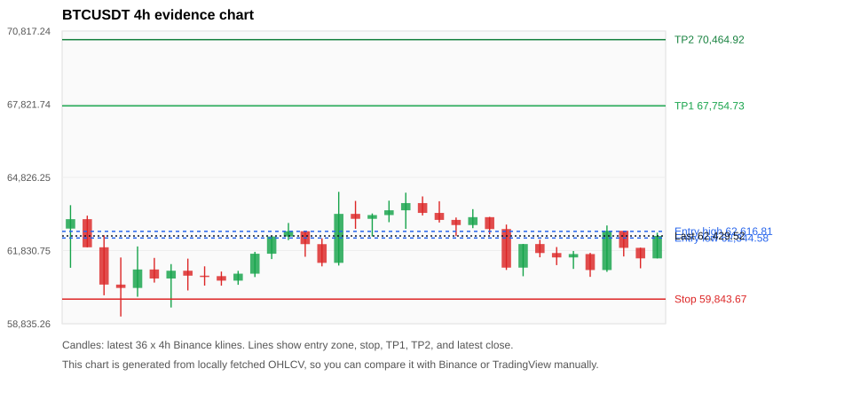
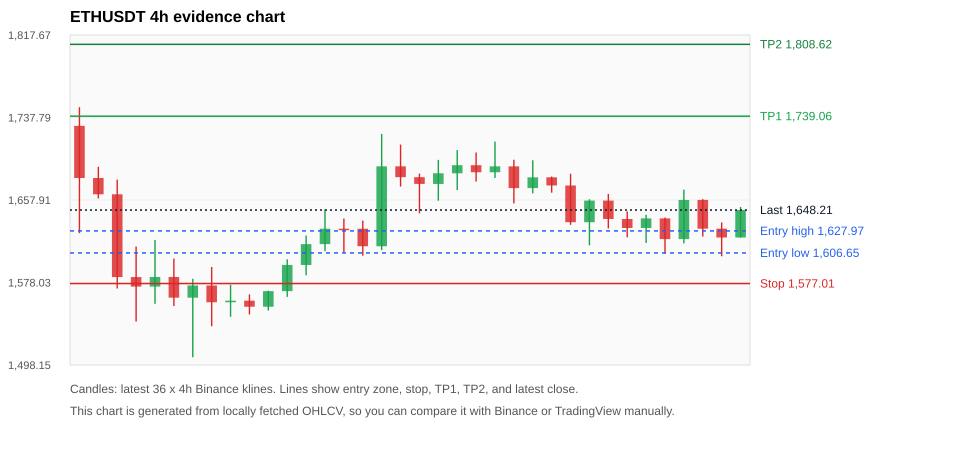
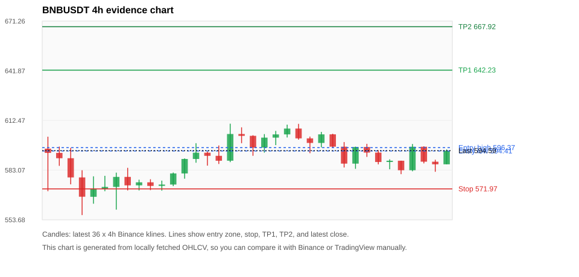
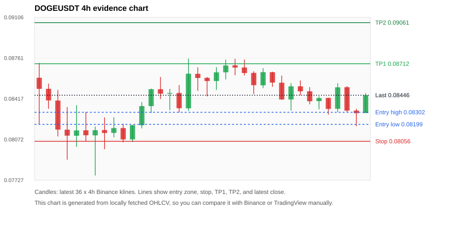
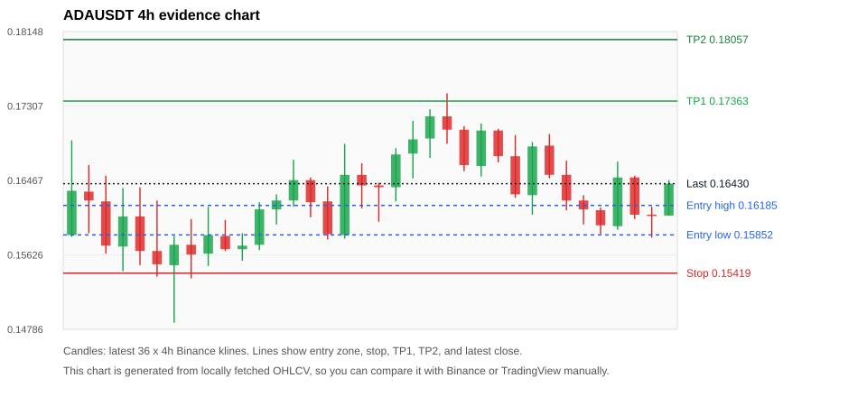

# Crypto 市场扫描报告 v1

- 报告时间：2026-06-11 11:36:40 CST
- 报告版本：v1
- 扫描 ID：f41286e9f06a
- 数据源：Binance public spot API + CoinGecko/CoinMarketCap cross-check
- 过滤条件：USDT spot; 24h quote volume >= 30,000,000; trades >= 30,000; exclude stables/leveraged tokens; analyze 1h/4h/1d klines
- 默认单笔风险：账户权益的 1.00%

## 限制说明

- 交易信号仍以 Binance 现货公开 K 线为主源；外部数据源用于一致性复核。
- 结果是研究和模拟盘计划，不是确定收益或实盘下单指令。
- 历史长度过滤：候选币至少需要 180 根 1d K 线。
- 数据质量验证池：先验证 score 排名前 min(top_n * 2, 10) 的候选，再按 action + score 补足最终名单。
- 大盘环境过滤：RISK_OFF; BTC/ETH 大盘偏弱，山寨币买入候选降级为观察。 BTC 7d=-2.279044278722142; ETH 7d=-6.921282831762454.
- 已启用数据交叉验证：Binance 主源 + CoinGecko 自动对照；CoinMarketCap 在配置 API Key 后自动对照。
- BTCUSDT 交叉验证状态 DATA_WARNING：At least one external provider needs manual review.
- ETHUSDT 交叉验证状态 DATA_WARNING：At least one external provider needs manual review.
- BNBUSDT 交叉验证状态 DATA_WARNING：At least one external provider needs manual review.
- DOGEUSDT 交叉验证状态 DATA_WARNING：At least one external provider needs manual review.
- ADAUSDT 交叉验证状态 DATA_WARNING：At least one external provider needs manual review.
- SOLUSDT 交叉验证状态 DATA_WARNING：At least one external provider needs manual review.
- XRPUSDT 交叉验证状态 DATA_WARNING：At least one external provider needs manual review.
- XLMUSDT 交叉验证状态 DATA_WARNING：At least one external provider needs manual review.
- WLDUSDT 交叉验证状态 DATA_WARNING：At least one external provider needs manual review.
- NEARUSDT 交叉验证状态 DATA_WARNING：At least one external provider needs manual review.

## 5 个候选交易计划

| Rank | Coin | Action | Setup | Entry Zone | Stop Loss | TP1 | TP2 / Exit Rule | R/R | Verdict |
|---:|---|---|---|---:|---:|---:|---|---:|---|
| 1 | `BTC` | `WATCH_ONLY` | 回踩支撑/4h EMA 附近 | 62,344.58 - 62,616.81 | 59,843.67 | 67,754.73 | 70,464.92 或跌破 4h 关键支撑 | 2.00-3.03 | 只观察 |
| 2 | `ETH` | `WATCH_ONLY` | 回踩支撑/4h EMA 附近 | 1,606.65 - 1,627.97 | 1,577.01 | 1,739.06 | 1,808.62 或跌破 4h 关键支撑 | 3.02-4.75 | 只观察 |
| 3 | `BNB` | `REJECT` | 回踩支撑/4h EMA 附近 | 594.41 - 596.37 | 571.97 | 642.23 | 667.92 或跌破 4h 关键支撑 | 2.00-3.10 | 只观察 |
| 4 | `DOGE` | `REJECT` | 回踩支撑/4h EMA 附近 | 0.08199 - 0.08302 | 0.08056 | 0.08712 | 0.09061 或跌破 4h 关键支撑 | 2.37-4.16 | 只观察 |
| 5 | `ADA` | `REJECT` | 回踩支撑/4h EMA 附近 | 0.15852 - 0.16185 | 0.15419 | 0.17363 | 0.18057 或跌破 4h 关键支撑 | 2.25-3.41 | 只观察 |

## 数据交叉验证摘要

价格差异以 Binance 当前价为基准；成交量口径不同，Binance 是 USDT 现货成交额，CoinGecko/CoinMarketCap 通常是全市场成交量。

| Rank | Coin | Data Status | Max Price Diff | Max 24h Diff | Message |
|---:|---|---|---:|---:|---|
| 1 | `BTC` | DATA_WARNING | 0.19% | 0.22 pts | At least one external provider needs manual review. |
| 2 | `ETH` | DATA_WARNING | 0.21% | 0.18 pts | At least one external provider needs manual review. |
| 3 | `BNB` | DATA_WARNING | 0.28% | 0.27 pts | At least one external provider needs manual review. |
| 4 | `DOGE` | DATA_WARNING | 0.22% | 0.19 pts | At least one external provider needs manual review. |
| 5 | `ADA` | DATA_WARNING | 0.39% | 0.33 pts | At least one external provider needs manual review. |

## 候选币说明

### 1. BTC `BTCUSDT`



- 入选原因：回踩支撑/4h EMA 附近；24h +1.57%，7d -3.06%，4h RSI 44.67，24h 成交额 $1.03B。
- 交易失效条件：跌破 59843.675 或 4h 收盘重新失守关键支撑。
- 主要风险：日线趋势未完全确认；7d 趋势未确认；数据交叉验证需要人工复核。
- 数据交叉验证：DATA_WARNING；At least one external provider needs manual review.

#### 可点击人工验证

- [Binance 交易页](https://www.binance.com/en/trade/BTC_USDT)
- [TradingView 图表](https://www.tradingview.com/chart/?symbol=BINANCE%3ABTCUSDT)
- [CoinGecko 搜索](https://www.coingecko.com/en/search?query=BTC)
- [CoinMarketCap 搜索](https://coinmarketcap.com/search/?q=BTC)

#### 多数据源对照

| Source | Status | Asset ID | Price | 24h Change | 24h Volume | Price Diff | 24h Diff | Updated | Message |
|---|---|---|---:|---:|---:|---:|---:|---|---|
| Binance | DATA_OK | BTCUSDT | 62,429.52 | +1.57% | $1.03B | 0.00% | 0.00 pts | 2026-06-11T03:36:04+00:00 | Primary market data source used by scanner. |
| CoinGecko | DATA_OK | bitcoin | 62,309.00 | +1.35% | $27.64B | 0.19% | 0.22 pts | 2026-06-11T03:36:02.911Z | External source agrees with Binance within thresholds. |
| CoinMarketCap | DATA_WARNING | 1 | 62,351.23 | +1.53% | $27.46B | 0.13% | 0.04 pts | 2026-06-11T03:34:04.000Z | CoinMarketCap symbol mapping has 13 matches; selected lowest cmc_rank |

#### 指标证据

| 指标 | 数值 | 人工核对用途 |
|---|---:|---|
| 当前价 | 62,429.52 | 与 Binance/TradingView 当前价格对照 |
| 24h 涨跌 | +1.57% | 与交易所 24h 涨跌对照 |
| 7d 涨跌 | -3.06% | 判断短线趋势是否延续 |
| 4h EMA20 | 62,220.14 | 判断短期趋势支撑 |
| 4h EMA50 | 63,877.50 | 判断中期趋势支撑 |
| 1d EMA20 | 67,426.19 | 判断日线趋势 |
| 1d EMA50 | 71,655.43 | 判断日线趋势 |
| 4h RSI14 | 44.67 | 判断是否过热/过弱 |
| 4h ATR14 | 1,023.06 | 推导止损和入场缓冲 |
| 最近 18 根 4h 最低点 | 60,755.00 | 支撑/止损参考 |
| 最近 36 根 4h 最高点 | 64,234.68 | TP/压力参考 |
| 支撑位 | 62,220.14 | 入场区间推导基础 |

#### 交易计划推导

- 支撑位 = 最近低点、4h EMA20、4h EMA50、1d EMA20 中不高于当前价的最高有效支撑 = `62,220.14`。
- 入场区间 = 支撑位附近 + ATR 缓冲 = `62,344.58 - 62,616.81`。
- 止损 = min(最近 18 根 4h 最低点 * 0.985, 入场中位价 - 1.15 * ATR14) = `59,843.67`。
- TP1 = max(最近 36 根 4h 最高点 * 0.995, 入场中位价 + 2R) = `67,754.73`。
- TP2 = max(入场中位价 + 3R, TP1 * 1.04) = `70,464.92`。

#### 最近 10 根 4h K线

| UTC 开盘时间 | Open | High | Low | Close | Quote Volume | Trades |
|---|---:|---:|---:|---:|---:|---:|
| 2026-06-09T12:00+00:00 | 62,711.12 | 62,895.18 | 61,037.00 | 61,131.84 | $382.4M | 1260536 |
| 2026-06-09T16:00+00:00 | 61,131.85 | 62,103.39 | 60,780.00 | 62,098.09 | $246.1M | 963025 |
| 2026-06-09T20:00+00:00 | 62,098.09 | 62,272.00 | 61,556.00 | 61,730.00 | $89.7M | 406527 |
| 2026-06-10T00:00+00:00 | 61,730.00 | 61,974.70 | 61,235.29 | 61,549.64 | $106.0M | 592207 |
| 2026-06-10T04:00+00:00 | 61,549.64 | 61,813.34 | 61,080.00 | 61,687.56 | $136.5M | 480520 |
| 2026-06-10T08:00+00:00 | 61,687.56 | 61,736.00 | 60,755.00 | 61,034.04 | $172.2M | 735601 |
| 2026-06-10T12:00+00:00 | 61,034.04 | 62,857.99 | 60,960.00 | 62,639.23 | $296.4M | 1335269 |
| 2026-06-10T16:00+00:00 | 62,639.23 | 62,646.00 | 61,588.80 | 61,942.44 | $165.9M | 900048 |
| 2026-06-10T20:00+00:00 | 61,942.45 | 61,949.21 | 61,104.24 | 61,510.99 | $109.7M | 612041 |
| 2026-06-11T00:00+00:00 | 61,510.99 | 62,562.00 | 61,510.99 | 62,429.52 | $140.7M | 517497 |

### 2. ETH `ETHUSDT`



- 入选原因：回踩支撑/4h EMA 附近；24h +1.04%，7d -8.71%，4h RSI 42.92，24h 成交额 $473.2M。
- 交易失效条件：跌破 1577.0069 或 4h 收盘重新失守关键支撑。
- 主要风险：日线趋势未完全确认；7d 趋势未确认；数据交叉验证需要人工复核。
- 数据交叉验证：DATA_WARNING；At least one external provider needs manual review.

#### 可点击人工验证

- [Binance 交易页](https://www.binance.com/en/trade/ETH_USDT)
- [TradingView 图表](https://www.tradingview.com/chart/?symbol=BINANCE%3AETHUSDT)
- [CoinGecko 搜索](https://www.coingecko.com/en/search?query=ETH)
- [CoinMarketCap 搜索](https://coinmarketcap.com/search/?q=ETH)

#### 多数据源对照

| Source | Status | Asset ID | Price | 24h Change | 24h Volume | Price Diff | 24h Diff | Updated | Message |
|---|---|---|---:|---:|---:|---:|---:|---|---|
| Binance | DATA_OK | ETHUSDT | 1,648.21 | +1.04% | $473.2M | 0.00% | 0.00 pts | 2026-06-11T03:36:04+00:00 | Primary market data source used by scanner. |
| CoinGecko | DATA_OK | ethereum | 1,644.82 | +0.86% | $12.83B | 0.21% | 0.18 pts | 2026-06-11T03:36:05.250Z | External source agrees with Binance within thresholds. |
| CoinMarketCap | DATA_WARNING | 1027 | 1,647.33 | +1.01% | $12.55B | 0.05% | 0.03 pts | 2026-06-11T03:34:04.000Z | CoinMarketCap symbol mapping has 6 matches; selected lowest cmc_rank |

#### 指标证据

| 指标 | 数值 | 人工核对用途 |
|---|---:|---|
| 当前价 | 1,648.21 | 与 Binance/TradingView 当前价格对照 |
| 24h 涨跌 | +1.04% | 与交易所 24h 涨跌对照 |
| 7d 涨跌 | -8.71% | 判断短线趋势是否延续 |
| 4h EMA20 | 1,648.87 | 判断短期趋势支撑 |
| 4h EMA50 | 1,707.43 | 判断中期趋势支撑 |
| 1d EMA20 | 1,830.43 | 判断日线趋势 |
| 1d EMA50 | 2,011.19 | 判断日线趋势 |
| 4h RSI14 | 42.92 | 判断是否过热/过弱 |
| 4h ATR14 | 35.0457 | 推导止损和入场缓冲 |
| 最近 18 根 4h 最低点 | 1,603.44 | 支撑/止损参考 |
| 最近 36 根 4h 最高点 | 1,747.80 | TP/压力参考 |
| 支撑位 | 1,603.44 | 入场区间推导基础 |

#### 交易计划推导

- 支撑位 = 最近低点、4h EMA20、4h EMA50、1d EMA20 中不高于当前价的最高有效支撑 = `1,603.44`。
- 入场区间 = 支撑位附近 + ATR 缓冲 = `1,606.65 - 1,627.97`。
- 止损 = min(最近 18 根 4h 最低点 * 0.985, 入场中位价 - 1.15 * ATR14) = `1,577.01`。
- TP1 = max(最近 36 根 4h 最高点 * 0.995, 入场中位价 + 2R) = `1,739.06`。
- TP2 = max(入场中位价 + 3R, TP1 * 1.04) = `1,808.62`。

#### 最近 10 根 4h K线

| UTC 开盘时间 | Open | High | Low | Close | Quote Volume | Trades |
|---|---:|---:|---:|---:|---:|---:|
| 2026-06-09T12:00+00:00 | 1,671.96 | 1,683.32 | 1,633.84 | 1,636.40 | $181.7M | 1155577 |
| 2026-06-09T16:00+00:00 | 1,636.40 | 1,658.64 | 1,614.02 | 1,657.33 | $134.1M | 1043647 |
| 2026-06-09T20:00+00:00 | 1,657.33 | 1,663.77 | 1,630.36 | 1,639.52 | $53.1M | 409330 |
| 2026-06-10T00:00+00:00 | 1,639.52 | 1,646.91 | 1,621.77 | 1,630.82 | $45.7M | 555312 |
| 2026-06-10T04:00+00:00 | 1,630.82 | 1,643.58 | 1,616.33 | 1,640.09 | $46.9M | 431533 |
| 2026-06-10T08:00+00:00 | 1,640.10 | 1,640.89 | 1,606.01 | 1,620.05 | $82.2M | 722545 |
| 2026-06-10T12:00+00:00 | 1,620.06 | 1,667.96 | 1,615.91 | 1,657.97 | $129.9M | 1327451 |
| 2026-06-10T16:00+00:00 | 1,657.98 | 1,658.73 | 1,622.51 | 1,630.15 | $90.4M | 952522 |
| 2026-06-10T20:00+00:00 | 1,630.15 | 1,636.21 | 1,603.44 | 1,621.59 | $79.6M | 690667 |
| 2026-06-11T00:00+00:00 | 1,621.60 | 1,651.19 | 1,621.60 | 1,648.22 | $42.5M | 446676 |

### 3. BNB `BNBUSDT`



- 入选原因：回踩支撑/4h EMA 附近；24h +1.18%，7d -3.26%，4h RSI 42.61，24h 成交额 $66.9M。
- 交易失效条件：跌破 571.9698 或 4h 收盘重新失守关键支撑。
- 主要风险：日线趋势未完全确认；BTC/ETH 大盘环境未确认强势，山寨币买入信号降级；7d 趋势未确认；数据交叉验证需要人工复核。
- 数据交叉验证：DATA_WARNING；At least one external provider needs manual review.

#### 可点击人工验证

- [Binance 交易页](https://www.binance.com/en/trade/BNB_USDT)
- [TradingView 图表](https://www.tradingview.com/chart/?symbol=BINANCE%3ABNBUSDT)
- [CoinGecko 搜索](https://www.coingecko.com/en/search?query=BNB)
- [CoinMarketCap 搜索](https://coinmarketcap.com/search/?q=BNB)

#### 多数据源对照

| Source | Status | Asset ID | Price | 24h Change | 24h Volume | Price Diff | 24h Diff | Updated | Message |
|---|---|---|---:|---:|---:|---:|---:|---|---|
| Binance | DATA_OK | BNBUSDT | 594.59 | +1.18% | $66.9M | 0.00% | 0.00 pts | 2026-06-11T03:36:04+00:00 | Primary market data source used by scanner. |
| CoinGecko | DATA_OK | binancecoin | 593.63 | +1.00% | $662.0M | 0.16% | 0.18 pts | 2026-06-11T03:36:05.884Z | External source agrees with Binance within thresholds. |
| CoinMarketCap | DATA_WARNING | 1839 | 592.92 | +0.91% | $1.02B | 0.28% | 0.27 pts | 2026-06-11T03:35:04.000Z | CoinMarketCap symbol mapping has 4 matches; selected lowest cmc_rank |

#### 指标证据

| 指标 | 数值 | 人工核对用途 |
|---|---:|---|
| 当前价 | 594.59 | 与 Binance/TradingView 当前价格对照 |
| 24h 涨跌 | +1.18% | 与交易所 24h 涨跌对照 |
| 7d 涨跌 | -3.26% | 判断短线趋势是否延续 |
| 4h EMA20 | 593.22 | 判断短期趋势支撑 |
| 4h EMA50 | 605.28 | 判断中期趋势支撑 |
| 1d EMA20 | 622.11 | 判断日线趋势 |
| 1d EMA50 | 634.40 | 判断日线趋势 |
| 4h RSI14 | 42.61 | 判断是否过热/过弱 |
| 4h ATR14 | 9.7793 | 推导止损和入场缓冲 |
| 最近 18 根 4h 最低点 | 580.68 | 支撑/止损参考 |
| 最近 36 根 4h 最高点 | 610.54 | TP/压力参考 |
| 支撑位 | 593.22 | 入场区间推导基础 |

#### 交易计划推导

- 支撑位 = 最近低点、4h EMA20、4h EMA50、1d EMA20 中不高于当前价的最高有效支撑 = `593.22`。
- 入场区间 = 支撑位附近 + ATR 缓冲 = `594.41 - 596.37`。
- 止损 = min(最近 18 根 4h 最低点 * 0.985, 入场中位价 - 1.15 * ATR14) = `571.97`。
- TP1 = max(最近 36 根 4h 最高点 * 0.995, 入场中位价 + 2R) = `642.23`。
- TP2 = max(入场中位价 + 3R, TP1 * 1.04) = `667.92`。

#### 最近 10 根 4h K线

| UTC 开盘时间 | Open | High | Low | Close | Quote Volume | Trades |
|---|---:|---:|---:|---:|---:|---:|
| 2026-06-09T12:00+00:00 | 596.93 | 599.68 | 584.63 | 586.91 | $22.8M | 235133 |
| 2026-06-09T16:00+00:00 | 586.91 | 596.97 | 583.84 | 596.76 | $14.1M | 156935 |
| 2026-06-09T20:00+00:00 | 596.76 | 598.62 | 590.90 | 593.44 | $6.9M | 86515 |
| 2026-06-10T00:00+00:00 | 593.44 | 594.83 | 586.48 | 587.87 | $8.4M | 115121 |
| 2026-06-10T04:00+00:00 | 587.88 | 589.46 | 583.58 | 588.63 | $11.9M | 111205 |
| 2026-06-10T08:00+00:00 | 588.63 | 588.64 | 580.68 | 583.00 | $10.9M | 118610 |
| 2026-06-10T12:00+00:00 | 583.01 | 598.52 | 582.40 | 596.90 | $18.1M | 189370 |
| 2026-06-10T16:00+00:00 | 596.90 | 597.16 | 587.05 | 588.06 | $9.8M | 106669 |
| 2026-06-10T20:00+00:00 | 588.05 | 589.22 | 582.10 | 586.53 | $8.5M | 69130 |
| 2026-06-11T00:00+00:00 | 586.51 | 595.27 | 586.51 | 594.59 | $7.2M | 85079 |

### 4. DOGE `DOGEUSDT`



- 入选原因：回踩支撑/4h EMA 附近；24h +0.46%，7d -6.94%，4h RSI 41.64，24h 成交额 $46.8M。
- 交易失效条件：跌破 0.080556973 或 4h 收盘重新失守关键支撑。
- 主要风险：日线趋势未完全确认；BTC/ETH 大盘环境未确认强势，山寨币买入信号降级；7d 趋势未确认；数据交叉验证需要人工复核。
- 数据交叉验证：DATA_WARNING；At least one external provider needs manual review.

#### 可点击人工验证

- [Binance 交易页](https://www.binance.com/en/trade/DOGE_USDT)
- [TradingView 图表](https://www.tradingview.com/chart/?symbol=BINANCE%3ADOGEUSDT)
- [CoinGecko 搜索](https://www.coingecko.com/en/search?query=DOGE)
- [CoinMarketCap 搜索](https://coinmarketcap.com/search/?q=DOGE)

#### 多数据源对照

| Source | Status | Asset ID | Price | 24h Change | 24h Volume | Price Diff | 24h Diff | Updated | Message |
|---|---|---|---:|---:|---:|---:|---:|---|---|
| Binance | DATA_OK | DOGEUSDT | 0.08446 | +0.46% | $46.8M | 0.00% | 0.00 pts | 2026-06-11T03:36:04+00:00 | Primary market data source used by scanner. |
| CoinGecko | DATA_OK | dogecoin | 0.08428 | +0.27% | $613.1M | 0.22% | 0.19 pts | 2026-06-11T03:36:05.880Z | External source agrees with Binance within thresholds. |
| CoinMarketCap | DATA_WARNING | 74 | 0.08428 | +0.32% | $609.2M | 0.22% | 0.14 pts | 2026-06-11T03:35:04.000Z | CoinMarketCap symbol mapping has 23 matches; selected lowest cmc_rank |

#### 指标证据

| 指标 | 数值 | 人工核对用途 |
|---|---:|---|
| 当前价 | 0.08446 | 与 Binance/TradingView 当前价格对照 |
| 24h 涨跌 | +0.46% | 与交易所 24h 涨跌对照 |
| 7d 涨跌 | -6.94% | 判断短线趋势是否延续 |
| 4h EMA20 | 0.08463 | 判断短期趋势支撑 |
| 4h EMA50 | 0.08709 | 判断中期趋势支撑 |
| 1d EMA20 | 0.09194 | 判断日线趋势 |
| 1d EMA50 | 0.09726 | 判断日线趋势 |
| 4h RSI14 | 41.64 | 判断是否过热/过弱 |
| 4h ATR14 | 0.0016935714 | 推导止损和入场缓冲 |
| 最近 18 根 4h 最低点 | 0.08183 | 支撑/止损参考 |
| 最近 36 根 4h 最高点 | 0.08756 | TP/压力参考 |
| 支撑位 | 0.08183 | 入场区间推导基础 |

#### 交易计划推导

- 支撑位 = 最近低点、4h EMA20、4h EMA50、1d EMA20 中不高于当前价的最高有效支撑 = `0.08183`。
- 入场区间 = 支撑位附近 + ATR 缓冲 = `0.08199 - 0.08302`。
- 止损 = min(最近 18 根 4h 最低点 * 0.985, 入场中位价 - 1.15 * ATR14) = `0.08056`。
- TP1 = max(最近 36 根 4h 最高点 * 0.995, 入场中位价 + 2R) = `0.08712`。
- TP2 = max(入场中位价 + 3R, TP1 * 1.04) = `0.09061`。

#### 最近 10 根 4h K线

| UTC 开盘时间 | Open | High | Low | Close | Quote Volume | Trades |
|---|---:|---:|---:|---:|---:|---:|
| 2026-06-09T12:00+00:00 | 0.08552 | 0.08612 | 0.08407 | 0.08410 | $14.8M | 182194 |
| 2026-06-09T16:00+00:00 | 0.08410 | 0.08548 | 0.08316 | 0.08521 | $14.1M | 148430 |
| 2026-06-09T20:00+00:00 | 0.08521 | 0.08571 | 0.08445 | 0.08479 | $6.5M | 54642 |
| 2026-06-10T00:00+00:00 | 0.08479 | 0.08515 | 0.08369 | 0.08395 | $3.9M | 81090 |
| 2026-06-10T04:00+00:00 | 0.08396 | 0.08437 | 0.08326 | 0.08422 | $4.3M | 68365 |
| 2026-06-10T08:00+00:00 | 0.08423 | 0.08425 | 0.08282 | 0.08330 | $7.8M | 94225 |
| 2026-06-10T12:00+00:00 | 0.08331 | 0.08547 | 0.08303 | 0.08513 | $13.9M | 186996 |
| 2026-06-10T16:00+00:00 | 0.08514 | 0.08523 | 0.08303 | 0.08316 | $8.1M | 128020 |
| 2026-06-10T20:00+00:00 | 0.08316 | 0.08331 | 0.08183 | 0.08294 | $7.6M | 101241 |
| 2026-06-11T00:00+00:00 | 0.08295 | 0.08464 | 0.08295 | 0.08446 | $4.9M | 69083 |

### 5. ADA `ADAUSDT`



- 入选原因：回踩支撑/4h EMA 附近；24h +1.42%，7d -17.44%，4h RSI 41.40，24h 成交额 $30.5M。
- 交易失效条件：跌破 0.15419249 或 4h 收盘重新失守关键支撑。
- 主要风险：日线趋势未完全确认；BTC/ETH 大盘环境未确认强势，山寨币买入信号降级；7d 趋势未确认；数据交叉验证需要人工复核。
- 数据交叉验证：DATA_WARNING；At least one external provider needs manual review.

#### 可点击人工验证

- [Binance 交易页](https://www.binance.com/en/trade/ADA_USDT)
- [TradingView 图表](https://www.tradingview.com/chart/?symbol=BINANCE%3AADAUSDT)
- [CoinGecko 搜索](https://www.coingecko.com/en/search?query=ADA)
- [CoinMarketCap 搜索](https://coinmarketcap.com/search/?q=ADA)

#### 多数据源对照

| Source | Status | Asset ID | Price | 24h Change | 24h Volume | Price Diff | 24h Diff | Updated | Message |
|---|---|---|---:|---:|---:|---:|---:|---|---|
| Binance | DATA_OK | ADAUSDT | 0.16430 | +1.42% | $30.5M | 0.00% | 0.00 pts | 2026-06-11T03:36:04+00:00 | Primary market data source used by scanner. |
| CoinGecko | DATA_OK | cardano | 0.16370 | +1.11% | $498.0M | 0.37% | 0.31 pts | 2026-06-11T03:36:07.846Z | External source agrees with Binance within thresholds. |
| CoinMarketCap | DATA_WARNING | 2010 | 0.16366 | +1.09% | $465.1M | 0.39% | 0.33 pts | 2026-06-11T03:35:04.000Z | CoinMarketCap symbol mapping has 3 matches; selected lowest cmc_rank |

#### 指标证据

| 指标 | 数值 | 人工核对用途 |
|---|---:|---|
| 当前价 | 0.16430 | 与 Binance/TradingView 当前价格对照 |
| 24h 涨跌 | +1.42% | 与交易所 24h 涨跌对照 |
| 7d 涨跌 | -17.44% | 判断短线趋势是否延续 |
| 4h EMA20 | 0.16476 | 判断短期趋势支撑 |
| 4h EMA50 | 0.17630 | 判断中期趋势支撑 |
| 1d EMA20 | 0.19717 | 判断日线趋势 |
| 1d EMA50 | 0.22500 | 判断日线趋势 |
| 4h RSI14 | 41.40 | 判断是否过热/过弱 |
| 4h ATR14 | 0.0052071429 | 推导止损和入场缓冲 |
| 最近 18 根 4h 最低点 | 0.15820 | 支撑/止损参考 |
| 最近 36 根 4h 最高点 | 0.17450 | TP/压力参考 |
| 支撑位 | 0.15820 | 入场区间推导基础 |

#### 交易计划推导

- 支撑位 = 最近低点、4h EMA20、4h EMA50、1d EMA20 中不高于当前价的最高有效支撑 = `0.15820`。
- 入场区间 = 支撑位附近 + ATR 缓冲 = `0.15852 - 0.16185`。
- 止损 = min(最近 18 根 4h 最低点 * 0.985, 入场中位价 - 1.15 * ATR14) = `0.15419`。
- TP1 = max(最近 36 根 4h 最高点 * 0.995, 入场中位价 + 2R) = `0.17363`。
- TP2 = max(入场中位价 + 3R, TP1 * 1.04) = `0.18057`。

#### 最近 10 根 4h K线

| UTC 开盘时间 | Open | High | Low | Close | Quote Volume | Trades |
|---|---:|---:|---:|---:|---:|---:|
| 2026-06-09T12:00+00:00 | 0.16740 | 0.16980 | 0.16270 | 0.16310 | $6.2M | 38105 |
| 2026-06-09T16:00+00:00 | 0.16300 | 0.16900 | 0.16080 | 0.16850 | $6.6M | 36627 |
| 2026-06-09T20:00+00:00 | 0.16860 | 0.16990 | 0.16490 | 0.16530 | $2.7M | 13040 |
| 2026-06-10T00:00+00:00 | 0.16530 | 0.16690 | 0.16130 | 0.16240 | $3.7M | 17395 |
| 2026-06-10T04:00+00:00 | 0.16240 | 0.16300 | 0.15970 | 0.16140 | $4.4M | 18529 |
| 2026-06-10T08:00+00:00 | 0.16130 | 0.16160 | 0.15860 | 0.15960 | $4.4M | 18323 |
| 2026-06-10T12:00+00:00 | 0.15950 | 0.16680 | 0.15910 | 0.16500 | $8.4M | 36691 |
| 2026-06-10T16:00+00:00 | 0.16500 | 0.16520 | 0.16030 | 0.16080 | $5.6M | 31482 |
| 2026-06-10T20:00+00:00 | 0.16080 | 0.16170 | 0.15820 | 0.16070 | $3.8M | 22731 |
| 2026-06-11T00:00+00:00 | 0.16070 | 0.16470 | 0.16070 | 0.16430 | $3.5M | 17660 |

## 组合风控

- 不要 5 个候选全部满仓买入。
- 同时持仓总风险建议控制在账户权益的 3% - 5% 以内。
- 如果 BTC/ETH 同时破位，暂停山寨币多头计划或降低仓位。
- 第一版报告用于模拟盘和人工复核，不自动下单。

## 原始数据

```json
[
  {
    "rank": 1,
    "symbol": "BTCUSDT",
    "base_asset": "BTC",
    "price": 62429.52,
    "score": 25.744537971609137,
    "setup": "回踩支撑/4h EMA 附近",
    "verdict": "只观察",
    "entry_low": 62344.57626995901,
    "entry_high": 62616.80855999999,
    "stop_loss": 59843.674999999996,
    "take_profit_1": 67754.72724493852,
    "take_profit_2": 70464.91633473606,
    "risk_reward_1": 2.0000000000000027,
    "risk_reward_2": 3.027747892146025,
    "pct_24h": 1.569,
    "pct_3d": -0.4069419910246008,
    "pct_7d": -3.059736499959087,
    "quote_volume_24h": 1027661904.6392925,
    "trades_24h": 4616565,
    "high_low_range_24h": 3.4614270430417315,
    "rsi_1h": 54.586695181620776,
    "rsi_4h": 44.67207322712413,
    "ema20_4h": 62220.13599796309,
    "ema50_4h": 63877.498235307066,
    "ema20_1d": 67426.19130412811,
    "ema50_1d": 71655.43184232825,
    "atr_4h": 1023.0628571428564,
    "macd_hist_4h": 68.71012681714325,
    "volume_ratio_24h": 0.5651421018763018,
    "support_level": 62220.13599796309,
    "recent_low_4h_18": 60755.0,
    "recent_high_4h_36": 64234.68,
    "distance_to_support_pct": 0.33652128636261214,
    "binance_trade_url": "https://www.binance.com/en/trade/BTC_USDT",
    "tradingview_url": "https://www.tradingview.com/chart/?symbol=BINANCE%3ABTCUSDT",
    "coingecko_search_url": "https://www.coingecko.com/en/search?query=BTC",
    "coinmarketcap_search_url": "https://coinmarketcap.com/search/?q=BTC",
    "invalidation": "跌破 59843.675 或 4h 收盘重新失守关键支撑",
    "recent_4h_klines": [
      {
        "open_time_utc": "2026-06-05T04:00+00:00",
        "open": 62730.0,
        "high": 63688.0,
        "low": 61126.01,
        "close": 63115.99,
        "quote_volume": 668376397.0652407,
        "trades": 2270535
      },
      {
        "open_time_utc": "2026-06-05T08:00+00:00",
        "open": 63115.99,
        "high": 63259.9,
        "low": 61964.98,
        "close": 61964.99,
        "quote_volume": 269110992.1566804,
        "trades": 1142388
      },
      {
        "open_time_utc": "2026-06-05T12:00+00:00",
        "open": 61964.99,
        "high": 62457.86,
        "low": 60000.0,
        "close": 60438.01,
        "quote_volume": 903329435.9502803,
        "trades": 2679839
      },
      {
        "open_time_utc": "2026-06-05T16:00+00:00",
        "open": 60438.0,
        "high": 61547.24,
        "low": 59130.91,
        "close": 60300.24,
        "quote_volume": 828648361.47734,
        "trades": 2680737
      },
      {
        "open_time_utc": "2026-06-05T20:00+00:00",
        "open": 60300.24,
        "high": 62000.0,
        "low": 59940.01,
        "close": 61056.47,
        "quote_volume": 447020553.7128263,
        "trades": 1659370
      },
      {
        "open_time_utc": "2026-06-06T00:00+00:00",
        "open": 61056.47,
        "high": 61530.05,
        "low": 60520.0,
        "close": 60687.04,
        "quote_volume": 179762223.6704187,
        "trades": 973252
      },
      {
        "open_time_utc": "2026-06-06T04:00+00:00",
        "open": 60687.05,
        "high": 61276.95,
        "low": 59500.0,
        "close": 61004.95,
        "quote_volume": 427756115.8325964,
        "trades": 1567097
      },
      {
        "open_time_utc": "2026-06-06T08:00+00:00",
        "open": 61004.95,
        "high": 61500.0,
        "low": 60198.0,
        "close": 60802.91,
        "quote_volume": 211333241.0287374,
        "trades": 817667
      },
      {
        "open_time_utc": "2026-06-06T12:00+00:00",
        "open": 60802.9,
        "high": 61185.26,
        "low": 60396.0,
        "close": 60784.0,
        "quote_volume": 139417012.2724489,
        "trades": 717560
      },
      {
        "open_time_utc": "2026-06-06T16:00+00:00",
        "open": 60784.01,
        "high": 60971.24,
        "low": 60393.96,
        "close": 60600.01,
        "quote_volume": 148359633.576543,
        "trades": 534622
      },
      {
        "open_time_utc": "2026-06-06T20:00+00:00",
        "open": 60600.0,
        "high": 61000.0,
        "low": 60429.09,
        "close": 60884.62,
        "quote_volume": 95697732.0874891,
        "trades": 390676
      },
      {
        "open_time_utc": "2026-06-07T00:00+00:00",
        "open": 60884.62,
        "high": 61778.33,
        "low": 60746.0,
        "close": 61701.07,
        "quote_volume": 181385716.2030478,
        "trades": 709548
      },
      {
        "open_time_utc": "2026-06-07T04:00+00:00",
        "open": 61701.06,
        "high": 62416.26,
        "low": 61482.46,
        "close": 62404.73,
        "quote_volume": 304023070.1693883,
        "trades": 740026
      },
      {
        "open_time_utc": "2026-06-07T08:00+00:00",
        "open": 62404.72,
        "high": 62960.0,
        "low": 62259.37,
        "close": 62621.96,
        "quote_volume": 295560305.0786909,
        "trades": 725358
      },
      {
        "open_time_utc": "2026-06-07T12:00+00:00",
        "open": 62621.97,
        "high": 62643.97,
        "low": 61577.12,
        "close": 62093.99,
        "quote_volume": 282015239.1601059,
        "trades": 947743
      },
      {
        "open_time_utc": "2026-06-07T16:00+00:00",
        "open": 62093.99,
        "high": 62332.0,
        "low": 61184.0,
        "close": 61328.0,
        "quote_volume": 153321370.3425705,
        "trades": 627720
      },
      {
        "open_time_utc": "2026-06-07T20:00+00:00",
        "open": 61327.99,
        "high": 64234.68,
        "low": 61217.17,
        "close": 63332.01,
        "quote_volume": 440345071.8599046,
        "trades": 1002066
      },
      {
        "open_time_utc": "2026-06-08T00:00+00:00",
        "open": 63332.01,
        "high": 63863.06,
        "low": 62720.86,
        "close": 63130.12,
        "quote_volume": 209776019.139319,
        "trades": 951227
      },
      {
        "open_time_utc": "2026-06-08T04:00+00:00",
        "open": 63130.12,
        "high": 63350.0,
        "low": 62408.0,
        "close": 63283.99,
        "quote_volume": 178355729.1551866,
        "trades": 746526
      },
      {
        "open_time_utc": "2026-06-08T08:00+00:00",
        "open": 63284.0,
        "high": 63873.08,
        "low": 62992.01,
        "close": 63479.61,
        "quote_volume": 237868671.2112363,
        "trades": 730155
      },
      {
        "open_time_utc": "2026-06-08T12:00+00:00",
        "open": 63479.62,
        "high": 64200.0,
        "low": 62718.3,
        "close": 63774.48,
        "quote_volume": 517711748.3686128,
        "trades": 1316931
      },
      {
        "open_time_utc": "2026-06-08T16:00+00:00",
        "open": 63774.48,
        "high": 64046.86,
        "low": 63268.01,
        "close": 63372.01,
        "quote_volume": 172421648.334559,
        "trades": 623074
      },
      {
        "open_time_utc": "2026-06-08T20:00+00:00",
        "open": 63372.01,
        "high": 63850.0,
        "low": 62978.66,
        "close": 63085.99,
        "quote_volume": 146429470.5423066,
        "trades": 519651
      },
      {
        "open_time_utc": "2026-06-09T00:00+00:00",
        "open": 63086.0,
        "high": 63184.0,
        "low": 62423.07,
        "close": 62875.17,
        "quote_volume": 235865848.1528649,
        "trades": 700766
      },
      {
        "open_time_utc": "2026-06-09T04:00+00:00",
        "open": 62875.18,
        "high": 63526.01,
        "low": 62748.0,
        "close": 63198.44,
        "quote_volume": 234535665.0725845,
        "trades": 551428
      },
      {
        "open_time_utc": "2026-06-09T08:00+00:00",
        "open": 63198.44,
        "high": 63208.86,
        "low": 62498.75,
        "close": 62711.12,
        "quote_volume": 158742223.0036342,
        "trades": 465050
      },
      {
        "open_time_utc": "2026-06-09T12:00+00:00",
        "open": 62711.12,
        "high": 62895.18,
        "low": 61037.0,
        "close": 61131.84,
        "quote_volume": 382417752.565316,
        "trades": 1260536
      },
      {
        "open_time_utc": "2026-06-09T16:00+00:00",
        "open": 61131.85,
        "high": 62103.39,
        "low": 60780.0,
        "close": 62098.09,
        "quote_volume": 246053601.5457886,
        "trades": 963025
      },
      {
        "open_time_utc": "2026-06-09T20:00+00:00",
        "open": 62098.09,
        "high": 62272.0,
        "low": 61556.0,
        "close": 61730.0,
        "quote_volume": 89706958.8221522,
        "trades": 406527
      },
      {
        "open_time_utc": "2026-06-10T00:00+00:00",
        "open": 61730.0,
        "high": 61974.7,
        "low": 61235.29,
        "close": 61549.64,
        "quote_volume": 106045624.8372721,
        "trades": 592207
      },
      {
        "open_time_utc": "2026-06-10T04:00+00:00",
        "open": 61549.64,
        "high": 61813.34,
        "low": 61080.0,
        "close": 61687.56,
        "quote_volume": 136484341.6312986,
        "trades": 480520
      },
      {
        "open_time_utc": "2026-06-10T08:00+00:00",
        "open": 61687.56,
        "high": 61736.0,
        "low": 60755.0,
        "close": 61034.04,
        "quote_volume": 172223607.1572254,
        "trades": 735601
      },
      {
        "open_time_utc": "2026-06-10T12:00+00:00",
        "open": 61034.04,
        "high": 62857.99,
        "low": 60960.0,
        "close": 62639.23,
        "quote_volume": 296352226.0096525,
        "trades": 1335269
      },
      {
        "open_time_utc": "2026-06-10T16:00+00:00",
        "open": 62639.23,
        "high": 62646.0,
        "low": 61588.8,
        "close": 61942.44,
        "quote_volume": 165886486.1541675,
        "trades": 900048
      },
      {
        "open_time_utc": "2026-06-10T20:00+00:00",
        "open": 61942.45,
        "high": 61949.21,
        "low": 61104.24,
        "close": 61510.99,
        "quote_volume": 109718597.7997586,
        "trades": 612041
      },
      {
        "open_time_utc": "2026-06-11T00:00+00:00",
        "open": 61510.99,
        "high": 62562.0,
        "low": 61510.99,
        "close": 62429.52,
        "quote_volume": 140736226.2076822,
        "trades": 517497
      }
    ],
    "risks": [
      "日线趋势未完全确认",
      "7d 趋势未确认",
      "数据交叉验证需要人工复核"
    ],
    "data_quality_status": "DATA_WARNING",
    "data_quality_message": "At least one external provider needs manual review.",
    "data_checks": [
      {
        "provider": "Binance",
        "status": "DATA_OK",
        "provider_asset_id": "BTCUSDT",
        "provider_symbol": "BTCUSDT",
        "price_usd": 62429.52,
        "pct_24h": 1.569,
        "volume_24h": 1027661904.6392925,
        "last_updated": null,
        "fetched_at_utc": "2026-06-11T03:36:04+00:00",
        "price_diff_pct": 0.0,
        "pct_24h_diff": 0.0,
        "volume_note": "Binance USDT spot 24h quoteVolume.",
        "message": "Primary market data source used by scanner."
      },
      {
        "provider": "CoinGecko",
        "status": "DATA_OK",
        "provider_asset_id": "bitcoin",
        "provider_symbol": "BTC",
        "price_usd": 62309.0,
        "pct_24h": 1.34708,
        "volume_24h": 27639935185.0,
        "last_updated": "2026-06-11T03:36:02.911Z",
        "fetched_at_utc": "2026-06-11T03:36:04+00:00",
        "price_diff_pct": 0.1930496982837555,
        "pct_24h_diff": 0.2219199999999999,
        "volume_note": "CoinGecko total market volume; not the same venue scope as Binance quoteVolume.",
        "message": "External source agrees with Binance within thresholds."
      },
      {
        "provider": "CoinMarketCap",
        "status": "DATA_WARNING",
        "provider_asset_id": "1",
        "provider_symbol": "BTC",
        "price_usd": 62351.23441004078,
        "pct_24h": 1.5322972,
        "volume_24h": 27463703354.16777,
        "last_updated": "2026-06-11T03:34:04.000Z",
        "fetched_at_utc": "2026-06-11T03:36:04+00:00",
        "price_diff_pct": 0.1253983531496282,
        "pct_24h_diff": 0.036702800000000035,
        "volume_note": "CoinMarketCap total market volume; not the same venue scope as Binance quoteVolume.",
        "message": "CoinMarketCap symbol mapping has 13 matches; selected lowest cmc_rank"
      }
    ],
    "action": "WATCH_ONLY"
  },
  {
    "rank": 2,
    "symbol": "ETHUSDT",
    "base_asset": "ETH",
    "price": 1648.21,
    "score": 21.413070996651978,
    "setup": "回踩支撑/4h EMA 附近",
    "verdict": "只观察",
    "entry_low": 1606.64688,
    "entry_high": 1627.972,
    "stop_loss": 1577.0068685714284,
    "take_profit_1": 1739.061,
    "take_profit_2": 1808.62344,
    "risk_reward_1": 3.020937763630808,
    "risk_reward_2": 4.746942768628713,
    "pct_24h": 1.041,
    "pct_3d": -0.5334781690353285,
    "pct_7d": -8.711208591573472,
    "quote_volume_24h": 473207554.288505,
    "trades_24h": 4598592,
    "high_low_range_24h": 4.023848725240731,
    "rsi_1h": 48.2718894009217,
    "rsi_4h": 42.923505729327964,
    "ema20_4h": 1648.8717365991663,
    "ema50_4h": 1707.4332194813942,
    "ema20_1d": 1830.4278914531947,
    "ema50_1d": 2011.18663032513,
    "atr_4h": 35.04571428571434,
    "macd_hist_4h": 1.6657599985080829,
    "volume_ratio_24h": 0.4749093197672,
    "support_level": 1603.44,
    "recent_low_4h_18": 1603.44,
    "recent_high_4h_36": 1747.8,
    "distance_to_support_pct": 2.792121937833647,
    "binance_trade_url": "https://www.binance.com/en/trade/ETH_USDT",
    "tradingview_url": "https://www.tradingview.com/chart/?symbol=BINANCE%3AETHUSDT",
    "coingecko_search_url": "https://www.coingecko.com/en/search?query=ETH",
    "coinmarketcap_search_url": "https://coinmarketcap.com/search/?q=ETH",
    "invalidation": "跌破 1577.0069 或 4h 收盘重新失守关键支撑",
    "recent_4h_klines": [
      {
        "open_time_utc": "2026-06-05T04:00+00:00",
        "open": 1729.72,
        "high": 1747.8,
        "low": 1625.78,
        "close": 1679.21,
        "quote_volume": 526181296.884881,
        "trades": 2909975
      },
      {
        "open_time_utc": "2026-06-05T08:00+00:00",
        "open": 1679.22,
        "high": 1690.07,
        "low": 1659.43,
        "close": 1663.44,
        "quote_volume": 199912034.195274,
        "trades": 1355414
      },
      {
        "open_time_utc": "2026-06-05T12:00+00:00",
        "open": 1663.43,
        "high": 1677.7,
        "low": 1572.22,
        "close": 1583.29,
        "quote_volume": 492655229.681449,
        "trades": 3100033
      },
      {
        "open_time_utc": "2026-06-05T16:00+00:00",
        "open": 1583.29,
        "high": 1612.89,
        "low": 1540.19,
        "close": 1574.06,
        "quote_volume": 420934233.611529,
        "trades": 2703286
      },
      {
        "open_time_utc": "2026-06-05T20:00+00:00",
        "open": 1574.07,
        "high": 1619.3,
        "low": 1557.36,
        "close": 1583.4,
        "quote_volume": 261641839.948342,
        "trades": 1608267
      },
      {
        "open_time_utc": "2026-06-06T00:00+00:00",
        "open": 1583.4,
        "high": 1601.22,
        "low": 1555.28,
        "close": 1563.34,
        "quote_volume": 108392813.385097,
        "trades": 970712
      },
      {
        "open_time_utc": "2026-06-06T04:00+00:00",
        "open": 1563.34,
        "high": 1581.62,
        "low": 1505.68,
        "close": 1575.14,
        "quote_volume": 282158181.789381,
        "trades": 1832768
      },
      {
        "open_time_utc": "2026-06-06T08:00+00:00",
        "open": 1575.14,
        "high": 1593.04,
        "low": 1535.68,
        "close": 1558.89,
        "quote_volume": 151232845.757409,
        "trades": 1207407
      },
      {
        "open_time_utc": "2026-06-06T12:00+00:00",
        "open": 1558.9,
        "high": 1575.82,
        "low": 1544.87,
        "close": 1560.45,
        "quote_volume": 168457360.14315,
        "trades": 1044134
      },
      {
        "open_time_utc": "2026-06-06T16:00+00:00",
        "open": 1560.45,
        "high": 1566.51,
        "low": 1547.05,
        "close": 1554.56,
        "quote_volume": 94780037.045857,
        "trades": 697415
      },
      {
        "open_time_utc": "2026-06-06T20:00+00:00",
        "open": 1554.55,
        "high": 1570.06,
        "low": 1550.85,
        "close": 1569.69,
        "quote_volume": 65925172.979358,
        "trades": 502517
      },
      {
        "open_time_utc": "2026-06-07T00:00+00:00",
        "open": 1569.68,
        "high": 1600.51,
        "low": 1564.1,
        "close": 1595.01,
        "quote_volume": 90080174.635612,
        "trades": 722274
      },
      {
        "open_time_utc": "2026-06-07T04:00+00:00",
        "open": 1595.0,
        "high": 1623.52,
        "low": 1585.0,
        "close": 1615.18,
        "quote_volume": 142242225.776729,
        "trades": 708710
      },
      {
        "open_time_utc": "2026-06-07T08:00+00:00",
        "open": 1615.18,
        "high": 1648.7,
        "low": 1608.39,
        "close": 1630.12,
        "quote_volume": 130159942.929751,
        "trades": 771237
      },
      {
        "open_time_utc": "2026-06-07T12:00+00:00",
        "open": 1630.12,
        "high": 1640.0,
        "low": 1607.0,
        "close": 1630.07,
        "quote_volume": 118475715.21903,
        "trades": 1007911
      },
      {
        "open_time_utc": "2026-06-07T16:00+00:00",
        "open": 1630.07,
        "high": 1638.0,
        "low": 1604.0,
        "close": 1613.11,
        "quote_volume": 97813298.629156,
        "trades": 738766
      },
      {
        "open_time_utc": "2026-06-07T20:00+00:00",
        "open": 1613.1,
        "high": 1721.93,
        "low": 1609.43,
        "close": 1690.51,
        "quote_volume": 166904844.693745,
        "trades": 1146777
      },
      {
        "open_time_utc": "2026-06-08T00:00+00:00",
        "open": 1690.5,
        "high": 1711.58,
        "low": 1670.94,
        "close": 1680.01,
        "quote_volume": 125771365.851108,
        "trades": 1082664
      },
      {
        "open_time_utc": "2026-06-08T04:00+00:00",
        "open": 1680.02,
        "high": 1683.49,
        "low": 1645.0,
        "close": 1673.47,
        "quote_volume": 122647547.690447,
        "trades": 817286
      },
      {
        "open_time_utc": "2026-06-08T08:00+00:00",
        "open": 1673.46,
        "high": 1696.77,
        "low": 1657.21,
        "close": 1683.76,
        "quote_volume": 123349288.482507,
        "trades": 817479
      },
      {
        "open_time_utc": "2026-06-08T12:00+00:00",
        "open": 1683.77,
        "high": 1706.22,
        "low": 1667.46,
        "close": 1691.59,
        "quote_volume": 218044478.479097,
        "trades": 1543160
      },
      {
        "open_time_utc": "2026-06-08T16:00+00:00",
        "open": 1691.59,
        "high": 1703.88,
        "low": 1675.8,
        "close": 1684.78,
        "quote_volume": 122593105.369451,
        "trades": 808491
      },
      {
        "open_time_utc": "2026-06-08T20:00+00:00",
        "open": 1684.78,
        "high": 1714.5,
        "low": 1679.25,
        "close": 1690.49,
        "quote_volume": 95554116.915364,
        "trades": 690541
      },
      {
        "open_time_utc": "2026-06-09T00:00+00:00",
        "open": 1690.48,
        "high": 1696.88,
        "low": 1654.63,
        "close": 1669.44,
        "quote_volume": 109563806.141011,
        "trades": 881498
      },
      {
        "open_time_utc": "2026-06-09T04:00+00:00",
        "open": 1669.44,
        "high": 1696.41,
        "low": 1664.33,
        "close": 1679.86,
        "quote_volume": 93808663.929695,
        "trades": 590073
      },
      {
        "open_time_utc": "2026-06-09T08:00+00:00",
        "open": 1679.86,
        "high": 1680.64,
        "low": 1665.0,
        "close": 1671.96,
        "quote_volume": 65298916.828868,
        "trades": 421391
      },
      {
        "open_time_utc": "2026-06-09T12:00+00:00",
        "open": 1671.96,
        "high": 1683.32,
        "low": 1633.84,
        "close": 1636.4,
        "quote_volume": 181732549.113035,
        "trades": 1155577
      },
      {
        "open_time_utc": "2026-06-09T16:00+00:00",
        "open": 1636.4,
        "high": 1658.64,
        "low": 1614.02,
        "close": 1657.33,
        "quote_volume": 134090149.997469,
        "trades": 1043647
      },
      {
        "open_time_utc": "2026-06-09T20:00+00:00",
        "open": 1657.33,
        "high": 1663.77,
        "low": 1630.36,
        "close": 1639.52,
        "quote_volume": 53106386.411123,
        "trades": 409330
      },
      {
        "open_time_utc": "2026-06-10T00:00+00:00",
        "open": 1639.52,
        "high": 1646.91,
        "low": 1621.77,
        "close": 1630.82,
        "quote_volume": 45681938.903102,
        "trades": 555312
      },
      {
        "open_time_utc": "2026-06-10T04:00+00:00",
        "open": 1630.82,
        "high": 1643.58,
        "low": 1616.33,
        "close": 1640.09,
        "quote_volume": 46872662.703514,
        "trades": 431533
      },
      {
        "open_time_utc": "2026-06-10T08:00+00:00",
        "open": 1640.1,
        "high": 1640.89,
        "low": 1606.01,
        "close": 1620.05,
        "quote_volume": 82179420.179027,
        "trades": 722545
      },
      {
        "open_time_utc": "2026-06-10T12:00+00:00",
        "open": 1620.06,
        "high": 1667.96,
        "low": 1615.91,
        "close": 1657.97,
        "quote_volume": 129938835.673916,
        "trades": 1327451
      },
      {
        "open_time_utc": "2026-06-10T16:00+00:00",
        "open": 1657.98,
        "high": 1658.73,
        "low": 1622.51,
        "close": 1630.15,
        "quote_volume": 90394827.810961,
        "trades": 952522
      },
      {
        "open_time_utc": "2026-06-10T20:00+00:00",
        "open": 1630.15,
        "high": 1636.21,
        "low": 1603.44,
        "close": 1621.59,
        "quote_volume": 79574513.257938,
        "trades": 690667
      },
      {
        "open_time_utc": "2026-06-11T00:00+00:00",
        "open": 1621.6,
        "high": 1651.19,
        "low": 1621.6,
        "close": 1648.22,
        "quote_volume": 42481859.489239,
        "trades": 446676
      }
    ],
    "risks": [
      "日线趋势未完全确认",
      "7d 趋势未确认",
      "数据交叉验证需要人工复核"
    ],
    "data_quality_status": "DATA_WARNING",
    "data_quality_message": "At least one external provider needs manual review.",
    "data_checks": [
      {
        "provider": "Binance",
        "status": "DATA_OK",
        "provider_asset_id": "ETHUSDT",
        "provider_symbol": "ETHUSDT",
        "price_usd": 1648.21,
        "pct_24h": 1.041,
        "volume_24h": 473207554.288505,
        "last_updated": null,
        "fetched_at_utc": "2026-06-11T03:36:04+00:00",
        "price_diff_pct": 0.0,
        "pct_24h_diff": 0.0,
        "volume_note": "Binance USDT spot 24h quoteVolume.",
        "message": "Primary market data source used by scanner."
      },
      {
        "provider": "CoinGecko",
        "status": "DATA_OK",
        "provider_asset_id": "ethereum",
        "provider_symbol": "ETH",
        "price_usd": 1644.82,
        "pct_24h": 0.85972,
        "volume_24h": 12831101149.0,
        "last_updated": "2026-06-11T03:36:05.250Z",
        "fetched_at_utc": "2026-06-11T03:36:04+00:00",
        "price_diff_pct": 0.20567767456817396,
        "pct_24h_diff": 0.18127999999999989,
        "volume_note": "CoinGecko total market volume; not the same venue scope as Binance quoteVolume.",
        "message": "External source agrees with Binance within thresholds."
      },
      {
        "provider": "CoinMarketCap",
        "status": "DATA_WARNING",
        "provider_asset_id": "1027",
        "provider_symbol": "ETH",
        "price_usd": 1647.32750430761,
        "pct_24h": 1.01134232,
        "volume_24h": 12554926196.582058,
        "last_updated": "2026-06-11T03:34:04.000Z",
        "fetched_at_utc": "2026-06-11T03:36:04+00:00",
        "price_diff_pct": 0.05354267310536681,
        "pct_24h_diff": 0.02965767999999991,
        "volume_note": "CoinMarketCap total market volume; not the same venue scope as Binance quoteVolume.",
        "message": "CoinMarketCap symbol mapping has 6 matches; selected lowest cmc_rank"
      }
    ],
    "action": "WATCH_ONLY"
  },
  {
    "rank": 3,
    "symbol": "BNBUSDT",
    "base_asset": "BNB",
    "price": 594.59,
    "score": 12.446426101795918,
    "setup": "回踩支撑/4h EMA 附近",
    "verdict": "只观察",
    "entry_low": 594.4087489314094,
    "entry_high": 596.3737699999999,
    "stop_loss": 571.9698,
    "take_profit_1": 642.2341783971142,
    "take_profit_2": 667.9235455329988,
    "risk_reward_1": 2.0,
    "risk_reward_2": 3.096830330898067,
    "pct_24h": 1.181,
    "pct_3d": -0.30348759221997534,
    "pct_7d": -3.260498185900451,
    "quote_volume_24h": 66871113.1607,
    "trades_24h": 686239,
    "high_low_range_24h": 3.072260108837921,
    "rsi_1h": 52.853351028533574,
    "rsi_4h": 42.60662970924317,
    "ema20_4h": 593.2223043227639,
    "ema50_4h": 605.2834510387681,
    "ema20_1d": 622.1147702316366,
    "ema50_1d": 634.3983340241228,
    "atr_4h": 9.779285714285711,
    "macd_hist_4h": 0.2891839535565519,
    "volume_ratio_24h": 0.4534614719887103,
    "support_level": 593.2223043227639,
    "recent_low_4h_18": 580.68,
    "recent_high_4h_36": 610.54,
    "distance_to_support_pct": 0.23055365033815,
    "binance_trade_url": "https://www.binance.com/en/trade/BNB_USDT",
    "tradingview_url": "https://www.tradingview.com/chart/?symbol=BINANCE%3ABNBUSDT",
    "coingecko_search_url": "https://www.coingecko.com/en/search?query=BNB",
    "coinmarketcap_search_url": "https://coinmarketcap.com/search/?q=BNB",
    "invalidation": "跌破 571.9698 或 4h 收盘重新失守关键支撑",
    "recent_4h_klines": [
      {
        "open_time_utc": "2026-06-05T04:00+00:00",
        "open": 595.76,
        "high": 602.85,
        "low": 570.61,
        "close": 593.26,
        "quote_volume": 72161283.29492,
        "trades": 651519
      },
      {
        "open_time_utc": "2026-06-05T08:00+00:00",
        "open": 593.26,
        "high": 597.0,
        "low": 585.6,
        "close": 590.11,
        "quote_volume": 23171371.01771,
        "trades": 276382
      },
      {
        "open_time_utc": "2026-06-05T12:00+00:00",
        "open": 590.12,
        "high": 596.27,
        "low": 574.66,
        "close": 578.75,
        "quote_volume": 51005063.55537,
        "trades": 410929
      },
      {
        "open_time_utc": "2026-06-05T16:00+00:00",
        "open": 578.75,
        "high": 583.0,
        "low": 556.46,
        "close": 567.33,
        "quote_volume": 101381506.34842,
        "trades": 463303
      },
      {
        "open_time_utc": "2026-06-05T20:00+00:00",
        "open": 567.28,
        "high": 579.4,
        "low": 563.19,
        "close": 572.22,
        "quote_volume": 37614945.92409,
        "trades": 168374
      },
      {
        "open_time_utc": "2026-06-06T00:00+00:00",
        "open": 572.17,
        "high": 579.7,
        "low": 570.6,
        "close": 573.13,
        "quote_volume": 34855403.84669,
        "trades": 199783
      },
      {
        "open_time_utc": "2026-06-06T04:00+00:00",
        "open": 573.13,
        "high": 581.58,
        "low": 559.68,
        "close": 579.06,
        "quote_volume": 41675122.74698,
        "trades": 370803
      },
      {
        "open_time_utc": "2026-06-06T08:00+00:00",
        "open": 579.06,
        "high": 584.43,
        "low": 571.05,
        "close": 574.06,
        "quote_volume": 22241774.58256,
        "trades": 197737
      },
      {
        "open_time_utc": "2026-06-06T12:00+00:00",
        "open": 574.07,
        "high": 577.4,
        "low": 571.04,
        "close": 575.86,
        "quote_volume": 13714726.59608,
        "trades": 132123
      },
      {
        "open_time_utc": "2026-06-06T16:00+00:00",
        "open": 575.86,
        "high": 577.66,
        "low": 571.25,
        "close": 573.73,
        "quote_volume": 10007043.02781,
        "trades": 81618
      },
      {
        "open_time_utc": "2026-06-06T20:00+00:00",
        "open": 573.74,
        "high": 576.86,
        "low": 570.93,
        "close": 574.53,
        "quote_volume": 7457252.31347,
        "trades": 57222
      },
      {
        "open_time_utc": "2026-06-07T00:00+00:00",
        "open": 574.54,
        "high": 581.64,
        "low": 573.6,
        "close": 581.1,
        "quote_volume": 20790866.09568,
        "trades": 160711
      },
      {
        "open_time_utc": "2026-06-07T04:00+00:00",
        "open": 581.09,
        "high": 590.0,
        "low": 578.0,
        "close": 589.67,
        "quote_volume": 23462316.61378,
        "trades": 168764
      },
      {
        "open_time_utc": "2026-06-07T08:00+00:00",
        "open": 589.67,
        "high": 599.0,
        "low": 587.45,
        "close": 593.38,
        "quote_volume": 21242654.48866,
        "trades": 151258
      },
      {
        "open_time_utc": "2026-06-07T12:00+00:00",
        "open": 593.37,
        "high": 593.99,
        "low": 585.73,
        "close": 591.52,
        "quote_volume": 16876514.03647,
        "trades": 130675
      },
      {
        "open_time_utc": "2026-06-07T16:00+00:00",
        "open": 591.53,
        "high": 597.65,
        "low": 586.7,
        "close": 588.62,
        "quote_volume": 10501746.54685,
        "trades": 73857
      },
      {
        "open_time_utc": "2026-06-07T20:00+00:00",
        "open": 588.64,
        "high": 610.54,
        "low": 587.8,
        "close": 604.44,
        "quote_volume": 20864283.60294,
        "trades": 107299
      },
      {
        "open_time_utc": "2026-06-08T00:00+00:00",
        "open": 604.44,
        "high": 608.39,
        "low": 599.0,
        "close": 603.35,
        "quote_volume": 11259190.29586,
        "trades": 119533
      },
      {
        "open_time_utc": "2026-06-08T04:00+00:00",
        "open": 603.36,
        "high": 603.7,
        "low": 591.55,
        "close": 596.39,
        "quote_volume": 14863350.74203,
        "trades": 155289
      },
      {
        "open_time_utc": "2026-06-08T08:00+00:00",
        "open": 596.4,
        "high": 604.39,
        "low": 593.43,
        "close": 602.29,
        "quote_volume": 13314687.43794,
        "trades": 159056
      },
      {
        "open_time_utc": "2026-06-08T12:00+00:00",
        "open": 602.29,
        "high": 606.28,
        "low": 597.86,
        "close": 604.2,
        "quote_volume": 18035476.05662,
        "trades": 149678
      },
      {
        "open_time_utc": "2026-06-08T16:00+00:00",
        "open": 604.21,
        "high": 609.98,
        "low": 602.38,
        "close": 607.66,
        "quote_volume": 9515650.0047,
        "trades": 60784
      },
      {
        "open_time_utc": "2026-06-08T20:00+00:00",
        "open": 607.67,
        "high": 610.44,
        "low": 601.09,
        "close": 601.86,
        "quote_volume": 6062429.97848,
        "trades": 44976
      },
      {
        "open_time_utc": "2026-06-09T00:00+00:00",
        "open": 601.86,
        "high": 602.92,
        "low": 593.1,
        "close": 599.14,
        "quote_volume": 13187310.8415,
        "trades": 110395
      },
      {
        "open_time_utc": "2026-06-09T04:00+00:00",
        "open": 599.14,
        "high": 605.68,
        "low": 596.5,
        "close": 604.23,
        "quote_volume": 11996454.51089,
        "trades": 106074
      },
      {
        "open_time_utc": "2026-06-09T08:00+00:00",
        "open": 604.24,
        "high": 604.58,
        "low": 596.22,
        "close": 596.94,
        "quote_volume": 11213559.45381,
        "trades": 124421
      },
      {
        "open_time_utc": "2026-06-09T12:00+00:00",
        "open": 596.93,
        "high": 599.68,
        "low": 584.63,
        "close": 586.91,
        "quote_volume": 22807650.87116,
        "trades": 235133
      },
      {
        "open_time_utc": "2026-06-09T16:00+00:00",
        "open": 586.91,
        "high": 596.97,
        "low": 583.84,
        "close": 596.76,
        "quote_volume": 14087414.07973,
        "trades": 156935
      },
      {
        "open_time_utc": "2026-06-09T20:00+00:00",
        "open": 596.76,
        "high": 598.62,
        "low": 590.9,
        "close": 593.44,
        "quote_volume": 6877681.6933,
        "trades": 86515
      },
      {
        "open_time_utc": "2026-06-10T00:00+00:00",
        "open": 593.44,
        "high": 594.83,
        "low": 586.48,
        "close": 587.87,
        "quote_volume": 8418819.70228,
        "trades": 115121
      },
      {
        "open_time_utc": "2026-06-10T04:00+00:00",
        "open": 587.88,
        "high": 589.46,
        "low": 583.58,
        "close": 588.63,
        "quote_volume": 11885072.26562,
        "trades": 111205
      },
      {
        "open_time_utc": "2026-06-10T08:00+00:00",
        "open": 588.63,
        "high": 588.64,
        "low": 580.68,
        "close": 583.0,
        "quote_volume": 10880381.76632,
        "trades": 118610
      },
      {
        "open_time_utc": "2026-06-10T12:00+00:00",
        "open": 583.01,
        "high": 598.52,
        "low": 582.4,
        "close": 596.9,
        "quote_volume": 18055775.58151,
        "trades": 189370
      },
      {
        "open_time_utc": "2026-06-10T16:00+00:00",
        "open": 596.9,
        "high": 597.16,
        "low": 587.05,
        "close": 588.06,
        "quote_volume": 9820365.25295,
        "trades": 106669
      },
      {
        "open_time_utc": "2026-06-10T20:00+00:00",
        "open": 588.05,
        "high": 589.22,
        "low": 582.1,
        "close": 586.53,
        "quote_volume": 8529835.81823,
        "trades": 69130
      },
      {
        "open_time_utc": "2026-06-11T00:00+00:00",
        "open": 586.51,
        "high": 595.27,
        "low": 586.51,
        "close": 594.59,
        "quote_volume": 7195208.22893,
        "trades": 85079
      }
    ],
    "risks": [
      "日线趋势未完全确认",
      "BTC/ETH 大盘环境未确认强势，山寨币买入信号降级",
      "7d 趋势未确认",
      "数据交叉验证需要人工复核"
    ],
    "data_quality_status": "DATA_WARNING",
    "data_quality_message": "At least one external provider needs manual review.",
    "data_checks": [
      {
        "provider": "Binance",
        "status": "DATA_OK",
        "provider_asset_id": "BNBUSDT",
        "provider_symbol": "BNBUSDT",
        "price_usd": 594.59,
        "pct_24h": 1.181,
        "volume_24h": 66871113.1607,
        "last_updated": null,
        "fetched_at_utc": "2026-06-11T03:36:04+00:00",
        "price_diff_pct": 0.0,
        "pct_24h_diff": 0.0,
        "volume_note": "Binance USDT spot 24h quoteVolume.",
        "message": "Primary market data source used by scanner."
      },
      {
        "provider": "CoinGecko",
        "status": "DATA_OK",
        "provider_asset_id": "binancecoin",
        "provider_symbol": "BNB",
        "price_usd": 593.63,
        "pct_24h": 1.00238,
        "volume_24h": 662035811.0,
        "last_updated": "2026-06-11T03:36:05.884Z",
        "fetched_at_utc": "2026-06-11T03:36:04+00:00",
        "price_diff_pct": 0.161455793067498,
        "pct_24h_diff": 0.17862,
        "volume_note": "CoinGecko total market volume; not the same venue scope as Binance quoteVolume.",
        "message": "External source agrees with Binance within thresholds."
      },
      {
        "provider": "CoinMarketCap",
        "status": "DATA_WARNING",
        "provider_asset_id": "1839",
        "provider_symbol": "BNB",
        "price_usd": 592.9165589327151,
        "pct_24h": 0.91192422,
        "volume_24h": 1018749040.691559,
        "last_updated": "2026-06-11T03:35:04.000Z",
        "fetched_at_utc": "2026-06-11T03:36:04+00:00",
        "price_diff_pct": 0.28144453611478465,
        "pct_24h_diff": 0.2690757800000001,
        "volume_note": "CoinMarketCap total market volume; not the same venue scope as Binance quoteVolume.",
        "message": "CoinMarketCap symbol mapping has 4 matches; selected lowest cmc_rank"
      }
    ],
    "action": "REJECT"
  },
  {
    "rank": 4,
    "symbol": "DOGEUSDT",
    "base_asset": "DOGE",
    "price": 0.08446,
    "score": 5.488823687616939,
    "setup": "回踩支撑/4h EMA 附近",
    "verdict": "只观察",
    "entry_low": 0.08199366,
    "entry_high": 0.0830155,
    "stop_loss": 0.08055697285714285,
    "take_profit_1": 0.0871222,
    "take_profit_2": 0.090607088,
    "risk_reward_1": 2.370919626648081,
    "risk_reward_2": 4.16023736086406,
    "pct_24h": 0.464,
    "pct_3d": -0.5651047798446052,
    "pct_7d": -6.941383869546058,
    "quote_volume_24h": 46752678.81363,
    "trades_24h": 652261,
    "high_low_range_24h": 4.448246364414032,
    "rsi_1h": 48.867313915857586,
    "rsi_4h": 41.642857142857125,
    "ema20_4h": 0.08462705685026128,
    "ema50_4h": 0.0870947497617134,
    "ema20_1d": 0.09193564147503794,
    "ema50_1d": 0.0972631715122841,
    "atr_4h": 0.0016935714285714282,
    "macd_hist_4h": -7.5282628232174265e-06,
    "volume_ratio_24h": 0.554197664288215,
    "support_level": 0.08183,
    "recent_low_4h_18": 0.08183,
    "recent_high_4h_36": 0.08756,
    "distance_to_support_pct": 3.21398020285959,
    "binance_trade_url": "https://www.binance.com/en/trade/DOGE_USDT",
    "tradingview_url": "https://www.tradingview.com/chart/?symbol=BINANCE%3ADOGEUSDT",
    "coingecko_search_url": "https://www.coingecko.com/en/search?query=DOGE",
    "coinmarketcap_search_url": "https://coinmarketcap.com/search/?q=DOGE",
    "invalidation": "跌破 0.080556973 或 4h 收盘重新失守关键支撑",
    "recent_4h_klines": [
      {
        "open_time_utc": "2026-06-05T04:00+00:00",
        "open": 0.08594,
        "high": 0.08719,
        "low": 0.08203,
        "close": 0.085,
        "quote_volume": 46126836.67862,
        "trades": 476651
      },
      {
        "open_time_utc": "2026-06-05T08:00+00:00",
        "open": 0.085,
        "high": 0.08544,
        "low": 0.08331,
        "close": 0.08402,
        "quote_volume": 15527166.78307,
        "trades": 202149
      },
      {
        "open_time_utc": "2026-06-05T12:00+00:00",
        "open": 0.08401,
        "high": 0.08491,
        "low": 0.08097,
        "close": 0.08155,
        "quote_volume": 41128159.88967,
        "trades": 444836
      },
      {
        "open_time_utc": "2026-06-05T16:00+00:00",
        "open": 0.08154,
        "high": 0.08346,
        "low": 0.079,
        "close": 0.08104,
        "quote_volume": 36170953.89284,
        "trades": 440809
      },
      {
        "open_time_utc": "2026-06-05T20:00+00:00",
        "open": 0.08103,
        "high": 0.08362,
        "low": 0.08009,
        "close": 0.08148,
        "quote_volume": 20987661.67912,
        "trades": 240067
      },
      {
        "open_time_utc": "2026-06-06T00:00+00:00",
        "open": 0.08149,
        "high": 0.08304,
        "low": 0.08053,
        "close": 0.08107,
        "quote_volume": 9994625.03846,
        "trades": 160518
      },
      {
        "open_time_utc": "2026-06-06T04:00+00:00",
        "open": 0.08106,
        "high": 0.0818,
        "low": 0.07766,
        "close": 0.0815,
        "quote_volume": 26597670.21658,
        "trades": 362450
      },
      {
        "open_time_utc": "2026-06-06T08:00+00:00",
        "open": 0.08151,
        "high": 0.08258,
        "low": 0.07989,
        "close": 0.08126,
        "quote_volume": 12989858.11833,
        "trades": 178520
      },
      {
        "open_time_utc": "2026-06-06T12:00+00:00",
        "open": 0.08127,
        "high": 0.0826,
        "low": 0.08089,
        "close": 0.08168,
        "quote_volume": 13162037.24233,
        "trades": 180677
      },
      {
        "open_time_utc": "2026-06-06T16:00+00:00",
        "open": 0.08168,
        "high": 0.08205,
        "low": 0.08047,
        "close": 0.08072,
        "quote_volume": 6835105.15614,
        "trades": 107979
      },
      {
        "open_time_utc": "2026-06-06T20:00+00:00",
        "open": 0.08072,
        "high": 0.08195,
        "low": 0.0805,
        "close": 0.08192,
        "quote_volume": 4794115.60153,
        "trades": 72225
      },
      {
        "open_time_utc": "2026-06-07T00:00+00:00",
        "open": 0.08192,
        "high": 0.08388,
        "low": 0.08165,
        "close": 0.08354,
        "quote_volume": 9444065.60311,
        "trades": 129836
      },
      {
        "open_time_utc": "2026-06-07T04:00+00:00",
        "open": 0.08354,
        "high": 0.08502,
        "low": 0.08296,
        "close": 0.08497,
        "quote_volume": 11149500.3999,
        "trades": 118020
      },
      {
        "open_time_utc": "2026-06-07T08:00+00:00",
        "open": 0.08497,
        "high": 0.086,
        "low": 0.08414,
        "close": 0.08459,
        "quote_volume": 11695831.3109,
        "trades": 122698
      },
      {
        "open_time_utc": "2026-06-07T12:00+00:00",
        "open": 0.0846,
        "high": 0.085,
        "low": 0.0832,
        "close": 0.08465,
        "quote_volume": 9255604.41184,
        "trades": 138860
      },
      {
        "open_time_utc": "2026-06-07T16:00+00:00",
        "open": 0.08465,
        "high": 0.08532,
        "low": 0.083,
        "close": 0.08336,
        "quote_volume": 7165395.53667,
        "trades": 103113
      },
      {
        "open_time_utc": "2026-06-07T20:00+00:00",
        "open": 0.08335,
        "high": 0.08756,
        "low": 0.08313,
        "close": 0.08628,
        "quote_volume": 18838628.63158,
        "trades": 200997
      },
      {
        "open_time_utc": "2026-06-08T00:00+00:00",
        "open": 0.08627,
        "high": 0.08682,
        "low": 0.08483,
        "close": 0.08592,
        "quote_volume": 11458490.6253,
        "trades": 148448
      },
      {
        "open_time_utc": "2026-06-08T04:00+00:00",
        "open": 0.08593,
        "high": 0.086,
        "low": 0.08436,
        "close": 0.08566,
        "quote_volume": 7689566.16542,
        "trades": 109378
      },
      {
        "open_time_utc": "2026-06-08T08:00+00:00",
        "open": 0.08566,
        "high": 0.08684,
        "low": 0.0849,
        "close": 0.0864,
        "quote_volume": 8360227.42138,
        "trades": 100012
      },
      {
        "open_time_utc": "2026-06-08T12:00+00:00",
        "open": 0.0864,
        "high": 0.08747,
        "low": 0.0858,
        "close": 0.08698,
        "quote_volume": 10625683.24738,
        "trades": 156906
      },
      {
        "open_time_utc": "2026-06-08T16:00+00:00",
        "open": 0.08699,
        "high": 0.08754,
        "low": 0.08615,
        "close": 0.0868,
        "quote_volume": 6468406.58742,
        "trades": 83994
      },
      {
        "open_time_utc": "2026-06-08T20:00+00:00",
        "open": 0.08681,
        "high": 0.08749,
        "low": 0.08613,
        "close": 0.08634,
        "quote_volume": 5285613.17552,
        "trades": 70717
      },
      {
        "open_time_utc": "2026-06-09T00:00+00:00",
        "open": 0.08635,
        "high": 0.08649,
        "low": 0.08456,
        "close": 0.08531,
        "quote_volume": 12754118.84049,
        "trades": 156034
      },
      {
        "open_time_utc": "2026-06-09T04:00+00:00",
        "open": 0.0853,
        "high": 0.08675,
        "low": 0.08506,
        "close": 0.08641,
        "quote_volume": 9580118.95164,
        "trades": 97783
      },
      {
        "open_time_utc": "2026-06-09T08:00+00:00",
        "open": 0.08641,
        "high": 0.08645,
        "low": 0.08517,
        "close": 0.08553,
        "quote_volume": 6344751.11005,
        "trades": 76628
      },
      {
        "open_time_utc": "2026-06-09T12:00+00:00",
        "open": 0.08552,
        "high": 0.08612,
        "low": 0.08407,
        "close": 0.0841,
        "quote_volume": 14793233.63094,
        "trades": 182194
      },
      {
        "open_time_utc": "2026-06-09T16:00+00:00",
        "open": 0.0841,
        "high": 0.08548,
        "low": 0.08316,
        "close": 0.08521,
        "quote_volume": 14078144.94883,
        "trades": 148430
      },
      {
        "open_time_utc": "2026-06-09T20:00+00:00",
        "open": 0.08521,
        "high": 0.08571,
        "low": 0.08445,
        "close": 0.08479,
        "quote_volume": 6456670.23207,
        "trades": 54642
      },
      {
        "open_time_utc": "2026-06-10T00:00+00:00",
        "open": 0.08479,
        "high": 0.08515,
        "low": 0.08369,
        "close": 0.08395,
        "quote_volume": 3948690.92578,
        "trades": 81090
      },
      {
        "open_time_utc": "2026-06-10T04:00+00:00",
        "open": 0.08396,
        "high": 0.08437,
        "low": 0.08326,
        "close": 0.08422,
        "quote_volume": 4270501.11147,
        "trades": 68365
      },
      {
        "open_time_utc": "2026-06-10T08:00+00:00",
        "open": 0.08423,
        "high": 0.08425,
        "low": 0.08282,
        "close": 0.0833,
        "quote_volume": 7771694.14532,
        "trades": 94225
      },
      {
        "open_time_utc": "2026-06-10T12:00+00:00",
        "open": 0.08331,
        "high": 0.08547,
        "low": 0.08303,
        "close": 0.08513,
        "quote_volume": 13872461.09594,
        "trades": 186996
      },
      {
        "open_time_utc": "2026-06-10T16:00+00:00",
        "open": 0.08514,
        "high": 0.08523,
        "low": 0.08303,
        "close": 0.08316,
        "quote_volume": 8124810.4488,
        "trades": 128020
      },
      {
        "open_time_utc": "2026-06-10T20:00+00:00",
        "open": 0.08316,
        "high": 0.08331,
        "low": 0.08183,
        "close": 0.08294,
        "quote_volume": 7592736.17818,
        "trades": 101241
      },
      {
        "open_time_utc": "2026-06-11T00:00+00:00",
        "open": 0.08295,
        "high": 0.08464,
        "low": 0.08295,
        "close": 0.08446,
        "quote_volume": 4895673.54312,
        "trades": 69083
      }
    ],
    "risks": [
      "日线趋势未完全确认",
      "BTC/ETH 大盘环境未确认强势，山寨币买入信号降级",
      "7d 趋势未确认",
      "数据交叉验证需要人工复核"
    ],
    "data_quality_status": "DATA_WARNING",
    "data_quality_message": "At least one external provider needs manual review.",
    "data_checks": [
      {
        "provider": "Binance",
        "status": "DATA_OK",
        "provider_asset_id": "DOGEUSDT",
        "provider_symbol": "DOGEUSDT",
        "price_usd": 0.08446,
        "pct_24h": 0.464,
        "volume_24h": 46752678.81363,
        "last_updated": null,
        "fetched_at_utc": "2026-06-11T03:36:04+00:00",
        "price_diff_pct": 0.0,
        "pct_24h_diff": 0.0,
        "volume_note": "Binance USDT spot 24h quoteVolume.",
        "message": "Primary market data source used by scanner."
      },
      {
        "provider": "CoinGecko",
        "status": "DATA_OK",
        "provider_asset_id": "dogecoin",
        "provider_symbol": "DOGE",
        "price_usd": 0.084278,
        "pct_24h": 0.27289,
        "volume_24h": 613096886.0,
        "last_updated": "2026-06-11T03:36:05.880Z",
        "fetched_at_utc": "2026-06-11T03:36:04+00:00",
        "price_diff_pct": 0.21548662088561182,
        "pct_24h_diff": 0.19111,
        "volume_note": "CoinGecko total market volume; not the same venue scope as Binance quoteVolume.",
        "message": "External source agrees with Binance within thresholds."
      },
      {
        "provider": "CoinMarketCap",
        "status": "DATA_WARNING",
        "provider_asset_id": "74",
        "provider_symbol": "DOGE",
        "price_usd": 0.08427612687956416,
        "pct_24h": 0.32306124,
        "volume_24h": 609198701.74111,
        "last_updated": "2026-06-11T03:35:04.000Z",
        "fetched_at_utc": "2026-06-11T03:36:04+00:00",
        "price_diff_pct": 0.21770438128798134,
        "pct_24h_diff": 0.14093876,
        "volume_note": "CoinMarketCap total market volume; not the same venue scope as Binance quoteVolume.",
        "message": "CoinMarketCap symbol mapping has 23 matches; selected lowest cmc_rank"
      }
    ],
    "action": "REJECT"
  },
  {
    "rank": 5,
    "symbol": "ADAUSDT",
    "base_asset": "ADA",
    "price": 0.1643,
    "score": 4.5621916335071475,
    "setup": "回踩支撑/4h EMA 附近",
    "verdict": "只观察",
    "entry_low": 0.1585164,
    "entry_high": 0.16184500000000002,
    "stop_loss": 0.15419248571428573,
    "take_profit_1": 0.1736275,
    "take_profit_2": 0.1805726,
    "risk_reward_1": 2.245544223772887,
    "risk_reward_2": 3.405339058865632,
    "pct_24h": 1.42,
    "pct_3d": 1.7337461300309664,
    "pct_7d": -17.437185929648248,
    "quote_volume_24h": 30465479.80811,
    "trades_24h": 146581,
    "high_low_range_24h": 5.436156763590394,
    "rsi_1h": 48.43750000000003,
    "rsi_4h": 41.40271493212672,
    "ema20_4h": 0.1647616703096402,
    "ema50_4h": 0.17629997788358295,
    "ema20_1d": 0.19717233931739384,
    "ema50_1d": 0.22500153584248128,
    "atr_4h": 0.0052071428571428624,
    "macd_hist_4h": 0.0005110697351297226,
    "volume_ratio_24h": 0.6029463500264568,
    "support_level": 0.1582,
    "recent_low_4h_18": 0.1582,
    "recent_high_4h_36": 0.1745,
    "distance_to_support_pct": 3.855878634639698,
    "binance_trade_url": "https://www.binance.com/en/trade/ADA_USDT",
    "tradingview_url": "https://www.tradingview.com/chart/?symbol=BINANCE%3AADAUSDT",
    "coingecko_search_url": "https://www.coingecko.com/en/search?query=ADA",
    "coinmarketcap_search_url": "https://coinmarketcap.com/search/?q=ADA",
    "invalidation": "跌破 0.15419249 或 4h 收盘重新失守关键支撑",
    "recent_4h_klines": [
      {
        "open_time_utc": "2026-06-05T04:00+00:00",
        "open": 0.1585,
        "high": 0.1692,
        "low": 0.1583,
        "close": 0.1635,
        "quote_volume": 17987041.8829,
        "trades": 107796
      },
      {
        "open_time_utc": "2026-06-05T08:00+00:00",
        "open": 0.1634,
        "high": 0.1664,
        "low": 0.1587,
        "close": 0.1624,
        "quote_volume": 11635831.94759,
        "trades": 54037
      },
      {
        "open_time_utc": "2026-06-05T12:00+00:00",
        "open": 0.1623,
        "high": 0.1652,
        "low": 0.1564,
        "close": 0.1573,
        "quote_volume": 14045485.35714,
        "trades": 88744
      },
      {
        "open_time_utc": "2026-06-05T16:00+00:00",
        "open": 0.1572,
        "high": 0.1638,
        "low": 0.1544,
        "close": 0.1606,
        "quote_volume": 13647595.13327,
        "trades": 74085
      },
      {
        "open_time_utc": "2026-06-05T20:00+00:00",
        "open": 0.1606,
        "high": 0.1639,
        "low": 0.1551,
        "close": 0.1567,
        "quote_volume": 9527975.28416,
        "trades": 43696
      },
      {
        "open_time_utc": "2026-06-06T00:00+00:00",
        "open": 0.1567,
        "high": 0.1624,
        "low": 0.1538,
        "close": 0.1552,
        "quote_volume": 7712314.76732,
        "trades": 35269
      },
      {
        "open_time_utc": "2026-06-06T04:00+00:00",
        "open": 0.1551,
        "high": 0.1584,
        "low": 0.1486,
        "close": 0.1574,
        "quote_volume": 18454834.32956,
        "trades": 73214
      },
      {
        "open_time_utc": "2026-06-06T08:00+00:00",
        "open": 0.1574,
        "high": 0.1603,
        "low": 0.1536,
        "close": 0.1563,
        "quote_volume": 7866340.47075,
        "trades": 36312
      },
      {
        "open_time_utc": "2026-06-06T12:00+00:00",
        "open": 0.1564,
        "high": 0.1617,
        "low": 0.155,
        "close": 0.1585,
        "quote_volume": 8659592.6371,
        "trades": 38403
      },
      {
        "open_time_utc": "2026-06-06T16:00+00:00",
        "open": 0.1584,
        "high": 0.1602,
        "low": 0.1567,
        "close": 0.1569,
        "quote_volume": 5328105.22399,
        "trades": 23621
      },
      {
        "open_time_utc": "2026-06-06T20:00+00:00",
        "open": 0.1569,
        "high": 0.1587,
        "low": 0.1556,
        "close": 0.1573,
        "quote_volume": 3604186.43403,
        "trades": 17776
      },
      {
        "open_time_utc": "2026-06-07T00:00+00:00",
        "open": 0.1574,
        "high": 0.1622,
        "low": 0.1568,
        "close": 0.1614,
        "quote_volume": 5567149.84354,
        "trades": 24719
      },
      {
        "open_time_utc": "2026-06-07T04:00+00:00",
        "open": 0.1614,
        "high": 0.1631,
        "low": 0.1597,
        "close": 0.1624,
        "quote_volume": 6075573.60245,
        "trades": 23501
      },
      {
        "open_time_utc": "2026-06-07T08:00+00:00",
        "open": 0.1624,
        "high": 0.167,
        "low": 0.1617,
        "close": 0.1647,
        "quote_volume": 8713331.94562,
        "trades": 27386
      },
      {
        "open_time_utc": "2026-06-07T12:00+00:00",
        "open": 0.1647,
        "high": 0.165,
        "low": 0.1605,
        "close": 0.1622,
        "quote_volume": 6171993.03541,
        "trades": 23486
      },
      {
        "open_time_utc": "2026-06-07T16:00+00:00",
        "open": 0.1623,
        "high": 0.164,
        "low": 0.158,
        "close": 0.1586,
        "quote_volume": 5760157.31089,
        "trades": 23554
      },
      {
        "open_time_utc": "2026-06-07T20:00+00:00",
        "open": 0.1585,
        "high": 0.1688,
        "low": 0.1581,
        "close": 0.1653,
        "quote_volume": 8504288.06631,
        "trades": 38513
      },
      {
        "open_time_utc": "2026-06-08T00:00+00:00",
        "open": 0.1653,
        "high": 0.1666,
        "low": 0.1615,
        "close": 0.1641,
        "quote_volume": 4453888.85469,
        "trades": 23438
      },
      {
        "open_time_utc": "2026-06-08T04:00+00:00",
        "open": 0.1641,
        "high": 0.1644,
        "low": 0.16,
        "close": 0.1639,
        "quote_volume": 3671420.05463,
        "trades": 19648
      },
      {
        "open_time_utc": "2026-06-08T08:00+00:00",
        "open": 0.1639,
        "high": 0.1683,
        "low": 0.1623,
        "close": 0.1676,
        "quote_volume": 6808961.74253,
        "trades": 24734
      },
      {
        "open_time_utc": "2026-06-08T12:00+00:00",
        "open": 0.1677,
        "high": 0.1714,
        "low": 0.1649,
        "close": 0.1693,
        "quote_volume": 8200667.65542,
        "trades": 35759
      },
      {
        "open_time_utc": "2026-06-08T16:00+00:00",
        "open": 0.1694,
        "high": 0.1727,
        "low": 0.1672,
        "close": 0.1719,
        "quote_volume": 6034154.66469,
        "trades": 27316
      },
      {
        "open_time_utc": "2026-06-08T20:00+00:00",
        "open": 0.1719,
        "high": 0.1745,
        "low": 0.1688,
        "close": 0.1704,
        "quote_volume": 4203500.30767,
        "trades": 22835
      },
      {
        "open_time_utc": "2026-06-09T00:00+00:00",
        "open": 0.1704,
        "high": 0.1708,
        "low": 0.1657,
        "close": 0.1664,
        "quote_volume": 4717185.07052,
        "trades": 22328
      },
      {
        "open_time_utc": "2026-06-09T04:00+00:00",
        "open": 0.1663,
        "high": 0.1711,
        "low": 0.1651,
        "close": 0.1703,
        "quote_volume": 3743705.26167,
        "trades": 19237
      },
      {
        "open_time_utc": "2026-06-09T08:00+00:00",
        "open": 0.1703,
        "high": 0.1705,
        "low": 0.1667,
        "close": 0.1674,
        "quote_volume": 3330725.04161,
        "trades": 15315
      },
      {
        "open_time_utc": "2026-06-09T12:00+00:00",
        "open": 0.1674,
        "high": 0.1698,
        "low": 0.1627,
        "close": 0.1631,
        "quote_volume": 6198226.34771,
        "trades": 38105
      },
      {
        "open_time_utc": "2026-06-09T16:00+00:00",
        "open": 0.163,
        "high": 0.169,
        "low": 0.1608,
        "close": 0.1685,
        "quote_volume": 6555600.39599,
        "trades": 36627
      },
      {
        "open_time_utc": "2026-06-09T20:00+00:00",
        "open": 0.1686,
        "high": 0.1699,
        "low": 0.1649,
        "close": 0.1653,
        "quote_volume": 2671259.64191,
        "trades": 13040
      },
      {
        "open_time_utc": "2026-06-10T00:00+00:00",
        "open": 0.1653,
        "high": 0.1669,
        "low": 0.1613,
        "close": 0.1624,
        "quote_volume": 3652359.61577,
        "trades": 17395
      },
      {
        "open_time_utc": "2026-06-10T04:00+00:00",
        "open": 0.1624,
        "high": 0.163,
        "low": 0.1597,
        "close": 0.1614,
        "quote_volume": 4425835.74608,
        "trades": 18529
      },
      {
        "open_time_utc": "2026-06-10T08:00+00:00",
        "open": 0.1613,
        "high": 0.1616,
        "low": 0.1586,
        "close": 0.1596,
        "quote_volume": 4358511.1861,
        "trades": 18323
      },
      {
        "open_time_utc": "2026-06-10T12:00+00:00",
        "open": 0.1595,
        "high": 0.1668,
        "low": 0.1591,
        "close": 0.165,
        "quote_volume": 8418207.42081,
        "trades": 36691
      },
      {
        "open_time_utc": "2026-06-10T16:00+00:00",
        "open": 0.165,
        "high": 0.1652,
        "low": 0.1603,
        "close": 0.1608,
        "quote_volume": 5551133.38234,
        "trades": 31482
      },
      {
        "open_time_utc": "2026-06-10T20:00+00:00",
        "open": 0.1608,
        "high": 0.1617,
        "low": 0.1582,
        "close": 0.1607,
        "quote_volume": 3758404.79871,
        "trades": 22731
      },
      {
        "open_time_utc": "2026-06-11T00:00+00:00",
        "open": 0.1607,
        "high": 0.1647,
        "low": 0.1607,
        "close": 0.1643,
        "quote_volume": 3501129.3399,
        "trades": 17660
      }
    ],
    "risks": [
      "日线趋势未完全确认",
      "BTC/ETH 大盘环境未确认强势，山寨币买入信号降级",
      "7d 趋势未确认",
      "数据交叉验证需要人工复核"
    ],
    "data_quality_status": "DATA_WARNING",
    "data_quality_message": "At least one external provider needs manual review.",
    "data_checks": [
      {
        "provider": "Binance",
        "status": "DATA_OK",
        "provider_asset_id": "ADAUSDT",
        "provider_symbol": "ADAUSDT",
        "price_usd": 0.1643,
        "pct_24h": 1.42,
        "volume_24h": 30465479.80811,
        "last_updated": null,
        "fetched_at_utc": "2026-06-11T03:36:04+00:00",
        "price_diff_pct": 0.0,
        "pct_24h_diff": 0.0,
        "volume_note": "Binance USDT spot 24h quoteVolume.",
        "message": "Primary market data source used by scanner."
      },
      {
        "provider": "CoinGecko",
        "status": "DATA_OK",
        "provider_asset_id": "cardano",
        "provider_symbol": "ADA",
        "price_usd": 0.163697,
        "pct_24h": 1.11426,
        "volume_24h": 498002014.0,
        "last_updated": "2026-06-11T03:36:07.846Z",
        "fetched_at_utc": "2026-06-11T03:36:04+00:00",
        "price_diff_pct": 0.36701156421180303,
        "pct_24h_diff": 0.3057399999999999,
        "volume_note": "CoinGecko total market volume; not the same venue scope as Binance quoteVolume.",
        "message": "External source agrees with Binance within thresholds."
      },
      {
        "provider": "CoinMarketCap",
        "status": "DATA_WARNING",
        "provider_asset_id": "2010",
        "provider_symbol": "ADA",
        "price_usd": 0.16365929695276238,
        "pct_24h": 1.09327157,
        "volume_24h": 465119146.891424,
        "last_updated": "2026-06-11T03:35:04.000Z",
        "fetched_at_utc": "2026-06-11T03:36:04+00:00",
        "price_diff_pct": 0.38995924968814544,
        "pct_24h_diff": 0.32672842999999996,
        "volume_note": "CoinMarketCap total market volume; not the same venue scope as Binance quoteVolume.",
        "message": "CoinMarketCap symbol mapping has 3 matches; selected lowest cmc_rank"
      }
    ],
    "action": "REJECT"
  }
]
```
