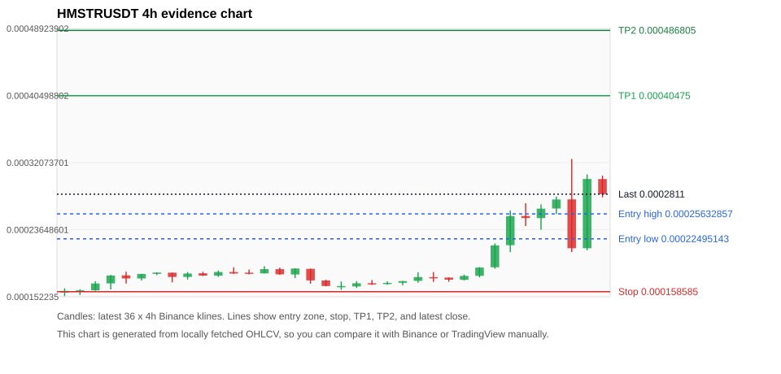
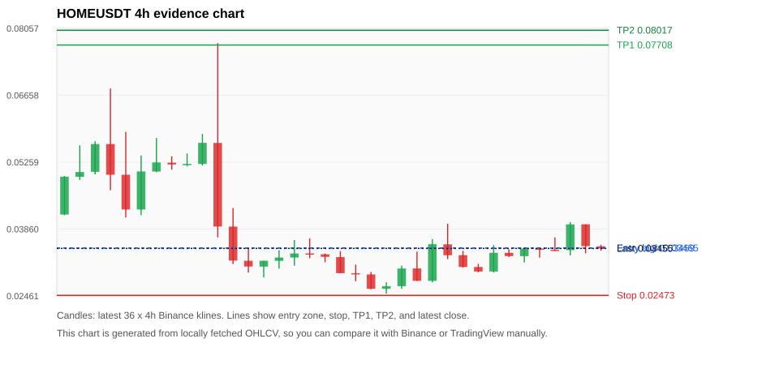
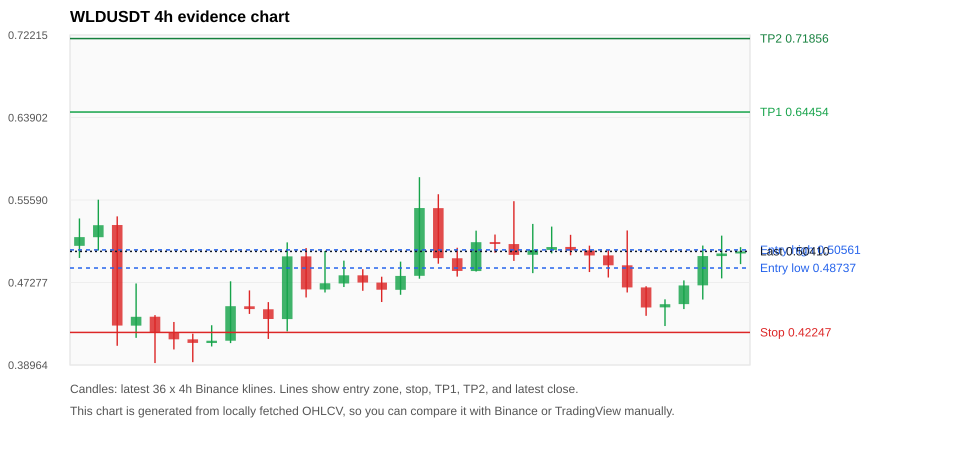
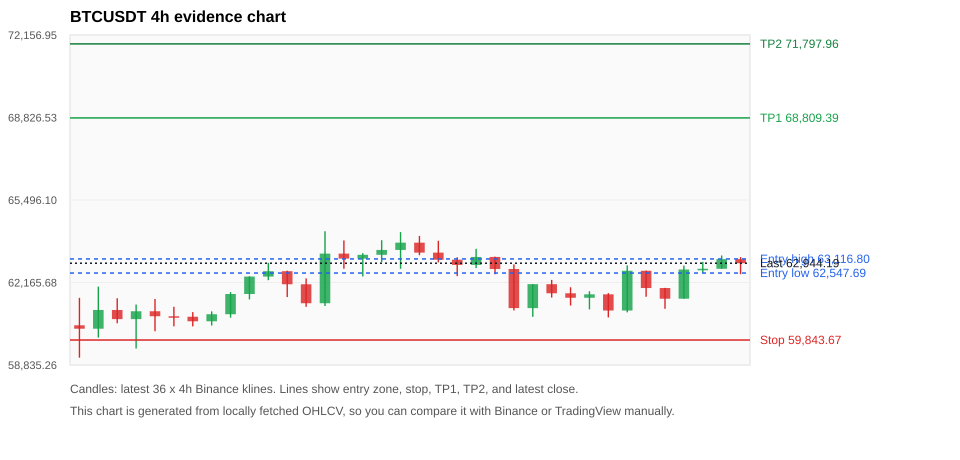
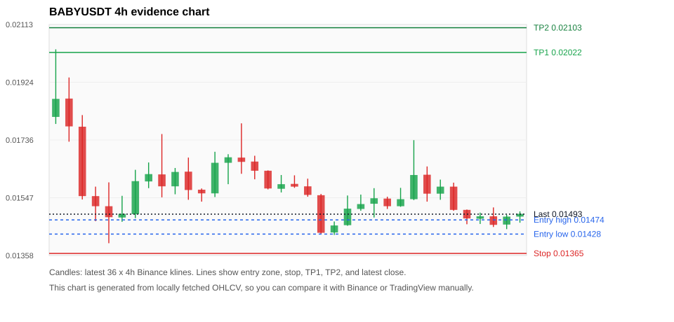

# Crypto 市场扫描报告 v2

- 报告时间：2026-06-11 20:47:27 CST
- 报告版本：v2
- 扫描 ID：d81f9cdeba05
- 数据源：Binance public spot API + CoinGecko/CoinMarketCap cross-check
- 过滤条件：USDT spot; 24h quote volume >= 30,000,000; trades >= 30,000; exclude stables/leveraged tokens; analyze 1h/4h/1d klines
- 默认单笔风险：账户权益的 1.00%

## 限制说明

- 交易信号仍以 Binance 现货公开 K 线为主源；外部数据源用于一致性复核。
- 结果是研究和模拟盘计划，不是确定收益或实盘下单指令。
- 历史长度过滤：候选币至少需要 180 根 1d K 线。
- 数据质量验证池：先验证 score 排名前 min(top_n * 2, 10) 的候选，再按 action + score 补足最终名单。
- 大盘环境过滤：RISK_OFF; BTC/ETH 大盘偏弱，山寨币买入候选降级为观察。 BTC 7d=-1.5117242450183532; ETH 7d=-6.736617403728317.
- 已启用数据交叉验证：Binance 主源 + CoinGecko 自动对照；CoinMarketCap 在配置 API Key 后自动对照。
- HMSTRUSDT 交叉验证状态 DATA_WARNING：At least one external provider needs manual review.
- HOMEUSDT 交叉验证状态 DATA_WARNING：At least one external provider needs manual review.
- WLDUSDT 交叉验证状态 DATA_WARNING：At least one external provider needs manual review.
- BTCUSDT 交叉验证状态 DATA_WARNING：At least one external provider needs manual review.
- BABYUSDT 交叉验证状态 DATA_WARNING：At least one external provider needs manual review.
- BNBUSDT 交叉验证状态 DATA_WARNING：At least one external provider needs manual review.
- SOLUSDT 交叉验证状态 DATA_WARNING：At least one external provider needs manual review.
- ETHUSDT 交叉验证状态 DATA_WARNING：At least one external provider needs manual review.
- DOGEUSDT 交叉验证状态 DATA_WARNING：At least one external provider needs manual review.
- ADAUSDT 交叉验证状态 DATA_WARNING：At least one external provider needs manual review.

## 5 个候选交易计划

| Rank | Coin | Action | Setup | Entry Zone | Stop Loss | TP1 | TP2 / Exit Rule | R/R | Verdict |
|---:|---|---|---|---:|---:|---:|---|---:|---|
| 1 | `HMSTR` | `WATCH_ONLY` | 涨幅较远，只等深回调 | 0.00022495143 - 0.00025632857 | 0.000158585 | 0.00040475 | 0.000486805 或跌破 4h 关键支撑 | 2.00-3.00 | 只等回调 |
| 2 | `HOME` | `WATCH_ONLY` | 回踩支撑/4h EMA 附近 | 0.03459 - 0.03465 | 0.02473 | 0.07708 | 0.08017 或跌破 4h 关键支撑 | 4.29-4.60 | 只观察 |
| 3 | `WLD` | `WATCH_ONLY` | 回踩支撑/4h EMA 附近 | 0.48737 - 0.50561 | 0.42247 | 0.64454 | 0.71856 或跌破 4h 关键支撑 | 2.00-3.00 | 只观察 |
| 4 | `BTC` | `WATCH_ONLY` | 回踩支撑/4h EMA 附近 | 62,547.69 - 63,116.80 | 59,843.67 | 68,809.39 | 71,797.96 或跌破 4h 关键支撑 | 2.00-3.00 | 只观察 |
| 5 | `BABY` | `REJECT` | 趋势中，等回调入场 | 0.01428 - 0.01474 | 0.01365 | 0.02022 | 0.02103 或跌破 4h 关键支撑 | 6.61-7.54 | 只观察 |

## 数据交叉验证摘要

价格差异以 Binance 当前价为基准；成交量口径不同，Binance 是 USDT 现货成交额，CoinGecko/CoinMarketCap 通常是全市场成交量。

| Rank | Coin | Data Status | Max Price Diff | Max 24h Diff | Message |
|---:|---|---|---:|---:|---|
| 1 | `HMSTR` | DATA_WARNING | 1.96% | 2.74 pts | At least one external provider needs manual review. |
| 2 | `HOME` | DATA_WARNING | 0.53% | 0.38 pts | At least one external provider needs manual review. |
| 3 | `WLD` | DATA_WARNING | 0.51% | 0.38 pts | At least one external provider needs manual review. |
| 4 | `BTC` | DATA_WARNING | 0.15% | 0.19 pts | At least one external provider needs manual review. |
| 5 | `BABY` | DATA_WARNING | 0.58% | 1.00 pts | At least one external provider needs manual review. |

## 候选币说明

### 1. HMSTR `HMSTRUSDT`



- 入选原因：涨幅较远，只等深回调；24h +28.52%，7d +82.06%，4h RSI 69.64，24h 成交额 $34.8M。
- 交易失效条件：跌破 0.000158585 或 4h 收盘重新失守关键支撑。
- 主要风险：距离支撑偏远，不能追市价；24h 振幅较大，回撤风险高；成交量突增，可能是事件驱动；BTC/ETH 大盘环境未确认强势，山寨币买入信号降级；数据交叉验证需要人工复核。
- 数据交叉验证：DATA_WARNING；At least one external provider needs manual review.

#### 可点击人工验证

- [Binance 交易页](https://www.binance.com/en/trade/HMSTR_USDT)
- [TradingView 图表](https://www.tradingview.com/chart/?symbol=BINANCE%3AHMSTRUSDT)
- [CoinGecko 搜索](https://www.coingecko.com/en/search?query=HMSTR)
- [CoinMarketCap 搜索](https://coinmarketcap.com/search/?q=HMSTR)

#### 多数据源对照

| Source | Status | Asset ID | Price | 24h Change | 24h Volume | Price Diff | 24h Diff | Updated | Message |
|---|---|---|---:|---:|---:|---:|---:|---|---|
| Binance | DATA_OK | HMSTRUSDT | 0.0002811 | +28.52% | $34.8M | 0.00% | 0.00 pts | 2026-06-11T12:46:34+00:00 | Primary market data source used by scanner. |
| CoinGecko | DATA_OK | hamster-kombat | 0.00028332 | +28.62% | $165.6M | 0.79% | 0.11 pts | 2026-06-11T12:46:26.504Z | External source agrees with Binance within thresholds. |
| CoinMarketCap | DATA_WARNING | 32195 | 0.00028662269 | +25.77% | $179.2M | 1.96% | 2.74 pts | 2026-06-11T12:45:04.000Z | price diff 1.96% exceeds warning threshold; CoinMarketCap symbol mapping has 2 matches; selected lowest cmc_rank |

#### 指标证据

| 指标 | 数值 | 人工核对用途 |
|---|---:|---|
| 当前价 | 0.0002811 | 与 Binance/TradingView 当前价格对照 |
| 24h 涨跌 | +28.52% | 与交易所 24h 涨跌对照 |
| 7d 涨跌 | +82.06% | 判断短线趋势是否延续 |
| 4h EMA20 | 0.00022201909 | 判断短期趋势支撑 |
| 4h EMA50 | 0.00019425507 | 判断中期趋势支撑 |
| 1d EMA20 | 0.00018483486 | 判断日线趋势 |
| 1d EMA50 | 0.00017107241 | 判断日线趋势 |
| 4h RSI14 | 69.64 | 判断是否过热/过弱 |
| 4h ATR14 | 3.3028571e-05 | 推导止损和入场缓冲 |
| 最近 18 根 4h 最低点 | 0.000161 | 支撑/止损参考 |
| 最近 36 根 4h 最高点 | 0.0003254 | TP/压力参考 |
| 支撑位 | 0.00022201909 | 入场区间推导基础 |

#### 交易计划推导

- 支撑位 = 最近低点、4h EMA20、4h EMA50、1d EMA20 中不高于当前价的最高有效支撑 = `0.00022201909`。
- 入场区间 = 支撑位附近 + ATR 缓冲 = `0.00022495143 - 0.00025632857`。
- 止损 = min(最近 18 根 4h 最低点 * 0.985, 入场中位价 - 1.15 * ATR14) = `0.000158585`。
- TP1 = max(最近 36 根 4h 最高点 * 0.995, 入场中位价 + 2R) = `0.00040475`。
- TP2 = max(入场中位价 + 3R, TP1 * 1.04) = `0.000486805`。

#### 最近 10 根 4h K线

| UTC 开盘时间 | Open | High | Low | Close | Quote Volume | Trades |
|---|---:|---:|---:|---:|---:|---:|
| 2026-06-10T00:00+00:00 | 0.0001735 | 0.00018 | 0.0001729 | 0.0001784 | $109,394 | 3214 |
| 2026-06-10T04:00+00:00 | 0.0001785 | 0.0001895 | 0.0001766 | 0.0001889 | $189,111 | 4801 |
| 2026-06-10T08:00+00:00 | 0.0001893 | 0.0002192 | 0.0001874 | 0.0002168 | $2.4M | 54644 |
| 2026-06-10T12:00+00:00 | 0.000217 | 0.0002607 | 0.0002083 | 0.0002536 | $7.0M | 172599 |
| 2026-06-10T16:00+00:00 | 0.0002537 | 0.0002697 | 0.000241 | 0.0002511 | $4.6M | 120258 |
| 2026-06-10T20:00+00:00 | 0.000251 | 0.0002682 | 0.0002365 | 0.0002629 | $2.6M | 73137 |
| 2026-06-11T00:00+00:00 | 0.0002631 | 0.0002781 | 0.000256 | 0.0002744 | $1.9M | 68615 |
| 2026-06-11T04:00+00:00 | 0.0002745 | 0.0003254 | 0.0002084 | 0.0002132 | $11.5M | 256402 |
| 2026-06-11T08:00+00:00 | 0.0002132 | 0.0003059 | 0.0002107 | 0.0003002 | $7.2M | 222278 |
| 2026-06-11T12:00+00:00 | 0.0003001 | 0.0003044 | 0.0002771 | 0.0002811 | $1.4M | 40972 |

### 2. HOME `HOMEUSDT`



- 入选原因：回踩支撑/4h EMA 附近；24h +2.61%，7d -7.37%，4h RSI 60.78，24h 成交额 $131.5M。
- 交易失效条件：跌破 0.02473335 或 4h 收盘重新失守关键支撑。
- 主要风险：24h 振幅较大，回撤风险高；BTC/ETH 大盘环境未确认强势，山寨币买入信号降级；7d 趋势未确认；数据交叉验证需要人工复核。
- 数据交叉验证：DATA_WARNING；At least one external provider needs manual review.

#### 可点击人工验证

- [Binance 交易页](https://www.binance.com/en/trade/HOME_USDT)
- [TradingView 图表](https://www.tradingview.com/chart/?symbol=BINANCE%3AHOMEUSDT)
- [CoinGecko 搜索](https://www.coingecko.com/en/search?query=HOME)
- [CoinMarketCap 搜索](https://coinmarketcap.com/search/?q=HOME)

#### 多数据源对照

| Source | Status | Asset ID | Price | 24h Change | 24h Volume | Price Diff | 24h Diff | Updated | Message |
|---|---|---|---:|---:|---:|---:|---:|---|---|
| Binance | DATA_OK | HOMEUSDT | 0.03455 | +2.61% | $131.5M | 0.00% | 0.00 pts | 2026-06-11T12:46:34+00:00 | Primary market data source used by scanner. |
| CoinGecko | DATA_OK | home | 0.03451 | +2.99% | $281.2M | 0.11% | 0.38 pts | 2026-06-11T12:46:29.989Z | External source agrees with Binance within thresholds. |
| CoinMarketCap | DATA_WARNING | 36133 | 0.03437 | +2.44% | $371.7M | 0.53% | 0.18 pts | 2026-06-11T12:45:04.000Z | CoinMarketCap symbol mapping has 5 matches; selected lowest cmc_rank |

#### 指标证据

| 指标 | 数值 | 人工核对用途 |
|---|---:|---|
| 当前价 | 0.03455 | 与 Binance/TradingView 当前价格对照 |
| 24h 涨跌 | +2.61% | 与交易所 24h 涨跌对照 |
| 7d 涨跌 | -7.37% | 判断短线趋势是否延续 |
| 4h EMA20 | 0.03452 | 判断短期趋势支撑 |
| 4h EMA50 | 0.03651 | 判断中期趋势支撑 |
| 1d EMA20 | 0.03441 | 判断日线趋势 |
| 1d EMA50 | 0.02793 | 判断日线趋势 |
| 4h RSI14 | 60.78 | 判断是否过热/过弱 |
| 4h ATR14 | 0.0044464286 | 推导止损和入场缓冲 |
| 最近 18 根 4h 最低点 | 0.02511 | 支撑/止损参考 |
| 最近 36 根 4h 最高点 | 0.07747 | TP/压力参考 |
| 支撑位 | 0.03452 | 入场区间推导基础 |

#### 交易计划推导

- 支撑位 = 最近低点、4h EMA20、4h EMA50、1d EMA20 中不高于当前价的最高有效支撑 = `0.03452`。
- 入场区间 = 支撑位附近 + ATR 缓冲 = `0.03459 - 0.03465`。
- 止损 = min(最近 18 根 4h 最低点 * 0.985, 入场中位价 - 1.15 * ATR14) = `0.02473`。
- TP1 = max(最近 36 根 4h 最高点 * 0.995, 入场中位价 + 2R) = `0.07708`。
- TP2 = max(入场中位价 + 3R, TP1 * 1.04) = `0.08017`。

#### 最近 10 根 4h K线

| UTC 开盘时间 | Open | High | Low | Close | Quote Volume | Trades |
|---|---:|---:|---:|---:|---:|---:|
| 2026-06-10T00:00+00:00 | 0.03315 | 0.03405 | 0.03057 | 0.03067 | $1.7M | 30067 |
| 2026-06-10T04:00+00:00 | 0.03067 | 0.03131 | 0.02955 | 0.02972 | $2.1M | 51656 |
| 2026-06-10T08:00+00:00 | 0.02972 | 0.03526 | 0.02950 | 0.03364 | $6.2M | 115329 |
| 2026-06-10T12:00+00:00 | 0.03363 | 0.03437 | 0.03276 | 0.03295 | $4.5M | 142443 |
| 2026-06-10T16:00+00:00 | 0.03294 | 0.03466 | 0.03161 | 0.03454 | $2.7M | 70454 |
| 2026-06-10T20:00+00:00 | 0.03454 | 0.03465 | 0.03262 | 0.03426 | $1.5M | 22055 |
| 2026-06-11T00:00+00:00 | 0.03426 | 0.03685 | 0.03403 | 0.03419 | $4.8M | 74483 |
| 2026-06-11T04:00+00:00 | 0.03419 | 0.04005 | 0.03309 | 0.03958 | $49.3M | 646238 |
| 2026-06-11T08:00+00:00 | 0.03959 | 0.03959 | 0.03352 | 0.03502 | $69.3M | 853393 |
| 2026-06-11T12:00+00:00 | 0.03500 | 0.03531 | 0.03407 | 0.03455 | $193,692 | 3798 |

### 3. WLD `WLDUSDT`



- 入选原因：回踩支撑/4h EMA 附近；24h -1.21%，7d +1.16%，4h RSI 46.63，24h 成交额 $116.9M。
- 交易失效条件：跌破 0.4224665 或 4h 收盘重新失守关键支撑。
- 主要风险：BTC/ETH 大盘环境未确认强势，山寨币买入信号降级；24h 动量未确认；数据交叉验证需要人工复核。
- 数据交叉验证：DATA_WARNING；At least one external provider needs manual review.

#### 可点击人工验证

- [Binance 交易页](https://www.binance.com/en/trade/WLD_USDT)
- [TradingView 图表](https://www.tradingview.com/chart/?symbol=BINANCE%3AWLDUSDT)
- [CoinGecko 搜索](https://www.coingecko.com/en/search?query=WLD)
- [CoinMarketCap 搜索](https://coinmarketcap.com/search/?q=WLD)

#### 多数据源对照

| Source | Status | Asset ID | Price | 24h Change | 24h Volume | Price Diff | 24h Diff | Updated | Message |
|---|---|---|---:|---:|---:|---:|---:|---|---|
| Binance | DATA_OK | WLDUSDT | 0.50410 | -1.21% | $116.9M | 0.00% | 0.00 pts | 2026-06-11T12:46:34+00:00 | Primary market data source used by scanner. |
| CoinGecko | DATA_OK | worldcoin-wld | 0.50150 | -1.59% | $831.3M | 0.51% | 0.38 pts | 2026-06-11T12:46:28.944Z | External source agrees with Binance within thresholds. |
| CoinMarketCap | DATA_WARNING | 13502 | 0.50284 | -1.52% | $753.2M | 0.25% | 0.31 pts | 2026-06-11T12:45:04.000Z | CoinMarketCap symbol mapping has 2 matches; selected lowest cmc_rank |

#### 指标证据

| 指标 | 数值 | 人工核对用途 |
|---|---:|---|
| 当前价 | 0.50410 | 与 Binance/TradingView 当前价格对照 |
| 24h 涨跌 | -1.21% | 与交易所 24h 涨跌对照 |
| 7d 涨跌 | +1.16% | 判断短线趋势是否延续 |
| 4h EMA20 | 0.48639 | 判断短期趋势支撑 |
| 4h EMA50 | 0.46968 | 判断中期趋势支撑 |
| 1d EMA20 | 0.42078 | 判断日线趋势 |
| 1d EMA50 | 0.35629 | 判断日线趋势 |
| 4h RSI14 | 46.63 | 判断是否过热/过弱 |
| 4h ATR14 | 0.03520 | 推导止损和入场缓冲 |
| 最近 18 根 4h 最低点 | 0.42890 | 支撑/止损参考 |
| 最近 36 根 4h 最高点 | 0.57890 | TP/压力参考 |
| 支撑位 | 0.48639 | 入场区间推导基础 |

#### 交易计划推导

- 支撑位 = 最近低点、4h EMA20、4h EMA50、1d EMA20 中不高于当前价的最高有效支撑 = `0.48639`。
- 入场区间 = 支撑位附近 + ATR 缓冲 = `0.48737 - 0.50561`。
- 止损 = min(最近 18 根 4h 最低点 * 0.985, 入场中位价 - 1.15 * ATR14) = `0.42247`。
- TP1 = max(最近 36 根 4h 最高点 * 0.995, 入场中位价 + 2R) = `0.64454`。
- TP2 = max(入场中位价 + 3R, TP1 * 1.04) = `0.71856`。

#### 最近 10 根 4h K线

| UTC 开盘时间 | Open | High | Low | Close | Quote Volume | Trades |
|---|---:|---:|---:|---:|---:|---:|
| 2026-06-10T00:00+00:00 | 0.50860 | 0.52080 | 0.50020 | 0.50520 | $11.0M | 99330 |
| 2026-06-10T04:00+00:00 | 0.50510 | 0.50990 | 0.48330 | 0.50000 | $14.7M | 144289 |
| 2026-06-10T08:00+00:00 | 0.50010 | 0.50560 | 0.47780 | 0.49010 | $9.6M | 95552 |
| 2026-06-10T12:00+00:00 | 0.49010 | 0.52520 | 0.46270 | 0.46780 | $29.0M | 264712 |
| 2026-06-10T16:00+00:00 | 0.46780 | 0.46900 | 0.43920 | 0.44760 | $20.3M | 177675 |
| 2026-06-10T20:00+00:00 | 0.44770 | 0.45580 | 0.42890 | 0.45090 | $12.8M | 116592 |
| 2026-06-11T00:00+00:00 | 0.45100 | 0.47490 | 0.44600 | 0.46980 | $8.2M | 100026 |
| 2026-06-11T04:00+00:00 | 0.46990 | 0.51000 | 0.45560 | 0.49940 | $18.8M | 177428 |
| 2026-06-11T08:00+00:00 | 0.49940 | 0.52000 | 0.47690 | 0.50200 | $23.8M | 209959 |
| 2026-06-11T12:00+00:00 | 0.50200 | 0.50840 | 0.49130 | 0.50410 | $8.4M | 57679 |

### 4. BTC `BTCUSDT`



- 入选原因：回踩支撑/4h EMA 附近；24h +2.02%，7d -2.00%，4h RSI 48.57，24h 成交额 $1.08B。
- 交易失效条件：跌破 59843.675 或 4h 收盘重新失守关键支撑。
- 主要风险：日线趋势未完全确认；BTC/ETH 大盘环境未确认强势，山寨币买入信号降级；7d 趋势未确认；数据交叉验证需要人工复核。
- 数据交叉验证：DATA_WARNING；At least one external provider needs manual review.

#### 可点击人工验证

- [Binance 交易页](https://www.binance.com/en/trade/BTC_USDT)
- [TradingView 图表](https://www.tradingview.com/chart/?symbol=BINANCE%3ABTCUSDT)
- [CoinGecko 搜索](https://www.coingecko.com/en/search?query=BTC)
- [CoinMarketCap 搜索](https://coinmarketcap.com/search/?q=BTC)

#### 多数据源对照

| Source | Status | Asset ID | Price | 24h Change | 24h Volume | Price Diff | 24h Diff | Updated | Message |
|---|---|---|---:|---:|---:|---:|---:|---|---|
| Binance | DATA_OK | BTCUSDT | 62,944.19 | +2.02% | $1.08B | 0.00% | 0.00 pts | 2026-06-11T12:46:34+00:00 | Primary market data source used by scanner. |
| CoinGecko | DATA_OK | bitcoin | 62,851.00 | +1.83% | $29.44B | 0.15% | 0.19 pts | 2026-06-11T12:46:37.751Z | External source agrees with Binance within thresholds. |
| CoinMarketCap | DATA_WARNING | 1 | 62,849.49 | +1.99% | $28.95B | 0.15% | 0.03 pts | 2026-06-11T12:45:04.000Z | CoinMarketCap symbol mapping has 13 matches; selected lowest cmc_rank |

#### 指标证据

| 指标 | 数值 | 人工核对用途 |
|---|---:|---|
| 当前价 | 62,944.19 | 与 Binance/TradingView 当前价格对照 |
| 24h 涨跌 | +2.02% | 与交易所 24h 涨跌对照 |
| 7d 涨跌 | -2.00% | 判断短线趋势是否延续 |
| 4h EMA20 | 62,422.85 | 判断短期趋势支撑 |
| 4h EMA50 | 63,777.81 | 判断中期趋势支撑 |
| 1d EMA20 | 67,474.76 | 判断日线趋势 |
| 1d EMA50 | 71,675.43 | 判断日线趋势 |
| 4h RSI14 | 48.57 | 判断是否过热/过弱 |
| 4h ATR14 | 991.36 | 推导止损和入场缓冲 |
| 最近 18 根 4h 最低点 | 60,755.00 | 支撑/止损参考 |
| 最近 36 根 4h 最高点 | 64,234.68 | TP/压力参考 |
| 支撑位 | 62,422.85 | 入场区间推导基础 |

#### 交易计划推导

- 支撑位 = 最近低点、4h EMA20、4h EMA50、1d EMA20 中不高于当前价的最高有效支撑 = `62,422.85`。
- 入场区间 = 支撑位附近 + ATR 缓冲 = `62,547.69 - 63,116.80`。
- 止损 = min(最近 18 根 4h 最低点 * 0.985, 入场中位价 - 1.15 * ATR14) = `59,843.67`。
- TP1 = max(最近 36 根 4h 最高点 * 0.995, 入场中位价 + 2R) = `68,809.39`。
- TP2 = max(入场中位价 + 3R, TP1 * 1.04) = `71,797.96`。

#### 最近 10 根 4h K线

| UTC 开盘时间 | Open | High | Low | Close | Quote Volume | Trades |
|---|---:|---:|---:|---:|---:|---:|
| 2026-06-10T00:00+00:00 | 61,730.00 | 61,974.70 | 61,235.29 | 61,549.64 | $106.0M | 592207 |
| 2026-06-10T04:00+00:00 | 61,549.64 | 61,813.34 | 61,080.00 | 61,687.56 | $136.5M | 480520 |
| 2026-06-10T08:00+00:00 | 61,687.56 | 61,736.00 | 60,755.00 | 61,034.04 | $172.2M | 735601 |
| 2026-06-10T12:00+00:00 | 61,034.04 | 62,857.99 | 60,960.00 | 62,639.23 | $296.4M | 1335269 |
| 2026-06-10T16:00+00:00 | 62,639.23 | 62,646.00 | 61,588.80 | 61,942.44 | $165.9M | 900048 |
| 2026-06-10T20:00+00:00 | 61,942.45 | 61,949.21 | 61,104.24 | 61,510.99 | $109.7M | 612041 |
| 2026-06-11T00:00+00:00 | 61,510.99 | 62,848.00 | 61,510.99 | 62,689.48 | $177.3M | 609797 |
| 2026-06-11T04:00+00:00 | 62,689.47 | 62,997.53 | 62,544.89 | 62,719.39 | $155.8M | 451403 |
| 2026-06-11T08:00+00:00 | 62,719.39 | 63,257.21 | 62,719.38 | 63,108.00 | $137.2M | 382423 |
| 2026-06-11T12:00+00:00 | 63,108.01 | 63,190.00 | 62,500.00 | 62,944.18 | $103.0M | 223629 |

### 5. BABY `BABYUSDT`



- 入选原因：趋势中，等回调入场；24h -5.60%，7d +12.68%，4h RSI 53.99，24h 成交额 $34.2M。
- 交易失效条件：跌破 0.013646179 或 4h 收盘重新失守关键支撑。
- 主要风险：日线趋势未完全确认；BTC/ETH 大盘环境未确认强势，山寨币买入信号降级；24h 动量未确认；数据交叉验证需要人工复核。
- 数据交叉验证：DATA_WARNING；At least one external provider needs manual review.

#### 可点击人工验证

- [Binance 交易页](https://www.binance.com/en/trade/BABY_USDT)
- [TradingView 图表](https://www.tradingview.com/chart/?symbol=BINANCE%3ABABYUSDT)
- [CoinGecko 搜索](https://www.coingecko.com/en/search?query=BABY)
- [CoinMarketCap 搜索](https://coinmarketcap.com/search/?q=BABY)

#### 多数据源对照

| Source | Status | Asset ID | Price | 24h Change | 24h Volume | Price Diff | 24h Diff | Updated | Message |
|---|---|---|---:|---:|---:|---:|---:|---|---|
| Binance | DATA_OK | BABYUSDT | 0.01493 | -5.60% | $34.2M | 0.00% | 0.00 pts | 2026-06-11T12:46:34+00:00 | Primary market data source used by scanner. |
| CoinGecko | DATA_WARNING | n/a | n/a | n/a | n/a | n/a | n/a | 2026-06-11T12:46:34+00:00 | Failed to fetch https://api.coingecko.com/api/v3/search?query=BABY: HTTP Error 429: Too Many Requests |
| CoinMarketCap | DATA_WARNING | 32198 | 0.01484 | -6.60% | $149.5M | 0.58% | 1.00 pts | 2026-06-11T12:46:04.000Z | CoinMarketCap symbol mapping has 10 matches; selected lowest cmc_rank |

#### 指标证据

| 指标 | 数值 | 人工核对用途 |
|---|---:|---|
| 当前价 | 0.01493 | 与 Binance/TradingView 当前价格对照 |
| 24h 涨跌 | -5.60% | 与交易所 24h 涨跌对照 |
| 7d 涨跌 | +12.68% | 判断短线趋势是否延续 |
| 4h EMA20 | 0.01524 | 判断短期趋势支撑 |
| 4h EMA50 | 0.01526 | 判断中期趋势支撑 |
| 1d EMA20 | 0.01542 | 判断日线趋势 |
| 1d EMA50 | 0.01566 | 判断日线趋势 |
| 4h RSI14 | 53.99 | 判断是否过热/过弱 |
| 4h ATR14 | 0.00075142857 | 推导止损和入场缓冲 |
| 最近 18 根 4h 最低点 | 0.01425 | 支撑/止损参考 |
| 最近 36 根 4h 最高点 | 0.02032 | TP/压力参考 |
| 支撑位 | 0.01425 | 入场区间推导基础 |

#### 交易计划推导

- 支撑位 = 最近低点、4h EMA20、4h EMA50、1d EMA20 中不高于当前价的最高有效支撑 = `0.01425`。
- 入场区间 = 支撑位附近 + ATR 缓冲 = `0.01428 - 0.01474`。
- 止损 = min(最近 18 根 4h 最低点 * 0.985, 入场中位价 - 1.15 * ATR14) = `0.01365`。
- TP1 = max(最近 36 根 4h 最高点 * 0.995, 入场中位价 + 2R) = `0.02022`。
- TP2 = max(入场中位价 + 3R, TP1 * 1.04) = `0.02103`。

#### 最近 10 根 4h K线

| UTC 开盘时间 | Open | High | Low | Close | Quote Volume | Trades |
|---|---:|---:|---:|---:|---:|---:|
| 2026-06-10T00:00+00:00 | 0.01519 | 0.01579 | 0.01517 | 0.01542 | $3.1M | 54928 |
| 2026-06-10T04:00+00:00 | 0.01542 | 0.01735 | 0.01539 | 0.01621 | $11.2M | 122730 |
| 2026-06-10T08:00+00:00 | 0.01622 | 0.01649 | 0.01534 | 0.01560 | $4.1M | 81691 |
| 2026-06-10T12:00+00:00 | 0.01560 | 0.01606 | 0.01540 | 0.01583 | $5.7M | 76040 |
| 2026-06-10T16:00+00:00 | 0.01583 | 0.01596 | 0.01504 | 0.01507 | $2.8M | 33071 |
| 2026-06-10T20:00+00:00 | 0.01507 | 0.01508 | 0.01460 | 0.01479 | $1.7M | 11244 |
| 2026-06-11T00:00+00:00 | 0.01478 | 0.01498 | 0.01461 | 0.01486 | $2.8M | 33642 |
| 2026-06-11T04:00+00:00 | 0.01486 | 0.01515 | 0.01451 | 0.01458 | $10.6M | 144432 |
| 2026-06-11T08:00+00:00 | 0.01459 | 0.01491 | 0.01444 | 0.01485 | $10.6M | 94099 |
| 2026-06-11T12:00+00:00 | 0.01485 | 0.01502 | 0.01465 | 0.01494 | $751,348 | 12359 |

## 组合风控

- 不要 5 个候选全部满仓买入。
- 同时持仓总风险建议控制在账户权益的 3% - 5% 以内。
- 如果 BTC/ETH 同时破位，暂停山寨币多头计划或降低仓位。
- 第一版报告用于模拟盘和人工复核，不自动下单。

## 原始数据

```json
[
  {
    "rank": 1,
    "symbol": "HMSTRUSDT",
    "base_asset": "HMSTR",
    "price": 0.0002811,
    "score": 52.30495054851629,
    "setup": "涨幅较远，只等深回调",
    "verdict": "只等回调",
    "entry_low": 0.00022495142857142857,
    "entry_high": 0.00025632857142857146,
    "stop_loss": 0.00015858500000000001,
    "take_profit_1": 0.00040475000000000005,
    "take_profit_2": 0.00048680500000000004,
    "risk_reward_1": 2.0,
    "risk_reward_2": 2.9999999999999996,
    "pct_24h": 28.519,
    "pct_3d": 65.2557319223986,
    "pct_7d": 82.05958549222797,
    "quote_volume_24h": 34832144.9851905,
    "trades_24h": 931983,
    "high_low_range_24h": 56.14203454894433,
    "rsi_1h": 54.36586329514026,
    "rsi_4h": 69.64033850493652,
    "ema20_4h": 0.0002220190869871694,
    "ema50_4h": 0.00019425506904972032,
    "ema20_1d": 0.00018483485731374025,
    "ema50_1d": 0.00017107241250282647,
    "atr_4h": 3.302857142857143e-05,
    "macd_hist_4h": 8.986425128288182e-06,
    "volume_ratio_24h": 14.54937999720028,
    "support_level": 0.0002220190869871694,
    "recent_low_4h_18": 0.000161,
    "recent_high_4h_36": 0.0003254,
    "distance_to_support_pct": 26.610735957239996,
    "binance_trade_url": "https://www.binance.com/en/trade/HMSTR_USDT",
    "tradingview_url": "https://www.tradingview.com/chart/?symbol=BINANCE%3AHMSTRUSDT",
    "coingecko_search_url": "https://www.coingecko.com/en/search?query=HMSTR",
    "coinmarketcap_search_url": "https://coinmarketcap.com/search/?q=HMSTR",
    "invalidation": "跌破 0.000158585 或 4h 收盘重新失守关键支撑",
    "recent_4h_klines": [
      {
        "open_time_utc": "2026-06-05T16:00+00:00",
        "open": 0.0001576,
        "high": 0.0001629,
        "low": 0.000153,
        "close": 0.0001596,
        "quote_volume": 425894.2545452,
        "trades": 10348
      },
      {
        "open_time_utc": "2026-06-05T20:00+00:00",
        "open": 0.0001601,
        "high": 0.0001616,
        "low": 0.0001544,
        "close": 0.0001603,
        "quote_volume": 226708.9699229,
        "trades": 4504
      },
      {
        "open_time_utc": "2026-06-06T00:00+00:00",
        "open": 0.0001603,
        "high": 0.0001718,
        "low": 0.0001598,
        "close": 0.0001689,
        "quote_volume": 394027.3151087,
        "trades": 9371
      },
      {
        "open_time_utc": "2026-06-06T04:00+00:00",
        "open": 0.000169,
        "high": 0.0001796,
        "low": 0.0001614,
        "close": 0.0001789,
        "quote_volume": 503858.24179,
        "trades": 11359
      },
      {
        "open_time_utc": "2026-06-06T08:00+00:00",
        "open": 0.0001791,
        "high": 0.0001837,
        "low": 0.0001688,
        "close": 0.0001752,
        "quote_volume": 477858.0167163,
        "trades": 8866
      },
      {
        "open_time_utc": "2026-06-06T12:00+00:00",
        "open": 0.0001752,
        "high": 0.000181,
        "low": 0.0001727,
        "close": 0.0001809,
        "quote_volume": 193393.0238678,
        "trades": 4383
      },
      {
        "open_time_utc": "2026-06-06T16:00+00:00",
        "open": 0.000181,
        "high": 0.0001828,
        "low": 0.0001795,
        "close": 0.0001826,
        "quote_volume": 201947.8529934,
        "trades": 3087
      },
      {
        "open_time_utc": "2026-06-06T20:00+00:00",
        "open": 0.0001825,
        "high": 0.0001825,
        "low": 0.0001703,
        "close": 0.0001771,
        "quote_volume": 245851.9137775,
        "trades": 4880
      },
      {
        "open_time_utc": "2026-06-07T00:00+00:00",
        "open": 0.0001771,
        "high": 0.0001832,
        "low": 0.0001739,
        "close": 0.0001814,
        "quote_volume": 134168.2548959,
        "trades": 3270
      },
      {
        "open_time_utc": "2026-06-07T04:00+00:00",
        "open": 0.0001817,
        "high": 0.0001836,
        "low": 0.0001784,
        "close": 0.0001788,
        "quote_volume": 80120.7542287,
        "trades": 1713
      },
      {
        "open_time_utc": "2026-06-07T08:00+00:00",
        "open": 0.0001788,
        "high": 0.0001852,
        "low": 0.0001772,
        "close": 0.0001833,
        "quote_volume": 98402.6201712,
        "trades": 2158
      },
      {
        "open_time_utc": "2026-06-07T12:00+00:00",
        "open": 0.0001833,
        "high": 0.0001892,
        "low": 0.0001811,
        "close": 0.0001814,
        "quote_volume": 220802.1424048,
        "trades": 4914
      },
      {
        "open_time_utc": "2026-06-07T16:00+00:00",
        "open": 0.0001825,
        "high": 0.0001864,
        "low": 0.0001804,
        "close": 0.0001819,
        "quote_volume": 145479.9604093,
        "trades": 3074
      },
      {
        "open_time_utc": "2026-06-07T20:00+00:00",
        "open": 0.0001816,
        "high": 0.0001906,
        "low": 0.0001815,
        "close": 0.0001869,
        "quote_volume": 100809.7348813,
        "trades": 2065
      },
      {
        "open_time_utc": "2026-06-08T00:00+00:00",
        "open": 0.0001869,
        "high": 0.0001889,
        "low": 0.0001799,
        "close": 0.0001804,
        "quote_volume": 149018.3787768,
        "trades": 3188
      },
      {
        "open_time_utc": "2026-06-08T04:00+00:00",
        "open": 0.0001802,
        "high": 0.000188,
        "low": 0.0001757,
        "close": 0.0001877,
        "quote_volume": 173224.5207518,
        "trades": 3556
      },
      {
        "open_time_utc": "2026-06-08T08:00+00:00",
        "open": 0.0001873,
        "high": 0.0001876,
        "low": 0.0001687,
        "close": 0.0001728,
        "quote_volume": 339659.0272831,
        "trades": 6744
      },
      {
        "open_time_utc": "2026-06-08T12:00+00:00",
        "open": 0.0001727,
        "high": 0.0001735,
        "low": 0.0001654,
        "close": 0.0001657,
        "quote_volume": 190473.7969296,
        "trades": 3520
      },
      {
        "open_time_utc": "2026-06-08T16:00+00:00",
        "open": 0.0001656,
        "high": 0.0001714,
        "low": 0.000161,
        "close": 0.0001657,
        "quote_volume": 209637.249474,
        "trades": 4297
      },
      {
        "open_time_utc": "2026-06-08T20:00+00:00",
        "open": 0.0001652,
        "high": 0.0001718,
        "low": 0.0001633,
        "close": 0.0001692,
        "quote_volume": 201651.013485,
        "trades": 3447
      },
      {
        "open_time_utc": "2026-06-09T00:00+00:00",
        "open": 0.0001692,
        "high": 0.0001733,
        "low": 0.000167,
        "close": 0.0001687,
        "quote_volume": 214158.2855067,
        "trades": 4395
      },
      {
        "open_time_utc": "2026-06-09T04:00+00:00",
        "open": 0.0001685,
        "high": 0.0001716,
        "low": 0.0001674,
        "close": 0.0001697,
        "quote_volume": 155537.2571654,
        "trades": 3715
      },
      {
        "open_time_utc": "2026-06-09T08:00+00:00",
        "open": 0.0001698,
        "high": 0.0001721,
        "low": 0.0001667,
        "close": 0.0001719,
        "quote_volume": 108133.8803449,
        "trades": 2762
      },
      {
        "open_time_utc": "2026-06-09T12:00+00:00",
        "open": 0.0001722,
        "high": 0.0001831,
        "low": 0.0001699,
        "close": 0.000177,
        "quote_volume": 514307.81342,
        "trades": 12861
      },
      {
        "open_time_utc": "2026-06-09T16:00+00:00",
        "open": 0.0001769,
        "high": 0.0001832,
        "low": 0.0001709,
        "close": 0.0001762,
        "quote_volume": 422186.4452242,
        "trades": 10986
      },
      {
        "open_time_utc": "2026-06-09T20:00+00:00",
        "open": 0.0001763,
        "high": 0.0001764,
        "low": 0.0001711,
        "close": 0.0001737,
        "quote_volume": 71191.8722728,
        "trades": 1883
      },
      {
        "open_time_utc": "2026-06-10T00:00+00:00",
        "open": 0.0001735,
        "high": 0.00018,
        "low": 0.0001729,
        "close": 0.0001784,
        "quote_volume": 109393.7130215,
        "trades": 3214
      },
      {
        "open_time_utc": "2026-06-10T04:00+00:00",
        "open": 0.0001785,
        "high": 0.0001895,
        "low": 0.0001766,
        "close": 0.0001889,
        "quote_volume": 189110.6870233,
        "trades": 4801
      },
      {
        "open_time_utc": "2026-06-10T08:00+00:00",
        "open": 0.0001893,
        "high": 0.0002192,
        "low": 0.0001874,
        "close": 0.0002168,
        "quote_volume": 2385844.5240953,
        "trades": 54644
      },
      {
        "open_time_utc": "2026-06-10T12:00+00:00",
        "open": 0.000217,
        "high": 0.0002607,
        "low": 0.0002083,
        "close": 0.0002536,
        "quote_volume": 6961433.7913587,
        "trades": 172599
      },
      {
        "open_time_utc": "2026-06-10T16:00+00:00",
        "open": 0.0002537,
        "high": 0.0002697,
        "low": 0.000241,
        "close": 0.0002511,
        "quote_volume": 4555450.038822,
        "trades": 120258
      },
      {
        "open_time_utc": "2026-06-10T20:00+00:00",
        "open": 0.000251,
        "high": 0.0002682,
        "low": 0.0002365,
        "close": 0.0002629,
        "quote_volume": 2551027.13367,
        "trades": 73137
      },
      {
        "open_time_utc": "2026-06-11T00:00+00:00",
        "open": 0.0002631,
        "high": 0.0002781,
        "low": 0.000256,
        "close": 0.0002744,
        "quote_volume": 1937066.2461468,
        "trades": 68615
      },
      {
        "open_time_utc": "2026-06-11T04:00+00:00",
        "open": 0.0002745,
        "high": 0.0003254,
        "low": 0.0002084,
        "close": 0.0002132,
        "quote_volume": 11523315.528599,
        "trades": 256402
      },
      {
        "open_time_utc": "2026-06-11T08:00+00:00",
        "open": 0.0002132,
        "high": 0.0003059,
        "low": 0.0002107,
        "close": 0.0003002,
        "quote_volume": 7234378.669425,
        "trades": 222278
      },
      {
        "open_time_utc": "2026-06-11T12:00+00:00",
        "open": 0.0003001,
        "high": 0.0003044,
        "low": 0.0002771,
        "close": 0.0002811,
        "quote_volume": 1364722.3565248,
        "trades": 40972
      }
    ],
    "risks": [
      "距离支撑偏远，不能追市价",
      "24h 振幅较大，回撤风险高",
      "成交量突增，可能是事件驱动",
      "BTC/ETH 大盘环境未确认强势，山寨币买入信号降级",
      "数据交叉验证需要人工复核"
    ],
    "data_quality_status": "DATA_WARNING",
    "data_quality_message": "At least one external provider needs manual review.",
    "data_checks": [
      {
        "provider": "Binance",
        "status": "DATA_OK",
        "provider_asset_id": "HMSTRUSDT",
        "provider_symbol": "HMSTRUSDT",
        "price_usd": 0.0002811,
        "pct_24h": 28.519,
        "volume_24h": 34832144.9851905,
        "last_updated": null,
        "fetched_at_utc": "2026-06-11T12:46:34+00:00",
        "price_diff_pct": 0.0,
        "pct_24h_diff": 0.0,
        "volume_note": "Binance USDT spot 24h quoteVolume.",
        "message": "Primary market data source used by scanner."
      },
      {
        "provider": "CoinGecko",
        "status": "DATA_OK",
        "provider_asset_id": "hamster-kombat",
        "provider_symbol": "HMSTR",
        "price_usd": 0.00028332,
        "pct_24h": 28.62459,
        "volume_24h": 165579513.0,
        "last_updated": "2026-06-11T12:46:26.504Z",
        "fetched_at_utc": "2026-06-11T12:46:34+00:00",
        "price_diff_pct": 0.7897545357523973,
        "pct_24h_diff": 0.10559000000000296,
        "volume_note": "CoinGecko total market volume; not the same venue scope as Binance quoteVolume.",
        "message": "External source agrees with Binance within thresholds."
      },
      {
        "provider": "CoinMarketCap",
        "status": "DATA_WARNING",
        "provider_asset_id": "32195",
        "provider_symbol": "HMSTR",
        "price_usd": 0.000286622691185135,
        "pct_24h": 25.77413069,
        "volume_24h": 179163395.1817986,
        "last_updated": "2026-06-11T12:45:04.000Z",
        "fetched_at_utc": "2026-06-11T12:46:34+00:00",
        "price_diff_pct": 1.9646713572162924,
        "pct_24h_diff": 2.7448693099999986,
        "volume_note": "CoinMarketCap total market volume; not the same venue scope as Binance quoteVolume.",
        "message": "price diff 1.96% exceeds warning threshold; CoinMarketCap symbol mapping has 2 matches; selected lowest cmc_rank"
      }
    ],
    "action": "WATCH_ONLY"
  },
  {
    "rank": 2,
    "symbol": "HOMEUSDT",
    "base_asset": "HOME",
    "price": 0.03455,
    "score": 34.79353947259722,
    "setup": "回踩支撑/4h EMA 附近",
    "verdict": "只观察",
    "entry_low": 0.03459306060373209,
    "entry_high": 0.034653649999999994,
    "stop_loss": 0.02473335,
    "take_profit_1": 0.07708265,
    "take_profit_2": 0.08016595600000001,
    "risk_reward_1": 4.2931518641474105,
    "risk_reward_2": 4.60491165657323,
    "pct_24h": 2.612,
    "pct_3d": 6.177012907191148,
    "pct_7d": -7.372654155495983,
    "quote_volume_24h": 131534038.46599,
    "trades_24h": 1796671,
    "high_low_range_24h": 26.700411262258793,
    "rsi_1h": 54.70629865534323,
    "rsi_4h": 60.77574433214968,
    "ema20_4h": 0.03452401257857494,
    "ema50_4h": 0.03651224795640711,
    "ema20_1d": 0.03441101741926827,
    "ema50_1d": 0.0279298034730444,
    "atr_4h": 0.004446428571428571,
    "macd_hist_4h": 0.0009998315682380016,
    "volume_ratio_24h": 2.9097527810096286,
    "support_level": 0.03452401257857494,
    "recent_low_4h_18": 0.02511,
    "recent_high_4h_36": 0.07747,
    "distance_to_support_pct": 0.07527346760725084,
    "binance_trade_url": "https://www.binance.com/en/trade/HOME_USDT",
    "tradingview_url": "https://www.tradingview.com/chart/?symbol=BINANCE%3AHOMEUSDT",
    "coingecko_search_url": "https://www.coingecko.com/en/search?query=HOME",
    "coinmarketcap_search_url": "https://coinmarketcap.com/search/?q=HOME",
    "invalidation": "跌破 0.02473335 或 4h 收盘重新失守关键支撑",
    "recent_4h_klines": [
      {
        "open_time_utc": "2026-06-05T16:00+00:00",
        "open": 0.04164,
        "high": 0.0497,
        "low": 0.0415,
        "close": 0.04956,
        "quote_volume": 3950233.98932,
        "trades": 64071
      },
      {
        "open_time_utc": "2026-06-05T20:00+00:00",
        "open": 0.04953,
        "high": 0.05612,
        "low": 0.04887,
        "close": 0.05053,
        "quote_volume": 2964378.05321,
        "trades": 69456
      },
      {
        "open_time_utc": "2026-06-06T00:00+00:00",
        "open": 0.05057,
        "high": 0.057,
        "low": 0.05002,
        "close": 0.05638,
        "quote_volume": 1811466.38302,
        "trades": 104749
      },
      {
        "open_time_utc": "2026-06-06T04:00+00:00",
        "open": 0.05638,
        "high": 0.068,
        "low": 0.04671,
        "close": 0.04996,
        "quote_volume": 14854402.62987,
        "trades": 371332
      },
      {
        "open_time_utc": "2026-06-06T08:00+00:00",
        "open": 0.04996,
        "high": 0.05893,
        "low": 0.04102,
        "close": 0.04269,
        "quote_volume": 48591727.57191,
        "trades": 789729
      },
      {
        "open_time_utc": "2026-06-06T12:00+00:00",
        "open": 0.04269,
        "high": 0.05399,
        "low": 0.04151,
        "close": 0.05065,
        "quote_volume": 6115219.5435,
        "trades": 241355
      },
      {
        "open_time_utc": "2026-06-06T16:00+00:00",
        "open": 0.05063,
        "high": 0.05765,
        "low": 0.0505,
        "close": 0.05253,
        "quote_volume": 4446913.9165,
        "trades": 156501
      },
      {
        "open_time_utc": "2026-06-06T20:00+00:00",
        "open": 0.05248,
        "high": 0.0538,
        "low": 0.05102,
        "close": 0.05211,
        "quote_volume": 1837179.042,
        "trades": 131050
      },
      {
        "open_time_utc": "2026-06-07T00:00+00:00",
        "open": 0.05213,
        "high": 0.05441,
        "low": 0.05175,
        "close": 0.05222,
        "quote_volume": 2113407.86855,
        "trades": 123807
      },
      {
        "open_time_utc": "2026-06-07T04:00+00:00",
        "open": 0.05221,
        "high": 0.0585,
        "low": 0.05189,
        "close": 0.05663,
        "quote_volume": 4989617.34121,
        "trades": 118104
      },
      {
        "open_time_utc": "2026-06-07T08:00+00:00",
        "open": 0.05661,
        "high": 0.07747,
        "low": 0.03685,
        "close": 0.03913,
        "quote_volume": 12504325.68838,
        "trades": 283901
      },
      {
        "open_time_utc": "2026-06-07T12:00+00:00",
        "open": 0.03912,
        "high": 0.043,
        "low": 0.03128,
        "close": 0.03201,
        "quote_volume": 6752518.28003,
        "trades": 169701
      },
      {
        "open_time_utc": "2026-06-07T16:00+00:00",
        "open": 0.03197,
        "high": 0.03472,
        "low": 0.02949,
        "close": 0.03077,
        "quote_volume": 4701307.95486,
        "trades": 121209
      },
      {
        "open_time_utc": "2026-06-07T20:00+00:00",
        "open": 0.03075,
        "high": 0.03197,
        "low": 0.02851,
        "close": 0.03197,
        "quote_volume": 2700532.72318,
        "trades": 42279
      },
      {
        "open_time_utc": "2026-06-08T00:00+00:00",
        "open": 0.03195,
        "high": 0.03416,
        "low": 0.03034,
        "close": 0.03265,
        "quote_volume": 2813294.4225,
        "trades": 47833
      },
      {
        "open_time_utc": "2026-06-08T04:00+00:00",
        "open": 0.03265,
        "high": 0.0363,
        "low": 0.03094,
        "close": 0.0335,
        "quote_volume": 22637691.34626,
        "trades": 645806
      },
      {
        "open_time_utc": "2026-06-08T08:00+00:00",
        "open": 0.03351,
        "high": 0.03667,
        "low": 0.0325,
        "close": 0.03334,
        "quote_volume": 46263555.15057,
        "trades": 496734
      },
      {
        "open_time_utc": "2026-06-08T12:00+00:00",
        "open": 0.03333,
        "high": 0.03349,
        "low": 0.03166,
        "close": 0.0328,
        "quote_volume": 2285004.19895,
        "trades": 136707
      },
      {
        "open_time_utc": "2026-06-08T16:00+00:00",
        "open": 0.03274,
        "high": 0.034,
        "low": 0.02936,
        "close": 0.02937,
        "quote_volume": 2246302.74471,
        "trades": 111882
      },
      {
        "open_time_utc": "2026-06-08T20:00+00:00",
        "open": 0.02937,
        "high": 0.03117,
        "low": 0.0277,
        "close": 0.02912,
        "quote_volume": 1792475.30727,
        "trades": 36727
      },
      {
        "open_time_utc": "2026-06-09T00:00+00:00",
        "open": 0.02911,
        "high": 0.02963,
        "low": 0.026,
        "close": 0.02611,
        "quote_volume": 1180493.86655,
        "trades": 37030
      },
      {
        "open_time_utc": "2026-06-09T04:00+00:00",
        "open": 0.0261,
        "high": 0.02748,
        "low": 0.02511,
        "close": 0.02666,
        "quote_volume": 1456011.15936,
        "trades": 80652
      },
      {
        "open_time_utc": "2026-06-09T08:00+00:00",
        "open": 0.02666,
        "high": 0.03097,
        "low": 0.02611,
        "close": 0.03035,
        "quote_volume": 2766782.09861,
        "trades": 122303
      },
      {
        "open_time_utc": "2026-06-09T12:00+00:00",
        "open": 0.03036,
        "high": 0.0339,
        "low": 0.02775,
        "close": 0.02778,
        "quote_volume": 5841051.44488,
        "trades": 186258
      },
      {
        "open_time_utc": "2026-06-09T16:00+00:00",
        "open": 0.02777,
        "high": 0.0365,
        "low": 0.02746,
        "close": 0.03544,
        "quote_volume": 3680541.21311,
        "trades": 82577
      },
      {
        "open_time_utc": "2026-06-09T20:00+00:00",
        "open": 0.03541,
        "high": 0.03972,
        "low": 0.0323,
        "close": 0.03313,
        "quote_volume": 5033165.72378,
        "trades": 106124
      },
      {
        "open_time_utc": "2026-06-10T00:00+00:00",
        "open": 0.03315,
        "high": 0.03405,
        "low": 0.03057,
        "close": 0.03067,
        "quote_volume": 1691260.64133,
        "trades": 30067
      },
      {
        "open_time_utc": "2026-06-10T04:00+00:00",
        "open": 0.03067,
        "high": 0.03131,
        "low": 0.02955,
        "close": 0.02972,
        "quote_volume": 2108742.34143,
        "trades": 51656
      },
      {
        "open_time_utc": "2026-06-10T08:00+00:00",
        "open": 0.02972,
        "high": 0.03526,
        "low": 0.0295,
        "close": 0.03364,
        "quote_volume": 6235655.53407,
        "trades": 115329
      },
      {
        "open_time_utc": "2026-06-10T12:00+00:00",
        "open": 0.03363,
        "high": 0.03437,
        "low": 0.03276,
        "close": 0.03295,
        "quote_volume": 4484396.77027,
        "trades": 142443
      },
      {
        "open_time_utc": "2026-06-10T16:00+00:00",
        "open": 0.03294,
        "high": 0.03466,
        "low": 0.03161,
        "close": 0.03454,
        "quote_volume": 2691939.8798,
        "trades": 70454
      },
      {
        "open_time_utc": "2026-06-10T20:00+00:00",
        "open": 0.03454,
        "high": 0.03465,
        "low": 0.03262,
        "close": 0.03426,
        "quote_volume": 1511045.76837,
        "trades": 22055
      },
      {
        "open_time_utc": "2026-06-11T00:00+00:00",
        "open": 0.03426,
        "high": 0.03685,
        "low": 0.03403,
        "close": 0.03419,
        "quote_volume": 4763914.76346,
        "trades": 74483
      },
      {
        "open_time_utc": "2026-06-11T04:00+00:00",
        "open": 0.03419,
        "high": 0.04005,
        "low": 0.03309,
        "close": 0.03958,
        "quote_volume": 49276921.43716,
        "trades": 646238
      },
      {
        "open_time_utc": "2026-06-11T08:00+00:00",
        "open": 0.03959,
        "high": 0.03959,
        "low": 0.03352,
        "close": 0.03502,
        "quote_volume": 69323371.42868,
        "trades": 853393
      },
      {
        "open_time_utc": "2026-06-11T12:00+00:00",
        "open": 0.035,
        "high": 0.03531,
        "low": 0.03407,
        "close": 0.03455,
        "quote_volume": 193691.93724,
        "trades": 3798
      }
    ],
    "risks": [
      "24h 振幅较大，回撤风险高",
      "BTC/ETH 大盘环境未确认强势，山寨币买入信号降级",
      "7d 趋势未确认",
      "数据交叉验证需要人工复核"
    ],
    "data_quality_status": "DATA_WARNING",
    "data_quality_message": "At least one external provider needs manual review.",
    "data_checks": [
      {
        "provider": "Binance",
        "status": "DATA_OK",
        "provider_asset_id": "HOMEUSDT",
        "provider_symbol": "HOMEUSDT",
        "price_usd": 0.03455,
        "pct_24h": 2.612,
        "volume_24h": 131534038.46599,
        "last_updated": null,
        "fetched_at_utc": "2026-06-11T12:46:34+00:00",
        "price_diff_pct": 0.0,
        "pct_24h_diff": 0.0,
        "volume_note": "Binance USDT spot 24h quoteVolume.",
        "message": "Primary market data source used by scanner."
      },
      {
        "provider": "CoinGecko",
        "status": "DATA_OK",
        "provider_asset_id": "home",
        "provider_symbol": "HOME",
        "price_usd": 0.03451257,
        "pct_24h": 2.99127,
        "volume_24h": 281175315.0,
        "last_updated": "2026-06-11T12:46:29.989Z",
        "fetched_at_utc": "2026-06-11T12:46:34+00:00",
        "price_diff_pct": 0.10833574529666577,
        "pct_24h_diff": 0.37927,
        "volume_note": "CoinGecko total market volume; not the same venue scope as Binance quoteVolume.",
        "message": "External source agrees with Binance within thresholds."
      },
      {
        "provider": "CoinMarketCap",
        "status": "DATA_WARNING",
        "provider_asset_id": "36133",
        "provider_symbol": "HOME",
        "price_usd": 0.03436594381556574,
        "pct_24h": 2.43655003,
        "volume_24h": 371672391.9865402,
        "last_updated": "2026-06-11T12:45:04.000Z",
        "fetched_at_utc": "2026-06-11T12:46:34+00:00",
        "price_diff_pct": 0.5327241228198393,
        "pct_24h_diff": 0.1754499700000003,
        "volume_note": "CoinMarketCap total market volume; not the same venue scope as Binance quoteVolume.",
        "message": "CoinMarketCap symbol mapping has 5 matches; selected lowest cmc_rank"
      }
    ],
    "action": "WATCH_ONLY"
  },
  {
    "rank": 3,
    "symbol": "WLDUSDT",
    "base_asset": "WLD",
    "price": 0.5041,
    "score": 33.4176189705728,
    "setup": "回踩支撑/4h EMA 附近",
    "verdict": "只观察",
    "entry_low": 0.48736647041158176,
    "entry_high": 0.5056122999999999,
    "stop_loss": 0.4224665,
    "take_profit_1": 0.6445351556173724,
    "take_profit_2": 0.7185580408231633,
    "risk_reward_1": 1.9999999999999993,
    "risk_reward_2": 3.000000000000001,
    "pct_24h": -1.211,
    "pct_3d": 4.650197218185581,
    "pct_7d": 1.1639574553481857,
    "quote_volume_24h": 116899669.10935,
    "trades_24h": 1065535,
    "high_low_range_24h": 22.452786197248777,
    "rsi_1h": 80.50541516245484,
    "rsi_4h": 46.63287472845764,
    "ema20_4h": 0.4863936830454908,
    "ema50_4h": 0.4696829216057077,
    "ema20_1d": 0.4207785640711025,
    "ema50_1d": 0.35628794552335835,
    "atr_4h": 0.0352,
    "macd_hist_4h": -0.00013662400069565112,
    "volume_ratio_24h": 0.7983568299145841,
    "support_level": 0.4863936830454908,
    "recent_low_4h_18": 0.4289,
    "recent_high_4h_36": 0.5789,
    "distance_to_support_pct": 3.6403262566329753,
    "binance_trade_url": "https://www.binance.com/en/trade/WLD_USDT",
    "tradingview_url": "https://www.tradingview.com/chart/?symbol=BINANCE%3AWLDUSDT",
    "coingecko_search_url": "https://www.coingecko.com/en/search?query=WLD",
    "coinmarketcap_search_url": "https://coinmarketcap.com/search/?q=WLD",
    "invalidation": "跌破 0.4224665 或 4h 收盘重新失守关键支撑",
    "recent_4h_klines": [
      {
        "open_time_utc": "2026-06-05T16:00+00:00",
        "open": 0.5097,
        "high": 0.5373,
        "low": 0.4975,
        "close": 0.5185,
        "quote_volume": 27893283.28122,
        "trades": 266244
      },
      {
        "open_time_utc": "2026-06-05T20:00+00:00",
        "open": 0.5184,
        "high": 0.5562,
        "low": 0.505,
        "close": 0.5305,
        "quote_volume": 19764048.06152,
        "trades": 197508
      },
      {
        "open_time_utc": "2026-06-06T00:00+00:00",
        "open": 0.5307,
        "high": 0.5394,
        "low": 0.409,
        "close": 0.4294,
        "quote_volume": 54137609.73761,
        "trades": 481199
      },
      {
        "open_time_utc": "2026-06-06T04:00+00:00",
        "open": 0.4293,
        "high": 0.4718,
        "low": 0.417,
        "close": 0.4382,
        "quote_volume": 30221854.33517,
        "trades": 319492
      },
      {
        "open_time_utc": "2026-06-06T08:00+00:00",
        "open": 0.4383,
        "high": 0.4399,
        "low": 0.3916,
        "close": 0.4228,
        "quote_volume": 25512025.98241,
        "trades": 281220
      },
      {
        "open_time_utc": "2026-06-06T12:00+00:00",
        "open": 0.4227,
        "high": 0.433,
        "low": 0.4053,
        "close": 0.4155,
        "quote_volume": 15487869.13778,
        "trades": 170837
      },
      {
        "open_time_utc": "2026-06-06T16:00+00:00",
        "open": 0.4155,
        "high": 0.4212,
        "low": 0.3925,
        "close": 0.4119,
        "quote_volume": 16530292.61331,
        "trades": 143193
      },
      {
        "open_time_utc": "2026-06-06T20:00+00:00",
        "open": 0.4118,
        "high": 0.4297,
        "low": 0.4083,
        "close": 0.4141,
        "quote_volume": 9951553.51949,
        "trades": 92386
      },
      {
        "open_time_utc": "2026-06-07T00:00+00:00",
        "open": 0.4141,
        "high": 0.474,
        "low": 0.4117,
        "close": 0.4489,
        "quote_volume": 20850473.56378,
        "trades": 246571
      },
      {
        "open_time_utc": "2026-06-07T04:00+00:00",
        "open": 0.4488,
        "high": 0.4648,
        "low": 0.4411,
        "close": 0.446,
        "quote_volume": 13033714.37899,
        "trades": 147619
      },
      {
        "open_time_utc": "2026-06-07T08:00+00:00",
        "open": 0.4458,
        "high": 0.453,
        "low": 0.4159,
        "close": 0.436,
        "quote_volume": 14111874.36946,
        "trades": 164886
      },
      {
        "open_time_utc": "2026-06-07T12:00+00:00",
        "open": 0.4359,
        "high": 0.5132,
        "low": 0.4235,
        "close": 0.4991,
        "quote_volume": 28845892.30649,
        "trades": 322500
      },
      {
        "open_time_utc": "2026-06-07T16:00+00:00",
        "open": 0.4991,
        "high": 0.5075,
        "low": 0.4577,
        "close": 0.4658,
        "quote_volume": 20772923.87824,
        "trades": 210908
      },
      {
        "open_time_utc": "2026-06-07T20:00+00:00",
        "open": 0.4657,
        "high": 0.5045,
        "low": 0.4627,
        "close": 0.472,
        "quote_volume": 12777293.88496,
        "trades": 133226
      },
      {
        "open_time_utc": "2026-06-08T00:00+00:00",
        "open": 0.4718,
        "high": 0.4948,
        "low": 0.4682,
        "close": 0.48,
        "quote_volume": 12359114.0202,
        "trades": 131011
      },
      {
        "open_time_utc": "2026-06-08T04:00+00:00",
        "open": 0.48,
        "high": 0.4862,
        "low": 0.4644,
        "close": 0.4727,
        "quote_volume": 9691098.08768,
        "trades": 119596
      },
      {
        "open_time_utc": "2026-06-08T08:00+00:00",
        "open": 0.4727,
        "high": 0.4786,
        "low": 0.4531,
        "close": 0.4655,
        "quote_volume": 14168979.0814,
        "trades": 157951
      },
      {
        "open_time_utc": "2026-06-08T12:00+00:00",
        "open": 0.4654,
        "high": 0.4938,
        "low": 0.4604,
        "close": 0.4794,
        "quote_volume": 13844364.51488,
        "trades": 168579
      },
      {
        "open_time_utc": "2026-06-08T16:00+00:00",
        "open": 0.4795,
        "high": 0.5789,
        "low": 0.4766,
        "close": 0.5478,
        "quote_volume": 35922626.84267,
        "trades": 446600
      },
      {
        "open_time_utc": "2026-06-08T20:00+00:00",
        "open": 0.5477,
        "high": 0.5617,
        "low": 0.4917,
        "close": 0.4973,
        "quote_volume": 21236878.09446,
        "trades": 225556
      },
      {
        "open_time_utc": "2026-06-09T00:00+00:00",
        "open": 0.4972,
        "high": 0.5078,
        "low": 0.4787,
        "close": 0.4844,
        "quote_volume": 11894901.41798,
        "trades": 118857
      },
      {
        "open_time_utc": "2026-06-09T04:00+00:00",
        "open": 0.4843,
        "high": 0.525,
        "low": 0.4838,
        "close": 0.5134,
        "quote_volume": 16513274.19074,
        "trades": 189953
      },
      {
        "open_time_utc": "2026-06-09T08:00+00:00",
        "open": 0.5135,
        "high": 0.5211,
        "low": 0.5028,
        "close": 0.5116,
        "quote_volume": 13466225.79521,
        "trades": 129219
      },
      {
        "open_time_utc": "2026-06-09T12:00+00:00",
        "open": 0.5115,
        "high": 0.5547,
        "low": 0.4945,
        "close": 0.5006,
        "quote_volume": 32095339.61055,
        "trades": 312674
      },
      {
        "open_time_utc": "2026-06-09T16:00+00:00",
        "open": 0.5007,
        "high": 0.5318,
        "low": 0.4822,
        "close": 0.5056,
        "quote_volume": 19549717.9563,
        "trades": 206463
      },
      {
        "open_time_utc": "2026-06-09T20:00+00:00",
        "open": 0.5056,
        "high": 0.5291,
        "low": 0.5021,
        "close": 0.5085,
        "quote_volume": 11972914.11072,
        "trades": 122656
      },
      {
        "open_time_utc": "2026-06-10T00:00+00:00",
        "open": 0.5086,
        "high": 0.5208,
        "low": 0.5002,
        "close": 0.5052,
        "quote_volume": 10952357.50773,
        "trades": 99330
      },
      {
        "open_time_utc": "2026-06-10T04:00+00:00",
        "open": 0.5051,
        "high": 0.5099,
        "low": 0.4833,
        "close": 0.5,
        "quote_volume": 14714442.85453,
        "trades": 144289
      },
      {
        "open_time_utc": "2026-06-10T08:00+00:00",
        "open": 0.5001,
        "high": 0.5056,
        "low": 0.4778,
        "close": 0.4901,
        "quote_volume": 9554726.62643,
        "trades": 95552
      },
      {
        "open_time_utc": "2026-06-10T12:00+00:00",
        "open": 0.4901,
        "high": 0.5252,
        "low": 0.4627,
        "close": 0.4678,
        "quote_volume": 28979345.69373,
        "trades": 264712
      },
      {
        "open_time_utc": "2026-06-10T16:00+00:00",
        "open": 0.4678,
        "high": 0.469,
        "low": 0.4392,
        "close": 0.4476,
        "quote_volume": 20294622.01901,
        "trades": 177675
      },
      {
        "open_time_utc": "2026-06-10T20:00+00:00",
        "open": 0.4477,
        "high": 0.4558,
        "low": 0.4289,
        "close": 0.4509,
        "quote_volume": 12848071.93153,
        "trades": 116592
      },
      {
        "open_time_utc": "2026-06-11T00:00+00:00",
        "open": 0.451,
        "high": 0.4749,
        "low": 0.446,
        "close": 0.4698,
        "quote_volume": 8198883.5465,
        "trades": 100026
      },
      {
        "open_time_utc": "2026-06-11T04:00+00:00",
        "open": 0.4699,
        "high": 0.51,
        "low": 0.4556,
        "close": 0.4994,
        "quote_volume": 18795603.55692,
        "trades": 177428
      },
      {
        "open_time_utc": "2026-06-11T08:00+00:00",
        "open": 0.4994,
        "high": 0.52,
        "low": 0.4769,
        "close": 0.502,
        "quote_volume": 23818434.64928,
        "trades": 209959
      },
      {
        "open_time_utc": "2026-06-11T12:00+00:00",
        "open": 0.502,
        "high": 0.5084,
        "low": 0.4913,
        "close": 0.5041,
        "quote_volume": 8415128.0253,
        "trades": 57679
      }
    ],
    "risks": [
      "BTC/ETH 大盘环境未确认强势，山寨币买入信号降级",
      "24h 动量未确认",
      "数据交叉验证需要人工复核"
    ],
    "data_quality_status": "DATA_WARNING",
    "data_quality_message": "At least one external provider needs manual review.",
    "data_checks": [
      {
        "provider": "Binance",
        "status": "DATA_OK",
        "provider_asset_id": "WLDUSDT",
        "provider_symbol": "WLDUSDT",
        "price_usd": 0.5041,
        "pct_24h": -1.211,
        "volume_24h": 116899669.10935,
        "last_updated": null,
        "fetched_at_utc": "2026-06-11T12:46:34+00:00",
        "price_diff_pct": 0.0,
        "pct_24h_diff": 0.0,
        "volume_note": "Binance USDT spot 24h quoteVolume.",
        "message": "Primary market data source used by scanner."
      },
      {
        "provider": "CoinGecko",
        "status": "DATA_OK",
        "provider_asset_id": "worldcoin-wld",
        "provider_symbol": "WLD",
        "price_usd": 0.501505,
        "pct_24h": -1.59473,
        "volume_24h": 831344443.0,
        "last_updated": "2026-06-11T12:46:28.944Z",
        "fetched_at_utc": "2026-06-11T12:46:34+00:00",
        "price_diff_pct": 0.5147788137274378,
        "pct_24h_diff": 0.3837299999999999,
        "volume_note": "CoinGecko total market volume; not the same venue scope as Binance quoteVolume.",
        "message": "External source agrees with Binance within thresholds."
      },
      {
        "provider": "CoinMarketCap",
        "status": "DATA_WARNING",
        "provider_asset_id": "13502",
        "provider_symbol": "WLD",
        "price_usd": 0.5028396086759571,
        "pct_24h": -1.52427567,
        "volume_24h": 753234238.484337,
        "last_updated": "2026-06-11T12:45:04.000Z",
        "fetched_at_utc": "2026-06-11T12:46:34+00:00",
        "price_diff_pct": 0.250028034922213,
        "pct_24h_diff": 0.3132756699999999,
        "volume_note": "CoinMarketCap total market volume; not the same venue scope as Binance quoteVolume.",
        "message": "CoinMarketCap symbol mapping has 2 matches; selected lowest cmc_rank"
      }
    ],
    "action": "WATCH_ONLY"
  },
  {
    "rank": 4,
    "symbol": "BTCUSDT",
    "base_asset": "BTC",
    "price": 62944.19,
    "score": 24.40532395697668,
    "setup": "回踩支撑/4h EMA 附近",
    "verdict": "只观察",
    "entry_low": 62547.692825634665,
    "entry_high": 63116.80063137192,
    "stop_loss": 59843.674999999996,
    "take_profit_1": 68809.39018550988,
    "take_profit_2": 71797.96191401317,
    "risk_reward_1": 2.0,
    "risk_reward_2": 2.999999999999998,
    "pct_24h": 2.016,
    "pct_3d": -1.2764045296276505,
    "pct_7d": -2.001883854896458,
    "quote_volume_24h": 1075356772.0676455,
    "trades_24h": 4280163,
    "high_low_range_24h": 3.5234379807358662,
    "rsi_1h": 81.42669256850513,
    "rsi_4h": 48.566256907635044,
    "ema20_4h": 62422.84713137192,
    "ema50_4h": 63777.80654480438,
    "ema20_1d": 67474.76463746144,
    "ema50_1d": 71675.43262664198,
    "atr_4h": 991.3621428571423,
    "macd_hist_4h": 190.3463355166025,
    "volume_ratio_24h": 0.6213705350405111,
    "support_level": 62422.84713137192,
    "recent_low_4h_18": 60755.0,
    "recent_high_4h_36": 64234.68,
    "distance_to_support_pct": 0.8351795738039458,
    "binance_trade_url": "https://www.binance.com/en/trade/BTC_USDT",
    "tradingview_url": "https://www.tradingview.com/chart/?symbol=BINANCE%3ABTCUSDT",
    "coingecko_search_url": "https://www.coingecko.com/en/search?query=BTC",
    "coinmarketcap_search_url": "https://coinmarketcap.com/search/?q=BTC",
    "invalidation": "跌破 59843.675 或 4h 收盘重新失守关键支撑",
    "recent_4h_klines": [
      {
        "open_time_utc": "2026-06-05T16:00+00:00",
        "open": 60438.0,
        "high": 61547.24,
        "low": 59130.91,
        "close": 60300.24,
        "quote_volume": 828648361.47734,
        "trades": 2680737
      },
      {
        "open_time_utc": "2026-06-05T20:00+00:00",
        "open": 60300.24,
        "high": 62000.0,
        "low": 59940.01,
        "close": 61056.47,
        "quote_volume": 447020553.7128263,
        "trades": 1659370
      },
      {
        "open_time_utc": "2026-06-06T00:00+00:00",
        "open": 61056.47,
        "high": 61530.05,
        "low": 60520.0,
        "close": 60687.04,
        "quote_volume": 179762223.6704187,
        "trades": 973252
      },
      {
        "open_time_utc": "2026-06-06T04:00+00:00",
        "open": 60687.05,
        "high": 61276.95,
        "low": 59500.0,
        "close": 61004.95,
        "quote_volume": 427756115.8325964,
        "trades": 1567097
      },
      {
        "open_time_utc": "2026-06-06T08:00+00:00",
        "open": 61004.95,
        "high": 61500.0,
        "low": 60198.0,
        "close": 60802.91,
        "quote_volume": 211333241.0287374,
        "trades": 817667
      },
      {
        "open_time_utc": "2026-06-06T12:00+00:00",
        "open": 60802.9,
        "high": 61185.26,
        "low": 60396.0,
        "close": 60784.0,
        "quote_volume": 139417012.2724489,
        "trades": 717560
      },
      {
        "open_time_utc": "2026-06-06T16:00+00:00",
        "open": 60784.01,
        "high": 60971.24,
        "low": 60393.96,
        "close": 60600.01,
        "quote_volume": 148359633.576543,
        "trades": 534622
      },
      {
        "open_time_utc": "2026-06-06T20:00+00:00",
        "open": 60600.0,
        "high": 61000.0,
        "low": 60429.09,
        "close": 60884.62,
        "quote_volume": 95697732.0874891,
        "trades": 390676
      },
      {
        "open_time_utc": "2026-06-07T00:00+00:00",
        "open": 60884.62,
        "high": 61778.33,
        "low": 60746.0,
        "close": 61701.07,
        "quote_volume": 181385716.2030478,
        "trades": 709548
      },
      {
        "open_time_utc": "2026-06-07T04:00+00:00",
        "open": 61701.06,
        "high": 62416.26,
        "low": 61482.46,
        "close": 62404.73,
        "quote_volume": 304023070.1693883,
        "trades": 740026
      },
      {
        "open_time_utc": "2026-06-07T08:00+00:00",
        "open": 62404.72,
        "high": 62960.0,
        "low": 62259.37,
        "close": 62621.96,
        "quote_volume": 295560305.0786909,
        "trades": 725358
      },
      {
        "open_time_utc": "2026-06-07T12:00+00:00",
        "open": 62621.97,
        "high": 62643.97,
        "low": 61577.12,
        "close": 62093.99,
        "quote_volume": 282015239.1601059,
        "trades": 947743
      },
      {
        "open_time_utc": "2026-06-07T16:00+00:00",
        "open": 62093.99,
        "high": 62332.0,
        "low": 61184.0,
        "close": 61328.0,
        "quote_volume": 153321370.3425705,
        "trades": 627720
      },
      {
        "open_time_utc": "2026-06-07T20:00+00:00",
        "open": 61327.99,
        "high": 64234.68,
        "low": 61217.17,
        "close": 63332.01,
        "quote_volume": 440345071.8599046,
        "trades": 1002066
      },
      {
        "open_time_utc": "2026-06-08T00:00+00:00",
        "open": 63332.01,
        "high": 63863.06,
        "low": 62720.86,
        "close": 63130.12,
        "quote_volume": 209776019.139319,
        "trades": 951227
      },
      {
        "open_time_utc": "2026-06-08T04:00+00:00",
        "open": 63130.12,
        "high": 63350.0,
        "low": 62408.0,
        "close": 63283.99,
        "quote_volume": 178355729.1551866,
        "trades": 746526
      },
      {
        "open_time_utc": "2026-06-08T08:00+00:00",
        "open": 63284.0,
        "high": 63873.08,
        "low": 62992.01,
        "close": 63479.61,
        "quote_volume": 237868671.2112363,
        "trades": 730155
      },
      {
        "open_time_utc": "2026-06-08T12:00+00:00",
        "open": 63479.62,
        "high": 64200.0,
        "low": 62718.3,
        "close": 63774.48,
        "quote_volume": 517711748.3686128,
        "trades": 1316931
      },
      {
        "open_time_utc": "2026-06-08T16:00+00:00",
        "open": 63774.48,
        "high": 64046.86,
        "low": 63268.01,
        "close": 63372.01,
        "quote_volume": 172421648.334559,
        "trades": 623074
      },
      {
        "open_time_utc": "2026-06-08T20:00+00:00",
        "open": 63372.01,
        "high": 63850.0,
        "low": 62978.66,
        "close": 63085.99,
        "quote_volume": 146429470.5423066,
        "trades": 519651
      },
      {
        "open_time_utc": "2026-06-09T00:00+00:00",
        "open": 63086.0,
        "high": 63184.0,
        "low": 62423.07,
        "close": 62875.17,
        "quote_volume": 235865848.1528649,
        "trades": 700766
      },
      {
        "open_time_utc": "2026-06-09T04:00+00:00",
        "open": 62875.18,
        "high": 63526.01,
        "low": 62748.0,
        "close": 63198.44,
        "quote_volume": 234535665.0725845,
        "trades": 551428
      },
      {
        "open_time_utc": "2026-06-09T08:00+00:00",
        "open": 63198.44,
        "high": 63208.86,
        "low": 62498.75,
        "close": 62711.12,
        "quote_volume": 158742223.0036342,
        "trades": 465050
      },
      {
        "open_time_utc": "2026-06-09T12:00+00:00",
        "open": 62711.12,
        "high": 62895.18,
        "low": 61037.0,
        "close": 61131.84,
        "quote_volume": 382417752.565316,
        "trades": 1260536
      },
      {
        "open_time_utc": "2026-06-09T16:00+00:00",
        "open": 61131.85,
        "high": 62103.39,
        "low": 60780.0,
        "close": 62098.09,
        "quote_volume": 246053601.5457886,
        "trades": 963025
      },
      {
        "open_time_utc": "2026-06-09T20:00+00:00",
        "open": 62098.09,
        "high": 62272.0,
        "low": 61556.0,
        "close": 61730.0,
        "quote_volume": 89706958.8221522,
        "trades": 406527
      },
      {
        "open_time_utc": "2026-06-10T00:00+00:00",
        "open": 61730.0,
        "high": 61974.7,
        "low": 61235.29,
        "close": 61549.64,
        "quote_volume": 106045624.8372721,
        "trades": 592207
      },
      {
        "open_time_utc": "2026-06-10T04:00+00:00",
        "open": 61549.64,
        "high": 61813.34,
        "low": 61080.0,
        "close": 61687.56,
        "quote_volume": 136484341.6312986,
        "trades": 480520
      },
      {
        "open_time_utc": "2026-06-10T08:00+00:00",
        "open": 61687.56,
        "high": 61736.0,
        "low": 60755.0,
        "close": 61034.04,
        "quote_volume": 172223607.1572254,
        "trades": 735601
      },
      {
        "open_time_utc": "2026-06-10T12:00+00:00",
        "open": 61034.04,
        "high": 62857.99,
        "low": 60960.0,
        "close": 62639.23,
        "quote_volume": 296352226.0096525,
        "trades": 1335269
      },
      {
        "open_time_utc": "2026-06-10T16:00+00:00",
        "open": 62639.23,
        "high": 62646.0,
        "low": 61588.8,
        "close": 61942.44,
        "quote_volume": 165886486.1541675,
        "trades": 900048
      },
      {
        "open_time_utc": "2026-06-10T20:00+00:00",
        "open": 61942.45,
        "high": 61949.21,
        "low": 61104.24,
        "close": 61510.99,
        "quote_volume": 109718597.7997586,
        "trades": 612041
      },
      {
        "open_time_utc": "2026-06-11T00:00+00:00",
        "open": 61510.99,
        "high": 62848.0,
        "low": 61510.99,
        "close": 62689.48,
        "quote_volume": 177317145.7910108,
        "trades": 609797
      },
      {
        "open_time_utc": "2026-06-11T04:00+00:00",
        "open": 62689.47,
        "high": 62997.53,
        "low": 62544.89,
        "close": 62719.39,
        "quote_volume": 155847166.215894,
        "trades": 451403
      },
      {
        "open_time_utc": "2026-06-11T08:00+00:00",
        "open": 62719.39,
        "high": 63257.21,
        "low": 62719.38,
        "close": 63108.0,
        "quote_volume": 137213592.4285858,
        "trades": 382423
      },
      {
        "open_time_utc": "2026-06-11T12:00+00:00",
        "open": 63108.01,
        "high": 63190.0,
        "low": 62500.0,
        "close": 62944.18,
        "quote_volume": 103034928.9648069,
        "trades": 223629
      }
    ],
    "risks": [
      "日线趋势未完全确认",
      "BTC/ETH 大盘环境未确认强势，山寨币买入信号降级",
      "7d 趋势未确认",
      "数据交叉验证需要人工复核"
    ],
    "data_quality_status": "DATA_WARNING",
    "data_quality_message": "At least one external provider needs manual review.",
    "data_checks": [
      {
        "provider": "Binance",
        "status": "DATA_OK",
        "provider_asset_id": "BTCUSDT",
        "provider_symbol": "BTCUSDT",
        "price_usd": 62944.19,
        "pct_24h": 2.016,
        "volume_24h": 1075356772.0676455,
        "last_updated": null,
        "fetched_at_utc": "2026-06-11T12:46:34+00:00",
        "price_diff_pct": 0.0,
        "pct_24h_diff": 0.0,
        "volume_note": "Binance USDT spot 24h quoteVolume.",
        "message": "Primary market data source used by scanner."
      },
      {
        "provider": "CoinGecko",
        "status": "DATA_OK",
        "provider_asset_id": "bitcoin",
        "provider_symbol": "BTC",
        "price_usd": 62851.0,
        "pct_24h": 1.83042,
        "volume_24h": 29443044700.0,
        "last_updated": "2026-06-11T12:46:37.751Z",
        "fetched_at_utc": "2026-06-11T12:46:34+00:00",
        "price_diff_pct": 0.14805179000635693,
        "pct_24h_diff": 0.18558000000000008,
        "volume_note": "CoinGecko total market volume; not the same venue scope as Binance quoteVolume.",
        "message": "External source agrees with Binance within thresholds."
      },
      {
        "provider": "CoinMarketCap",
        "status": "DATA_WARNING",
        "provider_asset_id": "1",
        "provider_symbol": "BTC",
        "price_usd": 62849.48696470865,
        "pct_24h": 1.98585897,
        "volume_24h": 28947002801.119625,
        "last_updated": "2026-06-11T12:45:04.000Z",
        "fetched_at_utc": "2026-06-11T12:46:34+00:00",
        "price_diff_pct": 0.15045556276337785,
        "pct_24h_diff": 0.030141030000000013,
        "volume_note": "CoinMarketCap total market volume; not the same venue scope as Binance quoteVolume.",
        "message": "CoinMarketCap symbol mapping has 13 matches; selected lowest cmc_rank"
      }
    ],
    "action": "WATCH_ONLY"
  },
  {
    "rank": 5,
    "symbol": "BABYUSDT",
    "base_asset": "BABY",
    "price": 0.01493,
    "score": 18.46765206072007,
    "setup": "趋势中，等回调入场",
    "verdict": "只观察",
    "entry_low": 0.014278500000000001,
    "entry_high": 0.014742142857142858,
    "stop_loss": 0.013646178571428573,
    "take_profit_1": 0.0202184,
    "take_profit_2": 0.021027136000000002,
    "risk_reward_1": 6.605480244668543,
    "risk_reward_2": 7.541362539262693,
    "pct_24h": -5.597,
    "pct_3d": -6.100628930817608,
    "pct_7d": 12.679245283018869,
    "quote_volume_24h": 34194836.51706,
    "trades_24h": 392775,
    "high_low_range_24h": 11.218836565096968,
    "rsi_1h": 47.77777777777777,
    "rsi_4h": 53.991596638655466,
    "ema20_4h": 0.015242285494297975,
    "ema50_4h": 0.015260768566809052,
    "ema20_1d": 0.015419632313747149,
    "ema50_1d": 0.015659484970161248,
    "atr_4h": 0.0007514285714285715,
    "macd_hist_4h": -8.727982843811154e-05,
    "volume_ratio_24h": 2.063702252471513,
    "support_level": 0.01425,
    "recent_low_4h_18": 0.01425,
    "recent_high_4h_36": 0.02032,
    "distance_to_support_pct": 4.771929824561405,
    "binance_trade_url": "https://www.binance.com/en/trade/BABY_USDT",
    "tradingview_url": "https://www.tradingview.com/chart/?symbol=BINANCE%3ABABYUSDT",
    "coingecko_search_url": "https://www.coingecko.com/en/search?query=BABY",
    "coinmarketcap_search_url": "https://coinmarketcap.com/search/?q=BABY",
    "invalidation": "跌破 0.013646179 或 4h 收盘重新失守关键支撑",
    "recent_4h_klines": [
      {
        "open_time_utc": "2026-06-05T16:00+00:00",
        "open": 0.01811,
        "high": 0.02032,
        "low": 0.01788,
        "close": 0.0187,
        "quote_volume": 5041505.81929,
        "trades": 66571
      },
      {
        "open_time_utc": "2026-06-05T20:00+00:00",
        "open": 0.01871,
        "high": 0.0194,
        "low": 0.0173,
        "close": 0.0178,
        "quote_volume": 2649981.74594,
        "trades": 37053
      },
      {
        "open_time_utc": "2026-06-06T00:00+00:00",
        "open": 0.01779,
        "high": 0.01817,
        "low": 0.01541,
        "close": 0.01552,
        "quote_volume": 2940848.80101,
        "trades": 50333
      },
      {
        "open_time_utc": "2026-06-06T04:00+00:00",
        "open": 0.01552,
        "high": 0.01583,
        "low": 0.0147,
        "close": 0.01519,
        "quote_volume": 2235770.77431,
        "trades": 46371
      },
      {
        "open_time_utc": "2026-06-06T08:00+00:00",
        "open": 0.01519,
        "high": 0.01597,
        "low": 0.01398,
        "close": 0.01483,
        "quote_volume": 2293073.67266,
        "trades": 41966
      },
      {
        "open_time_utc": "2026-06-06T12:00+00:00",
        "open": 0.01482,
        "high": 0.01553,
        "low": 0.01468,
        "close": 0.01494,
        "quote_volume": 1513512.93618,
        "trades": 25198
      },
      {
        "open_time_utc": "2026-06-06T16:00+00:00",
        "open": 0.01493,
        "high": 0.01638,
        "low": 0.0148,
        "close": 0.01601,
        "quote_volume": 1486284.74568,
        "trades": 29046
      },
      {
        "open_time_utc": "2026-06-06T20:00+00:00",
        "open": 0.016,
        "high": 0.01662,
        "low": 0.01578,
        "close": 0.01624,
        "quote_volume": 997129.994,
        "trades": 22283
      },
      {
        "open_time_utc": "2026-06-07T00:00+00:00",
        "open": 0.01623,
        "high": 0.01755,
        "low": 0.01548,
        "close": 0.01584,
        "quote_volume": 1758374.5113,
        "trades": 35505
      },
      {
        "open_time_utc": "2026-06-07T04:00+00:00",
        "open": 0.01584,
        "high": 0.01644,
        "low": 0.01558,
        "close": 0.01631,
        "quote_volume": 977597.79954,
        "trades": 14811
      },
      {
        "open_time_utc": "2026-06-07T08:00+00:00",
        "open": 0.01632,
        "high": 0.01678,
        "low": 0.0154,
        "close": 0.01572,
        "quote_volume": 1034896.34315,
        "trades": 15817
      },
      {
        "open_time_utc": "2026-06-07T12:00+00:00",
        "open": 0.01573,
        "high": 0.01577,
        "low": 0.01534,
        "close": 0.01561,
        "quote_volume": 308875.27556,
        "trades": 8301
      },
      {
        "open_time_utc": "2026-06-07T16:00+00:00",
        "open": 0.01561,
        "high": 0.01697,
        "low": 0.01549,
        "close": 0.01661,
        "quote_volume": 1016359.81445,
        "trades": 18554
      },
      {
        "open_time_utc": "2026-06-07T20:00+00:00",
        "open": 0.01661,
        "high": 0.01689,
        "low": 0.01591,
        "close": 0.01679,
        "quote_volume": 596632.37827,
        "trades": 15102
      },
      {
        "open_time_utc": "2026-06-08T00:00+00:00",
        "open": 0.01678,
        "high": 0.0179,
        "low": 0.01625,
        "close": 0.01664,
        "quote_volume": 1188336.77484,
        "trades": 28012
      },
      {
        "open_time_utc": "2026-06-08T04:00+00:00",
        "open": 0.01665,
        "high": 0.01684,
        "low": 0.01607,
        "close": 0.01635,
        "quote_volume": 671747.23257,
        "trades": 13996
      },
      {
        "open_time_utc": "2026-06-08T08:00+00:00",
        "open": 0.01635,
        "high": 0.01636,
        "low": 0.01574,
        "close": 0.01577,
        "quote_volume": 597620.35029,
        "trades": 10541
      },
      {
        "open_time_utc": "2026-06-08T12:00+00:00",
        "open": 0.01576,
        "high": 0.01621,
        "low": 0.01564,
        "close": 0.01591,
        "quote_volume": 360834.60074,
        "trades": 7524
      },
      {
        "open_time_utc": "2026-06-08T16:00+00:00",
        "open": 0.01592,
        "high": 0.0162,
        "low": 0.01579,
        "close": 0.01583,
        "quote_volume": 179767.94978,
        "trades": 5488
      },
      {
        "open_time_utc": "2026-06-08T20:00+00:00",
        "open": 0.01584,
        "high": 0.01609,
        "low": 0.0155,
        "close": 0.01556,
        "quote_volume": 313275.97892,
        "trades": 6670
      },
      {
        "open_time_utc": "2026-06-09T00:00+00:00",
        "open": 0.01555,
        "high": 0.01559,
        "low": 0.01427,
        "close": 0.01432,
        "quote_volume": 568012.67962,
        "trades": 7619
      },
      {
        "open_time_utc": "2026-06-09T04:00+00:00",
        "open": 0.01433,
        "high": 0.01469,
        "low": 0.01425,
        "close": 0.01456,
        "quote_volume": 186720.61427,
        "trades": 3810
      },
      {
        "open_time_utc": "2026-06-09T08:00+00:00",
        "open": 0.01457,
        "high": 0.01554,
        "low": 0.01455,
        "close": 0.01511,
        "quote_volume": 5770563.81182,
        "trades": 88765
      },
      {
        "open_time_utc": "2026-06-09T12:00+00:00",
        "open": 0.0151,
        "high": 0.01557,
        "low": 0.01504,
        "close": 0.01526,
        "quote_volume": 13020857.00807,
        "trades": 125462
      },
      {
        "open_time_utc": "2026-06-09T16:00+00:00",
        "open": 0.01527,
        "high": 0.01578,
        "low": 0.01482,
        "close": 0.01545,
        "quote_volume": 4210315.54389,
        "trades": 67411
      },
      {
        "open_time_utc": "2026-06-09T20:00+00:00",
        "open": 0.01544,
        "high": 0.0155,
        "low": 0.0151,
        "close": 0.01519,
        "quote_volume": 930414.65779,
        "trades": 19538
      },
      {
        "open_time_utc": "2026-06-10T00:00+00:00",
        "open": 0.01519,
        "high": 0.01579,
        "low": 0.01517,
        "close": 0.01542,
        "quote_volume": 3109369.30924,
        "trades": 54928
      },
      {
        "open_time_utc": "2026-06-10T04:00+00:00",
        "open": 0.01542,
        "high": 0.01735,
        "low": 0.01539,
        "close": 0.01621,
        "quote_volume": 11151903.1735,
        "trades": 122730
      },
      {
        "open_time_utc": "2026-06-10T08:00+00:00",
        "open": 0.01622,
        "high": 0.01649,
        "low": 0.01534,
        "close": 0.0156,
        "quote_volume": 4103105.36963,
        "trades": 81691
      },
      {
        "open_time_utc": "2026-06-10T12:00+00:00",
        "open": 0.0156,
        "high": 0.01606,
        "low": 0.0154,
        "close": 0.01583,
        "quote_volume": 5739499.35193,
        "trades": 76040
      },
      {
        "open_time_utc": "2026-06-10T16:00+00:00",
        "open": 0.01583,
        "high": 0.01596,
        "low": 0.01504,
        "close": 0.01507,
        "quote_volume": 2763321.65382,
        "trades": 33071
      },
      {
        "open_time_utc": "2026-06-10T20:00+00:00",
        "open": 0.01507,
        "high": 0.01508,
        "low": 0.0146,
        "close": 0.01479,
        "quote_volume": 1650592.19418,
        "trades": 11244
      },
      {
        "open_time_utc": "2026-06-11T00:00+00:00",
        "open": 0.01478,
        "high": 0.01498,
        "low": 0.01461,
        "close": 0.01486,
        "quote_volume": 2842376.67478,
        "trades": 33642
      },
      {
        "open_time_utc": "2026-06-11T04:00+00:00",
        "open": 0.01486,
        "high": 0.01515,
        "low": 0.01451,
        "close": 0.01458,
        "quote_volume": 10613999.98628,
        "trades": 144432
      },
      {
        "open_time_utc": "2026-06-11T08:00+00:00",
        "open": 0.01459,
        "high": 0.01491,
        "low": 0.01444,
        "close": 0.01485,
        "quote_volume": 10642707.06343,
        "trades": 94099
      },
      {
        "open_time_utc": "2026-06-11T12:00+00:00",
        "open": 0.01485,
        "high": 0.01502,
        "low": 0.01465,
        "close": 0.01494,
        "quote_volume": 751348.41917,
        "trades": 12359
      }
    ],
    "risks": [
      "日线趋势未完全确认",
      "BTC/ETH 大盘环境未确认强势，山寨币买入信号降级",
      "24h 动量未确认",
      "数据交叉验证需要人工复核"
    ],
    "data_quality_status": "DATA_WARNING",
    "data_quality_message": "At least one external provider needs manual review.",
    "data_checks": [
      {
        "provider": "Binance",
        "status": "DATA_OK",
        "provider_asset_id": "BABYUSDT",
        "provider_symbol": "BABYUSDT",
        "price_usd": 0.01493,
        "pct_24h": -5.597,
        "volume_24h": 34194836.51706,
        "last_updated": null,
        "fetched_at_utc": "2026-06-11T12:46:34+00:00",
        "price_diff_pct": 0.0,
        "pct_24h_diff": 0.0,
        "volume_note": "Binance USDT spot 24h quoteVolume.",
        "message": "Primary market data source used by scanner."
      },
      {
        "provider": "CoinGecko",
        "status": "DATA_WARNING",
        "provider_asset_id": null,
        "provider_symbol": "BABY",
        "price_usd": null,
        "pct_24h": null,
        "volume_24h": null,
        "last_updated": null,
        "fetched_at_utc": "2026-06-11T12:46:34+00:00",
        "price_diff_pct": null,
        "pct_24h_diff": null,
        "volume_note": "External provider data unavailable.",
        "message": "Failed to fetch https://api.coingecko.com/api/v3/search?query=BABY: HTTP Error 429: Too Many Requests"
      },
      {
        "provider": "CoinMarketCap",
        "status": "DATA_WARNING",
        "provider_asset_id": "32198",
        "provider_symbol": "BABY",
        "price_usd": 0.014843027079938276,
        "pct_24h": -6.59728395,
        "volume_24h": 149452216.35345945,
        "last_updated": "2026-06-11T12:46:04.000Z",
        "fetched_at_utc": "2026-06-11T12:46:34+00:00",
        "price_diff_pct": 0.5825379776404831,
        "pct_24h_diff": 1.0002839499999991,
        "volume_note": "CoinMarketCap total market volume; not the same venue scope as Binance quoteVolume.",
        "message": "CoinMarketCap symbol mapping has 10 matches; selected lowest cmc_rank"
      }
    ],
    "action": "REJECT"
  }
]
```
