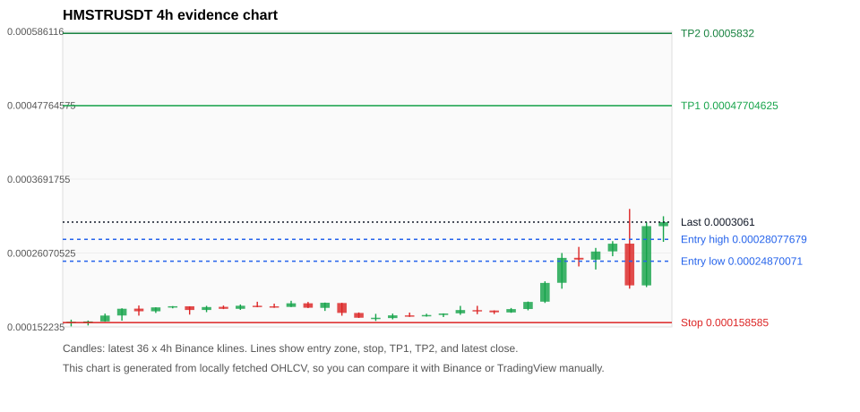
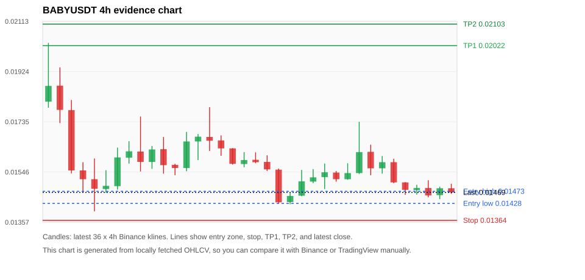
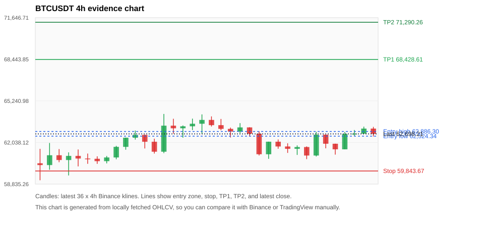
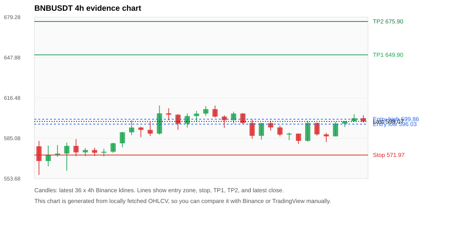
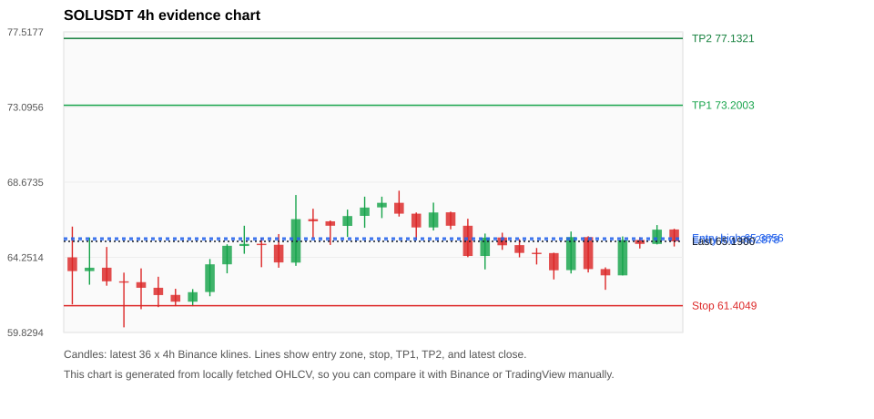

# Crypto 市场扫描报告 v3

- 报告时间：2026-06-11 23:06:07 CST
- 报告版本：v3
- 扫描 ID：9ff5f84b3f0b
- 数据源：Binance public spot API + CoinGecko/CoinMarketCap cross-check
- 过滤条件：USDT spot; 24h quote volume >= 30,000,000; trades >= 30,000; exclude stables/leveraged tokens; analyze 1h/4h/1d klines
- 默认单笔风险：账户权益的 1.00%

## 限制说明

- 交易信号仍以 Binance 现货公开 K 线为主源；外部数据源用于一致性复核。
- 结果是研究和模拟盘计划，不是确定收益或实盘下单指令。
- 历史长度过滤：候选币至少需要 180 根 1d K 线。
- 数据质量验证池：先验证 score 排名前 min(top_n * 2, 10) 的候选，再按 action + score 补足最终名单。
- 大盘环境过滤：RISK_OFF; BTC/ETH 大盘偏弱，山寨币买入候选降级为观察。 BTC 7d=-1.8626932133320673; ETH 7d=-7.235835258108048.
- 已启用数据交叉验证：Binance 主源 + CoinGecko 自动对照；CoinMarketCap 在配置 API Key 后自动对照。
- HMSTRUSDT 交叉验证状态 DATA_WARNING：At least one external provider needs manual review.
- BABYUSDT 交叉验证状态 DATA_WARNING：At least one external provider needs manual review.
- BTCUSDT 交叉验证状态 DATA_WARNING：At least one external provider needs manual review.
- BNBUSDT 交叉验证状态 DATA_WARNING：At least one external provider needs manual review.
- SOLUSDT 交叉验证状态 DATA_WARNING：At least one external provider needs manual review.
- DOGEUSDT 交叉验证状态 DATA_WARNING：At least one external provider needs manual review.
- ETHUSDT 交叉验证状态 DATA_WARNING：At least one external provider needs manual review.
- HOMEUSDT 交叉验证状态 DATA_WARNING：At least one external provider needs manual review.
- WLDUSDT 交叉验证状态 DATA_WARNING：At least one external provider needs manual review.
- XRPUSDT 交叉验证状态 DATA_WARNING：At least one external provider needs manual review.

## 5 个候选交易计划

| Rank | Coin | Action | Setup | Entry Zone | Stop Loss | TP1 | TP2 / Exit Rule | R/R | Verdict |
|---:|---|---|---|---:|---:|---:|---|---:|---|
| 1 | `HMSTR` | `WATCH_ONLY` | 涨幅较远，只等深回调 | 0.00024870071 - 0.00028077679 | 0.000158585 | 0.00047704625 | 0.0005832 或跌破 4h 关键支撑 | 2.00-3.00 | 只等回调 |
| 2 | `BABY` | `WATCH_ONLY` | 回踩支撑/4h EMA 附近 | 0.01428 - 0.01473 | 0.01364 | 0.02022 | 0.02103 或跌破 4h 关键支撑 | 6.60-7.54 | 只观察 |
| 3 | `BTC` | `REJECT` | 回踩支撑/4h EMA 附近 | 62,524.34 - 62,886.30 | 59,843.67 | 68,428.61 | 71,290.26 或跌破 4h 关键支撑 | 2.00-3.00 | 只观察 |
| 4 | `BNB` | `REJECT` | 回踩支撑/4h EMA 附近 | 596.03 - 599.86 | 571.97 | 649.90 | 675.90 或跌破 4h 关键支撑 | 2.00-3.00 | 只观察 |
| 5 | `SOL` | `REJECT` | 回踩支撑/4h EMA 附近 | 65.2878 - 65.3856 | 61.4049 | 73.2003 | 77.1321 或跌破 4h 关键支撑 | 2.00-3.00 | 只观察 |

## 数据交叉验证摘要

价格差异以 Binance 当前价为基准；成交量口径不同，Binance 是 USDT 现货成交额，CoinGecko/CoinMarketCap 通常是全市场成交量。

| Rank | Coin | Data Status | Max Price Diff | Max 24h Diff | Message |
|---:|---|---|---:|---:|---|
| 1 | `HMSTR` | DATA_WARNING | 0.66% | 2.07 pts | At least one external provider needs manual review. |
| 2 | `BABY` | DATA_WARNING | 0.15% | 0.46 pts | At least one external provider needs manual review. |
| 3 | `BTC` | DATA_WARNING | 0.11% | 0.28 pts | At least one external provider needs manual review. |
| 4 | `BNB` | DATA_WARNING | 0.08% | 0.19 pts | At least one external provider needs manual review. |
| 5 | `SOL` | DATA_WARNING | 0.06% | 0.12 pts | At least one external provider needs manual review. |

## 候选币说明

### 1. HMSTR `HMSTRUSDT`



- 入选原因：涨幅较远，只等深回调；24h +21.51%，7d +101.65%，4h RSI 75.22，24h 成交额 $33.4M。
- 交易失效条件：跌破 0.000158585 或 4h 收盘重新失守关键支撑。
- 主要风险：距离支撑偏远，不能追市价；4h RSI 偏热；24h 振幅较大，回撤风险高；成交量突增，可能是事件驱动；BTC/ETH 大盘环境未确认强势，山寨币买入信号降级；数据交叉验证需要人工复核。
- 数据交叉验证：DATA_WARNING；At least one external provider needs manual review.

#### 可点击人工验证

- [Binance 交易页](https://www.binance.com/en/trade/HMSTR_USDT)
- [TradingView 图表](https://www.tradingview.com/chart/?symbol=BINANCE%3AHMSTRUSDT)
- [CoinGecko 搜索](https://www.coingecko.com/en/search?query=HMSTR)
- [CoinMarketCap 搜索](https://coinmarketcap.com/search/?q=HMSTR)

#### 多数据源对照

| Source | Status | Asset ID | Price | 24h Change | 24h Volume | Price Diff | 24h Diff | Updated | Message |
|---|---|---|---:|---:|---:|---:|---:|---|---|
| Binance | DATA_OK | HMSTRUSDT | 0.0003061 | +21.51% | $33.4M | 0.00% | 0.00 pts | 2026-06-11T15:05:21+00:00 | Primary market data source used by scanner. |
| CoinGecko | DATA_OK | hamster-kombat | 0.00030407 | +20.17% | $161.8M | 0.66% | 1.34 pts | 2026-06-11T15:05:06.085Z | External source agrees with Binance within thresholds. |
| CoinMarketCap | DATA_WARNING | 32195 | 0.00030415107 | +19.44% | $170.3M | 0.64% | 2.07 pts | 2026-06-11T15:04:04.000Z | CoinMarketCap symbol mapping has 2 matches; selected lowest cmc_rank |

#### 指标证据

| 指标 | 数值 | 人工核对用途 |
|---|---:|---|
| 当前价 | 0.0003061 | 与 Binance/TradingView 当前价格对照 |
| 24h 涨跌 | +21.51% | 与交易所 24h 涨跌对照 |
| 7d 涨跌 | +101.65% | 判断短线趋势是否延续 |
| 4h EMA20 | 0.00022440004 | 判断短期趋势支撑 |
| 4h EMA50 | 0.00019523546 | 判断中期趋势支撑 |
| 1d EMA20 | 0.00018715867 | 判断日线趋势 |
| 1d EMA50 | 0.00017202928 | 判断日线趋势 |
| 4h RSI14 | 75.22 | 判断是否过热/过弱 |
| 4h ATR14 | 3.3764286e-05 | 推导止损和入场缓冲 |
| 最近 18 根 4h 最低点 | 0.000161 | 支撑/止损参考 |
| 最近 36 根 4h 最高点 | 0.0003254 | TP/压力参考 |
| 支撑位 | 0.00022440004 | 入场区间推导基础 |

#### 交易计划推导

- 支撑位 = 最近低点、4h EMA20、4h EMA50、1d EMA20 中不高于当前价的最高有效支撑 = `0.00022440004`。
- 入场区间 = 支撑位附近 + ATR 缓冲 = `0.00024870071 - 0.00028077679`。
- 止损 = min(最近 18 根 4h 最低点 * 0.985, 入场中位价 - 1.15 * ATR14) = `0.000158585`。
- TP1 = max(最近 36 根 4h 最高点 * 0.995, 入场中位价 + 2R) = `0.00047704625`。
- TP2 = max(入场中位价 + 3R, TP1 * 1.04) = `0.0005832`。

#### 最近 10 根 4h K线

| UTC 开盘时间 | Open | High | Low | Close | Quote Volume | Trades |
|---|---:|---:|---:|---:|---:|---:|
| 2026-06-10T00:00+00:00 | 0.0001735 | 0.00018 | 0.0001729 | 0.0001784 | $109,394 | 3214 |
| 2026-06-10T04:00+00:00 | 0.0001785 | 0.0001895 | 0.0001766 | 0.0001889 | $189,111 | 4801 |
| 2026-06-10T08:00+00:00 | 0.0001893 | 0.0002192 | 0.0001874 | 0.0002168 | $2.4M | 54644 |
| 2026-06-10T12:00+00:00 | 0.000217 | 0.0002607 | 0.0002083 | 0.0002536 | $7.0M | 172599 |
| 2026-06-10T16:00+00:00 | 0.0002537 | 0.0002697 | 0.000241 | 0.0002511 | $4.6M | 120258 |
| 2026-06-10T20:00+00:00 | 0.000251 | 0.0002682 | 0.0002365 | 0.0002629 | $2.6M | 73137 |
| 2026-06-11T00:00+00:00 | 0.0002631 | 0.0002781 | 0.000256 | 0.0002744 | $1.9M | 68615 |
| 2026-06-11T04:00+00:00 | 0.0002745 | 0.0003254 | 0.0002084 | 0.0002132 | $11.5M | 256402 |
| 2026-06-11T08:00+00:00 | 0.0002132 | 0.0003059 | 0.0002107 | 0.0003002 | $7.2M | 222278 |
| 2026-06-11T12:00+00:00 | 0.0003001 | 0.0003147 | 0.0002771 | 0.0003061 | $3.5M | 112978 |

### 2. BABY `BABYUSDT`



- 入选原因：回踩支撑/4h EMA 附近；24h -7.84%，7d +11.46%，4h RSI 51.35，24h 成交额 $32.3M。
- 交易失效条件：跌破 0.013641321 或 4h 收盘重新失守关键支撑。
- 主要风险：日线趋势未完全确认；BTC/ETH 大盘环境未确认强势，山寨币买入信号降级；24h 动量未确认；数据交叉验证需要人工复核。
- 数据交叉验证：DATA_WARNING；At least one external provider needs manual review.

#### 可点击人工验证

- [Binance 交易页](https://www.binance.com/en/trade/BABY_USDT)
- [TradingView 图表](https://www.tradingview.com/chart/?symbol=BINANCE%3ABABYUSDT)
- [CoinGecko 搜索](https://www.coingecko.com/en/search?query=BABY)
- [CoinMarketCap 搜索](https://coinmarketcap.com/search/?q=BABY)

#### 多数据源对照

| Source | Status | Asset ID | Price | 24h Change | 24h Volume | Price Diff | 24h Diff | Updated | Message |
|---|---|---|---:|---:|---:|---:|---:|---|---|
| Binance | DATA_OK | BABYUSDT | 0.01469 | -7.84% | $32.3M | 0.00% | 0.00 pts | 2026-06-11T15:05:21+00:00 | Primary market data source used by scanner. |
| CoinGecko | DATA_WARNING | babylon | 0.01467 | -7.92% | $122.4M | 0.15% | 0.08 pts | 2026-06-11T15:05:07.187Z | CoinGecko symbol mapping has 2 exact matches; selected highest market-cap rank |
| CoinMarketCap | DATA_WARNING | 32198 | 0.01471 | -7.39% | $141.3M | 0.10% | 0.46 pts | 2026-06-11T15:04:04.000Z | CoinMarketCap symbol mapping has 10 matches; selected lowest cmc_rank |

#### 指标证据

| 指标 | 数值 | 人工核对用途 |
|---|---:|---|
| 当前价 | 0.01469 | 与 Binance/TradingView 当前价格对照 |
| 24h 涨跌 | -7.84% | 与交易所 24h 涨跌对照 |
| 7d 涨跌 | +11.46% | 判断短线趋势是否延续 |
| 4h EMA20 | 0.01522 | 判断短期趋势支撑 |
| 4h EMA50 | 0.01525 | 判断中期趋势支撑 |
| 1d EMA20 | 0.01539 | 判断日线趋势 |
| 1d EMA50 | 0.01565 | 判断日线趋势 |
| 4h RSI14 | 51.35 | 判断是否过热/过弱 |
| 4h ATR14 | 0.00075214286 | 推导止损和入场缓冲 |
| 最近 18 根 4h 最低点 | 0.01425 | 支撑/止损参考 |
| 最近 36 根 4h 最高点 | 0.02032 | TP/压力参考 |
| 支撑位 | 0.01425 | 入场区间推导基础 |

#### 交易计划推导

- 支撑位 = 最近低点、4h EMA20、4h EMA50、1d EMA20 中不高于当前价的最高有效支撑 = `0.01425`。
- 入场区间 = 支撑位附近 + ATR 缓冲 = `0.01428 - 0.01473`。
- 止损 = min(最近 18 根 4h 最低点 * 0.985, 入场中位价 - 1.15 * ATR14) = `0.01364`。
- TP1 = max(最近 36 根 4h 最高点 * 0.995, 入场中位价 + 2R) = `0.02022`。
- TP2 = max(入场中位价 + 3R, TP1 * 1.04) = `0.02103`。

#### 最近 10 根 4h K线

| UTC 开盘时间 | Open | High | Low | Close | Quote Volume | Trades |
|---|---:|---:|---:|---:|---:|---:|
| 2026-06-10T00:00+00:00 | 0.01519 | 0.01579 | 0.01517 | 0.01542 | $3.1M | 54928 |
| 2026-06-10T04:00+00:00 | 0.01542 | 0.01735 | 0.01539 | 0.01621 | $11.2M | 122730 |
| 2026-06-10T08:00+00:00 | 0.01622 | 0.01649 | 0.01534 | 0.01560 | $4.1M | 81691 |
| 2026-06-10T12:00+00:00 | 0.01560 | 0.01606 | 0.01540 | 0.01583 | $5.7M | 76040 |
| 2026-06-10T16:00+00:00 | 0.01583 | 0.01596 | 0.01504 | 0.01507 | $2.8M | 33071 |
| 2026-06-10T20:00+00:00 | 0.01507 | 0.01508 | 0.01460 | 0.01479 | $1.7M | 11244 |
| 2026-06-11T00:00+00:00 | 0.01478 | 0.01498 | 0.01461 | 0.01486 | $2.8M | 33642 |
| 2026-06-11T04:00+00:00 | 0.01486 | 0.01515 | 0.01451 | 0.01458 | $10.6M | 144432 |
| 2026-06-11T08:00+00:00 | 0.01459 | 0.01491 | 0.01444 | 0.01485 | $10.6M | 94099 |
| 2026-06-11T12:00+00:00 | 0.01485 | 0.01502 | 0.01464 | 0.01469 | $2.5M | 44389 |

### 3. BTC `BTCUSDT`



- 入选原因：回踩支撑/4h EMA 附近；24h +0.81%，7d -1.36%，4h RSI 47.26，24h 成交额 $1.06B。
- 交易失效条件：跌破 59843.675 或 4h 收盘重新失守关键支撑。
- 主要风险：日线趋势未完全确认；BTC/ETH 大盘环境未确认强势，山寨币买入信号降级；7d 趋势未确认；数据交叉验证需要人工复核。
- 数据交叉验证：DATA_WARNING；At least one external provider needs manual review.

#### 可点击人工验证

- [Binance 交易页](https://www.binance.com/en/trade/BTC_USDT)
- [TradingView 图表](https://www.tradingview.com/chart/?symbol=BINANCE%3ABTCUSDT)
- [CoinGecko 搜索](https://www.coingecko.com/en/search?query=BTC)
- [CoinMarketCap 搜索](https://coinmarketcap.com/search/?q=BTC)

#### 多数据源对照

| Source | Status | Asset ID | Price | 24h Change | 24h Volume | Price Diff | 24h Diff | Updated | Message |
|---|---|---|---:|---:|---:|---:|---:|---|---|
| Binance | DATA_OK | BTCUSDT | 62,698.21 | +0.81% | $1.06B | 0.00% | 0.00 pts | 2026-06-11T15:05:21+00:00 | Primary market data source used by scanner. |
| CoinGecko | DATA_OK | bitcoin | 62,628.00 | +1.09% | $28.87B | 0.11% | 0.28 pts | 2026-06-11T15:05:26.120Z | External source agrees with Binance within thresholds. |
| CoinMarketCap | DATA_WARNING | 1 | 62,636.99 | +0.58% | $28.69B | 0.10% | 0.23 pts | 2026-06-11T15:04:04.000Z | CoinMarketCap symbol mapping has 13 matches; selected lowest cmc_rank |

#### 指标证据

| 指标 | 数值 | 人工核对用途 |
|---|---:|---|
| 当前价 | 62,698.21 | 与 Binance/TradingView 当前价格对照 |
| 24h 涨跌 | +0.81% | 与交易所 24h 涨跌对照 |
| 7d 涨跌 | -1.36% | 判断短线趋势是否延续 |
| 4h EMA20 | 62,399.54 | 判断短期趋势支撑 |
| 4h EMA50 | 63,768.21 | 判断中期趋势支撑 |
| 1d EMA20 | 67,452.70 | 判断日线趋势 |
| 1d EMA50 | 71,666.35 | 判断日线趋势 |
| 4h RSI14 | 47.26 | 判断是否过热/过弱 |
| 4h ATR14 | 994.89 | 推导止损和入场缓冲 |
| 最近 18 根 4h 最低点 | 60,755.00 | 支撑/止损参考 |
| 最近 36 根 4h 最高点 | 64,234.68 | TP/压力参考 |
| 支撑位 | 62,399.54 | 入场区间推导基础 |

#### 交易计划推导

- 支撑位 = 最近低点、4h EMA20、4h EMA50、1d EMA20 中不高于当前价的最高有效支撑 = `62,399.54`。
- 入场区间 = 支撑位附近 + ATR 缓冲 = `62,524.34 - 62,886.30`。
- 止损 = min(最近 18 根 4h 最低点 * 0.985, 入场中位价 - 1.15 * ATR14) = `59,843.67`。
- TP1 = max(最近 36 根 4h 最高点 * 0.995, 入场中位价 + 2R) = `68,428.61`。
- TP2 = max(入场中位价 + 3R, TP1 * 1.04) = `71,290.26`。

#### 最近 10 根 4h K线

| UTC 开盘时间 | Open | High | Low | Close | Quote Volume | Trades |
|---|---:|---:|---:|---:|---:|---:|
| 2026-06-10T00:00+00:00 | 61,730.00 | 61,974.70 | 61,235.29 | 61,549.64 | $106.0M | 592207 |
| 2026-06-10T04:00+00:00 | 61,549.64 | 61,813.34 | 61,080.00 | 61,687.56 | $136.5M | 480520 |
| 2026-06-10T08:00+00:00 | 61,687.56 | 61,736.00 | 60,755.00 | 61,034.04 | $172.2M | 735601 |
| 2026-06-10T12:00+00:00 | 61,034.04 | 62,857.99 | 60,960.00 | 62,639.23 | $296.4M | 1335269 |
| 2026-06-10T16:00+00:00 | 62,639.23 | 62,646.00 | 61,588.80 | 61,942.44 | $165.9M | 900048 |
| 2026-06-10T20:00+00:00 | 61,942.45 | 61,949.21 | 61,104.24 | 61,510.99 | $109.7M | 612041 |
| 2026-06-11T00:00+00:00 | 61,510.99 | 62,848.00 | 61,510.99 | 62,689.48 | $177.3M | 609797 |
| 2026-06-11T04:00+00:00 | 62,689.47 | 62,997.53 | 62,544.89 | 62,719.39 | $155.8M | 451403 |
| 2026-06-11T08:00+00:00 | 62,719.39 | 63,257.21 | 62,719.38 | 63,108.00 | $137.2M | 382423 |
| 2026-06-11T12:00+00:00 | 63,108.01 | 63,239.43 | 62,500.00 | 62,699.45 | $241.8M | 755752 |

### 4. BNB `BNBUSDT`



- 入选原因：回踩支撑/4h EMA 附近；24h +0.77%，7d -0.94%，4h RSI 46.31，24h 成交额 $68.1M。
- 交易失效条件：跌破 571.9698 或 4h 收盘重新失守关键支撑。
- 主要风险：日线趋势未完全确认；BTC/ETH 大盘环境未确认强势，山寨币买入信号降级；7d 趋势未确认；数据交叉验证需要人工复核。
- 数据交叉验证：DATA_WARNING；At least one external provider needs manual review.

#### 可点击人工验证

- [Binance 交易页](https://www.binance.com/en/trade/BNB_USDT)
- [TradingView 图表](https://www.tradingview.com/chart/?symbol=BINANCE%3ABNBUSDT)
- [CoinGecko 搜索](https://www.coingecko.com/en/search?query=BNB)
- [CoinMarketCap 搜索](https://coinmarketcap.com/search/?q=BNB)

#### 多数据源对照

| Source | Status | Asset ID | Price | 24h Change | 24h Volume | Price Diff | 24h Diff | Updated | Message |
|---|---|---|---:|---:|---:|---:|---:|---|---|
| Binance | DATA_OK | BNBUSDT | 598.07 | +0.77% | $68.1M | 0.00% | 0.00 pts | 2026-06-11T15:05:21+00:00 | Primary market data source used by scanner. |
| CoinGecko | DATA_OK | binancecoin | 597.63 | +0.96% | $696.0M | 0.07% | 0.19 pts | 2026-06-11T15:05:27.685Z | External source agrees with Binance within thresholds. |
| CoinMarketCap | DATA_WARNING | 1839 | 597.60 | +0.72% | $1.07B | 0.08% | 0.06 pts | 2026-06-11T15:04:04.000Z | CoinMarketCap symbol mapping has 4 matches; selected lowest cmc_rank |

#### 指标证据

| 指标 | 数值 | 人工核对用途 |
|---|---:|---|
| 当前价 | 598.07 | 与 Binance/TradingView 当前价格对照 |
| 24h 涨跌 | +0.77% | 与交易所 24h 涨跌对照 |
| 7d 涨跌 | -0.94% | 判断短线趋势是否延续 |
| 4h EMA20 | 594.84 | 判断短期趋势支撑 |
| 4h EMA50 | 604.42 | 判断中期趋势支撑 |
| 1d EMA20 | 622.45 | 判断日线趋势 |
| 1d EMA50 | 634.53 | 判断日线趋势 |
| 4h RSI14 | 46.31 | 判断是否过热/过弱 |
| 4h ATR14 | 9.0707 | 推导止损和入场缓冲 |
| 最近 18 根 4h 最低点 | 580.68 | 支撑/止损参考 |
| 最近 36 根 4h 最高点 | 610.54 | TP/压力参考 |
| 支撑位 | 594.84 | 入场区间推导基础 |

#### 交易计划推导

- 支撑位 = 最近低点、4h EMA20、4h EMA50、1d EMA20 中不高于当前价的最高有效支撑 = `594.84`。
- 入场区间 = 支撑位附近 + ATR 缓冲 = `596.03 - 599.86`。
- 止损 = min(最近 18 根 4h 最低点 * 0.985, 入场中位价 - 1.15 * ATR14) = `571.97`。
- TP1 = max(最近 36 根 4h 最高点 * 0.995, 入场中位价 + 2R) = `649.90`。
- TP2 = max(入场中位价 + 3R, TP1 * 1.04) = `675.90`。

#### 最近 10 根 4h K线

| UTC 开盘时间 | Open | High | Low | Close | Quote Volume | Trades |
|---|---:|---:|---:|---:|---:|---:|
| 2026-06-10T00:00+00:00 | 593.44 | 594.83 | 586.48 | 587.87 | $8.4M | 115121 |
| 2026-06-10T04:00+00:00 | 587.88 | 589.46 | 583.58 | 588.63 | $11.9M | 111205 |
| 2026-06-10T08:00+00:00 | 588.63 | 588.64 | 580.68 | 583.00 | $10.9M | 118610 |
| 2026-06-10T12:00+00:00 | 583.01 | 598.52 | 582.40 | 596.90 | $18.1M | 189370 |
| 2026-06-10T16:00+00:00 | 596.90 | 597.16 | 587.05 | 588.06 | $9.8M | 106669 |
| 2026-06-10T20:00+00:00 | 588.05 | 589.22 | 582.10 | 586.53 | $8.5M | 69130 |
| 2026-06-11T00:00+00:00 | 586.51 | 597.75 | 586.51 | 596.43 | $10.0M | 102235 |
| 2026-06-11T04:00+00:00 | 596.43 | 598.26 | 593.72 | 598.21 | $9.4M | 99906 |
| 2026-06-11T08:00+00:00 | 598.21 | 603.77 | 598.15 | 600.63 | $15.7M | 117469 |
| 2026-06-11T12:00+00:00 | 600.64 | 602.99 | 597.20 | 598.07 | $9.5M | 99697 |

### 5. SOL `SOLUSDT`



- 入选原因：回踩支撑/4h EMA 附近；24h +0.17%，7d -6.08%，4h RSI 43.75，24h 成交额 $192.3M。
- 交易失效条件：跌破 61.4049 或 4h 收盘重新失守关键支撑。
- 主要风险：日线趋势未完全确认；BTC/ETH 大盘环境未确认强势，山寨币买入信号降级；7d 趋势未确认；数据交叉验证需要人工复核。
- 数据交叉验证：DATA_WARNING；At least one external provider needs manual review.

#### 可点击人工验证

- [Binance 交易页](https://www.binance.com/en/trade/SOL_USDT)
- [TradingView 图表](https://www.tradingview.com/chart/?symbol=BINANCE%3ASOLUSDT)
- [CoinGecko 搜索](https://www.coingecko.com/en/search?query=SOL)
- [CoinMarketCap 搜索](https://coinmarketcap.com/search/?q=SOL)

#### 多数据源对照

| Source | Status | Asset ID | Price | 24h Change | 24h Volume | Price Diff | 24h Diff | Updated | Message |
|---|---|---|---:|---:|---:|---:|---:|---|---|
| Binance | DATA_OK | SOLUSDT | 65.1900 | +0.17% | $192.3M | 0.00% | 0.00 pts | 2026-06-11T15:05:21+00:00 | Primary market data source used by scanner. |
| CoinGecko | DATA_OK | solana | 65.1500 | +0.24% | $3.04B | 0.06% | 0.07 pts | 2026-06-11T15:05:25.699Z | External source agrees with Binance within thresholds. |
| CoinMarketCap | DATA_WARNING | 5426 | 65.2090 | +0.29% | $2.73B | 0.03% | 0.12 pts | 2026-06-11T15:04:04.000Z | CoinMarketCap symbol mapping has 8 matches; selected lowest cmc_rank |

#### 指标证据

| 指标 | 数值 | 人工核对用途 |
|---|---:|---|
| 当前价 | 65.1900 | 与 Binance/TradingView 当前价格对照 |
| 24h 涨跌 | +0.17% | 与交易所 24h 涨跌对照 |
| 7d 涨跌 | -6.08% | 判断短线趋势是否延续 |
| 4h EMA20 | 65.1575 | 判断短期趋势支撑 |
| 4h EMA50 | 67.5405 | 判断中期趋势支撑 |
| 1d EMA20 | 72.8910 | 判断日线趋势 |
| 1d EMA50 | 79.6157 | 判断日线趋势 |
| 4h RSI14 | 43.75 | 判断是否过热/过弱 |
| 4h ATR14 | 1.5057 | 推导止损和入场缓冲 |
| 最近 18 根 4h 最低点 | 62.3400 | 支撑/止损参考 |
| 最近 36 根 4h 最高点 | 68.1700 | TP/压力参考 |
| 支撑位 | 65.1575 | 入场区间推导基础 |

#### 交易计划推导

- 支撑位 = 最近低点、4h EMA20、4h EMA50、1d EMA20 中不高于当前价的最高有效支撑 = `65.1575`。
- 入场区间 = 支撑位附近 + ATR 缓冲 = `65.2878 - 65.3856`。
- 止损 = min(最近 18 根 4h 最低点 * 0.985, 入场中位价 - 1.15 * ATR14) = `61.4049`。
- TP1 = max(最近 36 根 4h 最高点 * 0.995, 入场中位价 + 2R) = `73.2003`。
- TP2 = max(入场中位价 + 3R, TP1 * 1.04) = `77.1321`。

#### 最近 10 根 4h K线

| UTC 开盘时间 | Open | High | Low | Close | Quote Volume | Trades |
|---|---:|---:|---:|---:|---:|---:|
| 2026-06-10T00:00+00:00 | 64.9700 | 65.3200 | 64.2500 | 64.5100 | $18.9M | 132518 |
| 2026-06-10T04:00+00:00 | 64.5200 | 64.8000 | 63.8300 | 64.5000 | $15.6M | 114315 |
| 2026-06-10T08:00+00:00 | 64.5000 | 64.5200 | 62.9500 | 63.4900 | $34.1M | 184352 |
| 2026-06-10T12:00+00:00 | 63.5000 | 65.7700 | 63.3000 | 65.4400 | $60.4M | 355210 |
| 2026-06-10T16:00+00:00 | 65.4400 | 65.4900 | 63.3600 | 63.5600 | $33.7M | 238130 |
| 2026-06-10T20:00+00:00 | 63.5600 | 63.6600 | 62.3400 | 63.1900 | $25.7M | 182930 |
| 2026-06-11T00:00+00:00 | 63.1900 | 65.4800 | 63.1900 | 65.2700 | $38.3M | 162234 |
| 2026-06-11T04:00+00:00 | 65.2700 | 65.4300 | 64.7700 | 65.0400 | $21.4M | 99437 |
| 2026-06-11T08:00+00:00 | 65.0400 | 66.1500 | 65.0100 | 65.8800 | $28.7M | 99788 |
| 2026-06-11T12:00+00:00 | 65.8900 | 65.9300 | 64.8900 | 65.1900 | $30.7M | 164297 |

## 组合风控

- 不要 5 个候选全部满仓买入。
- 同时持仓总风险建议控制在账户权益的 3% - 5% 以内。
- 如果 BTC/ETH 同时破位，暂停山寨币多头计划或降低仓位。
- 第一版报告用于模拟盘和人工复核，不自动下单。

## 原始数据

```json
[
  {
    "rank": 1,
    "symbol": "HMSTRUSDT",
    "base_asset": "HMSTR",
    "price": 0.0003061,
    "score": 47.26015919368194,
    "setup": "涨幅较远，只等深回调",
    "verdict": "只等回调",
    "entry_low": 0.0002487007142857143,
    "entry_high": 0.00028077678571428573,
    "stop_loss": 0.00015858500000000001,
    "take_profit_1": 0.00047704625000000004,
    "take_profit_2": 0.0005832000000000001,
    "risk_reward_1": 2.0,
    "risk_reward_2": 3.0000000000000004,
    "pct_24h": 21.508,
    "pct_3d": 86.53260207190738,
    "pct_7d": 101.64690382081685,
    "quote_volume_24h": 33424404.4230963,
    "trades_24h": 910624,
    "high_low_range_24h": 56.14203454894433,
    "rsi_1h": 58.113509192645886,
    "rsi_4h": 75.22189349112426,
    "ema20_4h": 0.00022440003936812178,
    "ema50_4h": 0.00019523546120658305,
    "ema20_1d": 0.00018715866683754976,
    "ema50_1d": 0.0001720292752479245,
    "atr_4h": 3.376428571428571e-05,
    "macd_hist_4h": 1.058186672372978e-05,
    "volume_ratio_24h": 9.584094835323603,
    "support_level": 0.00022440003936812178,
    "recent_low_4h_18": 0.000161,
    "recent_high_4h_36": 0.0003254,
    "distance_to_support_pct": 36.40817571241679,
    "binance_trade_url": "https://www.binance.com/en/trade/HMSTR_USDT",
    "tradingview_url": "https://www.tradingview.com/chart/?symbol=BINANCE%3AHMSTRUSDT",
    "coingecko_search_url": "https://www.coingecko.com/en/search?query=HMSTR",
    "coinmarketcap_search_url": "https://coinmarketcap.com/search/?q=HMSTR",
    "invalidation": "跌破 0.000158585 或 4h 收盘重新失守关键支撑",
    "recent_4h_klines": [
      {
        "open_time_utc": "2026-06-05T16:00+00:00",
        "open": 0.0001576,
        "high": 0.0001629,
        "low": 0.000153,
        "close": 0.0001596,
        "quote_volume": 425894.2545452,
        "trades": 10348
      },
      {
        "open_time_utc": "2026-06-05T20:00+00:00",
        "open": 0.0001601,
        "high": 0.0001616,
        "low": 0.0001544,
        "close": 0.0001603,
        "quote_volume": 226708.9699229,
        "trades": 4504
      },
      {
        "open_time_utc": "2026-06-06T00:00+00:00",
        "open": 0.0001603,
        "high": 0.0001718,
        "low": 0.0001598,
        "close": 0.0001689,
        "quote_volume": 394027.3151087,
        "trades": 9371
      },
      {
        "open_time_utc": "2026-06-06T04:00+00:00",
        "open": 0.000169,
        "high": 0.0001796,
        "low": 0.0001614,
        "close": 0.0001789,
        "quote_volume": 503858.24179,
        "trades": 11359
      },
      {
        "open_time_utc": "2026-06-06T08:00+00:00",
        "open": 0.0001791,
        "high": 0.0001837,
        "low": 0.0001688,
        "close": 0.0001752,
        "quote_volume": 477858.0167163,
        "trades": 8866
      },
      {
        "open_time_utc": "2026-06-06T12:00+00:00",
        "open": 0.0001752,
        "high": 0.000181,
        "low": 0.0001727,
        "close": 0.0001809,
        "quote_volume": 193393.0238678,
        "trades": 4383
      },
      {
        "open_time_utc": "2026-06-06T16:00+00:00",
        "open": 0.000181,
        "high": 0.0001828,
        "low": 0.0001795,
        "close": 0.0001826,
        "quote_volume": 201947.8529934,
        "trades": 3087
      },
      {
        "open_time_utc": "2026-06-06T20:00+00:00",
        "open": 0.0001825,
        "high": 0.0001825,
        "low": 0.0001703,
        "close": 0.0001771,
        "quote_volume": 245851.9137775,
        "trades": 4880
      },
      {
        "open_time_utc": "2026-06-07T00:00+00:00",
        "open": 0.0001771,
        "high": 0.0001832,
        "low": 0.0001739,
        "close": 0.0001814,
        "quote_volume": 134168.2548959,
        "trades": 3270
      },
      {
        "open_time_utc": "2026-06-07T04:00+00:00",
        "open": 0.0001817,
        "high": 0.0001836,
        "low": 0.0001784,
        "close": 0.0001788,
        "quote_volume": 80120.7542287,
        "trades": 1713
      },
      {
        "open_time_utc": "2026-06-07T08:00+00:00",
        "open": 0.0001788,
        "high": 0.0001852,
        "low": 0.0001772,
        "close": 0.0001833,
        "quote_volume": 98402.6201712,
        "trades": 2158
      },
      {
        "open_time_utc": "2026-06-07T12:00+00:00",
        "open": 0.0001833,
        "high": 0.0001892,
        "low": 0.0001811,
        "close": 0.0001814,
        "quote_volume": 220802.1424048,
        "trades": 4914
      },
      {
        "open_time_utc": "2026-06-07T16:00+00:00",
        "open": 0.0001825,
        "high": 0.0001864,
        "low": 0.0001804,
        "close": 0.0001819,
        "quote_volume": 145479.9604093,
        "trades": 3074
      },
      {
        "open_time_utc": "2026-06-07T20:00+00:00",
        "open": 0.0001816,
        "high": 0.0001906,
        "low": 0.0001815,
        "close": 0.0001869,
        "quote_volume": 100809.7348813,
        "trades": 2065
      },
      {
        "open_time_utc": "2026-06-08T00:00+00:00",
        "open": 0.0001869,
        "high": 0.0001889,
        "low": 0.0001799,
        "close": 0.0001804,
        "quote_volume": 149018.3787768,
        "trades": 3188
      },
      {
        "open_time_utc": "2026-06-08T04:00+00:00",
        "open": 0.0001802,
        "high": 0.000188,
        "low": 0.0001757,
        "close": 0.0001877,
        "quote_volume": 173224.5207518,
        "trades": 3556
      },
      {
        "open_time_utc": "2026-06-08T08:00+00:00",
        "open": 0.0001873,
        "high": 0.0001876,
        "low": 0.0001687,
        "close": 0.0001728,
        "quote_volume": 339659.0272831,
        "trades": 6744
      },
      {
        "open_time_utc": "2026-06-08T12:00+00:00",
        "open": 0.0001727,
        "high": 0.0001735,
        "low": 0.0001654,
        "close": 0.0001657,
        "quote_volume": 190473.7969296,
        "trades": 3520
      },
      {
        "open_time_utc": "2026-06-08T16:00+00:00",
        "open": 0.0001656,
        "high": 0.0001714,
        "low": 0.000161,
        "close": 0.0001657,
        "quote_volume": 209637.249474,
        "trades": 4297
      },
      {
        "open_time_utc": "2026-06-08T20:00+00:00",
        "open": 0.0001652,
        "high": 0.0001718,
        "low": 0.0001633,
        "close": 0.0001692,
        "quote_volume": 201651.013485,
        "trades": 3447
      },
      {
        "open_time_utc": "2026-06-09T00:00+00:00",
        "open": 0.0001692,
        "high": 0.0001733,
        "low": 0.000167,
        "close": 0.0001687,
        "quote_volume": 214158.2855067,
        "trades": 4395
      },
      {
        "open_time_utc": "2026-06-09T04:00+00:00",
        "open": 0.0001685,
        "high": 0.0001716,
        "low": 0.0001674,
        "close": 0.0001697,
        "quote_volume": 155537.2571654,
        "trades": 3715
      },
      {
        "open_time_utc": "2026-06-09T08:00+00:00",
        "open": 0.0001698,
        "high": 0.0001721,
        "low": 0.0001667,
        "close": 0.0001719,
        "quote_volume": 108133.8803449,
        "trades": 2762
      },
      {
        "open_time_utc": "2026-06-09T12:00+00:00",
        "open": 0.0001722,
        "high": 0.0001831,
        "low": 0.0001699,
        "close": 0.000177,
        "quote_volume": 514307.81342,
        "trades": 12861
      },
      {
        "open_time_utc": "2026-06-09T16:00+00:00",
        "open": 0.0001769,
        "high": 0.0001832,
        "low": 0.0001709,
        "close": 0.0001762,
        "quote_volume": 422186.4452242,
        "trades": 10986
      },
      {
        "open_time_utc": "2026-06-09T20:00+00:00",
        "open": 0.0001763,
        "high": 0.0001764,
        "low": 0.0001711,
        "close": 0.0001737,
        "quote_volume": 71191.8722728,
        "trades": 1883
      },
      {
        "open_time_utc": "2026-06-10T00:00+00:00",
        "open": 0.0001735,
        "high": 0.00018,
        "low": 0.0001729,
        "close": 0.0001784,
        "quote_volume": 109393.7130215,
        "trades": 3214
      },
      {
        "open_time_utc": "2026-06-10T04:00+00:00",
        "open": 0.0001785,
        "high": 0.0001895,
        "low": 0.0001766,
        "close": 0.0001889,
        "quote_volume": 189110.6870233,
        "trades": 4801
      },
      {
        "open_time_utc": "2026-06-10T08:00+00:00",
        "open": 0.0001893,
        "high": 0.0002192,
        "low": 0.0001874,
        "close": 0.0002168,
        "quote_volume": 2385844.5240953,
        "trades": 54644
      },
      {
        "open_time_utc": "2026-06-10T12:00+00:00",
        "open": 0.000217,
        "high": 0.0002607,
        "low": 0.0002083,
        "close": 0.0002536,
        "quote_volume": 6961433.7913587,
        "trades": 172599
      },
      {
        "open_time_utc": "2026-06-10T16:00+00:00",
        "open": 0.0002537,
        "high": 0.0002697,
        "low": 0.000241,
        "close": 0.0002511,
        "quote_volume": 4555450.038822,
        "trades": 120258
      },
      {
        "open_time_utc": "2026-06-10T20:00+00:00",
        "open": 0.000251,
        "high": 0.0002682,
        "low": 0.0002365,
        "close": 0.0002629,
        "quote_volume": 2551027.13367,
        "trades": 73137
      },
      {
        "open_time_utc": "2026-06-11T00:00+00:00",
        "open": 0.0002631,
        "high": 0.0002781,
        "low": 0.000256,
        "close": 0.0002744,
        "quote_volume": 1937066.2461468,
        "trades": 68615
      },
      {
        "open_time_utc": "2026-06-11T04:00+00:00",
        "open": 0.0002745,
        "high": 0.0003254,
        "low": 0.0002084,
        "close": 0.0002132,
        "quote_volume": 11523315.528599,
        "trades": 256402
      },
      {
        "open_time_utc": "2026-06-11T08:00+00:00",
        "open": 0.0002132,
        "high": 0.0003059,
        "low": 0.0002107,
        "close": 0.0003002,
        "quote_volume": 7234378.669425,
        "trades": 222278
      },
      {
        "open_time_utc": "2026-06-11T12:00+00:00",
        "open": 0.0003001,
        "high": 0.0003147,
        "low": 0.0002771,
        "close": 0.0003061,
        "quote_volume": 3542576.5087936,
        "trades": 112978
      }
    ],
    "risks": [
      "距离支撑偏远，不能追市价",
      "4h RSI 偏热",
      "24h 振幅较大，回撤风险高",
      "成交量突增，可能是事件驱动",
      "BTC/ETH 大盘环境未确认强势，山寨币买入信号降级",
      "数据交叉验证需要人工复核"
    ],
    "data_quality_status": "DATA_WARNING",
    "data_quality_message": "At least one external provider needs manual review.",
    "data_checks": [
      {
        "provider": "Binance",
        "status": "DATA_OK",
        "provider_asset_id": "HMSTRUSDT",
        "provider_symbol": "HMSTRUSDT",
        "price_usd": 0.0003061,
        "pct_24h": 21.508,
        "volume_24h": 33424404.4230963,
        "last_updated": null,
        "fetched_at_utc": "2026-06-11T15:05:21+00:00",
        "price_diff_pct": 0.0,
        "pct_24h_diff": 0.0,
        "volume_note": "Binance USDT spot 24h quoteVolume.",
        "message": "Primary market data source used by scanner."
      },
      {
        "provider": "CoinGecko",
        "status": "DATA_OK",
        "provider_asset_id": "hamster-kombat",
        "provider_symbol": "HMSTR",
        "price_usd": 0.00030407,
        "pct_24h": 20.17238,
        "volume_24h": 161781510.0,
        "last_updated": "2026-06-11T15:05:06.085Z",
        "fetched_at_utc": "2026-06-11T15:05:21+00:00",
        "price_diff_pct": 0.6631819666775671,
        "pct_24h_diff": 1.3356199999999987,
        "volume_note": "CoinGecko total market volume; not the same venue scope as Binance quoteVolume.",
        "message": "External source agrees with Binance within thresholds."
      },
      {
        "provider": "CoinMarketCap",
        "status": "DATA_WARNING",
        "provider_asset_id": "32195",
        "provider_symbol": "HMSTR",
        "price_usd": 0.000304151072218123,
        "pct_24h": 19.43698022,
        "volume_24h": 170270947.50479698,
        "last_updated": "2026-06-11T15:04:04.000Z",
        "fetched_at_utc": "2026-06-11T15:05:21+00:00",
        "price_diff_pct": 0.6366964331515942,
        "pct_24h_diff": 2.0710197800000003,
        "volume_note": "CoinMarketCap total market volume; not the same venue scope as Binance quoteVolume.",
        "message": "CoinMarketCap symbol mapping has 2 matches; selected lowest cmc_rank"
      }
    ],
    "action": "WATCH_ONLY"
  },
  {
    "rank": 2,
    "symbol": "BABYUSDT",
    "base_asset": "BABY",
    "price": 0.01469,
    "score": 21.33031914171805,
    "setup": "回踩支撑/4h EMA 附近",
    "verdict": "只观察",
    "entry_low": 0.014278500000000001,
    "entry_high": 0.014734069999999998,
    "stop_loss": 0.013641320714285716,
    "take_profit_1": 0.0202184,
    "take_profit_2": 0.021027136000000002,
    "risk_reward_1": 6.603873818076723,
    "risk_reward_2": 7.538867335562997,
    "pct_24h": -7.842,
    "pct_3d": -7.493702770780852,
    "pct_7d": 11.456752655538693,
    "quote_volume_24h": 32321308.79466,
    "trades_24h": 376165,
    "high_low_range_24h": 10.526315789473673,
    "rsi_1h": 42.85714285714289,
    "rsi_4h": 51.34575569358177,
    "ema20_4h": 0.015218475970488452,
    "ema50_4h": 0.015250964645240426,
    "ema20_1d": 0.015394870408985245,
    "ema50_1d": 0.015649288891729875,
    "atr_4h": 0.0007521428571428573,
    "macd_hist_4h": -0.00010323424439252826,
    "volume_ratio_24h": 1.8003968331389375,
    "support_level": 0.01425,
    "recent_low_4h_18": 0.01425,
    "recent_high_4h_36": 0.02032,
    "distance_to_support_pct": 3.087719298245606,
    "binance_trade_url": "https://www.binance.com/en/trade/BABY_USDT",
    "tradingview_url": "https://www.tradingview.com/chart/?symbol=BINANCE%3ABABYUSDT",
    "coingecko_search_url": "https://www.coingecko.com/en/search?query=BABY",
    "coinmarketcap_search_url": "https://coinmarketcap.com/search/?q=BABY",
    "invalidation": "跌破 0.013641321 或 4h 收盘重新失守关键支撑",
    "recent_4h_klines": [
      {
        "open_time_utc": "2026-06-05T16:00+00:00",
        "open": 0.01811,
        "high": 0.02032,
        "low": 0.01788,
        "close": 0.0187,
        "quote_volume": 5041505.81929,
        "trades": 66571
      },
      {
        "open_time_utc": "2026-06-05T20:00+00:00",
        "open": 0.01871,
        "high": 0.0194,
        "low": 0.0173,
        "close": 0.0178,
        "quote_volume": 2649981.74594,
        "trades": 37053
      },
      {
        "open_time_utc": "2026-06-06T00:00+00:00",
        "open": 0.01779,
        "high": 0.01817,
        "low": 0.01541,
        "close": 0.01552,
        "quote_volume": 2940848.80101,
        "trades": 50333
      },
      {
        "open_time_utc": "2026-06-06T04:00+00:00",
        "open": 0.01552,
        "high": 0.01583,
        "low": 0.0147,
        "close": 0.01519,
        "quote_volume": 2235770.77431,
        "trades": 46371
      },
      {
        "open_time_utc": "2026-06-06T08:00+00:00",
        "open": 0.01519,
        "high": 0.01597,
        "low": 0.01398,
        "close": 0.01483,
        "quote_volume": 2293073.67266,
        "trades": 41966
      },
      {
        "open_time_utc": "2026-06-06T12:00+00:00",
        "open": 0.01482,
        "high": 0.01553,
        "low": 0.01468,
        "close": 0.01494,
        "quote_volume": 1513512.93618,
        "trades": 25198
      },
      {
        "open_time_utc": "2026-06-06T16:00+00:00",
        "open": 0.01493,
        "high": 0.01638,
        "low": 0.0148,
        "close": 0.01601,
        "quote_volume": 1486284.74568,
        "trades": 29046
      },
      {
        "open_time_utc": "2026-06-06T20:00+00:00",
        "open": 0.016,
        "high": 0.01662,
        "low": 0.01578,
        "close": 0.01624,
        "quote_volume": 997129.994,
        "trades": 22283
      },
      {
        "open_time_utc": "2026-06-07T00:00+00:00",
        "open": 0.01623,
        "high": 0.01755,
        "low": 0.01548,
        "close": 0.01584,
        "quote_volume": 1758374.5113,
        "trades": 35505
      },
      {
        "open_time_utc": "2026-06-07T04:00+00:00",
        "open": 0.01584,
        "high": 0.01644,
        "low": 0.01558,
        "close": 0.01631,
        "quote_volume": 977597.79954,
        "trades": 14811
      },
      {
        "open_time_utc": "2026-06-07T08:00+00:00",
        "open": 0.01632,
        "high": 0.01678,
        "low": 0.0154,
        "close": 0.01572,
        "quote_volume": 1034896.34315,
        "trades": 15817
      },
      {
        "open_time_utc": "2026-06-07T12:00+00:00",
        "open": 0.01573,
        "high": 0.01577,
        "low": 0.01534,
        "close": 0.01561,
        "quote_volume": 308875.27556,
        "trades": 8301
      },
      {
        "open_time_utc": "2026-06-07T16:00+00:00",
        "open": 0.01561,
        "high": 0.01697,
        "low": 0.01549,
        "close": 0.01661,
        "quote_volume": 1016359.81445,
        "trades": 18554
      },
      {
        "open_time_utc": "2026-06-07T20:00+00:00",
        "open": 0.01661,
        "high": 0.01689,
        "low": 0.01591,
        "close": 0.01679,
        "quote_volume": 596632.37827,
        "trades": 15102
      },
      {
        "open_time_utc": "2026-06-08T00:00+00:00",
        "open": 0.01678,
        "high": 0.0179,
        "low": 0.01625,
        "close": 0.01664,
        "quote_volume": 1188336.77484,
        "trades": 28012
      },
      {
        "open_time_utc": "2026-06-08T04:00+00:00",
        "open": 0.01665,
        "high": 0.01684,
        "low": 0.01607,
        "close": 0.01635,
        "quote_volume": 671747.23257,
        "trades": 13996
      },
      {
        "open_time_utc": "2026-06-08T08:00+00:00",
        "open": 0.01635,
        "high": 0.01636,
        "low": 0.01574,
        "close": 0.01577,
        "quote_volume": 597620.35029,
        "trades": 10541
      },
      {
        "open_time_utc": "2026-06-08T12:00+00:00",
        "open": 0.01576,
        "high": 0.01621,
        "low": 0.01564,
        "close": 0.01591,
        "quote_volume": 360834.60074,
        "trades": 7524
      },
      {
        "open_time_utc": "2026-06-08T16:00+00:00",
        "open": 0.01592,
        "high": 0.0162,
        "low": 0.01579,
        "close": 0.01583,
        "quote_volume": 179767.94978,
        "trades": 5488
      },
      {
        "open_time_utc": "2026-06-08T20:00+00:00",
        "open": 0.01584,
        "high": 0.01609,
        "low": 0.0155,
        "close": 0.01556,
        "quote_volume": 313275.97892,
        "trades": 6670
      },
      {
        "open_time_utc": "2026-06-09T00:00+00:00",
        "open": 0.01555,
        "high": 0.01559,
        "low": 0.01427,
        "close": 0.01432,
        "quote_volume": 568012.67962,
        "trades": 7619
      },
      {
        "open_time_utc": "2026-06-09T04:00+00:00",
        "open": 0.01433,
        "high": 0.01469,
        "low": 0.01425,
        "close": 0.01456,
        "quote_volume": 186720.61427,
        "trades": 3810
      },
      {
        "open_time_utc": "2026-06-09T08:00+00:00",
        "open": 0.01457,
        "high": 0.01554,
        "low": 0.01455,
        "close": 0.01511,
        "quote_volume": 5770563.81182,
        "trades": 88765
      },
      {
        "open_time_utc": "2026-06-09T12:00+00:00",
        "open": 0.0151,
        "high": 0.01557,
        "low": 0.01504,
        "close": 0.01526,
        "quote_volume": 13020857.00807,
        "trades": 125462
      },
      {
        "open_time_utc": "2026-06-09T16:00+00:00",
        "open": 0.01527,
        "high": 0.01578,
        "low": 0.01482,
        "close": 0.01545,
        "quote_volume": 4210315.54389,
        "trades": 67411
      },
      {
        "open_time_utc": "2026-06-09T20:00+00:00",
        "open": 0.01544,
        "high": 0.0155,
        "low": 0.0151,
        "close": 0.01519,
        "quote_volume": 930414.65779,
        "trades": 19538
      },
      {
        "open_time_utc": "2026-06-10T00:00+00:00",
        "open": 0.01519,
        "high": 0.01579,
        "low": 0.01517,
        "close": 0.01542,
        "quote_volume": 3109369.30924,
        "trades": 54928
      },
      {
        "open_time_utc": "2026-06-10T04:00+00:00",
        "open": 0.01542,
        "high": 0.01735,
        "low": 0.01539,
        "close": 0.01621,
        "quote_volume": 11151903.1735,
        "trades": 122730
      },
      {
        "open_time_utc": "2026-06-10T08:00+00:00",
        "open": 0.01622,
        "high": 0.01649,
        "low": 0.01534,
        "close": 0.0156,
        "quote_volume": 4103105.36963,
        "trades": 81691
      },
      {
        "open_time_utc": "2026-06-10T12:00+00:00",
        "open": 0.0156,
        "high": 0.01606,
        "low": 0.0154,
        "close": 0.01583,
        "quote_volume": 5739499.35193,
        "trades": 76040
      },
      {
        "open_time_utc": "2026-06-10T16:00+00:00",
        "open": 0.01583,
        "high": 0.01596,
        "low": 0.01504,
        "close": 0.01507,
        "quote_volume": 2763321.65382,
        "trades": 33071
      },
      {
        "open_time_utc": "2026-06-10T20:00+00:00",
        "open": 0.01507,
        "high": 0.01508,
        "low": 0.0146,
        "close": 0.01479,
        "quote_volume": 1650592.19418,
        "trades": 11244
      },
      {
        "open_time_utc": "2026-06-11T00:00+00:00",
        "open": 0.01478,
        "high": 0.01498,
        "low": 0.01461,
        "close": 0.01486,
        "quote_volume": 2842376.67478,
        "trades": 33642
      },
      {
        "open_time_utc": "2026-06-11T04:00+00:00",
        "open": 0.01486,
        "high": 0.01515,
        "low": 0.01451,
        "close": 0.01458,
        "quote_volume": 10613999.98628,
        "trades": 144432
      },
      {
        "open_time_utc": "2026-06-11T08:00+00:00",
        "open": 0.01459,
        "high": 0.01491,
        "low": 0.01444,
        "close": 0.01485,
        "quote_volume": 10642707.06343,
        "trades": 94099
      },
      {
        "open_time_utc": "2026-06-11T12:00+00:00",
        "open": 0.01485,
        "high": 0.01502,
        "low": 0.01464,
        "close": 0.01469,
        "quote_volume": 2485264.49075,
        "trades": 44389
      }
    ],
    "risks": [
      "日线趋势未完全确认",
      "BTC/ETH 大盘环境未确认强势，山寨币买入信号降级",
      "24h 动量未确认",
      "数据交叉验证需要人工复核"
    ],
    "data_quality_status": "DATA_WARNING",
    "data_quality_message": "At least one external provider needs manual review.",
    "data_checks": [
      {
        "provider": "Binance",
        "status": "DATA_OK",
        "provider_asset_id": "BABYUSDT",
        "provider_symbol": "BABYUSDT",
        "price_usd": 0.01469,
        "pct_24h": -7.842,
        "volume_24h": 32321308.79466,
        "last_updated": null,
        "fetched_at_utc": "2026-06-11T15:05:21+00:00",
        "price_diff_pct": 0.0,
        "pct_24h_diff": 0.0,
        "volume_note": "Binance USDT spot 24h quoteVolume.",
        "message": "Primary market data source used by scanner."
      },
      {
        "provider": "CoinGecko",
        "status": "DATA_WARNING",
        "provider_asset_id": "babylon",
        "provider_symbol": "BABY",
        "price_usd": 0.01466727,
        "pct_24h": -7.91737,
        "volume_24h": 122399136.0,
        "last_updated": "2026-06-11T15:05:07.187Z",
        "fetched_at_utc": "2026-06-11T15:05:21+00:00",
        "price_diff_pct": 0.15473110959836842,
        "pct_24h_diff": 0.07537000000000038,
        "volume_note": "CoinGecko total market volume; not the same venue scope as Binance quoteVolume.",
        "message": "CoinGecko symbol mapping has 2 exact matches; selected highest market-cap rank"
      },
      {
        "provider": "CoinMarketCap",
        "status": "DATA_WARNING",
        "provider_asset_id": "32198",
        "provider_symbol": "BABY",
        "price_usd": 0.014705138619204607,
        "pct_24h": -7.38525201,
        "volume_24h": 141337236.40508702,
        "last_updated": "2026-06-11T15:04:04.000Z",
        "fetched_at_utc": "2026-06-11T15:05:21+00:00",
        "price_diff_pct": 0.10305390881284776,
        "pct_24h_diff": 0.4567479899999993,
        "volume_note": "CoinMarketCap total market volume; not the same venue scope as Binance quoteVolume.",
        "message": "CoinMarketCap symbol mapping has 10 matches; selected lowest cmc_rank"
      }
    ],
    "action": "WATCH_ONLY"
  },
  {
    "rank": 3,
    "symbol": "BTCUSDT",
    "base_asset": "BTC",
    "price": 62698.21,
    "score": 15.950555062575095,
    "setup": "回踩支撑/4h EMA 附近",
    "verdict": "只观察",
    "entry_low": 62524.338591348955,
    "entry_high": 62886.30462999999,
    "stop_loss": 59843.674999999996,
    "take_profit_1": 68428.61483202342,
    "take_profit_2": 71290.2614426979,
    "risk_reward_1": 1.9999999999999976,
    "risk_reward_2": 2.9999999999999973,
    "pct_24h": 0.809,
    "pct_3d": -1.3124092878534777,
    "pct_7d": -1.361315635338578,
    "quote_volume_24h": 1063801453.4362274,
    "trades_24h": 4053103,
    "high_low_range_24h": 3.5234379807358662,
    "rsi_1h": 62.04683629813098,
    "rsi_4h": 47.261826239363955,
    "ema20_4h": 62399.53951232431,
    "ema50_4h": 63768.20928990242,
    "ema20_1d": 67452.69511365192,
    "ema50_1d": 71666.34517566158,
    "atr_4h": 994.8928571428567,
    "macd_hist_4h": 174.72823865050475,
    "volume_ratio_24h": 0.5813898703295641,
    "support_level": 62399.53951232431,
    "recent_low_4h_18": 60755.0,
    "recent_high_4h_36": 64234.68,
    "distance_to_support_pct": 0.47864213423673974,
    "binance_trade_url": "https://www.binance.com/en/trade/BTC_USDT",
    "tradingview_url": "https://www.tradingview.com/chart/?symbol=BINANCE%3ABTCUSDT",
    "coingecko_search_url": "https://www.coingecko.com/en/search?query=BTC",
    "coinmarketcap_search_url": "https://coinmarketcap.com/search/?q=BTC",
    "invalidation": "跌破 59843.675 或 4h 收盘重新失守关键支撑",
    "recent_4h_klines": [
      {
        "open_time_utc": "2026-06-05T16:00+00:00",
        "open": 60438.0,
        "high": 61547.24,
        "low": 59130.91,
        "close": 60300.24,
        "quote_volume": 828648361.47734,
        "trades": 2680737
      },
      {
        "open_time_utc": "2026-06-05T20:00+00:00",
        "open": 60300.24,
        "high": 62000.0,
        "low": 59940.01,
        "close": 61056.47,
        "quote_volume": 447020553.7128263,
        "trades": 1659370
      },
      {
        "open_time_utc": "2026-06-06T00:00+00:00",
        "open": 61056.47,
        "high": 61530.05,
        "low": 60520.0,
        "close": 60687.04,
        "quote_volume": 179762223.6704187,
        "trades": 973252
      },
      {
        "open_time_utc": "2026-06-06T04:00+00:00",
        "open": 60687.05,
        "high": 61276.95,
        "low": 59500.0,
        "close": 61004.95,
        "quote_volume": 427756115.8325964,
        "trades": 1567097
      },
      {
        "open_time_utc": "2026-06-06T08:00+00:00",
        "open": 61004.95,
        "high": 61500.0,
        "low": 60198.0,
        "close": 60802.91,
        "quote_volume": 211333241.0287374,
        "trades": 817667
      },
      {
        "open_time_utc": "2026-06-06T12:00+00:00",
        "open": 60802.9,
        "high": 61185.26,
        "low": 60396.0,
        "close": 60784.0,
        "quote_volume": 139417012.2724489,
        "trades": 717560
      },
      {
        "open_time_utc": "2026-06-06T16:00+00:00",
        "open": 60784.01,
        "high": 60971.24,
        "low": 60393.96,
        "close": 60600.01,
        "quote_volume": 148359633.576543,
        "trades": 534622
      },
      {
        "open_time_utc": "2026-06-06T20:00+00:00",
        "open": 60600.0,
        "high": 61000.0,
        "low": 60429.09,
        "close": 60884.62,
        "quote_volume": 95697732.0874891,
        "trades": 390676
      },
      {
        "open_time_utc": "2026-06-07T00:00+00:00",
        "open": 60884.62,
        "high": 61778.33,
        "low": 60746.0,
        "close": 61701.07,
        "quote_volume": 181385716.2030478,
        "trades": 709548
      },
      {
        "open_time_utc": "2026-06-07T04:00+00:00",
        "open": 61701.06,
        "high": 62416.26,
        "low": 61482.46,
        "close": 62404.73,
        "quote_volume": 304023070.1693883,
        "trades": 740026
      },
      {
        "open_time_utc": "2026-06-07T08:00+00:00",
        "open": 62404.72,
        "high": 62960.0,
        "low": 62259.37,
        "close": 62621.96,
        "quote_volume": 295560305.0786909,
        "trades": 725358
      },
      {
        "open_time_utc": "2026-06-07T12:00+00:00",
        "open": 62621.97,
        "high": 62643.97,
        "low": 61577.12,
        "close": 62093.99,
        "quote_volume": 282015239.1601059,
        "trades": 947743
      },
      {
        "open_time_utc": "2026-06-07T16:00+00:00",
        "open": 62093.99,
        "high": 62332.0,
        "low": 61184.0,
        "close": 61328.0,
        "quote_volume": 153321370.3425705,
        "trades": 627720
      },
      {
        "open_time_utc": "2026-06-07T20:00+00:00",
        "open": 61327.99,
        "high": 64234.68,
        "low": 61217.17,
        "close": 63332.01,
        "quote_volume": 440345071.8599046,
        "trades": 1002066
      },
      {
        "open_time_utc": "2026-06-08T00:00+00:00",
        "open": 63332.01,
        "high": 63863.06,
        "low": 62720.86,
        "close": 63130.12,
        "quote_volume": 209776019.139319,
        "trades": 951227
      },
      {
        "open_time_utc": "2026-06-08T04:00+00:00",
        "open": 63130.12,
        "high": 63350.0,
        "low": 62408.0,
        "close": 63283.99,
        "quote_volume": 178355729.1551866,
        "trades": 746526
      },
      {
        "open_time_utc": "2026-06-08T08:00+00:00",
        "open": 63284.0,
        "high": 63873.08,
        "low": 62992.01,
        "close": 63479.61,
        "quote_volume": 237868671.2112363,
        "trades": 730155
      },
      {
        "open_time_utc": "2026-06-08T12:00+00:00",
        "open": 63479.62,
        "high": 64200.0,
        "low": 62718.3,
        "close": 63774.48,
        "quote_volume": 517711748.3686128,
        "trades": 1316931
      },
      {
        "open_time_utc": "2026-06-08T16:00+00:00",
        "open": 63774.48,
        "high": 64046.86,
        "low": 63268.01,
        "close": 63372.01,
        "quote_volume": 172421648.334559,
        "trades": 623074
      },
      {
        "open_time_utc": "2026-06-08T20:00+00:00",
        "open": 63372.01,
        "high": 63850.0,
        "low": 62978.66,
        "close": 63085.99,
        "quote_volume": 146429470.5423066,
        "trades": 519651
      },
      {
        "open_time_utc": "2026-06-09T00:00+00:00",
        "open": 63086.0,
        "high": 63184.0,
        "low": 62423.07,
        "close": 62875.17,
        "quote_volume": 235865848.1528649,
        "trades": 700766
      },
      {
        "open_time_utc": "2026-06-09T04:00+00:00",
        "open": 62875.18,
        "high": 63526.01,
        "low": 62748.0,
        "close": 63198.44,
        "quote_volume": 234535665.0725845,
        "trades": 551428
      },
      {
        "open_time_utc": "2026-06-09T08:00+00:00",
        "open": 63198.44,
        "high": 63208.86,
        "low": 62498.75,
        "close": 62711.12,
        "quote_volume": 158742223.0036342,
        "trades": 465050
      },
      {
        "open_time_utc": "2026-06-09T12:00+00:00",
        "open": 62711.12,
        "high": 62895.18,
        "low": 61037.0,
        "close": 61131.84,
        "quote_volume": 382417752.565316,
        "trades": 1260536
      },
      {
        "open_time_utc": "2026-06-09T16:00+00:00",
        "open": 61131.85,
        "high": 62103.39,
        "low": 60780.0,
        "close": 62098.09,
        "quote_volume": 246053601.5457886,
        "trades": 963025
      },
      {
        "open_time_utc": "2026-06-09T20:00+00:00",
        "open": 62098.09,
        "high": 62272.0,
        "low": 61556.0,
        "close": 61730.0,
        "quote_volume": 89706958.8221522,
        "trades": 406527
      },
      {
        "open_time_utc": "2026-06-10T00:00+00:00",
        "open": 61730.0,
        "high": 61974.7,
        "low": 61235.29,
        "close": 61549.64,
        "quote_volume": 106045624.8372721,
        "trades": 592207
      },
      {
        "open_time_utc": "2026-06-10T04:00+00:00",
        "open": 61549.64,
        "high": 61813.34,
        "low": 61080.0,
        "close": 61687.56,
        "quote_volume": 136484341.6312986,
        "trades": 480520
      },
      {
        "open_time_utc": "2026-06-10T08:00+00:00",
        "open": 61687.56,
        "high": 61736.0,
        "low": 60755.0,
        "close": 61034.04,
        "quote_volume": 172223607.1572254,
        "trades": 735601
      },
      {
        "open_time_utc": "2026-06-10T12:00+00:00",
        "open": 61034.04,
        "high": 62857.99,
        "low": 60960.0,
        "close": 62639.23,
        "quote_volume": 296352226.0096525,
        "trades": 1335269
      },
      {
        "open_time_utc": "2026-06-10T16:00+00:00",
        "open": 62639.23,
        "high": 62646.0,
        "low": 61588.8,
        "close": 61942.44,
        "quote_volume": 165886486.1541675,
        "trades": 900048
      },
      {
        "open_time_utc": "2026-06-10T20:00+00:00",
        "open": 61942.45,
        "high": 61949.21,
        "low": 61104.24,
        "close": 61510.99,
        "quote_volume": 109718597.7997586,
        "trades": 612041
      },
      {
        "open_time_utc": "2026-06-11T00:00+00:00",
        "open": 61510.99,
        "high": 62848.0,
        "low": 61510.99,
        "close": 62689.48,
        "quote_volume": 177317145.7910108,
        "trades": 609797
      },
      {
        "open_time_utc": "2026-06-11T04:00+00:00",
        "open": 62689.47,
        "high": 62997.53,
        "low": 62544.89,
        "close": 62719.39,
        "quote_volume": 155847166.215894,
        "trades": 451403
      },
      {
        "open_time_utc": "2026-06-11T08:00+00:00",
        "open": 62719.39,
        "high": 63257.21,
        "low": 62719.38,
        "close": 63108.0,
        "quote_volume": 137213592.4285858,
        "trades": 382423
      },
      {
        "open_time_utc": "2026-06-11T12:00+00:00",
        "open": 63108.01,
        "high": 63239.43,
        "low": 62500.0,
        "close": 62699.45,
        "quote_volume": 241769881.612928,
        "trades": 755752
      }
    ],
    "risks": [
      "日线趋势未完全确认",
      "BTC/ETH 大盘环境未确认强势，山寨币买入信号降级",
      "7d 趋势未确认",
      "数据交叉验证需要人工复核"
    ],
    "data_quality_status": "DATA_WARNING",
    "data_quality_message": "At least one external provider needs manual review.",
    "data_checks": [
      {
        "provider": "Binance",
        "status": "DATA_OK",
        "provider_asset_id": "BTCUSDT",
        "provider_symbol": "BTCUSDT",
        "price_usd": 62698.21,
        "pct_24h": 0.809,
        "volume_24h": 1063801453.4362274,
        "last_updated": null,
        "fetched_at_utc": "2026-06-11T15:05:21+00:00",
        "price_diff_pct": 0.0,
        "pct_24h_diff": 0.0,
        "volume_note": "Binance USDT spot 24h quoteVolume.",
        "message": "Primary market data source used by scanner."
      },
      {
        "provider": "CoinGecko",
        "status": "DATA_OK",
        "provider_asset_id": "bitcoin",
        "provider_symbol": "BTC",
        "price_usd": 62628.0,
        "pct_24h": 1.09369,
        "volume_24h": 28865509577.0,
        "last_updated": "2026-06-11T15:05:26.120Z",
        "fetched_at_utc": "2026-06-11T15:05:21+00:00",
        "price_diff_pct": 0.11198086835333756,
        "pct_24h_diff": 0.28469,
        "volume_note": "CoinGecko total market volume; not the same venue scope as Binance quoteVolume.",
        "message": "External source agrees with Binance within thresholds."
      },
      {
        "provider": "CoinMarketCap",
        "status": "DATA_WARNING",
        "provider_asset_id": "1",
        "provider_symbol": "BTC",
        "price_usd": 62636.98869099344,
        "pct_24h": 0.58020587,
        "volume_24h": 28686544240.61593,
        "last_updated": "2026-06-11T15:04:04.000Z",
        "fetched_at_utc": "2026-06-11T15:05:21+00:00",
        "price_diff_pct": 0.09764442877485037,
        "pct_24h_diff": 0.22879413000000004,
        "volume_note": "CoinMarketCap total market volume; not the same venue scope as Binance quoteVolume.",
        "message": "CoinMarketCap symbol mapping has 13 matches; selected lowest cmc_rank"
      }
    ],
    "action": "REJECT"
  },
  {
    "rank": 4,
    "symbol": "BNBUSDT",
    "base_asset": "BNB",
    "price": 598.07,
    "score": 13.282516279425316,
    "setup": "回踩支撑/4h EMA 附近",
    "verdict": "只观察",
    "entry_low": 596.0305348478682,
    "entry_high": 599.86421,
    "stop_loss": 571.9698,
    "take_profit_1": 649.9025172718024,
    "take_profit_2": 675.8986179626745,
    "risk_reward_1": 2.0,
    "risk_reward_2": 3.000713240892399,
    "pct_24h": 0.773,
    "pct_3d": -0.9555511393746663,
    "pct_7d": -0.9391459899956822,
    "quote_volume_24h": 68124725.64758,
    "trades_24h": 648547,
    "high_low_range_24h": 3.7227280535990337,
    "rsi_1h": 61.573650503202444,
    "rsi_4h": 46.306068601583135,
    "ema20_4h": 594.8408531415851,
    "ema50_4h": 604.4166489378244,
    "ema20_1d": 622.4461988030652,
    "ema50_1d": 634.5348046123581,
    "atr_4h": 9.070714285714287,
    "macd_hist_4h": 1.3755345111094237,
    "volume_ratio_24h": 0.4823505084249639,
    "support_level": 594.8408531415851,
    "recent_low_4h_18": 580.68,
    "recent_high_4h_36": 610.54,
    "distance_to_support_pct": 0.5428589582172405,
    "binance_trade_url": "https://www.binance.com/en/trade/BNB_USDT",
    "tradingview_url": "https://www.tradingview.com/chart/?symbol=BINANCE%3ABNBUSDT",
    "coingecko_search_url": "https://www.coingecko.com/en/search?query=BNB",
    "coinmarketcap_search_url": "https://coinmarketcap.com/search/?q=BNB",
    "invalidation": "跌破 571.9698 或 4h 收盘重新失守关键支撑",
    "recent_4h_klines": [
      {
        "open_time_utc": "2026-06-05T16:00+00:00",
        "open": 578.75,
        "high": 583.0,
        "low": 556.46,
        "close": 567.33,
        "quote_volume": 101381506.34842,
        "trades": 463303
      },
      {
        "open_time_utc": "2026-06-05T20:00+00:00",
        "open": 567.28,
        "high": 579.4,
        "low": 563.19,
        "close": 572.22,
        "quote_volume": 37614945.92409,
        "trades": 168374
      },
      {
        "open_time_utc": "2026-06-06T00:00+00:00",
        "open": 572.17,
        "high": 579.7,
        "low": 570.6,
        "close": 573.13,
        "quote_volume": 34855403.84669,
        "trades": 199783
      },
      {
        "open_time_utc": "2026-06-06T04:00+00:00",
        "open": 573.13,
        "high": 581.58,
        "low": 559.68,
        "close": 579.06,
        "quote_volume": 41675122.74698,
        "trades": 370803
      },
      {
        "open_time_utc": "2026-06-06T08:00+00:00",
        "open": 579.06,
        "high": 584.43,
        "low": 571.05,
        "close": 574.06,
        "quote_volume": 22241774.58256,
        "trades": 197737
      },
      {
        "open_time_utc": "2026-06-06T12:00+00:00",
        "open": 574.07,
        "high": 577.4,
        "low": 571.04,
        "close": 575.86,
        "quote_volume": 13714726.59608,
        "trades": 132123
      },
      {
        "open_time_utc": "2026-06-06T16:00+00:00",
        "open": 575.86,
        "high": 577.66,
        "low": 571.25,
        "close": 573.73,
        "quote_volume": 10007043.02781,
        "trades": 81618
      },
      {
        "open_time_utc": "2026-06-06T20:00+00:00",
        "open": 573.74,
        "high": 576.86,
        "low": 570.93,
        "close": 574.53,
        "quote_volume": 7457252.31347,
        "trades": 57222
      },
      {
        "open_time_utc": "2026-06-07T00:00+00:00",
        "open": 574.54,
        "high": 581.64,
        "low": 573.6,
        "close": 581.1,
        "quote_volume": 20790866.09568,
        "trades": 160711
      },
      {
        "open_time_utc": "2026-06-07T04:00+00:00",
        "open": 581.09,
        "high": 590.0,
        "low": 578.0,
        "close": 589.67,
        "quote_volume": 23462316.61378,
        "trades": 168764
      },
      {
        "open_time_utc": "2026-06-07T08:00+00:00",
        "open": 589.67,
        "high": 599.0,
        "low": 587.45,
        "close": 593.38,
        "quote_volume": 21242654.48866,
        "trades": 151258
      },
      {
        "open_time_utc": "2026-06-07T12:00+00:00",
        "open": 593.37,
        "high": 593.99,
        "low": 585.73,
        "close": 591.52,
        "quote_volume": 16876514.03647,
        "trades": 130675
      },
      {
        "open_time_utc": "2026-06-07T16:00+00:00",
        "open": 591.53,
        "high": 597.65,
        "low": 586.7,
        "close": 588.62,
        "quote_volume": 10501746.54685,
        "trades": 73857
      },
      {
        "open_time_utc": "2026-06-07T20:00+00:00",
        "open": 588.64,
        "high": 610.54,
        "low": 587.8,
        "close": 604.44,
        "quote_volume": 20864283.60294,
        "trades": 107299
      },
      {
        "open_time_utc": "2026-06-08T00:00+00:00",
        "open": 604.44,
        "high": 608.39,
        "low": 599.0,
        "close": 603.35,
        "quote_volume": 11259190.29586,
        "trades": 119533
      },
      {
        "open_time_utc": "2026-06-08T04:00+00:00",
        "open": 603.36,
        "high": 603.7,
        "low": 591.55,
        "close": 596.39,
        "quote_volume": 14863350.74203,
        "trades": 155289
      },
      {
        "open_time_utc": "2026-06-08T08:00+00:00",
        "open": 596.4,
        "high": 604.39,
        "low": 593.43,
        "close": 602.29,
        "quote_volume": 13314687.43794,
        "trades": 159056
      },
      {
        "open_time_utc": "2026-06-08T12:00+00:00",
        "open": 602.29,
        "high": 606.28,
        "low": 597.86,
        "close": 604.2,
        "quote_volume": 18035476.05662,
        "trades": 149678
      },
      {
        "open_time_utc": "2026-06-08T16:00+00:00",
        "open": 604.21,
        "high": 609.98,
        "low": 602.38,
        "close": 607.66,
        "quote_volume": 9515650.0047,
        "trades": 60784
      },
      {
        "open_time_utc": "2026-06-08T20:00+00:00",
        "open": 607.67,
        "high": 610.44,
        "low": 601.09,
        "close": 601.86,
        "quote_volume": 6062429.97848,
        "trades": 44976
      },
      {
        "open_time_utc": "2026-06-09T00:00+00:00",
        "open": 601.86,
        "high": 602.92,
        "low": 593.1,
        "close": 599.14,
        "quote_volume": 13187310.8415,
        "trades": 110395
      },
      {
        "open_time_utc": "2026-06-09T04:00+00:00",
        "open": 599.14,
        "high": 605.68,
        "low": 596.5,
        "close": 604.23,
        "quote_volume": 11996454.51089,
        "trades": 106074
      },
      {
        "open_time_utc": "2026-06-09T08:00+00:00",
        "open": 604.24,
        "high": 604.58,
        "low": 596.22,
        "close": 596.94,
        "quote_volume": 11213559.45381,
        "trades": 124421
      },
      {
        "open_time_utc": "2026-06-09T12:00+00:00",
        "open": 596.93,
        "high": 599.68,
        "low": 584.63,
        "close": 586.91,
        "quote_volume": 22807650.87116,
        "trades": 235133
      },
      {
        "open_time_utc": "2026-06-09T16:00+00:00",
        "open": 586.91,
        "high": 596.97,
        "low": 583.84,
        "close": 596.76,
        "quote_volume": 14087414.07973,
        "trades": 156935
      },
      {
        "open_time_utc": "2026-06-09T20:00+00:00",
        "open": 596.76,
        "high": 598.62,
        "low": 590.9,
        "close": 593.44,
        "quote_volume": 6877681.6933,
        "trades": 86515
      },
      {
        "open_time_utc": "2026-06-10T00:00+00:00",
        "open": 593.44,
        "high": 594.83,
        "low": 586.48,
        "close": 587.87,
        "quote_volume": 8418819.70228,
        "trades": 115121
      },
      {
        "open_time_utc": "2026-06-10T04:00+00:00",
        "open": 587.88,
        "high": 589.46,
        "low": 583.58,
        "close": 588.63,
        "quote_volume": 11885072.26562,
        "trades": 111205
      },
      {
        "open_time_utc": "2026-06-10T08:00+00:00",
        "open": 588.63,
        "high": 588.64,
        "low": 580.68,
        "close": 583.0,
        "quote_volume": 10880381.76632,
        "trades": 118610
      },
      {
        "open_time_utc": "2026-06-10T12:00+00:00",
        "open": 583.01,
        "high": 598.52,
        "low": 582.4,
        "close": 596.9,
        "quote_volume": 18055775.58151,
        "trades": 189370
      },
      {
        "open_time_utc": "2026-06-10T16:00+00:00",
        "open": 596.9,
        "high": 597.16,
        "low": 587.05,
        "close": 588.06,
        "quote_volume": 9820365.25295,
        "trades": 106669
      },
      {
        "open_time_utc": "2026-06-10T20:00+00:00",
        "open": 588.05,
        "high": 589.22,
        "low": 582.1,
        "close": 586.53,
        "quote_volume": 8529835.81823,
        "trades": 69130
      },
      {
        "open_time_utc": "2026-06-11T00:00+00:00",
        "open": 586.51,
        "high": 597.75,
        "low": 586.51,
        "close": 596.43,
        "quote_volume": 10047328.16894,
        "trades": 102235
      },
      {
        "open_time_utc": "2026-06-11T04:00+00:00",
        "open": 596.43,
        "high": 598.26,
        "low": 593.72,
        "close": 598.21,
        "quote_volume": 9439982.66027,
        "trades": 99906
      },
      {
        "open_time_utc": "2026-06-11T08:00+00:00",
        "open": 598.21,
        "high": 603.77,
        "low": 598.15,
        "close": 600.63,
        "quote_volume": 15742133.71295,
        "trades": 117469
      },
      {
        "open_time_utc": "2026-06-11T12:00+00:00",
        "open": 600.64,
        "high": 602.99,
        "low": 597.2,
        "close": 598.07,
        "quote_volume": 9453310.98693,
        "trades": 99697
      }
    ],
    "risks": [
      "日线趋势未完全确认",
      "BTC/ETH 大盘环境未确认强势，山寨币买入信号降级",
      "7d 趋势未确认",
      "数据交叉验证需要人工复核"
    ],
    "data_quality_status": "DATA_WARNING",
    "data_quality_message": "At least one external provider needs manual review.",
    "data_checks": [
      {
        "provider": "Binance",
        "status": "DATA_OK",
        "provider_asset_id": "BNBUSDT",
        "provider_symbol": "BNBUSDT",
        "price_usd": 598.07,
        "pct_24h": 0.773,
        "volume_24h": 68124725.64758,
        "last_updated": null,
        "fetched_at_utc": "2026-06-11T15:05:21+00:00",
        "price_diff_pct": 0.0,
        "pct_24h_diff": 0.0,
        "volume_note": "Binance USDT spot 24h quoteVolume.",
        "message": "Primary market data source used by scanner."
      },
      {
        "provider": "CoinGecko",
        "status": "DATA_OK",
        "provider_asset_id": "binancecoin",
        "provider_symbol": "BNB",
        "price_usd": 597.63,
        "pct_24h": 0.96333,
        "volume_24h": 695986133.0,
        "last_updated": "2026-06-11T15:05:27.685Z",
        "fetched_at_utc": "2026-06-11T15:05:21+00:00",
        "price_diff_pct": 0.07356998344676284,
        "pct_24h_diff": 0.19033,
        "volume_note": "CoinGecko total market volume; not the same venue scope as Binance quoteVolume.",
        "message": "External source agrees with Binance within thresholds."
      },
      {
        "provider": "CoinMarketCap",
        "status": "DATA_WARNING",
        "provider_asset_id": "1839",
        "provider_symbol": "BNB",
        "price_usd": 597.599659185428,
        "pct_24h": 0.71545002,
        "volume_24h": 1068205388.3117243,
        "last_updated": "2026-06-11T15:04:04.000Z",
        "fetched_at_utc": "2026-06-11T15:05:21+00:00",
        "price_diff_pct": 0.07864310441454489,
        "pct_24h_diff": 0.05754998,
        "volume_note": "CoinMarketCap total market volume; not the same venue scope as Binance quoteVolume.",
        "message": "CoinMarketCap symbol mapping has 4 matches; selected lowest cmc_rank"
      }
    ],
    "action": "REJECT"
  },
  {
    "rank": 5,
    "symbol": "SOLUSDT",
    "base_asset": "SOL",
    "price": 65.19,
    "score": 10.682958972623712,
    "setup": "回踩支撑/4h EMA 附近",
    "verdict": "只观察",
    "entry_low": 65.28780655836655,
    "entry_high": 65.38556999999999,
    "stop_loss": 61.404900000000005,
    "take_profit_1": 73.20026483754982,
    "take_profit_2": 77.13205311673309,
    "risk_reward_1": 2.0,
    "risk_reward_2": 2.9999999999999982,
    "pct_24h": 0.169,
    "pct_3d": -2.6433691756272304,
    "pct_7d": -6.079815588531911,
    "quote_volume_24h": 192312414.09827,
    "trades_24h": 1034837,
    "high_low_range_24h": 6.111645813282007,
    "rsi_1h": 53.88739946380687,
    "rsi_4h": 43.74999999999998,
    "ema20_4h": 65.15749157521613,
    "ema50_4h": 67.54052833107035,
    "ema20_1d": 72.89097601533165,
    "ema50_1d": 79.61570027659768,
    "atr_4h": 1.5057142857142851,
    "macd_hist_4h": 0.19828493397042024,
    "volume_ratio_24h": 0.7300692708776076,
    "support_level": 65.15749157521613,
    "recent_low_4h_18": 62.34,
    "recent_high_4h_36": 68.17,
    "distance_to_support_pct": 0.049892075336166464,
    "binance_trade_url": "https://www.binance.com/en/trade/SOL_USDT",
    "tradingview_url": "https://www.tradingview.com/chart/?symbol=BINANCE%3ASOLUSDT",
    "coingecko_search_url": "https://www.coingecko.com/en/search?query=SOL",
    "coinmarketcap_search_url": "https://coinmarketcap.com/search/?q=SOL",
    "invalidation": "跌破 61.4049 或 4h 收盘重新失守关键支撑",
    "recent_4h_klines": [
      {
        "open_time_utc": "2026-06-05T16:00+00:00",
        "open": 64.25,
        "high": 66.06,
        "low": 61.48,
        "close": 63.44,
        "quote_volume": 111520136.08373,
        "trades": 605441
      },
      {
        "open_time_utc": "2026-06-05T20:00+00:00",
        "open": 63.44,
        "high": 65.42,
        "low": 62.64,
        "close": 63.64,
        "quote_volume": 56509005.38432,
        "trades": 360779
      },
      {
        "open_time_utc": "2026-06-06T00:00+00:00",
        "open": 63.64,
        "high": 64.86,
        "low": 62.58,
        "close": 62.84,
        "quote_volume": 30861525.07007,
        "trades": 234180
      },
      {
        "open_time_utc": "2026-06-06T04:00+00:00",
        "open": 62.84,
        "high": 63.35,
        "low": 60.13,
        "close": 62.78,
        "quote_volume": 61521627.31632,
        "trades": 405285
      },
      {
        "open_time_utc": "2026-06-06T08:00+00:00",
        "open": 62.79,
        "high": 63.6,
        "low": 61.2,
        "close": 62.46,
        "quote_volume": 35091734.3617,
        "trades": 212005
      },
      {
        "open_time_utc": "2026-06-06T12:00+00:00",
        "open": 62.46,
        "high": 63.11,
        "low": 61.32,
        "close": 62.03,
        "quote_volume": 41966556.95973,
        "trades": 219410
      },
      {
        "open_time_utc": "2026-06-06T16:00+00:00",
        "open": 62.04,
        "high": 62.4,
        "low": 61.38,
        "close": 61.64,
        "quote_volume": 30635368.92641,
        "trades": 174220
      },
      {
        "open_time_utc": "2026-06-06T20:00+00:00",
        "open": 61.64,
        "high": 62.38,
        "low": 61.38,
        "close": 62.2,
        "quote_volume": 22260428.18427,
        "trades": 119594
      },
      {
        "open_time_utc": "2026-06-07T00:00+00:00",
        "open": 62.21,
        "high": 64.15,
        "low": 61.96,
        "close": 63.84,
        "quote_volume": 34341593.83552,
        "trades": 173962
      },
      {
        "open_time_utc": "2026-06-07T04:00+00:00",
        "open": 63.84,
        "high": 65.02,
        "low": 63.31,
        "close": 64.93,
        "quote_volume": 33168040.91919,
        "trades": 148747
      },
      {
        "open_time_utc": "2026-06-07T08:00+00:00",
        "open": 64.92,
        "high": 66.11,
        "low": 64.46,
        "close": 65.04,
        "quote_volume": 31441906.51557,
        "trades": 152043
      },
      {
        "open_time_utc": "2026-06-07T12:00+00:00",
        "open": 65.05,
        "high": 65.35,
        "low": 63.67,
        "close": 64.99,
        "quote_volume": 29754162.18201,
        "trades": 183501
      },
      {
        "open_time_utc": "2026-06-07T16:00+00:00",
        "open": 64.99,
        "high": 65.62,
        "low": 63.64,
        "close": 63.95,
        "quote_volume": 20735289.80187,
        "trades": 164792
      },
      {
        "open_time_utc": "2026-06-07T20:00+00:00",
        "open": 63.94,
        "high": 67.92,
        "low": 63.75,
        "close": 66.5,
        "quote_volume": 40815052.59498,
        "trades": 263900
      },
      {
        "open_time_utc": "2026-06-08T00:00+00:00",
        "open": 66.5,
        "high": 67.11,
        "low": 65.4,
        "close": 66.37,
        "quote_volume": 32639536.68044,
        "trades": 182675
      },
      {
        "open_time_utc": "2026-06-08T04:00+00:00",
        "open": 66.37,
        "high": 66.42,
        "low": 64.98,
        "close": 66.11,
        "quote_volume": 22228806.51023,
        "trades": 136140
      },
      {
        "open_time_utc": "2026-06-08T08:00+00:00",
        "open": 66.1,
        "high": 67.06,
        "low": 65.45,
        "close": 66.68,
        "quote_volume": 33627987.59953,
        "trades": 160278
      },
      {
        "open_time_utc": "2026-06-08T12:00+00:00",
        "open": 66.69,
        "high": 67.82,
        "low": 65.99,
        "close": 67.18,
        "quote_volume": 60031818.66438,
        "trades": 253117
      },
      {
        "open_time_utc": "2026-06-08T16:00+00:00",
        "open": 67.19,
        "high": 67.82,
        "low": 66.56,
        "close": 67.46,
        "quote_volume": 33032245.00508,
        "trades": 137674
      },
      {
        "open_time_utc": "2026-06-08T20:00+00:00",
        "open": 67.46,
        "high": 68.17,
        "low": 66.65,
        "close": 66.82,
        "quote_volume": 22420106.43059,
        "trades": 117374
      },
      {
        "open_time_utc": "2026-06-09T00:00+00:00",
        "open": 66.82,
        "high": 66.89,
        "low": 65.29,
        "close": 66.01,
        "quote_volume": 30094296.657,
        "trades": 144560
      },
      {
        "open_time_utc": "2026-06-09T04:00+00:00",
        "open": 66.01,
        "high": 67.47,
        "low": 65.83,
        "close": 66.89,
        "quote_volume": 42600847.44805,
        "trades": 149168
      },
      {
        "open_time_utc": "2026-06-09T08:00+00:00",
        "open": 66.9,
        "high": 66.94,
        "low": 65.9,
        "close": 66.11,
        "quote_volume": 22326376.80279,
        "trades": 108904
      },
      {
        "open_time_utc": "2026-06-09T12:00+00:00",
        "open": 66.11,
        "high": 66.52,
        "low": 64.26,
        "close": 64.33,
        "quote_volume": 48837542.42241,
        "trades": 285442
      },
      {
        "open_time_utc": "2026-06-09T16:00+00:00",
        "open": 64.33,
        "high": 65.65,
        "low": 63.54,
        "close": 65.41,
        "quote_volume": 42338555.50033,
        "trades": 246503
      },
      {
        "open_time_utc": "2026-06-09T20:00+00:00",
        "open": 65.42,
        "high": 65.7,
        "low": 64.69,
        "close": 64.96,
        "quote_volume": 16333153.35458,
        "trades": 97549
      },
      {
        "open_time_utc": "2026-06-10T00:00+00:00",
        "open": 64.97,
        "high": 65.32,
        "low": 64.25,
        "close": 64.51,
        "quote_volume": 18946773.14075,
        "trades": 132518
      },
      {
        "open_time_utc": "2026-06-10T04:00+00:00",
        "open": 64.52,
        "high": 64.8,
        "low": 63.83,
        "close": 64.5,
        "quote_volume": 15579302.69806,
        "trades": 114315
      },
      {
        "open_time_utc": "2026-06-10T08:00+00:00",
        "open": 64.5,
        "high": 64.52,
        "low": 62.95,
        "close": 63.49,
        "quote_volume": 34065251.45134,
        "trades": 184352
      },
      {
        "open_time_utc": "2026-06-10T12:00+00:00",
        "open": 63.5,
        "high": 65.77,
        "low": 63.3,
        "close": 65.44,
        "quote_volume": 60400906.7773,
        "trades": 355210
      },
      {
        "open_time_utc": "2026-06-10T16:00+00:00",
        "open": 65.44,
        "high": 65.49,
        "low": 63.36,
        "close": 63.56,
        "quote_volume": 33719657.24436,
        "trades": 238130
      },
      {
        "open_time_utc": "2026-06-10T20:00+00:00",
        "open": 63.56,
        "high": 63.66,
        "low": 62.34,
        "close": 63.19,
        "quote_volume": 25685768.38216,
        "trades": 182930
      },
      {
        "open_time_utc": "2026-06-11T00:00+00:00",
        "open": 63.19,
        "high": 65.48,
        "low": 63.19,
        "close": 65.27,
        "quote_volume": 38271472.23941,
        "trades": 162234
      },
      {
        "open_time_utc": "2026-06-11T04:00+00:00",
        "open": 65.27,
        "high": 65.43,
        "low": 64.77,
        "close": 65.04,
        "quote_volume": 21401396.62415,
        "trades": 99437
      },
      {
        "open_time_utc": "2026-06-11T08:00+00:00",
        "open": 65.04,
        "high": 66.15,
        "low": 65.01,
        "close": 65.88,
        "quote_volume": 28694957.95588,
        "trades": 99788
      },
      {
        "open_time_utc": "2026-06-11T12:00+00:00",
        "open": 65.89,
        "high": 65.93,
        "low": 64.89,
        "close": 65.19,
        "quote_volume": 30737073.05701,
        "trades": 164297
      }
    ],
    "risks": [
      "日线趋势未完全确认",
      "BTC/ETH 大盘环境未确认强势，山寨币买入信号降级",
      "7d 趋势未确认",
      "数据交叉验证需要人工复核"
    ],
    "data_quality_status": "DATA_WARNING",
    "data_quality_message": "At least one external provider needs manual review.",
    "data_checks": [
      {
        "provider": "Binance",
        "status": "DATA_OK",
        "provider_asset_id": "SOLUSDT",
        "provider_symbol": "SOLUSDT",
        "price_usd": 65.19,
        "pct_24h": 0.169,
        "volume_24h": 192312414.09827,
        "last_updated": null,
        "fetched_at_utc": "2026-06-11T15:05:21+00:00",
        "price_diff_pct": 0.0,
        "pct_24h_diff": 0.0,
        "volume_note": "Binance USDT spot 24h quoteVolume.",
        "message": "Primary market data source used by scanner."
      },
      {
        "provider": "CoinGecko",
        "status": "DATA_OK",
        "provider_asset_id": "solana",
        "provider_symbol": "SOL",
        "price_usd": 65.15,
        "pct_24h": 0.24392,
        "volume_24h": 3039477926.0,
        "last_updated": "2026-06-11T15:05:25.699Z",
        "fetched_at_utc": "2026-06-11T15:05:21+00:00",
        "price_diff_pct": 0.0613591041570671,
        "pct_24h_diff": 0.07491999999999999,
        "volume_note": "CoinGecko total market volume; not the same venue scope as Binance quoteVolume.",
        "message": "External source agrees with Binance within thresholds."
      },
      {
        "provider": "CoinMarketCap",
        "status": "DATA_WARNING",
        "provider_asset_id": "5426",
        "provider_symbol": "SOL",
        "price_usd": 65.20898487648206,
        "pct_24h": 0.28798223,
        "volume_24h": 2727486210.932412,
        "last_updated": "2026-06-11T15:04:04.000Z",
        "fetched_at_utc": "2026-06-11T15:05:21+00:00",
        "price_diff_pct": 0.02912237533680819,
        "pct_24h_diff": 0.11898223,
        "volume_note": "CoinMarketCap total market volume; not the same venue scope as Binance quoteVolume.",
        "message": "CoinMarketCap symbol mapping has 8 matches; selected lowest cmc_rank"
      }
    ],
    "action": "REJECT"
  }
]
```
