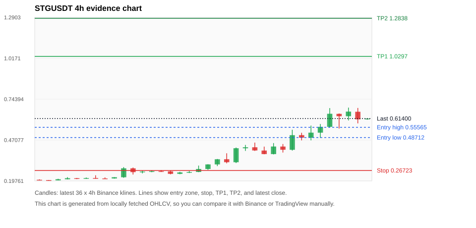
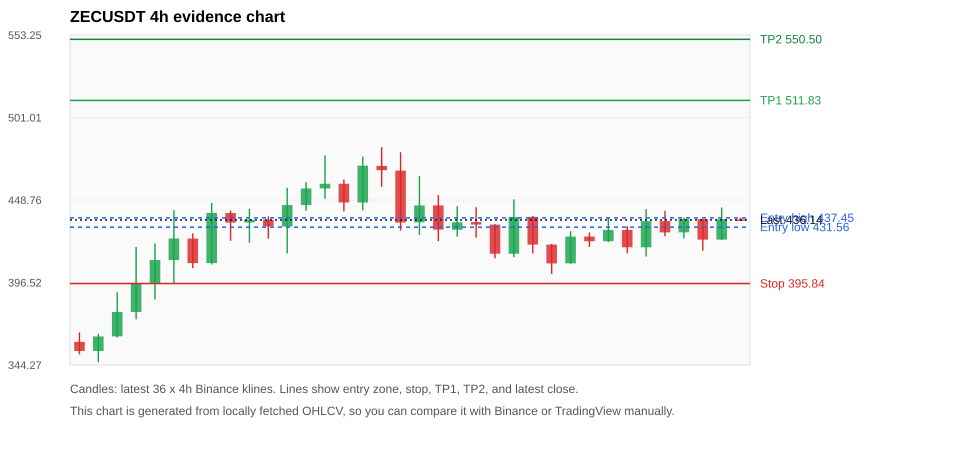
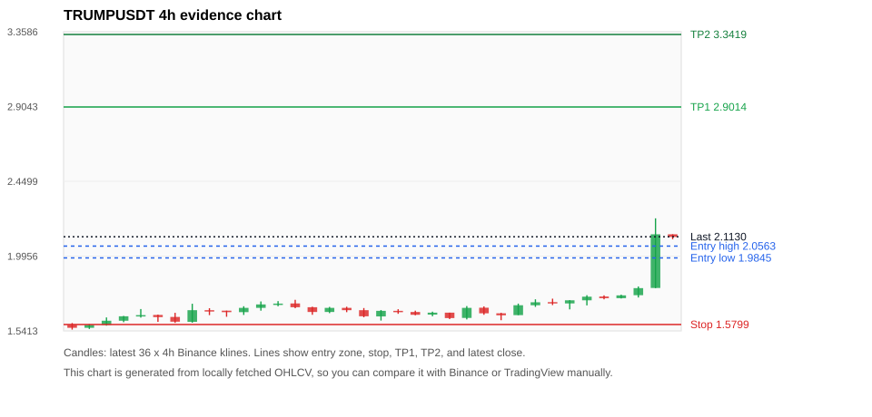
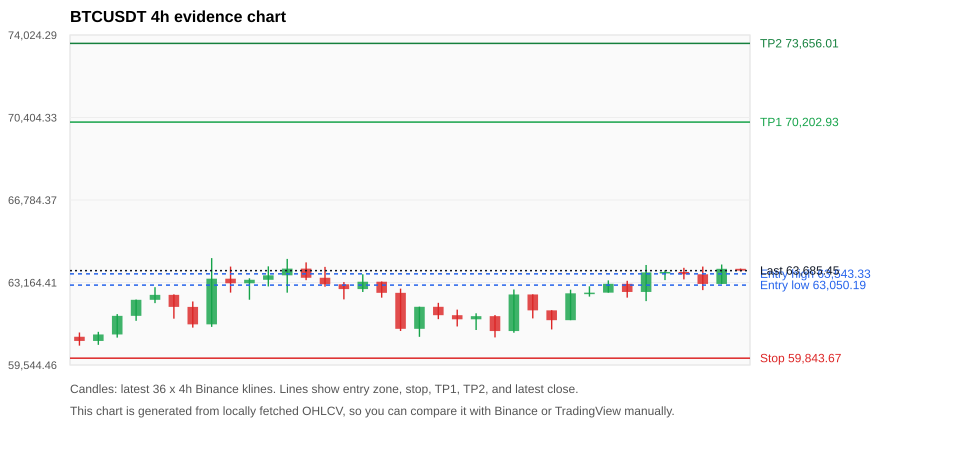
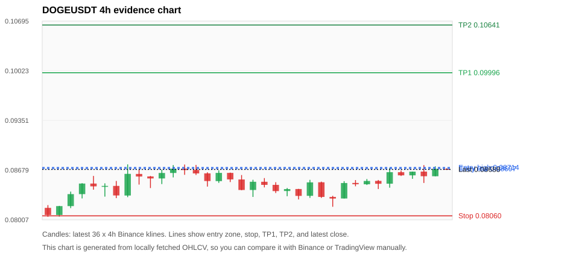

# Crypto 市场扫描报告 v1

- 报告时间：2026-06-12 20:06:35 CST
- 报告版本：v1
- 扫描 ID：eab67fa0be27
- 数据源：Binance public spot API + CoinGecko/CoinMarketCap cross-check
- 过滤条件：USDT spot; 24h quote volume >= 30,000,000; trades >= 30,000; exclude stables/leveraged tokens; analyze 1h/4h/1d klines
- 默认单笔风险：账户权益的 1.00%

## 限制说明

- 交易信号仍以 Binance 现货公开 K 线为主源；外部数据源用于一致性复核。
- 结果是研究和模拟盘计划，不是确定收益或实盘下单指令。
- 历史长度过滤：候选币至少需要 180 根 1d K 线。
- 数据质量验证池：先验证 score 排名前 min(top_n * 2, 10) 的候选，再按 action + score 补足最终名单。
- 大盘环境过滤：RISK_OFF; BTC/ETH 大盘偏弱，山寨币买入候选降级为观察。 BTC 7d=4.320999887481203; ETH 7d=5.537451054692433.
- 已启用数据交叉验证：Binance 主源 + CoinGecko 自动对照；CoinMarketCap 在配置 API Key 后自动对照。
- STGUSDT 交叉验证状态 DATA_WARNING：At least one external provider needs manual review.
- ZECUSDT 交叉验证状态 DATA_WARNING：At least one external provider needs manual review.
- TRUMPUSDT 交叉验证状态 DATA_WARNING：At least one external provider needs manual review.
- BTCUSDT 交叉验证状态 DATA_WARNING：At least one external provider needs manual review.
- DOGEUSDT 交叉验证状态 DATA_WARNING：At least one external provider needs manual review.
- XPLUSDT 交叉验证状态 DATA_WARNING：At least one external provider needs manual review.
- SOLUSDT 交叉验证状态 DATA_WARNING：At least one external provider needs manual review.
- ETHUSDT 交叉验证状态 DATA_WARNING：At least one external provider needs manual review.
- BNBUSDT 交叉验证状态 DATA_WARNING：At least one external provider needs manual review.
- NEARUSDT 交叉验证状态 DATA_WARNING：At least one external provider needs manual review.

## 5 个候选交易计划

| Rank | Coin | Action | Setup | Entry Zone | Stop Loss | TP1 | TP2 / Exit Rule | R/R | Verdict |
|---:|---|---|---|---:|---:|---:|---|---:|---|
| 1 | `STG` | `WATCH_ONLY` | 涨幅较远，只等深回调 | 0.48712 - 0.55565 | 0.26723 | 1.0297 | 1.2838 或跌破 4h 关键支撑 | 2.00-3.00 | 只等回调 |
| 2 | `ZEC` | `WATCH_ONLY` | 回踩支撑/4h EMA 附近 | 431.56 - 437.45 | 395.84 | 511.83 | 550.50 或跌破 4h 关键支撑 | 2.00-3.00 | 只观察 |
| 3 | `TRUMP` | `WATCH_ONLY` | 涨幅较远，只等深回调 | 1.9845 - 2.0563 | 1.5799 | 2.9014 | 3.3419 或跌破 4h 关键支撑 | 2.00-3.00 | 只等回调 |
| 4 | `BTC` | `WATCH_ONLY` | 回踩支撑/4h EMA 附近 | 63,050.19 - 63,543.33 | 59,843.67 | 70,202.93 | 73,656.01 或跌破 4h 关键支撑 | 2.00-3.00 | 只观察 |
| 5 | `DOGE` | `WATCH_ONLY` | 回踩支撑/4h EMA 附近 | 0.08697 - 0.08714 | 0.08060 | 0.09996 | 0.10641 或跌破 4h 关键支撑 | 2.00-3.00 | 只观察 |

## 数据交叉验证摘要

价格差异以 Binance 当前价为基准；成交量口径不同，Binance 是 USDT 现货成交额，CoinGecko/CoinMarketCap 通常是全市场成交量。

| Rank | Coin | Data Status | Max Price Diff | Max 24h Diff | Message |
|---:|---|---|---:|---:|---|
| 1 | `STG` | DATA_WARNING | 0.76% | 1.02 pts | At least one external provider needs manual review. |
| 2 | `ZEC` | DATA_WARNING | 0.07% | 0.05 pts | At least one external provider needs manual review. |
| 3 | `TRUMP` | DATA_WARNING | 0.62% | 0.41 pts | At least one external provider needs manual review. |
| 4 | `BTC` | DATA_WARNING | 0.11% | 0.05 pts | At least one external provider needs manual review. |
| 5 | `DOGE` | DATA_WARNING | 0.06% | 0.04 pts | At least one external provider needs manual review. |

## 候选币说明

### 1. STG `STGUSDT`



- 入选原因：涨幅较远，只等深回调；24h +26.12%，7d +158.85%，4h RSI 69.73，24h 成交额 $30.8M。
- 交易失效条件：跌破 0.2672305 或 4h 收盘重新失守关键支撑。
- 主要风险：距离支撑偏远，不能追市价；24h 振幅较大，回撤风险高；成交量突增，可能是事件驱动；BTC/ETH 大盘环境未确认强势，山寨币买入信号降级；数据交叉验证需要人工复核。
- 数据交叉验证：DATA_WARNING；At least one external provider needs manual review.

#### 可点击人工验证

- [Binance 交易页](https://www.binance.com/en/trade/STG_USDT)
- [TradingView 图表](https://www.tradingview.com/chart/?symbol=BINANCE%3ASTGUSDT)
- [CoinGecko 搜索](https://www.coingecko.com/en/search?query=STG)
- [CoinMarketCap 搜索](https://coinmarketcap.com/search/?q=STG)

#### 多数据源对照

| Source | Status | Asset ID | Price | 24h Change | 24h Volume | Price Diff | 24h Diff | Updated | Message |
|---|---|---|---:|---:|---:|---:|---:|---|---|
| Binance | DATA_OK | STGUSDT | 0.61400 | +26.12% | $30.8M | 0.00% | 0.00 pts | 2026-06-12T12:05:52+00:00 | Primary market data source used by scanner. |
| CoinGecko | DATA_OK | stargate-finance | 0.61107 | +25.41% | $157.1M | 0.48% | 0.71 pts | 2026-06-12T12:05:48.639Z | External source agrees with Binance within thresholds. |
| CoinMarketCap | DATA_WARNING | 18934 | 0.60933 | +25.11% | $138.0M | 0.76% | 1.02 pts | 2026-06-12T12:04:04.000Z | CoinMarketCap symbol mapping has 2 matches; selected lowest cmc_rank |

#### 指标证据

| 指标 | 数值 | 人工核对用途 |
|---|---:|---|
| 当前价 | 0.61400 | 与 Binance/TradingView 当前价格对照 |
| 24h 涨跌 | +26.12% | 与交易所 24h 涨跌对照 |
| 7d 涨跌 | +158.85% | 判断短线趋势是否延续 |
| 4h EMA20 | 0.48615 | 判断短期趋势支撑 |
| 4h EMA50 | 0.37431 | 判断中期趋势支撑 |
| 1d EMA20 | 0.32431 | 判断日线趋势 |
| 1d EMA50 | 0.26162 | 判断日线趋势 |
| 4h RSI14 | 69.73 | 判断是否过热/过弱 |
| 4h ATR14 | 0.07780 | 推导止损和入场缓冲 |
| 最近 18 根 4h 最低点 | 0.27130 | 支撑/止损参考 |
| 最近 36 根 4h 最高点 | 0.68730 | TP/压力参考 |
| 支撑位 | 0.48615 | 入场区间推导基础 |

#### 交易计划推导

- 支撑位 = 最近低点、4h EMA20、4h EMA50、1d EMA20 中不高于当前价的最高有效支撑 = `0.48615`。
- 入场区间 = 支撑位附近 + ATR 缓冲 = `0.48712 - 0.55565`。
- 止损 = min(最近 18 根 4h 最低点 * 0.985, 入场中位价 - 1.15 * ATR14) = `0.26723`。
- TP1 = max(最近 36 根 4h 最高点 * 0.995, 入场中位价 + 2R) = `1.0297`。
- TP2 = max(入场中位价 + 3R, TP1 * 1.04) = `1.2838`。

#### 最近 10 根 4h K线

| UTC 开盘时间 | Open | High | Low | Close | Quote Volume | Trades |
|---|---:|---:|---:|---:|---:|---:|
| 2026-06-11T00:00+00:00 | 0.42720 | 0.44410 | 0.38720 | 0.40580 | $2.0M | 32560 |
| 2026-06-11T04:00+00:00 | 0.40550 | 0.53930 | 0.40010 | 0.50320 | $5.5M | 78936 |
| 2026-06-11T08:00+00:00 | 0.50340 | 0.51930 | 0.46820 | 0.48650 | $2.1M | 39823 |
| 2026-06-11T12:00+00:00 | 0.48620 | 0.56730 | 0.46840 | 0.52000 | $3.6M | 68134 |
| 2026-06-11T16:00+00:00 | 0.51980 | 0.57780 | 0.48480 | 0.55890 | $4.6M | 62619 |
| 2026-06-11T20:00+00:00 | 0.55890 | 0.68410 | 0.55440 | 0.64620 | $7.8M | 103209 |
| 2026-06-12T00:00+00:00 | 0.64560 | 0.64830 | 0.54750 | 0.62960 | $5.4M | 85567 |
| 2026-06-12T04:00+00:00 | 0.62980 | 0.68730 | 0.60170 | 0.66060 | $5.4M | 91955 |
| 2026-06-12T08:00+00:00 | 0.65960 | 0.68500 | 0.58200 | 0.60880 | $4.0M | 60567 |
| 2026-06-12T12:00+00:00 | 0.60880 | 0.61540 | 0.60660 | 0.61400 | $48,586 | 649 |

### 2. ZEC `ZECUSDT`



- 入选原因：回踩支撑/4h EMA 附近；24h +1.76%，7d +42.67%，4h RSI 50.87，24h 成交额 $131.6M。
- 交易失效条件：跌破 395.84195 或 4h 收盘重新失守关键支撑。
- 主要风险：日线趋势未完全确认；BTC/ETH 大盘环境未确认强势，山寨币买入信号降级；数据交叉验证需要人工复核。
- 数据交叉验证：DATA_WARNING；At least one external provider needs manual review.

#### 可点击人工验证

- [Binance 交易页](https://www.binance.com/en/trade/ZEC_USDT)
- [TradingView 图表](https://www.tradingview.com/chart/?symbol=BINANCE%3AZECUSDT)
- [CoinGecko 搜索](https://www.coingecko.com/en/search?query=ZEC)
- [CoinMarketCap 搜索](https://coinmarketcap.com/search/?q=ZEC)

#### 多数据源对照

| Source | Status | Asset ID | Price | 24h Change | 24h Volume | Price Diff | 24h Diff | Updated | Message |
|---|---|---|---:|---:|---:|---:|---:|---|---|
| Binance | DATA_OK | ZECUSDT | 436.14 | +1.76% | $131.6M | 0.00% | 0.00 pts | 2026-06-12T12:05:52+00:00 | Primary market data source used by scanner. |
| CoinGecko | DATA_OK | zcash | 436.44 | +1.78% | $518.7M | 0.07% | 0.02 pts | 2026-06-12T12:05:43.515Z | External source agrees with Binance within thresholds. |
| CoinMarketCap | DATA_WARNING | 1437 | 436.30 | +1.71% | $614.1M | 0.04% | 0.05 pts | 2026-06-12T12:05:04.000Z | CoinMarketCap symbol mapping has 2 matches; selected lowest cmc_rank |

#### 指标证据

| 指标 | 数值 | 人工核对用途 |
|---|---:|---|
| 当前价 | 436.14 | 与 Binance/TradingView 当前价格对照 |
| 24h 涨跌 | +1.76% | 与交易所 24h 涨跌对照 |
| 7d 涨跌 | +42.67% | 判断短线趋势是否延续 |
| 4h EMA20 | 430.70 | 判断短期趋势支撑 |
| 4h EMA50 | 446.51 | 判断中期趋势支撑 |
| 1d EMA20 | 483.48 | 判断日线趋势 |
| 1d EMA50 | 477.67 | 判断日线趋势 |
| 4h RSI14 | 50.87 | 判断是否过热/过弱 |
| 4h ATR14 | 18.9679 | 推导止损和入场缓冲 |
| 最近 18 根 4h 最低点 | 401.87 | 支撑/止损参考 |
| 最近 36 根 4h 最高点 | 482.20 | TP/压力参考 |
| 支撑位 | 430.70 | 入场区间推导基础 |

#### 交易计划推导

- 支撑位 = 最近低点、4h EMA20、4h EMA50、1d EMA20 中不高于当前价的最高有效支撑 = `430.70`。
- 入场区间 = 支撑位附近 + ATR 缓冲 = `431.56 - 437.45`。
- 止损 = min(最近 18 根 4h 最低点 * 0.985, 入场中位价 - 1.15 * ATR14) = `395.84`。
- TP1 = max(最近 36 根 4h 最高点 * 0.995, 入场中位价 + 2R) = `511.83`。
- TP2 = max(入场中位价 + 3R, TP1 * 1.04) = `550.50`。

#### 最近 10 根 4h K线

| UTC 开盘时间 | Open | High | Low | Close | Quote Volume | Trades |
|---|---:|---:|---:|---:|---:|---:|
| 2026-06-11T00:00+00:00 | 408.65 | 429.03 | 408.39 | 425.58 | $19.2M | 75235 |
| 2026-06-11T04:00+00:00 | 425.63 | 428.16 | 419.02 | 422.64 | $12.6M | 53107 |
| 2026-06-11T08:00+00:00 | 422.64 | 437.41 | 422.10 | 429.82 | $21.5M | 61628 |
| 2026-06-11T12:00+00:00 | 429.81 | 432.26 | 414.98 | 418.81 | $28.6M | 91673 |
| 2026-06-11T16:00+00:00 | 418.81 | 443.00 | 412.97 | 435.36 | $28.9M | 120537 |
| 2026-06-11T20:00+00:00 | 435.42 | 441.90 | 425.83 | 428.26 | $15.8M | 66015 |
| 2026-06-12T00:00+00:00 | 428.29 | 437.73 | 424.50 | 436.62 | $13.5M | 56870 |
| 2026-06-12T04:00+00:00 | 436.55 | 436.78 | 416.60 | 423.65 | $21.8M | 76963 |
| 2026-06-12T08:00+00:00 | 423.70 | 444.00 | 423.51 | 436.55 | $23.1M | 86641 |
| 2026-06-12T12:00+00:00 | 436.47 | 437.54 | 435.52 | 436.14 | $364,129 | 1620 |

### 3. TRUMP `TRUMPUSDT`



- 入选原因：涨幅较远，只等深回调；24h +23.90%，7d +30.11%，4h RSI 83.82，24h 成交额 $43.3M。
- 交易失效条件：跌破 1.57994 或 4h 收盘重新失守关键支撑。
- 主要风险：距离支撑偏远，不能追市价；4h RSI 偏热；24h 振幅较大，回撤风险高；成交量突增，可能是事件驱动；日线趋势未完全确认；BTC/ETH 大盘环境未确认强势，山寨币买入信号降级；数据交叉验证需要人工复核。
- 数据交叉验证：DATA_WARNING；At least one external provider needs manual review.

#### 可点击人工验证

- [Binance 交易页](https://www.binance.com/en/trade/TRUMP_USDT)
- [TradingView 图表](https://www.tradingview.com/chart/?symbol=BINANCE%3ATRUMPUSDT)
- [CoinGecko 搜索](https://www.coingecko.com/en/search?query=TRUMP)
- [CoinMarketCap 搜索](https://coinmarketcap.com/search/?q=TRUMP)

#### 多数据源对照

| Source | Status | Asset ID | Price | 24h Change | 24h Volume | Price Diff | 24h Diff | Updated | Message |
|---|---|---|---:|---:|---:|---:|---:|---|---|
| Binance | DATA_OK | TRUMPUSDT | 2.1130 | +23.90% | $43.3M | 0.00% | 0.00 pts | 2026-06-12T12:05:52+00:00 | Primary market data source used by scanner. |
| CoinGecko | DATA_WARNING | official-trump | 2.1000 | +23.49% | $382.2M | 0.62% | 0.41 pts | 2026-06-12T12:05:43.875Z | CoinGecko symbol mapping has 2 exact matches; selected highest market-cap rank |
| CoinMarketCap | DATA_WARNING | 35336 | 2.1053 | +23.58% | $446.4M | 0.36% | 0.32 pts | 2026-06-12T12:05:04.000Z | CoinMarketCap symbol mapping has 61 matches; selected lowest cmc_rank |

#### 指标证据

| 指标 | 数值 | 人工核对用途 |
|---|---:|---|
| 当前价 | 2.1130 | 与 Binance/TradingView 当前价格对照 |
| 24h 涨跌 | +23.90% | 与交易所 24h 涨跌对照 |
| 7d 涨跌 | +30.11% | 判断短线趋势是否延续 |
| 4h EMA20 | 1.7800 | 判断短期趋势支撑 |
| 4h EMA50 | 1.7561 | 判断中期趋势支撑 |
| 1d EMA20 | 1.8787 | 判断日线趋势 |
| 1d EMA50 | 2.1575 | 判断日线趋势 |
| 4h RSI14 | 83.82 | 判断是否过热/过弱 |
| 4h ATR14 | 0.07557 | 推导止损和入场缓冲 |
| 最近 18 根 4h 最低点 | 1.6040 | 支撑/止损参考 |
| 最近 36 根 4h 最高点 | 2.2250 | TP/压力参考 |
| 支撑位 | 1.8787 | 入场区间推导基础 |

#### 交易计划推导

- 支撑位 = 最近低点、4h EMA20、4h EMA50、1d EMA20 中不高于当前价的最高有效支撑 = `1.8787`。
- 入场区间 = 支撑位附近 + ATR 缓冲 = `1.9845 - 2.0563`。
- 止损 = min(最近 18 根 4h 最低点 * 0.985, 入场中位价 - 1.15 * ATR14) = `1.5799`。
- TP1 = max(最近 36 根 4h 最高点 * 0.995, 入场中位价 + 2R) = `2.9014`。
- TP2 = max(入场中位价 + 3R, TP1 * 1.04) = `3.3419`。

#### 最近 10 根 4h K线

| UTC 开盘时间 | Open | High | Low | Close | Quote Volume | Trades |
|---|---:|---:|---:|---:|---:|---:|
| 2026-06-11T00:00+00:00 | 1.6370 | 1.7070 | 1.6370 | 1.6970 | $1.0M | 13788 |
| 2026-06-11T04:00+00:00 | 1.6970 | 1.7330 | 1.6870 | 1.7150 | $2.2M | 20071 |
| 2026-06-11T08:00+00:00 | 1.7160 | 1.7370 | 1.6980 | 1.7080 | $1.3M | 12923 |
| 2026-06-11T12:00+00:00 | 1.7080 | 1.7280 | 1.6720 | 1.7270 | $1.8M | 20978 |
| 2026-06-11T16:00+00:00 | 1.7270 | 1.7580 | 1.6960 | 1.7490 | $1.6M | 22881 |
| 2026-06-11T20:00+00:00 | 1.7500 | 1.7570 | 1.7330 | 1.7400 | $788,524 | 8895 |
| 2026-06-12T00:00+00:00 | 1.7400 | 1.7610 | 1.7380 | 1.7570 | $1.2M | 10351 |
| 2026-06-12T04:00+00:00 | 1.7580 | 1.8110 | 1.7440 | 1.8010 | $2.6M | 25418 |
| 2026-06-12T08:00+00:00 | 1.8020 | 2.2250 | 1.8010 | 2.1280 | $34.9M | 365185 |
| 2026-06-12T12:00+00:00 | 2.1280 | 2.1280 | 2.0980 | 2.1120 | $499,334 | 7554 |

### 4. BTC `BTCUSDT`



- 入选原因：回踩支撑/4h EMA 附近；24h +0.97%，7d +4.86%，4h RSI 63.34，24h 成交额 $1.14B。
- 交易失效条件：跌破 59843.675 或 4h 收盘重新失守关键支撑。
- 主要风险：日线趋势未完全确认；BTC/ETH 大盘环境未确认强势，山寨币买入信号降级；数据交叉验证需要人工复核。
- 数据交叉验证：DATA_WARNING；At least one external provider needs manual review.

#### 可点击人工验证

- [Binance 交易页](https://www.binance.com/en/trade/BTC_USDT)
- [TradingView 图表](https://www.tradingview.com/chart/?symbol=BINANCE%3ABTCUSDT)
- [CoinGecko 搜索](https://www.coingecko.com/en/search?query=BTC)
- [CoinMarketCap 搜索](https://coinmarketcap.com/search/?q=BTC)

#### 多数据源对照

| Source | Status | Asset ID | Price | 24h Change | 24h Volume | Price Diff | 24h Diff | Updated | Message |
|---|---|---|---:|---:|---:|---:|---:|---|---|
| Binance | DATA_OK | BTCUSDT | 63,685.45 | +0.97% | $1.14B | 0.00% | 0.00 pts | 2026-06-12T12:05:52+00:00 | Primary market data source used by scanner. |
| CoinGecko | DATA_OK | bitcoin | 63,617.00 | +1.02% | $30.64B | 0.11% | 0.05 pts | 2026-06-12T12:05:55.849Z | External source agrees with Binance within thresholds. |
| CoinMarketCap | DATA_WARNING | 1 | 63,612.32 | +0.97% | $29.40B | 0.11% | 0.00 pts | 2026-06-12T12:05:04.000Z | CoinMarketCap symbol mapping has 13 matches; selected lowest cmc_rank |

#### 指标证据

| 指标 | 数值 | 人工核对用途 |
|---|---:|---|
| 当前价 | 63,685.45 | 与 Binance/TradingView 当前价格对照 |
| 24h 涨跌 | +0.97% | 与交易所 24h 涨跌对照 |
| 7d 涨跌 | +4.86% | 判断短线趋势是否延续 |
| 4h EMA20 | 62,924.34 | 判断短期趋势支撑 |
| 4h EMA50 | 63,732.29 | 判断中期趋势支撑 |
| 1d EMA20 | 67,173.03 | 判断日线趋势 |
| 1d EMA50 | 71,389.19 | 判断日线趋势 |
| 4h RSI14 | 63.34 | 判断是否过热/过弱 |
| 4h ATR14 | 884.27 | 推导止损和入场缓冲 |
| 最近 18 根 4h 最低点 | 60,755.00 | 支撑/止损参考 |
| 最近 36 根 4h 最高点 | 64,234.68 | TP/压力参考 |
| 支撑位 | 62,924.34 | 入场区间推导基础 |

#### 交易计划推导

- 支撑位 = 最近低点、4h EMA20、4h EMA50、1d EMA20 中不高于当前价的最高有效支撑 = `62,924.34`。
- 入场区间 = 支撑位附近 + ATR 缓冲 = `63,050.19 - 63,543.33`。
- 止损 = min(最近 18 根 4h 最低点 * 0.985, 入场中位价 - 1.15 * ATR14) = `59,843.67`。
- TP1 = max(最近 36 根 4h 最高点 * 0.995, 入场中位价 + 2R) = `70,202.93`。
- TP2 = max(入场中位价 + 3R, TP1 * 1.04) = `73,656.01`。

#### 最近 10 根 4h K线

| UTC 开盘时间 | Open | High | Low | Close | Quote Volume | Trades |
|---|---:|---:|---:|---:|---:|---:|
| 2026-06-11T00:00+00:00 | 61,510.99 | 62,848.00 | 61,510.99 | 62,689.48 | $177.3M | 609797 |
| 2026-06-11T04:00+00:00 | 62,689.47 | 62,997.53 | 62,544.89 | 62,719.39 | $155.8M | 451403 |
| 2026-06-11T08:00+00:00 | 62,719.39 | 63,257.21 | 62,719.38 | 63,108.00 | $137.2M | 382423 |
| 2026-06-11T12:00+00:00 | 63,108.01 | 63,239.43 | 62,500.00 | 62,749.44 | $272.7M | 910921 |
| 2026-06-11T16:00+00:00 | 62,749.44 | 63,933.02 | 62,348.00 | 63,605.68 | $261.0M | 792771 |
| 2026-06-11T20:00+00:00 | 63,605.69 | 63,700.00 | 63,270.00 | 63,625.99 | $89.1M | 299488 |
| 2026-06-12T00:00+00:00 | 63,626.00 | 63,810.01 | 63,301.53 | 63,524.82 | $168.7M | 351019 |
| 2026-06-12T04:00+00:00 | 63,524.81 | 63,863.98 | 62,829.81 | 63,100.80 | $204.1M | 438376 |
| 2026-06-12T08:00+00:00 | 63,100.80 | 63,953.84 | 63,100.80 | 63,766.01 | $151.4M | 452201 |
| 2026-06-12T12:00+00:00 | 63,766.01 | 63,775.00 | 63,654.00 | 63,685.45 | $3.2M | 17770 |

### 5. DOGE `DOGEUSDT`



- 入选原因：回踩支撑/4h EMA 附近；24h +1.88%，7d +5.93%，4h RSI 60.88，24h 成交额 $61.3M。
- 交易失效条件：跌破 0.08060255 或 4h 收盘重新失守关键支撑。
- 主要风险：日线趋势未完全确认；BTC/ETH 大盘环境未确认强势，山寨币买入信号降级；数据交叉验证需要人工复核。
- 数据交叉验证：DATA_WARNING；At least one external provider needs manual review.

#### 可点击人工验证

- [Binance 交易页](https://www.binance.com/en/trade/DOGE_USDT)
- [TradingView 图表](https://www.tradingview.com/chart/?symbol=BINANCE%3ADOGEUSDT)
- [CoinGecko 搜索](https://www.coingecko.com/en/search?query=DOGE)
- [CoinMarketCap 搜索](https://coinmarketcap.com/search/?q=DOGE)

#### 多数据源对照

| Source | Status | Asset ID | Price | 24h Change | 24h Volume | Price Diff | 24h Diff | Updated | Message |
|---|---|---|---:|---:|---:|---:|---:|---|---|
| Binance | DATA_OK | DOGEUSDT | 0.08688 | +1.88% | $61.3M | 0.00% | 0.00 pts | 2026-06-12T12:05:52+00:00 | Primary market data source used by scanner. |
| CoinGecko | DATA_OK | dogecoin | 0.08682 | +1.90% | $796.6M | 0.06% | 0.03 pts | 2026-06-12T12:05:45.739Z | External source agrees with Binance within thresholds. |
| CoinMarketCap | DATA_WARNING | 74 | 0.08685 | +1.91% | $775.3M | 0.03% | 0.04 pts | 2026-06-12T12:05:04.000Z | CoinMarketCap symbol mapping has 23 matches; selected lowest cmc_rank |

#### 指标证据

| 指标 | 数值 | 人工核对用途 |
|---|---:|---|
| 当前价 | 0.08688 | 与 Binance/TradingView 当前价格对照 |
| 24h 涨跌 | +1.88% | 与交易所 24h 涨跌对照 |
| 7d 涨跌 | +5.93% | 判断短线趋势是否延续 |
| 4h EMA20 | 0.08557 | 判断短期趋势支撑 |
| 4h EMA50 | 0.08680 | 判断中期趋势支撑 |
| 1d EMA20 | 0.09159 | 判断日线趋势 |
| 1d EMA50 | 0.09692 | 判断日线趋势 |
| 4h RSI14 | 60.88 | 判断是否过热/过弱 |
| 4h ATR14 | 0.0015085714 | 推导止损和入场缓冲 |
| 最近 18 根 4h 最低点 | 0.08183 | 支撑/止损参考 |
| 最近 36 根 4h 最高点 | 0.08756 | TP/压力参考 |
| 支撑位 | 0.08680 | 入场区间推导基础 |

#### 交易计划推导

- 支撑位 = 最近低点、4h EMA20、4h EMA50、1d EMA20 中不高于当前价的最高有效支撑 = `0.08680`。
- 入场区间 = 支撑位附近 + ATR 缓冲 = `0.08697 - 0.08714`。
- 止损 = min(最近 18 根 4h 最低点 * 0.985, 入场中位价 - 1.15 * ATR14) = `0.08060`。
- TP1 = max(最近 36 根 4h 最高点 * 0.995, 入场中位价 + 2R) = `0.09996`。
- TP2 = max(入场中位价 + 3R, TP1 * 1.04) = `0.10641`。

#### 最近 10 根 4h K线

| UTC 开盘时间 | Open | High | Low | Close | Quote Volume | Trades |
|---|---:|---:|---:|---:|---:|---:|
| 2026-06-11T00:00+00:00 | 0.08295 | 0.08529 | 0.08295 | 0.08504 | $6.5M | 80699 |
| 2026-06-11T04:00+00:00 | 0.08505 | 0.08544 | 0.08460 | 0.08488 | $8.2M | 74090 |
| 2026-06-11T08:00+00:00 | 0.08487 | 0.08558 | 0.08478 | 0.08532 | $5.3M | 52827 |
| 2026-06-11T12:00+00:00 | 0.08533 | 0.08545 | 0.08423 | 0.08494 | $8.9M | 115217 |
| 2026-06-11T16:00+00:00 | 0.08495 | 0.08708 | 0.08441 | 0.08651 | $14.7M | 145332 |
| 2026-06-11T20:00+00:00 | 0.08651 | 0.08673 | 0.08599 | 0.08608 | $5.2M | 50912 |
| 2026-06-12T00:00+00:00 | 0.08608 | 0.08659 | 0.08561 | 0.08658 | $5.2M | 59393 |
| 2026-06-12T04:00+00:00 | 0.08659 | 0.08746 | 0.08505 | 0.08596 | $19.5M | 138210 |
| 2026-06-12T08:00+00:00 | 0.08596 | 0.08730 | 0.08595 | 0.08696 | $7.9M | 83967 |
| 2026-06-12T12:00+00:00 | 0.08695 | 0.08703 | 0.08682 | 0.08688 | $213,766 | 2568 |

## 组合风控

- 不要 5 个候选全部满仓买入。
- 同时持仓总风险建议控制在账户权益的 3% - 5% 以内。
- 如果 BTC/ETH 同时破位，暂停山寨币多头计划或降低仓位。
- 第一版报告用于模拟盘和人工复核，不自动下单。

## 原始数据

```json
[
  {
    "rank": 1,
    "symbol": "STGUSDT",
    "base_asset": "STG",
    "price": 0.614,
    "score": 55.17119208805866,
    "setup": "涨幅较远，只等深回调",
    "verdict": "只等回调",
    "entry_low": 0.48711842484329704,
    "entry_high": 0.55565,
    "stop_loss": 0.2672305,
    "take_profit_1": 1.0296916372649458,
    "take_profit_2": 1.2838453496865943,
    "risk_reward_1": 2.0000000000000004,
    "risk_reward_2": 3.0,
    "pct_24h": 26.124,
    "pct_3d": 112.01657458563533,
    "pct_7d": 158.85328836424958,
    "quote_volume_24h": 30794760.8135,
    "trades_24h": 471857,
    "high_low_range_24h": 46.73356105892401,
    "rsi_1h": 43.147208121827404,
    "rsi_4h": 69.72714598685522,
    "ema20_4h": 0.48614613257814077,
    "ema50_4h": 0.3743107185510693,
    "ema20_1d": 0.3243124521389552,
    "ema50_1d": 0.2616183624185688,
    "atr_4h": 0.0778,
    "macd_hist_4h": 0.015668092606147654,
    "volume_ratio_24h": 4.107628386990642,
    "support_level": 0.48614613257814077,
    "recent_low_4h_18": 0.2713,
    "recent_high_4h_36": 0.6873,
    "distance_to_support_pct": 26.2994722890876,
    "binance_trade_url": "https://www.binance.com/en/trade/STG_USDT",
    "tradingview_url": "https://www.tradingview.com/chart/?symbol=BINANCE%3ASTGUSDT",
    "coingecko_search_url": "https://www.coingecko.com/en/search?query=STG",
    "coinmarketcap_search_url": "https://coinmarketcap.com/search/?q=STG",
    "invalidation": "跌破 0.2672305 或 4h 收盘重新失守关键支撑",
    "recent_4h_klines": [
      {
        "open_time_utc": "2026-06-06T16:00+00:00",
        "open": 0.2053,
        "high": 0.208,
        "low": 0.2019,
        "close": 0.2024,
        "quote_volume": 78512.90207,
        "trades": 2195
      },
      {
        "open_time_utc": "2026-06-06T20:00+00:00",
        "open": 0.2026,
        "high": 0.2027,
        "low": 0.1986,
        "close": 0.201,
        "quote_volume": 62320.59869,
        "trades": 2022
      },
      {
        "open_time_utc": "2026-06-07T00:00+00:00",
        "open": 0.2013,
        "high": 0.2118,
        "low": 0.2009,
        "close": 0.2087,
        "quote_volume": 161505.43651,
        "trades": 3936
      },
      {
        "open_time_utc": "2026-06-07T04:00+00:00",
        "open": 0.2087,
        "high": 0.2228,
        "low": 0.2079,
        "close": 0.2158,
        "quote_volume": 239029.45531,
        "trades": 5952
      },
      {
        "open_time_utc": "2026-06-07T08:00+00:00",
        "open": 0.2157,
        "high": 0.2174,
        "low": 0.2098,
        "close": 0.2125,
        "quote_volume": 157089.09908,
        "trades": 3594
      },
      {
        "open_time_utc": "2026-06-07T12:00+00:00",
        "open": 0.2126,
        "high": 0.2203,
        "low": 0.2114,
        "close": 0.2165,
        "quote_volume": 130847.1906,
        "trades": 3484
      },
      {
        "open_time_utc": "2026-06-07T16:00+00:00",
        "open": 0.2168,
        "high": 0.2353,
        "low": 0.2128,
        "close": 0.2145,
        "quote_volume": 522524.69114,
        "trades": 11413
      },
      {
        "open_time_utc": "2026-06-07T20:00+00:00",
        "open": 0.2142,
        "high": 0.2212,
        "low": 0.2117,
        "close": 0.2137,
        "quote_volume": 105951.10808,
        "trades": 2917
      },
      {
        "open_time_utc": "2026-06-08T00:00+00:00",
        "open": 0.2139,
        "high": 0.2224,
        "low": 0.213,
        "close": 0.2221,
        "quote_volume": 167343.35967,
        "trades": 4398
      },
      {
        "open_time_utc": "2026-06-08T04:00+00:00",
        "open": 0.2221,
        "high": 0.29,
        "low": 0.2184,
        "close": 0.2818,
        "quote_volume": 1099576.77063,
        "trades": 22085
      },
      {
        "open_time_utc": "2026-06-08T08:00+00:00",
        "open": 0.2817,
        "high": 0.2871,
        "low": 0.2402,
        "close": 0.2562,
        "quote_volume": 2112467.16584,
        "trades": 46662
      },
      {
        "open_time_utc": "2026-06-08T12:00+00:00",
        "open": 0.2564,
        "high": 0.266,
        "low": 0.2478,
        "close": 0.2602,
        "quote_volume": 971469.5179,
        "trades": 14915
      },
      {
        "open_time_utc": "2026-06-08T16:00+00:00",
        "open": 0.26,
        "high": 0.2681,
        "low": 0.2559,
        "close": 0.2626,
        "quote_volume": 739973.79178,
        "trades": 13503
      },
      {
        "open_time_utc": "2026-06-08T20:00+00:00",
        "open": 0.2626,
        "high": 0.27,
        "low": 0.2576,
        "close": 0.2612,
        "quote_volume": 343197.51454,
        "trades": 9419
      },
      {
        "open_time_utc": "2026-06-09T00:00+00:00",
        "open": 0.2613,
        "high": 0.2661,
        "low": 0.2416,
        "close": 0.2447,
        "quote_volume": 803490.91758,
        "trades": 16792
      },
      {
        "open_time_utc": "2026-06-09T04:00+00:00",
        "open": 0.2449,
        "high": 0.2584,
        "low": 0.2426,
        "close": 0.2544,
        "quote_volume": 293648.24678,
        "trades": 10386
      },
      {
        "open_time_utc": "2026-06-09T08:00+00:00",
        "open": 0.2543,
        "high": 0.2639,
        "low": 0.2502,
        "close": 0.2571,
        "quote_volume": 570729.83984,
        "trades": 17792
      },
      {
        "open_time_utc": "2026-06-09T12:00+00:00",
        "open": 0.2572,
        "high": 0.3,
        "low": 0.2562,
        "close": 0.2773,
        "quote_volume": 1997299.30345,
        "trades": 55179
      },
      {
        "open_time_utc": "2026-06-09T16:00+00:00",
        "open": 0.2772,
        "high": 0.3089,
        "low": 0.2713,
        "close": 0.3079,
        "quote_volume": 1035357.51116,
        "trades": 32470
      },
      {
        "open_time_utc": "2026-06-09T20:00+00:00",
        "open": 0.3079,
        "high": 0.344,
        "low": 0.2966,
        "close": 0.3422,
        "quote_volume": 2188844.46232,
        "trades": 53848
      },
      {
        "open_time_utc": "2026-06-10T00:00+00:00",
        "open": 0.3424,
        "high": 0.3822,
        "low": 0.3152,
        "close": 0.3225,
        "quote_volume": 3303912.27444,
        "trades": 88883
      },
      {
        "open_time_utc": "2026-06-10T04:00+00:00",
        "open": 0.3224,
        "high": 0.4208,
        "low": 0.3168,
        "close": 0.4159,
        "quote_volume": 3670580.91643,
        "trades": 98079
      },
      {
        "open_time_utc": "2026-06-10T08:00+00:00",
        "open": 0.4156,
        "high": 0.438,
        "low": 0.3981,
        "close": 0.4222,
        "quote_volume": 3838389.96375,
        "trades": 101820
      },
      {
        "open_time_utc": "2026-06-10T12:00+00:00",
        "open": 0.4223,
        "high": 0.4536,
        "low": 0.3978,
        "close": 0.401,
        "quote_volume": 3734013.57804,
        "trades": 82753
      },
      {
        "open_time_utc": "2026-06-10T16:00+00:00",
        "open": 0.4005,
        "high": 0.4268,
        "low": 0.3757,
        "close": 0.3769,
        "quote_volume": 1964323.4539,
        "trades": 33351
      },
      {
        "open_time_utc": "2026-06-10T20:00+00:00",
        "open": 0.3768,
        "high": 0.4502,
        "low": 0.3748,
        "close": 0.4274,
        "quote_volume": 2544587.69274,
        "trades": 37420
      },
      {
        "open_time_utc": "2026-06-11T00:00+00:00",
        "open": 0.4272,
        "high": 0.4441,
        "low": 0.3872,
        "close": 0.4058,
        "quote_volume": 2014799.74216,
        "trades": 32560
      },
      {
        "open_time_utc": "2026-06-11T04:00+00:00",
        "open": 0.4055,
        "high": 0.5393,
        "low": 0.4001,
        "close": 0.5032,
        "quote_volume": 5529150.71048,
        "trades": 78936
      },
      {
        "open_time_utc": "2026-06-11T08:00+00:00",
        "open": 0.5034,
        "high": 0.5193,
        "low": 0.4682,
        "close": 0.4865,
        "quote_volume": 2090074.68491,
        "trades": 39823
      },
      {
        "open_time_utc": "2026-06-11T12:00+00:00",
        "open": 0.4862,
        "high": 0.5673,
        "low": 0.4684,
        "close": 0.52,
        "quote_volume": 3646894.74749,
        "trades": 68134
      },
      {
        "open_time_utc": "2026-06-11T16:00+00:00",
        "open": 0.5198,
        "high": 0.5778,
        "low": 0.4848,
        "close": 0.5589,
        "quote_volume": 4642817.08797,
        "trades": 62619
      },
      {
        "open_time_utc": "2026-06-11T20:00+00:00",
        "open": 0.5589,
        "high": 0.6841,
        "low": 0.5544,
        "close": 0.6462,
        "quote_volume": 7750330.94041,
        "trades": 103209
      },
      {
        "open_time_utc": "2026-06-12T00:00+00:00",
        "open": 0.6456,
        "high": 0.6483,
        "low": 0.5475,
        "close": 0.6296,
        "quote_volume": 5392197.3464,
        "trades": 85567
      },
      {
        "open_time_utc": "2026-06-12T04:00+00:00",
        "open": 0.6298,
        "high": 0.6873,
        "low": 0.6017,
        "close": 0.6606,
        "quote_volume": 5373866.53606,
        "trades": 91955
      },
      {
        "open_time_utc": "2026-06-12T08:00+00:00",
        "open": 0.6596,
        "high": 0.685,
        "low": 0.582,
        "close": 0.6088,
        "quote_volume": 3997162.75469,
        "trades": 60567
      },
      {
        "open_time_utc": "2026-06-12T12:00+00:00",
        "open": 0.6088,
        "high": 0.6154,
        "low": 0.6066,
        "close": 0.614,
        "quote_volume": 48586.43383,
        "trades": 649
      }
    ],
    "risks": [
      "距离支撑偏远，不能追市价",
      "24h 振幅较大，回撤风险高",
      "成交量突增，可能是事件驱动",
      "BTC/ETH 大盘环境未确认强势，山寨币买入信号降级",
      "数据交叉验证需要人工复核"
    ],
    "data_quality_status": "DATA_WARNING",
    "data_quality_message": "At least one external provider needs manual review.",
    "data_checks": [
      {
        "provider": "Binance",
        "status": "DATA_OK",
        "provider_asset_id": "STGUSDT",
        "provider_symbol": "STGUSDT",
        "price_usd": 0.614,
        "pct_24h": 26.124,
        "volume_24h": 30794760.8135,
        "last_updated": null,
        "fetched_at_utc": "2026-06-12T12:05:52+00:00",
        "price_diff_pct": 0.0,
        "pct_24h_diff": 0.0,
        "volume_note": "Binance USDT spot 24h quoteVolume.",
        "message": "Primary market data source used by scanner."
      },
      {
        "provider": "CoinGecko",
        "status": "DATA_OK",
        "provider_asset_id": "stargate-finance",
        "provider_symbol": "STG",
        "price_usd": 0.611066,
        "pct_24h": 25.40933,
        "volume_24h": 157109149.0,
        "last_updated": "2026-06-12T12:05:48.639Z",
        "fetched_at_utc": "2026-06-12T12:05:52+00:00",
        "price_diff_pct": 0.47785016286644827,
        "pct_24h_diff": 0.7146699999999981,
        "volume_note": "CoinGecko total market volume; not the same venue scope as Binance quoteVolume.",
        "message": "External source agrees with Binance within thresholds."
      },
      {
        "provider": "CoinMarketCap",
        "status": "DATA_WARNING",
        "provider_asset_id": "18934",
        "provider_symbol": "STG",
        "price_usd": 0.6093334535128441,
        "pct_24h": 25.1088217,
        "volume_24h": 137974623.7715064,
        "last_updated": "2026-06-12T12:04:04.000Z",
        "fetched_at_utc": "2026-06-12T12:05:52+00:00",
        "price_diff_pct": 0.7600238578429838,
        "pct_24h_diff": 1.0151782999999988,
        "volume_note": "CoinMarketCap total market volume; not the same venue scope as Binance quoteVolume.",
        "message": "CoinMarketCap symbol mapping has 2 matches; selected lowest cmc_rank"
      }
    ],
    "action": "WATCH_ONLY"
  },
  {
    "rank": 2,
    "symbol": "ZECUSDT",
    "base_asset": "ZEC",
    "price": 436.14,
    "score": 46.68989519324346,
    "setup": "回踩支撑/4h EMA 附近",
    "verdict": "只观察",
    "entry_low": 431.56356687651504,
    "entry_high": 437.44841999999994,
    "stop_loss": 395.84195,
    "take_profit_1": 511.83408031477256,
    "take_profit_2": 550.4981237530301,
    "risk_reward_1": 2.0,
    "risk_reward_2": 3.0,
    "pct_24h": 1.762,
    "pct_3d": -6.678078527869912,
    "pct_7d": 42.673950734404144,
    "quote_volume_24h": 131585338.0827,
    "trades_24h": 498604,
    "high_low_range_24h": 7.513862992469189,
    "rsi_1h": 52.16708542713567,
    "rsi_4h": 50.87132967295296,
    "ema20_4h": 430.7021625514122,
    "ema50_4h": 446.50899784163084,
    "ema20_1d": 483.4752941599592,
    "ema50_1d": 477.6729395244963,
    "atr_4h": 18.967857142857138,
    "macd_hist_4h": 1.4071177484269186,
    "volume_ratio_24h": 0.43604767284368406,
    "support_level": 430.7021625514122,
    "recent_low_4h_18": 401.87,
    "recent_high_4h_36": 482.2,
    "distance_to_support_pct": 1.2625516938143289,
    "binance_trade_url": "https://www.binance.com/en/trade/ZEC_USDT",
    "tradingview_url": "https://www.tradingview.com/chart/?symbol=BINANCE%3AZECUSDT",
    "coingecko_search_url": "https://www.coingecko.com/en/search?query=ZEC",
    "coinmarketcap_search_url": "https://coinmarketcap.com/search/?q=ZEC",
    "invalidation": "跌破 395.84195 或 4h 收盘重新失守关键支撑",
    "recent_4h_klines": [
      {
        "open_time_utc": "2026-06-06T16:00+00:00",
        "open": 358.95,
        "high": 364.88,
        "low": 351.0,
        "close": 353.17,
        "quote_volume": 34895966.30099,
        "trades": 168788
      },
      {
        "open_time_utc": "2026-06-06T20:00+00:00",
        "open": 353.16,
        "high": 364.06,
        "low": 346.0,
        "close": 362.36,
        "quote_volume": 37769313.89208,
        "trades": 165665
      },
      {
        "open_time_utc": "2026-06-07T00:00+00:00",
        "open": 362.4,
        "high": 390.36,
        "low": 361.59,
        "close": 377.87,
        "quote_volume": 45805123.44548,
        "trades": 206827
      },
      {
        "open_time_utc": "2026-06-07T04:00+00:00",
        "open": 377.86,
        "high": 419.0,
        "low": 373.24,
        "close": 396.0,
        "quote_volume": 93263727.01206,
        "trades": 351189
      },
      {
        "open_time_utc": "2026-06-07T08:00+00:00",
        "open": 396.11,
        "high": 421.24,
        "low": 385.71,
        "close": 410.78,
        "quote_volume": 42365359.64073,
        "trades": 179414
      },
      {
        "open_time_utc": "2026-06-07T12:00+00:00",
        "open": 410.75,
        "high": 442.29,
        "low": 396.26,
        "close": 424.38,
        "quote_volume": 69541304.79428,
        "trades": 261448
      },
      {
        "open_time_utc": "2026-06-07T16:00+00:00",
        "open": 424.36,
        "high": 427.68,
        "low": 405.56,
        "close": 408.75,
        "quote_volume": 37299743.70011,
        "trades": 171873
      },
      {
        "open_time_utc": "2026-06-07T20:00+00:00",
        "open": 408.8,
        "high": 446.99,
        "low": 407.93,
        "close": 440.6,
        "quote_volume": 56898382.89398,
        "trades": 202183
      },
      {
        "open_time_utc": "2026-06-08T00:00+00:00",
        "open": 440.5,
        "high": 442.07,
        "low": 422.92,
        "close": 434.45,
        "quote_volume": 30876134.07331,
        "trades": 119724
      },
      {
        "open_time_utc": "2026-06-08T04:00+00:00",
        "open": 434.56,
        "high": 443.13,
        "low": 421.63,
        "close": 436.24,
        "quote_volume": 31677094.50383,
        "trades": 114257
      },
      {
        "open_time_utc": "2026-06-08T08:00+00:00",
        "open": 436.2,
        "high": 438.34,
        "low": 424.25,
        "close": 432.02,
        "quote_volume": 24656223.76699,
        "trades": 97938
      },
      {
        "open_time_utc": "2026-06-08T12:00+00:00",
        "open": 431.97,
        "high": 456.5,
        "low": 414.91,
        "close": 445.55,
        "quote_volume": 46207183.63346,
        "trades": 172739
      },
      {
        "open_time_utc": "2026-06-08T16:00+00:00",
        "open": 445.54,
        "high": 460.07,
        "low": 441.97,
        "close": 456.08,
        "quote_volume": 35481803.82282,
        "trades": 125503
      },
      {
        "open_time_utc": "2026-06-08T20:00+00:00",
        "open": 456.08,
        "high": 477.02,
        "low": 449.55,
        "close": 459.04,
        "quote_volume": 42114948.78272,
        "trades": 135357
      },
      {
        "open_time_utc": "2026-06-09T00:00+00:00",
        "open": 459.04,
        "high": 461.75,
        "low": 441.5,
        "close": 447.19,
        "quote_volume": 27543367.33586,
        "trades": 106077
      },
      {
        "open_time_utc": "2026-06-09T04:00+00:00",
        "open": 447.18,
        "high": 476.28,
        "low": 442.23,
        "close": 470.51,
        "quote_volume": 35145433.6564,
        "trades": 111696
      },
      {
        "open_time_utc": "2026-06-09T08:00+00:00",
        "open": 470.35,
        "high": 482.2,
        "low": 457.07,
        "close": 467.63,
        "quote_volume": 35345174.10322,
        "trades": 119712
      },
      {
        "open_time_utc": "2026-06-09T12:00+00:00",
        "open": 467.4,
        "high": 479.0,
        "low": 429.33,
        "close": 434.51,
        "quote_volume": 52826443.29157,
        "trades": 166734
      },
      {
        "open_time_utc": "2026-06-09T16:00+00:00",
        "open": 434.6,
        "high": 464.04,
        "low": 426.66,
        "close": 445.29,
        "quote_volume": 53407941.54962,
        "trades": 171383
      },
      {
        "open_time_utc": "2026-06-09T20:00+00:00",
        "open": 445.35,
        "high": 451.92,
        "low": 422.71,
        "close": 430.02,
        "quote_volume": 31663357.48657,
        "trades": 94238
      },
      {
        "open_time_utc": "2026-06-10T00:00+00:00",
        "open": 429.95,
        "high": 444.84,
        "low": 425.52,
        "close": 434.67,
        "quote_volume": 24297466.70274,
        "trades": 116244
      },
      {
        "open_time_utc": "2026-06-10T04:00+00:00",
        "open": 434.78,
        "high": 444.18,
        "low": 424.93,
        "close": 433.22,
        "quote_volume": 28990363.681,
        "trades": 91960
      },
      {
        "open_time_utc": "2026-06-10T08:00+00:00",
        "open": 433.15,
        "high": 433.47,
        "low": 411.79,
        "close": 414.74,
        "quote_volume": 29174697.47901,
        "trades": 100080
      },
      {
        "open_time_utc": "2026-06-10T12:00+00:00",
        "open": 414.73,
        "high": 449.13,
        "low": 412.48,
        "close": 438.02,
        "quote_volume": 42056326.62083,
        "trades": 157151
      },
      {
        "open_time_utc": "2026-06-10T16:00+00:00",
        "open": 438.07,
        "high": 438.63,
        "low": 414.88,
        "close": 420.51,
        "quote_volume": 28301390.80643,
        "trades": 116748
      },
      {
        "open_time_utc": "2026-06-10T20:00+00:00",
        "open": 420.5,
        "high": 420.95,
        "low": 401.87,
        "close": 408.61,
        "quote_volume": 25027940.76066,
        "trades": 101067
      },
      {
        "open_time_utc": "2026-06-11T00:00+00:00",
        "open": 408.65,
        "high": 429.03,
        "low": 408.39,
        "close": 425.58,
        "quote_volume": 19212828.63735,
        "trades": 75235
      },
      {
        "open_time_utc": "2026-06-11T04:00+00:00",
        "open": 425.63,
        "high": 428.16,
        "low": 419.02,
        "close": 422.64,
        "quote_volume": 12611013.89522,
        "trades": 53107
      },
      {
        "open_time_utc": "2026-06-11T08:00+00:00",
        "open": 422.64,
        "high": 437.41,
        "low": 422.1,
        "close": 429.82,
        "quote_volume": 21515245.45308,
        "trades": 61628
      },
      {
        "open_time_utc": "2026-06-11T12:00+00:00",
        "open": 429.81,
        "high": 432.26,
        "low": 414.98,
        "close": 418.81,
        "quote_volume": 28636388.0807,
        "trades": 91673
      },
      {
        "open_time_utc": "2026-06-11T16:00+00:00",
        "open": 418.81,
        "high": 443.0,
        "low": 412.97,
        "close": 435.36,
        "quote_volume": 28863129.62741,
        "trades": 120537
      },
      {
        "open_time_utc": "2026-06-11T20:00+00:00",
        "open": 435.42,
        "high": 441.9,
        "low": 425.83,
        "close": 428.26,
        "quote_volume": 15814588.55505,
        "trades": 66015
      },
      {
        "open_time_utc": "2026-06-12T00:00+00:00",
        "open": 428.29,
        "high": 437.73,
        "low": 424.5,
        "close": 436.62,
        "quote_volume": 13487571.28306,
        "trades": 56870
      },
      {
        "open_time_utc": "2026-06-12T04:00+00:00",
        "open": 436.55,
        "high": 436.78,
        "low": 416.6,
        "close": 423.65,
        "quote_volume": 21843210.79358,
        "trades": 76963
      },
      {
        "open_time_utc": "2026-06-12T08:00+00:00",
        "open": 423.7,
        "high": 444.0,
        "low": 423.51,
        "close": 436.55,
        "quote_volume": 23123632.27434,
        "trades": 86641
      },
      {
        "open_time_utc": "2026-06-12T12:00+00:00",
        "open": 436.47,
        "high": 437.54,
        "low": 435.52,
        "close": 436.14,
        "quote_volume": 364129.03007,
        "trades": 1620
      }
    ],
    "risks": [
      "日线趋势未完全确认",
      "BTC/ETH 大盘环境未确认强势，山寨币买入信号降级",
      "数据交叉验证需要人工复核"
    ],
    "data_quality_status": "DATA_WARNING",
    "data_quality_message": "At least one external provider needs manual review.",
    "data_checks": [
      {
        "provider": "Binance",
        "status": "DATA_OK",
        "provider_asset_id": "ZECUSDT",
        "provider_symbol": "ZECUSDT",
        "price_usd": 436.14,
        "pct_24h": 1.762,
        "volume_24h": 131585338.0827,
        "last_updated": null,
        "fetched_at_utc": "2026-06-12T12:05:52+00:00",
        "price_diff_pct": 0.0,
        "pct_24h_diff": 0.0,
        "volume_note": "Binance USDT spot 24h quoteVolume.",
        "message": "Primary market data source used by scanner."
      },
      {
        "provider": "CoinGecko",
        "status": "DATA_OK",
        "provider_asset_id": "zcash",
        "provider_symbol": "ZEC",
        "price_usd": 436.44,
        "pct_24h": 1.77774,
        "volume_24h": 518672169.0,
        "last_updated": "2026-06-12T12:05:43.515Z",
        "fetched_at_utc": "2026-06-12T12:05:52+00:00",
        "price_diff_pct": 0.06878525244187907,
        "pct_24h_diff": 0.015740000000000087,
        "volume_note": "CoinGecko total market volume; not the same venue scope as Binance quoteVolume.",
        "message": "External source agrees with Binance within thresholds."
      },
      {
        "provider": "CoinMarketCap",
        "status": "DATA_WARNING",
        "provider_asset_id": "1437",
        "provider_symbol": "ZEC",
        "price_usd": 436.2966682341734,
        "pct_24h": 1.71391902,
        "volume_24h": 614138329.0200174,
        "last_updated": "2026-06-12T12:05:04.000Z",
        "fetched_at_utc": "2026-06-12T12:05:52+00:00",
        "price_diff_pct": 0.03592154679080652,
        "pct_24h_diff": 0.04808097999999994,
        "volume_note": "CoinMarketCap total market volume; not the same venue scope as Binance quoteVolume.",
        "message": "CoinMarketCap symbol mapping has 2 matches; selected lowest cmc_rank"
      }
    ],
    "action": "WATCH_ONLY"
  },
  {
    "rank": 3,
    "symbol": "TRUMPUSDT",
    "base_asset": "TRUMP",
    "price": 2.113,
    "score": 34.8527369769795,
    "setup": "涨幅较远，只等深回调",
    "verdict": "只等回调",
    "entry_low": 1.9845285714285714,
    "entry_high": 2.0563214285714286,
    "stop_loss": 1.5799400000000001,
    "take_profit_1": 2.9013949999999995,
    "take_profit_2": 3.3418799999999993,
    "risk_reward_1": 2.0,
    "risk_reward_2": 3.0,
    "pct_24h": 23.899,
    "pct_3d": 26.526946107784433,
    "pct_7d": 30.110837438423644,
    "quote_volume_24h": 43322205.12354,
    "trades_24h": 460761,
    "high_low_range_24h": 33.07416267942585,
    "rsi_1h": 89.21775898520086,
    "rsi_4h": 83.82352941176468,
    "ema20_4h": 1.7799904059421838,
    "ema50_4h": 1.7561400541784502,
    "ema20_1d": 1.8787161764765998,
    "ema50_1d": 2.1575060452450514,
    "atr_4h": 0.0755714285714286,
    "macd_hist_4h": 0.047779646089678676,
    "volume_ratio_24h": 4.842290480838525,
    "support_level": 1.8787161764765998,
    "recent_low_4h_18": 1.604,
    "recent_high_4h_36": 2.225,
    "distance_to_support_pct": 12.470421368425267,
    "binance_trade_url": "https://www.binance.com/en/trade/TRUMP_USDT",
    "tradingview_url": "https://www.tradingview.com/chart/?symbol=BINANCE%3ATRUMPUSDT",
    "coingecko_search_url": "https://www.coingecko.com/en/search?query=TRUMP",
    "coinmarketcap_search_url": "https://coinmarketcap.com/search/?q=TRUMP",
    "invalidation": "跌破 1.57994 或 4h 收盘重新失守关键支撑",
    "recent_4h_klines": [
      {
        "open_time_utc": "2026-06-06T16:00+00:00",
        "open": 1.578,
        "high": 1.589,
        "low": 1.549,
        "close": 1.56,
        "quote_volume": 1218800.044926,
        "trades": 11846
      },
      {
        "open_time_utc": "2026-06-06T20:00+00:00",
        "open": 1.56,
        "high": 1.582,
        "low": 1.553,
        "close": 1.578,
        "quote_volume": 750225.788309,
        "trades": 6745
      },
      {
        "open_time_utc": "2026-06-07T00:00+00:00",
        "open": 1.578,
        "high": 1.623,
        "low": 1.573,
        "close": 1.603,
        "quote_volume": 996901.367359,
        "trades": 11666
      },
      {
        "open_time_utc": "2026-06-07T04:00+00:00",
        "open": 1.603,
        "high": 1.632,
        "low": 1.594,
        "close": 1.63,
        "quote_volume": 1003681.487801,
        "trades": 10399
      },
      {
        "open_time_utc": "2026-06-07T08:00+00:00",
        "open": 1.63,
        "high": 1.674,
        "low": 1.622,
        "close": 1.637,
        "quote_volume": 1420841.06884,
        "trades": 13256
      },
      {
        "open_time_utc": "2026-06-07T12:00+00:00",
        "open": 1.638,
        "high": 1.64,
        "low": 1.596,
        "close": 1.625,
        "quote_volume": 1421393.460769,
        "trades": 13244
      },
      {
        "open_time_utc": "2026-06-07T16:00+00:00",
        "open": 1.626,
        "high": 1.651,
        "low": 1.59,
        "close": 1.597,
        "quote_volume": 934670.493676,
        "trades": 10427
      },
      {
        "open_time_utc": "2026-06-07T20:00+00:00",
        "open": 1.596,
        "high": 1.706,
        "low": 1.591,
        "close": 1.667,
        "quote_volume": 1769792.198199,
        "trades": 22604
      },
      {
        "open_time_utc": "2026-06-08T00:00+00:00",
        "open": 1.667,
        "high": 1.679,
        "low": 1.637,
        "close": 1.663,
        "quote_volume": 977525.034247,
        "trades": 12099
      },
      {
        "open_time_utc": "2026-06-08T04:00+00:00",
        "open": 1.664,
        "high": 1.664,
        "low": 1.627,
        "close": 1.655,
        "quote_volume": 1130363.217487,
        "trades": 11502
      },
      {
        "open_time_utc": "2026-06-08T08:00+00:00",
        "open": 1.655,
        "high": 1.691,
        "low": 1.638,
        "close": 1.681,
        "quote_volume": 1182271.336123,
        "trades": 11162
      },
      {
        "open_time_utc": "2026-06-08T12:00+00:00",
        "open": 1.681,
        "high": 1.72,
        "low": 1.664,
        "close": 1.702,
        "quote_volume": 1331880.144984,
        "trades": 16085
      },
      {
        "open_time_utc": "2026-06-08T16:00+00:00",
        "open": 1.702,
        "high": 1.722,
        "low": 1.691,
        "close": 1.707,
        "quote_volume": 1165687.11836,
        "trades": 12806
      },
      {
        "open_time_utc": "2026-06-08T20:00+00:00",
        "open": 1.708,
        "high": 1.73,
        "low": 1.679,
        "close": 1.685,
        "quote_volume": 924787.688614,
        "trades": 10571
      },
      {
        "open_time_utc": "2026-06-09T00:00+00:00",
        "open": 1.685,
        "high": 1.688,
        "low": 1.639,
        "close": 1.656,
        "quote_volume": 1073091.465057,
        "trades": 12628
      },
      {
        "open_time_utc": "2026-06-09T04:00+00:00",
        "open": 1.656,
        "high": 1.687,
        "low": 1.649,
        "close": 1.681,
        "quote_volume": 715413.065744,
        "trades": 8138
      },
      {
        "open_time_utc": "2026-06-09T08:00+00:00",
        "open": 1.681,
        "high": 1.688,
        "low": 1.655,
        "close": 1.667,
        "quote_volume": 773402.179833,
        "trades": 7929
      },
      {
        "open_time_utc": "2026-06-09T12:00+00:00",
        "open": 1.667,
        "high": 1.68,
        "low": 1.624,
        "close": 1.63,
        "quote_volume": 1266351.321014,
        "trades": 16137
      },
      {
        "open_time_utc": "2026-06-09T16:00+00:00",
        "open": 1.629,
        "high": 1.668,
        "low": 1.604,
        "close": 1.663,
        "quote_volume": 2135415.213594,
        "trades": 20821
      },
      {
        "open_time_utc": "2026-06-09T20:00+00:00",
        "open": 1.663,
        "high": 1.673,
        "low": 1.645,
        "close": 1.656,
        "quote_volume": 567827.06227,
        "trades": 6366
      },
      {
        "open_time_utc": "2026-06-10T00:00+00:00",
        "open": 1.656,
        "high": 1.664,
        "low": 1.636,
        "close": 1.639,
        "quote_volume": 630700.913589,
        "trades": 7930
      },
      {
        "open_time_utc": "2026-06-10T04:00+00:00",
        "open": 1.64,
        "high": 1.658,
        "low": 1.63,
        "close": 1.652,
        "quote_volume": 448129.621325,
        "trades": 5824
      },
      {
        "open_time_utc": "2026-06-10T08:00+00:00",
        "open": 1.652,
        "high": 1.652,
        "low": 1.613,
        "close": 1.619,
        "quote_volume": 1622796.874193,
        "trades": 14265
      },
      {
        "open_time_utc": "2026-06-10T12:00+00:00",
        "open": 1.62,
        "high": 1.692,
        "low": 1.611,
        "close": 1.681,
        "quote_volume": 1724368.790173,
        "trades": 27315
      },
      {
        "open_time_utc": "2026-06-10T16:00+00:00",
        "open": 1.682,
        "high": 1.69,
        "low": 1.639,
        "close": 1.648,
        "quote_volume": 1477183.068874,
        "trades": 21758
      },
      {
        "open_time_utc": "2026-06-10T20:00+00:00",
        "open": 1.648,
        "high": 1.651,
        "low": 1.606,
        "close": 1.636,
        "quote_volume": 1361757.90167,
        "trades": 17813
      },
      {
        "open_time_utc": "2026-06-11T00:00+00:00",
        "open": 1.637,
        "high": 1.707,
        "low": 1.637,
        "close": 1.697,
        "quote_volume": 1013194.603978,
        "trades": 13788
      },
      {
        "open_time_utc": "2026-06-11T04:00+00:00",
        "open": 1.697,
        "high": 1.733,
        "low": 1.687,
        "close": 1.715,
        "quote_volume": 2193397.017069,
        "trades": 20071
      },
      {
        "open_time_utc": "2026-06-11T08:00+00:00",
        "open": 1.716,
        "high": 1.737,
        "low": 1.698,
        "close": 1.708,
        "quote_volume": 1282399.565609,
        "trades": 12923
      },
      {
        "open_time_utc": "2026-06-11T12:00+00:00",
        "open": 1.708,
        "high": 1.728,
        "low": 1.672,
        "close": 1.727,
        "quote_volume": 1788302.596146,
        "trades": 20978
      },
      {
        "open_time_utc": "2026-06-11T16:00+00:00",
        "open": 1.727,
        "high": 1.758,
        "low": 1.696,
        "close": 1.749,
        "quote_volume": 1633828.938077,
        "trades": 22881
      },
      {
        "open_time_utc": "2026-06-11T20:00+00:00",
        "open": 1.75,
        "high": 1.757,
        "low": 1.733,
        "close": 1.74,
        "quote_volume": 788524.146202,
        "trades": 8895
      },
      {
        "open_time_utc": "2026-06-12T00:00+00:00",
        "open": 1.74,
        "high": 1.761,
        "low": 1.738,
        "close": 1.757,
        "quote_volume": 1164665.495935,
        "trades": 10351
      },
      {
        "open_time_utc": "2026-06-12T04:00+00:00",
        "open": 1.758,
        "high": 1.811,
        "low": 1.744,
        "close": 1.801,
        "quote_volume": 2615841.378926,
        "trades": 25418
      },
      {
        "open_time_utc": "2026-06-12T08:00+00:00",
        "open": 1.802,
        "high": 2.225,
        "low": 1.801,
        "close": 2.128,
        "quote_volume": 34860235.163186,
        "trades": 365185
      },
      {
        "open_time_utc": "2026-06-12T12:00+00:00",
        "open": 2.128,
        "high": 2.128,
        "low": 2.098,
        "close": 2.112,
        "quote_volume": 499333.69419,
        "trades": 7554
      }
    ],
    "risks": [
      "距离支撑偏远，不能追市价",
      "4h RSI 偏热",
      "24h 振幅较大，回撤风险高",
      "成交量突增，可能是事件驱动",
      "日线趋势未完全确认",
      "BTC/ETH 大盘环境未确认强势，山寨币买入信号降级",
      "数据交叉验证需要人工复核"
    ],
    "data_quality_status": "DATA_WARNING",
    "data_quality_message": "At least one external provider needs manual review.",
    "data_checks": [
      {
        "provider": "Binance",
        "status": "DATA_OK",
        "provider_asset_id": "TRUMPUSDT",
        "provider_symbol": "TRUMPUSDT",
        "price_usd": 2.113,
        "pct_24h": 23.899,
        "volume_24h": 43322205.12354,
        "last_updated": null,
        "fetched_at_utc": "2026-06-12T12:05:52+00:00",
        "price_diff_pct": 0.0,
        "pct_24h_diff": 0.0,
        "volume_note": "Binance USDT spot 24h quoteVolume.",
        "message": "Primary market data source used by scanner."
      },
      {
        "provider": "CoinGecko",
        "status": "DATA_WARNING",
        "provider_asset_id": "official-trump",
        "provider_symbol": "TRUMP",
        "price_usd": 2.1,
        "pct_24h": 23.49397,
        "volume_24h": 382224299.0,
        "last_updated": "2026-06-12T12:05:43.875Z",
        "fetched_at_utc": "2026-06-12T12:05:52+00:00",
        "price_diff_pct": 0.61523899668717,
        "pct_24h_diff": 0.40503,
        "volume_note": "CoinGecko total market volume; not the same venue scope as Binance quoteVolume.",
        "message": "CoinGecko symbol mapping has 2 exact matches; selected highest market-cap rank"
      },
      {
        "provider": "CoinMarketCap",
        "status": "DATA_WARNING",
        "provider_asset_id": "35336",
        "provider_symbol": "TRUMP",
        "price_usd": 2.1053298016271698,
        "pct_24h": 23.5782515,
        "volume_24h": 446425360.37411433,
        "last_updated": "2026-06-12T12:05:04.000Z",
        "fetched_at_utc": "2026-06-12T12:05:52+00:00",
        "price_diff_pct": 0.3630003962532053,
        "pct_24h_diff": 0.32074850000000055,
        "volume_note": "CoinMarketCap total market volume; not the same venue scope as Binance quoteVolume.",
        "message": "CoinMarketCap symbol mapping has 61 matches; selected lowest cmc_rank"
      }
    ],
    "action": "WATCH_ONLY"
  },
  {
    "rank": 4,
    "symbol": "BTCUSDT",
    "base_asset": "BTC",
    "price": 63685.45,
    "score": 34.633880374982446,
    "setup": "回踩支撑/4h EMA 附近",
    "verdict": "只观察",
    "entry_low": 63050.18841501718,
    "entry_high": 63543.32873554609,
    "stop_loss": 59843.674999999996,
    "take_profit_1": 70202.92572584492,
    "take_profit_2": 73656.00930112656,
    "risk_reward_1": 2.0,
    "risk_reward_2": 2.999999999999998,
    "pct_24h": 0.975,
    "pct_3d": 2.2671561838152554,
    "pct_7d": 4.862465413825512,
    "quote_volume_24h": 1143539095.4125626,
    "trades_24h": 3248454,
    "high_low_range_24h": 2.5756078783601755,
    "rsi_1h": 53.66308470290759,
    "rsi_4h": 63.3369959799894,
    "ema20_4h": 62924.33973554609,
    "ema50_4h": 63732.29418811256,
    "ema20_1d": 67173.02739936954,
    "ema50_1d": 71389.18932833718,
    "atr_4h": 884.2699999999999,
    "macd_hist_4h": 199.37483835421568,
    "volume_ratio_24h": 0.6676536950697792,
    "support_level": 62924.33973554609,
    "recent_low_4h_18": 60755.0,
    "recent_high_4h_36": 64234.68,
    "distance_to_support_pct": 1.2095641649203515,
    "binance_trade_url": "https://www.binance.com/en/trade/BTC_USDT",
    "tradingview_url": "https://www.tradingview.com/chart/?symbol=BINANCE%3ABTCUSDT",
    "coingecko_search_url": "https://www.coingecko.com/en/search?query=BTC",
    "coinmarketcap_search_url": "https://coinmarketcap.com/search/?q=BTC",
    "invalidation": "跌破 59843.675 或 4h 收盘重新失守关键支撑",
    "recent_4h_klines": [
      {
        "open_time_utc": "2026-06-06T16:00+00:00",
        "open": 60784.01,
        "high": 60971.24,
        "low": 60393.96,
        "close": 60600.01,
        "quote_volume": 148359633.576543,
        "trades": 534622
      },
      {
        "open_time_utc": "2026-06-06T20:00+00:00",
        "open": 60600.0,
        "high": 61000.0,
        "low": 60429.09,
        "close": 60884.62,
        "quote_volume": 95697732.0874891,
        "trades": 390676
      },
      {
        "open_time_utc": "2026-06-07T00:00+00:00",
        "open": 60884.62,
        "high": 61778.33,
        "low": 60746.0,
        "close": 61701.07,
        "quote_volume": 181385716.2030478,
        "trades": 709548
      },
      {
        "open_time_utc": "2026-06-07T04:00+00:00",
        "open": 61701.06,
        "high": 62416.26,
        "low": 61482.46,
        "close": 62404.73,
        "quote_volume": 304023070.1693883,
        "trades": 740026
      },
      {
        "open_time_utc": "2026-06-07T08:00+00:00",
        "open": 62404.72,
        "high": 62960.0,
        "low": 62259.37,
        "close": 62621.96,
        "quote_volume": 295560305.0786909,
        "trades": 725358
      },
      {
        "open_time_utc": "2026-06-07T12:00+00:00",
        "open": 62621.97,
        "high": 62643.97,
        "low": 61577.12,
        "close": 62093.99,
        "quote_volume": 282015239.1601059,
        "trades": 947743
      },
      {
        "open_time_utc": "2026-06-07T16:00+00:00",
        "open": 62093.99,
        "high": 62332.0,
        "low": 61184.0,
        "close": 61328.0,
        "quote_volume": 153321370.3425705,
        "trades": 627720
      },
      {
        "open_time_utc": "2026-06-07T20:00+00:00",
        "open": 61327.99,
        "high": 64234.68,
        "low": 61217.17,
        "close": 63332.01,
        "quote_volume": 440345071.8599046,
        "trades": 1002066
      },
      {
        "open_time_utc": "2026-06-08T00:00+00:00",
        "open": 63332.01,
        "high": 63863.06,
        "low": 62720.86,
        "close": 63130.12,
        "quote_volume": 209776019.139319,
        "trades": 951227
      },
      {
        "open_time_utc": "2026-06-08T04:00+00:00",
        "open": 63130.12,
        "high": 63350.0,
        "low": 62408.0,
        "close": 63283.99,
        "quote_volume": 178355729.1551866,
        "trades": 746526
      },
      {
        "open_time_utc": "2026-06-08T08:00+00:00",
        "open": 63284.0,
        "high": 63873.08,
        "low": 62992.01,
        "close": 63479.61,
        "quote_volume": 237868671.2112363,
        "trades": 730155
      },
      {
        "open_time_utc": "2026-06-08T12:00+00:00",
        "open": 63479.62,
        "high": 64200.0,
        "low": 62718.3,
        "close": 63774.48,
        "quote_volume": 517711748.3686128,
        "trades": 1316931
      },
      {
        "open_time_utc": "2026-06-08T16:00+00:00",
        "open": 63774.48,
        "high": 64046.86,
        "low": 63268.01,
        "close": 63372.01,
        "quote_volume": 172421648.334559,
        "trades": 623074
      },
      {
        "open_time_utc": "2026-06-08T20:00+00:00",
        "open": 63372.01,
        "high": 63850.0,
        "low": 62978.66,
        "close": 63085.99,
        "quote_volume": 146429470.5423066,
        "trades": 519651
      },
      {
        "open_time_utc": "2026-06-09T00:00+00:00",
        "open": 63086.0,
        "high": 63184.0,
        "low": 62423.07,
        "close": 62875.17,
        "quote_volume": 235865848.1528649,
        "trades": 700766
      },
      {
        "open_time_utc": "2026-06-09T04:00+00:00",
        "open": 62875.18,
        "high": 63526.01,
        "low": 62748.0,
        "close": 63198.44,
        "quote_volume": 234535665.0725845,
        "trades": 551428
      },
      {
        "open_time_utc": "2026-06-09T08:00+00:00",
        "open": 63198.44,
        "high": 63208.86,
        "low": 62498.75,
        "close": 62711.12,
        "quote_volume": 158742223.0036342,
        "trades": 465050
      },
      {
        "open_time_utc": "2026-06-09T12:00+00:00",
        "open": 62711.12,
        "high": 62895.18,
        "low": 61037.0,
        "close": 61131.84,
        "quote_volume": 382417752.565316,
        "trades": 1260536
      },
      {
        "open_time_utc": "2026-06-09T16:00+00:00",
        "open": 61131.85,
        "high": 62103.39,
        "low": 60780.0,
        "close": 62098.09,
        "quote_volume": 246053601.5457886,
        "trades": 963025
      },
      {
        "open_time_utc": "2026-06-09T20:00+00:00",
        "open": 62098.09,
        "high": 62272.0,
        "low": 61556.0,
        "close": 61730.0,
        "quote_volume": 89706958.8221522,
        "trades": 406527
      },
      {
        "open_time_utc": "2026-06-10T00:00+00:00",
        "open": 61730.0,
        "high": 61974.7,
        "low": 61235.29,
        "close": 61549.64,
        "quote_volume": 106045624.8372721,
        "trades": 592207
      },
      {
        "open_time_utc": "2026-06-10T04:00+00:00",
        "open": 61549.64,
        "high": 61813.34,
        "low": 61080.0,
        "close": 61687.56,
        "quote_volume": 136484341.6312986,
        "trades": 480520
      },
      {
        "open_time_utc": "2026-06-10T08:00+00:00",
        "open": 61687.56,
        "high": 61736.0,
        "low": 60755.0,
        "close": 61034.04,
        "quote_volume": 172223607.1572254,
        "trades": 735601
      },
      {
        "open_time_utc": "2026-06-10T12:00+00:00",
        "open": 61034.04,
        "high": 62857.99,
        "low": 60960.0,
        "close": 62639.23,
        "quote_volume": 296352226.0096525,
        "trades": 1335269
      },
      {
        "open_time_utc": "2026-06-10T16:00+00:00",
        "open": 62639.23,
        "high": 62646.0,
        "low": 61588.8,
        "close": 61942.44,
        "quote_volume": 165886486.1541675,
        "trades": 900048
      },
      {
        "open_time_utc": "2026-06-10T20:00+00:00",
        "open": 61942.45,
        "high": 61949.21,
        "low": 61104.24,
        "close": 61510.99,
        "quote_volume": 109718597.7997586,
        "trades": 612041
      },
      {
        "open_time_utc": "2026-06-11T00:00+00:00",
        "open": 61510.99,
        "high": 62848.0,
        "low": 61510.99,
        "close": 62689.48,
        "quote_volume": 177317145.7910108,
        "trades": 609797
      },
      {
        "open_time_utc": "2026-06-11T04:00+00:00",
        "open": 62689.47,
        "high": 62997.53,
        "low": 62544.89,
        "close": 62719.39,
        "quote_volume": 155847166.215894,
        "trades": 451403
      },
      {
        "open_time_utc": "2026-06-11T08:00+00:00",
        "open": 62719.39,
        "high": 63257.21,
        "low": 62719.38,
        "close": 63108.0,
        "quote_volume": 137213592.4285858,
        "trades": 382423
      },
      {
        "open_time_utc": "2026-06-11T12:00+00:00",
        "open": 63108.01,
        "high": 63239.43,
        "low": 62500.0,
        "close": 62749.44,
        "quote_volume": 272726925.3409483,
        "trades": 910921
      },
      {
        "open_time_utc": "2026-06-11T16:00+00:00",
        "open": 62749.44,
        "high": 63933.02,
        "low": 62348.0,
        "close": 63605.68,
        "quote_volume": 260979936.0707047,
        "trades": 792771
      },
      {
        "open_time_utc": "2026-06-11T20:00+00:00",
        "open": 63605.69,
        "high": 63700.0,
        "low": 63270.0,
        "close": 63625.99,
        "quote_volume": 89127100.5867416,
        "trades": 299488
      },
      {
        "open_time_utc": "2026-06-12T00:00+00:00",
        "open": 63626.0,
        "high": 63810.01,
        "low": 63301.53,
        "close": 63524.82,
        "quote_volume": 168727450.0947112,
        "trades": 351019
      },
      {
        "open_time_utc": "2026-06-12T04:00+00:00",
        "open": 63524.81,
        "high": 63863.98,
        "low": 62829.81,
        "close": 63100.8,
        "quote_volume": 204092793.5450215,
        "trades": 438376
      },
      {
        "open_time_utc": "2026-06-12T08:00+00:00",
        "open": 63100.8,
        "high": 63953.84,
        "low": 63100.8,
        "close": 63766.01,
        "quote_volume": 151435133.1977628,
        "trades": 452201
      },
      {
        "open_time_utc": "2026-06-12T12:00+00:00",
        "open": 63766.01,
        "high": 63775.0,
        "low": 63654.0,
        "close": 63685.45,
        "quote_volume": 3150214.8805487,
        "trades": 17770
      }
    ],
    "risks": [
      "日线趋势未完全确认",
      "BTC/ETH 大盘环境未确认强势，山寨币买入信号降级",
      "数据交叉验证需要人工复核"
    ],
    "data_quality_status": "DATA_WARNING",
    "data_quality_message": "At least one external provider needs manual review.",
    "data_checks": [
      {
        "provider": "Binance",
        "status": "DATA_OK",
        "provider_asset_id": "BTCUSDT",
        "provider_symbol": "BTCUSDT",
        "price_usd": 63685.45,
        "pct_24h": 0.975,
        "volume_24h": 1143539095.4125626,
        "last_updated": null,
        "fetched_at_utc": "2026-06-12T12:05:52+00:00",
        "price_diff_pct": 0.0,
        "pct_24h_diff": 0.0,
        "volume_note": "Binance USDT spot 24h quoteVolume.",
        "message": "Primary market data source used by scanner."
      },
      {
        "provider": "CoinGecko",
        "status": "DATA_OK",
        "provider_asset_id": "bitcoin",
        "provider_symbol": "BTC",
        "price_usd": 63617.0,
        "pct_24h": 1.02024,
        "volume_24h": 30644162940.0,
        "last_updated": "2026-06-12T12:05:55.849Z",
        "fetched_at_utc": "2026-06-12T12:05:52+00:00",
        "price_diff_pct": 0.10748137918472288,
        "pct_24h_diff": 0.04524000000000006,
        "volume_note": "CoinGecko total market volume; not the same venue scope as Binance quoteVolume.",
        "message": "External source agrees with Binance within thresholds."
      },
      {
        "provider": "CoinMarketCap",
        "status": "DATA_WARNING",
        "provider_asset_id": "1",
        "provider_symbol": "BTC",
        "price_usd": 63612.31765712874,
        "pct_24h": 0.97468873,
        "volume_24h": 29402004531.41071,
        "last_updated": "2026-06-12T12:05:04.000Z",
        "fetched_at_utc": "2026-06-12T12:05:52+00:00",
        "price_diff_pct": 0.11483367530771424,
        "pct_24h_diff": 0.0003112699999999746,
        "volume_note": "CoinMarketCap total market volume; not the same venue scope as Binance quoteVolume.",
        "message": "CoinMarketCap symbol mapping has 13 matches; selected lowest cmc_rank"
      }
    ],
    "action": "WATCH_ONLY"
  },
  {
    "rank": 5,
    "symbol": "DOGEUSDT",
    "base_asset": "DOGE",
    "price": 0.08688,
    "score": 34.01573750747026,
    "setup": "回踩支撑/4h EMA 附近",
    "verdict": "只观察",
    "entry_low": 0.08697018397020333,
    "entry_high": 0.08714063999999999,
    "stop_loss": 0.08060255,
    "take_profit_1": 0.09996113595530501,
    "take_profit_2": 0.10641399794040668,
    "risk_reward_1": 2.0,
    "risk_reward_2": 3.0,
    "pct_24h": 1.876,
    "pct_3d": 1.3650682534126712,
    "pct_7d": 5.925384052670091,
    "quote_volume_24h": 61333463.47432,
    "trades_24h": 593816,
    "high_low_range_24h": 3.83473821678737,
    "rsi_1h": 54.33628318584074,
    "rsi_4h": 60.8837970540098,
    "ema20_4h": 0.08556813336242294,
    "ema50_4h": 0.08679659078862607,
    "ema20_1d": 0.09159374353560276,
    "ema50_1d": 0.09691902211960317,
    "atr_4h": 0.0015085714285714296,
    "macd_hist_4h": 0.00034085496076003026,
    "volume_ratio_24h": 0.8293060389855998,
    "support_level": 0.08679659078862607,
    "recent_low_4h_18": 0.08183,
    "recent_high_4h_36": 0.08756,
    "distance_to_support_pct": 0.09609733587008229,
    "binance_trade_url": "https://www.binance.com/en/trade/DOGE_USDT",
    "tradingview_url": "https://www.tradingview.com/chart/?symbol=BINANCE%3ADOGEUSDT",
    "coingecko_search_url": "https://www.coingecko.com/en/search?query=DOGE",
    "coinmarketcap_search_url": "https://coinmarketcap.com/search/?q=DOGE",
    "invalidation": "跌破 0.08060255 或 4h 收盘重新失守关键支撑",
    "recent_4h_klines": [
      {
        "open_time_utc": "2026-06-06T16:00+00:00",
        "open": 0.08168,
        "high": 0.08205,
        "low": 0.08047,
        "close": 0.08072,
        "quote_volume": 6835105.15614,
        "trades": 107979
      },
      {
        "open_time_utc": "2026-06-06T20:00+00:00",
        "open": 0.08072,
        "high": 0.08195,
        "low": 0.0805,
        "close": 0.08192,
        "quote_volume": 4794115.60153,
        "trades": 72225
      },
      {
        "open_time_utc": "2026-06-07T00:00+00:00",
        "open": 0.08192,
        "high": 0.08388,
        "low": 0.08165,
        "close": 0.08354,
        "quote_volume": 9444065.60311,
        "trades": 129836
      },
      {
        "open_time_utc": "2026-06-07T04:00+00:00",
        "open": 0.08354,
        "high": 0.08502,
        "low": 0.08296,
        "close": 0.08497,
        "quote_volume": 11149500.3999,
        "trades": 118020
      },
      {
        "open_time_utc": "2026-06-07T08:00+00:00",
        "open": 0.08497,
        "high": 0.086,
        "low": 0.08414,
        "close": 0.08459,
        "quote_volume": 11695831.3109,
        "trades": 122698
      },
      {
        "open_time_utc": "2026-06-07T12:00+00:00",
        "open": 0.0846,
        "high": 0.085,
        "low": 0.0832,
        "close": 0.08465,
        "quote_volume": 9255604.41184,
        "trades": 138860
      },
      {
        "open_time_utc": "2026-06-07T16:00+00:00",
        "open": 0.08465,
        "high": 0.08532,
        "low": 0.083,
        "close": 0.08336,
        "quote_volume": 7165395.53667,
        "trades": 103113
      },
      {
        "open_time_utc": "2026-06-07T20:00+00:00",
        "open": 0.08335,
        "high": 0.08756,
        "low": 0.08313,
        "close": 0.08628,
        "quote_volume": 18838628.63158,
        "trades": 200997
      },
      {
        "open_time_utc": "2026-06-08T00:00+00:00",
        "open": 0.08627,
        "high": 0.08682,
        "low": 0.08483,
        "close": 0.08592,
        "quote_volume": 11458490.6253,
        "trades": 148448
      },
      {
        "open_time_utc": "2026-06-08T04:00+00:00",
        "open": 0.08593,
        "high": 0.086,
        "low": 0.08436,
        "close": 0.08566,
        "quote_volume": 7689566.16542,
        "trades": 109378
      },
      {
        "open_time_utc": "2026-06-08T08:00+00:00",
        "open": 0.08566,
        "high": 0.08684,
        "low": 0.0849,
        "close": 0.0864,
        "quote_volume": 8360227.42138,
        "trades": 100012
      },
      {
        "open_time_utc": "2026-06-08T12:00+00:00",
        "open": 0.0864,
        "high": 0.08747,
        "low": 0.0858,
        "close": 0.08698,
        "quote_volume": 10625683.24738,
        "trades": 156906
      },
      {
        "open_time_utc": "2026-06-08T16:00+00:00",
        "open": 0.08699,
        "high": 0.08754,
        "low": 0.08615,
        "close": 0.0868,
        "quote_volume": 6468406.58742,
        "trades": 83994
      },
      {
        "open_time_utc": "2026-06-08T20:00+00:00",
        "open": 0.08681,
        "high": 0.08749,
        "low": 0.08613,
        "close": 0.08634,
        "quote_volume": 5285613.17552,
        "trades": 70717
      },
      {
        "open_time_utc": "2026-06-09T00:00+00:00",
        "open": 0.08635,
        "high": 0.08649,
        "low": 0.08456,
        "close": 0.08531,
        "quote_volume": 12754118.84049,
        "trades": 156034
      },
      {
        "open_time_utc": "2026-06-09T04:00+00:00",
        "open": 0.0853,
        "high": 0.08675,
        "low": 0.08506,
        "close": 0.08641,
        "quote_volume": 9580118.95164,
        "trades": 97783
      },
      {
        "open_time_utc": "2026-06-09T08:00+00:00",
        "open": 0.08641,
        "high": 0.08645,
        "low": 0.08517,
        "close": 0.08553,
        "quote_volume": 6344751.11005,
        "trades": 76628
      },
      {
        "open_time_utc": "2026-06-09T12:00+00:00",
        "open": 0.08552,
        "high": 0.08612,
        "low": 0.08407,
        "close": 0.0841,
        "quote_volume": 14793233.63094,
        "trades": 182194
      },
      {
        "open_time_utc": "2026-06-09T16:00+00:00",
        "open": 0.0841,
        "high": 0.08548,
        "low": 0.08316,
        "close": 0.08521,
        "quote_volume": 14078144.94883,
        "trades": 148430
      },
      {
        "open_time_utc": "2026-06-09T20:00+00:00",
        "open": 0.08521,
        "high": 0.08571,
        "low": 0.08445,
        "close": 0.08479,
        "quote_volume": 6456670.23207,
        "trades": 54642
      },
      {
        "open_time_utc": "2026-06-10T00:00+00:00",
        "open": 0.08479,
        "high": 0.08515,
        "low": 0.08369,
        "close": 0.08395,
        "quote_volume": 3948690.92578,
        "trades": 81090
      },
      {
        "open_time_utc": "2026-06-10T04:00+00:00",
        "open": 0.08396,
        "high": 0.08437,
        "low": 0.08326,
        "close": 0.08422,
        "quote_volume": 4270501.11147,
        "trades": 68365
      },
      {
        "open_time_utc": "2026-06-10T08:00+00:00",
        "open": 0.08423,
        "high": 0.08425,
        "low": 0.08282,
        "close": 0.0833,
        "quote_volume": 7771694.14532,
        "trades": 94225
      },
      {
        "open_time_utc": "2026-06-10T12:00+00:00",
        "open": 0.08331,
        "high": 0.08547,
        "low": 0.08303,
        "close": 0.08513,
        "quote_volume": 13872461.09594,
        "trades": 186996
      },
      {
        "open_time_utc": "2026-06-10T16:00+00:00",
        "open": 0.08514,
        "high": 0.08523,
        "low": 0.08303,
        "close": 0.08316,
        "quote_volume": 8124810.4488,
        "trades": 128020
      },
      {
        "open_time_utc": "2026-06-10T20:00+00:00",
        "open": 0.08316,
        "high": 0.08331,
        "low": 0.08183,
        "close": 0.08294,
        "quote_volume": 7592736.17818,
        "trades": 101241
      },
      {
        "open_time_utc": "2026-06-11T00:00+00:00",
        "open": 0.08295,
        "high": 0.08529,
        "low": 0.08295,
        "close": 0.08504,
        "quote_volume": 6513228.19458,
        "trades": 80699
      },
      {
        "open_time_utc": "2026-06-11T04:00+00:00",
        "open": 0.08505,
        "high": 0.08544,
        "low": 0.0846,
        "close": 0.08488,
        "quote_volume": 8201221.07794,
        "trades": 74090
      },
      {
        "open_time_utc": "2026-06-11T08:00+00:00",
        "open": 0.08487,
        "high": 0.08558,
        "low": 0.08478,
        "close": 0.08532,
        "quote_volume": 5293407.66941,
        "trades": 52827
      },
      {
        "open_time_utc": "2026-06-11T12:00+00:00",
        "open": 0.08533,
        "high": 0.08545,
        "low": 0.08423,
        "close": 0.08494,
        "quote_volume": 8924103.15008,
        "trades": 115217
      },
      {
        "open_time_utc": "2026-06-11T16:00+00:00",
        "open": 0.08495,
        "high": 0.08708,
        "low": 0.08441,
        "close": 0.08651,
        "quote_volume": 14699490.82152,
        "trades": 145332
      },
      {
        "open_time_utc": "2026-06-11T20:00+00:00",
        "open": 0.08651,
        "high": 0.08673,
        "low": 0.08599,
        "close": 0.08608,
        "quote_volume": 5221318.60018,
        "trades": 50912
      },
      {
        "open_time_utc": "2026-06-12T00:00+00:00",
        "open": 0.08608,
        "high": 0.08659,
        "low": 0.08561,
        "close": 0.08658,
        "quote_volume": 5168184.67779,
        "trades": 59393
      },
      {
        "open_time_utc": "2026-06-12T04:00+00:00",
        "open": 0.08659,
        "high": 0.08746,
        "low": 0.08505,
        "close": 0.08596,
        "quote_volume": 19455734.02303,
        "trades": 138210
      },
      {
        "open_time_utc": "2026-06-12T08:00+00:00",
        "open": 0.08596,
        "high": 0.0873,
        "low": 0.08595,
        "close": 0.08696,
        "quote_volume": 7940209.31041,
        "trades": 83967
      },
      {
        "open_time_utc": "2026-06-12T12:00+00:00",
        "open": 0.08695,
        "high": 0.08703,
        "low": 0.08682,
        "close": 0.08688,
        "quote_volume": 213766.09414,
        "trades": 2568
      }
    ],
    "risks": [
      "日线趋势未完全确认",
      "BTC/ETH 大盘环境未确认强势，山寨币买入信号降级",
      "数据交叉验证需要人工复核"
    ],
    "data_quality_status": "DATA_WARNING",
    "data_quality_message": "At least one external provider needs manual review.",
    "data_checks": [
      {
        "provider": "Binance",
        "status": "DATA_OK",
        "provider_asset_id": "DOGEUSDT",
        "provider_symbol": "DOGEUSDT",
        "price_usd": 0.08688,
        "pct_24h": 1.876,
        "volume_24h": 61333463.47432,
        "last_updated": null,
        "fetched_at_utc": "2026-06-12T12:05:52+00:00",
        "price_diff_pct": 0.0,
        "pct_24h_diff": 0.0,
        "volume_note": "Binance USDT spot 24h quoteVolume.",
        "message": "Primary market data source used by scanner."
      },
      {
        "provider": "CoinGecko",
        "status": "DATA_OK",
        "provider_asset_id": "dogecoin",
        "provider_symbol": "DOGE",
        "price_usd": 0.086824,
        "pct_24h": 1.90366,
        "volume_24h": 796563129.0,
        "last_updated": "2026-06-12T12:05:45.739Z",
        "fetched_at_utc": "2026-06-12T12:05:52+00:00",
        "price_diff_pct": 0.06445672191528602,
        "pct_24h_diff": 0.027660000000000018,
        "volume_note": "CoinGecko total market volume; not the same venue scope as Binance quoteVolume.",
        "message": "External source agrees with Binance within thresholds."
      },
      {
        "provider": "CoinMarketCap",
        "status": "DATA_WARNING",
        "provider_asset_id": "74",
        "provider_symbol": "DOGE",
        "price_usd": 0.08685388532558852,
        "pct_24h": 1.91460001,
        "volume_24h": 775256560.6458211,
        "last_updated": "2026-06-12T12:05:04.000Z",
        "fetched_at_utc": "2026-06-12T12:05:52+00:00",
        "price_diff_pct": 0.030058326900873324,
        "pct_24h_diff": 0.03860001000000013,
        "volume_note": "CoinMarketCap total market volume; not the same venue scope as Binance quoteVolume.",
        "message": "CoinMarketCap symbol mapping has 23 matches; selected lowest cmc_rank"
      }
    ],
    "action": "WATCH_ONLY"
  }
]
```
