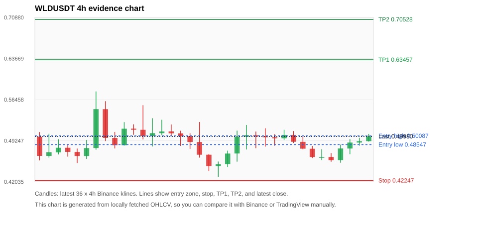
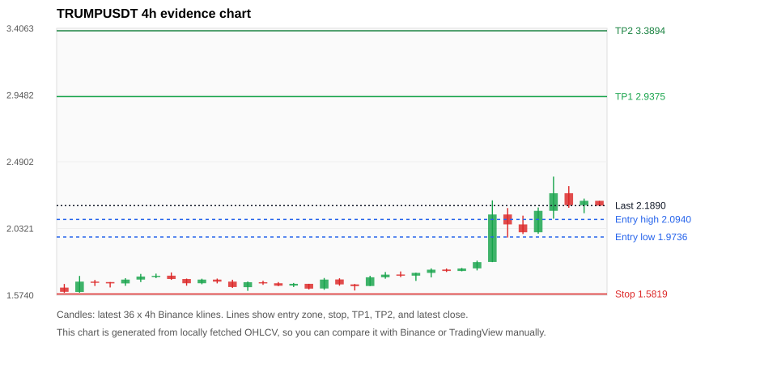
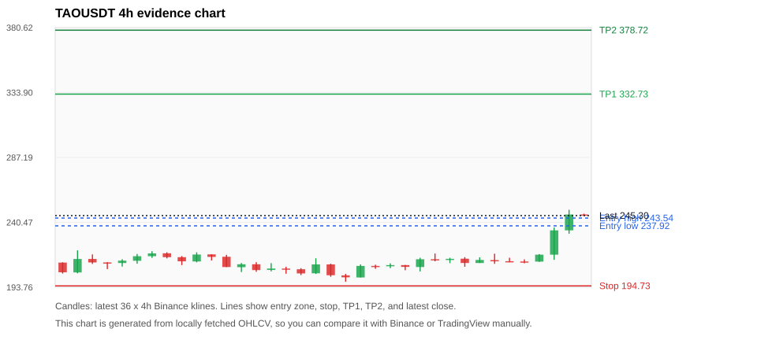
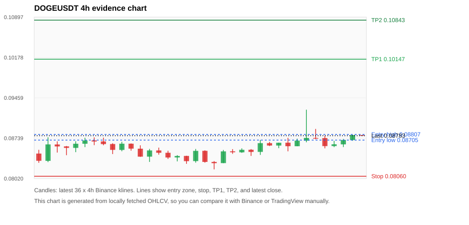
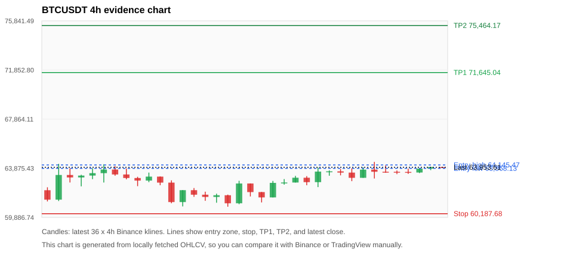

# Crypto 市场扫描报告 v1

- 报告时间：2026-06-13 20:06:33 CST
- Run ID：`20260613_120503_7a5f6892`
- Run type：`daily_full`
- 数据来源：SQLite
- 报告版本：v1
- 扫描 ID：c38a139cf881
- 数据源：Binance public spot API + CoinGecko/CoinMarketCap cross-check
- 过滤条件：USDT spot; 24h quote volume >= 30,000,000; trades >= 30,000; exclude stables/leveraged tokens; analyze 1h/4h/1d klines
- 默认单笔风险：账户权益的 1.00%

## 限制说明

- 交易信号仍以 Binance 现货公开 K 线为主源；外部数据源用于一致性复核。
- 结果是研究和模拟盘计划，不是确定收益或实盘下单指令。
- 历史长度过滤：候选币至少需要 180 根 1d K 线。
- 数据质量验证池：先验证 score 排名前 min(top_n * 2, 10) 的候选，再按 action + score 补足最终名单。
- 大盘环境过滤：RISK_OFF; BTC/ETH 大盘偏弱，山寨币买入候选降级为观察。 BTC 7d=5.040649017765064; ETH 7d=6.874605813886814.
- 已启用数据交叉验证：Binance 主源 + CoinGecko 自动对照；CoinMarketCap 在配置 API Key 后自动对照。
- WLDUSDT 交叉验证状态 DATA_WARNING：At least one external provider needs manual review.
- TRUMPUSDT 交叉验证状态 DATA_WARNING：At least one external provider needs manual review.
- TAOUSDT 交叉验证状态 DATA_WARNING：At least one external provider needs manual review.
- DOGEUSDT 交叉验证状态 DATA_WARNING：At least one external provider needs manual review.
- BTCUSDT 交叉验证状态 DATA_WARNING：At least one external provider needs manual review.
- ETHUSDT 交叉验证状态 DATA_WARNING：At least one external provider needs manual review.
- SOLUSDT 交叉验证状态 DATA_WARNING：At least one external provider needs manual review.
- BNBUSDT 交叉验证状态 DATA_WARNING：At least one external provider needs manual review.
- XRPUSDT 交叉验证状态 DATA_WARNING：At least one external provider needs manual review.
- NEARUSDT 交叉验证状态 DATA_WARNING：At least one external provider needs manual review.

## 5 个候选交易计划

| Rank | Coin | Action | Setup | Entry Zone | Stop Loss | TP1 | TP2 / Exit Rule | R/R | Verdict |
|---:|---|---|---|---:|---:|---:|---|---:|---|
| 1 | `WLD` | `WATCH_ONLY` | 回踩支撑/4h EMA 附近 | 0.48547 - 0.50087 | 0.42247 | 0.63457 | 0.70528 或跌破 4h 关键支撑 | 2.00-3.00 | 只观察 |
| 2 | `TRUMP` | `WATCH_ONLY` | 涨幅较远，只等深回调 | 1.9736 - 2.0940 | 1.5819 | 2.9375 | 3.3894 或跌破 4h 关键支撑 | 2.00-3.00 | 只等回调 |
| 3 | `TAO` | `WATCH_ONLY` | 趋势中，等回调入场 | 237.92 - 243.54 | 194.73 | 332.73 | 378.72 或跌破 4h 关键支撑 | 2.00-3.00 | 只等回调 |
| 4 | `DOGE` | `WATCH_ONLY` | 回踩支撑/4h EMA 附近 | 0.08705 - 0.08807 | 0.08060 | 0.10147 | 0.10843 或跌破 4h 关键支撑 | 2.00-3.00 | 只观察 |
| 5 | `BTC` | `WATCH_ONLY` | 回踩支撑/4h EMA 附近 | 63,868.13 - 64,145.47 | 60,187.68 | 71,645.04 | 75,464.17 或跌破 4h 关键支撑 | 2.00-3.00 | 只观察 |

## 数据交叉验证摘要

价格差异以 Binance 当前价为基准；成交量口径不同，Binance 是 USDT 现货成交额，CoinGecko/CoinMarketCap 通常是全市场成交量。

| Rank | Coin | Data Status | Max Price Diff | Max 24h Diff | Message |
|---:|---|---|---:|---:|---|
| 1 | `WLD` | DATA_WARNING | 1.20% | 0.93 pts | At least one external provider needs manual review. |
| 2 | `TRUMP` | DATA_WARNING | 0.50% | 0.38 pts | At least one external provider needs manual review. |
| 3 | `TAO` | DATA_WARNING | 0.22% | 0.20 pts | At least one external provider needs manual review. |
| 4 | `DOGE` | DATA_WARNING | 0.03% | 0.05 pts | At least one external provider needs manual review. |
| 5 | `BTC` | DATA_WARNING | 0.06% | 0.06 pts | At least one external provider needs manual review. |

## 候选币说明

### 1. WLD `WLDUSDT`



- 入选原因：回踩支撑/4h EMA 附近；24h +5.11%，7d +20.12%，4h RSI 50.20，24h 成交额 $117.5M。
- 交易失效条件：跌破 0.4224665 或 4h 收盘重新失守关键支撑。
- 主要风险：BTC/ETH 大盘环境未确认强势，山寨币买入信号降级；数据交叉验证需要人工复核。
- 数据交叉验证：DATA_WARNING；At least one external provider needs manual review.

#### 可点击人工验证

- [Binance 交易页](https://www.binance.com/en/trade/WLD_USDT)
- [TradingView 图表](https://www.tradingview.com/chart/?symbol=BINANCE%3AWLDUSDT)
- [CoinGecko 搜索](https://www.coingecko.com/en/search?query=WLD)
- [CoinMarketCap 搜索](https://coinmarketcap.com/search/?q=WLD)

#### 多数据源对照

| Source | Status | Asset ID | Price | 24h Change | 24h Volume | Price Diff | 24h Diff | Updated | Message |
|---|---|---|---:|---:|---:|---:|---:|---|---|
| Binance | DATA_OK | WLDUSDT | 0.49980 | +5.11% | $117.5M | 0.00% | 0.00 pts | 2026-06-13T12:05:45+00:00 | Primary market data source used by scanner. |
| CoinGecko | DATA_WARNING | worldcoin-wld | 0.49380 | +4.18% | $619.8M | 1.20% | 0.93 pts | 2026-06-13T12:05:42.194Z | price diff 1.20% exceeds warning threshold |
| CoinMarketCap | DATA_WARNING | 13502 | 0.49410 | +4.19% | $566.3M | 1.14% | 0.93 pts | 2026-06-13T12:05:04.000Z | price diff 1.14% exceeds warning threshold; CoinMarketCap symbol mapping has 2 matches; selected lowest cmc_rank |

#### 指标证据

| 指标 | 数值 | 人工核对用途 |
|---|---:|---|
| 当前价 | 0.49980 | 与 Binance/TradingView 当前价格对照 |
| 24h 涨跌 | +5.11% | 与交易所 24h 涨跌对照 |
| 7d 涨跌 | +20.12% | 判断短线趋势是否延续 |
| 4h EMA20 | 0.48450 | 判断短期趋势支撑 |
| 4h EMA50 | 0.47485 | 判断中期趋势支撑 |
| 1d EMA20 | 0.43094 | 判断日线趋势 |
| 1d EMA50 | 0.36550 | 判断日线趋势 |
| 4h RSI14 | 50.20 | 判断是否过热/过弱 |
| 4h ATR14 | 0.02339 | 推导止损和入场缓冲 |
| 最近 18 根 4h 最低点 | 0.42890 | 支撑/止损参考 |
| 最近 36 根 4h 最高点 | 0.57890 | TP/压力参考 |
| 支撑位 | 0.48450 | 入场区间推导基础 |

#### 交易计划推导

- 支撑位 = 最近低点、4h EMA20、4h EMA50、1d EMA20 中不高于当前价的最高有效支撑 = `0.48450`。
- 入场区间 = 支撑位附近 + ATR 缓冲 = `0.48547 - 0.50087`。
- 止损 = min(最近 18 根 4h 最低点 * 0.985, 入场中位价 - 1.15 * ATR14) = `0.42247`。
- TP1 = max(最近 36 根 4h 最高点 * 0.995, 入场中位价 + 2R) = `0.63457`。
- TP2 = max(入场中位价 + 3R, TP1 * 1.04) = `0.70528`。

#### 最近 10 根 4h K线

| UTC 开盘时间 | Open | High | Low | Close | Quote Volume | Trades |
|---|---:|---:|---:|---:|---:|---:|
| 2026-06-12T00:00+00:00 | 0.49660 | 0.51150 | 0.49370 | 0.50240 | $15.9M | 159774 |
| 2026-06-12T04:00+00:00 | 0.50240 | 0.50930 | 0.48840 | 0.49050 | $30.4M | 292386 |
| 2026-06-12T08:00+00:00 | 0.49040 | 0.50000 | 0.47710 | 0.47840 | $28.7M | 264696 |
| 2026-06-12T12:00+00:00 | 0.47830 | 0.48320 | 0.46180 | 0.46360 | $26.9M | 340511 |
| 2026-06-12T16:00+00:00 | 0.46360 | 0.47720 | 0.45810 | 0.46380 | $26.5M | 324950 |
| 2026-06-12T20:00+00:00 | 0.46380 | 0.47060 | 0.45550 | 0.45800 | $12.8M | 210720 |
| 2026-06-13T00:00+00:00 | 0.45810 | 0.48540 | 0.45380 | 0.47870 | $16.5M | 266448 |
| 2026-06-13T04:00+00:00 | 0.47860 | 0.49500 | 0.46840 | 0.48910 | $14.4M | 272030 |
| 2026-06-13T08:00+00:00 | 0.48910 | 0.49750 | 0.48370 | 0.49150 | $19.7M | 288746 |
| 2026-06-13T12:00+00:00 | 0.49150 | 0.50430 | 0.49080 | 0.49980 | $1.8M | 16111 |

### 2. TRUMP `TRUMPUSDT`



- 入选原因：涨幅较远，只等深回调；24h +4.04%，7d +37.85%，4h RSI 74.18，24h 成交额 $80.2M。
- 交易失效条件：跌破 1.58191 或 4h 收盘重新失守关键支撑。
- 主要风险：距离支撑偏远，不能追市价；成交量突增，可能是事件驱动；日线趋势未完全确认；BTC/ETH 大盘环境未确认强势，山寨币买入信号降级；数据交叉验证需要人工复核。
- 数据交叉验证：DATA_WARNING；At least one external provider needs manual review.

#### 可点击人工验证

- [Binance 交易页](https://www.binance.com/en/trade/TRUMP_USDT)
- [TradingView 图表](https://www.tradingview.com/chart/?symbol=BINANCE%3ATRUMPUSDT)
- [CoinGecko 搜索](https://www.coingecko.com/en/search?query=TRUMP)
- [CoinMarketCap 搜索](https://coinmarketcap.com/search/?q=TRUMP)

#### 多数据源对照

| Source | Status | Asset ID | Price | 24h Change | 24h Volume | Price Diff | 24h Diff | Updated | Message |
|---|---|---|---:|---:|---:|---:|---:|---|---|
| Binance | DATA_OK | TRUMPUSDT | 2.1890 | +4.04% | $80.2M | 0.00% | 0.00 pts | 2026-06-13T12:05:45+00:00 | Primary market data source used by scanner. |
| CoinGecko | DATA_WARNING | official-trump | 2.2000 | +3.75% | $733.1M | 0.50% | 0.29 pts | 2026-06-13T12:05:43.902Z | CoinGecko symbol mapping has 2 exact matches; selected highest market-cap rank |
| CoinMarketCap | DATA_WARNING | 35336 | 2.1984 | +4.42% | $713.9M | 0.43% | 0.38 pts | 2026-06-13T12:05:04.000Z | CoinMarketCap symbol mapping has 61 matches; selected lowest cmc_rank |

#### 指标证据

| 指标 | 数值 | 人工核对用途 |
|---|---:|---|
| 当前价 | 2.1890 | 与 Binance/TradingView 当前价格对照 |
| 24h 涨跌 | +4.04% | 与交易所 24h 涨跌对照 |
| 7d 涨跌 | +37.85% | 判断短线趋势是否延续 |
| 4h EMA20 | 1.9581 | 判断短期趋势支撑 |
| 4h EMA50 | 1.8435 | 判断中期趋势支撑 |
| 1d EMA20 | 1.9116 | 判断日线趋势 |
| 1d EMA50 | 2.1603 | 判断日线趋势 |
| 4h RSI14 | 74.18 | 判断是否过热/过弱 |
| 4h ATR14 | 0.12671 | 推导止损和入场缓冲 |
| 最近 18 根 4h 最低点 | 1.6060 | 支撑/止损参考 |
| 最近 36 根 4h 最高点 | 2.3880 | TP/压力参考 |
| 支撑位 | 1.9581 | 入场区间推导基础 |

#### 交易计划推导

- 支撑位 = 最近低点、4h EMA20、4h EMA50、1d EMA20 中不高于当前价的最高有效支撑 = `1.9581`。
- 入场区间 = 支撑位附近 + ATR 缓冲 = `1.9736 - 2.0940`。
- 止损 = min(最近 18 根 4h 最低点 * 0.985, 入场中位价 - 1.15 * ATR14) = `1.5819`。
- TP1 = max(最近 36 根 4h 最高点 * 0.995, 入场中位价 + 2R) = `2.9375`。
- TP2 = max(入场中位价 + 3R, TP1 * 1.04) = `3.3894`。

#### 最近 10 根 4h K线

| UTC 开盘时间 | Open | High | Low | Close | Quote Volume | Trades |
|---|---:|---:|---:|---:|---:|---:|
| 2026-06-12T00:00+00:00 | 1.7400 | 1.7610 | 1.7380 | 1.7570 | $1.2M | 10351 |
| 2026-06-12T04:00+00:00 | 1.7580 | 1.8110 | 1.7440 | 1.8010 | $2.6M | 25418 |
| 2026-06-12T08:00+00:00 | 1.8020 | 2.2250 | 1.8010 | 2.1280 | $34.9M | 365185 |
| 2026-06-12T12:00+00:00 | 2.1280 | 2.1720 | 1.9700 | 2.0600 | $19.4M | 213698 |
| 2026-06-12T16:00+00:00 | 2.0600 | 2.1200 | 1.9940 | 2.0060 | $8.2M | 84492 |
| 2026-06-12T20:00+00:00 | 2.0060 | 2.1760 | 1.9960 | 2.1530 | $9.1M | 95130 |
| 2026-06-13T00:00+00:00 | 2.1530 | 2.3880 | 2.0990 | 2.2740 | $25.7M | 261285 |
| 2026-06-13T04:00+00:00 | 2.2740 | 2.3230 | 2.1740 | 2.1920 | $11.9M | 146541 |
| 2026-06-13T08:00+00:00 | 2.1920 | 2.2370 | 2.1370 | 2.2220 | $6.2M | 70910 |
| 2026-06-13T12:00+00:00 | 2.2220 | 2.2220 | 2.1890 | 2.1890 | $257,069 | 2986 |

### 3. TAO `TAOUSDT`



- 入选原因：趋势中，等回调入场；24h +15.14%，7d +25.03%，4h RSI 86.99，24h 成交额 $40.8M。
- 交易失效条件：跌破 194.7345 或 4h 收盘重新失守关键支撑。
- 主要风险：4h RSI 偏热；日线趋势未完全确认；BTC/ETH 大盘环境未确认强势，山寨币买入信号降级；数据交叉验证需要人工复核。
- 数据交叉验证：DATA_WARNING；At least one external provider needs manual review.

#### 可点击人工验证

- [Binance 交易页](https://www.binance.com/en/trade/TAO_USDT)
- [TradingView 图表](https://www.tradingview.com/chart/?symbol=BINANCE%3ATAOUSDT)
- [CoinGecko 搜索](https://www.coingecko.com/en/search?query=TAO)
- [CoinMarketCap 搜索](https://coinmarketcap.com/search/?q=TAO)

#### 多数据源对照

| Source | Status | Asset ID | Price | 24h Change | 24h Volume | Price Diff | 24h Diff | Updated | Message |
|---|---|---|---:|---:|---:|---:|---:|---|---|
| Binance | DATA_OK | TAOUSDT | 245.30 | +15.14% | $40.8M | 0.00% | 0.00 pts | 2026-06-13T12:05:45+00:00 | Primary market data source used by scanner. |
| CoinGecko | DATA_WARNING | bittensor | 245.85 | +15.34% | $244.0M | 0.22% | 0.20 pts | 2026-06-13T12:05:41.957Z | CoinGecko symbol mapping has 3 exact matches; selected highest market-cap rank |
| CoinMarketCap | DATA_WARNING | 22974 | 245.79 | +15.31% | $305.7M | 0.20% | 0.16 pts | 2026-06-13T12:05:04.000Z | CoinMarketCap symbol mapping has 5 matches; selected lowest cmc_rank |

#### 指标证据

| 指标 | 数值 | 人工核对用途 |
|---|---:|---|
| 当前价 | 245.30 | 与 Binance/TradingView 当前价格对照 |
| 24h 涨跌 | +15.14% | 与交易所 24h 涨跌对照 |
| 7d 涨跌 | +25.03% | 判断短线趋势是否延续 |
| 4h EMA20 | 219.45 | 判断短期趋势支撑 |
| 4h EMA50 | 217.54 | 判断中期趋势支撑 |
| 1d EMA20 | 230.93 | 判断日线趋势 |
| 1d EMA50 | 249.52 | 判断日线趋势 |
| 4h RSI14 | 86.99 | 判断是否过热/过弱 |
| 4h ATR14 | 7.0286 | 推导止损和入场缓冲 |
| 最近 18 根 4h 最低点 | 197.70 | 支撑/止损参考 |
| 最近 36 根 4h 最高点 | 249.50 | TP/压力参考 |
| 支撑位 | 230.93 | 入场区间推导基础 |

#### 交易计划推导

- 支撑位 = 最近低点、4h EMA20、4h EMA50、1d EMA20 中不高于当前价的最高有效支撑 = `230.93`。
- 入场区间 = 支撑位附近 + ATR 缓冲 = `237.92 - 243.54`。
- 止损 = min(最近 18 根 4h 最低点 * 0.985, 入场中位价 - 1.15 * ATR14) = `194.73`。
- TP1 = max(最近 36 根 4h 最高点 * 0.995, 入场中位价 + 2R) = `332.73`。
- TP2 = max(入场中位价 + 3R, TP1 * 1.04) = `378.72`。

#### 最近 10 根 4h K线

| UTC 开盘时间 | Open | High | Low | Close | Quote Volume | Trades |
|---|---:|---:|---:|---:|---:|---:|
| 2026-06-12T00:00+00:00 | 213.80 | 215.00 | 211.10 | 214.20 | $1.5M | 15610 |
| 2026-06-12T04:00+00:00 | 214.30 | 215.40 | 208.50 | 211.20 | $1.6M | 17784 |
| 2026-06-12T08:00+00:00 | 211.20 | 215.30 | 211.20 | 213.40 | $1.9M | 16045 |
| 2026-06-12T12:00+00:00 | 213.30 | 217.90 | 210.60 | 212.40 | $5.1M | 42408 |
| 2026-06-12T16:00+00:00 | 212.50 | 215.00 | 211.80 | 212.30 | $1.4M | 19668 |
| 2026-06-12T20:00+00:00 | 212.30 | 213.80 | 211.00 | 212.20 | $977,490 | 10532 |
| 2026-06-13T00:00+00:00 | 212.20 | 217.60 | 212.00 | 217.20 | $2.3M | 17061 |
| 2026-06-13T04:00+00:00 | 217.20 | 236.80 | 213.50 | 234.70 | $12.0M | 80896 |
| 2026-06-13T08:00+00:00 | 234.70 | 249.50 | 232.30 | 246.10 | $18.7M | 183957 |
| 2026-06-13T12:00+00:00 | 246.10 | 246.70 | 245.30 | 245.30 | $258,996 | 2524 |

### 4. DOGE `DOGEUSDT`



- 入选原因：回踩支撑/4h EMA 附近；24h +1.10%，7d +7.31%，4h RSI 66.41，24h 成交额 $92.5M。
- 交易失效条件：跌破 0.08060255 或 4h 收盘重新失守关键支撑。
- 主要风险：日线趋势未完全确认；BTC/ETH 大盘环境未确认强势，山寨币买入信号降级；数据交叉验证需要人工复核。
- 数据交叉验证：DATA_WARNING；At least one external provider needs manual review.

#### 可点击人工验证

- [Binance 交易页](https://www.binance.com/en/trade/DOGE_USDT)
- [TradingView 图表](https://www.tradingview.com/chart/?symbol=BINANCE%3ADOGEUSDT)
- [CoinGecko 搜索](https://www.coingecko.com/en/search?query=DOGE)
- [CoinMarketCap 搜索](https://coinmarketcap.com/search/?q=DOGE)

#### 多数据源对照

| Source | Status | Asset ID | Price | 24h Change | 24h Volume | Price Diff | 24h Diff | Updated | Message |
|---|---|---|---:|---:|---:|---:|---:|---|---|
| Binance | DATA_OK | DOGEUSDT | 0.08783 | +1.10% | $92.5M | 0.00% | 0.00 pts | 2026-06-13T12:05:45+00:00 | Primary market data source used by scanner. |
| CoinGecko | DATA_OK | dogecoin | 0.08783 | +1.15% | $1.20B | 0.01% | 0.05 pts | 2026-06-13T12:05:43.495Z | External source agrees with Binance within thresholds. |
| CoinMarketCap | DATA_WARNING | 74 | 0.08781 | +1.10% | $1.13B | 0.03% | 0.01 pts | 2026-06-13T12:05:04.000Z | CoinMarketCap symbol mapping has 23 matches; selected lowest cmc_rank |

#### 指标证据

| 指标 | 数值 | 人工核对用途 |
|---|---:|---|
| 当前价 | 0.08783 | 与 Binance/TradingView 当前价格对照 |
| 24h 涨跌 | +1.10% | 与交易所 24h 涨跌对照 |
| 7d 涨跌 | +7.31% | 判断短线趋势是否延续 |
| 4h EMA20 | 0.08632 | 判断短期趋势支撑 |
| 4h EMA50 | 0.08688 | 判断中期趋势支撑 |
| 1d EMA20 | 0.09116 | 判断日线趋势 |
| 1d EMA50 | 0.09653 | 判断日线趋势 |
| 4h RSI14 | 66.41 | 判断是否过热/过弱 |
| 4h ATR14 | 0.0017007143 | 推导止损和入场缓冲 |
| 最近 18 根 4h 最低点 | 0.08183 | 支撑/止损参考 |
| 最近 36 根 4h 最高点 | 0.09247 | TP/压力参考 |
| 支撑位 | 0.08688 | 入场区间推导基础 |

#### 交易计划推导

- 支撑位 = 最近低点、4h EMA20、4h EMA50、1d EMA20 中不高于当前价的最高有效支撑 = `0.08688`。
- 入场区间 = 支撑位附近 + ATR 缓冲 = `0.08705 - 0.08807`。
- 止损 = min(最近 18 根 4h 最低点 * 0.985, 入场中位价 - 1.15 * ATR14) = `0.08060`。
- TP1 = max(最近 36 根 4h 最高点 * 0.995, 入场中位价 + 2R) = `0.10147`。
- TP2 = max(入场中位价 + 3R, TP1 * 1.04) = `0.10843`。

#### 最近 10 根 4h K线

| UTC 开盘时间 | Open | High | Low | Close | Quote Volume | Trades |
|---|---:|---:|---:|---:|---:|---:|
| 2026-06-12T00:00+00:00 | 0.08608 | 0.08659 | 0.08561 | 0.08658 | $5.2M | 59393 |
| 2026-06-12T04:00+00:00 | 0.08659 | 0.08746 | 0.08505 | 0.08596 | $19.5M | 138210 |
| 2026-06-12T08:00+00:00 | 0.08596 | 0.08730 | 0.08595 | 0.08696 | $7.9M | 83967 |
| 2026-06-12T12:00+00:00 | 0.08695 | 0.09247 | 0.08666 | 0.08744 | $50.9M | 465453 |
| 2026-06-12T16:00+00:00 | 0.08744 | 0.08904 | 0.08721 | 0.08741 | $12.7M | 152491 |
| 2026-06-12T20:00+00:00 | 0.08741 | 0.08784 | 0.08558 | 0.08598 | $8.9M | 79880 |
| 2026-06-13T00:00+00:00 | 0.08599 | 0.08692 | 0.08580 | 0.08630 | $6.1M | 58200 |
| 2026-06-13T04:00+00:00 | 0.08629 | 0.08725 | 0.08581 | 0.08707 | $7.3M | 57513 |
| 2026-06-13T08:00+00:00 | 0.08707 | 0.08796 | 0.08692 | 0.08796 | $6.6M | 54081 |
| 2026-06-13T12:00+00:00 | 0.08795 | 0.08796 | 0.08782 | 0.08783 | $194,816 | 1711 |

### 5. BTC `BTCUSDT`



- 入选原因：回踩支撑/4h EMA 附近；24h +0.42%，7d +5.18%，4h RSI 67.61，24h 成交额 $807.1M。
- 交易失效条件：跌破 60187.676 或 4h 收盘重新失守关键支撑。
- 主要风险：日线趋势未完全确认；BTC/ETH 大盘环境未确认强势，山寨币买入信号降级；数据交叉验证需要人工复核。
- 数据交叉验证：DATA_WARNING；At least one external provider needs manual review.

#### 可点击人工验证

- [Binance 交易页](https://www.binance.com/en/trade/BTC_USDT)
- [TradingView 图表](https://www.tradingview.com/chart/?symbol=BINANCE%3ABTCUSDT)
- [CoinGecko 搜索](https://www.coingecko.com/en/search?query=BTC)
- [CoinMarketCap 搜索](https://coinmarketcap.com/search/?q=BTC)

#### 多数据源对照

| Source | Status | Asset ID | Price | 24h Change | 24h Volume | Price Diff | 24h Diff | Updated | Message |
|---|---|---|---:|---:|---:|---:|---:|---|---|
| Binance | DATA_OK | BTCUSDT | 63,953.61 | +0.42% | $807.1M | 0.00% | 0.00 pts | 2026-06-13T12:05:45+00:00 | Primary market data source used by scanner. |
| CoinGecko | DATA_WARNING | n/a | n/a | n/a | n/a | n/a | n/a | 2026-06-13T12:05:45+00:00 | Failed to fetch https://api.coingecko.com/api/v3/coins/markets?vs_currency=usd&ids=bitcoin&price_change_percentage=24h&per_page=1&page=1: HTTP Error 429: Too Many Requests |
| CoinMarketCap | DATA_WARNING | 1 | 63,917.84 | +0.48% | $20.95B | 0.06% | 0.06 pts | 2026-06-13T12:05:04.000Z | CoinMarketCap symbol mapping has 13 matches; selected lowest cmc_rank |

#### 指标证据

| 指标 | 数值 | 人工核对用途 |
|---|---:|---|
| 当前价 | 63,953.61 | 与 Binance/TradingView 当前价格对照 |
| 24h 涨跌 | +0.42% | 与交易所 24h 涨跌对照 |
| 7d 涨跌 | +5.18% | 判断短线趋势是否延续 |
| 4h EMA20 | 63,302.72 | 判断短期趋势支撑 |
| 4h EMA50 | 63,740.65 | 判断中期趋势支撑 |
| 1d EMA20 | 66,857.33 | 判断日线趋势 |
| 1d EMA50 | 71,095.32 | 判断日线趋势 |
| 4h RSI14 | 67.61 | 判断是否过热/过弱 |
| 4h ATR14 | 646.07 | 推导止损和入场缓冲 |
| 最近 18 根 4h 最低点 | 61,104.24 | 支撑/止损参考 |
| 最近 36 根 4h 最高点 | 64,394.44 | TP/压力参考 |
| 支撑位 | 63,740.65 | 入场区间推导基础 |

#### 交易计划推导

- 支撑位 = 最近低点、4h EMA20、4h EMA50、1d EMA20 中不高于当前价的最高有效支撑 = `63,740.65`。
- 入场区间 = 支撑位附近 + ATR 缓冲 = `63,868.13 - 64,145.47`。
- 止损 = min(最近 18 根 4h 最低点 * 0.985, 入场中位价 - 1.15 * ATR14) = `60,187.68`。
- TP1 = max(最近 36 根 4h 最高点 * 0.995, 入场中位价 + 2R) = `71,645.04`。
- TP2 = max(入场中位价 + 3R, TP1 * 1.04) = `75,464.17`。

#### 最近 10 根 4h K线

| UTC 开盘时间 | Open | High | Low | Close | Quote Volume | Trades |
|---|---:|---:|---:|---:|---:|---:|
| 2026-06-12T00:00+00:00 | 63,626.00 | 63,810.01 | 63,301.53 | 63,524.82 | $168.7M | 351019 |
| 2026-06-12T04:00+00:00 | 63,524.81 | 63,863.98 | 62,829.81 | 63,100.80 | $204.1M | 438376 |
| 2026-06-12T08:00+00:00 | 63,100.80 | 63,953.84 | 63,100.80 | 63,766.01 | $151.4M | 452201 |
| 2026-06-12T12:00+00:00 | 63,766.01 | 64,394.44 | 63,045.29 | 63,593.02 | $261.4M | 1024713 |
| 2026-06-12T16:00+00:00 | 63,593.02 | 64,111.10 | 63,510.16 | 63,589.27 | $144.0M | 593615 |
| 2026-06-12T20:00+00:00 | 63,589.28 | 63,696.41 | 63,400.00 | 63,580.01 | $113.0M | 294128 |
| 2026-06-13T00:00+00:00 | 63,580.00 | 63,840.00 | 63,418.66 | 63,532.00 | $115.1M | 236410 |
| 2026-06-13T04:00+00:00 | 63,532.00 | 63,883.47 | 63,484.00 | 63,846.00 | $98.0M | 219856 |
| 2026-06-13T08:00+00:00 | 63,845.99 | 63,984.53 | 63,726.57 | 63,971.28 | $76.5M | 200969 |
| 2026-06-13T12:00+00:00 | 63,971.28 | 63,971.69 | 63,940.00 | 63,953.61 | $2.4M | 4391 |

## 组合风控

- 不要 5 个候选全部满仓买入。
- 同时持仓总风险建议控制在账户权益的 3% - 5% 以内。
- 如果 BTC/ETH 同时破位，暂停山寨币多头计划或降低仓位。
- 第一版报告用于模拟盘和人工复核，不自动下单。

## 原始数据

```json
[
  {
    "rank": 1,
    "symbol": "WLDUSDT",
    "base_asset": "WLD",
    "price": 0.4998,
    "score": 63.70321184598696,
    "setup": "回踩支撑/4h EMA 附近",
    "verdict": "只观察",
    "entry_low": 0.4854685972783113,
    "entry_high": 0.500869598082147,
    "stop_loss": 0.4224665,
    "take_profit_1": 0.6345742930406876,
    "take_profit_2": 0.7052768907209168,
    "risk_reward_1": 2.0,
    "risk_reward_2": 3.000000000000001,
    "pct_24h": 5.113,
    "pct_3d": -2.439976576224856,
    "pct_7d": 20.1153568853641,
    "quote_volume_24h": 117525684.07479,
    "trades_24h": 1709294,
    "high_low_range_24h": 11.128250330542077,
    "rsi_1h": 84.7272727272727,
    "rsi_4h": 50.199203187250994,
    "ema20_4h": 0.48449959808214704,
    "ema50_4h": 0.47485275633707397,
    "ema20_1d": 0.4309365168839931,
    "ema50_1d": 0.3654966806941543,
    "atr_4h": 0.023385714285714284,
    "macd_hist_4h": 0.000737852523630442,
    "volume_ratio_24h": 0.9364882812772988,
    "support_level": 0.48449959808214704,
    "recent_low_4h_18": 0.4289,
    "recent_high_4h_36": 0.5789,
    "distance_to_support_pct": 3.1579803117316008,
    "binance_trade_url": "https://www.binance.com/en/trade/WLD_USDT",
    "tradingview_url": "https://www.tradingview.com/chart/?symbol=BINANCE%3AWLDUSDT",
    "coingecko_search_url": "https://www.coingecko.com/en/search?query=WLD",
    "coinmarketcap_search_url": "https://coinmarketcap.com/search/?q=WLD",
    "invalidation": "跌破 0.4224665 或 4h 收盘重新失守关键支撑",
    "recent_4h_klines": [
      {
        "open_time_utc": "2026-06-07T16:00+00:00",
        "open": 0.4991,
        "high": 0.5075,
        "low": 0.4577,
        "close": 0.4658,
        "quote_volume": 20772923.87824,
        "trades": 210908
      },
      {
        "open_time_utc": "2026-06-07T20:00+00:00",
        "open": 0.4657,
        "high": 0.5045,
        "low": 0.4627,
        "close": 0.472,
        "quote_volume": 12777293.88496,
        "trades": 133226
      },
      {
        "open_time_utc": "2026-06-08T00:00+00:00",
        "open": 0.4718,
        "high": 0.4948,
        "low": 0.4682,
        "close": 0.48,
        "quote_volume": 12359114.0202,
        "trades": 131011
      },
      {
        "open_time_utc": "2026-06-08T04:00+00:00",
        "open": 0.48,
        "high": 0.4862,
        "low": 0.4644,
        "close": 0.4727,
        "quote_volume": 9691098.08768,
        "trades": 119596
      },
      {
        "open_time_utc": "2026-06-08T08:00+00:00",
        "open": 0.4727,
        "high": 0.4786,
        "low": 0.4531,
        "close": 0.4655,
        "quote_volume": 14168979.0814,
        "trades": 157951
      },
      {
        "open_time_utc": "2026-06-08T12:00+00:00",
        "open": 0.4654,
        "high": 0.4938,
        "low": 0.4604,
        "close": 0.4794,
        "quote_volume": 13844364.51488,
        "trades": 168579
      },
      {
        "open_time_utc": "2026-06-08T16:00+00:00",
        "open": 0.4795,
        "high": 0.5789,
        "low": 0.4766,
        "close": 0.5478,
        "quote_volume": 35922626.84267,
        "trades": 446600
      },
      {
        "open_time_utc": "2026-06-08T20:00+00:00",
        "open": 0.5477,
        "high": 0.5617,
        "low": 0.4917,
        "close": 0.4973,
        "quote_volume": 21236878.09446,
        "trades": 225556
      },
      {
        "open_time_utc": "2026-06-09T00:00+00:00",
        "open": 0.4972,
        "high": 0.5078,
        "low": 0.4787,
        "close": 0.4844,
        "quote_volume": 11894901.41798,
        "trades": 118857
      },
      {
        "open_time_utc": "2026-06-09T04:00+00:00",
        "open": 0.4843,
        "high": 0.525,
        "low": 0.4838,
        "close": 0.5134,
        "quote_volume": 16513274.19074,
        "trades": 189953
      },
      {
        "open_time_utc": "2026-06-09T08:00+00:00",
        "open": 0.5135,
        "high": 0.5211,
        "low": 0.5028,
        "close": 0.5116,
        "quote_volume": 13466225.79521,
        "trades": 129219
      },
      {
        "open_time_utc": "2026-06-09T12:00+00:00",
        "open": 0.5115,
        "high": 0.5547,
        "low": 0.4945,
        "close": 0.5006,
        "quote_volume": 32095339.61055,
        "trades": 312674
      },
      {
        "open_time_utc": "2026-06-09T16:00+00:00",
        "open": 0.5007,
        "high": 0.5318,
        "low": 0.4822,
        "close": 0.5056,
        "quote_volume": 19549717.9563,
        "trades": 206463
      },
      {
        "open_time_utc": "2026-06-09T20:00+00:00",
        "open": 0.5056,
        "high": 0.5291,
        "low": 0.5021,
        "close": 0.5085,
        "quote_volume": 11972914.11072,
        "trades": 122656
      },
      {
        "open_time_utc": "2026-06-10T00:00+00:00",
        "open": 0.5086,
        "high": 0.5208,
        "low": 0.5002,
        "close": 0.5052,
        "quote_volume": 10952357.50773,
        "trades": 99330
      },
      {
        "open_time_utc": "2026-06-10T04:00+00:00",
        "open": 0.5051,
        "high": 0.5099,
        "low": 0.4833,
        "close": 0.5,
        "quote_volume": 14714442.85453,
        "trades": 144289
      },
      {
        "open_time_utc": "2026-06-10T08:00+00:00",
        "open": 0.5001,
        "high": 0.5056,
        "low": 0.4778,
        "close": 0.4901,
        "quote_volume": 9554726.62643,
        "trades": 95552
      },
      {
        "open_time_utc": "2026-06-10T12:00+00:00",
        "open": 0.4901,
        "high": 0.5252,
        "low": 0.4627,
        "close": 0.4678,
        "quote_volume": 28979345.69373,
        "trades": 264712
      },
      {
        "open_time_utc": "2026-06-10T16:00+00:00",
        "open": 0.4678,
        "high": 0.469,
        "low": 0.4392,
        "close": 0.4476,
        "quote_volume": 20294622.01901,
        "trades": 177675
      },
      {
        "open_time_utc": "2026-06-10T20:00+00:00",
        "open": 0.4477,
        "high": 0.4558,
        "low": 0.4289,
        "close": 0.4509,
        "quote_volume": 12848071.93153,
        "trades": 116592
      },
      {
        "open_time_utc": "2026-06-11T00:00+00:00",
        "open": 0.451,
        "high": 0.4749,
        "low": 0.446,
        "close": 0.4698,
        "quote_volume": 8198883.5465,
        "trades": 100026
      },
      {
        "open_time_utc": "2026-06-11T04:00+00:00",
        "open": 0.4699,
        "high": 0.51,
        "low": 0.4556,
        "close": 0.4994,
        "quote_volume": 18795603.55692,
        "trades": 177428
      },
      {
        "open_time_utc": "2026-06-11T08:00+00:00",
        "open": 0.4994,
        "high": 0.52,
        "low": 0.4769,
        "close": 0.502,
        "quote_volume": 23818434.64928,
        "trades": 209959
      },
      {
        "open_time_utc": "2026-06-11T12:00+00:00",
        "open": 0.502,
        "high": 0.5084,
        "low": 0.479,
        "close": 0.4998,
        "quote_volume": 57917046.88831,
        "trades": 575104
      },
      {
        "open_time_utc": "2026-06-11T16:00+00:00",
        "open": 0.4997,
        "high": 0.5142,
        "low": 0.482,
        "close": 0.4983,
        "quote_volume": 56664673.93509,
        "trades": 498846
      },
      {
        "open_time_utc": "2026-06-11T20:00+00:00",
        "open": 0.4984,
        "high": 0.5036,
        "low": 0.4836,
        "close": 0.4966,
        "quote_volume": 18804757.1173,
        "trades": 160359
      },
      {
        "open_time_utc": "2026-06-12T00:00+00:00",
        "open": 0.4966,
        "high": 0.5115,
        "low": 0.4937,
        "close": 0.5024,
        "quote_volume": 15914228.40929,
        "trades": 159774
      },
      {
        "open_time_utc": "2026-06-12T04:00+00:00",
        "open": 0.5024,
        "high": 0.5093,
        "low": 0.4884,
        "close": 0.4905,
        "quote_volume": 30433846.56914,
        "trades": 292386
      },
      {
        "open_time_utc": "2026-06-12T08:00+00:00",
        "open": 0.4904,
        "high": 0.5,
        "low": 0.4771,
        "close": 0.4784,
        "quote_volume": 28743300.82325,
        "trades": 264696
      },
      {
        "open_time_utc": "2026-06-12T12:00+00:00",
        "open": 0.4783,
        "high": 0.4832,
        "low": 0.4618,
        "close": 0.4636,
        "quote_volume": 26935217.81806,
        "trades": 340511
      },
      {
        "open_time_utc": "2026-06-12T16:00+00:00",
        "open": 0.4636,
        "high": 0.4772,
        "low": 0.4581,
        "close": 0.4638,
        "quote_volume": 26466576.90929,
        "trades": 324950
      },
      {
        "open_time_utc": "2026-06-12T20:00+00:00",
        "open": 0.4638,
        "high": 0.4706,
        "low": 0.4555,
        "close": 0.458,
        "quote_volume": 12760099.04917,
        "trades": 210720
      },
      {
        "open_time_utc": "2026-06-13T00:00+00:00",
        "open": 0.4581,
        "high": 0.4854,
        "low": 0.4538,
        "close": 0.4787,
        "quote_volume": 16519604.55099,
        "trades": 266448
      },
      {
        "open_time_utc": "2026-06-13T04:00+00:00",
        "open": 0.4786,
        "high": 0.495,
        "low": 0.4684,
        "close": 0.4891,
        "quote_volume": 14437439.54129,
        "trades": 272030
      },
      {
        "open_time_utc": "2026-06-13T08:00+00:00",
        "open": 0.4891,
        "high": 0.4975,
        "low": 0.4837,
        "close": 0.4915,
        "quote_volume": 19704562.57682,
        "trades": 288746
      },
      {
        "open_time_utc": "2026-06-13T12:00+00:00",
        "open": 0.4915,
        "high": 0.5043,
        "low": 0.4908,
        "close": 0.4998,
        "quote_volume": 1766128.34714,
        "trades": 16111
      }
    ],
    "risks": [
      "BTC/ETH 大盘环境未确认强势，山寨币买入信号降级",
      "数据交叉验证需要人工复核"
    ],
    "data_quality_status": "DATA_WARNING",
    "data_quality_message": "At least one external provider needs manual review.",
    "data_checks": [
      {
        "provider": "Binance",
        "status": "DATA_OK",
        "provider_asset_id": "WLDUSDT",
        "provider_symbol": "WLDUSDT",
        "price_usd": 0.4998,
        "pct_24h": 5.113,
        "volume_24h": 117525684.07479,
        "last_updated": null,
        "fetched_at_utc": "2026-06-13T12:05:45+00:00",
        "price_diff_pct": 0.0,
        "pct_24h_diff": 0.0,
        "volume_note": "Binance USDT spot 24h quoteVolume.",
        "message": "Primary market data source used by scanner."
      },
      {
        "provider": "CoinGecko",
        "status": "DATA_WARNING",
        "provider_asset_id": "worldcoin-wld",
        "provider_symbol": "WLD",
        "price_usd": 0.493801,
        "pct_24h": 4.17893,
        "volume_24h": 619803739.0,
        "last_updated": "2026-06-13T12:05:42.194Z",
        "fetched_at_utc": "2026-06-13T12:05:45+00:00",
        "price_diff_pct": 1.2002801120448243,
        "pct_24h_diff": 0.9340700000000002,
        "volume_note": "CoinGecko total market volume; not the same venue scope as Binance quoteVolume.",
        "message": "price diff 1.20% exceeds warning threshold"
      },
      {
        "provider": "CoinMarketCap",
        "status": "DATA_WARNING",
        "provider_asset_id": "13502",
        "provider_symbol": "WLD",
        "price_usd": 0.4941028386138994,
        "pct_24h": 4.18612567,
        "volume_24h": 566336662.8688985,
        "last_updated": "2026-06-13T12:05:04.000Z",
        "fetched_at_utc": "2026-06-13T12:05:45+00:00",
        "price_diff_pct": 1.1398882325131257,
        "pct_24h_diff": 0.9268743300000004,
        "volume_note": "CoinMarketCap total market volume; not the same venue scope as Binance quoteVolume.",
        "message": "price diff 1.14% exceeds warning threshold; CoinMarketCap symbol mapping has 2 matches; selected lowest cmc_rank"
      }
    ],
    "action": "WATCH_ONLY"
  },
  {
    "rank": 2,
    "symbol": "TRUMPUSDT",
    "base_asset": "TRUMP",
    "price": 2.189,
    "score": 55.135463379204026,
    "setup": "涨幅较远，只等深回调",
    "verdict": "只等回调",
    "entry_low": 1.9735857142857143,
    "entry_high": 2.0939642857142857,
    "stop_loss": 1.5819100000000001,
    "take_profit_1": 2.9375049999999994,
    "take_profit_2": 3.389369999999999,
    "risk_reward_1": 2.0,
    "risk_reward_2": 3.0,
    "pct_24h": 4.038,
    "pct_3d": 31.077844311377255,
    "pct_7d": 37.8463476070529,
    "quote_volume_24h": 80224192.00153,
    "trades_24h": 867705,
    "high_low_range_24h": 21.218274111675118,
    "rsi_1h": 57.20000000000001,
    "rsi_4h": 74.18367346938774,
    "ema20_4h": 1.9581358972077552,
    "ema50_4h": 1.843514732879635,
    "ema20_1d": 1.9116275573260546,
    "ema50_1d": 2.160265681822,
    "atr_4h": 0.12671428571428572,
    "macd_hist_4h": 0.041669423797212404,
    "volume_ratio_24h": 5.368238799430853,
    "support_level": 1.9581358972077552,
    "recent_low_4h_18": 1.606,
    "recent_high_4h_36": 2.388,
    "distance_to_support_pct": 11.789993897841832,
    "binance_trade_url": "https://www.binance.com/en/trade/TRUMP_USDT",
    "tradingview_url": "https://www.tradingview.com/chart/?symbol=BINANCE%3ATRUMPUSDT",
    "coingecko_search_url": "https://www.coingecko.com/en/search?query=TRUMP",
    "coinmarketcap_search_url": "https://coinmarketcap.com/search/?q=TRUMP",
    "invalidation": "跌破 1.58191 或 4h 收盘重新失守关键支撑",
    "recent_4h_klines": [
      {
        "open_time_utc": "2026-06-07T16:00+00:00",
        "open": 1.626,
        "high": 1.651,
        "low": 1.59,
        "close": 1.597,
        "quote_volume": 934670.493676,
        "trades": 10427
      },
      {
        "open_time_utc": "2026-06-07T20:00+00:00",
        "open": 1.596,
        "high": 1.706,
        "low": 1.591,
        "close": 1.667,
        "quote_volume": 1769792.198199,
        "trades": 22604
      },
      {
        "open_time_utc": "2026-06-08T00:00+00:00",
        "open": 1.667,
        "high": 1.679,
        "low": 1.637,
        "close": 1.663,
        "quote_volume": 977525.034247,
        "trades": 12099
      },
      {
        "open_time_utc": "2026-06-08T04:00+00:00",
        "open": 1.664,
        "high": 1.664,
        "low": 1.627,
        "close": 1.655,
        "quote_volume": 1130363.217487,
        "trades": 11502
      },
      {
        "open_time_utc": "2026-06-08T08:00+00:00",
        "open": 1.655,
        "high": 1.691,
        "low": 1.638,
        "close": 1.681,
        "quote_volume": 1182271.336123,
        "trades": 11162
      },
      {
        "open_time_utc": "2026-06-08T12:00+00:00",
        "open": 1.681,
        "high": 1.72,
        "low": 1.664,
        "close": 1.702,
        "quote_volume": 1331880.144984,
        "trades": 16085
      },
      {
        "open_time_utc": "2026-06-08T16:00+00:00",
        "open": 1.702,
        "high": 1.722,
        "low": 1.691,
        "close": 1.707,
        "quote_volume": 1165687.11836,
        "trades": 12806
      },
      {
        "open_time_utc": "2026-06-08T20:00+00:00",
        "open": 1.708,
        "high": 1.73,
        "low": 1.679,
        "close": 1.685,
        "quote_volume": 924787.688614,
        "trades": 10571
      },
      {
        "open_time_utc": "2026-06-09T00:00+00:00",
        "open": 1.685,
        "high": 1.688,
        "low": 1.639,
        "close": 1.656,
        "quote_volume": 1073091.465057,
        "trades": 12628
      },
      {
        "open_time_utc": "2026-06-09T04:00+00:00",
        "open": 1.656,
        "high": 1.687,
        "low": 1.649,
        "close": 1.681,
        "quote_volume": 715413.065744,
        "trades": 8138
      },
      {
        "open_time_utc": "2026-06-09T08:00+00:00",
        "open": 1.681,
        "high": 1.688,
        "low": 1.655,
        "close": 1.667,
        "quote_volume": 773402.179833,
        "trades": 7929
      },
      {
        "open_time_utc": "2026-06-09T12:00+00:00",
        "open": 1.667,
        "high": 1.68,
        "low": 1.624,
        "close": 1.63,
        "quote_volume": 1266351.321014,
        "trades": 16137
      },
      {
        "open_time_utc": "2026-06-09T16:00+00:00",
        "open": 1.629,
        "high": 1.668,
        "low": 1.604,
        "close": 1.663,
        "quote_volume": 2135415.213594,
        "trades": 20821
      },
      {
        "open_time_utc": "2026-06-09T20:00+00:00",
        "open": 1.663,
        "high": 1.673,
        "low": 1.645,
        "close": 1.656,
        "quote_volume": 567827.06227,
        "trades": 6366
      },
      {
        "open_time_utc": "2026-06-10T00:00+00:00",
        "open": 1.656,
        "high": 1.664,
        "low": 1.636,
        "close": 1.639,
        "quote_volume": 630700.913589,
        "trades": 7930
      },
      {
        "open_time_utc": "2026-06-10T04:00+00:00",
        "open": 1.64,
        "high": 1.658,
        "low": 1.63,
        "close": 1.652,
        "quote_volume": 448129.621325,
        "trades": 5824
      },
      {
        "open_time_utc": "2026-06-10T08:00+00:00",
        "open": 1.652,
        "high": 1.652,
        "low": 1.613,
        "close": 1.619,
        "quote_volume": 1622796.874193,
        "trades": 14265
      },
      {
        "open_time_utc": "2026-06-10T12:00+00:00",
        "open": 1.62,
        "high": 1.692,
        "low": 1.611,
        "close": 1.681,
        "quote_volume": 1724368.790173,
        "trades": 27315
      },
      {
        "open_time_utc": "2026-06-10T16:00+00:00",
        "open": 1.682,
        "high": 1.69,
        "low": 1.639,
        "close": 1.648,
        "quote_volume": 1477183.068874,
        "trades": 21758
      },
      {
        "open_time_utc": "2026-06-10T20:00+00:00",
        "open": 1.648,
        "high": 1.651,
        "low": 1.606,
        "close": 1.636,
        "quote_volume": 1361757.90167,
        "trades": 17813
      },
      {
        "open_time_utc": "2026-06-11T00:00+00:00",
        "open": 1.637,
        "high": 1.707,
        "low": 1.637,
        "close": 1.697,
        "quote_volume": 1013194.603978,
        "trades": 13788
      },
      {
        "open_time_utc": "2026-06-11T04:00+00:00",
        "open": 1.697,
        "high": 1.733,
        "low": 1.687,
        "close": 1.715,
        "quote_volume": 2193397.017069,
        "trades": 20071
      },
      {
        "open_time_utc": "2026-06-11T08:00+00:00",
        "open": 1.716,
        "high": 1.737,
        "low": 1.698,
        "close": 1.708,
        "quote_volume": 1282399.565609,
        "trades": 12923
      },
      {
        "open_time_utc": "2026-06-11T12:00+00:00",
        "open": 1.708,
        "high": 1.728,
        "low": 1.672,
        "close": 1.727,
        "quote_volume": 1788302.596146,
        "trades": 20978
      },
      {
        "open_time_utc": "2026-06-11T16:00+00:00",
        "open": 1.727,
        "high": 1.758,
        "low": 1.696,
        "close": 1.749,
        "quote_volume": 1633828.938077,
        "trades": 22881
      },
      {
        "open_time_utc": "2026-06-11T20:00+00:00",
        "open": 1.75,
        "high": 1.757,
        "low": 1.733,
        "close": 1.74,
        "quote_volume": 788524.146202,
        "trades": 8895
      },
      {
        "open_time_utc": "2026-06-12T00:00+00:00",
        "open": 1.74,
        "high": 1.761,
        "low": 1.738,
        "close": 1.757,
        "quote_volume": 1164665.495935,
        "trades": 10351
      },
      {
        "open_time_utc": "2026-06-12T04:00+00:00",
        "open": 1.758,
        "high": 1.811,
        "low": 1.744,
        "close": 1.801,
        "quote_volume": 2615841.378926,
        "trades": 25418
      },
      {
        "open_time_utc": "2026-06-12T08:00+00:00",
        "open": 1.802,
        "high": 2.225,
        "low": 1.801,
        "close": 2.128,
        "quote_volume": 34860235.163186,
        "trades": 365185
      },
      {
        "open_time_utc": "2026-06-12T12:00+00:00",
        "open": 2.128,
        "high": 2.172,
        "low": 1.97,
        "close": 2.06,
        "quote_volume": 19365637.860011,
        "trades": 213698
      },
      {
        "open_time_utc": "2026-06-12T16:00+00:00",
        "open": 2.06,
        "high": 2.12,
        "low": 1.994,
        "close": 2.006,
        "quote_volume": 8170361.840981,
        "trades": 84492
      },
      {
        "open_time_utc": "2026-06-12T20:00+00:00",
        "open": 2.006,
        "high": 2.176,
        "low": 1.996,
        "close": 2.153,
        "quote_volume": 9075209.906873,
        "trades": 95130
      },
      {
        "open_time_utc": "2026-06-13T00:00+00:00",
        "open": 2.153,
        "high": 2.388,
        "low": 2.099,
        "close": 2.274,
        "quote_volume": 25675338.449733,
        "trades": 261285
      },
      {
        "open_time_utc": "2026-06-13T04:00+00:00",
        "open": 2.274,
        "high": 2.323,
        "low": 2.174,
        "close": 2.192,
        "quote_volume": 11919553.904322,
        "trades": 146541
      },
      {
        "open_time_utc": "2026-06-13T08:00+00:00",
        "open": 2.192,
        "high": 2.237,
        "low": 2.137,
        "close": 2.222,
        "quote_volume": 6249848.429557,
        "trades": 70910
      },
      {
        "open_time_utc": "2026-06-13T12:00+00:00",
        "open": 2.222,
        "high": 2.222,
        "low": 2.189,
        "close": 2.189,
        "quote_volume": 257068.847532,
        "trades": 2986
      }
    ],
    "risks": [
      "距离支撑偏远，不能追市价",
      "成交量突增，可能是事件驱动",
      "日线趋势未完全确认",
      "BTC/ETH 大盘环境未确认强势，山寨币买入信号降级",
      "数据交叉验证需要人工复核"
    ],
    "data_quality_status": "DATA_WARNING",
    "data_quality_message": "At least one external provider needs manual review.",
    "data_checks": [
      {
        "provider": "Binance",
        "status": "DATA_OK",
        "provider_asset_id": "TRUMPUSDT",
        "provider_symbol": "TRUMPUSDT",
        "price_usd": 2.189,
        "pct_24h": 4.038,
        "volume_24h": 80224192.00153,
        "last_updated": null,
        "fetched_at_utc": "2026-06-13T12:05:45+00:00",
        "price_diff_pct": 0.0,
        "pct_24h_diff": 0.0,
        "volume_note": "Binance USDT spot 24h quoteVolume.",
        "message": "Primary market data source used by scanner."
      },
      {
        "provider": "CoinGecko",
        "status": "DATA_WARNING",
        "provider_asset_id": "official-trump",
        "provider_symbol": "TRUMP",
        "price_usd": 2.2,
        "pct_24h": 3.75135,
        "volume_24h": 733081165.0,
        "last_updated": "2026-06-13T12:05:43.902Z",
        "fetched_at_utc": "2026-06-13T12:05:45+00:00",
        "price_diff_pct": 0.5025125628140759,
        "pct_24h_diff": 0.2866500000000003,
        "volume_note": "CoinGecko total market volume; not the same venue scope as Binance quoteVolume.",
        "message": "CoinGecko symbol mapping has 2 exact matches; selected highest market-cap rank"
      },
      {
        "provider": "CoinMarketCap",
        "status": "DATA_WARNING",
        "provider_asset_id": "35336",
        "provider_symbol": "TRUMP",
        "price_usd": 2.198385470424875,
        "pct_24h": 4.42000435,
        "volume_24h": 713905976.8112717,
        "last_updated": "2026-06-13T12:05:04.000Z",
        "fetched_at_utc": "2026-06-13T12:05:45+00:00",
        "price_diff_pct": 0.42875607240178304,
        "pct_24h_diff": 0.3820043499999999,
        "volume_note": "CoinMarketCap total market volume; not the same venue scope as Binance quoteVolume.",
        "message": "CoinMarketCap symbol mapping has 61 matches; selected lowest cmc_rank"
      }
    ],
    "action": "WATCH_ONLY"
  },
  {
    "rank": 3,
    "symbol": "TAOUSDT",
    "base_asset": "TAO",
    "price": 245.3,
    "score": 49.37870225331895,
    "setup": "趋势中，等回调入场",
    "verdict": "只等回调",
    "entry_low": 237.92000000000002,
    "entry_high": 243.54285714285714,
    "stop_loss": 194.7345,
    "take_profit_1": 332.72528571428575,
    "take_profit_2": 378.72221428571436,
    "risk_reward_1": 2.0,
    "risk_reward_2": 3.0000000000000004,
    "pct_24h": 15.143,
    "pct_3d": 15.380997177798683,
    "pct_7d": 25.025484199796132,
    "quote_volume_24h": 40783583.20055,
    "trades_24h": 356436,
    "high_low_range_24h": 18.471035137701808,
    "rsi_1h": 91.20603015075378,
    "rsi_4h": 86.99186991869922,
    "ema20_4h": 219.45497498950493,
    "ema50_4h": 217.54206605206107,
    "ema20_1d": 230.92654396630587,
    "ema50_1d": 249.51961342314283,
    "atr_4h": 7.028571428571431,
    "macd_hist_4h": 3.9511364457174114,
    "volume_ratio_24h": 2.065611670356163,
    "support_level": 230.92654396630587,
    "recent_low_4h_18": 197.7,
    "recent_high_4h_36": 249.5,
    "distance_to_support_pct": 6.224254599242318,
    "binance_trade_url": "https://www.binance.com/en/trade/TAO_USDT",
    "tradingview_url": "https://www.tradingview.com/chart/?symbol=BINANCE%3ATAOUSDT",
    "coingecko_search_url": "https://www.coingecko.com/en/search?query=TAO",
    "coinmarketcap_search_url": "https://coinmarketcap.com/search/?q=TAO",
    "invalidation": "跌破 194.7345 或 4h 收盘重新失守关键支撑",
    "recent_4h_klines": [
      {
        "open_time_utc": "2026-06-07T16:00+00:00",
        "open": 211.5,
        "high": 211.7,
        "low": 203.6,
        "close": 204.5,
        "quote_volume": 2077657.8723,
        "trades": 27623
      },
      {
        "open_time_utc": "2026-06-07T20:00+00:00",
        "open": 204.4,
        "high": 220.3,
        "low": 203.8,
        "close": 214.1,
        "quote_volume": 5809522.0781,
        "trades": 57927
      },
      {
        "open_time_utc": "2026-06-08T00:00+00:00",
        "open": 214.1,
        "high": 217.4,
        "low": 210.5,
        "close": 211.6,
        "quote_volume": 3679358.66344,
        "trades": 34505
      },
      {
        "open_time_utc": "2026-06-08T04:00+00:00",
        "open": 211.6,
        "high": 211.8,
        "low": 206.8,
        "close": 211.2,
        "quote_volume": 2752811.10471,
        "trades": 30675
      },
      {
        "open_time_utc": "2026-06-08T08:00+00:00",
        "open": 211.2,
        "high": 213.9,
        "low": 208.6,
        "close": 212.9,
        "quote_volume": 3444863.15496,
        "trades": 29351
      },
      {
        "open_time_utc": "2026-06-08T12:00+00:00",
        "open": 212.8,
        "high": 217.7,
        "low": 210.7,
        "close": 216.1,
        "quote_volume": 5400886.28473,
        "trades": 49283
      },
      {
        "open_time_utc": "2026-06-08T16:00+00:00",
        "open": 216.1,
        "high": 219.7,
        "low": 214.9,
        "close": 218.1,
        "quote_volume": 2925908.10788,
        "trades": 32065
      },
      {
        "open_time_utc": "2026-06-08T20:00+00:00",
        "open": 218.2,
        "high": 218.9,
        "low": 214.5,
        "close": 215.4,
        "quote_volume": 2083838.9286,
        "trades": 24271
      },
      {
        "open_time_utc": "2026-06-09T00:00+00:00",
        "open": 215.4,
        "high": 216.2,
        "low": 209.7,
        "close": 212.4,
        "quote_volume": 2906093.66288,
        "trades": 22105
      },
      {
        "open_time_utc": "2026-06-09T04:00+00:00",
        "open": 212.3,
        "high": 218.9,
        "low": 211.7,
        "close": 217.3,
        "quote_volume": 3313016.08551,
        "trades": 27814
      },
      {
        "open_time_utc": "2026-06-09T08:00+00:00",
        "open": 217.4,
        "high": 217.5,
        "low": 213.0,
        "close": 215.6,
        "quote_volume": 2164826.91645,
        "trades": 20663
      },
      {
        "open_time_utc": "2026-06-09T12:00+00:00",
        "open": 215.7,
        "high": 217.1,
        "low": 208.3,
        "close": 208.3,
        "quote_volume": 4499301.34302,
        "trades": 42229
      },
      {
        "open_time_utc": "2026-06-09T16:00+00:00",
        "open": 208.2,
        "high": 211.2,
        "low": 204.7,
        "close": 210.3,
        "quote_volume": 5093325.9507,
        "trades": 65919
      },
      {
        "open_time_utc": "2026-06-09T20:00+00:00",
        "open": 210.3,
        "high": 211.8,
        "low": 204.9,
        "close": 206.1,
        "quote_volume": 2676656.84288,
        "trades": 25088
      },
      {
        "open_time_utc": "2026-06-10T00:00+00:00",
        "open": 206.2,
        "high": 211.1,
        "low": 205.2,
        "close": 207.2,
        "quote_volume": 1637177.74847,
        "trades": 23044
      },
      {
        "open_time_utc": "2026-06-10T04:00+00:00",
        "open": 207.2,
        "high": 208.5,
        "low": 203.5,
        "close": 206.7,
        "quote_volume": 1172056.66358,
        "trades": 13734
      },
      {
        "open_time_utc": "2026-06-10T08:00+00:00",
        "open": 206.7,
        "high": 207.5,
        "low": 202.5,
        "close": 203.7,
        "quote_volume": 1977178.84526,
        "trades": 22676
      },
      {
        "open_time_utc": "2026-06-10T12:00+00:00",
        "open": 203.8,
        "high": 214.6,
        "low": 203.3,
        "close": 210.2,
        "quote_volume": 6145553.07602,
        "trades": 65956
      },
      {
        "open_time_utc": "2026-06-10T16:00+00:00",
        "open": 210.2,
        "high": 210.7,
        "low": 201.3,
        "close": 202.4,
        "quote_volume": 3251134.05344,
        "trades": 50864
      },
      {
        "open_time_utc": "2026-06-10T20:00+00:00",
        "open": 202.3,
        "high": 203.4,
        "low": 197.7,
        "close": 200.9,
        "quote_volume": 2911627.05694,
        "trades": 33434
      },
      {
        "open_time_utc": "2026-06-11T00:00+00:00",
        "open": 200.8,
        "high": 210.2,
        "low": 200.8,
        "close": 209.1,
        "quote_volume": 2618985.28579,
        "trades": 25821
      },
      {
        "open_time_utc": "2026-06-11T04:00+00:00",
        "open": 209.1,
        "high": 210.0,
        "low": 207.0,
        "close": 208.9,
        "quote_volume": 1856280.14527,
        "trades": 21890
      },
      {
        "open_time_utc": "2026-06-11T08:00+00:00",
        "open": 208.9,
        "high": 210.9,
        "low": 207.5,
        "close": 209.7,
        "quote_volume": 1891237.86828,
        "trades": 17588
      },
      {
        "open_time_utc": "2026-06-11T12:00+00:00",
        "open": 209.7,
        "high": 209.8,
        "low": 206.0,
        "close": 208.4,
        "quote_volume": 2875573.47895,
        "trades": 29575
      },
      {
        "open_time_utc": "2026-06-11T16:00+00:00",
        "open": 208.3,
        "high": 215.0,
        "low": 205.1,
        "close": 213.9,
        "quote_volume": 3994747.94347,
        "trades": 42267
      },
      {
        "open_time_utc": "2026-06-11T20:00+00:00",
        "open": 213.9,
        "high": 218.0,
        "low": 212.4,
        "close": 213.8,
        "quote_volume": 2594694.45125,
        "trades": 23824
      },
      {
        "open_time_utc": "2026-06-12T00:00+00:00",
        "open": 213.8,
        "high": 215.0,
        "low": 211.1,
        "close": 214.2,
        "quote_volume": 1542433.32533,
        "trades": 15610
      },
      {
        "open_time_utc": "2026-06-12T04:00+00:00",
        "open": 214.3,
        "high": 215.4,
        "low": 208.5,
        "close": 211.2,
        "quote_volume": 1617490.01837,
        "trades": 17784
      },
      {
        "open_time_utc": "2026-06-12T08:00+00:00",
        "open": 211.2,
        "high": 215.3,
        "low": 211.2,
        "close": 213.4,
        "quote_volume": 1872772.9373,
        "trades": 16045
      },
      {
        "open_time_utc": "2026-06-12T12:00+00:00",
        "open": 213.3,
        "high": 217.9,
        "low": 210.6,
        "close": 212.4,
        "quote_volume": 5137020.0169,
        "trades": 42408
      },
      {
        "open_time_utc": "2026-06-12T16:00+00:00",
        "open": 212.5,
        "high": 215.0,
        "low": 211.8,
        "close": 212.3,
        "quote_volume": 1429101.46852,
        "trades": 19668
      },
      {
        "open_time_utc": "2026-06-12T20:00+00:00",
        "open": 212.3,
        "high": 213.8,
        "low": 211.0,
        "close": 212.2,
        "quote_volume": 977489.82362,
        "trades": 10532
      },
      {
        "open_time_utc": "2026-06-13T00:00+00:00",
        "open": 212.2,
        "high": 217.6,
        "low": 212.0,
        "close": 217.2,
        "quote_volume": 2311156.52147,
        "trades": 17061
      },
      {
        "open_time_utc": "2026-06-13T04:00+00:00",
        "open": 217.2,
        "high": 236.8,
        "low": 213.5,
        "close": 234.7,
        "quote_volume": 12012194.24407,
        "trades": 80896
      },
      {
        "open_time_utc": "2026-06-13T08:00+00:00",
        "open": 234.7,
        "high": 249.5,
        "low": 232.3,
        "close": 246.1,
        "quote_volume": 18727976.40349,
        "trades": 183957
      },
      {
        "open_time_utc": "2026-06-13T12:00+00:00",
        "open": 246.1,
        "high": 246.7,
        "low": 245.3,
        "close": 245.3,
        "quote_volume": 258995.72134,
        "trades": 2524
      }
    ],
    "risks": [
      "4h RSI 偏热",
      "日线趋势未完全确认",
      "BTC/ETH 大盘环境未确认强势，山寨币买入信号降级",
      "数据交叉验证需要人工复核"
    ],
    "data_quality_status": "DATA_WARNING",
    "data_quality_message": "At least one external provider needs manual review.",
    "data_checks": [
      {
        "provider": "Binance",
        "status": "DATA_OK",
        "provider_asset_id": "TAOUSDT",
        "provider_symbol": "TAOUSDT",
        "price_usd": 245.3,
        "pct_24h": 15.143,
        "volume_24h": 40783583.20055,
        "last_updated": null,
        "fetched_at_utc": "2026-06-13T12:05:45+00:00",
        "price_diff_pct": 0.0,
        "pct_24h_diff": 0.0,
        "volume_note": "Binance USDT spot 24h quoteVolume.",
        "message": "Primary market data source used by scanner."
      },
      {
        "provider": "CoinGecko",
        "status": "DATA_WARNING",
        "provider_asset_id": "bittensor",
        "provider_symbol": "TAO",
        "price_usd": 245.85,
        "pct_24h": 15.3395,
        "volume_24h": 243983055.0,
        "last_updated": "2026-06-13T12:05:41.957Z",
        "fetched_at_utc": "2026-06-13T12:05:45+00:00",
        "price_diff_pct": 0.22421524663676437,
        "pct_24h_diff": 0.19649999999999856,
        "volume_note": "CoinGecko total market volume; not the same venue scope as Binance quoteVolume.",
        "message": "CoinGecko symbol mapping has 3 exact matches; selected highest market-cap rank"
      },
      {
        "provider": "CoinMarketCap",
        "status": "DATA_WARNING",
        "provider_asset_id": "22974",
        "provider_symbol": "TAO",
        "price_usd": 245.78695661265357,
        "pct_24h": 15.30646004,
        "volume_24h": 305701142.1463433,
        "last_updated": "2026-06-13T12:05:04.000Z",
        "fetched_at_utc": "2026-06-13T12:05:45+00:00",
        "price_diff_pct": 0.19851472183186192,
        "pct_24h_diff": 0.16346003999999859,
        "volume_note": "CoinMarketCap total market volume; not the same venue scope as Binance quoteVolume.",
        "message": "CoinMarketCap symbol mapping has 5 matches; selected lowest cmc_rank"
      }
    ],
    "action": "WATCH_ONLY"
  },
  {
    "rank": 4,
    "symbol": "DOGEUSDT",
    "base_asset": "DOGE",
    "price": 0.08783,
    "score": 37.08547184393767,
    "setup": "回踩支撑/4h EMA 附近",
    "verdict": "只观察",
    "entry_low": 0.08705063211838597,
    "entry_high": 0.08806737836166265,
    "stop_loss": 0.08060255,
    "take_profit_1": 0.10147191572007291,
    "take_profit_2": 0.10842837096009722,
    "risk_reward_1": 2.0,
    "risk_reward_2": 3.0,
    "pct_24h": 1.105,
    "pct_3d": 3.8179669030733,
    "pct_7d": 7.306047648136826,
    "quote_volume_24h": 92469763.57883,
    "trades_24h": 866922,
    "high_low_range_24h": 8.050946482823074,
    "rsi_1h": 68.91191709844568,
    "rsi_4h": 66.40711902113463,
    "ema20_4h": 0.08632025020799212,
    "ema50_4h": 0.08687687836166265,
    "ema20_1d": 0.09115774063480626,
    "ema50_1d": 0.09653124115050005,
    "atr_4h": 0.0017007142857142857,
    "macd_hist_4h": 0.00024239612159171806,
    "volume_ratio_24h": 1.6442530992052031,
    "support_level": 0.08687687836166265,
    "recent_low_4h_18": 0.08183,
    "recent_high_4h_36": 0.09247,
    "distance_to_support_pct": 1.0970947118629004,
    "binance_trade_url": "https://www.binance.com/en/trade/DOGE_USDT",
    "tradingview_url": "https://www.tradingview.com/chart/?symbol=BINANCE%3ADOGEUSDT",
    "coingecko_search_url": "https://www.coingecko.com/en/search?query=DOGE",
    "coinmarketcap_search_url": "https://coinmarketcap.com/search/?q=DOGE",
    "invalidation": "跌破 0.08060255 或 4h 收盘重新失守关键支撑",
    "recent_4h_klines": [
      {
        "open_time_utc": "2026-06-07T16:00+00:00",
        "open": 0.08465,
        "high": 0.08532,
        "low": 0.083,
        "close": 0.08336,
        "quote_volume": 7165395.53667,
        "trades": 103113
      },
      {
        "open_time_utc": "2026-06-07T20:00+00:00",
        "open": 0.08335,
        "high": 0.08756,
        "low": 0.08313,
        "close": 0.08628,
        "quote_volume": 18838628.63158,
        "trades": 200997
      },
      {
        "open_time_utc": "2026-06-08T00:00+00:00",
        "open": 0.08627,
        "high": 0.08682,
        "low": 0.08483,
        "close": 0.08592,
        "quote_volume": 11458490.6253,
        "trades": 148448
      },
      {
        "open_time_utc": "2026-06-08T04:00+00:00",
        "open": 0.08593,
        "high": 0.086,
        "low": 0.08436,
        "close": 0.08566,
        "quote_volume": 7689566.16542,
        "trades": 109378
      },
      {
        "open_time_utc": "2026-06-08T08:00+00:00",
        "open": 0.08566,
        "high": 0.08684,
        "low": 0.0849,
        "close": 0.0864,
        "quote_volume": 8360227.42138,
        "trades": 100012
      },
      {
        "open_time_utc": "2026-06-08T12:00+00:00",
        "open": 0.0864,
        "high": 0.08747,
        "low": 0.0858,
        "close": 0.08698,
        "quote_volume": 10625683.24738,
        "trades": 156906
      },
      {
        "open_time_utc": "2026-06-08T16:00+00:00",
        "open": 0.08699,
        "high": 0.08754,
        "low": 0.08615,
        "close": 0.0868,
        "quote_volume": 6468406.58742,
        "trades": 83994
      },
      {
        "open_time_utc": "2026-06-08T20:00+00:00",
        "open": 0.08681,
        "high": 0.08749,
        "low": 0.08613,
        "close": 0.08634,
        "quote_volume": 5285613.17552,
        "trades": 70717
      },
      {
        "open_time_utc": "2026-06-09T00:00+00:00",
        "open": 0.08635,
        "high": 0.08649,
        "low": 0.08456,
        "close": 0.08531,
        "quote_volume": 12754118.84049,
        "trades": 156034
      },
      {
        "open_time_utc": "2026-06-09T04:00+00:00",
        "open": 0.0853,
        "high": 0.08675,
        "low": 0.08506,
        "close": 0.08641,
        "quote_volume": 9580118.95164,
        "trades": 97783
      },
      {
        "open_time_utc": "2026-06-09T08:00+00:00",
        "open": 0.08641,
        "high": 0.08645,
        "low": 0.08517,
        "close": 0.08553,
        "quote_volume": 6344751.11005,
        "trades": 76628
      },
      {
        "open_time_utc": "2026-06-09T12:00+00:00",
        "open": 0.08552,
        "high": 0.08612,
        "low": 0.08407,
        "close": 0.0841,
        "quote_volume": 14793233.63094,
        "trades": 182194
      },
      {
        "open_time_utc": "2026-06-09T16:00+00:00",
        "open": 0.0841,
        "high": 0.08548,
        "low": 0.08316,
        "close": 0.08521,
        "quote_volume": 14078144.94883,
        "trades": 148430
      },
      {
        "open_time_utc": "2026-06-09T20:00+00:00",
        "open": 0.08521,
        "high": 0.08571,
        "low": 0.08445,
        "close": 0.08479,
        "quote_volume": 6456670.23207,
        "trades": 54642
      },
      {
        "open_time_utc": "2026-06-10T00:00+00:00",
        "open": 0.08479,
        "high": 0.08515,
        "low": 0.08369,
        "close": 0.08395,
        "quote_volume": 3948690.92578,
        "trades": 81090
      },
      {
        "open_time_utc": "2026-06-10T04:00+00:00",
        "open": 0.08396,
        "high": 0.08437,
        "low": 0.08326,
        "close": 0.08422,
        "quote_volume": 4270501.11147,
        "trades": 68365
      },
      {
        "open_time_utc": "2026-06-10T08:00+00:00",
        "open": 0.08423,
        "high": 0.08425,
        "low": 0.08282,
        "close": 0.0833,
        "quote_volume": 7771694.14532,
        "trades": 94225
      },
      {
        "open_time_utc": "2026-06-10T12:00+00:00",
        "open": 0.08331,
        "high": 0.08547,
        "low": 0.08303,
        "close": 0.08513,
        "quote_volume": 13872461.09594,
        "trades": 186996
      },
      {
        "open_time_utc": "2026-06-10T16:00+00:00",
        "open": 0.08514,
        "high": 0.08523,
        "low": 0.08303,
        "close": 0.08316,
        "quote_volume": 8124810.4488,
        "trades": 128020
      },
      {
        "open_time_utc": "2026-06-10T20:00+00:00",
        "open": 0.08316,
        "high": 0.08331,
        "low": 0.08183,
        "close": 0.08294,
        "quote_volume": 7592736.17818,
        "trades": 101241
      },
      {
        "open_time_utc": "2026-06-11T00:00+00:00",
        "open": 0.08295,
        "high": 0.08529,
        "low": 0.08295,
        "close": 0.08504,
        "quote_volume": 6513228.19458,
        "trades": 80699
      },
      {
        "open_time_utc": "2026-06-11T04:00+00:00",
        "open": 0.08505,
        "high": 0.08544,
        "low": 0.0846,
        "close": 0.08488,
        "quote_volume": 8201221.07794,
        "trades": 74090
      },
      {
        "open_time_utc": "2026-06-11T08:00+00:00",
        "open": 0.08487,
        "high": 0.08558,
        "low": 0.08478,
        "close": 0.08532,
        "quote_volume": 5293407.66941,
        "trades": 52827
      },
      {
        "open_time_utc": "2026-06-11T12:00+00:00",
        "open": 0.08533,
        "high": 0.08545,
        "low": 0.08423,
        "close": 0.08494,
        "quote_volume": 8924103.15008,
        "trades": 115217
      },
      {
        "open_time_utc": "2026-06-11T16:00+00:00",
        "open": 0.08495,
        "high": 0.08708,
        "low": 0.08441,
        "close": 0.08651,
        "quote_volume": 14699490.82152,
        "trades": 145332
      },
      {
        "open_time_utc": "2026-06-11T20:00+00:00",
        "open": 0.08651,
        "high": 0.08673,
        "low": 0.08599,
        "close": 0.08608,
        "quote_volume": 5221318.60018,
        "trades": 50912
      },
      {
        "open_time_utc": "2026-06-12T00:00+00:00",
        "open": 0.08608,
        "high": 0.08659,
        "low": 0.08561,
        "close": 0.08658,
        "quote_volume": 5168184.67779,
        "trades": 59393
      },
      {
        "open_time_utc": "2026-06-12T04:00+00:00",
        "open": 0.08659,
        "high": 0.08746,
        "low": 0.08505,
        "close": 0.08596,
        "quote_volume": 19455734.02303,
        "trades": 138210
      },
      {
        "open_time_utc": "2026-06-12T08:00+00:00",
        "open": 0.08596,
        "high": 0.0873,
        "low": 0.08595,
        "close": 0.08696,
        "quote_volume": 7940209.31041,
        "trades": 83967
      },
      {
        "open_time_utc": "2026-06-12T12:00+00:00",
        "open": 0.08695,
        "high": 0.09247,
        "low": 0.08666,
        "close": 0.08744,
        "quote_volume": 50911219.46263,
        "trades": 465453
      },
      {
        "open_time_utc": "2026-06-12T16:00+00:00",
        "open": 0.08744,
        "high": 0.08904,
        "low": 0.08721,
        "close": 0.08741,
        "quote_volume": 12686038.86215,
        "trades": 152491
      },
      {
        "open_time_utc": "2026-06-12T20:00+00:00",
        "open": 0.08741,
        "high": 0.08784,
        "low": 0.08558,
        "close": 0.08598,
        "quote_volume": 8909644.41092,
        "trades": 79880
      },
      {
        "open_time_utc": "2026-06-13T00:00+00:00",
        "open": 0.08599,
        "high": 0.08692,
        "low": 0.0858,
        "close": 0.0863,
        "quote_volume": 6125111.03674,
        "trades": 58200
      },
      {
        "open_time_utc": "2026-06-13T04:00+00:00",
        "open": 0.08629,
        "high": 0.08725,
        "low": 0.08581,
        "close": 0.08707,
        "quote_volume": 7302927.08165,
        "trades": 57513
      },
      {
        "open_time_utc": "2026-06-13T08:00+00:00",
        "open": 0.08707,
        "high": 0.08796,
        "low": 0.08692,
        "close": 0.08796,
        "quote_volume": 6552512.31393,
        "trades": 54081
      },
      {
        "open_time_utc": "2026-06-13T12:00+00:00",
        "open": 0.08795,
        "high": 0.08796,
        "low": 0.08782,
        "close": 0.08783,
        "quote_volume": 194815.51751,
        "trades": 1711
      }
    ],
    "risks": [
      "日线趋势未完全确认",
      "BTC/ETH 大盘环境未确认强势，山寨币买入信号降级",
      "数据交叉验证需要人工复核"
    ],
    "data_quality_status": "DATA_WARNING",
    "data_quality_message": "At least one external provider needs manual review.",
    "data_checks": [
      {
        "provider": "Binance",
        "status": "DATA_OK",
        "provider_asset_id": "DOGEUSDT",
        "provider_symbol": "DOGEUSDT",
        "price_usd": 0.08783,
        "pct_24h": 1.105,
        "volume_24h": 92469763.57883,
        "last_updated": null,
        "fetched_at_utc": "2026-06-13T12:05:45+00:00",
        "price_diff_pct": 0.0,
        "pct_24h_diff": 0.0,
        "volume_note": "Binance USDT spot 24h quoteVolume.",
        "message": "Primary market data source used by scanner."
      },
      {
        "provider": "CoinGecko",
        "status": "DATA_OK",
        "provider_asset_id": "dogecoin",
        "provider_symbol": "DOGE",
        "price_usd": 0.087825,
        "pct_24h": 1.15246,
        "volume_24h": 1201511770.0,
        "last_updated": "2026-06-13T12:05:43.495Z",
        "fetched_at_utc": "2026-06-13T12:05:45+00:00",
        "price_diff_pct": 0.005692815666634408,
        "pct_24h_diff": 0.04746000000000006,
        "volume_note": "CoinGecko total market volume; not the same venue scope as Binance quoteVolume.",
        "message": "External source agrees with Binance within thresholds."
      },
      {
        "provider": "CoinMarketCap",
        "status": "DATA_WARNING",
        "provider_asset_id": "74",
        "provider_symbol": "DOGE",
        "price_usd": 0.08780754616125072,
        "pct_24h": 1.09800596,
        "volume_24h": 1126435972.513735,
        "last_updated": "2026-06-13T12:05:04.000Z",
        "fetched_at_utc": "2026-06-13T12:05:45+00:00",
        "price_diff_pct": 0.025565113001575736,
        "pct_24h_diff": 0.006994039999999924,
        "volume_note": "CoinMarketCap total market volume; not the same venue scope as Binance quoteVolume.",
        "message": "CoinMarketCap symbol mapping has 23 matches; selected lowest cmc_rank"
      }
    ],
    "action": "WATCH_ONLY"
  },
  {
    "rank": 5,
    "symbol": "BTCUSDT",
    "base_asset": "BTC",
    "price": 63953.61,
    "score": 34.26503012180322,
    "setup": "回踩支撑/4h EMA 附近",
    "verdict": "只观察",
    "entry_low": 63868.12746903465,
    "entry_high": 64145.47082999999,
    "stop_loss": 60187.6764,
    "take_profit_1": 71645.04464855196,
    "take_profit_2": 75464.16739806929,
    "risk_reward_1": 2.0,
    "risk_reward_2": 3.0,
    "pct_24h": 0.421,
    "pct_3d": 2.907955116320471,
    "pct_7d": 5.184782537186772,
    "quote_volume_24h": 807133320.7428932,
    "trades_24h": 2557040,
    "high_low_range_24h": 2.139969536185804,
    "rsi_1h": 66.79509397755268,
    "rsi_4h": 67.60616020176438,
    "ema20_4h": 63302.71723485236,
    "ema50_4h": 63740.646176681286,
    "ema20_1d": 66857.33067564394,
    "ema50_1d": 71095.31616100905,
    "atr_4h": 646.0664285714286,
    "macd_hist_4h": 104.33502909316462,
    "volume_ratio_24h": 0.6264830911088705,
    "support_level": 63740.646176681286,
    "recent_low_4h_18": 61104.24,
    "recent_high_4h_36": 64394.44,
    "distance_to_support_pct": 0.3341099221498389,
    "binance_trade_url": "https://www.binance.com/en/trade/BTC_USDT",
    "tradingview_url": "https://www.tradingview.com/chart/?symbol=BINANCE%3ABTCUSDT",
    "coingecko_search_url": "https://www.coingecko.com/en/search?query=BTC",
    "coinmarketcap_search_url": "https://coinmarketcap.com/search/?q=BTC",
    "invalidation": "跌破 60187.676 或 4h 收盘重新失守关键支撑",
    "recent_4h_klines": [
      {
        "open_time_utc": "2026-06-07T16:00+00:00",
        "open": 62093.99,
        "high": 62332.0,
        "low": 61184.0,
        "close": 61328.0,
        "quote_volume": 153321370.3425705,
        "trades": 627720
      },
      {
        "open_time_utc": "2026-06-07T20:00+00:00",
        "open": 61327.99,
        "high": 64234.68,
        "low": 61217.17,
        "close": 63332.01,
        "quote_volume": 440345071.8599046,
        "trades": 1002066
      },
      {
        "open_time_utc": "2026-06-08T00:00+00:00",
        "open": 63332.01,
        "high": 63863.06,
        "low": 62720.86,
        "close": 63130.12,
        "quote_volume": 209776019.139319,
        "trades": 951227
      },
      {
        "open_time_utc": "2026-06-08T04:00+00:00",
        "open": 63130.12,
        "high": 63350.0,
        "low": 62408.0,
        "close": 63283.99,
        "quote_volume": 178355729.1551866,
        "trades": 746526
      },
      {
        "open_time_utc": "2026-06-08T08:00+00:00",
        "open": 63284.0,
        "high": 63873.08,
        "low": 62992.01,
        "close": 63479.61,
        "quote_volume": 237868671.2112363,
        "trades": 730155
      },
      {
        "open_time_utc": "2026-06-08T12:00+00:00",
        "open": 63479.62,
        "high": 64200.0,
        "low": 62718.3,
        "close": 63774.48,
        "quote_volume": 517711748.3686128,
        "trades": 1316931
      },
      {
        "open_time_utc": "2026-06-08T16:00+00:00",
        "open": 63774.48,
        "high": 64046.86,
        "low": 63268.01,
        "close": 63372.01,
        "quote_volume": 172421648.334559,
        "trades": 623074
      },
      {
        "open_time_utc": "2026-06-08T20:00+00:00",
        "open": 63372.01,
        "high": 63850.0,
        "low": 62978.66,
        "close": 63085.99,
        "quote_volume": 146429470.5423066,
        "trades": 519651
      },
      {
        "open_time_utc": "2026-06-09T00:00+00:00",
        "open": 63086.0,
        "high": 63184.0,
        "low": 62423.07,
        "close": 62875.17,
        "quote_volume": 235865848.1528649,
        "trades": 700766
      },
      {
        "open_time_utc": "2026-06-09T04:00+00:00",
        "open": 62875.18,
        "high": 63526.01,
        "low": 62748.0,
        "close": 63198.44,
        "quote_volume": 234535665.0725845,
        "trades": 551428
      },
      {
        "open_time_utc": "2026-06-09T08:00+00:00",
        "open": 63198.44,
        "high": 63208.86,
        "low": 62498.75,
        "close": 62711.12,
        "quote_volume": 158742223.0036342,
        "trades": 465050
      },
      {
        "open_time_utc": "2026-06-09T12:00+00:00",
        "open": 62711.12,
        "high": 62895.18,
        "low": 61037.0,
        "close": 61131.84,
        "quote_volume": 382417752.565316,
        "trades": 1260536
      },
      {
        "open_time_utc": "2026-06-09T16:00+00:00",
        "open": 61131.85,
        "high": 62103.39,
        "low": 60780.0,
        "close": 62098.09,
        "quote_volume": 246053601.5457886,
        "trades": 963025
      },
      {
        "open_time_utc": "2026-06-09T20:00+00:00",
        "open": 62098.09,
        "high": 62272.0,
        "low": 61556.0,
        "close": 61730.0,
        "quote_volume": 89706958.8221522,
        "trades": 406527
      },
      {
        "open_time_utc": "2026-06-10T00:00+00:00",
        "open": 61730.0,
        "high": 61974.7,
        "low": 61235.29,
        "close": 61549.64,
        "quote_volume": 106045624.8372721,
        "trades": 592207
      },
      {
        "open_time_utc": "2026-06-10T04:00+00:00",
        "open": 61549.64,
        "high": 61813.34,
        "low": 61080.0,
        "close": 61687.56,
        "quote_volume": 136484341.6312986,
        "trades": 480520
      },
      {
        "open_time_utc": "2026-06-10T08:00+00:00",
        "open": 61687.56,
        "high": 61736.0,
        "low": 60755.0,
        "close": 61034.04,
        "quote_volume": 172223607.1572254,
        "trades": 735601
      },
      {
        "open_time_utc": "2026-06-10T12:00+00:00",
        "open": 61034.04,
        "high": 62857.99,
        "low": 60960.0,
        "close": 62639.23,
        "quote_volume": 296352226.0096525,
        "trades": 1335269
      },
      {
        "open_time_utc": "2026-06-10T16:00+00:00",
        "open": 62639.23,
        "high": 62646.0,
        "low": 61588.8,
        "close": 61942.44,
        "quote_volume": 165886486.1541675,
        "trades": 900048
      },
      {
        "open_time_utc": "2026-06-10T20:00+00:00",
        "open": 61942.45,
        "high": 61949.21,
        "low": 61104.24,
        "close": 61510.99,
        "quote_volume": 109718597.7997586,
        "trades": 612041
      },
      {
        "open_time_utc": "2026-06-11T00:00+00:00",
        "open": 61510.99,
        "high": 62848.0,
        "low": 61510.99,
        "close": 62689.48,
        "quote_volume": 177317145.7910108,
        "trades": 609797
      },
      {
        "open_time_utc": "2026-06-11T04:00+00:00",
        "open": 62689.47,
        "high": 62997.53,
        "low": 62544.89,
        "close": 62719.39,
        "quote_volume": 155847166.215894,
        "trades": 451403
      },
      {
        "open_time_utc": "2026-06-11T08:00+00:00",
        "open": 62719.39,
        "high": 63257.21,
        "low": 62719.38,
        "close": 63108.0,
        "quote_volume": 137213592.4285858,
        "trades": 382423
      },
      {
        "open_time_utc": "2026-06-11T12:00+00:00",
        "open": 63108.01,
        "high": 63239.43,
        "low": 62500.0,
        "close": 62749.44,
        "quote_volume": 272726925.3409483,
        "trades": 910921
      },
      {
        "open_time_utc": "2026-06-11T16:00+00:00",
        "open": 62749.44,
        "high": 63933.02,
        "low": 62348.0,
        "close": 63605.68,
        "quote_volume": 260979936.0707047,
        "trades": 792771
      },
      {
        "open_time_utc": "2026-06-11T20:00+00:00",
        "open": 63605.69,
        "high": 63700.0,
        "low": 63270.0,
        "close": 63625.99,
        "quote_volume": 89127100.5867416,
        "trades": 299488
      },
      {
        "open_time_utc": "2026-06-12T00:00+00:00",
        "open": 63626.0,
        "high": 63810.01,
        "low": 63301.53,
        "close": 63524.82,
        "quote_volume": 168727450.0947112,
        "trades": 351019
      },
      {
        "open_time_utc": "2026-06-12T04:00+00:00",
        "open": 63524.81,
        "high": 63863.98,
        "low": 62829.81,
        "close": 63100.8,
        "quote_volume": 204092793.5450215,
        "trades": 438376
      },
      {
        "open_time_utc": "2026-06-12T08:00+00:00",
        "open": 63100.8,
        "high": 63953.84,
        "low": 63100.8,
        "close": 63766.01,
        "quote_volume": 151435133.1977628,
        "trades": 452201
      },
      {
        "open_time_utc": "2026-06-12T12:00+00:00",
        "open": 63766.01,
        "high": 64394.44,
        "low": 63045.29,
        "close": 63593.02,
        "quote_volume": 261375415.2925594,
        "trades": 1024713
      },
      {
        "open_time_utc": "2026-06-12T16:00+00:00",
        "open": 63593.02,
        "high": 64111.1,
        "low": 63510.16,
        "close": 63589.27,
        "quote_volume": 144000810.8794016,
        "trades": 593615
      },
      {
        "open_time_utc": "2026-06-12T20:00+00:00",
        "open": 63589.28,
        "high": 63696.41,
        "low": 63400.0,
        "close": 63580.01,
        "quote_volume": 113029909.6701474,
        "trades": 294128
      },
      {
        "open_time_utc": "2026-06-13T00:00+00:00",
        "open": 63580.0,
        "high": 63840.0,
        "low": 63418.66,
        "close": 63532.0,
        "quote_volume": 115050572.2544377,
        "trades": 236410
      },
      {
        "open_time_utc": "2026-06-13T04:00+00:00",
        "open": 63532.0,
        "high": 63883.47,
        "low": 63484.0,
        "close": 63846.0,
        "quote_volume": 97970733.6989043,
        "trades": 219856
      },
      {
        "open_time_utc": "2026-06-13T08:00+00:00",
        "open": 63845.99,
        "high": 63984.53,
        "low": 63726.57,
        "close": 63971.28,
        "quote_volume": 76452837.3025391,
        "trades": 200969
      },
      {
        "open_time_utc": "2026-06-13T12:00+00:00",
        "open": 63971.28,
        "high": 63971.69,
        "low": 63940.0,
        "close": 63953.61,
        "quote_volume": 2355883.336789,
        "trades": 4391
      }
    ],
    "risks": [
      "日线趋势未完全确认",
      "BTC/ETH 大盘环境未确认强势，山寨币买入信号降级",
      "数据交叉验证需要人工复核"
    ],
    "data_quality_status": "DATA_WARNING",
    "data_quality_message": "At least one external provider needs manual review.",
    "data_checks": [
      {
        "provider": "Binance",
        "status": "DATA_OK",
        "provider_asset_id": "BTCUSDT",
        "provider_symbol": "BTCUSDT",
        "price_usd": 63953.61,
        "pct_24h": 0.421,
        "volume_24h": 807133320.7428932,
        "last_updated": null,
        "fetched_at_utc": "2026-06-13T12:05:45+00:00",
        "price_diff_pct": 0.0,
        "pct_24h_diff": 0.0,
        "volume_note": "Binance USDT spot 24h quoteVolume.",
        "message": "Primary market data source used by scanner."
      },
      {
        "provider": "CoinGecko",
        "status": "DATA_WARNING",
        "provider_asset_id": null,
        "provider_symbol": "BTC",
        "price_usd": null,
        "pct_24h": null,
        "volume_24h": null,
        "last_updated": null,
        "fetched_at_utc": "2026-06-13T12:05:45+00:00",
        "price_diff_pct": null,
        "pct_24h_diff": null,
        "volume_note": "External provider data unavailable.",
        "message": "Failed to fetch https://api.coingecko.com/api/v3/coins/markets?vs_currency=usd&ids=bitcoin&price_change_percentage=24h&per_page=1&page=1: HTTP Error 429: Too Many Requests"
      },
      {
        "provider": "CoinMarketCap",
        "status": "DATA_WARNING",
        "provider_asset_id": "1",
        "provider_symbol": "BTC",
        "price_usd": 63917.83519133676,
        "pct_24h": 0.48028046,
        "volume_24h": 20950684039.123688,
        "last_updated": "2026-06-13T12:05:04.000Z",
        "fetched_at_utc": "2026-06-13T12:05:45+00:00",
        "price_diff_pct": 0.05593868534276932,
        "pct_24h_diff": 0.059280460000000035,
        "volume_note": "CoinMarketCap total market volume; not the same venue scope as Binance quoteVolume.",
        "message": "CoinMarketCap symbol mapping has 13 matches; selected lowest cmc_rank"
      }
    ],
    "action": "WATCH_ONLY"
  }
]
```
