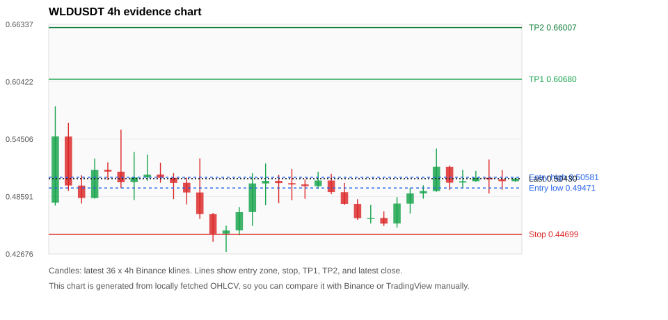
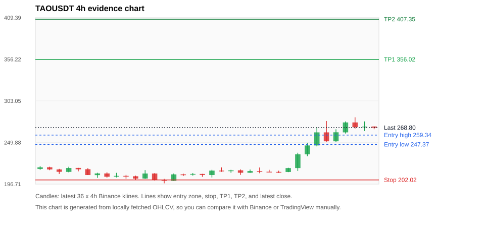
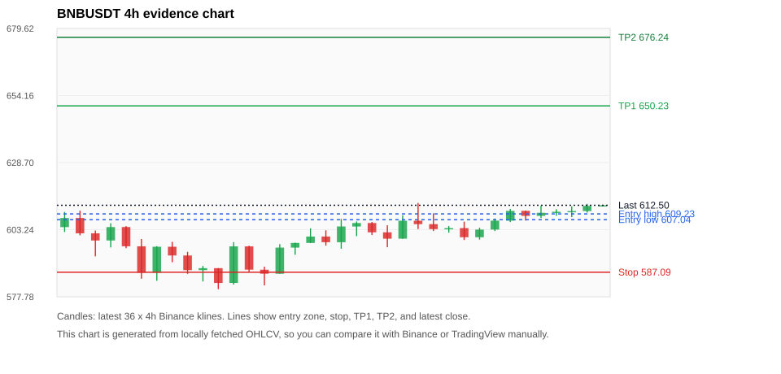
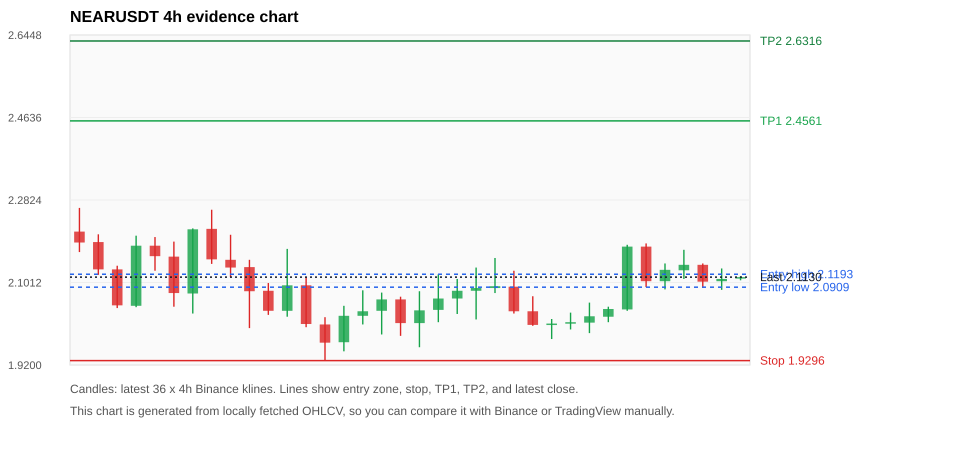
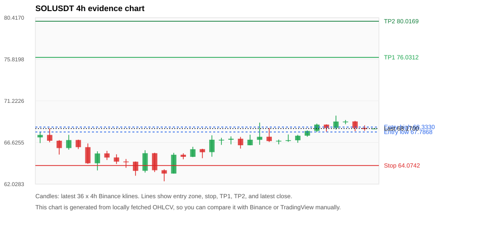

# Crypto 市场扫描报告 v1

- 报告时间：2026-06-14 20:06:26 CST
- Run ID：`20260614_120504_da0fe713`
- Run type：`daily_full`
- 数据来源：SQLite
- 报告版本：v1
- 扫描 ID：919a4ac86535
- 数据源：Binance public spot API + CoinGecko/CoinMarketCap cross-check
- 过滤条件：USDT spot; 24h quote volume >= 30,000,000; trades >= 30,000; exclude stables/leveraged tokens; analyze 1h/4h/1d klines
- 默认单笔风险：账户权益的 1.00%

## 限制说明

- 交易信号仍以 Binance 现货公开 K 线为主源；外部数据源用于一致性复核。
- 结果是研究和模拟盘计划，不是确定收益或实盘下单指令。
- 历史长度过滤：候选币至少需要 180 根 1d K 线。
- 数据质量验证池：先验证 score 排名前 min(top_n * 2, 10) 的候选，再按 action + score 补足最终名单。
- 大盘环境过滤：RISK_OFF; BTC/ETH 大盘偏弱，山寨币买入候选降级为观察。 BTC 7d=1.9290403067895534; ETH 7d=-0.9565160809459905.
- 已启用数据交叉验证：Binance 主源 + CoinGecko 自动对照；CoinMarketCap 在配置 API Key 后自动对照。
- WLDUSDT 交叉验证状态 DATA_WARNING：At least one external provider needs manual review.
- TAOUSDT 交叉验证状态 DATA_WARNING：At least one external provider needs manual review.
- BNBUSDT 交叉验证状态 DATA_WARNING：At least one external provider needs manual review.
- SOLUSDT 交叉验证状态 DATA_WARNING：At least one external provider needs manual review.
- ZECUSDT 交叉验证状态 DATA_WARNING：At least one external provider needs manual review.
- TRUMPUSDT 交叉验证状态 DATA_WARNING：At least one external provider needs manual review.
- ETHUSDT 交叉验证状态 DATA_WARNING：At least one external provider needs manual review.
- XRPUSDT 交叉验证状态 DATA_WARNING：At least one external provider needs manual review.
- DOGEUSDT 交叉验证状态 DATA_WARNING：At least one external provider needs manual review.

## 5 个候选交易计划

| Rank | Coin | Action | Setup | Entry Zone | Stop Loss | TP1 | TP2 / Exit Rule | R/R | Verdict |
|---:|---|---|---|---:|---:|---:|---|---:|---|
| 1 | `WLD` | `WATCH_ONLY` | 回踩支撑/4h EMA 附近 | 0.49471 - 0.50581 | 0.44699 | 0.60680 | 0.66007 或跌破 4h 关键支撑 | 2.00-3.00 | 只观察 |
| 2 | `TAO` | `WATCH_ONLY` | 涨幅较远，只等深回调 | 247.37 - 259.34 | 202.02 | 356.02 | 407.35 或跌破 4h 关键支撑 | 2.00-3.00 | 只等回调 |
| 3 | `BNB` | `WATCH_ONLY` | 回踩支撑/4h EMA 附近 | 607.04 - 609.23 | 587.09 | 650.23 | 676.24 或跌破 4h 关键支撑 | 2.00-3.24 | 只观察 |
| 4 | `NEAR` | `WATCH_ONLY` | 回踩支撑/4h EMA 附近 | 2.0909 - 2.1193 | 1.9296 | 2.4561 | 2.6316 或跌破 4h 关键支撑 | 2.00-3.00 | 只观察 |
| 5 | `SOL` | `WATCH_ONLY` | 回踩支撑/4h EMA 附近 | 67.7868 - 68.3330 | 64.0742 | 76.0312 | 80.0169 或跌破 4h 关键支撑 | 2.00-3.00 | 只观察 |

## 数据交叉验证摘要

价格差异以 Binance 当前价为基准；成交量口径不同，Binance 是 USDT 现货成交额，CoinGecko/CoinMarketCap 通常是全市场成交量。

| Rank | Coin | Data Status | Max Price Diff | Max 24h Diff | Message |
|---:|---|---|---:|---:|---|
| 1 | `WLD` | DATA_WARNING | 0.30% | 0.90 pts | At least one external provider needs manual review. |
| 2 | `TAO` | DATA_WARNING | 0.37% | 0.51 pts | At least one external provider needs manual review. |
| 3 | `BNB` | DATA_WARNING | 0.11% | 0.04 pts | At least one external provider needs manual review. |
| 4 | `NEAR` | DATA_OK | 0.20% | 0.15 pts | External provider checks agree with Binance within configured thresholds. |
| 5 | `SOL` | DATA_WARNING | 0.09% | 0.11 pts | At least one external provider needs manual review. |

## 候选币说明

### 1. WLD `WLDUSDT`



- 入选原因：回踩支撑/4h EMA 附近；24h +1.14%，7d +13.63%，4h RSI 55.84，24h 成交额 $147.2M。
- 交易失效条件：跌破 0.446993 或 4h 收盘重新失守关键支撑。
- 主要风险：BTC/ETH 大盘环境未确认强势，山寨币买入信号降级；数据交叉验证需要人工复核。
- 数据交叉验证：DATA_WARNING；At least one external provider needs manual review.

#### 可点击人工验证

- [Binance 交易页](https://www.binance.com/en/trade/WLD_USDT)
- [TradingView 图表](https://www.tradingview.com/chart/?symbol=BINANCE%3AWLDUSDT)
- [CoinGecko 搜索](https://www.coingecko.com/en/search?query=WLD)
- [CoinMarketCap 搜索](https://coinmarketcap.com/search/?q=WLD)

#### 多数据源对照

| Source | Status | Asset ID | Price | 24h Change | 24h Volume | Price Diff | 24h Diff | Updated | Message |
|---|---|---|---:|---:|---:|---:|---:|---|---|
| Binance | DATA_OK | WLDUSDT | 0.50430 | +1.14% | $147.2M | 0.00% | 0.00 pts | 2026-06-14T12:05:40+00:00 | Primary market data source used by scanner. |
| CoinGecko | DATA_OK | worldcoin-wld | 0.50303 | +2.04% | $725.4M | 0.25% | 0.90 pts | 2026-06-14T12:05:27.435Z | External source agrees with Binance within thresholds. |
| CoinMarketCap | DATA_WARNING | 13502 | 0.50281 | +1.76% | $699.5M | 0.30% | 0.62 pts | 2026-06-14T12:04:04.000Z | CoinMarketCap symbol mapping has 2 matches; selected lowest cmc_rank |

#### 指标证据

| 指标 | 数值 | 人工核对用途 |
|---|---:|---|
| 当前价 | 0.50430 | 与 Binance/TradingView 当前价格对照 |
| 24h 涨跌 | +1.14% | 与交易所 24h 涨跌对照 |
| 7d 涨跌 | +13.63% | 判断短线趋势是否延续 |
| 4h EMA20 | 0.49372 | 判断短期趋势支撑 |
| 4h EMA50 | 0.48121 | 判断中期趋势支撑 |
| 1d EMA20 | 0.43809 | 判断日线趋势 |
| 1d EMA50 | 0.37102 | 判断日线趋势 |
| 4h RSI14 | 55.84 | 判断是否过热/过弱 |
| 4h ATR14 | 0.02216 | 推导止损和入场缓冲 |
| 最近 18 根 4h 最低点 | 0.45380 | 支撑/止损参考 |
| 最近 36 根 4h 最高点 | 0.57890 | TP/压力参考 |
| 支撑位 | 0.49372 | 入场区间推导基础 |

#### 交易计划推导

- 支撑位 = 最近低点、4h EMA20、4h EMA50、1d EMA20 中不高于当前价的最高有效支撑 = `0.49372`。
- 入场区间 = 支撑位附近 + ATR 缓冲 = `0.49471 - 0.50581`。
- 止损 = min(最近 18 根 4h 最低点 * 0.985, 入场中位价 - 1.15 * ATR14) = `0.44699`。
- TP1 = max(最近 36 根 4h 最高点 * 0.995, 入场中位价 + 2R) = `0.60680`。
- TP2 = max(入场中位价 + 3R, TP1 * 1.04) = `0.66007`。

#### 最近 10 根 4h K线

| UTC 开盘时间 | Open | High | Low | Close | Quote Volume | Trades |
|---|---:|---:|---:|---:|---:|---:|
| 2026-06-13T00:00+00:00 | 0.45810 | 0.48540 | 0.45380 | 0.47870 | $16.5M | 266448 |
| 2026-06-13T04:00+00:00 | 0.47860 | 0.49500 | 0.46840 | 0.48910 | $14.4M | 272030 |
| 2026-06-13T08:00+00:00 | 0.48910 | 0.49750 | 0.48370 | 0.49150 | $19.7M | 288746 |
| 2026-06-13T12:00+00:00 | 0.49150 | 0.53540 | 0.49080 | 0.51660 | $53.2M | 501880 |
| 2026-06-13T16:00+00:00 | 0.51650 | 0.51800 | 0.49280 | 0.50020 | $27.8M | 334260 |
| 2026-06-13T20:00+00:00 | 0.50030 | 0.51350 | 0.49450 | 0.50170 | $12.5M | 188280 |
| 2026-06-14T00:00+00:00 | 0.50170 | 0.51230 | 0.50110 | 0.50520 | $16.0M | 232865 |
| 2026-06-14T04:00+00:00 | 0.50520 | 0.52400 | 0.48900 | 0.50380 | $21.2M | 346077 |
| 2026-06-14T08:00+00:00 | 0.50370 | 0.51340 | 0.49290 | 0.50170 | $17.5M | 265011 |
| 2026-06-14T12:00+00:00 | 0.50170 | 0.50530 | 0.50110 | 0.50440 | $924,438 | 8466 |

### 2. TAO `TAOUSDT`



- 入选原因：涨幅较远，只等深回调；24h +9.41%，7d +28.80%，4h RSI 79.45，24h 成交额 $91.7M。
- 交易失效条件：跌破 202.0235 或 4h 收盘重新失守关键支撑。
- 主要风险：距离支撑偏远，不能追市价；4h RSI 偏热；成交量突增，可能是事件驱动；日线趋势未完全确认；BTC/ETH 大盘环境未确认强势，山寨币买入信号降级；数据交叉验证需要人工复核。
- 数据交叉验证：DATA_WARNING；At least one external provider needs manual review.

#### 可点击人工验证

- [Binance 交易页](https://www.binance.com/en/trade/TAO_USDT)
- [TradingView 图表](https://www.tradingview.com/chart/?symbol=BINANCE%3ATAOUSDT)
- [CoinGecko 搜索](https://www.coingecko.com/en/search?query=TAO)
- [CoinMarketCap 搜索](https://coinmarketcap.com/search/?q=TAO)

#### 多数据源对照

| Source | Status | Asset ID | Price | 24h Change | 24h Volume | Price Diff | 24h Diff | Updated | Message |
|---|---|---|---:|---:|---:|---:|---:|---|---|
| Binance | DATA_OK | TAOUSDT | 268.80 | +9.41% | $91.7M | 0.00% | 0.00 pts | 2026-06-14T12:05:40+00:00 | Primary market data source used by scanner. |
| CoinGecko | DATA_WARNING | bittensor | 268.61 | +8.90% | $567.7M | 0.07% | 0.51 pts | 2026-06-14T12:05:42.684Z | CoinGecko symbol mapping has 3 exact matches; selected highest market-cap rank |
| CoinMarketCap | DATA_WARNING | 22974 | 269.81 | +9.85% | $694.0M | 0.37% | 0.45 pts | 2026-06-14T12:04:04.000Z | CoinMarketCap symbol mapping has 5 matches; selected lowest cmc_rank |

#### 指标证据

| 指标 | 数值 | 人工核对用途 |
|---|---:|---|
| 当前价 | 268.80 | 与 Binance/TradingView 当前价格对照 |
| 24h 涨跌 | +9.41% | 与交易所 24h 涨跌对照 |
| 7d 涨跌 | +28.80% | 判断短线趋势是否延续 |
| 4h EMA20 | 241.91 | 判断短期趋势支撑 |
| 4h EMA50 | 228.62 | 判断中期趋势支撑 |
| 1d EMA20 | 236.05 | 判断日线趋势 |
| 1d EMA50 | 250.94 | 判断日线趋势 |
| 4h RSI14 | 79.45 | 判断是否过热/过弱 |
| 4h ATR14 | 12.6071 | 推导止损和入场缓冲 |
| 最近 18 根 4h 最低点 | 205.10 | 支撑/止损参考 |
| 最近 36 根 4h 最高点 | 282.10 | TP/压力参考 |
| 支撑位 | 241.91 | 入场区间推导基础 |

#### 交易计划推导

- 支撑位 = 最近低点、4h EMA20、4h EMA50、1d EMA20 中不高于当前价的最高有效支撑 = `241.91`。
- 入场区间 = 支撑位附近 + ATR 缓冲 = `247.37 - 259.34`。
- 止损 = min(最近 18 根 4h 最低点 * 0.985, 入场中位价 - 1.15 * ATR14) = `202.02`。
- TP1 = max(最近 36 根 4h 最高点 * 0.995, 入场中位价 + 2R) = `356.02`。
- TP2 = max(入场中位价 + 3R, TP1 * 1.04) = `407.35`。

#### 最近 10 根 4h K线

| UTC 开盘时间 | Open | High | Low | Close | Quote Volume | Trades |
|---|---:|---:|---:|---:|---:|---:|
| 2026-06-13T00:00+00:00 | 212.20 | 217.60 | 212.00 | 217.20 | $2.3M | 17061 |
| 2026-06-13T04:00+00:00 | 217.20 | 236.80 | 213.50 | 234.70 | $12.0M | 80896 |
| 2026-06-13T08:00+00:00 | 234.70 | 249.50 | 232.30 | 246.10 | $18.7M | 183957 |
| 2026-06-13T12:00+00:00 | 246.10 | 269.30 | 244.90 | 262.80 | $20.2M | 213875 |
| 2026-06-13T16:00+00:00 | 262.80 | 277.30 | 250.90 | 251.40 | $24.8M | 227216 |
| 2026-06-13T20:00+00:00 | 251.40 | 266.70 | 250.40 | 262.90 | $8.4M | 88770 |
| 2026-06-14T00:00+00:00 | 262.80 | 276.80 | 261.30 | 275.50 | $11.0M | 132349 |
| 2026-06-14T04:00+00:00 | 275.50 | 282.10 | 267.60 | 269.40 | $14.4M | 164143 |
| 2026-06-14T08:00+00:00 | 269.40 | 276.80 | 264.60 | 270.20 | $12.9M | 114641 |
| 2026-06-14T12:00+00:00 | 270.30 | 270.50 | 266.80 | 268.80 | $256,701 | 3744 |

### 3. BNB `BNBUSDT`



- 入选原因：回踩支撑/4h EMA 附近；24h +0.94%，7d +4.01%，4h RSI 71.29，24h 成交额 $39.7M。
- 交易失效条件：跌破 587.08955 或 4h 收盘重新失守关键支撑。
- 主要风险：日线趋势未完全确认；BTC/ETH 大盘环境未确认强势，山寨币买入信号降级；数据交叉验证需要人工复核。
- 数据交叉验证：DATA_WARNING；At least one external provider needs manual review.

#### 可点击人工验证

- [Binance 交易页](https://www.binance.com/en/trade/BNB_USDT)
- [TradingView 图表](https://www.tradingview.com/chart/?symbol=BINANCE%3ABNBUSDT)
- [CoinGecko 搜索](https://www.coingecko.com/en/search?query=BNB)
- [CoinMarketCap 搜索](https://coinmarketcap.com/search/?q=BNB)

#### 多数据源对照

| Source | Status | Asset ID | Price | 24h Change | 24h Volume | Price Diff | 24h Diff | Updated | Message |
|---|---|---|---:|---:|---:|---:|---:|---|---|
| Binance | DATA_OK | BNBUSDT | 612.50 | +0.94% | $39.7M | 0.00% | 0.00 pts | 2026-06-14T12:05:40+00:00 | Primary market data source used by scanner. |
| CoinGecko | DATA_OK | binancecoin | 611.94 | +0.90% | $454.1M | 0.09% | 0.04 pts | 2026-06-14T12:05:43.212Z | External source agrees with Binance within thresholds. |
| CoinMarketCap | DATA_WARNING | 1839 | 611.83 | +0.95% | $781.2M | 0.11% | 0.01 pts | 2026-06-14T12:04:04.000Z | CoinMarketCap symbol mapping has 4 matches; selected lowest cmc_rank |

#### 指标证据

| 指标 | 数值 | 人工核对用途 |
|---|---:|---|
| 当前价 | 612.50 | 与 Binance/TradingView 当前价格对照 |
| 24h 涨跌 | +0.94% | 与交易所 24h 涨跌对照 |
| 7d 涨跌 | +4.01% | 判断短线趋势是否延续 |
| 4h EMA20 | 605.83 | 判断短期趋势支撑 |
| 4h EMA50 | 605.57 | 判断中期趋势支撑 |
| 1d EMA20 | 619.49 | 判断日线趋势 |
| 1d EMA50 | 631.93 | 判断日线趋势 |
| 4h RSI14 | 71.29 | 判断是否过热/过弱 |
| 4h ATR14 | 4.8529 | 推导止损和入场缓冲 |
| 最近 18 根 4h 最低点 | 596.03 | 支撑/止损参考 |
| 最近 36 根 4h 最高点 | 613.39 | TP/压力参考 |
| 支撑位 | 605.83 | 入场区间推导基础 |

#### 交易计划推导

- 支撑位 = 最近低点、4h EMA20、4h EMA50、1d EMA20 中不高于当前价的最高有效支撑 = `605.83`。
- 入场区间 = 支撑位附近 + ATR 缓冲 = `607.04 - 609.23`。
- 止损 = min(最近 18 根 4h 最低点 * 0.985, 入场中位价 - 1.15 * ATR14) = `587.09`。
- TP1 = max(最近 36 根 4h 最高点 * 0.995, 入场中位价 + 2R) = `650.23`。
- TP2 = max(入场中位价 + 3R, TP1 * 1.04) = `676.24`。

#### 最近 10 根 4h K线

| UTC 开盘时间 | Open | High | Low | Close | Quote Volume | Trades |
|---|---:|---:|---:|---:|---:|---:|
| 2026-06-13T00:00+00:00 | 603.84 | 606.27 | 599.33 | 600.37 | $11.1M | 61304 |
| 2026-06-13T04:00+00:00 | 600.37 | 604.00 | 599.48 | 603.27 | $8.0M | 64958 |
| 2026-06-13T08:00+00:00 | 603.28 | 607.49 | 602.72 | 606.67 | $7.1M | 101708 |
| 2026-06-13T12:00+00:00 | 606.67 | 611.08 | 606.16 | 610.37 | $10.3M | 84327 |
| 2026-06-13T16:00+00:00 | 610.38 | 610.49 | 606.69 | 608.48 | $4.0M | 52139 |
| 2026-06-13T20:00+00:00 | 608.49 | 612.33 | 607.68 | 609.65 | $4.0M | 44890 |
| 2026-06-14T00:00+00:00 | 609.66 | 611.01 | 608.51 | 610.04 | $5.2M | 41394 |
| 2026-06-14T04:00+00:00 | 610.04 | 612.10 | 608.00 | 610.31 | $7.4M | 55600 |
| 2026-06-14T08:00+00:00 | 610.32 | 613.03 | 609.73 | 612.26 | $8.8M | 54938 |
| 2026-06-14T12:00+00:00 | 612.26 | 612.50 | 612.10 | 612.50 | $188,389 | 1997 |

### 4. NEAR `NEARUSDT`



- 入选原因：回踩支撑/4h EMA 附近；24h +3.22%，7d +10.69%，4h RSI 52.86，24h 成交额 $39.8M。
- 交易失效条件：跌破 1.929615 或 4h 收盘重新失守关键支撑。
- 主要风险：日线趋势未完全确认；BTC/ETH 大盘环境未确认强势，山寨币买入信号降级。
- 数据交叉验证：DATA_OK；External provider checks agree with Binance within configured thresholds.

#### 可点击人工验证

- [Binance 交易页](https://www.binance.com/en/trade/NEAR_USDT)
- [TradingView 图表](https://www.tradingview.com/chart/?symbol=BINANCE%3ANEARUSDT)
- [CoinGecko 搜索](https://www.coingecko.com/en/search?query=NEAR)
- [CoinMarketCap 搜索](https://coinmarketcap.com/search/?q=NEAR)

#### 多数据源对照

| Source | Status | Asset ID | Price | 24h Change | 24h Volume | Price Diff | 24h Diff | Updated | Message |
|---|---|---|---:|---:|---:|---:|---:|---|---|
| Binance | DATA_OK | NEARUSDT | 2.1130 | +3.22% | $39.8M | 0.00% | 0.00 pts | 2026-06-14T12:05:40+00:00 | Primary market data source used by scanner. |
| CoinGecko | DATA_OK | near | 2.1100 | +3.38% | $308.2M | 0.14% | 0.15 pts | 2026-06-14T12:05:41.592Z | External source agrees with Binance within thresholds. |
| CoinMarketCap | DATA_OK | 6535 | 2.1088 | +3.28% | $312.0M | 0.20% | 0.05 pts | 2026-06-14T12:04:04.000Z | External source agrees with Binance within thresholds. |

#### 指标证据

| 指标 | 数值 | 人工核对用途 |
|---|---:|---|
| 当前价 | 2.1130 | 与 Binance/TradingView 当前价格对照 |
| 24h 涨跌 | +3.22% | 与交易所 24h 涨跌对照 |
| 7d 涨跌 | +10.69% | 判断短线趋势是否延续 |
| 4h EMA20 | 2.0867 | 判断短期趋势支撑 |
| 4h EMA50 | 2.1150 | 判断中期趋势支撑 |
| 1d EMA20 | 2.1274 | 判断日线趋势 |
| 1d EMA50 | 1.9402 | 判断日线趋势 |
| 4h RSI14 | 52.86 | 判断是否过热/过弱 |
| 4h ATR14 | 0.06350 | 推导止损和入场缓冲 |
| 最近 18 根 4h 最低点 | 1.9590 | 支撑/止损参考 |
| 最近 36 根 4h 最高点 | 2.2650 | TP/压力参考 |
| 支撑位 | 2.0867 | 入场区间推导基础 |

#### 交易计划推导

- 支撑位 = 最近低点、4h EMA20、4h EMA50、1d EMA20 中不高于当前价的最高有效支撑 = `2.0867`。
- 入场区间 = 支撑位附近 + ATR 缓冲 = `2.0909 - 2.1193`。
- 止损 = min(最近 18 根 4h 最低点 * 0.985, 入场中位价 - 1.15 * ATR14) = `1.9296`。
- TP1 = max(最近 36 根 4h 最高点 * 0.995, 入场中位价 + 2R) = `2.4561`。
- TP2 = max(入场中位价 + 3R, TP1 * 1.04) = `2.6316`。

#### 最近 10 根 4h K线

| UTC 开盘时间 | Open | High | Low | Close | Quote Volume | Trades |
|---|---:|---:|---:|---:|---:|---:|
| 2026-06-13T00:00+00:00 | 2.0110 | 2.0350 | 1.9980 | 2.0140 | $4.1M | 29301 |
| 2026-06-13T04:00+00:00 | 2.0130 | 2.0570 | 1.9900 | 2.0270 | $4.9M | 39667 |
| 2026-06-13T08:00+00:00 | 2.0260 | 2.0480 | 2.0140 | 2.0430 | $3.8M | 34035 |
| 2026-06-13T12:00+00:00 | 2.0420 | 2.1840 | 2.0390 | 2.1800 | $9.9M | 62392 |
| 2026-06-13T16:00+00:00 | 2.1800 | 2.1870 | 2.0910 | 2.1040 | $9.9M | 81983 |
| 2026-06-13T20:00+00:00 | 2.1040 | 2.1430 | 2.0860 | 2.1290 | $3.9M | 37693 |
| 2026-06-14T00:00+00:00 | 2.1280 | 2.1730 | 2.1090 | 2.1400 | $7.9M | 48405 |
| 2026-06-14T04:00+00:00 | 2.1400 | 2.1430 | 2.0900 | 2.1030 | $4.2M | 34014 |
| 2026-06-14T08:00+00:00 | 2.1040 | 2.1320 | 2.0850 | 2.1090 | $4.1M | 29371 |
| 2026-06-14T12:00+00:00 | 2.1100 | 2.1150 | 2.1060 | 2.1130 | $78,971 | 680 |

### 5. SOL `SOLUSDT`



- 入选原因：回踩支撑/4h EMA 附近；24h +0.52%，7d +5.95%，4h RSI 67.82，24h 成交额 $109.6M。
- 交易失效条件：跌破 64.07425 或 4h 收盘重新失守关键支撑。
- 主要风险：日线趋势未完全确认；BTC/ETH 大盘环境未确认强势，山寨币买入信号降级；数据交叉验证需要人工复核。
- 数据交叉验证：DATA_WARNING；At least one external provider needs manual review.

#### 可点击人工验证

- [Binance 交易页](https://www.binance.com/en/trade/SOL_USDT)
- [TradingView 图表](https://www.tradingview.com/chart/?symbol=BINANCE%3ASOLUSDT)
- [CoinGecko 搜索](https://www.coingecko.com/en/search?query=SOL)
- [CoinMarketCap 搜索](https://coinmarketcap.com/search/?q=SOL)

#### 多数据源对照

| Source | Status | Asset ID | Price | 24h Change | 24h Volume | Price Diff | 24h Diff | Updated | Message |
|---|---|---|---:|---:|---:|---:|---:|---|---|
| Binance | DATA_OK | SOLUSDT | 68.1700 | +0.52% | $109.6M | 0.00% | 0.00 pts | 2026-06-14T12:05:40+00:00 | Primary market data source used by scanner. |
| CoinGecko | DATA_WARNING | n/a | n/a | n/a | n/a | n/a | n/a | 2026-06-14T12:05:40+00:00 | Failed to fetch https://api.coingecko.com/api/v3/coins/markets?vs_currency=usd&ids=solana&price_change_percentage=24h&per_page=1&page=1: HTTP Error 429: Too Many Requests |
| CoinMarketCap | DATA_WARNING | 5426 | 68.1056 | +0.40% | $1.46B | 0.09% | 0.11 pts | 2026-06-14T12:04:04.000Z | CoinMarketCap symbol mapping has 8 matches; selected lowest cmc_rank |

#### 指标证据

| 指标 | 数值 | 人工核对用途 |
|---|---:|---|
| 当前价 | 68.1700 | 与 Binance/TradingView 当前价格对照 |
| 24h 涨跌 | +0.52% | 与交易所 24h 涨跌对照 |
| 7d 涨跌 | +5.95% | 判断短线趋势是否延续 |
| 4h EMA20 | 67.4479 | 判断短期趋势支撑 |
| 4h EMA50 | 67.6515 | 判断中期趋势支撑 |
| 1d EMA20 | 71.7494 | 判断日线趋势 |
| 1d EMA50 | 78.3707 | 判断日线趋势 |
| 4h RSI14 | 67.82 | 判断是否过热/过弱 |
| 4h ATR14 | 0.97357 | 推导止损和入场缓冲 |
| 最近 18 根 4h 最低点 | 65.0500 | 支撑/止损参考 |
| 最近 36 根 4h 最高点 | 69.5900 | TP/压力参考 |
| 支撑位 | 67.6515 | 入场区间推导基础 |

#### 交易计划推导

- 支撑位 = 最近低点、4h EMA20、4h EMA50、1d EMA20 中不高于当前价的最高有效支撑 = `67.6515`。
- 入场区间 = 支撑位附近 + ATR 缓冲 = `67.7868 - 68.3330`。
- 止损 = min(最近 18 根 4h 最低点 * 0.985, 入场中位价 - 1.15 * ATR14) = `64.0742`。
- TP1 = max(最近 36 根 4h 最高点 * 0.995, 入场中位价 + 2R) = `76.0312`。
- TP2 = max(入场中位价 + 3R, TP1 * 1.04) = `80.0169`。

#### 最近 10 根 4h K线

| UTC 开盘时间 | Open | High | Low | Close | Quote Volume | Trades |
|---|---:|---:|---:|---:|---:|---:|
| 2026-06-13T00:00+00:00 | 66.8300 | 67.5100 | 66.7000 | 66.8800 | $12.0M | 48707 |
| 2026-06-13T04:00+00:00 | 66.8700 | 67.4700 | 66.5900 | 67.3700 | $15.3M | 57448 |
| 2026-06-13T08:00+00:00 | 67.3800 | 67.9600 | 67.2600 | 67.9000 | $15.5M | 55889 |
| 2026-06-13T12:00+00:00 | 67.9100 | 68.7100 | 67.7700 | 68.6000 | $24.6M | 89018 |
| 2026-06-13T16:00+00:00 | 68.6000 | 68.6300 | 67.8300 | 68.2300 | $14.4M | 79373 |
| 2026-06-13T20:00+00:00 | 68.2400 | 69.5900 | 68.0500 | 68.9400 | $21.7M | 104223 |
| 2026-06-14T00:00+00:00 | 68.9400 | 69.1100 | 68.6400 | 68.9400 | $13.4M | 64741 |
| 2026-06-14T04:00+00:00 | 68.9500 | 69.0100 | 67.8800 | 68.2300 | $24.7M | 71149 |
| 2026-06-14T08:00+00:00 | 68.2300 | 68.5200 | 67.9200 | 68.1100 | $10.8M | 46267 |
| 2026-06-14T12:00+00:00 | 68.1100 | 68.1700 | 68.1100 | 68.1700 | $133,412 | 904 |

## 组合风控

- 不要 5 个候选全部满仓买入。
- 同时持仓总风险建议控制在账户权益的 3% - 5% 以内。
- 如果 BTC/ETH 同时破位，暂停山寨币多头计划或降低仓位。
- 第一版报告用于模拟盘和人工复核，不自动下单。

## 原始数据

```json
[
  {
    "rank": 1,
    "symbol": "WLDUSDT",
    "base_asset": "WLD",
    "price": 0.5043,
    "score": 59.04857852246491,
    "setup": "回踩支撑/4h EMA 附近",
    "verdict": "只观察",
    "entry_low": 0.4947121472873552,
    "entry_high": 0.5058128999999999,
    "stop_loss": 0.446993,
    "take_profit_1": 0.6068015709310326,
    "take_profit_2": 0.6600710945747101,
    "risk_reward_1": 2.0,
    "risk_reward_2": 3.0,
    "pct_24h": 1.142,
    "pct_3d": 0.7189934092270756,
    "pct_7d": 13.63226678684093,
    "quote_volume_24h": 147175277.56286,
    "trades_24h": 1860600,
    "high_low_range_24h": 9.488752556237223,
    "rsi_1h": 50.452488687782825,
    "rsi_4h": 55.83543240973972,
    "ema20_4h": 0.49372469789157203,
    "ema50_4h": 0.4812051712478742,
    "ema20_1d": 0.4380881404256296,
    "ema50_1d": 0.37102170975522536,
    "atr_4h": 0.02215714285714285,
    "macd_hist_4h": 0.001892171644332271,
    "volume_ratio_24h": 1.086623304047502,
    "support_level": 0.49372469789157203,
    "recent_low_4h_18": 0.4538,
    "recent_high_4h_36": 0.5789,
    "distance_to_support_pct": 2.1419431018114388,
    "binance_trade_url": "https://www.binance.com/en/trade/WLD_USDT",
    "tradingview_url": "https://www.tradingview.com/chart/?symbol=BINANCE%3AWLDUSDT",
    "coingecko_search_url": "https://www.coingecko.com/en/search?query=WLD",
    "coinmarketcap_search_url": "https://coinmarketcap.com/search/?q=WLD",
    "invalidation": "跌破 0.446993 或 4h 收盘重新失守关键支撑",
    "recent_4h_klines": [
      {
        "open_time_utc": "2026-06-08T16:00+00:00",
        "open": 0.4795,
        "high": 0.5789,
        "low": 0.4766,
        "close": 0.5478,
        "quote_volume": 35922626.84267,
        "trades": 446600
      },
      {
        "open_time_utc": "2026-06-08T20:00+00:00",
        "open": 0.5477,
        "high": 0.5617,
        "low": 0.4917,
        "close": 0.4973,
        "quote_volume": 21236878.09446,
        "trades": 225556
      },
      {
        "open_time_utc": "2026-06-09T00:00+00:00",
        "open": 0.4972,
        "high": 0.5078,
        "low": 0.4787,
        "close": 0.4844,
        "quote_volume": 11894901.41798,
        "trades": 118857
      },
      {
        "open_time_utc": "2026-06-09T04:00+00:00",
        "open": 0.4843,
        "high": 0.525,
        "low": 0.4838,
        "close": 0.5134,
        "quote_volume": 16513274.19074,
        "trades": 189953
      },
      {
        "open_time_utc": "2026-06-09T08:00+00:00",
        "open": 0.5135,
        "high": 0.5211,
        "low": 0.5028,
        "close": 0.5116,
        "quote_volume": 13466225.79521,
        "trades": 129219
      },
      {
        "open_time_utc": "2026-06-09T12:00+00:00",
        "open": 0.5115,
        "high": 0.5547,
        "low": 0.4945,
        "close": 0.5006,
        "quote_volume": 32095339.61055,
        "trades": 312674
      },
      {
        "open_time_utc": "2026-06-09T16:00+00:00",
        "open": 0.5007,
        "high": 0.5318,
        "low": 0.4822,
        "close": 0.5056,
        "quote_volume": 19549717.9563,
        "trades": 206463
      },
      {
        "open_time_utc": "2026-06-09T20:00+00:00",
        "open": 0.5056,
        "high": 0.5291,
        "low": 0.5021,
        "close": 0.5085,
        "quote_volume": 11972914.11072,
        "trades": 122656
      },
      {
        "open_time_utc": "2026-06-10T00:00+00:00",
        "open": 0.5086,
        "high": 0.5208,
        "low": 0.5002,
        "close": 0.5052,
        "quote_volume": 10952357.50773,
        "trades": 99330
      },
      {
        "open_time_utc": "2026-06-10T04:00+00:00",
        "open": 0.5051,
        "high": 0.5099,
        "low": 0.4833,
        "close": 0.5,
        "quote_volume": 14714442.85453,
        "trades": 144289
      },
      {
        "open_time_utc": "2026-06-10T08:00+00:00",
        "open": 0.5001,
        "high": 0.5056,
        "low": 0.4778,
        "close": 0.4901,
        "quote_volume": 9554726.62643,
        "trades": 95552
      },
      {
        "open_time_utc": "2026-06-10T12:00+00:00",
        "open": 0.4901,
        "high": 0.5252,
        "low": 0.4627,
        "close": 0.4678,
        "quote_volume": 28979345.69373,
        "trades": 264712
      },
      {
        "open_time_utc": "2026-06-10T16:00+00:00",
        "open": 0.4678,
        "high": 0.469,
        "low": 0.4392,
        "close": 0.4476,
        "quote_volume": 20294622.01901,
        "trades": 177675
      },
      {
        "open_time_utc": "2026-06-10T20:00+00:00",
        "open": 0.4477,
        "high": 0.4558,
        "low": 0.4289,
        "close": 0.4509,
        "quote_volume": 12848071.93153,
        "trades": 116592
      },
      {
        "open_time_utc": "2026-06-11T00:00+00:00",
        "open": 0.451,
        "high": 0.4749,
        "low": 0.446,
        "close": 0.4698,
        "quote_volume": 8198883.5465,
        "trades": 100026
      },
      {
        "open_time_utc": "2026-06-11T04:00+00:00",
        "open": 0.4699,
        "high": 0.51,
        "low": 0.4556,
        "close": 0.4994,
        "quote_volume": 18795603.55692,
        "trades": 177428
      },
      {
        "open_time_utc": "2026-06-11T08:00+00:00",
        "open": 0.4994,
        "high": 0.52,
        "low": 0.4769,
        "close": 0.502,
        "quote_volume": 23818434.64928,
        "trades": 209959
      },
      {
        "open_time_utc": "2026-06-11T12:00+00:00",
        "open": 0.502,
        "high": 0.5084,
        "low": 0.479,
        "close": 0.4998,
        "quote_volume": 57917046.88831,
        "trades": 575104
      },
      {
        "open_time_utc": "2026-06-11T16:00+00:00",
        "open": 0.4997,
        "high": 0.5142,
        "low": 0.482,
        "close": 0.4983,
        "quote_volume": 56664673.93509,
        "trades": 498846
      },
      {
        "open_time_utc": "2026-06-11T20:00+00:00",
        "open": 0.4984,
        "high": 0.5036,
        "low": 0.4836,
        "close": 0.4966,
        "quote_volume": 18804757.1173,
        "trades": 160359
      },
      {
        "open_time_utc": "2026-06-12T00:00+00:00",
        "open": 0.4966,
        "high": 0.5115,
        "low": 0.4937,
        "close": 0.5024,
        "quote_volume": 15914228.40929,
        "trades": 159774
      },
      {
        "open_time_utc": "2026-06-12T04:00+00:00",
        "open": 0.5024,
        "high": 0.5093,
        "low": 0.4884,
        "close": 0.4905,
        "quote_volume": 30433846.56914,
        "trades": 292386
      },
      {
        "open_time_utc": "2026-06-12T08:00+00:00",
        "open": 0.4904,
        "high": 0.5,
        "low": 0.4771,
        "close": 0.4784,
        "quote_volume": 28743300.82325,
        "trades": 264696
      },
      {
        "open_time_utc": "2026-06-12T12:00+00:00",
        "open": 0.4783,
        "high": 0.4832,
        "low": 0.4618,
        "close": 0.4636,
        "quote_volume": 26935217.81806,
        "trades": 340511
      },
      {
        "open_time_utc": "2026-06-12T16:00+00:00",
        "open": 0.4636,
        "high": 0.4772,
        "low": 0.4581,
        "close": 0.4638,
        "quote_volume": 26466576.90929,
        "trades": 324950
      },
      {
        "open_time_utc": "2026-06-12T20:00+00:00",
        "open": 0.4638,
        "high": 0.4706,
        "low": 0.4555,
        "close": 0.458,
        "quote_volume": 12760099.04917,
        "trades": 210720
      },
      {
        "open_time_utc": "2026-06-13T00:00+00:00",
        "open": 0.4581,
        "high": 0.4854,
        "low": 0.4538,
        "close": 0.4787,
        "quote_volume": 16519604.55099,
        "trades": 266448
      },
      {
        "open_time_utc": "2026-06-13T04:00+00:00",
        "open": 0.4786,
        "high": 0.495,
        "low": 0.4684,
        "close": 0.4891,
        "quote_volume": 14437439.54129,
        "trades": 272030
      },
      {
        "open_time_utc": "2026-06-13T08:00+00:00",
        "open": 0.4891,
        "high": 0.4975,
        "low": 0.4837,
        "close": 0.4915,
        "quote_volume": 19704562.57682,
        "trades": 288746
      },
      {
        "open_time_utc": "2026-06-13T12:00+00:00",
        "open": 0.4915,
        "high": 0.5354,
        "low": 0.4908,
        "close": 0.5166,
        "quote_volume": 53166165.47691,
        "trades": 501880
      },
      {
        "open_time_utc": "2026-06-13T16:00+00:00",
        "open": 0.5165,
        "high": 0.518,
        "low": 0.4928,
        "close": 0.5002,
        "quote_volume": 27775064.91979,
        "trades": 334260
      },
      {
        "open_time_utc": "2026-06-13T20:00+00:00",
        "open": 0.5003,
        "high": 0.5135,
        "low": 0.4945,
        "close": 0.5017,
        "quote_volume": 12452322.14326,
        "trades": 188280
      },
      {
        "open_time_utc": "2026-06-14T00:00+00:00",
        "open": 0.5017,
        "high": 0.5123,
        "low": 0.5011,
        "close": 0.5052,
        "quote_volume": 16010703.15925,
        "trades": 232865
      },
      {
        "open_time_utc": "2026-06-14T04:00+00:00",
        "open": 0.5052,
        "high": 0.524,
        "low": 0.489,
        "close": 0.5038,
        "quote_volume": 21165266.89532,
        "trades": 346077
      },
      {
        "open_time_utc": "2026-06-14T08:00+00:00",
        "open": 0.5037,
        "high": 0.5134,
        "low": 0.4929,
        "close": 0.5017,
        "quote_volume": 17483869.82163,
        "trades": 265011
      },
      {
        "open_time_utc": "2026-06-14T12:00+00:00",
        "open": 0.5017,
        "high": 0.5053,
        "low": 0.5011,
        "close": 0.5044,
        "quote_volume": 924437.79503,
        "trades": 8466
      }
    ],
    "risks": [
      "BTC/ETH 大盘环境未确认强势，山寨币买入信号降级",
      "数据交叉验证需要人工复核"
    ],
    "data_quality_status": "DATA_WARNING",
    "data_quality_message": "At least one external provider needs manual review.",
    "data_checks": [
      {
        "provider": "Binance",
        "status": "DATA_OK",
        "provider_asset_id": "WLDUSDT",
        "provider_symbol": "WLDUSDT",
        "price_usd": 0.5043,
        "pct_24h": 1.142,
        "volume_24h": 147175277.56286,
        "last_updated": null,
        "fetched_at_utc": "2026-06-14T12:05:40+00:00",
        "price_diff_pct": 0.0,
        "pct_24h_diff": 0.0,
        "volume_note": "Binance USDT spot 24h quoteVolume.",
        "message": "Primary market data source used by scanner."
      },
      {
        "provider": "CoinGecko",
        "status": "DATA_OK",
        "provider_asset_id": "worldcoin-wld",
        "provider_symbol": "WLD",
        "price_usd": 0.503033,
        "pct_24h": 2.03769,
        "volume_24h": 725368141.0,
        "last_updated": "2026-06-14T12:05:27.435Z",
        "fetched_at_utc": "2026-06-14T12:05:40+00:00",
        "price_diff_pct": 0.2512393416617129,
        "pct_24h_diff": 0.8956900000000001,
        "volume_note": "CoinGecko total market volume; not the same venue scope as Binance quoteVolume.",
        "message": "External source agrees with Binance within thresholds."
      },
      {
        "provider": "CoinMarketCap",
        "status": "DATA_WARNING",
        "provider_asset_id": "13502",
        "provider_symbol": "WLD",
        "price_usd": 0.5028055866297209,
        "pct_24h": 1.76132322,
        "volume_24h": 699483830.7529697,
        "last_updated": "2026-06-14T12:04:04.000Z",
        "fetched_at_utc": "2026-06-14T12:05:40+00:00",
        "price_diff_pct": 0.29633419993636984,
        "pct_24h_diff": 0.6193232200000001,
        "volume_note": "CoinMarketCap total market volume; not the same venue scope as Binance quoteVolume.",
        "message": "CoinMarketCap symbol mapping has 2 matches; selected lowest cmc_rank"
      }
    ],
    "action": "WATCH_ONLY"
  },
  {
    "rank": 2,
    "symbol": "TAOUSDT",
    "base_asset": "TAO",
    "price": 268.8,
    "score": 47.35786678248644,
    "setup": "涨幅较远，只等深回调",
    "verdict": "只等回调",
    "entry_low": 247.36785714285716,
    "entry_high": 259.34464285714284,
    "stop_loss": 202.02349999999998,
    "take_profit_1": 356.02175,
    "take_profit_2": 407.35450000000003,
    "risk_reward_1": 2.0,
    "risk_reward_2": 3.0000000000000004,
    "pct_24h": 9.406,
    "pct_3d": 28.79731672256829,
    "pct_7d": 28.79731672256829,
    "quote_volume_24h": 91659405.06352,
    "trades_24h": 942271,
    "high_low_range_24h": 15.189873417721532,
    "rsi_1h": 58.62068965517245,
    "rsi_4h": 79.44785276073618,
    "ema20_4h": 241.9055961052265,
    "ema50_4h": 228.62014237541138,
    "ema20_1d": 236.05009269833315,
    "ema50_1d": 250.94241380774622,
    "atr_4h": 12.607142857142858,
    "macd_hist_4h": 4.692604468230115,
    "volume_ratio_24h": 3.9735540966981917,
    "support_level": 241.9055961052265,
    "recent_low_4h_18": 205.1,
    "recent_high_4h_36": 282.1,
    "distance_to_support_pct": 11.11772705046259,
    "binance_trade_url": "https://www.binance.com/en/trade/TAO_USDT",
    "tradingview_url": "https://www.tradingview.com/chart/?symbol=BINANCE%3ATAOUSDT",
    "coingecko_search_url": "https://www.coingecko.com/en/search?query=TAO",
    "coinmarketcap_search_url": "https://coinmarketcap.com/search/?q=TAO",
    "invalidation": "跌破 202.0235 或 4h 收盘重新失守关键支撑",
    "recent_4h_klines": [
      {
        "open_time_utc": "2026-06-08T16:00+00:00",
        "open": 216.1,
        "high": 219.7,
        "low": 214.9,
        "close": 218.1,
        "quote_volume": 2925908.10788,
        "trades": 32065
      },
      {
        "open_time_utc": "2026-06-08T20:00+00:00",
        "open": 218.2,
        "high": 218.9,
        "low": 214.5,
        "close": 215.4,
        "quote_volume": 2083838.9286,
        "trades": 24271
      },
      {
        "open_time_utc": "2026-06-09T00:00+00:00",
        "open": 215.4,
        "high": 216.2,
        "low": 209.7,
        "close": 212.4,
        "quote_volume": 2906093.66288,
        "trades": 22105
      },
      {
        "open_time_utc": "2026-06-09T04:00+00:00",
        "open": 212.3,
        "high": 218.9,
        "low": 211.7,
        "close": 217.3,
        "quote_volume": 3313016.08551,
        "trades": 27814
      },
      {
        "open_time_utc": "2026-06-09T08:00+00:00",
        "open": 217.4,
        "high": 217.5,
        "low": 213.0,
        "close": 215.6,
        "quote_volume": 2164826.91645,
        "trades": 20663
      },
      {
        "open_time_utc": "2026-06-09T12:00+00:00",
        "open": 215.7,
        "high": 217.1,
        "low": 208.3,
        "close": 208.3,
        "quote_volume": 4499301.34302,
        "trades": 42229
      },
      {
        "open_time_utc": "2026-06-09T16:00+00:00",
        "open": 208.2,
        "high": 211.2,
        "low": 204.7,
        "close": 210.3,
        "quote_volume": 5093325.9507,
        "trades": 65919
      },
      {
        "open_time_utc": "2026-06-09T20:00+00:00",
        "open": 210.3,
        "high": 211.8,
        "low": 204.9,
        "close": 206.1,
        "quote_volume": 2676656.84288,
        "trades": 25088
      },
      {
        "open_time_utc": "2026-06-10T00:00+00:00",
        "open": 206.2,
        "high": 211.1,
        "low": 205.2,
        "close": 207.2,
        "quote_volume": 1637177.74847,
        "trades": 23044
      },
      {
        "open_time_utc": "2026-06-10T04:00+00:00",
        "open": 207.2,
        "high": 208.5,
        "low": 203.5,
        "close": 206.7,
        "quote_volume": 1172056.66358,
        "trades": 13734
      },
      {
        "open_time_utc": "2026-06-10T08:00+00:00",
        "open": 206.7,
        "high": 207.5,
        "low": 202.5,
        "close": 203.7,
        "quote_volume": 1977178.84526,
        "trades": 22676
      },
      {
        "open_time_utc": "2026-06-10T12:00+00:00",
        "open": 203.8,
        "high": 214.6,
        "low": 203.3,
        "close": 210.2,
        "quote_volume": 6145553.07602,
        "trades": 65956
      },
      {
        "open_time_utc": "2026-06-10T16:00+00:00",
        "open": 210.2,
        "high": 210.7,
        "low": 201.3,
        "close": 202.4,
        "quote_volume": 3251134.05344,
        "trades": 50864
      },
      {
        "open_time_utc": "2026-06-10T20:00+00:00",
        "open": 202.3,
        "high": 203.4,
        "low": 197.7,
        "close": 200.9,
        "quote_volume": 2911627.05694,
        "trades": 33434
      },
      {
        "open_time_utc": "2026-06-11T00:00+00:00",
        "open": 200.8,
        "high": 210.2,
        "low": 200.8,
        "close": 209.1,
        "quote_volume": 2618985.28579,
        "trades": 25821
      },
      {
        "open_time_utc": "2026-06-11T04:00+00:00",
        "open": 209.1,
        "high": 210.0,
        "low": 207.0,
        "close": 208.9,
        "quote_volume": 1856280.14527,
        "trades": 21890
      },
      {
        "open_time_utc": "2026-06-11T08:00+00:00",
        "open": 208.9,
        "high": 210.9,
        "low": 207.5,
        "close": 209.7,
        "quote_volume": 1891237.86828,
        "trades": 17588
      },
      {
        "open_time_utc": "2026-06-11T12:00+00:00",
        "open": 209.7,
        "high": 209.8,
        "low": 206.0,
        "close": 208.4,
        "quote_volume": 2875573.47895,
        "trades": 29575
      },
      {
        "open_time_utc": "2026-06-11T16:00+00:00",
        "open": 208.3,
        "high": 215.0,
        "low": 205.1,
        "close": 213.9,
        "quote_volume": 3994747.94347,
        "trades": 42267
      },
      {
        "open_time_utc": "2026-06-11T20:00+00:00",
        "open": 213.9,
        "high": 218.0,
        "low": 212.4,
        "close": 213.8,
        "quote_volume": 2594694.45125,
        "trades": 23824
      },
      {
        "open_time_utc": "2026-06-12T00:00+00:00",
        "open": 213.8,
        "high": 215.0,
        "low": 211.1,
        "close": 214.2,
        "quote_volume": 1542433.32533,
        "trades": 15610
      },
      {
        "open_time_utc": "2026-06-12T04:00+00:00",
        "open": 214.3,
        "high": 215.4,
        "low": 208.5,
        "close": 211.2,
        "quote_volume": 1617490.01837,
        "trades": 17784
      },
      {
        "open_time_utc": "2026-06-12T08:00+00:00",
        "open": 211.2,
        "high": 215.3,
        "low": 211.2,
        "close": 213.4,
        "quote_volume": 1872772.9373,
        "trades": 16045
      },
      {
        "open_time_utc": "2026-06-12T12:00+00:00",
        "open": 213.3,
        "high": 217.9,
        "low": 210.6,
        "close": 212.4,
        "quote_volume": 5137020.0169,
        "trades": 42408
      },
      {
        "open_time_utc": "2026-06-12T16:00+00:00",
        "open": 212.5,
        "high": 215.0,
        "low": 211.8,
        "close": 212.3,
        "quote_volume": 1429101.46852,
        "trades": 19668
      },
      {
        "open_time_utc": "2026-06-12T20:00+00:00",
        "open": 212.3,
        "high": 213.8,
        "low": 211.0,
        "close": 212.2,
        "quote_volume": 977489.82362,
        "trades": 10532
      },
      {
        "open_time_utc": "2026-06-13T00:00+00:00",
        "open": 212.2,
        "high": 217.6,
        "low": 212.0,
        "close": 217.2,
        "quote_volume": 2311156.52147,
        "trades": 17061
      },
      {
        "open_time_utc": "2026-06-13T04:00+00:00",
        "open": 217.2,
        "high": 236.8,
        "low": 213.5,
        "close": 234.7,
        "quote_volume": 12012194.24407,
        "trades": 80896
      },
      {
        "open_time_utc": "2026-06-13T08:00+00:00",
        "open": 234.7,
        "high": 249.5,
        "low": 232.3,
        "close": 246.1,
        "quote_volume": 18727976.40349,
        "trades": 183957
      },
      {
        "open_time_utc": "2026-06-13T12:00+00:00",
        "open": 246.1,
        "high": 269.3,
        "low": 244.9,
        "close": 262.8,
        "quote_volume": 20174937.7896,
        "trades": 213875
      },
      {
        "open_time_utc": "2026-06-13T16:00+00:00",
        "open": 262.8,
        "high": 277.3,
        "low": 250.9,
        "close": 251.4,
        "quote_volume": 24796685.65884,
        "trades": 227216
      },
      {
        "open_time_utc": "2026-06-13T20:00+00:00",
        "open": 251.4,
        "high": 266.7,
        "low": 250.4,
        "close": 262.9,
        "quote_volume": 8379226.61586,
        "trades": 88770
      },
      {
        "open_time_utc": "2026-06-14T00:00+00:00",
        "open": 262.8,
        "high": 276.8,
        "low": 261.3,
        "close": 275.5,
        "quote_volume": 11013502.94576,
        "trades": 132349
      },
      {
        "open_time_utc": "2026-06-14T04:00+00:00",
        "open": 275.5,
        "high": 282.1,
        "low": 267.6,
        "close": 269.4,
        "quote_volume": 14423251.53537,
        "trades": 164143
      },
      {
        "open_time_utc": "2026-06-14T08:00+00:00",
        "open": 269.4,
        "high": 276.8,
        "low": 264.6,
        "close": 270.2,
        "quote_volume": 12850447.71402,
        "trades": 114641
      },
      {
        "open_time_utc": "2026-06-14T12:00+00:00",
        "open": 270.3,
        "high": 270.5,
        "low": 266.8,
        "close": 268.8,
        "quote_volume": 256701.20541,
        "trades": 3744
      }
    ],
    "risks": [
      "距离支撑偏远，不能追市价",
      "4h RSI 偏热",
      "成交量突增，可能是事件驱动",
      "日线趋势未完全确认",
      "BTC/ETH 大盘环境未确认强势，山寨币买入信号降级",
      "数据交叉验证需要人工复核"
    ],
    "data_quality_status": "DATA_WARNING",
    "data_quality_message": "At least one external provider needs manual review.",
    "data_checks": [
      {
        "provider": "Binance",
        "status": "DATA_OK",
        "provider_asset_id": "TAOUSDT",
        "provider_symbol": "TAOUSDT",
        "price_usd": 268.8,
        "pct_24h": 9.406,
        "volume_24h": 91659405.06352,
        "last_updated": null,
        "fetched_at_utc": "2026-06-14T12:05:40+00:00",
        "price_diff_pct": 0.0,
        "pct_24h_diff": 0.0,
        "volume_note": "Binance USDT spot 24h quoteVolume.",
        "message": "Primary market data source used by scanner."
      },
      {
        "provider": "CoinGecko",
        "status": "DATA_WARNING",
        "provider_asset_id": "bittensor",
        "provider_symbol": "TAO",
        "price_usd": 268.61,
        "pct_24h": 8.90061,
        "volume_24h": 567749457.0,
        "last_updated": "2026-06-14T12:05:42.684Z",
        "fetched_at_utc": "2026-06-14T12:05:40+00:00",
        "price_diff_pct": 0.07068452380952296,
        "pct_24h_diff": 0.5053900000000002,
        "volume_note": "CoinGecko total market volume; not the same venue scope as Binance quoteVolume.",
        "message": "CoinGecko symbol mapping has 3 exact matches; selected highest market-cap rank"
      },
      {
        "provider": "CoinMarketCap",
        "status": "DATA_WARNING",
        "provider_asset_id": "22974",
        "provider_symbol": "TAO",
        "price_usd": 269.80695971903805,
        "pct_24h": 9.85259729,
        "volume_24h": 693990464.4917767,
        "last_updated": "2026-06-14T12:04:04.000Z",
        "fetched_at_utc": "2026-06-14T12:05:40+00:00",
        "price_diff_pct": 0.3746129907135552,
        "pct_24h_diff": 0.4465972899999997,
        "volume_note": "CoinMarketCap total market volume; not the same venue scope as Binance quoteVolume.",
        "message": "CoinMarketCap symbol mapping has 5 matches; selected lowest cmc_rank"
      }
    ],
    "action": "WATCH_ONLY"
  },
  {
    "rank": 3,
    "symbol": "BNBUSDT",
    "base_asset": "BNB",
    "price": 612.5,
    "score": 37.35078527626696,
    "setup": "回踩支撑/4h EMA 附近",
    "verdict": "只观察",
    "entry_low": 607.042491586849,
    "entry_high": 609.227829926995,
    "stop_loss": 587.0895499999999,
    "take_profit_1": 650.2263822707662,
    "take_profit_2": 676.2354375615969,
    "risk_reward_1": 2.0,
    "risk_reward_2": 3.235842266173059,
    "pct_24h": 0.936,
    "pct_3d": 1.8050661525164546,
    "pct_7d": 4.009237718419412,
    "quote_volume_24h": 39656453.66053,
    "trades_24h": 332279,
    "high_low_range_24h": 1.115014762399591,
    "rsi_1h": 66.69931439764896,
    "rsi_4h": 71.28945601074548,
    "ema20_4h": 605.830829926995,
    "ema50_4h": 605.5667926923943,
    "ema20_1d": 619.48644977228,
    "ema50_1d": 631.9317993558259,
    "atr_4h": 4.852857142857139,
    "macd_hist_4h": 0.745896435189743,
    "volume_ratio_24h": 0.5159030431504037,
    "support_level": 605.830829926995,
    "recent_low_4h_18": 596.03,
    "recent_high_4h_36": 613.39,
    "distance_to_support_pct": 1.10083042056619,
    "binance_trade_url": "https://www.binance.com/en/trade/BNB_USDT",
    "tradingview_url": "https://www.tradingview.com/chart/?symbol=BINANCE%3ABNBUSDT",
    "coingecko_search_url": "https://www.coingecko.com/en/search?query=BNB",
    "coinmarketcap_search_url": "https://coinmarketcap.com/search/?q=BNB",
    "invalidation": "跌破 587.08955 或 4h 收盘重新失守关键支撑",
    "recent_4h_klines": [
      {
        "open_time_utc": "2026-06-08T16:00+00:00",
        "open": 604.21,
        "high": 609.98,
        "low": 602.38,
        "close": 607.66,
        "quote_volume": 9515650.0047,
        "trades": 60784
      },
      {
        "open_time_utc": "2026-06-08T20:00+00:00",
        "open": 607.67,
        "high": 610.44,
        "low": 601.09,
        "close": 601.86,
        "quote_volume": 6062429.97848,
        "trades": 44976
      },
      {
        "open_time_utc": "2026-06-09T00:00+00:00",
        "open": 601.86,
        "high": 602.92,
        "low": 593.1,
        "close": 599.14,
        "quote_volume": 13187310.8415,
        "trades": 110395
      },
      {
        "open_time_utc": "2026-06-09T04:00+00:00",
        "open": 599.14,
        "high": 605.68,
        "low": 596.5,
        "close": 604.23,
        "quote_volume": 11996454.51089,
        "trades": 106074
      },
      {
        "open_time_utc": "2026-06-09T08:00+00:00",
        "open": 604.24,
        "high": 604.58,
        "low": 596.22,
        "close": 596.94,
        "quote_volume": 11213559.45381,
        "trades": 124421
      },
      {
        "open_time_utc": "2026-06-09T12:00+00:00",
        "open": 596.93,
        "high": 599.68,
        "low": 584.63,
        "close": 586.91,
        "quote_volume": 22807650.87116,
        "trades": 235133
      },
      {
        "open_time_utc": "2026-06-09T16:00+00:00",
        "open": 586.91,
        "high": 596.97,
        "low": 583.84,
        "close": 596.76,
        "quote_volume": 14087414.07973,
        "trades": 156935
      },
      {
        "open_time_utc": "2026-06-09T20:00+00:00",
        "open": 596.76,
        "high": 598.62,
        "low": 590.9,
        "close": 593.44,
        "quote_volume": 6877681.6933,
        "trades": 86515
      },
      {
        "open_time_utc": "2026-06-10T00:00+00:00",
        "open": 593.44,
        "high": 594.83,
        "low": 586.48,
        "close": 587.87,
        "quote_volume": 8418819.70228,
        "trades": 115121
      },
      {
        "open_time_utc": "2026-06-10T04:00+00:00",
        "open": 587.88,
        "high": 589.46,
        "low": 583.58,
        "close": 588.63,
        "quote_volume": 11885072.26562,
        "trades": 111205
      },
      {
        "open_time_utc": "2026-06-10T08:00+00:00",
        "open": 588.63,
        "high": 588.64,
        "low": 580.68,
        "close": 583.0,
        "quote_volume": 10880381.76632,
        "trades": 118610
      },
      {
        "open_time_utc": "2026-06-10T12:00+00:00",
        "open": 583.01,
        "high": 598.52,
        "low": 582.4,
        "close": 596.9,
        "quote_volume": 18055775.58151,
        "trades": 189370
      },
      {
        "open_time_utc": "2026-06-10T16:00+00:00",
        "open": 596.9,
        "high": 597.16,
        "low": 587.05,
        "close": 588.06,
        "quote_volume": 9820365.25295,
        "trades": 106669
      },
      {
        "open_time_utc": "2026-06-10T20:00+00:00",
        "open": 588.05,
        "high": 589.22,
        "low": 582.1,
        "close": 586.53,
        "quote_volume": 8529835.81823,
        "trades": 69130
      },
      {
        "open_time_utc": "2026-06-11T00:00+00:00",
        "open": 586.51,
        "high": 597.75,
        "low": 586.51,
        "close": 596.43,
        "quote_volume": 10047328.16894,
        "trades": 102235
      },
      {
        "open_time_utc": "2026-06-11T04:00+00:00",
        "open": 596.43,
        "high": 598.26,
        "low": 593.72,
        "close": 598.21,
        "quote_volume": 9439982.66027,
        "trades": 99906
      },
      {
        "open_time_utc": "2026-06-11T08:00+00:00",
        "open": 598.21,
        "high": 603.77,
        "low": 598.15,
        "close": 600.63,
        "quote_volume": 15742133.71295,
        "trades": 117469
      },
      {
        "open_time_utc": "2026-06-11T12:00+00:00",
        "open": 600.64,
        "high": 602.99,
        "low": 597.2,
        "close": 598.48,
        "quote_volume": 11690430.7801,
        "trades": 125228
      },
      {
        "open_time_utc": "2026-06-11T16:00+00:00",
        "open": 598.48,
        "high": 607.33,
        "low": 596.03,
        "close": 604.46,
        "quote_volume": 15236291.86534,
        "trades": 103857
      },
      {
        "open_time_utc": "2026-06-11T20:00+00:00",
        "open": 604.44,
        "high": 606.32,
        "low": 600.8,
        "close": 605.76,
        "quote_volume": 7241376.43883,
        "trades": 45498
      },
      {
        "open_time_utc": "2026-06-12T00:00+00:00",
        "open": 605.77,
        "high": 606.15,
        "low": 601.22,
        "close": 602.24,
        "quote_volume": 8514116.01766,
        "trades": 71334
      },
      {
        "open_time_utc": "2026-06-12T04:00+00:00",
        "open": 602.24,
        "high": 604.9,
        "low": 596.58,
        "close": 599.82,
        "quote_volume": 10072580.26174,
        "trades": 84565
      },
      {
        "open_time_utc": "2026-06-12T08:00+00:00",
        "open": 599.83,
        "high": 608.68,
        "low": 599.78,
        "close": 606.65,
        "quote_volume": 11246741.24136,
        "trades": 102792
      },
      {
        "open_time_utc": "2026-06-12T12:00+00:00",
        "open": 606.64,
        "high": 613.39,
        "low": 603.48,
        "close": 605.34,
        "quote_volume": 21588473.85468,
        "trades": 168427
      },
      {
        "open_time_utc": "2026-06-12T16:00+00:00",
        "open": 605.34,
        "high": 609.47,
        "low": 602.74,
        "close": 603.45,
        "quote_volume": 7807786.05737,
        "trades": 92185
      },
      {
        "open_time_utc": "2026-06-12T20:00+00:00",
        "open": 603.46,
        "high": 604.61,
        "low": 602.11,
        "close": 603.83,
        "quote_volume": 4546203.114,
        "trades": 46467
      },
      {
        "open_time_utc": "2026-06-13T00:00+00:00",
        "open": 603.84,
        "high": 606.27,
        "low": 599.33,
        "close": 600.37,
        "quote_volume": 11120368.10513,
        "trades": 61304
      },
      {
        "open_time_utc": "2026-06-13T04:00+00:00",
        "open": 600.37,
        "high": 604.0,
        "low": 599.48,
        "close": 603.27,
        "quote_volume": 8003822.27583,
        "trades": 64958
      },
      {
        "open_time_utc": "2026-06-13T08:00+00:00",
        "open": 603.28,
        "high": 607.49,
        "low": 602.72,
        "close": 606.67,
        "quote_volume": 7097229.27127,
        "trades": 101708
      },
      {
        "open_time_utc": "2026-06-13T12:00+00:00",
        "open": 606.67,
        "high": 611.08,
        "low": 606.16,
        "close": 610.37,
        "quote_volume": 10318318.69161,
        "trades": 84327
      },
      {
        "open_time_utc": "2026-06-13T16:00+00:00",
        "open": 610.38,
        "high": 610.49,
        "low": 606.69,
        "close": 608.48,
        "quote_volume": 3950348.50631,
        "trades": 52139
      },
      {
        "open_time_utc": "2026-06-13T20:00+00:00",
        "open": 608.49,
        "high": 612.33,
        "low": 607.68,
        "close": 609.65,
        "quote_volume": 3992914.60483,
        "trades": 44890
      },
      {
        "open_time_utc": "2026-06-14T00:00+00:00",
        "open": 609.66,
        "high": 611.01,
        "low": 608.51,
        "close": 610.04,
        "quote_volume": 5154889.07928,
        "trades": 41394
      },
      {
        "open_time_utc": "2026-06-14T04:00+00:00",
        "open": 610.04,
        "high": 612.1,
        "low": 608.0,
        "close": 610.31,
        "quote_volume": 7432108.14077,
        "trades": 55600
      },
      {
        "open_time_utc": "2026-06-14T08:00+00:00",
        "open": 610.32,
        "high": 613.03,
        "low": 609.73,
        "close": 612.26,
        "quote_volume": 8819577.8708,
        "trades": 54938
      },
      {
        "open_time_utc": "2026-06-14T12:00+00:00",
        "open": 612.26,
        "high": 612.5,
        "low": 612.1,
        "close": 612.5,
        "quote_volume": 188389.26816,
        "trades": 1997
      }
    ],
    "risks": [
      "日线趋势未完全确认",
      "BTC/ETH 大盘环境未确认强势，山寨币买入信号降级",
      "数据交叉验证需要人工复核"
    ],
    "data_quality_status": "DATA_WARNING",
    "data_quality_message": "At least one external provider needs manual review.",
    "data_checks": [
      {
        "provider": "Binance",
        "status": "DATA_OK",
        "provider_asset_id": "BNBUSDT",
        "provider_symbol": "BNBUSDT",
        "price_usd": 612.5,
        "pct_24h": 0.936,
        "volume_24h": 39656453.66053,
        "last_updated": null,
        "fetched_at_utc": "2026-06-14T12:05:40+00:00",
        "price_diff_pct": 0.0,
        "pct_24h_diff": 0.0,
        "volume_note": "Binance USDT spot 24h quoteVolume.",
        "message": "Primary market data source used by scanner."
      },
      {
        "provider": "CoinGecko",
        "status": "DATA_OK",
        "provider_asset_id": "binancecoin",
        "provider_symbol": "BNB",
        "price_usd": 611.94,
        "pct_24h": 0.89634,
        "volume_24h": 454129425.0,
        "last_updated": "2026-06-14T12:05:43.212Z",
        "fetched_at_utc": "2026-06-14T12:05:40+00:00",
        "price_diff_pct": 0.09142857142856252,
        "pct_24h_diff": 0.03966000000000003,
        "volume_note": "CoinGecko total market volume; not the same venue scope as Binance quoteVolume.",
        "message": "External source agrees with Binance within thresholds."
      },
      {
        "provider": "CoinMarketCap",
        "status": "DATA_WARNING",
        "provider_asset_id": "1839",
        "provider_symbol": "BNB",
        "price_usd": 611.8319781729322,
        "pct_24h": 0.94793282,
        "volume_24h": 781151372.6348828,
        "last_updated": "2026-06-14T12:04:04.000Z",
        "fetched_at_utc": "2026-06-14T12:05:40+00:00",
        "price_diff_pct": 0.10906478809270734,
        "pct_24h_diff": 0.011932819999999955,
        "volume_note": "CoinMarketCap total market volume; not the same venue scope as Binance quoteVolume.",
        "message": "CoinMarketCap symbol mapping has 4 matches; selected lowest cmc_rank"
      }
    ],
    "action": "WATCH_ONLY"
  },
  {
    "rank": 4,
    "symbol": "NEARUSDT",
    "base_asset": "NEAR",
    "price": 2.113,
    "score": 36.38505260630299,
    "setup": "回踩支撑/4h EMA 附近",
    "verdict": "只观察",
    "entry_low": 2.0908994782706385,
    "entry_high": 2.1193389999999996,
    "stop_loss": 1.929615,
    "take_profit_1": 2.4561277174059564,
    "take_profit_2": 2.631631956541275,
    "risk_reward_1": 2.0,
    "risk_reward_2": 3.0,
    "pct_24h": 3.224,
    "pct_3d": 4.707631318136785,
    "pct_7d": 10.686223153483487,
    "quote_volume_24h": 39801202.2358,
    "trades_24h": 293486,
    "high_low_range_24h": 6.943765281173597,
    "rsi_1h": 49.72375690607737,
    "rsi_4h": 52.857142857142854,
    "ema20_4h": 2.086726026218202,
    "ema50_4h": 2.115047198619621,
    "ema20_1d": 2.1274080115965255,
    "ema50_1d": 1.9401507278759735,
    "atr_4h": 0.06350000000000003,
    "macd_hist_4h": 0.008980672665624669,
    "volume_ratio_24h": 0.5567274958750849,
    "support_level": 2.086726026218202,
    "recent_low_4h_18": 1.959,
    "recent_high_4h_36": 2.265,
    "distance_to_support_pct": 1.2591003060145267,
    "binance_trade_url": "https://www.binance.com/en/trade/NEAR_USDT",
    "tradingview_url": "https://www.tradingview.com/chart/?symbol=BINANCE%3ANEARUSDT",
    "coingecko_search_url": "https://www.coingecko.com/en/search?query=NEAR",
    "coinmarketcap_search_url": "https://coinmarketcap.com/search/?q=NEAR",
    "invalidation": "跌破 1.929615 或 4h 收盘重新失守关键支撑",
    "recent_4h_klines": [
      {
        "open_time_utc": "2026-06-08T16:00+00:00",
        "open": 2.213,
        "high": 2.265,
        "low": 2.168,
        "close": 2.189,
        "quote_volume": 15482155.9507,
        "trades": 115783
      },
      {
        "open_time_utc": "2026-06-08T20:00+00:00",
        "open": 2.19,
        "high": 2.207,
        "low": 2.118,
        "close": 2.13,
        "quote_volume": 11468876.2367,
        "trades": 84111
      },
      {
        "open_time_utc": "2026-06-09T00:00+00:00",
        "open": 2.13,
        "high": 2.138,
        "low": 2.045,
        "close": 2.051,
        "quote_volume": 11588961.6979,
        "trades": 78798
      },
      {
        "open_time_utc": "2026-06-09T04:00+00:00",
        "open": 2.05,
        "high": 2.204,
        "low": 2.047,
        "close": 2.182,
        "quote_volume": 10458380.432,
        "trades": 73569
      },
      {
        "open_time_utc": "2026-06-09T08:00+00:00",
        "open": 2.182,
        "high": 2.201,
        "low": 2.127,
        "close": 2.159,
        "quote_volume": 9125064.4331,
        "trades": 66642
      },
      {
        "open_time_utc": "2026-06-09T12:00+00:00",
        "open": 2.158,
        "high": 2.191,
        "low": 2.048,
        "close": 2.078,
        "quote_volume": 13837581.3604,
        "trades": 112918
      },
      {
        "open_time_utc": "2026-06-09T16:00+00:00",
        "open": 2.077,
        "high": 2.22,
        "low": 2.033,
        "close": 2.218,
        "quote_volume": 15447268.2588,
        "trades": 121038
      },
      {
        "open_time_utc": "2026-06-09T20:00+00:00",
        "open": 2.219,
        "high": 2.261,
        "low": 2.142,
        "close": 2.152,
        "quote_volume": 11505545.0,
        "trades": 88939
      },
      {
        "open_time_utc": "2026-06-10T00:00+00:00",
        "open": 2.151,
        "high": 2.206,
        "low": 2.113,
        "close": 2.134,
        "quote_volume": 14053167.0038,
        "trades": 102329
      },
      {
        "open_time_utc": "2026-06-10T04:00+00:00",
        "open": 2.135,
        "high": 2.151,
        "low": 2.001,
        "close": 2.082,
        "quote_volume": 12082574.7765,
        "trades": 86257
      },
      {
        "open_time_utc": "2026-06-10T08:00+00:00",
        "open": 2.083,
        "high": 2.1,
        "low": 2.03,
        "close": 2.039,
        "quote_volume": 7208871.2933,
        "trades": 75155
      },
      {
        "open_time_utc": "2026-06-10T12:00+00:00",
        "open": 2.039,
        "high": 2.175,
        "low": 2.026,
        "close": 2.095,
        "quote_volume": 16086728.2746,
        "trades": 149553
      },
      {
        "open_time_utc": "2026-06-10T16:00+00:00",
        "open": 2.095,
        "high": 2.113,
        "low": 2.003,
        "close": 2.01,
        "quote_volume": 10983425.4139,
        "trades": 99991
      },
      {
        "open_time_utc": "2026-06-10T20:00+00:00",
        "open": 2.009,
        "high": 2.025,
        "low": 1.93,
        "close": 1.969,
        "quote_volume": 11521026.1548,
        "trades": 83074
      },
      {
        "open_time_utc": "2026-06-11T00:00+00:00",
        "open": 1.97,
        "high": 2.05,
        "low": 1.95,
        "close": 2.028,
        "quote_volume": 11524738.6359,
        "trades": 74828
      },
      {
        "open_time_utc": "2026-06-11T04:00+00:00",
        "open": 2.028,
        "high": 2.084,
        "low": 2.009,
        "close": 2.038,
        "quote_volume": 9196828.1876,
        "trades": 65644
      },
      {
        "open_time_utc": "2026-06-11T08:00+00:00",
        "open": 2.039,
        "high": 2.079,
        "low": 1.987,
        "close": 2.064,
        "quote_volume": 13313748.6164,
        "trades": 79510
      },
      {
        "open_time_utc": "2026-06-11T12:00+00:00",
        "open": 2.064,
        "high": 2.07,
        "low": 1.984,
        "close": 2.012,
        "quote_volume": 12284410.3864,
        "trades": 95280
      },
      {
        "open_time_utc": "2026-06-11T16:00+00:00",
        "open": 2.012,
        "high": 2.082,
        "low": 1.959,
        "close": 2.04,
        "quote_volume": 12835486.3058,
        "trades": 111893
      },
      {
        "open_time_utc": "2026-06-11T20:00+00:00",
        "open": 2.041,
        "high": 2.119,
        "low": 2.014,
        "close": 2.066,
        "quote_volume": 7446647.2273,
        "trades": 60427
      },
      {
        "open_time_utc": "2026-06-12T00:00+00:00",
        "open": 2.066,
        "high": 2.109,
        "low": 2.032,
        "close": 2.083,
        "quote_volume": 5212988.6068,
        "trades": 45569
      },
      {
        "open_time_utc": "2026-06-12T04:00+00:00",
        "open": 2.083,
        "high": 2.134,
        "low": 2.02,
        "close": 2.089,
        "quote_volume": 9026928.6413,
        "trades": 73702
      },
      {
        "open_time_utc": "2026-06-12T08:00+00:00",
        "open": 2.089,
        "high": 2.155,
        "low": 2.078,
        "close": 2.093,
        "quote_volume": 8283983.9894,
        "trades": 70521
      },
      {
        "open_time_utc": "2026-06-12T12:00+00:00",
        "open": 2.092,
        "high": 2.127,
        "low": 2.033,
        "close": 2.038,
        "quote_volume": 12467322.4085,
        "trades": 94951
      },
      {
        "open_time_utc": "2026-06-12T16:00+00:00",
        "open": 2.038,
        "high": 2.071,
        "low": 2.006,
        "close": 2.008,
        "quote_volume": 6904602.5385,
        "trades": 54399
      },
      {
        "open_time_utc": "2026-06-12T20:00+00:00",
        "open": 2.008,
        "high": 2.021,
        "low": 1.977,
        "close": 2.011,
        "quote_volume": 5583444.4905,
        "trades": 39324
      },
      {
        "open_time_utc": "2026-06-13T00:00+00:00",
        "open": 2.011,
        "high": 2.035,
        "low": 1.998,
        "close": 2.014,
        "quote_volume": 4066178.3417,
        "trades": 29301
      },
      {
        "open_time_utc": "2026-06-13T04:00+00:00",
        "open": 2.013,
        "high": 2.057,
        "low": 1.99,
        "close": 2.027,
        "quote_volume": 4902931.7401,
        "trades": 39667
      },
      {
        "open_time_utc": "2026-06-13T08:00+00:00",
        "open": 2.026,
        "high": 2.048,
        "low": 2.014,
        "close": 2.043,
        "quote_volume": 3847883.971,
        "trades": 34035
      },
      {
        "open_time_utc": "2026-06-13T12:00+00:00",
        "open": 2.042,
        "high": 2.184,
        "low": 2.039,
        "close": 2.18,
        "quote_volume": 9877237.8934,
        "trades": 62392
      },
      {
        "open_time_utc": "2026-06-13T16:00+00:00",
        "open": 2.18,
        "high": 2.187,
        "low": 2.091,
        "close": 2.104,
        "quote_volume": 9876939.2625,
        "trades": 81983
      },
      {
        "open_time_utc": "2026-06-13T20:00+00:00",
        "open": 2.104,
        "high": 2.143,
        "low": 2.086,
        "close": 2.129,
        "quote_volume": 3854078.7205,
        "trades": 37693
      },
      {
        "open_time_utc": "2026-06-14T00:00+00:00",
        "open": 2.128,
        "high": 2.173,
        "low": 2.109,
        "close": 2.14,
        "quote_volume": 7927480.0925,
        "trades": 48405
      },
      {
        "open_time_utc": "2026-06-14T04:00+00:00",
        "open": 2.14,
        "high": 2.143,
        "low": 2.09,
        "close": 2.103,
        "quote_volume": 4226105.3089,
        "trades": 34014
      },
      {
        "open_time_utc": "2026-06-14T08:00+00:00",
        "open": 2.104,
        "high": 2.132,
        "low": 2.085,
        "close": 2.109,
        "quote_volume": 4094357.8944,
        "trades": 29371
      },
      {
        "open_time_utc": "2026-06-14T12:00+00:00",
        "open": 2.11,
        "high": 2.115,
        "low": 2.106,
        "close": 2.113,
        "quote_volume": 78971.0893,
        "trades": 680
      }
    ],
    "risks": [
      "日线趋势未完全确认",
      "BTC/ETH 大盘环境未确认强势，山寨币买入信号降级"
    ],
    "data_quality_status": "DATA_OK",
    "data_quality_message": "External provider checks agree with Binance within configured thresholds.",
    "data_checks": [
      {
        "provider": "Binance",
        "status": "DATA_OK",
        "provider_asset_id": "NEARUSDT",
        "provider_symbol": "NEARUSDT",
        "price_usd": 2.113,
        "pct_24h": 3.224,
        "volume_24h": 39801202.2358,
        "last_updated": null,
        "fetched_at_utc": "2026-06-14T12:05:40+00:00",
        "price_diff_pct": 0.0,
        "pct_24h_diff": 0.0,
        "volume_note": "Binance USDT spot 24h quoteVolume.",
        "message": "Primary market data source used by scanner."
      },
      {
        "provider": "CoinGecko",
        "status": "DATA_OK",
        "provider_asset_id": "near",
        "provider_symbol": "NEAR",
        "price_usd": 2.11,
        "pct_24h": 3.37505,
        "volume_24h": 308238696.0,
        "last_updated": "2026-06-14T12:05:41.592Z",
        "fetched_at_utc": "2026-06-14T12:05:40+00:00",
        "price_diff_pct": 0.14197823000473797,
        "pct_24h_diff": 0.15104999999999968,
        "volume_note": "CoinGecko total market volume; not the same venue scope as Binance quoteVolume.",
        "message": "External source agrees with Binance within thresholds."
      },
      {
        "provider": "CoinMarketCap",
        "status": "DATA_OK",
        "provider_asset_id": "6535",
        "provider_symbol": "NEAR",
        "price_usd": 2.1088095695613918,
        "pct_24h": 3.27784829,
        "volume_24h": 312021115.493877,
        "last_updated": "2026-06-14T12:04:04.000Z",
        "fetched_at_utc": "2026-06-14T12:05:40+00:00",
        "price_diff_pct": 0.19831663221051718,
        "pct_24h_diff": 0.05384828999999991,
        "volume_note": "CoinMarketCap total market volume; not the same venue scope as Binance quoteVolume.",
        "message": "External source agrees with Binance within thresholds."
      }
    ],
    "action": "WATCH_ONLY"
  },
  {
    "rank": 5,
    "symbol": "SOLUSDT",
    "base_asset": "SOL",
    "price": 68.17,
    "score": 32.91710309021124,
    "setup": "回踩支撑/4h EMA 附近",
    "verdict": "只观察",
    "entry_low": 67.78681034565406,
    "entry_high": 68.33300733099207,
    "stop_loss": 64.07424999999999,
    "take_profit_1": 76.03122651496922,
    "take_profit_2": 80.0168853532923,
    "risk_reward_1": 2.0,
    "risk_reward_2": 3.0,
    "pct_24h": 0.516,
    "pct_3d": 4.028689150007625,
    "pct_7d": 5.952751010258006,
    "quote_volume_24h": 109555280.67339,
    "trades_24h": 454154,
    "high_low_range_24h": 2.6855540799763933,
    "rsi_1h": 30.10752688172056,
    "rsi_4h": 67.82273603082865,
    "ema20_4h": 67.44792894748473,
    "ema50_4h": 67.65150733099208,
    "ema20_1d": 71.74939175764719,
    "ema50_1d": 78.37068100441603,
    "atr_4h": 0.9735714285714262,
    "macd_hist_4h": 0.09483449764237217,
    "volume_ratio_24h": 0.5631268109515813,
    "support_level": 67.65150733099208,
    "recent_low_4h_18": 65.05,
    "recent_high_4h_36": 69.59,
    "distance_to_support_pct": 0.7664170237495993,
    "binance_trade_url": "https://www.binance.com/en/trade/SOL_USDT",
    "tradingview_url": "https://www.tradingview.com/chart/?symbol=BINANCE%3ASOLUSDT",
    "coingecko_search_url": "https://www.coingecko.com/en/search?query=SOL",
    "coinmarketcap_search_url": "https://coinmarketcap.com/search/?q=SOL",
    "invalidation": "跌破 64.07425 或 4h 收盘重新失守关键支撑",
    "recent_4h_klines": [
      {
        "open_time_utc": "2026-06-08T16:00+00:00",
        "open": 67.19,
        "high": 67.82,
        "low": 66.56,
        "close": 67.46,
        "quote_volume": 33032245.00508,
        "trades": 137674
      },
      {
        "open_time_utc": "2026-06-08T20:00+00:00",
        "open": 67.46,
        "high": 68.17,
        "low": 66.65,
        "close": 66.82,
        "quote_volume": 22420106.43059,
        "trades": 117374
      },
      {
        "open_time_utc": "2026-06-09T00:00+00:00",
        "open": 66.82,
        "high": 66.89,
        "low": 65.29,
        "close": 66.01,
        "quote_volume": 30094296.657,
        "trades": 144560
      },
      {
        "open_time_utc": "2026-06-09T04:00+00:00",
        "open": 66.01,
        "high": 67.47,
        "low": 65.83,
        "close": 66.89,
        "quote_volume": 42600847.44805,
        "trades": 149168
      },
      {
        "open_time_utc": "2026-06-09T08:00+00:00",
        "open": 66.9,
        "high": 66.94,
        "low": 65.9,
        "close": 66.11,
        "quote_volume": 22326376.80279,
        "trades": 108904
      },
      {
        "open_time_utc": "2026-06-09T12:00+00:00",
        "open": 66.11,
        "high": 66.52,
        "low": 64.26,
        "close": 64.33,
        "quote_volume": 48837542.42241,
        "trades": 285442
      },
      {
        "open_time_utc": "2026-06-09T16:00+00:00",
        "open": 64.33,
        "high": 65.65,
        "low": 63.54,
        "close": 65.41,
        "quote_volume": 42338555.50033,
        "trades": 246503
      },
      {
        "open_time_utc": "2026-06-09T20:00+00:00",
        "open": 65.42,
        "high": 65.7,
        "low": 64.69,
        "close": 64.96,
        "quote_volume": 16333153.35458,
        "trades": 97549
      },
      {
        "open_time_utc": "2026-06-10T00:00+00:00",
        "open": 64.97,
        "high": 65.32,
        "low": 64.25,
        "close": 64.51,
        "quote_volume": 18946773.14075,
        "trades": 132518
      },
      {
        "open_time_utc": "2026-06-10T04:00+00:00",
        "open": 64.52,
        "high": 64.8,
        "low": 63.83,
        "close": 64.5,
        "quote_volume": 15579302.69806,
        "trades": 114315
      },
      {
        "open_time_utc": "2026-06-10T08:00+00:00",
        "open": 64.5,
        "high": 64.52,
        "low": 62.95,
        "close": 63.49,
        "quote_volume": 34065251.45134,
        "trades": 184352
      },
      {
        "open_time_utc": "2026-06-10T12:00+00:00",
        "open": 63.5,
        "high": 65.77,
        "low": 63.3,
        "close": 65.44,
        "quote_volume": 60400906.7773,
        "trades": 355210
      },
      {
        "open_time_utc": "2026-06-10T16:00+00:00",
        "open": 65.44,
        "high": 65.49,
        "low": 63.36,
        "close": 63.56,
        "quote_volume": 33719657.24436,
        "trades": 238130
      },
      {
        "open_time_utc": "2026-06-10T20:00+00:00",
        "open": 63.56,
        "high": 63.66,
        "low": 62.34,
        "close": 63.19,
        "quote_volume": 25685768.38216,
        "trades": 182930
      },
      {
        "open_time_utc": "2026-06-11T00:00+00:00",
        "open": 63.19,
        "high": 65.48,
        "low": 63.19,
        "close": 65.27,
        "quote_volume": 38271472.23941,
        "trades": 162234
      },
      {
        "open_time_utc": "2026-06-11T04:00+00:00",
        "open": 65.27,
        "high": 65.43,
        "low": 64.77,
        "close": 65.04,
        "quote_volume": 21401396.62415,
        "trades": 99437
      },
      {
        "open_time_utc": "2026-06-11T08:00+00:00",
        "open": 65.04,
        "high": 66.15,
        "low": 65.01,
        "close": 65.88,
        "quote_volume": 28694957.95588,
        "trades": 99788
      },
      {
        "open_time_utc": "2026-06-11T12:00+00:00",
        "open": 65.89,
        "high": 65.93,
        "low": 64.89,
        "close": 65.55,
        "quote_volume": 37699042.14829,
        "trades": 201945
      },
      {
        "open_time_utc": "2026-06-11T16:00+00:00",
        "open": 65.56,
        "high": 67.42,
        "low": 65.05,
        "close": 66.93,
        "quote_volume": 47615007.60425,
        "trades": 188947
      },
      {
        "open_time_utc": "2026-06-11T20:00+00:00",
        "open": 66.93,
        "high": 67.14,
        "low": 66.36,
        "close": 66.93,
        "quote_volume": 15323161.86113,
        "trades": 67347
      },
      {
        "open_time_utc": "2026-06-12T00:00+00:00",
        "open": 66.93,
        "high": 67.3,
        "low": 66.42,
        "close": 67.04,
        "quote_volume": 19614949.3538,
        "trades": 71449
      },
      {
        "open_time_utc": "2026-06-12T04:00+00:00",
        "open": 67.04,
        "high": 67.24,
        "low": 65.95,
        "close": 66.32,
        "quote_volume": 22558410.54499,
        "trades": 71218
      },
      {
        "open_time_utc": "2026-06-12T08:00+00:00",
        "open": 66.32,
        "high": 67.49,
        "low": 66.31,
        "close": 66.93,
        "quote_volume": 28558136.78223,
        "trades": 90975
      },
      {
        "open_time_utc": "2026-06-12T12:00+00:00",
        "open": 66.92,
        "high": 68.82,
        "low": 66.37,
        "close": 67.25,
        "quote_volume": 73230988.9983,
        "trades": 223662
      },
      {
        "open_time_utc": "2026-06-12T16:00+00:00",
        "open": 67.26,
        "high": 68.22,
        "low": 66.68,
        "close": 66.78,
        "quote_volume": 31538043.585,
        "trades": 123701
      },
      {
        "open_time_utc": "2026-06-12T20:00+00:00",
        "open": 66.79,
        "high": 66.95,
        "low": 66.42,
        "close": 66.82,
        "quote_volume": 15328236.15946,
        "trades": 56482
      },
      {
        "open_time_utc": "2026-06-13T00:00+00:00",
        "open": 66.83,
        "high": 67.51,
        "low": 66.7,
        "close": 66.88,
        "quote_volume": 11988308.75013,
        "trades": 48707
      },
      {
        "open_time_utc": "2026-06-13T04:00+00:00",
        "open": 66.87,
        "high": 67.47,
        "low": 66.59,
        "close": 67.37,
        "quote_volume": 15346045.94661,
        "trades": 57448
      },
      {
        "open_time_utc": "2026-06-13T08:00+00:00",
        "open": 67.38,
        "high": 67.96,
        "low": 67.26,
        "close": 67.9,
        "quote_volume": 15500020.50111,
        "trades": 55889
      },
      {
        "open_time_utc": "2026-06-13T12:00+00:00",
        "open": 67.91,
        "high": 68.71,
        "low": 67.77,
        "close": 68.6,
        "quote_volume": 24561545.72136,
        "trades": 89018
      },
      {
        "open_time_utc": "2026-06-13T16:00+00:00",
        "open": 68.6,
        "high": 68.63,
        "low": 67.83,
        "close": 68.23,
        "quote_volume": 14449148.46191,
        "trades": 79373
      },
      {
        "open_time_utc": "2026-06-13T20:00+00:00",
        "open": 68.24,
        "high": 69.59,
        "low": 68.05,
        "close": 68.94,
        "quote_volume": 21729068.28452,
        "trades": 104223
      },
      {
        "open_time_utc": "2026-06-14T00:00+00:00",
        "open": 68.94,
        "high": 69.11,
        "low": 68.64,
        "close": 68.94,
        "quote_volume": 13431161.62658,
        "trades": 64741
      },
      {
        "open_time_utc": "2026-06-14T04:00+00:00",
        "open": 68.95,
        "high": 69.01,
        "low": 67.88,
        "close": 68.23,
        "quote_volume": 24692193.95036,
        "trades": 71149
      },
      {
        "open_time_utc": "2026-06-14T08:00+00:00",
        "open": 68.23,
        "high": 68.52,
        "low": 67.92,
        "close": 68.11,
        "quote_volume": 10752227.22239,
        "trades": 46267
      },
      {
        "open_time_utc": "2026-06-14T12:00+00:00",
        "open": 68.11,
        "high": 68.17,
        "low": 68.11,
        "close": 68.17,
        "quote_volume": 133412.00287,
        "trades": 904
      }
    ],
    "risks": [
      "日线趋势未完全确认",
      "BTC/ETH 大盘环境未确认强势，山寨币买入信号降级",
      "数据交叉验证需要人工复核"
    ],
    "data_quality_status": "DATA_WARNING",
    "data_quality_message": "At least one external provider needs manual review.",
    "data_checks": [
      {
        "provider": "Binance",
        "status": "DATA_OK",
        "provider_asset_id": "SOLUSDT",
        "provider_symbol": "SOLUSDT",
        "price_usd": 68.17,
        "pct_24h": 0.516,
        "volume_24h": 109555280.67339,
        "last_updated": null,
        "fetched_at_utc": "2026-06-14T12:05:40+00:00",
        "price_diff_pct": 0.0,
        "pct_24h_diff": 0.0,
        "volume_note": "Binance USDT spot 24h quoteVolume.",
        "message": "Primary market data source used by scanner."
      },
      {
        "provider": "CoinGecko",
        "status": "DATA_WARNING",
        "provider_asset_id": null,
        "provider_symbol": "SOL",
        "price_usd": null,
        "pct_24h": null,
        "volume_24h": null,
        "last_updated": null,
        "fetched_at_utc": "2026-06-14T12:05:40+00:00",
        "price_diff_pct": null,
        "pct_24h_diff": null,
        "volume_note": "External provider data unavailable.",
        "message": "Failed to fetch https://api.coingecko.com/api/v3/coins/markets?vs_currency=usd&ids=solana&price_change_percentage=24h&per_page=1&page=1: HTTP Error 429: Too Many Requests"
      },
      {
        "provider": "CoinMarketCap",
        "status": "DATA_WARNING",
        "provider_asset_id": "5426",
        "provider_symbol": "SOL",
        "price_usd": 68.10562386382256,
        "pct_24h": 0.4032675,
        "volume_24h": 1455310230.2540936,
        "last_updated": "2026-06-14T12:04:04.000Z",
        "fetched_at_utc": "2026-06-14T12:05:40+00:00",
        "price_diff_pct": 0.09443470174188609,
        "pct_24h_diff": 0.11273250000000001,
        "volume_note": "CoinMarketCap total market volume; not the same venue scope as Binance quoteVolume.",
        "message": "CoinMarketCap symbol mapping has 8 matches; selected lowest cmc_rank"
      }
    ],
    "action": "WATCH_ONLY"
  }
]
```
