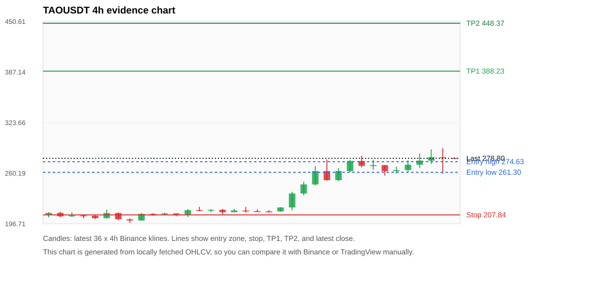
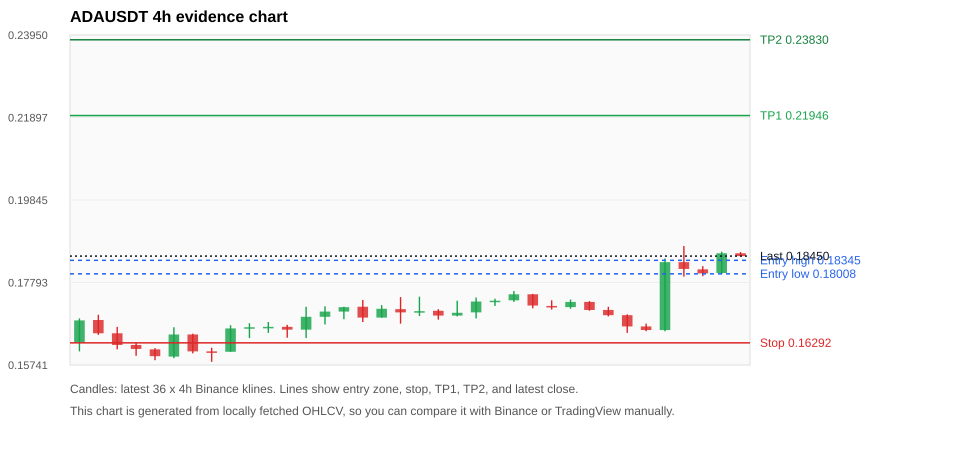
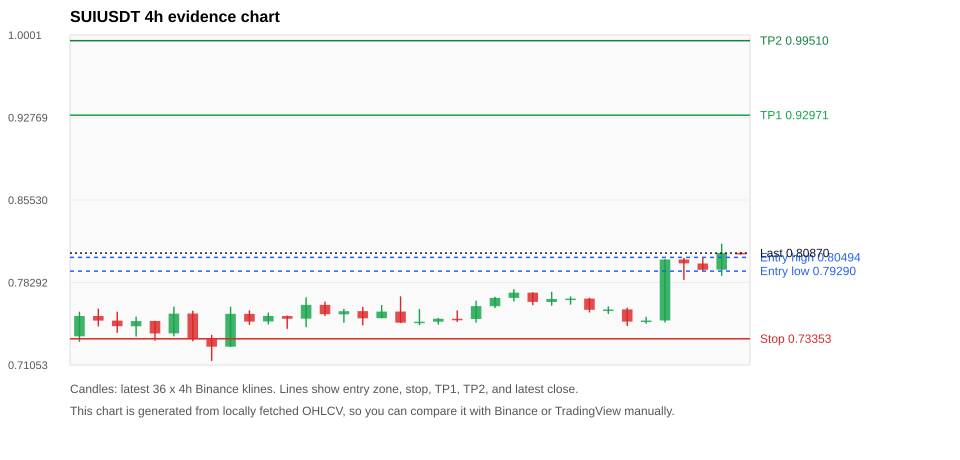
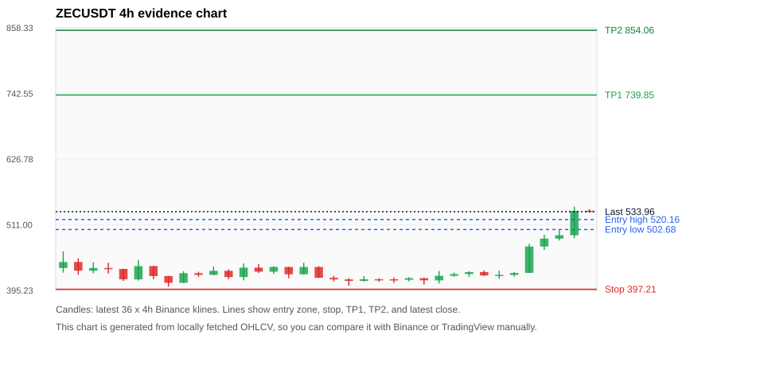
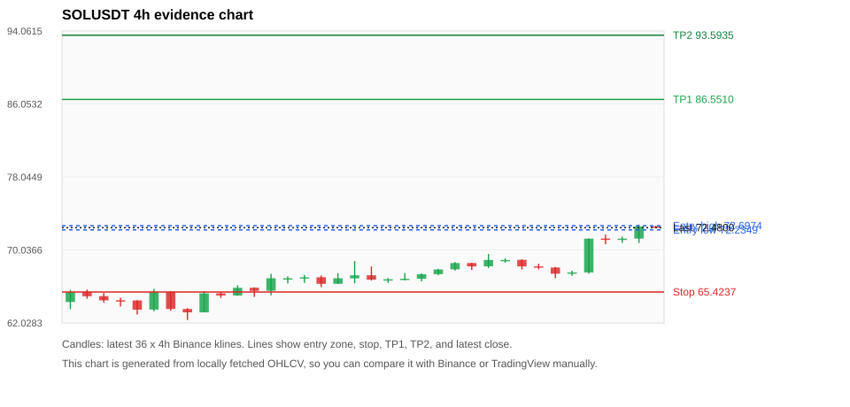

# Crypto 市场扫描报告 v1

- 报告时间：2026-06-15 20:06:31 CST
- Run ID：`20260615_120504_6bb6f3bc`
- Run type：`daily_full`
- 数据来源：SQLite
- 报告版本：v1
- 扫描 ID：f895d28328a3
- 数据源：Binance public spot API + CoinGecko/CoinMarketCap cross-check
- 过滤条件：USDT spot; 24h quote volume >= 30,000,000; trades >= 30,000; exclude stables/leveraged tokens; analyze 1h/4h/1d klines
- 默认单笔风险：账户权益的 1.00%

## 限制说明

- 交易信号仍以 Binance 现货公开 K 线为主源；外部数据源用于一致性复核。
- 结果是研究和模拟盘计划，不是确定收益或实盘下单指令。
- 历史长度过滤：候选币至少需要 180 根 1d K 线。
- 数据质量验证池：先验证 score 排名前 min(top_n * 2, 10) 的候选，再按 action + score 补足最终名单。
- 大盘环境过滤：RISK_OFF; BTC/ETH 大盘偏弱，山寨币买入候选降级为观察。 BTC 7d=4.796595884442811; ETH 7d=4.207064223982382.
- 已启用数据交叉验证：Binance 主源 + CoinGecko 自动对照；CoinMarketCap 在配置 API Key 后自动对照。
- TAOUSDT 交叉验证状态 DATA_WARNING：At least one external provider needs manual review.
- ZECUSDT 交叉验证状态 DATA_WARNING：At least one external provider needs manual review.
- ADAUSDT 交叉验证状态 DATA_WARNING：At least one external provider needs manual review.
- SOLUSDT 交叉验证状态 DATA_WARNING：At least one external provider needs manual review.
- XRPUSDT 交叉验证状态 DATA_WARNING：At least one external provider needs manual review.
- ETHUSDT 交叉验证状态 DATA_WARNING：At least one external provider needs manual review.
- WLDUSDT 交叉验证状态 DATA_WARNING：At least one external provider needs manual review.
- DOGEUSDT 交叉验证状态 DATA_WARNING：At least one external provider needs manual review.
- BNBUSDT 交叉验证状态 DATA_WARNING：At least one external provider needs manual review.
- SUIUSDT 交叉验证状态 DATA_WARNING：At least one external provider needs manual review.

## 5 个候选交易计划

| Rank | Coin | Action | Setup | Entry Zone | Stop Loss | TP1 | TP2 / Exit Rule | R/R | Verdict |
|---:|---|---|---|---:|---:|---:|---|---:|---|
| 1 | `TAO` | `WAIT_PULLBACK` | 趋势中，等回调入场 | 261.30 - 274.63 | 207.84 | 388.23 | 448.37 或跌破 4h 关键支撑 | 2.00-3.00 | 只等回调 |
| 2 | `ADA` | `WAIT_PULLBACK` | 趋势中，等回调入场 | 0.18008 - 0.18345 | 0.16292 | 0.21946 | 0.23830 或跌破 4h 关键支撑 | 2.00-3.00 | 只等回调 |
| 3 | `SUI` | `WAIT_PULLBACK` | 趋势中，等回调入场 | 0.79290 - 0.80494 | 0.73353 | 0.92971 | 0.99510 或跌破 4h 关键支撑 | 2.00-3.00 | 只等回调 |
| 4 | `ZEC` | `WATCH_ONLY` | 涨幅较远，只等深回调 | 502.68 - 520.16 | 397.21 | 739.85 | 854.06 或跌破 4h 关键支撑 | 2.00-3.00 | 只等回调 |
| 5 | `SOL` | `WATCH_ONLY` | 回踩支撑/4h EMA 附近 | 72.2349 - 72.6974 | 65.4237 | 86.5510 | 93.5935 或跌破 4h 关键支撑 | 2.00-3.00 | 只等回调 |

## 数据交叉验证摘要

价格差异以 Binance 当前价为基准；成交量口径不同，Binance 是 USDT 现货成交额，CoinGecko/CoinMarketCap 通常是全市场成交量。

| Rank | Coin | Data Status | Max Price Diff | Max 24h Diff | Message |
|---:|---|---|---:|---:|---|
| 1 | `TAO` | DATA_WARNING | 0.12% | 0.35 pts | At least one external provider needs manual review. |
| 2 | `ADA` | DATA_WARNING | 0.20% | 0.35 pts | At least one external provider needs manual review. |
| 3 | `SUI` | DATA_WARNING | 0.03% | 0.12 pts | At least one external provider needs manual review. |
| 4 | `ZEC` | DATA_WARNING | 0.55% | 1.07 pts | At least one external provider needs manual review. |
| 5 | `SOL` | DATA_WARNING | 0.06% | 0.19 pts | At least one external provider needs manual review. |

## 候选币说明

### 1. TAO `TAOUSDT`



- 入选原因：趋势中，等回调入场；24h +3.57%，7d +30.10%，4h RSI 72.76，24h 成交额 $78.6M。
- 交易失效条件：跌破 207.835 或 4h 收盘重新失守关键支撑。
- 主要风险：距离支撑偏远，不能追市价；日线趋势未完全确认；BTC/ETH 大盘环境未确认强势，山寨币买入信号降级；数据交叉验证需要人工复核。
- 数据交叉验证：DATA_WARNING；At least one external provider needs manual review.

#### 可点击人工验证

- [Binance 交易页](https://www.binance.com/en/trade/TAO_USDT)
- [TradingView 图表](https://www.tradingview.com/chart/?symbol=BINANCE%3ATAOUSDT)
- [CoinGecko 搜索](https://www.coingecko.com/en/search?query=TAO)
- [CoinMarketCap 搜索](https://coinmarketcap.com/search/?q=TAO)

#### 多数据源对照

| Source | Status | Asset ID | Price | 24h Change | 24h Volume | Price Diff | 24h Diff | Updated | Message |
|---|---|---|---:|---:|---:|---:|---:|---|---|
| Binance | DATA_OK | TAOUSDT | 278.80 | +3.57% | $78.6M | 0.00% | 0.00 pts | 2026-06-15T12:05:53+00:00 | Primary market data source used by scanner. |
| CoinGecko | DATA_WARNING | bittensor | 278.67 | +3.68% | $450.2M | 0.05% | 0.11 pts | 2026-06-15T12:05:45.686Z | CoinGecko symbol mapping has 3 exact matches; selected highest market-cap rank |
| CoinMarketCap | DATA_WARNING | 22974 | 278.48 | +3.92% | $558.6M | 0.12% | 0.35 pts | 2026-06-15T12:05:05.000Z | CoinMarketCap symbol mapping has 5 matches; selected lowest cmc_rank |

#### 指标证据

| 指标 | 数值 | 人工核对用途 |
|---|---:|---|
| 当前价 | 278.80 | 与 Binance/TradingView 当前价格对照 |
| 24h 涨跌 | +3.57% | 与交易所 24h 涨跌对照 |
| 7d 涨跌 | +30.10% | 判断短线趋势是否延续 |
| 4h EMA20 | 256.82 | 判断短期趋势支撑 |
| 4h EMA50 | 238.39 | 判断中期趋势支撑 |
| 1d EMA20 | 240.29 | 判断日线趋势 |
| 1d EMA50 | 252.12 | 判断日线趋势 |
| 4h RSI14 | 72.76 | 判断是否过热/过弱 |
| 4h ATR14 | 16.6643 | 推导止损和入场缓冲 |
| 最近 18 根 4h 最低点 | 211.00 | 支撑/止损参考 |
| 最近 36 根 4h 最高点 | 291.60 | TP/压力参考 |
| 支撑位 | 256.82 | 入场区间推导基础 |

#### 交易计划推导

- 支撑位 = 最近低点、4h EMA20、4h EMA50、1d EMA20 中不高于当前价的最高有效支撑 = `256.82`。
- 入场区间 = 支撑位附近 + ATR 缓冲 = `261.30 - 274.63`。
- 止损 = min(最近 18 根 4h 最低点 * 0.985, 入场中位价 - 1.15 * ATR14) = `207.84`。
- TP1 = max(最近 36 根 4h 最高点 * 0.995, 入场中位价 + 2R) = `388.23`。
- TP2 = max(入场中位价 + 3R, TP1 * 1.04) = `448.37`。

#### 最近 10 根 4h K线

| UTC 开盘时间 | Open | High | Low | Close | Quote Volume | Trades |
|---|---:|---:|---:|---:|---:|---:|
| 2026-06-14T00:00+00:00 | 262.80 | 276.80 | 261.30 | 275.50 | $11.0M | 132349 |
| 2026-06-14T04:00+00:00 | 275.50 | 282.10 | 267.60 | 269.40 | $14.4M | 164143 |
| 2026-06-14T08:00+00:00 | 269.40 | 276.80 | 264.60 | 270.20 | $12.9M | 114641 |
| 2026-06-14T12:00+00:00 | 270.30 | 270.50 | 257.10 | 262.70 | $8.7M | 99532 |
| 2026-06-14T16:00+00:00 | 262.70 | 268.40 | 259.70 | 264.00 | $5.5M | 61716 |
| 2026-06-14T20:00+00:00 | 264.10 | 276.40 | 261.80 | 270.80 | $10.3M | 126652 |
| 2026-06-15T00:00+00:00 | 270.80 | 285.00 | 266.70 | 276.00 | $14.2M | 136998 |
| 2026-06-15T04:00+00:00 | 275.90 | 290.10 | 271.80 | 280.20 | $13.4M | 125917 |
| 2026-06-15T08:00+00:00 | 280.10 | 291.60 | 259.50 | 279.20 | $26.7M | 252964 |
| 2026-06-15T12:00+00:00 | 279.30 | 279.50 | 278.10 | 278.80 | $121,923 | 2423 |

### 2. ADA `ADAUSDT`



- 入选原因：趋势中，等回调入场；24h +8.53%，7d +10.94%，4h RSI 64.60，24h 成交额 $40.0M。
- 交易失效条件：跌破 0.162919 或 4h 收盘重新失守关键支撑。
- 主要风险：日线趋势未完全确认；BTC/ETH 大盘环境未确认强势，山寨币买入信号降级；数据交叉验证需要人工复核。
- 数据交叉验证：DATA_WARNING；At least one external provider needs manual review.

#### 可点击人工验证

- [Binance 交易页](https://www.binance.com/en/trade/ADA_USDT)
- [TradingView 图表](https://www.tradingview.com/chart/?symbol=BINANCE%3AADAUSDT)
- [CoinGecko 搜索](https://www.coingecko.com/en/search?query=ADA)
- [CoinMarketCap 搜索](https://coinmarketcap.com/search/?q=ADA)

#### 多数据源对照

| Source | Status | Asset ID | Price | 24h Change | 24h Volume | Price Diff | 24h Diff | Updated | Message |
|---|---|---|---:|---:|---:|---:|---:|---|---|
| Binance | DATA_OK | ADAUSDT | 0.18450 | +8.53% | $40.0M | 0.00% | 0.00 pts | 2026-06-15T12:05:53+00:00 | Primary market data source used by scanner. |
| CoinGecko | DATA_OK | cardano | 0.18477 | +8.81% | $602.9M | 0.15% | 0.28 pts | 2026-06-15T12:05:47.229Z | External source agrees with Binance within thresholds. |
| CoinMarketCap | DATA_WARNING | 2010 | 0.18486 | +8.88% | $559.8M | 0.20% | 0.35 pts | 2026-06-15T12:05:05.000Z | CoinMarketCap symbol mapping has 3 matches; selected lowest cmc_rank |

#### 指标证据

| 指标 | 数值 | 人工核对用途 |
|---|---:|---|
| 当前价 | 0.18450 | 与 Binance/TradingView 当前价格对照 |
| 24h 涨跌 | +8.53% | 与交易所 24h 涨跌对照 |
| 7d 涨跌 | +10.94% | 判断短线趋势是否延续 |
| 4h EMA20 | 0.17497 | 判断短期趋势支撑 |
| 4h EMA50 | 0.17482 | 判断中期趋势支撑 |
| 1d EMA20 | 0.19124 | 判断日线趋势 |
| 1d EMA50 | 0.21822 | 判断日线趋势 |
| 4h RSI14 | 64.60 | 判断是否过热/过弱 |
| 4h ATR14 | 0.0042071429 | 推导止损和入场缓冲 |
| 最近 18 根 4h 最低点 | 0.16540 | 支撑/止损参考 |
| 最近 36 根 4h 最高点 | 0.18700 | TP/压力参考 |
| 支撑位 | 0.17497 | 入场区间推导基础 |

#### 交易计划推导

- 支撑位 = 最近低点、4h EMA20、4h EMA50、1d EMA20 中不高于当前价的最高有效支撑 = `0.17497`。
- 入场区间 = 支撑位附近 + ATR 缓冲 = `0.18008 - 0.18345`。
- 止损 = min(最近 18 根 4h 最低点 * 0.985, 入场中位价 - 1.15 * ATR14) = `0.16292`。
- TP1 = max(最近 36 根 4h 最高点 * 0.995, 入场中位价 + 2R) = `0.21946`。
- TP2 = max(入场中位价 + 3R, TP1 * 1.04) = `0.23830`。

#### 最近 10 根 4h K线

| UTC 开盘时间 | Open | High | Low | Close | Quote Volume | Trades |
|---|---:|---:|---:|---:|---:|---:|
| 2026-06-14T00:00+00:00 | 0.17180 | 0.17370 | 0.17140 | 0.17310 | $2.7M | 8981 |
| 2026-06-14T04:00+00:00 | 0.17310 | 0.17330 | 0.17090 | 0.17110 | $1.9M | 7091 |
| 2026-06-14T08:00+00:00 | 0.17110 | 0.17190 | 0.16950 | 0.16980 | $2.8M | 9630 |
| 2026-06-14T12:00+00:00 | 0.16980 | 0.17000 | 0.16540 | 0.16700 | $4.8M | 16975 |
| 2026-06-14T16:00+00:00 | 0.16700 | 0.16770 | 0.16580 | 0.16610 | $2.7M | 8105 |
| 2026-06-14T20:00+00:00 | 0.16610 | 0.18390 | 0.16580 | 0.18300 | $11.4M | 47823 |
| 2026-06-15T00:00+00:00 | 0.18300 | 0.18700 | 0.17940 | 0.18130 | $11.1M | 41211 |
| 2026-06-15T04:00+00:00 | 0.18120 | 0.18200 | 0.17950 | 0.18020 | $3.7M | 14504 |
| 2026-06-15T08:00+00:00 | 0.18030 | 0.18560 | 0.18000 | 0.18520 | $6.3M | 23344 |
| 2026-06-15T12:00+00:00 | 0.18520 | 0.18550 | 0.18440 | 0.18450 | $109,950 | 578 |

### 3. SUI `SUIUSDT`



- 入选原因：趋势中，等回调入场；24h +6.37%，7d +5.62%，4h RSI 69.05，24h 成交额 $35.5M。
- 交易失效条件：跌破 0.7335295 或 4h 收盘重新失守关键支撑。
- 主要风险：日线趋势未完全确认；BTC/ETH 大盘环境未确认强势，山寨币买入信号降级；数据交叉验证需要人工复核。
- 数据交叉验证：DATA_WARNING；At least one external provider needs manual review.

#### 可点击人工验证

- [Binance 交易页](https://www.binance.com/en/trade/SUI_USDT)
- [TradingView 图表](https://www.tradingview.com/chart/?symbol=BINANCE%3ASUIUSDT)
- [CoinGecko 搜索](https://www.coingecko.com/en/search?query=SUI)
- [CoinMarketCap 搜索](https://coinmarketcap.com/search/?q=SUI)

#### 多数据源对照

| Source | Status | Asset ID | Price | 24h Change | 24h Volume | Price Diff | 24h Diff | Updated | Message |
|---|---|---|---:|---:|---:|---:|---:|---|---|
| Binance | DATA_OK | SUIUSDT | 0.80870 | +6.37% | $35.5M | 0.00% | 0.00 pts | 2026-06-15T12:05:53+00:00 | Primary market data source used by scanner. |
| CoinGecko | DATA_WARNING | n/a | n/a | n/a | n/a | n/a | n/a | 2026-06-15T12:05:53+00:00 | Failed to fetch https://api.coingecko.com/api/v3/coins/markets?vs_currency=usd&ids=sui&price_change_percentage=24h&per_page=1&page=1: HTTP Error 429: Too Many Requests |
| CoinMarketCap | DATA_WARNING | 20947 | 0.80849 | +6.50% | $425.6M | 0.03% | 0.12 pts | 2026-06-15T12:05:05.000Z | CoinMarketCap symbol mapping has 5 matches; selected lowest cmc_rank |

#### 指标证据

| 指标 | 数值 | 人工核对用途 |
|---|---:|---|
| 当前价 | 0.80870 | 与 Binance/TradingView 当前价格对照 |
| 24h 涨跌 | +6.37% | 与交易所 24h 涨跌对照 |
| 7d 涨跌 | +5.62% | 判断短线趋势是否延续 |
| 4h EMA20 | 0.77521 | 判断短期趋势支撑 |
| 4h EMA50 | 0.77071 | 判断中期趋势支撑 |
| 1d EMA20 | 0.82205 | 判断日线趋势 |
| 1d EMA50 | 0.90144 | 判断日线趋势 |
| 4h RSI14 | 69.05 | 判断是否过热/过弱 |
| 4h ATR14 | 0.01504 | 推导止损和入场缓冲 |
| 最近 18 根 4h 最低点 | 0.74470 | 支撑/止损参考 |
| 最近 36 根 4h 最高点 | 0.81690 | TP/压力参考 |
| 支撑位 | 0.77521 | 入场区间推导基础 |

#### 交易计划推导

- 支撑位 = 最近低点、4h EMA20、4h EMA50、1d EMA20 中不高于当前价的最高有效支撑 = `0.77521`。
- 入场区间 = 支撑位附近 + ATR 缓冲 = `0.79290 - 0.80494`。
- 止损 = min(最近 18 根 4h 最低点 * 0.985, 入场中位价 - 1.15 * ATR14) = `0.73353`。
- TP1 = max(最近 36 根 4h 最高点 * 0.995, 入场中位价 + 2R) = `0.92971`。
- TP2 = max(入场中位价 + 3R, TP1 * 1.04) = `0.99510`。

#### 最近 10 根 4h K线

| UTC 开盘时间 | Open | High | Low | Close | Quote Volume | Trades |
|---|---:|---:|---:|---:|---:|---:|
| 2026-06-14T00:00+00:00 | 0.76830 | 0.77070 | 0.76350 | 0.76880 | $2.8M | 20485 |
| 2026-06-14T04:00+00:00 | 0.76880 | 0.76950 | 0.75660 | 0.75900 | $2.1M | 21124 |
| 2026-06-14T08:00+00:00 | 0.75910 | 0.76200 | 0.75530 | 0.75920 | $1.7M | 17313 |
| 2026-06-14T12:00+00:00 | 0.75930 | 0.76080 | 0.74470 | 0.74860 | $3.0M | 26125 |
| 2026-06-14T16:00+00:00 | 0.74850 | 0.75280 | 0.74670 | 0.74950 | $1.4M | 12989 |
| 2026-06-14T20:00+00:00 | 0.74960 | 0.80350 | 0.74780 | 0.80310 | $10.7M | 81858 |
| 2026-06-15T00:00+00:00 | 0.80310 | 0.80460 | 0.78520 | 0.79970 | $6.6M | 67637 |
| 2026-06-15T04:00+00:00 | 0.79960 | 0.80490 | 0.79330 | 0.79410 | $5.1M | 44708 |
| 2026-06-15T08:00+00:00 | 0.79420 | 0.81690 | 0.78880 | 0.80880 | $8.2M | 63337 |
| 2026-06-15T12:00+00:00 | 0.80890 | 0.80970 | 0.80740 | 0.80860 | $336,814 | 1201 |

### 4. ZEC `ZECUSDT`



- 入选原因：涨幅较远，只等深回调；24h +26.09%，7d +23.03%，4h RSI 91.47，24h 成交额 $221.9M。
- 交易失效条件：跌破 397.2111 或 4h 收盘重新失守关键支撑。
- 主要风险：距离支撑偏远，不能追市价；4h RSI 偏热；24h 振幅较大，回撤风险高；BTC/ETH 大盘环境未确认强势，山寨币买入信号降级；数据交叉验证需要人工复核。
- 数据交叉验证：DATA_WARNING；At least one external provider needs manual review.

#### 可点击人工验证

- [Binance 交易页](https://www.binance.com/en/trade/ZEC_USDT)
- [TradingView 图表](https://www.tradingview.com/chart/?symbol=BINANCE%3AZECUSDT)
- [CoinGecko 搜索](https://www.coingecko.com/en/search?query=ZEC)
- [CoinMarketCap 搜索](https://coinmarketcap.com/search/?q=ZEC)

#### 多数据源对照

| Source | Status | Asset ID | Price | 24h Change | 24h Volume | Price Diff | 24h Diff | Updated | Message |
|---|---|---|---:|---:|---:|---:|---:|---|---|
| Binance | DATA_OK | ZECUSDT | 533.96 | +26.09% | $221.9M | 0.00% | 0.00 pts | 2026-06-15T12:05:53+00:00 | Primary market data source used by scanner. |
| CoinGecko | DATA_OK | zcash | 536.45 | +26.93% | $844.4M | 0.47% | 0.85 pts | 2026-06-15T12:05:48.449Z | External source agrees with Binance within thresholds. |
| CoinMarketCap | DATA_WARNING | 1437 | 536.90 | +27.16% | $1.00B | 0.55% | 1.07 pts | 2026-06-15T12:05:05.000Z | CoinMarketCap symbol mapping has 2 matches; selected lowest cmc_rank |

#### 指标证据

| 指标 | 数值 | 人工核对用途 |
|---|---:|---|
| 当前价 | 533.96 | 与 Binance/TradingView 当前价格对照 |
| 24h 涨跌 | +26.09% | 与交易所 24h 涨跌对照 |
| 7d 涨跌 | +23.03% | 判断短线趋势是否延续 |
| 4h EMA20 | 456.15 | 判断短期趋势支撑 |
| 4h EMA50 | 446.34 | 判断中期趋势支撑 |
| 1d EMA20 | 480.78 | 判断日线趋势 |
| 1d EMA50 | 476.86 | 判断日线趋势 |
| 4h RSI14 | 91.47 | 判断是否过热/过弱 |
| 4h ATR14 | 18.3979 | 推导止损和入场缓冲 |
| 最近 18 根 4h 最低点 | 403.26 | 支撑/止损参考 |
| 最近 36 根 4h 最高点 | 543.00 | TP/压力参考 |
| 支撑位 | 480.78 | 入场区间推导基础 |

#### 交易计划推导

- 支撑位 = 最近低点、4h EMA20、4h EMA50、1d EMA20 中不高于当前价的最高有效支撑 = `480.78`。
- 入场区间 = 支撑位附近 + ATR 缓冲 = `502.68 - 520.16`。
- 止损 = min(最近 18 根 4h 最低点 * 0.985, 入场中位价 - 1.15 * ATR14) = `397.21`。
- TP1 = max(最近 36 根 4h 最高点 * 0.995, 入场中位价 + 2R) = `739.85`。
- TP2 = max(入场中位价 + 3R, TP1 * 1.04) = `854.06`。

#### 最近 10 根 4h K线

| UTC 开盘时间 | Open | High | Low | Close | Quote Volume | Trades |
|---|---:|---:|---:|---:|---:|---:|
| 2026-06-14T00:00+00:00 | 421.04 | 426.69 | 419.44 | 424.03 | $7.7M | 38351 |
| 2026-06-14T04:00+00:00 | 424.09 | 429.16 | 419.05 | 427.51 | $8.1M | 35342 |
| 2026-06-14T08:00+00:00 | 427.54 | 430.46 | 420.80 | 421.59 | $8.8M | 36648 |
| 2026-06-14T12:00+00:00 | 421.60 | 430.00 | 416.01 | 422.68 | $27.6M | 77298 |
| 2026-06-14T16:00+00:00 | 422.60 | 427.54 | 419.65 | 426.01 | $8.8M | 33784 |
| 2026-06-14T20:00+00:00 | 426.15 | 477.31 | 425.95 | 472.64 | $53.0M | 178770 |
| 2026-06-15T00:00+00:00 | 472.63 | 493.25 | 466.78 | 486.59 | $35.6M | 155062 |
| 2026-06-15T04:00+00:00 | 486.56 | 501.42 | 483.24 | 492.61 | $27.8M | 110095 |
| 2026-06-15T08:00+00:00 | 492.61 | 543.00 | 487.28 | 535.66 | $65.5M | 259393 |
| 2026-06-15T12:00+00:00 | 535.68 | 538.75 | 533.00 | 534.08 | $3.9M | 7747 |

### 5. SOL `SOLUSDT`



- 入选原因：回踩支撑/4h EMA 附近；24h +6.29%，7d +8.54%，4h RSI 77.83，24h 成交额 $165.0M。
- 交易失效条件：跌破 65.4237 或 4h 收盘重新失守关键支撑。
- 主要风险：4h RSI 偏热；日线趋势未完全确认；BTC/ETH 大盘环境未确认强势，山寨币买入信号降级；数据交叉验证需要人工复核。
- 数据交叉验证：DATA_WARNING；At least one external provider needs manual review.

#### 可点击人工验证

- [Binance 交易页](https://www.binance.com/en/trade/SOL_USDT)
- [TradingView 图表](https://www.tradingview.com/chart/?symbol=BINANCE%3ASOLUSDT)
- [CoinGecko 搜索](https://www.coingecko.com/en/search?query=SOL)
- [CoinMarketCap 搜索](https://coinmarketcap.com/search/?q=SOL)

#### 多数据源对照

| Source | Status | Asset ID | Price | 24h Change | 24h Volume | Price Diff | 24h Diff | Updated | Message |
|---|---|---|---:|---:|---:|---:|---:|---|---|
| Binance | DATA_OK | SOLUSDT | 72.4800 | +6.29% | $165.0M | 0.00% | 0.00 pts | 2026-06-15T12:05:53+00:00 | Primary market data source used by scanner. |
| CoinGecko | DATA_OK | solana | 72.5000 | +6.45% | $2.29B | 0.03% | 0.15 pts | 2026-06-15T12:05:57.165Z | External source agrees with Binance within thresholds. |
| CoinMarketCap | DATA_WARNING | 5426 | 72.5207 | +6.49% | $2.09B | 0.06% | 0.19 pts | 2026-06-15T12:05:05.000Z | CoinMarketCap symbol mapping has 8 matches; selected lowest cmc_rank |

#### 指标证据

| 指标 | 数值 | 人工核对用途 |
|---|---:|---|
| 当前价 | 72.4800 | 与 Binance/TradingView 当前价格对照 |
| 24h 涨跌 | +6.29% | 与交易所 24h 涨跌对照 |
| 7d 涨跌 | +8.54% | 判断短线趋势是否延续 |
| 4h EMA20 | 69.1521 | 判断短期趋势支撑 |
| 4h EMA50 | 68.4099 | 判断中期趋势支撑 |
| 1d EMA20 | 72.0907 | 判断日线趋势 |
| 1d EMA50 | 78.2640 | 判断日线趋势 |
| 4h RSI14 | 77.83 | 判断是否过热/过弱 |
| 4h ATR14 | 1.1321 | 推导止损和入场缓冲 |
| 最近 18 根 4h 最低点 | 66.4200 | 支撑/止损参考 |
| 最近 36 根 4h 最高点 | 72.8200 | TP/压力参考 |
| 支撑位 | 72.0907 | 入场区间推导基础 |

#### 交易计划推导

- 支撑位 = 最近低点、4h EMA20、4h EMA50、1d EMA20 中不高于当前价的最高有效支撑 = `72.0907`。
- 入场区间 = 支撑位附近 + ATR 缓冲 = `72.2349 - 72.6974`。
- 止损 = min(最近 18 根 4h 最低点 * 0.985, 入场中位价 - 1.15 * ATR14) = `65.4237`。
- TP1 = max(最近 36 根 4h 最高点 * 0.995, 入场中位价 + 2R) = `86.5510`。
- TP2 = max(入场中位价 + 3R, TP1 * 1.04) = `93.5935`。

#### 最近 10 根 4h K线

| UTC 开盘时间 | Open | High | Low | Close | Quote Volume | Trades |
|---|---:|---:|---:|---:|---:|---:|
| 2026-06-14T00:00+00:00 | 68.9400 | 69.1100 | 68.6400 | 68.9400 | $13.4M | 64741 |
| 2026-06-14T04:00+00:00 | 68.9500 | 69.0100 | 67.8800 | 68.2300 | $24.7M | 71149 |
| 2026-06-14T08:00+00:00 | 68.2300 | 68.5200 | 67.9200 | 68.1100 | $10.8M | 46267 |
| 2026-06-14T12:00+00:00 | 68.1100 | 68.1700 | 66.9400 | 67.4300 | $19.0M | 85556 |
| 2026-06-14T16:00+00:00 | 67.4300 | 67.7600 | 67.1900 | 67.5700 | $7.4M | 49679 |
| 2026-06-14T20:00+00:00 | 67.5700 | 71.2900 | 67.4400 | 71.2800 | $52.3M | 259085 |
| 2026-06-15T00:00+00:00 | 71.2900 | 71.7300 | 70.6600 | 71.2400 | $30.8M | 144834 |
| 2026-06-15T04:00+00:00 | 71.2400 | 71.5000 | 70.8100 | 71.2800 | $16.8M | 75838 |
| 2026-06-15T08:00+00:00 | 71.2800 | 72.8200 | 70.8000 | 72.6100 | $38.2M | 142305 |
| 2026-06-15T12:00+00:00 | 72.6100 | 72.6800 | 72.4400 | 72.4900 | $760,532 | 3749 |

## 组合风控

- 不要 5 个候选全部满仓买入。
- 同时持仓总风险建议控制在账户权益的 3% - 5% 以内。
- 如果 BTC/ETH 同时破位，暂停山寨币多头计划或降低仓位。
- 第一版报告用于模拟盘和人工复核，不自动下单。

## 原始数据

```json
[
  {
    "rank": 1,
    "symbol": "TAOUSDT",
    "base_asset": "TAO",
    "price": 278.8,
    "score": 59.627729009859024,
    "setup": "趋势中，等回调入场",
    "verdict": "只等回调",
    "entry_low": 261.3025,
    "entry_high": 274.6339285714286,
    "stop_loss": 207.835,
    "take_profit_1": 388.234642857143,
    "take_profit_2": 448.36785714285736,
    "risk_reward_1": 2.0,
    "risk_reward_2": 3.0000000000000004,
    "pct_24h": 3.571,
    "pct_3d": 31.32359868111163,
    "pct_7d": 30.097993467102203,
    "quote_volume_24h": 78618355.95831,
    "trades_24h": 802271,
    "high_low_range_24h": 13.418903150525097,
    "rsi_1h": 54.772727272727266,
    "rsi_4h": 72.75541795665634,
    "ema20_4h": 256.8243869834074,
    "ema50_4h": 238.38653388063102,
    "ema20_1d": 240.29384767317217,
    "ema50_1d": 252.11891901306706,
    "atr_4h": 16.664285714285707,
    "macd_hist_4h": 1.5440491693729506,
    "volume_ratio_24h": 2.2569363542852017,
    "support_level": 256.8243869834074,
    "recent_low_4h_18": 211.0,
    "recent_high_4h_36": 291.6,
    "distance_to_support_pct": 8.556669121150229,
    "binance_trade_url": "https://www.binance.com/en/trade/TAO_USDT",
    "tradingview_url": "https://www.tradingview.com/chart/?symbol=BINANCE%3ATAOUSDT",
    "coingecko_search_url": "https://www.coingecko.com/en/search?query=TAO",
    "coinmarketcap_search_url": "https://coinmarketcap.com/search/?q=TAO",
    "invalidation": "跌破 207.835 或 4h 收盘重新失守关键支撑",
    "recent_4h_klines": [
      {
        "open_time_utc": "2026-06-09T16:00+00:00",
        "open": 208.2,
        "high": 211.2,
        "low": 204.7,
        "close": 210.3,
        "quote_volume": 5093325.9507,
        "trades": 65919
      },
      {
        "open_time_utc": "2026-06-09T20:00+00:00",
        "open": 210.3,
        "high": 211.8,
        "low": 204.9,
        "close": 206.1,
        "quote_volume": 2676656.84288,
        "trades": 25088
      },
      {
        "open_time_utc": "2026-06-10T00:00+00:00",
        "open": 206.2,
        "high": 211.1,
        "low": 205.2,
        "close": 207.2,
        "quote_volume": 1637177.74847,
        "trades": 23044
      },
      {
        "open_time_utc": "2026-06-10T04:00+00:00",
        "open": 207.2,
        "high": 208.5,
        "low": 203.5,
        "close": 206.7,
        "quote_volume": 1172056.66358,
        "trades": 13734
      },
      {
        "open_time_utc": "2026-06-10T08:00+00:00",
        "open": 206.7,
        "high": 207.5,
        "low": 202.5,
        "close": 203.7,
        "quote_volume": 1977178.84526,
        "trades": 22676
      },
      {
        "open_time_utc": "2026-06-10T12:00+00:00",
        "open": 203.8,
        "high": 214.6,
        "low": 203.3,
        "close": 210.2,
        "quote_volume": 6145553.07602,
        "trades": 65956
      },
      {
        "open_time_utc": "2026-06-10T16:00+00:00",
        "open": 210.2,
        "high": 210.7,
        "low": 201.3,
        "close": 202.4,
        "quote_volume": 3251134.05344,
        "trades": 50864
      },
      {
        "open_time_utc": "2026-06-10T20:00+00:00",
        "open": 202.3,
        "high": 203.4,
        "low": 197.7,
        "close": 200.9,
        "quote_volume": 2911627.05694,
        "trades": 33434
      },
      {
        "open_time_utc": "2026-06-11T00:00+00:00",
        "open": 200.8,
        "high": 210.2,
        "low": 200.8,
        "close": 209.1,
        "quote_volume": 2618985.28579,
        "trades": 25821
      },
      {
        "open_time_utc": "2026-06-11T04:00+00:00",
        "open": 209.1,
        "high": 210.0,
        "low": 207.0,
        "close": 208.9,
        "quote_volume": 1856280.14527,
        "trades": 21890
      },
      {
        "open_time_utc": "2026-06-11T08:00+00:00",
        "open": 208.9,
        "high": 210.9,
        "low": 207.5,
        "close": 209.7,
        "quote_volume": 1891237.86828,
        "trades": 17588
      },
      {
        "open_time_utc": "2026-06-11T12:00+00:00",
        "open": 209.7,
        "high": 209.8,
        "low": 206.0,
        "close": 208.4,
        "quote_volume": 2875573.47895,
        "trades": 29575
      },
      {
        "open_time_utc": "2026-06-11T16:00+00:00",
        "open": 208.3,
        "high": 215.0,
        "low": 205.1,
        "close": 213.9,
        "quote_volume": 3994747.94347,
        "trades": 42267
      },
      {
        "open_time_utc": "2026-06-11T20:00+00:00",
        "open": 213.9,
        "high": 218.0,
        "low": 212.4,
        "close": 213.8,
        "quote_volume": 2594694.45125,
        "trades": 23824
      },
      {
        "open_time_utc": "2026-06-12T00:00+00:00",
        "open": 213.8,
        "high": 215.0,
        "low": 211.1,
        "close": 214.2,
        "quote_volume": 1542433.32533,
        "trades": 15610
      },
      {
        "open_time_utc": "2026-06-12T04:00+00:00",
        "open": 214.3,
        "high": 215.4,
        "low": 208.5,
        "close": 211.2,
        "quote_volume": 1617490.01837,
        "trades": 17784
      },
      {
        "open_time_utc": "2026-06-12T08:00+00:00",
        "open": 211.2,
        "high": 215.3,
        "low": 211.2,
        "close": 213.4,
        "quote_volume": 1872772.9373,
        "trades": 16045
      },
      {
        "open_time_utc": "2026-06-12T12:00+00:00",
        "open": 213.3,
        "high": 217.9,
        "low": 210.6,
        "close": 212.4,
        "quote_volume": 5137020.0169,
        "trades": 42408
      },
      {
        "open_time_utc": "2026-06-12T16:00+00:00",
        "open": 212.5,
        "high": 215.0,
        "low": 211.8,
        "close": 212.3,
        "quote_volume": 1429101.46852,
        "trades": 19668
      },
      {
        "open_time_utc": "2026-06-12T20:00+00:00",
        "open": 212.3,
        "high": 213.8,
        "low": 211.0,
        "close": 212.2,
        "quote_volume": 977489.82362,
        "trades": 10532
      },
      {
        "open_time_utc": "2026-06-13T00:00+00:00",
        "open": 212.2,
        "high": 217.6,
        "low": 212.0,
        "close": 217.2,
        "quote_volume": 2311156.52147,
        "trades": 17061
      },
      {
        "open_time_utc": "2026-06-13T04:00+00:00",
        "open": 217.2,
        "high": 236.8,
        "low": 213.5,
        "close": 234.7,
        "quote_volume": 12012194.24407,
        "trades": 80896
      },
      {
        "open_time_utc": "2026-06-13T08:00+00:00",
        "open": 234.7,
        "high": 249.5,
        "low": 232.3,
        "close": 246.1,
        "quote_volume": 18727976.40349,
        "trades": 183957
      },
      {
        "open_time_utc": "2026-06-13T12:00+00:00",
        "open": 246.1,
        "high": 269.3,
        "low": 244.9,
        "close": 262.8,
        "quote_volume": 20174937.7896,
        "trades": 213875
      },
      {
        "open_time_utc": "2026-06-13T16:00+00:00",
        "open": 262.8,
        "high": 277.3,
        "low": 250.9,
        "close": 251.4,
        "quote_volume": 24796685.65884,
        "trades": 227216
      },
      {
        "open_time_utc": "2026-06-13T20:00+00:00",
        "open": 251.4,
        "high": 266.7,
        "low": 250.4,
        "close": 262.9,
        "quote_volume": 8379226.61586,
        "trades": 88770
      },
      {
        "open_time_utc": "2026-06-14T00:00+00:00",
        "open": 262.8,
        "high": 276.8,
        "low": 261.3,
        "close": 275.5,
        "quote_volume": 11013502.94576,
        "trades": 132349
      },
      {
        "open_time_utc": "2026-06-14T04:00+00:00",
        "open": 275.5,
        "high": 282.1,
        "low": 267.6,
        "close": 269.4,
        "quote_volume": 14423251.53537,
        "trades": 164143
      },
      {
        "open_time_utc": "2026-06-14T08:00+00:00",
        "open": 269.4,
        "high": 276.8,
        "low": 264.6,
        "close": 270.2,
        "quote_volume": 12850447.71402,
        "trades": 114641
      },
      {
        "open_time_utc": "2026-06-14T12:00+00:00",
        "open": 270.3,
        "high": 270.5,
        "low": 257.1,
        "close": 262.7,
        "quote_volume": 8722017.56084,
        "trades": 99532
      },
      {
        "open_time_utc": "2026-06-14T16:00+00:00",
        "open": 262.7,
        "high": 268.4,
        "low": 259.7,
        "close": 264.0,
        "quote_volume": 5465024.68193,
        "trades": 61716
      },
      {
        "open_time_utc": "2026-06-14T20:00+00:00",
        "open": 264.1,
        "high": 276.4,
        "low": 261.8,
        "close": 270.8,
        "quote_volume": 10307919.65269,
        "trades": 126652
      },
      {
        "open_time_utc": "2026-06-15T00:00+00:00",
        "open": 270.8,
        "high": 285.0,
        "low": 266.7,
        "close": 276.0,
        "quote_volume": 14168165.48637,
        "trades": 136998
      },
      {
        "open_time_utc": "2026-06-15T04:00+00:00",
        "open": 275.9,
        "high": 290.1,
        "low": 271.8,
        "close": 280.2,
        "quote_volume": 13426145.36717,
        "trades": 125917
      },
      {
        "open_time_utc": "2026-06-15T08:00+00:00",
        "open": 280.1,
        "high": 291.6,
        "low": 259.5,
        "close": 279.2,
        "quote_volume": 26681575.98619,
        "trades": 252964
      },
      {
        "open_time_utc": "2026-06-15T12:00+00:00",
        "open": 279.3,
        "high": 279.5,
        "low": 278.1,
        "close": 278.8,
        "quote_volume": 121923.30566,
        "trades": 2423
      }
    ],
    "risks": [
      "距离支撑偏远，不能追市价",
      "日线趋势未完全确认",
      "BTC/ETH 大盘环境未确认强势，山寨币买入信号降级",
      "数据交叉验证需要人工复核"
    ],
    "data_quality_status": "DATA_WARNING",
    "data_quality_message": "At least one external provider needs manual review.",
    "data_checks": [
      {
        "provider": "Binance",
        "status": "DATA_OK",
        "provider_asset_id": "TAOUSDT",
        "provider_symbol": "TAOUSDT",
        "price_usd": 278.8,
        "pct_24h": 3.571,
        "volume_24h": 78618355.95831,
        "last_updated": null,
        "fetched_at_utc": "2026-06-15T12:05:53+00:00",
        "price_diff_pct": 0.0,
        "pct_24h_diff": 0.0,
        "volume_note": "Binance USDT spot 24h quoteVolume.",
        "message": "Primary market data source used by scanner."
      },
      {
        "provider": "CoinGecko",
        "status": "DATA_WARNING",
        "provider_asset_id": "bittensor",
        "provider_symbol": "TAO",
        "price_usd": 278.67,
        "pct_24h": 3.67818,
        "volume_24h": 450247401.0,
        "last_updated": "2026-06-15T12:05:45.686Z",
        "fetched_at_utc": "2026-06-15T12:05:53+00:00",
        "price_diff_pct": 0.046628407460543565,
        "pct_24h_diff": 0.10717999999999961,
        "volume_note": "CoinGecko total market volume; not the same venue scope as Binance quoteVolume.",
        "message": "CoinGecko symbol mapping has 3 exact matches; selected highest market-cap rank"
      },
      {
        "provider": "CoinMarketCap",
        "status": "DATA_WARNING",
        "provider_asset_id": "22974",
        "provider_symbol": "TAO",
        "price_usd": 278.4778488441197,
        "pct_24h": 3.92461303,
        "volume_24h": 558550427.6086123,
        "last_updated": "2026-06-15T12:05:05.000Z",
        "fetched_at_utc": "2026-06-15T12:05:53+00:00",
        "price_diff_pct": 0.11554919507901931,
        "pct_24h_diff": 0.35361303,
        "volume_note": "CoinMarketCap total market volume; not the same venue scope as Binance quoteVolume.",
        "message": "CoinMarketCap symbol mapping has 5 matches; selected lowest cmc_rank"
      }
    ],
    "action": "WAIT_PULLBACK"
  },
  {
    "rank": 2,
    "symbol": "ADAUSDT",
    "base_asset": "ADA",
    "price": 0.1845,
    "score": 50.32914926510762,
    "setup": "趋势中，等回调入场",
    "verdict": "只等回调",
    "entry_low": 0.1800825,
    "entry_high": 0.18344821428571428,
    "stop_loss": 0.16291899999999998,
    "take_profit_1": 0.21945807142857143,
    "take_profit_2": 0.23830442857142858,
    "risk_reward_1": 2.0,
    "risk_reward_2": 3.0,
    "pct_24h": 8.534,
    "pct_3d": 9.560570071258901,
    "pct_7d": 10.944076969332528,
    "quote_volume_24h": 39979631.16765,
    "trades_24h": 152407,
    "high_low_range_24h": 13.059250302297464,
    "rsi_1h": 71.3004484304933,
    "rsi_4h": 64.59948320413437,
    "ema20_4h": 0.17496740270258435,
    "ema50_4h": 0.17481537807442485,
    "ema20_1d": 0.19123682610306716,
    "ema50_1d": 0.21822316568100691,
    "atr_4h": 0.0042071428571428555,
    "macd_hist_4h": 0.0014155750934272903,
    "volume_ratio_24h": 1.4450194762810464,
    "support_level": 0.17496740270258435,
    "recent_low_4h_18": 0.1654,
    "recent_high_4h_36": 0.187,
    "distance_to_support_pct": 5.448213295832871,
    "binance_trade_url": "https://www.binance.com/en/trade/ADA_USDT",
    "tradingview_url": "https://www.tradingview.com/chart/?symbol=BINANCE%3AADAUSDT",
    "coingecko_search_url": "https://www.coingecko.com/en/search?query=ADA",
    "coinmarketcap_search_url": "https://coinmarketcap.com/search/?q=ADA",
    "invalidation": "跌破 0.162919 或 4h 收盘重新失守关键支撑",
    "recent_4h_klines": [
      {
        "open_time_utc": "2026-06-09T16:00+00:00",
        "open": 0.163,
        "high": 0.169,
        "low": 0.1608,
        "close": 0.1685,
        "quote_volume": 6555600.39599,
        "trades": 36627
      },
      {
        "open_time_utc": "2026-06-09T20:00+00:00",
        "open": 0.1686,
        "high": 0.1699,
        "low": 0.1649,
        "close": 0.1653,
        "quote_volume": 2671259.64191,
        "trades": 13040
      },
      {
        "open_time_utc": "2026-06-10T00:00+00:00",
        "open": 0.1653,
        "high": 0.1669,
        "low": 0.1613,
        "close": 0.1624,
        "quote_volume": 3652359.61577,
        "trades": 17395
      },
      {
        "open_time_utc": "2026-06-10T04:00+00:00",
        "open": 0.1624,
        "high": 0.163,
        "low": 0.1597,
        "close": 0.1614,
        "quote_volume": 4425835.74608,
        "trades": 18529
      },
      {
        "open_time_utc": "2026-06-10T08:00+00:00",
        "open": 0.1613,
        "high": 0.1616,
        "low": 0.1586,
        "close": 0.1596,
        "quote_volume": 4358511.1861,
        "trades": 18323
      },
      {
        "open_time_utc": "2026-06-10T12:00+00:00",
        "open": 0.1595,
        "high": 0.1668,
        "low": 0.1591,
        "close": 0.165,
        "quote_volume": 8418207.42081,
        "trades": 36691
      },
      {
        "open_time_utc": "2026-06-10T16:00+00:00",
        "open": 0.165,
        "high": 0.1652,
        "low": 0.1603,
        "close": 0.1608,
        "quote_volume": 5551133.38234,
        "trades": 31482
      },
      {
        "open_time_utc": "2026-06-10T20:00+00:00",
        "open": 0.1608,
        "high": 0.1617,
        "low": 0.1582,
        "close": 0.1607,
        "quote_volume": 3758404.79871,
        "trades": 22731
      },
      {
        "open_time_utc": "2026-06-11T00:00+00:00",
        "open": 0.1607,
        "high": 0.1673,
        "low": 0.1607,
        "close": 0.1665,
        "quote_volume": 4785728.07216,
        "trades": 22237
      },
      {
        "open_time_utc": "2026-06-11T04:00+00:00",
        "open": 0.1666,
        "high": 0.1678,
        "low": 0.1641,
        "close": 0.1668,
        "quote_volume": 4704589.20028,
        "trades": 19964
      },
      {
        "open_time_utc": "2026-06-11T08:00+00:00",
        "open": 0.1668,
        "high": 0.1681,
        "low": 0.1654,
        "close": 0.1669,
        "quote_volume": 4273820.57886,
        "trades": 15748
      },
      {
        "open_time_utc": "2026-06-11T12:00+00:00",
        "open": 0.1669,
        "high": 0.1674,
        "low": 0.1642,
        "close": 0.1662,
        "quote_volume": 5079967.83876,
        "trades": 23533
      },
      {
        "open_time_utc": "2026-06-11T16:00+00:00",
        "open": 0.1662,
        "high": 0.1719,
        "low": 0.1641,
        "close": 0.1694,
        "quote_volume": 8278082.31056,
        "trades": 34625
      },
      {
        "open_time_utc": "2026-06-11T20:00+00:00",
        "open": 0.1694,
        "high": 0.172,
        "low": 0.1675,
        "close": 0.1707,
        "quote_volume": 3813526.40597,
        "trades": 15093
      },
      {
        "open_time_utc": "2026-06-12T00:00+00:00",
        "open": 0.1707,
        "high": 0.1719,
        "low": 0.1688,
        "close": 0.1718,
        "quote_volume": 3170643.44078,
        "trades": 14136
      },
      {
        "open_time_utc": "2026-06-12T04:00+00:00",
        "open": 0.1719,
        "high": 0.1736,
        "low": 0.1681,
        "close": 0.1692,
        "quote_volume": 3846227.00277,
        "trades": 17303
      },
      {
        "open_time_utc": "2026-06-12T08:00+00:00",
        "open": 0.1692,
        "high": 0.1723,
        "low": 0.1692,
        "close": 0.1714,
        "quote_volume": 3759645.85709,
        "trades": 17385
      },
      {
        "open_time_utc": "2026-06-12T12:00+00:00",
        "open": 0.1713,
        "high": 0.1743,
        "low": 0.1677,
        "close": 0.1705,
        "quote_volume": 9940388.66056,
        "trades": 38664
      },
      {
        "open_time_utc": "2026-06-12T16:00+00:00",
        "open": 0.1705,
        "high": 0.1744,
        "low": 0.1696,
        "close": 0.1708,
        "quote_volume": 5446978.40283,
        "trades": 26103
      },
      {
        "open_time_utc": "2026-06-12T20:00+00:00",
        "open": 0.1709,
        "high": 0.1713,
        "low": 0.1687,
        "close": 0.1697,
        "quote_volume": 2781405.27851,
        "trades": 12385
      },
      {
        "open_time_utc": "2026-06-13T00:00+00:00",
        "open": 0.1697,
        "high": 0.1734,
        "low": 0.1695,
        "close": 0.1704,
        "quote_volume": 4138721.8879,
        "trades": 15805
      },
      {
        "open_time_utc": "2026-06-13T04:00+00:00",
        "open": 0.1705,
        "high": 0.1742,
        "low": 0.169,
        "close": 0.1732,
        "quote_volume": 3682084.00863,
        "trades": 15760
      },
      {
        "open_time_utc": "2026-06-13T08:00+00:00",
        "open": 0.1731,
        "high": 0.1739,
        "low": 0.1721,
        "close": 0.1734,
        "quote_volume": 2370469.73513,
        "trades": 12754
      },
      {
        "open_time_utc": "2026-06-13T12:00+00:00",
        "open": 0.1735,
        "high": 0.1758,
        "low": 0.1731,
        "close": 0.175,
        "quote_volume": 2573387.82495,
        "trades": 11963
      },
      {
        "open_time_utc": "2026-06-13T16:00+00:00",
        "open": 0.175,
        "high": 0.1751,
        "low": 0.1715,
        "close": 0.1722,
        "quote_volume": 2686725.8029,
        "trades": 12120
      },
      {
        "open_time_utc": "2026-06-13T20:00+00:00",
        "open": 0.1721,
        "high": 0.1735,
        "low": 0.1712,
        "close": 0.1718,
        "quote_volume": 2784107.78158,
        "trades": 9512
      },
      {
        "open_time_utc": "2026-06-14T00:00+00:00",
        "open": 0.1718,
        "high": 0.1737,
        "low": 0.1714,
        "close": 0.1731,
        "quote_volume": 2685003.7638,
        "trades": 8981
      },
      {
        "open_time_utc": "2026-06-14T04:00+00:00",
        "open": 0.1731,
        "high": 0.1733,
        "low": 0.1709,
        "close": 0.1711,
        "quote_volume": 1912830.03983,
        "trades": 7091
      },
      {
        "open_time_utc": "2026-06-14T08:00+00:00",
        "open": 0.1711,
        "high": 0.1719,
        "low": 0.1695,
        "close": 0.1698,
        "quote_volume": 2849730.26923,
        "trades": 9630
      },
      {
        "open_time_utc": "2026-06-14T12:00+00:00",
        "open": 0.1698,
        "high": 0.17,
        "low": 0.1654,
        "close": 0.167,
        "quote_volume": 4823775.08078,
        "trades": 16975
      },
      {
        "open_time_utc": "2026-06-14T16:00+00:00",
        "open": 0.167,
        "high": 0.1677,
        "low": 0.1658,
        "close": 0.1661,
        "quote_volume": 2655940.55896,
        "trades": 8105
      },
      {
        "open_time_utc": "2026-06-14T20:00+00:00",
        "open": 0.1661,
        "high": 0.1839,
        "low": 0.1658,
        "close": 0.183,
        "quote_volume": 11355581.72773,
        "trades": 47823
      },
      {
        "open_time_utc": "2026-06-15T00:00+00:00",
        "open": 0.183,
        "high": 0.187,
        "low": 0.1794,
        "close": 0.1813,
        "quote_volume": 11106757.81927,
        "trades": 41211
      },
      {
        "open_time_utc": "2026-06-15T04:00+00:00",
        "open": 0.1812,
        "high": 0.182,
        "low": 0.1795,
        "close": 0.1802,
        "quote_volume": 3702876.04506,
        "trades": 14504
      },
      {
        "open_time_utc": "2026-06-15T08:00+00:00",
        "open": 0.1803,
        "high": 0.1856,
        "low": 0.18,
        "close": 0.1852,
        "quote_volume": 6267655.55603,
        "trades": 23344
      },
      {
        "open_time_utc": "2026-06-15T12:00+00:00",
        "open": 0.1852,
        "high": 0.1855,
        "low": 0.1844,
        "close": 0.1845,
        "quote_volume": 109949.83362,
        "trades": 578
      }
    ],
    "risks": [
      "日线趋势未完全确认",
      "BTC/ETH 大盘环境未确认强势，山寨币买入信号降级",
      "数据交叉验证需要人工复核"
    ],
    "data_quality_status": "DATA_WARNING",
    "data_quality_message": "At least one external provider needs manual review.",
    "data_checks": [
      {
        "provider": "Binance",
        "status": "DATA_OK",
        "provider_asset_id": "ADAUSDT",
        "provider_symbol": "ADAUSDT",
        "price_usd": 0.1845,
        "pct_24h": 8.534,
        "volume_24h": 39979631.16765,
        "last_updated": null,
        "fetched_at_utc": "2026-06-15T12:05:53+00:00",
        "price_diff_pct": 0.0,
        "pct_24h_diff": 0.0,
        "volume_note": "Binance USDT spot 24h quoteVolume.",
        "message": "Primary market data source used by scanner."
      },
      {
        "provider": "CoinGecko",
        "status": "DATA_OK",
        "provider_asset_id": "cardano",
        "provider_symbol": "ADA",
        "price_usd": 0.184771,
        "pct_24h": 8.8126,
        "volume_24h": 602854398.0,
        "last_updated": "2026-06-15T12:05:47.229Z",
        "fetched_at_utc": "2026-06-15T12:05:53+00:00",
        "price_diff_pct": 0.1468834688346848,
        "pct_24h_diff": 0.27859999999999907,
        "volume_note": "CoinGecko total market volume; not the same venue scope as Binance quoteVolume.",
        "message": "External source agrees with Binance within thresholds."
      },
      {
        "provider": "CoinMarketCap",
        "status": "DATA_WARNING",
        "provider_asset_id": "2010",
        "provider_symbol": "ADA",
        "price_usd": 0.18486066622673028,
        "pct_24h": 8.8808119,
        "volume_24h": 559764064.2275263,
        "last_updated": "2026-06-15T12:05:05.000Z",
        "fetched_at_utc": "2026-06-15T12:05:53+00:00",
        "price_diff_pct": 0.19548304971831054,
        "pct_24h_diff": 0.34681189999999873,
        "volume_note": "CoinMarketCap total market volume; not the same venue scope as Binance quoteVolume.",
        "message": "CoinMarketCap symbol mapping has 3 matches; selected lowest cmc_rank"
      }
    ],
    "action": "WAIT_PULLBACK"
  },
  {
    "rank": 3,
    "symbol": "SUIUSDT",
    "base_asset": "SUI",
    "price": 0.8087,
    "score": 44.94873981130165,
    "setup": "趋势中，等回调入场",
    "verdict": "只等回调",
    "entry_low": 0.792905,
    "entry_high": 0.8049392857142856,
    "stop_loss": 0.7335295000000001,
    "take_profit_1": 0.9297074285714283,
    "take_profit_2": 0.995100071428571,
    "risk_reward_1": 2.0,
    "risk_reward_2": 3.0,
    "pct_24h": 6.372,
    "pct_3d": 7.554196036706995,
    "pct_7d": 5.615776413739049,
    "quote_volume_24h": 35458574.24636,
    "trades_24h": 297565,
    "high_low_range_24h": 9.695179266818844,
    "rsi_1h": 64.25992779783388,
    "rsi_4h": 69.04761904761907,
    "ema20_4h": 0.7752068401951191,
    "ema50_4h": 0.7707109867245218,
    "ema20_1d": 0.8220459078932179,
    "ema50_1d": 0.9014421397863254,
    "atr_4h": 0.015042857142857144,
    "macd_hist_4h": 0.005048734639181069,
    "volume_ratio_24h": 1.2888504000274796,
    "support_level": 0.7752068401951191,
    "recent_low_4h_18": 0.7447,
    "recent_high_4h_36": 0.8169,
    "distance_to_support_pct": 4.320544926622505,
    "binance_trade_url": "https://www.binance.com/en/trade/SUI_USDT",
    "tradingview_url": "https://www.tradingview.com/chart/?symbol=BINANCE%3ASUIUSDT",
    "coingecko_search_url": "https://www.coingecko.com/en/search?query=SUI",
    "coinmarketcap_search_url": "https://coinmarketcap.com/search/?q=SUI",
    "invalidation": "跌破 0.7335295 或 4h 收盘重新失守关键支撑",
    "recent_4h_klines": [
      {
        "open_time_utc": "2026-06-09T16:00+00:00",
        "open": 0.7357,
        "high": 0.7573,
        "low": 0.7309,
        "close": 0.7535,
        "quote_volume": 9495743.19294,
        "trades": 71382
      },
      {
        "open_time_utc": "2026-06-09T20:00+00:00",
        "open": 0.7535,
        "high": 0.76,
        "low": 0.7444,
        "close": 0.7495,
        "quote_volume": 2558192.01558,
        "trades": 30813
      },
      {
        "open_time_utc": "2026-06-10T00:00+00:00",
        "open": 0.7495,
        "high": 0.7573,
        "low": 0.7388,
        "close": 0.7446,
        "quote_volume": 2475470.61726,
        "trades": 35259
      },
      {
        "open_time_utc": "2026-06-10T04:00+00:00",
        "open": 0.7445,
        "high": 0.753,
        "low": 0.7355,
        "close": 0.7491,
        "quote_volume": 2836942.28095,
        "trades": 28826
      },
      {
        "open_time_utc": "2026-06-10T08:00+00:00",
        "open": 0.7492,
        "high": 0.7492,
        "low": 0.7319,
        "close": 0.7382,
        "quote_volume": 4121927.35742,
        "trades": 48442
      },
      {
        "open_time_utc": "2026-06-10T12:00+00:00",
        "open": 0.7383,
        "high": 0.7618,
        "low": 0.7357,
        "close": 0.7556,
        "quote_volume": 7144837.01801,
        "trades": 90273
      },
      {
        "open_time_utc": "2026-06-10T16:00+00:00",
        "open": 0.7557,
        "high": 0.7582,
        "low": 0.7313,
        "close": 0.7333,
        "quote_volume": 4936138.43329,
        "trades": 58550
      },
      {
        "open_time_utc": "2026-06-10T20:00+00:00",
        "open": 0.7332,
        "high": 0.737,
        "low": 0.7141,
        "close": 0.7266,
        "quote_volume": 5504455.16434,
        "trades": 59496
      },
      {
        "open_time_utc": "2026-06-11T00:00+00:00",
        "open": 0.7266,
        "high": 0.7617,
        "low": 0.7266,
        "close": 0.7554,
        "quote_volume": 4114981.1236,
        "trades": 41816
      },
      {
        "open_time_utc": "2026-06-11T04:00+00:00",
        "open": 0.7554,
        "high": 0.7585,
        "low": 0.7457,
        "close": 0.7486,
        "quote_volume": 3676122.88322,
        "trades": 37213
      },
      {
        "open_time_utc": "2026-06-11T08:00+00:00",
        "open": 0.7487,
        "high": 0.7566,
        "low": 0.7461,
        "close": 0.7536,
        "quote_volume": 4062840.88124,
        "trades": 36447
      },
      {
        "open_time_utc": "2026-06-11T12:00+00:00",
        "open": 0.7535,
        "high": 0.7539,
        "low": 0.7422,
        "close": 0.7511,
        "quote_volume": 4799438.15755,
        "trades": 49610
      },
      {
        "open_time_utc": "2026-06-11T16:00+00:00",
        "open": 0.7512,
        "high": 0.7699,
        "low": 0.7437,
        "close": 0.7633,
        "quote_volume": 8289622.54869,
        "trades": 80319
      },
      {
        "open_time_utc": "2026-06-11T20:00+00:00",
        "open": 0.7633,
        "high": 0.7662,
        "low": 0.7536,
        "close": 0.7551,
        "quote_volume": 4123584.45381,
        "trades": 36535
      },
      {
        "open_time_utc": "2026-06-12T00:00+00:00",
        "open": 0.755,
        "high": 0.7598,
        "low": 0.7476,
        "close": 0.7577,
        "quote_volume": 3110867.68072,
        "trades": 28700
      },
      {
        "open_time_utc": "2026-06-12T04:00+00:00",
        "open": 0.7578,
        "high": 0.7615,
        "low": 0.7453,
        "close": 0.7515,
        "quote_volume": 3475308.77967,
        "trades": 30039
      },
      {
        "open_time_utc": "2026-06-12T08:00+00:00",
        "open": 0.7516,
        "high": 0.7631,
        "low": 0.7516,
        "close": 0.7574,
        "quote_volume": 5931705.52851,
        "trades": 41508
      },
      {
        "open_time_utc": "2026-06-12T12:00+00:00",
        "open": 0.7574,
        "high": 0.7708,
        "low": 0.7473,
        "close": 0.7477,
        "quote_volume": 8148746.18181,
        "trades": 68697
      },
      {
        "open_time_utc": "2026-06-12T16:00+00:00",
        "open": 0.7477,
        "high": 0.7597,
        "low": 0.7454,
        "close": 0.7485,
        "quote_volume": 3373194.91112,
        "trades": 36460
      },
      {
        "open_time_utc": "2026-06-12T20:00+00:00",
        "open": 0.7485,
        "high": 0.7518,
        "low": 0.746,
        "close": 0.7511,
        "quote_volume": 1759012.56816,
        "trades": 18637
      },
      {
        "open_time_utc": "2026-06-13T00:00+00:00",
        "open": 0.7511,
        "high": 0.7584,
        "low": 0.7484,
        "close": 0.7509,
        "quote_volume": 1489806.66341,
        "trades": 17258
      },
      {
        "open_time_utc": "2026-06-13T04:00+00:00",
        "open": 0.7509,
        "high": 0.767,
        "low": 0.7477,
        "close": 0.7622,
        "quote_volume": 3145963.72485,
        "trades": 27924
      },
      {
        "open_time_utc": "2026-06-13T08:00+00:00",
        "open": 0.7621,
        "high": 0.7704,
        "low": 0.7605,
        "close": 0.7694,
        "quote_volume": 4638675.86566,
        "trades": 37285
      },
      {
        "open_time_utc": "2026-06-13T12:00+00:00",
        "open": 0.7694,
        "high": 0.7771,
        "low": 0.7662,
        "close": 0.774,
        "quote_volume": 5515465.40605,
        "trades": 48808
      },
      {
        "open_time_utc": "2026-06-13T16:00+00:00",
        "open": 0.774,
        "high": 0.7744,
        "low": 0.763,
        "close": 0.7659,
        "quote_volume": 3847655.95486,
        "trades": 36874
      },
      {
        "open_time_utc": "2026-06-13T20:00+00:00",
        "open": 0.7658,
        "high": 0.7748,
        "low": 0.7625,
        "close": 0.7684,
        "quote_volume": 2504377.76226,
        "trades": 25186
      },
      {
        "open_time_utc": "2026-06-14T00:00+00:00",
        "open": 0.7683,
        "high": 0.7707,
        "low": 0.7635,
        "close": 0.7688,
        "quote_volume": 2833926.66356,
        "trades": 20485
      },
      {
        "open_time_utc": "2026-06-14T04:00+00:00",
        "open": 0.7688,
        "high": 0.7695,
        "low": 0.7566,
        "close": 0.759,
        "quote_volume": 2059035.00272,
        "trades": 21124
      },
      {
        "open_time_utc": "2026-06-14T08:00+00:00",
        "open": 0.7591,
        "high": 0.762,
        "low": 0.7553,
        "close": 0.7592,
        "quote_volume": 1719935.40776,
        "trades": 17313
      },
      {
        "open_time_utc": "2026-06-14T12:00+00:00",
        "open": 0.7593,
        "high": 0.7608,
        "low": 0.7447,
        "close": 0.7486,
        "quote_volume": 3049683.49552,
        "trades": 26125
      },
      {
        "open_time_utc": "2026-06-14T16:00+00:00",
        "open": 0.7485,
        "high": 0.7528,
        "low": 0.7467,
        "close": 0.7495,
        "quote_volume": 1434806.26199,
        "trades": 12989
      },
      {
        "open_time_utc": "2026-06-14T20:00+00:00",
        "open": 0.7496,
        "high": 0.8035,
        "low": 0.7478,
        "close": 0.8031,
        "quote_volume": 10733030.00835,
        "trades": 81858
      },
      {
        "open_time_utc": "2026-06-15T00:00+00:00",
        "open": 0.8031,
        "high": 0.8046,
        "low": 0.7852,
        "close": 0.7997,
        "quote_volume": 6597357.16432,
        "trades": 67637
      },
      {
        "open_time_utc": "2026-06-15T04:00+00:00",
        "open": 0.7996,
        "high": 0.8049,
        "low": 0.7933,
        "close": 0.7941,
        "quote_volume": 5123005.69301,
        "trades": 44708
      },
      {
        "open_time_utc": "2026-06-15T08:00+00:00",
        "open": 0.7942,
        "high": 0.8169,
        "low": 0.7888,
        "close": 0.8088,
        "quote_volume": 8203344.80136,
        "trades": 63337
      },
      {
        "open_time_utc": "2026-06-15T12:00+00:00",
        "open": 0.8089,
        "high": 0.8097,
        "low": 0.8074,
        "close": 0.8086,
        "quote_volume": 336814.08425,
        "trades": 1201
      }
    ],
    "risks": [
      "日线趋势未完全确认",
      "BTC/ETH 大盘环境未确认强势，山寨币买入信号降级",
      "数据交叉验证需要人工复核"
    ],
    "data_quality_status": "DATA_WARNING",
    "data_quality_message": "At least one external provider needs manual review.",
    "data_checks": [
      {
        "provider": "Binance",
        "status": "DATA_OK",
        "provider_asset_id": "SUIUSDT",
        "provider_symbol": "SUIUSDT",
        "price_usd": 0.8087,
        "pct_24h": 6.372,
        "volume_24h": 35458574.24636,
        "last_updated": null,
        "fetched_at_utc": "2026-06-15T12:05:53+00:00",
        "price_diff_pct": 0.0,
        "pct_24h_diff": 0.0,
        "volume_note": "Binance USDT spot 24h quoteVolume.",
        "message": "Primary market data source used by scanner."
      },
      {
        "provider": "CoinGecko",
        "status": "DATA_WARNING",
        "provider_asset_id": null,
        "provider_symbol": "SUI",
        "price_usd": null,
        "pct_24h": null,
        "volume_24h": null,
        "last_updated": null,
        "fetched_at_utc": "2026-06-15T12:05:53+00:00",
        "price_diff_pct": null,
        "pct_24h_diff": null,
        "volume_note": "External provider data unavailable.",
        "message": "Failed to fetch https://api.coingecko.com/api/v3/coins/markets?vs_currency=usd&ids=sui&price_change_percentage=24h&per_page=1&page=1: HTTP Error 429: Too Many Requests"
      },
      {
        "provider": "CoinMarketCap",
        "status": "DATA_WARNING",
        "provider_asset_id": "20947",
        "provider_symbol": "SUI",
        "price_usd": 0.8084870962317013,
        "pct_24h": 6.49561707,
        "volume_24h": 425563640.1074631,
        "last_updated": "2026-06-15T12:05:05.000Z",
        "fetched_at_utc": "2026-06-15T12:05:53+00:00",
        "price_diff_pct": 0.02632666851720458,
        "pct_24h_diff": 0.12361706999999988,
        "volume_note": "CoinMarketCap total market volume; not the same venue scope as Binance quoteVolume.",
        "message": "CoinMarketCap symbol mapping has 5 matches; selected lowest cmc_rank"
      }
    ],
    "action": "WAIT_PULLBACK"
  },
  {
    "rank": 4,
    "symbol": "ZECUSDT",
    "base_asset": "ZEC",
    "price": 533.96,
    "score": 53.62107034317921,
    "setup": "涨幅较远，只等深回调",
    "verdict": "只等回调",
    "entry_low": 502.6836428571429,
    "entry_high": 520.1616071428572,
    "stop_loss": 397.2111,
    "take_profit_1": 739.8456750000001,
    "take_profit_2": 854.0572000000002,
    "risk_reward_1": 2.0,
    "risk_reward_2": 3.0,
    "pct_24h": 26.086,
    "pct_3d": 25.254515599343197,
    "pct_7d": 23.032258064516142,
    "quote_volume_24h": 221939203.46053,
    "trades_24h": 821417,
    "high_low_range_24h": 30.525708516622196,
    "rsi_1h": 87.88841007031083,
    "rsi_4h": 91.46774305797203,
    "ema20_4h": 456.15033031386935,
    "ema50_4h": 446.3433309697428,
    "ema20_1d": 480.7791934954217,
    "ema50_1d": 476.85917671888495,
    "atr_4h": 18.397857142857152,
    "macd_hist_4h": 13.27919815033071,
    "volume_ratio_24h": 1.4438716750731835,
    "support_level": 480.7791934954217,
    "recent_low_4h_18": 403.26,
    "recent_high_4h_36": 543.0,
    "distance_to_support_pct": 11.061378533862198,
    "binance_trade_url": "https://www.binance.com/en/trade/ZEC_USDT",
    "tradingview_url": "https://www.tradingview.com/chart/?symbol=BINANCE%3AZECUSDT",
    "coingecko_search_url": "https://www.coingecko.com/en/search?query=ZEC",
    "coinmarketcap_search_url": "https://coinmarketcap.com/search/?q=ZEC",
    "invalidation": "跌破 397.2111 或 4h 收盘重新失守关键支撑",
    "recent_4h_klines": [
      {
        "open_time_utc": "2026-06-09T16:00+00:00",
        "open": 434.6,
        "high": 464.04,
        "low": 426.66,
        "close": 445.29,
        "quote_volume": 53407941.54962,
        "trades": 171383
      },
      {
        "open_time_utc": "2026-06-09T20:00+00:00",
        "open": 445.35,
        "high": 451.92,
        "low": 422.71,
        "close": 430.02,
        "quote_volume": 31663357.48657,
        "trades": 94238
      },
      {
        "open_time_utc": "2026-06-10T00:00+00:00",
        "open": 429.95,
        "high": 444.84,
        "low": 425.52,
        "close": 434.67,
        "quote_volume": 24297466.70274,
        "trades": 116244
      },
      {
        "open_time_utc": "2026-06-10T04:00+00:00",
        "open": 434.78,
        "high": 444.18,
        "low": 424.93,
        "close": 433.22,
        "quote_volume": 28990363.681,
        "trades": 91960
      },
      {
        "open_time_utc": "2026-06-10T08:00+00:00",
        "open": 433.15,
        "high": 433.47,
        "low": 411.79,
        "close": 414.74,
        "quote_volume": 29174697.47901,
        "trades": 100080
      },
      {
        "open_time_utc": "2026-06-10T12:00+00:00",
        "open": 414.73,
        "high": 449.13,
        "low": 412.48,
        "close": 438.02,
        "quote_volume": 42056326.62083,
        "trades": 157151
      },
      {
        "open_time_utc": "2026-06-10T16:00+00:00",
        "open": 438.07,
        "high": 438.63,
        "low": 414.88,
        "close": 420.51,
        "quote_volume": 28301390.80643,
        "trades": 116748
      },
      {
        "open_time_utc": "2026-06-10T20:00+00:00",
        "open": 420.5,
        "high": 420.95,
        "low": 401.87,
        "close": 408.61,
        "quote_volume": 25027940.76066,
        "trades": 101067
      },
      {
        "open_time_utc": "2026-06-11T00:00+00:00",
        "open": 408.65,
        "high": 429.03,
        "low": 408.39,
        "close": 425.58,
        "quote_volume": 19212828.63735,
        "trades": 75235
      },
      {
        "open_time_utc": "2026-06-11T04:00+00:00",
        "open": 425.63,
        "high": 428.16,
        "low": 419.02,
        "close": 422.64,
        "quote_volume": 12611013.89522,
        "trades": 53107
      },
      {
        "open_time_utc": "2026-06-11T08:00+00:00",
        "open": 422.64,
        "high": 437.41,
        "low": 422.1,
        "close": 429.82,
        "quote_volume": 21515245.45308,
        "trades": 61628
      },
      {
        "open_time_utc": "2026-06-11T12:00+00:00",
        "open": 429.81,
        "high": 432.26,
        "low": 414.98,
        "close": 418.81,
        "quote_volume": 28636388.0807,
        "trades": 91673
      },
      {
        "open_time_utc": "2026-06-11T16:00+00:00",
        "open": 418.81,
        "high": 443.0,
        "low": 412.97,
        "close": 435.36,
        "quote_volume": 28863129.62741,
        "trades": 120537
      },
      {
        "open_time_utc": "2026-06-11T20:00+00:00",
        "open": 435.42,
        "high": 441.9,
        "low": 425.83,
        "close": 428.26,
        "quote_volume": 15814588.55505,
        "trades": 66015
      },
      {
        "open_time_utc": "2026-06-12T00:00+00:00",
        "open": 428.29,
        "high": 437.73,
        "low": 424.5,
        "close": 436.62,
        "quote_volume": 13487571.28306,
        "trades": 56870
      },
      {
        "open_time_utc": "2026-06-12T04:00+00:00",
        "open": 436.55,
        "high": 436.78,
        "low": 416.6,
        "close": 423.65,
        "quote_volume": 21843210.79358,
        "trades": 76963
      },
      {
        "open_time_utc": "2026-06-12T08:00+00:00",
        "open": 423.7,
        "high": 444.0,
        "low": 423.51,
        "close": 436.55,
        "quote_volume": 23123632.27434,
        "trades": 86641
      },
      {
        "open_time_utc": "2026-06-12T12:00+00:00",
        "open": 436.47,
        "high": 437.84,
        "low": 417.37,
        "close": 417.46,
        "quote_volume": 33595887.72511,
        "trades": 120516
      },
      {
        "open_time_utc": "2026-06-12T16:00+00:00",
        "open": 417.46,
        "high": 421.13,
        "low": 411.13,
        "close": 414.65,
        "quote_volume": 16581514.81478,
        "trades": 83853
      },
      {
        "open_time_utc": "2026-06-12T20:00+00:00",
        "open": 414.65,
        "high": 417.09,
        "low": 403.26,
        "close": 411.96,
        "quote_volume": 22019053.70592,
        "trades": 62663
      },
      {
        "open_time_utc": "2026-06-13T00:00+00:00",
        "open": 412.02,
        "high": 420.48,
        "low": 410.9,
        "close": 414.92,
        "quote_volume": 12799652.41793,
        "trades": 44567
      },
      {
        "open_time_utc": "2026-06-13T04:00+00:00",
        "open": 414.95,
        "high": 416.75,
        "low": 410.7,
        "close": 414.91,
        "quote_volume": 7971270.00771,
        "trades": 34505
      },
      {
        "open_time_utc": "2026-06-13T08:00+00:00",
        "open": 414.86,
        "high": 418.17,
        "low": 408.54,
        "close": 414.0,
        "quote_volume": 8812969.54717,
        "trades": 31912
      },
      {
        "open_time_utc": "2026-06-13T12:00+00:00",
        "open": 413.97,
        "high": 418.65,
        "low": 411.11,
        "close": 416.81,
        "quote_volume": 18856810.64836,
        "trades": 63958
      },
      {
        "open_time_utc": "2026-06-13T16:00+00:00",
        "open": 416.82,
        "high": 417.33,
        "low": 405.28,
        "close": 412.96,
        "quote_volume": 28712078.03845,
        "trades": 92201
      },
      {
        "open_time_utc": "2026-06-13T20:00+00:00",
        "open": 412.91,
        "high": 429.35,
        "low": 407.38,
        "close": 421.0,
        "quote_volume": 18141905.23178,
        "trades": 61480
      },
      {
        "open_time_utc": "2026-06-14T00:00+00:00",
        "open": 421.04,
        "high": 426.69,
        "low": 419.44,
        "close": 424.03,
        "quote_volume": 7672878.51521,
        "trades": 38351
      },
      {
        "open_time_utc": "2026-06-14T04:00+00:00",
        "open": 424.09,
        "high": 429.16,
        "low": 419.05,
        "close": 427.51,
        "quote_volume": 8079325.73012,
        "trades": 35342
      },
      {
        "open_time_utc": "2026-06-14T08:00+00:00",
        "open": 427.54,
        "high": 430.46,
        "low": 420.8,
        "close": 421.59,
        "quote_volume": 8791696.51878,
        "trades": 36648
      },
      {
        "open_time_utc": "2026-06-14T12:00+00:00",
        "open": 421.6,
        "high": 430.0,
        "low": 416.01,
        "close": 422.68,
        "quote_volume": 27616407.30456,
        "trades": 77298
      },
      {
        "open_time_utc": "2026-06-14T16:00+00:00",
        "open": 422.6,
        "high": 427.54,
        "low": 419.65,
        "close": 426.01,
        "quote_volume": 8803628.59624,
        "trades": 33784
      },
      {
        "open_time_utc": "2026-06-14T20:00+00:00",
        "open": 426.15,
        "high": 477.31,
        "low": 425.95,
        "close": 472.64,
        "quote_volume": 52994687.67974,
        "trades": 178770
      },
      {
        "open_time_utc": "2026-06-15T00:00+00:00",
        "open": 472.63,
        "high": 493.25,
        "low": 466.78,
        "close": 486.59,
        "quote_volume": 35550019.582,
        "trades": 155062
      },
      {
        "open_time_utc": "2026-06-15T04:00+00:00",
        "open": 486.56,
        "high": 501.42,
        "low": 483.24,
        "close": 492.61,
        "quote_volume": 27810531.1272,
        "trades": 110095
      },
      {
        "open_time_utc": "2026-06-15T08:00+00:00",
        "open": 492.61,
        "high": 543.0,
        "low": 487.28,
        "close": 535.66,
        "quote_volume": 65500882.56611,
        "trades": 259393
      },
      {
        "open_time_utc": "2026-06-15T12:00+00:00",
        "open": 535.68,
        "high": 538.75,
        "low": 533.0,
        "close": 534.08,
        "quote_volume": 3867360.22799,
        "trades": 7747
      }
    ],
    "risks": [
      "距离支撑偏远，不能追市价",
      "4h RSI 偏热",
      "24h 振幅较大，回撤风险高",
      "BTC/ETH 大盘环境未确认强势，山寨币买入信号降级",
      "数据交叉验证需要人工复核"
    ],
    "data_quality_status": "DATA_WARNING",
    "data_quality_message": "At least one external provider needs manual review.",
    "data_checks": [
      {
        "provider": "Binance",
        "status": "DATA_OK",
        "provider_asset_id": "ZECUSDT",
        "provider_symbol": "ZECUSDT",
        "price_usd": 533.96,
        "pct_24h": 26.086,
        "volume_24h": 221939203.46053,
        "last_updated": null,
        "fetched_at_utc": "2026-06-15T12:05:53+00:00",
        "price_diff_pct": 0.0,
        "pct_24h_diff": 0.0,
        "volume_note": "Binance USDT spot 24h quoteVolume.",
        "message": "Primary market data source used by scanner."
      },
      {
        "provider": "CoinGecko",
        "status": "DATA_OK",
        "provider_asset_id": "zcash",
        "provider_symbol": "ZEC",
        "price_usd": 536.45,
        "pct_24h": 26.93474,
        "volume_24h": 844391390.0,
        "last_updated": "2026-06-15T12:05:48.449Z",
        "fetched_at_utc": "2026-06-15T12:05:53+00:00",
        "price_diff_pct": 0.46632706569780674,
        "pct_24h_diff": 0.8487400000000029,
        "volume_note": "CoinGecko total market volume; not the same venue scope as Binance quoteVolume.",
        "message": "External source agrees with Binance within thresholds."
      },
      {
        "provider": "CoinMarketCap",
        "status": "DATA_WARNING",
        "provider_asset_id": "1437",
        "provider_symbol": "ZEC",
        "price_usd": 536.9032626806862,
        "pct_24h": 27.15856315,
        "volume_24h": 1001941799.9346682,
        "last_updated": "2026-06-15T12:05:05.000Z",
        "fetched_at_utc": "2026-06-15T12:05:53+00:00",
        "price_diff_pct": 0.5512140760892555,
        "pct_24h_diff": 1.0725631500000006,
        "volume_note": "CoinMarketCap total market volume; not the same venue scope as Binance quoteVolume.",
        "message": "CoinMarketCap symbol mapping has 2 matches; selected lowest cmc_rank"
      }
    ],
    "action": "WATCH_ONLY"
  },
  {
    "rank": 5,
    "symbol": "SOLUSDT",
    "base_asset": "SOL",
    "price": 72.48,
    "score": 48.81127701417797,
    "setup": "回踩支撑/4h EMA 附近",
    "verdict": "只等回调",
    "entry_low": 72.23485546466395,
    "entry_high": 72.69744,
    "stop_loss": 65.4237,
    "take_profit_1": 86.55104319699593,
    "take_profit_2": 93.59349092932791,
    "risk_reward_1": 2.0,
    "risk_reward_2": 3.0,
    "pct_24h": 6.294,
    "pct_3d": 8.63309352517987,
    "pct_7d": 8.535489667565145,
    "quote_volume_24h": 165043111.09948,
    "trades_24h": 759978,
    "high_low_range_24h": 8.78398565879892,
    "rsi_1h": 76.7810026385227,
    "rsi_4h": 77.82608695652176,
    "ema20_4h": 69.15209946864547,
    "ema50_4h": 68.40987501268339,
    "ema20_1d": 72.09067411643109,
    "ema50_1d": 78.26399071482855,
    "atr_4h": 1.1321428571428587,
    "macd_hist_4h": 0.4424361816065303,
    "volume_ratio_24h": 0.9458680677438769,
    "support_level": 72.09067411643109,
    "recent_low_4h_18": 66.42,
    "recent_high_4h_36": 72.82,
    "distance_to_support_pct": 0.5400502746584435,
    "binance_trade_url": "https://www.binance.com/en/trade/SOL_USDT",
    "tradingview_url": "https://www.tradingview.com/chart/?symbol=BINANCE%3ASOLUSDT",
    "coingecko_search_url": "https://www.coingecko.com/en/search?query=SOL",
    "coinmarketcap_search_url": "https://coinmarketcap.com/search/?q=SOL",
    "invalidation": "跌破 65.4237 或 4h 收盘重新失守关键支撑",
    "recent_4h_klines": [
      {
        "open_time_utc": "2026-06-09T16:00+00:00",
        "open": 64.33,
        "high": 65.65,
        "low": 63.54,
        "close": 65.41,
        "quote_volume": 42338555.50033,
        "trades": 246503
      },
      {
        "open_time_utc": "2026-06-09T20:00+00:00",
        "open": 65.42,
        "high": 65.7,
        "low": 64.69,
        "close": 64.96,
        "quote_volume": 16333153.35458,
        "trades": 97549
      },
      {
        "open_time_utc": "2026-06-10T00:00+00:00",
        "open": 64.97,
        "high": 65.32,
        "low": 64.25,
        "close": 64.51,
        "quote_volume": 18946773.14075,
        "trades": 132518
      },
      {
        "open_time_utc": "2026-06-10T04:00+00:00",
        "open": 64.52,
        "high": 64.8,
        "low": 63.83,
        "close": 64.5,
        "quote_volume": 15579302.69806,
        "trades": 114315
      },
      {
        "open_time_utc": "2026-06-10T08:00+00:00",
        "open": 64.5,
        "high": 64.52,
        "low": 62.95,
        "close": 63.49,
        "quote_volume": 34065251.45134,
        "trades": 184352
      },
      {
        "open_time_utc": "2026-06-10T12:00+00:00",
        "open": 63.5,
        "high": 65.77,
        "low": 63.3,
        "close": 65.44,
        "quote_volume": 60400906.7773,
        "trades": 355210
      },
      {
        "open_time_utc": "2026-06-10T16:00+00:00",
        "open": 65.44,
        "high": 65.49,
        "low": 63.36,
        "close": 63.56,
        "quote_volume": 33719657.24436,
        "trades": 238130
      },
      {
        "open_time_utc": "2026-06-10T20:00+00:00",
        "open": 63.56,
        "high": 63.66,
        "low": 62.34,
        "close": 63.19,
        "quote_volume": 25685768.38216,
        "trades": 182930
      },
      {
        "open_time_utc": "2026-06-11T00:00+00:00",
        "open": 63.19,
        "high": 65.48,
        "low": 63.19,
        "close": 65.27,
        "quote_volume": 38271472.23941,
        "trades": 162234
      },
      {
        "open_time_utc": "2026-06-11T04:00+00:00",
        "open": 65.27,
        "high": 65.43,
        "low": 64.77,
        "close": 65.04,
        "quote_volume": 21401396.62415,
        "trades": 99437
      },
      {
        "open_time_utc": "2026-06-11T08:00+00:00",
        "open": 65.04,
        "high": 66.15,
        "low": 65.01,
        "close": 65.88,
        "quote_volume": 28694957.95588,
        "trades": 99788
      },
      {
        "open_time_utc": "2026-06-11T12:00+00:00",
        "open": 65.89,
        "high": 65.93,
        "low": 64.89,
        "close": 65.55,
        "quote_volume": 37699042.14829,
        "trades": 201945
      },
      {
        "open_time_utc": "2026-06-11T16:00+00:00",
        "open": 65.56,
        "high": 67.42,
        "low": 65.05,
        "close": 66.93,
        "quote_volume": 47615007.60425,
        "trades": 188947
      },
      {
        "open_time_utc": "2026-06-11T20:00+00:00",
        "open": 66.93,
        "high": 67.14,
        "low": 66.36,
        "close": 66.93,
        "quote_volume": 15323161.86113,
        "trades": 67347
      },
      {
        "open_time_utc": "2026-06-12T00:00+00:00",
        "open": 66.93,
        "high": 67.3,
        "low": 66.42,
        "close": 67.04,
        "quote_volume": 19614949.3538,
        "trades": 71449
      },
      {
        "open_time_utc": "2026-06-12T04:00+00:00",
        "open": 67.04,
        "high": 67.24,
        "low": 65.95,
        "close": 66.32,
        "quote_volume": 22558410.54499,
        "trades": 71218
      },
      {
        "open_time_utc": "2026-06-12T08:00+00:00",
        "open": 66.32,
        "high": 67.49,
        "low": 66.31,
        "close": 66.93,
        "quote_volume": 28558136.78223,
        "trades": 90975
      },
      {
        "open_time_utc": "2026-06-12T12:00+00:00",
        "open": 66.92,
        "high": 68.82,
        "low": 66.37,
        "close": 67.25,
        "quote_volume": 73230988.9983,
        "trades": 223662
      },
      {
        "open_time_utc": "2026-06-12T16:00+00:00",
        "open": 67.26,
        "high": 68.22,
        "low": 66.68,
        "close": 66.78,
        "quote_volume": 31538043.585,
        "trades": 123701
      },
      {
        "open_time_utc": "2026-06-12T20:00+00:00",
        "open": 66.79,
        "high": 66.95,
        "low": 66.42,
        "close": 66.82,
        "quote_volume": 15328236.15946,
        "trades": 56482
      },
      {
        "open_time_utc": "2026-06-13T00:00+00:00",
        "open": 66.83,
        "high": 67.51,
        "low": 66.7,
        "close": 66.88,
        "quote_volume": 11988308.75013,
        "trades": 48707
      },
      {
        "open_time_utc": "2026-06-13T04:00+00:00",
        "open": 66.87,
        "high": 67.47,
        "low": 66.59,
        "close": 67.37,
        "quote_volume": 15346045.94661,
        "trades": 57448
      },
      {
        "open_time_utc": "2026-06-13T08:00+00:00",
        "open": 67.38,
        "high": 67.96,
        "low": 67.26,
        "close": 67.9,
        "quote_volume": 15500020.50111,
        "trades": 55889
      },
      {
        "open_time_utc": "2026-06-13T12:00+00:00",
        "open": 67.91,
        "high": 68.71,
        "low": 67.77,
        "close": 68.6,
        "quote_volume": 24561545.72136,
        "trades": 89018
      },
      {
        "open_time_utc": "2026-06-13T16:00+00:00",
        "open": 68.6,
        "high": 68.63,
        "low": 67.83,
        "close": 68.23,
        "quote_volume": 14449148.46191,
        "trades": 79373
      },
      {
        "open_time_utc": "2026-06-13T20:00+00:00",
        "open": 68.24,
        "high": 69.59,
        "low": 68.05,
        "close": 68.94,
        "quote_volume": 21729068.28452,
        "trades": 104223
      },
      {
        "open_time_utc": "2026-06-14T00:00+00:00",
        "open": 68.94,
        "high": 69.11,
        "low": 68.64,
        "close": 68.94,
        "quote_volume": 13431161.62658,
        "trades": 64741
      },
      {
        "open_time_utc": "2026-06-14T04:00+00:00",
        "open": 68.95,
        "high": 69.01,
        "low": 67.88,
        "close": 68.23,
        "quote_volume": 24692193.95036,
        "trades": 71149
      },
      {
        "open_time_utc": "2026-06-14T08:00+00:00",
        "open": 68.23,
        "high": 68.52,
        "low": 67.92,
        "close": 68.11,
        "quote_volume": 10752227.22239,
        "trades": 46267
      },
      {
        "open_time_utc": "2026-06-14T12:00+00:00",
        "open": 68.11,
        "high": 68.17,
        "low": 66.94,
        "close": 67.43,
        "quote_volume": 19031615.62372,
        "trades": 85556
      },
      {
        "open_time_utc": "2026-06-14T16:00+00:00",
        "open": 67.43,
        "high": 67.76,
        "low": 67.19,
        "close": 67.57,
        "quote_volume": 7366054.9678,
        "trades": 49679
      },
      {
        "open_time_utc": "2026-06-14T20:00+00:00",
        "open": 67.57,
        "high": 71.29,
        "low": 67.44,
        "close": 71.28,
        "quote_volume": 52297919.61813,
        "trades": 259085
      },
      {
        "open_time_utc": "2026-06-15T00:00+00:00",
        "open": 71.29,
        "high": 71.73,
        "low": 70.66,
        "close": 71.24,
        "quote_volume": 30783591.36055,
        "trades": 144834
      },
      {
        "open_time_utc": "2026-06-15T04:00+00:00",
        "open": 71.24,
        "high": 71.5,
        "low": 70.81,
        "close": 71.28,
        "quote_volume": 16764454.21633,
        "trades": 75838
      },
      {
        "open_time_utc": "2026-06-15T08:00+00:00",
        "open": 71.28,
        "high": 72.82,
        "low": 70.8,
        "close": 72.61,
        "quote_volume": 38176801.59558,
        "trades": 142305
      },
      {
        "open_time_utc": "2026-06-15T12:00+00:00",
        "open": 72.61,
        "high": 72.68,
        "low": 72.44,
        "close": 72.49,
        "quote_volume": 760531.53123,
        "trades": 3749
      }
    ],
    "risks": [
      "4h RSI 偏热",
      "日线趋势未完全确认",
      "BTC/ETH 大盘环境未确认强势，山寨币买入信号降级",
      "数据交叉验证需要人工复核"
    ],
    "data_quality_status": "DATA_WARNING",
    "data_quality_message": "At least one external provider needs manual review.",
    "data_checks": [
      {
        "provider": "Binance",
        "status": "DATA_OK",
        "provider_asset_id": "SOLUSDT",
        "provider_symbol": "SOLUSDT",
        "price_usd": 72.48,
        "pct_24h": 6.294,
        "volume_24h": 165043111.09948,
        "last_updated": null,
        "fetched_at_utc": "2026-06-15T12:05:53+00:00",
        "price_diff_pct": 0.0,
        "pct_24h_diff": 0.0,
        "volume_note": "Binance USDT spot 24h quoteVolume.",
        "message": "Primary market data source used by scanner."
      },
      {
        "provider": "CoinGecko",
        "status": "DATA_OK",
        "provider_asset_id": "solana",
        "provider_symbol": "SOL",
        "price_usd": 72.5,
        "pct_24h": 6.44502,
        "volume_24h": 2293623114.0,
        "last_updated": "2026-06-15T12:05:57.165Z",
        "fetched_at_utc": "2026-06-15T12:05:53+00:00",
        "price_diff_pct": 0.02759381898454197,
        "pct_24h_diff": 0.15102000000000082,
        "volume_note": "CoinGecko total market volume; not the same venue scope as Binance quoteVolume.",
        "message": "External source agrees with Binance within thresholds."
      },
      {
        "provider": "CoinMarketCap",
        "status": "DATA_WARNING",
        "provider_asset_id": "5426",
        "provider_symbol": "SOL",
        "price_usd": 72.52070922771244,
        "pct_24h": 6.48622114,
        "volume_24h": 2090445804.1067808,
        "last_updated": "2026-06-15T12:05:05.000Z",
        "fetched_at_utc": "2026-06-15T12:05:53+00:00",
        "price_diff_pct": 0.0561661530248904,
        "pct_24h_diff": 0.19222114,
        "volume_note": "CoinMarketCap total market volume; not the same venue scope as Binance quoteVolume.",
        "message": "CoinMarketCap symbol mapping has 8 matches; selected lowest cmc_rank"
      }
    ],
    "action": "WATCH_ONLY"
  }
]
```
