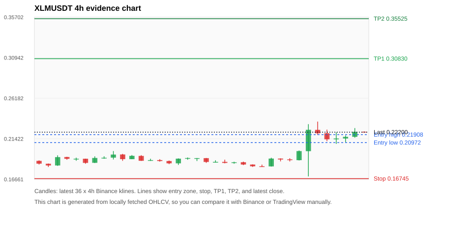
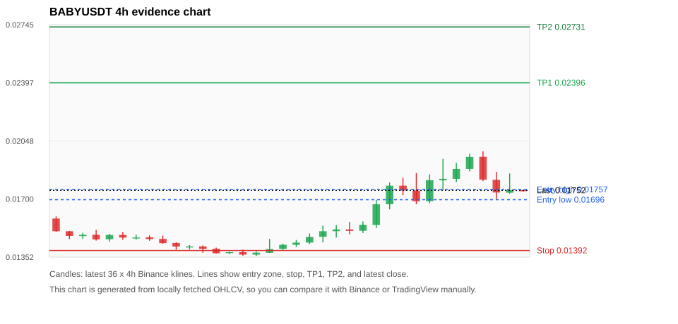
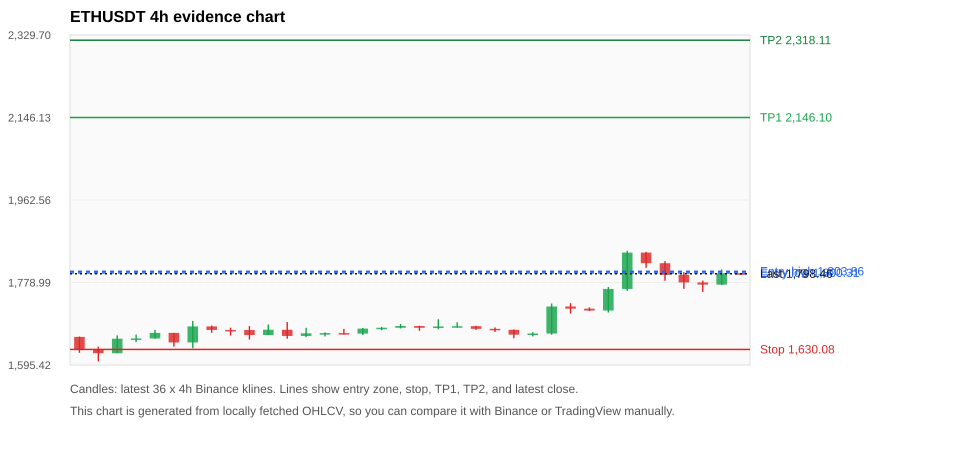
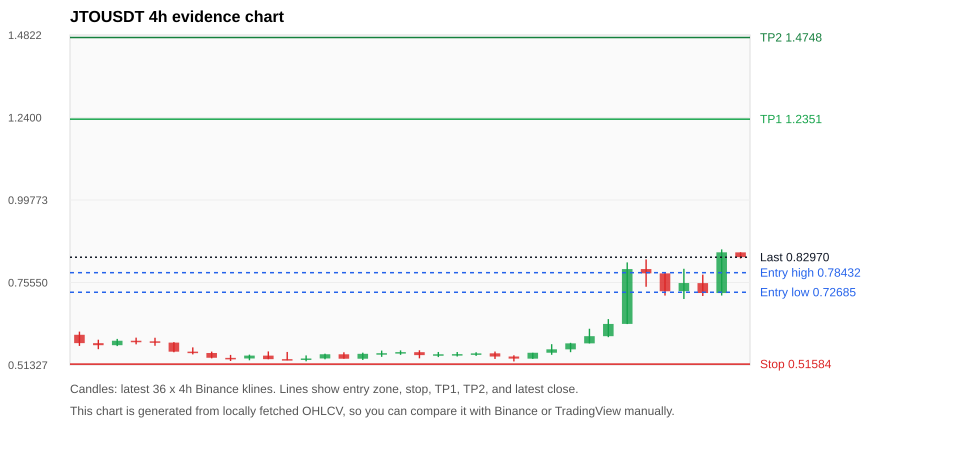
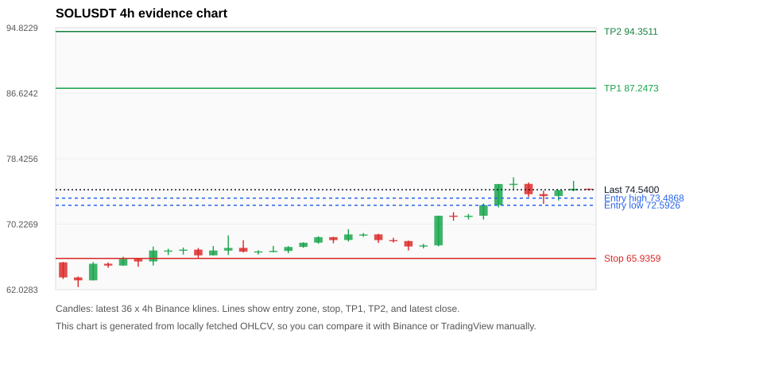

# Crypto 市场扫描报告 v1

- 报告时间：2026-06-16 20:06:42 CST
- Run ID：`20260616_120503_7c6775dd`
- Run type：`daily_full`
- 数据来源：SQLite
- 报告版本：v1
- 扫描 ID：e0d683b2ceb5
- 数据源：Binance public spot API + CoinGecko/CoinMarketCap cross-check
- 过滤条件：USDT spot; 24h quote volume >= 30,000,000; trades >= 30,000; exclude stables/leveraged tokens; analyze 1h/4h/1d klines
- 默认单笔风险：账户权益的 1.00%

## 限制说明

- 交易信号仍以 Binance 现货公开 K 线为主源；外部数据源用于一致性复核。
- 结果是研究和模拟盘计划，不是确定收益或实盘下单指令。
- 历史长度过滤：候选币至少需要 180 根 1d K 线。
- 数据质量验证池：先验证 score 排名前 min(top_n * 2, 10) 的候选，再按 action + score 补足最终名单。
- 大盘环境过滤：RISK_OFF; BTC/ETH 大盘偏弱，山寨币买入候选降级为观察。 BTC 7d=7.5768022031427185; ETH 7d=9.658924563286831.
- 已启用数据交叉验证：Binance 主源 + CoinGecko 自动对照；CoinMarketCap 在配置 API Key 后自动对照。
- BABYUSDT 交叉验证状态 DATA_WARNING：At least one external provider needs manual review.
- ETHUSDT 交叉验证状态 DATA_WARNING：At least one external provider needs manual review.
- SOLUSDT 交叉验证状态 DATA_WARNING：At least one external provider needs manual review.
- BTCUSDT 交叉验证状态 DATA_WARNING：At least one external provider needs manual review.
- XRPUSDT 交叉验证状态 DATA_WARNING：At least one external provider needs manual review.
- ZECUSDT 交叉验证状态 DATA_WARNING：At least one external provider needs manual review.
- NEARUSDT 交叉验证状态 DATA_WARNING：At least one external provider needs manual review.
- WLDUSDT 交叉验证状态 DATA_WARNING：At least one external provider needs manual review.

## 5 个候选交易计划

| Rank | Coin | Action | Setup | Entry Zone | Stop Loss | TP1 | TP2 / Exit Rule | R/R | Verdict |
|---:|---|---|---|---:|---:|---:|---|---:|---|
| 1 | `XLM` | `WAIT_PULLBACK` | 趋势中，等回调入场 | 0.20972 - 0.21908 | 0.16745 | 0.30830 | 0.35525 或跌破 4h 关键支撑 | 2.00-3.00 | 只等回调 |
| 2 | `BABY` | `WATCH_ONLY` | 回踩支撑/4h EMA 附近 | 0.01696 - 0.01757 | 0.01392 | 0.02396 | 0.02731 或跌破 4h 关键支撑 | 2.00-3.00 | 只观察 |
| 3 | `ETH` | `WATCH_ONLY` | 回踩支撑/4h EMA 附近 | 1,800.31 - 1,803.86 | 1,630.08 | 2,146.10 | 2,318.11 或跌破 4h 关键支撑 | 2.00-3.00 | 只观察 |
| 4 | `JTO` | `WATCH_ONLY` | 涨幅较远，只等深回调 | 0.72685 - 0.78432 | 0.51584 | 1.2351 | 1.4748 或跌破 4h 关键支撑 | 2.00-3.00 | 只等回调 |
| 5 | `SOL` | `WATCH_ONLY` | 回踩支撑/4h EMA 附近 | 72.5926 - 73.4868 | 65.9359 | 87.2473 | 94.3511 或跌破 4h 关键支撑 | 2.00-3.00 | 只等回调 |

## 数据交叉验证摘要

价格差异以 Binance 当前价为基准；成交量口径不同，Binance 是 USDT 现货成交额，CoinGecko/CoinMarketCap 通常是全市场成交量。

| Rank | Coin | Data Status | Max Price Diff | Max 24h Diff | Message |
|---:|---|---|---:|---:|---|
| 1 | `XLM` | DATA_OK | 0.01% | 0.60 pts | External provider checks agree with Binance within configured thresholds. |
| 2 | `BABY` | DATA_WARNING | 0.09% | 1.13 pts | At least one external provider needs manual review. |
| 3 | `ETH` | DATA_WARNING | 0.11% | 0.17 pts | At least one external provider needs manual review. |
| 4 | `JTO` | DATA_OK | 0.18% | 0.82 pts | External provider checks agree with Binance within configured thresholds. |
| 5 | `SOL` | DATA_WARNING | 0.04% | 0.17 pts | At least one external provider needs manual review. |

## 候选币说明

### 1. XLM `XLMUSDT`



- 入选原因：趋势中，等回调入场；24h +11.27%，7d +9.85%，4h RSI 74.48，24h 成交额 $102.2M。
- 交易失效条件：跌破 0.16745 或 4h 收盘重新失守关键支撑。
- 主要风险：距离支撑偏远，不能追市价；24h 振幅较大，回撤风险高；成交量突增，可能是事件驱动；BTC/ETH 大盘环境未确认强势，山寨币买入信号降级。
- 数据交叉验证：DATA_OK；External provider checks agree with Binance within configured thresholds.

#### 可点击人工验证

- [Binance 交易页](https://www.binance.com/en/trade/XLM_USDT)
- [TradingView 图表](https://www.tradingview.com/chart/?symbol=BINANCE%3AXLMUSDT)
- [CoinGecko 搜索](https://www.coingecko.com/en/search?query=XLM)
- [CoinMarketCap 搜索](https://coinmarketcap.com/search/?q=XLM)

#### 多数据源对照

| Source | Status | Asset ID | Price | 24h Change | 24h Volume | Price Diff | 24h Diff | Updated | Message |
|---|---|---|---:|---:|---:|---:|---:|---|---|
| Binance | DATA_OK | XLMUSDT | 0.22200 | +11.27% | $102.2M | 0.00% | 0.00 pts | 2026-06-16T12:05:56+00:00 | Primary market data source used by scanner. |
| CoinGecko | DATA_OK | stellar | 0.22202 | +10.67% | $1.08B | 0.01% | 0.60 pts | 2026-06-16T12:06:01.143Z | External source agrees with Binance within thresholds. |
| CoinMarketCap | DATA_OK | 512 | 0.22197 | +11.24% | $1.01B | 0.01% | 0.03 pts | 2026-06-16T12:05:04.000Z | External source agrees with Binance within thresholds. |

#### 指标证据

| 指标 | 数值 | 人工核对用途 |
|---|---:|---|
| 当前价 | 0.22200 | 与 Binance/TradingView 当前价格对照 |
| 24h 涨跌 | +11.27% | 与交易所 24h 涨跌对照 |
| 7d 涨跌 | +9.85% | 判断短线趋势是否延续 |
| 4h EMA20 | 0.20444 | 判断短期趋势支撑 |
| 4h EMA50 | 0.20005 | 判断中期趋势支撑 |
| 1d EMA20 | 0.19811 | 判断日线趋势 |
| 1d EMA50 | 0.18582 | 判断日线趋势 |
| 4h RSI14 | 74.48 | 判断是否过热/过弱 |
| 4h ATR14 | 0.01169 | 推导止损和入场缓冲 |
| 最近 18 根 4h 最低点 | 0.17000 | 支撑/止损参考 |
| 最近 36 根 4h 最高点 | 0.23440 | TP/压力参考 |
| 支撑位 | 0.20444 | 入场区间推导基础 |

#### 交易计划推导

- 支撑位 = 最近低点、4h EMA20、4h EMA50、1d EMA20 中不高于当前价的最高有效支撑 = `0.20444`。
- 入场区间 = 支撑位附近 + ATR 缓冲 = `0.20972 - 0.21908`。
- 止损 = min(最近 18 根 4h 最低点 * 0.985, 入场中位价 - 1.15 * ATR14) = `0.16745`。
- TP1 = max(最近 36 根 4h 最高点 * 0.995, 入场中位价 + 2R) = `0.30830`。
- TP2 = max(入场中位价 + 3R, TP1 * 1.04) = `0.35525`。

#### 最近 10 根 4h K线

| UTC 开盘时间 | Open | High | Low | Close | Quote Volume | Trades |
|---|---:|---:|---:|---:|---:|---:|
| 2026-06-15T00:00+00:00 | 0.19100 | 0.19120 | 0.18770 | 0.18990 | $2.4M | 13301 |
| 2026-06-15T04:00+00:00 | 0.19000 | 0.19140 | 0.18760 | 0.18910 | $2.5M | 10947 |
| 2026-06-15T08:00+00:00 | 0.18910 | 0.20050 | 0.18880 | 0.19980 | $6.3M | 24711 |
| 2026-06-15T12:00+00:00 | 0.19970 | 0.23140 | 0.17000 | 0.22480 | $32.4M | 184390 |
| 2026-06-15T16:00+00:00 | 0.22470 | 0.23440 | 0.21870 | 0.22070 | $35.0M | 186245 |
| 2026-06-15T20:00+00:00 | 0.22070 | 0.22500 | 0.21140 | 0.21360 | $8.2M | 51220 |
| 2026-06-16T00:00+00:00 | 0.21360 | 0.22180 | 0.20820 | 0.21460 | $7.9M | 50791 |
| 2026-06-16T04:00+00:00 | 0.21460 | 0.21820 | 0.21020 | 0.21650 | $6.5M | 41247 |
| 2026-06-16T08:00+00:00 | 0.21650 | 0.22680 | 0.21550 | 0.22240 | $12.4M | 74910 |
| 2026-06-16T12:00+00:00 | 0.22250 | 0.22280 | 0.22180 | 0.22190 | $84,778 | 765 |

### 2. BABY `BABYUSDT`



- 入选原因：回踩支撑/4h EMA 附近；24h -4.68%，7d +13.25%，4h RSI 63.48，24h 成交额 $106.8M。
- 交易失效条件：跌破 0.01391805 或 4h 收盘重新失守关键支撑。
- 主要风险：成交量突增，可能是事件驱动；BTC/ETH 大盘环境未确认强势，山寨币买入信号降级；24h 动量未确认；数据交叉验证需要人工复核。
- 数据交叉验证：DATA_WARNING；At least one external provider needs manual review.

#### 可点击人工验证

- [Binance 交易页](https://www.binance.com/en/trade/BABY_USDT)
- [TradingView 图表](https://www.tradingview.com/chart/?symbol=BINANCE%3ABABYUSDT)
- [CoinGecko 搜索](https://www.coingecko.com/en/search?query=BABY)
- [CoinMarketCap 搜索](https://coinmarketcap.com/search/?q=BABY)

#### 多数据源对照

| Source | Status | Asset ID | Price | 24h Change | 24h Volume | Price Diff | 24h Diff | Updated | Message |
|---|---|---|---:|---:|---:|---:|---:|---|---|
| Binance | DATA_OK | BABYUSDT | 0.01752 | -4.68% | $106.8M | 0.00% | 0.00 pts | 2026-06-16T12:05:56+00:00 | Primary market data source used by scanner. |
| CoinGecko | DATA_WARNING | babylon | 0.01750 | -4.05% | $351.4M | 0.09% | 0.64 pts | 2026-06-16T12:05:49.809Z | CoinGecko symbol mapping has 2 exact matches; selected highest market-cap rank |
| CoinMarketCap | DATA_WARNING | 32198 | 0.01751 | -3.55% | $420.9M | 0.06% | 1.13 pts | 2026-06-16T12:04:04.000Z | CoinMarketCap symbol mapping has 10 matches; selected lowest cmc_rank |

#### 指标证据

| 指标 | 数值 | 人工核对用途 |
|---|---:|---|
| 当前价 | 0.01752 | 与 Binance/TradingView 当前价格对照 |
| 24h 涨跌 | -4.68% | 与交易所 24h 涨跌对照 |
| 7d 涨跌 | +13.25% | 判断短线趋势是否延续 |
| 4h EMA20 | 0.01693 | 判断短期趋势支撑 |
| 4h EMA50 | 0.01600 | 判断中期趋势支撑 |
| 1d EMA20 | 0.01599 | 判断日线趋势 |
| 1d EMA50 | 0.01585 | 判断日线趋势 |
| 4h RSI14 | 63.48 | 判断是否过热/过弱 |
| 4h ATR14 | 0.0013028571 | 推导止损和入场缓冲 |
| 最近 18 根 4h 最低点 | 0.01413 | 支撑/止损参考 |
| 最近 36 根 4h 最高点 | 0.01986 | TP/压力参考 |
| 支撑位 | 0.01693 | 入场区间推导基础 |

#### 交易计划推导

- 支撑位 = 最近低点、4h EMA20、4h EMA50、1d EMA20 中不高于当前价的最高有效支撑 = `0.01693`。
- 入场区间 = 支撑位附近 + ATR 缓冲 = `0.01696 - 0.01757`。
- 止损 = min(最近 18 根 4h 最低点 * 0.985, 入场中位价 - 1.15 * ATR14) = `0.01392`。
- TP1 = max(最近 36 根 4h 最高点 * 0.995, 入场中位价 + 2R) = `0.02396`。
- TP2 = max(入场中位价 + 3R, TP1 * 1.04) = `0.02731`。

#### 最近 10 根 4h K线

| UTC 开盘时间 | Open | High | Low | Close | Quote Volume | Trades |
|---|---:|---:|---:|---:|---:|---:|
| 2026-06-15T00:00+00:00 | 0.01780 | 0.01827 | 0.01723 | 0.01751 | $3.0M | 91303 |
| 2026-06-15T04:00+00:00 | 0.01750 | 0.01856 | 0.01669 | 0.01687 | $5.3M | 134413 |
| 2026-06-15T08:00+00:00 | 0.01687 | 0.01847 | 0.01675 | 0.01813 | $4.5M | 114455 |
| 2026-06-15T12:00+00:00 | 0.01812 | 0.01941 | 0.01753 | 0.01821 | $6.3M | 204376 |
| 2026-06-15T16:00+00:00 | 0.01821 | 0.01917 | 0.01801 | 0.01880 | $3.7M | 90532 |
| 2026-06-15T20:00+00:00 | 0.01880 | 0.01972 | 0.01865 | 0.01952 | $1.6M | 40240 |
| 2026-06-16T00:00+00:00 | 0.01953 | 0.01986 | 0.01807 | 0.01816 | $3.9M | 112784 |
| 2026-06-16T04:00+00:00 | 0.01815 | 0.01863 | 0.01700 | 0.01739 | $35.5M | 274495 |
| 2026-06-16T08:00+00:00 | 0.01738 | 0.01853 | 0.01732 | 0.01754 | $55.8M | 435069 |
| 2026-06-16T12:00+00:00 | 0.01753 | 0.01757 | 0.01743 | 0.01752 | $81,304 | 811 |

### 3. ETH `ETHUSDT`



- 入选原因：回踩支撑/4h EMA 附近；24h +2.08%，7d +7.90%，4h RSI 69.68，24h 成交额 $821.5M。
- 交易失效条件：跌破 1630.0765 或 4h 收盘重新失守关键支撑。
- 主要风险：日线趋势未完全确认；BTC/ETH 大盘环境未确认强势，山寨币买入信号降级；数据交叉验证需要人工复核。
- 数据交叉验证：DATA_WARNING；At least one external provider needs manual review.

#### 可点击人工验证

- [Binance 交易页](https://www.binance.com/en/trade/ETH_USDT)
- [TradingView 图表](https://www.tradingview.com/chart/?symbol=BINANCE%3AETHUSDT)
- [CoinGecko 搜索](https://www.coingecko.com/en/search?query=ETH)
- [CoinMarketCap 搜索](https://coinmarketcap.com/search/?q=ETH)

#### 多数据源对照

| Source | Status | Asset ID | Price | 24h Change | 24h Volume | Price Diff | 24h Diff | Updated | Message |
|---|---|---|---:|---:|---:|---:|---:|---|---|
| Binance | DATA_OK | ETHUSDT | 1,798.46 | +2.08% | $821.5M | 0.00% | 0.00 pts | 2026-06-16T12:05:56+00:00 | Primary market data source used by scanner. |
| CoinGecko | DATA_OK | ethereum | 1,796.68 | +1.97% | $16.94B | 0.10% | 0.11 pts | 2026-06-16T12:05:55.802Z | External source agrees with Binance within thresholds. |
| CoinMarketCap | DATA_WARNING | 1027 | 1,796.47 | +1.90% | $17.59B | 0.11% | 0.17 pts | 2026-06-16T12:04:04.000Z | CoinMarketCap symbol mapping has 6 matches; selected lowest cmc_rank |

#### 指标证据

| 指标 | 数值 | 人工核对用途 |
|---|---:|---|
| 当前价 | 1,798.46 | 与 Binance/TradingView 当前价格对照 |
| 24h 涨跌 | +2.08% | 与交易所 24h 涨跌对照 |
| 7d 涨跌 | +7.90% | 判断短线趋势是否延续 |
| 4h EMA20 | 1,745.39 | 判断短期趋势支撑 |
| 4h EMA50 | 1,720.50 | 判断中期趋势支撑 |
| 1d EMA20 | 1,796.72 | 判断日线趋势 |
| 1d EMA50 | 1,962.67 | 判断日线趋势 |
| 4h RSI14 | 69.68 | 判断是否过热/过弱 |
| 4h ATR14 | 33.2657 | 推导止损和入场缓冲 |
| 最近 18 根 4h 最低点 | 1,654.90 | 支撑/止损参考 |
| 最近 36 根 4h 最高点 | 1,849.54 | TP/压力参考 |
| 支撑位 | 1,796.72 | 入场区间推导基础 |

#### 交易计划推导

- 支撑位 = 最近低点、4h EMA20、4h EMA50、1d EMA20 中不高于当前价的最高有效支撑 = `1,796.72`。
- 入场区间 = 支撑位附近 + ATR 缓冲 = `1,800.31 - 1,803.86`。
- 止损 = min(最近 18 根 4h 最低点 * 0.985, 入场中位价 - 1.15 * ATR14) = `1,630.08`。
- TP1 = max(最近 36 根 4h 最高点 * 0.995, 入场中位价 + 2R) = `2,146.10`。
- TP2 = max(入场中位价 + 3R, TP1 * 1.04) = `2,318.11`。

#### 最近 10 根 4h K线

| UTC 开盘时间 | Open | High | Low | Close | Quote Volume | Trades |
|---|---:|---:|---:|---:|---:|---:|
| 2026-06-15T00:00+00:00 | 1,725.63 | 1,733.04 | 1,709.66 | 1,720.78 | $80.5M | 385554 |
| 2026-06-15T04:00+00:00 | 1,720.78 | 1,723.80 | 1,715.95 | 1,716.59 | $57.0M | 229539 |
| 2026-06-15T08:00+00:00 | 1,716.60 | 1,769.00 | 1,712.17 | 1,764.67 | $150.1M | 555429 |
| 2026-06-15T12:00+00:00 | 1,764.67 | 1,849.54 | 1,760.28 | 1,845.53 | $309.0M | 902394 |
| 2026-06-15T16:00+00:00 | 1,845.53 | 1,847.13 | 1,811.66 | 1,821.89 | $143.8M | 590740 |
| 2026-06-15T20:00+00:00 | 1,821.88 | 1,826.62 | 1,782.82 | 1,796.13 | $87.6M | 472460 |
| 2026-06-16T00:00+00:00 | 1,796.14 | 1,802.09 | 1,764.84 | 1,779.16 | $90.0M | 384855 |
| 2026-06-16T04:00+00:00 | 1,779.16 | 1,783.32 | 1,758.00 | 1,774.24 | $89.1M | 304486 |
| 2026-06-16T08:00+00:00 | 1,774.25 | 1,807.97 | 1,773.25 | 1,799.59 | $102.6M | 594777 |
| 2026-06-16T12:00+00:00 | 1,799.60 | 1,799.79 | 1,796.71 | 1,798.46 | $1.7M | 11822 |

### 4. JTO `JTOUSDT`



- 入选原因：涨幅较远，只等深回调；24h +29.77%，7d +31.01%，4h RSI 76.63，24h 成交额 $37.6M。
- 交易失效条件：跌破 0.5158445 或 4h 收盘重新失守关键支撑。
- 主要风险：距离支撑偏远，不能追市价；4h RSI 偏热；24h 振幅较大，回撤风险高；成交量突增，可能是事件驱动；BTC/ETH 大盘环境未确认强势，山寨币买入信号降级。
- 数据交叉验证：DATA_OK；External provider checks agree with Binance within configured thresholds.

#### 可点击人工验证

- [Binance 交易页](https://www.binance.com/en/trade/JTO_USDT)
- [TradingView 图表](https://www.tradingview.com/chart/?symbol=BINANCE%3AJTOUSDT)
- [CoinGecko 搜索](https://www.coingecko.com/en/search?query=JTO)
- [CoinMarketCap 搜索](https://coinmarketcap.com/search/?q=JTO)

#### 多数据源对照

| Source | Status | Asset ID | Price | 24h Change | 24h Volume | Price Diff | 24h Diff | Updated | Message |
|---|---|---|---:|---:|---:|---:|---:|---|---|
| Binance | DATA_OK | JTOUSDT | 0.82970 | +29.77% | $37.6M | 0.00% | 0.00 pts | 2026-06-16T12:05:56+00:00 | Primary market data source used by scanner. |
| CoinGecko | DATA_OK | jito-governance-token | 0.83123 | +30.59% | $367.8M | 0.18% | 0.82 pts | 2026-06-16T12:06:03.250Z | External source agrees with Binance within thresholds. |
| CoinMarketCap | DATA_OK | 28541 | 0.83047 | +30.19% | $356.9M | 0.09% | 0.42 pts | 2026-06-16T12:05:04.000Z | External source agrees with Binance within thresholds. |

#### 指标证据

| 指标 | 数值 | 人工核对用途 |
|---|---:|---|
| 当前价 | 0.82970 | 与 Binance/TradingView 当前价格对照 |
| 24h 涨跌 | +29.77% | 与交易所 24h 涨跌对照 |
| 7d 涨跌 | +31.01% | 判断短线趋势是否延续 |
| 4h EMA20 | 0.67451 | 判断短期趋势支撑 |
| 4h EMA50 | 0.61634 | 判断中期趋势支撑 |
| 1d EMA20 | 0.58820 | 判断日线趋势 |
| 1d EMA50 | 0.51466 | 判断日线趋势 |
| 4h RSI14 | 76.63 | 判断是否过热/过弱 |
| 4h ATR14 | 0.06050 | 推导止损和入场缓冲 |
| 最近 18 根 4h 最低点 | 0.52370 | 支撑/止损参考 |
| 最近 36 根 4h 最高点 | 0.85270 | TP/压力参考 |
| 支撑位 | 0.67451 | 入场区间推导基础 |

#### 交易计划推导

- 支撑位 = 最近低点、4h EMA20、4h EMA50、1d EMA20 中不高于当前价的最高有效支撑 = `0.67451`。
- 入场区间 = 支撑位附近 + ATR 缓冲 = `0.72685 - 0.78432`。
- 止损 = min(最近 18 根 4h 最低点 * 0.985, 入场中位价 - 1.15 * ATR14) = `0.51584`。
- TP1 = max(最近 36 根 4h 最高点 * 0.995, 入场中位价 + 2R) = `1.2351`。
- TP2 = max(入场中位价 + 3R, TP1 * 1.04) = `1.4748`。

#### 最近 10 根 4h K线

| UTC 开盘时间 | Open | High | Low | Close | Quote Volume | Trades |
|---|---:|---:|---:|---:|---:|---:|
| 2026-06-15T00:00+00:00 | 0.55920 | 0.57840 | 0.55090 | 0.57680 | $1.2M | 24715 |
| 2026-06-15T04:00+00:00 | 0.57680 | 0.61970 | 0.57660 | 0.59790 | $1.7M | 50412 |
| 2026-06-15T08:00+00:00 | 0.59790 | 0.64800 | 0.59500 | 0.63380 | $2.4M | 75477 |
| 2026-06-15T12:00+00:00 | 0.63390 | 0.81450 | 0.63340 | 0.79490 | $11.9M | 274663 |
| 2026-06-15T16:00+00:00 | 0.79500 | 0.82320 | 0.74300 | 0.78240 | $6.7M | 196710 |
| 2026-06-15T20:00+00:00 | 0.78230 | 0.78470 | 0.71710 | 0.72970 | $3.4M | 112964 |
| 2026-06-16T00:00+00:00 | 0.73010 | 0.79580 | 0.70710 | 0.75390 | $3.3M | 107518 |
| 2026-06-16T04:00+00:00 | 0.75370 | 0.77860 | 0.71590 | 0.72460 | $4.4M | 119560 |
| 2026-06-16T08:00+00:00 | 0.72450 | 0.85270 | 0.71720 | 0.84410 | $7.9M | 199692 |
| 2026-06-16T12:00+00:00 | 0.84400 | 0.84430 | 0.82580 | 0.83000 | $175,832 | 4712 |

### 5. SOL `SOLUSDT`



- 入选原因：回踩支撑/4h EMA 附近；24h +2.88%，7d +13.18%，4h RSI 77.90，24h 成交额 $212.9M。
- 交易失效条件：跌破 65.9359 或 4h 收盘重新失守关键支撑。
- 主要风险：4h RSI 偏热；日线趋势未完全确认；BTC/ETH 大盘环境未确认强势，山寨币买入信号降级；数据交叉验证需要人工复核。
- 数据交叉验证：DATA_WARNING；At least one external provider needs manual review.

#### 可点击人工验证

- [Binance 交易页](https://www.binance.com/en/trade/SOL_USDT)
- [TradingView 图表](https://www.tradingview.com/chart/?symbol=BINANCE%3ASOLUSDT)
- [CoinGecko 搜索](https://www.coingecko.com/en/search?query=SOL)
- [CoinMarketCap 搜索](https://coinmarketcap.com/search/?q=SOL)

#### 多数据源对照

| Source | Status | Asset ID | Price | 24h Change | 24h Volume | Price Diff | 24h Diff | Updated | Message |
|---|---|---|---:|---:|---:|---:|---:|---|---|
| Binance | DATA_OK | SOLUSDT | 74.5400 | +2.88% | $212.9M | 0.00% | 0.00 pts | 2026-06-16T12:05:56+00:00 | Primary market data source used by scanner. |
| CoinGecko | DATA_OK | solana | 74.5400 | +2.72% | $3.01B | 0.00% | 0.17 pts | 2026-06-16T12:06:07.421Z | External source agrees with Binance within thresholds. |
| CoinMarketCap | DATA_WARNING | 5426 | 74.5690 | +2.82% | $2.72B | 0.04% | 0.06 pts | 2026-06-16T12:05:04.000Z | CoinMarketCap symbol mapping has 8 matches; selected lowest cmc_rank |

#### 指标证据

| 指标 | 数值 | 人工核对用途 |
|---|---:|---|
| 当前价 | 74.5400 | 与 Binance/TradingView 当前价格对照 |
| 24h 涨跌 | +2.88% | 与交易所 24h 涨跌对照 |
| 7d 涨跌 | +13.18% | 判断短线趋势是否延续 |
| 4h EMA20 | 71.6834 | 判断短期趋势支撑 |
| 4h EMA50 | 69.8219 | 判断中期趋势支撑 |
| 1d EMA20 | 72.4478 | 判断日线趋势 |
| 1d EMA50 | 78.1770 | 判断日线趋势 |
| 4h RSI14 | 77.90 | 判断是否过热/过弱 |
| 4h ATR14 | 1.4843 | 推导止损和入场缓冲 |
| 最近 18 根 4h 最低点 | 66.9400 | 支撑/止损参考 |
| 最近 36 根 4h 最高点 | 76.0900 | TP/压力参考 |
| 支撑位 | 72.4478 | 入场区间推导基础 |

#### 交易计划推导

- 支撑位 = 最近低点、4h EMA20、4h EMA50、1d EMA20 中不高于当前价的最高有效支撑 = `72.4478`。
- 入场区间 = 支撑位附近 + ATR 缓冲 = `72.5926 - 73.4868`。
- 止损 = min(最近 18 根 4h 最低点 * 0.985, 入场中位价 - 1.15 * ATR14) = `65.9359`。
- TP1 = max(最近 36 根 4h 最高点 * 0.995, 入场中位价 + 2R) = `87.2473`。
- TP2 = max(入场中位价 + 3R, TP1 * 1.04) = `94.3511`。

#### 最近 10 根 4h K线

| UTC 开盘时间 | Open | High | Low | Close | Quote Volume | Trades |
|---|---:|---:|---:|---:|---:|---:|
| 2026-06-15T00:00+00:00 | 71.2900 | 71.7300 | 70.6600 | 71.2400 | $30.8M | 144834 |
| 2026-06-15T04:00+00:00 | 71.2400 | 71.5000 | 70.8100 | 71.2800 | $16.8M | 75838 |
| 2026-06-15T08:00+00:00 | 71.2800 | 72.8200 | 70.8000 | 72.6100 | $38.2M | 142305 |
| 2026-06-15T12:00+00:00 | 72.6100 | 75.2600 | 72.3100 | 75.2500 | $61.8M | 260161 |
| 2026-06-15T16:00+00:00 | 75.2500 | 76.0900 | 74.5800 | 75.2800 | $52.1M | 263984 |
| 2026-06-15T20:00+00:00 | 75.2700 | 75.4600 | 73.6200 | 73.9800 | $27.7M | 153907 |
| 2026-06-16T00:00+00:00 | 73.9900 | 74.4200 | 72.7700 | 73.7400 | $25.6M | 121209 |
| 2026-06-16T04:00+00:00 | 73.7500 | 74.5400 | 73.1900 | 74.4600 | $20.0M | 77710 |
| 2026-06-16T08:00+00:00 | 74.4500 | 75.6500 | 74.3500 | 74.6600 | $26.0M | 115402 |
| 2026-06-16T12:00+00:00 | 74.6700 | 74.6800 | 74.5300 | 74.5400 | $417,445 | 1984 |

## 组合风控

- 不要 5 个候选全部满仓买入。
- 同时持仓总风险建议控制在账户权益的 3% - 5% 以内。
- 如果 BTC/ETH 同时破位，暂停山寨币多头计划或降低仓位。
- 第一版报告用于模拟盘和人工复核，不自动下单。

## 原始数据

```json
[
  {
    "rank": 1,
    "symbol": "XLMUSDT",
    "base_asset": "XLM",
    "price": 0.222,
    "score": 49.060363374637234,
    "setup": "趋势中，等回调入场",
    "verdict": "只等回调",
    "entry_low": 0.2097225,
    "entry_high": 0.2190767857142857,
    "stop_loss": 0.16745000000000002,
    "take_profit_1": 0.30829892857142854,
    "take_profit_2": 0.35524857142857136,
    "risk_reward_1": 2.0,
    "risk_reward_2": 2.9999999999999996,
    "pct_24h": 11.273,
    "pct_3d": 17.647058823529417,
    "pct_7d": 9.846610588817416,
    "quote_volume_24h": 102156019.3004,
    "trades_24h": 587996,
    "high_low_range_24h": 37.88235294117646,
    "rsi_1h": 65.35714285714286,
    "rsi_4h": 74.47988904299584,
    "ema20_4h": 0.20443940146775977,
    "ema50_4h": 0.20004516635792546,
    "ema20_1d": 0.19811241727711648,
    "ema50_1d": 0.18581831800131596,
    "atr_4h": 0.011692857142857145,
    "macd_hist_4h": 0.0032792938614107908,
    "volume_ratio_24h": 3.4036082135930115,
    "support_level": 0.20443940146775977,
    "recent_low_4h_18": 0.17,
    "recent_high_4h_36": 0.2344,
    "distance_to_support_pct": 8.589635073359169,
    "binance_trade_url": "https://www.binance.com/en/trade/XLM_USDT",
    "tradingview_url": "https://www.tradingview.com/chart/?symbol=BINANCE%3AXLMUSDT",
    "coingecko_search_url": "https://www.coingecko.com/en/search?query=XLM",
    "coinmarketcap_search_url": "https://coinmarketcap.com/search/?q=XLM",
    "invalidation": "跌破 0.16745 或 4h 收盘重新失守关键支撑",
    "recent_4h_klines": [
      {
        "open_time_utc": "2026-06-10T16:00+00:00",
        "open": 0.1883,
        "high": 0.1889,
        "low": 0.184,
        "close": 0.185,
        "quote_volume": 1980850.0742,
        "trades": 16027
      },
      {
        "open_time_utc": "2026-06-10T20:00+00:00",
        "open": 0.1849,
        "high": 0.1852,
        "low": 0.1811,
        "close": 0.1829,
        "quote_volume": 2528855.3553,
        "trades": 16281
      },
      {
        "open_time_utc": "2026-06-11T00:00+00:00",
        "open": 0.1829,
        "high": 0.1948,
        "low": 0.1824,
        "close": 0.1927,
        "quote_volume": 3404574.8728,
        "trades": 22660
      },
      {
        "open_time_utc": "2026-06-11T04:00+00:00",
        "open": 0.1928,
        "high": 0.1931,
        "low": 0.1896,
        "close": 0.1907,
        "quote_volume": 3216439.3977,
        "trades": 23514
      },
      {
        "open_time_utc": "2026-06-11T08:00+00:00",
        "open": 0.1907,
        "high": 0.1921,
        "low": 0.1884,
        "close": 0.1908,
        "quote_volume": 1813183.057,
        "trades": 11125
      },
      {
        "open_time_utc": "2026-06-11T12:00+00:00",
        "open": 0.1908,
        "high": 0.1909,
        "low": 0.1849,
        "close": 0.1859,
        "quote_volume": 3430248.7058,
        "trades": 21867
      },
      {
        "open_time_utc": "2026-06-11T16:00+00:00",
        "open": 0.186,
        "high": 0.1936,
        "low": 0.1858,
        "close": 0.1917,
        "quote_volume": 3331262.4146,
        "trades": 24084
      },
      {
        "open_time_utc": "2026-06-11T20:00+00:00",
        "open": 0.1918,
        "high": 0.1937,
        "low": 0.1908,
        "close": 0.192,
        "quote_volume": 1867580.9232,
        "trades": 11513
      },
      {
        "open_time_utc": "2026-06-12T00:00+00:00",
        "open": 0.1921,
        "high": 0.1998,
        "low": 0.1899,
        "close": 0.1957,
        "quote_volume": 3977259.3356,
        "trades": 22869
      },
      {
        "open_time_utc": "2026-06-12T04:00+00:00",
        "open": 0.1958,
        "high": 0.1965,
        "low": 0.1883,
        "close": 0.1903,
        "quote_volume": 2882626.5898,
        "trades": 18675
      },
      {
        "open_time_utc": "2026-06-12T08:00+00:00",
        "open": 0.1903,
        "high": 0.1951,
        "low": 0.1903,
        "close": 0.1942,
        "quote_volume": 2465101.6863,
        "trades": 14840
      },
      {
        "open_time_utc": "2026-06-12T12:00+00:00",
        "open": 0.1941,
        "high": 0.195,
        "low": 0.1883,
        "close": 0.1884,
        "quote_volume": 3933764.0404,
        "trades": 24040
      },
      {
        "open_time_utc": "2026-06-12T16:00+00:00",
        "open": 0.1885,
        "high": 0.1908,
        "low": 0.1883,
        "close": 0.1892,
        "quote_volume": 2066075.5243,
        "trades": 13673
      },
      {
        "open_time_utc": "2026-06-12T20:00+00:00",
        "open": 0.1892,
        "high": 0.1903,
        "low": 0.1874,
        "close": 0.1881,
        "quote_volume": 952646.315,
        "trades": 6890
      },
      {
        "open_time_utc": "2026-06-13T00:00+00:00",
        "open": 0.1881,
        "high": 0.1887,
        "low": 0.1844,
        "close": 0.1854,
        "quote_volume": 1781423.2476,
        "trades": 11309
      },
      {
        "open_time_utc": "2026-06-13T04:00+00:00",
        "open": 0.1854,
        "high": 0.1912,
        "low": 0.1835,
        "close": 0.1909,
        "quote_volume": 2259865.2403,
        "trades": 13643
      },
      {
        "open_time_utc": "2026-06-13T08:00+00:00",
        "open": 0.1908,
        "high": 0.1923,
        "low": 0.1896,
        "close": 0.1916,
        "quote_volume": 1802609.8243,
        "trades": 8482
      },
      {
        "open_time_utc": "2026-06-13T12:00+00:00",
        "open": 0.1915,
        "high": 0.1916,
        "low": 0.1881,
        "close": 0.1915,
        "quote_volume": 2423521.6462,
        "trades": 11276
      },
      {
        "open_time_utc": "2026-06-13T16:00+00:00",
        "open": 0.1915,
        "high": 0.1916,
        "low": 0.1859,
        "close": 0.187,
        "quote_volume": 2479652.2676,
        "trades": 11460
      },
      {
        "open_time_utc": "2026-06-13T20:00+00:00",
        "open": 0.187,
        "high": 0.189,
        "low": 0.1864,
        "close": 0.1871,
        "quote_volume": 848551.683,
        "trades": 5923
      },
      {
        "open_time_utc": "2026-06-14T00:00+00:00",
        "open": 0.1871,
        "high": 0.1897,
        "low": 0.1854,
        "close": 0.1859,
        "quote_volume": 2282555.8301,
        "trades": 12030
      },
      {
        "open_time_utc": "2026-06-14T04:00+00:00",
        "open": 0.1859,
        "high": 0.1873,
        "low": 0.1849,
        "close": 0.1866,
        "quote_volume": 1315494.4936,
        "trades": 8806
      },
      {
        "open_time_utc": "2026-06-14T08:00+00:00",
        "open": 0.1867,
        "high": 0.1874,
        "low": 0.1833,
        "close": 0.184,
        "quote_volume": 1846378.5198,
        "trades": 9032
      },
      {
        "open_time_utc": "2026-06-14T12:00+00:00",
        "open": 0.184,
        "high": 0.1842,
        "low": 0.1812,
        "close": 0.1819,
        "quote_volume": 1776664.0176,
        "trades": 8892
      },
      {
        "open_time_utc": "2026-06-14T16:00+00:00",
        "open": 0.1819,
        "high": 0.1839,
        "low": 0.1813,
        "close": 0.1818,
        "quote_volume": 1055046.0461,
        "trades": 5686
      },
      {
        "open_time_utc": "2026-06-14T20:00+00:00",
        "open": 0.1818,
        "high": 0.192,
        "low": 0.1816,
        "close": 0.191,
        "quote_volume": 4325116.32,
        "trades": 20051
      },
      {
        "open_time_utc": "2026-06-15T00:00+00:00",
        "open": 0.191,
        "high": 0.1912,
        "low": 0.1877,
        "close": 0.1899,
        "quote_volume": 2443394.1936,
        "trades": 13301
      },
      {
        "open_time_utc": "2026-06-15T04:00+00:00",
        "open": 0.19,
        "high": 0.1914,
        "low": 0.1876,
        "close": 0.1891,
        "quote_volume": 2542909.1521,
        "trades": 10947
      },
      {
        "open_time_utc": "2026-06-15T08:00+00:00",
        "open": 0.1891,
        "high": 0.2005,
        "low": 0.1888,
        "close": 0.1998,
        "quote_volume": 6277671.187,
        "trades": 24711
      },
      {
        "open_time_utc": "2026-06-15T12:00+00:00",
        "open": 0.1997,
        "high": 0.2314,
        "low": 0.17,
        "close": 0.2248,
        "quote_volume": 32438188.1069,
        "trades": 184390
      },
      {
        "open_time_utc": "2026-06-15T16:00+00:00",
        "open": 0.2247,
        "high": 0.2344,
        "low": 0.2187,
        "close": 0.2207,
        "quote_volume": 35015899.8635,
        "trades": 186245
      },
      {
        "open_time_utc": "2026-06-15T20:00+00:00",
        "open": 0.2207,
        "high": 0.225,
        "low": 0.2114,
        "close": 0.2136,
        "quote_volume": 8203362.7138,
        "trades": 51220
      },
      {
        "open_time_utc": "2026-06-16T00:00+00:00",
        "open": 0.2136,
        "high": 0.2218,
        "low": 0.2082,
        "close": 0.2146,
        "quote_volume": 7872891.3563,
        "trades": 50791
      },
      {
        "open_time_utc": "2026-06-16T04:00+00:00",
        "open": 0.2146,
        "high": 0.2182,
        "low": 0.2102,
        "close": 0.2165,
        "quote_volume": 6500935.8261,
        "trades": 41247
      },
      {
        "open_time_utc": "2026-06-16T08:00+00:00",
        "open": 0.2165,
        "high": 0.2268,
        "low": 0.2155,
        "close": 0.2224,
        "quote_volume": 12367775.8407,
        "trades": 74910
      },
      {
        "open_time_utc": "2026-06-16T12:00+00:00",
        "open": 0.2225,
        "high": 0.2228,
        "low": 0.2218,
        "close": 0.2219,
        "quote_volume": 84778.3056,
        "trades": 765
      }
    ],
    "risks": [
      "距离支撑偏远，不能追市价",
      "24h 振幅较大，回撤风险高",
      "成交量突增，可能是事件驱动",
      "BTC/ETH 大盘环境未确认强势，山寨币买入信号降级"
    ],
    "data_quality_status": "DATA_OK",
    "data_quality_message": "External provider checks agree with Binance within configured thresholds.",
    "data_checks": [
      {
        "provider": "Binance",
        "status": "DATA_OK",
        "provider_asset_id": "XLMUSDT",
        "provider_symbol": "XLMUSDT",
        "price_usd": 0.222,
        "pct_24h": 11.273,
        "volume_24h": 102156019.3004,
        "last_updated": null,
        "fetched_at_utc": "2026-06-16T12:05:56+00:00",
        "price_diff_pct": 0.0,
        "pct_24h_diff": 0.0,
        "volume_note": "Binance USDT spot 24h quoteVolume.",
        "message": "Primary market data source used by scanner."
      },
      {
        "provider": "CoinGecko",
        "status": "DATA_OK",
        "provider_asset_id": "stellar",
        "provider_symbol": "XLM",
        "price_usd": 0.222018,
        "pct_24h": 10.66974,
        "volume_24h": 1077996359.0,
        "last_updated": "2026-06-16T12:06:01.143Z",
        "fetched_at_utc": "2026-06-16T12:05:56+00:00",
        "price_diff_pct": 0.008108108108103715,
        "pct_24h_diff": 0.6032600000000006,
        "volume_note": "CoinGecko total market volume; not the same venue scope as Binance quoteVolume.",
        "message": "External source agrees with Binance within thresholds."
      },
      {
        "provider": "CoinMarketCap",
        "status": "DATA_OK",
        "provider_asset_id": "512",
        "provider_symbol": "XLM",
        "price_usd": 0.22196932238095246,
        "pct_24h": 11.24463179,
        "volume_24h": 1014409075.9099256,
        "last_updated": "2026-06-16T12:05:04.000Z",
        "fetched_at_utc": "2026-06-16T12:05:56+00:00",
        "price_diff_pct": 0.013818747318712694,
        "pct_24h_diff": 0.028368210000000005,
        "volume_note": "CoinMarketCap total market volume; not the same venue scope as Binance quoteVolume.",
        "message": "External source agrees with Binance within thresholds."
      }
    ],
    "action": "WAIT_PULLBACK"
  },
  {
    "rank": 2,
    "symbol": "BABYUSDT",
    "base_asset": "BABY",
    "price": 0.01752,
    "score": 55.46099290296462,
    "setup": "回踩支撑/4h EMA 附近",
    "verdict": "只观察",
    "entry_low": 0.016960070719586263,
    "entry_high": 0.017572559999999997,
    "stop_loss": 0.01391805,
    "take_profit_1": 0.02396284607937939,
    "take_profit_2": 0.027311111439172524,
    "risk_reward_1": 2.0,
    "risk_reward_2": 3.0000000000000004,
    "pct_24h": -4.682,
    "pct_3d": 23.816254416961137,
    "pct_7d": 13.251454427925037,
    "quote_volume_24h": 106769364.31122,
    "trades_24h": 1156129,
    "high_low_range_24h": 16.82352941176468,
    "rsi_1h": 32.3456790123457,
    "rsi_4h": 63.47926267281106,
    "ema20_4h": 0.01692621828302022,
    "ema50_4h": 0.016000585976531298,
    "ema20_1d": 0.01598762370768952,
    "ema50_1d": 0.015852111997600803,
    "atr_4h": 0.0013028571428571431,
    "macd_hist_4h": 4.603445159785484e-05,
    "volume_ratio_24h": 3.705882170932929,
    "support_level": 0.01692621828302022,
    "recent_low_4h_18": 0.01413,
    "recent_high_4h_36": 0.01986,
    "distance_to_support_pct": 3.5080589594867817,
    "binance_trade_url": "https://www.binance.com/en/trade/BABY_USDT",
    "tradingview_url": "https://www.tradingview.com/chart/?symbol=BINANCE%3ABABYUSDT",
    "coingecko_search_url": "https://www.coingecko.com/en/search?query=BABY",
    "coinmarketcap_search_url": "https://coinmarketcap.com/search/?q=BABY",
    "invalidation": "跌破 0.01391805 或 4h 收盘重新失守关键支撑",
    "recent_4h_klines": [
      {
        "open_time_utc": "2026-06-10T16:00+00:00",
        "open": 0.01583,
        "high": 0.01596,
        "low": 0.01504,
        "close": 0.01507,
        "quote_volume": 2763321.65382,
        "trades": 33071
      },
      {
        "open_time_utc": "2026-06-10T20:00+00:00",
        "open": 0.01507,
        "high": 0.01508,
        "low": 0.0146,
        "close": 0.01479,
        "quote_volume": 1650592.19418,
        "trades": 11244
      },
      {
        "open_time_utc": "2026-06-11T00:00+00:00",
        "open": 0.01478,
        "high": 0.01498,
        "low": 0.01461,
        "close": 0.01486,
        "quote_volume": 2842376.67478,
        "trades": 33642
      },
      {
        "open_time_utc": "2026-06-11T04:00+00:00",
        "open": 0.01486,
        "high": 0.01515,
        "low": 0.01451,
        "close": 0.01458,
        "quote_volume": 10613999.98628,
        "trades": 144432
      },
      {
        "open_time_utc": "2026-06-11T08:00+00:00",
        "open": 0.01459,
        "high": 0.01491,
        "low": 0.01444,
        "close": 0.01485,
        "quote_volume": 10642707.06343,
        "trades": 94099
      },
      {
        "open_time_utc": "2026-06-11T12:00+00:00",
        "open": 0.01485,
        "high": 0.01502,
        "low": 0.01456,
        "close": 0.01469,
        "quote_volume": 3857849.01402,
        "trades": 55965
      },
      {
        "open_time_utc": "2026-06-11T16:00+00:00",
        "open": 0.0147,
        "high": 0.01487,
        "low": 0.01457,
        "close": 0.0147,
        "quote_volume": 1437859.32487,
        "trades": 26567
      },
      {
        "open_time_utc": "2026-06-11T20:00+00:00",
        "open": 0.01471,
        "high": 0.01482,
        "low": 0.0145,
        "close": 0.0146,
        "quote_volume": 774259.59211,
        "trades": 14021
      },
      {
        "open_time_utc": "2026-06-12T00:00+00:00",
        "open": 0.01461,
        "high": 0.01481,
        "low": 0.01431,
        "close": 0.01436,
        "quote_volume": 1926522.71105,
        "trades": 37419
      },
      {
        "open_time_utc": "2026-06-12T04:00+00:00",
        "open": 0.01437,
        "high": 0.01441,
        "low": 0.01396,
        "close": 0.01415,
        "quote_volume": 3114127.17248,
        "trades": 53897
      },
      {
        "open_time_utc": "2026-06-12T08:00+00:00",
        "open": 0.01414,
        "high": 0.01424,
        "low": 0.01397,
        "close": 0.01416,
        "quote_volume": 2957537.45449,
        "trades": 50273
      },
      {
        "open_time_utc": "2026-06-12T12:00+00:00",
        "open": 0.01416,
        "high": 0.01422,
        "low": 0.01378,
        "close": 0.01401,
        "quote_volume": 4521384.74616,
        "trades": 139373
      },
      {
        "open_time_utc": "2026-06-12T16:00+00:00",
        "open": 0.01402,
        "high": 0.01409,
        "low": 0.01374,
        "close": 0.01375,
        "quote_volume": 3365421.56707,
        "trades": 40884
      },
      {
        "open_time_utc": "2026-06-12T20:00+00:00",
        "open": 0.01376,
        "high": 0.01384,
        "low": 0.0137,
        "close": 0.01382,
        "quote_volume": 1171952.40402,
        "trades": 39522
      },
      {
        "open_time_utc": "2026-06-13T00:00+00:00",
        "open": 0.01382,
        "high": 0.01397,
        "low": 0.0136,
        "close": 0.01367,
        "quote_volume": 2754593.93411,
        "trades": 28327
      },
      {
        "open_time_utc": "2026-06-13T04:00+00:00",
        "open": 0.01367,
        "high": 0.01388,
        "low": 0.01359,
        "close": 0.01379,
        "quote_volume": 15051123.94447,
        "trades": 106280
      },
      {
        "open_time_utc": "2026-06-13T08:00+00:00",
        "open": 0.01378,
        "high": 0.01461,
        "low": 0.01377,
        "close": 0.014,
        "quote_volume": 22107019.87432,
        "trades": 114356
      },
      {
        "open_time_utc": "2026-06-13T12:00+00:00",
        "open": 0.01401,
        "high": 0.01433,
        "low": 0.01395,
        "close": 0.01426,
        "quote_volume": 3456824.25315,
        "trades": 50484
      },
      {
        "open_time_utc": "2026-06-13T16:00+00:00",
        "open": 0.01426,
        "high": 0.01455,
        "low": 0.01413,
        "close": 0.01439,
        "quote_volume": 1858456.75695,
        "trades": 44132
      },
      {
        "open_time_utc": "2026-06-13T20:00+00:00",
        "open": 0.01439,
        "high": 0.01494,
        "low": 0.0143,
        "close": 0.01473,
        "quote_volume": 1813597.51967,
        "trades": 81991
      },
      {
        "open_time_utc": "2026-06-14T00:00+00:00",
        "open": 0.01474,
        "high": 0.01541,
        "low": 0.0144,
        "close": 0.01507,
        "quote_volume": 2101533.20225,
        "trades": 56601
      },
      {
        "open_time_utc": "2026-06-14T04:00+00:00",
        "open": 0.01507,
        "high": 0.01544,
        "low": 0.01469,
        "close": 0.01518,
        "quote_volume": 1962287.56509,
        "trades": 45883
      },
      {
        "open_time_utc": "2026-06-14T08:00+00:00",
        "open": 0.01518,
        "high": 0.01562,
        "low": 0.01489,
        "close": 0.01509,
        "quote_volume": 2509508.61155,
        "trades": 60513
      },
      {
        "open_time_utc": "2026-06-14T12:00+00:00",
        "open": 0.0151,
        "high": 0.01566,
        "low": 0.01496,
        "close": 0.01546,
        "quote_volume": 2986567.55066,
        "trades": 83641
      },
      {
        "open_time_utc": "2026-06-14T16:00+00:00",
        "open": 0.01545,
        "high": 0.01695,
        "low": 0.01526,
        "close": 0.01669,
        "quote_volume": 4753069.3405,
        "trades": 88110
      },
      {
        "open_time_utc": "2026-06-14T20:00+00:00",
        "open": 0.01669,
        "high": 0.01799,
        "low": 0.01638,
        "close": 0.0178,
        "quote_volume": 3572475.23801,
        "trades": 90979
      },
      {
        "open_time_utc": "2026-06-15T00:00+00:00",
        "open": 0.0178,
        "high": 0.01827,
        "low": 0.01723,
        "close": 0.01751,
        "quote_volume": 2991640.05967,
        "trades": 91303
      },
      {
        "open_time_utc": "2026-06-15T04:00+00:00",
        "open": 0.0175,
        "high": 0.01856,
        "low": 0.01669,
        "close": 0.01687,
        "quote_volume": 5264341.5561,
        "trades": 134413
      },
      {
        "open_time_utc": "2026-06-15T08:00+00:00",
        "open": 0.01687,
        "high": 0.01847,
        "low": 0.01675,
        "close": 0.01813,
        "quote_volume": 4506042.27388,
        "trades": 114455
      },
      {
        "open_time_utc": "2026-06-15T12:00+00:00",
        "open": 0.01812,
        "high": 0.01941,
        "low": 0.01753,
        "close": 0.01821,
        "quote_volume": 6278868.25495,
        "trades": 204376
      },
      {
        "open_time_utc": "2026-06-15T16:00+00:00",
        "open": 0.01821,
        "high": 0.01917,
        "low": 0.01801,
        "close": 0.0188,
        "quote_volume": 3711709.07668,
        "trades": 90532
      },
      {
        "open_time_utc": "2026-06-15T20:00+00:00",
        "open": 0.0188,
        "high": 0.01972,
        "low": 0.01865,
        "close": 0.01952,
        "quote_volume": 1599312.0973,
        "trades": 40240
      },
      {
        "open_time_utc": "2026-06-16T00:00+00:00",
        "open": 0.01953,
        "high": 0.01986,
        "low": 0.01807,
        "close": 0.01816,
        "quote_volume": 3925778.96372,
        "trades": 112784
      },
      {
        "open_time_utc": "2026-06-16T04:00+00:00",
        "open": 0.01815,
        "high": 0.01863,
        "low": 0.017,
        "close": 0.01739,
        "quote_volume": 35454038.77707,
        "trades": 274495
      },
      {
        "open_time_utc": "2026-06-16T08:00+00:00",
        "open": 0.01738,
        "high": 0.01853,
        "low": 0.01732,
        "close": 0.01754,
        "quote_volume": 55775644.44355,
        "trades": 435069
      },
      {
        "open_time_utc": "2026-06-16T12:00+00:00",
        "open": 0.01753,
        "high": 0.01757,
        "low": 0.01743,
        "close": 0.01752,
        "quote_volume": 81304.01983,
        "trades": 811
      }
    ],
    "risks": [
      "成交量突增，可能是事件驱动",
      "BTC/ETH 大盘环境未确认强势，山寨币买入信号降级",
      "24h 动量未确认",
      "数据交叉验证需要人工复核"
    ],
    "data_quality_status": "DATA_WARNING",
    "data_quality_message": "At least one external provider needs manual review.",
    "data_checks": [
      {
        "provider": "Binance",
        "status": "DATA_OK",
        "provider_asset_id": "BABYUSDT",
        "provider_symbol": "BABYUSDT",
        "price_usd": 0.01752,
        "pct_24h": -4.682,
        "volume_24h": 106769364.31122,
        "last_updated": null,
        "fetched_at_utc": "2026-06-16T12:05:56+00:00",
        "price_diff_pct": 0.0,
        "pct_24h_diff": 0.0,
        "volume_note": "Binance USDT spot 24h quoteVolume.",
        "message": "Primary market data source used by scanner."
      },
      {
        "provider": "CoinGecko",
        "status": "DATA_WARNING",
        "provider_asset_id": "babylon",
        "provider_symbol": "BABY",
        "price_usd": 0.01750344,
        "pct_24h": -4.04517,
        "volume_24h": 351366906.0,
        "last_updated": "2026-06-16T12:05:49.809Z",
        "fetched_at_utc": "2026-06-16T12:05:56+00:00",
        "price_diff_pct": 0.09452054794521841,
        "pct_24h_diff": 0.6368300000000007,
        "volume_note": "CoinGecko total market volume; not the same venue scope as Binance quoteVolume.",
        "message": "CoinGecko symbol mapping has 2 exact matches; selected highest market-cap rank"
      },
      {
        "provider": "CoinMarketCap",
        "status": "DATA_WARNING",
        "provider_asset_id": "32198",
        "provider_symbol": "BABY",
        "price_usd": 0.017509503291506003,
        "pct_24h": -3.54817069,
        "volume_24h": 420911630.93425757,
        "last_updated": "2026-06-16T12:04:04.000Z",
        "fetched_at_utc": "2026-06-16T12:05:56+00:00",
        "price_diff_pct": 0.059912719714602214,
        "pct_24h_diff": 1.1338293100000003,
        "volume_note": "CoinMarketCap total market volume; not the same venue scope as Binance quoteVolume.",
        "message": "CoinMarketCap symbol mapping has 10 matches; selected lowest cmc_rank"
      }
    ],
    "action": "WATCH_ONLY"
  },
  {
    "rank": 3,
    "symbol": "ETHUSDT",
    "base_asset": "ETH",
    "price": 1798.46,
    "score": 53.95855883264834,
    "setup": "回踩支撑/4h EMA 附近",
    "verdict": "只观察",
    "entry_low": 1800.3129796672263,
    "entry_high": 1803.8553799999997,
    "stop_loss": 1630.0765000000001,
    "take_profit_1": 2146.0995395008385,
    "take_profit_2": 2318.1072193344517,
    "risk_reward_1": 1.9999999999999987,
    "risk_reward_2": 3.0,
    "pct_24h": 2.075,
    "pct_3d": 7.177506823518187,
    "pct_7d": 7.904794475343646,
    "quote_volume_24h": 821529976.361825,
    "trades_24h": 3248356,
    "high_low_range_24h": 5.207053469852108,
    "rsi_1h": 53.31020962147488,
    "rsi_4h": 69.67915984198865,
    "ema20_4h": 1745.393408326529,
    "ema50_4h": 1720.5039439928964,
    "ema20_1d": 1796.719540586054,
    "ema50_1d": 1962.66668575289,
    "atr_4h": 33.265714285714225,
    "macd_hist_4h": 6.47989733288702,
    "volume_ratio_24h": 1.9111806435818832,
    "support_level": 1796.719540586054,
    "recent_low_4h_18": 1654.9,
    "recent_high_4h_36": 1849.54,
    "distance_to_support_pct": 0.0968687307412619,
    "binance_trade_url": "https://www.binance.com/en/trade/ETH_USDT",
    "tradingview_url": "https://www.tradingview.com/chart/?symbol=BINANCE%3AETHUSDT",
    "coingecko_search_url": "https://www.coingecko.com/en/search?query=ETH",
    "coinmarketcap_search_url": "https://coinmarketcap.com/search/?q=ETH",
    "invalidation": "跌破 1630.0765 或 4h 收盘重新失守关键支撑",
    "recent_4h_klines": [
      {
        "open_time_utc": "2026-06-10T16:00+00:00",
        "open": 1657.98,
        "high": 1658.73,
        "low": 1622.51,
        "close": 1630.15,
        "quote_volume": 90394827.810961,
        "trades": 952522
      },
      {
        "open_time_utc": "2026-06-10T20:00+00:00",
        "open": 1630.15,
        "high": 1636.21,
        "low": 1603.44,
        "close": 1621.59,
        "quote_volume": 79574513.257938,
        "trades": 690667
      },
      {
        "open_time_utc": "2026-06-11T00:00+00:00",
        "open": 1621.6,
        "high": 1661.3,
        "low": 1621.6,
        "close": 1653.95,
        "quote_volume": 59568101.550888,
        "trades": 522427
      },
      {
        "open_time_utc": "2026-06-11T04:00+00:00",
        "open": 1653.94,
        "high": 1663.14,
        "low": 1646.2,
        "close": 1654.41,
        "quote_volume": 60516705.867396,
        "trades": 372612
      },
      {
        "open_time_utc": "2026-06-11T08:00+00:00",
        "open": 1654.4,
        "high": 1673.5,
        "low": 1654.28,
        "close": 1666.84,
        "quote_volume": 50505638.82082,
        "trades": 340895
      },
      {
        "open_time_utc": "2026-06-11T12:00+00:00",
        "open": 1666.84,
        "high": 1666.88,
        "low": 1636.19,
        "close": 1645.55,
        "quote_volume": 92069576.461866,
        "trades": 877664
      },
      {
        "open_time_utc": "2026-06-11T16:00+00:00",
        "open": 1645.56,
        "high": 1693.59,
        "low": 1632.71,
        "close": 1681.26,
        "quote_volume": 142470910.188748,
        "trades": 946468
      },
      {
        "open_time_utc": "2026-06-11T20:00+00:00",
        "open": 1681.26,
        "high": 1683.29,
        "low": 1667.18,
        "close": 1673.46,
        "quote_volume": 57374881.400031,
        "trades": 350197
      },
      {
        "open_time_utc": "2026-06-12T00:00+00:00",
        "open": 1673.46,
        "high": 1678.42,
        "low": 1660.93,
        "close": 1673.25,
        "quote_volume": 34522035.065248,
        "trades": 331979
      },
      {
        "open_time_utc": "2026-06-12T04:00+00:00",
        "open": 1673.25,
        "high": 1682.0,
        "low": 1652.09,
        "close": 1662.12,
        "quote_volume": 50314659.437735,
        "trades": 360746
      },
      {
        "open_time_utc": "2026-06-12T08:00+00:00",
        "open": 1662.12,
        "high": 1685.65,
        "low": 1662.12,
        "close": 1673.89,
        "quote_volume": 55529649.281597,
        "trades": 421888
      },
      {
        "open_time_utc": "2026-06-12T12:00+00:00",
        "open": 1673.88,
        "high": 1691.07,
        "low": 1653.74,
        "close": 1660.08,
        "quote_volume": 106049182.489782,
        "trades": 989670
      },
      {
        "open_time_utc": "2026-06-12T16:00+00:00",
        "open": 1660.08,
        "high": 1678.1,
        "low": 1657.38,
        "close": 1665.92,
        "quote_volume": 70426625.783964,
        "trades": 582234
      },
      {
        "open_time_utc": "2026-06-12T20:00+00:00",
        "open": 1665.92,
        "high": 1668.01,
        "low": 1659.02,
        "close": 1666.41,
        "quote_volume": 20416009.600665,
        "trades": 202000
      },
      {
        "open_time_utc": "2026-06-13T00:00+00:00",
        "open": 1666.42,
        "high": 1675.9,
        "low": 1663.36,
        "close": 1665.25,
        "quote_volume": 27376235.1625,
        "trades": 194735
      },
      {
        "open_time_utc": "2026-06-13T04:00+00:00",
        "open": 1665.25,
        "high": 1677.74,
        "low": 1662.2,
        "close": 1676.38,
        "quote_volume": 26785790.43844,
        "trades": 158867
      },
      {
        "open_time_utc": "2026-06-13T08:00+00:00",
        "open": 1676.38,
        "high": 1679.92,
        "low": 1672.8,
        "close": 1678.34,
        "quote_volume": 30986108.983186,
        "trades": 177926
      },
      {
        "open_time_utc": "2026-06-13T12:00+00:00",
        "open": 1678.33,
        "high": 1686.56,
        "low": 1676.69,
        "close": 1682.15,
        "quote_volume": 33495922.000776,
        "trades": 235788
      },
      {
        "open_time_utc": "2026-06-13T16:00+00:00",
        "open": 1682.14,
        "high": 1682.63,
        "low": 1671.44,
        "close": 1678.29,
        "quote_volume": 35819080.824297,
        "trades": 235716
      },
      {
        "open_time_utc": "2026-06-13T20:00+00:00",
        "open": 1678.3,
        "high": 1697.28,
        "low": 1674.91,
        "close": 1681.18,
        "quote_volume": 24436045.294188,
        "trades": 219947
      },
      {
        "open_time_utc": "2026-06-14T00:00+00:00",
        "open": 1681.19,
        "high": 1690.36,
        "low": 1678.83,
        "close": 1681.73,
        "quote_volume": 17520019.911114,
        "trades": 157845
      },
      {
        "open_time_utc": "2026-06-14T04:00+00:00",
        "open": 1681.74,
        "high": 1682.66,
        "low": 1673.72,
        "close": 1675.91,
        "quote_volume": 26154750.07225,
        "trades": 155762
      },
      {
        "open_time_utc": "2026-06-14T08:00+00:00",
        "open": 1675.91,
        "high": 1679.0,
        "low": 1669.15,
        "close": 1673.73,
        "quote_volume": 24810168.717517,
        "trades": 152584
      },
      {
        "open_time_utc": "2026-06-14T12:00+00:00",
        "open": 1673.73,
        "high": 1674.58,
        "low": 1654.9,
        "close": 1662.95,
        "quote_volume": 39822265.504871,
        "trades": 286228
      },
      {
        "open_time_utc": "2026-06-14T16:00+00:00",
        "open": 1662.95,
        "high": 1668.57,
        "low": 1658.95,
        "close": 1665.43,
        "quote_volume": 29853503.496566,
        "trades": 197516
      },
      {
        "open_time_utc": "2026-06-14T20:00+00:00",
        "open": 1665.44,
        "high": 1732.28,
        "low": 1662.67,
        "close": 1725.62,
        "quote_volume": 163243595.068431,
        "trades": 986056
      },
      {
        "open_time_utc": "2026-06-15T00:00+00:00",
        "open": 1725.63,
        "high": 1733.04,
        "low": 1709.66,
        "close": 1720.78,
        "quote_volume": 80525366.557659,
        "trades": 385554
      },
      {
        "open_time_utc": "2026-06-15T04:00+00:00",
        "open": 1720.78,
        "high": 1723.8,
        "low": 1715.95,
        "close": 1716.59,
        "quote_volume": 57037268.791415,
        "trades": 229539
      },
      {
        "open_time_utc": "2026-06-15T08:00+00:00",
        "open": 1716.6,
        "high": 1769.0,
        "low": 1712.17,
        "close": 1764.67,
        "quote_volume": 150135664.758294,
        "trades": 555429
      },
      {
        "open_time_utc": "2026-06-15T12:00+00:00",
        "open": 1764.67,
        "high": 1849.54,
        "low": 1760.28,
        "close": 1845.53,
        "quote_volume": 308967598.674926,
        "trades": 902394
      },
      {
        "open_time_utc": "2026-06-15T16:00+00:00",
        "open": 1845.53,
        "high": 1847.13,
        "low": 1811.66,
        "close": 1821.89,
        "quote_volume": 143824186.522777,
        "trades": 590740
      },
      {
        "open_time_utc": "2026-06-15T20:00+00:00",
        "open": 1821.88,
        "high": 1826.62,
        "low": 1782.82,
        "close": 1796.13,
        "quote_volume": 87615416.670238,
        "trades": 472460
      },
      {
        "open_time_utc": "2026-06-16T00:00+00:00",
        "open": 1796.14,
        "high": 1802.09,
        "low": 1764.84,
        "close": 1779.16,
        "quote_volume": 90017719.519215,
        "trades": 384855
      },
      {
        "open_time_utc": "2026-06-16T04:00+00:00",
        "open": 1779.16,
        "high": 1783.32,
        "low": 1758.0,
        "close": 1774.24,
        "quote_volume": 89106636.028984,
        "trades": 304486
      },
      {
        "open_time_utc": "2026-06-16T08:00+00:00",
        "open": 1774.25,
        "high": 1807.97,
        "low": 1773.25,
        "close": 1799.59,
        "quote_volume": 102565954.182685,
        "trades": 594777
      },
      {
        "open_time_utc": "2026-06-16T12:00+00:00",
        "open": 1799.6,
        "high": 1799.79,
        "low": 1796.71,
        "close": 1798.46,
        "quote_volume": 1678435.688764,
        "trades": 11822
      }
    ],
    "risks": [
      "日线趋势未完全确认",
      "BTC/ETH 大盘环境未确认强势，山寨币买入信号降级",
      "数据交叉验证需要人工复核"
    ],
    "data_quality_status": "DATA_WARNING",
    "data_quality_message": "At least one external provider needs manual review.",
    "data_checks": [
      {
        "provider": "Binance",
        "status": "DATA_OK",
        "provider_asset_id": "ETHUSDT",
        "provider_symbol": "ETHUSDT",
        "price_usd": 1798.46,
        "pct_24h": 2.075,
        "volume_24h": 821529976.361825,
        "last_updated": null,
        "fetched_at_utc": "2026-06-16T12:05:56+00:00",
        "price_diff_pct": 0.0,
        "pct_24h_diff": 0.0,
        "volume_note": "Binance USDT spot 24h quoteVolume.",
        "message": "Primary market data source used by scanner."
      },
      {
        "provider": "CoinGecko",
        "status": "DATA_OK",
        "provider_asset_id": "ethereum",
        "provider_symbol": "ETH",
        "price_usd": 1796.68,
        "pct_24h": 1.96644,
        "volume_24h": 16942343251.0,
        "last_updated": "2026-06-16T12:05:55.802Z",
        "fetched_at_utc": "2026-06-16T12:05:56+00:00",
        "price_diff_pct": 0.09897356627336569,
        "pct_24h_diff": 0.10856000000000021,
        "volume_note": "CoinGecko total market volume; not the same venue scope as Binance quoteVolume.",
        "message": "External source agrees with Binance within thresholds."
      },
      {
        "provider": "CoinMarketCap",
        "status": "DATA_WARNING",
        "provider_asset_id": "1027",
        "provider_symbol": "ETH",
        "price_usd": 1796.4723735722237,
        "pct_24h": 1.90216586,
        "volume_24h": 17587193359.190628,
        "last_updated": "2026-06-16T12:04:04.000Z",
        "fetched_at_utc": "2026-06-16T12:05:56+00:00",
        "price_diff_pct": 0.11051824493046143,
        "pct_24h_diff": 0.1728341400000002,
        "volume_note": "CoinMarketCap total market volume; not the same venue scope as Binance quoteVolume.",
        "message": "CoinMarketCap symbol mapping has 6 matches; selected lowest cmc_rank"
      }
    ],
    "action": "WATCH_ONLY"
  },
  {
    "rank": 4,
    "symbol": "JTOUSDT",
    "base_asset": "JTO",
    "price": 0.8297,
    "score": 51.19459716441908,
    "setup": "涨幅较远，只等深回调",
    "verdict": "只等回调",
    "entry_low": 0.72685,
    "entry_high": 0.7843249999999999,
    "stop_loss": 0.5158445,
    "take_profit_1": 1.2350735,
    "take_profit_2": 1.4748164999999998,
    "risk_reward_1": 2.0000000000000004,
    "risk_reward_2": 3.0,
    "pct_24h": 29.77,
    "pct_3d": 51.01929377502729,
    "pct_7d": 31.01215853465973,
    "quote_volume_24h": 37597934.60308,
    "trades_24h": 1013571,
    "high_low_range_24h": 34.32577189666035,
    "rsi_1h": 64.67493423524989,
    "rsi_4h": 76.63022992838296,
    "ema20_4h": 0.6745143647886181,
    "ema50_4h": 0.6163383901795849,
    "ema20_1d": 0.5882007606373929,
    "ema50_1d": 0.5146606692070836,
    "atr_4h": 0.06050000000000001,
    "macd_hist_4h": 0.024995806503980325,
    "volume_ratio_24h": 7.7736972464450185,
    "support_level": 0.6745143647886181,
    "recent_low_4h_18": 0.5237,
    "recent_high_4h_36": 0.8527,
    "distance_to_support_pct": 23.00701709444164,
    "binance_trade_url": "https://www.binance.com/en/trade/JTO_USDT",
    "tradingview_url": "https://www.tradingview.com/chart/?symbol=BINANCE%3AJTOUSDT",
    "coingecko_search_url": "https://www.coingecko.com/en/search?query=JTO",
    "coinmarketcap_search_url": "https://coinmarketcap.com/search/?q=JTO",
    "invalidation": "跌破 0.5158445 或 4h 收盘重新失守关键支撑",
    "recent_4h_klines": [
      {
        "open_time_utc": "2026-06-10T16:00+00:00",
        "open": 0.602,
        "high": 0.6113,
        "low": 0.5693,
        "close": 0.5775,
        "quote_volume": 1563399.43305,
        "trades": 42513
      },
      {
        "open_time_utc": "2026-06-10T20:00+00:00",
        "open": 0.5774,
        "high": 0.5875,
        "low": 0.5597,
        "close": 0.5714,
        "quote_volume": 622221.23462,
        "trades": 21151
      },
      {
        "open_time_utc": "2026-06-11T00:00+00:00",
        "open": 0.5714,
        "high": 0.5899,
        "low": 0.5688,
        "close": 0.5845,
        "quote_volume": 372705.85677,
        "trades": 16564
      },
      {
        "open_time_utc": "2026-06-11T04:00+00:00",
        "open": 0.5845,
        "high": 0.5936,
        "low": 0.5739,
        "close": 0.5822,
        "quote_volume": 340075.31741,
        "trades": 15011
      },
      {
        "open_time_utc": "2026-06-11T08:00+00:00",
        "open": 0.5828,
        "high": 0.5933,
        "low": 0.5697,
        "close": 0.5791,
        "quote_volume": 347016.29568,
        "trades": 15762
      },
      {
        "open_time_utc": "2026-06-11T12:00+00:00",
        "open": 0.579,
        "high": 0.5805,
        "low": 0.5507,
        "close": 0.5524,
        "quote_volume": 531248.19653,
        "trades": 19425
      },
      {
        "open_time_utc": "2026-06-11T16:00+00:00",
        "open": 0.5525,
        "high": 0.565,
        "low": 0.5444,
        "close": 0.5485,
        "quote_volume": 834670.17256,
        "trades": 26294
      },
      {
        "open_time_utc": "2026-06-11T20:00+00:00",
        "open": 0.5485,
        "high": 0.5526,
        "low": 0.5327,
        "close": 0.5345,
        "quote_volume": 551280.7254,
        "trades": 15981
      },
      {
        "open_time_utc": "2026-06-12T00:00+00:00",
        "open": 0.5342,
        "high": 0.5429,
        "low": 0.525,
        "close": 0.5326,
        "quote_volume": 1573973.06032,
        "trades": 42619
      },
      {
        "open_time_utc": "2026-06-12T04:00+00:00",
        "open": 0.5324,
        "high": 0.5437,
        "low": 0.5271,
        "close": 0.5409,
        "quote_volume": 424089.31302,
        "trades": 16199
      },
      {
        "open_time_utc": "2026-06-12T08:00+00:00",
        "open": 0.5408,
        "high": 0.5531,
        "low": 0.5301,
        "close": 0.5304,
        "quote_volume": 505273.85012,
        "trades": 17778
      },
      {
        "open_time_utc": "2026-06-12T12:00+00:00",
        "open": 0.5305,
        "high": 0.5516,
        "low": 0.5273,
        "close": 0.5291,
        "quote_volume": 797978.67291,
        "trades": 22409
      },
      {
        "open_time_utc": "2026-06-12T16:00+00:00",
        "open": 0.529,
        "high": 0.5414,
        "low": 0.5241,
        "close": 0.5324,
        "quote_volume": 267700.96901,
        "trades": 11982
      },
      {
        "open_time_utc": "2026-06-12T20:00+00:00",
        "open": 0.5325,
        "high": 0.5465,
        "low": 0.53,
        "close": 0.5448,
        "quote_volume": 244554.04407,
        "trades": 10775
      },
      {
        "open_time_utc": "2026-06-13T00:00+00:00",
        "open": 0.5447,
        "high": 0.5506,
        "low": 0.5317,
        "close": 0.5317,
        "quote_volume": 305079.48556,
        "trades": 14063
      },
      {
        "open_time_utc": "2026-06-13T04:00+00:00",
        "open": 0.5317,
        "high": 0.5495,
        "low": 0.528,
        "close": 0.5461,
        "quote_volume": 533232.08778,
        "trades": 16467
      },
      {
        "open_time_utc": "2026-06-13T08:00+00:00",
        "open": 0.5462,
        "high": 0.5556,
        "low": 0.5372,
        "close": 0.5479,
        "quote_volume": 584153.60207,
        "trades": 13996
      },
      {
        "open_time_utc": "2026-06-13T12:00+00:00",
        "open": 0.5478,
        "high": 0.5562,
        "low": 0.5431,
        "close": 0.5511,
        "quote_volume": 1142258.2348,
        "trades": 16987
      },
      {
        "open_time_utc": "2026-06-13T16:00+00:00",
        "open": 0.5509,
        "high": 0.5565,
        "low": 0.5328,
        "close": 0.5423,
        "quote_volume": 716947.86227,
        "trades": 14512
      },
      {
        "open_time_utc": "2026-06-13T20:00+00:00",
        "open": 0.5423,
        "high": 0.5515,
        "low": 0.5365,
        "close": 0.5448,
        "quote_volume": 176327.15033,
        "trades": 7728
      },
      {
        "open_time_utc": "2026-06-14T00:00+00:00",
        "open": 0.5447,
        "high": 0.5514,
        "low": 0.5382,
        "close": 0.5452,
        "quote_volume": 380037.10786,
        "trades": 10072
      },
      {
        "open_time_utc": "2026-06-14T04:00+00:00",
        "open": 0.5453,
        "high": 0.5507,
        "low": 0.54,
        "close": 0.5474,
        "quote_volume": 299916.09779,
        "trades": 9475
      },
      {
        "open_time_utc": "2026-06-14T08:00+00:00",
        "open": 0.5475,
        "high": 0.5528,
        "low": 0.531,
        "close": 0.5381,
        "quote_volume": 592142.74468,
        "trades": 14436
      },
      {
        "open_time_utc": "2026-06-14T12:00+00:00",
        "open": 0.5382,
        "high": 0.5418,
        "low": 0.5237,
        "close": 0.532,
        "quote_volume": 546739.5389,
        "trades": 13477
      },
      {
        "open_time_utc": "2026-06-14T16:00+00:00",
        "open": 0.5319,
        "high": 0.5492,
        "low": 0.5312,
        "close": 0.5492,
        "quote_volume": 410887.41525,
        "trades": 11798
      },
      {
        "open_time_utc": "2026-06-14T20:00+00:00",
        "open": 0.5493,
        "high": 0.5744,
        "low": 0.5432,
        "close": 0.5593,
        "quote_volume": 1030777.84141,
        "trades": 27298
      },
      {
        "open_time_utc": "2026-06-15T00:00+00:00",
        "open": 0.5592,
        "high": 0.5784,
        "low": 0.5509,
        "close": 0.5768,
        "quote_volume": 1214564.59438,
        "trades": 24715
      },
      {
        "open_time_utc": "2026-06-15T04:00+00:00",
        "open": 0.5768,
        "high": 0.6197,
        "low": 0.5766,
        "close": 0.5979,
        "quote_volume": 1699008.76205,
        "trades": 50412
      },
      {
        "open_time_utc": "2026-06-15T08:00+00:00",
        "open": 0.5979,
        "high": 0.648,
        "low": 0.595,
        "close": 0.6338,
        "quote_volume": 2388553.44334,
        "trades": 75477
      },
      {
        "open_time_utc": "2026-06-15T12:00+00:00",
        "open": 0.6339,
        "high": 0.8145,
        "low": 0.6334,
        "close": 0.7949,
        "quote_volume": 11867201.508,
        "trades": 274663
      },
      {
        "open_time_utc": "2026-06-15T16:00+00:00",
        "open": 0.795,
        "high": 0.8232,
        "low": 0.743,
        "close": 0.7824,
        "quote_volume": 6712223.55525,
        "trades": 196710
      },
      {
        "open_time_utc": "2026-06-15T20:00+00:00",
        "open": 0.7823,
        "high": 0.7847,
        "low": 0.7171,
        "close": 0.7297,
        "quote_volume": 3388113.32985,
        "trades": 112964
      },
      {
        "open_time_utc": "2026-06-16T00:00+00:00",
        "open": 0.7301,
        "high": 0.7958,
        "low": 0.7071,
        "close": 0.7539,
        "quote_volume": 3348565.74008,
        "trades": 107518
      },
      {
        "open_time_utc": "2026-06-16T04:00+00:00",
        "open": 0.7537,
        "high": 0.7786,
        "low": 0.7159,
        "close": 0.7246,
        "quote_volume": 4373823.08117,
        "trades": 119560
      },
      {
        "open_time_utc": "2026-06-16T08:00+00:00",
        "open": 0.7245,
        "high": 0.8527,
        "low": 0.7172,
        "close": 0.8441,
        "quote_volume": 7857007.11907,
        "trades": 199692
      },
      {
        "open_time_utc": "2026-06-16T12:00+00:00",
        "open": 0.844,
        "high": 0.8443,
        "low": 0.8258,
        "close": 0.83,
        "quote_volume": 175831.80445,
        "trades": 4712
      }
    ],
    "risks": [
      "距离支撑偏远，不能追市价",
      "4h RSI 偏热",
      "24h 振幅较大，回撤风险高",
      "成交量突增，可能是事件驱动",
      "BTC/ETH 大盘环境未确认强势，山寨币买入信号降级"
    ],
    "data_quality_status": "DATA_OK",
    "data_quality_message": "External provider checks agree with Binance within configured thresholds.",
    "data_checks": [
      {
        "provider": "Binance",
        "status": "DATA_OK",
        "provider_asset_id": "JTOUSDT",
        "provider_symbol": "JTOUSDT",
        "price_usd": 0.8297,
        "pct_24h": 29.77,
        "volume_24h": 37597934.60308,
        "last_updated": null,
        "fetched_at_utc": "2026-06-16T12:05:56+00:00",
        "price_diff_pct": 0.0,
        "pct_24h_diff": 0.0,
        "volume_note": "Binance USDT spot 24h quoteVolume.",
        "message": "Primary market data source used by scanner."
      },
      {
        "provider": "CoinGecko",
        "status": "DATA_OK",
        "provider_asset_id": "jito-governance-token",
        "provider_symbol": "JTO",
        "price_usd": 0.831233,
        "pct_24h": 30.58655,
        "volume_24h": 367805320.0,
        "last_updated": "2026-06-16T12:06:03.250Z",
        "fetched_at_utc": "2026-06-16T12:05:56+00:00",
        "price_diff_pct": 0.1847655779197308,
        "pct_24h_diff": 0.8165499999999994,
        "volume_note": "CoinGecko total market volume; not the same venue scope as Binance quoteVolume.",
        "message": "External source agrees with Binance within thresholds."
      },
      {
        "provider": "CoinMarketCap",
        "status": "DATA_OK",
        "provider_asset_id": "28541",
        "provider_symbol": "JTO",
        "price_usd": 0.8304732773342764,
        "pct_24h": 30.187129,
        "volume_24h": 356862121.7091612,
        "last_updated": "2026-06-16T12:05:04.000Z",
        "fetched_at_utc": "2026-06-16T12:05:56+00:00",
        "price_diff_pct": 0.09319963050216422,
        "pct_24h_diff": 0.4171289999999992,
        "volume_note": "CoinMarketCap total market volume; not the same venue scope as Binance quoteVolume.",
        "message": "External source agrees with Binance within thresholds."
      }
    ],
    "action": "WATCH_ONLY"
  },
  {
    "rank": 5,
    "symbol": "SOLUSDT",
    "base_asset": "SOL",
    "price": 74.54,
    "score": 50.280105177145415,
    "setup": "回踩支撑/4h EMA 附近",
    "verdict": "只等回调",
    "entry_low": 72.5926482720402,
    "entry_high": 73.48675276650718,
    "stop_loss": 65.9359,
    "take_profit_1": 87.24730155782103,
    "take_profit_2": 94.35110207709471,
    "risk_reward_1": 2.0,
    "risk_reward_2": 3.0,
    "pct_24h": 2.885,
    "pct_3d": 9.585416054101747,
    "pct_7d": 13.17947160643791,
    "quote_volume_24h": 212861549.8967,
    "trades_24h": 990723,
    "high_low_range_24h": 5.22749273959342,
    "rsi_1h": 57.16981132075477,
    "rsi_4h": 77.89566755083997,
    "ema20_4h": 71.68336807736391,
    "ema50_4h": 69.82187904385722,
    "ema20_1d": 72.44775276650718,
    "ema50_1d": 78.17699271550218,
    "atr_4h": 1.4842857142857173,
    "macd_hist_4h": 0.3000215015904655,
    "volume_ratio_24h": 1.2301389636491946,
    "support_level": 72.44775276650718,
    "recent_low_4h_18": 66.94,
    "recent_high_4h_36": 76.09,
    "distance_to_support_pct": 2.887939450980559,
    "binance_trade_url": "https://www.binance.com/en/trade/SOL_USDT",
    "tradingview_url": "https://www.tradingview.com/chart/?symbol=BINANCE%3ASOLUSDT",
    "coingecko_search_url": "https://www.coingecko.com/en/search?query=SOL",
    "coinmarketcap_search_url": "https://coinmarketcap.com/search/?q=SOL",
    "invalidation": "跌破 65.9359 或 4h 收盘重新失守关键支撑",
    "recent_4h_klines": [
      {
        "open_time_utc": "2026-06-10T16:00+00:00",
        "open": 65.44,
        "high": 65.49,
        "low": 63.36,
        "close": 63.56,
        "quote_volume": 33719657.24436,
        "trades": 238130
      },
      {
        "open_time_utc": "2026-06-10T20:00+00:00",
        "open": 63.56,
        "high": 63.66,
        "low": 62.34,
        "close": 63.19,
        "quote_volume": 25685768.38216,
        "trades": 182930
      },
      {
        "open_time_utc": "2026-06-11T00:00+00:00",
        "open": 63.19,
        "high": 65.48,
        "low": 63.19,
        "close": 65.27,
        "quote_volume": 38271472.23941,
        "trades": 162234
      },
      {
        "open_time_utc": "2026-06-11T04:00+00:00",
        "open": 65.27,
        "high": 65.43,
        "low": 64.77,
        "close": 65.04,
        "quote_volume": 21401396.62415,
        "trades": 99437
      },
      {
        "open_time_utc": "2026-06-11T08:00+00:00",
        "open": 65.04,
        "high": 66.15,
        "low": 65.01,
        "close": 65.88,
        "quote_volume": 28694957.95588,
        "trades": 99788
      },
      {
        "open_time_utc": "2026-06-11T12:00+00:00",
        "open": 65.89,
        "high": 65.93,
        "low": 64.89,
        "close": 65.55,
        "quote_volume": 37699042.14829,
        "trades": 201945
      },
      {
        "open_time_utc": "2026-06-11T16:00+00:00",
        "open": 65.56,
        "high": 67.42,
        "low": 65.05,
        "close": 66.93,
        "quote_volume": 47615007.60425,
        "trades": 188947
      },
      {
        "open_time_utc": "2026-06-11T20:00+00:00",
        "open": 66.93,
        "high": 67.14,
        "low": 66.36,
        "close": 66.93,
        "quote_volume": 15323161.86113,
        "trades": 67347
      },
      {
        "open_time_utc": "2026-06-12T00:00+00:00",
        "open": 66.93,
        "high": 67.3,
        "low": 66.42,
        "close": 67.04,
        "quote_volume": 19614949.3538,
        "trades": 71449
      },
      {
        "open_time_utc": "2026-06-12T04:00+00:00",
        "open": 67.04,
        "high": 67.24,
        "low": 65.95,
        "close": 66.32,
        "quote_volume": 22558410.54499,
        "trades": 71218
      },
      {
        "open_time_utc": "2026-06-12T08:00+00:00",
        "open": 66.32,
        "high": 67.49,
        "low": 66.31,
        "close": 66.93,
        "quote_volume": 28558136.78223,
        "trades": 90975
      },
      {
        "open_time_utc": "2026-06-12T12:00+00:00",
        "open": 66.92,
        "high": 68.82,
        "low": 66.37,
        "close": 67.25,
        "quote_volume": 73230988.9983,
        "trades": 223662
      },
      {
        "open_time_utc": "2026-06-12T16:00+00:00",
        "open": 67.26,
        "high": 68.22,
        "low": 66.68,
        "close": 66.78,
        "quote_volume": 31538043.585,
        "trades": 123701
      },
      {
        "open_time_utc": "2026-06-12T20:00+00:00",
        "open": 66.79,
        "high": 66.95,
        "low": 66.42,
        "close": 66.82,
        "quote_volume": 15328236.15946,
        "trades": 56482
      },
      {
        "open_time_utc": "2026-06-13T00:00+00:00",
        "open": 66.83,
        "high": 67.51,
        "low": 66.7,
        "close": 66.88,
        "quote_volume": 11988308.75013,
        "trades": 48707
      },
      {
        "open_time_utc": "2026-06-13T04:00+00:00",
        "open": 66.87,
        "high": 67.47,
        "low": 66.59,
        "close": 67.37,
        "quote_volume": 15346045.94661,
        "trades": 57448
      },
      {
        "open_time_utc": "2026-06-13T08:00+00:00",
        "open": 67.38,
        "high": 67.96,
        "low": 67.26,
        "close": 67.9,
        "quote_volume": 15500020.50111,
        "trades": 55889
      },
      {
        "open_time_utc": "2026-06-13T12:00+00:00",
        "open": 67.91,
        "high": 68.71,
        "low": 67.77,
        "close": 68.6,
        "quote_volume": 24561545.72136,
        "trades": 89018
      },
      {
        "open_time_utc": "2026-06-13T16:00+00:00",
        "open": 68.6,
        "high": 68.63,
        "low": 67.83,
        "close": 68.23,
        "quote_volume": 14449148.46191,
        "trades": 79373
      },
      {
        "open_time_utc": "2026-06-13T20:00+00:00",
        "open": 68.24,
        "high": 69.59,
        "low": 68.05,
        "close": 68.94,
        "quote_volume": 21729068.28452,
        "trades": 104223
      },
      {
        "open_time_utc": "2026-06-14T00:00+00:00",
        "open": 68.94,
        "high": 69.11,
        "low": 68.64,
        "close": 68.94,
        "quote_volume": 13431161.62658,
        "trades": 64741
      },
      {
        "open_time_utc": "2026-06-14T04:00+00:00",
        "open": 68.95,
        "high": 69.01,
        "low": 67.88,
        "close": 68.23,
        "quote_volume": 24692193.95036,
        "trades": 71149
      },
      {
        "open_time_utc": "2026-06-14T08:00+00:00",
        "open": 68.23,
        "high": 68.52,
        "low": 67.92,
        "close": 68.11,
        "quote_volume": 10752227.22239,
        "trades": 46267
      },
      {
        "open_time_utc": "2026-06-14T12:00+00:00",
        "open": 68.11,
        "high": 68.17,
        "low": 66.94,
        "close": 67.43,
        "quote_volume": 19031615.62372,
        "trades": 85556
      },
      {
        "open_time_utc": "2026-06-14T16:00+00:00",
        "open": 67.43,
        "high": 67.76,
        "low": 67.19,
        "close": 67.57,
        "quote_volume": 7366054.9678,
        "trades": 49679
      },
      {
        "open_time_utc": "2026-06-14T20:00+00:00",
        "open": 67.57,
        "high": 71.29,
        "low": 67.44,
        "close": 71.28,
        "quote_volume": 52297919.61813,
        "trades": 259085
      },
      {
        "open_time_utc": "2026-06-15T00:00+00:00",
        "open": 71.29,
        "high": 71.73,
        "low": 70.66,
        "close": 71.24,
        "quote_volume": 30783591.36055,
        "trades": 144834
      },
      {
        "open_time_utc": "2026-06-15T04:00+00:00",
        "open": 71.24,
        "high": 71.5,
        "low": 70.81,
        "close": 71.28,
        "quote_volume": 16764454.21633,
        "trades": 75838
      },
      {
        "open_time_utc": "2026-06-15T08:00+00:00",
        "open": 71.28,
        "high": 72.82,
        "low": 70.8,
        "close": 72.61,
        "quote_volume": 38176801.59558,
        "trades": 142305
      },
      {
        "open_time_utc": "2026-06-15T12:00+00:00",
        "open": 72.61,
        "high": 75.26,
        "low": 72.31,
        "close": 75.25,
        "quote_volume": 61783304.91529,
        "trades": 260161
      },
      {
        "open_time_utc": "2026-06-15T16:00+00:00",
        "open": 75.25,
        "high": 76.09,
        "low": 74.58,
        "close": 75.28,
        "quote_volume": 52140901.07867,
        "trades": 263984
      },
      {
        "open_time_utc": "2026-06-15T20:00+00:00",
        "open": 75.27,
        "high": 75.46,
        "low": 73.62,
        "close": 73.98,
        "quote_volume": 27730329.63705,
        "trades": 153907
      },
      {
        "open_time_utc": "2026-06-16T00:00+00:00",
        "open": 73.99,
        "high": 74.42,
        "low": 72.77,
        "close": 73.74,
        "quote_volume": 25577532.47424,
        "trades": 121209
      },
      {
        "open_time_utc": "2026-06-16T04:00+00:00",
        "open": 73.75,
        "high": 74.54,
        "low": 73.19,
        "close": 74.46,
        "quote_volume": 19986745.95484,
        "trades": 77710
      },
      {
        "open_time_utc": "2026-06-16T08:00+00:00",
        "open": 74.45,
        "high": 75.65,
        "low": 74.35,
        "close": 74.66,
        "quote_volume": 25983636.28636,
        "trades": 115402
      },
      {
        "open_time_utc": "2026-06-16T12:00+00:00",
        "open": 74.67,
        "high": 74.68,
        "low": 74.53,
        "close": 74.54,
        "quote_volume": 417444.57248,
        "trades": 1984
      }
    ],
    "risks": [
      "4h RSI 偏热",
      "日线趋势未完全确认",
      "BTC/ETH 大盘环境未确认强势，山寨币买入信号降级",
      "数据交叉验证需要人工复核"
    ],
    "data_quality_status": "DATA_WARNING",
    "data_quality_message": "At least one external provider needs manual review.",
    "data_checks": [
      {
        "provider": "Binance",
        "status": "DATA_OK",
        "provider_asset_id": "SOLUSDT",
        "provider_symbol": "SOLUSDT",
        "price_usd": 74.54,
        "pct_24h": 2.885,
        "volume_24h": 212861549.8967,
        "last_updated": null,
        "fetched_at_utc": "2026-06-16T12:05:56+00:00",
        "price_diff_pct": 0.0,
        "pct_24h_diff": 0.0,
        "volume_note": "Binance USDT spot 24h quoteVolume.",
        "message": "Primary market data source used by scanner."
      },
      {
        "provider": "CoinGecko",
        "status": "DATA_OK",
        "provider_asset_id": "solana",
        "provider_symbol": "SOL",
        "price_usd": 74.54,
        "pct_24h": 2.71878,
        "volume_24h": 3008725988.0,
        "last_updated": "2026-06-16T12:06:07.421Z",
        "fetched_at_utc": "2026-06-16T12:05:56+00:00",
        "price_diff_pct": 0.0,
        "pct_24h_diff": 0.1662199999999996,
        "volume_note": "CoinGecko total market volume; not the same venue scope as Binance quoteVolume.",
        "message": "External source agrees with Binance within thresholds."
      },
      {
        "provider": "CoinMarketCap",
        "status": "DATA_WARNING",
        "provider_asset_id": "5426",
        "provider_symbol": "SOL",
        "price_usd": 74.56901817273499,
        "pct_24h": 2.82444693,
        "volume_24h": 2715772879.5781407,
        "last_updated": "2026-06-16T12:05:04.000Z",
        "fetched_at_utc": "2026-06-16T12:05:56+00:00",
        "price_diff_pct": 0.03892966559562513,
        "pct_24h_diff": 0.060553069999999654,
        "volume_note": "CoinMarketCap total market volume; not the same venue scope as Binance quoteVolume.",
        "message": "CoinMarketCap symbol mapping has 8 matches; selected lowest cmc_rank"
      }
    ],
    "action": "WATCH_ONLY"
  }
]
```
