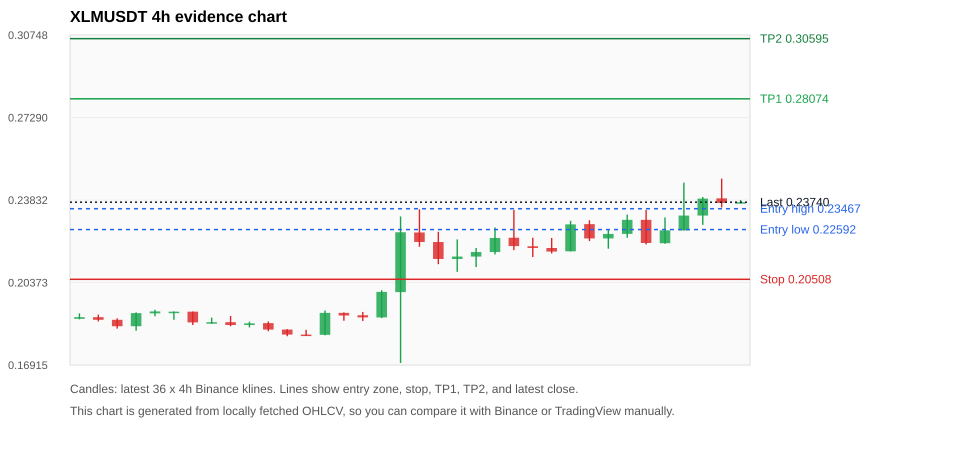
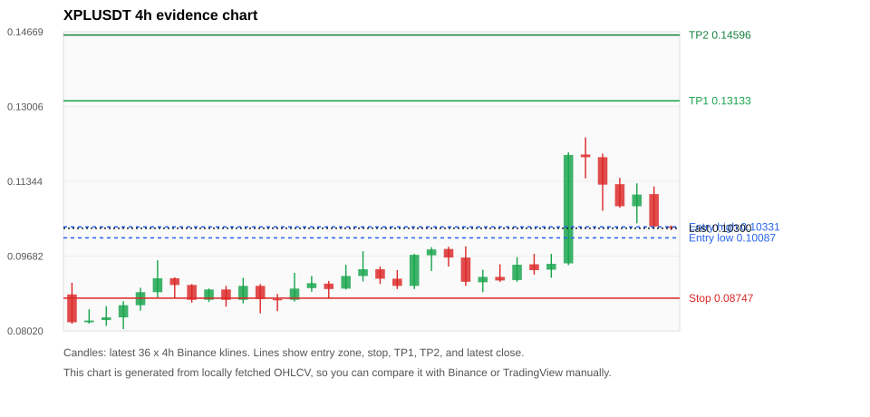
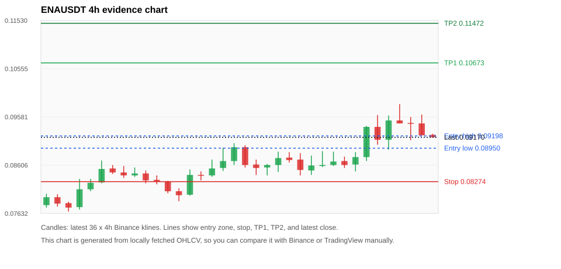
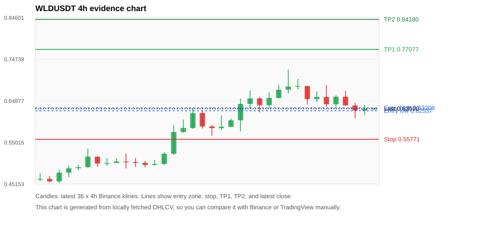
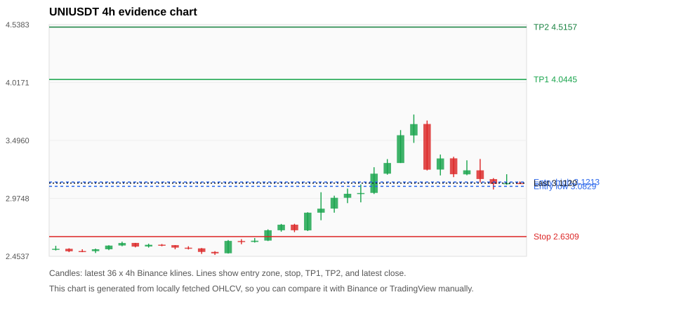

# Crypto 市场扫描报告 v1

- 报告时间：2026-06-18 20:07:15 CST
- Run ID：`20260618_120504_52821c3b`
- Run type：`daily_full`
- 数据来源：SQLite
- 报告版本：v1
- 扫描 ID：c6ab1c138370
- 数据源：Binance public spot API + CoinGecko/CoinMarketCap cross-check
- 过滤条件：USDT spot; 24h quote volume >= 30,000,000; trades >= 30,000; exclude stables/leveraged tokens; analyze 1h/4h/1d klines
- 默认单笔风险：账户权益的 1.00%

## 限制说明

- 交易信号仍以 Binance 现货公开 K 线为主源；外部数据源用于一致性复核。
- 结果是研究和模拟盘计划，不是确定收益或实盘下单指令。
- 历史长度过滤：候选币至少需要 180 根 1d K 线。
- 数据质量验证池：先验证 score 排名前 min(top_n * 2, 10) 的候选，再按 action + score 补足最终名单。
- 大盘环境过滤：RISK_OFF; BTC/ETH 大盘偏弱，山寨币买入候选降级为观察。 BTC 7d=0.5878415408546056; ETH 7d=4.227767619184197.
- 已启用数据交叉验证：Binance 主源 + CoinGecko 自动对照；CoinMarketCap 在配置 API Key 后自动对照。
- XPLUSDT 交叉验证状态 DATA_WARNING：At least one external provider needs manual review.
- XLMUSDT 交叉验证状态 DATA_WARNING：At least one external provider needs manual review.
- ENAUSDT 交叉验证状态 DATA_WARNING：At least one external provider needs manual review.
- WLDUSDT 交叉验证状态 DATA_WARNING：At least one external provider needs manual review.
- UNIUSDT 交叉验证状态 DATA_WARNING：At least one external provider needs manual review.
- ASTERUSDT 交叉验证状态 DATA_WARNING：At least one external provider needs manual review.
- ETHUSDT 交叉验证状态 DATA_WARNING：At least one external provider needs manual review.
- SOLUSDT 交叉验证状态 DATA_WARNING：At least one external provider needs manual review.

## 5 个候选交易计划

| Rank | Coin | Action | Setup | Entry Zone | Stop Loss | TP1 | TP2 / Exit Rule | R/R | Verdict |
|---:|---|---|---|---:|---:|---:|---|---:|---|
| 1 | `XLM` | `WAIT_PULLBACK` | 趋势中，等回调入场 | 0.22592 - 0.23467 | 0.20508 | 0.28074 | 0.30595 或跌破 4h 关键支撑 | 2.00-3.00 | 只等回调 |
| 2 | `XPL` | `WATCH_ONLY` | 回踩支撑/4h EMA 附近 | 0.10087 - 0.10331 | 0.08747 | 0.13133 | 0.14596 或跌破 4h 关键支撑 | 2.00-3.00 | 只观察 |
| 3 | `ENA` | `WATCH_ONLY` | 回踩支撑/4h EMA 附近 | 0.08950 - 0.09198 | 0.08274 | 0.10673 | 0.11472 或跌破 4h 关键支撑 | 2.00-3.00 | 只观察 |
| 4 | `WLD` | `WATCH_ONLY` | 回踩支撑/4h EMA 附近 | 0.62537 - 0.63209 | 0.55771 | 0.77077 | 0.84180 或跌破 4h 关键支撑 | 2.00-3.00 | 只观察 |
| 5 | `UNI` | `WATCH_ONLY` | 回踩支撑/4h EMA 附近 | 3.0829 - 3.1213 | 2.6309 | 4.0445 | 4.5157 或跌破 4h 关键支撑 | 2.00-3.00 | 只观察 |

## 数据交叉验证摘要

价格差异以 Binance 当前价为基准；成交量口径不同，Binance 是 USDT 现货成交额，CoinGecko/CoinMarketCap 通常是全市场成交量。

| Rank | Coin | Data Status | Max Price Diff | Max 24h Diff | Message |
|---:|---|---|---:|---:|---|
| 1 | `XLM` | DATA_WARNING | 0.04% | 0.29 pts | At least one external provider needs manual review. |
| 2 | `XPL` | DATA_WARNING | 0.04% | 2.23 pts | At least one external provider needs manual review. |
| 3 | `ENA` | DATA_WARNING | 0.34% | 0.66 pts | At least one external provider needs manual review. |
| 4 | `WLD` | DATA_WARNING | 0.03% | 0.23 pts | At least one external provider needs manual review. |
| 5 | `UNI` | DATA_WARNING | 0.08% | 0.03 pts | At least one external provider needs manual review. |

## 候选币说明

### 1. XLM `XLMUSDT`



- 入选原因：趋势中，等回调入场；24h +6.31%，7d +26.82%，4h RSI 65.57，24h 成交额 $52.5M。
- 交易失效条件：跌破 0.205077 或 4h 收盘重新失守关键支撑。
- 主要风险：BTC/ETH 大盘环境未确认强势，山寨币买入信号降级；数据交叉验证需要人工复核。
- 数据交叉验证：DATA_WARNING；At least one external provider needs manual review.

#### 可点击人工验证

- [Binance 交易页](https://www.binance.com/en/trade/XLM_USDT)
- [TradingView 图表](https://www.tradingview.com/chart/?symbol=BINANCE%3AXLMUSDT)
- [CoinGecko 搜索](https://www.coingecko.com/en/search?query=XLM)
- [CoinMarketCap 搜索](https://coinmarketcap.com/search/?q=XLM)

#### 多数据源对照

| Source | Status | Asset ID | Price | 24h Change | 24h Volume | Price Diff | 24h Diff | Updated | Message |
|---|---|---|---:|---:|---:|---:|---:|---|---|
| Binance | DATA_OK | XLMUSDT | 0.23740 | +6.31% | $52.5M | 0.00% | 0.00 pts | 2026-06-18T12:06:24+00:00 | Primary market data source used by scanner. |
| CoinGecko | DATA_WARNING | n/a | n/a | n/a | n/a | n/a | n/a | 2026-06-18T12:06:24+00:00 | Failed to fetch https://api.coingecko.com/api/v3/coins/markets?vs_currency=usd&ids=stellar&price_change_percentage=24h&per_page=1&page=1: HTTP Error 429: Too Many Requests |
| CoinMarketCap | DATA_OK | 512 | 0.23751 | +6.60% | $641.8M | 0.04% | 0.29 pts | 2026-06-18T12:05:03.000Z | External source agrees with Binance within thresholds. |

#### 指标证据

| 指标 | 数值 | 人工核对用途 |
|---|---:|---|
| 当前价 | 0.23740 | 与 Binance/TradingView 当前价格对照 |
| 24h 涨跌 | +6.31% | 与交易所 24h 涨跌对照 |
| 7d 涨跌 | +26.82% | 判断短线趋势是否延续 |
| 4h EMA20 | 0.22200 | 判断短期趋势支撑 |
| 4h EMA50 | 0.21150 | 判断中期趋势支撑 |
| 1d EMA20 | 0.20382 | 判断日线趋势 |
| 1d EMA50 | 0.18916 | 判断日线趋势 |
| 4h RSI14 | 65.57 | 判断是否过热/过弱 |
| 4h ATR14 | 0.01093 | 推导止损和入场缓冲 |
| 最近 18 根 4h 最低点 | 0.20820 | 支撑/止损参考 |
| 最近 36 根 4h 最高点 | 0.24730 | TP/压力参考 |
| 支撑位 | 0.22200 | 入场区间推导基础 |

#### 交易计划推导

- 支撑位 = 最近低点、4h EMA20、4h EMA50、1d EMA20 中不高于当前价的最高有效支撑 = `0.22200`。
- 入场区间 = 支撑位附近 + ATR 缓冲 = `0.22592 - 0.23467`。
- 止损 = min(最近 18 根 4h 最低点 * 0.985, 入场中位价 - 1.15 * ATR14) = `0.20508`。
- TP1 = max(最近 36 根 4h 最高点 * 0.995, 入场中位价 + 2R) = `0.28074`。
- TP2 = max(入场中位价 + 3R, TP1 * 1.04) = `0.30595`。

#### 最近 10 根 4h K线

| UTC 开盘时间 | Open | High | Low | Close | Quote Volume | Trades |
|---|---:|---:|---:|---:|---:|---:|
| 2026-06-17T00:00+00:00 | 0.21680 | 0.22960 | 0.21680 | 0.22810 | $7.4M | 59068 |
| 2026-06-17T04:00+00:00 | 0.22820 | 0.22980 | 0.22110 | 0.22220 | $6.8M | 44735 |
| 2026-06-17T08:00+00:00 | 0.22220 | 0.22610 | 0.21790 | 0.22410 | $5.1M | 37166 |
| 2026-06-17T12:00+00:00 | 0.22410 | 0.23220 | 0.22250 | 0.23000 | $8.2M | 60055 |
| 2026-06-17T16:00+00:00 | 0.23000 | 0.23420 | 0.21970 | 0.22030 | $9.0M | 68070 |
| 2026-06-17T20:00+00:00 | 0.22020 | 0.23100 | 0.22000 | 0.22560 | $5.6M | 42661 |
| 2026-06-18T00:00+00:00 | 0.22560 | 0.24560 | 0.22550 | 0.23180 | $12.0M | 90416 |
| 2026-06-18T04:00+00:00 | 0.23180 | 0.23960 | 0.22790 | 0.23890 | $7.0M | 55555 |
| 2026-06-18T08:00+00:00 | 0.23900 | 0.24730 | 0.23520 | 0.23710 | $10.8M | 65295 |
| 2026-06-18T12:00+00:00 | 0.23710 | 0.23830 | 0.23700 | 0.23740 | $151,437 | 1052 |

### 2. XPL `XPLUSDT`



- 入选原因：回踩支撑/4h EMA 附近；24h +6.19%，7d +60.19%，4h RSI 53.95，24h 成交额 $63.6M。
- 交易失效条件：跌破 0.087468 或 4h 收盘重新失守关键支撑。
- 主要风险：24h 振幅较大，回撤风险高；日线趋势未完全确认；BTC/ETH 大盘环境未确认强势，山寨币买入信号降级；数据交叉验证需要人工复核。
- 数据交叉验证：DATA_WARNING；At least one external provider needs manual review.

#### 可点击人工验证

- [Binance 交易页](https://www.binance.com/en/trade/XPL_USDT)
- [TradingView 图表](https://www.tradingview.com/chart/?symbol=BINANCE%3AXPLUSDT)
- [CoinGecko 搜索](https://www.coingecko.com/en/search?query=XPL)
- [CoinMarketCap 搜索](https://coinmarketcap.com/search/?q=XPL)

#### 多数据源对照

| Source | Status | Asset ID | Price | 24h Change | 24h Volume | Price Diff | 24h Diff | Updated | Message |
|---|---|---|---:|---:|---:|---:|---:|---|---|
| Binance | DATA_OK | XPLUSDT | 0.10300 | +6.19% | $63.6M | 0.00% | 0.00 pts | 2026-06-18T12:06:24+00:00 | Primary market data source used by scanner. |
| CoinGecko | DATA_WARNING | n/a | n/a | n/a | n/a | n/a | n/a | 2026-06-18T12:06:24+00:00 | Failed to fetch https://api.coingecko.com/api/v3/coins/markets?vs_currency=usd&ids=plasma&price_change_percentage=24h&per_page=1&page=1: HTTP Error 429: Too Many Requests |
| CoinMarketCap | DATA_WARNING | 36645 | 0.10304 | +8.41% | $437.0M | 0.04% | 2.23 pts | 2026-06-18T12:05:03.000Z | CoinMarketCap symbol mapping has 3 matches; selected lowest cmc_rank |

#### 指标证据

| 指标 | 数值 | 人工核对用途 |
|---|---:|---|
| 当前价 | 0.10300 | 与 Binance/TradingView 当前价格对照 |
| 24h 涨跌 | +6.19% | 与交易所 24h 涨跌对照 |
| 7d 涨跌 | +60.19% | 判断短线趋势是否延续 |
| 4h EMA20 | 0.10067 | 判断短期趋势支撑 |
| 4h EMA50 | 0.09207 | 判断中期趋势支撑 |
| 1d EMA20 | 0.08718 | 判断日线趋势 |
| 1d EMA50 | 0.08979 | 判断日线趋势 |
| 4h RSI14 | 53.95 | 判断是否过热/过弱 |
| 4h ATR14 | 0.0078714286 | 推导止损和入场缓冲 |
| 最近 18 根 4h 最低点 | 0.08880 | 支撑/止损参考 |
| 最近 36 根 4h 最高点 | 0.12320 | TP/压力参考 |
| 支撑位 | 0.10067 | 入场区间推导基础 |

#### 交易计划推导

- 支撑位 = 最近低点、4h EMA20、4h EMA50、1d EMA20 中不高于当前价的最高有效支撑 = `0.10067`。
- 入场区间 = 支撑位附近 + ATR 缓冲 = `0.10087 - 0.10331`。
- 止损 = min(最近 18 根 4h 最低点 * 0.985, 入场中位价 - 1.15 * ATR14) = `0.08747`。
- TP1 = max(最近 36 根 4h 最高点 * 0.995, 入场中位价 + 2R) = `0.13133`。
- TP2 = max(入场中位价 + 3R, TP1 * 1.04) = `0.14596`。

#### 最近 10 根 4h K线

| UTC 开盘时间 | Open | High | Low | Close | Quote Volume | Trades |
|---|---:|---:|---:|---:|---:|---:|
| 2026-06-17T00:00+00:00 | 0.09150 | 0.09660 | 0.09110 | 0.09490 | $1.9M | 23350 |
| 2026-06-17T04:00+00:00 | 0.09500 | 0.09730 | 0.09270 | 0.09370 | $3.0M | 27293 |
| 2026-06-17T08:00+00:00 | 0.09380 | 0.09730 | 0.09200 | 0.09510 | $2.5M | 24135 |
| 2026-06-17T12:00+00:00 | 0.09520 | 0.11990 | 0.09480 | 0.11930 | $27.1M | 356469 |
| 2026-06-17T16:00+00:00 | 0.11940 | 0.12320 | 0.11410 | 0.11880 | $17.3M | 170350 |
| 2026-06-17T20:00+00:00 | 0.11880 | 0.11960 | 0.10690 | 0.11270 | $7.5M | 84753 |
| 2026-06-18T00:00+00:00 | 0.11280 | 0.11420 | 0.10760 | 0.10790 | $3.7M | 58644 |
| 2026-06-18T04:00+00:00 | 0.10790 | 0.11300 | 0.10410 | 0.11050 | $3.3M | 50647 |
| 2026-06-18T08:00+00:00 | 0.11060 | 0.11230 | 0.10300 | 0.10340 | $4.8M | 88741 |
| 2026-06-18T12:00+00:00 | 0.10340 | 0.10360 | 0.10260 | 0.10310 | $123,387 | 3024 |

### 3. ENA `ENAUSDT`



- 入选原因：回踩支撑/4h EMA 附近；24h +4.09%，7d +20.50%，4h RSI 59.38，24h 成交额 $44.4M。
- 交易失效条件：跌破 0.08274 或 4h 收盘重新失守关键支撑。
- 主要风险：日线趋势未完全确认；BTC/ETH 大盘环境未确认强势，山寨币买入信号降级；数据交叉验证需要人工复核。
- 数据交叉验证：DATA_WARNING；At least one external provider needs manual review.

#### 可点击人工验证

- [Binance 交易页](https://www.binance.com/en/trade/ENA_USDT)
- [TradingView 图表](https://www.tradingview.com/chart/?symbol=BINANCE%3AENAUSDT)
- [CoinGecko 搜索](https://www.coingecko.com/en/search?query=ENA)
- [CoinMarketCap 搜索](https://coinmarketcap.com/search/?q=ENA)

#### 多数据源对照

| Source | Status | Asset ID | Price | 24h Change | 24h Volume | Price Diff | 24h Diff | Updated | Message |
|---|---|---|---:|---:|---:|---:|---:|---|---|
| Binance | DATA_OK | ENAUSDT | 0.09170 | +4.09% | $44.4M | 0.00% | 0.00 pts | 2026-06-18T12:06:24+00:00 | Primary market data source used by scanner. |
| CoinGecko | DATA_WARNING | n/a | n/a | n/a | n/a | n/a | n/a | 2026-06-18T12:06:24+00:00 | Failed to fetch https://api.coingecko.com/api/v3/coins/markets?vs_currency=usd&ids=ethena&price_change_percentage=24h&per_page=1&page=1: HTTP Error 429: Too Many Requests |
| CoinMarketCap | DATA_WARNING | 30171 | 0.09201 | +4.74% | $290.4M | 0.34% | 0.66 pts | 2026-06-18T12:05:03.000Z | CoinMarketCap symbol mapping has 2 matches; selected lowest cmc_rank |

#### 指标证据

| 指标 | 数值 | 人工核对用途 |
|---|---:|---|
| 当前价 | 0.09170 | 与 Binance/TradingView 当前价格对照 |
| 24h 涨跌 | +4.09% | 与交易所 24h 涨跌对照 |
| 7d 涨跌 | +20.50% | 判断短线趋势是否延续 |
| 4h EMA20 | 0.08932 | 判断短期趋势支撑 |
| 4h EMA50 | 0.08660 | 判断中期趋势支撑 |
| 1d EMA20 | 0.08917 | 判断日线趋势 |
| 1d EMA50 | 0.09591 | 判断日线趋势 |
| 4h RSI14 | 59.38 | 判断是否过热/过弱 |
| 4h ATR14 | 0.0040214286 | 推导止损和入场缓冲 |
| 最近 18 根 4h 最低点 | 0.08400 | 支撑/止损参考 |
| 最近 36 根 4h 最高点 | 0.09840 | TP/压力参考 |
| 支撑位 | 0.08932 | 入场区间推导基础 |

#### 交易计划推导

- 支撑位 = 最近低点、4h EMA20、4h EMA50、1d EMA20 中不高于当前价的最高有效支撑 = `0.08932`。
- 入场区间 = 支撑位附近 + ATR 缓冲 = `0.08950 - 0.09198`。
- 止损 = min(最近 18 根 4h 最低点 * 0.985, 入场中位价 - 1.15 * ATR14) = `0.08274`。
- TP1 = max(最近 36 根 4h 最高点 * 0.995, 入场中位价 + 2R) = `0.10673`。
- TP2 = max(入场中位价 + 3R, TP1 * 1.04) = `0.11472`。

#### 最近 10 根 4h K线

| UTC 开盘时间 | Open | High | Low | Close | Quote Volume | Trades |
|---|---:|---:|---:|---:|---:|---:|
| 2026-06-17T00:00+00:00 | 0.08610 | 0.08880 | 0.08590 | 0.08680 | $2.7M | 11222 |
| 2026-06-17T04:00+00:00 | 0.08690 | 0.08780 | 0.08550 | 0.08610 | $7.8M | 23773 |
| 2026-06-17T08:00+00:00 | 0.08620 | 0.08870 | 0.08480 | 0.08770 | $5.4M | 26508 |
| 2026-06-17T12:00+00:00 | 0.08770 | 0.09400 | 0.08690 | 0.09380 | $10.6M | 41355 |
| 2026-06-17T16:00+00:00 | 0.09380 | 0.09620 | 0.09020 | 0.09120 | $11.6M | 45077 |
| 2026-06-17T20:00+00:00 | 0.09120 | 0.09610 | 0.08920 | 0.09510 | $4.3M | 22284 |
| 2026-06-18T00:00+00:00 | 0.09510 | 0.09840 | 0.09450 | 0.09450 | $6.4M | 35749 |
| 2026-06-18T04:00+00:00 | 0.09460 | 0.09580 | 0.09110 | 0.09450 | $7.0M | 28538 |
| 2026-06-18T08:00+00:00 | 0.09450 | 0.09630 | 0.09210 | 0.09210 | $4.6M | 17478 |
| 2026-06-18T12:00+00:00 | 0.09220 | 0.09240 | 0.09170 | 0.09170 | $93,076 | 375 |

### 4. WLD `WLDUSDT`



- 入选原因：回踩支撑/4h EMA 附近；24h -3.30%，7d +25.86%，4h RSI 46.87，24h 成交额 $468.1M。
- 交易失效条件：跌破 0.557707 或 4h 收盘重新失守关键支撑。
- 主要风险：BTC/ETH 大盘环境未确认强势，山寨币买入信号降级；24h 动量未确认；数据交叉验证需要人工复核。
- 数据交叉验证：DATA_WARNING；At least one external provider needs manual review.

#### 可点击人工验证

- [Binance 交易页](https://www.binance.com/en/trade/WLD_USDT)
- [TradingView 图表](https://www.tradingview.com/chart/?symbol=BINANCE%3AWLDUSDT)
- [CoinGecko 搜索](https://www.coingecko.com/en/search?query=WLD)
- [CoinMarketCap 搜索](https://coinmarketcap.com/search/?q=WLD)

#### 多数据源对照

| Source | Status | Asset ID | Price | 24h Change | 24h Volume | Price Diff | 24h Diff | Updated | Message |
|---|---|---|---:|---:|---:|---:|---:|---|---|
| Binance | DATA_OK | WLDUSDT | 0.63020 | -3.30% | $468.1M | 0.00% | 0.00 pts | 2026-06-18T12:06:24+00:00 | Primary market data source used by scanner. |
| CoinGecko | DATA_WARNING | n/a | n/a | n/a | n/a | n/a | n/a | 2026-06-18T12:06:24+00:00 | Failed to fetch https://api.coingecko.com/api/v3/coins/markets?vs_currency=usd&ids=worldcoin-wld&price_change_percentage=24h&per_page=1&page=1: HTTP Error 429: Too Many Requests |
| CoinMarketCap | DATA_WARNING | 13502 | 0.63000 | -3.53% | $1.57B | 0.03% | 0.23 pts | 2026-06-18T12:05:03.000Z | CoinMarketCap symbol mapping has 2 matches; selected lowest cmc_rank |

#### 指标证据

| 指标 | 数值 | 人工核对用途 |
|---|---:|---|
| 当前价 | 0.63020 | 与 Binance/TradingView 当前价格对照 |
| 24h 涨跌 | -3.30% | 与交易所 24h 涨跌对照 |
| 7d 涨跌 | +25.86% | 判断短线趋势是否延续 |
| 4h EMA20 | 0.62412 | 判断短期趋势支撑 |
| 4h EMA50 | 0.57239 | 判断中期趋势支撑 |
| 1d EMA20 | 0.50560 | 判断日线趋势 |
| 1d EMA50 | 0.41124 | 判断日线趋势 |
| 4h RSI14 | 46.87 | 判断是否过热/过弱 |
| 4h ATR14 | 0.03426 | 推导止损和入场缓冲 |
| 最近 18 根 4h 最低点 | 0.56620 | 支撑/止损参考 |
| 最近 36 根 4h 最高点 | 0.72290 | TP/压力参考 |
| 支撑位 | 0.62412 | 入场区间推导基础 |

#### 交易计划推导

- 支撑位 = 最近低点、4h EMA20、4h EMA50、1d EMA20 中不高于当前价的最高有效支撑 = `0.62412`。
- 入场区间 = 支撑位附近 + ATR 缓冲 = `0.62537 - 0.63209`。
- 止损 = min(最近 18 根 4h 最低点 * 0.985, 入场中位价 - 1.15 * ATR14) = `0.55771`。
- TP1 = max(最近 36 根 4h 最高点 * 0.995, 入场中位价 + 2R) = `0.77077`。
- TP2 = max(入场中位价 + 3R, TP1 * 1.04) = `0.84180`。

#### 最近 10 根 4h K线

| UTC 开盘时间 | Open | High | Low | Close | Quote Volume | Trades |
|---|---:|---:|---:|---:|---:|---:|
| 2026-06-17T00:00+00:00 | 0.67520 | 0.72290 | 0.66630 | 0.68270 | $38.1M | 605974 |
| 2026-06-17T04:00+00:00 | 0.68270 | 0.70070 | 0.67560 | 0.68390 | $30.1M | 415834 |
| 2026-06-17T08:00+00:00 | 0.68380 | 0.68470 | 0.64040 | 0.65290 | $33.4M | 377565 |
| 2026-06-17T12:00+00:00 | 0.65300 | 0.67170 | 0.64600 | 0.65800 | $44.6M | 477219 |
| 2026-06-17T16:00+00:00 | 0.65810 | 0.68630 | 0.63470 | 0.64090 | $60.1M | 635662 |
| 2026-06-17T20:00+00:00 | 0.64090 | 0.66230 | 0.63430 | 0.65870 | $18.8M | 247591 |
| 2026-06-18T00:00+00:00 | 0.65870 | 0.67220 | 0.63710 | 0.63800 | $33.8M | 340881 |
| 2026-06-18T04:00+00:00 | 0.63790 | 0.64430 | 0.60730 | 0.62590 | $91.4M | 606149 |
| 2026-06-18T08:00+00:00 | 0.62590 | 0.63880 | 0.61460 | 0.62960 | $219.1M | 935854 |
| 2026-06-18T12:00+00:00 | 0.62970 | 0.63340 | 0.62830 | 0.63010 | $716,548 | 5825 |

### 5. UNI `UNIUSDT`



- 入选原因：回踩支撑/4h EMA 附近；24h -3.50%，7d +24.33%，4h RSI 54.47，24h 成交额 $45.8M。
- 交易失效条件：跌破 2.630935 或 4h 收盘重新失守关键支撑。
- 主要风险：日线趋势未完全确认；BTC/ETH 大盘环境未确认强势，山寨币买入信号降级；24h 动量未确认；数据交叉验证需要人工复核。
- 数据交叉验证：DATA_WARNING；At least one external provider needs manual review.

#### 可点击人工验证

- [Binance 交易页](https://www.binance.com/en/trade/UNI_USDT)
- [TradingView 图表](https://www.tradingview.com/chart/?symbol=BINANCE%3AUNIUSDT)
- [CoinGecko 搜索](https://www.coingecko.com/en/search?query=UNI)
- [CoinMarketCap 搜索](https://coinmarketcap.com/search/?q=UNI)

#### 多数据源对照

| Source | Status | Asset ID | Price | 24h Change | 24h Volume | Price Diff | 24h Diff | Updated | Message |
|---|---|---|---:|---:|---:|---:|---:|---|---|
| Binance | DATA_OK | UNIUSDT | 3.1120 | -3.50% | $45.8M | 0.00% | 0.00 pts | 2026-06-18T12:06:24+00:00 | Primary market data source used by scanner. |
| CoinGecko | DATA_WARNING | n/a | n/a | n/a | n/a | n/a | n/a | 2026-06-18T12:06:24+00:00 | Failed to fetch https://api.coingecko.com/api/v3/coins/markets?vs_currency=usd&ids=uniswap&price_change_percentage=24h&per_page=1&page=1: HTTP Error 429: Too Many Requests |
| CoinMarketCap | DATA_WARNING | 7083 | 3.1145 | -3.47% | $424.8M | 0.08% | 0.03 pts | 2026-06-18T12:06:03.000Z | CoinMarketCap symbol mapping has 7 matches; selected lowest cmc_rank |

#### 指标证据

| 指标 | 数值 | 人工核对用途 |
|---|---:|---|
| 当前价 | 3.1120 | 与 Binance/TradingView 当前价格对照 |
| 24h 涨跌 | -3.50% | 与交易所 24h 涨跌对照 |
| 7d 涨跌 | +24.33% | 判断短线趋势是否延续 |
| 4h EMA20 | 3.0768 | 判断短期趋势支撑 |
| 4h EMA50 | 2.8757 | 判断中期趋势支撑 |
| 1d EMA20 | 2.8685 | 判断日线趋势 |
| 1d EMA50 | 3.0584 | 判断日线趋势 |
| 4h RSI14 | 54.47 | 判断是否过热/过弱 |
| 4h ATR14 | 0.18593 | 推导止损和入场缓冲 |
| 最近 18 根 4h 最低点 | 2.6710 | 支撑/止损参考 |
| 最近 36 根 4h 最高点 | 3.7290 | TP/压力参考 |
| 支撑位 | 3.0768 | 入场区间推导基础 |

#### 交易计划推导

- 支撑位 = 最近低点、4h EMA20、4h EMA50、1d EMA20 中不高于当前价的最高有效支撑 = `3.0768`。
- 入场区间 = 支撑位附近 + ATR 缓冲 = `3.0829 - 3.1213`。
- 止损 = min(最近 18 根 4h 最低点 * 0.985, 入场中位价 - 1.15 * ATR14) = `2.6309`。
- TP1 = max(最近 36 根 4h 最高点 * 0.995, 入场中位价 + 2R) = `4.0445`。
- TP2 = max(入场中位价 + 3R, TP1 * 1.04) = `4.5157`。

#### 最近 10 根 4h K线

| UTC 开盘时间 | Open | High | Low | Close | Quote Volume | Trades |
|---|---:|---:|---:|---:|---:|---:|
| 2026-06-17T00:00+00:00 | 3.2930 | 3.5890 | 3.2930 | 3.5430 | $18.0M | 108164 |
| 2026-06-17T04:00+00:00 | 3.5410 | 3.7290 | 3.4740 | 3.6430 | $20.0M | 117801 |
| 2026-06-17T08:00+00:00 | 3.6440 | 3.6750 | 3.2260 | 3.2330 | $26.4M | 162680 |
| 2026-06-17T12:00+00:00 | 3.2340 | 3.3690 | 3.1810 | 3.3340 | $15.1M | 85680 |
| 2026-06-17T16:00+00:00 | 3.3350 | 3.3490 | 3.1660 | 3.1920 | $5.9M | 45351 |
| 2026-06-17T20:00+00:00 | 3.1910 | 3.3170 | 3.1830 | 3.2270 | $6.1M | 31791 |
| 2026-06-18T00:00+00:00 | 3.2270 | 3.3290 | 3.1180 | 3.1490 | $9.6M | 42211 |
| 2026-06-18T04:00+00:00 | 3.1480 | 3.1570 | 3.0550 | 3.1060 | $6.0M | 32298 |
| 2026-06-18T08:00+00:00 | 3.1060 | 3.1920 | 3.0970 | 3.1120 | $4.6M | 26344 |
| 2026-06-18T12:00+00:00 | 3.1130 | 3.1270 | 3.1100 | 3.1120 | $59,038 | 490 |

## 组合风控

- 不要 5 个候选全部满仓买入。
- 同时持仓总风险建议控制在账户权益的 3% - 5% 以内。
- 如果 BTC/ETH 同时破位，暂停山寨币多头计划或降低仓位。
- 第一版报告用于模拟盘和人工复核，不自动下单。

## 原始数据

```json
[
  {
    "rank": 1,
    "symbol": "XLMUSDT",
    "base_asset": "XLM",
    "price": 0.2374,
    "score": 66.3501237942553,
    "setup": "趋势中，等回调入场",
    "verdict": "只等回调",
    "entry_low": 0.225925,
    "entry_high": 0.23466785714285715,
    "stop_loss": 0.20507699999999998,
    "take_profit_1": 0.28073528571428574,
    "take_profit_2": 0.3059547142857143,
    "risk_reward_1": 2.0,
    "risk_reward_2": 2.999999999999999,
    "pct_24h": 6.309,
    "pct_3d": 10.779281381241246,
    "pct_7d": 26.81623931623931,
    "quote_volume_24h": 52509777.7753,
    "trades_24h": 381520,
    "high_low_range_24h": 12.562585343650422,
    "rsi_1h": 60.46511627906977,
    "rsi_4h": 65.57377049180329,
    "ema20_4h": 0.22199761562328602,
    "ema50_4h": 0.21149716566138488,
    "ema20_1d": 0.20381723732026077,
    "ema50_1d": 0.18916050709426455,
    "atr_4h": 0.010928571428571428,
    "macd_hist_4h": 0.001048869174092401,
    "volume_ratio_24h": 1.4829786525640984,
    "support_level": 0.22199761562328602,
    "recent_low_4h_18": 0.2082,
    "recent_high_4h_36": 0.2473,
    "distance_to_support_pct": 6.938085498562607,
    "binance_trade_url": "https://www.binance.com/en/trade/XLM_USDT",
    "tradingview_url": "https://www.tradingview.com/chart/?symbol=BINANCE%3AXLMUSDT",
    "coingecko_search_url": "https://www.coingecko.com/en/search?query=XLM",
    "coinmarketcap_search_url": "https://coinmarketcap.com/search/?q=XLM",
    "invalidation": "跌破 0.205077 或 4h 收盘重新失守关键支撑",
    "recent_4h_klines": [
      {
        "open_time_utc": "2026-06-12T16:00+00:00",
        "open": 0.1885,
        "high": 0.1908,
        "low": 0.1883,
        "close": 0.1892,
        "quote_volume": 2066075.5243,
        "trades": 13673
      },
      {
        "open_time_utc": "2026-06-12T20:00+00:00",
        "open": 0.1892,
        "high": 0.1903,
        "low": 0.1874,
        "close": 0.1881,
        "quote_volume": 952646.315,
        "trades": 6890
      },
      {
        "open_time_utc": "2026-06-13T00:00+00:00",
        "open": 0.1881,
        "high": 0.1887,
        "low": 0.1844,
        "close": 0.1854,
        "quote_volume": 1781423.2476,
        "trades": 11309
      },
      {
        "open_time_utc": "2026-06-13T04:00+00:00",
        "open": 0.1854,
        "high": 0.1912,
        "low": 0.1835,
        "close": 0.1909,
        "quote_volume": 2259865.2403,
        "trades": 13643
      },
      {
        "open_time_utc": "2026-06-13T08:00+00:00",
        "open": 0.1908,
        "high": 0.1923,
        "low": 0.1896,
        "close": 0.1916,
        "quote_volume": 1802609.8243,
        "trades": 8482
      },
      {
        "open_time_utc": "2026-06-13T12:00+00:00",
        "open": 0.1915,
        "high": 0.1916,
        "low": 0.1881,
        "close": 0.1915,
        "quote_volume": 2423521.6462,
        "trades": 11276
      },
      {
        "open_time_utc": "2026-06-13T16:00+00:00",
        "open": 0.1915,
        "high": 0.1916,
        "low": 0.1859,
        "close": 0.187,
        "quote_volume": 2479652.2676,
        "trades": 11460
      },
      {
        "open_time_utc": "2026-06-13T20:00+00:00",
        "open": 0.187,
        "high": 0.189,
        "low": 0.1864,
        "close": 0.1871,
        "quote_volume": 848551.683,
        "trades": 5923
      },
      {
        "open_time_utc": "2026-06-14T00:00+00:00",
        "open": 0.1871,
        "high": 0.1897,
        "low": 0.1854,
        "close": 0.1859,
        "quote_volume": 2282555.8301,
        "trades": 12030
      },
      {
        "open_time_utc": "2026-06-14T04:00+00:00",
        "open": 0.1859,
        "high": 0.1873,
        "low": 0.1849,
        "close": 0.1866,
        "quote_volume": 1315494.4936,
        "trades": 8806
      },
      {
        "open_time_utc": "2026-06-14T08:00+00:00",
        "open": 0.1867,
        "high": 0.1874,
        "low": 0.1833,
        "close": 0.184,
        "quote_volume": 1846378.5198,
        "trades": 9032
      },
      {
        "open_time_utc": "2026-06-14T12:00+00:00",
        "open": 0.184,
        "high": 0.1842,
        "low": 0.1812,
        "close": 0.1819,
        "quote_volume": 1776664.0176,
        "trades": 8892
      },
      {
        "open_time_utc": "2026-06-14T16:00+00:00",
        "open": 0.1819,
        "high": 0.1839,
        "low": 0.1813,
        "close": 0.1818,
        "quote_volume": 1055046.0461,
        "trades": 5686
      },
      {
        "open_time_utc": "2026-06-14T20:00+00:00",
        "open": 0.1818,
        "high": 0.192,
        "low": 0.1816,
        "close": 0.191,
        "quote_volume": 4325116.32,
        "trades": 20051
      },
      {
        "open_time_utc": "2026-06-15T00:00+00:00",
        "open": 0.191,
        "high": 0.1912,
        "low": 0.1877,
        "close": 0.1899,
        "quote_volume": 2443394.1936,
        "trades": 13301
      },
      {
        "open_time_utc": "2026-06-15T04:00+00:00",
        "open": 0.19,
        "high": 0.1914,
        "low": 0.1876,
        "close": 0.1891,
        "quote_volume": 2542909.1521,
        "trades": 10947
      },
      {
        "open_time_utc": "2026-06-15T08:00+00:00",
        "open": 0.1891,
        "high": 0.2005,
        "low": 0.1888,
        "close": 0.1998,
        "quote_volume": 6277671.187,
        "trades": 24711
      },
      {
        "open_time_utc": "2026-06-15T12:00+00:00",
        "open": 0.1997,
        "high": 0.2314,
        "low": 0.17,
        "close": 0.2248,
        "quote_volume": 32438188.1069,
        "trades": 184390
      },
      {
        "open_time_utc": "2026-06-15T16:00+00:00",
        "open": 0.2247,
        "high": 0.2344,
        "low": 0.2187,
        "close": 0.2207,
        "quote_volume": 35015899.8635,
        "trades": 186245
      },
      {
        "open_time_utc": "2026-06-15T20:00+00:00",
        "open": 0.2207,
        "high": 0.225,
        "low": 0.2114,
        "close": 0.2136,
        "quote_volume": 8203362.7138,
        "trades": 51220
      },
      {
        "open_time_utc": "2026-06-16T00:00+00:00",
        "open": 0.2136,
        "high": 0.2218,
        "low": 0.2082,
        "close": 0.2146,
        "quote_volume": 7872891.3563,
        "trades": 50791
      },
      {
        "open_time_utc": "2026-06-16T04:00+00:00",
        "open": 0.2146,
        "high": 0.2182,
        "low": 0.2102,
        "close": 0.2165,
        "quote_volume": 6500935.8261,
        "trades": 41247
      },
      {
        "open_time_utc": "2026-06-16T08:00+00:00",
        "open": 0.2165,
        "high": 0.2268,
        "low": 0.2155,
        "close": 0.2224,
        "quote_volume": 12367775.8407,
        "trades": 74910
      },
      {
        "open_time_utc": "2026-06-16T12:00+00:00",
        "open": 0.2225,
        "high": 0.2342,
        "low": 0.2173,
        "close": 0.219,
        "quote_volume": 13302611.8719,
        "trades": 80921
      },
      {
        "open_time_utc": "2026-06-16T16:00+00:00",
        "open": 0.2189,
        "high": 0.2225,
        "low": 0.2144,
        "close": 0.2182,
        "quote_volume": 6244073.7354,
        "trades": 54551
      },
      {
        "open_time_utc": "2026-06-16T20:00+00:00",
        "open": 0.2182,
        "high": 0.2224,
        "low": 0.2159,
        "close": 0.2167,
        "quote_volume": 2971692.9506,
        "trades": 23675
      },
      {
        "open_time_utc": "2026-06-17T00:00+00:00",
        "open": 0.2168,
        "high": 0.2296,
        "low": 0.2168,
        "close": 0.2281,
        "quote_volume": 7421593.7462,
        "trades": 59068
      },
      {
        "open_time_utc": "2026-06-17T04:00+00:00",
        "open": 0.2282,
        "high": 0.2298,
        "low": 0.2211,
        "close": 0.2222,
        "quote_volume": 6774705.6922,
        "trades": 44735
      },
      {
        "open_time_utc": "2026-06-17T08:00+00:00",
        "open": 0.2222,
        "high": 0.2261,
        "low": 0.2179,
        "close": 0.2241,
        "quote_volume": 5133756.3467,
        "trades": 37166
      },
      {
        "open_time_utc": "2026-06-17T12:00+00:00",
        "open": 0.2241,
        "high": 0.2322,
        "low": 0.2225,
        "close": 0.23,
        "quote_volume": 8162219.536,
        "trades": 60055
      },
      {
        "open_time_utc": "2026-06-17T16:00+00:00",
        "open": 0.23,
        "high": 0.2342,
        "low": 0.2197,
        "close": 0.2203,
        "quote_volume": 8967901.7824,
        "trades": 68070
      },
      {
        "open_time_utc": "2026-06-17T20:00+00:00",
        "open": 0.2202,
        "high": 0.231,
        "low": 0.22,
        "close": 0.2256,
        "quote_volume": 5647679.7872,
        "trades": 42661
      },
      {
        "open_time_utc": "2026-06-18T00:00+00:00",
        "open": 0.2256,
        "high": 0.2456,
        "low": 0.2255,
        "close": 0.2318,
        "quote_volume": 11957818.8832,
        "trades": 90416
      },
      {
        "open_time_utc": "2026-06-18T04:00+00:00",
        "open": 0.2318,
        "high": 0.2396,
        "low": 0.2279,
        "close": 0.2389,
        "quote_volume": 6995972.8836,
        "trades": 55555
      },
      {
        "open_time_utc": "2026-06-18T08:00+00:00",
        "open": 0.239,
        "high": 0.2473,
        "low": 0.2352,
        "close": 0.2371,
        "quote_volume": 10836334.3241,
        "trades": 65295
      },
      {
        "open_time_utc": "2026-06-18T12:00+00:00",
        "open": 0.2371,
        "high": 0.2383,
        "low": 0.237,
        "close": 0.2374,
        "quote_volume": 151436.9823,
        "trades": 1052
      }
    ],
    "risks": [
      "BTC/ETH 大盘环境未确认强势，山寨币买入信号降级",
      "数据交叉验证需要人工复核"
    ],
    "data_quality_status": "DATA_WARNING",
    "data_quality_message": "At least one external provider needs manual review.",
    "data_checks": [
      {
        "provider": "Binance",
        "status": "DATA_OK",
        "provider_asset_id": "XLMUSDT",
        "provider_symbol": "XLMUSDT",
        "price_usd": 0.2374,
        "pct_24h": 6.309,
        "volume_24h": 52509777.7753,
        "last_updated": null,
        "fetched_at_utc": "2026-06-18T12:06:24+00:00",
        "price_diff_pct": 0.0,
        "pct_24h_diff": 0.0,
        "volume_note": "Binance USDT spot 24h quoteVolume.",
        "message": "Primary market data source used by scanner."
      },
      {
        "provider": "CoinGecko",
        "status": "DATA_WARNING",
        "provider_asset_id": null,
        "provider_symbol": "XLM",
        "price_usd": null,
        "pct_24h": null,
        "volume_24h": null,
        "last_updated": null,
        "fetched_at_utc": "2026-06-18T12:06:24+00:00",
        "price_diff_pct": null,
        "pct_24h_diff": null,
        "volume_note": "External provider data unavailable.",
        "message": "Failed to fetch https://api.coingecko.com/api/v3/coins/markets?vs_currency=usd&ids=stellar&price_change_percentage=24h&per_page=1&page=1: HTTP Error 429: Too Many Requests"
      },
      {
        "provider": "CoinMarketCap",
        "status": "DATA_OK",
        "provider_asset_id": "512",
        "provider_symbol": "XLM",
        "price_usd": 0.23750609833713054,
        "pct_24h": 6.60075078,
        "volume_24h": 641839377.1904024,
        "last_updated": "2026-06-18T12:05:03.000Z",
        "fetched_at_utc": "2026-06-18T12:06:24+00:00",
        "price_diff_pct": 0.04469180165566328,
        "pct_24h_diff": 0.2917507800000001,
        "volume_note": "CoinMarketCap total market volume; not the same venue scope as Binance quoteVolume.",
        "message": "External source agrees with Binance within thresholds."
      }
    ],
    "action": "WAIT_PULLBACK"
  },
  {
    "rank": 2,
    "symbol": "XPLUSDT",
    "base_asset": "XPL",
    "price": 0.103,
    "score": 70.47264225059428,
    "setup": "回踩支撑/4h EMA 附近",
    "verdict": "只观察",
    "entry_low": 0.10087110581891318,
    "entry_high": 0.10330899999999998,
    "stop_loss": 0.087468,
    "take_profit_1": 0.13133415872836973,
    "take_profit_2": 0.1459562116378263,
    "risk_reward_1": 2.0,
    "risk_reward_2": 2.999999999999999,
    "pct_24h": 6.186,
    "pct_3d": 9.925293489861243,
    "pct_7d": 60.18662519440126,
    "quote_volume_24h": 63584800.28179,
    "trades_24h": 808501,
    "high_low_range_24h": 28.467153284671532,
    "rsi_1h": 32.15859030837001,
    "rsi_4h": 53.94736842105263,
    "ema20_4h": 0.1006697662863405,
    "ema50_4h": 0.09206815006274915,
    "ema20_1d": 0.08718000208227358,
    "ema50_1d": 0.08979089430152018,
    "atr_4h": 0.007871428571428573,
    "macd_hist_4h": 3.5061372427539622e-06,
    "volume_ratio_24h": 2.3578854624200365,
    "support_level": 0.1006697662863405,
    "recent_low_4h_18": 0.0888,
    "recent_high_4h_36": 0.1232,
    "distance_to_support_pct": 2.314730429622225,
    "binance_trade_url": "https://www.binance.com/en/trade/XPL_USDT",
    "tradingview_url": "https://www.tradingview.com/chart/?symbol=BINANCE%3AXPLUSDT",
    "coingecko_search_url": "https://www.coingecko.com/en/search?query=XPL",
    "coinmarketcap_search_url": "https://coinmarketcap.com/search/?q=XPL",
    "invalidation": "跌破 0.087468 或 4h 收盘重新失守关键支撑",
    "recent_4h_klines": [
      {
        "open_time_utc": "2026-06-12T16:00+00:00",
        "open": 0.0883,
        "high": 0.0909,
        "low": 0.0818,
        "close": 0.0821,
        "quote_volume": 5537905.3117,
        "trades": 82013
      },
      {
        "open_time_utc": "2026-06-12T20:00+00:00",
        "open": 0.0821,
        "high": 0.085,
        "low": 0.0818,
        "close": 0.0825,
        "quote_volume": 1947841.37108,
        "trades": 31116
      },
      {
        "open_time_utc": "2026-06-13T00:00+00:00",
        "open": 0.0826,
        "high": 0.0857,
        "low": 0.0813,
        "close": 0.0832,
        "quote_volume": 2031643.95562,
        "trades": 33852
      },
      {
        "open_time_utc": "2026-06-13T04:00+00:00",
        "open": 0.0832,
        "high": 0.0868,
        "low": 0.0806,
        "close": 0.0859,
        "quote_volume": 2555755.30705,
        "trades": 31630
      },
      {
        "open_time_utc": "2026-06-13T08:00+00:00",
        "open": 0.0859,
        "high": 0.0898,
        "low": 0.0847,
        "close": 0.0888,
        "quote_volume": 2541898.32356,
        "trades": 35151
      },
      {
        "open_time_utc": "2026-06-13T12:00+00:00",
        "open": 0.0888,
        "high": 0.0959,
        "low": 0.0875,
        "close": 0.0919,
        "quote_volume": 4106484.98051,
        "trades": 46469
      },
      {
        "open_time_utc": "2026-06-13T16:00+00:00",
        "open": 0.0919,
        "high": 0.0921,
        "low": 0.0875,
        "close": 0.0904,
        "quote_volume": 2247592.01699,
        "trades": 34006
      },
      {
        "open_time_utc": "2026-06-13T20:00+00:00",
        "open": 0.0904,
        "high": 0.0906,
        "low": 0.0865,
        "close": 0.0871,
        "quote_volume": 1390124.11638,
        "trades": 18972
      },
      {
        "open_time_utc": "2026-06-14T00:00+00:00",
        "open": 0.0871,
        "high": 0.0896,
        "low": 0.0866,
        "close": 0.0894,
        "quote_volume": 1117193.93924,
        "trades": 17218
      },
      {
        "open_time_utc": "2026-06-14T04:00+00:00",
        "open": 0.0894,
        "high": 0.0902,
        "low": 0.0856,
        "close": 0.0871,
        "quote_volume": 3165752.30853,
        "trades": 27127
      },
      {
        "open_time_utc": "2026-06-14T08:00+00:00",
        "open": 0.0871,
        "high": 0.092,
        "low": 0.0863,
        "close": 0.0902,
        "quote_volume": 2804576.9784,
        "trades": 32059
      },
      {
        "open_time_utc": "2026-06-14T12:00+00:00",
        "open": 0.0902,
        "high": 0.0906,
        "low": 0.0841,
        "close": 0.0873,
        "quote_volume": 2872287.42608,
        "trades": 40691
      },
      {
        "open_time_utc": "2026-06-14T16:00+00:00",
        "open": 0.0873,
        "high": 0.0884,
        "low": 0.0846,
        "close": 0.0871,
        "quote_volume": 1738548.18133,
        "trades": 25412
      },
      {
        "open_time_utc": "2026-06-14T20:00+00:00",
        "open": 0.0871,
        "high": 0.0931,
        "low": 0.0867,
        "close": 0.0896,
        "quote_volume": 3514172.76298,
        "trades": 40417
      },
      {
        "open_time_utc": "2026-06-15T00:00+00:00",
        "open": 0.0897,
        "high": 0.0924,
        "low": 0.0889,
        "close": 0.0908,
        "quote_volume": 1967831.95634,
        "trades": 22288
      },
      {
        "open_time_utc": "2026-06-15T04:00+00:00",
        "open": 0.0907,
        "high": 0.0913,
        "low": 0.0874,
        "close": 0.0895,
        "quote_volume": 2691449.89163,
        "trades": 24467
      },
      {
        "open_time_utc": "2026-06-15T08:00+00:00",
        "open": 0.0896,
        "high": 0.0949,
        "low": 0.0894,
        "close": 0.0924,
        "quote_volume": 3825532.50724,
        "trades": 45549
      },
      {
        "open_time_utc": "2026-06-15T12:00+00:00",
        "open": 0.0924,
        "high": 0.0979,
        "low": 0.0912,
        "close": 0.0939,
        "quote_volume": 4866030.87246,
        "trades": 51680
      },
      {
        "open_time_utc": "2026-06-15T16:00+00:00",
        "open": 0.0939,
        "high": 0.0945,
        "low": 0.0906,
        "close": 0.0918,
        "quote_volume": 1743205.28452,
        "trades": 22339
      },
      {
        "open_time_utc": "2026-06-15T20:00+00:00",
        "open": 0.0918,
        "high": 0.0937,
        "low": 0.0895,
        "close": 0.0902,
        "quote_volume": 1569539.25082,
        "trades": 19681
      },
      {
        "open_time_utc": "2026-06-16T00:00+00:00",
        "open": 0.0902,
        "high": 0.0973,
        "low": 0.0895,
        "close": 0.0971,
        "quote_volume": 2182354.70941,
        "trades": 26015
      },
      {
        "open_time_utc": "2026-06-16T04:00+00:00",
        "open": 0.097,
        "high": 0.0988,
        "low": 0.0935,
        "close": 0.0983,
        "quote_volume": 4895381.18958,
        "trades": 52179
      },
      {
        "open_time_utc": "2026-06-16T08:00+00:00",
        "open": 0.0984,
        "high": 0.0989,
        "low": 0.0945,
        "close": 0.0965,
        "quote_volume": 4871693.45561,
        "trades": 49238
      },
      {
        "open_time_utc": "2026-06-16T12:00+00:00",
        "open": 0.0965,
        "high": 0.099,
        "low": 0.0902,
        "close": 0.0911,
        "quote_volume": 4579579.54865,
        "trades": 63595
      },
      {
        "open_time_utc": "2026-06-16T16:00+00:00",
        "open": 0.091,
        "high": 0.0938,
        "low": 0.0888,
        "close": 0.0922,
        "quote_volume": 2962004.94801,
        "trades": 27455
      },
      {
        "open_time_utc": "2026-06-16T20:00+00:00",
        "open": 0.0922,
        "high": 0.095,
        "low": 0.0911,
        "close": 0.0914,
        "quote_volume": 1079560.32786,
        "trades": 14351
      },
      {
        "open_time_utc": "2026-06-17T00:00+00:00",
        "open": 0.0915,
        "high": 0.0966,
        "low": 0.0911,
        "close": 0.0949,
        "quote_volume": 1870381.80265,
        "trades": 23350
      },
      {
        "open_time_utc": "2026-06-17T04:00+00:00",
        "open": 0.095,
        "high": 0.0973,
        "low": 0.0927,
        "close": 0.0937,
        "quote_volume": 2994068.46872,
        "trades": 27293
      },
      {
        "open_time_utc": "2026-06-17T08:00+00:00",
        "open": 0.0938,
        "high": 0.0973,
        "low": 0.092,
        "close": 0.0951,
        "quote_volume": 2485540.94239,
        "trades": 24135
      },
      {
        "open_time_utc": "2026-06-17T12:00+00:00",
        "open": 0.0952,
        "high": 0.1199,
        "low": 0.0948,
        "close": 0.1193,
        "quote_volume": 27130735.79884,
        "trades": 356469
      },
      {
        "open_time_utc": "2026-06-17T16:00+00:00",
        "open": 0.1194,
        "high": 0.1232,
        "low": 0.1141,
        "close": 0.1188,
        "quote_volume": 17335872.26037,
        "trades": 170350
      },
      {
        "open_time_utc": "2026-06-17T20:00+00:00",
        "open": 0.1188,
        "high": 0.1196,
        "low": 0.1069,
        "close": 0.1127,
        "quote_volume": 7501536.35354,
        "trades": 84753
      },
      {
        "open_time_utc": "2026-06-18T00:00+00:00",
        "open": 0.1128,
        "high": 0.1142,
        "low": 0.1076,
        "close": 0.1079,
        "quote_volume": 3720321.10957,
        "trades": 58644
      },
      {
        "open_time_utc": "2026-06-18T04:00+00:00",
        "open": 0.1079,
        "high": 0.113,
        "low": 0.1041,
        "close": 0.1105,
        "quote_volume": 3277247.31896,
        "trades": 50647
      },
      {
        "open_time_utc": "2026-06-18T08:00+00:00",
        "open": 0.1106,
        "high": 0.1123,
        "low": 0.103,
        "close": 0.1034,
        "quote_volume": 4843684.49478,
        "trades": 88741
      },
      {
        "open_time_utc": "2026-06-18T12:00+00:00",
        "open": 0.1034,
        "high": 0.1036,
        "low": 0.1026,
        "close": 0.1031,
        "quote_volume": 123387.40548,
        "trades": 3024
      }
    ],
    "risks": [
      "24h 振幅较大，回撤风险高",
      "日线趋势未完全确认",
      "BTC/ETH 大盘环境未确认强势，山寨币买入信号降级",
      "数据交叉验证需要人工复核"
    ],
    "data_quality_status": "DATA_WARNING",
    "data_quality_message": "At least one external provider needs manual review.",
    "data_checks": [
      {
        "provider": "Binance",
        "status": "DATA_OK",
        "provider_asset_id": "XPLUSDT",
        "provider_symbol": "XPLUSDT",
        "price_usd": 0.103,
        "pct_24h": 6.186,
        "volume_24h": 63584800.28179,
        "last_updated": null,
        "fetched_at_utc": "2026-06-18T12:06:24+00:00",
        "price_diff_pct": 0.0,
        "pct_24h_diff": 0.0,
        "volume_note": "Binance USDT spot 24h quoteVolume.",
        "message": "Primary market data source used by scanner."
      },
      {
        "provider": "CoinGecko",
        "status": "DATA_WARNING",
        "provider_asset_id": null,
        "provider_symbol": "XPL",
        "price_usd": null,
        "pct_24h": null,
        "volume_24h": null,
        "last_updated": null,
        "fetched_at_utc": "2026-06-18T12:06:24+00:00",
        "price_diff_pct": null,
        "pct_24h_diff": null,
        "volume_note": "External provider data unavailable.",
        "message": "Failed to fetch https://api.coingecko.com/api/v3/coins/markets?vs_currency=usd&ids=plasma&price_change_percentage=24h&per_page=1&page=1: HTTP Error 429: Too Many Requests"
      },
      {
        "provider": "CoinMarketCap",
        "status": "DATA_WARNING",
        "provider_asset_id": "36645",
        "provider_symbol": "XPL",
        "price_usd": 0.10304217528926536,
        "pct_24h": 8.41100948,
        "volume_24h": 436991939.3476006,
        "last_updated": "2026-06-18T12:05:03.000Z",
        "fetched_at_utc": "2026-06-18T12:06:24+00:00",
        "price_diff_pct": 0.04094688278190978,
        "pct_24h_diff": 2.2250094800000007,
        "volume_note": "CoinMarketCap total market volume; not the same venue scope as Binance quoteVolume.",
        "message": "CoinMarketCap symbol mapping has 3 matches; selected lowest cmc_rank"
      }
    ],
    "action": "WATCH_ONLY"
  },
  {
    "rank": 3,
    "symbol": "ENAUSDT",
    "base_asset": "ENA",
    "price": 0.0917,
    "score": 57.487229707582586,
    "setup": "回踩支撑/4h EMA 附近",
    "verdict": "只观察",
    "entry_low": 0.08949655218629612,
    "entry_high": 0.09197509999999999,
    "stop_loss": 0.08274000000000001,
    "take_profit_1": 0.10672747827944418,
    "take_profit_2": 0.11472330437259223,
    "risk_reward_1": 2.0,
    "risk_reward_2": 3.0,
    "pct_24h": 4.086,
    "pct_3d": 3.149606299212593,
    "pct_7d": 20.499342969776624,
    "quote_volume_24h": 44416645.761585,
    "trades_24h": 190444,
    "high_low_range_24h": 13.233601841196773,
    "rsi_1h": 46.45161290322584,
    "rsi_4h": 59.375000000000014,
    "ema20_4h": 0.08931791635358895,
    "ema50_4h": 0.08660399533387625,
    "ema20_1d": 0.08916764864044811,
    "ema50_1d": 0.09590575109728929,
    "atr_4h": 0.00402142857142857,
    "macd_hist_4h": 0.00032504349412934954,
    "volume_ratio_24h": 1.7464723940026958,
    "support_level": 0.08931791635358895,
    "recent_low_4h_18": 0.084,
    "recent_high_4h_36": 0.0984,
    "distance_to_support_pct": 2.6669718055008618,
    "binance_trade_url": "https://www.binance.com/en/trade/ENA_USDT",
    "tradingview_url": "https://www.tradingview.com/chart/?symbol=BINANCE%3AENAUSDT",
    "coingecko_search_url": "https://www.coingecko.com/en/search?query=ENA",
    "coinmarketcap_search_url": "https://coinmarketcap.com/search/?q=ENA",
    "invalidation": "跌破 0.08274 或 4h 收盘重新失守关键支撑",
    "recent_4h_klines": [
      {
        "open_time_utc": "2026-06-12T16:00+00:00",
        "open": 0.078,
        "high": 0.0803,
        "low": 0.0775,
        "close": 0.0796,
        "quote_volume": 2989403.143894,
        "trades": 14103
      },
      {
        "open_time_utc": "2026-06-12T20:00+00:00",
        "open": 0.0796,
        "high": 0.0802,
        "low": 0.0777,
        "close": 0.0783,
        "quote_volume": 1360798.515773,
        "trades": 5701
      },
      {
        "open_time_utc": "2026-06-13T00:00+00:00",
        "open": 0.0784,
        "high": 0.0787,
        "low": 0.0767,
        "close": 0.0775,
        "quote_volume": 3487611.864068,
        "trades": 12102
      },
      {
        "open_time_utc": "2026-06-13T04:00+00:00",
        "open": 0.0776,
        "high": 0.0833,
        "low": 0.0771,
        "close": 0.0812,
        "quote_volume": 3669766.259664,
        "trades": 16523
      },
      {
        "open_time_utc": "2026-06-13T08:00+00:00",
        "open": 0.0812,
        "high": 0.0833,
        "low": 0.0808,
        "close": 0.0825,
        "quote_volume": 2416035.328799,
        "trades": 11883
      },
      {
        "open_time_utc": "2026-06-13T12:00+00:00",
        "open": 0.0826,
        "high": 0.087,
        "low": 0.0824,
        "close": 0.0853,
        "quote_volume": 6602833.478442,
        "trades": 23254
      },
      {
        "open_time_utc": "2026-06-13T16:00+00:00",
        "open": 0.0854,
        "high": 0.0861,
        "low": 0.0843,
        "close": 0.0846,
        "quote_volume": 3553594.093729,
        "trades": 13024
      },
      {
        "open_time_utc": "2026-06-13T20:00+00:00",
        "open": 0.0846,
        "high": 0.0859,
        "low": 0.0835,
        "close": 0.084,
        "quote_volume": 1747416.07545,
        "trades": 5495
      },
      {
        "open_time_utc": "2026-06-14T00:00+00:00",
        "open": 0.084,
        "high": 0.0856,
        "low": 0.0837,
        "close": 0.0844,
        "quote_volume": 2421943.638089,
        "trades": 7696
      },
      {
        "open_time_utc": "2026-06-14T04:00+00:00",
        "open": 0.0844,
        "high": 0.085,
        "low": 0.0824,
        "close": 0.083,
        "quote_volume": 2428861.881269,
        "trades": 7868
      },
      {
        "open_time_utc": "2026-06-14T08:00+00:00",
        "open": 0.0831,
        "high": 0.084,
        "low": 0.0822,
        "close": 0.0828,
        "quote_volume": 2770426.151942,
        "trades": 7446
      },
      {
        "open_time_utc": "2026-06-14T12:00+00:00",
        "open": 0.0828,
        "high": 0.0829,
        "low": 0.0804,
        "close": 0.0808,
        "quote_volume": 2661894.792737,
        "trades": 7578
      },
      {
        "open_time_utc": "2026-06-14T16:00+00:00",
        "open": 0.0808,
        "high": 0.0814,
        "low": 0.0788,
        "close": 0.08,
        "quote_volume": 1920055.402223,
        "trades": 5791
      },
      {
        "open_time_utc": "2026-06-14T20:00+00:00",
        "open": 0.0801,
        "high": 0.0852,
        "low": 0.0799,
        "close": 0.0841,
        "quote_volume": 4431258.492785,
        "trades": 12525
      },
      {
        "open_time_utc": "2026-06-15T00:00+00:00",
        "open": 0.0841,
        "high": 0.0848,
        "low": 0.083,
        "close": 0.084,
        "quote_volume": 2752307.521889,
        "trades": 10444
      },
      {
        "open_time_utc": "2026-06-15T04:00+00:00",
        "open": 0.084,
        "high": 0.0872,
        "low": 0.0837,
        "close": 0.0854,
        "quote_volume": 3052381.259513,
        "trades": 11107
      },
      {
        "open_time_utc": "2026-06-15T08:00+00:00",
        "open": 0.0855,
        "high": 0.0896,
        "low": 0.0849,
        "close": 0.0869,
        "quote_volume": 4556330.202267,
        "trades": 18807
      },
      {
        "open_time_utc": "2026-06-15T12:00+00:00",
        "open": 0.0869,
        "high": 0.0905,
        "low": 0.0861,
        "close": 0.0897,
        "quote_volume": 9511333.42518,
        "trades": 27935
      },
      {
        "open_time_utc": "2026-06-15T16:00+00:00",
        "open": 0.0897,
        "high": 0.0901,
        "low": 0.0856,
        "close": 0.0861,
        "quote_volume": 3956112.102096,
        "trades": 16069
      },
      {
        "open_time_utc": "2026-06-15T20:00+00:00",
        "open": 0.0862,
        "high": 0.0872,
        "low": 0.0841,
        "close": 0.0855,
        "quote_volume": 2653151.252677,
        "trades": 9359
      },
      {
        "open_time_utc": "2026-06-16T00:00+00:00",
        "open": 0.0856,
        "high": 0.0863,
        "low": 0.084,
        "close": 0.0861,
        "quote_volume": 2509427.313025,
        "trades": 7245
      },
      {
        "open_time_utc": "2026-06-16T04:00+00:00",
        "open": 0.0861,
        "high": 0.0888,
        "low": 0.0847,
        "close": 0.0875,
        "quote_volume": 3387045.951382,
        "trades": 11434
      },
      {
        "open_time_utc": "2026-06-16T08:00+00:00",
        "open": 0.0876,
        "high": 0.0887,
        "low": 0.0866,
        "close": 0.0871,
        "quote_volume": 3326345.108392,
        "trades": 10221
      },
      {
        "open_time_utc": "2026-06-16T12:00+00:00",
        "open": 0.0872,
        "high": 0.0885,
        "low": 0.084,
        "close": 0.0851,
        "quote_volume": 5490444.708544,
        "trades": 19036
      },
      {
        "open_time_utc": "2026-06-16T16:00+00:00",
        "open": 0.085,
        "high": 0.088,
        "low": 0.0841,
        "close": 0.086,
        "quote_volume": 3449704.793043,
        "trades": 12405
      },
      {
        "open_time_utc": "2026-06-16T20:00+00:00",
        "open": 0.0859,
        "high": 0.0889,
        "low": 0.0857,
        "close": 0.0861,
        "quote_volume": 3298103.268844,
        "trades": 11859
      },
      {
        "open_time_utc": "2026-06-17T00:00+00:00",
        "open": 0.0861,
        "high": 0.0888,
        "low": 0.0859,
        "close": 0.0868,
        "quote_volume": 2652093.851839,
        "trades": 11222
      },
      {
        "open_time_utc": "2026-06-17T04:00+00:00",
        "open": 0.0869,
        "high": 0.0878,
        "low": 0.0855,
        "close": 0.0861,
        "quote_volume": 7752326.088843,
        "trades": 23773
      },
      {
        "open_time_utc": "2026-06-17T08:00+00:00",
        "open": 0.0862,
        "high": 0.0887,
        "low": 0.0848,
        "close": 0.0877,
        "quote_volume": 5437448.610908,
        "trades": 26508
      },
      {
        "open_time_utc": "2026-06-17T12:00+00:00",
        "open": 0.0877,
        "high": 0.094,
        "low": 0.0869,
        "close": 0.0938,
        "quote_volume": 10612957.174887,
        "trades": 41355
      },
      {
        "open_time_utc": "2026-06-17T16:00+00:00",
        "open": 0.0938,
        "high": 0.0962,
        "low": 0.0902,
        "close": 0.0912,
        "quote_volume": 11624861.577467,
        "trades": 45077
      },
      {
        "open_time_utc": "2026-06-17T20:00+00:00",
        "open": 0.0912,
        "high": 0.0961,
        "low": 0.0892,
        "close": 0.0951,
        "quote_volume": 4278219.808132,
        "trades": 22284
      },
      {
        "open_time_utc": "2026-06-18T00:00+00:00",
        "open": 0.0951,
        "high": 0.0984,
        "low": 0.0945,
        "close": 0.0945,
        "quote_volume": 6428851.041172,
        "trades": 35749
      },
      {
        "open_time_utc": "2026-06-18T04:00+00:00",
        "open": 0.0946,
        "high": 0.0958,
        "low": 0.0911,
        "close": 0.0945,
        "quote_volume": 6979706.328818,
        "trades": 28538
      },
      {
        "open_time_utc": "2026-06-18T08:00+00:00",
        "open": 0.0945,
        "high": 0.0963,
        "low": 0.0921,
        "close": 0.0921,
        "quote_volume": 4564433.830975,
        "trades": 17478
      },
      {
        "open_time_utc": "2026-06-18T12:00+00:00",
        "open": 0.0922,
        "high": 0.0924,
        "low": 0.0917,
        "close": 0.0917,
        "quote_volume": 93076.248754,
        "trades": 375
      }
    ],
    "risks": [
      "日线趋势未完全确认",
      "BTC/ETH 大盘环境未确认强势，山寨币买入信号降级",
      "数据交叉验证需要人工复核"
    ],
    "data_quality_status": "DATA_WARNING",
    "data_quality_message": "At least one external provider needs manual review.",
    "data_checks": [
      {
        "provider": "Binance",
        "status": "DATA_OK",
        "provider_asset_id": "ENAUSDT",
        "provider_symbol": "ENAUSDT",
        "price_usd": 0.0917,
        "pct_24h": 4.086,
        "volume_24h": 44416645.761585,
        "last_updated": null,
        "fetched_at_utc": "2026-06-18T12:06:24+00:00",
        "price_diff_pct": 0.0,
        "pct_24h_diff": 0.0,
        "volume_note": "Binance USDT spot 24h quoteVolume.",
        "message": "Primary market data source used by scanner."
      },
      {
        "provider": "CoinGecko",
        "status": "DATA_WARNING",
        "provider_asset_id": null,
        "provider_symbol": "ENA",
        "price_usd": null,
        "pct_24h": null,
        "volume_24h": null,
        "last_updated": null,
        "fetched_at_utc": "2026-06-18T12:06:24+00:00",
        "price_diff_pct": null,
        "pct_24h_diff": null,
        "volume_note": "External provider data unavailable.",
        "message": "Failed to fetch https://api.coingecko.com/api/v3/coins/markets?vs_currency=usd&ids=ethena&price_change_percentage=24h&per_page=1&page=1: HTTP Error 429: Too Many Requests"
      },
      {
        "provider": "CoinMarketCap",
        "status": "DATA_WARNING",
        "provider_asset_id": "30171",
        "provider_symbol": "ENA",
        "price_usd": 0.09200806794132438,
        "pct_24h": 4.74424382,
        "volume_24h": 290433404.2054524,
        "last_updated": "2026-06-18T12:05:03.000Z",
        "fetched_at_utc": "2026-06-18T12:06:24+00:00",
        "price_diff_pct": 0.3359519534616955,
        "pct_24h_diff": 0.65824382,
        "volume_note": "CoinMarketCap total market volume; not the same venue scope as Binance quoteVolume.",
        "message": "CoinMarketCap symbol mapping has 2 matches; selected lowest cmc_rank"
      }
    ],
    "action": "WATCH_ONLY"
  },
  {
    "rank": 4,
    "symbol": "WLDUSDT",
    "base_asset": "WLD",
    "price": 0.6302,
    "score": 51.35812242781586,
    "setup": "回踩支撑/4h EMA 附近",
    "verdict": "只观察",
    "entry_low": 0.6253681627142236,
    "entry_high": 0.6320906,
    "stop_loss": 0.5577070000000001,
    "take_profit_1": 0.7707741440713352,
    "take_profit_2": 0.8417965254284469,
    "risk_reward_1": 2.0,
    "risk_reward_2": 3.0,
    "pct_24h": -3.296,
    "pct_3d": 3.007518796992481,
    "pct_7d": 25.863790693029753,
    "quote_volume_24h": 468112521.39632,
    "trades_24h": 3243048,
    "high_low_range_24h": 13.00839782644494,
    "rsi_1h": 34.97757847533627,
    "rsi_4h": 46.8715697036224,
    "ema20_4h": 0.6241199228684866,
    "ema50_4h": 0.5723874945083598,
    "ema20_1d": 0.5056037273767537,
    "ema50_1d": 0.41123967440037257,
    "atr_4h": 0.034264285714285705,
    "macd_hist_4h": -0.008092574318177538,
    "volume_ratio_24h": 2.3486531311622447,
    "support_level": 0.6241199228684866,
    "recent_low_4h_18": 0.5662,
    "recent_high_4h_36": 0.7229,
    "distance_to_support_pct": 0.9741841124970119,
    "binance_trade_url": "https://www.binance.com/en/trade/WLD_USDT",
    "tradingview_url": "https://www.tradingview.com/chart/?symbol=BINANCE%3AWLDUSDT",
    "coingecko_search_url": "https://www.coingecko.com/en/search?query=WLD",
    "coinmarketcap_search_url": "https://coinmarketcap.com/search/?q=WLD",
    "invalidation": "跌破 0.557707 或 4h 收盘重新失守关键支撑",
    "recent_4h_klines": [
      {
        "open_time_utc": "2026-06-12T16:00+00:00",
        "open": 0.4636,
        "high": 0.4772,
        "low": 0.4581,
        "close": 0.4638,
        "quote_volume": 26466576.90929,
        "trades": 324950
      },
      {
        "open_time_utc": "2026-06-12T20:00+00:00",
        "open": 0.4638,
        "high": 0.4706,
        "low": 0.4555,
        "close": 0.458,
        "quote_volume": 12760099.04917,
        "trades": 210720
      },
      {
        "open_time_utc": "2026-06-13T00:00+00:00",
        "open": 0.4581,
        "high": 0.4854,
        "low": 0.4538,
        "close": 0.4787,
        "quote_volume": 16519604.55099,
        "trades": 266448
      },
      {
        "open_time_utc": "2026-06-13T04:00+00:00",
        "open": 0.4786,
        "high": 0.495,
        "low": 0.4684,
        "close": 0.4891,
        "quote_volume": 14437439.54129,
        "trades": 272030
      },
      {
        "open_time_utc": "2026-06-13T08:00+00:00",
        "open": 0.4891,
        "high": 0.4975,
        "low": 0.4837,
        "close": 0.4915,
        "quote_volume": 19704562.57682,
        "trades": 288746
      },
      {
        "open_time_utc": "2026-06-13T12:00+00:00",
        "open": 0.4915,
        "high": 0.5354,
        "low": 0.4908,
        "close": 0.5166,
        "quote_volume": 53166165.47691,
        "trades": 501880
      },
      {
        "open_time_utc": "2026-06-13T16:00+00:00",
        "open": 0.5165,
        "high": 0.518,
        "low": 0.4928,
        "close": 0.5002,
        "quote_volume": 27775064.91979,
        "trades": 334260
      },
      {
        "open_time_utc": "2026-06-13T20:00+00:00",
        "open": 0.5003,
        "high": 0.5135,
        "low": 0.4945,
        "close": 0.5017,
        "quote_volume": 12452322.14326,
        "trades": 188280
      },
      {
        "open_time_utc": "2026-06-14T00:00+00:00",
        "open": 0.5017,
        "high": 0.5123,
        "low": 0.5011,
        "close": 0.5052,
        "quote_volume": 16010703.15925,
        "trades": 232865
      },
      {
        "open_time_utc": "2026-06-14T04:00+00:00",
        "open": 0.5052,
        "high": 0.524,
        "low": 0.489,
        "close": 0.5038,
        "quote_volume": 21165266.89532,
        "trades": 346077
      },
      {
        "open_time_utc": "2026-06-14T08:00+00:00",
        "open": 0.5037,
        "high": 0.5134,
        "low": 0.4929,
        "close": 0.5017,
        "quote_volume": 17483869.82163,
        "trades": 265011
      },
      {
        "open_time_utc": "2026-06-14T12:00+00:00",
        "open": 0.5017,
        "high": 0.5065,
        "low": 0.4911,
        "close": 0.4969,
        "quote_volume": 20111276.1027,
        "trades": 245624
      },
      {
        "open_time_utc": "2026-06-14T16:00+00:00",
        "open": 0.497,
        "high": 0.509,
        "low": 0.4953,
        "close": 0.4991,
        "quote_volume": 14795598.35865,
        "trades": 212393
      },
      {
        "open_time_utc": "2026-06-14T20:00+00:00",
        "open": 0.4991,
        "high": 0.5278,
        "low": 0.497,
        "close": 0.5235,
        "quote_volume": 17517940.05517,
        "trades": 259865
      },
      {
        "open_time_utc": "2026-06-15T00:00+00:00",
        "open": 0.5235,
        "high": 0.5913,
        "low": 0.5207,
        "close": 0.5749,
        "quote_volume": 41232640.62029,
        "trades": 665961
      },
      {
        "open_time_utc": "2026-06-15T04:00+00:00",
        "open": 0.5748,
        "high": 0.6046,
        "low": 0.5733,
        "close": 0.5845,
        "quote_volume": 54671782.69218,
        "trades": 734522
      },
      {
        "open_time_utc": "2026-06-15T08:00+00:00",
        "open": 0.5845,
        "high": 0.6299,
        "low": 0.5825,
        "close": 0.6198,
        "quote_volume": 61559009.5716,
        "trades": 701157
      },
      {
        "open_time_utc": "2026-06-15T12:00+00:00",
        "open": 0.6199,
        "high": 0.6268,
        "low": 0.5835,
        "close": 0.5881,
        "quote_volume": 50348398.07395,
        "trades": 680956
      },
      {
        "open_time_utc": "2026-06-15T16:00+00:00",
        "open": 0.5881,
        "high": 0.5914,
        "low": 0.5662,
        "close": 0.5842,
        "quote_volume": 52260336.36358,
        "trades": 541681
      },
      {
        "open_time_utc": "2026-06-15T20:00+00:00",
        "open": 0.5842,
        "high": 0.6147,
        "low": 0.5799,
        "close": 0.5874,
        "quote_volume": 33028547.28353,
        "trades": 358023
      },
      {
        "open_time_utc": "2026-06-16T00:00+00:00",
        "open": 0.5874,
        "high": 0.6066,
        "low": 0.5865,
        "close": 0.6028,
        "quote_volume": 35922742.13452,
        "trades": 442017
      },
      {
        "open_time_utc": "2026-06-16T04:00+00:00",
        "open": 0.6027,
        "high": 0.6543,
        "low": 0.5767,
        "close": 0.6415,
        "quote_volume": 65773122.11666,
        "trades": 621758
      },
      {
        "open_time_utc": "2026-06-16T08:00+00:00",
        "open": 0.6416,
        "high": 0.6736,
        "low": 0.6327,
        "close": 0.6545,
        "quote_volume": 69735662.64434,
        "trades": 725518
      },
      {
        "open_time_utc": "2026-06-16T12:00+00:00",
        "open": 0.6546,
        "high": 0.6583,
        "low": 0.6216,
        "close": 0.6386,
        "quote_volume": 54340477.68502,
        "trades": 703494
      },
      {
        "open_time_utc": "2026-06-16T16:00+00:00",
        "open": 0.6386,
        "high": 0.6692,
        "low": 0.6328,
        "close": 0.6557,
        "quote_volume": 24181225.39874,
        "trades": 387353
      },
      {
        "open_time_utc": "2026-06-16T20:00+00:00",
        "open": 0.6557,
        "high": 0.687,
        "low": 0.654,
        "close": 0.6751,
        "quote_volume": 18118785.84528,
        "trades": 283936
      },
      {
        "open_time_utc": "2026-06-17T00:00+00:00",
        "open": 0.6752,
        "high": 0.7229,
        "low": 0.6663,
        "close": 0.6827,
        "quote_volume": 38108874.74237,
        "trades": 605974
      },
      {
        "open_time_utc": "2026-06-17T04:00+00:00",
        "open": 0.6827,
        "high": 0.7007,
        "low": 0.6756,
        "close": 0.6839,
        "quote_volume": 30090974.66053,
        "trades": 415834
      },
      {
        "open_time_utc": "2026-06-17T08:00+00:00",
        "open": 0.6838,
        "high": 0.6847,
        "low": 0.6404,
        "close": 0.6529,
        "quote_volume": 33392541.94082,
        "trades": 377565
      },
      {
        "open_time_utc": "2026-06-17T12:00+00:00",
        "open": 0.653,
        "high": 0.6717,
        "low": 0.646,
        "close": 0.658,
        "quote_volume": 44560674.77833,
        "trades": 477219
      },
      {
        "open_time_utc": "2026-06-17T16:00+00:00",
        "open": 0.6581,
        "high": 0.6863,
        "low": 0.6347,
        "close": 0.6409,
        "quote_volume": 60138639.3826,
        "trades": 635662
      },
      {
        "open_time_utc": "2026-06-17T20:00+00:00",
        "open": 0.6409,
        "high": 0.6623,
        "low": 0.6343,
        "close": 0.6587,
        "quote_volume": 18840983.62062,
        "trades": 247591
      },
      {
        "open_time_utc": "2026-06-18T00:00+00:00",
        "open": 0.6587,
        "high": 0.6722,
        "low": 0.6371,
        "close": 0.638,
        "quote_volume": 33787574.58207,
        "trades": 340881
      },
      {
        "open_time_utc": "2026-06-18T04:00+00:00",
        "open": 0.6379,
        "high": 0.6443,
        "low": 0.6073,
        "close": 0.6259,
        "quote_volume": 91422054.51016,
        "trades": 606149
      },
      {
        "open_time_utc": "2026-06-18T08:00+00:00",
        "open": 0.6259,
        "high": 0.6388,
        "low": 0.6146,
        "close": 0.6296,
        "quote_volume": 219117639.97094,
        "trades": 935854
      },
      {
        "open_time_utc": "2026-06-18T12:00+00:00",
        "open": 0.6297,
        "high": 0.6334,
        "low": 0.6283,
        "close": 0.6301,
        "quote_volume": 716547.88671,
        "trades": 5825
      }
    ],
    "risks": [
      "BTC/ETH 大盘环境未确认强势，山寨币买入信号降级",
      "24h 动量未确认",
      "数据交叉验证需要人工复核"
    ],
    "data_quality_status": "DATA_WARNING",
    "data_quality_message": "At least one external provider needs manual review.",
    "data_checks": [
      {
        "provider": "Binance",
        "status": "DATA_OK",
        "provider_asset_id": "WLDUSDT",
        "provider_symbol": "WLDUSDT",
        "price_usd": 0.6302,
        "pct_24h": -3.296,
        "volume_24h": 468112521.39632,
        "last_updated": null,
        "fetched_at_utc": "2026-06-18T12:06:24+00:00",
        "price_diff_pct": 0.0,
        "pct_24h_diff": 0.0,
        "volume_note": "Binance USDT spot 24h quoteVolume.",
        "message": "Primary market data source used by scanner."
      },
      {
        "provider": "CoinGecko",
        "status": "DATA_WARNING",
        "provider_asset_id": null,
        "provider_symbol": "WLD",
        "price_usd": null,
        "pct_24h": null,
        "volume_24h": null,
        "last_updated": null,
        "fetched_at_utc": "2026-06-18T12:06:24+00:00",
        "price_diff_pct": null,
        "pct_24h_diff": null,
        "volume_note": "External provider data unavailable.",
        "message": "Failed to fetch https://api.coingecko.com/api/v3/coins/markets?vs_currency=usd&ids=worldcoin-wld&price_change_percentage=24h&per_page=1&page=1: HTTP Error 429: Too Many Requests"
      },
      {
        "provider": "CoinMarketCap",
        "status": "DATA_WARNING",
        "provider_asset_id": "13502",
        "provider_symbol": "WLD",
        "price_usd": 0.6299996265477523,
        "pct_24h": -3.52795873,
        "volume_24h": 1568831615.7910898,
        "last_updated": "2026-06-18T12:05:03.000Z",
        "fetched_at_utc": "2026-06-18T12:06:24+00:00",
        "price_diff_pct": 0.03179521616116466,
        "pct_24h_diff": 0.2319587300000001,
        "volume_note": "CoinMarketCap total market volume; not the same venue scope as Binance quoteVolume.",
        "message": "CoinMarketCap symbol mapping has 2 matches; selected lowest cmc_rank"
      }
    ],
    "action": "WATCH_ONLY"
  },
  {
    "rank": 5,
    "symbol": "UNIUSDT",
    "base_asset": "UNI",
    "price": 3.112,
    "score": 49.78221397087197,
    "setup": "回踩支撑/4h EMA 附近",
    "verdict": "只观察",
    "entry_low": 3.0829223193192195,
    "entry_high": 3.121336,
    "stop_loss": 2.6309349999999996,
    "take_profit_1": 4.04451747897883,
    "take_profit_2": 4.5157116386384395,
    "risk_reward_1": 2.0,
    "risk_reward_2": 2.999999999999999,
    "pct_24h": -3.5,
    "pct_3d": 15.216586449463154,
    "pct_7d": 24.330803036356375,
    "quote_volume_24h": 45799757.17742,
    "trades_24h": 254693,
    "high_low_range_24h": 10.278232405891984,
    "rsi_1h": 35.714285714285694,
    "rsi_4h": 54.46549391069013,
    "ema20_4h": 3.076768781755708,
    "ema50_4h": 2.875677922127587,
    "ema20_1d": 2.8685247740550914,
    "ema50_1d": 3.058361033367826,
    "atr_4h": 0.18592857142857147,
    "macd_hist_4h": -0.0326960936176528,
    "volume_ratio_24h": 1.4790692137010677,
    "support_level": 3.076768781755708,
    "recent_low_4h_18": 2.671,
    "recent_high_4h_36": 3.729,
    "distance_to_support_pct": 1.1450720136398473,
    "binance_trade_url": "https://www.binance.com/en/trade/UNI_USDT",
    "tradingview_url": "https://www.tradingview.com/chart/?symbol=BINANCE%3AUNIUSDT",
    "coingecko_search_url": "https://www.coingecko.com/en/search?query=UNI",
    "coinmarketcap_search_url": "https://coinmarketcap.com/search/?q=UNI",
    "invalidation": "跌破 2.630935 或 4h 收盘重新失守关键支撑",
    "recent_4h_klines": [
      {
        "open_time_utc": "2026-06-12T16:00+00:00",
        "open": 2.514,
        "high": 2.548,
        "low": 2.506,
        "close": 2.521,
        "quote_volume": 1519976.88753,
        "trades": 12898
      },
      {
        "open_time_utc": "2026-06-12T20:00+00:00",
        "open": 2.521,
        "high": 2.526,
        "low": 2.491,
        "close": 2.499,
        "quote_volume": 707075.99406,
        "trades": 7465
      },
      {
        "open_time_utc": "2026-06-13T00:00+00:00",
        "open": 2.501,
        "high": 2.517,
        "low": 2.491,
        "close": 2.5,
        "quote_volume": 1157331.02512,
        "trades": 12734
      },
      {
        "open_time_utc": "2026-06-13T04:00+00:00",
        "open": 2.5,
        "high": 2.523,
        "low": 2.483,
        "close": 2.517,
        "quote_volume": 1036780.00706,
        "trades": 11659
      },
      {
        "open_time_utc": "2026-06-13T08:00+00:00",
        "open": 2.517,
        "high": 2.553,
        "low": 2.509,
        "close": 2.55,
        "quote_volume": 869905.66244,
        "trades": 8653
      },
      {
        "open_time_utc": "2026-06-13T12:00+00:00",
        "open": 2.551,
        "high": 2.585,
        "low": 2.544,
        "close": 2.573,
        "quote_volume": 902861.52278,
        "trades": 6225
      },
      {
        "open_time_utc": "2026-06-13T16:00+00:00",
        "open": 2.574,
        "high": 2.574,
        "low": 2.534,
        "close": 2.541,
        "quote_volume": 618064.9057,
        "trades": 5021
      },
      {
        "open_time_utc": "2026-06-13T20:00+00:00",
        "open": 2.542,
        "high": 2.567,
        "low": 2.532,
        "close": 2.557,
        "quote_volume": 764770.41839,
        "trades": 4514
      },
      {
        "open_time_utc": "2026-06-14T00:00+00:00",
        "open": 2.558,
        "high": 2.564,
        "low": 2.544,
        "close": 2.554,
        "quote_volume": 587824.95969,
        "trades": 4042
      },
      {
        "open_time_utc": "2026-06-14T04:00+00:00",
        "open": 2.554,
        "high": 2.554,
        "low": 2.517,
        "close": 2.532,
        "quote_volume": 535860.4175,
        "trades": 3971
      },
      {
        "open_time_utc": "2026-06-14T08:00+00:00",
        "open": 2.531,
        "high": 2.544,
        "low": 2.515,
        "close": 2.525,
        "quote_volume": 402285.70707,
        "trades": 2770
      },
      {
        "open_time_utc": "2026-06-14T12:00+00:00",
        "open": 2.525,
        "high": 2.528,
        "low": 2.475,
        "close": 2.493,
        "quote_volume": 1378816.97741,
        "trades": 8190
      },
      {
        "open_time_utc": "2026-06-14T16:00+00:00",
        "open": 2.493,
        "high": 2.5,
        "low": 2.466,
        "close": 2.48,
        "quote_volume": 534847.83677,
        "trades": 4734
      },
      {
        "open_time_utc": "2026-06-14T20:00+00:00",
        "open": 2.481,
        "high": 2.6,
        "low": 2.478,
        "close": 2.592,
        "quote_volume": 1154954.07165,
        "trades": 11738
      },
      {
        "open_time_utc": "2026-06-15T00:00+00:00",
        "open": 2.591,
        "high": 2.608,
        "low": 2.562,
        "close": 2.582,
        "quote_volume": 737435.56154,
        "trades": 7238
      },
      {
        "open_time_utc": "2026-06-15T04:00+00:00",
        "open": 2.583,
        "high": 2.618,
        "low": 2.577,
        "close": 2.594,
        "quote_volume": 1203222.80646,
        "trades": 7071
      },
      {
        "open_time_utc": "2026-06-15T08:00+00:00",
        "open": 2.595,
        "high": 2.696,
        "low": 2.591,
        "close": 2.688,
        "quote_volume": 2361698.63496,
        "trades": 13381
      },
      {
        "open_time_utc": "2026-06-15T12:00+00:00",
        "open": 2.688,
        "high": 2.745,
        "low": 2.675,
        "close": 2.738,
        "quote_volume": 3040470.79862,
        "trades": 19389
      },
      {
        "open_time_utc": "2026-06-15T16:00+00:00",
        "open": 2.738,
        "high": 2.746,
        "low": 2.671,
        "close": 2.688,
        "quote_volume": 1763448.82688,
        "trades": 12733
      },
      {
        "open_time_utc": "2026-06-15T20:00+00:00",
        "open": 2.687,
        "high": 2.85,
        "low": 2.681,
        "close": 2.846,
        "quote_volume": 4684605.64637,
        "trades": 28591
      },
      {
        "open_time_utc": "2026-06-16T00:00+00:00",
        "open": 2.846,
        "high": 3.03,
        "low": 2.778,
        "close": 2.882,
        "quote_volume": 12492315.40041,
        "trades": 73167
      },
      {
        "open_time_utc": "2026-06-16T04:00+00:00",
        "open": 2.883,
        "high": 2.999,
        "low": 2.846,
        "close": 2.98,
        "quote_volume": 6490934.11035,
        "trades": 37685
      },
      {
        "open_time_utc": "2026-06-16T08:00+00:00",
        "open": 2.98,
        "high": 3.063,
        "low": 2.932,
        "close": 3.016,
        "quote_volume": 8550896.26184,
        "trades": 55317
      },
      {
        "open_time_utc": "2026-06-16T12:00+00:00",
        "open": 3.016,
        "high": 3.1,
        "low": 2.939,
        "close": 3.023,
        "quote_volume": 8141904.98342,
        "trades": 61423
      },
      {
        "open_time_utc": "2026-06-16T16:00+00:00",
        "open": 3.024,
        "high": 3.255,
        "low": 3.014,
        "close": 3.197,
        "quote_volume": 12112252.06912,
        "trades": 75659
      },
      {
        "open_time_utc": "2026-06-16T20:00+00:00",
        "open": 3.197,
        "high": 3.328,
        "low": 3.188,
        "close": 3.293,
        "quote_volume": 8817963.82781,
        "trades": 61634
      },
      {
        "open_time_utc": "2026-06-17T00:00+00:00",
        "open": 3.293,
        "high": 3.589,
        "low": 3.293,
        "close": 3.543,
        "quote_volume": 17960564.36376,
        "trades": 108164
      },
      {
        "open_time_utc": "2026-06-17T04:00+00:00",
        "open": 3.541,
        "high": 3.729,
        "low": 3.474,
        "close": 3.643,
        "quote_volume": 19967171.55407,
        "trades": 117801
      },
      {
        "open_time_utc": "2026-06-17T08:00+00:00",
        "open": 3.644,
        "high": 3.675,
        "low": 3.226,
        "close": 3.233,
        "quote_volume": 26434061.6529,
        "trades": 162680
      },
      {
        "open_time_utc": "2026-06-17T12:00+00:00",
        "open": 3.234,
        "high": 3.369,
        "low": 3.181,
        "close": 3.334,
        "quote_volume": 15089792.74518,
        "trades": 85680
      },
      {
        "open_time_utc": "2026-06-17T16:00+00:00",
        "open": 3.335,
        "high": 3.349,
        "low": 3.166,
        "close": 3.192,
        "quote_volume": 5941667.27799,
        "trades": 45351
      },
      {
        "open_time_utc": "2026-06-17T20:00+00:00",
        "open": 3.191,
        "high": 3.317,
        "low": 3.183,
        "close": 3.227,
        "quote_volume": 6125522.82665,
        "trades": 31791
      },
      {
        "open_time_utc": "2026-06-18T00:00+00:00",
        "open": 3.227,
        "high": 3.329,
        "low": 3.118,
        "close": 3.149,
        "quote_volume": 9587126.71136,
        "trades": 42211
      },
      {
        "open_time_utc": "2026-06-18T04:00+00:00",
        "open": 3.148,
        "high": 3.157,
        "low": 3.055,
        "close": 3.106,
        "quote_volume": 5988292.63984,
        "trades": 32298
      },
      {
        "open_time_utc": "2026-06-18T08:00+00:00",
        "open": 3.106,
        "high": 3.192,
        "low": 3.097,
        "close": 3.112,
        "quote_volume": 4560655.99392,
        "trades": 26344
      },
      {
        "open_time_utc": "2026-06-18T12:00+00:00",
        "open": 3.113,
        "high": 3.127,
        "low": 3.11,
        "close": 3.112,
        "quote_volume": 59037.72547,
        "trades": 490
      }
    ],
    "risks": [
      "日线趋势未完全确认",
      "BTC/ETH 大盘环境未确认强势，山寨币买入信号降级",
      "24h 动量未确认",
      "数据交叉验证需要人工复核"
    ],
    "data_quality_status": "DATA_WARNING",
    "data_quality_message": "At least one external provider needs manual review.",
    "data_checks": [
      {
        "provider": "Binance",
        "status": "DATA_OK",
        "provider_asset_id": "UNIUSDT",
        "provider_symbol": "UNIUSDT",
        "price_usd": 3.112,
        "pct_24h": -3.5,
        "volume_24h": 45799757.17742,
        "last_updated": null,
        "fetched_at_utc": "2026-06-18T12:06:24+00:00",
        "price_diff_pct": 0.0,
        "pct_24h_diff": 0.0,
        "volume_note": "Binance USDT spot 24h quoteVolume.",
        "message": "Primary market data source used by scanner."
      },
      {
        "provider": "CoinGecko",
        "status": "DATA_WARNING",
        "provider_asset_id": null,
        "provider_symbol": "UNI",
        "price_usd": null,
        "pct_24h": null,
        "volume_24h": null,
        "last_updated": null,
        "fetched_at_utc": "2026-06-18T12:06:24+00:00",
        "price_diff_pct": null,
        "pct_24h_diff": null,
        "volume_note": "External provider data unavailable.",
        "message": "Failed to fetch https://api.coingecko.com/api/v3/coins/markets?vs_currency=usd&ids=uniswap&price_change_percentage=24h&per_page=1&page=1: HTTP Error 429: Too Many Requests"
      },
      {
        "provider": "CoinMarketCap",
        "status": "DATA_WARNING",
        "provider_asset_id": "7083",
        "provider_symbol": "UNI",
        "price_usd": 3.114499551999564,
        "pct_24h": -3.47220569,
        "volume_24h": 424776161.1496634,
        "last_updated": "2026-06-18T12:06:03.000Z",
        "fetched_at_utc": "2026-06-18T12:06:24+00:00",
        "price_diff_pct": 0.08031979433046552,
        "pct_24h_diff": 0.02779430999999999,
        "volume_note": "CoinMarketCap total market volume; not the same venue scope as Binance quoteVolume.",
        "message": "CoinMarketCap symbol mapping has 7 matches; selected lowest cmc_rank"
      }
    ],
    "action": "WATCH_ONLY"
  }
]
```
