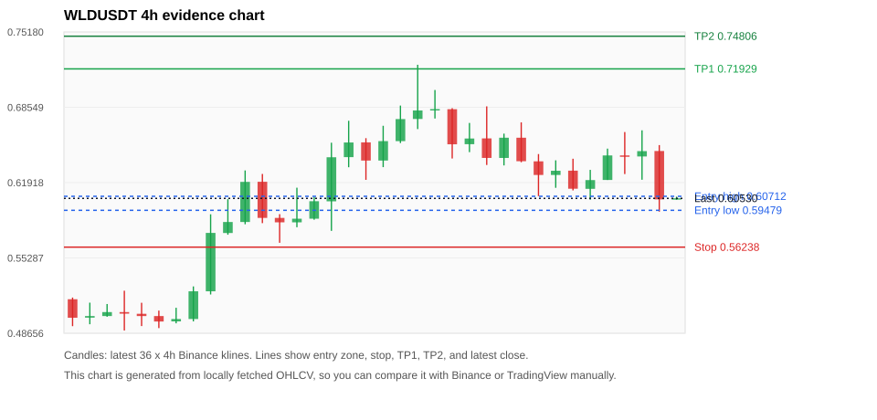
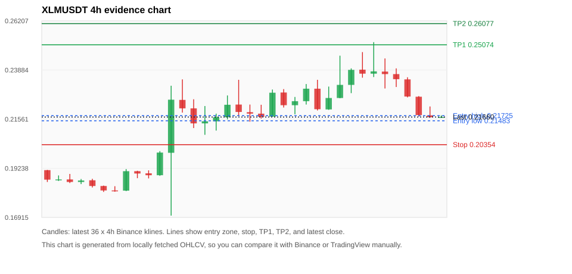
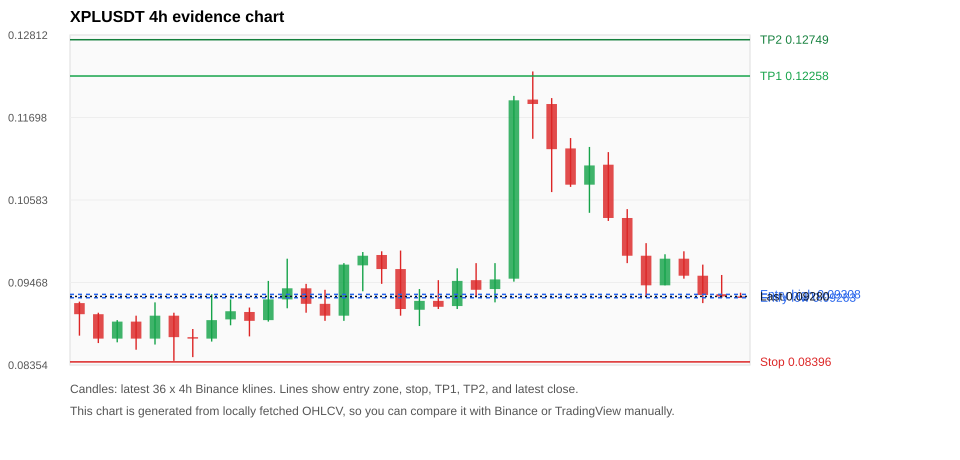
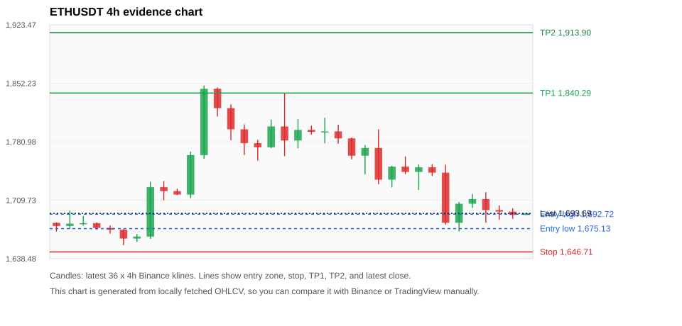
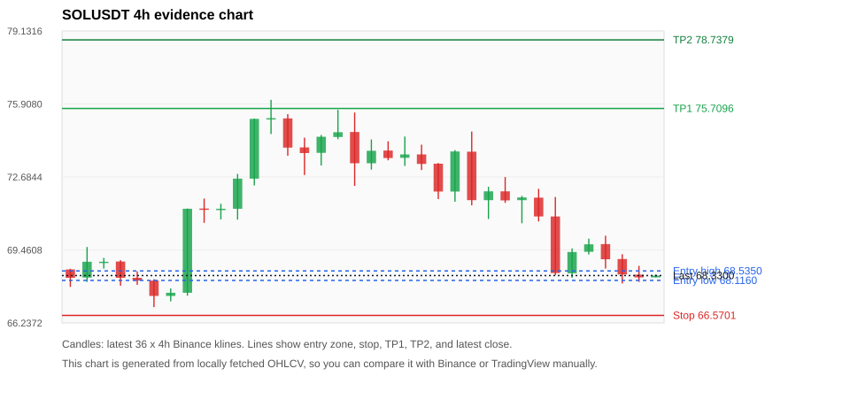

# Crypto 市场扫描报告 v1

- 报告时间：2026-06-19 20:06:58 CST
- Run ID：`20260619_120502_e1ca9edd`
- Run type：`daily_full`
- 数据来源：SQLite
- 报告版本：v1
- 扫描 ID：a4116cc70ea1
- 数据源：Binance public spot API + CoinGecko/CoinMarketCap cross-check
- 过滤条件：USDT spot; 24h quote volume >= 30,000,000; trades >= 30,000; exclude stables/leveraged tokens; analyze 1h/4h/1d klines
- 默认单笔风险：账户权益的 1.00%

## 限制说明

- 交易信号仍以 Binance 现货公开 K 线为主源；外部数据源用于一致性复核。
- 结果是研究和模拟盘计划，不是确定收益或实盘下单指令。
- 历史长度过滤：候选币至少需要 180 根 1d K 线。
- 数据质量验证池：先验证 score 排名前 min(top_n * 2, 10) 的候选，再按 action + score 补足最终名单。
- 大盘环境过滤：RISK_OFF; BTC/ETH 大盘偏弱，山寨币买入候选降级为观察。 BTC 7d=-1.4501570540803699; ETH 7d=1.637052106024317.
- 已启用数据交叉验证：Binance 主源 + CoinGecko 自动对照；CoinMarketCap 在配置 API Key 后自动对照。
- WLDUSDT 交叉验证状态 DATA_WARNING：At least one external provider needs manual review.
- XLMUSDT 交叉验证状态 DATA_WARNING：At least one external provider needs manual review.
- XPLUSDT 交叉验证状态 DATA_WARNING：At least one external provider needs manual review.
- ETHUSDT 交叉验证状态 DATA_WARNING：At least one external provider needs manual review.
- SOLUSDT 交叉验证状态 DATA_WARNING：At least one external provider needs manual review.
- ZECUSDT 交叉验证状态 DATA_WARNING：At least one external provider needs manual review.
- BTCUSDT 交叉验证状态 DATA_WARNING：At least one external provider needs manual review.
- TAOUSDT 交叉验证状态 DATA_WARNING：At least one external provider needs manual review.
- XRPUSDT 交叉验证状态 DATA_WARNING：At least one external provider needs manual review.

## 5 个候选交易计划

| Rank | Coin | Action | Setup | Entry Zone | Stop Loss | TP1 | TP2 / Exit Rule | R/R | Verdict |
|---:|---|---|---|---:|---:|---:|---|---:|---|
| 1 | `WLD` | `WATCH_ONLY` | 回踩支撑/4h EMA 附近 | 0.59479 - 0.60712 | 0.56238 | 0.71929 | 0.74806 或跌破 4h 关键支撑 | 3.07-3.81 | 只观察 |
| 2 | `XLM` | `WATCH_ONLY` | 回踩支撑/4h EMA 附近 | 0.21483 - 0.21725 | 0.20354 | 0.25074 | 0.26077 或跌破 4h 关键支撑 | 2.78-3.58 | 只观察 |
| 3 | `XPL` | `REJECT` | 回踩支撑/4h EMA 附近 | 0.09263 - 0.09308 | 0.08396 | 0.12258 | 0.12749 或跌破 4h 关键支撑 | 3.34-3.89 | 只观察 |
| 4 | `ETH` | `REJECT` | 回踩支撑/4h EMA 附近 | 1,675.13 - 1,692.72 | 1,646.71 | 1,840.29 | 1,913.90 或跌破 4h 关键支撑 | 4.20-6.18 | 只观察 |
| 5 | `SOL` | `REJECT` | 回踩支撑/4h EMA 附近 | 68.1160 - 68.5350 | 66.5701 | 75.7096 | 78.7379 或跌破 4h 关键支撑 | 4.21-5.93 | 只观察 |

## 数据交叉验证摘要

价格差异以 Binance 当前价为基准；成交量口径不同，Binance 是 USDT 现货成交额，CoinGecko/CoinMarketCap 通常是全市场成交量。

| Rank | Coin | Data Status | Max Price Diff | Max 24h Diff | Message |
|---:|---|---|---:|---:|---|
| 1 | `WLD` | DATA_WARNING | 0.04% | 0.08 pts | At least one external provider needs manual review. |
| 2 | `XLM` | DATA_WARNING | 0.01% | 0.12 pts | At least one external provider needs manual review. |
| 3 | `XPL` | DATA_WARNING | 0.23% | 0.02 pts | At least one external provider needs manual review. |
| 4 | `ETH` | DATA_WARNING | 0.11% | 0.05 pts | At least one external provider needs manual review. |
| 5 | `SOL` | DATA_WARNING | 0.09% | 0.01 pts | At least one external provider needs manual review. |

## 候选币说明

### 1. WLD `WLDUSDT`



- 入选原因：回踩支撑/4h EMA 附近；24h -3.96%，7d +29.14%，4h RSI 30.52，24h 成交额 $102.9M。
- 交易失效条件：跌破 0.56237726 或 4h 收盘重新失守关键支撑。
- 主要风险：BTC/ETH 大盘环境未确认强势，山寨币买入信号降级；24h 动量未确认；数据交叉验证需要人工复核。
- 数据交叉验证：DATA_WARNING；At least one external provider needs manual review.

#### 可点击人工验证

- [Binance 交易页](https://www.binance.com/en/trade/WLD_USDT)
- [TradingView 图表](https://www.tradingview.com/chart/?symbol=BINANCE%3AWLDUSDT)
- [CoinGecko 搜索](https://www.coingecko.com/en/search?query=WLD)
- [CoinMarketCap 搜索](https://coinmarketcap.com/search/?q=WLD)

#### 多数据源对照

| Source | Status | Asset ID | Price | 24h Change | 24h Volume | Price Diff | 24h Diff | Updated | Message |
|---|---|---|---:|---:|---:|---:|---:|---|---|
| Binance | DATA_OK | WLDUSDT | 0.60530 | -3.96% | $102.9M | 0.00% | 0.00 pts | 2026-06-19T12:05:54+00:00 | Primary market data source used by scanner. |
| CoinGecko | DATA_WARNING | n/a | n/a | n/a | n/a | n/a | n/a | 2026-06-19T12:05:54+00:00 | Failed to fetch https://api.coingecko.com/api/v3/coins/markets?vs_currency=usd&ids=worldcoin-wld&price_change_percentage=24h&per_page=1&page=1: HTTP Error 429: Too Many Requests |
| CoinMarketCap | DATA_WARNING | 13502 | 0.60553 | -3.88% | $570.7M | 0.04% | 0.08 pts | 2026-06-19T12:05:03.000Z | CoinMarketCap symbol mapping has 2 matches; selected lowest cmc_rank |

#### 指标证据

| 指标 | 数值 | 人工核对用途 |
|---|---:|---|
| 当前价 | 0.60530 | 与 Binance/TradingView 当前价格对照 |
| 24h 涨跌 | -3.96% | 与交易所 24h 涨跌对照 |
| 7d 涨跌 | +29.14% | 判断短线趋势是否延续 |
| 4h EMA20 | 0.62390 | 判断短期趋势支撑 |
| 4h EMA50 | 0.58411 | 判断中期趋势支撑 |
| 1d EMA20 | 0.51625 | 判断日线趋势 |
| 1d EMA50 | 0.41936 | 判断日线趋势 |
| 4h RSI14 | 30.52 | 判断是否过热/过弱 |
| 4h ATR14 | 0.03354 | 推导止损和入场缓冲 |
| 最近 18 根 4h 最低点 | 0.59360 | 支撑/止损参考 |
| 最近 36 根 4h 最高点 | 0.72290 | TP/压力参考 |
| 支撑位 | 0.59360 | 入场区间推导基础 |

#### 交易计划推导

- 支撑位 = 最近低点、4h EMA20、4h EMA50、1d EMA20 中不高于当前价的最高有效支撑 = `0.59360`。
- 入场区间 = 支撑位附近 + ATR 缓冲 = `0.59479 - 0.60712`。
- 止损 = min(最近 18 根 4h 最低点 * 0.985, 入场中位价 - 1.15 * ATR14) = `0.56238`。
- TP1 = max(最近 36 根 4h 最高点 * 0.995, 入场中位价 + 2R) = `0.71929`。
- TP2 = max(入场中位价 + 3R, TP1 * 1.04) = `0.74806`。

#### 最近 10 根 4h K线

| UTC 开盘时间 | Open | High | Low | Close | Quote Volume | Trades |
|---|---:|---:|---:|---:|---:|---:|
| 2026-06-18T00:00+00:00 | 0.65870 | 0.67220 | 0.63710 | 0.63800 | $33.8M | 340881 |
| 2026-06-18T04:00+00:00 | 0.63790 | 0.64430 | 0.60730 | 0.62590 | $91.4M | 606149 |
| 2026-06-18T08:00+00:00 | 0.62590 | 0.63880 | 0.61460 | 0.62960 | $219.1M | 935854 |
| 2026-06-18T12:00+00:00 | 0.62970 | 0.64020 | 0.61230 | 0.61380 | $17.2M | 191965 |
| 2026-06-18T16:00+00:00 | 0.61370 | 0.63040 | 0.60410 | 0.62140 | $12.5M | 147722 |
| 2026-06-18T20:00+00:00 | 0.62150 | 0.64910 | 0.62150 | 0.64310 | $14.7M | 148070 |
| 2026-06-19T00:00+00:00 | 0.64310 | 0.66370 | 0.62670 | 0.64230 | $17.7M | 209708 |
| 2026-06-19T04:00+00:00 | 0.64220 | 0.66520 | 0.62170 | 0.64690 | $16.7M | 221509 |
| 2026-06-19T08:00+00:00 | 0.64700 | 0.65220 | 0.59360 | 0.60440 | $24.5M | 279583 |
| 2026-06-19T12:00+00:00 | 0.60450 | 0.60680 | 0.60410 | 0.60540 | $205,755 | 4324 |

### 2. XLM `XLMUSDT`



- 入选原因：回踩支撑/4h EMA 附近；24h -8.75%，7d +13.70%，4h RSI 45.39，24h 成交额 $55.9M。
- 交易失效条件：跌破 0.20353716 或 4h 收盘重新失守关键支撑。
- 主要风险：BTC/ETH 大盘环境未确认强势，山寨币买入信号降级；24h 动量未确认；数据交叉验证需要人工复核。
- 数据交叉验证：DATA_WARNING；At least one external provider needs manual review.

#### 可点击人工验证

- [Binance 交易页](https://www.binance.com/en/trade/XLM_USDT)
- [TradingView 图表](https://www.tradingview.com/chart/?symbol=BINANCE%3AXLMUSDT)
- [CoinGecko 搜索](https://www.coingecko.com/en/search?query=XLM)
- [CoinMarketCap 搜索](https://coinmarketcap.com/search/?q=XLM)

#### 多数据源对照

| Source | Status | Asset ID | Price | 24h Change | 24h Volume | Price Diff | 24h Diff | Updated | Message |
|---|---|---|---:|---:|---:|---:|---:|---|---|
| Binance | DATA_OK | XLMUSDT | 0.21660 | -8.75% | $55.9M | 0.00% | 0.00 pts | 2026-06-19T12:05:54+00:00 | Primary market data source used by scanner. |
| CoinGecko | DATA_WARNING | n/a | n/a | n/a | n/a | n/a | n/a | 2026-06-19T12:05:54+00:00 | Failed to fetch https://api.coingecko.com/api/v3/coins/markets?vs_currency=usd&ids=stellar&price_change_percentage=24h&per_page=1&page=1: HTTP Error 429: Too Many Requests |
| CoinMarketCap | DATA_OK | 512 | 0.21663 | -8.63% | $624.3M | 0.01% | 0.12 pts | 2026-06-19T12:05:03.000Z | External source agrees with Binance within thresholds. |

#### 指标证据

| 指标 | 数值 | 人工核对用途 |
|---|---:|---|
| 当前价 | 0.21660 | 与 Binance/TradingView 当前价格对照 |
| 24h 涨跌 | -8.75% | 与交易所 24h 涨跌对照 |
| 7d 涨跌 | +13.70% | 判断短线趋势是否延续 |
| 4h EMA20 | 0.22266 | 判断短期趋势支撑 |
| 4h EMA50 | 0.21411 | 判断中期趋势支撑 |
| 1d EMA20 | 0.20478 | 判断日线趋势 |
| 1d EMA50 | 0.19013 | 判断日线趋势 |
| 4h RSI14 | 45.39 | 判断是否过热/过弱 |
| 4h ATR14 | 0.01087 | 推导止损和入场缓冲 |
| 最近 18 根 4h 最低点 | 0.21440 | 支撑/止损参考 |
| 最近 36 根 4h 最高点 | 0.25200 | TP/压力参考 |
| 支撑位 | 0.21440 | 入场区间推导基础 |

#### 交易计划推导

- 支撑位 = 最近低点、4h EMA20、4h EMA50、1d EMA20 中不高于当前价的最高有效支撑 = `0.21440`。
- 入场区间 = 支撑位附近 + ATR 缓冲 = `0.21483 - 0.21725`。
- 止损 = min(最近 18 根 4h 最低点 * 0.985, 入场中位价 - 1.15 * ATR14) = `0.20354`。
- TP1 = max(最近 36 根 4h 最高点 * 0.995, 入场中位价 + 2R) = `0.25074`。
- TP2 = max(入场中位价 + 3R, TP1 * 1.04) = `0.26077`。

#### 最近 10 根 4h K线

| UTC 开盘时间 | Open | High | Low | Close | Quote Volume | Trades |
|---|---:|---:|---:|---:|---:|---:|
| 2026-06-18T00:00+00:00 | 0.22560 | 0.24560 | 0.22550 | 0.23180 | $12.0M | 90416 |
| 2026-06-18T04:00+00:00 | 0.23180 | 0.23960 | 0.22790 | 0.23890 | $7.0M | 55555 |
| 2026-06-18T08:00+00:00 | 0.23900 | 0.24730 | 0.23520 | 0.23710 | $10.8M | 65295 |
| 2026-06-18T12:00+00:00 | 0.23710 | 0.25200 | 0.23550 | 0.23820 | $19.0M | 122168 |
| 2026-06-18T16:00+00:00 | 0.23810 | 0.24430 | 0.23010 | 0.23690 | $10.1M | 67831 |
| 2026-06-18T20:00+00:00 | 0.23690 | 0.23960 | 0.23080 | 0.23450 | $9.4M | 62193 |
| 2026-06-19T00:00+00:00 | 0.23440 | 0.23540 | 0.22590 | 0.22630 | $7.0M | 55402 |
| 2026-06-19T04:00+00:00 | 0.22620 | 0.22650 | 0.21680 | 0.21750 | $7.1M | 48404 |
| 2026-06-19T08:00+00:00 | 0.21740 | 0.22160 | 0.21630 | 0.21650 | $3.4M | 21443 |
| 2026-06-19T12:00+00:00 | 0.21660 | 0.21740 | 0.21660 | 0.21660 | $94,666 | 541 |

### 3. XPL `XPLUSDT`



- 入选原因：回踩支撑/4h EMA 附近；24h -9.71%，7d +5.10%，4h RSI 49.23，24h 成交额 $34.8M。
- 交易失效条件：跌破 0.083955935 或 4h 收盘重新失守关键支撑。
- 主要风险：日线趋势未完全确认；BTC/ETH 大盘环境未确认强势，山寨币买入信号降级；24h 动量未确认；数据交叉验证需要人工复核。
- 数据交叉验证：DATA_WARNING；At least one external provider needs manual review.

#### 可点击人工验证

- [Binance 交易页](https://www.binance.com/en/trade/XPL_USDT)
- [TradingView 图表](https://www.tradingview.com/chart/?symbol=BINANCE%3AXPLUSDT)
- [CoinGecko 搜索](https://www.coingecko.com/en/search?query=XPL)
- [CoinMarketCap 搜索](https://coinmarketcap.com/search/?q=XPL)

#### 多数据源对照

| Source | Status | Asset ID | Price | 24h Change | 24h Volume | Price Diff | 24h Diff | Updated | Message |
|---|---|---|---:|---:|---:|---:|---:|---|---|
| Binance | DATA_OK | XPLUSDT | 0.09280 | -9.71% | $34.8M | 0.00% | 0.00 pts | 2026-06-19T12:05:54+00:00 | Primary market data source used by scanner. |
| CoinGecko | DATA_WARNING | n/a | n/a | n/a | n/a | n/a | n/a | 2026-06-19T12:05:54+00:00 | Failed to fetch https://api.coingecko.com/api/v3/coins/markets?vs_currency=usd&ids=plasma&price_change_percentage=24h&per_page=1&page=1: HTTP Error 429: Too Many Requests |
| CoinMarketCap | DATA_WARNING | 36645 | 0.09302 | -9.73% | $194.3M | 0.23% | 0.02 pts | 2026-06-19T12:05:03.000Z | CoinMarketCap symbol mapping has 3 matches; selected lowest cmc_rank |

#### 指标证据

| 指标 | 数值 | 人工核对用途 |
|---|---:|---|
| 当前价 | 0.09280 | 与 Binance/TradingView 当前价格对照 |
| 24h 涨跌 | -9.71% | 与交易所 24h 涨跌对照 |
| 7d 涨跌 | +5.10% | 判断短线趋势是否延续 |
| 4h EMA20 | 0.09748 | 判断短期趋势支撑 |
| 4h EMA50 | 0.09244 | 判断中期趋势支撑 |
| 1d EMA20 | 0.08727 | 判断日线趋势 |
| 1d EMA50 | 0.08972 | 判断日线趋势 |
| 4h RSI14 | 49.23 | 判断是否过热/过弱 |
| 4h ATR14 | 0.0077357143 | 推导止损和入场缓冲 |
| 最近 18 根 4h 最低点 | 0.08880 | 支撑/止损参考 |
| 最近 36 根 4h 最高点 | 0.12320 | TP/压力参考 |
| 支撑位 | 0.09244 | 入场区间推导基础 |

#### 交易计划推导

- 支撑位 = 最近低点、4h EMA20、4h EMA50、1d EMA20 中不高于当前价的最高有效支撑 = `0.09244`。
- 入场区间 = 支撑位附近 + ATR 缓冲 = `0.09263 - 0.09308`。
- 止损 = min(最近 18 根 4h 最低点 * 0.985, 入场中位价 - 1.15 * ATR14) = `0.08396`。
- TP1 = max(最近 36 根 4h 最高点 * 0.995, 入场中位价 + 2R) = `0.12258`。
- TP2 = max(入场中位价 + 3R, TP1 * 1.04) = `0.12749`。

#### 最近 10 根 4h K线

| UTC 开盘时间 | Open | High | Low | Close | Quote Volume | Trades |
|---|---:|---:|---:|---:|---:|---:|
| 2026-06-18T00:00+00:00 | 0.11280 | 0.11420 | 0.10760 | 0.10790 | $3.7M | 58644 |
| 2026-06-18T04:00+00:00 | 0.10790 | 0.11300 | 0.10410 | 0.11050 | $3.3M | 50647 |
| 2026-06-18T08:00+00:00 | 0.11060 | 0.11230 | 0.10300 | 0.10340 | $4.8M | 88741 |
| 2026-06-18T12:00+00:00 | 0.10340 | 0.10460 | 0.09730 | 0.09830 | $9.5M | 141369 |
| 2026-06-18T16:00+00:00 | 0.09830 | 0.10000 | 0.09280 | 0.09430 | $8.2M | 97834 |
| 2026-06-18T20:00+00:00 | 0.09430 | 0.09850 | 0.09430 | 0.09790 | $3.4M | 38685 |
| 2026-06-19T00:00+00:00 | 0.09790 | 0.09890 | 0.09520 | 0.09560 | $4.4M | 63219 |
| 2026-06-19T04:00+00:00 | 0.09560 | 0.09710 | 0.09190 | 0.09300 | $5.0M | 76101 |
| 2026-06-19T08:00+00:00 | 0.09310 | 0.09570 | 0.09260 | 0.09280 | $4.3M | 70726 |
| 2026-06-19T12:00+00:00 | 0.09280 | 0.09330 | 0.09270 | 0.09270 | $71,781 | 1434 |

### 4. ETH `ETHUSDT`



- 入选原因：回踩支撑/4h EMA 附近；24h -2.92%，7d +2.18%，4h RSI 28.76，24h 成交额 $477.0M。
- 交易失效条件：跌破 1646.7132 或 4h 收盘重新失守关键支撑。
- 主要风险：日线趋势未完全确认；BTC/ETH 大盘环境未确认强势，山寨币买入信号降级；24h 动量未确认；数据交叉验证需要人工复核。
- 数据交叉验证：DATA_WARNING；At least one external provider needs manual review.

#### 可点击人工验证

- [Binance 交易页](https://www.binance.com/en/trade/ETH_USDT)
- [TradingView 图表](https://www.tradingview.com/chart/?symbol=BINANCE%3AETHUSDT)
- [CoinGecko 搜索](https://www.coingecko.com/en/search?query=ETH)
- [CoinMarketCap 搜索](https://coinmarketcap.com/search/?q=ETH)

#### 多数据源对照

| Source | Status | Asset ID | Price | 24h Change | 24h Volume | Price Diff | 24h Diff | Updated | Message |
|---|---|---|---:|---:|---:|---:|---:|---|---|
| Binance | DATA_OK | ETHUSDT | 1,693.69 | -2.92% | $477.0M | 0.00% | 0.00 pts | 2026-06-19T12:05:54+00:00 | Primary market data source used by scanner. |
| CoinGecko | DATA_WARNING | n/a | n/a | n/a | n/a | n/a | n/a | 2026-06-19T12:05:54+00:00 | Failed to fetch https://api.coingecko.com/api/v3/coins/markets?vs_currency=usd&ids=ethereum&price_change_percentage=24h&per_page=1&page=1: HTTP Error 429: Too Many Requests |
| CoinMarketCap | DATA_WARNING | 1027 | 1,691.77 | -2.96% | $11.60B | 0.11% | 0.05 pts | 2026-06-19T12:05:03.000Z | CoinMarketCap symbol mapping has 6 matches; selected lowest cmc_rank |

#### 指标证据

| 指标 | 数值 | 人工核对用途 |
|---|---:|---|
| 当前价 | 1,693.69 | 与 Binance/TradingView 当前价格对照 |
| 24h 涨跌 | -2.92% | 与交易所 24h 涨跌对照 |
| 7d 涨跌 | +2.18% | 判断短线趋势是否延续 |
| 4h EMA20 | 1,725.48 | 判断短期趋势支撑 |
| 4h EMA50 | 1,727.94 | 判断中期趋势支撑 |
| 1d EMA20 | 1,775.53 | 判断日线趋势 |
| 1d EMA50 | 1,934.99 | 判断日线趋势 |
| 4h RSI14 | 28.76 | 判断是否过热/过弱 |
| 4h ATR14 | 29.8950 | 推导止损和入场缓冲 |
| 最近 18 根 4h 最低点 | 1,671.79 | 支撑/止损参考 |
| 最近 36 根 4h 最高点 | 1,849.54 | TP/压力参考 |
| 支撑位 | 1,671.79 | 入场区间推导基础 |

#### 交易计划推导

- 支撑位 = 最近低点、4h EMA20、4h EMA50、1d EMA20 中不高于当前价的最高有效支撑 = `1,671.79`。
- 入场区间 = 支撑位附近 + ATR 缓冲 = `1,675.13 - 1,692.72`。
- 止损 = min(最近 18 根 4h 最低点 * 0.985, 入场中位价 - 1.15 * ATR14) = `1,646.71`。
- TP1 = max(最近 36 根 4h 最高点 * 0.995, 入场中位价 + 2R) = `1,840.29`。
- TP2 = max(入场中位价 + 3R, TP1 * 1.04) = `1,913.90`。

#### 最近 10 根 4h K线

| UTC 开盘时间 | Open | High | Low | Close | Quote Volume | Trades |
|---|---:|---:|---:|---:|---:|---:|
| 2026-06-18T00:00+00:00 | 1,750.61 | 1,762.99 | 1,741.46 | 1,744.17 | $54.3M | 342995 |
| 2026-06-18T04:00+00:00 | 1,744.17 | 1,753.29 | 1,722.24 | 1,749.79 | $76.4M | 415634 |
| 2026-06-18T08:00+00:00 | 1,749.80 | 1,753.61 | 1,739.11 | 1,743.31 | $82.2M | 421241 |
| 2026-06-18T12:00+00:00 | 1,743.31 | 1,753.06 | 1,680.00 | 1,682.23 | $162.6M | 1131625 |
| 2026-06-18T16:00+00:00 | 1,682.23 | 1,707.48 | 1,671.79 | 1,705.39 | $111.4M | 764838 |
| 2026-06-18T20:00+00:00 | 1,705.40 | 1,717.23 | 1,700.19 | 1,711.11 | $51.0M | 328633 |
| 2026-06-19T00:00+00:00 | 1,711.11 | 1,719.51 | 1,682.35 | 1,697.69 | $64.1M | 421515 |
| 2026-06-19T04:00+00:00 | 1,697.70 | 1,703.40 | 1,686.00 | 1,695.82 | $55.2M | 389074 |
| 2026-06-19T08:00+00:00 | 1,695.82 | 1,699.82 | 1,687.05 | 1,691.74 | $33.4M | 336081 |
| 2026-06-19T12:00+00:00 | 1,691.74 | 1,694.24 | 1,691.74 | 1,693.73 | $728,031 | 7453 |

### 5. SOL `SOLUSDT`



- 入选原因：回踩支撑/4h EMA 附近；24h -3.72%，7d +2.41%，4h RSI 29.81，24h 成交额 $177.5M。
- 交易失效条件：跌破 66.570082 或 4h 收盘重新失守关键支撑。
- 主要风险：日线趋势未完全确认；BTC/ETH 大盘环境未确认强势，山寨币买入信号降级；24h 动量未确认；数据交叉验证需要人工复核。
- 数据交叉验证：DATA_WARNING；At least one external provider needs manual review.

#### 可点击人工验证

- [Binance 交易页](https://www.binance.com/en/trade/SOL_USDT)
- [TradingView 图表](https://www.tradingview.com/chart/?symbol=BINANCE%3ASOLUSDT)
- [CoinGecko 搜索](https://www.coingecko.com/en/search?query=SOL)
- [CoinMarketCap 搜索](https://coinmarketcap.com/search/?q=SOL)

#### 多数据源对照

| Source | Status | Asset ID | Price | 24h Change | 24h Volume | Price Diff | 24h Diff | Updated | Message |
|---|---|---|---:|---:|---:|---:|---:|---|---|
| Binance | DATA_OK | SOLUSDT | 68.3300 | -3.72% | $177.5M | 0.00% | 0.00 pts | 2026-06-19T12:05:54+00:00 | Primary market data source used by scanner. |
| CoinGecko | DATA_WARNING | n/a | n/a | n/a | n/a | n/a | n/a | 2026-06-19T12:05:54+00:00 | Failed to fetch https://api.coingecko.com/api/v3/coins/markets?vs_currency=usd&ids=solana&price_change_percentage=24h&per_page=1&page=1: HTTP Error 429: Too Many Requests |
| CoinMarketCap | DATA_WARNING | 5426 | 68.2685 | -3.71% | $2.36B | 0.09% | 0.01 pts | 2026-06-19T12:05:03.000Z | CoinMarketCap symbol mapping has 8 matches; selected lowest cmc_rank |

#### 指标证据

| 指标 | 数值 | 人工核对用途 |
|---|---:|---|
| 当前价 | 68.3300 | 与 Binance/TradingView 当前价格对照 |
| 24h 涨跌 | -3.72% | 与交易所 24h 涨跌对照 |
| 7d 涨跌 | +2.41% | 判断短线趋势是否延续 |
| 4h EMA20 | 70.3784 | 判断短期趋势支撑 |
| 4h EMA50 | 70.3192 | 判断中期趋势支撑 |
| 1d EMA20 | 71.7188 | 判断日线趋势 |
| 1d EMA50 | 77.2267 | 判断日线趋势 |
| 4h RSI14 | 29.81 | 判断是否过热/过弱 |
| 4h ATR14 | 1.5264 | 推导止损和入场缓冲 |
| 最近 18 根 4h 最低点 | 67.9800 | 支撑/止损参考 |
| 最近 36 根 4h 最高点 | 76.0900 | TP/压力参考 |
| 支撑位 | 67.9800 | 入场区间推导基础 |

#### 交易计划推导

- 支撑位 = 最近低点、4h EMA20、4h EMA50、1d EMA20 中不高于当前价的最高有效支撑 = `67.9800`。
- 入场区间 = 支撑位附近 + ATR 缓冲 = `68.1160 - 68.5350`。
- 止损 = min(最近 18 根 4h 最低点 * 0.985, 入场中位价 - 1.15 * ATR14) = `66.5701`。
- TP1 = max(最近 36 根 4h 最高点 * 0.995, 入场中位价 + 2R) = `75.7096`。
- TP2 = max(入场中位价 + 3R, TP1 * 1.04) = `78.7379`。

#### 最近 10 根 4h K线

| UTC 开盘时间 | Open | High | Low | Close | Quote Volume | Trades |
|---|---:|---:|---:|---:|---:|---:|
| 2026-06-18T00:00+00:00 | 72.0500 | 72.6800 | 71.5400 | 71.6500 | $14.8M | 94627 |
| 2026-06-18T04:00+00:00 | 71.6600 | 71.8500 | 70.6400 | 71.7800 | $18.1M | 126856 |
| 2026-06-18T08:00+00:00 | 71.7700 | 72.1600 | 70.7200 | 70.9400 | $20.1M | 102034 |
| 2026-06-18T12:00+00:00 | 70.9400 | 71.8000 | 68.3500 | 68.4400 | $54.2M | 327865 |
| 2026-06-18T16:00+00:00 | 68.4300 | 69.5300 | 68.2300 | 69.3700 | $35.9M | 196706 |
| 2026-06-18T20:00+00:00 | 69.3800 | 69.9600 | 69.2600 | 69.7100 | $16.0M | 96343 |
| 2026-06-19T00:00+00:00 | 69.7200 | 70.0900 | 68.6400 | 69.0500 | $21.9M | 113709 |
| 2026-06-19T04:00+00:00 | 69.0600 | 69.2700 | 67.9800 | 68.3800 | $30.0M | 135395 |
| 2026-06-19T08:00+00:00 | 68.3700 | 68.7600 | 68.0500 | 68.2500 | $19.7M | 105192 |
| 2026-06-19T12:00+00:00 | 68.2500 | 68.3800 | 68.2500 | 68.3300 | $196,044 | 2290 |

## 组合风控

- 不要 5 个候选全部满仓买入。
- 同时持仓总风险建议控制在账户权益的 3% - 5% 以内。
- 如果 BTC/ETH 同时破位，暂停山寨币多头计划或降低仓位。
- 第一版报告用于模拟盘和人工复核，不自动下单。

## 原始数据

```json
[
  {
    "rank": 1,
    "symbol": "WLDUSDT",
    "base_asset": "WLD",
    "price": 0.6053,
    "score": 27.786958698796568,
    "setup": "回踩支撑/4h EMA 附近",
    "verdict": "只观察",
    "entry_low": 0.5947872000000001,
    "entry_high": 0.6071158999999999,
    "stop_loss": 0.5623772642857143,
    "take_profit_1": 0.7192855,
    "take_profit_2": 0.74805692,
    "risk_reward_1": 3.067689985926972,
    "risk_reward_2": 3.8135604399674143,
    "pct_24h": -3.963,
    "pct_3d": -5.657730673316708,
    "pct_7d": 29.144442073821185,
    "quote_volume_24h": 102875960.74925,
    "trades_24h": 1197232,
    "high_low_range_24h": 12.061994609164417,
    "rsi_1h": 37.964236588720745,
    "rsi_4h": 30.521091811414408,
    "ema20_4h": 0.6238990839787159,
    "ema50_4h": 0.5841145339630537,
    "ema20_1d": 0.516246456257732,
    "ema50_1d": 0.4193626308908681,
    "atr_4h": 0.033542857142857145,
    "macd_hist_4h": -0.009130291112817907,
    "volume_ratio_24h": 0.41463098326590647,
    "support_level": 0.5936,
    "recent_low_4h_18": 0.5936,
    "recent_high_4h_36": 0.7229,
    "distance_to_support_pct": 1.9710242587601012,
    "binance_trade_url": "https://www.binance.com/en/trade/WLD_USDT",
    "tradingview_url": "https://www.tradingview.com/chart/?symbol=BINANCE%3AWLDUSDT",
    "coingecko_search_url": "https://www.coingecko.com/en/search?query=WLD",
    "coinmarketcap_search_url": "https://coinmarketcap.com/search/?q=WLD",
    "invalidation": "跌破 0.56237726 或 4h 收盘重新失守关键支撑",
    "recent_4h_klines": [
      {
        "open_time_utc": "2026-06-13T16:00+00:00",
        "open": 0.5165,
        "high": 0.518,
        "low": 0.4928,
        "close": 0.5002,
        "quote_volume": 27775064.91979,
        "trades": 334260
      },
      {
        "open_time_utc": "2026-06-13T20:00+00:00",
        "open": 0.5003,
        "high": 0.5135,
        "low": 0.4945,
        "close": 0.5017,
        "quote_volume": 12452322.14326,
        "trades": 188280
      },
      {
        "open_time_utc": "2026-06-14T00:00+00:00",
        "open": 0.5017,
        "high": 0.5123,
        "low": 0.5011,
        "close": 0.5052,
        "quote_volume": 16010703.15925,
        "trades": 232865
      },
      {
        "open_time_utc": "2026-06-14T04:00+00:00",
        "open": 0.5052,
        "high": 0.524,
        "low": 0.489,
        "close": 0.5038,
        "quote_volume": 21165266.89532,
        "trades": 346077
      },
      {
        "open_time_utc": "2026-06-14T08:00+00:00",
        "open": 0.5037,
        "high": 0.5134,
        "low": 0.4929,
        "close": 0.5017,
        "quote_volume": 17483869.82163,
        "trades": 265011
      },
      {
        "open_time_utc": "2026-06-14T12:00+00:00",
        "open": 0.5017,
        "high": 0.5065,
        "low": 0.4911,
        "close": 0.4969,
        "quote_volume": 20111276.1027,
        "trades": 245624
      },
      {
        "open_time_utc": "2026-06-14T16:00+00:00",
        "open": 0.497,
        "high": 0.509,
        "low": 0.4953,
        "close": 0.4991,
        "quote_volume": 14795598.35865,
        "trades": 212393
      },
      {
        "open_time_utc": "2026-06-14T20:00+00:00",
        "open": 0.4991,
        "high": 0.5278,
        "low": 0.497,
        "close": 0.5235,
        "quote_volume": 17517940.05517,
        "trades": 259865
      },
      {
        "open_time_utc": "2026-06-15T00:00+00:00",
        "open": 0.5235,
        "high": 0.5913,
        "low": 0.5207,
        "close": 0.5749,
        "quote_volume": 41232640.62029,
        "trades": 665961
      },
      {
        "open_time_utc": "2026-06-15T04:00+00:00",
        "open": 0.5748,
        "high": 0.6046,
        "low": 0.5733,
        "close": 0.5845,
        "quote_volume": 54671782.69218,
        "trades": 734522
      },
      {
        "open_time_utc": "2026-06-15T08:00+00:00",
        "open": 0.5845,
        "high": 0.6299,
        "low": 0.5825,
        "close": 0.6198,
        "quote_volume": 61559009.5716,
        "trades": 701157
      },
      {
        "open_time_utc": "2026-06-15T12:00+00:00",
        "open": 0.6199,
        "high": 0.6268,
        "low": 0.5835,
        "close": 0.5881,
        "quote_volume": 50348398.07395,
        "trades": 680956
      },
      {
        "open_time_utc": "2026-06-15T16:00+00:00",
        "open": 0.5881,
        "high": 0.5914,
        "low": 0.5662,
        "close": 0.5842,
        "quote_volume": 52260336.36358,
        "trades": 541681
      },
      {
        "open_time_utc": "2026-06-15T20:00+00:00",
        "open": 0.5842,
        "high": 0.6147,
        "low": 0.5799,
        "close": 0.5874,
        "quote_volume": 33028547.28353,
        "trades": 358023
      },
      {
        "open_time_utc": "2026-06-16T00:00+00:00",
        "open": 0.5874,
        "high": 0.6066,
        "low": 0.5865,
        "close": 0.6028,
        "quote_volume": 35922742.13452,
        "trades": 442017
      },
      {
        "open_time_utc": "2026-06-16T04:00+00:00",
        "open": 0.6027,
        "high": 0.6543,
        "low": 0.5767,
        "close": 0.6415,
        "quote_volume": 65773122.11666,
        "trades": 621758
      },
      {
        "open_time_utc": "2026-06-16T08:00+00:00",
        "open": 0.6416,
        "high": 0.6736,
        "low": 0.6327,
        "close": 0.6545,
        "quote_volume": 69735662.64434,
        "trades": 725518
      },
      {
        "open_time_utc": "2026-06-16T12:00+00:00",
        "open": 0.6546,
        "high": 0.6583,
        "low": 0.6216,
        "close": 0.6386,
        "quote_volume": 54340477.68502,
        "trades": 703494
      },
      {
        "open_time_utc": "2026-06-16T16:00+00:00",
        "open": 0.6386,
        "high": 0.6692,
        "low": 0.6328,
        "close": 0.6557,
        "quote_volume": 24181225.39874,
        "trades": 387353
      },
      {
        "open_time_utc": "2026-06-16T20:00+00:00",
        "open": 0.6557,
        "high": 0.687,
        "low": 0.654,
        "close": 0.6751,
        "quote_volume": 18118785.84528,
        "trades": 283936
      },
      {
        "open_time_utc": "2026-06-17T00:00+00:00",
        "open": 0.6752,
        "high": 0.7229,
        "low": 0.6663,
        "close": 0.6827,
        "quote_volume": 38108874.74237,
        "trades": 605974
      },
      {
        "open_time_utc": "2026-06-17T04:00+00:00",
        "open": 0.6827,
        "high": 0.7007,
        "low": 0.6756,
        "close": 0.6839,
        "quote_volume": 30090974.66053,
        "trades": 415834
      },
      {
        "open_time_utc": "2026-06-17T08:00+00:00",
        "open": 0.6838,
        "high": 0.6847,
        "low": 0.6404,
        "close": 0.6529,
        "quote_volume": 33392541.94082,
        "trades": 377565
      },
      {
        "open_time_utc": "2026-06-17T12:00+00:00",
        "open": 0.653,
        "high": 0.6717,
        "low": 0.646,
        "close": 0.658,
        "quote_volume": 44560674.77833,
        "trades": 477219
      },
      {
        "open_time_utc": "2026-06-17T16:00+00:00",
        "open": 0.6581,
        "high": 0.6863,
        "low": 0.6347,
        "close": 0.6409,
        "quote_volume": 60138639.3826,
        "trades": 635662
      },
      {
        "open_time_utc": "2026-06-17T20:00+00:00",
        "open": 0.6409,
        "high": 0.6623,
        "low": 0.6343,
        "close": 0.6587,
        "quote_volume": 18840983.62062,
        "trades": 247591
      },
      {
        "open_time_utc": "2026-06-18T00:00+00:00",
        "open": 0.6587,
        "high": 0.6722,
        "low": 0.6371,
        "close": 0.638,
        "quote_volume": 33787574.58207,
        "trades": 340881
      },
      {
        "open_time_utc": "2026-06-18T04:00+00:00",
        "open": 0.6379,
        "high": 0.6443,
        "low": 0.6073,
        "close": 0.6259,
        "quote_volume": 91422054.51016,
        "trades": 606149
      },
      {
        "open_time_utc": "2026-06-18T08:00+00:00",
        "open": 0.6259,
        "high": 0.6388,
        "low": 0.6146,
        "close": 0.6296,
        "quote_volume": 219117639.97094,
        "trades": 935854
      },
      {
        "open_time_utc": "2026-06-18T12:00+00:00",
        "open": 0.6297,
        "high": 0.6402,
        "low": 0.6123,
        "close": 0.6138,
        "quote_volume": 17245695.17494,
        "trades": 191965
      },
      {
        "open_time_utc": "2026-06-18T16:00+00:00",
        "open": 0.6137,
        "high": 0.6304,
        "low": 0.6041,
        "close": 0.6214,
        "quote_volume": 12492208.77821,
        "trades": 147722
      },
      {
        "open_time_utc": "2026-06-18T20:00+00:00",
        "open": 0.6215,
        "high": 0.6491,
        "low": 0.6215,
        "close": 0.6431,
        "quote_volume": 14735591.97919,
        "trades": 148070
      },
      {
        "open_time_utc": "2026-06-19T00:00+00:00",
        "open": 0.6431,
        "high": 0.6637,
        "low": 0.6267,
        "close": 0.6423,
        "quote_volume": 17660809.69361,
        "trades": 209708
      },
      {
        "open_time_utc": "2026-06-19T04:00+00:00",
        "open": 0.6422,
        "high": 0.6652,
        "low": 0.6217,
        "close": 0.6469,
        "quote_volume": 16703674.45958,
        "trades": 221509
      },
      {
        "open_time_utc": "2026-06-19T08:00+00:00",
        "open": 0.647,
        "high": 0.6522,
        "low": 0.5936,
        "close": 0.6044,
        "quote_volume": 24522096.26052,
        "trades": 279583
      },
      {
        "open_time_utc": "2026-06-19T12:00+00:00",
        "open": 0.6045,
        "high": 0.6068,
        "low": 0.6041,
        "close": 0.6054,
        "quote_volume": 205754.53845,
        "trades": 4324
      }
    ],
    "risks": [
      "BTC/ETH 大盘环境未确认强势，山寨币买入信号降级",
      "24h 动量未确认",
      "数据交叉验证需要人工复核"
    ],
    "data_quality_status": "DATA_WARNING",
    "data_quality_message": "At least one external provider needs manual review.",
    "data_checks": [
      {
        "provider": "Binance",
        "status": "DATA_OK",
        "provider_asset_id": "WLDUSDT",
        "provider_symbol": "WLDUSDT",
        "price_usd": 0.6053,
        "pct_24h": -3.963,
        "volume_24h": 102875960.74925,
        "last_updated": null,
        "fetched_at_utc": "2026-06-19T12:05:54+00:00",
        "price_diff_pct": 0.0,
        "pct_24h_diff": 0.0,
        "volume_note": "Binance USDT spot 24h quoteVolume.",
        "message": "Primary market data source used by scanner."
      },
      {
        "provider": "CoinGecko",
        "status": "DATA_WARNING",
        "provider_asset_id": null,
        "provider_symbol": "WLD",
        "price_usd": null,
        "pct_24h": null,
        "volume_24h": null,
        "last_updated": null,
        "fetched_at_utc": "2026-06-19T12:05:54+00:00",
        "price_diff_pct": null,
        "pct_24h_diff": null,
        "volume_note": "External provider data unavailable.",
        "message": "Failed to fetch https://api.coingecko.com/api/v3/coins/markets?vs_currency=usd&ids=worldcoin-wld&price_change_percentage=24h&per_page=1&page=1: HTTP Error 429: Too Many Requests"
      },
      {
        "provider": "CoinMarketCap",
        "status": "DATA_WARNING",
        "provider_asset_id": "13502",
        "provider_symbol": "WLD",
        "price_usd": 0.6055268841486944,
        "pct_24h": -3.88456459,
        "volume_24h": 570672976.893216,
        "last_updated": "2026-06-19T12:05:03.000Z",
        "fetched_at_utc": "2026-06-19T12:05:54+00:00",
        "price_diff_pct": 0.037482925606216494,
        "pct_24h_diff": 0.07843540999999998,
        "volume_note": "CoinMarketCap total market volume; not the same venue scope as Binance quoteVolume.",
        "message": "CoinMarketCap symbol mapping has 2 matches; selected lowest cmc_rank"
      }
    ],
    "action": "WATCH_ONLY"
  },
  {
    "rank": 2,
    "symbol": "XLMUSDT",
    "base_asset": "XLM",
    "price": 0.2166,
    "score": 22.794877462289477,
    "setup": "回踩支撑/4h EMA 附近",
    "verdict": "只观察",
    "entry_low": 0.21482880000000001,
    "entry_high": 0.21724979999999997,
    "stop_loss": 0.20353715714285714,
    "take_profit_1": 0.25074,
    "take_profit_2": 0.26076960000000005,
    "risk_reward_1": 2.775580186253789,
    "risk_reward_2": 3.5778106610295444,
    "pct_24h": -8.754,
    "pct_3d": -3.3898305084745894,
    "pct_7d": 13.700787401574788,
    "quote_volume_24h": 55945321.947,
    "trades_24h": 376964,
    "high_low_range_24h": 16.504854368932055,
    "rsi_1h": 23.19749216300933,
    "rsi_4h": 45.394736842105246,
    "ema20_4h": 0.22266292753105738,
    "ema50_4h": 0.21411447162199274,
    "ema20_1d": 0.20478475667227813,
    "ema50_1d": 0.19013186603456647,
    "atr_4h": 0.010871428571428574,
    "macd_hist_4h": -0.002899226342410059,
    "volume_ratio_24h": 1.2985420502152518,
    "support_level": 0.2144,
    "recent_low_4h_18": 0.2144,
    "recent_high_4h_36": 0.252,
    "distance_to_support_pct": 1.0261194029850706,
    "binance_trade_url": "https://www.binance.com/en/trade/XLM_USDT",
    "tradingview_url": "https://www.tradingview.com/chart/?symbol=BINANCE%3AXLMUSDT",
    "coingecko_search_url": "https://www.coingecko.com/en/search?query=XLM",
    "coinmarketcap_search_url": "https://coinmarketcap.com/search/?q=XLM",
    "invalidation": "跌破 0.20353716 或 4h 收盘重新失守关键支撑",
    "recent_4h_klines": [
      {
        "open_time_utc": "2026-06-13T16:00+00:00",
        "open": 0.1915,
        "high": 0.1916,
        "low": 0.1859,
        "close": 0.187,
        "quote_volume": 2479652.2676,
        "trades": 11460
      },
      {
        "open_time_utc": "2026-06-13T20:00+00:00",
        "open": 0.187,
        "high": 0.189,
        "low": 0.1864,
        "close": 0.1871,
        "quote_volume": 848551.683,
        "trades": 5923
      },
      {
        "open_time_utc": "2026-06-14T00:00+00:00",
        "open": 0.1871,
        "high": 0.1897,
        "low": 0.1854,
        "close": 0.1859,
        "quote_volume": 2282555.8301,
        "trades": 12030
      },
      {
        "open_time_utc": "2026-06-14T04:00+00:00",
        "open": 0.1859,
        "high": 0.1873,
        "low": 0.1849,
        "close": 0.1866,
        "quote_volume": 1315494.4936,
        "trades": 8806
      },
      {
        "open_time_utc": "2026-06-14T08:00+00:00",
        "open": 0.1867,
        "high": 0.1874,
        "low": 0.1833,
        "close": 0.184,
        "quote_volume": 1846378.5198,
        "trades": 9032
      },
      {
        "open_time_utc": "2026-06-14T12:00+00:00",
        "open": 0.184,
        "high": 0.1842,
        "low": 0.1812,
        "close": 0.1819,
        "quote_volume": 1776664.0176,
        "trades": 8892
      },
      {
        "open_time_utc": "2026-06-14T16:00+00:00",
        "open": 0.1819,
        "high": 0.1839,
        "low": 0.1813,
        "close": 0.1818,
        "quote_volume": 1055046.0461,
        "trades": 5686
      },
      {
        "open_time_utc": "2026-06-14T20:00+00:00",
        "open": 0.1818,
        "high": 0.192,
        "low": 0.1816,
        "close": 0.191,
        "quote_volume": 4325116.32,
        "trades": 20051
      },
      {
        "open_time_utc": "2026-06-15T00:00+00:00",
        "open": 0.191,
        "high": 0.1912,
        "low": 0.1877,
        "close": 0.1899,
        "quote_volume": 2443394.1936,
        "trades": 13301
      },
      {
        "open_time_utc": "2026-06-15T04:00+00:00",
        "open": 0.19,
        "high": 0.1914,
        "low": 0.1876,
        "close": 0.1891,
        "quote_volume": 2542909.1521,
        "trades": 10947
      },
      {
        "open_time_utc": "2026-06-15T08:00+00:00",
        "open": 0.1891,
        "high": 0.2005,
        "low": 0.1888,
        "close": 0.1998,
        "quote_volume": 6277671.187,
        "trades": 24711
      },
      {
        "open_time_utc": "2026-06-15T12:00+00:00",
        "open": 0.1997,
        "high": 0.2314,
        "low": 0.17,
        "close": 0.2248,
        "quote_volume": 32438188.1069,
        "trades": 184390
      },
      {
        "open_time_utc": "2026-06-15T16:00+00:00",
        "open": 0.2247,
        "high": 0.2344,
        "low": 0.2187,
        "close": 0.2207,
        "quote_volume": 35015899.8635,
        "trades": 186245
      },
      {
        "open_time_utc": "2026-06-15T20:00+00:00",
        "open": 0.2207,
        "high": 0.225,
        "low": 0.2114,
        "close": 0.2136,
        "quote_volume": 8203362.7138,
        "trades": 51220
      },
      {
        "open_time_utc": "2026-06-16T00:00+00:00",
        "open": 0.2136,
        "high": 0.2218,
        "low": 0.2082,
        "close": 0.2146,
        "quote_volume": 7872891.3563,
        "trades": 50791
      },
      {
        "open_time_utc": "2026-06-16T04:00+00:00",
        "open": 0.2146,
        "high": 0.2182,
        "low": 0.2102,
        "close": 0.2165,
        "quote_volume": 6500935.8261,
        "trades": 41247
      },
      {
        "open_time_utc": "2026-06-16T08:00+00:00",
        "open": 0.2165,
        "high": 0.2268,
        "low": 0.2155,
        "close": 0.2224,
        "quote_volume": 12367775.8407,
        "trades": 74910
      },
      {
        "open_time_utc": "2026-06-16T12:00+00:00",
        "open": 0.2225,
        "high": 0.2342,
        "low": 0.2173,
        "close": 0.219,
        "quote_volume": 13302611.8719,
        "trades": 80921
      },
      {
        "open_time_utc": "2026-06-16T16:00+00:00",
        "open": 0.2189,
        "high": 0.2225,
        "low": 0.2144,
        "close": 0.2182,
        "quote_volume": 6244073.7354,
        "trades": 54551
      },
      {
        "open_time_utc": "2026-06-16T20:00+00:00",
        "open": 0.2182,
        "high": 0.2224,
        "low": 0.2159,
        "close": 0.2167,
        "quote_volume": 2971692.9506,
        "trades": 23675
      },
      {
        "open_time_utc": "2026-06-17T00:00+00:00",
        "open": 0.2168,
        "high": 0.2296,
        "low": 0.2168,
        "close": 0.2281,
        "quote_volume": 7421593.7462,
        "trades": 59068
      },
      {
        "open_time_utc": "2026-06-17T04:00+00:00",
        "open": 0.2282,
        "high": 0.2298,
        "low": 0.2211,
        "close": 0.2222,
        "quote_volume": 6774705.6922,
        "trades": 44735
      },
      {
        "open_time_utc": "2026-06-17T08:00+00:00",
        "open": 0.2222,
        "high": 0.2261,
        "low": 0.2179,
        "close": 0.2241,
        "quote_volume": 5133756.3467,
        "trades": 37166
      },
      {
        "open_time_utc": "2026-06-17T12:00+00:00",
        "open": 0.2241,
        "high": 0.2322,
        "low": 0.2225,
        "close": 0.23,
        "quote_volume": 8162219.536,
        "trades": 60055
      },
      {
        "open_time_utc": "2026-06-17T16:00+00:00",
        "open": 0.23,
        "high": 0.2342,
        "low": 0.2197,
        "close": 0.2203,
        "quote_volume": 8967901.7824,
        "trades": 68070
      },
      {
        "open_time_utc": "2026-06-17T20:00+00:00",
        "open": 0.2202,
        "high": 0.231,
        "low": 0.22,
        "close": 0.2256,
        "quote_volume": 5647679.7872,
        "trades": 42661
      },
      {
        "open_time_utc": "2026-06-18T00:00+00:00",
        "open": 0.2256,
        "high": 0.2456,
        "low": 0.2255,
        "close": 0.2318,
        "quote_volume": 11957818.8832,
        "trades": 90416
      },
      {
        "open_time_utc": "2026-06-18T04:00+00:00",
        "open": 0.2318,
        "high": 0.2396,
        "low": 0.2279,
        "close": 0.2389,
        "quote_volume": 6995972.8836,
        "trades": 55555
      },
      {
        "open_time_utc": "2026-06-18T08:00+00:00",
        "open": 0.239,
        "high": 0.2473,
        "low": 0.2352,
        "close": 0.2371,
        "quote_volume": 10836334.3241,
        "trades": 65295
      },
      {
        "open_time_utc": "2026-06-18T12:00+00:00",
        "open": 0.2371,
        "high": 0.252,
        "low": 0.2355,
        "close": 0.2382,
        "quote_volume": 19032667.2844,
        "trades": 122168
      },
      {
        "open_time_utc": "2026-06-18T16:00+00:00",
        "open": 0.2381,
        "high": 0.2443,
        "low": 0.2301,
        "close": 0.2369,
        "quote_volume": 10090347.7208,
        "trades": 67831
      },
      {
        "open_time_utc": "2026-06-18T20:00+00:00",
        "open": 0.2369,
        "high": 0.2396,
        "low": 0.2308,
        "close": 0.2345,
        "quote_volume": 9387892.1017,
        "trades": 62193
      },
      {
        "open_time_utc": "2026-06-19T00:00+00:00",
        "open": 0.2344,
        "high": 0.2354,
        "low": 0.2259,
        "close": 0.2263,
        "quote_volume": 6961951.1467,
        "trades": 55402
      },
      {
        "open_time_utc": "2026-06-19T04:00+00:00",
        "open": 0.2262,
        "high": 0.2265,
        "low": 0.2168,
        "close": 0.2175,
        "quote_volume": 7107445.0462,
        "trades": 48404
      },
      {
        "open_time_utc": "2026-06-19T08:00+00:00",
        "open": 0.2174,
        "high": 0.2216,
        "low": 0.2163,
        "close": 0.2165,
        "quote_volume": 3414842.4604,
        "trades": 21443
      },
      {
        "open_time_utc": "2026-06-19T12:00+00:00",
        "open": 0.2166,
        "high": 0.2174,
        "low": 0.2166,
        "close": 0.2166,
        "quote_volume": 94666.4904,
        "trades": 541
      }
    ],
    "risks": [
      "BTC/ETH 大盘环境未确认强势，山寨币买入信号降级",
      "24h 动量未确认",
      "数据交叉验证需要人工复核"
    ],
    "data_quality_status": "DATA_WARNING",
    "data_quality_message": "At least one external provider needs manual review.",
    "data_checks": [
      {
        "provider": "Binance",
        "status": "DATA_OK",
        "provider_asset_id": "XLMUSDT",
        "provider_symbol": "XLMUSDT",
        "price_usd": 0.2166,
        "pct_24h": -8.754,
        "volume_24h": 55945321.947,
        "last_updated": null,
        "fetched_at_utc": "2026-06-19T12:05:54+00:00",
        "price_diff_pct": 0.0,
        "pct_24h_diff": 0.0,
        "volume_note": "Binance USDT spot 24h quoteVolume.",
        "message": "Primary market data source used by scanner."
      },
      {
        "provider": "CoinGecko",
        "status": "DATA_WARNING",
        "provider_asset_id": null,
        "provider_symbol": "XLM",
        "price_usd": null,
        "pct_24h": null,
        "volume_24h": null,
        "last_updated": null,
        "fetched_at_utc": "2026-06-19T12:05:54+00:00",
        "price_diff_pct": null,
        "pct_24h_diff": null,
        "volume_note": "External provider data unavailable.",
        "message": "Failed to fetch https://api.coingecko.com/api/v3/coins/markets?vs_currency=usd&ids=stellar&price_change_percentage=24h&per_page=1&page=1: HTTP Error 429: Too Many Requests"
      },
      {
        "provider": "CoinMarketCap",
        "status": "DATA_OK",
        "provider_asset_id": "512",
        "provider_symbol": "XLM",
        "price_usd": 0.21662872247104228,
        "pct_24h": -8.63443651,
        "volume_24h": 624309558.2378594,
        "last_updated": "2026-06-19T12:05:03.000Z",
        "fetched_at_utc": "2026-06-19T12:05:54+00:00",
        "price_diff_pct": 0.013260605282685738,
        "pct_24h_diff": 0.1195634899999991,
        "volume_note": "CoinMarketCap total market volume; not the same venue scope as Binance quoteVolume.",
        "message": "External source agrees with Binance within thresholds."
      }
    ],
    "action": "WATCH_ONLY"
  },
  {
    "rank": 3,
    "symbol": "XPLUSDT",
    "base_asset": "XPL",
    "price": 0.0928,
    "score": 16.636681298310233,
    "setup": "回踩支撑/4h EMA 附近",
    "verdict": "只观察",
    "entry_low": 0.09262561247199663,
    "entry_high": 0.09307839999999998,
    "stop_loss": 0.08395593480742687,
    "take_profit_1": 0.122584,
    "take_profit_2": 0.12748736,
    "risk_reward_1": 3.342148722919615,
    "risk_reward_2": 3.8933313476737195,
    "pct_24h": -9.709,
    "pct_3d": -4.428424304840384,
    "pct_7d": 5.096262740656843,
    "quote_volume_24h": 34750837.10333,
    "trades_24h": 486185,
    "high_low_range_24h": 13.819368879216555,
    "rsi_1h": 33.3333333333333,
    "rsi_4h": 49.22600619195047,
    "ema20_4h": 0.09748176318860663,
    "ema50_4h": 0.09244073100997668,
    "ema20_1d": 0.08726626058229553,
    "ema50_1d": 0.08971990312944937,
    "atr_4h": 0.0077357142857142885,
    "macd_hist_4h": -0.002148207208914699,
    "volume_ratio_24h": 1.310350452885385,
    "support_level": 0.09244073100997668,
    "recent_low_4h_18": 0.0888,
    "recent_high_4h_36": 0.1232,
    "distance_to_support_pct": 0.38864793267865405,
    "binance_trade_url": "https://www.binance.com/en/trade/XPL_USDT",
    "tradingview_url": "https://www.tradingview.com/chart/?symbol=BINANCE%3AXPLUSDT",
    "coingecko_search_url": "https://www.coingecko.com/en/search?query=XPL",
    "coinmarketcap_search_url": "https://coinmarketcap.com/search/?q=XPL",
    "invalidation": "跌破 0.083955935 或 4h 收盘重新失守关键支撑",
    "recent_4h_klines": [
      {
        "open_time_utc": "2026-06-13T16:00+00:00",
        "open": 0.0919,
        "high": 0.0921,
        "low": 0.0875,
        "close": 0.0904,
        "quote_volume": 2247592.01699,
        "trades": 34006
      },
      {
        "open_time_utc": "2026-06-13T20:00+00:00",
        "open": 0.0904,
        "high": 0.0906,
        "low": 0.0865,
        "close": 0.0871,
        "quote_volume": 1390124.11638,
        "trades": 18972
      },
      {
        "open_time_utc": "2026-06-14T00:00+00:00",
        "open": 0.0871,
        "high": 0.0896,
        "low": 0.0866,
        "close": 0.0894,
        "quote_volume": 1117193.93924,
        "trades": 17218
      },
      {
        "open_time_utc": "2026-06-14T04:00+00:00",
        "open": 0.0894,
        "high": 0.0902,
        "low": 0.0856,
        "close": 0.0871,
        "quote_volume": 3165752.30853,
        "trades": 27127
      },
      {
        "open_time_utc": "2026-06-14T08:00+00:00",
        "open": 0.0871,
        "high": 0.092,
        "low": 0.0863,
        "close": 0.0902,
        "quote_volume": 2804576.9784,
        "trades": 32059
      },
      {
        "open_time_utc": "2026-06-14T12:00+00:00",
        "open": 0.0902,
        "high": 0.0906,
        "low": 0.0841,
        "close": 0.0873,
        "quote_volume": 2872287.42608,
        "trades": 40691
      },
      {
        "open_time_utc": "2026-06-14T16:00+00:00",
        "open": 0.0873,
        "high": 0.0884,
        "low": 0.0846,
        "close": 0.0871,
        "quote_volume": 1738548.18133,
        "trades": 25412
      },
      {
        "open_time_utc": "2026-06-14T20:00+00:00",
        "open": 0.0871,
        "high": 0.0931,
        "low": 0.0867,
        "close": 0.0896,
        "quote_volume": 3514172.76298,
        "trades": 40417
      },
      {
        "open_time_utc": "2026-06-15T00:00+00:00",
        "open": 0.0897,
        "high": 0.0924,
        "low": 0.0889,
        "close": 0.0908,
        "quote_volume": 1967831.95634,
        "trades": 22288
      },
      {
        "open_time_utc": "2026-06-15T04:00+00:00",
        "open": 0.0907,
        "high": 0.0913,
        "low": 0.0874,
        "close": 0.0895,
        "quote_volume": 2691449.89163,
        "trades": 24467
      },
      {
        "open_time_utc": "2026-06-15T08:00+00:00",
        "open": 0.0896,
        "high": 0.0949,
        "low": 0.0894,
        "close": 0.0924,
        "quote_volume": 3825532.50724,
        "trades": 45549
      },
      {
        "open_time_utc": "2026-06-15T12:00+00:00",
        "open": 0.0924,
        "high": 0.0979,
        "low": 0.0912,
        "close": 0.0939,
        "quote_volume": 4866030.87246,
        "trades": 51680
      },
      {
        "open_time_utc": "2026-06-15T16:00+00:00",
        "open": 0.0939,
        "high": 0.0945,
        "low": 0.0906,
        "close": 0.0918,
        "quote_volume": 1743205.28452,
        "trades": 22339
      },
      {
        "open_time_utc": "2026-06-15T20:00+00:00",
        "open": 0.0918,
        "high": 0.0937,
        "low": 0.0895,
        "close": 0.0902,
        "quote_volume": 1569539.25082,
        "trades": 19681
      },
      {
        "open_time_utc": "2026-06-16T00:00+00:00",
        "open": 0.0902,
        "high": 0.0973,
        "low": 0.0895,
        "close": 0.0971,
        "quote_volume": 2182354.70941,
        "trades": 26015
      },
      {
        "open_time_utc": "2026-06-16T04:00+00:00",
        "open": 0.097,
        "high": 0.0988,
        "low": 0.0935,
        "close": 0.0983,
        "quote_volume": 4895381.18958,
        "trades": 52179
      },
      {
        "open_time_utc": "2026-06-16T08:00+00:00",
        "open": 0.0984,
        "high": 0.0989,
        "low": 0.0945,
        "close": 0.0965,
        "quote_volume": 4871693.45561,
        "trades": 49238
      },
      {
        "open_time_utc": "2026-06-16T12:00+00:00",
        "open": 0.0965,
        "high": 0.099,
        "low": 0.0902,
        "close": 0.0911,
        "quote_volume": 4579579.54865,
        "trades": 63595
      },
      {
        "open_time_utc": "2026-06-16T16:00+00:00",
        "open": 0.091,
        "high": 0.0938,
        "low": 0.0888,
        "close": 0.0922,
        "quote_volume": 2962004.94801,
        "trades": 27455
      },
      {
        "open_time_utc": "2026-06-16T20:00+00:00",
        "open": 0.0922,
        "high": 0.095,
        "low": 0.0911,
        "close": 0.0914,
        "quote_volume": 1079560.32786,
        "trades": 14351
      },
      {
        "open_time_utc": "2026-06-17T00:00+00:00",
        "open": 0.0915,
        "high": 0.0966,
        "low": 0.0911,
        "close": 0.0949,
        "quote_volume": 1870381.80265,
        "trades": 23350
      },
      {
        "open_time_utc": "2026-06-17T04:00+00:00",
        "open": 0.095,
        "high": 0.0973,
        "low": 0.0927,
        "close": 0.0937,
        "quote_volume": 2994068.46872,
        "trades": 27293
      },
      {
        "open_time_utc": "2026-06-17T08:00+00:00",
        "open": 0.0938,
        "high": 0.0973,
        "low": 0.092,
        "close": 0.0951,
        "quote_volume": 2485540.94239,
        "trades": 24135
      },
      {
        "open_time_utc": "2026-06-17T12:00+00:00",
        "open": 0.0952,
        "high": 0.1199,
        "low": 0.0948,
        "close": 0.1193,
        "quote_volume": 27130735.79884,
        "trades": 356469
      },
      {
        "open_time_utc": "2026-06-17T16:00+00:00",
        "open": 0.1194,
        "high": 0.1232,
        "low": 0.1141,
        "close": 0.1188,
        "quote_volume": 17335872.26037,
        "trades": 170350
      },
      {
        "open_time_utc": "2026-06-17T20:00+00:00",
        "open": 0.1188,
        "high": 0.1196,
        "low": 0.1069,
        "close": 0.1127,
        "quote_volume": 7501536.35354,
        "trades": 84753
      },
      {
        "open_time_utc": "2026-06-18T00:00+00:00",
        "open": 0.1128,
        "high": 0.1142,
        "low": 0.1076,
        "close": 0.1079,
        "quote_volume": 3720321.10957,
        "trades": 58644
      },
      {
        "open_time_utc": "2026-06-18T04:00+00:00",
        "open": 0.1079,
        "high": 0.113,
        "low": 0.1041,
        "close": 0.1105,
        "quote_volume": 3277247.31896,
        "trades": 50647
      },
      {
        "open_time_utc": "2026-06-18T08:00+00:00",
        "open": 0.1106,
        "high": 0.1123,
        "low": 0.103,
        "close": 0.1034,
        "quote_volume": 4843684.49478,
        "trades": 88741
      },
      {
        "open_time_utc": "2026-06-18T12:00+00:00",
        "open": 0.1034,
        "high": 0.1046,
        "low": 0.0973,
        "close": 0.0983,
        "quote_volume": 9479085.38017,
        "trades": 141369
      },
      {
        "open_time_utc": "2026-06-18T16:00+00:00",
        "open": 0.0983,
        "high": 0.1,
        "low": 0.0928,
        "close": 0.0943,
        "quote_volume": 8183775.14846,
        "trades": 97834
      },
      {
        "open_time_utc": "2026-06-18T20:00+00:00",
        "open": 0.0943,
        "high": 0.0985,
        "low": 0.0943,
        "close": 0.0979,
        "quote_volume": 3382793.46012,
        "trades": 38685
      },
      {
        "open_time_utc": "2026-06-19T00:00+00:00",
        "open": 0.0979,
        "high": 0.0989,
        "low": 0.0952,
        "close": 0.0956,
        "quote_volume": 4372091.44073,
        "trades": 63219
      },
      {
        "open_time_utc": "2026-06-19T04:00+00:00",
        "open": 0.0956,
        "high": 0.0971,
        "low": 0.0919,
        "close": 0.093,
        "quote_volume": 5046743.72822,
        "trades": 76101
      },
      {
        "open_time_utc": "2026-06-19T08:00+00:00",
        "open": 0.0931,
        "high": 0.0957,
        "low": 0.0926,
        "close": 0.0928,
        "quote_volume": 4345388.02799,
        "trades": 70726
      },
      {
        "open_time_utc": "2026-06-19T12:00+00:00",
        "open": 0.0928,
        "high": 0.0933,
        "low": 0.0927,
        "close": 0.0927,
        "quote_volume": 71780.69456,
        "trades": 1434
      }
    ],
    "risks": [
      "日线趋势未完全确认",
      "BTC/ETH 大盘环境未确认强势，山寨币买入信号降级",
      "24h 动量未确认",
      "数据交叉验证需要人工复核"
    ],
    "data_quality_status": "DATA_WARNING",
    "data_quality_message": "At least one external provider needs manual review.",
    "data_checks": [
      {
        "provider": "Binance",
        "status": "DATA_OK",
        "provider_asset_id": "XPLUSDT",
        "provider_symbol": "XPLUSDT",
        "price_usd": 0.0928,
        "pct_24h": -9.709,
        "volume_24h": 34750837.10333,
        "last_updated": null,
        "fetched_at_utc": "2026-06-19T12:05:54+00:00",
        "price_diff_pct": 0.0,
        "pct_24h_diff": 0.0,
        "volume_note": "Binance USDT spot 24h quoteVolume.",
        "message": "Primary market data source used by scanner."
      },
      {
        "provider": "CoinGecko",
        "status": "DATA_WARNING",
        "provider_asset_id": null,
        "provider_symbol": "XPL",
        "price_usd": null,
        "pct_24h": null,
        "volume_24h": null,
        "last_updated": null,
        "fetched_at_utc": "2026-06-19T12:05:54+00:00",
        "price_diff_pct": null,
        "pct_24h_diff": null,
        "volume_note": "External provider data unavailable.",
        "message": "Failed to fetch https://api.coingecko.com/api/v3/coins/markets?vs_currency=usd&ids=plasma&price_change_percentage=24h&per_page=1&page=1: HTTP Error 429: Too Many Requests"
      },
      {
        "provider": "CoinMarketCap",
        "status": "DATA_WARNING",
        "provider_asset_id": "36645",
        "provider_symbol": "XPL",
        "price_usd": 0.09301643073521845,
        "pct_24h": -9.72649554,
        "volume_24h": 194283100.9409311,
        "last_updated": "2026-06-19T12:05:03.000Z",
        "fetched_at_utc": "2026-06-19T12:05:54+00:00",
        "price_diff_pct": 0.2332227750198913,
        "pct_24h_diff": 0.01749554000000053,
        "volume_note": "CoinMarketCap total market volume; not the same venue scope as Binance quoteVolume.",
        "message": "CoinMarketCap symbol mapping has 3 matches; selected lowest cmc_rank"
      }
    ],
    "action": "REJECT"
  },
  {
    "rank": 4,
    "symbol": "ETHUSDT",
    "base_asset": "ETH",
    "price": 1693.69,
    "score": 9.13919053057857,
    "setup": "回踩支撑/4h EMA 附近",
    "verdict": "只观察",
    "entry_low": 1675.13358,
    "entry_high": 1692.7165,
    "stop_loss": 1646.71315,
    "take_profit_1": 1840.2923,
    "take_profit_2": 1913.9039920000002,
    "risk_reward_1": 4.202077884246132,
    "risk_reward_2": 6.180254536923545,
    "pct_24h": -2.916,
    "pct_3d": -5.795158742518969,
    "pct_7d": 2.177244208494211,
    "quote_volume_24h": 476989735.141985,
    "trades_24h": 3366079,
    "high_low_range_24h": 4.8612564975266,
    "rsi_1h": 39.62353685542555,
    "rsi_4h": 28.762728414004698,
    "ema20_4h": 1725.4778503550679,
    "ema50_4h": 1727.93531388685,
    "ema20_1d": 1775.5252322690906,
    "ema50_1d": 1934.9907960978608,
    "atr_4h": 29.89500000000003,
    "macd_hist_4h": -9.54563277881428,
    "volume_ratio_24h": 0.9396906279712287,
    "support_level": 1671.79,
    "recent_low_4h_18": 1671.79,
    "recent_high_4h_36": 1849.54,
    "distance_to_support_pct": 1.3099731425597838,
    "binance_trade_url": "https://www.binance.com/en/trade/ETH_USDT",
    "tradingview_url": "https://www.tradingview.com/chart/?symbol=BINANCE%3AETHUSDT",
    "coingecko_search_url": "https://www.coingecko.com/en/search?query=ETH",
    "coinmarketcap_search_url": "https://coinmarketcap.com/search/?q=ETH",
    "invalidation": "跌破 1646.7132 或 4h 收盘重新失守关键支撑",
    "recent_4h_klines": [
      {
        "open_time_utc": "2026-06-13T16:00+00:00",
        "open": 1682.14,
        "high": 1682.63,
        "low": 1671.44,
        "close": 1678.29,
        "quote_volume": 35819080.824297,
        "trades": 235716
      },
      {
        "open_time_utc": "2026-06-13T20:00+00:00",
        "open": 1678.3,
        "high": 1697.28,
        "low": 1674.91,
        "close": 1681.18,
        "quote_volume": 24436045.294188,
        "trades": 219947
      },
      {
        "open_time_utc": "2026-06-14T00:00+00:00",
        "open": 1681.19,
        "high": 1690.36,
        "low": 1678.83,
        "close": 1681.73,
        "quote_volume": 17520019.911114,
        "trades": 157845
      },
      {
        "open_time_utc": "2026-06-14T04:00+00:00",
        "open": 1681.74,
        "high": 1682.66,
        "low": 1673.72,
        "close": 1675.91,
        "quote_volume": 26154750.07225,
        "trades": 155762
      },
      {
        "open_time_utc": "2026-06-14T08:00+00:00",
        "open": 1675.91,
        "high": 1679.0,
        "low": 1669.15,
        "close": 1673.73,
        "quote_volume": 24810168.717517,
        "trades": 152584
      },
      {
        "open_time_utc": "2026-06-14T12:00+00:00",
        "open": 1673.73,
        "high": 1674.58,
        "low": 1654.9,
        "close": 1662.95,
        "quote_volume": 39822265.504871,
        "trades": 286228
      },
      {
        "open_time_utc": "2026-06-14T16:00+00:00",
        "open": 1662.95,
        "high": 1668.57,
        "low": 1658.95,
        "close": 1665.43,
        "quote_volume": 29853503.496566,
        "trades": 197516
      },
      {
        "open_time_utc": "2026-06-14T20:00+00:00",
        "open": 1665.44,
        "high": 1732.28,
        "low": 1662.67,
        "close": 1725.62,
        "quote_volume": 163243595.068431,
        "trades": 986056
      },
      {
        "open_time_utc": "2026-06-15T00:00+00:00",
        "open": 1725.63,
        "high": 1733.04,
        "low": 1709.66,
        "close": 1720.78,
        "quote_volume": 80525366.557659,
        "trades": 385554
      },
      {
        "open_time_utc": "2026-06-15T04:00+00:00",
        "open": 1720.78,
        "high": 1723.8,
        "low": 1715.95,
        "close": 1716.59,
        "quote_volume": 57037268.791415,
        "trades": 229539
      },
      {
        "open_time_utc": "2026-06-15T08:00+00:00",
        "open": 1716.6,
        "high": 1769.0,
        "low": 1712.17,
        "close": 1764.67,
        "quote_volume": 150135664.758294,
        "trades": 555429
      },
      {
        "open_time_utc": "2026-06-15T12:00+00:00",
        "open": 1764.67,
        "high": 1849.54,
        "low": 1760.28,
        "close": 1845.53,
        "quote_volume": 308967598.674926,
        "trades": 902394
      },
      {
        "open_time_utc": "2026-06-15T16:00+00:00",
        "open": 1845.53,
        "high": 1847.13,
        "low": 1811.66,
        "close": 1821.89,
        "quote_volume": 143824186.522777,
        "trades": 590740
      },
      {
        "open_time_utc": "2026-06-15T20:00+00:00",
        "open": 1821.88,
        "high": 1826.62,
        "low": 1782.82,
        "close": 1796.13,
        "quote_volume": 87615416.670238,
        "trades": 472460
      },
      {
        "open_time_utc": "2026-06-16T00:00+00:00",
        "open": 1796.14,
        "high": 1802.09,
        "low": 1764.84,
        "close": 1779.16,
        "quote_volume": 90017719.519215,
        "trades": 384855
      },
      {
        "open_time_utc": "2026-06-16T04:00+00:00",
        "open": 1779.16,
        "high": 1783.32,
        "low": 1758.0,
        "close": 1774.24,
        "quote_volume": 89106636.028984,
        "trades": 304486
      },
      {
        "open_time_utc": "2026-06-16T08:00+00:00",
        "open": 1774.25,
        "high": 1807.97,
        "low": 1773.25,
        "close": 1799.59,
        "quote_volume": 102565954.182685,
        "trades": 594777
      },
      {
        "open_time_utc": "2026-06-16T12:00+00:00",
        "open": 1799.6,
        "high": 1839.77,
        "low": 1763.36,
        "close": 1782.44,
        "quote_volume": 223098425.184839,
        "trades": 1422362
      },
      {
        "open_time_utc": "2026-06-16T16:00+00:00",
        "open": 1782.43,
        "high": 1808.44,
        "low": 1773.03,
        "close": 1795.41,
        "quote_volume": 86259939.186127,
        "trades": 646141
      },
      {
        "open_time_utc": "2026-06-16T20:00+00:00",
        "open": 1795.41,
        "high": 1800.48,
        "low": 1789.53,
        "close": 1792.99,
        "quote_volume": 41807190.49149,
        "trades": 298579
      },
      {
        "open_time_utc": "2026-06-17T00:00+00:00",
        "open": 1793.0,
        "high": 1810.21,
        "low": 1778.99,
        "close": 1793.58,
        "quote_volume": 55923882.81617,
        "trades": 455840
      },
      {
        "open_time_utc": "2026-06-17T04:00+00:00",
        "open": 1793.58,
        "high": 1801.79,
        "low": 1778.71,
        "close": 1785.08,
        "quote_volume": 42290661.429377,
        "trades": 345742
      },
      {
        "open_time_utc": "2026-06-17T08:00+00:00",
        "open": 1785.09,
        "high": 1786.15,
        "low": 1759.35,
        "close": 1763.92,
        "quote_volume": 62124474.083504,
        "trades": 548825
      },
      {
        "open_time_utc": "2026-06-17T12:00+00:00",
        "open": 1763.93,
        "high": 1776.94,
        "low": 1741.05,
        "close": 1773.41,
        "quote_volume": 144411139.661984,
        "trades": 1009748
      },
      {
        "open_time_utc": "2026-06-17T16:00+00:00",
        "open": 1773.42,
        "high": 1796.08,
        "low": 1729.26,
        "close": 1734.72,
        "quote_volume": 222769406.491915,
        "trades": 1426164
      },
      {
        "open_time_utc": "2026-06-17T20:00+00:00",
        "open": 1734.73,
        "high": 1751.66,
        "low": 1725.34,
        "close": 1750.6,
        "quote_volume": 62832531.859631,
        "trades": 389144
      },
      {
        "open_time_utc": "2026-06-18T00:00+00:00",
        "open": 1750.61,
        "high": 1762.99,
        "low": 1741.46,
        "close": 1744.17,
        "quote_volume": 54328617.779461,
        "trades": 342995
      },
      {
        "open_time_utc": "2026-06-18T04:00+00:00",
        "open": 1744.17,
        "high": 1753.29,
        "low": 1722.24,
        "close": 1749.79,
        "quote_volume": 76389583.555047,
        "trades": 415634
      },
      {
        "open_time_utc": "2026-06-18T08:00+00:00",
        "open": 1749.8,
        "high": 1753.61,
        "low": 1739.11,
        "close": 1743.31,
        "quote_volume": 82194635.351271,
        "trades": 421241
      },
      {
        "open_time_utc": "2026-06-18T12:00+00:00",
        "open": 1743.31,
        "high": 1753.06,
        "low": 1680.0,
        "close": 1682.23,
        "quote_volume": 162649087.474721,
        "trades": 1131625
      },
      {
        "open_time_utc": "2026-06-18T16:00+00:00",
        "open": 1682.23,
        "high": 1707.48,
        "low": 1671.79,
        "close": 1705.39,
        "quote_volume": 111355620.454105,
        "trades": 764838
      },
      {
        "open_time_utc": "2026-06-18T20:00+00:00",
        "open": 1705.4,
        "high": 1717.23,
        "low": 1700.19,
        "close": 1711.11,
        "quote_volume": 51037955.376431,
        "trades": 328633
      },
      {
        "open_time_utc": "2026-06-19T00:00+00:00",
        "open": 1711.11,
        "high": 1719.51,
        "low": 1682.35,
        "close": 1697.69,
        "quote_volume": 64130921.178829,
        "trades": 421515
      },
      {
        "open_time_utc": "2026-06-19T04:00+00:00",
        "open": 1697.7,
        "high": 1703.4,
        "low": 1686.0,
        "close": 1695.82,
        "quote_volume": 55233326.496868,
        "trades": 389074
      },
      {
        "open_time_utc": "2026-06-19T08:00+00:00",
        "open": 1695.82,
        "high": 1699.82,
        "low": 1687.05,
        "close": 1691.74,
        "quote_volume": 33417490.339601,
        "trades": 336081
      },
      {
        "open_time_utc": "2026-06-19T12:00+00:00",
        "open": 1691.74,
        "high": 1694.24,
        "low": 1691.74,
        "close": 1693.73,
        "quote_volume": 728031.368614,
        "trades": 7453
      }
    ],
    "risks": [
      "日线趋势未完全确认",
      "BTC/ETH 大盘环境未确认强势，山寨币买入信号降级",
      "24h 动量未确认",
      "数据交叉验证需要人工复核"
    ],
    "data_quality_status": "DATA_WARNING",
    "data_quality_message": "At least one external provider needs manual review.",
    "data_checks": [
      {
        "provider": "Binance",
        "status": "DATA_OK",
        "provider_asset_id": "ETHUSDT",
        "provider_symbol": "ETHUSDT",
        "price_usd": 1693.69,
        "pct_24h": -2.916,
        "volume_24h": 476989735.141985,
        "last_updated": null,
        "fetched_at_utc": "2026-06-19T12:05:54+00:00",
        "price_diff_pct": 0.0,
        "pct_24h_diff": 0.0,
        "volume_note": "Binance USDT spot 24h quoteVolume.",
        "message": "Primary market data source used by scanner."
      },
      {
        "provider": "CoinGecko",
        "status": "DATA_WARNING",
        "provider_asset_id": null,
        "provider_symbol": "ETH",
        "price_usd": null,
        "pct_24h": null,
        "volume_24h": null,
        "last_updated": null,
        "fetched_at_utc": "2026-06-19T12:05:54+00:00",
        "price_diff_pct": null,
        "pct_24h_diff": null,
        "volume_note": "External provider data unavailable.",
        "message": "Failed to fetch https://api.coingecko.com/api/v3/coins/markets?vs_currency=usd&ids=ethereum&price_change_percentage=24h&per_page=1&page=1: HTTP Error 429: Too Many Requests"
      },
      {
        "provider": "CoinMarketCap",
        "status": "DATA_WARNING",
        "provider_asset_id": "1027",
        "provider_symbol": "ETH",
        "price_usd": 1691.7698069509606,
        "pct_24h": -2.96107771,
        "volume_24h": 11599320832.127056,
        "last_updated": "2026-06-19T12:05:03.000Z",
        "fetched_at_utc": "2026-06-19T12:05:54+00:00",
        "price_diff_pct": 0.11337334748622392,
        "pct_24h_diff": 0.04507771000000016,
        "volume_note": "CoinMarketCap total market volume; not the same venue scope as Binance quoteVolume.",
        "message": "CoinMarketCap symbol mapping has 6 matches; selected lowest cmc_rank"
      }
    ],
    "action": "REJECT"
  },
  {
    "rank": 5,
    "symbol": "SOLUSDT",
    "base_asset": "SOL",
    "price": 68.33,
    "score": 7.392135442141132,
    "setup": "回踩支撑/4h EMA 附近",
    "verdict": "只观察",
    "entry_low": 68.11596,
    "entry_high": 68.53499,
    "stop_loss": 66.57008214285715,
    "take_profit_1": 75.70955000000001,
    "take_profit_2": 78.73793200000001,
    "risk_reward_1": 4.206508514577545,
    "risk_reward_2": 5.9316961201196605,
    "pct_24h": -3.719,
    "pct_3d": -7.649682389512091,
    "pct_7d": 2.41306954436451,
    "quote_volume_24h": 177532840.87274,
    "trades_24h": 974351,
    "high_low_range_24h": 5.619299794057064,
    "rsi_1h": 33.60881542699738,
    "rsi_4h": 29.811629811629743,
    "ema20_4h": 70.37839796598739,
    "ema50_4h": 70.3192113480012,
    "ema20_1d": 71.71883919949869,
    "ema50_1d": 77.22668476219064,
    "atr_4h": 1.5264285714285697,
    "macd_hist_4h": -0.5810937002420284,
    "volume_ratio_24h": 1.0770025764346722,
    "support_level": 67.98,
    "recent_low_4h_18": 67.98,
    "recent_high_4h_36": 76.09,
    "distance_to_support_pct": 0.5148573109738042,
    "binance_trade_url": "https://www.binance.com/en/trade/SOL_USDT",
    "tradingview_url": "https://www.tradingview.com/chart/?symbol=BINANCE%3ASOLUSDT",
    "coingecko_search_url": "https://www.coingecko.com/en/search?query=SOL",
    "coinmarketcap_search_url": "https://coinmarketcap.com/search/?q=SOL",
    "invalidation": "跌破 66.570082 或 4h 收盘重新失守关键支撑",
    "recent_4h_klines": [
      {
        "open_time_utc": "2026-06-13T16:00+00:00",
        "open": 68.6,
        "high": 68.63,
        "low": 67.83,
        "close": 68.23,
        "quote_volume": 14449148.46191,
        "trades": 79373
      },
      {
        "open_time_utc": "2026-06-13T20:00+00:00",
        "open": 68.24,
        "high": 69.59,
        "low": 68.05,
        "close": 68.94,
        "quote_volume": 21729068.28452,
        "trades": 104223
      },
      {
        "open_time_utc": "2026-06-14T00:00+00:00",
        "open": 68.94,
        "high": 69.11,
        "low": 68.64,
        "close": 68.94,
        "quote_volume": 13431161.62658,
        "trades": 64741
      },
      {
        "open_time_utc": "2026-06-14T04:00+00:00",
        "open": 68.95,
        "high": 69.01,
        "low": 67.88,
        "close": 68.23,
        "quote_volume": 24692193.95036,
        "trades": 71149
      },
      {
        "open_time_utc": "2026-06-14T08:00+00:00",
        "open": 68.23,
        "high": 68.52,
        "low": 67.92,
        "close": 68.11,
        "quote_volume": 10752227.22239,
        "trades": 46267
      },
      {
        "open_time_utc": "2026-06-14T12:00+00:00",
        "open": 68.11,
        "high": 68.17,
        "low": 66.94,
        "close": 67.43,
        "quote_volume": 19031615.62372,
        "trades": 85556
      },
      {
        "open_time_utc": "2026-06-14T16:00+00:00",
        "open": 67.43,
        "high": 67.76,
        "low": 67.19,
        "close": 67.57,
        "quote_volume": 7366054.9678,
        "trades": 49679
      },
      {
        "open_time_utc": "2026-06-14T20:00+00:00",
        "open": 67.57,
        "high": 71.29,
        "low": 67.44,
        "close": 71.28,
        "quote_volume": 52297919.61813,
        "trades": 259085
      },
      {
        "open_time_utc": "2026-06-15T00:00+00:00",
        "open": 71.29,
        "high": 71.73,
        "low": 70.66,
        "close": 71.24,
        "quote_volume": 30783591.36055,
        "trades": 144834
      },
      {
        "open_time_utc": "2026-06-15T04:00+00:00",
        "open": 71.24,
        "high": 71.5,
        "low": 70.81,
        "close": 71.28,
        "quote_volume": 16764454.21633,
        "trades": 75838
      },
      {
        "open_time_utc": "2026-06-15T08:00+00:00",
        "open": 71.28,
        "high": 72.82,
        "low": 70.8,
        "close": 72.61,
        "quote_volume": 38176801.59558,
        "trades": 142305
      },
      {
        "open_time_utc": "2026-06-15T12:00+00:00",
        "open": 72.61,
        "high": 75.26,
        "low": 72.31,
        "close": 75.25,
        "quote_volume": 61783304.91529,
        "trades": 260161
      },
      {
        "open_time_utc": "2026-06-15T16:00+00:00",
        "open": 75.25,
        "high": 76.09,
        "low": 74.58,
        "close": 75.28,
        "quote_volume": 52140901.07867,
        "trades": 263984
      },
      {
        "open_time_utc": "2026-06-15T20:00+00:00",
        "open": 75.27,
        "high": 75.46,
        "low": 73.62,
        "close": 73.98,
        "quote_volume": 27730329.63705,
        "trades": 153907
      },
      {
        "open_time_utc": "2026-06-16T00:00+00:00",
        "open": 73.99,
        "high": 74.42,
        "low": 72.77,
        "close": 73.74,
        "quote_volume": 25577532.47424,
        "trades": 121209
      },
      {
        "open_time_utc": "2026-06-16T04:00+00:00",
        "open": 73.75,
        "high": 74.54,
        "low": 73.19,
        "close": 74.46,
        "quote_volume": 19986745.95484,
        "trades": 77710
      },
      {
        "open_time_utc": "2026-06-16T08:00+00:00",
        "open": 74.45,
        "high": 75.65,
        "low": 74.35,
        "close": 74.66,
        "quote_volume": 25983636.28636,
        "trades": 115402
      },
      {
        "open_time_utc": "2026-06-16T12:00+00:00",
        "open": 74.67,
        "high": 75.53,
        "low": 72.29,
        "close": 73.29,
        "quote_volume": 50428964.09644,
        "trades": 275915
      },
      {
        "open_time_utc": "2026-06-16T16:00+00:00",
        "open": 73.29,
        "high": 74.34,
        "low": 73.01,
        "close": 73.84,
        "quote_volume": 26500730.07898,
        "trades": 175551
      },
      {
        "open_time_utc": "2026-06-16T20:00+00:00",
        "open": 73.85,
        "high": 74.26,
        "low": 73.42,
        "close": 73.52,
        "quote_volume": 13159470.67923,
        "trades": 78710
      },
      {
        "open_time_utc": "2026-06-17T00:00+00:00",
        "open": 73.53,
        "high": 74.47,
        "low": 73.17,
        "close": 73.68,
        "quote_volume": 19241007.5537,
        "trades": 112326
      },
      {
        "open_time_utc": "2026-06-17T04:00+00:00",
        "open": 73.68,
        "high": 74.11,
        "low": 72.99,
        "close": 73.26,
        "quote_volume": 18012241.98635,
        "trades": 106419
      },
      {
        "open_time_utc": "2026-06-17T08:00+00:00",
        "open": 73.27,
        "high": 73.3,
        "low": 71.71,
        "close": 72.04,
        "quote_volume": 24082792.06333,
        "trades": 141175
      },
      {
        "open_time_utc": "2026-06-17T12:00+00:00",
        "open": 72.04,
        "high": 73.87,
        "low": 71.59,
        "close": 73.81,
        "quote_volume": 31483417.7479,
        "trades": 210550
      },
      {
        "open_time_utc": "2026-06-17T16:00+00:00",
        "open": 73.8,
        "high": 74.69,
        "low": 71.43,
        "close": 71.66,
        "quote_volume": 64664598.63975,
        "trades": 429277
      },
      {
        "open_time_utc": "2026-06-17T20:00+00:00",
        "open": 71.66,
        "high": 72.25,
        "low": 70.83,
        "close": 72.05,
        "quote_volume": 20638978.09268,
        "trades": 140026
      },
      {
        "open_time_utc": "2026-06-18T00:00+00:00",
        "open": 72.05,
        "high": 72.68,
        "low": 71.54,
        "close": 71.65,
        "quote_volume": 14804358.19443,
        "trades": 94627
      },
      {
        "open_time_utc": "2026-06-18T04:00+00:00",
        "open": 71.66,
        "high": 71.85,
        "low": 70.64,
        "close": 71.78,
        "quote_volume": 18072952.69873,
        "trades": 126856
      },
      {
        "open_time_utc": "2026-06-18T08:00+00:00",
        "open": 71.77,
        "high": 72.16,
        "low": 70.72,
        "close": 70.94,
        "quote_volume": 20050944.13144,
        "trades": 102034
      },
      {
        "open_time_utc": "2026-06-18T12:00+00:00",
        "open": 70.94,
        "high": 71.8,
        "low": 68.35,
        "close": 68.44,
        "quote_volume": 54166130.1129,
        "trades": 327865
      },
      {
        "open_time_utc": "2026-06-18T16:00+00:00",
        "open": 68.43,
        "high": 69.53,
        "low": 68.23,
        "close": 69.37,
        "quote_volume": 35889091.80634,
        "trades": 196706
      },
      {
        "open_time_utc": "2026-06-18T20:00+00:00",
        "open": 69.38,
        "high": 69.96,
        "low": 69.26,
        "close": 69.71,
        "quote_volume": 16011482.82535,
        "trades": 96343
      },
      {
        "open_time_utc": "2026-06-19T00:00+00:00",
        "open": 69.72,
        "high": 70.09,
        "low": 68.64,
        "close": 69.05,
        "quote_volume": 21881602.30004,
        "trades": 113709
      },
      {
        "open_time_utc": "2026-06-19T04:00+00:00",
        "open": 69.06,
        "high": 69.27,
        "low": 67.98,
        "close": 68.38,
        "quote_volume": 29986443.93034,
        "trades": 135395
      },
      {
        "open_time_utc": "2026-06-19T08:00+00:00",
        "open": 68.37,
        "high": 68.76,
        "low": 68.05,
        "close": 68.25,
        "quote_volume": 19671579.62523,
        "trades": 105192
      },
      {
        "open_time_utc": "2026-06-19T12:00+00:00",
        "open": 68.25,
        "high": 68.38,
        "low": 68.25,
        "close": 68.33,
        "quote_volume": 196043.62838,
        "trades": 2290
      }
    ],
    "risks": [
      "日线趋势未完全确认",
      "BTC/ETH 大盘环境未确认强势，山寨币买入信号降级",
      "24h 动量未确认",
      "数据交叉验证需要人工复核"
    ],
    "data_quality_status": "DATA_WARNING",
    "data_quality_message": "At least one external provider needs manual review.",
    "data_checks": [
      {
        "provider": "Binance",
        "status": "DATA_OK",
        "provider_asset_id": "SOLUSDT",
        "provider_symbol": "SOLUSDT",
        "price_usd": 68.33,
        "pct_24h": -3.719,
        "volume_24h": 177532840.87274,
        "last_updated": null,
        "fetched_at_utc": "2026-06-19T12:05:54+00:00",
        "price_diff_pct": 0.0,
        "pct_24h_diff": 0.0,
        "volume_note": "Binance USDT spot 24h quoteVolume.",
        "message": "Primary market data source used by scanner."
      },
      {
        "provider": "CoinGecko",
        "status": "DATA_WARNING",
        "provider_asset_id": null,
        "provider_symbol": "SOL",
        "price_usd": null,
        "pct_24h": null,
        "volume_24h": null,
        "last_updated": null,
        "fetched_at_utc": "2026-06-19T12:05:54+00:00",
        "price_diff_pct": null,
        "pct_24h_diff": null,
        "volume_note": "External provider data unavailable.",
        "message": "Failed to fetch https://api.coingecko.com/api/v3/coins/markets?vs_currency=usd&ids=solana&price_change_percentage=24h&per_page=1&page=1: HTTP Error 429: Too Many Requests"
      },
      {
        "provider": "CoinMarketCap",
        "status": "DATA_WARNING",
        "provider_asset_id": "5426",
        "provider_symbol": "SOL",
        "price_usd": 68.26848057634373,
        "pct_24h": -3.71010784,
        "volume_24h": 2361505224.987886,
        "last_updated": "2026-06-19T12:05:03.000Z",
        "fetched_at_utc": "2026-06-19T12:05:54+00:00",
        "price_diff_pct": 0.09003281670754339,
        "pct_24h_diff": 0.008892159999999816,
        "volume_note": "CoinMarketCap total market volume; not the same venue scope as Binance quoteVolume.",
        "message": "CoinMarketCap symbol mapping has 8 matches; selected lowest cmc_rank"
      }
    ],
    "action": "REJECT"
  }
]
```
