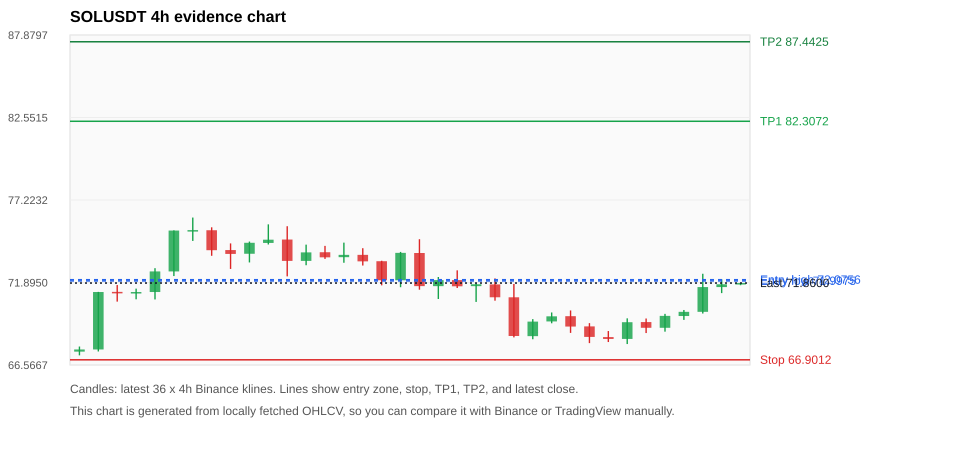
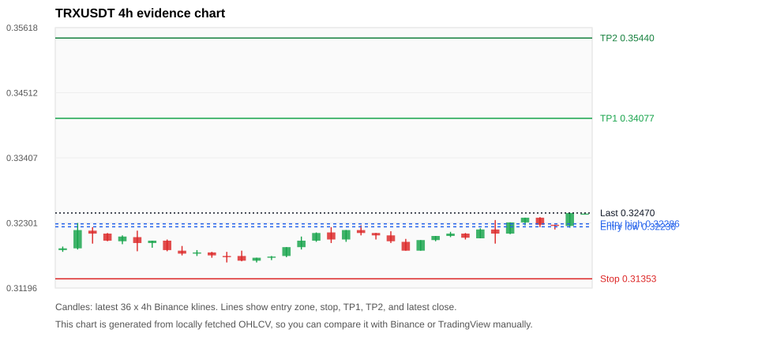
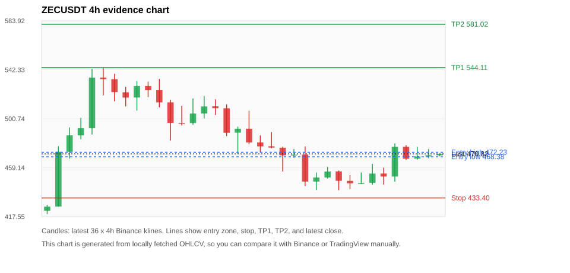
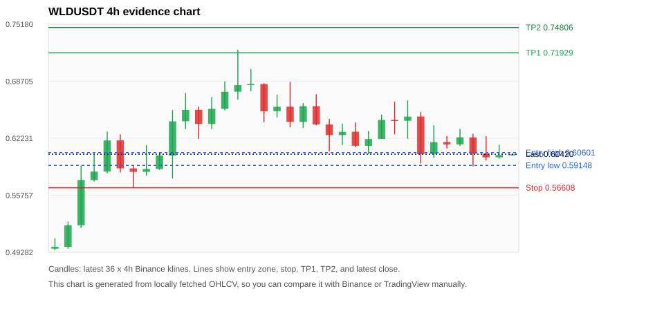
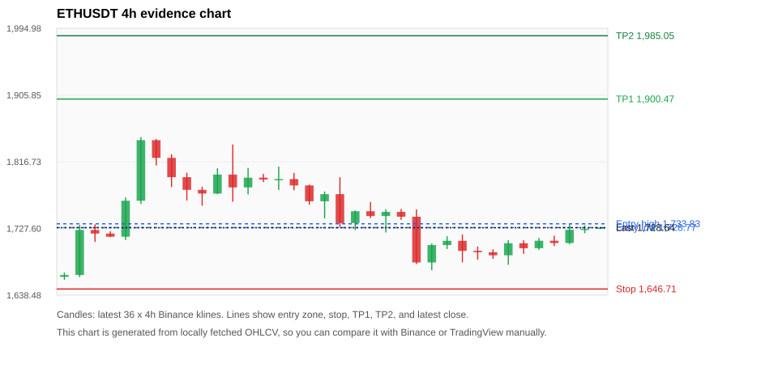

# Crypto 市场扫描报告 v1

- 报告时间：2026-06-20 20:06:56 CST
- Run ID：`20260620_120503_f4f12904`
- Run type：`daily_full`
- 数据来源：SQLite
- 报告版本：v1
- 扫描 ID：4b508e31bdd5
- 数据源：Binance public spot API + CoinGecko/CoinMarketCap cross-check
- 过滤条件：USDT spot; 24h quote volume >= 30,000,000; trades >= 30,000; exclude stables/leveraged tokens; analyze 1h/4h/1d klines
- 默认单笔风险：账户权益的 1.00%

## 限制说明

- 交易信号仍以 Binance 现货公开 K 线为主源；外部数据源用于一致性复核。
- 结果是研究和模拟盘计划，不是确定收益或实盘下单指令。
- 历史长度过滤：候选币至少需要 180 根 1d K 线。
- 数据质量验证池：先验证 score 排名前 min(top_n * 2, 10) 的候选，再按 action + score 补足最终名单。
- 大盘环境过滤：RISK_OFF; BTC/ETH 大盘偏弱，山寨币买入候选降级为观察。 BTC 7d=-1.1206210058300026; ETH 7d=2.840861775657566.
- 已启用数据交叉验证：Binance 主源 + CoinGecko 自动对照；CoinMarketCap 在配置 API Key 后自动对照。
- SOLUSDT 交叉验证状态 DATA_WARNING：At least one external provider needs manual review.
- TRXUSDT 交叉验证状态 DATA_WARNING：At least one external provider needs manual review.
- ZECUSDT 交叉验证状态 DATA_WARNING：At least one external provider needs manual review.
- WLDUSDT 交叉验证状态 DATA_WARNING：At least one external provider needs manual review.
- ETHUSDT 交叉验证状态 DATA_WARNING：At least one external provider needs manual review.
- BTCUSDT 交叉验证状态 DATA_WARNING：At least one external provider needs manual review.
- XRPUSDT 交叉验证状态 DATA_WARNING：At least one external provider needs manual review.
- BNBUSDT 交叉验证状态 DATA_WARNING：At least one external provider needs manual review.
- TAOUSDT 交叉验证状态 DATA_WARNING：At least one external provider needs manual review.

## 5 个候选交易计划

| Rank | Coin | Action | Setup | Entry Zone | Stop Loss | TP1 | TP2 / Exit Rule | R/R | Verdict |
|---:|---|---|---|---:|---:|---:|---|---:|---|
| 1 | `SOL` | `WATCH_ONLY` | 回踩支撑/4h EMA 附近 | 71.9975 - 72.0756 | 66.9012 | 82.3072 | 87.4425 或跌破 4h 关键支撑 | 2.00-3.00 | 只观察 |
| 2 | `TRX` | `WATCH_ONLY` | 回踩支撑/4h EMA 附近 | 0.32236 - 0.32286 | 0.31353 | 0.34077 | 0.35440 或跌破 4h 关键支撑 | 2.00-3.50 | 只观察 |
| 3 | `ZEC` | `WATCH_ONLY` | 回踩支撑/4h EMA 附近 | 468.38 - 472.23 | 433.40 | 544.11 | 581.02 或跌破 4h 关键支撑 | 2.00-3.00 | 只观察 |
| 4 | `WLD` | `WATCH_ONLY` | 回踩支撑/4h EMA 附近 | 0.59148 - 0.60601 | 0.56608 | 0.71929 | 0.74806 或跌破 4h 关键支撑 | 3.69-4.57 | 只观察 |
| 5 | `ETH` | `WATCH_ONLY` | 回踩支撑/4h EMA 附近 | 1,728.77 - 1,733.83 | 1,646.71 | 1,900.47 | 1,985.05 或跌破 4h 关键支撑 | 2.00-3.00 | 只观察 |

## 数据交叉验证摘要

价格差异以 Binance 当前价为基准；成交量口径不同，Binance 是 USDT 现货成交额，CoinGecko/CoinMarketCap 通常是全市场成交量。

| Rank | Coin | Data Status | Max Price Diff | Max 24h Diff | Message |
|---:|---|---|---:|---:|---|
| 1 | `SOL` | DATA_WARNING | 0.18% | 0.05 pts | At least one external provider needs manual review. |
| 2 | `TRX` | DATA_WARNING | 0.09% | 0.01 pts | At least one external provider needs manual review. |
| 3 | `ZEC` | DATA_WARNING | 0.24% | 0.12 pts | At least one external provider needs manual review. |
| 4 | `WLD` | DATA_WARNING | 0.20% | 0.09 pts | At least one external provider needs manual review. |
| 5 | `ETH` | DATA_WARNING | 0.14% | 0.05 pts | At least one external provider needs manual review. |

## 候选币说明

### 1. SOL `SOLUSDT`



- 入选原因：回踩支撑/4h EMA 附近；24h +5.12%，7d +5.65%，4h RSI 50.38，24h 成交额 $121.4M。
- 交易失效条件：跌破 66.9012 或 4h 收盘重新失守关键支撑。
- 主要风险：日线趋势未完全确认；BTC/ETH 大盘环境未确认强势，山寨币买入信号降级；数据交叉验证需要人工复核。
- 数据交叉验证：DATA_WARNING；At least one external provider needs manual review.

#### 可点击人工验证

- [Binance 交易页](https://www.binance.com/en/trade/SOL_USDT)
- [TradingView 图表](https://www.tradingview.com/chart/?symbol=BINANCE%3ASOLUSDT)
- [CoinGecko 搜索](https://www.coingecko.com/en/search?query=SOL)
- [CoinMarketCap 搜索](https://coinmarketcap.com/search/?q=SOL)

#### 多数据源对照

| Source | Status | Asset ID | Price | 24h Change | 24h Volume | Price Diff | 24h Diff | Updated | Message |
|---|---|---|---:|---:|---:|---:|---:|---|---|
| Binance | DATA_OK | SOLUSDT | 71.8600 | +5.12% | $121.4M | 0.00% | 0.00 pts | 2026-06-20T12:06:02+00:00 | Primary market data source used by scanner. |
| CoinGecko | DATA_WARNING | n/a | n/a | n/a | n/a | n/a | n/a | 2026-06-20T12:06:02+00:00 | Failed to fetch https://api.coingecko.com/api/v3/coins/markets?vs_currency=usd&ids=solana&price_change_percentage=24h&per_page=1&page=1: HTTP Error 429: Too Many Requests |
| CoinMarketCap | DATA_WARNING | 5426 | 71.7307 | +5.07% | $1.65B | 0.18% | 0.05 pts | 2026-06-20T12:05:03.000Z | CoinMarketCap symbol mapping has 8 matches; selected lowest cmc_rank |

#### 指标证据

| 指标 | 数值 | 人工核对用途 |
|---|---:|---|
| 当前价 | 71.8600 | 与 Binance/TradingView 当前价格对照 |
| 24h 涨跌 | +5.12% | 与交易所 24h 涨跌对照 |
| 7d 涨跌 | +5.65% | 判断短线趋势是否延续 |
| 4h EMA20 | 70.6390 | 判断短期趋势支撑 |
| 4h EMA50 | 70.3954 | 判断中期趋势支撑 |
| 1d EMA20 | 71.8538 | 判断日线趋势 |
| 1d EMA50 | 77.0733 | 判断日线趋势 |
| 4h RSI14 | 50.38 | 判断是否过热/过弱 |
| 4h ATR14 | 1.3107 | 推导止损和入场缓冲 |
| 最近 18 根 4h 最低点 | 67.9200 | 支撑/止损参考 |
| 最近 36 根 4h 最高点 | 76.0900 | TP/压力参考 |
| 支撑位 | 71.8538 | 入场区间推导基础 |

#### 交易计划推导

- 支撑位 = 最近低点、4h EMA20、4h EMA50、1d EMA20 中不高于当前价的最高有效支撑 = `71.8538`。
- 入场区间 = 支撑位附近 + ATR 缓冲 = `71.9975 - 72.0756`。
- 止损 = min(最近 18 根 4h 最低点 * 0.985, 入场中位价 - 1.15 * ATR14) = `66.9012`。
- TP1 = max(最近 36 根 4h 最高点 * 0.995, 入场中位价 + 2R) = `82.3072`。
- TP2 = max(入场中位价 + 3R, TP1 * 1.04) = `87.4425`。

#### 最近 10 根 4h K线

| UTC 开盘时间 | Open | High | Low | Close | Quote Volume | Trades |
|---|---:|---:|---:|---:|---:|---:|
| 2026-06-19T00:00+00:00 | 69.7200 | 70.0900 | 68.6400 | 69.0500 | $21.9M | 113709 |
| 2026-06-19T04:00+00:00 | 69.0600 | 69.2700 | 67.9800 | 68.3800 | $30.0M | 135395 |
| 2026-06-19T08:00+00:00 | 68.3700 | 68.7600 | 68.0500 | 68.2500 | $19.7M | 105192 |
| 2026-06-19T12:00+00:00 | 68.2500 | 69.5800 | 67.9200 | 69.3300 | $28.5M | 163425 |
| 2026-06-19T16:00+00:00 | 69.3400 | 69.5700 | 68.6300 | 68.9700 | $16.0M | 116231 |
| 2026-06-19T20:00+00:00 | 68.9700 | 69.8700 | 68.7200 | 69.7400 | $13.9M | 81012 |
| 2026-06-20T00:00+00:00 | 69.7300 | 70.1200 | 69.4800 | 70.0000 | $14.8M | 79424 |
| 2026-06-20T04:00+00:00 | 70.0000 | 72.4600 | 69.8900 | 71.6000 | $32.7M | 160048 |
| 2026-06-20T08:00+00:00 | 71.6000 | 72.1000 | 71.2100 | 71.7800 | $15.3M | 70480 |
| 2026-06-20T12:00+00:00 | 71.7800 | 71.8800 | 71.7200 | 71.8600 | $474,306 | 1994 |

### 2. TRX `TRXUSDT`



- 入选原因：回踩支撑/4h EMA 附近；24h +0.84%，7d +2.30%，4h RSI 62.59，24h 成交额 $41.7M。
- 交易失效条件：跌破 0.3135255 或 4h 收盘重新失守关键支撑。
- 主要风险：日线趋势未完全确认；BTC/ETH 大盘环境未确认强势，山寨币买入信号降级；数据交叉验证需要人工复核。
- 数据交叉验证：DATA_WARNING；At least one external provider needs manual review.

#### 可点击人工验证

- [Binance 交易页](https://www.binance.com/en/trade/TRX_USDT)
- [TradingView 图表](https://www.tradingview.com/chart/?symbol=BINANCE%3ATRXUSDT)
- [CoinGecko 搜索](https://www.coingecko.com/en/search?query=TRX)
- [CoinMarketCap 搜索](https://coinmarketcap.com/search/?q=TRX)

#### 多数据源对照

| Source | Status | Asset ID | Price | 24h Change | 24h Volume | Price Diff | 24h Diff | Updated | Message |
|---|---|---|---:|---:|---:|---:|---:|---|---|
| Binance | DATA_OK | TRXUSDT | 0.32470 | +0.84% | $41.7M | 0.00% | 0.00 pts | 2026-06-20T12:06:02+00:00 | Primary market data source used by scanner. |
| CoinGecko | DATA_WARNING | n/a | n/a | n/a | n/a | n/a | n/a | 2026-06-20T12:06:02+00:00 | Failed to fetch https://api.coingecko.com/api/v3/coins/markets?vs_currency=usd&ids=tron&price_change_percentage=24h&per_page=1&page=1: HTTP Error 429: Too Many Requests |
| CoinMarketCap | DATA_OK | 1958 | 0.32441 | +0.85% | $544.2M | 0.09% | 0.01 pts | 2026-06-20T12:05:03.000Z | External source agrees with Binance within thresholds. |

#### 指标证据

| 指标 | 数值 | 人工核对用途 |
|---|---:|---|
| 当前价 | 0.32470 | 与 Binance/TradingView 当前价格对照 |
| 24h 涨跌 | +0.84% | 与交易所 24h 涨跌对照 |
| 7d 涨跌 | +2.30% | 判断短线趋势是否延续 |
| 4h EMA20 | 0.32172 | 判断短期趋势支撑 |
| 4h EMA50 | 0.32109 | 判断中期趋势支撑 |
| 1d EMA20 | 0.32671 | 判断日线趋势 |
| 1d EMA50 | 0.33246 | 判断日线趋势 |
| 4h RSI14 | 62.59 | 判断是否过热/过弱 |
| 4h ATR14 | 0.0016285714 | 推导止损和入场缓冲 |
| 最近 18 根 4h 最低点 | 0.31830 | 支撑/止损参考 |
| 最近 36 根 4h 最高点 | 0.32470 | TP/压力参考 |
| 支撑位 | 0.32172 | 入场区间推导基础 |

#### 交易计划推导

- 支撑位 = 最近低点、4h EMA20、4h EMA50、1d EMA20 中不高于当前价的最高有效支撑 = `0.32172`。
- 入场区间 = 支撑位附近 + ATR 缓冲 = `0.32236 - 0.32286`。
- 止损 = min(最近 18 根 4h 最低点 * 0.985, 入场中位价 - 1.15 * ATR14) = `0.31353`。
- TP1 = max(最近 36 根 4h 最高点 * 0.995, 入场中位价 + 2R) = `0.34077`。
- TP2 = max(入场中位价 + 3R, TP1 * 1.04) = `0.35440`。

#### 最近 10 根 4h K线

| UTC 开盘时间 | Open | High | Low | Close | Quote Volume | Trades |
|---|---:|---:|---:|---:|---:|---:|
| 2026-06-19T00:00+00:00 | 0.32080 | 0.32150 | 0.32060 | 0.32120 | $3.3M | 8326 |
| 2026-06-19T04:00+00:00 | 0.32120 | 0.32130 | 0.32020 | 0.32050 | $4.6M | 9783 |
| 2026-06-19T08:00+00:00 | 0.32040 | 0.32210 | 0.32040 | 0.32190 | $4.9M | 13312 |
| 2026-06-19T12:00+00:00 | 0.32190 | 0.32350 | 0.31950 | 0.32120 | $14.0M | 18115 |
| 2026-06-19T16:00+00:00 | 0.32120 | 0.32310 | 0.32110 | 0.32310 | $7.4M | 14111 |
| 2026-06-19T20:00+00:00 | 0.32310 | 0.32390 | 0.32260 | 0.32390 | $5.6M | 10686 |
| 2026-06-20T00:00+00:00 | 0.32390 | 0.32400 | 0.32230 | 0.32270 | $5.1M | 8650 |
| 2026-06-20T04:00+00:00 | 0.32270 | 0.32270 | 0.32190 | 0.32250 | $2.1M | 7348 |
| 2026-06-20T08:00+00:00 | 0.32250 | 0.32470 | 0.32220 | 0.32470 | $7.6M | 15216 |
| 2026-06-20T12:00+00:00 | 0.32460 | 0.32470 | 0.32460 | 0.32460 | $107,844 | 386 |

### 3. ZEC `ZECUSDT`



- 入选原因：回踩支撑/4h EMA 附近；24h +5.33%，7d +14.12%，4h RSI 50.66，24h 成交额 $85.7M。
- 交易失效条件：跌破 433.4 或 4h 收盘重新失守关键支撑。
- 主要风险：日线趋势未完全确认；BTC/ETH 大盘环境未确认强势，山寨币买入信号降级；数据交叉验证需要人工复核。
- 数据交叉验证：DATA_WARNING；At least one external provider needs manual review.

#### 可点击人工验证

- [Binance 交易页](https://www.binance.com/en/trade/ZEC_USDT)
- [TradingView 图表](https://www.tradingview.com/chart/?symbol=BINANCE%3AZECUSDT)
- [CoinGecko 搜索](https://www.coingecko.com/en/search?query=ZEC)
- [CoinMarketCap 搜索](https://coinmarketcap.com/search/?q=ZEC)

#### 多数据源对照

| Source | Status | Asset ID | Price | 24h Change | 24h Volume | Price Diff | 24h Diff | Updated | Message |
|---|---|---|---:|---:|---:|---:|---:|---|---|
| Binance | DATA_OK | ZECUSDT | 470.82 | +5.33% | $85.7M | 0.00% | 0.00 pts | 2026-06-20T12:06:02+00:00 | Primary market data source used by scanner. |
| CoinGecko | DATA_WARNING | n/a | n/a | n/a | n/a | n/a | n/a | 2026-06-20T12:06:02+00:00 | Failed to fetch https://api.coingecko.com/api/v3/coins/markets?vs_currency=usd&ids=zcash&price_change_percentage=24h&per_page=1&page=1: HTTP Error 429: Too Many Requests |
| CoinMarketCap | DATA_WARNING | 1437 | 469.68 | +5.21% | $447.2M | 0.24% | 0.12 pts | 2026-06-20T12:05:03.000Z | CoinMarketCap symbol mapping has 2 matches; selected lowest cmc_rank |

#### 指标证据

| 指标 | 数值 | 人工核对用途 |
|---|---:|---|
| 当前价 | 470.82 | 与 Binance/TradingView 当前价格对照 |
| 24h 涨跌 | +5.33% | 与交易所 24h 涨跌对照 |
| 7d 涨跌 | +14.12% | 判断短线趋势是否延续 |
| 4h EMA20 | 467.40 | 判断短期趋势支撑 |
| 4h EMA50 | 467.44 | 判断中期趋势支撑 |
| 1d EMA20 | 477.95 | 判断日线趋势 |
| 1d EMA50 | 476.39 | 判断日线趋势 |
| 4h RSI14 | 50.66 | 判断是否过热/过弱 |
| 4h ATR14 | 14.4571 | 推导止损和入场缓冲 |
| 最近 18 根 4h 最低点 | 440.00 | 支撑/止损参考 |
| 最近 36 根 4h 最高点 | 544.28 | TP/压力参考 |
| 支撑位 | 467.44 | 入场区间推导基础 |

#### 交易计划推导

- 支撑位 = 最近低点、4h EMA20、4h EMA50、1d EMA20 中不高于当前价的最高有效支撑 = `467.44`。
- 入场区间 = 支撑位附近 + ATR 缓冲 = `468.38 - 472.23`。
- 止损 = min(最近 18 根 4h 最低点 * 0.985, 入场中位价 - 1.15 * ATR14) = `433.40`。
- TP1 = max(最近 36 根 4h 最高点 * 0.995, 入场中位价 + 2R) = `544.11`。
- TP2 = max(入场中位价 + 3R, TP1 * 1.04) = `581.02`。

#### 最近 10 根 4h K线

| UTC 开盘时间 | Open | High | Low | Close | Quote Volume | Trades |
|---|---:|---:|---:|---:|---:|---:|
| 2026-06-19T00:00+00:00 | 455.97 | 456.72 | 440.00 | 447.99 | $11.2M | 49532 |
| 2026-06-19T04:00+00:00 | 447.94 | 452.88 | 441.01 | 445.85 | $11.6M | 48133 |
| 2026-06-19T08:00+00:00 | 445.82 | 455.00 | 445.19 | 446.21 | $8.0M | 38691 |
| 2026-06-19T12:00+00:00 | 446.25 | 462.37 | 444.53 | 454.12 | $22.9M | 96670 |
| 2026-06-19T16:00+00:00 | 454.17 | 459.21 | 444.74 | 451.61 | $21.7M | 74327 |
| 2026-06-19T20:00+00:00 | 451.62 | 479.79 | 447.20 | 476.80 | $13.4M | 71232 |
| 2026-06-20T00:00+00:00 | 476.80 | 478.26 | 465.62 | 466.71 | $15.0M | 60683 |
| 2026-06-20T04:00+00:00 | 466.79 | 476.77 | 465.97 | 468.75 | $7.2M | 32539 |
| 2026-06-20T08:00+00:00 | 468.70 | 474.95 | 467.16 | 469.68 | $5.5M | 26261 |
| 2026-06-20T12:00+00:00 | 469.64 | 470.96 | 468.92 | 470.82 | $220,305 | 903 |

### 4. WLD `WLDUSDT`



- 入选原因：回踩支撑/4h EMA 附近；24h -0.33%，7d +19.62%，4h RSI 42.60，24h 成交额 $54.8M。
- 交易失效条件：跌破 0.56607839 或 4h 收盘重新失守关键支撑。
- 主要风险：BTC/ETH 大盘环境未确认强势，山寨币买入信号降级；24h 动量未确认；数据交叉验证需要人工复核。
- 数据交叉验证：DATA_WARNING；At least one external provider needs manual review.

#### 可点击人工验证

- [Binance 交易页](https://www.binance.com/en/trade/WLD_USDT)
- [TradingView 图表](https://www.tradingview.com/chart/?symbol=BINANCE%3AWLDUSDT)
- [CoinGecko 搜索](https://www.coingecko.com/en/search?query=WLD)
- [CoinMarketCap 搜索](https://coinmarketcap.com/search/?q=WLD)

#### 多数据源对照

| Source | Status | Asset ID | Price | 24h Change | 24h Volume | Price Diff | 24h Diff | Updated | Message |
|---|---|---|---:|---:|---:|---:|---:|---|---|
| Binance | DATA_OK | WLDUSDT | 0.60420 | -0.33% | $54.8M | 0.00% | 0.00 pts | 2026-06-20T12:06:02+00:00 | Primary market data source used by scanner. |
| CoinGecko | DATA_WARNING | n/a | n/a | n/a | n/a | n/a | n/a | 2026-06-20T12:06:02+00:00 | Failed to fetch https://api.coingecko.com/api/v3/coins/markets?vs_currency=usd&ids=worldcoin-wld&price_change_percentage=24h&per_page=1&page=1: HTTP Error 429: Too Many Requests |
| CoinMarketCap | DATA_WARNING | 13502 | 0.60299 | -0.42% | $337.9M | 0.20% | 0.09 pts | 2026-06-20T12:05:03.000Z | CoinMarketCap symbol mapping has 2 matches; selected lowest cmc_rank |

#### 指标证据

| 指标 | 数值 | 人工核对用途 |
|---|---:|---|
| 当前价 | 0.60420 | 与 Binance/TradingView 当前价格对照 |
| 24h 涨跌 | -0.33% | 与交易所 24h 涨跌对照 |
| 7d 涨跌 | +19.62% | 判断短线趋势是否延续 |
| 4h EMA20 | 0.61719 | 判断短期趋势支撑 |
| 4h EMA50 | 0.59010 | 判断中期趋势支撑 |
| 1d EMA20 | 0.52618 | 判断日线趋势 |
| 1d EMA50 | 0.42731 | 判断日线趋势 |
| 4h RSI14 | 42.60 | 判断是否过热/过弱 |
| 4h ATR14 | 0.02841 | 推导止损和入场缓冲 |
| 最近 18 根 4h 最低点 | 0.59030 | 支撑/止损参考 |
| 最近 36 根 4h 最高点 | 0.72290 | TP/压力参考 |
| 支撑位 | 0.59030 | 入场区间推导基础 |

#### 交易计划推导

- 支撑位 = 最近低点、4h EMA20、4h EMA50、1d EMA20 中不高于当前价的最高有效支撑 = `0.59030`。
- 入场区间 = 支撑位附近 + ATR 缓冲 = `0.59148 - 0.60601`。
- 止损 = min(最近 18 根 4h 最低点 * 0.985, 入场中位价 - 1.15 * ATR14) = `0.56608`。
- TP1 = max(最近 36 根 4h 最高点 * 0.995, 入场中位价 + 2R) = `0.71929`。
- TP2 = max(入场中位价 + 3R, TP1 * 1.04) = `0.74806`。

#### 最近 10 根 4h K线

| UTC 开盘时间 | Open | High | Low | Close | Quote Volume | Trades |
|---|---:|---:|---:|---:|---:|---:|
| 2026-06-19T00:00+00:00 | 0.64310 | 0.66370 | 0.62670 | 0.64230 | $17.7M | 209708 |
| 2026-06-19T04:00+00:00 | 0.64220 | 0.66520 | 0.62170 | 0.64690 | $16.7M | 221509 |
| 2026-06-19T08:00+00:00 | 0.64700 | 0.65220 | 0.59360 | 0.60440 | $24.5M | 279583 |
| 2026-06-19T12:00+00:00 | 0.60450 | 0.63710 | 0.60010 | 0.61790 | $16.5M | 228313 |
| 2026-06-19T16:00+00:00 | 0.61800 | 0.62490 | 0.61080 | 0.61530 | $6.1M | 92585 |
| 2026-06-19T20:00+00:00 | 0.61540 | 0.63300 | 0.61370 | 0.62340 | $7.1M | 83833 |
| 2026-06-20T00:00+00:00 | 0.62330 | 0.62730 | 0.59030 | 0.60480 | $10.5M | 121576 |
| 2026-06-20T04:00+00:00 | 0.60480 | 0.62470 | 0.59710 | 0.60060 | $9.2M | 107815 |
| 2026-06-20T08:00+00:00 | 0.60070 | 0.61490 | 0.59910 | 0.60320 | $5.6M | 75214 |
| 2026-06-20T12:00+00:00 | 0.60320 | 0.60430 | 0.60260 | 0.60410 | $100,974 | 1869 |

### 5. ETH `ETHUSDT`



- 入选原因：回踩支撑/4h EMA 附近；24h +2.09%，7d +3.02%，4h RSI 43.85，24h 成交额 $224.6M。
- 交易失效条件：跌破 1646.7132 或 4h 收盘重新失守关键支撑。
- 主要风险：日线趋势未完全确认；BTC/ETH 大盘环境未确认强势，山寨币买入信号降级；数据交叉验证需要人工复核。
- 数据交叉验证：DATA_WARNING；At least one external provider needs manual review.

#### 可点击人工验证

- [Binance 交易页](https://www.binance.com/en/trade/ETH_USDT)
- [TradingView 图表](https://www.tradingview.com/chart/?symbol=BINANCE%3AETHUSDT)
- [CoinGecko 搜索](https://www.coingecko.com/en/search?query=ETH)
- [CoinMarketCap 搜索](https://coinmarketcap.com/search/?q=ETH)

#### 多数据源对照

| Source | Status | Asset ID | Price | 24h Change | 24h Volume | Price Diff | 24h Diff | Updated | Message |
|---|---|---|---:|---:|---:|---:|---:|---|---|
| Binance | DATA_OK | ETHUSDT | 1,728.64 | +2.09% | $224.6M | 0.00% | 0.00 pts | 2026-06-20T12:06:02+00:00 | Primary market data source used by scanner. |
| CoinGecko | DATA_WARNING | n/a | n/a | n/a | n/a | n/a | n/a | 2026-06-20T12:06:02+00:00 | Failed to fetch https://api.coingecko.com/api/v3/coins/markets?vs_currency=usd&ids=ethereum&price_change_percentage=24h&per_page=1&page=1: HTTP Error 429: Too Many Requests |
| CoinMarketCap | DATA_WARNING | 1027 | 1,726.31 | +2.04% | $6.66B | 0.14% | 0.05 pts | 2026-06-20T12:05:03.000Z | CoinMarketCap symbol mapping has 6 matches; selected lowest cmc_rank |

#### 指标证据

| 指标 | 数值 | 人工核对用途 |
|---|---:|---|
| 当前价 | 1,728.64 | 与 Binance/TradingView 当前价格对照 |
| 24h 涨跌 | +2.09% | 与交易所 24h 涨跌对照 |
| 7d 涨跌 | +3.02% | 判断短线趋势是否延续 |
| 4h EMA20 | 1,723.16 | 判断短期趋势支撑 |
| 4h EMA50 | 1,725.32 | 判断中期趋势支撑 |
| 1d EMA20 | 1,772.59 | 判断日线趋势 |
| 1d EMA50 | 1,927.64 | 判断日线趋势 |
| 4h RSI14 | 43.85 | 判断是否过热/过弱 |
| 4h ATR14 | 23.4936 | 推导止损和入场缓冲 |
| 最近 18 根 4h 最低点 | 1,671.79 | 支撑/止损参考 |
| 最近 36 根 4h 最高点 | 1,849.54 | TP/压力参考 |
| 支撑位 | 1,725.32 | 入场区间推导基础 |

#### 交易计划推导

- 支撑位 = 最近低点、4h EMA20、4h EMA50、1d EMA20 中不高于当前价的最高有效支撑 = `1,725.32`。
- 入场区间 = 支撑位附近 + ATR 缓冲 = `1,728.77 - 1,733.83`。
- 止损 = min(最近 18 根 4h 最低点 * 0.985, 入场中位价 - 1.15 * ATR14) = `1,646.71`。
- TP1 = max(最近 36 根 4h 最高点 * 0.995, 入场中位价 + 2R) = `1,900.47`。
- TP2 = max(入场中位价 + 3R, TP1 * 1.04) = `1,985.05`。

#### 最近 10 根 4h K线

| UTC 开盘时间 | Open | High | Low | Close | Quote Volume | Trades |
|---|---:|---:|---:|---:|---:|---:|
| 2026-06-19T00:00+00:00 | 1,711.11 | 1,719.51 | 1,682.35 | 1,697.69 | $64.1M | 421515 |
| 2026-06-19T04:00+00:00 | 1,697.70 | 1,703.40 | 1,686.00 | 1,695.82 | $55.2M | 389074 |
| 2026-06-19T08:00+00:00 | 1,695.82 | 1,699.82 | 1,687.05 | 1,691.74 | $33.4M | 336081 |
| 2026-06-19T12:00+00:00 | 1,691.74 | 1,712.06 | 1,679.11 | 1,707.86 | $65.5M | 632732 |
| 2026-06-19T16:00+00:00 | 1,707.87 | 1,711.76 | 1,693.70 | 1,701.20 | $38.2M | 359587 |
| 2026-06-19T20:00+00:00 | 1,701.21 | 1,715.00 | 1,698.89 | 1,711.19 | $24.0M | 200779 |
| 2026-06-20T00:00+00:00 | 1,711.18 | 1,718.00 | 1,704.06 | 1,708.17 | $24.8M | 232787 |
| 2026-06-20T04:00+00:00 | 1,708.18 | 1,733.89 | 1,706.51 | 1,725.82 | $49.4M | 296623 |
| 2026-06-20T08:00+00:00 | 1,725.81 | 1,731.76 | 1,721.25 | 1,727.18 | $23.0M | 167591 |
| 2026-06-20T12:00+00:00 | 1,727.18 | 1,729.26 | 1,726.92 | 1,728.64 | $547,527 | 5166 |

## 组合风控

- 不要 5 个候选全部满仓买入。
- 同时持仓总风险建议控制在账户权益的 3% - 5% 以内。
- 如果 BTC/ETH 同时破位，暂停山寨币多头计划或降低仓位。
- 第一版报告用于模拟盘和人工复核，不自动下单。

## 原始数据

```json
[
  {
    "rank": 1,
    "symbol": "SOLUSDT",
    "base_asset": "SOL",
    "price": 71.86,
    "score": 46.40844840966569,
    "setup": "回踩支撑/4h EMA 附近",
    "verdict": "只观察",
    "entry_low": 71.99748721176688,
    "entry_high": 72.07557999999999,
    "stop_loss": 66.9012,
    "take_profit_1": 82.3072008176503,
    "take_profit_2": 87.44253442353373,
    "risk_reward_1": 2.0,
    "risk_reward_2": 3.0,
    "pct_24h": 5.121,
    "pct_3d": -0.7869667264945535,
    "pct_7d": 5.645398412231706,
    "quote_volume_24h": 121441667.08624,
    "trades_24h": 670346,
    "high_low_range_24h": 6.684334511189616,
    "rsi_1h": 76.99115044247796,
    "rsi_4h": 50.38461538461539,
    "ema20_4h": 70.63902507627641,
    "ema50_4h": 70.39535651214831,
    "ema20_1d": 71.85377965246195,
    "ema50_1d": 77.07331498756741,
    "atr_4h": 1.3107142857142844,
    "macd_hist_4h": 0.19901361778390825,
    "volume_ratio_24h": 0.6982289295912371,
    "support_level": 71.85377965246195,
    "recent_low_4h_18": 67.92,
    "recent_high_4h_36": 76.09,
    "distance_to_support_pct": 0.00865695245000353,
    "binance_trade_url": "https://www.binance.com/en/trade/SOL_USDT",
    "tradingview_url": "https://www.tradingview.com/chart/?symbol=BINANCE%3ASOLUSDT",
    "coingecko_search_url": "https://www.coingecko.com/en/search?query=SOL",
    "coinmarketcap_search_url": "https://coinmarketcap.com/search/?q=SOL",
    "invalidation": "跌破 66.9012 或 4h 收盘重新失守关键支撑",
    "recent_4h_klines": [
      {
        "open_time_utc": "2026-06-14T16:00+00:00",
        "open": 67.43,
        "high": 67.76,
        "low": 67.19,
        "close": 67.57,
        "quote_volume": 7366054.9678,
        "trades": 49679
      },
      {
        "open_time_utc": "2026-06-14T20:00+00:00",
        "open": 67.57,
        "high": 71.29,
        "low": 67.44,
        "close": 71.28,
        "quote_volume": 52297919.61813,
        "trades": 259085
      },
      {
        "open_time_utc": "2026-06-15T00:00+00:00",
        "open": 71.29,
        "high": 71.73,
        "low": 70.66,
        "close": 71.24,
        "quote_volume": 30783591.36055,
        "trades": 144834
      },
      {
        "open_time_utc": "2026-06-15T04:00+00:00",
        "open": 71.24,
        "high": 71.5,
        "low": 70.81,
        "close": 71.28,
        "quote_volume": 16764454.21633,
        "trades": 75838
      },
      {
        "open_time_utc": "2026-06-15T08:00+00:00",
        "open": 71.28,
        "high": 72.82,
        "low": 70.8,
        "close": 72.61,
        "quote_volume": 38176801.59558,
        "trades": 142305
      },
      {
        "open_time_utc": "2026-06-15T12:00+00:00",
        "open": 72.61,
        "high": 75.26,
        "low": 72.31,
        "close": 75.25,
        "quote_volume": 61783304.91529,
        "trades": 260161
      },
      {
        "open_time_utc": "2026-06-15T16:00+00:00",
        "open": 75.25,
        "high": 76.09,
        "low": 74.58,
        "close": 75.28,
        "quote_volume": 52140901.07867,
        "trades": 263984
      },
      {
        "open_time_utc": "2026-06-15T20:00+00:00",
        "open": 75.27,
        "high": 75.46,
        "low": 73.62,
        "close": 73.98,
        "quote_volume": 27730329.63705,
        "trades": 153907
      },
      {
        "open_time_utc": "2026-06-16T00:00+00:00",
        "open": 73.99,
        "high": 74.42,
        "low": 72.77,
        "close": 73.74,
        "quote_volume": 25577532.47424,
        "trades": 121209
      },
      {
        "open_time_utc": "2026-06-16T04:00+00:00",
        "open": 73.75,
        "high": 74.54,
        "low": 73.19,
        "close": 74.46,
        "quote_volume": 19986745.95484,
        "trades": 77710
      },
      {
        "open_time_utc": "2026-06-16T08:00+00:00",
        "open": 74.45,
        "high": 75.65,
        "low": 74.35,
        "close": 74.66,
        "quote_volume": 25983636.28636,
        "trades": 115402
      },
      {
        "open_time_utc": "2026-06-16T12:00+00:00",
        "open": 74.67,
        "high": 75.53,
        "low": 72.29,
        "close": 73.29,
        "quote_volume": 50428964.09644,
        "trades": 275915
      },
      {
        "open_time_utc": "2026-06-16T16:00+00:00",
        "open": 73.29,
        "high": 74.34,
        "low": 73.01,
        "close": 73.84,
        "quote_volume": 26500730.07898,
        "trades": 175551
      },
      {
        "open_time_utc": "2026-06-16T20:00+00:00",
        "open": 73.85,
        "high": 74.26,
        "low": 73.42,
        "close": 73.52,
        "quote_volume": 13159470.67923,
        "trades": 78710
      },
      {
        "open_time_utc": "2026-06-17T00:00+00:00",
        "open": 73.53,
        "high": 74.47,
        "low": 73.17,
        "close": 73.68,
        "quote_volume": 19241007.5537,
        "trades": 112326
      },
      {
        "open_time_utc": "2026-06-17T04:00+00:00",
        "open": 73.68,
        "high": 74.11,
        "low": 72.99,
        "close": 73.26,
        "quote_volume": 18012241.98635,
        "trades": 106419
      },
      {
        "open_time_utc": "2026-06-17T08:00+00:00",
        "open": 73.27,
        "high": 73.3,
        "low": 71.71,
        "close": 72.04,
        "quote_volume": 24082792.06333,
        "trades": 141175
      },
      {
        "open_time_utc": "2026-06-17T12:00+00:00",
        "open": 72.04,
        "high": 73.87,
        "low": 71.59,
        "close": 73.81,
        "quote_volume": 31483417.7479,
        "trades": 210550
      },
      {
        "open_time_utc": "2026-06-17T16:00+00:00",
        "open": 73.8,
        "high": 74.69,
        "low": 71.43,
        "close": 71.66,
        "quote_volume": 64664598.63975,
        "trades": 429277
      },
      {
        "open_time_utc": "2026-06-17T20:00+00:00",
        "open": 71.66,
        "high": 72.25,
        "low": 70.83,
        "close": 72.05,
        "quote_volume": 20638978.09268,
        "trades": 140026
      },
      {
        "open_time_utc": "2026-06-18T00:00+00:00",
        "open": 72.05,
        "high": 72.68,
        "low": 71.54,
        "close": 71.65,
        "quote_volume": 14804358.19443,
        "trades": 94627
      },
      {
        "open_time_utc": "2026-06-18T04:00+00:00",
        "open": 71.66,
        "high": 71.85,
        "low": 70.64,
        "close": 71.78,
        "quote_volume": 18072952.69873,
        "trades": 126856
      },
      {
        "open_time_utc": "2026-06-18T08:00+00:00",
        "open": 71.77,
        "high": 72.16,
        "low": 70.72,
        "close": 70.94,
        "quote_volume": 20050944.13144,
        "trades": 102034
      },
      {
        "open_time_utc": "2026-06-18T12:00+00:00",
        "open": 70.94,
        "high": 71.8,
        "low": 68.35,
        "close": 68.44,
        "quote_volume": 54166130.1129,
        "trades": 327865
      },
      {
        "open_time_utc": "2026-06-18T16:00+00:00",
        "open": 68.43,
        "high": 69.53,
        "low": 68.23,
        "close": 69.37,
        "quote_volume": 35889091.80634,
        "trades": 196706
      },
      {
        "open_time_utc": "2026-06-18T20:00+00:00",
        "open": 69.38,
        "high": 69.96,
        "low": 69.26,
        "close": 69.71,
        "quote_volume": 16011482.82535,
        "trades": 96343
      },
      {
        "open_time_utc": "2026-06-19T00:00+00:00",
        "open": 69.72,
        "high": 70.09,
        "low": 68.64,
        "close": 69.05,
        "quote_volume": 21881602.30004,
        "trades": 113709
      },
      {
        "open_time_utc": "2026-06-19T04:00+00:00",
        "open": 69.06,
        "high": 69.27,
        "low": 67.98,
        "close": 68.38,
        "quote_volume": 29986443.93034,
        "trades": 135395
      },
      {
        "open_time_utc": "2026-06-19T08:00+00:00",
        "open": 68.37,
        "high": 68.76,
        "low": 68.05,
        "close": 68.25,
        "quote_volume": 19671579.62523,
        "trades": 105192
      },
      {
        "open_time_utc": "2026-06-19T12:00+00:00",
        "open": 68.25,
        "high": 69.58,
        "low": 67.92,
        "close": 69.33,
        "quote_volume": 28464907.55176,
        "trades": 163425
      },
      {
        "open_time_utc": "2026-06-19T16:00+00:00",
        "open": 69.34,
        "high": 69.57,
        "low": 68.63,
        "close": 68.97,
        "quote_volume": 15972210.91597,
        "trades": 116231
      },
      {
        "open_time_utc": "2026-06-19T20:00+00:00",
        "open": 68.97,
        "high": 69.87,
        "low": 68.72,
        "close": 69.74,
        "quote_volume": 13869516.37523,
        "trades": 81012
      },
      {
        "open_time_utc": "2026-06-20T00:00+00:00",
        "open": 69.73,
        "high": 70.12,
        "low": 69.48,
        "close": 70.0,
        "quote_volume": 14795005.85041,
        "trades": 79424
      },
      {
        "open_time_utc": "2026-06-20T04:00+00:00",
        "open": 70.0,
        "high": 72.46,
        "low": 69.89,
        "close": 71.6,
        "quote_volume": 32717749.308,
        "trades": 160048
      },
      {
        "open_time_utc": "2026-06-20T08:00+00:00",
        "open": 71.6,
        "high": 72.1,
        "low": 71.21,
        "close": 71.78,
        "quote_volume": 15346915.81252,
        "trades": 70480
      },
      {
        "open_time_utc": "2026-06-20T12:00+00:00",
        "open": 71.78,
        "high": 71.88,
        "low": 71.72,
        "close": 71.86,
        "quote_volume": 474306.45252,
        "trades": 1994
      }
    ],
    "risks": [
      "日线趋势未完全确认",
      "BTC/ETH 大盘环境未确认强势，山寨币买入信号降级",
      "数据交叉验证需要人工复核"
    ],
    "data_quality_status": "DATA_WARNING",
    "data_quality_message": "At least one external provider needs manual review.",
    "data_checks": [
      {
        "provider": "Binance",
        "status": "DATA_OK",
        "provider_asset_id": "SOLUSDT",
        "provider_symbol": "SOLUSDT",
        "price_usd": 71.86,
        "pct_24h": 5.121,
        "volume_24h": 121441667.08624,
        "last_updated": null,
        "fetched_at_utc": "2026-06-20T12:06:02+00:00",
        "price_diff_pct": 0.0,
        "pct_24h_diff": 0.0,
        "volume_note": "Binance USDT spot 24h quoteVolume.",
        "message": "Primary market data source used by scanner."
      },
      {
        "provider": "CoinGecko",
        "status": "DATA_WARNING",
        "provider_asset_id": null,
        "provider_symbol": "SOL",
        "price_usd": null,
        "pct_24h": null,
        "volume_24h": null,
        "last_updated": null,
        "fetched_at_utc": "2026-06-20T12:06:02+00:00",
        "price_diff_pct": null,
        "pct_24h_diff": null,
        "volume_note": "External provider data unavailable.",
        "message": "Failed to fetch https://api.coingecko.com/api/v3/coins/markets?vs_currency=usd&ids=solana&price_change_percentage=24h&per_page=1&page=1: HTTP Error 429: Too Many Requests"
      },
      {
        "provider": "CoinMarketCap",
        "status": "DATA_WARNING",
        "provider_asset_id": "5426",
        "provider_symbol": "SOL",
        "price_usd": 71.7307081908511,
        "pct_24h": 5.07148773,
        "volume_24h": 1649351779.3608575,
        "last_updated": "2026-06-20T12:05:03.000Z",
        "fetched_at_utc": "2026-06-20T12:06:02+00:00",
        "price_diff_pct": 0.1799218051056161,
        "pct_24h_diff": 0.049512270000000136,
        "volume_note": "CoinMarketCap total market volume; not the same venue scope as Binance quoteVolume.",
        "message": "CoinMarketCap symbol mapping has 8 matches; selected lowest cmc_rank"
      }
    ],
    "action": "WATCH_ONLY"
  },
  {
    "rank": 2,
    "symbol": "TRXUSDT",
    "base_asset": "TRX",
    "price": 0.3247,
    "score": 43.72702956132919,
    "setup": "回踩支撑/4h EMA 附近",
    "verdict": "只观察",
    "entry_low": 0.3223594651781124,
    "entry_high": 0.3228560331118886,
    "stop_loss": 0.3135255,
    "take_profit_1": 0.3407722474350015,
    "take_profit_2": 0.3544031373324016,
    "risk_reward_1": 2.0,
    "risk_reward_2": 3.5008275681253984,
    "pct_24h": 0.839,
    "pct_3d": 1.310452418096708,
    "pct_7d": 2.2999369880277065,
    "quote_volume_24h": 41728040.02845,
    "trades_24h": 74014,
    "high_low_range_24h": 1.6275430359937282,
    "rsi_1h": 64.44444444444389,
    "rsi_4h": 62.58503401360538,
    "ema20_4h": 0.3217160331118886,
    "ema50_4h": 0.3210881346262704,
    "ema20_1d": 0.3267080591251069,
    "ema50_1d": 0.33246016494796576,
    "atr_4h": 0.0016285714285714198,
    "macd_hist_4h": 0.00034214115710205295,
    "volume_ratio_24h": 1.2362542633404676,
    "support_level": 0.3217160331118886,
    "recent_low_4h_18": 0.3183,
    "recent_high_4h_36": 0.3247,
    "distance_to_support_pct": 0.9275157533331857,
    "binance_trade_url": "https://www.binance.com/en/trade/TRX_USDT",
    "tradingview_url": "https://www.tradingview.com/chart/?symbol=BINANCE%3ATRXUSDT",
    "coingecko_search_url": "https://www.coingecko.com/en/search?query=TRX",
    "coinmarketcap_search_url": "https://coinmarketcap.com/search/?q=TRX",
    "invalidation": "跌破 0.3135255 或 4h 收盘重新失守关键支撑",
    "recent_4h_klines": [
      {
        "open_time_utc": "2026-06-14T16:00+00:00",
        "open": 0.3184,
        "high": 0.319,
        "low": 0.3181,
        "close": 0.3187,
        "quote_volume": 2422203.71946,
        "trades": 7332
      },
      {
        "open_time_utc": "2026-06-14T20:00+00:00",
        "open": 0.3187,
        "high": 0.323,
        "low": 0.3185,
        "close": 0.3218,
        "quote_volume": 8890526.62899,
        "trades": 14295
      },
      {
        "open_time_utc": "2026-06-15T00:00+00:00",
        "open": 0.3217,
        "high": 0.3223,
        "low": 0.3195,
        "close": 0.3212,
        "quote_volume": 6763806.32194,
        "trades": 11715
      },
      {
        "open_time_utc": "2026-06-15T04:00+00:00",
        "open": 0.3212,
        "high": 0.3213,
        "low": 0.3199,
        "close": 0.32,
        "quote_volume": 2596433.78738,
        "trades": 7198
      },
      {
        "open_time_utc": "2026-06-15T08:00+00:00",
        "open": 0.3199,
        "high": 0.3209,
        "low": 0.3194,
        "close": 0.3207,
        "quote_volume": 5082061.24325,
        "trades": 12207
      },
      {
        "open_time_utc": "2026-06-15T12:00+00:00",
        "open": 0.3206,
        "high": 0.3217,
        "low": 0.3182,
        "close": 0.3196,
        "quote_volume": 11293087.33434,
        "trades": 17107
      },
      {
        "open_time_utc": "2026-06-15T16:00+00:00",
        "open": 0.3196,
        "high": 0.32,
        "low": 0.3188,
        "close": 0.32,
        "quote_volume": 5108171.51123,
        "trades": 11508
      },
      {
        "open_time_utc": "2026-06-15T20:00+00:00",
        "open": 0.32,
        "high": 0.3202,
        "low": 0.3182,
        "close": 0.3184,
        "quote_volume": 5473362.21191,
        "trades": 8328
      },
      {
        "open_time_utc": "2026-06-16T00:00+00:00",
        "open": 0.3183,
        "high": 0.3191,
        "low": 0.3175,
        "close": 0.3178,
        "quote_volume": 4514568.20988,
        "trades": 7912
      },
      {
        "open_time_utc": "2026-06-16T04:00+00:00",
        "open": 0.3178,
        "high": 0.3184,
        "low": 0.3174,
        "close": 0.318,
        "quote_volume": 3614058.47134,
        "trades": 7914
      },
      {
        "open_time_utc": "2026-06-16T08:00+00:00",
        "open": 0.318,
        "high": 0.3181,
        "low": 0.3171,
        "close": 0.3175,
        "quote_volume": 4378900.39386,
        "trades": 10780
      },
      {
        "open_time_utc": "2026-06-16T12:00+00:00",
        "open": 0.3174,
        "high": 0.3181,
        "low": 0.3163,
        "close": 0.3173,
        "quote_volume": 6908087.23337,
        "trades": 13595
      },
      {
        "open_time_utc": "2026-06-16T16:00+00:00",
        "open": 0.3174,
        "high": 0.3183,
        "low": 0.3165,
        "close": 0.3166,
        "quote_volume": 5541163.69724,
        "trades": 9378
      },
      {
        "open_time_utc": "2026-06-16T20:00+00:00",
        "open": 0.3166,
        "high": 0.3171,
        "low": 0.3163,
        "close": 0.3171,
        "quote_volume": 3334877.14012,
        "trades": 8244
      },
      {
        "open_time_utc": "2026-06-17T00:00+00:00",
        "open": 0.3171,
        "high": 0.3174,
        "low": 0.3167,
        "close": 0.3173,
        "quote_volume": 1822318.04888,
        "trades": 5489
      },
      {
        "open_time_utc": "2026-06-17T04:00+00:00",
        "open": 0.3174,
        "high": 0.3189,
        "low": 0.3172,
        "close": 0.3189,
        "quote_volume": 4223791.08469,
        "trades": 8284
      },
      {
        "open_time_utc": "2026-06-17T08:00+00:00",
        "open": 0.3189,
        "high": 0.3207,
        "low": 0.3185,
        "close": 0.32,
        "quote_volume": 8228153.24443,
        "trades": 17331
      },
      {
        "open_time_utc": "2026-06-17T12:00+00:00",
        "open": 0.32,
        "high": 0.3214,
        "low": 0.3198,
        "close": 0.3213,
        "quote_volume": 5885092.09021,
        "trades": 14018
      },
      {
        "open_time_utc": "2026-06-17T16:00+00:00",
        "open": 0.3214,
        "high": 0.3223,
        "low": 0.3196,
        "close": 0.3202,
        "quote_volume": 10938623.55142,
        "trades": 15268
      },
      {
        "open_time_utc": "2026-06-17T20:00+00:00",
        "open": 0.3202,
        "high": 0.3218,
        "low": 0.3198,
        "close": 0.3218,
        "quote_volume": 5715093.54556,
        "trades": 11157
      },
      {
        "open_time_utc": "2026-06-18T00:00+00:00",
        "open": 0.3218,
        "high": 0.3226,
        "low": 0.3209,
        "close": 0.3213,
        "quote_volume": 4225825.79568,
        "trades": 9107
      },
      {
        "open_time_utc": "2026-06-18T04:00+00:00",
        "open": 0.3213,
        "high": 0.3213,
        "low": 0.3202,
        "close": 0.3209,
        "quote_volume": 4311496.3769,
        "trades": 9300
      },
      {
        "open_time_utc": "2026-06-18T08:00+00:00",
        "open": 0.3209,
        "high": 0.3216,
        "low": 0.3196,
        "close": 0.3199,
        "quote_volume": 7089747.48998,
        "trades": 10730
      },
      {
        "open_time_utc": "2026-06-18T12:00+00:00",
        "open": 0.3198,
        "high": 0.3203,
        "low": 0.3183,
        "close": 0.3183,
        "quote_volume": 6696457.62923,
        "trades": 13317
      },
      {
        "open_time_utc": "2026-06-18T16:00+00:00",
        "open": 0.3183,
        "high": 0.3201,
        "low": 0.3183,
        "close": 0.3201,
        "quote_volume": 6053493.43447,
        "trades": 11171
      },
      {
        "open_time_utc": "2026-06-18T20:00+00:00",
        "open": 0.3201,
        "high": 0.3208,
        "low": 0.3199,
        "close": 0.3208,
        "quote_volume": 4215608.4368,
        "trades": 9767
      },
      {
        "open_time_utc": "2026-06-19T00:00+00:00",
        "open": 0.3208,
        "high": 0.3215,
        "low": 0.3206,
        "close": 0.3212,
        "quote_volume": 3300906.48681,
        "trades": 8326
      },
      {
        "open_time_utc": "2026-06-19T04:00+00:00",
        "open": 0.3212,
        "high": 0.3213,
        "low": 0.3202,
        "close": 0.3205,
        "quote_volume": 4644014.15931,
        "trades": 9783
      },
      {
        "open_time_utc": "2026-06-19T08:00+00:00",
        "open": 0.3204,
        "high": 0.3221,
        "low": 0.3204,
        "close": 0.3219,
        "quote_volume": 4882758.31917,
        "trades": 13312
      },
      {
        "open_time_utc": "2026-06-19T12:00+00:00",
        "open": 0.3219,
        "high": 0.3235,
        "low": 0.3195,
        "close": 0.3212,
        "quote_volume": 14041369.0474,
        "trades": 18115
      },
      {
        "open_time_utc": "2026-06-19T16:00+00:00",
        "open": 0.3212,
        "high": 0.3231,
        "low": 0.3211,
        "close": 0.3231,
        "quote_volume": 7386415.16803,
        "trades": 14111
      },
      {
        "open_time_utc": "2026-06-19T20:00+00:00",
        "open": 0.3231,
        "high": 0.3239,
        "low": 0.3226,
        "close": 0.3239,
        "quote_volume": 5638373.4349,
        "trades": 10686
      },
      {
        "open_time_utc": "2026-06-20T00:00+00:00",
        "open": 0.3239,
        "high": 0.324,
        "low": 0.3223,
        "close": 0.3227,
        "quote_volume": 5135373.54708,
        "trades": 8650
      },
      {
        "open_time_utc": "2026-06-20T04:00+00:00",
        "open": 0.3227,
        "high": 0.3227,
        "low": 0.3219,
        "close": 0.3225,
        "quote_volume": 2117883.71569,
        "trades": 7348
      },
      {
        "open_time_utc": "2026-06-20T08:00+00:00",
        "open": 0.3225,
        "high": 0.3247,
        "low": 0.3222,
        "close": 0.3247,
        "quote_volume": 7623521.83464,
        "trades": 15216
      },
      {
        "open_time_utc": "2026-06-20T12:00+00:00",
        "open": 0.3246,
        "high": 0.3247,
        "low": 0.3246,
        "close": 0.3246,
        "quote_volume": 107843.79052,
        "trades": 386
      }
    ],
    "risks": [
      "日线趋势未完全确认",
      "BTC/ETH 大盘环境未确认强势，山寨币买入信号降级",
      "数据交叉验证需要人工复核"
    ],
    "data_quality_status": "DATA_WARNING",
    "data_quality_message": "At least one external provider needs manual review.",
    "data_checks": [
      {
        "provider": "Binance",
        "status": "DATA_OK",
        "provider_asset_id": "TRXUSDT",
        "provider_symbol": "TRXUSDT",
        "price_usd": 0.3247,
        "pct_24h": 0.839,
        "volume_24h": 41728040.02845,
        "last_updated": null,
        "fetched_at_utc": "2026-06-20T12:06:02+00:00",
        "price_diff_pct": 0.0,
        "pct_24h_diff": 0.0,
        "volume_note": "Binance USDT spot 24h quoteVolume.",
        "message": "Primary market data source used by scanner."
      },
      {
        "provider": "CoinGecko",
        "status": "DATA_WARNING",
        "provider_asset_id": null,
        "provider_symbol": "TRX",
        "price_usd": null,
        "pct_24h": null,
        "volume_24h": null,
        "last_updated": null,
        "fetched_at_utc": "2026-06-20T12:06:02+00:00",
        "price_diff_pct": null,
        "pct_24h_diff": null,
        "volume_note": "External provider data unavailable.",
        "message": "Failed to fetch https://api.coingecko.com/api/v3/coins/markets?vs_currency=usd&ids=tron&price_change_percentage=24h&per_page=1&page=1: HTTP Error 429: Too Many Requests"
      },
      {
        "provider": "CoinMarketCap",
        "status": "DATA_OK",
        "provider_asset_id": "1958",
        "provider_symbol": "TRX",
        "price_usd": 0.3244095917550299,
        "pct_24h": 0.846987,
        "volume_24h": 544222606.9908102,
        "last_updated": "2026-06-20T12:05:03.000Z",
        "fetched_at_utc": "2026-06-20T12:06:02+00:00",
        "price_diff_pct": 0.08943894209118079,
        "pct_24h_diff": 0.007987000000000077,
        "volume_note": "CoinMarketCap total market volume; not the same venue scope as Binance quoteVolume.",
        "message": "External source agrees with Binance within thresholds."
      }
    ],
    "action": "WATCH_ONLY"
  },
  {
    "rank": 3,
    "symbol": "ZECUSDT",
    "base_asset": "ZEC",
    "price": 470.82,
    "score": 38.39331026346677,
    "setup": "回踩支撑/4h EMA 附近",
    "verdict": "只观察",
    "entry_low": 468.3768230228676,
    "entry_high": 472.23245999999995,
    "stop_loss": 433.4,
    "take_profit_1": 544.1139245343013,
    "take_profit_2": 581.0185660457352,
    "risk_reward_1": 1.9999999999999984,
    "risk_reward_2": 3.0,
    "pct_24h": 5.327,
    "pct_3d": -2.2302516820333906,
    "pct_7d": 14.121582315299586,
    "quote_volume_24h": 85740536.73541,
    "trades_24h": 362010,
    "high_low_range_24h": 7.93197309517919,
    "rsi_1h": 56.410982168129,
    "rsi_4h": 50.65611105086215,
    "ema20_4h": 467.3996799025095,
    "ema50_4h": 467.44193914457844,
    "ema20_1d": 477.9541618778034,
    "ema50_1d": 476.3856027795926,
    "atr_4h": 14.457142857142847,
    "macd_hist_4h": 1.0079236614317262,
    "volume_ratio_24h": 0.5136567887993733,
    "support_level": 467.44193914457844,
    "recent_low_4h_18": 440.0,
    "recent_high_4h_36": 544.28,
    "distance_to_support_pct": 0.7226696136002353,
    "binance_trade_url": "https://www.binance.com/en/trade/ZEC_USDT",
    "tradingview_url": "https://www.tradingview.com/chart/?symbol=BINANCE%3AZECUSDT",
    "coingecko_search_url": "https://www.coingecko.com/en/search?query=ZEC",
    "coinmarketcap_search_url": "https://coinmarketcap.com/search/?q=ZEC",
    "invalidation": "跌破 433.4 或 4h 收盘重新失守关键支撑",
    "recent_4h_klines": [
      {
        "open_time_utc": "2026-06-14T16:00+00:00",
        "open": 422.6,
        "high": 427.54,
        "low": 419.65,
        "close": 426.01,
        "quote_volume": 8803628.59624,
        "trades": 33784
      },
      {
        "open_time_utc": "2026-06-14T20:00+00:00",
        "open": 426.15,
        "high": 477.31,
        "low": 425.95,
        "close": 472.64,
        "quote_volume": 52994687.67974,
        "trades": 178770
      },
      {
        "open_time_utc": "2026-06-15T00:00+00:00",
        "open": 472.63,
        "high": 493.25,
        "low": 466.78,
        "close": 486.59,
        "quote_volume": 35550019.582,
        "trades": 155062
      },
      {
        "open_time_utc": "2026-06-15T04:00+00:00",
        "open": 486.56,
        "high": 501.42,
        "low": 483.24,
        "close": 492.61,
        "quote_volume": 27810531.1272,
        "trades": 110095
      },
      {
        "open_time_utc": "2026-06-15T08:00+00:00",
        "open": 492.61,
        "high": 543.0,
        "low": 487.28,
        "close": 535.66,
        "quote_volume": 65500882.56611,
        "trades": 259393
      },
      {
        "open_time_utc": "2026-06-15T12:00+00:00",
        "open": 535.68,
        "high": 544.28,
        "low": 520.53,
        "close": 534.32,
        "quote_volume": 59627294.11268,
        "trades": 183311
      },
      {
        "open_time_utc": "2026-06-15T16:00+00:00",
        "open": 534.31,
        "high": 538.87,
        "low": 515.53,
        "close": 523.33,
        "quote_volume": 31635352.2633,
        "trades": 128206
      },
      {
        "open_time_utc": "2026-06-15T20:00+00:00",
        "open": 523.18,
        "high": 527.75,
        "low": 511.19,
        "close": 518.68,
        "quote_volume": 27869636.53648,
        "trades": 118807
      },
      {
        "open_time_utc": "2026-06-16T00:00+00:00",
        "open": 518.73,
        "high": 532.7,
        "low": 507.59,
        "close": 528.5,
        "quote_volume": 55430643.07743,
        "trades": 203163
      },
      {
        "open_time_utc": "2026-06-16T04:00+00:00",
        "open": 528.5,
        "high": 532.12,
        "low": 519.12,
        "close": 524.86,
        "quote_volume": 19814429.92566,
        "trades": 89897
      },
      {
        "open_time_utc": "2026-06-16T08:00+00:00",
        "open": 524.91,
        "high": 534.5,
        "low": 510.4,
        "close": 514.61,
        "quote_volume": 32612161.61408,
        "trades": 109606
      },
      {
        "open_time_utc": "2026-06-16T12:00+00:00",
        "open": 514.63,
        "high": 516.85,
        "low": 482.17,
        "close": 497.18,
        "quote_volume": 60342154.28612,
        "trades": 166773
      },
      {
        "open_time_utc": "2026-06-16T16:00+00:00",
        "open": 497.17,
        "high": 511.67,
        "low": 495.0,
        "close": 497.07,
        "quote_volume": 23504782.30054,
        "trades": 81149
      },
      {
        "open_time_utc": "2026-06-16T20:00+00:00",
        "open": 497.05,
        "high": 517.99,
        "low": 495.48,
        "close": 505.09,
        "quote_volume": 13147605.38675,
        "trades": 54262
      },
      {
        "open_time_utc": "2026-06-17T00:00+00:00",
        "open": 505.11,
        "high": 520.0,
        "low": 501.07,
        "close": 511.15,
        "quote_volume": 22178274.69513,
        "trades": 97660
      },
      {
        "open_time_utc": "2026-06-17T04:00+00:00",
        "open": 511.22,
        "high": 517.24,
        "low": 503.8,
        "close": 509.65,
        "quote_volume": 35805011.90601,
        "trades": 89675
      },
      {
        "open_time_utc": "2026-06-17T08:00+00:00",
        "open": 509.62,
        "high": 512.95,
        "low": 486.0,
        "close": 488.78,
        "quote_volume": 22654221.51137,
        "trades": 77387
      },
      {
        "open_time_utc": "2026-06-17T12:00+00:00",
        "open": 488.87,
        "high": 494.03,
        "low": 471.0,
        "close": 492.25,
        "quote_volume": 36014645.51475,
        "trades": 151082
      },
      {
        "open_time_utc": "2026-06-17T16:00+00:00",
        "open": 492.25,
        "high": 507.52,
        "low": 479.04,
        "close": 480.52,
        "quote_volume": 38732842.9176,
        "trades": 138776
      },
      {
        "open_time_utc": "2026-06-17T20:00+00:00",
        "open": 480.53,
        "high": 486.46,
        "low": 472.08,
        "close": 477.23,
        "quote_volume": 21624139.1707,
        "trades": 76272
      },
      {
        "open_time_utc": "2026-06-18T00:00+00:00",
        "open": 477.3,
        "high": 489.36,
        "low": 475.56,
        "close": 476.2,
        "quote_volume": 16030915.64303,
        "trades": 55508
      },
      {
        "open_time_utc": "2026-06-18T04:00+00:00",
        "open": 476.12,
        "high": 476.87,
        "low": 455.95,
        "close": 469.61,
        "quote_volume": 28331893.22089,
        "trades": 87880
      },
      {
        "open_time_utc": "2026-06-18T08:00+00:00",
        "open": 469.53,
        "high": 475.0,
        "low": 467.46,
        "close": 470.23,
        "quote_volume": 12176957.14129,
        "trades": 38812
      },
      {
        "open_time_utc": "2026-06-18T12:00+00:00",
        "open": 470.3,
        "high": 477.09,
        "low": 443.57,
        "close": 447.32,
        "quote_volume": 27864308.85131,
        "trades": 86592
      },
      {
        "open_time_utc": "2026-06-18T16:00+00:00",
        "open": 447.31,
        "high": 455.03,
        "low": 440.1,
        "close": 450.76,
        "quote_volume": 23357470.52659,
        "trades": 112935
      },
      {
        "open_time_utc": "2026-06-18T20:00+00:00",
        "open": 450.77,
        "high": 459.71,
        "low": 449.87,
        "close": 455.84,
        "quote_volume": 12354446.76572,
        "trades": 60750
      },
      {
        "open_time_utc": "2026-06-19T00:00+00:00",
        "open": 455.97,
        "high": 456.72,
        "low": 440.0,
        "close": 447.99,
        "quote_volume": 11235867.04127,
        "trades": 49532
      },
      {
        "open_time_utc": "2026-06-19T04:00+00:00",
        "open": 447.94,
        "high": 452.88,
        "low": 441.01,
        "close": 445.85,
        "quote_volume": 11636201.63364,
        "trades": 48133
      },
      {
        "open_time_utc": "2026-06-19T08:00+00:00",
        "open": 445.82,
        "high": 455.0,
        "low": 445.19,
        "close": 446.21,
        "quote_volume": 7984930.47544,
        "trades": 38691
      },
      {
        "open_time_utc": "2026-06-19T12:00+00:00",
        "open": 446.25,
        "high": 462.37,
        "low": 444.53,
        "close": 454.12,
        "quote_volume": 22864171.04679,
        "trades": 96670
      },
      {
        "open_time_utc": "2026-06-19T16:00+00:00",
        "open": 454.17,
        "high": 459.21,
        "low": 444.74,
        "close": 451.61,
        "quote_volume": 21713240.27225,
        "trades": 74327
      },
      {
        "open_time_utc": "2026-06-19T20:00+00:00",
        "open": 451.62,
        "high": 479.79,
        "low": 447.2,
        "close": 476.8,
        "quote_volume": 13416735.13485,
        "trades": 71232
      },
      {
        "open_time_utc": "2026-06-20T00:00+00:00",
        "open": 476.8,
        "high": 478.26,
        "low": 465.62,
        "close": 466.71,
        "quote_volume": 15017296.19066,
        "trades": 60683
      },
      {
        "open_time_utc": "2026-06-20T04:00+00:00",
        "open": 466.79,
        "high": 476.77,
        "low": 465.97,
        "close": 468.75,
        "quote_volume": 7193715.04682,
        "trades": 32539
      },
      {
        "open_time_utc": "2026-06-20T08:00+00:00",
        "open": 468.7,
        "high": 474.95,
        "low": 467.16,
        "close": 469.68,
        "quote_volume": 5544856.43294,
        "trades": 26261
      },
      {
        "open_time_utc": "2026-06-20T12:00+00:00",
        "open": 469.64,
        "high": 470.96,
        "low": 468.92,
        "close": 470.82,
        "quote_volume": 220305.07874,
        "trades": 903
      }
    ],
    "risks": [
      "日线趋势未完全确认",
      "BTC/ETH 大盘环境未确认强势，山寨币买入信号降级",
      "数据交叉验证需要人工复核"
    ],
    "data_quality_status": "DATA_WARNING",
    "data_quality_message": "At least one external provider needs manual review.",
    "data_checks": [
      {
        "provider": "Binance",
        "status": "DATA_OK",
        "provider_asset_id": "ZECUSDT",
        "provider_symbol": "ZECUSDT",
        "price_usd": 470.82,
        "pct_24h": 5.327,
        "volume_24h": 85740536.73541,
        "last_updated": null,
        "fetched_at_utc": "2026-06-20T12:06:02+00:00",
        "price_diff_pct": 0.0,
        "pct_24h_diff": 0.0,
        "volume_note": "Binance USDT spot 24h quoteVolume.",
        "message": "Primary market data source used by scanner."
      },
      {
        "provider": "CoinGecko",
        "status": "DATA_WARNING",
        "provider_asset_id": null,
        "provider_symbol": "ZEC",
        "price_usd": null,
        "pct_24h": null,
        "volume_24h": null,
        "last_updated": null,
        "fetched_at_utc": "2026-06-20T12:06:02+00:00",
        "price_diff_pct": null,
        "pct_24h_diff": null,
        "volume_note": "External provider data unavailable.",
        "message": "Failed to fetch https://api.coingecko.com/api/v3/coins/markets?vs_currency=usd&ids=zcash&price_change_percentage=24h&per_page=1&page=1: HTTP Error 429: Too Many Requests"
      },
      {
        "provider": "CoinMarketCap",
        "status": "DATA_WARNING",
        "provider_asset_id": "1437",
        "provider_symbol": "ZEC",
        "price_usd": 469.68162562433673,
        "pct_24h": 5.21076841,
        "volume_24h": 447218525.47481745,
        "last_updated": "2026-06-20T12:05:03.000Z",
        "fetched_at_utc": "2026-06-20T12:06:02+00:00",
        "price_diff_pct": 0.24178547548176824,
        "pct_24h_diff": 0.11623158999999994,
        "volume_note": "CoinMarketCap total market volume; not the same venue scope as Binance quoteVolume.",
        "message": "CoinMarketCap symbol mapping has 2 matches; selected lowest cmc_rank"
      }
    ],
    "action": "WATCH_ONLY"
  },
  {
    "rank": 4,
    "symbol": "WLDUSDT",
    "base_asset": "WLD",
    "price": 0.6042,
    "score": 27.304579146729402,
    "setup": "回踩支撑/4h EMA 附近",
    "verdict": "只观察",
    "entry_low": 0.5914806,
    "entry_high": 0.6060125999999999,
    "stop_loss": 0.5660783857142856,
    "take_profit_1": 0.7192855,
    "take_profit_2": 0.74805692,
    "risk_reward_1": 3.689791518623389,
    "risk_reward_2": 4.570507548840616,
    "pct_24h": -0.33,
    "pct_3d": -8.731117824773428,
    "pct_7d": 19.619877252029294,
    "quote_volume_24h": 54826787.8125,
    "trades_24h": 706776,
    "high_low_range_24h": 7.9281721158732665,
    "rsi_1h": 36.464088397790015,
    "rsi_4h": 42.59510869565216,
    "ema20_4h": 0.617190544883353,
    "ema50_4h": 0.5901014080116558,
    "ema20_1d": 0.526184435537565,
    "ema50_1d": 0.42730600350734455,
    "atr_4h": 0.028407142857142853,
    "macd_hist_4h": -0.007406808896872218,
    "volume_ratio_24h": 0.21466902366847032,
    "support_level": 0.5903,
    "recent_low_4h_18": 0.5903,
    "recent_high_4h_36": 0.7229,
    "distance_to_support_pct": 2.354734880569187,
    "binance_trade_url": "https://www.binance.com/en/trade/WLD_USDT",
    "tradingview_url": "https://www.tradingview.com/chart/?symbol=BINANCE%3AWLDUSDT",
    "coingecko_search_url": "https://www.coingecko.com/en/search?query=WLD",
    "coinmarketcap_search_url": "https://coinmarketcap.com/search/?q=WLD",
    "invalidation": "跌破 0.56607839 或 4h 收盘重新失守关键支撑",
    "recent_4h_klines": [
      {
        "open_time_utc": "2026-06-14T16:00+00:00",
        "open": 0.497,
        "high": 0.509,
        "low": 0.4953,
        "close": 0.4991,
        "quote_volume": 14795598.35865,
        "trades": 212393
      },
      {
        "open_time_utc": "2026-06-14T20:00+00:00",
        "open": 0.4991,
        "high": 0.5278,
        "low": 0.497,
        "close": 0.5235,
        "quote_volume": 17517940.05517,
        "trades": 259865
      },
      {
        "open_time_utc": "2026-06-15T00:00+00:00",
        "open": 0.5235,
        "high": 0.5913,
        "low": 0.5207,
        "close": 0.5749,
        "quote_volume": 41232640.62029,
        "trades": 665961
      },
      {
        "open_time_utc": "2026-06-15T04:00+00:00",
        "open": 0.5748,
        "high": 0.6046,
        "low": 0.5733,
        "close": 0.5845,
        "quote_volume": 54671782.69218,
        "trades": 734522
      },
      {
        "open_time_utc": "2026-06-15T08:00+00:00",
        "open": 0.5845,
        "high": 0.6299,
        "low": 0.5825,
        "close": 0.6198,
        "quote_volume": 61559009.5716,
        "trades": 701157
      },
      {
        "open_time_utc": "2026-06-15T12:00+00:00",
        "open": 0.6199,
        "high": 0.6268,
        "low": 0.5835,
        "close": 0.5881,
        "quote_volume": 50348398.07395,
        "trades": 680956
      },
      {
        "open_time_utc": "2026-06-15T16:00+00:00",
        "open": 0.5881,
        "high": 0.5914,
        "low": 0.5662,
        "close": 0.5842,
        "quote_volume": 52260336.36358,
        "trades": 541681
      },
      {
        "open_time_utc": "2026-06-15T20:00+00:00",
        "open": 0.5842,
        "high": 0.6147,
        "low": 0.5799,
        "close": 0.5874,
        "quote_volume": 33028547.28353,
        "trades": 358023
      },
      {
        "open_time_utc": "2026-06-16T00:00+00:00",
        "open": 0.5874,
        "high": 0.6066,
        "low": 0.5865,
        "close": 0.6028,
        "quote_volume": 35922742.13452,
        "trades": 442017
      },
      {
        "open_time_utc": "2026-06-16T04:00+00:00",
        "open": 0.6027,
        "high": 0.6543,
        "low": 0.5767,
        "close": 0.6415,
        "quote_volume": 65773122.11666,
        "trades": 621758
      },
      {
        "open_time_utc": "2026-06-16T08:00+00:00",
        "open": 0.6416,
        "high": 0.6736,
        "low": 0.6327,
        "close": 0.6545,
        "quote_volume": 69735662.64434,
        "trades": 725518
      },
      {
        "open_time_utc": "2026-06-16T12:00+00:00",
        "open": 0.6546,
        "high": 0.6583,
        "low": 0.6216,
        "close": 0.6386,
        "quote_volume": 54340477.68502,
        "trades": 703494
      },
      {
        "open_time_utc": "2026-06-16T16:00+00:00",
        "open": 0.6386,
        "high": 0.6692,
        "low": 0.6328,
        "close": 0.6557,
        "quote_volume": 24181225.39874,
        "trades": 387353
      },
      {
        "open_time_utc": "2026-06-16T20:00+00:00",
        "open": 0.6557,
        "high": 0.687,
        "low": 0.654,
        "close": 0.6751,
        "quote_volume": 18118785.84528,
        "trades": 283936
      },
      {
        "open_time_utc": "2026-06-17T00:00+00:00",
        "open": 0.6752,
        "high": 0.7229,
        "low": 0.6663,
        "close": 0.6827,
        "quote_volume": 38108874.74237,
        "trades": 605974
      },
      {
        "open_time_utc": "2026-06-17T04:00+00:00",
        "open": 0.6827,
        "high": 0.7007,
        "low": 0.6756,
        "close": 0.6839,
        "quote_volume": 30090974.66053,
        "trades": 415834
      },
      {
        "open_time_utc": "2026-06-17T08:00+00:00",
        "open": 0.6838,
        "high": 0.6847,
        "low": 0.6404,
        "close": 0.6529,
        "quote_volume": 33392541.94082,
        "trades": 377565
      },
      {
        "open_time_utc": "2026-06-17T12:00+00:00",
        "open": 0.653,
        "high": 0.6717,
        "low": 0.646,
        "close": 0.658,
        "quote_volume": 44560674.77833,
        "trades": 477219
      },
      {
        "open_time_utc": "2026-06-17T16:00+00:00",
        "open": 0.6581,
        "high": 0.6863,
        "low": 0.6347,
        "close": 0.6409,
        "quote_volume": 60138639.3826,
        "trades": 635662
      },
      {
        "open_time_utc": "2026-06-17T20:00+00:00",
        "open": 0.6409,
        "high": 0.6623,
        "low": 0.6343,
        "close": 0.6587,
        "quote_volume": 18840983.62062,
        "trades": 247591
      },
      {
        "open_time_utc": "2026-06-18T00:00+00:00",
        "open": 0.6587,
        "high": 0.6722,
        "low": 0.6371,
        "close": 0.638,
        "quote_volume": 33787574.58207,
        "trades": 340881
      },
      {
        "open_time_utc": "2026-06-18T04:00+00:00",
        "open": 0.6379,
        "high": 0.6443,
        "low": 0.6073,
        "close": 0.6259,
        "quote_volume": 91422054.51016,
        "trades": 606149
      },
      {
        "open_time_utc": "2026-06-18T08:00+00:00",
        "open": 0.6259,
        "high": 0.6388,
        "low": 0.6146,
        "close": 0.6296,
        "quote_volume": 219117639.97094,
        "trades": 935854
      },
      {
        "open_time_utc": "2026-06-18T12:00+00:00",
        "open": 0.6297,
        "high": 0.6402,
        "low": 0.6123,
        "close": 0.6138,
        "quote_volume": 17245695.17494,
        "trades": 191965
      },
      {
        "open_time_utc": "2026-06-18T16:00+00:00",
        "open": 0.6137,
        "high": 0.6304,
        "low": 0.6041,
        "close": 0.6214,
        "quote_volume": 12492208.77821,
        "trades": 147722
      },
      {
        "open_time_utc": "2026-06-18T20:00+00:00",
        "open": 0.6215,
        "high": 0.6491,
        "low": 0.6215,
        "close": 0.6431,
        "quote_volume": 14735591.97919,
        "trades": 148070
      },
      {
        "open_time_utc": "2026-06-19T00:00+00:00",
        "open": 0.6431,
        "high": 0.6637,
        "low": 0.6267,
        "close": 0.6423,
        "quote_volume": 17660809.69361,
        "trades": 209708
      },
      {
        "open_time_utc": "2026-06-19T04:00+00:00",
        "open": 0.6422,
        "high": 0.6652,
        "low": 0.6217,
        "close": 0.6469,
        "quote_volume": 16703674.45958,
        "trades": 221509
      },
      {
        "open_time_utc": "2026-06-19T08:00+00:00",
        "open": 0.647,
        "high": 0.6522,
        "low": 0.5936,
        "close": 0.6044,
        "quote_volume": 24522096.26052,
        "trades": 279583
      },
      {
        "open_time_utc": "2026-06-19T12:00+00:00",
        "open": 0.6045,
        "high": 0.6371,
        "low": 0.6001,
        "close": 0.6179,
        "quote_volume": 16495071.32318,
        "trades": 228313
      },
      {
        "open_time_utc": "2026-06-19T16:00+00:00",
        "open": 0.618,
        "high": 0.6249,
        "low": 0.6108,
        "close": 0.6153,
        "quote_volume": 6080827.54999,
        "trades": 92585
      },
      {
        "open_time_utc": "2026-06-19T20:00+00:00",
        "open": 0.6154,
        "high": 0.633,
        "low": 0.6137,
        "close": 0.6234,
        "quote_volume": 7098920.03192,
        "trades": 83833
      },
      {
        "open_time_utc": "2026-06-20T00:00+00:00",
        "open": 0.6233,
        "high": 0.6273,
        "low": 0.5903,
        "close": 0.6048,
        "quote_volume": 10485341.00231,
        "trades": 121576
      },
      {
        "open_time_utc": "2026-06-20T04:00+00:00",
        "open": 0.6048,
        "high": 0.6247,
        "low": 0.5971,
        "close": 0.6006,
        "quote_volume": 9160899.70111,
        "trades": 107815
      },
      {
        "open_time_utc": "2026-06-20T08:00+00:00",
        "open": 0.6007,
        "high": 0.6149,
        "low": 0.5991,
        "close": 0.6032,
        "quote_volume": 5621146.61964,
        "trades": 75214
      },
      {
        "open_time_utc": "2026-06-20T12:00+00:00",
        "open": 0.6032,
        "high": 0.6043,
        "low": 0.6026,
        "close": 0.6041,
        "quote_volume": 100973.96565,
        "trades": 1869
      }
    ],
    "risks": [
      "BTC/ETH 大盘环境未确认强势，山寨币买入信号降级",
      "24h 动量未确认",
      "数据交叉验证需要人工复核"
    ],
    "data_quality_status": "DATA_WARNING",
    "data_quality_message": "At least one external provider needs manual review.",
    "data_checks": [
      {
        "provider": "Binance",
        "status": "DATA_OK",
        "provider_asset_id": "WLDUSDT",
        "provider_symbol": "WLDUSDT",
        "price_usd": 0.6042,
        "pct_24h": -0.33,
        "volume_24h": 54826787.8125,
        "last_updated": null,
        "fetched_at_utc": "2026-06-20T12:06:02+00:00",
        "price_diff_pct": 0.0,
        "pct_24h_diff": 0.0,
        "volume_note": "Binance USDT spot 24h quoteVolume.",
        "message": "Primary market data source used by scanner."
      },
      {
        "provider": "CoinGecko",
        "status": "DATA_WARNING",
        "provider_asset_id": null,
        "provider_symbol": "WLD",
        "price_usd": null,
        "pct_24h": null,
        "volume_24h": null,
        "last_updated": null,
        "fetched_at_utc": "2026-06-20T12:06:02+00:00",
        "price_diff_pct": null,
        "pct_24h_diff": null,
        "volume_note": "External provider data unavailable.",
        "message": "Failed to fetch https://api.coingecko.com/api/v3/coins/markets?vs_currency=usd&ids=worldcoin-wld&price_change_percentage=24h&per_page=1&page=1: HTTP Error 429: Too Many Requests"
      },
      {
        "provider": "CoinMarketCap",
        "status": "DATA_WARNING",
        "provider_asset_id": "13502",
        "provider_symbol": "WLD",
        "price_usd": 0.6029897478660774,
        "pct_24h": -0.41899647,
        "volume_24h": 337945480.99907976,
        "last_updated": "2026-06-20T12:05:03.000Z",
        "fetched_at_utc": "2026-06-20T12:06:02+00:00",
        "price_diff_pct": 0.20030654318480015,
        "pct_24h_diff": 0.08899647,
        "volume_note": "CoinMarketCap total market volume; not the same venue scope as Binance quoteVolume.",
        "message": "CoinMarketCap symbol mapping has 2 matches; selected lowest cmc_rank"
      }
    ],
    "action": "WATCH_ONLY"
  },
  {
    "rank": 5,
    "symbol": "ETHUSDT",
    "base_asset": "ETH",
    "price": 1728.64,
    "score": 23.34074294966522,
    "setup": "回踩支撑/4h EMA 附近",
    "verdict": "只观察",
    "entry_low": 1728.7697441402056,
    "entry_high": 1733.82592,
    "stop_loss": 1646.71315,
    "take_profit_1": 1900.467196210308,
    "take_profit_2": 1985.0518782804106,
    "risk_reward_1": 2.0,
    "risk_reward_2": 3.0,
    "pct_24h": 2.09,
    "pct_3d": -1.851525904897089,
    "pct_7d": 3.0166505762744267,
    "quote_volume_24h": 224603832.062461,
    "trades_24h": 1886993,
    "high_low_range_24h": 3.262442603522109,
    "rsi_1h": 71.83800623052934,
    "rsi_4h": 43.85424536525834,
    "ema20_4h": 1723.1566155374353,
    "ema50_4h": 1725.3191059283488,
    "ema20_1d": 1772.5894503198638,
    "ema50_1d": 1927.6436375820613,
    "atr_4h": 23.493571428571435,
    "macd_hist_4h": 0.8888599295762702,
    "volume_ratio_24h": 0.3990318676790524,
    "support_level": 1725.3191059283488,
    "recent_low_4h_18": 1671.79,
    "recent_high_4h_36": 1849.54,
    "distance_to_support_pct": 0.19247999168618968,
    "binance_trade_url": "https://www.binance.com/en/trade/ETH_USDT",
    "tradingview_url": "https://www.tradingview.com/chart/?symbol=BINANCE%3AETHUSDT",
    "coingecko_search_url": "https://www.coingecko.com/en/search?query=ETH",
    "coinmarketcap_search_url": "https://coinmarketcap.com/search/?q=ETH",
    "invalidation": "跌破 1646.7132 或 4h 收盘重新失守关键支撑",
    "recent_4h_klines": [
      {
        "open_time_utc": "2026-06-14T16:00+00:00",
        "open": 1662.95,
        "high": 1668.57,
        "low": 1658.95,
        "close": 1665.43,
        "quote_volume": 29853503.496566,
        "trades": 197516
      },
      {
        "open_time_utc": "2026-06-14T20:00+00:00",
        "open": 1665.44,
        "high": 1732.28,
        "low": 1662.67,
        "close": 1725.62,
        "quote_volume": 163243595.068431,
        "trades": 986056
      },
      {
        "open_time_utc": "2026-06-15T00:00+00:00",
        "open": 1725.63,
        "high": 1733.04,
        "low": 1709.66,
        "close": 1720.78,
        "quote_volume": 80525366.557659,
        "trades": 385554
      },
      {
        "open_time_utc": "2026-06-15T04:00+00:00",
        "open": 1720.78,
        "high": 1723.8,
        "low": 1715.95,
        "close": 1716.59,
        "quote_volume": 57037268.791415,
        "trades": 229539
      },
      {
        "open_time_utc": "2026-06-15T08:00+00:00",
        "open": 1716.6,
        "high": 1769.0,
        "low": 1712.17,
        "close": 1764.67,
        "quote_volume": 150135664.758294,
        "trades": 555429
      },
      {
        "open_time_utc": "2026-06-15T12:00+00:00",
        "open": 1764.67,
        "high": 1849.54,
        "low": 1760.28,
        "close": 1845.53,
        "quote_volume": 308967598.674926,
        "trades": 902394
      },
      {
        "open_time_utc": "2026-06-15T16:00+00:00",
        "open": 1845.53,
        "high": 1847.13,
        "low": 1811.66,
        "close": 1821.89,
        "quote_volume": 143824186.522777,
        "trades": 590740
      },
      {
        "open_time_utc": "2026-06-15T20:00+00:00",
        "open": 1821.88,
        "high": 1826.62,
        "low": 1782.82,
        "close": 1796.13,
        "quote_volume": 87615416.670238,
        "trades": 472460
      },
      {
        "open_time_utc": "2026-06-16T00:00+00:00",
        "open": 1796.14,
        "high": 1802.09,
        "low": 1764.84,
        "close": 1779.16,
        "quote_volume": 90017719.519215,
        "trades": 384855
      },
      {
        "open_time_utc": "2026-06-16T04:00+00:00",
        "open": 1779.16,
        "high": 1783.32,
        "low": 1758.0,
        "close": 1774.24,
        "quote_volume": 89106636.028984,
        "trades": 304486
      },
      {
        "open_time_utc": "2026-06-16T08:00+00:00",
        "open": 1774.25,
        "high": 1807.97,
        "low": 1773.25,
        "close": 1799.59,
        "quote_volume": 102565954.182685,
        "trades": 594777
      },
      {
        "open_time_utc": "2026-06-16T12:00+00:00",
        "open": 1799.6,
        "high": 1839.77,
        "low": 1763.36,
        "close": 1782.44,
        "quote_volume": 223098425.184839,
        "trades": 1422362
      },
      {
        "open_time_utc": "2026-06-16T16:00+00:00",
        "open": 1782.43,
        "high": 1808.44,
        "low": 1773.03,
        "close": 1795.41,
        "quote_volume": 86259939.186127,
        "trades": 646141
      },
      {
        "open_time_utc": "2026-06-16T20:00+00:00",
        "open": 1795.41,
        "high": 1800.48,
        "low": 1789.53,
        "close": 1792.99,
        "quote_volume": 41807190.49149,
        "trades": 298579
      },
      {
        "open_time_utc": "2026-06-17T00:00+00:00",
        "open": 1793.0,
        "high": 1810.21,
        "low": 1778.99,
        "close": 1793.58,
        "quote_volume": 55923882.81617,
        "trades": 455840
      },
      {
        "open_time_utc": "2026-06-17T04:00+00:00",
        "open": 1793.58,
        "high": 1801.79,
        "low": 1778.71,
        "close": 1785.08,
        "quote_volume": 42290661.429377,
        "trades": 345742
      },
      {
        "open_time_utc": "2026-06-17T08:00+00:00",
        "open": 1785.09,
        "high": 1786.15,
        "low": 1759.35,
        "close": 1763.92,
        "quote_volume": 62124474.083504,
        "trades": 548825
      },
      {
        "open_time_utc": "2026-06-17T12:00+00:00",
        "open": 1763.93,
        "high": 1776.94,
        "low": 1741.05,
        "close": 1773.41,
        "quote_volume": 144411139.661984,
        "trades": 1009748
      },
      {
        "open_time_utc": "2026-06-17T16:00+00:00",
        "open": 1773.42,
        "high": 1796.08,
        "low": 1729.26,
        "close": 1734.72,
        "quote_volume": 222769406.491915,
        "trades": 1426164
      },
      {
        "open_time_utc": "2026-06-17T20:00+00:00",
        "open": 1734.73,
        "high": 1751.66,
        "low": 1725.34,
        "close": 1750.6,
        "quote_volume": 62832531.859631,
        "trades": 389144
      },
      {
        "open_time_utc": "2026-06-18T00:00+00:00",
        "open": 1750.61,
        "high": 1762.99,
        "low": 1741.46,
        "close": 1744.17,
        "quote_volume": 54328617.779461,
        "trades": 342995
      },
      {
        "open_time_utc": "2026-06-18T04:00+00:00",
        "open": 1744.17,
        "high": 1753.29,
        "low": 1722.24,
        "close": 1749.79,
        "quote_volume": 76389583.555047,
        "trades": 415634
      },
      {
        "open_time_utc": "2026-06-18T08:00+00:00",
        "open": 1749.8,
        "high": 1753.61,
        "low": 1739.11,
        "close": 1743.31,
        "quote_volume": 82194635.351271,
        "trades": 421241
      },
      {
        "open_time_utc": "2026-06-18T12:00+00:00",
        "open": 1743.31,
        "high": 1753.06,
        "low": 1680.0,
        "close": 1682.23,
        "quote_volume": 162649087.474721,
        "trades": 1131625
      },
      {
        "open_time_utc": "2026-06-18T16:00+00:00",
        "open": 1682.23,
        "high": 1707.48,
        "low": 1671.79,
        "close": 1705.39,
        "quote_volume": 111355620.454105,
        "trades": 764838
      },
      {
        "open_time_utc": "2026-06-18T20:00+00:00",
        "open": 1705.4,
        "high": 1717.23,
        "low": 1700.19,
        "close": 1711.11,
        "quote_volume": 51037955.376431,
        "trades": 328633
      },
      {
        "open_time_utc": "2026-06-19T00:00+00:00",
        "open": 1711.11,
        "high": 1719.51,
        "low": 1682.35,
        "close": 1697.69,
        "quote_volume": 64130921.178829,
        "trades": 421515
      },
      {
        "open_time_utc": "2026-06-19T04:00+00:00",
        "open": 1697.7,
        "high": 1703.4,
        "low": 1686.0,
        "close": 1695.82,
        "quote_volume": 55233326.496868,
        "trades": 389074
      },
      {
        "open_time_utc": "2026-06-19T08:00+00:00",
        "open": 1695.82,
        "high": 1699.82,
        "low": 1687.05,
        "close": 1691.74,
        "quote_volume": 33417490.339601,
        "trades": 336081
      },
      {
        "open_time_utc": "2026-06-19T12:00+00:00",
        "open": 1691.74,
        "high": 1712.06,
        "low": 1679.11,
        "close": 1707.86,
        "quote_volume": 65478448.984829,
        "trades": 632732
      },
      {
        "open_time_utc": "2026-06-19T16:00+00:00",
        "open": 1707.87,
        "high": 1711.76,
        "low": 1693.7,
        "close": 1701.2,
        "quote_volume": 38211885.926919,
        "trades": 359587
      },
      {
        "open_time_utc": "2026-06-19T20:00+00:00",
        "open": 1701.21,
        "high": 1715.0,
        "low": 1698.89,
        "close": 1711.19,
        "quote_volume": 24018299.467603,
        "trades": 200779
      },
      {
        "open_time_utc": "2026-06-20T00:00+00:00",
        "open": 1711.18,
        "high": 1718.0,
        "low": 1704.06,
        "close": 1708.17,
        "quote_volume": 24766944.739453,
        "trades": 232787
      },
      {
        "open_time_utc": "2026-06-20T04:00+00:00",
        "open": 1708.18,
        "high": 1733.89,
        "low": 1706.51,
        "close": 1725.82,
        "quote_volume": 49375729.155368,
        "trades": 296623
      },
      {
        "open_time_utc": "2026-06-20T08:00+00:00",
        "open": 1725.81,
        "high": 1731.76,
        "low": 1721.25,
        "close": 1727.18,
        "quote_volume": 22978204.973373,
        "trades": 167591
      },
      {
        "open_time_utc": "2026-06-20T12:00+00:00",
        "open": 1727.18,
        "high": 1729.26,
        "low": 1726.92,
        "close": 1728.64,
        "quote_volume": 547526.715846,
        "trades": 5166
      }
    ],
    "risks": [
      "日线趋势未完全确认",
      "BTC/ETH 大盘环境未确认强势，山寨币买入信号降级",
      "数据交叉验证需要人工复核"
    ],
    "data_quality_status": "DATA_WARNING",
    "data_quality_message": "At least one external provider needs manual review.",
    "data_checks": [
      {
        "provider": "Binance",
        "status": "DATA_OK",
        "provider_asset_id": "ETHUSDT",
        "provider_symbol": "ETHUSDT",
        "price_usd": 1728.64,
        "pct_24h": 2.09,
        "volume_24h": 224603832.062461,
        "last_updated": null,
        "fetched_at_utc": "2026-06-20T12:06:02+00:00",
        "price_diff_pct": 0.0,
        "pct_24h_diff": 0.0,
        "volume_note": "Binance USDT spot 24h quoteVolume.",
        "message": "Primary market data source used by scanner."
      },
      {
        "provider": "CoinGecko",
        "status": "DATA_WARNING",
        "provider_asset_id": null,
        "provider_symbol": "ETH",
        "price_usd": null,
        "pct_24h": null,
        "volume_24h": null,
        "last_updated": null,
        "fetched_at_utc": "2026-06-20T12:06:02+00:00",
        "price_diff_pct": null,
        "pct_24h_diff": null,
        "volume_note": "External provider data unavailable.",
        "message": "Failed to fetch https://api.coingecko.com/api/v3/coins/markets?vs_currency=usd&ids=ethereum&price_change_percentage=24h&per_page=1&page=1: HTTP Error 429: Too Many Requests"
      },
      {
        "provider": "CoinMarketCap",
        "status": "DATA_WARNING",
        "provider_asset_id": "1027",
        "provider_symbol": "ETH",
        "price_usd": 1726.3062869212306,
        "pct_24h": 2.04144085,
        "volume_24h": 6662849215.647751,
        "last_updated": "2026-06-20T12:05:03.000Z",
        "fetched_at_utc": "2026-06-20T12:06:02+00:00",
        "price_diff_pct": 0.13500283915502972,
        "pct_24h_diff": 0.048559149999999995,
        "volume_note": "CoinMarketCap total market volume; not the same venue scope as Binance quoteVolume.",
        "message": "CoinMarketCap symbol mapping has 6 matches; selected lowest cmc_rank"
      }
    ],
    "action": "WATCH_ONLY"
  }
]
```
