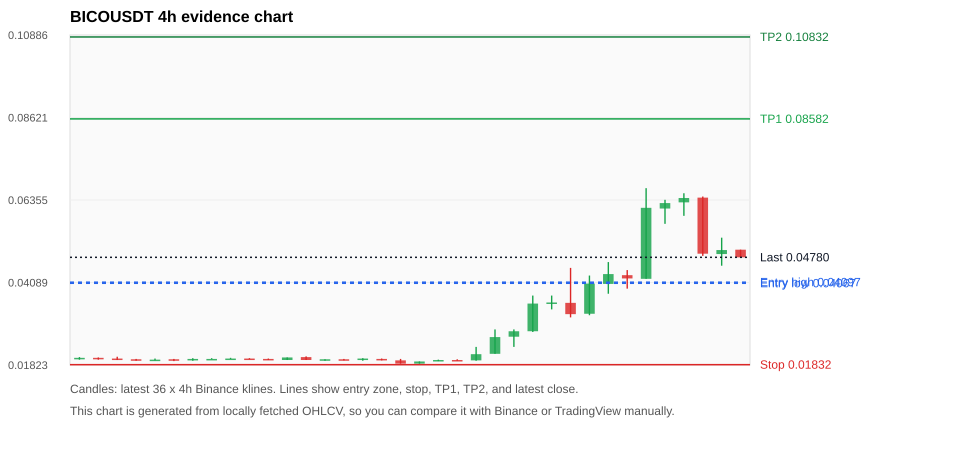
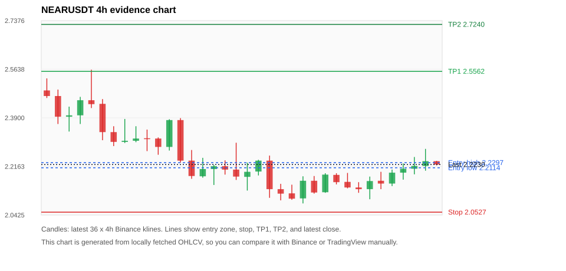
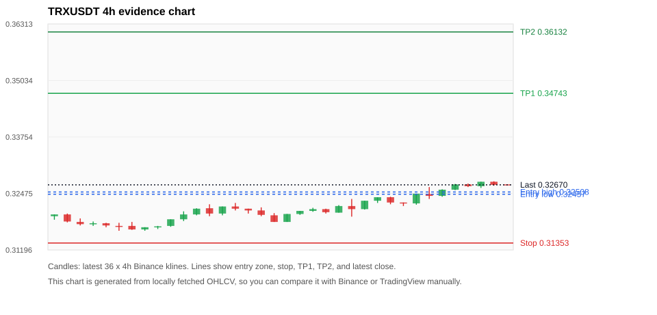
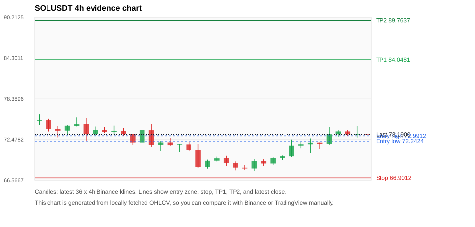
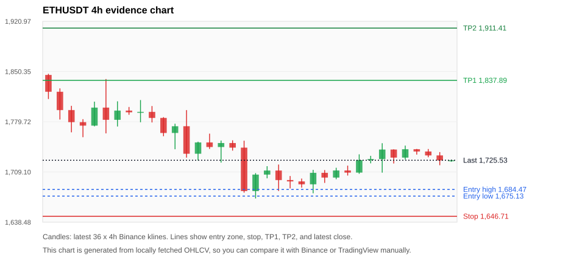

# Crypto 市场扫描报告 v1

- 报告时间：2026-06-21 20:06:52 CST
- Run ID：`20260621_120503_7d403294`
- Run type：`daily_full`
- 数据来源：SQLite
- 报告版本：v1
- 扫描 ID：87d1f0e4c969
- 数据源：Binance public spot API + CoinGecko/CoinMarketCap cross-check
- 过滤条件：USDT spot; 24h quote volume >= 30,000,000; trades >= 30,000; exclude stables/leveraged tokens; analyze 1h/4h/1d klines
- 默认单笔风险：账户权益的 1.00%

## 限制说明

- 交易信号仍以 Binance 现货公开 K 线为主源；外部数据源用于一致性复核。
- 结果是研究和模拟盘计划，不是确定收益或实盘下单指令。
- 历史长度过滤：候选币至少需要 180 根 1d K 线。
- 数据质量验证池：先验证 score 排名前 min(top_n * 2, 10) 的候选，再按 action + score 补足最终名单。
- 大盘环境过滤：RISK_OFF; BTC/ETH 大盘偏弱，山寨币买入候选降级为观察。 BTC 7d=-2.3825773102578163; ETH 7d=-0.03071359859064815.
- 已启用数据交叉验证：Binance 主源 + CoinGecko 自动对照；CoinMarketCap 在配置 API Key 后自动对照。
- BICOUSDT 交叉验证状态 DATA_ERROR：At least one external provider disagrees materially or symbol mapping failed.
- NEARUSDT 交叉验证状态 DATA_WARNING：At least one external provider needs manual review.
- TRXUSDT 交叉验证状态 DATA_WARNING：At least one external provider needs manual review.
- SOLUSDT 交叉验证状态 DATA_WARNING：At least one external provider needs manual review.
- ETHUSDT 交叉验证状态 DATA_WARNING：At least one external provider needs manual review.
- WLDUSDT 交叉验证状态 DATA_WARNING：At least one external provider needs manual review.
- XRPUSDT 交叉验证状态 DATA_WARNING：At least one external provider needs manual review.
- ZECUSDT 交叉验证状态 DATA_WARNING：At least one external provider needs manual review.
- BTCUSDT 交叉验证状态 DATA_WARNING：At least one external provider needs manual review.
- BNBUSDT 交叉验证状态 DATA_WARNING：At least one external provider needs manual review.

## 5 个候选交易计划

| Rank | Coin | Action | Setup | Entry Zone | Stop Loss | TP1 | TP2 / Exit Rule | R/R | Verdict |
|---:|---|---|---|---:|---:|---:|---|---:|---|
| 1 | `BICO` | `WATCH_ONLY` | 涨幅较远，只等深回调 | 0.04067 - 0.04097 | 0.01832 | 0.08582 | 0.10832 或跌破 4h 关键支撑 | 2.00-3.00 | 只观察 |
| 2 | `NEAR` | `WATCH_ONLY` | 回踩支撑/4h EMA 附近 | 2.2114 - 2.2297 | 2.0527 | 2.5562 | 2.7240 或跌破 4h 关键支撑 | 2.00-3.00 | 只观察 |
| 3 | `TRX` | `WATCH_ONLY` | 回踩支撑/4h EMA 附近 | 0.32457 - 0.32508 | 0.31353 | 0.34743 | 0.36132 或跌破 4h 关键支撑 | 2.00-3.23 | 只观察 |
| 4 | `SOL` | `WATCH_ONLY` | 回踩支撑/4h EMA 附近 | 72.2424 - 72.9912 | 66.9012 | 84.0481 | 89.7637 或跌破 4h 关键支撑 | 2.00-3.00 | 只等回调 |
| 5 | `ETH` | `WATCH_ONLY` | 回踩支撑/4h EMA 附近 | 1,675.13 - 1,684.47 | 1,646.71 | 1,837.89 | 1,911.41 或跌破 4h 关键支撑 | 4.78-7.00 | 只观察 |

## 数据交叉验证摘要

价格差异以 Binance 当前价为基准；成交量口径不同，Binance 是 USDT 现货成交额，CoinGecko/CoinMarketCap 通常是全市场成交量。

| Rank | Coin | Data Status | Max Price Diff | Max 24h Diff | Message |
|---:|---|---|---:|---:|---|
| 1 | `BICO` | DATA_ERROR | 2.00% | 1.14 pts | At least one external provider disagrees materially or symbol mapping failed. |
| 2 | `NEAR` | DATA_WARNING | 0.39% | 0.56 pts | At least one external provider needs manual review. |
| 3 | `TRX` | DATA_WARNING | 0.12% | 0.06 pts | At least one external provider needs manual review. |
| 4 | `SOL` | DATA_WARNING | 0.14% | 0.03 pts | At least one external provider needs manual review. |
| 5 | `ETH` | DATA_WARNING | 0.19% | 0.03 pts | At least one external provider needs manual review. |

## 候选币说明

### 1. BICO `BICOUSDT`



- 入选原因：涨幅较远，只等深回调；24h +13.38%，7d +156.99%，4h RSI 69.00，24h 成交额 $32.5M。
- 交易失效条件：跌破 0.018321 或 4h 收盘重新失守关键支撑。
- 主要风险：距离支撑偏远，不能追市价；24h 振幅较大，回撤风险高；成交量突增，可能是事件驱动；BTC/ETH 大盘环境未确认强势，山寨币买入信号降级；数据交叉验证出现重大差异或映射失败，先不要直接执行计划。
- 数据交叉验证：DATA_ERROR；At least one external provider disagrees materially or symbol mapping failed.

#### 可点击人工验证

- [Binance 交易页](https://www.binance.com/en/trade/BICO_USDT)
- [TradingView 图表](https://www.tradingview.com/chart/?symbol=BINANCE%3ABICOUSDT)
- [CoinGecko 搜索](https://www.coingecko.com/en/search?query=BICO)
- [CoinMarketCap 搜索](https://coinmarketcap.com/search/?q=BICO)

#### 多数据源对照

| Source | Status | Asset ID | Price | 24h Change | 24h Volume | Price Diff | 24h Diff | Updated | Message |
|---|---|---|---:|---:|---:|---:|---:|---|---|
| Binance | DATA_OK | BICOUSDT | 0.04780 | +13.38% | $32.5M | 0.00% | 0.00 pts | 2026-06-21T12:05:56+00:00 | Primary market data source used by scanner. |
| CoinGecko | DATA_WARNING | n/a | n/a | n/a | n/a | n/a | n/a | 2026-06-21T12:05:56+00:00 | Failed to fetch https://api.coingecko.com/api/v3/coins/markets?vs_currency=usd&ids=biconomy&price_change_percentage=24h&per_page=1&page=1: HTTP Error 429: Too Many Requests |
| CoinMarketCap | DATA_ERROR | 9543 | 0.04876 | +14.52% | $189.0M | 2.00% | 1.14 pts | 2026-06-21T12:05:04.000Z | price diff 2.00% exceeds error threshold |

#### 指标证据

| 指标 | 数值 | 人工核对用途 |
|---|---:|---|
| 当前价 | 0.04780 | 与 Binance/TradingView 当前价格对照 |
| 24h 涨跌 | +13.38% | 与交易所 24h 涨跌对照 |
| 7d 涨跌 | +156.99% | 判断短线趋势是否延续 |
| 4h EMA20 | 0.04059 | 判断短期趋势支撑 |
| 4h EMA50 | 0.03066 | 判断中期趋势支撑 |
| 1d EMA20 | 0.02778 | 判断日线趋势 |
| 1d EMA50 | 0.02526 | 判断日线趋势 |
| 4h RSI14 | 69.00 | 判断是否过热/过弱 |
| 4h ATR14 | 0.0091071429 | 推导止损和入场缓冲 |
| 最近 18 根 4h 最低点 | 0.01860 | 支撑/止损参考 |
| 最近 36 根 4h 最高点 | 0.06680 | TP/压力参考 |
| 支撑位 | 0.04059 | 入场区间推导基础 |

#### 交易计划推导

- 支撑位 = 最近低点、4h EMA20、4h EMA50、1d EMA20 中不高于当前价的最高有效支撑 = `0.04059`。
- 入场区间 = 支撑位附近 + ATR 缓冲 = `0.04067 - 0.04097`。
- 止损 = min(最近 18 根 4h 最低点 * 0.985, 入场中位价 - 1.15 * ATR14) = `0.01832`。
- TP1 = max(最近 36 根 4h 最高点 * 0.995, 入场中位价 + 2R) = `0.08582`。
- TP2 = max(入场中位价 + 3R, TP1 * 1.04) = `0.10832`。

#### 最近 10 根 4h K线

| UTC 开盘时间 | Open | High | Low | Close | Quote Volume | Trades |
|---|---:|---:|---:|---:|---:|---:|
| 2026-06-20T00:00+00:00 | 0.03530 | 0.04490 | 0.03130 | 0.03220 | $6.0M | 42600 |
| 2026-06-20T04:00+00:00 | 0.03230 | 0.04280 | 0.03190 | 0.04060 | $4.3M | 22499 |
| 2026-06-20T08:00+00:00 | 0.04050 | 0.04650 | 0.03780 | 0.04320 | $5.1M | 27274 |
| 2026-06-20T12:00+00:00 | 0.04290 | 0.04430 | 0.03920 | 0.04200 | $3.4M | 15664 |
| 2026-06-20T16:00+00:00 | 0.04190 | 0.06680 | 0.04190 | 0.06140 | $12.2M | 59226 |
| 2026-06-20T20:00+00:00 | 0.06120 | 0.06360 | 0.05700 | 0.06270 | $4.1M | 19990 |
| 2026-06-21T00:00+00:00 | 0.06290 | 0.06540 | 0.05920 | 0.06410 | $4.3M | 23621 |
| 2026-06-21T04:00+00:00 | 0.06420 | 0.06450 | 0.04820 | 0.04880 | $4.9M | 48352 |
| 2026-06-21T08:00+00:00 | 0.04870 | 0.05320 | 0.04550 | 0.04980 | $3.5M | 54508 |
| 2026-06-21T12:00+00:00 | 0.04990 | 0.04990 | 0.04780 | 0.04780 | $94,241 | 727 |

### 2. NEAR `NEARUSDT`



- 入选原因：回踩支撑/4h EMA 附近；24h +4.07%，7d +5.86%，4h RSI 64.05，24h 成交额 $30.1M。
- 交易失效条件：跌破 2.05274 或 4h 收盘重新失守关键支撑。
- 主要风险：BTC/ETH 大盘环境未确认强势，山寨币买入信号降级；数据交叉验证需要人工复核。
- 数据交叉验证：DATA_WARNING；At least one external provider needs manual review.

#### 可点击人工验证

- [Binance 交易页](https://www.binance.com/en/trade/NEAR_USDT)
- [TradingView 图表](https://www.tradingview.com/chart/?symbol=BINANCE%3ANEARUSDT)
- [CoinGecko 搜索](https://www.coingecko.com/en/search?query=NEAR)
- [CoinMarketCap 搜索](https://coinmarketcap.com/search/?q=NEAR)

#### 多数据源对照

| Source | Status | Asset ID | Price | 24h Change | 24h Volume | Price Diff | 24h Diff | Updated | Message |
|---|---|---|---:|---:|---:|---:|---:|---|---|
| Binance | DATA_OK | NEARUSDT | 2.2230 | +4.07% | $30.1M | 0.00% | 0.00 pts | 2026-06-21T12:05:56+00:00 | Primary market data source used by scanner. |
| CoinGecko | DATA_WARNING | n/a | n/a | n/a | n/a | n/a | n/a | 2026-06-21T12:05:56+00:00 | Failed to fetch https://api.coingecko.com/api/v3/coins/markets?vs_currency=usd&ids=near&price_change_percentage=24h&per_page=1&page=1: HTTP Error 429: Too Many Requests |
| CoinMarketCap | DATA_OK | 6535 | 2.2317 | +4.63% | $248.2M | 0.39% | 0.56 pts | 2026-06-21T12:05:04.000Z | External source agrees with Binance within thresholds. |

#### 指标证据

| 指标 | 数值 | 人工核对用途 |
|---|---:|---|
| 当前价 | 2.2230 | 与 Binance/TradingView 当前价格对照 |
| 24h 涨跌 | +4.07% | 与交易所 24h 涨跌对照 |
| 7d 涨跌 | +5.86% | 判断短线趋势是否延续 |
| 4h EMA20 | 2.1962 | 判断短期趋势支撑 |
| 4h EMA50 | 2.2070 | 判断中期趋势支撑 |
| 1d EMA20 | 2.1873 | 判断日线趋势 |
| 1d EMA50 | 2.0174 | 判断日线趋势 |
| 4h RSI14 | 64.05 | 判断是否过热/过弱 |
| 4h ATR14 | 0.05950 | 推导止损和入场缓冲 |
| 最近 18 根 4h 最低点 | 2.0840 | 支撑/止损参考 |
| 最近 36 根 4h 最高点 | 2.5620 | TP/压力参考 |
| 支撑位 | 2.2070 | 入场区间推导基础 |

#### 交易计划推导

- 支撑位 = 最近低点、4h EMA20、4h EMA50、1d EMA20 中不高于当前价的最高有效支撑 = `2.2070`。
- 入场区间 = 支撑位附近 + ATR 缓冲 = `2.2114 - 2.2297`。
- 止损 = min(最近 18 根 4h 最低点 * 0.985, 入场中位价 - 1.15 * ATR14) = `2.0527`。
- TP1 = max(最近 36 根 4h 最高点 * 0.995, 入场中位价 + 2R) = `2.5562`。
- TP2 = max(入场中位价 + 3R, TP1 * 1.04) = `2.7240`。

#### 最近 10 根 4h K线

| UTC 开盘时间 | Open | High | Low | Close | Quote Volume | Trades |
|---|---:|---:|---:|---:|---:|---:|
| 2026-06-20T00:00+00:00 | 2.1860 | 2.1920 | 2.1520 | 2.1600 | $3.2M | 26722 |
| 2026-06-20T04:00+00:00 | 2.1610 | 2.1930 | 2.1380 | 2.1410 | $3.3M | 24825 |
| 2026-06-20T08:00+00:00 | 2.1410 | 2.1600 | 2.1220 | 2.1350 | $2.6M | 18315 |
| 2026-06-20T12:00+00:00 | 2.1350 | 2.1800 | 2.0990 | 2.1640 | $7.3M | 45383 |
| 2026-06-20T16:00+00:00 | 2.1650 | 2.1970 | 2.1350 | 2.1550 | $4.7M | 36759 |
| 2026-06-20T20:00+00:00 | 2.1550 | 2.2050 | 2.1460 | 2.1940 | $3.2M | 25266 |
| 2026-06-21T00:00+00:00 | 2.1940 | 2.2270 | 2.1690 | 2.2080 | $3.7M | 26915 |
| 2026-06-21T04:00+00:00 | 2.2080 | 2.2500 | 2.1880 | 2.2180 | $3.6M | 28577 |
| 2026-06-21T08:00+00:00 | 2.2180 | 2.2790 | 2.2010 | 2.2350 | $7.4M | 50885 |
| 2026-06-21T12:00+00:00 | 2.2350 | 2.2360 | 2.2200 | 2.2230 | $214,835 | 1675 |

### 3. TRX `TRXUSDT`



- 入选原因：回踩支撑/4h EMA 附近；24h +0.65%，7d +3.06%，4h RSI 72.79，24h 成交额 $37.1M。
- 交易失效条件：跌破 0.3135255 或 4h 收盘重新失守关键支撑。
- 主要风险：日线趋势未完全确认；BTC/ETH 大盘环境未确认强势，山寨币买入信号降级；数据交叉验证需要人工复核。
- 数据交叉验证：DATA_WARNING；At least one external provider needs manual review.

#### 可点击人工验证

- [Binance 交易页](https://www.binance.com/en/trade/TRX_USDT)
- [TradingView 图表](https://www.tradingview.com/chart/?symbol=BINANCE%3ATRXUSDT)
- [CoinGecko 搜索](https://www.coingecko.com/en/search?query=TRX)
- [CoinMarketCap 搜索](https://coinmarketcap.com/search/?q=TRX)

#### 多数据源对照

| Source | Status | Asset ID | Price | 24h Change | 24h Volume | Price Diff | 24h Diff | Updated | Message |
|---|---|---|---:|---:|---:|---:|---:|---|---|
| Binance | DATA_OK | TRXUSDT | 0.32670 | +0.65% | $37.1M | 0.00% | 0.00 pts | 2026-06-21T12:05:56+00:00 | Primary market data source used by scanner. |
| CoinGecko | DATA_WARNING | n/a | n/a | n/a | n/a | n/a | n/a | 2026-06-21T12:05:56+00:00 | Failed to fetch https://api.coingecko.com/api/v3/coins/markets?vs_currency=usd&ids=tron&price_change_percentage=24h&per_page=1&page=1: HTTP Error 429: Too Many Requests |
| CoinMarketCap | DATA_OK | 1958 | 0.32631 | +0.59% | $491.0M | 0.12% | 0.06 pts | 2026-06-21T12:05:04.000Z | External source agrees with Binance within thresholds. |

#### 指标证据

| 指标 | 数值 | 人工核对用途 |
|---|---:|---|
| 当前价 | 0.32670 | 与 Binance/TradingView 当前价格对照 |
| 24h 涨跌 | +0.65% | 与交易所 24h 涨跌对照 |
| 7d 涨跌 | +3.06% | 判断短线趋势是否延续 |
| 4h EMA20 | 0.32392 | 判断短期趋势支撑 |
| 4h EMA50 | 0.32217 | 判断中期趋势支撑 |
| 1d EMA20 | 0.32690 | 判断日线趋势 |
| 1d EMA50 | 0.33232 | 判断日线趋势 |
| 4h RSI14 | 72.79 | 判断是否过热/过弱 |
| 4h ATR14 | 0.0016571429 | 推导止损和入场缓冲 |
| 最近 18 根 4h 最低点 | 0.31830 | 支撑/止损参考 |
| 最近 36 根 4h 最高点 | 0.32750 | TP/压力参考 |
| 支撑位 | 0.32392 | 入场区间推导基础 |

#### 交易计划推导

- 支撑位 = 最近低点、4h EMA20、4h EMA50、1d EMA20 中不高于当前价的最高有效支撑 = `0.32392`。
- 入场区间 = 支撑位附近 + ATR 缓冲 = `0.32457 - 0.32508`。
- 止损 = min(最近 18 根 4h 最低点 * 0.985, 入场中位价 - 1.15 * ATR14) = `0.31353`。
- TP1 = max(最近 36 根 4h 最高点 * 0.995, 入场中位价 + 2R) = `0.34743`。
- TP2 = max(入场中位价 + 3R, TP1 * 1.04) = `0.36132`。

#### 最近 10 根 4h K线

| UTC 开盘时间 | Open | High | Low | Close | Quote Volume | Trades |
|---|---:|---:|---:|---:|---:|---:|
| 2026-06-20T00:00+00:00 | 0.32390 | 0.32400 | 0.32230 | 0.32270 | $5.1M | 8650 |
| 2026-06-20T04:00+00:00 | 0.32270 | 0.32270 | 0.32190 | 0.32250 | $2.1M | 7348 |
| 2026-06-20T08:00+00:00 | 0.32250 | 0.32470 | 0.32220 | 0.32470 | $7.6M | 15216 |
| 2026-06-20T12:00+00:00 | 0.32460 | 0.32620 | 0.32350 | 0.32420 | $18.6M | 20570 |
| 2026-06-20T16:00+00:00 | 0.32420 | 0.32570 | 0.32400 | 0.32560 | $5.8M | 11604 |
| 2026-06-20T20:00+00:00 | 0.32560 | 0.32690 | 0.32550 | 0.32680 | $4.5M | 10338 |
| 2026-06-21T00:00+00:00 | 0.32680 | 0.32700 | 0.32620 | 0.32640 | $1.9M | 6697 |
| 2026-06-21T04:00+00:00 | 0.32640 | 0.32740 | 0.32600 | 0.32740 | $2.9M | 6944 |
| 2026-06-21T08:00+00:00 | 0.32740 | 0.32750 | 0.32650 | 0.32670 | $3.4M | 8357 |
| 2026-06-21T12:00+00:00 | 0.32680 | 0.32680 | 0.32660 | 0.32670 | $43,658 | 191 |

### 4. SOL `SOLUSDT`



- 入选原因：回踩支撑/4h EMA 附近；24h +1.86%，7d +8.00%，4h RSI 84.41，24h 成交额 $170.7M。
- 交易失效条件：跌破 66.9012 或 4h 收盘重新失守关键支撑。
- 主要风险：4h RSI 偏热；日线趋势未完全确认；BTC/ETH 大盘环境未确认强势，山寨币买入信号降级；数据交叉验证需要人工复核。
- 数据交叉验证：DATA_WARNING；At least one external provider needs manual review.

#### 可点击人工验证

- [Binance 交易页](https://www.binance.com/en/trade/SOL_USDT)
- [TradingView 图表](https://www.tradingview.com/chart/?symbol=BINANCE%3ASOLUSDT)
- [CoinGecko 搜索](https://www.coingecko.com/en/search?query=SOL)
- [CoinMarketCap 搜索](https://coinmarketcap.com/search/?q=SOL)

#### 多数据源对照

| Source | Status | Asset ID | Price | 24h Change | 24h Volume | Price Diff | 24h Diff | Updated | Message |
|---|---|---|---:|---:|---:|---:|---:|---|---|
| Binance | DATA_OK | SOLUSDT | 73.1900 | +1.86% | $170.7M | 0.00% | 0.00 pts | 2026-06-21T12:05:56+00:00 | Primary market data source used by scanner. |
| CoinGecko | DATA_WARNING | n/a | n/a | n/a | n/a | n/a | n/a | 2026-06-21T12:05:56+00:00 | Failed to fetch https://api.coingecko.com/api/v3/coins/markets?vs_currency=usd&ids=solana&price_change_percentage=24h&per_page=1&page=1: HTTP Error 429: Too Many Requests |
| CoinMarketCap | DATA_WARNING | 5426 | 73.0910 | +1.90% | $2.00B | 0.14% | 0.03 pts | 2026-06-21T12:05:04.000Z | CoinMarketCap symbol mapping has 8 matches; selected lowest cmc_rank |

#### 指标证据

| 指标 | 数值 | 人工核对用途 |
|---|---:|---|
| 当前价 | 73.1900 | 与 Binance/TradingView 当前价格对照 |
| 24h 涨跌 | +1.86% | 与交易所 24h 涨跌对照 |
| 7d 涨跌 | +8.00% | 判断短线趋势是否延续 |
| 4h EMA20 | 71.7585 | 判断短期趋势支撑 |
| 4h EMA50 | 70.9218 | 判断中期趋势支撑 |
| 1d EMA20 | 72.0982 | 判断日线趋势 |
| 1d EMA50 | 76.9766 | 判断日线趋势 |
| 4h RSI14 | 84.41 | 判断是否过热/过弱 |
| 4h ATR14 | 1.2757 | 推导止损和入场缓冲 |
| 最近 18 根 4h 最低点 | 67.9200 | 支撑/止损参考 |
| 最近 36 根 4h 最高点 | 76.0900 | TP/压力参考 |
| 支撑位 | 72.0982 | 入场区间推导基础 |

#### 交易计划推导

- 支撑位 = 最近低点、4h EMA20、4h EMA50、1d EMA20 中不高于当前价的最高有效支撑 = `72.0982`。
- 入场区间 = 支撑位附近 + ATR 缓冲 = `72.2424 - 72.9912`。
- 止损 = min(最近 18 根 4h 最低点 * 0.985, 入场中位价 - 1.15 * ATR14) = `66.9012`。
- TP1 = max(最近 36 根 4h 最高点 * 0.995, 入场中位价 + 2R) = `84.0481`。
- TP2 = max(入场中位价 + 3R, TP1 * 1.04) = `89.7637`。

#### 最近 10 根 4h K线

| UTC 开盘时间 | Open | High | Low | Close | Quote Volume | Trades |
|---|---:|---:|---:|---:|---:|---:|
| 2026-06-20T00:00+00:00 | 69.7300 | 70.1200 | 69.4800 | 70.0000 | $14.8M | 79424 |
| 2026-06-20T04:00+00:00 | 70.0000 | 72.4600 | 69.8900 | 71.6000 | $32.7M | 160048 |
| 2026-06-20T08:00+00:00 | 71.6000 | 72.1000 | 71.2100 | 71.7800 | $15.3M | 70480 |
| 2026-06-20T12:00+00:00 | 71.7800 | 72.6200 | 70.4700 | 72.0200 | $47.5M | 180915 |
| 2026-06-20T16:00+00:00 | 72.0300 | 72.0500 | 71.0900 | 71.8600 | $21.8M | 95975 |
| 2026-06-20T20:00+00:00 | 71.8600 | 74.3000 | 71.7000 | 73.2200 | $30.5M | 153326 |
| 2026-06-21T00:00+00:00 | 73.2200 | 73.8600 | 72.8800 | 73.6300 | $18.5M | 84321 |
| 2026-06-21T04:00+00:00 | 73.6300 | 73.8400 | 73.0100 | 73.2100 | $21.9M | 75498 |
| 2026-06-21T08:00+00:00 | 73.2100 | 74.4000 | 72.7500 | 73.2100 | $29.6M | 120723 |
| 2026-06-21T12:00+00:00 | 73.2100 | 73.2300 | 73.1000 | 73.1900 | $1.3M | 2482 |

### 5. ETH `ETHUSDT`



- 入选原因：回踩支撑/4h EMA 附近；24h -0.23%，7d +3.54%，4h RSI 63.34，24h 成交额 $267.7M。
- 交易失效条件：跌破 1646.7132 或 4h 收盘重新失守关键支撑。
- 主要风险：日线趋势未完全确认；BTC/ETH 大盘环境未确认强势，山寨币买入信号降级；24h 动量未确认；数据交叉验证需要人工复核。
- 数据交叉验证：DATA_WARNING；At least one external provider needs manual review.

#### 可点击人工验证

- [Binance 交易页](https://www.binance.com/en/trade/ETH_USDT)
- [TradingView 图表](https://www.tradingview.com/chart/?symbol=BINANCE%3AETHUSDT)
- [CoinGecko 搜索](https://www.coingecko.com/en/search?query=ETH)
- [CoinMarketCap 搜索](https://coinmarketcap.com/search/?q=ETH)

#### 多数据源对照

| Source | Status | Asset ID | Price | 24h Change | 24h Volume | Price Diff | 24h Diff | Updated | Message |
|---|---|---|---:|---:|---:|---:|---:|---|---|
| Binance | DATA_OK | ETHUSDT | 1,725.53 | -0.23% | $267.7M | 0.00% | 0.00 pts | 2026-06-21T12:05:56+00:00 | Primary market data source used by scanner. |
| CoinGecko | DATA_OK | ethereum | 1,723.36 | -0.26% | $9.01B | 0.13% | 0.03 pts | 2026-06-21T12:06:17.748Z | External source agrees with Binance within thresholds. |
| CoinMarketCap | DATA_WARNING | 1027 | 1,722.17 | -0.24% | $8.94B | 0.19% | 0.01 pts | 2026-06-21T12:05:04.000Z | CoinMarketCap symbol mapping has 6 matches; selected lowest cmc_rank |

#### 指标证据

| 指标 | 数值 | 人工核对用途 |
|---|---:|---|
| 当前价 | 1,725.53 | 与 Binance/TradingView 当前价格对照 |
| 24h 涨跌 | -0.23% | 与交易所 24h 涨跌对照 |
| 7d 涨跌 | +3.54% | 判断短线趋势是否延续 |
| 4h EMA20 | 1,727.45 | 判断短期趋势支撑 |
| 4h EMA50 | 1,726.05 | 判断中期趋势支撑 |
| 1d EMA20 | 1,769.18 | 判断日线趋势 |
| 1d EMA50 | 1,920.27 | 判断日线趋势 |
| 4h RSI14 | 63.34 | 判断是否过热/过弱 |
| 4h ATR14 | 18.1121 | 推导止损和入场缓冲 |
| 最近 18 根 4h 最低点 | 1,671.79 | 支撑/止损参考 |
| 最近 36 根 4h 最高点 | 1,847.13 | TP/压力参考 |
| 支撑位 | 1,671.79 | 入场区间推导基础 |

#### 交易计划推导

- 支撑位 = 最近低点、4h EMA20、4h EMA50、1d EMA20 中不高于当前价的最高有效支撑 = `1,671.79`。
- 入场区间 = 支撑位附近 + ATR 缓冲 = `1,675.13 - 1,684.47`。
- 止损 = min(最近 18 根 4h 最低点 * 0.985, 入场中位价 - 1.15 * ATR14) = `1,646.71`。
- TP1 = max(最近 36 根 4h 最高点 * 0.995, 入场中位价 + 2R) = `1,837.89`。
- TP2 = max(入场中位价 + 3R, TP1 * 1.04) = `1,911.41`。

#### 最近 10 根 4h K线

| UTC 开盘时间 | Open | High | Low | Close | Quote Volume | Trades |
|---|---:|---:|---:|---:|---:|---:|
| 2026-06-20T00:00+00:00 | 1,711.18 | 1,718.00 | 1,704.06 | 1,708.17 | $24.8M | 232787 |
| 2026-06-20T04:00+00:00 | 1,708.18 | 1,733.89 | 1,706.51 | 1,725.82 | $49.4M | 296623 |
| 2026-06-20T08:00+00:00 | 1,725.81 | 1,731.76 | 1,721.25 | 1,727.18 | $23.0M | 167591 |
| 2026-06-20T12:00+00:00 | 1,727.18 | 1,749.55 | 1,708.11 | 1,740.63 | $78.9M | 584044 |
| 2026-06-20T16:00+00:00 | 1,740.63 | 1,740.91 | 1,721.03 | 1,729.27 | $40.6M | 293750 |
| 2026-06-20T20:00+00:00 | 1,729.27 | 1,746.17 | 1,726.53 | 1,741.08 | $59.7M | 267793 |
| 2026-06-21T00:00+00:00 | 1,741.08 | 1,741.45 | 1,733.51 | 1,737.87 | $20.0M | 174336 |
| 2026-06-21T04:00+00:00 | 1,737.88 | 1,741.41 | 1,729.80 | 1,732.36 | $33.2M | 178328 |
| 2026-06-21T08:00+00:00 | 1,732.36 | 1,737.02 | 1,718.56 | 1,725.36 | $33.9M | 230369 |
| 2026-06-21T12:00+00:00 | 1,725.37 | 1,726.27 | 1,723.39 | 1,725.53 | $2.0M | 5482 |

## 组合风控

- 不要 5 个候选全部满仓买入。
- 同时持仓总风险建议控制在账户权益的 3% - 5% 以内。
- 如果 BTC/ETH 同时破位，暂停山寨币多头计划或降低仓位。
- 第一版报告用于模拟盘和人工复核，不自动下单。

## 原始数据

```json
[
  {
    "rank": 1,
    "symbol": "BICOUSDT",
    "base_asset": "BICO",
    "price": 0.0478,
    "score": 57.225232548435315,
    "setup": "涨幅较远，只等深回调",
    "verdict": "只观察",
    "entry_low": 0.040673142840312794,
    "entry_high": 0.04096964285714286,
    "stop_loss": 0.018320999999999997,
    "take_profit_1": 0.08582217854618347,
    "take_profit_2": 0.1083225713949113,
    "risk_reward_1": 2.0,
    "risk_reward_2": 3.0000000000000004,
    "pct_24h": 13.38,
    "pct_3d": 146.3917525773196,
    "pct_7d": 156.989247311828,
    "quote_volume_24h": 32455852.379175,
    "trades_24h": 221710,
    "high_low_range_24h": 70.40816326530613,
    "rsi_1h": 30.3125,
    "rsi_4h": 69.0,
    "ema20_4h": 0.040591958922467856,
    "ema50_4h": 0.03066141056748471,
    "ema20_1d": 0.027783479609715972,
    "ema50_1d": 0.02525989606543373,
    "atr_4h": 0.009107142857142857,
    "macd_hist_4h": 0.0011971117789891525,
    "volume_ratio_24h": 6.7733577061882695,
    "support_level": 0.040591958922467856,
    "recent_low_4h_18": 0.0186,
    "recent_high_4h_36": 0.0668,
    "distance_to_support_pct": 17.75731270151255,
    "binance_trade_url": "https://www.binance.com/en/trade/BICO_USDT",
    "tradingview_url": "https://www.tradingview.com/chart/?symbol=BINANCE%3ABICOUSDT",
    "coingecko_search_url": "https://www.coingecko.com/en/search?query=BICO",
    "coinmarketcap_search_url": "https://coinmarketcap.com/search/?q=BICO",
    "invalidation": "跌破 0.018321 或 4h 收盘重新失守关键支撑",
    "recent_4h_klines": [
      {
        "open_time_utc": "2026-06-15T16:00+00:00",
        "open": 0.0201,
        "high": 0.0204,
        "low": 0.0197,
        "close": 0.0202,
        "quote_volume": 25219.95376,
        "trades": 481
      },
      {
        "open_time_utc": "2026-06-15T20:00+00:00",
        "open": 0.0202,
        "high": 0.0203,
        "low": 0.0197,
        "close": 0.02,
        "quote_volume": 44511.199781,
        "trades": 884
      },
      {
        "open_time_utc": "2026-06-16T00:00+00:00",
        "open": 0.02,
        "high": 0.0205,
        "low": 0.0196,
        "close": 0.0198,
        "quote_volume": 83840.462706,
        "trades": 859
      },
      {
        "open_time_utc": "2026-06-16T04:00+00:00",
        "open": 0.0198,
        "high": 0.0199,
        "low": 0.0194,
        "close": 0.0196,
        "quote_volume": 22918.521495,
        "trades": 998
      },
      {
        "open_time_utc": "2026-06-16T08:00+00:00",
        "open": 0.0196,
        "high": 0.02,
        "low": 0.0195,
        "close": 0.0197,
        "quote_volume": 12350.985542,
        "trades": 424
      },
      {
        "open_time_utc": "2026-06-16T12:00+00:00",
        "open": 0.0198,
        "high": 0.0199,
        "low": 0.0193,
        "close": 0.0195,
        "quote_volume": 40315.520758,
        "trades": 349
      },
      {
        "open_time_utc": "2026-06-16T16:00+00:00",
        "open": 0.0195,
        "high": 0.0201,
        "low": 0.0194,
        "close": 0.0199,
        "quote_volume": 20530.407121,
        "trades": 284
      },
      {
        "open_time_utc": "2026-06-16T20:00+00:00",
        "open": 0.0199,
        "high": 0.0201,
        "low": 0.0198,
        "close": 0.0199,
        "quote_volume": 4435.945255,
        "trades": 147
      },
      {
        "open_time_utc": "2026-06-17T00:00+00:00",
        "open": 0.02,
        "high": 0.0202,
        "low": 0.0199,
        "close": 0.02,
        "quote_volume": 7225.809714,
        "trades": 164
      },
      {
        "open_time_utc": "2026-06-17T04:00+00:00",
        "open": 0.02,
        "high": 0.0201,
        "low": 0.0198,
        "close": 0.0198,
        "quote_volume": 4356.065705,
        "trades": 197
      },
      {
        "open_time_utc": "2026-06-17T08:00+00:00",
        "open": 0.0199,
        "high": 0.02,
        "low": 0.0196,
        "close": 0.0197,
        "quote_volume": 15305.234626,
        "trades": 231
      },
      {
        "open_time_utc": "2026-06-17T12:00+00:00",
        "open": 0.0196,
        "high": 0.0203,
        "low": 0.0196,
        "close": 0.0203,
        "quote_volume": 28276.389821,
        "trades": 166
      },
      {
        "open_time_utc": "2026-06-17T16:00+00:00",
        "open": 0.0204,
        "high": 0.0206,
        "low": 0.0196,
        "close": 0.0196,
        "quote_volume": 58176.312348,
        "trades": 534
      },
      {
        "open_time_utc": "2026-06-17T20:00+00:00",
        "open": 0.0197,
        "high": 0.0198,
        "low": 0.0194,
        "close": 0.0198,
        "quote_volume": 12080.280011,
        "trades": 287
      },
      {
        "open_time_utc": "2026-06-18T00:00+00:00",
        "open": 0.0198,
        "high": 0.0199,
        "low": 0.0195,
        "close": 0.0196,
        "quote_volume": 6453.331146,
        "trades": 188
      },
      {
        "open_time_utc": "2026-06-18T04:00+00:00",
        "open": 0.0196,
        "high": 0.0201,
        "low": 0.0194,
        "close": 0.02,
        "quote_volume": 61946.349987,
        "trades": 338
      },
      {
        "open_time_utc": "2026-06-18T08:00+00:00",
        "open": 0.0199,
        "high": 0.02,
        "low": 0.0195,
        "close": 0.0195,
        "quote_volume": 17556.984185,
        "trades": 319
      },
      {
        "open_time_utc": "2026-06-18T12:00+00:00",
        "open": 0.0195,
        "high": 0.0199,
        "low": 0.0186,
        "close": 0.0186,
        "quote_volume": 46579.661649,
        "trades": 400
      },
      {
        "open_time_utc": "2026-06-18T16:00+00:00",
        "open": 0.0186,
        "high": 0.0192,
        "low": 0.0186,
        "close": 0.0192,
        "quote_volume": 18501.151979,
        "trades": 235
      },
      {
        "open_time_utc": "2026-06-18T20:00+00:00",
        "open": 0.0193,
        "high": 0.0197,
        "low": 0.0193,
        "close": 0.0196,
        "quote_volume": 15889.401214,
        "trades": 276
      },
      {
        "open_time_utc": "2026-06-19T00:00+00:00",
        "open": 0.0196,
        "high": 0.0198,
        "low": 0.0194,
        "close": 0.0195,
        "quote_volume": 10277.443151,
        "trades": 114
      },
      {
        "open_time_utc": "2026-06-19T04:00+00:00",
        "open": 0.0195,
        "high": 0.0232,
        "low": 0.0194,
        "close": 0.0212,
        "quote_volume": 476282.37162,
        "trades": 3731
      },
      {
        "open_time_utc": "2026-06-19T08:00+00:00",
        "open": 0.0213,
        "high": 0.028,
        "low": 0.0213,
        "close": 0.0259,
        "quote_volume": 1387449.903267,
        "trades": 12492
      },
      {
        "open_time_utc": "2026-06-19T12:00+00:00",
        "open": 0.026,
        "high": 0.028,
        "low": 0.0232,
        "close": 0.0275,
        "quote_volume": 845416.553102,
        "trades": 6947
      },
      {
        "open_time_utc": "2026-06-19T16:00+00:00",
        "open": 0.0275,
        "high": 0.0373,
        "low": 0.0273,
        "close": 0.0351,
        "quote_volume": 5513582.542001,
        "trades": 45051
      },
      {
        "open_time_utc": "2026-06-19T20:00+00:00",
        "open": 0.035,
        "high": 0.0373,
        "low": 0.0335,
        "close": 0.0354,
        "quote_volume": 2582223.399671,
        "trades": 13164
      },
      {
        "open_time_utc": "2026-06-20T00:00+00:00",
        "open": 0.0353,
        "high": 0.0449,
        "low": 0.0313,
        "close": 0.0322,
        "quote_volume": 5974474.696712,
        "trades": 42600
      },
      {
        "open_time_utc": "2026-06-20T04:00+00:00",
        "open": 0.0323,
        "high": 0.0428,
        "low": 0.0319,
        "close": 0.0406,
        "quote_volume": 4339439.511773,
        "trades": 22499
      },
      {
        "open_time_utc": "2026-06-20T08:00+00:00",
        "open": 0.0405,
        "high": 0.0465,
        "low": 0.0378,
        "close": 0.0432,
        "quote_volume": 5082821.592501,
        "trades": 27274
      },
      {
        "open_time_utc": "2026-06-20T12:00+00:00",
        "open": 0.0429,
        "high": 0.0443,
        "low": 0.0392,
        "close": 0.042,
        "quote_volume": 3408247.496102,
        "trades": 15664
      },
      {
        "open_time_utc": "2026-06-20T16:00+00:00",
        "open": 0.0419,
        "high": 0.0668,
        "low": 0.0419,
        "close": 0.0614,
        "quote_volume": 12182497.217608,
        "trades": 59226
      },
      {
        "open_time_utc": "2026-06-20T20:00+00:00",
        "open": 0.0612,
        "high": 0.0636,
        "low": 0.057,
        "close": 0.0627,
        "quote_volume": 4108229.78438,
        "trades": 19990
      },
      {
        "open_time_utc": "2026-06-21T00:00+00:00",
        "open": 0.0629,
        "high": 0.0654,
        "low": 0.0592,
        "close": 0.0641,
        "quote_volume": 4268169.430595,
        "trades": 23621
      },
      {
        "open_time_utc": "2026-06-21T04:00+00:00",
        "open": 0.0642,
        "high": 0.0645,
        "low": 0.0482,
        "close": 0.0488,
        "quote_volume": 4914871.860834,
        "trades": 48352
      },
      {
        "open_time_utc": "2026-06-21T08:00+00:00",
        "open": 0.0487,
        "high": 0.0532,
        "low": 0.0455,
        "close": 0.0498,
        "quote_volume": 3547225.68753,
        "trades": 54508
      },
      {
        "open_time_utc": "2026-06-21T12:00+00:00",
        "open": 0.0499,
        "high": 0.0499,
        "low": 0.0478,
        "close": 0.0478,
        "quote_volume": 94240.800025,
        "trades": 727
      }
    ],
    "risks": [
      "距离支撑偏远，不能追市价",
      "24h 振幅较大，回撤风险高",
      "成交量突增，可能是事件驱动",
      "BTC/ETH 大盘环境未确认强势，山寨币买入信号降级",
      "数据交叉验证出现重大差异或映射失败，先不要直接执行计划"
    ],
    "data_quality_status": "DATA_ERROR",
    "data_quality_message": "At least one external provider disagrees materially or symbol mapping failed.",
    "data_checks": [
      {
        "provider": "Binance",
        "status": "DATA_OK",
        "provider_asset_id": "BICOUSDT",
        "provider_symbol": "BICOUSDT",
        "price_usd": 0.0478,
        "pct_24h": 13.38,
        "volume_24h": 32455852.379175,
        "last_updated": null,
        "fetched_at_utc": "2026-06-21T12:05:56+00:00",
        "price_diff_pct": 0.0,
        "pct_24h_diff": 0.0,
        "volume_note": "Binance USDT spot 24h quoteVolume.",
        "message": "Primary market data source used by scanner."
      },
      {
        "provider": "CoinGecko",
        "status": "DATA_WARNING",
        "provider_asset_id": null,
        "provider_symbol": "BICO",
        "price_usd": null,
        "pct_24h": null,
        "volume_24h": null,
        "last_updated": null,
        "fetched_at_utc": "2026-06-21T12:05:56+00:00",
        "price_diff_pct": null,
        "pct_24h_diff": null,
        "volume_note": "External provider data unavailable.",
        "message": "Failed to fetch https://api.coingecko.com/api/v3/coins/markets?vs_currency=usd&ids=biconomy&price_change_percentage=24h&per_page=1&page=1: HTTP Error 429: Too Many Requests"
      },
      {
        "provider": "CoinMarketCap",
        "status": "DATA_ERROR",
        "provider_asset_id": "9543",
        "provider_symbol": "BICO",
        "price_usd": 0.04875739458202612,
        "pct_24h": 14.52373227,
        "volume_24h": 188970734.6190367,
        "last_updated": "2026-06-21T12:05:04.000Z",
        "fetched_at_utc": "2026-06-21T12:05:56+00:00",
        "price_diff_pct": 2.0029175356194875,
        "pct_24h_diff": 1.1437322699999992,
        "volume_note": "CoinMarketCap total market volume; not the same venue scope as Binance quoteVolume.",
        "message": "price diff 2.00% exceeds error threshold"
      }
    ],
    "action": "WATCH_ONLY"
  },
  {
    "rank": 2,
    "symbol": "NEARUSDT",
    "base_asset": "NEAR",
    "price": 2.223,
    "score": 39.91707458932609,
    "setup": "回踩支撑/4h EMA 附近",
    "verdict": "只观察",
    "entry_low": 2.211437558653798,
    "entry_high": 2.2296689999999995,
    "stop_loss": 2.05274,
    "take_profit_1": 2.556179837980696,
    "take_profit_2": 2.723993117307595,
    "risk_reward_1": 2.0,
    "risk_reward_2": 3.0,
    "pct_24h": 4.073,
    "pct_3d": -2.1566901408450634,
    "pct_7d": 5.85714285714285,
    "quote_volume_24h": 30066385.6756,
    "trades_24h": 215051,
    "high_low_range_24h": 8.575512148642206,
    "rsi_1h": 56.465517241379274,
    "rsi_4h": 64.05405405405398,
    "ema20_4h": 2.1961785070669753,
    "ema50_4h": 2.207023511630537,
    "ema20_1d": 2.187332608137289,
    "ema50_1d": 2.017373561416415,
    "atr_4h": 0.05950000000000001,
    "macd_hist_4h": 0.011385272430666036,
    "volume_ratio_24h": 0.5049569985493012,
    "support_level": 2.207023511630537,
    "recent_low_4h_18": 2.084,
    "recent_high_4h_36": 2.562,
    "distance_to_support_pct": 0.723892984613439,
    "binance_trade_url": "https://www.binance.com/en/trade/NEAR_USDT",
    "tradingview_url": "https://www.tradingview.com/chart/?symbol=BINANCE%3ANEARUSDT",
    "coingecko_search_url": "https://www.coingecko.com/en/search?query=NEAR",
    "coinmarketcap_search_url": "https://coinmarketcap.com/search/?q=NEAR",
    "invalidation": "跌破 2.05274 或 4h 收盘重新失守关键支撑",
    "recent_4h_klines": [
      {
        "open_time_utc": "2026-06-15T16:00+00:00",
        "open": 2.488,
        "high": 2.531,
        "low": 2.461,
        "close": 2.468,
        "quote_volume": 9811453.862,
        "trades": 72516
      },
      {
        "open_time_utc": "2026-06-15T20:00+00:00",
        "open": 2.468,
        "high": 2.491,
        "low": 2.368,
        "close": 2.394,
        "quote_volume": 11246178.4962,
        "trades": 71384
      },
      {
        "open_time_utc": "2026-06-16T00:00+00:00",
        "open": 2.394,
        "high": 2.43,
        "low": 2.341,
        "close": 2.399,
        "quote_volume": 7686056.5108,
        "trades": 54006
      },
      {
        "open_time_utc": "2026-06-16T04:00+00:00",
        "open": 2.399,
        "high": 2.465,
        "low": 2.368,
        "close": 2.453,
        "quote_volume": 7810500.3731,
        "trades": 51320
      },
      {
        "open_time_utc": "2026-06-16T08:00+00:00",
        "open": 2.453,
        "high": 2.562,
        "low": 2.425,
        "close": 2.439,
        "quote_volume": 21122517.9086,
        "trades": 104839
      },
      {
        "open_time_utc": "2026-06-16T12:00+00:00",
        "open": 2.44,
        "high": 2.457,
        "low": 2.31,
        "close": 2.339,
        "quote_volume": 22023655.5436,
        "trades": 109426
      },
      {
        "open_time_utc": "2026-06-16T16:00+00:00",
        "open": 2.339,
        "high": 2.36,
        "low": 2.289,
        "close": 2.304,
        "quote_volume": 8765326.8097,
        "trades": 64110
      },
      {
        "open_time_utc": "2026-06-16T20:00+00:00",
        "open": 2.304,
        "high": 2.386,
        "low": 2.3,
        "close": 2.308,
        "quote_volume": 7919436.151,
        "trades": 44695
      },
      {
        "open_time_utc": "2026-06-17T00:00+00:00",
        "open": 2.308,
        "high": 2.36,
        "low": 2.303,
        "close": 2.316,
        "quote_volume": 8081130.7825,
        "trades": 39171
      },
      {
        "open_time_utc": "2026-06-17T04:00+00:00",
        "open": 2.317,
        "high": 2.348,
        "low": 2.271,
        "close": 2.316,
        "quote_volume": 6866930.2607,
        "trades": 40008
      },
      {
        "open_time_utc": "2026-06-17T08:00+00:00",
        "open": 2.316,
        "high": 2.32,
        "low": 2.258,
        "close": 2.286,
        "quote_volume": 5852058.6356,
        "trades": 45106
      },
      {
        "open_time_utc": "2026-06-17T12:00+00:00",
        "open": 2.286,
        "high": 2.385,
        "low": 2.273,
        "close": 2.382,
        "quote_volume": 9535214.4761,
        "trades": 70166
      },
      {
        "open_time_utc": "2026-06-17T16:00+00:00",
        "open": 2.382,
        "high": 2.389,
        "low": 2.23,
        "close": 2.237,
        "quote_volume": 17478925.6469,
        "trades": 125860
      },
      {
        "open_time_utc": "2026-06-17T20:00+00:00",
        "open": 2.237,
        "high": 2.275,
        "low": 2.172,
        "close": 2.182,
        "quote_volume": 17417649.0241,
        "trades": 68053
      },
      {
        "open_time_utc": "2026-06-18T00:00+00:00",
        "open": 2.181,
        "high": 2.247,
        "low": 2.176,
        "close": 2.207,
        "quote_volume": 6908868.711,
        "trades": 42371
      },
      {
        "open_time_utc": "2026-06-18T04:00+00:00",
        "open": 2.207,
        "high": 2.222,
        "low": 2.15,
        "close": 2.217,
        "quote_volume": 7245173.531,
        "trades": 45224
      },
      {
        "open_time_utc": "2026-06-18T08:00+00:00",
        "open": 2.217,
        "high": 2.238,
        "low": 2.187,
        "close": 2.205,
        "quote_volume": 5313416.7675,
        "trades": 33448
      },
      {
        "open_time_utc": "2026-06-18T12:00+00:00",
        "open": 2.205,
        "high": 2.301,
        "low": 2.168,
        "close": 2.18,
        "quote_volume": 14675396.3184,
        "trades": 111654
      },
      {
        "open_time_utc": "2026-06-18T16:00+00:00",
        "open": 2.179,
        "high": 2.23,
        "low": 2.13,
        "close": 2.197,
        "quote_volume": 12688274.2497,
        "trades": 84506
      },
      {
        "open_time_utc": "2026-06-18T20:00+00:00",
        "open": 2.198,
        "high": 2.24,
        "low": 2.184,
        "close": 2.237,
        "quote_volume": 4646330.7804,
        "trades": 35784
      },
      {
        "open_time_utc": "2026-06-19T00:00+00:00",
        "open": 2.237,
        "high": 2.255,
        "low": 2.104,
        "close": 2.135,
        "quote_volume": 8776982.8668,
        "trades": 57487
      },
      {
        "open_time_utc": "2026-06-19T04:00+00:00",
        "open": 2.135,
        "high": 2.154,
        "low": 2.095,
        "close": 2.119,
        "quote_volume": 7314824.9963,
        "trades": 53699
      },
      {
        "open_time_utc": "2026-06-19T08:00+00:00",
        "open": 2.12,
        "high": 2.151,
        "low": 2.097,
        "close": 2.101,
        "quote_volume": 5148752.0591,
        "trades": 35812
      },
      {
        "open_time_utc": "2026-06-19T12:00+00:00",
        "open": 2.102,
        "high": 2.181,
        "low": 2.084,
        "close": 2.165,
        "quote_volume": 8938557.439,
        "trades": 54377
      },
      {
        "open_time_utc": "2026-06-19T16:00+00:00",
        "open": 2.165,
        "high": 2.182,
        "low": 2.119,
        "close": 2.123,
        "quote_volume": 4025111.0484,
        "trades": 31463
      },
      {
        "open_time_utc": "2026-06-19T20:00+00:00",
        "open": 2.124,
        "high": 2.192,
        "low": 2.122,
        "close": 2.187,
        "quote_volume": 2739859.3245,
        "trades": 22411
      },
      {
        "open_time_utc": "2026-06-20T00:00+00:00",
        "open": 2.186,
        "high": 2.192,
        "low": 2.152,
        "close": 2.16,
        "quote_volume": 3174430.6234,
        "trades": 26722
      },
      {
        "open_time_utc": "2026-06-20T04:00+00:00",
        "open": 2.161,
        "high": 2.193,
        "low": 2.138,
        "close": 2.141,
        "quote_volume": 3310511.9981,
        "trades": 24825
      },
      {
        "open_time_utc": "2026-06-20T08:00+00:00",
        "open": 2.141,
        "high": 2.16,
        "low": 2.122,
        "close": 2.135,
        "quote_volume": 2641373.6613,
        "trades": 18315
      },
      {
        "open_time_utc": "2026-06-20T12:00+00:00",
        "open": 2.135,
        "high": 2.18,
        "low": 2.099,
        "close": 2.164,
        "quote_volume": 7304071.0458,
        "trades": 45383
      },
      {
        "open_time_utc": "2026-06-20T16:00+00:00",
        "open": 2.165,
        "high": 2.197,
        "low": 2.135,
        "close": 2.155,
        "quote_volume": 4724746.0777,
        "trades": 36759
      },
      {
        "open_time_utc": "2026-06-20T20:00+00:00",
        "open": 2.155,
        "high": 2.205,
        "low": 2.146,
        "close": 2.194,
        "quote_volume": 3218188.2217,
        "trades": 25266
      },
      {
        "open_time_utc": "2026-06-21T00:00+00:00",
        "open": 2.194,
        "high": 2.227,
        "low": 2.169,
        "close": 2.208,
        "quote_volume": 3658224.0871,
        "trades": 26915
      },
      {
        "open_time_utc": "2026-06-21T04:00+00:00",
        "open": 2.208,
        "high": 2.25,
        "low": 2.188,
        "close": 2.218,
        "quote_volume": 3567782.8361,
        "trades": 28577
      },
      {
        "open_time_utc": "2026-06-21T08:00+00:00",
        "open": 2.218,
        "high": 2.279,
        "low": 2.201,
        "close": 2.235,
        "quote_volume": 7419783.2125,
        "trades": 50885
      },
      {
        "open_time_utc": "2026-06-21T12:00+00:00",
        "open": 2.235,
        "high": 2.236,
        "low": 2.22,
        "close": 2.223,
        "quote_volume": 214835.1955,
        "trades": 1675
      }
    ],
    "risks": [
      "BTC/ETH 大盘环境未确认强势，山寨币买入信号降级",
      "数据交叉验证需要人工复核"
    ],
    "data_quality_status": "DATA_WARNING",
    "data_quality_message": "At least one external provider needs manual review.",
    "data_checks": [
      {
        "provider": "Binance",
        "status": "DATA_OK",
        "provider_asset_id": "NEARUSDT",
        "provider_symbol": "NEARUSDT",
        "price_usd": 2.223,
        "pct_24h": 4.073,
        "volume_24h": 30066385.6756,
        "last_updated": null,
        "fetched_at_utc": "2026-06-21T12:05:56+00:00",
        "price_diff_pct": 0.0,
        "pct_24h_diff": 0.0,
        "volume_note": "Binance USDT spot 24h quoteVolume.",
        "message": "Primary market data source used by scanner."
      },
      {
        "provider": "CoinGecko",
        "status": "DATA_WARNING",
        "provider_asset_id": null,
        "provider_symbol": "NEAR",
        "price_usd": null,
        "pct_24h": null,
        "volume_24h": null,
        "last_updated": null,
        "fetched_at_utc": "2026-06-21T12:05:56+00:00",
        "price_diff_pct": null,
        "pct_24h_diff": null,
        "volume_note": "External provider data unavailable.",
        "message": "Failed to fetch https://api.coingecko.com/api/v3/coins/markets?vs_currency=usd&ids=near&price_change_percentage=24h&per_page=1&page=1: HTTP Error 429: Too Many Requests"
      },
      {
        "provider": "CoinMarketCap",
        "status": "DATA_OK",
        "provider_asset_id": "6535",
        "provider_symbol": "NEAR",
        "price_usd": 2.231715937022701,
        "pct_24h": 4.6289561,
        "volume_24h": 248198886.66952127,
        "last_updated": "2026-06-21T12:05:04.000Z",
        "fetched_at_utc": "2026-06-21T12:05:56+00:00",
        "price_diff_pct": 0.39207993804324054,
        "pct_24h_diff": 0.5559560999999995,
        "volume_note": "CoinMarketCap total market volume; not the same venue scope as Binance quoteVolume.",
        "message": "External source agrees with Binance within thresholds."
      }
    ],
    "action": "WATCH_ONLY"
  },
  {
    "rank": 3,
    "symbol": "TRXUSDT",
    "base_asset": "TRX",
    "price": 0.3267,
    "score": 38.56882093277802,
    "setup": "回踩支撑/4h EMA 附近",
    "verdict": "只观察",
    "entry_low": 0.3245692777887997,
    "entry_high": 0.32508143491896174,
    "stop_loss": 0.3135255,
    "take_profit_1": 0.3474250690616421,
    "take_profit_2": 0.3613220718241078,
    "risk_reward_1": 2.0,
    "risk_reward_2": 3.229838887083999,
    "pct_24h": 0.647,
    "pct_3d": 2.0937500000000053,
    "pct_7d": 3.0599369085173356,
    "quote_volume_24h": 37089790.03305,
    "trades_24h": 64353,
    "high_low_range_24h": 1.2364760432766575,
    "rsi_1h": 48.7179487179489,
    "rsi_4h": 72.79411764705867,
    "ema20_4h": 0.32392143491896175,
    "ema50_4h": 0.32217407226391104,
    "ema20_1d": 0.3268968607330892,
    "ema50_1d": 0.332319634867837,
    "atr_4h": 0.001657142857142857,
    "macd_hist_4h": 0.0003388998049722435,
    "volume_ratio_24h": 0.9570223480777378,
    "support_level": 0.32392143491896175,
    "recent_low_4h_18": 0.3183,
    "recent_high_4h_36": 0.3275,
    "distance_to_support_pct": 0.8577898161427289,
    "binance_trade_url": "https://www.binance.com/en/trade/TRX_USDT",
    "tradingview_url": "https://www.tradingview.com/chart/?symbol=BINANCE%3ATRXUSDT",
    "coingecko_search_url": "https://www.coingecko.com/en/search?query=TRX",
    "coinmarketcap_search_url": "https://coinmarketcap.com/search/?q=TRX",
    "invalidation": "跌破 0.3135255 或 4h 收盘重新失守关键支撑",
    "recent_4h_klines": [
      {
        "open_time_utc": "2026-06-15T16:00+00:00",
        "open": 0.3196,
        "high": 0.32,
        "low": 0.3188,
        "close": 0.32,
        "quote_volume": 5108171.51123,
        "trades": 11508
      },
      {
        "open_time_utc": "2026-06-15T20:00+00:00",
        "open": 0.32,
        "high": 0.3202,
        "low": 0.3182,
        "close": 0.3184,
        "quote_volume": 5473362.21191,
        "trades": 8328
      },
      {
        "open_time_utc": "2026-06-16T00:00+00:00",
        "open": 0.3183,
        "high": 0.3191,
        "low": 0.3175,
        "close": 0.3178,
        "quote_volume": 4514568.20988,
        "trades": 7912
      },
      {
        "open_time_utc": "2026-06-16T04:00+00:00",
        "open": 0.3178,
        "high": 0.3184,
        "low": 0.3174,
        "close": 0.318,
        "quote_volume": 3614058.47134,
        "trades": 7914
      },
      {
        "open_time_utc": "2026-06-16T08:00+00:00",
        "open": 0.318,
        "high": 0.3181,
        "low": 0.3171,
        "close": 0.3175,
        "quote_volume": 4378900.39386,
        "trades": 10780
      },
      {
        "open_time_utc": "2026-06-16T12:00+00:00",
        "open": 0.3174,
        "high": 0.3181,
        "low": 0.3163,
        "close": 0.3173,
        "quote_volume": 6908087.23337,
        "trades": 13595
      },
      {
        "open_time_utc": "2026-06-16T16:00+00:00",
        "open": 0.3174,
        "high": 0.3183,
        "low": 0.3165,
        "close": 0.3166,
        "quote_volume": 5541163.69724,
        "trades": 9378
      },
      {
        "open_time_utc": "2026-06-16T20:00+00:00",
        "open": 0.3166,
        "high": 0.3171,
        "low": 0.3163,
        "close": 0.3171,
        "quote_volume": 3334877.14012,
        "trades": 8244
      },
      {
        "open_time_utc": "2026-06-17T00:00+00:00",
        "open": 0.3171,
        "high": 0.3174,
        "low": 0.3167,
        "close": 0.3173,
        "quote_volume": 1822318.04888,
        "trades": 5489
      },
      {
        "open_time_utc": "2026-06-17T04:00+00:00",
        "open": 0.3174,
        "high": 0.3189,
        "low": 0.3172,
        "close": 0.3189,
        "quote_volume": 4223791.08469,
        "trades": 8284
      },
      {
        "open_time_utc": "2026-06-17T08:00+00:00",
        "open": 0.3189,
        "high": 0.3207,
        "low": 0.3185,
        "close": 0.32,
        "quote_volume": 8228153.24443,
        "trades": 17331
      },
      {
        "open_time_utc": "2026-06-17T12:00+00:00",
        "open": 0.32,
        "high": 0.3214,
        "low": 0.3198,
        "close": 0.3213,
        "quote_volume": 5885092.09021,
        "trades": 14018
      },
      {
        "open_time_utc": "2026-06-17T16:00+00:00",
        "open": 0.3214,
        "high": 0.3223,
        "low": 0.3196,
        "close": 0.3202,
        "quote_volume": 10938623.55142,
        "trades": 15268
      },
      {
        "open_time_utc": "2026-06-17T20:00+00:00",
        "open": 0.3202,
        "high": 0.3218,
        "low": 0.3198,
        "close": 0.3218,
        "quote_volume": 5715093.54556,
        "trades": 11157
      },
      {
        "open_time_utc": "2026-06-18T00:00+00:00",
        "open": 0.3218,
        "high": 0.3226,
        "low": 0.3209,
        "close": 0.3213,
        "quote_volume": 4225825.79568,
        "trades": 9107
      },
      {
        "open_time_utc": "2026-06-18T04:00+00:00",
        "open": 0.3213,
        "high": 0.3213,
        "low": 0.3202,
        "close": 0.3209,
        "quote_volume": 4311496.3769,
        "trades": 9300
      },
      {
        "open_time_utc": "2026-06-18T08:00+00:00",
        "open": 0.3209,
        "high": 0.3216,
        "low": 0.3196,
        "close": 0.3199,
        "quote_volume": 7089747.48998,
        "trades": 10730
      },
      {
        "open_time_utc": "2026-06-18T12:00+00:00",
        "open": 0.3198,
        "high": 0.3203,
        "low": 0.3183,
        "close": 0.3183,
        "quote_volume": 6696457.62923,
        "trades": 13317
      },
      {
        "open_time_utc": "2026-06-18T16:00+00:00",
        "open": 0.3183,
        "high": 0.3201,
        "low": 0.3183,
        "close": 0.3201,
        "quote_volume": 6053493.43447,
        "trades": 11171
      },
      {
        "open_time_utc": "2026-06-18T20:00+00:00",
        "open": 0.3201,
        "high": 0.3208,
        "low": 0.3199,
        "close": 0.3208,
        "quote_volume": 4215608.4368,
        "trades": 9767
      },
      {
        "open_time_utc": "2026-06-19T00:00+00:00",
        "open": 0.3208,
        "high": 0.3215,
        "low": 0.3206,
        "close": 0.3212,
        "quote_volume": 3300906.48681,
        "trades": 8326
      },
      {
        "open_time_utc": "2026-06-19T04:00+00:00",
        "open": 0.3212,
        "high": 0.3213,
        "low": 0.3202,
        "close": 0.3205,
        "quote_volume": 4644014.15931,
        "trades": 9783
      },
      {
        "open_time_utc": "2026-06-19T08:00+00:00",
        "open": 0.3204,
        "high": 0.3221,
        "low": 0.3204,
        "close": 0.3219,
        "quote_volume": 4882758.31917,
        "trades": 13312
      },
      {
        "open_time_utc": "2026-06-19T12:00+00:00",
        "open": 0.3219,
        "high": 0.3235,
        "low": 0.3195,
        "close": 0.3212,
        "quote_volume": 14041369.0474,
        "trades": 18115
      },
      {
        "open_time_utc": "2026-06-19T16:00+00:00",
        "open": 0.3212,
        "high": 0.3231,
        "low": 0.3211,
        "close": 0.3231,
        "quote_volume": 7386415.16803,
        "trades": 14111
      },
      {
        "open_time_utc": "2026-06-19T20:00+00:00",
        "open": 0.3231,
        "high": 0.3239,
        "low": 0.3226,
        "close": 0.3239,
        "quote_volume": 5638373.4349,
        "trades": 10686
      },
      {
        "open_time_utc": "2026-06-20T00:00+00:00",
        "open": 0.3239,
        "high": 0.324,
        "low": 0.3223,
        "close": 0.3227,
        "quote_volume": 5135373.54708,
        "trades": 8650
      },
      {
        "open_time_utc": "2026-06-20T04:00+00:00",
        "open": 0.3227,
        "high": 0.3227,
        "low": 0.3219,
        "close": 0.3225,
        "quote_volume": 2117883.71569,
        "trades": 7348
      },
      {
        "open_time_utc": "2026-06-20T08:00+00:00",
        "open": 0.3225,
        "high": 0.3247,
        "low": 0.3222,
        "close": 0.3247,
        "quote_volume": 7623521.83464,
        "trades": 15216
      },
      {
        "open_time_utc": "2026-06-20T12:00+00:00",
        "open": 0.3246,
        "high": 0.3262,
        "low": 0.3235,
        "close": 0.3242,
        "quote_volume": 18620825.13686,
        "trades": 20570
      },
      {
        "open_time_utc": "2026-06-20T16:00+00:00",
        "open": 0.3242,
        "high": 0.3257,
        "low": 0.324,
        "close": 0.3256,
        "quote_volume": 5779686.15324,
        "trades": 11604
      },
      {
        "open_time_utc": "2026-06-20T20:00+00:00",
        "open": 0.3256,
        "high": 0.3269,
        "low": 0.3255,
        "close": 0.3268,
        "quote_volume": 4474661.88843,
        "trades": 10338
      },
      {
        "open_time_utc": "2026-06-21T00:00+00:00",
        "open": 0.3268,
        "high": 0.327,
        "low": 0.3262,
        "close": 0.3264,
        "quote_volume": 1922170.45358,
        "trades": 6697
      },
      {
        "open_time_utc": "2026-06-21T04:00+00:00",
        "open": 0.3264,
        "high": 0.3274,
        "low": 0.326,
        "close": 0.3274,
        "quote_volume": 2918365.98522,
        "trades": 6944
      },
      {
        "open_time_utc": "2026-06-21T08:00+00:00",
        "open": 0.3274,
        "high": 0.3275,
        "low": 0.3265,
        "close": 0.3267,
        "quote_volume": 3427679.03679,
        "trades": 8357
      },
      {
        "open_time_utc": "2026-06-21T12:00+00:00",
        "open": 0.3268,
        "high": 0.3268,
        "low": 0.3266,
        "close": 0.3267,
        "quote_volume": 43658.06768,
        "trades": 191
      }
    ],
    "risks": [
      "日线趋势未完全确认",
      "BTC/ETH 大盘环境未确认强势，山寨币买入信号降级",
      "数据交叉验证需要人工复核"
    ],
    "data_quality_status": "DATA_WARNING",
    "data_quality_message": "At least one external provider needs manual review.",
    "data_checks": [
      {
        "provider": "Binance",
        "status": "DATA_OK",
        "provider_asset_id": "TRXUSDT",
        "provider_symbol": "TRXUSDT",
        "price_usd": 0.3267,
        "pct_24h": 0.647,
        "volume_24h": 37089790.03305,
        "last_updated": null,
        "fetched_at_utc": "2026-06-21T12:05:56+00:00",
        "price_diff_pct": 0.0,
        "pct_24h_diff": 0.0,
        "volume_note": "Binance USDT spot 24h quoteVolume.",
        "message": "Primary market data source used by scanner."
      },
      {
        "provider": "CoinGecko",
        "status": "DATA_WARNING",
        "provider_asset_id": null,
        "provider_symbol": "TRX",
        "price_usd": null,
        "pct_24h": null,
        "volume_24h": null,
        "last_updated": null,
        "fetched_at_utc": "2026-06-21T12:05:56+00:00",
        "price_diff_pct": null,
        "pct_24h_diff": null,
        "volume_note": "External provider data unavailable.",
        "message": "Failed to fetch https://api.coingecko.com/api/v3/coins/markets?vs_currency=usd&ids=tron&price_change_percentage=24h&per_page=1&page=1: HTTP Error 429: Too Many Requests"
      },
      {
        "provider": "CoinMarketCap",
        "status": "DATA_OK",
        "provider_asset_id": "1958",
        "provider_symbol": "TRX",
        "price_usd": 0.32631431695700197,
        "pct_24h": 0.58713591,
        "volume_24h": 490968516.7328429,
        "last_updated": "2026-06-21T12:05:04.000Z",
        "fetched_at_utc": "2026-06-21T12:05:56+00:00",
        "price_diff_pct": 0.11805419130640331,
        "pct_24h_diff": 0.059864090000000036,
        "volume_note": "CoinMarketCap total market volume; not the same venue scope as Binance quoteVolume.",
        "message": "External source agrees with Binance within thresholds."
      }
    ],
    "action": "WATCH_ONLY"
  },
  {
    "rank": 4,
    "symbol": "SOLUSDT",
    "base_asset": "SOL",
    "price": 73.19,
    "score": 33.09349936934216,
    "setup": "回踩支撑/4h EMA 附近",
    "verdict": "只等回调",
    "entry_low": 72.24242338457235,
    "entry_high": 72.99122693071092,
    "stop_loss": 66.9012,
    "take_profit_1": 84.04807547292492,
    "take_profit_2": 89.76370063056656,
    "risk_reward_1": 2.0,
    "risk_reward_2": 3.0,
    "pct_24h": 1.865,
    "pct_3d": 3.011963406052076,
    "pct_7d": 7.997639073336282,
    "quote_volume_24h": 170676432.1393,
    "trades_24h": 711247,
    "high_low_range_24h": 5.57684120902513,
    "rsi_1h": 44.47761194029838,
    "rsi_4h": 84.406294706724,
    "ema20_4h": 71.75850412444017,
    "ema50_4h": 70.92179548167968,
    "ema20_1d": 72.09822693071092,
    "ema50_1d": 76.97664960031868,
    "atr_4h": 1.2757142857142867,
    "macd_hist_4h": 0.354219877010002,
    "volume_ratio_24h": 0.9992624839869158,
    "support_level": 72.09822693071092,
    "recent_low_4h_18": 67.92,
    "recent_high_4h_36": 76.09,
    "distance_to_support_pct": 1.5142856014175088,
    "binance_trade_url": "https://www.binance.com/en/trade/SOL_USDT",
    "tradingview_url": "https://www.tradingview.com/chart/?symbol=BINANCE%3ASOLUSDT",
    "coingecko_search_url": "https://www.coingecko.com/en/search?query=SOL",
    "coinmarketcap_search_url": "https://coinmarketcap.com/search/?q=SOL",
    "invalidation": "跌破 66.9012 或 4h 收盘重新失守关键支撑",
    "recent_4h_klines": [
      {
        "open_time_utc": "2026-06-15T16:00+00:00",
        "open": 75.25,
        "high": 76.09,
        "low": 74.58,
        "close": 75.28,
        "quote_volume": 52140901.07867,
        "trades": 263984
      },
      {
        "open_time_utc": "2026-06-15T20:00+00:00",
        "open": 75.27,
        "high": 75.46,
        "low": 73.62,
        "close": 73.98,
        "quote_volume": 27730329.63705,
        "trades": 153907
      },
      {
        "open_time_utc": "2026-06-16T00:00+00:00",
        "open": 73.99,
        "high": 74.42,
        "low": 72.77,
        "close": 73.74,
        "quote_volume": 25577532.47424,
        "trades": 121209
      },
      {
        "open_time_utc": "2026-06-16T04:00+00:00",
        "open": 73.75,
        "high": 74.54,
        "low": 73.19,
        "close": 74.46,
        "quote_volume": 19986745.95484,
        "trades": 77710
      },
      {
        "open_time_utc": "2026-06-16T08:00+00:00",
        "open": 74.45,
        "high": 75.65,
        "low": 74.35,
        "close": 74.66,
        "quote_volume": 25983636.28636,
        "trades": 115402
      },
      {
        "open_time_utc": "2026-06-16T12:00+00:00",
        "open": 74.67,
        "high": 75.53,
        "low": 72.29,
        "close": 73.29,
        "quote_volume": 50428964.09644,
        "trades": 275915
      },
      {
        "open_time_utc": "2026-06-16T16:00+00:00",
        "open": 73.29,
        "high": 74.34,
        "low": 73.01,
        "close": 73.84,
        "quote_volume": 26500730.07898,
        "trades": 175551
      },
      {
        "open_time_utc": "2026-06-16T20:00+00:00",
        "open": 73.85,
        "high": 74.26,
        "low": 73.42,
        "close": 73.52,
        "quote_volume": 13159470.67923,
        "trades": 78710
      },
      {
        "open_time_utc": "2026-06-17T00:00+00:00",
        "open": 73.53,
        "high": 74.47,
        "low": 73.17,
        "close": 73.68,
        "quote_volume": 19241007.5537,
        "trades": 112326
      },
      {
        "open_time_utc": "2026-06-17T04:00+00:00",
        "open": 73.68,
        "high": 74.11,
        "low": 72.99,
        "close": 73.26,
        "quote_volume": 18012241.98635,
        "trades": 106419
      },
      {
        "open_time_utc": "2026-06-17T08:00+00:00",
        "open": 73.27,
        "high": 73.3,
        "low": 71.71,
        "close": 72.04,
        "quote_volume": 24082792.06333,
        "trades": 141175
      },
      {
        "open_time_utc": "2026-06-17T12:00+00:00",
        "open": 72.04,
        "high": 73.87,
        "low": 71.59,
        "close": 73.81,
        "quote_volume": 31483417.7479,
        "trades": 210550
      },
      {
        "open_time_utc": "2026-06-17T16:00+00:00",
        "open": 73.8,
        "high": 74.69,
        "low": 71.43,
        "close": 71.66,
        "quote_volume": 64664598.63975,
        "trades": 429277
      },
      {
        "open_time_utc": "2026-06-17T20:00+00:00",
        "open": 71.66,
        "high": 72.25,
        "low": 70.83,
        "close": 72.05,
        "quote_volume": 20638978.09268,
        "trades": 140026
      },
      {
        "open_time_utc": "2026-06-18T00:00+00:00",
        "open": 72.05,
        "high": 72.68,
        "low": 71.54,
        "close": 71.65,
        "quote_volume": 14804358.19443,
        "trades": 94627
      },
      {
        "open_time_utc": "2026-06-18T04:00+00:00",
        "open": 71.66,
        "high": 71.85,
        "low": 70.64,
        "close": 71.78,
        "quote_volume": 18072952.69873,
        "trades": 126856
      },
      {
        "open_time_utc": "2026-06-18T08:00+00:00",
        "open": 71.77,
        "high": 72.16,
        "low": 70.72,
        "close": 70.94,
        "quote_volume": 20050944.13144,
        "trades": 102034
      },
      {
        "open_time_utc": "2026-06-18T12:00+00:00",
        "open": 70.94,
        "high": 71.8,
        "low": 68.35,
        "close": 68.44,
        "quote_volume": 54166130.1129,
        "trades": 327865
      },
      {
        "open_time_utc": "2026-06-18T16:00+00:00",
        "open": 68.43,
        "high": 69.53,
        "low": 68.23,
        "close": 69.37,
        "quote_volume": 35889091.80634,
        "trades": 196706
      },
      {
        "open_time_utc": "2026-06-18T20:00+00:00",
        "open": 69.38,
        "high": 69.96,
        "low": 69.26,
        "close": 69.71,
        "quote_volume": 16011482.82535,
        "trades": 96343
      },
      {
        "open_time_utc": "2026-06-19T00:00+00:00",
        "open": 69.72,
        "high": 70.09,
        "low": 68.64,
        "close": 69.05,
        "quote_volume": 21881602.30004,
        "trades": 113709
      },
      {
        "open_time_utc": "2026-06-19T04:00+00:00",
        "open": 69.06,
        "high": 69.27,
        "low": 67.98,
        "close": 68.38,
        "quote_volume": 29986443.93034,
        "trades": 135395
      },
      {
        "open_time_utc": "2026-06-19T08:00+00:00",
        "open": 68.37,
        "high": 68.76,
        "low": 68.05,
        "close": 68.25,
        "quote_volume": 19671579.62523,
        "trades": 105192
      },
      {
        "open_time_utc": "2026-06-19T12:00+00:00",
        "open": 68.25,
        "high": 69.58,
        "low": 67.92,
        "close": 69.33,
        "quote_volume": 28464907.55176,
        "trades": 163425
      },
      {
        "open_time_utc": "2026-06-19T16:00+00:00",
        "open": 69.34,
        "high": 69.57,
        "low": 68.63,
        "close": 68.97,
        "quote_volume": 15972210.91597,
        "trades": 116231
      },
      {
        "open_time_utc": "2026-06-19T20:00+00:00",
        "open": 68.97,
        "high": 69.87,
        "low": 68.72,
        "close": 69.74,
        "quote_volume": 13869516.37523,
        "trades": 81012
      },
      {
        "open_time_utc": "2026-06-20T00:00+00:00",
        "open": 69.73,
        "high": 70.12,
        "low": 69.48,
        "close": 70.0,
        "quote_volume": 14795005.85041,
        "trades": 79424
      },
      {
        "open_time_utc": "2026-06-20T04:00+00:00",
        "open": 70.0,
        "high": 72.46,
        "low": 69.89,
        "close": 71.6,
        "quote_volume": 32717749.308,
        "trades": 160048
      },
      {
        "open_time_utc": "2026-06-20T08:00+00:00",
        "open": 71.6,
        "high": 72.1,
        "low": 71.21,
        "close": 71.78,
        "quote_volume": 15346915.81252,
        "trades": 70480
      },
      {
        "open_time_utc": "2026-06-20T12:00+00:00",
        "open": 71.78,
        "high": 72.62,
        "low": 70.47,
        "close": 72.02,
        "quote_volume": 47544807.98912,
        "trades": 180915
      },
      {
        "open_time_utc": "2026-06-20T16:00+00:00",
        "open": 72.03,
        "high": 72.05,
        "low": 71.09,
        "close": 71.86,
        "quote_volume": 21817352.39839,
        "trades": 95975
      },
      {
        "open_time_utc": "2026-06-20T20:00+00:00",
        "open": 71.86,
        "high": 74.3,
        "low": 71.7,
        "close": 73.22,
        "quote_volume": 30477769.17982,
        "trades": 153326
      },
      {
        "open_time_utc": "2026-06-21T00:00+00:00",
        "open": 73.22,
        "high": 73.86,
        "low": 72.88,
        "close": 73.63,
        "quote_volume": 18485564.1531,
        "trades": 84321
      },
      {
        "open_time_utc": "2026-06-21T04:00+00:00",
        "open": 73.63,
        "high": 73.84,
        "low": 73.01,
        "close": 73.21,
        "quote_volume": 21946878.53204,
        "trades": 75498
      },
      {
        "open_time_utc": "2026-06-21T08:00+00:00",
        "open": 73.21,
        "high": 74.4,
        "low": 72.75,
        "close": 73.21,
        "quote_volume": 29607873.15132,
        "trades": 120723
      },
      {
        "open_time_utc": "2026-06-21T12:00+00:00",
        "open": 73.21,
        "high": 73.23,
        "low": 73.1,
        "close": 73.19,
        "quote_volume": 1274054.07599,
        "trades": 2482
      }
    ],
    "risks": [
      "4h RSI 偏热",
      "日线趋势未完全确认",
      "BTC/ETH 大盘环境未确认强势，山寨币买入信号降级",
      "数据交叉验证需要人工复核"
    ],
    "data_quality_status": "DATA_WARNING",
    "data_quality_message": "At least one external provider needs manual review.",
    "data_checks": [
      {
        "provider": "Binance",
        "status": "DATA_OK",
        "provider_asset_id": "SOLUSDT",
        "provider_symbol": "SOLUSDT",
        "price_usd": 73.19,
        "pct_24h": 1.865,
        "volume_24h": 170676432.1393,
        "last_updated": null,
        "fetched_at_utc": "2026-06-21T12:05:56+00:00",
        "price_diff_pct": 0.0,
        "pct_24h_diff": 0.0,
        "volume_note": "Binance USDT spot 24h quoteVolume.",
        "message": "Primary market data source used by scanner."
      },
      {
        "provider": "CoinGecko",
        "status": "DATA_WARNING",
        "provider_asset_id": null,
        "provider_symbol": "SOL",
        "price_usd": null,
        "pct_24h": null,
        "volume_24h": null,
        "last_updated": null,
        "fetched_at_utc": "2026-06-21T12:05:56+00:00",
        "price_diff_pct": null,
        "pct_24h_diff": null,
        "volume_note": "External provider data unavailable.",
        "message": "Failed to fetch https://api.coingecko.com/api/v3/coins/markets?vs_currency=usd&ids=solana&price_change_percentage=24h&per_page=1&page=1: HTTP Error 429: Too Many Requests"
      },
      {
        "provider": "CoinMarketCap",
        "status": "DATA_WARNING",
        "provider_asset_id": "5426",
        "provider_symbol": "SOL",
        "price_usd": 73.09101833442551,
        "pct_24h": 1.89641254,
        "volume_24h": 1995927630.8027468,
        "last_updated": "2026-06-21T12:05:04.000Z",
        "fetched_at_utc": "2026-06-21T12:05:56+00:00",
        "price_diff_pct": 0.1352393299282479,
        "pct_24h_diff": 0.031412540000000044,
        "volume_note": "CoinMarketCap total market volume; not the same venue scope as Binance quoteVolume.",
        "message": "CoinMarketCap symbol mapping has 8 matches; selected lowest cmc_rank"
      }
    ],
    "action": "WATCH_ONLY"
  },
  {
    "rank": 5,
    "symbol": "ETHUSDT",
    "base_asset": "ETH",
    "price": 1725.53,
    "score": 26.671529595914592,
    "setup": "回踩支撑/4h EMA 附近",
    "verdict": "只观察",
    "entry_low": 1675.13358,
    "entry_high": 1684.4685,
    "stop_loss": 1646.71315,
    "take_profit_1": 1837.89435,
    "take_profit_2": 1911.410124,
    "risk_reward_1": 4.777981007552951,
    "risk_reward_2": 6.999814252283891,
    "pct_24h": -0.231,
    "pct_3d": -0.6477504347125129,
    "pct_7d": 3.539669014845126,
    "quote_volume_24h": 267716234.104442,
    "trades_24h": 1729603,
    "high_low_range_24h": 2.4260732622606307,
    "rsi_1h": 25.035082795397585,
    "rsi_4h": 63.33602657330104,
    "ema20_4h": 1727.4513632167377,
    "ema50_4h": 1726.0457986819736,
    "ema20_1d": 1769.1804779821782,
    "ema50_1d": 1920.2722337218493,
    "atr_4h": 18.112142857142885,
    "macd_hist_4h": 1.7769314633076077,
    "volume_ratio_24h": 0.4929920671692002,
    "support_level": 1671.79,
    "recent_low_4h_18": 1671.79,
    "recent_high_4h_36": 1847.13,
    "distance_to_support_pct": 3.2145185699160805,
    "binance_trade_url": "https://www.binance.com/en/trade/ETH_USDT",
    "tradingview_url": "https://www.tradingview.com/chart/?symbol=BINANCE%3AETHUSDT",
    "coingecko_search_url": "https://www.coingecko.com/en/search?query=ETH",
    "coinmarketcap_search_url": "https://coinmarketcap.com/search/?q=ETH",
    "invalidation": "跌破 1646.7132 或 4h 收盘重新失守关键支撑",
    "recent_4h_klines": [
      {
        "open_time_utc": "2026-06-15T16:00+00:00",
        "open": 1845.53,
        "high": 1847.13,
        "low": 1811.66,
        "close": 1821.89,
        "quote_volume": 143824186.522777,
        "trades": 590740
      },
      {
        "open_time_utc": "2026-06-15T20:00+00:00",
        "open": 1821.88,
        "high": 1826.62,
        "low": 1782.82,
        "close": 1796.13,
        "quote_volume": 87615416.670238,
        "trades": 472460
      },
      {
        "open_time_utc": "2026-06-16T00:00+00:00",
        "open": 1796.14,
        "high": 1802.09,
        "low": 1764.84,
        "close": 1779.16,
        "quote_volume": 90017719.519215,
        "trades": 384855
      },
      {
        "open_time_utc": "2026-06-16T04:00+00:00",
        "open": 1779.16,
        "high": 1783.32,
        "low": 1758.0,
        "close": 1774.24,
        "quote_volume": 89106636.028984,
        "trades": 304486
      },
      {
        "open_time_utc": "2026-06-16T08:00+00:00",
        "open": 1774.25,
        "high": 1807.97,
        "low": 1773.25,
        "close": 1799.59,
        "quote_volume": 102565954.182685,
        "trades": 594777
      },
      {
        "open_time_utc": "2026-06-16T12:00+00:00",
        "open": 1799.6,
        "high": 1839.77,
        "low": 1763.36,
        "close": 1782.44,
        "quote_volume": 223098425.184839,
        "trades": 1422362
      },
      {
        "open_time_utc": "2026-06-16T16:00+00:00",
        "open": 1782.43,
        "high": 1808.44,
        "low": 1773.03,
        "close": 1795.41,
        "quote_volume": 86259939.186127,
        "trades": 646141
      },
      {
        "open_time_utc": "2026-06-16T20:00+00:00",
        "open": 1795.41,
        "high": 1800.48,
        "low": 1789.53,
        "close": 1792.99,
        "quote_volume": 41807190.49149,
        "trades": 298579
      },
      {
        "open_time_utc": "2026-06-17T00:00+00:00",
        "open": 1793.0,
        "high": 1810.21,
        "low": 1778.99,
        "close": 1793.58,
        "quote_volume": 55923882.81617,
        "trades": 455840
      },
      {
        "open_time_utc": "2026-06-17T04:00+00:00",
        "open": 1793.58,
        "high": 1801.79,
        "low": 1778.71,
        "close": 1785.08,
        "quote_volume": 42290661.429377,
        "trades": 345742
      },
      {
        "open_time_utc": "2026-06-17T08:00+00:00",
        "open": 1785.09,
        "high": 1786.15,
        "low": 1759.35,
        "close": 1763.92,
        "quote_volume": 62124474.083504,
        "trades": 548825
      },
      {
        "open_time_utc": "2026-06-17T12:00+00:00",
        "open": 1763.93,
        "high": 1776.94,
        "low": 1741.05,
        "close": 1773.41,
        "quote_volume": 144411139.661984,
        "trades": 1009748
      },
      {
        "open_time_utc": "2026-06-17T16:00+00:00",
        "open": 1773.42,
        "high": 1796.08,
        "low": 1729.26,
        "close": 1734.72,
        "quote_volume": 222769406.491915,
        "trades": 1426164
      },
      {
        "open_time_utc": "2026-06-17T20:00+00:00",
        "open": 1734.73,
        "high": 1751.66,
        "low": 1725.34,
        "close": 1750.6,
        "quote_volume": 62832531.859631,
        "trades": 389144
      },
      {
        "open_time_utc": "2026-06-18T00:00+00:00",
        "open": 1750.61,
        "high": 1762.99,
        "low": 1741.46,
        "close": 1744.17,
        "quote_volume": 54328617.779461,
        "trades": 342995
      },
      {
        "open_time_utc": "2026-06-18T04:00+00:00",
        "open": 1744.17,
        "high": 1753.29,
        "low": 1722.24,
        "close": 1749.79,
        "quote_volume": 76389583.555047,
        "trades": 415634
      },
      {
        "open_time_utc": "2026-06-18T08:00+00:00",
        "open": 1749.8,
        "high": 1753.61,
        "low": 1739.11,
        "close": 1743.31,
        "quote_volume": 82194635.351271,
        "trades": 421241
      },
      {
        "open_time_utc": "2026-06-18T12:00+00:00",
        "open": 1743.31,
        "high": 1753.06,
        "low": 1680.0,
        "close": 1682.23,
        "quote_volume": 162649087.474721,
        "trades": 1131625
      },
      {
        "open_time_utc": "2026-06-18T16:00+00:00",
        "open": 1682.23,
        "high": 1707.48,
        "low": 1671.79,
        "close": 1705.39,
        "quote_volume": 111355620.454105,
        "trades": 764838
      },
      {
        "open_time_utc": "2026-06-18T20:00+00:00",
        "open": 1705.4,
        "high": 1717.23,
        "low": 1700.19,
        "close": 1711.11,
        "quote_volume": 51037955.376431,
        "trades": 328633
      },
      {
        "open_time_utc": "2026-06-19T00:00+00:00",
        "open": 1711.11,
        "high": 1719.51,
        "low": 1682.35,
        "close": 1697.69,
        "quote_volume": 64130921.178829,
        "trades": 421515
      },
      {
        "open_time_utc": "2026-06-19T04:00+00:00",
        "open": 1697.7,
        "high": 1703.4,
        "low": 1686.0,
        "close": 1695.82,
        "quote_volume": 55233326.496868,
        "trades": 389074
      },
      {
        "open_time_utc": "2026-06-19T08:00+00:00",
        "open": 1695.82,
        "high": 1699.82,
        "low": 1687.05,
        "close": 1691.74,
        "quote_volume": 33417490.339601,
        "trades": 336081
      },
      {
        "open_time_utc": "2026-06-19T12:00+00:00",
        "open": 1691.74,
        "high": 1712.06,
        "low": 1679.11,
        "close": 1707.86,
        "quote_volume": 65478448.984829,
        "trades": 632732
      },
      {
        "open_time_utc": "2026-06-19T16:00+00:00",
        "open": 1707.87,
        "high": 1711.76,
        "low": 1693.7,
        "close": 1701.2,
        "quote_volume": 38211885.926919,
        "trades": 359587
      },
      {
        "open_time_utc": "2026-06-19T20:00+00:00",
        "open": 1701.21,
        "high": 1715.0,
        "low": 1698.89,
        "close": 1711.19,
        "quote_volume": 24018299.467603,
        "trades": 200779
      },
      {
        "open_time_utc": "2026-06-20T00:00+00:00",
        "open": 1711.18,
        "high": 1718.0,
        "low": 1704.06,
        "close": 1708.17,
        "quote_volume": 24766944.739453,
        "trades": 232787
      },
      {
        "open_time_utc": "2026-06-20T04:00+00:00",
        "open": 1708.18,
        "high": 1733.89,
        "low": 1706.51,
        "close": 1725.82,
        "quote_volume": 49375729.155368,
        "trades": 296623
      },
      {
        "open_time_utc": "2026-06-20T08:00+00:00",
        "open": 1725.81,
        "high": 1731.76,
        "low": 1721.25,
        "close": 1727.18,
        "quote_volume": 22978204.973373,
        "trades": 167591
      },
      {
        "open_time_utc": "2026-06-20T12:00+00:00",
        "open": 1727.18,
        "high": 1749.55,
        "low": 1708.11,
        "close": 1740.63,
        "quote_volume": 78859368.249363,
        "trades": 584044
      },
      {
        "open_time_utc": "2026-06-20T16:00+00:00",
        "open": 1740.63,
        "high": 1740.91,
        "low": 1721.03,
        "close": 1729.27,
        "quote_volume": 40574940.080848,
        "trades": 293750
      },
      {
        "open_time_utc": "2026-06-20T20:00+00:00",
        "open": 1729.27,
        "high": 1746.17,
        "low": 1726.53,
        "close": 1741.08,
        "quote_volume": 59657471.853621,
        "trades": 267793
      },
      {
        "open_time_utc": "2026-06-21T00:00+00:00",
        "open": 1741.08,
        "high": 1741.45,
        "low": 1733.51,
        "close": 1737.87,
        "quote_volume": 19956063.627311,
        "trades": 174336
      },
      {
        "open_time_utc": "2026-06-21T04:00+00:00",
        "open": 1737.88,
        "high": 1741.41,
        "low": 1729.8,
        "close": 1732.36,
        "quote_volume": 33212764.297999,
        "trades": 178328
      },
      {
        "open_time_utc": "2026-06-21T08:00+00:00",
        "open": 1732.36,
        "high": 1737.02,
        "low": 1718.56,
        "close": 1725.36,
        "quote_volume": 33901130.441749,
        "trades": 230369
      },
      {
        "open_time_utc": "2026-06-21T12:00+00:00",
        "open": 1725.37,
        "high": 1726.27,
        "low": 1723.39,
        "close": 1725.53,
        "quote_volume": 2047487.554665,
        "trades": 5482
      }
    ],
    "risks": [
      "日线趋势未完全确认",
      "BTC/ETH 大盘环境未确认强势，山寨币买入信号降级",
      "24h 动量未确认",
      "数据交叉验证需要人工复核"
    ],
    "data_quality_status": "DATA_WARNING",
    "data_quality_message": "At least one external provider needs manual review.",
    "data_checks": [
      {
        "provider": "Binance",
        "status": "DATA_OK",
        "provider_asset_id": "ETHUSDT",
        "provider_symbol": "ETHUSDT",
        "price_usd": 1725.53,
        "pct_24h": -0.231,
        "volume_24h": 267716234.104442,
        "last_updated": null,
        "fetched_at_utc": "2026-06-21T12:05:56+00:00",
        "price_diff_pct": 0.0,
        "pct_24h_diff": 0.0,
        "volume_note": "Binance USDT spot 24h quoteVolume.",
        "message": "Primary market data source used by scanner."
      },
      {
        "provider": "CoinGecko",
        "status": "DATA_OK",
        "provider_asset_id": "ethereum",
        "provider_symbol": "ETH",
        "price_usd": 1723.36,
        "pct_24h": -0.2614,
        "volume_24h": 9008763279.0,
        "last_updated": "2026-06-21T12:06:17.748Z",
        "fetched_at_utc": "2026-06-21T12:05:56+00:00",
        "price_diff_pct": 0.12575846261728701,
        "pct_24h_diff": 0.03040000000000001,
        "volume_note": "CoinGecko total market volume; not the same venue scope as Binance quoteVolume.",
        "message": "External source agrees with Binance within thresholds."
      },
      {
        "provider": "CoinMarketCap",
        "status": "DATA_WARNING",
        "provider_asset_id": "1027",
        "provider_symbol": "ETH",
        "price_usd": 1722.1660159254125,
        "pct_24h": -0.23983409,
        "volume_24h": 8944225210.012678,
        "last_updated": "2026-06-21T12:05:04.000Z",
        "fetched_at_utc": "2026-06-21T12:05:56+00:00",
        "price_diff_pct": 0.19495367073232608,
        "pct_24h_diff": 0.008834089999999989,
        "volume_note": "CoinMarketCap total market volume; not the same venue scope as Binance quoteVolume.",
        "message": "CoinMarketCap symbol mapping has 6 matches; selected lowest cmc_rank"
      }
    ],
    "action": "WATCH_ONLY"
  }
]
```
