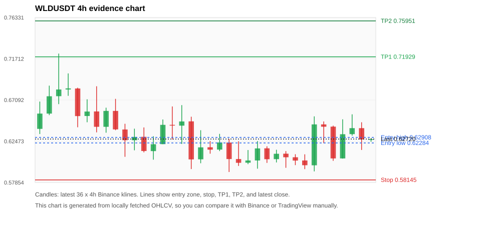
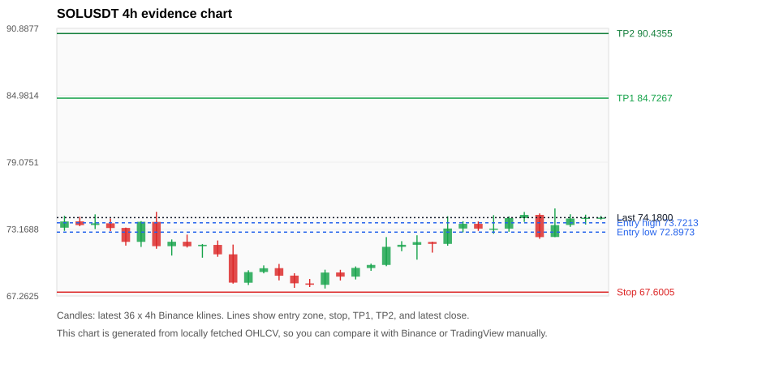
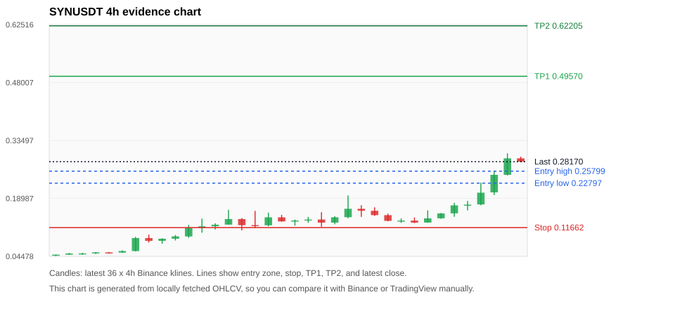
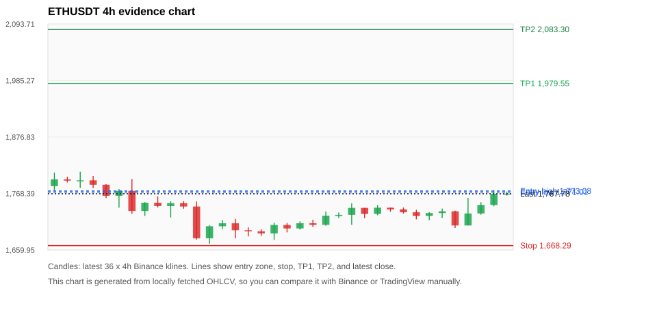
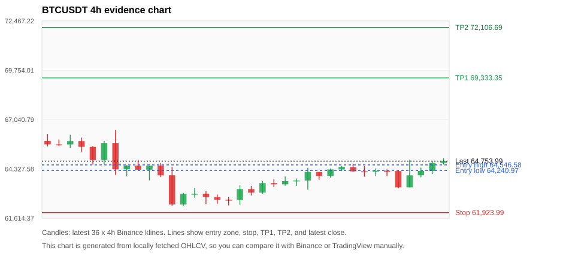

# Crypto 市场扫描报告 v1

- 报告时间：2026-06-22 20:06:55 CST
- Run ID：`20260622_120502_977107e4`
- Run type：`daily_full`
- 数据来源：SQLite
- 报告版本：v1
- 扫描 ID：097536a10619
- 数据源：Binance public spot API + CoinGecko/CoinMarketCap cross-check
- 过滤条件：USDT spot; 24h quote volume >= 30,000,000; trades >= 30,000; exclude stables/leveraged tokens; analyze 1h/4h/1d klines
- 默认单笔风险：账户权益的 1.00%

## 限制说明

- 交易信号仍以 Binance 现货公开 K 线为主源；外部数据源用于一致性复核。
- 结果是研究和模拟盘计划，不是确定收益或实盘下单指令。
- 历史长度过滤：候选币至少需要 180 根 1d K 线。
- 数据质量验证池：先验证 score 排名前 min(top_n * 2, 10) 的候选，再按 action + score 补足最终名单。
- 大盘环境过滤：RISK_OFF; BTC/ETH 大盘偏弱，山寨币买入候选降级为观察。 BTC 7d=-2.3771746606373156; ETH 7d=-1.5522261751655053.
- 已启用数据交叉验证：Binance 主源 + CoinGecko 自动对照；CoinMarketCap 在配置 API Key 后自动对照。
- WLDUSDT 交叉验证状态 DATA_WARNING：At least one external provider needs manual review.
- SOLUSDT 交叉验证状态 DATA_WARNING：At least one external provider needs manual review.
- SYNUSDT 交叉验证状态 DATA_WARNING：At least one external provider needs manual review.
- ETHUSDT 交叉验证状态 DATA_WARNING：At least one external provider needs manual review.
- BTCUSDT 交叉验证状态 DATA_WARNING：At least one external provider needs manual review.
- BNBUSDT 交叉验证状态 DATA_WARNING：At least one external provider needs manual review.
- XRPUSDT 交叉验证状态 DATA_WARNING：At least one external provider needs manual review.
- TAOUSDT 交叉验证状态 DATA_WARNING：At least one external provider needs manual review.
- NEARUSDT 交叉验证状态 DATA_WARNING：At least one external provider needs manual review.
- ZECUSDT 交叉验证状态 DATA_WARNING：At least one external provider needs manual review.

## 5 个候选交易计划

| Rank | Coin | Action | Setup | Entry Zone | Stop Loss | TP1 | TP2 / Exit Rule | R/R | Verdict |
|---:|---|---|---|---:|---:|---:|---|---:|---|
| 1 | `WLD` | `WATCH_ONLY` | 回踩支撑/4h EMA 附近 | 0.62284 - 0.62908 | 0.58145 | 0.71929 | 0.75951 或跌破 4h 关键支撑 | 2.10-3.00 | 只观察 |
| 2 | `SOL` | `WATCH_ONLY` | 回踩支撑/4h EMA 附近 | 72.8973 - 73.7213 | 67.6005 | 84.7267 | 90.4355 或跌破 4h 关键支撑 | 2.00-3.00 | 只观察 |
| 3 | `SYN` | `WATCH_ONLY` | 涨幅较远，只等深回调 | 0.22797 - 0.25799 | 0.11662 | 0.49570 | 0.62205 或跌破 4h 关键支撑 | 2.00-3.00 | 只等回调 |
| 4 | `ETH` | `WATCH_ONLY` | 回踩支撑/4h EMA 附近 | 1,771.01 - 1,773.08 | 1,668.29 | 1,979.55 | 2,083.30 或跌破 4h 关键支撑 | 2.00-3.00 | 只观察 |
| 5 | `BTC` | `WATCH_ONLY` | 回踩支撑/4h EMA 附近 | 64,240.97 - 64,546.58 | 61,923.99 | 69,333.35 | 72,106.69 或跌破 4h 关键支撑 | 2.00-3.12 | 只观察 |

## 数据交叉验证摘要

价格差异以 Binance 当前价为基准；成交量口径不同，Binance 是 USDT 现货成交额，CoinGecko/CoinMarketCap 通常是全市场成交量。

| Rank | Coin | Data Status | Max Price Diff | Max 24h Diff | Message |
|---:|---|---|---:|---:|---|
| 1 | `WLD` | DATA_WARNING | 0.14% | 0.29 pts | At least one external provider needs manual review. |
| 2 | `SOL` | DATA_WARNING | 0.16% | 0.01 pts | At least one external provider needs manual review. |
| 3 | `SYN` | DATA_WARNING | 1.57% | 2.02 pts | At least one external provider needs manual review. |
| 4 | `ETH` | DATA_WARNING | 0.14% | 0.00 pts | At least one external provider needs manual review. |
| 5 | `BTC` | DATA_WARNING | 0.13% | 0.03 pts | At least one external provider needs manual review. |

## 候选币说明

### 1. WLD `WLDUSDT`



- 入选原因：回踩支撑/4h EMA 附近；24h +4.67%，7d +2.52%，4h RSI 57.45，24h 成交额 $88.2M。
- 交易失效条件：跌破 0.5814455 或 4h 收盘重新失守关键支撑。
- 主要风险：BTC/ETH 大盘环境未确认强势，山寨币买入信号降级；数据交叉验证需要人工复核。
- 数据交叉验证：DATA_WARNING；At least one external provider needs manual review.

#### 可点击人工验证

- [Binance 交易页](https://www.binance.com/en/trade/WLD_USDT)
- [TradingView 图表](https://www.tradingview.com/chart/?symbol=BINANCE%3AWLDUSDT)
- [CoinGecko 搜索](https://www.coingecko.com/en/search?query=WLD)
- [CoinMarketCap 搜索](https://coinmarketcap.com/search/?q=WLD)

#### 多数据源对照

| Source | Status | Asset ID | Price | 24h Change | 24h Volume | Price Diff | 24h Diff | Updated | Message |
|---|---|---|---:|---:|---:|---:|---:|---|---|
| Binance | DATA_OK | WLDUSDT | 0.62720 | +4.67% | $88.2M | 0.00% | 0.00 pts | 2026-06-22T12:05:49+00:00 | Primary market data source used by scanner. |
| CoinGecko | DATA_WARNING | n/a | n/a | n/a | n/a | n/a | n/a | 2026-06-22T12:05:49+00:00 | Failed to fetch https://api.coingecko.com/api/v3/coins/markets?vs_currency=usd&ids=worldcoin-wld&price_change_percentage=24h&per_page=1&page=1: HTTP Error 429: Too Many Requests |
| CoinMarketCap | DATA_WARNING | 13502 | 0.62631 | +4.96% | $493.1M | 0.14% | 0.29 pts | 2026-06-22T12:05:02.000Z | CoinMarketCap symbol mapping has 2 matches; selected lowest cmc_rank |

#### 指标证据

| 指标 | 数值 | 人工核对用途 |
|---|---:|---|
| 当前价 | 0.62720 | 与 Binance/TradingView 当前价格对照 |
| 24h 涨跌 | +4.67% | 与交易所 24h 涨跌对照 |
| 7d 涨跌 | +2.52% | 判断短线趋势是否延续 |
| 4h EMA20 | 0.62160 | 判断短期趋势支撑 |
| 4h EMA50 | 0.60298 | 判断中期趋势支撑 |
| 1d EMA20 | 0.54312 | 判断日线趋势 |
| 1d EMA50 | 0.44211 | 判断日线趋势 |
| 4h RSI14 | 57.45 | 判断是否过热/过弱 |
| 4h ATR14 | 0.02537 | 推导止损和入场缓冲 |
| 最近 18 根 4h 最低点 | 0.59030 | 支撑/止损参考 |
| 最近 36 根 4h 最高点 | 0.72290 | TP/压力参考 |
| 支撑位 | 0.62160 | 入场区间推导基础 |

#### 交易计划推导

- 支撑位 = 最近低点、4h EMA20、4h EMA50、1d EMA20 中不高于当前价的最高有效支撑 = `0.62160`。
- 入场区间 = 支撑位附近 + ATR 缓冲 = `0.62284 - 0.62908`。
- 止损 = min(最近 18 根 4h 最低点 * 0.985, 入场中位价 - 1.15 * ATR14) = `0.58145`。
- TP1 = max(最近 36 根 4h 最高点 * 0.995, 入场中位价 + 2R) = `0.71929`。
- TP2 = max(入场中位价 + 3R, TP1 * 1.04) = `0.75951`。

#### 最近 10 根 4h K线

| UTC 开盘时间 | Open | High | Low | Close | Quote Volume | Trades |
|---|---:|---:|---:|---:|---:|---:|
| 2026-06-21T00:00+00:00 | 0.61080 | 0.61370 | 0.59500 | 0.60680 | $6.4M | 74578 |
| 2026-06-21T04:00+00:00 | 0.60680 | 0.61020 | 0.59800 | 0.60310 | $4.5M | 59761 |
| 2026-06-21T08:00+00:00 | 0.60320 | 0.61010 | 0.59350 | 0.59790 | $6.5M | 91491 |
| 2026-06-21T12:00+00:00 | 0.59780 | 0.65260 | 0.59100 | 0.64360 | $29.0M | 237647 |
| 2026-06-21T16:00+00:00 | 0.64360 | 0.64690 | 0.62260 | 0.64100 | $11.9M | 175206 |
| 2026-06-21T20:00+00:00 | 0.64110 | 0.64220 | 0.60280 | 0.60550 | $9.8M | 150596 |
| 2026-06-22T00:00+00:00 | 0.60550 | 0.64930 | 0.60530 | 0.63260 | $13.4M | 205497 |
| 2026-06-22T04:00+00:00 | 0.63270 | 0.65490 | 0.63100 | 0.63940 | $9.0M | 140365 |
| 2026-06-22T08:00+00:00 | 0.63940 | 0.64600 | 0.61500 | 0.62670 | $14.9M | 178319 |
| 2026-06-22T12:00+00:00 | 0.62680 | 0.62820 | 0.62420 | 0.62710 | $334,772 | 5023 |

### 2. SOL `SOLUSDT`



- 入选原因：回踩支撑/4h EMA 附近；24h +1.35%，7d +0.73%，4h RSI 66.84，24h 成交额 $177.4M。
- 交易失效条件：跌破 67.60055 或 4h 收盘重新失守关键支撑。
- 主要风险：日线趋势未完全确认；BTC/ETH 大盘环境未确认强势，山寨币买入信号降级；数据交叉验证需要人工复核。
- 数据交叉验证：DATA_WARNING；At least one external provider needs manual review.

#### 可点击人工验证

- [Binance 交易页](https://www.binance.com/en/trade/SOL_USDT)
- [TradingView 图表](https://www.tradingview.com/chart/?symbol=BINANCE%3ASOLUSDT)
- [CoinGecko 搜索](https://www.coingecko.com/en/search?query=SOL)
- [CoinMarketCap 搜索](https://coinmarketcap.com/search/?q=SOL)

#### 多数据源对照

| Source | Status | Asset ID | Price | 24h Change | 24h Volume | Price Diff | 24h Diff | Updated | Message |
|---|---|---|---:|---:|---:|---:|---:|---|---|
| Binance | DATA_OK | SOLUSDT | 74.1800 | +1.35% | $177.4M | 0.00% | 0.00 pts | 2026-06-22T12:05:49+00:00 | Primary market data source used by scanner. |
| CoinGecko | DATA_WARNING | n/a | n/a | n/a | n/a | n/a | n/a | 2026-06-22T12:05:49+00:00 | Failed to fetch https://api.coingecko.com/api/v3/coins/markets?vs_currency=usd&ids=solana&price_change_percentage=24h&per_page=1&page=1: HTTP Error 429: Too Many Requests |
| CoinMarketCap | DATA_WARNING | 5426 | 74.0620 | +1.35% | $2.19B | 0.16% | 0.01 pts | 2026-06-22T12:05:02.000Z | CoinMarketCap symbol mapping has 8 matches; selected lowest cmc_rank |

#### 指标证据

| 指标 | 数值 | 人工核对用途 |
|---|---:|---|
| 当前价 | 74.1800 | 与 Binance/TradingView 当前价格对照 |
| 24h 涨跌 | +1.35% | 与交易所 24h 涨跌对照 |
| 7d 涨跌 | +0.73% | 判断短线趋势是否延续 |
| 4h EMA20 | 72.7518 | 判断短期趋势支撑 |
| 4h EMA50 | 71.5158 | 判断中期趋势支撑 |
| 1d EMA20 | 72.2326 | 判断日线趋势 |
| 1d EMA50 | 76.8435 | 判断日线趋势 |
| 4h RSI14 | 66.84 | 判断是否过热/过弱 |
| 4h ATR14 | 1.3850 | 推导止损和入场缓冲 |
| 最近 18 根 4h 最低点 | 68.6300 | 支撑/止损参考 |
| 最近 36 根 4h 最高点 | 74.9900 | TP/压力参考 |
| 支撑位 | 72.7518 | 入场区间推导基础 |

#### 交易计划推导

- 支撑位 = 最近低点、4h EMA20、4h EMA50、1d EMA20 中不高于当前价的最高有效支撑 = `72.7518`。
- 入场区间 = 支撑位附近 + ATR 缓冲 = `72.8973 - 73.7213`。
- 止损 = min(最近 18 根 4h 最低点 * 0.985, 入场中位价 - 1.15 * ATR14) = `67.6005`。
- TP1 = max(最近 36 根 4h 最高点 * 0.995, 入场中位价 + 2R) = `84.7267`。
- TP2 = max(入场中位价 + 3R, TP1 * 1.04) = `90.4355`。

#### 最近 10 根 4h K线

| UTC 开盘时间 | Open | High | Low | Close | Quote Volume | Trades |
|---|---:|---:|---:|---:|---:|---:|
| 2026-06-21T00:00+00:00 | 73.2200 | 73.8600 | 72.8800 | 73.6300 | $18.5M | 84321 |
| 2026-06-21T04:00+00:00 | 73.6300 | 73.8400 | 73.0100 | 73.2100 | $21.9M | 75498 |
| 2026-06-21T08:00+00:00 | 73.2100 | 74.4000 | 72.7500 | 73.2100 | $29.6M | 120723 |
| 2026-06-21T12:00+00:00 | 73.2100 | 74.2900 | 72.9300 | 74.1400 | $31.9M | 110963 |
| 2026-06-21T16:00+00:00 | 74.1400 | 74.6800 | 73.8000 | 74.4200 | $23.9M | 106408 |
| 2026-06-21T20:00+00:00 | 74.4200 | 74.5500 | 72.3100 | 72.4600 | $30.2M | 182650 |
| 2026-06-22T00:00+00:00 | 72.4700 | 74.9900 | 72.4600 | 73.5200 | $34.9M | 201772 |
| 2026-06-22T04:00+00:00 | 73.5300 | 74.4800 | 73.3600 | 74.1000 | $21.7M | 103009 |
| 2026-06-22T08:00+00:00 | 74.1000 | 74.4400 | 73.5700 | 74.1700 | $32.7M | 123926 |
| 2026-06-22T12:00+00:00 | 74.1800 | 74.3300 | 74.0000 | 74.1800 | $3.2M | 8061 |

### 3. SYN `SYNUSDT`



- 入选原因：涨幅较远，只等深回调；24h +93.62%，7d +567.54%，4h RSI 80.71，24h 成交额 $34.5M。
- 交易失效条件：跌破 0.116624 或 4h 收盘重新失守关键支撑。
- 主要风险：距离支撑偏远，不能追市价；4h RSI 偏热；24h 振幅较大，回撤风险高；BTC/ETH 大盘环境未确认强势，山寨币买入信号降级；数据交叉验证需要人工复核。
- 数据交叉验证：DATA_WARNING；At least one external provider needs manual review.

#### 可点击人工验证

- [Binance 交易页](https://www.binance.com/en/trade/SYN_USDT)
- [TradingView 图表](https://www.tradingview.com/chart/?symbol=BINANCE%3ASYNUSDT)
- [CoinGecko 搜索](https://www.coingecko.com/en/search?query=SYN)
- [CoinMarketCap 搜索](https://coinmarketcap.com/search/?q=SYN)

#### 多数据源对照

| Source | Status | Asset ID | Price | 24h Change | 24h Volume | Price Diff | 24h Diff | Updated | Message |
|---|---|---|---:|---:|---:|---:|---:|---|---|
| Binance | DATA_OK | SYNUSDT | 0.28170 | +93.62% | $34.5M | 0.00% | 0.00 pts | 2026-06-22T12:05:49+00:00 | Primary market data source used by scanner. |
| CoinGecko | DATA_WARNING | n/a | n/a | n/a | n/a | n/a | n/a | 2026-06-22T12:05:49+00:00 | Failed to fetch https://api.coingecko.com/api/v3/coins/markets?vs_currency=usd&ids=synapse-2&price_change_percentage=24h&per_page=1&page=1: HTTP Error 429: Too Many Requests |
| CoinMarketCap | DATA_WARNING | 12147 | 0.28613 | +95.64% | $128.8M | 1.57% | 2.02 pts | 2026-06-22T12:05:02.000Z | price diff 1.57% exceeds warning threshold; CoinMarketCap symbol mapping has 4 matches; selected lowest cmc_rank |

#### 指标证据

| 指标 | 数值 | 人工核对用途 |
|---|---:|---|
| 当前价 | 0.28170 | 与 Binance/TradingView 当前价格对照 |
| 24h 涨跌 | +93.62% | 与交易所 24h 涨跌对照 |
| 7d 涨跌 | +567.54% | 判断短线趋势是否延续 |
| 4h EMA20 | 0.17741 | 判断短期趋势支撑 |
| 4h EMA50 | 0.12661 | 判断中期趋势支撑 |
| 1d EMA20 | 0.09830 | 判断日线趋势 |
| 1d EMA50 | 0.06996 | 判断日线趋势 |
| 4h RSI14 | 80.71 | 判断是否过热/过弱 |
| 4h ATR14 | 0.03161 | 推导止损和入场缓冲 |
| 最近 18 根 4h 最低点 | 0.11840 | 支撑/止损参考 |
| 最近 36 根 4h 最高点 | 0.30280 | TP/压力参考 |
| 支撑位 | 0.17741 | 入场区间推导基础 |

#### 交易计划推导

- 支撑位 = 最近低点、4h EMA20、4h EMA50、1d EMA20 中不高于当前价的最高有效支撑 = `0.17741`。
- 入场区间 = 支撑位附近 + ATR 缓冲 = `0.22797 - 0.25799`。
- 止损 = min(最近 18 根 4h 最低点 * 0.985, 入场中位价 - 1.15 * ATR14) = `0.11662`。
- TP1 = max(最近 36 根 4h 最高点 * 0.995, 入场中位价 + 2R) = `0.49570`。
- TP2 = max(入场中位价 + 3R, TP1 * 1.04) = `0.62205`。

#### 最近 10 根 4h K线

| UTC 开盘时间 | Open | High | Low | Close | Quote Volume | Trades |
|---|---:|---:|---:|---:|---:|---:|
| 2026-06-21T00:00+00:00 | 0.13360 | 0.13960 | 0.12870 | 0.13410 | $890,743 | 11728 |
| 2026-06-21T04:00+00:00 | 0.13410 | 0.14200 | 0.12780 | 0.12920 | $1.2M | 12014 |
| 2026-06-21T08:00+00:00 | 0.12930 | 0.15990 | 0.12920 | 0.13980 | $2.7M | 28476 |
| 2026-06-21T12:00+00:00 | 0.13990 | 0.15300 | 0.13880 | 0.15220 | $1.4M | 20361 |
| 2026-06-21T16:00+00:00 | 0.15230 | 0.17860 | 0.14370 | 0.17230 | $3.5M | 35889 |
| 2026-06-21T20:00+00:00 | 0.17240 | 0.18330 | 0.15950 | 0.17410 | $3.7M | 32177 |
| 2026-06-22T00:00+00:00 | 0.17470 | 0.22940 | 0.17250 | 0.20410 | $5.5M | 49179 |
| 2026-06-22T04:00+00:00 | 0.20490 | 0.25850 | 0.19810 | 0.24880 | $6.3M | 54315 |
| 2026-06-22T08:00+00:00 | 0.24880 | 0.30280 | 0.24720 | 0.29020 | $13.9M | 95460 |
| 2026-06-22T12:00+00:00 | 0.29020 | 0.29430 | 0.28040 | 0.28170 | $289,099 | 2406 |

### 4. ETH `ETHUSDT`



- 入选原因：回踩支撑/4h EMA 附近；24h +2.50%，7d -2.55%，4h RSI 63.99，24h 成交额 $338.6M。
- 交易失效条件：跌破 1668.2945 或 4h 收盘重新失守关键支撑。
- 主要风险：日线趋势未完全确认；BTC/ETH 大盘环境未确认强势，山寨币买入信号降级；7d 趋势未确认；数据交叉验证需要人工复核。
- 数据交叉验证：DATA_WARNING；At least one external provider needs manual review.

#### 可点击人工验证

- [Binance 交易页](https://www.binance.com/en/trade/ETH_USDT)
- [TradingView 图表](https://www.tradingview.com/chart/?symbol=BINANCE%3AETHUSDT)
- [CoinGecko 搜索](https://www.coingecko.com/en/search?query=ETH)
- [CoinMarketCap 搜索](https://coinmarketcap.com/search/?q=ETH)

#### 多数据源对照

| Source | Status | Asset ID | Price | 24h Change | 24h Volume | Price Diff | 24h Diff | Updated | Message |
|---|---|---|---:|---:|---:|---:|---:|---|---|
| Binance | DATA_OK | ETHUSDT | 1,767.78 | +2.50% | $338.6M | 0.00% | 0.00 pts | 2026-06-22T12:05:49+00:00 | Primary market data source used by scanner. |
| CoinGecko | DATA_WARNING | n/a | n/a | n/a | n/a | n/a | n/a | 2026-06-22T12:05:49+00:00 | Failed to fetch https://api.coingecko.com/api/v3/coins/markets?vs_currency=usd&ids=ethereum&price_change_percentage=24h&per_page=1&page=1: HTTP Error 429: Too Many Requests |
| CoinMarketCap | DATA_WARNING | 1027 | 1,765.35 | +2.51% | $11.46B | 0.14% | 0.00 pts | 2026-06-22T12:05:02.000Z | CoinMarketCap symbol mapping has 6 matches; selected lowest cmc_rank |

#### 指标证据

| 指标 | 数值 | 人工核对用途 |
|---|---:|---|
| 当前价 | 1,767.78 | 与 Binance/TradingView 当前价格对照 |
| 24h 涨跌 | +2.50% | 与交易所 24h 涨跌对照 |
| 7d 涨跌 | -2.55% | 判断短线趋势是否延续 |
| 4h EMA20 | 1,735.78 | 判断短期趋势支撑 |
| 4h EMA50 | 1,728.60 | 判断中期趋势支撑 |
| 1d EMA20 | 1,767.47 | 判断日线趋势 |
| 1d EMA50 | 1,913.69 | 判断日线趋势 |
| 4h RSI14 | 63.99 | 判断是否过热/过弱 |
| 4h ATR14 | 22.2579 | 推导止损和入场缓冲 |
| 最近 18 根 4h 最低点 | 1,693.70 | 支撑/止损参考 |
| 最近 36 根 4h 最高点 | 1,810.21 | TP/压力参考 |
| 支撑位 | 1,767.47 | 入场区间推导基础 |

#### 交易计划推导

- 支撑位 = 最近低点、4h EMA20、4h EMA50、1d EMA20 中不高于当前价的最高有效支撑 = `1,767.47`。
- 入场区间 = 支撑位附近 + ATR 缓冲 = `1,771.01 - 1,773.08`。
- 止损 = min(最近 18 根 4h 最低点 * 0.985, 入场中位价 - 1.15 * ATR14) = `1,668.29`。
- TP1 = max(最近 36 根 4h 最高点 * 0.995, 入场中位价 + 2R) = `1,979.55`。
- TP2 = max(入场中位价 + 3R, TP1 * 1.04) = `2,083.30`。

#### 最近 10 根 4h K线

| UTC 开盘时间 | Open | High | Low | Close | Quote Volume | Trades |
|---|---:|---:|---:|---:|---:|---:|
| 2026-06-21T00:00+00:00 | 1,741.08 | 1,741.45 | 1,733.51 | 1,737.87 | $20.0M | 174336 |
| 2026-06-21T04:00+00:00 | 1,737.88 | 1,741.41 | 1,729.80 | 1,732.36 | $33.2M | 178328 |
| 2026-06-21T08:00+00:00 | 1,732.36 | 1,737.02 | 1,718.56 | 1,725.36 | $33.9M | 230369 |
| 2026-06-21T12:00+00:00 | 1,725.37 | 1,732.57 | 1,717.14 | 1,730.72 | $32.8M | 263935 |
| 2026-06-21T16:00+00:00 | 1,730.71 | 1,739.32 | 1,721.67 | 1,734.14 | $34.9M | 260447 |
| 2026-06-21T20:00+00:00 | 1,734.14 | 1,735.34 | 1,702.00 | 1,706.94 | $58.9M | 551184 |
| 2026-06-22T00:00+00:00 | 1,706.94 | 1,759.84 | 1,706.94 | 1,730.00 | $83.8M | 759671 |
| 2026-06-22T04:00+00:00 | 1,730.00 | 1,751.58 | 1,727.69 | 1,746.34 | $54.9M | 327318 |
| 2026-06-22T08:00+00:00 | 1,746.34 | 1,774.70 | 1,743.56 | 1,767.68 | $70.1M | 424238 |
| 2026-06-22T12:00+00:00 | 1,767.68 | 1,772.00 | 1,764.22 | 1,767.99 | $5.4M | 27634 |

### 5. BTC `BTCUSDT`



- 入选原因：回踩支撑/4h EMA 附近；24h +0.89%，7d -2.55%，4h RSI 64.19，24h 成交额 $751.1M。
- 交易失效条件：跌破 61923.985 或 4h 收盘重新失守关键支撑。
- 主要风险：日线趋势未完全确认；BTC/ETH 大盘环境未确认强势，山寨币买入信号降级；7d 趋势未确认；数据交叉验证需要人工复核。
- 数据交叉验证：DATA_WARNING；At least one external provider needs manual review.

#### 可点击人工验证

- [Binance 交易页](https://www.binance.com/en/trade/BTC_USDT)
- [TradingView 图表](https://www.tradingview.com/chart/?symbol=BINANCE%3ABTCUSDT)
- [CoinGecko 搜索](https://www.coingecko.com/en/search?query=BTC)
- [CoinMarketCap 搜索](https://coinmarketcap.com/search/?q=BTC)

#### 多数据源对照

| Source | Status | Asset ID | Price | 24h Change | 24h Volume | Price Diff | 24h Diff | Updated | Message |
|---|---|---|---:|---:|---:|---:|---:|---|---|
| Binance | DATA_OK | BTCUSDT | 64,753.99 | +0.89% | $751.1M | 0.00% | 0.00 pts | 2026-06-22T12:05:49+00:00 | Primary market data source used by scanner. |
| CoinGecko | DATA_OK | bitcoin | 64,673.00 | +0.86% | $20.99B | 0.13% | 0.03 pts | 2026-06-22T12:06:21.631Z | External source agrees with Binance within thresholds. |
| CoinMarketCap | DATA_WARNING | 1 | 64,692.11 | +0.90% | $20.56B | 0.10% | 0.01 pts | 2026-06-22T12:05:02.000Z | CoinMarketCap symbol mapping has 13 matches; selected lowest cmc_rank |

#### 指标证据

| 指标 | 数值 | 人工核对用途 |
|---|---:|---|
| 当前价 | 64,753.99 | 与 Binance/TradingView 当前价格对照 |
| 24h 涨跌 | +0.89% | 与交易所 24h 涨跌对照 |
| 7d 涨跌 | -2.55% | 判断短线趋势是否延续 |
| 4h EMA20 | 64,100.39 | 判断短期趋势支撑 |
| 4h EMA50 | 64,112.75 | 判断中期趋势支撑 |
| 1d EMA20 | 65,419.11 | 判断日线趋势 |
| 1d EMA50 | 69,129.19 | 判断日线趋势 |
| 4h RSI14 | 64.19 | 判断是否过热/过弱 |
| 4h ATR14 | 619.76 | 推导止损和入场缓冲 |
| 最近 18 根 4h 最低点 | 62,866.99 | 支撑/止损参考 |
| 最近 36 根 4h 最高点 | 66,445.93 | TP/压力参考 |
| 支撑位 | 64,112.75 | 入场区间推导基础 |

#### 交易计划推导

- 支撑位 = 最近低点、4h EMA20、4h EMA50、1d EMA20 中不高于当前价的最高有效支撑 = `64,112.75`。
- 入场区间 = 支撑位附近 + ATR 缓冲 = `64,240.97 - 64,546.58`。
- 止损 = min(最近 18 根 4h 最低点 * 0.985, 入场中位价 - 1.15 * ATR14) = `61,923.99`。
- TP1 = max(最近 36 根 4h 最高点 * 0.995, 入场中位价 + 2R) = `69,333.35`。
- TP2 = max(入场中位价 + 3R, TP1 * 1.04) = `72,106.69`。

#### 最近 10 根 4h K线

| UTC 开盘时间 | Open | High | Low | Close | Quote Volume | Trades |
|---|---:|---:|---:|---:|---:|---:|
| 2026-06-21T00:00+00:00 | 64,298.01 | 64,472.99 | 64,206.17 | 64,426.00 | $99.7M | 207280 |
| 2026-06-21T04:00+00:00 | 64,426.00 | 64,588.00 | 64,173.08 | 64,191.07 | $63.8M | 192899 |
| 2026-06-21T08:00+00:00 | 64,191.06 | 64,483.95 | 63,900.17 | 64,176.00 | $81.8M | 278849 |
| 2026-06-21T12:00+00:00 | 64,176.00 | 64,355.88 | 63,952.00 | 64,224.00 | $70.6M | 261322 |
| 2026-06-21T16:00+00:00 | 64,224.00 | 64,298.84 | 63,933.47 | 64,207.12 | $57.9M | 250295 |
| 2026-06-21T20:00+00:00 | 64,207.13 | 64,271.21 | 63,270.00 | 63,311.99 | $141.1M | 577649 |
| 2026-06-22T00:00+00:00 | 63,312.00 | 64,823.52 | 63,312.00 | 63,974.01 | $206.1M | 769958 |
| 2026-06-22T04:00+00:00 | 63,974.01 | 64,397.57 | 63,868.41 | 64,211.19 | $140.4M | 384238 |
| 2026-06-22T08:00+00:00 | 64,211.20 | 64,768.46 | 64,044.00 | 64,657.22 | $120.5M | 445403 |
| 2026-06-22T12:00+00:00 | 64,657.22 | 64,910.65 | 64,579.08 | 64,753.99 | $15.7M | 37889 |

## 组合风控

- 不要 5 个候选全部满仓买入。
- 同时持仓总风险建议控制在账户权益的 3% - 5% 以内。
- 如果 BTC/ETH 同时破位，暂停山寨币多头计划或降低仓位。
- 第一版报告用于模拟盘和人工复核，不自动下单。

## 原始数据

```json
[
  {
    "rank": 1,
    "symbol": "WLDUSDT",
    "base_asset": "WLD",
    "price": 0.6272,
    "score": 52.02486460941943,
    "setup": "回踩支撑/4h EMA 附近",
    "verdict": "只观察",
    "entry_low": 0.6228426532364512,
    "entry_high": 0.6290815999999999,
    "stop_loss": 0.5814455000000001,
    "take_profit_1": 0.7192855,
    "take_profit_2": 0.7595120064729022,
    "risk_reward_1": 2.0963711869301203,
    "risk_reward_2": 3.0,
    "pct_24h": 4.674,
    "pct_3d": -0.8692903429745602,
    "pct_7d": 2.517162471395884,
    "quote_volume_24h": 88154592.29615,
    "trades_24h": 1090556,
    "high_low_range_24h": 10.812182741116771,
    "rsi_1h": 58.55855855855858,
    "rsi_4h": 57.448004496908375,
    "ema20_4h": 0.6215994543277956,
    "ema50_4h": 0.6029790105074886,
    "ema20_1d": 0.5431210460357645,
    "ema50_1d": 0.44210988421772796,
    "atr_4h": 0.025371428571428576,
    "macd_hist_4h": 0.0009486384116729435,
    "volume_ratio_24h": 0.4397192172195686,
    "support_level": 0.6215994543277956,
    "recent_low_4h_18": 0.5903,
    "recent_high_4h_36": 0.7229,
    "distance_to_support_pct": 0.9009894769391069,
    "binance_trade_url": "https://www.binance.com/en/trade/WLD_USDT",
    "tradingview_url": "https://www.tradingview.com/chart/?symbol=BINANCE%3AWLDUSDT",
    "coingecko_search_url": "https://www.coingecko.com/en/search?query=WLD",
    "coinmarketcap_search_url": "https://coinmarketcap.com/search/?q=WLD",
    "invalidation": "跌破 0.5814455 或 4h 收盘重新失守关键支撑",
    "recent_4h_klines": [
      {
        "open_time_utc": "2026-06-16T16:00+00:00",
        "open": 0.6386,
        "high": 0.6692,
        "low": 0.6328,
        "close": 0.6557,
        "quote_volume": 24181225.39874,
        "trades": 387353
      },
      {
        "open_time_utc": "2026-06-16T20:00+00:00",
        "open": 0.6557,
        "high": 0.687,
        "low": 0.654,
        "close": 0.6751,
        "quote_volume": 18118785.84528,
        "trades": 283936
      },
      {
        "open_time_utc": "2026-06-17T00:00+00:00",
        "open": 0.6752,
        "high": 0.7229,
        "low": 0.6663,
        "close": 0.6827,
        "quote_volume": 38108874.74237,
        "trades": 605974
      },
      {
        "open_time_utc": "2026-06-17T04:00+00:00",
        "open": 0.6827,
        "high": 0.7007,
        "low": 0.6756,
        "close": 0.6839,
        "quote_volume": 30090974.66053,
        "trades": 415834
      },
      {
        "open_time_utc": "2026-06-17T08:00+00:00",
        "open": 0.6838,
        "high": 0.6847,
        "low": 0.6404,
        "close": 0.6529,
        "quote_volume": 33392541.94082,
        "trades": 377565
      },
      {
        "open_time_utc": "2026-06-17T12:00+00:00",
        "open": 0.653,
        "high": 0.6717,
        "low": 0.646,
        "close": 0.658,
        "quote_volume": 44560674.77833,
        "trades": 477219
      },
      {
        "open_time_utc": "2026-06-17T16:00+00:00",
        "open": 0.6581,
        "high": 0.6863,
        "low": 0.6347,
        "close": 0.6409,
        "quote_volume": 60138639.3826,
        "trades": 635662
      },
      {
        "open_time_utc": "2026-06-17T20:00+00:00",
        "open": 0.6409,
        "high": 0.6623,
        "low": 0.6343,
        "close": 0.6587,
        "quote_volume": 18840983.62062,
        "trades": 247591
      },
      {
        "open_time_utc": "2026-06-18T00:00+00:00",
        "open": 0.6587,
        "high": 0.6722,
        "low": 0.6371,
        "close": 0.638,
        "quote_volume": 33787574.58207,
        "trades": 340881
      },
      {
        "open_time_utc": "2026-06-18T04:00+00:00",
        "open": 0.6379,
        "high": 0.6443,
        "low": 0.6073,
        "close": 0.6259,
        "quote_volume": 91422054.51016,
        "trades": 606149
      },
      {
        "open_time_utc": "2026-06-18T08:00+00:00",
        "open": 0.6259,
        "high": 0.6388,
        "low": 0.6146,
        "close": 0.6296,
        "quote_volume": 219117639.97094,
        "trades": 935854
      },
      {
        "open_time_utc": "2026-06-18T12:00+00:00",
        "open": 0.6297,
        "high": 0.6402,
        "low": 0.6123,
        "close": 0.6138,
        "quote_volume": 17245695.17494,
        "trades": 191965
      },
      {
        "open_time_utc": "2026-06-18T16:00+00:00",
        "open": 0.6137,
        "high": 0.6304,
        "low": 0.6041,
        "close": 0.6214,
        "quote_volume": 12492208.77821,
        "trades": 147722
      },
      {
        "open_time_utc": "2026-06-18T20:00+00:00",
        "open": 0.6215,
        "high": 0.6491,
        "low": 0.6215,
        "close": 0.6431,
        "quote_volume": 14735591.97919,
        "trades": 148070
      },
      {
        "open_time_utc": "2026-06-19T00:00+00:00",
        "open": 0.6431,
        "high": 0.6637,
        "low": 0.6267,
        "close": 0.6423,
        "quote_volume": 17660809.69361,
        "trades": 209708
      },
      {
        "open_time_utc": "2026-06-19T04:00+00:00",
        "open": 0.6422,
        "high": 0.6652,
        "low": 0.6217,
        "close": 0.6469,
        "quote_volume": 16703674.45958,
        "trades": 221509
      },
      {
        "open_time_utc": "2026-06-19T08:00+00:00",
        "open": 0.647,
        "high": 0.6522,
        "low": 0.5936,
        "close": 0.6044,
        "quote_volume": 24522096.26052,
        "trades": 279583
      },
      {
        "open_time_utc": "2026-06-19T12:00+00:00",
        "open": 0.6045,
        "high": 0.6371,
        "low": 0.6001,
        "close": 0.6179,
        "quote_volume": 16495071.32318,
        "trades": 228313
      },
      {
        "open_time_utc": "2026-06-19T16:00+00:00",
        "open": 0.618,
        "high": 0.6249,
        "low": 0.6108,
        "close": 0.6153,
        "quote_volume": 6080827.54999,
        "trades": 92585
      },
      {
        "open_time_utc": "2026-06-19T20:00+00:00",
        "open": 0.6154,
        "high": 0.633,
        "low": 0.6137,
        "close": 0.6234,
        "quote_volume": 7098920.03192,
        "trades": 83833
      },
      {
        "open_time_utc": "2026-06-20T00:00+00:00",
        "open": 0.6233,
        "high": 0.6273,
        "low": 0.5903,
        "close": 0.6048,
        "quote_volume": 10485341.00231,
        "trades": 121576
      },
      {
        "open_time_utc": "2026-06-20T04:00+00:00",
        "open": 0.6048,
        "high": 0.6247,
        "low": 0.5971,
        "close": 0.6006,
        "quote_volume": 9160899.70111,
        "trades": 107815
      },
      {
        "open_time_utc": "2026-06-20T08:00+00:00",
        "open": 0.6007,
        "high": 0.6149,
        "low": 0.5991,
        "close": 0.6032,
        "quote_volume": 5621146.61964,
        "trades": 75214
      },
      {
        "open_time_utc": "2026-06-20T12:00+00:00",
        "open": 0.6032,
        "high": 0.6249,
        "low": 0.594,
        "close": 0.6167,
        "quote_volume": 13059756.71654,
        "trades": 161880
      },
      {
        "open_time_utc": "2026-06-20T16:00+00:00",
        "open": 0.6168,
        "high": 0.6191,
        "low": 0.6005,
        "close": 0.6046,
        "quote_volume": 4572767.30319,
        "trades": 70903
      },
      {
        "open_time_utc": "2026-06-20T20:00+00:00",
        "open": 0.6047,
        "high": 0.6152,
        "low": 0.601,
        "close": 0.6107,
        "quote_volume": 4513660.32426,
        "trades": 51201
      },
      {
        "open_time_utc": "2026-06-21T00:00+00:00",
        "open": 0.6108,
        "high": 0.6137,
        "low": 0.595,
        "close": 0.6068,
        "quote_volume": 6356114.87032,
        "trades": 74578
      },
      {
        "open_time_utc": "2026-06-21T04:00+00:00",
        "open": 0.6068,
        "high": 0.6102,
        "low": 0.598,
        "close": 0.6031,
        "quote_volume": 4498369.28929,
        "trades": 59761
      },
      {
        "open_time_utc": "2026-06-21T08:00+00:00",
        "open": 0.6032,
        "high": 0.6101,
        "low": 0.5935,
        "close": 0.5979,
        "quote_volume": 6505630.64367,
        "trades": 91491
      },
      {
        "open_time_utc": "2026-06-21T12:00+00:00",
        "open": 0.5978,
        "high": 0.6526,
        "low": 0.591,
        "close": 0.6436,
        "quote_volume": 28963614.77047,
        "trades": 237647
      },
      {
        "open_time_utc": "2026-06-21T16:00+00:00",
        "open": 0.6436,
        "high": 0.6469,
        "low": 0.6226,
        "close": 0.641,
        "quote_volume": 11941923.08052,
        "trades": 175206
      },
      {
        "open_time_utc": "2026-06-21T20:00+00:00",
        "open": 0.6411,
        "high": 0.6422,
        "low": 0.6028,
        "close": 0.6055,
        "quote_volume": 9767133.59937,
        "trades": 150596
      },
      {
        "open_time_utc": "2026-06-22T00:00+00:00",
        "open": 0.6055,
        "high": 0.6493,
        "low": 0.6053,
        "close": 0.6326,
        "quote_volume": 13404512.32418,
        "trades": 205497
      },
      {
        "open_time_utc": "2026-06-22T04:00+00:00",
        "open": 0.6327,
        "high": 0.6549,
        "low": 0.631,
        "close": 0.6394,
        "quote_volume": 8975847.56,
        "trades": 140365
      },
      {
        "open_time_utc": "2026-06-22T08:00+00:00",
        "open": 0.6394,
        "high": 0.646,
        "low": 0.615,
        "close": 0.6267,
        "quote_volume": 14896349.81531,
        "trades": 178319
      },
      {
        "open_time_utc": "2026-06-22T12:00+00:00",
        "open": 0.6268,
        "high": 0.6282,
        "low": 0.6242,
        "close": 0.6271,
        "quote_volume": 334772.41458,
        "trades": 5023
      }
    ],
    "risks": [
      "BTC/ETH 大盘环境未确认强势，山寨币买入信号降级",
      "数据交叉验证需要人工复核"
    ],
    "data_quality_status": "DATA_WARNING",
    "data_quality_message": "At least one external provider needs manual review.",
    "data_checks": [
      {
        "provider": "Binance",
        "status": "DATA_OK",
        "provider_asset_id": "WLDUSDT",
        "provider_symbol": "WLDUSDT",
        "price_usd": 0.6272,
        "pct_24h": 4.674,
        "volume_24h": 88154592.29615,
        "last_updated": null,
        "fetched_at_utc": "2026-06-22T12:05:49+00:00",
        "price_diff_pct": 0.0,
        "pct_24h_diff": 0.0,
        "volume_note": "Binance USDT spot 24h quoteVolume.",
        "message": "Primary market data source used by scanner."
      },
      {
        "provider": "CoinGecko",
        "status": "DATA_WARNING",
        "provider_asset_id": null,
        "provider_symbol": "WLD",
        "price_usd": null,
        "pct_24h": null,
        "volume_24h": null,
        "last_updated": null,
        "fetched_at_utc": "2026-06-22T12:05:49+00:00",
        "price_diff_pct": null,
        "pct_24h_diff": null,
        "volume_note": "External provider data unavailable.",
        "message": "Failed to fetch https://api.coingecko.com/api/v3/coins/markets?vs_currency=usd&ids=worldcoin-wld&price_change_percentage=24h&per_page=1&page=1: HTTP Error 429: Too Many Requests"
      },
      {
        "provider": "CoinMarketCap",
        "status": "DATA_WARNING",
        "provider_asset_id": "13502",
        "provider_symbol": "WLD",
        "price_usd": 0.6263094095411406,
        "pct_24h": 4.96122874,
        "volume_24h": 493053516.66543734,
        "last_updated": "2026-06-22T12:05:02.000Z",
        "fetched_at_utc": "2026-06-22T12:05:49+00:00",
        "price_diff_pct": 0.14199465224161661,
        "pct_24h_diff": 0.28722873999999976,
        "volume_note": "CoinMarketCap total market volume; not the same venue scope as Binance quoteVolume.",
        "message": "CoinMarketCap symbol mapping has 2 matches; selected lowest cmc_rank"
      }
    ],
    "action": "WATCH_ONLY"
  },
  {
    "rank": 2,
    "symbol": "SOLUSDT",
    "base_asset": "SOL",
    "price": 74.18,
    "score": 46.045086206710685,
    "setup": "回踩支撑/4h EMA 附近",
    "verdict": "只观察",
    "entry_low": 72.89728320672354,
    "entry_high": 73.72127964742869,
    "stop_loss": 67.60055,
    "take_profit_1": 84.72674428122835,
    "take_profit_2": 90.43547570830447,
    "risk_reward_1": 2.0,
    "risk_reward_2": 3.0,
    "pct_24h": 1.353,
    "pct_3d": 7.072748267898388,
    "pct_7d": 0.7332971211298389,
    "quote_volume_24h": 177354308.76793,
    "trades_24h": 834171,
    "high_low_range_24h": 3.7062646936799837,
    "rsi_1h": 60.89494163424119,
    "rsi_4h": 66.8407310704961,
    "ema20_4h": 72.75177964742869,
    "ema50_4h": 71.51584408591644,
    "ema20_1d": 72.2326361308417,
    "ema50_1d": 76.84352495087187,
    "atr_4h": 1.3850000000000011,
    "macd_hist_4h": 0.17998470462543326,
    "volume_ratio_24h": 1.0091969748775227,
    "support_level": 72.75177964742869,
    "recent_low_4h_18": 68.63,
    "recent_high_4h_36": 74.99,
    "distance_to_support_pct": 1.9631414647075074,
    "binance_trade_url": "https://www.binance.com/en/trade/SOL_USDT",
    "tradingview_url": "https://www.tradingview.com/chart/?symbol=BINANCE%3ASOLUSDT",
    "coingecko_search_url": "https://www.coingecko.com/en/search?query=SOL",
    "coinmarketcap_search_url": "https://coinmarketcap.com/search/?q=SOL",
    "invalidation": "跌破 67.60055 或 4h 收盘重新失守关键支撑",
    "recent_4h_klines": [
      {
        "open_time_utc": "2026-06-16T16:00+00:00",
        "open": 73.29,
        "high": 74.34,
        "low": 73.01,
        "close": 73.84,
        "quote_volume": 26500730.07898,
        "trades": 175551
      },
      {
        "open_time_utc": "2026-06-16T20:00+00:00",
        "open": 73.85,
        "high": 74.26,
        "low": 73.42,
        "close": 73.52,
        "quote_volume": 13159470.67923,
        "trades": 78710
      },
      {
        "open_time_utc": "2026-06-17T00:00+00:00",
        "open": 73.53,
        "high": 74.47,
        "low": 73.17,
        "close": 73.68,
        "quote_volume": 19241007.5537,
        "trades": 112326
      },
      {
        "open_time_utc": "2026-06-17T04:00+00:00",
        "open": 73.68,
        "high": 74.11,
        "low": 72.99,
        "close": 73.26,
        "quote_volume": 18012241.98635,
        "trades": 106419
      },
      {
        "open_time_utc": "2026-06-17T08:00+00:00",
        "open": 73.27,
        "high": 73.3,
        "low": 71.71,
        "close": 72.04,
        "quote_volume": 24082792.06333,
        "trades": 141175
      },
      {
        "open_time_utc": "2026-06-17T12:00+00:00",
        "open": 72.04,
        "high": 73.87,
        "low": 71.59,
        "close": 73.81,
        "quote_volume": 31483417.7479,
        "trades": 210550
      },
      {
        "open_time_utc": "2026-06-17T16:00+00:00",
        "open": 73.8,
        "high": 74.69,
        "low": 71.43,
        "close": 71.66,
        "quote_volume": 64664598.63975,
        "trades": 429277
      },
      {
        "open_time_utc": "2026-06-17T20:00+00:00",
        "open": 71.66,
        "high": 72.25,
        "low": 70.83,
        "close": 72.05,
        "quote_volume": 20638978.09268,
        "trades": 140026
      },
      {
        "open_time_utc": "2026-06-18T00:00+00:00",
        "open": 72.05,
        "high": 72.68,
        "low": 71.54,
        "close": 71.65,
        "quote_volume": 14804358.19443,
        "trades": 94627
      },
      {
        "open_time_utc": "2026-06-18T04:00+00:00",
        "open": 71.66,
        "high": 71.85,
        "low": 70.64,
        "close": 71.78,
        "quote_volume": 18072952.69873,
        "trades": 126856
      },
      {
        "open_time_utc": "2026-06-18T08:00+00:00",
        "open": 71.77,
        "high": 72.16,
        "low": 70.72,
        "close": 70.94,
        "quote_volume": 20050944.13144,
        "trades": 102034
      },
      {
        "open_time_utc": "2026-06-18T12:00+00:00",
        "open": 70.94,
        "high": 71.8,
        "low": 68.35,
        "close": 68.44,
        "quote_volume": 54166130.1129,
        "trades": 327865
      },
      {
        "open_time_utc": "2026-06-18T16:00+00:00",
        "open": 68.43,
        "high": 69.53,
        "low": 68.23,
        "close": 69.37,
        "quote_volume": 35889091.80634,
        "trades": 196706
      },
      {
        "open_time_utc": "2026-06-18T20:00+00:00",
        "open": 69.38,
        "high": 69.96,
        "low": 69.26,
        "close": 69.71,
        "quote_volume": 16011482.82535,
        "trades": 96343
      },
      {
        "open_time_utc": "2026-06-19T00:00+00:00",
        "open": 69.72,
        "high": 70.09,
        "low": 68.64,
        "close": 69.05,
        "quote_volume": 21881602.30004,
        "trades": 113709
      },
      {
        "open_time_utc": "2026-06-19T04:00+00:00",
        "open": 69.06,
        "high": 69.27,
        "low": 67.98,
        "close": 68.38,
        "quote_volume": 29986443.93034,
        "trades": 135395
      },
      {
        "open_time_utc": "2026-06-19T08:00+00:00",
        "open": 68.37,
        "high": 68.76,
        "low": 68.05,
        "close": 68.25,
        "quote_volume": 19671579.62523,
        "trades": 105192
      },
      {
        "open_time_utc": "2026-06-19T12:00+00:00",
        "open": 68.25,
        "high": 69.58,
        "low": 67.92,
        "close": 69.33,
        "quote_volume": 28464907.55176,
        "trades": 163425
      },
      {
        "open_time_utc": "2026-06-19T16:00+00:00",
        "open": 69.34,
        "high": 69.57,
        "low": 68.63,
        "close": 68.97,
        "quote_volume": 15972210.91597,
        "trades": 116231
      },
      {
        "open_time_utc": "2026-06-19T20:00+00:00",
        "open": 68.97,
        "high": 69.87,
        "low": 68.72,
        "close": 69.74,
        "quote_volume": 13869516.37523,
        "trades": 81012
      },
      {
        "open_time_utc": "2026-06-20T00:00+00:00",
        "open": 69.73,
        "high": 70.12,
        "low": 69.48,
        "close": 70.0,
        "quote_volume": 14795005.85041,
        "trades": 79424
      },
      {
        "open_time_utc": "2026-06-20T04:00+00:00",
        "open": 70.0,
        "high": 72.46,
        "low": 69.89,
        "close": 71.6,
        "quote_volume": 32717749.308,
        "trades": 160048
      },
      {
        "open_time_utc": "2026-06-20T08:00+00:00",
        "open": 71.6,
        "high": 72.1,
        "low": 71.21,
        "close": 71.78,
        "quote_volume": 15346915.81252,
        "trades": 70480
      },
      {
        "open_time_utc": "2026-06-20T12:00+00:00",
        "open": 71.78,
        "high": 72.62,
        "low": 70.47,
        "close": 72.02,
        "quote_volume": 47544807.98912,
        "trades": 180915
      },
      {
        "open_time_utc": "2026-06-20T16:00+00:00",
        "open": 72.03,
        "high": 72.05,
        "low": 71.09,
        "close": 71.86,
        "quote_volume": 21817352.39839,
        "trades": 95975
      },
      {
        "open_time_utc": "2026-06-20T20:00+00:00",
        "open": 71.86,
        "high": 74.3,
        "low": 71.7,
        "close": 73.22,
        "quote_volume": 30477769.17982,
        "trades": 153326
      },
      {
        "open_time_utc": "2026-06-21T00:00+00:00",
        "open": 73.22,
        "high": 73.86,
        "low": 72.88,
        "close": 73.63,
        "quote_volume": 18485564.1531,
        "trades": 84321
      },
      {
        "open_time_utc": "2026-06-21T04:00+00:00",
        "open": 73.63,
        "high": 73.84,
        "low": 73.01,
        "close": 73.21,
        "quote_volume": 21946878.53204,
        "trades": 75498
      },
      {
        "open_time_utc": "2026-06-21T08:00+00:00",
        "open": 73.21,
        "high": 74.4,
        "low": 72.75,
        "close": 73.21,
        "quote_volume": 29607873.15132,
        "trades": 120723
      },
      {
        "open_time_utc": "2026-06-21T12:00+00:00",
        "open": 73.21,
        "high": 74.29,
        "low": 72.93,
        "close": 74.14,
        "quote_volume": 31881247.39737,
        "trades": 110963
      },
      {
        "open_time_utc": "2026-06-21T16:00+00:00",
        "open": 74.14,
        "high": 74.68,
        "low": 73.8,
        "close": 74.42,
        "quote_volume": 23911073.74057,
        "trades": 106408
      },
      {
        "open_time_utc": "2026-06-21T20:00+00:00",
        "open": 74.42,
        "high": 74.55,
        "low": 72.31,
        "close": 72.46,
        "quote_volume": 30226764.9787,
        "trades": 182650
      },
      {
        "open_time_utc": "2026-06-22T00:00+00:00",
        "open": 72.47,
        "high": 74.99,
        "low": 72.46,
        "close": 73.52,
        "quote_volume": 34944267.8081,
        "trades": 201772
      },
      {
        "open_time_utc": "2026-06-22T04:00+00:00",
        "open": 73.53,
        "high": 74.48,
        "low": 73.36,
        "close": 74.1,
        "quote_volume": 21721477.77526,
        "trades": 103009
      },
      {
        "open_time_utc": "2026-06-22T08:00+00:00",
        "open": 74.1,
        "high": 74.44,
        "low": 73.57,
        "close": 74.17,
        "quote_volume": 32748234.88027,
        "trades": 123926
      },
      {
        "open_time_utc": "2026-06-22T12:00+00:00",
        "open": 74.18,
        "high": 74.33,
        "low": 74.0,
        "close": 74.18,
        "quote_volume": 3236733.60422,
        "trades": 8061
      }
    ],
    "risks": [
      "日线趋势未完全确认",
      "BTC/ETH 大盘环境未确认强势，山寨币买入信号降级",
      "数据交叉验证需要人工复核"
    ],
    "data_quality_status": "DATA_WARNING",
    "data_quality_message": "At least one external provider needs manual review.",
    "data_checks": [
      {
        "provider": "Binance",
        "status": "DATA_OK",
        "provider_asset_id": "SOLUSDT",
        "provider_symbol": "SOLUSDT",
        "price_usd": 74.18,
        "pct_24h": 1.353,
        "volume_24h": 177354308.76793,
        "last_updated": null,
        "fetched_at_utc": "2026-06-22T12:05:49+00:00",
        "price_diff_pct": 0.0,
        "pct_24h_diff": 0.0,
        "volume_note": "Binance USDT spot 24h quoteVolume.",
        "message": "Primary market data source used by scanner."
      },
      {
        "provider": "CoinGecko",
        "status": "DATA_WARNING",
        "provider_asset_id": null,
        "provider_symbol": "SOL",
        "price_usd": null,
        "pct_24h": null,
        "volume_24h": null,
        "last_updated": null,
        "fetched_at_utc": "2026-06-22T12:05:49+00:00",
        "price_diff_pct": null,
        "pct_24h_diff": null,
        "volume_note": "External provider data unavailable.",
        "message": "Failed to fetch https://api.coingecko.com/api/v3/coins/markets?vs_currency=usd&ids=solana&price_change_percentage=24h&per_page=1&page=1: HTTP Error 429: Too Many Requests"
      },
      {
        "provider": "CoinMarketCap",
        "status": "DATA_WARNING",
        "provider_asset_id": "5426",
        "provider_symbol": "SOL",
        "price_usd": 74.06203737846973,
        "pct_24h": 1.34529476,
        "volume_24h": 2188600854.142215,
        "last_updated": "2026-06-22T12:05:02.000Z",
        "fetched_at_utc": "2026-06-22T12:05:49+00:00",
        "price_diff_pct": 0.159022137409385,
        "pct_24h_diff": 0.007705239999999947,
        "volume_note": "CoinMarketCap total market volume; not the same venue scope as Binance quoteVolume.",
        "message": "CoinMarketCap symbol mapping has 8 matches; selected lowest cmc_rank"
      }
    ],
    "action": "WATCH_ONLY"
  },
  {
    "rank": 3,
    "symbol": "SYNUSDT",
    "base_asset": "SYN",
    "price": 0.2817,
    "score": 44.29383789403897,
    "setup": "涨幅较远，只等深回调",
    "verdict": "只等回调",
    "entry_low": 0.22796785714285717,
    "entry_high": 0.25799464285714285,
    "stop_loss": 0.116624,
    "take_profit_1": 0.49569575,
    "take_profit_2": 0.6220530000000001,
    "risk_reward_1": 1.9999999999999996,
    "risk_reward_2": 3.0,
    "pct_24h": 93.621,
    "pct_3d": 105.47045951859957,
    "pct_7d": 567.5355450236966,
    "quote_volume_24h": 34477451.61133,
    "trades_24h": 288929,
    "high_low_range_24h": 118.15561959654177,
    "rsi_1h": 80.52541404911479,
    "rsi_4h": 80.71491615180936,
    "ema20_4h": 0.17740897129625094,
    "ema50_4h": 0.12661425361229006,
    "ema20_1d": 0.09829502423337338,
    "ema50_1d": 0.06996450802083554,
    "atr_4h": 0.031607142857142854,
    "macd_hist_4h": 0.012727706971561767,
    "volume_ratio_24h": 2.835342486408287,
    "support_level": 0.17740897129625094,
    "recent_low_4h_18": 0.1184,
    "recent_high_4h_36": 0.3028,
    "distance_to_support_pct": 58.785656633787696,
    "binance_trade_url": "https://www.binance.com/en/trade/SYN_USDT",
    "tradingview_url": "https://www.tradingview.com/chart/?symbol=BINANCE%3ASYNUSDT",
    "coingecko_search_url": "https://www.coingecko.com/en/search?query=SYN",
    "coinmarketcap_search_url": "https://coinmarketcap.com/search/?q=SYN",
    "invalidation": "跌破 0.116624 或 4h 收盘重新失守关键支撑",
    "recent_4h_klines": [
      {
        "open_time_utc": "2026-06-16T16:00+00:00",
        "open": 0.0469,
        "high": 0.0489,
        "low": 0.045,
        "close": 0.0489,
        "quote_volume": 261126.9781,
        "trades": 3595
      },
      {
        "open_time_utc": "2026-06-16T20:00+00:00",
        "open": 0.0489,
        "high": 0.053,
        "low": 0.0483,
        "close": 0.0518,
        "quote_volume": 241274.33589,
        "trades": 3506
      },
      {
        "open_time_utc": "2026-06-17T00:00+00:00",
        "open": 0.0518,
        "high": 0.0535,
        "low": 0.0489,
        "close": 0.052,
        "quote_volume": 182754.1143,
        "trades": 1948
      },
      {
        "open_time_utc": "2026-06-17T04:00+00:00",
        "open": 0.0519,
        "high": 0.0552,
        "low": 0.0505,
        "close": 0.0546,
        "quote_volume": 303863.27662,
        "trades": 4238
      },
      {
        "open_time_utc": "2026-06-17T08:00+00:00",
        "open": 0.0545,
        "high": 0.0555,
        "low": 0.0517,
        "close": 0.0539,
        "quote_volume": 259925.2915,
        "trades": 3105
      },
      {
        "open_time_utc": "2026-06-17T12:00+00:00",
        "open": 0.054,
        "high": 0.0598,
        "low": 0.0534,
        "close": 0.0579,
        "quote_volume": 450601.23678,
        "trades": 5402
      },
      {
        "open_time_utc": "2026-06-17T16:00+00:00",
        "open": 0.0579,
        "high": 0.0935,
        "low": 0.057,
        "close": 0.0904,
        "quote_volume": 3178935.51592,
        "trades": 40722
      },
      {
        "open_time_utc": "2026-06-17T20:00+00:00",
        "open": 0.0904,
        "high": 0.099,
        "low": 0.0795,
        "close": 0.0834,
        "quote_volume": 4037712.19357,
        "trades": 51696
      },
      {
        "open_time_utc": "2026-06-18T00:00+00:00",
        "open": 0.0835,
        "high": 0.09,
        "low": 0.0761,
        "close": 0.0887,
        "quote_volume": 1203325.55492,
        "trades": 17031
      },
      {
        "open_time_utc": "2026-06-18T04:00+00:00",
        "open": 0.0888,
        "high": 0.0981,
        "low": 0.0843,
        "close": 0.0947,
        "quote_volume": 2703708.12557,
        "trades": 32725
      },
      {
        "open_time_utc": "2026-06-18T08:00+00:00",
        "open": 0.0945,
        "high": 0.1234,
        "low": 0.091,
        "close": 0.1159,
        "quote_volume": 5074154.08132,
        "trades": 56225
      },
      {
        "open_time_utc": "2026-06-18T12:00+00:00",
        "open": 0.1159,
        "high": 0.139,
        "low": 0.1038,
        "close": 0.1198,
        "quote_volume": 5005370.07793,
        "trades": 60154
      },
      {
        "open_time_utc": "2026-06-18T16:00+00:00",
        "open": 0.1199,
        "high": 0.1274,
        "low": 0.1118,
        "close": 0.1239,
        "quote_volume": 2328666.51755,
        "trades": 25177
      },
      {
        "open_time_utc": "2026-06-18T20:00+00:00",
        "open": 0.1241,
        "high": 0.1612,
        "low": 0.1238,
        "close": 0.138,
        "quote_volume": 3918344.26212,
        "trades": 50932
      },
      {
        "open_time_utc": "2026-06-19T00:00+00:00",
        "open": 0.138,
        "high": 0.1404,
        "low": 0.1098,
        "close": 0.1227,
        "quote_volume": 4034962.91706,
        "trades": 45377
      },
      {
        "open_time_utc": "2026-06-19T04:00+00:00",
        "open": 0.1229,
        "high": 0.1585,
        "low": 0.1151,
        "close": 0.1224,
        "quote_volume": 4187716.79971,
        "trades": 55126
      },
      {
        "open_time_utc": "2026-06-19T08:00+00:00",
        "open": 0.1224,
        "high": 0.1541,
        "low": 0.1199,
        "close": 0.1424,
        "quote_volume": 3631969.41191,
        "trades": 37608
      },
      {
        "open_time_utc": "2026-06-19T12:00+00:00",
        "open": 0.1424,
        "high": 0.1485,
        "low": 0.1318,
        "close": 0.1321,
        "quote_volume": 2393895.47416,
        "trades": 21165
      },
      {
        "open_time_utc": "2026-06-19T16:00+00:00",
        "open": 0.1323,
        "high": 0.1369,
        "low": 0.1215,
        "close": 0.1344,
        "quote_volume": 1617861.44809,
        "trades": 16527
      },
      {
        "open_time_utc": "2026-06-19T20:00+00:00",
        "open": 0.1344,
        "high": 0.1435,
        "low": 0.1288,
        "close": 0.1368,
        "quote_volume": 1172143.1241,
        "trades": 11063
      },
      {
        "open_time_utc": "2026-06-20T00:00+00:00",
        "open": 0.1369,
        "high": 0.1552,
        "low": 0.1184,
        "close": 0.129,
        "quote_volume": 2593247.50141,
        "trades": 30712
      },
      {
        "open_time_utc": "2026-06-20T04:00+00:00",
        "open": 0.1292,
        "high": 0.145,
        "low": 0.1251,
        "close": 0.1425,
        "quote_volume": 1176313.46066,
        "trades": 13911
      },
      {
        "open_time_utc": "2026-06-20T08:00+00:00",
        "open": 0.1427,
        "high": 0.1972,
        "low": 0.14,
        "close": 0.1638,
        "quote_volume": 4536695.50606,
        "trades": 63164
      },
      {
        "open_time_utc": "2026-06-20T12:00+00:00",
        "open": 0.1637,
        "high": 0.1727,
        "low": 0.1435,
        "close": 0.1589,
        "quote_volume": 3507774.64686,
        "trades": 37667
      },
      {
        "open_time_utc": "2026-06-20T16:00+00:00",
        "open": 0.1588,
        "high": 0.1675,
        "low": 0.1459,
        "close": 0.1479,
        "quote_volume": 1958160.11592,
        "trades": 23197
      },
      {
        "open_time_utc": "2026-06-20T20:00+00:00",
        "open": 0.1478,
        "high": 0.1515,
        "low": 0.1325,
        "close": 0.1335,
        "quote_volume": 1105152.7222,
        "trades": 19462
      },
      {
        "open_time_utc": "2026-06-21T00:00+00:00",
        "open": 0.1336,
        "high": 0.1396,
        "low": 0.1287,
        "close": 0.1341,
        "quote_volume": 890743.27625,
        "trades": 11728
      },
      {
        "open_time_utc": "2026-06-21T04:00+00:00",
        "open": 0.1341,
        "high": 0.142,
        "low": 0.1278,
        "close": 0.1292,
        "quote_volume": 1231990.16518,
        "trades": 12014
      },
      {
        "open_time_utc": "2026-06-21T08:00+00:00",
        "open": 0.1293,
        "high": 0.1599,
        "low": 0.1292,
        "close": 0.1398,
        "quote_volume": 2691302.43242,
        "trades": 28476
      },
      {
        "open_time_utc": "2026-06-21T12:00+00:00",
        "open": 0.1399,
        "high": 0.153,
        "low": 0.1388,
        "close": 0.1522,
        "quote_volume": 1400309.9821,
        "trades": 20361
      },
      {
        "open_time_utc": "2026-06-21T16:00+00:00",
        "open": 0.1523,
        "high": 0.1786,
        "low": 0.1437,
        "close": 0.1723,
        "quote_volume": 3479973.88674,
        "trades": 35889
      },
      {
        "open_time_utc": "2026-06-21T20:00+00:00",
        "open": 0.1724,
        "high": 0.1833,
        "low": 0.1595,
        "close": 0.1741,
        "quote_volume": 3716331.81342,
        "trades": 32177
      },
      {
        "open_time_utc": "2026-06-22T00:00+00:00",
        "open": 0.1747,
        "high": 0.2294,
        "low": 0.1725,
        "close": 0.2041,
        "quote_volume": 5508590.86882,
        "trades": 49179
      },
      {
        "open_time_utc": "2026-06-22T04:00+00:00",
        "open": 0.2049,
        "high": 0.2585,
        "low": 0.1981,
        "close": 0.2488,
        "quote_volume": 6260478.36969,
        "trades": 54315
      },
      {
        "open_time_utc": "2026-06-22T08:00+00:00",
        "open": 0.2488,
        "high": 0.3028,
        "low": 0.2472,
        "close": 0.2902,
        "quote_volume": 13905911.01112,
        "trades": 95460
      },
      {
        "open_time_utc": "2026-06-22T12:00+00:00",
        "open": 0.2902,
        "high": 0.2943,
        "low": 0.2804,
        "close": 0.2817,
        "quote_volume": 289099.05392,
        "trades": 2406
      }
    ],
    "risks": [
      "距离支撑偏远，不能追市价",
      "4h RSI 偏热",
      "24h 振幅较大，回撤风险高",
      "BTC/ETH 大盘环境未确认强势，山寨币买入信号降级",
      "数据交叉验证需要人工复核"
    ],
    "data_quality_status": "DATA_WARNING",
    "data_quality_message": "At least one external provider needs manual review.",
    "data_checks": [
      {
        "provider": "Binance",
        "status": "DATA_OK",
        "provider_asset_id": "SYNUSDT",
        "provider_symbol": "SYNUSDT",
        "price_usd": 0.2817,
        "pct_24h": 93.621,
        "volume_24h": 34477451.61133,
        "last_updated": null,
        "fetched_at_utc": "2026-06-22T12:05:49+00:00",
        "price_diff_pct": 0.0,
        "pct_24h_diff": 0.0,
        "volume_note": "Binance USDT spot 24h quoteVolume.",
        "message": "Primary market data source used by scanner."
      },
      {
        "provider": "CoinGecko",
        "status": "DATA_WARNING",
        "provider_asset_id": null,
        "provider_symbol": "SYN",
        "price_usd": null,
        "pct_24h": null,
        "volume_24h": null,
        "last_updated": null,
        "fetched_at_utc": "2026-06-22T12:05:49+00:00",
        "price_diff_pct": null,
        "pct_24h_diff": null,
        "volume_note": "External provider data unavailable.",
        "message": "Failed to fetch https://api.coingecko.com/api/v3/coins/markets?vs_currency=usd&ids=synapse-2&price_change_percentage=24h&per_page=1&page=1: HTTP Error 429: Too Many Requests"
      },
      {
        "provider": "CoinMarketCap",
        "status": "DATA_WARNING",
        "provider_asset_id": "12147",
        "provider_symbol": "SYN",
        "price_usd": 0.2861345879746987,
        "pct_24h": 95.6414893,
        "volume_24h": 128804272.5207358,
        "last_updated": "2026-06-22T12:05:02.000Z",
        "fetched_at_utc": "2026-06-22T12:05:49+00:00",
        "price_diff_pct": 1.574223633190877,
        "pct_24h_diff": 2.0204893000000084,
        "volume_note": "CoinMarketCap total market volume; not the same venue scope as Binance quoteVolume.",
        "message": "price diff 1.57% exceeds warning threshold; CoinMarketCap symbol mapping has 4 matches; selected lowest cmc_rank"
      }
    ],
    "action": "WATCH_ONLY"
  },
  {
    "rank": 4,
    "symbol": "ETHUSDT",
    "base_asset": "ETH",
    "price": 1767.78,
    "score": 36.67896208424613,
    "setup": "回踩支撑/4h EMA 附近",
    "verdict": "只观察",
    "entry_low": 1771.0069403446007,
    "entry_high": 1773.0833399999997,
    "stop_loss": 1668.2945,
    "take_profit_1": 1979.546420516901,
    "take_profit_2": 2083.2970606892013,
    "risk_reward_1": 2.0,
    "risk_reward_2": 3.0,
    "pct_24h": 2.503,
    "pct_3d": 3.7752352550969537,
    "pct_7d": -2.5544065442197783,
    "quote_volume_24h": 338646072.219866,
    "trades_24h": 2608536,
    "high_low_range_24h": 4.271445358401893,
    "rsi_1h": 73.65738555922609,
    "rsi_4h": 63.988588867511424,
    "ema20_4h": 1735.7795257244866,
    "ema50_4h": 1728.598641032191,
    "ema20_1d": 1767.471996351897,
    "ema50_1d": 1913.6850298608065,
    "atr_4h": 22.257857142857137,
    "macd_hist_4h": 4.932153976137064,
    "volume_ratio_24h": 0.6739403105614671,
    "support_level": 1767.471996351897,
    "recent_low_4h_18": 1693.7,
    "recent_high_4h_36": 1810.21,
    "distance_to_support_pct": 0.017426225068284396,
    "binance_trade_url": "https://www.binance.com/en/trade/ETH_USDT",
    "tradingview_url": "https://www.tradingview.com/chart/?symbol=BINANCE%3AETHUSDT",
    "coingecko_search_url": "https://www.coingecko.com/en/search?query=ETH",
    "coinmarketcap_search_url": "https://coinmarketcap.com/search/?q=ETH",
    "invalidation": "跌破 1668.2945 或 4h 收盘重新失守关键支撑",
    "recent_4h_klines": [
      {
        "open_time_utc": "2026-06-16T16:00+00:00",
        "open": 1782.43,
        "high": 1808.44,
        "low": 1773.03,
        "close": 1795.41,
        "quote_volume": 86259939.186127,
        "trades": 646141
      },
      {
        "open_time_utc": "2026-06-16T20:00+00:00",
        "open": 1795.41,
        "high": 1800.48,
        "low": 1789.53,
        "close": 1792.99,
        "quote_volume": 41807190.49149,
        "trades": 298579
      },
      {
        "open_time_utc": "2026-06-17T00:00+00:00",
        "open": 1793.0,
        "high": 1810.21,
        "low": 1778.99,
        "close": 1793.58,
        "quote_volume": 55923882.81617,
        "trades": 455840
      },
      {
        "open_time_utc": "2026-06-17T04:00+00:00",
        "open": 1793.58,
        "high": 1801.79,
        "low": 1778.71,
        "close": 1785.08,
        "quote_volume": 42290661.429377,
        "trades": 345742
      },
      {
        "open_time_utc": "2026-06-17T08:00+00:00",
        "open": 1785.09,
        "high": 1786.15,
        "low": 1759.35,
        "close": 1763.92,
        "quote_volume": 62124474.083504,
        "trades": 548825
      },
      {
        "open_time_utc": "2026-06-17T12:00+00:00",
        "open": 1763.93,
        "high": 1776.94,
        "low": 1741.05,
        "close": 1773.41,
        "quote_volume": 144411139.661984,
        "trades": 1009748
      },
      {
        "open_time_utc": "2026-06-17T16:00+00:00",
        "open": 1773.42,
        "high": 1796.08,
        "low": 1729.26,
        "close": 1734.72,
        "quote_volume": 222769406.491915,
        "trades": 1426164
      },
      {
        "open_time_utc": "2026-06-17T20:00+00:00",
        "open": 1734.73,
        "high": 1751.66,
        "low": 1725.34,
        "close": 1750.6,
        "quote_volume": 62832531.859631,
        "trades": 389144
      },
      {
        "open_time_utc": "2026-06-18T00:00+00:00",
        "open": 1750.61,
        "high": 1762.99,
        "low": 1741.46,
        "close": 1744.17,
        "quote_volume": 54328617.779461,
        "trades": 342995
      },
      {
        "open_time_utc": "2026-06-18T04:00+00:00",
        "open": 1744.17,
        "high": 1753.29,
        "low": 1722.24,
        "close": 1749.79,
        "quote_volume": 76389583.555047,
        "trades": 415634
      },
      {
        "open_time_utc": "2026-06-18T08:00+00:00",
        "open": 1749.8,
        "high": 1753.61,
        "low": 1739.11,
        "close": 1743.31,
        "quote_volume": 82194635.351271,
        "trades": 421241
      },
      {
        "open_time_utc": "2026-06-18T12:00+00:00",
        "open": 1743.31,
        "high": 1753.06,
        "low": 1680.0,
        "close": 1682.23,
        "quote_volume": 162649087.474721,
        "trades": 1131625
      },
      {
        "open_time_utc": "2026-06-18T16:00+00:00",
        "open": 1682.23,
        "high": 1707.48,
        "low": 1671.79,
        "close": 1705.39,
        "quote_volume": 111355620.454105,
        "trades": 764838
      },
      {
        "open_time_utc": "2026-06-18T20:00+00:00",
        "open": 1705.4,
        "high": 1717.23,
        "low": 1700.19,
        "close": 1711.11,
        "quote_volume": 51037955.376431,
        "trades": 328633
      },
      {
        "open_time_utc": "2026-06-19T00:00+00:00",
        "open": 1711.11,
        "high": 1719.51,
        "low": 1682.35,
        "close": 1697.69,
        "quote_volume": 64130921.178829,
        "trades": 421515
      },
      {
        "open_time_utc": "2026-06-19T04:00+00:00",
        "open": 1697.7,
        "high": 1703.4,
        "low": 1686.0,
        "close": 1695.82,
        "quote_volume": 55233326.496868,
        "trades": 389074
      },
      {
        "open_time_utc": "2026-06-19T08:00+00:00",
        "open": 1695.82,
        "high": 1699.82,
        "low": 1687.05,
        "close": 1691.74,
        "quote_volume": 33417490.339601,
        "trades": 336081
      },
      {
        "open_time_utc": "2026-06-19T12:00+00:00",
        "open": 1691.74,
        "high": 1712.06,
        "low": 1679.11,
        "close": 1707.86,
        "quote_volume": 65478448.984829,
        "trades": 632732
      },
      {
        "open_time_utc": "2026-06-19T16:00+00:00",
        "open": 1707.87,
        "high": 1711.76,
        "low": 1693.7,
        "close": 1701.2,
        "quote_volume": 38211885.926919,
        "trades": 359587
      },
      {
        "open_time_utc": "2026-06-19T20:00+00:00",
        "open": 1701.21,
        "high": 1715.0,
        "low": 1698.89,
        "close": 1711.19,
        "quote_volume": 24018299.467603,
        "trades": 200779
      },
      {
        "open_time_utc": "2026-06-20T00:00+00:00",
        "open": 1711.18,
        "high": 1718.0,
        "low": 1704.06,
        "close": 1708.17,
        "quote_volume": 24766944.739453,
        "trades": 232787
      },
      {
        "open_time_utc": "2026-06-20T04:00+00:00",
        "open": 1708.18,
        "high": 1733.89,
        "low": 1706.51,
        "close": 1725.82,
        "quote_volume": 49375729.155368,
        "trades": 296623
      },
      {
        "open_time_utc": "2026-06-20T08:00+00:00",
        "open": 1725.81,
        "high": 1731.76,
        "low": 1721.25,
        "close": 1727.18,
        "quote_volume": 22978204.973373,
        "trades": 167591
      },
      {
        "open_time_utc": "2026-06-20T12:00+00:00",
        "open": 1727.18,
        "high": 1749.55,
        "low": 1708.11,
        "close": 1740.63,
        "quote_volume": 78859368.249363,
        "trades": 584044
      },
      {
        "open_time_utc": "2026-06-20T16:00+00:00",
        "open": 1740.63,
        "high": 1740.91,
        "low": 1721.03,
        "close": 1729.27,
        "quote_volume": 40574940.080848,
        "trades": 293750
      },
      {
        "open_time_utc": "2026-06-20T20:00+00:00",
        "open": 1729.27,
        "high": 1746.17,
        "low": 1726.53,
        "close": 1741.08,
        "quote_volume": 59657471.853621,
        "trades": 267793
      },
      {
        "open_time_utc": "2026-06-21T00:00+00:00",
        "open": 1741.08,
        "high": 1741.45,
        "low": 1733.51,
        "close": 1737.87,
        "quote_volume": 19956063.627311,
        "trades": 174336
      },
      {
        "open_time_utc": "2026-06-21T04:00+00:00",
        "open": 1737.88,
        "high": 1741.41,
        "low": 1729.8,
        "close": 1732.36,
        "quote_volume": 33212764.297999,
        "trades": 178328
      },
      {
        "open_time_utc": "2026-06-21T08:00+00:00",
        "open": 1732.36,
        "high": 1737.02,
        "low": 1718.56,
        "close": 1725.36,
        "quote_volume": 33901130.441749,
        "trades": 230369
      },
      {
        "open_time_utc": "2026-06-21T12:00+00:00",
        "open": 1725.37,
        "high": 1732.57,
        "low": 1717.14,
        "close": 1730.72,
        "quote_volume": 32769162.118903,
        "trades": 263935
      },
      {
        "open_time_utc": "2026-06-21T16:00+00:00",
        "open": 1730.71,
        "high": 1739.32,
        "low": 1721.67,
        "close": 1734.14,
        "quote_volume": 34932609.163769,
        "trades": 260447
      },
      {
        "open_time_utc": "2026-06-21T20:00+00:00",
        "open": 1734.14,
        "high": 1735.34,
        "low": 1702.0,
        "close": 1706.94,
        "quote_volume": 58867855.406794,
        "trades": 551184
      },
      {
        "open_time_utc": "2026-06-22T00:00+00:00",
        "open": 1706.94,
        "high": 1759.84,
        "low": 1706.94,
        "close": 1730.0,
        "quote_volume": 83790596.546064,
        "trades": 759671
      },
      {
        "open_time_utc": "2026-06-22T04:00+00:00",
        "open": 1730.0,
        "high": 1751.58,
        "low": 1727.69,
        "close": 1746.34,
        "quote_volume": 54891031.232053,
        "trades": 327318
      },
      {
        "open_time_utc": "2026-06-22T08:00+00:00",
        "open": 1746.34,
        "high": 1774.7,
        "low": 1743.56,
        "close": 1767.68,
        "quote_volume": 70127982.633223,
        "trades": 424238
      },
      {
        "open_time_utc": "2026-06-22T12:00+00:00",
        "open": 1767.68,
        "high": 1772.0,
        "low": 1764.22,
        "close": 1767.99,
        "quote_volume": 5407621.22082,
        "trades": 27634
      }
    ],
    "risks": [
      "日线趋势未完全确认",
      "BTC/ETH 大盘环境未确认强势，山寨币买入信号降级",
      "7d 趋势未确认",
      "数据交叉验证需要人工复核"
    ],
    "data_quality_status": "DATA_WARNING",
    "data_quality_message": "At least one external provider needs manual review.",
    "data_checks": [
      {
        "provider": "Binance",
        "status": "DATA_OK",
        "provider_asset_id": "ETHUSDT",
        "provider_symbol": "ETHUSDT",
        "price_usd": 1767.78,
        "pct_24h": 2.503,
        "volume_24h": 338646072.219866,
        "last_updated": null,
        "fetched_at_utc": "2026-06-22T12:05:49+00:00",
        "price_diff_pct": 0.0,
        "pct_24h_diff": 0.0,
        "volume_note": "Binance USDT spot 24h quoteVolume.",
        "message": "Primary market data source used by scanner."
      },
      {
        "provider": "CoinGecko",
        "status": "DATA_WARNING",
        "provider_asset_id": null,
        "provider_symbol": "ETH",
        "price_usd": null,
        "pct_24h": null,
        "volume_24h": null,
        "last_updated": null,
        "fetched_at_utc": "2026-06-22T12:05:49+00:00",
        "price_diff_pct": null,
        "pct_24h_diff": null,
        "volume_note": "External provider data unavailable.",
        "message": "Failed to fetch https://api.coingecko.com/api/v3/coins/markets?vs_currency=usd&ids=ethereum&price_change_percentage=24h&per_page=1&page=1: HTTP Error 429: Too Many Requests"
      },
      {
        "provider": "CoinMarketCap",
        "status": "DATA_WARNING",
        "provider_asset_id": "1027",
        "provider_symbol": "ETH",
        "price_usd": 1765.351327523789,
        "pct_24h": 2.50761606,
        "volume_24h": 11464297809.958227,
        "last_updated": "2026-06-22T12:05:02.000Z",
        "fetched_at_utc": "2026-06-22T12:05:49+00:00",
        "price_diff_pct": 0.1373854482011889,
        "pct_24h_diff": 0.004616060000000033,
        "volume_note": "CoinMarketCap total market volume; not the same venue scope as Binance quoteVolume.",
        "message": "CoinMarketCap symbol mapping has 6 matches; selected lowest cmc_rank"
      }
    ],
    "action": "WATCH_ONLY"
  },
  {
    "rank": 5,
    "symbol": "BTCUSDT",
    "base_asset": "BTC",
    "price": 64753.99,
    "score": 24.099841701835587,
    "setup": "回踩支撑/4h EMA 附近",
    "verdict": "只观察",
    "entry_low": 64240.97234620594,
    "entry_high": 64546.57585250094,
    "stop_loss": 61923.98515,
    "take_profit_1": 69333.35199806032,
    "take_profit_2": 72106.68607798273,
    "risk_reward_1": 2.0,
    "risk_reward_2": 3.1229032669566505,
    "pct_24h": 0.891,
    "pct_3d": 2.442635658914716,
    "pct_7d": -2.547983695288214,
    "quote_volume_24h": 751132951.7370491,
    "trades_24h": 2719064,
    "high_low_range_24h": 2.5930930930931018,
    "rsi_1h": 62.35240407561893,
    "rsi_4h": 64.19289670565863,
    "ema20_4h": 64100.388472283616,
    "ema50_4h": 64112.74685250094,
    "ema20_1d": 65419.11232715856,
    "ema50_1d": 69129.18987492165,
    "atr_4h": 619.7557142857133,
    "macd_hist_4h": 122.39500293264015,
    "volume_ratio_24h": 0.7691431680533449,
    "support_level": 64112.74685250094,
    "recent_low_4h_18": 62866.99,
    "recent_high_4h_36": 66445.93,
    "distance_to_support_pct": 1.0001804305379558,
    "binance_trade_url": "https://www.binance.com/en/trade/BTC_USDT",
    "tradingview_url": "https://www.tradingview.com/chart/?symbol=BINANCE%3ABTCUSDT",
    "coingecko_search_url": "https://www.coingecko.com/en/search?query=BTC",
    "coinmarketcap_search_url": "https://coinmarketcap.com/search/?q=BTC",
    "invalidation": "跌破 61923.985 或 4h 收盘重新失守关键支撑",
    "recent_4h_klines": [
      {
        "open_time_utc": "2026-06-16T16:00+00:00",
        "open": 65859.76,
        "high": 66248.69,
        "low": 65560.0,
        "close": 65675.88,
        "quote_volume": 122574589.5507108,
        "trades": 487569
      },
      {
        "open_time_utc": "2026-06-16T20:00+00:00",
        "open": 65675.89,
        "high": 65938.0,
        "low": 65592.0,
        "close": 65675.01,
        "quote_volume": 68888147.783417,
        "trades": 260155
      },
      {
        "open_time_utc": "2026-06-17T00:00+00:00",
        "open": 65675.02,
        "high": 66200.0,
        "low": 65477.5,
        "close": 65851.99,
        "quote_volume": 159334427.2157205,
        "trades": 383821
      },
      {
        "open_time_utc": "2026-06-17T04:00+00:00",
        "open": 65852.0,
        "high": 66048.19,
        "low": 65251.0,
        "close": 65539.5,
        "quote_volume": 137031246.926186,
        "trades": 304083
      },
      {
        "open_time_utc": "2026-06-17T08:00+00:00",
        "open": 65539.51,
        "high": 65574.0,
        "low": 64565.0,
        "close": 64810.01,
        "quote_volume": 200746666.5301445,
        "trades": 484154
      },
      {
        "open_time_utc": "2026-06-17T12:00+00:00",
        "open": 64810.01,
        "high": 65855.66,
        "low": 64590.53,
        "close": 65752.0,
        "quote_volume": 227701989.1945818,
        "trades": 786310
      },
      {
        "open_time_utc": "2026-06-17T16:00+00:00",
        "open": 65751.99,
        "high": 66445.93,
        "low": 63998.35,
        "close": 64301.85,
        "quote_volume": 405874457.8035217,
        "trades": 1426872
      },
      {
        "open_time_utc": "2026-06-17T20:00+00:00",
        "open": 64301.85,
        "high": 64529.2,
        "low": 63915.77,
        "close": 64509.4,
        "quote_volume": 112209760.4120808,
        "trades": 547883
      },
      {
        "open_time_utc": "2026-06-18T00:00+00:00",
        "open": 64509.4,
        "high": 64806.0,
        "low": 64267.86,
        "close": 64282.82,
        "quote_volume": 106673009.7824865,
        "trades": 391675
      },
      {
        "open_time_utc": "2026-06-18T04:00+00:00",
        "open": 64282.82,
        "high": 64510.5,
        "low": 63696.29,
        "close": 64510.44,
        "quote_volume": 174258357.1491494,
        "trades": 514280
      },
      {
        "open_time_utc": "2026-06-18T08:00+00:00",
        "open": 64510.45,
        "high": 64646.75,
        "low": 63878.14,
        "close": 63974.4,
        "quote_volume": 118105000.9117221,
        "trades": 390224
      },
      {
        "open_time_utc": "2026-06-18T12:00+00:00",
        "open": 63974.4,
        "high": 64445.19,
        "low": 62293.76,
        "close": 62369.44,
        "quote_volume": 329845328.849062,
        "trades": 1121258
      },
      {
        "open_time_utc": "2026-06-18T16:00+00:00",
        "open": 62369.43,
        "high": 63008.33,
        "low": 62272.07,
        "close": 62950.79,
        "quote_volume": 224360442.9163794,
        "trades": 780414
      },
      {
        "open_time_utc": "2026-06-18T20:00+00:00",
        "open": 62950.79,
        "high": 63274.19,
        "low": 62742.0,
        "close": 62958.01,
        "quote_volume": 122773241.5836095,
        "trades": 376080
      },
      {
        "open_time_utc": "2026-06-19T00:00+00:00",
        "open": 62958.01,
        "high": 63110.29,
        "low": 62386.9,
        "close": 62773.51,
        "quote_volume": 155247582.7574397,
        "trades": 396596
      },
      {
        "open_time_utc": "2026-06-19T04:00+00:00",
        "open": 62773.52,
        "high": 62917.32,
        "low": 62409.55,
        "close": 62629.99,
        "quote_volume": 102889549.5578239,
        "trades": 403487
      },
      {
        "open_time_utc": "2026-06-19T08:00+00:00",
        "open": 62630.0,
        "high": 62782.0,
        "low": 62316.44,
        "close": 62626.0,
        "quote_volume": 194868847.0153648,
        "trades": 423552
      },
      {
        "open_time_utc": "2026-06-19T12:00+00:00",
        "open": 62626.0,
        "high": 63419.27,
        "low": 62353.0,
        "close": 63214.01,
        "quote_volume": 182844281.0893635,
        "trades": 678126
      },
      {
        "open_time_utc": "2026-06-19T16:00+00:00",
        "open": 63214.01,
        "high": 63387.8,
        "low": 62866.99,
        "close": 63021.6,
        "quote_volume": 157065336.3282753,
        "trades": 485506
      },
      {
        "open_time_utc": "2026-06-19T20:00+00:00",
        "open": 63021.6,
        "high": 63666.0,
        "low": 62958.59,
        "close": 63543.91,
        "quote_volume": 103187356.0270502,
        "trades": 284651
      },
      {
        "open_time_utc": "2026-06-20T00:00+00:00",
        "open": 63543.9,
        "high": 63777.0,
        "low": 63320.14,
        "close": 63476.79,
        "quote_volume": 102658991.7358543,
        "trades": 312607
      },
      {
        "open_time_utc": "2026-06-20T04:00+00:00",
        "open": 63476.79,
        "high": 63907.07,
        "low": 63402.0,
        "close": 63655.21,
        "quote_volume": 85743670.8048452,
        "trades": 267883
      },
      {
        "open_time_utc": "2026-06-20T08:00+00:00",
        "open": 63655.21,
        "high": 63798.76,
        "low": 63392.41,
        "close": 63688.0,
        "quote_volume": 94207746.8136805,
        "trades": 230181
      },
      {
        "open_time_utc": "2026-06-20T12:00+00:00",
        "open": 63688.0,
        "high": 64388.0,
        "low": 63184.21,
        "close": 64160.04,
        "quote_volume": 173712718.2530985,
        "trades": 540585
      },
      {
        "open_time_utc": "2026-06-20T16:00+00:00",
        "open": 64160.04,
        "high": 64167.26,
        "low": 63730.21,
        "close": 63936.0,
        "quote_volume": 75371411.3649962,
        "trades": 354415
      },
      {
        "open_time_utc": "2026-06-20T20:00+00:00",
        "open": 63935.99,
        "high": 64350.0,
        "low": 63853.31,
        "close": 64298.01,
        "quote_volume": 75382672.7832676,
        "trades": 264410
      },
      {
        "open_time_utc": "2026-06-21T00:00+00:00",
        "open": 64298.01,
        "high": 64472.99,
        "low": 64206.17,
        "close": 64426.0,
        "quote_volume": 99682480.4865569,
        "trades": 207280
      },
      {
        "open_time_utc": "2026-06-21T04:00+00:00",
        "open": 64426.0,
        "high": 64588.0,
        "low": 64173.08,
        "close": 64191.07,
        "quote_volume": 63777133.9291967,
        "trades": 192899
      },
      {
        "open_time_utc": "2026-06-21T08:00+00:00",
        "open": 64191.06,
        "high": 64483.95,
        "low": 63900.17,
        "close": 64176.0,
        "quote_volume": 81766315.4105557,
        "trades": 278849
      },
      {
        "open_time_utc": "2026-06-21T12:00+00:00",
        "open": 64176.0,
        "high": 64355.88,
        "low": 63952.0,
        "close": 64224.0,
        "quote_volume": 70627900.6074013,
        "trades": 261322
      },
      {
        "open_time_utc": "2026-06-21T16:00+00:00",
        "open": 64224.0,
        "high": 64298.84,
        "low": 63933.47,
        "close": 64207.12,
        "quote_volume": 57873813.4371436,
        "trades": 250295
      },
      {
        "open_time_utc": "2026-06-21T20:00+00:00",
        "open": 64207.13,
        "high": 64271.21,
        "low": 63270.0,
        "close": 63311.99,
        "quote_volume": 141134531.8653581,
        "trades": 577649
      },
      {
        "open_time_utc": "2026-06-22T00:00+00:00",
        "open": 63312.0,
        "high": 64823.52,
        "low": 63312.0,
        "close": 63974.01,
        "quote_volume": 206085227.8314243,
        "trades": 769958
      },
      {
        "open_time_utc": "2026-06-22T04:00+00:00",
        "open": 63974.01,
        "high": 64397.57,
        "low": 63868.41,
        "close": 64211.19,
        "quote_volume": 140435032.8051994,
        "trades": 384238
      },
      {
        "open_time_utc": "2026-06-22T08:00+00:00",
        "open": 64211.2,
        "high": 64768.46,
        "low": 64044.0,
        "close": 64657.22,
        "quote_volume": 120460631.47686,
        "trades": 445403
      },
      {
        "open_time_utc": "2026-06-22T12:00+00:00",
        "open": 64657.22,
        "high": 64910.65,
        "low": 64579.08,
        "close": 64753.99,
        "quote_volume": 15656655.0776904,
        "trades": 37889
      }
    ],
    "risks": [
      "日线趋势未完全确认",
      "BTC/ETH 大盘环境未确认强势，山寨币买入信号降级",
      "7d 趋势未确认",
      "数据交叉验证需要人工复核"
    ],
    "data_quality_status": "DATA_WARNING",
    "data_quality_message": "At least one external provider needs manual review.",
    "data_checks": [
      {
        "provider": "Binance",
        "status": "DATA_OK",
        "provider_asset_id": "BTCUSDT",
        "provider_symbol": "BTCUSDT",
        "price_usd": 64753.99,
        "pct_24h": 0.891,
        "volume_24h": 751132951.7370491,
        "last_updated": null,
        "fetched_at_utc": "2026-06-22T12:05:49+00:00",
        "price_diff_pct": 0.0,
        "pct_24h_diff": 0.0,
        "volume_note": "Binance USDT spot 24h quoteVolume.",
        "message": "Primary market data source used by scanner."
      },
      {
        "provider": "CoinGecko",
        "status": "DATA_OK",
        "provider_asset_id": "bitcoin",
        "provider_symbol": "BTC",
        "price_usd": 64673.0,
        "pct_24h": 0.85704,
        "volume_24h": 20989711928.0,
        "last_updated": "2026-06-22T12:06:21.631Z",
        "fetched_at_utc": "2026-06-22T12:05:49+00:00",
        "price_diff_pct": 0.12507337385695919,
        "pct_24h_diff": 0.03395999999999999,
        "volume_note": "CoinGecko total market volume; not the same venue scope as Binance quoteVolume.",
        "message": "External source agrees with Binance within thresholds."
      },
      {
        "provider": "CoinMarketCap",
        "status": "DATA_WARNING",
        "provider_asset_id": "1",
        "provider_symbol": "BTC",
        "price_usd": 64692.110301672685,
        "pct_24h": 0.90058907,
        "volume_24h": 20563010287.628105,
        "last_updated": "2026-06-22T12:05:02.000Z",
        "fetched_at_utc": "2026-06-22T12:05:49+00:00",
        "price_diff_pct": 0.09556121302689338,
        "pct_24h_diff": 0.009589069999999977,
        "volume_note": "CoinMarketCap total market volume; not the same venue scope as Binance quoteVolume.",
        "message": "CoinMarketCap symbol mapping has 13 matches; selected lowest cmc_rank"
      }
    ],
    "action": "WATCH_ONLY"
  }
]
```
