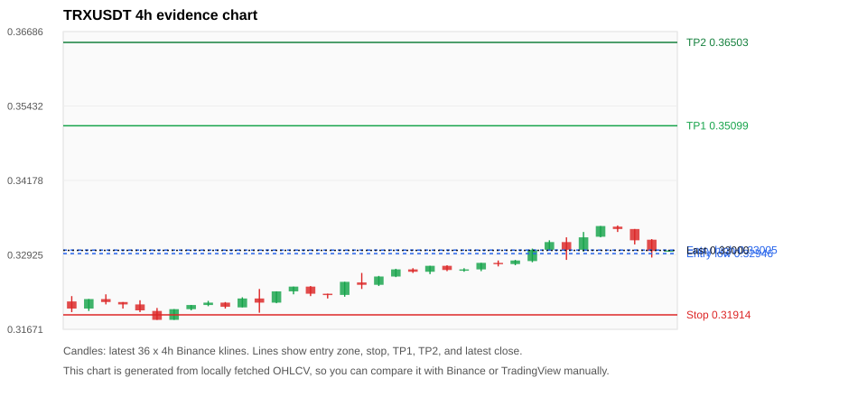
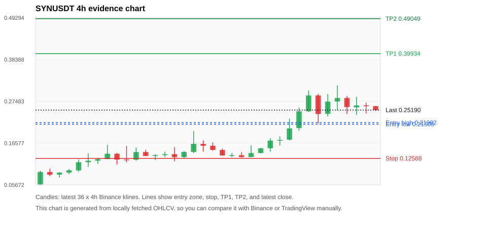
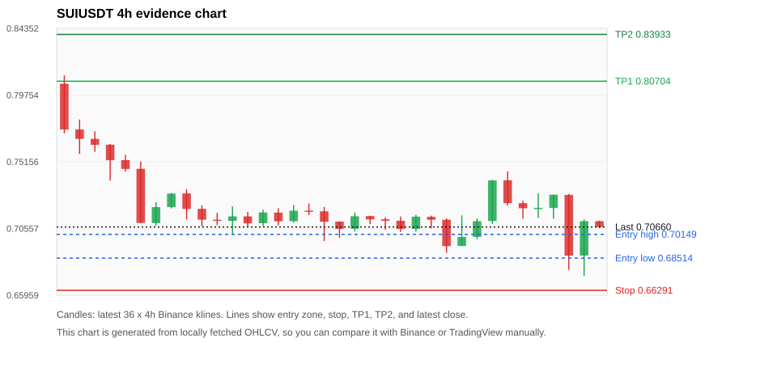
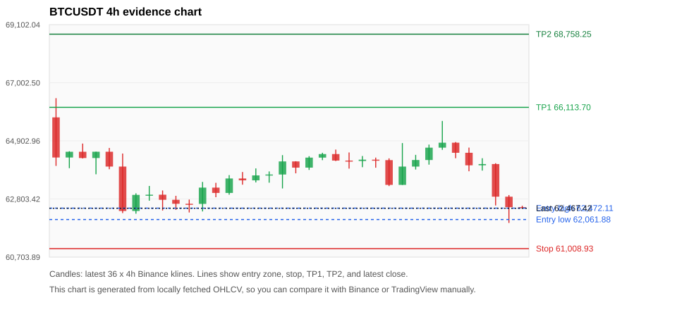
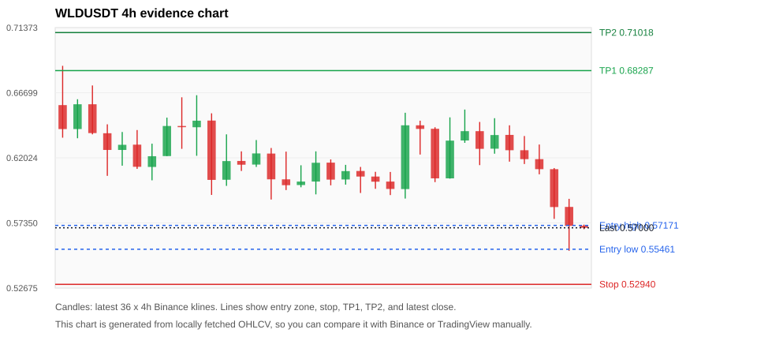

# Crypto 市场扫描报告 v1

- 报告时间：2026-06-23 20:07:33 CST
- Run ID：`20260623_120502_2c438b87`
- Run type：`daily_full`
- 数据来源：SQLite
- 报告版本：v1
- 扫描 ID：3b5de7642393
- 数据源：Binance public spot API + CoinGecko/CoinMarketCap cross-check
- 过滤条件：USDT spot; 24h quote volume >= 30,000,000; trades >= 30,000; exclude stables/leveraged tokens; analyze 1h/4h/1d klines
- 默认单笔风险：账户权益的 1.00%

## 限制说明

- 交易信号仍以 Binance 现货公开 K 线为主源；外部数据源用于一致性复核。
- 结果是研究和模拟盘计划，不是确定收益或实盘下单指令。
- 历史长度过滤：候选币至少需要 180 根 1d K 线。
- 数据质量验证池：先验证 score 排名前 min(top_n * 2, 10) 的候选，再按 action + score 补足最终名单。
- 大盘环境过滤：RISK_OFF; BTC/ETH 大盘偏弱，山寨币买入候选降级为观察。 BTC 7d=-4.884034277269233; ETH 7d=-7.402160636701827.
- 已启用数据交叉验证：Binance 主源 + CoinGecko 自动对照；CoinMarketCap 在配置 API Key 后自动对照。
- TRXUSDT 交叉验证状态 DATA_WARNING：At least one external provider needs manual review.
- SYNUSDT 交叉验证状态 DATA_WARNING：At least one external provider needs manual review.
- SUIUSDT 交叉验证状态 DATA_WARNING：At least one external provider needs manual review.
- BTCUSDT 交叉验证状态 DATA_WARNING：At least one external provider needs manual review.
- WLDUSDT 交叉验证状态 DATA_WARNING：At least one external provider needs manual review.
- BNBUSDT 交叉验证状态 DATA_WARNING：At least one external provider needs manual review.
- ETHUSDT 交叉验证状态 DATA_WARNING：At least one external provider needs manual review.
- SOLUSDT 交叉验证状态 DATA_WARNING：At least one external provider needs manual review.
- XRPUSDT 交叉验证状态 DATA_WARNING：At least one external provider needs manual review.
- DOGEUSDT 交叉验证状态 DATA_WARNING：At least one external provider needs manual review.

## 5 个候选交易计划

| Rank | Coin | Action | Setup | Entry Zone | Stop Loss | TP1 | TP2 / Exit Rule | R/R | Verdict |
|---:|---|---|---|---:|---:|---:|---|---:|---|
| 1 | `TRX` | `WATCH_ONLY` | 回踩支撑/4h EMA 附近 | 0.32946 - 0.33005 | 0.31914 | 0.35099 | 0.36503 或跌破 4h 关键支撑 | 2.00-3.32 | 只观察 |
| 2 | `SYN` | `WATCH_ONLY` | 涨幅较远，只等深回调 | 0.21505 - 0.21902 | 0.12588 | 0.39934 | 0.49049 或跌破 4h 关键支撑 | 2.00-3.00 | 只等回调 |
| 3 | `SUI` | `REJECT` | 趋势中，等回调入场 | 0.68514 - 0.70149 | 0.66291 | 0.80704 | 0.83933 或跌破 4h 关键支撑 | 3.74-4.80 | 只观察 |
| 4 | `BTC` | `REJECT` | 回踩支撑/4h EMA 附近 | 62,061.88 - 62,472.11 | 61,008.93 | 66,113.70 | 68,758.25 或跌破 4h 关键支撑 | 3.06-5.16 | 只观察 |
| 5 | `WLD` | `REJECT` | 回踩支撑/4h EMA 附近 | 0.55461 - 0.57171 | 0.52940 | 0.68287 | 0.71018 或跌破 4h 关键支撑 | 3.55-4.35 | 只观察 |

## 数据交叉验证摘要

价格差异以 Binance 当前价为基准；成交量口径不同，Binance 是 USDT 现货成交额，CoinGecko/CoinMarketCap 通常是全市场成交量。

| Rank | Coin | Data Status | Max Price Diff | Max 24h Diff | Message |
|---:|---|---|---:|---:|---|
| 1 | `TRX` | DATA_WARNING | 0.15% | 0.02 pts | At least one external provider needs manual review. |
| 2 | `SYN` | DATA_WARNING | 1.77% | 2.34 pts | At least one external provider needs manual review. |
| 3 | `SUI` | DATA_WARNING | 0.06% | 0.38 pts | At least one external provider needs manual review. |
| 4 | `BTC` | DATA_WARNING | 0.10% | 0.01 pts | At least one external provider needs manual review. |
| 5 | `WLD` | DATA_WARNING | 0.02% | 0.20 pts | At least one external provider needs manual review. |

## 候选币说明

### 1. TRX `TRXUSDT`



- 入选原因：回踩支撑/4h EMA 附近；24h -0.48%，7d +3.90%，4h RSI 58.55，24h 成交额 $49.2M。
- 交易失效条件：跌破 0.31914 或 4h 收盘重新失守关键支撑。
- 主要风险：BTC/ETH 大盘环境未确认强势，山寨币买入信号降级；24h 动量未确认；数据交叉验证需要人工复核。
- 数据交叉验证：DATA_WARNING；At least one external provider needs manual review.

#### 可点击人工验证

- [Binance 交易页](https://www.binance.com/en/trade/TRX_USDT)
- [TradingView 图表](https://www.tradingview.com/chart/?symbol=BINANCE%3ATRXUSDT)
- [CoinGecko 搜索](https://www.coingecko.com/en/search?query=TRX)
- [CoinMarketCap 搜索](https://coinmarketcap.com/search/?q=TRX)

#### 多数据源对照

| Source | Status | Asset ID | Price | 24h Change | 24h Volume | Price Diff | 24h Diff | Updated | Message |
|---|---|---|---:|---:|---:|---:|---:|---|---|
| Binance | DATA_OK | TRXUSDT | 0.33000 | -0.48% | $49.2M | 0.00% | 0.00 pts | 2026-06-23T12:06:31+00:00 | Primary market data source used by scanner. |
| CoinGecko | DATA_WARNING | n/a | n/a | n/a | n/a | n/a | n/a | 2026-06-23T12:06:31+00:00 | Failed to fetch https://api.coingecko.com/api/v3/coins/markets?vs_currency=usd&ids=tron&price_change_percentage=24h&per_page=1&page=1: HTTP Error 429: Too Many Requests |
| CoinMarketCap | DATA_OK | 1958 | 0.32951 | -0.51% | $588.3M | 0.15% | 0.02 pts | 2026-06-23T12:05:03.000Z | External source agrees with Binance within thresholds. |

#### 指标证据

| 指标 | 数值 | 人工核对用途 |
|---|---:|---|
| 当前价 | 0.33000 | 与 Binance/TradingView 当前价格对照 |
| 24h 涨跌 | -0.48% | 与交易所 24h 涨跌对照 |
| 7d 涨跌 | +3.90% | 判断短线趋势是否延续 |
| 4h EMA20 | 0.32881 | 判断短期趋势支撑 |
| 4h EMA50 | 0.32539 | 判断中期趋势支撑 |
| 1d EMA20 | 0.32789 | 判断日线趋势 |
| 1d EMA50 | 0.33234 | 判断日线趋势 |
| 4h RSI14 | 58.55 | 判断是否过热/过弱 |
| 4h ATR14 | 0.0017785714 | 推导止损和入场缓冲 |
| 最近 18 根 4h 最低点 | 0.32400 | 支撑/止损参考 |
| 最近 36 根 4h 最高点 | 0.33420 | TP/压力参考 |
| 支撑位 | 0.32881 | 入场区间推导基础 |

#### 交易计划推导

- 支撑位 = 最近低点、4h EMA20、4h EMA50、1d EMA20 中不高于当前价的最高有效支撑 = `0.32881`。
- 入场区间 = 支撑位附近 + ATR 缓冲 = `0.32946 - 0.33005`。
- 止损 = min(最近 18 根 4h 最低点 * 0.985, 入场中位价 - 1.15 * ATR14) = `0.31914`。
- TP1 = max(最近 36 根 4h 最高点 * 0.995, 入场中位价 + 2R) = `0.35099`。
- TP2 = max(入场中位价 + 3R, TP1 * 1.04) = `0.36503`。

#### 最近 10 根 4h K线

| UTC 开盘时间 | Open | High | Low | Close | Quote Volume | Trades |
|---|---:|---:|---:|---:|---:|---:|
| 2026-06-22T00:00+00:00 | 0.32770 | 0.32840 | 0.32750 | 0.32830 | $3.5M | 6111 |
| 2026-06-22T04:00+00:00 | 0.32820 | 0.33030 | 0.32800 | 0.33010 | $6.0M | 10890 |
| 2026-06-22T08:00+00:00 | 0.33010 | 0.33170 | 0.33000 | 0.33140 | $7.4M | 17929 |
| 2026-06-22T12:00+00:00 | 0.33140 | 0.33220 | 0.32840 | 0.33010 | $10.0M | 18221 |
| 2026-06-22T16:00+00:00 | 0.33010 | 0.33310 | 0.32980 | 0.33220 | $11.0M | 18863 |
| 2026-06-22T20:00+00:00 | 0.33230 | 0.33410 | 0.33220 | 0.33410 | $3.6M | 7831 |
| 2026-06-23T00:00+00:00 | 0.33400 | 0.33420 | 0.33310 | 0.33360 | $4.2M | 9223 |
| 2026-06-23T04:00+00:00 | 0.33360 | 0.33360 | 0.33100 | 0.33170 | $9.7M | 14175 |
| 2026-06-23T08:00+00:00 | 0.33180 | 0.33190 | 0.32880 | 0.32990 | $10.7M | 19872 |
| 2026-06-23T12:00+00:00 | 0.33000 | 0.33000 | 0.32980 | 0.33000 | $115,196 | 283 |

### 2. SYN `SYNUSDT`



- 入选原因：涨幅较远，只等深回调；24h -8.07%，7d +393.92%，4h RSI 71.05，24h 成交额 $40.5M。
- 交易失效条件：跌破 0.125883 或 4h 收盘重新失守关键支撑。
- 主要风险：距离支撑偏远，不能追市价；24h 振幅较大，回撤风险高；BTC/ETH 大盘环境未确认强势，山寨币买入信号降级；24h 动量未确认；数据交叉验证需要人工复核。
- 数据交叉验证：DATA_WARNING；At least one external provider needs manual review.

#### 可点击人工验证

- [Binance 交易页](https://www.binance.com/en/trade/SYN_USDT)
- [TradingView 图表](https://www.tradingview.com/chart/?symbol=BINANCE%3ASYNUSDT)
- [CoinGecko 搜索](https://www.coingecko.com/en/search?query=SYN)
- [CoinMarketCap 搜索](https://coinmarketcap.com/search/?q=SYN)

#### 多数据源对照

| Source | Status | Asset ID | Price | 24h Change | 24h Volume | Price Diff | 24h Diff | Updated | Message |
|---|---|---|---:|---:|---:|---:|---:|---|---|
| Binance | DATA_OK | SYNUSDT | 0.25190 | -8.07% | $40.5M | 0.00% | 0.00 pts | 2026-06-23T12:06:31+00:00 | Primary market data source used by scanner. |
| CoinGecko | DATA_WARNING | n/a | n/a | n/a | n/a | n/a | n/a | 2026-06-23T12:06:31+00:00 | Failed to fetch https://api.coingecko.com/api/v3/coins/markets?vs_currency=usd&ids=synapse-2&price_change_percentage=24h&per_page=1&page=1: HTTP Error 429: Too Many Requests |
| CoinMarketCap | DATA_WARNING | 12147 | 0.25635 | -10.41% | $135.3M | 1.77% | 2.34 pts | 2026-06-23T12:06:03.000Z | price diff 1.77% exceeds warning threshold; CoinMarketCap symbol mapping has 4 matches; selected lowest cmc_rank |

#### 指标证据

| 指标 | 数值 | 人工核对用途 |
|---|---:|---|
| 当前价 | 0.25190 | 与 Binance/TradingView 当前价格对照 |
| 24h 涨跌 | -8.07% | 与交易所 24h 涨跌对照 |
| 7d 涨跌 | +393.92% | 判断短线趋势是否延续 |
| 4h EMA20 | 0.21462 | 判断短期趋势支撑 |
| 4h EMA50 | 0.15500 | 判断中期趋势支撑 |
| 1d EMA20 | 0.11305 | 判断日线趋势 |
| 1d EMA50 | 0.07716 | 判断日线趋势 |
| 4h RSI14 | 71.05 | 判断是否过热/过弱 |
| 4h ATR14 | 0.04384 | 推导止损和入场缓冲 |
| 最近 18 根 4h 最低点 | 0.12780 | 支撑/止损参考 |
| 最近 36 根 4h 最高点 | 0.31660 | TP/压力参考 |
| 支撑位 | 0.21462 | 入场区间推导基础 |

#### 交易计划推导

- 支撑位 = 最近低点、4h EMA20、4h EMA50、1d EMA20 中不高于当前价的最高有效支撑 = `0.21462`。
- 入场区间 = 支撑位附近 + ATR 缓冲 = `0.21505 - 0.21902`。
- 止损 = min(最近 18 根 4h 最低点 * 0.985, 入场中位价 - 1.15 * ATR14) = `0.12588`。
- TP1 = max(最近 36 根 4h 最高点 * 0.995, 入场中位价 + 2R) = `0.39934`。
- TP2 = max(入场中位价 + 3R, TP1 * 1.04) = `0.49049`。

#### 最近 10 根 4h K线

| UTC 开盘时间 | Open | High | Low | Close | Quote Volume | Trades |
|---|---:|---:|---:|---:|---:|---:|
| 2026-06-22T00:00+00:00 | 0.17470 | 0.22940 | 0.17250 | 0.20410 | $5.5M | 49179 |
| 2026-06-22T04:00+00:00 | 0.20490 | 0.25850 | 0.19810 | 0.24880 | $6.3M | 54315 |
| 2026-06-22T08:00+00:00 | 0.24880 | 0.30280 | 0.24720 | 0.29020 | $13.9M | 95460 |
| 2026-06-22T12:00+00:00 | 0.29020 | 0.29430 | 0.21680 | 0.24170 | $11.5M | 88177 |
| 2026-06-22T16:00+00:00 | 0.24210 | 0.29360 | 0.23540 | 0.27400 | $9.9M | 86821 |
| 2026-06-22T20:00+00:00 | 0.27430 | 0.31660 | 0.25150 | 0.28340 | $5.2M | 48391 |
| 2026-06-23T00:00+00:00 | 0.28350 | 0.28850 | 0.24170 | 0.25970 | $5.6M | 50156 |
| 2026-06-23T04:00+00:00 | 0.25910 | 0.28670 | 0.23920 | 0.26410 | $5.3M | 46139 |
| 2026-06-23T08:00+00:00 | 0.26430 | 0.27150 | 0.24250 | 0.26210 | $3.2M | 33911 |
| 2026-06-23T12:00+00:00 | 0.26220 | 0.26250 | 0.24940 | 0.25190 | $362,363 | 3012 |

### 3. SUI `SUIUSDT`



- 入选原因：趋势中，等回调入场；24h -4.95%，7d -10.30%，4h RSI 48.79，24h 成交额 $37.7M。
- 交易失效条件：跌破 0.662905 或 4h 收盘重新失守关键支撑。
- 主要风险：日线趋势未完全确认；BTC/ETH 大盘环境未确认强势，山寨币买入信号降级；24h 动量未确认；7d 趋势未确认；数据交叉验证需要人工复核。
- 数据交叉验证：DATA_WARNING；At least one external provider needs manual review.

#### 可点击人工验证

- [Binance 交易页](https://www.binance.com/en/trade/SUI_USDT)
- [TradingView 图表](https://www.tradingview.com/chart/?symbol=BINANCE%3ASUIUSDT)
- [CoinGecko 搜索](https://www.coingecko.com/en/search?query=SUI)
- [CoinMarketCap 搜索](https://coinmarketcap.com/search/?q=SUI)

#### 多数据源对照

| Source | Status | Asset ID | Price | 24h Change | 24h Volume | Price Diff | 24h Diff | Updated | Message |
|---|---|---|---:|---:|---:|---:|---:|---|---|
| Binance | DATA_OK | SUIUSDT | 0.70660 | -4.95% | $37.7M | 0.00% | 0.00 pts | 2026-06-23T12:06:31+00:00 | Primary market data source used by scanner. |
| CoinGecko | DATA_WARNING | n/a | n/a | n/a | n/a | n/a | n/a | 2026-06-23T12:06:31+00:00 | Failed to fetch https://api.coingecko.com/api/v3/coins/markets?vs_currency=usd&ids=sui&price_change_percentage=24h&per_page=1&page=1: HTTP Error 429: Too Many Requests |
| CoinMarketCap | DATA_WARNING | 20947 | 0.70705 | -4.57% | $444.3M | 0.06% | 0.38 pts | 2026-06-23T12:06:03.000Z | CoinMarketCap symbol mapping has 5 matches; selected lowest cmc_rank |

#### 指标证据

| 指标 | 数值 | 人工核对用途 |
|---|---:|---|
| 当前价 | 0.70660 | 与 Binance/TradingView 当前价格对照 |
| 24h 涨跌 | -4.95% | 与交易所 24h 涨跌对照 |
| 7d 涨跌 | -10.30% | 判断短线趋势是否延续 |
| 4h EMA20 | 0.71519 | 判断短期趋势支撑 |
| 4h EMA50 | 0.72995 | 判断中期趋势支撑 |
| 1d EMA20 | 0.76782 | 判断日线趋势 |
| 1d EMA50 | 0.85397 | 判断日线趋势 |
| 4h RSI14 | 48.79 | 判断是否过热/过弱 |
| 4h ATR14 | 0.02044 | 推导止损和入场缓冲 |
| 最近 18 根 4h 最低点 | 0.67300 | 支撑/止损参考 |
| 最近 36 根 4h 最高点 | 0.81110 | TP/压力参考 |
| 支撑位 | 0.67300 | 入场区间推导基础 |

#### 交易计划推导

- 支撑位 = 最近低点、4h EMA20、4h EMA50、1d EMA20 中不高于当前价的最高有效支撑 = `0.67300`。
- 入场区间 = 支撑位附近 + ATR 缓冲 = `0.68514 - 0.70149`。
- 止损 = min(最近 18 根 4h 最低点 * 0.985, 入场中位价 - 1.15 * ATR14) = `0.66291`。
- TP1 = max(最近 36 根 4h 最高点 * 0.995, 入场中位价 + 2R) = `0.80704`。
- TP2 = max(入场中位价 + 3R, TP1 * 1.04) = `0.83933`。

#### 最近 10 根 4h K线

| UTC 开盘时间 | Open | High | Low | Close | Quote Volume | Trades |
|---|---:|---:|---:|---:|---:|---:|
| 2026-06-22T00:00+00:00 | 0.69350 | 0.71460 | 0.69350 | 0.69970 | $5.6M | 38161 |
| 2026-06-22T04:00+00:00 | 0.69980 | 0.71260 | 0.69810 | 0.71060 | $1.8M | 16746 |
| 2026-06-22T08:00+00:00 | 0.71070 | 0.73910 | 0.70870 | 0.73870 | $5.4M | 45264 |
| 2026-06-22T12:00+00:00 | 0.73880 | 0.74490 | 0.72130 | 0.72300 | $10.0M | 78212 |
| 2026-06-22T16:00+00:00 | 0.72300 | 0.72460 | 0.71220 | 0.71950 | $4.1M | 33139 |
| 2026-06-22T20:00+00:00 | 0.71940 | 0.72970 | 0.71290 | 0.71980 | $2.3M | 24225 |
| 2026-06-23T00:00+00:00 | 0.71970 | 0.72890 | 0.71230 | 0.72880 | $2.9M | 24824 |
| 2026-06-23T04:00+00:00 | 0.72870 | 0.72940 | 0.67700 | 0.68680 | $10.4M | 84489 |
| 2026-06-23T08:00+00:00 | 0.68690 | 0.71180 | 0.67300 | 0.71060 | $8.5M | 69639 |
| 2026-06-23T12:00+00:00 | 0.71060 | 0.71090 | 0.70610 | 0.70660 | $222,551 | 2395 |

### 4. BTC `BTCUSDT`



- 入选原因：回踩支撑/4h EMA 附近；24h -3.53%，7d -5.43%，4h RSI 32.63，24h 成交额 $1.28B。
- 交易失效条件：跌破 61008.93 或 4h 收盘重新失守关键支撑。
- 主要风险：日线趋势未完全确认；BTC/ETH 大盘环境未确认强势，山寨币买入信号降级；24h 动量未确认；7d 趋势未确认；数据交叉验证需要人工复核。
- 数据交叉验证：DATA_WARNING；At least one external provider needs manual review.

#### 可点击人工验证

- [Binance 交易页](https://www.binance.com/en/trade/BTC_USDT)
- [TradingView 图表](https://www.tradingview.com/chart/?symbol=BINANCE%3ABTCUSDT)
- [CoinGecko 搜索](https://www.coingecko.com/en/search?query=BTC)
- [CoinMarketCap 搜索](https://coinmarketcap.com/search/?q=BTC)

#### 多数据源对照

| Source | Status | Asset ID | Price | 24h Change | 24h Volume | Price Diff | 24h Diff | Updated | Message |
|---|---|---|---:|---:|---:|---:|---:|---|---|
| Binance | DATA_OK | BTCUSDT | 62,467.42 | -3.53% | $1.28B | 0.00% | 0.00 pts | 2026-06-23T12:06:31+00:00 | Primary market data source used by scanner. |
| CoinGecko | DATA_WARNING | n/a | n/a | n/a | n/a | n/a | n/a | 2026-06-23T12:06:31+00:00 | Failed to fetch https://api.coingecko.com/api/v3/coins/markets?vs_currency=usd&ids=bitcoin&price_change_percentage=24h&per_page=1&page=1: HTTP Error 429: Too Many Requests |
| CoinMarketCap | DATA_WARNING | 1 | 62,402.07 | -3.54% | $30.34B | 0.10% | 0.01 pts | 2026-06-23T12:06:03.000Z | CoinMarketCap symbol mapping has 13 matches; selected lowest cmc_rank |

#### 指标证据

| 指标 | 数值 | 人工核对用途 |
|---|---:|---|
| 当前价 | 62,467.42 | 与 Binance/TradingView 当前价格对照 |
| 24h 涨跌 | -3.53% | 与交易所 24h 涨跌对照 |
| 7d 涨跌 | -5.43% | 判断短线趋势是否延续 |
| 4h EMA20 | 63,731.08 | 判断短期趋势支撑 |
| 4h EMA50 | 63,923.21 | 判断中期趋势支撑 |
| 1d EMA20 | 65,074.75 | 判断日线趋势 |
| 1d EMA50 | 68,841.84 | 判断日线趋势 |
| 4h RSI14 | 32.63 | 判断是否过热/过弱 |
| 4h ATR14 | 763.01 | 推导止损和入场缓冲 |
| 最近 18 根 4h 最低点 | 61,938.00 | 支撑/止损参考 |
| 最近 36 根 4h 最高点 | 66,445.93 | TP/压力参考 |
| 支撑位 | 61,938.00 | 入场区间推导基础 |

#### 交易计划推导

- 支撑位 = 最近低点、4h EMA20、4h EMA50、1d EMA20 中不高于当前价的最高有效支撑 = `61,938.00`。
- 入场区间 = 支撑位附近 + ATR 缓冲 = `62,061.88 - 62,472.11`。
- 止损 = min(最近 18 根 4h 最低点 * 0.985, 入场中位价 - 1.15 * ATR14) = `61,008.93`。
- TP1 = max(最近 36 根 4h 最高点 * 0.995, 入场中位价 + 2R) = `66,113.70`。
- TP2 = max(入场中位价 + 3R, TP1 * 1.04) = `68,758.25`。

#### 最近 10 根 4h K线

| UTC 开盘时间 | Open | High | Low | Close | Quote Volume | Trades |
|---|---:|---:|---:|---:|---:|---:|
| 2026-06-22T00:00+00:00 | 63,312.00 | 64,823.52 | 63,312.00 | 63,974.01 | $206.1M | 769958 |
| 2026-06-22T04:00+00:00 | 63,974.01 | 64,397.57 | 63,868.41 | 64,211.19 | $140.4M | 384238 |
| 2026-06-22T08:00+00:00 | 64,211.20 | 64,768.46 | 64,044.00 | 64,657.22 | $120.5M | 445403 |
| 2026-06-22T12:00+00:00 | 64,657.22 | 65,622.83 | 64,579.08 | 64,836.95 | $274.3M | 943073 |
| 2026-06-22T16:00+00:00 | 64,836.95 | 64,862.00 | 64,276.00 | 64,472.00 | $150.6M | 552327 |
| 2026-06-22T20:00+00:00 | 64,472.51 | 64,659.43 | 63,804.59 | 64,020.01 | $103.1M | 426338 |
| 2026-06-23T00:00+00:00 | 64,020.01 | 64,275.38 | 63,828.93 | 64,065.35 | $113.8M | 412000 |
| 2026-06-23T04:00+00:00 | 64,065.34 | 64,095.55 | 62,568.90 | 62,886.03 | $249.8M | 654352 |
| 2026-06-23T08:00+00:00 | 62,886.04 | 62,945.08 | 61,938.00 | 62,507.06 | $402.0M | 664184 |
| 2026-06-23T12:00+00:00 | 62,507.05 | 62,558.00 | 62,460.00 | 62,467.42 | $5.8M | 14578 |

### 5. WLD `WLDUSDT`



- 入选原因：回踩支撑/4h EMA 附近；24h -9.14%，7d -11.16%，4h RSI 42.20，24h 成交额 $61.4M。
- 交易失效条件：跌破 0.52939779 或 4h 收盘重新失守关键支撑。
- 主要风险：BTC/ETH 大盘环境未确认强势，山寨币买入信号降级；24h 动量未确认；7d 趋势未确认；数据交叉验证需要人工复核。
- 数据交叉验证：DATA_WARNING；At least one external provider needs manual review.

#### 可点击人工验证

- [Binance 交易页](https://www.binance.com/en/trade/WLD_USDT)
- [TradingView 图表](https://www.tradingview.com/chart/?symbol=BINANCE%3AWLDUSDT)
- [CoinGecko 搜索](https://www.coingecko.com/en/search?query=WLD)
- [CoinMarketCap 搜索](https://coinmarketcap.com/search/?q=WLD)

#### 多数据源对照

| Source | Status | Asset ID | Price | 24h Change | 24h Volume | Price Diff | 24h Diff | Updated | Message |
|---|---|---|---:|---:|---:|---:|---:|---|---|
| Binance | DATA_OK | WLDUSDT | 0.57000 | -9.14% | $61.4M | 0.00% | 0.00 pts | 2026-06-23T12:06:31+00:00 | Primary market data source used by scanner. |
| CoinGecko | DATA_WARNING | n/a | n/a | n/a | n/a | n/a | n/a | 2026-06-23T12:06:31+00:00 | Failed to fetch https://api.coingecko.com/api/v3/coins/markets?vs_currency=usd&ids=worldcoin-wld&price_change_percentage=24h&per_page=1&page=1: HTTP Error 429: Too Many Requests |
| CoinMarketCap | DATA_WARNING | 13502 | 0.56989 | -8.95% | $394.8M | 0.02% | 0.20 pts | 2026-06-23T12:06:03.000Z | CoinMarketCap symbol mapping has 2 matches; selected lowest cmc_rank |

#### 指标证据

| 指标 | 数值 | 人工核对用途 |
|---|---:|---|
| 当前价 | 0.57000 | 与 Binance/TradingView 当前价格对照 |
| 24h 涨跌 | -9.14% | 与交易所 24h 涨跌对照 |
| 7d 涨跌 | -11.16% | 判断短线趋势是否延续 |
| 4h EMA20 | 0.60942 | 判断短期趋势支撑 |
| 4h EMA50 | 0.60196 | 判断中期趋势支撑 |
| 1d EMA20 | 0.54501 | 判断日线趋势 |
| 1d EMA50 | 0.44684 | 判断日线趋势 |
| 4h RSI14 | 42.20 | 判断是否过热/过弱 |
| 4h ATR14 | 0.02936 | 推导止损和入场缓冲 |
| 最近 18 根 4h 最低点 | 0.55350 | 支撑/止损参考 |
| 最近 36 根 4h 最高点 | 0.68630 | TP/压力参考 |
| 支撑位 | 0.55350 | 入场区间推导基础 |

#### 交易计划推导

- 支撑位 = 最近低点、4h EMA20、4h EMA50、1d EMA20 中不高于当前价的最高有效支撑 = `0.55350`。
- 入场区间 = 支撑位附近 + ATR 缓冲 = `0.55461 - 0.57171`。
- 止损 = min(最近 18 根 4h 最低点 * 0.985, 入场中位价 - 1.15 * ATR14) = `0.52940`。
- TP1 = max(最近 36 根 4h 最高点 * 0.995, 入场中位价 + 2R) = `0.68287`。
- TP2 = max(入场中位价 + 3R, TP1 * 1.04) = `0.71018`。

#### 最近 10 根 4h K线

| UTC 开盘时间 | Open | High | Low | Close | Quote Volume | Trades |
|---|---:|---:|---:|---:|---:|---:|
| 2026-06-22T00:00+00:00 | 0.60550 | 0.64930 | 0.60530 | 0.63260 | $13.4M | 205497 |
| 2026-06-22T04:00+00:00 | 0.63270 | 0.65490 | 0.63100 | 0.63940 | $9.0M | 140365 |
| 2026-06-22T08:00+00:00 | 0.63940 | 0.64600 | 0.61500 | 0.62670 | $14.9M | 178319 |
| 2026-06-22T12:00+00:00 | 0.62680 | 0.64870 | 0.62320 | 0.63660 | $12.9M | 180428 |
| 2026-06-22T16:00+00:00 | 0.63670 | 0.64360 | 0.61750 | 0.62570 | $9.2M | 123253 |
| 2026-06-22T20:00+00:00 | 0.62570 | 0.63590 | 0.61580 | 0.61930 | $6.1M | 90821 |
| 2026-06-23T00:00+00:00 | 0.61930 | 0.62980 | 0.60840 | 0.61210 | $7.8M | 125042 |
| 2026-06-23T04:00+00:00 | 0.61210 | 0.61290 | 0.57640 | 0.58490 | $11.7M | 146820 |
| 2026-06-23T08:00+00:00 | 0.58500 | 0.59080 | 0.55350 | 0.57140 | $13.7M | 177246 |
| 2026-06-23T12:00+00:00 | 0.57150 | 0.57230 | 0.56900 | 0.57000 | $191,404 | 2894 |

## 组合风控

- 不要 5 个候选全部满仓买入。
- 同时持仓总风险建议控制在账户权益的 3% - 5% 以内。
- 如果 BTC/ETH 同时破位，暂停山寨币多头计划或降低仓位。
- 第一版报告用于模拟盘和人工复核，不自动下单。

## 原始数据

```json
[
  {
    "rank": 1,
    "symbol": "TRXUSDT",
    "base_asset": "TRX",
    "price": 0.33,
    "score": 44.252660164394804,
    "setup": "回踩支撑/4h EMA 附近",
    "verdict": "只观察",
    "entry_low": 0.3294643933135402,
    "entry_high": 0.33005177975403216,
    "stop_loss": 0.31914,
    "take_profit_1": 0.3509942596013586,
    "take_profit_2": 0.36503402998541296,
    "risk_reward_1": 2.0,
    "risk_reward_2": 3.3222505146648147,
    "pct_24h": -0.483,
    "pct_3d": 1.1959521619135272,
    "pct_7d": 3.9042821158690177,
    "quote_volume_24h": 49222141.54185,
    "trades_24h": 87894,
    "high_low_range_24h": 1.7661388550548107,
    "rsi_1h": 23.529411764705827,
    "rsi_4h": 58.55263157894731,
    "ema20_4h": 0.32880677975403216,
    "ema50_4h": 0.3253872281060918,
    "ema20_1d": 0.32788931012473127,
    "ema50_1d": 0.332336754566059,
    "atr_4h": 0.0017785714285714269,
    "macd_hist_4h": -0.00010977633490575137,
    "volume_ratio_24h": 1.4150340448850571,
    "support_level": 0.32880677975403216,
    "recent_low_4h_18": 0.324,
    "recent_high_4h_36": 0.3342,
    "distance_to_support_pct": 0.3628940518989543,
    "binance_trade_url": "https://www.binance.com/en/trade/TRX_USDT",
    "tradingview_url": "https://www.tradingview.com/chart/?symbol=BINANCE%3ATRXUSDT",
    "coingecko_search_url": "https://www.coingecko.com/en/search?query=TRX",
    "coinmarketcap_search_url": "https://coinmarketcap.com/search/?q=TRX",
    "invalidation": "跌破 0.31914 或 4h 收盘重新失守关键支撑",
    "recent_4h_klines": [
      {
        "open_time_utc": "2026-06-17T16:00+00:00",
        "open": 0.3214,
        "high": 0.3223,
        "low": 0.3196,
        "close": 0.3202,
        "quote_volume": 10938623.55142,
        "trades": 15268
      },
      {
        "open_time_utc": "2026-06-17T20:00+00:00",
        "open": 0.3202,
        "high": 0.3218,
        "low": 0.3198,
        "close": 0.3218,
        "quote_volume": 5715093.54556,
        "trades": 11157
      },
      {
        "open_time_utc": "2026-06-18T00:00+00:00",
        "open": 0.3218,
        "high": 0.3226,
        "low": 0.3209,
        "close": 0.3213,
        "quote_volume": 4225825.79568,
        "trades": 9107
      },
      {
        "open_time_utc": "2026-06-18T04:00+00:00",
        "open": 0.3213,
        "high": 0.3213,
        "low": 0.3202,
        "close": 0.3209,
        "quote_volume": 4311496.3769,
        "trades": 9300
      },
      {
        "open_time_utc": "2026-06-18T08:00+00:00",
        "open": 0.3209,
        "high": 0.3216,
        "low": 0.3196,
        "close": 0.3199,
        "quote_volume": 7089747.48998,
        "trades": 10730
      },
      {
        "open_time_utc": "2026-06-18T12:00+00:00",
        "open": 0.3198,
        "high": 0.3203,
        "low": 0.3183,
        "close": 0.3183,
        "quote_volume": 6696457.62923,
        "trades": 13317
      },
      {
        "open_time_utc": "2026-06-18T16:00+00:00",
        "open": 0.3183,
        "high": 0.3201,
        "low": 0.3183,
        "close": 0.3201,
        "quote_volume": 6053493.43447,
        "trades": 11171
      },
      {
        "open_time_utc": "2026-06-18T20:00+00:00",
        "open": 0.3201,
        "high": 0.3208,
        "low": 0.3199,
        "close": 0.3208,
        "quote_volume": 4215608.4368,
        "trades": 9767
      },
      {
        "open_time_utc": "2026-06-19T00:00+00:00",
        "open": 0.3208,
        "high": 0.3215,
        "low": 0.3206,
        "close": 0.3212,
        "quote_volume": 3300906.48681,
        "trades": 8326
      },
      {
        "open_time_utc": "2026-06-19T04:00+00:00",
        "open": 0.3212,
        "high": 0.3213,
        "low": 0.3202,
        "close": 0.3205,
        "quote_volume": 4644014.15931,
        "trades": 9783
      },
      {
        "open_time_utc": "2026-06-19T08:00+00:00",
        "open": 0.3204,
        "high": 0.3221,
        "low": 0.3204,
        "close": 0.3219,
        "quote_volume": 4882758.31917,
        "trades": 13312
      },
      {
        "open_time_utc": "2026-06-19T12:00+00:00",
        "open": 0.3219,
        "high": 0.3235,
        "low": 0.3195,
        "close": 0.3212,
        "quote_volume": 14041369.0474,
        "trades": 18115
      },
      {
        "open_time_utc": "2026-06-19T16:00+00:00",
        "open": 0.3212,
        "high": 0.3231,
        "low": 0.3211,
        "close": 0.3231,
        "quote_volume": 7386415.16803,
        "trades": 14111
      },
      {
        "open_time_utc": "2026-06-19T20:00+00:00",
        "open": 0.3231,
        "high": 0.3239,
        "low": 0.3226,
        "close": 0.3239,
        "quote_volume": 5638373.4349,
        "trades": 10686
      },
      {
        "open_time_utc": "2026-06-20T00:00+00:00",
        "open": 0.3239,
        "high": 0.324,
        "low": 0.3223,
        "close": 0.3227,
        "quote_volume": 5135373.54708,
        "trades": 8650
      },
      {
        "open_time_utc": "2026-06-20T04:00+00:00",
        "open": 0.3227,
        "high": 0.3227,
        "low": 0.3219,
        "close": 0.3225,
        "quote_volume": 2117883.71569,
        "trades": 7348
      },
      {
        "open_time_utc": "2026-06-20T08:00+00:00",
        "open": 0.3225,
        "high": 0.3247,
        "low": 0.3222,
        "close": 0.3247,
        "quote_volume": 7623521.83464,
        "trades": 15216
      },
      {
        "open_time_utc": "2026-06-20T12:00+00:00",
        "open": 0.3246,
        "high": 0.3262,
        "low": 0.3235,
        "close": 0.3242,
        "quote_volume": 18620825.13686,
        "trades": 20570
      },
      {
        "open_time_utc": "2026-06-20T16:00+00:00",
        "open": 0.3242,
        "high": 0.3257,
        "low": 0.324,
        "close": 0.3256,
        "quote_volume": 5779686.15324,
        "trades": 11604
      },
      {
        "open_time_utc": "2026-06-20T20:00+00:00",
        "open": 0.3256,
        "high": 0.3269,
        "low": 0.3255,
        "close": 0.3268,
        "quote_volume": 4474661.88843,
        "trades": 10338
      },
      {
        "open_time_utc": "2026-06-21T00:00+00:00",
        "open": 0.3268,
        "high": 0.327,
        "low": 0.3262,
        "close": 0.3264,
        "quote_volume": 1922170.45358,
        "trades": 6697
      },
      {
        "open_time_utc": "2026-06-21T04:00+00:00",
        "open": 0.3264,
        "high": 0.3274,
        "low": 0.326,
        "close": 0.3274,
        "quote_volume": 2918365.98522,
        "trades": 6944
      },
      {
        "open_time_utc": "2026-06-21T08:00+00:00",
        "open": 0.3274,
        "high": 0.3275,
        "low": 0.3265,
        "close": 0.3267,
        "quote_volume": 3427679.03679,
        "trades": 8357
      },
      {
        "open_time_utc": "2026-06-21T12:00+00:00",
        "open": 0.3268,
        "high": 0.327,
        "low": 0.3264,
        "close": 0.3268,
        "quote_volume": 2743525.41566,
        "trades": 8500
      },
      {
        "open_time_utc": "2026-06-21T16:00+00:00",
        "open": 0.3268,
        "high": 0.3279,
        "low": 0.3265,
        "close": 0.3279,
        "quote_volume": 3580574.37105,
        "trades": 8187
      },
      {
        "open_time_utc": "2026-06-21T20:00+00:00",
        "open": 0.3279,
        "high": 0.3283,
        "low": 0.3273,
        "close": 0.3278,
        "quote_volume": 5265403.37098,
        "trades": 8378
      },
      {
        "open_time_utc": "2026-06-22T00:00+00:00",
        "open": 0.3277,
        "high": 0.3284,
        "low": 0.3275,
        "close": 0.3283,
        "quote_volume": 3451653.04944,
        "trades": 6111
      },
      {
        "open_time_utc": "2026-06-22T04:00+00:00",
        "open": 0.3282,
        "high": 0.3303,
        "low": 0.328,
        "close": 0.3301,
        "quote_volume": 5994888.49309,
        "trades": 10890
      },
      {
        "open_time_utc": "2026-06-22T08:00+00:00",
        "open": 0.3301,
        "high": 0.3317,
        "low": 0.33,
        "close": 0.3314,
        "quote_volume": 7369392.4932,
        "trades": 17929
      },
      {
        "open_time_utc": "2026-06-22T12:00+00:00",
        "open": 0.3314,
        "high": 0.3322,
        "low": 0.3284,
        "close": 0.3301,
        "quote_volume": 9952484.12537,
        "trades": 18221
      },
      {
        "open_time_utc": "2026-06-22T16:00+00:00",
        "open": 0.3301,
        "high": 0.3331,
        "low": 0.3298,
        "close": 0.3322,
        "quote_volume": 11043417.02958,
        "trades": 18863
      },
      {
        "open_time_utc": "2026-06-22T20:00+00:00",
        "open": 0.3323,
        "high": 0.3341,
        "low": 0.3322,
        "close": 0.3341,
        "quote_volume": 3638079.39225,
        "trades": 7831
      },
      {
        "open_time_utc": "2026-06-23T00:00+00:00",
        "open": 0.334,
        "high": 0.3342,
        "low": 0.3331,
        "close": 0.3336,
        "quote_volume": 4203070.25894,
        "trades": 9223
      },
      {
        "open_time_utc": "2026-06-23T04:00+00:00",
        "open": 0.3336,
        "high": 0.3336,
        "low": 0.331,
        "close": 0.3317,
        "quote_volume": 9672265.90806,
        "trades": 14175
      },
      {
        "open_time_utc": "2026-06-23T08:00+00:00",
        "open": 0.3318,
        "high": 0.3319,
        "low": 0.3288,
        "close": 0.3299,
        "quote_volume": 10730240.56685,
        "trades": 19872
      },
      {
        "open_time_utc": "2026-06-23T12:00+00:00",
        "open": 0.33,
        "high": 0.33,
        "low": 0.3298,
        "close": 0.33,
        "quote_volume": 115195.85961,
        "trades": 283
      }
    ],
    "risks": [
      "BTC/ETH 大盘环境未确认强势，山寨币买入信号降级",
      "24h 动量未确认",
      "数据交叉验证需要人工复核"
    ],
    "data_quality_status": "DATA_WARNING",
    "data_quality_message": "At least one external provider needs manual review.",
    "data_checks": [
      {
        "provider": "Binance",
        "status": "DATA_OK",
        "provider_asset_id": "TRXUSDT",
        "provider_symbol": "TRXUSDT",
        "price_usd": 0.33,
        "pct_24h": -0.483,
        "volume_24h": 49222141.54185,
        "last_updated": null,
        "fetched_at_utc": "2026-06-23T12:06:31+00:00",
        "price_diff_pct": 0.0,
        "pct_24h_diff": 0.0,
        "volume_note": "Binance USDT spot 24h quoteVolume.",
        "message": "Primary market data source used by scanner."
      },
      {
        "provider": "CoinGecko",
        "status": "DATA_WARNING",
        "provider_asset_id": null,
        "provider_symbol": "TRX",
        "price_usd": null,
        "pct_24h": null,
        "volume_24h": null,
        "last_updated": null,
        "fetched_at_utc": "2026-06-23T12:06:31+00:00",
        "price_diff_pct": null,
        "pct_24h_diff": null,
        "volume_note": "External provider data unavailable.",
        "message": "Failed to fetch https://api.coingecko.com/api/v3/coins/markets?vs_currency=usd&ids=tron&price_change_percentage=24h&per_page=1&page=1: HTTP Error 429: Too Many Requests"
      },
      {
        "provider": "CoinMarketCap",
        "status": "DATA_OK",
        "provider_asset_id": "1958",
        "provider_symbol": "TRX",
        "price_usd": 0.3295130872619465,
        "pct_24h": -0.50756525,
        "volume_24h": 588309371.0348125,
        "last_updated": "2026-06-23T12:05:03.000Z",
        "fetched_at_utc": "2026-06-23T12:06:31+00:00",
        "price_diff_pct": 0.14754931456167067,
        "pct_24h_diff": 0.024565249999999983,
        "volume_note": "CoinMarketCap total market volume; not the same venue scope as Binance quoteVolume.",
        "message": "External source agrees with Binance within thresholds."
      }
    ],
    "action": "WATCH_ONLY"
  },
  {
    "rank": 2,
    "symbol": "SYNUSDT",
    "base_asset": "SYN",
    "price": 0.2519,
    "score": 42.006373240845264,
    "setup": "涨幅较远，只等深回调",
    "verdict": "只等回调",
    "entry_low": 0.21504510566842852,
    "entry_high": 0.2190232142857143,
    "stop_loss": 0.125883,
    "take_profit_1": 0.3993364799312143,
    "take_profit_2": 0.4904876399082857,
    "risk_reward_1": 2.0,
    "risk_reward_2": 2.9999999999999996,
    "pct_24h": -8.073,
    "pct_3d": 51.10977804439114,
    "pct_7d": 393.921568627451,
    "quote_volume_24h": 40486069.82961,
    "trades_24h": 352835,
    "high_low_range_24h": 46.03321033210332,
    "rsi_1h": 34.880722114764666,
    "rsi_4h": 71.04631217838765,
    "ema20_4h": 0.21461587392058734,
    "ema50_4h": 0.15499932643410602,
    "ema20_1d": 0.1130533212425964,
    "ema50_1d": 0.07715844597496996,
    "atr_4h": 0.04383571428571429,
    "macd_hist_4h": 0.0022850226315505734,
    "volume_ratio_24h": 2.2427795956264913,
    "support_level": 0.21461587392058734,
    "recent_low_4h_18": 0.1278,
    "recent_high_4h_36": 0.3166,
    "distance_to_support_pct": 17.372492257123827,
    "binance_trade_url": "https://www.binance.com/en/trade/SYN_USDT",
    "tradingview_url": "https://www.tradingview.com/chart/?symbol=BINANCE%3ASYNUSDT",
    "coingecko_search_url": "https://www.coingecko.com/en/search?query=SYN",
    "coinmarketcap_search_url": "https://coinmarketcap.com/search/?q=SYN",
    "invalidation": "跌破 0.125883 或 4h 收盘重新失守关键支撑",
    "recent_4h_klines": [
      {
        "open_time_utc": "2026-06-17T16:00+00:00",
        "open": 0.0579,
        "high": 0.0935,
        "low": 0.057,
        "close": 0.0904,
        "quote_volume": 3178935.51592,
        "trades": 40722
      },
      {
        "open_time_utc": "2026-06-17T20:00+00:00",
        "open": 0.0904,
        "high": 0.099,
        "low": 0.0795,
        "close": 0.0834,
        "quote_volume": 4037712.19357,
        "trades": 51696
      },
      {
        "open_time_utc": "2026-06-18T00:00+00:00",
        "open": 0.0835,
        "high": 0.09,
        "low": 0.0761,
        "close": 0.0887,
        "quote_volume": 1203325.55492,
        "trades": 17031
      },
      {
        "open_time_utc": "2026-06-18T04:00+00:00",
        "open": 0.0888,
        "high": 0.0981,
        "low": 0.0843,
        "close": 0.0947,
        "quote_volume": 2703708.12557,
        "trades": 32725
      },
      {
        "open_time_utc": "2026-06-18T08:00+00:00",
        "open": 0.0945,
        "high": 0.1234,
        "low": 0.091,
        "close": 0.1159,
        "quote_volume": 5074154.08132,
        "trades": 56225
      },
      {
        "open_time_utc": "2026-06-18T12:00+00:00",
        "open": 0.1159,
        "high": 0.139,
        "low": 0.1038,
        "close": 0.1198,
        "quote_volume": 5005370.07793,
        "trades": 60154
      },
      {
        "open_time_utc": "2026-06-18T16:00+00:00",
        "open": 0.1199,
        "high": 0.1274,
        "low": 0.1118,
        "close": 0.1239,
        "quote_volume": 2328666.51755,
        "trades": 25177
      },
      {
        "open_time_utc": "2026-06-18T20:00+00:00",
        "open": 0.1241,
        "high": 0.1612,
        "low": 0.1238,
        "close": 0.138,
        "quote_volume": 3918344.26212,
        "trades": 50932
      },
      {
        "open_time_utc": "2026-06-19T00:00+00:00",
        "open": 0.138,
        "high": 0.1404,
        "low": 0.1098,
        "close": 0.1227,
        "quote_volume": 4034962.91706,
        "trades": 45377
      },
      {
        "open_time_utc": "2026-06-19T04:00+00:00",
        "open": 0.1229,
        "high": 0.1585,
        "low": 0.1151,
        "close": 0.1224,
        "quote_volume": 4187716.79971,
        "trades": 55126
      },
      {
        "open_time_utc": "2026-06-19T08:00+00:00",
        "open": 0.1224,
        "high": 0.1541,
        "low": 0.1199,
        "close": 0.1424,
        "quote_volume": 3631969.41191,
        "trades": 37608
      },
      {
        "open_time_utc": "2026-06-19T12:00+00:00",
        "open": 0.1424,
        "high": 0.1485,
        "low": 0.1318,
        "close": 0.1321,
        "quote_volume": 2393895.47416,
        "trades": 21165
      },
      {
        "open_time_utc": "2026-06-19T16:00+00:00",
        "open": 0.1323,
        "high": 0.1369,
        "low": 0.1215,
        "close": 0.1344,
        "quote_volume": 1617861.44809,
        "trades": 16527
      },
      {
        "open_time_utc": "2026-06-19T20:00+00:00",
        "open": 0.1344,
        "high": 0.1435,
        "low": 0.1288,
        "close": 0.1368,
        "quote_volume": 1172143.1241,
        "trades": 11063
      },
      {
        "open_time_utc": "2026-06-20T00:00+00:00",
        "open": 0.1369,
        "high": 0.1552,
        "low": 0.1184,
        "close": 0.129,
        "quote_volume": 2593247.50141,
        "trades": 30712
      },
      {
        "open_time_utc": "2026-06-20T04:00+00:00",
        "open": 0.1292,
        "high": 0.145,
        "low": 0.1251,
        "close": 0.1425,
        "quote_volume": 1176313.46066,
        "trades": 13911
      },
      {
        "open_time_utc": "2026-06-20T08:00+00:00",
        "open": 0.1427,
        "high": 0.1972,
        "low": 0.14,
        "close": 0.1638,
        "quote_volume": 4536695.50606,
        "trades": 63164
      },
      {
        "open_time_utc": "2026-06-20T12:00+00:00",
        "open": 0.1637,
        "high": 0.1727,
        "low": 0.1435,
        "close": 0.1589,
        "quote_volume": 3507774.64686,
        "trades": 37667
      },
      {
        "open_time_utc": "2026-06-20T16:00+00:00",
        "open": 0.1588,
        "high": 0.1675,
        "low": 0.1459,
        "close": 0.1479,
        "quote_volume": 1958160.11592,
        "trades": 23197
      },
      {
        "open_time_utc": "2026-06-20T20:00+00:00",
        "open": 0.1478,
        "high": 0.1515,
        "low": 0.1325,
        "close": 0.1335,
        "quote_volume": 1105152.7222,
        "trades": 19462
      },
      {
        "open_time_utc": "2026-06-21T00:00+00:00",
        "open": 0.1336,
        "high": 0.1396,
        "low": 0.1287,
        "close": 0.1341,
        "quote_volume": 890743.27625,
        "trades": 11728
      },
      {
        "open_time_utc": "2026-06-21T04:00+00:00",
        "open": 0.1341,
        "high": 0.142,
        "low": 0.1278,
        "close": 0.1292,
        "quote_volume": 1231990.16518,
        "trades": 12014
      },
      {
        "open_time_utc": "2026-06-21T08:00+00:00",
        "open": 0.1293,
        "high": 0.1599,
        "low": 0.1292,
        "close": 0.1398,
        "quote_volume": 2691302.43242,
        "trades": 28476
      },
      {
        "open_time_utc": "2026-06-21T12:00+00:00",
        "open": 0.1399,
        "high": 0.153,
        "low": 0.1388,
        "close": 0.1522,
        "quote_volume": 1400309.9821,
        "trades": 20361
      },
      {
        "open_time_utc": "2026-06-21T16:00+00:00",
        "open": 0.1523,
        "high": 0.1786,
        "low": 0.1437,
        "close": 0.1723,
        "quote_volume": 3479973.88674,
        "trades": 35889
      },
      {
        "open_time_utc": "2026-06-21T20:00+00:00",
        "open": 0.1724,
        "high": 0.1833,
        "low": 0.1595,
        "close": 0.1741,
        "quote_volume": 3716331.81342,
        "trades": 32177
      },
      {
        "open_time_utc": "2026-06-22T00:00+00:00",
        "open": 0.1747,
        "high": 0.2294,
        "low": 0.1725,
        "close": 0.2041,
        "quote_volume": 5508590.86882,
        "trades": 49179
      },
      {
        "open_time_utc": "2026-06-22T04:00+00:00",
        "open": 0.2049,
        "high": 0.2585,
        "low": 0.1981,
        "close": 0.2488,
        "quote_volume": 6260478.36969,
        "trades": 54315
      },
      {
        "open_time_utc": "2026-06-22T08:00+00:00",
        "open": 0.2488,
        "high": 0.3028,
        "low": 0.2472,
        "close": 0.2902,
        "quote_volume": 13905911.01112,
        "trades": 95460
      },
      {
        "open_time_utc": "2026-06-22T12:00+00:00",
        "open": 0.2902,
        "high": 0.2943,
        "low": 0.2168,
        "close": 0.2417,
        "quote_volume": 11490157.0992,
        "trades": 88177
      },
      {
        "open_time_utc": "2026-06-22T16:00+00:00",
        "open": 0.2421,
        "high": 0.2936,
        "low": 0.2354,
        "close": 0.274,
        "quote_volume": 9869800.15878,
        "trades": 86821
      },
      {
        "open_time_utc": "2026-06-22T20:00+00:00",
        "open": 0.2743,
        "high": 0.3166,
        "low": 0.2515,
        "close": 0.2834,
        "quote_volume": 5197794.62479,
        "trades": 48391
      },
      {
        "open_time_utc": "2026-06-23T00:00+00:00",
        "open": 0.2835,
        "high": 0.2885,
        "low": 0.2417,
        "close": 0.2597,
        "quote_volume": 5573598.16742,
        "trades": 50156
      },
      {
        "open_time_utc": "2026-06-23T04:00+00:00",
        "open": 0.2591,
        "high": 0.2867,
        "low": 0.2392,
        "close": 0.2641,
        "quote_volume": 5287794.35255,
        "trades": 46139
      },
      {
        "open_time_utc": "2026-06-23T08:00+00:00",
        "open": 0.2643,
        "high": 0.2715,
        "low": 0.2425,
        "close": 0.2621,
        "quote_volume": 3223687.31523,
        "trades": 33911
      },
      {
        "open_time_utc": "2026-06-23T12:00+00:00",
        "open": 0.2622,
        "high": 0.2625,
        "low": 0.2494,
        "close": 0.2519,
        "quote_volume": 362363.16675,
        "trades": 3012
      }
    ],
    "risks": [
      "距离支撑偏远，不能追市价",
      "24h 振幅较大，回撤风险高",
      "BTC/ETH 大盘环境未确认强势，山寨币买入信号降级",
      "24h 动量未确认",
      "数据交叉验证需要人工复核"
    ],
    "data_quality_status": "DATA_WARNING",
    "data_quality_message": "At least one external provider needs manual review.",
    "data_checks": [
      {
        "provider": "Binance",
        "status": "DATA_OK",
        "provider_asset_id": "SYNUSDT",
        "provider_symbol": "SYNUSDT",
        "price_usd": 0.2519,
        "pct_24h": -8.073,
        "volume_24h": 40486069.82961,
        "last_updated": null,
        "fetched_at_utc": "2026-06-23T12:06:31+00:00",
        "price_diff_pct": 0.0,
        "pct_24h_diff": 0.0,
        "volume_note": "Binance USDT spot 24h quoteVolume.",
        "message": "Primary market data source used by scanner."
      },
      {
        "provider": "CoinGecko",
        "status": "DATA_WARNING",
        "provider_asset_id": null,
        "provider_symbol": "SYN",
        "price_usd": null,
        "pct_24h": null,
        "volume_24h": null,
        "last_updated": null,
        "fetched_at_utc": "2026-06-23T12:06:31+00:00",
        "price_diff_pct": null,
        "pct_24h_diff": null,
        "volume_note": "External provider data unavailable.",
        "message": "Failed to fetch https://api.coingecko.com/api/v3/coins/markets?vs_currency=usd&ids=synapse-2&price_change_percentage=24h&per_page=1&page=1: HTTP Error 429: Too Many Requests"
      },
      {
        "provider": "CoinMarketCap",
        "status": "DATA_WARNING",
        "provider_asset_id": "12147",
        "provider_symbol": "SYN",
        "price_usd": 0.2563534437087641,
        "pct_24h": -10.40808959,
        "volume_24h": 135347517.78915653,
        "last_updated": "2026-06-23T12:06:03.000Z",
        "fetched_at_utc": "2026-06-23T12:06:31+00:00",
        "price_diff_pct": 1.76794113091072,
        "pct_24h_diff": 2.335089589999999,
        "volume_note": "CoinMarketCap total market volume; not the same venue scope as Binance quoteVolume.",
        "message": "price diff 1.77% exceeds warning threshold; CoinMarketCap symbol mapping has 4 matches; selected lowest cmc_rank"
      }
    ],
    "action": "WATCH_ONLY"
  },
  {
    "rank": 3,
    "symbol": "SUIUSDT",
    "base_asset": "SUI",
    "price": 0.7066,
    "score": 4.78367456601131,
    "setup": "趋势中，等回调入场",
    "verdict": "只观察",
    "entry_low": 0.685135,
    "entry_high": 0.7014892857142857,
    "stop_loss": 0.6629050000000001,
    "take_profit_1": 0.8070445,
    "take_profit_2": 0.8393262800000001,
    "risk_reward_1": 3.740317124735729,
    "risk_reward_2": 4.80196833450787,
    "pct_24h": -4.951,
    "pct_3d": -0.45083122006198684,
    "pct_7d": -10.295797892598701,
    "quote_volume_24h": 37731764.25256,
    "trades_24h": 311967,
    "high_low_range_24h": 10.683506686478438,
    "rsi_1h": 44.943820224719104,
    "rsi_4h": 48.79281302638968,
    "ema20_4h": 0.7151934509019733,
    "ema50_4h": 0.7299465941112866,
    "ema20_1d": 0.7678229163071868,
    "ema50_1d": 0.8539712410467942,
    "atr_4h": 0.020442857142857127,
    "macd_hist_4h": 0.001174411798039265,
    "volume_ratio_24h": 1.4289974960915852,
    "support_level": 0.673,
    "recent_low_4h_18": 0.673,
    "recent_high_4h_36": 0.8111,
    "distance_to_support_pct": 4.992570579494804,
    "binance_trade_url": "https://www.binance.com/en/trade/SUI_USDT",
    "tradingview_url": "https://www.tradingview.com/chart/?symbol=BINANCE%3ASUIUSDT",
    "coingecko_search_url": "https://www.coingecko.com/en/search?query=SUI",
    "coinmarketcap_search_url": "https://coinmarketcap.com/search/?q=SUI",
    "invalidation": "跌破 0.662905 或 4h 收盘重新失守关键支撑",
    "recent_4h_klines": [
      {
        "open_time_utc": "2026-06-17T16:00+00:00",
        "open": 0.8053,
        "high": 0.8111,
        "low": 0.7711,
        "close": 0.7738,
        "quote_volume": 9856745.66943,
        "trades": 90370
      },
      {
        "open_time_utc": "2026-06-17T20:00+00:00",
        "open": 0.7738,
        "high": 0.7806,
        "low": 0.757,
        "close": 0.7673,
        "quote_volume": 5271436.52589,
        "trades": 41077
      },
      {
        "open_time_utc": "2026-06-18T00:00+00:00",
        "open": 0.7673,
        "high": 0.7726,
        "low": 0.7584,
        "close": 0.7632,
        "quote_volume": 3866367.03138,
        "trades": 35096
      },
      {
        "open_time_utc": "2026-06-18T04:00+00:00",
        "open": 0.7633,
        "high": 0.7638,
        "low": 0.7386,
        "close": 0.7526,
        "quote_volume": 6574285.19339,
        "trades": 49795
      },
      {
        "open_time_utc": "2026-06-18T08:00+00:00",
        "open": 0.7527,
        "high": 0.7563,
        "low": 0.7447,
        "close": 0.7466,
        "quote_volume": 2595673.52501,
        "trades": 27778
      },
      {
        "open_time_utc": "2026-06-18T12:00+00:00",
        "open": 0.7467,
        "high": 0.7518,
        "low": 0.7094,
        "close": 0.7094,
        "quote_volume": 9953515.12507,
        "trades": 83981
      },
      {
        "open_time_utc": "2026-06-18T16:00+00:00",
        "open": 0.7093,
        "high": 0.7236,
        "low": 0.7074,
        "close": 0.7203,
        "quote_volume": 7453617.12319,
        "trades": 57411
      },
      {
        "open_time_utc": "2026-06-18T20:00+00:00",
        "open": 0.7203,
        "high": 0.73,
        "low": 0.7193,
        "close": 0.7296,
        "quote_volume": 3675862.37506,
        "trades": 22804
      },
      {
        "open_time_utc": "2026-06-19T00:00+00:00",
        "open": 0.7297,
        "high": 0.7326,
        "low": 0.7118,
        "close": 0.719,
        "quote_volume": 3559072.51996,
        "trades": 30352
      },
      {
        "open_time_utc": "2026-06-19T04:00+00:00",
        "open": 0.7191,
        "high": 0.7215,
        "low": 0.707,
        "close": 0.7116,
        "quote_volume": 3084989.8416,
        "trades": 31834
      },
      {
        "open_time_utc": "2026-06-19T08:00+00:00",
        "open": 0.7116,
        "high": 0.7163,
        "low": 0.7078,
        "close": 0.7108,
        "quote_volume": 3097753.58466,
        "trades": 23677
      },
      {
        "open_time_utc": "2026-06-19T12:00+00:00",
        "open": 0.7108,
        "high": 0.7208,
        "low": 0.7015,
        "close": 0.7139,
        "quote_volume": 4447269.25733,
        "trades": 39740
      },
      {
        "open_time_utc": "2026-06-19T16:00+00:00",
        "open": 0.7139,
        "high": 0.717,
        "low": 0.7067,
        "close": 0.7091,
        "quote_volume": 2613011.78468,
        "trades": 21694
      },
      {
        "open_time_utc": "2026-06-19T20:00+00:00",
        "open": 0.7092,
        "high": 0.7185,
        "low": 0.7071,
        "close": 0.7166,
        "quote_volume": 1951680.89953,
        "trades": 16247
      },
      {
        "open_time_utc": "2026-06-20T00:00+00:00",
        "open": 0.7165,
        "high": 0.7196,
        "low": 0.7077,
        "close": 0.7105,
        "quote_volume": 1473139.61004,
        "trades": 15856
      },
      {
        "open_time_utc": "2026-06-20T04:00+00:00",
        "open": 0.7106,
        "high": 0.7218,
        "low": 0.7095,
        "close": 0.7178,
        "quote_volume": 2621319.07948,
        "trades": 19095
      },
      {
        "open_time_utc": "2026-06-20T08:00+00:00",
        "open": 0.7179,
        "high": 0.7227,
        "low": 0.7148,
        "close": 0.7174,
        "quote_volume": 2141151.1829,
        "trades": 14392
      },
      {
        "open_time_utc": "2026-06-20T12:00+00:00",
        "open": 0.7174,
        "high": 0.7204,
        "low": 0.6969,
        "close": 0.7102,
        "quote_volume": 9068668.57974,
        "trades": 49148
      },
      {
        "open_time_utc": "2026-06-20T16:00+00:00",
        "open": 0.7103,
        "high": 0.7105,
        "low": 0.6992,
        "close": 0.7053,
        "quote_volume": 3665733.99416,
        "trades": 23828
      },
      {
        "open_time_utc": "2026-06-20T20:00+00:00",
        "open": 0.7054,
        "high": 0.7166,
        "low": 0.7034,
        "close": 0.714,
        "quote_volume": 2938411.70403,
        "trades": 20350
      },
      {
        "open_time_utc": "2026-06-21T00:00+00:00",
        "open": 0.7141,
        "high": 0.7144,
        "low": 0.7085,
        "close": 0.7118,
        "quote_volume": 1593347.41815,
        "trades": 13160
      },
      {
        "open_time_utc": "2026-06-21T04:00+00:00",
        "open": 0.7119,
        "high": 0.7133,
        "low": 0.7047,
        "close": 0.7109,
        "quote_volume": 2844146.8898,
        "trades": 19663
      },
      {
        "open_time_utc": "2026-06-21T08:00+00:00",
        "open": 0.7109,
        "high": 0.7138,
        "low": 0.7032,
        "close": 0.7052,
        "quote_volume": 2917611.62663,
        "trades": 21020
      },
      {
        "open_time_utc": "2026-06-21T12:00+00:00",
        "open": 0.7053,
        "high": 0.715,
        "low": 0.7034,
        "close": 0.7137,
        "quote_volume": 2990443.68154,
        "trades": 20346
      },
      {
        "open_time_utc": "2026-06-21T16:00+00:00",
        "open": 0.7136,
        "high": 0.7144,
        "low": 0.7056,
        "close": 0.7116,
        "quote_volume": 1809239.88178,
        "trades": 16511
      },
      {
        "open_time_utc": "2026-06-21T20:00+00:00",
        "open": 0.7116,
        "high": 0.7125,
        "low": 0.6888,
        "close": 0.6934,
        "quote_volume": 6344823.35972,
        "trades": 44208
      },
      {
        "open_time_utc": "2026-06-22T00:00+00:00",
        "open": 0.6935,
        "high": 0.7146,
        "low": 0.6935,
        "close": 0.6997,
        "quote_volume": 5607243.58205,
        "trades": 38161
      },
      {
        "open_time_utc": "2026-06-22T04:00+00:00",
        "open": 0.6998,
        "high": 0.7126,
        "low": 0.6981,
        "close": 0.7106,
        "quote_volume": 1836715.62924,
        "trades": 16746
      },
      {
        "open_time_utc": "2026-06-22T08:00+00:00",
        "open": 0.7107,
        "high": 0.7391,
        "low": 0.7087,
        "close": 0.7387,
        "quote_volume": 5423824.77731,
        "trades": 45264
      },
      {
        "open_time_utc": "2026-06-22T12:00+00:00",
        "open": 0.7388,
        "high": 0.7449,
        "low": 0.7213,
        "close": 0.723,
        "quote_volume": 9971587.3419,
        "trades": 78212
      },
      {
        "open_time_utc": "2026-06-22T16:00+00:00",
        "open": 0.723,
        "high": 0.7246,
        "low": 0.7122,
        "close": 0.7195,
        "quote_volume": 4115472.44916,
        "trades": 33139
      },
      {
        "open_time_utc": "2026-06-22T20:00+00:00",
        "open": 0.7194,
        "high": 0.7297,
        "low": 0.7129,
        "close": 0.7198,
        "quote_volume": 2330705.11522,
        "trades": 24225
      },
      {
        "open_time_utc": "2026-06-23T00:00+00:00",
        "open": 0.7197,
        "high": 0.7289,
        "low": 0.7123,
        "close": 0.7288,
        "quote_volume": 2890449.78135,
        "trades": 24824
      },
      {
        "open_time_utc": "2026-06-23T04:00+00:00",
        "open": 0.7287,
        "high": 0.7294,
        "low": 0.677,
        "close": 0.6868,
        "quote_volume": 10377392.29197,
        "trades": 84489
      },
      {
        "open_time_utc": "2026-06-23T08:00+00:00",
        "open": 0.6869,
        "high": 0.7118,
        "low": 0.673,
        "close": 0.7106,
        "quote_volume": 8525523.30675,
        "trades": 69639
      },
      {
        "open_time_utc": "2026-06-23T12:00+00:00",
        "open": 0.7106,
        "high": 0.7109,
        "low": 0.7061,
        "close": 0.7066,
        "quote_volume": 222550.66965,
        "trades": 2395
      }
    ],
    "risks": [
      "日线趋势未完全确认",
      "BTC/ETH 大盘环境未确认强势，山寨币买入信号降级",
      "24h 动量未确认",
      "7d 趋势未确认",
      "数据交叉验证需要人工复核"
    ],
    "data_quality_status": "DATA_WARNING",
    "data_quality_message": "At least one external provider needs manual review.",
    "data_checks": [
      {
        "provider": "Binance",
        "status": "DATA_OK",
        "provider_asset_id": "SUIUSDT",
        "provider_symbol": "SUIUSDT",
        "price_usd": 0.7066,
        "pct_24h": -4.951,
        "volume_24h": 37731764.25256,
        "last_updated": null,
        "fetched_at_utc": "2026-06-23T12:06:31+00:00",
        "price_diff_pct": 0.0,
        "pct_24h_diff": 0.0,
        "volume_note": "Binance USDT spot 24h quoteVolume.",
        "message": "Primary market data source used by scanner."
      },
      {
        "provider": "CoinGecko",
        "status": "DATA_WARNING",
        "provider_asset_id": null,
        "provider_symbol": "SUI",
        "price_usd": null,
        "pct_24h": null,
        "volume_24h": null,
        "last_updated": null,
        "fetched_at_utc": "2026-06-23T12:06:31+00:00",
        "price_diff_pct": null,
        "pct_24h_diff": null,
        "volume_note": "External provider data unavailable.",
        "message": "Failed to fetch https://api.coingecko.com/api/v3/coins/markets?vs_currency=usd&ids=sui&price_change_percentage=24h&per_page=1&page=1: HTTP Error 429: Too Many Requests"
      },
      {
        "provider": "CoinMarketCap",
        "status": "DATA_WARNING",
        "provider_asset_id": "20947",
        "provider_symbol": "SUI",
        "price_usd": 0.7070486929190354,
        "pct_24h": -4.5670475,
        "volume_24h": 444314130.9182189,
        "last_updated": "2026-06-23T12:06:03.000Z",
        "fetched_at_utc": "2026-06-23T12:06:31+00:00",
        "price_diff_pct": 0.06350027158723126,
        "pct_24h_diff": 0.3839524999999995,
        "volume_note": "CoinMarketCap total market volume; not the same venue scope as Binance quoteVolume.",
        "message": "CoinMarketCap symbol mapping has 5 matches; selected lowest cmc_rank"
      }
    ],
    "action": "REJECT"
  },
  {
    "rank": 4,
    "symbol": "BTCUSDT",
    "base_asset": "BTC",
    "price": 62467.42,
    "score": 1.8215429258111726,
    "setup": "回踩支撑/4h EMA 附近",
    "verdict": "只观察",
    "entry_low": 62061.876,
    "entry_high": 62472.108,
    "stop_loss": 61008.93,
    "take_profit_1": 66113.70035,
    "take_profit_2": 68758.248364,
    "risk_reward_1": 3.0576460858049974,
    "risk_reward_2": 5.159726916479483,
    "pct_24h": -3.526,
    "pct_3d": -1.4674961804656217,
    "pct_7d": -5.426906074002302,
    "quote_volume_24h": 1283755021.3036869,
    "trades_24h": 3628734,
    "high_low_range_24h": 5.949223416965355,
    "rsi_1h": 17.698487712665283,
    "rsi_4h": 32.62537170505516,
    "ema20_4h": 63731.07766388564,
    "ema50_4h": 63923.20923793005,
    "ema20_1d": 65074.75245079244,
    "ema50_1d": 68841.8440790784,
    "atr_4h": 763.0114285714278,
    "macd_hist_4h": -178.14964758182217,
    "volume_ratio_24h": 1.3836423661806714,
    "support_level": 61938.0,
    "recent_low_4h_18": 61938.0,
    "recent_high_4h_36": 66445.93,
    "distance_to_support_pct": 0.8547579837902441,
    "binance_trade_url": "https://www.binance.com/en/trade/BTC_USDT",
    "tradingview_url": "https://www.tradingview.com/chart/?symbol=BINANCE%3ABTCUSDT",
    "coingecko_search_url": "https://www.coingecko.com/en/search?query=BTC",
    "coinmarketcap_search_url": "https://coinmarketcap.com/search/?q=BTC",
    "invalidation": "跌破 61008.93 或 4h 收盘重新失守关键支撑",
    "recent_4h_klines": [
      {
        "open_time_utc": "2026-06-17T16:00+00:00",
        "open": 65751.99,
        "high": 66445.93,
        "low": 63998.35,
        "close": 64301.85,
        "quote_volume": 405874457.8035217,
        "trades": 1426872
      },
      {
        "open_time_utc": "2026-06-17T20:00+00:00",
        "open": 64301.85,
        "high": 64529.2,
        "low": 63915.77,
        "close": 64509.4,
        "quote_volume": 112209760.4120808,
        "trades": 547883
      },
      {
        "open_time_utc": "2026-06-18T00:00+00:00",
        "open": 64509.4,
        "high": 64806.0,
        "low": 64267.86,
        "close": 64282.82,
        "quote_volume": 106673009.7824865,
        "trades": 391675
      },
      {
        "open_time_utc": "2026-06-18T04:00+00:00",
        "open": 64282.82,
        "high": 64510.5,
        "low": 63696.29,
        "close": 64510.44,
        "quote_volume": 174258357.1491494,
        "trades": 514280
      },
      {
        "open_time_utc": "2026-06-18T08:00+00:00",
        "open": 64510.45,
        "high": 64646.75,
        "low": 63878.14,
        "close": 63974.4,
        "quote_volume": 118105000.9117221,
        "trades": 390224
      },
      {
        "open_time_utc": "2026-06-18T12:00+00:00",
        "open": 63974.4,
        "high": 64445.19,
        "low": 62293.76,
        "close": 62369.44,
        "quote_volume": 329845328.849062,
        "trades": 1121258
      },
      {
        "open_time_utc": "2026-06-18T16:00+00:00",
        "open": 62369.43,
        "high": 63008.33,
        "low": 62272.07,
        "close": 62950.79,
        "quote_volume": 224360442.9163794,
        "trades": 780414
      },
      {
        "open_time_utc": "2026-06-18T20:00+00:00",
        "open": 62950.79,
        "high": 63274.19,
        "low": 62742.0,
        "close": 62958.01,
        "quote_volume": 122773241.5836095,
        "trades": 376080
      },
      {
        "open_time_utc": "2026-06-19T00:00+00:00",
        "open": 62958.01,
        "high": 63110.29,
        "low": 62386.9,
        "close": 62773.51,
        "quote_volume": 155247582.7574397,
        "trades": 396596
      },
      {
        "open_time_utc": "2026-06-19T04:00+00:00",
        "open": 62773.52,
        "high": 62917.32,
        "low": 62409.55,
        "close": 62629.99,
        "quote_volume": 102889549.5578239,
        "trades": 403487
      },
      {
        "open_time_utc": "2026-06-19T08:00+00:00",
        "open": 62630.0,
        "high": 62782.0,
        "low": 62316.44,
        "close": 62626.0,
        "quote_volume": 194868847.0153648,
        "trades": 423552
      },
      {
        "open_time_utc": "2026-06-19T12:00+00:00",
        "open": 62626.0,
        "high": 63419.27,
        "low": 62353.0,
        "close": 63214.01,
        "quote_volume": 182844281.0893635,
        "trades": 678126
      },
      {
        "open_time_utc": "2026-06-19T16:00+00:00",
        "open": 63214.01,
        "high": 63387.8,
        "low": 62866.99,
        "close": 63021.6,
        "quote_volume": 157065336.3282753,
        "trades": 485506
      },
      {
        "open_time_utc": "2026-06-19T20:00+00:00",
        "open": 63021.6,
        "high": 63666.0,
        "low": 62958.59,
        "close": 63543.91,
        "quote_volume": 103187356.0270502,
        "trades": 284651
      },
      {
        "open_time_utc": "2026-06-20T00:00+00:00",
        "open": 63543.9,
        "high": 63777.0,
        "low": 63320.14,
        "close": 63476.79,
        "quote_volume": 102658991.7358543,
        "trades": 312607
      },
      {
        "open_time_utc": "2026-06-20T04:00+00:00",
        "open": 63476.79,
        "high": 63907.07,
        "low": 63402.0,
        "close": 63655.21,
        "quote_volume": 85743670.8048452,
        "trades": 267883
      },
      {
        "open_time_utc": "2026-06-20T08:00+00:00",
        "open": 63655.21,
        "high": 63798.76,
        "low": 63392.41,
        "close": 63688.0,
        "quote_volume": 94207746.8136805,
        "trades": 230181
      },
      {
        "open_time_utc": "2026-06-20T12:00+00:00",
        "open": 63688.0,
        "high": 64388.0,
        "low": 63184.21,
        "close": 64160.04,
        "quote_volume": 173712718.2530985,
        "trades": 540585
      },
      {
        "open_time_utc": "2026-06-20T16:00+00:00",
        "open": 64160.04,
        "high": 64167.26,
        "low": 63730.21,
        "close": 63936.0,
        "quote_volume": 75371411.3649962,
        "trades": 354415
      },
      {
        "open_time_utc": "2026-06-20T20:00+00:00",
        "open": 63935.99,
        "high": 64350.0,
        "low": 63853.31,
        "close": 64298.01,
        "quote_volume": 75382672.7832676,
        "trades": 264410
      },
      {
        "open_time_utc": "2026-06-21T00:00+00:00",
        "open": 64298.01,
        "high": 64472.99,
        "low": 64206.17,
        "close": 64426.0,
        "quote_volume": 99682480.4865569,
        "trades": 207280
      },
      {
        "open_time_utc": "2026-06-21T04:00+00:00",
        "open": 64426.0,
        "high": 64588.0,
        "low": 64173.08,
        "close": 64191.07,
        "quote_volume": 63777133.9291967,
        "trades": 192899
      },
      {
        "open_time_utc": "2026-06-21T08:00+00:00",
        "open": 64191.06,
        "high": 64483.95,
        "low": 63900.17,
        "close": 64176.0,
        "quote_volume": 81766315.4105557,
        "trades": 278849
      },
      {
        "open_time_utc": "2026-06-21T12:00+00:00",
        "open": 64176.0,
        "high": 64355.88,
        "low": 63952.0,
        "close": 64224.0,
        "quote_volume": 70627900.6074013,
        "trades": 261322
      },
      {
        "open_time_utc": "2026-06-21T16:00+00:00",
        "open": 64224.0,
        "high": 64298.84,
        "low": 63933.47,
        "close": 64207.12,
        "quote_volume": 57873813.4371436,
        "trades": 250295
      },
      {
        "open_time_utc": "2026-06-21T20:00+00:00",
        "open": 64207.13,
        "high": 64271.21,
        "low": 63270.0,
        "close": 63311.99,
        "quote_volume": 141134531.8653581,
        "trades": 577649
      },
      {
        "open_time_utc": "2026-06-22T00:00+00:00",
        "open": 63312.0,
        "high": 64823.52,
        "low": 63312.0,
        "close": 63974.01,
        "quote_volume": 206085227.8314243,
        "trades": 769958
      },
      {
        "open_time_utc": "2026-06-22T04:00+00:00",
        "open": 63974.01,
        "high": 64397.57,
        "low": 63868.41,
        "close": 64211.19,
        "quote_volume": 140435032.8051994,
        "trades": 384238
      },
      {
        "open_time_utc": "2026-06-22T08:00+00:00",
        "open": 64211.2,
        "high": 64768.46,
        "low": 64044.0,
        "close": 64657.22,
        "quote_volume": 120460631.47686,
        "trades": 445403
      },
      {
        "open_time_utc": "2026-06-22T12:00+00:00",
        "open": 64657.22,
        "high": 65622.83,
        "low": 64579.08,
        "close": 64836.95,
        "quote_volume": 274338559.6586699,
        "trades": 943073
      },
      {
        "open_time_utc": "2026-06-22T16:00+00:00",
        "open": 64836.95,
        "high": 64862.0,
        "low": 64276.0,
        "close": 64472.0,
        "quote_volume": 150577681.1254881,
        "trades": 552327
      },
      {
        "open_time_utc": "2026-06-22T20:00+00:00",
        "open": 64472.51,
        "high": 64659.43,
        "low": 63804.59,
        "close": 64020.01,
        "quote_volume": 103137424.2587042,
        "trades": 426338
      },
      {
        "open_time_utc": "2026-06-23T00:00+00:00",
        "open": 64020.01,
        "high": 64275.38,
        "low": 63828.93,
        "close": 64065.35,
        "quote_volume": 113810463.257732,
        "trades": 412000
      },
      {
        "open_time_utc": "2026-06-23T04:00+00:00",
        "open": 64065.34,
        "high": 64095.55,
        "low": 62568.9,
        "close": 62886.03,
        "quote_volume": 249769578.9162991,
        "trades": 654352
      },
      {
        "open_time_utc": "2026-06-23T08:00+00:00",
        "open": 62886.04,
        "high": 62945.08,
        "low": 61938.0,
        "close": 62507.06,
        "quote_volume": 402018362.6093837,
        "trades": 664184
      },
      {
        "open_time_utc": "2026-06-23T12:00+00:00",
        "open": 62507.05,
        "high": 62558.0,
        "low": 62460.0,
        "close": 62467.42,
        "quote_volume": 5829361.2056025,
        "trades": 14578
      }
    ],
    "risks": [
      "日线趋势未完全确认",
      "BTC/ETH 大盘环境未确认强势，山寨币买入信号降级",
      "24h 动量未确认",
      "7d 趋势未确认",
      "数据交叉验证需要人工复核"
    ],
    "data_quality_status": "DATA_WARNING",
    "data_quality_message": "At least one external provider needs manual review.",
    "data_checks": [
      {
        "provider": "Binance",
        "status": "DATA_OK",
        "provider_asset_id": "BTCUSDT",
        "provider_symbol": "BTCUSDT",
        "price_usd": 62467.42,
        "pct_24h": -3.526,
        "volume_24h": 1283755021.3036869,
        "last_updated": null,
        "fetched_at_utc": "2026-06-23T12:06:31+00:00",
        "price_diff_pct": 0.0,
        "pct_24h_diff": 0.0,
        "volume_note": "Binance USDT spot 24h quoteVolume.",
        "message": "Primary market data source used by scanner."
      },
      {
        "provider": "CoinGecko",
        "status": "DATA_WARNING",
        "provider_asset_id": null,
        "provider_symbol": "BTC",
        "price_usd": null,
        "pct_24h": null,
        "volume_24h": null,
        "last_updated": null,
        "fetched_at_utc": "2026-06-23T12:06:31+00:00",
        "price_diff_pct": null,
        "pct_24h_diff": null,
        "volume_note": "External provider data unavailable.",
        "message": "Failed to fetch https://api.coingecko.com/api/v3/coins/markets?vs_currency=usd&ids=bitcoin&price_change_percentage=24h&per_page=1&page=1: HTTP Error 429: Too Many Requests"
      },
      {
        "provider": "CoinMarketCap",
        "status": "DATA_WARNING",
        "provider_asset_id": "1",
        "provider_symbol": "BTC",
        "price_usd": 62402.07359129845,
        "pct_24h": -3.53990108,
        "volume_24h": 30340610827.06607,
        "last_updated": "2026-06-23T12:06:03.000Z",
        "fetched_at_utc": "2026-06-23T12:06:31+00:00",
        "price_diff_pct": 0.10460878438959932,
        "pct_24h_diff": 0.013901080000000121,
        "volume_note": "CoinMarketCap total market volume; not the same venue scope as Binance quoteVolume.",
        "message": "CoinMarketCap symbol mapping has 13 matches; selected lowest cmc_rank"
      }
    ],
    "action": "REJECT"
  },
  {
    "rank": 5,
    "symbol": "WLDUSDT",
    "base_asset": "WLD",
    "price": 0.57,
    "score": -0.15231678567921847,
    "setup": "回踩支撑/4h EMA 附近",
    "verdict": "只观察",
    "entry_low": 0.554607,
    "entry_high": 0.5717099999999999,
    "stop_loss": 0.5293977857142856,
    "take_profit_1": 0.6828685,
    "take_profit_2": 0.71018324,
    "risk_reward_1": 3.5458373003279444,
    "risk_reward_2": 4.354906082725067,
    "pct_24h": -9.142,
    "pct_3d": -5.142286570144794,
    "pct_7d": -11.159600997506235,
    "quote_volume_24h": 61401629.05173,
    "trades_24h": 841114,
    "high_low_range_24h": 17.199638663053317,
    "rsi_1h": 21.323529411764667,
    "rsi_4h": 42.197076850542196,
    "ema20_4h": 0.6094161466557174,
    "ema50_4h": 0.6019580209220149,
    "ema20_1d": 0.5450088377445329,
    "ema50_1d": 0.44684327757948616,
    "atr_4h": 0.02935714285714286,
    "macd_hist_4h": -0.006668555608440709,
    "volume_ratio_24h": 0.375502756731774,
    "support_level": 0.5535,
    "recent_low_4h_18": 0.5535,
    "recent_high_4h_36": 0.6863,
    "distance_to_support_pct": 2.981029810298086,
    "binance_trade_url": "https://www.binance.com/en/trade/WLD_USDT",
    "tradingview_url": "https://www.tradingview.com/chart/?symbol=BINANCE%3AWLDUSDT",
    "coingecko_search_url": "https://www.coingecko.com/en/search?query=WLD",
    "coinmarketcap_search_url": "https://coinmarketcap.com/search/?q=WLD",
    "invalidation": "跌破 0.52939779 或 4h 收盘重新失守关键支撑",
    "recent_4h_klines": [
      {
        "open_time_utc": "2026-06-17T16:00+00:00",
        "open": 0.6581,
        "high": 0.6863,
        "low": 0.6347,
        "close": 0.6409,
        "quote_volume": 60138639.3826,
        "trades": 635662
      },
      {
        "open_time_utc": "2026-06-17T20:00+00:00",
        "open": 0.6409,
        "high": 0.6623,
        "low": 0.6343,
        "close": 0.6587,
        "quote_volume": 18840983.62062,
        "trades": 247591
      },
      {
        "open_time_utc": "2026-06-18T00:00+00:00",
        "open": 0.6587,
        "high": 0.6722,
        "low": 0.6371,
        "close": 0.638,
        "quote_volume": 33787574.58207,
        "trades": 340881
      },
      {
        "open_time_utc": "2026-06-18T04:00+00:00",
        "open": 0.6379,
        "high": 0.6443,
        "low": 0.6073,
        "close": 0.6259,
        "quote_volume": 91422054.51016,
        "trades": 606149
      },
      {
        "open_time_utc": "2026-06-18T08:00+00:00",
        "open": 0.6259,
        "high": 0.6388,
        "low": 0.6146,
        "close": 0.6296,
        "quote_volume": 219117639.97094,
        "trades": 935854
      },
      {
        "open_time_utc": "2026-06-18T12:00+00:00",
        "open": 0.6297,
        "high": 0.6402,
        "low": 0.6123,
        "close": 0.6138,
        "quote_volume": 17245695.17494,
        "trades": 191965
      },
      {
        "open_time_utc": "2026-06-18T16:00+00:00",
        "open": 0.6137,
        "high": 0.6304,
        "low": 0.6041,
        "close": 0.6214,
        "quote_volume": 12492208.77821,
        "trades": 147722
      },
      {
        "open_time_utc": "2026-06-18T20:00+00:00",
        "open": 0.6215,
        "high": 0.6491,
        "low": 0.6215,
        "close": 0.6431,
        "quote_volume": 14735591.97919,
        "trades": 148070
      },
      {
        "open_time_utc": "2026-06-19T00:00+00:00",
        "open": 0.6431,
        "high": 0.6637,
        "low": 0.6267,
        "close": 0.6423,
        "quote_volume": 17660809.69361,
        "trades": 209708
      },
      {
        "open_time_utc": "2026-06-19T04:00+00:00",
        "open": 0.6422,
        "high": 0.6652,
        "low": 0.6217,
        "close": 0.6469,
        "quote_volume": 16703674.45958,
        "trades": 221509
      },
      {
        "open_time_utc": "2026-06-19T08:00+00:00",
        "open": 0.647,
        "high": 0.6522,
        "low": 0.5936,
        "close": 0.6044,
        "quote_volume": 24522096.26052,
        "trades": 279583
      },
      {
        "open_time_utc": "2026-06-19T12:00+00:00",
        "open": 0.6045,
        "high": 0.6371,
        "low": 0.6001,
        "close": 0.6179,
        "quote_volume": 16495071.32318,
        "trades": 228313
      },
      {
        "open_time_utc": "2026-06-19T16:00+00:00",
        "open": 0.618,
        "high": 0.6249,
        "low": 0.6108,
        "close": 0.6153,
        "quote_volume": 6080827.54999,
        "trades": 92585
      },
      {
        "open_time_utc": "2026-06-19T20:00+00:00",
        "open": 0.6154,
        "high": 0.633,
        "low": 0.6137,
        "close": 0.6234,
        "quote_volume": 7098920.03192,
        "trades": 83833
      },
      {
        "open_time_utc": "2026-06-20T00:00+00:00",
        "open": 0.6233,
        "high": 0.6273,
        "low": 0.5903,
        "close": 0.6048,
        "quote_volume": 10485341.00231,
        "trades": 121576
      },
      {
        "open_time_utc": "2026-06-20T04:00+00:00",
        "open": 0.6048,
        "high": 0.6247,
        "low": 0.5971,
        "close": 0.6006,
        "quote_volume": 9160899.70111,
        "trades": 107815
      },
      {
        "open_time_utc": "2026-06-20T08:00+00:00",
        "open": 0.6007,
        "high": 0.6149,
        "low": 0.5991,
        "close": 0.6032,
        "quote_volume": 5621146.61964,
        "trades": 75214
      },
      {
        "open_time_utc": "2026-06-20T12:00+00:00",
        "open": 0.6032,
        "high": 0.6249,
        "low": 0.594,
        "close": 0.6167,
        "quote_volume": 13059756.71654,
        "trades": 161880
      },
      {
        "open_time_utc": "2026-06-20T16:00+00:00",
        "open": 0.6168,
        "high": 0.6191,
        "low": 0.6005,
        "close": 0.6046,
        "quote_volume": 4572767.30319,
        "trades": 70903
      },
      {
        "open_time_utc": "2026-06-20T20:00+00:00",
        "open": 0.6047,
        "high": 0.6152,
        "low": 0.601,
        "close": 0.6107,
        "quote_volume": 4513660.32426,
        "trades": 51201
      },
      {
        "open_time_utc": "2026-06-21T00:00+00:00",
        "open": 0.6108,
        "high": 0.6137,
        "low": 0.595,
        "close": 0.6068,
        "quote_volume": 6356114.87032,
        "trades": 74578
      },
      {
        "open_time_utc": "2026-06-21T04:00+00:00",
        "open": 0.6068,
        "high": 0.6102,
        "low": 0.598,
        "close": 0.6031,
        "quote_volume": 4498369.28929,
        "trades": 59761
      },
      {
        "open_time_utc": "2026-06-21T08:00+00:00",
        "open": 0.6032,
        "high": 0.6101,
        "low": 0.5935,
        "close": 0.5979,
        "quote_volume": 6505630.64367,
        "trades": 91491
      },
      {
        "open_time_utc": "2026-06-21T12:00+00:00",
        "open": 0.5978,
        "high": 0.6526,
        "low": 0.591,
        "close": 0.6436,
        "quote_volume": 28963614.77047,
        "trades": 237647
      },
      {
        "open_time_utc": "2026-06-21T16:00+00:00",
        "open": 0.6436,
        "high": 0.6469,
        "low": 0.6226,
        "close": 0.641,
        "quote_volume": 11941923.08052,
        "trades": 175206
      },
      {
        "open_time_utc": "2026-06-21T20:00+00:00",
        "open": 0.6411,
        "high": 0.6422,
        "low": 0.6028,
        "close": 0.6055,
        "quote_volume": 9767133.59937,
        "trades": 150596
      },
      {
        "open_time_utc": "2026-06-22T00:00+00:00",
        "open": 0.6055,
        "high": 0.6493,
        "low": 0.6053,
        "close": 0.6326,
        "quote_volume": 13404512.32418,
        "trades": 205497
      },
      {
        "open_time_utc": "2026-06-22T04:00+00:00",
        "open": 0.6327,
        "high": 0.6549,
        "low": 0.631,
        "close": 0.6394,
        "quote_volume": 8975847.56,
        "trades": 140365
      },
      {
        "open_time_utc": "2026-06-22T08:00+00:00",
        "open": 0.6394,
        "high": 0.646,
        "low": 0.615,
        "close": 0.6267,
        "quote_volume": 14896349.81531,
        "trades": 178319
      },
      {
        "open_time_utc": "2026-06-22T12:00+00:00",
        "open": 0.6268,
        "high": 0.6487,
        "low": 0.6232,
        "close": 0.6366,
        "quote_volume": 12940615.56836,
        "trades": 180428
      },
      {
        "open_time_utc": "2026-06-22T16:00+00:00",
        "open": 0.6367,
        "high": 0.6436,
        "low": 0.6175,
        "close": 0.6257,
        "quote_volume": 9246530.74035,
        "trades": 123253
      },
      {
        "open_time_utc": "2026-06-22T20:00+00:00",
        "open": 0.6257,
        "high": 0.6359,
        "low": 0.6158,
        "close": 0.6193,
        "quote_volume": 6081939.57275,
        "trades": 90821
      },
      {
        "open_time_utc": "2026-06-23T00:00+00:00",
        "open": 0.6193,
        "high": 0.6298,
        "low": 0.6084,
        "close": 0.6121,
        "quote_volume": 7845695.68048,
        "trades": 125042
      },
      {
        "open_time_utc": "2026-06-23T04:00+00:00",
        "open": 0.6121,
        "high": 0.6129,
        "low": 0.5764,
        "close": 0.5849,
        "quote_volume": 11699440.18852,
        "trades": 146820
      },
      {
        "open_time_utc": "2026-06-23T08:00+00:00",
        "open": 0.585,
        "high": 0.5908,
        "low": 0.5535,
        "close": 0.5714,
        "quote_volume": 13745859.08818,
        "trades": 177246
      },
      {
        "open_time_utc": "2026-06-23T12:00+00:00",
        "open": 0.5715,
        "high": 0.5723,
        "low": 0.569,
        "close": 0.57,
        "quote_volume": 191403.94377,
        "trades": 2894
      }
    ],
    "risks": [
      "BTC/ETH 大盘环境未确认强势，山寨币买入信号降级",
      "24h 动量未确认",
      "7d 趋势未确认",
      "数据交叉验证需要人工复核"
    ],
    "data_quality_status": "DATA_WARNING",
    "data_quality_message": "At least one external provider needs manual review.",
    "data_checks": [
      {
        "provider": "Binance",
        "status": "DATA_OK",
        "provider_asset_id": "WLDUSDT",
        "provider_symbol": "WLDUSDT",
        "price_usd": 0.57,
        "pct_24h": -9.142,
        "volume_24h": 61401629.05173,
        "last_updated": null,
        "fetched_at_utc": "2026-06-23T12:06:31+00:00",
        "price_diff_pct": 0.0,
        "pct_24h_diff": 0.0,
        "volume_note": "Binance USDT spot 24h quoteVolume.",
        "message": "Primary market data source used by scanner."
      },
      {
        "provider": "CoinGecko",
        "status": "DATA_WARNING",
        "provider_asset_id": null,
        "provider_symbol": "WLD",
        "price_usd": null,
        "pct_24h": null,
        "volume_24h": null,
        "last_updated": null,
        "fetched_at_utc": "2026-06-23T12:06:31+00:00",
        "price_diff_pct": null,
        "pct_24h_diff": null,
        "volume_note": "External provider data unavailable.",
        "message": "Failed to fetch https://api.coingecko.com/api/v3/coins/markets?vs_currency=usd&ids=worldcoin-wld&price_change_percentage=24h&per_page=1&page=1: HTTP Error 429: Too Many Requests"
      },
      {
        "provider": "CoinMarketCap",
        "status": "DATA_WARNING",
        "provider_asset_id": "13502",
        "provider_symbol": "WLD",
        "price_usd": 0.5698897012566748,
        "pct_24h": -8.94519728,
        "volume_24h": 394802514.73019934,
        "last_updated": "2026-06-23T12:06:03.000Z",
        "fetched_at_utc": "2026-06-23T12:06:31+00:00",
        "price_diff_pct": 0.01935065672370743,
        "pct_24h_diff": 0.1968027199999991,
        "volume_note": "CoinMarketCap total market volume; not the same venue scope as Binance quoteVolume.",
        "message": "CoinMarketCap symbol mapping has 2 matches; selected lowest cmc_rank"
      }
    ],
    "action": "REJECT"
  }
]
```
