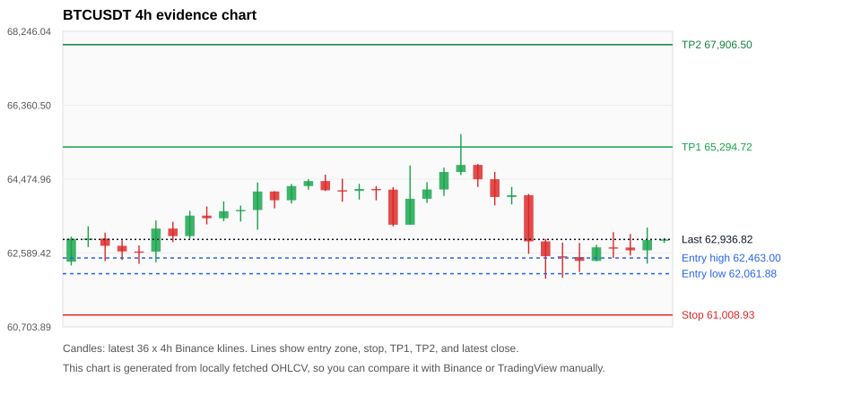
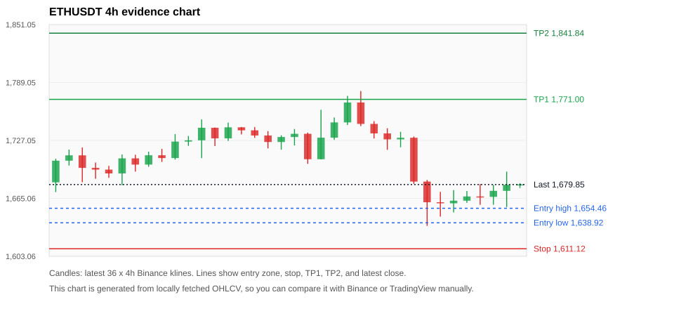
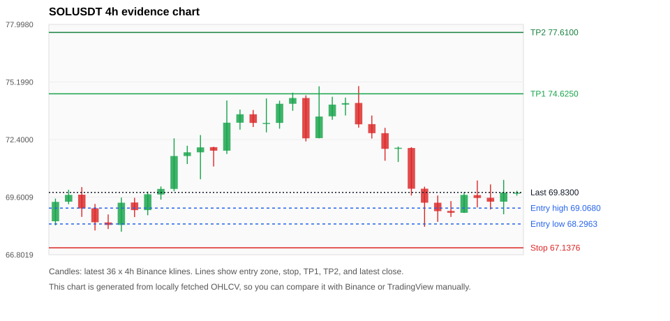
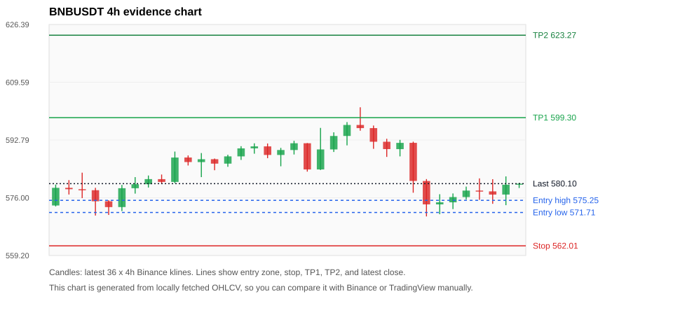
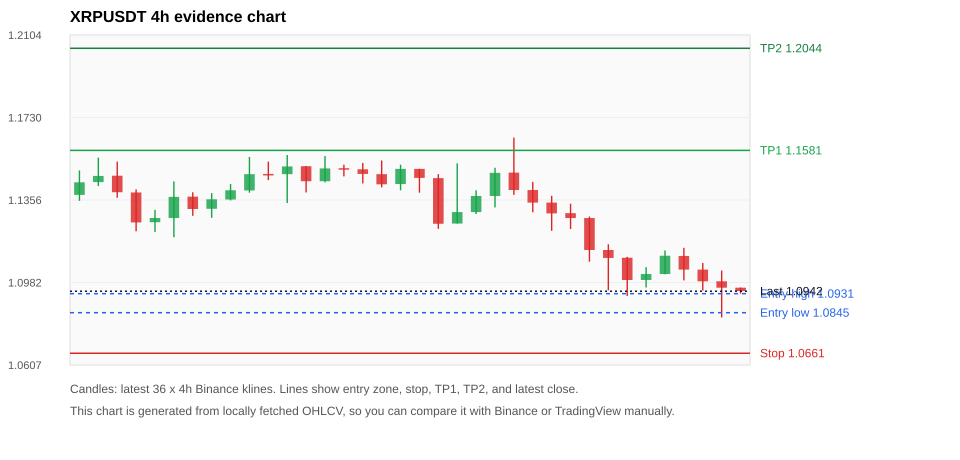

# Crypto 市场扫描报告 v1

- 报告时间：2026-06-24 20:06:08 CST
- Run ID：`20260624_120502_4dfaf980`
- Run type：`daily_full`
- 数据来源：SQLite
- 报告版本：v1
- 扫描 ID：170fe0098ac0
- 数据源：Binance public spot API + CoinGecko/CoinMarketCap cross-check
- 过滤条件：USDT spot; 24h quote volume >= 30,000,000; trades >= 30,000; exclude stables/leveraged tokens; analyze 1h/4h/1d klines
- 默认单笔风险：账户权益的 1.00%

## 限制说明

- 交易信号仍以 Binance 现货公开 K 线为主源；外部数据源用于一致性复核。
- 结果是研究和模拟盘计划，不是确定收益或实盘下单指令。
- 历史长度过滤：候选币至少需要 180 根 1d K 线。
- 数据质量验证池：先验证 score 排名前 min(top_n * 2, 10) 的候选，再按 action + score 补足最终名单。
- 大盘环境过滤：RISK_OFF; BTC/ETH 大盘偏弱，山寨币买入候选降级为观察。 BTC 7d=-2.437737756047953; ETH 7d=-4.032331771963893.
- 已启用数据交叉验证：Binance 主源 + CoinGecko 自动对照；CoinMarketCap 在配置 API Key 后自动对照。
- BTCUSDT 交叉验证状态 DATA_WARNING：At least one external provider needs manual review.
- ETHUSDT 交叉验证状态 DATA_WARNING：At least one external provider needs manual review.
- SOLUSDT 交叉验证状态 DATA_WARNING：At least one external provider needs manual review.
- BNBUSDT 交叉验证状态 DATA_WARNING：At least one external provider needs manual review.
- XRPUSDT 交叉验证状态 DATA_WARNING：At least one external provider needs manual review.
- ZECUSDT 交叉验证状态 DATA_WARNING：At least one external provider needs manual review.
- WLDUSDT 交叉验证状态 DATA_WARNING：At least one external provider needs manual review.

## 5 个候选交易计划

| Rank | Coin | Action | Setup | Entry Zone | Stop Loss | TP1 | TP2 / Exit Rule | R/R | Verdict |
|---:|---|---|---|---:|---:|---:|---|---:|---|
| 1 | `BTC` | `REJECT` | 回踩支撑/4h EMA 附近 | 62,061.88 - 62,463.00 | 61,008.93 | 65,294.72 | 67,906.50 或跌破 4h 关键支撑 | 2.42-4.50 | 只观察 |
| 2 | `ETH` | `REJECT` | 回踩支撑/4h EMA 附近 | 1,638.92 - 1,654.46 | 1,611.12 | 1,771.00 | 1,841.84 或跌破 4h 关键支撑 | 3.49-5.49 | 只观察 |
| 3 | `SOL` | `REJECT` | 回踩支撑/4h EMA 附近 | 68.2963 - 69.0680 | 67.1376 | 74.6250 | 77.6100 或跌破 4h 关键支撑 | 3.85-5.78 | 只观察 |
| 4 | `BNB` | `REJECT` | 回踩支撑/4h EMA 附近 | 571.71 - 575.25 | 562.01 | 599.30 | 623.27 或跌破 4h 关键支撑 | 2.25-4.34 | 只观察 |
| 5 | `XRP` | `REJECT` | 回踩支撑/4h EMA 附近 | 1.0845 - 1.0931 | 1.0661 | 1.1581 | 1.2044 或跌破 4h 关键支撑 | 3.05-5.09 | 只观察 |

## 数据交叉验证摘要

价格差异以 Binance 当前价为基准；成交量口径不同，Binance 是 USDT 现货成交额，CoinGecko/CoinMarketCap 通常是全市场成交量。

| Rank | Coin | Data Status | Max Price Diff | Max 24h Diff | Message |
|---:|---|---|---:|---:|---|
| 1 | `BTC` | DATA_WARNING | 0.08% | 0.02 pts | At least one external provider needs manual review. |
| 2 | `ETH` | DATA_WARNING | 0.12% | 0.04 pts | At least one external provider needs manual review. |
| 3 | `SOL` | DATA_WARNING | 0.21% | 0.19 pts | At least one external provider needs manual review. |
| 4 | `BNB` | DATA_WARNING | 0.20% | 0.12 pts | At least one external provider needs manual review. |
| 5 | `XRP` | DATA_WARNING | 0.11% | 0.07 pts | At least one external provider needs manual review. |

## 候选币说明

### 1. BTC `BTCUSDT`



- 入选原因：回踩支撑/4h EMA 附近；24h +0.76%，7d -3.59%，4h RSI 33.52，24h 成交额 $934.9M。
- 交易失效条件：跌破 61008.93 或 4h 收盘重新失守关键支撑。
- 主要风险：日线趋势未完全确认；BTC/ETH 大盘环境未确认强势，山寨币买入信号降级；7d 趋势未确认；数据交叉验证需要人工复核。
- 数据交叉验证：DATA_WARNING；At least one external provider needs manual review.

#### 可点击人工验证

- [Binance 交易页](https://www.binance.com/en/trade/BTC_USDT)
- [TradingView 图表](https://www.tradingview.com/chart/?symbol=BINANCE%3ABTCUSDT)
- [CoinGecko 搜索](https://www.coingecko.com/en/search?query=BTC)
- [CoinMarketCap 搜索](https://coinmarketcap.com/search/?q=BTC)

#### 多数据源对照

| Source | Status | Asset ID | Price | 24h Change | 24h Volume | Price Diff | 24h Diff | Updated | Message |
|---|---|---|---:|---:|---:|---:|---:|---|---|
| Binance | DATA_OK | BTCUSDT | 62,936.82 | +0.76% | $934.9M | 0.00% | 0.00 pts | 2026-06-24T12:05:45+00:00 | Primary market data source used by scanner. |
| CoinGecko | DATA_WARNING | n/a | n/a | n/a | n/a | n/a | n/a | 2026-06-24T12:05:45+00:00 | Failed to fetch https://api.coingecko.com/api/v3/coins/markets?vs_currency=usd&ids=bitcoin&price_change_percentage=24h&per_page=1&page=1: HTTP Error 429: Too Many Requests |
| CoinMarketCap | DATA_WARNING | 1 | 62,885.94 | +0.78% | $24.59B | 0.08% | 0.02 pts | 2026-06-24T12:05:03.000Z | CoinMarketCap symbol mapping has 13 matches; selected lowest cmc_rank |

#### 指标证据

| 指标 | 数值 | 人工核对用途 |
|---|---:|---|
| 当前价 | 62,936.82 | 与 Binance/TradingView 当前价格对照 |
| 24h 涨跌 | +0.76% | 与交易所 24h 涨跌对照 |
| 7d 涨跌 | -3.59% | 判断短线趋势是否延续 |
| 4h EMA20 | 63,291.28 | 判断短期趋势支撑 |
| 4h EMA50 | 63,653.50 | 判断中期趋势支撑 |
| 1d EMA20 | 64,893.56 | 判断日线趋势 |
| 1d EMA50 | 68,621.45 | 判断日线趋势 |
| 4h RSI14 | 33.52 | 判断是否过热/过弱 |
| 4h ATR14 | 750.00 | 推导止损和入场缓冲 |
| 最近 18 根 4h 最低点 | 61,938.00 | 支撑/止损参考 |
| 最近 36 根 4h 最高点 | 65,622.83 | TP/压力参考 |
| 支撑位 | 61,938.00 | 入场区间推导基础 |

#### 交易计划推导

- 支撑位 = 最近低点、4h EMA20、4h EMA50、1d EMA20 中不高于当前价的最高有效支撑 = `61,938.00`。
- 入场区间 = 支撑位附近 + ATR 缓冲 = `62,061.88 - 62,463.00`。
- 止损 = min(最近 18 根 4h 最低点 * 0.985, 入场中位价 - 1.15 * ATR14) = `61,008.93`。
- TP1 = max(最近 36 根 4h 最高点 * 0.995, 入场中位价 + 2R) = `65,294.72`。
- TP2 = max(入场中位价 + 3R, TP1 * 1.04) = `67,906.50`。

#### 最近 10 根 4h K线

| UTC 开盘时间 | Open | High | Low | Close | Quote Volume | Trades |
|---|---:|---:|---:|---:|---:|---:|
| 2026-06-23T00:00+00:00 | 64,020.01 | 64,275.38 | 63,828.93 | 64,065.35 | $113.8M | 412000 |
| 2026-06-23T04:00+00:00 | 64,065.34 | 64,095.55 | 62,568.90 | 62,886.03 | $249.8M | 654352 |
| 2026-06-23T08:00+00:00 | 62,886.04 | 62,945.08 | 61,938.00 | 62,507.06 | $402.0M | 664184 |
| 2026-06-23T12:00+00:00 | 62,507.05 | 62,855.98 | 61,960.00 | 62,487.79 | $255.9M | 946398 |
| 2026-06-23T16:00+00:00 | 62,487.79 | 62,846.00 | 62,104.70 | 62,388.49 | $153.8M | 580044 |
| 2026-06-23T20:00+00:00 | 62,388.49 | 62,799.99 | 62,380.25 | 62,734.57 | $92.8M | 369212 |
| 2026-06-24T00:00+00:00 | 62,734.57 | 63,119.45 | 62,461.87 | 62,729.78 | $173.5M | 524761 |
| 2026-06-24T04:00+00:00 | 62,729.78 | 63,073.44 | 62,525.49 | 62,657.99 | $114.5M | 343629 |
| 2026-06-24T08:00+00:00 | 62,658.00 | 63,239.06 | 62,318.88 | 62,921.19 | $145.1M | 470650 |
| 2026-06-24T12:00+00:00 | 62,921.19 | 62,973.20 | 62,845.23 | 62,936.83 | $4.8M | 24291 |

### 2. ETH `ETHUSDT`



- 入选原因：回踩支撑/4h EMA 附近；24h +1.23%，7d -4.62%，4h RSI 28.44，24h 成交额 $311.1M。
- 交易失效条件：跌破 1611.1153 或 4h 收盘重新失守关键支撑。
- 主要风险：日线趋势未完全确认；BTC/ETH 大盘环境未确认强势，山寨币买入信号降级；7d 趋势未确认；数据交叉验证需要人工复核。
- 数据交叉验证：DATA_WARNING；At least one external provider needs manual review.

#### 可点击人工验证

- [Binance 交易页](https://www.binance.com/en/trade/ETH_USDT)
- [TradingView 图表](https://www.tradingview.com/chart/?symbol=BINANCE%3AETHUSDT)
- [CoinGecko 搜索](https://www.coingecko.com/en/search?query=ETH)
- [CoinMarketCap 搜索](https://coinmarketcap.com/search/?q=ETH)

#### 多数据源对照

| Source | Status | Asset ID | Price | 24h Change | 24h Volume | Price Diff | 24h Diff | Updated | Message |
|---|---|---|---:|---:|---:|---:|---:|---|---|
| Binance | DATA_OK | ETHUSDT | 1,679.85 | +1.23% | $311.1M | 0.00% | 0.00 pts | 2026-06-24T12:05:45+00:00 | Primary market data source used by scanner. |
| CoinGecko | DATA_OK | ethereum | 1,677.90 | +1.18% | $8.82B | 0.12% | 0.04 pts | 2026-06-24T12:05:56.557Z | External source agrees with Binance within thresholds. |
| CoinMarketCap | DATA_WARNING | 1027 | 1,678.72 | +1.23% | $7.98B | 0.07% | 0.00 pts | 2026-06-24T12:05:03.000Z | CoinMarketCap symbol mapping has 6 matches; selected lowest cmc_rank |

#### 指标证据

| 指标 | 数值 | 人工核对用途 |
|---|---:|---|
| 当前价 | 1,679.85 | 与 Binance/TradingView 当前价格对照 |
| 24h 涨跌 | +1.23% | 与交易所 24h 涨跌对照 |
| 7d 涨跌 | -4.62% | 判断短线趋势是否延续 |
| 4h EMA20 | 1,696.29 | 判断短期趋势支撑 |
| 4h EMA50 | 1,708.81 | 判断中期趋势支撑 |
| 1d EMA20 | 1,747.39 | 判断日线趋势 |
| 1d EMA50 | 1,893.92 | 判断日线趋势 |
| 4h RSI14 | 28.44 | 判断是否过热/过弱 |
| 4h ATR14 | 26.8779 | 推导止损和入场缓冲 |
| 最近 18 根 4h 最低点 | 1,635.65 | 支撑/止损参考 |
| 最近 36 根 4h 最高点 | 1,779.90 | TP/压力参考 |
| 支撑位 | 1,635.65 | 入场区间推导基础 |

#### 交易计划推导

- 支撑位 = 最近低点、4h EMA20、4h EMA50、1d EMA20 中不高于当前价的最高有效支撑 = `1,635.65`。
- 入场区间 = 支撑位附近 + ATR 缓冲 = `1,638.92 - 1,654.46`。
- 止损 = min(最近 18 根 4h 最低点 * 0.985, 入场中位价 - 1.15 * ATR14) = `1,611.12`。
- TP1 = max(最近 36 根 4h 最高点 * 0.995, 入场中位价 + 2R) = `1,771.00`。
- TP2 = max(入场中位价 + 3R, TP1 * 1.04) = `1,841.84`。

#### 最近 10 根 4h K线

| UTC 开盘时间 | Open | High | Low | Close | Quote Volume | Trades |
|---|---:|---:|---:|---:|---:|---:|
| 2026-06-23T00:00+00:00 | 1,728.19 | 1,736.25 | 1,719.75 | 1,729.90 | $32.4M | 370164 |
| 2026-06-23T04:00+00:00 | 1,729.91 | 1,731.25 | 1,680.52 | 1,683.01 | $88.3M | 668644 |
| 2026-06-23T08:00+00:00 | 1,683.02 | 1,684.80 | 1,635.65 | 1,660.90 | $118.0M | 748102 |
| 2026-06-23T12:00+00:00 | 1,660.90 | 1,672.00 | 1,645.52 | 1,659.78 | $81.0M | 835298 |
| 2026-06-23T16:00+00:00 | 1,659.78 | 1,673.89 | 1,650.00 | 1,662.58 | $64.2M | 503985 |
| 2026-06-23T20:00+00:00 | 1,662.57 | 1,672.92 | 1,660.27 | 1,667.13 | $31.4M | 289086 |
| 2026-06-24T00:00+00:00 | 1,667.13 | 1,680.46 | 1,658.18 | 1,666.67 | $37.4M | 425689 |
| 2026-06-24T04:00+00:00 | 1,666.67 | 1,679.57 | 1,658.22 | 1,673.12 | $40.8M | 235407 |
| 2026-06-24T08:00+00:00 | 1,673.13 | 1,693.67 | 1,655.76 | 1,679.57 | $56.3M | 450395 |
| 2026-06-24T12:00+00:00 | 1,679.57 | 1,681.29 | 1,676.17 | 1,680.02 | $2.2M | 24122 |

### 3. SOL `SOLUSDT`



- 入选原因：回踩支撑/4h EMA 附近；24h +0.87%，7d -3.59%，4h RSI 20.03，24h 成交额 $117.5M。
- 交易失效条件：跌破 67.1376 或 4h 收盘重新失守关键支撑。
- 主要风险：日线趋势未完全确认；BTC/ETH 大盘环境未确认强势，山寨币买入信号降级；7d 趋势未确认；数据交叉验证需要人工复核。
- 数据交叉验证：DATA_WARNING；At least one external provider needs manual review.

#### 可点击人工验证

- [Binance 交易页](https://www.binance.com/en/trade/SOL_USDT)
- [TradingView 图表](https://www.tradingview.com/chart/?symbol=BINANCE%3ASOLUSDT)
- [CoinGecko 搜索](https://www.coingecko.com/en/search?query=SOL)
- [CoinMarketCap 搜索](https://coinmarketcap.com/search/?q=SOL)

#### 多数据源对照

| Source | Status | Asset ID | Price | 24h Change | 24h Volume | Price Diff | 24h Diff | Updated | Message |
|---|---|---|---:|---:|---:|---:|---:|---|---|
| Binance | DATA_OK | SOLUSDT | 69.8300 | +0.87% | $117.5M | 0.00% | 0.00 pts | 2026-06-24T12:05:45+00:00 | Primary market data source used by scanner. |
| CoinGecko | DATA_OK | solana | 69.6900 | +0.69% | $1.87B | 0.20% | 0.18 pts | 2026-06-24T12:05:56.539Z | External source agrees with Binance within thresholds. |
| CoinMarketCap | DATA_WARNING | 5426 | 69.6853 | +0.68% | $1.89B | 0.21% | 0.19 pts | 2026-06-24T12:05:03.000Z | CoinMarketCap symbol mapping has 8 matches; selected lowest cmc_rank |

#### 指标证据

| 指标 | 数值 | 人工核对用途 |
|---|---:|---|
| 当前价 | 69.8300 | 与 Binance/TradingView 当前价格对照 |
| 24h 涨跌 | +0.87% | 与交易所 24h 涨跌对照 |
| 7d 涨跌 | -3.59% | 判断短线趋势是否延续 |
| 4h EMA20 | 70.7444 | 判断短期趋势支撑 |
| 4h EMA50 | 70.8556 | 判断中期趋势支撑 |
| 1d EMA20 | 71.6134 | 判断日线趋势 |
| 1d EMA50 | 76.2262 | 判断日线趋势 |
| 4h RSI14 | 20.03 | 判断是否过热/过弱 |
| 4h ATR14 | 1.2971 | 推导止损和入场缓冲 |
| 最近 18 根 4h 最低点 | 68.1600 | 支撑/止损参考 |
| 最近 36 根 4h 最高点 | 75.0000 | TP/压力参考 |
| 支撑位 | 68.1600 | 入场区间推导基础 |

#### 交易计划推导

- 支撑位 = 最近低点、4h EMA20、4h EMA50、1d EMA20 中不高于当前价的最高有效支撑 = `68.1600`。
- 入场区间 = 支撑位附近 + ATR 缓冲 = `68.2963 - 69.0680`。
- 止损 = min(最近 18 根 4h 最低点 * 0.985, 入场中位价 - 1.15 * ATR14) = `67.1376`。
- TP1 = max(最近 36 根 4h 最高点 * 0.995, 入场中位价 + 2R) = `74.6250`。
- TP2 = max(入场中位价 + 3R, TP1 * 1.04) = `77.6100`。

#### 最近 10 根 4h K线

| UTC 开盘时间 | Open | High | Low | Close | Quote Volume | Trades |
|---|---:|---:|---:|---:|---:|---:|
| 2026-06-23T00:00+00:00 | 71.9500 | 72.0600 | 71.3100 | 72.0000 | $17.1M | 110029 |
| 2026-06-23T04:00+00:00 | 71.9900 | 72.0300 | 69.6800 | 70.0100 | $35.8M | 177361 |
| 2026-06-23T08:00+00:00 | 70.0100 | 70.1100 | 68.1600 | 69.3300 | $43.0M | 189970 |
| 2026-06-23T12:00+00:00 | 69.3300 | 69.6800 | 68.4000 | 68.9200 | $29.8M | 203200 |
| 2026-06-23T16:00+00:00 | 68.9300 | 69.4100 | 68.6400 | 68.8400 | $15.7M | 121234 |
| 2026-06-23T20:00+00:00 | 68.8400 | 69.8400 | 68.8300 | 69.7100 | $12.1M | 74506 |
| 2026-06-24T00:00+00:00 | 69.7000 | 70.4100 | 69.1000 | 69.5600 | $18.4M | 110772 |
| 2026-06-24T04:00+00:00 | 69.5700 | 70.2200 | 69.0000 | 69.3800 | $17.6M | 95535 |
| 2026-06-24T08:00+00:00 | 69.3800 | 70.4400 | 68.7700 | 69.8200 | $23.6M | 114487 |
| 2026-06-24T12:00+00:00 | 69.8200 | 69.9100 | 69.6700 | 69.8200 | $868,987 | 4970 |

### 4. BNB `BNBUSDT`



- 入选原因：回踩支撑/4h EMA 附近；24h +1.09%，7d -4.68%，4h RSI 31.90，24h 成交额 $40.1M。
- 交易失效条件：跌破 562.01145 或 4h 收盘重新失守关键支撑。
- 主要风险：日线趋势未完全确认；BTC/ETH 大盘环境未确认强势，山寨币买入信号降级；7d 趋势未确认；数据交叉验证需要人工复核。
- 数据交叉验证：DATA_WARNING；At least one external provider needs manual review.

#### 可点击人工验证

- [Binance 交易页](https://www.binance.com/en/trade/BNB_USDT)
- [TradingView 图表](https://www.tradingview.com/chart/?symbol=BINANCE%3ABNBUSDT)
- [CoinGecko 搜索](https://www.coingecko.com/en/search?query=BNB)
- [CoinMarketCap 搜索](https://coinmarketcap.com/search/?q=BNB)

#### 多数据源对照

| Source | Status | Asset ID | Price | 24h Change | 24h Volume | Price Diff | 24h Diff | Updated | Message |
|---|---|---|---:|---:|---:|---:|---:|---|---|
| Binance | DATA_OK | BNBUSDT | 580.10 | +1.09% | $40.1M | 0.00% | 0.00 pts | 2026-06-24T12:05:45+00:00 | Primary market data source used by scanner. |
| CoinGecko | DATA_OK | binancecoin | 579.27 | +0.97% | $520.2M | 0.14% | 0.12 pts | 2026-06-24T12:06:02.194Z | External source agrees with Binance within thresholds. |
| CoinMarketCap | DATA_WARNING | 1839 | 578.95 | +0.97% | $911.1M | 0.20% | 0.12 pts | 2026-06-24T12:05:03.000Z | CoinMarketCap symbol mapping has 4 matches; selected lowest cmc_rank |

#### 指标证据

| 指标 | 数值 | 人工核对用途 |
|---|---:|---|
| 当前价 | 580.10 | 与 Binance/TradingView 当前价格对照 |
| 24h 涨跌 | +1.09% | 与交易所 24h 涨跌对照 |
| 7d 涨跌 | -4.68% | 判断短线趋势是否延续 |
| 4h EMA20 | 583.03 | 判断短期趋势支撑 |
| 4h EMA50 | 588.17 | 判断中期趋势支撑 |
| 1d EMA20 | 599.67 | 判断日线趋势 |
| 1d EMA50 | 618.23 | 判断日线趋势 |
| 4h RSI14 | 31.90 | 判断是否过热/过弱 |
| 4h ATR14 | 6.6786 | 推导止损和入场缓冲 |
| 最近 18 根 4h 最低点 | 570.57 | 支撑/止损参考 |
| 最近 36 根 4h 最高点 | 602.31 | TP/压力参考 |
| 支撑位 | 570.57 | 入场区间推导基础 |

#### 交易计划推导

- 支撑位 = 最近低点、4h EMA20、4h EMA50、1d EMA20 中不高于当前价的最高有效支撑 = `570.57`。
- 入场区间 = 支撑位附近 + ATR 缓冲 = `571.71 - 575.25`。
- 止损 = min(最近 18 根 4h 最低点 * 0.985, 入场中位价 - 1.15 * ATR14) = `562.01`。
- TP1 = max(最近 36 根 4h 最高点 * 0.995, 入场中位价 + 2R) = `599.30`。
- TP2 = max(入场中位价 + 3R, TP1 * 1.04) = `623.27`。

#### 最近 10 根 4h K线

| UTC 开盘时间 | Open | High | Low | Close | Quote Volume | Trades |
|---|---:|---:|---:|---:|---:|---:|
| 2026-06-23T00:00+00:00 | 590.14 | 592.83 | 588.03 | 591.96 | $6.9M | 82867 |
| 2026-06-23T04:00+00:00 | 591.97 | 592.31 | 577.46 | 580.88 | $11.8M | 142557 |
| 2026-06-23T08:00+00:00 | 580.87 | 581.43 | 570.57 | 574.07 | $22.4M | 211332 |
| 2026-06-23T12:00+00:00 | 574.07 | 577.02 | 571.21 | 574.67 | $11.2M | 146376 |
| 2026-06-23T16:00+00:00 | 574.67 | 577.25 | 572.70 | 576.20 | $6.6M | 81130 |
| 2026-06-23T20:00+00:00 | 576.20 | 579.24 | 575.51 | 578.08 | $4.1M | 48483 |
| 2026-06-24T00:00+00:00 | 578.09 | 581.63 | 575.38 | 577.85 | $5.0M | 107987 |
| 2026-06-24T04:00+00:00 | 577.85 | 581.40 | 574.24 | 576.92 | $5.0M | 70906 |
| 2026-06-24T08:00+00:00 | 576.93 | 582.21 | 573.84 | 579.79 | $8.0M | 99300 |
| 2026-06-24T12:00+00:00 | 579.79 | 580.33 | 578.83 | 580.10 | $481,888 | 3372 |

### 5. XRP `XRPUSDT`



- 入选原因：回踩支撑/4h EMA 附近；24h -1.33%，7d -8.89%，4h RSI 24.97，24h 成交额 $76.8M。
- 交易失效条件：跌破 1.0660655 或 4h 收盘重新失守关键支撑。
- 主要风险：日线趋势未完全确认；BTC/ETH 大盘环境未确认强势，山寨币买入信号降级；24h 动量未确认；7d 趋势未确认；数据交叉验证需要人工复核。
- 数据交叉验证：DATA_WARNING；At least one external provider needs manual review.

#### 可点击人工验证

- [Binance 交易页](https://www.binance.com/en/trade/XRP_USDT)
- [TradingView 图表](https://www.tradingview.com/chart/?symbol=BINANCE%3AXRPUSDT)
- [CoinGecko 搜索](https://www.coingecko.com/en/search?query=XRP)
- [CoinMarketCap 搜索](https://coinmarketcap.com/search/?q=XRP)

#### 多数据源对照

| Source | Status | Asset ID | Price | 24h Change | 24h Volume | Price Diff | 24h Diff | Updated | Message |
|---|---|---|---:|---:|---:|---:|---:|---|---|
| Binance | DATA_OK | XRPUSDT | 1.0942 | -1.33% | $76.8M | 0.00% | 0.00 pts | 2026-06-24T12:05:45+00:00 | Primary market data source used by scanner. |
| CoinGecko | DATA_OK | ripple | 1.0930 | -1.34% | $1.38B | 0.11% | 0.01 pts | 2026-06-24T12:06:02.802Z | External source agrees with Binance within thresholds. |
| CoinMarketCap | DATA_WARNING | 52 | 1.0938 | -1.27% | $1.41B | 0.03% | 0.07 pts | 2026-06-24T12:05:03.000Z | CoinMarketCap symbol mapping has 3 matches; selected lowest cmc_rank |

#### 指标证据

| 指标 | 数值 | 人工核对用途 |
|---|---:|---|
| 当前价 | 1.0942 | 与 Binance/TradingView 当前价格对照 |
| 24h 涨跌 | -1.33% | 与交易所 24h 涨跌对照 |
| 7d 涨跌 | -8.89% | 判断短线趋势是否延续 |
| 4h EMA20 | 1.1179 | 判断短期趋势支撑 |
| 4h EMA50 | 1.1367 | 判断中期趋势支撑 |
| 1d EMA20 | 1.1647 | 判断日线趋势 |
| 1d EMA50 | 1.2421 | 判断日线趋势 |
| 4h RSI14 | 24.97 | 判断是否过热/过弱 |
| 4h ATR14 | 0.01541 | 推导止损和入场缓冲 |
| 最近 18 根 4h 最低点 | 1.0823 | 支撑/止损参考 |
| 最近 36 根 4h 最高点 | 1.1639 | TP/压力参考 |
| 支撑位 | 1.0823 | 入场区间推导基础 |

#### 交易计划推导

- 支撑位 = 最近低点、4h EMA20、4h EMA50、1d EMA20 中不高于当前价的最高有效支撑 = `1.0823`。
- 入场区间 = 支撑位附近 + ATR 缓冲 = `1.0845 - 1.0931`。
- 止损 = min(最近 18 根 4h 最低点 * 0.985, 入场中位价 - 1.15 * ATR14) = `1.0661`。
- TP1 = max(最近 36 根 4h 最高点 * 0.995, 入场中位价 + 2R) = `1.1581`。
- TP2 = max(入场中位价 + 3R, TP1 * 1.04) = `1.2044`。

#### 最近 10 根 4h K线

| UTC 开盘时间 | Open | High | Low | Close | Quote Volume | Trades |
|---|---:|---:|---:|---:|---:|---:|
| 2026-06-23T00:00+00:00 | 1.1296 | 1.1339 | 1.1224 | 1.1274 | $10.9M | 65291 |
| 2026-06-23T04:00+00:00 | 1.1274 | 1.1281 | 1.1076 | 1.1129 | $19.2M | 111078 |
| 2026-06-23T08:00+00:00 | 1.1129 | 1.1155 | 1.0946 | 1.1093 | $19.7M | 115259 |
| 2026-06-23T12:00+00:00 | 1.1094 | 1.1098 | 1.0920 | 1.0993 | $17.8M | 142450 |
| 2026-06-23T16:00+00:00 | 1.0993 | 1.1051 | 1.0959 | 1.1020 | $9.1M | 75754 |
| 2026-06-23T20:00+00:00 | 1.1020 | 1.1127 | 1.1019 | 1.1103 | $7.1M | 47037 |
| 2026-06-24T00:00+00:00 | 1.1102 | 1.1139 | 1.0991 | 1.1040 | $13.1M | 64228 |
| 2026-06-24T04:00+00:00 | 1.1040 | 1.1070 | 1.0945 | 1.0987 | $9.0M | 52508 |
| 2026-06-24T08:00+00:00 | 1.0987 | 1.1036 | 1.0823 | 1.0958 | $20.5M | 87823 |
| 2026-06-24T12:00+00:00 | 1.0958 | 1.0959 | 1.0931 | 1.0943 | $378,882 | 3647 |

## 组合风控

- 不要 5 个候选全部满仓买入。
- 同时持仓总风险建议控制在账户权益的 3% - 5% 以内。
- 如果 BTC/ETH 同时破位，暂停山寨币多头计划或降低仓位。
- 第一版报告用于模拟盘和人工复核，不自动下单。

## 原始数据

```json
[
  {
    "rank": 1,
    "symbol": "BTCUSDT",
    "base_asset": "BTC",
    "price": 62936.82,
    "score": 8.272967383041955,
    "setup": "回踩支撑/4h EMA 附近",
    "verdict": "只观察",
    "entry_low": 62061.876,
    "entry_high": 62462.9965,
    "stop_loss": 61008.93,
    "take_profit_1": 65294.71585,
    "take_profit_2": 67906.504484,
    "risk_reward_1": 2.4190382776312487,
    "risk_reward_2": 4.5026247248468145,
    "pct_24h": 0.757,
    "pct_3d": -1.8850434945281047,
    "pct_7d": -3.5864763013572776,
    "quote_volume_24h": 934878121.2548488,
    "trades_24h": 3244934,
    "high_low_range_24h": 2.064331826985155,
    "rsi_1h": 57.58288657810269,
    "rsi_4h": 33.52007034967926,
    "ema20_4h": 63291.28429634386,
    "ema50_4h": 63653.500885578986,
    "ema20_1d": 64893.560510267904,
    "ema50_1d": 68621.45070404065,
    "atr_4h": 749.995,
    "macd_hist_4h": -69.15648459617626,
    "volume_ratio_24h": 0.9460524533205246,
    "support_level": 61938.0,
    "recent_low_4h_18": 61938.0,
    "recent_high_4h_36": 65622.83,
    "distance_to_support_pct": 1.6126126126126072,
    "binance_trade_url": "https://www.binance.com/en/trade/BTC_USDT",
    "tradingview_url": "https://www.tradingview.com/chart/?symbol=BINANCE%3ABTCUSDT",
    "coingecko_search_url": "https://www.coingecko.com/en/search?query=BTC",
    "coinmarketcap_search_url": "https://coinmarketcap.com/search/?q=BTC",
    "invalidation": "跌破 61008.93 或 4h 收盘重新失守关键支撑",
    "recent_4h_klines": [
      {
        "open_time_utc": "2026-06-18T16:00+00:00",
        "open": 62369.43,
        "high": 63008.33,
        "low": 62272.07,
        "close": 62950.79,
        "quote_volume": 224360442.9163794,
        "trades": 780414
      },
      {
        "open_time_utc": "2026-06-18T20:00+00:00",
        "open": 62950.79,
        "high": 63274.19,
        "low": 62742.0,
        "close": 62958.01,
        "quote_volume": 122773241.5836095,
        "trades": 376080
      },
      {
        "open_time_utc": "2026-06-19T00:00+00:00",
        "open": 62958.01,
        "high": 63110.29,
        "low": 62386.9,
        "close": 62773.51,
        "quote_volume": 155247582.7574397,
        "trades": 396596
      },
      {
        "open_time_utc": "2026-06-19T04:00+00:00",
        "open": 62773.52,
        "high": 62917.32,
        "low": 62409.55,
        "close": 62629.99,
        "quote_volume": 102889549.5578239,
        "trades": 403487
      },
      {
        "open_time_utc": "2026-06-19T08:00+00:00",
        "open": 62630.0,
        "high": 62782.0,
        "low": 62316.44,
        "close": 62626.0,
        "quote_volume": 194868847.0153648,
        "trades": 423552
      },
      {
        "open_time_utc": "2026-06-19T12:00+00:00",
        "open": 62626.0,
        "high": 63419.27,
        "low": 62353.0,
        "close": 63214.01,
        "quote_volume": 182844281.0893635,
        "trades": 678126
      },
      {
        "open_time_utc": "2026-06-19T16:00+00:00",
        "open": 63214.01,
        "high": 63387.8,
        "low": 62866.99,
        "close": 63021.6,
        "quote_volume": 157065336.3282753,
        "trades": 485506
      },
      {
        "open_time_utc": "2026-06-19T20:00+00:00",
        "open": 63021.6,
        "high": 63666.0,
        "low": 62958.59,
        "close": 63543.91,
        "quote_volume": 103187356.0270502,
        "trades": 284651
      },
      {
        "open_time_utc": "2026-06-20T00:00+00:00",
        "open": 63543.9,
        "high": 63777.0,
        "low": 63320.14,
        "close": 63476.79,
        "quote_volume": 102658991.7358543,
        "trades": 312607
      },
      {
        "open_time_utc": "2026-06-20T04:00+00:00",
        "open": 63476.79,
        "high": 63907.07,
        "low": 63402.0,
        "close": 63655.21,
        "quote_volume": 85743670.8048452,
        "trades": 267883
      },
      {
        "open_time_utc": "2026-06-20T08:00+00:00",
        "open": 63655.21,
        "high": 63798.76,
        "low": 63392.41,
        "close": 63688.0,
        "quote_volume": 94207746.8136805,
        "trades": 230181
      },
      {
        "open_time_utc": "2026-06-20T12:00+00:00",
        "open": 63688.0,
        "high": 64388.0,
        "low": 63184.21,
        "close": 64160.04,
        "quote_volume": 173712718.2530985,
        "trades": 540585
      },
      {
        "open_time_utc": "2026-06-20T16:00+00:00",
        "open": 64160.04,
        "high": 64167.26,
        "low": 63730.21,
        "close": 63936.0,
        "quote_volume": 75371411.3649962,
        "trades": 354415
      },
      {
        "open_time_utc": "2026-06-20T20:00+00:00",
        "open": 63935.99,
        "high": 64350.0,
        "low": 63853.31,
        "close": 64298.01,
        "quote_volume": 75382672.7832676,
        "trades": 264410
      },
      {
        "open_time_utc": "2026-06-21T00:00+00:00",
        "open": 64298.01,
        "high": 64472.99,
        "low": 64206.17,
        "close": 64426.0,
        "quote_volume": 99682480.4865569,
        "trades": 207280
      },
      {
        "open_time_utc": "2026-06-21T04:00+00:00",
        "open": 64426.0,
        "high": 64588.0,
        "low": 64173.08,
        "close": 64191.07,
        "quote_volume": 63777133.9291967,
        "trades": 192899
      },
      {
        "open_time_utc": "2026-06-21T08:00+00:00",
        "open": 64191.06,
        "high": 64483.95,
        "low": 63900.17,
        "close": 64176.0,
        "quote_volume": 81766315.4105557,
        "trades": 278849
      },
      {
        "open_time_utc": "2026-06-21T12:00+00:00",
        "open": 64176.0,
        "high": 64355.88,
        "low": 63952.0,
        "close": 64224.0,
        "quote_volume": 70627900.6074013,
        "trades": 261322
      },
      {
        "open_time_utc": "2026-06-21T16:00+00:00",
        "open": 64224.0,
        "high": 64298.84,
        "low": 63933.47,
        "close": 64207.12,
        "quote_volume": 57873813.4371436,
        "trades": 250295
      },
      {
        "open_time_utc": "2026-06-21T20:00+00:00",
        "open": 64207.13,
        "high": 64271.21,
        "low": 63270.0,
        "close": 63311.99,
        "quote_volume": 141134531.8653581,
        "trades": 577649
      },
      {
        "open_time_utc": "2026-06-22T00:00+00:00",
        "open": 63312.0,
        "high": 64823.52,
        "low": 63312.0,
        "close": 63974.01,
        "quote_volume": 206085227.8314243,
        "trades": 769958
      },
      {
        "open_time_utc": "2026-06-22T04:00+00:00",
        "open": 63974.01,
        "high": 64397.57,
        "low": 63868.41,
        "close": 64211.19,
        "quote_volume": 140435032.8051994,
        "trades": 384238
      },
      {
        "open_time_utc": "2026-06-22T08:00+00:00",
        "open": 64211.2,
        "high": 64768.46,
        "low": 64044.0,
        "close": 64657.22,
        "quote_volume": 120460631.47686,
        "trades": 445403
      },
      {
        "open_time_utc": "2026-06-22T12:00+00:00",
        "open": 64657.22,
        "high": 65622.83,
        "low": 64579.08,
        "close": 64836.95,
        "quote_volume": 274338559.6586699,
        "trades": 943073
      },
      {
        "open_time_utc": "2026-06-22T16:00+00:00",
        "open": 64836.95,
        "high": 64862.0,
        "low": 64276.0,
        "close": 64472.0,
        "quote_volume": 150577681.1254881,
        "trades": 552327
      },
      {
        "open_time_utc": "2026-06-22T20:00+00:00",
        "open": 64472.51,
        "high": 64659.43,
        "low": 63804.59,
        "close": 64020.01,
        "quote_volume": 103137424.2587042,
        "trades": 426338
      },
      {
        "open_time_utc": "2026-06-23T00:00+00:00",
        "open": 64020.01,
        "high": 64275.38,
        "low": 63828.93,
        "close": 64065.35,
        "quote_volume": 113810463.257732,
        "trades": 412000
      },
      {
        "open_time_utc": "2026-06-23T04:00+00:00",
        "open": 64065.34,
        "high": 64095.55,
        "low": 62568.9,
        "close": 62886.03,
        "quote_volume": 249769578.9162991,
        "trades": 654352
      },
      {
        "open_time_utc": "2026-06-23T08:00+00:00",
        "open": 62886.04,
        "high": 62945.08,
        "low": 61938.0,
        "close": 62507.06,
        "quote_volume": 402018362.6093837,
        "trades": 664184
      },
      {
        "open_time_utc": "2026-06-23T12:00+00:00",
        "open": 62507.05,
        "high": 62855.98,
        "low": 61960.0,
        "close": 62487.79,
        "quote_volume": 255890735.6813711,
        "trades": 946398
      },
      {
        "open_time_utc": "2026-06-23T16:00+00:00",
        "open": 62487.79,
        "high": 62846.0,
        "low": 62104.7,
        "close": 62388.49,
        "quote_volume": 153768837.4080825,
        "trades": 580044
      },
      {
        "open_time_utc": "2026-06-23T20:00+00:00",
        "open": 62388.49,
        "high": 62799.99,
        "low": 62380.25,
        "close": 62734.57,
        "quote_volume": 92835243.377365,
        "trades": 369212
      },
      {
        "open_time_utc": "2026-06-24T00:00+00:00",
        "open": 62734.57,
        "high": 63119.45,
        "low": 62461.87,
        "close": 62729.78,
        "quote_volume": 173503244.6173542,
        "trades": 524761
      },
      {
        "open_time_utc": "2026-06-24T04:00+00:00",
        "open": 62729.78,
        "high": 63073.44,
        "low": 62525.49,
        "close": 62657.99,
        "quote_volume": 114538754.1784594,
        "trades": 343629
      },
      {
        "open_time_utc": "2026-06-24T08:00+00:00",
        "open": 62658.0,
        "high": 63239.06,
        "low": 62318.88,
        "close": 62921.19,
        "quote_volume": 145076269.788959,
        "trades": 470650
      },
      {
        "open_time_utc": "2026-06-24T12:00+00:00",
        "open": 62921.19,
        "high": 62973.2,
        "low": 62845.23,
        "close": 62936.83,
        "quote_volume": 4847835.8901017,
        "trades": 24291
      }
    ],
    "risks": [
      "日线趋势未完全确认",
      "BTC/ETH 大盘环境未确认强势，山寨币买入信号降级",
      "7d 趋势未确认",
      "数据交叉验证需要人工复核"
    ],
    "data_quality_status": "DATA_WARNING",
    "data_quality_message": "At least one external provider needs manual review.",
    "data_checks": [
      {
        "provider": "Binance",
        "status": "DATA_OK",
        "provider_asset_id": "BTCUSDT",
        "provider_symbol": "BTCUSDT",
        "price_usd": 62936.82,
        "pct_24h": 0.757,
        "volume_24h": 934878121.2548488,
        "last_updated": null,
        "fetched_at_utc": "2026-06-24T12:05:45+00:00",
        "price_diff_pct": 0.0,
        "pct_24h_diff": 0.0,
        "volume_note": "Binance USDT spot 24h quoteVolume.",
        "message": "Primary market data source used by scanner."
      },
      {
        "provider": "CoinGecko",
        "status": "DATA_WARNING",
        "provider_asset_id": null,
        "provider_symbol": "BTC",
        "price_usd": null,
        "pct_24h": null,
        "volume_24h": null,
        "last_updated": null,
        "fetched_at_utc": "2026-06-24T12:05:45+00:00",
        "price_diff_pct": null,
        "pct_24h_diff": null,
        "volume_note": "External provider data unavailable.",
        "message": "Failed to fetch https://api.coingecko.com/api/v3/coins/markets?vs_currency=usd&ids=bitcoin&price_change_percentage=24h&per_page=1&page=1: HTTP Error 429: Too Many Requests"
      },
      {
        "provider": "CoinMarketCap",
        "status": "DATA_WARNING",
        "provider_asset_id": "1",
        "provider_symbol": "BTC",
        "price_usd": 62885.94034026295,
        "pct_24h": 0.77540172,
        "volume_24h": 24594897395.647884,
        "last_updated": "2026-06-24T12:05:03.000Z",
        "fetched_at_utc": "2026-06-24T12:05:45+00:00",
        "price_diff_pct": 0.08084243807846164,
        "pct_24h_diff": 0.018401719999999955,
        "volume_note": "CoinMarketCap total market volume; not the same venue scope as Binance quoteVolume.",
        "message": "CoinMarketCap symbol mapping has 13 matches; selected lowest cmc_rank"
      }
    ],
    "action": "REJECT"
  },
  {
    "rank": 2,
    "symbol": "ETHUSDT",
    "base_asset": "ETH",
    "price": 1679.85,
    "score": 4.700008111605516,
    "setup": "回踩支撑/4h EMA 附近",
    "verdict": "只观察",
    "entry_low": 1638.9213000000002,
    "entry_high": 1654.4645,
    "stop_loss": 1611.11525,
    "take_profit_1": 1771.0005,
    "take_profit_2": 1841.8405200000002,
    "risk_reward_1": 3.493980068947788,
    "risk_reward_2": 5.48511832569044,
    "pct_24h": 1.227,
    "pct_3d": -2.625858620989485,
    "pct_7d": -4.621717530163238,
    "quote_volume_24h": 311074302.347787,
    "trades_24h": 2747718,
    "high_low_range_24h": 2.9261266955126652,
    "rsi_1h": 63.73507057546126,
    "rsi_4h": 28.442335196983564,
    "ema20_4h": 1696.293444207533,
    "ema50_4h": 1708.8091263377623,
    "ema20_1d": 1747.3878867580372,
    "ema50_1d": 1893.919405387131,
    "atr_4h": 26.877857142857142,
    "macd_hist_4h": -3.180984304427371,
    "volume_ratio_24h": 0.7436106314072867,
    "support_level": 1635.65,
    "recent_low_4h_18": 1635.65,
    "recent_high_4h_36": 1779.9,
    "distance_to_support_pct": 2.7022896096353,
    "binance_trade_url": "https://www.binance.com/en/trade/ETH_USDT",
    "tradingview_url": "https://www.tradingview.com/chart/?symbol=BINANCE%3AETHUSDT",
    "coingecko_search_url": "https://www.coingecko.com/en/search?query=ETH",
    "coinmarketcap_search_url": "https://coinmarketcap.com/search/?q=ETH",
    "invalidation": "跌破 1611.1153 或 4h 收盘重新失守关键支撑",
    "recent_4h_klines": [
      {
        "open_time_utc": "2026-06-18T16:00+00:00",
        "open": 1682.23,
        "high": 1707.48,
        "low": 1671.79,
        "close": 1705.39,
        "quote_volume": 111355620.454105,
        "trades": 764838
      },
      {
        "open_time_utc": "2026-06-18T20:00+00:00",
        "open": 1705.4,
        "high": 1717.23,
        "low": 1700.19,
        "close": 1711.11,
        "quote_volume": 51037955.376431,
        "trades": 328633
      },
      {
        "open_time_utc": "2026-06-19T00:00+00:00",
        "open": 1711.11,
        "high": 1719.51,
        "low": 1682.35,
        "close": 1697.69,
        "quote_volume": 64130921.178829,
        "trades": 421515
      },
      {
        "open_time_utc": "2026-06-19T04:00+00:00",
        "open": 1697.7,
        "high": 1703.4,
        "low": 1686.0,
        "close": 1695.82,
        "quote_volume": 55233326.496868,
        "trades": 389074
      },
      {
        "open_time_utc": "2026-06-19T08:00+00:00",
        "open": 1695.82,
        "high": 1699.82,
        "low": 1687.05,
        "close": 1691.74,
        "quote_volume": 33417490.339601,
        "trades": 336081
      },
      {
        "open_time_utc": "2026-06-19T12:00+00:00",
        "open": 1691.74,
        "high": 1712.06,
        "low": 1679.11,
        "close": 1707.86,
        "quote_volume": 65478448.984829,
        "trades": 632732
      },
      {
        "open_time_utc": "2026-06-19T16:00+00:00",
        "open": 1707.87,
        "high": 1711.76,
        "low": 1693.7,
        "close": 1701.2,
        "quote_volume": 38211885.926919,
        "trades": 359587
      },
      {
        "open_time_utc": "2026-06-19T20:00+00:00",
        "open": 1701.21,
        "high": 1715.0,
        "low": 1698.89,
        "close": 1711.19,
        "quote_volume": 24018299.467603,
        "trades": 200779
      },
      {
        "open_time_utc": "2026-06-20T00:00+00:00",
        "open": 1711.18,
        "high": 1718.0,
        "low": 1704.06,
        "close": 1708.17,
        "quote_volume": 24766944.739453,
        "trades": 232787
      },
      {
        "open_time_utc": "2026-06-20T04:00+00:00",
        "open": 1708.18,
        "high": 1733.89,
        "low": 1706.51,
        "close": 1725.82,
        "quote_volume": 49375729.155368,
        "trades": 296623
      },
      {
        "open_time_utc": "2026-06-20T08:00+00:00",
        "open": 1725.81,
        "high": 1731.76,
        "low": 1721.25,
        "close": 1727.18,
        "quote_volume": 22978204.973373,
        "trades": 167591
      },
      {
        "open_time_utc": "2026-06-20T12:00+00:00",
        "open": 1727.18,
        "high": 1749.55,
        "low": 1708.11,
        "close": 1740.63,
        "quote_volume": 78859368.249363,
        "trades": 584044
      },
      {
        "open_time_utc": "2026-06-20T16:00+00:00",
        "open": 1740.63,
        "high": 1740.91,
        "low": 1721.03,
        "close": 1729.27,
        "quote_volume": 40574940.080848,
        "trades": 293750
      },
      {
        "open_time_utc": "2026-06-20T20:00+00:00",
        "open": 1729.27,
        "high": 1746.17,
        "low": 1726.53,
        "close": 1741.08,
        "quote_volume": 59657471.853621,
        "trades": 267793
      },
      {
        "open_time_utc": "2026-06-21T00:00+00:00",
        "open": 1741.08,
        "high": 1741.45,
        "low": 1733.51,
        "close": 1737.87,
        "quote_volume": 19956063.627311,
        "trades": 174336
      },
      {
        "open_time_utc": "2026-06-21T04:00+00:00",
        "open": 1737.88,
        "high": 1741.41,
        "low": 1729.8,
        "close": 1732.36,
        "quote_volume": 33212764.297999,
        "trades": 178328
      },
      {
        "open_time_utc": "2026-06-21T08:00+00:00",
        "open": 1732.36,
        "high": 1737.02,
        "low": 1718.56,
        "close": 1725.36,
        "quote_volume": 33901130.441749,
        "trades": 230369
      },
      {
        "open_time_utc": "2026-06-21T12:00+00:00",
        "open": 1725.37,
        "high": 1732.57,
        "low": 1717.14,
        "close": 1730.72,
        "quote_volume": 32769162.118903,
        "trades": 263935
      },
      {
        "open_time_utc": "2026-06-21T16:00+00:00",
        "open": 1730.71,
        "high": 1739.32,
        "low": 1721.67,
        "close": 1734.14,
        "quote_volume": 34932609.163769,
        "trades": 260447
      },
      {
        "open_time_utc": "2026-06-21T20:00+00:00",
        "open": 1734.14,
        "high": 1735.34,
        "low": 1702.0,
        "close": 1706.94,
        "quote_volume": 58867855.406794,
        "trades": 551184
      },
      {
        "open_time_utc": "2026-06-22T00:00+00:00",
        "open": 1706.94,
        "high": 1759.84,
        "low": 1706.94,
        "close": 1730.0,
        "quote_volume": 83790596.546064,
        "trades": 759671
      },
      {
        "open_time_utc": "2026-06-22T04:00+00:00",
        "open": 1730.0,
        "high": 1751.58,
        "low": 1727.69,
        "close": 1746.34,
        "quote_volume": 54891031.232053,
        "trades": 327318
      },
      {
        "open_time_utc": "2026-06-22T08:00+00:00",
        "open": 1746.34,
        "high": 1774.7,
        "low": 1743.56,
        "close": 1767.68,
        "quote_volume": 70127982.633223,
        "trades": 424238
      },
      {
        "open_time_utc": "2026-06-22T12:00+00:00",
        "open": 1767.68,
        "high": 1779.9,
        "low": 1742.41,
        "close": 1744.74,
        "quote_volume": 113562874.53843,
        "trades": 827601
      },
      {
        "open_time_utc": "2026-06-22T16:00+00:00",
        "open": 1744.75,
        "high": 1747.7,
        "low": 1729.15,
        "close": 1734.59,
        "quote_volume": 86271332.46014,
        "trades": 561698
      },
      {
        "open_time_utc": "2026-06-22T20:00+00:00",
        "open": 1734.59,
        "high": 1740.07,
        "low": 1717.02,
        "close": 1728.19,
        "quote_volume": 49857101.379349,
        "trades": 402517
      },
      {
        "open_time_utc": "2026-06-23T00:00+00:00",
        "open": 1728.19,
        "high": 1736.25,
        "low": 1719.75,
        "close": 1729.9,
        "quote_volume": 32377372.501792,
        "trades": 370164
      },
      {
        "open_time_utc": "2026-06-23T04:00+00:00",
        "open": 1729.91,
        "high": 1731.25,
        "low": 1680.52,
        "close": 1683.01,
        "quote_volume": 88283236.939908,
        "trades": 668644
      },
      {
        "open_time_utc": "2026-06-23T08:00+00:00",
        "open": 1683.02,
        "high": 1684.8,
        "low": 1635.65,
        "close": 1660.9,
        "quote_volume": 117983455.444791,
        "trades": 748102
      },
      {
        "open_time_utc": "2026-06-23T12:00+00:00",
        "open": 1660.9,
        "high": 1672.0,
        "low": 1645.52,
        "close": 1659.78,
        "quote_volume": 80964787.137809,
        "trades": 835298
      },
      {
        "open_time_utc": "2026-06-23T16:00+00:00",
        "open": 1659.78,
        "high": 1673.89,
        "low": 1650.0,
        "close": 1662.58,
        "quote_volume": 64239703.006308,
        "trades": 503985
      },
      {
        "open_time_utc": "2026-06-23T20:00+00:00",
        "open": 1662.57,
        "high": 1672.92,
        "low": 1660.27,
        "close": 1667.13,
        "quote_volume": 31368533.013358,
        "trades": 289086
      },
      {
        "open_time_utc": "2026-06-24T00:00+00:00",
        "open": 1667.13,
        "high": 1680.46,
        "low": 1658.18,
        "close": 1666.67,
        "quote_volume": 37372805.726416,
        "trades": 425689
      },
      {
        "open_time_utc": "2026-06-24T04:00+00:00",
        "open": 1666.67,
        "high": 1679.57,
        "low": 1658.22,
        "close": 1673.12,
        "quote_volume": 40802907.910169,
        "trades": 235407
      },
      {
        "open_time_utc": "2026-06-24T08:00+00:00",
        "open": 1673.13,
        "high": 1693.67,
        "low": 1655.76,
        "close": 1679.57,
        "quote_volume": 56283839.64746,
        "trades": 450395
      },
      {
        "open_time_utc": "2026-06-24T12:00+00:00",
        "open": 1679.57,
        "high": 1681.29,
        "low": 1676.17,
        "close": 1680.02,
        "quote_volume": 2233283.170396,
        "trades": 24122
      }
    ],
    "risks": [
      "日线趋势未完全确认",
      "BTC/ETH 大盘环境未确认强势，山寨币买入信号降级",
      "7d 趋势未确认",
      "数据交叉验证需要人工复核"
    ],
    "data_quality_status": "DATA_WARNING",
    "data_quality_message": "At least one external provider needs manual review.",
    "data_checks": [
      {
        "provider": "Binance",
        "status": "DATA_OK",
        "provider_asset_id": "ETHUSDT",
        "provider_symbol": "ETHUSDT",
        "price_usd": 1679.85,
        "pct_24h": 1.227,
        "volume_24h": 311074302.347787,
        "last_updated": null,
        "fetched_at_utc": "2026-06-24T12:05:45+00:00",
        "price_diff_pct": 0.0,
        "pct_24h_diff": 0.0,
        "volume_note": "Binance USDT spot 24h quoteVolume.",
        "message": "Primary market data source used by scanner."
      },
      {
        "provider": "CoinGecko",
        "status": "DATA_OK",
        "provider_asset_id": "ethereum",
        "provider_symbol": "ETH",
        "price_usd": 1677.9,
        "pct_24h": 1.18292,
        "volume_24h": 8815227496.0,
        "last_updated": "2026-06-24T12:05:56.557Z",
        "fetched_at_utc": "2026-06-24T12:05:45+00:00",
        "price_diff_pct": 0.11608179301722285,
        "pct_24h_diff": 0.04408000000000012,
        "volume_note": "CoinGecko total market volume; not the same venue scope as Binance quoteVolume.",
        "message": "External source agrees with Binance within thresholds."
      },
      {
        "provider": "CoinMarketCap",
        "status": "DATA_WARNING",
        "provider_asset_id": "1027",
        "provider_symbol": "ETH",
        "price_usd": 1678.7217945756836,
        "pct_24h": 1.22867605,
        "volume_24h": 7978349443.213721,
        "last_updated": "2026-06-24T12:05:03.000Z",
        "fetched_at_utc": "2026-06-24T12:05:45+00:00",
        "price_diff_pct": 0.06716108130584994,
        "pct_24h_diff": 0.001676049999999929,
        "volume_note": "CoinMarketCap total market volume; not the same venue scope as Binance quoteVolume.",
        "message": "CoinMarketCap symbol mapping has 6 matches; selected lowest cmc_rank"
      }
    ],
    "action": "REJECT"
  },
  {
    "rank": 3,
    "symbol": "SOLUSDT",
    "base_asset": "SOL",
    "price": 69.83,
    "score": 3.1079194132064707,
    "setup": "回踩支撑/4h EMA 附近",
    "verdict": "只观察",
    "entry_low": 68.29632,
    "entry_high": 69.068,
    "stop_loss": 67.13759999999999,
    "take_profit_1": 74.625,
    "take_profit_2": 77.61,
    "risk_reward_1": 3.8475941368415523,
    "risk_reward_2": 5.780183353187949,
    "pct_24h": 0.867,
    "pct_3d": -5.520227303477199,
    "pct_7d": -3.5896727875189938,
    "quote_volume_24h": 117463531.86218,
    "trades_24h": 721826,
    "high_low_range_24h": 2.9824561403508643,
    "rsi_1h": 53.82436260623219,
    "rsi_4h": 20.02801120448173,
    "ema20_4h": 70.74444197581334,
    "ema50_4h": 70.85559081902237,
    "ema20_1d": 71.61336946446072,
    "ema50_1d": 76.22619590640953,
    "atr_4h": 1.2971428571428558,
    "macd_hist_4h": -0.26616636024869056,
    "volume_ratio_24h": 0.670800561627483,
    "support_level": 68.16,
    "recent_low_4h_18": 68.16,
    "recent_high_4h_36": 75.0,
    "distance_to_support_pct": 2.4501173708920243,
    "binance_trade_url": "https://www.binance.com/en/trade/SOL_USDT",
    "tradingview_url": "https://www.tradingview.com/chart/?symbol=BINANCE%3ASOLUSDT",
    "coingecko_search_url": "https://www.coingecko.com/en/search?query=SOL",
    "coinmarketcap_search_url": "https://coinmarketcap.com/search/?q=SOL",
    "invalidation": "跌破 67.1376 或 4h 收盘重新失守关键支撑",
    "recent_4h_klines": [
      {
        "open_time_utc": "2026-06-18T16:00+00:00",
        "open": 68.43,
        "high": 69.53,
        "low": 68.23,
        "close": 69.37,
        "quote_volume": 35889091.80634,
        "trades": 196706
      },
      {
        "open_time_utc": "2026-06-18T20:00+00:00",
        "open": 69.38,
        "high": 69.96,
        "low": 69.26,
        "close": 69.71,
        "quote_volume": 16011482.82535,
        "trades": 96343
      },
      {
        "open_time_utc": "2026-06-19T00:00+00:00",
        "open": 69.72,
        "high": 70.09,
        "low": 68.64,
        "close": 69.05,
        "quote_volume": 21881602.30004,
        "trades": 113709
      },
      {
        "open_time_utc": "2026-06-19T04:00+00:00",
        "open": 69.06,
        "high": 69.27,
        "low": 67.98,
        "close": 68.38,
        "quote_volume": 29986443.93034,
        "trades": 135395
      },
      {
        "open_time_utc": "2026-06-19T08:00+00:00",
        "open": 68.37,
        "high": 68.76,
        "low": 68.05,
        "close": 68.25,
        "quote_volume": 19671579.62523,
        "trades": 105192
      },
      {
        "open_time_utc": "2026-06-19T12:00+00:00",
        "open": 68.25,
        "high": 69.58,
        "low": 67.92,
        "close": 69.33,
        "quote_volume": 28464907.55176,
        "trades": 163425
      },
      {
        "open_time_utc": "2026-06-19T16:00+00:00",
        "open": 69.34,
        "high": 69.57,
        "low": 68.63,
        "close": 68.97,
        "quote_volume": 15972210.91597,
        "trades": 116231
      },
      {
        "open_time_utc": "2026-06-19T20:00+00:00",
        "open": 68.97,
        "high": 69.87,
        "low": 68.72,
        "close": 69.74,
        "quote_volume": 13869516.37523,
        "trades": 81012
      },
      {
        "open_time_utc": "2026-06-20T00:00+00:00",
        "open": 69.73,
        "high": 70.12,
        "low": 69.48,
        "close": 70.0,
        "quote_volume": 14795005.85041,
        "trades": 79424
      },
      {
        "open_time_utc": "2026-06-20T04:00+00:00",
        "open": 70.0,
        "high": 72.46,
        "low": 69.89,
        "close": 71.6,
        "quote_volume": 32717749.308,
        "trades": 160048
      },
      {
        "open_time_utc": "2026-06-20T08:00+00:00",
        "open": 71.6,
        "high": 72.1,
        "low": 71.21,
        "close": 71.78,
        "quote_volume": 15346915.81252,
        "trades": 70480
      },
      {
        "open_time_utc": "2026-06-20T12:00+00:00",
        "open": 71.78,
        "high": 72.62,
        "low": 70.47,
        "close": 72.02,
        "quote_volume": 47544807.98912,
        "trades": 180915
      },
      {
        "open_time_utc": "2026-06-20T16:00+00:00",
        "open": 72.03,
        "high": 72.05,
        "low": 71.09,
        "close": 71.86,
        "quote_volume": 21817352.39839,
        "trades": 95975
      },
      {
        "open_time_utc": "2026-06-20T20:00+00:00",
        "open": 71.86,
        "high": 74.3,
        "low": 71.7,
        "close": 73.22,
        "quote_volume": 30477769.17982,
        "trades": 153326
      },
      {
        "open_time_utc": "2026-06-21T00:00+00:00",
        "open": 73.22,
        "high": 73.86,
        "low": 72.88,
        "close": 73.63,
        "quote_volume": 18485564.1531,
        "trades": 84321
      },
      {
        "open_time_utc": "2026-06-21T04:00+00:00",
        "open": 73.63,
        "high": 73.84,
        "low": 73.01,
        "close": 73.21,
        "quote_volume": 21946878.53204,
        "trades": 75498
      },
      {
        "open_time_utc": "2026-06-21T08:00+00:00",
        "open": 73.21,
        "high": 74.4,
        "low": 72.75,
        "close": 73.21,
        "quote_volume": 29607873.15132,
        "trades": 120723
      },
      {
        "open_time_utc": "2026-06-21T12:00+00:00",
        "open": 73.21,
        "high": 74.29,
        "low": 72.93,
        "close": 74.14,
        "quote_volume": 31881247.39737,
        "trades": 110963
      },
      {
        "open_time_utc": "2026-06-21T16:00+00:00",
        "open": 74.14,
        "high": 74.68,
        "low": 73.8,
        "close": 74.42,
        "quote_volume": 23911073.74057,
        "trades": 106408
      },
      {
        "open_time_utc": "2026-06-21T20:00+00:00",
        "open": 74.42,
        "high": 74.55,
        "low": 72.31,
        "close": 72.46,
        "quote_volume": 30226764.9787,
        "trades": 182650
      },
      {
        "open_time_utc": "2026-06-22T00:00+00:00",
        "open": 72.47,
        "high": 74.99,
        "low": 72.46,
        "close": 73.52,
        "quote_volume": 34944267.8081,
        "trades": 201772
      },
      {
        "open_time_utc": "2026-06-22T04:00+00:00",
        "open": 73.53,
        "high": 74.48,
        "low": 73.36,
        "close": 74.1,
        "quote_volume": 21721477.77526,
        "trades": 103009
      },
      {
        "open_time_utc": "2026-06-22T08:00+00:00",
        "open": 74.1,
        "high": 74.44,
        "low": 73.57,
        "close": 74.17,
        "quote_volume": 32748234.88027,
        "trades": 123926
      },
      {
        "open_time_utc": "2026-06-22T12:00+00:00",
        "open": 74.18,
        "high": 75.0,
        "low": 72.98,
        "close": 73.14,
        "quote_volume": 53245125.66532,
        "trades": 238542
      },
      {
        "open_time_utc": "2026-06-22T16:00+00:00",
        "open": 73.15,
        "high": 73.57,
        "low": 72.45,
        "close": 72.71,
        "quote_volume": 27485173.84163,
        "trades": 136179
      },
      {
        "open_time_utc": "2026-06-22T20:00+00:00",
        "open": 72.71,
        "high": 72.97,
        "low": 71.37,
        "close": 71.95,
        "quote_volume": 18898126.83503,
        "trades": 108718
      },
      {
        "open_time_utc": "2026-06-23T00:00+00:00",
        "open": 71.95,
        "high": 72.06,
        "low": 71.31,
        "close": 72.0,
        "quote_volume": 17060916.84675,
        "trades": 110029
      },
      {
        "open_time_utc": "2026-06-23T04:00+00:00",
        "open": 71.99,
        "high": 72.03,
        "low": 69.68,
        "close": 70.01,
        "quote_volume": 35776686.1953,
        "trades": 177361
      },
      {
        "open_time_utc": "2026-06-23T08:00+00:00",
        "open": 70.01,
        "high": 70.11,
        "low": 68.16,
        "close": 69.33,
        "quote_volume": 43036807.12234,
        "trades": 189970
      },
      {
        "open_time_utc": "2026-06-23T12:00+00:00",
        "open": 69.33,
        "high": 69.68,
        "low": 68.4,
        "close": 68.92,
        "quote_volume": 29807472.98926,
        "trades": 203200
      },
      {
        "open_time_utc": "2026-06-23T16:00+00:00",
        "open": 68.93,
        "high": 69.41,
        "low": 68.64,
        "close": 68.84,
        "quote_volume": 15665481.56972,
        "trades": 121234
      },
      {
        "open_time_utc": "2026-06-23T20:00+00:00",
        "open": 68.84,
        "high": 69.84,
        "low": 68.83,
        "close": 69.71,
        "quote_volume": 12135989.51928,
        "trades": 74506
      },
      {
        "open_time_utc": "2026-06-24T00:00+00:00",
        "open": 69.7,
        "high": 70.41,
        "low": 69.1,
        "close": 69.56,
        "quote_volume": 18424992.0708,
        "trades": 110772
      },
      {
        "open_time_utc": "2026-06-24T04:00+00:00",
        "open": 69.57,
        "high": 70.22,
        "low": 69.0,
        "close": 69.38,
        "quote_volume": 17557625.80841,
        "trades": 95535
      },
      {
        "open_time_utc": "2026-06-24T08:00+00:00",
        "open": 69.38,
        "high": 70.44,
        "low": 68.77,
        "close": 69.82,
        "quote_volume": 23577327.17589,
        "trades": 114487
      },
      {
        "open_time_utc": "2026-06-24T12:00+00:00",
        "open": 69.82,
        "high": 69.91,
        "low": 69.67,
        "close": 69.82,
        "quote_volume": 868986.98773,
        "trades": 4970
      }
    ],
    "risks": [
      "日线趋势未完全确认",
      "BTC/ETH 大盘环境未确认强势，山寨币买入信号降级",
      "7d 趋势未确认",
      "数据交叉验证需要人工复核"
    ],
    "data_quality_status": "DATA_WARNING",
    "data_quality_message": "At least one external provider needs manual review.",
    "data_checks": [
      {
        "provider": "Binance",
        "status": "DATA_OK",
        "provider_asset_id": "SOLUSDT",
        "provider_symbol": "SOLUSDT",
        "price_usd": 69.83,
        "pct_24h": 0.867,
        "volume_24h": 117463531.86218,
        "last_updated": null,
        "fetched_at_utc": "2026-06-24T12:05:45+00:00",
        "price_diff_pct": 0.0,
        "pct_24h_diff": 0.0,
        "volume_note": "Binance USDT spot 24h quoteVolume.",
        "message": "Primary market data source used by scanner."
      },
      {
        "provider": "CoinGecko",
        "status": "DATA_OK",
        "provider_asset_id": "solana",
        "provider_symbol": "SOL",
        "price_usd": 69.69,
        "pct_24h": 0.68759,
        "volume_24h": 1865641086.0,
        "last_updated": "2026-06-24T12:05:56.539Z",
        "fetched_at_utc": "2026-06-24T12:05:45+00:00",
        "price_diff_pct": 0.20048689674924902,
        "pct_24h_diff": 0.17940999999999996,
        "volume_note": "CoinGecko total market volume; not the same venue scope as Binance quoteVolume.",
        "message": "External source agrees with Binance within thresholds."
      },
      {
        "provider": "CoinMarketCap",
        "status": "DATA_WARNING",
        "provider_asset_id": "5426",
        "provider_symbol": "SOL",
        "price_usd": 69.68525041774323,
        "pct_24h": 0.68061102,
        "volume_24h": 1892246067.0238867,
        "last_updated": "2026-06-24T12:05:03.000Z",
        "fetched_at_utc": "2026-06-24T12:05:45+00:00",
        "price_diff_pct": 0.2072885325172055,
        "pct_24h_diff": 0.18638898000000004,
        "volume_note": "CoinMarketCap total market volume; not the same venue scope as Binance quoteVolume.",
        "message": "CoinMarketCap symbol mapping has 8 matches; selected lowest cmc_rank"
      }
    ],
    "action": "REJECT"
  },
  {
    "rank": 4,
    "symbol": "BNBUSDT",
    "base_asset": "BNB",
    "price": 580.1,
    "score": 2.715694430886412,
    "setup": "回踩支撑/4h EMA 附近",
    "verdict": "只观察",
    "entry_low": 571.71114,
    "entry_high": 575.245,
    "stop_loss": 562.0114500000001,
    "take_profit_1": 599.2984499999999,
    "take_profit_2": 623.2703879999999,
    "risk_reward_1": 2.2517864898287434,
    "risk_reward_2": 4.342370986393571,
    "pct_24h": 1.087,
    "pct_3d": -1.4139560178103916,
    "pct_7d": -4.68131254210552,
    "quote_volume_24h": 40107099.3451,
    "trades_24h": 554886,
    "high_low_range_24h": 1.925736594247307,
    "rsi_1h": 55.761878754778834,
    "rsi_4h": 31.89655172413795,
    "ema20_4h": 583.0343398193627,
    "ema50_4h": 588.1655285138511,
    "ema20_1d": 599.6686030439647,
    "ema50_1d": 618.2250980272231,
    "atr_4h": 6.678571428571404,
    "macd_hist_4h": -0.5184704611537887,
    "volume_ratio_24h": 0.5666560497022922,
    "support_level": 570.57,
    "recent_low_4h_18": 570.57,
    "recent_high_4h_36": 602.31,
    "distance_to_support_pct": 1.6702595649964014,
    "binance_trade_url": "https://www.binance.com/en/trade/BNB_USDT",
    "tradingview_url": "https://www.tradingview.com/chart/?symbol=BINANCE%3ABNBUSDT",
    "coingecko_search_url": "https://www.coingecko.com/en/search?query=BNB",
    "coinmarketcap_search_url": "https://coinmarketcap.com/search/?q=BNB",
    "invalidation": "跌破 562.01145 或 4h 收盘重新失守关键支撑",
    "recent_4h_klines": [
      {
        "open_time_utc": "2026-06-18T16:00+00:00",
        "open": 573.75,
        "high": 579.83,
        "low": 573.48,
        "close": 578.88,
        "quote_volume": 15822921.94199,
        "trades": 127846
      },
      {
        "open_time_utc": "2026-06-18T20:00+00:00",
        "open": 578.88,
        "high": 581.12,
        "low": 576.94,
        "close": 578.48,
        "quote_volume": 7412784.84417,
        "trades": 61110
      },
      {
        "open_time_utc": "2026-06-19T00:00+00:00",
        "open": 578.48,
        "high": 583.29,
        "low": 575.9,
        "close": 578.19,
        "quote_volume": 8514697.85436,
        "trades": 85564
      },
      {
        "open_time_utc": "2026-06-19T04:00+00:00",
        "open": 578.19,
        "high": 578.89,
        "low": 570.82,
        "close": 574.97,
        "quote_volume": 12262234.33272,
        "trades": 114910
      },
      {
        "open_time_utc": "2026-06-19T08:00+00:00",
        "open": 574.97,
        "high": 575.28,
        "low": 571.0,
        "close": 573.28,
        "quote_volume": 9858678.95587,
        "trades": 104450
      },
      {
        "open_time_utc": "2026-06-19T12:00+00:00",
        "open": 573.29,
        "high": 579.73,
        "low": 572.12,
        "close": 578.77,
        "quote_volume": 12307900.64958,
        "trades": 113579
      },
      {
        "open_time_utc": "2026-06-19T16:00+00:00",
        "open": 578.77,
        "high": 582.0,
        "low": 577.2,
        "close": 579.93,
        "quote_volume": 5577422.55305,
        "trades": 75467
      },
      {
        "open_time_utc": "2026-06-19T20:00+00:00",
        "open": 579.94,
        "high": 582.47,
        "low": 578.97,
        "close": 581.42,
        "quote_volume": 5868552.90265,
        "trades": 38155
      },
      {
        "open_time_utc": "2026-06-20T00:00+00:00",
        "open": 581.41,
        "high": 582.75,
        "low": 580.12,
        "close": 580.6,
        "quote_volume": 8906701.24992,
        "trades": 63252
      },
      {
        "open_time_utc": "2026-06-20T04:00+00:00",
        "open": 580.6,
        "high": 589.43,
        "low": 580.24,
        "close": 587.69,
        "quote_volume": 14401689.12675,
        "trades": 93051
      },
      {
        "open_time_utc": "2026-06-20T08:00+00:00",
        "open": 587.7,
        "high": 588.3,
        "low": 585.38,
        "close": 586.38,
        "quote_volume": 8356896.9809,
        "trades": 61656
      },
      {
        "open_time_utc": "2026-06-20T12:00+00:00",
        "open": 586.37,
        "high": 589.0,
        "low": 582.0,
        "close": 587.2,
        "quote_volume": 10675727.4862,
        "trades": 99826
      },
      {
        "open_time_utc": "2026-06-20T16:00+00:00",
        "open": 587.21,
        "high": 587.4,
        "low": 584.0,
        "close": 585.92,
        "quote_volume": 3659117.10389,
        "trades": 47513
      },
      {
        "open_time_utc": "2026-06-20T20:00+00:00",
        "open": 585.92,
        "high": 588.5,
        "low": 585.0,
        "close": 588.03,
        "quote_volume": 3421723.3983,
        "trades": 40968
      },
      {
        "open_time_utc": "2026-06-21T00:00+00:00",
        "open": 588.03,
        "high": 591.0,
        "low": 587.0,
        "close": 590.36,
        "quote_volume": 6108324.18705,
        "trades": 66968
      },
      {
        "open_time_utc": "2026-06-21T04:00+00:00",
        "open": 590.37,
        "high": 591.83,
        "low": 588.81,
        "close": 590.94,
        "quote_volume": 5563922.4117,
        "trades": 50678
      },
      {
        "open_time_utc": "2026-06-21T08:00+00:00",
        "open": 590.94,
        "high": 591.78,
        "low": 587.51,
        "close": 588.45,
        "quote_volume": 6248407.67037,
        "trades": 73233
      },
      {
        "open_time_utc": "2026-06-21T12:00+00:00",
        "open": 588.44,
        "high": 590.5,
        "low": 585.15,
        "close": 589.88,
        "quote_volume": 8913298.27836,
        "trades": 70381
      },
      {
        "open_time_utc": "2026-06-21T16:00+00:00",
        "open": 589.88,
        "high": 592.56,
        "low": 588.58,
        "close": 591.85,
        "quote_volume": 4065871.10264,
        "trades": 52750
      },
      {
        "open_time_utc": "2026-06-21T20:00+00:00",
        "open": 591.85,
        "high": 591.89,
        "low": 583.6,
        "close": 584.23,
        "quote_volume": 6401803.57679,
        "trades": 80746
      },
      {
        "open_time_utc": "2026-06-22T00:00+00:00",
        "open": 584.23,
        "high": 596.31,
        "low": 584.07,
        "close": 590.05,
        "quote_volume": 13383116.73369,
        "trades": 134011
      },
      {
        "open_time_utc": "2026-06-22T04:00+00:00",
        "open": 590.05,
        "high": 595.03,
        "low": 589.31,
        "close": 593.96,
        "quote_volume": 8806694.73323,
        "trades": 88212
      },
      {
        "open_time_utc": "2026-06-22T08:00+00:00",
        "open": 593.97,
        "high": 598.0,
        "low": 591.23,
        "close": 597.17,
        "quote_volume": 8559327.93444,
        "trades": 84995
      },
      {
        "open_time_utc": "2026-06-22T12:00+00:00",
        "open": 597.17,
        "high": 602.31,
        "low": 595.5,
        "close": 596.25,
        "quote_volume": 18261455.76754,
        "trades": 161443
      },
      {
        "open_time_utc": "2026-06-22T16:00+00:00",
        "open": 596.25,
        "high": 597.0,
        "low": 590.23,
        "close": 592.29,
        "quote_volume": 8436204.20195,
        "trades": 87243
      },
      {
        "open_time_utc": "2026-06-22T20:00+00:00",
        "open": 592.29,
        "high": 593.15,
        "low": 587.88,
        "close": 590.15,
        "quote_volume": 5226201.97175,
        "trades": 48647
      },
      {
        "open_time_utc": "2026-06-23T00:00+00:00",
        "open": 590.14,
        "high": 592.83,
        "low": 588.03,
        "close": 591.96,
        "quote_volume": 6883520.89238,
        "trades": 82867
      },
      {
        "open_time_utc": "2026-06-23T04:00+00:00",
        "open": 591.97,
        "high": 592.31,
        "low": 577.46,
        "close": 580.88,
        "quote_volume": 11808721.725,
        "trades": 142557
      },
      {
        "open_time_utc": "2026-06-23T08:00+00:00",
        "open": 580.87,
        "high": 581.43,
        "low": 570.57,
        "close": 574.07,
        "quote_volume": 22350338.34525,
        "trades": 211332
      },
      {
        "open_time_utc": "2026-06-23T12:00+00:00",
        "open": 574.07,
        "high": 577.02,
        "low": 571.21,
        "close": 574.67,
        "quote_volume": 11216956.8474,
        "trades": 146376
      },
      {
        "open_time_utc": "2026-06-23T16:00+00:00",
        "open": 574.67,
        "high": 577.25,
        "low": 572.7,
        "close": 576.2,
        "quote_volume": 6561415.37735,
        "trades": 81130
      },
      {
        "open_time_utc": "2026-06-23T20:00+00:00",
        "open": 576.2,
        "high": 579.24,
        "low": 575.51,
        "close": 578.08,
        "quote_volume": 4069237.0912,
        "trades": 48483
      },
      {
        "open_time_utc": "2026-06-24T00:00+00:00",
        "open": 578.09,
        "high": 581.63,
        "low": 575.38,
        "close": 577.85,
        "quote_volume": 4976133.4693,
        "trades": 107987
      },
      {
        "open_time_utc": "2026-06-24T04:00+00:00",
        "open": 577.85,
        "high": 581.4,
        "low": 574.24,
        "close": 576.92,
        "quote_volume": 4972056.71182,
        "trades": 70906
      },
      {
        "open_time_utc": "2026-06-24T08:00+00:00",
        "open": 576.93,
        "high": 582.21,
        "low": 573.84,
        "close": 579.79,
        "quote_volume": 7988803.84953,
        "trades": 99300
      },
      {
        "open_time_utc": "2026-06-24T12:00+00:00",
        "open": 579.79,
        "high": 580.33,
        "low": 578.83,
        "close": 580.1,
        "quote_volume": 481887.91876,
        "trades": 3372
      }
    ],
    "risks": [
      "日线趋势未完全确认",
      "BTC/ETH 大盘环境未确认强势，山寨币买入信号降级",
      "7d 趋势未确认",
      "数据交叉验证需要人工复核"
    ],
    "data_quality_status": "DATA_WARNING",
    "data_quality_message": "At least one external provider needs manual review.",
    "data_checks": [
      {
        "provider": "Binance",
        "status": "DATA_OK",
        "provider_asset_id": "BNBUSDT",
        "provider_symbol": "BNBUSDT",
        "price_usd": 580.1,
        "pct_24h": 1.087,
        "volume_24h": 40107099.3451,
        "last_updated": null,
        "fetched_at_utc": "2026-06-24T12:05:45+00:00",
        "price_diff_pct": 0.0,
        "pct_24h_diff": 0.0,
        "volume_note": "Binance USDT spot 24h quoteVolume.",
        "message": "Primary market data source used by scanner."
      },
      {
        "provider": "CoinGecko",
        "status": "DATA_OK",
        "provider_asset_id": "binancecoin",
        "provider_symbol": "BNB",
        "price_usd": 579.27,
        "pct_24h": 0.96724,
        "volume_24h": 520177343.0,
        "last_updated": "2026-06-24T12:06:02.194Z",
        "fetched_at_utc": "2026-06-24T12:05:45+00:00",
        "price_diff_pct": 0.14307877952077933,
        "pct_24h_diff": 0.11975999999999998,
        "volume_note": "CoinGecko total market volume; not the same venue scope as Binance quoteVolume.",
        "message": "External source agrees with Binance within thresholds."
      },
      {
        "provider": "CoinMarketCap",
        "status": "DATA_WARNING",
        "provider_asset_id": "1839",
        "provider_symbol": "BNB",
        "price_usd": 578.9499797109821,
        "pct_24h": 0.96704383,
        "volume_24h": 911142541.9207451,
        "last_updated": "2026-06-24T12:05:03.000Z",
        "fetched_at_utc": "2026-06-24T12:05:45+00:00",
        "price_diff_pct": 0.19824517997205698,
        "pct_24h_diff": 0.11995616999999992,
        "volume_note": "CoinMarketCap total market volume; not the same venue scope as Binance quoteVolume.",
        "message": "CoinMarketCap symbol mapping has 4 matches; selected lowest cmc_rank"
      }
    ],
    "action": "REJECT"
  },
  {
    "rank": 5,
    "symbol": "XRPUSDT",
    "base_asset": "XRP",
    "price": 1.0942,
    "score": -3.7301328935302607,
    "setup": "回踩支撑/4h EMA 附近",
    "verdict": "只观察",
    "entry_low": 1.0844646,
    "entry_high": 1.0930900000000001,
    "stop_loss": 1.0660655,
    "take_profit_1": 1.1580804999999998,
    "take_profit_2": 1.20440372,
    "risk_reward_1": 3.0514182055143118,
    "risk_reward_2": 5.091028452170244,
    "pct_24h": -1.335,
    "pct_3d": -4.445026635228356,
    "pct_7d": -8.89258950874271,
    "quote_volume_24h": 76824684.41079,
    "trades_24h": 471640,
    "high_low_range_24h": 2.9197080291970767,
    "rsi_1h": 35.714285714285865,
    "rsi_4h": 24.97096399535431,
    "ema20_4h": 1.1178538193184246,
    "ema50_4h": 1.1367150303177227,
    "ema20_1d": 1.1647430361425917,
    "ema50_1d": 1.2420648145839253,
    "atr_4h": 0.015414285714285667,
    "macd_hist_4h": -0.0019368339844200496,
    "volume_ratio_24h": 0.8241486823138403,
    "support_level": 1.0823,
    "recent_low_4h_18": 1.0823,
    "recent_high_4h_36": 1.1639,
    "distance_to_support_pct": 1.0995103021343544,
    "binance_trade_url": "https://www.binance.com/en/trade/XRP_USDT",
    "tradingview_url": "https://www.tradingview.com/chart/?symbol=BINANCE%3AXRPUSDT",
    "coingecko_search_url": "https://www.coingecko.com/en/search?query=XRP",
    "coinmarketcap_search_url": "https://coinmarketcap.com/search/?q=XRP",
    "invalidation": "跌破 1.0660655 或 4h 收盘重新失守关键支撑",
    "recent_4h_klines": [
      {
        "open_time_utc": "2026-06-18T16:00+00:00",
        "open": 1.1379,
        "high": 1.149,
        "low": 1.1352,
        "close": 1.1436,
        "quote_volume": 22840376.86658,
        "trades": 136624
      },
      {
        "open_time_utc": "2026-06-18T20:00+00:00",
        "open": 1.1437,
        "high": 1.1548,
        "low": 1.1419,
        "close": 1.1465,
        "quote_volume": 20761949.76742,
        "trades": 80766
      },
      {
        "open_time_utc": "2026-06-19T00:00+00:00",
        "open": 1.1466,
        "high": 1.153,
        "low": 1.1366,
        "close": 1.1391,
        "quote_volume": 17392726.09273,
        "trades": 78620
      },
      {
        "open_time_utc": "2026-06-19T04:00+00:00",
        "open": 1.139,
        "high": 1.1404,
        "low": 1.1214,
        "close": 1.1254,
        "quote_volume": 20158676.92412,
        "trades": 112495
      },
      {
        "open_time_utc": "2026-06-19T08:00+00:00",
        "open": 1.1255,
        "high": 1.1311,
        "low": 1.1211,
        "close": 1.1274,
        "quote_volume": 12073132.13575,
        "trades": 88058
      },
      {
        "open_time_utc": "2026-06-19T12:00+00:00",
        "open": 1.1274,
        "high": 1.144,
        "low": 1.1187,
        "close": 1.137,
        "quote_volume": 17098486.5644,
        "trades": 116878
      },
      {
        "open_time_utc": "2026-06-19T16:00+00:00",
        "open": 1.1371,
        "high": 1.1391,
        "low": 1.1284,
        "close": 1.1315,
        "quote_volume": 9237656.41378,
        "trades": 69560
      },
      {
        "open_time_utc": "2026-06-19T20:00+00:00",
        "open": 1.1316,
        "high": 1.1387,
        "low": 1.1275,
        "close": 1.1359,
        "quote_volume": 6439904.11081,
        "trades": 42523
      },
      {
        "open_time_utc": "2026-06-20T00:00+00:00",
        "open": 1.1358,
        "high": 1.1428,
        "low": 1.1354,
        "close": 1.14,
        "quote_volume": 7867101.64478,
        "trades": 49405
      },
      {
        "open_time_utc": "2026-06-20T04:00+00:00",
        "open": 1.1399,
        "high": 1.1551,
        "low": 1.1389,
        "close": 1.1473,
        "quote_volume": 11021784.4065,
        "trades": 55051
      },
      {
        "open_time_utc": "2026-06-20T08:00+00:00",
        "open": 1.1474,
        "high": 1.153,
        "low": 1.1446,
        "close": 1.1472,
        "quote_volume": 6187928.78398,
        "trades": 32193
      },
      {
        "open_time_utc": "2026-06-20T12:00+00:00",
        "open": 1.1473,
        "high": 1.156,
        "low": 1.1342,
        "close": 1.1508,
        "quote_volume": 13323258.22927,
        "trades": 86486
      },
      {
        "open_time_utc": "2026-06-20T16:00+00:00",
        "open": 1.1509,
        "high": 1.151,
        "low": 1.139,
        "close": 1.1441,
        "quote_volume": 6419032.293,
        "trades": 49768
      },
      {
        "open_time_utc": "2026-06-20T20:00+00:00",
        "open": 1.1441,
        "high": 1.1555,
        "low": 1.1436,
        "close": 1.1499,
        "quote_volume": 7065537.72922,
        "trades": 45478
      },
      {
        "open_time_utc": "2026-06-21T00:00+00:00",
        "open": 1.15,
        "high": 1.1516,
        "low": 1.1463,
        "close": 1.1495,
        "quote_volume": 3855368.75129,
        "trades": 27383
      },
      {
        "open_time_utc": "2026-06-21T04:00+00:00",
        "open": 1.1495,
        "high": 1.1524,
        "low": 1.1431,
        "close": 1.1474,
        "quote_volume": 4603393.31052,
        "trades": 26659
      },
      {
        "open_time_utc": "2026-06-21T08:00+00:00",
        "open": 1.1473,
        "high": 1.1535,
        "low": 1.1413,
        "close": 1.1427,
        "quote_volume": 8081172.80769,
        "trades": 42528
      },
      {
        "open_time_utc": "2026-06-21T12:00+00:00",
        "open": 1.1428,
        "high": 1.1516,
        "low": 1.14,
        "close": 1.1497,
        "quote_volume": 7189750.02254,
        "trades": 43019
      },
      {
        "open_time_utc": "2026-06-21T16:00+00:00",
        "open": 1.1497,
        "high": 1.1497,
        "low": 1.1389,
        "close": 1.1456,
        "quote_volume": 8200994.97528,
        "trades": 49038
      },
      {
        "open_time_utc": "2026-06-21T20:00+00:00",
        "open": 1.1455,
        "high": 1.1473,
        "low": 1.1225,
        "close": 1.1248,
        "quote_volume": 22322638.7157,
        "trades": 117033
      },
      {
        "open_time_utc": "2026-06-22T00:00+00:00",
        "open": 1.1249,
        "high": 1.1522,
        "low": 1.1249,
        "close": 1.1301,
        "quote_volume": 18341470.00274,
        "trades": 123784
      },
      {
        "open_time_utc": "2026-06-22T04:00+00:00",
        "open": 1.1301,
        "high": 1.14,
        "low": 1.1292,
        "close": 1.1374,
        "quote_volume": 15268886.95298,
        "trades": 77508
      },
      {
        "open_time_utc": "2026-06-22T08:00+00:00",
        "open": 1.1374,
        "high": 1.1502,
        "low": 1.1322,
        "close": 1.1479,
        "quote_volume": 12858225.09826,
        "trades": 62936
      },
      {
        "open_time_utc": "2026-06-22T12:00+00:00",
        "open": 1.148,
        "high": 1.1639,
        "low": 1.1379,
        "close": 1.1401,
        "quote_volume": 22584432.14225,
        "trades": 144717
      },
      {
        "open_time_utc": "2026-06-22T16:00+00:00",
        "open": 1.1401,
        "high": 1.1438,
        "low": 1.13,
        "close": 1.1344,
        "quote_volume": 13253563.44772,
        "trades": 81801
      },
      {
        "open_time_utc": "2026-06-22T20:00+00:00",
        "open": 1.1344,
        "high": 1.1375,
        "low": 1.1216,
        "close": 1.1295,
        "quote_volume": 12628557.89787,
        "trades": 68572
      },
      {
        "open_time_utc": "2026-06-23T00:00+00:00",
        "open": 1.1296,
        "high": 1.1339,
        "low": 1.1224,
        "close": 1.1274,
        "quote_volume": 10942941.03987,
        "trades": 65291
      },
      {
        "open_time_utc": "2026-06-23T04:00+00:00",
        "open": 1.1274,
        "high": 1.1281,
        "low": 1.1076,
        "close": 1.1129,
        "quote_volume": 19244340.79908,
        "trades": 111078
      },
      {
        "open_time_utc": "2026-06-23T08:00+00:00",
        "open": 1.1129,
        "high": 1.1155,
        "low": 1.0946,
        "close": 1.1093,
        "quote_volume": 19658083.03896,
        "trades": 115259
      },
      {
        "open_time_utc": "2026-06-23T12:00+00:00",
        "open": 1.1094,
        "high": 1.1098,
        "low": 1.092,
        "close": 1.0993,
        "quote_volume": 17774800.4618,
        "trades": 142450
      },
      {
        "open_time_utc": "2026-06-23T16:00+00:00",
        "open": 1.0993,
        "high": 1.1051,
        "low": 1.0959,
        "close": 1.102,
        "quote_volume": 9079386.75829,
        "trades": 75754
      },
      {
        "open_time_utc": "2026-06-23T20:00+00:00",
        "open": 1.102,
        "high": 1.1127,
        "low": 1.1019,
        "close": 1.1103,
        "quote_volume": 7143923.03125,
        "trades": 47037
      },
      {
        "open_time_utc": "2026-06-24T00:00+00:00",
        "open": 1.1102,
        "high": 1.1139,
        "low": 1.0991,
        "close": 1.104,
        "quote_volume": 13133082.38269,
        "trades": 64228
      },
      {
        "open_time_utc": "2026-06-24T04:00+00:00",
        "open": 1.104,
        "high": 1.107,
        "low": 1.0945,
        "close": 1.0987,
        "quote_volume": 9046850.29212,
        "trades": 52508
      },
      {
        "open_time_utc": "2026-06-24T08:00+00:00",
        "open": 1.0987,
        "high": 1.1036,
        "low": 1.0823,
        "close": 1.0958,
        "quote_volume": 20454514.51905,
        "trades": 87823
      },
      {
        "open_time_utc": "2026-06-24T12:00+00:00",
        "open": 1.0958,
        "high": 1.0959,
        "low": 1.0931,
        "close": 1.0943,
        "quote_volume": 378882.29129,
        "trades": 3647
      }
    ],
    "risks": [
      "日线趋势未完全确认",
      "BTC/ETH 大盘环境未确认强势，山寨币买入信号降级",
      "24h 动量未确认",
      "7d 趋势未确认",
      "数据交叉验证需要人工复核"
    ],
    "data_quality_status": "DATA_WARNING",
    "data_quality_message": "At least one external provider needs manual review.",
    "data_checks": [
      {
        "provider": "Binance",
        "status": "DATA_OK",
        "provider_asset_id": "XRPUSDT",
        "provider_symbol": "XRPUSDT",
        "price_usd": 1.0942,
        "pct_24h": -1.335,
        "volume_24h": 76824684.41079,
        "last_updated": null,
        "fetched_at_utc": "2026-06-24T12:05:45+00:00",
        "price_diff_pct": 0.0,
        "pct_24h_diff": 0.0,
        "volume_note": "Binance USDT spot 24h quoteVolume.",
        "message": "Primary market data source used by scanner."
      },
      {
        "provider": "CoinGecko",
        "status": "DATA_OK",
        "provider_asset_id": "ripple",
        "provider_symbol": "XRP",
        "price_usd": 1.093,
        "pct_24h": -1.34251,
        "volume_24h": 1378279766.0,
        "last_updated": "2026-06-24T12:06:02.802Z",
        "fetched_at_utc": "2026-06-24T12:05:45+00:00",
        "price_diff_pct": 0.10966916468653717,
        "pct_24h_diff": 0.007510000000000128,
        "volume_note": "CoinGecko total market volume; not the same venue scope as Binance quoteVolume.",
        "message": "External source agrees with Binance within thresholds."
      },
      {
        "provider": "CoinMarketCap",
        "status": "DATA_WARNING",
        "provider_asset_id": "52",
        "provider_symbol": "XRP",
        "price_usd": 1.0938403138690442,
        "pct_24h": -1.26596601,
        "volume_24h": 1405733454.1286802,
        "last_updated": "2026-06-24T12:05:03.000Z",
        "fetched_at_utc": "2026-06-24T12:05:45+00:00",
        "price_diff_pct": 0.03287206460937922,
        "pct_24h_diff": 0.06903398999999988,
        "volume_note": "CoinMarketCap total market volume; not the same venue scope as Binance quoteVolume.",
        "message": "CoinMarketCap symbol mapping has 3 matches; selected lowest cmc_rank"
      }
    ],
    "action": "REJECT"
  }
]
```
