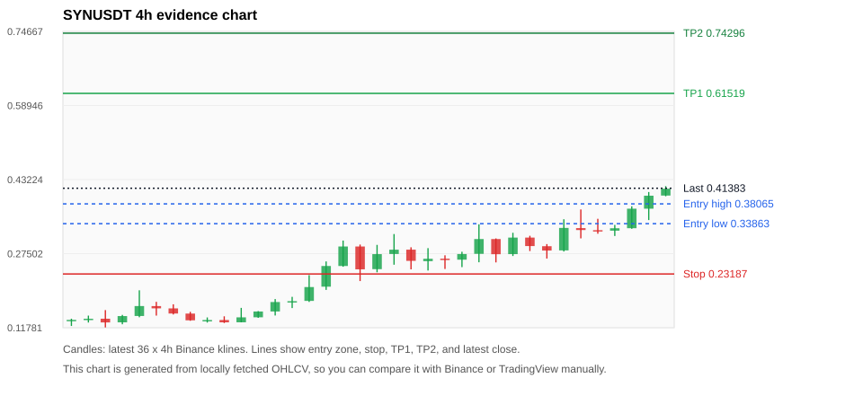
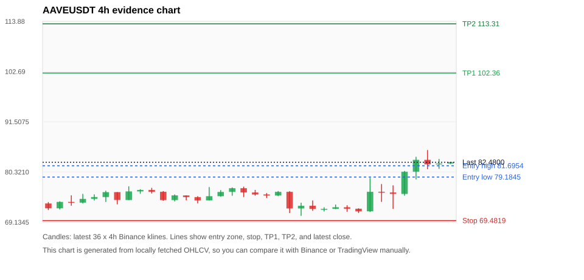
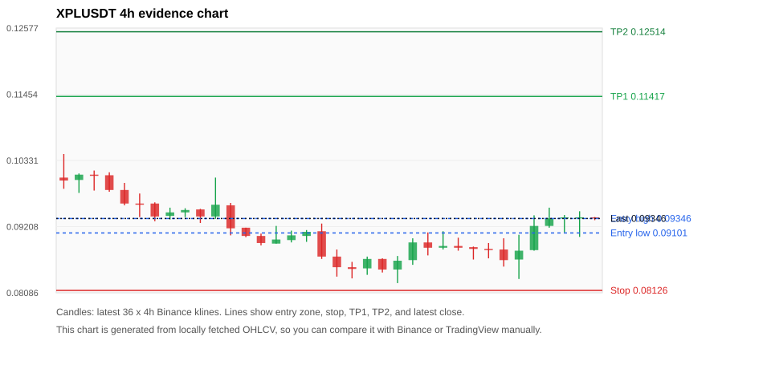
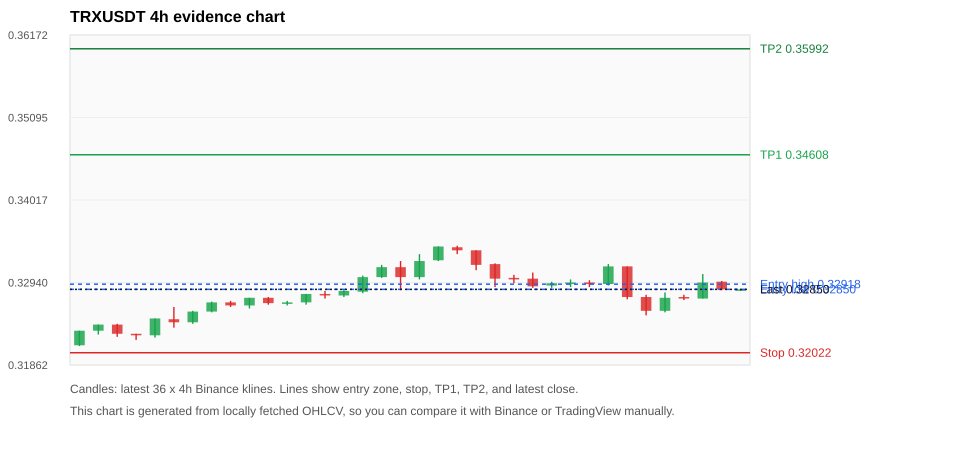
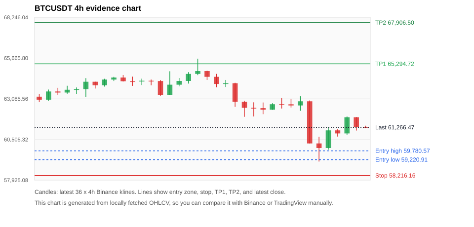

# Crypto 市场扫描报告 v1

- 报告时间：2026-06-25 20:08:36 CST
- Run ID：`20260625_120503_1e908d5a`
- Run type：`daily_full`
- 数据来源：SQLite
- 报告版本：v1
- 扫描 ID：71e06c148da7
- 数据源：Binance public spot API + CoinGecko/CoinMarketCap cross-check
- 过滤条件：USDT spot; 24h quote volume >= 30,000,000; trades >= 30,000; exclude stables/leveraged tokens; analyze 1h/4h/1d klines
- 默认单笔风险：账户权益的 1.00%

## 限制说明

- 交易信号仍以 Binance 现货公开 K 线为主源；外部数据源用于一致性复核。
- 结果是研究和模拟盘计划，不是确定收益或实盘下单指令。
- 历史长度过滤：候选币至少需要 180 根 1d K 线。
- 数据质量验证池：先验证 score 排名前 min(top_n * 2, 10) 的候选，再按 action + score 补足最终名单。
- 大盘环境过滤：RISK_OFF; BTC/ETH 大盘偏弱，山寨币买入候选降级为观察。 BTC 7d=-2.6735914937590977; ETH 7d=-4.599938051907815.
- 已启用数据交叉验证：Binance 主源 + CoinGecko 自动对照；CoinMarketCap 在配置 API Key 后自动对照。
- SYNUSDT 交叉验证状态 DATA_WARNING：At least one external provider needs manual review.
- XPLUSDT 交叉验证状态 DATA_WARNING：At least one external provider needs manual review.
- BTCUSDT 交叉验证状态 DATA_WARNING：At least one external provider needs manual review.
- SUIUSDT 交叉验证状态 DATA_WARNING：At least one external provider needs manual review.
- BNBUSDT 交叉验证状态 DATA_WARNING：At least one external provider needs manual review.
- ETHUSDT 交叉验证状态 DATA_WARNING：At least one external provider needs manual review.
- ADAUSDT 交叉验证状态 DATA_WARNING：At least one external provider needs manual review.
- SOLUSDT 交叉验证状态 DATA_WARNING：At least one external provider needs manual review.

## 5 个候选交易计划

| Rank | Coin | Action | Setup | Entry Zone | Stop Loss | TP1 | TP2 / Exit Rule | R/R | Verdict |
|---:|---|---|---|---:|---:|---:|---|---:|---|
| 1 | `SYN` | `WATCH_ONLY` | 涨幅较远，只等深回调 | 0.33863 - 0.38065 | 0.23187 | 0.61519 | 0.74296 或跌破 4h 关键支撑 | 2.00-3.00 | 只等回调 |
| 2 | `AAVE` | `WATCH_ONLY` | 趋势中，等回调入场 | 79.1845 - 81.6954 | 69.4819 | 102.36 | 113.31 或跌破 4h 关键支撑 | 2.00-3.00 | 只等回调 |
| 3 | `XPL` | `WATCH_ONLY` | 回踩支撑/4h EMA 附近 | 0.09101 - 0.09346 | 0.08126 | 0.11417 | 0.12514 或跌破 4h 关键支撑 | 2.00-3.00 | 只等回调 |
| 4 | `TRX` | `WATCH_ONLY` | 回踩支撑/4h EMA 附近 | 0.32850 - 0.32918 | 0.32022 | 0.34608 | 0.35992 或跌破 4h 关键支撑 | 2.00-3.61 | 只观察 |
| 5 | `BTC` | `REJECT` | 回踩支撑/4h EMA 附近 | 59,220.91 - 59,780.57 | 58,216.16 | 65,294.72 | 67,906.50 或跌破 4h 关键支撑 | 4.51-6.54 | 只观察 |

## 数据交叉验证摘要

价格差异以 Binance 当前价为基准；成交量口径不同，Binance 是 USDT 现货成交额，CoinGecko/CoinMarketCap 通常是全市场成交量。

| Rank | Coin | Data Status | Max Price Diff | Max 24h Diff | Message |
|---:|---|---|---:|---:|---|
| 1 | `SYN` | DATA_WARNING | 1.63% | 1.68 pts | At least one external provider needs manual review. |
| 2 | `AAVE` | DATA_OK | 0.43% | 0.27 pts | External provider checks agree with Binance within configured thresholds. |
| 3 | `XPL` | DATA_WARNING | 0.14% | 0.36 pts | At least one external provider needs manual review. |
| 4 | `TRX` | DATA_OK | 0.18% | 0.11 pts | External provider checks agree with Binance within configured thresholds. |
| 5 | `BTC` | DATA_WARNING | 0.15% | 0.08 pts | At least one external provider needs manual review. |

## 候选币说明

### 1. SYN `SYNUSDT`



- 入选原因：涨幅较远，只等深回调；24h +45.90%，7d +260.17%，4h RSI 76.19，24h 成交额 $34.8M。
- 交易失效条件：跌破 0.231869 或 4h 收盘重新失守关键支撑。
- 主要风险：距离支撑偏远，不能追市价；4h RSI 偏热；24h 振幅较大，回撤风险高；BTC/ETH 大盘环境未确认强势，山寨币买入信号降级；数据交叉验证需要人工复核。
- 数据交叉验证：DATA_WARNING；At least one external provider needs manual review.

#### 可点击人工验证

- [Binance 交易页](https://www.binance.com/en/trade/SYN_USDT)
- [TradingView 图表](https://www.tradingview.com/chart/?symbol=BINANCE%3ASYNUSDT)
- [CoinGecko 搜索](https://www.coingecko.com/en/search?query=SYN)
- [CoinMarketCap 搜索](https://coinmarketcap.com/search/?q=SYN)

#### 多数据源对照

| Source | Status | Asset ID | Price | 24h Change | 24h Volume | Price Diff | 24h Diff | Updated | Message |
|---|---|---|---:|---:|---:|---:|---:|---|---|
| Binance | DATA_OK | SYNUSDT | 0.41383 | +45.90% | $34.8M | 0.00% | 0.00 pts | 2026-06-25T12:07:33+00:00 | Primary market data source used by scanner. |
| CoinGecko | DATA_WARNING | synapse-2 | 0.40709 | +44.22% | $134.0M | 1.63% | 1.68 pts | 2026-06-25T12:07:27.929Z | price diff 1.63% exceeds warning threshold |
| CoinMarketCap | DATA_WARNING | 12147 | 0.41274 | +45.22% | $131.9M | 0.26% | 0.68 pts | 2026-06-25T12:06:03.000Z | CoinMarketCap symbol mapping has 4 matches; selected lowest cmc_rank |

#### 指标证据

| 指标 | 数值 | 人工核对用途 |
|---|---:|---|
| 当前价 | 0.41383 | 与 Binance/TradingView 当前价格对照 |
| 24h 涨跌 | +45.90% | 与交易所 24h 涨跌对照 |
| 7d 涨跌 | +260.17% | 判断短线趋势是否延续 |
| 4h EMA20 | 0.30455 | 判断短期趋势支撑 |
| 4h EMA50 | 0.22384 | 判断中期趋势支撑 |
| 1d EMA20 | 0.16153 | 判断日线趋势 |
| 1d EMA50 | 0.10044 | 判断日线趋势 |
| 4h RSI14 | 76.19 | 判断是否过热/过弱 |
| 4h ATR14 | 0.04424 | 推导止损和入场缓冲 |
| 最近 18 根 4h 最低点 | 0.23540 | 支撑/止损参考 |
| 最近 36 根 4h 最高点 | 0.41830 | TP/压力参考 |
| 支撑位 | 0.30455 | 入场区间推导基础 |

#### 交易计划推导

- 支撑位 = 最近低点、4h EMA20、4h EMA50、1d EMA20 中不高于当前价的最高有效支撑 = `0.30455`。
- 入场区间 = 支撑位附近 + ATR 缓冲 = `0.33863 - 0.38065`。
- 止损 = min(最近 18 根 4h 最低点 * 0.985, 入场中位价 - 1.15 * ATR14) = `0.23187`。
- TP1 = max(最近 36 根 4h 最高点 * 0.995, 入场中位价 + 2R) = `0.61519`。
- TP2 = max(入场中位价 + 3R, TP1 * 1.04) = `0.74296`。

#### 最近 10 根 4h K线

| UTC 开盘时间 | Open | High | Low | Close | Quote Volume | Trades |
|---|---:|---:|---:|---:|---:|---:|
| 2026-06-24T00:00+00:00 | 0.27400 | 0.31930 | 0.27000 | 0.30910 | $4.5M | 54081 |
| 2026-06-24T04:00+00:00 | 0.30910 | 0.31290 | 0.28050 | 0.29110 | $3.2M | 31993 |
| 2026-06-24T08:00+00:00 | 0.29080 | 0.29530 | 0.26460 | 0.28160 | $2.3M | 22230 |
| 2026-06-24T12:00+00:00 | 0.28190 | 0.34800 | 0.27950 | 0.32960 | $8.9M | 77675 |
| 2026-06-24T16:00+00:00 | 0.32920 | 0.36880 | 0.30740 | 0.32510 | $6.5M | 60897 |
| 2026-06-24T20:00+00:00 | 0.32480 | 0.34900 | 0.31730 | 0.32370 | $3.2M | 37276 |
| 2026-06-25T00:00+00:00 | 0.32380 | 0.33600 | 0.31250 | 0.32890 | $2.4M | 23632 |
| 2026-06-25T04:00+00:00 | 0.32900 | 0.37554 | 0.32780 | 0.37042 | $6.1M | 56173 |
| 2026-06-25T08:00+00:00 | 0.37042 | 0.40580 | 0.34629 | 0.39802 | $7.5M | 64352 |
| 2026-06-25T12:00+00:00 | 0.39830 | 0.41830 | 0.39675 | 0.41281 | $436,803 | 3701 |

### 2. AAVE `AAVEUSDT`



- 入选原因：趋势中，等回调入场；24h +8.24%，7d +12.51%，4h RSI 81.34，24h 成交额 $46.0M。
- 交易失效条件：跌破 69.4819 或 4h 收盘重新失守关键支撑。
- 主要风险：4h RSI 偏热；成交量突增，可能是事件驱动；日线趋势未完全确认；BTC/ETH 大盘环境未确认强势，山寨币买入信号降级。
- 数据交叉验证：DATA_OK；External provider checks agree with Binance within configured thresholds.

#### 可点击人工验证

- [Binance 交易页](https://www.binance.com/en/trade/AAVE_USDT)
- [TradingView 图表](https://www.tradingview.com/chart/?symbol=BINANCE%3AAAVEUSDT)
- [CoinGecko 搜索](https://www.coingecko.com/en/search?query=AAVE)
- [CoinMarketCap 搜索](https://coinmarketcap.com/search/?q=AAVE)

#### 多数据源对照

| Source | Status | Asset ID | Price | 24h Change | 24h Volume | Price Diff | 24h Diff | Updated | Message |
|---|---|---|---:|---:|---:|---:|---:|---|---|
| Binance | DATA_OK | AAVEUSDT | 82.4800 | +8.24% | $46.0M | 0.00% | 0.00 pts | 2026-06-25T12:07:33+00:00 | Primary market data source used by scanner. |
| CoinGecko | DATA_OK | aave | 82.1800 | +8.04% | $479.5M | 0.36% | 0.21 pts | 2026-06-25T12:07:47.143Z | External source agrees with Binance within thresholds. |
| CoinMarketCap | DATA_OK | 7278 | 82.1239 | +7.97% | $478.9M | 0.43% | 0.27 pts | 2026-06-25T12:06:03.000Z | External source agrees with Binance within thresholds. |

#### 指标证据

| 指标 | 数值 | 人工核对用途 |
|---|---:|---|
| 当前价 | 82.4800 | 与 Binance/TradingView 当前价格对照 |
| 24h 涨跌 | +8.24% | 与交易所 24h 涨跌对照 |
| 7d 涨跌 | +12.51% | 判断短线趋势是否延续 |
| 4h EMA20 | 77.2521 | 判断短期趋势支撑 |
| 4h EMA50 | 74.8415 | 判断中期趋势支撑 |
| 1d EMA20 | 74.5700 | 判断日线趋势 |
| 1d EMA50 | 79.4927 | 判断日线趋势 |
| 4h RSI14 | 81.34 | 判断是否过热/过弱 |
| 4h ATR14 | 3.1386 | 推导止损和入场缓冲 |
| 最近 18 根 4h 最低点 | 70.5400 | 支撑/止损参考 |
| 最近 36 根 4h 最高点 | 85.2100 | TP/压力参考 |
| 支撑位 | 77.2521 | 入场区间推导基础 |

#### 交易计划推导

- 支撑位 = 最近低点、4h EMA20、4h EMA50、1d EMA20 中不高于当前价的最高有效支撑 = `77.2521`。
- 入场区间 = 支撑位附近 + ATR 缓冲 = `79.1845 - 81.6954`。
- 止损 = min(最近 18 根 4h 最低点 * 0.985, 入场中位价 - 1.15 * ATR14) = `69.4819`。
- TP1 = max(最近 36 根 4h 最高点 * 0.995, 入场中位价 + 2R) = `102.36`。
- TP2 = max(入场中位价 + 3R, TP1 * 1.04) = `113.31`。

#### 最近 10 根 4h K线

| UTC 开盘时间 | Open | High | Low | Close | Quote Volume | Trades |
|---|---:|---:|---:|---:|---:|---:|
| 2026-06-24T00:00+00:00 | 72.4600 | 72.9100 | 71.4600 | 72.1300 | $1.5M | 18805 |
| 2026-06-24T04:00+00:00 | 72.1300 | 72.2200 | 71.1700 | 71.5500 | $1.3M | 14827 |
| 2026-06-24T08:00+00:00 | 71.5500 | 79.0000 | 71.4100 | 75.9000 | $6.5M | 60242 |
| 2026-06-24T12:00+00:00 | 75.9100 | 77.6300 | 73.6500 | 75.7600 | $10.0M | 128675 |
| 2026-06-24T16:00+00:00 | 75.7500 | 77.3400 | 72.0900 | 75.4400 | $7.2M | 119688 |
| 2026-06-24T20:00+00:00 | 75.4300 | 80.5500 | 75.0300 | 80.3600 | $7.0M | 91780 |
| 2026-06-25T00:00+00:00 | 80.3700 | 83.7000 | 78.6600 | 83.0200 | $7.6M | 80526 |
| 2026-06-25T04:00+00:00 | 83.0200 | 85.2100 | 80.9400 | 82.0100 | $9.0M | 78549 |
| 2026-06-25T08:00+00:00 | 82.0000 | 83.2100 | 81.0200 | 82.2000 | $5.5M | 61055 |
| 2026-06-25T12:00+00:00 | 82.2000 | 82.5000 | 82.0800 | 82.5000 | $52,959 | 1189 |

### 3. XPL `XPLUSDT`



- 入选原因：回踩支撑/4h EMA 附近；24h +5.97%，7d -7.10%，4h RSI 77.65，24h 成交额 $422.7M。
- 交易失效条件：跌破 0.0812625 或 4h 收盘重新失守关键支撑。
- 主要风险：4h RSI 偏热；成交量突增，可能是事件驱动；BTC/ETH 大盘环境未确认强势，山寨币买入信号降级；7d 趋势未确认；数据交叉验证需要人工复核。
- 数据交叉验证：DATA_WARNING；At least one external provider needs manual review.

#### 可点击人工验证

- [Binance 交易页](https://www.binance.com/en/trade/XPL_USDT)
- [TradingView 图表](https://www.tradingview.com/chart/?symbol=BINANCE%3AXPLUSDT)
- [CoinGecko 搜索](https://www.coingecko.com/en/search?query=XPL)
- [CoinMarketCap 搜索](https://coinmarketcap.com/search/?q=XPL)

#### 多数据源对照

| Source | Status | Asset ID | Price | 24h Change | 24h Volume | Price Diff | 24h Diff | Updated | Message |
|---|---|---|---:|---:|---:|---:|---:|---|---|
| Binance | DATA_OK | XPLUSDT | 0.09346 | +5.97% | $422.7M | 0.00% | 0.00 pts | 2026-06-25T12:07:33+00:00 | Primary market data source used by scanner. |
| CoinGecko | DATA_WARNING | plasma | 0.09336 | +6.33% | $1.03B | 0.11% | 0.36 pts | 2026-06-25T12:07:45.028Z | CoinGecko symbol mapping has 2 exact matches; selected highest market-cap rank |
| CoinMarketCap | DATA_WARNING | 36645 | 0.09333 | +6.18% | $1.41B | 0.14% | 0.21 pts | 2026-06-25T12:07:04.000Z | CoinMarketCap symbol mapping has 3 matches; selected lowest cmc_rank |

#### 指标证据

| 指标 | 数值 | 人工核对用途 |
|---|---:|---|
| 当前价 | 0.09346 | 与 Binance/TradingView 当前价格对照 |
| 24h 涨跌 | +5.97% | 与交易所 24h 涨跌对照 |
| 7d 涨跌 | -7.10% | 判断短线趋势是否延续 |
| 4h EMA20 | 0.09076 | 判断短期趋势支撑 |
| 4h EMA50 | 0.09083 | 判断中期趋势支撑 |
| 1d EMA20 | 0.08921 | 判断日线趋势 |
| 1d EMA50 | 0.09018 | 判断日线趋势 |
| 4h RSI14 | 77.65 | 判断是否过热/过弱 |
| 4h ATR14 | 0.0037585714 | 推导止损和入场缓冲 |
| 最近 18 根 4h 最低点 | 0.08250 | 支撑/止损参考 |
| 最近 36 根 4h 最高点 | 0.10440 | TP/压力参考 |
| 支撑位 | 0.09083 | 入场区间推导基础 |

#### 交易计划推导

- 支撑位 = 最近低点、4h EMA20、4h EMA50、1d EMA20 中不高于当前价的最高有效支撑 = `0.09083`。
- 入场区间 = 支撑位附近 + ATR 缓冲 = `0.09101 - 0.09346`。
- 止损 = min(最近 18 根 4h 最低点 * 0.985, 入场中位价 - 1.15 * ATR14) = `0.08126`。
- TP1 = max(最近 36 根 4h 最高点 * 0.995, 入场中位价 + 2R) = `0.11417`。
- TP2 = max(入场中位价 + 3R, TP1 * 1.04) = `0.12514`。

#### 最近 10 根 4h K线

| UTC 开盘时间 | Open | High | Low | Close | Quote Volume | Trades |
|---|---:|---:|---:|---:|---:|---:|
| 2026-06-24T00:00+00:00 | 0.08880 | 0.09020 | 0.08800 | 0.08850 | $5.2M | 64105 |
| 2026-06-24T04:00+00:00 | 0.08860 | 0.08870 | 0.08650 | 0.08830 | $5.6M | 162838 |
| 2026-06-24T08:00+00:00 | 0.08830 | 0.08930 | 0.08670 | 0.08810 | $4.8M | 126177 |
| 2026-06-24T12:00+00:00 | 0.08820 | 0.09010 | 0.08530 | 0.08640 | $11.1M | 141294 |
| 2026-06-24T16:00+00:00 | 0.08650 | 0.09070 | 0.08320 | 0.08800 | $9.2M | 107383 |
| 2026-06-24T20:00+00:00 | 0.08810 | 0.09400 | 0.08800 | 0.09220 | $4.2M | 54121 |
| 2026-06-25T00:00+00:00 | 0.09220 | 0.09530 | 0.09190 | 0.09350 | $6.8M | 94792 |
| 2026-06-25T04:00+00:00 | 0.09350 | 0.09405 | 0.09110 | 0.09365 | $192.3M | 872099 |
| 2026-06-25T08:00+00:00 | 0.09364 | 0.09469 | 0.09034 | 0.09366 | $199.1M | 1053685 |
| 2026-06-25T12:00+00:00 | 0.09366 | 0.09370 | 0.09318 | 0.09346 | $101,074 | 1244 |

### 4. TRX `TRXUSDT`



- 入选原因：回踩支撑/4h EMA 附近；24h -0.81%，7d +2.66%，4h RSI 40.12，24h 成交额 $62.2M。
- 交易失效条件：跌破 0.3202235 或 4h 收盘重新失守关键支撑。
- 主要风险：BTC/ETH 大盘环境未确认强势，山寨币买入信号降级；24h 动量未确认。
- 数据交叉验证：DATA_OK；External provider checks agree with Binance within configured thresholds.

#### 可点击人工验证

- [Binance 交易页](https://www.binance.com/en/trade/TRX_USDT)
- [TradingView 图表](https://www.tradingview.com/chart/?symbol=BINANCE%3ATRXUSDT)
- [CoinGecko 搜索](https://www.coingecko.com/en/search?query=TRX)
- [CoinMarketCap 搜索](https://coinmarketcap.com/search/?q=TRX)

#### 多数据源对照

| Source | Status | Asset ID | Price | 24h Change | 24h Volume | Price Diff | 24h Diff | Updated | Message |
|---|---|---|---:|---:|---:|---:|---:|---|---|
| Binance | DATA_OK | TRXUSDT | 0.32850 | -0.81% | $62.2M | 0.00% | 0.00 pts | 2026-06-25T12:07:33+00:00 | Primary market data source used by scanner. |
| CoinGecko | DATA_OK | tron | 0.32792 | -0.92% | $792.1M | 0.18% | 0.11 pts | 2026-06-25T12:07:46.932Z | External source agrees with Binance within thresholds. |
| CoinMarketCap | DATA_OK | 1958 | 0.32790 | -0.93% | $952.1M | 0.18% | 0.11 pts | 2026-06-25T12:07:04.000Z | External source agrees with Binance within thresholds. |

#### 指标证据

| 指标 | 数值 | 人工核对用途 |
|---|---:|---|
| 当前价 | 0.32850 | 与 Binance/TradingView 当前价格对照 |
| 24h 涨跌 | -0.81% | 与交易所 24h 涨跌对照 |
| 7d 涨跌 | +2.66% | 判断短线趋势是否延续 |
| 4h EMA20 | 0.32854 | 判断短期趋势支撑 |
| 4h EMA50 | 0.32658 | 判断中期趋势支撑 |
| 1d EMA20 | 0.32785 | 判断日线趋势 |
| 1d EMA50 | 0.33198 | 判断日线趋势 |
| 4h RSI14 | 40.12 | 判断是否过热/过弱 |
| 4h ATR14 | 0.0019 | 推导止损和入场缓冲 |
| 最近 18 根 4h 最低点 | 0.32510 | 支撑/止损参考 |
| 最近 36 根 4h 最高点 | 0.33420 | TP/压力参考 |
| 支撑位 | 0.32785 | 入场区间推导基础 |

#### 交易计划推导

- 支撑位 = 最近低点、4h EMA20、4h EMA50、1d EMA20 中不高于当前价的最高有效支撑 = `0.32785`。
- 入场区间 = 支撑位附近 + ATR 缓冲 = `0.32850 - 0.32918`。
- 止损 = min(最近 18 根 4h 最低点 * 0.985, 入场中位价 - 1.15 * ATR14) = `0.32022`。
- TP1 = max(最近 36 根 4h 最高点 * 0.995, 入场中位价 + 2R) = `0.34608`。
- TP2 = max(入场中位价 + 3R, TP1 * 1.04) = `0.35992`。

#### 最近 10 根 4h K线

| UTC 开盘时间 | Open | High | Low | Close | Quote Volume | Trades |
|---|---:|---:|---:|---:|---:|---:|
| 2026-06-24T00:00+00:00 | 0.32920 | 0.32980 | 0.32880 | 0.32940 | $3.2M | 6312 |
| 2026-06-24T04:00+00:00 | 0.32940 | 0.32970 | 0.32880 | 0.32920 | $2.6M | 7613 |
| 2026-06-24T08:00+00:00 | 0.32920 | 0.33180 | 0.32900 | 0.33150 | $7.1M | 14703 |
| 2026-06-24T12:00+00:00 | 0.33150 | 0.33150 | 0.32720 | 0.32750 | $11.3M | 24187 |
| 2026-06-24T16:00+00:00 | 0.32750 | 0.32780 | 0.32510 | 0.32570 | $14.7M | 36057 |
| 2026-06-24T20:00+00:00 | 0.32570 | 0.32810 | 0.32550 | 0.32740 | $15.9M | 48562 |
| 2026-06-25T00:00+00:00 | 0.32750 | 0.32780 | 0.32710 | 0.32740 | $5.9M | 23466 |
| 2026-06-25T04:00+00:00 | 0.32730 | 0.33050 | 0.32730 | 0.32940 | $9.2M | 17041 |
| 2026-06-25T08:00+00:00 | 0.32950 | 0.32960 | 0.32840 | 0.32850 | $5.0M | 11486 |
| 2026-06-25T12:00+00:00 | 0.32840 | 0.32850 | 0.32830 | 0.32850 | $261,757 | 419 |

### 5. BTC `BTCUSDT`



- 入选原因：回踩支撑/4h EMA 附近；24h -2.65%，7d -4.25%，4h RSI 38.65，24h 成交额 $1.90B。
- 交易失效条件：跌破 58216.159 或 4h 收盘重新失守关键支撑。
- 主要风险：日线趋势未完全确认；BTC/ETH 大盘环境未确认强势，山寨币买入信号降级；24h 动量未确认；7d 趋势未确认；数据交叉验证需要人工复核。
- 数据交叉验证：DATA_WARNING；At least one external provider needs manual review.

#### 可点击人工验证

- [Binance 交易页](https://www.binance.com/en/trade/BTC_USDT)
- [TradingView 图表](https://www.tradingview.com/chart/?symbol=BINANCE%3ABTCUSDT)
- [CoinGecko 搜索](https://www.coingecko.com/en/search?query=BTC)
- [CoinMarketCap 搜索](https://coinmarketcap.com/search/?q=BTC)

#### 多数据源对照

| Source | Status | Asset ID | Price | 24h Change | 24h Volume | Price Diff | 24h Diff | Updated | Message |
|---|---|---|---:|---:|---:|---:|---:|---|---|
| Binance | DATA_OK | BTCUSDT | 61,266.47 | -2.65% | $1.90B | 0.00% | 0.00 pts | 2026-06-25T12:07:33+00:00 | Primary market data source used by scanner. |
| CoinGecko | DATA_OK | bitcoin | 61,174.00 | -2.57% | $44.49B | 0.15% | 0.08 pts | 2026-06-25T12:07:32.174Z | External source agrees with Binance within thresholds. |
| CoinMarketCap | DATA_WARNING | 1 | 61,177.27 | -2.65% | $44.65B | 0.15% | 0.00 pts | 2026-06-25T12:07:04.000Z | CoinMarketCap symbol mapping has 13 matches; selected lowest cmc_rank |

#### 指标证据

| 指标 | 数值 | 人工核对用途 |
|---|---:|---|
| 当前价 | 61,266.47 | 与 Binance/TradingView 当前价格对照 |
| 24h 涨跌 | -2.65% | 与交易所 24h 涨跌对照 |
| 7d 涨跌 | -4.25% | 判断短线趋势是否延续 |
| 4h EMA20 | 62,173.79 | 判断短期趋势支撑 |
| 4h EMA50 | 63,011.95 | 判断中期趋势支撑 |
| 1d EMA20 | 64,388.49 | 判断日线趋势 |
| 1d EMA50 | 68,264.55 | 判断日线趋势 |
| 4h RSI14 | 38.65 | 判断是否过热/过弱 |
| 4h ATR14 | 968.39 | 推导止损和入场缓冲 |
| 最近 18 根 4h 最低点 | 59,102.70 | 支撑/止损参考 |
| 最近 36 根 4h 最高点 | 65,622.83 | TP/压力参考 |
| 支撑位 | 59,102.70 | 入场区间推导基础 |

#### 交易计划推导

- 支撑位 = 最近低点、4h EMA20、4h EMA50、1d EMA20 中不高于当前价的最高有效支撑 = `59,102.70`。
- 入场区间 = 支撑位附近 + ATR 缓冲 = `59,220.91 - 59,780.57`。
- 止损 = min(最近 18 根 4h 最低点 * 0.985, 入场中位价 - 1.15 * ATR14) = `58,216.16`。
- TP1 = max(最近 36 根 4h 最高点 * 0.995, 入场中位价 + 2R) = `65,294.72`。
- TP2 = max(入场中位价 + 3R, TP1 * 1.04) = `67,906.50`。

#### 最近 10 根 4h K线

| UTC 开盘时间 | Open | High | Low | Close | Quote Volume | Trades |
|---|---:|---:|---:|---:|---:|---:|
| 2026-06-24T00:00+00:00 | 62,734.57 | 63,119.45 | 62,461.87 | 62,729.78 | $173.5M | 524761 |
| 2026-06-24T04:00+00:00 | 62,729.78 | 63,073.44 | 62,525.49 | 62,657.99 | $114.5M | 343629 |
| 2026-06-24T08:00+00:00 | 62,658.00 | 63,239.06 | 62,318.88 | 62,921.19 | $145.1M | 470650 |
| 2026-06-24T12:00+00:00 | 62,921.19 | 62,973.20 | 60,249.82 | 60,250.00 | $573.7M | 1507424 |
| 2026-06-24T16:00+00:00 | 60,250.00 | 60,678.10 | 59,102.70 | 59,958.30 | $648.5M | 1716720 |
| 2026-06-24T20:00+00:00 | 59,958.30 | 61,276.00 | 59,854.00 | 61,077.99 | $216.6M | 804347 |
| 2026-06-25T00:00+00:00 | 61,078.00 | 61,163.16 | 60,684.94 | 60,883.65 | $148.6M | 488365 |
| 2026-06-25T04:00+00:00 | 60,883.66 | 61,962.40 | 60,792.00 | 61,911.04 | $199.3M | 585612 |
| 2026-06-25T08:00+00:00 | 61,911.03 | 61,920.00 | 61,066.00 | 61,282.01 | $120.4M | 397068 |
| 2026-06-25T12:00+00:00 | 61,282.00 | 61,372.00 | 61,227.79 | 61,266.47 | $2.9M | 15352 |

## 组合风控

- 不要 5 个候选全部满仓买入。
- 同时持仓总风险建议控制在账户权益的 3% - 5% 以内。
- 如果 BTC/ETH 同时破位，暂停山寨币多头计划或降低仓位。
- 第一版报告用于模拟盘和人工复核，不自动下单。

## 原始数据

```json
[
  {
    "rank": 1,
    "symbol": "SYNUSDT",
    "base_asset": "SYN",
    "price": 0.41383,
    "score": 52.98592337274839,
    "setup": "涨幅较远，只等深回调",
    "verdict": "只等回调",
    "entry_low": 0.3386292857142857,
    "entry_high": 0.38065321428571425,
    "stop_loss": 0.231869,
    "take_profit_1": 0.61518575,
    "take_profit_2": 0.7429579999999999,
    "risk_reward_1": 2.0000000000000004,
    "risk_reward_2": 3.0,
    "pct_24h": 45.895,
    "pct_3d": 82.22369000440335,
    "pct_7d": 260.1653611836379,
    "quote_volume_24h": 34833025.346477,
    "trades_24h": 322152,
    "high_low_range_24h": 49.606580829756794,
    "rsi_1h": 82.98918387413963,
    "rsi_4h": 76.18963756119898,
    "ema20_4h": 0.30454886519043495,
    "ema50_4h": 0.22384141847883995,
    "ema20_1d": 0.16153131936316242,
    "ema50_1d": 0.1004373251123002,
    "atr_4h": 0.04423571428571428,
    "macd_hist_4h": 0.006878459530613362,
    "volume_ratio_24h": 1.340472691628213,
    "support_level": 0.30454886519043495,
    "recent_low_4h_18": 0.2354,
    "recent_high_4h_36": 0.4183,
    "distance_to_support_pct": 35.882955840676445,
    "binance_trade_url": "https://www.binance.com/en/trade/SYN_USDT",
    "tradingview_url": "https://www.tradingview.com/chart/?symbol=BINANCE%3ASYNUSDT",
    "coingecko_search_url": "https://www.coingecko.com/en/search?query=SYN",
    "coinmarketcap_search_url": "https://coinmarketcap.com/search/?q=SYN",
    "invalidation": "跌破 0.231869 或 4h 收盘重新失守关键支撑",
    "recent_4h_klines": [
      {
        "open_time_utc": "2026-06-19T16:00+00:00",
        "open": 0.1323,
        "high": 0.1369,
        "low": 0.1215,
        "close": 0.1344,
        "quote_volume": 1617861.44809,
        "trades": 16527
      },
      {
        "open_time_utc": "2026-06-19T20:00+00:00",
        "open": 0.1344,
        "high": 0.1435,
        "low": 0.1288,
        "close": 0.1368,
        "quote_volume": 1172143.1241,
        "trades": 11063
      },
      {
        "open_time_utc": "2026-06-20T00:00+00:00",
        "open": 0.1369,
        "high": 0.1552,
        "low": 0.1184,
        "close": 0.129,
        "quote_volume": 2593247.50141,
        "trades": 30712
      },
      {
        "open_time_utc": "2026-06-20T04:00+00:00",
        "open": 0.1292,
        "high": 0.145,
        "low": 0.1251,
        "close": 0.1425,
        "quote_volume": 1176313.46066,
        "trades": 13911
      },
      {
        "open_time_utc": "2026-06-20T08:00+00:00",
        "open": 0.1427,
        "high": 0.1972,
        "low": 0.14,
        "close": 0.1638,
        "quote_volume": 4536695.50606,
        "trades": 63164
      },
      {
        "open_time_utc": "2026-06-20T12:00+00:00",
        "open": 0.1637,
        "high": 0.1727,
        "low": 0.1435,
        "close": 0.1589,
        "quote_volume": 3507774.64686,
        "trades": 37667
      },
      {
        "open_time_utc": "2026-06-20T16:00+00:00",
        "open": 0.1588,
        "high": 0.1675,
        "low": 0.1459,
        "close": 0.1479,
        "quote_volume": 1958160.11592,
        "trades": 23197
      },
      {
        "open_time_utc": "2026-06-20T20:00+00:00",
        "open": 0.1478,
        "high": 0.1515,
        "low": 0.1325,
        "close": 0.1335,
        "quote_volume": 1105152.7222,
        "trades": 19462
      },
      {
        "open_time_utc": "2026-06-21T00:00+00:00",
        "open": 0.1336,
        "high": 0.1396,
        "low": 0.1287,
        "close": 0.1341,
        "quote_volume": 890743.27625,
        "trades": 11728
      },
      {
        "open_time_utc": "2026-06-21T04:00+00:00",
        "open": 0.1341,
        "high": 0.142,
        "low": 0.1278,
        "close": 0.1292,
        "quote_volume": 1231990.16518,
        "trades": 12014
      },
      {
        "open_time_utc": "2026-06-21T08:00+00:00",
        "open": 0.1293,
        "high": 0.1599,
        "low": 0.1292,
        "close": 0.1398,
        "quote_volume": 2691302.43242,
        "trades": 28476
      },
      {
        "open_time_utc": "2026-06-21T12:00+00:00",
        "open": 0.1399,
        "high": 0.153,
        "low": 0.1388,
        "close": 0.1522,
        "quote_volume": 1400309.9821,
        "trades": 20361
      },
      {
        "open_time_utc": "2026-06-21T16:00+00:00",
        "open": 0.1523,
        "high": 0.1786,
        "low": 0.1437,
        "close": 0.1723,
        "quote_volume": 3479973.88674,
        "trades": 35889
      },
      {
        "open_time_utc": "2026-06-21T20:00+00:00",
        "open": 0.1724,
        "high": 0.1833,
        "low": 0.1595,
        "close": 0.1741,
        "quote_volume": 3716331.81342,
        "trades": 32177
      },
      {
        "open_time_utc": "2026-06-22T00:00+00:00",
        "open": 0.1747,
        "high": 0.2294,
        "low": 0.1725,
        "close": 0.2041,
        "quote_volume": 5508590.86882,
        "trades": 49179
      },
      {
        "open_time_utc": "2026-06-22T04:00+00:00",
        "open": 0.2049,
        "high": 0.2585,
        "low": 0.1981,
        "close": 0.2488,
        "quote_volume": 6260478.36969,
        "trades": 54315
      },
      {
        "open_time_utc": "2026-06-22T08:00+00:00",
        "open": 0.2488,
        "high": 0.3028,
        "low": 0.2472,
        "close": 0.2902,
        "quote_volume": 13905911.01112,
        "trades": 95460
      },
      {
        "open_time_utc": "2026-06-22T12:00+00:00",
        "open": 0.2902,
        "high": 0.2943,
        "low": 0.2168,
        "close": 0.2417,
        "quote_volume": 11490157.0992,
        "trades": 88177
      },
      {
        "open_time_utc": "2026-06-22T16:00+00:00",
        "open": 0.2421,
        "high": 0.2936,
        "low": 0.2354,
        "close": 0.274,
        "quote_volume": 9869800.15878,
        "trades": 86821
      },
      {
        "open_time_utc": "2026-06-22T20:00+00:00",
        "open": 0.2743,
        "high": 0.3166,
        "low": 0.2515,
        "close": 0.2834,
        "quote_volume": 5197794.62479,
        "trades": 48391
      },
      {
        "open_time_utc": "2026-06-23T00:00+00:00",
        "open": 0.2835,
        "high": 0.2885,
        "low": 0.2417,
        "close": 0.2597,
        "quote_volume": 5573598.16742,
        "trades": 50156
      },
      {
        "open_time_utc": "2026-06-23T04:00+00:00",
        "open": 0.2591,
        "high": 0.2867,
        "low": 0.2392,
        "close": 0.2641,
        "quote_volume": 5287794.35255,
        "trades": 46139
      },
      {
        "open_time_utc": "2026-06-23T08:00+00:00",
        "open": 0.2643,
        "high": 0.2715,
        "low": 0.2425,
        "close": 0.2621,
        "quote_volume": 3223687.31523,
        "trades": 33911
      },
      {
        "open_time_utc": "2026-06-23T12:00+00:00",
        "open": 0.2622,
        "high": 0.279,
        "low": 0.2464,
        "close": 0.2742,
        "quote_volume": 4101960.58671,
        "trades": 40423
      },
      {
        "open_time_utc": "2026-06-23T16:00+00:00",
        "open": 0.2746,
        "high": 0.3372,
        "low": 0.2567,
        "close": 0.306,
        "quote_volume": 8632979.02224,
        "trades": 71128
      },
      {
        "open_time_utc": "2026-06-23T20:00+00:00",
        "open": 0.306,
        "high": 0.3073,
        "low": 0.2564,
        "close": 0.2738,
        "quote_volume": 2993431.1673,
        "trades": 37128
      },
      {
        "open_time_utc": "2026-06-24T00:00+00:00",
        "open": 0.274,
        "high": 0.3193,
        "low": 0.27,
        "close": 0.3091,
        "quote_volume": 4527446.11932,
        "trades": 54081
      },
      {
        "open_time_utc": "2026-06-24T04:00+00:00",
        "open": 0.3091,
        "high": 0.3129,
        "low": 0.2805,
        "close": 0.2911,
        "quote_volume": 3161324.03832,
        "trades": 31993
      },
      {
        "open_time_utc": "2026-06-24T08:00+00:00",
        "open": 0.2908,
        "high": 0.2953,
        "low": 0.2646,
        "close": 0.2816,
        "quote_volume": 2299240.77942,
        "trades": 22230
      },
      {
        "open_time_utc": "2026-06-24T12:00+00:00",
        "open": 0.2819,
        "high": 0.348,
        "low": 0.2795,
        "close": 0.3296,
        "quote_volume": 8862131.56928,
        "trades": 77675
      },
      {
        "open_time_utc": "2026-06-24T16:00+00:00",
        "open": 0.3292,
        "high": 0.3688,
        "low": 0.3074,
        "close": 0.3251,
        "quote_volume": 6458203.56546,
        "trades": 60897
      },
      {
        "open_time_utc": "2026-06-24T20:00+00:00",
        "open": 0.3248,
        "high": 0.349,
        "low": 0.3173,
        "close": 0.3237,
        "quote_volume": 3243660.00243,
        "trades": 37276
      },
      {
        "open_time_utc": "2026-06-25T00:00+00:00",
        "open": 0.3238,
        "high": 0.336,
        "low": 0.3125,
        "close": 0.3289,
        "quote_volume": 2354763.76737,
        "trades": 23632
      },
      {
        "open_time_utc": "2026-06-25T04:00+00:00",
        "open": 0.329,
        "high": 0.37554,
        "low": 0.3278,
        "close": 0.37042,
        "quote_volume": 6100199.881582,
        "trades": 56173
      },
      {
        "open_time_utc": "2026-06-25T08:00+00:00",
        "open": 0.37042,
        "high": 0.4058,
        "low": 0.34629,
        "close": 0.39802,
        "quote_volume": 7513268.736133,
        "trades": 64352
      },
      {
        "open_time_utc": "2026-06-25T12:00+00:00",
        "open": 0.3983,
        "high": 0.4183,
        "low": 0.39675,
        "close": 0.41281,
        "quote_volume": 436803.384931,
        "trades": 3701
      }
    ],
    "risks": [
      "距离支撑偏远，不能追市价",
      "4h RSI 偏热",
      "24h 振幅较大，回撤风险高",
      "BTC/ETH 大盘环境未确认强势，山寨币买入信号降级",
      "数据交叉验证需要人工复核"
    ],
    "data_quality_status": "DATA_WARNING",
    "data_quality_message": "At least one external provider needs manual review.",
    "data_checks": [
      {
        "provider": "Binance",
        "status": "DATA_OK",
        "provider_asset_id": "SYNUSDT",
        "provider_symbol": "SYNUSDT",
        "price_usd": 0.41383,
        "pct_24h": 45.895,
        "volume_24h": 34833025.346477,
        "last_updated": null,
        "fetched_at_utc": "2026-06-25T12:07:33+00:00",
        "price_diff_pct": 0.0,
        "pct_24h_diff": 0.0,
        "volume_note": "Binance USDT spot 24h quoteVolume.",
        "message": "Primary market data source used by scanner."
      },
      {
        "provider": "CoinGecko",
        "status": "DATA_WARNING",
        "provider_asset_id": "synapse-2",
        "provider_symbol": "SYN",
        "price_usd": 0.407093,
        "pct_24h": 44.21588,
        "volume_24h": 134005662.0,
        "last_updated": "2026-06-25T12:07:27.929Z",
        "fetched_at_utc": "2026-06-25T12:07:33+00:00",
        "price_diff_pct": 1.627963173283714,
        "pct_24h_diff": 1.6791200000000046,
        "volume_note": "CoinGecko total market volume; not the same venue scope as Binance quoteVolume.",
        "message": "price diff 1.63% exceeds warning threshold"
      },
      {
        "provider": "CoinMarketCap",
        "status": "DATA_WARNING",
        "provider_asset_id": "12147",
        "provider_symbol": "SYN",
        "price_usd": 0.4127365663823448,
        "pct_24h": 45.21586029,
        "volume_24h": 131889919.69595772,
        "last_updated": "2026-06-25T12:06:03.000Z",
        "fetched_at_utc": "2026-06-25T12:07:33+00:00",
        "price_diff_pct": 0.2642228977249551,
        "pct_24h_diff": 0.6791397100000012,
        "volume_note": "CoinMarketCap total market volume; not the same venue scope as Binance quoteVolume.",
        "message": "CoinMarketCap symbol mapping has 4 matches; selected lowest cmc_rank"
      }
    ],
    "action": "WATCH_ONLY"
  },
  {
    "rank": 2,
    "symbol": "AAVEUSDT",
    "base_asset": "AAVE",
    "price": 82.48,
    "score": 31.64437684895232,
    "setup": "趋势中，等回调入场",
    "verdict": "只等回调",
    "entry_low": 79.1845,
    "entry_high": 81.69535714285715,
    "stop_loss": 69.48190000000001,
    "take_profit_1": 102.35598571428568,
    "take_profit_2": 113.31401428571424,
    "risk_reward_1": 2.0,
    "risk_reward_2": 3.0,
    "pct_24h": 8.245,
    "pct_3d": 7.493809461748979,
    "pct_7d": 12.508525439912699,
    "quote_volume_24h": 46016968.76616,
    "trades_24h": 557579,
    "high_low_range_24h": 18.199472881120805,
    "rsi_1h": 63.91162029459904,
    "rsi_4h": 81.33738601823711,
    "ema20_4h": 77.25207043521111,
    "ema50_4h": 74.84146869216087,
    "ema20_1d": 74.57003797438597,
    "ema50_1d": 79.49265162011676,
    "atr_4h": 3.1385714285714266,
    "macd_hist_4h": 1.008666522805748,
    "volume_ratio_24h": 4.006512875949072,
    "support_level": 77.25207043521111,
    "recent_low_4h_18": 70.54,
    "recent_high_4h_36": 85.21,
    "distance_to_support_pct": 6.767364984959712,
    "binance_trade_url": "https://www.binance.com/en/trade/AAVE_USDT",
    "tradingview_url": "https://www.tradingview.com/chart/?symbol=BINANCE%3AAAVEUSDT",
    "coingecko_search_url": "https://www.coingecko.com/en/search?query=AAVE",
    "coinmarketcap_search_url": "https://coinmarketcap.com/search/?q=AAVE",
    "invalidation": "跌破 69.4819 或 4h 收盘重新失守关键支撑",
    "recent_4h_klines": [
      {
        "open_time_utc": "2026-06-19T16:00+00:00",
        "open": 73.3,
        "high": 73.62,
        "low": 71.83,
        "close": 72.22,
        "quote_volume": 707680.75869,
        "trades": 14379
      },
      {
        "open_time_utc": "2026-06-19T20:00+00:00",
        "open": 72.22,
        "high": 73.79,
        "low": 71.96,
        "close": 73.65,
        "quote_volume": 728157.98283,
        "trades": 9951
      },
      {
        "open_time_utc": "2026-06-20T00:00+00:00",
        "open": 73.65,
        "high": 75.12,
        "low": 72.81,
        "close": 73.49,
        "quote_volume": 1060306.28651,
        "trades": 20439
      },
      {
        "open_time_utc": "2026-06-20T04:00+00:00",
        "open": 73.49,
        "high": 75.44,
        "low": 73.3,
        "close": 74.32,
        "quote_volume": 865645.21743,
        "trades": 16878
      },
      {
        "open_time_utc": "2026-06-20T08:00+00:00",
        "open": 74.33,
        "high": 75.33,
        "low": 73.96,
        "close": 74.73,
        "quote_volume": 607574.02604,
        "trades": 10088
      },
      {
        "open_time_utc": "2026-06-20T12:00+00:00",
        "open": 74.73,
        "high": 76.15,
        "low": 73.64,
        "close": 75.82,
        "quote_volume": 1409748.91052,
        "trades": 23808
      },
      {
        "open_time_utc": "2026-06-20T16:00+00:00",
        "open": 75.83,
        "high": 75.83,
        "low": 73.11,
        "close": 74.08,
        "quote_volume": 1460538.95725,
        "trades": 18341
      },
      {
        "open_time_utc": "2026-06-20T20:00+00:00",
        "open": 74.07,
        "high": 77.12,
        "low": 74.06,
        "close": 75.99,
        "quote_volume": 1652887.09727,
        "trades": 20017
      },
      {
        "open_time_utc": "2026-06-21T00:00+00:00",
        "open": 75.99,
        "high": 76.48,
        "low": 75.47,
        "close": 76.31,
        "quote_volume": 1299844.62278,
        "trades": 12679
      },
      {
        "open_time_utc": "2026-06-21T04:00+00:00",
        "open": 76.31,
        "high": 76.79,
        "low": 75.52,
        "close": 75.9,
        "quote_volume": 928583.96519,
        "trades": 10320
      },
      {
        "open_time_utc": "2026-06-21T08:00+00:00",
        "open": 75.9,
        "high": 76.05,
        "low": 73.9,
        "close": 74.06,
        "quote_volume": 2097212.45361,
        "trades": 15509
      },
      {
        "open_time_utc": "2026-06-21T12:00+00:00",
        "open": 74.06,
        "high": 75.31,
        "low": 73.77,
        "close": 75.1,
        "quote_volume": 771624.76578,
        "trades": 11251
      },
      {
        "open_time_utc": "2026-06-21T16:00+00:00",
        "open": 75.09,
        "high": 75.12,
        "low": 74.0,
        "close": 74.72,
        "quote_volume": 629956.35951,
        "trades": 10358
      },
      {
        "open_time_utc": "2026-06-21T20:00+00:00",
        "open": 74.72,
        "high": 74.92,
        "low": 73.32,
        "close": 73.97,
        "quote_volume": 1146335.14948,
        "trades": 18769
      },
      {
        "open_time_utc": "2026-06-22T00:00+00:00",
        "open": 73.98,
        "high": 76.96,
        "low": 73.98,
        "close": 74.92,
        "quote_volume": 2585322.33993,
        "trades": 27761
      },
      {
        "open_time_utc": "2026-06-22T04:00+00:00",
        "open": 74.92,
        "high": 76.28,
        "low": 74.82,
        "close": 75.87,
        "quote_volume": 1045322.73093,
        "trades": 14714
      },
      {
        "open_time_utc": "2026-06-22T08:00+00:00",
        "open": 75.88,
        "high": 76.88,
        "low": 75.02,
        "close": 76.7,
        "quote_volume": 1625447.39954,
        "trades": 15894
      },
      {
        "open_time_utc": "2026-06-22T12:00+00:00",
        "open": 76.7,
        "high": 77.05,
        "low": 74.72,
        "close": 75.75,
        "quote_volume": 2601928.34421,
        "trades": 32848
      },
      {
        "open_time_utc": "2026-06-22T16:00+00:00",
        "open": 75.75,
        "high": 76.33,
        "low": 75.04,
        "close": 75.3,
        "quote_volume": 1098732.99889,
        "trades": 16897
      },
      {
        "open_time_utc": "2026-06-22T20:00+00:00",
        "open": 75.31,
        "high": 75.61,
        "low": 74.51,
        "close": 75.07,
        "quote_volume": 641613.84031,
        "trades": 12827
      },
      {
        "open_time_utc": "2026-06-23T00:00+00:00",
        "open": 75.07,
        "high": 76.07,
        "low": 74.93,
        "close": 75.89,
        "quote_volume": 1193635.78741,
        "trades": 14465
      },
      {
        "open_time_utc": "2026-06-23T04:00+00:00",
        "open": 75.89,
        "high": 76.03,
        "low": 71.16,
        "close": 72.19,
        "quote_volume": 4748275.86151,
        "trades": 32389
      },
      {
        "open_time_utc": "2026-06-23T08:00+00:00",
        "open": 72.19,
        "high": 73.47,
        "low": 70.54,
        "close": 72.78,
        "quote_volume": 3300357.86294,
        "trades": 27839
      },
      {
        "open_time_utc": "2026-06-23T12:00+00:00",
        "open": 72.79,
        "high": 73.96,
        "low": 71.67,
        "close": 72.09,
        "quote_volume": 3805559.7999,
        "trades": 42948
      },
      {
        "open_time_utc": "2026-06-23T16:00+00:00",
        "open": 72.1,
        "high": 72.45,
        "low": 71.52,
        "close": 72.1,
        "quote_volume": 1540092.95293,
        "trades": 23914
      },
      {
        "open_time_utc": "2026-06-23T20:00+00:00",
        "open": 72.1,
        "high": 73.07,
        "low": 72.04,
        "close": 72.46,
        "quote_volume": 624826.50896,
        "trades": 12061
      },
      {
        "open_time_utc": "2026-06-24T00:00+00:00",
        "open": 72.46,
        "high": 72.91,
        "low": 71.46,
        "close": 72.13,
        "quote_volume": 1497008.62115,
        "trades": 18805
      },
      {
        "open_time_utc": "2026-06-24T04:00+00:00",
        "open": 72.13,
        "high": 72.22,
        "low": 71.17,
        "close": 71.55,
        "quote_volume": 1308516.17891,
        "trades": 14827
      },
      {
        "open_time_utc": "2026-06-24T08:00+00:00",
        "open": 71.55,
        "high": 79.0,
        "low": 71.41,
        "close": 75.9,
        "quote_volume": 6451069.76375,
        "trades": 60242
      },
      {
        "open_time_utc": "2026-06-24T12:00+00:00",
        "open": 75.91,
        "high": 77.63,
        "low": 73.65,
        "close": 75.76,
        "quote_volume": 10026556.85384,
        "trades": 128675
      },
      {
        "open_time_utc": "2026-06-24T16:00+00:00",
        "open": 75.75,
        "high": 77.34,
        "low": 72.09,
        "close": 75.44,
        "quote_volume": 7224791.30503,
        "trades": 119688
      },
      {
        "open_time_utc": "2026-06-24T20:00+00:00",
        "open": 75.43,
        "high": 80.55,
        "low": 75.03,
        "close": 80.36,
        "quote_volume": 7004166.04486,
        "trades": 91780
      },
      {
        "open_time_utc": "2026-06-25T00:00+00:00",
        "open": 80.37,
        "high": 83.7,
        "low": 78.66,
        "close": 83.02,
        "quote_volume": 7585297.04452,
        "trades": 80526
      },
      {
        "open_time_utc": "2026-06-25T04:00+00:00",
        "open": 83.02,
        "high": 85.21,
        "low": 80.94,
        "close": 82.01,
        "quote_volume": 8984173.84895,
        "trades": 78549
      },
      {
        "open_time_utc": "2026-06-25T08:00+00:00",
        "open": 82.0,
        "high": 83.21,
        "low": 81.02,
        "close": 82.2,
        "quote_volume": 5508656.39321,
        "trades": 61055
      },
      {
        "open_time_utc": "2026-06-25T12:00+00:00",
        "open": 82.2,
        "high": 82.5,
        "low": 82.08,
        "close": 82.5,
        "quote_volume": 52959.01705,
        "trades": 1189
      }
    ],
    "risks": [
      "4h RSI 偏热",
      "成交量突增，可能是事件驱动",
      "日线趋势未完全确认",
      "BTC/ETH 大盘环境未确认强势，山寨币买入信号降级"
    ],
    "data_quality_status": "DATA_OK",
    "data_quality_message": "External provider checks agree with Binance within configured thresholds.",
    "data_checks": [
      {
        "provider": "Binance",
        "status": "DATA_OK",
        "provider_asset_id": "AAVEUSDT",
        "provider_symbol": "AAVEUSDT",
        "price_usd": 82.48,
        "pct_24h": 8.245,
        "volume_24h": 46016968.76616,
        "last_updated": null,
        "fetched_at_utc": "2026-06-25T12:07:33+00:00",
        "price_diff_pct": 0.0,
        "pct_24h_diff": 0.0,
        "volume_note": "Binance USDT spot 24h quoteVolume.",
        "message": "Primary market data source used by scanner."
      },
      {
        "provider": "CoinGecko",
        "status": "DATA_OK",
        "provider_asset_id": "aave",
        "provider_symbol": "AAVE",
        "price_usd": 82.18,
        "pct_24h": 8.03931,
        "volume_24h": 479511498.0,
        "last_updated": "2026-06-25T12:07:47.143Z",
        "fetched_at_utc": "2026-06-25T12:07:33+00:00",
        "price_diff_pct": 0.36372453928224674,
        "pct_24h_diff": 0.20568999999999882,
        "volume_note": "CoinGecko total market volume; not the same venue scope as Binance quoteVolume.",
        "message": "External source agrees with Binance within thresholds."
      },
      {
        "provider": "CoinMarketCap",
        "status": "DATA_OK",
        "provider_asset_id": "7278",
        "provider_symbol": "AAVE",
        "price_usd": 82.12392727736625,
        "pct_24h": 7.97065883,
        "volume_24h": 478894241.65926987,
        "last_updated": "2026-06-25T12:06:03.000Z",
        "fetched_at_utc": "2026-06-25T12:07:33+00:00",
        "price_diff_pct": 0.4317079566364631,
        "pct_24h_diff": 0.2743411699999996,
        "volume_note": "CoinMarketCap total market volume; not the same venue scope as Binance quoteVolume.",
        "message": "External source agrees with Binance within thresholds."
      }
    ],
    "action": "WATCH_ONLY"
  },
  {
    "rank": 3,
    "symbol": "XPLUSDT",
    "base_asset": "XPL",
    "price": 0.09346,
    "score": 23.8237633800302,
    "setup": "回踩支撑/4h EMA 附近",
    "verdict": "只等回调",
    "entry_low": 0.091007589117576,
    "entry_high": 0.09345693724308982,
    "stop_loss": 0.0812625,
    "take_profit_1": 0.11417178954099873,
    "take_profit_2": 0.12514155272133165,
    "risk_reward_1": 2.0,
    "risk_reward_2": 3.0000000000000013,
    "pct_24h": 5.975,
    "pct_3d": 0.9287257019438444,
    "pct_7d": -7.097415506958249,
    "quote_volume_24h": 422658569.974817,
    "trades_24h": 2321374,
    "high_low_range_24h": 14.54326923076923,
    "rsi_1h": 53.45104333868379,
    "rsi_4h": 77.65006385696044,
    "ema20_4h": 0.09076300547726189,
    "ema50_4h": 0.09082593724308982,
    "ema20_1d": 0.08920978905474945,
    "ema50_1d": 0.09017677370416445,
    "atr_4h": 0.0037585714285714306,
    "macd_hist_4h": 0.0010210216526894543,
    "volume_ratio_24h": 16.531171950188206,
    "support_level": 0.09082593724308982,
    "recent_low_4h_18": 0.0825,
    "recent_high_4h_36": 0.1044,
    "distance_to_support_pct": 2.9001217459064366,
    "binance_trade_url": "https://www.binance.com/en/trade/XPL_USDT",
    "tradingview_url": "https://www.tradingview.com/chart/?symbol=BINANCE%3AXPLUSDT",
    "coingecko_search_url": "https://www.coingecko.com/en/search?query=XPL",
    "coinmarketcap_search_url": "https://coinmarketcap.com/search/?q=XPL",
    "invalidation": "跌破 0.0812625 或 4h 收盘重新失守关键支撑",
    "recent_4h_klines": [
      {
        "open_time_utc": "2026-06-19T16:00+00:00",
        "open": 0.1004,
        "high": 0.1044,
        "low": 0.0985,
        "close": 0.0999,
        "quote_volume": 6195446.95282,
        "trades": 61627
      },
      {
        "open_time_utc": "2026-06-19T20:00+00:00",
        "open": 0.1,
        "high": 0.1011,
        "low": 0.0978,
        "close": 0.1009,
        "quote_volume": 3451080.52168,
        "trades": 34803
      },
      {
        "open_time_utc": "2026-06-20T00:00+00:00",
        "open": 0.1009,
        "high": 0.1016,
        "low": 0.0982,
        "close": 0.1008,
        "quote_volume": 4157233.58541,
        "trades": 52711
      },
      {
        "open_time_utc": "2026-06-20T04:00+00:00",
        "open": 0.1008,
        "high": 0.1013,
        "low": 0.098,
        "close": 0.0983,
        "quote_volume": 3887480.47304,
        "trades": 52231
      },
      {
        "open_time_utc": "2026-06-20T08:00+00:00",
        "open": 0.0983,
        "high": 0.0995,
        "low": 0.0957,
        "close": 0.096,
        "quote_volume": 3705632.2753,
        "trades": 44077
      },
      {
        "open_time_utc": "2026-06-20T12:00+00:00",
        "open": 0.096,
        "high": 0.0977,
        "low": 0.0937,
        "close": 0.0959,
        "quote_volume": 4148922.67056,
        "trades": 52640
      },
      {
        "open_time_utc": "2026-06-20T16:00+00:00",
        "open": 0.096,
        "high": 0.0962,
        "low": 0.093,
        "close": 0.0938,
        "quote_volume": 1610741.58131,
        "trades": 29773
      },
      {
        "open_time_utc": "2026-06-20T20:00+00:00",
        "open": 0.0939,
        "high": 0.0953,
        "low": 0.0933,
        "close": 0.0945,
        "quote_volume": 1018855.10173,
        "trades": 16947
      },
      {
        "open_time_utc": "2026-06-21T00:00+00:00",
        "open": 0.0945,
        "high": 0.0952,
        "low": 0.0937,
        "close": 0.0949,
        "quote_volume": 1234202.04298,
        "trades": 27102
      },
      {
        "open_time_utc": "2026-06-21T04:00+00:00",
        "open": 0.095,
        "high": 0.0951,
        "low": 0.0927,
        "close": 0.0938,
        "quote_volume": 1755983.74754,
        "trades": 37076
      },
      {
        "open_time_utc": "2026-06-21T08:00+00:00",
        "open": 0.0938,
        "high": 0.1004,
        "low": 0.0934,
        "close": 0.0958,
        "quote_volume": 9086341.25663,
        "trades": 99286
      },
      {
        "open_time_utc": "2026-06-21T12:00+00:00",
        "open": 0.0957,
        "high": 0.0961,
        "low": 0.0906,
        "close": 0.0918,
        "quote_volume": 4562814.51323,
        "trades": 62602
      },
      {
        "open_time_utc": "2026-06-21T16:00+00:00",
        "open": 0.0919,
        "high": 0.0919,
        "low": 0.0903,
        "close": 0.0905,
        "quote_volume": 3120766.09874,
        "trades": 73695
      },
      {
        "open_time_utc": "2026-06-21T20:00+00:00",
        "open": 0.0905,
        "high": 0.0909,
        "low": 0.0889,
        "close": 0.0893,
        "quote_volume": 1854915.68859,
        "trades": 20875
      },
      {
        "open_time_utc": "2026-06-22T00:00+00:00",
        "open": 0.0892,
        "high": 0.0922,
        "low": 0.0892,
        "close": 0.0899,
        "quote_volume": 2511518.05107,
        "trades": 41880
      },
      {
        "open_time_utc": "2026-06-22T04:00+00:00",
        "open": 0.0898,
        "high": 0.0914,
        "low": 0.0894,
        "close": 0.0906,
        "quote_volume": 2123514.2703,
        "trades": 40954
      },
      {
        "open_time_utc": "2026-06-22T08:00+00:00",
        "open": 0.0905,
        "high": 0.0915,
        "low": 0.0895,
        "close": 0.0912,
        "quote_volume": 2145566.90546,
        "trades": 37473
      },
      {
        "open_time_utc": "2026-06-22T12:00+00:00",
        "open": 0.0913,
        "high": 0.0926,
        "low": 0.0866,
        "close": 0.087,
        "quote_volume": 4024662.05004,
        "trades": 58693
      },
      {
        "open_time_utc": "2026-06-22T16:00+00:00",
        "open": 0.087,
        "high": 0.0882,
        "low": 0.0836,
        "close": 0.0852,
        "quote_volume": 3219175.40177,
        "trades": 42098
      },
      {
        "open_time_utc": "2026-06-22T20:00+00:00",
        "open": 0.0852,
        "high": 0.0861,
        "low": 0.0833,
        "close": 0.0849,
        "quote_volume": 3569037.67684,
        "trades": 29367
      },
      {
        "open_time_utc": "2026-06-23T00:00+00:00",
        "open": 0.085,
        "high": 0.087,
        "low": 0.0839,
        "close": 0.0866,
        "quote_volume": 3835744.26953,
        "trades": 94866
      },
      {
        "open_time_utc": "2026-06-23T04:00+00:00",
        "open": 0.0866,
        "high": 0.0867,
        "low": 0.0843,
        "close": 0.0848,
        "quote_volume": 4661470.85838,
        "trades": 115931
      },
      {
        "open_time_utc": "2026-06-23T08:00+00:00",
        "open": 0.0848,
        "high": 0.0871,
        "low": 0.0825,
        "close": 0.0863,
        "quote_volume": 4024773.03482,
        "trades": 88192
      },
      {
        "open_time_utc": "2026-06-23T12:00+00:00",
        "open": 0.0864,
        "high": 0.0901,
        "low": 0.0856,
        "close": 0.0894,
        "quote_volume": 5775392.98607,
        "trades": 101740
      },
      {
        "open_time_utc": "2026-06-23T16:00+00:00",
        "open": 0.0894,
        "high": 0.0911,
        "low": 0.0872,
        "close": 0.0885,
        "quote_volume": 5958213.04739,
        "trades": 74116
      },
      {
        "open_time_utc": "2026-06-23T20:00+00:00",
        "open": 0.0885,
        "high": 0.0913,
        "low": 0.0882,
        "close": 0.0888,
        "quote_volume": 2465451.78126,
        "trades": 27194
      },
      {
        "open_time_utc": "2026-06-24T00:00+00:00",
        "open": 0.0888,
        "high": 0.0902,
        "low": 0.088,
        "close": 0.0885,
        "quote_volume": 5182660.98681,
        "trades": 64105
      },
      {
        "open_time_utc": "2026-06-24T04:00+00:00",
        "open": 0.0886,
        "high": 0.0887,
        "low": 0.0865,
        "close": 0.0883,
        "quote_volume": 5592386.62029,
        "trades": 162838
      },
      {
        "open_time_utc": "2026-06-24T08:00+00:00",
        "open": 0.0883,
        "high": 0.0893,
        "low": 0.0867,
        "close": 0.0881,
        "quote_volume": 4839968.35256,
        "trades": 126177
      },
      {
        "open_time_utc": "2026-06-24T12:00+00:00",
        "open": 0.0882,
        "high": 0.0901,
        "low": 0.0853,
        "close": 0.0864,
        "quote_volume": 11149428.46537,
        "trades": 141294
      },
      {
        "open_time_utc": "2026-06-24T16:00+00:00",
        "open": 0.0865,
        "high": 0.0907,
        "low": 0.0832,
        "close": 0.088,
        "quote_volume": 9162857.67052,
        "trades": 107383
      },
      {
        "open_time_utc": "2026-06-24T20:00+00:00",
        "open": 0.0881,
        "high": 0.094,
        "low": 0.088,
        "close": 0.0922,
        "quote_volume": 4153567.10565,
        "trades": 54121
      },
      {
        "open_time_utc": "2026-06-25T00:00+00:00",
        "open": 0.0922,
        "high": 0.0953,
        "low": 0.0919,
        "close": 0.0935,
        "quote_volume": 6811233.5157,
        "trades": 94792
      },
      {
        "open_time_utc": "2026-06-25T04:00+00:00",
        "open": 0.0935,
        "high": 0.09405,
        "low": 0.0911,
        "close": 0.09365,
        "quote_volume": 192318432.868403,
        "trades": 872099
      },
      {
        "open_time_utc": "2026-06-25T08:00+00:00",
        "open": 0.09364,
        "high": 0.09469,
        "low": 0.09034,
        "close": 0.09366,
        "quote_volume": 199123649.568351,
        "trades": 1053685
      },
      {
        "open_time_utc": "2026-06-25T12:00+00:00",
        "open": 0.09366,
        "high": 0.0937,
        "low": 0.09318,
        "close": 0.09346,
        "quote_volume": 101074.450931,
        "trades": 1244
      }
    ],
    "risks": [
      "4h RSI 偏热",
      "成交量突增，可能是事件驱动",
      "BTC/ETH 大盘环境未确认强势，山寨币买入信号降级",
      "7d 趋势未确认",
      "数据交叉验证需要人工复核"
    ],
    "data_quality_status": "DATA_WARNING",
    "data_quality_message": "At least one external provider needs manual review.",
    "data_checks": [
      {
        "provider": "Binance",
        "status": "DATA_OK",
        "provider_asset_id": "XPLUSDT",
        "provider_symbol": "XPLUSDT",
        "price_usd": 0.09346,
        "pct_24h": 5.975,
        "volume_24h": 422658569.974817,
        "last_updated": null,
        "fetched_at_utc": "2026-06-25T12:07:33+00:00",
        "price_diff_pct": 0.0,
        "pct_24h_diff": 0.0,
        "volume_note": "Binance USDT spot 24h quoteVolume.",
        "message": "Primary market data source used by scanner."
      },
      {
        "provider": "CoinGecko",
        "status": "DATA_WARNING",
        "provider_asset_id": "plasma",
        "provider_symbol": "XPL",
        "price_usd": 0.093357,
        "pct_24h": 6.33168,
        "volume_24h": 1031347021.0,
        "last_updated": "2026-06-25T12:07:45.028Z",
        "fetched_at_utc": "2026-06-25T12:07:33+00:00",
        "price_diff_pct": 0.11020757543334674,
        "pct_24h_diff": 0.3566800000000008,
        "volume_note": "CoinGecko total market volume; not the same venue scope as Binance quoteVolume.",
        "message": "CoinGecko symbol mapping has 2 exact matches; selected highest market-cap rank"
      },
      {
        "provider": "CoinMarketCap",
        "status": "DATA_WARNING",
        "provider_asset_id": "36645",
        "provider_symbol": "XPL",
        "price_usd": 0.0933265590839237,
        "pct_24h": 6.18418868,
        "volume_24h": 1410644101.4873374,
        "last_updated": "2026-06-25T12:07:04.000Z",
        "fetched_at_utc": "2026-06-25T12:07:33+00:00",
        "price_diff_pct": 0.1427786390715779,
        "pct_24h_diff": 0.20918868000000046,
        "volume_note": "CoinMarketCap total market volume; not the same venue scope as Binance quoteVolume.",
        "message": "CoinMarketCap symbol mapping has 3 matches; selected lowest cmc_rank"
      }
    ],
    "action": "WATCH_ONLY"
  },
  {
    "rank": 4,
    "symbol": "TRXUSDT",
    "base_asset": "TRX",
    "price": 0.3285,
    "score": 23.613122589566203,
    "setup": "回踩支撑/4h EMA 附近",
    "verdict": "只观察",
    "entry_low": 0.3285047056478636,
    "entry_high": 0.3291790076325984,
    "stop_loss": 0.3202235,
    "take_profit_1": 0.3460785699206931,
    "take_profit_2": 0.3599217127175208,
    "risk_reward_1": 2.0,
    "risk_reward_2": 3.6062392605345535,
    "pct_24h": -0.815,
    "pct_3d": -0.9647271630991772,
    "pct_7d": 2.6562500000000044,
    "quote_volume_24h": 62158056.07461,
    "trades_24h": 160910,
    "high_low_range_24h": 1.9686250384497228,
    "rsi_1h": 58.490566037736,
    "rsi_4h": 40.123456790123576,
    "ema20_4h": 0.32854217465458196,
    "ema50_4h": 0.3265753341983844,
    "ema20_1d": 0.3278490076325984,
    "ema50_1d": 0.3319791224381314,
    "atr_4h": 0.0019000000000000048,
    "macd_hist_4h": -0.0004396043848605137,
    "volume_ratio_24h": 1.7438048393490708,
    "support_level": 0.3278490076325984,
    "recent_low_4h_18": 0.3251,
    "recent_high_4h_36": 0.3342,
    "distance_to_support_pct": 0.19856469052703662,
    "binance_trade_url": "https://www.binance.com/en/trade/TRX_USDT",
    "tradingview_url": "https://www.tradingview.com/chart/?symbol=BINANCE%3ATRXUSDT",
    "coingecko_search_url": "https://www.coingecko.com/en/search?query=TRX",
    "coinmarketcap_search_url": "https://coinmarketcap.com/search/?q=TRX",
    "invalidation": "跌破 0.3202235 或 4h 收盘重新失守关键支撑",
    "recent_4h_klines": [
      {
        "open_time_utc": "2026-06-19T16:00+00:00",
        "open": 0.3212,
        "high": 0.3231,
        "low": 0.3211,
        "close": 0.3231,
        "quote_volume": 7386415.16803,
        "trades": 14111
      },
      {
        "open_time_utc": "2026-06-19T20:00+00:00",
        "open": 0.3231,
        "high": 0.3239,
        "low": 0.3226,
        "close": 0.3239,
        "quote_volume": 5638373.4349,
        "trades": 10686
      },
      {
        "open_time_utc": "2026-06-20T00:00+00:00",
        "open": 0.3239,
        "high": 0.324,
        "low": 0.3223,
        "close": 0.3227,
        "quote_volume": 5135373.54708,
        "trades": 8650
      },
      {
        "open_time_utc": "2026-06-20T04:00+00:00",
        "open": 0.3227,
        "high": 0.3227,
        "low": 0.3219,
        "close": 0.3225,
        "quote_volume": 2117883.71569,
        "trades": 7348
      },
      {
        "open_time_utc": "2026-06-20T08:00+00:00",
        "open": 0.3225,
        "high": 0.3247,
        "low": 0.3222,
        "close": 0.3247,
        "quote_volume": 7623521.83464,
        "trades": 15216
      },
      {
        "open_time_utc": "2026-06-20T12:00+00:00",
        "open": 0.3246,
        "high": 0.3262,
        "low": 0.3235,
        "close": 0.3242,
        "quote_volume": 18620825.13686,
        "trades": 20570
      },
      {
        "open_time_utc": "2026-06-20T16:00+00:00",
        "open": 0.3242,
        "high": 0.3257,
        "low": 0.324,
        "close": 0.3256,
        "quote_volume": 5779686.15324,
        "trades": 11604
      },
      {
        "open_time_utc": "2026-06-20T20:00+00:00",
        "open": 0.3256,
        "high": 0.3269,
        "low": 0.3255,
        "close": 0.3268,
        "quote_volume": 4474661.88843,
        "trades": 10338
      },
      {
        "open_time_utc": "2026-06-21T00:00+00:00",
        "open": 0.3268,
        "high": 0.327,
        "low": 0.3262,
        "close": 0.3264,
        "quote_volume": 1922170.45358,
        "trades": 6697
      },
      {
        "open_time_utc": "2026-06-21T04:00+00:00",
        "open": 0.3264,
        "high": 0.3274,
        "low": 0.326,
        "close": 0.3274,
        "quote_volume": 2918365.98522,
        "trades": 6944
      },
      {
        "open_time_utc": "2026-06-21T08:00+00:00",
        "open": 0.3274,
        "high": 0.3275,
        "low": 0.3265,
        "close": 0.3267,
        "quote_volume": 3427679.03679,
        "trades": 8357
      },
      {
        "open_time_utc": "2026-06-21T12:00+00:00",
        "open": 0.3268,
        "high": 0.327,
        "low": 0.3264,
        "close": 0.3268,
        "quote_volume": 2743525.41566,
        "trades": 8500
      },
      {
        "open_time_utc": "2026-06-21T16:00+00:00",
        "open": 0.3268,
        "high": 0.3279,
        "low": 0.3265,
        "close": 0.3279,
        "quote_volume": 3580574.37105,
        "trades": 8187
      },
      {
        "open_time_utc": "2026-06-21T20:00+00:00",
        "open": 0.3279,
        "high": 0.3283,
        "low": 0.3273,
        "close": 0.3278,
        "quote_volume": 5265403.37098,
        "trades": 8378
      },
      {
        "open_time_utc": "2026-06-22T00:00+00:00",
        "open": 0.3277,
        "high": 0.3284,
        "low": 0.3275,
        "close": 0.3283,
        "quote_volume": 3451653.04944,
        "trades": 6111
      },
      {
        "open_time_utc": "2026-06-22T04:00+00:00",
        "open": 0.3282,
        "high": 0.3303,
        "low": 0.328,
        "close": 0.3301,
        "quote_volume": 5994888.49309,
        "trades": 10890
      },
      {
        "open_time_utc": "2026-06-22T08:00+00:00",
        "open": 0.3301,
        "high": 0.3317,
        "low": 0.33,
        "close": 0.3314,
        "quote_volume": 7369392.4932,
        "trades": 17929
      },
      {
        "open_time_utc": "2026-06-22T12:00+00:00",
        "open": 0.3314,
        "high": 0.3322,
        "low": 0.3284,
        "close": 0.3301,
        "quote_volume": 9952484.12537,
        "trades": 18221
      },
      {
        "open_time_utc": "2026-06-22T16:00+00:00",
        "open": 0.3301,
        "high": 0.3331,
        "low": 0.3298,
        "close": 0.3322,
        "quote_volume": 11043417.02958,
        "trades": 18863
      },
      {
        "open_time_utc": "2026-06-22T20:00+00:00",
        "open": 0.3323,
        "high": 0.3341,
        "low": 0.3322,
        "close": 0.3341,
        "quote_volume": 3638079.39225,
        "trades": 7831
      },
      {
        "open_time_utc": "2026-06-23T00:00+00:00",
        "open": 0.334,
        "high": 0.3342,
        "low": 0.3331,
        "close": 0.3336,
        "quote_volume": 4203070.25894,
        "trades": 9223
      },
      {
        "open_time_utc": "2026-06-23T04:00+00:00",
        "open": 0.3336,
        "high": 0.3336,
        "low": 0.331,
        "close": 0.3317,
        "quote_volume": 9672265.90806,
        "trades": 14175
      },
      {
        "open_time_utc": "2026-06-23T08:00+00:00",
        "open": 0.3318,
        "high": 0.3319,
        "low": 0.3288,
        "close": 0.3299,
        "quote_volume": 10730240.56685,
        "trades": 19872
      },
      {
        "open_time_utc": "2026-06-23T12:00+00:00",
        "open": 0.33,
        "high": 0.3304,
        "low": 0.3293,
        "close": 0.3298,
        "quote_volume": 5412306.4783,
        "trades": 11677
      },
      {
        "open_time_utc": "2026-06-23T16:00+00:00",
        "open": 0.3299,
        "high": 0.3307,
        "low": 0.3287,
        "close": 0.3289,
        "quote_volume": 5888161.42113,
        "trades": 9988
      },
      {
        "open_time_utc": "2026-06-23T20:00+00:00",
        "open": 0.329,
        "high": 0.3295,
        "low": 0.3287,
        "close": 0.3293,
        "quote_volume": 2321844.28003,
        "trades": 6882
      },
      {
        "open_time_utc": "2026-06-24T00:00+00:00",
        "open": 0.3292,
        "high": 0.3298,
        "low": 0.3288,
        "close": 0.3294,
        "quote_volume": 3203064.63996,
        "trades": 6312
      },
      {
        "open_time_utc": "2026-06-24T04:00+00:00",
        "open": 0.3294,
        "high": 0.3297,
        "low": 0.3288,
        "close": 0.3292,
        "quote_volume": 2584695.85864,
        "trades": 7613
      },
      {
        "open_time_utc": "2026-06-24T08:00+00:00",
        "open": 0.3292,
        "high": 0.3318,
        "low": 0.329,
        "close": 0.3315,
        "quote_volume": 7137470.05187,
        "trades": 14703
      },
      {
        "open_time_utc": "2026-06-24T12:00+00:00",
        "open": 0.3315,
        "high": 0.3315,
        "low": 0.3272,
        "close": 0.3275,
        "quote_volume": 11339447.73161,
        "trades": 24187
      },
      {
        "open_time_utc": "2026-06-24T16:00+00:00",
        "open": 0.3275,
        "high": 0.3278,
        "low": 0.3251,
        "close": 0.3257,
        "quote_volume": 14668087.22434,
        "trades": 36057
      },
      {
        "open_time_utc": "2026-06-24T20:00+00:00",
        "open": 0.3257,
        "high": 0.3281,
        "low": 0.3255,
        "close": 0.3274,
        "quote_volume": 15890933.30948,
        "trades": 48562
      },
      {
        "open_time_utc": "2026-06-25T00:00+00:00",
        "open": 0.3275,
        "high": 0.3278,
        "low": 0.3271,
        "close": 0.3274,
        "quote_volume": 5897351.31225,
        "trades": 23466
      },
      {
        "open_time_utc": "2026-06-25T04:00+00:00",
        "open": 0.3273,
        "high": 0.3305,
        "low": 0.3273,
        "close": 0.3294,
        "quote_volume": 9210630.87432,
        "trades": 17041
      },
      {
        "open_time_utc": "2026-06-25T08:00+00:00",
        "open": 0.3295,
        "high": 0.3296,
        "low": 0.3284,
        "close": 0.3285,
        "quote_volume": 4975801.85984,
        "trades": 11486
      },
      {
        "open_time_utc": "2026-06-25T12:00+00:00",
        "open": 0.3284,
        "high": 0.3285,
        "low": 0.3283,
        "close": 0.3285,
        "quote_volume": 261757.17222,
        "trades": 419
      }
    ],
    "risks": [
      "BTC/ETH 大盘环境未确认强势，山寨币买入信号降级",
      "24h 动量未确认"
    ],
    "data_quality_status": "DATA_OK",
    "data_quality_message": "External provider checks agree with Binance within configured thresholds.",
    "data_checks": [
      {
        "provider": "Binance",
        "status": "DATA_OK",
        "provider_asset_id": "TRXUSDT",
        "provider_symbol": "TRXUSDT",
        "price_usd": 0.3285,
        "pct_24h": -0.815,
        "volume_24h": 62158056.07461,
        "last_updated": null,
        "fetched_at_utc": "2026-06-25T12:07:33+00:00",
        "price_diff_pct": 0.0,
        "pct_24h_diff": 0.0,
        "volume_note": "Binance USDT spot 24h quoteVolume.",
        "message": "Primary market data source used by scanner."
      },
      {
        "provider": "CoinGecko",
        "status": "DATA_OK",
        "provider_asset_id": "tron",
        "provider_symbol": "TRX",
        "price_usd": 0.32792,
        "pct_24h": -0.92143,
        "volume_24h": 792101087.0,
        "last_updated": "2026-06-25T12:07:46.932Z",
        "fetched_at_utc": "2026-06-25T12:07:33+00:00",
        "price_diff_pct": 0.17656012176560879,
        "pct_24h_diff": 0.10643000000000002,
        "volume_note": "CoinGecko total market volume; not the same venue scope as Binance quoteVolume.",
        "message": "External source agrees with Binance within thresholds."
      },
      {
        "provider": "CoinMarketCap",
        "status": "DATA_OK",
        "provider_asset_id": "1958",
        "provider_symbol": "TRX",
        "price_usd": 0.32790030020505495,
        "pct_24h": -0.92639461,
        "volume_24h": 952076208.2116369,
        "last_updated": "2026-06-25T12:07:04.000Z",
        "fetched_at_utc": "2026-06-25T12:07:33+00:00",
        "price_diff_pct": 0.18255701520397666,
        "pct_24h_diff": 0.11139461000000006,
        "volume_note": "CoinMarketCap total market volume; not the same venue scope as Binance quoteVolume.",
        "message": "External source agrees with Binance within thresholds."
      }
    ],
    "action": "WATCH_ONLY"
  },
  {
    "rank": 5,
    "symbol": "BTCUSDT",
    "base_asset": "BTC",
    "price": 61266.47,
    "score": 7.3440208718650695,
    "setup": "回踩支撑/4h EMA 附近",
    "verdict": "只观察",
    "entry_low": 59220.905399999996,
    "entry_high": 59780.570999999996,
    "stop_loss": 58216.159499999994,
    "take_profit_1": 65294.71585,
    "take_profit_2": 67906.504484,
    "risk_reward_1": 4.510410806282259,
    "risk_reward_2": 6.543597744536807,
    "pct_24h": -2.649,
    "pct_3d": -6.5746591844826,
    "pct_7d": -4.2472024256064,
    "quote_volume_24h": 1904660046.7324114,
    "trades_24h": 5488171,
    "high_low_range_24h": 6.50274860539366,
    "rsi_1h": 57.82000908562008,
    "rsi_4h": 38.646267392755206,
    "ema20_4h": 62173.793179724686,
    "ema50_4h": 63011.9535694803,
    "ema20_1d": 64388.493064752976,
    "ema50_1d": 68264.55036470393,
    "atr_4h": 968.3871428571432,
    "macd_hist_4h": -86.86385868267143,
    "volume_ratio_24h": 2.0873431408048297,
    "support_level": 59102.7,
    "recent_low_4h_18": 59102.7,
    "recent_high_4h_36": 65622.83,
    "distance_to_support_pct": 3.6610340982730083,
    "binance_trade_url": "https://www.binance.com/en/trade/BTC_USDT",
    "tradingview_url": "https://www.tradingview.com/chart/?symbol=BINANCE%3ABTCUSDT",
    "coingecko_search_url": "https://www.coingecko.com/en/search?query=BTC",
    "coinmarketcap_search_url": "https://coinmarketcap.com/search/?q=BTC",
    "invalidation": "跌破 58216.159 或 4h 收盘重新失守关键支撑",
    "recent_4h_klines": [
      {
        "open_time_utc": "2026-06-19T16:00+00:00",
        "open": 63214.01,
        "high": 63387.8,
        "low": 62866.99,
        "close": 63021.6,
        "quote_volume": 157065336.3282753,
        "trades": 485506
      },
      {
        "open_time_utc": "2026-06-19T20:00+00:00",
        "open": 63021.6,
        "high": 63666.0,
        "low": 62958.59,
        "close": 63543.91,
        "quote_volume": 103187356.0270502,
        "trades": 284651
      },
      {
        "open_time_utc": "2026-06-20T00:00+00:00",
        "open": 63543.9,
        "high": 63777.0,
        "low": 63320.14,
        "close": 63476.79,
        "quote_volume": 102658991.7358543,
        "trades": 312607
      },
      {
        "open_time_utc": "2026-06-20T04:00+00:00",
        "open": 63476.79,
        "high": 63907.07,
        "low": 63402.0,
        "close": 63655.21,
        "quote_volume": 85743670.8048452,
        "trades": 267883
      },
      {
        "open_time_utc": "2026-06-20T08:00+00:00",
        "open": 63655.21,
        "high": 63798.76,
        "low": 63392.41,
        "close": 63688.0,
        "quote_volume": 94207746.8136805,
        "trades": 230181
      },
      {
        "open_time_utc": "2026-06-20T12:00+00:00",
        "open": 63688.0,
        "high": 64388.0,
        "low": 63184.21,
        "close": 64160.04,
        "quote_volume": 173712718.2530985,
        "trades": 540585
      },
      {
        "open_time_utc": "2026-06-20T16:00+00:00",
        "open": 64160.04,
        "high": 64167.26,
        "low": 63730.21,
        "close": 63936.0,
        "quote_volume": 75371411.3649962,
        "trades": 354415
      },
      {
        "open_time_utc": "2026-06-20T20:00+00:00",
        "open": 63935.99,
        "high": 64350.0,
        "low": 63853.31,
        "close": 64298.01,
        "quote_volume": 75382672.7832676,
        "trades": 264410
      },
      {
        "open_time_utc": "2026-06-21T00:00+00:00",
        "open": 64298.01,
        "high": 64472.99,
        "low": 64206.17,
        "close": 64426.0,
        "quote_volume": 99682480.4865569,
        "trades": 207280
      },
      {
        "open_time_utc": "2026-06-21T04:00+00:00",
        "open": 64426.0,
        "high": 64588.0,
        "low": 64173.08,
        "close": 64191.07,
        "quote_volume": 63777133.9291967,
        "trades": 192899
      },
      {
        "open_time_utc": "2026-06-21T08:00+00:00",
        "open": 64191.06,
        "high": 64483.95,
        "low": 63900.17,
        "close": 64176.0,
        "quote_volume": 81766315.4105557,
        "trades": 278849
      },
      {
        "open_time_utc": "2026-06-21T12:00+00:00",
        "open": 64176.0,
        "high": 64355.88,
        "low": 63952.0,
        "close": 64224.0,
        "quote_volume": 70627900.6074013,
        "trades": 261322
      },
      {
        "open_time_utc": "2026-06-21T16:00+00:00",
        "open": 64224.0,
        "high": 64298.84,
        "low": 63933.47,
        "close": 64207.12,
        "quote_volume": 57873813.4371436,
        "trades": 250295
      },
      {
        "open_time_utc": "2026-06-21T20:00+00:00",
        "open": 64207.13,
        "high": 64271.21,
        "low": 63270.0,
        "close": 63311.99,
        "quote_volume": 141134531.8653581,
        "trades": 577649
      },
      {
        "open_time_utc": "2026-06-22T00:00+00:00",
        "open": 63312.0,
        "high": 64823.52,
        "low": 63312.0,
        "close": 63974.01,
        "quote_volume": 206085227.8314243,
        "trades": 769958
      },
      {
        "open_time_utc": "2026-06-22T04:00+00:00",
        "open": 63974.01,
        "high": 64397.57,
        "low": 63868.41,
        "close": 64211.19,
        "quote_volume": 140435032.8051994,
        "trades": 384238
      },
      {
        "open_time_utc": "2026-06-22T08:00+00:00",
        "open": 64211.2,
        "high": 64768.46,
        "low": 64044.0,
        "close": 64657.22,
        "quote_volume": 120460631.47686,
        "trades": 445403
      },
      {
        "open_time_utc": "2026-06-22T12:00+00:00",
        "open": 64657.22,
        "high": 65622.83,
        "low": 64579.08,
        "close": 64836.95,
        "quote_volume": 274338559.6586699,
        "trades": 943073
      },
      {
        "open_time_utc": "2026-06-22T16:00+00:00",
        "open": 64836.95,
        "high": 64862.0,
        "low": 64276.0,
        "close": 64472.0,
        "quote_volume": 150577681.1254881,
        "trades": 552327
      },
      {
        "open_time_utc": "2026-06-22T20:00+00:00",
        "open": 64472.51,
        "high": 64659.43,
        "low": 63804.59,
        "close": 64020.01,
        "quote_volume": 103137424.2587042,
        "trades": 426338
      },
      {
        "open_time_utc": "2026-06-23T00:00+00:00",
        "open": 64020.01,
        "high": 64275.38,
        "low": 63828.93,
        "close": 64065.35,
        "quote_volume": 113810463.257732,
        "trades": 412000
      },
      {
        "open_time_utc": "2026-06-23T04:00+00:00",
        "open": 64065.34,
        "high": 64095.55,
        "low": 62568.9,
        "close": 62886.03,
        "quote_volume": 249769578.9162991,
        "trades": 654352
      },
      {
        "open_time_utc": "2026-06-23T08:00+00:00",
        "open": 62886.04,
        "high": 62945.08,
        "low": 61938.0,
        "close": 62507.06,
        "quote_volume": 402018362.6093837,
        "trades": 664184
      },
      {
        "open_time_utc": "2026-06-23T12:00+00:00",
        "open": 62507.05,
        "high": 62855.98,
        "low": 61960.0,
        "close": 62487.79,
        "quote_volume": 255890735.6813711,
        "trades": 946398
      },
      {
        "open_time_utc": "2026-06-23T16:00+00:00",
        "open": 62487.79,
        "high": 62846.0,
        "low": 62104.7,
        "close": 62388.49,
        "quote_volume": 153768837.4080825,
        "trades": 580044
      },
      {
        "open_time_utc": "2026-06-23T20:00+00:00",
        "open": 62388.49,
        "high": 62799.99,
        "low": 62380.25,
        "close": 62734.57,
        "quote_volume": 92835243.377365,
        "trades": 369212
      },
      {
        "open_time_utc": "2026-06-24T00:00+00:00",
        "open": 62734.57,
        "high": 63119.45,
        "low": 62461.87,
        "close": 62729.78,
        "quote_volume": 173503244.6173542,
        "trades": 524761
      },
      {
        "open_time_utc": "2026-06-24T04:00+00:00",
        "open": 62729.78,
        "high": 63073.44,
        "low": 62525.49,
        "close": 62657.99,
        "quote_volume": 114538754.1784594,
        "trades": 343629
      },
      {
        "open_time_utc": "2026-06-24T08:00+00:00",
        "open": 62658.0,
        "high": 63239.06,
        "low": 62318.88,
        "close": 62921.19,
        "quote_volume": 145076269.788959,
        "trades": 470650
      },
      {
        "open_time_utc": "2026-06-24T12:00+00:00",
        "open": 62921.19,
        "high": 62973.2,
        "low": 60249.82,
        "close": 60250.0,
        "quote_volume": 573692749.7645245,
        "trades": 1507424
      },
      {
        "open_time_utc": "2026-06-24T16:00+00:00",
        "open": 60250.0,
        "high": 60678.1,
        "low": 59102.7,
        "close": 59958.3,
        "quote_volume": 648464612.9816535,
        "trades": 1716720
      },
      {
        "open_time_utc": "2026-06-24T20:00+00:00",
        "open": 59958.3,
        "high": 61276.0,
        "low": 59854.0,
        "close": 61077.99,
        "quote_volume": 216610182.9769442,
        "trades": 804347
      },
      {
        "open_time_utc": "2026-06-25T00:00+00:00",
        "open": 61078.0,
        "high": 61163.16,
        "low": 60684.94,
        "close": 60883.65,
        "quote_volume": 148617037.7176224,
        "trades": 488365
      },
      {
        "open_time_utc": "2026-06-25T04:00+00:00",
        "open": 60883.66,
        "high": 61962.4,
        "low": 60792.0,
        "close": 61911.04,
        "quote_volume": 199336748.6475796,
        "trades": 585612
      },
      {
        "open_time_utc": "2026-06-25T08:00+00:00",
        "open": 61911.03,
        "high": 61920.0,
        "low": 61066.0,
        "close": 61282.01,
        "quote_volume": 120376027.9172556,
        "trades": 397068
      },
      {
        "open_time_utc": "2026-06-25T12:00+00:00",
        "open": 61282.0,
        "high": 61372.0,
        "low": 61227.79,
        "close": 61266.47,
        "quote_volume": 2908253.5613964,
        "trades": 15352
      }
    ],
    "risks": [
      "日线趋势未完全确认",
      "BTC/ETH 大盘环境未确认强势，山寨币买入信号降级",
      "24h 动量未确认",
      "7d 趋势未确认",
      "数据交叉验证需要人工复核"
    ],
    "data_quality_status": "DATA_WARNING",
    "data_quality_message": "At least one external provider needs manual review.",
    "data_checks": [
      {
        "provider": "Binance",
        "status": "DATA_OK",
        "provider_asset_id": "BTCUSDT",
        "provider_symbol": "BTCUSDT",
        "price_usd": 61266.47,
        "pct_24h": -2.649,
        "volume_24h": 1904660046.7324114,
        "last_updated": null,
        "fetched_at_utc": "2026-06-25T12:07:33+00:00",
        "price_diff_pct": 0.0,
        "pct_24h_diff": 0.0,
        "volume_note": "Binance USDT spot 24h quoteVolume.",
        "message": "Primary market data source used by scanner."
      },
      {
        "provider": "CoinGecko",
        "status": "DATA_OK",
        "provider_asset_id": "bitcoin",
        "provider_symbol": "BTC",
        "price_usd": 61174.0,
        "pct_24h": -2.56573,
        "volume_24h": 44488547361.0,
        "last_updated": "2026-06-25T12:07:32.174Z",
        "fetched_at_utc": "2026-06-25T12:07:33+00:00",
        "price_diff_pct": 0.15093084357561512,
        "pct_24h_diff": 0.08327000000000018,
        "volume_note": "CoinGecko total market volume; not the same venue scope as Binance quoteVolume.",
        "message": "External source agrees with Binance within thresholds."
      },
      {
        "provider": "CoinMarketCap",
        "status": "DATA_WARNING",
        "provider_asset_id": "1",
        "provider_symbol": "BTC",
        "price_usd": 61177.267382640406,
        "pct_24h": -2.64769609,
        "volume_24h": 44652955446.433266,
        "last_updated": "2026-06-25T12:07:04.000Z",
        "fetched_at_utc": "2026-06-25T12:07:33+00:00",
        "price_diff_pct": 0.14559777535672452,
        "pct_24h_diff": 0.0013039099999998527,
        "volume_note": "CoinMarketCap total market volume; not the same venue scope as Binance quoteVolume.",
        "message": "CoinMarketCap symbol mapping has 13 matches; selected lowest cmc_rank"
      }
    ],
    "action": "REJECT"
  }
]
```
