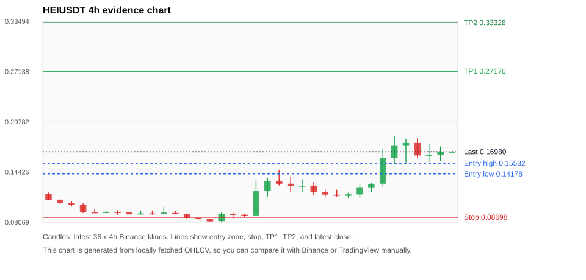
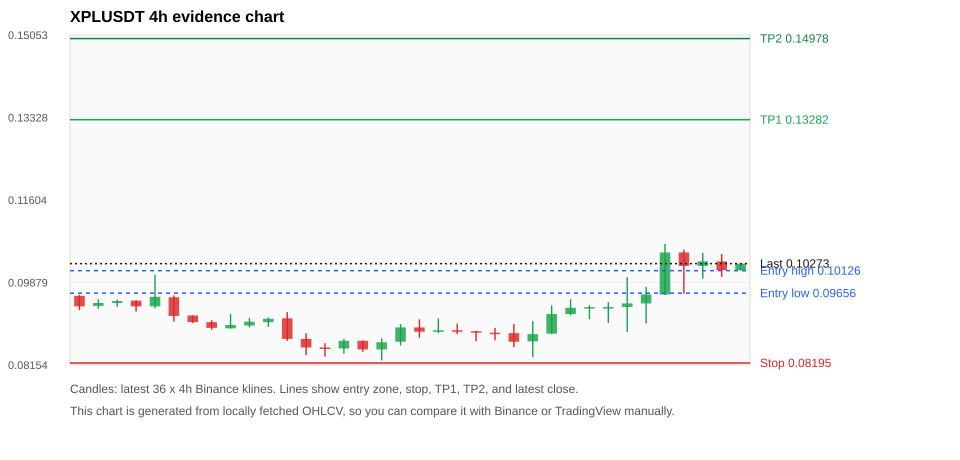
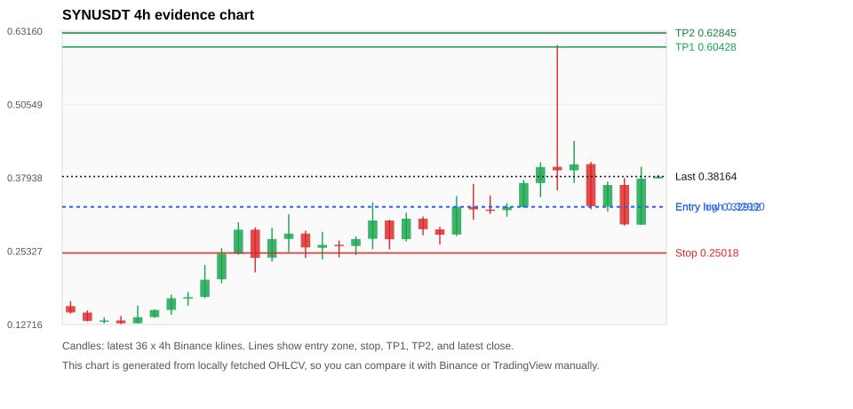
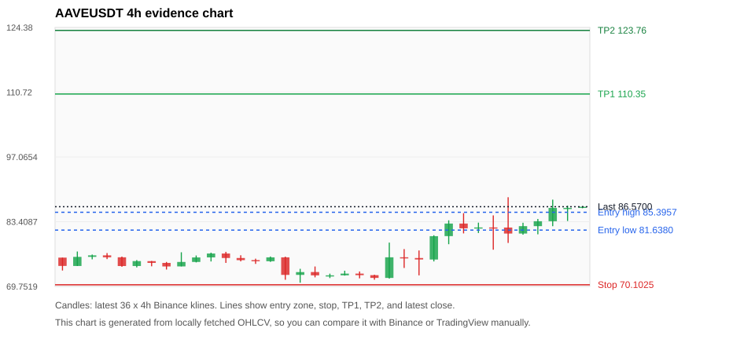
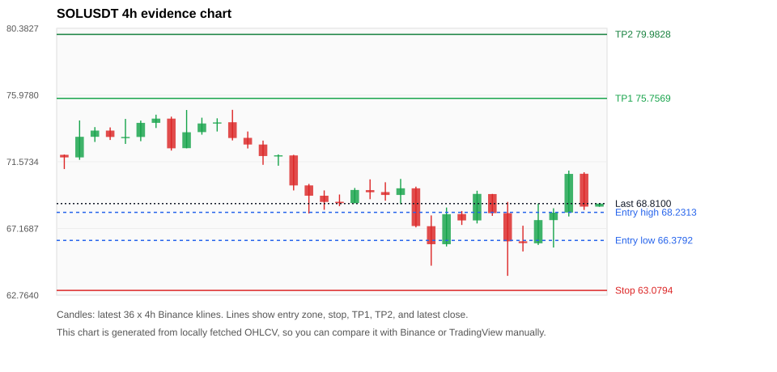

# Crypto 市场扫描报告 v1

- 报告时间：2026-06-26 20:06:25 CST
- Run ID：`20260626_120503_7c056c39`
- Run type：`daily_full`
- 数据来源：SQLite
- 报告版本：v1
- 扫描 ID：0e7ad0534e93
- 数据源：Binance public spot API + CoinGecko/CoinMarketCap cross-check
- 过滤条件：USDT spot; 24h quote volume >= 30,000,000; trades >= 30,000; exclude stables/leveraged tokens; analyze 1h/4h/1d klines
- 默认单笔风险：账户权益的 1.00%

## 限制说明

- 交易信号仍以 Binance 现货公开 K 线为主源；外部数据源用于一致性复核。
- 结果是研究和模拟盘计划，不是确定收益或实盘下单指令。
- 历史长度过滤：候选币至少需要 180 根 1d K 线。
- 数据质量验证池：先验证 score 排名前 min(top_n * 2, 10) 的候选，再按 action + score 补足最终名单。
- 大盘环境过滤：RISK_OFF; BTC/ETH 大盘偏弱，山寨币买入候选降级为观察。 BTC 7d=-6.430073314657547; ETH 7d=-9.58806444637943.
- 已启用数据交叉验证：Binance 主源 + CoinGecko 自动对照；CoinMarketCap 在配置 API Key 后自动对照。
- HEIUSDT 交叉验证状态 DATA_WARNING：At least one external provider needs manual review.
- XPLUSDT 交叉验证状态 DATA_WARNING：At least one external provider needs manual review.
- SYNUSDT 交叉验证状态 DATA_WARNING：At least one external provider needs manual review.
- AAVEUSDT 交叉验证状态 DATA_WARNING：At least one external provider needs manual review.
- SOLUSDT 交叉验证状态 DATA_WARNING：At least one external provider needs manual review.
- BNBUSDT 交叉验证状态 DATA_WARNING：At least one external provider needs manual review.
- TRXUSDT 交叉验证状态 DATA_WARNING：At least one external provider needs manual review.
- BTCUSDT 交叉验证状态 DATA_WARNING：At least one external provider needs manual review.
- ZECUSDT 交叉验证状态 DATA_WARNING：At least one external provider needs manual review.
- SUIUSDT 交叉验证状态 DATA_WARNING：At least one external provider needs manual review.

## 5 个候选交易计划

| Rank | Coin | Action | Setup | Entry Zone | Stop Loss | TP1 | TP2 / Exit Rule | R/R | Verdict |
|---:|---|---|---|---:|---:|---:|---|---:|---|
| 1 | `HEI` | `WATCH_ONLY` | 涨幅较远，只等深回调 | 0.14178 - 0.15532 | 0.08698 | 0.27170 | 0.33328 或跌破 4h 关键支撑 | 2.00-3.00 | 只等回调 |
| 2 | `XPL` | `WATCH_ONLY` | 趋势中，等回调入场 | 0.09656 - 0.10126 | 0.08195 | 0.13282 | 0.14978 或跌破 4h 关键支撑 | 2.00-3.00 | 只等回调 |
| 3 | `SYN` | `WATCH_ONLY` | 涨幅较远，只等深回调 | 0.32912 - 0.32990 | 0.25018 | 0.60428 | 0.62845 或跌破 4h 关键支撑 | 3.46-3.77 | 只等回调 |
| 4 | `AAVE` | `WATCH_ONLY` | 趋势中，等回调入场 | 81.6380 - 85.3957 | 70.1025 | 110.35 | 123.76 或跌破 4h 关键支撑 | 2.00-3.00 | 只等回调 |
| 5 | `SOL` | `WATCH_ONLY` | 趋势中，等回调入场 | 66.3792 - 68.2313 | 63.0794 | 75.7569 | 79.9828 或跌破 4h 关键支撑 | 2.00-3.00 | 只观察 |

## 数据交叉验证摘要

价格差异以 Binance 当前价为基准；成交量口径不同，Binance 是 USDT 现货成交额，CoinGecko/CoinMarketCap 通常是全市场成交量。

| Rank | Coin | Data Status | Max Price Diff | Max 24h Diff | Message |
|---:|---|---|---:|---:|---|
| 1 | `HEI` | DATA_WARNING | 0.45% | 1.90 pts | At least one external provider needs manual review. |
| 2 | `XPL` | DATA_WARNING | 1.41% | 1.68 pts | At least one external provider needs manual review. |
| 3 | `SYN` | DATA_WARNING | 0.14% | 2.21 pts | At least one external provider needs manual review. |
| 4 | `AAVE` | DATA_WARNING | 0.43% | 0.29 pts | At least one external provider needs manual review. |
| 5 | `SOL` | DATA_WARNING | 0.35% | 0.03 pts | At least one external provider needs manual review. |

## 候选币说明

### 1. HEI `HEIUSDT`



- 入选原因：涨幅较远，只等深回调；24h +30.21%，7d +28.73%，4h RSI 71.53，24h 成交额 $31.7M。
- 交易失效条件：跌破 0.0869755 或 4h 收盘重新失守关键支撑。
- 主要风险：距离支撑偏远，不能追市价；24h 振幅较大，回撤风险高；BTC/ETH 大盘环境未确认强势，山寨币买入信号降级；数据交叉验证需要人工复核。
- 数据交叉验证：DATA_WARNING；At least one external provider needs manual review.

#### 可点击人工验证

- [Binance 交易页](https://www.binance.com/en/trade/HEI_USDT)
- [TradingView 图表](https://www.tradingview.com/chart/?symbol=BINANCE%3AHEIUSDT)
- [CoinGecko 搜索](https://www.coingecko.com/en/search?query=HEI)
- [CoinMarketCap 搜索](https://coinmarketcap.com/search/?q=HEI)

#### 多数据源对照

| Source | Status | Asset ID | Price | 24h Change | 24h Volume | Price Diff | 24h Diff | Updated | Message |
|---|---|---|---:|---:|---:|---:|---:|---|---|
| Binance | DATA_OK | HEIUSDT | 0.16980 | +30.21% | $31.7M | 0.00% | 0.00 pts | 2026-06-26T12:05:30+00:00 | Primary market data source used by scanner. |
| CoinGecko | DATA_OK | heima | 0.17038 | +31.46% | $105.5M | 0.34% | 1.25 pts | 2026-06-26T12:05:28.817Z | External source agrees with Binance within thresholds. |
| CoinMarketCap | DATA_WARNING | 35724 | 0.17057 | +32.11% | $126.3M | 0.45% | 1.90 pts | 2026-06-26T12:04:02.000Z | CoinMarketCap symbol mapping has 2 matches; selected lowest cmc_rank |

#### 指标证据

| 指标 | 数值 | 人工核对用途 |
|---|---:|---|
| 当前价 | 0.16980 | 与 Binance/TradingView 当前价格对照 |
| 24h 涨跌 | +30.21% | 与交易所 24h 涨跌对照 |
| 7d 涨跌 | +28.73% | 判断短线趋势是否延续 |
| 4h EMA20 | 0.14149 | 判断短期趋势支撑 |
| 4h EMA50 | 0.11959 | 判断中期趋势支撑 |
| 1d EMA20 | 0.10875 | 判断日线趋势 |
| 1d EMA50 | 0.09474 | 判断日线趋势 |
| 4h RSI14 | 71.53 | 判断是否过热/过弱 |
| 4h ATR14 | 0.01930 | 推导止损和入场缓冲 |
| 最近 18 根 4h 最低点 | 0.08830 | 支撑/止损参考 |
| 最近 36 根 4h 最高点 | 0.18960 | TP/压力参考 |
| 支撑位 | 0.14149 | 入场区间推导基础 |

#### 交易计划推导

- 支撑位 = 最近低点、4h EMA20、4h EMA50、1d EMA20 中不高于当前价的最高有效支撑 = `0.14149`。
- 入场区间 = 支撑位附近 + ATR 缓冲 = `0.14178 - 0.15532`。
- 止损 = min(最近 18 根 4h 最低点 * 0.985, 入场中位价 - 1.15 * ATR14) = `0.08698`。
- TP1 = max(最近 36 根 4h 最高点 * 0.995, 入场中位价 + 2R) = `0.27170`。
- TP2 = max(入场中位价 + 3R, TP1 * 1.04) = `0.33328`。

#### 最近 10 根 4h K线

| UTC 开盘时间 | Open | High | Low | Close | Quote Volume | Trades |
|---|---:|---:|---:|---:|---:|---:|
| 2026-06-25T00:00+00:00 | 0.11410 | 0.11800 | 0.11150 | 0.11590 | $941,464 | 29099 |
| 2026-06-25T04:00+00:00 | 0.11580 | 0.12980 | 0.11180 | 0.12420 | $1.7M | 26874 |
| 2026-06-25T08:00+00:00 | 0.12410 | 0.13060 | 0.11840 | 0.12930 | $1.1M | 16205 |
| 2026-06-25T12:00+00:00 | 0.12940 | 0.17410 | 0.12610 | 0.16220 | $8.9M | 91567 |
| 2026-06-25T16:00+00:00 | 0.16230 | 0.18960 | 0.15440 | 0.17730 | $6.5M | 65240 |
| 2026-06-25T20:00+00:00 | 0.17730 | 0.18650 | 0.15640 | 0.18090 | $5.9M | 60549 |
| 2026-06-26T00:00+00:00 | 0.18100 | 0.18690 | 0.16140 | 0.16510 | $3.4M | 35648 |
| 2026-06-26T04:00+00:00 | 0.16490 | 0.18020 | 0.15700 | 0.16590 | $2.9M | 29508 |
| 2026-06-26T08:00+00:00 | 0.16580 | 0.17670 | 0.15820 | 0.17000 | $4.2M | 32005 |
| 2026-06-26T12:00+00:00 | 0.16970 | 0.17210 | 0.16970 | 0.16980 | $71,061 | 616 |

### 2. XPL `XPLUSDT`



- 入选原因：趋势中，等回调入场；24h +10.08%，7d +4.61%，4h RSI 76.19，24h 成交额 $39.5M。
- 交易失效条件：跌破 0.081952 或 4h 收盘重新失守关键支撑。
- 主要风险：4h RSI 偏热；BTC/ETH 大盘环境未确认强势，山寨币买入信号降级；数据交叉验证需要人工复核。
- 数据交叉验证：DATA_WARNING；At least one external provider needs manual review.

#### 可点击人工验证

- [Binance 交易页](https://www.binance.com/en/trade/XPL_USDT)
- [TradingView 图表](https://www.tradingview.com/chart/?symbol=BINANCE%3AXPLUSDT)
- [CoinGecko 搜索](https://www.coingecko.com/en/search?query=XPL)
- [CoinMarketCap 搜索](https://coinmarketcap.com/search/?q=XPL)

#### 多数据源对照

| Source | Status | Asset ID | Price | 24h Change | 24h Volume | Price Diff | 24h Diff | Updated | Message |
|---|---|---|---:|---:|---:|---:|---:|---|---|
| Binance | DATA_OK | XPLUSDT | 0.10273 | +10.08% | $39.5M | 0.00% | 0.00 pts | 2026-06-26T12:05:30+00:00 | Primary market data source used by scanner. |
| CoinGecko | DATA_WARNING | plasma | 0.10213 | +9.41% | $195.5M | 0.58% | 0.67 pts | 2026-06-26T12:05:30.418Z | CoinGecko symbol mapping has 2 exact matches; selected highest market-cap rank |
| CoinMarketCap | DATA_WARNING | 36645 | 0.10128 | +8.40% | $256.8M | 1.41% | 1.68 pts | 2026-06-26T12:04:02.000Z | price diff 1.41% exceeds warning threshold; CoinMarketCap symbol mapping has 3 matches; selected lowest cmc_rank |

#### 指标证据

| 指标 | 数值 | 人工核对用途 |
|---|---:|---|
| 当前价 | 0.10273 | 与 Binance/TradingView 当前价格对照 |
| 24h 涨跌 | +10.08% | 与交易所 24h 涨跌对照 |
| 7d 涨跌 | +4.61% | 判断短线趋势是否延续 |
| 4h EMA20 | 0.09588 | 判断短期趋势支撑 |
| 4h EMA50 | 0.09317 | 判断中期趋势支撑 |
| 1d EMA20 | 0.09150 | 判断日线趋势 |
| 1d EMA50 | 0.09111 | 判断日线趋势 |
| 4h RSI14 | 76.19 | 判断是否过热/过弱 |
| 4h ATR14 | 0.0058778571 | 推导止损和入场缓冲 |
| 最近 18 根 4h 最低点 | 0.08320 | 支撑/止损参考 |
| 最近 36 根 4h 最高点 | 0.10683 | TP/压力参考 |
| 支撑位 | 0.09588 | 入场区间推导基础 |

#### 交易计划推导

- 支撑位 = 最近低点、4h EMA20、4h EMA50、1d EMA20 中不高于当前价的最高有效支撑 = `0.09588`。
- 入场区间 = 支撑位附近 + ATR 缓冲 = `0.09656 - 0.10126`。
- 止损 = min(最近 18 根 4h 最低点 * 0.985, 入场中位价 - 1.15 * ATR14) = `0.08195`。
- TP1 = max(最近 36 根 4h 最高点 * 0.995, 入场中位价 + 2R) = `0.13282`。
- TP2 = max(入场中位价 + 3R, TP1 * 1.04) = `0.14978`。

#### 最近 10 根 4h K线

| UTC 开盘时间 | Open | High | Low | Close | Quote Volume | Trades |
|---|---:|---:|---:|---:|---:|---:|
| 2026-06-25T00:00+00:00 | 0.09220 | 0.09530 | 0.09190 | 0.09350 | $6.8M | 94792 |
| 2026-06-25T04:00+00:00 | 0.09350 | 0.09405 | 0.09110 | 0.09365 | $192.3M | 872099 |
| 2026-06-25T08:00+00:00 | 0.09364 | 0.09469 | 0.09034 | 0.09366 | $199.1M | 1053685 |
| 2026-06-25T12:00+00:00 | 0.09366 | 0.09990 | 0.08846 | 0.09442 | $9.3M | 139387 |
| 2026-06-25T16:00+00:00 | 0.09441 | 0.09786 | 0.09024 | 0.09628 | $5.5M | 87671 |
| 2026-06-25T20:00+00:00 | 0.09628 | 0.10683 | 0.09617 | 0.10506 | $9.6M | 155631 |
| 2026-06-26T00:00+00:00 | 0.10507 | 0.10566 | 0.09644 | 0.10226 | $7.6M | 107958 |
| 2026-06-26T04:00+00:00 | 0.10226 | 0.10500 | 0.09961 | 0.10320 | $4.0M | 65779 |
| 2026-06-26T08:00+00:00 | 0.10320 | 0.10476 | 0.09997 | 0.10134 | $3.6M | 53763 |
| 2026-06-26T12:00+00:00 | 0.10137 | 0.10287 | 0.10130 | 0.10273 | $109,269 | 1856 |

### 3. SYN `SYNUSDT`



- 入选原因：涨幅较远，只等深回调；24h -6.81%，7d +178.37%，4h RSI 60.98，24h 成交额 $59.3M。
- 交易失效条件：跌破 0.25017877 或 4h 收盘重新失守关键支撑。
- 主要风险：距离支撑偏远，不能追市价；24h 振幅较大，回撤风险高；BTC/ETH 大盘环境未确认强势，山寨币买入信号降级；24h 动量未确认；数据交叉验证需要人工复核。
- 数据交叉验证：DATA_WARNING；At least one external provider needs manual review.

#### 可点击人工验证

- [Binance 交易页](https://www.binance.com/en/trade/SYN_USDT)
- [TradingView 图表](https://www.tradingview.com/chart/?symbol=BINANCE%3ASYNUSDT)
- [CoinGecko 搜索](https://www.coingecko.com/en/search?query=SYN)
- [CoinMarketCap 搜索](https://coinmarketcap.com/search/?q=SYN)

#### 多数据源对照

| Source | Status | Asset ID | Price | 24h Change | 24h Volume | Price Diff | 24h Diff | Updated | Message |
|---|---|---|---:|---:|---:|---:|---:|---|---|
| Binance | DATA_OK | SYNUSDT | 0.38164 | -6.81% | $59.3M | 0.00% | 0.00 pts | 2026-06-26T12:05:30+00:00 | Primary market data source used by scanner. |
| CoinGecko | DATA_WARNING | n/a | n/a | n/a | n/a | n/a | n/a | 2026-06-26T12:05:30+00:00 | Failed to fetch https://api.coingecko.com/api/v3/coins/markets?vs_currency=usd&ids=synapse-2&price_change_percentage=24h&per_page=1&page=1: HTTP Error 429: Too Many Requests |
| CoinMarketCap | DATA_WARNING | 12147 | 0.38112 | -4.60% | $204.3M | 0.14% | 2.21 pts | 2026-06-26T12:04:02.000Z | CoinMarketCap symbol mapping has 4 matches; selected lowest cmc_rank |

#### 指标证据

| 指标 | 数值 | 人工核对用途 |
|---|---:|---|
| 当前价 | 0.38164 | 与 Binance/TradingView 当前价格对照 |
| 24h 涨跌 | -6.81% | 与交易所 24h 涨跌对照 |
| 7d 涨跌 | +178.37% | 判断短线趋势是否延续 |
| 4h EMA20 | 0.32846 | 判断短期趋势支撑 |
| 4h EMA50 | 0.25215 | 判断中期趋势支撑 |
| 1d EMA20 | 0.17541 | 判断日线趋势 |
| 1d EMA50 | 0.10837 | 判断日线趋势 |
| 4h RSI14 | 60.98 | 判断是否过热/过弱 |
| 4h ATR14 | 0.06898 | 推导止损和入场缓冲 |
| 最近 18 根 4h 最低点 | 0.25640 | 支撑/止损参考 |
| 最近 36 根 4h 最高点 | 0.60732 | TP/压力参考 |
| 支撑位 | 0.32846 | 入场区间推导基础 |

#### 交易计划推导

- 支撑位 = 最近低点、4h EMA20、4h EMA50、1d EMA20 中不高于当前价的最高有效支撑 = `0.32846`。
- 入场区间 = 支撑位附近 + ATR 缓冲 = `0.32912 - 0.32990`。
- 止损 = min(最近 18 根 4h 最低点 * 0.985, 入场中位价 - 1.15 * ATR14) = `0.25018`。
- TP1 = max(最近 36 根 4h 最高点 * 0.995, 入场中位价 + 2R) = `0.60428`。
- TP2 = max(入场中位价 + 3R, TP1 * 1.04) = `0.62845`。

#### 最近 10 根 4h K线

| UTC 开盘时间 | Open | High | Low | Close | Quote Volume | Trades |
|---|---:|---:|---:|---:|---:|---:|
| 2026-06-25T00:00+00:00 | 0.32380 | 0.33600 | 0.31250 | 0.32890 | $2.4M | 23632 |
| 2026-06-25T04:00+00:00 | 0.32900 | 0.37554 | 0.32780 | 0.37042 | $6.1M | 56173 |
| 2026-06-25T08:00+00:00 | 0.37042 | 0.40580 | 0.34629 | 0.39802 | $7.5M | 64352 |
| 2026-06-25T12:00+00:00 | 0.39830 | 0.60732 | 0.35803 | 0.39228 | $27.6M | 347067 |
| 2026-06-25T16:00+00:00 | 0.39228 | 0.44310 | 0.37049 | 0.40248 | $8.5M | 102555 |
| 2026-06-25T20:00+00:00 | 0.40290 | 0.40656 | 0.32532 | 0.33068 | $5.0M | 56771 |
| 2026-06-26T00:00+00:00 | 0.33054 | 0.37290 | 0.32170 | 0.36705 | $5.2M | 70599 |
| 2026-06-26T04:00+00:00 | 0.36717 | 0.37885 | 0.29718 | 0.29934 | $4.8M | 61215 |
| 2026-06-26T08:00+00:00 | 0.29883 | 0.39855 | 0.29833 | 0.37801 | $8.4M | 93071 |
| 2026-06-26T12:00+00:00 | 0.37842 | 0.38451 | 0.37842 | 0.38153 | $123,172 | 1171 |

### 4. AAVE `AAVEUSDT`



- 入选原因：趋势中，等回调入场；24h +5.23%，7d +17.37%，4h RSI 86.56，24h 成交额 $42.7M。
- 交易失效条件：跌破 70.10245 或 4h 收盘重新失守关键支撑。
- 主要风险：4h RSI 偏热；日线趋势未完全确认；BTC/ETH 大盘环境未确认强势，山寨币买入信号降级；数据交叉验证需要人工复核。
- 数据交叉验证：DATA_WARNING；At least one external provider needs manual review.

#### 可点击人工验证

- [Binance 交易页](https://www.binance.com/en/trade/AAVE_USDT)
- [TradingView 图表](https://www.tradingview.com/chart/?symbol=BINANCE%3AAAVEUSDT)
- [CoinGecko 搜索](https://www.coingecko.com/en/search?query=AAVE)
- [CoinMarketCap 搜索](https://coinmarketcap.com/search/?q=AAVE)

#### 多数据源对照

| Source | Status | Asset ID | Price | 24h Change | 24h Volume | Price Diff | 24h Diff | Updated | Message |
|---|---|---|---:|---:|---:|---:|---:|---|---|
| Binance | DATA_OK | AAVEUSDT | 86.5700 | +5.23% | $42.7M | 0.00% | 0.00 pts | 2026-06-26T12:05:30+00:00 | Primary market data source used by scanner. |
| CoinGecko | DATA_WARNING | n/a | n/a | n/a | n/a | n/a | n/a | 2026-06-26T12:05:30+00:00 | Failed to fetch https://api.coingecko.com/api/v3/coins/markets?vs_currency=usd&ids=aave&price_change_percentage=24h&per_page=1&page=1: HTTP Error 429: Too Many Requests |
| CoinMarketCap | DATA_OK | 7278 | 86.1963 | +4.94% | $481.6M | 0.43% | 0.29 pts | 2026-06-26T12:04:02.000Z | External source agrees with Binance within thresholds. |

#### 指标证据

| 指标 | 数值 | 人工核对用途 |
|---|---:|---|
| 当前价 | 86.5700 | 与 Binance/TradingView 当前价格对照 |
| 24h 涨跌 | +5.23% | 与交易所 24h 涨跌对照 |
| 7d 涨跌 | +17.37% | 判断短线趋势是否延续 |
| 4h EMA20 | 80.5958 | 判断短期趋势支撑 |
| 4h EMA50 | 76.8874 | 判断中期趋势支撑 |
| 1d EMA20 | 75.7085 | 判断日线趋势 |
| 1d EMA50 | 79.7698 | 判断日线趋势 |
| 4h RSI14 | 86.56 | 判断是否过热/过弱 |
| 4h ATR14 | 4.6971 | 推导止损和入场缓冲 |
| 最近 18 根 4h 最低点 | 71.1700 | 支撑/止损参考 |
| 最近 36 根 4h 最高点 | 88.5700 | TP/压力参考 |
| 支撑位 | 80.5958 | 入场区间推导基础 |

#### 交易计划推导

- 支撑位 = 最近低点、4h EMA20、4h EMA50、1d EMA20 中不高于当前价的最高有效支撑 = `80.5958`。
- 入场区间 = 支撑位附近 + ATR 缓冲 = `81.6380 - 85.3957`。
- 止损 = min(最近 18 根 4h 最低点 * 0.985, 入场中位价 - 1.15 * ATR14) = `70.1025`。
- TP1 = max(最近 36 根 4h 最高点 * 0.995, 入场中位价 + 2R) = `110.35`。
- TP2 = max(入场中位价 + 3R, TP1 * 1.04) = `123.76`。

#### 最近 10 根 4h K线

| UTC 开盘时间 | Open | High | Low | Close | Quote Volume | Trades |
|---|---:|---:|---:|---:|---:|---:|
| 2026-06-25T00:00+00:00 | 80.3700 | 83.7000 | 78.6600 | 83.0200 | $7.6M | 80526 |
| 2026-06-25T04:00+00:00 | 83.0200 | 85.2100 | 80.9400 | 82.0100 | $9.0M | 78549 |
| 2026-06-25T08:00+00:00 | 82.0000 | 83.2100 | 81.0200 | 82.2000 | $5.5M | 61055 |
| 2026-06-25T12:00+00:00 | 82.2000 | 84.7400 | 77.5000 | 82.1800 | $9.7M | 140192 |
| 2026-06-25T16:00+00:00 | 82.1800 | 88.5700 | 78.9300 | 80.9100 | $10.3M | 162074 |
| 2026-06-25T20:00+00:00 | 80.9100 | 83.1900 | 80.6700 | 82.4700 | $2.7M | 44508 |
| 2026-06-26T00:00+00:00 | 82.4700 | 83.9900 | 80.7500 | 83.5100 | $7.1M | 84767 |
| 2026-06-26T04:00+00:00 | 83.5100 | 88.0600 | 82.4600 | 86.3200 | $7.2M | 84929 |
| 2026-06-26T08:00+00:00 | 86.3200 | 86.7900 | 83.5600 | 86.3200 | $5.5M | 67989 |
| 2026-06-26T12:00+00:00 | 86.3100 | 86.6900 | 86.2400 | 86.5600 | $204,605 | 2736 |

### 5. SOL `SOLUSDT`



- 入选原因：趋势中，等回调入场；24h +0.78%，7d -0.68%，4h RSI 48.46，24h 成交额 $319.2M。
- 交易失效条件：跌破 63.0794 或 4h 收盘重新失守关键支撑。
- 主要风险：日线趋势未完全确认；BTC/ETH 大盘环境未确认强势，山寨币买入信号降级；7d 趋势未确认；数据交叉验证需要人工复核。
- 数据交叉验证：DATA_WARNING；At least one external provider needs manual review.

#### 可点击人工验证

- [Binance 交易页](https://www.binance.com/en/trade/SOL_USDT)
- [TradingView 图表](https://www.tradingview.com/chart/?symbol=BINANCE%3ASOLUSDT)
- [CoinGecko 搜索](https://www.coingecko.com/en/search?query=SOL)
- [CoinMarketCap 搜索](https://coinmarketcap.com/search/?q=SOL)

#### 多数据源对照

| Source | Status | Asset ID | Price | 24h Change | 24h Volume | Price Diff | 24h Diff | Updated | Message |
|---|---|---|---:|---:|---:|---:|---:|---|---|
| Binance | DATA_OK | SOLUSDT | 68.8100 | +0.78% | $319.2M | 0.00% | 0.00 pts | 2026-06-26T12:05:30+00:00 | Primary market data source used by scanner. |
| CoinGecko | DATA_WARNING | n/a | n/a | n/a | n/a | n/a | n/a | 2026-06-26T12:05:30+00:00 | Failed to fetch https://api.coingecko.com/api/v3/coins/markets?vs_currency=usd&ids=solana&price_change_percentage=24h&per_page=1&page=1: HTTP Error 429: Too Many Requests |
| CoinMarketCap | DATA_WARNING | 5426 | 68.5686 | +0.74% | $4.41B | 0.35% | 0.03 pts | 2026-06-26T12:05:03.000Z | CoinMarketCap symbol mapping has 8 matches; selected lowest cmc_rank |

#### 指标证据

| 指标 | 数值 | 人工核对用途 |
|---|---:|---|
| 当前价 | 68.8100 | 与 Binance/TradingView 当前价格对照 |
| 24h 涨跌 | +0.78% | 与交易所 24h 涨跌对照 |
| 7d 涨跌 | -0.68% | 判断短线趋势是否延续 |
| 4h EMA20 | 68.9089 | 判断短期趋势支撑 |
| 4h EMA50 | 69.7236 | 判断中期趋势支撑 |
| 1d EMA20 | 70.8768 | 判断日线趋势 |
| 1d EMA50 | 75.5580 | 判断日线趋势 |
| 4h RSI14 | 48.46 | 判断是否过热/过弱 |
| 4h ATR14 | 2.3150 | 推导止损和入场缓冲 |
| 最近 18 根 4h 最低点 | 64.0400 | 支撑/止损参考 |
| 最近 36 根 4h 最高点 | 75.0000 | TP/压力参考 |
| 支撑位 | 64.0400 | 入场区间推导基础 |

#### 交易计划推导

- 支撑位 = 最近低点、4h EMA20、4h EMA50、1d EMA20 中不高于当前价的最高有效支撑 = `64.0400`。
- 入场区间 = 支撑位附近 + ATR 缓冲 = `66.3792 - 68.2313`。
- 止损 = min(最近 18 根 4h 最低点 * 0.985, 入场中位价 - 1.15 * ATR14) = `63.0794`。
- TP1 = max(最近 36 根 4h 最高点 * 0.995, 入场中位价 + 2R) = `75.7569`。
- TP2 = max(入场中位价 + 3R, TP1 * 1.04) = `79.9828`。

#### 最近 10 根 4h K线

| UTC 开盘时间 | Open | High | Low | Close | Quote Volume | Trades |
|---|---:|---:|---:|---:|---:|---:|
| 2026-06-25T00:00+00:00 | 68.1200 | 68.3200 | 67.4000 | 67.7000 | $15.8M | 88130 |
| 2026-06-25T04:00+00:00 | 67.7000 | 69.6600 | 67.5000 | 69.4500 | $34.5M | 146011 |
| 2026-06-25T08:00+00:00 | 69.4400 | 69.4500 | 68.0000 | 68.1800 | $22.6M | 86925 |
| 2026-06-25T12:00+00:00 | 68.1800 | 68.9200 | 64.0400 | 66.3200 | $104.0M | 609714 |
| 2026-06-25T16:00+00:00 | 66.3200 | 67.3500 | 65.6500 | 66.2000 | $44.9M | 292288 |
| 2026-06-25T20:00+00:00 | 66.1900 | 68.8100 | 66.0800 | 67.7200 | $27.4M | 168056 |
| 2026-06-26T00:00+00:00 | 67.7200 | 68.5000 | 65.9100 | 68.2100 | $45.9M | 272725 |
| 2026-06-26T04:00+00:00 | 68.2200 | 70.9900 | 67.9600 | 70.7700 | $61.6M | 269080 |
| 2026-06-26T08:00+00:00 | 70.7800 | 70.8800 | 68.3900 | 68.6100 | $35.0M | 190965 |
| 2026-06-26T12:00+00:00 | 68.6100 | 68.8100 | 68.6000 | 68.8100 | $462,386 | 3934 |

## 组合风控

- 不要 5 个候选全部满仓买入。
- 同时持仓总风险建议控制在账户权益的 3% - 5% 以内。
- 如果 BTC/ETH 同时破位，暂停山寨币多头计划或降低仓位。
- 第一版报告用于模拟盘和人工复核，不自动下单。

## 原始数据

```json
[
  {
    "rank": 1,
    "symbol": "HEIUSDT",
    "base_asset": "HEI",
    "price": 0.1698,
    "score": 51.75565511898478,
    "setup": "涨幅较远，只等深回调",
    "verdict": "只等回调",
    "entry_low": 0.1417771329805529,
    "entry_high": 0.155325,
    "stop_loss": 0.0869755,
    "take_profit_1": 0.2717021994708293,
    "take_profit_2": 0.33327776596110575,
    "risk_reward_1": 1.9999999999999996,
    "risk_reward_2": 2.9999999999999996,
    "pct_24h": 30.215,
    "pct_3d": 90.14557670772676,
    "pct_7d": 28.733889310083406,
    "quote_volume_24h": 31681548.42084,
    "trades_24h": 314760,
    "high_low_range_24h": 50.35685963521015,
    "rsi_1h": 43.52409638554217,
    "rsi_4h": 71.52777777777777,
    "ema20_4h": 0.14149414469117055,
    "ema50_4h": 0.11958566449938886,
    "ema20_1d": 0.10875388610651017,
    "ema50_1d": 0.09474213395657127,
    "atr_4h": 0.0193,
    "macd_hist_4h": 0.0037685753292959843,
    "volume_ratio_24h": 2.9758104201101596,
    "support_level": 0.14149414469117055,
    "recent_low_4h_18": 0.0883,
    "recent_high_4h_36": 0.1896,
    "distance_to_support_pct": 20.004965838417334,
    "binance_trade_url": "https://www.binance.com/en/trade/HEI_USDT",
    "tradingview_url": "https://www.tradingview.com/chart/?symbol=BINANCE%3AHEIUSDT",
    "coingecko_search_url": "https://www.coingecko.com/en/search?query=HEI",
    "coinmarketcap_search_url": "https://coinmarketcap.com/search/?q=HEI",
    "invalidation": "跌破 0.0869755 或 4h 收盘重新失守关键支撑",
    "recent_4h_klines": [
      {
        "open_time_utc": "2026-06-20T16:00+00:00",
        "open": 0.1162,
        "high": 0.1181,
        "low": 0.1084,
        "close": 0.109,
        "quote_volume": 520770.47044,
        "trades": 8758
      },
      {
        "open_time_utc": "2026-06-20T20:00+00:00",
        "open": 0.1093,
        "high": 0.1093,
        "low": 0.1037,
        "close": 0.105,
        "quote_volume": 184348.02102,
        "trades": 3541
      },
      {
        "open_time_utc": "2026-06-21T00:00+00:00",
        "open": 0.1051,
        "high": 0.1075,
        "low": 0.1014,
        "close": 0.1025,
        "quote_volume": 222893.95637,
        "trades": 2597
      },
      {
        "open_time_utc": "2026-06-21T04:00+00:00",
        "open": 0.1025,
        "high": 0.1046,
        "low": 0.0922,
        "close": 0.0932,
        "quote_volume": 463232.06605,
        "trades": 13557
      },
      {
        "open_time_utc": "2026-06-21T08:00+00:00",
        "open": 0.0931,
        "high": 0.097,
        "low": 0.0924,
        "close": 0.0927,
        "quote_volume": 368415.34418,
        "trades": 9199
      },
      {
        "open_time_utc": "2026-06-21T12:00+00:00",
        "open": 0.0929,
        "high": 0.0949,
        "low": 0.0921,
        "close": 0.0934,
        "quote_volume": 217674.91552,
        "trades": 3398
      },
      {
        "open_time_utc": "2026-06-21T16:00+00:00",
        "open": 0.0934,
        "high": 0.0958,
        "low": 0.0893,
        "close": 0.093,
        "quote_volume": 524816.93376,
        "trades": 7205
      },
      {
        "open_time_utc": "2026-06-21T20:00+00:00",
        "open": 0.0931,
        "high": 0.0938,
        "low": 0.0905,
        "close": 0.0906,
        "quote_volume": 218787.01163,
        "trades": 2772
      },
      {
        "open_time_utc": "2026-06-22T00:00+00:00",
        "open": 0.0904,
        "high": 0.0946,
        "low": 0.0904,
        "close": 0.0917,
        "quote_volume": 155438.79193,
        "trades": 2107
      },
      {
        "open_time_utc": "2026-06-22T04:00+00:00",
        "open": 0.0918,
        "high": 0.0955,
        "low": 0.0902,
        "close": 0.0911,
        "quote_volume": 200579.34131,
        "trades": 2253
      },
      {
        "open_time_utc": "2026-06-22T08:00+00:00",
        "open": 0.0911,
        "high": 0.1001,
        "low": 0.0908,
        "close": 0.0929,
        "quote_volume": 732331.17263,
        "trades": 9471
      },
      {
        "open_time_utc": "2026-06-22T12:00+00:00",
        "open": 0.0924,
        "high": 0.0953,
        "low": 0.0906,
        "close": 0.0907,
        "quote_volume": 366651.66487,
        "trades": 4055
      },
      {
        "open_time_utc": "2026-06-22T16:00+00:00",
        "open": 0.0909,
        "high": 0.091,
        "low": 0.0853,
        "close": 0.0861,
        "quote_volume": 254283.76825,
        "trades": 4026
      },
      {
        "open_time_utc": "2026-06-22T20:00+00:00",
        "open": 0.0861,
        "high": 0.0865,
        "low": 0.0842,
        "close": 0.0852,
        "quote_volume": 92943.79709,
        "trades": 1603
      },
      {
        "open_time_utc": "2026-06-23T00:00+00:00",
        "open": 0.0852,
        "high": 0.0853,
        "low": 0.0818,
        "close": 0.0818,
        "quote_volume": 119745.15314,
        "trades": 1740
      },
      {
        "open_time_utc": "2026-06-23T04:00+00:00",
        "open": 0.0821,
        "high": 0.0937,
        "low": 0.0811,
        "close": 0.091,
        "quote_volume": 903433.65154,
        "trades": 11490
      },
      {
        "open_time_utc": "2026-06-23T08:00+00:00",
        "open": 0.0911,
        "high": 0.0933,
        "low": 0.0856,
        "close": 0.0901,
        "quote_volume": 368201.10973,
        "trades": 4610
      },
      {
        "open_time_utc": "2026-06-23T12:00+00:00",
        "open": 0.0902,
        "high": 0.0913,
        "low": 0.0877,
        "close": 0.0884,
        "quote_volume": 319099.59931,
        "trades": 7186
      },
      {
        "open_time_utc": "2026-06-23T16:00+00:00",
        "open": 0.0885,
        "high": 0.1348,
        "low": 0.0883,
        "close": 0.1199,
        "quote_volume": 8577387.63823,
        "trades": 99868
      },
      {
        "open_time_utc": "2026-06-23T20:00+00:00",
        "open": 0.1199,
        "high": 0.137,
        "low": 0.1132,
        "close": 0.1325,
        "quote_volume": 5426793.41484,
        "trades": 48210
      },
      {
        "open_time_utc": "2026-06-24T00:00+00:00",
        "open": 0.1324,
        "high": 0.1465,
        "low": 0.1273,
        "close": 0.1293,
        "quote_volume": 4734536.67897,
        "trades": 44914
      },
      {
        "open_time_utc": "2026-06-24T04:00+00:00",
        "open": 0.1294,
        "high": 0.1384,
        "low": 0.1182,
        "close": 0.1264,
        "quote_volume": 4548380.56917,
        "trades": 48001
      },
      {
        "open_time_utc": "2026-06-24T08:00+00:00",
        "open": 0.1263,
        "high": 0.1352,
        "low": 0.1189,
        "close": 0.1268,
        "quote_volume": 4740832.7857,
        "trades": 44211
      },
      {
        "open_time_utc": "2026-06-24T12:00+00:00",
        "open": 0.127,
        "high": 0.1313,
        "low": 0.1153,
        "close": 0.1191,
        "quote_volume": 3299202.40302,
        "trades": 32892
      },
      {
        "open_time_utc": "2026-06-24T16:00+00:00",
        "open": 0.119,
        "high": 0.1228,
        "low": 0.1131,
        "close": 0.1156,
        "quote_volume": 1905191.64632,
        "trades": 30333
      },
      {
        "open_time_utc": "2026-06-24T20:00+00:00",
        "open": 0.1155,
        "high": 0.1218,
        "low": 0.1132,
        "close": 0.1141,
        "quote_volume": 1234976.27063,
        "trades": 33495
      },
      {
        "open_time_utc": "2026-06-25T00:00+00:00",
        "open": 0.1141,
        "high": 0.118,
        "low": 0.1115,
        "close": 0.1159,
        "quote_volume": 941464.19265,
        "trades": 29099
      },
      {
        "open_time_utc": "2026-06-25T04:00+00:00",
        "open": 0.1158,
        "high": 0.1298,
        "low": 0.1118,
        "close": 0.1242,
        "quote_volume": 1652724.80769,
        "trades": 26874
      },
      {
        "open_time_utc": "2026-06-25T08:00+00:00",
        "open": 0.1241,
        "high": 0.1306,
        "low": 0.1184,
        "close": 0.1293,
        "quote_volume": 1075440.42332,
        "trades": 16205
      },
      {
        "open_time_utc": "2026-06-25T12:00+00:00",
        "open": 0.1294,
        "high": 0.1741,
        "low": 0.1261,
        "close": 0.1622,
        "quote_volume": 8893191.94804,
        "trades": 91567
      },
      {
        "open_time_utc": "2026-06-25T16:00+00:00",
        "open": 0.1623,
        "high": 0.1896,
        "low": 0.1544,
        "close": 0.1773,
        "quote_volume": 6469257.26682,
        "trades": 65240
      },
      {
        "open_time_utc": "2026-06-25T20:00+00:00",
        "open": 0.1773,
        "high": 0.1865,
        "low": 0.1564,
        "close": 0.1809,
        "quote_volume": 5850569.32522,
        "trades": 60549
      },
      {
        "open_time_utc": "2026-06-26T00:00+00:00",
        "open": 0.181,
        "high": 0.1869,
        "low": 0.1614,
        "close": 0.1651,
        "quote_volume": 3416098.62439,
        "trades": 35648
      },
      {
        "open_time_utc": "2026-06-26T04:00+00:00",
        "open": 0.1649,
        "high": 0.1802,
        "low": 0.157,
        "close": 0.1659,
        "quote_volume": 2864689.97521,
        "trades": 29508
      },
      {
        "open_time_utc": "2026-06-26T08:00+00:00",
        "open": 0.1658,
        "high": 0.1767,
        "low": 0.1582,
        "close": 0.17,
        "quote_volume": 4169977.43927,
        "trades": 32005
      },
      {
        "open_time_utc": "2026-06-26T12:00+00:00",
        "open": 0.1697,
        "high": 0.1721,
        "low": 0.1697,
        "close": 0.1698,
        "quote_volume": 71060.71503,
        "trades": 616
      }
    ],
    "risks": [
      "距离支撑偏远，不能追市价",
      "24h 振幅较大，回撤风险高",
      "BTC/ETH 大盘环境未确认强势，山寨币买入信号降级",
      "数据交叉验证需要人工复核"
    ],
    "data_quality_status": "DATA_WARNING",
    "data_quality_message": "At least one external provider needs manual review.",
    "data_checks": [
      {
        "provider": "Binance",
        "status": "DATA_OK",
        "provider_asset_id": "HEIUSDT",
        "provider_symbol": "HEIUSDT",
        "price_usd": 0.1698,
        "pct_24h": 30.215,
        "volume_24h": 31681548.42084,
        "last_updated": null,
        "fetched_at_utc": "2026-06-26T12:05:30+00:00",
        "price_diff_pct": 0.0,
        "pct_24h_diff": 0.0,
        "volume_note": "Binance USDT spot 24h quoteVolume.",
        "message": "Primary market data source used by scanner."
      },
      {
        "provider": "CoinGecko",
        "status": "DATA_OK",
        "provider_asset_id": "heima",
        "provider_symbol": "HEI",
        "price_usd": 0.170382,
        "pct_24h": 31.46376,
        "volume_24h": 105531567.0,
        "last_updated": "2026-06-26T12:05:28.817Z",
        "fetched_at_utc": "2026-06-26T12:05:30+00:00",
        "price_diff_pct": 0.34275618374558253,
        "pct_24h_diff": 1.2487600000000008,
        "volume_note": "CoinGecko total market volume; not the same venue scope as Binance quoteVolume.",
        "message": "External source agrees with Binance within thresholds."
      },
      {
        "provider": "CoinMarketCap",
        "status": "DATA_WARNING",
        "provider_asset_id": "35724",
        "provider_symbol": "HEI",
        "price_usd": 0.17056909058395592,
        "pct_24h": 32.11363236,
        "volume_24h": 126340645.13415128,
        "last_updated": "2026-06-26T12:04:02.000Z",
        "fetched_at_utc": "2026-06-26T12:05:30+00:00",
        "price_diff_pct": 0.45293909538039545,
        "pct_24h_diff": 1.898632359999997,
        "volume_note": "CoinMarketCap total market volume; not the same venue scope as Binance quoteVolume.",
        "message": "CoinMarketCap symbol mapping has 2 matches; selected lowest cmc_rank"
      }
    ],
    "action": "WATCH_ONLY"
  },
  {
    "rank": 2,
    "symbol": "XPLUSDT",
    "base_asset": "XPL",
    "price": 0.10273,
    "score": 50.144932891220236,
    "setup": "趋势中，等回调入场",
    "verdict": "只等回调",
    "entry_low": 0.09655825,
    "entry_high": 0.10126053571428571,
    "stop_loss": 0.081952,
    "take_profit_1": 0.13282417857142859,
    "take_profit_2": 0.14978157142857143,
    "risk_reward_1": 2.000000000000001,
    "risk_reward_2": 3.0,
    "pct_24h": 10.083,
    "pct_3d": 16.87144482366325,
    "pct_7d": 4.613034623217938,
    "quote_volume_24h": 39532307.108357,
    "trades_24h": 610901,
    "high_low_range_24h": 20.766448112141077,
    "rsi_1h": 48.3179142136249,
    "rsi_4h": 76.18874773139747,
    "ema20_4h": 0.09587583740974467,
    "ema50_4h": 0.09316598435288756,
    "ema20_1d": 0.09149602252602983,
    "ema50_1d": 0.09110659926113598,
    "atr_4h": 0.005877857142857143,
    "macd_hist_4h": 0.001478897575489831,
    "volume_ratio_24h": 0.420682527005689,
    "support_level": 0.09587583740974467,
    "recent_low_4h_18": 0.0832,
    "recent_high_4h_36": 0.10683,
    "distance_to_support_pct": 7.148998929691408,
    "binance_trade_url": "https://www.binance.com/en/trade/XPL_USDT",
    "tradingview_url": "https://www.tradingview.com/chart/?symbol=BINANCE%3AXPLUSDT",
    "coingecko_search_url": "https://www.coingecko.com/en/search?query=XPL",
    "coinmarketcap_search_url": "https://coinmarketcap.com/search/?q=XPL",
    "invalidation": "跌破 0.081952 或 4h 收盘重新失守关键支撑",
    "recent_4h_klines": [
      {
        "open_time_utc": "2026-06-20T16:00+00:00",
        "open": 0.096,
        "high": 0.0962,
        "low": 0.093,
        "close": 0.0938,
        "quote_volume": 1610741.58131,
        "trades": 29773
      },
      {
        "open_time_utc": "2026-06-20T20:00+00:00",
        "open": 0.0939,
        "high": 0.0953,
        "low": 0.0933,
        "close": 0.0945,
        "quote_volume": 1018855.10173,
        "trades": 16947
      },
      {
        "open_time_utc": "2026-06-21T00:00+00:00",
        "open": 0.0945,
        "high": 0.0952,
        "low": 0.0937,
        "close": 0.0949,
        "quote_volume": 1234202.04298,
        "trades": 27102
      },
      {
        "open_time_utc": "2026-06-21T04:00+00:00",
        "open": 0.095,
        "high": 0.0951,
        "low": 0.0927,
        "close": 0.0938,
        "quote_volume": 1755983.74754,
        "trades": 37076
      },
      {
        "open_time_utc": "2026-06-21T08:00+00:00",
        "open": 0.0938,
        "high": 0.1004,
        "low": 0.0934,
        "close": 0.0958,
        "quote_volume": 9086341.25663,
        "trades": 99286
      },
      {
        "open_time_utc": "2026-06-21T12:00+00:00",
        "open": 0.0957,
        "high": 0.0961,
        "low": 0.0906,
        "close": 0.0918,
        "quote_volume": 4562814.51323,
        "trades": 62602
      },
      {
        "open_time_utc": "2026-06-21T16:00+00:00",
        "open": 0.0919,
        "high": 0.0919,
        "low": 0.0903,
        "close": 0.0905,
        "quote_volume": 3120766.09874,
        "trades": 73695
      },
      {
        "open_time_utc": "2026-06-21T20:00+00:00",
        "open": 0.0905,
        "high": 0.0909,
        "low": 0.0889,
        "close": 0.0893,
        "quote_volume": 1854915.68859,
        "trades": 20875
      },
      {
        "open_time_utc": "2026-06-22T00:00+00:00",
        "open": 0.0892,
        "high": 0.0922,
        "low": 0.0892,
        "close": 0.0899,
        "quote_volume": 2511518.05107,
        "trades": 41880
      },
      {
        "open_time_utc": "2026-06-22T04:00+00:00",
        "open": 0.0898,
        "high": 0.0914,
        "low": 0.0894,
        "close": 0.0906,
        "quote_volume": 2123514.2703,
        "trades": 40954
      },
      {
        "open_time_utc": "2026-06-22T08:00+00:00",
        "open": 0.0905,
        "high": 0.0915,
        "low": 0.0895,
        "close": 0.0912,
        "quote_volume": 2145566.90546,
        "trades": 37473
      },
      {
        "open_time_utc": "2026-06-22T12:00+00:00",
        "open": 0.0913,
        "high": 0.0926,
        "low": 0.0866,
        "close": 0.087,
        "quote_volume": 4024662.05004,
        "trades": 58693
      },
      {
        "open_time_utc": "2026-06-22T16:00+00:00",
        "open": 0.087,
        "high": 0.0882,
        "low": 0.0836,
        "close": 0.0852,
        "quote_volume": 3219175.40177,
        "trades": 42098
      },
      {
        "open_time_utc": "2026-06-22T20:00+00:00",
        "open": 0.0852,
        "high": 0.0861,
        "low": 0.0833,
        "close": 0.0849,
        "quote_volume": 3569037.67684,
        "trades": 29367
      },
      {
        "open_time_utc": "2026-06-23T00:00+00:00",
        "open": 0.085,
        "high": 0.087,
        "low": 0.0839,
        "close": 0.0866,
        "quote_volume": 3835744.26953,
        "trades": 94866
      },
      {
        "open_time_utc": "2026-06-23T04:00+00:00",
        "open": 0.0866,
        "high": 0.0867,
        "low": 0.0843,
        "close": 0.0848,
        "quote_volume": 4661470.85838,
        "trades": 115931
      },
      {
        "open_time_utc": "2026-06-23T08:00+00:00",
        "open": 0.0848,
        "high": 0.0871,
        "low": 0.0825,
        "close": 0.0863,
        "quote_volume": 4024773.03482,
        "trades": 88192
      },
      {
        "open_time_utc": "2026-06-23T12:00+00:00",
        "open": 0.0864,
        "high": 0.0901,
        "low": 0.0856,
        "close": 0.0894,
        "quote_volume": 5775392.98607,
        "trades": 101740
      },
      {
        "open_time_utc": "2026-06-23T16:00+00:00",
        "open": 0.0894,
        "high": 0.0911,
        "low": 0.0872,
        "close": 0.0885,
        "quote_volume": 5958213.04739,
        "trades": 74116
      },
      {
        "open_time_utc": "2026-06-23T20:00+00:00",
        "open": 0.0885,
        "high": 0.0913,
        "low": 0.0882,
        "close": 0.0888,
        "quote_volume": 2465451.78126,
        "trades": 27194
      },
      {
        "open_time_utc": "2026-06-24T00:00+00:00",
        "open": 0.0888,
        "high": 0.0902,
        "low": 0.088,
        "close": 0.0885,
        "quote_volume": 5182660.98681,
        "trades": 64105
      },
      {
        "open_time_utc": "2026-06-24T04:00+00:00",
        "open": 0.0886,
        "high": 0.0887,
        "low": 0.0865,
        "close": 0.0883,
        "quote_volume": 5592386.62029,
        "trades": 162838
      },
      {
        "open_time_utc": "2026-06-24T08:00+00:00",
        "open": 0.0883,
        "high": 0.0893,
        "low": 0.0867,
        "close": 0.0881,
        "quote_volume": 4839968.35256,
        "trades": 126177
      },
      {
        "open_time_utc": "2026-06-24T12:00+00:00",
        "open": 0.0882,
        "high": 0.0901,
        "low": 0.0853,
        "close": 0.0864,
        "quote_volume": 11149428.46537,
        "trades": 141294
      },
      {
        "open_time_utc": "2026-06-24T16:00+00:00",
        "open": 0.0865,
        "high": 0.0907,
        "low": 0.0832,
        "close": 0.088,
        "quote_volume": 9162857.67052,
        "trades": 107383
      },
      {
        "open_time_utc": "2026-06-24T20:00+00:00",
        "open": 0.0881,
        "high": 0.094,
        "low": 0.088,
        "close": 0.0922,
        "quote_volume": 4153567.10565,
        "trades": 54121
      },
      {
        "open_time_utc": "2026-06-25T00:00+00:00",
        "open": 0.0922,
        "high": 0.0953,
        "low": 0.0919,
        "close": 0.0935,
        "quote_volume": 6811233.5157,
        "trades": 94792
      },
      {
        "open_time_utc": "2026-06-25T04:00+00:00",
        "open": 0.0935,
        "high": 0.09405,
        "low": 0.0911,
        "close": 0.09365,
        "quote_volume": 192318432.868403,
        "trades": 872099
      },
      {
        "open_time_utc": "2026-06-25T08:00+00:00",
        "open": 0.09364,
        "high": 0.09469,
        "low": 0.09034,
        "close": 0.09366,
        "quote_volume": 199123649.568351,
        "trades": 1053685
      },
      {
        "open_time_utc": "2026-06-25T12:00+00:00",
        "open": 0.09366,
        "high": 0.0999,
        "low": 0.08846,
        "close": 0.09442,
        "quote_volume": 9253400.177352,
        "trades": 139387
      },
      {
        "open_time_utc": "2026-06-25T16:00+00:00",
        "open": 0.09441,
        "high": 0.09786,
        "low": 0.09024,
        "close": 0.09628,
        "quote_volume": 5533826.122239,
        "trades": 87671
      },
      {
        "open_time_utc": "2026-06-25T20:00+00:00",
        "open": 0.09628,
        "high": 0.10683,
        "low": 0.09617,
        "close": 0.10506,
        "quote_volume": 9573189.065193,
        "trades": 155631
      },
      {
        "open_time_utc": "2026-06-26T00:00+00:00",
        "open": 0.10507,
        "high": 0.10566,
        "low": 0.09644,
        "close": 0.10226,
        "quote_volume": 7553924.157902,
        "trades": 107958
      },
      {
        "open_time_utc": "2026-06-26T04:00+00:00",
        "open": 0.10226,
        "high": 0.105,
        "low": 0.09961,
        "close": 0.1032,
        "quote_volume": 4003790.75446,
        "trades": 65779
      },
      {
        "open_time_utc": "2026-06-26T08:00+00:00",
        "open": 0.1032,
        "high": 0.10476,
        "low": 0.09997,
        "close": 0.10134,
        "quote_volume": 3603608.058295,
        "trades": 53763
      },
      {
        "open_time_utc": "2026-06-26T12:00+00:00",
        "open": 0.10137,
        "high": 0.10287,
        "low": 0.1013,
        "close": 0.10273,
        "quote_volume": 109269.172004,
        "trades": 1856
      }
    ],
    "risks": [
      "4h RSI 偏热",
      "BTC/ETH 大盘环境未确认强势，山寨币买入信号降级",
      "数据交叉验证需要人工复核"
    ],
    "data_quality_status": "DATA_WARNING",
    "data_quality_message": "At least one external provider needs manual review.",
    "data_checks": [
      {
        "provider": "Binance",
        "status": "DATA_OK",
        "provider_asset_id": "XPLUSDT",
        "provider_symbol": "XPLUSDT",
        "price_usd": 0.10273,
        "pct_24h": 10.083,
        "volume_24h": 39532307.108357,
        "last_updated": null,
        "fetched_at_utc": "2026-06-26T12:05:30+00:00",
        "price_diff_pct": 0.0,
        "pct_24h_diff": 0.0,
        "volume_note": "Binance USDT spot 24h quoteVolume.",
        "message": "Primary market data source used by scanner."
      },
      {
        "provider": "CoinGecko",
        "status": "DATA_WARNING",
        "provider_asset_id": "plasma",
        "provider_symbol": "XPL",
        "price_usd": 0.102133,
        "pct_24h": 9.41461,
        "volume_24h": 195515879.0,
        "last_updated": "2026-06-26T12:05:30.418Z",
        "fetched_at_utc": "2026-06-26T12:05:30+00:00",
        "price_diff_pct": 0.5811350141146698,
        "pct_24h_diff": 0.6683900000000005,
        "volume_note": "CoinGecko total market volume; not the same venue scope as Binance quoteVolume.",
        "message": "CoinGecko symbol mapping has 2 exact matches; selected highest market-cap rank"
      },
      {
        "provider": "CoinMarketCap",
        "status": "DATA_WARNING",
        "provider_asset_id": "36645",
        "provider_symbol": "XPL",
        "price_usd": 0.10127835568203983,
        "pct_24h": 8.39970116,
        "volume_24h": 256761916.1658867,
        "last_updated": "2026-06-26T12:04:02.000Z",
        "fetched_at_utc": "2026-06-26T12:05:30+00:00",
        "price_diff_pct": 1.4130675732115001,
        "pct_24h_diff": 1.6832988400000009,
        "volume_note": "CoinMarketCap total market volume; not the same venue scope as Binance quoteVolume.",
        "message": "price diff 1.41% exceeds warning threshold; CoinMarketCap symbol mapping has 3 matches; selected lowest cmc_rank"
      }
    ],
    "action": "WATCH_ONLY"
  },
  {
    "rank": 3,
    "symbol": "SYNUSDT",
    "base_asset": "SYN",
    "price": 0.38164,
    "score": 43.74597872892525,
    "setup": "涨幅较远，只等深回调",
    "verdict": "只等回调",
    "entry_low": 0.3291196202024422,
    "entry_high": 0.3299017857142857,
    "stop_loss": 0.25017877438693537,
    "take_profit_1": 0.6042833999999999,
    "take_profit_2": 0.6284547359999999,
    "risk_reward_1": 3.46358272122727,
    "risk_reward_2": 3.768268822211651,
    "pct_24h": -6.807,
    "pct_3d": 43.743879472693024,
    "pct_7d": 178.36615609044492,
    "quote_volume_24h": 59305858.533524,
    "trades_24h": 729887,
    "high_low_range_24h": 104.3609933373713,
    "rsi_1h": 55.34624171379348,
    "rsi_4h": 60.98171131566803,
    "ema20_4h": 0.32846269481281654,
    "ema50_4h": 0.252150724242817,
    "ema20_1d": 0.17540579691302854,
    "ema50_1d": 0.10836629649072535,
    "atr_4h": 0.0689842857142857,
    "macd_hist_4h": -0.00376833189154778,
    "volume_ratio_24h": 1.9938923678435851,
    "support_level": 0.32846269481281654,
    "recent_low_4h_18": 0.2564,
    "recent_high_4h_36": 0.60732,
    "distance_to_support_pct": 16.18975488753387,
    "binance_trade_url": "https://www.binance.com/en/trade/SYN_USDT",
    "tradingview_url": "https://www.tradingview.com/chart/?symbol=BINANCE%3ASYNUSDT",
    "coingecko_search_url": "https://www.coingecko.com/en/search?query=SYN",
    "coinmarketcap_search_url": "https://coinmarketcap.com/search/?q=SYN",
    "invalidation": "跌破 0.25017877 或 4h 收盘重新失守关键支撑",
    "recent_4h_klines": [
      {
        "open_time_utc": "2026-06-20T16:00+00:00",
        "open": 0.1588,
        "high": 0.1675,
        "low": 0.1459,
        "close": 0.1479,
        "quote_volume": 1958160.11592,
        "trades": 23197
      },
      {
        "open_time_utc": "2026-06-20T20:00+00:00",
        "open": 0.1478,
        "high": 0.1515,
        "low": 0.1325,
        "close": 0.1335,
        "quote_volume": 1105152.7222,
        "trades": 19462
      },
      {
        "open_time_utc": "2026-06-21T00:00+00:00",
        "open": 0.1336,
        "high": 0.1396,
        "low": 0.1287,
        "close": 0.1341,
        "quote_volume": 890743.27625,
        "trades": 11728
      },
      {
        "open_time_utc": "2026-06-21T04:00+00:00",
        "open": 0.1341,
        "high": 0.142,
        "low": 0.1278,
        "close": 0.1292,
        "quote_volume": 1231990.16518,
        "trades": 12014
      },
      {
        "open_time_utc": "2026-06-21T08:00+00:00",
        "open": 0.1293,
        "high": 0.1599,
        "low": 0.1292,
        "close": 0.1398,
        "quote_volume": 2691302.43242,
        "trades": 28476
      },
      {
        "open_time_utc": "2026-06-21T12:00+00:00",
        "open": 0.1399,
        "high": 0.153,
        "low": 0.1388,
        "close": 0.1522,
        "quote_volume": 1400309.9821,
        "trades": 20361
      },
      {
        "open_time_utc": "2026-06-21T16:00+00:00",
        "open": 0.1523,
        "high": 0.1786,
        "low": 0.1437,
        "close": 0.1723,
        "quote_volume": 3479973.88674,
        "trades": 35889
      },
      {
        "open_time_utc": "2026-06-21T20:00+00:00",
        "open": 0.1724,
        "high": 0.1833,
        "low": 0.1595,
        "close": 0.1741,
        "quote_volume": 3716331.81342,
        "trades": 32177
      },
      {
        "open_time_utc": "2026-06-22T00:00+00:00",
        "open": 0.1747,
        "high": 0.2294,
        "low": 0.1725,
        "close": 0.2041,
        "quote_volume": 5508590.86882,
        "trades": 49179
      },
      {
        "open_time_utc": "2026-06-22T04:00+00:00",
        "open": 0.2049,
        "high": 0.2585,
        "low": 0.1981,
        "close": 0.2488,
        "quote_volume": 6260478.36969,
        "trades": 54315
      },
      {
        "open_time_utc": "2026-06-22T08:00+00:00",
        "open": 0.2488,
        "high": 0.3028,
        "low": 0.2472,
        "close": 0.2902,
        "quote_volume": 13905911.01112,
        "trades": 95460
      },
      {
        "open_time_utc": "2026-06-22T12:00+00:00",
        "open": 0.2902,
        "high": 0.2943,
        "low": 0.2168,
        "close": 0.2417,
        "quote_volume": 11490157.0992,
        "trades": 88177
      },
      {
        "open_time_utc": "2026-06-22T16:00+00:00",
        "open": 0.2421,
        "high": 0.2936,
        "low": 0.2354,
        "close": 0.274,
        "quote_volume": 9869800.15878,
        "trades": 86821
      },
      {
        "open_time_utc": "2026-06-22T20:00+00:00",
        "open": 0.2743,
        "high": 0.3166,
        "low": 0.2515,
        "close": 0.2834,
        "quote_volume": 5197794.62479,
        "trades": 48391
      },
      {
        "open_time_utc": "2026-06-23T00:00+00:00",
        "open": 0.2835,
        "high": 0.2885,
        "low": 0.2417,
        "close": 0.2597,
        "quote_volume": 5573598.16742,
        "trades": 50156
      },
      {
        "open_time_utc": "2026-06-23T04:00+00:00",
        "open": 0.2591,
        "high": 0.2867,
        "low": 0.2392,
        "close": 0.2641,
        "quote_volume": 5287794.35255,
        "trades": 46139
      },
      {
        "open_time_utc": "2026-06-23T08:00+00:00",
        "open": 0.2643,
        "high": 0.2715,
        "low": 0.2425,
        "close": 0.2621,
        "quote_volume": 3223687.31523,
        "trades": 33911
      },
      {
        "open_time_utc": "2026-06-23T12:00+00:00",
        "open": 0.2622,
        "high": 0.279,
        "low": 0.2464,
        "close": 0.2742,
        "quote_volume": 4101960.58671,
        "trades": 40423
      },
      {
        "open_time_utc": "2026-06-23T16:00+00:00",
        "open": 0.2746,
        "high": 0.3372,
        "low": 0.2567,
        "close": 0.306,
        "quote_volume": 8632979.02224,
        "trades": 71128
      },
      {
        "open_time_utc": "2026-06-23T20:00+00:00",
        "open": 0.306,
        "high": 0.3073,
        "low": 0.2564,
        "close": 0.2738,
        "quote_volume": 2993431.1673,
        "trades": 37128
      },
      {
        "open_time_utc": "2026-06-24T00:00+00:00",
        "open": 0.274,
        "high": 0.3193,
        "low": 0.27,
        "close": 0.3091,
        "quote_volume": 4527446.11932,
        "trades": 54081
      },
      {
        "open_time_utc": "2026-06-24T04:00+00:00",
        "open": 0.3091,
        "high": 0.3129,
        "low": 0.2805,
        "close": 0.2911,
        "quote_volume": 3161324.03832,
        "trades": 31993
      },
      {
        "open_time_utc": "2026-06-24T08:00+00:00",
        "open": 0.2908,
        "high": 0.2953,
        "low": 0.2646,
        "close": 0.2816,
        "quote_volume": 2299240.77942,
        "trades": 22230
      },
      {
        "open_time_utc": "2026-06-24T12:00+00:00",
        "open": 0.2819,
        "high": 0.348,
        "low": 0.2795,
        "close": 0.3296,
        "quote_volume": 8862131.56928,
        "trades": 77675
      },
      {
        "open_time_utc": "2026-06-24T16:00+00:00",
        "open": 0.3292,
        "high": 0.3688,
        "low": 0.3074,
        "close": 0.3251,
        "quote_volume": 6458203.56546,
        "trades": 60897
      },
      {
        "open_time_utc": "2026-06-24T20:00+00:00",
        "open": 0.3248,
        "high": 0.349,
        "low": 0.3173,
        "close": 0.3237,
        "quote_volume": 3243660.00243,
        "trades": 37276
      },
      {
        "open_time_utc": "2026-06-25T00:00+00:00",
        "open": 0.3238,
        "high": 0.336,
        "low": 0.3125,
        "close": 0.3289,
        "quote_volume": 2354763.76737,
        "trades": 23632
      },
      {
        "open_time_utc": "2026-06-25T04:00+00:00",
        "open": 0.329,
        "high": 0.37554,
        "low": 0.3278,
        "close": 0.37042,
        "quote_volume": 6100199.881582,
        "trades": 56173
      },
      {
        "open_time_utc": "2026-06-25T08:00+00:00",
        "open": 0.37042,
        "high": 0.4058,
        "low": 0.34629,
        "close": 0.39802,
        "quote_volume": 7513268.736133,
        "trades": 64352
      },
      {
        "open_time_utc": "2026-06-25T12:00+00:00",
        "open": 0.3983,
        "high": 0.60732,
        "low": 0.35803,
        "close": 0.39228,
        "quote_volume": 27579639.468323,
        "trades": 347067
      },
      {
        "open_time_utc": "2026-06-25T16:00+00:00",
        "open": 0.39228,
        "high": 0.4431,
        "low": 0.37049,
        "close": 0.40248,
        "quote_volume": 8525440.191824,
        "trades": 102555
      },
      {
        "open_time_utc": "2026-06-25T20:00+00:00",
        "open": 0.4029,
        "high": 0.40656,
        "low": 0.32532,
        "close": 0.33068,
        "quote_volume": 5017358.96207,
        "trades": 56771
      },
      {
        "open_time_utc": "2026-06-26T00:00+00:00",
        "open": 0.33054,
        "high": 0.3729,
        "low": 0.3217,
        "close": 0.36705,
        "quote_volume": 5161694.811618,
        "trades": 70599
      },
      {
        "open_time_utc": "2026-06-26T04:00+00:00",
        "open": 0.36717,
        "high": 0.37885,
        "low": 0.29718,
        "close": 0.29934,
        "quote_volume": 4775556.715975,
        "trades": 61215
      },
      {
        "open_time_utc": "2026-06-26T08:00+00:00",
        "open": 0.29883,
        "high": 0.39855,
        "low": 0.29833,
        "close": 0.37801,
        "quote_volume": 8431006.571754,
        "trades": 93071
      },
      {
        "open_time_utc": "2026-06-26T12:00+00:00",
        "open": 0.37842,
        "high": 0.38451,
        "low": 0.37842,
        "close": 0.38153,
        "quote_volume": 123171.908937,
        "trades": 1171
      }
    ],
    "risks": [
      "距离支撑偏远，不能追市价",
      "24h 振幅较大，回撤风险高",
      "BTC/ETH 大盘环境未确认强势，山寨币买入信号降级",
      "24h 动量未确认",
      "数据交叉验证需要人工复核"
    ],
    "data_quality_status": "DATA_WARNING",
    "data_quality_message": "At least one external provider needs manual review.",
    "data_checks": [
      {
        "provider": "Binance",
        "status": "DATA_OK",
        "provider_asset_id": "SYNUSDT",
        "provider_symbol": "SYNUSDT",
        "price_usd": 0.38164,
        "pct_24h": -6.807,
        "volume_24h": 59305858.533524,
        "last_updated": null,
        "fetched_at_utc": "2026-06-26T12:05:30+00:00",
        "price_diff_pct": 0.0,
        "pct_24h_diff": 0.0,
        "volume_note": "Binance USDT spot 24h quoteVolume.",
        "message": "Primary market data source used by scanner."
      },
      {
        "provider": "CoinGecko",
        "status": "DATA_WARNING",
        "provider_asset_id": null,
        "provider_symbol": "SYN",
        "price_usd": null,
        "pct_24h": null,
        "volume_24h": null,
        "last_updated": null,
        "fetched_at_utc": "2026-06-26T12:05:30+00:00",
        "price_diff_pct": null,
        "pct_24h_diff": null,
        "volume_note": "External provider data unavailable.",
        "message": "Failed to fetch https://api.coingecko.com/api/v3/coins/markets?vs_currency=usd&ids=synapse-2&price_change_percentage=24h&per_page=1&page=1: HTTP Error 429: Too Many Requests"
      },
      {
        "provider": "CoinMarketCap",
        "status": "DATA_WARNING",
        "provider_asset_id": "12147",
        "provider_symbol": "SYN",
        "price_usd": 0.38112016721900344,
        "pct_24h": -4.59875221,
        "volume_24h": 204290460.97608635,
        "last_updated": "2026-06-26T12:04:02.000Z",
        "fetched_at_utc": "2026-06-26T12:05:30+00:00",
        "price_diff_pct": 0.1362102455184318,
        "pct_24h_diff": 2.2082477900000006,
        "volume_note": "CoinMarketCap total market volume; not the same venue scope as Binance quoteVolume.",
        "message": "CoinMarketCap symbol mapping has 4 matches; selected lowest cmc_rank"
      }
    ],
    "action": "WATCH_ONLY"
  },
  {
    "rank": 4,
    "symbol": "AAVEUSDT",
    "base_asset": "AAVE",
    "price": 86.57,
    "score": 40.88087694981465,
    "setup": "趋势中，等回调入场",
    "verdict": "只等回调",
    "entry_low": 81.63799999999999,
    "entry_high": 85.39571428571428,
    "stop_loss": 70.10245,
    "take_profit_1": 110.34567142857139,
    "take_profit_2": 123.76007857142852,
    "risk_reward_1": 2.0,
    "risk_reward_2": 3.0,
    "pct_24h": 5.226,
    "pct_3d": 19.522297390583997,
    "pct_7d": 17.36713665943599,
    "quote_volume_24h": 42672199.42401,
    "trades_24h": 586197,
    "high_low_range_24h": 14.28387096774193,
    "rsi_1h": 73.69420702754036,
    "rsi_4h": 86.55625913297612,
    "ema20_4h": 80.595780557708,
    "ema50_4h": 76.88740094346254,
    "ema20_1d": 75.7084924191335,
    "ema50_1d": 79.76977634086015,
    "atr_4h": 4.697142857142856,
    "macd_hist_4h": 0.8131450878416295,
    "volume_ratio_24h": 2.5689070282733644,
    "support_level": 80.595780557708,
    "recent_low_4h_18": 71.17,
    "recent_high_4h_36": 88.57,
    "distance_to_support_pct": 7.412570981944078,
    "binance_trade_url": "https://www.binance.com/en/trade/AAVE_USDT",
    "tradingview_url": "https://www.tradingview.com/chart/?symbol=BINANCE%3AAAVEUSDT",
    "coingecko_search_url": "https://www.coingecko.com/en/search?query=AAVE",
    "coinmarketcap_search_url": "https://coinmarketcap.com/search/?q=AAVE",
    "invalidation": "跌破 70.10245 或 4h 收盘重新失守关键支撑",
    "recent_4h_klines": [
      {
        "open_time_utc": "2026-06-20T16:00+00:00",
        "open": 75.83,
        "high": 75.83,
        "low": 73.11,
        "close": 74.08,
        "quote_volume": 1460538.95725,
        "trades": 18341
      },
      {
        "open_time_utc": "2026-06-20T20:00+00:00",
        "open": 74.07,
        "high": 77.12,
        "low": 74.06,
        "close": 75.99,
        "quote_volume": 1652887.09727,
        "trades": 20017
      },
      {
        "open_time_utc": "2026-06-21T00:00+00:00",
        "open": 75.99,
        "high": 76.48,
        "low": 75.47,
        "close": 76.31,
        "quote_volume": 1299844.62278,
        "trades": 12679
      },
      {
        "open_time_utc": "2026-06-21T04:00+00:00",
        "open": 76.31,
        "high": 76.79,
        "low": 75.52,
        "close": 75.9,
        "quote_volume": 928583.96519,
        "trades": 10320
      },
      {
        "open_time_utc": "2026-06-21T08:00+00:00",
        "open": 75.9,
        "high": 76.05,
        "low": 73.9,
        "close": 74.06,
        "quote_volume": 2097212.45361,
        "trades": 15509
      },
      {
        "open_time_utc": "2026-06-21T12:00+00:00",
        "open": 74.06,
        "high": 75.31,
        "low": 73.77,
        "close": 75.1,
        "quote_volume": 771624.76578,
        "trades": 11251
      },
      {
        "open_time_utc": "2026-06-21T16:00+00:00",
        "open": 75.09,
        "high": 75.12,
        "low": 74.0,
        "close": 74.72,
        "quote_volume": 629956.35951,
        "trades": 10358
      },
      {
        "open_time_utc": "2026-06-21T20:00+00:00",
        "open": 74.72,
        "high": 74.92,
        "low": 73.32,
        "close": 73.97,
        "quote_volume": 1146335.14948,
        "trades": 18769
      },
      {
        "open_time_utc": "2026-06-22T00:00+00:00",
        "open": 73.98,
        "high": 76.96,
        "low": 73.98,
        "close": 74.92,
        "quote_volume": 2585322.33993,
        "trades": 27761
      },
      {
        "open_time_utc": "2026-06-22T04:00+00:00",
        "open": 74.92,
        "high": 76.28,
        "low": 74.82,
        "close": 75.87,
        "quote_volume": 1045322.73093,
        "trades": 14714
      },
      {
        "open_time_utc": "2026-06-22T08:00+00:00",
        "open": 75.88,
        "high": 76.88,
        "low": 75.02,
        "close": 76.7,
        "quote_volume": 1625447.39954,
        "trades": 15894
      },
      {
        "open_time_utc": "2026-06-22T12:00+00:00",
        "open": 76.7,
        "high": 77.05,
        "low": 74.72,
        "close": 75.75,
        "quote_volume": 2601928.34421,
        "trades": 32848
      },
      {
        "open_time_utc": "2026-06-22T16:00+00:00",
        "open": 75.75,
        "high": 76.33,
        "low": 75.04,
        "close": 75.3,
        "quote_volume": 1098732.99889,
        "trades": 16897
      },
      {
        "open_time_utc": "2026-06-22T20:00+00:00",
        "open": 75.31,
        "high": 75.61,
        "low": 74.51,
        "close": 75.07,
        "quote_volume": 641613.84031,
        "trades": 12827
      },
      {
        "open_time_utc": "2026-06-23T00:00+00:00",
        "open": 75.07,
        "high": 76.07,
        "low": 74.93,
        "close": 75.89,
        "quote_volume": 1193635.78741,
        "trades": 14465
      },
      {
        "open_time_utc": "2026-06-23T04:00+00:00",
        "open": 75.89,
        "high": 76.03,
        "low": 71.16,
        "close": 72.19,
        "quote_volume": 4748275.86151,
        "trades": 32389
      },
      {
        "open_time_utc": "2026-06-23T08:00+00:00",
        "open": 72.19,
        "high": 73.47,
        "low": 70.54,
        "close": 72.78,
        "quote_volume": 3300357.86294,
        "trades": 27839
      },
      {
        "open_time_utc": "2026-06-23T12:00+00:00",
        "open": 72.79,
        "high": 73.96,
        "low": 71.67,
        "close": 72.09,
        "quote_volume": 3805559.7999,
        "trades": 42948
      },
      {
        "open_time_utc": "2026-06-23T16:00+00:00",
        "open": 72.1,
        "high": 72.45,
        "low": 71.52,
        "close": 72.1,
        "quote_volume": 1540092.95293,
        "trades": 23914
      },
      {
        "open_time_utc": "2026-06-23T20:00+00:00",
        "open": 72.1,
        "high": 73.07,
        "low": 72.04,
        "close": 72.46,
        "quote_volume": 624826.50896,
        "trades": 12061
      },
      {
        "open_time_utc": "2026-06-24T00:00+00:00",
        "open": 72.46,
        "high": 72.91,
        "low": 71.46,
        "close": 72.13,
        "quote_volume": 1497008.62115,
        "trades": 18805
      },
      {
        "open_time_utc": "2026-06-24T04:00+00:00",
        "open": 72.13,
        "high": 72.22,
        "low": 71.17,
        "close": 71.55,
        "quote_volume": 1308516.17891,
        "trades": 14827
      },
      {
        "open_time_utc": "2026-06-24T08:00+00:00",
        "open": 71.55,
        "high": 79.0,
        "low": 71.41,
        "close": 75.9,
        "quote_volume": 6451069.76375,
        "trades": 60242
      },
      {
        "open_time_utc": "2026-06-24T12:00+00:00",
        "open": 75.91,
        "high": 77.63,
        "low": 73.65,
        "close": 75.76,
        "quote_volume": 10026556.85384,
        "trades": 128675
      },
      {
        "open_time_utc": "2026-06-24T16:00+00:00",
        "open": 75.75,
        "high": 77.34,
        "low": 72.09,
        "close": 75.44,
        "quote_volume": 7224791.30503,
        "trades": 119688
      },
      {
        "open_time_utc": "2026-06-24T20:00+00:00",
        "open": 75.43,
        "high": 80.55,
        "low": 75.03,
        "close": 80.36,
        "quote_volume": 7004166.04486,
        "trades": 91780
      },
      {
        "open_time_utc": "2026-06-25T00:00+00:00",
        "open": 80.37,
        "high": 83.7,
        "low": 78.66,
        "close": 83.02,
        "quote_volume": 7585297.04452,
        "trades": 80526
      },
      {
        "open_time_utc": "2026-06-25T04:00+00:00",
        "open": 83.02,
        "high": 85.21,
        "low": 80.94,
        "close": 82.01,
        "quote_volume": 8984173.84895,
        "trades": 78549
      },
      {
        "open_time_utc": "2026-06-25T08:00+00:00",
        "open": 82.0,
        "high": 83.21,
        "low": 81.02,
        "close": 82.2,
        "quote_volume": 5508656.39321,
        "trades": 61055
      },
      {
        "open_time_utc": "2026-06-25T12:00+00:00",
        "open": 82.2,
        "high": 84.74,
        "low": 77.5,
        "close": 82.18,
        "quote_volume": 9681313.77408,
        "trades": 140192
      },
      {
        "open_time_utc": "2026-06-25T16:00+00:00",
        "open": 82.18,
        "high": 88.57,
        "low": 78.93,
        "close": 80.91,
        "quote_volume": 10301865.64527,
        "trades": 162074
      },
      {
        "open_time_utc": "2026-06-25T20:00+00:00",
        "open": 80.91,
        "high": 83.19,
        "low": 80.67,
        "close": 82.47,
        "quote_volume": 2718662.89952,
        "trades": 44508
      },
      {
        "open_time_utc": "2026-06-26T00:00+00:00",
        "open": 82.47,
        "high": 83.99,
        "low": 80.75,
        "close": 83.51,
        "quote_volume": 7119213.24217,
        "trades": 84767
      },
      {
        "open_time_utc": "2026-06-26T04:00+00:00",
        "open": 83.51,
        "high": 88.06,
        "low": 82.46,
        "close": 86.32,
        "quote_volume": 7162284.37654,
        "trades": 84929
      },
      {
        "open_time_utc": "2026-06-26T08:00+00:00",
        "open": 86.32,
        "high": 86.79,
        "low": 83.56,
        "close": 86.32,
        "quote_volume": 5528093.24022,
        "trades": 67989
      },
      {
        "open_time_utc": "2026-06-26T12:00+00:00",
        "open": 86.31,
        "high": 86.69,
        "low": 86.24,
        "close": 86.56,
        "quote_volume": 204604.54356,
        "trades": 2736
      }
    ],
    "risks": [
      "4h RSI 偏热",
      "日线趋势未完全确认",
      "BTC/ETH 大盘环境未确认强势，山寨币买入信号降级",
      "数据交叉验证需要人工复核"
    ],
    "data_quality_status": "DATA_WARNING",
    "data_quality_message": "At least one external provider needs manual review.",
    "data_checks": [
      {
        "provider": "Binance",
        "status": "DATA_OK",
        "provider_asset_id": "AAVEUSDT",
        "provider_symbol": "AAVEUSDT",
        "price_usd": 86.57,
        "pct_24h": 5.226,
        "volume_24h": 42672199.42401,
        "last_updated": null,
        "fetched_at_utc": "2026-06-26T12:05:30+00:00",
        "price_diff_pct": 0.0,
        "pct_24h_diff": 0.0,
        "volume_note": "Binance USDT spot 24h quoteVolume.",
        "message": "Primary market data source used by scanner."
      },
      {
        "provider": "CoinGecko",
        "status": "DATA_WARNING",
        "provider_asset_id": null,
        "provider_symbol": "AAVE",
        "price_usd": null,
        "pct_24h": null,
        "volume_24h": null,
        "last_updated": null,
        "fetched_at_utc": "2026-06-26T12:05:30+00:00",
        "price_diff_pct": null,
        "pct_24h_diff": null,
        "volume_note": "External provider data unavailable.",
        "message": "Failed to fetch https://api.coingecko.com/api/v3/coins/markets?vs_currency=usd&ids=aave&price_change_percentage=24h&per_page=1&page=1: HTTP Error 429: Too Many Requests"
      },
      {
        "provider": "CoinMarketCap",
        "status": "DATA_OK",
        "provider_asset_id": "7278",
        "provider_symbol": "AAVE",
        "price_usd": 86.19634359746607,
        "pct_24h": 4.93915368,
        "volume_24h": 481597315.62593347,
        "last_updated": "2026-06-26T12:04:02.000Z",
        "fetched_at_utc": "2026-06-26T12:05:30+00:00",
        "price_diff_pct": 0.4316234290561683,
        "pct_24h_diff": 0.28684631999999954,
        "volume_note": "CoinMarketCap total market volume; not the same venue scope as Binance quoteVolume.",
        "message": "External source agrees with Binance within thresholds."
      }
    ],
    "action": "WATCH_ONLY"
  },
  {
    "rank": 5,
    "symbol": "SOLUSDT",
    "base_asset": "SOL",
    "price": 68.81,
    "score": 20.825774883000364,
    "setup": "趋势中，等回调入场",
    "verdict": "只观察",
    "entry_low": 66.37925,
    "entry_high": 68.23125,
    "stop_loss": 63.07940000000001,
    "take_profit_1": 75.75694999999999,
    "take_profit_2": 79.98279999999998,
    "risk_reward_1": 2.0,
    "risk_reward_2": 3.0,
    "pct_24h": 0.777,
    "pct_3d": -0.5635838150289008,
    "pct_7d": -0.6784064665127043,
    "quote_volume_24h": 319229704.41975,
    "trades_24h": 1804754,
    "high_low_range_24h": 10.852592129918781,
    "rsi_1h": 58.86752136752139,
    "rsi_4h": 48.45528455284555,
    "ema20_4h": 68.90885316878853,
    "ema50_4h": 69.72360102253715,
    "ema20_1d": 70.87680531901906,
    "ema50_1d": 75.5580093223065,
    "atr_4h": 2.315,
    "macd_hist_4h": 0.22984186591474964,
    "volume_ratio_24h": 1.8013326723070668,
    "support_level": 64.04,
    "recent_low_4h_18": 64.04,
    "recent_high_4h_36": 75.0,
    "distance_to_support_pct": 7.448469706433469,
    "binance_trade_url": "https://www.binance.com/en/trade/SOL_USDT",
    "tradingview_url": "https://www.tradingview.com/chart/?symbol=BINANCE%3ASOLUSDT",
    "coingecko_search_url": "https://www.coingecko.com/en/search?query=SOL",
    "coinmarketcap_search_url": "https://coinmarketcap.com/search/?q=SOL",
    "invalidation": "跌破 63.0794 或 4h 收盘重新失守关键支撑",
    "recent_4h_klines": [
      {
        "open_time_utc": "2026-06-20T16:00+00:00",
        "open": 72.03,
        "high": 72.05,
        "low": 71.09,
        "close": 71.86,
        "quote_volume": 21817352.39839,
        "trades": 95975
      },
      {
        "open_time_utc": "2026-06-20T20:00+00:00",
        "open": 71.86,
        "high": 74.3,
        "low": 71.7,
        "close": 73.22,
        "quote_volume": 30477769.17982,
        "trades": 153326
      },
      {
        "open_time_utc": "2026-06-21T00:00+00:00",
        "open": 73.22,
        "high": 73.86,
        "low": 72.88,
        "close": 73.63,
        "quote_volume": 18485564.1531,
        "trades": 84321
      },
      {
        "open_time_utc": "2026-06-21T04:00+00:00",
        "open": 73.63,
        "high": 73.84,
        "low": 73.01,
        "close": 73.21,
        "quote_volume": 21946878.53204,
        "trades": 75498
      },
      {
        "open_time_utc": "2026-06-21T08:00+00:00",
        "open": 73.21,
        "high": 74.4,
        "low": 72.75,
        "close": 73.21,
        "quote_volume": 29607873.15132,
        "trades": 120723
      },
      {
        "open_time_utc": "2026-06-21T12:00+00:00",
        "open": 73.21,
        "high": 74.29,
        "low": 72.93,
        "close": 74.14,
        "quote_volume": 31881247.39737,
        "trades": 110963
      },
      {
        "open_time_utc": "2026-06-21T16:00+00:00",
        "open": 74.14,
        "high": 74.68,
        "low": 73.8,
        "close": 74.42,
        "quote_volume": 23911073.74057,
        "trades": 106408
      },
      {
        "open_time_utc": "2026-06-21T20:00+00:00",
        "open": 74.42,
        "high": 74.55,
        "low": 72.31,
        "close": 72.46,
        "quote_volume": 30226764.9787,
        "trades": 182650
      },
      {
        "open_time_utc": "2026-06-22T00:00+00:00",
        "open": 72.47,
        "high": 74.99,
        "low": 72.46,
        "close": 73.52,
        "quote_volume": 34944267.8081,
        "trades": 201772
      },
      {
        "open_time_utc": "2026-06-22T04:00+00:00",
        "open": 73.53,
        "high": 74.48,
        "low": 73.36,
        "close": 74.1,
        "quote_volume": 21721477.77526,
        "trades": 103009
      },
      {
        "open_time_utc": "2026-06-22T08:00+00:00",
        "open": 74.1,
        "high": 74.44,
        "low": 73.57,
        "close": 74.17,
        "quote_volume": 32748234.88027,
        "trades": 123926
      },
      {
        "open_time_utc": "2026-06-22T12:00+00:00",
        "open": 74.18,
        "high": 75.0,
        "low": 72.98,
        "close": 73.14,
        "quote_volume": 53245125.66532,
        "trades": 238542
      },
      {
        "open_time_utc": "2026-06-22T16:00+00:00",
        "open": 73.15,
        "high": 73.57,
        "low": 72.45,
        "close": 72.71,
        "quote_volume": 27485173.84163,
        "trades": 136179
      },
      {
        "open_time_utc": "2026-06-22T20:00+00:00",
        "open": 72.71,
        "high": 72.97,
        "low": 71.37,
        "close": 71.95,
        "quote_volume": 18898126.83503,
        "trades": 108718
      },
      {
        "open_time_utc": "2026-06-23T00:00+00:00",
        "open": 71.95,
        "high": 72.06,
        "low": 71.31,
        "close": 72.0,
        "quote_volume": 17060916.84675,
        "trades": 110029
      },
      {
        "open_time_utc": "2026-06-23T04:00+00:00",
        "open": 71.99,
        "high": 72.03,
        "low": 69.68,
        "close": 70.01,
        "quote_volume": 35776686.1953,
        "trades": 177361
      },
      {
        "open_time_utc": "2026-06-23T08:00+00:00",
        "open": 70.01,
        "high": 70.11,
        "low": 68.16,
        "close": 69.33,
        "quote_volume": 43036807.12234,
        "trades": 189970
      },
      {
        "open_time_utc": "2026-06-23T12:00+00:00",
        "open": 69.33,
        "high": 69.68,
        "low": 68.4,
        "close": 68.92,
        "quote_volume": 29807472.98926,
        "trades": 203200
      },
      {
        "open_time_utc": "2026-06-23T16:00+00:00",
        "open": 68.93,
        "high": 69.41,
        "low": 68.64,
        "close": 68.84,
        "quote_volume": 15665481.56972,
        "trades": 121234
      },
      {
        "open_time_utc": "2026-06-23T20:00+00:00",
        "open": 68.84,
        "high": 69.84,
        "low": 68.83,
        "close": 69.71,
        "quote_volume": 12135989.51928,
        "trades": 74506
      },
      {
        "open_time_utc": "2026-06-24T00:00+00:00",
        "open": 69.7,
        "high": 70.41,
        "low": 69.1,
        "close": 69.56,
        "quote_volume": 18424992.0708,
        "trades": 110772
      },
      {
        "open_time_utc": "2026-06-24T04:00+00:00",
        "open": 69.57,
        "high": 70.22,
        "low": 69.0,
        "close": 69.38,
        "quote_volume": 17557625.80841,
        "trades": 95535
      },
      {
        "open_time_utc": "2026-06-24T08:00+00:00",
        "open": 69.38,
        "high": 70.44,
        "low": 68.77,
        "close": 69.82,
        "quote_volume": 23577327.17589,
        "trades": 114487
      },
      {
        "open_time_utc": "2026-06-24T12:00+00:00",
        "open": 69.82,
        "high": 69.93,
        "low": 67.24,
        "close": 67.33,
        "quote_volume": 45933900.7252,
        "trades": 316229
      },
      {
        "open_time_utc": "2026-06-24T16:00+00:00",
        "open": 67.32,
        "high": 68.03,
        "low": 64.71,
        "close": 66.13,
        "quote_volume": 88776475.48768,
        "trades": 437295
      },
      {
        "open_time_utc": "2026-06-24T20:00+00:00",
        "open": 66.13,
        "high": 68.55,
        "low": 65.98,
        "close": 68.11,
        "quote_volume": 34233194.16038,
        "trades": 192734
      },
      {
        "open_time_utc": "2026-06-25T00:00+00:00",
        "open": 68.12,
        "high": 68.32,
        "low": 67.4,
        "close": 67.7,
        "quote_volume": 15798475.87117,
        "trades": 88130
      },
      {
        "open_time_utc": "2026-06-25T04:00+00:00",
        "open": 67.7,
        "high": 69.66,
        "low": 67.5,
        "close": 69.45,
        "quote_volume": 34459688.05818,
        "trades": 146011
      },
      {
        "open_time_utc": "2026-06-25T08:00+00:00",
        "open": 69.44,
        "high": 69.45,
        "low": 68.0,
        "close": 68.18,
        "quote_volume": 22648852.376,
        "trades": 86925
      },
      {
        "open_time_utc": "2026-06-25T12:00+00:00",
        "open": 68.18,
        "high": 68.92,
        "low": 64.04,
        "close": 66.32,
        "quote_volume": 104001398.65571,
        "trades": 609714
      },
      {
        "open_time_utc": "2026-06-25T16:00+00:00",
        "open": 66.32,
        "high": 67.35,
        "low": 65.65,
        "close": 66.2,
        "quote_volume": 44933944.60387,
        "trades": 292288
      },
      {
        "open_time_utc": "2026-06-25T20:00+00:00",
        "open": 66.19,
        "high": 68.81,
        "low": 66.08,
        "close": 67.72,
        "quote_volume": 27436348.83013,
        "trades": 168056
      },
      {
        "open_time_utc": "2026-06-26T00:00+00:00",
        "open": 67.72,
        "high": 68.5,
        "low": 65.91,
        "close": 68.21,
        "quote_volume": 45939418.7762,
        "trades": 272725
      },
      {
        "open_time_utc": "2026-06-26T04:00+00:00",
        "open": 68.22,
        "high": 70.99,
        "low": 67.96,
        "close": 70.77,
        "quote_volume": 61597815.57067,
        "trades": 269080
      },
      {
        "open_time_utc": "2026-06-26T08:00+00:00",
        "open": 70.78,
        "high": 70.88,
        "low": 68.39,
        "close": 68.61,
        "quote_volume": 35012595.38519,
        "trades": 190965
      },
      {
        "open_time_utc": "2026-06-26T12:00+00:00",
        "open": 68.61,
        "high": 68.81,
        "low": 68.6,
        "close": 68.81,
        "quote_volume": 462385.60013,
        "trades": 3934
      }
    ],
    "risks": [
      "日线趋势未完全确认",
      "BTC/ETH 大盘环境未确认强势，山寨币买入信号降级",
      "7d 趋势未确认",
      "数据交叉验证需要人工复核"
    ],
    "data_quality_status": "DATA_WARNING",
    "data_quality_message": "At least one external provider needs manual review.",
    "data_checks": [
      {
        "provider": "Binance",
        "status": "DATA_OK",
        "provider_asset_id": "SOLUSDT",
        "provider_symbol": "SOLUSDT",
        "price_usd": 68.81,
        "pct_24h": 0.777,
        "volume_24h": 319229704.41975,
        "last_updated": null,
        "fetched_at_utc": "2026-06-26T12:05:30+00:00",
        "price_diff_pct": 0.0,
        "pct_24h_diff": 0.0,
        "volume_note": "Binance USDT spot 24h quoteVolume.",
        "message": "Primary market data source used by scanner."
      },
      {
        "provider": "CoinGecko",
        "status": "DATA_WARNING",
        "provider_asset_id": null,
        "provider_symbol": "SOL",
        "price_usd": null,
        "pct_24h": null,
        "volume_24h": null,
        "last_updated": null,
        "fetched_at_utc": "2026-06-26T12:05:30+00:00",
        "price_diff_pct": null,
        "pct_24h_diff": null,
        "volume_note": "External provider data unavailable.",
        "message": "Failed to fetch https://api.coingecko.com/api/v3/coins/markets?vs_currency=usd&ids=solana&price_change_percentage=24h&per_page=1&page=1: HTTP Error 429: Too Many Requests"
      },
      {
        "provider": "CoinMarketCap",
        "status": "DATA_WARNING",
        "provider_asset_id": "5426",
        "provider_symbol": "SOL",
        "price_usd": 68.56863581935113,
        "pct_24h": 0.74446991,
        "volume_24h": 4407598472.300742,
        "last_updated": "2026-06-26T12:05:03.000Z",
        "fetched_at_utc": "2026-06-26T12:05:30+00:00",
        "price_diff_pct": 0.35076904613991083,
        "pct_24h_diff": 0.03253009000000007,
        "volume_note": "CoinMarketCap total market volume; not the same venue scope as Binance quoteVolume.",
        "message": "CoinMarketCap symbol mapping has 8 matches; selected lowest cmc_rank"
      }
    ],
    "action": "WATCH_ONLY"
  }
]
```
