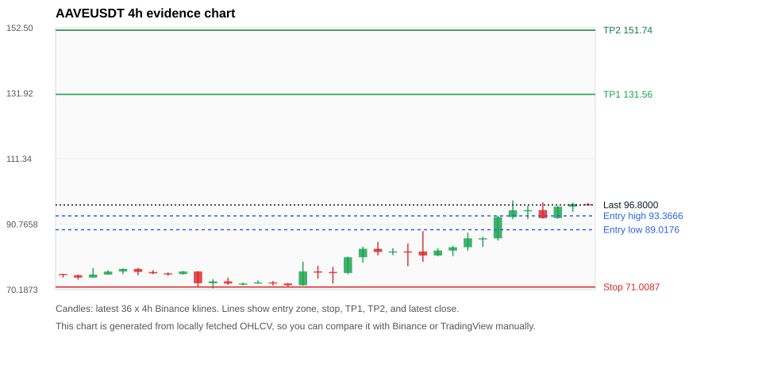
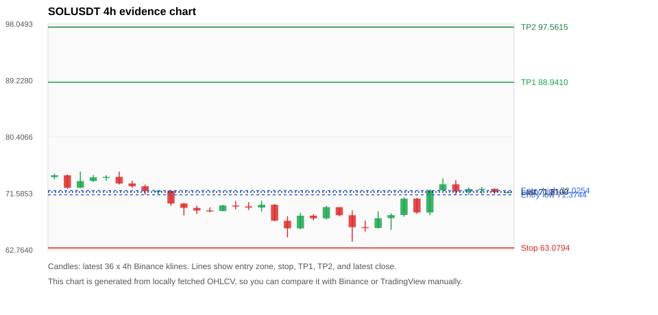
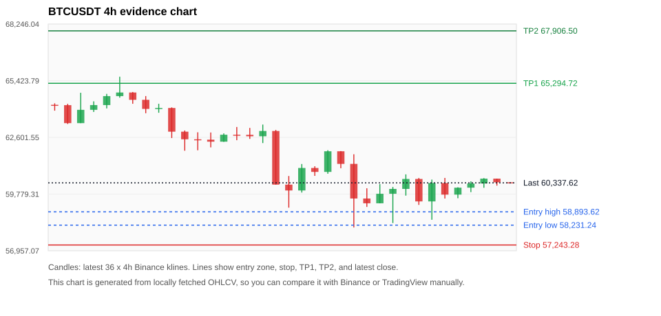
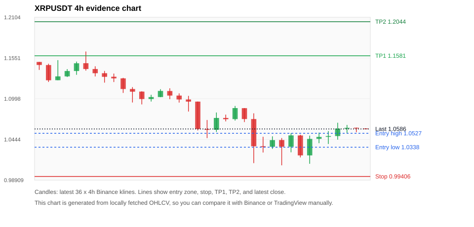
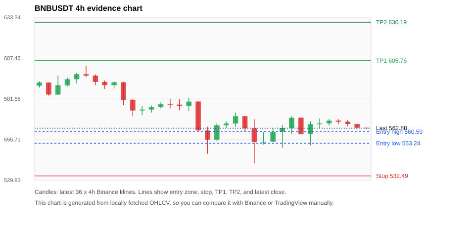

# Crypto 市场扫描报告 v1

- 报告时间：2026-06-27 20:06:22 CST
- Run ID：`20260627_120503_4ac34c94`
- Run type：`daily_full`
- 数据来源：SQLite
- 报告版本：v1
- 扫描 ID：d505babb3397
- 数据源：Binance public spot API + CoinGecko/CoinMarketCap cross-check
- 过滤条件：USDT spot; 24h quote volume >= 30,000,000; trades >= 30,000; exclude stables/leveraged tokens; analyze 1h/4h/1d klines
- 默认单笔风险：账户权益的 1.00%

## 限制说明

- 交易信号仍以 Binance 现货公开 K 线为主源；外部数据源用于一致性复核。
- 结果是研究和模拟盘计划，不是确定收益或实盘下单指令。
- 历史长度过滤：候选币至少需要 180 根 1d K 线。
- 数据质量验证池：先验证 score 排名前 min(top_n * 2, 10) 的候选，再按 action + score 补足最终名单。
- 大盘环境过滤：RISK_OFF; BTC/ETH 大盘偏弱，山寨币买入候选降级为观察。 BTC 7d=-6.152289938677735; ETH 7d=-9.024858134031744.
- 已启用数据交叉验证：Binance 主源 + CoinGecko 自动对照；CoinMarketCap 在配置 API Key 后自动对照。
- SOLUSDT 交叉验证状态 DATA_WARNING：At least one external provider needs manual review.
- BTCUSDT 交叉验证状态 DATA_WARNING：At least one external provider needs manual review.
- XRPUSDT 交叉验证状态 DATA_WARNING：At least one external provider needs manual review.
- BNBUSDT 交叉验证状态 DATA_WARNING：At least one external provider needs manual review.
- ZECUSDT 交叉验证状态 DATA_WARNING：At least one external provider needs manual review.
- DOGEUSDT 交叉验证状态 DATA_WARNING：At least one external provider needs manual review.
- NEARUSDT 交叉验证状态 DATA_WARNING：At least one external provider needs manual review.
- ETHUSDT 交叉验证状态 DATA_WARNING：At least one external provider needs manual review.
- WLDUSDT 交叉验证状态 DATA_WARNING：At least one external provider needs manual review.

## 5 个候选交易计划

| Rank | Coin | Action | Setup | Entry Zone | Stop Loss | TP1 | TP2 / Exit Rule | R/R | Verdict |
|---:|---|---|---|---:|---:|---:|---|---:|---|
| 1 | `AAVE` | `WATCH_ONLY` | 涨幅较远，只等深回调 | 89.0176 - 93.3666 | 71.0087 | 131.56 | 151.74 或跌破 4h 关键支撑 | 2.00-3.00 | 只等回调 |
| 2 | `SOL` | `WATCH_ONLY` | 回踩支撑/4h EMA 附近 | 71.3744 - 72.0254 | 63.0794 | 88.9410 | 97.5615 或跌破 4h 关键支撑 | 2.00-3.00 | 只观察 |
| 3 | `BTC` | `REJECT` | 回踩支撑/4h EMA 附近 | 58,231.24 - 58,893.62 | 57,243.28 | 65,294.72 | 67,906.50 或跌破 4h 关键支撑 | 5.10-7.08 | 只观察 |
| 4 | `XRP` | `REJECT` | 趋势中，等回调入场 | 1.0338 - 1.0527 | 0.99406 | 1.1581 | 1.2044 或跌破 4h 关键支撑 | 2.34-3.28 | 只观察 |
| 5 | `BNB` | `REJECT` | 趋势中，等回调入场 | 553.24 - 560.59 | 532.49 | 605.76 | 630.19 或跌破 4h 关键支撑 | 2.00-3.00 | 只观察 |

## 数据交叉验证摘要

价格差异以 Binance 当前价为基准；成交量口径不同，Binance 是 USDT 现货成交额，CoinGecko/CoinMarketCap 通常是全市场成交量。

| Rank | Coin | Data Status | Max Price Diff | Max 24h Diff | Message |
|---:|---|---|---:|---:|---|
| 1 | `AAVE` | DATA_OK | 0.18% | 0.67 pts | External provider checks agree with Binance within configured thresholds. |
| 2 | `SOL` | DATA_WARNING | 0.16% | 0.17 pts | At least one external provider needs manual review. |
| 3 | `BTC` | DATA_WARNING | 0.16% | 0.12 pts | At least one external provider needs manual review. |
| 4 | `XRP` | DATA_WARNING | 0.10% | 0.10 pts | At least one external provider needs manual review. |
| 5 | `BNB` | DATA_WARNING | 0.14% | 0.14 pts | At least one external provider needs manual review. |

## 候选币说明

### 1. AAVE `AAVEUSDT`



- 入选原因：涨幅较远，只等深回调；24h +11.83%，7d +30.53%，4h RSI 82.12，24h 成交额 $49.4M。
- 交易失效条件：跌破 71.00865 或 4h 收盘重新失守关键支撑。
- 主要风险：距离支撑偏远，不能追市价；4h RSI 偏热；日线趋势未完全确认；BTC/ETH 大盘环境未确认强势，山寨币买入信号降级。
- 数据交叉验证：DATA_OK；External provider checks agree with Binance within configured thresholds.

#### 可点击人工验证

- [Binance 交易页](https://www.binance.com/en/trade/AAVE_USDT)
- [TradingView 图表](https://www.tradingview.com/chart/?symbol=BINANCE%3AAAVEUSDT)
- [CoinGecko 搜索](https://www.coingecko.com/en/search?query=AAVE)
- [CoinMarketCap 搜索](https://coinmarketcap.com/search/?q=AAVE)

#### 多数据源对照

| Source | Status | Asset ID | Price | 24h Change | 24h Volume | Price Diff | 24h Diff | Updated | Message |
|---|---|---|---:|---:|---:|---:|---:|---|---|
| Binance | DATA_OK | AAVEUSDT | 96.8000 | +11.83% | $49.4M | 0.00% | 0.00 pts | 2026-06-27T12:05:39+00:00 | Primary market data source used by scanner. |
| CoinGecko | DATA_OK | aave | 96.7800 | +12.24% | $538.5M | 0.02% | 0.41 pts | 2026-06-27T12:05:32.197Z | External source agrees with Binance within thresholds. |
| CoinMarketCap | DATA_OK | 7278 | 96.9715 | +12.50% | $525.3M | 0.18% | 0.67 pts | 2026-06-27T12:04:03.000Z | External source agrees with Binance within thresholds. |

#### 指标证据

| 指标 | 数值 | 人工核对用途 |
|---|---:|---|
| 当前价 | 96.8000 | 与 Binance/TradingView 当前价格对照 |
| 24h 涨跌 | +11.83% | 与交易所 24h 涨跌对照 |
| 7d 涨跌 | +30.53% | 判断短线趋势是否延续 |
| 4h EMA20 | 87.7343 | 判断短期趋势支撑 |
| 4h EMA50 | 81.0299 | 判断中期趋势支撑 |
| 1d EMA20 | 78.4589 | 判断日线趋势 |
| 1d EMA50 | 80.7639 | 判断日线趋势 |
| 4h RSI14 | 82.12 | 判断是否过热/过弱 |
| 4h ATR14 | 4.5779 | 推导止损和入场缓冲 |
| 最近 18 根 4h 最低点 | 72.0900 | 支撑/止损参考 |
| 最近 36 根 4h 最高点 | 98.2300 | TP/压力参考 |
| 支撑位 | 87.7343 | 入场区间推导基础 |

#### 交易计划推导

- 支撑位 = 最近低点、4h EMA20、4h EMA50、1d EMA20 中不高于当前价的最高有效支撑 = `87.7343`。
- 入场区间 = 支撑位附近 + ATR 缓冲 = `89.0176 - 93.3666`。
- 止损 = min(最近 18 根 4h 最低点 * 0.985, 入场中位价 - 1.15 * ATR14) = `71.0087`。
- TP1 = max(最近 36 根 4h 最高点 * 0.995, 入场中位价 + 2R) = `131.56`。
- TP2 = max(入场中位价 + 3R, TP1 * 1.04) = `151.74`。

#### 最近 10 根 4h K线

| UTC 开盘时间 | Open | High | Low | Close | Quote Volume | Trades |
|---|---:|---:|---:|---:|---:|---:|
| 2026-06-26T00:00+00:00 | 82.4700 | 83.9900 | 80.7500 | 83.5100 | $7.1M | 84767 |
| 2026-06-26T04:00+00:00 | 83.5100 | 88.0600 | 82.4600 | 86.3200 | $7.2M | 84929 |
| 2026-06-26T08:00+00:00 | 86.3200 | 86.7900 | 83.5600 | 86.3200 | $5.5M | 67989 |
| 2026-06-26T12:00+00:00 | 86.3100 | 93.3600 | 85.6100 | 93.0000 | $10.7M | 154014 |
| 2026-06-26T16:00+00:00 | 93.0000 | 98.2300 | 92.3300 | 95.1300 | $13.6M | 181842 |
| 2026-06-26T20:00+00:00 | 95.1200 | 96.5400 | 92.3500 | 95.1900 | $7.4M | 88769 |
| 2026-06-27T00:00+00:00 | 95.2000 | 97.6500 | 92.5100 | 92.6500 | $8.1M | 78234 |
| 2026-06-27T04:00+00:00 | 92.6500 | 96.4400 | 92.5000 | 96.2600 | $5.7M | 53679 |
| 2026-06-27T08:00+00:00 | 96.2600 | 97.4900 | 94.6600 | 97.0600 | $3.9M | 38742 |
| 2026-06-27T12:00+00:00 | 97.0600 | 97.4600 | 96.7800 | 96.7800 | $198,712 | 1909 |

### 2. SOL `SOLUSDT`



- 入选原因：回踩支撑/4h EMA 附近；24h +4.46%，7d +0.87%，4h RSI 57.20，24h 成交额 $231.3M。
- 交易失效条件：跌破 63.0794 或 4h 收盘重新失守关键支撑。
- 主要风险：日线趋势未完全确认；BTC/ETH 大盘环境未确认强势，山寨币买入信号降级；数据交叉验证需要人工复核。
- 数据交叉验证：DATA_WARNING；At least one external provider needs manual review.

#### 可点击人工验证

- [Binance 交易页](https://www.binance.com/en/trade/SOL_USDT)
- [TradingView 图表](https://www.tradingview.com/chart/?symbol=BINANCE%3ASOLUSDT)
- [CoinGecko 搜索](https://www.coingecko.com/en/search?query=SOL)
- [CoinMarketCap 搜索](https://coinmarketcap.com/search/?q=SOL)

#### 多数据源对照

| Source | Status | Asset ID | Price | 24h Change | 24h Volume | Price Diff | 24h Diff | Updated | Message |
|---|---|---|---:|---:|---:|---:|---:|---|---|
| Binance | DATA_OK | SOLUSDT | 71.8100 | +4.46% | $231.3M | 0.00% | 0.00 pts | 2026-06-27T12:05:39+00:00 | Primary market data source used by scanner. |
| CoinGecko | DATA_OK | solana | 71.7100 | +4.58% | $3.33B | 0.14% | 0.12 pts | 2026-06-27T12:05:37.969Z | External source agrees with Binance within thresholds. |
| CoinMarketCap | DATA_WARNING | 5426 | 71.6960 | +4.63% | $3.29B | 0.16% | 0.17 pts | 2026-06-27T12:04:03.000Z | CoinMarketCap symbol mapping has 8 matches; selected lowest cmc_rank |

#### 指标证据

| 指标 | 数值 | 人工核对用途 |
|---|---:|---|
| 当前价 | 71.8100 | 与 Binance/TradingView 当前价格对照 |
| 24h 涨跌 | +4.46% | 与交易所 24h 涨跌对照 |
| 7d 涨跌 | +0.87% | 判断短线趋势是否延续 |
| 4h EMA20 | 70.5354 | 判断短期趋势支撑 |
| 4h EMA50 | 70.3209 | 判断中期趋势支撑 |
| 1d EMA20 | 71.2319 | 判断日线趋势 |
| 1d EMA50 | 75.5303 | 判断日线趋势 |
| 4h RSI14 | 57.20 | 判断是否过热/过弱 |
| 4h ATR14 | 2.1600 | 推导止损和入场缓冲 |
| 最近 18 根 4h 最低点 | 64.0400 | 支撑/止损参考 |
| 最近 36 根 4h 最高点 | 75.0000 | TP/压力参考 |
| 支撑位 | 71.2319 | 入场区间推导基础 |

#### 交易计划推导

- 支撑位 = 最近低点、4h EMA20、4h EMA50、1d EMA20 中不高于当前价的最高有效支撑 = `71.2319`。
- 入场区间 = 支撑位附近 + ATR 缓冲 = `71.3744 - 72.0254`。
- 止损 = min(最近 18 根 4h 最低点 * 0.985, 入场中位价 - 1.15 * ATR14) = `63.0794`。
- TP1 = max(最近 36 根 4h 最高点 * 0.995, 入场中位价 + 2R) = `88.9410`。
- TP2 = max(入场中位价 + 3R, TP1 * 1.04) = `97.5615`。

#### 最近 10 根 4h K线

| UTC 开盘时间 | Open | High | Low | Close | Quote Volume | Trades |
|---|---:|---:|---:|---:|---:|---:|
| 2026-06-26T00:00+00:00 | 67.7200 | 68.5000 | 65.9100 | 68.2100 | $45.9M | 272725 |
| 2026-06-26T04:00+00:00 | 68.2200 | 70.9900 | 67.9600 | 70.7700 | $61.6M | 269080 |
| 2026-06-26T08:00+00:00 | 70.7800 | 70.8800 | 68.3900 | 68.6100 | $35.0M | 190965 |
| 2026-06-26T12:00+00:00 | 68.6100 | 72.2400 | 68.1900 | 72.0700 | $73.4M | 545247 |
| 2026-06-26T16:00+00:00 | 72.0600 | 73.9300 | 72.0100 | 73.0100 | $59.1M | 366350 |
| 2026-06-26T20:00+00:00 | 73.0100 | 73.6800 | 71.4100 | 71.9000 | $35.8M | 198445 |
| 2026-06-27T00:00+00:00 | 71.9000 | 72.5000 | 71.3600 | 72.2700 | $26.5M | 114906 |
| 2026-06-27T04:00+00:00 | 72.2600 | 72.5900 | 71.5100 | 72.3100 | $22.8M | 87362 |
| 2026-06-27T08:00+00:00 | 72.3100 | 72.3300 | 71.5300 | 71.8100 | $13.3M | 60987 |
| 2026-06-27T12:00+00:00 | 71.8100 | 71.8900 | 71.7800 | 71.8100 | $933,277 | 2233 |

### 3. BTC `BTCUSDT`



- 入选原因：回踩支撑/4h EMA 附近；24h +1.48%，7d -4.83%，4h RSI 39.40，24h 成交额 $1.02B。
- 交易失效条件：跌破 57243.285 或 4h 收盘重新失守关键支撑。
- 主要风险：日线趋势未完全确认；BTC/ETH 大盘环境未确认强势，山寨币买入信号降级；7d 趋势未确认；数据交叉验证需要人工复核。
- 数据交叉验证：DATA_WARNING；At least one external provider needs manual review.

#### 可点击人工验证

- [Binance 交易页](https://www.binance.com/en/trade/BTC_USDT)
- [TradingView 图表](https://www.tradingview.com/chart/?symbol=BINANCE%3ABTCUSDT)
- [CoinGecko 搜索](https://www.coingecko.com/en/search?query=BTC)
- [CoinMarketCap 搜索](https://coinmarketcap.com/search/?q=BTC)

#### 多数据源对照

| Source | Status | Asset ID | Price | 24h Change | 24h Volume | Price Diff | 24h Diff | Updated | Message |
|---|---|---|---:|---:|---:|---:|---:|---|---|
| Binance | DATA_OK | BTCUSDT | 60,337.62 | +1.48% | $1.02B | 0.00% | 0.00 pts | 2026-06-27T12:05:39+00:00 | Primary market data source used by scanner. |
| CoinGecko | DATA_OK | bitcoin | 60,243.00 | +1.46% | $26.24B | 0.16% | 0.02 pts | 2026-06-27T12:05:42.723Z | External source agrees with Binance within thresholds. |
| CoinMarketCap | DATA_WARNING | 1 | 60,248.70 | +1.59% | $28.36B | 0.15% | 0.12 pts | 2026-06-27T12:04:03.000Z | CoinMarketCap symbol mapping has 13 matches; selected lowest cmc_rank |

#### 指标证据

| 指标 | 数值 | 人工核对用途 |
|---|---:|---|
| 当前价 | 60,337.62 | 与 Binance/TradingView 当前价格对照 |
| 24h 涨跌 | +1.48% | 与交易所 24h 涨跌对照 |
| 7d 涨跌 | -4.83% | 判断短线趋势是否延续 |
| 4h EMA20 | 60,709.63 | 判断短期趋势支撑 |
| 4h EMA50 | 61,852.73 | 判断中期趋势支撑 |
| 1d EMA20 | 63,518.14 | 判断日线趋势 |
| 1d EMA50 | 67,595.22 | 判断日线趋势 |
| 4h RSI14 | 39.40 | 判断是否过热/过弱 |
| 4h ATR14 | 1,112.30 | 推导止损和入场缓冲 |
| 最近 18 根 4h 最低点 | 58,115.01 | 支撑/止损参考 |
| 最近 36 根 4h 最高点 | 65,622.83 | TP/压力参考 |
| 支撑位 | 58,115.01 | 入场区间推导基础 |

#### 交易计划推导

- 支撑位 = 最近低点、4h EMA20、4h EMA50、1d EMA20 中不高于当前价的最高有效支撑 = `58,115.01`。
- 入场区间 = 支撑位附近 + ATR 缓冲 = `58,231.24 - 58,893.62`。
- 止损 = min(最近 18 根 4h 最低点 * 0.985, 入场中位价 - 1.15 * ATR14) = `57,243.28`。
- TP1 = max(最近 36 根 4h 最高点 * 0.995, 入场中位价 + 2R) = `65,294.72`。
- TP2 = max(入场中位价 + 3R, TP1 * 1.04) = `67,906.50`。

#### 最近 10 根 4h K线

| UTC 开盘时间 | Open | High | Low | Close | Quote Volume | Trades |
|---|---:|---:|---:|---:|---:|---:|
| 2026-06-26T00:00+00:00 | 59,794.64 | 60,131.37 | 58,337.00 | 60,036.01 | $368.5M | 1223525 |
| 2026-06-26T04:00+00:00 | 60,036.00 | 60,759.99 | 59,702.00 | 60,532.00 | $324.3M | 866194 |
| 2026-06-26T08:00+00:00 | 60,532.00 | 60,580.00 | 59,239.78 | 59,413.24 | $223.3M | 807589 |
| 2026-06-26T12:00+00:00 | 59,413.24 | 60,500.00 | 58,500.10 | 60,328.32 | $463.0M | 1875169 |
| 2026-06-26T16:00+00:00 | 60,328.18 | 60,583.00 | 59,556.00 | 59,751.97 | $173.4M | 854765 |
| 2026-06-26T20:00+00:00 | 59,751.96 | 60,117.64 | 59,571.31 | 60,097.27 | $83.7M | 391892 |
| 2026-06-27T00:00+00:00 | 60,097.27 | 60,412.00 | 59,876.22 | 60,305.73 | $104.7M | 306723 |
| 2026-06-27T04:00+00:00 | 60,305.73 | 60,574.00 | 60,093.33 | 60,548.07 | $130.1M | 266760 |
| 2026-06-27T08:00+00:00 | 60,548.06 | 60,548.74 | 60,198.94 | 60,363.65 | $72.0M | 219343 |
| 2026-06-27T12:00+00:00 | 60,363.65 | 60,363.66 | 60,304.66 | 60,337.63 | $2.3M | 7049 |

### 4. XRP `XRPUSDT`



- 入选原因：趋势中，等回调入场；24h +3.45%，7d -7.23%，4h RSI 40.68，24h 成交额 $111.2M。
- 交易失效条件：跌破 0.994062 或 4h 收盘重新失守关键支撑。
- 主要风险：日线趋势未完全确认；BTC/ETH 大盘环境未确认强势，山寨币买入信号降级；7d 趋势未确认；数据交叉验证需要人工复核。
- 数据交叉验证：DATA_WARNING；At least one external provider needs manual review.

#### 可点击人工验证

- [Binance 交易页](https://www.binance.com/en/trade/XRP_USDT)
- [TradingView 图表](https://www.tradingview.com/chart/?symbol=BINANCE%3AXRPUSDT)
- [CoinGecko 搜索](https://www.coingecko.com/en/search?query=XRP)
- [CoinMarketCap 搜索](https://coinmarketcap.com/search/?q=XRP)

#### 多数据源对照

| Source | Status | Asset ID | Price | 24h Change | 24h Volume | Price Diff | 24h Diff | Updated | Message |
|---|---|---|---:|---:|---:|---:|---:|---|---|
| Binance | DATA_OK | XRPUSDT | 1.0586 | +3.45% | $111.2M | 0.00% | 0.00 pts | 2026-06-27T12:05:39+00:00 | Primary market data source used by scanner. |
| CoinGecko | DATA_OK | ripple | 1.0580 | +3.53% | $1.83B | 0.06% | 0.08 pts | 2026-06-27T12:05:38.497Z | External source agrees with Binance within thresholds. |
| CoinMarketCap | DATA_WARNING | 52 | 1.0575 | +3.55% | $1.88B | 0.10% | 0.10 pts | 2026-06-27T12:04:03.000Z | CoinMarketCap symbol mapping has 3 matches; selected lowest cmc_rank |

#### 指标证据

| 指标 | 数值 | 人工核对用途 |
|---|---:|---|
| 当前价 | 1.0586 | 与 Binance/TradingView 当前价格对照 |
| 24h 涨跌 | +3.45% | 与交易所 24h 涨跌对照 |
| 7d 涨跌 | -7.23% | 判断短线趋势是否延续 |
| 4h EMA20 | 1.0627 | 判断短期趋势支撑 |
| 4h EMA50 | 1.0925 | 判断中期趋势支撑 |
| 1d EMA20 | 1.1337 | 判断日线趋势 |
| 1d EMA50 | 1.2198 | 判断日线趋势 |
| 4h RSI14 | 40.68 | 判断是否过热/过弱 |
| 4h ATR14 | 0.02364 | 推导止损和入场缓冲 |
| 最近 18 根 4h 最低点 | 1.0092 | 支撑/止损参考 |
| 最近 36 根 4h 最高点 | 1.1639 | TP/压力参考 |
| 支撑位 | 1.0092 | 入场区间推导基础 |

#### 交易计划推导

- 支撑位 = 最近低点、4h EMA20、4h EMA50、1d EMA20 中不高于当前价的最高有效支撑 = `1.0092`。
- 入场区间 = 支撑位附近 + ATR 缓冲 = `1.0338 - 1.0527`。
- 止损 = min(最近 18 根 4h 最低点 * 0.985, 入场中位价 - 1.15 * ATR14) = `0.99406`。
- TP1 = max(最近 36 根 4h 最高点 * 0.995, 入场中位价 + 2R) = `1.1581`。
- TP2 = max(入场中位价 + 3R, TP1 * 1.04) = `1.2044`。

#### 最近 10 根 4h K线

| UTC 开盘时间 | Open | High | Low | Close | Quote Volume | Trades |
|---|---:|---:|---:|---:|---:|---:|
| 2026-06-26T00:00+00:00 | 1.0436 | 1.0463 | 1.0092 | 1.0345 | $32.9M | 209354 |
| 2026-06-26T04:00+00:00 | 1.0345 | 1.0529 | 1.0269 | 1.0499 | $19.9M | 120328 |
| 2026-06-26T08:00+00:00 | 1.0498 | 1.0508 | 1.0199 | 1.0227 | $15.6M | 97117 |
| 2026-06-26T12:00+00:00 | 1.0227 | 1.0496 | 1.0113 | 1.0451 | $50.1M | 317403 |
| 2026-06-26T16:00+00:00 | 1.0452 | 1.0537 | 1.0393 | 1.0478 | $20.1M | 131111 |
| 2026-06-26T20:00+00:00 | 1.0479 | 1.0558 | 1.0382 | 1.0490 | $11.6M | 88640 |
| 2026-06-27T00:00+00:00 | 1.0490 | 1.0671 | 1.0441 | 1.0591 | $13.7M | 90507 |
| 2026-06-27T04:00+00:00 | 1.0591 | 1.0641 | 1.0530 | 1.0602 | $10.1M | 60791 |
| 2026-06-27T08:00+00:00 | 1.0603 | 1.0605 | 1.0543 | 1.0594 | $5.9M | 38475 |
| 2026-06-27T12:00+00:00 | 1.0593 | 1.0596 | 1.0585 | 1.0586 | $137,826 | 778 |

### 5. BNB `BNBUSDT`



- 入选原因：趋势中，等回调入场；24h +0.53%，7d -3.74%，4h RSI 43.20，24h 成交额 $64.5M。
- 交易失效条件：跌破 532.491 或 4h 收盘重新失守关键支撑。
- 主要风险：日线趋势未完全确认；BTC/ETH 大盘环境未确认强势，山寨币买入信号降级；7d 趋势未确认；数据交叉验证需要人工复核。
- 数据交叉验证：DATA_WARNING；At least one external provider needs manual review.

#### 可点击人工验证

- [Binance 交易页](https://www.binance.com/en/trade/BNB_USDT)
- [TradingView 图表](https://www.tradingview.com/chart/?symbol=BINANCE%3ABNBUSDT)
- [CoinGecko 搜索](https://www.coingecko.com/en/search?query=BNB)
- [CoinMarketCap 搜索](https://coinmarketcap.com/search/?q=BNB)

#### 多数据源对照

| Source | Status | Asset ID | Price | 24h Change | 24h Volume | Price Diff | 24h Diff | Updated | Message |
|---|---|---|---:|---:|---:|---:|---:|---|---|
| Binance | DATA_OK | BNBUSDT | 562.88 | +0.53% | $64.5M | 0.00% | 0.00 pts | 2026-06-27T12:05:39+00:00 | Primary market data source used by scanner. |
| CoinGecko | DATA_OK | binancecoin | 562.08 | +0.63% | $704.1M | 0.14% | 0.10 pts | 2026-06-27T12:05:42.242Z | External source agrees with Binance within thresholds. |
| CoinMarketCap | DATA_WARNING | 1839 | 562.06 | +0.67% | $1.12B | 0.14% | 0.14 pts | 2026-06-27T12:05:05.000Z | CoinMarketCap symbol mapping has 4 matches; selected lowest cmc_rank |

#### 指标证据

| 指标 | 数值 | 人工核对用途 |
|---|---:|---|
| 当前价 | 562.88 | 与 Binance/TradingView 当前价格对照 |
| 24h 涨跌 | +0.53% | 与交易所 24h 涨跌对照 |
| 7d 涨跌 | -3.74% | 判断短线趋势是否延续 |
| 4h EMA20 | 566.67 | 判断短期趋势支撑 |
| 4h EMA50 | 575.09 | 判断中期趋势支撑 |
| 1d EMA20 | 589.27 | 判断日线趋势 |
| 1d EMA50 | 611.58 | 判断日线趋势 |
| 4h RSI14 | 43.20 | 判断是否过热/过弱 |
| 4h ATR14 | 9.1771 | 推导止损和入场缓冲 |
| 最近 18 根 4h 最低点 | 540.60 | 支撑/止损参考 |
| 最近 36 根 4h 最高点 | 602.31 | TP/压力参考 |
| 支撑位 | 540.60 | 入场区间推导基础 |

#### 交易计划推导

- 支撑位 = 最近低点、4h EMA20、4h EMA50、1d EMA20 中不高于当前价的最高有效支撑 = `540.60`。
- 入场区间 = 支撑位附近 + ATR 缓冲 = `553.24 - 560.59`。
- 止损 = min(最近 18 根 4h 最低点 * 0.985, 入场中位价 - 1.15 * ATR14) = `532.49`。
- TP1 = max(最近 36 根 4h 最高点 * 0.995, 入场中位价 + 2R) = `605.76`。
- TP2 = max(入场中位价 + 3R, TP1 * 1.04) = `630.19`。

#### 最近 10 根 4h K线

| UTC 开盘时间 | Open | High | Low | Close | Quote Volume | Trades |
|---|---:|---:|---:|---:|---:|---:|
| 2026-06-26T00:00+00:00 | 560.63 | 564.98 | 550.37 | 562.99 | $21.9M | 230929 |
| 2026-06-26T04:00+00:00 | 562.99 | 570.34 | 559.04 | 569.48 | $17.3M | 178273 |
| 2026-06-26T08:00+00:00 | 569.49 | 569.96 | 558.82 | 558.99 | $20.8M | 205371 |
| 2026-06-26T12:00+00:00 | 558.99 | 567.20 | 551.92 | 565.28 | $28.4M | 214960 |
| 2026-06-26T16:00+00:00 | 565.28 | 568.98 | 562.77 | 565.82 | $11.4M | 106098 |
| 2026-06-26T20:00+00:00 | 565.85 | 568.68 | 564.46 | 567.64 | $4.9M | 48447 |
| 2026-06-27T00:00+00:00 | 567.65 | 568.66 | 565.23 | 566.96 | $6.0M | 100057 |
| 2026-06-27T04:00+00:00 | 566.96 | 567.95 | 563.93 | 565.53 | $8.9M | 76797 |
| 2026-06-27T08:00+00:00 | 565.53 | 565.72 | 562.53 | 563.16 | $7.5M | 80329 |
| 2026-06-27T12:00+00:00 | 563.16 | 563.17 | 562.73 | 562.89 | $103,702 | 2337 |

## 组合风控

- 不要 5 个候选全部满仓买入。
- 同时持仓总风险建议控制在账户权益的 3% - 5% 以内。
- 如果 BTC/ETH 同时破位，暂停山寨币多头计划或降低仓位。
- 第一版报告用于模拟盘和人工复核，不自动下单。

## 原始数据

```json
[
  {
    "rank": 1,
    "symbol": "AAVEUSDT",
    "base_asset": "AAVE",
    "price": 96.8,
    "score": 53.35233577557281,
    "setup": "涨幅较远，只等深回调",
    "verdict": "只等回调",
    "entry_low": 89.01764285714286,
    "entry_high": 93.36660714285713,
    "stop_loss": 71.00865,
    "take_profit_1": 131.559075,
    "take_profit_2": 151.74255,
    "risk_reward_1": 2.0,
    "risk_reward_2": 2.999999999999999,
    "pct_24h": 11.83,
    "pct_3d": 30.317716747442102,
    "pct_7d": 30.528586839266445,
    "quote_volume_24h": 49406970.43079,
    "trades_24h": 594445,
    "high_low_range_24h": 14.741268543394458,
    "rsi_1h": 53.495007132667645,
    "rsi_4h": 82.12266202696824,
    "ema20_4h": 87.73433336700904,
    "ema50_4h": 81.02985558126495,
    "ema20_1d": 78.458930853097,
    "ema50_1d": 80.7638735188585,
    "atr_4h": 4.577857142857142,
    "macd_hist_4h": 1.1212200842068736,
    "volume_ratio_24h": 2.0688212265502823,
    "support_level": 87.73433336700904,
    "recent_low_4h_18": 72.09,
    "recent_high_4h_36": 98.23,
    "distance_to_support_pct": 10.333088866211115,
    "binance_trade_url": "https://www.binance.com/en/trade/AAVE_USDT",
    "tradingview_url": "https://www.tradingview.com/chart/?symbol=BINANCE%3AAAVEUSDT",
    "coingecko_search_url": "https://www.coingecko.com/en/search?query=AAVE",
    "coinmarketcap_search_url": "https://coinmarketcap.com/search/?q=AAVE",
    "invalidation": "跌破 71.00865 或 4h 收盘重新失守关键支撑",
    "recent_4h_klines": [
      {
        "open_time_utc": "2026-06-21T16:00+00:00",
        "open": 75.09,
        "high": 75.12,
        "low": 74.0,
        "close": 74.72,
        "quote_volume": 629956.35951,
        "trades": 10358
      },
      {
        "open_time_utc": "2026-06-21T20:00+00:00",
        "open": 74.72,
        "high": 74.92,
        "low": 73.32,
        "close": 73.97,
        "quote_volume": 1146335.14948,
        "trades": 18769
      },
      {
        "open_time_utc": "2026-06-22T00:00+00:00",
        "open": 73.98,
        "high": 76.96,
        "low": 73.98,
        "close": 74.92,
        "quote_volume": 2585322.33993,
        "trades": 27761
      },
      {
        "open_time_utc": "2026-06-22T04:00+00:00",
        "open": 74.92,
        "high": 76.28,
        "low": 74.82,
        "close": 75.87,
        "quote_volume": 1045322.73093,
        "trades": 14714
      },
      {
        "open_time_utc": "2026-06-22T08:00+00:00",
        "open": 75.88,
        "high": 76.88,
        "low": 75.02,
        "close": 76.7,
        "quote_volume": 1625447.39954,
        "trades": 15894
      },
      {
        "open_time_utc": "2026-06-22T12:00+00:00",
        "open": 76.7,
        "high": 77.05,
        "low": 74.72,
        "close": 75.75,
        "quote_volume": 2601928.34421,
        "trades": 32848
      },
      {
        "open_time_utc": "2026-06-22T16:00+00:00",
        "open": 75.75,
        "high": 76.33,
        "low": 75.04,
        "close": 75.3,
        "quote_volume": 1098732.99889,
        "trades": 16897
      },
      {
        "open_time_utc": "2026-06-22T20:00+00:00",
        "open": 75.31,
        "high": 75.61,
        "low": 74.51,
        "close": 75.07,
        "quote_volume": 641613.84031,
        "trades": 12827
      },
      {
        "open_time_utc": "2026-06-23T00:00+00:00",
        "open": 75.07,
        "high": 76.07,
        "low": 74.93,
        "close": 75.89,
        "quote_volume": 1193635.78741,
        "trades": 14465
      },
      {
        "open_time_utc": "2026-06-23T04:00+00:00",
        "open": 75.89,
        "high": 76.03,
        "low": 71.16,
        "close": 72.19,
        "quote_volume": 4748275.86151,
        "trades": 32389
      },
      {
        "open_time_utc": "2026-06-23T08:00+00:00",
        "open": 72.19,
        "high": 73.47,
        "low": 70.54,
        "close": 72.78,
        "quote_volume": 3300357.86294,
        "trades": 27839
      },
      {
        "open_time_utc": "2026-06-23T12:00+00:00",
        "open": 72.79,
        "high": 73.96,
        "low": 71.67,
        "close": 72.09,
        "quote_volume": 3805559.7999,
        "trades": 42948
      },
      {
        "open_time_utc": "2026-06-23T16:00+00:00",
        "open": 72.1,
        "high": 72.45,
        "low": 71.52,
        "close": 72.1,
        "quote_volume": 1540092.95293,
        "trades": 23914
      },
      {
        "open_time_utc": "2026-06-23T20:00+00:00",
        "open": 72.1,
        "high": 73.07,
        "low": 72.04,
        "close": 72.46,
        "quote_volume": 624826.50896,
        "trades": 12061
      },
      {
        "open_time_utc": "2026-06-24T00:00+00:00",
        "open": 72.46,
        "high": 72.91,
        "low": 71.46,
        "close": 72.13,
        "quote_volume": 1497008.62115,
        "trades": 18805
      },
      {
        "open_time_utc": "2026-06-24T04:00+00:00",
        "open": 72.13,
        "high": 72.22,
        "low": 71.17,
        "close": 71.55,
        "quote_volume": 1308516.17891,
        "trades": 14827
      },
      {
        "open_time_utc": "2026-06-24T08:00+00:00",
        "open": 71.55,
        "high": 79.0,
        "low": 71.41,
        "close": 75.9,
        "quote_volume": 6451069.76375,
        "trades": 60242
      },
      {
        "open_time_utc": "2026-06-24T12:00+00:00",
        "open": 75.91,
        "high": 77.63,
        "low": 73.65,
        "close": 75.76,
        "quote_volume": 10026556.85384,
        "trades": 128675
      },
      {
        "open_time_utc": "2026-06-24T16:00+00:00",
        "open": 75.75,
        "high": 77.34,
        "low": 72.09,
        "close": 75.44,
        "quote_volume": 7224791.30503,
        "trades": 119688
      },
      {
        "open_time_utc": "2026-06-24T20:00+00:00",
        "open": 75.43,
        "high": 80.55,
        "low": 75.03,
        "close": 80.36,
        "quote_volume": 7004166.04486,
        "trades": 91780
      },
      {
        "open_time_utc": "2026-06-25T00:00+00:00",
        "open": 80.37,
        "high": 83.7,
        "low": 78.66,
        "close": 83.02,
        "quote_volume": 7585297.04452,
        "trades": 80526
      },
      {
        "open_time_utc": "2026-06-25T04:00+00:00",
        "open": 83.02,
        "high": 85.21,
        "low": 80.94,
        "close": 82.01,
        "quote_volume": 8984173.84895,
        "trades": 78549
      },
      {
        "open_time_utc": "2026-06-25T08:00+00:00",
        "open": 82.0,
        "high": 83.21,
        "low": 81.02,
        "close": 82.2,
        "quote_volume": 5508656.39321,
        "trades": 61055
      },
      {
        "open_time_utc": "2026-06-25T12:00+00:00",
        "open": 82.2,
        "high": 84.74,
        "low": 77.5,
        "close": 82.18,
        "quote_volume": 9681313.77408,
        "trades": 140192
      },
      {
        "open_time_utc": "2026-06-25T16:00+00:00",
        "open": 82.18,
        "high": 88.57,
        "low": 78.93,
        "close": 80.91,
        "quote_volume": 10301865.64527,
        "trades": 162074
      },
      {
        "open_time_utc": "2026-06-25T20:00+00:00",
        "open": 80.91,
        "high": 83.19,
        "low": 80.67,
        "close": 82.47,
        "quote_volume": 2718662.89952,
        "trades": 44508
      },
      {
        "open_time_utc": "2026-06-26T00:00+00:00",
        "open": 82.47,
        "high": 83.99,
        "low": 80.75,
        "close": 83.51,
        "quote_volume": 7119213.24217,
        "trades": 84767
      },
      {
        "open_time_utc": "2026-06-26T04:00+00:00",
        "open": 83.51,
        "high": 88.06,
        "low": 82.46,
        "close": 86.32,
        "quote_volume": 7162284.37654,
        "trades": 84929
      },
      {
        "open_time_utc": "2026-06-26T08:00+00:00",
        "open": 86.32,
        "high": 86.79,
        "low": 83.56,
        "close": 86.32,
        "quote_volume": 5528093.24022,
        "trades": 67989
      },
      {
        "open_time_utc": "2026-06-26T12:00+00:00",
        "open": 86.31,
        "high": 93.36,
        "low": 85.61,
        "close": 93.0,
        "quote_volume": 10711788.16516,
        "trades": 154014
      },
      {
        "open_time_utc": "2026-06-26T16:00+00:00",
        "open": 93.0,
        "high": 98.23,
        "low": 92.33,
        "close": 95.13,
        "quote_volume": 13576396.89088,
        "trades": 181842
      },
      {
        "open_time_utc": "2026-06-26T20:00+00:00",
        "open": 95.12,
        "high": 96.54,
        "low": 92.35,
        "close": 95.19,
        "quote_volume": 7409388.11541,
        "trades": 88769
      },
      {
        "open_time_utc": "2026-06-27T00:00+00:00",
        "open": 95.2,
        "high": 97.65,
        "low": 92.51,
        "close": 92.65,
        "quote_volume": 8133174.21598,
        "trades": 78234
      },
      {
        "open_time_utc": "2026-06-27T04:00+00:00",
        "open": 92.65,
        "high": 96.44,
        "low": 92.5,
        "close": 96.26,
        "quote_volume": 5657106.27383,
        "trades": 53679
      },
      {
        "open_time_utc": "2026-06-27T08:00+00:00",
        "open": 96.26,
        "high": 97.49,
        "low": 94.66,
        "close": 97.06,
        "quote_volume": 3925259.7029,
        "trades": 38742
      },
      {
        "open_time_utc": "2026-06-27T12:00+00:00",
        "open": 97.06,
        "high": 97.46,
        "low": 96.78,
        "close": 96.78,
        "quote_volume": 198712.40461,
        "trades": 1909
      }
    ],
    "risks": [
      "距离支撑偏远，不能追市价",
      "4h RSI 偏热",
      "日线趋势未完全确认",
      "BTC/ETH 大盘环境未确认强势，山寨币买入信号降级"
    ],
    "data_quality_status": "DATA_OK",
    "data_quality_message": "External provider checks agree with Binance within configured thresholds.",
    "data_checks": [
      {
        "provider": "Binance",
        "status": "DATA_OK",
        "provider_asset_id": "AAVEUSDT",
        "provider_symbol": "AAVEUSDT",
        "price_usd": 96.8,
        "pct_24h": 11.83,
        "volume_24h": 49406970.43079,
        "last_updated": null,
        "fetched_at_utc": "2026-06-27T12:05:39+00:00",
        "price_diff_pct": 0.0,
        "pct_24h_diff": 0.0,
        "volume_note": "Binance USDT spot 24h quoteVolume.",
        "message": "Primary market data source used by scanner."
      },
      {
        "provider": "CoinGecko",
        "status": "DATA_OK",
        "provider_asset_id": "aave",
        "provider_symbol": "AAVE",
        "price_usd": 96.78,
        "pct_24h": 12.23881,
        "volume_24h": 538470171.0,
        "last_updated": "2026-06-27T12:05:32.197Z",
        "fetched_at_utc": "2026-06-27T12:05:39+00:00",
        "price_diff_pct": 0.020661157024789278,
        "pct_24h_diff": 0.4088100000000008,
        "volume_note": "CoinGecko total market volume; not the same venue scope as Binance quoteVolume.",
        "message": "External source agrees with Binance within thresholds."
      },
      {
        "provider": "CoinMarketCap",
        "status": "DATA_OK",
        "provider_asset_id": "7278",
        "provider_symbol": "AAVE",
        "price_usd": 96.97152453184252,
        "pct_24h": 12.50074015,
        "volume_24h": 525270555.6412518,
        "last_updated": "2026-06-27T12:04:03.000Z",
        "fetched_at_utc": "2026-06-27T12:05:39+00:00",
        "price_diff_pct": 0.17719476430012585,
        "pct_24h_diff": 0.6707401500000003,
        "volume_note": "CoinMarketCap total market volume; not the same venue scope as Binance quoteVolume.",
        "message": "External source agrees with Binance within thresholds."
      }
    ],
    "action": "WATCH_ONLY"
  },
  {
    "rank": 2,
    "symbol": "SOLUSDT",
    "base_asset": "SOL",
    "price": 71.81,
    "score": 47.75437983196434,
    "setup": "回踩支撑/4h EMA 附近",
    "verdict": "只观察",
    "entry_low": 71.37440345055556,
    "entry_high": 72.02543,
    "stop_loss": 63.07940000000001,
    "take_profit_1": 88.94095017583331,
    "take_profit_2": 97.56146690111107,
    "risk_reward_1": 2.0,
    "risk_reward_2": 3.0,
    "pct_24h": 4.465,
    "pct_3d": 4.25377468060395,
    "pct_7d": 0.8709088355106198,
    "quote_volume_24h": 231307215.40476,
    "trades_24h": 1371576,
    "high_low_range_24h": 8.417656547880936,
    "rsi_1h": 49.68553459119503,
    "rsi_4h": 57.19512195121951,
    "ema20_4h": 70.53541304965951,
    "ema50_4h": 70.32092865055218,
    "ema20_1d": 71.23193957141274,
    "ema50_1d": 75.5302797768316,
    "atr_4h": 2.1599999999999997,
    "macd_hist_4h": 0.4698182318099389,
    "volume_ratio_24h": 1.0932623086536053,
    "support_level": 71.23193957141274,
    "recent_low_4h_18": 64.04,
    "recent_high_4h_36": 75.0,
    "distance_to_support_pct": 0.8115185857149543,
    "binance_trade_url": "https://www.binance.com/en/trade/SOL_USDT",
    "tradingview_url": "https://www.tradingview.com/chart/?symbol=BINANCE%3ASOLUSDT",
    "coingecko_search_url": "https://www.coingecko.com/en/search?query=SOL",
    "coinmarketcap_search_url": "https://coinmarketcap.com/search/?q=SOL",
    "invalidation": "跌破 63.0794 或 4h 收盘重新失守关键支撑",
    "recent_4h_klines": [
      {
        "open_time_utc": "2026-06-21T16:00+00:00",
        "open": 74.14,
        "high": 74.68,
        "low": 73.8,
        "close": 74.42,
        "quote_volume": 23911073.74057,
        "trades": 106408
      },
      {
        "open_time_utc": "2026-06-21T20:00+00:00",
        "open": 74.42,
        "high": 74.55,
        "low": 72.31,
        "close": 72.46,
        "quote_volume": 30226764.9787,
        "trades": 182650
      },
      {
        "open_time_utc": "2026-06-22T00:00+00:00",
        "open": 72.47,
        "high": 74.99,
        "low": 72.46,
        "close": 73.52,
        "quote_volume": 34944267.8081,
        "trades": 201772
      },
      {
        "open_time_utc": "2026-06-22T04:00+00:00",
        "open": 73.53,
        "high": 74.48,
        "low": 73.36,
        "close": 74.1,
        "quote_volume": 21721477.77526,
        "trades": 103009
      },
      {
        "open_time_utc": "2026-06-22T08:00+00:00",
        "open": 74.1,
        "high": 74.44,
        "low": 73.57,
        "close": 74.17,
        "quote_volume": 32748234.88027,
        "trades": 123926
      },
      {
        "open_time_utc": "2026-06-22T12:00+00:00",
        "open": 74.18,
        "high": 75.0,
        "low": 72.98,
        "close": 73.14,
        "quote_volume": 53245125.66532,
        "trades": 238542
      },
      {
        "open_time_utc": "2026-06-22T16:00+00:00",
        "open": 73.15,
        "high": 73.57,
        "low": 72.45,
        "close": 72.71,
        "quote_volume": 27485173.84163,
        "trades": 136179
      },
      {
        "open_time_utc": "2026-06-22T20:00+00:00",
        "open": 72.71,
        "high": 72.97,
        "low": 71.37,
        "close": 71.95,
        "quote_volume": 18898126.83503,
        "trades": 108718
      },
      {
        "open_time_utc": "2026-06-23T00:00+00:00",
        "open": 71.95,
        "high": 72.06,
        "low": 71.31,
        "close": 72.0,
        "quote_volume": 17060916.84675,
        "trades": 110029
      },
      {
        "open_time_utc": "2026-06-23T04:00+00:00",
        "open": 71.99,
        "high": 72.03,
        "low": 69.68,
        "close": 70.01,
        "quote_volume": 35776686.1953,
        "trades": 177361
      },
      {
        "open_time_utc": "2026-06-23T08:00+00:00",
        "open": 70.01,
        "high": 70.11,
        "low": 68.16,
        "close": 69.33,
        "quote_volume": 43036807.12234,
        "trades": 189970
      },
      {
        "open_time_utc": "2026-06-23T12:00+00:00",
        "open": 69.33,
        "high": 69.68,
        "low": 68.4,
        "close": 68.92,
        "quote_volume": 29807472.98926,
        "trades": 203200
      },
      {
        "open_time_utc": "2026-06-23T16:00+00:00",
        "open": 68.93,
        "high": 69.41,
        "low": 68.64,
        "close": 68.84,
        "quote_volume": 15665481.56972,
        "trades": 121234
      },
      {
        "open_time_utc": "2026-06-23T20:00+00:00",
        "open": 68.84,
        "high": 69.84,
        "low": 68.83,
        "close": 69.71,
        "quote_volume": 12135989.51928,
        "trades": 74506
      },
      {
        "open_time_utc": "2026-06-24T00:00+00:00",
        "open": 69.7,
        "high": 70.41,
        "low": 69.1,
        "close": 69.56,
        "quote_volume": 18424992.0708,
        "trades": 110772
      },
      {
        "open_time_utc": "2026-06-24T04:00+00:00",
        "open": 69.57,
        "high": 70.22,
        "low": 69.0,
        "close": 69.38,
        "quote_volume": 17557625.80841,
        "trades": 95535
      },
      {
        "open_time_utc": "2026-06-24T08:00+00:00",
        "open": 69.38,
        "high": 70.44,
        "low": 68.77,
        "close": 69.82,
        "quote_volume": 23577327.17589,
        "trades": 114487
      },
      {
        "open_time_utc": "2026-06-24T12:00+00:00",
        "open": 69.82,
        "high": 69.93,
        "low": 67.24,
        "close": 67.33,
        "quote_volume": 45933900.7252,
        "trades": 316229
      },
      {
        "open_time_utc": "2026-06-24T16:00+00:00",
        "open": 67.32,
        "high": 68.03,
        "low": 64.71,
        "close": 66.13,
        "quote_volume": 88776475.48768,
        "trades": 437295
      },
      {
        "open_time_utc": "2026-06-24T20:00+00:00",
        "open": 66.13,
        "high": 68.55,
        "low": 65.98,
        "close": 68.11,
        "quote_volume": 34233194.16038,
        "trades": 192734
      },
      {
        "open_time_utc": "2026-06-25T00:00+00:00",
        "open": 68.12,
        "high": 68.32,
        "low": 67.4,
        "close": 67.7,
        "quote_volume": 15798475.87117,
        "trades": 88130
      },
      {
        "open_time_utc": "2026-06-25T04:00+00:00",
        "open": 67.7,
        "high": 69.66,
        "low": 67.5,
        "close": 69.45,
        "quote_volume": 34459688.05818,
        "trades": 146011
      },
      {
        "open_time_utc": "2026-06-25T08:00+00:00",
        "open": 69.44,
        "high": 69.45,
        "low": 68.0,
        "close": 68.18,
        "quote_volume": 22648852.376,
        "trades": 86925
      },
      {
        "open_time_utc": "2026-06-25T12:00+00:00",
        "open": 68.18,
        "high": 68.92,
        "low": 64.04,
        "close": 66.32,
        "quote_volume": 104001398.65571,
        "trades": 609714
      },
      {
        "open_time_utc": "2026-06-25T16:00+00:00",
        "open": 66.32,
        "high": 67.35,
        "low": 65.65,
        "close": 66.2,
        "quote_volume": 44933944.60387,
        "trades": 292288
      },
      {
        "open_time_utc": "2026-06-25T20:00+00:00",
        "open": 66.19,
        "high": 68.81,
        "low": 66.08,
        "close": 67.72,
        "quote_volume": 27436348.83013,
        "trades": 168056
      },
      {
        "open_time_utc": "2026-06-26T00:00+00:00",
        "open": 67.72,
        "high": 68.5,
        "low": 65.91,
        "close": 68.21,
        "quote_volume": 45939418.7762,
        "trades": 272725
      },
      {
        "open_time_utc": "2026-06-26T04:00+00:00",
        "open": 68.22,
        "high": 70.99,
        "low": 67.96,
        "close": 70.77,
        "quote_volume": 61597815.57067,
        "trades": 269080
      },
      {
        "open_time_utc": "2026-06-26T08:00+00:00",
        "open": 70.78,
        "high": 70.88,
        "low": 68.39,
        "close": 68.61,
        "quote_volume": 35012595.38519,
        "trades": 190965
      },
      {
        "open_time_utc": "2026-06-26T12:00+00:00",
        "open": 68.61,
        "high": 72.24,
        "low": 68.19,
        "close": 72.07,
        "quote_volume": 73387646.73917,
        "trades": 545247
      },
      {
        "open_time_utc": "2026-06-26T16:00+00:00",
        "open": 72.06,
        "high": 73.93,
        "low": 72.01,
        "close": 73.01,
        "quote_volume": 59144719.92153,
        "trades": 366350
      },
      {
        "open_time_utc": "2026-06-26T20:00+00:00",
        "open": 73.01,
        "high": 73.68,
        "low": 71.41,
        "close": 71.9,
        "quote_volume": 35762097.32011,
        "trades": 198445
      },
      {
        "open_time_utc": "2026-06-27T00:00+00:00",
        "open": 71.9,
        "high": 72.5,
        "low": 71.36,
        "close": 72.27,
        "quote_volume": 26501639.77046,
        "trades": 114906
      },
      {
        "open_time_utc": "2026-06-27T04:00+00:00",
        "open": 72.26,
        "high": 72.59,
        "low": 71.51,
        "close": 72.31,
        "quote_volume": 22837656.55203,
        "trades": 87362
      },
      {
        "open_time_utc": "2026-06-27T08:00+00:00",
        "open": 72.31,
        "high": 72.33,
        "low": 71.53,
        "close": 71.81,
        "quote_volume": 13301159.28603,
        "trades": 60987
      },
      {
        "open_time_utc": "2026-06-27T12:00+00:00",
        "open": 71.81,
        "high": 71.89,
        "low": 71.78,
        "close": 71.81,
        "quote_volume": 933277.12564,
        "trades": 2233
      }
    ],
    "risks": [
      "日线趋势未完全确认",
      "BTC/ETH 大盘环境未确认强势，山寨币买入信号降级",
      "数据交叉验证需要人工复核"
    ],
    "data_quality_status": "DATA_WARNING",
    "data_quality_message": "At least one external provider needs manual review.",
    "data_checks": [
      {
        "provider": "Binance",
        "status": "DATA_OK",
        "provider_asset_id": "SOLUSDT",
        "provider_symbol": "SOLUSDT",
        "price_usd": 71.81,
        "pct_24h": 4.465,
        "volume_24h": 231307215.40476,
        "last_updated": null,
        "fetched_at_utc": "2026-06-27T12:05:39+00:00",
        "price_diff_pct": 0.0,
        "pct_24h_diff": 0.0,
        "volume_note": "Binance USDT spot 24h quoteVolume.",
        "message": "Primary market data source used by scanner."
      },
      {
        "provider": "CoinGecko",
        "status": "DATA_OK",
        "provider_asset_id": "solana",
        "provider_symbol": "SOL",
        "price_usd": 71.71,
        "pct_24h": 4.58221,
        "volume_24h": 3327452161.0,
        "last_updated": "2026-06-27T12:05:37.969Z",
        "fetched_at_utc": "2026-06-27T12:05:39+00:00",
        "price_diff_pct": 0.13925637097898416,
        "pct_24h_diff": 0.11721000000000004,
        "volume_note": "CoinGecko total market volume; not the same venue scope as Binance quoteVolume.",
        "message": "External source agrees with Binance within thresholds."
      },
      {
        "provider": "CoinMarketCap",
        "status": "DATA_WARNING",
        "provider_asset_id": "5426",
        "provider_symbol": "SOL",
        "price_usd": 71.69595804380063,
        "pct_24h": 4.63175478,
        "volume_24h": 3286474922.033798,
        "last_updated": "2026-06-27T12:04:03.000Z",
        "fetched_at_utc": "2026-06-27T12:05:39+00:00",
        "price_diff_pct": 0.15881068959667513,
        "pct_24h_diff": 0.16675477999999977,
        "volume_note": "CoinMarketCap total market volume; not the same venue scope as Binance quoteVolume.",
        "message": "CoinMarketCap symbol mapping has 8 matches; selected lowest cmc_rank"
      }
    ],
    "action": "WATCH_ONLY"
  },
  {
    "rank": 3,
    "symbol": "BTCUSDT",
    "base_asset": "BTC",
    "price": 60337.62,
    "score": 14.335826413394791,
    "setup": "回踩支撑/4h EMA 附近",
    "verdict": "只观察",
    "entry_low": 58231.240020000005,
    "entry_high": 58893.623,
    "stop_loss": 57243.284850000004,
    "take_profit_1": 65294.71585,
    "take_profit_2": 67906.504484,
    "risk_reward_1": 5.103514676677426,
    "risk_reward_2": 7.083422380040755,
    "pct_24h": 1.475,
    "pct_3d": -1.6309462925191087,
    "pct_7d": -4.826919806971153,
    "quote_volume_24h": 1019686050.2229342,
    "trades_24h": 3892959,
    "high_low_range_24h": 3.560506734176516,
    "rsi_1h": 62.448635730619365,
    "rsi_4h": 39.39717807964396,
    "ema20_4h": 60709.625591994925,
    "ema50_4h": 61852.73072906604,
    "ema20_1d": 63518.136387299346,
    "ema50_1d": 67595.2238782403,
    "atr_4h": 1112.3042857142852,
    "macd_hist_4h": 144.3716915616477,
    "volume_ratio_24h": 0.7138058035137907,
    "support_level": 58115.01,
    "recent_low_4h_18": 58115.01,
    "recent_high_4h_36": 65622.83,
    "distance_to_support_pct": 3.824502482233072,
    "binance_trade_url": "https://www.binance.com/en/trade/BTC_USDT",
    "tradingview_url": "https://www.tradingview.com/chart/?symbol=BINANCE%3ABTCUSDT",
    "coingecko_search_url": "https://www.coingecko.com/en/search?query=BTC",
    "coinmarketcap_search_url": "https://coinmarketcap.com/search/?q=BTC",
    "invalidation": "跌破 57243.285 或 4h 收盘重新失守关键支撑",
    "recent_4h_klines": [
      {
        "open_time_utc": "2026-06-21T16:00+00:00",
        "open": 64224.0,
        "high": 64298.84,
        "low": 63933.47,
        "close": 64207.12,
        "quote_volume": 57873813.4371436,
        "trades": 250295
      },
      {
        "open_time_utc": "2026-06-21T20:00+00:00",
        "open": 64207.13,
        "high": 64271.21,
        "low": 63270.0,
        "close": 63311.99,
        "quote_volume": 141134531.8653581,
        "trades": 577649
      },
      {
        "open_time_utc": "2026-06-22T00:00+00:00",
        "open": 63312.0,
        "high": 64823.52,
        "low": 63312.0,
        "close": 63974.01,
        "quote_volume": 206085227.8314243,
        "trades": 769958
      },
      {
        "open_time_utc": "2026-06-22T04:00+00:00",
        "open": 63974.01,
        "high": 64397.57,
        "low": 63868.41,
        "close": 64211.19,
        "quote_volume": 140435032.8051994,
        "trades": 384238
      },
      {
        "open_time_utc": "2026-06-22T08:00+00:00",
        "open": 64211.2,
        "high": 64768.46,
        "low": 64044.0,
        "close": 64657.22,
        "quote_volume": 120460631.47686,
        "trades": 445403
      },
      {
        "open_time_utc": "2026-06-22T12:00+00:00",
        "open": 64657.22,
        "high": 65622.83,
        "low": 64579.08,
        "close": 64836.95,
        "quote_volume": 274338559.6586699,
        "trades": 943073
      },
      {
        "open_time_utc": "2026-06-22T16:00+00:00",
        "open": 64836.95,
        "high": 64862.0,
        "low": 64276.0,
        "close": 64472.0,
        "quote_volume": 150577681.1254881,
        "trades": 552327
      },
      {
        "open_time_utc": "2026-06-22T20:00+00:00",
        "open": 64472.51,
        "high": 64659.43,
        "low": 63804.59,
        "close": 64020.01,
        "quote_volume": 103137424.2587042,
        "trades": 426338
      },
      {
        "open_time_utc": "2026-06-23T00:00+00:00",
        "open": 64020.01,
        "high": 64275.38,
        "low": 63828.93,
        "close": 64065.35,
        "quote_volume": 113810463.257732,
        "trades": 412000
      },
      {
        "open_time_utc": "2026-06-23T04:00+00:00",
        "open": 64065.34,
        "high": 64095.55,
        "low": 62568.9,
        "close": 62886.03,
        "quote_volume": 249769578.9162991,
        "trades": 654352
      },
      {
        "open_time_utc": "2026-06-23T08:00+00:00",
        "open": 62886.04,
        "high": 62945.08,
        "low": 61938.0,
        "close": 62507.06,
        "quote_volume": 402018362.6093837,
        "trades": 664184
      },
      {
        "open_time_utc": "2026-06-23T12:00+00:00",
        "open": 62507.05,
        "high": 62855.98,
        "low": 61960.0,
        "close": 62487.79,
        "quote_volume": 255890735.6813711,
        "trades": 946398
      },
      {
        "open_time_utc": "2026-06-23T16:00+00:00",
        "open": 62487.79,
        "high": 62846.0,
        "low": 62104.7,
        "close": 62388.49,
        "quote_volume": 153768837.4080825,
        "trades": 580044
      },
      {
        "open_time_utc": "2026-06-23T20:00+00:00",
        "open": 62388.49,
        "high": 62799.99,
        "low": 62380.25,
        "close": 62734.57,
        "quote_volume": 92835243.377365,
        "trades": 369212
      },
      {
        "open_time_utc": "2026-06-24T00:00+00:00",
        "open": 62734.57,
        "high": 63119.45,
        "low": 62461.87,
        "close": 62729.78,
        "quote_volume": 173503244.6173542,
        "trades": 524761
      },
      {
        "open_time_utc": "2026-06-24T04:00+00:00",
        "open": 62729.78,
        "high": 63073.44,
        "low": 62525.49,
        "close": 62657.99,
        "quote_volume": 114538754.1784594,
        "trades": 343629
      },
      {
        "open_time_utc": "2026-06-24T08:00+00:00",
        "open": 62658.0,
        "high": 63239.06,
        "low": 62318.88,
        "close": 62921.19,
        "quote_volume": 145076269.788959,
        "trades": 470650
      },
      {
        "open_time_utc": "2026-06-24T12:00+00:00",
        "open": 62921.19,
        "high": 62973.2,
        "low": 60249.82,
        "close": 60250.0,
        "quote_volume": 573692749.7645245,
        "trades": 1507424
      },
      {
        "open_time_utc": "2026-06-24T16:00+00:00",
        "open": 60250.0,
        "high": 60678.1,
        "low": 59102.7,
        "close": 59958.3,
        "quote_volume": 648464612.9816535,
        "trades": 1716720
      },
      {
        "open_time_utc": "2026-06-24T20:00+00:00",
        "open": 59958.3,
        "high": 61276.0,
        "low": 59854.0,
        "close": 61077.99,
        "quote_volume": 216610182.9769442,
        "trades": 804347
      },
      {
        "open_time_utc": "2026-06-25T00:00+00:00",
        "open": 61078.0,
        "high": 61163.16,
        "low": 60684.94,
        "close": 60883.65,
        "quote_volume": 148617037.7176224,
        "trades": 488365
      },
      {
        "open_time_utc": "2026-06-25T04:00+00:00",
        "open": 60883.66,
        "high": 61962.4,
        "low": 60792.0,
        "close": 61911.04,
        "quote_volume": 199336748.6475796,
        "trades": 585612
      },
      {
        "open_time_utc": "2026-06-25T08:00+00:00",
        "open": 61911.03,
        "high": 61920.0,
        "low": 61066.0,
        "close": 61282.01,
        "quote_volume": 120376027.9172556,
        "trades": 397068
      },
      {
        "open_time_utc": "2026-06-25T12:00+00:00",
        "open": 61282.0,
        "high": 61761.35,
        "low": 58115.01,
        "close": 59557.99,
        "quote_volume": 950943210.7760452,
        "trades": 2405299
      },
      {
        "open_time_utc": "2026-06-25T16:00+00:00",
        "open": 59557.99,
        "high": 60067.0,
        "low": 59139.96,
        "close": 59320.0,
        "quote_volume": 281118401.7040374,
        "trades": 1200956
      },
      {
        "open_time_utc": "2026-06-25T20:00+00:00",
        "open": 59319.99,
        "high": 60273.81,
        "low": 59319.99,
        "close": 59794.0,
        "quote_volume": 122462673.3075464,
        "trades": 605975
      },
      {
        "open_time_utc": "2026-06-26T00:00+00:00",
        "open": 59794.64,
        "high": 60131.37,
        "low": 58337.0,
        "close": 60036.01,
        "quote_volume": 368451215.4456913,
        "trades": 1223525
      },
      {
        "open_time_utc": "2026-06-26T04:00+00:00",
        "open": 60036.0,
        "high": 60759.99,
        "low": 59702.0,
        "close": 60532.0,
        "quote_volume": 324265183.3708553,
        "trades": 866194
      },
      {
        "open_time_utc": "2026-06-26T08:00+00:00",
        "open": 60532.0,
        "high": 60580.0,
        "low": 59239.78,
        "close": 59413.24,
        "quote_volume": 223309628.5990211,
        "trades": 807589
      },
      {
        "open_time_utc": "2026-06-26T12:00+00:00",
        "open": 59413.24,
        "high": 60500.0,
        "low": 58500.1,
        "close": 60328.32,
        "quote_volume": 462960390.8887911,
        "trades": 1875169
      },
      {
        "open_time_utc": "2026-06-26T16:00+00:00",
        "open": 60328.18,
        "high": 60583.0,
        "low": 59556.0,
        "close": 59751.97,
        "quote_volume": 173431799.0539421,
        "trades": 854765
      },
      {
        "open_time_utc": "2026-06-26T20:00+00:00",
        "open": 59751.96,
        "high": 60117.64,
        "low": 59571.31,
        "close": 60097.27,
        "quote_volume": 83683841.0195114,
        "trades": 391892
      },
      {
        "open_time_utc": "2026-06-27T00:00+00:00",
        "open": 60097.27,
        "high": 60412.0,
        "low": 59876.22,
        "close": 60305.73,
        "quote_volume": 104716833.0302822,
        "trades": 306723
      },
      {
        "open_time_utc": "2026-06-27T04:00+00:00",
        "open": 60305.73,
        "high": 60574.0,
        "low": 60093.33,
        "close": 60548.07,
        "quote_volume": 130094666.5531438,
        "trades": 266760
      },
      {
        "open_time_utc": "2026-06-27T08:00+00:00",
        "open": 60548.06,
        "high": 60548.74,
        "low": 60198.94,
        "close": 60363.65,
        "quote_volume": 71997666.2519905,
        "trades": 219343
      },
      {
        "open_time_utc": "2026-06-27T12:00+00:00",
        "open": 60363.65,
        "high": 60363.66,
        "low": 60304.66,
        "close": 60337.63,
        "quote_volume": 2291554.2742203,
        "trades": 7049
      }
    ],
    "risks": [
      "日线趋势未完全确认",
      "BTC/ETH 大盘环境未确认强势，山寨币买入信号降级",
      "7d 趋势未确认",
      "数据交叉验证需要人工复核"
    ],
    "data_quality_status": "DATA_WARNING",
    "data_quality_message": "At least one external provider needs manual review.",
    "data_checks": [
      {
        "provider": "Binance",
        "status": "DATA_OK",
        "provider_asset_id": "BTCUSDT",
        "provider_symbol": "BTCUSDT",
        "price_usd": 60337.62,
        "pct_24h": 1.475,
        "volume_24h": 1019686050.2229342,
        "last_updated": null,
        "fetched_at_utc": "2026-06-27T12:05:39+00:00",
        "price_diff_pct": 0.0,
        "pct_24h_diff": 0.0,
        "volume_note": "Binance USDT spot 24h quoteVolume.",
        "message": "Primary market data source used by scanner."
      },
      {
        "provider": "CoinGecko",
        "status": "DATA_OK",
        "provider_asset_id": "bitcoin",
        "provider_symbol": "BTC",
        "price_usd": 60243.0,
        "pct_24h": 1.45853,
        "volume_24h": 26238416231.0,
        "last_updated": "2026-06-27T12:05:42.723Z",
        "fetched_at_utc": "2026-06-27T12:05:39+00:00",
        "price_diff_pct": 0.15681758743550478,
        "pct_24h_diff": 0.016469999999999985,
        "volume_note": "CoinGecko total market volume; not the same venue scope as Binance quoteVolume.",
        "message": "External source agrees with Binance within thresholds."
      },
      {
        "provider": "CoinMarketCap",
        "status": "DATA_WARNING",
        "provider_asset_id": "1",
        "provider_symbol": "BTC",
        "price_usd": 60248.700363874435,
        "pct_24h": 1.59215359,
        "volume_24h": 28361991321.57468,
        "last_updated": "2026-06-27T12:04:03.000Z",
        "fetched_at_utc": "2026-06-27T12:05:39+00:00",
        "price_diff_pct": 0.14737014175495686,
        "pct_24h_diff": 0.11715358999999981,
        "volume_note": "CoinMarketCap total market volume; not the same venue scope as Binance quoteVolume.",
        "message": "CoinMarketCap symbol mapping has 13 matches; selected lowest cmc_rank"
      }
    ],
    "action": "REJECT"
  },
  {
    "rank": 4,
    "symbol": "XRPUSDT",
    "base_asset": "XRP",
    "price": 1.0586,
    "score": 7.958628813729515,
    "setup": "趋势中，等回调入场",
    "verdict": "只观察",
    "entry_low": 1.0337825,
    "entry_high": 1.0526910714285713,
    "stop_loss": 0.9940620000000001,
    "take_profit_1": 1.1580804999999998,
    "take_profit_2": 1.20440372,
    "risk_reward_1": 2.3354187032553018,
    "risk_reward_2": 3.277430332327697,
    "pct_24h": 3.449,
    "pct_3d": -1.6353837576658647,
    "pct_7d": -7.229865918850232,
    "quote_volume_24h": 111181197.75768,
    "trades_24h": 725155,
    "high_low_range_24h": 5.517650548798558,
    "rsi_1h": 67.45762711864398,
    "rsi_4h": 40.682414698162766,
    "ema20_4h": 1.0627026736999818,
    "ema50_4h": 1.092540208845523,
    "ema20_1d": 1.1337484813882388,
    "ema50_1d": 1.2197824223793654,
    "atr_4h": 0.023635714285714298,
    "macd_hist_4h": 0.00461546010585662,
    "volume_ratio_24h": 1.0343709127078298,
    "support_level": 1.0092,
    "recent_low_4h_18": 1.0092,
    "recent_high_4h_36": 1.1639,
    "distance_to_support_pct": 4.894966309948456,
    "binance_trade_url": "https://www.binance.com/en/trade/XRP_USDT",
    "tradingview_url": "https://www.tradingview.com/chart/?symbol=BINANCE%3AXRPUSDT",
    "coingecko_search_url": "https://www.coingecko.com/en/search?query=XRP",
    "coinmarketcap_search_url": "https://coinmarketcap.com/search/?q=XRP",
    "invalidation": "跌破 0.994062 或 4h 收盘重新失守关键支撑",
    "recent_4h_klines": [
      {
        "open_time_utc": "2026-06-21T16:00+00:00",
        "open": 1.1497,
        "high": 1.1497,
        "low": 1.1389,
        "close": 1.1456,
        "quote_volume": 8200994.97528,
        "trades": 49038
      },
      {
        "open_time_utc": "2026-06-21T20:00+00:00",
        "open": 1.1455,
        "high": 1.1473,
        "low": 1.1225,
        "close": 1.1248,
        "quote_volume": 22322638.7157,
        "trades": 117033
      },
      {
        "open_time_utc": "2026-06-22T00:00+00:00",
        "open": 1.1249,
        "high": 1.1522,
        "low": 1.1249,
        "close": 1.1301,
        "quote_volume": 18341470.00274,
        "trades": 123784
      },
      {
        "open_time_utc": "2026-06-22T04:00+00:00",
        "open": 1.1301,
        "high": 1.14,
        "low": 1.1292,
        "close": 1.1374,
        "quote_volume": 15268886.95298,
        "trades": 77508
      },
      {
        "open_time_utc": "2026-06-22T08:00+00:00",
        "open": 1.1374,
        "high": 1.1502,
        "low": 1.1322,
        "close": 1.1479,
        "quote_volume": 12858225.09826,
        "trades": 62936
      },
      {
        "open_time_utc": "2026-06-22T12:00+00:00",
        "open": 1.148,
        "high": 1.1639,
        "low": 1.1379,
        "close": 1.1401,
        "quote_volume": 22584432.14225,
        "trades": 144717
      },
      {
        "open_time_utc": "2026-06-22T16:00+00:00",
        "open": 1.1401,
        "high": 1.1438,
        "low": 1.13,
        "close": 1.1344,
        "quote_volume": 13253563.44772,
        "trades": 81801
      },
      {
        "open_time_utc": "2026-06-22T20:00+00:00",
        "open": 1.1344,
        "high": 1.1375,
        "low": 1.1216,
        "close": 1.1295,
        "quote_volume": 12628557.89787,
        "trades": 68572
      },
      {
        "open_time_utc": "2026-06-23T00:00+00:00",
        "open": 1.1296,
        "high": 1.1339,
        "low": 1.1224,
        "close": 1.1274,
        "quote_volume": 10942941.03987,
        "trades": 65291
      },
      {
        "open_time_utc": "2026-06-23T04:00+00:00",
        "open": 1.1274,
        "high": 1.1281,
        "low": 1.1076,
        "close": 1.1129,
        "quote_volume": 19244340.79908,
        "trades": 111078
      },
      {
        "open_time_utc": "2026-06-23T08:00+00:00",
        "open": 1.1129,
        "high": 1.1155,
        "low": 1.0946,
        "close": 1.1093,
        "quote_volume": 19658083.03896,
        "trades": 115259
      },
      {
        "open_time_utc": "2026-06-23T12:00+00:00",
        "open": 1.1094,
        "high": 1.1098,
        "low": 1.092,
        "close": 1.0993,
        "quote_volume": 17774800.4618,
        "trades": 142450
      },
      {
        "open_time_utc": "2026-06-23T16:00+00:00",
        "open": 1.0993,
        "high": 1.1051,
        "low": 1.0959,
        "close": 1.102,
        "quote_volume": 9079386.75829,
        "trades": 75754
      },
      {
        "open_time_utc": "2026-06-23T20:00+00:00",
        "open": 1.102,
        "high": 1.1127,
        "low": 1.1019,
        "close": 1.1103,
        "quote_volume": 7143923.03125,
        "trades": 47037
      },
      {
        "open_time_utc": "2026-06-24T00:00+00:00",
        "open": 1.1102,
        "high": 1.1139,
        "low": 1.0991,
        "close": 1.104,
        "quote_volume": 13133082.38269,
        "trades": 64228
      },
      {
        "open_time_utc": "2026-06-24T04:00+00:00",
        "open": 1.104,
        "high": 1.107,
        "low": 1.0945,
        "close": 1.0987,
        "quote_volume": 9046850.29212,
        "trades": 52508
      },
      {
        "open_time_utc": "2026-06-24T08:00+00:00",
        "open": 1.0987,
        "high": 1.1036,
        "low": 1.0823,
        "close": 1.0958,
        "quote_volume": 20454514.51905,
        "trades": 87823
      },
      {
        "open_time_utc": "2026-06-24T12:00+00:00",
        "open": 1.0958,
        "high": 1.0959,
        "low": 1.0566,
        "close": 1.0585,
        "quote_volume": 33610633.88895,
        "trades": 212145
      },
      {
        "open_time_utc": "2026-06-24T16:00+00:00",
        "open": 1.0584,
        "high": 1.0708,
        "low": 1.0462,
        "close": 1.0575,
        "quote_volume": 36047680.21632,
        "trades": 245472
      },
      {
        "open_time_utc": "2026-06-24T20:00+00:00",
        "open": 1.0575,
        "high": 1.081,
        "low": 1.0545,
        "close": 1.0736,
        "quote_volume": 15261476.0521,
        "trades": 122933
      },
      {
        "open_time_utc": "2026-06-25T00:00+00:00",
        "open": 1.0736,
        "high": 1.0781,
        "low": 1.0689,
        "close": 1.0719,
        "quote_volume": 15696286.50285,
        "trades": 73866
      },
      {
        "open_time_utc": "2026-06-25T04:00+00:00",
        "open": 1.072,
        "high": 1.0899,
        "low": 1.07,
        "close": 1.087,
        "quote_volume": 14237171.24547,
        "trades": 66769
      },
      {
        "open_time_utc": "2026-06-25T08:00+00:00",
        "open": 1.0869,
        "high": 1.087,
        "low": 1.068,
        "close": 1.0721,
        "quote_volume": 10230657.38926,
        "trades": 49237
      },
      {
        "open_time_utc": "2026-06-25T12:00+00:00",
        "open": 1.0721,
        "high": 1.0799,
        "low": 1.0122,
        "close": 1.0351,
        "quote_volume": 67200704.44209,
        "trades": 510153
      },
      {
        "open_time_utc": "2026-06-25T16:00+00:00",
        "open": 1.0352,
        "high": 1.048,
        "low": 1.0266,
        "close": 1.0344,
        "quote_volume": 23062479.81025,
        "trades": 176282
      },
      {
        "open_time_utc": "2026-06-25T20:00+00:00",
        "open": 1.0344,
        "high": 1.0486,
        "low": 1.0315,
        "close": 1.0435,
        "quote_volume": 12420181.9746,
        "trades": 81690
      },
      {
        "open_time_utc": "2026-06-26T00:00+00:00",
        "open": 1.0436,
        "high": 1.0463,
        "low": 1.0092,
        "close": 1.0345,
        "quote_volume": 32925786.22724,
        "trades": 209354
      },
      {
        "open_time_utc": "2026-06-26T04:00+00:00",
        "open": 1.0345,
        "high": 1.0529,
        "low": 1.0269,
        "close": 1.0499,
        "quote_volume": 19948073.24835,
        "trades": 120328
      },
      {
        "open_time_utc": "2026-06-26T08:00+00:00",
        "open": 1.0498,
        "high": 1.0508,
        "low": 1.0199,
        "close": 1.0227,
        "quote_volume": 15615610.10031,
        "trades": 97117
      },
      {
        "open_time_utc": "2026-06-26T12:00+00:00",
        "open": 1.0227,
        "high": 1.0496,
        "low": 1.0113,
        "close": 1.0451,
        "quote_volume": 50082772.82962,
        "trades": 317403
      },
      {
        "open_time_utc": "2026-06-26T16:00+00:00",
        "open": 1.0452,
        "high": 1.0537,
        "low": 1.0393,
        "close": 1.0478,
        "quote_volume": 20130115.22981,
        "trades": 131111
      },
      {
        "open_time_utc": "2026-06-26T20:00+00:00",
        "open": 1.0479,
        "high": 1.0558,
        "low": 1.0382,
        "close": 1.049,
        "quote_volume": 11608881.55307,
        "trades": 88640
      },
      {
        "open_time_utc": "2026-06-27T00:00+00:00",
        "open": 1.049,
        "high": 1.0671,
        "low": 1.0441,
        "close": 1.0591,
        "quote_volume": 13666777.11405,
        "trades": 90507
      },
      {
        "open_time_utc": "2026-06-27T04:00+00:00",
        "open": 1.0591,
        "high": 1.0641,
        "low": 1.053,
        "close": 1.0602,
        "quote_volume": 10148996.53936,
        "trades": 60791
      },
      {
        "open_time_utc": "2026-06-27T08:00+00:00",
        "open": 1.0603,
        "high": 1.0605,
        "low": 1.0543,
        "close": 1.0594,
        "quote_volume": 5869012.50889,
        "trades": 38475
      },
      {
        "open_time_utc": "2026-06-27T12:00+00:00",
        "open": 1.0593,
        "high": 1.0596,
        "low": 1.0585,
        "close": 1.0586,
        "quote_volume": 137826.4529,
        "trades": 778
      }
    ],
    "risks": [
      "日线趋势未完全确认",
      "BTC/ETH 大盘环境未确认强势，山寨币买入信号降级",
      "7d 趋势未确认",
      "数据交叉验证需要人工复核"
    ],
    "data_quality_status": "DATA_WARNING",
    "data_quality_message": "At least one external provider needs manual review.",
    "data_checks": [
      {
        "provider": "Binance",
        "status": "DATA_OK",
        "provider_asset_id": "XRPUSDT",
        "provider_symbol": "XRPUSDT",
        "price_usd": 1.0586,
        "pct_24h": 3.449,
        "volume_24h": 111181197.75768,
        "last_updated": null,
        "fetched_at_utc": "2026-06-27T12:05:39+00:00",
        "price_diff_pct": 0.0,
        "pct_24h_diff": 0.0,
        "volume_note": "Binance USDT spot 24h quoteVolume.",
        "message": "Primary market data source used by scanner."
      },
      {
        "provider": "CoinGecko",
        "status": "DATA_OK",
        "provider_asset_id": "ripple",
        "provider_symbol": "XRP",
        "price_usd": 1.058,
        "pct_24h": 3.53386,
        "volume_24h": 1827559082.0,
        "last_updated": "2026-06-27T12:05:38.497Z",
        "fetched_at_utc": "2026-06-27T12:05:39+00:00",
        "price_diff_pct": 0.05667863215567107,
        "pct_24h_diff": 0.08485999999999994,
        "volume_note": "CoinGecko total market volume; not the same venue scope as Binance quoteVolume.",
        "message": "External source agrees with Binance within thresholds."
      },
      {
        "provider": "CoinMarketCap",
        "status": "DATA_WARNING",
        "provider_asset_id": "52",
        "provider_symbol": "XRP",
        "price_usd": 1.0574958253537294,
        "pct_24h": 3.55027542,
        "volume_24h": 1876309165.3358502,
        "last_updated": "2026-06-27T12:04:03.000Z",
        "fetched_at_utc": "2026-06-27T12:05:39+00:00",
        "price_diff_pct": 0.10430518101932273,
        "pct_24h_diff": 0.10127542000000034,
        "volume_note": "CoinMarketCap total market volume; not the same venue scope as Binance quoteVolume.",
        "message": "CoinMarketCap symbol mapping has 3 matches; selected lowest cmc_rank"
      }
    ],
    "action": "REJECT"
  },
  {
    "rank": 5,
    "symbol": "BNBUSDT",
    "base_asset": "BNB",
    "price": 562.88,
    "score": 7.033454905195608,
    "setup": "趋势中，等回调入场",
    "verdict": "只观察",
    "entry_low": 553.244,
    "entry_high": 560.5857142857143,
    "stop_loss": 532.491,
    "take_profit_1": 605.7625714285715,
    "take_profit_2": 630.1864285714287,
    "risk_reward_1": 2.0,
    "risk_reward_2": 3.0,
    "pct_24h": 0.525,
    "pct_3d": -1.2681763168511329,
    "pct_7d": -3.736767396918239,
    "quote_volume_24h": 64455483.13164,
    "trades_24h": 613553,
    "high_low_range_24h": 3.0910276851717766,
    "rsi_1h": 27.349703640982668,
    "rsi_4h": 43.203012912482045,
    "ema20_4h": 566.671270541975,
    "ema50_4h": 575.091192584853,
    "ema20_1d": 589.27172802481,
    "ema50_1d": 611.5787568865851,
    "atr_4h": 9.177142857142867,
    "macd_hist_4h": 1.0080694509352126,
    "volume_ratio_24h": 0.8023650992235157,
    "support_level": 540.6,
    "recent_low_4h_18": 540.6,
    "recent_high_4h_36": 602.31,
    "distance_to_support_pct": 4.121346651868296,
    "binance_trade_url": "https://www.binance.com/en/trade/BNB_USDT",
    "tradingview_url": "https://www.tradingview.com/chart/?symbol=BINANCE%3ABNBUSDT",
    "coingecko_search_url": "https://www.coingecko.com/en/search?query=BNB",
    "coinmarketcap_search_url": "https://coinmarketcap.com/search/?q=BNB",
    "invalidation": "跌破 532.491 或 4h 收盘重新失守关键支撑",
    "recent_4h_klines": [
      {
        "open_time_utc": "2026-06-21T16:00+00:00",
        "open": 589.88,
        "high": 592.56,
        "low": 588.58,
        "close": 591.85,
        "quote_volume": 4065871.10264,
        "trades": 52750
      },
      {
        "open_time_utc": "2026-06-21T20:00+00:00",
        "open": 591.85,
        "high": 591.89,
        "low": 583.6,
        "close": 584.23,
        "quote_volume": 6401803.57679,
        "trades": 80746
      },
      {
        "open_time_utc": "2026-06-22T00:00+00:00",
        "open": 584.23,
        "high": 596.31,
        "low": 584.07,
        "close": 590.05,
        "quote_volume": 13383116.73369,
        "trades": 134011
      },
      {
        "open_time_utc": "2026-06-22T04:00+00:00",
        "open": 590.05,
        "high": 595.03,
        "low": 589.31,
        "close": 593.96,
        "quote_volume": 8806694.73323,
        "trades": 88212
      },
      {
        "open_time_utc": "2026-06-22T08:00+00:00",
        "open": 593.97,
        "high": 598.0,
        "low": 591.23,
        "close": 597.17,
        "quote_volume": 8559327.93444,
        "trades": 84995
      },
      {
        "open_time_utc": "2026-06-22T12:00+00:00",
        "open": 597.17,
        "high": 602.31,
        "low": 595.5,
        "close": 596.25,
        "quote_volume": 18261455.76754,
        "trades": 161443
      },
      {
        "open_time_utc": "2026-06-22T16:00+00:00",
        "open": 596.25,
        "high": 597.0,
        "low": 590.23,
        "close": 592.29,
        "quote_volume": 8436204.20195,
        "trades": 87243
      },
      {
        "open_time_utc": "2026-06-22T20:00+00:00",
        "open": 592.29,
        "high": 593.15,
        "low": 587.88,
        "close": 590.15,
        "quote_volume": 5226201.97175,
        "trades": 48647
      },
      {
        "open_time_utc": "2026-06-23T00:00+00:00",
        "open": 590.14,
        "high": 592.83,
        "low": 588.03,
        "close": 591.96,
        "quote_volume": 6883520.89238,
        "trades": 82867
      },
      {
        "open_time_utc": "2026-06-23T04:00+00:00",
        "open": 591.97,
        "high": 592.31,
        "low": 577.46,
        "close": 580.88,
        "quote_volume": 11808721.725,
        "trades": 142557
      },
      {
        "open_time_utc": "2026-06-23T08:00+00:00",
        "open": 580.87,
        "high": 581.43,
        "low": 570.57,
        "close": 574.07,
        "quote_volume": 22350338.34525,
        "trades": 211332
      },
      {
        "open_time_utc": "2026-06-23T12:00+00:00",
        "open": 574.07,
        "high": 577.02,
        "low": 571.21,
        "close": 574.67,
        "quote_volume": 11216956.8474,
        "trades": 146376
      },
      {
        "open_time_utc": "2026-06-23T16:00+00:00",
        "open": 574.67,
        "high": 577.25,
        "low": 572.7,
        "close": 576.2,
        "quote_volume": 6561415.37735,
        "trades": 81130
      },
      {
        "open_time_utc": "2026-06-23T20:00+00:00",
        "open": 576.2,
        "high": 579.24,
        "low": 575.51,
        "close": 578.08,
        "quote_volume": 4069237.0912,
        "trades": 48483
      },
      {
        "open_time_utc": "2026-06-24T00:00+00:00",
        "open": 578.09,
        "high": 581.63,
        "low": 575.38,
        "close": 577.85,
        "quote_volume": 4976133.4693,
        "trades": 107987
      },
      {
        "open_time_utc": "2026-06-24T04:00+00:00",
        "open": 577.85,
        "high": 581.4,
        "low": 574.24,
        "close": 576.92,
        "quote_volume": 4972056.71182,
        "trades": 70906
      },
      {
        "open_time_utc": "2026-06-24T08:00+00:00",
        "open": 576.93,
        "high": 582.21,
        "low": 573.84,
        "close": 579.79,
        "quote_volume": 7988803.84953,
        "trades": 99300
      },
      {
        "open_time_utc": "2026-06-24T12:00+00:00",
        "open": 579.79,
        "high": 580.33,
        "low": 561.02,
        "close": 561.41,
        "quote_volume": 24742947.46776,
        "trades": 236146
      },
      {
        "open_time_utc": "2026-06-24T16:00+00:00",
        "open": 561.4,
        "high": 563.79,
        "low": 546.6,
        "close": 555.57,
        "quote_volume": 35244191.91033,
        "trades": 290440
      },
      {
        "open_time_utc": "2026-06-24T20:00+00:00",
        "open": 555.57,
        "high": 566.26,
        "low": 554.67,
        "close": 564.67,
        "quote_volume": 12854189.45226,
        "trades": 91106
      },
      {
        "open_time_utc": "2026-06-25T00:00+00:00",
        "open": 564.66,
        "high": 567.11,
        "low": 563.09,
        "close": 565.79,
        "quote_volume": 6624688.13387,
        "trades": 123372
      },
      {
        "open_time_utc": "2026-06-25T04:00+00:00",
        "open": 565.78,
        "high": 572.72,
        "low": 563.79,
        "close": 570.47,
        "quote_volume": 11528988.35071,
        "trades": 114905
      },
      {
        "open_time_utc": "2026-06-25T08:00+00:00",
        "open": 570.47,
        "high": 570.61,
        "low": 560.46,
        "close": 562.7,
        "quote_volume": 12203306.36487,
        "trades": 107811
      },
      {
        "open_time_utc": "2026-06-25T12:00+00:00",
        "open": 562.71,
        "high": 568.58,
        "low": 540.6,
        "close": 554.04,
        "quote_volume": 42418705.0279,
        "trades": 394260
      },
      {
        "open_time_utc": "2026-06-25T16:00+00:00",
        "open": 554.04,
        "high": 560.24,
        "low": 552.46,
        "close": 554.27,
        "quote_volume": 8852058.07255,
        "trades": 114145
      },
      {
        "open_time_utc": "2026-06-25T20:00+00:00",
        "open": 554.28,
        "high": 563.0,
        "low": 554.27,
        "close": 560.62,
        "quote_volume": 5716482.8251,
        "trades": 58284
      },
      {
        "open_time_utc": "2026-06-26T00:00+00:00",
        "open": 560.63,
        "high": 564.98,
        "low": 550.37,
        "close": 562.99,
        "quote_volume": 21901924.73238,
        "trades": 230929
      },
      {
        "open_time_utc": "2026-06-26T04:00+00:00",
        "open": 562.99,
        "high": 570.34,
        "low": 559.04,
        "close": 569.48,
        "quote_volume": 17310260.205,
        "trades": 178273
      },
      {
        "open_time_utc": "2026-06-26T08:00+00:00",
        "open": 569.49,
        "high": 569.96,
        "low": 558.82,
        "close": 558.99,
        "quote_volume": 20781716.91284,
        "trades": 205371
      },
      {
        "open_time_utc": "2026-06-26T12:00+00:00",
        "open": 558.99,
        "high": 567.2,
        "low": 551.92,
        "close": 565.28,
        "quote_volume": 28364210.69614,
        "trades": 214960
      },
      {
        "open_time_utc": "2026-06-26T16:00+00:00",
        "open": 565.28,
        "high": 568.98,
        "low": 562.77,
        "close": 565.82,
        "quote_volume": 11428372.38922,
        "trades": 106098
      },
      {
        "open_time_utc": "2026-06-26T20:00+00:00",
        "open": 565.85,
        "high": 568.68,
        "low": 564.46,
        "close": 567.64,
        "quote_volume": 4927332.04881,
        "trades": 48447
      },
      {
        "open_time_utc": "2026-06-27T00:00+00:00",
        "open": 567.65,
        "high": 568.66,
        "low": 565.23,
        "close": 566.96,
        "quote_volume": 6048811.89674,
        "trades": 100057
      },
      {
        "open_time_utc": "2026-06-27T04:00+00:00",
        "open": 566.96,
        "high": 567.95,
        "low": 563.93,
        "close": 565.53,
        "quote_volume": 8928712.97919,
        "trades": 76797
      },
      {
        "open_time_utc": "2026-06-27T08:00+00:00",
        "open": 565.53,
        "high": 565.72,
        "low": 562.53,
        "close": 563.16,
        "quote_volume": 7455199.26166,
        "trades": 80329
      },
      {
        "open_time_utc": "2026-06-27T12:00+00:00",
        "open": 563.16,
        "high": 563.17,
        "low": 562.73,
        "close": 562.89,
        "quote_volume": 103701.85602,
        "trades": 2337
      }
    ],
    "risks": [
      "日线趋势未完全确认",
      "BTC/ETH 大盘环境未确认强势，山寨币买入信号降级",
      "7d 趋势未确认",
      "数据交叉验证需要人工复核"
    ],
    "data_quality_status": "DATA_WARNING",
    "data_quality_message": "At least one external provider needs manual review.",
    "data_checks": [
      {
        "provider": "Binance",
        "status": "DATA_OK",
        "provider_asset_id": "BNBUSDT",
        "provider_symbol": "BNBUSDT",
        "price_usd": 562.88,
        "pct_24h": 0.525,
        "volume_24h": 64455483.13164,
        "last_updated": null,
        "fetched_at_utc": "2026-06-27T12:05:39+00:00",
        "price_diff_pct": 0.0,
        "pct_24h_diff": 0.0,
        "volume_note": "Binance USDT spot 24h quoteVolume.",
        "message": "Primary market data source used by scanner."
      },
      {
        "provider": "CoinGecko",
        "status": "DATA_OK",
        "provider_asset_id": "binancecoin",
        "provider_symbol": "BNB",
        "price_usd": 562.08,
        "pct_24h": 0.62924,
        "volume_24h": 704056083.0,
        "last_updated": "2026-06-27T12:05:42.242Z",
        "fetched_at_utc": "2026-06-27T12:05:39+00:00",
        "price_diff_pct": 0.14212620807276052,
        "pct_24h_diff": 0.10424,
        "volume_note": "CoinGecko total market volume; not the same venue scope as Binance quoteVolume.",
        "message": "External source agrees with Binance within thresholds."
      },
      {
        "provider": "CoinMarketCap",
        "status": "DATA_WARNING",
        "provider_asset_id": "1839",
        "provider_symbol": "BNB",
        "price_usd": 562.0640854648868,
        "pct_24h": 0.66762541,
        "volume_24h": 1123685164.4610877,
        "last_updated": "2026-06-27T12:05:05.000Z",
        "fetched_at_utc": "2026-06-27T12:05:39+00:00",
        "price_diff_pct": 0.14495354873386257,
        "pct_24h_diff": 0.14262540999999995,
        "volume_note": "CoinMarketCap total market volume; not the same venue scope as Binance quoteVolume.",
        "message": "CoinMarketCap symbol mapping has 4 matches; selected lowest cmc_rank"
      }
    ],
    "action": "REJECT"
  }
]
```
