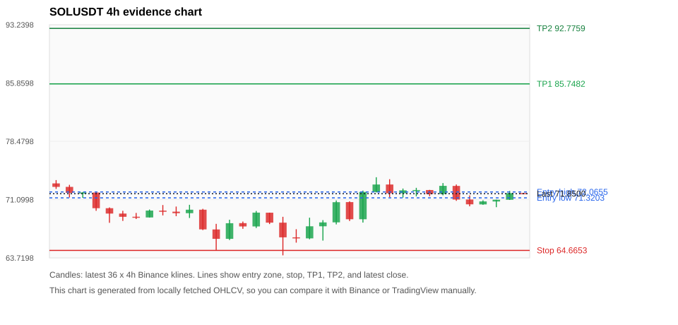
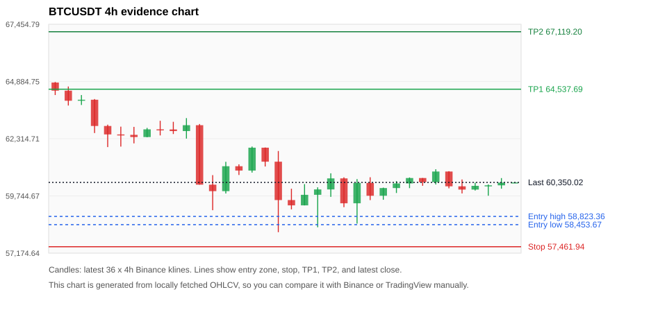
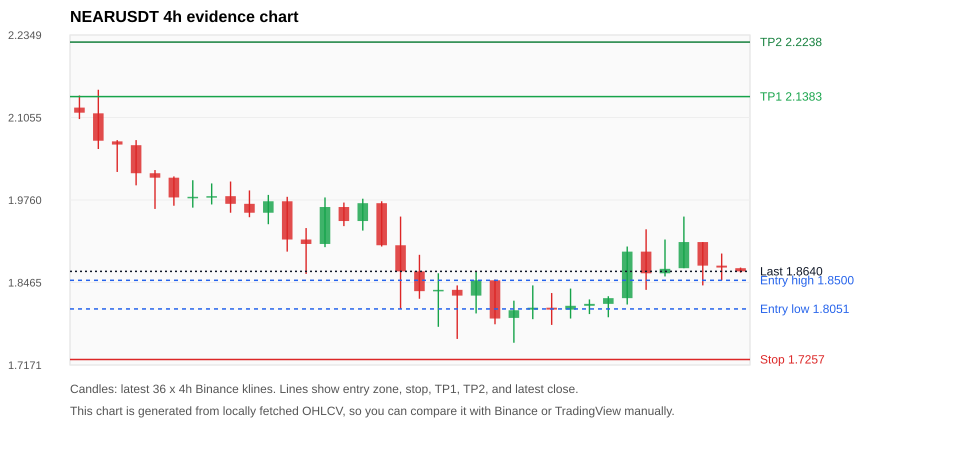
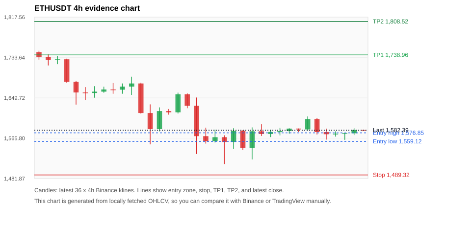
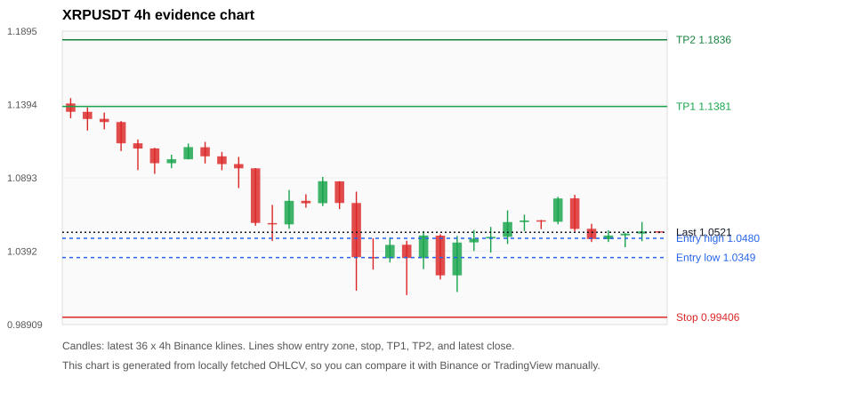

# Crypto 市场扫描报告 v1

- 报告时间：2026-06-28 20:05:51 CST
- Run ID：`20260628_120503_3abe0e39`
- Run type：`daily_full`
- 数据来源：SQLite
- 报告版本：v1
- 扫描 ID：7426dc73980c
- 数据源：Binance public spot API + CoinGecko/CoinMarketCap cross-check
- 过滤条件：USDT spot; 24h quote volume >= 30,000,000; trades >= 30,000; exclude stables/leveraged tokens; analyze 1h/4h/1d klines
- 默认单笔风险：账户权益的 1.00%

## 限制说明

- 交易信号仍以 Binance 现货公开 K 线为主源；外部数据源用于一致性复核。
- 结果是研究和模拟盘计划，不是确定收益或实盘下单指令。
- 历史长度过滤：候选币至少需要 180 根 1d K 线。
- 数据质量验证池：先验证 score 排名前 min(top_n * 2, 10) 的候选，再按 action + score 补足最终名单。
- 大盘环境过滤：RISK_OFF; BTC/ETH 大盘偏弱，山寨币买入候选降级为观察。 BTC 7d=-4.678371347986376; ETH 7d=-7.287309454345204.
- 已启用数据交叉验证：Binance 主源 + CoinGecko 自动对照；CoinMarketCap 在配置 API Key 后自动对照。
- SOLUSDT 交叉验证状态 DATA_WARNING：At least one external provider needs manual review.
- BTCUSDT 交叉验证状态 DATA_WARNING：At least one external provider needs manual review.
- ETHUSDT 交叉验证状态 DATA_WARNING：At least one external provider needs manual review.
- XRPUSDT 交叉验证状态 DATA_WARNING：At least one external provider needs manual review.
- BNBUSDT 交叉验证状态 DATA_WARNING：At least one external provider needs manual review.
- ZECUSDT 交叉验证状态 DATA_WARNING：At least one external provider needs manual review.

## 5 个候选交易计划

| Rank | Coin | Action | Setup | Entry Zone | Stop Loss | TP1 | TP2 / Exit Rule | R/R | Verdict |
|---:|---|---|---|---:|---:|---:|---|---:|---|
| 1 | `SOL` | `WATCH_ONLY` | 回踩支撑/4h EMA 附近 | 71.3203 - 72.0655 | 64.6653 | 85.7482 | 92.7759 或跌破 4h 关键支撑 | 2.00-3.00 | 只观察 |
| 2 | `BTC` | `WATCH_ONLY` | 回踩支撑/4h EMA 附近 | 58,453.67 - 58,823.36 | 57,461.94 | 64,537.69 | 67,119.20 或跌破 4h 关键支撑 | 5.01-7.21 | 只观察 |
| 3 | `NEAR` | `REJECT` | 趋势中，等回调入场 | 1.8051 - 1.8500 | 1.7257 | 2.1383 | 2.2238 或跌破 4h 关键支撑 | 3.05-3.89 | 只观察 |
| 4 | `ETH` | `REJECT` | 趋势中，等回调入场 | 1,559.12 - 1,576.85 | 1,489.32 | 1,738.96 | 1,808.52 或跌破 4h 关键支撑 | 2.17-3.06 | 只观察 |
| 5 | `XRP` | `REJECT` | 趋势中，等回调入场 | 1.0349 - 1.0480 | 0.99406 | 1.1381 | 1.1836 或跌破 4h 关键支撑 | 2.04-3.00 | 只观察 |

## 数据交叉验证摘要

价格差异以 Binance 当前价为基准；成交量口径不同，Binance 是 USDT 现货成交额，CoinGecko/CoinMarketCap 通常是全市场成交量。

| Rank | Coin | Data Status | Max Price Diff | Max 24h Diff | Message |
|---:|---|---|---:|---:|---|
| 1 | `SOL` | DATA_WARNING | 0.11% | 0.09 pts | At least one external provider needs manual review. |
| 2 | `BTC` | DATA_WARNING | 0.18% | 0.03 pts | At least one external provider needs manual review. |
| 3 | `NEAR` | DATA_OK | 0.21% | 0.13 pts | External provider checks agree with Binance within configured thresholds. |
| 4 | `ETH` | DATA_WARNING | 0.15% | 0.04 pts | At least one external provider needs manual review. |
| 5 | `XRP` | DATA_WARNING | 0.12% | 0.01 pts | At least one external provider needs manual review. |

## 候选币说明

### 1. SOL `SOLUSDT`



- 入选原因：回踩支撑/4h EMA 附近；24h +0.03%，7d -2.79%，4h RSI 54.02，24h 成交额 $128.6M。
- 交易失效条件：跌破 64.66525 或 4h 收盘重新失守关键支撑。
- 主要风险：日线趋势未完全确认；BTC/ETH 大盘环境未确认强势，山寨币买入信号降级；7d 趋势未确认；数据交叉验证需要人工复核。
- 数据交叉验证：DATA_WARNING；At least one external provider needs manual review.

#### 可点击人工验证

- [Binance 交易页](https://www.binance.com/en/trade/SOL_USDT)
- [TradingView 图表](https://www.tradingview.com/chart/?symbol=BINANCE%3ASOLUSDT)
- [CoinGecko 搜索](https://www.coingecko.com/en/search?query=SOL)
- [CoinMarketCap 搜索](https://coinmarketcap.com/search/?q=SOL)

#### 多数据源对照

| Source | Status | Asset ID | Price | 24h Change | 24h Volume | Price Diff | 24h Diff | Updated | Message |
|---|---|---|---:|---:|---:|---:|---:|---|---|
| Binance | DATA_OK | SOLUSDT | 71.8500 | +0.03% | $128.6M | 0.00% | 0.00 pts | 2026-06-28T12:05:30+00:00 | Primary market data source used by scanner. |
| CoinGecko | DATA_OK | solana | 71.7700 | +0.09% | $1.73B | 0.11% | 0.07 pts | 2026-06-28T12:05:31.912Z | External source agrees with Binance within thresholds. |
| CoinMarketCap | DATA_WARNING | 5426 | 71.7717 | +0.11% | $1.74B | 0.11% | 0.09 pts | 2026-06-28T12:04:02.000Z | CoinMarketCap symbol mapping has 8 matches; selected lowest cmc_rank |

#### 指标证据

| 指标 | 数值 | 人工核对用途 |
|---|---:|---|
| 当前价 | 71.8500 | 与 Binance/TradingView 当前价格对照 |
| 24h 涨跌 | +0.03% | 与交易所 24h 涨跌对照 |
| 7d 涨跌 | -2.79% | 判断短线趋势是否延续 |
| 4h EMA20 | 70.9307 | 判断短期趋势支撑 |
| 4h EMA50 | 70.5220 | 判断中期趋势支撑 |
| 1d EMA20 | 71.1779 | 判断日线趋势 |
| 1d EMA50 | 75.3394 | 判断日线趋势 |
| 4h RSI14 | 54.02 | 判断是否过热/过弱 |
| 4h ATR14 | 1.5386 | 推导止损和入场缓冲 |
| 最近 18 根 4h 最低点 | 65.6500 | 支撑/止损参考 |
| 最近 36 根 4h 最高点 | 73.9300 | TP/压力参考 |
| 支撑位 | 71.1779 | 入场区间推导基础 |

#### 交易计划推导

- 支撑位 = 最近低点、4h EMA20、4h EMA50、1d EMA20 中不高于当前价的最高有效支撑 = `71.1779`。
- 入场区间 = 支撑位附近 + ATR 缓冲 = `71.3203 - 72.0655`。
- 止损 = min(最近 18 根 4h 最低点 * 0.985, 入场中位价 - 1.15 * ATR14) = `64.6653`。
- TP1 = max(最近 36 根 4h 最高点 * 0.995, 入场中位价 + 2R) = `85.7482`。
- TP2 = max(入场中位价 + 3R, TP1 * 1.04) = `92.7759`。

#### 最近 10 根 4h K线

| UTC 开盘时间 | Open | High | Low | Close | Quote Volume | Trades |
|---|---:|---:|---:|---:|---:|---:|
| 2026-06-27T00:00+00:00 | 71.9000 | 72.5000 | 71.3600 | 72.2700 | $26.5M | 114906 |
| 2026-06-27T04:00+00:00 | 72.2600 | 72.5900 | 71.5100 | 72.3100 | $22.8M | 87362 |
| 2026-06-27T08:00+00:00 | 72.3100 | 72.3300 | 71.5300 | 71.8100 | $13.3M | 60987 |
| 2026-06-27T12:00+00:00 | 71.8100 | 73.1900 | 71.6400 | 72.8400 | $26.0M | 110533 |
| 2026-06-27T16:00+00:00 | 72.8300 | 73.0100 | 70.9400 | 71.1100 | $28.5M | 147407 |
| 2026-06-27T20:00+00:00 | 71.1100 | 71.6300 | 70.2500 | 70.5000 | $21.1M | 113764 |
| 2026-06-28T00:00+00:00 | 70.4900 | 71.0100 | 70.4400 | 70.8700 | $12.0M | 61878 |
| 2026-06-28T04:00+00:00 | 70.8600 | 71.0900 | 70.1400 | 71.0800 | $17.3M | 101682 |
| 2026-06-28T08:00+00:00 | 71.0800 | 72.2000 | 71.0600 | 71.9200 | $24.2M | 124465 |
| 2026-06-28T12:00+00:00 | 71.9200 | 71.9200 | 71.7900 | 71.8500 | $287,196 | 2154 |

### 2. BTC `BTCUSDT`



- 入选原因：回踩支撑/4h EMA 附近；24h +0.01%，7d -5.92%，4h RSI 48.25，24h 成交额 $488.5M。
- 交易失效条件：跌破 57461.945 或 4h 收盘重新失守关键支撑。
- 主要风险：日线趋势未完全确认；BTC/ETH 大盘环境未确认强势，山寨币买入信号降级；7d 趋势未确认；数据交叉验证需要人工复核。
- 数据交叉验证：DATA_WARNING；At least one external provider needs manual review.

#### 可点击人工验证

- [Binance 交易页](https://www.binance.com/en/trade/BTC_USDT)
- [TradingView 图表](https://www.tradingview.com/chart/?symbol=BINANCE%3ABTCUSDT)
- [CoinGecko 搜索](https://www.coingecko.com/en/search?query=BTC)
- [CoinMarketCap 搜索](https://coinmarketcap.com/search/?q=BTC)

#### 多数据源对照

| Source | Status | Asset ID | Price | 24h Change | 24h Volume | Price Diff | 24h Diff | Updated | Message |
|---|---|---|---:|---:|---:|---:|---:|---|---|
| Binance | DATA_OK | BTCUSDT | 60,350.02 | +0.01% | $488.5M | 0.00% | 0.00 pts | 2026-06-28T12:05:30+00:00 | Primary market data source used by scanner. |
| CoinGecko | DATA_OK | bitcoin | 60,258.00 | +0.03% | $15.20B | 0.15% | 0.02 pts | 2026-06-28T12:05:31.219Z | External source agrees with Binance within thresholds. |
| CoinMarketCap | DATA_WARNING | 1 | 60,241.05 | -0.01% | $14.72B | 0.18% | 0.03 pts | 2026-06-28T12:04:02.000Z | CoinMarketCap symbol mapping has 13 matches; selected lowest cmc_rank |

#### 指标证据

| 指标 | 数值 | 人工核对用途 |
|---|---:|---|
| 当前价 | 60,350.02 | 与 Binance/TradingView 当前价格对照 |
| 24h 涨跌 | +0.01% | 与交易所 24h 涨跌对照 |
| 7d 涨跌 | -5.92% | 判断短线趋势是否延续 |
| 4h EMA20 | 60,521.35 | 判断短期趋势支撑 |
| 4h EMA50 | 61,510.78 | 判断中期趋势支撑 |
| 1d EMA20 | 63,189.82 | 判断日线趋势 |
| 1d EMA50 | 67,300.73 | 判断日线趋势 |
| 4h RSI14 | 48.25 | 判断是否过热/过弱 |
| 4h ATR14 | 694.80 | 推导止损和入场缓冲 |
| 最近 18 根 4h 最低点 | 58,337.00 | 支撑/止损参考 |
| 最近 36 根 4h 最高点 | 64,862.00 | TP/压力参考 |
| 支撑位 | 58,337.00 | 入场区间推导基础 |

#### 交易计划推导

- 支撑位 = 最近低点、4h EMA20、4h EMA50、1d EMA20 中不高于当前价的最高有效支撑 = `58,337.00`。
- 入场区间 = 支撑位附近 + ATR 缓冲 = `58,453.67 - 58,823.36`。
- 止损 = min(最近 18 根 4h 最低点 * 0.985, 入场中位价 - 1.15 * ATR14) = `57,461.94`。
- TP1 = max(最近 36 根 4h 最高点 * 0.995, 入场中位价 + 2R) = `64,537.69`。
- TP2 = max(入场中位价 + 3R, TP1 * 1.04) = `67,119.20`。

#### 最近 10 根 4h K线

| UTC 开盘时间 | Open | High | Low | Close | Quote Volume | Trades |
|---|---:|---:|---:|---:|---:|---:|
| 2026-06-27T00:00+00:00 | 60,097.27 | 60,412.00 | 59,876.22 | 60,305.73 | $104.7M | 306723 |
| 2026-06-27T04:00+00:00 | 60,305.73 | 60,574.00 | 60,093.33 | 60,548.07 | $130.1M | 266760 |
| 2026-06-27T08:00+00:00 | 60,548.06 | 60,548.74 | 60,198.94 | 60,363.65 | $72.0M | 219343 |
| 2026-06-27T12:00+00:00 | 60,363.65 | 60,941.17 | 60,257.03 | 60,840.06 | $102.8M | 334232 |
| 2026-06-27T16:00+00:00 | 60,840.06 | 60,855.03 | 60,085.88 | 60,175.95 | $86.7M | 332446 |
| 2026-06-27T20:00+00:00 | 60,175.95 | 60,482.18 | 59,855.16 | 60,029.00 | $82.5M | 303912 |
| 2026-06-28T00:00+00:00 | 60,029.01 | 60,339.99 | 59,986.00 | 60,197.04 | $83.6M | 209442 |
| 2026-06-28T04:00+00:00 | 60,197.03 | 60,259.68 | 59,753.48 | 60,219.99 | $67.0M | 239579 |
| 2026-06-28T08:00+00:00 | 60,220.00 | 60,545.01 | 60,068.00 | 60,342.00 | $67.5M | 274458 |
| 2026-06-28T12:00+00:00 | 60,341.99 | 60,350.02 | 60,320.00 | 60,350.02 | $654,170 | 3497 |

### 3. NEAR `NEARUSDT`



- 入选原因：趋势中，等回调入场；24h +2.42%，7d -14.73%，4h RSI 52.33，24h 成交额 $41.0M。
- 交易失效条件：跌破 1.72572 或 4h 收盘重新失守关键支撑。
- 主要风险：日线趋势未完全确认；BTC/ETH 大盘环境未确认强势，山寨币买入信号降级；7d 趋势未确认。
- 数据交叉验证：DATA_OK；External provider checks agree with Binance within configured thresholds.

#### 可点击人工验证

- [Binance 交易页](https://www.binance.com/en/trade/NEAR_USDT)
- [TradingView 图表](https://www.tradingview.com/chart/?symbol=BINANCE%3ANEARUSDT)
- [CoinGecko 搜索](https://www.coingecko.com/en/search?query=NEAR)
- [CoinMarketCap 搜索](https://coinmarketcap.com/search/?q=NEAR)

#### 多数据源对照

| Source | Status | Asset ID | Price | 24h Change | 24h Volume | Price Diff | 24h Diff | Updated | Message |
|---|---|---|---:|---:|---:|---:|---:|---|---|
| Binance | DATA_OK | NEARUSDT | 1.8640 | +2.42% | $41.0M | 0.00% | 0.00 pts | 2026-06-28T12:05:30+00:00 | Primary market data source used by scanner. |
| CoinGecko | DATA_OK | near | 1.8600 | +2.46% | $282.5M | 0.21% | 0.04 pts | 2026-06-28T12:05:32.349Z | External source agrees with Binance within thresholds. |
| CoinMarketCap | DATA_OK | 6535 | 1.8654 | +2.55% | $295.4M | 0.07% | 0.13 pts | 2026-06-28T12:04:02.000Z | External source agrees with Binance within thresholds. |

#### 指标证据

| 指标 | 数值 | 人工核对用途 |
|---|---:|---|
| 当前价 | 1.8640 | 与 Binance/TradingView 当前价格对照 |
| 24h 涨跌 | +2.42% | 与交易所 24h 涨跌对照 |
| 7d 涨跌 | -14.73% | 判断短线趋势是否延续 |
| 4h EMA20 | 1.8746 | 判断短期趋势支撑 |
| 4h EMA50 | 1.9535 | 判断中期趋势支撑 |
| 1d EMA20 | 2.0364 | 判断日线趋势 |
| 1d EMA50 | 1.9870 | 判断日线趋势 |
| 4h RSI14 | 52.33 | 判断是否过热/过弱 |
| 4h ATR14 | 0.05614 | 推导止损和入场缓冲 |
| 最近 18 根 4h 最低点 | 1.7520 | 支撑/止损参考 |
| 最近 36 根 4h 最高点 | 2.1490 | TP/压力参考 |
| 支撑位 | 1.7520 | 入场区间推导基础 |

#### 交易计划推导

- 支撑位 = 最近低点、4h EMA20、4h EMA50、1d EMA20 中不高于当前价的最高有效支撑 = `1.7520`。
- 入场区间 = 支撑位附近 + ATR 缓冲 = `1.8051 - 1.8500`。
- 止损 = min(最近 18 根 4h 最低点 * 0.985, 入场中位价 - 1.15 * ATR14) = `1.7257`。
- TP1 = max(最近 36 根 4h 最高点 * 0.995, 入场中位价 + 2R) = `2.1383`。
- TP2 = max(入场中位价 + 3R, TP1 * 1.04) = `2.2238`。

#### 最近 10 根 4h K线

| UTC 开盘时间 | Open | High | Low | Close | Quote Volume | Trades |
|---|---:|---:|---:|---:|---:|---:|
| 2026-06-27T00:00+00:00 | 1.8040 | 1.8370 | 1.7900 | 1.8100 | $3.2M | 19082 |
| 2026-06-27T04:00+00:00 | 1.8100 | 1.8200 | 1.7970 | 1.8130 | $3.9M | 16719 |
| 2026-06-27T08:00+00:00 | 1.8130 | 1.8250 | 1.7920 | 1.8220 | $2.5M | 12695 |
| 2026-06-27T12:00+00:00 | 1.8220 | 1.9030 | 1.8120 | 1.8950 | $8.5M | 31659 |
| 2026-06-27T16:00+00:00 | 1.8950 | 1.9300 | 1.8350 | 1.8610 | $11.9M | 60195 |
| 2026-06-27T20:00+00:00 | 1.8610 | 1.9140 | 1.8560 | 1.8680 | $5.9M | 32859 |
| 2026-06-28T00:00+00:00 | 1.8690 | 1.9500 | 1.8690 | 1.9100 | $6.9M | 37879 |
| 2026-06-28T04:00+00:00 | 1.9100 | 1.9100 | 1.8420 | 1.8730 | $4.4M | 24539 |
| 2026-06-28T08:00+00:00 | 1.8730 | 1.8920 | 1.8500 | 1.8700 | $3.4M | 21153 |
| 2026-06-28T12:00+00:00 | 1.8690 | 1.8700 | 1.8620 | 1.8640 | $31,624 | 260 |

### 4. ETH `ETHUSDT`



- 入选原因：趋势中，等回调入场；24h -0.09%，7d -8.28%，4h RSI 50.38，24h 成交额 $223.9M。
- 交易失效条件：跌破 1489.32 或 4h 收盘重新失守关键支撑。
- 主要风险：日线趋势未完全确认；BTC/ETH 大盘环境未确认强势，山寨币买入信号降级；24h 动量未确认；7d 趋势未确认；数据交叉验证需要人工复核。
- 数据交叉验证：DATA_WARNING；At least one external provider needs manual review.

#### 可点击人工验证

- [Binance 交易页](https://www.binance.com/en/trade/ETH_USDT)
- [TradingView 图表](https://www.tradingview.com/chart/?symbol=BINANCE%3AETHUSDT)
- [CoinGecko 搜索](https://www.coingecko.com/en/search?query=ETH)
- [CoinMarketCap 搜索](https://coinmarketcap.com/search/?q=ETH)

#### 多数据源对照

| Source | Status | Asset ID | Price | 24h Change | 24h Volume | Price Diff | 24h Diff | Updated | Message |
|---|---|---|---:|---:|---:|---:|---:|---|---|
| Binance | DATA_OK | ETHUSDT | 1,582.39 | -0.09% | $223.9M | 0.00% | 0.00 pts | 2026-06-28T12:05:30+00:00 | Primary market data source used by scanner. |
| CoinGecko | DATA_OK | ethereum | 1,579.98 | -0.06% | $5.55B | 0.15% | 0.03 pts | 2026-06-28T12:05:31.090Z | External source agrees with Binance within thresholds. |
| CoinMarketCap | DATA_WARNING | 1027 | 1,580.02 | -0.05% | $6.05B | 0.15% | 0.04 pts | 2026-06-28T12:04:02.000Z | CoinMarketCap symbol mapping has 6 matches; selected lowest cmc_rank |

#### 指标证据

| 指标 | 数值 | 人工核对用途 |
|---|---:|---|
| 当前价 | 1,582.39 | 与 Binance/TradingView 当前价格对照 |
| 24h 涨跌 | -0.09% | 与交易所 24h 涨跌对照 |
| 7d 涨跌 | -8.28% | 判断短线趋势是否延续 |
| 4h EMA20 | 1,591.52 | 判断短期趋势支撑 |
| 4h EMA50 | 1,629.72 | 判断中期趋势支撑 |
| 1d EMA20 | 1,687.21 | 判断日线趋势 |
| 1d EMA50 | 1,845.19 | 判断日线趋势 |
| 4h RSI14 | 50.38 | 判断是否过热/过弱 |
| 4h ATR14 | 22.1607 | 推导止损和入场缓冲 |
| 最近 18 根 4h 最低点 | 1,512.00 | 支撑/止损参考 |
| 最近 36 根 4h 最高点 | 1,747.70 | TP/压力参考 |
| 支撑位 | 1,512.00 | 入场区间推导基础 |

#### 交易计划推导

- 支撑位 = 最近低点、4h EMA20、4h EMA50、1d EMA20 中不高于当前价的最高有效支撑 = `1,512.00`。
- 入场区间 = 支撑位附近 + ATR 缓冲 = `1,559.12 - 1,576.85`。
- 止损 = min(最近 18 根 4h 最低点 * 0.985, 入场中位价 - 1.15 * ATR14) = `1,489.32`。
- TP1 = max(最近 36 根 4h 最高点 * 0.995, 入场中位价 + 2R) = `1,738.96`。
- TP2 = max(入场中位价 + 3R, TP1 * 1.04) = `1,808.52`。

#### 最近 10 根 4h K线

| UTC 开盘时间 | Open | High | Low | Close | Quote Volume | Trades |
|---|---:|---:|---:|---:|---:|---:|
| 2026-06-27T00:00+00:00 | 1,578.68 | 1,587.17 | 1,571.55 | 1,580.62 | $30.2M | 204564 |
| 2026-06-27T04:00+00:00 | 1,580.62 | 1,586.38 | 1,575.20 | 1,585.71 | $24.1M | 138540 |
| 2026-06-27T08:00+00:00 | 1,585.72 | 1,585.95 | 1,579.00 | 1,584.00 | $21.3M | 125861 |
| 2026-06-27T12:00+00:00 | 1,584.00 | 1,611.02 | 1,581.42 | 1,605.68 | $54.6M | 283478 |
| 2026-06-27T16:00+00:00 | 1,605.68 | 1,607.92 | 1,573.36 | 1,578.51 | $47.1M | 308152 |
| 2026-06-27T20:00+00:00 | 1,578.51 | 1,585.69 | 1,562.86 | 1,573.99 | $31.5M | 221229 |
| 2026-06-28T00:00+00:00 | 1,574.00 | 1,580.05 | 1,569.07 | 1,575.08 | $19.1M | 141596 |
| 2026-06-28T04:00+00:00 | 1,575.08 | 1,577.34 | 1,562.41 | 1,575.96 | $33.0M | 244254 |
| 2026-06-28T08:00+00:00 | 1,575.96 | 1,586.35 | 1,572.23 | 1,582.87 | $37.7M | 195904 |
| 2026-06-28T12:00+00:00 | 1,582.86 | 1,583.01 | 1,581.42 | 1,582.28 | $1.2M | 3201 |

### 5. XRP `XRPUSDT`



- 入选原因：趋势中，等回调入场；24h -0.63%，7d -8.12%，4h RSI 50.96，24h 成交额 $53.8M。
- 交易失效条件：跌破 0.994062 或 4h 收盘重新失守关键支撑。
- 主要风险：日线趋势未完全确认；BTC/ETH 大盘环境未确认强势，山寨币买入信号降级；24h 动量未确认；7d 趋势未确认；数据交叉验证需要人工复核。
- 数据交叉验证：DATA_WARNING；At least one external provider needs manual review.

#### 可点击人工验证

- [Binance 交易页](https://www.binance.com/en/trade/XRP_USDT)
- [TradingView 图表](https://www.tradingview.com/chart/?symbol=BINANCE%3AXRPUSDT)
- [CoinGecko 搜索](https://www.coingecko.com/en/search?query=XRP)
- [CoinMarketCap 搜索](https://coinmarketcap.com/search/?q=XRP)

#### 多数据源对照

| Source | Status | Asset ID | Price | 24h Change | 24h Volume | Price Diff | 24h Diff | Updated | Message |
|---|---|---|---:|---:|---:|---:|---:|---|---|
| Binance | DATA_OK | XRPUSDT | 1.0521 | -0.63% | $53.8M | 0.00% | 0.00 pts | 2026-06-28T12:05:30+00:00 | Primary market data source used by scanner. |
| CoinGecko | DATA_OK | ripple | 1.0510 | -0.63% | $1.11B | 0.10% | 0.01 pts | 2026-06-28T12:05:37.232Z | External source agrees with Binance within thresholds. |
| CoinMarketCap | DATA_WARNING | 52 | 1.0508 | -0.63% | $1.07B | 0.12% | 0.00 pts | 2026-06-28T12:04:02.000Z | CoinMarketCap symbol mapping has 3 matches; selected lowest cmc_rank |

#### 指标证据

| 指标 | 数值 | 人工核对用途 |
|---|---:|---|
| 当前价 | 1.0521 | 与 Binance/TradingView 当前价格对照 |
| 24h 涨跌 | -0.63% | 与交易所 24h 涨跌对照 |
| 7d 涨跌 | -8.12% | 判断短线趋势是否延续 |
| 4h EMA20 | 1.0584 | 判断短期趋势支撑 |
| 4h EMA50 | 1.0838 | 判断中期趋势支撑 |
| 1d EMA20 | 1.1250 | 判断日线趋势 |
| 1d EMA50 | 1.2128 | 判断日线趋势 |
| 4h RSI14 | 50.96 | 判断是否过热/过弱 |
| 4h ATR14 | 0.01641 | 推导止损和入场缓冲 |
| 最近 18 根 4h 最低点 | 1.0092 | 支撑/止损参考 |
| 最近 36 根 4h 最高点 | 1.1438 | TP/压力参考 |
| 支撑位 | 1.0092 | 入场区间推导基础 |

#### 交易计划推导

- 支撑位 = 最近低点、4h EMA20、4h EMA50、1d EMA20 中不高于当前价的最高有效支撑 = `1.0092`。
- 入场区间 = 支撑位附近 + ATR 缓冲 = `1.0349 - 1.0480`。
- 止损 = min(最近 18 根 4h 最低点 * 0.985, 入场中位价 - 1.15 * ATR14) = `0.99406`。
- TP1 = max(最近 36 根 4h 最高点 * 0.995, 入场中位价 + 2R) = `1.1381`。
- TP2 = max(入场中位价 + 3R, TP1 * 1.04) = `1.1836`。

#### 最近 10 根 4h K线

| UTC 开盘时间 | Open | High | Low | Close | Quote Volume | Trades |
|---|---:|---:|---:|---:|---:|---:|
| 2026-06-27T00:00+00:00 | 1.0490 | 1.0671 | 1.0441 | 1.0591 | $13.7M | 90507 |
| 2026-06-27T04:00+00:00 | 1.0591 | 1.0641 | 1.0530 | 1.0602 | $10.1M | 60791 |
| 2026-06-27T08:00+00:00 | 1.0603 | 1.0605 | 1.0543 | 1.0594 | $5.9M | 38475 |
| 2026-06-27T12:00+00:00 | 1.0593 | 1.0763 | 1.0576 | 1.0752 | $13.1M | 67794 |
| 2026-06-27T16:00+00:00 | 1.0753 | 1.0777 | 1.0525 | 1.0544 | $13.2M | 80582 |
| 2026-06-27T20:00+00:00 | 1.0545 | 1.0579 | 1.0455 | 1.0475 | $8.8M | 58327 |
| 2026-06-28T00:00+00:00 | 1.0474 | 1.0535 | 1.0455 | 1.0499 | $5.9M | 41513 |
| 2026-06-28T04:00+00:00 | 1.0500 | 1.0515 | 1.0419 | 1.0512 | $5.4M | 47913 |
| 2026-06-28T08:00+00:00 | 1.0512 | 1.0591 | 1.0460 | 1.0527 | $7.4M | 53947 |
| 2026-06-28T12:00+00:00 | 1.0528 | 1.0528 | 1.0515 | 1.0521 | $68,469 | 681 |

## 组合风控

- 不要 5 个候选全部满仓买入。
- 同时持仓总风险建议控制在账户权益的 3% - 5% 以内。
- 如果 BTC/ETH 同时破位，暂停山寨币多头计划或降低仓位。
- 第一版报告用于模拟盘和人工复核，不自动下单。

## 原始数据

```json
[
  {
    "rank": 1,
    "symbol": "SOLUSDT",
    "base_asset": "SOL",
    "price": 71.85,
    "score": 36.31713624609829,
    "setup": "回踩支撑/4h EMA 附近",
    "verdict": "只观察",
    "entry_low": 71.32027858170423,
    "entry_high": 72.06554999999999,
    "stop_loss": 64.66525,
    "take_profit_1": 85.74824287255635,
    "take_profit_2": 92.77590716340846,
    "risk_reward_1": 2.0,
    "risk_reward_2": 3.0,
    "pct_24h": 0.028,
    "pct_3d": 11.863615133115356,
    "pct_7d": -2.7871735895007466,
    "quote_volume_24h": 128563850.80876,
    "trades_24h": 659818,
    "high_low_range_24h": 4.348445965212422,
    "rsi_1h": 59.547738693467245,
    "rsi_4h": 54.01785714285713,
    "ema20_4h": 70.93068747532648,
    "ema50_4h": 70.52203259351147,
    "ema20_1d": 71.17792273623176,
    "ema50_1d": 75.33943557461332,
    "atr_4h": 1.538571428571429,
    "macd_hist_4h": 0.10545265772519641,
    "volume_ratio_24h": 0.5736466228351275,
    "support_level": 71.17792273623176,
    "recent_low_4h_18": 65.65,
    "recent_high_4h_36": 73.93,
    "distance_to_support_pct": 0.9442215197242865,
    "binance_trade_url": "https://www.binance.com/en/trade/SOL_USDT",
    "tradingview_url": "https://www.tradingview.com/chart/?symbol=BINANCE%3ASOLUSDT",
    "coingecko_search_url": "https://www.coingecko.com/en/search?query=SOL",
    "coinmarketcap_search_url": "https://coinmarketcap.com/search/?q=SOL",
    "invalidation": "跌破 64.66525 或 4h 收盘重新失守关键支撑",
    "recent_4h_klines": [
      {
        "open_time_utc": "2026-06-22T16:00+00:00",
        "open": 73.15,
        "high": 73.57,
        "low": 72.45,
        "close": 72.71,
        "quote_volume": 27485173.84163,
        "trades": 136179
      },
      {
        "open_time_utc": "2026-06-22T20:00+00:00",
        "open": 72.71,
        "high": 72.97,
        "low": 71.37,
        "close": 71.95,
        "quote_volume": 18898126.83503,
        "trades": 108718
      },
      {
        "open_time_utc": "2026-06-23T00:00+00:00",
        "open": 71.95,
        "high": 72.06,
        "low": 71.31,
        "close": 72.0,
        "quote_volume": 17060916.84675,
        "trades": 110029
      },
      {
        "open_time_utc": "2026-06-23T04:00+00:00",
        "open": 71.99,
        "high": 72.03,
        "low": 69.68,
        "close": 70.01,
        "quote_volume": 35776686.1953,
        "trades": 177361
      },
      {
        "open_time_utc": "2026-06-23T08:00+00:00",
        "open": 70.01,
        "high": 70.11,
        "low": 68.16,
        "close": 69.33,
        "quote_volume": 43036807.12234,
        "trades": 189970
      },
      {
        "open_time_utc": "2026-06-23T12:00+00:00",
        "open": 69.33,
        "high": 69.68,
        "low": 68.4,
        "close": 68.92,
        "quote_volume": 29807472.98926,
        "trades": 203200
      },
      {
        "open_time_utc": "2026-06-23T16:00+00:00",
        "open": 68.93,
        "high": 69.41,
        "low": 68.64,
        "close": 68.84,
        "quote_volume": 15665481.56972,
        "trades": 121234
      },
      {
        "open_time_utc": "2026-06-23T20:00+00:00",
        "open": 68.84,
        "high": 69.84,
        "low": 68.83,
        "close": 69.71,
        "quote_volume": 12135989.51928,
        "trades": 74506
      },
      {
        "open_time_utc": "2026-06-24T00:00+00:00",
        "open": 69.7,
        "high": 70.41,
        "low": 69.1,
        "close": 69.56,
        "quote_volume": 18424992.0708,
        "trades": 110772
      },
      {
        "open_time_utc": "2026-06-24T04:00+00:00",
        "open": 69.57,
        "high": 70.22,
        "low": 69.0,
        "close": 69.38,
        "quote_volume": 17557625.80841,
        "trades": 95535
      },
      {
        "open_time_utc": "2026-06-24T08:00+00:00",
        "open": 69.38,
        "high": 70.44,
        "low": 68.77,
        "close": 69.82,
        "quote_volume": 23577327.17589,
        "trades": 114487
      },
      {
        "open_time_utc": "2026-06-24T12:00+00:00",
        "open": 69.82,
        "high": 69.93,
        "low": 67.24,
        "close": 67.33,
        "quote_volume": 45933900.7252,
        "trades": 316229
      },
      {
        "open_time_utc": "2026-06-24T16:00+00:00",
        "open": 67.32,
        "high": 68.03,
        "low": 64.71,
        "close": 66.13,
        "quote_volume": 88776475.48768,
        "trades": 437295
      },
      {
        "open_time_utc": "2026-06-24T20:00+00:00",
        "open": 66.13,
        "high": 68.55,
        "low": 65.98,
        "close": 68.11,
        "quote_volume": 34233194.16038,
        "trades": 192734
      },
      {
        "open_time_utc": "2026-06-25T00:00+00:00",
        "open": 68.12,
        "high": 68.32,
        "low": 67.4,
        "close": 67.7,
        "quote_volume": 15798475.87117,
        "trades": 88130
      },
      {
        "open_time_utc": "2026-06-25T04:00+00:00",
        "open": 67.7,
        "high": 69.66,
        "low": 67.5,
        "close": 69.45,
        "quote_volume": 34459688.05818,
        "trades": 146011
      },
      {
        "open_time_utc": "2026-06-25T08:00+00:00",
        "open": 69.44,
        "high": 69.45,
        "low": 68.0,
        "close": 68.18,
        "quote_volume": 22648852.376,
        "trades": 86925
      },
      {
        "open_time_utc": "2026-06-25T12:00+00:00",
        "open": 68.18,
        "high": 68.92,
        "low": 64.04,
        "close": 66.32,
        "quote_volume": 104001398.65571,
        "trades": 609714
      },
      {
        "open_time_utc": "2026-06-25T16:00+00:00",
        "open": 66.32,
        "high": 67.35,
        "low": 65.65,
        "close": 66.2,
        "quote_volume": 44933944.60387,
        "trades": 292288
      },
      {
        "open_time_utc": "2026-06-25T20:00+00:00",
        "open": 66.19,
        "high": 68.81,
        "low": 66.08,
        "close": 67.72,
        "quote_volume": 27436348.83013,
        "trades": 168056
      },
      {
        "open_time_utc": "2026-06-26T00:00+00:00",
        "open": 67.72,
        "high": 68.5,
        "low": 65.91,
        "close": 68.21,
        "quote_volume": 45939418.7762,
        "trades": 272725
      },
      {
        "open_time_utc": "2026-06-26T04:00+00:00",
        "open": 68.22,
        "high": 70.99,
        "low": 67.96,
        "close": 70.77,
        "quote_volume": 61597815.57067,
        "trades": 269080
      },
      {
        "open_time_utc": "2026-06-26T08:00+00:00",
        "open": 70.78,
        "high": 70.88,
        "low": 68.39,
        "close": 68.61,
        "quote_volume": 35012595.38519,
        "trades": 190965
      },
      {
        "open_time_utc": "2026-06-26T12:00+00:00",
        "open": 68.61,
        "high": 72.24,
        "low": 68.19,
        "close": 72.07,
        "quote_volume": 73387646.73917,
        "trades": 545247
      },
      {
        "open_time_utc": "2026-06-26T16:00+00:00",
        "open": 72.06,
        "high": 73.93,
        "low": 72.01,
        "close": 73.01,
        "quote_volume": 59144719.92153,
        "trades": 366350
      },
      {
        "open_time_utc": "2026-06-26T20:00+00:00",
        "open": 73.01,
        "high": 73.68,
        "low": 71.41,
        "close": 71.9,
        "quote_volume": 35762097.32011,
        "trades": 198445
      },
      {
        "open_time_utc": "2026-06-27T00:00+00:00",
        "open": 71.9,
        "high": 72.5,
        "low": 71.36,
        "close": 72.27,
        "quote_volume": 26501639.77046,
        "trades": 114906
      },
      {
        "open_time_utc": "2026-06-27T04:00+00:00",
        "open": 72.26,
        "high": 72.59,
        "low": 71.51,
        "close": 72.31,
        "quote_volume": 22837656.55203,
        "trades": 87362
      },
      {
        "open_time_utc": "2026-06-27T08:00+00:00",
        "open": 72.31,
        "high": 72.33,
        "low": 71.53,
        "close": 71.81,
        "quote_volume": 13301159.28603,
        "trades": 60987
      },
      {
        "open_time_utc": "2026-06-27T12:00+00:00",
        "open": 71.81,
        "high": 73.19,
        "low": 71.64,
        "close": 72.84,
        "quote_volume": 25951796.73162,
        "trades": 110533
      },
      {
        "open_time_utc": "2026-06-27T16:00+00:00",
        "open": 72.83,
        "high": 73.01,
        "low": 70.94,
        "close": 71.11,
        "quote_volume": 28541648.40455,
        "trades": 147407
      },
      {
        "open_time_utc": "2026-06-27T20:00+00:00",
        "open": 71.11,
        "high": 71.63,
        "low": 70.25,
        "close": 70.5,
        "quote_volume": 21057165.32823,
        "trades": 113764
      },
      {
        "open_time_utc": "2026-06-28T00:00+00:00",
        "open": 70.49,
        "high": 71.01,
        "low": 70.44,
        "close": 70.87,
        "quote_volume": 12007083.59572,
        "trades": 61878
      },
      {
        "open_time_utc": "2026-06-28T04:00+00:00",
        "open": 70.86,
        "high": 71.09,
        "low": 70.14,
        "close": 71.08,
        "quote_volume": 17314102.01038,
        "trades": 101682
      },
      {
        "open_time_utc": "2026-06-28T08:00+00:00",
        "open": 71.08,
        "high": 72.2,
        "low": 71.06,
        "close": 71.92,
        "quote_volume": 24215171.50752,
        "trades": 124465
      },
      {
        "open_time_utc": "2026-06-28T12:00+00:00",
        "open": 71.92,
        "high": 71.92,
        "low": 71.79,
        "close": 71.85,
        "quote_volume": 287196.32933,
        "trades": 2154
      }
    ],
    "risks": [
      "日线趋势未完全确认",
      "BTC/ETH 大盘环境未确认强势，山寨币买入信号降级",
      "7d 趋势未确认",
      "数据交叉验证需要人工复核"
    ],
    "data_quality_status": "DATA_WARNING",
    "data_quality_message": "At least one external provider needs manual review.",
    "data_checks": [
      {
        "provider": "Binance",
        "status": "DATA_OK",
        "provider_asset_id": "SOLUSDT",
        "provider_symbol": "SOLUSDT",
        "price_usd": 71.85,
        "pct_24h": 0.028,
        "volume_24h": 128563850.80876,
        "last_updated": null,
        "fetched_at_utc": "2026-06-28T12:05:30+00:00",
        "price_diff_pct": 0.0,
        "pct_24h_diff": 0.0,
        "volume_note": "Binance USDT spot 24h quoteVolume.",
        "message": "Primary market data source used by scanner."
      },
      {
        "provider": "CoinGecko",
        "status": "DATA_OK",
        "provider_asset_id": "solana",
        "provider_symbol": "SOL",
        "price_usd": 71.77,
        "pct_24h": 0.09475,
        "volume_24h": 1728089105.0,
        "last_updated": "2026-06-28T12:05:31.912Z",
        "fetched_at_utc": "2026-06-28T12:05:30+00:00",
        "price_diff_pct": 0.11134307585246807,
        "pct_24h_diff": 0.06675,
        "volume_note": "CoinGecko total market volume; not the same venue scope as Binance quoteVolume.",
        "message": "External source agrees with Binance within thresholds."
      },
      {
        "provider": "CoinMarketCap",
        "status": "DATA_WARNING",
        "provider_asset_id": "5426",
        "provider_symbol": "SOL",
        "price_usd": 71.77174136114715,
        "pct_24h": 0.11475087,
        "volume_24h": 1738229790.0013175,
        "last_updated": "2026-06-28T12:04:02.000Z",
        "fetched_at_utc": "2026-06-28T12:05:30+00:00",
        "price_diff_pct": 0.10891946952379171,
        "pct_24h_diff": 0.08675087000000001,
        "volume_note": "CoinMarketCap total market volume; not the same venue scope as Binance quoteVolume.",
        "message": "CoinMarketCap symbol mapping has 8 matches; selected lowest cmc_rank"
      }
    ],
    "action": "WATCH_ONLY"
  },
  {
    "rank": 2,
    "symbol": "BTCUSDT",
    "base_asset": "BTC",
    "price": 60350.02,
    "score": 21.536006623798023,
    "setup": "回踩支撑/4h EMA 附近",
    "verdict": "只观察",
    "entry_low": 58453.674,
    "entry_high": 58823.3615,
    "stop_loss": 57461.945,
    "take_profit_1": 64537.69,
    "take_profit_2": 67119.1976,
    "risk_reward_1": 5.013861021343565,
    "risk_reward_2": 7.207951951972375,
    "pct_24h": 0.013,
    "pct_3d": 3.5337862284498422,
    "pct_7d": -5.917718953637019,
    "quote_volume_24h": 488502141.4802299,
    "trades_24h": 1690913,
    "high_low_range_24h": 1.9876499243223877,
    "rsi_1h": 54.0714136787662,
    "rsi_4h": 48.249923065086904,
    "ema20_4h": 60521.35384349586,
    "ema50_4h": 61510.778982284384,
    "ema20_1d": 63189.817066753705,
    "ema50_1d": 67300.73412149909,
    "atr_4h": 694.802142857142,
    "macd_hist_4h": 139.32176903760978,
    "volume_ratio_24h": 0.34501335769544533,
    "support_level": 58337.0,
    "recent_low_4h_18": 58337.0,
    "recent_high_4h_36": 64862.0,
    "distance_to_support_pct": 3.450674529029607,
    "binance_trade_url": "https://www.binance.com/en/trade/BTC_USDT",
    "tradingview_url": "https://www.tradingview.com/chart/?symbol=BINANCE%3ABTCUSDT",
    "coingecko_search_url": "https://www.coingecko.com/en/search?query=BTC",
    "coinmarketcap_search_url": "https://coinmarketcap.com/search/?q=BTC",
    "invalidation": "跌破 57461.945 或 4h 收盘重新失守关键支撑",
    "recent_4h_klines": [
      {
        "open_time_utc": "2026-06-22T16:00+00:00",
        "open": 64836.95,
        "high": 64862.0,
        "low": 64276.0,
        "close": 64472.0,
        "quote_volume": 150577681.1254881,
        "trades": 552327
      },
      {
        "open_time_utc": "2026-06-22T20:00+00:00",
        "open": 64472.51,
        "high": 64659.43,
        "low": 63804.59,
        "close": 64020.01,
        "quote_volume": 103137424.2587042,
        "trades": 426338
      },
      {
        "open_time_utc": "2026-06-23T00:00+00:00",
        "open": 64020.01,
        "high": 64275.38,
        "low": 63828.93,
        "close": 64065.35,
        "quote_volume": 113810463.257732,
        "trades": 412000
      },
      {
        "open_time_utc": "2026-06-23T04:00+00:00",
        "open": 64065.34,
        "high": 64095.55,
        "low": 62568.9,
        "close": 62886.03,
        "quote_volume": 249769578.9162991,
        "trades": 654352
      },
      {
        "open_time_utc": "2026-06-23T08:00+00:00",
        "open": 62886.04,
        "high": 62945.08,
        "low": 61938.0,
        "close": 62507.06,
        "quote_volume": 402018362.6093837,
        "trades": 664184
      },
      {
        "open_time_utc": "2026-06-23T12:00+00:00",
        "open": 62507.05,
        "high": 62855.98,
        "low": 61960.0,
        "close": 62487.79,
        "quote_volume": 255890735.6813711,
        "trades": 946398
      },
      {
        "open_time_utc": "2026-06-23T16:00+00:00",
        "open": 62487.79,
        "high": 62846.0,
        "low": 62104.7,
        "close": 62388.49,
        "quote_volume": 153768837.4080825,
        "trades": 580044
      },
      {
        "open_time_utc": "2026-06-23T20:00+00:00",
        "open": 62388.49,
        "high": 62799.99,
        "low": 62380.25,
        "close": 62734.57,
        "quote_volume": 92835243.377365,
        "trades": 369212
      },
      {
        "open_time_utc": "2026-06-24T00:00+00:00",
        "open": 62734.57,
        "high": 63119.45,
        "low": 62461.87,
        "close": 62729.78,
        "quote_volume": 173503244.6173542,
        "trades": 524761
      },
      {
        "open_time_utc": "2026-06-24T04:00+00:00",
        "open": 62729.78,
        "high": 63073.44,
        "low": 62525.49,
        "close": 62657.99,
        "quote_volume": 114538754.1784594,
        "trades": 343629
      },
      {
        "open_time_utc": "2026-06-24T08:00+00:00",
        "open": 62658.0,
        "high": 63239.06,
        "low": 62318.88,
        "close": 62921.19,
        "quote_volume": 145076269.788959,
        "trades": 470650
      },
      {
        "open_time_utc": "2026-06-24T12:00+00:00",
        "open": 62921.19,
        "high": 62973.2,
        "low": 60249.82,
        "close": 60250.0,
        "quote_volume": 573692749.7645245,
        "trades": 1507424
      },
      {
        "open_time_utc": "2026-06-24T16:00+00:00",
        "open": 60250.0,
        "high": 60678.1,
        "low": 59102.7,
        "close": 59958.3,
        "quote_volume": 648464612.9816535,
        "trades": 1716720
      },
      {
        "open_time_utc": "2026-06-24T20:00+00:00",
        "open": 59958.3,
        "high": 61276.0,
        "low": 59854.0,
        "close": 61077.99,
        "quote_volume": 216610182.9769442,
        "trades": 804347
      },
      {
        "open_time_utc": "2026-06-25T00:00+00:00",
        "open": 61078.0,
        "high": 61163.16,
        "low": 60684.94,
        "close": 60883.65,
        "quote_volume": 148617037.7176224,
        "trades": 488365
      },
      {
        "open_time_utc": "2026-06-25T04:00+00:00",
        "open": 60883.66,
        "high": 61962.4,
        "low": 60792.0,
        "close": 61911.04,
        "quote_volume": 199336748.6475796,
        "trades": 585612
      },
      {
        "open_time_utc": "2026-06-25T08:00+00:00",
        "open": 61911.03,
        "high": 61920.0,
        "low": 61066.0,
        "close": 61282.01,
        "quote_volume": 120376027.9172556,
        "trades": 397068
      },
      {
        "open_time_utc": "2026-06-25T12:00+00:00",
        "open": 61282.0,
        "high": 61761.35,
        "low": 58115.01,
        "close": 59557.99,
        "quote_volume": 950943210.7760452,
        "trades": 2405299
      },
      {
        "open_time_utc": "2026-06-25T16:00+00:00",
        "open": 59557.99,
        "high": 60067.0,
        "low": 59139.96,
        "close": 59320.0,
        "quote_volume": 281118401.7040374,
        "trades": 1200956
      },
      {
        "open_time_utc": "2026-06-25T20:00+00:00",
        "open": 59319.99,
        "high": 60273.81,
        "low": 59319.99,
        "close": 59794.0,
        "quote_volume": 122462673.3075464,
        "trades": 605975
      },
      {
        "open_time_utc": "2026-06-26T00:00+00:00",
        "open": 59794.64,
        "high": 60131.37,
        "low": 58337.0,
        "close": 60036.01,
        "quote_volume": 368451215.4456913,
        "trades": 1223525
      },
      {
        "open_time_utc": "2026-06-26T04:00+00:00",
        "open": 60036.0,
        "high": 60759.99,
        "low": 59702.0,
        "close": 60532.0,
        "quote_volume": 324265183.3708553,
        "trades": 866194
      },
      {
        "open_time_utc": "2026-06-26T08:00+00:00",
        "open": 60532.0,
        "high": 60580.0,
        "low": 59239.78,
        "close": 59413.24,
        "quote_volume": 223309628.5990211,
        "trades": 807589
      },
      {
        "open_time_utc": "2026-06-26T12:00+00:00",
        "open": 59413.24,
        "high": 60500.0,
        "low": 58500.1,
        "close": 60328.32,
        "quote_volume": 462960390.8887911,
        "trades": 1875169
      },
      {
        "open_time_utc": "2026-06-26T16:00+00:00",
        "open": 60328.18,
        "high": 60583.0,
        "low": 59556.0,
        "close": 59751.97,
        "quote_volume": 173431799.0539421,
        "trades": 854765
      },
      {
        "open_time_utc": "2026-06-26T20:00+00:00",
        "open": 59751.96,
        "high": 60117.64,
        "low": 59571.31,
        "close": 60097.27,
        "quote_volume": 83683841.0195114,
        "trades": 391892
      },
      {
        "open_time_utc": "2026-06-27T00:00+00:00",
        "open": 60097.27,
        "high": 60412.0,
        "low": 59876.22,
        "close": 60305.73,
        "quote_volume": 104716833.0302822,
        "trades": 306723
      },
      {
        "open_time_utc": "2026-06-27T04:00+00:00",
        "open": 60305.73,
        "high": 60574.0,
        "low": 60093.33,
        "close": 60548.07,
        "quote_volume": 130094666.5531438,
        "trades": 266760
      },
      {
        "open_time_utc": "2026-06-27T08:00+00:00",
        "open": 60548.06,
        "high": 60548.74,
        "low": 60198.94,
        "close": 60363.65,
        "quote_volume": 71997666.2519905,
        "trades": 219343
      },
      {
        "open_time_utc": "2026-06-27T12:00+00:00",
        "open": 60363.65,
        "high": 60941.17,
        "low": 60257.03,
        "close": 60840.06,
        "quote_volume": 102775288.1671989,
        "trades": 334232
      },
      {
        "open_time_utc": "2026-06-27T16:00+00:00",
        "open": 60840.06,
        "high": 60855.03,
        "low": 60085.88,
        "close": 60175.95,
        "quote_volume": 86663415.5699926,
        "trades": 332446
      },
      {
        "open_time_utc": "2026-06-27T20:00+00:00",
        "open": 60175.95,
        "high": 60482.18,
        "low": 59855.16,
        "close": 60029.0,
        "quote_volume": 82517393.4972376,
        "trades": 303912
      },
      {
        "open_time_utc": "2026-06-28T00:00+00:00",
        "open": 60029.01,
        "high": 60339.99,
        "low": 59986.0,
        "close": 60197.04,
        "quote_volume": 83574227.8630928,
        "trades": 209442
      },
      {
        "open_time_utc": "2026-06-28T04:00+00:00",
        "open": 60197.03,
        "high": 60259.68,
        "low": 59753.48,
        "close": 60219.99,
        "quote_volume": 67045001.2851438,
        "trades": 239579
      },
      {
        "open_time_utc": "2026-06-28T08:00+00:00",
        "open": 60220.0,
        "high": 60545.01,
        "low": 60068.0,
        "close": 60342.0,
        "quote_volume": 67538204.8202022,
        "trades": 274458
      },
      {
        "open_time_utc": "2026-06-28T12:00+00:00",
        "open": 60341.99,
        "high": 60350.02,
        "low": 60320.0,
        "close": 60350.02,
        "quote_volume": 654170.4468486,
        "trades": 3497
      }
    ],
    "risks": [
      "日线趋势未完全确认",
      "BTC/ETH 大盘环境未确认强势，山寨币买入信号降级",
      "7d 趋势未确认",
      "数据交叉验证需要人工复核"
    ],
    "data_quality_status": "DATA_WARNING",
    "data_quality_message": "At least one external provider needs manual review.",
    "data_checks": [
      {
        "provider": "Binance",
        "status": "DATA_OK",
        "provider_asset_id": "BTCUSDT",
        "provider_symbol": "BTCUSDT",
        "price_usd": 60350.02,
        "pct_24h": 0.013,
        "volume_24h": 488502141.4802299,
        "last_updated": null,
        "fetched_at_utc": "2026-06-28T12:05:30+00:00",
        "price_diff_pct": 0.0,
        "pct_24h_diff": 0.0,
        "volume_note": "Binance USDT spot 24h quoteVolume.",
        "message": "Primary market data source used by scanner."
      },
      {
        "provider": "CoinGecko",
        "status": "DATA_OK",
        "provider_asset_id": "bitcoin",
        "provider_symbol": "BTC",
        "price_usd": 60258.0,
        "pct_24h": 0.03454,
        "volume_24h": 15197334669.0,
        "last_updated": "2026-06-28T12:05:31.219Z",
        "fetched_at_utc": "2026-06-28T12:05:30+00:00",
        "price_diff_pct": 0.15247716570764486,
        "pct_24h_diff": 0.021540000000000004,
        "volume_note": "CoinGecko total market volume; not the same venue scope as Binance quoteVolume.",
        "message": "External source agrees with Binance within thresholds."
      },
      {
        "provider": "CoinMarketCap",
        "status": "DATA_WARNING",
        "provider_asset_id": "1",
        "provider_symbol": "BTC",
        "price_usd": 60241.04607600334,
        "pct_24h": -0.01270449,
        "volume_24h": 14717934946.08967,
        "last_updated": "2026-06-28T12:04:02.000Z",
        "fetched_at_utc": "2026-06-28T12:05:30+00:00",
        "price_diff_pct": 0.18056982250653508,
        "pct_24h_diff": 0.02570449,
        "volume_note": "CoinMarketCap total market volume; not the same venue scope as Binance quoteVolume.",
        "message": "CoinMarketCap symbol mapping has 13 matches; selected lowest cmc_rank"
      }
    ],
    "action": "WATCH_ONLY"
  },
  {
    "rank": 3,
    "symbol": "NEARUSDT",
    "base_asset": "NEAR",
    "price": 1.864,
    "score": 11.590109999289908,
    "setup": "趋势中，等回调入场",
    "verdict": "只观察",
    "entry_low": 1.80505,
    "entry_high": 1.8499642857142857,
    "stop_loss": 1.72572,
    "take_profit_1": 2.138255,
    "take_profit_2": 2.2237852,
    "risk_reward_1": 3.0529185555290463,
    "risk_reward_2": 3.8932034638110355,
    "pct_24h": 2.416,
    "pct_3d": 2.8697571743929284,
    "pct_7d": -14.730100640439147,
    "quote_volume_24h": 40953951.4832,
    "trades_24h": 208276,
    "high_low_range_24h": 7.615894039735083,
    "rsi_1h": 49.714285714285744,
    "rsi_4h": 52.33333333333334,
    "ema20_4h": 1.8746138238944043,
    "ema50_4h": 1.953480051692016,
    "ema20_1d": 2.03638656145714,
    "ema50_1d": 1.987037229484687,
    "atr_4h": 0.05614285714285711,
    "macd_hist_4h": 0.01498313618294609,
    "volume_ratio_24h": 1.1147993352842722,
    "support_level": 1.752,
    "recent_low_4h_18": 1.752,
    "recent_high_4h_36": 2.149,
    "distance_to_support_pct": 6.392694063926951,
    "binance_trade_url": "https://www.binance.com/en/trade/NEAR_USDT",
    "tradingview_url": "https://www.tradingview.com/chart/?symbol=BINANCE%3ANEARUSDT",
    "coingecko_search_url": "https://www.coingecko.com/en/search?query=NEAR",
    "coinmarketcap_search_url": "https://coinmarketcap.com/search/?q=NEAR",
    "invalidation": "跌破 1.72572 或 4h 收盘重新失守关键支撑",
    "recent_4h_klines": [
      {
        "open_time_utc": "2026-06-22T16:00+00:00",
        "open": 2.121,
        "high": 2.14,
        "low": 2.103,
        "close": 2.113,
        "quote_volume": 3138236.4517,
        "trades": 27892
      },
      {
        "open_time_utc": "2026-06-22T20:00+00:00",
        "open": 2.112,
        "high": 2.149,
        "low": 2.056,
        "close": 2.069,
        "quote_volume": 7633948.5038,
        "trades": 41548
      },
      {
        "open_time_utc": "2026-06-23T00:00+00:00",
        "open": 2.068,
        "high": 2.07,
        "low": 2.02,
        "close": 2.063,
        "quote_volume": 7134617.3915,
        "trades": 37612
      },
      {
        "open_time_utc": "2026-06-23T04:00+00:00",
        "open": 2.062,
        "high": 2.07,
        "low": 1.999,
        "close": 2.018,
        "quote_volume": 9047190.2583,
        "trades": 43717
      },
      {
        "open_time_utc": "2026-06-23T08:00+00:00",
        "open": 2.018,
        "high": 2.023,
        "low": 1.962,
        "close": 2.011,
        "quote_volume": 6666879.1987,
        "trades": 42414
      },
      {
        "open_time_utc": "2026-06-23T12:00+00:00",
        "open": 2.011,
        "high": 2.013,
        "low": 1.967,
        "close": 1.98,
        "quote_volume": 6738783.3248,
        "trades": 38404
      },
      {
        "open_time_utc": "2026-06-23T16:00+00:00",
        "open": 1.979,
        "high": 2.007,
        "low": 1.964,
        "close": 1.981,
        "quote_volume": 4132957.9432,
        "trades": 28481
      },
      {
        "open_time_utc": "2026-06-23T20:00+00:00",
        "open": 1.981,
        "high": 2.002,
        "low": 1.969,
        "close": 1.982,
        "quote_volume": 2528192.0507,
        "trades": 15377
      },
      {
        "open_time_utc": "2026-06-24T00:00+00:00",
        "open": 1.982,
        "high": 2.005,
        "low": 1.956,
        "close": 1.97,
        "quote_volume": 2701022.9014,
        "trades": 18747
      },
      {
        "open_time_utc": "2026-06-24T04:00+00:00",
        "open": 1.97,
        "high": 1.991,
        "low": 1.949,
        "close": 1.956,
        "quote_volume": 2986201.874,
        "trades": 16513
      },
      {
        "open_time_utc": "2026-06-24T08:00+00:00",
        "open": 1.956,
        "high": 1.984,
        "low": 1.938,
        "close": 1.974,
        "quote_volume": 3155482.4585,
        "trades": 18446
      },
      {
        "open_time_utc": "2026-06-24T12:00+00:00",
        "open": 1.974,
        "high": 1.981,
        "low": 1.895,
        "close": 1.914,
        "quote_volume": 7933677.187,
        "trades": 52728
      },
      {
        "open_time_utc": "2026-06-24T16:00+00:00",
        "open": 1.914,
        "high": 1.932,
        "low": 1.86,
        "close": 1.907,
        "quote_volume": 10417307.078,
        "trades": 60381
      },
      {
        "open_time_utc": "2026-06-24T20:00+00:00",
        "open": 1.907,
        "high": 1.98,
        "low": 1.902,
        "close": 1.965,
        "quote_volume": 4918065.4842,
        "trades": 32596
      },
      {
        "open_time_utc": "2026-06-25T00:00+00:00",
        "open": 1.965,
        "high": 1.972,
        "low": 1.935,
        "close": 1.943,
        "quote_volume": 1773641.9568,
        "trades": 13933
      },
      {
        "open_time_utc": "2026-06-25T04:00+00:00",
        "open": 1.943,
        "high": 1.978,
        "low": 1.928,
        "close": 1.971,
        "quote_volume": 3090231.7894,
        "trades": 18573
      },
      {
        "open_time_utc": "2026-06-25T08:00+00:00",
        "open": 1.971,
        "high": 1.974,
        "low": 1.903,
        "close": 1.905,
        "quote_volume": 5838036.1403,
        "trades": 29142
      },
      {
        "open_time_utc": "2026-06-25T12:00+00:00",
        "open": 1.905,
        "high": 1.95,
        "low": 1.805,
        "close": 1.864,
        "quote_volume": 15997375.0087,
        "trades": 110003
      },
      {
        "open_time_utc": "2026-06-25T16:00+00:00",
        "open": 1.864,
        "high": 1.89,
        "low": 1.821,
        "close": 1.833,
        "quote_volume": 7576809.1675,
        "trades": 47692
      },
      {
        "open_time_utc": "2026-06-25T20:00+00:00",
        "open": 1.833,
        "high": 1.861,
        "low": 1.777,
        "close": 1.835,
        "quote_volume": 8993372.4622,
        "trades": 39232
      },
      {
        "open_time_utc": "2026-06-26T00:00+00:00",
        "open": 1.835,
        "high": 1.842,
        "low": 1.758,
        "close": 1.826,
        "quote_volume": 8278364.1609,
        "trades": 48443
      },
      {
        "open_time_utc": "2026-06-26T04:00+00:00",
        "open": 1.826,
        "high": 1.864,
        "low": 1.798,
        "close": 1.85,
        "quote_volume": 6837675.0914,
        "trades": 34718
      },
      {
        "open_time_utc": "2026-06-26T08:00+00:00",
        "open": 1.85,
        "high": 1.851,
        "low": 1.781,
        "close": 1.79,
        "quote_volume": 5711876.5769,
        "trades": 27502
      },
      {
        "open_time_utc": "2026-06-26T12:00+00:00",
        "open": 1.791,
        "high": 1.818,
        "low": 1.752,
        "close": 1.803,
        "quote_volume": 9727792.5237,
        "trades": 65355
      },
      {
        "open_time_utc": "2026-06-26T16:00+00:00",
        "open": 1.804,
        "high": 1.842,
        "low": 1.789,
        "close": 1.807,
        "quote_volume": 9023272.9396,
        "trades": 48692
      },
      {
        "open_time_utc": "2026-06-26T20:00+00:00",
        "open": 1.807,
        "high": 1.83,
        "low": 1.78,
        "close": 1.804,
        "quote_volume": 8492976.8459,
        "trades": 39138
      },
      {
        "open_time_utc": "2026-06-27T00:00+00:00",
        "open": 1.804,
        "high": 1.837,
        "low": 1.79,
        "close": 1.81,
        "quote_volume": 3173695.9622,
        "trades": 19082
      },
      {
        "open_time_utc": "2026-06-27T04:00+00:00",
        "open": 1.81,
        "high": 1.82,
        "low": 1.797,
        "close": 1.813,
        "quote_volume": 3924858.8508,
        "trades": 16719
      },
      {
        "open_time_utc": "2026-06-27T08:00+00:00",
        "open": 1.813,
        "high": 1.825,
        "low": 1.792,
        "close": 1.822,
        "quote_volume": 2521459.6927,
        "trades": 12695
      },
      {
        "open_time_utc": "2026-06-27T12:00+00:00",
        "open": 1.822,
        "high": 1.903,
        "low": 1.812,
        "close": 1.895,
        "quote_volume": 8473602.6606,
        "trades": 31659
      },
      {
        "open_time_utc": "2026-06-27T16:00+00:00",
        "open": 1.895,
        "high": 1.93,
        "low": 1.835,
        "close": 1.861,
        "quote_volume": 11906520.9004,
        "trades": 60195
      },
      {
        "open_time_utc": "2026-06-27T20:00+00:00",
        "open": 1.861,
        "high": 1.914,
        "low": 1.856,
        "close": 1.868,
        "quote_volume": 5876707.9283,
        "trades": 32859
      },
      {
        "open_time_utc": "2026-06-28T00:00+00:00",
        "open": 1.869,
        "high": 1.95,
        "low": 1.869,
        "close": 1.91,
        "quote_volume": 6864300.7873,
        "trades": 37879
      },
      {
        "open_time_utc": "2026-06-28T04:00+00:00",
        "open": 1.91,
        "high": 1.91,
        "low": 1.842,
        "close": 1.873,
        "quote_volume": 4435335.7095,
        "trades": 24539
      },
      {
        "open_time_utc": "2026-06-28T08:00+00:00",
        "open": 1.873,
        "high": 1.892,
        "low": 1.85,
        "close": 1.87,
        "quote_volume": 3412165.7637,
        "trades": 21153
      },
      {
        "open_time_utc": "2026-06-28T12:00+00:00",
        "open": 1.869,
        "high": 1.87,
        "low": 1.862,
        "close": 1.864,
        "quote_volume": 31624.1299,
        "trades": 260
      }
    ],
    "risks": [
      "日线趋势未完全确认",
      "BTC/ETH 大盘环境未确认强势，山寨币买入信号降级",
      "7d 趋势未确认"
    ],
    "data_quality_status": "DATA_OK",
    "data_quality_message": "External provider checks agree with Binance within configured thresholds.",
    "data_checks": [
      {
        "provider": "Binance",
        "status": "DATA_OK",
        "provider_asset_id": "NEARUSDT",
        "provider_symbol": "NEARUSDT",
        "price_usd": 1.864,
        "pct_24h": 2.416,
        "volume_24h": 40953951.4832,
        "last_updated": null,
        "fetched_at_utc": "2026-06-28T12:05:30+00:00",
        "price_diff_pct": 0.0,
        "pct_24h_diff": 0.0,
        "volume_note": "Binance USDT spot 24h quoteVolume.",
        "message": "Primary market data source used by scanner."
      },
      {
        "provider": "CoinGecko",
        "status": "DATA_OK",
        "provider_asset_id": "near",
        "provider_symbol": "NEAR",
        "price_usd": 1.86,
        "pct_24h": 2.45934,
        "volume_24h": 282531157.0,
        "last_updated": "2026-06-28T12:05:32.349Z",
        "fetched_at_utc": "2026-06-28T12:05:30+00:00",
        "price_diff_pct": 0.21459227467811176,
        "pct_24h_diff": 0.043340000000000156,
        "volume_note": "CoinGecko total market volume; not the same venue scope as Binance quoteVolume.",
        "message": "External source agrees with Binance within thresholds."
      },
      {
        "provider": "CoinMarketCap",
        "status": "DATA_OK",
        "provider_asset_id": "6535",
        "provider_symbol": "NEAR",
        "price_usd": 1.8653857665214875,
        "pct_24h": 2.54965639,
        "volume_24h": 295355926.2111075,
        "last_updated": "2026-06-28T12:04:02.000Z",
        "fetched_at_utc": "2026-06-28T12:05:30+00:00",
        "price_diff_pct": 0.0743436975046869,
        "pct_24h_diff": 0.13365639000000007,
        "volume_note": "CoinMarketCap total market volume; not the same venue scope as Binance quoteVolume.",
        "message": "External source agrees with Binance within thresholds."
      }
    ],
    "action": "REJECT"
  },
  {
    "rank": 4,
    "symbol": "ETHUSDT",
    "base_asset": "ETH",
    "price": 1582.39,
    "score": 9.128905448913681,
    "setup": "趋势中，等回调入场",
    "verdict": "只观察",
    "entry_low": 1559.1212500000001,
    "entry_high": 1576.8498214285714,
    "stop_loss": 1489.32,
    "take_profit_1": 1738.9615000000001,
    "take_profit_2": 1808.51996,
    "risk_reward_1": 2.1734545215162715,
    "risk_reward_2": 3.057684945531143,
    "pct_24h": -0.089,
    "pct_3d": 2.8761824269414538,
    "pct_7d": -8.275222444425124,
    "quote_volume_24h": 223928425.312481,
    "trades_24h": 1395599,
    "high_low_range_24h": 3.111219206226279,
    "rsi_1h": 53.884711779448786,
    "rsi_4h": 50.380677343134714,
    "ema20_4h": 1591.5160485452159,
    "ema50_4h": 1629.7228390870994,
    "ema20_1d": 1687.2127370878648,
    "ema50_1d": 1845.1854984759257,
    "atr_4h": 22.160714285714317,
    "macd_hist_4h": 5.032079686602511,
    "volume_ratio_24h": 0.4361650405906831,
    "support_level": 1512.0,
    "recent_low_4h_18": 1512.0,
    "recent_high_4h_36": 1747.7,
    "distance_to_support_pct": 4.6554232804232765,
    "binance_trade_url": "https://www.binance.com/en/trade/ETH_USDT",
    "tradingview_url": "https://www.tradingview.com/chart/?symbol=BINANCE%3AETHUSDT",
    "coingecko_search_url": "https://www.coingecko.com/en/search?query=ETH",
    "coinmarketcap_search_url": "https://coinmarketcap.com/search/?q=ETH",
    "invalidation": "跌破 1489.32 或 4h 收盘重新失守关键支撑",
    "recent_4h_klines": [
      {
        "open_time_utc": "2026-06-22T16:00+00:00",
        "open": 1744.75,
        "high": 1747.7,
        "low": 1729.15,
        "close": 1734.59,
        "quote_volume": 86271332.46014,
        "trades": 561698
      },
      {
        "open_time_utc": "2026-06-22T20:00+00:00",
        "open": 1734.59,
        "high": 1740.07,
        "low": 1717.02,
        "close": 1728.19,
        "quote_volume": 49857101.379349,
        "trades": 402517
      },
      {
        "open_time_utc": "2026-06-23T00:00+00:00",
        "open": 1728.19,
        "high": 1736.25,
        "low": 1719.75,
        "close": 1729.9,
        "quote_volume": 32377372.501792,
        "trades": 370164
      },
      {
        "open_time_utc": "2026-06-23T04:00+00:00",
        "open": 1729.91,
        "high": 1731.25,
        "low": 1680.52,
        "close": 1683.01,
        "quote_volume": 88283236.939908,
        "trades": 668644
      },
      {
        "open_time_utc": "2026-06-23T08:00+00:00",
        "open": 1683.02,
        "high": 1684.8,
        "low": 1635.65,
        "close": 1660.9,
        "quote_volume": 117983455.444791,
        "trades": 748102
      },
      {
        "open_time_utc": "2026-06-23T12:00+00:00",
        "open": 1660.9,
        "high": 1672.0,
        "low": 1645.52,
        "close": 1659.78,
        "quote_volume": 80964787.137809,
        "trades": 835298
      },
      {
        "open_time_utc": "2026-06-23T16:00+00:00",
        "open": 1659.78,
        "high": 1673.89,
        "low": 1650.0,
        "close": 1662.58,
        "quote_volume": 64239703.006308,
        "trades": 503985
      },
      {
        "open_time_utc": "2026-06-23T20:00+00:00",
        "open": 1662.57,
        "high": 1672.92,
        "low": 1660.27,
        "close": 1667.13,
        "quote_volume": 31368533.013358,
        "trades": 289086
      },
      {
        "open_time_utc": "2026-06-24T00:00+00:00",
        "open": 1667.13,
        "high": 1680.46,
        "low": 1658.18,
        "close": 1666.67,
        "quote_volume": 37372805.726416,
        "trades": 425689
      },
      {
        "open_time_utc": "2026-06-24T04:00+00:00",
        "open": 1666.67,
        "high": 1679.57,
        "low": 1658.22,
        "close": 1673.12,
        "quote_volume": 40802907.910169,
        "trades": 235407
      },
      {
        "open_time_utc": "2026-06-24T08:00+00:00",
        "open": 1673.13,
        "high": 1693.67,
        "low": 1655.76,
        "close": 1679.57,
        "quote_volume": 56283839.64746,
        "trades": 450395
      },
      {
        "open_time_utc": "2026-06-24T12:00+00:00",
        "open": 1679.57,
        "high": 1681.29,
        "low": 1616.8,
        "close": 1618.08,
        "quote_volume": 145554880.032909,
        "trades": 1483074
      },
      {
        "open_time_utc": "2026-06-24T16:00+00:00",
        "open": 1618.08,
        "high": 1636.08,
        "low": 1552.95,
        "close": 1584.58,
        "quote_volume": 214729380.128202,
        "trades": 1877922
      },
      {
        "open_time_utc": "2026-06-24T20:00+00:00",
        "open": 1584.59,
        "high": 1629.82,
        "low": 1580.0,
        "close": 1622.17,
        "quote_volume": 83122494.499989,
        "trades": 781612
      },
      {
        "open_time_utc": "2026-06-25T00:00+00:00",
        "open": 1622.18,
        "high": 1626.51,
        "low": 1614.69,
        "close": 1619.6,
        "quote_volume": 38777580.427202,
        "trades": 409691
      },
      {
        "open_time_utc": "2026-06-25T04:00+00:00",
        "open": 1619.61,
        "high": 1660.54,
        "low": 1617.12,
        "close": 1657.19,
        "quote_volume": 104616181.973843,
        "trades": 598658
      },
      {
        "open_time_utc": "2026-06-25T08:00+00:00",
        "open": 1657.2,
        "high": 1658.98,
        "low": 1628.05,
        "close": 1633.27,
        "quote_volume": 72176910.469439,
        "trades": 416323
      },
      {
        "open_time_utc": "2026-06-25T12:00+00:00",
        "open": 1633.28,
        "high": 1650.38,
        "low": 1532.9,
        "close": 1570.01,
        "quote_volume": 312158132.767002,
        "trades": 1881201
      },
      {
        "open_time_utc": "2026-06-25T16:00+00:00",
        "open": 1570.01,
        "high": 1587.7,
        "low": 1554.6,
        "close": 1559.42,
        "quote_volume": 110334019.877182,
        "trades": 713930
      },
      {
        "open_time_utc": "2026-06-25T20:00+00:00",
        "open": 1559.41,
        "high": 1583.65,
        "low": 1556.73,
        "close": 1567.84,
        "quote_volume": 63302133.036226,
        "trades": 434777
      },
      {
        "open_time_utc": "2026-06-26T00:00+00:00",
        "open": 1567.86,
        "high": 1571.78,
        "low": 1512.0,
        "close": 1557.93,
        "quote_volume": 128488500.009984,
        "trades": 884181
      },
      {
        "open_time_utc": "2026-06-26T04:00+00:00",
        "open": 1557.93,
        "high": 1586.5,
        "low": 1543.43,
        "close": 1581.12,
        "quote_volume": 107766090.300502,
        "trades": 521120
      },
      {
        "open_time_utc": "2026-06-26T08:00+00:00",
        "open": 1581.12,
        "high": 1582.43,
        "low": 1541.01,
        "close": 1545.14,
        "quote_volume": 110555875.307421,
        "trades": 626938
      },
      {
        "open_time_utc": "2026-06-26T12:00+00:00",
        "open": 1545.15,
        "high": 1588.23,
        "low": 1521.54,
        "close": 1580.14,
        "quote_volume": 187134274.017346,
        "trades": 1233188
      },
      {
        "open_time_utc": "2026-06-26T16:00+00:00",
        "open": 1580.13,
        "high": 1594.7,
        "low": 1570.32,
        "close": 1574.51,
        "quote_volume": 85777417.099889,
        "trades": 520973
      },
      {
        "open_time_utc": "2026-06-26T20:00+00:00",
        "open": 1574.51,
        "high": 1583.4,
        "low": 1568.0,
        "close": 1578.68,
        "quote_volume": 41247917.11543,
        "trades": 224182
      },
      {
        "open_time_utc": "2026-06-27T00:00+00:00",
        "open": 1578.68,
        "high": 1587.17,
        "low": 1571.55,
        "close": 1580.62,
        "quote_volume": 30231987.850977,
        "trades": 204564
      },
      {
        "open_time_utc": "2026-06-27T04:00+00:00",
        "open": 1580.62,
        "high": 1586.38,
        "low": 1575.2,
        "close": 1585.71,
        "quote_volume": 24067790.027421,
        "trades": 138540
      },
      {
        "open_time_utc": "2026-06-27T08:00+00:00",
        "open": 1585.72,
        "high": 1585.95,
        "low": 1579.0,
        "close": 1584.0,
        "quote_volume": 21299404.716425,
        "trades": 125861
      },
      {
        "open_time_utc": "2026-06-27T12:00+00:00",
        "open": 1584.0,
        "high": 1611.02,
        "low": 1581.42,
        "close": 1605.68,
        "quote_volume": 54573759.292885,
        "trades": 283478
      },
      {
        "open_time_utc": "2026-06-27T16:00+00:00",
        "open": 1605.68,
        "high": 1607.92,
        "low": 1573.36,
        "close": 1578.51,
        "quote_volume": 47107968.933464,
        "trades": 308152
      },
      {
        "open_time_utc": "2026-06-27T20:00+00:00",
        "open": 1578.51,
        "high": 1585.69,
        "low": 1562.86,
        "close": 1573.99,
        "quote_volume": 31486728.831558,
        "trades": 221229
      },
      {
        "open_time_utc": "2026-06-28T00:00+00:00",
        "open": 1574.0,
        "high": 1580.05,
        "low": 1569.07,
        "close": 1575.08,
        "quote_volume": 19144089.385775,
        "trades": 141596
      },
      {
        "open_time_utc": "2026-06-28T04:00+00:00",
        "open": 1575.08,
        "high": 1577.34,
        "low": 1562.41,
        "close": 1575.96,
        "quote_volume": 33029342.877762,
        "trades": 244254
      },
      {
        "open_time_utc": "2026-06-28T08:00+00:00",
        "open": 1575.96,
        "high": 1586.35,
        "low": 1572.23,
        "close": 1582.87,
        "quote_volume": 37713103.092292,
        "trades": 195904
      },
      {
        "open_time_utc": "2026-06-28T12:00+00:00",
        "open": 1582.86,
        "high": 1583.01,
        "low": 1581.42,
        "close": 1582.28,
        "quote_volume": 1159689.960319,
        "trades": 3201
      }
    ],
    "risks": [
      "日线趋势未完全确认",
      "BTC/ETH 大盘环境未确认强势，山寨币买入信号降级",
      "24h 动量未确认",
      "7d 趋势未确认",
      "数据交叉验证需要人工复核"
    ],
    "data_quality_status": "DATA_WARNING",
    "data_quality_message": "At least one external provider needs manual review.",
    "data_checks": [
      {
        "provider": "Binance",
        "status": "DATA_OK",
        "provider_asset_id": "ETHUSDT",
        "provider_symbol": "ETHUSDT",
        "price_usd": 1582.39,
        "pct_24h": -0.089,
        "volume_24h": 223928425.312481,
        "last_updated": null,
        "fetched_at_utc": "2026-06-28T12:05:30+00:00",
        "price_diff_pct": 0.0,
        "pct_24h_diff": 0.0,
        "volume_note": "Binance USDT spot 24h quoteVolume.",
        "message": "Primary market data source used by scanner."
      },
      {
        "provider": "CoinGecko",
        "status": "DATA_OK",
        "provider_asset_id": "ethereum",
        "provider_symbol": "ETH",
        "price_usd": 1579.98,
        "pct_24h": -0.06198,
        "volume_24h": 5546190478.0,
        "last_updated": "2026-06-28T12:05:31.090Z",
        "fetched_at_utc": "2026-06-28T12:05:30+00:00",
        "price_diff_pct": 0.1523012658067911,
        "pct_24h_diff": 0.027019999999999995,
        "volume_note": "CoinGecko total market volume; not the same venue scope as Binance quoteVolume.",
        "message": "External source agrees with Binance within thresholds."
      },
      {
        "provider": "CoinMarketCap",
        "status": "DATA_WARNING",
        "provider_asset_id": "1027",
        "provider_symbol": "ETH",
        "price_usd": 1580.015819934777,
        "pct_24h": -0.04644637,
        "volume_24h": 6046071153.058771,
        "last_updated": "2026-06-28T12:04:02.000Z",
        "fetched_at_utc": "2026-06-28T12:05:30+00:00",
        "price_diff_pct": 0.1500376054716645,
        "pct_24h_diff": 0.042553629999999995,
        "volume_note": "CoinMarketCap total market volume; not the same venue scope as Binance quoteVolume.",
        "message": "CoinMarketCap symbol mapping has 6 matches; selected lowest cmc_rank"
      }
    ],
    "action": "REJECT"
  },
  {
    "rank": 5,
    "symbol": "XRPUSDT",
    "base_asset": "XRP",
    "price": 1.0521,
    "score": 7.527555237940135,
    "setup": "趋势中，等回调入场",
    "verdict": "只观察",
    "entry_low": 1.034865,
    "entry_high": 1.0479964285714285,
    "stop_loss": 0.9940620000000001,
    "take_profit_1": 1.138081,
    "take_profit_2": 1.18360424,
    "risk_reward_1": 2.0403822896969444,
    "risk_reward_2": 3.001422518178075,
    "pct_24h": -0.633,
    "pct_3d": 3.5939346199290956,
    "pct_7d": -8.121561435682468,
    "quote_volume_24h": 53836083.32491,
    "trades_24h": 350076,
    "high_low_range_24h": 3.436030329206252,
    "rsi_1h": 48.26789838337176,
    "rsi_4h": 50.9581881533101,
    "ema20_4h": 1.0584486760367537,
    "ema50_4h": 1.0838359913807547,
    "ema20_1d": 1.1250159744880341,
    "ema50_1d": 1.2128224188489507,
    "atr_4h": 0.016414285714285715,
    "macd_hist_4h": 0.0030624137177595184,
    "volume_ratio_24h": 0.473397188461427,
    "support_level": 1.0092,
    "recent_low_4h_18": 1.0092,
    "recent_high_4h_36": 1.1438,
    "distance_to_support_pct": 4.250891795481571,
    "binance_trade_url": "https://www.binance.com/en/trade/XRP_USDT",
    "tradingview_url": "https://www.tradingview.com/chart/?symbol=BINANCE%3AXRPUSDT",
    "coingecko_search_url": "https://www.coingecko.com/en/search?query=XRP",
    "coinmarketcap_search_url": "https://coinmarketcap.com/search/?q=XRP",
    "invalidation": "跌破 0.994062 或 4h 收盘重新失守关键支撑",
    "recent_4h_klines": [
      {
        "open_time_utc": "2026-06-22T16:00+00:00",
        "open": 1.1401,
        "high": 1.1438,
        "low": 1.13,
        "close": 1.1344,
        "quote_volume": 13253563.44772,
        "trades": 81801
      },
      {
        "open_time_utc": "2026-06-22T20:00+00:00",
        "open": 1.1344,
        "high": 1.1375,
        "low": 1.1216,
        "close": 1.1295,
        "quote_volume": 12628557.89787,
        "trades": 68572
      },
      {
        "open_time_utc": "2026-06-23T00:00+00:00",
        "open": 1.1296,
        "high": 1.1339,
        "low": 1.1224,
        "close": 1.1274,
        "quote_volume": 10942941.03987,
        "trades": 65291
      },
      {
        "open_time_utc": "2026-06-23T04:00+00:00",
        "open": 1.1274,
        "high": 1.1281,
        "low": 1.1076,
        "close": 1.1129,
        "quote_volume": 19244340.79908,
        "trades": 111078
      },
      {
        "open_time_utc": "2026-06-23T08:00+00:00",
        "open": 1.1129,
        "high": 1.1155,
        "low": 1.0946,
        "close": 1.1093,
        "quote_volume": 19658083.03896,
        "trades": 115259
      },
      {
        "open_time_utc": "2026-06-23T12:00+00:00",
        "open": 1.1094,
        "high": 1.1098,
        "low": 1.092,
        "close": 1.0993,
        "quote_volume": 17774800.4618,
        "trades": 142450
      },
      {
        "open_time_utc": "2026-06-23T16:00+00:00",
        "open": 1.0993,
        "high": 1.1051,
        "low": 1.0959,
        "close": 1.102,
        "quote_volume": 9079386.75829,
        "trades": 75754
      },
      {
        "open_time_utc": "2026-06-23T20:00+00:00",
        "open": 1.102,
        "high": 1.1127,
        "low": 1.1019,
        "close": 1.1103,
        "quote_volume": 7143923.03125,
        "trades": 47037
      },
      {
        "open_time_utc": "2026-06-24T00:00+00:00",
        "open": 1.1102,
        "high": 1.1139,
        "low": 1.0991,
        "close": 1.104,
        "quote_volume": 13133082.38269,
        "trades": 64228
      },
      {
        "open_time_utc": "2026-06-24T04:00+00:00",
        "open": 1.104,
        "high": 1.107,
        "low": 1.0945,
        "close": 1.0987,
        "quote_volume": 9046850.29212,
        "trades": 52508
      },
      {
        "open_time_utc": "2026-06-24T08:00+00:00",
        "open": 1.0987,
        "high": 1.1036,
        "low": 1.0823,
        "close": 1.0958,
        "quote_volume": 20454514.51905,
        "trades": 87823
      },
      {
        "open_time_utc": "2026-06-24T12:00+00:00",
        "open": 1.0958,
        "high": 1.0959,
        "low": 1.0566,
        "close": 1.0585,
        "quote_volume": 33610633.88895,
        "trades": 212145
      },
      {
        "open_time_utc": "2026-06-24T16:00+00:00",
        "open": 1.0584,
        "high": 1.0708,
        "low": 1.0462,
        "close": 1.0575,
        "quote_volume": 36047680.21632,
        "trades": 245472
      },
      {
        "open_time_utc": "2026-06-24T20:00+00:00",
        "open": 1.0575,
        "high": 1.081,
        "low": 1.0545,
        "close": 1.0736,
        "quote_volume": 15261476.0521,
        "trades": 122933
      },
      {
        "open_time_utc": "2026-06-25T00:00+00:00",
        "open": 1.0736,
        "high": 1.0781,
        "low": 1.0689,
        "close": 1.0719,
        "quote_volume": 15696286.50285,
        "trades": 73866
      },
      {
        "open_time_utc": "2026-06-25T04:00+00:00",
        "open": 1.072,
        "high": 1.0899,
        "low": 1.07,
        "close": 1.087,
        "quote_volume": 14237171.24547,
        "trades": 66769
      },
      {
        "open_time_utc": "2026-06-25T08:00+00:00",
        "open": 1.0869,
        "high": 1.087,
        "low": 1.068,
        "close": 1.0721,
        "quote_volume": 10230657.38926,
        "trades": 49237
      },
      {
        "open_time_utc": "2026-06-25T12:00+00:00",
        "open": 1.0721,
        "high": 1.0799,
        "low": 1.0122,
        "close": 1.0351,
        "quote_volume": 67200704.44209,
        "trades": 510153
      },
      {
        "open_time_utc": "2026-06-25T16:00+00:00",
        "open": 1.0352,
        "high": 1.048,
        "low": 1.0266,
        "close": 1.0344,
        "quote_volume": 23062479.81025,
        "trades": 176282
      },
      {
        "open_time_utc": "2026-06-25T20:00+00:00",
        "open": 1.0344,
        "high": 1.0486,
        "low": 1.0315,
        "close": 1.0435,
        "quote_volume": 12420181.9746,
        "trades": 81690
      },
      {
        "open_time_utc": "2026-06-26T00:00+00:00",
        "open": 1.0436,
        "high": 1.0463,
        "low": 1.0092,
        "close": 1.0345,
        "quote_volume": 32925786.22724,
        "trades": 209354
      },
      {
        "open_time_utc": "2026-06-26T04:00+00:00",
        "open": 1.0345,
        "high": 1.0529,
        "low": 1.0269,
        "close": 1.0499,
        "quote_volume": 19948073.24835,
        "trades": 120328
      },
      {
        "open_time_utc": "2026-06-26T08:00+00:00",
        "open": 1.0498,
        "high": 1.0508,
        "low": 1.0199,
        "close": 1.0227,
        "quote_volume": 15615610.10031,
        "trades": 97117
      },
      {
        "open_time_utc": "2026-06-26T12:00+00:00",
        "open": 1.0227,
        "high": 1.0496,
        "low": 1.0113,
        "close": 1.0451,
        "quote_volume": 50082772.82962,
        "trades": 317403
      },
      {
        "open_time_utc": "2026-06-26T16:00+00:00",
        "open": 1.0452,
        "high": 1.0537,
        "low": 1.0393,
        "close": 1.0478,
        "quote_volume": 20130115.22981,
        "trades": 131111
      },
      {
        "open_time_utc": "2026-06-26T20:00+00:00",
        "open": 1.0479,
        "high": 1.0558,
        "low": 1.0382,
        "close": 1.049,
        "quote_volume": 11608881.55307,
        "trades": 88640
      },
      {
        "open_time_utc": "2026-06-27T00:00+00:00",
        "open": 1.049,
        "high": 1.0671,
        "low": 1.0441,
        "close": 1.0591,
        "quote_volume": 13666777.11405,
        "trades": 90507
      },
      {
        "open_time_utc": "2026-06-27T04:00+00:00",
        "open": 1.0591,
        "high": 1.0641,
        "low": 1.053,
        "close": 1.0602,
        "quote_volume": 10148996.53936,
        "trades": 60791
      },
      {
        "open_time_utc": "2026-06-27T08:00+00:00",
        "open": 1.0603,
        "high": 1.0605,
        "low": 1.0543,
        "close": 1.0594,
        "quote_volume": 5869012.50889,
        "trades": 38475
      },
      {
        "open_time_utc": "2026-06-27T12:00+00:00",
        "open": 1.0593,
        "high": 1.0763,
        "low": 1.0576,
        "close": 1.0752,
        "quote_volume": 13102110.71229,
        "trades": 67794
      },
      {
        "open_time_utc": "2026-06-27T16:00+00:00",
        "open": 1.0753,
        "high": 1.0777,
        "low": 1.0525,
        "close": 1.0544,
        "quote_volume": 13209839.24724,
        "trades": 80582
      },
      {
        "open_time_utc": "2026-06-27T20:00+00:00",
        "open": 1.0545,
        "high": 1.0579,
        "low": 1.0455,
        "close": 1.0475,
        "quote_volume": 8798874.73002,
        "trades": 58327
      },
      {
        "open_time_utc": "2026-06-28T00:00+00:00",
        "open": 1.0474,
        "high": 1.0535,
        "low": 1.0455,
        "close": 1.0499,
        "quote_volume": 5945877.55546,
        "trades": 41513
      },
      {
        "open_time_utc": "2026-06-28T04:00+00:00",
        "open": 1.05,
        "high": 1.0515,
        "low": 1.0419,
        "close": 1.0512,
        "quote_volume": 5379731.79696,
        "trades": 47913
      },
      {
        "open_time_utc": "2026-06-28T08:00+00:00",
        "open": 1.0512,
        "high": 1.0591,
        "low": 1.046,
        "close": 1.0527,
        "quote_volume": 7433105.37205,
        "trades": 53947
      },
      {
        "open_time_utc": "2026-06-28T12:00+00:00",
        "open": 1.0528,
        "high": 1.0528,
        "low": 1.0515,
        "close": 1.0521,
        "quote_volume": 68468.87361,
        "trades": 681
      }
    ],
    "risks": [
      "日线趋势未完全确认",
      "BTC/ETH 大盘环境未确认强势，山寨币买入信号降级",
      "24h 动量未确认",
      "7d 趋势未确认",
      "数据交叉验证需要人工复核"
    ],
    "data_quality_status": "DATA_WARNING",
    "data_quality_message": "At least one external provider needs manual review.",
    "data_checks": [
      {
        "provider": "Binance",
        "status": "DATA_OK",
        "provider_asset_id": "XRPUSDT",
        "provider_symbol": "XRPUSDT",
        "price_usd": 1.0521,
        "pct_24h": -0.633,
        "volume_24h": 53836083.32491,
        "last_updated": null,
        "fetched_at_utc": "2026-06-28T12:05:30+00:00",
        "price_diff_pct": 0.0,
        "pct_24h_diff": 0.0,
        "volume_note": "Binance USDT spot 24h quoteVolume.",
        "message": "Primary market data source used by scanner."
      },
      {
        "provider": "CoinGecko",
        "status": "DATA_OK",
        "provider_asset_id": "ripple",
        "provider_symbol": "XRP",
        "price_usd": 1.051,
        "pct_24h": -0.62693,
        "volume_24h": 1108084786.0,
        "last_updated": "2026-06-28T12:05:37.232Z",
        "fetched_at_utc": "2026-06-28T12:05:30+00:00",
        "price_diff_pct": 0.1045527991635872,
        "pct_24h_diff": 0.00607000000000002,
        "volume_note": "CoinGecko total market volume; not the same venue scope as Binance quoteVolume.",
        "message": "External source agrees with Binance within thresholds."
      },
      {
        "provider": "CoinMarketCap",
        "status": "DATA_WARNING",
        "provider_asset_id": "52",
        "provider_symbol": "XRP",
        "price_usd": 1.0507895643452725,
        "pct_24h": -0.6341643,
        "volume_24h": 1071475095.8739226,
        "last_updated": "2026-06-28T12:04:02.000Z",
        "fetched_at_utc": "2026-06-28T12:05:30+00:00",
        "price_diff_pct": 0.12455428711410975,
        "pct_24h_diff": 0.001164300000000007,
        "volume_note": "CoinMarketCap total market volume; not the same venue scope as Binance quoteVolume.",
        "message": "CoinMarketCap symbol mapping has 3 matches; selected lowest cmc_rank"
      }
    ],
    "action": "REJECT"
  }
]
```
