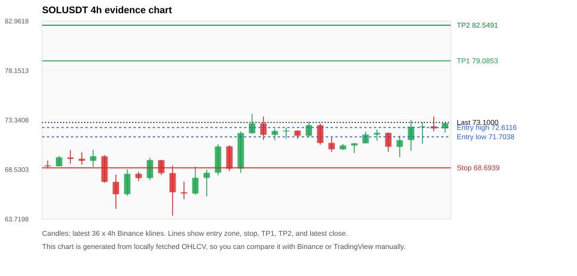
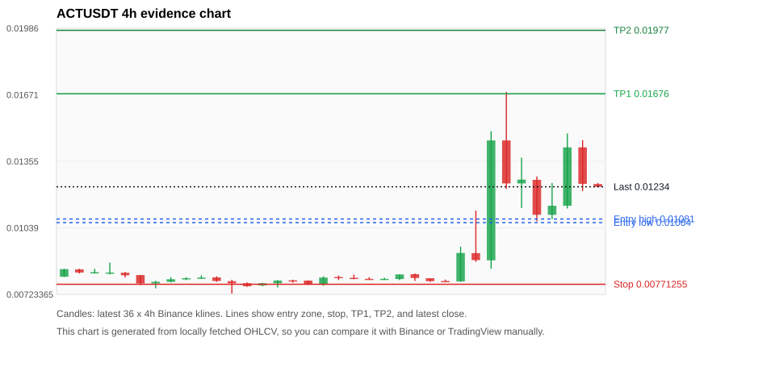
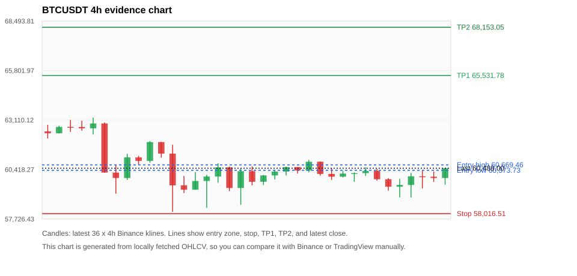
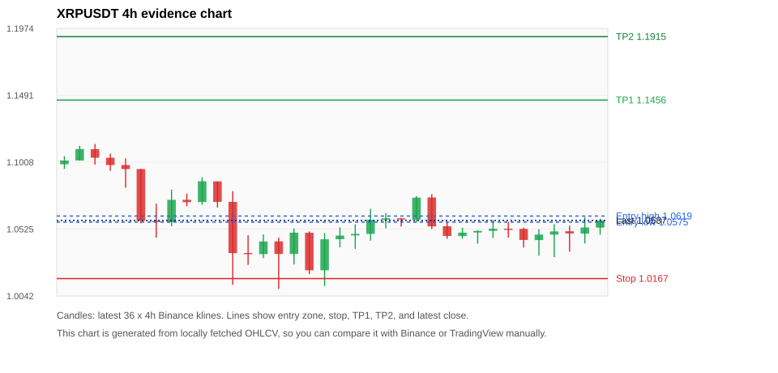
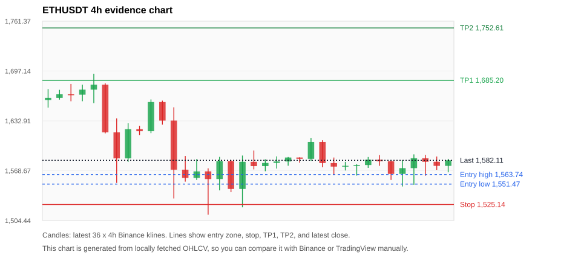

# Crypto 市场扫描报告 v1

- 报告时间：2026-06-29 20:06:19 CST
- Run ID：`20260629_120503_2f2260ea`
- Run type：`daily_full`
- 数据来源：SQLite
- 报告版本：v1
- 扫描 ID：ae9a993942c9
- 数据源：Binance public spot API + CoinGecko/CoinMarketCap cross-check
- 过滤条件：USDT spot; 24h quote volume >= 30,000,000; trades >= 30,000; exclude stables/leveraged tokens; analyze 1h/4h/1d klines
- 默认单笔风险：账户权益的 1.00%

## 限制说明

- 交易信号仍以 Binance 现货公开 K 线为主源；外部数据源用于一致性复核。
- 结果是研究和模拟盘计划，不是确定收益或实盘下单指令。
- 历史长度过滤：候选币至少需要 180 根 1d K 线。
- 数据质量验证池：先验证 score 排名前 min(top_n * 2, 10) 的候选，再按 action + score 补足最终名单。
- 大盘环境过滤：RISK_OFF; BTC/ETH 大盘偏弱，山寨币买入候选降级为观察。 BTC 7d=-5.529568020998433; ETH 7d=-8.351512275849304.
- 已启用数据交叉验证：Binance 主源 + CoinGecko 自动对照；CoinMarketCap 在配置 API Key 后自动对照。
- SOLUSDT 交叉验证状态 DATA_WARNING：At least one external provider needs manual review.
- ACTUSDT 交叉验证状态 DATA_WARNING：At least one external provider needs manual review.
- BTCUSDT 交叉验证状态 DATA_WARNING：At least one external provider needs manual review.
- XRPUSDT 交叉验证状态 DATA_WARNING：At least one external provider needs manual review.
- ETHUSDT 交叉验证状态 DATA_WARNING：At least one external provider needs manual review.
- TRXUSDT 交叉验证状态 DATA_WARNING：At least one external provider needs manual review.
- MANTAUSDT 交叉验证状态 DATA_WARNING：At least one external provider needs manual review.
- BNBUSDT 交叉验证状态 DATA_WARNING：At least one external provider needs manual review.
- ZECUSDT 交叉验证状态 DATA_WARNING：At least one external provider needs manual review.

## 5 个候选交易计划

| Rank | Coin | Action | Setup | Entry Zone | Stop Loss | TP1 | TP2 / Exit Rule | R/R | Verdict |
|---:|---|---|---|---:|---:|---:|---|---:|---|
| 1 | `SOL` | `WATCH_ONLY` | 回踩支撑/4h EMA 附近 | 71.7038 - 72.6116 | 68.6939 | 79.0853 | 82.5491 或跌破 4h 关键支撑 | 2.00-3.00 | 只观察 |
| 2 | `ACT` | `WATCH_ONLY` | 涨幅较远，只等深回调 | 0.01064 - 0.01081 | 0.00771255 | 0.01676 | 0.01977 或跌破 4h 关键支撑 | 2.00-3.00 | 只等回调 |
| 3 | `BTC` | `WATCH_ONLY` | 回踩支撑/4h EMA 附近 | 60,373.73 - 60,669.46 | 58,016.51 | 65,531.78 | 68,153.05 或跌破 4h 关键支撑 | 2.00-3.05 | 只观察 |
| 4 | `XRP` | `REJECT` | 回踩支撑/4h EMA 附近 | 1.0575 - 1.0619 | 1.0167 | 1.1456 | 1.1915 或跌破 4h 关键支撑 | 2.00-3.07 | 只观察 |
| 5 | `ETH` | `REJECT` | 回踩支撑/4h EMA 附近 | 1,551.47 - 1,563.74 | 1,525.14 | 1,685.20 | 1,752.61 或跌破 4h 关键支撑 | 3.93-6.01 | 只观察 |

## 数据交叉验证摘要

价格差异以 Binance 当前价为基准；成交量口径不同，Binance 是 USDT 现货成交额，CoinGecko/CoinMarketCap 通常是全市场成交量。

| Rank | Coin | Data Status | Max Price Diff | Max 24h Diff | Message |
|---:|---|---|---:|---:|---|
| 1 | `SOL` | DATA_WARNING | 0.73% | 0.66 pts | At least one external provider needs manual review. |
| 2 | `ACT` | DATA_WARNING | 1.04% | 0.55 pts | At least one external provider needs manual review. |
| 3 | `BTC` | DATA_WARNING | 0.80% | 0.60 pts | At least one external provider needs manual review. |
| 4 | `XRP` | DATA_WARNING | 0.54% | 0.50 pts | At least one external provider needs manual review. |
| 5 | `ETH` | DATA_WARNING | 0.25% | 0.18 pts | At least one external provider needs manual review. |

## 候选币说明

### 1. SOL `SOLUSDT`



- 入选原因：回踩支撑/4h EMA 附近；24h +1.74%，7d -2.51%，4h RSI 53.79，24h 成交额 $170.0M。
- 交易失效条件：跌破 68.6939 或 4h 收盘重新失守关键支撑。
- 主要风险：日线趋势未完全确认；BTC/ETH 大盘环境未确认强势，山寨币买入信号降级；7d 趋势未确认；数据交叉验证需要人工复核。
- 数据交叉验证：DATA_WARNING；At least one external provider needs manual review.

#### 可点击人工验证

- [Binance 交易页](https://www.binance.com/en/trade/SOL_USDT)
- [TradingView 图表](https://www.tradingview.com/chart/?symbol=BINANCE%3ASOLUSDT)
- [CoinGecko 搜索](https://www.coingecko.com/en/search?query=SOL)
- [CoinMarketCap 搜索](https://coinmarketcap.com/search/?q=SOL)

#### 多数据源对照

| Source | Status | Asset ID | Price | 24h Change | 24h Volume | Price Diff | 24h Diff | Updated | Message |
|---|---|---|---:|---:|---:|---:|---:|---|---|
| Binance | DATA_OK | SOLUSDT | 73.1000 | +1.74% | $170.0M | 0.00% | 0.00 pts | 2026-06-29T12:05:35+00:00 | Primary market data source used by scanner. |
| CoinGecko | DATA_OK | solana | 72.5700 | +1.08% | $2.63B | 0.73% | 0.66 pts | 2026-06-29T12:05:35.802Z | External source agrees with Binance within thresholds. |
| CoinMarketCap | DATA_WARNING | 5426 | 72.6658 | +1.25% | $2.52B | 0.59% | 0.49 pts | 2026-06-29T12:04:00.000Z | CoinMarketCap symbol mapping has 8 matches; selected lowest cmc_rank |

#### 指标证据

| 指标 | 数值 | 人工核对用途 |
|---|---:|---|
| 当前价 | 73.1000 | 与 Binance/TradingView 当前价格对照 |
| 24h 涨跌 | +1.74% | 与交易所 24h 涨跌对照 |
| 7d 涨跌 | -2.51% | 判断短线趋势是否延续 |
| 4h EMA20 | 71.5606 | 判断短期趋势支撑 |
| 4h EMA50 | 70.8826 | 判断中期趋势支撑 |
| 1d EMA20 | 71.3157 | 判断日线趋势 |
| 1d EMA50 | 75.2345 | 判断日线趋势 |
| 4h RSI14 | 53.79 | 判断是否过热/过弱 |
| 4h ATR14 | 1.5014 | 推导止损和入场缓冲 |
| 最近 18 根 4h 最低点 | 69.7400 | 支撑/止损参考 |
| 最近 36 根 4h 最高点 | 73.9300 | TP/压力参考 |
| 支撑位 | 71.5606 | 入场区间推导基础 |

#### 交易计划推导

- 支撑位 = 最近低点、4h EMA20、4h EMA50、1d EMA20 中不高于当前价的最高有效支撑 = `71.5606`。
- 入场区间 = 支撑位附近 + ATR 缓冲 = `71.7038 - 72.6116`。
- 止损 = min(最近 18 根 4h 最低点 * 0.985, 入场中位价 - 1.15 * ATR14) = `68.6939`。
- TP1 = max(最近 36 根 4h 最高点 * 0.995, 入场中位价 + 2R) = `79.0853`。
- TP2 = max(入场中位价 + 3R, TP1 * 1.04) = `82.5491`。

#### 最近 10 根 4h K线

| UTC 开盘时间 | Open | High | Low | Close | Quote Volume | Trades |
|---|---:|---:|---:|---:|---:|---:|
| 2026-06-28T00:00+00:00 | 70.4900 | 71.0100 | 70.4400 | 70.8700 | $12.0M | 61878 |
| 2026-06-28T04:00+00:00 | 70.8600 | 71.0900 | 70.1400 | 71.0800 | $17.3M | 101682 |
| 2026-06-28T08:00+00:00 | 71.0800 | 72.2000 | 71.0600 | 71.9200 | $24.2M | 124465 |
| 2026-06-28T12:00+00:00 | 71.9200 | 72.4100 | 71.3300 | 72.0900 | $17.7M | 141978 |
| 2026-06-28T16:00+00:00 | 72.0900 | 72.1300 | 70.2500 | 70.7400 | $21.0M | 158341 |
| 2026-06-28T20:00+00:00 | 70.7300 | 71.8200 | 69.7400 | 71.3800 | $29.5M | 188218 |
| 2026-06-29T00:00+00:00 | 71.3900 | 73.3300 | 70.3500 | 72.6800 | $39.7M | 295125 |
| 2026-06-29T04:00+00:00 | 72.6800 | 73.1200 | 71.0300 | 72.7200 | $26.5M | 191305 |
| 2026-06-29T08:00+00:00 | 72.7200 | 73.6800 | 72.2500 | 72.5200 | $32.4M | 187395 |
| 2026-06-29T12:00+00:00 | 72.5300 | 73.1400 | 72.1200 | 73.0300 | $3.6M | 21161 |

### 2. ACT `ACTUSDT`



- 入选原因：涨幅较远，只等深回调；24h -12.07%，7d +36.35%，4h RSI 62.94，24h 成交额 $31.4M。
- 交易失效条件：跌破 0.00771255 或 4h 收盘重新失守关键支撑。
- 主要风险：距离支撑偏远，不能追市价；24h 振幅较大，回撤风险高；成交量突增，可能是事件驱动；日线趋势未完全确认；BTC/ETH 大盘环境未确认强势，山寨币买入信号降级；24h 动量未确认；数据交叉验证需要人工复核。
- 数据交叉验证：DATA_WARNING；At least one external provider needs manual review.

#### 可点击人工验证

- [Binance 交易页](https://www.binance.com/en/trade/ACT_USDT)
- [TradingView 图表](https://www.tradingview.com/chart/?symbol=BINANCE%3AACTUSDT)
- [CoinGecko 搜索](https://www.coingecko.com/en/search?query=ACT)
- [CoinMarketCap 搜索](https://coinmarketcap.com/search/?q=ACT)

#### 多数据源对照

| Source | Status | Asset ID | Price | 24h Change | 24h Volume | Price Diff | 24h Diff | Updated | Message |
|---|---|---|---:|---:|---:|---:|---:|---|---|
| Binance | DATA_OK | ACTUSDT | 0.01234 | -12.07% | $31.4M | 0.00% | 0.00 pts | 2026-06-29T12:05:35+00:00 | Primary market data source used by scanner. |
| CoinGecko | DATA_WARNING | act-i-the-ai-prophecy | 0.01240 | -12.63% | $147.9M | 0.49% | 0.55 pts | 2026-06-29T12:05:29.570Z | CoinGecko symbol mapping has 3 exact matches; selected highest market-cap rank |
| CoinMarketCap | DATA_WARNING | 33566 | 0.01247 | -11.69% | $175.3M | 1.04% | 0.38 pts | 2026-06-29T12:04:00.000Z | price diff 1.04% exceeds warning threshold; CoinMarketCap symbol mapping has 4 matches; selected lowest cmc_rank |

#### 指标证据

| 指标 | 数值 | 人工核对用途 |
|---|---:|---|
| 当前价 | 0.01234 | 与 Binance/TradingView 当前价格对照 |
| 24h 涨跌 | -12.07% | 与交易所 24h 涨跌对照 |
| 7d 涨跌 | +36.35% | 判断短线趋势是否延续 |
| 4h EMA20 | 0.01062 | 判断短期趋势支撑 |
| 4h EMA50 | 0.0096207939 | 判断中期趋势支撑 |
| 1d EMA20 | 0.0097040746 | 判断日线趋势 |
| 1d EMA50 | 0.01092 | 判断日线趋势 |
| 4h RSI14 | 62.94 | 判断是否过热/过弱 |
| 4h ATR14 | 0.0020378571 | 推导止损和入场缓冲 |
| 最近 18 根 4h 最低点 | 0.00783 | 支撑/止损参考 |
| 最近 36 根 4h 最高点 | 0.01684 | TP/压力参考 |
| 支撑位 | 0.01062 | 入场区间推导基础 |

#### 交易计划推导

- 支撑位 = 最近低点、4h EMA20、4h EMA50、1d EMA20 中不高于当前价的最高有效支撑 = `0.01062`。
- 入场区间 = 支撑位附近 + ATR 缓冲 = `0.01064 - 0.01081`。
- 止损 = min(最近 18 根 4h 最低点 * 0.985, 入场中位价 - 1.15 * ATR14) = `0.00771255`。
- TP1 = max(最近 36 根 4h 最高点 * 0.995, 入场中位价 + 2R) = `0.01676`。
- TP2 = max(入场中位价 + 3R, TP1 * 1.04) = `0.01977`。

#### 最近 10 根 4h K线

| UTC 开盘时间 | Open | High | Low | Close | Quote Volume | Trades |
|---|---:|---:|---:|---:|---:|---:|
| 2026-06-28T00:00+00:00 | 0.00785 | 0.0095 | 0.00783 | 0.0092 | $2.9M | 48253 |
| 2026-06-28T04:00+00:00 | 0.00919 | 0.01121 | 0.00878 | 0.00886 | $3.7M | 69885 |
| 2026-06-28T08:00+00:00 | 0.00885 | 0.01498 | 0.00845 | 0.01454 | $7.4M | 162732 |
| 2026-06-28T12:00+00:00 | 0.01454 | 0.01684 | 0.01224 | 0.01250 | $12.0M | 307438 |
| 2026-06-28T16:00+00:00 | 0.01250 | 0.01372 | 0.01133 | 0.01268 | $5.7M | 146142 |
| 2026-06-28T20:00+00:00 | 0.01267 | 0.01283 | 0.01070 | 0.01101 | $2.5M | 64404 |
| 2026-06-29T00:00+00:00 | 0.01101 | 0.01252 | 0.01081 | 0.01144 | $2.9M | 71399 |
| 2026-06-29T04:00+00:00 | 0.01144 | 0.01487 | 0.01131 | 0.01421 | $4.5M | 114175 |
| 2026-06-29T08:00+00:00 | 0.01421 | 0.01455 | 0.01214 | 0.01248 | $4.2M | 99581 |
| 2026-06-29T12:00+00:00 | 0.01247 | 0.01252 | 0.01234 | 0.01234 | $30,743 | 1238 |

### 3. BTC `BTCUSDT`



- 入选原因：回踩支撑/4h EMA 附近；24h +0.20%，7d -7.76%，4h RSI 49.22，24h 成交额 $805.8M。
- 交易失效条件：跌破 58016.51 或 4h 收盘重新失守关键支撑。
- 主要风险：日线趋势未完全确认；BTC/ETH 大盘环境未确认强势，山寨币买入信号降级；7d 趋势未确认；数据交叉验证需要人工复核。
- 数据交叉验证：DATA_WARNING；At least one external provider needs manual review.

#### 可点击人工验证

- [Binance 交易页](https://www.binance.com/en/trade/BTC_USDT)
- [TradingView 图表](https://www.tradingview.com/chart/?symbol=BINANCE%3ABTCUSDT)
- [CoinGecko 搜索](https://www.coingecko.com/en/search?query=BTC)
- [CoinMarketCap 搜索](https://coinmarketcap.com/search/?q=BTC)

#### 多数据源对照

| Source | Status | Asset ID | Price | 24h Change | 24h Volume | Price Diff | 24h Diff | Updated | Message |
|---|---|---|---:|---:|---:|---:|---:|---|---|
| Binance | DATA_OK | BTCUSDT | 60,488.00 | +0.20% | $805.8M | 0.00% | 0.00 pts | 2026-06-29T12:05:35+00:00 | Primary market data source used by scanner. |
| CoinGecko | DATA_OK | bitcoin | 60,172.00 | -0.16% | $23.73B | 0.52% | 0.36 pts | 2026-06-29T12:05:42.780Z | External source agrees with Binance within thresholds. |
| CoinMarketCap | DATA_WARNING | 1 | 60,003.27 | -0.39% | $22.00B | 0.80% | 0.60 pts | 2026-06-29T12:04:00.000Z | CoinMarketCap symbol mapping has 13 matches; selected lowest cmc_rank |

#### 指标证据

| 指标 | 数值 | 人工核对用途 |
|---|---:|---|
| 当前价 | 60,488.00 | 与 Binance/TradingView 当前价格对照 |
| 24h 涨跌 | +0.20% | 与交易所 24h 涨跌对照 |
| 7d 涨跌 | -7.76% | 判断短线趋势是否延续 |
| 4h EMA20 | 60,253.23 | 判断短期趋势支撑 |
| 4h EMA50 | 61,165.81 | 判断中期趋势支撑 |
| 1d EMA20 | 62,865.41 | 判断日线趋势 |
| 1d EMA50 | 67,005.45 | 判断日线趋势 |
| 4h RSI14 | 49.22 | 判断是否过热/过弱 |
| 4h ATR14 | 702.74 | 推导止损和入场缓冲 |
| 最近 18 根 4h 最低点 | 58,900.01 | 支撑/止损参考 |
| 最近 36 根 4h 最高点 | 63,239.06 | TP/压力参考 |
| 支撑位 | 60,253.23 | 入场区间推导基础 |

#### 交易计划推导

- 支撑位 = 最近低点、4h EMA20、4h EMA50、1d EMA20 中不高于当前价的最高有效支撑 = `60,253.23`。
- 入场区间 = 支撑位附近 + ATR 缓冲 = `60,373.73 - 60,669.46`。
- 止损 = min(最近 18 根 4h 最低点 * 0.985, 入场中位价 - 1.15 * ATR14) = `58,016.51`。
- TP1 = max(最近 36 根 4h 最高点 * 0.995, 入场中位价 + 2R) = `65,531.78`。
- TP2 = max(入场中位价 + 3R, TP1 * 1.04) = `68,153.05`。

#### 最近 10 根 4h K线

| UTC 开盘时间 | Open | High | Low | Close | Quote Volume | Trades |
|---|---:|---:|---:|---:|---:|---:|
| 2026-06-28T00:00+00:00 | 60,029.01 | 60,339.99 | 59,986.00 | 60,197.04 | $83.6M | 209442 |
| 2026-06-28T04:00+00:00 | 60,197.03 | 60,259.68 | 59,753.48 | 60,219.99 | $67.0M | 239579 |
| 2026-06-28T08:00+00:00 | 60,220.00 | 60,545.01 | 60,068.00 | 60,342.00 | $67.5M | 274458 |
| 2026-06-28T12:00+00:00 | 60,341.99 | 60,457.02 | 59,817.28 | 59,890.00 | $82.2M | 386310 |
| 2026-06-28T16:00+00:00 | 59,890.35 | 59,943.90 | 59,270.26 | 59,481.79 | $99.0M | 496013 |
| 2026-06-28T20:00+00:00 | 59,481.78 | 59,906.00 | 58,905.00 | 59,577.01 | $134.0M | 693430 |
| 2026-06-29T00:00+00:00 | 59,577.01 | 60,233.00 | 58,900.01 | 60,049.46 | $190.8M | 914573 |
| 2026-06-29T04:00+00:00 | 60,049.45 | 60,346.27 | 59,392.02 | 60,026.00 | $124.7M | 563206 |
| 2026-06-29T08:00+00:00 | 60,026.01 | 60,311.95 | 59,745.46 | 59,956.05 | $135.3M | 567816 |
| 2026-06-29T12:00+00:00 | 59,956.05 | 60,498.00 | 59,595.09 | 60,488.00 | $45.7M | 100016 |

### 4. XRP `XRPUSDT`



- 入选原因：回踩支撑/4h EMA 附近；24h +0.70%，7d -9.02%，4h RSI 49.00，24h 成交额 $76.1M。
- 交易失效条件：跌破 1.016717 或 4h 收盘重新失守关键支撑。
- 主要风险：日线趋势未完全确认；BTC/ETH 大盘环境未确认强势，山寨币买入信号降级；7d 趋势未确认；数据交叉验证需要人工复核。
- 数据交叉验证：DATA_WARNING；At least one external provider needs manual review.

#### 可点击人工验证

- [Binance 交易页](https://www.binance.com/en/trade/XRP_USDT)
- [TradingView 图表](https://www.tradingview.com/chart/?symbol=BINANCE%3AXRPUSDT)
- [CoinGecko 搜索](https://www.coingecko.com/en/search?query=XRP)
- [CoinMarketCap 搜索](https://coinmarketcap.com/search/?q=XRP)

#### 多数据源对照

| Source | Status | Asset ID | Price | 24h Change | 24h Volume | Price Diff | 24h Diff | Updated | Message |
|---|---|---|---:|---:|---:|---:|---:|---|---|
| Binance | DATA_OK | XRPUSDT | 1.0587 | +0.70% | $76.1M | 0.00% | 0.00 pts | 2026-06-29T12:05:35+00:00 | Primary market data source used by scanner. |
| CoinGecko | DATA_OK | ripple | 1.0530 | +0.20% | $1.48B | 0.54% | 0.50 pts | 2026-06-29T12:05:47.303Z | External source agrees with Binance within thresholds. |
| CoinMarketCap | DATA_WARNING | 52 | 1.0533 | +0.24% | $1.46B | 0.51% | 0.47 pts | 2026-06-29T12:04:00.000Z | CoinMarketCap symbol mapping has 3 matches; selected lowest cmc_rank |

#### 指标证据

| 指标 | 数值 | 人工核对用途 |
|---|---:|---|
| 当前价 | 1.0587 | 与 Binance/TradingView 当前价格对照 |
| 24h 涨跌 | +0.70% | 与交易所 24h 涨跌对照 |
| 7d 涨跌 | -9.02% | 判断短线趋势是否延续 |
| 4h EMA20 | 1.0554 | 判断短期趋势支撑 |
| 4h EMA50 | 1.0767 | 判断中期趋势支撑 |
| 1d EMA20 | 1.1184 | 判断日线趋势 |
| 1d EMA50 | 1.2067 | 判断日线趋势 |
| 4h RSI14 | 49.00 | 判断是否过热/过弱 |
| 4h ATR14 | 0.01510 | 推导止损和入场缓冲 |
| 最近 18 根 4h 最低点 | 1.0322 | 支撑/止损参考 |
| 最近 36 根 4h 最高点 | 1.1139 | TP/压力参考 |
| 支撑位 | 1.0554 | 入场区间推导基础 |

#### 交易计划推导

- 支撑位 = 最近低点、4h EMA20、4h EMA50、1d EMA20 中不高于当前价的最高有效支撑 = `1.0554`。
- 入场区间 = 支撑位附近 + ATR 缓冲 = `1.0575 - 1.0619`。
- 止损 = min(最近 18 根 4h 最低点 * 0.985, 入场中位价 - 1.15 * ATR14) = `1.0167`。
- TP1 = max(最近 36 根 4h 最高点 * 0.995, 入场中位价 + 2R) = `1.1456`。
- TP2 = max(入场中位价 + 3R, TP1 * 1.04) = `1.1915`。

#### 最近 10 根 4h K线

| UTC 开盘时间 | Open | High | Low | Close | Quote Volume | Trades |
|---|---:|---:|---:|---:|---:|---:|
| 2026-06-28T00:00+00:00 | 1.0474 | 1.0535 | 1.0455 | 1.0499 | $5.9M | 41513 |
| 2026-06-28T04:00+00:00 | 1.0500 | 1.0515 | 1.0419 | 1.0512 | $5.4M | 47913 |
| 2026-06-28T08:00+00:00 | 1.0512 | 1.0591 | 1.0460 | 1.0527 | $7.4M | 53947 |
| 2026-06-28T12:00+00:00 | 1.0528 | 1.0576 | 1.0462 | 1.0526 | $7.6M | 65046 |
| 2026-06-28T16:00+00:00 | 1.0526 | 1.0535 | 1.0391 | 1.0446 | $7.4M | 69144 |
| 2026-06-28T20:00+00:00 | 1.0445 | 1.0524 | 1.0333 | 1.0485 | $13.9M | 101700 |
| 2026-06-29T00:00+00:00 | 1.0485 | 1.0560 | 1.0322 | 1.0508 | $19.7M | 158609 |
| 2026-06-29T04:00+00:00 | 1.0509 | 1.0549 | 1.0361 | 1.0493 | $12.5M | 97191 |
| 2026-06-29T08:00+00:00 | 1.0492 | 1.0612 | 1.0421 | 1.0536 | $13.3M | 95975 |
| 2026-06-29T12:00+00:00 | 1.0535 | 1.0600 | 1.0484 | 1.0587 | $1.7M | 15185 |

### 5. ETH `ETHUSDT`



- 入选原因：回踩支撑/4h EMA 附近；24h +0.07%，7d -10.99%，4h RSI 48.49，24h 成交额 $286.1M。
- 交易失效条件：跌破 1525.1444 或 4h 收盘重新失守关键支撑。
- 主要风险：日线趋势未完全确认；BTC/ETH 大盘环境未确认强势，山寨币买入信号降级；7d 趋势未确认；数据交叉验证需要人工复核。
- 数据交叉验证：DATA_WARNING；At least one external provider needs manual review.

#### 可点击人工验证

- [Binance 交易页](https://www.binance.com/en/trade/ETH_USDT)
- [TradingView 图表](https://www.tradingview.com/chart/?symbol=BINANCE%3AETHUSDT)
- [CoinGecko 搜索](https://www.coingecko.com/en/search?query=ETH)
- [CoinMarketCap 搜索](https://coinmarketcap.com/search/?q=ETH)

#### 多数据源对照

| Source | Status | Asset ID | Price | 24h Change | 24h Volume | Price Diff | 24h Diff | Updated | Message |
|---|---|---|---:|---:|---:|---:|---:|---|---|
| Binance | DATA_OK | ETHUSDT | 1,582.11 | +0.07% | $286.1M | 0.00% | 0.00 pts | 2026-06-29T12:05:35+00:00 | Primary market data source used by scanner. |
| CoinGecko | DATA_OK | ethereum | 1,578.64 | -0.10% | $7.00B | 0.22% | 0.16 pts | 2026-06-29T12:05:49.823Z | External source agrees with Binance within thresholds. |
| CoinMarketCap | DATA_WARNING | 1027 | 1,578.19 | -0.12% | $8.02B | 0.25% | 0.18 pts | 2026-06-29T12:04:00.000Z | CoinMarketCap symbol mapping has 6 matches; selected lowest cmc_rank |

#### 指标证据

| 指标 | 数值 | 人工核对用途 |
|---|---:|---|
| 当前价 | 1,582.11 | 与 Binance/TradingView 当前价格对照 |
| 24h 涨跌 | +0.07% | 与交易所 24h 涨跌对照 |
| 7d 涨跌 | -10.99% | 判断短线趋势是否延续 |
| 4h EMA20 | 1,584.96 | 判断短期趋势支撑 |
| 4h EMA50 | 1,618.12 | 判断中期趋势支撑 |
| 1d EMA20 | 1,676.30 | 判断日线趋势 |
| 1d EMA50 | 1,834.53 | 判断日线趋势 |
| 4h RSI14 | 48.49 | 判断是否过热/过弱 |
| 4h ATR14 | 21.9571 | 推导止损和入场缓冲 |
| 最近 18 根 4h 最低点 | 1,548.37 | 支撑/止损参考 |
| 最近 36 根 4h 最高点 | 1,693.67 | TP/压力参考 |
| 支撑位 | 1,548.37 | 入场区间推导基础 |

#### 交易计划推导

- 支撑位 = 最近低点、4h EMA20、4h EMA50、1d EMA20 中不高于当前价的最高有效支撑 = `1,548.37`。
- 入场区间 = 支撑位附近 + ATR 缓冲 = `1,551.47 - 1,563.74`。
- 止损 = min(最近 18 根 4h 最低点 * 0.985, 入场中位价 - 1.15 * ATR14) = `1,525.14`。
- TP1 = max(最近 36 根 4h 最高点 * 0.995, 入场中位价 + 2R) = `1,685.20`。
- TP2 = max(入场中位价 + 3R, TP1 * 1.04) = `1,752.61`。

#### 最近 10 根 4h K线

| UTC 开盘时间 | Open | High | Low | Close | Quote Volume | Trades |
|---|---:|---:|---:|---:|---:|---:|
| 2026-06-28T00:00+00:00 | 1,574.00 | 1,580.05 | 1,569.07 | 1,575.08 | $19.1M | 141596 |
| 2026-06-28T04:00+00:00 | 1,575.08 | 1,577.34 | 1,562.41 | 1,575.96 | $33.0M | 244254 |
| 2026-06-28T08:00+00:00 | 1,575.96 | 1,586.35 | 1,572.23 | 1,582.87 | $37.7M | 195904 |
| 2026-06-28T12:00+00:00 | 1,582.86 | 1,588.82 | 1,575.04 | 1,580.89 | $37.4M | 243238 |
| 2026-06-28T16:00+00:00 | 1,580.90 | 1,581.94 | 1,556.81 | 1,564.62 | $42.0M | 276706 |
| 2026-06-28T20:00+00:00 | 1,564.61 | 1,582.29 | 1,548.37 | 1,571.96 | $51.2M | 404930 |
| 2026-06-29T00:00+00:00 | 1,571.96 | 1,589.75 | 1,550.43 | 1,584.78 | $58.7M | 555570 |
| 2026-06-29T04:00+00:00 | 1,584.77 | 1,589.08 | 1,562.26 | 1,580.16 | $38.1M | 303986 |
| 2026-06-29T08:00+00:00 | 1,580.17 | 1,587.00 | 1,569.85 | 1,574.93 | $52.4M | 328177 |
| 2026-06-29T12:00+00:00 | 1,574.93 | 1,583.91 | 1,566.60 | 1,582.11 | $7.5M | 49295 |

## 组合风控

- 不要 5 个候选全部满仓买入。
- 同时持仓总风险建议控制在账户权益的 3% - 5% 以内。
- 如果 BTC/ETH 同时破位，暂停山寨币多头计划或降低仓位。
- 第一版报告用于模拟盘和人工复核，不自动下单。

## 原始数据

```json
[
  {
    "rank": 1,
    "symbol": "SOLUSDT",
    "base_asset": "SOL",
    "price": 73.1,
    "score": 36.955644295662175,
    "setup": "回踩支撑/4h EMA 附近",
    "verdict": "只观察",
    "entry_low": 71.70375894985145,
    "entry_high": 72.61163767450245,
    "stop_loss": 68.6939,
    "take_profit_1": 79.08529493653084,
    "take_profit_2": 82.54909324870779,
    "risk_reward_1": 2.0,
    "risk_reward_2": 3.0,
    "pct_24h": 1.74,
    "pct_3d": 3.380002828454254,
    "pct_7d": -2.507335289410517,
    "quote_volume_24h": 169980420.74851,
    "trades_24h": 1180891,
    "high_low_range_24h": 5.6495554918267965,
    "rsi_1h": 71.47147147147143,
    "rsi_4h": 53.78947368421051,
    "ema20_4h": 71.56063767450244,
    "ema50_4h": 70.88261844635078,
    "ema20_1d": 71.3157170730456,
    "ema50_1d": 75.2345414116329,
    "atr_4h": 1.5014285714285722,
    "macd_hist_4h": 0.13598831120842858,
    "volume_ratio_24h": 0.8068403032705176,
    "support_level": 71.56063767450244,
    "recent_low_4h_18": 69.74,
    "recent_high_4h_36": 73.93,
    "distance_to_support_pct": 2.1511299724569666,
    "binance_trade_url": "https://www.binance.com/en/trade/SOL_USDT",
    "tradingview_url": "https://www.tradingview.com/chart/?symbol=BINANCE%3ASOLUSDT",
    "coingecko_search_url": "https://www.coingecko.com/en/search?query=SOL",
    "coinmarketcap_search_url": "https://coinmarketcap.com/search/?q=SOL",
    "invalidation": "跌破 68.6939 或 4h 收盘重新失守关键支撑",
    "recent_4h_klines": [
      {
        "open_time_utc": "2026-06-23T16:00+00:00",
        "open": 68.93,
        "high": 69.41,
        "low": 68.64,
        "close": 68.84,
        "quote_volume": 15665481.56972,
        "trades": 121234
      },
      {
        "open_time_utc": "2026-06-23T20:00+00:00",
        "open": 68.84,
        "high": 69.84,
        "low": 68.83,
        "close": 69.71,
        "quote_volume": 12135989.51928,
        "trades": 74506
      },
      {
        "open_time_utc": "2026-06-24T00:00+00:00",
        "open": 69.7,
        "high": 70.41,
        "low": 69.1,
        "close": 69.56,
        "quote_volume": 18424992.0708,
        "trades": 110772
      },
      {
        "open_time_utc": "2026-06-24T04:00+00:00",
        "open": 69.57,
        "high": 70.22,
        "low": 69.0,
        "close": 69.38,
        "quote_volume": 17557625.80841,
        "trades": 95535
      },
      {
        "open_time_utc": "2026-06-24T08:00+00:00",
        "open": 69.38,
        "high": 70.44,
        "low": 68.77,
        "close": 69.82,
        "quote_volume": 23577327.17589,
        "trades": 114487
      },
      {
        "open_time_utc": "2026-06-24T12:00+00:00",
        "open": 69.82,
        "high": 69.93,
        "low": 67.24,
        "close": 67.33,
        "quote_volume": 45933900.7252,
        "trades": 316229
      },
      {
        "open_time_utc": "2026-06-24T16:00+00:00",
        "open": 67.32,
        "high": 68.03,
        "low": 64.71,
        "close": 66.13,
        "quote_volume": 88776475.48768,
        "trades": 437295
      },
      {
        "open_time_utc": "2026-06-24T20:00+00:00",
        "open": 66.13,
        "high": 68.55,
        "low": 65.98,
        "close": 68.11,
        "quote_volume": 34233194.16038,
        "trades": 192734
      },
      {
        "open_time_utc": "2026-06-25T00:00+00:00",
        "open": 68.12,
        "high": 68.32,
        "low": 67.4,
        "close": 67.7,
        "quote_volume": 15798475.87117,
        "trades": 88130
      },
      {
        "open_time_utc": "2026-06-25T04:00+00:00",
        "open": 67.7,
        "high": 69.66,
        "low": 67.5,
        "close": 69.45,
        "quote_volume": 34459688.05818,
        "trades": 146011
      },
      {
        "open_time_utc": "2026-06-25T08:00+00:00",
        "open": 69.44,
        "high": 69.45,
        "low": 68.0,
        "close": 68.18,
        "quote_volume": 22648852.376,
        "trades": 86925
      },
      {
        "open_time_utc": "2026-06-25T12:00+00:00",
        "open": 68.18,
        "high": 68.92,
        "low": 64.04,
        "close": 66.32,
        "quote_volume": 104001398.65571,
        "trades": 609714
      },
      {
        "open_time_utc": "2026-06-25T16:00+00:00",
        "open": 66.32,
        "high": 67.35,
        "low": 65.65,
        "close": 66.2,
        "quote_volume": 44933944.60387,
        "trades": 292288
      },
      {
        "open_time_utc": "2026-06-25T20:00+00:00",
        "open": 66.19,
        "high": 68.81,
        "low": 66.08,
        "close": 67.72,
        "quote_volume": 27436348.83013,
        "trades": 168056
      },
      {
        "open_time_utc": "2026-06-26T00:00+00:00",
        "open": 67.72,
        "high": 68.5,
        "low": 65.91,
        "close": 68.21,
        "quote_volume": 45939418.7762,
        "trades": 272725
      },
      {
        "open_time_utc": "2026-06-26T04:00+00:00",
        "open": 68.22,
        "high": 70.99,
        "low": 67.96,
        "close": 70.77,
        "quote_volume": 61597815.57067,
        "trades": 269080
      },
      {
        "open_time_utc": "2026-06-26T08:00+00:00",
        "open": 70.78,
        "high": 70.88,
        "low": 68.39,
        "close": 68.61,
        "quote_volume": 35012595.38519,
        "trades": 190965
      },
      {
        "open_time_utc": "2026-06-26T12:00+00:00",
        "open": 68.61,
        "high": 72.24,
        "low": 68.19,
        "close": 72.07,
        "quote_volume": 73387646.73917,
        "trades": 545247
      },
      {
        "open_time_utc": "2026-06-26T16:00+00:00",
        "open": 72.06,
        "high": 73.93,
        "low": 72.01,
        "close": 73.01,
        "quote_volume": 59144719.92153,
        "trades": 366350
      },
      {
        "open_time_utc": "2026-06-26T20:00+00:00",
        "open": 73.01,
        "high": 73.68,
        "low": 71.41,
        "close": 71.9,
        "quote_volume": 35762097.32011,
        "trades": 198445
      },
      {
        "open_time_utc": "2026-06-27T00:00+00:00",
        "open": 71.9,
        "high": 72.5,
        "low": 71.36,
        "close": 72.27,
        "quote_volume": 26501639.77046,
        "trades": 114906
      },
      {
        "open_time_utc": "2026-06-27T04:00+00:00",
        "open": 72.26,
        "high": 72.59,
        "low": 71.51,
        "close": 72.31,
        "quote_volume": 22837656.55203,
        "trades": 87362
      },
      {
        "open_time_utc": "2026-06-27T08:00+00:00",
        "open": 72.31,
        "high": 72.33,
        "low": 71.53,
        "close": 71.81,
        "quote_volume": 13301159.28603,
        "trades": 60987
      },
      {
        "open_time_utc": "2026-06-27T12:00+00:00",
        "open": 71.81,
        "high": 73.19,
        "low": 71.64,
        "close": 72.84,
        "quote_volume": 25951796.73162,
        "trades": 110533
      },
      {
        "open_time_utc": "2026-06-27T16:00+00:00",
        "open": 72.83,
        "high": 73.01,
        "low": 70.94,
        "close": 71.11,
        "quote_volume": 28541648.40455,
        "trades": 147407
      },
      {
        "open_time_utc": "2026-06-27T20:00+00:00",
        "open": 71.11,
        "high": 71.63,
        "low": 70.25,
        "close": 70.5,
        "quote_volume": 21057165.32823,
        "trades": 113764
      },
      {
        "open_time_utc": "2026-06-28T00:00+00:00",
        "open": 70.49,
        "high": 71.01,
        "low": 70.44,
        "close": 70.87,
        "quote_volume": 12007083.59572,
        "trades": 61878
      },
      {
        "open_time_utc": "2026-06-28T04:00+00:00",
        "open": 70.86,
        "high": 71.09,
        "low": 70.14,
        "close": 71.08,
        "quote_volume": 17314102.01038,
        "trades": 101682
      },
      {
        "open_time_utc": "2026-06-28T08:00+00:00",
        "open": 71.08,
        "high": 72.2,
        "low": 71.06,
        "close": 71.92,
        "quote_volume": 24215171.50752,
        "trades": 124465
      },
      {
        "open_time_utc": "2026-06-28T12:00+00:00",
        "open": 71.92,
        "high": 72.41,
        "low": 71.33,
        "close": 72.09,
        "quote_volume": 17697496.131,
        "trades": 141978
      },
      {
        "open_time_utc": "2026-06-28T16:00+00:00",
        "open": 72.09,
        "high": 72.13,
        "low": 70.25,
        "close": 70.74,
        "quote_volume": 20974880.10862,
        "trades": 158341
      },
      {
        "open_time_utc": "2026-06-28T20:00+00:00",
        "open": 70.73,
        "high": 71.82,
        "low": 69.74,
        "close": 71.38,
        "quote_volume": 29453681.7673,
        "trades": 188218
      },
      {
        "open_time_utc": "2026-06-29T00:00+00:00",
        "open": 71.39,
        "high": 73.33,
        "low": 70.35,
        "close": 72.68,
        "quote_volume": 39741696.5793,
        "trades": 295125
      },
      {
        "open_time_utc": "2026-06-29T04:00+00:00",
        "open": 72.68,
        "high": 73.12,
        "low": 71.03,
        "close": 72.72,
        "quote_volume": 26528789.28622,
        "trades": 191305
      },
      {
        "open_time_utc": "2026-06-29T08:00+00:00",
        "open": 72.72,
        "high": 73.68,
        "low": 72.25,
        "close": 72.52,
        "quote_volume": 32369260.29807,
        "trades": 187395
      },
      {
        "open_time_utc": "2026-06-29T12:00+00:00",
        "open": 72.53,
        "high": 73.14,
        "low": 72.12,
        "close": 73.03,
        "quote_volume": 3566971.11346,
        "trades": 21161
      }
    ],
    "risks": [
      "日线趋势未完全确认",
      "BTC/ETH 大盘环境未确认强势，山寨币买入信号降级",
      "7d 趋势未确认",
      "数据交叉验证需要人工复核"
    ],
    "data_quality_status": "DATA_WARNING",
    "data_quality_message": "At least one external provider needs manual review.",
    "data_checks": [
      {
        "provider": "Binance",
        "status": "DATA_OK",
        "provider_asset_id": "SOLUSDT",
        "provider_symbol": "SOLUSDT",
        "price_usd": 73.1,
        "pct_24h": 1.74,
        "volume_24h": 169980420.74851,
        "last_updated": null,
        "fetched_at_utc": "2026-06-29T12:05:35+00:00",
        "price_diff_pct": 0.0,
        "pct_24h_diff": 0.0,
        "volume_note": "Binance USDT spot 24h quoteVolume.",
        "message": "Primary market data source used by scanner."
      },
      {
        "provider": "CoinGecko",
        "status": "DATA_OK",
        "provider_asset_id": "solana",
        "provider_symbol": "SOL",
        "price_usd": 72.57,
        "pct_24h": 1.07599,
        "volume_24h": 2629456908.0,
        "last_updated": "2026-06-29T12:05:35.802Z",
        "fetched_at_utc": "2026-06-29T12:05:35+00:00",
        "price_diff_pct": 0.7250341997264038,
        "pct_24h_diff": 0.66401,
        "volume_note": "CoinGecko total market volume; not the same venue scope as Binance quoteVolume.",
        "message": "External source agrees with Binance within thresholds."
      },
      {
        "provider": "CoinMarketCap",
        "status": "DATA_WARNING",
        "provider_asset_id": "5426",
        "provider_symbol": "SOL",
        "price_usd": 72.66577849043938,
        "pct_24h": 1.24566732,
        "volume_24h": 2518300596.7849913,
        "last_updated": "2026-06-29T12:04:00.000Z",
        "fetched_at_utc": "2026-06-29T12:05:35+00:00",
        "price_diff_pct": 0.5940102729967374,
        "pct_24h_diff": 0.4943326800000001,
        "volume_note": "CoinMarketCap total market volume; not the same venue scope as Binance quoteVolume.",
        "message": "CoinMarketCap symbol mapping has 8 matches; selected lowest cmc_rank"
      }
    ],
    "action": "WATCH_ONLY"
  },
  {
    "rank": 2,
    "symbol": "ACTUSDT",
    "base_asset": "ACT",
    "price": 0.01234,
    "score": 29.990696993001492,
    "setup": "涨幅较远，只等深回调",
    "verdict": "只等回调",
    "entry_low": 0.010640093917167427,
    "entry_high": 0.010811607142857144,
    "stop_loss": 0.00771255,
    "take_profit_1": 0.0167558,
    "take_profit_2": 0.019765752120049142,
    "risk_reward_1": 2.001111210093316,
    "risk_reward_2": 2.9999999999999996,
    "pct_24h": -12.074,
    "pct_3d": 56.005056890012625,
    "pct_7d": 36.35359116022099,
    "quote_volume_24h": 31352977.962507,
    "trades_24h": 793763,
    "high_low_range_24h": 57.38317757009348,
    "rsi_1h": 61.17274167987322,
    "rsi_4h": 62.93664890467733,
    "ema20_4h": 0.010618856204757911,
    "ema50_4h": 0.009620793891414021,
    "ema20_1d": 0.009704074638658605,
    "ema50_1d": 0.01092332821416914,
    "atr_4h": 0.002037857142857143,
    "macd_hist_4h": 0.0003402429090731241,
    "volume_ratio_24h": 7.242538826870381,
    "support_level": 0.010618856204757911,
    "recent_low_4h_18": 0.00783,
    "recent_high_4h_36": 0.01684,
    "distance_to_support_pct": 16.208372748007527,
    "binance_trade_url": "https://www.binance.com/en/trade/ACT_USDT",
    "tradingview_url": "https://www.tradingview.com/chart/?symbol=BINANCE%3AACTUSDT",
    "coingecko_search_url": "https://www.coingecko.com/en/search?query=ACT",
    "coinmarketcap_search_url": "https://coinmarketcap.com/search/?q=ACT",
    "invalidation": "跌破 0.00771255 或 4h 收盘重新失守关键支撑",
    "recent_4h_klines": [
      {
        "open_time_utc": "2026-06-23T16:00+00:00",
        "open": 0.00807,
        "high": 0.00845,
        "low": 0.00806,
        "close": 0.00843,
        "quote_volume": 109002.284865,
        "trades": 1721
      },
      {
        "open_time_utc": "2026-06-23T20:00+00:00",
        "open": 0.00842,
        "high": 0.00845,
        "low": 0.00822,
        "close": 0.00827,
        "quote_volume": 48063.871225,
        "trades": 1196
      },
      {
        "open_time_utc": "2026-06-24T00:00+00:00",
        "open": 0.00827,
        "high": 0.00845,
        "low": 0.00822,
        "close": 0.00829,
        "quote_volume": 84709.670888,
        "trades": 1738
      },
      {
        "open_time_utc": "2026-06-24T04:00+00:00",
        "open": 0.00827,
        "high": 0.00874,
        "low": 0.00818,
        "close": 0.00827,
        "quote_volume": 330225.021456,
        "trades": 9785
      },
      {
        "open_time_utc": "2026-06-24T08:00+00:00",
        "open": 0.00826,
        "high": 0.0083,
        "low": 0.00803,
        "close": 0.00814,
        "quote_volume": 83830.365387,
        "trades": 2732
      },
      {
        "open_time_utc": "2026-06-24T12:00+00:00",
        "open": 0.00815,
        "high": 0.00815,
        "low": 0.00768,
        "close": 0.00775,
        "quote_volume": 121642.727093,
        "trades": 2842
      },
      {
        "open_time_utc": "2026-06-24T16:00+00:00",
        "open": 0.00775,
        "high": 0.00788,
        "low": 0.00752,
        "close": 0.00783,
        "quote_volume": 154070.105659,
        "trades": 3672
      },
      {
        "open_time_utc": "2026-06-24T20:00+00:00",
        "open": 0.00783,
        "high": 0.00805,
        "low": 0.0078,
        "close": 0.00795,
        "quote_volume": 46254.698905,
        "trades": 1150
      },
      {
        "open_time_utc": "2026-06-25T00:00+00:00",
        "open": 0.00795,
        "high": 0.00805,
        "low": 0.00791,
        "close": 0.008,
        "quote_volume": 72043.505008,
        "trades": 1281
      },
      {
        "open_time_utc": "2026-06-25T04:00+00:00",
        "open": 0.00799,
        "high": 0.00814,
        "low": 0.00797,
        "close": 0.00803,
        "quote_volume": 57126.989242,
        "trades": 912
      },
      {
        "open_time_utc": "2026-06-25T08:00+00:00",
        "open": 0.00804,
        "high": 0.00809,
        "low": 0.00783,
        "close": 0.00787,
        "quote_volume": 56843.312172,
        "trades": 1087
      },
      {
        "open_time_utc": "2026-06-25T12:00+00:00",
        "open": 0.00786,
        "high": 0.00793,
        "low": 0.00727,
        "close": 0.00776,
        "quote_volume": 192786.166594,
        "trades": 3173
      },
      {
        "open_time_utc": "2026-06-25T16:00+00:00",
        "open": 0.00776,
        "high": 0.0078,
        "low": 0.00759,
        "close": 0.00762,
        "quote_volume": 76996.113218,
        "trades": 822
      },
      {
        "open_time_utc": "2026-06-25T20:00+00:00",
        "open": 0.00766,
        "high": 0.00778,
        "low": 0.00762,
        "close": 0.00776,
        "quote_volume": 39321.247885,
        "trades": 554
      },
      {
        "open_time_utc": "2026-06-26T00:00+00:00",
        "open": 0.00776,
        "high": 0.00791,
        "low": 0.00756,
        "close": 0.00789,
        "quote_volume": 63850.01346,
        "trades": 780
      },
      {
        "open_time_utc": "2026-06-26T04:00+00:00",
        "open": 0.0079,
        "high": 0.00793,
        "low": 0.00779,
        "close": 0.00789,
        "quote_volume": 72593.13497,
        "trades": 809
      },
      {
        "open_time_utc": "2026-06-26T08:00+00:00",
        "open": 0.00789,
        "high": 0.00789,
        "low": 0.00768,
        "close": 0.0077,
        "quote_volume": 63389.038374,
        "trades": 852
      },
      {
        "open_time_utc": "2026-06-26T12:00+00:00",
        "open": 0.00771,
        "high": 0.00809,
        "low": 0.00764,
        "close": 0.00803,
        "quote_volume": 84348.581299,
        "trades": 1202
      },
      {
        "open_time_utc": "2026-06-26T16:00+00:00",
        "open": 0.00806,
        "high": 0.00813,
        "low": 0.00791,
        "close": 0.00802,
        "quote_volume": 125774.460682,
        "trades": 1795
      },
      {
        "open_time_utc": "2026-06-26T20:00+00:00",
        "open": 0.00802,
        "high": 0.00817,
        "low": 0.00795,
        "close": 0.00798,
        "quote_volume": 95266.170742,
        "trades": 1183
      },
      {
        "open_time_utc": "2026-06-27T00:00+00:00",
        "open": 0.00797,
        "high": 0.00805,
        "low": 0.00795,
        "close": 0.00796,
        "quote_volume": 19869.185819,
        "trades": 344
      },
      {
        "open_time_utc": "2026-06-27T04:00+00:00",
        "open": 0.00796,
        "high": 0.00803,
        "low": 0.00792,
        "close": 0.00797,
        "quote_volume": 37945.091825,
        "trades": 501
      },
      {
        "open_time_utc": "2026-06-27T08:00+00:00",
        "open": 0.00796,
        "high": 0.00818,
        "low": 0.00791,
        "close": 0.00818,
        "quote_volume": 138451.987681,
        "trades": 2103
      },
      {
        "open_time_utc": "2026-06-27T12:00+00:00",
        "open": 0.00819,
        "high": 0.00823,
        "low": 0.00787,
        "close": 0.00801,
        "quote_volume": 180541.410189,
        "trades": 1952
      },
      {
        "open_time_utc": "2026-06-27T16:00+00:00",
        "open": 0.008,
        "high": 0.008,
        "low": 0.00783,
        "close": 0.00786,
        "quote_volume": 36904.337092,
        "trades": 1025
      },
      {
        "open_time_utc": "2026-06-27T20:00+00:00",
        "open": 0.00787,
        "high": 0.00794,
        "low": 0.00783,
        "close": 0.00784,
        "quote_volume": 18425.265227,
        "trades": 337
      },
      {
        "open_time_utc": "2026-06-28T00:00+00:00",
        "open": 0.00785,
        "high": 0.0095,
        "low": 0.00783,
        "close": 0.0092,
        "quote_volume": 2932159.862636,
        "trades": 48253
      },
      {
        "open_time_utc": "2026-06-28T04:00+00:00",
        "open": 0.00919,
        "high": 0.01121,
        "low": 0.00878,
        "close": 0.00886,
        "quote_volume": 3723321.873191,
        "trades": 69885
      },
      {
        "open_time_utc": "2026-06-28T08:00+00:00",
        "open": 0.00885,
        "high": 0.01498,
        "low": 0.00845,
        "close": 0.01454,
        "quote_volume": 7391893.178984,
        "trades": 162732
      },
      {
        "open_time_utc": "2026-06-28T12:00+00:00",
        "open": 0.01454,
        "high": 0.01684,
        "low": 0.01224,
        "close": 0.0125,
        "quote_volume": 12001209.030019,
        "trades": 307438
      },
      {
        "open_time_utc": "2026-06-28T16:00+00:00",
        "open": 0.0125,
        "high": 0.01372,
        "low": 0.01133,
        "close": 0.01268,
        "quote_volume": 5693085.121901,
        "trades": 146142
      },
      {
        "open_time_utc": "2026-06-28T20:00+00:00",
        "open": 0.01267,
        "high": 0.01283,
        "low": 0.0107,
        "close": 0.01101,
        "quote_volume": 2488588.382263,
        "trades": 64404
      },
      {
        "open_time_utc": "2026-06-29T00:00+00:00",
        "open": 0.01101,
        "high": 0.01252,
        "low": 0.01081,
        "close": 0.01144,
        "quote_volume": 2918262.974688,
        "trades": 71399
      },
      {
        "open_time_utc": "2026-06-29T04:00+00:00",
        "open": 0.01144,
        "high": 0.01487,
        "low": 0.01131,
        "close": 0.01421,
        "quote_volume": 4544824.132352,
        "trades": 114175
      },
      {
        "open_time_utc": "2026-06-29T08:00+00:00",
        "open": 0.01421,
        "high": 0.01455,
        "low": 0.01214,
        "close": 0.01248,
        "quote_volume": 4207655.205912,
        "trades": 99581
      },
      {
        "open_time_utc": "2026-06-29T12:00+00:00",
        "open": 0.01247,
        "high": 0.01252,
        "low": 0.01234,
        "close": 0.01234,
        "quote_volume": 30742.598326,
        "trades": 1238
      }
    ],
    "risks": [
      "距离支撑偏远，不能追市价",
      "24h 振幅较大，回撤风险高",
      "成交量突增，可能是事件驱动",
      "日线趋势未完全确认",
      "BTC/ETH 大盘环境未确认强势，山寨币买入信号降级",
      "24h 动量未确认",
      "数据交叉验证需要人工复核"
    ],
    "data_quality_status": "DATA_WARNING",
    "data_quality_message": "At least one external provider needs manual review.",
    "data_checks": [
      {
        "provider": "Binance",
        "status": "DATA_OK",
        "provider_asset_id": "ACTUSDT",
        "provider_symbol": "ACTUSDT",
        "price_usd": 0.01234,
        "pct_24h": -12.074,
        "volume_24h": 31352977.962507,
        "last_updated": null,
        "fetched_at_utc": "2026-06-29T12:05:35+00:00",
        "price_diff_pct": 0.0,
        "pct_24h_diff": 0.0,
        "volume_note": "Binance USDT spot 24h quoteVolume.",
        "message": "Primary market data source used by scanner."
      },
      {
        "provider": "CoinGecko",
        "status": "DATA_WARNING",
        "provider_asset_id": "act-i-the-ai-prophecy",
        "provider_symbol": "ACT",
        "price_usd": 0.01240047,
        "pct_24h": -12.62752,
        "volume_24h": 147881207.0,
        "last_updated": "2026-06-29T12:05:29.570Z",
        "fetched_at_utc": "2026-06-29T12:05:35+00:00",
        "price_diff_pct": 0.49003241491085875,
        "pct_24h_diff": 0.5535200000000007,
        "volume_note": "CoinGecko total market volume; not the same venue scope as Binance quoteVolume.",
        "message": "CoinGecko symbol mapping has 3 exact matches; selected highest market-cap rank"
      },
      {
        "provider": "CoinMarketCap",
        "status": "DATA_WARNING",
        "provider_asset_id": "33566",
        "provider_symbol": "ACT",
        "price_usd": 0.012468674085054648,
        "pct_24h": -11.69255229,
        "volume_24h": 175274170.76258796,
        "last_updated": "2026-06-29T12:04:00.000Z",
        "fetched_at_utc": "2026-06-29T12:05:35+00:00",
        "price_diff_pct": 1.0427397492272923,
        "pct_24h_diff": 0.3814477099999998,
        "volume_note": "CoinMarketCap total market volume; not the same venue scope as Binance quoteVolume.",
        "message": "price diff 1.04% exceeds warning threshold; CoinMarketCap symbol mapping has 4 matches; selected lowest cmc_rank"
      }
    ],
    "action": "WATCH_ONLY"
  },
  {
    "rank": 3,
    "symbol": "BTCUSDT",
    "base_asset": "BTC",
    "price": 60488.0,
    "score": 20.28310949129697,
    "setup": "回踩支撑/4h EMA 附近",
    "verdict": "只观察",
    "entry_low": 60373.73313925071,
    "entry_high": 60669.46399999999,
    "stop_loss": 58016.50985,
    "take_profit_1": 65531.77600887604,
    "take_profit_2": 68153.04704923109,
    "risk_reward_1": 2.0,
    "risk_reward_2": 3.0463785253669875,
    "pct_24h": 0.201,
    "pct_3d": 0.5194312695397496,
    "pct_7d": -7.761749367165816,
    "quote_volume_24h": 805817889.9988178,
    "trades_24h": 3715644,
    "high_low_range_24h": 2.6674698357436633,
    "rsi_1h": 72.90788739751018,
    "rsi_4h": 49.217457459752545,
    "ema20_4h": 60253.22668587895,
    "ema50_4h": 61165.80793341603,
    "ema20_1d": 62865.410725326634,
    "ema50_1d": 67005.44830077443,
    "atr_4h": 702.7378571428562,
    "macd_hist_4h": 119.22731664110222,
    "volume_ratio_24h": 0.6093519689814466,
    "support_level": 60253.22668587895,
    "recent_low_4h_18": 58900.01,
    "recent_high_4h_36": 63239.06,
    "distance_to_support_pct": 0.38964438426676296,
    "binance_trade_url": "https://www.binance.com/en/trade/BTC_USDT",
    "tradingview_url": "https://www.tradingview.com/chart/?symbol=BINANCE%3ABTCUSDT",
    "coingecko_search_url": "https://www.coingecko.com/en/search?query=BTC",
    "coinmarketcap_search_url": "https://coinmarketcap.com/search/?q=BTC",
    "invalidation": "跌破 58016.51 或 4h 收盘重新失守关键支撑",
    "recent_4h_klines": [
      {
        "open_time_utc": "2026-06-23T16:00+00:00",
        "open": 62487.79,
        "high": 62846.0,
        "low": 62104.7,
        "close": 62388.49,
        "quote_volume": 153768837.4080825,
        "trades": 580044
      },
      {
        "open_time_utc": "2026-06-23T20:00+00:00",
        "open": 62388.49,
        "high": 62799.99,
        "low": 62380.25,
        "close": 62734.57,
        "quote_volume": 92835243.377365,
        "trades": 369212
      },
      {
        "open_time_utc": "2026-06-24T00:00+00:00",
        "open": 62734.57,
        "high": 63119.45,
        "low": 62461.87,
        "close": 62729.78,
        "quote_volume": 173503244.6173542,
        "trades": 524761
      },
      {
        "open_time_utc": "2026-06-24T04:00+00:00",
        "open": 62729.78,
        "high": 63073.44,
        "low": 62525.49,
        "close": 62657.99,
        "quote_volume": 114538754.1784594,
        "trades": 343629
      },
      {
        "open_time_utc": "2026-06-24T08:00+00:00",
        "open": 62658.0,
        "high": 63239.06,
        "low": 62318.88,
        "close": 62921.19,
        "quote_volume": 145076269.788959,
        "trades": 470650
      },
      {
        "open_time_utc": "2026-06-24T12:00+00:00",
        "open": 62921.19,
        "high": 62973.2,
        "low": 60249.82,
        "close": 60250.0,
        "quote_volume": 573692749.7645245,
        "trades": 1507424
      },
      {
        "open_time_utc": "2026-06-24T16:00+00:00",
        "open": 60250.0,
        "high": 60678.1,
        "low": 59102.7,
        "close": 59958.3,
        "quote_volume": 648464612.9816535,
        "trades": 1716720
      },
      {
        "open_time_utc": "2026-06-24T20:00+00:00",
        "open": 59958.3,
        "high": 61276.0,
        "low": 59854.0,
        "close": 61077.99,
        "quote_volume": 216610182.9769442,
        "trades": 804347
      },
      {
        "open_time_utc": "2026-06-25T00:00+00:00",
        "open": 61078.0,
        "high": 61163.16,
        "low": 60684.94,
        "close": 60883.65,
        "quote_volume": 148617037.7176224,
        "trades": 488365
      },
      {
        "open_time_utc": "2026-06-25T04:00+00:00",
        "open": 60883.66,
        "high": 61962.4,
        "low": 60792.0,
        "close": 61911.04,
        "quote_volume": 199336748.6475796,
        "trades": 585612
      },
      {
        "open_time_utc": "2026-06-25T08:00+00:00",
        "open": 61911.03,
        "high": 61920.0,
        "low": 61066.0,
        "close": 61282.01,
        "quote_volume": 120376027.9172556,
        "trades": 397068
      },
      {
        "open_time_utc": "2026-06-25T12:00+00:00",
        "open": 61282.0,
        "high": 61761.35,
        "low": 58115.01,
        "close": 59557.99,
        "quote_volume": 950943210.7760452,
        "trades": 2405299
      },
      {
        "open_time_utc": "2026-06-25T16:00+00:00",
        "open": 59557.99,
        "high": 60067.0,
        "low": 59139.96,
        "close": 59320.0,
        "quote_volume": 281118401.7040374,
        "trades": 1200956
      },
      {
        "open_time_utc": "2026-06-25T20:00+00:00",
        "open": 59319.99,
        "high": 60273.81,
        "low": 59319.99,
        "close": 59794.0,
        "quote_volume": 122462673.3075464,
        "trades": 605975
      },
      {
        "open_time_utc": "2026-06-26T00:00+00:00",
        "open": 59794.64,
        "high": 60131.37,
        "low": 58337.0,
        "close": 60036.01,
        "quote_volume": 368451215.4456913,
        "trades": 1223525
      },
      {
        "open_time_utc": "2026-06-26T04:00+00:00",
        "open": 60036.0,
        "high": 60759.99,
        "low": 59702.0,
        "close": 60532.0,
        "quote_volume": 324265183.3708553,
        "trades": 866194
      },
      {
        "open_time_utc": "2026-06-26T08:00+00:00",
        "open": 60532.0,
        "high": 60580.0,
        "low": 59239.78,
        "close": 59413.24,
        "quote_volume": 223309628.5990211,
        "trades": 807589
      },
      {
        "open_time_utc": "2026-06-26T12:00+00:00",
        "open": 59413.24,
        "high": 60500.0,
        "low": 58500.1,
        "close": 60328.32,
        "quote_volume": 462960390.8887911,
        "trades": 1875169
      },
      {
        "open_time_utc": "2026-06-26T16:00+00:00",
        "open": 60328.18,
        "high": 60583.0,
        "low": 59556.0,
        "close": 59751.97,
        "quote_volume": 173431799.0539421,
        "trades": 854765
      },
      {
        "open_time_utc": "2026-06-26T20:00+00:00",
        "open": 59751.96,
        "high": 60117.64,
        "low": 59571.31,
        "close": 60097.27,
        "quote_volume": 83683841.0195114,
        "trades": 391892
      },
      {
        "open_time_utc": "2026-06-27T00:00+00:00",
        "open": 60097.27,
        "high": 60412.0,
        "low": 59876.22,
        "close": 60305.73,
        "quote_volume": 104716833.0302822,
        "trades": 306723
      },
      {
        "open_time_utc": "2026-06-27T04:00+00:00",
        "open": 60305.73,
        "high": 60574.0,
        "low": 60093.33,
        "close": 60548.07,
        "quote_volume": 130094666.5531438,
        "trades": 266760
      },
      {
        "open_time_utc": "2026-06-27T08:00+00:00",
        "open": 60548.06,
        "high": 60548.74,
        "low": 60198.94,
        "close": 60363.65,
        "quote_volume": 71997666.2519905,
        "trades": 219343
      },
      {
        "open_time_utc": "2026-06-27T12:00+00:00",
        "open": 60363.65,
        "high": 60941.17,
        "low": 60257.03,
        "close": 60840.06,
        "quote_volume": 102775288.1671989,
        "trades": 334232
      },
      {
        "open_time_utc": "2026-06-27T16:00+00:00",
        "open": 60840.06,
        "high": 60855.03,
        "low": 60085.88,
        "close": 60175.95,
        "quote_volume": 86663415.5699926,
        "trades": 332446
      },
      {
        "open_time_utc": "2026-06-27T20:00+00:00",
        "open": 60175.95,
        "high": 60482.18,
        "low": 59855.16,
        "close": 60029.0,
        "quote_volume": 82517393.4972376,
        "trades": 303912
      },
      {
        "open_time_utc": "2026-06-28T00:00+00:00",
        "open": 60029.01,
        "high": 60339.99,
        "low": 59986.0,
        "close": 60197.04,
        "quote_volume": 83574227.8630928,
        "trades": 209442
      },
      {
        "open_time_utc": "2026-06-28T04:00+00:00",
        "open": 60197.03,
        "high": 60259.68,
        "low": 59753.48,
        "close": 60219.99,
        "quote_volume": 67045001.2851438,
        "trades": 239579
      },
      {
        "open_time_utc": "2026-06-28T08:00+00:00",
        "open": 60220.0,
        "high": 60545.01,
        "low": 60068.0,
        "close": 60342.0,
        "quote_volume": 67538204.8202022,
        "trades": 274458
      },
      {
        "open_time_utc": "2026-06-28T12:00+00:00",
        "open": 60341.99,
        "high": 60457.02,
        "low": 59817.28,
        "close": 59890.0,
        "quote_volume": 82205664.8624969,
        "trades": 386310
      },
      {
        "open_time_utc": "2026-06-28T16:00+00:00",
        "open": 59890.35,
        "high": 59943.9,
        "low": 59270.26,
        "close": 59481.79,
        "quote_volume": 99019017.1846834,
        "trades": 496013
      },
      {
        "open_time_utc": "2026-06-28T20:00+00:00",
        "open": 59481.78,
        "high": 59906.0,
        "low": 58905.0,
        "close": 59577.01,
        "quote_volume": 133951104.7954976,
        "trades": 693430
      },
      {
        "open_time_utc": "2026-06-29T00:00+00:00",
        "open": 59577.01,
        "high": 60233.0,
        "low": 58900.01,
        "close": 60049.46,
        "quote_volume": 190794022.1291162,
        "trades": 914573
      },
      {
        "open_time_utc": "2026-06-29T04:00+00:00",
        "open": 60049.45,
        "high": 60346.27,
        "low": 59392.02,
        "close": 60026.0,
        "quote_volume": 124665585.6546905,
        "trades": 563206
      },
      {
        "open_time_utc": "2026-06-29T08:00+00:00",
        "open": 60026.01,
        "high": 60311.95,
        "low": 59745.46,
        "close": 59956.05,
        "quote_volume": 135305799.5097679,
        "trades": 567816
      },
      {
        "open_time_utc": "2026-06-29T12:00+00:00",
        "open": 59956.05,
        "high": 60498.0,
        "low": 59595.09,
        "close": 60488.0,
        "quote_volume": 45744299.398343,
        "trades": 100016
      }
    ],
    "risks": [
      "日线趋势未完全确认",
      "BTC/ETH 大盘环境未确认强势，山寨币买入信号降级",
      "7d 趋势未确认",
      "数据交叉验证需要人工复核"
    ],
    "data_quality_status": "DATA_WARNING",
    "data_quality_message": "At least one external provider needs manual review.",
    "data_checks": [
      {
        "provider": "Binance",
        "status": "DATA_OK",
        "provider_asset_id": "BTCUSDT",
        "provider_symbol": "BTCUSDT",
        "price_usd": 60488.0,
        "pct_24h": 0.201,
        "volume_24h": 805817889.9988178,
        "last_updated": null,
        "fetched_at_utc": "2026-06-29T12:05:35+00:00",
        "price_diff_pct": 0.0,
        "pct_24h_diff": 0.0,
        "volume_note": "Binance USDT spot 24h quoteVolume.",
        "message": "Primary market data source used by scanner."
      },
      {
        "provider": "CoinGecko",
        "status": "DATA_OK",
        "provider_asset_id": "bitcoin",
        "provider_symbol": "BTC",
        "price_usd": 60172.0,
        "pct_24h": -0.15922,
        "volume_24h": 23730203965.0,
        "last_updated": "2026-06-29T12:05:42.780Z",
        "fetched_at_utc": "2026-06-29T12:05:35+00:00",
        "price_diff_pct": 0.5224176696204206,
        "pct_24h_diff": 0.36022,
        "volume_note": "CoinGecko total market volume; not the same venue scope as Binance quoteVolume.",
        "message": "External source agrees with Binance within thresholds."
      },
      {
        "provider": "CoinMarketCap",
        "status": "DATA_WARNING",
        "provider_asset_id": "1",
        "provider_symbol": "BTC",
        "price_usd": 60003.26839219801,
        "pct_24h": -0.39471042,
        "volume_24h": 22001868268.589386,
        "last_updated": "2026-06-29T12:04:00.000Z",
        "fetched_at_utc": "2026-06-29T12:05:35+00:00",
        "price_diff_pct": 0.8013682181622581,
        "pct_24h_diff": 0.5957104200000001,
        "volume_note": "CoinMarketCap total market volume; not the same venue scope as Binance quoteVolume.",
        "message": "CoinMarketCap symbol mapping has 13 matches; selected lowest cmc_rank"
      }
    ],
    "action": "WATCH_ONLY"
  },
  {
    "rank": 4,
    "symbol": "XRPUSDT",
    "base_asset": "XRP",
    "price": 1.0587,
    "score": 17.766467081038286,
    "setup": "回踩支撑/4h EMA 附近",
    "verdict": "只观察",
    "entry_low": 1.0575040549187453,
    "entry_high": 1.0618760999999999,
    "stop_loss": 1.016717,
    "take_profit_1": 1.1456362323781173,
    "take_profit_2": 1.191461681673242,
    "risk_reward_1": 2.0,
    "risk_reward_2": 3.0663757869900974,
    "pct_24h": 0.703,
    "pct_3d": 1.8960538979788222,
    "pct_7d": -9.022944057746841,
    "quote_volume_24h": 76090082.91723,
    "trades_24h": 601690,
    "high_low_range_24h": 2.8095330362332804,
    "rsi_1h": 68.07760141093486,
    "rsi_4h": 48.995983935742935,
    "ema20_4h": 1.0553932683819813,
    "ema50_4h": 1.0766659738849582,
    "ema20_1d": 1.1183804417696575,
    "ema50_1d": 1.2066763634515822,
    "atr_4h": 0.015100000000000002,
    "macd_hist_4h": 0.0028147210010631054,
    "volume_ratio_24h": 0.705710840212733,
    "support_level": 1.0553932683819813,
    "recent_low_4h_18": 1.0322,
    "recent_high_4h_36": 1.1139,
    "distance_to_support_pct": 0.3133174824099694,
    "binance_trade_url": "https://www.binance.com/en/trade/XRP_USDT",
    "tradingview_url": "https://www.tradingview.com/chart/?symbol=BINANCE%3AXRPUSDT",
    "coingecko_search_url": "https://www.coingecko.com/en/search?query=XRP",
    "coinmarketcap_search_url": "https://coinmarketcap.com/search/?q=XRP",
    "invalidation": "跌破 1.016717 或 4h 收盘重新失守关键支撑",
    "recent_4h_klines": [
      {
        "open_time_utc": "2026-06-23T16:00+00:00",
        "open": 1.0993,
        "high": 1.1051,
        "low": 1.0959,
        "close": 1.102,
        "quote_volume": 9079386.75829,
        "trades": 75754
      },
      {
        "open_time_utc": "2026-06-23T20:00+00:00",
        "open": 1.102,
        "high": 1.1127,
        "low": 1.1019,
        "close": 1.1103,
        "quote_volume": 7143923.03125,
        "trades": 47037
      },
      {
        "open_time_utc": "2026-06-24T00:00+00:00",
        "open": 1.1102,
        "high": 1.1139,
        "low": 1.0991,
        "close": 1.104,
        "quote_volume": 13133082.38269,
        "trades": 64228
      },
      {
        "open_time_utc": "2026-06-24T04:00+00:00",
        "open": 1.104,
        "high": 1.107,
        "low": 1.0945,
        "close": 1.0987,
        "quote_volume": 9046850.29212,
        "trades": 52508
      },
      {
        "open_time_utc": "2026-06-24T08:00+00:00",
        "open": 1.0987,
        "high": 1.1036,
        "low": 1.0823,
        "close": 1.0958,
        "quote_volume": 20454514.51905,
        "trades": 87823
      },
      {
        "open_time_utc": "2026-06-24T12:00+00:00",
        "open": 1.0958,
        "high": 1.0959,
        "low": 1.0566,
        "close": 1.0585,
        "quote_volume": 33610633.88895,
        "trades": 212145
      },
      {
        "open_time_utc": "2026-06-24T16:00+00:00",
        "open": 1.0584,
        "high": 1.0708,
        "low": 1.0462,
        "close": 1.0575,
        "quote_volume": 36047680.21632,
        "trades": 245472
      },
      {
        "open_time_utc": "2026-06-24T20:00+00:00",
        "open": 1.0575,
        "high": 1.081,
        "low": 1.0545,
        "close": 1.0736,
        "quote_volume": 15261476.0521,
        "trades": 122933
      },
      {
        "open_time_utc": "2026-06-25T00:00+00:00",
        "open": 1.0736,
        "high": 1.0781,
        "low": 1.0689,
        "close": 1.0719,
        "quote_volume": 15696286.50285,
        "trades": 73866
      },
      {
        "open_time_utc": "2026-06-25T04:00+00:00",
        "open": 1.072,
        "high": 1.0899,
        "low": 1.07,
        "close": 1.087,
        "quote_volume": 14237171.24547,
        "trades": 66769
      },
      {
        "open_time_utc": "2026-06-25T08:00+00:00",
        "open": 1.0869,
        "high": 1.087,
        "low": 1.068,
        "close": 1.0721,
        "quote_volume": 10230657.38926,
        "trades": 49237
      },
      {
        "open_time_utc": "2026-06-25T12:00+00:00",
        "open": 1.0721,
        "high": 1.0799,
        "low": 1.0122,
        "close": 1.0351,
        "quote_volume": 67200704.44209,
        "trades": 510153
      },
      {
        "open_time_utc": "2026-06-25T16:00+00:00",
        "open": 1.0352,
        "high": 1.048,
        "low": 1.0266,
        "close": 1.0344,
        "quote_volume": 23062479.81025,
        "trades": 176282
      },
      {
        "open_time_utc": "2026-06-25T20:00+00:00",
        "open": 1.0344,
        "high": 1.0486,
        "low": 1.0315,
        "close": 1.0435,
        "quote_volume": 12420181.9746,
        "trades": 81690
      },
      {
        "open_time_utc": "2026-06-26T00:00+00:00",
        "open": 1.0436,
        "high": 1.0463,
        "low": 1.0092,
        "close": 1.0345,
        "quote_volume": 32925786.22724,
        "trades": 209354
      },
      {
        "open_time_utc": "2026-06-26T04:00+00:00",
        "open": 1.0345,
        "high": 1.0529,
        "low": 1.0269,
        "close": 1.0499,
        "quote_volume": 19948073.24835,
        "trades": 120328
      },
      {
        "open_time_utc": "2026-06-26T08:00+00:00",
        "open": 1.0498,
        "high": 1.0508,
        "low": 1.0199,
        "close": 1.0227,
        "quote_volume": 15615610.10031,
        "trades": 97117
      },
      {
        "open_time_utc": "2026-06-26T12:00+00:00",
        "open": 1.0227,
        "high": 1.0496,
        "low": 1.0113,
        "close": 1.0451,
        "quote_volume": 50082772.82962,
        "trades": 317403
      },
      {
        "open_time_utc": "2026-06-26T16:00+00:00",
        "open": 1.0452,
        "high": 1.0537,
        "low": 1.0393,
        "close": 1.0478,
        "quote_volume": 20130115.22981,
        "trades": 131111
      },
      {
        "open_time_utc": "2026-06-26T20:00+00:00",
        "open": 1.0479,
        "high": 1.0558,
        "low": 1.0382,
        "close": 1.049,
        "quote_volume": 11608881.55307,
        "trades": 88640
      },
      {
        "open_time_utc": "2026-06-27T00:00+00:00",
        "open": 1.049,
        "high": 1.0671,
        "low": 1.0441,
        "close": 1.0591,
        "quote_volume": 13666777.11405,
        "trades": 90507
      },
      {
        "open_time_utc": "2026-06-27T04:00+00:00",
        "open": 1.0591,
        "high": 1.0641,
        "low": 1.053,
        "close": 1.0602,
        "quote_volume": 10148996.53936,
        "trades": 60791
      },
      {
        "open_time_utc": "2026-06-27T08:00+00:00",
        "open": 1.0603,
        "high": 1.0605,
        "low": 1.0543,
        "close": 1.0594,
        "quote_volume": 5869012.50889,
        "trades": 38475
      },
      {
        "open_time_utc": "2026-06-27T12:00+00:00",
        "open": 1.0593,
        "high": 1.0763,
        "low": 1.0576,
        "close": 1.0752,
        "quote_volume": 13102110.71229,
        "trades": 67794
      },
      {
        "open_time_utc": "2026-06-27T16:00+00:00",
        "open": 1.0753,
        "high": 1.0777,
        "low": 1.0525,
        "close": 1.0544,
        "quote_volume": 13209839.24724,
        "trades": 80582
      },
      {
        "open_time_utc": "2026-06-27T20:00+00:00",
        "open": 1.0545,
        "high": 1.0579,
        "low": 1.0455,
        "close": 1.0475,
        "quote_volume": 8798874.73002,
        "trades": 58327
      },
      {
        "open_time_utc": "2026-06-28T00:00+00:00",
        "open": 1.0474,
        "high": 1.0535,
        "low": 1.0455,
        "close": 1.0499,
        "quote_volume": 5945877.55546,
        "trades": 41513
      },
      {
        "open_time_utc": "2026-06-28T04:00+00:00",
        "open": 1.05,
        "high": 1.0515,
        "low": 1.0419,
        "close": 1.0512,
        "quote_volume": 5379731.79696,
        "trades": 47913
      },
      {
        "open_time_utc": "2026-06-28T08:00+00:00",
        "open": 1.0512,
        "high": 1.0591,
        "low": 1.046,
        "close": 1.0527,
        "quote_volume": 7433105.37205,
        "trades": 53947
      },
      {
        "open_time_utc": "2026-06-28T12:00+00:00",
        "open": 1.0528,
        "high": 1.0576,
        "low": 1.0462,
        "close": 1.0526,
        "quote_volume": 7646729.84945,
        "trades": 65046
      },
      {
        "open_time_utc": "2026-06-28T16:00+00:00",
        "open": 1.0526,
        "high": 1.0535,
        "low": 1.0391,
        "close": 1.0446,
        "quote_volume": 7415900.23698,
        "trades": 69144
      },
      {
        "open_time_utc": "2026-06-28T20:00+00:00",
        "open": 1.0445,
        "high": 1.0524,
        "low": 1.0333,
        "close": 1.0485,
        "quote_volume": 13904026.13092,
        "trades": 101700
      },
      {
        "open_time_utc": "2026-06-29T00:00+00:00",
        "open": 1.0485,
        "high": 1.056,
        "low": 1.0322,
        "close": 1.0508,
        "quote_volume": 19699480.08215,
        "trades": 158609
      },
      {
        "open_time_utc": "2026-06-29T04:00+00:00",
        "open": 1.0509,
        "high": 1.0549,
        "low": 1.0361,
        "close": 1.0493,
        "quote_volume": 12521155.5618,
        "trades": 97191
      },
      {
        "open_time_utc": "2026-06-29T08:00+00:00",
        "open": 1.0492,
        "high": 1.0612,
        "low": 1.0421,
        "close": 1.0536,
        "quote_volume": 13282336.19538,
        "trades": 95975
      },
      {
        "open_time_utc": "2026-06-29T12:00+00:00",
        "open": 1.0535,
        "high": 1.06,
        "low": 1.0484,
        "close": 1.0587,
        "quote_volume": 1712667.11014,
        "trades": 15185
      }
    ],
    "risks": [
      "日线趋势未完全确认",
      "BTC/ETH 大盘环境未确认强势，山寨币买入信号降级",
      "7d 趋势未确认",
      "数据交叉验证需要人工复核"
    ],
    "data_quality_status": "DATA_WARNING",
    "data_quality_message": "At least one external provider needs manual review.",
    "data_checks": [
      {
        "provider": "Binance",
        "status": "DATA_OK",
        "provider_asset_id": "XRPUSDT",
        "provider_symbol": "XRPUSDT",
        "price_usd": 1.0587,
        "pct_24h": 0.703,
        "volume_24h": 76090082.91723,
        "last_updated": null,
        "fetched_at_utc": "2026-06-29T12:05:35+00:00",
        "price_diff_pct": 0.0,
        "pct_24h_diff": 0.0,
        "volume_note": "Binance USDT spot 24h quoteVolume.",
        "message": "Primary market data source used by scanner."
      },
      {
        "provider": "CoinGecko",
        "status": "DATA_OK",
        "provider_asset_id": "ripple",
        "provider_symbol": "XRP",
        "price_usd": 1.053,
        "pct_24h": 0.2017,
        "volume_24h": 1482035412.0,
        "last_updated": "2026-06-29T12:05:47.303Z",
        "fetched_at_utc": "2026-06-29T12:05:35+00:00",
        "price_diff_pct": 0.5383961462170622,
        "pct_24h_diff": 0.5013,
        "volume_note": "CoinGecko total market volume; not the same venue scope as Binance quoteVolume.",
        "message": "External source agrees with Binance within thresholds."
      },
      {
        "provider": "CoinMarketCap",
        "status": "DATA_WARNING",
        "provider_asset_id": "52",
        "provider_symbol": "XRP",
        "price_usd": 1.0532889768719051,
        "pct_24h": 0.23786043,
        "volume_24h": 1459930488.1557503,
        "last_updated": "2026-06-29T12:04:00.000Z",
        "fetched_at_utc": "2026-06-29T12:05:35+00:00",
        "price_diff_pct": 0.5111007016241454,
        "pct_24h_diff": 0.46513956999999995,
        "volume_note": "CoinMarketCap total market volume; not the same venue scope as Binance quoteVolume.",
        "message": "CoinMarketCap symbol mapping has 3 matches; selected lowest cmc_rank"
      }
    ],
    "action": "REJECT"
  },
  {
    "rank": 5,
    "symbol": "ETHUSDT",
    "base_asset": "ETH",
    "price": 1582.11,
    "score": 17.38180519338878,
    "setup": "回踩支撑/4h EMA 附近",
    "verdict": "只观察",
    "entry_low": 1551.4667399999998,
    "entry_high": 1563.74,
    "stop_loss": 1525.1444499999998,
    "take_profit_1": 1685.20165,
    "take_profit_2": 1752.609716,
    "risk_reward_1": 3.9310697952981806,
    "risk_reward_2": 6.0077891069696685,
    "pct_24h": 0.067,
    "pct_3d": 0.8098636421562277,
    "pct_7d": -10.992905806437104,
    "quote_volume_24h": 286126259.700283,
    "trades_24h": 2158010,
    "high_low_range_24h": 2.6724878420532727,
    "rsi_1h": 65.4788418708242,
    "rsi_4h": 48.49246231155773,
    "ema20_4h": 1584.9566252468685,
    "ema50_4h": 1618.116895544425,
    "ema20_1d": 1676.299417574896,
    "ema50_1d": 1834.5251019581738,
    "atr_4h": 21.95714285714288,
    "macd_hist_4h": 4.302927419691592,
    "volume_ratio_24h": 0.5663444239333763,
    "support_level": 1548.37,
    "recent_low_4h_18": 1548.37,
    "recent_high_4h_36": 1693.67,
    "distance_to_support_pct": 2.1790657271840708,
    "binance_trade_url": "https://www.binance.com/en/trade/ETH_USDT",
    "tradingview_url": "https://www.tradingview.com/chart/?symbol=BINANCE%3AETHUSDT",
    "coingecko_search_url": "https://www.coingecko.com/en/search?query=ETH",
    "coinmarketcap_search_url": "https://coinmarketcap.com/search/?q=ETH",
    "invalidation": "跌破 1525.1444 或 4h 收盘重新失守关键支撑",
    "recent_4h_klines": [
      {
        "open_time_utc": "2026-06-23T16:00+00:00",
        "open": 1659.78,
        "high": 1673.89,
        "low": 1650.0,
        "close": 1662.58,
        "quote_volume": 64239703.006308,
        "trades": 503985
      },
      {
        "open_time_utc": "2026-06-23T20:00+00:00",
        "open": 1662.57,
        "high": 1672.92,
        "low": 1660.27,
        "close": 1667.13,
        "quote_volume": 31368533.013358,
        "trades": 289086
      },
      {
        "open_time_utc": "2026-06-24T00:00+00:00",
        "open": 1667.13,
        "high": 1680.46,
        "low": 1658.18,
        "close": 1666.67,
        "quote_volume": 37372805.726416,
        "trades": 425689
      },
      {
        "open_time_utc": "2026-06-24T04:00+00:00",
        "open": 1666.67,
        "high": 1679.57,
        "low": 1658.22,
        "close": 1673.12,
        "quote_volume": 40802907.910169,
        "trades": 235407
      },
      {
        "open_time_utc": "2026-06-24T08:00+00:00",
        "open": 1673.13,
        "high": 1693.67,
        "low": 1655.76,
        "close": 1679.57,
        "quote_volume": 56283839.64746,
        "trades": 450395
      },
      {
        "open_time_utc": "2026-06-24T12:00+00:00",
        "open": 1679.57,
        "high": 1681.29,
        "low": 1616.8,
        "close": 1618.08,
        "quote_volume": 145554880.032909,
        "trades": 1483074
      },
      {
        "open_time_utc": "2026-06-24T16:00+00:00",
        "open": 1618.08,
        "high": 1636.08,
        "low": 1552.95,
        "close": 1584.58,
        "quote_volume": 214729380.128202,
        "trades": 1877922
      },
      {
        "open_time_utc": "2026-06-24T20:00+00:00",
        "open": 1584.59,
        "high": 1629.82,
        "low": 1580.0,
        "close": 1622.17,
        "quote_volume": 83122494.499989,
        "trades": 781612
      },
      {
        "open_time_utc": "2026-06-25T00:00+00:00",
        "open": 1622.18,
        "high": 1626.51,
        "low": 1614.69,
        "close": 1619.6,
        "quote_volume": 38777580.427202,
        "trades": 409691
      },
      {
        "open_time_utc": "2026-06-25T04:00+00:00",
        "open": 1619.61,
        "high": 1660.54,
        "low": 1617.12,
        "close": 1657.19,
        "quote_volume": 104616181.973843,
        "trades": 598658
      },
      {
        "open_time_utc": "2026-06-25T08:00+00:00",
        "open": 1657.2,
        "high": 1658.98,
        "low": 1628.05,
        "close": 1633.27,
        "quote_volume": 72176910.469439,
        "trades": 416323
      },
      {
        "open_time_utc": "2026-06-25T12:00+00:00",
        "open": 1633.28,
        "high": 1650.38,
        "low": 1532.9,
        "close": 1570.01,
        "quote_volume": 312158132.767002,
        "trades": 1881201
      },
      {
        "open_time_utc": "2026-06-25T16:00+00:00",
        "open": 1570.01,
        "high": 1587.7,
        "low": 1554.6,
        "close": 1559.42,
        "quote_volume": 110334019.877182,
        "trades": 713930
      },
      {
        "open_time_utc": "2026-06-25T20:00+00:00",
        "open": 1559.41,
        "high": 1583.65,
        "low": 1556.73,
        "close": 1567.84,
        "quote_volume": 63302133.036226,
        "trades": 434777
      },
      {
        "open_time_utc": "2026-06-26T00:00+00:00",
        "open": 1567.86,
        "high": 1571.78,
        "low": 1512.0,
        "close": 1557.93,
        "quote_volume": 128488500.009984,
        "trades": 884181
      },
      {
        "open_time_utc": "2026-06-26T04:00+00:00",
        "open": 1557.93,
        "high": 1586.5,
        "low": 1543.43,
        "close": 1581.12,
        "quote_volume": 107766090.300502,
        "trades": 521120
      },
      {
        "open_time_utc": "2026-06-26T08:00+00:00",
        "open": 1581.12,
        "high": 1582.43,
        "low": 1541.01,
        "close": 1545.14,
        "quote_volume": 110555875.307421,
        "trades": 626938
      },
      {
        "open_time_utc": "2026-06-26T12:00+00:00",
        "open": 1545.15,
        "high": 1588.23,
        "low": 1521.54,
        "close": 1580.14,
        "quote_volume": 187134274.017346,
        "trades": 1233188
      },
      {
        "open_time_utc": "2026-06-26T16:00+00:00",
        "open": 1580.13,
        "high": 1594.7,
        "low": 1570.32,
        "close": 1574.51,
        "quote_volume": 85777417.099889,
        "trades": 520973
      },
      {
        "open_time_utc": "2026-06-26T20:00+00:00",
        "open": 1574.51,
        "high": 1583.4,
        "low": 1568.0,
        "close": 1578.68,
        "quote_volume": 41247917.11543,
        "trades": 224182
      },
      {
        "open_time_utc": "2026-06-27T00:00+00:00",
        "open": 1578.68,
        "high": 1587.17,
        "low": 1571.55,
        "close": 1580.62,
        "quote_volume": 30231987.850977,
        "trades": 204564
      },
      {
        "open_time_utc": "2026-06-27T04:00+00:00",
        "open": 1580.62,
        "high": 1586.38,
        "low": 1575.2,
        "close": 1585.71,
        "quote_volume": 24067790.027421,
        "trades": 138540
      },
      {
        "open_time_utc": "2026-06-27T08:00+00:00",
        "open": 1585.72,
        "high": 1585.95,
        "low": 1579.0,
        "close": 1584.0,
        "quote_volume": 21299404.716425,
        "trades": 125861
      },
      {
        "open_time_utc": "2026-06-27T12:00+00:00",
        "open": 1584.0,
        "high": 1611.02,
        "low": 1581.42,
        "close": 1605.68,
        "quote_volume": 54573759.292885,
        "trades": 283478
      },
      {
        "open_time_utc": "2026-06-27T16:00+00:00",
        "open": 1605.68,
        "high": 1607.92,
        "low": 1573.36,
        "close": 1578.51,
        "quote_volume": 47107968.933464,
        "trades": 308152
      },
      {
        "open_time_utc": "2026-06-27T20:00+00:00",
        "open": 1578.51,
        "high": 1585.69,
        "low": 1562.86,
        "close": 1573.99,
        "quote_volume": 31486728.831558,
        "trades": 221229
      },
      {
        "open_time_utc": "2026-06-28T00:00+00:00",
        "open": 1574.0,
        "high": 1580.05,
        "low": 1569.07,
        "close": 1575.08,
        "quote_volume": 19144089.385775,
        "trades": 141596
      },
      {
        "open_time_utc": "2026-06-28T04:00+00:00",
        "open": 1575.08,
        "high": 1577.34,
        "low": 1562.41,
        "close": 1575.96,
        "quote_volume": 33029342.877762,
        "trades": 244254
      },
      {
        "open_time_utc": "2026-06-28T08:00+00:00",
        "open": 1575.96,
        "high": 1586.35,
        "low": 1572.23,
        "close": 1582.87,
        "quote_volume": 37713103.092292,
        "trades": 195904
      },
      {
        "open_time_utc": "2026-06-28T12:00+00:00",
        "open": 1582.86,
        "high": 1588.82,
        "low": 1575.04,
        "close": 1580.89,
        "quote_volume": 37448104.312588,
        "trades": 243238
      },
      {
        "open_time_utc": "2026-06-28T16:00+00:00",
        "open": 1580.9,
        "high": 1581.94,
        "low": 1556.81,
        "close": 1564.62,
        "quote_volume": 42028953.537424,
        "trades": 276706
      },
      {
        "open_time_utc": "2026-06-28T20:00+00:00",
        "open": 1564.61,
        "high": 1582.29,
        "low": 1548.37,
        "close": 1571.96,
        "quote_volume": 51181040.317063,
        "trades": 404930
      },
      {
        "open_time_utc": "2026-06-29T00:00+00:00",
        "open": 1571.96,
        "high": 1589.75,
        "low": 1550.43,
        "close": 1584.78,
        "quote_volume": 58664538.611767,
        "trades": 555570
      },
      {
        "open_time_utc": "2026-06-29T04:00+00:00",
        "open": 1584.77,
        "high": 1589.08,
        "low": 1562.26,
        "close": 1580.16,
        "quote_volume": 38128695.688527,
        "trades": 303986
      },
      {
        "open_time_utc": "2026-06-29T08:00+00:00",
        "open": 1580.17,
        "high": 1587.0,
        "low": 1569.85,
        "close": 1574.93,
        "quote_volume": 52386427.002551,
        "trades": 328177
      },
      {
        "open_time_utc": "2026-06-29T12:00+00:00",
        "open": 1574.93,
        "high": 1583.91,
        "low": 1566.6,
        "close": 1582.11,
        "quote_volume": 7540065.204849,
        "trades": 49295
      }
    ],
    "risks": [
      "日线趋势未完全确认",
      "BTC/ETH 大盘环境未确认强势，山寨币买入信号降级",
      "7d 趋势未确认",
      "数据交叉验证需要人工复核"
    ],
    "data_quality_status": "DATA_WARNING",
    "data_quality_message": "At least one external provider needs manual review.",
    "data_checks": [
      {
        "provider": "Binance",
        "status": "DATA_OK",
        "provider_asset_id": "ETHUSDT",
        "provider_symbol": "ETHUSDT",
        "price_usd": 1582.11,
        "pct_24h": 0.067,
        "volume_24h": 286126259.700283,
        "last_updated": null,
        "fetched_at_utc": "2026-06-29T12:05:35+00:00",
        "price_diff_pct": 0.0,
        "pct_24h_diff": 0.0,
        "volume_note": "Binance USDT spot 24h quoteVolume.",
        "message": "Primary market data source used by scanner."
      },
      {
        "provider": "CoinGecko",
        "status": "DATA_OK",
        "provider_asset_id": "ethereum",
        "provider_symbol": "ETH",
        "price_usd": 1578.64,
        "pct_24h": -0.09792,
        "volume_24h": 7000153450.0,
        "last_updated": "2026-06-29T12:05:49.823Z",
        "fetched_at_utc": "2026-06-29T12:05:35+00:00",
        "price_diff_pct": 0.21932735397663883,
        "pct_24h_diff": 0.16492,
        "volume_note": "CoinGecko total market volume; not the same venue scope as Binance quoteVolume.",
        "message": "External source agrees with Binance within thresholds."
      },
      {
        "provider": "CoinMarketCap",
        "status": "DATA_WARNING",
        "provider_asset_id": "1027",
        "provider_symbol": "ETH",
        "price_usd": 1578.1872786815254,
        "pct_24h": -0.1157293,
        "volume_24h": 8016846746.621404,
        "last_updated": "2026-06-29T12:04:00.000Z",
        "fetched_at_utc": "2026-06-29T12:05:35+00:00",
        "price_diff_pct": 0.24794238823308665,
        "pct_24h_diff": 0.18272929999999998,
        "volume_note": "CoinMarketCap total market volume; not the same venue scope as Binance quoteVolume.",
        "message": "CoinMarketCap symbol mapping has 6 matches; selected lowest cmc_rank"
      }
    ],
    "action": "REJECT"
  }
]
```
