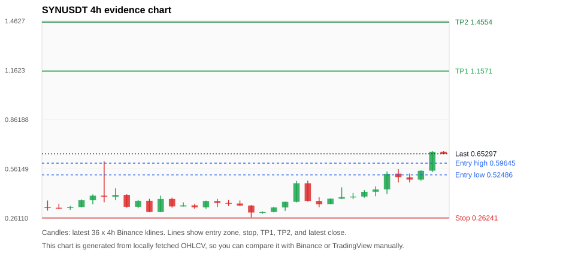
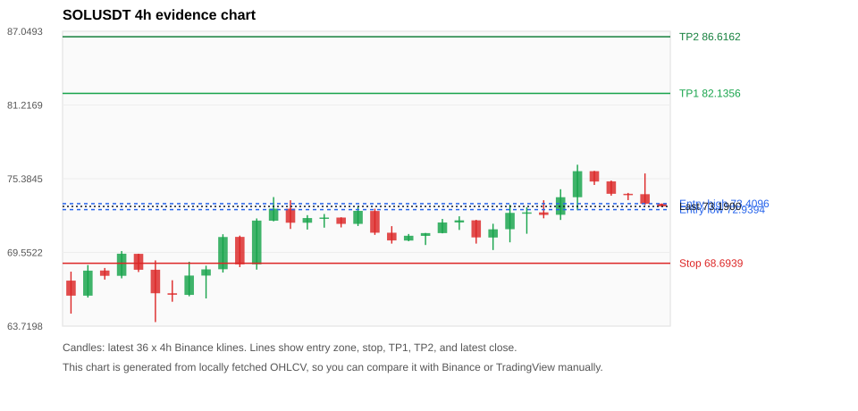
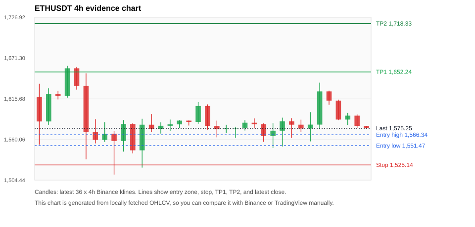
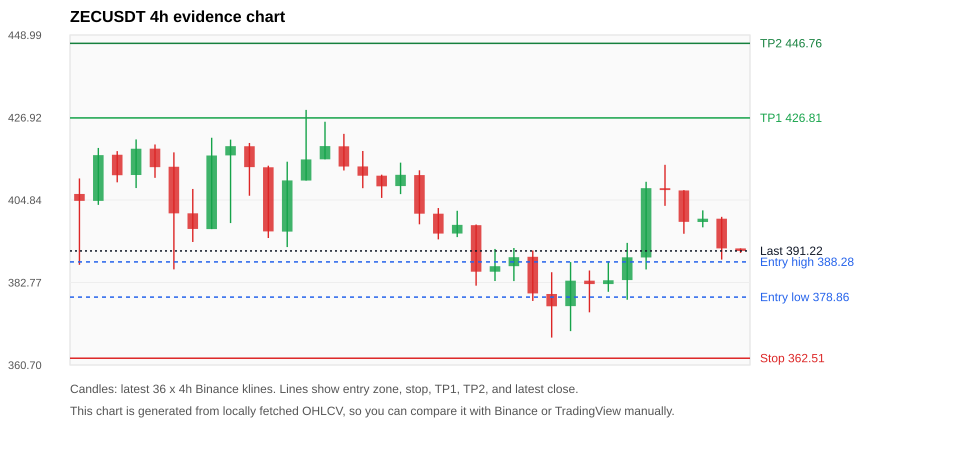
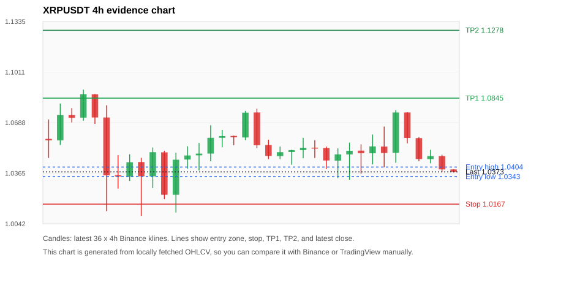

# Crypto 市场扫描报告 v1

- 报告时间：2026-06-30 20:06:41 CST
- Run ID：`20260630_120503_1ec0bcfe`
- Run type：`daily_full`
- 数据来源：SQLite
- 报告版本：v1
- 扫描 ID：ccf353f12660
- 数据源：Binance public spot API + CoinGecko/CoinMarketCap cross-check
- 过滤条件：USDT spot; 24h quote volume >= 30,000,000; trades >= 30,000; exclude stables/leveraged tokens; analyze 1h/4h/1d klines
- 默认单笔风险：账户权益的 1.00%

## 限制说明

- 交易信号仍以 Binance 现货公开 K 线为主源；外部数据源用于一致性复核。
- 结果是研究和模拟盘计划，不是确定收益或实盘下单指令。
- 历史长度过滤：候选币至少需要 180 根 1d K 线。
- 数据质量验证池：先验证 score 排名前 min(top_n * 2, 10) 的候选，再按 action + score 补足最终名单。
- 大盘环境过滤：RISK_OFF; BTC/ETH 大盘偏弱，山寨币买入候选降级为观察。 BTC 7d=-5.842408738913807; ETH 7d=-5.502270368837459.
- 已启用数据交叉验证：Binance 主源 + CoinGecko 自动对照；CoinMarketCap 在配置 API Key 后自动对照。
- SYNUSDT 交叉验证状态 DATA_WARNING：At least one external provider needs manual review.
- SOLUSDT 交叉验证状态 DATA_WARNING：At least one external provider needs manual review.
- ETHUSDT 交叉验证状态 DATA_WARNING：At least one external provider needs manual review.
- ZECUSDT 交叉验证状态 DATA_WARNING：At least one external provider needs manual review.
- XRPUSDT 交叉验证状态 DATA_WARNING：At least one external provider needs manual review.
- TRXUSDT 交叉验证状态 DATA_WARNING：At least one external provider needs manual review.
- NEARUSDT 交叉验证状态 DATA_WARNING：At least one external provider needs manual review.
- BNBUSDT 交叉验证状态 DATA_WARNING：At least one external provider needs manual review.
- BTCUSDT 交叉验证状态 DATA_WARNING：At least one external provider needs manual review.
- DOGEUSDT 交叉验证状态 DATA_WARNING：At least one external provider needs manual review.

## 5 个候选交易计划

| Rank | Coin | Action | Setup | Entry Zone | Stop Loss | TP1 | TP2 / Exit Rule | R/R | Verdict |
|---:|---|---|---|---:|---:|---:|---|---:|---|
| 1 | `SYN` | `WATCH_ONLY` | 涨幅较远，只等深回调 | 0.52486 - 0.59645 | 0.26241 | 1.1571 | 1.4554 或跌破 4h 关键支撑 | 2.00-3.00 | 只等回调 |
| 2 | `SOL` | `WATCH_ONLY` | 回踩支撑/4h EMA 附近 | 72.9394 - 73.4096 | 68.6939 | 82.1356 | 86.6162 或跌破 4h 关键支撑 | 2.00-3.00 | 只观察 |
| 3 | `ETH` | `REJECT` | 回踩支撑/4h EMA 附近 | 1,551.47 - 1,566.34 | 1,525.14 | 1,652.24 | 1,718.33 或跌破 4h 关键支撑 | 2.76-4.72 | 只观察 |
| 4 | `ZEC` | `REJECT` | 趋势中，等回调入场 | 378.86 - 388.28 | 362.51 | 426.81 | 446.76 或跌破 4h 关键支撑 | 2.05-3.00 | 只观察 |
| 5 | `XRP` | `REJECT` | 回踩支撑/4h EMA 附近 | 1.0343 - 1.0404 | 1.0167 | 1.0845 | 1.1278 或跌破 4h 关键支撑 | 2.28-4.39 | 只观察 |

## 数据交叉验证摘要

价格差异以 Binance 当前价为基准；成交量口径不同，Binance 是 USDT 现货成交额，CoinGecko/CoinMarketCap 通常是全市场成交量。

| Rank | Coin | Data Status | Max Price Diff | Max 24h Diff | Message |
|---:|---|---|---:|---:|---|
| 1 | `SYN` | DATA_WARNING | 1.61% | 1.88 pts | At least one external provider needs manual review. |
| 2 | `SOL` | DATA_WARNING | 0.06% | 0.65 pts | At least one external provider needs manual review. |
| 3 | `ETH` | DATA_WARNING | 0.15% | 0.26 pts | At least one external provider needs manual review. |
| 4 | `ZEC` | DATA_WARNING | 0.19% | 0.89 pts | At least one external provider needs manual review. |
| 5 | `XRP` | DATA_WARNING | 0.13% | 0.42 pts | At least one external provider needs manual review. |

## 候选币说明

### 1. SYN `SYNUSDT`



- 入选原因：涨幅较远，只等深回调；24h +55.00%，7d +145.94%，4h RSI 72.73，24h 成交额 $45.7M。
- 交易失效条件：跌破 0.26241385 或 4h 收盘重新失守关键支撑。
- 主要风险：距离支撑偏远，不能追市价；24h 振幅较大，回撤风险高；BTC/ETH 大盘环境未确认强势，山寨币买入信号降级；数据交叉验证需要人工复核。
- 数据交叉验证：DATA_WARNING；At least one external provider needs manual review.

#### 可点击人工验证

- [Binance 交易页](https://www.binance.com/en/trade/SYN_USDT)
- [TradingView 图表](https://www.tradingview.com/chart/?symbol=BINANCE%3ASYNUSDT)
- [CoinGecko 搜索](https://www.coingecko.com/en/search?query=SYN)
- [CoinMarketCap 搜索](https://coinmarketcap.com/search/?q=SYN)

#### 多数据源对照

| Source | Status | Asset ID | Price | 24h Change | 24h Volume | Price Diff | 24h Diff | Updated | Message |
|---|---|---|---:|---:|---:|---:|---:|---|---|
| Binance | DATA_OK | SYNUSDT | 0.65297 | +55.00% | $45.7M | 0.00% | 0.00 pts | 2026-06-30T12:05:58+00:00 | Primary market data source used by scanner. |
| CoinGecko | DATA_WARNING | synapse-2 | 0.66118 | +56.87% | $197.6M | 1.26% | 1.88 pts | 2026-06-30T12:05:53.413Z | price diff 1.26% exceeds warning threshold |
| CoinMarketCap | DATA_WARNING | 12147 | 0.66351 | +56.41% | $189.7M | 1.61% | 1.41 pts | 2026-06-30T12:04:00.000Z | price diff 1.61% exceeds warning threshold; CoinMarketCap symbol mapping has 4 matches; selected lowest cmc_rank |

#### 指标证据

| 指标 | 数值 | 人工核对用途 |
|---|---:|---|
| 当前价 | 0.65297 | 与 Binance/TradingView 当前价格对照 |
| 24h 涨跌 | +55.00% | 与交易所 24h 涨跌对照 |
| 7d 涨跌 | +145.94% | 判断短线趋势是否延续 |
| 4h EMA20 | 0.46374 | 判断短期趋势支撑 |
| 4h EMA50 | 0.36675 | 判断中期趋势支撑 |
| 1d EMA20 | 0.27102 | 判断日线趋势 |
| 1d EMA50 | 0.15956 | 判断日线趋势 |
| 4h RSI14 | 72.73 | 判断是否过热/过弱 |
| 4h ATR14 | 0.07536 | 推导止损和入场缓冲 |
| 最近 18 根 4h 最低点 | 0.26641 | 支撑/止损参考 |
| 最近 36 根 4h 最高点 | 0.67000 | TP/压力参考 |
| 支撑位 | 0.46374 | 入场区间推导基础 |

#### 交易计划推导

- 支撑位 = 最近低点、4h EMA20、4h EMA50、1d EMA20 中不高于当前价的最高有效支撑 = `0.46374`。
- 入场区间 = 支撑位附近 + ATR 缓冲 = `0.52486 - 0.59645`。
- 止损 = min(最近 18 根 4h 最低点 * 0.985, 入场中位价 - 1.15 * ATR14) = `0.26241`。
- TP1 = max(最近 36 根 4h 最高点 * 0.995, 入场中位价 + 2R) = `1.1571`。
- TP2 = max(入场中位价 + 3R, TP1 * 1.04) = `1.4554`。

#### 最近 10 根 4h K线

| UTC 开盘时间 | Open | High | Low | Close | Quote Volume | Trades |
|---|---:|---:|---:|---:|---:|---:|
| 2026-06-29T00:00+00:00 | 0.38004 | 0.44900 | 0.37738 | 0.38939 | $7.9M | 86479 |
| 2026-06-29T04:00+00:00 | 0.38956 | 0.41500 | 0.37710 | 0.39304 | $3.4M | 38835 |
| 2026-06-29T08:00+00:00 | 0.39312 | 0.43200 | 0.38624 | 0.42147 | $4.4M | 52835 |
| 2026-06-29T12:00+00:00 | 0.42210 | 0.45549 | 0.39468 | 0.43665 | $5.6M | 59928 |
| 2026-06-29T16:00+00:00 | 0.43700 | 0.54616 | 0.40832 | 0.53084 | $11.4M | 107562 |
| 2026-06-29T20:00+00:00 | 0.53220 | 0.56000 | 0.47850 | 0.51111 | $8.8M | 121578 |
| 2026-06-30T00:00+00:00 | 0.51016 | 0.53275 | 0.47900 | 0.49614 | $3.8M | 42181 |
| 2026-06-30T04:00+00:00 | 0.49610 | 0.55359 | 0.48951 | 0.54975 | $4.6M | 46134 |
| 2026-06-30T08:00+00:00 | 0.55042 | 0.67000 | 0.54125 | 0.66580 | $11.2M | 97975 |
| 2026-06-30T12:00+00:00 | 0.66593 | 0.66888 | 0.65006 | 0.65297 | $365,178 | 3487 |

### 2. SOL `SOLUSDT`



- 入选原因：回踩支撑/4h EMA 附近；24h +0.15%，7d +5.77%，4h RSI 59.78，24h 成交额 $259.9M。
- 交易失效条件：跌破 68.6939 或 4h 收盘重新失守关键支撑。
- 主要风险：日线趋势未完全确认；BTC/ETH 大盘环境未确认强势，山寨币买入信号降级；数据交叉验证需要人工复核。
- 数据交叉验证：DATA_WARNING；At least one external provider needs manual review.

#### 可点击人工验证

- [Binance 交易页](https://www.binance.com/en/trade/SOL_USDT)
- [TradingView 图表](https://www.tradingview.com/chart/?symbol=BINANCE%3ASOLUSDT)
- [CoinGecko 搜索](https://www.coingecko.com/en/search?query=SOL)
- [CoinMarketCap 搜索](https://coinmarketcap.com/search/?q=SOL)

#### 多数据源对照

| Source | Status | Asset ID | Price | 24h Change | 24h Volume | Price Diff | 24h Diff | Updated | Message |
|---|---|---|---:|---:|---:|---:|---:|---|---|
| Binance | DATA_OK | SOLUSDT | 73.1900 | +0.15% | $259.9M | 0.00% | 0.00 pts | 2026-06-30T12:05:58+00:00 | Primary market data source used by scanner. |
| CoinGecko | DATA_OK | solana | 73.1500 | +0.81% | $3.65B | 0.05% | 0.65 pts | 2026-06-30T12:05:54.206Z | External source agrees with Binance within thresholds. |
| CoinMarketCap | DATA_WARNING | 5426 | 73.1496 | +0.67% | $3.79B | 0.06% | 0.51 pts | 2026-06-30T12:04:00.000Z | CoinMarketCap symbol mapping has 8 matches; selected lowest cmc_rank |

#### 指标证据

| 指标 | 数值 | 人工核对用途 |
|---|---:|---|
| 当前价 | 73.1900 | 与 Binance/TradingView 当前价格对照 |
| 24h 涨跌 | +0.15% | 与交易所 24h 涨跌对照 |
| 7d 涨跌 | +5.77% | 判断短线趋势是否延续 |
| 4h EMA20 | 72.7938 | 判断短期趋势支撑 |
| 4h EMA50 | 71.6605 | 判断中期趋势支撑 |
| 1d EMA20 | 71.6760 | 判断日线趋势 |
| 1d EMA50 | 75.2358 | 判断日线趋势 |
| 4h RSI14 | 59.78 | 判断是否过热/过弱 |
| 4h ATR14 | 1.7393 | 推导止损和入场缓冲 |
| 最近 18 根 4h 最低点 | 69.7400 | 支撑/止损参考 |
| 最近 36 根 4h 最高点 | 76.4900 | TP/压力参考 |
| 支撑位 | 72.7938 | 入场区间推导基础 |

#### 交易计划推导

- 支撑位 = 最近低点、4h EMA20、4h EMA50、1d EMA20 中不高于当前价的最高有效支撑 = `72.7938`。
- 入场区间 = 支撑位附近 + ATR 缓冲 = `72.9394 - 73.4096`。
- 止损 = min(最近 18 根 4h 最低点 * 0.985, 入场中位价 - 1.15 * ATR14) = `68.6939`。
- TP1 = max(最近 36 根 4h 最高点 * 0.995, 入场中位价 + 2R) = `82.1356`。
- TP2 = max(入场中位价 + 3R, TP1 * 1.04) = `86.6162`。

#### 最近 10 根 4h K线

| UTC 开盘时间 | Open | High | Low | Close | Quote Volume | Trades |
|---|---:|---:|---:|---:|---:|---:|
| 2026-06-29T00:00+00:00 | 71.3900 | 73.3300 | 70.3500 | 72.6800 | $39.7M | 295125 |
| 2026-06-29T04:00+00:00 | 72.6800 | 73.1200 | 71.0300 | 72.7200 | $26.5M | 191305 |
| 2026-06-29T08:00+00:00 | 72.7200 | 73.6800 | 72.2500 | 72.5200 | $32.4M | 187395 |
| 2026-06-29T12:00+00:00 | 72.5300 | 74.5500 | 72.1200 | 73.9200 | $100.5M | 568353 |
| 2026-06-29T16:00+00:00 | 73.9200 | 76.4900 | 72.8900 | 75.9800 | $61.9M | 388596 |
| 2026-06-29T20:00+00:00 | 75.9800 | 76.0000 | 74.8900 | 75.1600 | $23.2M | 120457 |
| 2026-06-30T00:00+00:00 | 75.1700 | 75.2400 | 74.0400 | 74.1900 | $24.3M | 122420 |
| 2026-06-30T04:00+00:00 | 74.1900 | 74.2600 | 73.6900 | 74.1600 | $19.7M | 97157 |
| 2026-06-30T08:00+00:00 | 74.1600 | 75.8000 | 73.3000 | 73.4000 | $33.4M | 129685 |
| 2026-06-30T12:00+00:00 | 73.4100 | 73.4200 | 73.1600 | 73.1900 | $595,489 | 4545 |

### 3. ETH `ETHUSDT`



- 入选原因：回踩支撑/4h EMA 附近；24h -0.42%，7d -5.27%，4h RSI 49.79，24h 成交额 $487.1M。
- 交易失效条件：跌破 1525.1444 或 4h 收盘重新失守关键支撑。
- 主要风险：日线趋势未完全确认；BTC/ETH 大盘环境未确认强势，山寨币买入信号降级；24h 动量未确认；7d 趋势未确认；数据交叉验证需要人工复核。
- 数据交叉验证：DATA_WARNING；At least one external provider needs manual review.

#### 可点击人工验证

- [Binance 交易页](https://www.binance.com/en/trade/ETH_USDT)
- [TradingView 图表](https://www.tradingview.com/chart/?symbol=BINANCE%3AETHUSDT)
- [CoinGecko 搜索](https://www.coingecko.com/en/search?query=ETH)
- [CoinMarketCap 搜索](https://coinmarketcap.com/search/?q=ETH)

#### 多数据源对照

| Source | Status | Asset ID | Price | 24h Change | 24h Volume | Price Diff | 24h Diff | Updated | Message |
|---|---|---|---:|---:|---:|---:|---:|---|---|
| Binance | DATA_OK | ETHUSDT | 1,575.25 | -0.42% | $487.1M | 0.00% | 0.00 pts | 2026-06-30T12:05:58+00:00 | Primary market data source used by scanner. |
| CoinGecko | DATA_OK | ethereum | 1,573.11 | -0.68% | $10.41B | 0.14% | 0.26 pts | 2026-06-30T12:06:05.939Z | External source agrees with Binance within thresholds. |
| CoinMarketCap | DATA_WARNING | 1027 | 1,572.87 | -0.34% | $11.49B | 0.15% | 0.08 pts | 2026-06-30T12:04:00.000Z | CoinMarketCap symbol mapping has 6 matches; selected lowest cmc_rank |

#### 指标证据

| 指标 | 数值 | 人工核对用途 |
|---|---:|---|
| 当前价 | 1,575.25 | 与 Binance/TradingView 当前价格对照 |
| 24h 涨跌 | -0.42% | 与交易所 24h 涨跌对照 |
| 7d 涨跌 | -5.27% | 判断短线趋势是否延续 |
| 4h EMA20 | 1,588.27 | 判断短期趋势支撑 |
| 4h EMA50 | 1,613.33 | 判断中期趋势支撑 |
| 1d EMA20 | 1,669.36 | 判断日线趋势 |
| 1d EMA50 | 1,825.57 | 判断日线趋势 |
| 4h RSI14 | 49.79 | 判断是否过热/过弱 |
| 4h ATR14 | 25.6657 | 推导止损和入场缓冲 |
| 最近 18 根 4h 最低点 | 1,548.37 | 支撑/止损参考 |
| 最近 36 根 4h 最高点 | 1,660.54 | TP/压力参考 |
| 支撑位 | 1,548.37 | 入场区间推导基础 |

#### 交易计划推导

- 支撑位 = 最近低点、4h EMA20、4h EMA50、1d EMA20 中不高于当前价的最高有效支撑 = `1,548.37`。
- 入场区间 = 支撑位附近 + ATR 缓冲 = `1,551.47 - 1,566.34`。
- 止损 = min(最近 18 根 4h 最低点 * 0.985, 入场中位价 - 1.15 * ATR14) = `1,525.14`。
- TP1 = max(最近 36 根 4h 最高点 * 0.995, 入场中位价 + 2R) = `1,652.24`。
- TP2 = max(入场中位价 + 3R, TP1 * 1.04) = `1,718.33`。

#### 最近 10 根 4h K线

| UTC 开盘时间 | Open | High | Low | Close | Quote Volume | Trades |
|---|---:|---:|---:|---:|---:|---:|
| 2026-06-29T00:00+00:00 | 1,571.96 | 1,589.75 | 1,550.43 | 1,584.78 | $58.7M | 555570 |
| 2026-06-29T04:00+00:00 | 1,584.77 | 1,589.08 | 1,562.26 | 1,580.16 | $38.1M | 303986 |
| 2026-06-29T08:00+00:00 | 1,580.17 | 1,587.00 | 1,569.85 | 1,574.93 | $52.4M | 328177 |
| 2026-06-29T12:00+00:00 | 1,574.93 | 1,597.28 | 1,557.35 | 1,580.26 | $158.5M | 890800 |
| 2026-06-29T16:00+00:00 | 1,580.26 | 1,637.58 | 1,574.06 | 1,625.60 | $130.6M | 640608 |
| 2026-06-29T20:00+00:00 | 1,625.60 | 1,626.65 | 1,607.41 | 1,613.07 | $54.5M | 240587 |
| 2026-06-30T00:00+00:00 | 1,613.07 | 1,614.41 | 1,586.49 | 1,587.18 | $55.5M | 269087 |
| 2026-06-30T04:00+00:00 | 1,587.18 | 1,596.25 | 1,579.79 | 1,592.51 | $40.0M | 200299 |
| 2026-06-30T08:00+00:00 | 1,592.51 | 1,594.28 | 1,575.85 | 1,578.58 | $53.5M | 276160 |
| 2026-06-30T12:00+00:00 | 1,578.57 | 1,578.58 | 1,575.00 | 1,575.26 | $1.9M | 10064 |

### 4. ZEC `ZECUSDT`



- 入选原因：趋势中，等回调入场；24h +1.38%，7d -7.39%，4h RSI 54.03，24h 成交额 $80.3M。
- 交易失效条件：跌破 362.50955 或 4h 收盘重新失守关键支撑。
- 主要风险：日线趋势未完全确认；BTC/ETH 大盘环境未确认强势，山寨币买入信号降级；7d 趋势未确认；数据交叉验证需要人工复核。
- 数据交叉验证：DATA_WARNING；At least one external provider needs manual review.

#### 可点击人工验证

- [Binance 交易页](https://www.binance.com/en/trade/ZEC_USDT)
- [TradingView 图表](https://www.tradingview.com/chart/?symbol=BINANCE%3AZECUSDT)
- [CoinGecko 搜索](https://www.coingecko.com/en/search?query=ZEC)
- [CoinMarketCap 搜索](https://coinmarketcap.com/search/?q=ZEC)

#### 多数据源对照

| Source | Status | Asset ID | Price | 24h Change | 24h Volume | Price Diff | 24h Diff | Updated | Message |
|---|---|---|---:|---:|---:|---:|---:|---|---|
| Binance | DATA_OK | ZECUSDT | 391.22 | +1.38% | $80.3M | 0.00% | 0.00 pts | 2026-06-30T12:05:58+00:00 | Primary market data source used by scanner. |
| CoinGecko | DATA_OK | zcash | 390.53 | +2.27% | $354.9M | 0.18% | 0.89 pts | 2026-06-30T12:05:46.910Z | External source agrees with Binance within thresholds. |
| CoinMarketCap | DATA_WARNING | 1437 | 390.49 | +1.87% | $429.9M | 0.19% | 0.50 pts | 2026-06-30T12:05:00.000Z | CoinMarketCap symbol mapping has 2 matches; selected lowest cmc_rank |

#### 指标证据

| 指标 | 数值 | 人工核对用途 |
|---|---:|---|
| 当前价 | 391.22 | 与 Binance/TradingView 当前价格对照 |
| 24h 涨跌 | +1.38% | 与交易所 24h 涨跌对照 |
| 7d 涨跌 | -7.39% | 判断短线趋势是否延续 |
| 4h EMA20 | 396.49 | 判断短期趋势支撑 |
| 4h EMA50 | 409.22 | 判断中期趋势支撑 |
| 1d EMA20 | 433.31 | 判断日线趋势 |
| 1d EMA50 | 454.44 | 判断日线趋势 |
| 4h RSI14 | 54.03 | 判断是否过热/过弱 |
| 4h ATR14 | 11.7671 | 推导止损和入场缓冲 |
| 最近 18 根 4h 最低点 | 368.03 | 支撑/止损参考 |
| 最近 36 根 4h 最高点 | 428.95 | TP/压力参考 |
| 支撑位 | 368.03 | 入场区间推导基础 |

#### 交易计划推导

- 支撑位 = 最近低点、4h EMA20、4h EMA50、1d EMA20 中不高于当前价的最高有效支撑 = `368.03`。
- 入场区间 = 支撑位附近 + ATR 缓冲 = `378.86 - 388.28`。
- 止损 = min(最近 18 根 4h 最低点 * 0.985, 入场中位价 - 1.15 * ATR14) = `362.51`。
- TP1 = max(最近 36 根 4h 最高点 * 0.995, 入场中位价 + 2R) = `426.81`。
- TP2 = max(入场中位价 + 3R, TP1 * 1.04) = `446.76`。

#### 最近 10 根 4h K线

| UTC 开盘时间 | Open | High | Low | Close | Quote Volume | Trades |
|---|---:|---:|---:|---:|---:|---:|
| 2026-06-29T00:00+00:00 | 376.45 | 388.23 | 369.76 | 383.26 | $12.2M | 60957 |
| 2026-06-29T04:00+00:00 | 383.26 | 385.98 | 374.79 | 382.35 | $7.0M | 33991 |
| 2026-06-29T08:00+00:00 | 382.35 | 388.40 | 380.28 | 383.37 | $6.8M | 37944 |
| 2026-06-29T12:00+00:00 | 383.42 | 393.37 | 378.16 | 389.51 | $22.8M | 100882 |
| 2026-06-29T16:00+00:00 | 389.47 | 409.72 | 386.26 | 408.01 | $19.4M | 73799 |
| 2026-06-29T20:00+00:00 | 408.00 | 414.26 | 403.28 | 407.50 | $11.2M | 44742 |
| 2026-06-30T00:00+00:00 | 407.40 | 407.48 | 395.81 | 399.00 | $13.1M | 45951 |
| 2026-06-30T04:00+00:00 | 398.96 | 402.07 | 397.53 | 399.84 | $4.9M | 22346 |
| 2026-06-30T08:00+00:00 | 399.84 | 400.34 | 388.90 | 391.89 | $10.5M | 43170 |
| 2026-06-30T12:00+00:00 | 391.89 | 391.89 | 390.67 | 391.22 | $114,479 | 575 |

### 5. XRP `XRPUSDT`



- 入选原因：回踩支撑/4h EMA 附近；24h -2.03%，7d -5.95%，4h RSI 42.57，24h 成交额 $82.2M。
- 交易失效条件：跌破 1.016717 或 4h 收盘重新失守关键支撑。
- 主要风险：日线趋势未完全确认；BTC/ETH 大盘环境未确认强势，山寨币买入信号降级；24h 动量未确认；7d 趋势未确认；数据交叉验证需要人工复核。
- 数据交叉验证：DATA_WARNING；At least one external provider needs manual review.

#### 可点击人工验证

- [Binance 交易页](https://www.binance.com/en/trade/XRP_USDT)
- [TradingView 图表](https://www.tradingview.com/chart/?symbol=BINANCE%3AXRPUSDT)
- [CoinGecko 搜索](https://www.coingecko.com/en/search?query=XRP)
- [CoinMarketCap 搜索](https://coinmarketcap.com/search/?q=XRP)

#### 多数据源对照

| Source | Status | Asset ID | Price | 24h Change | 24h Volume | Price Diff | 24h Diff | Updated | Message |
|---|---|---|---:|---:|---:|---:|---:|---|---|
| Binance | DATA_OK | XRPUSDT | 1.0373 | -2.03% | $82.2M | 0.00% | 0.00 pts | 2026-06-30T12:05:58+00:00 | Primary market data source used by scanner. |
| CoinGecko | DATA_OK | ripple | 1.0360 | -1.61% | $1.56B | 0.13% | 0.42 pts | 2026-06-30T12:06:05.755Z | External source agrees with Binance within thresholds. |
| CoinMarketCap | DATA_WARNING | 52 | 1.0362 | -1.62% | $1.57B | 0.11% | 0.41 pts | 2026-06-30T12:05:00.000Z | CoinMarketCap symbol mapping has 3 matches; selected lowest cmc_rank |

#### 指标证据

| 指标 | 数值 | 人工核对用途 |
|---|---:|---|
| 当前价 | 1.0373 | 与 Binance/TradingView 当前价格对照 |
| 24h 涨跌 | -2.03% | 与交易所 24h 涨跌对照 |
| 7d 涨跌 | -5.95% | 判断短线趋势是否延续 |
| 4h EMA20 | 1.0518 | 判断短期趋势支撑 |
| 4h EMA50 | 1.0710 | 判断中期趋势支撑 |
| 1d EMA20 | 1.1107 | 判断日线趋势 |
| 1d EMA50 | 1.2001 | 判断日线趋势 |
| 4h RSI14 | 42.57 | 判断是否过热/过弱 |
| 4h ATR14 | 0.01689 | 推导止损和入场缓冲 |
| 最近 18 根 4h 最低点 | 1.0322 | 支撑/止损参考 |
| 最近 36 根 4h 最高点 | 1.0899 | TP/压力参考 |
| 支撑位 | 1.0322 | 入场区间推导基础 |

#### 交易计划推导

- 支撑位 = 最近低点、4h EMA20、4h EMA50、1d EMA20 中不高于当前价的最高有效支撑 = `1.0322`。
- 入场区间 = 支撑位附近 + ATR 缓冲 = `1.0343 - 1.0404`。
- 止损 = min(最近 18 根 4h 最低点 * 0.985, 入场中位价 - 1.15 * ATR14) = `1.0167`。
- TP1 = max(最近 36 根 4h 最高点 * 0.995, 入场中位价 + 2R) = `1.0845`。
- TP2 = max(入场中位价 + 3R, TP1 * 1.04) = `1.1278`。

#### 最近 10 根 4h K线

| UTC 开盘时间 | Open | High | Low | Close | Quote Volume | Trades |
|---|---:|---:|---:|---:|---:|---:|
| 2026-06-29T00:00+00:00 | 1.0485 | 1.0560 | 1.0322 | 1.0508 | $19.7M | 158609 |
| 2026-06-29T04:00+00:00 | 1.0509 | 1.0549 | 1.0361 | 1.0493 | $12.5M | 97191 |
| 2026-06-29T08:00+00:00 | 1.0492 | 1.0612 | 1.0421 | 1.0536 | $13.3M | 95975 |
| 2026-06-29T12:00+00:00 | 1.0535 | 1.0663 | 1.0402 | 1.0494 | $26.2M | 212441 |
| 2026-06-29T16:00+00:00 | 1.0495 | 1.0768 | 1.0431 | 1.0753 | $18.8M | 142685 |
| 2026-06-29T20:00+00:00 | 1.0753 | 1.0755 | 1.0556 | 1.0590 | $9.3M | 55626 |
| 2026-06-30T00:00+00:00 | 1.0589 | 1.0595 | 1.0441 | 1.0455 | $11.9M | 64339 |
| 2026-06-30T04:00+00:00 | 1.0455 | 1.0514 | 1.0428 | 1.0474 | $6.7M | 37621 |
| 2026-06-30T08:00+00:00 | 1.0474 | 1.0483 | 1.0371 | 1.0389 | $10.8M | 52772 |
| 2026-06-30T12:00+00:00 | 1.0389 | 1.0389 | 1.0370 | 1.0373 | $185,005 | 1962 |

## 组合风控

- 不要 5 个候选全部满仓买入。
- 同时持仓总风险建议控制在账户权益的 3% - 5% 以内。
- 如果 BTC/ETH 同时破位，暂停山寨币多头计划或降低仓位。
- 第一版报告用于模拟盘和人工复核，不自动下单。

## 原始数据

```json
[
  {
    "rank": 1,
    "symbol": "SYNUSDT",
    "base_asset": "SYN",
    "price": 0.65297,
    "score": 53.434227347177526,
    "setup": "涨幅较远，只等深回调",
    "verdict": "只等回调",
    "entry_low": 0.5248628571428572,
    "entry_high": 0.5964521428571429,
    "stop_loss": 0.26241385,
    "take_profit_1": 1.1571448000000002,
    "take_profit_2": 1.45538845,
    "risk_reward_1": 2.0000000000000004,
    "risk_reward_2": 3.0,
    "pct_24h": 54.999,
    "pct_3d": 81.5318320822908,
    "pct_7d": 145.939736346516,
    "quote_volume_24h": 45667141.417957,
    "trades_24h": 477849,
    "high_low_range_24h": 69.75777845343065,
    "rsi_1h": 71.03384263886907,
    "rsi_4h": 72.7309505656091,
    "ema20_4h": 0.4637379203999884,
    "ema50_4h": 0.36674682082930515,
    "ema20_1d": 0.27102496329875075,
    "ema50_1d": 0.15955603177255623,
    "atr_4h": 0.07535714285714287,
    "macd_hist_4h": 0.024837997224114727,
    "volume_ratio_24h": 1.4176088894079673,
    "support_level": 0.4637379203999884,
    "recent_low_4h_18": 0.26641,
    "recent_high_4h_36": 0.67,
    "distance_to_support_pct": 40.80582399575887,
    "binance_trade_url": "https://www.binance.com/en/trade/SYN_USDT",
    "tradingview_url": "https://www.tradingview.com/chart/?symbol=BINANCE%3ASYNUSDT",
    "coingecko_search_url": "https://www.coingecko.com/en/search?query=SYN",
    "coinmarketcap_search_url": "https://coinmarketcap.com/search/?q=SYN",
    "invalidation": "跌破 0.26241385 或 4h 收盘重新失守关键支撑",
    "recent_4h_klines": [
      {
        "open_time_utc": "2026-06-24T16:00+00:00",
        "open": 0.3292,
        "high": 0.3688,
        "low": 0.3074,
        "close": 0.3251,
        "quote_volume": 6458203.56546,
        "trades": 60897
      },
      {
        "open_time_utc": "2026-06-24T20:00+00:00",
        "open": 0.3248,
        "high": 0.349,
        "low": 0.3173,
        "close": 0.3237,
        "quote_volume": 3243660.00243,
        "trades": 37276
      },
      {
        "open_time_utc": "2026-06-25T00:00+00:00",
        "open": 0.3238,
        "high": 0.336,
        "low": 0.3125,
        "close": 0.3289,
        "quote_volume": 2354763.76737,
        "trades": 23632
      },
      {
        "open_time_utc": "2026-06-25T04:00+00:00",
        "open": 0.329,
        "high": 0.37554,
        "low": 0.3278,
        "close": 0.37042,
        "quote_volume": 6100199.881582,
        "trades": 56173
      },
      {
        "open_time_utc": "2026-06-25T08:00+00:00",
        "open": 0.37042,
        "high": 0.4058,
        "low": 0.34629,
        "close": 0.39802,
        "quote_volume": 7513268.736133,
        "trades": 64352
      },
      {
        "open_time_utc": "2026-06-25T12:00+00:00",
        "open": 0.3983,
        "high": 0.60732,
        "low": 0.35803,
        "close": 0.39228,
        "quote_volume": 27579639.468323,
        "trades": 347067
      },
      {
        "open_time_utc": "2026-06-25T16:00+00:00",
        "open": 0.39228,
        "high": 0.4431,
        "low": 0.37049,
        "close": 0.40248,
        "quote_volume": 8525440.191824,
        "trades": 102555
      },
      {
        "open_time_utc": "2026-06-25T20:00+00:00",
        "open": 0.4029,
        "high": 0.40656,
        "low": 0.32532,
        "close": 0.33068,
        "quote_volume": 5017358.96207,
        "trades": 56771
      },
      {
        "open_time_utc": "2026-06-26T00:00+00:00",
        "open": 0.33054,
        "high": 0.3729,
        "low": 0.3217,
        "close": 0.36705,
        "quote_volume": 5161694.811618,
        "trades": 70599
      },
      {
        "open_time_utc": "2026-06-26T04:00+00:00",
        "open": 0.36717,
        "high": 0.37885,
        "low": 0.29718,
        "close": 0.29934,
        "quote_volume": 4775556.715975,
        "trades": 61215
      },
      {
        "open_time_utc": "2026-06-26T08:00+00:00",
        "open": 0.29883,
        "high": 0.39855,
        "low": 0.29833,
        "close": 0.37801,
        "quote_volume": 8431006.571754,
        "trades": 93071
      },
      {
        "open_time_utc": "2026-06-26T12:00+00:00",
        "open": 0.37842,
        "high": 0.38635,
        "low": 0.32536,
        "close": 0.33274,
        "quote_volume": 3975061.182548,
        "trades": 47429
      },
      {
        "open_time_utc": "2026-06-26T16:00+00:00",
        "open": 0.3325,
        "high": 0.3576,
        "low": 0.33242,
        "close": 0.33922,
        "quote_volume": 1614208.377624,
        "trades": 24535
      },
      {
        "open_time_utc": "2026-06-26T20:00+00:00",
        "open": 0.33927,
        "high": 0.34899,
        "low": 0.31853,
        "close": 0.32769,
        "quote_volume": 1347972.846777,
        "trades": 23476
      },
      {
        "open_time_utc": "2026-06-27T00:00+00:00",
        "open": 0.3276,
        "high": 0.36792,
        "low": 0.31851,
        "close": 0.36576,
        "quote_volume": 1888181.139699,
        "trades": 40290
      },
      {
        "open_time_utc": "2026-06-27T04:00+00:00",
        "open": 0.36564,
        "high": 0.37899,
        "low": 0.32928,
        "close": 0.35414,
        "quote_volume": 4273008.51041,
        "trades": 60772
      },
      {
        "open_time_utc": "2026-06-27T08:00+00:00",
        "open": 0.35445,
        "high": 0.37174,
        "low": 0.3362,
        "close": 0.35024,
        "quote_volume": 3530501.325089,
        "trades": 45035
      },
      {
        "open_time_utc": "2026-06-27T12:00+00:00",
        "open": 0.3504,
        "high": 0.369,
        "low": 0.3342,
        "close": 0.33824,
        "quote_volume": 3285320.013687,
        "trades": 47862
      },
      {
        "open_time_utc": "2026-06-27T16:00+00:00",
        "open": 0.33829,
        "high": 0.3408,
        "low": 0.26641,
        "close": 0.29571,
        "quote_volume": 6895128.188906,
        "trades": 118160
      },
      {
        "open_time_utc": "2026-06-27T20:00+00:00",
        "open": 0.29582,
        "high": 0.30231,
        "low": 0.2888,
        "close": 0.29883,
        "quote_volume": 1406006.278286,
        "trades": 29136
      },
      {
        "open_time_utc": "2026-06-28T00:00+00:00",
        "open": 0.2986,
        "high": 0.33086,
        "low": 0.29658,
        "close": 0.32661,
        "quote_volume": 1926830.067357,
        "trades": 37009
      },
      {
        "open_time_utc": "2026-06-28T04:00+00:00",
        "open": 0.32675,
        "high": 0.36125,
        "low": 0.30543,
        "close": 0.3608,
        "quote_volume": 3114978.895523,
        "trades": 47534
      },
      {
        "open_time_utc": "2026-06-28T08:00+00:00",
        "open": 0.3608,
        "high": 0.48833,
        "low": 0.35736,
        "close": 0.47424,
        "quote_volume": 6479900.311462,
        "trades": 94545
      },
      {
        "open_time_utc": "2026-06-28T12:00+00:00",
        "open": 0.47402,
        "high": 0.49,
        "low": 0.36276,
        "close": 0.366,
        "quote_volume": 6003628.420654,
        "trades": 69608
      },
      {
        "open_time_utc": "2026-06-28T16:00+00:00",
        "open": 0.36612,
        "high": 0.38894,
        "low": 0.32801,
        "close": 0.34652,
        "quote_volume": 3736659.729564,
        "trades": 47925
      },
      {
        "open_time_utc": "2026-06-28T20:00+00:00",
        "open": 0.34721,
        "high": 0.38155,
        "low": 0.3471,
        "close": 0.38,
        "quote_volume": 2668209.632953,
        "trades": 29555
      },
      {
        "open_time_utc": "2026-06-29T00:00+00:00",
        "open": 0.38004,
        "high": 0.449,
        "low": 0.37738,
        "close": 0.38939,
        "quote_volume": 7868822.828783,
        "trades": 86479
      },
      {
        "open_time_utc": "2026-06-29T04:00+00:00",
        "open": 0.38956,
        "high": 0.415,
        "low": 0.3771,
        "close": 0.39304,
        "quote_volume": 3379240.875056,
        "trades": 38835
      },
      {
        "open_time_utc": "2026-06-29T08:00+00:00",
        "open": 0.39312,
        "high": 0.432,
        "low": 0.38624,
        "close": 0.42147,
        "quote_volume": 4377333.010263,
        "trades": 52835
      },
      {
        "open_time_utc": "2026-06-29T12:00+00:00",
        "open": 0.4221,
        "high": 0.45549,
        "low": 0.39468,
        "close": 0.43665,
        "quote_volume": 5628461.551927,
        "trades": 59928
      },
      {
        "open_time_utc": "2026-06-29T16:00+00:00",
        "open": 0.437,
        "high": 0.54616,
        "low": 0.40832,
        "close": 0.53084,
        "quote_volume": 11393534.75328,
        "trades": 107562
      },
      {
        "open_time_utc": "2026-06-29T20:00+00:00",
        "open": 0.5322,
        "high": 0.56,
        "low": 0.4785,
        "close": 0.51111,
        "quote_volume": 8772250.169698,
        "trades": 121578
      },
      {
        "open_time_utc": "2026-06-30T00:00+00:00",
        "open": 0.51016,
        "high": 0.53275,
        "low": 0.479,
        "close": 0.49614,
        "quote_volume": 3755792.549191,
        "trades": 42181
      },
      {
        "open_time_utc": "2026-06-30T04:00+00:00",
        "open": 0.4961,
        "high": 0.55359,
        "low": 0.48951,
        "close": 0.54975,
        "quote_volume": 4631784.698074,
        "trades": 46134
      },
      {
        "open_time_utc": "2026-06-30T08:00+00:00",
        "open": 0.55042,
        "high": 0.67,
        "low": 0.54125,
        "close": 0.6658,
        "quote_volume": 11231753.374006,
        "trades": 97975
      },
      {
        "open_time_utc": "2026-06-30T12:00+00:00",
        "open": 0.66593,
        "high": 0.66888,
        "low": 0.65006,
        "close": 0.65297,
        "quote_volume": 365177.672666,
        "trades": 3487
      }
    ],
    "risks": [
      "距离支撑偏远，不能追市价",
      "24h 振幅较大，回撤风险高",
      "BTC/ETH 大盘环境未确认强势，山寨币买入信号降级",
      "数据交叉验证需要人工复核"
    ],
    "data_quality_status": "DATA_WARNING",
    "data_quality_message": "At least one external provider needs manual review.",
    "data_checks": [
      {
        "provider": "Binance",
        "status": "DATA_OK",
        "provider_asset_id": "SYNUSDT",
        "provider_symbol": "SYNUSDT",
        "price_usd": 0.65297,
        "pct_24h": 54.999,
        "volume_24h": 45667141.417957,
        "last_updated": null,
        "fetched_at_utc": "2026-06-30T12:05:58+00:00",
        "price_diff_pct": 0.0,
        "pct_24h_diff": 0.0,
        "volume_note": "Binance USDT spot 24h quoteVolume.",
        "message": "Primary market data source used by scanner."
      },
      {
        "provider": "CoinGecko",
        "status": "DATA_WARNING",
        "provider_asset_id": "synapse-2",
        "provider_symbol": "SYN",
        "price_usd": 0.661179,
        "pct_24h": 56.8743,
        "volume_24h": 197612813.0,
        "last_updated": "2026-06-30T12:05:53.413Z",
        "fetched_at_utc": "2026-06-30T12:05:58+00:00",
        "price_diff_pct": 1.2571787371548326,
        "pct_24h_diff": 1.8752999999999957,
        "volume_note": "CoinGecko total market volume; not the same venue scope as Binance quoteVolume.",
        "message": "price diff 1.26% exceeds warning threshold"
      },
      {
        "provider": "CoinMarketCap",
        "status": "DATA_WARNING",
        "provider_asset_id": "12147",
        "provider_symbol": "SYN",
        "price_usd": 0.6635123410752144,
        "pct_24h": 56.40683521,
        "volume_24h": 189658077.6299695,
        "last_updated": "2026-06-30T12:04:00.000Z",
        "fetched_at_utc": "2026-06-30T12:05:58+00:00",
        "price_diff_pct": 1.614521505615012,
        "pct_24h_diff": 1.4078352099999947,
        "volume_note": "CoinMarketCap total market volume; not the same venue scope as Binance quoteVolume.",
        "message": "price diff 1.61% exceeds warning threshold; CoinMarketCap symbol mapping has 4 matches; selected lowest cmc_rank"
      }
    ],
    "action": "WATCH_ONLY"
  },
  {
    "rank": 2,
    "symbol": "SOLUSDT",
    "base_asset": "SOL",
    "price": 73.19,
    "score": 46.885741228477954,
    "setup": "回踩支撑/4h EMA 附近",
    "verdict": "只观察",
    "entry_low": 72.93938410439969,
    "entry_high": 73.40956999999999,
    "stop_loss": 68.6939,
    "take_profit_1": 82.13563115659954,
    "take_profit_2": 86.61620820879939,
    "risk_reward_1": 2.0,
    "risk_reward_2": 3.0,
    "pct_24h": 0.151,
    "pct_3d": 1.1470425649530158,
    "pct_7d": 5.765895953757227,
    "quote_volume_24h": 259949308.72518,
    "trades_24h": 1409866,
    "high_low_range_24h": 5.7660398230088505,
    "rsi_1h": 17.295597484276968,
    "rsi_4h": 59.77757182576456,
    "ema20_4h": 72.79379651137694,
    "ema50_4h": 71.66051384780768,
    "ema20_1d": 71.67603436751858,
    "ema50_1d": 75.23579951872887,
    "atr_4h": 1.7392857142857139,
    "macd_hist_4h": 0.03369488362247952,
    "volume_ratio_24h": 1.1175070086305166,
    "support_level": 72.79379651137694,
    "recent_low_4h_18": 69.74,
    "recent_high_4h_36": 76.49,
    "distance_to_support_pct": 0.5442819410595545,
    "binance_trade_url": "https://www.binance.com/en/trade/SOL_USDT",
    "tradingview_url": "https://www.tradingview.com/chart/?symbol=BINANCE%3ASOLUSDT",
    "coingecko_search_url": "https://www.coingecko.com/en/search?query=SOL",
    "coinmarketcap_search_url": "https://coinmarketcap.com/search/?q=SOL",
    "invalidation": "跌破 68.6939 或 4h 收盘重新失守关键支撑",
    "recent_4h_klines": [
      {
        "open_time_utc": "2026-06-24T16:00+00:00",
        "open": 67.32,
        "high": 68.03,
        "low": 64.71,
        "close": 66.13,
        "quote_volume": 88776475.48768,
        "trades": 437295
      },
      {
        "open_time_utc": "2026-06-24T20:00+00:00",
        "open": 66.13,
        "high": 68.55,
        "low": 65.98,
        "close": 68.11,
        "quote_volume": 34233194.16038,
        "trades": 192734
      },
      {
        "open_time_utc": "2026-06-25T00:00+00:00",
        "open": 68.12,
        "high": 68.32,
        "low": 67.4,
        "close": 67.7,
        "quote_volume": 15798475.87117,
        "trades": 88130
      },
      {
        "open_time_utc": "2026-06-25T04:00+00:00",
        "open": 67.7,
        "high": 69.66,
        "low": 67.5,
        "close": 69.45,
        "quote_volume": 34459688.05818,
        "trades": 146011
      },
      {
        "open_time_utc": "2026-06-25T08:00+00:00",
        "open": 69.44,
        "high": 69.45,
        "low": 68.0,
        "close": 68.18,
        "quote_volume": 22648852.376,
        "trades": 86925
      },
      {
        "open_time_utc": "2026-06-25T12:00+00:00",
        "open": 68.18,
        "high": 68.92,
        "low": 64.04,
        "close": 66.32,
        "quote_volume": 104001398.65571,
        "trades": 609714
      },
      {
        "open_time_utc": "2026-06-25T16:00+00:00",
        "open": 66.32,
        "high": 67.35,
        "low": 65.65,
        "close": 66.2,
        "quote_volume": 44933944.60387,
        "trades": 292288
      },
      {
        "open_time_utc": "2026-06-25T20:00+00:00",
        "open": 66.19,
        "high": 68.81,
        "low": 66.08,
        "close": 67.72,
        "quote_volume": 27436348.83013,
        "trades": 168056
      },
      {
        "open_time_utc": "2026-06-26T00:00+00:00",
        "open": 67.72,
        "high": 68.5,
        "low": 65.91,
        "close": 68.21,
        "quote_volume": 45939418.7762,
        "trades": 272725
      },
      {
        "open_time_utc": "2026-06-26T04:00+00:00",
        "open": 68.22,
        "high": 70.99,
        "low": 67.96,
        "close": 70.77,
        "quote_volume": 61597815.57067,
        "trades": 269080
      },
      {
        "open_time_utc": "2026-06-26T08:00+00:00",
        "open": 70.78,
        "high": 70.88,
        "low": 68.39,
        "close": 68.61,
        "quote_volume": 35012595.38519,
        "trades": 190965
      },
      {
        "open_time_utc": "2026-06-26T12:00+00:00",
        "open": 68.61,
        "high": 72.24,
        "low": 68.19,
        "close": 72.07,
        "quote_volume": 73387646.73917,
        "trades": 545247
      },
      {
        "open_time_utc": "2026-06-26T16:00+00:00",
        "open": 72.06,
        "high": 73.93,
        "low": 72.01,
        "close": 73.01,
        "quote_volume": 59144719.92153,
        "trades": 366350
      },
      {
        "open_time_utc": "2026-06-26T20:00+00:00",
        "open": 73.01,
        "high": 73.68,
        "low": 71.41,
        "close": 71.9,
        "quote_volume": 35762097.32011,
        "trades": 198445
      },
      {
        "open_time_utc": "2026-06-27T00:00+00:00",
        "open": 71.9,
        "high": 72.5,
        "low": 71.36,
        "close": 72.27,
        "quote_volume": 26501639.77046,
        "trades": 114906
      },
      {
        "open_time_utc": "2026-06-27T04:00+00:00",
        "open": 72.26,
        "high": 72.59,
        "low": 71.51,
        "close": 72.31,
        "quote_volume": 22837656.55203,
        "trades": 87362
      },
      {
        "open_time_utc": "2026-06-27T08:00+00:00",
        "open": 72.31,
        "high": 72.33,
        "low": 71.53,
        "close": 71.81,
        "quote_volume": 13301159.28603,
        "trades": 60987
      },
      {
        "open_time_utc": "2026-06-27T12:00+00:00",
        "open": 71.81,
        "high": 73.19,
        "low": 71.64,
        "close": 72.84,
        "quote_volume": 25951796.73162,
        "trades": 110533
      },
      {
        "open_time_utc": "2026-06-27T16:00+00:00",
        "open": 72.83,
        "high": 73.01,
        "low": 70.94,
        "close": 71.11,
        "quote_volume": 28541648.40455,
        "trades": 147407
      },
      {
        "open_time_utc": "2026-06-27T20:00+00:00",
        "open": 71.11,
        "high": 71.63,
        "low": 70.25,
        "close": 70.5,
        "quote_volume": 21057165.32823,
        "trades": 113764
      },
      {
        "open_time_utc": "2026-06-28T00:00+00:00",
        "open": 70.49,
        "high": 71.01,
        "low": 70.44,
        "close": 70.87,
        "quote_volume": 12007083.59572,
        "trades": 61878
      },
      {
        "open_time_utc": "2026-06-28T04:00+00:00",
        "open": 70.86,
        "high": 71.09,
        "low": 70.14,
        "close": 71.08,
        "quote_volume": 17314102.01038,
        "trades": 101682
      },
      {
        "open_time_utc": "2026-06-28T08:00+00:00",
        "open": 71.08,
        "high": 72.2,
        "low": 71.06,
        "close": 71.92,
        "quote_volume": 24215171.50752,
        "trades": 124465
      },
      {
        "open_time_utc": "2026-06-28T12:00+00:00",
        "open": 71.92,
        "high": 72.41,
        "low": 71.33,
        "close": 72.09,
        "quote_volume": 17697496.131,
        "trades": 141978
      },
      {
        "open_time_utc": "2026-06-28T16:00+00:00",
        "open": 72.09,
        "high": 72.13,
        "low": 70.25,
        "close": 70.74,
        "quote_volume": 20974880.10862,
        "trades": 158341
      },
      {
        "open_time_utc": "2026-06-28T20:00+00:00",
        "open": 70.73,
        "high": 71.82,
        "low": 69.74,
        "close": 71.38,
        "quote_volume": 29453681.7673,
        "trades": 188218
      },
      {
        "open_time_utc": "2026-06-29T00:00+00:00",
        "open": 71.39,
        "high": 73.33,
        "low": 70.35,
        "close": 72.68,
        "quote_volume": 39741696.5793,
        "trades": 295125
      },
      {
        "open_time_utc": "2026-06-29T04:00+00:00",
        "open": 72.68,
        "high": 73.12,
        "low": 71.03,
        "close": 72.72,
        "quote_volume": 26528789.28622,
        "trades": 191305
      },
      {
        "open_time_utc": "2026-06-29T08:00+00:00",
        "open": 72.72,
        "high": 73.68,
        "low": 72.25,
        "close": 72.52,
        "quote_volume": 32369260.29807,
        "trades": 187395
      },
      {
        "open_time_utc": "2026-06-29T12:00+00:00",
        "open": 72.53,
        "high": 74.55,
        "low": 72.12,
        "close": 73.92,
        "quote_volume": 100504664.54814,
        "trades": 568353
      },
      {
        "open_time_utc": "2026-06-29T16:00+00:00",
        "open": 73.92,
        "high": 76.49,
        "low": 72.89,
        "close": 75.98,
        "quote_volume": 61884241.47614,
        "trades": 388596
      },
      {
        "open_time_utc": "2026-06-29T20:00+00:00",
        "open": 75.98,
        "high": 76.0,
        "low": 74.89,
        "close": 75.16,
        "quote_volume": 23201233.16584,
        "trades": 120457
      },
      {
        "open_time_utc": "2026-06-30T00:00+00:00",
        "open": 75.17,
        "high": 75.24,
        "low": 74.04,
        "close": 74.19,
        "quote_volume": 24338704.91384,
        "trades": 122420
      },
      {
        "open_time_utc": "2026-06-30T04:00+00:00",
        "open": 74.19,
        "high": 74.26,
        "low": 73.69,
        "close": 74.16,
        "quote_volume": 19656877.78171,
        "trades": 97157
      },
      {
        "open_time_utc": "2026-06-30T08:00+00:00",
        "open": 74.16,
        "high": 75.8,
        "low": 73.3,
        "close": 73.4,
        "quote_volume": 33350379.3327,
        "trades": 129685
      },
      {
        "open_time_utc": "2026-06-30T12:00+00:00",
        "open": 73.41,
        "high": 73.42,
        "low": 73.16,
        "close": 73.19,
        "quote_volume": 595489.38088,
        "trades": 4545
      }
    ],
    "risks": [
      "日线趋势未完全确认",
      "BTC/ETH 大盘环境未确认强势，山寨币买入信号降级",
      "数据交叉验证需要人工复核"
    ],
    "data_quality_status": "DATA_WARNING",
    "data_quality_message": "At least one external provider needs manual review.",
    "data_checks": [
      {
        "provider": "Binance",
        "status": "DATA_OK",
        "provider_asset_id": "SOLUSDT",
        "provider_symbol": "SOLUSDT",
        "price_usd": 73.19,
        "pct_24h": 0.151,
        "volume_24h": 259949308.72518,
        "last_updated": null,
        "fetched_at_utc": "2026-06-30T12:05:58+00:00",
        "price_diff_pct": 0.0,
        "pct_24h_diff": 0.0,
        "volume_note": "Binance USDT spot 24h quoteVolume.",
        "message": "Primary market data source used by scanner."
      },
      {
        "provider": "CoinGecko",
        "status": "DATA_OK",
        "provider_asset_id": "solana",
        "provider_symbol": "SOL",
        "price_usd": 73.15,
        "pct_24h": 0.80531,
        "volume_24h": 3650048935.0,
        "last_updated": "2026-06-30T12:05:54.206Z",
        "fetched_at_utc": "2026-06-30T12:05:58+00:00",
        "price_diff_pct": 0.05465227490093188,
        "pct_24h_diff": 0.65431,
        "volume_note": "CoinGecko total market volume; not the same venue scope as Binance quoteVolume.",
        "message": "External source agrees with Binance within thresholds."
      },
      {
        "provider": "CoinMarketCap",
        "status": "DATA_WARNING",
        "provider_asset_id": "5426",
        "provider_symbol": "SOL",
        "price_usd": 73.14964362849804,
        "pct_24h": 0.66587759,
        "volume_24h": 3793285898.31576,
        "last_updated": "2026-06-30T12:04:00.000Z",
        "fetched_at_utc": "2026-06-30T12:05:58+00:00",
        "price_diff_pct": 0.0551391877332385,
        "pct_24h_diff": 0.51487759,
        "volume_note": "CoinMarketCap total market volume; not the same venue scope as Binance quoteVolume.",
        "message": "CoinMarketCap symbol mapping has 8 matches; selected lowest cmc_rank"
      }
    ],
    "action": "WATCH_ONLY"
  },
  {
    "rank": 3,
    "symbol": "ETHUSDT",
    "base_asset": "ETH",
    "price": 1575.25,
    "score": 18.20239254409246,
    "setup": "回踩支撑/4h EMA 附近",
    "verdict": "只观察",
    "entry_low": 1551.4667399999998,
    "entry_high": 1566.3359999999998,
    "stop_loss": 1525.1444499999998,
    "take_profit_1": 1652.2373,
    "take_profit_2": 1718.326792,
    "risk_reward_1": 2.764942121496869,
    "risk_reward_2": 4.722747869177641,
    "pct_24h": -0.417,
    "pct_3d": -1.0707781197010546,
    "pct_7d": -5.266924460107159,
    "quote_volume_24h": 487143387.845594,
    "trades_24h": 2478012,
    "high_low_range_24h": 5.151700003210591,
    "rsi_1h": 15.01579632038613,
    "rsi_4h": 49.790218173099966,
    "ema20_4h": 1588.2736673874963,
    "ema50_4h": 1613.3305630914151,
    "ema20_1d": 1669.3563457683535,
    "ema50_1d": 1825.5705073871966,
    "atr_4h": 25.665714285714298,
    "macd_hist_4h": 2.614881566123028,
    "volume_ratio_24h": 0.9861712013974945,
    "support_level": 1548.37,
    "recent_low_4h_18": 1548.37,
    "recent_high_4h_36": 1660.54,
    "distance_to_support_pct": 1.736019168545,
    "binance_trade_url": "https://www.binance.com/en/trade/ETH_USDT",
    "tradingview_url": "https://www.tradingview.com/chart/?symbol=BINANCE%3AETHUSDT",
    "coingecko_search_url": "https://www.coingecko.com/en/search?query=ETH",
    "coinmarketcap_search_url": "https://coinmarketcap.com/search/?q=ETH",
    "invalidation": "跌破 1525.1444 或 4h 收盘重新失守关键支撑",
    "recent_4h_klines": [
      {
        "open_time_utc": "2026-06-24T16:00+00:00",
        "open": 1618.08,
        "high": 1636.08,
        "low": 1552.95,
        "close": 1584.58,
        "quote_volume": 214729380.128202,
        "trades": 1877922
      },
      {
        "open_time_utc": "2026-06-24T20:00+00:00",
        "open": 1584.59,
        "high": 1629.82,
        "low": 1580.0,
        "close": 1622.17,
        "quote_volume": 83122494.499989,
        "trades": 781612
      },
      {
        "open_time_utc": "2026-06-25T00:00+00:00",
        "open": 1622.18,
        "high": 1626.51,
        "low": 1614.69,
        "close": 1619.6,
        "quote_volume": 38777580.427202,
        "trades": 409691
      },
      {
        "open_time_utc": "2026-06-25T04:00+00:00",
        "open": 1619.61,
        "high": 1660.54,
        "low": 1617.12,
        "close": 1657.19,
        "quote_volume": 104616181.973843,
        "trades": 598658
      },
      {
        "open_time_utc": "2026-06-25T08:00+00:00",
        "open": 1657.2,
        "high": 1658.98,
        "low": 1628.05,
        "close": 1633.27,
        "quote_volume": 72176910.469439,
        "trades": 416323
      },
      {
        "open_time_utc": "2026-06-25T12:00+00:00",
        "open": 1633.28,
        "high": 1650.38,
        "low": 1532.9,
        "close": 1570.01,
        "quote_volume": 312158132.767002,
        "trades": 1881201
      },
      {
        "open_time_utc": "2026-06-25T16:00+00:00",
        "open": 1570.01,
        "high": 1587.7,
        "low": 1554.6,
        "close": 1559.42,
        "quote_volume": 110334019.877182,
        "trades": 713930
      },
      {
        "open_time_utc": "2026-06-25T20:00+00:00",
        "open": 1559.41,
        "high": 1583.65,
        "low": 1556.73,
        "close": 1567.84,
        "quote_volume": 63302133.036226,
        "trades": 434777
      },
      {
        "open_time_utc": "2026-06-26T00:00+00:00",
        "open": 1567.86,
        "high": 1571.78,
        "low": 1512.0,
        "close": 1557.93,
        "quote_volume": 128488500.009984,
        "trades": 884181
      },
      {
        "open_time_utc": "2026-06-26T04:00+00:00",
        "open": 1557.93,
        "high": 1586.5,
        "low": 1543.43,
        "close": 1581.12,
        "quote_volume": 107766090.300502,
        "trades": 521120
      },
      {
        "open_time_utc": "2026-06-26T08:00+00:00",
        "open": 1581.12,
        "high": 1582.43,
        "low": 1541.01,
        "close": 1545.14,
        "quote_volume": 110555875.307421,
        "trades": 626938
      },
      {
        "open_time_utc": "2026-06-26T12:00+00:00",
        "open": 1545.15,
        "high": 1588.23,
        "low": 1521.54,
        "close": 1580.14,
        "quote_volume": 187134274.017346,
        "trades": 1233188
      },
      {
        "open_time_utc": "2026-06-26T16:00+00:00",
        "open": 1580.13,
        "high": 1594.7,
        "low": 1570.32,
        "close": 1574.51,
        "quote_volume": 85777417.099889,
        "trades": 520973
      },
      {
        "open_time_utc": "2026-06-26T20:00+00:00",
        "open": 1574.51,
        "high": 1583.4,
        "low": 1568.0,
        "close": 1578.68,
        "quote_volume": 41247917.11543,
        "trades": 224182
      },
      {
        "open_time_utc": "2026-06-27T00:00+00:00",
        "open": 1578.68,
        "high": 1587.17,
        "low": 1571.55,
        "close": 1580.62,
        "quote_volume": 30231987.850977,
        "trades": 204564
      },
      {
        "open_time_utc": "2026-06-27T04:00+00:00",
        "open": 1580.62,
        "high": 1586.38,
        "low": 1575.2,
        "close": 1585.71,
        "quote_volume": 24067790.027421,
        "trades": 138540
      },
      {
        "open_time_utc": "2026-06-27T08:00+00:00",
        "open": 1585.72,
        "high": 1585.95,
        "low": 1579.0,
        "close": 1584.0,
        "quote_volume": 21299404.716425,
        "trades": 125861
      },
      {
        "open_time_utc": "2026-06-27T12:00+00:00",
        "open": 1584.0,
        "high": 1611.02,
        "low": 1581.42,
        "close": 1605.68,
        "quote_volume": 54573759.292885,
        "trades": 283478
      },
      {
        "open_time_utc": "2026-06-27T16:00+00:00",
        "open": 1605.68,
        "high": 1607.92,
        "low": 1573.36,
        "close": 1578.51,
        "quote_volume": 47107968.933464,
        "trades": 308152
      },
      {
        "open_time_utc": "2026-06-27T20:00+00:00",
        "open": 1578.51,
        "high": 1585.69,
        "low": 1562.86,
        "close": 1573.99,
        "quote_volume": 31486728.831558,
        "trades": 221229
      },
      {
        "open_time_utc": "2026-06-28T00:00+00:00",
        "open": 1574.0,
        "high": 1580.05,
        "low": 1569.07,
        "close": 1575.08,
        "quote_volume": 19144089.385775,
        "trades": 141596
      },
      {
        "open_time_utc": "2026-06-28T04:00+00:00",
        "open": 1575.08,
        "high": 1577.34,
        "low": 1562.41,
        "close": 1575.96,
        "quote_volume": 33029342.877762,
        "trades": 244254
      },
      {
        "open_time_utc": "2026-06-28T08:00+00:00",
        "open": 1575.96,
        "high": 1586.35,
        "low": 1572.23,
        "close": 1582.87,
        "quote_volume": 37713103.092292,
        "trades": 195904
      },
      {
        "open_time_utc": "2026-06-28T12:00+00:00",
        "open": 1582.86,
        "high": 1588.82,
        "low": 1575.04,
        "close": 1580.89,
        "quote_volume": 37448104.312588,
        "trades": 243238
      },
      {
        "open_time_utc": "2026-06-28T16:00+00:00",
        "open": 1580.9,
        "high": 1581.94,
        "low": 1556.81,
        "close": 1564.62,
        "quote_volume": 42028953.537424,
        "trades": 276706
      },
      {
        "open_time_utc": "2026-06-28T20:00+00:00",
        "open": 1564.61,
        "high": 1582.29,
        "low": 1548.37,
        "close": 1571.96,
        "quote_volume": 51181040.317063,
        "trades": 404930
      },
      {
        "open_time_utc": "2026-06-29T00:00+00:00",
        "open": 1571.96,
        "high": 1589.75,
        "low": 1550.43,
        "close": 1584.78,
        "quote_volume": 58664538.611767,
        "trades": 555570
      },
      {
        "open_time_utc": "2026-06-29T04:00+00:00",
        "open": 1584.77,
        "high": 1589.08,
        "low": 1562.26,
        "close": 1580.16,
        "quote_volume": 38128695.688527,
        "trades": 303986
      },
      {
        "open_time_utc": "2026-06-29T08:00+00:00",
        "open": 1580.17,
        "high": 1587.0,
        "low": 1569.85,
        "close": 1574.93,
        "quote_volume": 52386427.002551,
        "trades": 328177
      },
      {
        "open_time_utc": "2026-06-29T12:00+00:00",
        "open": 1574.93,
        "high": 1597.28,
        "low": 1557.35,
        "close": 1580.26,
        "quote_volume": 158505978.115596,
        "trades": 890800
      },
      {
        "open_time_utc": "2026-06-29T16:00+00:00",
        "open": 1580.26,
        "high": 1637.58,
        "low": 1574.06,
        "close": 1625.6,
        "quote_volume": 130640969.710381,
        "trades": 640608
      },
      {
        "open_time_utc": "2026-06-29T20:00+00:00",
        "open": 1625.6,
        "high": 1626.65,
        "low": 1607.41,
        "close": 1613.07,
        "quote_volume": 54540861.40836,
        "trades": 240587
      },
      {
        "open_time_utc": "2026-06-30T00:00+00:00",
        "open": 1613.07,
        "high": 1614.41,
        "low": 1586.49,
        "close": 1587.18,
        "quote_volume": 55527052.392391,
        "trades": 269087
      },
      {
        "open_time_utc": "2026-06-30T04:00+00:00",
        "open": 1587.18,
        "high": 1596.25,
        "low": 1579.79,
        "close": 1592.51,
        "quote_volume": 40028930.792647,
        "trades": 200299
      },
      {
        "open_time_utc": "2026-06-30T08:00+00:00",
        "open": 1592.51,
        "high": 1594.28,
        "low": 1575.85,
        "close": 1578.58,
        "quote_volume": 53528733.969509,
        "trades": 276160
      },
      {
        "open_time_utc": "2026-06-30T12:00+00:00",
        "open": 1578.57,
        "high": 1578.58,
        "low": 1575.0,
        "close": 1575.26,
        "quote_volume": 1928826.917853,
        "trades": 10064
      }
    ],
    "risks": [
      "日线趋势未完全确认",
      "BTC/ETH 大盘环境未确认强势，山寨币买入信号降级",
      "24h 动量未确认",
      "7d 趋势未确认",
      "数据交叉验证需要人工复核"
    ],
    "data_quality_status": "DATA_WARNING",
    "data_quality_message": "At least one external provider needs manual review.",
    "data_checks": [
      {
        "provider": "Binance",
        "status": "DATA_OK",
        "provider_asset_id": "ETHUSDT",
        "provider_symbol": "ETHUSDT",
        "price_usd": 1575.25,
        "pct_24h": -0.417,
        "volume_24h": 487143387.845594,
        "last_updated": null,
        "fetched_at_utc": "2026-06-30T12:05:58+00:00",
        "price_diff_pct": 0.0,
        "pct_24h_diff": 0.0,
        "volume_note": "Binance USDT spot 24h quoteVolume.",
        "message": "Primary market data source used by scanner."
      },
      {
        "provider": "CoinGecko",
        "status": "DATA_OK",
        "provider_asset_id": "ethereum",
        "provider_symbol": "ETH",
        "price_usd": 1573.11,
        "pct_24h": -0.67726,
        "volume_24h": 10405181367.0,
        "last_updated": "2026-06-30T12:06:05.939Z",
        "fetched_at_utc": "2026-06-30T12:05:58+00:00",
        "price_diff_pct": 0.13585145215045866,
        "pct_24h_diff": 0.26026,
        "volume_note": "CoinGecko total market volume; not the same venue scope as Binance quoteVolume.",
        "message": "External source agrees with Binance within thresholds."
      },
      {
        "provider": "CoinMarketCap",
        "status": "DATA_WARNING",
        "provider_asset_id": "1027",
        "provider_symbol": "ETH",
        "price_usd": 1572.8678270255205,
        "pct_24h": -0.33706086,
        "volume_24h": 11491339427.740974,
        "last_updated": "2026-06-30T12:04:00.000Z",
        "fetched_at_utc": "2026-06-30T12:05:58+00:00",
        "price_diff_pct": 0.15122507376477035,
        "pct_24h_diff": 0.07993913999999996,
        "volume_note": "CoinMarketCap total market volume; not the same venue scope as Binance quoteVolume.",
        "message": "CoinMarketCap symbol mapping has 6 matches; selected lowest cmc_rank"
      }
    ],
    "action": "REJECT"
  },
  {
    "rank": 4,
    "symbol": "ZECUSDT",
    "base_asset": "ZEC",
    "price": 391.22,
    "score": 12.976559182779276,
    "setup": "趋势中，等回调入场",
    "verdict": "只观察",
    "entry_low": 378.8645,
    "entry_high": 388.2782142857143,
    "stop_loss": 362.50955,
    "take_profit_1": 426.80525,
    "take_profit_2": 446.75677857142864,
    "risk_reward_1": 2.052715256763001,
    "risk_reward_2": 3.0,
    "pct_24h": 1.376,
    "pct_3d": -4.617710161888045,
    "pct_7d": -7.388206330042846,
    "quote_volume_24h": 80340151.29175,
    "trades_24h": 326963,
    "high_low_range_24h": 9.546223820605015,
    "rsi_1h": 19.38507686539174,
    "rsi_4h": 54.03483309143688,
    "ema20_4h": 396.4863389424489,
    "ema50_4h": 409.220729224985,
    "ema20_1d": 433.3104214909383,
    "ema50_1d": 454.43715507098295,
    "atr_4h": 11.767142857142861,
    "macd_hist_4h": 1.8489356355699353,
    "volume_ratio_24h": 0.8843270498924761,
    "support_level": 368.03,
    "recent_low_4h_18": 368.03,
    "recent_high_4h_36": 428.95,
    "distance_to_support_pct": 6.3011167567861515,
    "binance_trade_url": "https://www.binance.com/en/trade/ZEC_USDT",
    "tradingview_url": "https://www.tradingview.com/chart/?symbol=BINANCE%3AZECUSDT",
    "coingecko_search_url": "https://www.coingecko.com/en/search?query=ZEC",
    "coinmarketcap_search_url": "https://coinmarketcap.com/search/?q=ZEC",
    "invalidation": "跌破 362.50955 或 4h 收盘重新失守关键支撑",
    "recent_4h_klines": [
      {
        "open_time_utc": "2026-06-24T16:00+00:00",
        "open": 406.46,
        "high": 410.61,
        "low": 387.5,
        "close": 404.61,
        "quote_volume": 33520974.35778,
        "trades": 175082
      },
      {
        "open_time_utc": "2026-06-24T20:00+00:00",
        "open": 404.61,
        "high": 418.77,
        "low": 403.54,
        "close": 416.85,
        "quote_volume": 15342179.74154,
        "trades": 80504
      },
      {
        "open_time_utc": "2026-06-25T00:00+00:00",
        "open": 416.95,
        "high": 417.92,
        "low": 409.57,
        "close": 411.47,
        "quote_volume": 5535106.67765,
        "trades": 30175
      },
      {
        "open_time_utc": "2026-06-25T04:00+00:00",
        "open": 411.53,
        "high": 421.05,
        "low": 408.04,
        "close": 418.56,
        "quote_volume": 20436933.34513,
        "trades": 68456
      },
      {
        "open_time_utc": "2026-06-25T08:00+00:00",
        "open": 418.58,
        "high": 419.7,
        "low": 410.77,
        "close": 413.63,
        "quote_volume": 7311135.36515,
        "trades": 31123
      },
      {
        "open_time_utc": "2026-06-25T12:00+00:00",
        "open": 413.74,
        "high": 417.59,
        "low": 386.28,
        "close": 401.27,
        "quote_volume": 36485808.71917,
        "trades": 170733
      },
      {
        "open_time_utc": "2026-06-25T16:00+00:00",
        "open": 401.28,
        "high": 407.8,
        "low": 393.61,
        "close": 397.1,
        "quote_volume": 19961737.56262,
        "trades": 139980
      },
      {
        "open_time_utc": "2026-06-25T20:00+00:00",
        "open": 397.06,
        "high": 421.5,
        "low": 397.06,
        "close": 416.75,
        "quote_volume": 17585826.52206,
        "trades": 82517
      },
      {
        "open_time_utc": "2026-06-26T00:00+00:00",
        "open": 416.78,
        "high": 421.0,
        "low": 398.67,
        "close": 419.25,
        "quote_volume": 19197816.05039,
        "trades": 99973
      },
      {
        "open_time_utc": "2026-06-26T04:00+00:00",
        "open": 419.23,
        "high": 420.1,
        "low": 405.98,
        "close": 413.64,
        "quote_volume": 17485024.16863,
        "trades": 91448
      },
      {
        "open_time_utc": "2026-06-26T08:00+00:00",
        "open": 413.6,
        "high": 414.02,
        "low": 394.67,
        "close": 396.44,
        "quote_volume": 13597151.32203,
        "trades": 55404
      },
      {
        "open_time_utc": "2026-06-26T12:00+00:00",
        "open": 396.39,
        "high": 415.09,
        "low": 392.25,
        "close": 410.08,
        "quote_volume": 20993554.14077,
        "trades": 91839
      },
      {
        "open_time_utc": "2026-06-26T16:00+00:00",
        "open": 410.05,
        "high": 428.95,
        "low": 410.05,
        "close": 415.7,
        "quote_volume": 42602304.85259,
        "trades": 132540
      },
      {
        "open_time_utc": "2026-06-26T20:00+00:00",
        "open": 415.73,
        "high": 425.78,
        "low": 415.73,
        "close": 419.27,
        "quote_volume": 11530963.86096,
        "trades": 48541
      },
      {
        "open_time_utc": "2026-06-27T00:00+00:00",
        "open": 419.21,
        "high": 422.54,
        "low": 412.74,
        "close": 413.8,
        "quote_volume": 6593177.67224,
        "trades": 35821
      },
      {
        "open_time_utc": "2026-06-27T04:00+00:00",
        "open": 413.82,
        "high": 417.96,
        "low": 408.0,
        "close": 411.34,
        "quote_volume": 6467368.86626,
        "trades": 29530
      },
      {
        "open_time_utc": "2026-06-27T08:00+00:00",
        "open": 411.35,
        "high": 411.62,
        "low": 405.4,
        "close": 408.5,
        "quote_volume": 5990264.57108,
        "trades": 26882
      },
      {
        "open_time_utc": "2026-06-27T12:00+00:00",
        "open": 408.57,
        "high": 414.84,
        "low": 406.42,
        "close": 411.58,
        "quote_volume": 7530207.2721,
        "trades": 34095
      },
      {
        "open_time_utc": "2026-06-27T16:00+00:00",
        "open": 411.51,
        "high": 412.79,
        "low": 398.34,
        "close": 401.18,
        "quote_volume": 13581344.42343,
        "trades": 43745
      },
      {
        "open_time_utc": "2026-06-27T20:00+00:00",
        "open": 401.18,
        "high": 402.69,
        "low": 394.31,
        "close": 395.86,
        "quote_volume": 8784785.22727,
        "trades": 33908
      },
      {
        "open_time_utc": "2026-06-28T00:00+00:00",
        "open": 395.87,
        "high": 401.96,
        "low": 394.92,
        "close": 398.19,
        "quote_volume": 5264317.5426,
        "trades": 22904
      },
      {
        "open_time_utc": "2026-06-28T04:00+00:00",
        "open": 398.11,
        "high": 398.29,
        "low": 381.92,
        "close": 385.66,
        "quote_volume": 12527322.94808,
        "trades": 52137
      },
      {
        "open_time_utc": "2026-06-28T08:00+00:00",
        "open": 385.66,
        "high": 391.75,
        "low": 383.17,
        "close": 387.13,
        "quote_volume": 8333346.00796,
        "trades": 37449
      },
      {
        "open_time_utc": "2026-06-28T12:00+00:00",
        "open": 387.14,
        "high": 392.0,
        "low": 383.15,
        "close": 389.54,
        "quote_volume": 8110238.39834,
        "trades": 37552
      },
      {
        "open_time_utc": "2026-06-28T16:00+00:00",
        "open": 389.65,
        "high": 391.33,
        "low": 377.83,
        "close": 379.85,
        "quote_volume": 8719283.13137,
        "trades": 40947
      },
      {
        "open_time_utc": "2026-06-28T20:00+00:00",
        "open": 379.7,
        "high": 385.52,
        "low": 368.03,
        "close": 376.41,
        "quote_volume": 13532960.36496,
        "trades": 68670
      },
      {
        "open_time_utc": "2026-06-29T00:00+00:00",
        "open": 376.45,
        "high": 388.23,
        "low": 369.76,
        "close": 383.26,
        "quote_volume": 12198130.70748,
        "trades": 60957
      },
      {
        "open_time_utc": "2026-06-29T04:00+00:00",
        "open": 383.26,
        "high": 385.98,
        "low": 374.79,
        "close": 382.35,
        "quote_volume": 6991923.18204,
        "trades": 33991
      },
      {
        "open_time_utc": "2026-06-29T08:00+00:00",
        "open": 382.35,
        "high": 388.4,
        "low": 380.28,
        "close": 383.37,
        "quote_volume": 6757970.98995,
        "trades": 37944
      },
      {
        "open_time_utc": "2026-06-29T12:00+00:00",
        "open": 383.42,
        "high": 393.37,
        "low": 378.16,
        "close": 389.51,
        "quote_volume": 22767610.73099,
        "trades": 100882
      },
      {
        "open_time_utc": "2026-06-29T16:00+00:00",
        "open": 389.47,
        "high": 409.72,
        "low": 386.26,
        "close": 408.01,
        "quote_volume": 19394007.59298,
        "trades": 73799
      },
      {
        "open_time_utc": "2026-06-29T20:00+00:00",
        "open": 408.0,
        "high": 414.26,
        "low": 403.28,
        "close": 407.5,
        "quote_volume": 11159975.95779,
        "trades": 44742
      },
      {
        "open_time_utc": "2026-06-30T00:00+00:00",
        "open": 407.4,
        "high": 407.48,
        "low": 395.81,
        "close": 399.0,
        "quote_volume": 13108744.19697,
        "trades": 45951
      },
      {
        "open_time_utc": "2026-06-30T04:00+00:00",
        "open": 398.96,
        "high": 402.07,
        "low": 397.53,
        "close": 399.84,
        "quote_volume": 4920264.76918,
        "trades": 22346
      },
      {
        "open_time_utc": "2026-06-30T08:00+00:00",
        "open": 399.84,
        "high": 400.34,
        "low": 388.9,
        "close": 391.89,
        "quote_volume": 10526728.61044,
        "trades": 43170
      },
      {
        "open_time_utc": "2026-06-30T12:00+00:00",
        "open": 391.89,
        "high": 391.89,
        "low": 390.67,
        "close": 391.22,
        "quote_volume": 114478.60227,
        "trades": 575
      }
    ],
    "risks": [
      "日线趋势未完全确认",
      "BTC/ETH 大盘环境未确认强势，山寨币买入信号降级",
      "7d 趋势未确认",
      "数据交叉验证需要人工复核"
    ],
    "data_quality_status": "DATA_WARNING",
    "data_quality_message": "At least one external provider needs manual review.",
    "data_checks": [
      {
        "provider": "Binance",
        "status": "DATA_OK",
        "provider_asset_id": "ZECUSDT",
        "provider_symbol": "ZECUSDT",
        "price_usd": 391.22,
        "pct_24h": 1.376,
        "volume_24h": 80340151.29175,
        "last_updated": null,
        "fetched_at_utc": "2026-06-30T12:05:58+00:00",
        "price_diff_pct": 0.0,
        "pct_24h_diff": 0.0,
        "volume_note": "Binance USDT spot 24h quoteVolume.",
        "message": "Primary market data source used by scanner."
      },
      {
        "provider": "CoinGecko",
        "status": "DATA_OK",
        "provider_asset_id": "zcash",
        "provider_symbol": "ZEC",
        "price_usd": 390.53,
        "pct_24h": 2.26504,
        "volume_24h": 354860031.0,
        "last_updated": "2026-06-30T12:05:46.910Z",
        "fetched_at_utc": "2026-06-30T12:05:58+00:00",
        "price_diff_pct": 0.1763713511579302,
        "pct_24h_diff": 0.88904,
        "volume_note": "CoinGecko total market volume; not the same venue scope as Binance quoteVolume.",
        "message": "External source agrees with Binance within thresholds."
      },
      {
        "provider": "CoinMarketCap",
        "status": "DATA_WARNING",
        "provider_asset_id": "1437",
        "provider_symbol": "ZEC",
        "price_usd": 390.4897224688681,
        "pct_24h": 1.87140211,
        "volume_24h": 429866635.80623055,
        "last_updated": "2026-06-30T12:05:00.000Z",
        "fetched_at_utc": "2026-06-30T12:05:58+00:00",
        "price_diff_pct": 0.1866667172260995,
        "pct_24h_diff": 0.4954021100000001,
        "volume_note": "CoinMarketCap total market volume; not the same venue scope as Binance quoteVolume.",
        "message": "CoinMarketCap symbol mapping has 2 matches; selected lowest cmc_rank"
      }
    ],
    "action": "REJECT"
  },
  {
    "rank": 5,
    "symbol": "XRPUSDT",
    "base_asset": "XRP",
    "price": 1.0373,
    "score": 4.421042016304142,
    "setup": "回踩支撑/4h EMA 附近",
    "verdict": "只观察",
    "entry_low": 1.0342644,
    "entry_high": 1.0404119,
    "stop_loss": 1.016717,
    "take_profit_1": 1.0844505,
    "take_profit_2": 1.12782852,
    "risk_reward_1": 2.284661621684531,
    "risk_reward_2": 4.38823101524406,
    "pct_24h": -2.031,
    "pct_3d": -2.582644628099162,
    "pct_7d": -5.947955390334558,
    "quote_volume_24h": 82213729.12342,
    "trades_24h": 552227,
    "high_low_range_24h": 3.837994214079088,
    "rsi_1h": 17.732558139534873,
    "rsi_4h": 42.56684491978619,
    "ema20_4h": 1.051821522251605,
    "ema50_4h": 1.0709730047680208,
    "ema20_1d": 1.1106929638486298,
    "ema50_1d": 1.2000783455659771,
    "atr_4h": 0.016892857142857137,
    "macd_hist_4h": 8.767306030275923e-05,
    "volume_ratio_24h": 0.7341470448553922,
    "support_level": 1.0322,
    "recent_low_4h_18": 1.0322,
    "recent_high_4h_36": 1.0899,
    "distance_to_support_pct": 0.49409029257896364,
    "binance_trade_url": "https://www.binance.com/en/trade/XRP_USDT",
    "tradingview_url": "https://www.tradingview.com/chart/?symbol=BINANCE%3AXRPUSDT",
    "coingecko_search_url": "https://www.coingecko.com/en/search?query=XRP",
    "coinmarketcap_search_url": "https://coinmarketcap.com/search/?q=XRP",
    "invalidation": "跌破 1.016717 或 4h 收盘重新失守关键支撑",
    "recent_4h_klines": [
      {
        "open_time_utc": "2026-06-24T16:00+00:00",
        "open": 1.0584,
        "high": 1.0708,
        "low": 1.0462,
        "close": 1.0575,
        "quote_volume": 36047680.21632,
        "trades": 245472
      },
      {
        "open_time_utc": "2026-06-24T20:00+00:00",
        "open": 1.0575,
        "high": 1.081,
        "low": 1.0545,
        "close": 1.0736,
        "quote_volume": 15261476.0521,
        "trades": 122933
      },
      {
        "open_time_utc": "2026-06-25T00:00+00:00",
        "open": 1.0736,
        "high": 1.0781,
        "low": 1.0689,
        "close": 1.0719,
        "quote_volume": 15696286.50285,
        "trades": 73866
      },
      {
        "open_time_utc": "2026-06-25T04:00+00:00",
        "open": 1.072,
        "high": 1.0899,
        "low": 1.07,
        "close": 1.087,
        "quote_volume": 14237171.24547,
        "trades": 66769
      },
      {
        "open_time_utc": "2026-06-25T08:00+00:00",
        "open": 1.0869,
        "high": 1.087,
        "low": 1.068,
        "close": 1.0721,
        "quote_volume": 10230657.38926,
        "trades": 49237
      },
      {
        "open_time_utc": "2026-06-25T12:00+00:00",
        "open": 1.0721,
        "high": 1.0799,
        "low": 1.0122,
        "close": 1.0351,
        "quote_volume": 67200704.44209,
        "trades": 510153
      },
      {
        "open_time_utc": "2026-06-25T16:00+00:00",
        "open": 1.0352,
        "high": 1.048,
        "low": 1.0266,
        "close": 1.0344,
        "quote_volume": 23062479.81025,
        "trades": 176282
      },
      {
        "open_time_utc": "2026-06-25T20:00+00:00",
        "open": 1.0344,
        "high": 1.0486,
        "low": 1.0315,
        "close": 1.0435,
        "quote_volume": 12420181.9746,
        "trades": 81690
      },
      {
        "open_time_utc": "2026-06-26T00:00+00:00",
        "open": 1.0436,
        "high": 1.0463,
        "low": 1.0092,
        "close": 1.0345,
        "quote_volume": 32925786.22724,
        "trades": 209354
      },
      {
        "open_time_utc": "2026-06-26T04:00+00:00",
        "open": 1.0345,
        "high": 1.0529,
        "low": 1.0269,
        "close": 1.0499,
        "quote_volume": 19948073.24835,
        "trades": 120328
      },
      {
        "open_time_utc": "2026-06-26T08:00+00:00",
        "open": 1.0498,
        "high": 1.0508,
        "low": 1.0199,
        "close": 1.0227,
        "quote_volume": 15615610.10031,
        "trades": 97117
      },
      {
        "open_time_utc": "2026-06-26T12:00+00:00",
        "open": 1.0227,
        "high": 1.0496,
        "low": 1.0113,
        "close": 1.0451,
        "quote_volume": 50082772.82962,
        "trades": 317403
      },
      {
        "open_time_utc": "2026-06-26T16:00+00:00",
        "open": 1.0452,
        "high": 1.0537,
        "low": 1.0393,
        "close": 1.0478,
        "quote_volume": 20130115.22981,
        "trades": 131111
      },
      {
        "open_time_utc": "2026-06-26T20:00+00:00",
        "open": 1.0479,
        "high": 1.0558,
        "low": 1.0382,
        "close": 1.049,
        "quote_volume": 11608881.55307,
        "trades": 88640
      },
      {
        "open_time_utc": "2026-06-27T00:00+00:00",
        "open": 1.049,
        "high": 1.0671,
        "low": 1.0441,
        "close": 1.0591,
        "quote_volume": 13666777.11405,
        "trades": 90507
      },
      {
        "open_time_utc": "2026-06-27T04:00+00:00",
        "open": 1.0591,
        "high": 1.0641,
        "low": 1.053,
        "close": 1.0602,
        "quote_volume": 10148996.53936,
        "trades": 60791
      },
      {
        "open_time_utc": "2026-06-27T08:00+00:00",
        "open": 1.0603,
        "high": 1.0605,
        "low": 1.0543,
        "close": 1.0594,
        "quote_volume": 5869012.50889,
        "trades": 38475
      },
      {
        "open_time_utc": "2026-06-27T12:00+00:00",
        "open": 1.0593,
        "high": 1.0763,
        "low": 1.0576,
        "close": 1.0752,
        "quote_volume": 13102110.71229,
        "trades": 67794
      },
      {
        "open_time_utc": "2026-06-27T16:00+00:00",
        "open": 1.0753,
        "high": 1.0777,
        "low": 1.0525,
        "close": 1.0544,
        "quote_volume": 13209839.24724,
        "trades": 80582
      },
      {
        "open_time_utc": "2026-06-27T20:00+00:00",
        "open": 1.0545,
        "high": 1.0579,
        "low": 1.0455,
        "close": 1.0475,
        "quote_volume": 8798874.73002,
        "trades": 58327
      },
      {
        "open_time_utc": "2026-06-28T00:00+00:00",
        "open": 1.0474,
        "high": 1.0535,
        "low": 1.0455,
        "close": 1.0499,
        "quote_volume": 5945877.55546,
        "trades": 41513
      },
      {
        "open_time_utc": "2026-06-28T04:00+00:00",
        "open": 1.05,
        "high": 1.0515,
        "low": 1.0419,
        "close": 1.0512,
        "quote_volume": 5379731.79696,
        "trades": 47913
      },
      {
        "open_time_utc": "2026-06-28T08:00+00:00",
        "open": 1.0512,
        "high": 1.0591,
        "low": 1.046,
        "close": 1.0527,
        "quote_volume": 7433105.37205,
        "trades": 53947
      },
      {
        "open_time_utc": "2026-06-28T12:00+00:00",
        "open": 1.0528,
        "high": 1.0576,
        "low": 1.0462,
        "close": 1.0526,
        "quote_volume": 7646729.84945,
        "trades": 65046
      },
      {
        "open_time_utc": "2026-06-28T16:00+00:00",
        "open": 1.0526,
        "high": 1.0535,
        "low": 1.0391,
        "close": 1.0446,
        "quote_volume": 7415900.23698,
        "trades": 69144
      },
      {
        "open_time_utc": "2026-06-28T20:00+00:00",
        "open": 1.0445,
        "high": 1.0524,
        "low": 1.0333,
        "close": 1.0485,
        "quote_volume": 13904026.13092,
        "trades": 101700
      },
      {
        "open_time_utc": "2026-06-29T00:00+00:00",
        "open": 1.0485,
        "high": 1.056,
        "low": 1.0322,
        "close": 1.0508,
        "quote_volume": 19699480.08215,
        "trades": 158609
      },
      {
        "open_time_utc": "2026-06-29T04:00+00:00",
        "open": 1.0509,
        "high": 1.0549,
        "low": 1.0361,
        "close": 1.0493,
        "quote_volume": 12521155.5618,
        "trades": 97191
      },
      {
        "open_time_utc": "2026-06-29T08:00+00:00",
        "open": 1.0492,
        "high": 1.0612,
        "low": 1.0421,
        "close": 1.0536,
        "quote_volume": 13282336.19538,
        "trades": 95975
      },
      {
        "open_time_utc": "2026-06-29T12:00+00:00",
        "open": 1.0535,
        "high": 1.0663,
        "low": 1.0402,
        "close": 1.0494,
        "quote_volume": 26193359.88639,
        "trades": 212441
      },
      {
        "open_time_utc": "2026-06-29T16:00+00:00",
        "open": 1.0495,
        "high": 1.0768,
        "low": 1.0431,
        "close": 1.0753,
        "quote_volume": 18844877.01616,
        "trades": 142685
      },
      {
        "open_time_utc": "2026-06-29T20:00+00:00",
        "open": 1.0753,
        "high": 1.0755,
        "low": 1.0556,
        "close": 1.059,
        "quote_volume": 9257009.76771,
        "trades": 55626
      },
      {
        "open_time_utc": "2026-06-30T00:00+00:00",
        "open": 1.0589,
        "high": 1.0595,
        "low": 1.0441,
        "close": 1.0455,
        "quote_volume": 11906895.19795,
        "trades": 64339
      },
      {
        "open_time_utc": "2026-06-30T04:00+00:00",
        "open": 1.0455,
        "high": 1.0514,
        "low": 1.0428,
        "close": 1.0474,
        "quote_volume": 6712767.22824,
        "trades": 37621
      },
      {
        "open_time_utc": "2026-06-30T08:00+00:00",
        "open": 1.0474,
        "high": 1.0483,
        "low": 1.0371,
        "close": 1.0389,
        "quote_volume": 10838935.8139,
        "trades": 52772
      },
      {
        "open_time_utc": "2026-06-30T12:00+00:00",
        "open": 1.0389,
        "high": 1.0389,
        "low": 1.037,
        "close": 1.0373,
        "quote_volume": 185004.86915,
        "trades": 1962
      }
    ],
    "risks": [
      "日线趋势未完全确认",
      "BTC/ETH 大盘环境未确认强势，山寨币买入信号降级",
      "24h 动量未确认",
      "7d 趋势未确认",
      "数据交叉验证需要人工复核"
    ],
    "data_quality_status": "DATA_WARNING",
    "data_quality_message": "At least one external provider needs manual review.",
    "data_checks": [
      {
        "provider": "Binance",
        "status": "DATA_OK",
        "provider_asset_id": "XRPUSDT",
        "provider_symbol": "XRPUSDT",
        "price_usd": 1.0373,
        "pct_24h": -2.031,
        "volume_24h": 82213729.12342,
        "last_updated": null,
        "fetched_at_utc": "2026-06-30T12:05:58+00:00",
        "price_diff_pct": 0.0,
        "pct_24h_diff": 0.0,
        "volume_note": "Binance USDT spot 24h quoteVolume.",
        "message": "Primary market data source used by scanner."
      },
      {
        "provider": "CoinGecko",
        "status": "DATA_OK",
        "provider_asset_id": "ripple",
        "provider_symbol": "XRP",
        "price_usd": 1.036,
        "pct_24h": -1.61384,
        "volume_24h": 1559669417.0,
        "last_updated": "2026-06-30T12:06:05.755Z",
        "fetched_at_utc": "2026-06-30T12:05:58+00:00",
        "price_diff_pct": 0.1253253639255836,
        "pct_24h_diff": 0.4171600000000002,
        "volume_note": "CoinGecko total market volume; not the same venue scope as Binance quoteVolume.",
        "message": "External source agrees with Binance within thresholds."
      },
      {
        "provider": "CoinMarketCap",
        "status": "DATA_WARNING",
        "provider_asset_id": "52",
        "provider_symbol": "XRP",
        "price_usd": 1.036201268897645,
        "pct_24h": -1.62231907,
        "volume_24h": 1565831367.7627816,
        "last_updated": "2026-06-30T12:05:00.000Z",
        "fetched_at_utc": "2026-06-30T12:05:58+00:00",
        "price_diff_pct": 0.10592221173769824,
        "pct_24h_diff": 0.40868093000000005,
        "volume_note": "CoinMarketCap total market volume; not the same venue scope as Binance quoteVolume.",
        "message": "CoinMarketCap symbol mapping has 3 matches; selected lowest cmc_rank"
      }
    ],
    "action": "REJECT"
  }
]
```
