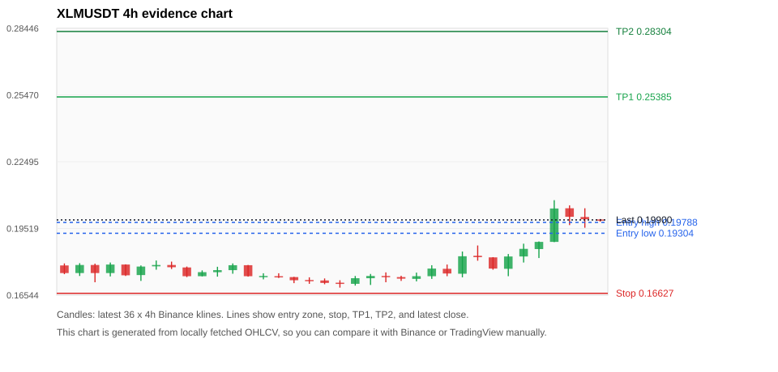
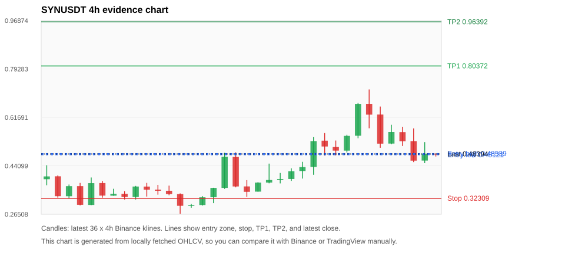
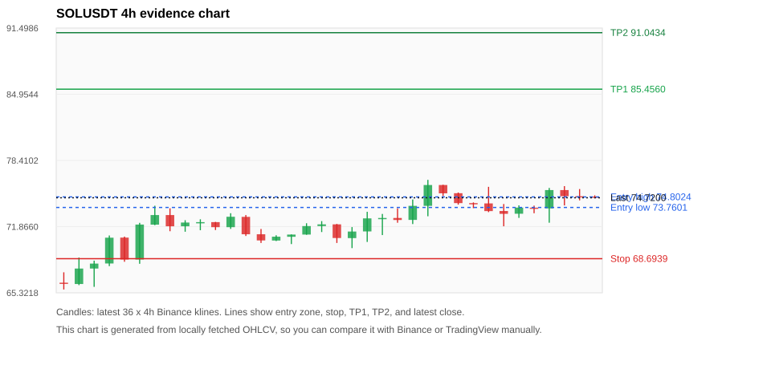
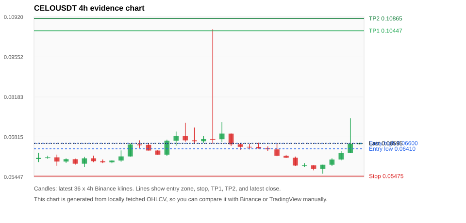
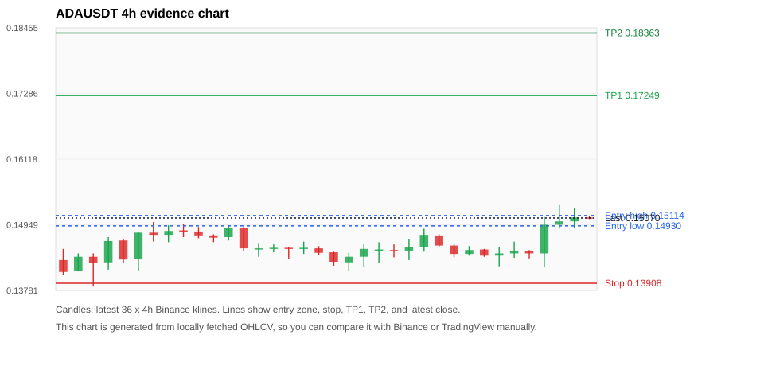

# Crypto 市场扫描报告 v1

- 报告时间：2026-07-01 20:06:26 CST
- Run ID：`20260701_120503_f5f96982`
- Run type：`daily_full`
- 数据来源：SQLite
- 报告版本：v1
- 扫描 ID：1bc2608a3ab4
- 数据源：Binance public spot API + CoinGecko/CoinMarketCap cross-check
- 过滤条件：USDT spot; 24h quote volume >= 30,000,000; trades >= 30,000; exclude stables/leveraged tokens; analyze 1h/4h/1d klines
- 默认单笔风险：账户权益的 1.00%

## 限制说明

- 交易信号仍以 Binance 现货公开 K 线为主源；外部数据源用于一致性复核。
- 结果是研究和模拟盘计划，不是确定收益或实盘下单指令。
- 历史长度过滤：候选币至少需要 180 根 1d K 线。
- 数据质量验证池：先验证 score 排名前 min(top_n * 2, 10) 的候选，再按 action + score 补足最终名单。
- 大盘环境过滤：RISK_OFF; BTC/ETH 大盘偏弱，山寨币买入候选降级为观察。 BTC 7d=-4.161253505559037; ETH 7d=-3.3294907438801147.
- 已启用数据交叉验证：Binance 主源 + CoinGecko 自动对照；CoinMarketCap 在配置 API Key 后自动对照。
- SYNUSDT 交叉验证状态 DATA_WARNING：At least one external provider needs manual review.
- SOLUSDT 交叉验证状态 DATA_WARNING：At least one external provider needs manual review.
- ADAUSDT 交叉验证状态 DATA_WARNING：At least one external provider needs manual review.
- ZECUSDT 交叉验证状态 DATA_WARNING：At least one external provider needs manual review.
- XRPUSDT 交叉验证状态 DATA_WARNING：At least one external provider needs manual review.
- ETHUSDT 交叉验证状态 DATA_WARNING：At least one external provider needs manual review.
- DOGEUSDT 交叉验证状态 DATA_WARNING：At least one external provider needs manual review.
- BNBUSDT 交叉验证状态 DATA_WARNING：At least one external provider needs manual review.

## 5 个候选交易计划

| Rank | Coin | Action | Setup | Entry Zone | Stop Loss | TP1 | TP2 / Exit Rule | R/R | Verdict |
|---:|---|---|---|---:|---:|---:|---|---:|---|
| 1 | `XLM` | `WATCH_ONLY` | 回踩支撑/4h EMA 附近 | 0.19304 - 0.19788 | 0.16627 | 0.25385 | 0.28304 或跌破 4h 关键支撑 | 2.00-3.00 | 只观察 |
| 2 | `SYN` | `WATCH_ONLY` | 回踩支撑/4h EMA 附近 | 0.48121 - 0.48539 | 0.32309 | 0.80372 | 0.96392 或跌破 4h 关键支撑 | 2.00-3.00 | 只观察 |
| 3 | `SOL` | `WATCH_ONLY` | 回踩支撑/4h EMA 附近 | 73.7601 - 74.8024 | 68.6939 | 85.4560 | 91.0434 或跌破 4h 关键支撑 | 2.00-3.00 | 只观察 |
| 4 | `CELO` | `WATCH_ONLY` | 回踩支撑/4h EMA 附近 | 0.06410 - 0.06600 | 0.05475 | 0.10447 | 0.10865 或跌破 4h 关键支撑 | 3.83-4.23 | 只观察 |
| 5 | `ADA` | `WATCH_ONLY` | 回踩支撑/4h EMA 附近 | 0.14930 - 0.15114 | 0.13908 | 0.17249 | 0.18363 或跌破 4h 关键支撑 | 2.00-3.00 | 只观察 |

## 数据交叉验证摘要

价格差异以 Binance 当前价为基准；成交量口径不同，Binance 是 USDT 现货成交额，CoinGecko/CoinMarketCap 通常是全市场成交量。

| Rank | Coin | Data Status | Max Price Diff | Max 24h Diff | Message |
|---:|---|---|---:|---:|---|
| 1 | `XLM` | DATA_OK | 0.31% | 0.51 pts | External provider checks agree with Binance within configured thresholds. |
| 2 | `SYN` | DATA_WARNING | 0.10% | 0.94 pts | At least one external provider needs manual review. |
| 3 | `SOL` | DATA_WARNING | 0.11% | 0.22 pts | At least one external provider needs manual review. |
| 4 | `CELO` | DATA_OK | 0.22% | 0.17 pts | External provider checks agree with Binance within configured thresholds. |
| 5 | `ADA` | DATA_WARNING | 0.16% | 0.18 pts | At least one external provider needs manual review. |

## 候选币说明

### 1. XLM `XLMUSDT`



- 入选原因：回踩支撑/4h EMA 附近；24h +12.76%，7d +6.02%，4h RSI 74.29，24h 成交额 $48.3M。
- 交易失效条件：跌破 0.166268 或 4h 收盘重新失守关键支撑。
- 主要风险：成交量突增，可能是事件驱动；BTC/ETH 大盘环境未确认强势，山寨币买入信号降级。
- 数据交叉验证：DATA_OK；External provider checks agree with Binance within configured thresholds.

#### 可点击人工验证

- [Binance 交易页](https://www.binance.com/en/trade/XLM_USDT)
- [TradingView 图表](https://www.tradingview.com/chart/?symbol=BINANCE%3AXLMUSDT)
- [CoinGecko 搜索](https://www.coingecko.com/en/search?query=XLM)
- [CoinMarketCap 搜索](https://coinmarketcap.com/search/?q=XLM)

#### 多数据源对照

| Source | Status | Asset ID | Price | 24h Change | 24h Volume | Price Diff | 24h Diff | Updated | Message |
|---|---|---|---:|---:|---:|---:|---:|---|---|
| Binance | DATA_OK | XLMUSDT | 0.19900 | +12.76% | $48.3M | 0.00% | 0.00 pts | 2026-07-01T12:05:47+00:00 | Primary market data source used by scanner. |
| CoinGecko | DATA_OK | stellar | 0.19846 | +12.51% | $512.5M | 0.27% | 0.25 pts | 2026-07-01T12:05:42.737Z | External source agrees with Binance within thresholds. |
| CoinMarketCap | DATA_OK | 512 | 0.19838 | +12.24% | $527.3M | 0.31% | 0.51 pts | 2026-07-01T12:04:56.000Z | External source agrees with Binance within thresholds. |

#### 指标证据

| 指标 | 数值 | 人工核对用途 |
|---|---:|---|
| 当前价 | 0.19900 | 与 Binance/TradingView 当前价格对照 |
| 24h 涨跌 | +12.76% | 与交易所 24h 涨跌对照 |
| 7d 涨跌 | +6.02% | 判断短线趋势是否延续 |
| 4h EMA20 | 0.18632 | 判断短期趋势支撑 |
| 4h EMA50 | 0.18610 | 判断中期趋势支撑 |
| 1d EMA20 | 0.19266 | 判断日线趋势 |
| 1d EMA50 | 0.18963 | 判断日线趋势 |
| 4h RSI14 | 74.29 | 判断是否过热/过弱 |
| 4h ATR14 | 0.0074642857 | 推导止损和入场缓冲 |
| 最近 18 根 4h 最低点 | 0.16880 | 支撑/止损参考 |
| 最近 36 根 4h 最高点 | 0.20780 | TP/压力参考 |
| 支撑位 | 0.19266 | 入场区间推导基础 |

#### 交易计划推导

- 支撑位 = 最近低点、4h EMA20、4h EMA50、1d EMA20 中不高于当前价的最高有效支撑 = `0.19266`。
- 入场区间 = 支撑位附近 + ATR 缓冲 = `0.19304 - 0.19788`。
- 止损 = min(最近 18 根 4h 最低点 * 0.985, 入场中位价 - 1.15 * ATR14) = `0.16627`。
- TP1 = max(最近 36 根 4h 最高点 * 0.995, 入场中位价 + 2R) = `0.25385`。
- TP2 = max(入场中位价 + 3R, TP1 * 1.04) = `0.28304`。

#### 最近 10 根 4h K线

| UTC 开盘时间 | Open | High | Low | Close | Quote Volume | Trades |
|---|---:|---:|---:|---:|---:|---:|
| 2026-06-30T00:00+00:00 | 0.17500 | 0.18490 | 0.17340 | 0.18280 | $5.5M | 29145 |
| 2026-06-30T04:00+00:00 | 0.18300 | 0.18760 | 0.18080 | 0.18240 | $6.2M | 38951 |
| 2026-06-30T08:00+00:00 | 0.18230 | 0.18240 | 0.17680 | 0.17730 | $3.3M | 17978 |
| 2026-06-30T12:00+00:00 | 0.17720 | 0.18380 | 0.17390 | 0.18270 | $5.6M | 31956 |
| 2026-06-30T16:00+00:00 | 0.18270 | 0.18840 | 0.18000 | 0.18610 | $5.3M | 27298 |
| 2026-06-30T20:00+00:00 | 0.18600 | 0.18940 | 0.18200 | 0.18920 | $3.0M | 17676 |
| 2026-07-01T00:00+00:00 | 0.18920 | 0.20780 | 0.18910 | 0.20410 | $17.0M | 87868 |
| 2026-07-01T04:00+00:00 | 0.20420 | 0.20550 | 0.19670 | 0.20040 | $9.4M | 49795 |
| 2026-07-01T08:00+00:00 | 0.20030 | 0.20420 | 0.19550 | 0.19930 | $8.0M | 39652 |
| 2026-07-01T12:00+00:00 | 0.19920 | 0.19940 | 0.19820 | 0.19900 | $130,664 | 712 |

### 2. SYN `SYNUSDT`



- 入选原因：回踩支撑/4h EMA 附近；24h -26.11%，7d +43.26%，4h RSI 56.89，24h 成交额 $45.7M。
- 交易失效条件：跌破 0.32308985 或 4h 收盘重新失守关键支撑。
- 主要风险：24h 振幅较大，回撤风险高；BTC/ETH 大盘环境未确认强势，山寨币买入信号降级；24h 动量未确认；数据交叉验证需要人工复核。
- 数据交叉验证：DATA_WARNING；At least one external provider needs manual review.

#### 可点击人工验证

- [Binance 交易页](https://www.binance.com/en/trade/SYN_USDT)
- [TradingView 图表](https://www.tradingview.com/chart/?symbol=BINANCE%3ASYNUSDT)
- [CoinGecko 搜索](https://www.coingecko.com/en/search?query=SYN)
- [CoinMarketCap 搜索](https://coinmarketcap.com/search/?q=SYN)

#### 多数据源对照

| Source | Status | Asset ID | Price | 24h Change | 24h Volume | Price Diff | 24h Diff | Updated | Message |
|---|---|---|---:|---:|---:|---:|---:|---|---|
| Binance | DATA_OK | SYNUSDT | 0.48394 | -26.11% | $45.7M | 0.00% | 0.00 pts | 2026-07-01T12:05:47+00:00 | Primary market data source used by scanner. |
| CoinGecko | DATA_OK | synapse-2 | 0.48358 | -26.93% | $157.2M | 0.07% | 0.82 pts | 2026-07-01T12:05:43.291Z | External source agrees with Binance within thresholds. |
| CoinMarketCap | DATA_WARNING | 12147 | 0.48444 | -27.05% | $167.4M | 0.10% | 0.94 pts | 2026-07-01T12:04:56.000Z | CoinMarketCap symbol mapping has 4 matches; selected lowest cmc_rank |

#### 指标证据

| 指标 | 数值 | 人工核对用途 |
|---|---:|---|
| 当前价 | 0.48394 | 与 Binance/TradingView 当前价格对照 |
| 24h 涨跌 | -26.11% | 与交易所 24h 涨跌对照 |
| 7d 涨跌 | +43.26% | 判断短线趋势是否延续 |
| 4h EMA20 | 0.48024 | 判断短期趋势支撑 |
| 4h EMA50 | 0.39529 | 判断中期趋势支撑 |
| 1d EMA20 | 0.28357 | 判断日线趋势 |
| 1d EMA50 | 0.16890 | 判断日线趋势 |
| 4h RSI14 | 56.89 | 判断是否过热/过弱 |
| 4h ATR14 | 0.08667 | 推导止损和入场缓冲 |
| 最近 18 根 4h 最低点 | 0.32801 | 支撑/止损参考 |
| 最近 36 根 4h 最高点 | 0.71832 | TP/压力参考 |
| 支撑位 | 0.48024 | 入场区间推导基础 |

#### 交易计划推导

- 支撑位 = 最近低点、4h EMA20、4h EMA50、1d EMA20 中不高于当前价的最高有效支撑 = `0.48024`。
- 入场区间 = 支撑位附近 + ATR 缓冲 = `0.48121 - 0.48539`。
- 止损 = min(最近 18 根 4h 最低点 * 0.985, 入场中位价 - 1.15 * ATR14) = `0.32309`。
- TP1 = max(最近 36 根 4h 最高点 * 0.995, 入场中位价 + 2R) = `0.80372`。
- TP2 = max(入场中位价 + 3R, TP1 * 1.04) = `0.96392`。

#### 最近 10 根 4h K线

| UTC 开盘时间 | Open | High | Low | Close | Quote Volume | Trades |
|---|---:|---:|---:|---:|---:|---:|
| 2026-06-30T00:00+00:00 | 0.51016 | 0.53275 | 0.47900 | 0.49614 | $3.8M | 42181 |
| 2026-06-30T04:00+00:00 | 0.49610 | 0.55359 | 0.48951 | 0.54975 | $4.6M | 46134 |
| 2026-06-30T08:00+00:00 | 0.55042 | 0.67000 | 0.54125 | 0.66580 | $11.2M | 97975 |
| 2026-06-30T12:00+00:00 | 0.66593 | 0.71832 | 0.57742 | 0.62684 | $15.9M | 159001 |
| 2026-06-30T16:00+00:00 | 0.62725 | 0.65625 | 0.50620 | 0.52145 | $9.4M | 130761 |
| 2026-06-30T20:00+00:00 | 0.52171 | 0.58999 | 0.51977 | 0.56360 | $6.7M | 97457 |
| 2026-07-01T00:00+00:00 | 0.56321 | 0.58295 | 0.51279 | 0.53046 | $2.8M | 42063 |
| 2026-07-01T04:00+00:00 | 0.53077 | 0.57700 | 0.45447 | 0.45970 | $6.0M | 70173 |
| 2026-07-01T08:00+00:00 | 0.46000 | 0.52697 | 0.45063 | 0.48522 | $5.1M | 55264 |
| 2026-07-01T12:00+00:00 | 0.48522 | 0.48552 | 0.47481 | 0.48394 | $158,966 | 1807 |

### 3. SOL `SOLUSDT`



- 入选原因：回踩支撑/4h EMA 附近；24h +2.09%，7d +8.48%，4h RSI 60.22，24h 成交额 $235.2M。
- 交易失效条件：跌破 68.6939 或 4h 收盘重新失守关键支撑。
- 主要风险：日线趋势未完全确认；BTC/ETH 大盘环境未确认强势，山寨币买入信号降级；数据交叉验证需要人工复核。
- 数据交叉验证：DATA_WARNING；At least one external provider needs manual review.

#### 可点击人工验证

- [Binance 交易页](https://www.binance.com/en/trade/SOL_USDT)
- [TradingView 图表](https://www.tradingview.com/chart/?symbol=BINANCE%3ASOLUSDT)
- [CoinGecko 搜索](https://www.coingecko.com/en/search?query=SOL)
- [CoinMarketCap 搜索](https://coinmarketcap.com/search/?q=SOL)

#### 多数据源对照

| Source | Status | Asset ID | Price | 24h Change | 24h Volume | Price Diff | 24h Diff | Updated | Message |
|---|---|---|---:|---:|---:|---:|---:|---|---|
| Binance | DATA_OK | SOLUSDT | 74.7200 | +2.09% | $235.2M | 0.00% | 0.00 pts | 2026-07-01T12:05:47+00:00 | Primary market data source used by scanner. |
| CoinGecko | DATA_OK | solana | 74.6600 | +1.87% | $3.14B | 0.08% | 0.22 pts | 2026-07-01T12:05:47.154Z | External source agrees with Binance within thresholds. |
| CoinMarketCap | DATA_WARNING | 5426 | 74.6392 | +2.06% | $3.30B | 0.11% | 0.03 pts | 2026-07-01T12:04:56.000Z | CoinMarketCap symbol mapping has 8 matches; selected lowest cmc_rank |

#### 指标证据

| 指标 | 数值 | 人工核对用途 |
|---|---:|---|
| 当前价 | 74.7200 | 与 Binance/TradingView 当前价格对照 |
| 24h 涨跌 | +2.09% | 与交易所 24h 涨跌对照 |
| 7d 涨跌 | +8.48% | 判断短线趋势是否延续 |
| 4h EMA20 | 73.6129 | 判断短期趋势支撑 |
| 4h EMA50 | 72.3217 | 判断中期趋势支撑 |
| 1d EMA20 | 72.0073 | 判断日线趋势 |
| 1d EMA50 | 75.2348 | 判断日线趋势 |
| 4h RSI14 | 60.22 | 判断是否过热/过弱 |
| 4h ATR14 | 1.6993 | 推导止损和入场缓冲 |
| 最近 18 根 4h 最低点 | 69.7400 | 支撑/止损参考 |
| 最近 36 根 4h 最高点 | 76.4900 | TP/压力参考 |
| 支撑位 | 73.6129 | 入场区间推导基础 |

#### 交易计划推导

- 支撑位 = 最近低点、4h EMA20、4h EMA50、1d EMA20 中不高于当前价的最高有效支撑 = `73.6129`。
- 入场区间 = 支撑位附近 + ATR 缓冲 = `73.7601 - 74.8024`。
- 止损 = min(最近 18 根 4h 最低点 * 0.985, 入场中位价 - 1.15 * ATR14) = `68.6939`。
- TP1 = max(最近 36 根 4h 最高点 * 0.995, 入场中位价 + 2R) = `85.4560`。
- TP2 = max(入场中位价 + 3R, TP1 * 1.04) = `91.0434`。

#### 最近 10 根 4h K线

| UTC 开盘时间 | Open | High | Low | Close | Quote Volume | Trades |
|---|---:|---:|---:|---:|---:|---:|
| 2026-06-30T00:00+00:00 | 75.1700 | 75.2400 | 74.0400 | 74.1900 | $24.3M | 122420 |
| 2026-06-30T04:00+00:00 | 74.1900 | 74.2600 | 73.6900 | 74.1600 | $19.7M | 97157 |
| 2026-06-30T08:00+00:00 | 74.1600 | 75.8000 | 73.3000 | 73.4000 | $33.4M | 129685 |
| 2026-06-30T12:00+00:00 | 73.4100 | 74.1000 | 71.9000 | 73.1300 | $69.8M | 346017 |
| 2026-06-30T16:00+00:00 | 73.1400 | 73.9700 | 72.7300 | 73.7500 | $29.8M | 191961 |
| 2026-06-30T20:00+00:00 | 73.7400 | 73.9400 | 73.1900 | 73.6700 | $19.0M | 101995 |
| 2026-07-01T00:00+00:00 | 73.6700 | 75.6900 | 72.2500 | 75.4800 | $45.1M | 244428 |
| 2026-07-01T04:00+00:00 | 75.4800 | 75.8700 | 73.9600 | 74.8700 | $34.7M | 159932 |
| 2026-07-01T08:00+00:00 | 74.8700 | 75.5800 | 74.4600 | 74.8400 | $37.1M | 156857 |
| 2026-07-01T12:00+00:00 | 74.8400 | 74.9600 | 74.6700 | 74.7200 | $374,644 | 3424 |

### 4. CELO `CELOUSDT`



- 入选原因：回踩支撑/4h EMA 附近；24h +12.81%，7d +6.29%，4h RSI 50.87，24h 成交额 $359.2M。
- 交易失效条件：跌破 0.0547463 或 4h 收盘重新失守关键支撑。
- 主要风险：24h 振幅较大，回撤风险高；成交量突增，可能是事件驱动；日线趋势未完全确认；BTC/ETH 大盘环境未确认强势，山寨币买入信号降级。
- 数据交叉验证：DATA_OK；External provider checks agree with Binance within configured thresholds.

#### 可点击人工验证

- [Binance 交易页](https://www.binance.com/en/trade/CELO_USDT)
- [TradingView 图表](https://www.tradingview.com/chart/?symbol=BINANCE%3ACELOUSDT)
- [CoinGecko 搜索](https://www.coingecko.com/en/search?query=CELO)
- [CoinMarketCap 搜索](https://coinmarketcap.com/search/?q=CELO)

#### 多数据源对照

| Source | Status | Asset ID | Price | 24h Change | 24h Volume | Price Diff | 24h Diff | Updated | Message |
|---|---|---|---:|---:|---:|---:|---:|---|---|
| Binance | DATA_OK | CELOUSDT | 0.06595 | +12.81% | $359.2M | 0.00% | 0.00 pts | 2026-07-01T12:05:47+00:00 | Primary market data source used by scanner. |
| CoinGecko | DATA_OK | celo | 0.06581 | +12.84% | $946.9M | 0.22% | 0.03 pts | 2026-07-01T12:05:45.708Z | External source agrees with Binance within thresholds. |
| CoinMarketCap | DATA_OK | 5567 | 0.06584 | +12.98% | $868.2M | 0.17% | 0.17 pts | 2026-07-01T12:04:56.000Z | External source agrees with Binance within thresholds. |

#### 指标证据

| 指标 | 数值 | 人工核对用途 |
|---|---:|---|
| 当前价 | 0.06595 | 与 Binance/TradingView 当前价格对照 |
| 24h 涨跌 | +12.81% | 与交易所 24h 涨跌对照 |
| 7d 涨跌 | +6.29% | 判断短线趋势是否延续 |
| 4h EMA20 | 0.06279 | 判断短期趋势支撑 |
| 4h EMA50 | 0.06310 | 判断中期趋势支撑 |
| 1d EMA20 | 0.06397 | 判断日线趋势 |
| 1d EMA50 | 0.06926 | 判断日线趋势 |
| 4h RSI14 | 50.87 | 判断是否过热/过弱 |
| 4h ATR14 | 0.0029021429 | 推导止损和入场缓冲 |
| 最近 18 根 4h 最低点 | 0.05558 | 支撑/止损参考 |
| 最近 36 根 4h 最高点 | 0.10500 | TP/压力参考 |
| 支撑位 | 0.06397 | 入场区间推导基础 |

#### 交易计划推导

- 支撑位 = 最近低点、4h EMA20、4h EMA50、1d EMA20 中不高于当前价的最高有效支撑 = `0.06397`。
- 入场区间 = 支撑位附近 + ATR 缓冲 = `0.06410 - 0.06600`。
- 止损 = min(最近 18 根 4h 最低点 * 0.985, 入场中位价 - 1.15 * ATR14) = `0.05475`。
- TP1 = max(最近 36 根 4h 最高点 * 0.995, 入场中位价 + 2R) = `0.10447`。
- TP2 = max(入场中位价 + 3R, TP1 * 1.04) = `0.10865`。

#### 最近 10 根 4h K线

| UTC 开盘时间 | Open | High | Low | Close | Quote Volume | Trades |
|---|---:|---:|---:|---:|---:|---:|
| 2026-06-30T00:00+00:00 | 0.06389 | 0.06587 | 0.06157 | 0.06169 | $1.9M | 88790 |
| 2026-06-30T04:00+00:00 | 0.06168 | 0.06200 | 0.06096 | 0.06105 | $2.9M | 98244 |
| 2026-06-30T08:00+00:00 | 0.06104 | 0.06144 | 0.05821 | 0.05838 | $5.0M | 219026 |
| 2026-06-30T12:00+00:00 | 0.05838 | 0.05917 | 0.05783 | 0.05843 | $16.0M | 299646 |
| 2026-06-30T16:00+00:00 | 0.05843 | 0.05845 | 0.05673 | 0.05725 | $11.9M | 164604 |
| 2026-06-30T20:00+00:00 | 0.05724 | 0.05868 | 0.05558 | 0.05866 | $2.2M | 44443 |
| 2026-07-01T00:00+00:00 | 0.05866 | 0.06085 | 0.05820 | 0.06043 | $32.4M | 336123 |
| 2026-07-01T04:00+00:00 | 0.06044 | 0.06329 | 0.06014 | 0.06264 | $133.7M | 784595 |
| 2026-07-01T08:00+00:00 | 0.06264 | 0.07452 | 0.06261 | 0.06582 | $163.1M | 1181571 |
| 2026-07-01T12:00+00:00 | 0.06582 | 0.06615 | 0.06565 | 0.06595 | $40,177 | 1271 |

### 5. ADA `ADAUSDT`



- 入选原因：回踩支撑/4h EMA 附近；24h +4.87%，7d +3.65%，4h RSI 67.50，24h 成交额 $30.5M。
- 交易失效条件：跌破 0.139082 或 4h 收盘重新失守关键支撑。
- 主要风险：日线趋势未完全确认；BTC/ETH 大盘环境未确认强势，山寨币买入信号降级；数据交叉验证需要人工复核。
- 数据交叉验证：DATA_WARNING；At least one external provider needs manual review.

#### 可点击人工验证

- [Binance 交易页](https://www.binance.com/en/trade/ADA_USDT)
- [TradingView 图表](https://www.tradingview.com/chart/?symbol=BINANCE%3AADAUSDT)
- [CoinGecko 搜索](https://www.coingecko.com/en/search?query=ADA)
- [CoinMarketCap 搜索](https://coinmarketcap.com/search/?q=ADA)

#### 多数据源对照

| Source | Status | Asset ID | Price | 24h Change | 24h Volume | Price Diff | 24h Diff | Updated | Message |
|---|---|---|---:|---:|---:|---:|---:|---|---|
| Binance | DATA_OK | ADAUSDT | 0.15070 | +4.87% | $30.5M | 0.00% | 0.00 pts | 2026-07-01T12:05:47+00:00 | Primary market data source used by scanner. |
| CoinGecko | DATA_OK | cardano | 0.15052 | +4.69% | $463.5M | 0.12% | 0.18 pts | 2026-07-01T12:05:52.702Z | External source agrees with Binance within thresholds. |
| CoinMarketCap | DATA_WARNING | 2010 | 0.15046 | +4.80% | $488.1M | 0.16% | 0.07 pts | 2026-07-01T12:04:56.000Z | CoinMarketCap symbol mapping has 3 matches; selected lowest cmc_rank |

#### 指标证据

| 指标 | 数值 | 人工核对用途 |
|---|---:|---|
| 当前价 | 0.15070 | 与 Binance/TradingView 当前价格对照 |
| 24h 涨跌 | +4.87% | 与交易所 24h 涨跌对照 |
| 7d 涨跌 | +3.65% | 判断短线趋势是否延续 |
| 4h EMA20 | 0.14696 | 判断短期趋势支撑 |
| 4h EMA50 | 0.14900 | 判断中期趋势支撑 |
| 1d EMA20 | 0.15881 | 判断日线趋势 |
| 1d EMA50 | 0.18716 | 判断日线趋势 |
| 4h RSI14 | 67.50 | 判断是否过热/过弱 |
| 4h ATR14 | 0.0030571429 | 推导止损和入场缓冲 |
| 最近 18 根 4h 最低点 | 0.14120 | 支撑/止损参考 |
| 最近 36 根 4h 最高点 | 0.15300 | TP/压力参考 |
| 支撑位 | 0.14900 | 入场区间推导基础 |

#### 交易计划推导

- 支撑位 = 最近低点、4h EMA20、4h EMA50、1d EMA20 中不高于当前价的最高有效支撑 = `0.14900`。
- 入场区间 = 支撑位附近 + ATR 缓冲 = `0.14930 - 0.15114`。
- 止损 = min(最近 18 根 4h 最低点 * 0.985, 入场中位价 - 1.15 * ATR14) = `0.13908`。
- TP1 = max(最近 36 根 4h 最高点 * 0.995, 入场中位价 + 2R) = `0.17249`。
- TP2 = max(入场中位价 + 3R, TP1 * 1.04) = `0.18363`。

#### 最近 10 根 4h K线

| UTC 开盘时间 | Open | High | Low | Close | Quote Volume | Trades |
|---|---:|---:|---:|---:|---:|---:|
| 2026-06-30T00:00+00:00 | 0.14580 | 0.14600 | 0.14370 | 0.14430 | $1.6M | 7174 |
| 2026-06-30T04:00+00:00 | 0.14430 | 0.14570 | 0.14400 | 0.14500 | $1.6M | 6109 |
| 2026-06-30T08:00+00:00 | 0.14510 | 0.14520 | 0.14380 | 0.14400 | $2.1M | 7892 |
| 2026-06-30T12:00+00:00 | 0.14400 | 0.14560 | 0.14210 | 0.14440 | $5.2M | 20894 |
| 2026-06-30T16:00+00:00 | 0.14440 | 0.14650 | 0.14360 | 0.14490 | $3.3M | 13965 |
| 2026-06-30T20:00+00:00 | 0.14480 | 0.14500 | 0.14350 | 0.14440 | $1.4M | 6741 |
| 2026-07-01T00:00+00:00 | 0.14440 | 0.15090 | 0.14200 | 0.14950 | $6.9M | 21802 |
| 2026-07-01T04:00+00:00 | 0.14950 | 0.15300 | 0.14880 | 0.15010 | $9.1M | 28306 |
| 2026-07-01T08:00+00:00 | 0.15010 | 0.15240 | 0.14900 | 0.15080 | $4.5M | 19692 |
| 2026-07-01T12:00+00:00 | 0.15080 | 0.15110 | 0.15050 | 0.15070 | $74,209 | 472 |

## 组合风控

- 不要 5 个候选全部满仓买入。
- 同时持仓总风险建议控制在账户权益的 3% - 5% 以内。
- 如果 BTC/ETH 同时破位，暂停山寨币多头计划或降低仓位。
- 第一版报告用于模拟盘和人工复核，不自动下单。

## 原始数据

```json
[
  {
    "rank": 1,
    "symbol": "XLMUSDT",
    "base_asset": "XLM",
    "price": 0.199,
    "score": 58.76406951680208,
    "setup": "回踩支撑/4h EMA 附近",
    "verdict": "只观察",
    "entry_low": 0.1930422476401729,
    "entry_high": 0.19788193377262764,
    "stop_loss": 0.166268,
    "take_profit_1": 0.25385027211920075,
    "take_profit_2": 0.28304436282560097,
    "risk_reward_1": 2.0,
    "risk_reward_2": 2.999999999999999,
    "pct_24h": 12.755,
    "pct_3d": 16.51053864168619,
    "pct_7d": 6.020245071923291,
    "quote_volume_24h": 48262437.6862,
    "trades_24h": 254180,
    "high_low_range_24h": 19.493962047153545,
    "rsi_1h": 66.3677130044843,
    "rsi_4h": 74.28571428571433,
    "ema20_4h": 0.18632369606532728,
    "ema50_4h": 0.18610104119277715,
    "ema20_1d": 0.19265693377262763,
    "ema50_1d": 0.18962694735035465,
    "atr_4h": 0.007464285714285715,
    "macd_hist_4h": 0.0030595010997628387,
    "volume_ratio_24h": 3.260968370091412,
    "support_level": 0.19265693377262763,
    "recent_low_4h_18": 0.1688,
    "recent_high_4h_36": 0.2078,
    "distance_to_support_pct": 3.2924152290612296,
    "binance_trade_url": "https://www.binance.com/en/trade/XLM_USDT",
    "tradingview_url": "https://www.tradingview.com/chart/?symbol=BINANCE%3AXLMUSDT",
    "coingecko_search_url": "https://www.coingecko.com/en/search?query=XLM",
    "coinmarketcap_search_url": "https://coinmarketcap.com/search/?q=XLM",
    "invalidation": "跌破 0.166268 或 4h 收盘重新失守关键支撑",
    "recent_4h_klines": [
      {
        "open_time_utc": "2026-06-25T16:00+00:00",
        "open": 0.1787,
        "high": 0.1796,
        "low": 0.1748,
        "close": 0.1753,
        "quote_volume": 3642064.6318,
        "trades": 17318
      },
      {
        "open_time_utc": "2026-06-25T20:00+00:00",
        "open": 0.1753,
        "high": 0.1797,
        "low": 0.174,
        "close": 0.1789,
        "quote_volume": 1112793.3227,
        "trades": 8039
      },
      {
        "open_time_utc": "2026-06-26T00:00+00:00",
        "open": 0.1789,
        "high": 0.1795,
        "low": 0.1712,
        "close": 0.1753,
        "quote_volume": 3749315.2527,
        "trades": 16763
      },
      {
        "open_time_utc": "2026-06-26T04:00+00:00",
        "open": 0.1753,
        "high": 0.18,
        "low": 0.1738,
        "close": 0.1791,
        "quote_volume": 1874809.0592,
        "trades": 9556
      },
      {
        "open_time_utc": "2026-06-26T08:00+00:00",
        "open": 0.1791,
        "high": 0.1792,
        "low": 0.174,
        "close": 0.1743,
        "quote_volume": 1415632.6327,
        "trades": 7562
      },
      {
        "open_time_utc": "2026-06-26T12:00+00:00",
        "open": 0.1744,
        "high": 0.1787,
        "low": 0.1718,
        "close": 0.1782,
        "quote_volume": 3202141.8089,
        "trades": 17524
      },
      {
        "open_time_utc": "2026-06-26T16:00+00:00",
        "open": 0.1783,
        "high": 0.1809,
        "low": 0.1768,
        "close": 0.1789,
        "quote_volume": 2627719.0367,
        "trades": 11961
      },
      {
        "open_time_utc": "2026-06-26T20:00+00:00",
        "open": 0.1789,
        "high": 0.1804,
        "low": 0.1771,
        "close": 0.1779,
        "quote_volume": 1034837.1617,
        "trades": 6537
      },
      {
        "open_time_utc": "2026-06-27T00:00+00:00",
        "open": 0.1778,
        "high": 0.1782,
        "low": 0.1735,
        "close": 0.1739,
        "quote_volume": 3261466.7455,
        "trades": 13649
      },
      {
        "open_time_utc": "2026-06-27T04:00+00:00",
        "open": 0.1739,
        "high": 0.1765,
        "low": 0.1738,
        "close": 0.1757,
        "quote_volume": 2058984.1652,
        "trades": 9250
      },
      {
        "open_time_utc": "2026-06-27T08:00+00:00",
        "open": 0.1757,
        "high": 0.1781,
        "low": 0.1737,
        "close": 0.1766,
        "quote_volume": 2130075.3982,
        "trades": 12600
      },
      {
        "open_time_utc": "2026-06-27T12:00+00:00",
        "open": 0.1766,
        "high": 0.1796,
        "low": 0.175,
        "close": 0.1788,
        "quote_volume": 1373189.075,
        "trades": 7675
      },
      {
        "open_time_utc": "2026-06-27T16:00+00:00",
        "open": 0.1788,
        "high": 0.1789,
        "low": 0.1737,
        "close": 0.1739,
        "quote_volume": 1490253.3389,
        "trades": 8004
      },
      {
        "open_time_utc": "2026-06-27T20:00+00:00",
        "open": 0.1739,
        "high": 0.1752,
        "low": 0.1725,
        "close": 0.174,
        "quote_volume": 1023525.7872,
        "trades": 7085
      },
      {
        "open_time_utc": "2026-06-28T00:00+00:00",
        "open": 0.1739,
        "high": 0.1752,
        "low": 0.1731,
        "close": 0.1736,
        "quote_volume": 690777.85,
        "trades": 4301
      },
      {
        "open_time_utc": "2026-06-28T04:00+00:00",
        "open": 0.1735,
        "high": 0.1736,
        "low": 0.1708,
        "close": 0.1721,
        "quote_volume": 1094017.7673,
        "trades": 5803
      },
      {
        "open_time_utc": "2026-06-28T08:00+00:00",
        "open": 0.1722,
        "high": 0.1734,
        "low": 0.1705,
        "close": 0.1721,
        "quote_volume": 827979.545,
        "trades": 5190
      },
      {
        "open_time_utc": "2026-06-28T12:00+00:00",
        "open": 0.172,
        "high": 0.1729,
        "low": 0.1703,
        "close": 0.1709,
        "quote_volume": 1042611.8376,
        "trades": 6091
      },
      {
        "open_time_utc": "2026-06-28T16:00+00:00",
        "open": 0.171,
        "high": 0.1721,
        "low": 0.1688,
        "close": 0.1705,
        "quote_volume": 1710564.4476,
        "trades": 9584
      },
      {
        "open_time_utc": "2026-06-28T20:00+00:00",
        "open": 0.1705,
        "high": 0.174,
        "low": 0.1697,
        "close": 0.173,
        "quote_volume": 1653605.6794,
        "trades": 8561
      },
      {
        "open_time_utc": "2026-06-29T00:00+00:00",
        "open": 0.173,
        "high": 0.1749,
        "low": 0.17,
        "close": 0.174,
        "quote_volume": 1622036.8261,
        "trades": 9215
      },
      {
        "open_time_utc": "2026-06-29T04:00+00:00",
        "open": 0.174,
        "high": 0.1756,
        "low": 0.1712,
        "close": 0.1735,
        "quote_volume": 937106.5002,
        "trades": 6104
      },
      {
        "open_time_utc": "2026-06-29T08:00+00:00",
        "open": 0.1735,
        "high": 0.1741,
        "low": 0.1718,
        "close": 0.1728,
        "quote_volume": 1257163.6421,
        "trades": 6441
      },
      {
        "open_time_utc": "2026-06-29T12:00+00:00",
        "open": 0.1727,
        "high": 0.1755,
        "low": 0.1716,
        "close": 0.1739,
        "quote_volume": 3951377.7985,
        "trades": 17794
      },
      {
        "open_time_utc": "2026-06-29T16:00+00:00",
        "open": 0.1739,
        "high": 0.1788,
        "low": 0.1727,
        "close": 0.1773,
        "quote_volume": 1771268.5606,
        "trades": 9954
      },
      {
        "open_time_utc": "2026-06-29T20:00+00:00",
        "open": 0.1772,
        "high": 0.1791,
        "low": 0.1739,
        "close": 0.1751,
        "quote_volume": 1515764.0289,
        "trades": 8516
      },
      {
        "open_time_utc": "2026-06-30T00:00+00:00",
        "open": 0.175,
        "high": 0.1849,
        "low": 0.1734,
        "close": 0.1828,
        "quote_volume": 5485625.539,
        "trades": 29145
      },
      {
        "open_time_utc": "2026-06-30T04:00+00:00",
        "open": 0.183,
        "high": 0.1876,
        "low": 0.1808,
        "close": 0.1824,
        "quote_volume": 6231596.4203,
        "trades": 38951
      },
      {
        "open_time_utc": "2026-06-30T08:00+00:00",
        "open": 0.1823,
        "high": 0.1824,
        "low": 0.1768,
        "close": 0.1773,
        "quote_volume": 3281091.2591,
        "trades": 17978
      },
      {
        "open_time_utc": "2026-06-30T12:00+00:00",
        "open": 0.1772,
        "high": 0.1838,
        "low": 0.1739,
        "close": 0.1827,
        "quote_volume": 5632204.1968,
        "trades": 31956
      },
      {
        "open_time_utc": "2026-06-30T16:00+00:00",
        "open": 0.1827,
        "high": 0.1884,
        "low": 0.18,
        "close": 0.1861,
        "quote_volume": 5288288.9501,
        "trades": 27298
      },
      {
        "open_time_utc": "2026-06-30T20:00+00:00",
        "open": 0.186,
        "high": 0.1894,
        "low": 0.182,
        "close": 0.1892,
        "quote_volume": 3023638.6799,
        "trades": 17676
      },
      {
        "open_time_utc": "2026-07-01T00:00+00:00",
        "open": 0.1892,
        "high": 0.2078,
        "low": 0.1891,
        "close": 0.2041,
        "quote_volume": 16961986.8587,
        "trades": 87868
      },
      {
        "open_time_utc": "2026-07-01T04:00+00:00",
        "open": 0.2042,
        "high": 0.2055,
        "low": 0.1967,
        "close": 0.2004,
        "quote_volume": 9433515.1798,
        "trades": 49795
      },
      {
        "open_time_utc": "2026-07-01T08:00+00:00",
        "open": 0.2003,
        "high": 0.2042,
        "low": 0.1955,
        "close": 0.1993,
        "quote_volume": 7954920.2474,
        "trades": 39652
      },
      {
        "open_time_utc": "2026-07-01T12:00+00:00",
        "open": 0.1992,
        "high": 0.1994,
        "low": 0.1982,
        "close": 0.199,
        "quote_volume": 130664.4291,
        "trades": 712
      }
    ],
    "risks": [
      "成交量突增，可能是事件驱动",
      "BTC/ETH 大盘环境未确认强势，山寨币买入信号降级"
    ],
    "data_quality_status": "DATA_OK",
    "data_quality_message": "External provider checks agree with Binance within configured thresholds.",
    "data_checks": [
      {
        "provider": "Binance",
        "status": "DATA_OK",
        "provider_asset_id": "XLMUSDT",
        "provider_symbol": "XLMUSDT",
        "price_usd": 0.199,
        "pct_24h": 12.755,
        "volume_24h": 48262437.6862,
        "last_updated": null,
        "fetched_at_utc": "2026-07-01T12:05:47+00:00",
        "price_diff_pct": 0.0,
        "pct_24h_diff": 0.0,
        "volume_note": "Binance USDT spot 24h quoteVolume.",
        "message": "Primary market data source used by scanner."
      },
      {
        "provider": "CoinGecko",
        "status": "DATA_OK",
        "provider_asset_id": "stellar",
        "provider_symbol": "XLM",
        "price_usd": 0.19846,
        "pct_24h": 12.50669,
        "volume_24h": 512459744.0,
        "last_updated": "2026-07-01T12:05:42.737Z",
        "fetched_at_utc": "2026-07-01T12:05:47+00:00",
        "price_diff_pct": 0.2713567839196043,
        "pct_24h_diff": 0.24831000000000003,
        "volume_note": "CoinGecko total market volume; not the same venue scope as Binance quoteVolume.",
        "message": "External source agrees with Binance within thresholds."
      },
      {
        "provider": "CoinMarketCap",
        "status": "DATA_OK",
        "provider_asset_id": "512",
        "provider_symbol": "XLM",
        "price_usd": 0.19838410631204736,
        "pct_24h": 12.24027263,
        "volume_24h": 527346357.6040238,
        "last_updated": "2026-07-01T12:04:56.000Z",
        "fetched_at_utc": "2026-07-01T12:05:47+00:00",
        "price_diff_pct": 0.30949431555409324,
        "pct_24h_diff": 0.514727370000001,
        "volume_note": "CoinMarketCap total market volume; not the same venue scope as Binance quoteVolume.",
        "message": "External source agrees with Binance within thresholds."
      }
    ],
    "action": "WATCH_ONLY"
  },
  {
    "rank": 2,
    "symbol": "SYNUSDT",
    "base_asset": "SYN",
    "price": 0.48394,
    "score": 54.69378403291226,
    "setup": "回踩支撑/4h EMA 附近",
    "verdict": "只观察",
    "entry_low": 0.4812053422356254,
    "entry_high": 0.4853918199999999,
    "stop_loss": 0.32308985,
    "take_profit_1": 0.8037160433534379,
    "take_profit_2": 0.9639247744712506,
    "risk_reward_1": 2.0,
    "risk_reward_2": 3.0,
    "pct_24h": -26.106,
    "pct_3d": 21.172817867694917,
    "pct_7d": 43.26228537596211,
    "quote_volume_24h": 45689751.79732,
    "trades_24h": 553045,
    "high_low_range_24h": 59.4035017641968,
    "rsi_1h": 34.163925246727814,
    "rsi_4h": 56.89304780393108,
    "ema20_4h": 0.48024485253056426,
    "ema50_4h": 0.3952947506289305,
    "ema20_1d": 0.2835724725218681,
    "ema50_1d": 0.1688985164198484,
    "atr_4h": 0.08667142857142858,
    "macd_hist_4h": -0.009578650847760856,
    "volume_ratio_24h": 1.2211958377732715,
    "support_level": 0.48024485253056426,
    "recent_low_4h_18": 0.32801,
    "recent_high_4h_36": 0.71832,
    "distance_to_support_pct": 0.7694298960134294,
    "binance_trade_url": "https://www.binance.com/en/trade/SYN_USDT",
    "tradingview_url": "https://www.tradingview.com/chart/?symbol=BINANCE%3ASYNUSDT",
    "coingecko_search_url": "https://www.coingecko.com/en/search?query=SYN",
    "coinmarketcap_search_url": "https://coinmarketcap.com/search/?q=SYN",
    "invalidation": "跌破 0.32308985 或 4h 收盘重新失守关键支撑",
    "recent_4h_klines": [
      {
        "open_time_utc": "2026-06-25T16:00+00:00",
        "open": 0.39228,
        "high": 0.4431,
        "low": 0.37049,
        "close": 0.40248,
        "quote_volume": 8525440.191824,
        "trades": 102555
      },
      {
        "open_time_utc": "2026-06-25T20:00+00:00",
        "open": 0.4029,
        "high": 0.40656,
        "low": 0.32532,
        "close": 0.33068,
        "quote_volume": 5017358.96207,
        "trades": 56771
      },
      {
        "open_time_utc": "2026-06-26T00:00+00:00",
        "open": 0.33054,
        "high": 0.3729,
        "low": 0.3217,
        "close": 0.36705,
        "quote_volume": 5161694.811618,
        "trades": 70599
      },
      {
        "open_time_utc": "2026-06-26T04:00+00:00",
        "open": 0.36717,
        "high": 0.37885,
        "low": 0.29718,
        "close": 0.29934,
        "quote_volume": 4775556.715975,
        "trades": 61215
      },
      {
        "open_time_utc": "2026-06-26T08:00+00:00",
        "open": 0.29883,
        "high": 0.39855,
        "low": 0.29833,
        "close": 0.37801,
        "quote_volume": 8431006.571754,
        "trades": 93071
      },
      {
        "open_time_utc": "2026-06-26T12:00+00:00",
        "open": 0.37842,
        "high": 0.38635,
        "low": 0.32536,
        "close": 0.33274,
        "quote_volume": 3975061.182548,
        "trades": 47429
      },
      {
        "open_time_utc": "2026-06-26T16:00+00:00",
        "open": 0.3325,
        "high": 0.3576,
        "low": 0.33242,
        "close": 0.33922,
        "quote_volume": 1614208.377624,
        "trades": 24535
      },
      {
        "open_time_utc": "2026-06-26T20:00+00:00",
        "open": 0.33927,
        "high": 0.34899,
        "low": 0.31853,
        "close": 0.32769,
        "quote_volume": 1347972.846777,
        "trades": 23476
      },
      {
        "open_time_utc": "2026-06-27T00:00+00:00",
        "open": 0.3276,
        "high": 0.36792,
        "low": 0.31851,
        "close": 0.36576,
        "quote_volume": 1888181.139699,
        "trades": 40290
      },
      {
        "open_time_utc": "2026-06-27T04:00+00:00",
        "open": 0.36564,
        "high": 0.37899,
        "low": 0.32928,
        "close": 0.35414,
        "quote_volume": 4273008.51041,
        "trades": 60772
      },
      {
        "open_time_utc": "2026-06-27T08:00+00:00",
        "open": 0.35445,
        "high": 0.37174,
        "low": 0.3362,
        "close": 0.35024,
        "quote_volume": 3530501.325089,
        "trades": 45035
      },
      {
        "open_time_utc": "2026-06-27T12:00+00:00",
        "open": 0.3504,
        "high": 0.369,
        "low": 0.3342,
        "close": 0.33824,
        "quote_volume": 3285320.013687,
        "trades": 47862
      },
      {
        "open_time_utc": "2026-06-27T16:00+00:00",
        "open": 0.33829,
        "high": 0.3408,
        "low": 0.26641,
        "close": 0.29571,
        "quote_volume": 6895128.188906,
        "trades": 118160
      },
      {
        "open_time_utc": "2026-06-27T20:00+00:00",
        "open": 0.29582,
        "high": 0.30231,
        "low": 0.2888,
        "close": 0.29883,
        "quote_volume": 1406006.278286,
        "trades": 29136
      },
      {
        "open_time_utc": "2026-06-28T00:00+00:00",
        "open": 0.2986,
        "high": 0.33086,
        "low": 0.29658,
        "close": 0.32661,
        "quote_volume": 1926830.067357,
        "trades": 37009
      },
      {
        "open_time_utc": "2026-06-28T04:00+00:00",
        "open": 0.32675,
        "high": 0.36125,
        "low": 0.30543,
        "close": 0.3608,
        "quote_volume": 3114978.895523,
        "trades": 47534
      },
      {
        "open_time_utc": "2026-06-28T08:00+00:00",
        "open": 0.3608,
        "high": 0.48833,
        "low": 0.35736,
        "close": 0.47424,
        "quote_volume": 6479900.311462,
        "trades": 94545
      },
      {
        "open_time_utc": "2026-06-28T12:00+00:00",
        "open": 0.47402,
        "high": 0.49,
        "low": 0.36276,
        "close": 0.366,
        "quote_volume": 6003628.420654,
        "trades": 69608
      },
      {
        "open_time_utc": "2026-06-28T16:00+00:00",
        "open": 0.36612,
        "high": 0.38894,
        "low": 0.32801,
        "close": 0.34652,
        "quote_volume": 3736659.729564,
        "trades": 47925
      },
      {
        "open_time_utc": "2026-06-28T20:00+00:00",
        "open": 0.34721,
        "high": 0.38155,
        "low": 0.3471,
        "close": 0.38,
        "quote_volume": 2668209.632953,
        "trades": 29555
      },
      {
        "open_time_utc": "2026-06-29T00:00+00:00",
        "open": 0.38004,
        "high": 0.449,
        "low": 0.37738,
        "close": 0.38939,
        "quote_volume": 7868822.828783,
        "trades": 86479
      },
      {
        "open_time_utc": "2026-06-29T04:00+00:00",
        "open": 0.38956,
        "high": 0.415,
        "low": 0.3771,
        "close": 0.39304,
        "quote_volume": 3379240.875056,
        "trades": 38835
      },
      {
        "open_time_utc": "2026-06-29T08:00+00:00",
        "open": 0.39312,
        "high": 0.432,
        "low": 0.38624,
        "close": 0.42147,
        "quote_volume": 4377333.010263,
        "trades": 52835
      },
      {
        "open_time_utc": "2026-06-29T12:00+00:00",
        "open": 0.4221,
        "high": 0.45549,
        "low": 0.39468,
        "close": 0.43665,
        "quote_volume": 5628461.551927,
        "trades": 59928
      },
      {
        "open_time_utc": "2026-06-29T16:00+00:00",
        "open": 0.437,
        "high": 0.54616,
        "low": 0.40832,
        "close": 0.53084,
        "quote_volume": 11393534.75328,
        "trades": 107562
      },
      {
        "open_time_utc": "2026-06-29T20:00+00:00",
        "open": 0.5322,
        "high": 0.56,
        "low": 0.4785,
        "close": 0.51111,
        "quote_volume": 8772250.169698,
        "trades": 121578
      },
      {
        "open_time_utc": "2026-06-30T00:00+00:00",
        "open": 0.51016,
        "high": 0.53275,
        "low": 0.479,
        "close": 0.49614,
        "quote_volume": 3755792.549191,
        "trades": 42181
      },
      {
        "open_time_utc": "2026-06-30T04:00+00:00",
        "open": 0.4961,
        "high": 0.55359,
        "low": 0.48951,
        "close": 0.54975,
        "quote_volume": 4631784.698074,
        "trades": 46134
      },
      {
        "open_time_utc": "2026-06-30T08:00+00:00",
        "open": 0.55042,
        "high": 0.67,
        "low": 0.54125,
        "close": 0.6658,
        "quote_volume": 11231753.374006,
        "trades": 97975
      },
      {
        "open_time_utc": "2026-06-30T12:00+00:00",
        "open": 0.66593,
        "high": 0.71832,
        "low": 0.57742,
        "close": 0.62684,
        "quote_volume": 15914838.08994,
        "trades": 159001
      },
      {
        "open_time_utc": "2026-06-30T16:00+00:00",
        "open": 0.62725,
        "high": 0.65625,
        "low": 0.5062,
        "close": 0.52145,
        "quote_volume": 9397948.440318,
        "trades": 130761
      },
      {
        "open_time_utc": "2026-06-30T20:00+00:00",
        "open": 0.52171,
        "high": 0.58999,
        "low": 0.51977,
        "close": 0.5636,
        "quote_volume": 6719284.23205,
        "trades": 97457
      },
      {
        "open_time_utc": "2026-07-01T00:00+00:00",
        "open": 0.56321,
        "high": 0.58295,
        "low": 0.51279,
        "close": 0.53046,
        "quote_volume": 2808374.390682,
        "trades": 42063
      },
      {
        "open_time_utc": "2026-07-01T04:00+00:00",
        "open": 0.53077,
        "high": 0.577,
        "low": 0.45447,
        "close": 0.4597,
        "quote_volume": 5963181.760347,
        "trades": 70173
      },
      {
        "open_time_utc": "2026-07-01T08:00+00:00",
        "open": 0.46,
        "high": 0.52697,
        "low": 0.45063,
        "close": 0.48522,
        "quote_volume": 5089834.605088,
        "trades": 55264
      },
      {
        "open_time_utc": "2026-07-01T12:00+00:00",
        "open": 0.48522,
        "high": 0.48552,
        "low": 0.47481,
        "close": 0.48394,
        "quote_volume": 158966.099626,
        "trades": 1807
      }
    ],
    "risks": [
      "24h 振幅较大，回撤风险高",
      "BTC/ETH 大盘环境未确认强势，山寨币买入信号降级",
      "24h 动量未确认",
      "数据交叉验证需要人工复核"
    ],
    "data_quality_status": "DATA_WARNING",
    "data_quality_message": "At least one external provider needs manual review.",
    "data_checks": [
      {
        "provider": "Binance",
        "status": "DATA_OK",
        "provider_asset_id": "SYNUSDT",
        "provider_symbol": "SYNUSDT",
        "price_usd": 0.48394,
        "pct_24h": -26.106,
        "volume_24h": 45689751.79732,
        "last_updated": null,
        "fetched_at_utc": "2026-07-01T12:05:47+00:00",
        "price_diff_pct": 0.0,
        "pct_24h_diff": 0.0,
        "volume_note": "Binance USDT spot 24h quoteVolume.",
        "message": "Primary market data source used by scanner."
      },
      {
        "provider": "CoinGecko",
        "status": "DATA_OK",
        "provider_asset_id": "synapse-2",
        "provider_symbol": "SYN",
        "price_usd": 0.483585,
        "pct_24h": -26.92619,
        "volume_24h": 157191755.0,
        "last_updated": "2026-07-01T12:05:43.291Z",
        "fetched_at_utc": "2026-07-01T12:05:47+00:00",
        "price_diff_pct": 0.07335620118196351,
        "pct_24h_diff": 0.8201899999999966,
        "volume_note": "CoinGecko total market volume; not the same venue scope as Binance quoteVolume.",
        "message": "External source agrees with Binance within thresholds."
      },
      {
        "provider": "CoinMarketCap",
        "status": "DATA_WARNING",
        "provider_asset_id": "12147",
        "provider_symbol": "SYN",
        "price_usd": 0.484438587292833,
        "pct_24h": -27.04554301,
        "volume_24h": 167381265.36004138,
        "last_updated": "2026-07-01T12:04:56.000Z",
        "fetched_at_utc": "2026-07-01T12:05:47+00:00",
        "price_diff_pct": 0.10302667537980544,
        "pct_24h_diff": 0.9395430099999977,
        "volume_note": "CoinMarketCap total market volume; not the same venue scope as Binance quoteVolume.",
        "message": "CoinMarketCap symbol mapping has 4 matches; selected lowest cmc_rank"
      }
    ],
    "action": "WATCH_ONLY"
  },
  {
    "rank": 3,
    "symbol": "SOLUSDT",
    "base_asset": "SOL",
    "price": 74.72,
    "score": 50.19459503362155,
    "setup": "回踩支撑/4h EMA 附近",
    "verdict": "只观察",
    "entry_low": 73.7601305847645,
    "entry_high": 74.80240477521406,
    "stop_loss": 68.6939,
    "take_profit_1": 85.45600303996781,
    "take_profit_2": 91.04337071995708,
    "risk_reward_1": 2.0,
    "risk_reward_2": 3.0,
    "pct_24h": 2.091,
    "pct_3d": 4.153889043769166,
    "pct_7d": 8.478513356562134,
    "quote_volume_24h": 235167910.70055,
    "trades_24h": 1200150,
    "high_low_range_24h": 5.521557719054249,
    "rsi_1h": 62.14689265536722,
    "rsi_4h": 60.22494887525559,
    "ema20_4h": 73.61290477521406,
    "ema50_4h": 72.3216557342919,
    "ema20_1d": 72.00729647700467,
    "ema50_1d": 75.23476361833464,
    "atr_4h": 1.6992857142857127,
    "macd_hist_4h": 0.02126261127528084,
    "volume_ratio_24h": 0.9988254112076546,
    "support_level": 73.61290477521406,
    "recent_low_4h_18": 69.74,
    "recent_high_4h_36": 76.49,
    "distance_to_support_pct": 1.5039417723924808,
    "binance_trade_url": "https://www.binance.com/en/trade/SOL_USDT",
    "tradingview_url": "https://www.tradingview.com/chart/?symbol=BINANCE%3ASOLUSDT",
    "coingecko_search_url": "https://www.coingecko.com/en/search?query=SOL",
    "coinmarketcap_search_url": "https://coinmarketcap.com/search/?q=SOL",
    "invalidation": "跌破 68.6939 或 4h 收盘重新失守关键支撑",
    "recent_4h_klines": [
      {
        "open_time_utc": "2026-06-25T16:00+00:00",
        "open": 66.32,
        "high": 67.35,
        "low": 65.65,
        "close": 66.2,
        "quote_volume": 44933944.60387,
        "trades": 292288
      },
      {
        "open_time_utc": "2026-06-25T20:00+00:00",
        "open": 66.19,
        "high": 68.81,
        "low": 66.08,
        "close": 67.72,
        "quote_volume": 27436348.83013,
        "trades": 168056
      },
      {
        "open_time_utc": "2026-06-26T00:00+00:00",
        "open": 67.72,
        "high": 68.5,
        "low": 65.91,
        "close": 68.21,
        "quote_volume": 45939418.7762,
        "trades": 272725
      },
      {
        "open_time_utc": "2026-06-26T04:00+00:00",
        "open": 68.22,
        "high": 70.99,
        "low": 67.96,
        "close": 70.77,
        "quote_volume": 61597815.57067,
        "trades": 269080
      },
      {
        "open_time_utc": "2026-06-26T08:00+00:00",
        "open": 70.78,
        "high": 70.88,
        "low": 68.39,
        "close": 68.61,
        "quote_volume": 35012595.38519,
        "trades": 190965
      },
      {
        "open_time_utc": "2026-06-26T12:00+00:00",
        "open": 68.61,
        "high": 72.24,
        "low": 68.19,
        "close": 72.07,
        "quote_volume": 73387646.73917,
        "trades": 545247
      },
      {
        "open_time_utc": "2026-06-26T16:00+00:00",
        "open": 72.06,
        "high": 73.93,
        "low": 72.01,
        "close": 73.01,
        "quote_volume": 59144719.92153,
        "trades": 366350
      },
      {
        "open_time_utc": "2026-06-26T20:00+00:00",
        "open": 73.01,
        "high": 73.68,
        "low": 71.41,
        "close": 71.9,
        "quote_volume": 35762097.32011,
        "trades": 198445
      },
      {
        "open_time_utc": "2026-06-27T00:00+00:00",
        "open": 71.9,
        "high": 72.5,
        "low": 71.36,
        "close": 72.27,
        "quote_volume": 26501639.77046,
        "trades": 114906
      },
      {
        "open_time_utc": "2026-06-27T04:00+00:00",
        "open": 72.26,
        "high": 72.59,
        "low": 71.51,
        "close": 72.31,
        "quote_volume": 22837656.55203,
        "trades": 87362
      },
      {
        "open_time_utc": "2026-06-27T08:00+00:00",
        "open": 72.31,
        "high": 72.33,
        "low": 71.53,
        "close": 71.81,
        "quote_volume": 13301159.28603,
        "trades": 60987
      },
      {
        "open_time_utc": "2026-06-27T12:00+00:00",
        "open": 71.81,
        "high": 73.19,
        "low": 71.64,
        "close": 72.84,
        "quote_volume": 25951796.73162,
        "trades": 110533
      },
      {
        "open_time_utc": "2026-06-27T16:00+00:00",
        "open": 72.83,
        "high": 73.01,
        "low": 70.94,
        "close": 71.11,
        "quote_volume": 28541648.40455,
        "trades": 147407
      },
      {
        "open_time_utc": "2026-06-27T20:00+00:00",
        "open": 71.11,
        "high": 71.63,
        "low": 70.25,
        "close": 70.5,
        "quote_volume": 21057165.32823,
        "trades": 113764
      },
      {
        "open_time_utc": "2026-06-28T00:00+00:00",
        "open": 70.49,
        "high": 71.01,
        "low": 70.44,
        "close": 70.87,
        "quote_volume": 12007083.59572,
        "trades": 61878
      },
      {
        "open_time_utc": "2026-06-28T04:00+00:00",
        "open": 70.86,
        "high": 71.09,
        "low": 70.14,
        "close": 71.08,
        "quote_volume": 17314102.01038,
        "trades": 101682
      },
      {
        "open_time_utc": "2026-06-28T08:00+00:00",
        "open": 71.08,
        "high": 72.2,
        "low": 71.06,
        "close": 71.92,
        "quote_volume": 24215171.50752,
        "trades": 124465
      },
      {
        "open_time_utc": "2026-06-28T12:00+00:00",
        "open": 71.92,
        "high": 72.41,
        "low": 71.33,
        "close": 72.09,
        "quote_volume": 17697496.131,
        "trades": 141978
      },
      {
        "open_time_utc": "2026-06-28T16:00+00:00",
        "open": 72.09,
        "high": 72.13,
        "low": 70.25,
        "close": 70.74,
        "quote_volume": 20974880.10862,
        "trades": 158341
      },
      {
        "open_time_utc": "2026-06-28T20:00+00:00",
        "open": 70.73,
        "high": 71.82,
        "low": 69.74,
        "close": 71.38,
        "quote_volume": 29453681.7673,
        "trades": 188218
      },
      {
        "open_time_utc": "2026-06-29T00:00+00:00",
        "open": 71.39,
        "high": 73.33,
        "low": 70.35,
        "close": 72.68,
        "quote_volume": 39741696.5793,
        "trades": 295125
      },
      {
        "open_time_utc": "2026-06-29T04:00+00:00",
        "open": 72.68,
        "high": 73.12,
        "low": 71.03,
        "close": 72.72,
        "quote_volume": 26528789.28622,
        "trades": 191305
      },
      {
        "open_time_utc": "2026-06-29T08:00+00:00",
        "open": 72.72,
        "high": 73.68,
        "low": 72.25,
        "close": 72.52,
        "quote_volume": 32369260.29807,
        "trades": 187395
      },
      {
        "open_time_utc": "2026-06-29T12:00+00:00",
        "open": 72.53,
        "high": 74.55,
        "low": 72.12,
        "close": 73.92,
        "quote_volume": 100504664.54814,
        "trades": 568353
      },
      {
        "open_time_utc": "2026-06-29T16:00+00:00",
        "open": 73.92,
        "high": 76.49,
        "low": 72.89,
        "close": 75.98,
        "quote_volume": 61884241.47614,
        "trades": 388596
      },
      {
        "open_time_utc": "2026-06-29T20:00+00:00",
        "open": 75.98,
        "high": 76.0,
        "low": 74.89,
        "close": 75.16,
        "quote_volume": 23201233.16584,
        "trades": 120457
      },
      {
        "open_time_utc": "2026-06-30T00:00+00:00",
        "open": 75.17,
        "high": 75.24,
        "low": 74.04,
        "close": 74.19,
        "quote_volume": 24338704.91384,
        "trades": 122420
      },
      {
        "open_time_utc": "2026-06-30T04:00+00:00",
        "open": 74.19,
        "high": 74.26,
        "low": 73.69,
        "close": 74.16,
        "quote_volume": 19656877.78171,
        "trades": 97157
      },
      {
        "open_time_utc": "2026-06-30T08:00+00:00",
        "open": 74.16,
        "high": 75.8,
        "low": 73.3,
        "close": 73.4,
        "quote_volume": 33350379.3327,
        "trades": 129685
      },
      {
        "open_time_utc": "2026-06-30T12:00+00:00",
        "open": 73.41,
        "high": 74.1,
        "low": 71.9,
        "close": 73.13,
        "quote_volume": 69839760.27259,
        "trades": 346017
      },
      {
        "open_time_utc": "2026-06-30T16:00+00:00",
        "open": 73.14,
        "high": 73.97,
        "low": 72.73,
        "close": 73.75,
        "quote_volume": 29802594.92308,
        "trades": 191961
      },
      {
        "open_time_utc": "2026-06-30T20:00+00:00",
        "open": 73.74,
        "high": 73.94,
        "low": 73.19,
        "close": 73.67,
        "quote_volume": 18959864.65497,
        "trades": 101995
      },
      {
        "open_time_utc": "2026-07-01T00:00+00:00",
        "open": 73.67,
        "high": 75.69,
        "low": 72.25,
        "close": 75.48,
        "quote_volume": 45060941.69644,
        "trades": 244428
      },
      {
        "open_time_utc": "2026-07-01T04:00+00:00",
        "open": 75.48,
        "high": 75.87,
        "low": 73.96,
        "close": 74.87,
        "quote_volume": 34665613.05043,
        "trades": 159932
      },
      {
        "open_time_utc": "2026-07-01T08:00+00:00",
        "open": 74.87,
        "high": 75.58,
        "low": 74.46,
        "close": 74.84,
        "quote_volume": 37052069.34886,
        "trades": 156857
      },
      {
        "open_time_utc": "2026-07-01T12:00+00:00",
        "open": 74.84,
        "high": 74.96,
        "low": 74.67,
        "close": 74.72,
        "quote_volume": 374644.1039,
        "trades": 3424
      }
    ],
    "risks": [
      "日线趋势未完全确认",
      "BTC/ETH 大盘环境未确认强势，山寨币买入信号降级",
      "数据交叉验证需要人工复核"
    ],
    "data_quality_status": "DATA_WARNING",
    "data_quality_message": "At least one external provider needs manual review.",
    "data_checks": [
      {
        "provider": "Binance",
        "status": "DATA_OK",
        "provider_asset_id": "SOLUSDT",
        "provider_symbol": "SOLUSDT",
        "price_usd": 74.72,
        "pct_24h": 2.091,
        "volume_24h": 235167910.70055,
        "last_updated": null,
        "fetched_at_utc": "2026-07-01T12:05:47+00:00",
        "price_diff_pct": 0.0,
        "pct_24h_diff": 0.0,
        "volume_note": "Binance USDT spot 24h quoteVolume.",
        "message": "Primary market data source used by scanner."
      },
      {
        "provider": "CoinGecko",
        "status": "DATA_OK",
        "provider_asset_id": "solana",
        "provider_symbol": "SOL",
        "price_usd": 74.66,
        "pct_24h": 1.87305,
        "volume_24h": 3144793190.0,
        "last_updated": "2026-07-01T12:05:47.154Z",
        "fetched_at_utc": "2026-07-01T12:05:47+00:00",
        "price_diff_pct": 0.08029978586724074,
        "pct_24h_diff": 0.2179500000000001,
        "volume_note": "CoinGecko total market volume; not the same venue scope as Binance quoteVolume.",
        "message": "External source agrees with Binance within thresholds."
      },
      {
        "provider": "CoinMarketCap",
        "status": "DATA_WARNING",
        "provider_asset_id": "5426",
        "provider_symbol": "SOL",
        "price_usd": 74.63921379002,
        "pct_24h": 2.06146533,
        "volume_24h": 3301638025.3224783,
        "last_updated": "2026-07-01T12:04:56.000Z",
        "fetched_at_utc": "2026-07-01T12:05:47+00:00",
        "price_diff_pct": 0.10811858937366803,
        "pct_24h_diff": 0.029534670000000318,
        "volume_note": "CoinMarketCap total market volume; not the same venue scope as Binance quoteVolume.",
        "message": "CoinMarketCap symbol mapping has 8 matches; selected lowest cmc_rank"
      }
    ],
    "action": "WATCH_ONLY"
  },
  {
    "rank": 4,
    "symbol": "CELOUSDT",
    "base_asset": "CELO",
    "price": 0.06595,
    "score": 36.23149773136865,
    "setup": "回踩支撑/4h EMA 附近",
    "verdict": "只观察",
    "entry_low": 0.06409845278391399,
    "entry_high": 0.0660020117603932,
    "stop_loss": 0.0547463,
    "take_profit_1": 0.104475,
    "take_profit_2": 0.108654,
    "risk_reward_1": 3.826186613667091,
    "risk_reward_2": 4.23175993166082,
    "pct_24h": 12.81,
    "pct_3d": -6.467167777620208,
    "pct_7d": 6.285253827558401,
    "quote_volume_24h": 359172753.265439,
    "trades_24h": 2805108,
    "high_low_range_24h": 34.07700611730839,
    "rsi_1h": 72.92479108635094,
    "rsi_4h": 50.87209302325581,
    "ema20_4h": 0.06279445341098969,
    "ema50_4h": 0.06310402416830337,
    "ema20_1d": 0.0639705117603932,
    "ema50_1d": 0.06925961257349869,
    "atr_4h": 0.002902142857142857,
    "macd_hist_4h": 0.00029864569658934073,
    "volume_ratio_24h": 35.44807642960865,
    "support_level": 0.0639705117603932,
    "recent_low_4h_18": 0.05558,
    "recent_high_4h_36": 0.105,
    "distance_to_support_pct": 3.0943761197677055,
    "binance_trade_url": "https://www.binance.com/en/trade/CELO_USDT",
    "tradingview_url": "https://www.tradingview.com/chart/?symbol=BINANCE%3ACELOUSDT",
    "coingecko_search_url": "https://www.coingecko.com/en/search?query=CELO",
    "coinmarketcap_search_url": "https://coinmarketcap.com/search/?q=CELO",
    "invalidation": "跌破 0.0547463 或 4h 收盘重新失守关键支撑",
    "recent_4h_klines": [
      {
        "open_time_utc": "2026-06-25T16:00+00:00",
        "open": 0.06061,
        "high": 0.06275,
        "low": 0.05956,
        "close": 0.06099,
        "quote_volume": 662413.981775,
        "trades": 22348
      },
      {
        "open_time_utc": "2026-06-25T20:00+00:00",
        "open": 0.061,
        "high": 0.0617,
        "low": 0.06069,
        "close": 0.06117,
        "quote_volume": 250169.779094,
        "trades": 9663
      },
      {
        "open_time_utc": "2026-06-26T00:00+00:00",
        "open": 0.06118,
        "high": 0.06212,
        "low": 0.05831,
        "close": 0.05974,
        "quote_volume": 820736.592538,
        "trades": 38721
      },
      {
        "open_time_utc": "2026-06-26T04:00+00:00",
        "open": 0.05974,
        "high": 0.06084,
        "low": 0.0593,
        "close": 0.06055,
        "quote_volume": 847411.762616,
        "trades": 33175
      },
      {
        "open_time_utc": "2026-06-26T08:00+00:00",
        "open": 0.06054,
        "high": 0.06077,
        "low": 0.05869,
        "close": 0.05901,
        "quote_volume": 693509.259166,
        "trades": 28201
      },
      {
        "open_time_utc": "2026-06-26T12:00+00:00",
        "open": 0.05901,
        "high": 0.06134,
        "low": 0.05784,
        "close": 0.06084,
        "quote_volume": 1542490.569981,
        "trades": 51504
      },
      {
        "open_time_utc": "2026-06-26T16:00+00:00",
        "open": 0.06085,
        "high": 0.06177,
        "low": 0.05952,
        "close": 0.05986,
        "quote_volume": 873584.231961,
        "trades": 26889
      },
      {
        "open_time_utc": "2026-06-26T20:00+00:00",
        "open": 0.05985,
        "high": 0.06044,
        "low": 0.05922,
        "close": 0.05947,
        "quote_volume": 400415.146103,
        "trades": 13277
      },
      {
        "open_time_utc": "2026-06-27T00:00+00:00",
        "open": 0.05948,
        "high": 0.0602,
        "low": 0.05916,
        "close": 0.06007,
        "quote_volume": 508655.206706,
        "trades": 22898
      },
      {
        "open_time_utc": "2026-06-27T04:00+00:00",
        "open": 0.06008,
        "high": 0.06355,
        "low": 0.05965,
        "close": 0.0615,
        "quote_volume": 1169121.822805,
        "trades": 36320
      },
      {
        "open_time_utc": "2026-06-27T08:00+00:00",
        "open": 0.06149,
        "high": 0.06591,
        "low": 0.06141,
        "close": 0.06557,
        "quote_volume": 1737730.480903,
        "trades": 46000
      },
      {
        "open_time_utc": "2026-06-27T12:00+00:00",
        "open": 0.06557,
        "high": 0.067,
        "low": 0.06443,
        "close": 0.06545,
        "quote_volume": 1683319.198836,
        "trades": 50805
      },
      {
        "open_time_utc": "2026-06-27T16:00+00:00",
        "open": 0.06545,
        "high": 0.06605,
        "low": 0.06351,
        "close": 0.06351,
        "quote_volume": 862702.038418,
        "trades": 31795
      },
      {
        "open_time_utc": "2026-06-27T20:00+00:00",
        "open": 0.06351,
        "high": 0.06375,
        "low": 0.06203,
        "close": 0.0621,
        "quote_volume": 299518.75326,
        "trades": 11971
      },
      {
        "open_time_utc": "2026-06-28T00:00+00:00",
        "open": 0.0621,
        "high": 0.06723,
        "low": 0.06165,
        "close": 0.06686,
        "quote_volume": 2148585.440102,
        "trades": 122519
      },
      {
        "open_time_utc": "2026-06-28T04:00+00:00",
        "open": 0.06686,
        "high": 0.07,
        "low": 0.06516,
        "close": 0.0685,
        "quote_volume": 2437466.677277,
        "trades": 68006
      },
      {
        "open_time_utc": "2026-06-28T08:00+00:00",
        "open": 0.0685,
        "high": 0.073,
        "low": 0.06653,
        "close": 0.067,
        "quote_volume": 2289034.0665,
        "trades": 108304
      },
      {
        "open_time_utc": "2026-06-28T12:00+00:00",
        "open": 0.067,
        "high": 0.07138,
        "low": 0.06598,
        "close": 0.06669,
        "quote_volume": 1339523.073677,
        "trades": 72035
      },
      {
        "open_time_utc": "2026-06-28T16:00+00:00",
        "open": 0.06669,
        "high": 0.0684,
        "low": 0.06614,
        "close": 0.06742,
        "quote_volume": 706778.961906,
        "trades": 40028
      },
      {
        "open_time_utc": "2026-06-28T20:00+00:00",
        "open": 0.06742,
        "high": 0.105,
        "low": 0.0658,
        "close": 0.06732,
        "quote_volume": 4691580.02631,
        "trades": 171571
      },
      {
        "open_time_utc": "2026-06-29T00:00+00:00",
        "open": 0.06737,
        "high": 0.0732,
        "low": 0.06642,
        "close": 0.06931,
        "quote_volume": 2512560.403326,
        "trades": 195799
      },
      {
        "open_time_utc": "2026-06-29T04:00+00:00",
        "open": 0.06929,
        "high": 0.06933,
        "low": 0.06511,
        "close": 0.06565,
        "quote_volume": 2713576.170423,
        "trades": 231691
      },
      {
        "open_time_utc": "2026-06-29T08:00+00:00",
        "open": 0.06565,
        "high": 0.066,
        "low": 0.06371,
        "close": 0.06479,
        "quote_volume": 2999564.328602,
        "trades": 80271
      },
      {
        "open_time_utc": "2026-06-29T12:00+00:00",
        "open": 0.06479,
        "high": 0.06573,
        "low": 0.06388,
        "close": 0.06476,
        "quote_volume": 2306744.730563,
        "trades": 73116
      },
      {
        "open_time_utc": "2026-06-29T16:00+00:00",
        "open": 0.06476,
        "high": 0.06619,
        "low": 0.06415,
        "close": 0.06426,
        "quote_volume": 891553.457283,
        "trades": 36488
      },
      {
        "open_time_utc": "2026-06-29T20:00+00:00",
        "open": 0.06427,
        "high": 0.0649,
        "low": 0.06339,
        "close": 0.06392,
        "quote_volume": 480036.966419,
        "trades": 8832
      },
      {
        "open_time_utc": "2026-06-30T00:00+00:00",
        "open": 0.06389,
        "high": 0.06587,
        "low": 0.06157,
        "close": 0.06169,
        "quote_volume": 1857476.497734,
        "trades": 88790
      },
      {
        "open_time_utc": "2026-06-30T04:00+00:00",
        "open": 0.06168,
        "high": 0.062,
        "low": 0.06096,
        "close": 0.06105,
        "quote_volume": 2910687.992358,
        "trades": 98244
      },
      {
        "open_time_utc": "2026-06-30T08:00+00:00",
        "open": 0.06104,
        "high": 0.06144,
        "low": 0.05821,
        "close": 0.05838,
        "quote_volume": 5033476.615498,
        "trades": 219026
      },
      {
        "open_time_utc": "2026-06-30T12:00+00:00",
        "open": 0.05838,
        "high": 0.05917,
        "low": 0.05783,
        "close": 0.05843,
        "quote_volume": 15952383.606613,
        "trades": 299646
      },
      {
        "open_time_utc": "2026-06-30T16:00+00:00",
        "open": 0.05843,
        "high": 0.05845,
        "low": 0.05673,
        "close": 0.05725,
        "quote_volume": 11901246.68924,
        "trades": 164604
      },
      {
        "open_time_utc": "2026-06-30T20:00+00:00",
        "open": 0.05724,
        "high": 0.05868,
        "low": 0.05558,
        "close": 0.05866,
        "quote_volume": 2245867.027468,
        "trades": 44443
      },
      {
        "open_time_utc": "2026-07-01T00:00+00:00",
        "open": 0.05866,
        "high": 0.06085,
        "low": 0.0582,
        "close": 0.06043,
        "quote_volume": 32427187.290802,
        "trades": 336123
      },
      {
        "open_time_utc": "2026-07-01T04:00+00:00",
        "open": 0.06044,
        "high": 0.06329,
        "low": 0.06014,
        "close": 0.06264,
        "quote_volume": 133723478.862408,
        "trades": 784595
      },
      {
        "open_time_utc": "2026-07-01T08:00+00:00",
        "open": 0.06264,
        "high": 0.07452,
        "low": 0.06261,
        "close": 0.06582,
        "quote_volume": 163059527.487023,
        "trades": 1181571
      },
      {
        "open_time_utc": "2026-07-01T12:00+00:00",
        "open": 0.06582,
        "high": 0.06615,
        "low": 0.06565,
        "close": 0.06595,
        "quote_volume": 40176.953844,
        "trades": 1271
      }
    ],
    "risks": [
      "24h 振幅较大，回撤风险高",
      "成交量突增，可能是事件驱动",
      "日线趋势未完全确认",
      "BTC/ETH 大盘环境未确认强势，山寨币买入信号降级"
    ],
    "data_quality_status": "DATA_OK",
    "data_quality_message": "External provider checks agree with Binance within configured thresholds.",
    "data_checks": [
      {
        "provider": "Binance",
        "status": "DATA_OK",
        "provider_asset_id": "CELOUSDT",
        "provider_symbol": "CELOUSDT",
        "price_usd": 0.06595,
        "pct_24h": 12.81,
        "volume_24h": 359172753.265439,
        "last_updated": null,
        "fetched_at_utc": "2026-07-01T12:05:47+00:00",
        "price_diff_pct": 0.0,
        "pct_24h_diff": 0.0,
        "volume_note": "Binance USDT spot 24h quoteVolume.",
        "message": "Primary market data source used by scanner."
      },
      {
        "provider": "CoinGecko",
        "status": "DATA_OK",
        "provider_asset_id": "celo",
        "provider_symbol": "CELO",
        "price_usd": 0.065808,
        "pct_24h": 12.83709,
        "volume_24h": 946877513.0,
        "last_updated": "2026-07-01T12:05:45.708Z",
        "fetched_at_utc": "2026-07-01T12:05:47+00:00",
        "price_diff_pct": 0.21531463229717873,
        "pct_24h_diff": 0.027089999999999392,
        "volume_note": "CoinGecko total market volume; not the same venue scope as Binance quoteVolume.",
        "message": "External source agrees with Binance within thresholds."
      },
      {
        "provider": "CoinMarketCap",
        "status": "DATA_OK",
        "provider_asset_id": "5567",
        "provider_symbol": "CELO",
        "price_usd": 0.06583577485727346,
        "pct_24h": 12.97502513,
        "volume_24h": 868173465.2821405,
        "last_updated": "2026-07-01T12:04:56.000Z",
        "fetched_at_utc": "2026-07-01T12:05:47+00:00",
        "price_diff_pct": 0.17319960989618577,
        "pct_24h_diff": 0.16502513000000008,
        "volume_note": "CoinMarketCap total market volume; not the same venue scope as Binance quoteVolume.",
        "message": "External source agrees with Binance within thresholds."
      }
    ],
    "action": "WATCH_ONLY"
  },
  {
    "rank": 5,
    "symbol": "ADAUSDT",
    "base_asset": "ADA",
    "price": 0.1507,
    "score": 36.07220631151875,
    "setup": "回踩支撑/4h EMA 附近",
    "verdict": "只观察",
    "entry_low": 0.14929772477526307,
    "entry_high": 0.15113972532461384,
    "stop_loss": 0.13908199999999998,
    "take_profit_1": 0.17249217514981535,
    "take_profit_2": 0.1836289001997538,
    "risk_reward_1": 2.0,
    "risk_reward_2": 3.0,
    "pct_24h": 4.871,
    "pct_3d": 4.362880886426601,
    "pct_7d": 3.645116918844571,
    "quote_volume_24h": 30459526.30376,
    "trades_24h": 111679,
    "high_low_range_24h": 7.7464788732394485,
    "rsi_1h": 81.55339805825253,
    "rsi_4h": 67.50000000000003,
    "ema20_4h": 0.14696362181696973,
    "ema50_4h": 0.14899972532461384,
    "ema20_1d": 0.15881471308434375,
    "ema50_1d": 0.18716008083816166,
    "atr_4h": 0.0030571428571428594,
    "macd_hist_4h": 0.0008882930485834952,
    "volume_ratio_24h": 1.4415349387983731,
    "support_level": 0.14899972532461384,
    "recent_low_4h_18": 0.1412,
    "recent_high_4h_36": 0.153,
    "distance_to_support_pct": 1.1411260468312312,
    "binance_trade_url": "https://www.binance.com/en/trade/ADA_USDT",
    "tradingview_url": "https://www.tradingview.com/chart/?symbol=BINANCE%3AADAUSDT",
    "coingecko_search_url": "https://www.coingecko.com/en/search?query=ADA",
    "coinmarketcap_search_url": "https://coinmarketcap.com/search/?q=ADA",
    "invalidation": "跌破 0.139082 或 4h 收盘重新失守关键支撑",
    "recent_4h_klines": [
      {
        "open_time_utc": "2026-06-25T16:00+00:00",
        "open": 0.1432,
        "high": 0.1452,
        "low": 0.1406,
        "close": 0.1411,
        "quote_volume": 3666171.834,
        "trades": 25088
      },
      {
        "open_time_utc": "2026-06-25T20:00+00:00",
        "open": 0.1412,
        "high": 0.1444,
        "low": 0.1412,
        "close": 0.1438,
        "quote_volume": 2154580.83479,
        "trades": 11594
      },
      {
        "open_time_utc": "2026-06-26T00:00+00:00",
        "open": 0.1438,
        "high": 0.1444,
        "low": 0.1385,
        "close": 0.1427,
        "quote_volume": 4372193.34869,
        "trades": 20984
      },
      {
        "open_time_utc": "2026-06-26T04:00+00:00",
        "open": 0.1428,
        "high": 0.1473,
        "low": 0.1415,
        "close": 0.1466,
        "quote_volume": 4267338.9028,
        "trades": 18346
      },
      {
        "open_time_utc": "2026-06-26T08:00+00:00",
        "open": 0.1467,
        "high": 0.1469,
        "low": 0.1427,
        "close": 0.1433,
        "quote_volume": 2734843.77434,
        "trades": 11232
      },
      {
        "open_time_utc": "2026-06-26T12:00+00:00",
        "open": 0.1434,
        "high": 0.1483,
        "low": 0.1412,
        "close": 0.1481,
        "quote_volume": 6693839.11462,
        "trades": 31237
      },
      {
        "open_time_utc": "2026-06-26T16:00+00:00",
        "open": 0.1481,
        "high": 0.15,
        "low": 0.1465,
        "close": 0.1477,
        "quote_volume": 4345959.09863,
        "trades": 19395
      },
      {
        "open_time_utc": "2026-06-26T20:00+00:00",
        "open": 0.1477,
        "high": 0.1494,
        "low": 0.1464,
        "close": 0.1484,
        "quote_volume": 3660552.76427,
        "trades": 12928
      },
      {
        "open_time_utc": "2026-06-27T00:00+00:00",
        "open": 0.1485,
        "high": 0.1497,
        "low": 0.1473,
        "close": 0.1483,
        "quote_volume": 3172538.06048,
        "trades": 9856
      },
      {
        "open_time_utc": "2026-06-27T04:00+00:00",
        "open": 0.1483,
        "high": 0.1491,
        "low": 0.1471,
        "close": 0.1476,
        "quote_volume": 1880618.86566,
        "trades": 7072
      },
      {
        "open_time_utc": "2026-06-27T08:00+00:00",
        "open": 0.1476,
        "high": 0.1478,
        "low": 0.1464,
        "close": 0.1472,
        "quote_volume": 1730720.51614,
        "trades": 6468
      },
      {
        "open_time_utc": "2026-06-27T12:00+00:00",
        "open": 0.1473,
        "high": 0.1494,
        "low": 0.1467,
        "close": 0.1489,
        "quote_volume": 2142100.5781,
        "trades": 7691
      },
      {
        "open_time_utc": "2026-06-27T16:00+00:00",
        "open": 0.1489,
        "high": 0.1491,
        "low": 0.1448,
        "close": 0.1453,
        "quote_volume": 2785813.42312,
        "trades": 9584
      },
      {
        "open_time_utc": "2026-06-27T20:00+00:00",
        "open": 0.1453,
        "high": 0.1461,
        "low": 0.1438,
        "close": 0.1453,
        "quote_volume": 1510204.73433,
        "trades": 7615
      },
      {
        "open_time_utc": "2026-06-28T00:00+00:00",
        "open": 0.1453,
        "high": 0.146,
        "low": 0.1446,
        "close": 0.1454,
        "quote_volume": 874520.20718,
        "trades": 4726
      },
      {
        "open_time_utc": "2026-06-28T04:00+00:00",
        "open": 0.1454,
        "high": 0.1456,
        "low": 0.1434,
        "close": 0.1452,
        "quote_volume": 1209674.33817,
        "trades": 5437
      },
      {
        "open_time_utc": "2026-06-28T08:00+00:00",
        "open": 0.1453,
        "high": 0.1465,
        "low": 0.1443,
        "close": 0.1454,
        "quote_volume": 1171518.21819,
        "trades": 6799
      },
      {
        "open_time_utc": "2026-06-28T12:00+00:00",
        "open": 0.1453,
        "high": 0.1457,
        "low": 0.1441,
        "close": 0.1445,
        "quote_volume": 1588254.71298,
        "trades": 8159
      },
      {
        "open_time_utc": "2026-06-28T16:00+00:00",
        "open": 0.1446,
        "high": 0.1447,
        "low": 0.1422,
        "close": 0.1429,
        "quote_volume": 2039951.1937,
        "trades": 10608
      },
      {
        "open_time_utc": "2026-06-28T20:00+00:00",
        "open": 0.1428,
        "high": 0.1445,
        "low": 0.1412,
        "close": 0.1438,
        "quote_volume": 1972163.0399,
        "trades": 12246
      },
      {
        "open_time_utc": "2026-06-29T00:00+00:00",
        "open": 0.1438,
        "high": 0.146,
        "low": 0.1419,
        "close": 0.1452,
        "quote_volume": 2226067.21338,
        "trades": 13377
      },
      {
        "open_time_utc": "2026-06-29T04:00+00:00",
        "open": 0.1451,
        "high": 0.1464,
        "low": 0.1427,
        "close": 0.1451,
        "quote_volume": 1924991.28475,
        "trades": 9541
      },
      {
        "open_time_utc": "2026-06-29T08:00+00:00",
        "open": 0.145,
        "high": 0.146,
        "low": 0.1437,
        "close": 0.1449,
        "quote_volume": 2388291.19568,
        "trades": 11111
      },
      {
        "open_time_utc": "2026-06-29T12:00+00:00",
        "open": 0.1449,
        "high": 0.1469,
        "low": 0.1432,
        "close": 0.1455,
        "quote_volume": 5146226.73405,
        "trades": 25970
      },
      {
        "open_time_utc": "2026-06-29T16:00+00:00",
        "open": 0.1455,
        "high": 0.1488,
        "low": 0.1447,
        "close": 0.1477,
        "quote_volume": 2230995.5431,
        "trades": 14786
      },
      {
        "open_time_utc": "2026-06-29T20:00+00:00",
        "open": 0.1476,
        "high": 0.1478,
        "low": 0.1455,
        "close": 0.1458,
        "quote_volume": 1313546.61064,
        "trades": 7484
      },
      {
        "open_time_utc": "2026-06-30T00:00+00:00",
        "open": 0.1458,
        "high": 0.146,
        "low": 0.1437,
        "close": 0.1443,
        "quote_volume": 1630123.4556,
        "trades": 7174
      },
      {
        "open_time_utc": "2026-06-30T04:00+00:00",
        "open": 0.1443,
        "high": 0.1457,
        "low": 0.144,
        "close": 0.145,
        "quote_volume": 1615149.30682,
        "trades": 6109
      },
      {
        "open_time_utc": "2026-06-30T08:00+00:00",
        "open": 0.1451,
        "high": 0.1452,
        "low": 0.1438,
        "close": 0.144,
        "quote_volume": 2054122.6114,
        "trades": 7892
      },
      {
        "open_time_utc": "2026-06-30T12:00+00:00",
        "open": 0.144,
        "high": 0.1456,
        "low": 0.1421,
        "close": 0.1444,
        "quote_volume": 5220332.47107,
        "trades": 20894
      },
      {
        "open_time_utc": "2026-06-30T16:00+00:00",
        "open": 0.1444,
        "high": 0.1465,
        "low": 0.1436,
        "close": 0.1449,
        "quote_volume": 3336383.63305,
        "trades": 13965
      },
      {
        "open_time_utc": "2026-06-30T20:00+00:00",
        "open": 0.1448,
        "high": 0.145,
        "low": 0.1435,
        "close": 0.1444,
        "quote_volume": 1423655.80605,
        "trades": 6741
      },
      {
        "open_time_utc": "2026-07-01T00:00+00:00",
        "open": 0.1444,
        "high": 0.1509,
        "low": 0.142,
        "close": 0.1495,
        "quote_volume": 6867477.18499,
        "trades": 21802
      },
      {
        "open_time_utc": "2026-07-01T04:00+00:00",
        "open": 0.1495,
        "high": 0.153,
        "low": 0.1488,
        "close": 0.1501,
        "quote_volume": 9120032.48948,
        "trades": 28306
      },
      {
        "open_time_utc": "2026-07-01T08:00+00:00",
        "open": 0.1501,
        "high": 0.1524,
        "low": 0.149,
        "close": 0.1508,
        "quote_volume": 4454377.63107,
        "trades": 19692
      },
      {
        "open_time_utc": "2026-07-01T12:00+00:00",
        "open": 0.1508,
        "high": 0.1511,
        "low": 0.1505,
        "close": 0.1507,
        "quote_volume": 74208.66445,
        "trades": 472
      }
    ],
    "risks": [
      "日线趋势未完全确认",
      "BTC/ETH 大盘环境未确认强势，山寨币买入信号降级",
      "数据交叉验证需要人工复核"
    ],
    "data_quality_status": "DATA_WARNING",
    "data_quality_message": "At least one external provider needs manual review.",
    "data_checks": [
      {
        "provider": "Binance",
        "status": "DATA_OK",
        "provider_asset_id": "ADAUSDT",
        "provider_symbol": "ADAUSDT",
        "price_usd": 0.1507,
        "pct_24h": 4.871,
        "volume_24h": 30459526.30376,
        "last_updated": null,
        "fetched_at_utc": "2026-07-01T12:05:47+00:00",
        "price_diff_pct": 0.0,
        "pct_24h_diff": 0.0,
        "volume_note": "Binance USDT spot 24h quoteVolume.",
        "message": "Primary market data source used by scanner."
      },
      {
        "provider": "CoinGecko",
        "status": "DATA_OK",
        "provider_asset_id": "cardano",
        "provider_symbol": "ADA",
        "price_usd": 0.150521,
        "pct_24h": 4.69314,
        "volume_24h": 463504525.0,
        "last_updated": "2026-07-01T12:05:52.702Z",
        "fetched_at_utc": "2026-07-01T12:05:47+00:00",
        "price_diff_pct": 0.11877903118779859,
        "pct_24h_diff": 0.1778600000000008,
        "volume_note": "CoinGecko total market volume; not the same venue scope as Binance quoteVolume.",
        "message": "External source agrees with Binance within thresholds."
      },
      {
        "provider": "CoinMarketCap",
        "status": "DATA_WARNING",
        "provider_asset_id": "2010",
        "provider_symbol": "ADA",
        "price_usd": 0.15045749636323558,
        "pct_24h": 4.80054955,
        "volume_24h": 488054513.8840689,
        "last_updated": "2026-07-01T12:04:56.000Z",
        "fetched_at_utc": "2026-07-01T12:05:47+00:00",
        "price_diff_pct": 0.16091813985695022,
        "pct_24h_diff": 0.07045045000000005,
        "volume_note": "CoinMarketCap total market volume; not the same venue scope as Binance quoteVolume.",
        "message": "CoinMarketCap symbol mapping has 3 matches; selected lowest cmc_rank"
      }
    ],
    "action": "WATCH_ONLY"
  }
]
```
