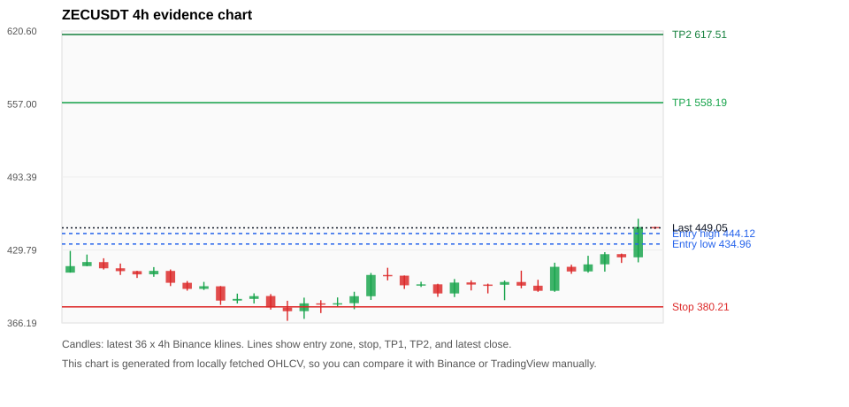
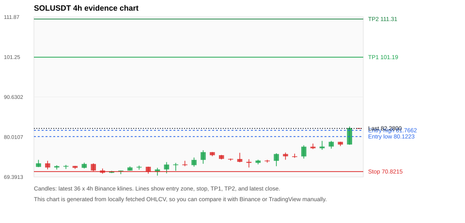
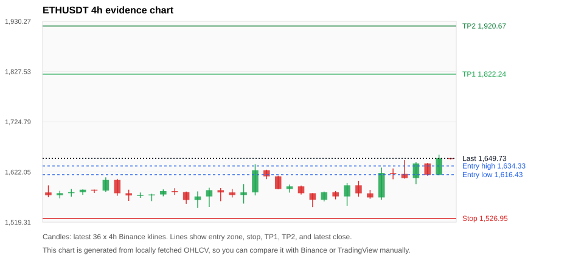
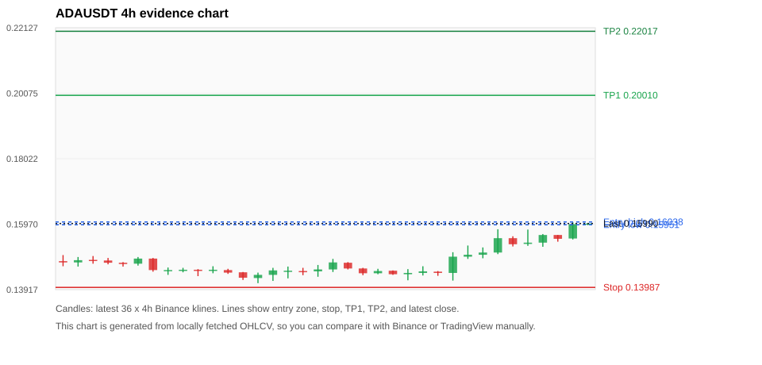
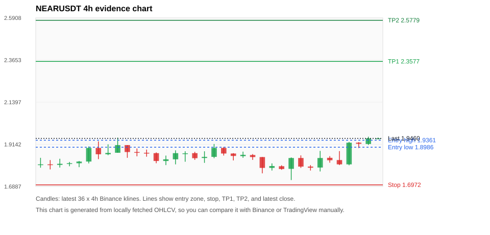

# Crypto 市场扫描报告 v1

- 报告时间：2026-07-02 20:06:45 CST
- Run ID：`20260702_120504_e19c34c5`
- Run type：`daily_full`
- 数据来源：SQLite
- 报告版本：v1
- 扫描 ID：ddf9572f5edf
- 数据源：Binance public spot API + CoinGecko/CoinMarketCap cross-check
- 过滤条件：USDT spot; 24h quote volume >= 30,000,000; trades >= 30,000; exclude stables/leveraged tokens; analyze 1h/4h/1d klines
- 默认单笔风险：账户权益的 1.00%

## 限制说明

- 交易信号仍以 Binance 现货公开 K 线为主源；外部数据源用于一致性复核。
- 结果是研究和模拟盘计划，不是确定收益或实盘下单指令。
- 历史长度过滤：候选币至少需要 180 根 1d K 线。
- 数据质量验证池：先验证 score 排名前 min(top_n * 2, 10) 的候选，再按 action + score 补足最终名单。
- 大盘环境过滤：RISK_OFF; BTC/ETH 大盘偏弱，山寨币买入候选降级为观察。 BTC 7d=2.564220490350211; ETH 7d=5.176548627410971.
- 已启用数据交叉验证：Binance 主源 + CoinGecko 自动对照；CoinMarketCap 在配置 API Key 后自动对照。
- ZECUSDT 交叉验证状态 DATA_WARNING：At least one external provider needs manual review.
- SOLUSDT 交叉验证状态 DATA_WARNING：At least one external provider needs manual review.
- ETHUSDT 交叉验证状态 DATA_WARNING：At least one external provider needs manual review.
- ADAUSDT 交叉验证状态 DATA_WARNING：At least one external provider needs manual review.
- BTCUSDT 交叉验证状态 DATA_WARNING：At least one external provider needs manual review.
- XRPUSDT 交叉验证状态 DATA_WARNING：At least one external provider needs manual review.
- BNBUSDT 交叉验证状态 DATA_WARNING：At least one external provider needs manual review.
- DOGEUSDT 交叉验证状态 DATA_WARNING：At least one external provider needs manual review.
- ENAUSDT 交叉验证状态 DATA_WARNING：At least one external provider needs manual review.

## 5 个候选交易计划

| Rank | Coin | Action | Setup | Entry Zone | Stop Loss | TP1 | TP2 / Exit Rule | R/R | Verdict |
|---:|---|---|---|---:|---:|---:|---|---:|---|
| 1 | `ZEC` | `WATCH_ONLY` | 回踩支撑/4h EMA 附近 | 434.96 - 444.12 | 380.21 | 558.19 | 617.51 或跌破 4h 关键支撑 | 2.00-3.00 | 只观察 |
| 2 | `SOL` | `WATCH_ONLY` | 趋势中，等回调入场 | 80.1223 - 81.7662 | 70.8215 | 101.19 | 111.31 或跌破 4h 关键支撑 | 2.00-3.00 | 只等回调 |
| 3 | `ETH` | `WATCH_ONLY` | 回踩支撑/4h EMA 附近 | 1,616.43 - 1,634.33 | 1,526.95 | 1,822.24 | 1,920.67 或跌破 4h 关键支撑 | 2.00-3.00 | 只观察 |
| 4 | `ADA` | `WATCH_ONLY` | 回踩支撑/4h EMA 附近 | 0.15951 - 0.16038 | 0.13987 | 0.20010 | 0.22017 或跌破 4h 关键支撑 | 2.00-3.00 | 只等回调 |
| 5 | `NEAR` | `WATCH_ONLY` | 回踩支撑/4h EMA 附近 | 1.8986 - 1.9361 | 1.6972 | 2.3577 | 2.5779 或跌破 4h 关键支撑 | 2.00-3.00 | 只观察 |

## 数据交叉验证摘要

价格差异以 Binance 当前价为基准；成交量口径不同，Binance 是 USDT 现货成交额，CoinGecko/CoinMarketCap 通常是全市场成交量。

| Rank | Coin | Data Status | Max Price Diff | Max 24h Diff | Message |
|---:|---|---|---:|---:|---|
| 1 | `ZEC` | DATA_WARNING | 0.20% | 0.25 pts | At least one external provider needs manual review. |
| 2 | `SOL` | DATA_WARNING | 0.15% | 0.04 pts | At least one external provider needs manual review. |
| 3 | `ETH` | DATA_WARNING | 0.21% | 0.06 pts | At least one external provider needs manual review. |
| 4 | `ADA` | DATA_WARNING | 0.32% | 0.08 pts | At least one external provider needs manual review. |
| 5 | `NEAR` | DATA_OK | 0.31% | 0.13 pts | External provider checks agree with Binance within configured thresholds. |

## 候选币说明

### 1. ZEC `ZECUSDT`



- 入选原因：回踩支撑/4h EMA 附近；24h +13.88%，7d +15.70%，4h RSI 74.82，24h 成交额 $100.7M。
- 交易失效条件：跌破 380.21 或 4h 收盘重新失守关键支撑。
- 主要风险：日线趋势未完全确认；BTC/ETH 大盘环境未确认强势，山寨币买入信号降级；数据交叉验证需要人工复核。
- 数据交叉验证：DATA_WARNING；At least one external provider needs manual review.

#### 可点击人工验证

- [Binance 交易页](https://www.binance.com/en/trade/ZEC_USDT)
- [TradingView 图表](https://www.tradingview.com/chart/?symbol=BINANCE%3AZECUSDT)
- [CoinGecko 搜索](https://www.coingecko.com/en/search?query=ZEC)
- [CoinMarketCap 搜索](https://coinmarketcap.com/search/?q=ZEC)

#### 多数据源对照

| Source | Status | Asset ID | Price | 24h Change | 24h Volume | Price Diff | 24h Diff | Updated | Message |
|---|---|---|---:|---:|---:|---:|---:|---|---|
| Binance | DATA_OK | ZECUSDT | 449.05 | +13.88% | $100.7M | 0.00% | 0.00 pts | 2026-07-02T12:06:00+00:00 | Primary market data source used by scanner. |
| CoinGecko | DATA_OK | zcash | 448.17 | +13.64% | $454.7M | 0.20% | 0.25 pts | 2026-07-02T12:05:48.919Z | External source agrees with Binance within thresholds. |
| CoinMarketCap | DATA_WARNING | 1437 | 448.59 | +14.00% | $531.0M | 0.10% | 0.11 pts | 2026-07-02T12:05:05.000Z | CoinMarketCap symbol mapping has 2 matches; selected lowest cmc_rank |

#### 指标证据

| 指标 | 数值 | 人工核对用途 |
|---|---:|---|
| 当前价 | 449.05 | 与 Binance/TradingView 当前价格对照 |
| 24h 涨跌 | +13.88% | 与交易所 24h 涨跌对照 |
| 7d 涨跌 | +15.70% | 判断短线趋势是否延续 |
| 4h EMA20 | 414.10 | 判断短期趋势支撑 |
| 4h EMA50 | 413.14 | 判断中期趋势支撑 |
| 1d EMA20 | 434.09 | 判断日线趋势 |
| 1d EMA50 | 453.12 | 判断日线趋势 |
| 4h RSI14 | 74.82 | 判断是否过热/过弱 |
| 4h ATR14 | 14.3271 | 推导止损和入场缓冲 |
| 最近 18 根 4h 最低点 | 386.00 | 支撑/止损参考 |
| 最近 36 根 4h 最高点 | 457.01 | TP/压力参考 |
| 支撑位 | 434.09 | 入场区间推导基础 |

#### 交易计划推导

- 支撑位 = 最近低点、4h EMA20、4h EMA50、1d EMA20 中不高于当前价的最高有效支撑 = `434.09`。
- 入场区间 = 支撑位附近 + ATR 缓冲 = `434.96 - 444.12`。
- 止损 = min(最近 18 根 4h 最低点 * 0.985, 入场中位价 - 1.15 * ATR14) = `380.21`。
- TP1 = max(最近 36 根 4h 最高点 * 0.995, 入场中位价 + 2R) = `558.19`。
- TP2 = max(入场中位价 + 3R, TP1 * 1.04) = `617.51`。

#### 最近 10 根 4h K线

| UTC 开盘时间 | Open | High | Low | Close | Quote Volume | Trades |
|---|---:|---:|---:|---:|---:|---:|
| 2026-07-01T00:00+00:00 | 399.48 | 403.13 | 386.00 | 401.86 | $9.1M | 45702 |
| 2026-07-01T04:00+00:00 | 401.88 | 411.75 | 396.38 | 398.69 | $15.6M | 53481 |
| 2026-07-01T08:00+00:00 | 398.64 | 403.80 | 393.30 | 394.21 | $7.2M | 33638 |
| 2026-07-01T12:00+00:00 | 394.21 | 418.69 | 393.30 | 415.10 | $17.7M | 84047 |
| 2026-07-01T16:00+00:00 | 415.11 | 416.92 | 409.00 | 411.03 | $8.4M | 41150 |
| 2026-07-01T20:00+00:00 | 411.10 | 424.72 | 410.00 | 417.21 | $15.0M | 56454 |
| 2026-07-02T00:00+00:00 | 417.27 | 427.88 | 410.89 | 426.10 | $15.2M | 54739 |
| 2026-07-02T04:00+00:00 | 426.16 | 426.63 | 418.50 | 423.37 | $10.7M | 49092 |
| 2026-07-02T08:00+00:00 | 423.37 | 457.01 | 419.00 | 449.80 | $33.6M | 115735 |
| 2026-07-02T12:00+00:00 | 449.80 | 449.88 | 447.92 | 449.08 | $429,802 | 2921 |

### 2. SOL `SOLUSDT`



- 入选原因：趋势中，等回调入场；24h +10.09%，7d +28.10%，4h RSI 78.71，24h 成交额 $326.1M。
- 交易失效条件：跌破 70.8215 或 4h 收盘重新失守关键支撑。
- 主要风险：4h RSI 偏热；日线趋势未完全确认；BTC/ETH 大盘环境未确认强势，山寨币买入信号降级；数据交叉验证需要人工复核。
- 数据交叉验证：DATA_WARNING；At least one external provider needs manual review.

#### 可点击人工验证

- [Binance 交易页](https://www.binance.com/en/trade/SOL_USDT)
- [TradingView 图表](https://www.tradingview.com/chart/?symbol=BINANCE%3ASOLUSDT)
- [CoinGecko 搜索](https://www.coingecko.com/en/search?query=SOL)
- [CoinMarketCap 搜索](https://coinmarketcap.com/search/?q=SOL)

#### 多数据源对照

| Source | Status | Asset ID | Price | 24h Change | 24h Volume | Price Diff | 24h Diff | Updated | Message |
|---|---|---|---:|---:|---:|---:|---:|---|---|
| Binance | DATA_OK | SOLUSDT | 82.2800 | +10.09% | $326.1M | 0.00% | 0.00 pts | 2026-07-02T12:06:00+00:00 | Primary market data source used by scanner. |
| CoinGecko | DATA_OK | solana | 82.1600 | +10.05% | $4.13B | 0.15% | 0.04 pts | 2026-07-02T12:05:49.133Z | External source agrees with Binance within thresholds. |
| CoinMarketCap | DATA_WARNING | 5426 | 82.1649 | +10.07% | $4.46B | 0.14% | 0.02 pts | 2026-07-02T12:05:05.000Z | CoinMarketCap symbol mapping has 8 matches; selected lowest cmc_rank |

#### 指标证据

| 指标 | 数值 | 人工核对用途 |
|---|---:|---|
| 当前价 | 82.2800 | 与 Binance/TradingView 当前价格对照 |
| 24h 涨跌 | +10.09% | 与交易所 24h 涨跌对照 |
| 7d 涨跌 | +28.10% | 判断短线趋势是否延续 |
| 4h EMA20 | 76.4779 | 判断短期趋势支撑 |
| 4h EMA50 | 73.9389 | 判断中期趋势支撑 |
| 1d EMA20 | 73.2217 | 判断日线趋势 |
| 1d EMA50 | 75.6153 | 判断日线趋势 |
| 4h RSI14 | 78.71 | 判断是否过热/过弱 |
| 4h ATR14 | 2.0550 | 推导止损和入场缓冲 |
| 最近 18 根 4h 最低点 | 71.9000 | 支撑/止损参考 |
| 最近 36 根 4h 最高点 | 82.7800 | TP/压力参考 |
| 支撑位 | 76.4779 | 入场区间推导基础 |

#### 交易计划推导

- 支撑位 = 最近低点、4h EMA20、4h EMA50、1d EMA20 中不高于当前价的最高有效支撑 = `76.4779`。
- 入场区间 = 支撑位附近 + ATR 缓冲 = `80.1223 - 81.7662`。
- 止损 = min(最近 18 根 4h 最低点 * 0.985, 入场中位价 - 1.15 * ATR14) = `70.8215`。
- TP1 = max(最近 36 根 4h 最高点 * 0.995, 入场中位价 + 2R) = `101.19`。
- TP2 = max(入场中位价 + 3R, TP1 * 1.04) = `111.31`。

#### 最近 10 根 4h K线

| UTC 开盘时间 | Open | High | Low | Close | Quote Volume | Trades |
|---|---:|---:|---:|---:|---:|---:|
| 2026-07-01T00:00+00:00 | 73.6700 | 75.6900 | 72.2500 | 75.4800 | $45.1M | 244428 |
| 2026-07-01T04:00+00:00 | 75.4800 | 75.8700 | 73.9600 | 74.8700 | $34.7M | 159932 |
| 2026-07-01T08:00+00:00 | 74.8700 | 75.5800 | 74.4600 | 74.8400 | $37.1M | 156857 |
| 2026-07-01T12:00+00:00 | 74.8400 | 77.8000 | 74.2700 | 77.4300 | $80.1M | 389474 |
| 2026-07-01T16:00+00:00 | 77.4300 | 78.2500 | 76.8000 | 77.0000 | $39.0M | 167760 |
| 2026-07-01T20:00+00:00 | 77.0100 | 78.9600 | 76.5900 | 77.4600 | $38.5M | 174603 |
| 2026-07-02T00:00+00:00 | 77.4600 | 78.9600 | 76.9000 | 78.7200 | $34.4M | 159407 |
| 2026-07-02T04:00+00:00 | 78.7100 | 78.7200 | 77.5900 | 77.9900 | $22.9M | 107493 |
| 2026-07-02T08:00+00:00 | 78.0000 | 82.7800 | 77.9400 | 82.3800 | $109.9M | 401272 |
| 2026-07-02T12:00+00:00 | 82.3700 | 82.3800 | 82.1500 | 82.2800 | $1.6M | 7578 |

### 3. ETH `ETHUSDT`



- 入选原因：回踩支撑/4h EMA 附近；24h +5.14%，7d +7.25%，4h RSI 61.54，24h 成交额 $561.4M。
- 交易失效条件：跌破 1526.947 或 4h 收盘重新失守关键支撑。
- 主要风险：日线趋势未完全确认；BTC/ETH 大盘环境未确认强势，山寨币买入信号降级；数据交叉验证需要人工复核。
- 数据交叉验证：DATA_WARNING；At least one external provider needs manual review.

#### 可点击人工验证

- [Binance 交易页](https://www.binance.com/en/trade/ETH_USDT)
- [TradingView 图表](https://www.tradingview.com/chart/?symbol=BINANCE%3AETHUSDT)
- [CoinGecko 搜索](https://www.coingecko.com/en/search?query=ETH)
- [CoinMarketCap 搜索](https://coinmarketcap.com/search/?q=ETH)

#### 多数据源对照

| Source | Status | Asset ID | Price | 24h Change | 24h Volume | Price Diff | 24h Diff | Updated | Message |
|---|---|---|---:|---:|---:|---:|---:|---|---|
| Binance | DATA_OK | ETHUSDT | 1,649.73 | +5.14% | $561.4M | 0.00% | 0.00 pts | 2026-07-02T12:06:00+00:00 | Primary market data source used by scanner. |
| CoinGecko | DATA_OK | ethereum | 1,646.28 | +5.13% | $11.57B | 0.21% | 0.01 pts | 2026-07-02T12:05:55.740Z | External source agrees with Binance within thresholds. |
| CoinMarketCap | DATA_WARNING | 1027 | 1,646.29 | +5.08% | $12.62B | 0.21% | 0.06 pts | 2026-07-02T12:05:05.000Z | CoinMarketCap symbol mapping has 6 matches; selected lowest cmc_rank |

#### 指标证据

| 指标 | 数值 | 人工核对用途 |
|---|---:|---|
| 当前价 | 1,649.73 | 与 Binance/TradingView 当前价格对照 |
| 24h 涨跌 | +5.14% | 与交易所 24h 涨跌对照 |
| 7d 涨跌 | +7.25% | 判断短线趋势是否延续 |
| 4h EMA20 | 1,607.84 | 判断短期趋势支撑 |
| 4h EMA50 | 1,613.20 | 判断中期趋势支撑 |
| 1d EMA20 | 1,662.08 | 判断日线趋势 |
| 1d EMA50 | 1,810.46 | 判断日线趋势 |
| 4h RSI14 | 61.54 | 判断是否过热/过弱 |
| 4h ATR14 | 30.1736 | 推导止损和入场缓冲 |
| 最近 18 根 4h 最低点 | 1,550.20 | 支撑/止损参考 |
| 最近 36 根 4h 最高点 | 1,657.53 | TP/压力参考 |
| 支撑位 | 1,613.20 | 入场区间推导基础 |

#### 交易计划推导

- 支撑位 = 最近低点、4h EMA20、4h EMA50、1d EMA20 中不高于当前价的最高有效支撑 = `1,613.20`。
- 入场区间 = 支撑位附近 + ATR 缓冲 = `1,616.43 - 1,634.33`。
- 止损 = min(最近 18 根 4h 最低点 * 0.985, 入场中位价 - 1.15 * ATR14) = `1,526.95`。
- TP1 = max(最近 36 根 4h 最高点 * 0.995, 入场中位价 + 2R) = `1,822.24`。
- TP2 = max(入场中位价 + 3R, TP1 * 1.04) = `1,920.67`。

#### 最近 10 根 4h K线

| UTC 开盘时间 | Open | High | Low | Close | Quote Volume | Trades |
|---|---:|---:|---:|---:|---:|---:|
| 2026-07-01T00:00+00:00 | 1,572.00 | 1,599.19 | 1,552.92 | 1,594.81 | $78.5M | 468108 |
| 2026-07-01T04:00+00:00 | 1,594.81 | 1,604.02 | 1,571.50 | 1,578.36 | $63.4M | 320098 |
| 2026-07-01T08:00+00:00 | 1,578.36 | 1,585.33 | 1,567.13 | 1,569.89 | $41.2M | 234375 |
| 2026-07-01T12:00+00:00 | 1,569.88 | 1,631.00 | 1,565.26 | 1,620.09 | $151.4M | 806999 |
| 2026-07-01T16:00+00:00 | 1,620.10 | 1,629.26 | 1,607.17 | 1,618.09 | $66.7M | 368021 |
| 2026-07-01T20:00+00:00 | 1,618.07 | 1,646.26 | 1,608.35 | 1,609.58 | $89.3M | 480997 |
| 2026-07-02T00:00+00:00 | 1,609.59 | 1,642.32 | 1,597.22 | 1,639.47 | $73.2M | 372317 |
| 2026-07-02T04:00+00:00 | 1,639.46 | 1,639.94 | 1,614.32 | 1,615.97 | $64.8M | 360988 |
| 2026-07-02T08:00+00:00 | 1,615.97 | 1,657.53 | 1,615.08 | 1,650.32 | $116.1M | 474667 |
| 2026-07-02T12:00+00:00 | 1,650.31 | 1,650.31 | 1,647.66 | 1,649.73 | $952,628 | 7145 |

### 4. ADA `ADAUSDT`



- 入选原因：回踩支撑/4h EMA 附近；24h +5.97%，7d +15.12%，4h RSI 80.91，24h 成交额 $31.1M。
- 交易失效条件：跌破 0.13987 或 4h 收盘重新失守关键支撑。
- 主要风险：4h RSI 偏热；日线趋势未完全确认；BTC/ETH 大盘环境未确认强势，山寨币买入信号降级；数据交叉验证需要人工复核。
- 数据交叉验证：DATA_WARNING；At least one external provider needs manual review.

#### 可点击人工验证

- [Binance 交易页](https://www.binance.com/en/trade/ADA_USDT)
- [TradingView 图表](https://www.tradingview.com/chart/?symbol=BINANCE%3AADAUSDT)
- [CoinGecko 搜索](https://www.coingecko.com/en/search?query=ADA)
- [CoinMarketCap 搜索](https://coinmarketcap.com/search/?q=ADA)

#### 多数据源对照

| Source | Status | Asset ID | Price | 24h Change | 24h Volume | Price Diff | 24h Diff | Updated | Message |
|---|---|---|---:|---:|---:|---:|---:|---|---|
| Binance | DATA_OK | ADAUSDT | 0.15990 | +5.97% | $31.1M | 0.00% | 0.00 pts | 2026-07-02T12:06:00+00:00 | Primary market data source used by scanner. |
| CoinGecko | DATA_OK | cardano | 0.15938 | +5.89% | $483.7M | 0.32% | 0.08 pts | 2026-07-02T12:05:55.243Z | External source agrees with Binance within thresholds. |
| CoinMarketCap | DATA_WARNING | 2010 | 0.15946 | +5.99% | $506.9M | 0.28% | 0.03 pts | 2026-07-02T12:05:05.000Z | CoinMarketCap symbol mapping has 3 matches; selected lowest cmc_rank |

#### 指标证据

| 指标 | 数值 | 人工核对用途 |
|---|---:|---|
| 当前价 | 0.15990 | 与 Binance/TradingView 当前价格对照 |
| 24h 涨跌 | +5.97% | 与交易所 24h 涨跌对照 |
| 7d 涨跌 | +15.12% | 判断短线趋势是否延续 |
| 4h EMA20 | 0.15164 | 判断短期趋势支撑 |
| 4h EMA50 | 0.15080 | 判断中期趋势支撑 |
| 1d EMA20 | 0.15919 | 判断日线趋势 |
| 1d EMA50 | 0.18621 | 判断日线趋势 |
| 4h RSI14 | 80.91 | 判断是否过热/过弱 |
| 4h ATR14 | 0.00385 | 推导止损和入场缓冲 |
| 最近 18 根 4h 最低点 | 0.14200 | 支撑/止损参考 |
| 最近 36 根 4h 最高点 | 0.16030 | TP/压力参考 |
| 支撑位 | 0.15919 | 入场区间推导基础 |

#### 交易计划推导

- 支撑位 = 最近低点、4h EMA20、4h EMA50、1d EMA20 中不高于当前价的最高有效支撑 = `0.15919`。
- 入场区间 = 支撑位附近 + ATR 缓冲 = `0.15951 - 0.16038`。
- 止损 = min(最近 18 根 4h 最低点 * 0.985, 入场中位价 - 1.15 * ATR14) = `0.13987`。
- TP1 = max(最近 36 根 4h 最高点 * 0.995, 入场中位价 + 2R) = `0.20010`。
- TP2 = max(入场中位价 + 3R, TP1 * 1.04) = `0.22017`。

#### 最近 10 根 4h K线

| UTC 开盘时间 | Open | High | Low | Close | Quote Volume | Trades |
|---|---:|---:|---:|---:|---:|---:|
| 2026-07-01T00:00+00:00 | 0.14440 | 0.15090 | 0.14200 | 0.14950 | $6.9M | 21802 |
| 2026-07-01T04:00+00:00 | 0.14950 | 0.15300 | 0.14880 | 0.15010 | $9.1M | 28306 |
| 2026-07-01T08:00+00:00 | 0.15010 | 0.15240 | 0.14900 | 0.15080 | $4.5M | 19692 |
| 2026-07-01T12:00+00:00 | 0.15080 | 0.15810 | 0.15030 | 0.15530 | $10.5M | 43263 |
| 2026-07-01T16:00+00:00 | 0.15530 | 0.15590 | 0.15270 | 0.15340 | $3.9M | 15746 |
| 2026-07-01T20:00+00:00 | 0.15350 | 0.15800 | 0.15290 | 0.15390 | $4.1M | 19284 |
| 2026-07-02T00:00+00:00 | 0.15390 | 0.15660 | 0.15260 | 0.15630 | $4.4M | 15454 |
| 2026-07-02T04:00+00:00 | 0.15630 | 0.15630 | 0.15420 | 0.15510 | $2.2M | 10190 |
| 2026-07-02T08:00+00:00 | 0.15520 | 0.16030 | 0.15490 | 0.15970 | $5.8M | 19887 |
| 2026-07-02T12:00+00:00 | 0.15960 | 0.15990 | 0.15940 | 0.15990 | $121,151 | 420 |

### 5. NEAR `NEARUSDT`



- 入选原因：回踩支撑/4h EMA 附近；24h +9.03%，7d +7.40%，4h RSI 59.91，24h 成交额 $43.9M。
- 交易失效条件：跌破 1.697155 或 4h 收盘重新失守关键支撑。
- 主要风险：日线趋势未完全确认；BTC/ETH 大盘环境未确认强势，山寨币买入信号降级。
- 数据交叉验证：DATA_OK；External provider checks agree with Binance within configured thresholds.

#### 可点击人工验证

- [Binance 交易页](https://www.binance.com/en/trade/NEAR_USDT)
- [TradingView 图表](https://www.tradingview.com/chart/?symbol=BINANCE%3ANEARUSDT)
- [CoinGecko 搜索](https://www.coingecko.com/en/search?query=NEAR)
- [CoinMarketCap 搜索](https://coinmarketcap.com/search/?q=NEAR)

#### 多数据源对照

| Source | Status | Asset ID | Price | 24h Change | 24h Volume | Price Diff | 24h Diff | Updated | Message |
|---|---|---|---:|---:|---:|---:|---:|---|---|
| Binance | DATA_OK | NEARUSDT | 1.9460 | +9.03% | $43.9M | 0.00% | 0.00 pts | 2026-07-02T12:06:00+00:00 | Primary market data source used by scanner. |
| CoinGecko | DATA_OK | near | 1.9400 | +9.16% | $283.4M | 0.31% | 0.13 pts | 2026-07-02T12:06:03.454Z | External source agrees with Binance within thresholds. |
| CoinMarketCap | DATA_OK | 6535 | 1.9429 | +9.04% | $297.5M | 0.16% | 0.01 pts | 2026-07-02T12:05:05.000Z | External source agrees with Binance within thresholds. |

#### 指标证据

| 指标 | 数值 | 人工核对用途 |
|---|---:|---|
| 当前价 | 1.9460 | 与 Binance/TradingView 当前价格对照 |
| 24h 涨跌 | +9.03% | 与交易所 24h 涨跌对照 |
| 7d 涨跌 | +7.40% | 判断短线趋势是否延续 |
| 4h EMA20 | 1.8652 | 判断短期趋势支撑 |
| 4h EMA50 | 1.8948 | 判断中期趋势支撑 |
| 1d EMA20 | 1.9742 | 判断日线趋势 |
| 1d EMA50 | 1.9660 | 判断日线趋势 |
| 4h RSI14 | 59.91 | 判断是否过热/过弱 |
| 4h ATR14 | 0.05900 | 推导止损和入场缓冲 |
| 最近 18 根 4h 最低点 | 1.7230 | 支撑/止损参考 |
| 最近 36 根 4h 最高点 | 1.9550 | TP/压力参考 |
| 支撑位 | 1.8948 | 入场区间推导基础 |

#### 交易计划推导

- 支撑位 = 最近低点、4h EMA20、4h EMA50、1d EMA20 中不高于当前价的最高有效支撑 = `1.8948`。
- 入场区间 = 支撑位附近 + ATR 缓冲 = `1.8986 - 1.9361`。
- 止损 = min(最近 18 根 4h 最低点 * 0.985, 入场中位价 - 1.15 * ATR14) = `1.6972`。
- TP1 = max(最近 36 根 4h 最高点 * 0.995, 入场中位价 + 2R) = `2.3577`。
- TP2 = max(入场中位价 + 3R, TP1 * 1.04) = `2.5779`。

#### 最近 10 根 4h K线

| UTC 开盘时间 | Open | High | Low | Close | Quote Volume | Trades |
|---|---:|---:|---:|---:|---:|---:|
| 2026-07-01T00:00+00:00 | 1.7830 | 1.8440 | 1.7230 | 1.8410 | $7.9M | 39489 |
| 2026-07-01T04:00+00:00 | 1.8410 | 1.8550 | 1.7880 | 1.7950 | $4.3M | 26072 |
| 2026-07-01T08:00+00:00 | 1.7950 | 1.8030 | 1.7740 | 1.7890 | $5.7M | 23995 |
| 2026-07-01T12:00+00:00 | 1.7900 | 1.8790 | 1.7690 | 1.8410 | $10.0M | 51770 |
| 2026-07-01T16:00+00:00 | 1.8420 | 1.8510 | 1.8160 | 1.8290 | $6.1M | 28215 |
| 2026-07-01T20:00+00:00 | 1.8300 | 1.8780 | 1.8030 | 1.8070 | $5.0M | 33209 |
| 2026-07-02T00:00+00:00 | 1.8070 | 1.9270 | 1.8020 | 1.9230 | $12.7M | 50839 |
| 2026-07-02T04:00+00:00 | 1.9230 | 1.9260 | 1.8940 | 1.9170 | $3.8M | 28715 |
| 2026-07-02T08:00+00:00 | 1.9160 | 1.9550 | 1.9110 | 1.9460 | $6.3M | 37962 |
| 2026-07-02T12:00+00:00 | 1.9460 | 1.9500 | 1.9420 | 1.9460 | $100,845 | 749 |

## 组合风控

- 不要 5 个候选全部满仓买入。
- 同时持仓总风险建议控制在账户权益的 3% - 5% 以内。
- 如果 BTC/ETH 同时破位，暂停山寨币多头计划或降低仓位。
- 第一版报告用于模拟盘和人工复核，不自动下单。

## 原始数据

```json
[
  {
    "rank": 1,
    "symbol": "ZECUSDT",
    "base_asset": "ZEC",
    "price": 449.05,
    "score": 60.25552299883286,
    "setup": "回踩支撑/4h EMA 附近",
    "verdict": "只观察",
    "entry_low": 434.9550934565999,
    "entry_high": 444.1159196173652,
    "stop_loss": 380.21,
    "take_profit_1": 558.1865196109477,
    "take_profit_2": 617.5120261479303,
    "risk_reward_1": 2.0,
    "risk_reward_2": 3.000000000000001,
    "pct_24h": 13.885,
    "pct_3d": 16.927924174565145,
    "pct_7d": 15.704715279567116,
    "quote_volume_24h": 100702904.16175,
    "trades_24h": 402824,
    "high_low_range_24h": 16.198830409356724,
    "rsi_1h": 73.09311331874052,
    "rsi_4h": 74.81854838709671,
    "ema20_4h": 414.0980538129503,
    "ema50_4h": 413.14038218813937,
    "ema20_1d": 434.0869196173652,
    "ema50_1d": 453.1165434021464,
    "atr_4h": 14.32714285714286,
    "macd_hist_4h": 5.919889851619445,
    "volume_ratio_24h": 1.2533486772098752,
    "support_level": 434.0869196173652,
    "recent_low_4h_18": 386.0,
    "recent_high_4h_36": 457.01,
    "distance_to_support_pct": 3.4470240190200396,
    "binance_trade_url": "https://www.binance.com/en/trade/ZEC_USDT",
    "tradingview_url": "https://www.tradingview.com/chart/?symbol=BINANCE%3AZECUSDT",
    "coingecko_search_url": "https://www.coingecko.com/en/search?query=ZEC",
    "coinmarketcap_search_url": "https://coinmarketcap.com/search/?q=ZEC",
    "invalidation": "跌破 380.21 或 4h 收盘重新失守关键支撑",
    "recent_4h_klines": [
      {
        "open_time_utc": "2026-06-26T16:00+00:00",
        "open": 410.05,
        "high": 428.95,
        "low": 410.05,
        "close": 415.7,
        "quote_volume": 42602304.85259,
        "trades": 132540
      },
      {
        "open_time_utc": "2026-06-26T20:00+00:00",
        "open": 415.73,
        "high": 425.78,
        "low": 415.73,
        "close": 419.27,
        "quote_volume": 11530963.86096,
        "trades": 48541
      },
      {
        "open_time_utc": "2026-06-27T00:00+00:00",
        "open": 419.21,
        "high": 422.54,
        "low": 412.74,
        "close": 413.8,
        "quote_volume": 6593177.67224,
        "trades": 35821
      },
      {
        "open_time_utc": "2026-06-27T04:00+00:00",
        "open": 413.82,
        "high": 417.96,
        "low": 408.0,
        "close": 411.34,
        "quote_volume": 6467368.86626,
        "trades": 29530
      },
      {
        "open_time_utc": "2026-06-27T08:00+00:00",
        "open": 411.35,
        "high": 411.62,
        "low": 405.4,
        "close": 408.5,
        "quote_volume": 5990264.57108,
        "trades": 26882
      },
      {
        "open_time_utc": "2026-06-27T12:00+00:00",
        "open": 408.57,
        "high": 414.84,
        "low": 406.42,
        "close": 411.58,
        "quote_volume": 7530207.2721,
        "trades": 34095
      },
      {
        "open_time_utc": "2026-06-27T16:00+00:00",
        "open": 411.51,
        "high": 412.79,
        "low": 398.34,
        "close": 401.18,
        "quote_volume": 13581344.42343,
        "trades": 43745
      },
      {
        "open_time_utc": "2026-06-27T20:00+00:00",
        "open": 401.18,
        "high": 402.69,
        "low": 394.31,
        "close": 395.86,
        "quote_volume": 8784785.22727,
        "trades": 33908
      },
      {
        "open_time_utc": "2026-06-28T00:00+00:00",
        "open": 395.87,
        "high": 401.96,
        "low": 394.92,
        "close": 398.19,
        "quote_volume": 5264317.5426,
        "trades": 22904
      },
      {
        "open_time_utc": "2026-06-28T04:00+00:00",
        "open": 398.11,
        "high": 398.29,
        "low": 381.92,
        "close": 385.66,
        "quote_volume": 12527322.94808,
        "trades": 52137
      },
      {
        "open_time_utc": "2026-06-28T08:00+00:00",
        "open": 385.66,
        "high": 391.75,
        "low": 383.17,
        "close": 387.13,
        "quote_volume": 8333346.00796,
        "trades": 37449
      },
      {
        "open_time_utc": "2026-06-28T12:00+00:00",
        "open": 387.14,
        "high": 392.0,
        "low": 383.15,
        "close": 389.54,
        "quote_volume": 8110238.39834,
        "trades": 37552
      },
      {
        "open_time_utc": "2026-06-28T16:00+00:00",
        "open": 389.65,
        "high": 391.33,
        "low": 377.83,
        "close": 379.85,
        "quote_volume": 8719283.13137,
        "trades": 40947
      },
      {
        "open_time_utc": "2026-06-28T20:00+00:00",
        "open": 379.7,
        "high": 385.52,
        "low": 368.03,
        "close": 376.41,
        "quote_volume": 13532960.36496,
        "trades": 68670
      },
      {
        "open_time_utc": "2026-06-29T00:00+00:00",
        "open": 376.45,
        "high": 388.23,
        "low": 369.76,
        "close": 383.26,
        "quote_volume": 12198130.70748,
        "trades": 60957
      },
      {
        "open_time_utc": "2026-06-29T04:00+00:00",
        "open": 383.26,
        "high": 385.98,
        "low": 374.79,
        "close": 382.35,
        "quote_volume": 6991923.18204,
        "trades": 33991
      },
      {
        "open_time_utc": "2026-06-29T08:00+00:00",
        "open": 382.35,
        "high": 388.4,
        "low": 380.28,
        "close": 383.37,
        "quote_volume": 6757970.98995,
        "trades": 37944
      },
      {
        "open_time_utc": "2026-06-29T12:00+00:00",
        "open": 383.42,
        "high": 393.37,
        "low": 378.16,
        "close": 389.51,
        "quote_volume": 22767610.73099,
        "trades": 100882
      },
      {
        "open_time_utc": "2026-06-29T16:00+00:00",
        "open": 389.47,
        "high": 409.72,
        "low": 386.26,
        "close": 408.01,
        "quote_volume": 19394007.59298,
        "trades": 73799
      },
      {
        "open_time_utc": "2026-06-29T20:00+00:00",
        "open": 408.0,
        "high": 414.26,
        "low": 403.28,
        "close": 407.5,
        "quote_volume": 11159975.95779,
        "trades": 44742
      },
      {
        "open_time_utc": "2026-06-30T00:00+00:00",
        "open": 407.4,
        "high": 407.48,
        "low": 395.81,
        "close": 399.0,
        "quote_volume": 13108744.19697,
        "trades": 45951
      },
      {
        "open_time_utc": "2026-06-30T04:00+00:00",
        "open": 398.96,
        "high": 402.07,
        "low": 397.53,
        "close": 399.84,
        "quote_volume": 4920264.76918,
        "trades": 22346
      },
      {
        "open_time_utc": "2026-06-30T08:00+00:00",
        "open": 399.84,
        "high": 400.34,
        "low": 388.9,
        "close": 391.89,
        "quote_volume": 10526728.61044,
        "trades": 43170
      },
      {
        "open_time_utc": "2026-06-30T12:00+00:00",
        "open": 391.89,
        "high": 404.47,
        "low": 388.72,
        "close": 401.36,
        "quote_volume": 20016563.65372,
        "trades": 86505
      },
      {
        "open_time_utc": "2026-06-30T16:00+00:00",
        "open": 401.49,
        "high": 403.3,
        "low": 394.51,
        "close": 399.63,
        "quote_volume": 7311786.42984,
        "trades": 35799
      },
      {
        "open_time_utc": "2026-06-30T20:00+00:00",
        "open": 399.65,
        "high": 400.43,
        "low": 391.95,
        "close": 399.5,
        "quote_volume": 5665336.96688,
        "trades": 31494
      },
      {
        "open_time_utc": "2026-07-01T00:00+00:00",
        "open": 399.48,
        "high": 403.13,
        "low": 386.0,
        "close": 401.86,
        "quote_volume": 9081742.30464,
        "trades": 45702
      },
      {
        "open_time_utc": "2026-07-01T04:00+00:00",
        "open": 401.88,
        "high": 411.75,
        "low": 396.38,
        "close": 398.69,
        "quote_volume": 15569748.76693,
        "trades": 53481
      },
      {
        "open_time_utc": "2026-07-01T08:00+00:00",
        "open": 398.64,
        "high": 403.8,
        "low": 393.3,
        "close": 394.21,
        "quote_volume": 7176959.32252,
        "trades": 33638
      },
      {
        "open_time_utc": "2026-07-01T12:00+00:00",
        "open": 394.21,
        "high": 418.69,
        "low": 393.3,
        "close": 415.1,
        "quote_volume": 17708602.24306,
        "trades": 84047
      },
      {
        "open_time_utc": "2026-07-01T16:00+00:00",
        "open": 415.11,
        "high": 416.92,
        "low": 409.0,
        "close": 411.03,
        "quote_volume": 8447470.7249,
        "trades": 41150
      },
      {
        "open_time_utc": "2026-07-01T20:00+00:00",
        "open": 411.1,
        "high": 424.72,
        "low": 410.0,
        "close": 417.21,
        "quote_volume": 14974964.08625,
        "trades": 56454
      },
      {
        "open_time_utc": "2026-07-02T00:00+00:00",
        "open": 417.27,
        "high": 427.88,
        "low": 410.89,
        "close": 426.1,
        "quote_volume": 15192802.61942,
        "trades": 54739
      },
      {
        "open_time_utc": "2026-07-02T04:00+00:00",
        "open": 426.16,
        "high": 426.63,
        "low": 418.5,
        "close": 423.37,
        "quote_volume": 10704650.12398,
        "trades": 49092
      },
      {
        "open_time_utc": "2026-07-02T08:00+00:00",
        "open": 423.37,
        "high": 457.01,
        "low": 419.0,
        "close": 449.8,
        "quote_volume": 33553702.779,
        "trades": 115735
      },
      {
        "open_time_utc": "2026-07-02T12:00+00:00",
        "open": 449.8,
        "high": 449.88,
        "low": 447.92,
        "close": 449.08,
        "quote_volume": 429802.0762,
        "trades": 2921
      }
    ],
    "risks": [
      "日线趋势未完全确认",
      "BTC/ETH 大盘环境未确认强势，山寨币买入信号降级",
      "数据交叉验证需要人工复核"
    ],
    "data_quality_status": "DATA_WARNING",
    "data_quality_message": "At least one external provider needs manual review.",
    "data_checks": [
      {
        "provider": "Binance",
        "status": "DATA_OK",
        "provider_asset_id": "ZECUSDT",
        "provider_symbol": "ZECUSDT",
        "price_usd": 449.05,
        "pct_24h": 13.885,
        "volume_24h": 100702904.16175,
        "last_updated": null,
        "fetched_at_utc": "2026-07-02T12:06:00+00:00",
        "price_diff_pct": 0.0,
        "pct_24h_diff": 0.0,
        "volume_note": "Binance USDT spot 24h quoteVolume.",
        "message": "Primary market data source used by scanner."
      },
      {
        "provider": "CoinGecko",
        "status": "DATA_OK",
        "provider_asset_id": "zcash",
        "provider_symbol": "ZEC",
        "price_usd": 448.17,
        "pct_24h": 13.63757,
        "volume_24h": 454698719.0,
        "last_updated": "2026-07-02T12:05:48.919Z",
        "fetched_at_utc": "2026-07-02T12:06:00+00:00",
        "price_diff_pct": 0.1959692684556275,
        "pct_24h_diff": 0.2474299999999996,
        "volume_note": "CoinGecko total market volume; not the same venue scope as Binance quoteVolume.",
        "message": "External source agrees with Binance within thresholds."
      },
      {
        "provider": "CoinMarketCap",
        "status": "DATA_WARNING",
        "provider_asset_id": "1437",
        "provider_symbol": "ZEC",
        "price_usd": 448.5885210912058,
        "pct_24h": 13.99798024,
        "volume_24h": 531032656.88793486,
        "last_updated": "2026-07-02T12:05:05.000Z",
        "fetched_at_utc": "2026-07-02T12:06:00+00:00",
        "price_diff_pct": 0.1027678229137557,
        "pct_24h_diff": 0.11298024000000062,
        "volume_note": "CoinMarketCap total market volume; not the same venue scope as Binance quoteVolume.",
        "message": "CoinMarketCap symbol mapping has 2 matches; selected lowest cmc_rank"
      }
    ],
    "action": "WATCH_ONLY"
  },
  {
    "rank": 2,
    "symbol": "SOLUSDT",
    "base_asset": "SOL",
    "price": 82.28,
    "score": 47.591152282715555,
    "setup": "趋势中，等回调入场",
    "verdict": "只等回调",
    "entry_low": 80.12225000000001,
    "entry_high": 81.76625,
    "stop_loss": 70.8215,
    "take_profit_1": 101.18975000000003,
    "take_profit_2": 111.31250000000004,
    "risk_reward_1": 2.0,
    "risk_reward_2": 3.0,
    "pct_24h": 10.092,
    "pct_3d": 11.581231353403854,
    "pct_7d": 28.10213295967616,
    "quote_volume_24h": 326086720.85527,
    "trades_24h": 1404018,
    "high_low_range_24h": 11.458193079305246,
    "rsi_1h": 79.51807228915672,
    "rsi_4h": 78.7128712871287,
    "ema20_4h": 76.47789768194424,
    "ema50_4h": 73.9388822281415,
    "ema20_1d": 73.2217490403918,
    "ema50_1d": 75.61532010160431,
    "atr_4h": 2.0549999999999975,
    "macd_hist_4h": 0.6642180559074227,
    "volume_ratio_24h": 1.4087384825552434,
    "support_level": 76.47789768194424,
    "recent_low_4h_18": 71.9,
    "recent_high_4h_36": 82.78,
    "distance_to_support_pct": 7.586639400295114,
    "binance_trade_url": "https://www.binance.com/en/trade/SOL_USDT",
    "tradingview_url": "https://www.tradingview.com/chart/?symbol=BINANCE%3ASOLUSDT",
    "coingecko_search_url": "https://www.coingecko.com/en/search?query=SOL",
    "coinmarketcap_search_url": "https://coinmarketcap.com/search/?q=SOL",
    "invalidation": "跌破 70.8215 或 4h 收盘重新失守关键支撑",
    "recent_4h_klines": [
      {
        "open_time_utc": "2026-06-26T16:00+00:00",
        "open": 72.06,
        "high": 73.93,
        "low": 72.01,
        "close": 73.01,
        "quote_volume": 59144719.92153,
        "trades": 366350
      },
      {
        "open_time_utc": "2026-06-26T20:00+00:00",
        "open": 73.01,
        "high": 73.68,
        "low": 71.41,
        "close": 71.9,
        "quote_volume": 35762097.32011,
        "trades": 198445
      },
      {
        "open_time_utc": "2026-06-27T00:00+00:00",
        "open": 71.9,
        "high": 72.5,
        "low": 71.36,
        "close": 72.27,
        "quote_volume": 26501639.77046,
        "trades": 114906
      },
      {
        "open_time_utc": "2026-06-27T04:00+00:00",
        "open": 72.26,
        "high": 72.59,
        "low": 71.51,
        "close": 72.31,
        "quote_volume": 22837656.55203,
        "trades": 87362
      },
      {
        "open_time_utc": "2026-06-27T08:00+00:00",
        "open": 72.31,
        "high": 72.33,
        "low": 71.53,
        "close": 71.81,
        "quote_volume": 13301159.28603,
        "trades": 60987
      },
      {
        "open_time_utc": "2026-06-27T12:00+00:00",
        "open": 71.81,
        "high": 73.19,
        "low": 71.64,
        "close": 72.84,
        "quote_volume": 25951796.73162,
        "trades": 110533
      },
      {
        "open_time_utc": "2026-06-27T16:00+00:00",
        "open": 72.83,
        "high": 73.01,
        "low": 70.94,
        "close": 71.11,
        "quote_volume": 28541648.40455,
        "trades": 147407
      },
      {
        "open_time_utc": "2026-06-27T20:00+00:00",
        "open": 71.11,
        "high": 71.63,
        "low": 70.25,
        "close": 70.5,
        "quote_volume": 21057165.32823,
        "trades": 113764
      },
      {
        "open_time_utc": "2026-06-28T00:00+00:00",
        "open": 70.49,
        "high": 71.01,
        "low": 70.44,
        "close": 70.87,
        "quote_volume": 12007083.59572,
        "trades": 61878
      },
      {
        "open_time_utc": "2026-06-28T04:00+00:00",
        "open": 70.86,
        "high": 71.09,
        "low": 70.14,
        "close": 71.08,
        "quote_volume": 17314102.01038,
        "trades": 101682
      },
      {
        "open_time_utc": "2026-06-28T08:00+00:00",
        "open": 71.08,
        "high": 72.2,
        "low": 71.06,
        "close": 71.92,
        "quote_volume": 24215171.50752,
        "trades": 124465
      },
      {
        "open_time_utc": "2026-06-28T12:00+00:00",
        "open": 71.92,
        "high": 72.41,
        "low": 71.33,
        "close": 72.09,
        "quote_volume": 17697496.131,
        "trades": 141978
      },
      {
        "open_time_utc": "2026-06-28T16:00+00:00",
        "open": 72.09,
        "high": 72.13,
        "low": 70.25,
        "close": 70.74,
        "quote_volume": 20974880.10862,
        "trades": 158341
      },
      {
        "open_time_utc": "2026-06-28T20:00+00:00",
        "open": 70.73,
        "high": 71.82,
        "low": 69.74,
        "close": 71.38,
        "quote_volume": 29453681.7673,
        "trades": 188218
      },
      {
        "open_time_utc": "2026-06-29T00:00+00:00",
        "open": 71.39,
        "high": 73.33,
        "low": 70.35,
        "close": 72.68,
        "quote_volume": 39741696.5793,
        "trades": 295125
      },
      {
        "open_time_utc": "2026-06-29T04:00+00:00",
        "open": 72.68,
        "high": 73.12,
        "low": 71.03,
        "close": 72.72,
        "quote_volume": 26528789.28622,
        "trades": 191305
      },
      {
        "open_time_utc": "2026-06-29T08:00+00:00",
        "open": 72.72,
        "high": 73.68,
        "low": 72.25,
        "close": 72.52,
        "quote_volume": 32369260.29807,
        "trades": 187395
      },
      {
        "open_time_utc": "2026-06-29T12:00+00:00",
        "open": 72.53,
        "high": 74.55,
        "low": 72.12,
        "close": 73.92,
        "quote_volume": 100504664.54814,
        "trades": 568353
      },
      {
        "open_time_utc": "2026-06-29T16:00+00:00",
        "open": 73.92,
        "high": 76.49,
        "low": 72.89,
        "close": 75.98,
        "quote_volume": 61884241.47614,
        "trades": 388596
      },
      {
        "open_time_utc": "2026-06-29T20:00+00:00",
        "open": 75.98,
        "high": 76.0,
        "low": 74.89,
        "close": 75.16,
        "quote_volume": 23201233.16584,
        "trades": 120457
      },
      {
        "open_time_utc": "2026-06-30T00:00+00:00",
        "open": 75.17,
        "high": 75.24,
        "low": 74.04,
        "close": 74.19,
        "quote_volume": 24338704.91384,
        "trades": 122420
      },
      {
        "open_time_utc": "2026-06-30T04:00+00:00",
        "open": 74.19,
        "high": 74.26,
        "low": 73.69,
        "close": 74.16,
        "quote_volume": 19656877.78171,
        "trades": 97157
      },
      {
        "open_time_utc": "2026-06-30T08:00+00:00",
        "open": 74.16,
        "high": 75.8,
        "low": 73.3,
        "close": 73.4,
        "quote_volume": 33350379.3327,
        "trades": 129685
      },
      {
        "open_time_utc": "2026-06-30T12:00+00:00",
        "open": 73.41,
        "high": 74.1,
        "low": 71.9,
        "close": 73.13,
        "quote_volume": 69839760.27259,
        "trades": 346017
      },
      {
        "open_time_utc": "2026-06-30T16:00+00:00",
        "open": 73.14,
        "high": 73.97,
        "low": 72.73,
        "close": 73.75,
        "quote_volume": 29802594.92308,
        "trades": 191961
      },
      {
        "open_time_utc": "2026-06-30T20:00+00:00",
        "open": 73.74,
        "high": 73.94,
        "low": 73.19,
        "close": 73.67,
        "quote_volume": 18959864.65497,
        "trades": 101995
      },
      {
        "open_time_utc": "2026-07-01T00:00+00:00",
        "open": 73.67,
        "high": 75.69,
        "low": 72.25,
        "close": 75.48,
        "quote_volume": 45060941.69644,
        "trades": 244428
      },
      {
        "open_time_utc": "2026-07-01T04:00+00:00",
        "open": 75.48,
        "high": 75.87,
        "low": 73.96,
        "close": 74.87,
        "quote_volume": 34665613.05043,
        "trades": 159932
      },
      {
        "open_time_utc": "2026-07-01T08:00+00:00",
        "open": 74.87,
        "high": 75.58,
        "low": 74.46,
        "close": 74.84,
        "quote_volume": 37052069.34886,
        "trades": 156857
      },
      {
        "open_time_utc": "2026-07-01T12:00+00:00",
        "open": 74.84,
        "high": 77.8,
        "low": 74.27,
        "close": 77.43,
        "quote_volume": 80087928.84047,
        "trades": 389474
      },
      {
        "open_time_utc": "2026-07-01T16:00+00:00",
        "open": 77.43,
        "high": 78.25,
        "low": 76.8,
        "close": 77.0,
        "quote_volume": 39013994.55446,
        "trades": 167760
      },
      {
        "open_time_utc": "2026-07-01T20:00+00:00",
        "open": 77.01,
        "high": 78.96,
        "low": 76.59,
        "close": 77.46,
        "quote_volume": 38543923.1392,
        "trades": 174603
      },
      {
        "open_time_utc": "2026-07-02T00:00+00:00",
        "open": 77.46,
        "high": 78.96,
        "low": 76.9,
        "close": 78.72,
        "quote_volume": 34433402.15377,
        "trades": 159407
      },
      {
        "open_time_utc": "2026-07-02T04:00+00:00",
        "open": 78.71,
        "high": 78.72,
        "low": 77.59,
        "close": 77.99,
        "quote_volume": 22931422.57994,
        "trades": 107493
      },
      {
        "open_time_utc": "2026-07-02T08:00+00:00",
        "open": 78.0,
        "high": 82.78,
        "low": 77.94,
        "close": 82.38,
        "quote_volume": 109937800.38721,
        "trades": 401272
      },
      {
        "open_time_utc": "2026-07-02T12:00+00:00",
        "open": 82.37,
        "high": 82.38,
        "low": 82.15,
        "close": 82.28,
        "quote_volume": 1576020.55764,
        "trades": 7578
      }
    ],
    "risks": [
      "4h RSI 偏热",
      "日线趋势未完全确认",
      "BTC/ETH 大盘环境未确认强势，山寨币买入信号降级",
      "数据交叉验证需要人工复核"
    ],
    "data_quality_status": "DATA_WARNING",
    "data_quality_message": "At least one external provider needs manual review.",
    "data_checks": [
      {
        "provider": "Binance",
        "status": "DATA_OK",
        "provider_asset_id": "SOLUSDT",
        "provider_symbol": "SOLUSDT",
        "price_usd": 82.28,
        "pct_24h": 10.092,
        "volume_24h": 326086720.85527,
        "last_updated": null,
        "fetched_at_utc": "2026-07-02T12:06:00+00:00",
        "price_diff_pct": 0.0,
        "pct_24h_diff": 0.0,
        "volume_note": "Binance USDT spot 24h quoteVolume.",
        "message": "Primary market data source used by scanner."
      },
      {
        "provider": "CoinGecko",
        "status": "DATA_OK",
        "provider_asset_id": "solana",
        "provider_symbol": "SOL",
        "price_usd": 82.16,
        "pct_24h": 10.04707,
        "volume_24h": 4126904243.0,
        "last_updated": "2026-07-02T12:05:49.133Z",
        "fetched_at_utc": "2026-07-02T12:06:00+00:00",
        "price_diff_pct": 0.1458434613514883,
        "pct_24h_diff": 0.0449300000000008,
        "volume_note": "CoinGecko total market volume; not the same venue scope as Binance quoteVolume.",
        "message": "External source agrees with Binance within thresholds."
      },
      {
        "provider": "CoinMarketCap",
        "status": "DATA_WARNING",
        "provider_asset_id": "5426",
        "provider_symbol": "SOL",
        "price_usd": 82.16491258306127,
        "pct_24h": 10.06901557,
        "volume_24h": 4459411467.003335,
        "last_updated": "2026-07-02T12:05:05.000Z",
        "fetched_at_utc": "2026-07-02T12:06:00+00:00",
        "price_diff_pct": 0.13987289370288652,
        "pct_24h_diff": 0.022984430000001055,
        "volume_note": "CoinMarketCap total market volume; not the same venue scope as Binance quoteVolume.",
        "message": "CoinMarketCap symbol mapping has 8 matches; selected lowest cmc_rank"
      }
    ],
    "action": "WATCH_ONLY"
  },
  {
    "rank": 3,
    "symbol": "ETHUSDT",
    "base_asset": "ETH",
    "price": 1649.73,
    "score": 41.22374434365965,
    "setup": "回踩支撑/4h EMA 附近",
    "verdict": "只观察",
    "entry_low": 1616.4303820825826,
    "entry_high": 1634.325474134314,
    "stop_loss": 1526.9470000000001,
    "take_profit_1": 1822.2397843253445,
    "take_profit_2": 1920.6707124337927,
    "risk_reward_1": 2.0,
    "risk_reward_2": 3.0,
    "pct_24h": 5.142,
    "pct_3d": 4.89527830410621,
    "pct_7d": 7.254168969216268,
    "quote_volume_24h": 561443482.274162,
    "trades_24h": 2864598,
    "high_low_range_24h": 5.894867306389995,
    "rsi_1h": 62.46672582076307,
    "rsi_4h": 61.538151314728225,
    "ema20_4h": 1607.8428514739824,
    "ema50_4h": 1613.203974134314,
    "ema20_1d": 1662.084733998967,
    "ema50_1d": 1810.4606095880742,
    "atr_4h": 30.173571428571417,
    "macd_hist_4h": 7.890216534381399,
    "volume_ratio_24h": 1.274901404016827,
    "support_level": 1613.203974134314,
    "recent_low_4h_18": 1550.2,
    "recent_high_4h_36": 1657.53,
    "distance_to_support_pct": 2.264191413567951,
    "binance_trade_url": "https://www.binance.com/en/trade/ETH_USDT",
    "tradingview_url": "https://www.tradingview.com/chart/?symbol=BINANCE%3AETHUSDT",
    "coingecko_search_url": "https://www.coingecko.com/en/search?query=ETH",
    "coinmarketcap_search_url": "https://coinmarketcap.com/search/?q=ETH",
    "invalidation": "跌破 1526.947 或 4h 收盘重新失守关键支撑",
    "recent_4h_klines": [
      {
        "open_time_utc": "2026-06-26T16:00+00:00",
        "open": 1580.13,
        "high": 1594.7,
        "low": 1570.32,
        "close": 1574.51,
        "quote_volume": 85777417.099889,
        "trades": 520973
      },
      {
        "open_time_utc": "2026-06-26T20:00+00:00",
        "open": 1574.51,
        "high": 1583.4,
        "low": 1568.0,
        "close": 1578.68,
        "quote_volume": 41247917.11543,
        "trades": 224182
      },
      {
        "open_time_utc": "2026-06-27T00:00+00:00",
        "open": 1578.68,
        "high": 1587.17,
        "low": 1571.55,
        "close": 1580.62,
        "quote_volume": 30231987.850977,
        "trades": 204564
      },
      {
        "open_time_utc": "2026-06-27T04:00+00:00",
        "open": 1580.62,
        "high": 1586.38,
        "low": 1575.2,
        "close": 1585.71,
        "quote_volume": 24067790.027421,
        "trades": 138540
      },
      {
        "open_time_utc": "2026-06-27T08:00+00:00",
        "open": 1585.72,
        "high": 1585.95,
        "low": 1579.0,
        "close": 1584.0,
        "quote_volume": 21299404.716425,
        "trades": 125861
      },
      {
        "open_time_utc": "2026-06-27T12:00+00:00",
        "open": 1584.0,
        "high": 1611.02,
        "low": 1581.42,
        "close": 1605.68,
        "quote_volume": 54573759.292885,
        "trades": 283478
      },
      {
        "open_time_utc": "2026-06-27T16:00+00:00",
        "open": 1605.68,
        "high": 1607.92,
        "low": 1573.36,
        "close": 1578.51,
        "quote_volume": 47107968.933464,
        "trades": 308152
      },
      {
        "open_time_utc": "2026-06-27T20:00+00:00",
        "open": 1578.51,
        "high": 1585.69,
        "low": 1562.86,
        "close": 1573.99,
        "quote_volume": 31486728.831558,
        "trades": 221229
      },
      {
        "open_time_utc": "2026-06-28T00:00+00:00",
        "open": 1574.0,
        "high": 1580.05,
        "low": 1569.07,
        "close": 1575.08,
        "quote_volume": 19144089.385775,
        "trades": 141596
      },
      {
        "open_time_utc": "2026-06-28T04:00+00:00",
        "open": 1575.08,
        "high": 1577.34,
        "low": 1562.41,
        "close": 1575.96,
        "quote_volume": 33029342.877762,
        "trades": 244254
      },
      {
        "open_time_utc": "2026-06-28T08:00+00:00",
        "open": 1575.96,
        "high": 1586.35,
        "low": 1572.23,
        "close": 1582.87,
        "quote_volume": 37713103.092292,
        "trades": 195904
      },
      {
        "open_time_utc": "2026-06-28T12:00+00:00",
        "open": 1582.86,
        "high": 1588.82,
        "low": 1575.04,
        "close": 1580.89,
        "quote_volume": 37448104.312588,
        "trades": 243238
      },
      {
        "open_time_utc": "2026-06-28T16:00+00:00",
        "open": 1580.9,
        "high": 1581.94,
        "low": 1556.81,
        "close": 1564.62,
        "quote_volume": 42028953.537424,
        "trades": 276706
      },
      {
        "open_time_utc": "2026-06-28T20:00+00:00",
        "open": 1564.61,
        "high": 1582.29,
        "low": 1548.37,
        "close": 1571.96,
        "quote_volume": 51181040.317063,
        "trades": 404930
      },
      {
        "open_time_utc": "2026-06-29T00:00+00:00",
        "open": 1571.96,
        "high": 1589.75,
        "low": 1550.43,
        "close": 1584.78,
        "quote_volume": 58664538.611767,
        "trades": 555570
      },
      {
        "open_time_utc": "2026-06-29T04:00+00:00",
        "open": 1584.77,
        "high": 1589.08,
        "low": 1562.26,
        "close": 1580.16,
        "quote_volume": 38128695.688527,
        "trades": 303986
      },
      {
        "open_time_utc": "2026-06-29T08:00+00:00",
        "open": 1580.17,
        "high": 1587.0,
        "low": 1569.85,
        "close": 1574.93,
        "quote_volume": 52386427.002551,
        "trades": 328177
      },
      {
        "open_time_utc": "2026-06-29T12:00+00:00",
        "open": 1574.93,
        "high": 1597.28,
        "low": 1557.35,
        "close": 1580.26,
        "quote_volume": 158505978.115596,
        "trades": 890800
      },
      {
        "open_time_utc": "2026-06-29T16:00+00:00",
        "open": 1580.26,
        "high": 1637.58,
        "low": 1574.06,
        "close": 1625.6,
        "quote_volume": 130640969.710381,
        "trades": 640608
      },
      {
        "open_time_utc": "2026-06-29T20:00+00:00",
        "open": 1625.6,
        "high": 1626.65,
        "low": 1607.41,
        "close": 1613.07,
        "quote_volume": 54540861.40836,
        "trades": 240587
      },
      {
        "open_time_utc": "2026-06-30T00:00+00:00",
        "open": 1613.07,
        "high": 1614.41,
        "low": 1586.49,
        "close": 1587.18,
        "quote_volume": 55527052.392391,
        "trades": 269087
      },
      {
        "open_time_utc": "2026-06-30T04:00+00:00",
        "open": 1587.18,
        "high": 1596.25,
        "low": 1579.79,
        "close": 1592.51,
        "quote_volume": 40028930.792647,
        "trades": 200299
      },
      {
        "open_time_utc": "2026-06-30T08:00+00:00",
        "open": 1592.51,
        "high": 1594.28,
        "low": 1575.85,
        "close": 1578.58,
        "quote_volume": 53528733.969509,
        "trades": 276160
      },
      {
        "open_time_utc": "2026-06-30T12:00+00:00",
        "open": 1578.57,
        "high": 1578.58,
        "low": 1550.2,
        "close": 1565.18,
        "quote_volume": 115780270.749106,
        "trades": 803417
      },
      {
        "open_time_utc": "2026-06-30T16:00+00:00",
        "open": 1565.19,
        "high": 1581.92,
        "low": 1561.84,
        "close": 1580.53,
        "quote_volume": 51165729.254918,
        "trades": 284527
      },
      {
        "open_time_utc": "2026-06-30T20:00+00:00",
        "open": 1580.52,
        "high": 1582.98,
        "low": 1566.0,
        "close": 1572.01,
        "quote_volume": 34139563.721655,
        "trades": 180248
      },
      {
        "open_time_utc": "2026-07-01T00:00+00:00",
        "open": 1572.0,
        "high": 1599.19,
        "low": 1552.92,
        "close": 1594.81,
        "quote_volume": 78495837.359772,
        "trades": 468108
      },
      {
        "open_time_utc": "2026-07-01T04:00+00:00",
        "open": 1594.81,
        "high": 1604.02,
        "low": 1571.5,
        "close": 1578.36,
        "quote_volume": 63377979.179155,
        "trades": 320098
      },
      {
        "open_time_utc": "2026-07-01T08:00+00:00",
        "open": 1578.36,
        "high": 1585.33,
        "low": 1567.13,
        "close": 1569.89,
        "quote_volume": 41244449.18886,
        "trades": 234375
      },
      {
        "open_time_utc": "2026-07-01T12:00+00:00",
        "open": 1569.88,
        "high": 1631.0,
        "low": 1565.26,
        "close": 1620.09,
        "quote_volume": 151367641.919733,
        "trades": 806999
      },
      {
        "open_time_utc": "2026-07-01T16:00+00:00",
        "open": 1620.1,
        "high": 1629.26,
        "low": 1607.17,
        "close": 1618.09,
        "quote_volume": 66745719.870466,
        "trades": 368021
      },
      {
        "open_time_utc": "2026-07-01T20:00+00:00",
        "open": 1618.07,
        "high": 1646.26,
        "low": 1608.35,
        "close": 1609.58,
        "quote_volume": 89329039.154811,
        "trades": 480997
      },
      {
        "open_time_utc": "2026-07-02T00:00+00:00",
        "open": 1609.59,
        "high": 1642.32,
        "low": 1597.22,
        "close": 1639.47,
        "quote_volume": 73171477.767431,
        "trades": 372317
      },
      {
        "open_time_utc": "2026-07-02T04:00+00:00",
        "open": 1639.46,
        "high": 1639.94,
        "low": 1614.32,
        "close": 1615.97,
        "quote_volume": 64750161.30917,
        "trades": 360988
      },
      {
        "open_time_utc": "2026-07-02T08:00+00:00",
        "open": 1615.97,
        "high": 1657.53,
        "low": 1615.08,
        "close": 1650.32,
        "quote_volume": 116096420.932147,
        "trades": 474667
      },
      {
        "open_time_utc": "2026-07-02T12:00+00:00",
        "open": 1650.31,
        "high": 1650.31,
        "low": 1647.66,
        "close": 1649.73,
        "quote_volume": 952628.090995,
        "trades": 7145
      }
    ],
    "risks": [
      "日线趋势未完全确认",
      "BTC/ETH 大盘环境未确认强势，山寨币买入信号降级",
      "数据交叉验证需要人工复核"
    ],
    "data_quality_status": "DATA_WARNING",
    "data_quality_message": "At least one external provider needs manual review.",
    "data_checks": [
      {
        "provider": "Binance",
        "status": "DATA_OK",
        "provider_asset_id": "ETHUSDT",
        "provider_symbol": "ETHUSDT",
        "price_usd": 1649.73,
        "pct_24h": 5.142,
        "volume_24h": 561443482.274162,
        "last_updated": null,
        "fetched_at_utc": "2026-07-02T12:06:00+00:00",
        "price_diff_pct": 0.0,
        "pct_24h_diff": 0.0,
        "volume_note": "Binance USDT spot 24h quoteVolume.",
        "message": "Primary market data source used by scanner."
      },
      {
        "provider": "CoinGecko",
        "status": "DATA_OK",
        "provider_asset_id": "ethereum",
        "provider_symbol": "ETH",
        "price_usd": 1646.28,
        "pct_24h": 5.12775,
        "volume_24h": 11565319018.0,
        "last_updated": "2026-07-02T12:05:55.740Z",
        "fetched_at_utc": "2026-07-02T12:06:00+00:00",
        "price_diff_pct": 0.20912512956665913,
        "pct_24h_diff": 0.01425000000000054,
        "volume_note": "CoinGecko total market volume; not the same venue scope as Binance quoteVolume.",
        "message": "External source agrees with Binance within thresholds."
      },
      {
        "provider": "CoinMarketCap",
        "status": "DATA_WARNING",
        "provider_asset_id": "1027",
        "provider_symbol": "ETH",
        "price_usd": 1646.2908581283095,
        "pct_24h": 5.07983028,
        "volume_24h": 12616241039.349184,
        "last_updated": "2026-07-02T12:05:05.000Z",
        "fetched_at_utc": "2026-07-02T12:06:00+00:00",
        "price_diff_pct": 0.20846695348272024,
        "pct_24h_diff": 0.062169719999999984,
        "volume_note": "CoinMarketCap total market volume; not the same venue scope as Binance quoteVolume.",
        "message": "CoinMarketCap symbol mapping has 6 matches; selected lowest cmc_rank"
      }
    ],
    "action": "WATCH_ONLY"
  },
  {
    "rank": 4,
    "symbol": "ADAUSDT",
    "base_asset": "ADA",
    "price": 0.1599,
    "score": 41.13858046517003,
    "setup": "回踩支撑/4h EMA 附近",
    "verdict": "只等回调",
    "entry_low": 0.15951219849567516,
    "entry_high": 0.16037969999999996,
    "stop_loss": 0.13987,
    "take_profit_1": 0.2000978477435127,
    "take_profit_2": 0.22017379699135026,
    "risk_reward_1": 2.0,
    "risk_reward_2": 3.0,
    "pct_24h": 5.968,
    "pct_3d": 10.428176795580102,
    "pct_7d": 15.118790496760258,
    "quote_volume_24h": 31070436.54717,
    "trades_24h": 123745,
    "high_low_range_24h": 6.653359946773119,
    "rsi_1h": 64.70588235294112,
    "rsi_4h": 80.91286307053943,
    "ema20_4h": 0.15164055595855727,
    "ema50_4h": 0.15080474515950043,
    "ema20_1d": 0.1591938108739273,
    "ema50_1d": 0.18621219347912596,
    "atr_4h": 0.0038499999999999984,
    "macd_hist_4h": 0.0013723878739627855,
    "volume_ratio_24h": 1.5423621325881078,
    "support_level": 0.1591938108739273,
    "recent_low_4h_18": 0.142,
    "recent_high_4h_36": 0.1603,
    "distance_to_support_pct": 0.44360338017910284,
    "binance_trade_url": "https://www.binance.com/en/trade/ADA_USDT",
    "tradingview_url": "https://www.tradingview.com/chart/?symbol=BINANCE%3AADAUSDT",
    "coingecko_search_url": "https://www.coingecko.com/en/search?query=ADA",
    "coinmarketcap_search_url": "https://coinmarketcap.com/search/?q=ADA",
    "invalidation": "跌破 0.13987 或 4h 收盘重新失守关键支撑",
    "recent_4h_klines": [
      {
        "open_time_utc": "2026-06-26T16:00+00:00",
        "open": 0.1481,
        "high": 0.15,
        "low": 0.1465,
        "close": 0.1477,
        "quote_volume": 4345959.09863,
        "trades": 19395
      },
      {
        "open_time_utc": "2026-06-26T20:00+00:00",
        "open": 0.1477,
        "high": 0.1494,
        "low": 0.1464,
        "close": 0.1484,
        "quote_volume": 3660552.76427,
        "trades": 12928
      },
      {
        "open_time_utc": "2026-06-27T00:00+00:00",
        "open": 0.1485,
        "high": 0.1497,
        "low": 0.1473,
        "close": 0.1483,
        "quote_volume": 3172538.06048,
        "trades": 9856
      },
      {
        "open_time_utc": "2026-06-27T04:00+00:00",
        "open": 0.1483,
        "high": 0.1491,
        "low": 0.1471,
        "close": 0.1476,
        "quote_volume": 1880618.86566,
        "trades": 7072
      },
      {
        "open_time_utc": "2026-06-27T08:00+00:00",
        "open": 0.1476,
        "high": 0.1478,
        "low": 0.1464,
        "close": 0.1472,
        "quote_volume": 1730720.51614,
        "trades": 6468
      },
      {
        "open_time_utc": "2026-06-27T12:00+00:00",
        "open": 0.1473,
        "high": 0.1494,
        "low": 0.1467,
        "close": 0.1489,
        "quote_volume": 2142100.5781,
        "trades": 7691
      },
      {
        "open_time_utc": "2026-06-27T16:00+00:00",
        "open": 0.1489,
        "high": 0.1491,
        "low": 0.1448,
        "close": 0.1453,
        "quote_volume": 2785813.42312,
        "trades": 9584
      },
      {
        "open_time_utc": "2026-06-27T20:00+00:00",
        "open": 0.1453,
        "high": 0.1461,
        "low": 0.1438,
        "close": 0.1453,
        "quote_volume": 1510204.73433,
        "trades": 7615
      },
      {
        "open_time_utc": "2026-06-28T00:00+00:00",
        "open": 0.1453,
        "high": 0.146,
        "low": 0.1446,
        "close": 0.1454,
        "quote_volume": 874520.20718,
        "trades": 4726
      },
      {
        "open_time_utc": "2026-06-28T04:00+00:00",
        "open": 0.1454,
        "high": 0.1456,
        "low": 0.1434,
        "close": 0.1452,
        "quote_volume": 1209674.33817,
        "trades": 5437
      },
      {
        "open_time_utc": "2026-06-28T08:00+00:00",
        "open": 0.1453,
        "high": 0.1465,
        "low": 0.1443,
        "close": 0.1454,
        "quote_volume": 1171518.21819,
        "trades": 6799
      },
      {
        "open_time_utc": "2026-06-28T12:00+00:00",
        "open": 0.1453,
        "high": 0.1457,
        "low": 0.1441,
        "close": 0.1445,
        "quote_volume": 1588254.71298,
        "trades": 8159
      },
      {
        "open_time_utc": "2026-06-28T16:00+00:00",
        "open": 0.1446,
        "high": 0.1447,
        "low": 0.1422,
        "close": 0.1429,
        "quote_volume": 2039951.1937,
        "trades": 10608
      },
      {
        "open_time_utc": "2026-06-28T20:00+00:00",
        "open": 0.1428,
        "high": 0.1445,
        "low": 0.1412,
        "close": 0.1438,
        "quote_volume": 1972163.0399,
        "trades": 12246
      },
      {
        "open_time_utc": "2026-06-29T00:00+00:00",
        "open": 0.1438,
        "high": 0.146,
        "low": 0.1419,
        "close": 0.1452,
        "quote_volume": 2226067.21338,
        "trades": 13377
      },
      {
        "open_time_utc": "2026-06-29T04:00+00:00",
        "open": 0.1451,
        "high": 0.1464,
        "low": 0.1427,
        "close": 0.1451,
        "quote_volume": 1924991.28475,
        "trades": 9541
      },
      {
        "open_time_utc": "2026-06-29T08:00+00:00",
        "open": 0.145,
        "high": 0.146,
        "low": 0.1437,
        "close": 0.1449,
        "quote_volume": 2388291.19568,
        "trades": 11111
      },
      {
        "open_time_utc": "2026-06-29T12:00+00:00",
        "open": 0.1449,
        "high": 0.1469,
        "low": 0.1432,
        "close": 0.1455,
        "quote_volume": 5146226.73405,
        "trades": 25970
      },
      {
        "open_time_utc": "2026-06-29T16:00+00:00",
        "open": 0.1455,
        "high": 0.1488,
        "low": 0.1447,
        "close": 0.1477,
        "quote_volume": 2230995.5431,
        "trades": 14786
      },
      {
        "open_time_utc": "2026-06-29T20:00+00:00",
        "open": 0.1476,
        "high": 0.1478,
        "low": 0.1455,
        "close": 0.1458,
        "quote_volume": 1313546.61064,
        "trades": 7484
      },
      {
        "open_time_utc": "2026-06-30T00:00+00:00",
        "open": 0.1458,
        "high": 0.146,
        "low": 0.1437,
        "close": 0.1443,
        "quote_volume": 1630123.4556,
        "trades": 7174
      },
      {
        "open_time_utc": "2026-06-30T04:00+00:00",
        "open": 0.1443,
        "high": 0.1457,
        "low": 0.144,
        "close": 0.145,
        "quote_volume": 1615149.30682,
        "trades": 6109
      },
      {
        "open_time_utc": "2026-06-30T08:00+00:00",
        "open": 0.1451,
        "high": 0.1452,
        "low": 0.1438,
        "close": 0.144,
        "quote_volume": 2054122.6114,
        "trades": 7892
      },
      {
        "open_time_utc": "2026-06-30T12:00+00:00",
        "open": 0.144,
        "high": 0.1456,
        "low": 0.1421,
        "close": 0.1444,
        "quote_volume": 5220332.47107,
        "trades": 20894
      },
      {
        "open_time_utc": "2026-06-30T16:00+00:00",
        "open": 0.1444,
        "high": 0.1465,
        "low": 0.1436,
        "close": 0.1449,
        "quote_volume": 3336383.63305,
        "trades": 13965
      },
      {
        "open_time_utc": "2026-06-30T20:00+00:00",
        "open": 0.1448,
        "high": 0.145,
        "low": 0.1435,
        "close": 0.1444,
        "quote_volume": 1423655.80605,
        "trades": 6741
      },
      {
        "open_time_utc": "2026-07-01T00:00+00:00",
        "open": 0.1444,
        "high": 0.1509,
        "low": 0.142,
        "close": 0.1495,
        "quote_volume": 6867477.18499,
        "trades": 21802
      },
      {
        "open_time_utc": "2026-07-01T04:00+00:00",
        "open": 0.1495,
        "high": 0.153,
        "low": 0.1488,
        "close": 0.1501,
        "quote_volume": 9120032.48948,
        "trades": 28306
      },
      {
        "open_time_utc": "2026-07-01T08:00+00:00",
        "open": 0.1501,
        "high": 0.1524,
        "low": 0.149,
        "close": 0.1508,
        "quote_volume": 4454377.63107,
        "trades": 19692
      },
      {
        "open_time_utc": "2026-07-01T12:00+00:00",
        "open": 0.1508,
        "high": 0.1581,
        "low": 0.1503,
        "close": 0.1553,
        "quote_volume": 10536436.70564,
        "trades": 43263
      },
      {
        "open_time_utc": "2026-07-01T16:00+00:00",
        "open": 0.1553,
        "high": 0.1559,
        "low": 0.1527,
        "close": 0.1534,
        "quote_volume": 3934571.81857,
        "trades": 15746
      },
      {
        "open_time_utc": "2026-07-01T20:00+00:00",
        "open": 0.1535,
        "high": 0.158,
        "low": 0.1529,
        "close": 0.1539,
        "quote_volume": 4128890.6927,
        "trades": 19284
      },
      {
        "open_time_utc": "2026-07-02T00:00+00:00",
        "open": 0.1539,
        "high": 0.1566,
        "low": 0.1526,
        "close": 0.1563,
        "quote_volume": 4434665.22033,
        "trades": 15454
      },
      {
        "open_time_utc": "2026-07-02T04:00+00:00",
        "open": 0.1563,
        "high": 0.1563,
        "low": 0.1542,
        "close": 0.1551,
        "quote_volume": 2225930.53348,
        "trades": 10190
      },
      {
        "open_time_utc": "2026-07-02T08:00+00:00",
        "open": 0.1552,
        "high": 0.1603,
        "low": 0.1549,
        "close": 0.1597,
        "quote_volume": 5763864.99747,
        "trades": 19887
      },
      {
        "open_time_utc": "2026-07-02T12:00+00:00",
        "open": 0.1596,
        "high": 0.1599,
        "low": 0.1594,
        "close": 0.1599,
        "quote_volume": 121150.82637,
        "trades": 420
      }
    ],
    "risks": [
      "4h RSI 偏热",
      "日线趋势未完全确认",
      "BTC/ETH 大盘环境未确认强势，山寨币买入信号降级",
      "数据交叉验证需要人工复核"
    ],
    "data_quality_status": "DATA_WARNING",
    "data_quality_message": "At least one external provider needs manual review.",
    "data_checks": [
      {
        "provider": "Binance",
        "status": "DATA_OK",
        "provider_asset_id": "ADAUSDT",
        "provider_symbol": "ADAUSDT",
        "price_usd": 0.1599,
        "pct_24h": 5.968,
        "volume_24h": 31070436.54717,
        "last_updated": null,
        "fetched_at_utc": "2026-07-02T12:06:00+00:00",
        "price_diff_pct": 0.0,
        "pct_24h_diff": 0.0,
        "volume_note": "Binance USDT spot 24h quoteVolume.",
        "message": "Primary market data source used by scanner."
      },
      {
        "provider": "CoinGecko",
        "status": "DATA_OK",
        "provider_asset_id": "cardano",
        "provider_symbol": "ADA",
        "price_usd": 0.159385,
        "pct_24h": 5.88916,
        "volume_24h": 483723923.0,
        "last_updated": "2026-07-02T12:05:55.243Z",
        "fetched_at_utc": "2026-07-02T12:06:00+00:00",
        "price_diff_pct": 0.3220762976860461,
        "pct_24h_diff": 0.07883999999999958,
        "volume_note": "CoinGecko total market volume; not the same venue scope as Binance quoteVolume.",
        "message": "External source agrees with Binance within thresholds."
      },
      {
        "provider": "CoinMarketCap",
        "status": "DATA_WARNING",
        "provider_asset_id": "2010",
        "provider_symbol": "ADA",
        "price_usd": 0.1594588478660084,
        "pct_24h": 5.99478175,
        "volume_24h": 506896177.8358819,
        "last_updated": "2026-07-02T12:05:05.000Z",
        "fetched_at_utc": "2026-07-02T12:06:00+00:00",
        "price_diff_pct": 0.27589251656760216,
        "pct_24h_diff": 0.026781749999999604,
        "volume_note": "CoinMarketCap total market volume; not the same venue scope as Binance quoteVolume.",
        "message": "CoinMarketCap symbol mapping has 3 matches; selected lowest cmc_rank"
      }
    ],
    "action": "WATCH_ONLY"
  },
  {
    "rank": 5,
    "symbol": "NEARUSDT",
    "base_asset": "NEAR",
    "price": 1.946,
    "score": 40.958092895435165,
    "setup": "回踩支撑/4h EMA 附近",
    "verdict": "只观察",
    "entry_low": 1.898583850808002,
    "entry_high": 1.9360942622834352,
    "stop_loss": 1.697155,
    "take_profit_1": 2.3577071696371554,
    "take_profit_2": 2.577891226182874,
    "risk_reward_1": 2.0,
    "risk_reward_2": 3.0,
    "pct_24h": 9.03,
    "pct_3d": 5.303030303030298,
    "pct_7d": 7.395143487858724,
    "quote_volume_24h": 43904043.7236,
    "trades_24h": 230745,
    "high_low_range_24h": 10.514414923685699,
    "rsi_1h": 71.244635193133,
    "rsi_4h": 59.909909909909885,
    "ema20_4h": 1.8652198710308447,
    "ema50_4h": 1.894794262283435,
    "ema20_1d": 1.9741767072471716,
    "ema50_1d": 1.966016704441181,
    "atr_4h": 0.05900000000000002,
    "macd_hist_4h": 0.01795834258752478,
    "volume_ratio_24h": 1.162046790351383,
    "support_level": 1.894794262283435,
    "recent_low_4h_18": 1.723,
    "recent_high_4h_36": 1.955,
    "distance_to_support_pct": 2.7024431483583022,
    "binance_trade_url": "https://www.binance.com/en/trade/NEAR_USDT",
    "tradingview_url": "https://www.tradingview.com/chart/?symbol=BINANCE%3ANEARUSDT",
    "coingecko_search_url": "https://www.coingecko.com/en/search?query=NEAR",
    "coinmarketcap_search_url": "https://coinmarketcap.com/search/?q=NEAR",
    "invalidation": "跌破 1.697155 或 4h 收盘重新失守关键支撑",
    "recent_4h_klines": [
      {
        "open_time_utc": "2026-06-26T16:00+00:00",
        "open": 1.804,
        "high": 1.842,
        "low": 1.789,
        "close": 1.807,
        "quote_volume": 9023272.9396,
        "trades": 48692
      },
      {
        "open_time_utc": "2026-06-26T20:00+00:00",
        "open": 1.807,
        "high": 1.83,
        "low": 1.78,
        "close": 1.804,
        "quote_volume": 8492976.8459,
        "trades": 39138
      },
      {
        "open_time_utc": "2026-06-27T00:00+00:00",
        "open": 1.804,
        "high": 1.837,
        "low": 1.79,
        "close": 1.81,
        "quote_volume": 3173695.9622,
        "trades": 19082
      },
      {
        "open_time_utc": "2026-06-27T04:00+00:00",
        "open": 1.81,
        "high": 1.82,
        "low": 1.797,
        "close": 1.813,
        "quote_volume": 3924858.8508,
        "trades": 16719
      },
      {
        "open_time_utc": "2026-06-27T08:00+00:00",
        "open": 1.813,
        "high": 1.825,
        "low": 1.792,
        "close": 1.822,
        "quote_volume": 2521459.6927,
        "trades": 12695
      },
      {
        "open_time_utc": "2026-06-27T12:00+00:00",
        "open": 1.822,
        "high": 1.903,
        "low": 1.812,
        "close": 1.895,
        "quote_volume": 8473602.6606,
        "trades": 31659
      },
      {
        "open_time_utc": "2026-06-27T16:00+00:00",
        "open": 1.895,
        "high": 1.93,
        "low": 1.835,
        "close": 1.861,
        "quote_volume": 11906520.9004,
        "trades": 60195
      },
      {
        "open_time_utc": "2026-06-27T20:00+00:00",
        "open": 1.861,
        "high": 1.914,
        "low": 1.856,
        "close": 1.868,
        "quote_volume": 5876707.9283,
        "trades": 32859
      },
      {
        "open_time_utc": "2026-06-28T00:00+00:00",
        "open": 1.869,
        "high": 1.95,
        "low": 1.869,
        "close": 1.91,
        "quote_volume": 6864300.7873,
        "trades": 37879
      },
      {
        "open_time_utc": "2026-06-28T04:00+00:00",
        "open": 1.91,
        "high": 1.91,
        "low": 1.842,
        "close": 1.873,
        "quote_volume": 4435335.7095,
        "trades": 24539
      },
      {
        "open_time_utc": "2026-06-28T08:00+00:00",
        "open": 1.873,
        "high": 1.892,
        "low": 1.85,
        "close": 1.87,
        "quote_volume": 3412165.7637,
        "trades": 21153
      },
      {
        "open_time_utc": "2026-06-28T12:00+00:00",
        "open": 1.869,
        "high": 1.886,
        "low": 1.848,
        "close": 1.866,
        "quote_volume": 3691724.8307,
        "trades": 24072
      },
      {
        "open_time_utc": "2026-06-28T16:00+00:00",
        "open": 1.867,
        "high": 1.871,
        "low": 1.813,
        "close": 1.825,
        "quote_volume": 7173446.3037,
        "trades": 34077
      },
      {
        "open_time_utc": "2026-06-28T20:00+00:00",
        "open": 1.825,
        "high": 1.854,
        "low": 1.803,
        "close": 1.834,
        "quote_volume": 4945855.8882,
        "trades": 40342
      },
      {
        "open_time_utc": "2026-06-29T00:00+00:00",
        "open": 1.834,
        "high": 1.882,
        "low": 1.807,
        "close": 1.867,
        "quote_volume": 4077080.1422,
        "trades": 36975
      },
      {
        "open_time_utc": "2026-06-29T04:00+00:00",
        "open": 1.866,
        "high": 1.877,
        "low": 1.821,
        "close": 1.866,
        "quote_volume": 2921911.3982,
        "trades": 23078
      },
      {
        "open_time_utc": "2026-06-29T08:00+00:00",
        "open": 1.867,
        "high": 1.874,
        "low": 1.831,
        "close": 1.84,
        "quote_volume": 3484010.8255,
        "trades": 22949
      },
      {
        "open_time_utc": "2026-06-29T12:00+00:00",
        "open": 1.841,
        "high": 1.877,
        "low": 1.815,
        "close": 1.847,
        "quote_volume": 8087433.9743,
        "trades": 62843
      },
      {
        "open_time_utc": "2026-06-29T16:00+00:00",
        "open": 1.847,
        "high": 1.916,
        "low": 1.84,
        "close": 1.895,
        "quote_volume": 5865286.3025,
        "trades": 40369
      },
      {
        "open_time_utc": "2026-06-29T20:00+00:00",
        "open": 1.895,
        "high": 1.9,
        "low": 1.854,
        "close": 1.865,
        "quote_volume": 5573930.9895,
        "trades": 25019
      },
      {
        "open_time_utc": "2026-06-30T00:00+00:00",
        "open": 1.865,
        "high": 1.867,
        "low": 1.828,
        "close": 1.852,
        "quote_volume": 3212730.162,
        "trades": 20868
      },
      {
        "open_time_utc": "2026-06-30T04:00+00:00",
        "open": 1.851,
        "high": 1.875,
        "low": 1.842,
        "close": 1.858,
        "quote_volume": 3548221.3061,
        "trades": 19676
      },
      {
        "open_time_utc": "2026-06-30T08:00+00:00",
        "open": 1.857,
        "high": 1.862,
        "low": 1.831,
        "close": 1.846,
        "quote_volume": 4445851.5675,
        "trades": 23020
      },
      {
        "open_time_utc": "2026-06-30T12:00+00:00",
        "open": 1.846,
        "high": 1.846,
        "low": 1.759,
        "close": 1.788,
        "quote_volume": 10995987.6924,
        "trades": 61819
      },
      {
        "open_time_utc": "2026-06-30T16:00+00:00",
        "open": 1.788,
        "high": 1.812,
        "low": 1.774,
        "close": 1.798,
        "quote_volume": 4739230.8195,
        "trades": 20551
      },
      {
        "open_time_utc": "2026-06-30T20:00+00:00",
        "open": 1.797,
        "high": 1.802,
        "low": 1.778,
        "close": 1.782,
        "quote_volume": 1872695.0535,
        "trades": 12706
      },
      {
        "open_time_utc": "2026-07-01T00:00+00:00",
        "open": 1.783,
        "high": 1.844,
        "low": 1.723,
        "close": 1.841,
        "quote_volume": 7899801.8043,
        "trades": 39489
      },
      {
        "open_time_utc": "2026-07-01T04:00+00:00",
        "open": 1.841,
        "high": 1.855,
        "low": 1.788,
        "close": 1.795,
        "quote_volume": 4286299.0304,
        "trades": 26072
      },
      {
        "open_time_utc": "2026-07-01T08:00+00:00",
        "open": 1.795,
        "high": 1.803,
        "low": 1.774,
        "close": 1.789,
        "quote_volume": 5680614.5164,
        "trades": 23995
      },
      {
        "open_time_utc": "2026-07-01T12:00+00:00",
        "open": 1.79,
        "high": 1.879,
        "low": 1.769,
        "close": 1.841,
        "quote_volume": 10037246.828,
        "trades": 51770
      },
      {
        "open_time_utc": "2026-07-01T16:00+00:00",
        "open": 1.842,
        "high": 1.851,
        "low": 1.816,
        "close": 1.829,
        "quote_volume": 6073297.7335,
        "trades": 28215
      },
      {
        "open_time_utc": "2026-07-01T20:00+00:00",
        "open": 1.83,
        "high": 1.878,
        "low": 1.803,
        "close": 1.807,
        "quote_volume": 5033114.696,
        "trades": 33209
      },
      {
        "open_time_utc": "2026-07-02T00:00+00:00",
        "open": 1.807,
        "high": 1.927,
        "low": 1.802,
        "close": 1.923,
        "quote_volume": 12671241.6779,
        "trades": 50839
      },
      {
        "open_time_utc": "2026-07-02T04:00+00:00",
        "open": 1.923,
        "high": 1.926,
        "low": 1.894,
        "close": 1.917,
        "quote_volume": 3810567.3762,
        "trades": 28715
      },
      {
        "open_time_utc": "2026-07-02T08:00+00:00",
        "open": 1.916,
        "high": 1.955,
        "low": 1.911,
        "close": 1.946,
        "quote_volume": 6333560.1539,
        "trades": 37962
      },
      {
        "open_time_utc": "2026-07-02T12:00+00:00",
        "open": 1.946,
        "high": 1.95,
        "low": 1.942,
        "close": 1.946,
        "quote_volume": 100845.3614,
        "trades": 749
      }
    ],
    "risks": [
      "日线趋势未完全确认",
      "BTC/ETH 大盘环境未确认强势，山寨币买入信号降级"
    ],
    "data_quality_status": "DATA_OK",
    "data_quality_message": "External provider checks agree with Binance within configured thresholds.",
    "data_checks": [
      {
        "provider": "Binance",
        "status": "DATA_OK",
        "provider_asset_id": "NEARUSDT",
        "provider_symbol": "NEARUSDT",
        "price_usd": 1.946,
        "pct_24h": 9.03,
        "volume_24h": 43904043.7236,
        "last_updated": null,
        "fetched_at_utc": "2026-07-02T12:06:00+00:00",
        "price_diff_pct": 0.0,
        "pct_24h_diff": 0.0,
        "volume_note": "Binance USDT spot 24h quoteVolume.",
        "message": "Primary market data source used by scanner."
      },
      {
        "provider": "CoinGecko",
        "status": "DATA_OK",
        "provider_asset_id": "near",
        "provider_symbol": "NEAR",
        "price_usd": 1.94,
        "pct_24h": 9.15726,
        "volume_24h": 283418943.0,
        "last_updated": "2026-07-02T12:06:03.454Z",
        "fetched_at_utc": "2026-07-02T12:06:00+00:00",
        "price_diff_pct": 0.30832476875642373,
        "pct_24h_diff": 0.12726000000000148,
        "volume_note": "CoinGecko total market volume; not the same venue scope as Binance quoteVolume.",
        "message": "External source agrees with Binance within thresholds."
      },
      {
        "provider": "CoinMarketCap",
        "status": "DATA_OK",
        "provider_asset_id": "6535",
        "provider_symbol": "NEAR",
        "price_usd": 1.9429160509098407,
        "pct_24h": 9.04245999,
        "volume_24h": 297505667.2374824,
        "last_updated": "2026-07-02T12:05:05.000Z",
        "fetched_at_utc": "2026-07-02T12:06:00+00:00",
        "price_diff_pct": 0.15847631501332474,
        "pct_24h_diff": 0.012459989999999976,
        "volume_note": "CoinMarketCap total market volume; not the same venue scope as Binance quoteVolume.",
        "message": "External source agrees with Binance within thresholds."
      }
    ],
    "action": "WATCH_ONLY"
  }
]
```
