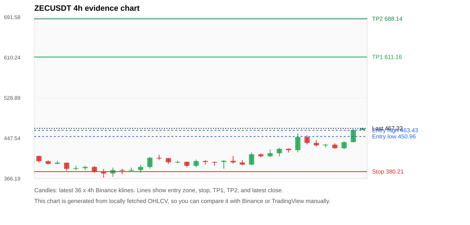
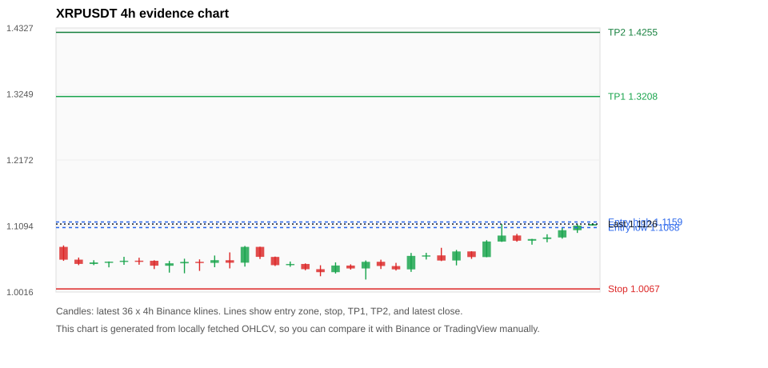
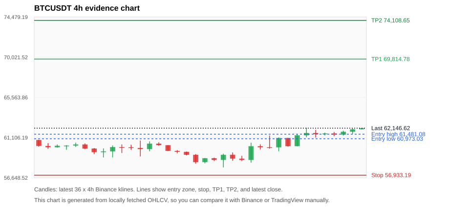
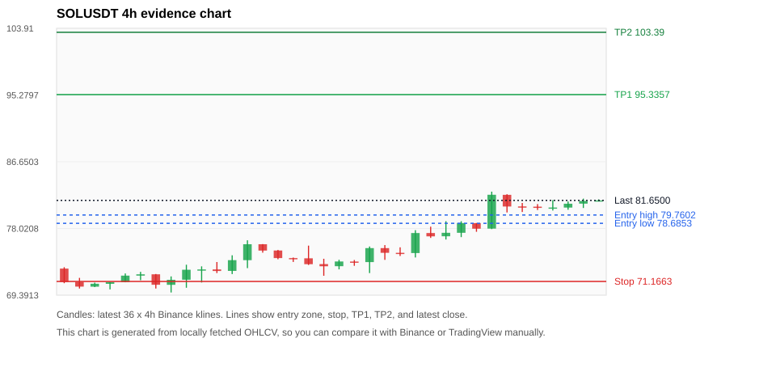
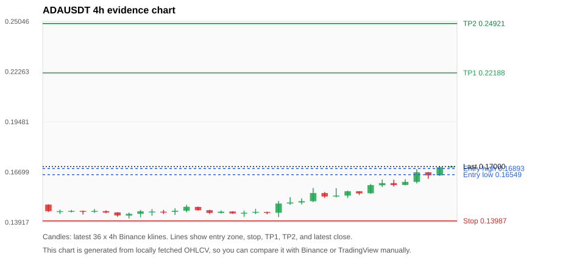

# Crypto 市场扫描报告 v1

- 报告时间：2026-07-03 20:06:06 CST
- Run ID：`20260703_120502_267c17e9`
- Run type：`daily_full`
- 数据来源：SQLite
- 报告版本：v1
- 扫描 ID：0b0cbf231493
- 数据源：Binance public spot API + CoinGecko/CoinMarketCap cross-check
- 过滤条件：USDT spot; 24h quote volume >= 30,000,000; trades >= 30,000; exclude stables/leveraged tokens; analyze 1h/4h/1d klines
- 默认单笔风险：账户权益的 1.00%

## 限制说明

- 交易信号仍以 Binance 现货公开 K 线为主源；外部数据源用于一致性复核。
- 结果是研究和模拟盘计划，不是确定收益或实盘下单指令。
- 历史长度过滤：候选币至少需要 180 根 1d K 线。
- 数据质量验证池：先验证 score 排名前 min(top_n * 2, 10) 的候选，再按 action + score 补足最终名单。
- 大盘环境过滤：RISK_OFF; BTC/ETH 大盘偏弱，山寨币买入候选降级为观察。 BTC 7d=3.4100550657292894; ETH 7d=10.460638001368228.
- 已启用数据交叉验证：Binance 主源 + CoinGecko 自动对照；CoinMarketCap 在配置 API Key 后自动对照。
- ZECUSDT 交叉验证状态 DATA_WARNING：At least one external provider needs manual review.
- XRPUSDT 交叉验证状态 DATA_WARNING：At least one external provider needs manual review.
- BTCUSDT 交叉验证状态 DATA_WARNING：At least one external provider needs manual review.
- SOLUSDT 交叉验证状态 DATA_WARNING：At least one external provider needs manual review.
- ADAUSDT 交叉验证状态 DATA_WARNING：At least one external provider needs manual review.
- TLMUSDT 交叉验证状态 DATA_WARNING：At least one external provider needs manual review.
- ETHUSDT 交叉验证状态 DATA_WARNING：At least one external provider needs manual review.
- BNBUSDT 交叉验证状态 DATA_WARNING：At least one external provider needs manual review.
- DOGEUSDT 交叉验证状态 DATA_WARNING：At least one external provider needs manual review.
- WLDUSDT 交叉验证状态 DATA_WARNING：At least one external provider needs manual review.

## 5 个候选交易计划

| Rank | Coin | Action | Setup | Entry Zone | Stop Loss | TP1 | TP2 / Exit Rule | R/R | Verdict |
|---:|---|---|---|---:|---:|---:|---|---:|---|
| 1 | `ZEC` | `WAIT_PULLBACK` | 趋势中，等回调入场 | 450.96 - 463.43 | 380.21 | 611.16 | 688.14 或跌破 4h 关键支撑 | 2.00-3.00 | 只等回调 |
| 2 | `XRP` | `WATCH_ONLY` | 回踩支撑/4h EMA 附近 | 1.1068 - 1.1159 | 1.0067 | 1.3208 | 1.4255 或跌破 4h 关键支撑 | 2.00-3.00 | 只等回调 |
| 3 | `BTC` | `WATCH_ONLY` | 回踩支撑/4h EMA 附近 | 60,973.03 - 61,481.08 | 56,933.19 | 69,814.78 | 74,108.65 或跌破 4h 关键支撑 | 2.00-3.00 | 只等回调 |
| 4 | `SOL` | `WATCH_ONLY` | 回踩支撑/4h EMA 附近 | 78.6853 - 79.7602 | 71.1663 | 95.3357 | 103.39 或跌破 4h 关键支撑 | 2.00-3.00 | 只等回调 |
| 5 | `ADA` | `WATCH_ONLY` | 趋势中，等回调入场 | 0.16549 - 0.16893 | 0.13987 | 0.22188 | 0.24921 或跌破 4h 关键支撑 | 2.00-3.00 | 只等回调 |

## 数据交叉验证摘要

价格差异以 Binance 当前价为基准；成交量口径不同，Binance 是 USDT 现货成交额，CoinGecko/CoinMarketCap 通常是全市场成交量。

| Rank | Coin | Data Status | Max Price Diff | Max 24h Diff | Message |
|---:|---|---|---:|---:|---|
| 1 | `ZEC` | DATA_WARNING | 0.58% | 0.53 pts | At least one external provider needs manual review. |
| 2 | `XRP` | DATA_WARNING | 0.23% | 0.12 pts | At least one external provider needs manual review. |
| 3 | `BTC` | DATA_WARNING | 0.13% | 0.04 pts | At least one external provider needs manual review. |
| 4 | `SOL` | DATA_WARNING | 0.15% | 0.07 pts | At least one external provider needs manual review. |
| 5 | `ADA` | DATA_WARNING | 0.04% | 0.24 pts | At least one external provider needs manual review. |

## 候选币说明

### 1. ZEC `ZECUSDT`



- 入选原因：趋势中，等回调入场；24h +4.05%，7d +14.38%，4h RSI 74.70，24h 成交额 $91.5M。
- 交易失效条件：跌破 380.21 或 4h 收盘重新失守关键支撑。
- 主要风险：日线趋势未完全确认；BTC/ETH 大盘环境未确认强势，山寨币买入信号降级；数据交叉验证需要人工复核。
- 数据交叉验证：DATA_WARNING；At least one external provider needs manual review.

#### 可点击人工验证

- [Binance 交易页](https://www.binance.com/en/trade/ZEC_USDT)
- [TradingView 图表](https://www.tradingview.com/chart/?symbol=BINANCE%3AZECUSDT)
- [CoinGecko 搜索](https://www.coingecko.com/en/search?query=ZEC)
- [CoinMarketCap 搜索](https://coinmarketcap.com/search/?q=ZEC)

#### 多数据源对照

| Source | Status | Asset ID | Price | 24h Change | 24h Volume | Price Diff | 24h Diff | Updated | Message |
|---|---|---|---:|---:|---:|---:|---:|---|---|
| Binance | DATA_OK | ZECUSDT | 467.32 | +4.05% | $91.5M | 0.00% | 0.00 pts | 2026-07-03T12:05:28+00:00 | Primary market data source used by scanner. |
| CoinGecko | DATA_OK | zcash | 464.82 | +3.69% | $407.5M | 0.53% | 0.36 pts | 2026-07-03T12:05:25.333Z | External source agrees with Binance within thresholds. |
| CoinMarketCap | DATA_WARNING | 1437 | 464.63 | +3.53% | $477.7M | 0.58% | 0.53 pts | 2026-07-03T12:04:05.000Z | CoinMarketCap symbol mapping has 2 matches; selected lowest cmc_rank |

#### 指标证据

| 指标 | 数值 | 人工核对用途 |
|---|---:|---|
| 当前价 | 467.32 | 与 Binance/TradingView 当前价格对照 |
| 24h 涨跌 | +4.05% | 与交易所 24h 涨跌对照 |
| 7d 涨跌 | +14.38% | 判断短线趋势是否延续 |
| 4h EMA20 | 428.21 | 判断短期趋势支撑 |
| 4h EMA50 | 420.10 | 判断中期趋势支撑 |
| 1d EMA20 | 435.98 | 判断日线趋势 |
| 1d EMA50 | 453.11 | 判断日线趋势 |
| 4h RSI14 | 74.70 | 判断是否过热/过弱 |
| 4h ATR14 | 15.5793 | 推导止损和入场缓冲 |
| 最近 18 根 4h 最低点 | 386.00 | 支撑/止损参考 |
| 最近 36 根 4h 最高点 | 469.10 | TP/压力参考 |
| 支撑位 | 435.98 | 入场区间推导基础 |

#### 交易计划推导

- 支撑位 = 最近低点、4h EMA20、4h EMA50、1d EMA20 中不高于当前价的最高有效支撑 = `435.98`。
- 入场区间 = 支撑位附近 + ATR 缓冲 = `450.96 - 463.43`。
- 止损 = min(最近 18 根 4h 最低点 * 0.985, 入场中位价 - 1.15 * ATR14) = `380.21`。
- TP1 = max(最近 36 根 4h 最高点 * 0.995, 入场中位价 + 2R) = `611.16`。
- TP2 = max(入场中位价 + 3R, TP1 * 1.04) = `688.14`。

#### 最近 10 根 4h K线

| UTC 开盘时间 | Open | High | Low | Close | Quote Volume | Trades |
|---|---:|---:|---:|---:|---:|---:|
| 2026-07-02T00:00+00:00 | 417.27 | 427.88 | 410.89 | 426.10 | $15.2M | 54739 |
| 2026-07-02T04:00+00:00 | 426.16 | 426.63 | 418.50 | 423.37 | $10.7M | 49092 |
| 2026-07-02T08:00+00:00 | 423.37 | 457.01 | 419.00 | 449.80 | $33.6M | 115735 |
| 2026-07-02T12:00+00:00 | 449.80 | 453.53 | 435.05 | 437.90 | $26.4M | 94219 |
| 2026-07-02T16:00+00:00 | 437.95 | 443.77 | 430.92 | 433.07 | $10.4M | 48008 |
| 2026-07-02T20:00+00:00 | 433.09 | 435.67 | 429.00 | 434.51 | $6.7M | 26388 |
| 2026-07-03T00:00+00:00 | 434.50 | 437.40 | 426.32 | 427.36 | $10.1M | 37522 |
| 2026-07-03T04:00+00:00 | 427.37 | 441.36 | 425.28 | 439.56 | $14.4M | 47635 |
| 2026-07-03T08:00+00:00 | 439.57 | 465.64 | 439.39 | 464.06 | $22.5M | 99018 |
| 2026-07-03T12:00+00:00 | 464.06 | 469.10 | 464.06 | 467.32 | $1.5M | 4958 |

### 2. XRP `XRPUSDT`



- 入选原因：回踩支撑/4h EMA 附近；24h +2.66%，7d +7.08%，4h RSI 76.09，24h 成交额 $84.7M。
- 交易失效条件：跌破 1.00667 或 4h 收盘重新失守关键支撑。
- 主要风险：4h RSI 偏热；日线趋势未完全确认；BTC/ETH 大盘环境未确认强势，山寨币买入信号降级；数据交叉验证需要人工复核。
- 数据交叉验证：DATA_WARNING；At least one external provider needs manual review.

#### 可点击人工验证

- [Binance 交易页](https://www.binance.com/en/trade/XRP_USDT)
- [TradingView 图表](https://www.tradingview.com/chart/?symbol=BINANCE%3AXRPUSDT)
- [CoinGecko 搜索](https://www.coingecko.com/en/search?query=XRP)
- [CoinMarketCap 搜索](https://coinmarketcap.com/search/?q=XRP)

#### 多数据源对照

| Source | Status | Asset ID | Price | 24h Change | 24h Volume | Price Diff | 24h Diff | Updated | Message |
|---|---|---|---:|---:|---:|---:|---:|---|---|
| Binance | DATA_OK | XRPUSDT | 1.1126 | +2.66% | $84.7M | 0.00% | 0.00 pts | 2026-07-03T12:05:28+00:00 | Primary market data source used by scanner. |
| CoinGecko | DATA_OK | ripple | 1.1100 | +2.65% | $1.64B | 0.23% | 0.00 pts | 2026-07-03T12:05:26.290Z | External source agrees with Binance within thresholds. |
| CoinMarketCap | DATA_WARNING | 52 | 1.1100 | +2.54% | $1.65B | 0.23% | 0.12 pts | 2026-07-03T12:04:05.000Z | CoinMarketCap symbol mapping has 3 matches; selected lowest cmc_rank |

#### 指标证据

| 指标 | 数值 | 人工核对用途 |
|---|---:|---|
| 当前价 | 1.1126 | 与 Binance/TradingView 当前价格对照 |
| 24h 涨跌 | +2.66% | 与交易所 24h 涨跌对照 |
| 7d 涨跌 | +7.08% | 判断短线趋势是否延续 |
| 4h EMA20 | 1.0779 | 判断短期趋势支撑 |
| 4h EMA50 | 1.0747 | 判断中期趋势支撑 |
| 1d EMA20 | 1.1046 | 判断日线趋势 |
| 1d EMA50 | 1.1872 | 判断日线趋势 |
| 4h RSI14 | 76.09 | 判断是否过热/过弱 |
| 4h ATR14 | 0.01734 | 推导止损和入场缓冲 |
| 最近 18 根 4h 最低点 | 1.0220 | 支撑/止损参考 |
| 最近 36 根 4h 最高点 | 1.1140 | TP/压力参考 |
| 支撑位 | 1.1046 | 入场区间推导基础 |

#### 交易计划推导

- 支撑位 = 最近低点、4h EMA20、4h EMA50、1d EMA20 中不高于当前价的最高有效支撑 = `1.1046`。
- 入场区间 = 支撑位附近 + ATR 缓冲 = `1.1068 - 1.1159`。
- 止损 = min(最近 18 根 4h 最低点 * 0.985, 入场中位价 - 1.15 * ATR14) = `1.0067`。
- TP1 = max(最近 36 根 4h 最高点 * 0.995, 入场中位价 + 2R) = `1.3208`。
- TP2 = max(入场中位价 + 3R, TP1 * 1.04) = `1.4255`。

#### 最近 10 根 4h K线

| UTC 开盘时间 | Open | High | Low | Close | Quote Volume | Trades |
|---|---:|---:|---:|---:|---:|---:|
| 2026-07-02T00:00+00:00 | 1.0531 | 1.0703 | 1.0451 | 1.0678 | $11.4M | 78871 |
| 2026-07-02T04:00+00:00 | 1.0679 | 1.0682 | 1.0557 | 1.0587 | $7.8M | 53979 |
| 2026-07-02T08:00+00:00 | 1.0587 | 1.0862 | 1.0585 | 1.0841 | $25.9M | 130626 |
| 2026-07-02T12:00+00:00 | 1.0840 | 1.1125 | 1.0834 | 1.0938 | $33.8M | 251187 |
| 2026-07-02T16:00+00:00 | 1.0939 | 1.0965 | 1.0837 | 1.0854 | $10.2M | 69148 |
| 2026-07-02T20:00+00:00 | 1.0854 | 1.0883 | 1.0789 | 1.0881 | $8.2M | 34009 |
| 2026-07-03T00:00+00:00 | 1.0882 | 1.0959 | 1.0828 | 1.0907 | $7.5M | 68367 |
| 2026-07-03T04:00+00:00 | 1.0907 | 1.1068 | 1.0887 | 1.1025 | $10.9M | 62757 |
| 2026-07-03T08:00+00:00 | 1.1026 | 1.1129 | 1.0981 | 1.1100 | $13.9M | 84505 |
| 2026-07-03T12:00+00:00 | 1.1101 | 1.1140 | 1.1101 | 1.1126 | $465,810 | 3153 |

### 3. BTC `BTCUSDT`



- 入选原因：回踩支撑/4h EMA 附近；24h +1.33%，7d +3.28%，4h RSI 77.01，24h 成交额 $1.16B。
- 交易失效条件：跌破 56933.187 或 4h 收盘重新失守关键支撑。
- 主要风险：4h RSI 偏热；日线趋势未完全确认；BTC/ETH 大盘环境未确认强势，山寨币买入信号降级；数据交叉验证需要人工复核。
- 数据交叉验证：DATA_WARNING；At least one external provider needs manual review.

#### 可点击人工验证

- [Binance 交易页](https://www.binance.com/en/trade/BTC_USDT)
- [TradingView 图表](https://www.tradingview.com/chart/?symbol=BINANCE%3ABTCUSDT)
- [CoinGecko 搜索](https://www.coingecko.com/en/search?query=BTC)
- [CoinMarketCap 搜索](https://coinmarketcap.com/search/?q=BTC)

#### 多数据源对照

| Source | Status | Asset ID | Price | 24h Change | 24h Volume | Price Diff | 24h Diff | Updated | Message |
|---|---|---|---:|---:|---:|---:|---:|---|---|
| Binance | DATA_OK | BTCUSDT | 62,146.62 | +1.33% | $1.16B | 0.00% | 0.00 pts | 2026-07-03T12:05:28+00:00 | Primary market data source used by scanner. |
| CoinGecko | DATA_OK | bitcoin | 62,069.00 | +1.35% | $30.65B | 0.12% | 0.02 pts | 2026-07-03T12:05:35.706Z | External source agrees with Binance within thresholds. |
| CoinMarketCap | DATA_WARNING | 1 | 62,064.55 | +1.37% | $32.97B | 0.13% | 0.04 pts | 2026-07-03T12:04:05.000Z | CoinMarketCap symbol mapping has 13 matches; selected lowest cmc_rank |

#### 指标证据

| 指标 | 数值 | 人工核对用途 |
|---|---:|---|
| 当前价 | 62,146.62 | 与 Binance/TradingView 当前价格对照 |
| 24h 涨跌 | +1.33% | 与交易所 24h 涨跌对照 |
| 7d 涨跌 | +3.28% | 判断短线趋势是否延续 |
| 4h EMA20 | 60,851.32 | 判断短期趋势支撑 |
| 4h EMA50 | 60,799.90 | 判断中期趋势支撑 |
| 1d EMA20 | 62,149.61 | 判断日线趋势 |
| 1d EMA50 | 66,060.63 | 判断日线趋势 |
| 4h RSI14 | 77.01 | 判断是否过热/过弱 |
| 4h ATR14 | 899.65 | 推导止损和入场缓冲 |
| 最近 18 根 4h 最低点 | 57,800.19 | 支撑/止损参考 |
| 最近 36 根 4h 最高点 | 62,200.00 | TP/压力参考 |
| 支撑位 | 60,851.32 | 入场区间推导基础 |

#### 交易计划推导

- 支撑位 = 最近低点、4h EMA20、4h EMA50、1d EMA20 中不高于当前价的最高有效支撑 = `60,851.32`。
- 入场区间 = 支撑位附近 + ATR 缓冲 = `60,973.03 - 61,481.08`。
- 止损 = min(最近 18 根 4h 最低点 * 0.985, 入场中位价 - 1.15 * ATR14) = `56,933.19`。
- TP1 = max(最近 36 根 4h 最高点 * 0.995, 入场中位价 + 2R) = `69,814.78`。
- TP2 = max(入场中位价 + 3R, TP1 * 1.04) = `74,108.65`。

#### 最近 10 根 4h K线

| UTC 开盘时间 | Open | High | Low | Close | Quote Volume | Trades |
|---|---:|---:|---:|---:|---:|---:|
| 2026-07-02T00:00+00:00 | 60,024.00 | 61,121.78 | 59,588.00 | 61,058.00 | $174.9M | 589740 |
| 2026-07-02T04:00+00:00 | 61,057.99 | 61,058.00 | 60,104.00 | 60,149.99 | $185.5M | 537384 |
| 2026-07-02T08:00+00:00 | 60,149.99 | 61,437.49 | 60,132.51 | 61,358.01 | $244.3M | 672992 |
| 2026-07-02T12:00+00:00 | 61,358.00 | 62,200.00 | 61,147.23 | 61,612.93 | $417.7M | 1187043 |
| 2026-07-02T16:00+00:00 | 61,612.93 | 61,962.43 | 61,108.99 | 61,479.60 | $202.9M | 616388 |
| 2026-07-02T20:00+00:00 | 61,479.59 | 61,653.43 | 61,342.00 | 61,560.00 | $82.9M | 279549 |
| 2026-07-03T00:00+00:00 | 61,560.00 | 61,733.11 | 61,248.86 | 61,434.00 | $152.3M | 481811 |
| 2026-07-03T04:00+00:00 | 61,434.00 | 61,864.99 | 61,332.76 | 61,750.47 | $195.1M | 365987 |
| 2026-07-03T08:00+00:00 | 61,750.47 | 62,103.10 | 61,510.01 | 62,024.02 | $105.7M | 431910 |
| 2026-07-03T12:00+00:00 | 62,024.01 | 62,157.03 | 62,008.00 | 62,146.63 | $3.9M | 16134 |

### 4. SOL `SOLUSDT`



- 入选原因：回踩支撑/4h EMA 附近；24h -0.74%，7d +15.47%，4h RSI 77.21，24h 成交额 $202.1M。
- 交易失效条件：跌破 71.16625 或 4h 收盘重新失守关键支撑。
- 主要风险：4h RSI 偏热；日线趋势未完全确认；BTC/ETH 大盘环境未确认强势，山寨币买入信号降级；24h 动量未确认；数据交叉验证需要人工复核。
- 数据交叉验证：DATA_WARNING；At least one external provider needs manual review.

#### 可点击人工验证

- [Binance 交易页](https://www.binance.com/en/trade/SOL_USDT)
- [TradingView 图表](https://www.tradingview.com/chart/?symbol=BINANCE%3ASOLUSDT)
- [CoinGecko 搜索](https://www.coingecko.com/en/search?query=SOL)
- [CoinMarketCap 搜索](https://coinmarketcap.com/search/?q=SOL)

#### 多数据源对照

| Source | Status | Asset ID | Price | 24h Change | 24h Volume | Price Diff | 24h Diff | Updated | Message |
|---|---|---|---:|---:|---:|---:|---:|---|---|
| Binance | DATA_OK | SOLUSDT | 81.6500 | -0.74% | $202.1M | 0.00% | 0.00 pts | 2026-07-03T12:05:28+00:00 | Primary market data source used by scanner. |
| CoinGecko | DATA_OK | solana | 81.5700 | -0.76% | $2.77B | 0.10% | 0.02 pts | 2026-07-03T12:05:38.078Z | External source agrees with Binance within thresholds. |
| CoinMarketCap | DATA_WARNING | 5426 | 81.5306 | -0.81% | $2.98B | 0.15% | 0.07 pts | 2026-07-03T12:04:05.000Z | CoinMarketCap symbol mapping has 8 matches; selected lowest cmc_rank |

#### 指标证据

| 指标 | 数值 | 人工核对用途 |
|---|---:|---|
| 当前价 | 81.6500 | 与 Binance/TradingView 当前价格对照 |
| 24h 涨跌 | -0.74% | 与交易所 24h 涨跌对照 |
| 7d 涨跌 | +15.47% | 判断短线趋势是否延续 |
| 4h EMA20 | 78.5282 | 判断短期趋势支撑 |
| 4h EMA50 | 75.4426 | 判断中期趋势支撑 |
| 1d EMA20 | 73.8909 | 判断日线趋势 |
| 1d EMA50 | 75.7948 | 判断日线趋势 |
| 4h RSI14 | 77.21 | 判断是否过热/过弱 |
| 4h ATR14 | 1.7600 | 推导止损和入场缓冲 |
| 最近 18 根 4h 最低点 | 72.2500 | 支撑/止损参考 |
| 最近 36 根 4h 最高点 | 82.7800 | TP/压力参考 |
| 支撑位 | 78.5282 | 入场区间推导基础 |

#### 交易计划推导

- 支撑位 = 最近低点、4h EMA20、4h EMA50、1d EMA20 中不高于当前价的最高有效支撑 = `78.5282`。
- 入场区间 = 支撑位附近 + ATR 缓冲 = `78.6853 - 79.7602`。
- 止损 = min(最近 18 根 4h 最低点 * 0.985, 入场中位价 - 1.15 * ATR14) = `71.1663`。
- TP1 = max(最近 36 根 4h 最高点 * 0.995, 入场中位价 + 2R) = `95.3357`。
- TP2 = max(入场中位价 + 3R, TP1 * 1.04) = `103.39`。

#### 最近 10 根 4h K线

| UTC 开盘时间 | Open | High | Low | Close | Quote Volume | Trades |
|---|---:|---:|---:|---:|---:|---:|
| 2026-07-02T00:00+00:00 | 77.4600 | 78.9600 | 76.9000 | 78.7200 | $34.4M | 159407 |
| 2026-07-02T04:00+00:00 | 78.7100 | 78.7200 | 77.5900 | 77.9900 | $22.9M | 107493 |
| 2026-07-02T08:00+00:00 | 78.0000 | 82.7800 | 77.9400 | 82.3800 | $109.9M | 401272 |
| 2026-07-02T12:00+00:00 | 82.3700 | 82.4500 | 80.0900 | 80.8600 | $76.9M | 398311 |
| 2026-07-02T16:00+00:00 | 80.8700 | 81.3200 | 80.1500 | 80.8300 | $37.3M | 171617 |
| 2026-07-02T20:00+00:00 | 80.8400 | 81.1700 | 80.4100 | 80.7300 | $19.2M | 85476 |
| 2026-07-03T00:00+00:00 | 80.7200 | 81.6900 | 80.3400 | 80.7300 | $21.3M | 121472 |
| 2026-07-03T04:00+00:00 | 80.7200 | 81.5100 | 80.4400 | 81.2200 | $19.8M | 95288 |
| 2026-07-03T08:00+00:00 | 81.2300 | 81.8800 | 80.6700 | 81.5800 | $28.4M | 143777 |
| 2026-07-03T12:00+00:00 | 81.5700 | 81.7800 | 81.5600 | 81.6500 | $676,330 | 3452 |

### 5. ADA `ADAUSDT`



- 入选原因：趋势中，等回调入场；24h +6.38%，7d +16.60%，4h RSI 81.39，24h 成交额 $34.9M。
- 交易失效条件：跌破 0.13987 或 4h 收盘重新失守关键支撑。
- 主要风险：4h RSI 偏热；日线趋势未完全确认；BTC/ETH 大盘环境未确认强势，山寨币买入信号降级；数据交叉验证需要人工复核。
- 数据交叉验证：DATA_WARNING；At least one external provider needs manual review.

#### 可点击人工验证

- [Binance 交易页](https://www.binance.com/en/trade/ADA_USDT)
- [TradingView 图表](https://www.tradingview.com/chart/?symbol=BINANCE%3AADAUSDT)
- [CoinGecko 搜索](https://www.coingecko.com/en/search?query=ADA)
- [CoinMarketCap 搜索](https://coinmarketcap.com/search/?q=ADA)

#### 多数据源对照

| Source | Status | Asset ID | Price | 24h Change | 24h Volume | Price Diff | 24h Diff | Updated | Message |
|---|---|---|---:|---:|---:|---:|---:|---|---|
| Binance | DATA_OK | ADAUSDT | 0.17000 | +6.38% | $34.9M | 0.00% | 0.00 pts | 2026-07-03T12:05:28+00:00 | Primary market data source used by scanner. |
| CoinGecko | DATA_OK | cardano | 0.16993 | +6.61% | $538.8M | 0.04% | 0.23 pts | 2026-07-03T12:05:38.699Z | External source agrees with Binance within thresholds. |
| CoinMarketCap | DATA_WARNING | 2010 | 0.17001 | +6.63% | $556.3M | 0.00% | 0.24 pts | 2026-07-03T12:04:05.000Z | CoinMarketCap symbol mapping has 3 matches; selected lowest cmc_rank |

#### 指标证据

| 指标 | 数值 | 人工核对用途 |
|---|---:|---|
| 当前价 | 0.17000 | 与 Binance/TradingView 当前价格对照 |
| 24h 涨跌 | +6.38% | 与交易所 24h 涨跌对照 |
| 7d 涨跌 | +16.60% | 判断短线趋势是否延续 |
| 4h EMA20 | 0.15820 | 判断短期趋势支撑 |
| 4h EMA50 | 0.15405 | 判断中期趋势支撑 |
| 1d EMA20 | 0.16036 | 判断日线趋势 |
| 1d EMA50 | 0.18564 | 判断日线趋势 |
| 4h RSI14 | 81.39 | 判断是否过热/过弱 |
| 4h ATR14 | 0.0043 | 推导止损和入场缓冲 |
| 最近 18 根 4h 最低点 | 0.14200 | 支撑/止损参考 |
| 最近 36 根 4h 最高点 | 0.17050 | TP/压力参考 |
| 支撑位 | 0.16036 | 入场区间推导基础 |

#### 交易计划推导

- 支撑位 = 最近低点、4h EMA20、4h EMA50、1d EMA20 中不高于当前价的最高有效支撑 = `0.16036`。
- 入场区间 = 支撑位附近 + ATR 缓冲 = `0.16549 - 0.16893`。
- 止损 = min(最近 18 根 4h 最低点 * 0.985, 入场中位价 - 1.15 * ATR14) = `0.13987`。
- TP1 = max(最近 36 根 4h 最高点 * 0.995, 入场中位价 + 2R) = `0.22188`。
- TP2 = max(入场中位价 + 3R, TP1 * 1.04) = `0.24921`。

#### 最近 10 根 4h K线

| UTC 开盘时间 | Open | High | Low | Close | Quote Volume | Trades |
|---|---:|---:|---:|---:|---:|---:|
| 2026-07-02T00:00+00:00 | 0.15390 | 0.15660 | 0.15260 | 0.15630 | $4.4M | 15454 |
| 2026-07-02T04:00+00:00 | 0.15630 | 0.15630 | 0.15420 | 0.15510 | $2.2M | 10190 |
| 2026-07-02T08:00+00:00 | 0.15520 | 0.16030 | 0.15490 | 0.15970 | $5.8M | 19887 |
| 2026-07-02T12:00+00:00 | 0.15960 | 0.16280 | 0.15870 | 0.16080 | $5.5M | 33031 |
| 2026-07-02T16:00+00:00 | 0.16080 | 0.16270 | 0.15890 | 0.15970 | $3.9M | 18341 |
| 2026-07-02T20:00+00:00 | 0.15980 | 0.16300 | 0.15960 | 0.16150 | $4.4M | 14617 |
| 2026-07-03T00:00+00:00 | 0.16150 | 0.16850 | 0.16060 | 0.16680 | $8.9M | 35167 |
| 2026-07-03T04:00+00:00 | 0.16680 | 0.16700 | 0.16320 | 0.16510 | $5.0M | 19433 |
| 2026-07-03T08:00+00:00 | 0.16510 | 0.17000 | 0.16480 | 0.16960 | $7.0M | 25365 |
| 2026-07-03T12:00+00:00 | 0.16960 | 0.17050 | 0.16950 | 0.17000 | $423,510 | 1243 |

## 组合风控

- 不要 5 个候选全部满仓买入。
- 同时持仓总风险建议控制在账户权益的 3% - 5% 以内。
- 如果 BTC/ETH 同时破位，暂停山寨币多头计划或降低仓位。
- 第一版报告用于模拟盘和人工复核，不自动下单。

## 原始数据

```json
[
  {
    "rank": 1,
    "symbol": "ZECUSDT",
    "base_asset": "ZEC",
    "price": 467.32,
    "score": 47.08469289741561,
    "setup": "趋势中，等回调入场",
    "verdict": "只等回调",
    "entry_low": 450.96175,
    "entry_high": 463.42517857142855,
    "stop_loss": 380.21,
    "take_profit_1": 611.1603928571429,
    "take_profit_2": 688.1438571428573,
    "risk_reward_1": 2.0,
    "risk_reward_2": 3.000000000000001,
    "pct_24h": 4.053,
    "pct_3d": 17.816714988024707,
    "pct_7d": 14.376621469479666,
    "quote_volume_24h": 91450266.1748,
    "trades_24h": 354860,
    "high_low_range_24h": 10.30379984951093,
    "rsi_1h": 81.61064174006836,
    "rsi_4h": 74.69593378913275,
    "ema20_4h": 428.2065802950337,
    "ema50_4h": 420.1017117343036,
    "ema20_1d": 435.9844463108055,
    "ema50_1d": 453.1115608554217,
    "atr_4h": 15.579285714285716,
    "macd_hist_4h": 4.749996720473858,
    "volume_ratio_24h": 1.1475620790594905,
    "support_level": 435.9844463108055,
    "recent_low_4h_18": 386.0,
    "recent_high_4h_36": 469.1,
    "distance_to_support_pct": 7.18730999565429,
    "binance_trade_url": "https://www.binance.com/en/trade/ZEC_USDT",
    "tradingview_url": "https://www.tradingview.com/chart/?symbol=BINANCE%3AZECUSDT",
    "coingecko_search_url": "https://www.coingecko.com/en/search?query=ZEC",
    "coinmarketcap_search_url": "https://coinmarketcap.com/search/?q=ZEC",
    "invalidation": "跌破 380.21 或 4h 收盘重新失守关键支撑",
    "recent_4h_klines": [
      {
        "open_time_utc": "2026-06-27T16:00+00:00",
        "open": 411.51,
        "high": 412.79,
        "low": 398.34,
        "close": 401.18,
        "quote_volume": 13581344.42343,
        "trades": 43745
      },
      {
        "open_time_utc": "2026-06-27T20:00+00:00",
        "open": 401.18,
        "high": 402.69,
        "low": 394.31,
        "close": 395.86,
        "quote_volume": 8784785.22727,
        "trades": 33908
      },
      {
        "open_time_utc": "2026-06-28T00:00+00:00",
        "open": 395.87,
        "high": 401.96,
        "low": 394.92,
        "close": 398.19,
        "quote_volume": 5264317.5426,
        "trades": 22904
      },
      {
        "open_time_utc": "2026-06-28T04:00+00:00",
        "open": 398.11,
        "high": 398.29,
        "low": 381.92,
        "close": 385.66,
        "quote_volume": 12527322.94808,
        "trades": 52137
      },
      {
        "open_time_utc": "2026-06-28T08:00+00:00",
        "open": 385.66,
        "high": 391.75,
        "low": 383.17,
        "close": 387.13,
        "quote_volume": 8333346.00796,
        "trades": 37449
      },
      {
        "open_time_utc": "2026-06-28T12:00+00:00",
        "open": 387.14,
        "high": 392.0,
        "low": 383.15,
        "close": 389.54,
        "quote_volume": 8110238.39834,
        "trades": 37552
      },
      {
        "open_time_utc": "2026-06-28T16:00+00:00",
        "open": 389.65,
        "high": 391.33,
        "low": 377.83,
        "close": 379.85,
        "quote_volume": 8719283.13137,
        "trades": 40947
      },
      {
        "open_time_utc": "2026-06-28T20:00+00:00",
        "open": 379.7,
        "high": 385.52,
        "low": 368.03,
        "close": 376.41,
        "quote_volume": 13532960.36496,
        "trades": 68670
      },
      {
        "open_time_utc": "2026-06-29T00:00+00:00",
        "open": 376.45,
        "high": 388.23,
        "low": 369.76,
        "close": 383.26,
        "quote_volume": 12198130.70748,
        "trades": 60957
      },
      {
        "open_time_utc": "2026-06-29T04:00+00:00",
        "open": 383.26,
        "high": 385.98,
        "low": 374.79,
        "close": 382.35,
        "quote_volume": 6991923.18204,
        "trades": 33991
      },
      {
        "open_time_utc": "2026-06-29T08:00+00:00",
        "open": 382.35,
        "high": 388.4,
        "low": 380.28,
        "close": 383.37,
        "quote_volume": 6757970.98995,
        "trades": 37944
      },
      {
        "open_time_utc": "2026-06-29T12:00+00:00",
        "open": 383.42,
        "high": 393.37,
        "low": 378.16,
        "close": 389.51,
        "quote_volume": 22767610.73099,
        "trades": 100882
      },
      {
        "open_time_utc": "2026-06-29T16:00+00:00",
        "open": 389.47,
        "high": 409.72,
        "low": 386.26,
        "close": 408.01,
        "quote_volume": 19394007.59298,
        "trades": 73799
      },
      {
        "open_time_utc": "2026-06-29T20:00+00:00",
        "open": 408.0,
        "high": 414.26,
        "low": 403.28,
        "close": 407.5,
        "quote_volume": 11159975.95779,
        "trades": 44742
      },
      {
        "open_time_utc": "2026-06-30T00:00+00:00",
        "open": 407.4,
        "high": 407.48,
        "low": 395.81,
        "close": 399.0,
        "quote_volume": 13108744.19697,
        "trades": 45951
      },
      {
        "open_time_utc": "2026-06-30T04:00+00:00",
        "open": 398.96,
        "high": 402.07,
        "low": 397.53,
        "close": 399.84,
        "quote_volume": 4920264.76918,
        "trades": 22346
      },
      {
        "open_time_utc": "2026-06-30T08:00+00:00",
        "open": 399.84,
        "high": 400.34,
        "low": 388.9,
        "close": 391.89,
        "quote_volume": 10526728.61044,
        "trades": 43170
      },
      {
        "open_time_utc": "2026-06-30T12:00+00:00",
        "open": 391.89,
        "high": 404.47,
        "low": 388.72,
        "close": 401.36,
        "quote_volume": 20016563.65372,
        "trades": 86505
      },
      {
        "open_time_utc": "2026-06-30T16:00+00:00",
        "open": 401.49,
        "high": 403.3,
        "low": 394.51,
        "close": 399.63,
        "quote_volume": 7311786.42984,
        "trades": 35799
      },
      {
        "open_time_utc": "2026-06-30T20:00+00:00",
        "open": 399.65,
        "high": 400.43,
        "low": 391.95,
        "close": 399.5,
        "quote_volume": 5665336.96688,
        "trades": 31494
      },
      {
        "open_time_utc": "2026-07-01T00:00+00:00",
        "open": 399.48,
        "high": 403.13,
        "low": 386.0,
        "close": 401.86,
        "quote_volume": 9081742.30464,
        "trades": 45702
      },
      {
        "open_time_utc": "2026-07-01T04:00+00:00",
        "open": 401.88,
        "high": 411.75,
        "low": 396.38,
        "close": 398.69,
        "quote_volume": 15569748.76693,
        "trades": 53481
      },
      {
        "open_time_utc": "2026-07-01T08:00+00:00",
        "open": 398.64,
        "high": 403.8,
        "low": 393.3,
        "close": 394.21,
        "quote_volume": 7176959.32252,
        "trades": 33638
      },
      {
        "open_time_utc": "2026-07-01T12:00+00:00",
        "open": 394.21,
        "high": 418.69,
        "low": 393.3,
        "close": 415.1,
        "quote_volume": 17708602.24306,
        "trades": 84047
      },
      {
        "open_time_utc": "2026-07-01T16:00+00:00",
        "open": 415.11,
        "high": 416.92,
        "low": 409.0,
        "close": 411.03,
        "quote_volume": 8447470.7249,
        "trades": 41150
      },
      {
        "open_time_utc": "2026-07-01T20:00+00:00",
        "open": 411.1,
        "high": 424.72,
        "low": 410.0,
        "close": 417.21,
        "quote_volume": 14974964.08625,
        "trades": 56454
      },
      {
        "open_time_utc": "2026-07-02T00:00+00:00",
        "open": 417.27,
        "high": 427.88,
        "low": 410.89,
        "close": 426.1,
        "quote_volume": 15192802.61942,
        "trades": 54739
      },
      {
        "open_time_utc": "2026-07-02T04:00+00:00",
        "open": 426.16,
        "high": 426.63,
        "low": 418.5,
        "close": 423.37,
        "quote_volume": 10704650.12398,
        "trades": 49092
      },
      {
        "open_time_utc": "2026-07-02T08:00+00:00",
        "open": 423.37,
        "high": 457.01,
        "low": 419.0,
        "close": 449.8,
        "quote_volume": 33553702.779,
        "trades": 115735
      },
      {
        "open_time_utc": "2026-07-02T12:00+00:00",
        "open": 449.8,
        "high": 453.53,
        "low": 435.05,
        "close": 437.9,
        "quote_volume": 26406090.69906,
        "trades": 94219
      },
      {
        "open_time_utc": "2026-07-02T16:00+00:00",
        "open": 437.95,
        "high": 443.77,
        "low": 430.92,
        "close": 433.07,
        "quote_volume": 10353762.15602,
        "trades": 48008
      },
      {
        "open_time_utc": "2026-07-02T20:00+00:00",
        "open": 433.09,
        "high": 435.67,
        "low": 429.0,
        "close": 434.51,
        "quote_volume": 6657062.37027,
        "trades": 26388
      },
      {
        "open_time_utc": "2026-07-03T00:00+00:00",
        "open": 434.5,
        "high": 437.4,
        "low": 426.32,
        "close": 427.36,
        "quote_volume": 10069067.14477,
        "trades": 37522
      },
      {
        "open_time_utc": "2026-07-03T04:00+00:00",
        "open": 427.37,
        "high": 441.36,
        "low": 425.28,
        "close": 439.56,
        "quote_volume": 14398461.79151,
        "trades": 47635
      },
      {
        "open_time_utc": "2026-07-03T08:00+00:00",
        "open": 439.57,
        "high": 465.64,
        "low": 439.39,
        "close": 464.06,
        "quote_volume": 22512527.80947,
        "trades": 99018
      },
      {
        "open_time_utc": "2026-07-03T12:00+00:00",
        "open": 464.06,
        "high": 469.1,
        "low": 464.06,
        "close": 467.32,
        "quote_volume": 1483220.24837,
        "trades": 4958
      }
    ],
    "risks": [
      "日线趋势未完全确认",
      "BTC/ETH 大盘环境未确认强势，山寨币买入信号降级",
      "数据交叉验证需要人工复核"
    ],
    "data_quality_status": "DATA_WARNING",
    "data_quality_message": "At least one external provider needs manual review.",
    "data_checks": [
      {
        "provider": "Binance",
        "status": "DATA_OK",
        "provider_asset_id": "ZECUSDT",
        "provider_symbol": "ZECUSDT",
        "price_usd": 467.32,
        "pct_24h": 4.053,
        "volume_24h": 91450266.1748,
        "last_updated": null,
        "fetched_at_utc": "2026-07-03T12:05:28+00:00",
        "price_diff_pct": 0.0,
        "pct_24h_diff": 0.0,
        "volume_note": "Binance USDT spot 24h quoteVolume.",
        "message": "Primary market data source used by scanner."
      },
      {
        "provider": "CoinGecko",
        "status": "DATA_OK",
        "provider_asset_id": "zcash",
        "provider_symbol": "ZEC",
        "price_usd": 464.82,
        "pct_24h": 3.69331,
        "volume_24h": 407465995.0,
        "last_updated": "2026-07-03T12:05:25.333Z",
        "fetched_at_utc": "2026-07-03T12:05:28+00:00",
        "price_diff_pct": 0.5349653342463409,
        "pct_24h_diff": 0.35969000000000007,
        "volume_note": "CoinGecko total market volume; not the same venue scope as Binance quoteVolume.",
        "message": "External source agrees with Binance within thresholds."
      },
      {
        "provider": "CoinMarketCap",
        "status": "DATA_WARNING",
        "provider_asset_id": "1437",
        "provider_symbol": "ZEC",
        "price_usd": 464.63087157886827,
        "pct_24h": 3.52567489,
        "volume_24h": 477730345.85846084,
        "last_updated": "2026-07-03T12:04:05.000Z",
        "fetched_at_utc": "2026-07-03T12:05:28+00:00",
        "price_diff_pct": 0.5754361938568276,
        "pct_24h_diff": 0.52732511,
        "volume_note": "CoinMarketCap total market volume; not the same venue scope as Binance quoteVolume.",
        "message": "CoinMarketCap symbol mapping has 2 matches; selected lowest cmc_rank"
      }
    ],
    "action": "WAIT_PULLBACK"
  },
  {
    "rank": 2,
    "symbol": "XRPUSDT",
    "base_asset": "XRP",
    "price": 1.1126,
    "score": 44.47368279239971,
    "setup": "回踩支撑/4h EMA 附近",
    "verdict": "只等回调",
    "entry_low": 1.1068367392149958,
    "entry_high": 1.1159378,
    "stop_loss": 1.00667,
    "take_profit_1": 1.3208218088224934,
    "take_profit_2": 1.4255390784299913,
    "risk_reward_1": 2.0,
    "risk_reward_2": 3.0,
    "pct_24h": 2.656,
    "pct_3d": 7.45605563067413,
    "pct_7d": 7.083734359961502,
    "quote_volume_24h": 84688391.57178,
    "trades_24h": 570860,
    "high_low_range_24h": 3.2533135601075402,
    "rsi_1h": 79.71014492753618,
    "rsi_4h": 76.08530083777596,
    "ema20_4h": 1.0778568269203617,
    "ema50_4h": 1.074694488387496,
    "ema20_1d": 1.1046274842465027,
    "ema50_1d": 1.1872335139229178,
    "atr_4h": 0.017335714285714312,
    "macd_hist_4h": 0.005798664878962762,
    "volume_ratio_24h": 0.8974262467476914,
    "support_level": 1.1046274842465027,
    "recent_low_4h_18": 1.022,
    "recent_high_4h_36": 1.114,
    "distance_to_support_pct": 0.7217379494170117,
    "binance_trade_url": "https://www.binance.com/en/trade/XRP_USDT",
    "tradingview_url": "https://www.tradingview.com/chart/?symbol=BINANCE%3AXRPUSDT",
    "coingecko_search_url": "https://www.coingecko.com/en/search?query=XRP",
    "coinmarketcap_search_url": "https://coinmarketcap.com/search/?q=XRP",
    "invalidation": "跌破 1.00667 或 4h 收盘重新失守关键支撑",
    "recent_4h_klines": [
      {
        "open_time_utc": "2026-06-27T16:00+00:00",
        "open": 1.0753,
        "high": 1.0777,
        "low": 1.0525,
        "close": 1.0544,
        "quote_volume": 13209839.24724,
        "trades": 80582
      },
      {
        "open_time_utc": "2026-06-27T20:00+00:00",
        "open": 1.0545,
        "high": 1.0579,
        "low": 1.0455,
        "close": 1.0475,
        "quote_volume": 8798874.73002,
        "trades": 58327
      },
      {
        "open_time_utc": "2026-06-28T00:00+00:00",
        "open": 1.0474,
        "high": 1.0535,
        "low": 1.0455,
        "close": 1.0499,
        "quote_volume": 5945877.55546,
        "trades": 41513
      },
      {
        "open_time_utc": "2026-06-28T04:00+00:00",
        "open": 1.05,
        "high": 1.0515,
        "low": 1.0419,
        "close": 1.0512,
        "quote_volume": 5379731.79696,
        "trades": 47913
      },
      {
        "open_time_utc": "2026-06-28T08:00+00:00",
        "open": 1.0512,
        "high": 1.0591,
        "low": 1.046,
        "close": 1.0527,
        "quote_volume": 7433105.37205,
        "trades": 53947
      },
      {
        "open_time_utc": "2026-06-28T12:00+00:00",
        "open": 1.0528,
        "high": 1.0576,
        "low": 1.0462,
        "close": 1.0526,
        "quote_volume": 7646729.84945,
        "trades": 65046
      },
      {
        "open_time_utc": "2026-06-28T16:00+00:00",
        "open": 1.0526,
        "high": 1.0535,
        "low": 1.0391,
        "close": 1.0446,
        "quote_volume": 7415900.23698,
        "trades": 69144
      },
      {
        "open_time_utc": "2026-06-28T20:00+00:00",
        "open": 1.0445,
        "high": 1.0524,
        "low": 1.0333,
        "close": 1.0485,
        "quote_volume": 13904026.13092,
        "trades": 101700
      },
      {
        "open_time_utc": "2026-06-29T00:00+00:00",
        "open": 1.0485,
        "high": 1.056,
        "low": 1.0322,
        "close": 1.0508,
        "quote_volume": 19699480.08215,
        "trades": 158609
      },
      {
        "open_time_utc": "2026-06-29T04:00+00:00",
        "open": 1.0509,
        "high": 1.0549,
        "low": 1.0361,
        "close": 1.0493,
        "quote_volume": 12521155.5618,
        "trades": 97191
      },
      {
        "open_time_utc": "2026-06-29T08:00+00:00",
        "open": 1.0492,
        "high": 1.0612,
        "low": 1.0421,
        "close": 1.0536,
        "quote_volume": 13282336.19538,
        "trades": 95975
      },
      {
        "open_time_utc": "2026-06-29T12:00+00:00",
        "open": 1.0535,
        "high": 1.0663,
        "low": 1.0402,
        "close": 1.0494,
        "quote_volume": 26193359.88639,
        "trades": 212441
      },
      {
        "open_time_utc": "2026-06-29T16:00+00:00",
        "open": 1.0495,
        "high": 1.0768,
        "low": 1.0431,
        "close": 1.0753,
        "quote_volume": 18844877.01616,
        "trades": 142685
      },
      {
        "open_time_utc": "2026-06-29T20:00+00:00",
        "open": 1.0753,
        "high": 1.0755,
        "low": 1.0556,
        "close": 1.059,
        "quote_volume": 9257009.76771,
        "trades": 55626
      },
      {
        "open_time_utc": "2026-06-30T00:00+00:00",
        "open": 1.0589,
        "high": 1.0595,
        "low": 1.0441,
        "close": 1.0455,
        "quote_volume": 11906895.19795,
        "trades": 64339
      },
      {
        "open_time_utc": "2026-06-30T04:00+00:00",
        "open": 1.0455,
        "high": 1.0514,
        "low": 1.0428,
        "close": 1.0474,
        "quote_volume": 6712767.22824,
        "trades": 37621
      },
      {
        "open_time_utc": "2026-06-30T08:00+00:00",
        "open": 1.0474,
        "high": 1.0483,
        "low": 1.0371,
        "close": 1.0389,
        "quote_volume": 10838935.8139,
        "trades": 52772
      },
      {
        "open_time_utc": "2026-06-30T12:00+00:00",
        "open": 1.0389,
        "high": 1.0453,
        "low": 1.0274,
        "close": 1.034,
        "quote_volume": 21534032.35807,
        "trades": 156343
      },
      {
        "open_time_utc": "2026-06-30T16:00+00:00",
        "open": 1.034,
        "high": 1.05,
        "low": 1.0318,
        "close": 1.0449,
        "quote_volume": 10985993.10513,
        "trades": 93774
      },
      {
        "open_time_utc": "2026-06-30T20:00+00:00",
        "open": 1.0448,
        "high": 1.0468,
        "low": 1.0382,
        "close": 1.0401,
        "quote_volume": 7130950.66316,
        "trades": 47159
      },
      {
        "open_time_utc": "2026-07-01T00:00+00:00",
        "open": 1.0401,
        "high": 1.0531,
        "low": 1.022,
        "close": 1.0509,
        "quote_volume": 21822939.98913,
        "trades": 132199
      },
      {
        "open_time_utc": "2026-07-01T04:00+00:00",
        "open": 1.051,
        "high": 1.0544,
        "low": 1.0392,
        "close": 1.0441,
        "quote_volume": 11782662.10078,
        "trades": 64401
      },
      {
        "open_time_utc": "2026-07-01T08:00+00:00",
        "open": 1.044,
        "high": 1.0492,
        "low": 1.0367,
        "close": 1.0386,
        "quote_volume": 11103755.12166,
        "trades": 66871
      },
      {
        "open_time_utc": "2026-07-01T12:00+00:00",
        "open": 1.0386,
        "high": 1.0654,
        "low": 1.0345,
        "close": 1.0606,
        "quote_volume": 22288347.30011,
        "trades": 159022
      },
      {
        "open_time_utc": "2026-07-01T16:00+00:00",
        "open": 1.0606,
        "high": 1.0656,
        "low": 1.0547,
        "close": 1.0614,
        "quote_volume": 10329539.563,
        "trades": 72647
      },
      {
        "open_time_utc": "2026-07-01T20:00+00:00",
        "open": 1.0614,
        "high": 1.0738,
        "low": 1.0521,
        "close": 1.053,
        "quote_volume": 14972617.58327,
        "trades": 93679
      },
      {
        "open_time_utc": "2026-07-02T00:00+00:00",
        "open": 1.0531,
        "high": 1.0703,
        "low": 1.0451,
        "close": 1.0678,
        "quote_volume": 11404385.03478,
        "trades": 78871
      },
      {
        "open_time_utc": "2026-07-02T04:00+00:00",
        "open": 1.0679,
        "high": 1.0682,
        "low": 1.0557,
        "close": 1.0587,
        "quote_volume": 7814815.74457,
        "trades": 53979
      },
      {
        "open_time_utc": "2026-07-02T08:00+00:00",
        "open": 1.0587,
        "high": 1.0862,
        "low": 1.0585,
        "close": 1.0841,
        "quote_volume": 25855095.29111,
        "trades": 130626
      },
      {
        "open_time_utc": "2026-07-02T12:00+00:00",
        "open": 1.084,
        "high": 1.1125,
        "low": 1.0834,
        "close": 1.0938,
        "quote_volume": 33758899.11126,
        "trades": 251187
      },
      {
        "open_time_utc": "2026-07-02T16:00+00:00",
        "open": 1.0939,
        "high": 1.0965,
        "low": 1.0837,
        "close": 1.0854,
        "quote_volume": 10216024.84783,
        "trades": 69148
      },
      {
        "open_time_utc": "2026-07-02T20:00+00:00",
        "open": 1.0854,
        "high": 1.0883,
        "low": 1.0789,
        "close": 1.0881,
        "quote_volume": 8196435.80052,
        "trades": 34009
      },
      {
        "open_time_utc": "2026-07-03T00:00+00:00",
        "open": 1.0882,
        "high": 1.0959,
        "low": 1.0828,
        "close": 1.0907,
        "quote_volume": 7540315.60237,
        "trades": 68367
      },
      {
        "open_time_utc": "2026-07-03T04:00+00:00",
        "open": 1.0907,
        "high": 1.1068,
        "low": 1.0887,
        "close": 1.1025,
        "quote_volume": 10854923.85315,
        "trades": 62757
      },
      {
        "open_time_utc": "2026-07-03T08:00+00:00",
        "open": 1.1026,
        "high": 1.1129,
        "low": 1.0981,
        "close": 1.11,
        "quote_volume": 13880134.3304,
        "trades": 84505
      },
      {
        "open_time_utc": "2026-07-03T12:00+00:00",
        "open": 1.1101,
        "high": 1.114,
        "low": 1.1101,
        "close": 1.1126,
        "quote_volume": 465809.99584,
        "trades": 3153
      }
    ],
    "risks": [
      "4h RSI 偏热",
      "日线趋势未完全确认",
      "BTC/ETH 大盘环境未确认强势，山寨币买入信号降级",
      "数据交叉验证需要人工复核"
    ],
    "data_quality_status": "DATA_WARNING",
    "data_quality_message": "At least one external provider needs manual review.",
    "data_checks": [
      {
        "provider": "Binance",
        "status": "DATA_OK",
        "provider_asset_id": "XRPUSDT",
        "provider_symbol": "XRPUSDT",
        "price_usd": 1.1126,
        "pct_24h": 2.656,
        "volume_24h": 84688391.57178,
        "last_updated": null,
        "fetched_at_utc": "2026-07-03T12:05:28+00:00",
        "price_diff_pct": 0.0,
        "pct_24h_diff": 0.0,
        "volume_note": "Binance USDT spot 24h quoteVolume.",
        "message": "Primary market data source used by scanner."
      },
      {
        "provider": "CoinGecko",
        "status": "DATA_OK",
        "provider_asset_id": "ripple",
        "provider_symbol": "XRP",
        "price_usd": 1.11,
        "pct_24h": 2.6515,
        "volume_24h": 1640742646.0,
        "last_updated": "2026-07-03T12:05:26.290Z",
        "fetched_at_utc": "2026-07-03T12:05:28+00:00",
        "price_diff_pct": 0.23368685960811933,
        "pct_24h_diff": 0.0045000000000001705,
        "volume_note": "CoinGecko total market volume; not the same venue scope as Binance quoteVolume.",
        "message": "External source agrees with Binance within thresholds."
      },
      {
        "provider": "CoinMarketCap",
        "status": "DATA_WARNING",
        "provider_asset_id": "52",
        "provider_symbol": "XRP",
        "price_usd": 1.1100010369757958,
        "pct_24h": 2.53666052,
        "volume_24h": 1654003218.436472,
        "last_updated": "2026-07-03T12:04:05.000Z",
        "fetched_at_utc": "2026-07-03T12:05:28+00:00",
        "price_diff_pct": 0.23359365667843424,
        "pct_24h_diff": 0.11933948000000028,
        "volume_note": "CoinMarketCap total market volume; not the same venue scope as Binance quoteVolume.",
        "message": "CoinMarketCap symbol mapping has 3 matches; selected lowest cmc_rank"
      }
    ],
    "action": "WATCH_ONLY"
  },
  {
    "rank": 3,
    "symbol": "BTCUSDT",
    "base_asset": "BTC",
    "price": 62146.62,
    "score": 44.11015738154209,
    "setup": "回踩支撑/4h EMA 附近",
    "verdict": "只等回调",
    "entry_low": 60973.02521091542,
    "entry_high": 61481.07856578385,
    "stop_loss": 56933.18715,
    "take_profit_1": 69814.7813650489,
    "take_profit_2": 74108.64610339854,
    "risk_reward_1": 1.9999999999999982,
    "risk_reward_2": 3.0,
    "pct_24h": 1.333,
    "pct_3d": 5.8045687586635974,
    "pct_7d": 3.2757389519277202,
    "quote_volume_24h": 1156612414.8605802,
    "trades_24h": 3366433,
    "high_low_range_24h": 1.785351058821294,
    "rsi_1h": 68.66944322665496,
    "rsi_4h": 77.01433095550358,
    "ema20_4h": 60851.32256578385,
    "ema50_4h": 60799.90080318147,
    "ema20_1d": 62149.61261333183,
    "ema50_1d": 66060.62515502209,
    "atr_4h": 899.6514285714277,
    "macd_hist_4h": 242.0513141480967,
    "volume_ratio_24h": 1.021355353156316,
    "support_level": 60851.32256578385,
    "recent_low_4h_18": 57800.19,
    "recent_high_4h_36": 62200.0,
    "distance_to_support_pct": 2.128626592817051,
    "binance_trade_url": "https://www.binance.com/en/trade/BTC_USDT",
    "tradingview_url": "https://www.tradingview.com/chart/?symbol=BINANCE%3ABTCUSDT",
    "coingecko_search_url": "https://www.coingecko.com/en/search?query=BTC",
    "coinmarketcap_search_url": "https://coinmarketcap.com/search/?q=BTC",
    "invalidation": "跌破 56933.187 或 4h 收盘重新失守关键支撑",
    "recent_4h_klines": [
      {
        "open_time_utc": "2026-06-27T16:00+00:00",
        "open": 60840.06,
        "high": 60855.03,
        "low": 60085.88,
        "close": 60175.95,
        "quote_volume": 86663415.5699926,
        "trades": 332446
      },
      {
        "open_time_utc": "2026-06-27T20:00+00:00",
        "open": 60175.95,
        "high": 60482.18,
        "low": 59855.16,
        "close": 60029.0,
        "quote_volume": 82517393.4972376,
        "trades": 303912
      },
      {
        "open_time_utc": "2026-06-28T00:00+00:00",
        "open": 60029.01,
        "high": 60339.99,
        "low": 59986.0,
        "close": 60197.04,
        "quote_volume": 83574227.8630928,
        "trades": 209442
      },
      {
        "open_time_utc": "2026-06-28T04:00+00:00",
        "open": 60197.03,
        "high": 60259.68,
        "low": 59753.48,
        "close": 60219.99,
        "quote_volume": 67045001.2851438,
        "trades": 239579
      },
      {
        "open_time_utc": "2026-06-28T08:00+00:00",
        "open": 60220.0,
        "high": 60545.01,
        "low": 60068.0,
        "close": 60342.0,
        "quote_volume": 67538204.8202022,
        "trades": 274458
      },
      {
        "open_time_utc": "2026-06-28T12:00+00:00",
        "open": 60341.99,
        "high": 60457.02,
        "low": 59817.28,
        "close": 59890.0,
        "quote_volume": 82205664.8624969,
        "trades": 386310
      },
      {
        "open_time_utc": "2026-06-28T16:00+00:00",
        "open": 59890.35,
        "high": 59943.9,
        "low": 59270.26,
        "close": 59481.79,
        "quote_volume": 99019017.1846834,
        "trades": 496013
      },
      {
        "open_time_utc": "2026-06-28T20:00+00:00",
        "open": 59481.78,
        "high": 59906.0,
        "low": 58905.0,
        "close": 59577.01,
        "quote_volume": 133951104.7954976,
        "trades": 693430
      },
      {
        "open_time_utc": "2026-06-29T00:00+00:00",
        "open": 59577.01,
        "high": 60233.0,
        "low": 58900.01,
        "close": 60049.46,
        "quote_volume": 190794022.1291162,
        "trades": 914573
      },
      {
        "open_time_utc": "2026-06-29T04:00+00:00",
        "open": 60049.45,
        "high": 60346.27,
        "low": 59392.02,
        "close": 60026.0,
        "quote_volume": 124665585.6546905,
        "trades": 563206
      },
      {
        "open_time_utc": "2026-06-29T08:00+00:00",
        "open": 60026.01,
        "high": 60311.95,
        "low": 59745.46,
        "close": 59956.05,
        "quote_volume": 135305799.5097679,
        "trades": 567816
      },
      {
        "open_time_utc": "2026-06-29T12:00+00:00",
        "open": 59956.05,
        "high": 60780.57,
        "low": 59011.0,
        "close": 59824.01,
        "quote_volume": 485006009.9653278,
        "trades": 1726719
      },
      {
        "open_time_utc": "2026-06-29T16:00+00:00",
        "open": 59824.01,
        "high": 60683.84,
        "low": 59584.48,
        "close": 60433.49,
        "quote_volume": 210169563.9827685,
        "trades": 776645
      },
      {
        "open_time_utc": "2026-06-29T20:00+00:00",
        "open": 60433.5,
        "high": 60585.99,
        "low": 60194.01,
        "close": 60260.21,
        "quote_volume": 64707256.5023446,
        "trades": 335377
      },
      {
        "open_time_utc": "2026-06-30T00:00+00:00",
        "open": 60260.2,
        "high": 60276.54,
        "low": 59600.0,
        "close": 59627.48,
        "quote_volume": 111291269.7458337,
        "trades": 457317
      },
      {
        "open_time_utc": "2026-06-30T04:00+00:00",
        "open": 59627.47,
        "high": 59712.88,
        "low": 59360.0,
        "close": 59524.01,
        "quote_volume": 181807255.2424707,
        "trades": 433814
      },
      {
        "open_time_utc": "2026-06-30T08:00+00:00",
        "open": 59524.01,
        "high": 59551.03,
        "low": 59123.01,
        "close": 59192.7,
        "quote_volume": 123956238.4860555,
        "trades": 442051
      },
      {
        "open_time_utc": "2026-06-30T12:00+00:00",
        "open": 59192.71,
        "high": 59276.6,
        "low": 58201.0,
        "close": 58381.99,
        "quote_volume": 462843047.9028973,
        "trades": 1410708
      },
      {
        "open_time_utc": "2026-06-30T16:00+00:00",
        "open": 58382.0,
        "high": 58839.16,
        "low": 58241.79,
        "close": 58818.05,
        "quote_volume": 181042106.2282902,
        "trades": 688268
      },
      {
        "open_time_utc": "2026-06-30T20:00+00:00",
        "open": 58818.0,
        "high": 58874.99,
        "low": 58509.99,
        "close": 58624.71,
        "quote_volume": 96971273.8838091,
        "trades": 372651
      },
      {
        "open_time_utc": "2026-07-01T00:00+00:00",
        "open": 58624.71,
        "high": 59318.0,
        "low": 57800.19,
        "close": 59197.13,
        "quote_volume": 296449825.4858743,
        "trades": 842383
      },
      {
        "open_time_utc": "2026-07-01T04:00+00:00",
        "open": 59197.12,
        "high": 59457.0,
        "low": 58534.31,
        "close": 58768.65,
        "quote_volume": 128931387.7629733,
        "trades": 462534
      },
      {
        "open_time_utc": "2026-07-01T08:00+00:00",
        "open": 58768.64,
        "high": 59091.99,
        "low": 58500.0,
        "close": 58622.03,
        "quote_volume": 94143646.578693,
        "trades": 390029
      },
      {
        "open_time_utc": "2026-07-01T12:00+00:00",
        "open": 58622.02,
        "high": 60536.55,
        "low": 58326.0,
        "close": 60147.15,
        "quote_volume": 599670098.4016831,
        "trades": 1248868
      },
      {
        "open_time_utc": "2026-07-01T16:00+00:00",
        "open": 60147.15,
        "high": 60352.93,
        "low": 59787.35,
        "close": 60028.67,
        "quote_volume": 134325160.2290632,
        "trades": 514984
      },
      {
        "open_time_utc": "2026-07-01T20:00+00:00",
        "open": 60029.39,
        "high": 61334.0,
        "low": 59876.0,
        "close": 60024.0,
        "quote_volume": 237531188.3606643,
        "trades": 708051
      },
      {
        "open_time_utc": "2026-07-02T00:00+00:00",
        "open": 60024.0,
        "high": 61121.78,
        "low": 59588.0,
        "close": 61058.0,
        "quote_volume": 174900587.6936531,
        "trades": 589740
      },
      {
        "open_time_utc": "2026-07-02T04:00+00:00",
        "open": 61057.99,
        "high": 61058.0,
        "low": 60104.0,
        "close": 60149.99,
        "quote_volume": 185461950.6892843,
        "trades": 537384
      },
      {
        "open_time_utc": "2026-07-02T08:00+00:00",
        "open": 60149.99,
        "high": 61437.49,
        "low": 60132.51,
        "close": 61358.01,
        "quote_volume": 244260108.3993282,
        "trades": 672992
      },
      {
        "open_time_utc": "2026-07-02T12:00+00:00",
        "open": 61358.0,
        "high": 62200.0,
        "low": 61147.23,
        "close": 61612.93,
        "quote_volume": 417696158.5532184,
        "trades": 1187043
      },
      {
        "open_time_utc": "2026-07-02T16:00+00:00",
        "open": 61612.93,
        "high": 61962.43,
        "low": 61108.99,
        "close": 61479.6,
        "quote_volume": 202946737.918663,
        "trades": 616388
      },
      {
        "open_time_utc": "2026-07-02T20:00+00:00",
        "open": 61479.59,
        "high": 61653.43,
        "low": 61342.0,
        "close": 61560.0,
        "quote_volume": 82891026.4659449,
        "trades": 279549
      },
      {
        "open_time_utc": "2026-07-03T00:00+00:00",
        "open": 61560.0,
        "high": 61733.11,
        "low": 61248.86,
        "close": 61434.0,
        "quote_volume": 152311294.5146892,
        "trades": 481811
      },
      {
        "open_time_utc": "2026-07-03T04:00+00:00",
        "open": 61434.0,
        "high": 61864.99,
        "low": 61332.76,
        "close": 61750.47,
        "quote_volume": 195132227.25322,
        "trades": 365987
      },
      {
        "open_time_utc": "2026-07-03T08:00+00:00",
        "open": 61750.47,
        "high": 62103.1,
        "low": 61510.01,
        "close": 62024.02,
        "quote_volume": 105713069.7869162,
        "trades": 431910
      },
      {
        "open_time_utc": "2026-07-03T12:00+00:00",
        "open": 62024.01,
        "high": 62157.03,
        "low": 62008.0,
        "close": 62146.63,
        "quote_volume": 3921986.1341247,
        "trades": 16134
      }
    ],
    "risks": [
      "4h RSI 偏热",
      "日线趋势未完全确认",
      "BTC/ETH 大盘环境未确认强势，山寨币买入信号降级",
      "数据交叉验证需要人工复核"
    ],
    "data_quality_status": "DATA_WARNING",
    "data_quality_message": "At least one external provider needs manual review.",
    "data_checks": [
      {
        "provider": "Binance",
        "status": "DATA_OK",
        "provider_asset_id": "BTCUSDT",
        "provider_symbol": "BTCUSDT",
        "price_usd": 62146.62,
        "pct_24h": 1.333,
        "volume_24h": 1156612414.8605802,
        "last_updated": null,
        "fetched_at_utc": "2026-07-03T12:05:28+00:00",
        "price_diff_pct": 0.0,
        "pct_24h_diff": 0.0,
        "volume_note": "Binance USDT spot 24h quoteVolume.",
        "message": "Primary market data source used by scanner."
      },
      {
        "provider": "CoinGecko",
        "status": "DATA_OK",
        "provider_asset_id": "bitcoin",
        "provider_symbol": "BTC",
        "price_usd": 62069.0,
        "pct_24h": 1.34912,
        "volume_24h": 30649524482.0,
        "last_updated": "2026-07-03T12:05:35.706Z",
        "fetched_at_utc": "2026-07-03T12:05:28+00:00",
        "price_diff_pct": 0.12489818432603836,
        "pct_24h_diff": 0.016120000000000134,
        "volume_note": "CoinGecko total market volume; not the same venue scope as Binance quoteVolume.",
        "message": "External source agrees with Binance within thresholds."
      },
      {
        "provider": "CoinMarketCap",
        "status": "DATA_WARNING",
        "provider_asset_id": "1",
        "provider_symbol": "BTC",
        "price_usd": 62064.54990648014,
        "pct_24h": 1.37126655,
        "volume_24h": 32970800507.541782,
        "last_updated": "2026-07-03T12:04:05.000Z",
        "fetched_at_utc": "2026-07-03T12:05:28+00:00",
        "price_diff_pct": 0.1320588207691134,
        "pct_24h_diff": 0.03826655000000012,
        "volume_note": "CoinMarketCap total market volume; not the same venue scope as Binance quoteVolume.",
        "message": "CoinMarketCap symbol mapping has 13 matches; selected lowest cmc_rank"
      }
    ],
    "action": "WATCH_ONLY"
  },
  {
    "rank": 4,
    "symbol": "SOLUSDT",
    "base_asset": "SOL",
    "price": 81.65,
    "score": 43.40168825197555,
    "setup": "回踩支撑/4h EMA 附近",
    "verdict": "只等回调",
    "entry_low": 78.68527707927403,
    "entry_high": 79.76022063799803,
    "stop_loss": 71.16625,
    "take_profit_1": 95.3357465759081,
    "take_profit_2": 103.39224543454414,
    "risk_reward_1": 2.0,
    "risk_reward_2": 3.0,
    "pct_24h": -0.741,
    "pct_3d": 12.033479692645454,
    "pct_7d": 15.47164474614624,
    "quote_volume_24h": 202095151.08813,
    "trades_24h": 1011754,
    "high_low_range_24h": 2.946684979398184,
    "rsi_1h": 62.659846547314615,
    "rsi_4h": 77.20706260032102,
    "ema20_4h": 78.52822063799803,
    "ema50_4h": 75.44256319004205,
    "ema20_1d": 73.89087958473944,
    "ema50_1d": 75.79482570551477,
    "atr_4h": 1.759999999999998,
    "macd_hist_4h": 0.20307273945173376,
    "volume_ratio_24h": 0.769435166839888,
    "support_level": 78.52822063799803,
    "recent_low_4h_18": 72.25,
    "recent_high_4h_36": 82.78,
    "distance_to_support_pct": 3.975359859983141,
    "binance_trade_url": "https://www.binance.com/en/trade/SOL_USDT",
    "tradingview_url": "https://www.tradingview.com/chart/?symbol=BINANCE%3ASOLUSDT",
    "coingecko_search_url": "https://www.coingecko.com/en/search?query=SOL",
    "coinmarketcap_search_url": "https://coinmarketcap.com/search/?q=SOL",
    "invalidation": "跌破 71.16625 或 4h 收盘重新失守关键支撑",
    "recent_4h_klines": [
      {
        "open_time_utc": "2026-06-27T16:00+00:00",
        "open": 72.83,
        "high": 73.01,
        "low": 70.94,
        "close": 71.11,
        "quote_volume": 28541648.40455,
        "trades": 147407
      },
      {
        "open_time_utc": "2026-06-27T20:00+00:00",
        "open": 71.11,
        "high": 71.63,
        "low": 70.25,
        "close": 70.5,
        "quote_volume": 21057165.32823,
        "trades": 113764
      },
      {
        "open_time_utc": "2026-06-28T00:00+00:00",
        "open": 70.49,
        "high": 71.01,
        "low": 70.44,
        "close": 70.87,
        "quote_volume": 12007083.59572,
        "trades": 61878
      },
      {
        "open_time_utc": "2026-06-28T04:00+00:00",
        "open": 70.86,
        "high": 71.09,
        "low": 70.14,
        "close": 71.08,
        "quote_volume": 17314102.01038,
        "trades": 101682
      },
      {
        "open_time_utc": "2026-06-28T08:00+00:00",
        "open": 71.08,
        "high": 72.2,
        "low": 71.06,
        "close": 71.92,
        "quote_volume": 24215171.50752,
        "trades": 124465
      },
      {
        "open_time_utc": "2026-06-28T12:00+00:00",
        "open": 71.92,
        "high": 72.41,
        "low": 71.33,
        "close": 72.09,
        "quote_volume": 17697496.131,
        "trades": 141978
      },
      {
        "open_time_utc": "2026-06-28T16:00+00:00",
        "open": 72.09,
        "high": 72.13,
        "low": 70.25,
        "close": 70.74,
        "quote_volume": 20974880.10862,
        "trades": 158341
      },
      {
        "open_time_utc": "2026-06-28T20:00+00:00",
        "open": 70.73,
        "high": 71.82,
        "low": 69.74,
        "close": 71.38,
        "quote_volume": 29453681.7673,
        "trades": 188218
      },
      {
        "open_time_utc": "2026-06-29T00:00+00:00",
        "open": 71.39,
        "high": 73.33,
        "low": 70.35,
        "close": 72.68,
        "quote_volume": 39741696.5793,
        "trades": 295125
      },
      {
        "open_time_utc": "2026-06-29T04:00+00:00",
        "open": 72.68,
        "high": 73.12,
        "low": 71.03,
        "close": 72.72,
        "quote_volume": 26528789.28622,
        "trades": 191305
      },
      {
        "open_time_utc": "2026-06-29T08:00+00:00",
        "open": 72.72,
        "high": 73.68,
        "low": 72.25,
        "close": 72.52,
        "quote_volume": 32369260.29807,
        "trades": 187395
      },
      {
        "open_time_utc": "2026-06-29T12:00+00:00",
        "open": 72.53,
        "high": 74.55,
        "low": 72.12,
        "close": 73.92,
        "quote_volume": 100504664.54814,
        "trades": 568353
      },
      {
        "open_time_utc": "2026-06-29T16:00+00:00",
        "open": 73.92,
        "high": 76.49,
        "low": 72.89,
        "close": 75.98,
        "quote_volume": 61884241.47614,
        "trades": 388596
      },
      {
        "open_time_utc": "2026-06-29T20:00+00:00",
        "open": 75.98,
        "high": 76.0,
        "low": 74.89,
        "close": 75.16,
        "quote_volume": 23201233.16584,
        "trades": 120457
      },
      {
        "open_time_utc": "2026-06-30T00:00+00:00",
        "open": 75.17,
        "high": 75.24,
        "low": 74.04,
        "close": 74.19,
        "quote_volume": 24338704.91384,
        "trades": 122420
      },
      {
        "open_time_utc": "2026-06-30T04:00+00:00",
        "open": 74.19,
        "high": 74.26,
        "low": 73.69,
        "close": 74.16,
        "quote_volume": 19656877.78171,
        "trades": 97157
      },
      {
        "open_time_utc": "2026-06-30T08:00+00:00",
        "open": 74.16,
        "high": 75.8,
        "low": 73.3,
        "close": 73.4,
        "quote_volume": 33350379.3327,
        "trades": 129685
      },
      {
        "open_time_utc": "2026-06-30T12:00+00:00",
        "open": 73.41,
        "high": 74.1,
        "low": 71.9,
        "close": 73.13,
        "quote_volume": 69839760.27259,
        "trades": 346017
      },
      {
        "open_time_utc": "2026-06-30T16:00+00:00",
        "open": 73.14,
        "high": 73.97,
        "low": 72.73,
        "close": 73.75,
        "quote_volume": 29802594.92308,
        "trades": 191961
      },
      {
        "open_time_utc": "2026-06-30T20:00+00:00",
        "open": 73.74,
        "high": 73.94,
        "low": 73.19,
        "close": 73.67,
        "quote_volume": 18959864.65497,
        "trades": 101995
      },
      {
        "open_time_utc": "2026-07-01T00:00+00:00",
        "open": 73.67,
        "high": 75.69,
        "low": 72.25,
        "close": 75.48,
        "quote_volume": 45060941.69644,
        "trades": 244428
      },
      {
        "open_time_utc": "2026-07-01T04:00+00:00",
        "open": 75.48,
        "high": 75.87,
        "low": 73.96,
        "close": 74.87,
        "quote_volume": 34665613.05043,
        "trades": 159932
      },
      {
        "open_time_utc": "2026-07-01T08:00+00:00",
        "open": 74.87,
        "high": 75.58,
        "low": 74.46,
        "close": 74.84,
        "quote_volume": 37052069.34886,
        "trades": 156857
      },
      {
        "open_time_utc": "2026-07-01T12:00+00:00",
        "open": 74.84,
        "high": 77.8,
        "low": 74.27,
        "close": 77.43,
        "quote_volume": 80087928.84047,
        "trades": 389474
      },
      {
        "open_time_utc": "2026-07-01T16:00+00:00",
        "open": 77.43,
        "high": 78.25,
        "low": 76.8,
        "close": 77.0,
        "quote_volume": 39013994.55446,
        "trades": 167760
      },
      {
        "open_time_utc": "2026-07-01T20:00+00:00",
        "open": 77.01,
        "high": 78.96,
        "low": 76.59,
        "close": 77.46,
        "quote_volume": 38543923.1392,
        "trades": 174603
      },
      {
        "open_time_utc": "2026-07-02T00:00+00:00",
        "open": 77.46,
        "high": 78.96,
        "low": 76.9,
        "close": 78.72,
        "quote_volume": 34433402.15377,
        "trades": 159407
      },
      {
        "open_time_utc": "2026-07-02T04:00+00:00",
        "open": 78.71,
        "high": 78.72,
        "low": 77.59,
        "close": 77.99,
        "quote_volume": 22931422.57994,
        "trades": 107493
      },
      {
        "open_time_utc": "2026-07-02T08:00+00:00",
        "open": 78.0,
        "high": 82.78,
        "low": 77.94,
        "close": 82.38,
        "quote_volume": 109937800.38721,
        "trades": 401272
      },
      {
        "open_time_utc": "2026-07-02T12:00+00:00",
        "open": 82.37,
        "high": 82.45,
        "low": 80.09,
        "close": 80.86,
        "quote_volume": 76928830.15031,
        "trades": 398311
      },
      {
        "open_time_utc": "2026-07-02T16:00+00:00",
        "open": 80.87,
        "high": 81.32,
        "low": 80.15,
        "close": 80.83,
        "quote_volume": 37260691.71212,
        "trades": 171617
      },
      {
        "open_time_utc": "2026-07-02T20:00+00:00",
        "open": 80.84,
        "high": 81.17,
        "low": 80.41,
        "close": 80.73,
        "quote_volume": 19218491.28012,
        "trades": 85476
      },
      {
        "open_time_utc": "2026-07-03T00:00+00:00",
        "open": 80.72,
        "high": 81.69,
        "low": 80.34,
        "close": 80.73,
        "quote_volume": 21307178.04469,
        "trades": 121472
      },
      {
        "open_time_utc": "2026-07-03T04:00+00:00",
        "open": 80.72,
        "high": 81.51,
        "low": 80.44,
        "close": 81.22,
        "quote_volume": 19799464.44439,
        "trades": 95288
      },
      {
        "open_time_utc": "2026-07-03T08:00+00:00",
        "open": 81.23,
        "high": 81.88,
        "low": 80.67,
        "close": 81.58,
        "quote_volume": 28421081.42705,
        "trades": 143777
      },
      {
        "open_time_utc": "2026-07-03T12:00+00:00",
        "open": 81.57,
        "high": 81.78,
        "low": 81.56,
        "close": 81.65,
        "quote_volume": 676330.41212,
        "trades": 3452
      }
    ],
    "risks": [
      "4h RSI 偏热",
      "日线趋势未完全确认",
      "BTC/ETH 大盘环境未确认强势，山寨币买入信号降级",
      "24h 动量未确认",
      "数据交叉验证需要人工复核"
    ],
    "data_quality_status": "DATA_WARNING",
    "data_quality_message": "At least one external provider needs manual review.",
    "data_checks": [
      {
        "provider": "Binance",
        "status": "DATA_OK",
        "provider_asset_id": "SOLUSDT",
        "provider_symbol": "SOLUSDT",
        "price_usd": 81.65,
        "pct_24h": -0.741,
        "volume_24h": 202095151.08813,
        "last_updated": null,
        "fetched_at_utc": "2026-07-03T12:05:28+00:00",
        "price_diff_pct": 0.0,
        "pct_24h_diff": 0.0,
        "volume_note": "Binance USDT spot 24h quoteVolume.",
        "message": "Primary market data source used by scanner."
      },
      {
        "provider": "CoinGecko",
        "status": "DATA_OK",
        "provider_asset_id": "solana",
        "provider_symbol": "SOL",
        "price_usd": 81.57,
        "pct_24h": -0.76152,
        "volume_24h": 2767100503.0,
        "last_updated": "2026-07-03T12:05:38.078Z",
        "fetched_at_utc": "2026-07-03T12:05:28+00:00",
        "price_diff_pct": 0.09797917942438762,
        "pct_24h_diff": 0.020519999999999983,
        "volume_note": "CoinGecko total market volume; not the same venue scope as Binance quoteVolume.",
        "message": "External source agrees with Binance within thresholds."
      },
      {
        "provider": "CoinMarketCap",
        "status": "DATA_WARNING",
        "provider_asset_id": "5426",
        "provider_symbol": "SOL",
        "price_usd": 81.53060407952032,
        "pct_24h": -0.81280795,
        "volume_24h": 2975210195.034263,
        "last_updated": "2026-07-03T12:04:05.000Z",
        "fetched_at_utc": "2026-07-03T12:05:28+00:00",
        "price_diff_pct": 0.1462289289402201,
        "pct_24h_diff": 0.07180794999999995,
        "volume_note": "CoinMarketCap total market volume; not the same venue scope as Binance quoteVolume.",
        "message": "CoinMarketCap symbol mapping has 8 matches; selected lowest cmc_rank"
      }
    ],
    "action": "WATCH_ONLY"
  },
  {
    "rank": 5,
    "symbol": "ADAUSDT",
    "base_asset": "ADA",
    "price": 0.17,
    "score": 38.857086917236884,
    "setup": "趋势中，等回调入场",
    "verdict": "只等回调",
    "entry_low": 0.16548500000000002,
    "entry_high": 0.16892500000000002,
    "stop_loss": 0.13987,
    "take_profit_1": 0.22187500000000007,
    "take_profit_2": 0.2492100000000001,
    "risk_reward_1": 2.0,
    "risk_reward_2": 3.0,
    "pct_24h": 6.383,
    "pct_3d": 17.973629424011108,
    "pct_7d": 16.59807956104251,
    "quote_volume_24h": 34943788.28334,
    "trades_24h": 146801,
    "high_low_range_24h": 7.435412728418411,
    "rsi_1h": 75.14792899408282,
    "rsi_4h": 81.38801261829656,
    "ema20_4h": 0.1581968516594592,
    "ema50_4h": 0.15404878517062284,
    "ema20_1d": 0.16036084032416392,
    "ema50_1d": 0.1856365024770563,
    "atr_4h": 0.0043,
    "macd_hist_4h": 0.0015758934831172043,
    "volume_ratio_24h": 1.6643396839767237,
    "support_level": 0.16036084032416392,
    "recent_low_4h_18": 0.142,
    "recent_high_4h_36": 0.1705,
    "distance_to_support_pct": 6.010918660909281,
    "binance_trade_url": "https://www.binance.com/en/trade/ADA_USDT",
    "tradingview_url": "https://www.tradingview.com/chart/?symbol=BINANCE%3AADAUSDT",
    "coingecko_search_url": "https://www.coingecko.com/en/search?query=ADA",
    "coinmarketcap_search_url": "https://coinmarketcap.com/search/?q=ADA",
    "invalidation": "跌破 0.13987 或 4h 收盘重新失守关键支撑",
    "recent_4h_klines": [
      {
        "open_time_utc": "2026-06-27T16:00+00:00",
        "open": 0.1489,
        "high": 0.1491,
        "low": 0.1448,
        "close": 0.1453,
        "quote_volume": 2785813.42312,
        "trades": 9584
      },
      {
        "open_time_utc": "2026-06-27T20:00+00:00",
        "open": 0.1453,
        "high": 0.1461,
        "low": 0.1438,
        "close": 0.1453,
        "quote_volume": 1510204.73433,
        "trades": 7615
      },
      {
        "open_time_utc": "2026-06-28T00:00+00:00",
        "open": 0.1453,
        "high": 0.146,
        "low": 0.1446,
        "close": 0.1454,
        "quote_volume": 874520.20718,
        "trades": 4726
      },
      {
        "open_time_utc": "2026-06-28T04:00+00:00",
        "open": 0.1454,
        "high": 0.1456,
        "low": 0.1434,
        "close": 0.1452,
        "quote_volume": 1209674.33817,
        "trades": 5437
      },
      {
        "open_time_utc": "2026-06-28T08:00+00:00",
        "open": 0.1453,
        "high": 0.1465,
        "low": 0.1443,
        "close": 0.1454,
        "quote_volume": 1171518.21819,
        "trades": 6799
      },
      {
        "open_time_utc": "2026-06-28T12:00+00:00",
        "open": 0.1453,
        "high": 0.1457,
        "low": 0.1441,
        "close": 0.1445,
        "quote_volume": 1588254.71298,
        "trades": 8159
      },
      {
        "open_time_utc": "2026-06-28T16:00+00:00",
        "open": 0.1446,
        "high": 0.1447,
        "low": 0.1422,
        "close": 0.1429,
        "quote_volume": 2039951.1937,
        "trades": 10608
      },
      {
        "open_time_utc": "2026-06-28T20:00+00:00",
        "open": 0.1428,
        "high": 0.1445,
        "low": 0.1412,
        "close": 0.1438,
        "quote_volume": 1972163.0399,
        "trades": 12246
      },
      {
        "open_time_utc": "2026-06-29T00:00+00:00",
        "open": 0.1438,
        "high": 0.146,
        "low": 0.1419,
        "close": 0.1452,
        "quote_volume": 2226067.21338,
        "trades": 13377
      },
      {
        "open_time_utc": "2026-06-29T04:00+00:00",
        "open": 0.1451,
        "high": 0.1464,
        "low": 0.1427,
        "close": 0.1451,
        "quote_volume": 1924991.28475,
        "trades": 9541
      },
      {
        "open_time_utc": "2026-06-29T08:00+00:00",
        "open": 0.145,
        "high": 0.146,
        "low": 0.1437,
        "close": 0.1449,
        "quote_volume": 2388291.19568,
        "trades": 11111
      },
      {
        "open_time_utc": "2026-06-29T12:00+00:00",
        "open": 0.1449,
        "high": 0.1469,
        "low": 0.1432,
        "close": 0.1455,
        "quote_volume": 5146226.73405,
        "trades": 25970
      },
      {
        "open_time_utc": "2026-06-29T16:00+00:00",
        "open": 0.1455,
        "high": 0.1488,
        "low": 0.1447,
        "close": 0.1477,
        "quote_volume": 2230995.5431,
        "trades": 14786
      },
      {
        "open_time_utc": "2026-06-29T20:00+00:00",
        "open": 0.1476,
        "high": 0.1478,
        "low": 0.1455,
        "close": 0.1458,
        "quote_volume": 1313546.61064,
        "trades": 7484
      },
      {
        "open_time_utc": "2026-06-30T00:00+00:00",
        "open": 0.1458,
        "high": 0.146,
        "low": 0.1437,
        "close": 0.1443,
        "quote_volume": 1630123.4556,
        "trades": 7174
      },
      {
        "open_time_utc": "2026-06-30T04:00+00:00",
        "open": 0.1443,
        "high": 0.1457,
        "low": 0.144,
        "close": 0.145,
        "quote_volume": 1615149.30682,
        "trades": 6109
      },
      {
        "open_time_utc": "2026-06-30T08:00+00:00",
        "open": 0.1451,
        "high": 0.1452,
        "low": 0.1438,
        "close": 0.144,
        "quote_volume": 2054122.6114,
        "trades": 7892
      },
      {
        "open_time_utc": "2026-06-30T12:00+00:00",
        "open": 0.144,
        "high": 0.1456,
        "low": 0.1421,
        "close": 0.1444,
        "quote_volume": 5220332.47107,
        "trades": 20894
      },
      {
        "open_time_utc": "2026-06-30T16:00+00:00",
        "open": 0.1444,
        "high": 0.1465,
        "low": 0.1436,
        "close": 0.1449,
        "quote_volume": 3336383.63305,
        "trades": 13965
      },
      {
        "open_time_utc": "2026-06-30T20:00+00:00",
        "open": 0.1448,
        "high": 0.145,
        "low": 0.1435,
        "close": 0.1444,
        "quote_volume": 1423655.80605,
        "trades": 6741
      },
      {
        "open_time_utc": "2026-07-01T00:00+00:00",
        "open": 0.1444,
        "high": 0.1509,
        "low": 0.142,
        "close": 0.1495,
        "quote_volume": 6867477.18499,
        "trades": 21802
      },
      {
        "open_time_utc": "2026-07-01T04:00+00:00",
        "open": 0.1495,
        "high": 0.153,
        "low": 0.1488,
        "close": 0.1501,
        "quote_volume": 9120032.48948,
        "trades": 28306
      },
      {
        "open_time_utc": "2026-07-01T08:00+00:00",
        "open": 0.1501,
        "high": 0.1524,
        "low": 0.149,
        "close": 0.1508,
        "quote_volume": 4454377.63107,
        "trades": 19692
      },
      {
        "open_time_utc": "2026-07-01T12:00+00:00",
        "open": 0.1508,
        "high": 0.1581,
        "low": 0.1503,
        "close": 0.1553,
        "quote_volume": 10536436.70564,
        "trades": 43263
      },
      {
        "open_time_utc": "2026-07-01T16:00+00:00",
        "open": 0.1553,
        "high": 0.1559,
        "low": 0.1527,
        "close": 0.1534,
        "quote_volume": 3934571.81857,
        "trades": 15746
      },
      {
        "open_time_utc": "2026-07-01T20:00+00:00",
        "open": 0.1535,
        "high": 0.158,
        "low": 0.1529,
        "close": 0.1539,
        "quote_volume": 4128890.6927,
        "trades": 19284
      },
      {
        "open_time_utc": "2026-07-02T00:00+00:00",
        "open": 0.1539,
        "high": 0.1566,
        "low": 0.1526,
        "close": 0.1563,
        "quote_volume": 4434665.22033,
        "trades": 15454
      },
      {
        "open_time_utc": "2026-07-02T04:00+00:00",
        "open": 0.1563,
        "high": 0.1563,
        "low": 0.1542,
        "close": 0.1551,
        "quote_volume": 2225930.53348,
        "trades": 10190
      },
      {
        "open_time_utc": "2026-07-02T08:00+00:00",
        "open": 0.1552,
        "high": 0.1603,
        "low": 0.1549,
        "close": 0.1597,
        "quote_volume": 5763864.99747,
        "trades": 19887
      },
      {
        "open_time_utc": "2026-07-02T12:00+00:00",
        "open": 0.1596,
        "high": 0.1628,
        "low": 0.1587,
        "close": 0.1608,
        "quote_volume": 5471116.75095,
        "trades": 33031
      },
      {
        "open_time_utc": "2026-07-02T16:00+00:00",
        "open": 0.1608,
        "high": 0.1627,
        "low": 0.1589,
        "close": 0.1597,
        "quote_volume": 3895466.30537,
        "trades": 18341
      },
      {
        "open_time_utc": "2026-07-02T20:00+00:00",
        "open": 0.1598,
        "high": 0.163,
        "low": 0.1596,
        "close": 0.1615,
        "quote_volume": 4386756.10408,
        "trades": 14617
      },
      {
        "open_time_utc": "2026-07-03T00:00+00:00",
        "open": 0.1615,
        "high": 0.1685,
        "low": 0.1606,
        "close": 0.1668,
        "quote_volume": 8901846.29703,
        "trades": 35167
      },
      {
        "open_time_utc": "2026-07-03T04:00+00:00",
        "open": 0.1668,
        "high": 0.167,
        "low": 0.1632,
        "close": 0.1651,
        "quote_volume": 4984707.28349,
        "trades": 19433
      },
      {
        "open_time_utc": "2026-07-03T08:00+00:00",
        "open": 0.1651,
        "high": 0.17,
        "low": 0.1648,
        "close": 0.1696,
        "quote_volume": 7001069.67666,
        "trades": 25365
      },
      {
        "open_time_utc": "2026-07-03T12:00+00:00",
        "open": 0.1696,
        "high": 0.1705,
        "low": 0.1695,
        "close": 0.17,
        "quote_volume": 423510.49761,
        "trades": 1243
      }
    ],
    "risks": [
      "4h RSI 偏热",
      "日线趋势未完全确认",
      "BTC/ETH 大盘环境未确认强势，山寨币买入信号降级",
      "数据交叉验证需要人工复核"
    ],
    "data_quality_status": "DATA_WARNING",
    "data_quality_message": "At least one external provider needs manual review.",
    "data_checks": [
      {
        "provider": "Binance",
        "status": "DATA_OK",
        "provider_asset_id": "ADAUSDT",
        "provider_symbol": "ADAUSDT",
        "price_usd": 0.17,
        "pct_24h": 6.383,
        "volume_24h": 34943788.28334,
        "last_updated": null,
        "fetched_at_utc": "2026-07-03T12:05:28+00:00",
        "price_diff_pct": 0.0,
        "pct_24h_diff": 0.0,
        "volume_note": "Binance USDT spot 24h quoteVolume.",
        "message": "Primary market data source used by scanner."
      },
      {
        "provider": "CoinGecko",
        "status": "DATA_OK",
        "provider_asset_id": "cardano",
        "provider_symbol": "ADA",
        "price_usd": 0.169926,
        "pct_24h": 6.61453,
        "volume_24h": 538840607.0,
        "last_updated": "2026-07-03T12:05:38.699Z",
        "fetched_at_utc": "2026-07-03T12:05:28+00:00",
        "price_diff_pct": 0.04352941176471676,
        "pct_24h_diff": 0.23153000000000024,
        "volume_note": "CoinGecko total market volume; not the same venue scope as Binance quoteVolume.",
        "message": "External source agrees with Binance within thresholds."
      },
      {
        "provider": "CoinMarketCap",
        "status": "DATA_WARNING",
        "provider_asset_id": "2010",
        "provider_symbol": "ADA",
        "price_usd": 0.17000808647121346,
        "pct_24h": 6.62792227,
        "volume_24h": 556333380.0008409,
        "last_updated": "2026-07-03T12:04:05.000Z",
        "fetched_at_utc": "2026-07-03T12:05:28+00:00",
        "price_diff_pct": 0.0047567477726162535,
        "pct_24h_diff": 0.24492227,
        "volume_note": "CoinMarketCap total market volume; not the same venue scope as Binance quoteVolume.",
        "message": "CoinMarketCap symbol mapping has 3 matches; selected lowest cmc_rank"
      }
    ],
    "action": "WATCH_ONLY"
  }
]
```
