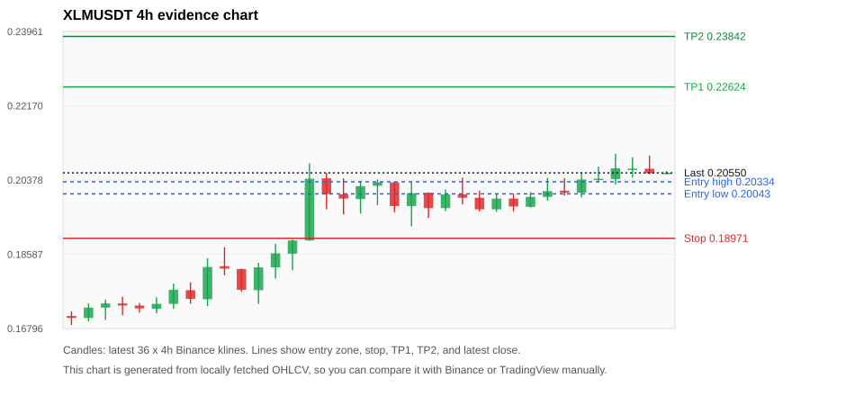
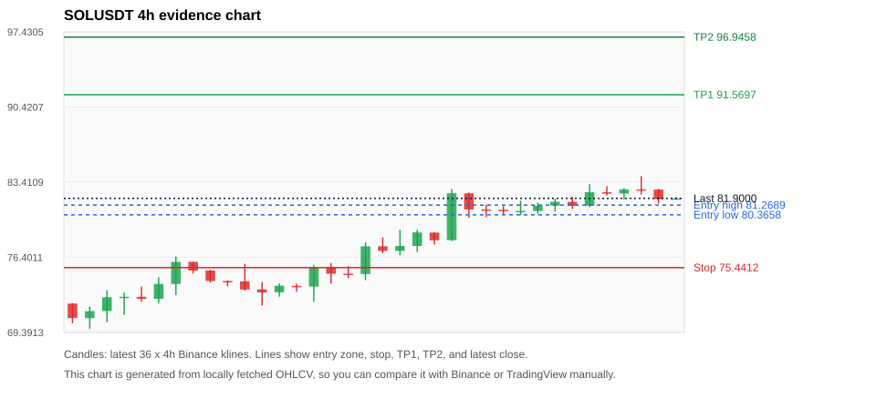
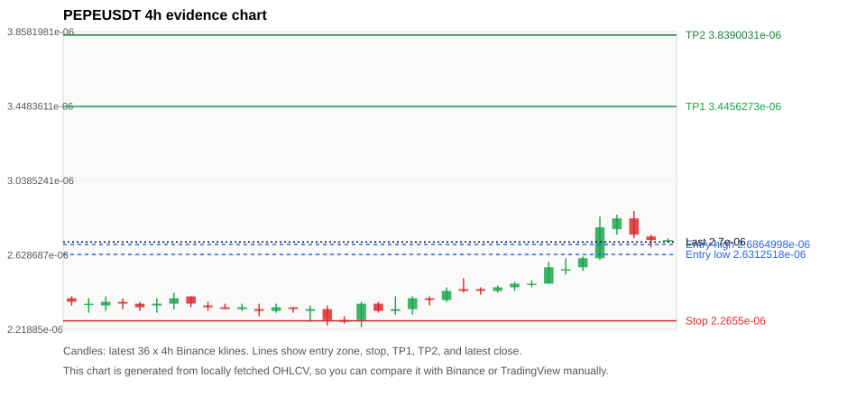
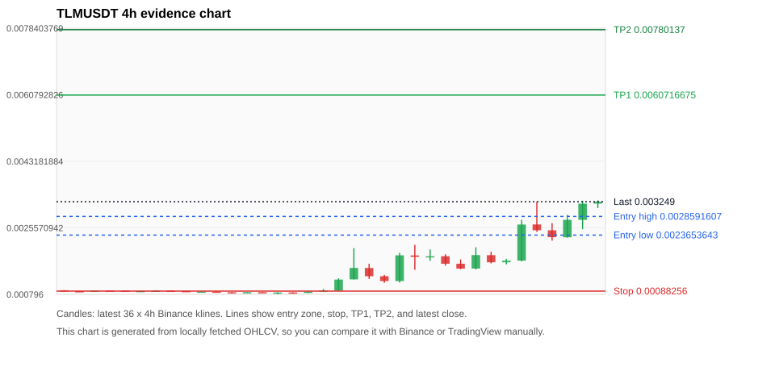
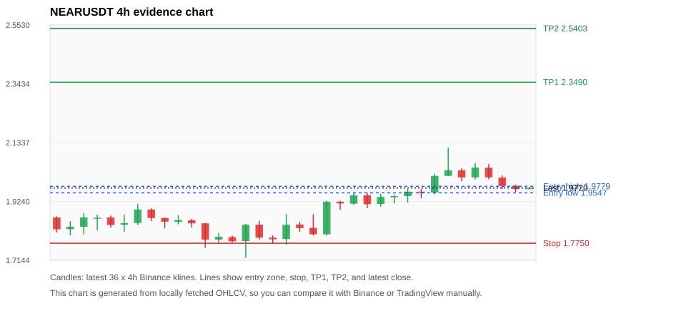

# Crypto 市场扫描报告 v1

- 报告时间：2026-07-04 20:06:16 CST
- Run ID：`20260704_120503_e9b94b93`
- Run type：`daily_full`
- 数据来源：SQLite
- 报告版本：v1
- 扫描 ID：da040ac0b9ea
- 数据源：Binance public spot API + CoinGecko/CoinMarketCap cross-check
- 过滤条件：USDT spot; 24h quote volume >= 30,000,000; trades >= 30,000; exclude stables/leveraged tokens; analyze 1h/4h/1d klines
- 默认单笔风险：账户权益的 1.00%

## 限制说明

- 交易信号仍以 Binance 现货公开 K 线为主源；外部数据源用于一致性复核。
- 结果是研究和模拟盘计划，不是确定收益或实盘下单指令。
- 历史长度过滤：候选币至少需要 180 根 1d K 线。
- 数据质量验证池：先验证 score 排名前 min(top_n * 2, 10) 的候选，再按 action + score 补足最终名单。
- 大盘环境过滤：RISK_OFF; BTC/ETH 大盘偏弱，山寨币买入候选降级为观察。 BTC 7d=4.204401206083719; ETH 7d=11.932096137840764.
- 已启用数据交叉验证：Binance 主源 + CoinGecko 自动对照；CoinMarketCap 在配置 API Key 后自动对照。
- SOLUSDT 交叉验证状态 DATA_WARNING：At least one external provider needs manual review.
- PEPEUSDT 交叉验证状态 DATA_WARNING：At least one external provider needs manual review.
- TLMUSDT 交叉验证状态 DATA_ERROR：At least one external provider disagrees materially or symbol mapping failed.
- NEARUSDT 交叉验证状态 DATA_WARNING：At least one external provider needs manual review.
- ADAUSDT 交叉验证状态 DATA_WARNING：At least one external provider needs manual review.
- BNBUSDT 交叉验证状态 DATA_WARNING：At least one external provider needs manual review.
- ZECUSDT 交叉验证状态 DATA_WARNING：At least one external provider needs manual review.
- HMSTRUSDT 交叉验证状态 DATA_WARNING：At least one external provider needs manual review.
- ETHUSDT 交叉验证状态 DATA_WARNING：At least one external provider needs manual review.

## 5 个候选交易计划

| Rank | Coin | Action | Setup | Entry Zone | Stop Loss | TP1 | TP2 / Exit Rule | R/R | Verdict |
|---:|---|---|---|---:|---:|---:|---|---:|---|
| 1 | `XLM` | `WATCH_ONLY` | 回踩支撑/4h EMA 附近 | 0.20043 - 0.20334 | 0.18971 | 0.22624 | 0.23842 或跌破 4h 关键支撑 | 2.00-3.00 | 只观察 |
| 2 | `SOL` | `WATCH_ONLY` | 回踩支撑/4h EMA 附近 | 80.3658 - 81.2689 | 75.4412 | 91.5697 | 96.9458 或跌破 4h 关键支撑 | 2.00-3.00 | 只观察 |
| 3 | `PEPE` | `WATCH_ONLY` | 回踩支撑/4h EMA 附近 | 2.6312518e-06 - 2.6864998e-06 | 2.2655e-06 | 3.4456273e-06 | 3.8390031e-06 或跌破 4h 关键支撑 | 2.00-3.00 | 只等回调 |
| 4 | `TLM` | `WATCH_ONLY` | 涨幅较远，只等深回调 | 0.0023653643 - 0.0028591607 | 0.00088256 | 0.0060716675 | 0.00780137 或跌破 4h 关键支撑 | 2.00-3.00 | 只观察 |
| 5 | `NEAR` | `WATCH_ONLY` | 回踩支撑/4h EMA 附近 | 1.9547 - 1.9779 | 1.7750 | 2.3490 | 2.5403 或跌破 4h 关键支撑 | 2.00-3.00 | 只观察 |

## 数据交叉验证摘要

价格差异以 Binance 当前价为基准；成交量口径不同，Binance 是 USDT 现货成交额，CoinGecko/CoinMarketCap 通常是全市场成交量。

| Rank | Coin | Data Status | Max Price Diff | Max 24h Diff | Message |
|---:|---|---|---:|---:|---|
| 1 | `XLM` | DATA_OK | 0.06% | 0.00 pts | External provider checks agree with Binance within configured thresholds. |
| 2 | `SOL` | DATA_WARNING | 0.14% | 0.00 pts | At least one external provider needs manual review. |
| 3 | `PEPE` | DATA_WARNING | 0.22% | 0.17 pts | At least one external provider needs manual review. |
| 4 | `TLM` | DATA_ERROR | 3.80% | 9.90 pts | At least one external provider disagrees materially or symbol mapping failed. |
| 5 | `NEAR` | DATA_WARNING | 0.24% | 0.25 pts | At least one external provider needs manual review. |

## 候选币说明

### 1. XLM `XLMUSDT`



- 入选原因：回踩支撑/4h EMA 附近；24h +2.04%，7d +16.04%，4h RSI 68.72，24h 成交额 $112.5M。
- 交易失效条件：跌破 0.189711 或 4h 收盘重新失守关键支撑。
- 主要风险：成交量突增，可能是事件驱动；BTC/ETH 大盘环境未确认强势，山寨币买入信号降级。
- 数据交叉验证：DATA_OK；External provider checks agree with Binance within configured thresholds.

#### 可点击人工验证

- [Binance 交易页](https://www.binance.com/en/trade/XLM_USDT)
- [TradingView 图表](https://www.tradingview.com/chart/?symbol=BINANCE%3AXLMUSDT)
- [CoinGecko 搜索](https://www.coingecko.com/en/search?query=XLM)
- [CoinMarketCap 搜索](https://coinmarketcap.com/search/?q=XLM)

#### 多数据源对照

| Source | Status | Asset ID | Price | 24h Change | 24h Volume | Price Diff | 24h Diff | Updated | Message |
|---|---|---|---:|---:|---:|---:|---:|---|---|
| Binance | DATA_OK | XLMUSDT | 0.20550 | +2.04% | $112.5M | 0.00% | 0.00 pts | 2026-07-04T12:05:24+00:00 | Primary market data source used by scanner. |
| CoinGecko | DATA_OK | stellar | 0.20537 | +2.04% | $703.9M | 0.06% | 0.00 pts | 2026-07-04T12:05:23.075Z | External source agrees with Binance within thresholds. |
| CoinMarketCap | DATA_OK | 512 | 0.20547 | +2.04% | $749.4M | 0.01% | 0.00 pts | 2026-07-04T12:04:05.000Z | External source agrees with Binance within thresholds. |

#### 指标证据

| 指标 | 数值 | 人工核对用途 |
|---|---:|---|
| 当前价 | 0.20550 | 与 Binance/TradingView 当前价格对照 |
| 24h 涨跌 | +2.04% | 与交易所 24h 涨跌对照 |
| 7d 涨跌 | +16.04% | 判断短线趋势是否延续 |
| 4h EMA20 | 0.20003 | 判断短期趋势支撑 |
| 4h EMA50 | 0.19467 | 判断中期趋势支撑 |
| 1d EMA20 | 0.19528 | 判断日线趋势 |
| 1d EMA50 | 0.19109 | 判断日线趋势 |
| 4h RSI14 | 68.72 | 判断是否过热/过弱 |
| 4h ATR14 | 0.0047285714 | 推导止损和入场缓冲 |
| 最近 18 根 4h 最低点 | 0.19260 | 支撑/止损参考 |
| 最近 36 根 4h 最高点 | 0.21010 | TP/压力参考 |
| 支撑位 | 0.20003 | 入场区间推导基础 |

#### 交易计划推导

- 支撑位 = 最近低点、4h EMA20、4h EMA50、1d EMA20 中不高于当前价的最高有效支撑 = `0.20003`。
- 入场区间 = 支撑位附近 + ATR 缓冲 = `0.20043 - 0.20334`。
- 止损 = min(最近 18 根 4h 最低点 * 0.985, 入场中位价 - 1.15 * ATR14) = `0.18971`。
- TP1 = max(最近 36 根 4h 最高点 * 0.995, 入场中位价 + 2R) = `0.22624`。
- TP2 = max(入场中位价 + 3R, TP1 * 1.04) = `0.23842`。

#### 最近 10 根 4h K线

| UTC 开盘时间 | Open | High | Low | Close | Quote Volume | Trades |
|---|---:|---:|---:|---:|---:|---:|
| 2026-07-03T00:00+00:00 | 0.19930 | 0.20050 | 0.19620 | 0.19740 | $3.2M | 42576 |
| 2026-07-03T04:00+00:00 | 0.19730 | 0.20090 | 0.19710 | 0.19970 | $3.2M | 41420 |
| 2026-07-03T08:00+00:00 | 0.19970 | 0.20430 | 0.19880 | 0.20110 | $5.5M | 62782 |
| 2026-07-03T12:00+00:00 | 0.20120 | 0.20420 | 0.20000 | 0.20070 | $5.5M | 59794 |
| 2026-07-03T16:00+00:00 | 0.20070 | 0.20570 | 0.19960 | 0.20390 | $5.0M | 49351 |
| 2026-07-03T20:00+00:00 | 0.20390 | 0.20700 | 0.20320 | 0.20410 | $4.1M | 34564 |
| 2026-07-04T00:00+00:00 | 0.20400 | 0.21010 | 0.20270 | 0.20660 | $10.3M | 71706 |
| 2026-07-04T04:00+00:00 | 0.20650 | 0.20930 | 0.20440 | 0.20650 | $27.3M | 97425 |
| 2026-07-04T08:00+00:00 | 0.20650 | 0.20970 | 0.20520 | 0.20540 | $60.2M | 126695 |
| 2026-07-04T12:00+00:00 | 0.20540 | 0.20590 | 0.20530 | 0.20550 | $92,205 | 690 |

### 2. SOL `SOLUSDT`



- 入选原因：回踩支撑/4h EMA 附近；24h +0.31%，7d +13.18%，4h RSI 69.41，24h 成交额 $169.2M。
- 交易失效条件：跌破 75.44115 或 4h 收盘重新失守关键支撑。
- 主要风险：BTC/ETH 大盘环境未确认强势，山寨币买入信号降级；数据交叉验证需要人工复核。
- 数据交叉验证：DATA_WARNING；At least one external provider needs manual review.

#### 可点击人工验证

- [Binance 交易页](https://www.binance.com/en/trade/SOL_USDT)
- [TradingView 图表](https://www.tradingview.com/chart/?symbol=BINANCE%3ASOLUSDT)
- [CoinGecko 搜索](https://www.coingecko.com/en/search?query=SOL)
- [CoinMarketCap 搜索](https://coinmarketcap.com/search/?q=SOL)

#### 多数据源对照

| Source | Status | Asset ID | Price | 24h Change | 24h Volume | Price Diff | 24h Diff | Updated | Message |
|---|---|---|---:|---:|---:|---:|---:|---|---|
| Binance | DATA_OK | SOLUSDT | 81.9000 | +0.31% | $169.2M | 0.00% | 0.00 pts | 2026-07-04T12:05:24+00:00 | Primary market data source used by scanner. |
| CoinGecko | DATA_OK | solana | 81.8200 | +0.31% | $2.23B | 0.10% | 0.00 pts | 2026-07-04T12:05:11.622Z | External source agrees with Binance within thresholds. |
| CoinMarketCap | DATA_WARNING | 5426 | 81.7813 | +0.31% | $2.39B | 0.14% | 0.00 pts | 2026-07-04T12:04:05.000Z | CoinMarketCap symbol mapping has 8 matches; selected lowest cmc_rank |

#### 指标证据

| 指标 | 数值 | 人工核对用途 |
|---|---:|---|
| 当前价 | 81.9000 | 与 Binance/TradingView 当前价格对照 |
| 24h 涨跌 | +0.31% | 与交易所 24h 涨跌对照 |
| 7d 涨跌 | +13.18% | 判断短线趋势是否延续 |
| 4h EMA20 | 80.2054 | 判断短期趋势支撑 |
| 4h EMA50 | 76.9101 | 判断中期趋势支撑 |
| 1d EMA20 | 74.7131 | 判断日线趋势 |
| 1d EMA50 | 76.0607 | 判断日线趋势 |
| 4h RSI14 | 69.41 | 判断是否过热/过弱 |
| 4h ATR14 | 1.5193 | 推导止损和入场缓冲 |
| 最近 18 根 4h 最低点 | 76.5900 | 支撑/止损参考 |
| 最近 36 根 4h 最高点 | 83.9800 | TP/压力参考 |
| 支撑位 | 80.2054 | 入场区间推导基础 |

#### 交易计划推导

- 支撑位 = 最近低点、4h EMA20、4h EMA50、1d EMA20 中不高于当前价的最高有效支撑 = `80.2054`。
- 入场区间 = 支撑位附近 + ATR 缓冲 = `80.3658 - 81.2689`。
- 止损 = min(最近 18 根 4h 最低点 * 0.985, 入场中位价 - 1.15 * ATR14) = `75.4412`。
- TP1 = max(最近 36 根 4h 最高点 * 0.995, 入场中位价 + 2R) = `91.5697`。
- TP2 = max(入场中位价 + 3R, TP1 * 1.04) = `96.9458`。

#### 最近 10 根 4h K线

| UTC 开盘时间 | Open | High | Low | Close | Quote Volume | Trades |
|---|---:|---:|---:|---:|---:|---:|
| 2026-07-03T00:00+00:00 | 80.7200 | 81.6900 | 80.3400 | 80.7300 | $21.3M | 121472 |
| 2026-07-03T04:00+00:00 | 80.7200 | 81.5100 | 80.4400 | 81.2200 | $19.8M | 95288 |
| 2026-07-03T08:00+00:00 | 81.2300 | 81.8800 | 80.6700 | 81.5800 | $28.4M | 143777 |
| 2026-07-03T12:00+00:00 | 81.5700 | 82.0600 | 80.9100 | 81.2100 | $26.1M | 149979 |
| 2026-07-03T16:00+00:00 | 81.2100 | 83.2200 | 81.0800 | 82.4800 | $28.2M | 117623 |
| 2026-07-03T20:00+00:00 | 82.4700 | 83.0500 | 82.1600 | 82.3400 | $20.4M | 119085 |
| 2026-07-04T00:00+00:00 | 82.3500 | 82.8500 | 81.8000 | 82.7400 | $25.9M | 93765 |
| 2026-07-04T04:00+00:00 | 82.7400 | 83.9800 | 82.2600 | 82.7200 | $44.9M | 148161 |
| 2026-07-04T08:00+00:00 | 82.7200 | 82.7800 | 81.4200 | 81.8200 | $24.0M | 94161 |
| 2026-07-04T12:00+00:00 | 81.8200 | 82.0000 | 81.8000 | 81.9000 | $304,157 | 2108 |

### 3. PEPE `PEPEUSDT`



- 入选原因：回踩支撑/4h EMA 附近；24h +5.47%，7d +11.57%，4h RSI 77.97，24h 成交额 $30.2M。
- 交易失效条件：跌破 2.2655e-06 或 4h 收盘重新失守关键支撑。
- 主要风险：4h RSI 偏热；日线趋势未完全确认；BTC/ETH 大盘环境未确认强势，山寨币买入信号降级；数据交叉验证需要人工复核。
- 数据交叉验证：DATA_WARNING；At least one external provider needs manual review.

#### 可点击人工验证

- [Binance 交易页](https://www.binance.com/en/trade/PEPE_USDT)
- [TradingView 图表](https://www.tradingview.com/chart/?symbol=BINANCE%3APEPEUSDT)
- [CoinGecko 搜索](https://www.coingecko.com/en/search?query=PEPE)
- [CoinMarketCap 搜索](https://coinmarketcap.com/search/?q=PEPE)

#### 多数据源对照

| Source | Status | Asset ID | Price | 24h Change | 24h Volume | Price Diff | 24h Diff | Updated | Message |
|---|---|---|---:|---:|---:|---:|---:|---|---|
| Binance | DATA_OK | PEPEUSDT | 2.7e-06 | +5.47% | $30.2M | 0.00% | 0.00 pts | 2026-07-04T12:05:24+00:00 | Primary market data source used by scanner. |
| CoinGecko | DATA_WARNING | n/a | n/a | n/a | n/a | n/a | n/a | 2026-07-04T12:05:24+00:00 | Failed to fetch https://api.coingecko.com/api/v3/coins/markets?vs_currency=usd&ids=pepe&price_change_percentage=24h&per_page=1&page=1: HTTP Error 429: Too Many Requests |
| CoinMarketCap | DATA_WARNING | 24478 | 2.7060374e-06 | +5.64% | $322.1M | 0.22% | 0.17 pts | 2026-07-04T12:04:05.000Z | CoinMarketCap symbol mapping has 32 matches; selected lowest cmc_rank |

#### 指标证据

| 指标 | 数值 | 人工核对用途 |
|---|---:|---|
| 当前价 | 2.7e-06 | 与 Binance/TradingView 当前价格对照 |
| 24h 涨跌 | +5.47% | 与交易所 24h 涨跌对照 |
| 7d 涨跌 | +11.57% | 判断短线趋势是否延续 |
| 4h EMA20 | 2.5626143e-06 | 判断短期趋势支撑 |
| 4h EMA50 | 2.5059087e-06 | 判断中期趋势支撑 |
| 1d EMA20 | 2.6259998e-06 | 判断日线趋势 |
| 1d EMA50 | 2.9461343e-06 | 判断日线趋势 |
| 4h RSI14 | 77.97 | 判断是否过热/过弱 |
| 4h ATR14 | 8.6428571e-08 | 推导止损和入场缓冲 |
| 最近 18 根 4h 最低点 | 2.3e-06 | 支撑/止损参考 |
| 最近 36 根 4h 最高点 | 2.87e-06 | TP/压力参考 |
| 支撑位 | 2.6259998e-06 | 入场区间推导基础 |

#### 交易计划推导

- 支撑位 = 最近低点、4h EMA20、4h EMA50、1d EMA20 中不高于当前价的最高有效支撑 = `2.6259998e-06`。
- 入场区间 = 支撑位附近 + ATR 缓冲 = `2.6312518e-06 - 2.6864998e-06`。
- 止损 = min(最近 18 根 4h 最低点 * 0.985, 入场中位价 - 1.15 * ATR14) = `2.2655e-06`。
- TP1 = max(最近 36 根 4h 最高点 * 0.995, 入场中位价 + 2R) = `3.4456273e-06`。
- TP2 = max(入场中位价 + 3R, TP1 * 1.04) = `3.8390031e-06`。

#### 最近 10 根 4h K线

| UTC 开盘时间 | Open | High | Low | Close | Quote Volume | Trades |
|---|---:|---:|---:|---:|---:|---:|
| 2026-07-03T00:00+00:00 | 2.45e-06 | 2.48e-06 | 2.43e-06 | 2.47e-06 | $1.6M | 4851 |
| 2026-07-03T04:00+00:00 | 2.47e-06 | 2.49e-06 | 2.45e-06 | 2.47e-06 | $1.4M | 3711 |
| 2026-07-03T08:00+00:00 | 2.47e-06 | 2.59e-06 | 2.47e-06 | 2.56e-06 | $3.4M | 10479 |
| 2026-07-03T12:00+00:00 | 2.55e-06 | 2.61e-06 | 2.52e-06 | 2.55e-06 | $3.9M | 11926 |
| 2026-07-03T16:00+00:00 | 2.56e-06 | 2.62e-06 | 2.54e-06 | 2.61e-06 | $2.2M | 7261 |
| 2026-07-03T20:00+00:00 | 2.61e-06 | 2.84e-06 | 2.6e-06 | 2.78e-06 | $9.0M | 27079 |
| 2026-07-04T00:00+00:00 | 2.77e-06 | 2.85e-06 | 2.74e-06 | 2.83e-06 | $5.4M | 16150 |
| 2026-07-04T04:00+00:00 | 2.83e-06 | 2.87e-06 | 2.72e-06 | 2.74e-06 | $6.3M | 16151 |
| 2026-07-04T08:00+00:00 | 2.73e-06 | 2.74e-06 | 2.67e-06 | 2.71e-06 | $3.3M | 9848 |
| 2026-07-04T12:00+00:00 | 2.71e-06 | 2.72e-06 | 2.7e-06 | 2.71e-06 | $99,558 | 233 |

### 4. TLM `TLMUSDT`



- 入选原因：涨幅较远，只等深回调；24h +98.72%，7d +264.65%，4h RSI 77.01，24h 成交额 $38.4M。
- 交易失效条件：跌破 0.00088256 或 4h 收盘重新失守关键支撑。
- 主要风险：距离支撑偏远，不能追市价；4h RSI 偏热；24h 振幅较大，回撤风险高；成交量突增，可能是事件驱动；BTC/ETH 大盘环境未确认强势，山寨币买入信号降级；数据交叉验证出现重大差异或映射失败，先不要直接执行计划。
- 数据交叉验证：DATA_ERROR；At least one external provider disagrees materially or symbol mapping failed.

#### 可点击人工验证

- [Binance 交易页](https://www.binance.com/en/trade/TLM_USDT)
- [TradingView 图表](https://www.tradingview.com/chart/?symbol=BINANCE%3ATLMUSDT)
- [CoinGecko 搜索](https://www.coingecko.com/en/search?query=TLM)
- [CoinMarketCap 搜索](https://coinmarketcap.com/search/?q=TLM)

#### 多数据源对照

| Source | Status | Asset ID | Price | 24h Change | 24h Volume | Price Diff | 24h Diff | Updated | Message |
|---|---|---|---:|---:|---:|---:|---:|---|---|
| Binance | DATA_OK | TLMUSDT | 0.003249 | +98.72% | $38.4M | 0.00% | 0.00 pts | 2026-07-04T12:05:24+00:00 | Primary market data source used by scanner. |
| CoinGecko | DATA_WARNING | n/a | n/a | n/a | n/a | n/a | n/a | 2026-07-04T12:05:24+00:00 | Failed to fetch https://api.coingecko.com/api/v3/coins/markets?vs_currency=usd&ids=alien-worlds&price_change_percentage=24h&per_page=1&page=1: HTTP Error 429: Too Many Requests |
| CoinMarketCap | DATA_ERROR | 9119 | 0.0031256513 | +88.83% | $198.1M | 3.80% | 9.90 pts | 2026-07-04T12:04:05.000Z | price diff 3.80% exceeds error threshold; 24h change diff 9.90 points exceeds warning threshold |

#### 指标证据

| 指标 | 数值 | 人工核对用途 |
|---|---:|---|
| 当前价 | 0.003249 | 与 Binance/TradingView 当前价格对照 |
| 24h 涨跌 | +98.72% | 与交易所 24h 涨跌对照 |
| 7d 涨跌 | +264.65% | 判断短线趋势是否延续 |
| 4h EMA20 | 0.0020367414 | 判断短期趋势支撑 |
| 4h EMA50 | 0.0015110262 | 判断中期趋势支撑 |
| 1d EMA20 | 0.0014155955 | 判断日线趋势 |
| 1d EMA50 | 0.0013641862 | 判断日线趋势 |
| 4h RSI14 | 77.01 | 判断是否过热/过弱 |
| 4h ATR14 | 0.00051978571 | 推导止损和入场缓冲 |
| 最近 18 根 4h 最低点 | 0.000896 | 支撑/止损参考 |
| 最近 36 根 4h 最高点 | 0.003285 | TP/压力参考 |
| 支撑位 | 0.0020367414 | 入场区间推导基础 |

#### 交易计划推导

- 支撑位 = 最近低点、4h EMA20、4h EMA50、1d EMA20 中不高于当前价的最高有效支撑 = `0.0020367414`。
- 入场区间 = 支撑位附近 + ATR 缓冲 = `0.0023653643 - 0.0028591607`。
- 止损 = min(最近 18 根 4h 最低点 * 0.985, 入场中位价 - 1.15 * ATR14) = `0.00088256`。
- TP1 = max(最近 36 根 4h 最高点 * 0.995, 入场中位价 + 2R) = `0.0060716675`。
- TP2 = max(入场中位价 + 3R, TP1 * 1.04) = `0.00780137`。

#### 最近 10 根 4h K线

| UTC 开盘时间 | Open | High | Low | Close | Quote Volume | Trades |
|---|---:|---:|---:|---:|---:|---:|
| 2026-07-03T00:00+00:00 | 0.001607 | 0.00172 | 0.001463 | 0.001478 | $2.6M | 36997 |
| 2026-07-03T04:00+00:00 | 0.001479 | 0.002044 | 0.001456 | 0.001836 | $6.1M | 96772 |
| 2026-07-03T08:00+00:00 | 0.001834 | 0.001924 | 0.001616 | 0.001645 | $3.7M | 47020 |
| 2026-07-03T12:00+00:00 | 0.001646 | 0.001739 | 0.00159 | 0.001687 | $1.4M | 19182 |
| 2026-07-03T16:00+00:00 | 0.001689 | 0.00277 | 0.001668 | 0.002645 | $5.7M | 80417 |
| 2026-07-03T20:00+00:00 | 0.002647 | 0.003248 | 0.002451 | 0.002494 | $13.4M | 163824 |
| 2026-07-04T00:00+00:00 | 0.002492 | 0.00268 | 0.002217 | 0.002309 | $4.8M | 71070 |
| 2026-07-04T04:00+00:00 | 0.002307 | 0.0029 | 0.002297 | 0.002769 | $6.0M | 75165 |
| 2026-07-04T08:00+00:00 | 0.002768 | 0.003274 | 0.00252 | 0.003197 | $6.6M | 93581 |
| 2026-07-04T12:00+00:00 | 0.003199 | 0.003285 | 0.003082 | 0.003249 | $365,609 | 5550 |

### 5. NEAR `NEARUSDT`



- 入选原因：回踩支撑/4h EMA 附近；24h -2.67%，7d +6.59%，4h RSI 58.36，24h 成交额 $36.5M。
- 交易失效条件：跌破 1.77497 或 4h 收盘重新失守关键支撑。
- 主要风险：日线趋势未完全确认；BTC/ETH 大盘环境未确认强势，山寨币买入信号降级；24h 动量未确认；数据交叉验证需要人工复核。
- 数据交叉验证：DATA_WARNING；At least one external provider needs manual review.

#### 可点击人工验证

- [Binance 交易页](https://www.binance.com/en/trade/NEAR_USDT)
- [TradingView 图表](https://www.tradingview.com/chart/?symbol=BINANCE%3ANEARUSDT)
- [CoinGecko 搜索](https://www.coingecko.com/en/search?query=NEAR)
- [CoinMarketCap 搜索](https://coinmarketcap.com/search/?q=NEAR)

#### 多数据源对照

| Source | Status | Asset ID | Price | 24h Change | 24h Volume | Price Diff | 24h Diff | Updated | Message |
|---|---|---|---:|---:|---:|---:|---:|---|---|
| Binance | DATA_OK | NEARUSDT | 1.9720 | -2.67% | $36.5M | 0.00% | 0.00 pts | 2026-07-04T12:05:24+00:00 | Primary market data source used by scanner. |
| CoinGecko | DATA_WARNING | n/a | n/a | n/a | n/a | n/a | n/a | 2026-07-04T12:05:24+00:00 | Failed to fetch https://api.coingecko.com/api/v3/coins/markets?vs_currency=usd&ids=near&price_change_percentage=24h&per_page=1&page=1: HTTP Error 429: Too Many Requests |
| CoinMarketCap | DATA_OK | 6535 | 1.9672 | -2.41% | $277.4M | 0.24% | 0.25 pts | 2026-07-04T12:04:05.000Z | External source agrees with Binance within thresholds. |

#### 指标证据

| 指标 | 数值 | 人工核对用途 |
|---|---:|---|
| 当前价 | 1.9720 | 与 Binance/TradingView 当前价格对照 |
| 24h 涨跌 | -2.67% | 与交易所 24h 涨跌对照 |
| 7d 涨跌 | +6.59% | 判断短线趋势是否延续 |
| 4h EMA20 | 1.9508 | 判断短期趋势支撑 |
| 4h EMA50 | 1.9320 | 判断中期趋势支撑 |
| 1d EMA20 | 1.9798 | 判断日线趋势 |
| 1d EMA50 | 1.9691 | 判断日线趋势 |
| 4h RSI14 | 58.36 | 判断是否过热/过弱 |
| 4h ATR14 | 0.04786 | 推导止损和入场缓冲 |
| 最近 18 根 4h 最低点 | 1.8020 | 支撑/止损参考 |
| 最近 36 根 4h 最高点 | 2.1160 | TP/压力参考 |
| 支撑位 | 1.9508 | 入场区间推导基础 |

#### 交易计划推导

- 支撑位 = 最近低点、4h EMA20、4h EMA50、1d EMA20 中不高于当前价的最高有效支撑 = `1.9508`。
- 入场区间 = 支撑位附近 + ATR 缓冲 = `1.9547 - 1.9779`。
- 止损 = min(最近 18 根 4h 最低点 * 0.985, 入场中位价 - 1.15 * ATR14) = `1.7750`。
- TP1 = max(最近 36 根 4h 最高点 * 0.995, 入场中位价 + 2R) = `2.3490`。
- TP2 = max(入场中位价 + 3R, TP1 * 1.04) = `2.5403`。

#### 最近 10 根 4h K线

| UTC 开盘时间 | Open | High | Low | Close | Quote Volume | Trades |
|---|---:|---:|---:|---:|---:|---:|
| 2026-07-03T00:00+00:00 | 1.9430 | 1.9680 | 1.9200 | 1.9590 | $4.4M | 27724 |
| 2026-07-03T04:00+00:00 | 1.9590 | 1.9680 | 1.9350 | 1.9560 | $2.6M | 17765 |
| 2026-07-03T08:00+00:00 | 1.9560 | 2.0220 | 1.9500 | 2.0150 | $5.4M | 30789 |
| 2026-07-03T12:00+00:00 | 2.0150 | 2.1160 | 2.0150 | 2.0350 | $15.2M | 66779 |
| 2026-07-03T16:00+00:00 | 2.0350 | 2.0420 | 1.9960 | 2.0100 | $5.6M | 26692 |
| 2026-07-03T20:00+00:00 | 2.0100 | 2.0620 | 2.0020 | 2.0450 | $4.4M | 30194 |
| 2026-07-04T00:00+00:00 | 2.0440 | 2.0570 | 2.0030 | 2.0100 | $4.4M | 27060 |
| 2026-07-04T04:00+00:00 | 2.0090 | 2.0170 | 1.9690 | 1.9790 | $4.2M | 24239 |
| 2026-07-04T08:00+00:00 | 1.9800 | 1.9840 | 1.9580 | 1.9680 | $2.9M | 14932 |
| 2026-07-04T12:00+00:00 | 1.9680 | 1.9730 | 1.9680 | 1.9720 | $29,341 | 227 |

## 组合风控

- 不要 5 个候选全部满仓买入。
- 同时持仓总风险建议控制在账户权益的 3% - 5% 以内。
- 如果 BTC/ETH 同时破位，暂停山寨币多头计划或降低仓位。
- 第一版报告用于模拟盘和人工复核，不自动下单。

## 原始数据

```json
[
  {
    "rank": 1,
    "symbol": "XLMUSDT",
    "base_asset": "XLM",
    "price": 0.2055,
    "score": 55.517302686339775,
    "setup": "回踩支撑/4h EMA 附近",
    "verdict": "只观察",
    "entry_low": 0.20043234205414567,
    "entry_high": 0.20334227749914738,
    "stop_loss": 0.189711,
    "take_profit_1": 0.22623992932993964,
    "take_profit_2": 0.2384162391065862,
    "risk_reward_1": 2.0,
    "risk_reward_2": 3.0,
    "pct_24h": 2.035,
    "pct_3d": 4.156107450582858,
    "pct_7d": 16.0361377752682,
    "quote_volume_24h": 112496204.4579,
    "trades_24h": 438803,
    "high_low_range_24h": 5.260521042084165,
    "rsi_1h": 52.48226950354602,
    "rsi_4h": 68.72246696035236,
    "ema20_4h": 0.20003227749914737,
    "ema50_4h": 0.19466753349412,
    "ema20_1d": 0.1952782045483433,
    "ema50_1d": 0.19109266819035858,
    "atr_4h": 0.004728571428571429,
    "macd_hist_4h": -3.9338771120653315e-05,
    "volume_ratio_24h": 4.889858221646679,
    "support_level": 0.20003227749914737,
    "recent_low_4h_18": 0.1926,
    "recent_high_4h_36": 0.2101,
    "distance_to_support_pct": 2.7334201105998712,
    "binance_trade_url": "https://www.binance.com/en/trade/XLM_USDT",
    "tradingview_url": "https://www.tradingview.com/chart/?symbol=BINANCE%3AXLMUSDT",
    "coingecko_search_url": "https://www.coingecko.com/en/search?query=XLM",
    "coinmarketcap_search_url": "https://coinmarketcap.com/search/?q=XLM",
    "invalidation": "跌破 0.189711 或 4h 收盘重新失守关键支撑",
    "recent_4h_klines": [
      {
        "open_time_utc": "2026-06-28T16:00+00:00",
        "open": 0.171,
        "high": 0.1721,
        "low": 0.1688,
        "close": 0.1705,
        "quote_volume": 1710564.4476,
        "trades": 9584
      },
      {
        "open_time_utc": "2026-06-28T20:00+00:00",
        "open": 0.1705,
        "high": 0.174,
        "low": 0.1697,
        "close": 0.173,
        "quote_volume": 1653605.6794,
        "trades": 8561
      },
      {
        "open_time_utc": "2026-06-29T00:00+00:00",
        "open": 0.173,
        "high": 0.1749,
        "low": 0.17,
        "close": 0.174,
        "quote_volume": 1622036.8261,
        "trades": 9215
      },
      {
        "open_time_utc": "2026-06-29T04:00+00:00",
        "open": 0.174,
        "high": 0.1756,
        "low": 0.1712,
        "close": 0.1735,
        "quote_volume": 937106.5002,
        "trades": 6104
      },
      {
        "open_time_utc": "2026-06-29T08:00+00:00",
        "open": 0.1735,
        "high": 0.1741,
        "low": 0.1718,
        "close": 0.1728,
        "quote_volume": 1257163.6421,
        "trades": 6441
      },
      {
        "open_time_utc": "2026-06-29T12:00+00:00",
        "open": 0.1727,
        "high": 0.1755,
        "low": 0.1716,
        "close": 0.1739,
        "quote_volume": 3951377.7985,
        "trades": 17794
      },
      {
        "open_time_utc": "2026-06-29T16:00+00:00",
        "open": 0.1739,
        "high": 0.1788,
        "low": 0.1727,
        "close": 0.1773,
        "quote_volume": 1771268.5606,
        "trades": 9954
      },
      {
        "open_time_utc": "2026-06-29T20:00+00:00",
        "open": 0.1772,
        "high": 0.1791,
        "low": 0.1739,
        "close": 0.1751,
        "quote_volume": 1515764.0289,
        "trades": 8516
      },
      {
        "open_time_utc": "2026-06-30T00:00+00:00",
        "open": 0.175,
        "high": 0.1849,
        "low": 0.1734,
        "close": 0.1828,
        "quote_volume": 5485625.539,
        "trades": 29145
      },
      {
        "open_time_utc": "2026-06-30T04:00+00:00",
        "open": 0.183,
        "high": 0.1876,
        "low": 0.1808,
        "close": 0.1824,
        "quote_volume": 6231596.4203,
        "trades": 38951
      },
      {
        "open_time_utc": "2026-06-30T08:00+00:00",
        "open": 0.1823,
        "high": 0.1824,
        "low": 0.1768,
        "close": 0.1773,
        "quote_volume": 3281091.2591,
        "trades": 17978
      },
      {
        "open_time_utc": "2026-06-30T12:00+00:00",
        "open": 0.1772,
        "high": 0.1838,
        "low": 0.1739,
        "close": 0.1827,
        "quote_volume": 5632204.1968,
        "trades": 31956
      },
      {
        "open_time_utc": "2026-06-30T16:00+00:00",
        "open": 0.1827,
        "high": 0.1884,
        "low": 0.18,
        "close": 0.1861,
        "quote_volume": 5288288.9501,
        "trades": 27298
      },
      {
        "open_time_utc": "2026-06-30T20:00+00:00",
        "open": 0.186,
        "high": 0.1894,
        "low": 0.182,
        "close": 0.1892,
        "quote_volume": 3023638.6799,
        "trades": 17676
      },
      {
        "open_time_utc": "2026-07-01T00:00+00:00",
        "open": 0.1892,
        "high": 0.2078,
        "low": 0.1891,
        "close": 0.2041,
        "quote_volume": 16961986.8587,
        "trades": 87868
      },
      {
        "open_time_utc": "2026-07-01T04:00+00:00",
        "open": 0.2042,
        "high": 0.2055,
        "low": 0.1967,
        "close": 0.2004,
        "quote_volume": 9433515.1798,
        "trades": 49795
      },
      {
        "open_time_utc": "2026-07-01T08:00+00:00",
        "open": 0.2003,
        "high": 0.2042,
        "low": 0.1955,
        "close": 0.1993,
        "quote_volume": 7954920.2474,
        "trades": 39652
      },
      {
        "open_time_utc": "2026-07-01T12:00+00:00",
        "open": 0.1992,
        "high": 0.2036,
        "low": 0.1957,
        "close": 0.2023,
        "quote_volume": 6424396.9038,
        "trades": 48938
      },
      {
        "open_time_utc": "2026-07-01T16:00+00:00",
        "open": 0.2024,
        "high": 0.2039,
        "low": 0.1977,
        "close": 0.2032,
        "quote_volume": 4339314.3678,
        "trades": 33205
      },
      {
        "open_time_utc": "2026-07-01T20:00+00:00",
        "open": 0.2032,
        "high": 0.2035,
        "low": 0.196,
        "close": 0.1975,
        "quote_volume": 3414584.6828,
        "trades": 29261
      },
      {
        "open_time_utc": "2026-07-02T00:00+00:00",
        "open": 0.1975,
        "high": 0.2034,
        "low": 0.1926,
        "close": 0.2006,
        "quote_volume": 4874305.8139,
        "trades": 38472
      },
      {
        "open_time_utc": "2026-07-02T04:00+00:00",
        "open": 0.2007,
        "high": 0.2008,
        "low": 0.1946,
        "close": 0.197,
        "quote_volume": 2424830.6471,
        "trades": 22355
      },
      {
        "open_time_utc": "2026-07-02T08:00+00:00",
        "open": 0.197,
        "high": 0.2015,
        "low": 0.1963,
        "close": 0.2003,
        "quote_volume": 4547375.2629,
        "trades": 46797
      },
      {
        "open_time_utc": "2026-07-02T12:00+00:00",
        "open": 0.2003,
        "high": 0.2044,
        "low": 0.1979,
        "close": 0.1995,
        "quote_volume": 6552675.2112,
        "trades": 82819
      },
      {
        "open_time_utc": "2026-07-02T16:00+00:00",
        "open": 0.1995,
        "high": 0.2012,
        "low": 0.1962,
        "close": 0.1967,
        "quote_volume": 3440651.4385,
        "trades": 42916
      },
      {
        "open_time_utc": "2026-07-02T20:00+00:00",
        "open": 0.1967,
        "high": 0.2005,
        "low": 0.1961,
        "close": 0.1993,
        "quote_volume": 1845415.5045,
        "trades": 17647
      },
      {
        "open_time_utc": "2026-07-03T00:00+00:00",
        "open": 0.1993,
        "high": 0.2005,
        "low": 0.1962,
        "close": 0.1974,
        "quote_volume": 3225259.8181,
        "trades": 42576
      },
      {
        "open_time_utc": "2026-07-03T04:00+00:00",
        "open": 0.1973,
        "high": 0.2009,
        "low": 0.1971,
        "close": 0.1997,
        "quote_volume": 3222386.6187,
        "trades": 41420
      },
      {
        "open_time_utc": "2026-07-03T08:00+00:00",
        "open": 0.1997,
        "high": 0.2043,
        "low": 0.1988,
        "close": 0.2011,
        "quote_volume": 5452319.5594,
        "trades": 62782
      },
      {
        "open_time_utc": "2026-07-03T12:00+00:00",
        "open": 0.2012,
        "high": 0.2042,
        "low": 0.2,
        "close": 0.2007,
        "quote_volume": 5469675.5008,
        "trades": 59794
      },
      {
        "open_time_utc": "2026-07-03T16:00+00:00",
        "open": 0.2007,
        "high": 0.2057,
        "low": 0.1996,
        "close": 0.2039,
        "quote_volume": 5017999.1412,
        "trades": 49351
      },
      {
        "open_time_utc": "2026-07-03T20:00+00:00",
        "open": 0.2039,
        "high": 0.207,
        "low": 0.2032,
        "close": 0.2041,
        "quote_volume": 4131270.0361,
        "trades": 34564
      },
      {
        "open_time_utc": "2026-07-04T00:00+00:00",
        "open": 0.204,
        "high": 0.2101,
        "low": 0.2027,
        "close": 0.2066,
        "quote_volume": 10305498.9072,
        "trades": 71706
      },
      {
        "open_time_utc": "2026-07-04T04:00+00:00",
        "open": 0.2065,
        "high": 0.2093,
        "low": 0.2044,
        "close": 0.2065,
        "quote_volume": 27334523.1459,
        "trades": 97425
      },
      {
        "open_time_utc": "2026-07-04T08:00+00:00",
        "open": 0.2065,
        "high": 0.2097,
        "low": 0.2052,
        "close": 0.2054,
        "quote_volume": 60215060.8403,
        "trades": 126695
      },
      {
        "open_time_utc": "2026-07-04T12:00+00:00",
        "open": 0.2054,
        "high": 0.2059,
        "low": 0.2053,
        "close": 0.2055,
        "quote_volume": 92205.1283,
        "trades": 690
      }
    ],
    "risks": [
      "成交量突增，可能是事件驱动",
      "BTC/ETH 大盘环境未确认强势，山寨币买入信号降级"
    ],
    "data_quality_status": "DATA_OK",
    "data_quality_message": "External provider checks agree with Binance within configured thresholds.",
    "data_checks": [
      {
        "provider": "Binance",
        "status": "DATA_OK",
        "provider_asset_id": "XLMUSDT",
        "provider_symbol": "XLMUSDT",
        "price_usd": 0.2055,
        "pct_24h": 2.035,
        "volume_24h": 112496204.4579,
        "last_updated": null,
        "fetched_at_utc": "2026-07-04T12:05:24+00:00",
        "price_diff_pct": 0.0,
        "pct_24h_diff": 0.0,
        "volume_note": "Binance USDT spot 24h quoteVolume.",
        "message": "Primary market data source used by scanner."
      },
      {
        "provider": "CoinGecko",
        "status": "DATA_OK",
        "provider_asset_id": "stellar",
        "provider_symbol": "XLM",
        "price_usd": 0.205372,
        "pct_24h": 2.03744,
        "volume_24h": 703857455.0,
        "last_updated": "2026-07-04T12:05:23.075Z",
        "fetched_at_utc": "2026-07-04T12:05:24+00:00",
        "price_diff_pct": 0.06228710462286582,
        "pct_24h_diff": 0.0024399999999999977,
        "volume_note": "CoinGecko total market volume; not the same venue scope as Binance quoteVolume.",
        "message": "External source agrees with Binance within thresholds."
      },
      {
        "provider": "CoinMarketCap",
        "status": "DATA_OK",
        "provider_asset_id": "512",
        "provider_symbol": "XLM",
        "price_usd": 0.20547037303878296,
        "pct_24h": 2.03973852,
        "volume_24h": 749442181.1670367,
        "last_updated": "2026-07-04T12:04:05.000Z",
        "fetched_at_utc": "2026-07-04T12:05:24+00:00",
        "price_diff_pct": 0.014417012757677596,
        "pct_24h_diff": 0.004738520000000079,
        "volume_note": "CoinMarketCap total market volume; not the same venue scope as Binance quoteVolume.",
        "message": "External source agrees with Binance within thresholds."
      }
    ],
    "action": "WATCH_ONLY"
  },
  {
    "rank": 2,
    "symbol": "SOLUSDT",
    "base_asset": "SOL",
    "price": 81.9,
    "score": 54.33315474417003,
    "setup": "回踩支撑/4h EMA 附近",
    "verdict": "只观察",
    "entry_low": 80.3657727168402,
    "entry_high": 81.2688619928545,
    "stop_loss": 75.44115000000001,
    "take_profit_1": 91.56965206454203,
    "take_profit_2": 96.94581941938937,
    "risk_reward_1": 2.0,
    "risk_reward_2": 3.0,
    "pct_24h": 0.306,
    "pct_3d": 7.706470278800626,
    "pct_7d": 13.184079601990062,
    "quote_volume_24h": 169210750.53022,
    "trades_24h": 721708,
    "high_low_range_24h": 3.794339389445067,
    "rsi_1h": 45.045045045045065,
    "rsi_4h": 69.41410129096329,
    "ema20_4h": 80.20536199285449,
    "ema50_4h": 76.91013914787598,
    "ema20_1d": 74.71310882475751,
    "ema50_1d": 76.06071879645788,
    "atr_4h": 1.519285714285714,
    "macd_hist_4h": -0.11858229211218951,
    "volume_ratio_24h": 0.7411297770631328,
    "support_level": 80.20536199285449,
    "recent_low_4h_18": 76.59,
    "recent_high_4h_36": 83.98,
    "distance_to_support_pct": 2.112873709486518,
    "binance_trade_url": "https://www.binance.com/en/trade/SOL_USDT",
    "tradingview_url": "https://www.tradingview.com/chart/?symbol=BINANCE%3ASOLUSDT",
    "coingecko_search_url": "https://www.coingecko.com/en/search?query=SOL",
    "coinmarketcap_search_url": "https://coinmarketcap.com/search/?q=SOL",
    "invalidation": "跌破 75.44115 或 4h 收盘重新失守关键支撑",
    "recent_4h_klines": [
      {
        "open_time_utc": "2026-06-28T16:00+00:00",
        "open": 72.09,
        "high": 72.13,
        "low": 70.25,
        "close": 70.74,
        "quote_volume": 20974880.10862,
        "trades": 158341
      },
      {
        "open_time_utc": "2026-06-28T20:00+00:00",
        "open": 70.73,
        "high": 71.82,
        "low": 69.74,
        "close": 71.38,
        "quote_volume": 29453681.7673,
        "trades": 188218
      },
      {
        "open_time_utc": "2026-06-29T00:00+00:00",
        "open": 71.39,
        "high": 73.33,
        "low": 70.35,
        "close": 72.68,
        "quote_volume": 39741696.5793,
        "trades": 295125
      },
      {
        "open_time_utc": "2026-06-29T04:00+00:00",
        "open": 72.68,
        "high": 73.12,
        "low": 71.03,
        "close": 72.72,
        "quote_volume": 26528789.28622,
        "trades": 191305
      },
      {
        "open_time_utc": "2026-06-29T08:00+00:00",
        "open": 72.72,
        "high": 73.68,
        "low": 72.25,
        "close": 72.52,
        "quote_volume": 32369260.29807,
        "trades": 187395
      },
      {
        "open_time_utc": "2026-06-29T12:00+00:00",
        "open": 72.53,
        "high": 74.55,
        "low": 72.12,
        "close": 73.92,
        "quote_volume": 100504664.54814,
        "trades": 568353
      },
      {
        "open_time_utc": "2026-06-29T16:00+00:00",
        "open": 73.92,
        "high": 76.49,
        "low": 72.89,
        "close": 75.98,
        "quote_volume": 61884241.47614,
        "trades": 388596
      },
      {
        "open_time_utc": "2026-06-29T20:00+00:00",
        "open": 75.98,
        "high": 76.0,
        "low": 74.89,
        "close": 75.16,
        "quote_volume": 23201233.16584,
        "trades": 120457
      },
      {
        "open_time_utc": "2026-06-30T00:00+00:00",
        "open": 75.17,
        "high": 75.24,
        "low": 74.04,
        "close": 74.19,
        "quote_volume": 24338704.91384,
        "trades": 122420
      },
      {
        "open_time_utc": "2026-06-30T04:00+00:00",
        "open": 74.19,
        "high": 74.26,
        "low": 73.69,
        "close": 74.16,
        "quote_volume": 19656877.78171,
        "trades": 97157
      },
      {
        "open_time_utc": "2026-06-30T08:00+00:00",
        "open": 74.16,
        "high": 75.8,
        "low": 73.3,
        "close": 73.4,
        "quote_volume": 33350379.3327,
        "trades": 129685
      },
      {
        "open_time_utc": "2026-06-30T12:00+00:00",
        "open": 73.41,
        "high": 74.1,
        "low": 71.9,
        "close": 73.13,
        "quote_volume": 69839760.27259,
        "trades": 346017
      },
      {
        "open_time_utc": "2026-06-30T16:00+00:00",
        "open": 73.14,
        "high": 73.97,
        "low": 72.73,
        "close": 73.75,
        "quote_volume": 29802594.92308,
        "trades": 191961
      },
      {
        "open_time_utc": "2026-06-30T20:00+00:00",
        "open": 73.74,
        "high": 73.94,
        "low": 73.19,
        "close": 73.67,
        "quote_volume": 18959864.65497,
        "trades": 101995
      },
      {
        "open_time_utc": "2026-07-01T00:00+00:00",
        "open": 73.67,
        "high": 75.69,
        "low": 72.25,
        "close": 75.48,
        "quote_volume": 45060941.69644,
        "trades": 244428
      },
      {
        "open_time_utc": "2026-07-01T04:00+00:00",
        "open": 75.48,
        "high": 75.87,
        "low": 73.96,
        "close": 74.87,
        "quote_volume": 34665613.05043,
        "trades": 159932
      },
      {
        "open_time_utc": "2026-07-01T08:00+00:00",
        "open": 74.87,
        "high": 75.58,
        "low": 74.46,
        "close": 74.84,
        "quote_volume": 37052069.34886,
        "trades": 156857
      },
      {
        "open_time_utc": "2026-07-01T12:00+00:00",
        "open": 74.84,
        "high": 77.8,
        "low": 74.27,
        "close": 77.43,
        "quote_volume": 80087928.84047,
        "trades": 389474
      },
      {
        "open_time_utc": "2026-07-01T16:00+00:00",
        "open": 77.43,
        "high": 78.25,
        "low": 76.8,
        "close": 77.0,
        "quote_volume": 39013994.55446,
        "trades": 167760
      },
      {
        "open_time_utc": "2026-07-01T20:00+00:00",
        "open": 77.01,
        "high": 78.96,
        "low": 76.59,
        "close": 77.46,
        "quote_volume": 38543923.1392,
        "trades": 174603
      },
      {
        "open_time_utc": "2026-07-02T00:00+00:00",
        "open": 77.46,
        "high": 78.96,
        "low": 76.9,
        "close": 78.72,
        "quote_volume": 34433402.15377,
        "trades": 159407
      },
      {
        "open_time_utc": "2026-07-02T04:00+00:00",
        "open": 78.71,
        "high": 78.72,
        "low": 77.59,
        "close": 77.99,
        "quote_volume": 22931422.57994,
        "trades": 107493
      },
      {
        "open_time_utc": "2026-07-02T08:00+00:00",
        "open": 78.0,
        "high": 82.78,
        "low": 77.94,
        "close": 82.38,
        "quote_volume": 109937800.38721,
        "trades": 401272
      },
      {
        "open_time_utc": "2026-07-02T12:00+00:00",
        "open": 82.37,
        "high": 82.45,
        "low": 80.09,
        "close": 80.86,
        "quote_volume": 76928830.15031,
        "trades": 398311
      },
      {
        "open_time_utc": "2026-07-02T16:00+00:00",
        "open": 80.87,
        "high": 81.32,
        "low": 80.15,
        "close": 80.83,
        "quote_volume": 37260691.71212,
        "trades": 171617
      },
      {
        "open_time_utc": "2026-07-02T20:00+00:00",
        "open": 80.84,
        "high": 81.17,
        "low": 80.41,
        "close": 80.73,
        "quote_volume": 19218491.28012,
        "trades": 85476
      },
      {
        "open_time_utc": "2026-07-03T00:00+00:00",
        "open": 80.72,
        "high": 81.69,
        "low": 80.34,
        "close": 80.73,
        "quote_volume": 21307178.04469,
        "trades": 121472
      },
      {
        "open_time_utc": "2026-07-03T04:00+00:00",
        "open": 80.72,
        "high": 81.51,
        "low": 80.44,
        "close": 81.22,
        "quote_volume": 19799464.44439,
        "trades": 95288
      },
      {
        "open_time_utc": "2026-07-03T08:00+00:00",
        "open": 81.23,
        "high": 81.88,
        "low": 80.67,
        "close": 81.58,
        "quote_volume": 28421081.42705,
        "trades": 143777
      },
      {
        "open_time_utc": "2026-07-03T12:00+00:00",
        "open": 81.57,
        "high": 82.06,
        "low": 80.91,
        "close": 81.21,
        "quote_volume": 26115946.99032,
        "trades": 149979
      },
      {
        "open_time_utc": "2026-07-03T16:00+00:00",
        "open": 81.21,
        "high": 83.22,
        "low": 81.08,
        "close": 82.48,
        "quote_volume": 28237917.60878,
        "trades": 117623
      },
      {
        "open_time_utc": "2026-07-03T20:00+00:00",
        "open": 82.47,
        "high": 83.05,
        "low": 82.16,
        "close": 82.34,
        "quote_volume": 20449814.46714,
        "trades": 119085
      },
      {
        "open_time_utc": "2026-07-04T00:00+00:00",
        "open": 82.35,
        "high": 82.85,
        "low": 81.8,
        "close": 82.74,
        "quote_volume": 25870815.64515,
        "trades": 93765
      },
      {
        "open_time_utc": "2026-07-04T04:00+00:00",
        "open": 82.74,
        "high": 83.98,
        "low": 82.26,
        "close": 82.72,
        "quote_volume": 44914568.94539,
        "trades": 148161
      },
      {
        "open_time_utc": "2026-07-04T08:00+00:00",
        "open": 82.72,
        "high": 82.78,
        "low": 81.42,
        "close": 81.82,
        "quote_volume": 23992360.86089,
        "trades": 94161
      },
      {
        "open_time_utc": "2026-07-04T12:00+00:00",
        "open": 81.82,
        "high": 82.0,
        "low": 81.8,
        "close": 81.9,
        "quote_volume": 304157.28073,
        "trades": 2108
      }
    ],
    "risks": [
      "BTC/ETH 大盘环境未确认强势，山寨币买入信号降级",
      "数据交叉验证需要人工复核"
    ],
    "data_quality_status": "DATA_WARNING",
    "data_quality_message": "At least one external provider needs manual review.",
    "data_checks": [
      {
        "provider": "Binance",
        "status": "DATA_OK",
        "provider_asset_id": "SOLUSDT",
        "provider_symbol": "SOLUSDT",
        "price_usd": 81.9,
        "pct_24h": 0.306,
        "volume_24h": 169210750.53022,
        "last_updated": null,
        "fetched_at_utc": "2026-07-04T12:05:24+00:00",
        "price_diff_pct": 0.0,
        "pct_24h_diff": 0.0,
        "volume_note": "Binance USDT spot 24h quoteVolume.",
        "message": "Primary market data source used by scanner."
      },
      {
        "provider": "CoinGecko",
        "status": "DATA_OK",
        "provider_asset_id": "solana",
        "provider_symbol": "SOL",
        "price_usd": 81.82,
        "pct_24h": 0.30534,
        "volume_24h": 2234436416.0,
        "last_updated": "2026-07-04T12:05:11.622Z",
        "fetched_at_utc": "2026-07-04T12:05:24+00:00",
        "price_diff_pct": 0.09768009768011295,
        "pct_24h_diff": 0.0006599999999999939,
        "volume_note": "CoinGecko total market volume; not the same venue scope as Binance quoteVolume.",
        "message": "External source agrees with Binance within thresholds."
      },
      {
        "provider": "CoinMarketCap",
        "status": "DATA_WARNING",
        "provider_asset_id": "5426",
        "provider_symbol": "SOL",
        "price_usd": 81.78126658328479,
        "pct_24h": 0.30744591,
        "volume_24h": 2391158858.359162,
        "last_updated": "2026-07-04T12:04:05.000Z",
        "fetched_at_utc": "2026-07-04T12:05:24+00:00",
        "price_diff_pct": 0.14497364678292535,
        "pct_24h_diff": 0.0014459099999999947,
        "volume_note": "CoinMarketCap total market volume; not the same venue scope as Binance quoteVolume.",
        "message": "CoinMarketCap symbol mapping has 8 matches; selected lowest cmc_rank"
      }
    ],
    "action": "WATCH_ONLY"
  },
  {
    "rank": 3,
    "symbol": "PEPEUSDT",
    "base_asset": "PEPE",
    "price": 2.7e-06,
    "score": 53.02566089588028,
    "setup": "回踩支撑/4h EMA 附近",
    "verdict": "只等回调",
    "entry_low": 2.6312517720982004e-06,
    "entry_high": 2.6864997725530944e-06,
    "stop_loss": 2.2655e-06,
    "take_profit_1": 3.4456273169769425e-06,
    "take_profit_2": 3.83900308930259e-06,
    "risk_reward_1": 2.0,
    "risk_reward_2": 3.000000000000001,
    "pct_24h": 5.469,
    "pct_3d": 17.391304347826075,
    "pct_7d": 11.570247933884282,
    "quote_volume_24h": 30236880.81284196,
    "trades_24h": 88475,
    "high_low_range_24h": 13.888888888888884,
    "rsi_1h": 42.424242424242415,
    "rsi_4h": 77.96610169491524,
    "ema20_4h": 2.562614328040679e-06,
    "ema50_4h": 2.5059086664948022e-06,
    "ema20_1d": 2.6259997725530943e-06,
    "ema50_1d": 2.94613427556511e-06,
    "atr_4h": 8.642857142857141e-08,
    "macd_hist_4h": 2.9579432608409997e-08,
    "volume_ratio_24h": 2.0942203789086067,
    "support_level": 2.6259997725530943e-06,
    "recent_low_4h_18": 2.3e-06,
    "recent_high_4h_36": 2.87e-06,
    "distance_to_support_pct": 2.8179830105224957,
    "binance_trade_url": "https://www.binance.com/en/trade/PEPE_USDT",
    "tradingview_url": "https://www.tradingview.com/chart/?symbol=BINANCE%3APEPEUSDT",
    "coingecko_search_url": "https://www.coingecko.com/en/search?query=PEPE",
    "coinmarketcap_search_url": "https://coinmarketcap.com/search/?q=PEPE",
    "invalidation": "跌破 2.2655e-06 或 4h 收盘重新失守关键支撑",
    "recent_4h_klines": [
      {
        "open_time_utc": "2026-06-28T16:00+00:00",
        "open": 2.39e-06,
        "high": 2.4e-06,
        "low": 2.35e-06,
        "close": 2.37e-06,
        "quote_volume": 1467865.30242466,
        "trades": 5623
      },
      {
        "open_time_utc": "2026-06-28T20:00+00:00",
        "open": 2.36e-06,
        "high": 2.39e-06,
        "low": 2.31e-06,
        "close": 2.36e-06,
        "quote_volume": 3209454.30464385,
        "trades": 8985
      },
      {
        "open_time_utc": "2026-06-29T00:00+00:00",
        "open": 2.35e-06,
        "high": 2.4e-06,
        "low": 2.32e-06,
        "close": 2.37e-06,
        "quote_volume": 2625073.876358,
        "trades": 6726
      },
      {
        "open_time_utc": "2026-06-29T04:00+00:00",
        "open": 2.37e-06,
        "high": 2.39e-06,
        "low": 2.33e-06,
        "close": 2.36e-06,
        "quote_volume": 1542118.68564447,
        "trades": 5164
      },
      {
        "open_time_utc": "2026-06-29T08:00+00:00",
        "open": 2.36e-06,
        "high": 2.37e-06,
        "low": 2.32e-06,
        "close": 2.34e-06,
        "quote_volume": 1442150.73153458,
        "trades": 5448
      },
      {
        "open_time_utc": "2026-06-29T12:00+00:00",
        "open": 2.35e-06,
        "high": 2.39e-06,
        "low": 2.31e-06,
        "close": 2.36e-06,
        "quote_volume": 5296420.3809734,
        "trades": 14705
      },
      {
        "open_time_utc": "2026-06-29T16:00+00:00",
        "open": 2.36e-06,
        "high": 2.42e-06,
        "low": 2.33e-06,
        "close": 2.39e-06,
        "quote_volume": 2931753.0147219,
        "trades": 8563
      },
      {
        "open_time_utc": "2026-06-29T20:00+00:00",
        "open": 2.4e-06,
        "high": 2.4e-06,
        "low": 2.34e-06,
        "close": 2.36e-06,
        "quote_volume": 993650.62140424,
        "trades": 3252
      },
      {
        "open_time_utc": "2026-06-30T00:00+00:00",
        "open": 2.35e-06,
        "high": 2.37e-06,
        "low": 2.32e-06,
        "close": 2.34e-06,
        "quote_volume": 1555991.96339316,
        "trades": 4573
      },
      {
        "open_time_utc": "2026-06-30T04:00+00:00",
        "open": 2.34e-06,
        "high": 2.36e-06,
        "low": 2.33e-06,
        "close": 2.33e-06,
        "quote_volume": 888294.7931671,
        "trades": 3655
      },
      {
        "open_time_utc": "2026-06-30T08:00+00:00",
        "open": 2.33e-06,
        "high": 2.36e-06,
        "low": 2.32e-06,
        "close": 2.34e-06,
        "quote_volume": 2142790.46571529,
        "trades": 5983
      },
      {
        "open_time_utc": "2026-06-30T12:00+00:00",
        "open": 2.33e-06,
        "high": 2.36e-06,
        "low": 2.29e-06,
        "close": 2.32e-06,
        "quote_volume": 3826023.52076858,
        "trades": 11179
      },
      {
        "open_time_utc": "2026-06-30T16:00+00:00",
        "open": 2.32e-06,
        "high": 2.36e-06,
        "low": 2.31e-06,
        "close": 2.34e-06,
        "quote_volume": 2156607.84599447,
        "trades": 6403
      },
      {
        "open_time_utc": "2026-06-30T20:00+00:00",
        "open": 2.34e-06,
        "high": 2.34e-06,
        "low": 2.31e-06,
        "close": 2.33e-06,
        "quote_volume": 1135341.77971893,
        "trades": 3405
      },
      {
        "open_time_utc": "2026-07-01T00:00+00:00",
        "open": 2.32e-06,
        "high": 2.35e-06,
        "low": 2.26e-06,
        "close": 2.33e-06,
        "quote_volume": 3876043.59104813,
        "trades": 9027
      },
      {
        "open_time_utc": "2026-07-01T04:00+00:00",
        "open": 2.33e-06,
        "high": 2.35e-06,
        "low": 2.24e-06,
        "close": 2.27e-06,
        "quote_volume": 3639819.57238269,
        "trades": 9861
      },
      {
        "open_time_utc": "2026-07-01T08:00+00:00",
        "open": 2.27e-06,
        "high": 2.29e-06,
        "low": 2.25e-06,
        "close": 2.26e-06,
        "quote_volume": 1455241.25596092,
        "trades": 4689
      },
      {
        "open_time_utc": "2026-07-01T12:00+00:00",
        "open": 2.27e-06,
        "high": 2.37e-06,
        "low": 2.23e-06,
        "close": 2.36e-06,
        "quote_volume": 5217849.09295453,
        "trades": 13160
      },
      {
        "open_time_utc": "2026-07-01T16:00+00:00",
        "open": 2.36e-06,
        "high": 2.37e-06,
        "low": 2.31e-06,
        "close": 2.32e-06,
        "quote_volume": 1804614.89667731,
        "trades": 5614
      },
      {
        "open_time_utc": "2026-07-01T20:00+00:00",
        "open": 2.32e-06,
        "high": 2.4e-06,
        "low": 2.3e-06,
        "close": 2.33e-06,
        "quote_volume": 2184710.22857578,
        "trades": 6376
      },
      {
        "open_time_utc": "2026-07-02T00:00+00:00",
        "open": 2.33e-06,
        "high": 2.4e-06,
        "low": 2.3e-06,
        "close": 2.39e-06,
        "quote_volume": 3691197.73316342,
        "trades": 8184
      },
      {
        "open_time_utc": "2026-07-02T04:00+00:00",
        "open": 2.39e-06,
        "high": 2.4e-06,
        "low": 2.35e-06,
        "close": 2.38e-06,
        "quote_volume": 1785050.94504737,
        "trades": 4824
      },
      {
        "open_time_utc": "2026-07-02T08:00+00:00",
        "open": 2.38e-06,
        "high": 2.45e-06,
        "low": 2.37e-06,
        "close": 2.43e-06,
        "quote_volume": 3669343.87643895,
        "trades": 9255
      },
      {
        "open_time_utc": "2026-07-02T12:00+00:00",
        "open": 2.44e-06,
        "high": 2.5e-06,
        "low": 2.42e-06,
        "close": 2.43e-06,
        "quote_volume": 5823181.68605119,
        "trades": 14349
      },
      {
        "open_time_utc": "2026-07-02T16:00+00:00",
        "open": 2.44e-06,
        "high": 2.45e-06,
        "low": 2.41e-06,
        "close": 2.43e-06,
        "quote_volume": 1592764.32757843,
        "trades": 4986
      },
      {
        "open_time_utc": "2026-07-02T20:00+00:00",
        "open": 2.43e-06,
        "high": 2.46e-06,
        "low": 2.42e-06,
        "close": 2.45e-06,
        "quote_volume": 1090761.85671902,
        "trades": 2981
      },
      {
        "open_time_utc": "2026-07-03T00:00+00:00",
        "open": 2.45e-06,
        "high": 2.48e-06,
        "low": 2.43e-06,
        "close": 2.47e-06,
        "quote_volume": 1557816.65540769,
        "trades": 4851
      },
      {
        "open_time_utc": "2026-07-03T04:00+00:00",
        "open": 2.47e-06,
        "high": 2.49e-06,
        "low": 2.45e-06,
        "close": 2.47e-06,
        "quote_volume": 1407481.9791133,
        "trades": 3711
      },
      {
        "open_time_utc": "2026-07-03T08:00+00:00",
        "open": 2.47e-06,
        "high": 2.59e-06,
        "low": 2.47e-06,
        "close": 2.56e-06,
        "quote_volume": 3437268.83595296,
        "trades": 10479
      },
      {
        "open_time_utc": "2026-07-03T12:00+00:00",
        "open": 2.55e-06,
        "high": 2.61e-06,
        "low": 2.52e-06,
        "close": 2.55e-06,
        "quote_volume": 3914857.39992219,
        "trades": 11926
      },
      {
        "open_time_utc": "2026-07-03T16:00+00:00",
        "open": 2.56e-06,
        "high": 2.62e-06,
        "low": 2.54e-06,
        "close": 2.61e-06,
        "quote_volume": 2214320.10231654,
        "trades": 7261
      },
      {
        "open_time_utc": "2026-07-03T20:00+00:00",
        "open": 2.61e-06,
        "high": 2.84e-06,
        "low": 2.6e-06,
        "close": 2.78e-06,
        "quote_volume": 9036578.34872585,
        "trades": 27079
      },
      {
        "open_time_utc": "2026-07-04T00:00+00:00",
        "open": 2.77e-06,
        "high": 2.85e-06,
        "low": 2.74e-06,
        "close": 2.83e-06,
        "quote_volume": 5438342.08826546,
        "trades": 16150
      },
      {
        "open_time_utc": "2026-07-04T04:00+00:00",
        "open": 2.83e-06,
        "high": 2.87e-06,
        "low": 2.72e-06,
        "close": 2.74e-06,
        "quote_volume": 6281493.07153178,
        "trades": 16151
      },
      {
        "open_time_utc": "2026-07-04T08:00+00:00",
        "open": 2.73e-06,
        "high": 2.74e-06,
        "low": 2.67e-06,
        "close": 2.71e-06,
        "quote_volume": 3296096.51503789,
        "trades": 9848
      },
      {
        "open_time_utc": "2026-07-04T12:00+00:00",
        "open": 2.71e-06,
        "high": 2.72e-06,
        "low": 2.7e-06,
        "close": 2.71e-06,
        "quote_volume": 99557.64630461,
        "trades": 233
      }
    ],
    "risks": [
      "4h RSI 偏热",
      "日线趋势未完全确认",
      "BTC/ETH 大盘环境未确认强势，山寨币买入信号降级",
      "数据交叉验证需要人工复核"
    ],
    "data_quality_status": "DATA_WARNING",
    "data_quality_message": "At least one external provider needs manual review.",
    "data_checks": [
      {
        "provider": "Binance",
        "status": "DATA_OK",
        "provider_asset_id": "PEPEUSDT",
        "provider_symbol": "PEPEUSDT",
        "price_usd": 2.7e-06,
        "pct_24h": 5.469,
        "volume_24h": 30236880.81284196,
        "last_updated": null,
        "fetched_at_utc": "2026-07-04T12:05:24+00:00",
        "price_diff_pct": 0.0,
        "pct_24h_diff": 0.0,
        "volume_note": "Binance USDT spot 24h quoteVolume.",
        "message": "Primary market data source used by scanner."
      },
      {
        "provider": "CoinGecko",
        "status": "DATA_WARNING",
        "provider_asset_id": null,
        "provider_symbol": "PEPE",
        "price_usd": null,
        "pct_24h": null,
        "volume_24h": null,
        "last_updated": null,
        "fetched_at_utc": "2026-07-04T12:05:24+00:00",
        "price_diff_pct": null,
        "pct_24h_diff": null,
        "volume_note": "External provider data unavailable.",
        "message": "Failed to fetch https://api.coingecko.com/api/v3/coins/markets?vs_currency=usd&ids=pepe&price_change_percentage=24h&per_page=1&page=1: HTTP Error 429: Too Many Requests"
      },
      {
        "provider": "CoinMarketCap",
        "status": "DATA_WARNING",
        "provider_asset_id": "24478",
        "provider_symbol": "PEPE",
        "price_usd": 2.706037372868e-06,
        "pct_24h": 5.63950735,
        "volume_24h": 322076208.2029973,
        "last_updated": "2026-07-04T12:04:05.000Z",
        "fetched_at_utc": "2026-07-04T12:05:24+00:00",
        "price_diff_pct": 0.22360640251852024,
        "pct_24h_diff": 0.1705073499999994,
        "volume_note": "CoinMarketCap total market volume; not the same venue scope as Binance quoteVolume.",
        "message": "CoinMarketCap symbol mapping has 32 matches; selected lowest cmc_rank"
      }
    ],
    "action": "WATCH_ONLY"
  },
  {
    "rank": 4,
    "symbol": "TLMUSDT",
    "base_asset": "TLM",
    "price": 0.003249,
    "score": 50.41027081645311,
    "setup": "涨幅较远，只等深回调",
    "verdict": "只观察",
    "entry_low": 0.002365364285714286,
    "entry_high": 0.0028591607142857147,
    "stop_loss": 0.00088256,
    "take_profit_1": 0.006071667500000001,
    "take_profit_2": 0.007801370000000001,
    "risk_reward_1": 2.0,
    "risk_reward_2": 3.0,
    "pct_24h": 98.723,
    "pct_3d": 261.00000000000006,
    "pct_7d": 264.64646464646466,
    "quote_volume_24h": 38380296.597724,
    "trades_24h": 508084,
    "high_low_range_24h": 106.60377358490565,
    "rsi_1h": 63.802878325337986,
    "rsi_4h": 77.00617283950616,
    "ema20_4h": 0.0020367414046095164,
    "ema50_4h": 0.0015110262345293475,
    "ema20_1d": 0.0014155955315042173,
    "ema50_1d": 0.0013641861703168443,
    "atr_4h": 0.0005197857142857142,
    "macd_hist_4h": 0.0001520066449676485,
    "volume_ratio_24h": 3.761379548484978,
    "support_level": 0.0020367414046095164,
    "recent_low_4h_18": 0.000896,
    "recent_high_4h_36": 0.003285,
    "distance_to_support_pct": 59.519514487549664,
    "binance_trade_url": "https://www.binance.com/en/trade/TLM_USDT",
    "tradingview_url": "https://www.tradingview.com/chart/?symbol=BINANCE%3ATLMUSDT",
    "coingecko_search_url": "https://www.coingecko.com/en/search?query=TLM",
    "coinmarketcap_search_url": "https://coinmarketcap.com/search/?q=TLM",
    "invalidation": "跌破 0.00088256 或 4h 收盘重新失守关键支撑",
    "recent_4h_klines": [
      {
        "open_time_utc": "2026-06-28T16:00+00:00",
        "open": 0.000904,
        "high": 0.000908,
        "low": 0.000873,
        "close": 0.000881,
        "quote_volume": 158282.265844,
        "trades": 2377
      },
      {
        "open_time_utc": "2026-06-28T20:00+00:00",
        "open": 0.00088,
        "high": 0.000883,
        "low": 0.000866,
        "close": 0.000878,
        "quote_volume": 30384.801769,
        "trades": 642
      },
      {
        "open_time_utc": "2026-06-29T00:00+00:00",
        "open": 0.000877,
        "high": 0.000899,
        "low": 0.000867,
        "close": 0.000898,
        "quote_volume": 25544.050721,
        "trades": 524
      },
      {
        "open_time_utc": "2026-06-29T04:00+00:00",
        "open": 0.000898,
        "high": 0.0009,
        "low": 0.000886,
        "close": 0.000896,
        "quote_volume": 35168.34458,
        "trades": 520
      },
      {
        "open_time_utc": "2026-06-29T08:00+00:00",
        "open": 0.000897,
        "high": 0.0009,
        "low": 0.000885,
        "close": 0.000885,
        "quote_volume": 38252.898775,
        "trades": 501
      },
      {
        "open_time_utc": "2026-06-29T12:00+00:00",
        "open": 0.000885,
        "high": 0.000899,
        "low": 0.000872,
        "close": 0.000885,
        "quote_volume": 78976.272023,
        "trades": 1007
      },
      {
        "open_time_utc": "2026-06-29T16:00+00:00",
        "open": 0.000884,
        "high": 0.000906,
        "low": 0.000881,
        "close": 0.000895,
        "quote_volume": 41985.728712,
        "trades": 647
      },
      {
        "open_time_utc": "2026-06-29T20:00+00:00",
        "open": 0.000896,
        "high": 0.000898,
        "low": 0.000882,
        "close": 0.000886,
        "quote_volume": 10586.772401,
        "trades": 518
      },
      {
        "open_time_utc": "2026-06-30T00:00+00:00",
        "open": 0.000884,
        "high": 0.000884,
        "low": 0.000865,
        "close": 0.000869,
        "quote_volume": 24571.476895,
        "trades": 482
      },
      {
        "open_time_utc": "2026-06-30T04:00+00:00",
        "open": 0.000868,
        "high": 0.000875,
        "low": 0.000865,
        "close": 0.00087,
        "quote_volume": 31324.13129,
        "trades": 765
      },
      {
        "open_time_utc": "2026-06-30T08:00+00:00",
        "open": 0.000869,
        "high": 0.000873,
        "low": 0.000852,
        "close": 0.000854,
        "quote_volume": 31669.0878,
        "trades": 500
      },
      {
        "open_time_utc": "2026-06-30T12:00+00:00",
        "open": 0.000851,
        "high": 0.000857,
        "low": 0.000833,
        "close": 0.000847,
        "quote_volume": 56757.138895,
        "trades": 733
      },
      {
        "open_time_utc": "2026-06-30T16:00+00:00",
        "open": 0.000848,
        "high": 0.000857,
        "low": 0.000845,
        "close": 0.000853,
        "quote_volume": 12243.515105,
        "trades": 239
      },
      {
        "open_time_utc": "2026-06-30T20:00+00:00",
        "open": 0.000853,
        "high": 0.000853,
        "low": 0.000838,
        "close": 0.000841,
        "quote_volume": 28066.651527,
        "trades": 318
      },
      {
        "open_time_utc": "2026-07-01T00:00+00:00",
        "open": 0.000843,
        "high": 0.000848,
        "low": 0.0008,
        "close": 0.000846,
        "quote_volume": 59589.622817,
        "trades": 779
      },
      {
        "open_time_utc": "2026-07-01T04:00+00:00",
        "open": 0.000846,
        "high": 0.000852,
        "low": 0.000825,
        "close": 0.000836,
        "quote_volume": 23634.648225,
        "trades": 282
      },
      {
        "open_time_utc": "2026-07-01T08:00+00:00",
        "open": 0.000834,
        "high": 0.000871,
        "low": 0.000831,
        "close": 0.000871,
        "quote_volume": 140012.617334,
        "trades": 1723
      },
      {
        "open_time_utc": "2026-07-01T12:00+00:00",
        "open": 0.000869,
        "high": 0.00094,
        "low": 0.000864,
        "close": 0.000902,
        "quote_volume": 503389.537486,
        "trades": 8994
      },
      {
        "open_time_utc": "2026-07-01T16:00+00:00",
        "open": 0.000902,
        "high": 0.001221,
        "low": 0.000896,
        "close": 0.001188,
        "quote_volume": 2219853.716914,
        "trades": 42286
      },
      {
        "open_time_utc": "2026-07-01T20:00+00:00",
        "open": 0.001193,
        "high": 0.00202,
        "low": 0.001191,
        "close": 0.001495,
        "quote_volume": 12746206.655355,
        "trades": 305901
      },
      {
        "open_time_utc": "2026-07-02T00:00+00:00",
        "open": 0.001494,
        "high": 0.001606,
        "low": 0.001205,
        "close": 0.001276,
        "quote_volume": 3601727.514776,
        "trades": 76241
      },
      {
        "open_time_utc": "2026-07-02T04:00+00:00",
        "open": 0.001276,
        "high": 0.001312,
        "low": 0.001101,
        "close": 0.001149,
        "quote_volume": 1759075.74574,
        "trades": 26338
      },
      {
        "open_time_utc": "2026-07-02T08:00+00:00",
        "open": 0.001149,
        "high": 0.001897,
        "low": 0.001108,
        "close": 0.00183,
        "quote_volume": 5614463.873393,
        "trades": 100346
      },
      {
        "open_time_utc": "2026-07-02T12:00+00:00",
        "open": 0.001826,
        "high": 0.002107,
        "low": 0.001447,
        "close": 0.00179,
        "quote_volume": 10467533.11529,
        "trades": 213424
      },
      {
        "open_time_utc": "2026-07-02T16:00+00:00",
        "open": 0.00179,
        "high": 0.001985,
        "low": 0.001683,
        "close": 0.001805,
        "quote_volume": 6030697.421361,
        "trades": 117430
      },
      {
        "open_time_utc": "2026-07-02T20:00+00:00",
        "open": 0.001806,
        "high": 0.001858,
        "low": 0.001556,
        "close": 0.001607,
        "quote_volume": 3497573.035135,
        "trades": 58000
      },
      {
        "open_time_utc": "2026-07-03T00:00+00:00",
        "open": 0.001607,
        "high": 0.00172,
        "low": 0.001463,
        "close": 0.001478,
        "quote_volume": 2555224.628779,
        "trades": 36997
      },
      {
        "open_time_utc": "2026-07-03T04:00+00:00",
        "open": 0.001479,
        "high": 0.002044,
        "low": 0.001456,
        "close": 0.001836,
        "quote_volume": 6111293.480342,
        "trades": 96772
      },
      {
        "open_time_utc": "2026-07-03T08:00+00:00",
        "open": 0.001834,
        "high": 0.001924,
        "low": 0.001616,
        "close": 0.001645,
        "quote_volume": 3699275.972571,
        "trades": 47020
      },
      {
        "open_time_utc": "2026-07-03T12:00+00:00",
        "open": 0.001646,
        "high": 0.001739,
        "low": 0.00159,
        "close": 0.001687,
        "quote_volume": 1421036.647594,
        "trades": 19182
      },
      {
        "open_time_utc": "2026-07-03T16:00+00:00",
        "open": 0.001689,
        "high": 0.00277,
        "low": 0.001668,
        "close": 0.002645,
        "quote_volume": 5744688.703178,
        "trades": 80417
      },
      {
        "open_time_utc": "2026-07-03T20:00+00:00",
        "open": 0.002647,
        "high": 0.003248,
        "low": 0.002451,
        "close": 0.002494,
        "quote_volume": 13410729.838739,
        "trades": 163824
      },
      {
        "open_time_utc": "2026-07-04T00:00+00:00",
        "open": 0.002492,
        "high": 0.00268,
        "low": 0.002217,
        "close": 0.002309,
        "quote_volume": 4823965.717653,
        "trades": 71070
      },
      {
        "open_time_utc": "2026-07-04T04:00+00:00",
        "open": 0.002307,
        "high": 0.0029,
        "low": 0.002297,
        "close": 0.002769,
        "quote_volume": 6032234.774808,
        "trades": 75165
      },
      {
        "open_time_utc": "2026-07-04T08:00+00:00",
        "open": 0.002768,
        "high": 0.003274,
        "low": 0.00252,
        "close": 0.003197,
        "quote_volume": 6623830.088709,
        "trades": 93581
      },
      {
        "open_time_utc": "2026-07-04T12:00+00:00",
        "open": 0.003199,
        "high": 0.003285,
        "low": 0.003082,
        "close": 0.003249,
        "quote_volume": 365608.68533,
        "trades": 5550
      }
    ],
    "risks": [
      "距离支撑偏远，不能追市价",
      "4h RSI 偏热",
      "24h 振幅较大，回撤风险高",
      "成交量突增，可能是事件驱动",
      "BTC/ETH 大盘环境未确认强势，山寨币买入信号降级",
      "数据交叉验证出现重大差异或映射失败，先不要直接执行计划"
    ],
    "data_quality_status": "DATA_ERROR",
    "data_quality_message": "At least one external provider disagrees materially or symbol mapping failed.",
    "data_checks": [
      {
        "provider": "Binance",
        "status": "DATA_OK",
        "provider_asset_id": "TLMUSDT",
        "provider_symbol": "TLMUSDT",
        "price_usd": 0.003249,
        "pct_24h": 98.723,
        "volume_24h": 38380296.597724,
        "last_updated": null,
        "fetched_at_utc": "2026-07-04T12:05:24+00:00",
        "price_diff_pct": 0.0,
        "pct_24h_diff": 0.0,
        "volume_note": "Binance USDT spot 24h quoteVolume.",
        "message": "Primary market data source used by scanner."
      },
      {
        "provider": "CoinGecko",
        "status": "DATA_WARNING",
        "provider_asset_id": null,
        "provider_symbol": "TLM",
        "price_usd": null,
        "pct_24h": null,
        "volume_24h": null,
        "last_updated": null,
        "fetched_at_utc": "2026-07-04T12:05:24+00:00",
        "price_diff_pct": null,
        "pct_24h_diff": null,
        "volume_note": "External provider data unavailable.",
        "message": "Failed to fetch https://api.coingecko.com/api/v3/coins/markets?vs_currency=usd&ids=alien-worlds&price_change_percentage=24h&per_page=1&page=1: HTTP Error 429: Too Many Requests"
      },
      {
        "provider": "CoinMarketCap",
        "status": "DATA_ERROR",
        "provider_asset_id": "9119",
        "provider_symbol": "TLM",
        "price_usd": 0.003125651250186247,
        "pct_24h": 88.82725672,
        "volume_24h": 198118213.1098546,
        "last_updated": "2026-07-04T12:04:05.000Z",
        "fetched_at_utc": "2026-07-04T12:05:24+00:00",
        "price_diff_pct": 3.7965143063635978,
        "pct_24h_diff": 9.895743280000005,
        "volume_note": "CoinMarketCap total market volume; not the same venue scope as Binance quoteVolume.",
        "message": "price diff 3.80% exceeds error threshold; 24h change diff 9.90 points exceeds warning threshold"
      }
    ],
    "action": "WATCH_ONLY"
  },
  {
    "rank": 5,
    "symbol": "NEARUSDT",
    "base_asset": "NEAR",
    "price": 1.972,
    "score": 41.41486800021206,
    "setup": "回踩支撑/4h EMA 附近",
    "verdict": "只观察",
    "entry_low": 1.954700320696772,
    "entry_high": 1.9779159999999998,
    "stop_loss": 1.77497,
    "take_profit_1": 2.3489844810451577,
    "take_profit_2": 2.5403226413935434,
    "risk_reward_1": 2.0,
    "risk_reward_2": 2.9999999999999987,
    "pct_24h": -2.665,
    "pct_3d": 8.650137741046837,
    "pct_7d": 6.594594594594594,
    "quote_volume_24h": 36454878.2592,
    "trades_24h": 188512,
    "high_low_range_24h": 8.069458631256389,
    "rsi_1h": 19.298245614035366,
    "rsi_4h": 58.358662613981735,
    "ema20_4h": 1.9507987232502713,
    "ema50_4h": 1.9319822583436317,
    "ema20_1d": 1.9798382062909818,
    "ema50_1d": 1.9691125417353361,
    "atr_4h": 0.047857142857142834,
    "macd_hist_4h": 0.0009263988297000536,
    "volume_ratio_24h": 1.0103302601223265,
    "support_level": 1.9507987232502713,
    "recent_low_4h_18": 1.802,
    "recent_high_4h_36": 2.116,
    "distance_to_support_pct": 1.0867998065123174,
    "binance_trade_url": "https://www.binance.com/en/trade/NEAR_USDT",
    "tradingview_url": "https://www.tradingview.com/chart/?symbol=BINANCE%3ANEARUSDT",
    "coingecko_search_url": "https://www.coingecko.com/en/search?query=NEAR",
    "coinmarketcap_search_url": "https://coinmarketcap.com/search/?q=NEAR",
    "invalidation": "跌破 1.77497 或 4h 收盘重新失守关键支撑",
    "recent_4h_klines": [
      {
        "open_time_utc": "2026-06-28T16:00+00:00",
        "open": 1.867,
        "high": 1.871,
        "low": 1.813,
        "close": 1.825,
        "quote_volume": 7173446.3037,
        "trades": 34077
      },
      {
        "open_time_utc": "2026-06-28T20:00+00:00",
        "open": 1.825,
        "high": 1.854,
        "low": 1.803,
        "close": 1.834,
        "quote_volume": 4945855.8882,
        "trades": 40342
      },
      {
        "open_time_utc": "2026-06-29T00:00+00:00",
        "open": 1.834,
        "high": 1.882,
        "low": 1.807,
        "close": 1.867,
        "quote_volume": 4077080.1422,
        "trades": 36975
      },
      {
        "open_time_utc": "2026-06-29T04:00+00:00",
        "open": 1.866,
        "high": 1.877,
        "low": 1.821,
        "close": 1.866,
        "quote_volume": 2921911.3982,
        "trades": 23078
      },
      {
        "open_time_utc": "2026-06-29T08:00+00:00",
        "open": 1.867,
        "high": 1.874,
        "low": 1.831,
        "close": 1.84,
        "quote_volume": 3484010.8255,
        "trades": 22949
      },
      {
        "open_time_utc": "2026-06-29T12:00+00:00",
        "open": 1.841,
        "high": 1.877,
        "low": 1.815,
        "close": 1.847,
        "quote_volume": 8087433.9743,
        "trades": 62843
      },
      {
        "open_time_utc": "2026-06-29T16:00+00:00",
        "open": 1.847,
        "high": 1.916,
        "low": 1.84,
        "close": 1.895,
        "quote_volume": 5865286.3025,
        "trades": 40369
      },
      {
        "open_time_utc": "2026-06-29T20:00+00:00",
        "open": 1.895,
        "high": 1.9,
        "low": 1.854,
        "close": 1.865,
        "quote_volume": 5573930.9895,
        "trades": 25019
      },
      {
        "open_time_utc": "2026-06-30T00:00+00:00",
        "open": 1.865,
        "high": 1.867,
        "low": 1.828,
        "close": 1.852,
        "quote_volume": 3212730.162,
        "trades": 20868
      },
      {
        "open_time_utc": "2026-06-30T04:00+00:00",
        "open": 1.851,
        "high": 1.875,
        "low": 1.842,
        "close": 1.858,
        "quote_volume": 3548221.3061,
        "trades": 19676
      },
      {
        "open_time_utc": "2026-06-30T08:00+00:00",
        "open": 1.857,
        "high": 1.862,
        "low": 1.831,
        "close": 1.846,
        "quote_volume": 4445851.5675,
        "trades": 23020
      },
      {
        "open_time_utc": "2026-06-30T12:00+00:00",
        "open": 1.846,
        "high": 1.846,
        "low": 1.759,
        "close": 1.788,
        "quote_volume": 10995987.6924,
        "trades": 61819
      },
      {
        "open_time_utc": "2026-06-30T16:00+00:00",
        "open": 1.788,
        "high": 1.812,
        "low": 1.774,
        "close": 1.798,
        "quote_volume": 4739230.8195,
        "trades": 20551
      },
      {
        "open_time_utc": "2026-06-30T20:00+00:00",
        "open": 1.797,
        "high": 1.802,
        "low": 1.778,
        "close": 1.782,
        "quote_volume": 1872695.0535,
        "trades": 12706
      },
      {
        "open_time_utc": "2026-07-01T00:00+00:00",
        "open": 1.783,
        "high": 1.844,
        "low": 1.723,
        "close": 1.841,
        "quote_volume": 7899801.8043,
        "trades": 39489
      },
      {
        "open_time_utc": "2026-07-01T04:00+00:00",
        "open": 1.841,
        "high": 1.855,
        "low": 1.788,
        "close": 1.795,
        "quote_volume": 4286299.0304,
        "trades": 26072
      },
      {
        "open_time_utc": "2026-07-01T08:00+00:00",
        "open": 1.795,
        "high": 1.803,
        "low": 1.774,
        "close": 1.789,
        "quote_volume": 5680614.5164,
        "trades": 23995
      },
      {
        "open_time_utc": "2026-07-01T12:00+00:00",
        "open": 1.79,
        "high": 1.879,
        "low": 1.769,
        "close": 1.841,
        "quote_volume": 10037246.828,
        "trades": 51770
      },
      {
        "open_time_utc": "2026-07-01T16:00+00:00",
        "open": 1.842,
        "high": 1.851,
        "low": 1.816,
        "close": 1.829,
        "quote_volume": 6073297.7335,
        "trades": 28215
      },
      {
        "open_time_utc": "2026-07-01T20:00+00:00",
        "open": 1.83,
        "high": 1.878,
        "low": 1.803,
        "close": 1.807,
        "quote_volume": 5033114.696,
        "trades": 33209
      },
      {
        "open_time_utc": "2026-07-02T00:00+00:00",
        "open": 1.807,
        "high": 1.927,
        "low": 1.802,
        "close": 1.923,
        "quote_volume": 12671241.6779,
        "trades": 50839
      },
      {
        "open_time_utc": "2026-07-02T04:00+00:00",
        "open": 1.923,
        "high": 1.926,
        "low": 1.894,
        "close": 1.917,
        "quote_volume": 3810567.3762,
        "trades": 28715
      },
      {
        "open_time_utc": "2026-07-02T08:00+00:00",
        "open": 1.916,
        "high": 1.955,
        "low": 1.911,
        "close": 1.946,
        "quote_volume": 6333560.1539,
        "trades": 37962
      },
      {
        "open_time_utc": "2026-07-02T12:00+00:00",
        "open": 1.946,
        "high": 1.955,
        "low": 1.9,
        "close": 1.914,
        "quote_volume": 7103853.9064,
        "trades": 49838
      },
      {
        "open_time_utc": "2026-07-02T16:00+00:00",
        "open": 1.915,
        "high": 1.951,
        "low": 1.905,
        "close": 1.94,
        "quote_volume": 3358254.1396,
        "trades": 25053
      },
      {
        "open_time_utc": "2026-07-02T20:00+00:00",
        "open": 1.94,
        "high": 1.949,
        "low": 1.917,
        "close": 1.943,
        "quote_volume": 3782773.8753,
        "trades": 21121
      },
      {
        "open_time_utc": "2026-07-03T00:00+00:00",
        "open": 1.943,
        "high": 1.968,
        "low": 1.92,
        "close": 1.959,
        "quote_volume": 4393051.6179,
        "trades": 27724
      },
      {
        "open_time_utc": "2026-07-03T04:00+00:00",
        "open": 1.959,
        "high": 1.968,
        "low": 1.935,
        "close": 1.956,
        "quote_volume": 2616252.3108,
        "trades": 17765
      },
      {
        "open_time_utc": "2026-07-03T08:00+00:00",
        "open": 1.956,
        "high": 2.022,
        "low": 1.95,
        "close": 2.015,
        "quote_volume": 5447327.9648,
        "trades": 30789
      },
      {
        "open_time_utc": "2026-07-03T12:00+00:00",
        "open": 2.015,
        "high": 2.116,
        "low": 2.015,
        "close": 2.035,
        "quote_volume": 15219578.4085,
        "trades": 66779
      },
      {
        "open_time_utc": "2026-07-03T16:00+00:00",
        "open": 2.035,
        "high": 2.042,
        "low": 1.996,
        "close": 2.01,
        "quote_volume": 5557873.3342,
        "trades": 26692
      },
      {
        "open_time_utc": "2026-07-03T20:00+00:00",
        "open": 2.01,
        "high": 2.062,
        "low": 2.002,
        "close": 2.045,
        "quote_volume": 4440324.8998,
        "trades": 30194
      },
      {
        "open_time_utc": "2026-07-04T00:00+00:00",
        "open": 2.044,
        "high": 2.057,
        "low": 2.003,
        "close": 2.01,
        "quote_volume": 4396419.8675,
        "trades": 27060
      },
      {
        "open_time_utc": "2026-07-04T04:00+00:00",
        "open": 2.009,
        "high": 2.017,
        "low": 1.969,
        "close": 1.979,
        "quote_volume": 4229939.5778,
        "trades": 24239
      },
      {
        "open_time_utc": "2026-07-04T08:00+00:00",
        "open": 1.98,
        "high": 1.984,
        "low": 1.958,
        "close": 1.968,
        "quote_volume": 2924622.8748,
        "trades": 14932
      },
      {
        "open_time_utc": "2026-07-04T12:00+00:00",
        "open": 1.968,
        "high": 1.973,
        "low": 1.968,
        "close": 1.972,
        "quote_volume": 29340.7691,
        "trades": 227
      }
    ],
    "risks": [
      "日线趋势未完全确认",
      "BTC/ETH 大盘环境未确认强势，山寨币买入信号降级",
      "24h 动量未确认",
      "数据交叉验证需要人工复核"
    ],
    "data_quality_status": "DATA_WARNING",
    "data_quality_message": "At least one external provider needs manual review.",
    "data_checks": [
      {
        "provider": "Binance",
        "status": "DATA_OK",
        "provider_asset_id": "NEARUSDT",
        "provider_symbol": "NEARUSDT",
        "price_usd": 1.972,
        "pct_24h": -2.665,
        "volume_24h": 36454878.2592,
        "last_updated": null,
        "fetched_at_utc": "2026-07-04T12:05:24+00:00",
        "price_diff_pct": 0.0,
        "pct_24h_diff": 0.0,
        "volume_note": "Binance USDT spot 24h quoteVolume.",
        "message": "Primary market data source used by scanner."
      },
      {
        "provider": "CoinGecko",
        "status": "DATA_WARNING",
        "provider_asset_id": null,
        "provider_symbol": "NEAR",
        "price_usd": null,
        "pct_24h": null,
        "volume_24h": null,
        "last_updated": null,
        "fetched_at_utc": "2026-07-04T12:05:24+00:00",
        "price_diff_pct": null,
        "pct_24h_diff": null,
        "volume_note": "External provider data unavailable.",
        "message": "Failed to fetch https://api.coingecko.com/api/v3/coins/markets?vs_currency=usd&ids=near&price_change_percentage=24h&per_page=1&page=1: HTTP Error 429: Too Many Requests"
      },
      {
        "provider": "CoinMarketCap",
        "status": "DATA_OK",
        "provider_asset_id": "6535",
        "provider_symbol": "NEAR",
        "price_usd": 1.967186533566776,
        "pct_24h": -2.41190895,
        "volume_24h": 277385368.60119426,
        "last_updated": "2026-07-04T12:04:05.000Z",
        "fetched_at_utc": "2026-07-04T12:05:24+00:00",
        "price_diff_pct": 0.24409058992008117,
        "pct_24h_diff": 0.2530910500000001,
        "volume_note": "CoinMarketCap total market volume; not the same venue scope as Binance quoteVolume.",
        "message": "External source agrees with Binance within thresholds."
      }
    ],
    "action": "WATCH_ONLY"
  }
]
```
