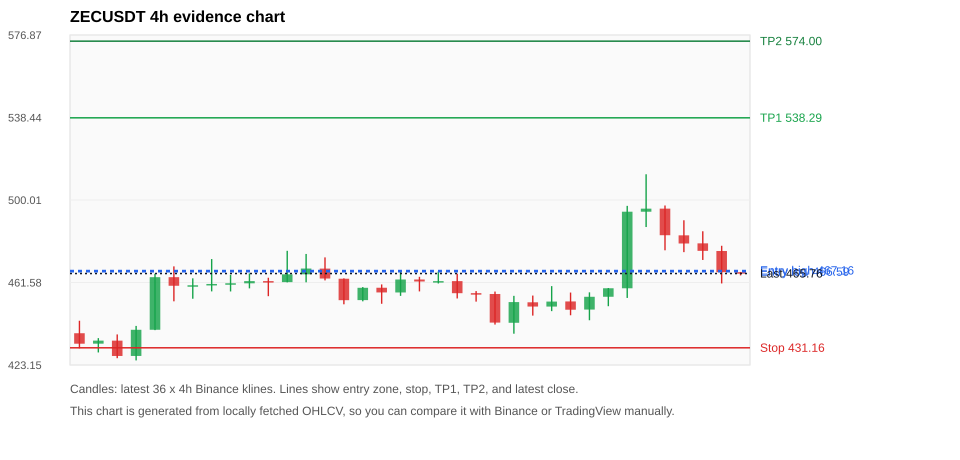
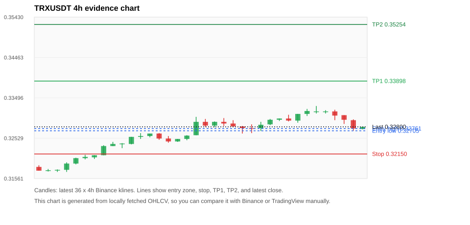
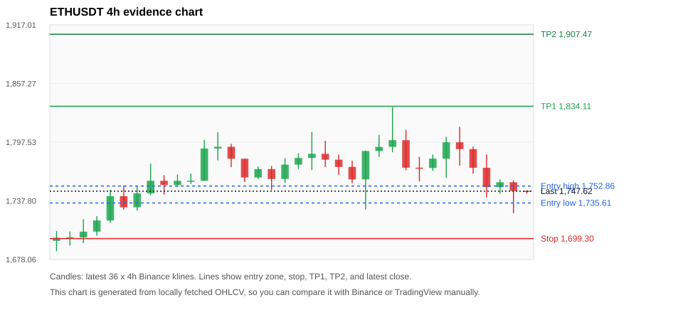
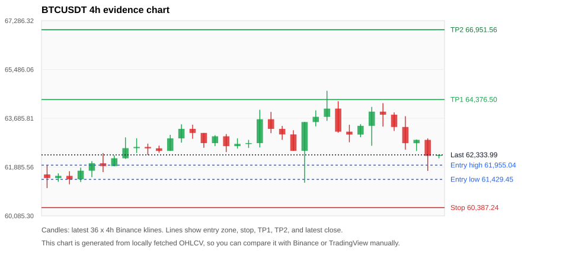
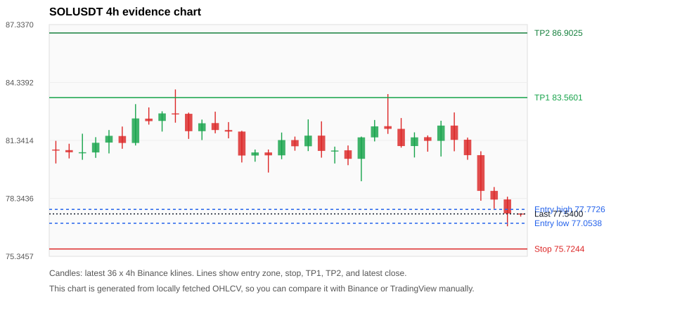

# Crypto 市场扫描报告 v1

- 报告时间：2026-07-08 20:06:18 CST
- Run ID：`20260708_120502_e2b6602d`
- Run type：`daily_full`
- 数据来源：SQLite
- 报告版本：v1
- 扫描 ID：9a6e108e270f
- 数据源：Binance public spot API + CoinGecko/CoinMarketCap cross-check
- 过滤条件：USDT spot; 24h quote volume >= 30,000,000; trades >= 30,000; exclude stables/leveraged tokens; analyze 1h/4h/1d klines
- 默认单笔风险：账户权益的 1.00%

## 限制说明

- 交易信号仍以 Binance 现货公开 K 线为主源；外部数据源用于一致性复核。
- 结果是研究和模拟盘计划，不是确定收益或实盘下单指令。
- 历史长度过滤：候选币至少需要 180 根 1d K 线。
- 数据质量验证池：先验证 score 排名前 min(top_n * 2, 10) 的候选，再按 action + score 补足最终名单。
- 大盘环境过滤：RISK_OFF; BTC/ETH 大盘偏弱，山寨币买入候选降级为观察。 BTC 7d=3.8484439557510353; ETH 7d=8.590439742044499.
- 已启用数据交叉验证：Binance 主源 + CoinGecko 自动对照；CoinMarketCap 在配置 API Key 后自动对照。
- ZECUSDT 交叉验证状态 DATA_WARNING：At least one external provider needs manual review.
- ETHUSDT 交叉验证状态 DATA_WARNING：At least one external provider needs manual review.
- BTCUSDT 交叉验证状态 DATA_WARNING：At least one external provider needs manual review.
- SOLUSDT 交叉验证状态 DATA_WARNING：At least one external provider needs manual review.
- XRPUSDT 交叉验证状态 DATA_WARNING：At least one external provider needs manual review.
- BNBUSDT 交叉验证状态 DATA_WARNING：At least one external provider needs manual review.
- DOGEUSDT 交叉验证状态 DATA_WARNING：At least one external provider needs manual review.

## 5 个候选交易计划

| Rank | Coin | Action | Setup | Entry Zone | Stop Loss | TP1 | TP2 / Exit Rule | R/R | Verdict |
|---:|---|---|---|---:|---:|---:|---|---:|---|
| 1 | `ZEC` | `WATCH_ONLY` | 回踩支撑/4h EMA 附近 | 466.59 - 467.16 | 431.16 | 538.29 | 574.00 或跌破 4h 关键支撑 | 2.00-3.00 | 只观察 |
| 2 | `TRX` | `WATCH_ONLY` | 回踩支撑/4h EMA 附近 | 0.32705 - 0.32761 | 0.32150 | 0.33898 | 0.35254 或跌破 4h 关键支撑 | 2.00-4.33 | 只观察 |
| 3 | `ETH` | `REJECT` | 回踩支撑/4h EMA 附近 | 1,735.61 - 1,752.86 | 1,699.30 | 1,834.11 | 1,907.47 或跌破 4h 关键支撑 | 2.00-3.63 | 只观察 |
| 4 | `BTC` | `REJECT` | 回踩支撑/4h EMA 附近 | 61,429.45 - 61,955.04 | 60,387.24 | 64,376.50 | 66,951.56 或跌破 4h 关键支撑 | 2.06-4.03 | 只观察 |
| 5 | `SOL` | `REJECT` | 回踩支撑/4h EMA 附近 | 77.0538 - 77.7726 | 75.7244 | 83.5601 | 86.9025 或跌破 4h 关键支撑 | 3.64-5.62 | 只观察 |

## 数据交叉验证摘要

价格差异以 Binance 当前价为基准；成交量口径不同，Binance 是 USDT 现货成交额，CoinGecko/CoinMarketCap 通常是全市场成交量。

| Rank | Coin | Data Status | Max Price Diff | Max 24h Diff | Message |
|---:|---|---|---:|---:|---|
| 1 | `ZEC` | DATA_WARNING | 0.15% | 0.15 pts | At least one external provider needs manual review. |
| 2 | `TRX` | DATA_OK | 0.22% | 0.06 pts | External provider checks agree with Binance within configured thresholds. |
| 3 | `ETH` | DATA_WARNING | 0.12% | 0.42 pts | At least one external provider needs manual review. |
| 4 | `BTC` | DATA_WARNING | 0.16% | 0.36 pts | At least one external provider needs manual review. |
| 5 | `SOL` | DATA_WARNING | 0.16% | 0.15 pts | At least one external provider needs manual review. |

## 候选币说明

### 1. ZEC `ZECUSDT`



- 入选原因：回踩支撑/4h EMA 附近；24h +1.44%，7d +13.74%，4h RSI 54.43，24h 成交额 $146.0M。
- 交易失效条件：跌破 431.16405 或 4h 收盘重新失守关键支撑。
- 主要风险：BTC/ETH 大盘环境未确认强势，山寨币买入信号降级；数据交叉验证需要人工复核。
- 数据交叉验证：DATA_WARNING；At least one external provider needs manual review.

#### 可点击人工验证

- [Binance 交易页](https://www.binance.com/en/trade/ZEC_USDT)
- [TradingView 图表](https://www.tradingview.com/chart/?symbol=BINANCE%3AZECUSDT)
- [CoinGecko 搜索](https://www.coingecko.com/en/search?query=ZEC)
- [CoinMarketCap 搜索](https://coinmarketcap.com/search/?q=ZEC)

#### 多数据源对照

| Source | Status | Asset ID | Price | 24h Change | 24h Volume | Price Diff | 24h Diff | Updated | Message |
|---|---|---|---:|---:|---:|---:|---:|---|---|
| Binance | DATA_OK | ZECUSDT | 465.76 | +1.44% | $146.0M | 0.00% | 0.00 pts | 2026-07-08T12:05:44+00:00 | Primary market data source used by scanner. |
| CoinGecko | DATA_OK | zcash | 465.41 | +1.59% | $597.2M | 0.08% | 0.15 pts | 2026-07-08T12:05:45.111Z | External source agrees with Binance within thresholds. |
| CoinMarketCap | DATA_WARNING | 1437 | 465.05 | +1.52% | $702.4M | 0.15% | 0.07 pts | 2026-07-08T12:04:05.000Z | CoinMarketCap symbol mapping has 2 matches; selected lowest cmc_rank |

#### 指标证据

| 指标 | 数值 | 人工核对用途 |
|---|---:|---|
| 当前价 | 465.76 | 与 Binance/TradingView 当前价格对照 |
| 24h 涨跌 | +1.44% | 与交易所 24h 涨跌对照 |
| 7d 涨跌 | +13.74% | 判断短线趋势是否延续 |
| 4h EMA20 | 465.66 | 判断短期趋势支撑 |
| 4h EMA50 | 451.46 | 判断中期趋势支撑 |
| 1d EMA20 | 447.45 | 判断日线趋势 |
| 1d EMA50 | 455.17 | 判断日线趋势 |
| 4h RSI14 | 54.43 | 判断是否过热/过弱 |
| 4h ATR14 | 15.8407 | 推导止损和入场缓冲 |
| 最近 18 根 4h 最低点 | 437.73 | 支撑/止损参考 |
| 最近 36 根 4h 最高点 | 512.00 | TP/压力参考 |
| 支撑位 | 465.66 | 入场区间推导基础 |

#### 交易计划推导

- 支撑位 = 最近低点、4h EMA20、4h EMA50、1d EMA20 中不高于当前价的最高有效支撑 = `465.66`。
- 入场区间 = 支撑位附近 + ATR 缓冲 = `466.59 - 467.16`。
- 止损 = min(最近 18 根 4h 最低点 * 0.985, 入场中位价 - 1.15 * ATR14) = `431.16`。
- TP1 = max(最近 36 根 4h 最高点 * 0.995, 入场中位价 + 2R) = `538.29`。
- TP2 = max(入场中位价 + 3R, TP1 * 1.04) = `574.00`。

#### 最近 10 根 4h K线

| UTC 开盘时间 | Open | High | Low | Close | Quote Volume | Trades |
|---|---:|---:|---:|---:|---:|---:|
| 2026-07-07T00:00+00:00 | 452.76 | 456.90 | 446.32 | 448.90 | $9.0M | 25574 |
| 2026-07-07T04:00+00:00 | 448.97 | 457.00 | 444.00 | 454.93 | $6.9M | 28357 |
| 2026-07-07T08:00+00:00 | 454.94 | 459.00 | 450.54 | 458.90 | $11.5M | 33483 |
| 2026-07-07T12:00+00:00 | 458.89 | 497.28 | 454.39 | 494.56 | $34.5M | 119749 |
| 2026-07-07T16:00+00:00 | 494.55 | 512.00 | 487.42 | 495.98 | $44.9M | 137937 |
| 2026-07-07T20:00+00:00 | 495.99 | 497.46 | 476.58 | 483.60 | $25.5M | 95021 |
| 2026-07-08T00:00+00:00 | 483.55 | 490.57 | 475.72 | 479.75 | $14.3M | 55773 |
| 2026-07-08T04:00+00:00 | 479.82 | 485.45 | 472.08 | 476.32 | $10.0M | 38024 |
| 2026-07-08T08:00+00:00 | 476.26 | 478.69 | 461.14 | 466.39 | $17.8M | 65597 |
| 2026-07-08T12:00+00:00 | 466.40 | 466.49 | 464.89 | 465.76 | $249,397 | 1027 |

### 2. TRX `TRXUSDT`



- 入选原因：回踩支撑/4h EMA 附近；24h -1.06%，7d +3.34%，4h RSI 49.51，24h 成交额 $35.9M。
- 交易失效条件：跌破 0.321504 或 4h 收盘重新失守关键支撑。
- 主要风险：BTC/ETH 大盘环境未确认强势，山寨币买入信号降级；24h 动量未确认。
- 数据交叉验证：DATA_OK；External provider checks agree with Binance within configured thresholds.

#### 可点击人工验证

- [Binance 交易页](https://www.binance.com/en/trade/TRX_USDT)
- [TradingView 图表](https://www.tradingview.com/chart/?symbol=BINANCE%3ATRXUSDT)
- [CoinGecko 搜索](https://www.coingecko.com/en/search?query=TRX)
- [CoinMarketCap 搜索](https://coinmarketcap.com/search/?q=TRX)

#### 多数据源对照

| Source | Status | Asset ID | Price | 24h Change | 24h Volume | Price Diff | 24h Diff | Updated | Message |
|---|---|---|---:|---:|---:|---:|---:|---|---|
| Binance | DATA_OK | TRXUSDT | 0.32800 | -1.06% | $35.9M | 0.00% | 0.00 pts | 2026-07-08T12:05:44+00:00 | Primary market data source used by scanner. |
| CoinGecko | DATA_OK | tron | 0.32735 | -1.09% | $435.6M | 0.20% | 0.03 pts | 2026-07-08T12:05:37.346Z | External source agrees with Binance within thresholds. |
| CoinMarketCap | DATA_OK | 1958 | 0.32728 | -1.12% | $524.9M | 0.22% | 0.06 pts | 2026-07-08T12:05:05.000Z | External source agrees with Binance within thresholds. |

#### 指标证据

| 指标 | 数值 | 人工核对用途 |
|---|---:|---|
| 当前价 | 0.32800 | 与 Binance/TradingView 当前价格对照 |
| 24h 涨跌 | -1.06% | 与交易所 24h 涨跌对照 |
| 7d 涨跌 | +3.34% | 判断短线趋势是否延续 |
| 4h EMA20 | 0.32858 | 判断短期趋势支撑 |
| 4h EMA50 | 0.32599 | 判断中期趋势支撑 |
| 1d EMA20 | 0.32540 | 判断日线趋势 |
| 1d EMA50 | 0.32855 | 判断日线趋势 |
| 4h RSI14 | 49.51 | 判断是否过热/过弱 |
| 4h ATR14 | 0.0017214286 | 推导止损和入场缓冲 |
| 最近 18 根 4h 最低点 | 0.32640 | 支撑/止损参考 |
| 最近 36 根 4h 最高点 | 0.33300 | TP/压力参考 |
| 支撑位 | 0.32640 | 入场区间推导基础 |

#### 交易计划推导

- 支撑位 = 最近低点、4h EMA20、4h EMA50、1d EMA20 中不高于当前价的最高有效支撑 = `0.32640`。
- 入场区间 = 支撑位附近 + ATR 缓冲 = `0.32705 - 0.32761`。
- 止损 = min(最近 18 根 4h 最低点 * 0.985, 入场中位价 - 1.15 * ATR14) = `0.32150`。
- TP1 = max(最近 36 根 4h 最高点 * 0.995, 入场中位价 + 2R) = `0.33898`。
- TP2 = max(入场中位价 + 3R, TP1 * 1.04) = `0.35254`。

#### 最近 10 根 4h K线

| UTC 开盘时间 | Open | High | Low | Close | Quote Volume | Trades |
|---|---:|---:|---:|---:|---:|---:|
| 2026-07-07T00:00+00:00 | 0.32970 | 0.33000 | 0.32940 | 0.33000 | $4.2M | 6919 |
| 2026-07-07T04:00+00:00 | 0.33000 | 0.33090 | 0.32930 | 0.32950 | $4.9M | 9581 |
| 2026-07-07T08:00+00:00 | 0.32950 | 0.33110 | 0.32900 | 0.33110 | $5.7M | 13143 |
| 2026-07-07T12:00+00:00 | 0.33110 | 0.33230 | 0.33060 | 0.33180 | $5.6M | 12661 |
| 2026-07-07T16:00+00:00 | 0.33170 | 0.33300 | 0.33120 | 0.33170 | $6.6M | 10724 |
| 2026-07-07T20:00+00:00 | 0.33170 | 0.33200 | 0.33120 | 0.33170 | $2.4M | 6037 |
| 2026-07-08T00:00+00:00 | 0.33170 | 0.33210 | 0.32960 | 0.33070 | $6.4M | 8714 |
| 2026-07-08T04:00+00:00 | 0.33080 | 0.33080 | 0.32870 | 0.32970 | $6.5M | 9288 |
| 2026-07-08T08:00+00:00 | 0.32960 | 0.32980 | 0.32710 | 0.32760 | $8.6M | 13494 |
| 2026-07-08T12:00+00:00 | 0.32750 | 0.32800 | 0.32740 | 0.32800 | $178,421 | 338 |

### 3. ETH `ETHUSDT`



- 入选原因：回踩支撑/4h EMA 附近；24h -2.00%，7d +9.42%，4h RSI 42.60，24h 成交额 $472.9M。
- 交易失效条件：跌破 1699.3023 或 4h 收盘重新失守关键支撑。
- 主要风险：日线趋势未完全确认；BTC/ETH 大盘环境未确认强势，山寨币买入信号降级；24h 动量未确认；数据交叉验证需要人工复核。
- 数据交叉验证：DATA_WARNING；At least one external provider needs manual review.

#### 可点击人工验证

- [Binance 交易页](https://www.binance.com/en/trade/ETH_USDT)
- [TradingView 图表](https://www.tradingview.com/chart/?symbol=BINANCE%3AETHUSDT)
- [CoinGecko 搜索](https://www.coingecko.com/en/search?query=ETH)
- [CoinMarketCap 搜索](https://coinmarketcap.com/search/?q=ETH)

#### 多数据源对照

| Source | Status | Asset ID | Price | 24h Change | 24h Volume | Price Diff | 24h Diff | Updated | Message |
|---|---|---|---:|---:|---:|---:|---:|---|---|
| Binance | DATA_OK | ETHUSDT | 1,747.62 | -2.00% | $472.9M | 0.00% | 0.00 pts | 2026-07-08T12:05:44+00:00 | Primary market data source used by scanner. |
| CoinGecko | DATA_OK | ethereum | 1,745.47 | -2.43% | $10.18B | 0.12% | 0.42 pts | 2026-07-08T12:05:47.879Z | External source agrees with Binance within thresholds. |
| CoinMarketCap | DATA_WARNING | 1027 | 1,745.76 | -1.92% | $10.93B | 0.11% | 0.08 pts | 2026-07-08T12:05:05.000Z | CoinMarketCap symbol mapping has 6 matches; selected lowest cmc_rank |

#### 指标证据

| 指标 | 数值 | 人工核对用途 |
|---|---:|---|
| 当前价 | 1,747.62 | 与 Binance/TradingView 当前价格对照 |
| 24h 涨跌 | -2.00% | 与交易所 24h 涨跌对照 |
| 7d 涨跌 | +9.42% | 判断短线趋势是否延续 |
| 4h EMA20 | 1,764.19 | 判断短期趋势支撑 |
| 4h EMA50 | 1,732.15 | 判断中期趋势支撑 |
| 1d EMA20 | 1,714.85 | 判断日线趋势 |
| 1d EMA50 | 1,804.13 | 判断日线趋势 |
| 4h RSI14 | 42.60 | 判断是否过热/过弱 |
| 4h ATR14 | 31.3293 | 推导止损和入场缓冲 |
| 最近 18 根 4h 最低点 | 1,725.18 | 支撑/止损参考 |
| 最近 36 根 4h 最高点 | 1,833.40 | TP/压力参考 |
| 支撑位 | 1,732.15 | 入场区间推导基础 |

#### 交易计划推导

- 支撑位 = 最近低点、4h EMA20、4h EMA50、1d EMA20 中不高于当前价的最高有效支撑 = `1,732.15`。
- 入场区间 = 支撑位附近 + ATR 缓冲 = `1,735.61 - 1,752.86`。
- 止损 = min(最近 18 根 4h 最低点 * 0.985, 入场中位价 - 1.15 * ATR14) = `1,699.30`。
- TP1 = max(最近 36 根 4h 最高点 * 0.995, 入场中位价 + 2R) = `1,834.11`。
- TP2 = max(入场中位价 + 3R, TP1 * 1.04) = `1,907.47`。

#### 最近 10 根 4h K线

| UTC 开盘时间 | Open | High | Low | Close | Quote Volume | Trades |
|---|---:|---:|---:|---:|---:|---:|
| 2026-07-07T00:00+00:00 | 1,799.56 | 1,810.16 | 1,768.85 | 1,771.56 | $66.9M | 378555 |
| 2026-07-07T04:00+00:00 | 1,771.55 | 1,782.59 | 1,757.57 | 1,771.24 | $65.4M | 288985 |
| 2026-07-07T08:00+00:00 | 1,771.23 | 1,785.00 | 1,768.37 | 1,780.77 | $49.2M | 233940 |
| 2026-07-07T12:00+00:00 | 1,780.77 | 1,803.03 | 1,761.19 | 1,797.45 | $116.0M | 785298 |
| 2026-07-07T16:00+00:00 | 1,797.45 | 1,813.16 | 1,773.50 | 1,790.45 | $83.7M | 556320 |
| 2026-07-07T20:00+00:00 | 1,790.46 | 1,793.12 | 1,765.35 | 1,771.45 | $49.3M | 277174 |
| 2026-07-08T00:00+00:00 | 1,771.45 | 1,785.00 | 1,741.21 | 1,751.78 | $80.4M | 450493 |
| 2026-07-08T04:00+00:00 | 1,751.74 | 1,759.69 | 1,745.01 | 1,756.70 | $44.5M | 286717 |
| 2026-07-08T08:00+00:00 | 1,756.70 | 1,758.70 | 1,725.18 | 1,747.95 | $98.7M | 528879 |
| 2026-07-08T12:00+00:00 | 1,747.95 | 1,748.06 | 1,745.23 | 1,747.62 | $1.7M | 8577 |

### 4. BTC `BTCUSDT`



- 入选原因：回踩支撑/4h EMA 附近；24h -1.89%，7d +4.77%，4h RSI 43.58，24h 成交额 $1.29B。
- 交易失效条件：跌破 60387.237 或 4h 收盘重新失守关键支撑。
- 主要风险：日线趋势未完全确认；BTC/ETH 大盘环境未确认强势，山寨币买入信号降级；24h 动量未确认；数据交叉验证需要人工复核。
- 数据交叉验证：DATA_WARNING；At least one external provider needs manual review.

#### 可点击人工验证

- [Binance 交易页](https://www.binance.com/en/trade/BTC_USDT)
- [TradingView 图表](https://www.tradingview.com/chart/?symbol=BINANCE%3ABTCUSDT)
- [CoinGecko 搜索](https://www.coingecko.com/en/search?query=BTC)
- [CoinMarketCap 搜索](https://coinmarketcap.com/search/?q=BTC)

#### 多数据源对照

| Source | Status | Asset ID | Price | 24h Change | 24h Volume | Price Diff | 24h Diff | Updated | Message |
|---|---|---|---:|---:|---:|---:|---:|---|---|
| Binance | DATA_OK | BTCUSDT | 62,333.99 | -1.89% | $1.29B | 0.00% | 0.00 pts | 2026-07-08T12:05:44+00:00 | Primary market data source used by scanner. |
| CoinGecko | DATA_OK | bitcoin | 62,246.00 | -2.25% | $33.44B | 0.14% | 0.36 pts | 2026-07-08T12:05:49.703Z | External source agrees with Binance within thresholds. |
| CoinMarketCap | DATA_WARNING | 1 | 62,234.52 | -1.86% | $33.13B | 0.16% | 0.03 pts | 2026-07-08T12:05:05.000Z | CoinMarketCap symbol mapping has 13 matches; selected lowest cmc_rank |

#### 指标证据

| 指标 | 数值 | 人工核对用途 |
|---|---:|---|
| 当前价 | 62,333.99 | 与 Binance/TradingView 当前价格对照 |
| 24h 涨跌 | -1.89% | 与交易所 24h 涨跌对照 |
| 7d 涨跌 | +4.77% | 判断短线趋势是否延续 |
| 4h EMA20 | 62,947.92 | 判断短期趋势支撑 |
| 4h EMA50 | 62,394.39 | 判断中期趋势支撑 |
| 1d EMA20 | 62,613.85 | 判断日线趋势 |
| 1d EMA50 | 65,572.69 | 判断日线趋势 |
| 4h RSI14 | 43.58 | 判断是否过热/过弱 |
| 4h ATR14 | 926.00 | 推导止损和入场缓冲 |
| 最近 18 根 4h 最低点 | 61,306.84 | 支撑/止损参考 |
| 最近 36 根 4h 最高点 | 64,700.00 | TP/压力参考 |
| 支撑位 | 61,306.84 | 入场区间推导基础 |

#### 交易计划推导

- 支撑位 = 最近低点、4h EMA20、4h EMA50、1d EMA20 中不高于当前价的最高有效支撑 = `61,306.84`。
- 入场区间 = 支撑位附近 + ATR 缓冲 = `61,429.45 - 61,955.04`。
- 止损 = min(最近 18 根 4h 最低点 * 0.985, 入场中位价 - 1.15 * ATR14) = `60,387.24`。
- TP1 = max(最近 36 根 4h 最高点 * 0.995, 入场中位价 + 2R) = `64,376.50`。
- TP2 = max(入场中位价 + 3R, TP1 * 1.04) = `66,951.56`。

#### 最近 10 根 4h K线

| UTC 开盘时间 | Open | High | Low | Close | Quote Volume | Trades |
|---|---:|---:|---:|---:|---:|---:|
| 2026-07-07T00:00+00:00 | 64,042.93 | 64,314.00 | 63,150.00 | 63,191.01 | $137.1M | 490629 |
| 2026-07-07T04:00+00:00 | 63,191.01 | 63,445.70 | 62,800.00 | 63,083.18 | $181.2M | 435866 |
| 2026-07-07T08:00+00:00 | 63,083.19 | 63,467.15 | 62,984.58 | 63,406.00 | $105.0M | 351275 |
| 2026-07-07T12:00+00:00 | 63,405.99 | 64,105.00 | 62,671.39 | 63,930.51 | $348.1M | 1004190 |
| 2026-07-07T16:00+00:00 | 63,930.50 | 64,243.75 | 63,379.69 | 63,817.99 | $201.5M | 622715 |
| 2026-07-07T20:00+00:00 | 63,818.00 | 63,901.75 | 63,218.00 | 63,363.99 | $96.4M | 377427 |
| 2026-07-08T00:00+00:00 | 63,364.00 | 63,761.99 | 62,525.47 | 62,766.00 | $185.9M | 609259 |
| 2026-07-08T04:00+00:00 | 62,766.00 | 62,901.49 | 62,477.04 | 62,888.35 | $131.3M | 444952 |
| 2026-07-08T08:00+00:00 | 62,888.34 | 62,941.46 | 61,743.83 | 62,299.99 | $327.9M | 777090 |
| 2026-07-08T12:00+00:00 | 62,300.00 | 62,334.00 | 62,206.37 | 62,334.00 | $4.4M | 12586 |

### 5. SOL `SOLUSDT`



- 入选原因：回踩支撑/4h EMA 附近；24h -4.99%，7d +1.97%，4h RSI 32.05，24h 成交额 $185.5M。
- 交易失效条件：跌破 75.724353 或 4h 收盘重新失守关键支撑。
- 主要风险：BTC/ETH 大盘环境未确认强势，山寨币买入信号降级；24h 动量未确认；数据交叉验证需要人工复核。
- 数据交叉验证：DATA_WARNING；At least one external provider needs manual review.

#### 可点击人工验证

- [Binance 交易页](https://www.binance.com/en/trade/SOL_USDT)
- [TradingView 图表](https://www.tradingview.com/chart/?symbol=BINANCE%3ASOLUSDT)
- [CoinGecko 搜索](https://www.coingecko.com/en/search?query=SOL)
- [CoinMarketCap 搜索](https://coinmarketcap.com/search/?q=SOL)

#### 多数据源对照

| Source | Status | Asset ID | Price | 24h Change | 24h Volume | Price Diff | 24h Diff | Updated | Message |
|---|---|---|---:|---:|---:|---:|---:|---|---|
| Binance | DATA_OK | SOLUSDT | 77.5400 | -4.99% | $185.5M | 0.00% | 0.00 pts | 2026-07-08T12:05:44+00:00 | Primary market data source used by scanner. |
| CoinGecko | DATA_OK | solana | 77.4300 | -4.83% | $2.52B | 0.14% | 0.15 pts | 2026-07-08T12:05:44.882Z | External source agrees with Binance within thresholds. |
| CoinMarketCap | DATA_WARNING | 5426 | 77.4164 | -4.85% | $2.68B | 0.16% | 0.14 pts | 2026-07-08T12:05:05.000Z | CoinMarketCap symbol mapping has 8 matches; selected lowest cmc_rank |

#### 指标证据

| 指标 | 数值 | 人工核对用途 |
|---|---:|---|
| 当前价 | 77.5400 | 与 Binance/TradingView 当前价格对照 |
| 24h 涨跌 | -4.99% | 与交易所 24h 涨跌对照 |
| 7d 涨跌 | +1.97% | 判断短线趋势是否延续 |
| 4h EMA20 | 80.1012 | 判断短期趋势支撑 |
| 4h EMA50 | 79.1298 | 判断中期趋势支撑 |
| 1d EMA20 | 76.5309 | 判断日线趋势 |
| 1d EMA50 | 76.6883 | 判断日线趋势 |
| 4h RSI14 | 32.05 | 判断是否过热/过弱 |
| 4h ATR14 | 1.4686 | 推导止损和入场缓冲 |
| 最近 18 根 4h 最低点 | 76.9000 | 支撑/止损参考 |
| 最近 36 根 4h 最高点 | 83.9800 | TP/压力参考 |
| 支撑位 | 76.9000 | 入场区间推导基础 |

#### 交易计划推导

- 支撑位 = 最近低点、4h EMA20、4h EMA50、1d EMA20 中不高于当前价的最高有效支撑 = `76.9000`。
- 入场区间 = 支撑位附近 + ATR 缓冲 = `77.0538 - 77.7726`。
- 止损 = min(最近 18 根 4h 最低点 * 0.985, 入场中位价 - 1.15 * ATR14) = `75.7244`。
- TP1 = max(最近 36 根 4h 最高点 * 0.995, 入场中位价 + 2R) = `83.5601`。
- TP2 = max(入场中位价 + 3R, TP1 * 1.04) = `86.9025`。

#### 最近 10 根 4h K线

| UTC 开盘时间 | Open | High | Low | Close | Quote Volume | Trades |
|---|---:|---:|---:|---:|---:|---:|
| 2026-07-07T00:00+00:00 | 81.9400 | 82.5000 | 80.9700 | 81.0500 | $19.5M | 100154 |
| 2026-07-07T04:00+00:00 | 81.0500 | 81.7600 | 80.4600 | 81.5000 | $22.0M | 88484 |
| 2026-07-07T08:00+00:00 | 81.5100 | 81.6000 | 80.7600 | 81.3200 | $25.2M | 99665 |
| 2026-07-07T12:00+00:00 | 81.3200 | 82.3600 | 80.5100 | 82.1100 | $39.9M | 287798 |
| 2026-07-07T16:00+00:00 | 82.1100 | 82.7900 | 80.7800 | 81.3700 | $25.6M | 167479 |
| 2026-07-07T20:00+00:00 | 81.3800 | 81.4900 | 80.3400 | 80.5800 | $19.2M | 91464 |
| 2026-07-08T00:00+00:00 | 80.5800 | 80.7800 | 78.2200 | 78.7300 | $37.5M | 171781 |
| 2026-07-08T04:00+00:00 | 78.7300 | 78.9300 | 77.8000 | 78.2800 | $31.6M | 113899 |
| 2026-07-08T08:00+00:00 | 78.2900 | 78.4300 | 76.9000 | 77.5600 | $32.6M | 168646 |
| 2026-07-08T12:00+00:00 | 77.5600 | 77.5600 | 77.4000 | 77.5500 | $409,810 | 2580 |

## 组合风控

- 不要 5 个候选全部满仓买入。
- 同时持仓总风险建议控制在账户权益的 3% - 5% 以内。
- 如果 BTC/ETH 同时破位，暂停山寨币多头计划或降低仓位。
- 第一版报告用于模拟盘和人工复核，不自动下单。

## 原始数据

```json
[
  {
    "rank": 1,
    "symbol": "ZECUSDT",
    "base_asset": "ZEC",
    "price": 465.76,
    "score": 56.56747547830855,
    "setup": "回踩支撑/4h EMA 附近",
    "verdict": "只观察",
    "entry_low": 466.588355099421,
    "entry_high": 467.15727999999996,
    "stop_loss": 431.16405000000003,
    "take_profit_1": 538.2903526491314,
    "take_profit_2": 573.9991201988419,
    "risk_reward_1": 2.0,
    "risk_reward_2": 3.0000000000000018,
    "pct_24h": 1.444,
    "pct_3d": 0.36200655059472897,
    "pct_7d": 13.735928304559097,
    "quote_volume_24h": 145961699.41126,
    "trades_24h": 508205,
    "high_low_range_24h": 12.678536059332291,
    "rsi_1h": 29.471032745592012,
    "rsi_4h": 54.4321329639889,
    "ema20_4h": 465.65704101738623,
    "ema50_4h": 451.45995655435905,
    "ema20_1d": 447.45460962435175,
    "ema50_1d": 455.1677251968852,
    "atr_4h": 15.840714285714276,
    "macd_hist_4h": -0.5556629828315778,
    "volume_ratio_24h": 1.7774578338728253,
    "support_level": 465.65704101738623,
    "recent_low_4h_18": 437.73,
    "recent_high_4h_36": 512.0,
    "distance_to_support_pct": 0.02211047477964634,
    "binance_trade_url": "https://www.binance.com/en/trade/ZEC_USDT",
    "tradingview_url": "https://www.tradingview.com/chart/?symbol=BINANCE%3AZECUSDT",
    "coingecko_search_url": "https://www.coingecko.com/en/search?query=ZEC",
    "coinmarketcap_search_url": "https://coinmarketcap.com/search/?q=ZEC",
    "invalidation": "跌破 431.16405 或 4h 收盘重新失守关键支撑",
    "recent_4h_klines": [
      {
        "open_time_utc": "2026-07-02T16:00+00:00",
        "open": 437.95,
        "high": 443.77,
        "low": 430.92,
        "close": 433.07,
        "quote_volume": 10353762.15602,
        "trades": 48008
      },
      {
        "open_time_utc": "2026-07-02T20:00+00:00",
        "open": 433.09,
        "high": 435.67,
        "low": 429.0,
        "close": 434.51,
        "quote_volume": 6657062.37027,
        "trades": 26388
      },
      {
        "open_time_utc": "2026-07-03T00:00+00:00",
        "open": 434.5,
        "high": 437.4,
        "low": 426.32,
        "close": 427.36,
        "quote_volume": 10069067.14477,
        "trades": 37522
      },
      {
        "open_time_utc": "2026-07-03T04:00+00:00",
        "open": 427.37,
        "high": 441.36,
        "low": 425.28,
        "close": 439.56,
        "quote_volume": 14398461.79151,
        "trades": 47635
      },
      {
        "open_time_utc": "2026-07-03T08:00+00:00",
        "open": 439.57,
        "high": 465.64,
        "low": 439.39,
        "close": 464.06,
        "quote_volume": 22512527.80947,
        "trades": 99018
      },
      {
        "open_time_utc": "2026-07-03T12:00+00:00",
        "open": 464.06,
        "high": 469.1,
        "low": 452.81,
        "close": 460.06,
        "quote_volume": 35620506.05835,
        "trades": 90094
      },
      {
        "open_time_utc": "2026-07-03T16:00+00:00",
        "open": 460.04,
        "high": 463.53,
        "low": 454.02,
        "close": 460.3,
        "quote_volume": 15782402.00447,
        "trades": 46763
      },
      {
        "open_time_utc": "2026-07-03T20:00+00:00",
        "open": 460.3,
        "high": 472.5,
        "low": 457.44,
        "close": 460.9,
        "quote_volume": 9693187.47116,
        "trades": 43711
      },
      {
        "open_time_utc": "2026-07-04T00:00+00:00",
        "open": 460.94,
        "high": 465.16,
        "low": 457.41,
        "close": 461.23,
        "quote_volume": 6539403.65566,
        "trades": 25630
      },
      {
        "open_time_utc": "2026-07-04T04:00+00:00",
        "open": 461.2,
        "high": 465.8,
        "low": 458.85,
        "close": 462.23,
        "quote_volume": 4930326.62857,
        "trades": 25764
      },
      {
        "open_time_utc": "2026-07-04T08:00+00:00",
        "open": 462.24,
        "high": 463.8,
        "low": 455.21,
        "close": 461.72,
        "quote_volume": 7805080.64219,
        "trades": 26395
      },
      {
        "open_time_utc": "2026-07-04T12:00+00:00",
        "open": 461.76,
        "high": 476.34,
        "low": 461.65,
        "close": 465.39,
        "quote_volume": 9271729.48601,
        "trades": 36648
      },
      {
        "open_time_utc": "2026-07-04T16:00+00:00",
        "open": 465.4,
        "high": 474.88,
        "low": 461.67,
        "close": 468.09,
        "quote_volume": 9724701.48101,
        "trades": 31830
      },
      {
        "open_time_utc": "2026-07-04T20:00+00:00",
        "open": 468.06,
        "high": 473.28,
        "low": 462.56,
        "close": 463.43,
        "quote_volume": 7462783.02198,
        "trades": 26261
      },
      {
        "open_time_utc": "2026-07-05T00:00+00:00",
        "open": 463.34,
        "high": 463.49,
        "low": 451.43,
        "close": 453.35,
        "quote_volume": 15629113.53318,
        "trades": 45610
      },
      {
        "open_time_utc": "2026-07-05T04:00+00:00",
        "open": 453.38,
        "high": 459.46,
        "low": 452.81,
        "close": 459.12,
        "quote_volume": 4221321.00608,
        "trades": 18757
      },
      {
        "open_time_utc": "2026-07-05T08:00+00:00",
        "open": 459.14,
        "high": 460.69,
        "low": 451.67,
        "close": 456.95,
        "quote_volume": 4543242.24997,
        "trades": 19800
      },
      {
        "open_time_utc": "2026-07-05T12:00+00:00",
        "open": 456.94,
        "high": 466.93,
        "low": 455.35,
        "close": 462.98,
        "quote_volume": 10969177.26093,
        "trades": 34370
      },
      {
        "open_time_utc": "2026-07-05T16:00+00:00",
        "open": 462.98,
        "high": 464.24,
        "low": 457.43,
        "close": 462.05,
        "quote_volume": 4318180.75881,
        "trades": 16506
      },
      {
        "open_time_utc": "2026-07-05T20:00+00:00",
        "open": 462.05,
        "high": 466.67,
        "low": 461.13,
        "close": 462.23,
        "quote_volume": 10761500.76231,
        "trades": 33581
      },
      {
        "open_time_utc": "2026-07-06T00:00+00:00",
        "open": 462.23,
        "high": 465.68,
        "low": 454.15,
        "close": 456.6,
        "quote_volume": 12207507.9653,
        "trades": 40429
      },
      {
        "open_time_utc": "2026-07-06T04:00+00:00",
        "open": 456.62,
        "high": 457.59,
        "low": 452.67,
        "close": 456.16,
        "quote_volume": 5663017.2163,
        "trades": 24500
      },
      {
        "open_time_utc": "2026-07-06T08:00+00:00",
        "open": 456.23,
        "high": 457.36,
        "low": 441.98,
        "close": 442.91,
        "quote_volume": 17542190.32662,
        "trades": 46726
      },
      {
        "open_time_utc": "2026-07-06T12:00+00:00",
        "open": 442.82,
        "high": 455.37,
        "low": 437.73,
        "close": 452.46,
        "quote_volume": 26214065.31259,
        "trades": 71944
      },
      {
        "open_time_utc": "2026-07-06T16:00+00:00",
        "open": 452.36,
        "high": 455.5,
        "low": 446.16,
        "close": 450.38,
        "quote_volume": 15384550.76482,
        "trades": 49478
      },
      {
        "open_time_utc": "2026-07-06T20:00+00:00",
        "open": 450.37,
        "high": 459.89,
        "low": 448.24,
        "close": 452.7,
        "quote_volume": 13400498.05844,
        "trades": 34642
      },
      {
        "open_time_utc": "2026-07-07T00:00+00:00",
        "open": 452.76,
        "high": 456.9,
        "low": 446.32,
        "close": 448.9,
        "quote_volume": 9048146.51228,
        "trades": 25574
      },
      {
        "open_time_utc": "2026-07-07T04:00+00:00",
        "open": 448.97,
        "high": 457.0,
        "low": 444.0,
        "close": 454.93,
        "quote_volume": 6893208.16374,
        "trades": 28357
      },
      {
        "open_time_utc": "2026-07-07T08:00+00:00",
        "open": 454.94,
        "high": 459.0,
        "low": 450.54,
        "close": 458.9,
        "quote_volume": 11490201.84041,
        "trades": 33483
      },
      {
        "open_time_utc": "2026-07-07T12:00+00:00",
        "open": 458.89,
        "high": 497.28,
        "low": 454.39,
        "close": 494.56,
        "quote_volume": 34527484.00912,
        "trades": 119749
      },
      {
        "open_time_utc": "2026-07-07T16:00+00:00",
        "open": 494.55,
        "high": 512.0,
        "low": 487.42,
        "close": 495.98,
        "quote_volume": 44888483.48707,
        "trades": 137937
      },
      {
        "open_time_utc": "2026-07-07T20:00+00:00",
        "open": 495.99,
        "high": 497.46,
        "low": 476.58,
        "close": 483.6,
        "quote_volume": 25467867.52302,
        "trades": 95021
      },
      {
        "open_time_utc": "2026-07-08T00:00+00:00",
        "open": 483.55,
        "high": 490.57,
        "low": 475.72,
        "close": 479.75,
        "quote_volume": 14273829.46407,
        "trades": 55773
      },
      {
        "open_time_utc": "2026-07-08T04:00+00:00",
        "open": 479.82,
        "high": 485.45,
        "low": 472.08,
        "close": 476.32,
        "quote_volume": 10009889.39165,
        "trades": 38024
      },
      {
        "open_time_utc": "2026-07-08T08:00+00:00",
        "open": 476.26,
        "high": 478.69,
        "low": 461.14,
        "close": 466.39,
        "quote_volume": 17820576.79018,
        "trades": 65597
      },
      {
        "open_time_utc": "2026-07-08T12:00+00:00",
        "open": 466.4,
        "high": 466.49,
        "low": 464.89,
        "close": 465.76,
        "quote_volume": 249396.90898,
        "trades": 1027
      }
    ],
    "risks": [
      "BTC/ETH 大盘环境未确认强势，山寨币买入信号降级",
      "数据交叉验证需要人工复核"
    ],
    "data_quality_status": "DATA_WARNING",
    "data_quality_message": "At least one external provider needs manual review.",
    "data_checks": [
      {
        "provider": "Binance",
        "status": "DATA_OK",
        "provider_asset_id": "ZECUSDT",
        "provider_symbol": "ZECUSDT",
        "price_usd": 465.76,
        "pct_24h": 1.444,
        "volume_24h": 145961699.41126,
        "last_updated": null,
        "fetched_at_utc": "2026-07-08T12:05:44+00:00",
        "price_diff_pct": 0.0,
        "pct_24h_diff": 0.0,
        "volume_note": "Binance USDT spot 24h quoteVolume.",
        "message": "Primary market data source used by scanner."
      },
      {
        "provider": "CoinGecko",
        "status": "DATA_OK",
        "provider_asset_id": "zcash",
        "provider_symbol": "ZEC",
        "price_usd": 465.41,
        "pct_24h": 1.59466,
        "volume_24h": 597248017.0,
        "last_updated": "2026-07-08T12:05:45.111Z",
        "fetched_at_utc": "2026-07-08T12:05:44+00:00",
        "price_diff_pct": 0.0751459979388453,
        "pct_24h_diff": 0.15066000000000002,
        "volume_note": "CoinGecko total market volume; not the same venue scope as Binance quoteVolume.",
        "message": "External source agrees with Binance within thresholds."
      },
      {
        "provider": "CoinMarketCap",
        "status": "DATA_WARNING",
        "provider_asset_id": "1437",
        "provider_symbol": "ZEC",
        "price_usd": 465.0494059449213,
        "pct_24h": 1.51559531,
        "volume_24h": 702371617.2513261,
        "last_updated": "2026-07-08T12:04:05.000Z",
        "fetched_at_utc": "2026-07-08T12:05:44+00:00",
        "price_diff_pct": 0.15256656970943677,
        "pct_24h_diff": 0.07159530999999997,
        "volume_note": "CoinMarketCap total market volume; not the same venue scope as Binance quoteVolume.",
        "message": "CoinMarketCap symbol mapping has 2 matches; selected lowest cmc_rank"
      }
    ],
    "action": "WATCH_ONLY"
  },
  {
    "rank": 2,
    "symbol": "TRXUSDT",
    "base_asset": "TRX",
    "price": 0.328,
    "score": 30.21069907735339,
    "setup": "回踩支撑/4h EMA 附近",
    "verdict": "只观察",
    "entry_low": 0.32705280000000003,
    "entry_high": 0.32760500000000004,
    "stop_loss": 0.321504,
    "take_profit_1": 0.3389787000000001,
    "take_profit_2": 0.3525378480000001,
    "risk_reward_1": 2.0,
    "risk_reward_2": 4.327790691685689,
    "pct_24h": -1.056,
    "pct_3d": -0.15220700152207556,
    "pct_7d": 3.339634530560809,
    "quote_volume_24h": 35942534.63304,
    "trades_24h": 60809,
    "high_low_range_24h": 1.8037297462549784,
    "rsi_1h": 22.8571428571433,
    "rsi_4h": 49.51456310679616,
    "ema20_4h": 0.32857618603581334,
    "ema50_4h": 0.32598533541810304,
    "ema20_1d": 0.32539976411288946,
    "ema50_1d": 0.32855110624095935,
    "atr_4h": 0.0017214285714285682,
    "macd_hist_4h": -0.00050751517549726,
    "volume_ratio_24h": 1.1084702181472394,
    "support_level": 0.3264,
    "recent_low_4h_18": 0.3264,
    "recent_high_4h_36": 0.333,
    "distance_to_support_pct": 0.4901960784313708,
    "binance_trade_url": "https://www.binance.com/en/trade/TRX_USDT",
    "tradingview_url": "https://www.tradingview.com/chart/?symbol=BINANCE%3ATRXUSDT",
    "coingecko_search_url": "https://www.coingecko.com/en/search?query=TRX",
    "coinmarketcap_search_url": "https://coinmarketcap.com/search/?q=TRX",
    "invalidation": "跌破 0.321504 或 4h 收盘重新失守关键支撑",
    "recent_4h_klines": [
      {
        "open_time_utc": "2026-07-02T16:00+00:00",
        "open": 0.3184,
        "high": 0.3188,
        "low": 0.3175,
        "close": 0.3175,
        "quote_volume": 3377463.05757,
        "trades": 9961
      },
      {
        "open_time_utc": "2026-07-02T20:00+00:00",
        "open": 0.3175,
        "high": 0.3179,
        "low": 0.3173,
        "close": 0.3176,
        "quote_volume": 1771045.61398,
        "trades": 5485
      },
      {
        "open_time_utc": "2026-07-03T00:00+00:00",
        "open": 0.3176,
        "high": 0.3178,
        "low": 0.3172,
        "close": 0.3177,
        "quote_volume": 2458916.07766,
        "trades": 5915
      },
      {
        "open_time_utc": "2026-07-03T04:00+00:00",
        "open": 0.3177,
        "high": 0.3195,
        "low": 0.3172,
        "close": 0.3192,
        "quote_volume": 7383575.18691,
        "trades": 11695
      },
      {
        "open_time_utc": "2026-07-03T08:00+00:00",
        "open": 0.3192,
        "high": 0.3206,
        "low": 0.319,
        "close": 0.3205,
        "quote_volume": 7496939.04268,
        "trades": 13445
      },
      {
        "open_time_utc": "2026-07-03T12:00+00:00",
        "open": 0.3205,
        "high": 0.3213,
        "low": 0.3202,
        "close": 0.3208,
        "quote_volume": 6556052.79302,
        "trades": 12475
      },
      {
        "open_time_utc": "2026-07-03T16:00+00:00",
        "open": 0.3207,
        "high": 0.3212,
        "low": 0.3203,
        "close": 0.3212,
        "quote_volume": 2901198.63112,
        "trades": 8849
      },
      {
        "open_time_utc": "2026-07-03T20:00+00:00",
        "open": 0.3212,
        "high": 0.3236,
        "low": 0.3212,
        "close": 0.3234,
        "quote_volume": 7308587.99402,
        "trades": 14400
      },
      {
        "open_time_utc": "2026-07-04T00:00+00:00",
        "open": 0.3234,
        "high": 0.3244,
        "low": 0.3234,
        "close": 0.3239,
        "quote_volume": 4690579.69641,
        "trades": 9529
      },
      {
        "open_time_utc": "2026-07-04T04:00+00:00",
        "open": 0.3239,
        "high": 0.3241,
        "low": 0.3229,
        "close": 0.324,
        "quote_volume": 3267692.64499,
        "trades": 6780
      },
      {
        "open_time_utc": "2026-07-04T08:00+00:00",
        "open": 0.3239,
        "high": 0.3256,
        "low": 0.3238,
        "close": 0.3256,
        "quote_volume": 4563496.64419,
        "trades": 11137
      },
      {
        "open_time_utc": "2026-07-04T12:00+00:00",
        "open": 0.3256,
        "high": 0.3265,
        "low": 0.3251,
        "close": 0.3258,
        "quote_volume": 4490914.31771,
        "trades": 10120
      },
      {
        "open_time_utc": "2026-07-04T16:00+00:00",
        "open": 0.3258,
        "high": 0.3264,
        "low": 0.3255,
        "close": 0.3264,
        "quote_volume": 2891767.25593,
        "trades": 8513
      },
      {
        "open_time_utc": "2026-07-04T20:00+00:00",
        "open": 0.3264,
        "high": 0.3265,
        "low": 0.3249,
        "close": 0.3252,
        "quote_volume": 2896779.97518,
        "trades": 5449
      },
      {
        "open_time_utc": "2026-07-05T00:00+00:00",
        "open": 0.3252,
        "high": 0.3258,
        "low": 0.3242,
        "close": 0.3245,
        "quote_volume": 3861747.2275,
        "trades": 6200
      },
      {
        "open_time_utc": "2026-07-05T04:00+00:00",
        "open": 0.3245,
        "high": 0.3251,
        "low": 0.3244,
        "close": 0.3251,
        "quote_volume": 1378738.9089,
        "trades": 4932
      },
      {
        "open_time_utc": "2026-07-05T08:00+00:00",
        "open": 0.3251,
        "high": 0.326,
        "low": 0.3248,
        "close": 0.3259,
        "quote_volume": 3567938.77549,
        "trades": 8008
      },
      {
        "open_time_utc": "2026-07-05T12:00+00:00",
        "open": 0.326,
        "high": 0.3304,
        "low": 0.326,
        "close": 0.3292,
        "quote_volume": 15662818.38181,
        "trades": 21279
      },
      {
        "open_time_utc": "2026-07-05T16:00+00:00",
        "open": 0.3292,
        "high": 0.3299,
        "low": 0.328,
        "close": 0.3283,
        "quote_volume": 6268843.63593,
        "trades": 8835
      },
      {
        "open_time_utc": "2026-07-05T20:00+00:00",
        "open": 0.3283,
        "high": 0.3293,
        "low": 0.3279,
        "close": 0.3292,
        "quote_volume": 3478489.46341,
        "trades": 7147
      },
      {
        "open_time_utc": "2026-07-06T00:00+00:00",
        "open": 0.3292,
        "high": 0.3301,
        "low": 0.3282,
        "close": 0.3288,
        "quote_volume": 6712516.98425,
        "trades": 8911
      },
      {
        "open_time_utc": "2026-07-06T04:00+00:00",
        "open": 0.3288,
        "high": 0.3296,
        "low": 0.3281,
        "close": 0.3281,
        "quote_volume": 4078650.66154,
        "trades": 8806
      },
      {
        "open_time_utc": "2026-07-06T08:00+00:00",
        "open": 0.3281,
        "high": 0.3282,
        "low": 0.3264,
        "close": 0.3277,
        "quote_volume": 8363940.25089,
        "trades": 15525
      },
      {
        "open_time_utc": "2026-07-06T12:00+00:00",
        "open": 0.3277,
        "high": 0.3286,
        "low": 0.3265,
        "close": 0.3276,
        "quote_volume": 9543531.55769,
        "trades": 14485
      },
      {
        "open_time_utc": "2026-07-06T16:00+00:00",
        "open": 0.3277,
        "high": 0.3292,
        "low": 0.327,
        "close": 0.3285,
        "quote_volume": 5292225.23778,
        "trades": 10112
      },
      {
        "open_time_utc": "2026-07-06T20:00+00:00",
        "open": 0.3286,
        "high": 0.3299,
        "low": 0.3284,
        "close": 0.3297,
        "quote_volume": 4760409.38354,
        "trades": 7448
      },
      {
        "open_time_utc": "2026-07-07T00:00+00:00",
        "open": 0.3297,
        "high": 0.33,
        "low": 0.3294,
        "close": 0.33,
        "quote_volume": 4164135.6131,
        "trades": 6919
      },
      {
        "open_time_utc": "2026-07-07T04:00+00:00",
        "open": 0.33,
        "high": 0.3309,
        "low": 0.3293,
        "close": 0.3295,
        "quote_volume": 4902466.28119,
        "trades": 9581
      },
      {
        "open_time_utc": "2026-07-07T08:00+00:00",
        "open": 0.3295,
        "high": 0.3311,
        "low": 0.329,
        "close": 0.3311,
        "quote_volume": 5734054.15057,
        "trades": 13143
      },
      {
        "open_time_utc": "2026-07-07T12:00+00:00",
        "open": 0.3311,
        "high": 0.3323,
        "low": 0.3306,
        "close": 0.3318,
        "quote_volume": 5634346.85692,
        "trades": 12661
      },
      {
        "open_time_utc": "2026-07-07T16:00+00:00",
        "open": 0.3317,
        "high": 0.333,
        "low": 0.3312,
        "close": 0.3317,
        "quote_volume": 6563601.485,
        "trades": 10724
      },
      {
        "open_time_utc": "2026-07-07T20:00+00:00",
        "open": 0.3317,
        "high": 0.332,
        "low": 0.3312,
        "close": 0.3317,
        "quote_volume": 2404106.68146,
        "trades": 6037
      },
      {
        "open_time_utc": "2026-07-08T00:00+00:00",
        "open": 0.3317,
        "high": 0.3321,
        "low": 0.3296,
        "close": 0.3307,
        "quote_volume": 6414909.23145,
        "trades": 8714
      },
      {
        "open_time_utc": "2026-07-08T04:00+00:00",
        "open": 0.3308,
        "high": 0.3308,
        "low": 0.3287,
        "close": 0.3297,
        "quote_volume": 6482510.95553,
        "trades": 9288
      },
      {
        "open_time_utc": "2026-07-08T08:00+00:00",
        "open": 0.3296,
        "high": 0.3298,
        "low": 0.3271,
        "close": 0.3276,
        "quote_volume": 8636878.94792,
        "trades": 13494
      },
      {
        "open_time_utc": "2026-07-08T12:00+00:00",
        "open": 0.3275,
        "high": 0.328,
        "low": 0.3274,
        "close": 0.328,
        "quote_volume": 178420.718,
        "trades": 338
      }
    ],
    "risks": [
      "BTC/ETH 大盘环境未确认强势，山寨币买入信号降级",
      "24h 动量未确认"
    ],
    "data_quality_status": "DATA_OK",
    "data_quality_message": "External provider checks agree with Binance within configured thresholds.",
    "data_checks": [
      {
        "provider": "Binance",
        "status": "DATA_OK",
        "provider_asset_id": "TRXUSDT",
        "provider_symbol": "TRXUSDT",
        "price_usd": 0.328,
        "pct_24h": -1.056,
        "volume_24h": 35942534.63304,
        "last_updated": null,
        "fetched_at_utc": "2026-07-08T12:05:44+00:00",
        "price_diff_pct": 0.0,
        "pct_24h_diff": 0.0,
        "volume_note": "Binance USDT spot 24h quoteVolume.",
        "message": "Primary market data source used by scanner."
      },
      {
        "provider": "CoinGecko",
        "status": "DATA_OK",
        "provider_asset_id": "tron",
        "provider_symbol": "TRX",
        "price_usd": 0.327346,
        "pct_24h": -1.0861,
        "volume_24h": 435631567.0,
        "last_updated": "2026-07-08T12:05:37.346Z",
        "fetched_at_utc": "2026-07-08T12:05:44+00:00",
        "price_diff_pct": 0.19939024390243534,
        "pct_24h_diff": 0.030100000000000016,
        "volume_note": "CoinGecko total market volume; not the same venue scope as Binance quoteVolume.",
        "message": "External source agrees with Binance within thresholds."
      },
      {
        "provider": "CoinMarketCap",
        "status": "DATA_OK",
        "provider_asset_id": "1958",
        "provider_symbol": "TRX",
        "price_usd": 0.32727887168709047,
        "pct_24h": -1.11988354,
        "volume_24h": 524883682.1136491,
        "last_updated": "2026-07-08T12:05:05.000Z",
        "fetched_at_utc": "2026-07-08T12:05:44+00:00",
        "price_diff_pct": 0.2198561929602277,
        "pct_24h_diff": 0.06388353999999996,
        "volume_note": "CoinMarketCap total market volume; not the same venue scope as Binance quoteVolume.",
        "message": "External source agrees with Binance within thresholds."
      }
    ],
    "action": "WATCH_ONLY"
  },
  {
    "rank": 3,
    "symbol": "ETHUSDT",
    "base_asset": "ETH",
    "price": 1747.62,
    "score": 19.0024551614204,
    "setup": "回踩支撑/4h EMA 附近",
    "verdict": "只观察",
    "entry_low": 1735.6129041024221,
    "entry_high": 1752.8628599999997,
    "stop_loss": 1699.3023,
    "take_profit_1": 1834.1090461536323,
    "take_profit_2": 1907.4734079997777,
    "risk_reward_1": 2.0,
    "risk_reward_2": 3.6326563159354603,
    "pct_24h": -2.003,
    "pct_3d": -1.055337266314138,
    "pct_7d": 9.416360927110844,
    "quote_volume_24h": 472894362.695495,
    "trades_24h": 2888764,
    "high_low_range_24h": 5.099757706442221,
    "rsi_1h": 35.05617977528087,
    "rsi_4h": 42.59592326139087,
    "ema20_4h": 1764.1866094773518,
    "ema50_4h": 1732.1486068886447,
    "ema20_1d": 1714.8477749377194,
    "ema50_1d": 1804.1346739800354,
    "atr_4h": 31.329285714285724,
    "macd_hist_4h": -8.753397446828767,
    "volume_ratio_24h": 0.877548744595204,
    "support_level": 1732.1486068886447,
    "recent_low_4h_18": 1725.18,
    "recent_high_4h_36": 1833.4,
    "distance_to_support_pct": 0.89319086421491,
    "binance_trade_url": "https://www.binance.com/en/trade/ETH_USDT",
    "tradingview_url": "https://www.tradingview.com/chart/?symbol=BINANCE%3AETHUSDT",
    "coingecko_search_url": "https://www.coingecko.com/en/search?query=ETH",
    "coinmarketcap_search_url": "https://coinmarketcap.com/search/?q=ETH",
    "invalidation": "跌破 1699.3023 或 4h 收盘重新失守关键支撑",
    "recent_4h_klines": [
      {
        "open_time_utc": "2026-07-02T16:00+00:00",
        "open": 1697.06,
        "high": 1707.14,
        "low": 1686.49,
        "close": 1700.15,
        "quote_volume": 65158228.905656,
        "trades": 356765
      },
      {
        "open_time_utc": "2026-07-02T20:00+00:00",
        "open": 1700.15,
        "high": 1706.68,
        "low": 1692.13,
        "close": 1700.57,
        "quote_volume": 37403158.304602,
        "trades": 213832
      },
      {
        "open_time_utc": "2026-07-03T00:00+00:00",
        "open": 1700.57,
        "high": 1718.97,
        "low": 1694.72,
        "close": 1706.43,
        "quote_volume": 58851782.485583,
        "trades": 412559
      },
      {
        "open_time_utc": "2026-07-03T04:00+00:00",
        "open": 1706.43,
        "high": 1722.21,
        "low": 1702.28,
        "close": 1717.77,
        "quote_volume": 52256378.594063,
        "trades": 278720
      },
      {
        "open_time_utc": "2026-07-03T08:00+00:00",
        "open": 1717.77,
        "high": 1749.0,
        "low": 1715.68,
        "close": 1742.54,
        "quote_volume": 94515618.066124,
        "trades": 562460
      },
      {
        "open_time_utc": "2026-07-03T12:00+00:00",
        "open": 1742.54,
        "high": 1753.29,
        "low": 1728.99,
        "close": 1731.24,
        "quote_volume": 92351389.972806,
        "trades": 500565
      },
      {
        "open_time_utc": "2026-07-03T16:00+00:00",
        "open": 1731.24,
        "high": 1753.0,
        "low": 1727.87,
        "close": 1745.38,
        "quote_volume": 45911194.191749,
        "trades": 332478
      },
      {
        "open_time_utc": "2026-07-03T20:00+00:00",
        "open": 1745.39,
        "high": 1775.78,
        "low": 1743.61,
        "close": 1758.21,
        "quote_volume": 80104889.136142,
        "trades": 471685
      },
      {
        "open_time_utc": "2026-07-04T00:00+00:00",
        "open": 1758.22,
        "high": 1764.0,
        "low": 1744.09,
        "close": 1753.92,
        "quote_volume": 32759415.817823,
        "trades": 271279
      },
      {
        "open_time_utc": "2026-07-04T04:00+00:00",
        "open": 1753.91,
        "high": 1764.61,
        "low": 1751.72,
        "close": 1758.19,
        "quote_volume": 48241722.057156,
        "trades": 257895
      },
      {
        "open_time_utc": "2026-07-04T08:00+00:00",
        "open": 1758.18,
        "high": 1765.55,
        "low": 1755.0,
        "close": 1758.24,
        "quote_volume": 30279202.879161,
        "trades": 307243
      },
      {
        "open_time_utc": "2026-07-04T12:00+00:00",
        "open": 1758.23,
        "high": 1799.92,
        "low": 1758.23,
        "close": 1791.09,
        "quote_volume": 92529333.184946,
        "trades": 469138
      },
      {
        "open_time_utc": "2026-07-04T16:00+00:00",
        "open": 1791.08,
        "high": 1807.65,
        "low": 1779.0,
        "close": 1792.83,
        "quote_volume": 99154313.401248,
        "trades": 507520
      },
      {
        "open_time_utc": "2026-07-04T20:00+00:00",
        "open": 1792.83,
        "high": 1795.81,
        "low": 1772.1,
        "close": 1780.64,
        "quote_volume": 36010344.609352,
        "trades": 171030
      },
      {
        "open_time_utc": "2026-07-05T00:00+00:00",
        "open": 1780.64,
        "high": 1780.75,
        "low": 1757.0,
        "close": 1761.59,
        "quote_volume": 64322776.994559,
        "trades": 322249
      },
      {
        "open_time_utc": "2026-07-05T04:00+00:00",
        "open": 1761.58,
        "high": 1772.69,
        "low": 1760.07,
        "close": 1770.1,
        "quote_volume": 171704728.362506,
        "trades": 630650
      },
      {
        "open_time_utc": "2026-07-05T08:00+00:00",
        "open": 1770.09,
        "high": 1773.27,
        "low": 1748.79,
        "close": 1760.08,
        "quote_volume": 309973568.639662,
        "trades": 832283
      },
      {
        "open_time_utc": "2026-07-05T12:00+00:00",
        "open": 1760.08,
        "high": 1781.28,
        "low": 1756.03,
        "close": 1774.67,
        "quote_volume": 35386807.294659,
        "trades": 256930
      },
      {
        "open_time_utc": "2026-07-05T16:00+00:00",
        "open": 1774.66,
        "high": 1786.23,
        "low": 1770.31,
        "close": 1781.43,
        "quote_volume": 32381270.966127,
        "trades": 225167
      },
      {
        "open_time_utc": "2026-07-05T20:00+00:00",
        "open": 1781.44,
        "high": 1808.0,
        "low": 1769.29,
        "close": 1785.65,
        "quote_volume": 74803966.238566,
        "trades": 443022
      },
      {
        "open_time_utc": "2026-07-06T00:00+00:00",
        "open": 1785.65,
        "high": 1799.02,
        "low": 1772.22,
        "close": 1779.71,
        "quote_volume": 51477067.911105,
        "trades": 378371
      },
      {
        "open_time_utc": "2026-07-06T04:00+00:00",
        "open": 1779.7,
        "high": 1784.79,
        "low": 1764.42,
        "close": 1772.32,
        "quote_volume": 47749629.90858,
        "trades": 255155
      },
      {
        "open_time_utc": "2026-07-06T08:00+00:00",
        "open": 1772.32,
        "high": 1778.6,
        "low": 1755.77,
        "close": 1759.64,
        "quote_volume": 58875690.643914,
        "trades": 269374
      },
      {
        "open_time_utc": "2026-07-06T12:00+00:00",
        "open": 1759.64,
        "high": 1788.96,
        "low": 1728.95,
        "close": 1788.57,
        "quote_volume": 179083609.2741,
        "trades": 948364
      },
      {
        "open_time_utc": "2026-07-06T16:00+00:00",
        "open": 1788.57,
        "high": 1805.0,
        "low": 1782.42,
        "close": 1792.76,
        "quote_volume": 108710719.038645,
        "trades": 530438
      },
      {
        "open_time_utc": "2026-07-06T20:00+00:00",
        "open": 1792.76,
        "high": 1833.4,
        "low": 1787.26,
        "close": 1799.56,
        "quote_volume": 97896741.274095,
        "trades": 388963
      },
      {
        "open_time_utc": "2026-07-07T00:00+00:00",
        "open": 1799.56,
        "high": 1810.16,
        "low": 1768.85,
        "close": 1771.56,
        "quote_volume": 66944098.868885,
        "trades": 378555
      },
      {
        "open_time_utc": "2026-07-07T04:00+00:00",
        "open": 1771.55,
        "high": 1782.59,
        "low": 1757.57,
        "close": 1771.24,
        "quote_volume": 65417463.726118,
        "trades": 288985
      },
      {
        "open_time_utc": "2026-07-07T08:00+00:00",
        "open": 1771.23,
        "high": 1785.0,
        "low": 1768.37,
        "close": 1780.77,
        "quote_volume": 49210293.246015,
        "trades": 233940
      },
      {
        "open_time_utc": "2026-07-07T12:00+00:00",
        "open": 1780.77,
        "high": 1803.03,
        "low": 1761.19,
        "close": 1797.45,
        "quote_volume": 116009755.110902,
        "trades": 785298
      },
      {
        "open_time_utc": "2026-07-07T16:00+00:00",
        "open": 1797.45,
        "high": 1813.16,
        "low": 1773.5,
        "close": 1790.45,
        "quote_volume": 83697542.771657,
        "trades": 556320
      },
      {
        "open_time_utc": "2026-07-07T20:00+00:00",
        "open": 1790.46,
        "high": 1793.12,
        "low": 1765.35,
        "close": 1771.45,
        "quote_volume": 49256624.488021,
        "trades": 277174
      },
      {
        "open_time_utc": "2026-07-08T00:00+00:00",
        "open": 1771.45,
        "high": 1785.0,
        "low": 1741.21,
        "close": 1751.78,
        "quote_volume": 80404740.597791,
        "trades": 450493
      },
      {
        "open_time_utc": "2026-07-08T04:00+00:00",
        "open": 1751.74,
        "high": 1759.69,
        "low": 1745.01,
        "close": 1756.7,
        "quote_volume": 44490761.312298,
        "trades": 286717
      },
      {
        "open_time_utc": "2026-07-08T08:00+00:00",
        "open": 1756.7,
        "high": 1758.7,
        "low": 1725.18,
        "close": 1747.95,
        "quote_volume": 98675827.777842,
        "trades": 528879
      },
      {
        "open_time_utc": "2026-07-08T12:00+00:00",
        "open": 1747.95,
        "high": 1748.06,
        "low": 1745.23,
        "close": 1747.62,
        "quote_volume": 1743290.398232,
        "trades": 8577
      }
    ],
    "risks": [
      "日线趋势未完全确认",
      "BTC/ETH 大盘环境未确认强势，山寨币买入信号降级",
      "24h 动量未确认",
      "数据交叉验证需要人工复核"
    ],
    "data_quality_status": "DATA_WARNING",
    "data_quality_message": "At least one external provider needs manual review.",
    "data_checks": [
      {
        "provider": "Binance",
        "status": "DATA_OK",
        "provider_asset_id": "ETHUSDT",
        "provider_symbol": "ETHUSDT",
        "price_usd": 1747.62,
        "pct_24h": -2.003,
        "volume_24h": 472894362.695495,
        "last_updated": null,
        "fetched_at_utc": "2026-07-08T12:05:44+00:00",
        "price_diff_pct": 0.0,
        "pct_24h_diff": 0.0,
        "volume_note": "Binance USDT spot 24h quoteVolume.",
        "message": "Primary market data source used by scanner."
      },
      {
        "provider": "CoinGecko",
        "status": "DATA_OK",
        "provider_asset_id": "ethereum",
        "provider_symbol": "ETH",
        "price_usd": 1745.47,
        "pct_24h": -2.4271,
        "volume_24h": 10183963429.0,
        "last_updated": "2026-07-08T12:05:47.879Z",
        "fetched_at_utc": "2026-07-08T12:05:44+00:00",
        "price_diff_pct": 0.12302445611745481,
        "pct_24h_diff": 0.4240999999999997,
        "volume_note": "CoinGecko total market volume; not the same venue scope as Binance quoteVolume.",
        "message": "External source agrees with Binance within thresholds."
      },
      {
        "provider": "CoinMarketCap",
        "status": "DATA_WARNING",
        "provider_asset_id": "1027",
        "provider_symbol": "ETH",
        "price_usd": 1745.759258477537,
        "pct_24h": -1.92136382,
        "volume_24h": 10929133468.54455,
        "last_updated": "2026-07-08T12:05:05.000Z",
        "fetched_at_utc": "2026-07-08T12:05:44+00:00",
        "price_diff_pct": 0.10647289012845078,
        "pct_24h_diff": 0.08163618000000006,
        "volume_note": "CoinMarketCap total market volume; not the same venue scope as Binance quoteVolume.",
        "message": "CoinMarketCap symbol mapping has 6 matches; selected lowest cmc_rank"
      }
    ],
    "action": "REJECT"
  },
  {
    "rank": 4,
    "symbol": "BTCUSDT",
    "base_asset": "BTC",
    "price": 62333.99,
    "score": 18.457764130090766,
    "setup": "回踩支撑/4h EMA 附近",
    "verdict": "只观察",
    "entry_low": 61429.45368,
    "entry_high": 61955.0395,
    "stop_loss": 60387.2374,
    "take_profit_1": 64376.5,
    "take_profit_2": 66951.56,
    "risk_reward_1": 2.056884679869581,
    "risk_reward_2": 4.030096837862126,
    "pct_24h": -1.894,
    "pct_3d": -0.729408204866866,
    "pct_7d": 4.766477142184367,
    "quote_volume_24h": 1293024309.0065732,
    "trades_24h": 3838637,
    "high_low_range_24h": 4.04885799925272,
    "rsi_1h": 29.123195839151336,
    "rsi_4h": 43.57544275032489,
    "ema20_4h": 62947.9231866566,
    "ema50_4h": 62394.38823099398,
    "ema20_1d": 62613.85177616065,
    "ema50_1d": 65572.68977037237,
    "atr_4h": 925.9992857142845,
    "macd_hist_4h": -215.0294773670018,
    "volume_ratio_24h": 1.2535537194951654,
    "support_level": 61306.84,
    "recent_low_4h_18": 61306.84,
    "recent_high_4h_36": 64700.0,
    "distance_to_support_pct": 1.6754247976245473,
    "binance_trade_url": "https://www.binance.com/en/trade/BTC_USDT",
    "tradingview_url": "https://www.tradingview.com/chart/?symbol=BINANCE%3ABTCUSDT",
    "coingecko_search_url": "https://www.coingecko.com/en/search?query=BTC",
    "coinmarketcap_search_url": "https://coinmarketcap.com/search/?q=BTC",
    "invalidation": "跌破 60387.237 或 4h 收盘重新失守关键支撑",
    "recent_4h_klines": [
      {
        "open_time_utc": "2026-07-02T16:00+00:00",
        "open": 61612.93,
        "high": 61962.43,
        "low": 61108.99,
        "close": 61479.6,
        "quote_volume": 202946737.918663,
        "trades": 616388
      },
      {
        "open_time_utc": "2026-07-02T20:00+00:00",
        "open": 61479.59,
        "high": 61653.43,
        "low": 61342.0,
        "close": 61560.0,
        "quote_volume": 82891026.4659449,
        "trades": 279549
      },
      {
        "open_time_utc": "2026-07-03T00:00+00:00",
        "open": 61560.0,
        "high": 61733.11,
        "low": 61248.86,
        "close": 61434.0,
        "quote_volume": 152311294.5146892,
        "trades": 481811
      },
      {
        "open_time_utc": "2026-07-03T04:00+00:00",
        "open": 61434.0,
        "high": 61864.99,
        "low": 61332.76,
        "close": 61750.47,
        "quote_volume": 195132227.25322,
        "trades": 365987
      },
      {
        "open_time_utc": "2026-07-03T08:00+00:00",
        "open": 61750.47,
        "high": 62103.1,
        "low": 61510.01,
        "close": 62024.02,
        "quote_volume": 105713069.7869162,
        "trades": 431910
      },
      {
        "open_time_utc": "2026-07-03T12:00+00:00",
        "open": 62024.01,
        "high": 62400.0,
        "low": 61700.0,
        "close": 61922.72,
        "quote_volume": 174600154.2057874,
        "trades": 547843
      },
      {
        "open_time_utc": "2026-07-03T16:00+00:00",
        "open": 61922.71,
        "high": 62317.64,
        "low": 61911.65,
        "close": 62210.0,
        "quote_volume": 80657192.0406437,
        "trades": 299066
      },
      {
        "open_time_utc": "2026-07-03T20:00+00:00",
        "open": 62210.0,
        "high": 62979.86,
        "low": 62186.01,
        "close": 62583.26,
        "quote_volume": 161945993.7820284,
        "trades": 444914
      },
      {
        "open_time_utc": "2026-07-04T00:00+00:00",
        "open": 62583.26,
        "high": 62946.0,
        "low": 62404.25,
        "close": 62627.29,
        "quote_volume": 109798769.8495336,
        "trades": 333809
      },
      {
        "open_time_utc": "2026-07-04T04:00+00:00",
        "open": 62627.28,
        "high": 62749.97,
        "low": 62328.24,
        "close": 62576.0,
        "quote_volume": 92487650.190593,
        "trades": 218521
      },
      {
        "open_time_utc": "2026-07-04T08:00+00:00",
        "open": 62576.0,
        "high": 62674.47,
        "low": 62415.87,
        "close": 62482.01,
        "quote_volume": 67502292.5314713,
        "trades": 170507
      },
      {
        "open_time_utc": "2026-07-04T12:00+00:00",
        "open": 62482.0,
        "high": 63075.46,
        "low": 62482.0,
        "close": 62943.29,
        "quote_volume": 85126276.003929,
        "trades": 303280
      },
      {
        "open_time_utc": "2026-07-04T16:00+00:00",
        "open": 62943.29,
        "high": 63461.99,
        "low": 62786.0,
        "close": 63294.72,
        "quote_volume": 118354896.3197012,
        "trades": 364574
      },
      {
        "open_time_utc": "2026-07-04T20:00+00:00",
        "open": 63294.72,
        "high": 63448.0,
        "low": 62927.98,
        "close": 63144.01,
        "quote_volume": 100963961.187377,
        "trades": 252597
      },
      {
        "open_time_utc": "2026-07-05T00:00+00:00",
        "open": 63144.01,
        "high": 63144.01,
        "low": 62596.08,
        "close": 62769.04,
        "quote_volume": 82720257.838107,
        "trades": 291527
      },
      {
        "open_time_utc": "2026-07-05T04:00+00:00",
        "open": 62769.03,
        "high": 63059.99,
        "low": 62659.65,
        "close": 63020.21,
        "quote_volume": 79413824.0703747,
        "trades": 215421
      },
      {
        "open_time_utc": "2026-07-05T08:00+00:00",
        "open": 63020.21,
        "high": 63104.0,
        "low": 62436.59,
        "close": 62658.92,
        "quote_volume": 84811470.4141126,
        "trades": 253294
      },
      {
        "open_time_utc": "2026-07-05T12:00+00:00",
        "open": 62658.92,
        "high": 62943.59,
        "low": 62569.37,
        "close": 62740.01,
        "quote_volume": 68699977.7688453,
        "trades": 239745
      },
      {
        "open_time_utc": "2026-07-05T16:00+00:00",
        "open": 62740.01,
        "high": 62888.14,
        "low": 62590.02,
        "close": 62768.88,
        "quote_volume": 80851366.9814916,
        "trades": 240237
      },
      {
        "open_time_utc": "2026-07-05T20:00+00:00",
        "open": 62768.87,
        "high": 63999.0,
        "low": 62609.47,
        "close": 63650.0,
        "quote_volume": 181369547.5345128,
        "trades": 549959
      },
      {
        "open_time_utc": "2026-07-06T00:00+00:00",
        "open": 63650.01,
        "high": 63920.0,
        "low": 63136.01,
        "close": 63294.0,
        "quote_volume": 133811858.2378765,
        "trades": 503644
      },
      {
        "open_time_utc": "2026-07-06T04:00+00:00",
        "open": 63294.0,
        "high": 63402.77,
        "low": 62890.0,
        "close": 63089.42,
        "quote_volume": 134594693.4450195,
        "trades": 364295
      },
      {
        "open_time_utc": "2026-07-06T08:00+00:00",
        "open": 63089.42,
        "high": 63244.0,
        "low": 62483.83,
        "close": 62483.84,
        "quote_volume": 127797556.0329306,
        "trades": 346341
      },
      {
        "open_time_utc": "2026-07-06T12:00+00:00",
        "open": 62483.84,
        "high": 63550.0,
        "low": 61306.84,
        "close": 63545.98,
        "quote_volume": 583941662.21741,
        "trades": 1372664
      },
      {
        "open_time_utc": "2026-07-06T16:00+00:00",
        "open": 63545.98,
        "high": 63976.16,
        "low": 63386.01,
        "close": 63738.52,
        "quote_volume": 209461474.1149387,
        "trades": 695266
      },
      {
        "open_time_utc": "2026-07-06T20:00+00:00",
        "open": 63738.52,
        "high": 64700.0,
        "low": 63589.41,
        "close": 64042.02,
        "quote_volume": 158348802.3550516,
        "trades": 495685
      },
      {
        "open_time_utc": "2026-07-07T00:00+00:00",
        "open": 64042.93,
        "high": 64314.0,
        "low": 63150.0,
        "close": 63191.01,
        "quote_volume": 137056167.0230249,
        "trades": 490629
      },
      {
        "open_time_utc": "2026-07-07T04:00+00:00",
        "open": 63191.01,
        "high": 63445.7,
        "low": 62800.0,
        "close": 63083.18,
        "quote_volume": 181221308.9367476,
        "trades": 435866
      },
      {
        "open_time_utc": "2026-07-07T08:00+00:00",
        "open": 63083.19,
        "high": 63467.15,
        "low": 62984.58,
        "close": 63406.0,
        "quote_volume": 104988878.8556702,
        "trades": 351275
      },
      {
        "open_time_utc": "2026-07-07T12:00+00:00",
        "open": 63405.99,
        "high": 64105.0,
        "low": 62671.39,
        "close": 63930.51,
        "quote_volume": 348081870.1046112,
        "trades": 1004190
      },
      {
        "open_time_utc": "2026-07-07T16:00+00:00",
        "open": 63930.5,
        "high": 64243.75,
        "low": 63379.69,
        "close": 63817.99,
        "quote_volume": 201532847.5832951,
        "trades": 622715
      },
      {
        "open_time_utc": "2026-07-07T20:00+00:00",
        "open": 63818.0,
        "high": 63901.75,
        "low": 63218.0,
        "close": 63363.99,
        "quote_volume": 96386614.3852602,
        "trades": 377427
      },
      {
        "open_time_utc": "2026-07-08T00:00+00:00",
        "open": 63364.0,
        "high": 63761.99,
        "low": 62525.47,
        "close": 62766.0,
        "quote_volume": 185876396.2704984,
        "trades": 609259
      },
      {
        "open_time_utc": "2026-07-08T04:00+00:00",
        "open": 62766.0,
        "high": 62901.49,
        "low": 62477.04,
        "close": 62888.35,
        "quote_volume": 131299060.8693226,
        "trades": 444952
      },
      {
        "open_time_utc": "2026-07-08T08:00+00:00",
        "open": 62888.34,
        "high": 62941.46,
        "low": 61743.83,
        "close": 62299.99,
        "quote_volume": 327876037.6334037,
        "trades": 777090
      },
      {
        "open_time_utc": "2026-07-08T12:00+00:00",
        "open": 62300.0,
        "high": 62334.0,
        "low": 62206.37,
        "close": 62334.0,
        "quote_volume": 4413611.5071949,
        "trades": 12586
      }
    ],
    "risks": [
      "日线趋势未完全确认",
      "BTC/ETH 大盘环境未确认强势，山寨币买入信号降级",
      "24h 动量未确认",
      "数据交叉验证需要人工复核"
    ],
    "data_quality_status": "DATA_WARNING",
    "data_quality_message": "At least one external provider needs manual review.",
    "data_checks": [
      {
        "provider": "Binance",
        "status": "DATA_OK",
        "provider_asset_id": "BTCUSDT",
        "provider_symbol": "BTCUSDT",
        "price_usd": 62333.99,
        "pct_24h": -1.894,
        "volume_24h": 1293024309.0065732,
        "last_updated": null,
        "fetched_at_utc": "2026-07-08T12:05:44+00:00",
        "price_diff_pct": 0.0,
        "pct_24h_diff": 0.0,
        "volume_note": "Binance USDT spot 24h quoteVolume.",
        "message": "Primary market data source used by scanner."
      },
      {
        "provider": "CoinGecko",
        "status": "DATA_OK",
        "provider_asset_id": "bitcoin",
        "provider_symbol": "BTC",
        "price_usd": 62246.0,
        "pct_24h": -2.25071,
        "volume_24h": 33436735157.0,
        "last_updated": "2026-07-08T12:05:49.703Z",
        "fetched_at_utc": "2026-07-08T12:05:44+00:00",
        "price_diff_pct": 0.1411589407320115,
        "pct_24h_diff": 0.3567100000000003,
        "volume_note": "CoinGecko total market volume; not the same venue scope as Binance quoteVolume.",
        "message": "External source agrees with Binance within thresholds."
      },
      {
        "provider": "CoinMarketCap",
        "status": "DATA_WARNING",
        "provider_asset_id": "1",
        "provider_symbol": "BTC",
        "price_usd": 62234.521505038705,
        "pct_24h": -1.8600436,
        "volume_24h": 33132354033.692772,
        "last_updated": "2026-07-08T12:05:05.000Z",
        "fetched_at_utc": "2026-07-08T12:05:44+00:00",
        "price_diff_pct": 0.15957344453851405,
        "pct_24h_diff": 0.03395639999999989,
        "volume_note": "CoinMarketCap total market volume; not the same venue scope as Binance quoteVolume.",
        "message": "CoinMarketCap symbol mapping has 13 matches; selected lowest cmc_rank"
      }
    ],
    "action": "REJECT"
  },
  {
    "rank": 5,
    "symbol": "SOLUSDT",
    "base_asset": "SOL",
    "price": 77.54,
    "score": 15.036260537306553,
    "setup": "回踩支撑/4h EMA 附近",
    "verdict": "只观察",
    "entry_low": 77.05380000000001,
    "entry_high": 77.77262,
    "stop_loss": 75.72435285714286,
    "take_profit_1": 83.5601,
    "take_profit_2": 86.90250400000001,
    "risk_reward_1": 3.639674335983753,
    "risk_reward_2": 5.618766536964973,
    "pct_24h": -4.988,
    "pct_3d": -4.566153846153842,
    "pct_7d": 1.9726459758022008,
    "quote_volume_24h": 185457647.0979,
    "trades_24h": 1000123,
    "high_low_range_24h": 7.659297789336805,
    "rsi_1h": 10.047846889952211,
    "rsi_4h": 32.05268935236006,
    "ema20_4h": 80.101184801835,
    "ema50_4h": 79.12977380904745,
    "ema20_1d": 76.5309339749296,
    "ema50_1d": 76.68832239763321,
    "atr_4h": 1.4685714285714278,
    "macd_hist_4h": -0.5911479450045887,
    "volume_ratio_24h": 0.9463697702487114,
    "support_level": 76.9,
    "recent_low_4h_18": 76.9,
    "recent_high_4h_36": 83.98,
    "distance_to_support_pct": 0.8322496749024744,
    "binance_trade_url": "https://www.binance.com/en/trade/SOL_USDT",
    "tradingview_url": "https://www.tradingview.com/chart/?symbol=BINANCE%3ASOLUSDT",
    "coingecko_search_url": "https://www.coingecko.com/en/search?query=SOL",
    "coinmarketcap_search_url": "https://coinmarketcap.com/search/?q=SOL",
    "invalidation": "跌破 75.724353 或 4h 收盘重新失守关键支撑",
    "recent_4h_klines": [
      {
        "open_time_utc": "2026-07-02T16:00+00:00",
        "open": 80.87,
        "high": 81.32,
        "low": 80.15,
        "close": 80.83,
        "quote_volume": 37260691.71212,
        "trades": 171617
      },
      {
        "open_time_utc": "2026-07-02T20:00+00:00",
        "open": 80.84,
        "high": 81.17,
        "low": 80.41,
        "close": 80.73,
        "quote_volume": 19218491.28012,
        "trades": 85476
      },
      {
        "open_time_utc": "2026-07-03T00:00+00:00",
        "open": 80.72,
        "high": 81.69,
        "low": 80.34,
        "close": 80.73,
        "quote_volume": 21307178.04469,
        "trades": 121472
      },
      {
        "open_time_utc": "2026-07-03T04:00+00:00",
        "open": 80.72,
        "high": 81.51,
        "low": 80.44,
        "close": 81.22,
        "quote_volume": 19799464.44439,
        "trades": 95288
      },
      {
        "open_time_utc": "2026-07-03T08:00+00:00",
        "open": 81.23,
        "high": 81.88,
        "low": 80.67,
        "close": 81.58,
        "quote_volume": 28421081.42705,
        "trades": 143777
      },
      {
        "open_time_utc": "2026-07-03T12:00+00:00",
        "open": 81.57,
        "high": 82.06,
        "low": 80.91,
        "close": 81.21,
        "quote_volume": 26115946.99032,
        "trades": 149979
      },
      {
        "open_time_utc": "2026-07-03T16:00+00:00",
        "open": 81.21,
        "high": 83.22,
        "low": 81.08,
        "close": 82.48,
        "quote_volume": 28237917.60878,
        "trades": 117623
      },
      {
        "open_time_utc": "2026-07-03T20:00+00:00",
        "open": 82.47,
        "high": 83.05,
        "low": 82.16,
        "close": 82.34,
        "quote_volume": 20449814.46714,
        "trades": 119085
      },
      {
        "open_time_utc": "2026-07-04T00:00+00:00",
        "open": 82.35,
        "high": 82.85,
        "low": 81.8,
        "close": 82.74,
        "quote_volume": 25870815.64515,
        "trades": 93765
      },
      {
        "open_time_utc": "2026-07-04T04:00+00:00",
        "open": 82.74,
        "high": 83.98,
        "low": 82.26,
        "close": 82.72,
        "quote_volume": 44914568.94539,
        "trades": 148161
      },
      {
        "open_time_utc": "2026-07-04T08:00+00:00",
        "open": 82.72,
        "high": 82.78,
        "low": 81.42,
        "close": 81.82,
        "quote_volume": 23992360.86089,
        "trades": 94161
      },
      {
        "open_time_utc": "2026-07-04T12:00+00:00",
        "open": 81.82,
        "high": 82.42,
        "low": 81.36,
        "close": 82.23,
        "quote_volume": 20824256.85383,
        "trades": 110200
      },
      {
        "open_time_utc": "2026-07-04T16:00+00:00",
        "open": 82.24,
        "high": 82.83,
        "low": 81.71,
        "close": 81.88,
        "quote_volume": 21367720.99493,
        "trades": 109144
      },
      {
        "open_time_utc": "2026-07-04T20:00+00:00",
        "open": 81.88,
        "high": 82.29,
        "low": 81.45,
        "close": 81.8,
        "quote_volume": 15700302.91051,
        "trades": 67760
      },
      {
        "open_time_utc": "2026-07-05T00:00+00:00",
        "open": 81.8,
        "high": 81.84,
        "low": 80.2,
        "close": 80.56,
        "quote_volume": 26715157.40727,
        "trades": 101385
      },
      {
        "open_time_utc": "2026-07-05T04:00+00:00",
        "open": 80.56,
        "high": 80.87,
        "low": 80.24,
        "close": 80.72,
        "quote_volume": 11391816.86252,
        "trades": 53510
      },
      {
        "open_time_utc": "2026-07-05T08:00+00:00",
        "open": 80.72,
        "high": 80.87,
        "low": 79.68,
        "close": 80.57,
        "quote_volume": 19586409.03312,
        "trades": 75625
      },
      {
        "open_time_utc": "2026-07-05T12:00+00:00",
        "open": 80.57,
        "high": 81.75,
        "low": 80.37,
        "close": 81.36,
        "quote_volume": 20189325.34935,
        "trades": 94222
      },
      {
        "open_time_utc": "2026-07-05T16:00+00:00",
        "open": 81.36,
        "high": 81.54,
        "low": 80.81,
        "close": 81.04,
        "quote_volume": 12157791.48536,
        "trades": 66541
      },
      {
        "open_time_utc": "2026-07-05T20:00+00:00",
        "open": 81.04,
        "high": 82.43,
        "low": 80.79,
        "close": 81.59,
        "quote_volume": 23791556.69692,
        "trades": 140269
      },
      {
        "open_time_utc": "2026-07-06T00:00+00:00",
        "open": 81.59,
        "high": 82.33,
        "low": 80.45,
        "close": 80.8,
        "quote_volume": 24837200.07116,
        "trades": 156480
      },
      {
        "open_time_utc": "2026-07-06T04:00+00:00",
        "open": 80.8,
        "high": 81.02,
        "low": 80.15,
        "close": 80.82,
        "quote_volume": 18000675.30651,
        "trades": 85038
      },
      {
        "open_time_utc": "2026-07-06T08:00+00:00",
        "open": 80.83,
        "high": 81.08,
        "low": 80.06,
        "close": 80.39,
        "quote_volume": 17855820.30782,
        "trades": 82822
      },
      {
        "open_time_utc": "2026-07-06T12:00+00:00",
        "open": 80.39,
        "high": 81.54,
        "low": 79.23,
        "close": 81.5,
        "quote_volume": 58106963.41984,
        "trades": 359060
      },
      {
        "open_time_utc": "2026-07-06T16:00+00:00",
        "open": 81.5,
        "high": 82.4,
        "low": 81.29,
        "close": 82.07,
        "quote_volume": 43088180.75593,
        "trades": 182805
      },
      {
        "open_time_utc": "2026-07-06T20:00+00:00",
        "open": 82.08,
        "high": 83.74,
        "low": 81.68,
        "close": 81.94,
        "quote_volume": 32459854.97142,
        "trades": 146587
      },
      {
        "open_time_utc": "2026-07-07T00:00+00:00",
        "open": 81.94,
        "high": 82.5,
        "low": 80.97,
        "close": 81.05,
        "quote_volume": 19478828.9579,
        "trades": 100154
      },
      {
        "open_time_utc": "2026-07-07T04:00+00:00",
        "open": 81.05,
        "high": 81.76,
        "low": 80.46,
        "close": 81.5,
        "quote_volume": 21975554.60699,
        "trades": 88484
      },
      {
        "open_time_utc": "2026-07-07T08:00+00:00",
        "open": 81.51,
        "high": 81.6,
        "low": 80.76,
        "close": 81.32,
        "quote_volume": 25238941.55022,
        "trades": 99665
      },
      {
        "open_time_utc": "2026-07-07T12:00+00:00",
        "open": 81.32,
        "high": 82.36,
        "low": 80.51,
        "close": 82.11,
        "quote_volume": 39914874.80941,
        "trades": 287798
      },
      {
        "open_time_utc": "2026-07-07T16:00+00:00",
        "open": 82.11,
        "high": 82.79,
        "low": 80.78,
        "close": 81.37,
        "quote_volume": 25585190.81623,
        "trades": 167479
      },
      {
        "open_time_utc": "2026-07-07T20:00+00:00",
        "open": 81.38,
        "high": 81.49,
        "low": 80.34,
        "close": 80.58,
        "quote_volume": 19163165.26809,
        "trades": 91464
      },
      {
        "open_time_utc": "2026-07-08T00:00+00:00",
        "open": 80.58,
        "high": 80.78,
        "low": 78.22,
        "close": 78.73,
        "quote_volume": 37545492.81979,
        "trades": 171781
      },
      {
        "open_time_utc": "2026-07-08T04:00+00:00",
        "open": 78.73,
        "high": 78.93,
        "low": 77.8,
        "close": 78.28,
        "quote_volume": 31605889.95536,
        "trades": 113899
      },
      {
        "open_time_utc": "2026-07-08T08:00+00:00",
        "open": 78.29,
        "high": 78.43,
        "low": 76.9,
        "close": 77.56,
        "quote_volume": 32642365.37997,
        "trades": 168646
      },
      {
        "open_time_utc": "2026-07-08T12:00+00:00",
        "open": 77.56,
        "high": 77.56,
        "low": 77.4,
        "close": 77.55,
        "quote_volume": 409809.86532,
        "trades": 2580
      }
    ],
    "risks": [
      "BTC/ETH 大盘环境未确认强势，山寨币买入信号降级",
      "24h 动量未确认",
      "数据交叉验证需要人工复核"
    ],
    "data_quality_status": "DATA_WARNING",
    "data_quality_message": "At least one external provider needs manual review.",
    "data_checks": [
      {
        "provider": "Binance",
        "status": "DATA_OK",
        "provider_asset_id": "SOLUSDT",
        "provider_symbol": "SOLUSDT",
        "price_usd": 77.54,
        "pct_24h": -4.988,
        "volume_24h": 185457647.0979,
        "last_updated": null,
        "fetched_at_utc": "2026-07-08T12:05:44+00:00",
        "price_diff_pct": 0.0,
        "pct_24h_diff": 0.0,
        "volume_note": "Binance USDT spot 24h quoteVolume.",
        "message": "Primary market data source used by scanner."
      },
      {
        "provider": "CoinGecko",
        "status": "DATA_OK",
        "provider_asset_id": "solana",
        "provider_symbol": "SOL",
        "price_usd": 77.43,
        "pct_24h": -4.83336,
        "volume_24h": 2522379347.0,
        "last_updated": "2026-07-08T12:05:44.882Z",
        "fetched_at_utc": "2026-07-08T12:05:44+00:00",
        "price_diff_pct": 0.14186226463760565,
        "pct_24h_diff": 0.15464000000000055,
        "volume_note": "CoinGecko total market volume; not the same venue scope as Binance quoteVolume.",
        "message": "External source agrees with Binance within thresholds."
      },
      {
        "provider": "CoinMarketCap",
        "status": "DATA_WARNING",
        "provider_asset_id": "5426",
        "provider_symbol": "SOL",
        "price_usd": 77.41640903948725,
        "pct_24h": -4.84518236,
        "volume_24h": 2683583511.876182,
        "last_updated": "2026-07-08T12:05:05.000Z",
        "fetched_at_utc": "2026-07-08T12:05:44+00:00",
        "price_diff_pct": 0.15938994133706139,
        "pct_24h_diff": 0.14281764000000052,
        "volume_note": "CoinMarketCap total market volume; not the same venue scope as Binance quoteVolume.",
        "message": "CoinMarketCap symbol mapping has 8 matches; selected lowest cmc_rank"
      }
    ],
    "action": "REJECT"
  }
]
```
