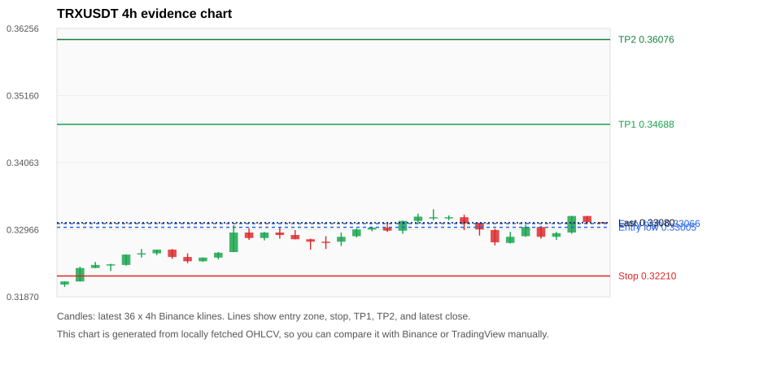
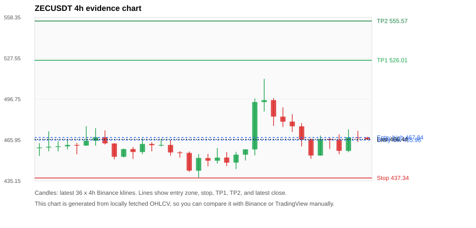
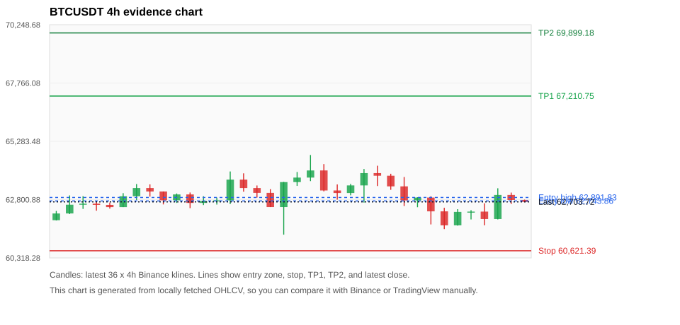
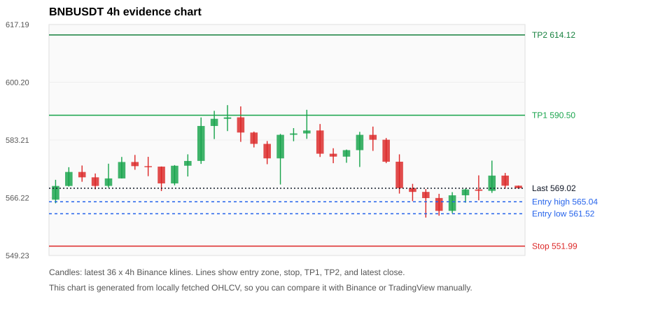
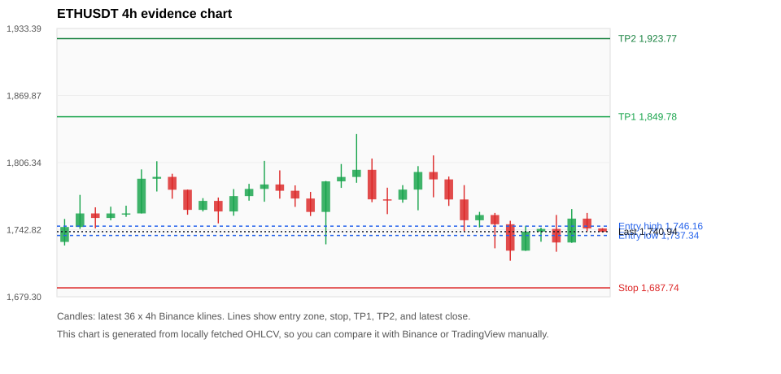

# Crypto 市场扫描报告 v1

- 报告时间：2026-07-09 20:06:03 CST
- Run ID：`20260709_120502_4d383139`
- Run type：`daily_full`
- 数据来源：SQLite
- 报告版本：v1
- 扫描 ID：b2e95b25d9bb
- 数据源：Binance public spot API + CoinGecko/CoinMarketCap cross-check
- 过滤条件：USDT spot; 24h quote volume >= 30,000,000; trades >= 30,000; exclude stables/leveraged tokens; analyze 1h/4h/1d klines
- 默认单笔风险：账户权益的 1.00%

## 限制说明

- 交易信号仍以 Binance 现货公开 K 线为主源；外部数据源用于一致性复核。
- 结果是研究和模拟盘计划，不是确定收益或实盘下单指令。
- 历史长度过滤：候选币至少需要 180 根 1d K 线。
- 数据质量验证池：先验证 score 排名前 min(top_n * 2, 10) 的候选，再按 action + score 补足最终名单。
- 大盘环境过滤：RISK_OFF; BTC/ETH 大盘偏弱，山寨币买入候选降级为观察。 BTC 7d=1.8578947368421028; ETH 7d=2.3733218861911043.
- 已启用数据交叉验证：Binance 主源 + CoinGecko 自动对照；CoinMarketCap 在配置 API Key 后自动对照。
- ZECUSDT 交叉验证状态 DATA_WARNING：At least one external provider needs manual review.
- BTCUSDT 交叉验证状态 DATA_WARNING：At least one external provider needs manual review.
- BNBUSDT 交叉验证状态 DATA_WARNING：At least one external provider needs manual review.
- ETHUSDT 交叉验证状态 DATA_WARNING：At least one external provider needs manual review.
- SOLUSDT 交叉验证状态 DATA_WARNING：At least one external provider needs manual review.
- XRPUSDT 交叉验证状态 DATA_WARNING：At least one external provider needs manual review.
- XLMUSDT 交叉验证状态 DATA_WARNING：At least one external provider needs manual review.

## 5 个候选交易计划

| Rank | Coin | Action | Setup | Entry Zone | Stop Loss | TP1 | TP2 / Exit Rule | R/R | Verdict |
|---:|---|---|---|---:|---:|---:|---|---:|---|
| 1 | `TRX` | `WATCH_ONLY` | 回踩支撑/4h EMA 附近 | 0.33005 - 0.33066 | 0.32210 | 0.34688 | 0.36076 或跌破 4h 关键支撑 | 2.00-3.68 | 只观察 |
| 2 | `ZEC` | `WATCH_ONLY` | 回踩支撑/4h EMA 附近 | 465.96 - 467.84 | 437.34 | 526.01 | 555.57 或跌破 4h 关键支撑 | 2.00-3.00 | 只观察 |
| 3 | `BTC` | `WATCH_ONLY` | 回踩支撑/4h EMA 附近 | 62,743.86 - 62,891.83 | 60,621.39 | 67,210.75 | 69,899.18 或跌破 4h 关键支撑 | 2.00-3.22 | 只观察 |
| 4 | `BNB` | `REJECT` | 回踩支撑/4h EMA 附近 | 561.52 - 565.04 | 551.99 | 590.50 | 614.12 或跌破 4h 关键支撑 | 2.41-4.50 | 只观察 |
| 5 | `ETH` | `REJECT` | 回踩支撑/4h EMA 附近 | 1,737.34 - 1,746.16 | 1,687.74 | 1,849.78 | 1,923.77 或跌破 4h 关键支撑 | 2.00-3.37 | 只观察 |

## 数据交叉验证摘要

价格差异以 Binance 当前价为基准；成交量口径不同，Binance 是 USDT 现货成交额，CoinGecko/CoinMarketCap 通常是全市场成交量。

| Rank | Coin | Data Status | Max Price Diff | Max 24h Diff | Message |
|---:|---|---|---:|---:|---|
| 1 | `TRX` | DATA_OK | 0.08% | 0.12 pts | External provider checks agree with Binance within configured thresholds. |
| 2 | `ZEC` | DATA_WARNING | 0.29% | 0.31 pts | At least one external provider needs manual review. |
| 3 | `BTC` | DATA_WARNING | 0.07% | 0.09 pts | At least one external provider needs manual review. |
| 4 | `BNB` | DATA_WARNING | 0.05% | 0.09 pts | At least one external provider needs manual review. |
| 5 | `ETH` | DATA_WARNING | 0.04% | 0.09 pts | At least one external provider needs manual review. |

## 候选币说明

### 1. TRX `TRXUSDT`



- 入选原因：回踩支撑/4h EMA 附近；24h +0.88%，7d +3.83%，4h RSI 54.30，24h 成交额 $32.2M。
- 交易失效条件：跌破 0.322095 或 4h 收盘重新失守关键支撑。
- 主要风险：BTC/ETH 大盘环境未确认强势，山寨币买入信号降级。
- 数据交叉验证：DATA_OK；External provider checks agree with Binance within configured thresholds.

#### 可点击人工验证

- [Binance 交易页](https://www.binance.com/en/trade/TRX_USDT)
- [TradingView 图表](https://www.tradingview.com/chart/?symbol=BINANCE%3ATRXUSDT)
- [CoinGecko 搜索](https://www.coingecko.com/en/search?query=TRX)
- [CoinMarketCap 搜索](https://coinmarketcap.com/search/?q=TRX)

#### 多数据源对照

| Source | Status | Asset ID | Price | 24h Change | 24h Volume | Price Diff | 24h Diff | Updated | Message |
|---|---|---|---:|---:|---:|---:|---:|---|---|
| Binance | DATA_OK | TRXUSDT | 0.33080 | +0.88% | $32.2M | 0.00% | 0.00 pts | 2026-07-09T12:05:37+00:00 | Primary market data source used by scanner. |
| CoinGecko | DATA_OK | tron | 0.33053 | +0.97% | $384.4M | 0.08% | 0.09 pts | 2026-07-09T12:05:36.927Z | External source agrees with Binance within thresholds. |
| CoinMarketCap | DATA_OK | 1958 | 0.33056 | +1.00% | $482.1M | 0.07% | 0.12 pts | 2026-07-09T12:04:05.000Z | External source agrees with Binance within thresholds. |

#### 指标证据

| 指标 | 数值 | 人工核对用途 |
|---|---:|---|
| 当前价 | 0.33080 | 与 Binance/TradingView 当前价格对照 |
| 24h 涨跌 | +0.88% | 与交易所 24h 涨跌对照 |
| 7d 涨跌 | +3.83% | 判断短线趋势是否延续 |
| 4h EMA20 | 0.32939 | 判断短期趋势支撑 |
| 4h EMA50 | 0.32698 | 判断中期趋势支撑 |
| 1d EMA20 | 0.32596 | 判断日线趋势 |
| 1d EMA50 | 0.32866 | 判断日线趋势 |
| 4h RSI14 | 54.30 | 判断是否过热/过弱 |
| 4h ATR14 | 0.0018142857 | 推导止损和入场缓冲 |
| 最近 18 根 4h 最低点 | 0.32700 | 支撑/止损参考 |
| 最近 36 根 4h 最高点 | 0.33300 | TP/压力参考 |
| 支撑位 | 0.32939 | 入场区间推导基础 |

#### 交易计划推导

- 支撑位 = 最近低点、4h EMA20、4h EMA50、1d EMA20 中不高于当前价的最高有效支撑 = `0.32939`。
- 入场区间 = 支撑位附近 + ATR 缓冲 = `0.33005 - 0.33066`。
- 止损 = min(最近 18 根 4h 最低点 * 0.985, 入场中位价 - 1.15 * ATR14) = `0.32210`。
- TP1 = max(最近 36 根 4h 最高点 * 0.995, 入场中位价 + 2R) = `0.34688`。
- TP2 = max(入场中位价 + 3R, TP1 * 1.04) = `0.36076`。

#### 最近 10 根 4h K线

| UTC 开盘时间 | Open | High | Low | Close | Quote Volume | Trades |
|---|---:|---:|---:|---:|---:|---:|
| 2026-07-08T00:00+00:00 | 0.33170 | 0.33210 | 0.32960 | 0.33070 | $6.4M | 8714 |
| 2026-07-08T04:00+00:00 | 0.33080 | 0.33080 | 0.32870 | 0.32970 | $6.5M | 9288 |
| 2026-07-08T08:00+00:00 | 0.32960 | 0.32980 | 0.32710 | 0.32760 | $8.6M | 13494 |
| 2026-07-08T12:00+00:00 | 0.32750 | 0.32930 | 0.32740 | 0.32850 | $5.6M | 11662 |
| 2026-07-08T16:00+00:00 | 0.32860 | 0.33050 | 0.32850 | 0.33010 | $5.1M | 10445 |
| 2026-07-08T20:00+00:00 | 0.33010 | 0.33030 | 0.32820 | 0.32850 | $4.2M | 6192 |
| 2026-07-09T00:00+00:00 | 0.32850 | 0.32930 | 0.32800 | 0.32910 | $5.8M | 10336 |
| 2026-07-09T04:00+00:00 | 0.32920 | 0.33190 | 0.32900 | 0.33190 | $7.1M | 14464 |
| 2026-07-09T08:00+00:00 | 0.33190 | 0.33190 | 0.33060 | 0.33090 | $4.5M | 10287 |
| 2026-07-09T12:00+00:00 | 0.33090 | 0.33090 | 0.33070 | 0.33080 | $84,013 | 207 |

### 2. ZEC `ZECUSDT`



- 入选原因：回踩支撑/4h EMA 附近；24h +0.20%，7d +4.33%，4h RSI 54.98，24h 成交额 $53.4M。
- 交易失效条件：跌破 437.34 或 4h 收盘重新失守关键支撑。
- 主要风险：BTC/ETH 大盘环境未确认强势，山寨币买入信号降级；数据交叉验证需要人工复核。
- 数据交叉验证：DATA_WARNING；At least one external provider needs manual review.

#### 可点击人工验证

- [Binance 交易页](https://www.binance.com/en/trade/ZEC_USDT)
- [TradingView 图表](https://www.tradingview.com/chart/?symbol=BINANCE%3AZECUSDT)
- [CoinGecko 搜索](https://www.coingecko.com/en/search?query=ZEC)
- [CoinMarketCap 搜索](https://coinmarketcap.com/search/?q=ZEC)

#### 多数据源对照

| Source | Status | Asset ID | Price | 24h Change | 24h Volume | Price Diff | 24h Diff | Updated | Message |
|---|---|---|---:|---:|---:|---:|---:|---|---|
| Binance | DATA_OK | ZECUSDT | 466.44 | +0.20% | $53.4M | 0.00% | 0.00 pts | 2026-07-09T12:05:37+00:00 | Primary market data source used by scanner. |
| CoinGecko | DATA_OK | zcash | 467.78 | +0.51% | $258.8M | 0.29% | 0.30 pts | 2026-07-09T12:05:26.337Z | External source agrees with Binance within thresholds. |
| CoinMarketCap | DATA_WARNING | 1437 | 467.46 | +0.52% | $362.8M | 0.22% | 0.31 pts | 2026-07-09T12:05:05.000Z | CoinMarketCap symbol mapping has 2 matches; selected lowest cmc_rank |

#### 指标证据

| 指标 | 数值 | 人工核对用途 |
|---|---:|---|
| 当前价 | 466.44 | 与 Binance/TradingView 当前价格对照 |
| 24h 涨跌 | +0.20% | 与交易所 24h 涨跌对照 |
| 7d 涨跌 | +4.33% | 判断短线趋势是否延续 |
| 4h EMA20 | 465.03 | 判断短期趋势支撑 |
| 4h EMA50 | 454.18 | 判断中期趋势支撑 |
| 1d EMA20 | 449.29 | 判断日线趋势 |
| 1d EMA50 | 455.62 | 判断日线趋势 |
| 4h RSI14 | 54.98 | 判断是否过热/过弱 |
| 4h ATR14 | 15.9979 | 推导止损和入场缓冲 |
| 最近 18 根 4h 最低点 | 444.00 | 支撑/止损参考 |
| 最近 36 根 4h 最高点 | 512.00 | TP/压力参考 |
| 支撑位 | 465.03 | 入场区间推导基础 |

#### 交易计划推导

- 支撑位 = 最近低点、4h EMA20、4h EMA50、1d EMA20 中不高于当前价的最高有效支撑 = `465.03`。
- 入场区间 = 支撑位附近 + ATR 缓冲 = `465.96 - 467.84`。
- 止损 = min(最近 18 根 4h 最低点 * 0.985, 入场中位价 - 1.15 * ATR14) = `437.34`。
- TP1 = max(最近 36 根 4h 最高点 * 0.995, 入场中位价 + 2R) = `526.01`。
- TP2 = max(入场中位价 + 3R, TP1 * 1.04) = `555.57`。

#### 最近 10 根 4h K线

| UTC 开盘时间 | Open | High | Low | Close | Quote Volume | Trades |
|---|---:|---:|---:|---:|---:|---:|
| 2026-07-08T00:00+00:00 | 483.55 | 490.57 | 475.72 | 479.75 | $14.3M | 55773 |
| 2026-07-08T04:00+00:00 | 479.82 | 485.45 | 472.08 | 476.32 | $10.0M | 38024 |
| 2026-07-08T08:00+00:00 | 476.26 | 478.69 | 461.14 | 466.39 | $17.8M | 65597 |
| 2026-07-08T12:00+00:00 | 466.40 | 467.10 | 451.82 | 454.29 | $12.2M | 56451 |
| 2026-07-08T16:00+00:00 | 454.26 | 469.36 | 454.12 | 466.66 | $13.2M | 56107 |
| 2026-07-08T20:00+00:00 | 466.67 | 467.43 | 459.13 | 465.99 | $5.1M | 24098 |
| 2026-07-09T00:00+00:00 | 465.93 | 470.23 | 455.28 | 457.79 | $7.8M | 42340 |
| 2026-07-09T04:00+00:00 | 457.79 | 473.93 | 456.71 | 467.94 | $8.7M | 37616 |
| 2026-07-09T08:00+00:00 | 467.95 | 472.90 | 464.51 | 467.88 | $6.6M | 29558 |
| 2026-07-09T12:00+00:00 | 467.73 | 468.40 | 466.39 | 466.44 | $100,389 | 543 |

### 3. BTC `BTCUSDT`



- 入选原因：回踩支撑/4h EMA 附近；24h +0.60%，7d +1.23%，4h RSI 46.58，24h 成交额 $1.02B。
- 交易失效条件：跌破 60621.392 或 4h 收盘重新失守关键支撑。
- 主要风险：日线趋势未完全确认；BTC/ETH 大盘环境未确认强势，山寨币买入信号降级；数据交叉验证需要人工复核。
- 数据交叉验证：DATA_WARNING；At least one external provider needs manual review.

#### 可点击人工验证

- [Binance 交易页](https://www.binance.com/en/trade/BTC_USDT)
- [TradingView 图表](https://www.tradingview.com/chart/?symbol=BINANCE%3ABTCUSDT)
- [CoinGecko 搜索](https://www.coingecko.com/en/search?query=BTC)
- [CoinMarketCap 搜索](https://coinmarketcap.com/search/?q=BTC)

#### 多数据源对照

| Source | Status | Asset ID | Price | 24h Change | 24h Volume | Price Diff | 24h Diff | Updated | Message |
|---|---|---|---:|---:|---:|---:|---:|---|---|
| Binance | DATA_OK | BTCUSDT | 62,703.72 | +0.60% | $1.02B | 0.00% | 0.00 pts | 2026-07-09T12:05:37+00:00 | Primary market data source used by scanner. |
| CoinGecko | DATA_OK | bitcoin | 62,657.00 | +0.56% | $25.82B | 0.07% | 0.04 pts | 2026-07-09T12:05:38.680Z | External source agrees with Binance within thresholds. |
| CoinMarketCap | DATA_WARNING | 1 | 62,660.31 | +0.69% | $25.89B | 0.07% | 0.09 pts | 2026-07-09T12:05:05.000Z | CoinMarketCap symbol mapping has 13 matches; selected lowest cmc_rank |

#### 指标证据

| 指标 | 数值 | 人工核对用途 |
|---|---:|---|
| 当前价 | 62,703.72 | 与 Binance/TradingView 当前价格对照 |
| 24h 涨跌 | +0.60% | 与交易所 24h 涨跌对照 |
| 7d 涨跌 | +1.23% | 判断短线趋势是否延续 |
| 4h EMA20 | 62,732.55 | 判断短期趋势支撑 |
| 4h EMA50 | 62,412.04 | 判断中期趋势支撑 |
| 1d EMA20 | 62,618.62 | 判断日线趋势 |
| 1d EMA50 | 65,458.50 | 判断日线趋势 |
| 4h RSI14 | 46.58 | 判断是否过热/过弱 |
| 4h ATR14 | 799.04 | 推导止损和入场缓冲 |
| 最近 18 根 4h 最低点 | 61,544.56 | 支撑/止损参考 |
| 最近 36 根 4h 最高点 | 64,700.00 | TP/压力参考 |
| 支撑位 | 62,618.62 | 入场区间推导基础 |

#### 交易计划推导

- 支撑位 = 最近低点、4h EMA20、4h EMA50、1d EMA20 中不高于当前价的最高有效支撑 = `62,618.62`。
- 入场区间 = 支撑位附近 + ATR 缓冲 = `62,743.86 - 62,891.83`。
- 止损 = min(最近 18 根 4h 最低点 * 0.985, 入场中位价 - 1.15 * ATR14) = `60,621.39`。
- TP1 = max(最近 36 根 4h 最高点 * 0.995, 入场中位价 + 2R) = `67,210.75`。
- TP2 = max(入场中位价 + 3R, TP1 * 1.04) = `69,899.18`。

#### 最近 10 根 4h K线

| UTC 开盘时间 | Open | High | Low | Close | Quote Volume | Trades |
|---|---:|---:|---:|---:|---:|---:|
| 2026-07-08T00:00+00:00 | 63,364.00 | 63,761.99 | 62,525.47 | 62,766.00 | $185.9M | 609259 |
| 2026-07-08T04:00+00:00 | 62,766.00 | 62,901.49 | 62,477.04 | 62,888.35 | $131.3M | 444952 |
| 2026-07-08T08:00+00:00 | 62,888.34 | 62,941.46 | 61,743.83 | 62,299.99 | $327.9M | 777090 |
| 2026-07-08T12:00+00:00 | 62,300.00 | 62,451.08 | 61,544.56 | 61,704.01 | $277.4M | 934639 |
| 2026-07-08T16:00+00:00 | 61,704.01 | 62,394.32 | 61,692.00 | 62,277.98 | $116.6M | 533138 |
| 2026-07-08T20:00+00:00 | 62,277.98 | 62,350.63 | 61,956.00 | 62,290.00 | $121.0M | 299409 |
| 2026-07-09T00:00+00:00 | 62,290.01 | 62,642.00 | 61,705.29 | 61,974.34 | $155.7M | 532918 |
| 2026-07-09T04:00+00:00 | 61,974.34 | 63,283.26 | 61,956.46 | 63,000.00 | $192.7M | 513310 |
| 2026-07-09T08:00+00:00 | 62,999.99 | 63,100.10 | 62,614.66 | 62,786.34 | $158.9M | 380844 |
| 2026-07-09T12:00+00:00 | 62,786.33 | 62,800.00 | 62,688.38 | 62,703.73 | $4.3M | 13835 |

### 4. BNB `BNBUSDT`



- 入选原因：回踩支撑/4h EMA 附近；24h +0.53%，7d +0.68%，4h RSI 39.35，24h 成交额 $52.5M。
- 交易失效条件：跌破 551.994 或 4h 收盘重新失守关键支撑。
- 主要风险：日线趋势未完全确认；BTC/ETH 大盘环境未确认强势，山寨币买入信号降级；数据交叉验证需要人工复核。
- 数据交叉验证：DATA_WARNING；At least one external provider needs manual review.

#### 可点击人工验证

- [Binance 交易页](https://www.binance.com/en/trade/BNB_USDT)
- [TradingView 图表](https://www.tradingview.com/chart/?symbol=BINANCE%3ABNBUSDT)
- [CoinGecko 搜索](https://www.coingecko.com/en/search?query=BNB)
- [CoinMarketCap 搜索](https://coinmarketcap.com/search/?q=BNB)

#### 多数据源对照

| Source | Status | Asset ID | Price | 24h Change | 24h Volume | Price Diff | 24h Diff | Updated | Message |
|---|---|---|---:|---:|---:|---:|---:|---|---|
| Binance | DATA_OK | BNBUSDT | 569.02 | +0.53% | $52.5M | 0.00% | 0.00 pts | 2026-07-09T12:05:37+00:00 | Primary market data source used by scanner. |
| CoinGecko | DATA_OK | binancecoin | 568.75 | +0.54% | $523.1M | 0.05% | 0.01 pts | 2026-07-09T12:05:41.064Z | External source agrees with Binance within thresholds. |
| CoinMarketCap | DATA_WARNING | 1839 | 569.05 | +0.62% | $1.07B | 0.01% | 0.09 pts | 2026-07-09T12:05:05.000Z | CoinMarketCap symbol mapping has 4 matches; selected lowest cmc_rank |

#### 指标证据

| 指标 | 数值 | 人工核对用途 |
|---|---:|---|
| 当前价 | 569.02 | 与 Binance/TradingView 当前价格对照 |
| 24h 涨跌 | +0.53% | 与交易所 24h 涨跌对照 |
| 7d 涨跌 | +0.68% | 判断短线趋势是否延续 |
| 4h EMA20 | 572.42 | 判断短期趋势支撑 |
| 4h EMA50 | 571.61 | 判断中期趋势支撑 |
| 1d EMA20 | 575.63 | 判断日线趋势 |
| 1d EMA50 | 595.03 | 判断日线趋势 |
| 4h RSI14 | 39.35 | 判断是否过热/过弱 |
| 4h ATR14 | 6.6343 | 推导止损和入场缓冲 |
| 最近 18 根 4h 最低点 | 560.40 | 支撑/止损参考 |
| 最近 36 根 4h 最高点 | 593.47 | TP/压力参考 |
| 支撑位 | 560.40 | 入场区间推导基础 |

#### 交易计划推导

- 支撑位 = 最近低点、4h EMA20、4h EMA50、1d EMA20 中不高于当前价的最高有效支撑 = `560.40`。
- 入场区间 = 支撑位附近 + ATR 缓冲 = `561.52 - 565.04`。
- 止损 = min(最近 18 根 4h 最低点 * 0.985, 入场中位价 - 1.15 * ATR14) = `551.99`。
- TP1 = max(最近 36 根 4h 最高点 * 0.995, 入场中位价 + 2R) = `590.50`。
- TP2 = max(入场中位价 + 3R, TP1 * 1.04) = `614.12`。

#### 最近 10 根 4h K线

| UTC 开盘时间 | Open | High | Low | Close | Quote Volume | Trades |
|---|---:|---:|---:|---:|---:|---:|
| 2026-07-08T00:00+00:00 | 576.83 | 579.00 | 567.45 | 569.05 | $12.9M | 146619 |
| 2026-07-08T04:00+00:00 | 569.06 | 570.31 | 565.23 | 567.94 | $8.8M | 104400 |
| 2026-07-08T08:00+00:00 | 567.94 | 568.78 | 560.40 | 566.13 | $13.6M | 145998 |
| 2026-07-08T12:00+00:00 | 566.14 | 567.38 | 560.94 | 562.36 | $9.9M | 116932 |
| 2026-07-08T16:00+00:00 | 562.36 | 567.87 | 561.64 | 566.94 | $7.0M | 71626 |
| 2026-07-08T20:00+00:00 | 566.95 | 568.98 | 564.77 | 568.66 | $4.2M | 40599 |
| 2026-07-09T00:00+00:00 | 568.66 | 572.81 | 565.48 | 568.26 | $6.4M | 74030 |
| 2026-07-09T04:00+00:00 | 568.26 | 577.15 | 567.66 | 572.74 | $11.3M | 105439 |
| 2026-07-09T08:00+00:00 | 572.74 | 573.52 | 568.93 | 569.77 | $13.7M | 103044 |
| 2026-07-09T12:00+00:00 | 569.77 | 569.82 | 569.00 | 569.03 | $115,731 | 2519 |

### 5. ETH `ETHUSDT`



- 入选原因：回踩支撑/4h EMA 附近；24h -0.37%，7d +1.77%，4h RSI 41.50，24h 成交额 $317.8M。
- 交易失效条件：跌破 1687.7384 或 4h 收盘重新失守关键支撑。
- 主要风险：日线趋势未完全确认；BTC/ETH 大盘环境未确认强势，山寨币买入信号降级；24h 动量未确认；数据交叉验证需要人工复核。
- 数据交叉验证：DATA_WARNING；At least one external provider needs manual review.

#### 可点击人工验证

- [Binance 交易页](https://www.binance.com/en/trade/ETH_USDT)
- [TradingView 图表](https://www.tradingview.com/chart/?symbol=BINANCE%3AETHUSDT)
- [CoinGecko 搜索](https://www.coingecko.com/en/search?query=ETH)
- [CoinMarketCap 搜索](https://coinmarketcap.com/search/?q=ETH)

#### 多数据源对照

| Source | Status | Asset ID | Price | 24h Change | 24h Volume | Price Diff | 24h Diff | Updated | Message |
|---|---|---|---:|---:|---:|---:|---:|---|---|
| Binance | DATA_OK | ETHUSDT | 1,740.94 | -0.37% | $317.8M | 0.00% | 0.00 pts | 2026-07-09T12:05:37+00:00 | Primary market data source used by scanner. |
| CoinGecko | DATA_OK | ethereum | 1,740.21 | -0.45% | $7.91B | 0.04% | 0.08 pts | 2026-07-09T12:05:42.092Z | External source agrees with Binance within thresholds. |
| CoinMarketCap | DATA_WARNING | 1027 | 1,740.84 | -0.28% | $8.78B | 0.01% | 0.09 pts | 2026-07-09T12:05:05.000Z | CoinMarketCap symbol mapping has 6 matches; selected lowest cmc_rank |

#### 指标证据

| 指标 | 数值 | 人工核对用途 |
|---|---:|---|
| 当前价 | 1,740.94 | 与 Binance/TradingView 当前价格对照 |
| 24h 涨跌 | -0.37% | 与交易所 24h 涨跌对照 |
| 7d 涨跌 | +1.77% | 判断短线趋势是否延续 |
| 4h EMA20 | 1,753.06 | 判断短期趋势支撑 |
| 4h EMA50 | 1,733.87 | 判断中期趋势支撑 |
| 1d EMA20 | 1,716.98 | 判断日线趋势 |
| 1d EMA50 | 1,801.49 | 判断日线趋势 |
| 4h RSI14 | 41.50 | 判断是否过热/过弱 |
| 4h ATR14 | 27.2114 | 推导止损和入场缓冲 |
| 最近 18 根 4h 最低点 | 1,713.44 | 支撑/止损参考 |
| 最近 36 根 4h 最高点 | 1,833.40 | TP/压力参考 |
| 支撑位 | 1,733.87 | 入场区间推导基础 |

#### 交易计划推导

- 支撑位 = 最近低点、4h EMA20、4h EMA50、1d EMA20 中不高于当前价的最高有效支撑 = `1,733.87`。
- 入场区间 = 支撑位附近 + ATR 缓冲 = `1,737.34 - 1,746.16`。
- 止损 = min(最近 18 根 4h 最低点 * 0.985, 入场中位价 - 1.15 * ATR14) = `1,687.74`。
- TP1 = max(最近 36 根 4h 最高点 * 0.995, 入场中位价 + 2R) = `1,849.78`。
- TP2 = max(入场中位价 + 3R, TP1 * 1.04) = `1,923.77`。

#### 最近 10 根 4h K线

| UTC 开盘时间 | Open | High | Low | Close | Quote Volume | Trades |
|---|---:|---:|---:|---:|---:|---:|
| 2026-07-08T00:00+00:00 | 1,771.45 | 1,785.00 | 1,741.21 | 1,751.78 | $80.4M | 450493 |
| 2026-07-08T04:00+00:00 | 1,751.74 | 1,759.69 | 1,745.01 | 1,756.70 | $44.5M | 286717 |
| 2026-07-08T08:00+00:00 | 1,756.70 | 1,758.70 | 1,725.18 | 1,747.95 | $98.7M | 528879 |
| 2026-07-08T12:00+00:00 | 1,747.95 | 1,751.25 | 1,713.44 | 1,722.96 | $90.5M | 643326 |
| 2026-07-08T16:00+00:00 | 1,722.96 | 1,746.52 | 1,722.78 | 1,740.98 | $54.5M | 356233 |
| 2026-07-08T20:00+00:00 | 1,740.99 | 1,744.81 | 1,731.41 | 1,743.54 | $23.9M | 194178 |
| 2026-07-09T00:00+00:00 | 1,743.55 | 1,756.79 | 1,721.93 | 1,730.70 | $48.3M | 370953 |
| 2026-07-09T04:00+00:00 | 1,730.70 | 1,762.36 | 1,730.35 | 1,753.31 | $65.8M | 313659 |
| 2026-07-09T08:00+00:00 | 1,753.30 | 1,758.68 | 1,741.26 | 1,744.02 | $35.4M | 222511 |
| 2026-07-09T12:00+00:00 | 1,744.02 | 1,744.30 | 1,740.47 | 1,740.78 | $1.2M | 9662 |

## 组合风控

- 不要 5 个候选全部满仓买入。
- 同时持仓总风险建议控制在账户权益的 3% - 5% 以内。
- 如果 BTC/ETH 同时破位，暂停山寨币多头计划或降低仓位。
- 第一版报告用于模拟盘和人工复核，不自动下单。

## 原始数据

```json
[
  {
    "rank": 1,
    "symbol": "TRXUSDT",
    "base_asset": "TRX",
    "price": 0.3308,
    "score": 47.69369202294849,
    "setup": "回踩支撑/4h EMA 附近",
    "verdict": "只观察",
    "entry_low": 0.3300523143416205,
    "entry_high": 0.3306635272870464,
    "stop_loss": 0.322095,
    "take_profit_1": 0.34688376244300034,
    "take_profit_2": 0.3607591129407204,
    "risk_reward_1": 2.0,
    "risk_reward_2": 3.679230723553696,
    "pct_24h": 0.884,
    "pct_3d": 0.9768009768009733,
    "pct_7d": 3.8292529817953502,
    "quote_volume_24h": 32188522.31798,
    "trades_24h": 63272,
    "high_low_range_24h": 1.3744654856444605,
    "rsi_1h": 57.142857142857146,
    "rsi_4h": 54.30463576158933,
    "ema20_4h": 0.3293935272870464,
    "ema50_4h": 0.32698034249906693,
    "ema20_1d": 0.32595715623858,
    "ema50_1d": 0.3286578942844446,
    "atr_4h": 0.0018142857142857047,
    "macd_hist_4h": -0.0002008795366958353,
    "volume_ratio_24h": 0.975354995036786,
    "support_level": 0.3293935272870464,
    "recent_low_4h_18": 0.327,
    "recent_high_4h_36": 0.333,
    "distance_to_support_pct": 0.42698857033942605,
    "binance_trade_url": "https://www.binance.com/en/trade/TRX_USDT",
    "tradingview_url": "https://www.tradingview.com/chart/?symbol=BINANCE%3ATRXUSDT",
    "coingecko_search_url": "https://www.coingecko.com/en/search?query=TRX",
    "coinmarketcap_search_url": "https://coinmarketcap.com/search/?q=TRX",
    "invalidation": "跌破 0.322095 或 4h 收盘重新失守关键支撑",
    "recent_4h_klines": [
      {
        "open_time_utc": "2026-07-03T16:00+00:00",
        "open": 0.3207,
        "high": 0.3212,
        "low": 0.3203,
        "close": 0.3212,
        "quote_volume": 2901198.63112,
        "trades": 8849
      },
      {
        "open_time_utc": "2026-07-03T20:00+00:00",
        "open": 0.3212,
        "high": 0.3236,
        "low": 0.3212,
        "close": 0.3234,
        "quote_volume": 7308587.99402,
        "trades": 14400
      },
      {
        "open_time_utc": "2026-07-04T00:00+00:00",
        "open": 0.3234,
        "high": 0.3244,
        "low": 0.3234,
        "close": 0.3239,
        "quote_volume": 4690579.69641,
        "trades": 9529
      },
      {
        "open_time_utc": "2026-07-04T04:00+00:00",
        "open": 0.3239,
        "high": 0.3241,
        "low": 0.3229,
        "close": 0.324,
        "quote_volume": 3267692.64499,
        "trades": 6780
      },
      {
        "open_time_utc": "2026-07-04T08:00+00:00",
        "open": 0.3239,
        "high": 0.3256,
        "low": 0.3238,
        "close": 0.3256,
        "quote_volume": 4563496.64419,
        "trades": 11137
      },
      {
        "open_time_utc": "2026-07-04T12:00+00:00",
        "open": 0.3256,
        "high": 0.3265,
        "low": 0.3251,
        "close": 0.3258,
        "quote_volume": 4490914.31771,
        "trades": 10120
      },
      {
        "open_time_utc": "2026-07-04T16:00+00:00",
        "open": 0.3258,
        "high": 0.3264,
        "low": 0.3255,
        "close": 0.3264,
        "quote_volume": 2891767.25593,
        "trades": 8513
      },
      {
        "open_time_utc": "2026-07-04T20:00+00:00",
        "open": 0.3264,
        "high": 0.3265,
        "low": 0.3249,
        "close": 0.3252,
        "quote_volume": 2896779.97518,
        "trades": 5449
      },
      {
        "open_time_utc": "2026-07-05T00:00+00:00",
        "open": 0.3252,
        "high": 0.3258,
        "low": 0.3242,
        "close": 0.3245,
        "quote_volume": 3861747.2275,
        "trades": 6200
      },
      {
        "open_time_utc": "2026-07-05T04:00+00:00",
        "open": 0.3245,
        "high": 0.3251,
        "low": 0.3244,
        "close": 0.3251,
        "quote_volume": 1378738.9089,
        "trades": 4932
      },
      {
        "open_time_utc": "2026-07-05T08:00+00:00",
        "open": 0.3251,
        "high": 0.326,
        "low": 0.3248,
        "close": 0.3259,
        "quote_volume": 3567938.77549,
        "trades": 8008
      },
      {
        "open_time_utc": "2026-07-05T12:00+00:00",
        "open": 0.326,
        "high": 0.3304,
        "low": 0.326,
        "close": 0.3292,
        "quote_volume": 15662818.38181,
        "trades": 21279
      },
      {
        "open_time_utc": "2026-07-05T16:00+00:00",
        "open": 0.3292,
        "high": 0.3299,
        "low": 0.328,
        "close": 0.3283,
        "quote_volume": 6268843.63593,
        "trades": 8835
      },
      {
        "open_time_utc": "2026-07-05T20:00+00:00",
        "open": 0.3283,
        "high": 0.3293,
        "low": 0.3279,
        "close": 0.3292,
        "quote_volume": 3478489.46341,
        "trades": 7147
      },
      {
        "open_time_utc": "2026-07-06T00:00+00:00",
        "open": 0.3292,
        "high": 0.3301,
        "low": 0.3282,
        "close": 0.3288,
        "quote_volume": 6712516.98425,
        "trades": 8911
      },
      {
        "open_time_utc": "2026-07-06T04:00+00:00",
        "open": 0.3288,
        "high": 0.3296,
        "low": 0.3281,
        "close": 0.3281,
        "quote_volume": 4078650.66154,
        "trades": 8806
      },
      {
        "open_time_utc": "2026-07-06T08:00+00:00",
        "open": 0.3281,
        "high": 0.3282,
        "low": 0.3264,
        "close": 0.3277,
        "quote_volume": 8363940.25089,
        "trades": 15525
      },
      {
        "open_time_utc": "2026-07-06T12:00+00:00",
        "open": 0.3277,
        "high": 0.3286,
        "low": 0.3265,
        "close": 0.3276,
        "quote_volume": 9543531.55769,
        "trades": 14485
      },
      {
        "open_time_utc": "2026-07-06T16:00+00:00",
        "open": 0.3277,
        "high": 0.3292,
        "low": 0.327,
        "close": 0.3285,
        "quote_volume": 5292225.23778,
        "trades": 10112
      },
      {
        "open_time_utc": "2026-07-06T20:00+00:00",
        "open": 0.3286,
        "high": 0.3299,
        "low": 0.3284,
        "close": 0.3297,
        "quote_volume": 4760409.38354,
        "trades": 7448
      },
      {
        "open_time_utc": "2026-07-07T00:00+00:00",
        "open": 0.3297,
        "high": 0.33,
        "low": 0.3294,
        "close": 0.33,
        "quote_volume": 4164135.6131,
        "trades": 6919
      },
      {
        "open_time_utc": "2026-07-07T04:00+00:00",
        "open": 0.33,
        "high": 0.3309,
        "low": 0.3293,
        "close": 0.3295,
        "quote_volume": 4902466.28119,
        "trades": 9581
      },
      {
        "open_time_utc": "2026-07-07T08:00+00:00",
        "open": 0.3295,
        "high": 0.3311,
        "low": 0.329,
        "close": 0.3311,
        "quote_volume": 5734054.15057,
        "trades": 13143
      },
      {
        "open_time_utc": "2026-07-07T12:00+00:00",
        "open": 0.3311,
        "high": 0.3323,
        "low": 0.3306,
        "close": 0.3318,
        "quote_volume": 5634346.85692,
        "trades": 12661
      },
      {
        "open_time_utc": "2026-07-07T16:00+00:00",
        "open": 0.3317,
        "high": 0.333,
        "low": 0.3312,
        "close": 0.3317,
        "quote_volume": 6563601.485,
        "trades": 10724
      },
      {
        "open_time_utc": "2026-07-07T20:00+00:00",
        "open": 0.3317,
        "high": 0.332,
        "low": 0.3312,
        "close": 0.3317,
        "quote_volume": 2404106.68146,
        "trades": 6037
      },
      {
        "open_time_utc": "2026-07-08T00:00+00:00",
        "open": 0.3317,
        "high": 0.3321,
        "low": 0.3296,
        "close": 0.3307,
        "quote_volume": 6414909.23145,
        "trades": 8714
      },
      {
        "open_time_utc": "2026-07-08T04:00+00:00",
        "open": 0.3308,
        "high": 0.3308,
        "low": 0.3287,
        "close": 0.3297,
        "quote_volume": 6482510.95553,
        "trades": 9288
      },
      {
        "open_time_utc": "2026-07-08T08:00+00:00",
        "open": 0.3296,
        "high": 0.3298,
        "low": 0.3271,
        "close": 0.3276,
        "quote_volume": 8636878.94792,
        "trades": 13494
      },
      {
        "open_time_utc": "2026-07-08T12:00+00:00",
        "open": 0.3275,
        "high": 0.3293,
        "low": 0.3274,
        "close": 0.3285,
        "quote_volume": 5574885.24258,
        "trades": 11662
      },
      {
        "open_time_utc": "2026-07-08T16:00+00:00",
        "open": 0.3286,
        "high": 0.3305,
        "low": 0.3285,
        "close": 0.3301,
        "quote_volume": 5104347.10984,
        "trades": 10445
      },
      {
        "open_time_utc": "2026-07-08T20:00+00:00",
        "open": 0.3301,
        "high": 0.3303,
        "low": 0.3282,
        "close": 0.3285,
        "quote_volume": 4214234.97416,
        "trades": 6192
      },
      {
        "open_time_utc": "2026-07-09T00:00+00:00",
        "open": 0.3285,
        "high": 0.3293,
        "low": 0.328,
        "close": 0.3291,
        "quote_volume": 5838142.48043,
        "trades": 10336
      },
      {
        "open_time_utc": "2026-07-09T04:00+00:00",
        "open": 0.3292,
        "high": 0.3319,
        "low": 0.329,
        "close": 0.3319,
        "quote_volume": 7088943.8147,
        "trades": 14464
      },
      {
        "open_time_utc": "2026-07-09T08:00+00:00",
        "open": 0.3319,
        "high": 0.3319,
        "low": 0.3306,
        "close": 0.3309,
        "quote_volume": 4461902.23793,
        "trades": 10287
      },
      {
        "open_time_utc": "2026-07-09T12:00+00:00",
        "open": 0.3309,
        "high": 0.3309,
        "low": 0.3307,
        "close": 0.3308,
        "quote_volume": 84012.78743,
        "trades": 207
      }
    ],
    "risks": [
      "BTC/ETH 大盘环境未确认强势，山寨币买入信号降级"
    ],
    "data_quality_status": "DATA_OK",
    "data_quality_message": "External provider checks agree with Binance within configured thresholds.",
    "data_checks": [
      {
        "provider": "Binance",
        "status": "DATA_OK",
        "provider_asset_id": "TRXUSDT",
        "provider_symbol": "TRXUSDT",
        "price_usd": 0.3308,
        "pct_24h": 0.884,
        "volume_24h": 32188522.31798,
        "last_updated": null,
        "fetched_at_utc": "2026-07-09T12:05:37+00:00",
        "price_diff_pct": 0.0,
        "pct_24h_diff": 0.0,
        "volume_note": "Binance USDT spot 24h quoteVolume.",
        "message": "Primary market data source used by scanner."
      },
      {
        "provider": "CoinGecko",
        "status": "DATA_OK",
        "provider_asset_id": "tron",
        "provider_symbol": "TRX",
        "price_usd": 0.330528,
        "pct_24h": 0.97213,
        "volume_24h": 384394865.0,
        "last_updated": "2026-07-09T12:05:36.927Z",
        "fetched_at_utc": "2026-07-09T12:05:37+00:00",
        "price_diff_pct": 0.08222490931076012,
        "pct_24h_diff": 0.08813000000000004,
        "volume_note": "CoinGecko total market volume; not the same venue scope as Binance quoteVolume.",
        "message": "External source agrees with Binance within thresholds."
      },
      {
        "provider": "CoinMarketCap",
        "status": "DATA_OK",
        "provider_asset_id": "1958",
        "provider_symbol": "TRX",
        "price_usd": 0.33055539655347216,
        "pct_24h": 1.00443676,
        "volume_24h": 482119166.4743336,
        "last_updated": "2026-07-09T12:04:05.000Z",
        "fetched_at_utc": "2026-07-09T12:05:37+00:00",
        "price_diff_pct": 0.07394300076415496,
        "pct_24h_diff": 0.12043675999999992,
        "volume_note": "CoinMarketCap total market volume; not the same venue scope as Binance quoteVolume.",
        "message": "External source agrees with Binance within thresholds."
      }
    ],
    "action": "WATCH_ONLY"
  },
  {
    "rank": 2,
    "symbol": "ZECUSDT",
    "base_asset": "ZEC",
    "price": 466.44,
    "score": 47.30204455407144,
    "setup": "回踩支撑/4h EMA 附近",
    "verdict": "只观察",
    "entry_low": 465.9564210305158,
    "entry_high": 467.83931999999993,
    "stop_loss": 437.34,
    "take_profit_1": 526.0136115457736,
    "take_profit_2": 555.5714820610315,
    "risk_reward_1": 2.0,
    "risk_reward_2": 2.9999999999999982,
    "pct_24h": 0.204,
    "pct_3d": 4.893406494557873,
    "pct_7d": 4.332654841523698,
    "quote_volume_24h": 53380787.58836,
    "trades_24h": 245617,
    "high_low_range_24h": 4.893541675888624,
    "rsi_1h": 54.21010425020052,
    "rsi_4h": 54.97708207212661,
    "ema20_4h": 465.02636829392793,
    "ema50_4h": 454.1754386767476,
    "ema20_1d": 449.28600757239667,
    "ema50_1d": 455.6225951794936,
    "atr_4h": 15.997857142857145,
    "macd_hist_4h": -1.6138393302874006,
    "volume_ratio_24h": 0.6129639441317177,
    "support_level": 465.02636829392793,
    "recent_low_4h_18": 444.0,
    "recent_high_4h_36": 512.0,
    "distance_to_support_pct": 0.3039895804743953,
    "binance_trade_url": "https://www.binance.com/en/trade/ZEC_USDT",
    "tradingview_url": "https://www.tradingview.com/chart/?symbol=BINANCE%3AZECUSDT",
    "coingecko_search_url": "https://www.coingecko.com/en/search?query=ZEC",
    "coinmarketcap_search_url": "https://coinmarketcap.com/search/?q=ZEC",
    "invalidation": "跌破 437.34 或 4h 收盘重新失守关键支撑",
    "recent_4h_klines": [
      {
        "open_time_utc": "2026-07-03T16:00+00:00",
        "open": 460.04,
        "high": 463.53,
        "low": 454.02,
        "close": 460.3,
        "quote_volume": 15782402.00447,
        "trades": 46763
      },
      {
        "open_time_utc": "2026-07-03T20:00+00:00",
        "open": 460.3,
        "high": 472.5,
        "low": 457.44,
        "close": 460.9,
        "quote_volume": 9693187.47116,
        "trades": 43711
      },
      {
        "open_time_utc": "2026-07-04T00:00+00:00",
        "open": 460.94,
        "high": 465.16,
        "low": 457.41,
        "close": 461.23,
        "quote_volume": 6539403.65566,
        "trades": 25630
      },
      {
        "open_time_utc": "2026-07-04T04:00+00:00",
        "open": 461.2,
        "high": 465.8,
        "low": 458.85,
        "close": 462.23,
        "quote_volume": 4930326.62857,
        "trades": 25764
      },
      {
        "open_time_utc": "2026-07-04T08:00+00:00",
        "open": 462.24,
        "high": 463.8,
        "low": 455.21,
        "close": 461.72,
        "quote_volume": 7805080.64219,
        "trades": 26395
      },
      {
        "open_time_utc": "2026-07-04T12:00+00:00",
        "open": 461.76,
        "high": 476.34,
        "low": 461.65,
        "close": 465.39,
        "quote_volume": 9271729.48601,
        "trades": 36648
      },
      {
        "open_time_utc": "2026-07-04T16:00+00:00",
        "open": 465.4,
        "high": 474.88,
        "low": 461.67,
        "close": 468.09,
        "quote_volume": 9724701.48101,
        "trades": 31830
      },
      {
        "open_time_utc": "2026-07-04T20:00+00:00",
        "open": 468.06,
        "high": 473.28,
        "low": 462.56,
        "close": 463.43,
        "quote_volume": 7462783.02198,
        "trades": 26261
      },
      {
        "open_time_utc": "2026-07-05T00:00+00:00",
        "open": 463.34,
        "high": 463.49,
        "low": 451.43,
        "close": 453.35,
        "quote_volume": 15629113.53318,
        "trades": 45610
      },
      {
        "open_time_utc": "2026-07-05T04:00+00:00",
        "open": 453.38,
        "high": 459.46,
        "low": 452.81,
        "close": 459.12,
        "quote_volume": 4221321.00608,
        "trades": 18757
      },
      {
        "open_time_utc": "2026-07-05T08:00+00:00",
        "open": 459.14,
        "high": 460.69,
        "low": 451.67,
        "close": 456.95,
        "quote_volume": 4543242.24997,
        "trades": 19800
      },
      {
        "open_time_utc": "2026-07-05T12:00+00:00",
        "open": 456.94,
        "high": 466.93,
        "low": 455.35,
        "close": 462.98,
        "quote_volume": 10969177.26093,
        "trades": 34370
      },
      {
        "open_time_utc": "2026-07-05T16:00+00:00",
        "open": 462.98,
        "high": 464.24,
        "low": 457.43,
        "close": 462.05,
        "quote_volume": 4318180.75881,
        "trades": 16506
      },
      {
        "open_time_utc": "2026-07-05T20:00+00:00",
        "open": 462.05,
        "high": 466.67,
        "low": 461.13,
        "close": 462.23,
        "quote_volume": 10761500.76231,
        "trades": 33581
      },
      {
        "open_time_utc": "2026-07-06T00:00+00:00",
        "open": 462.23,
        "high": 465.68,
        "low": 454.15,
        "close": 456.6,
        "quote_volume": 12207507.9653,
        "trades": 40429
      },
      {
        "open_time_utc": "2026-07-06T04:00+00:00",
        "open": 456.62,
        "high": 457.59,
        "low": 452.67,
        "close": 456.16,
        "quote_volume": 5663017.2163,
        "trades": 24500
      },
      {
        "open_time_utc": "2026-07-06T08:00+00:00",
        "open": 456.23,
        "high": 457.36,
        "low": 441.98,
        "close": 442.91,
        "quote_volume": 17542190.32662,
        "trades": 46726
      },
      {
        "open_time_utc": "2026-07-06T12:00+00:00",
        "open": 442.82,
        "high": 455.37,
        "low": 437.73,
        "close": 452.46,
        "quote_volume": 26214065.31259,
        "trades": 71944
      },
      {
        "open_time_utc": "2026-07-06T16:00+00:00",
        "open": 452.36,
        "high": 455.5,
        "low": 446.16,
        "close": 450.38,
        "quote_volume": 15384550.76482,
        "trades": 49478
      },
      {
        "open_time_utc": "2026-07-06T20:00+00:00",
        "open": 450.37,
        "high": 459.89,
        "low": 448.24,
        "close": 452.7,
        "quote_volume": 13400498.05844,
        "trades": 34642
      },
      {
        "open_time_utc": "2026-07-07T00:00+00:00",
        "open": 452.76,
        "high": 456.9,
        "low": 446.32,
        "close": 448.9,
        "quote_volume": 9048146.51228,
        "trades": 25574
      },
      {
        "open_time_utc": "2026-07-07T04:00+00:00",
        "open": 448.97,
        "high": 457.0,
        "low": 444.0,
        "close": 454.93,
        "quote_volume": 6893208.16374,
        "trades": 28357
      },
      {
        "open_time_utc": "2026-07-07T08:00+00:00",
        "open": 454.94,
        "high": 459.0,
        "low": 450.54,
        "close": 458.9,
        "quote_volume": 11490201.84041,
        "trades": 33483
      },
      {
        "open_time_utc": "2026-07-07T12:00+00:00",
        "open": 458.89,
        "high": 497.28,
        "low": 454.39,
        "close": 494.56,
        "quote_volume": 34527484.00912,
        "trades": 119749
      },
      {
        "open_time_utc": "2026-07-07T16:00+00:00",
        "open": 494.55,
        "high": 512.0,
        "low": 487.42,
        "close": 495.98,
        "quote_volume": 44888483.48707,
        "trades": 137937
      },
      {
        "open_time_utc": "2026-07-07T20:00+00:00",
        "open": 495.99,
        "high": 497.46,
        "low": 476.58,
        "close": 483.6,
        "quote_volume": 25467867.52302,
        "trades": 95021
      },
      {
        "open_time_utc": "2026-07-08T00:00+00:00",
        "open": 483.55,
        "high": 490.57,
        "low": 475.72,
        "close": 479.75,
        "quote_volume": 14273829.46407,
        "trades": 55773
      },
      {
        "open_time_utc": "2026-07-08T04:00+00:00",
        "open": 479.82,
        "high": 485.45,
        "low": 472.08,
        "close": 476.32,
        "quote_volume": 10009889.39165,
        "trades": 38024
      },
      {
        "open_time_utc": "2026-07-08T08:00+00:00",
        "open": 476.26,
        "high": 478.69,
        "low": 461.14,
        "close": 466.39,
        "quote_volume": 17820576.79018,
        "trades": 65597
      },
      {
        "open_time_utc": "2026-07-08T12:00+00:00",
        "open": 466.4,
        "high": 467.1,
        "low": 451.82,
        "close": 454.29,
        "quote_volume": 12194329.0018,
        "trades": 56451
      },
      {
        "open_time_utc": "2026-07-08T16:00+00:00",
        "open": 454.26,
        "high": 469.36,
        "low": 454.12,
        "close": 466.66,
        "quote_volume": 13187757.81381,
        "trades": 56107
      },
      {
        "open_time_utc": "2026-07-08T20:00+00:00",
        "open": 466.67,
        "high": 467.43,
        "low": 459.13,
        "close": 465.99,
        "quote_volume": 5059519.11383,
        "trades": 24098
      },
      {
        "open_time_utc": "2026-07-09T00:00+00:00",
        "open": 465.93,
        "high": 470.23,
        "low": 455.28,
        "close": 457.79,
        "quote_volume": 7793193.66965,
        "trades": 42340
      },
      {
        "open_time_utc": "2026-07-09T04:00+00:00",
        "open": 457.79,
        "high": 473.93,
        "low": 456.71,
        "close": 467.94,
        "quote_volume": 8674219.62737,
        "trades": 37616
      },
      {
        "open_time_utc": "2026-07-09T08:00+00:00",
        "open": 467.95,
        "high": 472.9,
        "low": 464.51,
        "close": 467.88,
        "quote_volume": 6637523.44624,
        "trades": 29558
      },
      {
        "open_time_utc": "2026-07-09T12:00+00:00",
        "open": 467.73,
        "high": 468.4,
        "low": 466.39,
        "close": 466.44,
        "quote_volume": 100389.01579,
        "trades": 543
      }
    ],
    "risks": [
      "BTC/ETH 大盘环境未确认强势，山寨币买入信号降级",
      "数据交叉验证需要人工复核"
    ],
    "data_quality_status": "DATA_WARNING",
    "data_quality_message": "At least one external provider needs manual review.",
    "data_checks": [
      {
        "provider": "Binance",
        "status": "DATA_OK",
        "provider_asset_id": "ZECUSDT",
        "provider_symbol": "ZECUSDT",
        "price_usd": 466.44,
        "pct_24h": 0.204,
        "volume_24h": 53380787.58836,
        "last_updated": null,
        "fetched_at_utc": "2026-07-09T12:05:37+00:00",
        "price_diff_pct": 0.0,
        "pct_24h_diff": 0.0,
        "volume_note": "Binance USDT spot 24h quoteVolume.",
        "message": "Primary market data source used by scanner."
      },
      {
        "provider": "CoinGecko",
        "status": "DATA_OK",
        "provider_asset_id": "zcash",
        "provider_symbol": "ZEC",
        "price_usd": 467.78,
        "pct_24h": 0.50556,
        "volume_24h": 258837247.0,
        "last_updated": "2026-07-09T12:05:26.337Z",
        "fetched_at_utc": "2026-07-09T12:05:37+00:00",
        "price_diff_pct": 0.2872823943058003,
        "pct_24h_diff": 0.30156000000000005,
        "volume_note": "CoinGecko total market volume; not the same venue scope as Binance quoteVolume.",
        "message": "External source agrees with Binance within thresholds."
      },
      {
        "provider": "CoinMarketCap",
        "status": "DATA_WARNING",
        "provider_asset_id": "1437",
        "provider_symbol": "ZEC",
        "price_usd": 467.4575762225897,
        "pct_24h": 0.51783106,
        "volume_24h": 362810444.12286276,
        "last_updated": "2026-07-09T12:05:05.000Z",
        "fetched_at_utc": "2026-07-09T12:05:37+00:00",
        "price_diff_pct": 0.21815801015986966,
        "pct_24h_diff": 0.31383106000000005,
        "volume_note": "CoinMarketCap total market volume; not the same venue scope as Binance quoteVolume.",
        "message": "CoinMarketCap symbol mapping has 2 matches; selected lowest cmc_rank"
      }
    ],
    "action": "WATCH_ONLY"
  },
  {
    "rank": 3,
    "symbol": "BTCUSDT",
    "base_asset": "BTC",
    "price": 62703.72,
    "score": 22.074849370870695,
    "setup": "回踩支撑/4h EMA 附近",
    "verdict": "只观察",
    "entry_low": 62743.85836551397,
    "entry_high": 62891.831159999994,
    "stop_loss": 60621.391599999995,
    "take_profit_1": 67210.75108827096,
    "take_profit_2": 69899.1811318018,
    "risk_reward_1": 2.0,
    "risk_reward_2": 3.223986966403746,
    "pct_24h": 0.6,
    "pct_3d": 1.5145493126642373,
    "pct_7d": 1.2345686985139048,
    "quote_volume_24h": 1022170903.1682504,
    "trades_24h": 3195397,
    "high_low_range_24h": 2.825107531843596,
    "rsi_1h": 58.68517294968318,
    "rsi_4h": 46.5766648442561,
    "ema20_4h": 62732.55195328569,
    "ema50_4h": 62412.043372022556,
    "ema20_1d": 62618.62112326743,
    "ema50_1d": 65458.498199716305,
    "atr_4h": 799.0449999999993,
    "macd_hist_4h": -90.5481661429125,
    "volume_ratio_24h": 1.013831503582372,
    "support_level": 62618.62112326743,
    "recent_low_4h_18": 61544.56,
    "recent_high_4h_36": 64700.0,
    "distance_to_support_pct": 0.13590027248451264,
    "binance_trade_url": "https://www.binance.com/en/trade/BTC_USDT",
    "tradingview_url": "https://www.tradingview.com/chart/?symbol=BINANCE%3ABTCUSDT",
    "coingecko_search_url": "https://www.coingecko.com/en/search?query=BTC",
    "coinmarketcap_search_url": "https://coinmarketcap.com/search/?q=BTC",
    "invalidation": "跌破 60621.392 或 4h 收盘重新失守关键支撑",
    "recent_4h_klines": [
      {
        "open_time_utc": "2026-07-03T16:00+00:00",
        "open": 61922.71,
        "high": 62317.64,
        "low": 61911.65,
        "close": 62210.0,
        "quote_volume": 80657192.0406437,
        "trades": 299066
      },
      {
        "open_time_utc": "2026-07-03T20:00+00:00",
        "open": 62210.0,
        "high": 62979.86,
        "low": 62186.01,
        "close": 62583.26,
        "quote_volume": 161945993.7820284,
        "trades": 444914
      },
      {
        "open_time_utc": "2026-07-04T00:00+00:00",
        "open": 62583.26,
        "high": 62946.0,
        "low": 62404.25,
        "close": 62627.29,
        "quote_volume": 109798769.8495336,
        "trades": 333809
      },
      {
        "open_time_utc": "2026-07-04T04:00+00:00",
        "open": 62627.28,
        "high": 62749.97,
        "low": 62328.24,
        "close": 62576.0,
        "quote_volume": 92487650.190593,
        "trades": 218521
      },
      {
        "open_time_utc": "2026-07-04T08:00+00:00",
        "open": 62576.0,
        "high": 62674.47,
        "low": 62415.87,
        "close": 62482.01,
        "quote_volume": 67502292.5314713,
        "trades": 170507
      },
      {
        "open_time_utc": "2026-07-04T12:00+00:00",
        "open": 62482.0,
        "high": 63075.46,
        "low": 62482.0,
        "close": 62943.29,
        "quote_volume": 85126276.003929,
        "trades": 303280
      },
      {
        "open_time_utc": "2026-07-04T16:00+00:00",
        "open": 62943.29,
        "high": 63461.99,
        "low": 62786.0,
        "close": 63294.72,
        "quote_volume": 118354896.3197012,
        "trades": 364574
      },
      {
        "open_time_utc": "2026-07-04T20:00+00:00",
        "open": 63294.72,
        "high": 63448.0,
        "low": 62927.98,
        "close": 63144.01,
        "quote_volume": 100963961.187377,
        "trades": 252597
      },
      {
        "open_time_utc": "2026-07-05T00:00+00:00",
        "open": 63144.01,
        "high": 63144.01,
        "low": 62596.08,
        "close": 62769.04,
        "quote_volume": 82720257.838107,
        "trades": 291527
      },
      {
        "open_time_utc": "2026-07-05T04:00+00:00",
        "open": 62769.03,
        "high": 63059.99,
        "low": 62659.65,
        "close": 63020.21,
        "quote_volume": 79413824.0703747,
        "trades": 215421
      },
      {
        "open_time_utc": "2026-07-05T08:00+00:00",
        "open": 63020.21,
        "high": 63104.0,
        "low": 62436.59,
        "close": 62658.92,
        "quote_volume": 84811470.4141126,
        "trades": 253294
      },
      {
        "open_time_utc": "2026-07-05T12:00+00:00",
        "open": 62658.92,
        "high": 62943.59,
        "low": 62569.37,
        "close": 62740.01,
        "quote_volume": 68699977.7688453,
        "trades": 239745
      },
      {
        "open_time_utc": "2026-07-05T16:00+00:00",
        "open": 62740.01,
        "high": 62888.14,
        "low": 62590.02,
        "close": 62768.88,
        "quote_volume": 80851366.9814916,
        "trades": 240237
      },
      {
        "open_time_utc": "2026-07-05T20:00+00:00",
        "open": 62768.87,
        "high": 63999.0,
        "low": 62609.47,
        "close": 63650.0,
        "quote_volume": 181369547.5345128,
        "trades": 549959
      },
      {
        "open_time_utc": "2026-07-06T00:00+00:00",
        "open": 63650.01,
        "high": 63920.0,
        "low": 63136.01,
        "close": 63294.0,
        "quote_volume": 133811858.2378765,
        "trades": 503644
      },
      {
        "open_time_utc": "2026-07-06T04:00+00:00",
        "open": 63294.0,
        "high": 63402.77,
        "low": 62890.0,
        "close": 63089.42,
        "quote_volume": 134594693.4450195,
        "trades": 364295
      },
      {
        "open_time_utc": "2026-07-06T08:00+00:00",
        "open": 63089.42,
        "high": 63244.0,
        "low": 62483.83,
        "close": 62483.84,
        "quote_volume": 127797556.0329306,
        "trades": 346341
      },
      {
        "open_time_utc": "2026-07-06T12:00+00:00",
        "open": 62483.84,
        "high": 63550.0,
        "low": 61306.84,
        "close": 63545.98,
        "quote_volume": 583941662.21741,
        "trades": 1372664
      },
      {
        "open_time_utc": "2026-07-06T16:00+00:00",
        "open": 63545.98,
        "high": 63976.16,
        "low": 63386.01,
        "close": 63738.52,
        "quote_volume": 209461474.1149387,
        "trades": 695266
      },
      {
        "open_time_utc": "2026-07-06T20:00+00:00",
        "open": 63738.52,
        "high": 64700.0,
        "low": 63589.41,
        "close": 64042.02,
        "quote_volume": 158348802.3550516,
        "trades": 495685
      },
      {
        "open_time_utc": "2026-07-07T00:00+00:00",
        "open": 64042.93,
        "high": 64314.0,
        "low": 63150.0,
        "close": 63191.01,
        "quote_volume": 137056167.0230249,
        "trades": 490629
      },
      {
        "open_time_utc": "2026-07-07T04:00+00:00",
        "open": 63191.01,
        "high": 63445.7,
        "low": 62800.0,
        "close": 63083.18,
        "quote_volume": 181221308.9367476,
        "trades": 435866
      },
      {
        "open_time_utc": "2026-07-07T08:00+00:00",
        "open": 63083.19,
        "high": 63467.15,
        "low": 62984.58,
        "close": 63406.0,
        "quote_volume": 104988878.8556702,
        "trades": 351275
      },
      {
        "open_time_utc": "2026-07-07T12:00+00:00",
        "open": 63405.99,
        "high": 64105.0,
        "low": 62671.39,
        "close": 63930.51,
        "quote_volume": 348081870.1046112,
        "trades": 1004190
      },
      {
        "open_time_utc": "2026-07-07T16:00+00:00",
        "open": 63930.5,
        "high": 64243.75,
        "low": 63379.69,
        "close": 63817.99,
        "quote_volume": 201532847.5832951,
        "trades": 622715
      },
      {
        "open_time_utc": "2026-07-07T20:00+00:00",
        "open": 63818.0,
        "high": 63901.75,
        "low": 63218.0,
        "close": 63363.99,
        "quote_volume": 96386614.3852602,
        "trades": 377427
      },
      {
        "open_time_utc": "2026-07-08T00:00+00:00",
        "open": 63364.0,
        "high": 63761.99,
        "low": 62525.47,
        "close": 62766.0,
        "quote_volume": 185876396.2704984,
        "trades": 609259
      },
      {
        "open_time_utc": "2026-07-08T04:00+00:00",
        "open": 62766.0,
        "high": 62901.49,
        "low": 62477.04,
        "close": 62888.35,
        "quote_volume": 131299060.8693226,
        "trades": 444952
      },
      {
        "open_time_utc": "2026-07-08T08:00+00:00",
        "open": 62888.34,
        "high": 62941.46,
        "low": 61743.83,
        "close": 62299.99,
        "quote_volume": 327876037.6334037,
        "trades": 777090
      },
      {
        "open_time_utc": "2026-07-08T12:00+00:00",
        "open": 62300.0,
        "high": 62451.08,
        "low": 61544.56,
        "close": 61704.01,
        "quote_volume": 277437714.1345036,
        "trades": 934639
      },
      {
        "open_time_utc": "2026-07-08T16:00+00:00",
        "open": 61704.01,
        "high": 62394.32,
        "low": 61692.0,
        "close": 62277.98,
        "quote_volume": 116612947.925004,
        "trades": 533138
      },
      {
        "open_time_utc": "2026-07-08T20:00+00:00",
        "open": 62277.98,
        "high": 62350.63,
        "low": 61956.0,
        "close": 62290.0,
        "quote_volume": 120985013.7873035,
        "trades": 299409
      },
      {
        "open_time_utc": "2026-07-09T00:00+00:00",
        "open": 62290.01,
        "high": 62642.0,
        "low": 61705.29,
        "close": 61974.34,
        "quote_volume": 155686968.1478035,
        "trades": 532918
      },
      {
        "open_time_utc": "2026-07-09T04:00+00:00",
        "open": 61974.34,
        "high": 63283.26,
        "low": 61956.46,
        "close": 63000.0,
        "quote_volume": 192704715.3486265,
        "trades": 513310
      },
      {
        "open_time_utc": "2026-07-09T08:00+00:00",
        "open": 62999.99,
        "high": 63100.1,
        "low": 62614.66,
        "close": 62786.34,
        "quote_volume": 158894710.7879773,
        "trades": 380844
      },
      {
        "open_time_utc": "2026-07-09T12:00+00:00",
        "open": 62786.33,
        "high": 62800.0,
        "low": 62688.38,
        "close": 62703.73,
        "quote_volume": 4264623.1473713,
        "trades": 13835
      }
    ],
    "risks": [
      "日线趋势未完全确认",
      "BTC/ETH 大盘环境未确认强势，山寨币买入信号降级",
      "数据交叉验证需要人工复核"
    ],
    "data_quality_status": "DATA_WARNING",
    "data_quality_message": "At least one external provider needs manual review.",
    "data_checks": [
      {
        "provider": "Binance",
        "status": "DATA_OK",
        "provider_asset_id": "BTCUSDT",
        "provider_symbol": "BTCUSDT",
        "price_usd": 62703.72,
        "pct_24h": 0.6,
        "volume_24h": 1022170903.1682504,
        "last_updated": null,
        "fetched_at_utc": "2026-07-09T12:05:37+00:00",
        "price_diff_pct": 0.0,
        "pct_24h_diff": 0.0,
        "volume_note": "Binance USDT spot 24h quoteVolume.",
        "message": "Primary market data source used by scanner."
      },
      {
        "provider": "CoinGecko",
        "status": "DATA_OK",
        "provider_asset_id": "bitcoin",
        "provider_symbol": "BTC",
        "price_usd": 62657.0,
        "pct_24h": 0.5634,
        "volume_24h": 25816960635.0,
        "last_updated": "2026-07-09T12:05:38.680Z",
        "fetched_at_utc": "2026-07-09T12:05:37+00:00",
        "price_diff_pct": 0.07450913598108878,
        "pct_24h_diff": 0.036599999999999966,
        "volume_note": "CoinGecko total market volume; not the same venue scope as Binance quoteVolume.",
        "message": "External source agrees with Binance within thresholds."
      },
      {
        "provider": "CoinMarketCap",
        "status": "DATA_WARNING",
        "provider_asset_id": "1",
        "provider_symbol": "BTC",
        "price_usd": 62660.30670220105,
        "pct_24h": 0.68522476,
        "volume_24h": 25885490488.076797,
        "last_updated": "2026-07-09T12:05:05.000Z",
        "fetched_at_utc": "2026-07-09T12:05:37+00:00",
        "price_diff_pct": 0.06923560165003005,
        "pct_24h_diff": 0.08522476000000001,
        "volume_note": "CoinMarketCap total market volume; not the same venue scope as Binance quoteVolume.",
        "message": "CoinMarketCap symbol mapping has 13 matches; selected lowest cmc_rank"
      }
    ],
    "action": "WATCH_ONLY"
  },
  {
    "rank": 4,
    "symbol": "BNBUSDT",
    "base_asset": "BNB",
    "price": 569.02,
    "score": 15.813325990144403,
    "setup": "回踩支撑/4h EMA 附近",
    "verdict": "只观察",
    "entry_low": 561.5208,
    "entry_high": 565.044,
    "stop_loss": 551.9939999999999,
    "take_profit_1": 590.50265,
    "take_profit_2": 614.1227560000001,
    "risk_reward_1": 2.4113470465256044,
    "risk_reward_2": 4.50376988767225,
    "pct_24h": 0.533,
    "pct_3d": -0.7015217087812387,
    "pct_7d": 0.6847739538175635,
    "quote_volume_24h": 52514922.78654,
    "trades_24h": 511899,
    "high_low_range_24h": 2.8897921346311417,
    "rsi_1h": 52.566096423017164,
    "rsi_4h": 39.35439560439551,
    "ema20_4h": 572.421233907183,
    "ema50_4h": 571.6105817790506,
    "ema20_1d": 575.633059094064,
    "ema50_1d": 595.0321097144115,
    "atr_4h": 6.6342857142857055,
    "macd_hist_4h": -1.019216297405084,
    "volume_ratio_24h": 0.7632491821152265,
    "support_level": 560.4,
    "recent_low_4h_18": 560.4,
    "recent_high_4h_36": 593.47,
    "distance_to_support_pct": 1.5381870092790795,
    "binance_trade_url": "https://www.binance.com/en/trade/BNB_USDT",
    "tradingview_url": "https://www.tradingview.com/chart/?symbol=BINANCE%3ABNBUSDT",
    "coingecko_search_url": "https://www.coingecko.com/en/search?query=BNB",
    "coinmarketcap_search_url": "https://coinmarketcap.com/search/?q=BNB",
    "invalidation": "跌破 551.994 或 4h 收盘重新失守关键支撑",
    "recent_4h_klines": [
      {
        "open_time_utc": "2026-07-03T16:00+00:00",
        "open": 565.66,
        "high": 571.5,
        "low": 564.6,
        "close": 569.69,
        "quote_volume": 8251810.92245,
        "trades": 85337
      },
      {
        "open_time_utc": "2026-07-03T20:00+00:00",
        "open": 569.69,
        "high": 575.21,
        "low": 569.51,
        "close": 573.81,
        "quote_volume": 8195697.4006,
        "trades": 84790
      },
      {
        "open_time_utc": "2026-07-04T00:00+00:00",
        "open": 573.81,
        "high": 575.71,
        "low": 570.93,
        "close": 572.23,
        "quote_volume": 7269222.31883,
        "trades": 91581
      },
      {
        "open_time_utc": "2026-07-04T04:00+00:00",
        "open": 572.23,
        "high": 573.36,
        "low": 568.7,
        "close": 569.7,
        "quote_volume": 11042125.43654,
        "trades": 85382
      },
      {
        "open_time_utc": "2026-07-04T08:00+00:00",
        "open": 569.71,
        "high": 576.24,
        "low": 569.21,
        "close": 571.91,
        "quote_volume": 11443019.67668,
        "trades": 100671
      },
      {
        "open_time_utc": "2026-07-04T12:00+00:00",
        "open": 571.91,
        "high": 578.23,
        "low": 571.9,
        "close": 576.74,
        "quote_volume": 10575962.57103,
        "trades": 97820
      },
      {
        "open_time_utc": "2026-07-04T16:00+00:00",
        "open": 576.74,
        "high": 578.82,
        "low": 574.46,
        "close": 575.52,
        "quote_volume": 8102746.02734,
        "trades": 79734
      },
      {
        "open_time_utc": "2026-07-04T20:00+00:00",
        "open": 575.52,
        "high": 578.27,
        "low": 572.57,
        "close": 575.37,
        "quote_volume": 7049499.86676,
        "trades": 65649
      },
      {
        "open_time_utc": "2026-07-05T00:00+00:00",
        "open": 575.38,
        "high": 575.43,
        "low": 568.19,
        "close": 570.44,
        "quote_volume": 7879588.73389,
        "trades": 87662
      },
      {
        "open_time_utc": "2026-07-05T04:00+00:00",
        "open": 570.44,
        "high": 575.83,
        "low": 569.88,
        "close": 575.64,
        "quote_volume": 8896469.0205,
        "trades": 72254
      },
      {
        "open_time_utc": "2026-07-05T08:00+00:00",
        "open": 575.65,
        "high": 579.0,
        "low": 572.48,
        "close": 577.05,
        "quote_volume": 15047220.66726,
        "trades": 125742
      },
      {
        "open_time_utc": "2026-07-05T12:00+00:00",
        "open": 577.06,
        "high": 589.85,
        "low": 576.19,
        "close": 587.34,
        "quote_volume": 23232302.4913,
        "trades": 203989
      },
      {
        "open_time_utc": "2026-07-05T16:00+00:00",
        "open": 587.34,
        "high": 591.8,
        "low": 583.49,
        "close": 589.45,
        "quote_volume": 12094193.39987,
        "trades": 122715
      },
      {
        "open_time_utc": "2026-07-05T20:00+00:00",
        "open": 589.44,
        "high": 593.47,
        "low": 585.84,
        "close": 589.87,
        "quote_volume": 10107932.87244,
        "trades": 93497
      },
      {
        "open_time_utc": "2026-07-06T00:00+00:00",
        "open": 589.88,
        "high": 593.1,
        "low": 582.67,
        "close": 585.41,
        "quote_volume": 12725267.1933,
        "trades": 146108
      },
      {
        "open_time_utc": "2026-07-06T04:00+00:00",
        "open": 585.41,
        "high": 585.68,
        "low": 581.03,
        "close": 582.08,
        "quote_volume": 9830074.27257,
        "trades": 89857
      },
      {
        "open_time_utc": "2026-07-06T08:00+00:00",
        "open": 582.07,
        "high": 582.9,
        "low": 576.1,
        "close": 577.81,
        "quote_volume": 11072254.13331,
        "trades": 107026
      },
      {
        "open_time_utc": "2026-07-06T12:00+00:00",
        "open": 577.81,
        "high": 585.0,
        "low": 570.12,
        "close": 584.74,
        "quote_volume": 25996234.04283,
        "trades": 237141
      },
      {
        "open_time_utc": "2026-07-06T16:00+00:00",
        "open": 584.75,
        "high": 586.71,
        "low": 582.85,
        "close": 585.15,
        "quote_volume": 12985693.11245,
        "trades": 117260
      },
      {
        "open_time_utc": "2026-07-06T20:00+00:00",
        "open": 585.15,
        "high": 592.1,
        "low": 583.55,
        "close": 586.01,
        "quote_volume": 9322287.07724,
        "trades": 73782
      },
      {
        "open_time_utc": "2026-07-07T00:00+00:00",
        "open": 586.02,
        "high": 587.92,
        "low": 578.22,
        "close": 579.18,
        "quote_volume": 7936238.98833,
        "trades": 92508
      },
      {
        "open_time_utc": "2026-07-07T04:00+00:00",
        "open": 579.18,
        "high": 580.79,
        "low": 576.39,
        "close": 578.33,
        "quote_volume": 8296701.39013,
        "trades": 82847
      },
      {
        "open_time_utc": "2026-07-07T08:00+00:00",
        "open": 578.32,
        "high": 580.4,
        "low": 576.52,
        "close": 580.23,
        "quote_volume": 7972991.58626,
        "trades": 85202
      },
      {
        "open_time_utc": "2026-07-07T12:00+00:00",
        "open": 580.23,
        "high": 585.61,
        "low": 575.28,
        "close": 584.74,
        "quote_volume": 12844907.15105,
        "trades": 144173
      },
      {
        "open_time_utc": "2026-07-07T16:00+00:00",
        "open": 584.73,
        "high": 587.16,
        "low": 580.01,
        "close": 583.29,
        "quote_volume": 10337828.87898,
        "trades": 116515
      },
      {
        "open_time_utc": "2026-07-07T20:00+00:00",
        "open": 583.29,
        "high": 583.8,
        "low": 576.4,
        "close": 576.82,
        "quote_volume": 6679823.67957,
        "trades": 63042
      },
      {
        "open_time_utc": "2026-07-08T00:00+00:00",
        "open": 576.83,
        "high": 579.0,
        "low": 567.45,
        "close": 569.05,
        "quote_volume": 12907934.95603,
        "trades": 146619
      },
      {
        "open_time_utc": "2026-07-08T04:00+00:00",
        "open": 569.06,
        "high": 570.31,
        "low": 565.23,
        "close": 567.94,
        "quote_volume": 8780098.82395,
        "trades": 104400
      },
      {
        "open_time_utc": "2026-07-08T08:00+00:00",
        "open": 567.94,
        "high": 568.78,
        "low": 560.4,
        "close": 566.13,
        "quote_volume": 13592609.84404,
        "trades": 145998
      },
      {
        "open_time_utc": "2026-07-08T12:00+00:00",
        "open": 566.14,
        "high": 567.38,
        "low": 560.94,
        "close": 562.36,
        "quote_volume": 9917611.40391,
        "trades": 116932
      },
      {
        "open_time_utc": "2026-07-08T16:00+00:00",
        "open": 562.36,
        "high": 567.87,
        "low": 561.64,
        "close": 566.94,
        "quote_volume": 6968421.09667,
        "trades": 71626
      },
      {
        "open_time_utc": "2026-07-08T20:00+00:00",
        "open": 566.95,
        "high": 568.98,
        "low": 564.77,
        "close": 568.66,
        "quote_volume": 4179654.56002,
        "trades": 40599
      },
      {
        "open_time_utc": "2026-07-09T00:00+00:00",
        "open": 568.66,
        "high": 572.81,
        "low": 565.48,
        "close": 568.26,
        "quote_volume": 6372454.4484,
        "trades": 74030
      },
      {
        "open_time_utc": "2026-07-09T04:00+00:00",
        "open": 568.26,
        "high": 577.15,
        "low": 567.66,
        "close": 572.74,
        "quote_volume": 11337245.05357,
        "trades": 105439
      },
      {
        "open_time_utc": "2026-07-09T08:00+00:00",
        "open": 572.74,
        "high": 573.52,
        "low": 568.93,
        "close": 569.77,
        "quote_volume": 13743213.88996,
        "trades": 103044
      },
      {
        "open_time_utc": "2026-07-09T12:00+00:00",
        "open": 569.77,
        "high": 569.82,
        "low": 569.0,
        "close": 569.03,
        "quote_volume": 115731.01777,
        "trades": 2519
      }
    ],
    "risks": [
      "日线趋势未完全确认",
      "BTC/ETH 大盘环境未确认强势，山寨币买入信号降级",
      "数据交叉验证需要人工复核"
    ],
    "data_quality_status": "DATA_WARNING",
    "data_quality_message": "At least one external provider needs manual review.",
    "data_checks": [
      {
        "provider": "Binance",
        "status": "DATA_OK",
        "provider_asset_id": "BNBUSDT",
        "provider_symbol": "BNBUSDT",
        "price_usd": 569.02,
        "pct_24h": 0.533,
        "volume_24h": 52514922.78654,
        "last_updated": null,
        "fetched_at_utc": "2026-07-09T12:05:37+00:00",
        "price_diff_pct": 0.0,
        "pct_24h_diff": 0.0,
        "volume_note": "Binance USDT spot 24h quoteVolume.",
        "message": "Primary market data source used by scanner."
      },
      {
        "provider": "CoinGecko",
        "status": "DATA_OK",
        "provider_asset_id": "binancecoin",
        "provider_symbol": "BNB",
        "price_usd": 568.75,
        "pct_24h": 0.5422,
        "volume_24h": 523133397.0,
        "last_updated": "2026-07-09T12:05:41.064Z",
        "fetched_at_utc": "2026-07-09T12:05:37+00:00",
        "price_diff_pct": 0.04745000175740428,
        "pct_24h_diff": 0.009199999999999986,
        "volume_note": "CoinGecko total market volume; not the same venue scope as Binance quoteVolume.",
        "message": "External source agrees with Binance within thresholds."
      },
      {
        "provider": "CoinMarketCap",
        "status": "DATA_WARNING",
        "provider_asset_id": "1839",
        "provider_symbol": "BNB",
        "price_usd": 569.049974900233,
        "pct_24h": 0.62384104,
        "volume_24h": 1066803574.0164825,
        "last_updated": "2026-07-09T12:05:05.000Z",
        "fetched_at_utc": "2026-07-09T12:05:37+00:00",
        "price_diff_pct": 0.005267811365683899,
        "pct_24h_diff": 0.09084103999999993,
        "volume_note": "CoinMarketCap total market volume; not the same venue scope as Binance quoteVolume.",
        "message": "CoinMarketCap symbol mapping has 4 matches; selected lowest cmc_rank"
      }
    ],
    "action": "REJECT"
  },
  {
    "rank": 5,
    "symbol": "ETHUSDT",
    "base_asset": "ETH",
    "price": 1740.94,
    "score": 13.918385532932497,
    "setup": "回踩支撑/4h EMA 附近",
    "verdict": "只观察",
    "entry_low": 1737.3400467633326,
    "entry_high": 1746.1628199999998,
    "stop_loss": 1687.7384,
    "take_profit_1": 1849.7775001449986,
    "take_profit_2": 1923.7686001507986,
    "risk_reward_1": 2.0,
    "risk_reward_2": 3.3698749241310897,
    "pct_24h": -0.37,
    "pct_3d": -0.2263753015949499,
    "pct_7d": 1.7665076692854553,
    "quote_volume_24h": 317751465.414723,
    "trades_24h": 2101611,
    "high_low_range_24h": 2.855075170417387,
    "rsi_1h": 49.64939024390242,
    "rsi_4h": 41.49637074260188,
    "ema20_4h": 1753.0639041054683,
    "ema50_4h": 1733.8723021590145,
    "ema20_1d": 1716.977149774556,
    "ema50_1d": 1801.4899793554748,
    "atr_4h": 27.21142857142856,
    "macd_hist_4h": -5.55667633274972,
    "volume_ratio_24h": 0.6127711948968807,
    "support_level": 1733.8723021590145,
    "recent_low_4h_18": 1713.44,
    "recent_high_4h_36": 1833.4,
    "distance_to_support_pct": 0.407625050136895,
    "binance_trade_url": "https://www.binance.com/en/trade/ETH_USDT",
    "tradingview_url": "https://www.tradingview.com/chart/?symbol=BINANCE%3AETHUSDT",
    "coingecko_search_url": "https://www.coingecko.com/en/search?query=ETH",
    "coinmarketcap_search_url": "https://coinmarketcap.com/search/?q=ETH",
    "invalidation": "跌破 1687.7384 或 4h 收盘重新失守关键支撑",
    "recent_4h_klines": [
      {
        "open_time_utc": "2026-07-03T16:00+00:00",
        "open": 1731.24,
        "high": 1753.0,
        "low": 1727.87,
        "close": 1745.38,
        "quote_volume": 45911194.191749,
        "trades": 332478
      },
      {
        "open_time_utc": "2026-07-03T20:00+00:00",
        "open": 1745.39,
        "high": 1775.78,
        "low": 1743.61,
        "close": 1758.21,
        "quote_volume": 80104889.136142,
        "trades": 471685
      },
      {
        "open_time_utc": "2026-07-04T00:00+00:00",
        "open": 1758.22,
        "high": 1764.0,
        "low": 1744.09,
        "close": 1753.92,
        "quote_volume": 32759415.817823,
        "trades": 271279
      },
      {
        "open_time_utc": "2026-07-04T04:00+00:00",
        "open": 1753.91,
        "high": 1764.61,
        "low": 1751.72,
        "close": 1758.19,
        "quote_volume": 48241722.057156,
        "trades": 257895
      },
      {
        "open_time_utc": "2026-07-04T08:00+00:00",
        "open": 1758.18,
        "high": 1765.55,
        "low": 1755.0,
        "close": 1758.24,
        "quote_volume": 30279202.879161,
        "trades": 307243
      },
      {
        "open_time_utc": "2026-07-04T12:00+00:00",
        "open": 1758.23,
        "high": 1799.92,
        "low": 1758.23,
        "close": 1791.09,
        "quote_volume": 92529333.184946,
        "trades": 469138
      },
      {
        "open_time_utc": "2026-07-04T16:00+00:00",
        "open": 1791.08,
        "high": 1807.65,
        "low": 1779.0,
        "close": 1792.83,
        "quote_volume": 99154313.401248,
        "trades": 507520
      },
      {
        "open_time_utc": "2026-07-04T20:00+00:00",
        "open": 1792.83,
        "high": 1795.81,
        "low": 1772.1,
        "close": 1780.64,
        "quote_volume": 36010344.609352,
        "trades": 171030
      },
      {
        "open_time_utc": "2026-07-05T00:00+00:00",
        "open": 1780.64,
        "high": 1780.75,
        "low": 1757.0,
        "close": 1761.59,
        "quote_volume": 64322776.994559,
        "trades": 322249
      },
      {
        "open_time_utc": "2026-07-05T04:00+00:00",
        "open": 1761.58,
        "high": 1772.69,
        "low": 1760.07,
        "close": 1770.1,
        "quote_volume": 171704728.362506,
        "trades": 630650
      },
      {
        "open_time_utc": "2026-07-05T08:00+00:00",
        "open": 1770.09,
        "high": 1773.27,
        "low": 1748.79,
        "close": 1760.08,
        "quote_volume": 309973568.639662,
        "trades": 832283
      },
      {
        "open_time_utc": "2026-07-05T12:00+00:00",
        "open": 1760.08,
        "high": 1781.28,
        "low": 1756.03,
        "close": 1774.67,
        "quote_volume": 35386807.294659,
        "trades": 256930
      },
      {
        "open_time_utc": "2026-07-05T16:00+00:00",
        "open": 1774.66,
        "high": 1786.23,
        "low": 1770.31,
        "close": 1781.43,
        "quote_volume": 32381270.966127,
        "trades": 225167
      },
      {
        "open_time_utc": "2026-07-05T20:00+00:00",
        "open": 1781.44,
        "high": 1808.0,
        "low": 1769.29,
        "close": 1785.65,
        "quote_volume": 74803966.238566,
        "trades": 443022
      },
      {
        "open_time_utc": "2026-07-06T00:00+00:00",
        "open": 1785.65,
        "high": 1799.02,
        "low": 1772.22,
        "close": 1779.71,
        "quote_volume": 51477067.911105,
        "trades": 378371
      },
      {
        "open_time_utc": "2026-07-06T04:00+00:00",
        "open": 1779.7,
        "high": 1784.79,
        "low": 1764.42,
        "close": 1772.32,
        "quote_volume": 47749629.90858,
        "trades": 255155
      },
      {
        "open_time_utc": "2026-07-06T08:00+00:00",
        "open": 1772.32,
        "high": 1778.6,
        "low": 1755.77,
        "close": 1759.64,
        "quote_volume": 58875690.643914,
        "trades": 269374
      },
      {
        "open_time_utc": "2026-07-06T12:00+00:00",
        "open": 1759.64,
        "high": 1788.96,
        "low": 1728.95,
        "close": 1788.57,
        "quote_volume": 179083609.2741,
        "trades": 948364
      },
      {
        "open_time_utc": "2026-07-06T16:00+00:00",
        "open": 1788.57,
        "high": 1805.0,
        "low": 1782.42,
        "close": 1792.76,
        "quote_volume": 108710719.038645,
        "trades": 530438
      },
      {
        "open_time_utc": "2026-07-06T20:00+00:00",
        "open": 1792.76,
        "high": 1833.4,
        "low": 1787.26,
        "close": 1799.56,
        "quote_volume": 97896741.274095,
        "trades": 388963
      },
      {
        "open_time_utc": "2026-07-07T00:00+00:00",
        "open": 1799.56,
        "high": 1810.16,
        "low": 1768.85,
        "close": 1771.56,
        "quote_volume": 66944098.868885,
        "trades": 378555
      },
      {
        "open_time_utc": "2026-07-07T04:00+00:00",
        "open": 1771.55,
        "high": 1782.59,
        "low": 1757.57,
        "close": 1771.24,
        "quote_volume": 65417463.726118,
        "trades": 288985
      },
      {
        "open_time_utc": "2026-07-07T08:00+00:00",
        "open": 1771.23,
        "high": 1785.0,
        "low": 1768.37,
        "close": 1780.77,
        "quote_volume": 49210293.246015,
        "trades": 233940
      },
      {
        "open_time_utc": "2026-07-07T12:00+00:00",
        "open": 1780.77,
        "high": 1803.03,
        "low": 1761.19,
        "close": 1797.45,
        "quote_volume": 116009755.110902,
        "trades": 785298
      },
      {
        "open_time_utc": "2026-07-07T16:00+00:00",
        "open": 1797.45,
        "high": 1813.16,
        "low": 1773.5,
        "close": 1790.45,
        "quote_volume": 83697542.771657,
        "trades": 556320
      },
      {
        "open_time_utc": "2026-07-07T20:00+00:00",
        "open": 1790.46,
        "high": 1793.12,
        "low": 1765.35,
        "close": 1771.45,
        "quote_volume": 49256624.488021,
        "trades": 277174
      },
      {
        "open_time_utc": "2026-07-08T00:00+00:00",
        "open": 1771.45,
        "high": 1785.0,
        "low": 1741.21,
        "close": 1751.78,
        "quote_volume": 80404740.597791,
        "trades": 450493
      },
      {
        "open_time_utc": "2026-07-08T04:00+00:00",
        "open": 1751.74,
        "high": 1759.69,
        "low": 1745.01,
        "close": 1756.7,
        "quote_volume": 44490761.312298,
        "trades": 286717
      },
      {
        "open_time_utc": "2026-07-08T08:00+00:00",
        "open": 1756.7,
        "high": 1758.7,
        "low": 1725.18,
        "close": 1747.95,
        "quote_volume": 98675827.777842,
        "trades": 528879
      },
      {
        "open_time_utc": "2026-07-08T12:00+00:00",
        "open": 1747.95,
        "high": 1751.25,
        "low": 1713.44,
        "close": 1722.96,
        "quote_volume": 90459253.466077,
        "trades": 643326
      },
      {
        "open_time_utc": "2026-07-08T16:00+00:00",
        "open": 1722.96,
        "high": 1746.52,
        "low": 1722.78,
        "close": 1740.98,
        "quote_volume": 54463164.251953,
        "trades": 356233
      },
      {
        "open_time_utc": "2026-07-08T20:00+00:00",
        "open": 1740.99,
        "high": 1744.81,
        "low": 1731.41,
        "close": 1743.54,
        "quote_volume": 23949993.595381,
        "trades": 194178
      },
      {
        "open_time_utc": "2026-07-09T00:00+00:00",
        "open": 1743.55,
        "high": 1756.79,
        "low": 1721.93,
        "close": 1730.7,
        "quote_volume": 48303672.851556,
        "trades": 370953
      },
      {
        "open_time_utc": "2026-07-09T04:00+00:00",
        "open": 1730.7,
        "high": 1762.36,
        "low": 1730.35,
        "close": 1753.31,
        "quote_volume": 65808618.565405,
        "trades": 313659
      },
      {
        "open_time_utc": "2026-07-09T08:00+00:00",
        "open": 1753.3,
        "high": 1758.68,
        "low": 1741.26,
        "close": 1744.02,
        "quote_volume": 35397227.751037,
        "trades": 222511
      },
      {
        "open_time_utc": "2026-07-09T12:00+00:00",
        "open": 1744.02,
        "high": 1744.3,
        "low": 1740.47,
        "close": 1740.78,
        "quote_volume": 1169167.282842,
        "trades": 9662
      }
    ],
    "risks": [
      "日线趋势未完全确认",
      "BTC/ETH 大盘环境未确认强势，山寨币买入信号降级",
      "24h 动量未确认",
      "数据交叉验证需要人工复核"
    ],
    "data_quality_status": "DATA_WARNING",
    "data_quality_message": "At least one external provider needs manual review.",
    "data_checks": [
      {
        "provider": "Binance",
        "status": "DATA_OK",
        "provider_asset_id": "ETHUSDT",
        "provider_symbol": "ETHUSDT",
        "price_usd": 1740.94,
        "pct_24h": -0.37,
        "volume_24h": 317751465.414723,
        "last_updated": null,
        "fetched_at_utc": "2026-07-09T12:05:37+00:00",
        "price_diff_pct": 0.0,
        "pct_24h_diff": 0.0,
        "volume_note": "Binance USDT spot 24h quoteVolume.",
        "message": "Primary market data source used by scanner."
      },
      {
        "provider": "CoinGecko",
        "status": "DATA_OK",
        "provider_asset_id": "ethereum",
        "provider_symbol": "ETH",
        "price_usd": 1740.21,
        "pct_24h": -0.45031,
        "volume_24h": 7908502223.0,
        "last_updated": "2026-07-09T12:05:42.092Z",
        "fetched_at_utc": "2026-07-09T12:05:37+00:00",
        "price_diff_pct": 0.04193137040909038,
        "pct_24h_diff": 0.08030999999999999,
        "volume_note": "CoinGecko total market volume; not the same venue scope as Binance quoteVolume.",
        "message": "External source agrees with Binance within thresholds."
      },
      {
        "provider": "CoinMarketCap",
        "status": "DATA_WARNING",
        "provider_asset_id": "1027",
        "provider_symbol": "ETH",
        "price_usd": 1740.8398026927136,
        "pct_24h": -0.28179463,
        "volume_24h": 8777743439.241726,
        "last_updated": "2026-07-09T12:05:05.000Z",
        "fetched_at_utc": "2026-07-09T12:05:37+00:00",
        "price_diff_pct": 0.005755356720300959,
        "pct_24h_diff": 0.08820537,
        "volume_note": "CoinMarketCap total market volume; not the same venue scope as Binance quoteVolume.",
        "message": "CoinMarketCap symbol mapping has 6 matches; selected lowest cmc_rank"
      }
    ],
    "action": "REJECT"
  }
]
```
