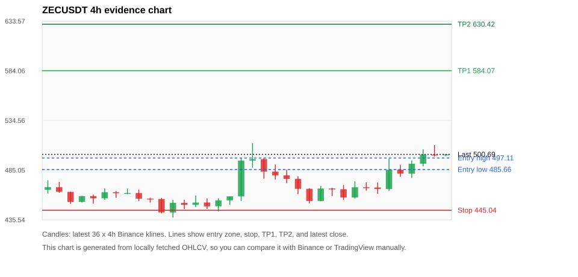
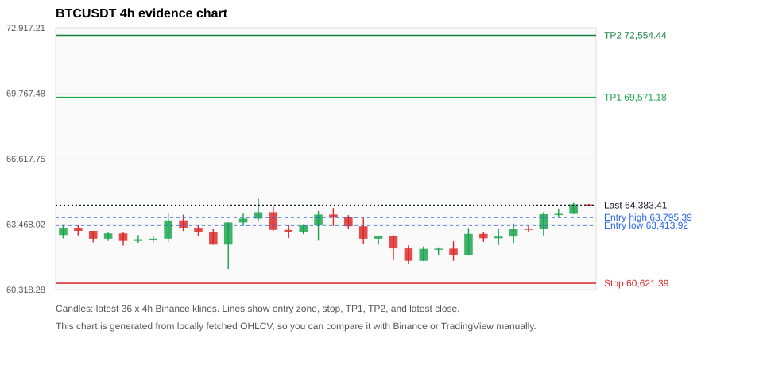
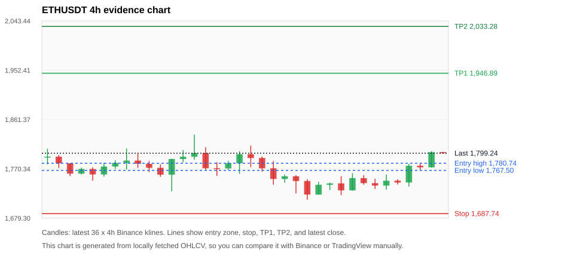
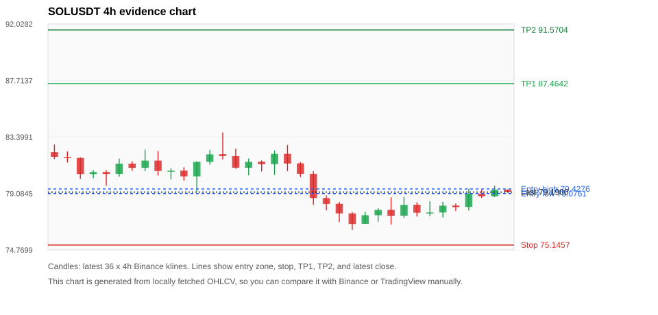
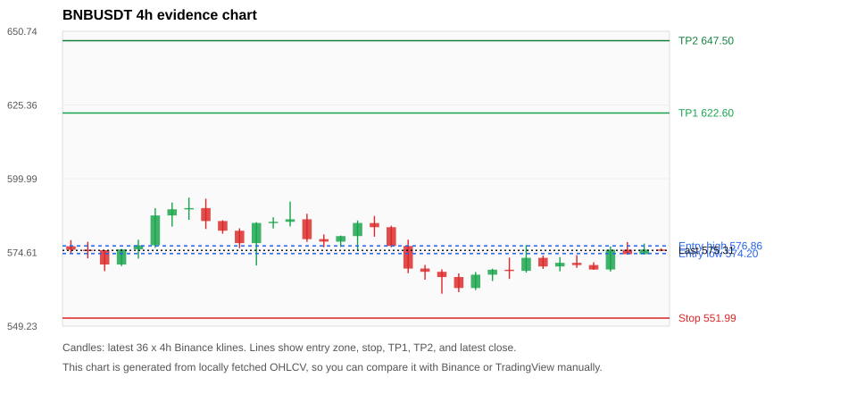

# Crypto 市场扫描报告 v1

- 报告时间：2026-07-10 20:05:45 CST
- Run ID：`20260710_120503_a7192623`
- Run type：`daily_full`
- 数据来源：SQLite
- 报告版本：v1
- 扫描 ID：26022241fbde
- 数据源：Binance public spot API + CoinGecko/CoinMarketCap cross-check
- 过滤条件：USDT spot; 24h quote volume >= 30,000,000; trades >= 30,000; exclude stables/leveraged tokens; analyze 1h/4h/1d klines
- 默认单笔风险：账户权益的 1.00%

## 限制说明

- 交易信号仍以 Binance 现货公开 K 线为主源；外部数据源用于一致性复核。
- 结果是研究和模拟盘计划，不是确定收益或实盘下单指令。
- 历史长度过滤：候选币至少需要 180 根 1d K 线。
- 数据质量验证池：先验证 score 排名前 min(top_n * 2, 10) 的候选，再按 action + score 补足最终名单。
- 大盘环境过滤：RISK_OFF; BTC/ETH 大盘偏弱，山寨币买入候选降级为观察。 BTC 7d=2.8773828656416978; ETH 7d=2.3654739763737.
- 已启用数据交叉验证：Binance 主源 + CoinGecko 自动对照；CoinMarketCap 在配置 API Key 后自动对照。
- ZECUSDT 交叉验证状态 DATA_WARNING：At least one external provider needs manual review.
- BTCUSDT 交叉验证状态 DATA_WARNING：At least one external provider needs manual review.
- ETHUSDT 交叉验证状态 DATA_WARNING：At least one external provider needs manual review.
- SOLUSDT 交叉验证状态 DATA_WARNING：At least one external provider needs manual review.
- BNBUSDT 交叉验证状态 DATA_WARNING：At least one external provider needs manual review.
- XRPUSDT 交叉验证状态 DATA_WARNING：At least one external provider needs manual review.

## 5 个候选交易计划

| Rank | Coin | Action | Setup | Entry Zone | Stop Loss | TP1 | TP2 / Exit Rule | R/R | Verdict |
|---:|---|---|---|---:|---:|---:|---|---:|---|
| 1 | `ZEC` | `WAIT_PULLBACK` | 趋势中，等回调入场 | 485.66 - 497.11 | 445.04 | 584.07 | 630.42 或跌破 4h 关键支撑 | 2.00-3.00 | 只等回调 |
| 2 | `BTC` | `WATCH_ONLY` | 回踩支撑/4h EMA 附近 | 63,413.92 - 63,795.39 | 60,621.39 | 69,571.18 | 72,554.44 或跌破 4h 关键支撑 | 2.00-3.00 | 只观察 |
| 3 | `ETH` | `WATCH_ONLY` | 回踩支撑/4h EMA 附近 | 1,767.50 - 1,780.74 | 1,687.74 | 1,946.89 | 2,033.28 或跌破 4h 关键支撑 | 2.00-3.00 | 只观察 |
| 4 | `SOL` | `WATCH_ONLY` | 回踩支撑/4h EMA 附近 | 79.0761 - 79.4276 | 75.1457 | 87.4642 | 91.5704 或跌破 4h 关键支撑 | 2.00-3.00 | 只观察 |
| 5 | `BNB` | `WATCH_ONLY` | 回踩支撑/4h EMA 附近 | 574.20 - 576.86 | 551.99 | 622.60 | 647.50 或跌破 4h 关键支撑 | 2.00-3.06 | 只观察 |

## 数据交叉验证摘要

价格差异以 Binance 当前价为基准；成交量口径不同，Binance 是 USDT 现货成交额，CoinGecko/CoinMarketCap 通常是全市场成交量。

| Rank | Coin | Data Status | Max Price Diff | Max 24h Diff | Message |
|---:|---|---|---:|---:|---|
| 1 | `ZEC` | DATA_WARNING | 0.30% | 0.49 pts | At least one external provider needs manual review. |
| 2 | `BTC` | DATA_WARNING | 0.07% | 0.17 pts | At least one external provider needs manual review. |
| 3 | `ETH` | DATA_WARNING | 0.03% | 0.14 pts | At least one external provider needs manual review. |
| 4 | `SOL` | DATA_WARNING | 0.04% | 0.04 pts | At least one external provider needs manual review. |
| 5 | `BNB` | DATA_WARNING | 0.06% | 0.06 pts | At least one external provider needs manual review. |

## 候选币说明

### 1. ZEC `ZECUSDT`



- 入选原因：趋势中，等回调入场；24h +7.28%，7d +7.99%，4h RSI 62.51，24h 成交额 $94.7M。
- 交易失效条件：跌破 445.0427 或 4h 收盘重新失守关键支撑。
- 主要风险：BTC/ETH 大盘环境未确认强势，山寨币买入信号降级；数据交叉验证需要人工复核。
- 数据交叉验证：DATA_WARNING；At least one external provider needs manual review.

#### 可点击人工验证

- [Binance 交易页](https://www.binance.com/en/trade/ZEC_USDT)
- [TradingView 图表](https://www.tradingview.com/chart/?symbol=BINANCE%3AZECUSDT)
- [CoinGecko 搜索](https://www.coingecko.com/en/search?query=ZEC)
- [CoinMarketCap 搜索](https://coinmarketcap.com/search/?q=ZEC)

#### 多数据源对照

| Source | Status | Asset ID | Price | 24h Change | 24h Volume | Price Diff | 24h Diff | Updated | Message |
|---|---|---|---:|---:|---:|---:|---:|---|---|
| Binance | DATA_OK | ZECUSDT | 500.69 | +7.28% | $94.7M | 0.00% | 0.00 pts | 2026-07-10T12:05:27+00:00 | Primary market data source used by scanner. |
| CoinGecko | DATA_OK | zcash | 500.02 | +6.88% | $372.7M | 0.13% | 0.40 pts | 2026-07-10T12:05:30.070Z | External source agrees with Binance within thresholds. |
| CoinMarketCap | DATA_WARNING | 1437 | 499.20 | +6.79% | $493.7M | 0.30% | 0.49 pts | 2026-07-10T12:04:05.000Z | CoinMarketCap symbol mapping has 2 matches; selected lowest cmc_rank |

#### 指标证据

| 指标 | 数值 | 人工核对用途 |
|---|---:|---|
| 当前价 | 500.69 | 与 Binance/TradingView 当前价格对照 |
| 24h 涨跌 | +7.28% | 与交易所 24h 涨跌对照 |
| 7d 涨跌 | +7.99% | 判断短线趋势是否延续 |
| 4h EMA20 | 478.33 | 判断短期趋势支撑 |
| 4h EMA50 | 462.62 | 判断中期趋势支撑 |
| 1d EMA20 | 455.48 | 判断日线趋势 |
| 1d EMA50 | 457.96 | 判断日线趋势 |
| 4h RSI14 | 62.51 | 判断是否过热/过弱 |
| 4h ATR14 | 14.3129 | 推导止损和入场缓冲 |
| 最近 18 根 4h 最低点 | 451.82 | 支撑/止损参考 |
| 最近 36 根 4h 最高点 | 512.00 | TP/压力参考 |
| 支撑位 | 478.33 | 入场区间推导基础 |

#### 交易计划推导

- 支撑位 = 最近低点、4h EMA20、4h EMA50、1d EMA20 中不高于当前价的最高有效支撑 = `478.33`。
- 入场区间 = 支撑位附近 + ATR 缓冲 = `485.66 - 497.11`。
- 止损 = min(最近 18 根 4h 最低点 * 0.985, 入场中位价 - 1.15 * ATR14) = `445.04`。
- TP1 = max(最近 36 根 4h 最高点 * 0.995, 入场中位价 + 2R) = `584.07`。
- TP2 = max(入场中位价 + 3R, TP1 * 1.04) = `630.42`。

#### 最近 10 根 4h K线

| UTC 开盘时间 | Open | High | Low | Close | Quote Volume | Trades |
|---|---:|---:|---:|---:|---:|---:|
| 2026-07-09T00:00+00:00 | 465.93 | 470.23 | 455.28 | 457.79 | $7.8M | 42340 |
| 2026-07-09T04:00+00:00 | 457.79 | 473.93 | 456.71 | 467.94 | $8.7M | 37616 |
| 2026-07-09T08:00+00:00 | 467.95 | 472.90 | 464.51 | 467.88 | $6.6M | 29558 |
| 2026-07-09T12:00+00:00 | 467.73 | 472.61 | 461.36 | 466.23 | $9.5M | 45237 |
| 2026-07-09T16:00+00:00 | 466.23 | 496.48 | 464.21 | 485.41 | $26.4M | 75989 |
| 2026-07-09T20:00+00:00 | 485.46 | 490.45 | 478.37 | 481.54 | $12.3M | 42101 |
| 2026-07-10T00:00+00:00 | 481.51 | 494.71 | 477.22 | 491.44 | $13.7M | 46636 |
| 2026-07-10T04:00+00:00 | 491.44 | 505.77 | 488.77 | 500.50 | $21.0M | 56475 |
| 2026-07-10T08:00+00:00 | 500.49 | 509.94 | 498.53 | 500.48 | $11.7M | 48743 |
| 2026-07-10T12:00+00:00 | 500.47 | 500.87 | 498.92 | 500.69 | $269,304 | 1110 |

### 2. BTC `BTCUSDT`



- 入选原因：回踩支撑/4h EMA 附近；24h +2.69%，7d +3.65%，4h RSI 64.83，24h 成交额 $1.05B。
- 交易失效条件：跌破 60621.392 或 4h 收盘重新失守关键支撑。
- 主要风险：日线趋势未完全确认；BTC/ETH 大盘环境未确认强势，山寨币买入信号降级；数据交叉验证需要人工复核。
- 数据交叉验证：DATA_WARNING；At least one external provider needs manual review.

#### 可点击人工验证

- [Binance 交易页](https://www.binance.com/en/trade/BTC_USDT)
- [TradingView 图表](https://www.tradingview.com/chart/?symbol=BINANCE%3ABTCUSDT)
- [CoinGecko 搜索](https://www.coingecko.com/en/search?query=BTC)
- [CoinMarketCap 搜索](https://coinmarketcap.com/search/?q=BTC)

#### 多数据源对照

| Source | Status | Asset ID | Price | 24h Change | 24h Volume | Price Diff | 24h Diff | Updated | Message |
|---|---|---|---:|---:|---:|---:|---:|---|---|
| Binance | DATA_OK | BTCUSDT | 64,383.41 | +2.69% | $1.05B | 0.00% | 0.00 pts | 2026-07-10T12:05:27+00:00 | Primary market data source used by scanner. |
| CoinGecko | DATA_OK | bitcoin | 64,347.00 | +2.53% | $27.48B | 0.06% | 0.17 pts | 2026-07-10T12:05:32.290Z | External source agrees with Binance within thresholds. |
| CoinMarketCap | DATA_WARNING | 1 | 64,335.67 | +2.67% | $26.78B | 0.07% | 0.02 pts | 2026-07-10T12:04:05.000Z | CoinMarketCap symbol mapping has 13 matches; selected lowest cmc_rank |

#### 指标证据

| 指标 | 数值 | 人工核对用途 |
|---|---:|---|
| 当前价 | 64,383.41 | 与 Binance/TradingView 当前价格对照 |
| 24h 涨跌 | +2.69% | 与交易所 24h 涨跌对照 |
| 7d 涨跌 | +3.65% | 判断短线趋势是否延续 |
| 4h EMA20 | 63,287.35 | 判断短期趋势支撑 |
| 4h EMA50 | 62,737.46 | 判断中期趋势支撑 |
| 1d EMA20 | 62,831.15 | 判断日线趋势 |
| 1d EMA50 | 65,435.29 | 判断日线趋势 |
| 4h RSI14 | 64.83 | 判断是否过热/过弱 |
| 4h ATR14 | 725.77 | 推导止损和入场缓冲 |
| 最近 18 根 4h 最低点 | 61,544.56 | 支撑/止损参考 |
| 最近 36 根 4h 最高点 | 64,700.00 | TP/压力参考 |
| 支撑位 | 63,287.35 | 入场区间推导基础 |

#### 交易计划推导

- 支撑位 = 最近低点、4h EMA20、4h EMA50、1d EMA20 中不高于当前价的最高有效支撑 = `63,287.35`。
- 入场区间 = 支撑位附近 + ATR 缓冲 = `63,413.92 - 63,795.39`。
- 止损 = min(最近 18 根 4h 最低点 * 0.985, 入场中位价 - 1.15 * ATR14) = `60,621.39`。
- TP1 = max(最近 36 根 4h 最高点 * 0.995, 入场中位价 + 2R) = `69,571.18`。
- TP2 = max(入场中位价 + 3R, TP1 * 1.04) = `72,554.44`。

#### 最近 10 根 4h K线

| UTC 开盘时间 | Open | High | Low | Close | Quote Volume | Trades |
|---|---:|---:|---:|---:|---:|---:|
| 2026-07-09T00:00+00:00 | 62,290.01 | 62,642.00 | 61,705.29 | 61,974.34 | $155.7M | 532918 |
| 2026-07-09T04:00+00:00 | 61,974.34 | 63,283.26 | 61,956.46 | 63,000.00 | $192.7M | 513310 |
| 2026-07-09T08:00+00:00 | 62,999.99 | 63,100.10 | 62,614.66 | 62,786.34 | $158.9M | 380844 |
| 2026-07-09T12:00+00:00 | 62,786.33 | 63,261.00 | 62,465.39 | 62,868.05 | $306.8M | 859856 |
| 2026-07-09T16:00+00:00 | 62,868.06 | 63,500.00 | 62,559.59 | 63,248.10 | $167.0M | 603411 |
| 2026-07-09T20:00+00:00 | 63,248.09 | 63,418.00 | 63,060.91 | 63,230.00 | $69.8M | 285711 |
| 2026-07-10T00:00+00:00 | 63,230.01 | 64,050.23 | 62,926.01 | 63,947.20 | $209.1M | 511474 |
| 2026-07-10T04:00+00:00 | 63,947.20 | 64,200.00 | 63,802.02 | 63,963.00 | $127.7M | 339861 |
| 2026-07-10T08:00+00:00 | 63,963.00 | 64,494.84 | 63,962.99 | 64,425.18 | $175.9M | 454783 |
| 2026-07-10T12:00+00:00 | 64,425.18 | 64,437.59 | 64,374.00 | 64,383.42 | $2.2M | 7863 |

### 3. ETH `ETHUSDT`



- 入选原因：回踩支撑/4h EMA 附近；24h +3.37%，7d +2.92%，4h RSI 61.83，24h 成交额 $359.1M。
- 交易失效条件：跌破 1687.7384 或 4h 收盘重新失守关键支撑。
- 主要风险：日线趋势未完全确认；BTC/ETH 大盘环境未确认强势，山寨币买入信号降级；数据交叉验证需要人工复核。
- 数据交叉验证：DATA_WARNING；At least one external provider needs manual review.

#### 可点击人工验证

- [Binance 交易页](https://www.binance.com/en/trade/ETH_USDT)
- [TradingView 图表](https://www.tradingview.com/chart/?symbol=BINANCE%3AETHUSDT)
- [CoinGecko 搜索](https://www.coingecko.com/en/search?query=ETH)
- [CoinMarketCap 搜索](https://coinmarketcap.com/search/?q=ETH)

#### 多数据源对照

| Source | Status | Asset ID | Price | 24h Change | 24h Volume | Price Diff | 24h Diff | Updated | Message |
|---|---|---|---:|---:|---:|---:|---:|---|---|
| Binance | DATA_OK | ETHUSDT | 1,799.24 | +3.37% | $359.1M | 0.00% | 0.00 pts | 2026-07-10T12:05:27+00:00 | Primary market data source used by scanner. |
| CoinGecko | DATA_OK | ethereum | 1,798.70 | +3.23% | $8.05B | 0.03% | 0.14 pts | 2026-07-10T12:05:32.509Z | External source agrees with Binance within thresholds. |
| CoinMarketCap | DATA_WARNING | 1027 | 1,798.83 | +3.26% | $9.09B | 0.02% | 0.11 pts | 2026-07-10T12:04:05.000Z | CoinMarketCap symbol mapping has 6 matches; selected lowest cmc_rank |

#### 指标证据

| 指标 | 数值 | 人工核对用途 |
|---|---:|---|
| 当前价 | 1,799.24 | 与 Binance/TradingView 当前价格对照 |
| 24h 涨跌 | +3.37% | 与交易所 24h 涨跌对照 |
| 7d 涨跌 | +2.92% | 判断短线趋势是否延续 |
| 4h EMA20 | 1,763.98 | 判断短期趋势支撑 |
| 4h EMA50 | 1,742.74 | 判断中期趋势支撑 |
| 1d EMA20 | 1,725.17 | 判断日线趋势 |
| 1d EMA50 | 1,801.53 | 判断日线趋势 |
| 4h RSI14 | 61.83 | 判断是否过热/过弱 |
| 4h ATR14 | 23.9536 | 推导止损和入场缓冲 |
| 最近 18 根 4h 最低点 | 1,713.44 | 支撑/止损参考 |
| 最近 36 根 4h 最高点 | 1,833.40 | TP/压力参考 |
| 支撑位 | 1,763.98 | 入场区间推导基础 |

#### 交易计划推导

- 支撑位 = 最近低点、4h EMA20、4h EMA50、1d EMA20 中不高于当前价的最高有效支撑 = `1,763.98`。
- 入场区间 = 支撑位附近 + ATR 缓冲 = `1,767.50 - 1,780.74`。
- 止损 = min(最近 18 根 4h 最低点 * 0.985, 入场中位价 - 1.15 * ATR14) = `1,687.74`。
- TP1 = max(最近 36 根 4h 最高点 * 0.995, 入场中位价 + 2R) = `1,946.89`。
- TP2 = max(入场中位价 + 3R, TP1 * 1.04) = `2,033.28`。

#### 最近 10 根 4h K线

| UTC 开盘时间 | Open | High | Low | Close | Quote Volume | Trades |
|---|---:|---:|---:|---:|---:|---:|
| 2026-07-09T00:00+00:00 | 1,743.55 | 1,756.79 | 1,721.93 | 1,730.70 | $48.3M | 370953 |
| 2026-07-09T04:00+00:00 | 1,730.70 | 1,762.36 | 1,730.35 | 1,753.31 | $65.8M | 313659 |
| 2026-07-09T08:00+00:00 | 1,753.30 | 1,758.68 | 1,741.26 | 1,744.02 | $35.4M | 222511 |
| 2026-07-09T12:00+00:00 | 1,744.02 | 1,752.00 | 1,733.36 | 1,739.51 | $88.4M | 539130 |
| 2026-07-09T16:00+00:00 | 1,739.51 | 1,759.82 | 1,731.99 | 1,748.51 | $41.8M | 241982 |
| 2026-07-09T20:00+00:00 | 1,748.51 | 1,751.08 | 1,741.56 | 1,745.16 | $23.4M | 163828 |
| 2026-07-10T00:00+00:00 | 1,745.17 | 1,779.68 | 1,737.68 | 1,776.12 | $80.1M | 401212 |
| 2026-07-10T04:00+00:00 | 1,776.13 | 1,780.33 | 1,768.57 | 1,773.20 | $42.3M | 211473 |
| 2026-07-10T08:00+00:00 | 1,773.20 | 1,802.99 | 1,772.63 | 1,801.22 | $82.9M | 358180 |
| 2026-07-10T12:00+00:00 | 1,801.22 | 1,801.66 | 1,799.18 | 1,799.25 | $1.3M | 7130 |

### 4. SOL `SOLUSDT`



- 入选原因：回踩支撑/4h EMA 附近；24h +2.21%，7d -2.97%，4h RSI 56.55，24h 成交额 $112.4M。
- 交易失效条件：跌破 75.14565 或 4h 收盘重新失守关键支撑。
- 主要风险：BTC/ETH 大盘环境未确认强势，山寨币买入信号降级；7d 趋势未确认；数据交叉验证需要人工复核。
- 数据交叉验证：DATA_WARNING；At least one external provider needs manual review.

#### 可点击人工验证

- [Binance 交易页](https://www.binance.com/en/trade/SOL_USDT)
- [TradingView 图表](https://www.tradingview.com/chart/?symbol=BINANCE%3ASOLUSDT)
- [CoinGecko 搜索](https://www.coingecko.com/en/search?query=SOL)
- [CoinMarketCap 搜索](https://coinmarketcap.com/search/?q=SOL)

#### 多数据源对照

| Source | Status | Asset ID | Price | 24h Change | 24h Volume | Price Diff | 24h Diff | Updated | Message |
|---|---|---|---:|---:|---:|---:|---:|---|---|
| Binance | DATA_OK | SOLUSDT | 79.1900 | +2.21% | $112.4M | 0.00% | 0.00 pts | 2026-07-10T12:05:27+00:00 | Primary market data source used by scanner. |
| CoinGecko | DATA_OK | solana | 79.2200 | +2.19% | $1.59B | 0.04% | 0.02 pts | 2026-07-10T12:05:29.905Z | External source agrees with Binance within thresholds. |
| CoinMarketCap | DATA_WARNING | 5426 | 79.2026 | +2.17% | $1.75B | 0.02% | 0.04 pts | 2026-07-10T12:04:05.000Z | CoinMarketCap symbol mapping has 8 matches; selected lowest cmc_rank |

#### 指标证据

| 指标 | 数值 | 人工核对用途 |
|---|---:|---|
| 当前价 | 79.1900 | 与 Binance/TradingView 当前价格对照 |
| 24h 涨跌 | +2.21% | 与交易所 24h 涨跌对照 |
| 7d 涨跌 | -2.97% | 判断短线趋势是否延续 |
| 4h EMA20 | 78.9183 | 判断短期趋势支撑 |
| 4h EMA50 | 78.8001 | 判断中期趋势支撑 |
| 1d EMA20 | 76.9370 | 判断日线趋势 |
| 1d EMA50 | 76.8450 | 判断日线趋势 |
| 4h RSI14 | 56.55 | 判断是否过热/过弱 |
| 4h ATR14 | 1.1329 | 推导止损和入场缓冲 |
| 最近 18 根 4h 最低点 | 76.2900 | 支撑/止损参考 |
| 最近 36 根 4h 最高点 | 83.7400 | TP/压力参考 |
| 支撑位 | 78.9183 | 入场区间推导基础 |

#### 交易计划推导

- 支撑位 = 最近低点、4h EMA20、4h EMA50、1d EMA20 中不高于当前价的最高有效支撑 = `78.9183`。
- 入场区间 = 支撑位附近 + ATR 缓冲 = `79.0761 - 79.4276`。
- 止损 = min(最近 18 根 4h 最低点 * 0.985, 入场中位价 - 1.15 * ATR14) = `75.1457`。
- TP1 = max(最近 36 根 4h 最高点 * 0.995, 入场中位价 + 2R) = `87.4642`。
- TP2 = max(入场中位价 + 3R, TP1 * 1.04) = `91.5704`。

#### 最近 10 根 4h K线

| UTC 开盘时间 | Open | High | Low | Close | Quote Volume | Trades |
|---|---:|---:|---:|---:|---:|---:|
| 2026-07-09T00:00+00:00 | 77.8300 | 78.7800 | 76.7100 | 77.3800 | $22.4M | 122950 |
| 2026-07-09T04:00+00:00 | 77.3900 | 78.8300 | 77.2200 | 78.2100 | $22.3M | 103678 |
| 2026-07-09T08:00+00:00 | 78.2200 | 78.4100 | 77.3200 | 77.6100 | $18.2M | 87380 |
| 2026-07-09T12:00+00:00 | 77.6100 | 78.4900 | 77.3500 | 77.6300 | $28.0M | 167699 |
| 2026-07-09T16:00+00:00 | 77.6300 | 78.4300 | 77.2600 | 78.1500 | $14.5M | 93163 |
| 2026-07-09T20:00+00:00 | 78.1600 | 78.3200 | 77.7400 | 78.0400 | $8.3M | 53142 |
| 2026-07-10T00:00+00:00 | 78.0500 | 79.4500 | 77.7900 | 79.0700 | $23.1M | 105181 |
| 2026-07-10T04:00+00:00 | 79.0700 | 79.3700 | 78.7500 | 78.8700 | $17.3M | 53513 |
| 2026-07-10T08:00+00:00 | 78.8700 | 79.6800 | 78.8100 | 79.3600 | $21.4M | 78578 |
| 2026-07-10T12:00+00:00 | 79.3700 | 79.3900 | 79.1900 | 79.2000 | $196,204 | 1526 |

### 5. BNB `BNBUSDT`



- 入选原因：回踩支撑/4h EMA 附近；24h +1.09%，7d +1.48%，4h RSI 60.99，24h 成交额 $49.9M。
- 交易失效条件：跌破 551.994 或 4h 收盘重新失守关键支撑。
- 主要风险：日线趋势未完全确认；BTC/ETH 大盘环境未确认强势，山寨币买入信号降级；数据交叉验证需要人工复核。
- 数据交叉验证：DATA_WARNING；At least one external provider needs manual review.

#### 可点击人工验证

- [Binance 交易页](https://www.binance.com/en/trade/BNB_USDT)
- [TradingView 图表](https://www.tradingview.com/chart/?symbol=BINANCE%3ABNBUSDT)
- [CoinGecko 搜索](https://www.coingecko.com/en/search?query=BNB)
- [CoinMarketCap 搜索](https://coinmarketcap.com/search/?q=BNB)

#### 多数据源对照

| Source | Status | Asset ID | Price | 24h Change | 24h Volume | Price Diff | 24h Diff | Updated | Message |
|---|---|---|---:|---:|---:|---:|---:|---|---|
| Binance | DATA_OK | BNBUSDT | 575.31 | +1.09% | $49.9M | 0.00% | 0.00 pts | 2026-07-10T12:05:27+00:00 | Primary market data source used by scanner. |
| CoinGecko | DATA_OK | binancecoin | 574.96 | +1.03% | $518.1M | 0.06% | 0.06 pts | 2026-07-10T12:05:36.704Z | External source agrees with Binance within thresholds. |
| CoinMarketCap | DATA_WARNING | 1839 | 575.01 | +1.05% | $1.03B | 0.05% | 0.05 pts | 2026-07-10T12:04:05.000Z | CoinMarketCap symbol mapping has 4 matches; selected lowest cmc_rank |

#### 指标证据

| 指标 | 数值 | 人工核对用途 |
|---|---:|---|
| 当前价 | 575.31 | 与 Binance/TradingView 当前价格对照 |
| 24h 涨跌 | +1.09% | 与交易所 24h 涨跌对照 |
| 7d 涨跌 | +1.48% | 判断短线趋势是否延续 |
| 4h EMA20 | 573.05 | 判断短期趋势支撑 |
| 4h EMA50 | 572.12 | 判断中期趋势支撑 |
| 1d EMA20 | 575.58 | 判断日线趋势 |
| 1d EMA50 | 594.24 | 判断日线趋势 |
| 4h RSI14 | 60.99 | 判断是否过热/过弱 |
| 4h ATR14 | 5.4343 | 推导止损和入场缓冲 |
| 最近 18 根 4h 最低点 | 560.40 | 支撑/止损参考 |
| 最近 36 根 4h 最高点 | 593.47 | TP/压力参考 |
| 支撑位 | 573.05 | 入场区间推导基础 |

#### 交易计划推导

- 支撑位 = 最近低点、4h EMA20、4h EMA50、1d EMA20 中不高于当前价的最高有效支撑 = `573.05`。
- 入场区间 = 支撑位附近 + ATR 缓冲 = `574.20 - 576.86`。
- 止损 = min(最近 18 根 4h 最低点 * 0.985, 入场中位价 - 1.15 * ATR14) = `551.99`。
- TP1 = max(最近 36 根 4h 最高点 * 0.995, 入场中位价 + 2R) = `622.60`。
- TP2 = max(入场中位价 + 3R, TP1 * 1.04) = `647.50`。

#### 最近 10 根 4h K线

| UTC 开盘时间 | Open | High | Low | Close | Quote Volume | Trades |
|---|---:|---:|---:|---:|---:|---:|
| 2026-07-09T00:00+00:00 | 568.66 | 572.81 | 565.48 | 568.26 | $6.4M | 74030 |
| 2026-07-09T04:00+00:00 | 568.26 | 577.15 | 567.66 | 572.74 | $11.3M | 105439 |
| 2026-07-09T08:00+00:00 | 572.74 | 573.52 | 568.93 | 569.77 | $13.7M | 103044 |
| 2026-07-09T12:00+00:00 | 569.77 | 573.00 | 568.07 | 571.03 | $8.6M | 121792 |
| 2026-07-09T16:00+00:00 | 571.02 | 573.67 | 569.30 | 570.26 | $5.4M | 74341 |
| 2026-07-09T20:00+00:00 | 570.26 | 571.21 | 568.62 | 568.72 | $3.4M | 35426 |
| 2026-07-10T00:00+00:00 | 568.73 | 576.69 | 568.02 | 575.52 | $10.2M | 77871 |
| 2026-07-10T04:00+00:00 | 575.52 | 578.14 | 573.86 | 574.00 | $11.8M | 74769 |
| 2026-07-10T08:00+00:00 | 574.00 | 577.66 | 573.93 | 575.59 | $10.3M | 100874 |
| 2026-07-10T12:00+00:00 | 575.60 | 576.00 | 575.16 | 575.30 | $252,985 | 2174 |

## 组合风控

- 不要 5 个候选全部满仓买入。
- 同时持仓总风险建议控制在账户权益的 3% - 5% 以内。
- 如果 BTC/ETH 同时破位，暂停山寨币多头计划或降低仓位。
- 第一版报告用于模拟盘和人工复核，不自动下单。

## 原始数据

```json
[
  {
    "rank": 1,
    "symbol": "ZECUSDT",
    "base_asset": "ZEC",
    "price": 500.69,
    "score": 56.220040338384166,
    "setup": "趋势中，等回调入场",
    "verdict": "只等回调",
    "entry_low": 485.6615,
    "entry_high": 497.1117857142857,
    "stop_loss": 445.04269999999997,
    "take_profit_1": 584.0745285714287,
    "take_profit_2": 630.4184714285716,
    "risk_reward_1": 2.0,
    "risk_reward_2": 3.0,
    "pct_24h": 7.281,
    "pct_3d": 9.25893597521059,
    "pct_7d": 7.9911137951859335,
    "quote_volume_24h": 94737275.37497,
    "trades_24h": 315827,
    "high_low_range_24h": 10.529738165423952,
    "rsi_1h": 86.65644171779152,
    "rsi_4h": 62.51412139262608,
    "ema20_4h": 478.32656251896856,
    "ema50_4h": 462.62097278886995,
    "ema20_1d": 455.4827600486094,
    "ema50_1d": 457.95906911624337,
    "atr_4h": 14.312857142857151,
    "macd_hist_4h": 2.7933704366151506,
    "volume_ratio_24h": 1.18664736629763,
    "support_level": 478.32656251896856,
    "recent_low_4h_18": 451.82,
    "recent_high_4h_36": 512.0,
    "distance_to_support_pct": 4.675349276707719,
    "binance_trade_url": "https://www.binance.com/en/trade/ZEC_USDT",
    "tradingview_url": "https://www.tradingview.com/chart/?symbol=BINANCE%3AZECUSDT",
    "coingecko_search_url": "https://www.coingecko.com/en/search?query=ZEC",
    "coinmarketcap_search_url": "https://coinmarketcap.com/search/?q=ZEC",
    "invalidation": "跌破 445.0427 或 4h 收盘重新失守关键支撑",
    "recent_4h_klines": [
      {
        "open_time_utc": "2026-07-04T16:00+00:00",
        "open": 465.4,
        "high": 474.88,
        "low": 461.67,
        "close": 468.09,
        "quote_volume": 9724701.48101,
        "trades": 31830
      },
      {
        "open_time_utc": "2026-07-04T20:00+00:00",
        "open": 468.06,
        "high": 473.28,
        "low": 462.56,
        "close": 463.43,
        "quote_volume": 7462783.02198,
        "trades": 26261
      },
      {
        "open_time_utc": "2026-07-05T00:00+00:00",
        "open": 463.34,
        "high": 463.49,
        "low": 451.43,
        "close": 453.35,
        "quote_volume": 15629113.53318,
        "trades": 45610
      },
      {
        "open_time_utc": "2026-07-05T04:00+00:00",
        "open": 453.38,
        "high": 459.46,
        "low": 452.81,
        "close": 459.12,
        "quote_volume": 4221321.00608,
        "trades": 18757
      },
      {
        "open_time_utc": "2026-07-05T08:00+00:00",
        "open": 459.14,
        "high": 460.69,
        "low": 451.67,
        "close": 456.95,
        "quote_volume": 4543242.24997,
        "trades": 19800
      },
      {
        "open_time_utc": "2026-07-05T12:00+00:00",
        "open": 456.94,
        "high": 466.93,
        "low": 455.35,
        "close": 462.98,
        "quote_volume": 10969177.26093,
        "trades": 34370
      },
      {
        "open_time_utc": "2026-07-05T16:00+00:00",
        "open": 462.98,
        "high": 464.24,
        "low": 457.43,
        "close": 462.05,
        "quote_volume": 4318180.75881,
        "trades": 16506
      },
      {
        "open_time_utc": "2026-07-05T20:00+00:00",
        "open": 462.05,
        "high": 466.67,
        "low": 461.13,
        "close": 462.23,
        "quote_volume": 10761500.76231,
        "trades": 33581
      },
      {
        "open_time_utc": "2026-07-06T00:00+00:00",
        "open": 462.23,
        "high": 465.68,
        "low": 454.15,
        "close": 456.6,
        "quote_volume": 12207507.9653,
        "trades": 40429
      },
      {
        "open_time_utc": "2026-07-06T04:00+00:00",
        "open": 456.62,
        "high": 457.59,
        "low": 452.67,
        "close": 456.16,
        "quote_volume": 5663017.2163,
        "trades": 24500
      },
      {
        "open_time_utc": "2026-07-06T08:00+00:00",
        "open": 456.23,
        "high": 457.36,
        "low": 441.98,
        "close": 442.91,
        "quote_volume": 17542190.32662,
        "trades": 46726
      },
      {
        "open_time_utc": "2026-07-06T12:00+00:00",
        "open": 442.82,
        "high": 455.37,
        "low": 437.73,
        "close": 452.46,
        "quote_volume": 26214065.31259,
        "trades": 71944
      },
      {
        "open_time_utc": "2026-07-06T16:00+00:00",
        "open": 452.36,
        "high": 455.5,
        "low": 446.16,
        "close": 450.38,
        "quote_volume": 15384550.76482,
        "trades": 49478
      },
      {
        "open_time_utc": "2026-07-06T20:00+00:00",
        "open": 450.37,
        "high": 459.89,
        "low": 448.24,
        "close": 452.7,
        "quote_volume": 13400498.05844,
        "trades": 34642
      },
      {
        "open_time_utc": "2026-07-07T00:00+00:00",
        "open": 452.76,
        "high": 456.9,
        "low": 446.32,
        "close": 448.9,
        "quote_volume": 9048146.51228,
        "trades": 25574
      },
      {
        "open_time_utc": "2026-07-07T04:00+00:00",
        "open": 448.97,
        "high": 457.0,
        "low": 444.0,
        "close": 454.93,
        "quote_volume": 6893208.16374,
        "trades": 28357
      },
      {
        "open_time_utc": "2026-07-07T08:00+00:00",
        "open": 454.94,
        "high": 459.0,
        "low": 450.54,
        "close": 458.9,
        "quote_volume": 11490201.84041,
        "trades": 33483
      },
      {
        "open_time_utc": "2026-07-07T12:00+00:00",
        "open": 458.89,
        "high": 497.28,
        "low": 454.39,
        "close": 494.56,
        "quote_volume": 34527484.00912,
        "trades": 119749
      },
      {
        "open_time_utc": "2026-07-07T16:00+00:00",
        "open": 494.55,
        "high": 512.0,
        "low": 487.42,
        "close": 495.98,
        "quote_volume": 44888483.48707,
        "trades": 137937
      },
      {
        "open_time_utc": "2026-07-07T20:00+00:00",
        "open": 495.99,
        "high": 497.46,
        "low": 476.58,
        "close": 483.6,
        "quote_volume": 25467867.52302,
        "trades": 95021
      },
      {
        "open_time_utc": "2026-07-08T00:00+00:00",
        "open": 483.55,
        "high": 490.57,
        "low": 475.72,
        "close": 479.75,
        "quote_volume": 14273829.46407,
        "trades": 55773
      },
      {
        "open_time_utc": "2026-07-08T04:00+00:00",
        "open": 479.82,
        "high": 485.45,
        "low": 472.08,
        "close": 476.32,
        "quote_volume": 10009889.39165,
        "trades": 38024
      },
      {
        "open_time_utc": "2026-07-08T08:00+00:00",
        "open": 476.26,
        "high": 478.69,
        "low": 461.14,
        "close": 466.39,
        "quote_volume": 17820576.79018,
        "trades": 65597
      },
      {
        "open_time_utc": "2026-07-08T12:00+00:00",
        "open": 466.4,
        "high": 467.1,
        "low": 451.82,
        "close": 454.29,
        "quote_volume": 12194329.0018,
        "trades": 56451
      },
      {
        "open_time_utc": "2026-07-08T16:00+00:00",
        "open": 454.26,
        "high": 469.36,
        "low": 454.12,
        "close": 466.66,
        "quote_volume": 13187757.81381,
        "trades": 56107
      },
      {
        "open_time_utc": "2026-07-08T20:00+00:00",
        "open": 466.67,
        "high": 467.43,
        "low": 459.13,
        "close": 465.99,
        "quote_volume": 5059519.11383,
        "trades": 24098
      },
      {
        "open_time_utc": "2026-07-09T00:00+00:00",
        "open": 465.93,
        "high": 470.23,
        "low": 455.28,
        "close": 457.79,
        "quote_volume": 7793193.66965,
        "trades": 42340
      },
      {
        "open_time_utc": "2026-07-09T04:00+00:00",
        "open": 457.79,
        "high": 473.93,
        "low": 456.71,
        "close": 467.94,
        "quote_volume": 8674219.62737,
        "trades": 37616
      },
      {
        "open_time_utc": "2026-07-09T08:00+00:00",
        "open": 467.95,
        "high": 472.9,
        "low": 464.51,
        "close": 467.88,
        "quote_volume": 6637523.44624,
        "trades": 29558
      },
      {
        "open_time_utc": "2026-07-09T12:00+00:00",
        "open": 467.73,
        "high": 472.61,
        "low": 461.36,
        "close": 466.23,
        "quote_volume": 9492725.00252,
        "trades": 45237
      },
      {
        "open_time_utc": "2026-07-09T16:00+00:00",
        "open": 466.23,
        "high": 496.48,
        "low": 464.21,
        "close": 485.41,
        "quote_volume": 26352494.97918,
        "trades": 75989
      },
      {
        "open_time_utc": "2026-07-09T20:00+00:00",
        "open": 485.46,
        "high": 490.45,
        "low": 478.37,
        "close": 481.54,
        "quote_volume": 12281798.61502,
        "trades": 42101
      },
      {
        "open_time_utc": "2026-07-10T00:00+00:00",
        "open": 481.51,
        "high": 494.71,
        "low": 477.22,
        "close": 491.44,
        "quote_volume": 13712407.85083,
        "trades": 46636
      },
      {
        "open_time_utc": "2026-07-10T04:00+00:00",
        "open": 491.44,
        "high": 505.77,
        "low": 488.77,
        "close": 500.5,
        "quote_volume": 21013379.278,
        "trades": 56475
      },
      {
        "open_time_utc": "2026-07-10T08:00+00:00",
        "open": 500.49,
        "high": 509.94,
        "low": 498.53,
        "close": 500.48,
        "quote_volume": 11695607.73336,
        "trades": 48743
      },
      {
        "open_time_utc": "2026-07-10T12:00+00:00",
        "open": 500.47,
        "high": 500.87,
        "low": 498.92,
        "close": 500.69,
        "quote_volume": 269304.42204,
        "trades": 1110
      }
    ],
    "risks": [
      "BTC/ETH 大盘环境未确认强势，山寨币买入信号降级",
      "数据交叉验证需要人工复核"
    ],
    "data_quality_status": "DATA_WARNING",
    "data_quality_message": "At least one external provider needs manual review.",
    "data_checks": [
      {
        "provider": "Binance",
        "status": "DATA_OK",
        "provider_asset_id": "ZECUSDT",
        "provider_symbol": "ZECUSDT",
        "price_usd": 500.69,
        "pct_24h": 7.281,
        "volume_24h": 94737275.37497,
        "last_updated": null,
        "fetched_at_utc": "2026-07-10T12:05:27+00:00",
        "price_diff_pct": 0.0,
        "pct_24h_diff": 0.0,
        "volume_note": "Binance USDT spot 24h quoteVolume.",
        "message": "Primary market data source used by scanner."
      },
      {
        "provider": "CoinGecko",
        "status": "DATA_OK",
        "provider_asset_id": "zcash",
        "provider_symbol": "ZEC",
        "price_usd": 500.02,
        "pct_24h": 6.88047,
        "volume_24h": 372680939.0,
        "last_updated": "2026-07-10T12:05:30.070Z",
        "fetched_at_utc": "2026-07-10T12:05:27+00:00",
        "price_diff_pct": 0.13381533483792685,
        "pct_24h_diff": 0.40052999999999983,
        "volume_note": "CoinGecko total market volume; not the same venue scope as Binance quoteVolume.",
        "message": "External source agrees with Binance within thresholds."
      },
      {
        "provider": "CoinMarketCap",
        "status": "DATA_WARNING",
        "provider_asset_id": "1437",
        "provider_symbol": "ZEC",
        "price_usd": 499.2020637880461,
        "pct_24h": 6.79088097,
        "volume_24h": 493724284.28266007,
        "last_updated": "2026-07-10T12:04:05.000Z",
        "fetched_at_utc": "2026-07-10T12:05:27+00:00",
        "price_diff_pct": 0.2971771379404267,
        "pct_24h_diff": 0.4901190299999998,
        "volume_note": "CoinMarketCap total market volume; not the same venue scope as Binance quoteVolume.",
        "message": "CoinMarketCap symbol mapping has 2 matches; selected lowest cmc_rank"
      }
    ],
    "action": "WAIT_PULLBACK"
  },
  {
    "rank": 2,
    "symbol": "BTCUSDT",
    "base_asset": "BTC",
    "price": 64383.41,
    "score": 48.79322443707931,
    "setup": "回踩支撑/4h EMA 附近",
    "verdict": "只观察",
    "entry_low": 63413.920678084505,
    "entry_high": 63795.385986112284,
    "stop_loss": 60621.391599999995,
    "take_profit_1": 69571.17679629519,
    "take_profit_2": 72554.4385283936,
    "risk_reward_1": 1.9999999999999976,
    "risk_reward_2": 3.000000000000002,
    "pct_24h": 2.695,
    "pct_3d": 2.1051287744227487,
    "pct_7d": 3.650266654281231,
    "quote_volume_24h": 1054184176.4401764,
    "trades_24h": 3049682,
    "high_low_range_24h": 3.248919121452687,
    "rsi_1h": 78.65088932077066,
    "rsi_4h": 64.82583680244974,
    "ema20_4h": 63287.34598611228,
    "ema50_4h": 62737.46047394912,
    "ema20_1d": 62831.148604039496,
    "ema50_1d": 65435.28555566154,
    "atr_4h": 725.7714285714283,
    "macd_hist_4h": 166.7657581261314,
    "volume_ratio_24h": 0.9224989561207815,
    "support_level": 63287.34598611228,
    "recent_low_4h_18": 61544.56,
    "recent_high_4h_36": 64700.0,
    "distance_to_support_pct": 1.7318849397290892,
    "binance_trade_url": "https://www.binance.com/en/trade/BTC_USDT",
    "tradingview_url": "https://www.tradingview.com/chart/?symbol=BINANCE%3ABTCUSDT",
    "coingecko_search_url": "https://www.coingecko.com/en/search?query=BTC",
    "coinmarketcap_search_url": "https://coinmarketcap.com/search/?q=BTC",
    "invalidation": "跌破 60621.392 或 4h 收盘重新失守关键支撑",
    "recent_4h_klines": [
      {
        "open_time_utc": "2026-07-04T16:00+00:00",
        "open": 62943.29,
        "high": 63461.99,
        "low": 62786.0,
        "close": 63294.72,
        "quote_volume": 118354896.3197012,
        "trades": 364574
      },
      {
        "open_time_utc": "2026-07-04T20:00+00:00",
        "open": 63294.72,
        "high": 63448.0,
        "low": 62927.98,
        "close": 63144.01,
        "quote_volume": 100963961.187377,
        "trades": 252597
      },
      {
        "open_time_utc": "2026-07-05T00:00+00:00",
        "open": 63144.01,
        "high": 63144.01,
        "low": 62596.08,
        "close": 62769.04,
        "quote_volume": 82720257.838107,
        "trades": 291527
      },
      {
        "open_time_utc": "2026-07-05T04:00+00:00",
        "open": 62769.03,
        "high": 63059.99,
        "low": 62659.65,
        "close": 63020.21,
        "quote_volume": 79413824.0703747,
        "trades": 215421
      },
      {
        "open_time_utc": "2026-07-05T08:00+00:00",
        "open": 63020.21,
        "high": 63104.0,
        "low": 62436.59,
        "close": 62658.92,
        "quote_volume": 84811470.4141126,
        "trades": 253294
      },
      {
        "open_time_utc": "2026-07-05T12:00+00:00",
        "open": 62658.92,
        "high": 62943.59,
        "low": 62569.37,
        "close": 62740.01,
        "quote_volume": 68699977.7688453,
        "trades": 239745
      },
      {
        "open_time_utc": "2026-07-05T16:00+00:00",
        "open": 62740.01,
        "high": 62888.14,
        "low": 62590.02,
        "close": 62768.88,
        "quote_volume": 80851366.9814916,
        "trades": 240237
      },
      {
        "open_time_utc": "2026-07-05T20:00+00:00",
        "open": 62768.87,
        "high": 63999.0,
        "low": 62609.47,
        "close": 63650.0,
        "quote_volume": 181369547.5345128,
        "trades": 549959
      },
      {
        "open_time_utc": "2026-07-06T00:00+00:00",
        "open": 63650.01,
        "high": 63920.0,
        "low": 63136.01,
        "close": 63294.0,
        "quote_volume": 133811858.2378765,
        "trades": 503644
      },
      {
        "open_time_utc": "2026-07-06T04:00+00:00",
        "open": 63294.0,
        "high": 63402.77,
        "low": 62890.0,
        "close": 63089.42,
        "quote_volume": 134594693.4450195,
        "trades": 364295
      },
      {
        "open_time_utc": "2026-07-06T08:00+00:00",
        "open": 63089.42,
        "high": 63244.0,
        "low": 62483.83,
        "close": 62483.84,
        "quote_volume": 127797556.0329306,
        "trades": 346341
      },
      {
        "open_time_utc": "2026-07-06T12:00+00:00",
        "open": 62483.84,
        "high": 63550.0,
        "low": 61306.84,
        "close": 63545.98,
        "quote_volume": 583941662.21741,
        "trades": 1372664
      },
      {
        "open_time_utc": "2026-07-06T16:00+00:00",
        "open": 63545.98,
        "high": 63976.16,
        "low": 63386.01,
        "close": 63738.52,
        "quote_volume": 209461474.1149387,
        "trades": 695266
      },
      {
        "open_time_utc": "2026-07-06T20:00+00:00",
        "open": 63738.52,
        "high": 64700.0,
        "low": 63589.41,
        "close": 64042.02,
        "quote_volume": 158348802.3550516,
        "trades": 495685
      },
      {
        "open_time_utc": "2026-07-07T00:00+00:00",
        "open": 64042.93,
        "high": 64314.0,
        "low": 63150.0,
        "close": 63191.01,
        "quote_volume": 137056167.0230249,
        "trades": 490629
      },
      {
        "open_time_utc": "2026-07-07T04:00+00:00",
        "open": 63191.01,
        "high": 63445.7,
        "low": 62800.0,
        "close": 63083.18,
        "quote_volume": 181221308.9367476,
        "trades": 435866
      },
      {
        "open_time_utc": "2026-07-07T08:00+00:00",
        "open": 63083.19,
        "high": 63467.15,
        "low": 62984.58,
        "close": 63406.0,
        "quote_volume": 104988878.8556702,
        "trades": 351275
      },
      {
        "open_time_utc": "2026-07-07T12:00+00:00",
        "open": 63405.99,
        "high": 64105.0,
        "low": 62671.39,
        "close": 63930.51,
        "quote_volume": 348081870.1046112,
        "trades": 1004190
      },
      {
        "open_time_utc": "2026-07-07T16:00+00:00",
        "open": 63930.5,
        "high": 64243.75,
        "low": 63379.69,
        "close": 63817.99,
        "quote_volume": 201532847.5832951,
        "trades": 622715
      },
      {
        "open_time_utc": "2026-07-07T20:00+00:00",
        "open": 63818.0,
        "high": 63901.75,
        "low": 63218.0,
        "close": 63363.99,
        "quote_volume": 96386614.3852602,
        "trades": 377427
      },
      {
        "open_time_utc": "2026-07-08T00:00+00:00",
        "open": 63364.0,
        "high": 63761.99,
        "low": 62525.47,
        "close": 62766.0,
        "quote_volume": 185876396.2704984,
        "trades": 609259
      },
      {
        "open_time_utc": "2026-07-08T04:00+00:00",
        "open": 62766.0,
        "high": 62901.49,
        "low": 62477.04,
        "close": 62888.35,
        "quote_volume": 131299060.8693226,
        "trades": 444952
      },
      {
        "open_time_utc": "2026-07-08T08:00+00:00",
        "open": 62888.34,
        "high": 62941.46,
        "low": 61743.83,
        "close": 62299.99,
        "quote_volume": 327876037.6334037,
        "trades": 777090
      },
      {
        "open_time_utc": "2026-07-08T12:00+00:00",
        "open": 62300.0,
        "high": 62451.08,
        "low": 61544.56,
        "close": 61704.01,
        "quote_volume": 277437714.1345036,
        "trades": 934639
      },
      {
        "open_time_utc": "2026-07-08T16:00+00:00",
        "open": 61704.01,
        "high": 62394.32,
        "low": 61692.0,
        "close": 62277.98,
        "quote_volume": 116612947.925004,
        "trades": 533138
      },
      {
        "open_time_utc": "2026-07-08T20:00+00:00",
        "open": 62277.98,
        "high": 62350.63,
        "low": 61956.0,
        "close": 62290.0,
        "quote_volume": 120985013.7873035,
        "trades": 299409
      },
      {
        "open_time_utc": "2026-07-09T00:00+00:00",
        "open": 62290.01,
        "high": 62642.0,
        "low": 61705.29,
        "close": 61974.34,
        "quote_volume": 155686968.1478035,
        "trades": 532918
      },
      {
        "open_time_utc": "2026-07-09T04:00+00:00",
        "open": 61974.34,
        "high": 63283.26,
        "low": 61956.46,
        "close": 63000.0,
        "quote_volume": 192704715.3486265,
        "trades": 513310
      },
      {
        "open_time_utc": "2026-07-09T08:00+00:00",
        "open": 62999.99,
        "high": 63100.1,
        "low": 62614.66,
        "close": 62786.34,
        "quote_volume": 158894710.7879773,
        "trades": 380844
      },
      {
        "open_time_utc": "2026-07-09T12:00+00:00",
        "open": 62786.33,
        "high": 63261.0,
        "low": 62465.39,
        "close": 62868.05,
        "quote_volume": 306798645.4062554,
        "trades": 859856
      },
      {
        "open_time_utc": "2026-07-09T16:00+00:00",
        "open": 62868.06,
        "high": 63500.0,
        "low": 62559.59,
        "close": 63248.1,
        "quote_volume": 166955414.1540087,
        "trades": 603411
      },
      {
        "open_time_utc": "2026-07-09T20:00+00:00",
        "open": 63248.09,
        "high": 63418.0,
        "low": 63060.91,
        "close": 63230.0,
        "quote_volume": 69809359.4248127,
        "trades": 285711
      },
      {
        "open_time_utc": "2026-07-10T00:00+00:00",
        "open": 63230.01,
        "high": 64050.23,
        "low": 62926.01,
        "close": 63947.2,
        "quote_volume": 209065762.5803273,
        "trades": 511474
      },
      {
        "open_time_utc": "2026-07-10T04:00+00:00",
        "open": 63947.2,
        "high": 64200.0,
        "low": 63802.02,
        "close": 63963.0,
        "quote_volume": 127655182.9260361,
        "trades": 339861
      },
      {
        "open_time_utc": "2026-07-10T08:00+00:00",
        "open": 63963.0,
        "high": 64494.84,
        "low": 63962.99,
        "close": 64425.18,
        "quote_volume": 175885976.5057061,
        "trades": 454783
      },
      {
        "open_time_utc": "2026-07-10T12:00+00:00",
        "open": 64425.18,
        "high": 64437.59,
        "low": 64374.0,
        "close": 64383.42,
        "quote_volume": 2162801.711559,
        "trades": 7863
      }
    ],
    "risks": [
      "日线趋势未完全确认",
      "BTC/ETH 大盘环境未确认强势，山寨币买入信号降级",
      "数据交叉验证需要人工复核"
    ],
    "data_quality_status": "DATA_WARNING",
    "data_quality_message": "At least one external provider needs manual review.",
    "data_checks": [
      {
        "provider": "Binance",
        "status": "DATA_OK",
        "provider_asset_id": "BTCUSDT",
        "provider_symbol": "BTCUSDT",
        "price_usd": 64383.41,
        "pct_24h": 2.695,
        "volume_24h": 1054184176.4401764,
        "last_updated": null,
        "fetched_at_utc": "2026-07-10T12:05:27+00:00",
        "price_diff_pct": 0.0,
        "pct_24h_diff": 0.0,
        "volume_note": "Binance USDT spot 24h quoteVolume.",
        "message": "Primary market data source used by scanner."
      },
      {
        "provider": "CoinGecko",
        "status": "DATA_OK",
        "provider_asset_id": "bitcoin",
        "provider_symbol": "BTC",
        "price_usd": 64347.0,
        "pct_24h": 2.52857,
        "volume_24h": 27484614957.0,
        "last_updated": "2026-07-10T12:05:32.290Z",
        "fetched_at_utc": "2026-07-10T12:05:27+00:00",
        "price_diff_pct": 0.05655183532528564,
        "pct_24h_diff": 0.16642999999999963,
        "volume_note": "CoinGecko total market volume; not the same venue scope as Binance quoteVolume.",
        "message": "External source agrees with Binance within thresholds."
      },
      {
        "provider": "CoinMarketCap",
        "status": "DATA_WARNING",
        "provider_asset_id": "1",
        "provider_symbol": "BTC",
        "price_usd": 64335.67212202361,
        "pct_24h": 2.67372681,
        "volume_24h": 26778439264.3468,
        "last_updated": "2026-07-10T12:04:05.000Z",
        "fetched_at_utc": "2026-07-10T12:05:27+00:00",
        "price_diff_pct": 0.0741462404311867,
        "pct_24h_diff": 0.021273190000000053,
        "volume_note": "CoinMarketCap total market volume; not the same venue scope as Binance quoteVolume.",
        "message": "CoinMarketCap symbol mapping has 13 matches; selected lowest cmc_rank"
      }
    ],
    "action": "WATCH_ONLY"
  },
  {
    "rank": 3,
    "symbol": "ETHUSDT",
    "base_asset": "ETH",
    "price": 1799.24,
    "score": 45.69859190304285,
    "setup": "回踩支撑/4h EMA 附近",
    "verdict": "只观察",
    "entry_low": 1767.5030288899743,
    "entry_high": 1780.7425787325092,
    "stop_loss": 1687.7384,
    "take_profit_1": 1946.8916114337253,
    "take_profit_2": 2033.276015244967,
    "risk_reward_1": 2.0,
    "risk_reward_2": 3.0,
    "pct_24h": 3.37,
    "pct_3d": 1.7088654105968937,
    "pct_7d": 2.9225180905528614,
    "quote_volume_24h": 359102916.256593,
    "trades_24h": 1913789,
    "high_low_range_24h": 4.099330827545189,
    "rsi_1h": 81.14912069380883,
    "rsi_4h": 61.83324990266426,
    "ema20_4h": 1763.9750787325092,
    "ema50_4h": 1742.7391668591943,
    "ema20_1d": 1725.1729342356896,
    "ema50_1d": 1801.530444001419,
    "atr_4h": 23.953571428571404,
    "macd_hist_4h": 4.475548041667936,
    "volume_ratio_24h": 0.7046121937447345,
    "support_level": 1763.9750787325092,
    "recent_low_4h_18": 1713.44,
    "recent_high_4h_36": 1833.4,
    "distance_to_support_pct": 1.9991734402976968,
    "binance_trade_url": "https://www.binance.com/en/trade/ETH_USDT",
    "tradingview_url": "https://www.tradingview.com/chart/?symbol=BINANCE%3AETHUSDT",
    "coingecko_search_url": "https://www.coingecko.com/en/search?query=ETH",
    "coinmarketcap_search_url": "https://coinmarketcap.com/search/?q=ETH",
    "invalidation": "跌破 1687.7384 或 4h 收盘重新失守关键支撑",
    "recent_4h_klines": [
      {
        "open_time_utc": "2026-07-04T16:00+00:00",
        "open": 1791.08,
        "high": 1807.65,
        "low": 1779.0,
        "close": 1792.83,
        "quote_volume": 99154313.401248,
        "trades": 507520
      },
      {
        "open_time_utc": "2026-07-04T20:00+00:00",
        "open": 1792.83,
        "high": 1795.81,
        "low": 1772.1,
        "close": 1780.64,
        "quote_volume": 36010344.609352,
        "trades": 171030
      },
      {
        "open_time_utc": "2026-07-05T00:00+00:00",
        "open": 1780.64,
        "high": 1780.75,
        "low": 1757.0,
        "close": 1761.59,
        "quote_volume": 64322776.994559,
        "trades": 322249
      },
      {
        "open_time_utc": "2026-07-05T04:00+00:00",
        "open": 1761.58,
        "high": 1772.69,
        "low": 1760.07,
        "close": 1770.1,
        "quote_volume": 171704728.362506,
        "trades": 630650
      },
      {
        "open_time_utc": "2026-07-05T08:00+00:00",
        "open": 1770.09,
        "high": 1773.27,
        "low": 1748.79,
        "close": 1760.08,
        "quote_volume": 309973568.639662,
        "trades": 832283
      },
      {
        "open_time_utc": "2026-07-05T12:00+00:00",
        "open": 1760.08,
        "high": 1781.28,
        "low": 1756.03,
        "close": 1774.67,
        "quote_volume": 35386807.294659,
        "trades": 256930
      },
      {
        "open_time_utc": "2026-07-05T16:00+00:00",
        "open": 1774.66,
        "high": 1786.23,
        "low": 1770.31,
        "close": 1781.43,
        "quote_volume": 32381270.966127,
        "trades": 225167
      },
      {
        "open_time_utc": "2026-07-05T20:00+00:00",
        "open": 1781.44,
        "high": 1808.0,
        "low": 1769.29,
        "close": 1785.65,
        "quote_volume": 74803966.238566,
        "trades": 443022
      },
      {
        "open_time_utc": "2026-07-06T00:00+00:00",
        "open": 1785.65,
        "high": 1799.02,
        "low": 1772.22,
        "close": 1779.71,
        "quote_volume": 51477067.911105,
        "trades": 378371
      },
      {
        "open_time_utc": "2026-07-06T04:00+00:00",
        "open": 1779.7,
        "high": 1784.79,
        "low": 1764.42,
        "close": 1772.32,
        "quote_volume": 47749629.90858,
        "trades": 255155
      },
      {
        "open_time_utc": "2026-07-06T08:00+00:00",
        "open": 1772.32,
        "high": 1778.6,
        "low": 1755.77,
        "close": 1759.64,
        "quote_volume": 58875690.643914,
        "trades": 269374
      },
      {
        "open_time_utc": "2026-07-06T12:00+00:00",
        "open": 1759.64,
        "high": 1788.96,
        "low": 1728.95,
        "close": 1788.57,
        "quote_volume": 179083609.2741,
        "trades": 948364
      },
      {
        "open_time_utc": "2026-07-06T16:00+00:00",
        "open": 1788.57,
        "high": 1805.0,
        "low": 1782.42,
        "close": 1792.76,
        "quote_volume": 108710719.038645,
        "trades": 530438
      },
      {
        "open_time_utc": "2026-07-06T20:00+00:00",
        "open": 1792.76,
        "high": 1833.4,
        "low": 1787.26,
        "close": 1799.56,
        "quote_volume": 97896741.274095,
        "trades": 388963
      },
      {
        "open_time_utc": "2026-07-07T00:00+00:00",
        "open": 1799.56,
        "high": 1810.16,
        "low": 1768.85,
        "close": 1771.56,
        "quote_volume": 66944098.868885,
        "trades": 378555
      },
      {
        "open_time_utc": "2026-07-07T04:00+00:00",
        "open": 1771.55,
        "high": 1782.59,
        "low": 1757.57,
        "close": 1771.24,
        "quote_volume": 65417463.726118,
        "trades": 288985
      },
      {
        "open_time_utc": "2026-07-07T08:00+00:00",
        "open": 1771.23,
        "high": 1785.0,
        "low": 1768.37,
        "close": 1780.77,
        "quote_volume": 49210293.246015,
        "trades": 233940
      },
      {
        "open_time_utc": "2026-07-07T12:00+00:00",
        "open": 1780.77,
        "high": 1803.03,
        "low": 1761.19,
        "close": 1797.45,
        "quote_volume": 116009755.110902,
        "trades": 785298
      },
      {
        "open_time_utc": "2026-07-07T16:00+00:00",
        "open": 1797.45,
        "high": 1813.16,
        "low": 1773.5,
        "close": 1790.45,
        "quote_volume": 83697542.771657,
        "trades": 556320
      },
      {
        "open_time_utc": "2026-07-07T20:00+00:00",
        "open": 1790.46,
        "high": 1793.12,
        "low": 1765.35,
        "close": 1771.45,
        "quote_volume": 49256624.488021,
        "trades": 277174
      },
      {
        "open_time_utc": "2026-07-08T00:00+00:00",
        "open": 1771.45,
        "high": 1785.0,
        "low": 1741.21,
        "close": 1751.78,
        "quote_volume": 80404740.597791,
        "trades": 450493
      },
      {
        "open_time_utc": "2026-07-08T04:00+00:00",
        "open": 1751.74,
        "high": 1759.69,
        "low": 1745.01,
        "close": 1756.7,
        "quote_volume": 44490761.312298,
        "trades": 286717
      },
      {
        "open_time_utc": "2026-07-08T08:00+00:00",
        "open": 1756.7,
        "high": 1758.7,
        "low": 1725.18,
        "close": 1747.95,
        "quote_volume": 98675827.777842,
        "trades": 528879
      },
      {
        "open_time_utc": "2026-07-08T12:00+00:00",
        "open": 1747.95,
        "high": 1751.25,
        "low": 1713.44,
        "close": 1722.96,
        "quote_volume": 90459253.466077,
        "trades": 643326
      },
      {
        "open_time_utc": "2026-07-08T16:00+00:00",
        "open": 1722.96,
        "high": 1746.52,
        "low": 1722.78,
        "close": 1740.98,
        "quote_volume": 54463164.251953,
        "trades": 356233
      },
      {
        "open_time_utc": "2026-07-08T20:00+00:00",
        "open": 1740.99,
        "high": 1744.81,
        "low": 1731.41,
        "close": 1743.54,
        "quote_volume": 23949993.595381,
        "trades": 194178
      },
      {
        "open_time_utc": "2026-07-09T00:00+00:00",
        "open": 1743.55,
        "high": 1756.79,
        "low": 1721.93,
        "close": 1730.7,
        "quote_volume": 48303672.851556,
        "trades": 370953
      },
      {
        "open_time_utc": "2026-07-09T04:00+00:00",
        "open": 1730.7,
        "high": 1762.36,
        "low": 1730.35,
        "close": 1753.31,
        "quote_volume": 65808618.565405,
        "trades": 313659
      },
      {
        "open_time_utc": "2026-07-09T08:00+00:00",
        "open": 1753.3,
        "high": 1758.68,
        "low": 1741.26,
        "close": 1744.02,
        "quote_volume": 35397227.751037,
        "trades": 222511
      },
      {
        "open_time_utc": "2026-07-09T12:00+00:00",
        "open": 1744.02,
        "high": 1752.0,
        "low": 1733.36,
        "close": 1739.51,
        "quote_volume": 88395030.749091,
        "trades": 539130
      },
      {
        "open_time_utc": "2026-07-09T16:00+00:00",
        "open": 1739.51,
        "high": 1759.82,
        "low": 1731.99,
        "close": 1748.51,
        "quote_volume": 41825612.733619,
        "trades": 241982
      },
      {
        "open_time_utc": "2026-07-09T20:00+00:00",
        "open": 1748.51,
        "high": 1751.08,
        "low": 1741.56,
        "close": 1745.16,
        "quote_volume": 23369634.994497,
        "trades": 163828
      },
      {
        "open_time_utc": "2026-07-10T00:00+00:00",
        "open": 1745.17,
        "high": 1779.68,
        "low": 1737.68,
        "close": 1776.12,
        "quote_volume": 80059828.145824,
        "trades": 401212
      },
      {
        "open_time_utc": "2026-07-10T04:00+00:00",
        "open": 1776.13,
        "high": 1780.33,
        "low": 1768.57,
        "close": 1773.2,
        "quote_volume": 42342687.787892,
        "trades": 211473
      },
      {
        "open_time_utc": "2026-07-10T08:00+00:00",
        "open": 1773.2,
        "high": 1802.99,
        "low": 1772.63,
        "close": 1801.22,
        "quote_volume": 82878197.715128,
        "trades": 358180
      },
      {
        "open_time_utc": "2026-07-10T12:00+00:00",
        "open": 1801.22,
        "high": 1801.66,
        "low": 1799.18,
        "close": 1799.25,
        "quote_volume": 1323701.83447,
        "trades": 7130
      }
    ],
    "risks": [
      "日线趋势未完全确认",
      "BTC/ETH 大盘环境未确认强势，山寨币买入信号降级",
      "数据交叉验证需要人工复核"
    ],
    "data_quality_status": "DATA_WARNING",
    "data_quality_message": "At least one external provider needs manual review.",
    "data_checks": [
      {
        "provider": "Binance",
        "status": "DATA_OK",
        "provider_asset_id": "ETHUSDT",
        "provider_symbol": "ETHUSDT",
        "price_usd": 1799.24,
        "pct_24h": 3.37,
        "volume_24h": 359102916.256593,
        "last_updated": null,
        "fetched_at_utc": "2026-07-10T12:05:27+00:00",
        "price_diff_pct": 0.0,
        "pct_24h_diff": 0.0,
        "volume_note": "Binance USDT spot 24h quoteVolume.",
        "message": "Primary market data source used by scanner."
      },
      {
        "provider": "CoinGecko",
        "status": "DATA_OK",
        "provider_asset_id": "ethereum",
        "provider_symbol": "ETH",
        "price_usd": 1798.7,
        "pct_24h": 3.22844,
        "volume_24h": 8045059363.0,
        "last_updated": "2026-07-10T12:05:32.509Z",
        "fetched_at_utc": "2026-07-10T12:05:27+00:00",
        "price_diff_pct": 0.03001267201707185,
        "pct_24h_diff": 0.14156000000000013,
        "volume_note": "CoinGecko total market volume; not the same venue scope as Binance quoteVolume.",
        "message": "External source agrees with Binance within thresholds."
      },
      {
        "provider": "CoinMarketCap",
        "status": "DATA_WARNING",
        "provider_asset_id": "1027",
        "provider_symbol": "ETH",
        "price_usd": 1798.8270514750052,
        "pct_24h": 3.25980637,
        "volume_24h": 9090072438.688425,
        "last_updated": "2026-07-10T12:04:05.000Z",
        "fetched_at_utc": "2026-07-10T12:05:27+00:00",
        "price_diff_pct": 0.022951275260377577,
        "pct_24h_diff": 0.11019362999999993,
        "volume_note": "CoinMarketCap total market volume; not the same venue scope as Binance quoteVolume.",
        "message": "CoinMarketCap symbol mapping has 6 matches; selected lowest cmc_rank"
      }
    ],
    "action": "WATCH_ONLY"
  },
  {
    "rank": 4,
    "symbol": "SOLUSDT",
    "base_asset": "SOL",
    "price": 79.19,
    "score": 41.31786538317956,
    "setup": "回踩支撑/4h EMA 附近",
    "verdict": "只观察",
    "entry_low": 79.07609274229218,
    "entry_high": 79.42756999999999,
    "stop_loss": 75.14565,
    "take_profit_1": 87.46419411343824,
    "take_profit_2": 91.57037548458432,
    "risk_reward_1": 2.0,
    "risk_reward_2": 3.0,
    "pct_24h": 2.206,
    "pct_3d": -2.0410687778327663,
    "pct_7d": -2.9653228770983975,
    "quote_volume_24h": 112430835.90201,
    "trades_24h": 550710,
    "high_low_range_24h": 3.132280610924165,
    "rsi_1h": 72.13114754098372,
    "rsi_4h": 56.552706552706596,
    "ema20_4h": 78.91825622983251,
    "ema50_4h": 78.80009997449751,
    "ema20_1d": 76.93699296330686,
    "ema50_1d": 76.84503942228014,
    "atr_4h": 1.132857142857144,
    "macd_hist_4h": 0.17180180819462043,
    "volume_ratio_24h": 0.6538822385036549,
    "support_level": 78.91825622983251,
    "recent_low_4h_18": 76.29,
    "recent_high_4h_36": 83.74,
    "distance_to_support_pct": 0.3443357508763123,
    "binance_trade_url": "https://www.binance.com/en/trade/SOL_USDT",
    "tradingview_url": "https://www.tradingview.com/chart/?symbol=BINANCE%3ASOLUSDT",
    "coingecko_search_url": "https://www.coingecko.com/en/search?query=SOL",
    "coinmarketcap_search_url": "https://coinmarketcap.com/search/?q=SOL",
    "invalidation": "跌破 75.14565 或 4h 收盘重新失守关键支撑",
    "recent_4h_klines": [
      {
        "open_time_utc": "2026-07-04T16:00+00:00",
        "open": 82.24,
        "high": 82.83,
        "low": 81.71,
        "close": 81.88,
        "quote_volume": 21367720.99493,
        "trades": 109144
      },
      {
        "open_time_utc": "2026-07-04T20:00+00:00",
        "open": 81.88,
        "high": 82.29,
        "low": 81.45,
        "close": 81.8,
        "quote_volume": 15700302.91051,
        "trades": 67760
      },
      {
        "open_time_utc": "2026-07-05T00:00+00:00",
        "open": 81.8,
        "high": 81.84,
        "low": 80.2,
        "close": 80.56,
        "quote_volume": 26715157.40727,
        "trades": 101385
      },
      {
        "open_time_utc": "2026-07-05T04:00+00:00",
        "open": 80.56,
        "high": 80.87,
        "low": 80.24,
        "close": 80.72,
        "quote_volume": 11391816.86252,
        "trades": 53510
      },
      {
        "open_time_utc": "2026-07-05T08:00+00:00",
        "open": 80.72,
        "high": 80.87,
        "low": 79.68,
        "close": 80.57,
        "quote_volume": 19586409.03312,
        "trades": 75625
      },
      {
        "open_time_utc": "2026-07-05T12:00+00:00",
        "open": 80.57,
        "high": 81.75,
        "low": 80.37,
        "close": 81.36,
        "quote_volume": 20189325.34935,
        "trades": 94222
      },
      {
        "open_time_utc": "2026-07-05T16:00+00:00",
        "open": 81.36,
        "high": 81.54,
        "low": 80.81,
        "close": 81.04,
        "quote_volume": 12157791.48536,
        "trades": 66541
      },
      {
        "open_time_utc": "2026-07-05T20:00+00:00",
        "open": 81.04,
        "high": 82.43,
        "low": 80.79,
        "close": 81.59,
        "quote_volume": 23791556.69692,
        "trades": 140269
      },
      {
        "open_time_utc": "2026-07-06T00:00+00:00",
        "open": 81.59,
        "high": 82.33,
        "low": 80.45,
        "close": 80.8,
        "quote_volume": 24837200.07116,
        "trades": 156480
      },
      {
        "open_time_utc": "2026-07-06T04:00+00:00",
        "open": 80.8,
        "high": 81.02,
        "low": 80.15,
        "close": 80.82,
        "quote_volume": 18000675.30651,
        "trades": 85038
      },
      {
        "open_time_utc": "2026-07-06T08:00+00:00",
        "open": 80.83,
        "high": 81.08,
        "low": 80.06,
        "close": 80.39,
        "quote_volume": 17855820.30782,
        "trades": 82822
      },
      {
        "open_time_utc": "2026-07-06T12:00+00:00",
        "open": 80.39,
        "high": 81.54,
        "low": 79.23,
        "close": 81.5,
        "quote_volume": 58106963.41984,
        "trades": 359060
      },
      {
        "open_time_utc": "2026-07-06T16:00+00:00",
        "open": 81.5,
        "high": 82.4,
        "low": 81.29,
        "close": 82.07,
        "quote_volume": 43088180.75593,
        "trades": 182805
      },
      {
        "open_time_utc": "2026-07-06T20:00+00:00",
        "open": 82.08,
        "high": 83.74,
        "low": 81.68,
        "close": 81.94,
        "quote_volume": 32459854.97142,
        "trades": 146587
      },
      {
        "open_time_utc": "2026-07-07T00:00+00:00",
        "open": 81.94,
        "high": 82.5,
        "low": 80.97,
        "close": 81.05,
        "quote_volume": 19478828.9579,
        "trades": 100154
      },
      {
        "open_time_utc": "2026-07-07T04:00+00:00",
        "open": 81.05,
        "high": 81.76,
        "low": 80.46,
        "close": 81.5,
        "quote_volume": 21975554.60699,
        "trades": 88484
      },
      {
        "open_time_utc": "2026-07-07T08:00+00:00",
        "open": 81.51,
        "high": 81.6,
        "low": 80.76,
        "close": 81.32,
        "quote_volume": 25238941.55022,
        "trades": 99665
      },
      {
        "open_time_utc": "2026-07-07T12:00+00:00",
        "open": 81.32,
        "high": 82.36,
        "low": 80.51,
        "close": 82.11,
        "quote_volume": 39914874.80941,
        "trades": 287798
      },
      {
        "open_time_utc": "2026-07-07T16:00+00:00",
        "open": 82.11,
        "high": 82.79,
        "low": 80.78,
        "close": 81.37,
        "quote_volume": 25585190.81623,
        "trades": 167479
      },
      {
        "open_time_utc": "2026-07-07T20:00+00:00",
        "open": 81.38,
        "high": 81.49,
        "low": 80.34,
        "close": 80.58,
        "quote_volume": 19163165.26809,
        "trades": 91464
      },
      {
        "open_time_utc": "2026-07-08T00:00+00:00",
        "open": 80.58,
        "high": 80.78,
        "low": 78.22,
        "close": 78.73,
        "quote_volume": 37545492.81979,
        "trades": 171781
      },
      {
        "open_time_utc": "2026-07-08T04:00+00:00",
        "open": 78.73,
        "high": 78.93,
        "low": 77.8,
        "close": 78.28,
        "quote_volume": 31605889.95536,
        "trades": 113899
      },
      {
        "open_time_utc": "2026-07-08T08:00+00:00",
        "open": 78.29,
        "high": 78.43,
        "low": 76.9,
        "close": 77.56,
        "quote_volume": 32642365.37997,
        "trades": 168646
      },
      {
        "open_time_utc": "2026-07-08T12:00+00:00",
        "open": 77.56,
        "high": 77.66,
        "low": 76.29,
        "close": 76.75,
        "quote_volume": 37091206.53353,
        "trades": 175358
      },
      {
        "open_time_utc": "2026-07-08T16:00+00:00",
        "open": 76.76,
        "high": 77.68,
        "low": 76.76,
        "close": 77.42,
        "quote_volume": 18743849.88534,
        "trades": 96625
      },
      {
        "open_time_utc": "2026-07-08T20:00+00:00",
        "open": 77.42,
        "high": 77.95,
        "low": 76.93,
        "close": 77.83,
        "quote_volume": 11496142.43645,
        "trades": 60114
      },
      {
        "open_time_utc": "2026-07-09T00:00+00:00",
        "open": 77.83,
        "high": 78.78,
        "low": 76.71,
        "close": 77.38,
        "quote_volume": 22382255.80064,
        "trades": 122950
      },
      {
        "open_time_utc": "2026-07-09T04:00+00:00",
        "open": 77.39,
        "high": 78.83,
        "low": 77.22,
        "close": 78.21,
        "quote_volume": 22283590.97939,
        "trades": 103678
      },
      {
        "open_time_utc": "2026-07-09T08:00+00:00",
        "open": 78.22,
        "high": 78.41,
        "low": 77.32,
        "close": 77.61,
        "quote_volume": 18209287.91436,
        "trades": 87380
      },
      {
        "open_time_utc": "2026-07-09T12:00+00:00",
        "open": 77.61,
        "high": 78.49,
        "low": 77.35,
        "close": 77.63,
        "quote_volume": 27960959.22294,
        "trades": 167699
      },
      {
        "open_time_utc": "2026-07-09T16:00+00:00",
        "open": 77.63,
        "high": 78.43,
        "low": 77.26,
        "close": 78.15,
        "quote_volume": 14471043.26671,
        "trades": 93163
      },
      {
        "open_time_utc": "2026-07-09T20:00+00:00",
        "open": 78.16,
        "high": 78.32,
        "low": 77.74,
        "close": 78.04,
        "quote_volume": 8305748.1756,
        "trades": 53142
      },
      {
        "open_time_utc": "2026-07-10T00:00+00:00",
        "open": 78.05,
        "high": 79.45,
        "low": 77.79,
        "close": 79.07,
        "quote_volume": 23067408.37482,
        "trades": 105181
      },
      {
        "open_time_utc": "2026-07-10T04:00+00:00",
        "open": 79.07,
        "high": 79.37,
        "low": 78.75,
        "close": 78.87,
        "quote_volume": 17278335.4477,
        "trades": 53513
      },
      {
        "open_time_utc": "2026-07-10T08:00+00:00",
        "open": 78.87,
        "high": 79.68,
        "low": 78.81,
        "close": 79.36,
        "quote_volume": 21391463.40979,
        "trades": 78578
      },
      {
        "open_time_utc": "2026-07-10T12:00+00:00",
        "open": 79.37,
        "high": 79.39,
        "low": 79.19,
        "close": 79.2,
        "quote_volume": 196203.53528,
        "trades": 1526
      }
    ],
    "risks": [
      "BTC/ETH 大盘环境未确认强势，山寨币买入信号降级",
      "7d 趋势未确认",
      "数据交叉验证需要人工复核"
    ],
    "data_quality_status": "DATA_WARNING",
    "data_quality_message": "At least one external provider needs manual review.",
    "data_checks": [
      {
        "provider": "Binance",
        "status": "DATA_OK",
        "provider_asset_id": "SOLUSDT",
        "provider_symbol": "SOLUSDT",
        "price_usd": 79.19,
        "pct_24h": 2.206,
        "volume_24h": 112430835.90201,
        "last_updated": null,
        "fetched_at_utc": "2026-07-10T12:05:27+00:00",
        "price_diff_pct": 0.0,
        "pct_24h_diff": 0.0,
        "volume_note": "Binance USDT spot 24h quoteVolume.",
        "message": "Primary market data source used by scanner."
      },
      {
        "provider": "CoinGecko",
        "status": "DATA_OK",
        "provider_asset_id": "solana",
        "provider_symbol": "SOL",
        "price_usd": 79.22,
        "pct_24h": 2.18802,
        "volume_24h": 1590606375.0,
        "last_updated": "2026-07-10T12:05:29.905Z",
        "fetched_at_utc": "2026-07-10T12:05:27+00:00",
        "price_diff_pct": 0.03788357115797593,
        "pct_24h_diff": 0.017980000000000107,
        "volume_note": "CoinGecko total market volume; not the same venue scope as Binance quoteVolume.",
        "message": "External source agrees with Binance within thresholds."
      },
      {
        "provider": "CoinMarketCap",
        "status": "DATA_WARNING",
        "provider_asset_id": "5426",
        "provider_symbol": "SOL",
        "price_usd": 79.2025763701568,
        "pct_24h": 2.16749031,
        "volume_24h": 1749185474.9493403,
        "last_updated": "2026-07-10T12:04:05.000Z",
        "fetched_at_utc": "2026-07-10T12:05:27+00:00",
        "price_diff_pct": 0.015881260458148215,
        "pct_24h_diff": 0.03850969000000015,
        "volume_note": "CoinMarketCap total market volume; not the same venue scope as Binance quoteVolume.",
        "message": "CoinMarketCap symbol mapping has 8 matches; selected lowest cmc_rank"
      }
    ],
    "action": "WATCH_ONLY"
  },
  {
    "rank": 5,
    "symbol": "BNBUSDT",
    "base_asset": "BNB",
    "price": 575.31,
    "score": 40.656123868724734,
    "setup": "回踩支撑/4h EMA 附近",
    "verdict": "只观察",
    "entry_low": 574.1998388221488,
    "entry_high": 576.8577313594299,
    "stop_loss": 551.9939999999999,
    "take_profit_1": 622.5983552723683,
    "take_profit_2": 647.502289483263,
    "risk_reward_1": 2.0,
    "risk_reward_2": 3.0581755522654452,
    "pct_24h": 1.093,
    "pct_3d": -0.37577058945765796,
    "pct_7d": 1.4799266210399953,
    "quote_volume_24h": 49862972.14378,
    "trades_24h": 484717,
    "high_low_range_24h": 1.781627407485642,
    "rsi_1h": 63.738738738738824,
    "rsi_4h": 60.985074626865526,
    "ema20_4h": 573.0537313594299,
    "ema50_4h": 572.117394174149,
    "ema20_1d": 575.5755801591977,
    "ema50_1d": 594.2412609691396,
    "atr_4h": 5.434285714285717,
    "macd_hist_4h": 0.5235890434759762,
    "volume_ratio_24h": 0.7314145790723089,
    "support_level": 573.0537313594299,
    "recent_low_4h_18": 560.4,
    "recent_high_4h_36": 593.47,
    "distance_to_support_pct": 0.39372724006483395,
    "binance_trade_url": "https://www.binance.com/en/trade/BNB_USDT",
    "tradingview_url": "https://www.tradingview.com/chart/?symbol=BINANCE%3ABNBUSDT",
    "coingecko_search_url": "https://www.coingecko.com/en/search?query=BNB",
    "coinmarketcap_search_url": "https://coinmarketcap.com/search/?q=BNB",
    "invalidation": "跌破 551.994 或 4h 收盘重新失守关键支撑",
    "recent_4h_klines": [
      {
        "open_time_utc": "2026-07-04T16:00+00:00",
        "open": 576.74,
        "high": 578.82,
        "low": 574.46,
        "close": 575.52,
        "quote_volume": 8102746.02734,
        "trades": 79734
      },
      {
        "open_time_utc": "2026-07-04T20:00+00:00",
        "open": 575.52,
        "high": 578.27,
        "low": 572.57,
        "close": 575.37,
        "quote_volume": 7049499.86676,
        "trades": 65649
      },
      {
        "open_time_utc": "2026-07-05T00:00+00:00",
        "open": 575.38,
        "high": 575.43,
        "low": 568.19,
        "close": 570.44,
        "quote_volume": 7879588.73389,
        "trades": 87662
      },
      {
        "open_time_utc": "2026-07-05T04:00+00:00",
        "open": 570.44,
        "high": 575.83,
        "low": 569.88,
        "close": 575.64,
        "quote_volume": 8896469.0205,
        "trades": 72254
      },
      {
        "open_time_utc": "2026-07-05T08:00+00:00",
        "open": 575.65,
        "high": 579.0,
        "low": 572.48,
        "close": 577.05,
        "quote_volume": 15047220.66726,
        "trades": 125742
      },
      {
        "open_time_utc": "2026-07-05T12:00+00:00",
        "open": 577.06,
        "high": 589.85,
        "low": 576.19,
        "close": 587.34,
        "quote_volume": 23232302.4913,
        "trades": 203989
      },
      {
        "open_time_utc": "2026-07-05T16:00+00:00",
        "open": 587.34,
        "high": 591.8,
        "low": 583.49,
        "close": 589.45,
        "quote_volume": 12094193.39987,
        "trades": 122715
      },
      {
        "open_time_utc": "2026-07-05T20:00+00:00",
        "open": 589.44,
        "high": 593.47,
        "low": 585.84,
        "close": 589.87,
        "quote_volume": 10107932.87244,
        "trades": 93497
      },
      {
        "open_time_utc": "2026-07-06T00:00+00:00",
        "open": 589.88,
        "high": 593.1,
        "low": 582.67,
        "close": 585.41,
        "quote_volume": 12725267.1933,
        "trades": 146108
      },
      {
        "open_time_utc": "2026-07-06T04:00+00:00",
        "open": 585.41,
        "high": 585.68,
        "low": 581.03,
        "close": 582.08,
        "quote_volume": 9830074.27257,
        "trades": 89857
      },
      {
        "open_time_utc": "2026-07-06T08:00+00:00",
        "open": 582.07,
        "high": 582.9,
        "low": 576.1,
        "close": 577.81,
        "quote_volume": 11072254.13331,
        "trades": 107026
      },
      {
        "open_time_utc": "2026-07-06T12:00+00:00",
        "open": 577.81,
        "high": 585.0,
        "low": 570.12,
        "close": 584.74,
        "quote_volume": 25996234.04283,
        "trades": 237141
      },
      {
        "open_time_utc": "2026-07-06T16:00+00:00",
        "open": 584.75,
        "high": 586.71,
        "low": 582.85,
        "close": 585.15,
        "quote_volume": 12985693.11245,
        "trades": 117260
      },
      {
        "open_time_utc": "2026-07-06T20:00+00:00",
        "open": 585.15,
        "high": 592.1,
        "low": 583.55,
        "close": 586.01,
        "quote_volume": 9322287.07724,
        "trades": 73782
      },
      {
        "open_time_utc": "2026-07-07T00:00+00:00",
        "open": 586.02,
        "high": 587.92,
        "low": 578.22,
        "close": 579.18,
        "quote_volume": 7936238.98833,
        "trades": 92508
      },
      {
        "open_time_utc": "2026-07-07T04:00+00:00",
        "open": 579.18,
        "high": 580.79,
        "low": 576.39,
        "close": 578.33,
        "quote_volume": 8296701.39013,
        "trades": 82847
      },
      {
        "open_time_utc": "2026-07-07T08:00+00:00",
        "open": 578.32,
        "high": 580.4,
        "low": 576.52,
        "close": 580.23,
        "quote_volume": 7972991.58626,
        "trades": 85202
      },
      {
        "open_time_utc": "2026-07-07T12:00+00:00",
        "open": 580.23,
        "high": 585.61,
        "low": 575.28,
        "close": 584.74,
        "quote_volume": 12844907.15105,
        "trades": 144173
      },
      {
        "open_time_utc": "2026-07-07T16:00+00:00",
        "open": 584.73,
        "high": 587.16,
        "low": 580.01,
        "close": 583.29,
        "quote_volume": 10337828.87898,
        "trades": 116515
      },
      {
        "open_time_utc": "2026-07-07T20:00+00:00",
        "open": 583.29,
        "high": 583.8,
        "low": 576.4,
        "close": 576.82,
        "quote_volume": 6679823.67957,
        "trades": 63042
      },
      {
        "open_time_utc": "2026-07-08T00:00+00:00",
        "open": 576.83,
        "high": 579.0,
        "low": 567.45,
        "close": 569.05,
        "quote_volume": 12907934.95603,
        "trades": 146619
      },
      {
        "open_time_utc": "2026-07-08T04:00+00:00",
        "open": 569.06,
        "high": 570.31,
        "low": 565.23,
        "close": 567.94,
        "quote_volume": 8780098.82395,
        "trades": 104400
      },
      {
        "open_time_utc": "2026-07-08T08:00+00:00",
        "open": 567.94,
        "high": 568.78,
        "low": 560.4,
        "close": 566.13,
        "quote_volume": 13592609.84404,
        "trades": 145998
      },
      {
        "open_time_utc": "2026-07-08T12:00+00:00",
        "open": 566.14,
        "high": 567.38,
        "low": 560.94,
        "close": 562.36,
        "quote_volume": 9917611.40391,
        "trades": 116932
      },
      {
        "open_time_utc": "2026-07-08T16:00+00:00",
        "open": 562.36,
        "high": 567.87,
        "low": 561.64,
        "close": 566.94,
        "quote_volume": 6968421.09667,
        "trades": 71626
      },
      {
        "open_time_utc": "2026-07-08T20:00+00:00",
        "open": 566.95,
        "high": 568.98,
        "low": 564.77,
        "close": 568.66,
        "quote_volume": 4179654.56002,
        "trades": 40599
      },
      {
        "open_time_utc": "2026-07-09T00:00+00:00",
        "open": 568.66,
        "high": 572.81,
        "low": 565.48,
        "close": 568.26,
        "quote_volume": 6372454.4484,
        "trades": 74030
      },
      {
        "open_time_utc": "2026-07-09T04:00+00:00",
        "open": 568.26,
        "high": 577.15,
        "low": 567.66,
        "close": 572.74,
        "quote_volume": 11337245.05357,
        "trades": 105439
      },
      {
        "open_time_utc": "2026-07-09T08:00+00:00",
        "open": 572.74,
        "high": 573.52,
        "low": 568.93,
        "close": 569.77,
        "quote_volume": 13743213.88996,
        "trades": 103044
      },
      {
        "open_time_utc": "2026-07-09T12:00+00:00",
        "open": 569.77,
        "high": 573.0,
        "low": 568.07,
        "close": 571.03,
        "quote_volume": 8581485.61877,
        "trades": 121792
      },
      {
        "open_time_utc": "2026-07-09T16:00+00:00",
        "open": 571.02,
        "high": 573.67,
        "low": 569.3,
        "close": 570.26,
        "quote_volume": 5449538.98241,
        "trades": 74341
      },
      {
        "open_time_utc": "2026-07-09T20:00+00:00",
        "open": 570.26,
        "high": 571.21,
        "low": 568.62,
        "close": 568.72,
        "quote_volume": 3414401.45535,
        "trades": 35426
      },
      {
        "open_time_utc": "2026-07-10T00:00+00:00",
        "open": 568.73,
        "high": 576.69,
        "low": 568.02,
        "close": 575.52,
        "quote_volume": 10166133.91159,
        "trades": 77871
      },
      {
        "open_time_utc": "2026-07-10T04:00+00:00",
        "open": 575.52,
        "high": 578.14,
        "low": 573.86,
        "close": 574.0,
        "quote_volume": 11843374.71615,
        "trades": 74769
      },
      {
        "open_time_utc": "2026-07-10T08:00+00:00",
        "open": 574.0,
        "high": 577.66,
        "low": 573.93,
        "close": 575.59,
        "quote_volume": 10272244.28083,
        "trades": 100874
      },
      {
        "open_time_utc": "2026-07-10T12:00+00:00",
        "open": 575.6,
        "high": 576.0,
        "low": 575.16,
        "close": 575.3,
        "quote_volume": 252984.58714,
        "trades": 2174
      }
    ],
    "risks": [
      "日线趋势未完全确认",
      "BTC/ETH 大盘环境未确认强势，山寨币买入信号降级",
      "数据交叉验证需要人工复核"
    ],
    "data_quality_status": "DATA_WARNING",
    "data_quality_message": "At least one external provider needs manual review.",
    "data_checks": [
      {
        "provider": "Binance",
        "status": "DATA_OK",
        "provider_asset_id": "BNBUSDT",
        "provider_symbol": "BNBUSDT",
        "price_usd": 575.31,
        "pct_24h": 1.093,
        "volume_24h": 49862972.14378,
        "last_updated": null,
        "fetched_at_utc": "2026-07-10T12:05:27+00:00",
        "price_diff_pct": 0.0,
        "pct_24h_diff": 0.0,
        "volume_note": "Binance USDT spot 24h quoteVolume.",
        "message": "Primary market data source used by scanner."
      },
      {
        "provider": "CoinGecko",
        "status": "DATA_OK",
        "provider_asset_id": "binancecoin",
        "provider_symbol": "BNB",
        "price_usd": 574.96,
        "pct_24h": 1.03034,
        "volume_24h": 518131315.0,
        "last_updated": "2026-07-10T12:05:36.704Z",
        "fetched_at_utc": "2026-07-10T12:05:27+00:00",
        "price_diff_pct": 0.06083676626512821,
        "pct_24h_diff": 0.06265999999999994,
        "volume_note": "CoinGecko total market volume; not the same venue scope as Binance quoteVolume.",
        "message": "External source agrees with Binance within thresholds."
      },
      {
        "provider": "CoinMarketCap",
        "status": "DATA_WARNING",
        "provider_asset_id": "1839",
        "provider_symbol": "BNB",
        "price_usd": 575.0128151487661,
        "pct_24h": 1.0478588,
        "volume_24h": 1029041858.5075032,
        "last_updated": "2026-07-10T12:04:05.000Z",
        "fetched_at_utc": "2026-07-10T12:05:27+00:00",
        "price_diff_pct": 0.05165647237730112,
        "pct_24h_diff": 0.04514119999999999,
        "volume_note": "CoinMarketCap total market volume; not the same venue scope as Binance quoteVolume.",
        "message": "CoinMarketCap symbol mapping has 4 matches; selected lowest cmc_rank"
      }
    ],
    "action": "WATCH_ONLY"
  }
]
```
