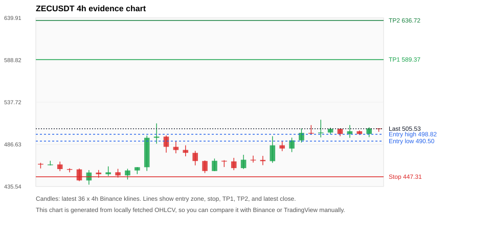
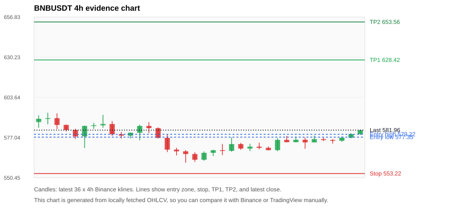
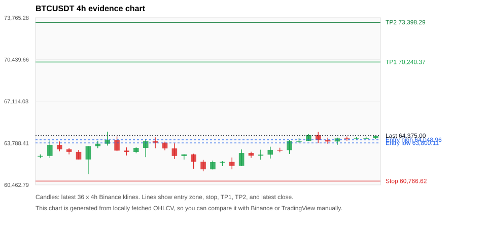
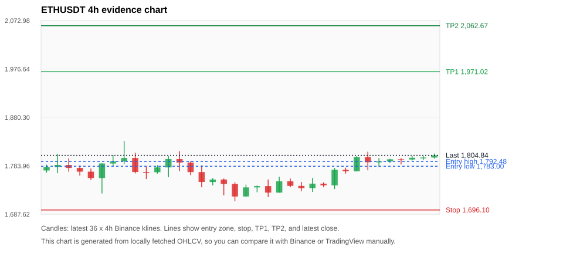
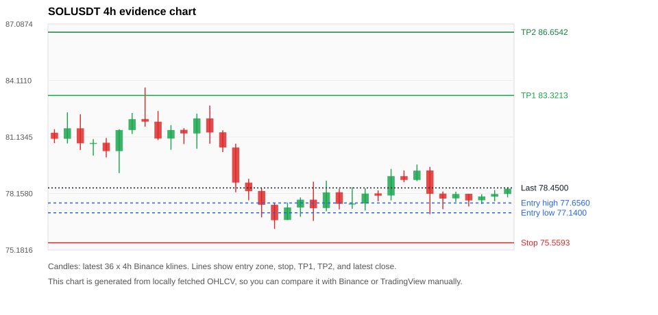

# Crypto 市场扫描报告 v1

- 报告时间：2026-07-11 22:27:09 CST
- Run ID：`20260711_142551_c73d8fea`
- Run type：`daily_full`
- 数据来源：SQLite
- 报告版本：v1
- 扫描 ID：ebd75fd57197
- 数据源：Binance public spot API + CoinGecko/CoinMarketCap cross-check
- 过滤条件：USDT spot; 24h quote volume >= 30,000,000; trades >= 30,000; exclude stables/leveraged tokens; analyze 1h/4h/1d klines
- 默认单笔风险：账户权益的 1.00%

## 限制说明

- 交易信号仍以 Binance 现货公开 K 线为主源；外部数据源用于一致性复核。
- 结果是研究和模拟盘计划，不是确定收益或实盘下单指令。
- 历史长度过滤：候选币至少需要 180 根 1d K 线。
- 数据质量验证池：先验证 score 排名前 min(top_n * 2, 10) 的候选，再按 action + score 补足最终名单。
- 大盘环境过滤：RISK_OFF; BTC/ETH 大盘偏弱，山寨币买入候选降级为观察。 BTC 7d=1.9495119172824094; ETH 7d=1.3590619103243773.
- 已启用数据交叉验证：Binance 主源 + CoinGecko 自动对照；CoinMarketCap 在配置 API Key 后自动对照。
- ZECUSDT 交叉验证状态 DATA_WARNING：At least one external provider needs manual review.
- BNBUSDT 交叉验证状态 DATA_WARNING：At least one external provider needs manual review.
- BTCUSDT 交叉验证状态 DATA_WARNING：At least one external provider needs manual review.
- ETHUSDT 交叉验证状态 DATA_WARNING：At least one external provider needs manual review.
- SOLUSDT 交叉验证状态 DATA_WARNING：At least one external provider needs manual review.
- XRPUSDT 交叉验证状态 DATA_WARNING：At least one external provider needs manual review.

## 5 个候选交易计划

| Rank | Coin | Action | Setup | Entry Zone | Stop Loss | TP1 | TP2 / Exit Rule | R/R | Verdict |
|---:|---|---|---|---:|---:|---:|---|---:|---|
| 1 | `ZEC` | `WATCH_ONLY` | 回踩支撑/4h EMA 附近 | 490.50 - 498.82 | 447.31 | 589.37 | 636.72 或跌破 4h 关键支撑 | 2.00-3.00 | 只等回调 |
| 2 | `BNB` | `WATCH_ONLY` | 回踩支撑/4h EMA 附近 | 577.35 - 579.22 | 553.22 | 628.42 | 653.56 或跌破 4h 关键支撑 | 2.00-3.00 | 只观察 |
| 3 | `BTC` | `WATCH_ONLY` | 回踩支撑/4h EMA 附近 | 63,800.11 - 64,048.96 | 60,766.62 | 70,240.37 | 73,398.29 或跌破 4h 关键支撑 | 2.00-3.00 | 只观察 |
| 4 | `ETH` | `WATCH_ONLY` | 回踩支撑/4h EMA 附近 | 1,783.00 - 1,792.48 | 1,696.10 | 1,971.02 | 2,062.67 或跌破 4h 关键支撑 | 2.00-3.00 | 只观察 |
| 5 | `SOL` | `WATCH_ONLY` | 回踩支撑/4h EMA 附近 | 77.1400 - 77.6560 | 75.5593 | 83.3213 | 86.6542 或跌破 4h 关键支撑 | 3.22-5.03 | 只观察 |

## 数据交叉验证摘要

价格差异以 Binance 当前价为基准；成交量口径不同，Binance 是 USDT 现货成交额，CoinGecko/CoinMarketCap 通常是全市场成交量。

| Rank | Coin | Data Status | Max Price Diff | Max 24h Diff | Message |
|---:|---|---|---:|---:|---|
| 1 | `ZEC` | DATA_WARNING | 0.17% | 0.22 pts | At least one external provider needs manual review. |
| 2 | `BNB` | DATA_WARNING | 0.08% | 0.04 pts | At least one external provider needs manual review. |
| 3 | `BTC` | DATA_WARNING | 0.13% | 0.09 pts | At least one external provider needs manual review. |
| 4 | `ETH` | DATA_WARNING | 0.11% | 0.09 pts | At least one external provider needs manual review. |
| 5 | `SOL` | DATA_WARNING | 0.17% | 0.07 pts | At least one external provider needs manual review. |

## 候选币说明

### 1. ZEC `ZECUSDT`



- 入选原因：回踩支撑/4h EMA 附近；24h +0.08%，7d +8.63%，4h RSI 77.25，24h 成交额 $47.3M。
- 交易失效条件：跌破 447.3082 或 4h 收盘重新失守关键支撑。
- 主要风险：4h RSI 偏热；BTC/ETH 大盘环境未确认强势，山寨币买入信号降级；数据交叉验证需要人工复核。
- 数据交叉验证：DATA_WARNING；At least one external provider needs manual review.

#### 可点击人工验证

- [Binance 交易页](https://www.binance.com/en/trade/ZEC_USDT)
- [TradingView 图表](https://www.tradingview.com/chart/?symbol=BINANCE%3AZECUSDT)
- [CoinGecko 搜索](https://www.coingecko.com/en/search?query=ZEC)
- [CoinMarketCap 搜索](https://coinmarketcap.com/search/?q=ZEC)

#### 多数据源对照

| Source | Status | Asset ID | Price | 24h Change | 24h Volume | Price Diff | 24h Diff | Updated | Message |
|---|---|---|---:|---:|---:|---:|---:|---|---|
| Binance | DATA_OK | ZECUSDT | 505.53 | +0.08% | $47.3M | 0.00% | 0.00 pts | 2026-07-11T14:26:51+00:00 | Primary market data source used by scanner. |
| CoinGecko | DATA_OK | zcash | 504.66 | +0.30% | $184.0M | 0.17% | 0.22 pts | 2026-07-11T14:26:35.049Z | External source agrees with Binance within thresholds. |
| CoinMarketCap | DATA_WARNING | 1437 | 504.66 | +0.17% | $319.0M | 0.17% | 0.09 pts | 2026-07-11T14:26:05.000Z | CoinMarketCap symbol mapping has 2 matches; selected lowest cmc_rank |

#### 指标证据

| 指标 | 数值 | 人工核对用途 |
|---|---:|---|
| 当前价 | 505.53 | 与 Binance/TradingView 当前价格对照 |
| 24h 涨跌 | +0.08% | 与交易所 24h 涨跌对照 |
| 7d 涨跌 | +8.63% | 判断短线趋势是否延续 |
| 4h EMA20 | 489.53 | 判断短期趋势支撑 |
| 4h EMA50 | 471.09 | 判断中期趋势支撑 |
| 1d EMA20 | 460.11 | 判断日线趋势 |
| 1d EMA50 | 459.76 | 判断日线趋势 |
| 4h RSI14 | 77.25 | 判断是否过热/过弱 |
| 4h ATR14 | 13.2779 | 推导止损和入场缓冲 |
| 最近 18 根 4h 最低点 | 454.12 | 支撑/止损参考 |
| 最近 36 根 4h 最高点 | 516.40 | TP/压力参考 |
| 支撑位 | 489.53 | 入场区间推导基础 |

#### 交易计划推导

- 支撑位 = 最近低点、4h EMA20、4h EMA50、1d EMA20 中不高于当前价的最高有效支撑 = `489.53`。
- 入场区间 = 支撑位附近 + ATR 缓冲 = `490.50 - 498.82`。
- 止损 = min(最近 18 根 4h 最低点 * 0.985, 入场中位价 - 1.15 * ATR14) = `447.31`。
- TP1 = max(最近 36 根 4h 最高点 * 0.995, 入场中位价 + 2R) = `589.37`。
- TP2 = max(入场中位价 + 3R, TP1 * 1.04) = `636.72`。

#### 最近 10 根 4h K线

| UTC 开盘时间 | Open | High | Low | Close | Quote Volume | Trades |
|---|---:|---:|---:|---:|---:|---:|
| 2026-07-10T00:00+00:00 | 481.51 | 494.71 | 477.22 | 491.44 | $13.7M | 46636 |
| 2026-07-10T04:00+00:00 | 491.44 | 505.77 | 488.77 | 500.50 | $21.0M | 56475 |
| 2026-07-10T08:00+00:00 | 500.49 | 509.94 | 498.53 | 500.48 | $11.7M | 48743 |
| 2026-07-10T12:00+00:00 | 500.47 | 516.40 | 495.01 | 500.97 | $20.2M | 74738 |
| 2026-07-10T16:00+00:00 | 500.91 | 506.79 | 498.66 | 505.37 | $10.4M | 37794 |
| 2026-07-10T20:00+00:00 | 505.39 | 505.87 | 496.46 | 499.13 | $5.2M | 21679 |
| 2026-07-11T00:00+00:00 | 499.10 | 509.99 | 494.51 | 502.49 | $10.5M | 33951 |
| 2026-07-11T04:00+00:00 | 502.46 | 503.48 | 497.94 | 499.08 | $5.3M | 18572 |
| 2026-07-11T08:00+00:00 | 499.09 | 507.25 | 495.37 | 505.97 | $6.7M | 25303 |
| 2026-07-11T12:00+00:00 | 505.97 | 505.97 | 501.80 | 505.53 | $2.8M | 10369 |

### 2. BNB `BNBUSDT`



- 入选原因：回踩支撑/4h EMA 附近；24h +1.58%，7d +0.91%，4h RSI 66.21，24h 成交额 $37.9M。
- 交易失效条件：跌破 553.2154 或 4h 收盘重新失守关键支撑。
- 主要风险：日线趋势未完全确认；BTC/ETH 大盘环境未确认强势，山寨币买入信号降级；数据交叉验证需要人工复核。
- 数据交叉验证：DATA_WARNING；At least one external provider needs manual review.

#### 可点击人工验证

- [Binance 交易页](https://www.binance.com/en/trade/BNB_USDT)
- [TradingView 图表](https://www.tradingview.com/chart/?symbol=BINANCE%3ABNBUSDT)
- [CoinGecko 搜索](https://www.coingecko.com/en/search?query=BNB)
- [CoinMarketCap 搜索](https://coinmarketcap.com/search/?q=BNB)

#### 多数据源对照

| Source | Status | Asset ID | Price | 24h Change | 24h Volume | Price Diff | 24h Diff | Updated | Message |
|---|---|---|---:|---:|---:|---:|---:|---|---|
| Binance | DATA_OK | BNBUSDT | 581.96 | +1.58% | $37.9M | 0.00% | 0.00 pts | 2026-07-11T14:26:51+00:00 | Primary market data source used by scanner. |
| CoinGecko | DATA_OK | binancecoin | 581.49 | +1.60% | $420.0M | 0.08% | 0.02 pts | 2026-07-11T14:26:50.794Z | External source agrees with Binance within thresholds. |
| CoinMarketCap | DATA_WARNING | 1839 | 581.47 | +1.62% | $883.0M | 0.08% | 0.04 pts | 2026-07-11T14:26:05.000Z | CoinMarketCap symbol mapping has 4 matches; selected lowest cmc_rank |

#### 指标证据

| 指标 | 数值 | 人工核对用途 |
|---|---:|---|
| 当前价 | 581.96 | 与 Binance/TradingView 当前价格对照 |
| 24h 涨跌 | +1.58% | 与交易所 24h 涨跌对照 |
| 7d 涨跌 | +0.91% | 判断短线趋势是否延续 |
| 4h EMA20 | 575.13 | 判断短期趋势支撑 |
| 4h EMA50 | 573.21 | 判断中期趋势支撑 |
| 1d EMA20 | 576.19 | 判断日线趋势 |
| 1d EMA50 | 593.76 | 判断日线趋势 |
| 4h RSI14 | 66.21 | 判断是否过热/过弱 |
| 4h ATR14 | 4.3243 | 推导止损和入场缓冲 |
| 最近 18 根 4h 最低点 | 561.64 | 支撑/止损参考 |
| 最近 36 根 4h 最高点 | 593.47 | TP/压力参考 |
| 支撑位 | 576.19 | 入场区间推导基础 |

#### 交易计划推导

- 支撑位 = 最近低点、4h EMA20、4h EMA50、1d EMA20 中不高于当前价的最高有效支撑 = `576.19`。
- 入场区间 = 支撑位附近 + ATR 缓冲 = `577.35 - 579.22`。
- 止损 = min(最近 18 根 4h 最低点 * 0.985, 入场中位价 - 1.15 * ATR14) = `553.22`。
- TP1 = max(最近 36 根 4h 最高点 * 0.995, 入场中位价 + 2R) = `628.42`。
- TP2 = max(入场中位价 + 3R, TP1 * 1.04) = `653.56`。

#### 最近 10 根 4h K线

| UTC 开盘时间 | Open | High | Low | Close | Quote Volume | Trades |
|---|---:|---:|---:|---:|---:|---:|
| 2026-07-10T00:00+00:00 | 568.73 | 576.69 | 568.02 | 575.52 | $10.2M | 77871 |
| 2026-07-10T04:00+00:00 | 575.52 | 578.14 | 573.86 | 574.00 | $11.8M | 74769 |
| 2026-07-10T08:00+00:00 | 574.00 | 577.66 | 573.93 | 575.59 | $10.3M | 100874 |
| 2026-07-10T12:00+00:00 | 575.60 | 577.00 | 569.63 | 573.86 | $9.3M | 104862 |
| 2026-07-10T16:00+00:00 | 573.86 | 578.31 | 573.86 | 575.99 | $5.8M | 63186 |
| 2026-07-10T20:00+00:00 | 575.99 | 577.01 | 574.69 | 575.43 | $2.9M | 44799 |
| 2026-07-11T00:00+00:00 | 575.44 | 576.07 | 573.06 | 574.91 | $8.3M | 56543 |
| 2026-07-11T04:00+00:00 | 574.92 | 577.72 | 574.31 | 576.92 | $6.6M | 52673 |
| 2026-07-11T08:00+00:00 | 576.92 | 579.84 | 576.61 | 579.39 | $6.0M | 56378 |
| 2026-07-11T12:00+00:00 | 579.39 | 582.35 | 578.76 | 581.96 | $4.7M | 45187 |

### 3. BTC `BTCUSDT`



- 入选原因：回踩支撑/4h EMA 附近；24h +0.42%，7d +2.27%，4h RSI 73.91，24h 成交额 $772.1M。
- 交易失效条件：跌破 60766.62 或 4h 收盘重新失守关键支撑。
- 主要风险：日线趋势未完全确认；BTC/ETH 大盘环境未确认强势，山寨币买入信号降级；数据交叉验证需要人工复核。
- 数据交叉验证：DATA_WARNING；At least one external provider needs manual review.

#### 可点击人工验证

- [Binance 交易页](https://www.binance.com/en/trade/BTC_USDT)
- [TradingView 图表](https://www.tradingview.com/chart/?symbol=BINANCE%3ABTCUSDT)
- [CoinGecko 搜索](https://www.coingecko.com/en/search?query=BTC)
- [CoinMarketCap 搜索](https://coinmarketcap.com/search/?q=BTC)

#### 多数据源对照

| Source | Status | Asset ID | Price | 24h Change | 24h Volume | Price Diff | 24h Diff | Updated | Message |
|---|---|---|---:|---:|---:|---:|---:|---|---|
| Binance | DATA_OK | BTCUSDT | 64,375.00 | +0.42% | $772.1M | 0.00% | 0.00 pts | 2026-07-11T14:26:51+00:00 | Primary market data source used by scanner. |
| CoinGecko | DATA_OK | bitcoin | 64,294.00 | +0.33% | $18.01B | 0.13% | 0.09 pts | 2026-07-11T14:26:51.117Z | External source agrees with Binance within thresholds. |
| CoinMarketCap | DATA_WARNING | 1 | 64,299.85 | +0.42% | $17.15B | 0.12% | 0.00 pts | 2026-07-11T14:26:05.000Z | CoinMarketCap symbol mapping has 13 matches; selected lowest cmc_rank |

#### 指标证据

| 指标 | 数值 | 人工核对用途 |
|---|---:|---|
| 当前价 | 64,375.00 | 与 Binance/TradingView 当前价格对照 |
| 24h 涨跌 | +0.42% | 与交易所 24h 涨跌对照 |
| 7d 涨跌 | +2.27% | 判断短线趋势是否延续 |
| 4h EMA20 | 63,672.76 | 判断短期趋势支撑 |
| 4h EMA50 | 63,024.49 | 判断中期趋势支撑 |
| 1d EMA20 | 62,959.89 | 判断日线趋势 |
| 1d EMA50 | 65,385.12 | 判断日线趋势 |
| 4h RSI14 | 73.91 | 判断是否过热/过弱 |
| 4h ATR14 | 537.43 | 推导止损和入场缓冲 |
| 最近 18 根 4h 最低点 | 61,692.00 | 支撑/止损参考 |
| 最近 36 根 4h 最高点 | 64,700.00 | TP/压力参考 |
| 支撑位 | 63,672.76 | 入场区间推导基础 |

#### 交易计划推导

- 支撑位 = 最近低点、4h EMA20、4h EMA50、1d EMA20 中不高于当前价的最高有效支撑 = `63,672.76`。
- 入场区间 = 支撑位附近 + ATR 缓冲 = `63,800.11 - 64,048.96`。
- 止损 = min(最近 18 根 4h 最低点 * 0.985, 入场中位价 - 1.15 * ATR14) = `60,766.62`。
- TP1 = max(最近 36 根 4h 最高点 * 0.995, 入场中位价 + 2R) = `70,240.37`。
- TP2 = max(入场中位价 + 3R, TP1 * 1.04) = `73,398.29`。

#### 最近 10 根 4h K线

| UTC 开盘时间 | Open | High | Low | Close | Quote Volume | Trades |
|---|---:|---:|---:|---:|---:|---:|
| 2026-07-10T00:00+00:00 | 63,230.01 | 64,050.23 | 62,926.01 | 63,947.20 | $209.1M | 511474 |
| 2026-07-10T04:00+00:00 | 63,947.20 | 64,200.00 | 63,802.02 | 63,963.00 | $127.7M | 339861 |
| 2026-07-10T08:00+00:00 | 63,963.00 | 64,494.84 | 63,962.99 | 64,425.18 | $175.9M | 454783 |
| 2026-07-10T12:00+00:00 | 64,425.18 | 64,692.83 | 63,793.43 | 64,040.00 | $256.0M | 867854 |
| 2026-07-10T16:00+00:00 | 64,039.99 | 64,220.00 | 63,732.66 | 63,917.88 | $189.1M | 480103 |
| 2026-07-10T20:00+00:00 | 63,917.88 | 64,222.61 | 63,656.00 | 64,161.72 | $168.4M | 273350 |
| 2026-07-11T00:00+00:00 | 64,161.72 | 64,310.00 | 63,984.07 | 64,150.42 | $70.6M | 251684 |
| 2026-07-11T04:00+00:00 | 64,150.42 | 64,278.00 | 64,080.26 | 64,162.18 | $95.3M | 216737 |
| 2026-07-11T08:00+00:00 | 64,162.18 | 64,300.00 | 64,129.99 | 64,198.00 | $87.0M | 145928 |
| 2026-07-11T12:00+00:00 | 64,197.99 | 64,375.01 | 64,130.65 | 64,375.01 | $59.2M | 92960 |

### 4. ETH `ETHUSDT`



- 入选原因：回踩支撑/4h EMA 附近；24h +0.89%，7d +0.77%，4h RSI 72.88，24h 成交额 $224.8M。
- 交易失效条件：跌破 1696.101 或 4h 收盘重新失守关键支撑。
- 主要风险：日线趋势未完全确认；BTC/ETH 大盘环境未确认强势，山寨币买入信号降级；数据交叉验证需要人工复核。
- 数据交叉验证：DATA_WARNING；At least one external provider needs manual review.

#### 可点击人工验证

- [Binance 交易页](https://www.binance.com/en/trade/ETH_USDT)
- [TradingView 图表](https://www.tradingview.com/chart/?symbol=BINANCE%3AETHUSDT)
- [CoinGecko 搜索](https://www.coingecko.com/en/search?query=ETH)
- [CoinMarketCap 搜索](https://coinmarketcap.com/search/?q=ETH)

#### 多数据源对照

| Source | Status | Asset ID | Price | 24h Change | 24h Volume | Price Diff | 24h Diff | Updated | Message |
|---|---|---|---:|---:|---:|---:|---:|---|---|
| Binance | DATA_OK | ETHUSDT | 1,804.84 | +0.89% | $224.8M | 0.00% | 0.00 pts | 2026-07-11T14:26:51+00:00 | Primary market data source used by scanner. |
| CoinGecko | DATA_OK | ethereum | 1,802.91 | +0.82% | $5.18B | 0.11% | 0.07 pts | 2026-07-11T14:26:50.967Z | External source agrees with Binance within thresholds. |
| CoinMarketCap | DATA_WARNING | 1027 | 1,803.39 | +0.98% | $5.73B | 0.08% | 0.09 pts | 2026-07-11T14:26:05.000Z | CoinMarketCap symbol mapping has 6 matches; selected lowest cmc_rank |

#### 指标证据

| 指标 | 数值 | 人工核对用途 |
|---|---:|---|
| 当前价 | 1,804.84 | 与 Binance/TradingView 当前价格对照 |
| 24h 涨跌 | +0.89% | 与交易所 24h 涨跌对照 |
| 7d 涨跌 | +0.77% | 判断短线趋势是否延续 |
| 4h EMA20 | 1,779.44 | 判断短期趋势支撑 |
| 4h EMA50 | 1,754.08 | 判断中期趋势支撑 |
| 1d EMA20 | 1,732.56 | 判断日线趋势 |
| 1d EMA50 | 1,801.55 | 判断日线趋势 |
| 4h RSI14 | 72.88 | 判断是否过热/过弱 |
| 4h ATR14 | 18.6279 | 推导止损和入场缓冲 |
| 最近 18 根 4h 最低点 | 1,721.93 | 支撑/止损参考 |
| 最近 36 根 4h 最高点 | 1,833.40 | TP/压力参考 |
| 支撑位 | 1,779.44 | 入场区间推导基础 |

#### 交易计划推导

- 支撑位 = 最近低点、4h EMA20、4h EMA50、1d EMA20 中不高于当前价的最高有效支撑 = `1,779.44`。
- 入场区间 = 支撑位附近 + ATR 缓冲 = `1,783.00 - 1,792.48`。
- 止损 = min(最近 18 根 4h 最低点 * 0.985, 入场中位价 - 1.15 * ATR14) = `1,696.10`。
- TP1 = max(最近 36 根 4h 最高点 * 0.995, 入场中位价 + 2R) = `1,971.02`。
- TP2 = max(入场中位价 + 3R, TP1 * 1.04) = `2,062.67`。

#### 最近 10 根 4h K线

| UTC 开盘时间 | Open | High | Low | Close | Quote Volume | Trades |
|---|---:|---:|---:|---:|---:|---:|
| 2026-07-10T00:00+00:00 | 1,745.17 | 1,779.68 | 1,737.68 | 1,776.12 | $80.1M | 401212 |
| 2026-07-10T04:00+00:00 | 1,776.13 | 1,780.33 | 1,768.57 | 1,773.20 | $42.3M | 211473 |
| 2026-07-10T08:00+00:00 | 1,773.20 | 1,802.99 | 1,772.63 | 1,801.22 | $82.9M | 358180 |
| 2026-07-10T12:00+00:00 | 1,801.22 | 1,812.00 | 1,775.00 | 1,791.11 | $102.7M | 476852 |
| 2026-07-10T16:00+00:00 | 1,791.11 | 1,799.53 | 1,781.20 | 1,792.68 | $47.4M | 245279 |
| 2026-07-10T20:00+00:00 | 1,792.68 | 1,798.00 | 1,789.60 | 1,796.85 | $29.6M | 192375 |
| 2026-07-11T00:00+00:00 | 1,796.85 | 1,799.29 | 1,786.77 | 1,796.50 | $29.5M | 149024 |
| 2026-07-11T04:00+00:00 | 1,796.50 | 1,803.29 | 1,794.60 | 1,800.00 | $41.4M | 144104 |
| 2026-07-11T08:00+00:00 | 1,799.99 | 1,803.52 | 1,795.15 | 1,800.48 | $23.7M | 121112 |
| 2026-07-11T12:00+00:00 | 1,800.47 | 1,808.37 | 1,798.42 | 1,804.81 | $17.8M | 65076 |

### 5. SOL `SOLUSDT`



- 入选原因：回踩支撑/4h EMA 附近；24h +0.82%，7d -4.60%，4h RSI 51.77，24h 成交额 $103.5M。
- 交易失效条件：跌破 75.55935 或 4h 收盘重新失守关键支撑。
- 主要风险：BTC/ETH 大盘环境未确认强势，山寨币买入信号降级；7d 趋势未确认；数据交叉验证需要人工复核。
- 数据交叉验证：DATA_WARNING；At least one external provider needs manual review.

#### 可点击人工验证

- [Binance 交易页](https://www.binance.com/en/trade/SOL_USDT)
- [TradingView 图表](https://www.tradingview.com/chart/?symbol=BINANCE%3ASOLUSDT)
- [CoinGecko 搜索](https://www.coingecko.com/en/search?query=SOL)
- [CoinMarketCap 搜索](https://coinmarketcap.com/search/?q=SOL)

#### 多数据源对照

| Source | Status | Asset ID | Price | 24h Change | 24h Volume | Price Diff | 24h Diff | Updated | Message |
|---|---|---|---:|---:|---:|---:|---:|---|---|
| Binance | DATA_OK | SOLUSDT | 78.4500 | +0.82% | $103.5M | 0.00% | 0.00 pts | 2026-07-11T14:26:51+00:00 | Primary market data source used by scanner. |
| CoinGecko | DATA_OK | solana | 78.3300 | +0.76% | $1.40B | 0.15% | 0.07 pts | 2026-07-11T14:27:02.426Z | External source agrees with Binance within thresholds. |
| CoinMarketCap | DATA_WARNING | 5426 | 78.3140 | +0.82% | $1.53B | 0.17% | 0.00 pts | 2026-07-11T14:26:05.000Z | CoinMarketCap symbol mapping has 8 matches; selected lowest cmc_rank |

#### 指标证据

| 指标 | 数值 | 人工核对用途 |
|---|---:|---|
| 当前价 | 78.4500 | 与 Binance/TradingView 当前价格对照 |
| 24h 涨跌 | +0.82% | 与交易所 24h 涨跌对照 |
| 7d 涨跌 | -4.60% | 判断短线趋势是否延续 |
| 4h EMA20 | 78.4857 | 判断短期趋势支撑 |
| 4h EMA50 | 78.5764 | 判断中期趋势支撑 |
| 1d EMA20 | 76.9860 | 判断日线趋势 |
| 1d EMA50 | 76.8643 | 判断日线趋势 |
| 4h RSI14 | 51.77 | 判断是否过热/过弱 |
| 4h ATR14 | 0.95714 | 推导止损和入场缓冲 |
| 最近 18 根 4h 最低点 | 76.7100 | 支撑/止损参考 |
| 最近 36 根 4h 最高点 | 83.7400 | TP/压力参考 |
| 支撑位 | 76.9860 | 入场区间推导基础 |

#### 交易计划推导

- 支撑位 = 最近低点、4h EMA20、4h EMA50、1d EMA20 中不高于当前价的最高有效支撑 = `76.9860`。
- 入场区间 = 支撑位附近 + ATR 缓冲 = `77.1400 - 77.6560`。
- 止损 = min(最近 18 根 4h 最低点 * 0.985, 入场中位价 - 1.15 * ATR14) = `75.5593`。
- TP1 = max(最近 36 根 4h 最高点 * 0.995, 入场中位价 + 2R) = `83.3213`。
- TP2 = max(入场中位价 + 3R, TP1 * 1.04) = `86.6542`。

#### 最近 10 根 4h K线

| UTC 开盘时间 | Open | High | Low | Close | Quote Volume | Trades |
|---|---:|---:|---:|---:|---:|---:|
| 2026-07-10T00:00+00:00 | 78.0500 | 79.4500 | 77.7900 | 79.0700 | $23.1M | 105181 |
| 2026-07-10T04:00+00:00 | 79.0700 | 79.3700 | 78.7500 | 78.8700 | $17.3M | 53513 |
| 2026-07-10T08:00+00:00 | 78.8700 | 79.6800 | 78.8100 | 79.3600 | $21.4M | 78578 |
| 2026-07-10T12:00+00:00 | 79.3700 | 79.5600 | 77.0700 | 78.1400 | $50.7M | 212660 |
| 2026-07-10T16:00+00:00 | 78.1500 | 78.2600 | 77.3300 | 77.8900 | $20.0M | 94429 |
| 2026-07-10T20:00+00:00 | 77.9000 | 78.2500 | 77.7100 | 78.1300 | $13.0M | 56545 |
| 2026-07-11T00:00+00:00 | 78.1400 | 78.1400 | 77.4700 | 77.7900 | $14.7M | 64833 |
| 2026-07-11T04:00+00:00 | 77.8000 | 78.1200 | 77.6000 | 78.0000 | $12.3M | 62369 |
| 2026-07-11T08:00+00:00 | 77.9900 | 78.3400 | 77.7500 | 78.1300 | $11.2M | 54725 |
| 2026-07-11T12:00+00:00 | 78.1300 | 78.4800 | 77.9500 | 78.4100 | $5.7M | 26443 |

## 组合风控

- 不要 5 个候选全部满仓买入。
- 同时持仓总风险建议控制在账户权益的 3% - 5% 以内。
- 如果 BTC/ETH 同时破位，暂停山寨币多头计划或降低仓位。
- 第一版报告用于模拟盘和人工复核，不自动下单。

## 原始数据

```json
[
  {
    "rank": 1,
    "symbol": "ZECUSDT",
    "base_asset": "ZEC",
    "price": 505.53,
    "score": 50.36506276733171,
    "setup": "回踩支撑/4h EMA 附近",
    "verdict": "只等回调",
    "entry_low": 490.5045220068896,
    "entry_high": 498.8199710647601,
    "stop_loss": 447.3082,
    "take_profit_1": 589.3703396074745,
    "take_profit_2": 636.7243861432994,
    "risk_reward_1": 1.999999999999999,
    "risk_reward_2": 2.9999999999999987,
    "pct_24h": 0.079,
    "pct_3d": 11.279138876048322,
    "pct_7d": 8.62502417327402,
    "quote_volume_24h": 47258847.21563,
    "trades_24h": 178699,
    "high_low_range_24h": 3.1303714788376347,
    "rsi_1h": 58.83803781858038,
    "rsi_4h": 77.25097868638534,
    "ema20_4h": 489.5254710647601,
    "ema50_4h": 471.0933100196753,
    "ema20_1d": 460.1147422506568,
    "ema50_1d": 459.7628370263661,
    "atr_4h": 13.277857142857146,
    "macd_hist_4h": 1.1063644414575933,
    "volume_ratio_24h": 0.5356985763726742,
    "support_level": 489.5254710647601,
    "recent_low_4h_18": 454.12,
    "recent_high_4h_36": 516.4,
    "distance_to_support_pct": 3.269396564887339,
    "binance_trade_url": "https://www.binance.com/en/trade/ZEC_USDT",
    "tradingview_url": "https://www.tradingview.com/chart/?symbol=BINANCE%3AZECUSDT",
    "coingecko_search_url": "https://www.coingecko.com/en/search?query=ZEC",
    "coinmarketcap_search_url": "https://coinmarketcap.com/search/?q=ZEC",
    "invalidation": "跌破 447.3082 或 4h 收盘重新失守关键支撑",
    "recent_4h_klines": [
      {
        "open_time_utc": "2026-07-05T16:00+00:00",
        "open": 462.98,
        "high": 464.24,
        "low": 457.43,
        "close": 462.05,
        "quote_volume": 4318180.75881,
        "trades": 16506
      },
      {
        "open_time_utc": "2026-07-05T20:00+00:00",
        "open": 462.05,
        "high": 466.67,
        "low": 461.13,
        "close": 462.23,
        "quote_volume": 10761500.76231,
        "trades": 33581
      },
      {
        "open_time_utc": "2026-07-06T00:00+00:00",
        "open": 462.23,
        "high": 465.68,
        "low": 454.15,
        "close": 456.6,
        "quote_volume": 12207507.9653,
        "trades": 40429
      },
      {
        "open_time_utc": "2026-07-06T04:00+00:00",
        "open": 456.62,
        "high": 457.59,
        "low": 452.67,
        "close": 456.16,
        "quote_volume": 5663017.2163,
        "trades": 24500
      },
      {
        "open_time_utc": "2026-07-06T08:00+00:00",
        "open": 456.23,
        "high": 457.36,
        "low": 441.98,
        "close": 442.91,
        "quote_volume": 17542190.32662,
        "trades": 46726
      },
      {
        "open_time_utc": "2026-07-06T12:00+00:00",
        "open": 442.82,
        "high": 455.37,
        "low": 437.73,
        "close": 452.46,
        "quote_volume": 26214065.31259,
        "trades": 71944
      },
      {
        "open_time_utc": "2026-07-06T16:00+00:00",
        "open": 452.36,
        "high": 455.5,
        "low": 446.16,
        "close": 450.38,
        "quote_volume": 15384550.76482,
        "trades": 49478
      },
      {
        "open_time_utc": "2026-07-06T20:00+00:00",
        "open": 450.37,
        "high": 459.89,
        "low": 448.24,
        "close": 452.7,
        "quote_volume": 13400498.05844,
        "trades": 34642
      },
      {
        "open_time_utc": "2026-07-07T00:00+00:00",
        "open": 452.76,
        "high": 456.9,
        "low": 446.32,
        "close": 448.9,
        "quote_volume": 9048146.51228,
        "trades": 25574
      },
      {
        "open_time_utc": "2026-07-07T04:00+00:00",
        "open": 448.97,
        "high": 457.0,
        "low": 444.0,
        "close": 454.93,
        "quote_volume": 6893208.16374,
        "trades": 28357
      },
      {
        "open_time_utc": "2026-07-07T08:00+00:00",
        "open": 454.94,
        "high": 459.0,
        "low": 450.54,
        "close": 458.9,
        "quote_volume": 11490201.84041,
        "trades": 33483
      },
      {
        "open_time_utc": "2026-07-07T12:00+00:00",
        "open": 458.89,
        "high": 497.28,
        "low": 454.39,
        "close": 494.56,
        "quote_volume": 34527484.00912,
        "trades": 119749
      },
      {
        "open_time_utc": "2026-07-07T16:00+00:00",
        "open": 494.55,
        "high": 512.0,
        "low": 487.42,
        "close": 495.98,
        "quote_volume": 44888483.48707,
        "trades": 137937
      },
      {
        "open_time_utc": "2026-07-07T20:00+00:00",
        "open": 495.99,
        "high": 497.46,
        "low": 476.58,
        "close": 483.6,
        "quote_volume": 25467867.52302,
        "trades": 95021
      },
      {
        "open_time_utc": "2026-07-08T00:00+00:00",
        "open": 483.55,
        "high": 490.57,
        "low": 475.72,
        "close": 479.75,
        "quote_volume": 14273829.46407,
        "trades": 55773
      },
      {
        "open_time_utc": "2026-07-08T04:00+00:00",
        "open": 479.82,
        "high": 485.45,
        "low": 472.08,
        "close": 476.32,
        "quote_volume": 10009889.39165,
        "trades": 38024
      },
      {
        "open_time_utc": "2026-07-08T08:00+00:00",
        "open": 476.26,
        "high": 478.69,
        "low": 461.14,
        "close": 466.39,
        "quote_volume": 17820576.79018,
        "trades": 65597
      },
      {
        "open_time_utc": "2026-07-08T12:00+00:00",
        "open": 466.4,
        "high": 467.1,
        "low": 451.82,
        "close": 454.29,
        "quote_volume": 12194329.0018,
        "trades": 56451
      },
      {
        "open_time_utc": "2026-07-08T16:00+00:00",
        "open": 454.26,
        "high": 469.36,
        "low": 454.12,
        "close": 466.66,
        "quote_volume": 13187757.81381,
        "trades": 56107
      },
      {
        "open_time_utc": "2026-07-08T20:00+00:00",
        "open": 466.67,
        "high": 467.43,
        "low": 459.13,
        "close": 465.99,
        "quote_volume": 5059519.11383,
        "trades": 24098
      },
      {
        "open_time_utc": "2026-07-09T00:00+00:00",
        "open": 465.93,
        "high": 470.23,
        "low": 455.28,
        "close": 457.79,
        "quote_volume": 7793193.66965,
        "trades": 42340
      },
      {
        "open_time_utc": "2026-07-09T04:00+00:00",
        "open": 457.79,
        "high": 473.93,
        "low": 456.71,
        "close": 467.94,
        "quote_volume": 8674219.62737,
        "trades": 37616
      },
      {
        "open_time_utc": "2026-07-09T08:00+00:00",
        "open": 467.95,
        "high": 472.9,
        "low": 464.51,
        "close": 467.88,
        "quote_volume": 6637523.44624,
        "trades": 29558
      },
      {
        "open_time_utc": "2026-07-09T12:00+00:00",
        "open": 467.73,
        "high": 472.61,
        "low": 461.36,
        "close": 466.23,
        "quote_volume": 9492725.00252,
        "trades": 45237
      },
      {
        "open_time_utc": "2026-07-09T16:00+00:00",
        "open": 466.23,
        "high": 496.48,
        "low": 464.21,
        "close": 485.41,
        "quote_volume": 26352494.97918,
        "trades": 75989
      },
      {
        "open_time_utc": "2026-07-09T20:00+00:00",
        "open": 485.46,
        "high": 490.45,
        "low": 478.37,
        "close": 481.54,
        "quote_volume": 12281798.61502,
        "trades": 42101
      },
      {
        "open_time_utc": "2026-07-10T00:00+00:00",
        "open": 481.51,
        "high": 494.71,
        "low": 477.22,
        "close": 491.44,
        "quote_volume": 13712407.85083,
        "trades": 46636
      },
      {
        "open_time_utc": "2026-07-10T04:00+00:00",
        "open": 491.44,
        "high": 505.77,
        "low": 488.77,
        "close": 500.5,
        "quote_volume": 21013379.278,
        "trades": 56475
      },
      {
        "open_time_utc": "2026-07-10T08:00+00:00",
        "open": 500.49,
        "high": 509.94,
        "low": 498.53,
        "close": 500.48,
        "quote_volume": 11695607.73336,
        "trades": 48743
      },
      {
        "open_time_utc": "2026-07-10T12:00+00:00",
        "open": 500.47,
        "high": 516.4,
        "low": 495.01,
        "close": 500.97,
        "quote_volume": 20201010.00175,
        "trades": 74738
      },
      {
        "open_time_utc": "2026-07-10T16:00+00:00",
        "open": 500.91,
        "high": 506.79,
        "low": 498.66,
        "close": 505.37,
        "quote_volume": 10429574.07918,
        "trades": 37794
      },
      {
        "open_time_utc": "2026-07-10T20:00+00:00",
        "open": 505.39,
        "high": 505.87,
        "low": 496.46,
        "close": 499.13,
        "quote_volume": 5159821.03843,
        "trades": 21679
      },
      {
        "open_time_utc": "2026-07-11T00:00+00:00",
        "open": 499.1,
        "high": 509.99,
        "low": 494.51,
        "close": 502.49,
        "quote_volume": 10516184.02028,
        "trades": 33951
      },
      {
        "open_time_utc": "2026-07-11T04:00+00:00",
        "open": 502.46,
        "high": 503.48,
        "low": 497.94,
        "close": 499.08,
        "quote_volume": 5305698.4872,
        "trades": 18572
      },
      {
        "open_time_utc": "2026-07-11T08:00+00:00",
        "open": 499.09,
        "high": 507.25,
        "low": 495.37,
        "close": 505.97,
        "quote_volume": 6729220.36434,
        "trades": 25303
      },
      {
        "open_time_utc": "2026-07-11T12:00+00:00",
        "open": 505.97,
        "high": 505.97,
        "low": 501.8,
        "close": 505.53,
        "quote_volume": 2802857.71362,
        "trades": 10369
      }
    ],
    "risks": [
      "4h RSI 偏热",
      "BTC/ETH 大盘环境未确认强势，山寨币买入信号降级",
      "数据交叉验证需要人工复核"
    ],
    "data_quality_status": "DATA_WARNING",
    "data_quality_message": "At least one external provider needs manual review.",
    "data_checks": [
      {
        "provider": "Binance",
        "status": "DATA_OK",
        "provider_asset_id": "ZECUSDT",
        "provider_symbol": "ZECUSDT",
        "price_usd": 505.53,
        "pct_24h": 0.079,
        "volume_24h": 47258847.21563,
        "last_updated": null,
        "fetched_at_utc": "2026-07-11T14:26:51+00:00",
        "price_diff_pct": 0.0,
        "pct_24h_diff": 0.0,
        "volume_note": "Binance USDT spot 24h quoteVolume.",
        "message": "Primary market data source used by scanner."
      },
      {
        "provider": "CoinGecko",
        "status": "DATA_OK",
        "provider_asset_id": "zcash",
        "provider_symbol": "ZEC",
        "price_usd": 504.66,
        "pct_24h": 0.29943,
        "volume_24h": 184037196.0,
        "last_updated": "2026-07-11T14:26:35.049Z",
        "fetched_at_utc": "2026-07-11T14:26:51+00:00",
        "price_diff_pct": 0.17209661147705332,
        "pct_24h_diff": 0.22042999999999996,
        "volume_note": "CoinGecko total market volume; not the same venue scope as Binance quoteVolume.",
        "message": "External source agrees with Binance within thresholds."
      },
      {
        "provider": "CoinMarketCap",
        "status": "DATA_WARNING",
        "provider_asset_id": "1437",
        "provider_symbol": "ZEC",
        "price_usd": 504.65601227928124,
        "pct_24h": 0.17149508,
        "volume_24h": 319019355.14038765,
        "last_updated": "2026-07-11T14:26:05.000Z",
        "fetched_at_utc": "2026-07-11T14:26:51+00:00",
        "price_diff_pct": 0.17288543127385725,
        "pct_24h_diff": 0.09249508,
        "volume_note": "CoinMarketCap total market volume; not the same venue scope as Binance quoteVolume.",
        "message": "CoinMarketCap symbol mapping has 2 matches; selected lowest cmc_rank"
      }
    ],
    "action": "WATCH_ONLY"
  },
  {
    "rank": 2,
    "symbol": "BNBUSDT",
    "base_asset": "BNB",
    "price": 581.96,
    "score": 41.519338439109,
    "setup": "回踩支撑/4h EMA 附近",
    "verdict": "只观察",
    "entry_low": 577.3473031453424,
    "entry_high": 579.221913318705,
    "stop_loss": 553.2153999999999,
    "take_profit_1": 628.423024696071,
    "take_profit_2": 653.5599456839138,
    "risk_reward_1": 2.0,
    "risk_reward_2": 3.002701032884342,
    "pct_24h": 1.582,
    "pct_3d": 3.4853118998506405,
    "pct_7d": 0.9050872143426814,
    "quote_volume_24h": 37936631.01674,
    "trades_24h": 359000,
    "high_low_range_24h": 2.233028457068631,
    "rsi_1h": 76.99775952203169,
    "rsi_4h": 66.20956399437414,
    "ema20_4h": 575.1263729966731,
    "ema50_4h": 573.2123833183964,
    "ema20_1d": 576.194913318705,
    "ema50_1d": 593.7579385477216,
    "atr_4h": 4.324285714285728,
    "macd_hist_4h": 1.0353022635560654,
    "volume_ratio_24h": 0.5733504848650917,
    "support_level": 576.194913318705,
    "recent_low_4h_18": 561.64,
    "recent_high_4h_36": 593.47,
    "distance_to_support_pct": 1.0005445289493986,
    "binance_trade_url": "https://www.binance.com/en/trade/BNB_USDT",
    "tradingview_url": "https://www.tradingview.com/chart/?symbol=BINANCE%3ABNBUSDT",
    "coingecko_search_url": "https://www.coingecko.com/en/search?query=BNB",
    "coinmarketcap_search_url": "https://coinmarketcap.com/search/?q=BNB",
    "invalidation": "跌破 553.2154 或 4h 收盘重新失守关键支撑",
    "recent_4h_klines": [
      {
        "open_time_utc": "2026-07-05T16:00+00:00",
        "open": 587.34,
        "high": 591.8,
        "low": 583.49,
        "close": 589.45,
        "quote_volume": 12094193.39987,
        "trades": 122715
      },
      {
        "open_time_utc": "2026-07-05T20:00+00:00",
        "open": 589.44,
        "high": 593.47,
        "low": 585.84,
        "close": 589.87,
        "quote_volume": 10107932.87244,
        "trades": 93497
      },
      {
        "open_time_utc": "2026-07-06T00:00+00:00",
        "open": 589.88,
        "high": 593.1,
        "low": 582.67,
        "close": 585.41,
        "quote_volume": 12725267.1933,
        "trades": 146108
      },
      {
        "open_time_utc": "2026-07-06T04:00+00:00",
        "open": 585.41,
        "high": 585.68,
        "low": 581.03,
        "close": 582.08,
        "quote_volume": 9830074.27257,
        "trades": 89857
      },
      {
        "open_time_utc": "2026-07-06T08:00+00:00",
        "open": 582.07,
        "high": 582.9,
        "low": 576.1,
        "close": 577.81,
        "quote_volume": 11072254.13331,
        "trades": 107026
      },
      {
        "open_time_utc": "2026-07-06T12:00+00:00",
        "open": 577.81,
        "high": 585.0,
        "low": 570.12,
        "close": 584.74,
        "quote_volume": 25996234.04283,
        "trades": 237141
      },
      {
        "open_time_utc": "2026-07-06T16:00+00:00",
        "open": 584.75,
        "high": 586.71,
        "low": 582.85,
        "close": 585.15,
        "quote_volume": 12985693.11245,
        "trades": 117260
      },
      {
        "open_time_utc": "2026-07-06T20:00+00:00",
        "open": 585.15,
        "high": 592.1,
        "low": 583.55,
        "close": 586.01,
        "quote_volume": 9322287.07724,
        "trades": 73782
      },
      {
        "open_time_utc": "2026-07-07T00:00+00:00",
        "open": 586.02,
        "high": 587.92,
        "low": 578.22,
        "close": 579.18,
        "quote_volume": 7936238.98833,
        "trades": 92508
      },
      {
        "open_time_utc": "2026-07-07T04:00+00:00",
        "open": 579.18,
        "high": 580.79,
        "low": 576.39,
        "close": 578.33,
        "quote_volume": 8296701.39013,
        "trades": 82847
      },
      {
        "open_time_utc": "2026-07-07T08:00+00:00",
        "open": 578.32,
        "high": 580.4,
        "low": 576.52,
        "close": 580.23,
        "quote_volume": 7972991.58626,
        "trades": 85202
      },
      {
        "open_time_utc": "2026-07-07T12:00+00:00",
        "open": 580.23,
        "high": 585.61,
        "low": 575.28,
        "close": 584.74,
        "quote_volume": 12844907.15105,
        "trades": 144173
      },
      {
        "open_time_utc": "2026-07-07T16:00+00:00",
        "open": 584.73,
        "high": 587.16,
        "low": 580.01,
        "close": 583.29,
        "quote_volume": 10337828.87898,
        "trades": 116515
      },
      {
        "open_time_utc": "2026-07-07T20:00+00:00",
        "open": 583.29,
        "high": 583.8,
        "low": 576.4,
        "close": 576.82,
        "quote_volume": 6679823.67957,
        "trades": 63042
      },
      {
        "open_time_utc": "2026-07-08T00:00+00:00",
        "open": 576.83,
        "high": 579.0,
        "low": 567.45,
        "close": 569.05,
        "quote_volume": 12907934.95603,
        "trades": 146619
      },
      {
        "open_time_utc": "2026-07-08T04:00+00:00",
        "open": 569.06,
        "high": 570.31,
        "low": 565.23,
        "close": 567.94,
        "quote_volume": 8780098.82395,
        "trades": 104400
      },
      {
        "open_time_utc": "2026-07-08T08:00+00:00",
        "open": 567.94,
        "high": 568.78,
        "low": 560.4,
        "close": 566.13,
        "quote_volume": 13592609.84404,
        "trades": 145998
      },
      {
        "open_time_utc": "2026-07-08T12:00+00:00",
        "open": 566.14,
        "high": 567.38,
        "low": 560.94,
        "close": 562.36,
        "quote_volume": 9917611.40391,
        "trades": 116932
      },
      {
        "open_time_utc": "2026-07-08T16:00+00:00",
        "open": 562.36,
        "high": 567.87,
        "low": 561.64,
        "close": 566.94,
        "quote_volume": 6968421.09667,
        "trades": 71626
      },
      {
        "open_time_utc": "2026-07-08T20:00+00:00",
        "open": 566.95,
        "high": 568.98,
        "low": 564.77,
        "close": 568.66,
        "quote_volume": 4179654.56002,
        "trades": 40599
      },
      {
        "open_time_utc": "2026-07-09T00:00+00:00",
        "open": 568.66,
        "high": 572.81,
        "low": 565.48,
        "close": 568.26,
        "quote_volume": 6372454.4484,
        "trades": 74030
      },
      {
        "open_time_utc": "2026-07-09T04:00+00:00",
        "open": 568.26,
        "high": 577.15,
        "low": 567.66,
        "close": 572.74,
        "quote_volume": 11337245.05357,
        "trades": 105439
      },
      {
        "open_time_utc": "2026-07-09T08:00+00:00",
        "open": 572.74,
        "high": 573.52,
        "low": 568.93,
        "close": 569.77,
        "quote_volume": 13743213.88996,
        "trades": 103044
      },
      {
        "open_time_utc": "2026-07-09T12:00+00:00",
        "open": 569.77,
        "high": 573.0,
        "low": 568.07,
        "close": 571.03,
        "quote_volume": 8581485.61877,
        "trades": 121792
      },
      {
        "open_time_utc": "2026-07-09T16:00+00:00",
        "open": 571.02,
        "high": 573.67,
        "low": 569.3,
        "close": 570.26,
        "quote_volume": 5449538.98241,
        "trades": 74341
      },
      {
        "open_time_utc": "2026-07-09T20:00+00:00",
        "open": 570.26,
        "high": 571.21,
        "low": 568.62,
        "close": 568.72,
        "quote_volume": 3414401.45535,
        "trades": 35426
      },
      {
        "open_time_utc": "2026-07-10T00:00+00:00",
        "open": 568.73,
        "high": 576.69,
        "low": 568.02,
        "close": 575.52,
        "quote_volume": 10166133.91159,
        "trades": 77871
      },
      {
        "open_time_utc": "2026-07-10T04:00+00:00",
        "open": 575.52,
        "high": 578.14,
        "low": 573.86,
        "close": 574.0,
        "quote_volume": 11843374.71615,
        "trades": 74769
      },
      {
        "open_time_utc": "2026-07-10T08:00+00:00",
        "open": 574.0,
        "high": 577.66,
        "low": 573.93,
        "close": 575.59,
        "quote_volume": 10272244.28083,
        "trades": 100874
      },
      {
        "open_time_utc": "2026-07-10T12:00+00:00",
        "open": 575.6,
        "high": 577.0,
        "low": 569.63,
        "close": 573.86,
        "quote_volume": 9308208.12232,
        "trades": 104862
      },
      {
        "open_time_utc": "2026-07-10T16:00+00:00",
        "open": 573.86,
        "high": 578.31,
        "low": 573.86,
        "close": 575.99,
        "quote_volume": 5815002.20046,
        "trades": 63186
      },
      {
        "open_time_utc": "2026-07-10T20:00+00:00",
        "open": 575.99,
        "high": 577.01,
        "low": 574.69,
        "close": 575.43,
        "quote_volume": 2939746.59114,
        "trades": 44799
      },
      {
        "open_time_utc": "2026-07-11T00:00+00:00",
        "open": 575.44,
        "high": 576.07,
        "low": 573.06,
        "close": 574.91,
        "quote_volume": 8278581.42418,
        "trades": 56543
      },
      {
        "open_time_utc": "2026-07-11T04:00+00:00",
        "open": 574.92,
        "high": 577.72,
        "low": 574.31,
        "close": 576.92,
        "quote_volume": 6574928.77662,
        "trades": 52673
      },
      {
        "open_time_utc": "2026-07-11T08:00+00:00",
        "open": 576.92,
        "high": 579.84,
        "low": 576.61,
        "close": 579.39,
        "quote_volume": 5959690.53733,
        "trades": 56378
      },
      {
        "open_time_utc": "2026-07-11T12:00+00:00",
        "open": 579.39,
        "high": 582.35,
        "low": 578.76,
        "close": 581.96,
        "quote_volume": 4673239.96289,
        "trades": 45187
      }
    ],
    "risks": [
      "日线趋势未完全确认",
      "BTC/ETH 大盘环境未确认强势，山寨币买入信号降级",
      "数据交叉验证需要人工复核"
    ],
    "data_quality_status": "DATA_WARNING",
    "data_quality_message": "At least one external provider needs manual review.",
    "data_checks": [
      {
        "provider": "Binance",
        "status": "DATA_OK",
        "provider_asset_id": "BNBUSDT",
        "provider_symbol": "BNBUSDT",
        "price_usd": 581.96,
        "pct_24h": 1.582,
        "volume_24h": 37936631.01674,
        "last_updated": null,
        "fetched_at_utc": "2026-07-11T14:26:51+00:00",
        "price_diff_pct": 0.0,
        "pct_24h_diff": 0.0,
        "volume_note": "Binance USDT spot 24h quoteVolume.",
        "message": "Primary market data source used by scanner."
      },
      {
        "provider": "CoinGecko",
        "status": "DATA_OK",
        "provider_asset_id": "binancecoin",
        "provider_symbol": "BNB",
        "price_usd": 581.49,
        "pct_24h": 1.60297,
        "volume_24h": 420038109.0,
        "last_updated": "2026-07-11T14:26:50.794Z",
        "fetched_at_utc": "2026-07-11T14:26:51+00:00",
        "price_diff_pct": 0.08076156436868982,
        "pct_24h_diff": 0.020969999999999933,
        "volume_note": "CoinGecko total market volume; not the same venue scope as Binance quoteVolume.",
        "message": "External source agrees with Binance within thresholds."
      },
      {
        "provider": "CoinMarketCap",
        "status": "DATA_WARNING",
        "provider_asset_id": "1839",
        "provider_symbol": "BNB",
        "price_usd": 581.4736162023769,
        "pct_24h": 1.62475722,
        "volume_24h": 882990705.6650597,
        "last_updated": "2026-07-11T14:26:05.000Z",
        "fetched_at_utc": "2026-07-11T14:26:51+00:00",
        "price_diff_pct": 0.08357684336090934,
        "pct_24h_diff": 0.04275721999999993,
        "volume_note": "CoinMarketCap total market volume; not the same venue scope as Binance quoteVolume.",
        "message": "CoinMarketCap symbol mapping has 4 matches; selected lowest cmc_rank"
      }
    ],
    "action": "WATCH_ONLY"
  },
  {
    "rank": 3,
    "symbol": "BTCUSDT",
    "base_asset": "BTC",
    "price": 64375.0,
    "score": 40.040576015884994,
    "setup": "回踩支撑/4h EMA 附近",
    "verdict": "只观察",
    "entry_low": 63800.10977720389,
    "entry_high": 64048.96374870648,
    "stop_loss": 60766.62,
    "take_profit_1": 70240.37028886557,
    "take_profit_2": 73398.28705182075,
    "risk_reward_1": 2.0,
    "risk_reward_2": 2.999999999999998,
    "pct_24h": 0.418,
    "pct_3d": 4.328713806444662,
    "pct_7d": 2.274603059357072,
    "quote_volume_24h": 772132933.2704998,
    "trades_24h": 1875461,
    "high_low_range_24h": 1.1295243182103842,
    "rsi_1h": 65.60013922036546,
    "rsi_4h": 73.90714705483467,
    "ema20_4h": 63672.76424870648,
    "ema50_4h": 63024.487601722925,
    "ema20_1d": 62959.890520597,
    "ema50_1d": 65385.120155484045,
    "atr_4h": 537.427857142857,
    "macd_hist_4h": 71.16237450390054,
    "volume_ratio_24h": 0.6944612721093176,
    "support_level": 63672.76424870648,
    "recent_low_4h_18": 61692.0,
    "recent_high_4h_36": 64700.0,
    "distance_to_support_pct": 1.10288246407928,
    "binance_trade_url": "https://www.binance.com/en/trade/BTC_USDT",
    "tradingview_url": "https://www.tradingview.com/chart/?symbol=BINANCE%3ABTCUSDT",
    "coingecko_search_url": "https://www.coingecko.com/en/search?query=BTC",
    "coinmarketcap_search_url": "https://coinmarketcap.com/search/?q=BTC",
    "invalidation": "跌破 60766.62 或 4h 收盘重新失守关键支撑",
    "recent_4h_klines": [
      {
        "open_time_utc": "2026-07-05T16:00+00:00",
        "open": 62740.01,
        "high": 62888.14,
        "low": 62590.02,
        "close": 62768.88,
        "quote_volume": 80851366.9814916,
        "trades": 240237
      },
      {
        "open_time_utc": "2026-07-05T20:00+00:00",
        "open": 62768.87,
        "high": 63999.0,
        "low": 62609.47,
        "close": 63650.0,
        "quote_volume": 181369547.5345128,
        "trades": 549959
      },
      {
        "open_time_utc": "2026-07-06T00:00+00:00",
        "open": 63650.01,
        "high": 63920.0,
        "low": 63136.01,
        "close": 63294.0,
        "quote_volume": 133811858.2378765,
        "trades": 503644
      },
      {
        "open_time_utc": "2026-07-06T04:00+00:00",
        "open": 63294.0,
        "high": 63402.77,
        "low": 62890.0,
        "close": 63089.42,
        "quote_volume": 134594693.4450195,
        "trades": 364295
      },
      {
        "open_time_utc": "2026-07-06T08:00+00:00",
        "open": 63089.42,
        "high": 63244.0,
        "low": 62483.83,
        "close": 62483.84,
        "quote_volume": 127797556.0329306,
        "trades": 346341
      },
      {
        "open_time_utc": "2026-07-06T12:00+00:00",
        "open": 62483.84,
        "high": 63550.0,
        "low": 61306.84,
        "close": 63545.98,
        "quote_volume": 583941662.21741,
        "trades": 1372664
      },
      {
        "open_time_utc": "2026-07-06T16:00+00:00",
        "open": 63545.98,
        "high": 63976.16,
        "low": 63386.01,
        "close": 63738.52,
        "quote_volume": 209461474.1149387,
        "trades": 695266
      },
      {
        "open_time_utc": "2026-07-06T20:00+00:00",
        "open": 63738.52,
        "high": 64700.0,
        "low": 63589.41,
        "close": 64042.02,
        "quote_volume": 158348802.3550516,
        "trades": 495685
      },
      {
        "open_time_utc": "2026-07-07T00:00+00:00",
        "open": 64042.93,
        "high": 64314.0,
        "low": 63150.0,
        "close": 63191.01,
        "quote_volume": 137056167.0230249,
        "trades": 490629
      },
      {
        "open_time_utc": "2026-07-07T04:00+00:00",
        "open": 63191.01,
        "high": 63445.7,
        "low": 62800.0,
        "close": 63083.18,
        "quote_volume": 181221308.9367476,
        "trades": 435866
      },
      {
        "open_time_utc": "2026-07-07T08:00+00:00",
        "open": 63083.19,
        "high": 63467.15,
        "low": 62984.58,
        "close": 63406.0,
        "quote_volume": 104988878.8556702,
        "trades": 351275
      },
      {
        "open_time_utc": "2026-07-07T12:00+00:00",
        "open": 63405.99,
        "high": 64105.0,
        "low": 62671.39,
        "close": 63930.51,
        "quote_volume": 348081870.1046112,
        "trades": 1004190
      },
      {
        "open_time_utc": "2026-07-07T16:00+00:00",
        "open": 63930.5,
        "high": 64243.75,
        "low": 63379.69,
        "close": 63817.99,
        "quote_volume": 201532847.5832951,
        "trades": 622715
      },
      {
        "open_time_utc": "2026-07-07T20:00+00:00",
        "open": 63818.0,
        "high": 63901.75,
        "low": 63218.0,
        "close": 63363.99,
        "quote_volume": 96386614.3852602,
        "trades": 377427
      },
      {
        "open_time_utc": "2026-07-08T00:00+00:00",
        "open": 63364.0,
        "high": 63761.99,
        "low": 62525.47,
        "close": 62766.0,
        "quote_volume": 185876396.2704984,
        "trades": 609259
      },
      {
        "open_time_utc": "2026-07-08T04:00+00:00",
        "open": 62766.0,
        "high": 62901.49,
        "low": 62477.04,
        "close": 62888.35,
        "quote_volume": 131299060.8693226,
        "trades": 444952
      },
      {
        "open_time_utc": "2026-07-08T08:00+00:00",
        "open": 62888.34,
        "high": 62941.46,
        "low": 61743.83,
        "close": 62299.99,
        "quote_volume": 327876037.6334037,
        "trades": 777090
      },
      {
        "open_time_utc": "2026-07-08T12:00+00:00",
        "open": 62300.0,
        "high": 62451.08,
        "low": 61544.56,
        "close": 61704.01,
        "quote_volume": 277437714.1345036,
        "trades": 934639
      },
      {
        "open_time_utc": "2026-07-08T16:00+00:00",
        "open": 61704.01,
        "high": 62394.32,
        "low": 61692.0,
        "close": 62277.98,
        "quote_volume": 116612947.925004,
        "trades": 533138
      },
      {
        "open_time_utc": "2026-07-08T20:00+00:00",
        "open": 62277.98,
        "high": 62350.63,
        "low": 61956.0,
        "close": 62290.0,
        "quote_volume": 120985013.7873035,
        "trades": 299409
      },
      {
        "open_time_utc": "2026-07-09T00:00+00:00",
        "open": 62290.01,
        "high": 62642.0,
        "low": 61705.29,
        "close": 61974.34,
        "quote_volume": 155686968.1478035,
        "trades": 532918
      },
      {
        "open_time_utc": "2026-07-09T04:00+00:00",
        "open": 61974.34,
        "high": 63283.26,
        "low": 61956.46,
        "close": 63000.0,
        "quote_volume": 192704715.3486265,
        "trades": 513310
      },
      {
        "open_time_utc": "2026-07-09T08:00+00:00",
        "open": 62999.99,
        "high": 63100.1,
        "low": 62614.66,
        "close": 62786.34,
        "quote_volume": 158894710.7879773,
        "trades": 380844
      },
      {
        "open_time_utc": "2026-07-09T12:00+00:00",
        "open": 62786.33,
        "high": 63261.0,
        "low": 62465.39,
        "close": 62868.05,
        "quote_volume": 306798645.4062554,
        "trades": 859856
      },
      {
        "open_time_utc": "2026-07-09T16:00+00:00",
        "open": 62868.06,
        "high": 63500.0,
        "low": 62559.59,
        "close": 63248.1,
        "quote_volume": 166955414.1540087,
        "trades": 603411
      },
      {
        "open_time_utc": "2026-07-09T20:00+00:00",
        "open": 63248.09,
        "high": 63418.0,
        "low": 63060.91,
        "close": 63230.0,
        "quote_volume": 69809359.4248127,
        "trades": 285711
      },
      {
        "open_time_utc": "2026-07-10T00:00+00:00",
        "open": 63230.01,
        "high": 64050.23,
        "low": 62926.01,
        "close": 63947.2,
        "quote_volume": 209065762.5803273,
        "trades": 511474
      },
      {
        "open_time_utc": "2026-07-10T04:00+00:00",
        "open": 63947.2,
        "high": 64200.0,
        "low": 63802.02,
        "close": 63963.0,
        "quote_volume": 127655182.9260361,
        "trades": 339861
      },
      {
        "open_time_utc": "2026-07-10T08:00+00:00",
        "open": 63963.0,
        "high": 64494.84,
        "low": 63962.99,
        "close": 64425.18,
        "quote_volume": 175885976.5057061,
        "trades": 454783
      },
      {
        "open_time_utc": "2026-07-10T12:00+00:00",
        "open": 64425.18,
        "high": 64692.83,
        "low": 63793.43,
        "close": 64040.0,
        "quote_volume": 255992161.0375202,
        "trades": 867854
      },
      {
        "open_time_utc": "2026-07-10T16:00+00:00",
        "open": 64039.99,
        "high": 64220.0,
        "low": 63732.66,
        "close": 63917.88,
        "quote_volume": 189060026.4147767,
        "trades": 480103
      },
      {
        "open_time_utc": "2026-07-10T20:00+00:00",
        "open": 63917.88,
        "high": 64222.61,
        "low": 63656.0,
        "close": 64161.72,
        "quote_volume": 168438851.5376846,
        "trades": 273350
      },
      {
        "open_time_utc": "2026-07-11T00:00+00:00",
        "open": 64161.72,
        "high": 64310.0,
        "low": 63984.07,
        "close": 64150.42,
        "quote_volume": 70642973.0661325,
        "trades": 251684
      },
      {
        "open_time_utc": "2026-07-11T04:00+00:00",
        "open": 64150.42,
        "high": 64278.0,
        "low": 64080.26,
        "close": 64162.18,
        "quote_volume": 95321721.9135274,
        "trades": 216737
      },
      {
        "open_time_utc": "2026-07-11T08:00+00:00",
        "open": 64162.18,
        "high": 64300.0,
        "low": 64129.99,
        "close": 64198.0,
        "quote_volume": 87005200.6546669,
        "trades": 145928
      },
      {
        "open_time_utc": "2026-07-11T12:00+00:00",
        "open": 64197.99,
        "high": 64375.01,
        "low": 64130.65,
        "close": 64375.01,
        "quote_volume": 59161857.3948188,
        "trades": 92960
      }
    ],
    "risks": [
      "日线趋势未完全确认",
      "BTC/ETH 大盘环境未确认强势，山寨币买入信号降级",
      "数据交叉验证需要人工复核"
    ],
    "data_quality_status": "DATA_WARNING",
    "data_quality_message": "At least one external provider needs manual review.",
    "data_checks": [
      {
        "provider": "Binance",
        "status": "DATA_OK",
        "provider_asset_id": "BTCUSDT",
        "provider_symbol": "BTCUSDT",
        "price_usd": 64375.0,
        "pct_24h": 0.418,
        "volume_24h": 772132933.2704998,
        "last_updated": null,
        "fetched_at_utc": "2026-07-11T14:26:51+00:00",
        "price_diff_pct": 0.0,
        "pct_24h_diff": 0.0,
        "volume_note": "Binance USDT spot 24h quoteVolume.",
        "message": "Primary market data source used by scanner."
      },
      {
        "provider": "CoinGecko",
        "status": "DATA_OK",
        "provider_asset_id": "bitcoin",
        "provider_symbol": "BTC",
        "price_usd": 64294.0,
        "pct_24h": 0.33198,
        "volume_24h": 18012726461.0,
        "last_updated": "2026-07-11T14:26:51.117Z",
        "fetched_at_utc": "2026-07-11T14:26:51+00:00",
        "price_diff_pct": 0.1258252427184466,
        "pct_24h_diff": 0.08601999999999999,
        "volume_note": "CoinGecko total market volume; not the same venue scope as Binance quoteVolume.",
        "message": "External source agrees with Binance within thresholds."
      },
      {
        "provider": "CoinMarketCap",
        "status": "DATA_WARNING",
        "provider_asset_id": "1",
        "provider_symbol": "BTC",
        "price_usd": 64299.850312617644,
        "pct_24h": 0.41847998,
        "volume_24h": 17148082927.682022,
        "last_updated": "2026-07-11T14:26:05.000Z",
        "fetched_at_utc": "2026-07-11T14:26:51+00:00",
        "price_diff_pct": 0.11673737845802905,
        "pct_24h_diff": 0.00047997999999999097,
        "volume_note": "CoinMarketCap total market volume; not the same venue scope as Binance quoteVolume.",
        "message": "CoinMarketCap symbol mapping has 13 matches; selected lowest cmc_rank"
      }
    ],
    "action": "WATCH_ONLY"
  },
  {
    "rank": 4,
    "symbol": "ETHUSDT",
    "base_asset": "ETH",
    "price": 1804.84,
    "score": 38.30710881995192,
    "setup": "回踩支撑/4h EMA 附近",
    "verdict": "只观察",
    "entry_low": 1783.0019409018182,
    "entry_high": 1792.482554792234,
    "stop_loss": 1696.10105,
    "take_profit_1": 1971.0246435410786,
    "take_profit_2": 2062.665841388105,
    "risk_reward_1": 2.0,
    "risk_reward_2": 3.0000000000000027,
    "pct_24h": 0.892,
    "pct_3d": 4.752286762316005,
    "pct_7d": 0.7676889491873728,
    "quote_volume_24h": 224779938.306401,
    "trades_24h": 1104360,
    "high_low_range_24h": 1.8799999999999928,
    "rsi_1h": 67.40448756822295,
    "rsi_4h": 72.87668798862839,
    "ema20_4h": 1779.4430547922339,
    "ema50_4h": 1754.0760764660474,
    "ema20_1d": 1732.5623181675944,
    "ema50_1d": 1801.547211683957,
    "atr_4h": 18.627857142857124,
    "macd_hist_4h": 3.67441621188447,
    "volume_ratio_24h": 0.4346646688593849,
    "support_level": 1779.4430547922339,
    "recent_low_4h_18": 1721.93,
    "recent_high_4h_36": 1833.4,
    "distance_to_support_pct": 1.4272412449147787,
    "binance_trade_url": "https://www.binance.com/en/trade/ETH_USDT",
    "tradingview_url": "https://www.tradingview.com/chart/?symbol=BINANCE%3AETHUSDT",
    "coingecko_search_url": "https://www.coingecko.com/en/search?query=ETH",
    "coinmarketcap_search_url": "https://coinmarketcap.com/search/?q=ETH",
    "invalidation": "跌破 1696.101 或 4h 收盘重新失守关键支撑",
    "recent_4h_klines": [
      {
        "open_time_utc": "2026-07-05T16:00+00:00",
        "open": 1774.66,
        "high": 1786.23,
        "low": 1770.31,
        "close": 1781.43,
        "quote_volume": 32381270.966127,
        "trades": 225167
      },
      {
        "open_time_utc": "2026-07-05T20:00+00:00",
        "open": 1781.44,
        "high": 1808.0,
        "low": 1769.29,
        "close": 1785.65,
        "quote_volume": 74803966.238566,
        "trades": 443022
      },
      {
        "open_time_utc": "2026-07-06T00:00+00:00",
        "open": 1785.65,
        "high": 1799.02,
        "low": 1772.22,
        "close": 1779.71,
        "quote_volume": 51477067.911105,
        "trades": 378371
      },
      {
        "open_time_utc": "2026-07-06T04:00+00:00",
        "open": 1779.7,
        "high": 1784.79,
        "low": 1764.42,
        "close": 1772.32,
        "quote_volume": 47749629.90858,
        "trades": 255155
      },
      {
        "open_time_utc": "2026-07-06T08:00+00:00",
        "open": 1772.32,
        "high": 1778.6,
        "low": 1755.77,
        "close": 1759.64,
        "quote_volume": 58875690.643914,
        "trades": 269374
      },
      {
        "open_time_utc": "2026-07-06T12:00+00:00",
        "open": 1759.64,
        "high": 1788.96,
        "low": 1728.95,
        "close": 1788.57,
        "quote_volume": 179083609.2741,
        "trades": 948364
      },
      {
        "open_time_utc": "2026-07-06T16:00+00:00",
        "open": 1788.57,
        "high": 1805.0,
        "low": 1782.42,
        "close": 1792.76,
        "quote_volume": 108710719.038645,
        "trades": 530438
      },
      {
        "open_time_utc": "2026-07-06T20:00+00:00",
        "open": 1792.76,
        "high": 1833.4,
        "low": 1787.26,
        "close": 1799.56,
        "quote_volume": 97896741.274095,
        "trades": 388963
      },
      {
        "open_time_utc": "2026-07-07T00:00+00:00",
        "open": 1799.56,
        "high": 1810.16,
        "low": 1768.85,
        "close": 1771.56,
        "quote_volume": 66944098.868885,
        "trades": 378555
      },
      {
        "open_time_utc": "2026-07-07T04:00+00:00",
        "open": 1771.55,
        "high": 1782.59,
        "low": 1757.57,
        "close": 1771.24,
        "quote_volume": 65417463.726118,
        "trades": 288985
      },
      {
        "open_time_utc": "2026-07-07T08:00+00:00",
        "open": 1771.23,
        "high": 1785.0,
        "low": 1768.37,
        "close": 1780.77,
        "quote_volume": 49210293.246015,
        "trades": 233940
      },
      {
        "open_time_utc": "2026-07-07T12:00+00:00",
        "open": 1780.77,
        "high": 1803.03,
        "low": 1761.19,
        "close": 1797.45,
        "quote_volume": 116009755.110902,
        "trades": 785298
      },
      {
        "open_time_utc": "2026-07-07T16:00+00:00",
        "open": 1797.45,
        "high": 1813.16,
        "low": 1773.5,
        "close": 1790.45,
        "quote_volume": 83697542.771657,
        "trades": 556320
      },
      {
        "open_time_utc": "2026-07-07T20:00+00:00",
        "open": 1790.46,
        "high": 1793.12,
        "low": 1765.35,
        "close": 1771.45,
        "quote_volume": 49256624.488021,
        "trades": 277174
      },
      {
        "open_time_utc": "2026-07-08T00:00+00:00",
        "open": 1771.45,
        "high": 1785.0,
        "low": 1741.21,
        "close": 1751.78,
        "quote_volume": 80404740.597791,
        "trades": 450493
      },
      {
        "open_time_utc": "2026-07-08T04:00+00:00",
        "open": 1751.74,
        "high": 1759.69,
        "low": 1745.01,
        "close": 1756.7,
        "quote_volume": 44490761.312298,
        "trades": 286717
      },
      {
        "open_time_utc": "2026-07-08T08:00+00:00",
        "open": 1756.7,
        "high": 1758.7,
        "low": 1725.18,
        "close": 1747.95,
        "quote_volume": 98675827.777842,
        "trades": 528879
      },
      {
        "open_time_utc": "2026-07-08T12:00+00:00",
        "open": 1747.95,
        "high": 1751.25,
        "low": 1713.44,
        "close": 1722.96,
        "quote_volume": 90459253.466077,
        "trades": 643326
      },
      {
        "open_time_utc": "2026-07-08T16:00+00:00",
        "open": 1722.96,
        "high": 1746.52,
        "low": 1722.78,
        "close": 1740.98,
        "quote_volume": 54463164.251953,
        "trades": 356233
      },
      {
        "open_time_utc": "2026-07-08T20:00+00:00",
        "open": 1740.99,
        "high": 1744.81,
        "low": 1731.41,
        "close": 1743.54,
        "quote_volume": 23949993.595381,
        "trades": 194178
      },
      {
        "open_time_utc": "2026-07-09T00:00+00:00",
        "open": 1743.55,
        "high": 1756.79,
        "low": 1721.93,
        "close": 1730.7,
        "quote_volume": 48303672.851556,
        "trades": 370953
      },
      {
        "open_time_utc": "2026-07-09T04:00+00:00",
        "open": 1730.7,
        "high": 1762.36,
        "low": 1730.35,
        "close": 1753.31,
        "quote_volume": 65808618.565405,
        "trades": 313659
      },
      {
        "open_time_utc": "2026-07-09T08:00+00:00",
        "open": 1753.3,
        "high": 1758.68,
        "low": 1741.26,
        "close": 1744.02,
        "quote_volume": 35397227.751037,
        "trades": 222511
      },
      {
        "open_time_utc": "2026-07-09T12:00+00:00",
        "open": 1744.02,
        "high": 1752.0,
        "low": 1733.36,
        "close": 1739.51,
        "quote_volume": 88395030.749091,
        "trades": 539130
      },
      {
        "open_time_utc": "2026-07-09T16:00+00:00",
        "open": 1739.51,
        "high": 1759.82,
        "low": 1731.99,
        "close": 1748.51,
        "quote_volume": 41825612.733619,
        "trades": 241982
      },
      {
        "open_time_utc": "2026-07-09T20:00+00:00",
        "open": 1748.51,
        "high": 1751.08,
        "low": 1741.56,
        "close": 1745.16,
        "quote_volume": 23369634.994497,
        "trades": 163828
      },
      {
        "open_time_utc": "2026-07-10T00:00+00:00",
        "open": 1745.17,
        "high": 1779.68,
        "low": 1737.68,
        "close": 1776.12,
        "quote_volume": 80059828.145824,
        "trades": 401212
      },
      {
        "open_time_utc": "2026-07-10T04:00+00:00",
        "open": 1776.13,
        "high": 1780.33,
        "low": 1768.57,
        "close": 1773.2,
        "quote_volume": 42342687.787892,
        "trades": 211473
      },
      {
        "open_time_utc": "2026-07-10T08:00+00:00",
        "open": 1773.2,
        "high": 1802.99,
        "low": 1772.63,
        "close": 1801.22,
        "quote_volume": 82878197.715128,
        "trades": 358180
      },
      {
        "open_time_utc": "2026-07-10T12:00+00:00",
        "open": 1801.22,
        "high": 1812.0,
        "low": 1775.0,
        "close": 1791.11,
        "quote_volume": 102658845.235422,
        "trades": 476852
      },
      {
        "open_time_utc": "2026-07-10T16:00+00:00",
        "open": 1791.11,
        "high": 1799.53,
        "low": 1781.2,
        "close": 1792.68,
        "quote_volume": 47368296.412897,
        "trades": 245279
      },
      {
        "open_time_utc": "2026-07-10T20:00+00:00",
        "open": 1792.68,
        "high": 1798.0,
        "low": 1789.6,
        "close": 1796.85,
        "quote_volume": 29647779.573534,
        "trades": 192375
      },
      {
        "open_time_utc": "2026-07-11T00:00+00:00",
        "open": 1796.85,
        "high": 1799.29,
        "low": 1786.77,
        "close": 1796.5,
        "quote_volume": 29504422.885497,
        "trades": 149024
      },
      {
        "open_time_utc": "2026-07-11T04:00+00:00",
        "open": 1796.5,
        "high": 1803.29,
        "low": 1794.6,
        "close": 1800.0,
        "quote_volume": 41393222.395037,
        "trades": 144104
      },
      {
        "open_time_utc": "2026-07-11T08:00+00:00",
        "open": 1799.99,
        "high": 1803.52,
        "low": 1795.15,
        "close": 1800.48,
        "quote_volume": 23683229.598781,
        "trades": 121112
      },
      {
        "open_time_utc": "2026-07-11T12:00+00:00",
        "open": 1800.47,
        "high": 1808.37,
        "low": 1798.42,
        "close": 1804.81,
        "quote_volume": 17779961.254629,
        "trades": 65076
      }
    ],
    "risks": [
      "日线趋势未完全确认",
      "BTC/ETH 大盘环境未确认强势，山寨币买入信号降级",
      "数据交叉验证需要人工复核"
    ],
    "data_quality_status": "DATA_WARNING",
    "data_quality_message": "At least one external provider needs manual review.",
    "data_checks": [
      {
        "provider": "Binance",
        "status": "DATA_OK",
        "provider_asset_id": "ETHUSDT",
        "provider_symbol": "ETHUSDT",
        "price_usd": 1804.84,
        "pct_24h": 0.892,
        "volume_24h": 224779938.306401,
        "last_updated": null,
        "fetched_at_utc": "2026-07-11T14:26:51+00:00",
        "price_diff_pct": 0.0,
        "pct_24h_diff": 0.0,
        "volume_note": "Binance USDT spot 24h quoteVolume.",
        "message": "Primary market data source used by scanner."
      },
      {
        "provider": "CoinGecko",
        "status": "DATA_OK",
        "provider_asset_id": "ethereum",
        "provider_symbol": "ETH",
        "price_usd": 1802.91,
        "pct_24h": 0.82398,
        "volume_24h": 5176827960.0,
        "last_updated": "2026-07-11T14:26:50.967Z",
        "fetched_at_utc": "2026-07-11T14:26:51+00:00",
        "price_diff_pct": 0.10693468673122473,
        "pct_24h_diff": 0.06801999999999997,
        "volume_note": "CoinGecko total market volume; not the same venue scope as Binance quoteVolume.",
        "message": "External source agrees with Binance within thresholds."
      },
      {
        "provider": "CoinMarketCap",
        "status": "DATA_WARNING",
        "provider_asset_id": "1027",
        "provider_symbol": "ETH",
        "price_usd": 1803.3877486744218,
        "pct_24h": 0.98098534,
        "volume_24h": 5726357862.455266,
        "last_updated": "2026-07-11T14:26:05.000Z",
        "fetched_at_utc": "2026-07-11T14:26:51+00:00",
        "price_diff_pct": 0.08046426971798708,
        "pct_24h_diff": 0.08898534000000002,
        "volume_note": "CoinMarketCap total market volume; not the same venue scope as Binance quoteVolume.",
        "message": "CoinMarketCap symbol mapping has 6 matches; selected lowest cmc_rank"
      }
    ],
    "action": "WATCH_ONLY"
  },
  {
    "rank": 5,
    "symbol": "SOLUSDT",
    "base_asset": "SOL",
    "price": 78.45,
    "score": 28.708089516083604,
    "setup": "回踩支撑/4h EMA 附近",
    "verdict": "只观察",
    "entry_low": 77.14000434698572,
    "entry_high": 77.65603228242088,
    "stop_loss": 75.55935,
    "take_profit_1": 83.3213,
    "take_profit_2": 86.654152,
    "risk_reward_1": 3.221506368456927,
    "risk_reward_2": 5.034150864121601,
    "pct_24h": 0.823,
    "pct_3d": 2.2149837133550454,
    "pct_7d": -4.596862458956585,
    "quote_volume_24h": 103458815.48508,
    "trades_24h": 473352,
    "high_low_range_24h": 1.8295056442195534,
    "rsi_1h": 63.63636363636381,
    "rsi_4h": 51.77304964539011,
    "ema20_4h": 78.48571915235064,
    "ema50_4h": 78.57635180708569,
    "ema20_1d": 76.98603228242088,
    "ema50_1d": 76.864348181139,
    "atr_4h": 0.9571428571428606,
    "macd_hist_4h": 0.07444301155973221,
    "volume_ratio_24h": 0.5597469965374928,
    "support_level": 76.98603228242088,
    "recent_low_4h_18": 76.71,
    "recent_high_4h_36": 83.74,
    "distance_to_support_pct": 1.9016017245941486,
    "binance_trade_url": "https://www.binance.com/en/trade/SOL_USDT",
    "tradingview_url": "https://www.tradingview.com/chart/?symbol=BINANCE%3ASOLUSDT",
    "coingecko_search_url": "https://www.coingecko.com/en/search?query=SOL",
    "coinmarketcap_search_url": "https://coinmarketcap.com/search/?q=SOL",
    "invalidation": "跌破 75.55935 或 4h 收盘重新失守关键支撑",
    "recent_4h_klines": [
      {
        "open_time_utc": "2026-07-05T16:00+00:00",
        "open": 81.36,
        "high": 81.54,
        "low": 80.81,
        "close": 81.04,
        "quote_volume": 12157791.48536,
        "trades": 66541
      },
      {
        "open_time_utc": "2026-07-05T20:00+00:00",
        "open": 81.04,
        "high": 82.43,
        "low": 80.79,
        "close": 81.59,
        "quote_volume": 23791556.69692,
        "trades": 140269
      },
      {
        "open_time_utc": "2026-07-06T00:00+00:00",
        "open": 81.59,
        "high": 82.33,
        "low": 80.45,
        "close": 80.8,
        "quote_volume": 24837200.07116,
        "trades": 156480
      },
      {
        "open_time_utc": "2026-07-06T04:00+00:00",
        "open": 80.8,
        "high": 81.02,
        "low": 80.15,
        "close": 80.82,
        "quote_volume": 18000675.30651,
        "trades": 85038
      },
      {
        "open_time_utc": "2026-07-06T08:00+00:00",
        "open": 80.83,
        "high": 81.08,
        "low": 80.06,
        "close": 80.39,
        "quote_volume": 17855820.30782,
        "trades": 82822
      },
      {
        "open_time_utc": "2026-07-06T12:00+00:00",
        "open": 80.39,
        "high": 81.54,
        "low": 79.23,
        "close": 81.5,
        "quote_volume": 58106963.41984,
        "trades": 359060
      },
      {
        "open_time_utc": "2026-07-06T16:00+00:00",
        "open": 81.5,
        "high": 82.4,
        "low": 81.29,
        "close": 82.07,
        "quote_volume": 43088180.75593,
        "trades": 182805
      },
      {
        "open_time_utc": "2026-07-06T20:00+00:00",
        "open": 82.08,
        "high": 83.74,
        "low": 81.68,
        "close": 81.94,
        "quote_volume": 32459854.97142,
        "trades": 146587
      },
      {
        "open_time_utc": "2026-07-07T00:00+00:00",
        "open": 81.94,
        "high": 82.5,
        "low": 80.97,
        "close": 81.05,
        "quote_volume": 19478828.9579,
        "trades": 100154
      },
      {
        "open_time_utc": "2026-07-07T04:00+00:00",
        "open": 81.05,
        "high": 81.76,
        "low": 80.46,
        "close": 81.5,
        "quote_volume": 21975554.60699,
        "trades": 88484
      },
      {
        "open_time_utc": "2026-07-07T08:00+00:00",
        "open": 81.51,
        "high": 81.6,
        "low": 80.76,
        "close": 81.32,
        "quote_volume": 25238941.55022,
        "trades": 99665
      },
      {
        "open_time_utc": "2026-07-07T12:00+00:00",
        "open": 81.32,
        "high": 82.36,
        "low": 80.51,
        "close": 82.11,
        "quote_volume": 39914874.80941,
        "trades": 287798
      },
      {
        "open_time_utc": "2026-07-07T16:00+00:00",
        "open": 82.11,
        "high": 82.79,
        "low": 80.78,
        "close": 81.37,
        "quote_volume": 25585190.81623,
        "trades": 167479
      },
      {
        "open_time_utc": "2026-07-07T20:00+00:00",
        "open": 81.38,
        "high": 81.49,
        "low": 80.34,
        "close": 80.58,
        "quote_volume": 19163165.26809,
        "trades": 91464
      },
      {
        "open_time_utc": "2026-07-08T00:00+00:00",
        "open": 80.58,
        "high": 80.78,
        "low": 78.22,
        "close": 78.73,
        "quote_volume": 37545492.81979,
        "trades": 171781
      },
      {
        "open_time_utc": "2026-07-08T04:00+00:00",
        "open": 78.73,
        "high": 78.93,
        "low": 77.8,
        "close": 78.28,
        "quote_volume": 31605889.95536,
        "trades": 113899
      },
      {
        "open_time_utc": "2026-07-08T08:00+00:00",
        "open": 78.29,
        "high": 78.43,
        "low": 76.9,
        "close": 77.56,
        "quote_volume": 32642365.37997,
        "trades": 168646
      },
      {
        "open_time_utc": "2026-07-08T12:00+00:00",
        "open": 77.56,
        "high": 77.66,
        "low": 76.29,
        "close": 76.75,
        "quote_volume": 37091206.53353,
        "trades": 175358
      },
      {
        "open_time_utc": "2026-07-08T16:00+00:00",
        "open": 76.76,
        "high": 77.68,
        "low": 76.76,
        "close": 77.42,
        "quote_volume": 18743849.88534,
        "trades": 96625
      },
      {
        "open_time_utc": "2026-07-08T20:00+00:00",
        "open": 77.42,
        "high": 77.95,
        "low": 76.93,
        "close": 77.83,
        "quote_volume": 11496142.43645,
        "trades": 60114
      },
      {
        "open_time_utc": "2026-07-09T00:00+00:00",
        "open": 77.83,
        "high": 78.78,
        "low": 76.71,
        "close": 77.38,
        "quote_volume": 22382255.80064,
        "trades": 122950
      },
      {
        "open_time_utc": "2026-07-09T04:00+00:00",
        "open": 77.39,
        "high": 78.83,
        "low": 77.22,
        "close": 78.21,
        "quote_volume": 22283590.97939,
        "trades": 103678
      },
      {
        "open_time_utc": "2026-07-09T08:00+00:00",
        "open": 78.22,
        "high": 78.41,
        "low": 77.32,
        "close": 77.61,
        "quote_volume": 18209287.91436,
        "trades": 87380
      },
      {
        "open_time_utc": "2026-07-09T12:00+00:00",
        "open": 77.61,
        "high": 78.49,
        "low": 77.35,
        "close": 77.63,
        "quote_volume": 27960959.22294,
        "trades": 167699
      },
      {
        "open_time_utc": "2026-07-09T16:00+00:00",
        "open": 77.63,
        "high": 78.43,
        "low": 77.26,
        "close": 78.15,
        "quote_volume": 14471043.26671,
        "trades": 93163
      },
      {
        "open_time_utc": "2026-07-09T20:00+00:00",
        "open": 78.16,
        "high": 78.32,
        "low": 77.74,
        "close": 78.04,
        "quote_volume": 8305748.1756,
        "trades": 53142
      },
      {
        "open_time_utc": "2026-07-10T00:00+00:00",
        "open": 78.05,
        "high": 79.45,
        "low": 77.79,
        "close": 79.07,
        "quote_volume": 23067408.37482,
        "trades": 105181
      },
      {
        "open_time_utc": "2026-07-10T04:00+00:00",
        "open": 79.07,
        "high": 79.37,
        "low": 78.75,
        "close": 78.87,
        "quote_volume": 17278335.4477,
        "trades": 53513
      },
      {
        "open_time_utc": "2026-07-10T08:00+00:00",
        "open": 78.87,
        "high": 79.68,
        "low": 78.81,
        "close": 79.36,
        "quote_volume": 21391463.40979,
        "trades": 78578
      },
      {
        "open_time_utc": "2026-07-10T12:00+00:00",
        "open": 79.37,
        "high": 79.56,
        "low": 77.07,
        "close": 78.14,
        "quote_volume": 50739514.78994,
        "trades": 212660
      },
      {
        "open_time_utc": "2026-07-10T16:00+00:00",
        "open": 78.15,
        "high": 78.26,
        "low": 77.33,
        "close": 77.89,
        "quote_volume": 20006759.21691,
        "trades": 94429
      },
      {
        "open_time_utc": "2026-07-10T20:00+00:00",
        "open": 77.9,
        "high": 78.25,
        "low": 77.71,
        "close": 78.13,
        "quote_volume": 13001687.97705,
        "trades": 56545
      },
      {
        "open_time_utc": "2026-07-11T00:00+00:00",
        "open": 78.14,
        "high": 78.14,
        "low": 77.47,
        "close": 77.79,
        "quote_volume": 14661397.05432,
        "trades": 64833
      },
      {
        "open_time_utc": "2026-07-11T04:00+00:00",
        "open": 77.8,
        "high": 78.12,
        "low": 77.6,
        "close": 78.0,
        "quote_volume": 12319212.69779,
        "trades": 62369
      },
      {
        "open_time_utc": "2026-07-11T08:00+00:00",
        "open": 77.99,
        "high": 78.34,
        "low": 77.75,
        "close": 78.13,
        "quote_volume": 11166694.28539,
        "trades": 54725
      },
      {
        "open_time_utc": "2026-07-11T12:00+00:00",
        "open": 78.13,
        "high": 78.48,
        "low": 77.95,
        "close": 78.41,
        "quote_volume": 5741617.07954,
        "trades": 26443
      }
    ],
    "risks": [
      "BTC/ETH 大盘环境未确认强势，山寨币买入信号降级",
      "7d 趋势未确认",
      "数据交叉验证需要人工复核"
    ],
    "data_quality_status": "DATA_WARNING",
    "data_quality_message": "At least one external provider needs manual review.",
    "data_checks": [
      {
        "provider": "Binance",
        "status": "DATA_OK",
        "provider_asset_id": "SOLUSDT",
        "provider_symbol": "SOLUSDT",
        "price_usd": 78.45,
        "pct_24h": 0.823,
        "volume_24h": 103458815.48508,
        "last_updated": null,
        "fetched_at_utc": "2026-07-11T14:26:51+00:00",
        "price_diff_pct": 0.0,
        "pct_24h_diff": 0.0,
        "volume_note": "Binance USDT spot 24h quoteVolume.",
        "message": "Primary market data source used by scanner."
      },
      {
        "provider": "CoinGecko",
        "status": "DATA_OK",
        "provider_asset_id": "solana",
        "provider_symbol": "SOL",
        "price_usd": 78.33,
        "pct_24h": 0.75763,
        "volume_24h": 1398574804.0,
        "last_updated": "2026-07-11T14:27:02.426Z",
        "fetched_at_utc": "2026-07-11T14:26:51+00:00",
        "price_diff_pct": 0.15296367112811288,
        "pct_24h_diff": 0.06536999999999993,
        "volume_note": "CoinGecko total market volume; not the same venue scope as Binance quoteVolume.",
        "message": "External source agrees with Binance within thresholds."
      },
      {
        "provider": "CoinMarketCap",
        "status": "DATA_WARNING",
        "provider_asset_id": "5426",
        "provider_symbol": "SOL",
        "price_usd": 78.31399700965542,
        "pct_24h": 0.81883468,
        "volume_24h": 1533763349.9694123,
        "last_updated": "2026-07-11T14:26:05.000Z",
        "fetched_at_utc": "2026-07-11T14:26:51+00:00",
        "price_diff_pct": 0.1733626390625611,
        "pct_24h_diff": 0.004165319999999917,
        "volume_note": "CoinMarketCap total market volume; not the same venue scope as Binance quoteVolume.",
        "message": "CoinMarketCap symbol mapping has 8 matches; selected lowest cmc_rank"
      }
    ],
    "action": "WATCH_ONLY"
  }
]
```
