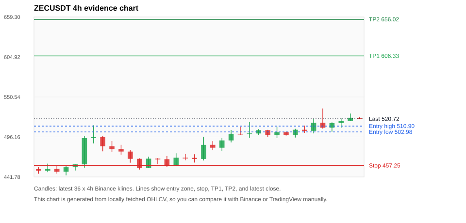
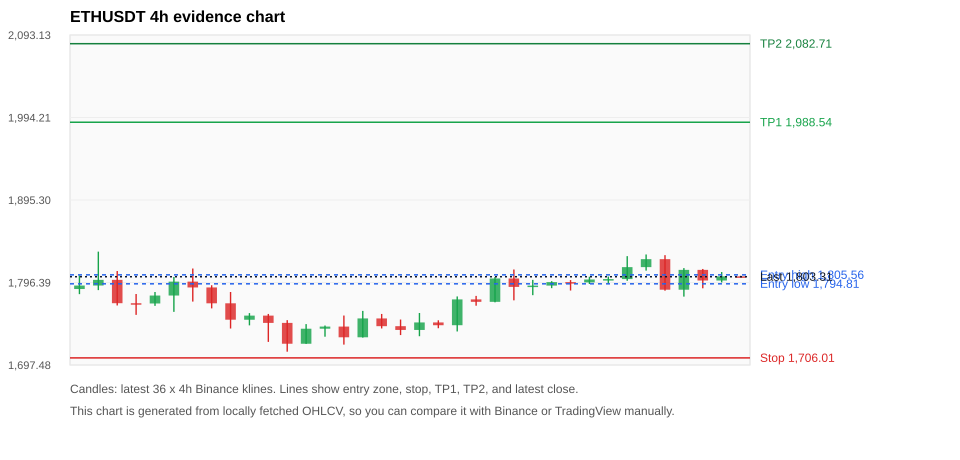
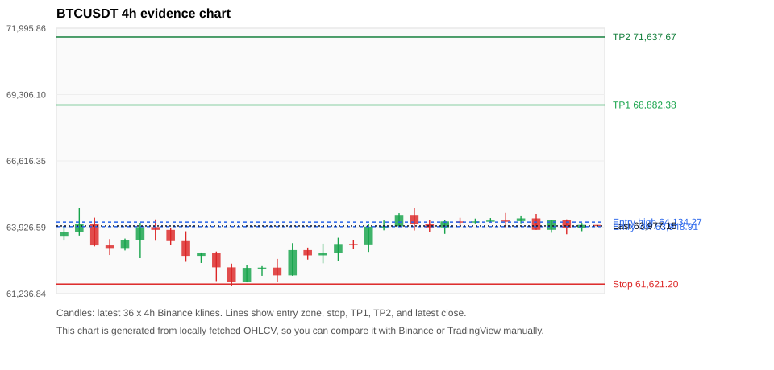
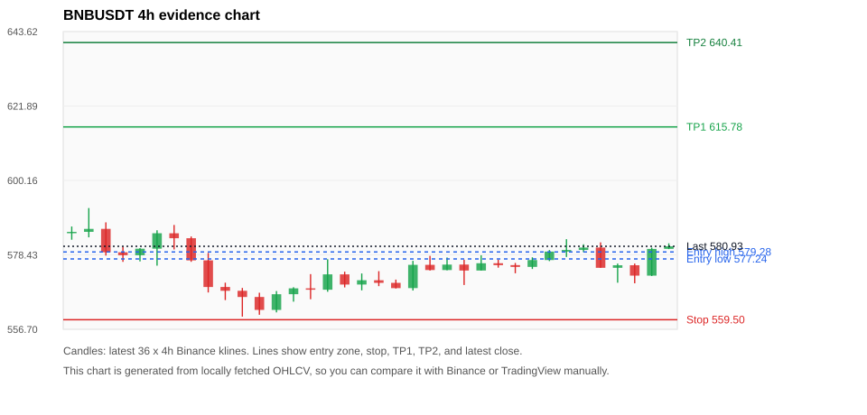
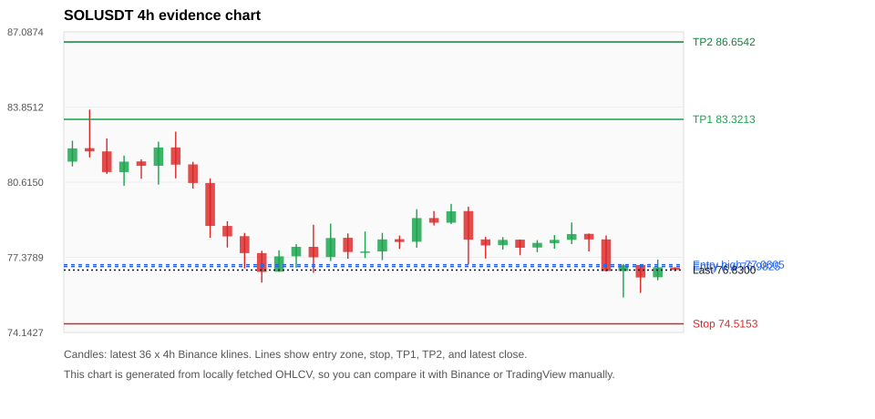

# Crypto 市场扫描报告 v1

- 报告时间：2026-07-12 20:05:51 CST
- Run ID：`20260712_120503_54b76c1f`
- Run type：`daily_full`
- 数据来源：SQLite
- 报告版本：v1
- 扫描 ID：2b2031877823
- 数据源：Binance public spot API + CoinGecko/CoinMarketCap cross-check
- 过滤条件：USDT spot; 24h quote volume >= 30,000,000; trades >= 30,000; exclude stables/leveraged tokens; analyze 1h/4h/1d klines
- 默认单笔风险：账户权益的 1.00%

## 限制说明

- 交易信号仍以 Binance 现货公开 K 线为主源；外部数据源用于一致性复核。
- 结果是研究和模拟盘计划，不是确定收益或实盘下单指令。
- 历史长度过滤：候选币至少需要 180 根 1d K 线。
- 数据质量验证池：先验证 score 排名前 min(top_n * 2, 10) 的候选，再按 action + score 补足最终名单。
- 大盘环境过滤：RISK_OFF; BTC/ETH 大盘偏弱，山寨币买入候选降级为观察。 BTC 7d=0.5139827179890144; ETH 7d=0.9884355836810022.
- 已启用数据交叉验证：Binance 主源 + CoinGecko 自动对照；CoinMarketCap 在配置 API Key 后自动对照。
- ZECUSDT 交叉验证状态 DATA_WARNING：At least one external provider needs manual review.
- ETHUSDT 交叉验证状态 DATA_WARNING：At least one external provider needs manual review.
- BTCUSDT 交叉验证状态 DATA_WARNING：At least one external provider needs manual review.
- BNBUSDT 交叉验证状态 DATA_WARNING：At least one external provider needs manual review.
- SOLUSDT 交叉验证状态 DATA_WARNING：At least one external provider needs manual review.
- XRPUSDT 交叉验证状态 DATA_WARNING：At least one external provider needs manual review.

## 5 个候选交易计划

| Rank | Coin | Action | Setup | Entry Zone | Stop Loss | TP1 | TP2 / Exit Rule | R/R | Verdict |
|---:|---|---|---|---:|---:|---:|---|---:|---|
| 1 | `ZEC` | `WATCH_ONLY` | 回踩支撑/4h EMA 附近 | 502.98 - 510.90 | 457.25 | 606.33 | 656.02 或跌破 4h 关键支撑 | 2.00-3.00 | 只观察 |
| 2 | `ETH` | `WATCH_ONLY` | 回踩支撑/4h EMA 附近 | 1,794.81 - 1,805.56 | 1,706.01 | 1,988.54 | 2,082.71 或跌破 4h 关键支撑 | 2.00-3.00 | 只观察 |
| 3 | `BTC` | `WATCH_ONLY` | 回踩支撑/4h EMA 附近 | 63,948.91 - 64,134.27 | 61,621.20 | 68,882.38 | 71,637.67 或跌破 4h 关键支撑 | 2.00-3.14 | 只观察 |
| 4 | `BNB` | `WATCH_ONLY` | 回踩支撑/4h EMA 附近 | 577.24 - 579.28 | 559.50 | 615.78 | 640.41 或跌破 4h 关键支撑 | 2.00-3.31 | 只观察 |
| 5 | `SOL` | `REJECT` | 回踩支撑/4h EMA 附近 | 76.9825 - 77.0605 | 74.5153 | 83.3213 | 86.6542 或跌破 4h 关键支撑 | 2.51-3.84 | 只观察 |

## 数据交叉验证摘要

价格差异以 Binance 当前价为基准；成交量口径不同，Binance 是 USDT 现货成交额，CoinGecko/CoinMarketCap 通常是全市场成交量。

| Rank | Coin | Data Status | Max Price Diff | Max 24h Diff | Message |
|---:|---|---|---:|---:|---|
| 1 | `ZEC` | DATA_WARNING | 0.22% | 0.32 pts | At least one external provider needs manual review. |
| 2 | `ETH` | DATA_WARNING | 0.06% | 0.09 pts | At least one external provider needs manual review. |
| 3 | `BTC` | DATA_WARNING | 0.06% | 0.06 pts | At least one external provider needs manual review. |
| 4 | `BNB` | DATA_WARNING | 0.03% | 0.08 pts | At least one external provider needs manual review. |
| 5 | `SOL` | DATA_WARNING | 0.10% | 0.30 pts | At least one external provider needs manual review. |

## 候选币说明

### 1. ZEC `ZECUSDT`



- 入选原因：回踩支撑/4h EMA 附近；24h +3.05%，7d +12.20%，4h RSI 67.14，24h 成交额 $79.2M。
- 交易失效条件：跌破 457.24685 或 4h 收盘重新失守关键支撑。
- 主要风险：BTC/ETH 大盘环境未确认强势，山寨币买入信号降级；数据交叉验证需要人工复核。
- 数据交叉验证：DATA_WARNING；At least one external provider needs manual review.

#### 可点击人工验证

- [Binance 交易页](https://www.binance.com/en/trade/ZEC_USDT)
- [TradingView 图表](https://www.tradingview.com/chart/?symbol=BINANCE%3AZECUSDT)
- [CoinGecko 搜索](https://www.coingecko.com/en/search?query=ZEC)
- [CoinMarketCap 搜索](https://coinmarketcap.com/search/?q=ZEC)

#### 多数据源对照

| Source | Status | Asset ID | Price | 24h Change | 24h Volume | Price Diff | 24h Diff | Updated | Message |
|---|---|---|---:|---:|---:|---:|---:|---|---|
| Binance | DATA_OK | ZECUSDT | 520.72 | +3.05% | $79.2M | 0.00% | 0.00 pts | 2026-07-12T12:05:33+00:00 | Primary market data source used by scanner. |
| CoinGecko | DATA_OK | zcash | 520.28 | +3.08% | $352.3M | 0.08% | 0.03 pts | 2026-07-12T12:05:31.256Z | External source agrees with Binance within thresholds. |
| CoinMarketCap | DATA_WARNING | 1437 | 521.85 | +3.37% | $455.2M | 0.22% | 0.32 pts | 2026-07-12T12:04:03.000Z | CoinMarketCap symbol mapping has 2 matches; selected lowest cmc_rank |

#### 指标证据

| 指标 | 数值 | 人工核对用途 |
|---|---:|---|
| 当前价 | 520.72 | 与 Binance/TradingView 当前价格对照 |
| 24h 涨跌 | +3.05% | 与交易所 24h 涨跌对照 |
| 7d 涨跌 | +12.20% | 判断短线趋势是否延续 |
| 4h EMA20 | 501.98 | 判断短期趋势支撑 |
| 4h EMA50 | 480.66 | 判断中期趋势支撑 |
| 1d EMA20 | 466.16 | 判断日线趋势 |
| 1d EMA50 | 462.27 | 判断日线趋势 |
| 4h RSI14 | 67.14 | 判断是否过热/过弱 |
| 4h ATR14 | 12.7429 | 推导止损和入场缓冲 |
| 最近 18 根 4h 最低点 | 464.21 | 支撑/止损参考 |
| 最近 36 根 4h 最高点 | 534.91 | TP/压力参考 |
| 支撑位 | 501.98 | 入场区间推导基础 |

#### 交易计划推导

- 支撑位 = 最近低点、4h EMA20、4h EMA50、1d EMA20 中不高于当前价的最高有效支撑 = `501.98`。
- 入场区间 = 支撑位附近 + ATR 缓冲 = `502.98 - 510.90`。
- 止损 = min(最近 18 根 4h 最低点 * 0.985, 入场中位价 - 1.15 * ATR14) = `457.25`。
- TP1 = max(最近 36 根 4h 最高点 * 0.995, 入场中位价 + 2R) = `606.33`。
- TP2 = max(入场中位价 + 3R, TP1 * 1.04) = `656.02`。

#### 最近 10 根 4h K线

| UTC 开盘时间 | Open | High | Low | Close | Quote Volume | Trades |
|---|---:|---:|---:|---:|---:|---:|
| 2026-07-11T00:00+00:00 | 499.10 | 509.99 | 494.51 | 502.49 | $10.5M | 33951 |
| 2026-07-11T04:00+00:00 | 502.46 | 503.48 | 497.94 | 499.08 | $5.3M | 18572 |
| 2026-07-11T08:00+00:00 | 499.09 | 507.25 | 495.37 | 505.97 | $6.7M | 25303 |
| 2026-07-11T12:00+00:00 | 505.97 | 511.57 | 501.80 | 504.51 | $9.6M | 29469 |
| 2026-07-11T16:00+00:00 | 504.52 | 520.70 | 501.00 | 515.39 | $16.8M | 52262 |
| 2026-07-11T20:00+00:00 | 515.41 | 534.91 | 507.35 | 508.69 | $24.8M | 77416 |
| 2026-07-12T00:00+00:00 | 508.76 | 516.00 | 503.27 | 515.00 | $9.2M | 41836 |
| 2026-07-12T04:00+00:00 | 515.04 | 521.34 | 508.55 | 517.74 | $8.6M | 33855 |
| 2026-07-12T08:00+00:00 | 517.76 | 528.00 | 517.76 | 522.28 | $10.2M | 37378 |
| 2026-07-12T12:00+00:00 | 522.22 | 522.89 | 520.54 | 520.72 | $169,207 | 812 |

### 2. ETH `ETHUSDT`



- 入选原因：回踩支撑/4h EMA 附近；24h +0.12%，7d +2.10%，4h RSI 59.99，24h 成交额 $334.4M。
- 交易失效条件：跌破 1706.0102 或 4h 收盘重新失守关键支撑。
- 主要风险：日线趋势未完全确认；BTC/ETH 大盘环境未确认强势，山寨币买入信号降级；数据交叉验证需要人工复核。
- 数据交叉验证：DATA_WARNING；At least one external provider needs manual review.

#### 可点击人工验证

- [Binance 交易页](https://www.binance.com/en/trade/ETH_USDT)
- [TradingView 图表](https://www.tradingview.com/chart/?symbol=BINANCE%3AETHUSDT)
- [CoinGecko 搜索](https://www.coingecko.com/en/search?query=ETH)
- [CoinMarketCap 搜索](https://coinmarketcap.com/search/?q=ETH)

#### 多数据源对照

| Source | Status | Asset ID | Price | 24h Change | 24h Volume | Price Diff | 24h Diff | Updated | Message |
|---|---|---|---:|---:|---:|---:|---:|---|---|
| Binance | DATA_OK | ETHUSDT | 1,803.31 | +0.12% | $334.4M | 0.00% | 0.00 pts | 2026-07-12T12:05:33+00:00 | Primary market data source used by scanner. |
| CoinGecko | DATA_OK | ethereum | 1,802.31 | +0.21% | $7.19B | 0.06% | 0.09 pts | 2026-07-12T12:05:39.239Z | External source agrees with Binance within thresholds. |
| CoinMarketCap | DATA_WARNING | 1027 | 1,802.59 | +0.19% | $7.44B | 0.04% | 0.07 pts | 2026-07-12T12:04:03.000Z | CoinMarketCap symbol mapping has 6 matches; selected lowest cmc_rank |

#### 指标证据

| 指标 | 数值 | 人工核对用途 |
|---|---:|---|
| 当前价 | 1,803.31 | 与 Binance/TradingView 当前价格对照 |
| 24h 涨跌 | +0.12% | 与交易所 24h 涨跌对照 |
| 7d 涨跌 | +2.10% | 判断短线趋势是否延续 |
| 4h EMA20 | 1,791.23 | 判断短期趋势支撑 |
| 4h EMA50 | 1,764.65 | 判断中期趋势支撑 |
| 1d EMA20 | 1,737.83 | 判断日线趋势 |
| 1d EMA50 | 1,800.90 | 判断日线趋势 |
| 4h RSI14 | 59.99 | 判断是否过热/过弱 |
| 4h ATR14 | 20.4643 | 推导止损和入场缓冲 |
| 最近 18 根 4h 最低点 | 1,731.99 | 支撑/止损参考 |
| 最近 36 根 4h 最高点 | 1,833.40 | TP/压力参考 |
| 支撑位 | 1,791.23 | 入场区间推导基础 |

#### 交易计划推导

- 支撑位 = 最近低点、4h EMA20、4h EMA50、1d EMA20 中不高于当前价的最高有效支撑 = `1,791.23`。
- 入场区间 = 支撑位附近 + ATR 缓冲 = `1,794.81 - 1,805.56`。
- 止损 = min(最近 18 根 4h 最低点 * 0.985, 入场中位价 - 1.15 * ATR14) = `1,706.01`。
- TP1 = max(最近 36 根 4h 最高点 * 0.995, 入场中位价 + 2R) = `1,988.54`。
- TP2 = max(入场中位价 + 3R, TP1 * 1.04) = `2,082.71`。

#### 最近 10 根 4h K线

| UTC 开盘时间 | Open | High | Low | Close | Quote Volume | Trades |
|---|---:|---:|---:|---:|---:|---:|
| 2026-07-11T00:00+00:00 | 1,796.85 | 1,799.29 | 1,786.77 | 1,796.50 | $29.5M | 149024 |
| 2026-07-11T04:00+00:00 | 1,796.50 | 1,803.29 | 1,794.60 | 1,800.00 | $41.4M | 144104 |
| 2026-07-11T08:00+00:00 | 1,799.99 | 1,803.52 | 1,795.15 | 1,800.48 | $23.7M | 121112 |
| 2026-07-11T12:00+00:00 | 1,800.47 | 1,828.00 | 1,798.42 | 1,814.83 | $88.8M | 297261 |
| 2026-07-11T16:00+00:00 | 1,814.82 | 1,830.00 | 1,810.62 | 1,824.38 | $80.4M | 228758 |
| 2026-07-11T20:00+00:00 | 1,824.38 | 1,829.17 | 1,786.58 | 1,787.76 | $59.7M | 256371 |
| 2026-07-12T00:00+00:00 | 1,787.76 | 1,813.67 | 1,779.46 | 1,811.53 | $54.8M | 279870 |
| 2026-07-12T04:00+00:00 | 1,811.53 | 1,812.63 | 1,789.44 | 1,798.78 | $26.1M | 123951 |
| 2026-07-12T08:00+00:00 | 1,798.78 | 1,808.94 | 1,796.48 | 1,803.77 | $24.6M | 161726 |
| 2026-07-12T12:00+00:00 | 1,803.77 | 1,804.42 | 1,803.00 | 1,803.31 | $313,643 | 2038 |

### 3. BTC `BTCUSDT`



- 入选原因：回踩支撑/4h EMA 附近；24h -0.36%，7d +1.89%，4h RSI 50.25，24h 成交额 $1.01B。
- 交易失效条件：跌破 61621.196 或 4h 收盘重新失守关键支撑。
- 主要风险：日线趋势未完全确认；BTC/ETH 大盘环境未确认强势，山寨币买入信号降级；24h 动量未确认；数据交叉验证需要人工复核。
- 数据交叉验证：DATA_WARNING；At least one external provider needs manual review.

#### 可点击人工验证

- [Binance 交易页](https://www.binance.com/en/trade/BTC_USDT)
- [TradingView 图表](https://www.tradingview.com/chart/?symbol=BINANCE%3ABTCUSDT)
- [CoinGecko 搜索](https://www.coingecko.com/en/search?query=BTC)
- [CoinMarketCap 搜索](https://coinmarketcap.com/search/?q=BTC)

#### 多数据源对照

| Source | Status | Asset ID | Price | 24h Change | 24h Volume | Price Diff | 24h Diff | Updated | Message |
|---|---|---|---:|---:|---:|---:|---:|---|---|
| Binance | DATA_OK | BTCUSDT | 63,977.15 | -0.36% | $1.01B | 0.00% | 0.00 pts | 2026-07-12T12:05:33+00:00 | Primary market data source used by scanner. |
| CoinGecko | DATA_OK | bitcoin | 63,939.00 | -0.29% | $21.52B | 0.06% | 0.06 pts | 2026-07-12T12:05:41.024Z | External source agrees with Binance within thresholds. |
| CoinMarketCap | DATA_WARNING | 1 | 63,947.87 | -0.31% | $21.07B | 0.05% | 0.04 pts | 2026-07-12T12:04:03.000Z | CoinMarketCap symbol mapping has 13 matches; selected lowest cmc_rank |

#### 指标证据

| 指标 | 数值 | 人工核对用途 |
|---|---:|---|
| 当前价 | 63,977.15 | 与 Binance/TradingView 当前价格对照 |
| 24h 涨跌 | -0.36% | 与交易所 24h 涨跌对照 |
| 7d 涨跌 | +1.89% | 判断短线趋势是否延续 |
| 4h EMA20 | 63,821.27 | 判断短期趋势支撑 |
| 4h EMA50 | 63,225.35 | 判断中期趋势支撑 |
| 1d EMA20 | 63,008.86 | 判断日线趋势 |
| 1d EMA50 | 65,307.36 | 判断日线趋势 |
| 4h RSI14 | 50.25 | 判断是否过热/过弱 |
| 4h ATR14 | 447.15 | 推导止损和入场缓冲 |
| 最近 18 根 4h 最低点 | 62,559.59 | 支撑/止损参考 |
| 最近 36 根 4h 最高点 | 64,700.00 | TP/压力参考 |
| 支撑位 | 63,821.27 | 入场区间推导基础 |

#### 交易计划推导

- 支撑位 = 最近低点、4h EMA20、4h EMA50、1d EMA20 中不高于当前价的最高有效支撑 = `63,821.27`。
- 入场区间 = 支撑位附近 + ATR 缓冲 = `63,948.91 - 64,134.27`。
- 止损 = min(最近 18 根 4h 最低点 * 0.985, 入场中位价 - 1.15 * ATR14) = `61,621.20`。
- TP1 = max(最近 36 根 4h 最高点 * 0.995, 入场中位价 + 2R) = `68,882.38`。
- TP2 = max(入场中位价 + 3R, TP1 * 1.04) = `71,637.67`。

#### 最近 10 根 4h K线

| UTC 开盘时间 | Open | High | Low | Close | Quote Volume | Trades |
|---|---:|---:|---:|---:|---:|---:|
| 2026-07-11T00:00+00:00 | 64,161.72 | 64,310.00 | 63,984.07 | 64,150.42 | $70.6M | 251684 |
| 2026-07-11T04:00+00:00 | 64,150.42 | 64,278.00 | 64,080.26 | 64,162.18 | $95.3M | 216737 |
| 2026-07-11T08:00+00:00 | 64,162.18 | 64,300.00 | 64,129.99 | 64,198.00 | $87.0M | 145928 |
| 2026-07-11T12:00+00:00 | 64,197.99 | 64,504.11 | 63,896.18 | 64,175.75 | $160.4M | 323763 |
| 2026-07-11T16:00+00:00 | 64,175.75 | 64,402.00 | 64,084.00 | 64,286.00 | $78.3M | 235506 |
| 2026-07-11T20:00+00:00 | 64,286.00 | 64,463.83 | 63,819.00 | 63,819.00 | $95.8M | 232560 |
| 2026-07-12T00:00+00:00 | 63,819.01 | 64,223.74 | 63,702.16 | 64,223.73 | $261.7M | 432109 |
| 2026-07-12T04:00+00:00 | 64,223.73 | 64,245.87 | 63,640.83 | 63,885.27 | $111.0M | 257916 |
| 2026-07-12T08:00+00:00 | 63,885.28 | 64,100.32 | 63,764.00 | 64,018.01 | $310.0M | 500956 |
| 2026-07-12T12:00+00:00 | 64,018.00 | 64,018.00 | 63,970.55 | 63,977.14 | $1.6M | 3879 |

### 4. BNB `BNBUSDT`



- 入选原因：回踩支撑/4h EMA 附近；24h +0.27%，7d -1.01%，4h RSI 61.39，24h 成交额 $41.1M。
- 交易失效条件：跌破 559.4997 或 4h 收盘重新失守关键支撑。
- 主要风险：日线趋势未完全确认；BTC/ETH 大盘环境未确认强势，山寨币买入信号降级；7d 趋势未确认；数据交叉验证需要人工复核。
- 数据交叉验证：DATA_WARNING；At least one external provider needs manual review.

#### 可点击人工验证

- [Binance 交易页](https://www.binance.com/en/trade/BNB_USDT)
- [TradingView 图表](https://www.tradingview.com/chart/?symbol=BINANCE%3ABNBUSDT)
- [CoinGecko 搜索](https://www.coingecko.com/en/search?query=BNB)
- [CoinMarketCap 搜索](https://coinmarketcap.com/search/?q=BNB)

#### 多数据源对照

| Source | Status | Asset ID | Price | 24h Change | 24h Volume | Price Diff | 24h Diff | Updated | Message |
|---|---|---|---:|---:|---:|---:|---:|---|---|
| Binance | DATA_OK | BNBUSDT | 580.93 | +0.27% | $41.1M | 0.00% | 0.00 pts | 2026-07-12T12:05:33+00:00 | Primary market data source used by scanner. |
| CoinGecko | DATA_OK | binancecoin | 580.92 | +0.34% | $449.9M | 0.00% | 0.08 pts | 2026-07-12T12:05:40.952Z | External source agrees with Binance within thresholds. |
| CoinMarketCap | DATA_WARNING | 1839 | 580.75 | +0.32% | $924.3M | 0.03% | 0.05 pts | 2026-07-12T12:04:03.000Z | CoinMarketCap symbol mapping has 4 matches; selected lowest cmc_rank |

#### 指标证据

| 指标 | 数值 | 人工核对用途 |
|---|---:|---|
| 当前价 | 580.93 | 与 Binance/TradingView 当前价格对照 |
| 24h 涨跌 | +0.27% | 与交易所 24h 涨跌对照 |
| 7d 涨跌 | -1.01% | 判断短线趋势是否延续 |
| 4h EMA20 | 576.09 | 判断短期趋势支撑 |
| 4h EMA50 | 573.98 | 判断中期趋势支撑 |
| 1d EMA20 | 576.02 | 判断日线趋势 |
| 1d EMA50 | 592.97 | 判断日线趋势 |
| 4h RSI14 | 61.39 | 判断是否过热/过弱 |
| 4h ATR14 | 4.5529 | 推导止损和入场缓冲 |
| 最近 18 根 4h 最低点 | 568.02 | 支撑/止损参考 |
| 最近 36 根 4h 最高点 | 592.10 | TP/压力参考 |
| 支撑位 | 576.09 | 入场区间推导基础 |

#### 交易计划推导

- 支撑位 = 最近低点、4h EMA20、4h EMA50、1d EMA20 中不高于当前价的最高有效支撑 = `576.09`。
- 入场区间 = 支撑位附近 + ATR 缓冲 = `577.24 - 579.28`。
- 止损 = min(最近 18 根 4h 最低点 * 0.985, 入场中位价 - 1.15 * ATR14) = `559.50`。
- TP1 = max(最近 36 根 4h 最高点 * 0.995, 入场中位价 + 2R) = `615.78`。
- TP2 = max(入场中位价 + 3R, TP1 * 1.04) = `640.41`。

#### 最近 10 根 4h K线

| UTC 开盘时间 | Open | High | Low | Close | Quote Volume | Trades |
|---|---:|---:|---:|---:|---:|---:|
| 2026-07-11T00:00+00:00 | 575.44 | 576.07 | 573.06 | 574.91 | $8.3M | 56543 |
| 2026-07-11T04:00+00:00 | 574.92 | 577.72 | 574.31 | 576.92 | $6.6M | 52673 |
| 2026-07-11T08:00+00:00 | 576.92 | 579.84 | 576.61 | 579.39 | $6.0M | 56378 |
| 2026-07-11T12:00+00:00 | 579.39 | 583.01 | 577.81 | 579.86 | $9.9M | 89917 |
| 2026-07-11T16:00+00:00 | 579.87 | 581.52 | 579.23 | 580.56 | $3.3M | 46896 |
| 2026-07-11T20:00+00:00 | 580.57 | 582.08 | 574.65 | 574.65 | $4.0M | 46214 |
| 2026-07-12T00:00+00:00 | 574.65 | 575.89 | 570.30 | 575.39 | $6.5M | 72708 |
| 2026-07-12T04:00+00:00 | 575.40 | 575.89 | 570.13 | 572.37 | $6.9M | 52631 |
| 2026-07-12T08:00+00:00 | 572.37 | 580.53 | 572.26 | 580.17 | $9.9M | 79575 |
| 2026-07-12T12:00+00:00 | 580.18 | 581.79 | 580.11 | 580.93 | $767,181 | 6457 |

### 5. SOL `SOLUSDT`



- 入选原因：回踩支撑/4h EMA 附近；24h -1.73%，7d -5.44%，4h RSI 33.17，24h 成交额 $113.1M。
- 交易失效条件：跌破 74.51525 或 4h 收盘重新失守关键支撑。
- 主要风险：BTC/ETH 大盘环境未确认强势，山寨币买入信号降级；24h 动量未确认；7d 趋势未确认；数据交叉验证需要人工复核。
- 数据交叉验证：DATA_WARNING；At least one external provider needs manual review.

#### 可点击人工验证

- [Binance 交易页](https://www.binance.com/en/trade/SOL_USDT)
- [TradingView 图表](https://www.tradingview.com/chart/?symbol=BINANCE%3ASOLUSDT)
- [CoinGecko 搜索](https://www.coingecko.com/en/search?query=SOL)
- [CoinMarketCap 搜索](https://coinmarketcap.com/search/?q=SOL)

#### 多数据源对照

| Source | Status | Asset ID | Price | 24h Change | 24h Volume | Price Diff | 24h Diff | Updated | Message |
|---|---|---|---:|---:|---:|---:|---:|---|---|
| Binance | DATA_OK | SOLUSDT | 76.8300 | -1.73% | $113.1M | 0.00% | 0.00 pts | 2026-07-12T12:05:33+00:00 | Primary market data source used by scanner. |
| CoinGecko | DATA_OK | solana | 76.8400 | -1.53% | $1.50B | 0.01% | 0.19 pts | 2026-07-12T12:05:31.241Z | External source agrees with Binance within thresholds. |
| CoinMarketCap | DATA_WARNING | 5426 | 76.9103 | -1.43% | $1.64B | 0.10% | 0.30 pts | 2026-07-12T12:04:03.000Z | CoinMarketCap symbol mapping has 8 matches; selected lowest cmc_rank |

#### 指标证据

| 指标 | 数值 | 人工核对用途 |
|---|---:|---|
| 当前价 | 76.8300 | 与 Binance/TradingView 当前价格对照 |
| 24h 涨跌 | -1.73% | 与交易所 24h 涨跌对照 |
| 7d 涨跌 | -5.44% | 判断短线趋势是否延续 |
| 4h EMA20 | 77.8105 | 判断短期趋势支撑 |
| 4h EMA50 | 78.2090 | 判断中期趋势支撑 |
| 1d EMA20 | 76.8288 | 判断日线趋势 |
| 1d EMA50 | 76.7973 | 判断日线趋势 |
| 4h RSI14 | 33.17 | 判断是否过热/过弱 |
| 4h ATR14 | 0.97071 | 推导止损和入场缓冲 |
| 最近 18 根 4h 最低点 | 75.6500 | 支撑/止损参考 |
| 最近 36 根 4h 最高点 | 83.7400 | TP/压力参考 |
| 支撑位 | 76.8288 | 入场区间推导基础 |

#### 交易计划推导

- 支撑位 = 最近低点、4h EMA20、4h EMA50、1d EMA20 中不高于当前价的最高有效支撑 = `76.8288`。
- 入场区间 = 支撑位附近 + ATR 缓冲 = `76.9825 - 77.0605`。
- 止损 = min(最近 18 根 4h 最低点 * 0.985, 入场中位价 - 1.15 * ATR14) = `74.5153`。
- TP1 = max(最近 36 根 4h 最高点 * 0.995, 入场中位价 + 2R) = `83.3213`。
- TP2 = max(入场中位价 + 3R, TP1 * 1.04) = `86.6542`。

#### 最近 10 根 4h K线

| UTC 开盘时间 | Open | High | Low | Close | Quote Volume | Trades |
|---|---:|---:|---:|---:|---:|---:|
| 2026-07-11T00:00+00:00 | 78.1400 | 78.1400 | 77.4700 | 77.7900 | $14.7M | 64833 |
| 2026-07-11T04:00+00:00 | 77.8000 | 78.1200 | 77.6000 | 78.0000 | $12.3M | 62369 |
| 2026-07-11T08:00+00:00 | 77.9900 | 78.3400 | 77.7500 | 78.1300 | $11.2M | 54725 |
| 2026-07-11T12:00+00:00 | 78.1300 | 78.8800 | 77.9500 | 78.3800 | $16.4M | 77421 |
| 2026-07-11T16:00+00:00 | 78.3900 | 78.4000 | 77.6300 | 78.1500 | $33.0M | 90472 |
| 2026-07-11T20:00+00:00 | 78.1500 | 78.3200 | 76.7700 | 76.7900 | $17.0M | 77347 |
| 2026-07-12T00:00+00:00 | 76.7900 | 77.0900 | 75.6500 | 77.0400 | $24.1M | 113612 |
| 2026-07-12T04:00+00:00 | 77.0500 | 77.0800 | 75.8500 | 76.5100 | $12.3M | 57857 |
| 2026-07-12T08:00+00:00 | 76.5200 | 77.2800 | 76.3900 | 76.9500 | $10.1M | 52569 |
| 2026-07-12T12:00+00:00 | 76.9400 | 76.9500 | 76.7800 | 76.8300 | $826,429 | 2269 |

## 组合风控

- 不要 5 个候选全部满仓买入。
- 同时持仓总风险建议控制在账户权益的 3% - 5% 以内。
- 如果 BTC/ETH 同时破位，暂停山寨币多头计划或降低仓位。
- 第一版报告用于模拟盘和人工复核，不自动下单。

## 原始数据

```json
[
  {
    "rank": 1,
    "symbol": "ZECUSDT",
    "base_asset": "ZEC",
    "price": 520.72,
    "score": 61.6949896176875,
    "setup": "回踩支撑/4h EMA 附近",
    "verdict": "只观察",
    "entry_low": 502.98236129484104,
    "entry_high": 510.8984044858693,
    "stop_loss": 457.24685,
    "take_profit_1": 606.3274486710656,
    "take_profit_2": 656.0209815614207,
    "risk_reward_1": 2.0,
    "risk_reward_2": 3.0,
    "pct_24h": 3.05,
    "pct_3d": 11.177060870679178,
    "pct_7d": 12.204792277193599,
    "quote_volume_24h": 79236995.14083,
    "trades_24h": 272696,
    "high_low_range_24h": 6.768463073852282,
    "rsi_1h": 50.72559366754627,
    "rsi_4h": 67.135593220339,
    "ema20_4h": 501.9784044858693,
    "ema50_4h": 480.66005855804724,
    "ema20_1d": 466.15896198864147,
    "ema50_1d": 462.26649800540844,
    "atr_4h": 12.742857142857149,
    "macd_hist_4h": 1.0145828361157285,
    "volume_ratio_24h": 0.9497078049161765,
    "support_level": 501.9784044858693,
    "recent_low_4h_18": 464.21,
    "recent_high_4h_36": 534.91,
    "distance_to_support_pct": 3.7335461738291276,
    "binance_trade_url": "https://www.binance.com/en/trade/ZEC_USDT",
    "tradingview_url": "https://www.tradingview.com/chart/?symbol=BINANCE%3AZECUSDT",
    "coingecko_search_url": "https://www.coingecko.com/en/search?query=ZEC",
    "coinmarketcap_search_url": "https://coinmarketcap.com/search/?q=ZEC",
    "invalidation": "跌破 457.24685 或 4h 收盘重新失守关键支撑",
    "recent_4h_klines": [
      {
        "open_time_utc": "2026-07-06T16:00+00:00",
        "open": 452.36,
        "high": 455.5,
        "low": 446.16,
        "close": 450.38,
        "quote_volume": 15384550.76482,
        "trades": 49478
      },
      {
        "open_time_utc": "2026-07-06T20:00+00:00",
        "open": 450.37,
        "high": 459.89,
        "low": 448.24,
        "close": 452.7,
        "quote_volume": 13400498.05844,
        "trades": 34642
      },
      {
        "open_time_utc": "2026-07-07T00:00+00:00",
        "open": 452.76,
        "high": 456.9,
        "low": 446.32,
        "close": 448.9,
        "quote_volume": 9048146.51228,
        "trades": 25574
      },
      {
        "open_time_utc": "2026-07-07T04:00+00:00",
        "open": 448.97,
        "high": 457.0,
        "low": 444.0,
        "close": 454.93,
        "quote_volume": 6893208.16374,
        "trades": 28357
      },
      {
        "open_time_utc": "2026-07-07T08:00+00:00",
        "open": 454.94,
        "high": 459.0,
        "low": 450.54,
        "close": 458.9,
        "quote_volume": 11490201.84041,
        "trades": 33483
      },
      {
        "open_time_utc": "2026-07-07T12:00+00:00",
        "open": 458.89,
        "high": 497.28,
        "low": 454.39,
        "close": 494.56,
        "quote_volume": 34527484.00912,
        "trades": 119749
      },
      {
        "open_time_utc": "2026-07-07T16:00+00:00",
        "open": 494.55,
        "high": 512.0,
        "low": 487.42,
        "close": 495.98,
        "quote_volume": 44888483.48707,
        "trades": 137937
      },
      {
        "open_time_utc": "2026-07-07T20:00+00:00",
        "open": 495.99,
        "high": 497.46,
        "low": 476.58,
        "close": 483.6,
        "quote_volume": 25467867.52302,
        "trades": 95021
      },
      {
        "open_time_utc": "2026-07-08T00:00+00:00",
        "open": 483.55,
        "high": 490.57,
        "low": 475.72,
        "close": 479.75,
        "quote_volume": 14273829.46407,
        "trades": 55773
      },
      {
        "open_time_utc": "2026-07-08T04:00+00:00",
        "open": 479.82,
        "high": 485.45,
        "low": 472.08,
        "close": 476.32,
        "quote_volume": 10009889.39165,
        "trades": 38024
      },
      {
        "open_time_utc": "2026-07-08T08:00+00:00",
        "open": 476.26,
        "high": 478.69,
        "low": 461.14,
        "close": 466.39,
        "quote_volume": 17820576.79018,
        "trades": 65597
      },
      {
        "open_time_utc": "2026-07-08T12:00+00:00",
        "open": 466.4,
        "high": 467.1,
        "low": 451.82,
        "close": 454.29,
        "quote_volume": 12194329.0018,
        "trades": 56451
      },
      {
        "open_time_utc": "2026-07-08T16:00+00:00",
        "open": 454.26,
        "high": 469.36,
        "low": 454.12,
        "close": 466.66,
        "quote_volume": 13187757.81381,
        "trades": 56107
      },
      {
        "open_time_utc": "2026-07-08T20:00+00:00",
        "open": 466.67,
        "high": 467.43,
        "low": 459.13,
        "close": 465.99,
        "quote_volume": 5059519.11383,
        "trades": 24098
      },
      {
        "open_time_utc": "2026-07-09T00:00+00:00",
        "open": 465.93,
        "high": 470.23,
        "low": 455.28,
        "close": 457.79,
        "quote_volume": 7793193.66965,
        "trades": 42340
      },
      {
        "open_time_utc": "2026-07-09T04:00+00:00",
        "open": 457.79,
        "high": 473.93,
        "low": 456.71,
        "close": 467.94,
        "quote_volume": 8674219.62737,
        "trades": 37616
      },
      {
        "open_time_utc": "2026-07-09T08:00+00:00",
        "open": 467.95,
        "high": 472.9,
        "low": 464.51,
        "close": 467.88,
        "quote_volume": 6637523.44624,
        "trades": 29558
      },
      {
        "open_time_utc": "2026-07-09T12:00+00:00",
        "open": 467.73,
        "high": 472.61,
        "low": 461.36,
        "close": 466.23,
        "quote_volume": 9492725.00252,
        "trades": 45237
      },
      {
        "open_time_utc": "2026-07-09T16:00+00:00",
        "open": 466.23,
        "high": 496.48,
        "low": 464.21,
        "close": 485.41,
        "quote_volume": 26352494.97918,
        "trades": 75989
      },
      {
        "open_time_utc": "2026-07-09T20:00+00:00",
        "open": 485.46,
        "high": 490.45,
        "low": 478.37,
        "close": 481.54,
        "quote_volume": 12281798.61502,
        "trades": 42101
      },
      {
        "open_time_utc": "2026-07-10T00:00+00:00",
        "open": 481.51,
        "high": 494.71,
        "low": 477.22,
        "close": 491.44,
        "quote_volume": 13712407.85083,
        "trades": 46636
      },
      {
        "open_time_utc": "2026-07-10T04:00+00:00",
        "open": 491.44,
        "high": 505.77,
        "low": 488.77,
        "close": 500.5,
        "quote_volume": 21013379.278,
        "trades": 56475
      },
      {
        "open_time_utc": "2026-07-10T08:00+00:00",
        "open": 500.49,
        "high": 509.94,
        "low": 498.53,
        "close": 500.48,
        "quote_volume": 11695607.73336,
        "trades": 48743
      },
      {
        "open_time_utc": "2026-07-10T12:00+00:00",
        "open": 500.47,
        "high": 516.4,
        "low": 495.01,
        "close": 500.97,
        "quote_volume": 20201010.00175,
        "trades": 74738
      },
      {
        "open_time_utc": "2026-07-10T16:00+00:00",
        "open": 500.91,
        "high": 506.79,
        "low": 498.66,
        "close": 505.37,
        "quote_volume": 10429574.07918,
        "trades": 37794
      },
      {
        "open_time_utc": "2026-07-10T20:00+00:00",
        "open": 505.39,
        "high": 505.87,
        "low": 496.46,
        "close": 499.13,
        "quote_volume": 5159821.03843,
        "trades": 21679
      },
      {
        "open_time_utc": "2026-07-11T00:00+00:00",
        "open": 499.1,
        "high": 509.99,
        "low": 494.51,
        "close": 502.49,
        "quote_volume": 10516184.02028,
        "trades": 33951
      },
      {
        "open_time_utc": "2026-07-11T04:00+00:00",
        "open": 502.46,
        "high": 503.48,
        "low": 497.94,
        "close": 499.08,
        "quote_volume": 5305698.4872,
        "trades": 18572
      },
      {
        "open_time_utc": "2026-07-11T08:00+00:00",
        "open": 499.09,
        "high": 507.25,
        "low": 495.37,
        "close": 505.97,
        "quote_volume": 6729220.36434,
        "trades": 25303
      },
      {
        "open_time_utc": "2026-07-11T12:00+00:00",
        "open": 505.97,
        "high": 511.57,
        "low": 501.8,
        "close": 504.51,
        "quote_volume": 9561942.02663,
        "trades": 29469
      },
      {
        "open_time_utc": "2026-07-11T16:00+00:00",
        "open": 504.52,
        "high": 520.7,
        "low": 501.0,
        "close": 515.39,
        "quote_volume": 16819614.84812,
        "trades": 52262
      },
      {
        "open_time_utc": "2026-07-11T20:00+00:00",
        "open": 515.41,
        "high": 534.91,
        "low": 507.35,
        "close": 508.69,
        "quote_volume": 24815708.72308,
        "trades": 77416
      },
      {
        "open_time_utc": "2026-07-12T00:00+00:00",
        "open": 508.76,
        "high": 516.0,
        "low": 503.27,
        "close": 515.0,
        "quote_volume": 9187989.0886,
        "trades": 41836
      },
      {
        "open_time_utc": "2026-07-12T04:00+00:00",
        "open": 515.04,
        "high": 521.34,
        "low": 508.55,
        "close": 517.74,
        "quote_volume": 8568252.35117,
        "trades": 33855
      },
      {
        "open_time_utc": "2026-07-12T08:00+00:00",
        "open": 517.76,
        "high": 528.0,
        "low": 517.76,
        "close": 522.28,
        "quote_volume": 10185487.70149,
        "trades": 37378
      },
      {
        "open_time_utc": "2026-07-12T12:00+00:00",
        "open": 522.22,
        "high": 522.89,
        "low": 520.54,
        "close": 520.72,
        "quote_volume": 169206.99811,
        "trades": 812
      }
    ],
    "risks": [
      "BTC/ETH 大盘环境未确认强势，山寨币买入信号降级",
      "数据交叉验证需要人工复核"
    ],
    "data_quality_status": "DATA_WARNING",
    "data_quality_message": "At least one external provider needs manual review.",
    "data_checks": [
      {
        "provider": "Binance",
        "status": "DATA_OK",
        "provider_asset_id": "ZECUSDT",
        "provider_symbol": "ZECUSDT",
        "price_usd": 520.72,
        "pct_24h": 3.05,
        "volume_24h": 79236995.14083,
        "last_updated": null,
        "fetched_at_utc": "2026-07-12T12:05:33+00:00",
        "price_diff_pct": 0.0,
        "pct_24h_diff": 0.0,
        "volume_note": "Binance USDT spot 24h quoteVolume.",
        "message": "Primary market data source used by scanner."
      },
      {
        "provider": "CoinGecko",
        "status": "DATA_OK",
        "provider_asset_id": "zcash",
        "provider_symbol": "ZEC",
        "price_usd": 520.28,
        "pct_24h": 3.07732,
        "volume_24h": 352343826.0,
        "last_updated": "2026-07-12T12:05:31.256Z",
        "fetched_at_utc": "2026-07-12T12:05:33+00:00",
        "price_diff_pct": 0.0844983868489888,
        "pct_24h_diff": 0.02732000000000001,
        "volume_note": "CoinGecko total market volume; not the same venue scope as Binance quoteVolume.",
        "message": "External source agrees with Binance within thresholds."
      },
      {
        "provider": "CoinMarketCap",
        "status": "DATA_WARNING",
        "provider_asset_id": "1437",
        "provider_symbol": "ZEC",
        "price_usd": 521.8504438081957,
        "pct_24h": 3.36794634,
        "volume_24h": 455223965.1305583,
        "last_updated": "2026-07-12T12:04:03.000Z",
        "fetched_at_utc": "2026-07-12T12:05:33+00:00",
        "price_diff_pct": 0.2170924504907917,
        "pct_24h_diff": 0.3179463400000002,
        "volume_note": "CoinMarketCap total market volume; not the same venue scope as Binance quoteVolume.",
        "message": "CoinMarketCap symbol mapping has 2 matches; selected lowest cmc_rank"
      }
    ],
    "action": "WATCH_ONLY"
  },
  {
    "rank": 2,
    "symbol": "ETHUSDT",
    "base_asset": "ETH",
    "price": 1803.31,
    "score": 45.237828704149315,
    "setup": "回踩支撑/4h EMA 附近",
    "verdict": "只观察",
    "entry_low": 1794.8145811704012,
    "entry_high": 1805.5571169365282,
    "stop_loss": 1706.01015,
    "take_profit_1": 1988.5372471603937,
    "take_profit_2": 2082.7129462138582,
    "risk_reward_1": 2.0,
    "risk_reward_2": 3.0,
    "pct_24h": 0.12,
    "pct_3d": 3.223830703095043,
    "pct_7d": 2.097652667217731,
    "quote_volume_24h": 334390767.844078,
    "trades_24h": 1347641,
    "high_low_range_24h": 2.840187472604039,
    "rsi_1h": 44.21368280764101,
    "rsi_4h": 59.990709403410925,
    "ema20_4h": 1791.2321169365282,
    "ema50_4h": 1764.650054096525,
    "ema20_1d": 1737.8344797610098,
    "ema50_1d": 1800.9033286801364,
    "atr_4h": 20.46428571428573,
    "macd_hist_4h": 0.020612423496313426,
    "volume_ratio_24h": 0.8641674149423714,
    "support_level": 1791.2321169365282,
    "recent_low_4h_18": 1731.99,
    "recent_high_4h_36": 1833.4,
    "distance_to_support_pct": 0.6742779424996126,
    "binance_trade_url": "https://www.binance.com/en/trade/ETH_USDT",
    "tradingview_url": "https://www.tradingview.com/chart/?symbol=BINANCE%3AETHUSDT",
    "coingecko_search_url": "https://www.coingecko.com/en/search?query=ETH",
    "coinmarketcap_search_url": "https://coinmarketcap.com/search/?q=ETH",
    "invalidation": "跌破 1706.0102 或 4h 收盘重新失守关键支撑",
    "recent_4h_klines": [
      {
        "open_time_utc": "2026-07-06T16:00+00:00",
        "open": 1788.57,
        "high": 1805.0,
        "low": 1782.42,
        "close": 1792.76,
        "quote_volume": 108710719.038645,
        "trades": 530438
      },
      {
        "open_time_utc": "2026-07-06T20:00+00:00",
        "open": 1792.76,
        "high": 1833.4,
        "low": 1787.26,
        "close": 1799.56,
        "quote_volume": 97896741.274095,
        "trades": 388963
      },
      {
        "open_time_utc": "2026-07-07T00:00+00:00",
        "open": 1799.56,
        "high": 1810.16,
        "low": 1768.85,
        "close": 1771.56,
        "quote_volume": 66944098.868885,
        "trades": 378555
      },
      {
        "open_time_utc": "2026-07-07T04:00+00:00",
        "open": 1771.55,
        "high": 1782.59,
        "low": 1757.57,
        "close": 1771.24,
        "quote_volume": 65417463.726118,
        "trades": 288985
      },
      {
        "open_time_utc": "2026-07-07T08:00+00:00",
        "open": 1771.23,
        "high": 1785.0,
        "low": 1768.37,
        "close": 1780.77,
        "quote_volume": 49210293.246015,
        "trades": 233940
      },
      {
        "open_time_utc": "2026-07-07T12:00+00:00",
        "open": 1780.77,
        "high": 1803.03,
        "low": 1761.19,
        "close": 1797.45,
        "quote_volume": 116009755.110902,
        "trades": 785298
      },
      {
        "open_time_utc": "2026-07-07T16:00+00:00",
        "open": 1797.45,
        "high": 1813.16,
        "low": 1773.5,
        "close": 1790.45,
        "quote_volume": 83697542.771657,
        "trades": 556320
      },
      {
        "open_time_utc": "2026-07-07T20:00+00:00",
        "open": 1790.46,
        "high": 1793.12,
        "low": 1765.35,
        "close": 1771.45,
        "quote_volume": 49256624.488021,
        "trades": 277174
      },
      {
        "open_time_utc": "2026-07-08T00:00+00:00",
        "open": 1771.45,
        "high": 1785.0,
        "low": 1741.21,
        "close": 1751.78,
        "quote_volume": 80404740.597791,
        "trades": 450493
      },
      {
        "open_time_utc": "2026-07-08T04:00+00:00",
        "open": 1751.74,
        "high": 1759.69,
        "low": 1745.01,
        "close": 1756.7,
        "quote_volume": 44490761.312298,
        "trades": 286717
      },
      {
        "open_time_utc": "2026-07-08T08:00+00:00",
        "open": 1756.7,
        "high": 1758.7,
        "low": 1725.18,
        "close": 1747.95,
        "quote_volume": 98675827.777842,
        "trades": 528879
      },
      {
        "open_time_utc": "2026-07-08T12:00+00:00",
        "open": 1747.95,
        "high": 1751.25,
        "low": 1713.44,
        "close": 1722.96,
        "quote_volume": 90459253.466077,
        "trades": 643326
      },
      {
        "open_time_utc": "2026-07-08T16:00+00:00",
        "open": 1722.96,
        "high": 1746.52,
        "low": 1722.78,
        "close": 1740.98,
        "quote_volume": 54463164.251953,
        "trades": 356233
      },
      {
        "open_time_utc": "2026-07-08T20:00+00:00",
        "open": 1740.99,
        "high": 1744.81,
        "low": 1731.41,
        "close": 1743.54,
        "quote_volume": 23949993.595381,
        "trades": 194178
      },
      {
        "open_time_utc": "2026-07-09T00:00+00:00",
        "open": 1743.55,
        "high": 1756.79,
        "low": 1721.93,
        "close": 1730.7,
        "quote_volume": 48303672.851556,
        "trades": 370953
      },
      {
        "open_time_utc": "2026-07-09T04:00+00:00",
        "open": 1730.7,
        "high": 1762.36,
        "low": 1730.35,
        "close": 1753.31,
        "quote_volume": 65808618.565405,
        "trades": 313659
      },
      {
        "open_time_utc": "2026-07-09T08:00+00:00",
        "open": 1753.3,
        "high": 1758.68,
        "low": 1741.26,
        "close": 1744.02,
        "quote_volume": 35397227.751037,
        "trades": 222511
      },
      {
        "open_time_utc": "2026-07-09T12:00+00:00",
        "open": 1744.02,
        "high": 1752.0,
        "low": 1733.36,
        "close": 1739.51,
        "quote_volume": 88395030.749091,
        "trades": 539130
      },
      {
        "open_time_utc": "2026-07-09T16:00+00:00",
        "open": 1739.51,
        "high": 1759.82,
        "low": 1731.99,
        "close": 1748.51,
        "quote_volume": 41825612.733619,
        "trades": 241982
      },
      {
        "open_time_utc": "2026-07-09T20:00+00:00",
        "open": 1748.51,
        "high": 1751.08,
        "low": 1741.56,
        "close": 1745.16,
        "quote_volume": 23369634.994497,
        "trades": 163828
      },
      {
        "open_time_utc": "2026-07-10T00:00+00:00",
        "open": 1745.17,
        "high": 1779.68,
        "low": 1737.68,
        "close": 1776.12,
        "quote_volume": 80059828.145824,
        "trades": 401212
      },
      {
        "open_time_utc": "2026-07-10T04:00+00:00",
        "open": 1776.13,
        "high": 1780.33,
        "low": 1768.57,
        "close": 1773.2,
        "quote_volume": 42342687.787892,
        "trades": 211473
      },
      {
        "open_time_utc": "2026-07-10T08:00+00:00",
        "open": 1773.2,
        "high": 1802.99,
        "low": 1772.63,
        "close": 1801.22,
        "quote_volume": 82878197.715128,
        "trades": 358180
      },
      {
        "open_time_utc": "2026-07-10T12:00+00:00",
        "open": 1801.22,
        "high": 1812.0,
        "low": 1775.0,
        "close": 1791.11,
        "quote_volume": 102658845.235422,
        "trades": 476852
      },
      {
        "open_time_utc": "2026-07-10T16:00+00:00",
        "open": 1791.11,
        "high": 1799.53,
        "low": 1781.2,
        "close": 1792.68,
        "quote_volume": 47368296.412897,
        "trades": 245279
      },
      {
        "open_time_utc": "2026-07-10T20:00+00:00",
        "open": 1792.68,
        "high": 1798.0,
        "low": 1789.6,
        "close": 1796.85,
        "quote_volume": 29647779.573534,
        "trades": 192375
      },
      {
        "open_time_utc": "2026-07-11T00:00+00:00",
        "open": 1796.85,
        "high": 1799.29,
        "low": 1786.77,
        "close": 1796.5,
        "quote_volume": 29504422.885497,
        "trades": 149024
      },
      {
        "open_time_utc": "2026-07-11T04:00+00:00",
        "open": 1796.5,
        "high": 1803.29,
        "low": 1794.6,
        "close": 1800.0,
        "quote_volume": 41393222.395037,
        "trades": 144104
      },
      {
        "open_time_utc": "2026-07-11T08:00+00:00",
        "open": 1799.99,
        "high": 1803.52,
        "low": 1795.15,
        "close": 1800.48,
        "quote_volume": 23683229.598781,
        "trades": 121112
      },
      {
        "open_time_utc": "2026-07-11T12:00+00:00",
        "open": 1800.47,
        "high": 1828.0,
        "low": 1798.42,
        "close": 1814.83,
        "quote_volume": 88826829.557453,
        "trades": 297261
      },
      {
        "open_time_utc": "2026-07-11T16:00+00:00",
        "open": 1814.82,
        "high": 1830.0,
        "low": 1810.62,
        "close": 1824.38,
        "quote_volume": 80367089.18781,
        "trades": 228758
      },
      {
        "open_time_utc": "2026-07-11T20:00+00:00",
        "open": 1824.38,
        "high": 1829.17,
        "low": 1786.58,
        "close": 1787.76,
        "quote_volume": 59683615.720579,
        "trades": 256371
      },
      {
        "open_time_utc": "2026-07-12T00:00+00:00",
        "open": 1787.76,
        "high": 1813.67,
        "low": 1779.46,
        "close": 1811.53,
        "quote_volume": 54799124.238866,
        "trades": 279870
      },
      {
        "open_time_utc": "2026-07-12T04:00+00:00",
        "open": 1811.53,
        "high": 1812.63,
        "low": 1789.44,
        "close": 1798.78,
        "quote_volume": 26061931.562103,
        "trades": 123951
      },
      {
        "open_time_utc": "2026-07-12T08:00+00:00",
        "open": 1798.78,
        "high": 1808.94,
        "low": 1796.48,
        "close": 1803.77,
        "quote_volume": 24623648.558767,
        "trades": 161726
      },
      {
        "open_time_utc": "2026-07-12T12:00+00:00",
        "open": 1803.77,
        "high": 1804.42,
        "low": 1803.0,
        "close": 1803.31,
        "quote_volume": 313643.182231,
        "trades": 2038
      }
    ],
    "risks": [
      "日线趋势未完全确认",
      "BTC/ETH 大盘环境未确认强势，山寨币买入信号降级",
      "数据交叉验证需要人工复核"
    ],
    "data_quality_status": "DATA_WARNING",
    "data_quality_message": "At least one external provider needs manual review.",
    "data_checks": [
      {
        "provider": "Binance",
        "status": "DATA_OK",
        "provider_asset_id": "ETHUSDT",
        "provider_symbol": "ETHUSDT",
        "price_usd": 1803.31,
        "pct_24h": 0.12,
        "volume_24h": 334390767.844078,
        "last_updated": null,
        "fetched_at_utc": "2026-07-12T12:05:33+00:00",
        "price_diff_pct": 0.0,
        "pct_24h_diff": 0.0,
        "volume_note": "Binance USDT spot 24h quoteVolume.",
        "message": "Primary market data source used by scanner."
      },
      {
        "provider": "CoinGecko",
        "status": "DATA_OK",
        "provider_asset_id": "ethereum",
        "provider_symbol": "ETH",
        "price_usd": 1802.31,
        "pct_24h": 0.21311,
        "volume_24h": 7185840131.0,
        "last_updated": "2026-07-12T12:05:39.239Z",
        "fetched_at_utc": "2026-07-12T12:05:33+00:00",
        "price_diff_pct": 0.055453582578702504,
        "pct_24h_diff": 0.09311,
        "volume_note": "CoinGecko total market volume; not the same venue scope as Binance quoteVolume.",
        "message": "External source agrees with Binance within thresholds."
      },
      {
        "provider": "CoinMarketCap",
        "status": "DATA_WARNING",
        "provider_asset_id": "1027",
        "provider_symbol": "ETH",
        "price_usd": 1802.588569493255,
        "pct_24h": 0.19269919,
        "volume_24h": 7438742532.879306,
        "last_updated": "2026-07-12T12:04:03.000Z",
        "fetched_at_utc": "2026-07-12T12:05:33+00:00",
        "price_diff_pct": 0.040005906180581086,
        "pct_24h_diff": 0.07269919,
        "volume_note": "CoinMarketCap total market volume; not the same venue scope as Binance quoteVolume.",
        "message": "CoinMarketCap symbol mapping has 6 matches; selected lowest cmc_rank"
      }
    ],
    "action": "WATCH_ONLY"
  },
  {
    "rank": 3,
    "symbol": "BTCUSDT",
    "base_asset": "BTC",
    "price": 63977.15,
    "score": 37.648855249135075,
    "setup": "回踩支撑/4h EMA 附近",
    "verdict": "只观察",
    "entry_low": 63948.91002520145,
    "entry_high": 64134.269490221006,
    "stop_loss": 61621.196149999996,
    "take_profit_1": 68882.37697313368,
    "take_profit_2": 71637.67205205903,
    "risk_reward_1": 1.999999999999997,
    "risk_reward_2": 3.138366532677635,
    "pct_24h": -0.358,
    "pct_3d": 1.5053543365803002,
    "pct_7d": 1.8874219645814705,
    "quote_volume_24h": 1013667499.4210382,
    "trades_24h": 1983276,
    "high_low_range_24h": 1.356487651088134,
    "rsi_1h": 44.07868873082188,
    "rsi_4h": 50.253541330464394,
    "ema20_4h": 63821.267490221006,
    "ema50_4h": 63225.345929335665,
    "ema20_1d": 63008.86223796884,
    "ema50_1d": 65307.3572306846,
    "atr_4h": 447.14571428571384,
    "macd_hist_4h": -45.77675229884903,
    "volume_ratio_24h": 0.938564031059466,
    "support_level": 63821.267490221006,
    "recent_low_4h_18": 62559.59,
    "recent_high_4h_36": 64700.0,
    "distance_to_support_pct": 0.24424853330102803,
    "binance_trade_url": "https://www.binance.com/en/trade/BTC_USDT",
    "tradingview_url": "https://www.tradingview.com/chart/?symbol=BINANCE%3ABTCUSDT",
    "coingecko_search_url": "https://www.coingecko.com/en/search?query=BTC",
    "coinmarketcap_search_url": "https://coinmarketcap.com/search/?q=BTC",
    "invalidation": "跌破 61621.196 或 4h 收盘重新失守关键支撑",
    "recent_4h_klines": [
      {
        "open_time_utc": "2026-07-06T16:00+00:00",
        "open": 63545.98,
        "high": 63976.16,
        "low": 63386.01,
        "close": 63738.52,
        "quote_volume": 209461474.1149387,
        "trades": 695266
      },
      {
        "open_time_utc": "2026-07-06T20:00+00:00",
        "open": 63738.52,
        "high": 64700.0,
        "low": 63589.41,
        "close": 64042.02,
        "quote_volume": 158348802.3550516,
        "trades": 495685
      },
      {
        "open_time_utc": "2026-07-07T00:00+00:00",
        "open": 64042.93,
        "high": 64314.0,
        "low": 63150.0,
        "close": 63191.01,
        "quote_volume": 137056167.0230249,
        "trades": 490629
      },
      {
        "open_time_utc": "2026-07-07T04:00+00:00",
        "open": 63191.01,
        "high": 63445.7,
        "low": 62800.0,
        "close": 63083.18,
        "quote_volume": 181221308.9367476,
        "trades": 435866
      },
      {
        "open_time_utc": "2026-07-07T08:00+00:00",
        "open": 63083.19,
        "high": 63467.15,
        "low": 62984.58,
        "close": 63406.0,
        "quote_volume": 104988878.8556702,
        "trades": 351275
      },
      {
        "open_time_utc": "2026-07-07T12:00+00:00",
        "open": 63405.99,
        "high": 64105.0,
        "low": 62671.39,
        "close": 63930.51,
        "quote_volume": 348081870.1046112,
        "trades": 1004190
      },
      {
        "open_time_utc": "2026-07-07T16:00+00:00",
        "open": 63930.5,
        "high": 64243.75,
        "low": 63379.69,
        "close": 63817.99,
        "quote_volume": 201532847.5832951,
        "trades": 622715
      },
      {
        "open_time_utc": "2026-07-07T20:00+00:00",
        "open": 63818.0,
        "high": 63901.75,
        "low": 63218.0,
        "close": 63363.99,
        "quote_volume": 96386614.3852602,
        "trades": 377427
      },
      {
        "open_time_utc": "2026-07-08T00:00+00:00",
        "open": 63364.0,
        "high": 63761.99,
        "low": 62525.47,
        "close": 62766.0,
        "quote_volume": 185876396.2704984,
        "trades": 609259
      },
      {
        "open_time_utc": "2026-07-08T04:00+00:00",
        "open": 62766.0,
        "high": 62901.49,
        "low": 62477.04,
        "close": 62888.35,
        "quote_volume": 131299060.8693226,
        "trades": 444952
      },
      {
        "open_time_utc": "2026-07-08T08:00+00:00",
        "open": 62888.34,
        "high": 62941.46,
        "low": 61743.83,
        "close": 62299.99,
        "quote_volume": 327876037.6334037,
        "trades": 777090
      },
      {
        "open_time_utc": "2026-07-08T12:00+00:00",
        "open": 62300.0,
        "high": 62451.08,
        "low": 61544.56,
        "close": 61704.01,
        "quote_volume": 277437714.1345036,
        "trades": 934639
      },
      {
        "open_time_utc": "2026-07-08T16:00+00:00",
        "open": 61704.01,
        "high": 62394.32,
        "low": 61692.0,
        "close": 62277.98,
        "quote_volume": 116612947.925004,
        "trades": 533138
      },
      {
        "open_time_utc": "2026-07-08T20:00+00:00",
        "open": 62277.98,
        "high": 62350.63,
        "low": 61956.0,
        "close": 62290.0,
        "quote_volume": 120985013.7873035,
        "trades": 299409
      },
      {
        "open_time_utc": "2026-07-09T00:00+00:00",
        "open": 62290.01,
        "high": 62642.0,
        "low": 61705.29,
        "close": 61974.34,
        "quote_volume": 155686968.1478035,
        "trades": 532918
      },
      {
        "open_time_utc": "2026-07-09T04:00+00:00",
        "open": 61974.34,
        "high": 63283.26,
        "low": 61956.46,
        "close": 63000.0,
        "quote_volume": 192704715.3486265,
        "trades": 513310
      },
      {
        "open_time_utc": "2026-07-09T08:00+00:00",
        "open": 62999.99,
        "high": 63100.1,
        "low": 62614.66,
        "close": 62786.34,
        "quote_volume": 158894710.7879773,
        "trades": 380844
      },
      {
        "open_time_utc": "2026-07-09T12:00+00:00",
        "open": 62786.33,
        "high": 63261.0,
        "low": 62465.39,
        "close": 62868.05,
        "quote_volume": 306798645.4062554,
        "trades": 859856
      },
      {
        "open_time_utc": "2026-07-09T16:00+00:00",
        "open": 62868.06,
        "high": 63500.0,
        "low": 62559.59,
        "close": 63248.1,
        "quote_volume": 166955414.1540087,
        "trades": 603411
      },
      {
        "open_time_utc": "2026-07-09T20:00+00:00",
        "open": 63248.09,
        "high": 63418.0,
        "low": 63060.91,
        "close": 63230.0,
        "quote_volume": 69809359.4248127,
        "trades": 285711
      },
      {
        "open_time_utc": "2026-07-10T00:00+00:00",
        "open": 63230.01,
        "high": 64050.23,
        "low": 62926.01,
        "close": 63947.2,
        "quote_volume": 209065762.5803273,
        "trades": 511474
      },
      {
        "open_time_utc": "2026-07-10T04:00+00:00",
        "open": 63947.2,
        "high": 64200.0,
        "low": 63802.02,
        "close": 63963.0,
        "quote_volume": 127655182.9260361,
        "trades": 339861
      },
      {
        "open_time_utc": "2026-07-10T08:00+00:00",
        "open": 63963.0,
        "high": 64494.84,
        "low": 63962.99,
        "close": 64425.18,
        "quote_volume": 175885976.5057061,
        "trades": 454783
      },
      {
        "open_time_utc": "2026-07-10T12:00+00:00",
        "open": 64425.18,
        "high": 64692.83,
        "low": 63793.43,
        "close": 64040.0,
        "quote_volume": 255992161.0375202,
        "trades": 867854
      },
      {
        "open_time_utc": "2026-07-10T16:00+00:00",
        "open": 64039.99,
        "high": 64220.0,
        "low": 63732.66,
        "close": 63917.88,
        "quote_volume": 189060026.4147767,
        "trades": 480103
      },
      {
        "open_time_utc": "2026-07-10T20:00+00:00",
        "open": 63917.88,
        "high": 64222.61,
        "low": 63656.0,
        "close": 64161.72,
        "quote_volume": 168438851.5376846,
        "trades": 273350
      },
      {
        "open_time_utc": "2026-07-11T00:00+00:00",
        "open": 64161.72,
        "high": 64310.0,
        "low": 63984.07,
        "close": 64150.42,
        "quote_volume": 70642973.0661325,
        "trades": 251684
      },
      {
        "open_time_utc": "2026-07-11T04:00+00:00",
        "open": 64150.42,
        "high": 64278.0,
        "low": 64080.26,
        "close": 64162.18,
        "quote_volume": 95321721.9135274,
        "trades": 216737
      },
      {
        "open_time_utc": "2026-07-11T08:00+00:00",
        "open": 64162.18,
        "high": 64300.0,
        "low": 64129.99,
        "close": 64198.0,
        "quote_volume": 87005200.6546669,
        "trades": 145928
      },
      {
        "open_time_utc": "2026-07-11T12:00+00:00",
        "open": 64197.99,
        "high": 64504.11,
        "low": 63896.18,
        "close": 64175.75,
        "quote_volume": 160432933.2088289,
        "trades": 323763
      },
      {
        "open_time_utc": "2026-07-11T16:00+00:00",
        "open": 64175.75,
        "high": 64402.0,
        "low": 64084.0,
        "close": 64286.0,
        "quote_volume": 78261890.9561715,
        "trades": 235506
      },
      {
        "open_time_utc": "2026-07-11T20:00+00:00",
        "open": 64286.0,
        "high": 64463.83,
        "low": 63819.0,
        "close": 63819.0,
        "quote_volume": 95805154.7674815,
        "trades": 232560
      },
      {
        "open_time_utc": "2026-07-12T00:00+00:00",
        "open": 63819.01,
        "high": 64223.74,
        "low": 63702.16,
        "close": 64223.73,
        "quote_volume": 261736649.4773551,
        "trades": 432109
      },
      {
        "open_time_utc": "2026-07-12T04:00+00:00",
        "open": 64223.73,
        "high": 64245.87,
        "low": 63640.83,
        "close": 63885.27,
        "quote_volume": 111033178.0769413,
        "trades": 257916
      },
      {
        "open_time_utc": "2026-07-12T08:00+00:00",
        "open": 63885.28,
        "high": 64100.32,
        "low": 63764.0,
        "close": 64018.01,
        "quote_volume": 310042852.5199511,
        "trades": 500956
      },
      {
        "open_time_utc": "2026-07-12T12:00+00:00",
        "open": 64018.0,
        "high": 64018.0,
        "low": 63970.55,
        "close": 63977.14,
        "quote_volume": 1569737.7136672,
        "trades": 3879
      }
    ],
    "risks": [
      "日线趋势未完全确认",
      "BTC/ETH 大盘环境未确认强势，山寨币买入信号降级",
      "24h 动量未确认",
      "数据交叉验证需要人工复核"
    ],
    "data_quality_status": "DATA_WARNING",
    "data_quality_message": "At least one external provider needs manual review.",
    "data_checks": [
      {
        "provider": "Binance",
        "status": "DATA_OK",
        "provider_asset_id": "BTCUSDT",
        "provider_symbol": "BTCUSDT",
        "price_usd": 63977.15,
        "pct_24h": -0.358,
        "volume_24h": 1013667499.4210382,
        "last_updated": null,
        "fetched_at_utc": "2026-07-12T12:05:33+00:00",
        "price_diff_pct": 0.0,
        "pct_24h_diff": 0.0,
        "volume_note": "Binance USDT spot 24h quoteVolume.",
        "message": "Primary market data source used by scanner."
      },
      {
        "provider": "CoinGecko",
        "status": "DATA_OK",
        "provider_asset_id": "bitcoin",
        "provider_symbol": "BTC",
        "price_usd": 63939.0,
        "pct_24h": -0.29401,
        "volume_24h": 21522749984.0,
        "last_updated": "2026-07-12T12:05:41.024Z",
        "fetched_at_utc": "2026-07-12T12:05:33+00:00",
        "price_diff_pct": 0.05963066501086943,
        "pct_24h_diff": 0.06398999999999999,
        "volume_note": "CoinGecko total market volume; not the same venue scope as Binance quoteVolume.",
        "message": "External source agrees with Binance within thresholds."
      },
      {
        "provider": "CoinMarketCap",
        "status": "DATA_WARNING",
        "provider_asset_id": "1",
        "provider_symbol": "BTC",
        "price_usd": 63947.87236367922,
        "pct_24h": -0.31360307,
        "volume_24h": 21065197591.38497,
        "last_updated": "2026-07-12T12:04:03.000Z",
        "fetched_at_utc": "2026-07-12T12:05:33+00:00",
        "price_diff_pct": 0.04576264544572759,
        "pct_24h_diff": 0.04439693,
        "volume_note": "CoinMarketCap total market volume; not the same venue scope as Binance quoteVolume.",
        "message": "CoinMarketCap symbol mapping has 13 matches; selected lowest cmc_rank"
      }
    ],
    "action": "WATCH_ONLY"
  },
  {
    "rank": 4,
    "symbol": "BNBUSDT",
    "base_asset": "BNB",
    "price": 580.93,
    "score": 33.170993892368955,
    "setup": "回踩支撑/4h EMA 附近",
    "verdict": "只观察",
    "entry_low": 577.2432210789477,
    "entry_high": 579.2780390009458,
    "stop_loss": 559.4997,
    "take_profit_1": 615.7824901198405,
    "take_profit_2": 640.4137897246342,
    "risk_reward_1": 2.0,
    "risk_reward_2": 3.312903973968628,
    "pct_24h": 0.266,
    "pct_3d": 1.7408360917003707,
    "pct_7d": -1.013835877862601,
    "quote_volume_24h": 41056423.93261,
    "trades_24h": 391578,
    "high_low_range_24h": 2.259133881746278,
    "rsi_1h": 51.3682564503517,
    "rsi_4h": 61.39427819796113,
    "ema20_4h": 576.0910390009458,
    "ema50_4h": 573.9822543944996,
    "ema20_1d": 576.0179830902989,
    "ema50_1d": 592.9656900824685,
    "atr_4h": 4.552857142857151,
    "macd_hist_4h": 0.41260866158206855,
    "volume_ratio_24h": 0.6753035621696831,
    "support_level": 576.0910390009458,
    "recent_low_4h_18": 568.02,
    "recent_high_4h_36": 592.1,
    "distance_to_support_pct": 0.8399646360488289,
    "binance_trade_url": "https://www.binance.com/en/trade/BNB_USDT",
    "tradingview_url": "https://www.tradingview.com/chart/?symbol=BINANCE%3ABNBUSDT",
    "coingecko_search_url": "https://www.coingecko.com/en/search?query=BNB",
    "coinmarketcap_search_url": "https://coinmarketcap.com/search/?q=BNB",
    "invalidation": "跌破 559.4997 或 4h 收盘重新失守关键支撑",
    "recent_4h_klines": [
      {
        "open_time_utc": "2026-07-06T16:00+00:00",
        "open": 584.75,
        "high": 586.71,
        "low": 582.85,
        "close": 585.15,
        "quote_volume": 12985693.11245,
        "trades": 117260
      },
      {
        "open_time_utc": "2026-07-06T20:00+00:00",
        "open": 585.15,
        "high": 592.1,
        "low": 583.55,
        "close": 586.01,
        "quote_volume": 9322287.07724,
        "trades": 73782
      },
      {
        "open_time_utc": "2026-07-07T00:00+00:00",
        "open": 586.02,
        "high": 587.92,
        "low": 578.22,
        "close": 579.18,
        "quote_volume": 7936238.98833,
        "trades": 92508
      },
      {
        "open_time_utc": "2026-07-07T04:00+00:00",
        "open": 579.18,
        "high": 580.79,
        "low": 576.39,
        "close": 578.33,
        "quote_volume": 8296701.39013,
        "trades": 82847
      },
      {
        "open_time_utc": "2026-07-07T08:00+00:00",
        "open": 578.32,
        "high": 580.4,
        "low": 576.52,
        "close": 580.23,
        "quote_volume": 7972991.58626,
        "trades": 85202
      },
      {
        "open_time_utc": "2026-07-07T12:00+00:00",
        "open": 580.23,
        "high": 585.61,
        "low": 575.28,
        "close": 584.74,
        "quote_volume": 12844907.15105,
        "trades": 144173
      },
      {
        "open_time_utc": "2026-07-07T16:00+00:00",
        "open": 584.73,
        "high": 587.16,
        "low": 580.01,
        "close": 583.29,
        "quote_volume": 10337828.87898,
        "trades": 116515
      },
      {
        "open_time_utc": "2026-07-07T20:00+00:00",
        "open": 583.29,
        "high": 583.8,
        "low": 576.4,
        "close": 576.82,
        "quote_volume": 6679823.67957,
        "trades": 63042
      },
      {
        "open_time_utc": "2026-07-08T00:00+00:00",
        "open": 576.83,
        "high": 579.0,
        "low": 567.45,
        "close": 569.05,
        "quote_volume": 12907934.95603,
        "trades": 146619
      },
      {
        "open_time_utc": "2026-07-08T04:00+00:00",
        "open": 569.06,
        "high": 570.31,
        "low": 565.23,
        "close": 567.94,
        "quote_volume": 8780098.82395,
        "trades": 104400
      },
      {
        "open_time_utc": "2026-07-08T08:00+00:00",
        "open": 567.94,
        "high": 568.78,
        "low": 560.4,
        "close": 566.13,
        "quote_volume": 13592609.84404,
        "trades": 145998
      },
      {
        "open_time_utc": "2026-07-08T12:00+00:00",
        "open": 566.14,
        "high": 567.38,
        "low": 560.94,
        "close": 562.36,
        "quote_volume": 9917611.40391,
        "trades": 116932
      },
      {
        "open_time_utc": "2026-07-08T16:00+00:00",
        "open": 562.36,
        "high": 567.87,
        "low": 561.64,
        "close": 566.94,
        "quote_volume": 6968421.09667,
        "trades": 71626
      },
      {
        "open_time_utc": "2026-07-08T20:00+00:00",
        "open": 566.95,
        "high": 568.98,
        "low": 564.77,
        "close": 568.66,
        "quote_volume": 4179654.56002,
        "trades": 40599
      },
      {
        "open_time_utc": "2026-07-09T00:00+00:00",
        "open": 568.66,
        "high": 572.81,
        "low": 565.48,
        "close": 568.26,
        "quote_volume": 6372454.4484,
        "trades": 74030
      },
      {
        "open_time_utc": "2026-07-09T04:00+00:00",
        "open": 568.26,
        "high": 577.15,
        "low": 567.66,
        "close": 572.74,
        "quote_volume": 11337245.05357,
        "trades": 105439
      },
      {
        "open_time_utc": "2026-07-09T08:00+00:00",
        "open": 572.74,
        "high": 573.52,
        "low": 568.93,
        "close": 569.77,
        "quote_volume": 13743213.88996,
        "trades": 103044
      },
      {
        "open_time_utc": "2026-07-09T12:00+00:00",
        "open": 569.77,
        "high": 573.0,
        "low": 568.07,
        "close": 571.03,
        "quote_volume": 8581485.61877,
        "trades": 121792
      },
      {
        "open_time_utc": "2026-07-09T16:00+00:00",
        "open": 571.02,
        "high": 573.67,
        "low": 569.3,
        "close": 570.26,
        "quote_volume": 5449538.98241,
        "trades": 74341
      },
      {
        "open_time_utc": "2026-07-09T20:00+00:00",
        "open": 570.26,
        "high": 571.21,
        "low": 568.62,
        "close": 568.72,
        "quote_volume": 3414401.45535,
        "trades": 35426
      },
      {
        "open_time_utc": "2026-07-10T00:00+00:00",
        "open": 568.73,
        "high": 576.69,
        "low": 568.02,
        "close": 575.52,
        "quote_volume": 10166133.91159,
        "trades": 77871
      },
      {
        "open_time_utc": "2026-07-10T04:00+00:00",
        "open": 575.52,
        "high": 578.14,
        "low": 573.86,
        "close": 574.0,
        "quote_volume": 11843374.71615,
        "trades": 74769
      },
      {
        "open_time_utc": "2026-07-10T08:00+00:00",
        "open": 574.0,
        "high": 577.66,
        "low": 573.93,
        "close": 575.59,
        "quote_volume": 10272244.28083,
        "trades": 100874
      },
      {
        "open_time_utc": "2026-07-10T12:00+00:00",
        "open": 575.6,
        "high": 577.0,
        "low": 569.63,
        "close": 573.86,
        "quote_volume": 9308208.12232,
        "trades": 104862
      },
      {
        "open_time_utc": "2026-07-10T16:00+00:00",
        "open": 573.86,
        "high": 578.31,
        "low": 573.86,
        "close": 575.99,
        "quote_volume": 5815002.20046,
        "trades": 63186
      },
      {
        "open_time_utc": "2026-07-10T20:00+00:00",
        "open": 575.99,
        "high": 577.01,
        "low": 574.69,
        "close": 575.43,
        "quote_volume": 2939746.59114,
        "trades": 44799
      },
      {
        "open_time_utc": "2026-07-11T00:00+00:00",
        "open": 575.44,
        "high": 576.07,
        "low": 573.06,
        "close": 574.91,
        "quote_volume": 8278581.42418,
        "trades": 56543
      },
      {
        "open_time_utc": "2026-07-11T04:00+00:00",
        "open": 574.92,
        "high": 577.72,
        "low": 574.31,
        "close": 576.92,
        "quote_volume": 6574928.77662,
        "trades": 52673
      },
      {
        "open_time_utc": "2026-07-11T08:00+00:00",
        "open": 576.92,
        "high": 579.84,
        "low": 576.61,
        "close": 579.39,
        "quote_volume": 5959690.53733,
        "trades": 56378
      },
      {
        "open_time_utc": "2026-07-11T12:00+00:00",
        "open": 579.39,
        "high": 583.01,
        "low": 577.81,
        "close": 579.86,
        "quote_volume": 9915987.57819,
        "trades": 89917
      },
      {
        "open_time_utc": "2026-07-11T16:00+00:00",
        "open": 579.87,
        "high": 581.52,
        "low": 579.23,
        "close": 580.56,
        "quote_volume": 3269997.73812,
        "trades": 46896
      },
      {
        "open_time_utc": "2026-07-11T20:00+00:00",
        "open": 580.57,
        "high": 582.08,
        "low": 574.65,
        "close": 574.65,
        "quote_volume": 3994165.11359,
        "trades": 46214
      },
      {
        "open_time_utc": "2026-07-12T00:00+00:00",
        "open": 574.65,
        "high": 575.89,
        "low": 570.3,
        "close": 575.39,
        "quote_volume": 6518213.01736,
        "trades": 72708
      },
      {
        "open_time_utc": "2026-07-12T04:00+00:00",
        "open": 575.4,
        "high": 575.89,
        "low": 570.13,
        "close": 572.37,
        "quote_volume": 6866677.32421,
        "trades": 52631
      },
      {
        "open_time_utc": "2026-07-12T08:00+00:00",
        "open": 572.37,
        "high": 580.53,
        "low": 572.26,
        "close": 580.17,
        "quote_volume": 9885389.50031,
        "trades": 79575
      },
      {
        "open_time_utc": "2026-07-12T12:00+00:00",
        "open": 580.18,
        "high": 581.79,
        "low": 580.11,
        "close": 580.93,
        "quote_volume": 767181.1157,
        "trades": 6457
      }
    ],
    "risks": [
      "日线趋势未完全确认",
      "BTC/ETH 大盘环境未确认强势，山寨币买入信号降级",
      "7d 趋势未确认",
      "数据交叉验证需要人工复核"
    ],
    "data_quality_status": "DATA_WARNING",
    "data_quality_message": "At least one external provider needs manual review.",
    "data_checks": [
      {
        "provider": "Binance",
        "status": "DATA_OK",
        "provider_asset_id": "BNBUSDT",
        "provider_symbol": "BNBUSDT",
        "price_usd": 580.93,
        "pct_24h": 0.266,
        "volume_24h": 41056423.93261,
        "last_updated": null,
        "fetched_at_utc": "2026-07-12T12:05:33+00:00",
        "price_diff_pct": 0.0,
        "pct_24h_diff": 0.0,
        "volume_note": "Binance USDT spot 24h quoteVolume.",
        "message": "Primary market data source used by scanner."
      },
      {
        "provider": "CoinGecko",
        "status": "DATA_OK",
        "provider_asset_id": "binancecoin",
        "provider_symbol": "BNB",
        "price_usd": 580.92,
        "pct_24h": 0.34491,
        "volume_24h": 449946669.0,
        "last_updated": "2026-07-12T12:05:40.952Z",
        "fetched_at_utc": "2026-07-12T12:05:33+00:00",
        "price_diff_pct": 0.0017213777907821779,
        "pct_24h_diff": 0.07890999999999998,
        "volume_note": "CoinGecko total market volume; not the same venue scope as Binance quoteVolume.",
        "message": "External source agrees with Binance within thresholds."
      },
      {
        "provider": "CoinMarketCap",
        "status": "DATA_WARNING",
        "provider_asset_id": "1839",
        "provider_symbol": "BNB",
        "price_usd": 580.7530780063279,
        "pct_24h": 0.31526542,
        "volume_24h": 924320907.7692535,
        "last_updated": "2026-07-12T12:04:03.000Z",
        "fetched_at_utc": "2026-07-12T12:05:33+00:00",
        "price_diff_pct": 0.03045495906082788,
        "pct_24h_diff": 0.049265420000000004,
        "volume_note": "CoinMarketCap total market volume; not the same venue scope as Binance quoteVolume.",
        "message": "CoinMarketCap symbol mapping has 4 matches; selected lowest cmc_rank"
      }
    ],
    "action": "WATCH_ONLY"
  },
  {
    "rank": 5,
    "symbol": "SOLUSDT",
    "base_asset": "SOL",
    "price": 76.83,
    "score": 5.48620461483803,
    "setup": "回踩支撑/4h EMA 附近",
    "verdict": "只观察",
    "entry_low": 76.98247144210096,
    "entry_high": 77.06048999999999,
    "stop_loss": 74.51525000000001,
    "take_profit_1": 83.3213,
    "take_profit_2": 86.654152,
    "risk_reward_1": 2.5136629385458304,
    "risk_reward_2": 3.843489427386841,
    "pct_24h": -1.727,
    "pct_3d": -1.7770391204295577,
    "pct_7d": -5.44,
    "quote_volume_24h": 113121860.78453,
    "trades_24h": 469948,
    "high_low_range_24h": 4.269662921348294,
    "rsi_1h": 37.25961538461544,
    "rsi_4h": 33.168316831683,
    "ema20_4h": 77.81051100950609,
    "ema50_4h": 78.20896121620021,
    "ema20_1d": 76.82881381447201,
    "ema50_1d": 76.79733247223918,
    "atr_4h": 0.970714285714289,
    "macd_hist_4h": -0.08106166551123195,
    "volume_ratio_24h": 0.7768262556027098,
    "support_level": 76.82881381447201,
    "recent_low_4h_18": 75.65,
    "recent_high_4h_36": 83.74,
    "distance_to_support_pct": 0.0015439331535915812,
    "binance_trade_url": "https://www.binance.com/en/trade/SOL_USDT",
    "tradingview_url": "https://www.tradingview.com/chart/?symbol=BINANCE%3ASOLUSDT",
    "coingecko_search_url": "https://www.coingecko.com/en/search?query=SOL",
    "coinmarketcap_search_url": "https://coinmarketcap.com/search/?q=SOL",
    "invalidation": "跌破 74.51525 或 4h 收盘重新失守关键支撑",
    "recent_4h_klines": [
      {
        "open_time_utc": "2026-07-06T16:00+00:00",
        "open": 81.5,
        "high": 82.4,
        "low": 81.29,
        "close": 82.07,
        "quote_volume": 43088180.75593,
        "trades": 182805
      },
      {
        "open_time_utc": "2026-07-06T20:00+00:00",
        "open": 82.08,
        "high": 83.74,
        "low": 81.68,
        "close": 81.94,
        "quote_volume": 32459854.97142,
        "trades": 146587
      },
      {
        "open_time_utc": "2026-07-07T00:00+00:00",
        "open": 81.94,
        "high": 82.5,
        "low": 80.97,
        "close": 81.05,
        "quote_volume": 19478828.9579,
        "trades": 100154
      },
      {
        "open_time_utc": "2026-07-07T04:00+00:00",
        "open": 81.05,
        "high": 81.76,
        "low": 80.46,
        "close": 81.5,
        "quote_volume": 21975554.60699,
        "trades": 88484
      },
      {
        "open_time_utc": "2026-07-07T08:00+00:00",
        "open": 81.51,
        "high": 81.6,
        "low": 80.76,
        "close": 81.32,
        "quote_volume": 25238941.55022,
        "trades": 99665
      },
      {
        "open_time_utc": "2026-07-07T12:00+00:00",
        "open": 81.32,
        "high": 82.36,
        "low": 80.51,
        "close": 82.11,
        "quote_volume": 39914874.80941,
        "trades": 287798
      },
      {
        "open_time_utc": "2026-07-07T16:00+00:00",
        "open": 82.11,
        "high": 82.79,
        "low": 80.78,
        "close": 81.37,
        "quote_volume": 25585190.81623,
        "trades": 167479
      },
      {
        "open_time_utc": "2026-07-07T20:00+00:00",
        "open": 81.38,
        "high": 81.49,
        "low": 80.34,
        "close": 80.58,
        "quote_volume": 19163165.26809,
        "trades": 91464
      },
      {
        "open_time_utc": "2026-07-08T00:00+00:00",
        "open": 80.58,
        "high": 80.78,
        "low": 78.22,
        "close": 78.73,
        "quote_volume": 37545492.81979,
        "trades": 171781
      },
      {
        "open_time_utc": "2026-07-08T04:00+00:00",
        "open": 78.73,
        "high": 78.93,
        "low": 77.8,
        "close": 78.28,
        "quote_volume": 31605889.95536,
        "trades": 113899
      },
      {
        "open_time_utc": "2026-07-08T08:00+00:00",
        "open": 78.29,
        "high": 78.43,
        "low": 76.9,
        "close": 77.56,
        "quote_volume": 32642365.37997,
        "trades": 168646
      },
      {
        "open_time_utc": "2026-07-08T12:00+00:00",
        "open": 77.56,
        "high": 77.66,
        "low": 76.29,
        "close": 76.75,
        "quote_volume": 37091206.53353,
        "trades": 175358
      },
      {
        "open_time_utc": "2026-07-08T16:00+00:00",
        "open": 76.76,
        "high": 77.68,
        "low": 76.76,
        "close": 77.42,
        "quote_volume": 18743849.88534,
        "trades": 96625
      },
      {
        "open_time_utc": "2026-07-08T20:00+00:00",
        "open": 77.42,
        "high": 77.95,
        "low": 76.93,
        "close": 77.83,
        "quote_volume": 11496142.43645,
        "trades": 60114
      },
      {
        "open_time_utc": "2026-07-09T00:00+00:00",
        "open": 77.83,
        "high": 78.78,
        "low": 76.71,
        "close": 77.38,
        "quote_volume": 22382255.80064,
        "trades": 122950
      },
      {
        "open_time_utc": "2026-07-09T04:00+00:00",
        "open": 77.39,
        "high": 78.83,
        "low": 77.22,
        "close": 78.21,
        "quote_volume": 22283590.97939,
        "trades": 103678
      },
      {
        "open_time_utc": "2026-07-09T08:00+00:00",
        "open": 78.22,
        "high": 78.41,
        "low": 77.32,
        "close": 77.61,
        "quote_volume": 18209287.91436,
        "trades": 87380
      },
      {
        "open_time_utc": "2026-07-09T12:00+00:00",
        "open": 77.61,
        "high": 78.49,
        "low": 77.35,
        "close": 77.63,
        "quote_volume": 27960959.22294,
        "trades": 167699
      },
      {
        "open_time_utc": "2026-07-09T16:00+00:00",
        "open": 77.63,
        "high": 78.43,
        "low": 77.26,
        "close": 78.15,
        "quote_volume": 14471043.26671,
        "trades": 93163
      },
      {
        "open_time_utc": "2026-07-09T20:00+00:00",
        "open": 78.16,
        "high": 78.32,
        "low": 77.74,
        "close": 78.04,
        "quote_volume": 8305748.1756,
        "trades": 53142
      },
      {
        "open_time_utc": "2026-07-10T00:00+00:00",
        "open": 78.05,
        "high": 79.45,
        "low": 77.79,
        "close": 79.07,
        "quote_volume": 23067408.37482,
        "trades": 105181
      },
      {
        "open_time_utc": "2026-07-10T04:00+00:00",
        "open": 79.07,
        "high": 79.37,
        "low": 78.75,
        "close": 78.87,
        "quote_volume": 17278335.4477,
        "trades": 53513
      },
      {
        "open_time_utc": "2026-07-10T08:00+00:00",
        "open": 78.87,
        "high": 79.68,
        "low": 78.81,
        "close": 79.36,
        "quote_volume": 21391463.40979,
        "trades": 78578
      },
      {
        "open_time_utc": "2026-07-10T12:00+00:00",
        "open": 79.37,
        "high": 79.56,
        "low": 77.07,
        "close": 78.14,
        "quote_volume": 50739514.78994,
        "trades": 212660
      },
      {
        "open_time_utc": "2026-07-10T16:00+00:00",
        "open": 78.15,
        "high": 78.26,
        "low": 77.33,
        "close": 77.89,
        "quote_volume": 20006759.21691,
        "trades": 94429
      },
      {
        "open_time_utc": "2026-07-10T20:00+00:00",
        "open": 77.9,
        "high": 78.25,
        "low": 77.71,
        "close": 78.13,
        "quote_volume": 13001687.97705,
        "trades": 56545
      },
      {
        "open_time_utc": "2026-07-11T00:00+00:00",
        "open": 78.14,
        "high": 78.14,
        "low": 77.47,
        "close": 77.79,
        "quote_volume": 14661397.05432,
        "trades": 64833
      },
      {
        "open_time_utc": "2026-07-11T04:00+00:00",
        "open": 77.8,
        "high": 78.12,
        "low": 77.6,
        "close": 78.0,
        "quote_volume": 12319212.69779,
        "trades": 62369
      },
      {
        "open_time_utc": "2026-07-11T08:00+00:00",
        "open": 77.99,
        "high": 78.34,
        "low": 77.75,
        "close": 78.13,
        "quote_volume": 11166694.28539,
        "trades": 54725
      },
      {
        "open_time_utc": "2026-07-11T12:00+00:00",
        "open": 78.13,
        "high": 78.88,
        "low": 77.95,
        "close": 78.38,
        "quote_volume": 16392062.13064,
        "trades": 77421
      },
      {
        "open_time_utc": "2026-07-11T16:00+00:00",
        "open": 78.39,
        "high": 78.4,
        "low": 77.63,
        "close": 78.15,
        "quote_volume": 33016119.63075,
        "trades": 90472
      },
      {
        "open_time_utc": "2026-07-11T20:00+00:00",
        "open": 78.15,
        "high": 78.32,
        "low": 76.77,
        "close": 76.79,
        "quote_volume": 17012660.89574,
        "trades": 77347
      },
      {
        "open_time_utc": "2026-07-12T00:00+00:00",
        "open": 76.79,
        "high": 77.09,
        "low": 75.65,
        "close": 77.04,
        "quote_volume": 24068536.41401,
        "trades": 113612
      },
      {
        "open_time_utc": "2026-07-12T04:00+00:00",
        "open": 77.05,
        "high": 77.08,
        "low": 75.85,
        "close": 76.51,
        "quote_volume": 12346689.02257,
        "trades": 57857
      },
      {
        "open_time_utc": "2026-07-12T08:00+00:00",
        "open": 76.52,
        "high": 77.28,
        "low": 76.39,
        "close": 76.95,
        "quote_volume": 10056634.15746,
        "trades": 52569
      },
      {
        "open_time_utc": "2026-07-12T12:00+00:00",
        "open": 76.94,
        "high": 76.95,
        "low": 76.78,
        "close": 76.83,
        "quote_volume": 826428.89216,
        "trades": 2269
      }
    ],
    "risks": [
      "BTC/ETH 大盘环境未确认强势，山寨币买入信号降级",
      "24h 动量未确认",
      "7d 趋势未确认",
      "数据交叉验证需要人工复核"
    ],
    "data_quality_status": "DATA_WARNING",
    "data_quality_message": "At least one external provider needs manual review.",
    "data_checks": [
      {
        "provider": "Binance",
        "status": "DATA_OK",
        "provider_asset_id": "SOLUSDT",
        "provider_symbol": "SOLUSDT",
        "price_usd": 76.83,
        "pct_24h": -1.727,
        "volume_24h": 113121860.78453,
        "last_updated": null,
        "fetched_at_utc": "2026-07-12T12:05:33+00:00",
        "price_diff_pct": 0.0,
        "pct_24h_diff": 0.0,
        "volume_note": "Binance USDT spot 24h quoteVolume.",
        "message": "Primary market data source used by scanner."
      },
      {
        "provider": "CoinGecko",
        "status": "DATA_OK",
        "provider_asset_id": "solana",
        "provider_symbol": "SOL",
        "price_usd": 76.84,
        "pct_24h": -1.53343,
        "volume_24h": 1498404717.0,
        "last_updated": "2026-07-12T12:05:31.241Z",
        "fetched_at_utc": "2026-07-12T12:05:33+00:00",
        "price_diff_pct": 0.013015749056364854,
        "pct_24h_diff": 0.19357000000000002,
        "volume_note": "CoinGecko total market volume; not the same venue scope as Binance quoteVolume.",
        "message": "External source agrees with Binance within thresholds."
      },
      {
        "provider": "CoinMarketCap",
        "status": "DATA_WARNING",
        "provider_asset_id": "5426",
        "provider_symbol": "SOL",
        "price_usd": 76.91032475031982,
        "pct_24h": -1.43195574,
        "volume_24h": 1641807549.8094704,
        "last_updated": "2026-07-12T12:04:03.000Z",
        "fetched_at_utc": "2026-07-12T12:05:33+00:00",
        "price_diff_pct": 0.10454867931773773,
        "pct_24h_diff": 0.29504426000000006,
        "volume_note": "CoinMarketCap total market volume; not the same venue scope as Binance quoteVolume.",
        "message": "CoinMarketCap symbol mapping has 8 matches; selected lowest cmc_rank"
      }
    ],
    "action": "REJECT"
  }
]
```
