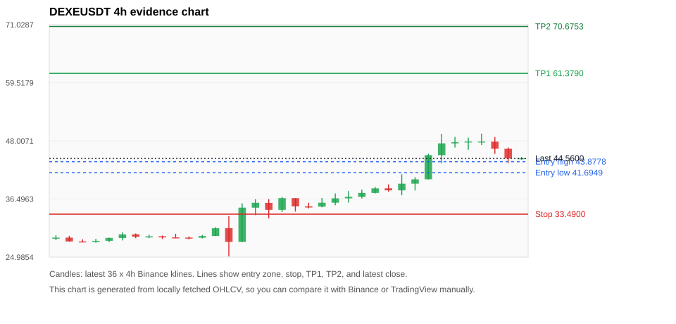
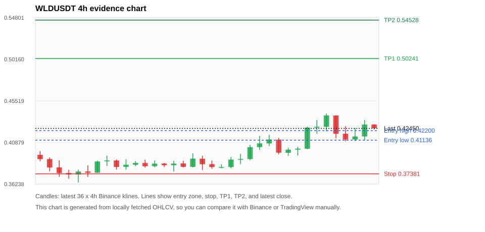
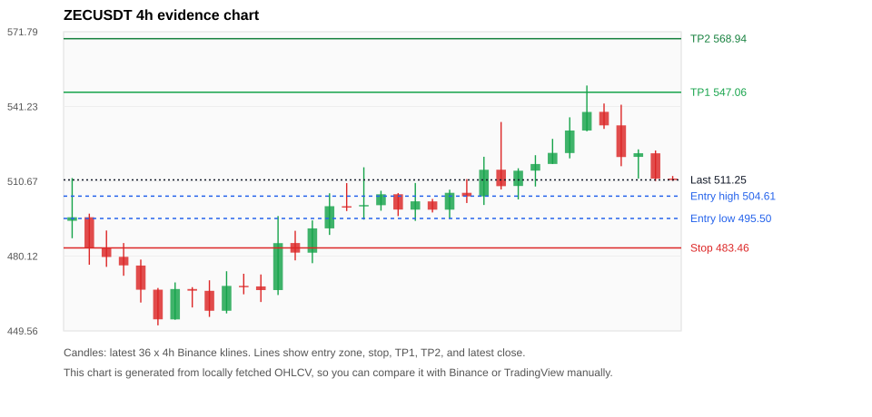
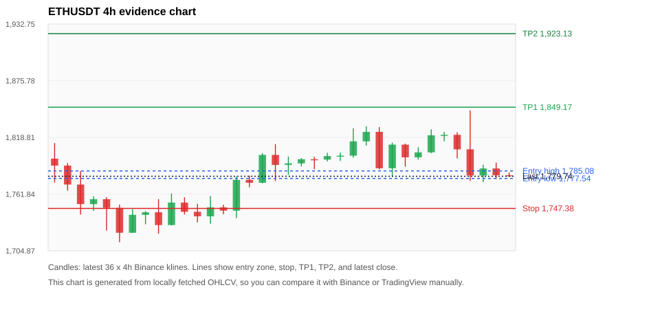
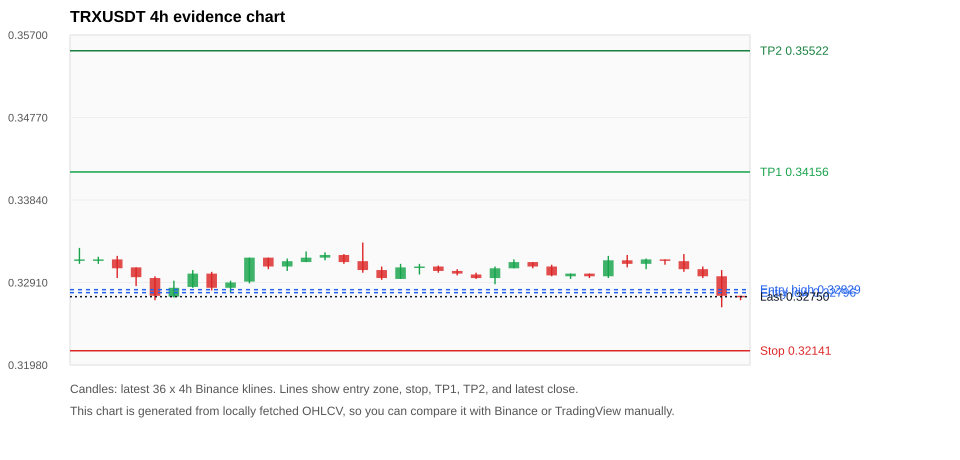

# Crypto 市场扫描报告 v1

- 报告时间：2026-07-13 20:07:20 CST
- Run ID：`20260713_120502_94eed161`
- Run type：`daily_full`
- 数据来源：SQLite
- 报告版本：v1
- 扫描 ID：f58fa1439788
- 数据源：Binance public spot API + CoinGecko/CoinMarketCap cross-check
- 过滤条件：USDT spot; 24h quote volume >= 30,000,000; trades >= 30,000; exclude stables/leveraged tokens; analyze 1h/4h/1d klines
- 默认单笔风险：账户权益的 1.00%

## 限制说明

- 交易信号仍以 Binance 现货公开 K 线为主源；外部数据源用于一致性复核。
- 结果是研究和模拟盘计划，不是确定收益或实盘下单指令。
- 历史长度过滤：候选币至少需要 180 根 1d K 线。
- 数据质量验证池：先验证 score 排名前 min(top_n * 2, 10) 的候选，再按 action + score 补足最终名单。
- 大盘环境过滤：RISK_OFF; BTC/ETH 大盘偏弱，山寨币买入候选降级为观察。 BTC 7d=-1.792619907991655; ETH 7d=-1.0813754473315673.
- 已启用数据交叉验证：Binance 主源 + CoinGecko 自动对照；CoinMarketCap 在配置 API Key 后自动对照。
- WLDUSDT 交叉验证状态 DATA_WARNING：At least one external provider needs manual review.
- ZECUSDT 交叉验证状态 DATA_WARNING：At least one external provider needs manual review.
- ETHUSDT 交叉验证状态 DATA_WARNING：At least one external provider needs manual review.
- BTCUSDT 交叉验证状态 DATA_WARNING：At least one external provider needs manual review.
- BNBUSDT 交叉验证状态 DATA_WARNING：At least one external provider needs manual review.
- SOLUSDT 交叉验证状态 DATA_WARNING：At least one external provider needs manual review.
- XRPUSDT 交叉验证状态 DATA_WARNING：At least one external provider needs manual review.

## 5 个候选交易计划

| Rank | Coin | Action | Setup | Entry Zone | Stop Loss | TP1 | TP2 / Exit Rule | R/R | Verdict |
|---:|---|---|---|---:|---:|---:|---|---:|---|
| 1 | `DEXE` | `WATCH_ONLY` | 趋势中，等回调入场 | 41.6949 - 43.8778 | 33.4900 | 61.3790 | 70.6753 或跌破 4h 关键支撑 | 2.00-3.00 | 只等回调 |
| 2 | `WLD` | `WATCH_ONLY` | 回踩支撑/4h EMA 附近 | 0.41136 - 0.42200 | 0.37381 | 0.50241 | 0.54528 或跌破 4h 关键支撑 | 2.00-3.00 | 只观察 |
| 3 | `ZEC` | `WATCH_ONLY` | 回踩支撑/4h EMA 附近 | 495.50 - 504.61 | 483.46 | 547.06 | 568.94 或跌破 4h 关键支撑 | 2.83-4.15 | 只观察 |
| 4 | `ETH` | `REJECT` | 回踩支撑/4h EMA 附近 | 1,777.54 - 1,785.08 | 1,747.38 | 1,849.17 | 1,923.13 或跌破 4h 关键支撑 | 2.00-4.18 | 只观察 |
| 5 | `TRX` | `REJECT` | 回踩支撑/4h EMA 附近 | 0.32796 - 0.32829 | 0.32141 | 0.34156 | 0.35522 或跌破 4h 关键支撑 | 2.00-4.03 | 只观察 |

## 数据交叉验证摘要

价格差异以 Binance 当前价为基准；成交量口径不同，Binance 是 USDT 现货成交额，CoinGecko/CoinMarketCap 通常是全市场成交量。

| Rank | Coin | Data Status | Max Price Diff | Max 24h Diff | Message |
|---:|---|---|---:|---:|---|
| 1 | `DEXE` | DATA_OK | 0.42% | 1.25 pts | External provider checks agree with Binance within configured thresholds. |
| 2 | `WLD` | DATA_WARNING | 0.08% | 0.47 pts | At least one external provider needs manual review. |
| 3 | `ZEC` | DATA_WARNING | 0.05% | 0.10 pts | At least one external provider needs manual review. |
| 4 | `ETH` | DATA_WARNING | 0.08% | 0.06 pts | At least one external provider needs manual review. |
| 5 | `TRX` | DATA_OK | 0.12% | 0.12 pts | External provider checks agree with Binance within configured thresholds. |

## 候选币说明

### 1. DEXE `DEXEUSDT`



- 入选原因：趋势中，等回调入场；24h +0.01%，7d +58.51%，4h RSI 75.71，24h 成交额 $33.2M。
- 交易失效条件：跌破 33.49 或 4h 收盘重新失守关键支撑。
- 主要风险：4h RSI 偏热；BTC/ETH 大盘环境未确认强势，山寨币买入信号降级。
- 数据交叉验证：DATA_OK；External provider checks agree with Binance within configured thresholds.

#### 可点击人工验证

- [Binance 交易页](https://www.binance.com/en/trade/DEXE_USDT)
- [TradingView 图表](https://www.tradingview.com/chart/?symbol=BINANCE%3ADEXEUSDT)
- [CoinGecko 搜索](https://www.coingecko.com/en/search?query=DEXE)
- [CoinMarketCap 搜索](https://coinmarketcap.com/search/?q=DEXE)

#### 多数据源对照

| Source | Status | Asset ID | Price | 24h Change | 24h Volume | Price Diff | 24h Diff | Updated | Message |
|---|---|---|---:|---:|---:|---:|---:|---|---|
| Binance | DATA_OK | DEXEUSDT | 44.5600 | +0.01% | $33.2M | 0.00% | 0.00 pts | 2026-07-13T12:06:43+00:00 | Primary market data source used by scanner. |
| CoinGecko | DATA_OK | dexe | 44.4600 | -0.89% | $129.0M | 0.22% | 0.90 pts | 2026-07-13T12:06:43.868Z | External source agrees with Binance within thresholds. |
| CoinMarketCap | DATA_OK | 7326 | 44.3732 | -1.25% | $183.2M | 0.42% | 1.25 pts | 2026-07-13T12:06:05.000Z | External source agrees with Binance within thresholds. |

#### 指标证据

| 指标 | 数值 | 人工核对用途 |
|---|---:|---|
| 当前价 | 44.5600 | 与 Binance/TradingView 当前价格对照 |
| 24h 涨跌 | +0.01% | 与交易所 24h 涨跌对照 |
| 7d 涨跌 | +58.51% | 判断短线趋势是否延续 |
| 4h EMA20 | 41.3253 | 判断短期趋势支撑 |
| 4h EMA50 | 35.2228 | 判断中期趋势支撑 |
| 1d EMA20 | 29.6789 | 判断日线趋势 |
| 1d EMA50 | 23.3131 | 判断日线趋势 |
| 4h RSI14 | 75.71 | 判断是否过热/过弱 |
| 4h ATR14 | 2.7287 | 推导止损和入场缓冲 |
| 最近 18 根 4h 最低点 | 34.0000 | 支撑/止损参考 |
| 最近 36 根 4h 最高点 | 49.4320 | TP/压力参考 |
| 支撑位 | 41.3253 | 入场区间推导基础 |

#### 交易计划推导

- 支撑位 = 最近低点、4h EMA20、4h EMA50、1d EMA20 中不高于当前价的最高有效支撑 = `41.3253`。
- 入场区间 = 支撑位附近 + ATR 缓冲 = `41.6949 - 43.8778`。
- 止损 = min(最近 18 根 4h 最低点 * 0.985, 入场中位价 - 1.15 * ATR14) = `33.4900`。
- TP1 = max(最近 36 根 4h 最高点 * 0.995, 入场中位价 + 2R) = `61.3790`。
- TP2 = max(入场中位价 + 3R, TP1 * 1.04) = `70.6753`。

#### 最近 10 根 4h K线

| UTC 开盘时间 | Open | High | Low | Close | Quote Volume | Trades |
|---|---:|---:|---:|---:|---:|---:|
| 2026-07-12T00:00+00:00 | 38.2130 | 41.4000 | 37.2400 | 39.5360 | $2.9M | 103867 |
| 2026-07-12T04:00+00:00 | 39.5390 | 40.8410 | 38.1770 | 40.3910 | $3.4M | 102521 |
| 2026-07-12T08:00+00:00 | 40.4000 | 45.4490 | 40.3880 | 45.1700 | $7.1M | 165480 |
| 2026-07-12T12:00+00:00 | 45.1690 | 49.4050 | 43.5430 | 47.5140 | $12.9M | 271562 |
| 2026-07-12T16:00+00:00 | 47.5070 | 48.8000 | 46.6800 | 47.7450 | $5.8M | 122187 |
| 2026-07-12T20:00+00:00 | 47.7540 | 48.6320 | 46.2290 | 47.8880 | $3.6M | 59495 |
| 2026-07-13T00:00+00:00 | 47.8590 | 49.4320 | 47.1720 | 47.8740 | $3.6M | 89910 |
| 2026-07-13T04:00+00:00 | 47.8740 | 48.7680 | 45.4450 | 46.4730 | $4.1M | 100248 |
| 2026-07-13T08:00+00:00 | 46.4710 | 46.6970 | 43.6180 | 44.5380 | $3.6M | 104045 |
| 2026-07-13T12:00+00:00 | 44.5230 | 44.7800 | 44.2680 | 44.5650 | $66,068 | 1976 |

### 2. WLD `WLDUSDT`



- 入选原因：回踩支撑/4h EMA 附近；24h -1.10%，7d +4.58%，4h RSI 63.64，24h 成交额 $35.2M。
- 交易失效条件：跌破 0.3738075 或 4h 收盘重新失守关键支撑。
- 主要风险：日线趋势未完全确认；BTC/ETH 大盘环境未确认强势，山寨币买入信号降级；24h 动量未确认；数据交叉验证需要人工复核。
- 数据交叉验证：DATA_WARNING；At least one external provider needs manual review.

#### 可点击人工验证

- [Binance 交易页](https://www.binance.com/en/trade/WLD_USDT)
- [TradingView 图表](https://www.tradingview.com/chart/?symbol=BINANCE%3AWLDUSDT)
- [CoinGecko 搜索](https://www.coingecko.com/en/search?query=WLD)
- [CoinMarketCap 搜索](https://coinmarketcap.com/search/?q=WLD)

#### 多数据源对照

| Source | Status | Asset ID | Price | 24h Change | 24h Volume | Price Diff | 24h Diff | Updated | Message |
|---|---|---|---:|---:|---:|---:|---:|---|---|
| Binance | DATA_OK | WLDUSDT | 0.42450 | -1.10% | $35.2M | 0.00% | 0.00 pts | 2026-07-13T12:06:43+00:00 | Primary market data source used by scanner. |
| CoinGecko | DATA_OK | worldcoin-wld | 0.42416 | -0.75% | $260.5M | 0.08% | 0.34 pts | 2026-07-13T12:06:48.820Z | External source agrees with Binance within thresholds. |
| CoinMarketCap | DATA_WARNING | 13502 | 0.42447 | -0.62% | $306.6M | 0.01% | 0.47 pts | 2026-07-13T12:06:05.000Z | CoinMarketCap symbol mapping has 2 matches; selected lowest cmc_rank |

#### 指标证据

| 指标 | 数值 | 人工核对用途 |
|---|---:|---|
| 当前价 | 0.42450 | 与 Binance/TradingView 当前价格对照 |
| 24h 涨跌 | -1.10% | 与交易所 24h 涨跌对照 |
| 7d 涨跌 | +4.58% | 判断短线趋势是否延续 |
| 4h EMA20 | 0.41054 | 判断短期趋势支撑 |
| 4h EMA50 | 0.40727 | 判断中期趋势支撑 |
| 1d EMA20 | 0.42854 | 判断日线趋势 |
| 1d EMA50 | 0.42967 | 判断日线趋势 |
| 4h RSI14 | 63.64 | 判断是否过热/过弱 |
| 4h ATR14 | 0.01637 | 推导止损和入场缓冲 |
| 最近 18 根 4h 最低点 | 0.37950 | 支撑/止损参考 |
| 最近 36 根 4h 最高点 | 0.44110 | TP/压力参考 |
| 支撑位 | 0.41054 | 入场区间推导基础 |

#### 交易计划推导

- 支撑位 = 最近低点、4h EMA20、4h EMA50、1d EMA20 中不高于当前价的最高有效支撑 = `0.41054`。
- 入场区间 = 支撑位附近 + ATR 缓冲 = `0.41136 - 0.42200`。
- 止损 = min(最近 18 根 4h 最低点 * 0.985, 入场中位价 - 1.15 * ATR14) = `0.37381`。
- TP1 = max(最近 36 根 4h 最高点 * 0.995, 入场中位价 + 2R) = `0.50241`。
- TP2 = max(入场中位价 + 3R, TP1 * 1.04) = `0.54528`。

#### 最近 10 根 4h K线

| UTC 开盘时间 | Open | High | Low | Close | Quote Volume | Trades |
|---|---:|---:|---:|---:|---:|---:|
| 2026-07-12T00:00+00:00 | 0.39730 | 0.40290 | 0.39380 | 0.40080 | $2.7M | 23934 |
| 2026-07-12T04:00+00:00 | 0.40080 | 0.40400 | 0.39430 | 0.40190 | $3.2M | 26099 |
| 2026-07-12T08:00+00:00 | 0.40180 | 0.42640 | 0.40130 | 0.42540 | $5.1M | 41318 |
| 2026-07-12T12:00+00:00 | 0.42530 | 0.43390 | 0.41850 | 0.42630 | $5.9M | 55571 |
| 2026-07-12T16:00+00:00 | 0.42630 | 0.44110 | 0.42120 | 0.43900 | $6.1M | 46993 |
| 2026-07-12T20:00+00:00 | 0.43890 | 0.43910 | 0.41330 | 0.41850 | $5.9M | 41698 |
| 2026-07-13T00:00+00:00 | 0.41850 | 0.42680 | 0.41000 | 0.41210 | $5.7M | 53802 |
| 2026-07-13T04:00+00:00 | 0.41210 | 0.42510 | 0.41020 | 0.41550 | $5.5M | 44377 |
| 2026-07-13T08:00+00:00 | 0.41550 | 0.43380 | 0.41100 | 0.42880 | $5.4M | 44360 |
| 2026-07-13T12:00+00:00 | 0.42880 | 0.42920 | 0.42330 | 0.42470 | $1.1M | 4996 |

### 3. ZEC `ZECUSDT`



- 入选原因：回踩支撑/4h EMA 附近；24h -1.75%，7d +14.97%，4h RSI 56.96，24h 成交额 $110.5M。
- 交易失效条件：跌破 483.4588 或 4h 收盘重新失守关键支撑。
- 主要风险：BTC/ETH 大盘环境未确认强势，山寨币买入信号降级；24h 动量未确认；数据交叉验证需要人工复核。
- 数据交叉验证：DATA_WARNING；At least one external provider needs manual review.

#### 可点击人工验证

- [Binance 交易页](https://www.binance.com/en/trade/ZEC_USDT)
- [TradingView 图表](https://www.tradingview.com/chart/?symbol=BINANCE%3AZECUSDT)
- [CoinGecko 搜索](https://www.coingecko.com/en/search?query=ZEC)
- [CoinMarketCap 搜索](https://coinmarketcap.com/search/?q=ZEC)

#### 多数据源对照

| Source | Status | Asset ID | Price | 24h Change | 24h Volume | Price Diff | 24h Diff | Updated | Message |
|---|---|---|---:|---:|---:|---:|---:|---|---|
| Binance | DATA_OK | ZECUSDT | 511.25 | -1.75% | $110.5M | 0.00% | 0.00 pts | 2026-07-13T12:06:43+00:00 | Primary market data source used by scanner. |
| CoinGecko | DATA_OK | zcash | 510.98 | -1.85% | $413.5M | 0.05% | 0.10 pts | 2026-07-13T12:06:52.656Z | External source agrees with Binance within thresholds. |
| CoinMarketCap | DATA_WARNING | 1437 | 511.42 | -1.81% | $527.7M | 0.03% | 0.06 pts | 2026-07-13T12:06:05.000Z | CoinMarketCap symbol mapping has 2 matches; selected lowest cmc_rank |

#### 指标证据

| 指标 | 数值 | 人工核对用途 |
|---|---:|---|
| 当前价 | 511.25 | 与 Binance/TradingView 当前价格对照 |
| 24h 涨跌 | -1.75% | 与交易所 24h 涨跌对照 |
| 7d 涨跌 | +14.97% | 判断短线趋势是否延续 |
| 4h EMA20 | 511.30 | 判断短期趋势支撑 |
| 4h EMA50 | 489.69 | 判断中期趋势支撑 |
| 1d EMA20 | 471.55 | 判断日线趋势 |
| 1d EMA50 | 464.66 | 判断日线趋势 |
| 4h RSI14 | 56.96 | 判断是否过热/过弱 |
| 4h ATR14 | 14.4321 | 推导止损和入场缓冲 |
| 最近 18 根 4h 最低点 | 494.51 | 支撑/止损参考 |
| 最近 36 根 4h 最高点 | 549.81 | TP/压力参考 |
| 支撑位 | 494.51 | 入场区间推导基础 |

#### 交易计划推导

- 支撑位 = 最近低点、4h EMA20、4h EMA50、1d EMA20 中不高于当前价的最高有效支撑 = `494.51`。
- 入场区间 = 支撑位附近 + ATR 缓冲 = `495.50 - 504.61`。
- 止损 = min(最近 18 根 4h 最低点 * 0.985, 入场中位价 - 1.15 * ATR14) = `483.46`。
- TP1 = max(最近 36 根 4h 最高点 * 0.995, 入场中位价 + 2R) = `547.06`。
- TP2 = max(入场中位价 + 3R, TP1 * 1.04) = `568.94`。

#### 最近 10 根 4h K线

| UTC 开盘时间 | Open | High | Low | Close | Quote Volume | Trades |
|---|---:|---:|---:|---:|---:|---:|
| 2026-07-12T00:00+00:00 | 508.76 | 516.00 | 503.27 | 515.00 | $9.2M | 41836 |
| 2026-07-12T04:00+00:00 | 515.04 | 521.34 | 508.55 | 517.74 | $8.6M | 33855 |
| 2026-07-12T08:00+00:00 | 517.76 | 528.00 | 517.76 | 522.28 | $10.2M | 37378 |
| 2026-07-12T12:00+00:00 | 522.22 | 536.82 | 520.05 | 531.44 | $16.2M | 53489 |
| 2026-07-12T16:00+00:00 | 531.43 | 549.81 | 531.10 | 539.01 | $27.9M | 128961 |
| 2026-07-12T20:00+00:00 | 539.06 | 542.46 | 532.08 | 533.53 | $17.1M | 41857 |
| 2026-07-13T00:00+00:00 | 533.53 | 541.96 | 516.84 | 520.59 | $23.1M | 105018 |
| 2026-07-13T04:00+00:00 | 520.65 | 523.72 | 511.80 | 522.14 | $15.5M | 95395 |
| 2026-07-13T08:00+00:00 | 522.12 | 523.27 | 510.77 | 511.79 | $10.6M | 67883 |
| 2026-07-13T12:00+00:00 | 511.80 | 512.84 | 510.88 | 511.21 | $196,972 | 1088 |

### 4. ETH `ETHUSDT`



- 入选原因：回踩支撑/4h EMA 附近；24h -1.28%，7d +2.00%，4h RSI 44.24，24h 成交额 $436.4M。
- 交易失效条件：跌破 1747.3801 或 4h 收盘重新失守关键支撑。
- 主要风险：日线趋势未完全确认；BTC/ETH 大盘环境未确认强势，山寨币买入信号降级；24h 动量未确认；数据交叉验证需要人工复核。
- 数据交叉验证：DATA_WARNING；At least one external provider needs manual review.

#### 可点击人工验证

- [Binance 交易页](https://www.binance.com/en/trade/ETH_USDT)
- [TradingView 图表](https://www.tradingview.com/chart/?symbol=BINANCE%3AETHUSDT)
- [CoinGecko 搜索](https://www.coingecko.com/en/search?query=ETH)
- [CoinMarketCap 搜索](https://coinmarketcap.com/search/?q=ETH)

#### 多数据源对照

| Source | Status | Asset ID | Price | 24h Change | 24h Volume | Price Diff | 24h Diff | Updated | Message |
|---|---|---|---:|---:|---:|---:|---:|---|---|
| Binance | DATA_OK | ETHUSDT | 1,779.74 | -1.28% | $436.4M | 0.00% | 0.00 pts | 2026-07-13T12:06:43+00:00 | Primary market data source used by scanner. |
| CoinGecko | DATA_OK | ethereum | 1,778.36 | -1.35% | $8.15B | 0.08% | 0.06 pts | 2026-07-13T12:06:51.667Z | External source agrees with Binance within thresholds. |
| CoinMarketCap | DATA_WARNING | 1027 | 1,778.73 | -1.30% | $9.15B | 0.06% | 0.02 pts | 2026-07-13T12:06:05.000Z | CoinMarketCap symbol mapping has 6 matches; selected lowest cmc_rank |

#### 指标证据

| 指标 | 数值 | 人工核对用途 |
|---|---:|---|
| 当前价 | 1,779.74 | 与 Binance/TradingView 当前价格对照 |
| 24h 涨跌 | -1.28% | 与交易所 24h 涨跌对照 |
| 7d 涨跌 | +2.00% | 判断短线趋势是否延续 |
| 4h EMA20 | 1,791.85 | 判断短期趋势支撑 |
| 4h EMA50 | 1,770.38 | 判断中期趋势支撑 |
| 1d EMA20 | 1,742.13 | 判断日线趋势 |
| 1d EMA50 | 1,800.13 | 判断日线趋势 |
| 4h RSI14 | 44.24 | 判断是否过热/过弱 |
| 4h ATR14 | 24.1821 | 推导止损和入场缓冲 |
| 最近 18 根 4h 最低点 | 1,773.99 | 支撑/止损参考 |
| 最近 36 根 4h 最高点 | 1,846.00 | TP/压力参考 |
| 支撑位 | 1,773.99 | 入场区间推导基础 |

#### 交易计划推导

- 支撑位 = 最近低点、4h EMA20、4h EMA50、1d EMA20 中不高于当前价的最高有效支撑 = `1,773.99`。
- 入场区间 = 支撑位附近 + ATR 缓冲 = `1,777.54 - 1,785.08`。
- 止损 = min(最近 18 根 4h 最低点 * 0.985, 入场中位价 - 1.15 * ATR14) = `1,747.38`。
- TP1 = max(最近 36 根 4h 最高点 * 0.995, 入场中位价 + 2R) = `1,849.17`。
- TP2 = max(入场中位价 + 3R, TP1 * 1.04) = `1,923.13`。

#### 最近 10 根 4h K线

| UTC 开盘时间 | Open | High | Low | Close | Quote Volume | Trades |
|---|---:|---:|---:|---:|---:|---:|
| 2026-07-12T00:00+00:00 | 1,787.76 | 1,813.67 | 1,779.46 | 1,811.53 | $54.8M | 279870 |
| 2026-07-12T04:00+00:00 | 1,811.53 | 1,812.63 | 1,789.44 | 1,798.78 | $26.1M | 123951 |
| 2026-07-12T08:00+00:00 | 1,798.78 | 1,808.94 | 1,796.48 | 1,803.77 | $24.6M | 161726 |
| 2026-07-12T12:00+00:00 | 1,803.77 | 1,826.92 | 1,803.00 | 1,820.93 | $59.4M | 232037 |
| 2026-07-12T16:00+00:00 | 1,820.94 | 1,824.39 | 1,814.85 | 1,821.40 | $49.6M | 136910 |
| 2026-07-12T20:00+00:00 | 1,821.40 | 1,824.00 | 1,797.63 | 1,806.80 | $40.7M | 228671 |
| 2026-07-13T00:00+00:00 | 1,806.80 | 1,846.00 | 1,775.00 | 1,780.55 | $180.3M | 799801 |
| 2026-07-13T04:00+00:00 | 1,780.54 | 1,791.39 | 1,773.99 | 1,787.57 | $60.9M | 291810 |
| 2026-07-13T08:00+00:00 | 1,787.58 | 1,793.56 | 1,777.10 | 1,780.74 | $44.6M | 219523 |
| 2026-07-13T12:00+00:00 | 1,780.74 | 1,783.54 | 1,779.46 | 1,779.75 | $1.3M | 9816 |

### 5. TRX `TRXUSDT`



- 入选原因：回踩支撑/4h EMA 附近；24h -1.30%，7d -0.03%，4h RSI 40.19，24h 成交额 $31.4M。
- 交易失效条件：跌破 0.3214055 或 4h 收盘重新失守关键支撑。
- 主要风险：BTC/ETH 大盘环境未确认强势，山寨币买入信号降级；24h 动量未确认；7d 趋势未确认。
- 数据交叉验证：DATA_OK；External provider checks agree with Binance within configured thresholds.

#### 可点击人工验证

- [Binance 交易页](https://www.binance.com/en/trade/TRX_USDT)
- [TradingView 图表](https://www.tradingview.com/chart/?symbol=BINANCE%3ATRXUSDT)
- [CoinGecko 搜索](https://www.coingecko.com/en/search?query=TRX)
- [CoinMarketCap 搜索](https://coinmarketcap.com/search/?q=TRX)

#### 多数据源对照

| Source | Status | Asset ID | Price | 24h Change | 24h Volume | Price Diff | 24h Diff | Updated | Message |
|---|---|---|---:|---:|---:|---:|---:|---|---|
| Binance | DATA_OK | TRXUSDT | 0.32750 | -1.30% | $31.4M | 0.00% | 0.00 pts | 2026-07-13T12:06:43+00:00 | Primary market data source used by scanner. |
| CoinGecko | DATA_OK | tron | 0.32709 | -1.42% | $380.1M | 0.12% | 0.12 pts | 2026-07-13T12:06:43.111Z | External source agrees with Binance within thresholds. |
| CoinMarketCap | DATA_OK | 1958 | 0.32712 | -1.40% | $486.4M | 0.12% | 0.10 pts | 2026-07-13T12:06:05.000Z | External source agrees with Binance within thresholds. |

#### 指标证据

| 指标 | 数值 | 人工核对用途 |
|---|---:|---|
| 当前价 | 0.32750 | 与 Binance/TradingView 当前价格对照 |
| 24h 涨跌 | -1.30% | 与交易所 24h 涨跌对照 |
| 7d 涨跌 | -0.03% | 判断短线趋势是否延续 |
| 4h EMA20 | 0.33004 | 判断短期趋势支撑 |
| 4h EMA50 | 0.32909 | 判断中期趋势支撑 |
| 1d EMA20 | 0.32730 | 判断日线趋势 |
| 1d EMA50 | 0.32887 | 判断日线趋势 |
| 4h RSI14 | 40.19 | 判断是否过热/过弱 |
| 4h ATR14 | 0.0014142857 | 推导止损和入场缓冲 |
| 最近 18 根 4h 最低点 | 0.32630 | 支撑/止损参考 |
| 最近 36 根 4h 最高点 | 0.33360 | TP/压力参考 |
| 支撑位 | 0.32730 | 入场区间推导基础 |

#### 交易计划推导

- 支撑位 = 最近低点、4h EMA20、4h EMA50、1d EMA20 中不高于当前价的最高有效支撑 = `0.32730`。
- 入场区间 = 支撑位附近 + ATR 缓冲 = `0.32796 - 0.32829`。
- 止损 = min(最近 18 根 4h 最低点 * 0.985, 入场中位价 - 1.15 * ATR14) = `0.32141`。
- TP1 = max(最近 36 根 4h 最高点 * 0.995, 入场中位价 + 2R) = `0.34156`。
- TP2 = max(入场中位价 + 3R, TP1 * 1.04) = `0.35522`。

#### 最近 10 根 4h K线

| UTC 开盘时间 | Open | High | Low | Close | Quote Volume | Trades |
|---|---:|---:|---:|---:|---:|---:|
| 2026-07-12T00:00+00:00 | 0.32980 | 0.33010 | 0.32950 | 0.33010 | $2.2M | 5138 |
| 2026-07-12T04:00+00:00 | 0.33010 | 0.33010 | 0.32960 | 0.32980 | $1.2M | 5060 |
| 2026-07-12T08:00+00:00 | 0.32980 | 0.33210 | 0.32960 | 0.33160 | $4.6M | 9273 |
| 2026-07-12T12:00+00:00 | 0.33160 | 0.33220 | 0.33080 | 0.33120 | $5.4M | 9984 |
| 2026-07-12T16:00+00:00 | 0.33120 | 0.33180 | 0.33060 | 0.33170 | $3.5M | 10440 |
| 2026-07-12T20:00+00:00 | 0.33170 | 0.33170 | 0.33110 | 0.33160 | $2.5M | 9012 |
| 2026-07-13T00:00+00:00 | 0.33150 | 0.33230 | 0.33030 | 0.33060 | $5.8M | 11130 |
| 2026-07-13T04:00+00:00 | 0.33060 | 0.33090 | 0.32960 | 0.32980 | $4.4M | 7695 |
| 2026-07-13T08:00+00:00 | 0.32980 | 0.33050 | 0.32630 | 0.32760 | $9.9M | 14198 |
| 2026-07-13T12:00+00:00 | 0.32760 | 0.32760 | 0.32710 | 0.32750 | $592,659 | 1186 |

## 组合风控

- 不要 5 个候选全部满仓买入。
- 同时持仓总风险建议控制在账户权益的 3% - 5% 以内。
- 如果 BTC/ETH 同时破位，暂停山寨币多头计划或降低仓位。
- 第一版报告用于模拟盘和人工复核，不自动下单。

## 原始数据

```json
[
  {
    "rank": 1,
    "symbol": "DEXEUSDT",
    "base_asset": "DEXE",
    "price": 44.56,
    "score": 66.65945539669795,
    "setup": "趋势中，等回调入场",
    "verdict": "只等回调",
    "entry_low": 41.69485,
    "entry_high": 43.87782142857143,
    "stop_loss": 33.49,
    "take_profit_1": 61.379007142857134,
    "take_profit_2": 70.67534285714285,
    "risk_reward_1": 2.0,
    "risk_reward_2": 3.000000000000001,
    "pct_24h": 0.007,
    "pct_3d": 26.296695198684894,
    "pct_7d": 58.50882185543542,
    "quote_volume_24h": 33156227.0092,
    "trades_24h": 741362,
    "high_low_range_24h": 13.524561927290279,
    "rsi_1h": 34.24512796431091,
    "rsi_4h": 75.71474878444083,
    "ema20_4h": 41.325300901775016,
    "ema50_4h": 35.22283564313743,
    "ema20_1d": 29.67892322984472,
    "ema50_1d": 23.313058220030435,
    "atr_4h": 2.728714285714286,
    "macd_hist_4h": 0.08196589579445801,
    "volume_ratio_24h": 2.0517463178012543,
    "support_level": 41.325300901775016,
    "recent_low_4h_18": 34.0,
    "recent_high_4h_36": 49.432,
    "distance_to_support_pct": 7.827406038526985,
    "binance_trade_url": "https://www.binance.com/en/trade/DEXE_USDT",
    "tradingview_url": "https://www.tradingview.com/chart/?symbol=BINANCE%3ADEXEUSDT",
    "coingecko_search_url": "https://www.coingecko.com/en/search?query=DEXE",
    "coinmarketcap_search_url": "https://coinmarketcap.com/search/?q=DEXE",
    "invalidation": "跌破 33.49 或 4h 收盘重新失守关键支撑",
    "recent_4h_klines": [
      {
        "open_time_utc": "2026-07-07T16:00+00:00",
        "open": 28.762,
        "high": 29.325,
        "low": 28.321,
        "close": 28.842,
        "quote_volume": 950857.89792,
        "trades": 38954
      },
      {
        "open_time_utc": "2026-07-07T20:00+00:00",
        "open": 28.841,
        "high": 29.188,
        "low": 28.03,
        "close": 28.085,
        "quote_volume": 515770.02947,
        "trades": 11848
      },
      {
        "open_time_utc": "2026-07-08T00:00+00:00",
        "open": 28.086,
        "high": 28.51,
        "low": 27.911,
        "close": 28.047,
        "quote_volume": 412543.54926,
        "trades": 22315
      },
      {
        "open_time_utc": "2026-07-08T04:00+00:00",
        "open": 28.044,
        "high": 28.598,
        "low": 27.832,
        "close": 28.206,
        "quote_volume": 449755.7579,
        "trades": 19713
      },
      {
        "open_time_utc": "2026-07-08T08:00+00:00",
        "open": 28.205,
        "high": 28.84,
        "low": 27.958,
        "close": 28.781,
        "quote_volume": 1418094.50838,
        "trades": 40837
      },
      {
        "open_time_utc": "2026-07-08T12:00+00:00",
        "open": 28.76,
        "high": 29.88,
        "low": 28.287,
        "close": 29.485,
        "quote_volume": 3463850.85623,
        "trades": 130684
      },
      {
        "open_time_utc": "2026-07-08T16:00+00:00",
        "open": 29.496,
        "high": 29.66,
        "low": 28.725,
        "close": 29.032,
        "quote_volume": 716820.3227,
        "trades": 28054
      },
      {
        "open_time_utc": "2026-07-08T20:00+00:00",
        "open": 29.033,
        "high": 29.429,
        "low": 28.722,
        "close": 29.09,
        "quote_volume": 200304.25881,
        "trades": 5132
      },
      {
        "open_time_utc": "2026-07-09T00:00+00:00",
        "open": 29.112,
        "high": 29.256,
        "low": 28.56,
        "close": 28.884,
        "quote_volume": 1066793.25625,
        "trades": 14318
      },
      {
        "open_time_utc": "2026-07-09T04:00+00:00",
        "open": 28.886,
        "high": 29.6,
        "low": 28.772,
        "close": 28.852,
        "quote_volume": 487609.35986,
        "trades": 20500
      },
      {
        "open_time_utc": "2026-07-09T08:00+00:00",
        "open": 28.852,
        "high": 29.081,
        "low": 28.48,
        "close": 28.822,
        "quote_volume": 655402.74562,
        "trades": 21699
      },
      {
        "open_time_utc": "2026-07-09T12:00+00:00",
        "open": 28.819,
        "high": 29.346,
        "low": 28.683,
        "close": 29.15,
        "quote_volume": 863809.16753,
        "trades": 25177
      },
      {
        "open_time_utc": "2026-07-09T16:00+00:00",
        "open": 29.158,
        "high": 30.898,
        "low": 29.158,
        "close": 30.698,
        "quote_volume": 1263081.36218,
        "trades": 41772
      },
      {
        "open_time_utc": "2026-07-09T20:00+00:00",
        "open": 30.709,
        "high": 33.1,
        "low": 25.111,
        "close": 27.998,
        "quote_volume": 7409559.67299,
        "trades": 157886
      },
      {
        "open_time_utc": "2026-07-10T00:00+00:00",
        "open": 27.996,
        "high": 35.629,
        "low": 27.991,
        "close": 34.786,
        "quote_volume": 7547534.03532,
        "trades": 304435
      },
      {
        "open_time_utc": "2026-07-10T04:00+00:00",
        "open": 34.777,
        "high": 36.44,
        "low": 33.279,
        "close": 35.755,
        "quote_volume": 6338425.21431,
        "trades": 232579
      },
      {
        "open_time_utc": "2026-07-10T08:00+00:00",
        "open": 35.733,
        "high": 36.452,
        "low": 32.642,
        "close": 34.35,
        "quote_volume": 6208180.00623,
        "trades": 226914
      },
      {
        "open_time_utc": "2026-07-10T12:00+00:00",
        "open": 34.35,
        "high": 36.9,
        "low": 33.909,
        "close": 36.67,
        "quote_volume": 4492944.77195,
        "trades": 151958
      },
      {
        "open_time_utc": "2026-07-10T16:00+00:00",
        "open": 36.67,
        "high": 36.67,
        "low": 34.0,
        "close": 35.027,
        "quote_volume": 2785202.69823,
        "trades": 85742
      },
      {
        "open_time_utc": "2026-07-10T20:00+00:00",
        "open": 35.022,
        "high": 35.767,
        "low": 34.605,
        "close": 34.979,
        "quote_volume": 1286182.19255,
        "trades": 32679
      },
      {
        "open_time_utc": "2026-07-11T00:00+00:00",
        "open": 34.978,
        "high": 36.7,
        "low": 34.846,
        "close": 35.765,
        "quote_volume": 1715446.26257,
        "trades": 52654
      },
      {
        "open_time_utc": "2026-07-11T04:00+00:00",
        "open": 35.765,
        "high": 37.598,
        "low": 35.26,
        "close": 36.632,
        "quote_volume": 2769210.88659,
        "trades": 84005
      },
      {
        "open_time_utc": "2026-07-11T08:00+00:00",
        "open": 36.631,
        "high": 38.074,
        "low": 35.788,
        "close": 36.915,
        "quote_volume": 5660744.17009,
        "trades": 136354
      },
      {
        "open_time_utc": "2026-07-11T12:00+00:00",
        "open": 36.914,
        "high": 38.35,
        "low": 36.607,
        "close": 37.7,
        "quote_volume": 2322054.16564,
        "trades": 93563
      },
      {
        "open_time_utc": "2026-07-11T16:00+00:00",
        "open": 37.699,
        "high": 38.891,
        "low": 37.591,
        "close": 38.609,
        "quote_volume": 1304187.43866,
        "trades": 43526
      },
      {
        "open_time_utc": "2026-07-11T20:00+00:00",
        "open": 38.613,
        "high": 39.384,
        "low": 37.955,
        "close": 38.213,
        "quote_volume": 1474134.49627,
        "trades": 49705
      },
      {
        "open_time_utc": "2026-07-12T00:00+00:00",
        "open": 38.213,
        "high": 41.4,
        "low": 37.24,
        "close": 39.536,
        "quote_volume": 2909448.5565,
        "trades": 103867
      },
      {
        "open_time_utc": "2026-07-12T04:00+00:00",
        "open": 39.539,
        "high": 40.841,
        "low": 38.177,
        "close": 40.391,
        "quote_volume": 3370387.57051,
        "trades": 102521
      },
      {
        "open_time_utc": "2026-07-12T08:00+00:00",
        "open": 40.4,
        "high": 45.449,
        "low": 40.388,
        "close": 45.17,
        "quote_volume": 7131059.42127,
        "trades": 165480
      },
      {
        "open_time_utc": "2026-07-12T12:00+00:00",
        "open": 45.169,
        "high": 49.405,
        "low": 43.543,
        "close": 47.514,
        "quote_volume": 12896382.99609,
        "trades": 271562
      },
      {
        "open_time_utc": "2026-07-12T16:00+00:00",
        "open": 47.507,
        "high": 48.8,
        "low": 46.68,
        "close": 47.745,
        "quote_volume": 5798594.25629,
        "trades": 122187
      },
      {
        "open_time_utc": "2026-07-12T20:00+00:00",
        "open": 47.754,
        "high": 48.632,
        "low": 46.229,
        "close": 47.888,
        "quote_volume": 3614888.33956,
        "trades": 59495
      },
      {
        "open_time_utc": "2026-07-13T00:00+00:00",
        "open": 47.859,
        "high": 49.432,
        "low": 47.172,
        "close": 47.874,
        "quote_volume": 3581191.27374,
        "trades": 89910
      },
      {
        "open_time_utc": "2026-07-13T04:00+00:00",
        "open": 47.874,
        "high": 48.768,
        "low": 45.445,
        "close": 46.473,
        "quote_volume": 4085630.4305,
        "trades": 100248
      },
      {
        "open_time_utc": "2026-07-13T08:00+00:00",
        "open": 46.471,
        "high": 46.697,
        "low": 43.618,
        "close": 44.538,
        "quote_volume": 3556793.33474,
        "trades": 104045
      },
      {
        "open_time_utc": "2026-07-13T12:00+00:00",
        "open": 44.523,
        "high": 44.78,
        "low": 44.268,
        "close": 44.565,
        "quote_volume": 66068.39145,
        "trades": 1976
      }
    ],
    "risks": [
      "4h RSI 偏热",
      "BTC/ETH 大盘环境未确认强势，山寨币买入信号降级"
    ],
    "data_quality_status": "DATA_OK",
    "data_quality_message": "External provider checks agree with Binance within configured thresholds.",
    "data_checks": [
      {
        "provider": "Binance",
        "status": "DATA_OK",
        "provider_asset_id": "DEXEUSDT",
        "provider_symbol": "DEXEUSDT",
        "price_usd": 44.56,
        "pct_24h": 0.007,
        "volume_24h": 33156227.0092,
        "last_updated": null,
        "fetched_at_utc": "2026-07-13T12:06:43+00:00",
        "price_diff_pct": 0.0,
        "pct_24h_diff": 0.0,
        "volume_note": "Binance USDT spot 24h quoteVolume.",
        "message": "Primary market data source used by scanner."
      },
      {
        "provider": "CoinGecko",
        "status": "DATA_OK",
        "provider_asset_id": "dexe",
        "provider_symbol": "DEXE",
        "price_usd": 44.46,
        "pct_24h": -0.89427,
        "volume_24h": 128954029.0,
        "last_updated": "2026-07-13T12:06:43.868Z",
        "fetched_at_utc": "2026-07-13T12:06:43+00:00",
        "price_diff_pct": 0.22441651705565846,
        "pct_24h_diff": 0.90127,
        "volume_note": "CoinGecko total market volume; not the same venue scope as Binance quoteVolume.",
        "message": "External source agrees with Binance within thresholds."
      },
      {
        "provider": "CoinMarketCap",
        "status": "DATA_OK",
        "provider_asset_id": "7326",
        "provider_symbol": "DEXE",
        "price_usd": 44.37316429092537,
        "pct_24h": -1.24577525,
        "volume_24h": 183184921.95568767,
        "last_updated": "2026-07-13T12:06:05.000Z",
        "fetched_at_utc": "2026-07-13T12:06:43+00:00",
        "price_diff_pct": 0.4192901909215344,
        "pct_24h_diff": 1.2527752499999998,
        "volume_note": "CoinMarketCap total market volume; not the same venue scope as Binance quoteVolume.",
        "message": "External source agrees with Binance within thresholds."
      }
    ],
    "action": "WATCH_ONLY"
  },
  {
    "rank": 2,
    "symbol": "WLDUSDT",
    "base_asset": "WLD",
    "price": 0.4245,
    "score": 42.89195698870314,
    "setup": "回踩支撑/4h EMA 附近",
    "verdict": "只观察",
    "entry_low": 0.411356868935661,
    "entry_high": 0.42199579734097903,
    "stop_loss": 0.3738075,
    "take_profit_1": 0.5024139994149599,
    "take_profit_2": 0.5452828325532799,
    "risk_reward_1": 2.0,
    "risk_reward_2": 3.0000000000000013,
    "pct_24h": -1.096,
    "pct_3d": 9.4636410520887,
    "pct_7d": 4.582409460458248,
    "quote_volume_24h": 35187075.20129,
    "trades_24h": 288562,
    "high_low_range_24h": 7.585365853658543,
    "rsi_1h": 54.8736462093863,
    "rsi_4h": 63.64359586316626,
    "ema20_4h": 0.410535797340979,
    "ema50_4h": 0.40726878984895976,
    "ema20_1d": 0.42854404600553436,
    "ema50_1d": 0.429672594117363,
    "atr_4h": 0.016371428571428582,
    "macd_hist_4h": 0.0019973022113457858,
    "volume_ratio_24h": 1.6894907734459235,
    "support_level": 0.410535797340979,
    "recent_low_4h_18": 0.3795,
    "recent_high_4h_36": 0.4411,
    "distance_to_support_pct": 3.4014579847766013,
    "binance_trade_url": "https://www.binance.com/en/trade/WLD_USDT",
    "tradingview_url": "https://www.tradingview.com/chart/?symbol=BINANCE%3AWLDUSDT",
    "coingecko_search_url": "https://www.coingecko.com/en/search?query=WLD",
    "coinmarketcap_search_url": "https://coinmarketcap.com/search/?q=WLD",
    "invalidation": "跌破 0.3738075 或 4h 收盘重新失守关键支撑",
    "recent_4h_klines": [
      {
        "open_time_utc": "2026-07-07T16:00+00:00",
        "open": 0.395,
        "high": 0.3991,
        "low": 0.3877,
        "close": 0.3902,
        "quote_volume": 3899727.92531,
        "trades": 29097
      },
      {
        "open_time_utc": "2026-07-07T20:00+00:00",
        "open": 0.3903,
        "high": 0.3921,
        "low": 0.3767,
        "close": 0.3809,
        "quote_volume": 2902848.35984,
        "trades": 18422
      },
      {
        "open_time_utc": "2026-07-08T00:00+00:00",
        "open": 0.381,
        "high": 0.3889,
        "low": 0.3706,
        "close": 0.3747,
        "quote_volume": 3451201.61316,
        "trades": 30404
      },
      {
        "open_time_utc": "2026-07-08T04:00+00:00",
        "open": 0.3747,
        "high": 0.3784,
        "low": 0.3683,
        "close": 0.3731,
        "quote_volume": 2461817.39225,
        "trades": 20386
      },
      {
        "open_time_utc": "2026-07-08T08:00+00:00",
        "open": 0.3731,
        "high": 0.3785,
        "low": 0.3642,
        "close": 0.3764,
        "quote_volume": 4790400.98144,
        "trades": 37810
      },
      {
        "open_time_utc": "2026-07-08T12:00+00:00",
        "open": 0.3765,
        "high": 0.3833,
        "low": 0.3705,
        "close": 0.375,
        "quote_volume": 3421524.5959,
        "trades": 32623
      },
      {
        "open_time_utc": "2026-07-08T16:00+00:00",
        "open": 0.375,
        "high": 0.3885,
        "low": 0.375,
        "close": 0.3876,
        "quote_volume": 1830463.34237,
        "trades": 18921
      },
      {
        "open_time_utc": "2026-07-08T20:00+00:00",
        "open": 0.3877,
        "high": 0.3941,
        "low": 0.3826,
        "close": 0.3887,
        "quote_volume": 3263711.99358,
        "trades": 21215
      },
      {
        "open_time_utc": "2026-07-09T00:00+00:00",
        "open": 0.3887,
        "high": 0.3898,
        "low": 0.3785,
        "close": 0.3815,
        "quote_volume": 2828933.99611,
        "trades": 20067
      },
      {
        "open_time_utc": "2026-07-09T04:00+00:00",
        "open": 0.3816,
        "high": 0.3899,
        "low": 0.3785,
        "close": 0.384,
        "quote_volume": 2574310.88094,
        "trades": 20543
      },
      {
        "open_time_utc": "2026-07-09T08:00+00:00",
        "open": 0.3839,
        "high": 0.388,
        "low": 0.3824,
        "close": 0.386,
        "quote_volume": 1542064.55825,
        "trades": 14060
      },
      {
        "open_time_utc": "2026-07-09T12:00+00:00",
        "open": 0.3859,
        "high": 0.3896,
        "low": 0.3808,
        "close": 0.3823,
        "quote_volume": 2501293.68188,
        "trades": 25011
      },
      {
        "open_time_utc": "2026-07-09T16:00+00:00",
        "open": 0.3823,
        "high": 0.3887,
        "low": 0.3811,
        "close": 0.3852,
        "quote_volume": 1853305.31039,
        "trades": 18065
      },
      {
        "open_time_utc": "2026-07-09T20:00+00:00",
        "open": 0.3853,
        "high": 0.386,
        "low": 0.3815,
        "close": 0.3834,
        "quote_volume": 882141.75516,
        "trades": 7578
      },
      {
        "open_time_utc": "2026-07-10T00:00+00:00",
        "open": 0.3834,
        "high": 0.3883,
        "low": 0.3762,
        "close": 0.3853,
        "quote_volume": 3317353.59331,
        "trades": 23473
      },
      {
        "open_time_utc": "2026-07-10T04:00+00:00",
        "open": 0.3854,
        "high": 0.3883,
        "low": 0.381,
        "close": 0.3816,
        "quote_volume": 1228502.3558,
        "trades": 11451
      },
      {
        "open_time_utc": "2026-07-10T08:00+00:00",
        "open": 0.3816,
        "high": 0.3967,
        "low": 0.381,
        "close": 0.3908,
        "quote_volume": 3763239.39352,
        "trades": 26588
      },
      {
        "open_time_utc": "2026-07-10T12:00+00:00",
        "open": 0.3907,
        "high": 0.3939,
        "low": 0.378,
        "close": 0.3845,
        "quote_volume": 3232196.51182,
        "trades": 27521
      },
      {
        "open_time_utc": "2026-07-10T16:00+00:00",
        "open": 0.3846,
        "high": 0.3886,
        "low": 0.3795,
        "close": 0.3814,
        "quote_volume": 2297519.57169,
        "trades": 16289
      },
      {
        "open_time_utc": "2026-07-10T20:00+00:00",
        "open": 0.3814,
        "high": 0.3844,
        "low": 0.38,
        "close": 0.3815,
        "quote_volume": 1036002.72576,
        "trades": 10143
      },
      {
        "open_time_utc": "2026-07-11T00:00+00:00",
        "open": 0.3814,
        "high": 0.3927,
        "low": 0.38,
        "close": 0.3897,
        "quote_volume": 1875075.03004,
        "trades": 14924
      },
      {
        "open_time_utc": "2026-07-11T04:00+00:00",
        "open": 0.3896,
        "high": 0.3961,
        "low": 0.3847,
        "close": 0.3904,
        "quote_volume": 2908711.86284,
        "trades": 21883
      },
      {
        "open_time_utc": "2026-07-11T08:00+00:00",
        "open": 0.3903,
        "high": 0.4061,
        "low": 0.389,
        "close": 0.4035,
        "quote_volume": 4423814.34884,
        "trades": 35835
      },
      {
        "open_time_utc": "2026-07-11T12:00+00:00",
        "open": 0.4036,
        "high": 0.4161,
        "low": 0.4004,
        "close": 0.4078,
        "quote_volume": 6866779.03957,
        "trades": 51293
      },
      {
        "open_time_utc": "2026-07-11T16:00+00:00",
        "open": 0.4077,
        "high": 0.4173,
        "low": 0.4048,
        "close": 0.4121,
        "quote_volume": 3175209.36486,
        "trades": 29193
      },
      {
        "open_time_utc": "2026-07-11T20:00+00:00",
        "open": 0.412,
        "high": 0.414,
        "low": 0.3955,
        "close": 0.3974,
        "quote_volume": 4116484.51732,
        "trades": 32511
      },
      {
        "open_time_utc": "2026-07-12T00:00+00:00",
        "open": 0.3973,
        "high": 0.4029,
        "low": 0.3938,
        "close": 0.4008,
        "quote_volume": 2664327.68561,
        "trades": 23934
      },
      {
        "open_time_utc": "2026-07-12T04:00+00:00",
        "open": 0.4008,
        "high": 0.404,
        "low": 0.3943,
        "close": 0.4019,
        "quote_volume": 3242638.45924,
        "trades": 26099
      },
      {
        "open_time_utc": "2026-07-12T08:00+00:00",
        "open": 0.4018,
        "high": 0.4264,
        "low": 0.4013,
        "close": 0.4254,
        "quote_volume": 5125370.5162,
        "trades": 41318
      },
      {
        "open_time_utc": "2026-07-12T12:00+00:00",
        "open": 0.4253,
        "high": 0.4339,
        "low": 0.4185,
        "close": 0.4263,
        "quote_volume": 5928799.16584,
        "trades": 55571
      },
      {
        "open_time_utc": "2026-07-12T16:00+00:00",
        "open": 0.4263,
        "high": 0.4411,
        "low": 0.4212,
        "close": 0.439,
        "quote_volume": 6119739.38753,
        "trades": 46993
      },
      {
        "open_time_utc": "2026-07-12T20:00+00:00",
        "open": 0.4389,
        "high": 0.4391,
        "low": 0.4133,
        "close": 0.4185,
        "quote_volume": 5911180.16799,
        "trades": 41698
      },
      {
        "open_time_utc": "2026-07-13T00:00+00:00",
        "open": 0.4185,
        "high": 0.4268,
        "low": 0.41,
        "close": 0.4121,
        "quote_volume": 5671484.15046,
        "trades": 53802
      },
      {
        "open_time_utc": "2026-07-13T04:00+00:00",
        "open": 0.4121,
        "high": 0.4251,
        "low": 0.4102,
        "close": 0.4155,
        "quote_volume": 5520381.72727,
        "trades": 44377
      },
      {
        "open_time_utc": "2026-07-13T08:00+00:00",
        "open": 0.4155,
        "high": 0.4338,
        "low": 0.411,
        "close": 0.4288,
        "quote_volume": 5390514.71926,
        "trades": 44360
      },
      {
        "open_time_utc": "2026-07-13T12:00+00:00",
        "open": 0.4288,
        "high": 0.4292,
        "low": 0.4233,
        "close": 0.4247,
        "quote_volume": 1061164.30593,
        "trades": 4996
      }
    ],
    "risks": [
      "日线趋势未完全确认",
      "BTC/ETH 大盘环境未确认强势，山寨币买入信号降级",
      "24h 动量未确认",
      "数据交叉验证需要人工复核"
    ],
    "data_quality_status": "DATA_WARNING",
    "data_quality_message": "At least one external provider needs manual review.",
    "data_checks": [
      {
        "provider": "Binance",
        "status": "DATA_OK",
        "provider_asset_id": "WLDUSDT",
        "provider_symbol": "WLDUSDT",
        "price_usd": 0.4245,
        "pct_24h": -1.096,
        "volume_24h": 35187075.20129,
        "last_updated": null,
        "fetched_at_utc": "2026-07-13T12:06:43+00:00",
        "price_diff_pct": 0.0,
        "pct_24h_diff": 0.0,
        "volume_note": "Binance USDT spot 24h quoteVolume.",
        "message": "Primary market data source used by scanner."
      },
      {
        "provider": "CoinGecko",
        "status": "DATA_OK",
        "provider_asset_id": "worldcoin-wld",
        "provider_symbol": "WLD",
        "price_usd": 0.424163,
        "pct_24h": -0.75379,
        "volume_24h": 260527821.0,
        "last_updated": "2026-07-13T12:06:48.820Z",
        "fetched_at_utc": "2026-07-13T12:06:43+00:00",
        "price_diff_pct": 0.07938751472319817,
        "pct_24h_diff": 0.3422100000000001,
        "volume_note": "CoinGecko total market volume; not the same venue scope as Binance quoteVolume.",
        "message": "External source agrees with Binance within thresholds."
      },
      {
        "provider": "CoinMarketCap",
        "status": "DATA_WARNING",
        "provider_asset_id": "13502",
        "provider_symbol": "WLD",
        "price_usd": 0.4244710808669422,
        "pct_24h": -0.62132638,
        "volume_24h": 306633755.66523135,
        "last_updated": "2026-07-13T12:06:05.000Z",
        "fetched_at_utc": "2026-07-13T12:06:43+00:00",
        "price_diff_pct": 0.00681251662139061,
        "pct_24h_diff": 0.47467362000000013,
        "volume_note": "CoinMarketCap total market volume; not the same venue scope as Binance quoteVolume.",
        "message": "CoinMarketCap symbol mapping has 2 matches; selected lowest cmc_rank"
      }
    ],
    "action": "WATCH_ONLY"
  },
  {
    "rank": 3,
    "symbol": "ZECUSDT",
    "base_asset": "ZEC",
    "price": 511.25,
    "score": 37.954829625373335,
    "setup": "回踩支撑/4h EMA 附近",
    "verdict": "只观察",
    "entry_low": 495.49902,
    "entry_high": 504.6125,
    "stop_loss": 483.45879571428566,
    "take_profit_1": 547.0609499999999,
    "take_profit_2": 568.9433879999999,
    "risk_reward_1": 2.832155880485884,
    "risk_reward_2": 4.150616149683131,
    "pct_24h": -1.75,
    "pct_3d": 0.8163909211019282,
    "pct_7d": 14.970315732661676,
    "quote_volume_24h": 110488181.35247,
    "trades_24h": 492790,
    "high_low_range_24h": 7.643361982888575,
    "rsi_1h": 21.720183486238582,
    "rsi_4h": 56.95926563396442,
    "ema20_4h": 511.2993373170369,
    "ema50_4h": 489.6907824277259,
    "ema20_1d": 471.54858466541333,
    "ema50_1d": 464.6570408536537,
    "atr_4h": 14.432142857142862,
    "macd_hist_4h": -2.111142908186574,
    "volume_ratio_24h": 1.2527245666658988,
    "support_level": 494.51,
    "recent_low_4h_18": 494.51,
    "recent_high_4h_36": 549.81,
    "distance_to_support_pct": 3.3851691573476783,
    "binance_trade_url": "https://www.binance.com/en/trade/ZEC_USDT",
    "tradingview_url": "https://www.tradingview.com/chart/?symbol=BINANCE%3AZECUSDT",
    "coingecko_search_url": "https://www.coingecko.com/en/search?query=ZEC",
    "coinmarketcap_search_url": "https://coinmarketcap.com/search/?q=ZEC",
    "invalidation": "跌破 483.4588 或 4h 收盘重新失守关键支撑",
    "recent_4h_klines": [
      {
        "open_time_utc": "2026-07-07T16:00+00:00",
        "open": 494.55,
        "high": 512.0,
        "low": 487.42,
        "close": 495.98,
        "quote_volume": 44888483.48707,
        "trades": 137937
      },
      {
        "open_time_utc": "2026-07-07T20:00+00:00",
        "open": 495.99,
        "high": 497.46,
        "low": 476.58,
        "close": 483.6,
        "quote_volume": 25467867.52302,
        "trades": 95021
      },
      {
        "open_time_utc": "2026-07-08T00:00+00:00",
        "open": 483.55,
        "high": 490.57,
        "low": 475.72,
        "close": 479.75,
        "quote_volume": 14273829.46407,
        "trades": 55773
      },
      {
        "open_time_utc": "2026-07-08T04:00+00:00",
        "open": 479.82,
        "high": 485.45,
        "low": 472.08,
        "close": 476.32,
        "quote_volume": 10009889.39165,
        "trades": 38024
      },
      {
        "open_time_utc": "2026-07-08T08:00+00:00",
        "open": 476.26,
        "high": 478.69,
        "low": 461.14,
        "close": 466.39,
        "quote_volume": 17820576.79018,
        "trades": 65597
      },
      {
        "open_time_utc": "2026-07-08T12:00+00:00",
        "open": 466.4,
        "high": 467.1,
        "low": 451.82,
        "close": 454.29,
        "quote_volume": 12194329.0018,
        "trades": 56451
      },
      {
        "open_time_utc": "2026-07-08T16:00+00:00",
        "open": 454.26,
        "high": 469.36,
        "low": 454.12,
        "close": 466.66,
        "quote_volume": 13187757.81381,
        "trades": 56107
      },
      {
        "open_time_utc": "2026-07-08T20:00+00:00",
        "open": 466.67,
        "high": 467.43,
        "low": 459.13,
        "close": 465.99,
        "quote_volume": 5059519.11383,
        "trades": 24098
      },
      {
        "open_time_utc": "2026-07-09T00:00+00:00",
        "open": 465.93,
        "high": 470.23,
        "low": 455.28,
        "close": 457.79,
        "quote_volume": 7793193.66965,
        "trades": 42340
      },
      {
        "open_time_utc": "2026-07-09T04:00+00:00",
        "open": 457.79,
        "high": 473.93,
        "low": 456.71,
        "close": 467.94,
        "quote_volume": 8674219.62737,
        "trades": 37616
      },
      {
        "open_time_utc": "2026-07-09T08:00+00:00",
        "open": 467.95,
        "high": 472.9,
        "low": 464.51,
        "close": 467.88,
        "quote_volume": 6637523.44624,
        "trades": 29558
      },
      {
        "open_time_utc": "2026-07-09T12:00+00:00",
        "open": 467.73,
        "high": 472.61,
        "low": 461.36,
        "close": 466.23,
        "quote_volume": 9492725.00252,
        "trades": 45237
      },
      {
        "open_time_utc": "2026-07-09T16:00+00:00",
        "open": 466.23,
        "high": 496.48,
        "low": 464.21,
        "close": 485.41,
        "quote_volume": 26352494.97918,
        "trades": 75989
      },
      {
        "open_time_utc": "2026-07-09T20:00+00:00",
        "open": 485.46,
        "high": 490.45,
        "low": 478.37,
        "close": 481.54,
        "quote_volume": 12281798.61502,
        "trades": 42101
      },
      {
        "open_time_utc": "2026-07-10T00:00+00:00",
        "open": 481.51,
        "high": 494.71,
        "low": 477.22,
        "close": 491.44,
        "quote_volume": 13712407.85083,
        "trades": 46636
      },
      {
        "open_time_utc": "2026-07-10T04:00+00:00",
        "open": 491.44,
        "high": 505.77,
        "low": 488.77,
        "close": 500.5,
        "quote_volume": 21013379.278,
        "trades": 56475
      },
      {
        "open_time_utc": "2026-07-10T08:00+00:00",
        "open": 500.49,
        "high": 509.94,
        "low": 498.53,
        "close": 500.48,
        "quote_volume": 11695607.73336,
        "trades": 48743
      },
      {
        "open_time_utc": "2026-07-10T12:00+00:00",
        "open": 500.47,
        "high": 516.4,
        "low": 495.01,
        "close": 500.97,
        "quote_volume": 20201010.00175,
        "trades": 74738
      },
      {
        "open_time_utc": "2026-07-10T16:00+00:00",
        "open": 500.91,
        "high": 506.79,
        "low": 498.66,
        "close": 505.37,
        "quote_volume": 10429574.07918,
        "trades": 37794
      },
      {
        "open_time_utc": "2026-07-10T20:00+00:00",
        "open": 505.39,
        "high": 505.87,
        "low": 496.46,
        "close": 499.13,
        "quote_volume": 5159821.03843,
        "trades": 21679
      },
      {
        "open_time_utc": "2026-07-11T00:00+00:00",
        "open": 499.1,
        "high": 509.99,
        "low": 494.51,
        "close": 502.49,
        "quote_volume": 10516184.02028,
        "trades": 33951
      },
      {
        "open_time_utc": "2026-07-11T04:00+00:00",
        "open": 502.46,
        "high": 503.48,
        "low": 497.94,
        "close": 499.08,
        "quote_volume": 5305698.4872,
        "trades": 18572
      },
      {
        "open_time_utc": "2026-07-11T08:00+00:00",
        "open": 499.09,
        "high": 507.25,
        "low": 495.37,
        "close": 505.97,
        "quote_volume": 6729220.36434,
        "trades": 25303
      },
      {
        "open_time_utc": "2026-07-11T12:00+00:00",
        "open": 505.97,
        "high": 511.57,
        "low": 501.8,
        "close": 504.51,
        "quote_volume": 9561942.02663,
        "trades": 29469
      },
      {
        "open_time_utc": "2026-07-11T16:00+00:00",
        "open": 504.52,
        "high": 520.7,
        "low": 501.0,
        "close": 515.39,
        "quote_volume": 16819614.84812,
        "trades": 52262
      },
      {
        "open_time_utc": "2026-07-11T20:00+00:00",
        "open": 515.41,
        "high": 534.91,
        "low": 507.35,
        "close": 508.69,
        "quote_volume": 24815708.72308,
        "trades": 77416
      },
      {
        "open_time_utc": "2026-07-12T00:00+00:00",
        "open": 508.76,
        "high": 516.0,
        "low": 503.27,
        "close": 515.0,
        "quote_volume": 9187989.0886,
        "trades": 41836
      },
      {
        "open_time_utc": "2026-07-12T04:00+00:00",
        "open": 515.04,
        "high": 521.34,
        "low": 508.55,
        "close": 517.74,
        "quote_volume": 8568252.35117,
        "trades": 33855
      },
      {
        "open_time_utc": "2026-07-12T08:00+00:00",
        "open": 517.76,
        "high": 528.0,
        "low": 517.76,
        "close": 522.28,
        "quote_volume": 10185487.70149,
        "trades": 37378
      },
      {
        "open_time_utc": "2026-07-12T12:00+00:00",
        "open": 522.22,
        "high": 536.82,
        "low": 520.05,
        "close": 531.44,
        "quote_volume": 16246214.67279,
        "trades": 53489
      },
      {
        "open_time_utc": "2026-07-12T16:00+00:00",
        "open": 531.43,
        "high": 549.81,
        "low": 531.1,
        "close": 539.01,
        "quote_volume": 27871265.22555,
        "trades": 128961
      },
      {
        "open_time_utc": "2026-07-12T20:00+00:00",
        "open": 539.06,
        "high": 542.46,
        "low": 532.08,
        "close": 533.53,
        "quote_volume": 17127848.34602,
        "trades": 41857
      },
      {
        "open_time_utc": "2026-07-13T00:00+00:00",
        "open": 533.53,
        "high": 541.96,
        "low": 516.84,
        "close": 520.59,
        "quote_volume": 23115946.67192,
        "trades": 105018
      },
      {
        "open_time_utc": "2026-07-13T04:00+00:00",
        "open": 520.65,
        "high": 523.72,
        "low": 511.8,
        "close": 522.14,
        "quote_volume": 15472324.10753,
        "trades": 95395
      },
      {
        "open_time_utc": "2026-07-13T08:00+00:00",
        "open": 522.12,
        "high": 523.27,
        "low": 510.77,
        "close": 511.79,
        "quote_volume": 10637459.71962,
        "trades": 67883
      },
      {
        "open_time_utc": "2026-07-13T12:00+00:00",
        "open": 511.8,
        "high": 512.84,
        "low": 510.88,
        "close": 511.21,
        "quote_volume": 196972.12193,
        "trades": 1088
      }
    ],
    "risks": [
      "BTC/ETH 大盘环境未确认强势，山寨币买入信号降级",
      "24h 动量未确认",
      "数据交叉验证需要人工复核"
    ],
    "data_quality_status": "DATA_WARNING",
    "data_quality_message": "At least one external provider needs manual review.",
    "data_checks": [
      {
        "provider": "Binance",
        "status": "DATA_OK",
        "provider_asset_id": "ZECUSDT",
        "provider_symbol": "ZECUSDT",
        "price_usd": 511.25,
        "pct_24h": -1.75,
        "volume_24h": 110488181.35247,
        "last_updated": null,
        "fetched_at_utc": "2026-07-13T12:06:43+00:00",
        "price_diff_pct": 0.0,
        "pct_24h_diff": 0.0,
        "volume_note": "Binance USDT spot 24h quoteVolume.",
        "message": "Primary market data source used by scanner."
      },
      {
        "provider": "CoinGecko",
        "status": "DATA_OK",
        "provider_asset_id": "zcash",
        "provider_symbol": "ZEC",
        "price_usd": 510.98,
        "pct_24h": -1.85051,
        "volume_24h": 413521926.0,
        "last_updated": "2026-07-13T12:06:52.656Z",
        "fetched_at_utc": "2026-07-13T12:06:43+00:00",
        "price_diff_pct": 0.05281173594131673,
        "pct_24h_diff": 0.1005100000000001,
        "volume_note": "CoinGecko total market volume; not the same venue scope as Binance quoteVolume.",
        "message": "External source agrees with Binance within thresholds."
      },
      {
        "provider": "CoinMarketCap",
        "status": "DATA_WARNING",
        "provider_asset_id": "1437",
        "provider_symbol": "ZEC",
        "price_usd": 511.42170886784913,
        "pct_24h": -1.80833697,
        "volume_24h": 527694685.3953357,
        "last_updated": "2026-07-13T12:06:05.000Z",
        "fetched_at_utc": "2026-07-13T12:06:43+00:00",
        "price_diff_pct": 0.033586086620857436,
        "pct_24h_diff": 0.058336970000000044,
        "volume_note": "CoinMarketCap total market volume; not the same venue scope as Binance quoteVolume.",
        "message": "CoinMarketCap symbol mapping has 2 matches; selected lowest cmc_rank"
      }
    ],
    "action": "WATCH_ONLY"
  },
  {
    "rank": 4,
    "symbol": "ETHUSDT",
    "base_asset": "ETH",
    "price": 1779.74,
    "score": 15.751513857337194,
    "setup": "回踩支撑/4h EMA 附近",
    "verdict": "只观察",
    "entry_low": 1777.53798,
    "entry_high": 1785.0792199999999,
    "stop_loss": 1747.38015,
    "take_profit_1": 1849.1654999999996,
    "take_profit_2": 1923.1321199999998,
    "risk_reward_1": 2.0,
    "risk_reward_2": 4.1800766023794305,
    "pct_24h": -1.284,
    "pct_3d": -1.3349447284097038,
    "pct_7d": 1.997260572299675,
    "quote_volume_24h": 436449585.449547,
    "trades_24h": 1916083,
    "high_low_range_24h": 4.059211156770903,
    "rsi_1h": 37.48764577979847,
    "rsi_4h": 44.24159699709948,
    "ema20_4h": 1791.8512898174254,
    "ema50_4h": 1770.3794279482124,
    "ema20_1d": 1742.127161001983,
    "ema50_1d": 1800.1305438604343,
    "atr_4h": 24.182142857142885,
    "macd_hist_4h": -4.818156217763448,
    "volume_ratio_24h": 1.1441343738907281,
    "support_level": 1773.99,
    "recent_low_4h_18": 1773.99,
    "recent_high_4h_36": 1846.0,
    "distance_to_support_pct": 0.3241280954233039,
    "binance_trade_url": "https://www.binance.com/en/trade/ETH_USDT",
    "tradingview_url": "https://www.tradingview.com/chart/?symbol=BINANCE%3AETHUSDT",
    "coingecko_search_url": "https://www.coingecko.com/en/search?query=ETH",
    "coinmarketcap_search_url": "https://coinmarketcap.com/search/?q=ETH",
    "invalidation": "跌破 1747.3801 或 4h 收盘重新失守关键支撑",
    "recent_4h_klines": [
      {
        "open_time_utc": "2026-07-07T16:00+00:00",
        "open": 1797.45,
        "high": 1813.16,
        "low": 1773.5,
        "close": 1790.45,
        "quote_volume": 83697542.771657,
        "trades": 556320
      },
      {
        "open_time_utc": "2026-07-07T20:00+00:00",
        "open": 1790.46,
        "high": 1793.12,
        "low": 1765.35,
        "close": 1771.45,
        "quote_volume": 49256624.488021,
        "trades": 277174
      },
      {
        "open_time_utc": "2026-07-08T00:00+00:00",
        "open": 1771.45,
        "high": 1785.0,
        "low": 1741.21,
        "close": 1751.78,
        "quote_volume": 80404740.597791,
        "trades": 450493
      },
      {
        "open_time_utc": "2026-07-08T04:00+00:00",
        "open": 1751.74,
        "high": 1759.69,
        "low": 1745.01,
        "close": 1756.7,
        "quote_volume": 44490761.312298,
        "trades": 286717
      },
      {
        "open_time_utc": "2026-07-08T08:00+00:00",
        "open": 1756.7,
        "high": 1758.7,
        "low": 1725.18,
        "close": 1747.95,
        "quote_volume": 98675827.777842,
        "trades": 528879
      },
      {
        "open_time_utc": "2026-07-08T12:00+00:00",
        "open": 1747.95,
        "high": 1751.25,
        "low": 1713.44,
        "close": 1722.96,
        "quote_volume": 90459253.466077,
        "trades": 643326
      },
      {
        "open_time_utc": "2026-07-08T16:00+00:00",
        "open": 1722.96,
        "high": 1746.52,
        "low": 1722.78,
        "close": 1740.98,
        "quote_volume": 54463164.251953,
        "trades": 356233
      },
      {
        "open_time_utc": "2026-07-08T20:00+00:00",
        "open": 1740.99,
        "high": 1744.81,
        "low": 1731.41,
        "close": 1743.54,
        "quote_volume": 23949993.595381,
        "trades": 194178
      },
      {
        "open_time_utc": "2026-07-09T00:00+00:00",
        "open": 1743.55,
        "high": 1756.79,
        "low": 1721.93,
        "close": 1730.7,
        "quote_volume": 48303672.851556,
        "trades": 370953
      },
      {
        "open_time_utc": "2026-07-09T04:00+00:00",
        "open": 1730.7,
        "high": 1762.36,
        "low": 1730.35,
        "close": 1753.31,
        "quote_volume": 65808618.565405,
        "trades": 313659
      },
      {
        "open_time_utc": "2026-07-09T08:00+00:00",
        "open": 1753.3,
        "high": 1758.68,
        "low": 1741.26,
        "close": 1744.02,
        "quote_volume": 35397227.751037,
        "trades": 222511
      },
      {
        "open_time_utc": "2026-07-09T12:00+00:00",
        "open": 1744.02,
        "high": 1752.0,
        "low": 1733.36,
        "close": 1739.51,
        "quote_volume": 88395030.749091,
        "trades": 539130
      },
      {
        "open_time_utc": "2026-07-09T16:00+00:00",
        "open": 1739.51,
        "high": 1759.82,
        "low": 1731.99,
        "close": 1748.51,
        "quote_volume": 41825612.733619,
        "trades": 241982
      },
      {
        "open_time_utc": "2026-07-09T20:00+00:00",
        "open": 1748.51,
        "high": 1751.08,
        "low": 1741.56,
        "close": 1745.16,
        "quote_volume": 23369634.994497,
        "trades": 163828
      },
      {
        "open_time_utc": "2026-07-10T00:00+00:00",
        "open": 1745.17,
        "high": 1779.68,
        "low": 1737.68,
        "close": 1776.12,
        "quote_volume": 80059828.145824,
        "trades": 401212
      },
      {
        "open_time_utc": "2026-07-10T04:00+00:00",
        "open": 1776.13,
        "high": 1780.33,
        "low": 1768.57,
        "close": 1773.2,
        "quote_volume": 42342687.787892,
        "trades": 211473
      },
      {
        "open_time_utc": "2026-07-10T08:00+00:00",
        "open": 1773.2,
        "high": 1802.99,
        "low": 1772.63,
        "close": 1801.22,
        "quote_volume": 82878197.715128,
        "trades": 358180
      },
      {
        "open_time_utc": "2026-07-10T12:00+00:00",
        "open": 1801.22,
        "high": 1812.0,
        "low": 1775.0,
        "close": 1791.11,
        "quote_volume": 102658845.235422,
        "trades": 476852
      },
      {
        "open_time_utc": "2026-07-10T16:00+00:00",
        "open": 1791.11,
        "high": 1799.53,
        "low": 1781.2,
        "close": 1792.68,
        "quote_volume": 47368296.412897,
        "trades": 245279
      },
      {
        "open_time_utc": "2026-07-10T20:00+00:00",
        "open": 1792.68,
        "high": 1798.0,
        "low": 1789.6,
        "close": 1796.85,
        "quote_volume": 29647779.573534,
        "trades": 192375
      },
      {
        "open_time_utc": "2026-07-11T00:00+00:00",
        "open": 1796.85,
        "high": 1799.29,
        "low": 1786.77,
        "close": 1796.5,
        "quote_volume": 29504422.885497,
        "trades": 149024
      },
      {
        "open_time_utc": "2026-07-11T04:00+00:00",
        "open": 1796.5,
        "high": 1803.29,
        "low": 1794.6,
        "close": 1800.0,
        "quote_volume": 41393222.395037,
        "trades": 144104
      },
      {
        "open_time_utc": "2026-07-11T08:00+00:00",
        "open": 1799.99,
        "high": 1803.52,
        "low": 1795.15,
        "close": 1800.48,
        "quote_volume": 23683229.598781,
        "trades": 121112
      },
      {
        "open_time_utc": "2026-07-11T12:00+00:00",
        "open": 1800.47,
        "high": 1828.0,
        "low": 1798.42,
        "close": 1814.83,
        "quote_volume": 88826829.557453,
        "trades": 297261
      },
      {
        "open_time_utc": "2026-07-11T16:00+00:00",
        "open": 1814.82,
        "high": 1830.0,
        "low": 1810.62,
        "close": 1824.38,
        "quote_volume": 80367089.18781,
        "trades": 228758
      },
      {
        "open_time_utc": "2026-07-11T20:00+00:00",
        "open": 1824.38,
        "high": 1829.17,
        "low": 1786.58,
        "close": 1787.76,
        "quote_volume": 59683615.720579,
        "trades": 256371
      },
      {
        "open_time_utc": "2026-07-12T00:00+00:00",
        "open": 1787.76,
        "high": 1813.67,
        "low": 1779.46,
        "close": 1811.53,
        "quote_volume": 54799124.238866,
        "trades": 279870
      },
      {
        "open_time_utc": "2026-07-12T04:00+00:00",
        "open": 1811.53,
        "high": 1812.63,
        "low": 1789.44,
        "close": 1798.78,
        "quote_volume": 26061931.562103,
        "trades": 123951
      },
      {
        "open_time_utc": "2026-07-12T08:00+00:00",
        "open": 1798.78,
        "high": 1808.94,
        "low": 1796.48,
        "close": 1803.77,
        "quote_volume": 24623648.558767,
        "trades": 161726
      },
      {
        "open_time_utc": "2026-07-12T12:00+00:00",
        "open": 1803.77,
        "high": 1826.92,
        "low": 1803.0,
        "close": 1820.93,
        "quote_volume": 59384458.662347,
        "trades": 232037
      },
      {
        "open_time_utc": "2026-07-12T16:00+00:00",
        "open": 1820.94,
        "high": 1824.39,
        "low": 1814.85,
        "close": 1821.4,
        "quote_volume": 49580419.314726,
        "trades": 136910
      },
      {
        "open_time_utc": "2026-07-12T20:00+00:00",
        "open": 1821.4,
        "high": 1824.0,
        "low": 1797.63,
        "close": 1806.8,
        "quote_volume": 40749264.656368,
        "trades": 228671
      },
      {
        "open_time_utc": "2026-07-13T00:00+00:00",
        "open": 1806.8,
        "high": 1846.0,
        "low": 1775.0,
        "close": 1780.55,
        "quote_volume": 180341311.895032,
        "trades": 799801
      },
      {
        "open_time_utc": "2026-07-13T04:00+00:00",
        "open": 1780.54,
        "high": 1791.39,
        "low": 1773.99,
        "close": 1787.57,
        "quote_volume": 60874562.194488,
        "trades": 291810
      },
      {
        "open_time_utc": "2026-07-13T08:00+00:00",
        "open": 1787.58,
        "high": 1793.56,
        "low": 1777.1,
        "close": 1780.74,
        "quote_volume": 44563351.995436,
        "trades": 219523
      },
      {
        "open_time_utc": "2026-07-13T12:00+00:00",
        "open": 1780.74,
        "high": 1783.54,
        "low": 1779.46,
        "close": 1779.75,
        "quote_volume": 1346670.489998,
        "trades": 9816
      }
    ],
    "risks": [
      "日线趋势未完全确认",
      "BTC/ETH 大盘环境未确认强势，山寨币买入信号降级",
      "24h 动量未确认",
      "数据交叉验证需要人工复核"
    ],
    "data_quality_status": "DATA_WARNING",
    "data_quality_message": "At least one external provider needs manual review.",
    "data_checks": [
      {
        "provider": "Binance",
        "status": "DATA_OK",
        "provider_asset_id": "ETHUSDT",
        "provider_symbol": "ETHUSDT",
        "price_usd": 1779.74,
        "pct_24h": -1.284,
        "volume_24h": 436449585.449547,
        "last_updated": null,
        "fetched_at_utc": "2026-07-13T12:06:43+00:00",
        "price_diff_pct": 0.0,
        "pct_24h_diff": 0.0,
        "volume_note": "Binance USDT spot 24h quoteVolume.",
        "message": "Primary market data source used by scanner."
      },
      {
        "provider": "CoinGecko",
        "status": "DATA_OK",
        "provider_asset_id": "ethereum",
        "provider_symbol": "ETH",
        "price_usd": 1778.36,
        "pct_24h": -1.34778,
        "volume_24h": 8151967369.0,
        "last_updated": "2026-07-13T12:06:51.667Z",
        "fetched_at_utc": "2026-07-13T12:06:43+00:00",
        "price_diff_pct": 0.07753941586973992,
        "pct_24h_diff": 0.06377999999999995,
        "volume_note": "CoinGecko total market volume; not the same venue scope as Binance quoteVolume.",
        "message": "External source agrees with Binance within thresholds."
      },
      {
        "provider": "CoinMarketCap",
        "status": "DATA_WARNING",
        "provider_asset_id": "1027",
        "provider_symbol": "ETH",
        "price_usd": 1778.7254484371765,
        "pct_24h": -1.30208762,
        "volume_24h": 9151745899.151897,
        "last_updated": "2026-07-13T12:06:05.000Z",
        "fetched_at_utc": "2026-07-13T12:06:43+00:00",
        "price_diff_pct": 0.057005605471782336,
        "pct_24h_diff": 0.01808761999999997,
        "volume_note": "CoinMarketCap total market volume; not the same venue scope as Binance quoteVolume.",
        "message": "CoinMarketCap symbol mapping has 6 matches; selected lowest cmc_rank"
      }
    ],
    "action": "REJECT"
  },
  {
    "rank": 5,
    "symbol": "TRXUSDT",
    "base_asset": "TRX",
    "price": 0.3275,
    "score": 13.799098869604336,
    "setup": "回踩支撑/4h EMA 附近",
    "verdict": "只观察",
    "entry_low": 0.3279550443152936,
    "entry_high": 0.3282904434284367,
    "stop_loss": 0.32140549999999996,
    "take_profit_1": 0.3415572316155955,
    "take_profit_2": 0.3552195208802193,
    "risk_reward_1": 2.0,
    "risk_reward_2": 4.033912944838523,
    "pct_24h": -1.296,
    "pct_3d": -0.9975816203143806,
    "pct_7d": -0.030525030525030417,
    "quote_volume_24h": 31448647.97452,
    "trades_24h": 62826,
    "high_low_range_24h": 1.8387986515476573,
    "rsi_1h": 12.962962962962663,
    "rsi_4h": 40.18691588785045,
    "ema20_4h": 0.3300371432319204,
    "ema50_4h": 0.32909379212060735,
    "ema20_1d": 0.3273004434284367,
    "ema50_1d": 0.3288724089944296,
    "atr_4h": 0.001414285714285717,
    "macd_hist_4h": -0.00044318115869732406,
    "volume_ratio_24h": 1.1067785872455203,
    "support_level": 0.3273004434284367,
    "recent_low_4h_18": 0.3263,
    "recent_high_4h_36": 0.3336,
    "distance_to_support_pct": 0.06097045560737868,
    "binance_trade_url": "https://www.binance.com/en/trade/TRX_USDT",
    "tradingview_url": "https://www.tradingview.com/chart/?symbol=BINANCE%3ATRXUSDT",
    "coingecko_search_url": "https://www.coingecko.com/en/search?query=TRX",
    "coinmarketcap_search_url": "https://coinmarketcap.com/search/?q=TRX",
    "invalidation": "跌破 0.3214055 或 4h 收盘重新失守关键支撑",
    "recent_4h_klines": [
      {
        "open_time_utc": "2026-07-07T16:00+00:00",
        "open": 0.3317,
        "high": 0.333,
        "low": 0.3312,
        "close": 0.3317,
        "quote_volume": 6563601.485,
        "trades": 10724
      },
      {
        "open_time_utc": "2026-07-07T20:00+00:00",
        "open": 0.3317,
        "high": 0.332,
        "low": 0.3312,
        "close": 0.3317,
        "quote_volume": 2404106.68146,
        "trades": 6037
      },
      {
        "open_time_utc": "2026-07-08T00:00+00:00",
        "open": 0.3317,
        "high": 0.3321,
        "low": 0.3296,
        "close": 0.3307,
        "quote_volume": 6414909.23145,
        "trades": 8714
      },
      {
        "open_time_utc": "2026-07-08T04:00+00:00",
        "open": 0.3308,
        "high": 0.3308,
        "low": 0.3287,
        "close": 0.3297,
        "quote_volume": 6482510.95553,
        "trades": 9288
      },
      {
        "open_time_utc": "2026-07-08T08:00+00:00",
        "open": 0.3296,
        "high": 0.3298,
        "low": 0.3271,
        "close": 0.3276,
        "quote_volume": 8636878.94792,
        "trades": 13494
      },
      {
        "open_time_utc": "2026-07-08T12:00+00:00",
        "open": 0.3275,
        "high": 0.3293,
        "low": 0.3274,
        "close": 0.3285,
        "quote_volume": 5574885.24258,
        "trades": 11662
      },
      {
        "open_time_utc": "2026-07-08T16:00+00:00",
        "open": 0.3286,
        "high": 0.3305,
        "low": 0.3285,
        "close": 0.3301,
        "quote_volume": 5104347.10984,
        "trades": 10445
      },
      {
        "open_time_utc": "2026-07-08T20:00+00:00",
        "open": 0.3301,
        "high": 0.3303,
        "low": 0.3282,
        "close": 0.3285,
        "quote_volume": 4214234.97416,
        "trades": 6192
      },
      {
        "open_time_utc": "2026-07-09T00:00+00:00",
        "open": 0.3285,
        "high": 0.3293,
        "low": 0.328,
        "close": 0.3291,
        "quote_volume": 5838142.48043,
        "trades": 10336
      },
      {
        "open_time_utc": "2026-07-09T04:00+00:00",
        "open": 0.3292,
        "high": 0.3319,
        "low": 0.329,
        "close": 0.3319,
        "quote_volume": 7088943.8147,
        "trades": 14464
      },
      {
        "open_time_utc": "2026-07-09T08:00+00:00",
        "open": 0.3319,
        "high": 0.3319,
        "low": 0.3306,
        "close": 0.3309,
        "quote_volume": 4461902.23793,
        "trades": 10287
      },
      {
        "open_time_utc": "2026-07-09T12:00+00:00",
        "open": 0.3309,
        "high": 0.3318,
        "low": 0.3304,
        "close": 0.3315,
        "quote_volume": 4279258.80812,
        "trades": 10214
      },
      {
        "open_time_utc": "2026-07-09T16:00+00:00",
        "open": 0.3314,
        "high": 0.3326,
        "low": 0.3314,
        "close": 0.3319,
        "quote_volume": 4687521.83389,
        "trades": 9581
      },
      {
        "open_time_utc": "2026-07-09T20:00+00:00",
        "open": 0.3319,
        "high": 0.3325,
        "low": 0.3316,
        "close": 0.3322,
        "quote_volume": 2618228.78036,
        "trades": 5670
      },
      {
        "open_time_utc": "2026-07-10T00:00+00:00",
        "open": 0.3322,
        "high": 0.3323,
        "low": 0.3312,
        "close": 0.3314,
        "quote_volume": 3537102.48344,
        "trades": 5960
      },
      {
        "open_time_utc": "2026-07-10T04:00+00:00",
        "open": 0.3315,
        "high": 0.3336,
        "low": 0.3302,
        "close": 0.3305,
        "quote_volume": 7911425.47217,
        "trades": 9842
      },
      {
        "open_time_utc": "2026-07-10T08:00+00:00",
        "open": 0.3305,
        "high": 0.3309,
        "low": 0.3294,
        "close": 0.3296,
        "quote_volume": 5240068.19483,
        "trades": 10520
      },
      {
        "open_time_utc": "2026-07-10T12:00+00:00",
        "open": 0.3295,
        "high": 0.3312,
        "low": 0.3295,
        "close": 0.3308,
        "quote_volume": 4915287.21941,
        "trades": 10110
      },
      {
        "open_time_utc": "2026-07-10T16:00+00:00",
        "open": 0.3308,
        "high": 0.3312,
        "low": 0.33,
        "close": 0.3309,
        "quote_volume": 3684280.69905,
        "trades": 8037
      },
      {
        "open_time_utc": "2026-07-10T20:00+00:00",
        "open": 0.3309,
        "high": 0.331,
        "low": 0.3302,
        "close": 0.3304,
        "quote_volume": 2628677.1168,
        "trades": 4926
      },
      {
        "open_time_utc": "2026-07-11T00:00+00:00",
        "open": 0.3304,
        "high": 0.3306,
        "low": 0.3299,
        "close": 0.3301,
        "quote_volume": 1805137.63143,
        "trades": 5012
      },
      {
        "open_time_utc": "2026-07-11T04:00+00:00",
        "open": 0.33,
        "high": 0.3302,
        "low": 0.3295,
        "close": 0.3296,
        "quote_volume": 2273558.6508,
        "trades": 6226
      },
      {
        "open_time_utc": "2026-07-11T08:00+00:00",
        "open": 0.3296,
        "high": 0.3309,
        "low": 0.3289,
        "close": 0.3307,
        "quote_volume": 5750512.54192,
        "trades": 9847
      },
      {
        "open_time_utc": "2026-07-11T12:00+00:00",
        "open": 0.3307,
        "high": 0.3317,
        "low": 0.3307,
        "close": 0.3314,
        "quote_volume": 4153963.96914,
        "trades": 11164
      },
      {
        "open_time_utc": "2026-07-11T16:00+00:00",
        "open": 0.3314,
        "high": 0.3314,
        "low": 0.3307,
        "close": 0.3309,
        "quote_volume": 1753751.06507,
        "trades": 6880
      },
      {
        "open_time_utc": "2026-07-11T20:00+00:00",
        "open": 0.3309,
        "high": 0.3311,
        "low": 0.3298,
        "close": 0.3299,
        "quote_volume": 2810175.41771,
        "trades": 5595
      },
      {
        "open_time_utc": "2026-07-12T00:00+00:00",
        "open": 0.3298,
        "high": 0.3301,
        "low": 0.3295,
        "close": 0.3301,
        "quote_volume": 2248441.68893,
        "trades": 5138
      },
      {
        "open_time_utc": "2026-07-12T04:00+00:00",
        "open": 0.3301,
        "high": 0.3301,
        "low": 0.3296,
        "close": 0.3298,
        "quote_volume": 1212727.19435,
        "trades": 5060
      },
      {
        "open_time_utc": "2026-07-12T08:00+00:00",
        "open": 0.3298,
        "high": 0.3321,
        "low": 0.3296,
        "close": 0.3316,
        "quote_volume": 4605134.2032,
        "trades": 9273
      },
      {
        "open_time_utc": "2026-07-12T12:00+00:00",
        "open": 0.3316,
        "high": 0.3322,
        "low": 0.3308,
        "close": 0.3312,
        "quote_volume": 5385069.90762,
        "trades": 9984
      },
      {
        "open_time_utc": "2026-07-12T16:00+00:00",
        "open": 0.3312,
        "high": 0.3318,
        "low": 0.3306,
        "close": 0.3317,
        "quote_volume": 3549854.52859,
        "trades": 10440
      },
      {
        "open_time_utc": "2026-07-12T20:00+00:00",
        "open": 0.3317,
        "high": 0.3317,
        "low": 0.3311,
        "close": 0.3316,
        "quote_volume": 2472054.01689,
        "trades": 9012
      },
      {
        "open_time_utc": "2026-07-13T00:00+00:00",
        "open": 0.3315,
        "high": 0.3323,
        "low": 0.3303,
        "close": 0.3306,
        "quote_volume": 5794065.24978,
        "trades": 11130
      },
      {
        "open_time_utc": "2026-07-13T04:00+00:00",
        "open": 0.3306,
        "high": 0.3309,
        "low": 0.3296,
        "close": 0.3298,
        "quote_volume": 4423413.69393,
        "trades": 7695
      },
      {
        "open_time_utc": "2026-07-13T08:00+00:00",
        "open": 0.3298,
        "high": 0.3305,
        "low": 0.3263,
        "close": 0.3276,
        "quote_volume": 9870654.31214,
        "trades": 14198
      },
      {
        "open_time_utc": "2026-07-13T12:00+00:00",
        "open": 0.3276,
        "high": 0.3276,
        "low": 0.3271,
        "close": 0.3275,
        "quote_volume": 592659.00763,
        "trades": 1186
      }
    ],
    "risks": [
      "BTC/ETH 大盘环境未确认强势，山寨币买入信号降级",
      "24h 动量未确认",
      "7d 趋势未确认"
    ],
    "data_quality_status": "DATA_OK",
    "data_quality_message": "External provider checks agree with Binance within configured thresholds.",
    "data_checks": [
      {
        "provider": "Binance",
        "status": "DATA_OK",
        "provider_asset_id": "TRXUSDT",
        "provider_symbol": "TRXUSDT",
        "price_usd": 0.3275,
        "pct_24h": -1.296,
        "volume_24h": 31448647.97452,
        "last_updated": null,
        "fetched_at_utc": "2026-07-13T12:06:43+00:00",
        "price_diff_pct": 0.0,
        "pct_24h_diff": 0.0,
        "volume_note": "Binance USDT spot 24h quoteVolume.",
        "message": "Primary market data source used by scanner."
      },
      {
        "provider": "CoinGecko",
        "status": "DATA_OK",
        "provider_asset_id": "tron",
        "provider_symbol": "TRX",
        "price_usd": 0.327091,
        "pct_24h": -1.41874,
        "volume_24h": 380119228.0,
        "last_updated": "2026-07-13T12:06:43.111Z",
        "fetched_at_utc": "2026-07-13T12:06:43+00:00",
        "price_diff_pct": 0.12488549618320387,
        "pct_24h_diff": 0.12273999999999985,
        "volume_note": "CoinGecko total market volume; not the same venue scope as Binance quoteVolume.",
        "message": "External source agrees with Binance within thresholds."
      },
      {
        "provider": "CoinMarketCap",
        "status": "DATA_OK",
        "provider_asset_id": "1958",
        "provider_symbol": "TRX",
        "price_usd": 0.32711768041273165,
        "pct_24h": -1.39853972,
        "volume_24h": 486366600.1382327,
        "last_updated": "2026-07-13T12:06:05.000Z",
        "fetched_at_utc": "2026-07-13T12:06:43+00:00",
        "price_diff_pct": 0.11673880527278317,
        "pct_24h_diff": 0.10253972,
        "volume_note": "CoinMarketCap total market volume; not the same venue scope as Binance quoteVolume.",
        "message": "External source agrees with Binance within thresholds."
      }
    ],
    "action": "REJECT"
  }
]
```
