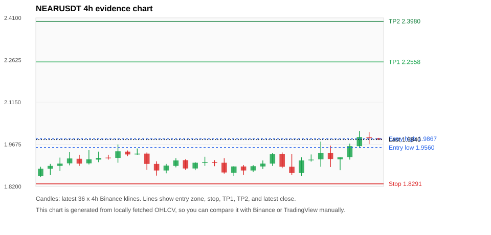
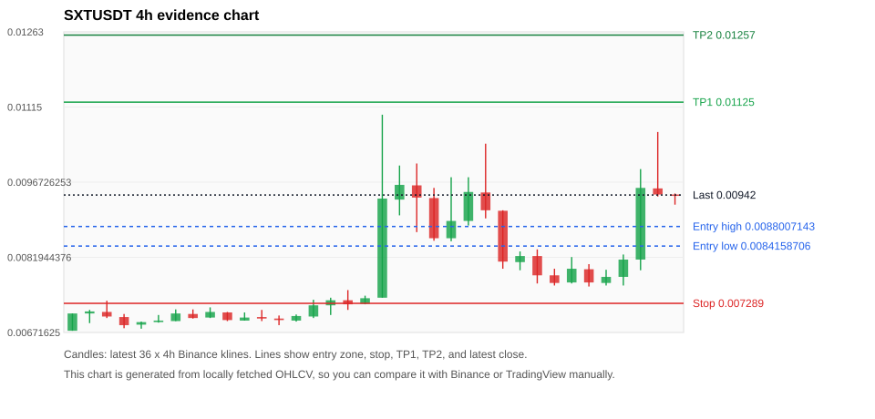
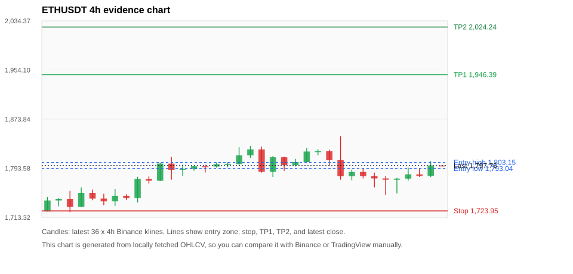
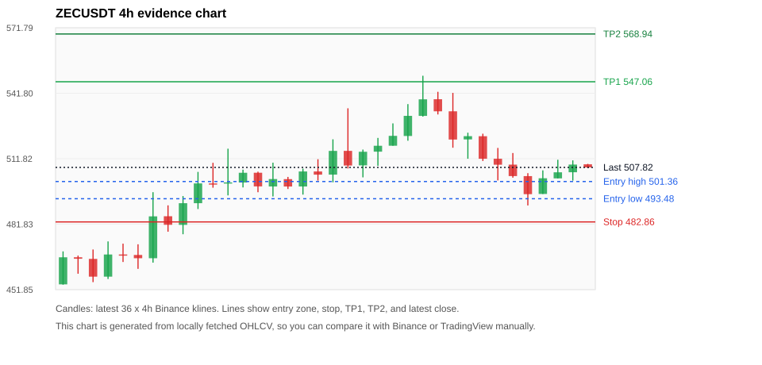
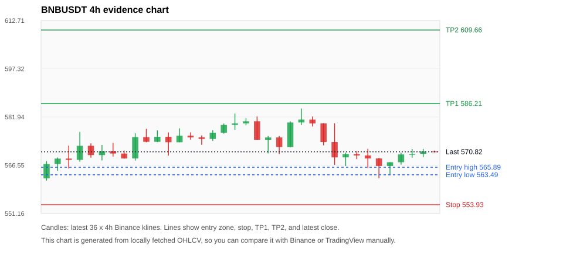

# Crypto 市场扫描报告 v1

- 报告时间：2026-07-14 20:06:06 CST
- Run ID：`20260714_120502_8a562c76`
- Run type：`daily_full`
- 数据来源：SQLite
- 报告版本：v1
- 扫描 ID：3ced75a34c7a
- 数据源：Binance public spot API + CoinGecko/CoinMarketCap cross-check
- 过滤条件：USDT spot; 24h quote volume >= 30,000,000; trades >= 30,000; exclude stables/leveraged tokens; analyze 1h/4h/1d klines
- 默认单笔风险：账户权益的 1.00%

## 限制说明

- 交易信号仍以 Binance 现货公开 K 线为主源；外部数据源用于一致性复核。
- 结果是研究和模拟盘计划，不是确定收益或实盘下单指令。
- 历史长度过滤：候选币至少需要 180 根 1d K 线。
- 数据质量验证池：先验证 score 排名前 min(top_n * 2, 10) 的候选，再按 action + score 补足最终名单。
- 大盘环境过滤：RISK_OFF; BTC/ETH 大盘偏弱，山寨币买入候选降级为观察。 BTC 7d=-0.8760496300816878; ETH 7d=1.4671596714555868.
- 已启用数据交叉验证：Binance 主源 + CoinGecko 自动对照；CoinMarketCap 在配置 API Key 后自动对照。
- NEARUSDT 交叉验证状态 DATA_WARNING：At least one external provider needs manual review.
- SXTUSDT 交叉验证状态 DATA_WARNING：At least one external provider needs manual review.
- ETHUSDT 交叉验证状态 DATA_WARNING：At least one external provider needs manual review.
- ZECUSDT 交叉验证状态 DATA_WARNING：At least one external provider needs manual review.
- BNBUSDT 交叉验证状态 DATA_WARNING：At least one external provider needs manual review.
- BTCUSDT 交叉验证状态 DATA_WARNING：At least one external provider needs manual review.
- XRPUSDT 交叉验证状态 DATA_WARNING：At least one external provider needs manual review.
- TRXUSDT 交叉验证状态 DATA_WARNING：At least one external provider needs manual review.
- SOLUSDT 交叉验证状态 DATA_WARNING：At least one external provider needs manual review.

## 5 个候选交易计划

| Rank | Coin | Action | Setup | Entry Zone | Stop Loss | TP1 | TP2 / Exit Rule | R/R | Verdict |
|---:|---|---|---|---:|---:|---:|---|---:|---|
| 1 | `NEAR` | `WATCH_ONLY` | 回踩支撑/4h EMA 附近 | 1.9560 - 1.9867 | 1.8291 | 2.2558 | 2.3980 或跌破 4h 关键支撑 | 2.00-3.00 | 只观察 |
| 2 | `SXT` | `WATCH_ONLY` | 涨幅较远，只等深回调 | 0.0084158706 - 0.0088007143 | 0.007289 | 0.01125 | 0.01257 或跌破 4h 关键支撑 | 2.00-3.00 | 只等回调 |
| 3 | `ETH` | `WATCH_ONLY` | 回踩支撑/4h EMA 附近 | 1,793.04 - 1,803.15 | 1,723.95 | 1,946.39 | 2,024.24 或跌破 4h 关键支撑 | 2.00-3.05 | 只观察 |
| 4 | `ZEC` | `WATCH_ONLY` | 回踩支撑/4h EMA 附近 | 493.48 - 501.36 | 482.86 | 547.06 | 568.94 或跌破 4h 关键支撑 | 3.41-4.91 | 只观察 |
| 5 | `BNB` | `REJECT` | 回踩支撑/4h EMA 附近 | 563.49 - 565.89 | 553.93 | 586.21 | 609.66 或跌破 4h 关键支撑 | 2.00-4.18 | 只观察 |

## 数据交叉验证摘要

价格差异以 Binance 当前价为基准；成交量口径不同，Binance 是 USDT 现货成交额，CoinGecko/CoinMarketCap 通常是全市场成交量。

| Rank | Coin | Data Status | Max Price Diff | Max 24h Diff | Message |
|---:|---|---|---:|---:|---|
| 1 | `NEAR` | DATA_WARNING | 0.10% | 0.09 pts | At least one external provider needs manual review. |
| 2 | `SXT` | DATA_WARNING | 0.11% | 0.30 pts | At least one external provider needs manual review. |
| 3 | `ETH` | DATA_WARNING | 0.11% | 0.12 pts | At least one external provider needs manual review. |
| 4 | `ZEC` | DATA_WARNING | 0.12% | 0.19 pts | At least one external provider needs manual review. |
| 5 | `BNB` | DATA_WARNING | 0.10% | 0.04 pts | At least one external provider needs manual review. |

## 候选币说明

### 1. NEAR `NEARUSDT`



- 入选原因：回踩支撑/4h EMA 附近；24h +3.87%，7d -1.00%，4h RSI 67.88，24h 成交额 $34.5M。
- 交易失效条件：跌破 1.829145 或 4h 收盘重新失守关键支撑。
- 主要风险：BTC/ETH 大盘环境未确认强势，山寨币买入信号降级；7d 趋势未确认；数据交叉验证需要人工复核。
- 数据交叉验证：DATA_WARNING；At least one external provider needs manual review.

#### 可点击人工验证

- [Binance 交易页](https://www.binance.com/en/trade/NEAR_USDT)
- [TradingView 图表](https://www.tradingview.com/chart/?symbol=BINANCE%3ANEARUSDT)
- [CoinGecko 搜索](https://www.coingecko.com/en/search?query=NEAR)
- [CoinMarketCap 搜索](https://coinmarketcap.com/search/?q=NEAR)

#### 多数据源对照

| Source | Status | Asset ID | Price | 24h Change | 24h Volume | Price Diff | 24h Diff | Updated | Message |
|---|---|---|---:|---:|---:|---:|---:|---|---|
| Binance | DATA_OK | NEARUSDT | 1.9840 | +3.87% | $34.5M | 0.00% | 0.00 pts | 2026-07-14T12:05:23+00:00 | Primary market data source used by scanner. |
| CoinGecko | DATA_WARNING | n/a | n/a | n/a | n/a | n/a | n/a | 2026-07-14T12:05:23+00:00 | Failed to fetch https://api.coingecko.com/api/v3/coins/markets?vs_currency=usd&ids=near&price_change_percentage=24h&per_page=1&page=1: HTTP Error 429: Too Many Requests |
| CoinMarketCap | DATA_OK | 6535 | 1.9859 | +3.79% | $260.7M | 0.10% | 0.09 pts | 2026-07-14T12:04:03.000Z | External source agrees with Binance within thresholds. |

#### 指标证据

| 指标 | 数值 | 人工核对用途 |
|---|---:|---|
| 当前价 | 1.9840 | 与 Binance/TradingView 当前价格对照 |
| 24h 涨跌 | +3.87% | 与交易所 24h 涨跌对照 |
| 7d 涨跌 | -1.00% | 判断短线趋势是否延续 |
| 4h EMA20 | 1.9332 | 判断短期趋势支撑 |
| 4h EMA50 | 1.9279 | 判断中期趋势支撑 |
| 1d EMA20 | 1.9521 | 判断日线趋势 |
| 1d EMA50 | 1.9593 | 判断日线趋势 |
| 4h RSI14 | 67.88 | 判断是否过热/过弱 |
| 4h ATR14 | 0.04936 | 推导止损和入场缓冲 |
| 最近 18 根 4h 最低点 | 1.8570 | 支撑/止损参考 |
| 最近 36 根 4h 最高点 | 2.0140 | TP/压力参考 |
| 支撑位 | 1.9521 | 入场区间推导基础 |

#### 交易计划推导

- 支撑位 = 最近低点、4h EMA20、4h EMA50、1d EMA20 中不高于当前价的最高有效支撑 = `1.9521`。
- 入场区间 = 支撑位附近 + ATR 缓冲 = `1.9560 - 1.9867`。
- 止损 = min(最近 18 根 4h 最低点 * 0.985, 入场中位价 - 1.15 * ATR14) = `1.8291`。
- TP1 = max(最近 36 根 4h 最高点 * 0.995, 入场中位价 + 2R) = `2.2558`。
- TP2 = max(入场中位价 + 3R, TP1 * 1.04) = `2.3980`。

#### 最近 10 根 4h K线

| UTC 开盘时间 | Open | High | Low | Close | Quote Volume | Trades |
|---|---:|---:|---:|---:|---:|---:|
| 2026-07-13T00:00+00:00 | 1.8890 | 1.9340 | 1.8600 | 1.8670 | $4.5M | 34010 |
| 2026-07-13T04:00+00:00 | 1.8670 | 1.9220 | 1.8570 | 1.9110 | $3.0M | 19243 |
| 2026-07-13T08:00+00:00 | 1.9120 | 1.9320 | 1.9070 | 1.9140 | $3.8M | 19172 |
| 2026-07-13T12:00+00:00 | 1.9150 | 1.9770 | 1.8890 | 1.9380 | $8.2M | 47614 |
| 2026-07-13T16:00+00:00 | 1.9380 | 1.9630 | 1.8880 | 1.9160 | $6.3M | 36205 |
| 2026-07-13T20:00+00:00 | 1.9150 | 1.9220 | 1.8770 | 1.9220 | $3.5M | 19137 |
| 2026-07-14T00:00+00:00 | 1.9230 | 1.9700 | 1.9140 | 1.9610 | $4.8M | 28042 |
| 2026-07-14T04:00+00:00 | 1.9610 | 2.0140 | 1.9540 | 1.9930 | $8.1M | 35139 |
| 2026-07-14T08:00+00:00 | 1.9920 | 2.0100 | 1.9680 | 1.9890 | $3.5M | 18332 |
| 2026-07-14T12:00+00:00 | 1.9890 | 1.9900 | 1.9840 | 1.9840 | $69,624 | 435 |

### 2. SXT `SXTUSDT`



- 入选原因：涨幅较远，只等深回调；24h +22.02%，7d +33.81%，4h RSI 57.77，24h 成交额 $121.8M。
- 交易失效条件：跌破 0.007289 或 4h 收盘重新失守关键支撑。
- 主要风险：距离支撑偏远，不能追市价；24h 振幅较大，回撤风险高；成交量突增，可能是事件驱动；日线趋势未完全确认；BTC/ETH 大盘环境未确认强势，山寨币买入信号降级；数据交叉验证需要人工复核。
- 数据交叉验证：DATA_WARNING；At least one external provider needs manual review.

#### 可点击人工验证

- [Binance 交易页](https://www.binance.com/en/trade/SXT_USDT)
- [TradingView 图表](https://www.tradingview.com/chart/?symbol=BINANCE%3ASXTUSDT)
- [CoinGecko 搜索](https://www.coingecko.com/en/search?query=SXT)
- [CoinMarketCap 搜索](https://coinmarketcap.com/search/?q=SXT)

#### 多数据源对照

| Source | Status | Asset ID | Price | 24h Change | 24h Volume | Price Diff | 24h Diff | Updated | Message |
|---|---|---|---:|---:|---:|---:|---:|---|---|
| Binance | DATA_OK | SXTUSDT | 0.00942 | +22.02% | $121.8M | 0.00% | 0.00 pts | 2026-07-14T12:05:23+00:00 | Primary market data source used by scanner. |
| CoinGecko | DATA_WARNING | n/a | n/a | n/a | n/a | n/a | n/a | 2026-07-14T12:05:23+00:00 | Failed to fetch https://api.coingecko.com/api/v3/coins/markets?vs_currency=usd&ids=space-and-time&price_change_percentage=24h&per_page=1&page=1: HTTP Error 429: Too Many Requests |
| CoinMarketCap | DATA_OK | 36405 | 0.0094100747 | +22.33% | $639.4M | 0.11% | 0.30 pts | 2026-07-14T12:04:03.000Z | External source agrees with Binance within thresholds. |

#### 指标证据

| 指标 | 数值 | 人工核对用途 |
|---|---:|---|
| 当前价 | 0.00942 | 与 Binance/TradingView 当前价格对照 |
| 24h 涨跌 | +22.02% | 与交易所 24h 涨跌对照 |
| 7d 涨跌 | +33.81% | 判断短线趋势是否延续 |
| 4h EMA20 | 0.0083990724 | 判断短期趋势支撑 |
| 4h EMA50 | 0.0078714753 | 判断中期趋势支撑 |
| 1d EMA20 | 0.0077520224 | 判断日线趋势 |
| 1d EMA50 | 0.008818456 | 判断日线趋势 |
| 4h RSI14 | 57.77 | 判断是否过热/过弱 |
| 4h ATR14 | 0.00082571429 | 推导止损和入场缓冲 |
| 最近 18 根 4h 最低点 | 0.0074 | 支撑/止损参考 |
| 最近 36 根 4h 最高点 | 0.01100 | TP/压力参考 |
| 支撑位 | 0.0083990724 | 入场区间推导基础 |

#### 交易计划推导

- 支撑位 = 最近低点、4h EMA20、4h EMA50、1d EMA20 中不高于当前价的最高有效支撑 = `0.0083990724`。
- 入场区间 = 支撑位附近 + ATR 缓冲 = `0.0084158706 - 0.0088007143`。
- 止损 = min(最近 18 根 4h 最低点 * 0.985, 入场中位价 - 1.15 * ATR14) = `0.007289`。
- TP1 = max(最近 36 根 4h 最高点 * 0.995, 入场中位价 + 2R) = `0.01125`。
- TP2 = max(入场中位价 + 3R, TP1 * 1.04) = `0.01257`。

#### 最近 10 根 4h K线

| UTC 开盘时间 | Open | High | Low | Close | Quote Volume | Trades |
|---|---:|---:|---:|---:|---:|---:|
| 2026-07-13T00:00+00:00 | 0.0081 | 0.00831 | 0.00794 | 0.00822 | $1.1M | 23349 |
| 2026-07-13T04:00+00:00 | 0.00822 | 0.00835 | 0.00768 | 0.00784 | $2.6M | 45603 |
| 2026-07-13T08:00+00:00 | 0.00784 | 0.00797 | 0.00764 | 0.00769 | $2.1M | 40950 |
| 2026-07-13T12:00+00:00 | 0.0077 | 0.0082 | 0.00768 | 0.00797 | $4.3M | 75481 |
| 2026-07-13T16:00+00:00 | 0.00796 | 0.00806 | 0.00762 | 0.0077 | $1.6M | 35028 |
| 2026-07-13T20:00+00:00 | 0.00769 | 0.00795 | 0.00764 | 0.00781 | $786,581 | 16329 |
| 2026-07-14T00:00+00:00 | 0.00781 | 0.00825 | 0.00764 | 0.00815 | $6.3M | 66242 |
| 2026-07-14T04:00+00:00 | 0.00815 | 0.00993 | 0.00794 | 0.00956 | $35.5M | 273945 |
| 2026-07-14T08:00+00:00 | 0.00955 | 0.01066 | 0.00939 | 0.00943 | $73.2M | 398858 |
| 2026-07-14T12:00+00:00 | 0.00943 | 0.00945 | 0.00923 | 0.00942 | $173,367 | 2248 |

### 3. ETH `ETHUSDT`



- 入选原因：回踩支撑/4h EMA 附近；24h +0.97%，7d +1.63%，4h RSI 49.54，24h 成交额 $414.1M。
- 交易失效条件：跌破 1723.947 或 4h 收盘重新失守关键支撑。
- 主要风险：日线趋势未完全确认；BTC/ETH 大盘环境未确认强势，山寨币买入信号降级；数据交叉验证需要人工复核。
- 数据交叉验证：DATA_WARNING；At least one external provider needs manual review.

#### 可点击人工验证

- [Binance 交易页](https://www.binance.com/en/trade/ETH_USDT)
- [TradingView 图表](https://www.tradingview.com/chart/?symbol=BINANCE%3AETHUSDT)
- [CoinGecko 搜索](https://www.coingecko.com/en/search?query=ETH)
- [CoinMarketCap 搜索](https://coinmarketcap.com/search/?q=ETH)

#### 多数据源对照

| Source | Status | Asset ID | Price | 24h Change | 24h Volume | Price Diff | 24h Diff | Updated | Message |
|---|---|---|---:|---:|---:|---:|---:|---|---|
| Binance | DATA_OK | ETHUSDT | 1,797.76 | +0.97% | $414.1M | 0.00% | 0.00 pts | 2026-07-14T12:05:23+00:00 | Primary market data source used by scanner. |
| CoinGecko | DATA_OK | ethereum | 1,796.00 | +0.98% | $8.79B | 0.10% | 0.00 pts | 2026-07-14T12:05:36.077Z | External source agrees with Binance within thresholds. |
| CoinMarketCap | DATA_WARNING | 1027 | 1,795.84 | +0.86% | $9.44B | 0.11% | 0.12 pts | 2026-07-14T12:04:03.000Z | CoinMarketCap symbol mapping has 6 matches; selected lowest cmc_rank |

#### 指标证据

| 指标 | 数值 | 人工核对用途 |
|---|---:|---|
| 当前价 | 1,797.76 | 与 Binance/TradingView 当前价格对照 |
| 24h 涨跌 | +0.97% | 与交易所 24h 涨跌对照 |
| 7d 涨跌 | +1.63% | 判断短线趋势是否延续 |
| 4h EMA20 | 1,789.46 | 判断短期趋势支撑 |
| 4h EMA50 | 1,772.71 | 判断中期趋势支撑 |
| 1d EMA20 | 1,747.16 | 判断日线趋势 |
| 1d EMA50 | 1,799.86 | 判断日线趋势 |
| 4h RSI14 | 49.54 | 判断是否过热/过弱 |
| 4h ATR14 | 22.8600 | 推导止损和入场缓冲 |
| 最近 18 根 4h 最低点 | 1,750.20 | 支撑/止损参考 |
| 最近 36 根 4h 最高点 | 1,846.00 | TP/压力参考 |
| 支撑位 | 1,789.46 | 入场区间推导基础 |

#### 交易计划推导

- 支撑位 = 最近低点、4h EMA20、4h EMA50、1d EMA20 中不高于当前价的最高有效支撑 = `1,789.46`。
- 入场区间 = 支撑位附近 + ATR 缓冲 = `1,793.04 - 1,803.15`。
- 止损 = min(最近 18 根 4h 最低点 * 0.985, 入场中位价 - 1.15 * ATR14) = `1,723.95`。
- TP1 = max(最近 36 根 4h 最高点 * 0.995, 入场中位价 + 2R) = `1,946.39`。
- TP2 = max(入场中位价 + 3R, TP1 * 1.04) = `2,024.24`。

#### 最近 10 根 4h K线

| UTC 开盘时间 | Open | High | Low | Close | Quote Volume | Trades |
|---|---:|---:|---:|---:|---:|---:|
| 2026-07-13T00:00+00:00 | 1,806.80 | 1,846.00 | 1,775.00 | 1,780.55 | $180.3M | 799801 |
| 2026-07-13T04:00+00:00 | 1,780.54 | 1,791.39 | 1,773.99 | 1,787.57 | $60.9M | 291810 |
| 2026-07-13T08:00+00:00 | 1,787.58 | 1,793.56 | 1,777.10 | 1,780.74 | $44.6M | 219523 |
| 2026-07-13T12:00+00:00 | 1,780.74 | 1,786.53 | 1,762.44 | 1,777.01 | $102.1M | 622834 |
| 2026-07-13T16:00+00:00 | 1,777.00 | 1,780.73 | 1,750.20 | 1,774.92 | $87.1M | 442620 |
| 2026-07-13T20:00+00:00 | 1,774.93 | 1,778.05 | 1,752.59 | 1,776.72 | $51.9M | 272714 |
| 2026-07-14T00:00+00:00 | 1,776.71 | 1,794.47 | 1,773.41 | 1,783.65 | $46.1M | 354675 |
| 2026-07-14T04:00+00:00 | 1,783.64 | 1,793.26 | 1,779.41 | 1,781.21 | $41.3M | 228043 |
| 2026-07-14T08:00+00:00 | 1,781.21 | 1,805.00 | 1,779.00 | 1,798.09 | $85.3M | 336202 |
| 2026-07-14T12:00+00:00 | 1,798.09 | 1,799.05 | 1,797.15 | 1,797.76 | $1.5M | 7575 |

### 4. ZEC `ZECUSDT`



- 入选原因：回踩支撑/4h EMA 附近；24h -0.79%，7d +10.81%，4h RSI 44.00，24h 成交额 $67.3M。
- 交易失效条件：跌破 482.86138 或 4h 收盘重新失守关键支撑。
- 主要风险：BTC/ETH 大盘环境未确认强势，山寨币买入信号降级；24h 动量未确认；数据交叉验证需要人工复核。
- 数据交叉验证：DATA_WARNING；At least one external provider needs manual review.

#### 可点击人工验证

- [Binance 交易页](https://www.binance.com/en/trade/ZEC_USDT)
- [TradingView 图表](https://www.tradingview.com/chart/?symbol=BINANCE%3AZECUSDT)
- [CoinGecko 搜索](https://www.coingecko.com/en/search?query=ZEC)
- [CoinMarketCap 搜索](https://coinmarketcap.com/search/?q=ZEC)

#### 多数据源对照

| Source | Status | Asset ID | Price | 24h Change | 24h Volume | Price Diff | 24h Diff | Updated | Message |
|---|---|---|---:|---:|---:|---:|---:|---|---|
| Binance | DATA_OK | ZECUSDT | 507.82 | -0.79% | $67.3M | 0.00% | 0.00 pts | 2026-07-14T12:05:23+00:00 | Primary market data source used by scanner. |
| CoinGecko | DATA_OK | zcash | 508.19 | -0.60% | $307.2M | 0.07% | 0.19 pts | 2026-07-14T12:05:22.132Z | External source agrees with Binance within thresholds. |
| CoinMarketCap | DATA_WARNING | 1437 | 508.43 | -0.60% | $431.9M | 0.12% | 0.19 pts | 2026-07-14T12:04:03.000Z | CoinMarketCap symbol mapping has 2 matches; selected lowest cmc_rank |

#### 指标证据

| 指标 | 数值 | 人工核对用途 |
|---|---:|---|
| 当前价 | 507.82 | 与 Binance/TradingView 当前价格对照 |
| 24h 涨跌 | -0.79% | 与交易所 24h 涨跌对照 |
| 7d 涨跌 | +10.81% | 判断短线趋势是否延续 |
| 4h EMA20 | 508.19 | 判断短期趋势支撑 |
| 4h EMA50 | 492.50 | 判断中期趋势支撑 |
| 1d EMA20 | 473.66 | 判断日线趋势 |
| 1d EMA50 | 465.76 | 判断日线趋势 |
| 4h RSI14 | 44.00 | 判断是否过热/过弱 |
| 4h ATR14 | 12.6621 | 推导止损和入场缓冲 |
| 最近 18 根 4h 最低点 | 490.40 | 支撑/止损参考 |
| 最近 36 根 4h 最高点 | 549.81 | TP/压力参考 |
| 支撑位 | 492.50 | 入场区间推导基础 |

#### 交易计划推导

- 支撑位 = 最近低点、4h EMA20、4h EMA50、1d EMA20 中不高于当前价的最高有效支撑 = `492.50`。
- 入场区间 = 支撑位附近 + ATR 缓冲 = `493.48 - 501.36`。
- 止损 = min(最近 18 根 4h 最低点 * 0.985, 入场中位价 - 1.15 * ATR14) = `482.86`。
- TP1 = max(最近 36 根 4h 最高点 * 0.995, 入场中位价 + 2R) = `547.06`。
- TP2 = max(入场中位价 + 3R, TP1 * 1.04) = `568.94`。

#### 最近 10 根 4h K线

| UTC 开盘时间 | Open | High | Low | Close | Quote Volume | Trades |
|---|---:|---:|---:|---:|---:|---:|
| 2026-07-13T00:00+00:00 | 533.53 | 541.96 | 516.84 | 520.59 | $23.1M | 105018 |
| 2026-07-13T04:00+00:00 | 520.65 | 523.72 | 511.80 | 522.14 | $15.5M | 95395 |
| 2026-07-13T08:00+00:00 | 522.12 | 523.27 | 510.77 | 511.79 | $10.6M | 67883 |
| 2026-07-13T12:00+00:00 | 511.80 | 516.75 | 501.87 | 509.06 | $15.1M | 59034 |
| 2026-07-13T16:00+00:00 | 509.10 | 514.42 | 503.12 | 503.86 | $11.6M | 43848 |
| 2026-07-13T20:00+00:00 | 503.84 | 505.19 | 490.40 | 495.57 | $14.3M | 42360 |
| 2026-07-14T00:00+00:00 | 495.67 | 506.48 | 495.67 | 502.86 | $10.6M | 59008 |
| 2026-07-14T04:00+00:00 | 502.81 | 511.34 | 502.81 | 505.59 | $9.7M | 72594 |
| 2026-07-14T08:00+00:00 | 505.61 | 511.06 | 501.80 | 509.13 | $6.0M | 23589 |
| 2026-07-14T12:00+00:00 | 509.25 | 509.44 | 507.50 | 507.82 | $328,384 | 772 |

### 5. BNB `BNBUSDT`



- 入选原因：回踩支撑/4h EMA 附近；24h +0.25%，7d -1.15%，4h RSI 47.46，24h 成交额 $39.8M。
- 交易失效条件：跌破 553.93445 或 4h 收盘重新失守关键支撑。
- 主要风险：日线趋势未完全确认；BTC/ETH 大盘环境未确认强势，山寨币买入信号降级；7d 趋势未确认；数据交叉验证需要人工复核。
- 数据交叉验证：DATA_WARNING；At least one external provider needs manual review.

#### 可点击人工验证

- [Binance 交易页](https://www.binance.com/en/trade/BNB_USDT)
- [TradingView 图表](https://www.tradingview.com/chart/?symbol=BINANCE%3ABNBUSDT)
- [CoinGecko 搜索](https://www.coingecko.com/en/search?query=BNB)
- [CoinMarketCap 搜索](https://coinmarketcap.com/search/?q=BNB)

#### 多数据源对照

| Source | Status | Asset ID | Price | 24h Change | 24h Volume | Price Diff | 24h Diff | Updated | Message |
|---|---|---|---:|---:|---:|---:|---:|---|---|
| Binance | DATA_OK | BNBUSDT | 570.82 | +0.25% | $39.8M | 0.00% | 0.00 pts | 2026-07-14T12:05:23+00:00 | Primary market data source used by scanner. |
| CoinGecko | DATA_OK | binancecoin | 570.29 | +0.26% | $452.9M | 0.09% | 0.00 pts | 2026-07-14T12:05:40.706Z | External source agrees with Binance within thresholds. |
| CoinMarketCap | DATA_WARNING | 1839 | 570.23 | +0.21% | $916.7M | 0.10% | 0.04 pts | 2026-07-14T12:04:03.000Z | CoinMarketCap symbol mapping has 4 matches; selected lowest cmc_rank |

#### 指标证据

| 指标 | 数值 | 人工核对用途 |
|---|---:|---|
| 当前价 | 570.82 | 与 Binance/TradingView 当前价格对照 |
| 24h 涨跌 | +0.25% | 与交易所 24h 涨跌对照 |
| 7d 涨跌 | -1.15% | 判断短线趋势是否延续 |
| 4h EMA20 | 571.97 | 判断短期趋势支撑 |
| 4h EMA50 | 572.45 | 判断中期趋势支撑 |
| 1d EMA20 | 574.24 | 判断日线趋势 |
| 1d EMA50 | 590.85 | 判断日线趋势 |
| 4h RSI14 | 47.46 | 判断是否过热/过弱 |
| 4h ATR14 | 5.0293 | 推导止损和入场缓冲 |
| 最近 18 根 4h 最低点 | 562.37 | 支撑/止损参考 |
| 最近 36 根 4h 最高点 | 584.63 | TP/压力参考 |
| 支撑位 | 562.37 | 入场区间推导基础 |

#### 交易计划推导

- 支撑位 = 最近低点、4h EMA20、4h EMA50、1d EMA20 中不高于当前价的最高有效支撑 = `562.37`。
- 入场区间 = 支撑位附近 + ATR 缓冲 = `563.49 - 565.89`。
- 止损 = min(最近 18 根 4h 最低点 * 0.985, 入场中位价 - 1.15 * ATR14) = `553.93`。
- TP1 = max(最近 36 根 4h 最高点 * 0.995, 入场中位价 + 2R) = `586.21`。
- TP2 = max(入场中位价 + 3R, TP1 * 1.04) = `609.66`。

#### 最近 10 根 4h K线

| UTC 开盘时间 | Open | High | Low | Close | Quote Volume | Trades |
|---|---:|---:|---:|---:|---:|---:|
| 2026-07-13T00:00+00:00 | 573.91 | 579.89 | 566.67 | 569.04 | $12.1M | 128079 |
| 2026-07-13T04:00+00:00 | 569.05 | 570.58 | 566.28 | 570.11 | $6.2M | 72336 |
| 2026-07-13T08:00+00:00 | 570.11 | 571.10 | 568.45 | 569.66 | $7.1M | 67288 |
| 2026-07-13T12:00+00:00 | 569.67 | 571.78 | 565.61 | 568.72 | $7.8M | 94301 |
| 2026-07-13T16:00+00:00 | 568.72 | 568.88 | 562.37 | 566.29 | $6.8M | 81540 |
| 2026-07-13T20:00+00:00 | 566.29 | 567.50 | 563.31 | 567.49 | $3.7M | 40898 |
| 2026-07-14T00:00+00:00 | 567.50 | 570.57 | 566.74 | 569.98 | $6.8M | 65167 |
| 2026-07-14T04:00+00:00 | 569.99 | 571.68 | 568.93 | 570.15 | $7.6M | 66123 |
| 2026-07-14T08:00+00:00 | 570.16 | 571.74 | 569.14 | 570.96 | $7.0M | 66617 |
| 2026-07-14T12:00+00:00 | 570.96 | 571.20 | 570.81 | 570.82 | $137,351 | 1254 |

## 组合风控

- 不要 5 个候选全部满仓买入。
- 同时持仓总风险建议控制在账户权益的 3% - 5% 以内。
- 如果 BTC/ETH 同时破位，暂停山寨币多头计划或降低仓位。
- 第一版报告用于模拟盘和人工复核，不自动下单。

## 原始数据

```json
[
  {
    "rank": 1,
    "symbol": "NEARUSDT",
    "base_asset": "NEAR",
    "price": 1.984,
    "score": 47.30097459643991,
    "setup": "回踩支撑/4h EMA 附近",
    "verdict": "只观察",
    "entry_low": 1.9560468843112804,
    "entry_high": 1.9866925991130544,
    "stop_loss": 1.829145,
    "take_profit_1": 2.255819225136502,
    "take_profit_2": 2.3980439668486695,
    "risk_reward_1": 2.0,
    "risk_reward_2": 3.0,
    "pct_24h": 3.874,
    "pct_3d": 3.9832285115304122,
    "pct_7d": -0.9980039920159722,
    "quote_volume_24h": 34504636.95,
    "trades_24h": 184311,
    "high_low_range_24h": 7.298881193393703,
    "rsi_1h": 77.38095238095238,
    "rsi_4h": 67.88079470198674,
    "ema20_4h": 1.9331855321646867,
    "ema50_4h": 1.9279306255478548,
    "ema20_1d": 1.9521425991130543,
    "ema50_1d": 1.9593027455941445,
    "atr_4h": 0.04935714285714284,
    "macd_hist_4h": 0.011957234786268782,
    "volume_ratio_24h": 1.6460572915228249,
    "support_level": 1.9521425991130543,
    "recent_low_4h_18": 1.857,
    "recent_high_4h_36": 2.014,
    "distance_to_support_pct": 1.631919763516243,
    "binance_trade_url": "https://www.binance.com/en/trade/NEAR_USDT",
    "tradingview_url": "https://www.tradingview.com/chart/?symbol=BINANCE%3ANEARUSDT",
    "coingecko_search_url": "https://www.coingecko.com/en/search?query=NEAR",
    "coinmarketcap_search_url": "https://coinmarketcap.com/search/?q=NEAR",
    "invalidation": "跌破 1.829145 或 4h 收盘重新失守关键支撑",
    "recent_4h_klines": [
      {
        "open_time_utc": "2026-07-08T16:00+00:00",
        "open": 1.856,
        "high": 1.889,
        "low": 1.853,
        "close": 1.882,
        "quote_volume": 2633749.6585,
        "trades": 16883
      },
      {
        "open_time_utc": "2026-07-08T20:00+00:00",
        "open": 1.882,
        "high": 1.899,
        "low": 1.86,
        "close": 1.892,
        "quote_volume": 2061523.9878,
        "trades": 12575
      },
      {
        "open_time_utc": "2026-07-09T00:00+00:00",
        "open": 1.892,
        "high": 1.921,
        "low": 1.874,
        "close": 1.9,
        "quote_volume": 2723108.0611,
        "trades": 20367
      },
      {
        "open_time_utc": "2026-07-09T04:00+00:00",
        "open": 1.901,
        "high": 1.94,
        "low": 1.894,
        "close": 1.918,
        "quote_volume": 3570447.841,
        "trades": 22219
      },
      {
        "open_time_utc": "2026-07-09T08:00+00:00",
        "open": 1.917,
        "high": 1.931,
        "low": 1.892,
        "close": 1.9,
        "quote_volume": 2044836.066,
        "trades": 14904
      },
      {
        "open_time_utc": "2026-07-09T12:00+00:00",
        "open": 1.901,
        "high": 1.947,
        "low": 1.897,
        "close": 1.915,
        "quote_volume": 5748356.4117,
        "trades": 37274
      },
      {
        "open_time_utc": "2026-07-09T16:00+00:00",
        "open": 1.914,
        "high": 1.942,
        "low": 1.905,
        "close": 1.92,
        "quote_volume": 3180543.6438,
        "trades": 19459
      },
      {
        "open_time_utc": "2026-07-09T20:00+00:00",
        "open": 1.921,
        "high": 1.931,
        "low": 1.914,
        "close": 1.92,
        "quote_volume": 1135708.3353,
        "trades": 8774
      },
      {
        "open_time_utc": "2026-07-10T00:00+00:00",
        "open": 1.92,
        "high": 1.967,
        "low": 1.903,
        "close": 1.943,
        "quote_volume": 3854292.5047,
        "trades": 20513
      },
      {
        "open_time_utc": "2026-07-10T04:00+00:00",
        "open": 1.942,
        "high": 1.946,
        "low": 1.926,
        "close": 1.932,
        "quote_volume": 1379705.7775,
        "trades": 9858
      },
      {
        "open_time_utc": "2026-07-10T08:00+00:00",
        "open": 1.932,
        "high": 1.953,
        "low": 1.931,
        "close": 1.935,
        "quote_volume": 2705718.9148,
        "trades": 15225
      },
      {
        "open_time_utc": "2026-07-10T12:00+00:00",
        "open": 1.935,
        "high": 1.939,
        "low": 1.878,
        "close": 1.899,
        "quote_volume": 6092057.5452,
        "trades": 30681
      },
      {
        "open_time_utc": "2026-07-10T16:00+00:00",
        "open": 1.899,
        "high": 1.908,
        "low": 1.858,
        "close": 1.876,
        "quote_volume": 3966365.2825,
        "trades": 18537
      },
      {
        "open_time_utc": "2026-07-10T20:00+00:00",
        "open": 1.876,
        "high": 1.899,
        "low": 1.866,
        "close": 1.893,
        "quote_volume": 1205614.9944,
        "trades": 7931
      },
      {
        "open_time_utc": "2026-07-11T00:00+00:00",
        "open": 1.892,
        "high": 1.919,
        "low": 1.887,
        "close": 1.911,
        "quote_volume": 1345098.7655,
        "trades": 8908
      },
      {
        "open_time_utc": "2026-07-11T04:00+00:00",
        "open": 1.912,
        "high": 1.915,
        "low": 1.878,
        "close": 1.883,
        "quote_volume": 1689977.6882,
        "trades": 9962
      },
      {
        "open_time_utc": "2026-07-11T08:00+00:00",
        "open": 1.883,
        "high": 1.905,
        "low": 1.877,
        "close": 1.903,
        "quote_volume": 1654415.3646,
        "trades": 7999
      },
      {
        "open_time_utc": "2026-07-11T12:00+00:00",
        "open": 1.903,
        "high": 1.924,
        "low": 1.892,
        "close": 1.905,
        "quote_volume": 2768355.2781,
        "trades": 14012
      },
      {
        "open_time_utc": "2026-07-11T16:00+00:00",
        "open": 1.905,
        "high": 1.912,
        "low": 1.891,
        "close": 1.903,
        "quote_volume": 1590753.1173,
        "trades": 8949
      },
      {
        "open_time_utc": "2026-07-11T20:00+00:00",
        "open": 1.903,
        "high": 1.919,
        "low": 1.865,
        "close": 1.869,
        "quote_volume": 2716495.0032,
        "trades": 13362
      },
      {
        "open_time_utc": "2026-07-12T00:00+00:00",
        "open": 1.868,
        "high": 1.891,
        "low": 1.857,
        "close": 1.89,
        "quote_volume": 2211458.2446,
        "trades": 14101
      },
      {
        "open_time_utc": "2026-07-12T04:00+00:00",
        "open": 1.89,
        "high": 1.895,
        "low": 1.861,
        "close": 1.876,
        "quote_volume": 1543237.5521,
        "trades": 10199
      },
      {
        "open_time_utc": "2026-07-12T08:00+00:00",
        "open": 1.876,
        "high": 1.895,
        "low": 1.87,
        "close": 1.891,
        "quote_volume": 1379132.8194,
        "trades": 9172
      },
      {
        "open_time_utc": "2026-07-12T12:00+00:00",
        "open": 1.89,
        "high": 1.911,
        "low": 1.881,
        "close": 1.9,
        "quote_volume": 2210809.5854,
        "trades": 12696
      },
      {
        "open_time_utc": "2026-07-12T16:00+00:00",
        "open": 1.9,
        "high": 1.937,
        "low": 1.892,
        "close": 1.933,
        "quote_volume": 3301937.9333,
        "trades": 15662
      },
      {
        "open_time_utc": "2026-07-12T20:00+00:00",
        "open": 1.934,
        "high": 1.939,
        "low": 1.884,
        "close": 1.889,
        "quote_volume": 3102962.1675,
        "trades": 16668
      },
      {
        "open_time_utc": "2026-07-13T00:00+00:00",
        "open": 1.889,
        "high": 1.934,
        "low": 1.86,
        "close": 1.867,
        "quote_volume": 4487549.1305,
        "trades": 34010
      },
      {
        "open_time_utc": "2026-07-13T04:00+00:00",
        "open": 1.867,
        "high": 1.922,
        "low": 1.857,
        "close": 1.911,
        "quote_volume": 3022440.7095,
        "trades": 19243
      },
      {
        "open_time_utc": "2026-07-13T08:00+00:00",
        "open": 1.912,
        "high": 1.932,
        "low": 1.907,
        "close": 1.914,
        "quote_volume": 3827870.0563,
        "trades": 19172
      },
      {
        "open_time_utc": "2026-07-13T12:00+00:00",
        "open": 1.915,
        "high": 1.977,
        "low": 1.889,
        "close": 1.938,
        "quote_volume": 8218947.5571,
        "trades": 47614
      },
      {
        "open_time_utc": "2026-07-13T16:00+00:00",
        "open": 1.938,
        "high": 1.963,
        "low": 1.888,
        "close": 1.916,
        "quote_volume": 6337463.1407,
        "trades": 36205
      },
      {
        "open_time_utc": "2026-07-13T20:00+00:00",
        "open": 1.915,
        "high": 1.922,
        "low": 1.877,
        "close": 1.922,
        "quote_volume": 3525367.1657,
        "trades": 19137
      },
      {
        "open_time_utc": "2026-07-14T00:00+00:00",
        "open": 1.923,
        "high": 1.97,
        "low": 1.914,
        "close": 1.961,
        "quote_volume": 4775105.075,
        "trades": 28042
      },
      {
        "open_time_utc": "2026-07-14T04:00+00:00",
        "open": 1.961,
        "high": 2.014,
        "low": 1.954,
        "close": 1.993,
        "quote_volume": 8135862.8303,
        "trades": 35139
      },
      {
        "open_time_utc": "2026-07-14T08:00+00:00",
        "open": 1.992,
        "high": 2.01,
        "low": 1.968,
        "close": 1.989,
        "quote_volume": 3510417.8605,
        "trades": 18332
      },
      {
        "open_time_utc": "2026-07-14T12:00+00:00",
        "open": 1.989,
        "high": 1.99,
        "low": 1.984,
        "close": 1.984,
        "quote_volume": 69623.557,
        "trades": 435
      }
    ],
    "risks": [
      "BTC/ETH 大盘环境未确认强势，山寨币买入信号降级",
      "7d 趋势未确认",
      "数据交叉验证需要人工复核"
    ],
    "data_quality_status": "DATA_WARNING",
    "data_quality_message": "At least one external provider needs manual review.",
    "data_checks": [
      {
        "provider": "Binance",
        "status": "DATA_OK",
        "provider_asset_id": "NEARUSDT",
        "provider_symbol": "NEARUSDT",
        "price_usd": 1.984,
        "pct_24h": 3.874,
        "volume_24h": 34504636.95,
        "last_updated": null,
        "fetched_at_utc": "2026-07-14T12:05:23+00:00",
        "price_diff_pct": 0.0,
        "pct_24h_diff": 0.0,
        "volume_note": "Binance USDT spot 24h quoteVolume.",
        "message": "Primary market data source used by scanner."
      },
      {
        "provider": "CoinGecko",
        "status": "DATA_WARNING",
        "provider_asset_id": null,
        "provider_symbol": "NEAR",
        "price_usd": null,
        "pct_24h": null,
        "volume_24h": null,
        "last_updated": null,
        "fetched_at_utc": "2026-07-14T12:05:23+00:00",
        "price_diff_pct": null,
        "pct_24h_diff": null,
        "volume_note": "External provider data unavailable.",
        "message": "Failed to fetch https://api.coingecko.com/api/v3/coins/markets?vs_currency=usd&ids=near&price_change_percentage=24h&per_page=1&page=1: HTTP Error 429: Too Many Requests"
      },
      {
        "provider": "CoinMarketCap",
        "status": "DATA_OK",
        "provider_asset_id": "6535",
        "provider_symbol": "NEAR",
        "price_usd": 1.985936767279128,
        "pct_24h": 3.78735249,
        "volume_24h": 260734712.0295353,
        "last_updated": "2026-07-14T12:04:03.000Z",
        "fetched_at_utc": "2026-07-14T12:05:23+00:00",
        "price_diff_pct": 0.09761931850443291,
        "pct_24h_diff": 0.08664751000000015,
        "volume_note": "CoinMarketCap total market volume; not the same venue scope as Binance quoteVolume.",
        "message": "External source agrees with Binance within thresholds."
      }
    ],
    "action": "WATCH_ONLY"
  },
  {
    "rank": 2,
    "symbol": "SXTUSDT",
    "base_asset": "SXT",
    "price": 0.00942,
    "score": 45.00819573280799,
    "setup": "涨幅较远，只等深回调",
    "verdict": "只等回调",
    "entry_low": 0.008415870565211342,
    "entry_high": 0.008800714285714285,
    "stop_loss": 0.007289,
    "take_profit_1": 0.011246877276388442,
    "take_profit_2": 0.012566169701851256,
    "risk_reward_1": 2.0,
    "risk_reward_2": 3.0,
    "pct_24h": 22.021,
    "pct_3d": 27.989130434782595,
    "pct_7d": 33.806818181818166,
    "quote_volume_24h": 121836746.482804,
    "trades_24h": 867194,
    "high_low_range_24h": 39.89501312335957,
    "rsi_1h": 64.98054474708172,
    "rsi_4h": 57.76965265082266,
    "ema20_4h": 0.0083990724203706,
    "ema50_4h": 0.007871475271355148,
    "ema20_1d": 0.007752022350538238,
    "ema50_1d": 0.008818456023454884,
    "atr_4h": 0.0008257142857142855,
    "macd_hist_4h": 7.768606809138983e-05,
    "volume_ratio_24h": 10.406253948004109,
    "support_level": 0.0083990724203706,
    "recent_low_4h_18": 0.0074,
    "recent_high_4h_36": 0.011,
    "distance_to_support_pct": 12.155242014026491,
    "binance_trade_url": "https://www.binance.com/en/trade/SXT_USDT",
    "tradingview_url": "https://www.tradingview.com/chart/?symbol=BINANCE%3ASXTUSDT",
    "coingecko_search_url": "https://www.coingecko.com/en/search?query=SXT",
    "coinmarketcap_search_url": "https://coinmarketcap.com/search/?q=SXT",
    "invalidation": "跌破 0.007289 或 4h 收盘重新失守关键支撑",
    "recent_4h_klines": [
      {
        "open_time_utc": "2026-07-08T16:00+00:00",
        "open": 0.00675,
        "high": 0.00709,
        "low": 0.00675,
        "close": 0.00709,
        "quote_volume": 900320.605261,
        "trades": 20413
      },
      {
        "open_time_utc": "2026-07-08T20:00+00:00",
        "open": 0.00709,
        "high": 0.00716,
        "low": 0.0069,
        "close": 0.00713,
        "quote_volume": 599566.726558,
        "trades": 7487
      },
      {
        "open_time_utc": "2026-07-09T00:00+00:00",
        "open": 0.00712,
        "high": 0.00734,
        "low": 0.007,
        "close": 0.00703,
        "quote_volume": 1201649.841564,
        "trades": 21101
      },
      {
        "open_time_utc": "2026-07-09T04:00+00:00",
        "open": 0.00702,
        "high": 0.00708,
        "low": 0.0068,
        "close": 0.00686,
        "quote_volume": 1086614.972,
        "trades": 24839
      },
      {
        "open_time_utc": "2026-07-09T08:00+00:00",
        "open": 0.00687,
        "high": 0.00693,
        "low": 0.00679,
        "close": 0.00692,
        "quote_volume": 836582.41895,
        "trades": 23708
      },
      {
        "open_time_utc": "2026-07-09T12:00+00:00",
        "open": 0.00692,
        "high": 0.00706,
        "low": 0.00691,
        "close": 0.00695,
        "quote_volume": 829678.711574,
        "trades": 19224
      },
      {
        "open_time_utc": "2026-07-09T16:00+00:00",
        "open": 0.00694,
        "high": 0.00717,
        "low": 0.00694,
        "close": 0.00709,
        "quote_volume": 798904.797321,
        "trades": 18213
      },
      {
        "open_time_utc": "2026-07-09T20:00+00:00",
        "open": 0.00708,
        "high": 0.00717,
        "low": 0.00699,
        "close": 0.007,
        "quote_volume": 258547.7712,
        "trades": 5323
      },
      {
        "open_time_utc": "2026-07-10T00:00+00:00",
        "open": 0.00701,
        "high": 0.00721,
        "low": 0.007,
        "close": 0.00712,
        "quote_volume": 945575.796987,
        "trades": 21037
      },
      {
        "open_time_utc": "2026-07-10T04:00+00:00",
        "open": 0.00711,
        "high": 0.00712,
        "low": 0.00694,
        "close": 0.00696,
        "quote_volume": 1308474.349346,
        "trades": 21748
      },
      {
        "open_time_utc": "2026-07-10T08:00+00:00",
        "open": 0.00695,
        "high": 0.00711,
        "low": 0.00695,
        "close": 0.00701,
        "quote_volume": 1509415.803616,
        "trades": 28225
      },
      {
        "open_time_utc": "2026-07-10T12:00+00:00",
        "open": 0.00702,
        "high": 0.00716,
        "low": 0.00694,
        "close": 0.00699,
        "quote_volume": 2707355.81752,
        "trades": 28817
      },
      {
        "open_time_utc": "2026-07-10T16:00+00:00",
        "open": 0.00699,
        "high": 0.00705,
        "low": 0.00686,
        "close": 0.00696,
        "quote_volume": 1395432.493061,
        "trades": 19456
      },
      {
        "open_time_utc": "2026-07-10T20:00+00:00",
        "open": 0.00695,
        "high": 0.00707,
        "low": 0.00693,
        "close": 0.00704,
        "quote_volume": 260129.004081,
        "trades": 4563
      },
      {
        "open_time_utc": "2026-07-11T00:00+00:00",
        "open": 0.00703,
        "high": 0.00736,
        "low": 0.007,
        "close": 0.00725,
        "quote_volume": 1600059.873456,
        "trades": 23850
      },
      {
        "open_time_utc": "2026-07-11T04:00+00:00",
        "open": 0.00725,
        "high": 0.0074,
        "low": 0.00706,
        "close": 0.00735,
        "quote_volume": 3595431.705977,
        "trades": 33597
      },
      {
        "open_time_utc": "2026-07-11T08:00+00:00",
        "open": 0.00735,
        "high": 0.00755,
        "low": 0.00716,
        "close": 0.00727,
        "quote_volume": 3078594.610832,
        "trades": 42423
      },
      {
        "open_time_utc": "2026-07-11T12:00+00:00",
        "open": 0.00728,
        "high": 0.00744,
        "low": 0.00727,
        "close": 0.00739,
        "quote_volume": 2928504.718733,
        "trades": 23822
      },
      {
        "open_time_utc": "2026-07-11T16:00+00:00",
        "open": 0.0074,
        "high": 0.011,
        "low": 0.0074,
        "close": 0.00935,
        "quote_volume": 11065347.230377,
        "trades": 166044
      },
      {
        "open_time_utc": "2026-07-11T20:00+00:00",
        "open": 0.00933,
        "high": 0.01,
        "low": 0.00902,
        "close": 0.00962,
        "quote_volume": 2464258.96672,
        "trades": 43541
      },
      {
        "open_time_utc": "2026-07-12T00:00+00:00",
        "open": 0.00961,
        "high": 0.01004,
        "low": 0.00869,
        "close": 0.00937,
        "quote_volume": 2194159.160971,
        "trades": 39901
      },
      {
        "open_time_utc": "2026-07-12T04:00+00:00",
        "open": 0.00936,
        "high": 0.00956,
        "low": 0.00852,
        "close": 0.00857,
        "quote_volume": 2354958.050628,
        "trades": 56318
      },
      {
        "open_time_utc": "2026-07-12T08:00+00:00",
        "open": 0.00857,
        "high": 0.00977,
        "low": 0.00851,
        "close": 0.00891,
        "quote_volume": 3057903.875642,
        "trades": 48147
      },
      {
        "open_time_utc": "2026-07-12T12:00+00:00",
        "open": 0.00891,
        "high": 0.00977,
        "low": 0.00882,
        "close": 0.00948,
        "quote_volume": 2986523.136303,
        "trades": 50634
      },
      {
        "open_time_utc": "2026-07-12T16:00+00:00",
        "open": 0.00947,
        "high": 0.01043,
        "low": 0.00896,
        "close": 0.00912,
        "quote_volume": 2883908.807579,
        "trades": 49905
      },
      {
        "open_time_utc": "2026-07-12T20:00+00:00",
        "open": 0.00911,
        "high": 0.00912,
        "low": 0.00797,
        "close": 0.00811,
        "quote_volume": 1522891.717108,
        "trades": 21035
      },
      {
        "open_time_utc": "2026-07-13T00:00+00:00",
        "open": 0.0081,
        "high": 0.00831,
        "low": 0.00794,
        "close": 0.00822,
        "quote_volume": 1135294.833893,
        "trades": 23349
      },
      {
        "open_time_utc": "2026-07-13T04:00+00:00",
        "open": 0.00822,
        "high": 0.00835,
        "low": 0.00768,
        "close": 0.00784,
        "quote_volume": 2645193.407273,
        "trades": 45603
      },
      {
        "open_time_utc": "2026-07-13T08:00+00:00",
        "open": 0.00784,
        "high": 0.00797,
        "low": 0.00764,
        "close": 0.00769,
        "quote_volume": 2112927.284887,
        "trades": 40950
      },
      {
        "open_time_utc": "2026-07-13T12:00+00:00",
        "open": 0.0077,
        "high": 0.0082,
        "low": 0.00768,
        "close": 0.00797,
        "quote_volume": 4274202.64603,
        "trades": 75481
      },
      {
        "open_time_utc": "2026-07-13T16:00+00:00",
        "open": 0.00796,
        "high": 0.00806,
        "low": 0.00762,
        "close": 0.0077,
        "quote_volume": 1584567.648446,
        "trades": 35028
      },
      {
        "open_time_utc": "2026-07-13T20:00+00:00",
        "open": 0.00769,
        "high": 0.00795,
        "low": 0.00764,
        "close": 0.00781,
        "quote_volume": 786580.614399,
        "trades": 16329
      },
      {
        "open_time_utc": "2026-07-14T00:00+00:00",
        "open": 0.00781,
        "high": 0.00825,
        "low": 0.00764,
        "close": 0.00815,
        "quote_volume": 6343235.939878,
        "trades": 66242
      },
      {
        "open_time_utc": "2026-07-14T04:00+00:00",
        "open": 0.00815,
        "high": 0.00993,
        "low": 0.00794,
        "close": 0.00956,
        "quote_volume": 35529249.115306,
        "trades": 273945
      },
      {
        "open_time_utc": "2026-07-14T08:00+00:00",
        "open": 0.00955,
        "high": 0.01066,
        "low": 0.00939,
        "close": 0.00943,
        "quote_volume": 73198963.184313,
        "trades": 398858
      },
      {
        "open_time_utc": "2026-07-14T12:00+00:00",
        "open": 0.00943,
        "high": 0.00945,
        "low": 0.00923,
        "close": 0.00942,
        "quote_volume": 173366.664597,
        "trades": 2248
      }
    ],
    "risks": [
      "距离支撑偏远，不能追市价",
      "24h 振幅较大，回撤风险高",
      "成交量突增，可能是事件驱动",
      "日线趋势未完全确认",
      "BTC/ETH 大盘环境未确认强势，山寨币买入信号降级",
      "数据交叉验证需要人工复核"
    ],
    "data_quality_status": "DATA_WARNING",
    "data_quality_message": "At least one external provider needs manual review.",
    "data_checks": [
      {
        "provider": "Binance",
        "status": "DATA_OK",
        "provider_asset_id": "SXTUSDT",
        "provider_symbol": "SXTUSDT",
        "price_usd": 0.00942,
        "pct_24h": 22.021,
        "volume_24h": 121836746.482804,
        "last_updated": null,
        "fetched_at_utc": "2026-07-14T12:05:23+00:00",
        "price_diff_pct": 0.0,
        "pct_24h_diff": 0.0,
        "volume_note": "Binance USDT spot 24h quoteVolume.",
        "message": "Primary market data source used by scanner."
      },
      {
        "provider": "CoinGecko",
        "status": "DATA_WARNING",
        "provider_asset_id": null,
        "provider_symbol": "SXT",
        "price_usd": null,
        "pct_24h": null,
        "volume_24h": null,
        "last_updated": null,
        "fetched_at_utc": "2026-07-14T12:05:23+00:00",
        "price_diff_pct": null,
        "pct_24h_diff": null,
        "volume_note": "External provider data unavailable.",
        "message": "Failed to fetch https://api.coingecko.com/api/v3/coins/markets?vs_currency=usd&ids=space-and-time&price_change_percentage=24h&per_page=1&page=1: HTTP Error 429: Too Many Requests"
      },
      {
        "provider": "CoinMarketCap",
        "status": "DATA_OK",
        "provider_asset_id": "36405",
        "provider_symbol": "SXT",
        "price_usd": 0.0094100746963811,
        "pct_24h": 22.3255318,
        "volume_24h": 639386662.9802138,
        "last_updated": "2026-07-14T12:04:03.000Z",
        "fetched_at_utc": "2026-07-14T12:05:23+00:00",
        "price_diff_pct": 0.10536415731316376,
        "pct_24h_diff": 0.30453179999999946,
        "volume_note": "CoinMarketCap total market volume; not the same venue scope as Binance quoteVolume.",
        "message": "External source agrees with Binance within thresholds."
      }
    ],
    "action": "WATCH_ONLY"
  },
  {
    "rank": 3,
    "symbol": "ETHUSDT",
    "base_asset": "ETH",
    "price": 1797.76,
    "score": 41.11985351100737,
    "setup": "回踩支撑/4h EMA 附近",
    "verdict": "只观察",
    "entry_low": 1793.0354746378075,
    "entry_high": 1803.1532799999998,
    "stop_loss": 1723.9470000000001,
    "take_profit_1": 1946.389131956711,
    "take_profit_2": 2024.2446972349796,
    "risk_reward_1": 2.0,
    "risk_reward_2": 3.0500110468292934,
    "pct_24h": 0.974,
    "pct_3d": -0.2690543156866898,
    "pct_7d": 1.625202797044678,
    "quote_volume_24h": 414129599.946252,
    "trades_24h": 2256100,
    "high_low_range_24h": 3.131070734773167,
    "rsi_1h": 81.47851186658141,
    "rsi_4h": 49.54268292682928,
    "ema20_4h": 1789.456561514778,
    "ema50_4h": 1772.7137364128203,
    "ema20_1d": 1747.1644395319713,
    "ema50_1d": 1799.8571073311098,
    "atr_4h": 22.859999999999996,
    "macd_hist_4h": -1.643185513149887,
    "volume_ratio_24h": 1.0653837926136898,
    "support_level": 1789.456561514778,
    "recent_low_4h_18": 1750.2,
    "recent_high_4h_36": 1846.0,
    "distance_to_support_pct": 0.46402012006332427,
    "binance_trade_url": "https://www.binance.com/en/trade/ETH_USDT",
    "tradingview_url": "https://www.tradingview.com/chart/?symbol=BINANCE%3AETHUSDT",
    "coingecko_search_url": "https://www.coingecko.com/en/search?query=ETH",
    "coinmarketcap_search_url": "https://coinmarketcap.com/search/?q=ETH",
    "invalidation": "跌破 1723.947 或 4h 收盘重新失守关键支撑",
    "recent_4h_klines": [
      {
        "open_time_utc": "2026-07-08T16:00+00:00",
        "open": 1722.96,
        "high": 1746.52,
        "low": 1722.78,
        "close": 1740.98,
        "quote_volume": 54463164.251953,
        "trades": 356233
      },
      {
        "open_time_utc": "2026-07-08T20:00+00:00",
        "open": 1740.99,
        "high": 1744.81,
        "low": 1731.41,
        "close": 1743.54,
        "quote_volume": 23949993.595381,
        "trades": 194178
      },
      {
        "open_time_utc": "2026-07-09T00:00+00:00",
        "open": 1743.55,
        "high": 1756.79,
        "low": 1721.93,
        "close": 1730.7,
        "quote_volume": 48303672.851556,
        "trades": 370953
      },
      {
        "open_time_utc": "2026-07-09T04:00+00:00",
        "open": 1730.7,
        "high": 1762.36,
        "low": 1730.35,
        "close": 1753.31,
        "quote_volume": 65808618.565405,
        "trades": 313659
      },
      {
        "open_time_utc": "2026-07-09T08:00+00:00",
        "open": 1753.3,
        "high": 1758.68,
        "low": 1741.26,
        "close": 1744.02,
        "quote_volume": 35397227.751037,
        "trades": 222511
      },
      {
        "open_time_utc": "2026-07-09T12:00+00:00",
        "open": 1744.02,
        "high": 1752.0,
        "low": 1733.36,
        "close": 1739.51,
        "quote_volume": 88395030.749091,
        "trades": 539130
      },
      {
        "open_time_utc": "2026-07-09T16:00+00:00",
        "open": 1739.51,
        "high": 1759.82,
        "low": 1731.99,
        "close": 1748.51,
        "quote_volume": 41825612.733619,
        "trades": 241982
      },
      {
        "open_time_utc": "2026-07-09T20:00+00:00",
        "open": 1748.51,
        "high": 1751.08,
        "low": 1741.56,
        "close": 1745.16,
        "quote_volume": 23369634.994497,
        "trades": 163828
      },
      {
        "open_time_utc": "2026-07-10T00:00+00:00",
        "open": 1745.17,
        "high": 1779.68,
        "low": 1737.68,
        "close": 1776.12,
        "quote_volume": 80059828.145824,
        "trades": 401212
      },
      {
        "open_time_utc": "2026-07-10T04:00+00:00",
        "open": 1776.13,
        "high": 1780.33,
        "low": 1768.57,
        "close": 1773.2,
        "quote_volume": 42342687.787892,
        "trades": 211473
      },
      {
        "open_time_utc": "2026-07-10T08:00+00:00",
        "open": 1773.2,
        "high": 1802.99,
        "low": 1772.63,
        "close": 1801.22,
        "quote_volume": 82878197.715128,
        "trades": 358180
      },
      {
        "open_time_utc": "2026-07-10T12:00+00:00",
        "open": 1801.22,
        "high": 1812.0,
        "low": 1775.0,
        "close": 1791.11,
        "quote_volume": 102658845.235422,
        "trades": 476852
      },
      {
        "open_time_utc": "2026-07-10T16:00+00:00",
        "open": 1791.11,
        "high": 1799.53,
        "low": 1781.2,
        "close": 1792.68,
        "quote_volume": 47368296.412897,
        "trades": 245279
      },
      {
        "open_time_utc": "2026-07-10T20:00+00:00",
        "open": 1792.68,
        "high": 1798.0,
        "low": 1789.6,
        "close": 1796.85,
        "quote_volume": 29647779.573534,
        "trades": 192375
      },
      {
        "open_time_utc": "2026-07-11T00:00+00:00",
        "open": 1796.85,
        "high": 1799.29,
        "low": 1786.77,
        "close": 1796.5,
        "quote_volume": 29504422.885497,
        "trades": 149024
      },
      {
        "open_time_utc": "2026-07-11T04:00+00:00",
        "open": 1796.5,
        "high": 1803.29,
        "low": 1794.6,
        "close": 1800.0,
        "quote_volume": 41393222.395037,
        "trades": 144104
      },
      {
        "open_time_utc": "2026-07-11T08:00+00:00",
        "open": 1799.99,
        "high": 1803.52,
        "low": 1795.15,
        "close": 1800.48,
        "quote_volume": 23683229.598781,
        "trades": 121112
      },
      {
        "open_time_utc": "2026-07-11T12:00+00:00",
        "open": 1800.47,
        "high": 1828.0,
        "low": 1798.42,
        "close": 1814.83,
        "quote_volume": 88826829.557453,
        "trades": 297261
      },
      {
        "open_time_utc": "2026-07-11T16:00+00:00",
        "open": 1814.82,
        "high": 1830.0,
        "low": 1810.62,
        "close": 1824.38,
        "quote_volume": 80367089.18781,
        "trades": 228758
      },
      {
        "open_time_utc": "2026-07-11T20:00+00:00",
        "open": 1824.38,
        "high": 1829.17,
        "low": 1786.58,
        "close": 1787.76,
        "quote_volume": 59683615.720579,
        "trades": 256371
      },
      {
        "open_time_utc": "2026-07-12T00:00+00:00",
        "open": 1787.76,
        "high": 1813.67,
        "low": 1779.46,
        "close": 1811.53,
        "quote_volume": 54799124.238866,
        "trades": 279870
      },
      {
        "open_time_utc": "2026-07-12T04:00+00:00",
        "open": 1811.53,
        "high": 1812.63,
        "low": 1789.44,
        "close": 1798.78,
        "quote_volume": 26061931.562103,
        "trades": 123951
      },
      {
        "open_time_utc": "2026-07-12T08:00+00:00",
        "open": 1798.78,
        "high": 1808.94,
        "low": 1796.48,
        "close": 1803.77,
        "quote_volume": 24623648.558767,
        "trades": 161726
      },
      {
        "open_time_utc": "2026-07-12T12:00+00:00",
        "open": 1803.77,
        "high": 1826.92,
        "low": 1803.0,
        "close": 1820.93,
        "quote_volume": 59384458.662347,
        "trades": 232037
      },
      {
        "open_time_utc": "2026-07-12T16:00+00:00",
        "open": 1820.94,
        "high": 1824.39,
        "low": 1814.85,
        "close": 1821.4,
        "quote_volume": 49580419.314726,
        "trades": 136910
      },
      {
        "open_time_utc": "2026-07-12T20:00+00:00",
        "open": 1821.4,
        "high": 1824.0,
        "low": 1797.63,
        "close": 1806.8,
        "quote_volume": 40749264.656368,
        "trades": 228671
      },
      {
        "open_time_utc": "2026-07-13T00:00+00:00",
        "open": 1806.8,
        "high": 1846.0,
        "low": 1775.0,
        "close": 1780.55,
        "quote_volume": 180341311.895032,
        "trades": 799801
      },
      {
        "open_time_utc": "2026-07-13T04:00+00:00",
        "open": 1780.54,
        "high": 1791.39,
        "low": 1773.99,
        "close": 1787.57,
        "quote_volume": 60874562.194488,
        "trades": 291810
      },
      {
        "open_time_utc": "2026-07-13T08:00+00:00",
        "open": 1787.58,
        "high": 1793.56,
        "low": 1777.1,
        "close": 1780.74,
        "quote_volume": 44563351.995436,
        "trades": 219523
      },
      {
        "open_time_utc": "2026-07-13T12:00+00:00",
        "open": 1780.74,
        "high": 1786.53,
        "low": 1762.44,
        "close": 1777.01,
        "quote_volume": 102116332.029664,
        "trades": 622834
      },
      {
        "open_time_utc": "2026-07-13T16:00+00:00",
        "open": 1777.0,
        "high": 1780.73,
        "low": 1750.2,
        "close": 1774.92,
        "quote_volume": 87092641.007233,
        "trades": 442620
      },
      {
        "open_time_utc": "2026-07-13T20:00+00:00",
        "open": 1774.93,
        "high": 1778.05,
        "low": 1752.59,
        "close": 1776.72,
        "quote_volume": 51946850.968449,
        "trades": 272714
      },
      {
        "open_time_utc": "2026-07-14T00:00+00:00",
        "open": 1776.71,
        "high": 1794.47,
        "low": 1773.41,
        "close": 1783.65,
        "quote_volume": 46070956.04283,
        "trades": 354675
      },
      {
        "open_time_utc": "2026-07-14T04:00+00:00",
        "open": 1783.64,
        "high": 1793.26,
        "low": 1779.41,
        "close": 1781.21,
        "quote_volume": 41308137.621747,
        "trades": 228043
      },
      {
        "open_time_utc": "2026-07-14T08:00+00:00",
        "open": 1781.21,
        "high": 1805.0,
        "low": 1779.0,
        "close": 1798.09,
        "quote_volume": 85264476.000115,
        "trades": 336202
      },
      {
        "open_time_utc": "2026-07-14T12:00+00:00",
        "open": 1798.09,
        "high": 1799.05,
        "low": 1797.15,
        "close": 1797.76,
        "quote_volume": 1508389.838404,
        "trades": 7575
      }
    ],
    "risks": [
      "日线趋势未完全确认",
      "BTC/ETH 大盘环境未确认强势，山寨币买入信号降级",
      "数据交叉验证需要人工复核"
    ],
    "data_quality_status": "DATA_WARNING",
    "data_quality_message": "At least one external provider needs manual review.",
    "data_checks": [
      {
        "provider": "Binance",
        "status": "DATA_OK",
        "provider_asset_id": "ETHUSDT",
        "provider_symbol": "ETHUSDT",
        "price_usd": 1797.76,
        "pct_24h": 0.974,
        "volume_24h": 414129599.946252,
        "last_updated": null,
        "fetched_at_utc": "2026-07-14T12:05:23+00:00",
        "price_diff_pct": 0.0,
        "pct_24h_diff": 0.0,
        "volume_note": "Binance USDT spot 24h quoteVolume.",
        "message": "Primary market data source used by scanner."
      },
      {
        "provider": "CoinGecko",
        "status": "DATA_OK",
        "provider_asset_id": "ethereum",
        "provider_symbol": "ETH",
        "price_usd": 1796.0,
        "pct_24h": 0.97678,
        "volume_24h": 8791658867.0,
        "last_updated": "2026-07-14T12:05:36.077Z",
        "fetched_at_utc": "2026-07-14T12:05:23+00:00",
        "price_diff_pct": 0.09789960840156588,
        "pct_24h_diff": 0.0027800000000000047,
        "volume_note": "CoinGecko total market volume; not the same venue scope as Binance quoteVolume.",
        "message": "External source agrees with Binance within thresholds."
      },
      {
        "provider": "CoinMarketCap",
        "status": "DATA_WARNING",
        "provider_asset_id": "1027",
        "provider_symbol": "ETH",
        "price_usd": 1795.8431433771318,
        "pct_24h": 0.85780583,
        "volume_24h": 9439017974.251398,
        "last_updated": "2026-07-14T12:04:03.000Z",
        "fetched_at_utc": "2026-07-14T12:05:23+00:00",
        "price_diff_pct": 0.10662472314814997,
        "pct_24h_diff": 0.11619416999999999,
        "volume_note": "CoinMarketCap total market volume; not the same venue scope as Binance quoteVolume.",
        "message": "CoinMarketCap symbol mapping has 6 matches; selected lowest cmc_rank"
      }
    ],
    "action": "WATCH_ONLY"
  },
  {
    "rank": 4,
    "symbol": "ZECUSDT",
    "base_asset": "ZEC",
    "price": 507.82,
    "score": 25.343794283419868,
    "setup": "回踩支撑/4h EMA 附近",
    "verdict": "只观察",
    "entry_low": 493.4835895657507,
    "entry_high": 501.3620923809887,
    "stop_loss": 482.8613766876554,
    "take_profit_1": 547.0609499999999,
    "take_profit_2": 568.9433879999999,
    "risk_reward_1": 3.4088679581028334,
    "risk_reward_2": 4.911631524365054,
    "pct_24h": -0.786,
    "pct_3d": 1.1190760653126297,
    "pct_7d": 10.814821280495778,
    "quote_volume_24h": 67348496.33292,
    "trades_24h": 300182,
    "high_low_range_24h": 5.373164763458416,
    "rsi_1h": 73.11424100156488,
    "rsi_4h": 44.000967585873234,
    "ema20_4h": 508.19498023936046,
    "ema50_4h": 492.4985923809887,
    "ema20_1d": 473.6596493571607,
    "ema50_1d": 465.75720809517634,
    "atr_4h": 12.662142857142856,
    "macd_hist_4h": -3.235024647362895,
    "volume_ratio_24h": 0.7263939571147401,
    "support_level": 492.4985923809887,
    "recent_low_4h_18": 490.4,
    "recent_high_4h_36": 549.81,
    "distance_to_support_pct": 3.110954600893323,
    "binance_trade_url": "https://www.binance.com/en/trade/ZEC_USDT",
    "tradingview_url": "https://www.tradingview.com/chart/?symbol=BINANCE%3AZECUSDT",
    "coingecko_search_url": "https://www.coingecko.com/en/search?query=ZEC",
    "coinmarketcap_search_url": "https://coinmarketcap.com/search/?q=ZEC",
    "invalidation": "跌破 482.86138 或 4h 收盘重新失守关键支撑",
    "recent_4h_klines": [
      {
        "open_time_utc": "2026-07-08T16:00+00:00",
        "open": 454.26,
        "high": 469.36,
        "low": 454.12,
        "close": 466.66,
        "quote_volume": 13187757.81381,
        "trades": 56107
      },
      {
        "open_time_utc": "2026-07-08T20:00+00:00",
        "open": 466.67,
        "high": 467.43,
        "low": 459.13,
        "close": 465.99,
        "quote_volume": 5059519.11383,
        "trades": 24098
      },
      {
        "open_time_utc": "2026-07-09T00:00+00:00",
        "open": 465.93,
        "high": 470.23,
        "low": 455.28,
        "close": 457.79,
        "quote_volume": 7793193.66965,
        "trades": 42340
      },
      {
        "open_time_utc": "2026-07-09T04:00+00:00",
        "open": 457.79,
        "high": 473.93,
        "low": 456.71,
        "close": 467.94,
        "quote_volume": 8674219.62737,
        "trades": 37616
      },
      {
        "open_time_utc": "2026-07-09T08:00+00:00",
        "open": 467.95,
        "high": 472.9,
        "low": 464.51,
        "close": 467.88,
        "quote_volume": 6637523.44624,
        "trades": 29558
      },
      {
        "open_time_utc": "2026-07-09T12:00+00:00",
        "open": 467.73,
        "high": 472.61,
        "low": 461.36,
        "close": 466.23,
        "quote_volume": 9492725.00252,
        "trades": 45237
      },
      {
        "open_time_utc": "2026-07-09T16:00+00:00",
        "open": 466.23,
        "high": 496.48,
        "low": 464.21,
        "close": 485.41,
        "quote_volume": 26352494.97918,
        "trades": 75989
      },
      {
        "open_time_utc": "2026-07-09T20:00+00:00",
        "open": 485.46,
        "high": 490.45,
        "low": 478.37,
        "close": 481.54,
        "quote_volume": 12281798.61502,
        "trades": 42101
      },
      {
        "open_time_utc": "2026-07-10T00:00+00:00",
        "open": 481.51,
        "high": 494.71,
        "low": 477.22,
        "close": 491.44,
        "quote_volume": 13712407.85083,
        "trades": 46636
      },
      {
        "open_time_utc": "2026-07-10T04:00+00:00",
        "open": 491.44,
        "high": 505.77,
        "low": 488.77,
        "close": 500.5,
        "quote_volume": 21013379.278,
        "trades": 56475
      },
      {
        "open_time_utc": "2026-07-10T08:00+00:00",
        "open": 500.49,
        "high": 509.94,
        "low": 498.53,
        "close": 500.48,
        "quote_volume": 11695607.73336,
        "trades": 48743
      },
      {
        "open_time_utc": "2026-07-10T12:00+00:00",
        "open": 500.47,
        "high": 516.4,
        "low": 495.01,
        "close": 500.97,
        "quote_volume": 20201010.00175,
        "trades": 74738
      },
      {
        "open_time_utc": "2026-07-10T16:00+00:00",
        "open": 500.91,
        "high": 506.79,
        "low": 498.66,
        "close": 505.37,
        "quote_volume": 10429574.07918,
        "trades": 37794
      },
      {
        "open_time_utc": "2026-07-10T20:00+00:00",
        "open": 505.39,
        "high": 505.87,
        "low": 496.46,
        "close": 499.13,
        "quote_volume": 5159821.03843,
        "trades": 21679
      },
      {
        "open_time_utc": "2026-07-11T00:00+00:00",
        "open": 499.1,
        "high": 509.99,
        "low": 494.51,
        "close": 502.49,
        "quote_volume": 10516184.02028,
        "trades": 33951
      },
      {
        "open_time_utc": "2026-07-11T04:00+00:00",
        "open": 502.46,
        "high": 503.48,
        "low": 497.94,
        "close": 499.08,
        "quote_volume": 5305698.4872,
        "trades": 18572
      },
      {
        "open_time_utc": "2026-07-11T08:00+00:00",
        "open": 499.09,
        "high": 507.25,
        "low": 495.37,
        "close": 505.97,
        "quote_volume": 6729220.36434,
        "trades": 25303
      },
      {
        "open_time_utc": "2026-07-11T12:00+00:00",
        "open": 505.97,
        "high": 511.57,
        "low": 501.8,
        "close": 504.51,
        "quote_volume": 9561942.02663,
        "trades": 29469
      },
      {
        "open_time_utc": "2026-07-11T16:00+00:00",
        "open": 504.52,
        "high": 520.7,
        "low": 501.0,
        "close": 515.39,
        "quote_volume": 16819614.84812,
        "trades": 52262
      },
      {
        "open_time_utc": "2026-07-11T20:00+00:00",
        "open": 515.41,
        "high": 534.91,
        "low": 507.35,
        "close": 508.69,
        "quote_volume": 24815708.72308,
        "trades": 77416
      },
      {
        "open_time_utc": "2026-07-12T00:00+00:00",
        "open": 508.76,
        "high": 516.0,
        "low": 503.27,
        "close": 515.0,
        "quote_volume": 9187989.0886,
        "trades": 41836
      },
      {
        "open_time_utc": "2026-07-12T04:00+00:00",
        "open": 515.04,
        "high": 521.34,
        "low": 508.55,
        "close": 517.74,
        "quote_volume": 8568252.35117,
        "trades": 33855
      },
      {
        "open_time_utc": "2026-07-12T08:00+00:00",
        "open": 517.76,
        "high": 528.0,
        "low": 517.76,
        "close": 522.28,
        "quote_volume": 10185487.70149,
        "trades": 37378
      },
      {
        "open_time_utc": "2026-07-12T12:00+00:00",
        "open": 522.22,
        "high": 536.82,
        "low": 520.05,
        "close": 531.44,
        "quote_volume": 16246214.67279,
        "trades": 53489
      },
      {
        "open_time_utc": "2026-07-12T16:00+00:00",
        "open": 531.43,
        "high": 549.81,
        "low": 531.1,
        "close": 539.01,
        "quote_volume": 27871265.22555,
        "trades": 128961
      },
      {
        "open_time_utc": "2026-07-12T20:00+00:00",
        "open": 539.06,
        "high": 542.46,
        "low": 532.08,
        "close": 533.53,
        "quote_volume": 17127848.34602,
        "trades": 41857
      },
      {
        "open_time_utc": "2026-07-13T00:00+00:00",
        "open": 533.53,
        "high": 541.96,
        "low": 516.84,
        "close": 520.59,
        "quote_volume": 23115946.67192,
        "trades": 105018
      },
      {
        "open_time_utc": "2026-07-13T04:00+00:00",
        "open": 520.65,
        "high": 523.72,
        "low": 511.8,
        "close": 522.14,
        "quote_volume": 15472324.10753,
        "trades": 95395
      },
      {
        "open_time_utc": "2026-07-13T08:00+00:00",
        "open": 522.12,
        "high": 523.27,
        "low": 510.77,
        "close": 511.79,
        "quote_volume": 10637459.71962,
        "trades": 67883
      },
      {
        "open_time_utc": "2026-07-13T12:00+00:00",
        "open": 511.8,
        "high": 516.75,
        "low": 501.87,
        "close": 509.06,
        "quote_volume": 15052684.40364,
        "trades": 59034
      },
      {
        "open_time_utc": "2026-07-13T16:00+00:00",
        "open": 509.1,
        "high": 514.42,
        "low": 503.12,
        "close": 503.86,
        "quote_volume": 11558070.73559,
        "trades": 43848
      },
      {
        "open_time_utc": "2026-07-13T20:00+00:00",
        "open": 503.84,
        "high": 505.19,
        "low": 490.4,
        "close": 495.57,
        "quote_volume": 14263671.87997,
        "trades": 42360
      },
      {
        "open_time_utc": "2026-07-14T00:00+00:00",
        "open": 495.67,
        "high": 506.48,
        "low": 495.67,
        "close": 502.86,
        "quote_volume": 10619851.19281,
        "trades": 59008
      },
      {
        "open_time_utc": "2026-07-14T04:00+00:00",
        "open": 502.81,
        "high": 511.34,
        "low": 502.81,
        "close": 505.59,
        "quote_volume": 9733606.76952,
        "trades": 72594
      },
      {
        "open_time_utc": "2026-07-14T08:00+00:00",
        "open": 505.61,
        "high": 511.06,
        "low": 501.8,
        "close": 509.13,
        "quote_volume": 5987173.1218,
        "trades": 23589
      },
      {
        "open_time_utc": "2026-07-14T12:00+00:00",
        "open": 509.25,
        "high": 509.44,
        "low": 507.5,
        "close": 507.82,
        "quote_volume": 328384.39457,
        "trades": 772
      }
    ],
    "risks": [
      "BTC/ETH 大盘环境未确认强势，山寨币买入信号降级",
      "24h 动量未确认",
      "数据交叉验证需要人工复核"
    ],
    "data_quality_status": "DATA_WARNING",
    "data_quality_message": "At least one external provider needs manual review.",
    "data_checks": [
      {
        "provider": "Binance",
        "status": "DATA_OK",
        "provider_asset_id": "ZECUSDT",
        "provider_symbol": "ZECUSDT",
        "price_usd": 507.82,
        "pct_24h": -0.786,
        "volume_24h": 67348496.33292,
        "last_updated": null,
        "fetched_at_utc": "2026-07-14T12:05:23+00:00",
        "price_diff_pct": 0.0,
        "pct_24h_diff": 0.0,
        "volume_note": "Binance USDT spot 24h quoteVolume.",
        "message": "Primary market data source used by scanner."
      },
      {
        "provider": "CoinGecko",
        "status": "DATA_OK",
        "provider_asset_id": "zcash",
        "provider_symbol": "ZEC",
        "price_usd": 508.19,
        "pct_24h": -0.59671,
        "volume_24h": 307177115.0,
        "last_updated": "2026-07-14T12:05:22.132Z",
        "fetched_at_utc": "2026-07-14T12:05:23+00:00",
        "price_diff_pct": 0.07286046236855669,
        "pct_24h_diff": 0.18929000000000007,
        "volume_note": "CoinGecko total market volume; not the same venue scope as Binance quoteVolume.",
        "message": "External source agrees with Binance within thresholds."
      },
      {
        "provider": "CoinMarketCap",
        "status": "DATA_WARNING",
        "provider_asset_id": "1437",
        "provider_symbol": "ZEC",
        "price_usd": 508.4334319807251,
        "pct_24h": -0.59968484,
        "volume_24h": 431865839.66317993,
        "last_updated": "2026-07-14T12:04:03.000Z",
        "fetched_at_utc": "2026-07-14T12:05:23+00:00",
        "price_diff_pct": 0.12079712904673398,
        "pct_24h_diff": 0.18631516000000004,
        "volume_note": "CoinMarketCap total market volume; not the same venue scope as Binance quoteVolume.",
        "message": "CoinMarketCap symbol mapping has 2 matches; selected lowest cmc_rank"
      }
    ],
    "action": "WATCH_ONLY"
  },
  {
    "rank": 5,
    "symbol": "BNBUSDT",
    "base_asset": "BNB",
    "price": 570.82,
    "score": 7.9939550949234395,
    "setup": "回踩支撑/4h EMA 附近",
    "verdict": "只观察",
    "entry_low": 563.49474,
    "entry_high": 565.8905,
    "stop_loss": 553.93445,
    "take_profit_1": 586.2089600000002,
    "take_profit_2": 609.6573184000002,
    "risk_reward_1": 2.0,
    "risk_reward_2": 4.1795861563816095,
    "pct_24h": 0.253,
    "pct_3d": -1.7876499027890014,
    "pct_7d": -1.1532866939114705,
    "quote_volume_24h": 39814668.02847,
    "trades_24h": 414571,
    "high_low_range_24h": 1.6732756014723238,
    "rsi_1h": 75.11394712853303,
    "rsi_4h": 47.45818301082331,
    "ema20_4h": 571.9679654008067,
    "ema50_4h": 572.4496482197193,
    "ema20_1d": 574.2375204857658,
    "ema50_1d": 590.85463586003,
    "atr_4h": 5.029285714285736,
    "macd_hist_4h": -0.33178270159429557,
    "volume_ratio_24h": 0.7815859088229706,
    "support_level": 562.37,
    "recent_low_4h_18": 562.37,
    "recent_high_4h_36": 584.63,
    "distance_to_support_pct": 1.5025694827249136,
    "binance_trade_url": "https://www.binance.com/en/trade/BNB_USDT",
    "tradingview_url": "https://www.tradingview.com/chart/?symbol=BINANCE%3ABNBUSDT",
    "coingecko_search_url": "https://www.coingecko.com/en/search?query=BNB",
    "coinmarketcap_search_url": "https://coinmarketcap.com/search/?q=BNB",
    "invalidation": "跌破 553.93445 或 4h 收盘重新失守关键支撑",
    "recent_4h_klines": [
      {
        "open_time_utc": "2026-07-08T16:00+00:00",
        "open": 562.36,
        "high": 567.87,
        "low": 561.64,
        "close": 566.94,
        "quote_volume": 6968421.09667,
        "trades": 71626
      },
      {
        "open_time_utc": "2026-07-08T20:00+00:00",
        "open": 566.95,
        "high": 568.98,
        "low": 564.77,
        "close": 568.66,
        "quote_volume": 4179654.56002,
        "trades": 40599
      },
      {
        "open_time_utc": "2026-07-09T00:00+00:00",
        "open": 568.66,
        "high": 572.81,
        "low": 565.48,
        "close": 568.26,
        "quote_volume": 6372454.4484,
        "trades": 74030
      },
      {
        "open_time_utc": "2026-07-09T04:00+00:00",
        "open": 568.26,
        "high": 577.15,
        "low": 567.66,
        "close": 572.74,
        "quote_volume": 11337245.05357,
        "trades": 105439
      },
      {
        "open_time_utc": "2026-07-09T08:00+00:00",
        "open": 572.74,
        "high": 573.52,
        "low": 568.93,
        "close": 569.77,
        "quote_volume": 13743213.88996,
        "trades": 103044
      },
      {
        "open_time_utc": "2026-07-09T12:00+00:00",
        "open": 569.77,
        "high": 573.0,
        "low": 568.07,
        "close": 571.03,
        "quote_volume": 8581485.61877,
        "trades": 121792
      },
      {
        "open_time_utc": "2026-07-09T16:00+00:00",
        "open": 571.02,
        "high": 573.67,
        "low": 569.3,
        "close": 570.26,
        "quote_volume": 5449538.98241,
        "trades": 74341
      },
      {
        "open_time_utc": "2026-07-09T20:00+00:00",
        "open": 570.26,
        "high": 571.21,
        "low": 568.62,
        "close": 568.72,
        "quote_volume": 3414401.45535,
        "trades": 35426
      },
      {
        "open_time_utc": "2026-07-10T00:00+00:00",
        "open": 568.73,
        "high": 576.69,
        "low": 568.02,
        "close": 575.52,
        "quote_volume": 10166133.91159,
        "trades": 77871
      },
      {
        "open_time_utc": "2026-07-10T04:00+00:00",
        "open": 575.52,
        "high": 578.14,
        "low": 573.86,
        "close": 574.0,
        "quote_volume": 11843374.71615,
        "trades": 74769
      },
      {
        "open_time_utc": "2026-07-10T08:00+00:00",
        "open": 574.0,
        "high": 577.66,
        "low": 573.93,
        "close": 575.59,
        "quote_volume": 10272244.28083,
        "trades": 100874
      },
      {
        "open_time_utc": "2026-07-10T12:00+00:00",
        "open": 575.6,
        "high": 577.0,
        "low": 569.63,
        "close": 573.86,
        "quote_volume": 9308208.12232,
        "trades": 104862
      },
      {
        "open_time_utc": "2026-07-10T16:00+00:00",
        "open": 573.86,
        "high": 578.31,
        "low": 573.86,
        "close": 575.99,
        "quote_volume": 5815002.20046,
        "trades": 63186
      },
      {
        "open_time_utc": "2026-07-10T20:00+00:00",
        "open": 575.99,
        "high": 577.01,
        "low": 574.69,
        "close": 575.43,
        "quote_volume": 2939746.59114,
        "trades": 44799
      },
      {
        "open_time_utc": "2026-07-11T00:00+00:00",
        "open": 575.44,
        "high": 576.07,
        "low": 573.06,
        "close": 574.91,
        "quote_volume": 8278581.42418,
        "trades": 56543
      },
      {
        "open_time_utc": "2026-07-11T04:00+00:00",
        "open": 574.92,
        "high": 577.72,
        "low": 574.31,
        "close": 576.92,
        "quote_volume": 6574928.77662,
        "trades": 52673
      },
      {
        "open_time_utc": "2026-07-11T08:00+00:00",
        "open": 576.92,
        "high": 579.84,
        "low": 576.61,
        "close": 579.39,
        "quote_volume": 5959690.53733,
        "trades": 56378
      },
      {
        "open_time_utc": "2026-07-11T12:00+00:00",
        "open": 579.39,
        "high": 583.01,
        "low": 577.81,
        "close": 579.86,
        "quote_volume": 9915987.57819,
        "trades": 89917
      },
      {
        "open_time_utc": "2026-07-11T16:00+00:00",
        "open": 579.87,
        "high": 581.52,
        "low": 579.23,
        "close": 580.56,
        "quote_volume": 3269997.73812,
        "trades": 46896
      },
      {
        "open_time_utc": "2026-07-11T20:00+00:00",
        "open": 580.57,
        "high": 582.08,
        "low": 574.65,
        "close": 574.65,
        "quote_volume": 3994165.11359,
        "trades": 46214
      },
      {
        "open_time_utc": "2026-07-12T00:00+00:00",
        "open": 574.65,
        "high": 575.89,
        "low": 570.3,
        "close": 575.39,
        "quote_volume": 6518213.01736,
        "trades": 72708
      },
      {
        "open_time_utc": "2026-07-12T04:00+00:00",
        "open": 575.4,
        "high": 575.89,
        "low": 570.13,
        "close": 572.37,
        "quote_volume": 6866677.32421,
        "trades": 52631
      },
      {
        "open_time_utc": "2026-07-12T08:00+00:00",
        "open": 572.37,
        "high": 580.53,
        "low": 572.26,
        "close": 580.17,
        "quote_volume": 9885389.50031,
        "trades": 79575
      },
      {
        "open_time_utc": "2026-07-12T12:00+00:00",
        "open": 580.18,
        "high": 584.63,
        "low": 579.36,
        "close": 581.1,
        "quote_volume": 12451709.58131,
        "trades": 103764
      },
      {
        "open_time_utc": "2026-07-12T16:00+00:00",
        "open": 581.09,
        "high": 582.07,
        "low": 578.88,
        "close": 579.86,
        "quote_volume": 5548216.17207,
        "trades": 47737
      },
      {
        "open_time_utc": "2026-07-12T20:00+00:00",
        "open": 579.87,
        "high": 579.96,
        "low": 572.89,
        "close": 573.91,
        "quote_volume": 5858464.44366,
        "trades": 50564
      },
      {
        "open_time_utc": "2026-07-13T00:00+00:00",
        "open": 573.91,
        "high": 579.89,
        "low": 566.67,
        "close": 569.04,
        "quote_volume": 12109732.71464,
        "trades": 128079
      },
      {
        "open_time_utc": "2026-07-13T04:00+00:00",
        "open": 569.05,
        "high": 570.58,
        "low": 566.28,
        "close": 570.11,
        "quote_volume": 6182047.31499,
        "trades": 72336
      },
      {
        "open_time_utc": "2026-07-13T08:00+00:00",
        "open": 570.11,
        "high": 571.1,
        "low": 568.45,
        "close": 569.66,
        "quote_volume": 7059244.78382,
        "trades": 67288
      },
      {
        "open_time_utc": "2026-07-13T12:00+00:00",
        "open": 569.67,
        "high": 571.78,
        "low": 565.61,
        "close": 568.72,
        "quote_volume": 7813067.72318,
        "trades": 94301
      },
      {
        "open_time_utc": "2026-07-13T16:00+00:00",
        "open": 568.72,
        "high": 568.88,
        "low": 562.37,
        "close": 566.29,
        "quote_volume": 6791649.93161,
        "trades": 81540
      },
      {
        "open_time_utc": "2026-07-13T20:00+00:00",
        "open": 566.29,
        "high": 567.5,
        "low": 563.31,
        "close": 567.49,
        "quote_volume": 3712705.5852,
        "trades": 40898
      },
      {
        "open_time_utc": "2026-07-14T00:00+00:00",
        "open": 567.5,
        "high": 570.57,
        "low": 566.74,
        "close": 569.98,
        "quote_volume": 6773090.93984,
        "trades": 65167
      },
      {
        "open_time_utc": "2026-07-14T04:00+00:00",
        "open": 569.99,
        "high": 571.68,
        "low": 568.93,
        "close": 570.15,
        "quote_volume": 7631329.14516,
        "trades": 66123
      },
      {
        "open_time_utc": "2026-07-14T08:00+00:00",
        "open": 570.16,
        "high": 571.74,
        "low": 569.14,
        "close": 570.96,
        "quote_volume": 7032216.71771,
        "trades": 66617
      },
      {
        "open_time_utc": "2026-07-14T12:00+00:00",
        "open": 570.96,
        "high": 571.2,
        "low": 570.81,
        "close": 570.82,
        "quote_volume": 137351.28504,
        "trades": 1254
      }
    ],
    "risks": [
      "日线趋势未完全确认",
      "BTC/ETH 大盘环境未确认强势，山寨币买入信号降级",
      "7d 趋势未确认",
      "数据交叉验证需要人工复核"
    ],
    "data_quality_status": "DATA_WARNING",
    "data_quality_message": "At least one external provider needs manual review.",
    "data_checks": [
      {
        "provider": "Binance",
        "status": "DATA_OK",
        "provider_asset_id": "BNBUSDT",
        "provider_symbol": "BNBUSDT",
        "price_usd": 570.82,
        "pct_24h": 0.253,
        "volume_24h": 39814668.02847,
        "last_updated": null,
        "fetched_at_utc": "2026-07-14T12:05:23+00:00",
        "price_diff_pct": 0.0,
        "pct_24h_diff": 0.0,
        "volume_note": "Binance USDT spot 24h quoteVolume.",
        "message": "Primary market data source used by scanner."
      },
      {
        "provider": "CoinGecko",
        "status": "DATA_OK",
        "provider_asset_id": "binancecoin",
        "provider_symbol": "BNB",
        "price_usd": 570.29,
        "pct_24h": 0.25737,
        "volume_24h": 452929496.0,
        "last_updated": "2026-07-14T12:05:40.706Z",
        "fetched_at_utc": "2026-07-14T12:05:23+00:00",
        "price_diff_pct": 0.09284888406154065,
        "pct_24h_diff": 0.004369999999999985,
        "volume_note": "CoinGecko total market volume; not the same venue scope as Binance quoteVolume.",
        "message": "External source agrees with Binance within thresholds."
      },
      {
        "provider": "CoinMarketCap",
        "status": "DATA_WARNING",
        "provider_asset_id": "1839",
        "provider_symbol": "BNB",
        "price_usd": 570.2291079023825,
        "pct_24h": 0.21008864,
        "volume_24h": 916679952.1262748,
        "last_updated": "2026-07-14T12:04:03.000Z",
        "fetched_at_utc": "2026-07-14T12:05:23+00:00",
        "price_diff_pct": 0.10351636200861879,
        "pct_24h_diff": 0.04291136000000001,
        "volume_note": "CoinMarketCap total market volume; not the same venue scope as Binance quoteVolume.",
        "message": "CoinMarketCap symbol mapping has 4 matches; selected lowest cmc_rank"
      }
    ],
    "action": "REJECT"
  }
]
```
