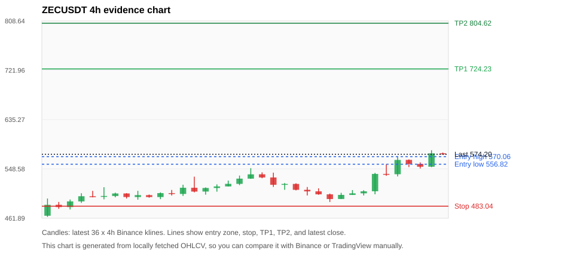
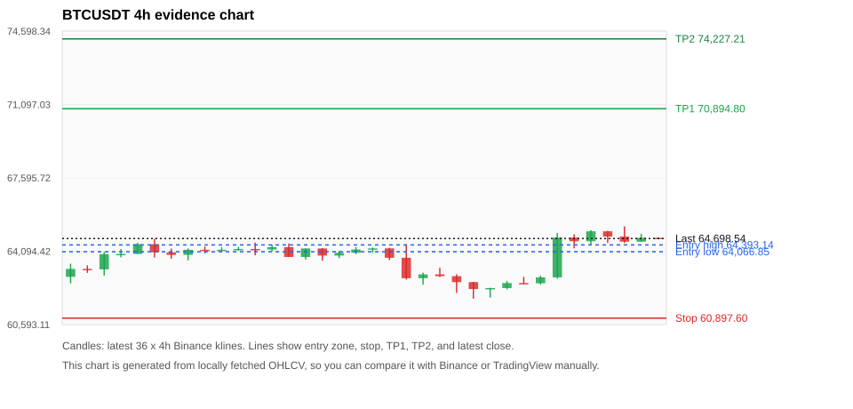
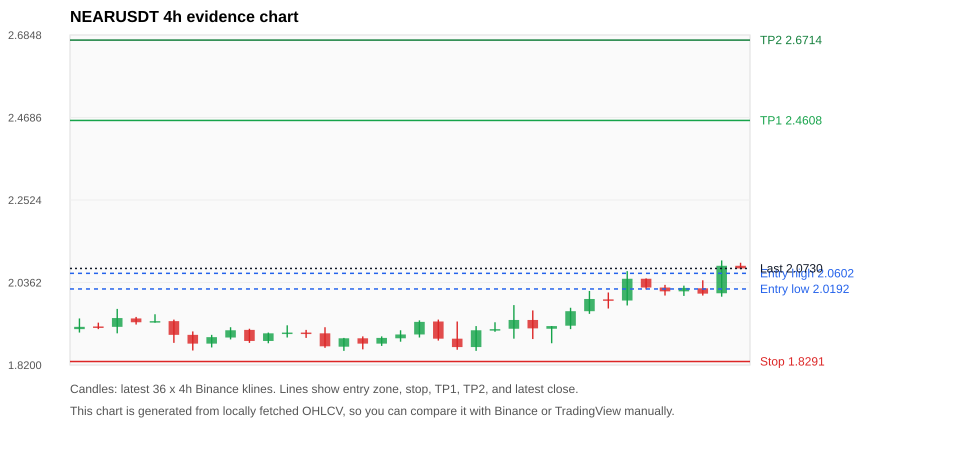
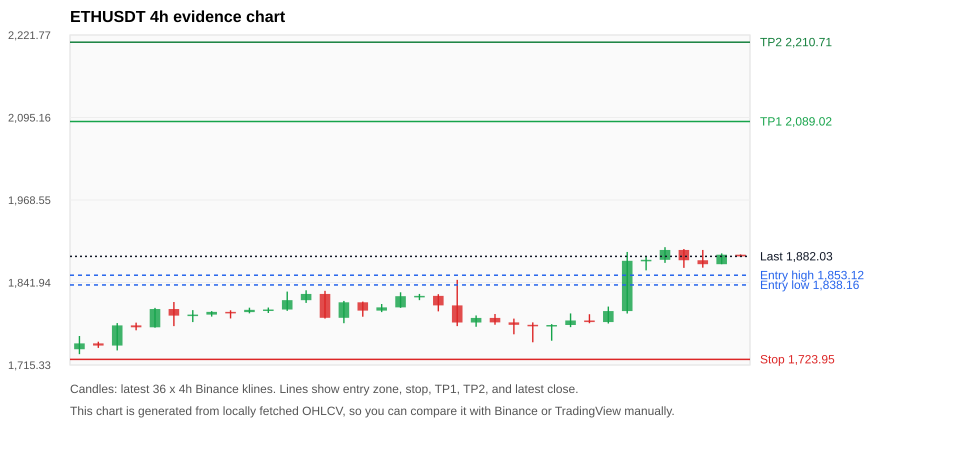
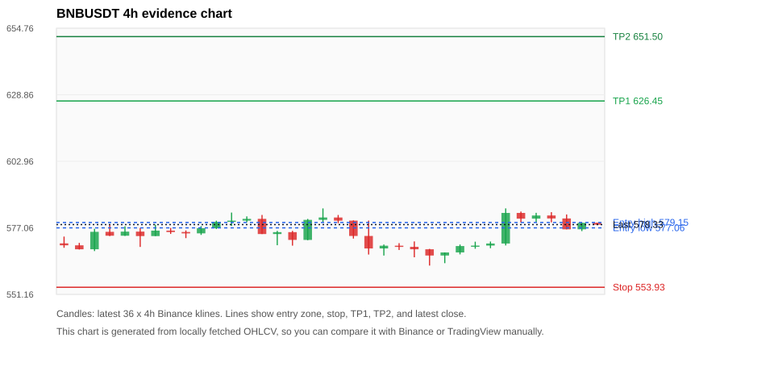

# Crypto 市场扫描报告 v1

- 报告时间：2026-07-15 20:06:09 CST
- Run ID：`20260715_120503_8142f7b1`
- Run type：`daily_full`
- 数据来源：SQLite
- 报告版本：v1
- 扫描 ID：b91b23210b69
- 数据源：Binance public spot API + CoinGecko/CoinMarketCap cross-check
- 过滤条件：USDT spot; 24h quote volume >= 30,000,000; trades >= 30,000; exclude stables/leveraged tokens; analyze 1h/4h/1d klines
- 默认单笔风险：账户权益的 1.00%

## 限制说明

- 交易信号仍以 Binance 现货公开 K 线为主源；外部数据源用于一致性复核。
- 结果是研究和模拟盘计划，不是确定收益或实盘下单指令。
- 历史长度过滤：候选币至少需要 180 根 1d K 线。
- 数据质量验证池：先验证 score 排名前 min(top_n * 2, 10) 的候选，再按 action + score 补足最终名单。
- 大盘环境过滤：RISK_OFF; BTC/ETH 大盘偏弱，山寨币买入候选降级为观察。 BTC 7d=3.914432493177089; ETH 7d=7.984330729435518.
- 已启用数据交叉验证：Binance 主源 + CoinGecko 自动对照；CoinMarketCap 在配置 API Key 后自动对照。
- ZECUSDT 交叉验证状态 DATA_WARNING：At least one external provider needs manual review.
- BTCUSDT 交叉验证状态 DATA_WARNING：At least one external provider needs manual review.
- ETHUSDT 交叉验证状态 DATA_WARNING：At least one external provider needs manual review.
- BNBUSDT 交叉验证状态 DATA_WARNING：At least one external provider needs manual review.
- SOLUSDT 交叉验证状态 DATA_WARNING：At least one external provider needs manual review.
- DOGEUSDT 交叉验证状态 DATA_WARNING：At least one external provider needs manual review.
- XRPUSDT 交叉验证状态 DATA_WARNING：At least one external provider needs manual review.

## 5 个候选交易计划

| Rank | Coin | Action | Setup | Entry Zone | Stop Loss | TP1 | TP2 / Exit Rule | R/R | Verdict |
|---:|---|---|---|---:|---:|---:|---|---:|---|
| 1 | `ZEC` | `WAIT_PULLBACK` | 趋势中，等回调入场 | 556.82 - 570.06 | 483.04 | 724.23 | 804.62 或跌破 4h 关键支撑 | 2.00-3.00 | 只等回调 |
| 2 | `BTC` | `WATCH_ONLY` | 回踩支撑/4h EMA 附近 | 64,066.85 - 64,393.14 | 60,897.60 | 70,894.80 | 74,227.21 或跌破 4h 关键支撑 | 2.00-3.00 | 只观察 |
| 3 | `NEAR` | `WATCH_ONLY` | 趋势中，等回调入场 | 2.0192 - 2.0602 | 1.8291 | 2.4608 | 2.6714 或跌破 4h 关键支撑 | 2.00-3.00 | 只等回调 |
| 4 | `ETH` | `WATCH_ONLY` | 回踩支撑/4h EMA 附近 | 1,838.16 - 1,853.12 | 1,723.95 | 2,089.02 | 2,210.71 或跌破 4h 关键支撑 | 2.00-3.00 | 只等回调 |
| 5 | `BNB` | `WATCH_ONLY` | 回踩支撑/4h EMA 附近 | 577.06 - 579.15 | 553.93 | 626.45 | 651.50 或跌破 4h 关键支撑 | 2.00-3.04 | 只观察 |

## 数据交叉验证摘要

价格差异以 Binance 当前价为基准；成交量口径不同，Binance 是 USDT 现货成交额，CoinGecko/CoinMarketCap 通常是全市场成交量。

| Rank | Coin | Data Status | Max Price Diff | Max 24h Diff | Message |
|---:|---|---|---:|---:|---|
| 1 | `ZEC` | DATA_WARNING | 0.11% | 0.21 pts | At least one external provider needs manual review. |
| 2 | `BTC` | DATA_WARNING | 0.05% | 0.04 pts | At least one external provider needs manual review. |
| 3 | `NEAR` | DATA_OK | 0.47% | 0.10 pts | External provider checks agree with Binance within configured thresholds. |
| 4 | `ETH` | DATA_WARNING | 0.08% | 0.07 pts | At least one external provider needs manual review. |
| 5 | `BNB` | DATA_WARNING | 0.02% | 0.04 pts | At least one external provider needs manual review. |

## 候选币说明

### 1. ZEC `ZECUSDT`



- 入选原因：趋势中，等回调入场；24h +13.26%，7d +23.72%，4h RSI 69.44，24h 成交额 $140.3M。
- 交易失效条件：跌破 483.044 或 4h 收盘重新失守关键支撑。
- 主要风险：BTC/ETH 大盘环境未确认强势，山寨币买入信号降级；数据交叉验证需要人工复核。
- 数据交叉验证：DATA_WARNING；At least one external provider needs manual review.

#### 可点击人工验证

- [Binance 交易页](https://www.binance.com/en/trade/ZEC_USDT)
- [TradingView 图表](https://www.tradingview.com/chart/?symbol=BINANCE%3AZECUSDT)
- [CoinGecko 搜索](https://www.coingecko.com/en/search?query=ZEC)
- [CoinMarketCap 搜索](https://coinmarketcap.com/search/?q=ZEC)

#### 多数据源对照

| Source | Status | Asset ID | Price | 24h Change | 24h Volume | Price Diff | 24h Diff | Updated | Message |
|---|---|---|---:|---:|---:|---:|---:|---|---|
| Binance | DATA_OK | ZECUSDT | 574.20 | +13.26% | $140.3M | 0.00% | 0.00 pts | 2026-07-15T12:05:35+00:00 | Primary market data source used by scanner. |
| CoinGecko | DATA_OK | zcash | 574.86 | +13.28% | $585.5M | 0.11% | 0.02 pts | 2026-07-15T12:05:24.450Z | External source agrees with Binance within thresholds. |
| CoinMarketCap | DATA_WARNING | 1437 | 574.76 | +13.05% | $731.1M | 0.10% | 0.21 pts | 2026-07-15T12:04:04.000Z | CoinMarketCap symbol mapping has 2 matches; selected lowest cmc_rank |

#### 指标证据

| 指标 | 数值 | 人工核对用途 |
|---|---:|---|
| 当前价 | 574.20 | 与 Binance/TradingView 当前价格对照 |
| 24h 涨跌 | +13.26% | 与交易所 24h 涨跌对照 |
| 7d 涨跌 | +23.72% | 判断短线趋势是否延续 |
| 4h EMA20 | 534.25 | 判断短期趋势支撑 |
| 4h EMA50 | 507.84 | 判断中期趋势支撑 |
| 1d EMA20 | 488.09 | 判断日线趋势 |
| 1d EMA50 | 472.13 | 判断日线趋势 |
| 4h RSI14 | 69.44 | 判断是否过热/过弱 |
| 4h ATR14 | 16.5564 | 推导止损和入场缓冲 |
| 最近 18 根 4h 最低点 | 490.40 | 支撑/止损参考 |
| 最近 36 根 4h 最高点 | 581.38 | TP/压力参考 |
| 支撑位 | 534.25 | 入场区间推导基础 |

#### 交易计划推导

- 支撑位 = 最近低点、4h EMA20、4h EMA50、1d EMA20 中不高于当前价的最高有效支撑 = `534.25`。
- 入场区间 = 支撑位附近 + ATR 缓冲 = `556.82 - 570.06`。
- 止损 = min(最近 18 根 4h 最低点 * 0.985, 入场中位价 - 1.15 * ATR14) = `483.04`。
- TP1 = max(最近 36 根 4h 最高点 * 0.995, 入场中位价 + 2R) = `724.23`。
- TP2 = max(入场中位价 + 3R, TP1 * 1.04) = `804.62`。

#### 最近 10 根 4h K线

| UTC 开盘时间 | Open | High | Low | Close | Quote Volume | Trades |
|---|---:|---:|---:|---:|---:|---:|
| 2026-07-14T00:00+00:00 | 495.67 | 506.48 | 495.67 | 502.86 | $10.6M | 59008 |
| 2026-07-14T04:00+00:00 | 502.81 | 511.34 | 502.81 | 505.59 | $9.7M | 72594 |
| 2026-07-14T08:00+00:00 | 505.61 | 511.06 | 501.80 | 509.13 | $6.0M | 23589 |
| 2026-07-14T12:00+00:00 | 509.25 | 541.60 | 503.92 | 539.73 | $32.8M | 102343 |
| 2026-07-14T16:00+00:00 | 539.76 | 556.55 | 536.33 | 539.19 | $27.8M | 79547 |
| 2026-07-14T20:00+00:00 | 539.20 | 570.00 | 535.32 | 564.31 | $29.5M | 86322 |
| 2026-07-15T00:00+00:00 | 564.39 | 565.24 | 551.76 | 557.34 | $15.3M | 46470 |
| 2026-07-15T04:00+00:00 | 557.34 | 560.00 | 549.30 | 552.36 | $10.4M | 30102 |
| 2026-07-15T08:00+00:00 | 552.42 | 581.38 | 551.63 | 575.90 | $24.4M | 59739 |
| 2026-07-15T12:00+00:00 | 575.93 | 577.22 | 574.11 | 574.11 | $407,394 | 1582 |

### 2. BTC `BTCUSDT`



- 入选原因：回踩支撑/4h EMA 附近；24h +3.05%，7d +4.44%，4h RSI 68.88，24h 成交额 $1.39B。
- 交易失效条件：跌破 60897.595 或 4h 收盘重新失守关键支撑。
- 主要风险：日线趋势未完全确认；BTC/ETH 大盘环境未确认强势，山寨币买入信号降级；数据交叉验证需要人工复核。
- 数据交叉验证：DATA_WARNING；At least one external provider needs manual review.

#### 可点击人工验证

- [Binance 交易页](https://www.binance.com/en/trade/BTC_USDT)
- [TradingView 图表](https://www.tradingview.com/chart/?symbol=BINANCE%3ABTCUSDT)
- [CoinGecko 搜索](https://www.coingecko.com/en/search?query=BTC)
- [CoinMarketCap 搜索](https://coinmarketcap.com/search/?q=BTC)

#### 多数据源对照

| Source | Status | Asset ID | Price | 24h Change | 24h Volume | Price Diff | 24h Diff | Updated | Message |
|---|---|---|---:|---:|---:|---:|---:|---|---|
| Binance | DATA_OK | BTCUSDT | 64,698.54 | +3.05% | $1.39B | 0.00% | 0.00 pts | 2026-07-15T12:05:35+00:00 | Primary market data source used by scanner. |
| CoinGecko | DATA_OK | bitcoin | 64,665.00 | +3.09% | $31.40B | 0.05% | 0.04 pts | 2026-07-15T12:05:41.053Z | External source agrees with Binance within thresholds. |
| CoinMarketCap | DATA_WARNING | 1 | 64,674.50 | +3.01% | $30.65B | 0.04% | 0.03 pts | 2026-07-15T12:04:04.000Z | CoinMarketCap symbol mapping has 13 matches; selected lowest cmc_rank |

#### 指标证据

| 指标 | 数值 | 人工核对用途 |
|---|---:|---|
| 当前价 | 64,698.54 | 与 Binance/TradingView 当前价格对照 |
| 24h 涨跌 | +3.05% | 与交易所 24h 涨跌对照 |
| 7d 涨跌 | +4.44% | 判断短线趋势是否延续 |
| 4h EMA20 | 63,938.98 | 判断短期趋势支撑 |
| 4h EMA50 | 63,455.84 | 判断中期趋势支撑 |
| 1d EMA20 | 63,278.24 | 判断日线趋势 |
| 1d EMA50 | 65,154.69 | 判断日线趋势 |
| 4h RSI14 | 68.88 | 判断是否过热/过弱 |
| 4h ATR14 | 648.81 | 推导止损和入场缓冲 |
| 最近 18 根 4h 最低点 | 61,824.97 | 支撑/止损参考 |
| 最近 36 根 4h 最高点 | 65,277.37 | TP/压力参考 |
| 支撑位 | 63,938.98 | 入场区间推导基础 |

#### 交易计划推导

- 支撑位 = 最近低点、4h EMA20、4h EMA50、1d EMA20 中不高于当前价的最高有效支撑 = `63,938.98`。
- 入场区间 = 支撑位附近 + ATR 缓冲 = `64,066.85 - 64,393.14`。
- 止损 = min(最近 18 根 4h 最低点 * 0.985, 入场中位价 - 1.15 * ATR14) = `60,897.60`。
- TP1 = max(最近 36 根 4h 最高点 * 0.995, 入场中位价 + 2R) = `70,894.80`。
- TP2 = max(入场中位价 + 3R, TP1 * 1.04) = `74,227.21`。

#### 最近 10 根 4h K线

| UTC 开盘时间 | Open | High | Low | Close | Quote Volume | Trades |
|---|---:|---:|---:|---:|---:|---:|
| 2026-07-14T00:00+00:00 | 62,334.52 | 62,666.66 | 62,272.20 | 62,572.89 | $140.5M | 425285 |
| 2026-07-14T04:00+00:00 | 62,572.88 | 62,872.00 | 62,516.93 | 62,560.92 | $130.9M | 296282 |
| 2026-07-14T08:00+00:00 | 62,560.92 | 62,923.06 | 62,500.00 | 62,844.99 | $108.6M | 305432 |
| 2026-07-14T12:00+00:00 | 62,844.99 | 64,966.43 | 62,780.84 | 64,743.99 | $562.9M | 1148163 |
| 2026-07-14T16:00+00:00 | 64,744.00 | 64,896.86 | 64,231.77 | 64,569.59 | $212.7M | 533516 |
| 2026-07-14T20:00+00:00 | 64,569.59 | 65,100.00 | 64,419.99 | 65,043.98 | $155.3M | 372267 |
| 2026-07-15T00:00+00:00 | 65,043.99 | 65,065.01 | 64,488.00 | 64,792.01 | $109.6M | 320579 |
| 2026-07-15T04:00+00:00 | 64,792.00 | 65,277.37 | 64,485.00 | 64,549.34 | $204.7M | 419673 |
| 2026-07-15T08:00+00:00 | 64,549.33 | 64,917.94 | 64,549.33 | 64,732.15 | $150.0M | 289157 |
| 2026-07-15T12:00+00:00 | 64,732.15 | 64,742.00 | 64,698.54 | 64,698.55 | $3.1M | 6157 |

### 3. NEAR `NEARUSDT`



- 入选原因：趋势中，等回调入场；24h +4.79%，7d +10.44%，4h RSI 75.00，24h 成交额 $30.4M。
- 交易失效条件：跌破 1.829145 或 4h 收盘重新失守关键支撑。
- 主要风险：4h RSI 偏热；BTC/ETH 大盘环境未确认强势，山寨币买入信号降级。
- 数据交叉验证：DATA_OK；External provider checks agree with Binance within configured thresholds.

#### 可点击人工验证

- [Binance 交易页](https://www.binance.com/en/trade/NEAR_USDT)
- [TradingView 图表](https://www.tradingview.com/chart/?symbol=BINANCE%3ANEARUSDT)
- [CoinGecko 搜索](https://www.coingecko.com/en/search?query=NEAR)
- [CoinMarketCap 搜索](https://coinmarketcap.com/search/?q=NEAR)

#### 多数据源对照

| Source | Status | Asset ID | Price | 24h Change | 24h Volume | Price Diff | 24h Diff | Updated | Message |
|---|---|---|---:|---:|---:|---:|---:|---|---|
| Binance | DATA_OK | NEARUSDT | 2.0730 | +4.79% | $30.4M | 0.00% | 0.00 pts | 2026-07-15T12:05:35+00:00 | Primary market data source used by scanner. |
| CoinGecko | DATA_OK | near | 2.0800 | +4.83% | $202.6M | 0.34% | 0.04 pts | 2026-07-15T12:05:37.458Z | External source agrees with Binance within thresholds. |
| CoinMarketCap | DATA_OK | 6535 | 2.0827 | +4.89% | $229.2M | 0.47% | 0.10 pts | 2026-07-15T12:04:04.000Z | External source agrees with Binance within thresholds. |

#### 指标证据

| 指标 | 数值 | 人工核对用途 |
|---|---:|---|
| 当前价 | 2.0730 | 与 Binance/TradingView 当前价格对照 |
| 24h 涨跌 | +4.79% | 与交易所 24h 涨跌对照 |
| 7d 涨跌 | +10.44% | 判断短线趋势是否延续 |
| 4h EMA20 | 1.9847 | 判断短期趋势支撑 |
| 4h EMA50 | 1.9520 | 判断中期趋势支撑 |
| 1d EMA20 | 1.9662 | 判断日线趋势 |
| 1d EMA50 | 1.9648 | 判断日线趋势 |
| 4h RSI14 | 75.00 | 判断是否过热/过弱 |
| 4h ATR14 | 0.05121 | 推导止损和入场缓冲 |
| 最近 18 根 4h 最低点 | 1.8570 | 支撑/止损参考 |
| 最近 36 根 4h 最高点 | 2.0940 | TP/压力参考 |
| 支撑位 | 1.9847 | 入场区间推导基础 |

#### 交易计划推导

- 支撑位 = 最近低点、4h EMA20、4h EMA50、1d EMA20 中不高于当前价的最高有效支撑 = `1.9847`。
- 入场区间 = 支撑位附近 + ATR 缓冲 = `2.0192 - 2.0602`。
- 止损 = min(最近 18 根 4h 最低点 * 0.985, 入场中位价 - 1.15 * ATR14) = `1.8291`。
- TP1 = max(最近 36 根 4h 最高点 * 0.995, 入场中位价 + 2R) = `2.4608`。
- TP2 = max(入场中位价 + 3R, TP1 * 1.04) = `2.6714`。

#### 最近 10 根 4h K线

| UTC 开盘时间 | Open | High | Low | Close | Quote Volume | Trades |
|---|---:|---:|---:|---:|---:|---:|
| 2026-07-14T00:00+00:00 | 1.9230 | 1.9700 | 1.9140 | 1.9610 | $4.8M | 28042 |
| 2026-07-14T04:00+00:00 | 1.9610 | 2.0140 | 1.9540 | 1.9930 | $8.1M | 35139 |
| 2026-07-14T08:00+00:00 | 1.9920 | 2.0100 | 1.9680 | 1.9890 | $3.5M | 18332 |
| 2026-07-14T12:00+00:00 | 1.9890 | 2.0660 | 1.9760 | 2.0460 | $12.1M | 62164 |
| 2026-07-14T16:00+00:00 | 2.0460 | 2.0470 | 2.0180 | 2.0230 | $3.5M | 17020 |
| 2026-07-14T20:00+00:00 | 2.0230 | 2.0300 | 2.0020 | 2.0130 | $4.1M | 22201 |
| 2026-07-15T00:00+00:00 | 2.0130 | 2.0280 | 2.0010 | 2.0220 | $3.0M | 12981 |
| 2026-07-15T04:00+00:00 | 2.0210 | 2.0420 | 2.0020 | 2.0070 | $2.4M | 13501 |
| 2026-07-15T08:00+00:00 | 2.0080 | 2.0940 | 1.9990 | 2.0800 | $5.2M | 25968 |
| 2026-07-15T12:00+00:00 | 2.0800 | 2.0880 | 2.0710 | 2.0730 | $261,926 | 1370 |

### 4. ETH `ETHUSDT`



- 入选原因：回踩支撑/4h EMA 附近；24h +4.75%，7d +8.30%，4h RSI 77.23，24h 成交额 $706.8M。
- 交易失效条件：跌破 1723.947 或 4h 收盘重新失守关键支撑。
- 主要风险：4h RSI 偏热；日线趋势未完全确认；BTC/ETH 大盘环境未确认强势，山寨币买入信号降级；数据交叉验证需要人工复核。
- 数据交叉验证：DATA_WARNING；At least one external provider needs manual review.

#### 可点击人工验证

- [Binance 交易页](https://www.binance.com/en/trade/ETH_USDT)
- [TradingView 图表](https://www.tradingview.com/chart/?symbol=BINANCE%3AETHUSDT)
- [CoinGecko 搜索](https://www.coingecko.com/en/search?query=ETH)
- [CoinMarketCap 搜索](https://coinmarketcap.com/search/?q=ETH)

#### 多数据源对照

| Source | Status | Asset ID | Price | 24h Change | 24h Volume | Price Diff | 24h Diff | Updated | Message |
|---|---|---|---:|---:|---:|---:|---:|---|---|
| Binance | DATA_OK | ETHUSDT | 1,882.03 | +4.75% | $706.8M | 0.00% | 0.00 pts | 2026-07-15T12:05:35+00:00 | Primary market data source used by scanner. |
| CoinGecko | DATA_OK | ethereum | 1,880.61 | +4.81% | $13.83B | 0.08% | 0.06 pts | 2026-07-15T12:05:46.134Z | External source agrees with Binance within thresholds. |
| CoinMarketCap | DATA_WARNING | 1027 | 1,882.26 | +4.81% | $14.17B | 0.01% | 0.07 pts | 2026-07-15T12:04:04.000Z | CoinMarketCap symbol mapping has 6 matches; selected lowest cmc_rank |

#### 指标证据

| 指标 | 数值 | 人工核对用途 |
|---|---:|---|
| 当前价 | 1,882.03 | 与 Binance/TradingView 当前价格对照 |
| 24h 涨跌 | +4.75% | 与交易所 24h 涨跌对照 |
| 7d 涨跌 | +8.30% | 判断短线趋势是否延续 |
| 4h EMA20 | 1,834.49 | 判断短期趋势支撑 |
| 4h EMA50 | 1,797.12 | 判断中期趋势支撑 |
| 1d EMA20 | 1,768.09 | 判断日线趋势 |
| 1d EMA50 | 1,806.55 | 判断日线趋势 |
| 4h RSI14 | 77.23 | 判断是否过热/过弱 |
| 4h ATR14 | 26.6186 | 推导止损和入场缓冲 |
| 最近 18 根 4h 最低点 | 1,750.20 | 支撑/止损参考 |
| 最近 36 根 4h 最高点 | 1,896.14 | TP/压力参考 |
| 支撑位 | 1,834.49 | 入场区间推导基础 |

#### 交易计划推导

- 支撑位 = 最近低点、4h EMA20、4h EMA50、1d EMA20 中不高于当前价的最高有效支撑 = `1,834.49`。
- 入场区间 = 支撑位附近 + ATR 缓冲 = `1,838.16 - 1,853.12`。
- 止损 = min(最近 18 根 4h 最低点 * 0.985, 入场中位价 - 1.15 * ATR14) = `1,723.95`。
- TP1 = max(最近 36 根 4h 最高点 * 0.995, 入场中位价 + 2R) = `2,089.02`。
- TP2 = max(入场中位价 + 3R, TP1 * 1.04) = `2,210.71`。

#### 最近 10 根 4h K线

| UTC 开盘时间 | Open | High | Low | Close | Quote Volume | Trades |
|---|---:|---:|---:|---:|---:|---:|
| 2026-07-14T00:00+00:00 | 1,776.71 | 1,794.47 | 1,773.41 | 1,783.65 | $46.1M | 354675 |
| 2026-07-14T04:00+00:00 | 1,783.64 | 1,793.26 | 1,779.41 | 1,781.21 | $41.3M | 228043 |
| 2026-07-14T08:00+00:00 | 1,781.21 | 1,805.00 | 1,779.00 | 1,798.09 | $85.3M | 336202 |
| 2026-07-14T12:00+00:00 | 1,798.09 | 1,888.80 | 1,794.37 | 1,875.22 | $358.1M | 1571099 |
| 2026-07-14T16:00+00:00 | 1,875.22 | 1,881.56 | 1,860.56 | 1,876.74 | $72.9M | 437205 |
| 2026-07-14T20:00+00:00 | 1,876.74 | 1,896.14 | 1,872.06 | 1,891.87 | $76.2M | 356683 |
| 2026-07-15T00:00+00:00 | 1,891.87 | 1,893.32 | 1,864.38 | 1,876.08 | $65.9M | 409790 |
| 2026-07-15T04:00+00:00 | 1,876.08 | 1,891.89 | 1,864.70 | 1,870.04 | $68.2M | 288693 |
| 2026-07-15T08:00+00:00 | 1,870.04 | 1,886.59 | 1,870.03 | 1,884.62 | $66.0M | 273069 |
| 2026-07-15T12:00+00:00 | 1,884.62 | 1,885.04 | 1,882.03 | 1,882.03 | $1.0M | 4153 |

### 5. BNB `BNBUSDT`



- 入选原因：回踩支撑/4h EMA 附近；24h +1.40%，7d +2.29%，4h RSI 62.57，24h 成交额 $80.7M。
- 交易失效条件：跌破 553.93445 或 4h 收盘重新失守关键支撑。
- 主要风险：日线趋势未完全确认；BTC/ETH 大盘环境未确认强势，山寨币买入信号降级；数据交叉验证需要人工复核。
- 数据交叉验证：DATA_WARNING；At least one external provider needs manual review.

#### 可点击人工验证

- [Binance 交易页](https://www.binance.com/en/trade/BNB_USDT)
- [TradingView 图表](https://www.tradingview.com/chart/?symbol=BINANCE%3ABNBUSDT)
- [CoinGecko 搜索](https://www.coingecko.com/en/search?query=BNB)
- [CoinMarketCap 搜索](https://coinmarketcap.com/search/?q=BNB)

#### 多数据源对照

| Source | Status | Asset ID | Price | 24h Change | 24h Volume | Price Diff | 24h Diff | Updated | Message |
|---|---|---|---:|---:|---:|---:|---:|---|---|
| Binance | DATA_OK | BNBUSDT | 578.33 | +1.40% | $80.7M | 0.00% | 0.00 pts | 2026-07-15T12:05:35+00:00 | Primary market data source used by scanner. |
| CoinGecko | DATA_OK | binancecoin | 578.23 | +1.44% | $691.6M | 0.02% | 0.04 pts | 2026-07-15T12:05:45.751Z | External source agrees with Binance within thresholds. |
| CoinMarketCap | DATA_WARNING | 1839 | 578.40 | +1.43% | $1.28B | 0.01% | 0.03 pts | 2026-07-15T12:04:04.000Z | CoinMarketCap symbol mapping has 4 matches; selected lowest cmc_rank |

#### 指标证据

| 指标 | 数值 | 人工核对用途 |
|---|---:|---|
| 当前价 | 578.33 | 与 Binance/TradingView 当前价格对照 |
| 24h 涨跌 | +1.40% | 与交易所 24h 涨跌对照 |
| 7d 涨跌 | +2.29% | 判断短线趋势是否延续 |
| 4h EMA20 | 575.91 | 判断短期趋势支撑 |
| 4h EMA50 | 574.21 | 判断中期趋势支撑 |
| 1d EMA20 | 575.58 | 判断日线趋势 |
| 1d EMA50 | 590.76 | 判断日线趋势 |
| 4h RSI14 | 62.57 | 判断是否过热/过弱 |
| 4h ATR14 | 4.6343 | 推导止损和入场缓冲 |
| 最近 18 根 4h 最低点 | 562.37 | 支撑/止损参考 |
| 最近 36 根 4h 最高点 | 584.64 | TP/压力参考 |
| 支撑位 | 575.91 | 入场区间推导基础 |

#### 交易计划推导

- 支撑位 = 最近低点、4h EMA20、4h EMA50、1d EMA20 中不高于当前价的最高有效支撑 = `575.91`。
- 入场区间 = 支撑位附近 + ATR 缓冲 = `577.06 - 579.15`。
- 止损 = min(最近 18 根 4h 最低点 * 0.985, 入场中位价 - 1.15 * ATR14) = `553.93`。
- TP1 = max(最近 36 根 4h 最高点 * 0.995, 入场中位价 + 2R) = `626.45`。
- TP2 = max(入场中位价 + 3R, TP1 * 1.04) = `651.50`。

#### 最近 10 根 4h K线

| UTC 开盘时间 | Open | High | Low | Close | Quote Volume | Trades |
|---|---:|---:|---:|---:|---:|---:|
| 2026-07-14T00:00+00:00 | 567.50 | 570.57 | 566.74 | 569.98 | $6.8M | 65167 |
| 2026-07-14T04:00+00:00 | 569.99 | 571.68 | 568.93 | 570.15 | $7.6M | 66123 |
| 2026-07-14T08:00+00:00 | 570.16 | 571.74 | 569.14 | 570.96 | $7.0M | 66617 |
| 2026-07-14T12:00+00:00 | 570.96 | 584.64 | 570.21 | 582.87 | $31.4M | 202766 |
| 2026-07-14T16:00+00:00 | 582.87 | 583.41 | 579.10 | 580.64 | $11.5M | 70650 |
| 2026-07-14T20:00+00:00 | 580.65 | 582.91 | 579.27 | 581.87 | $6.8M | 53347 |
| 2026-07-15T00:00+00:00 | 581.88 | 583.17 | 579.20 | 580.71 | $8.6M | 61065 |
| 2026-07-15T04:00+00:00 | 580.72 | 582.28 | 576.49 | 576.49 | $12.0M | 77720 |
| 2026-07-15T08:00+00:00 | 576.50 | 579.10 | 575.80 | 579.01 | $10.5M | 86444 |
| 2026-07-15T12:00+00:00 | 579.02 | 579.02 | 578.28 | 578.28 | $142,348 | 1577 |

## 组合风控

- 不要 5 个候选全部满仓买入。
- 同时持仓总风险建议控制在账户权益的 3% - 5% 以内。
- 如果 BTC/ETH 同时破位，暂停山寨币多头计划或降低仓位。
- 第一版报告用于模拟盘和人工复核，不自动下单。

## 原始数据

```json
[
  {
    "rank": 1,
    "symbol": "ZECUSDT",
    "base_asset": "ZEC",
    "price": 574.2,
    "score": 70.12222441627341,
    "setup": "趋势中，等回调入场",
    "verdict": "只等回调",
    "entry_low": 556.8157500000001,
    "entry_high": 570.0608928571429,
    "stop_loss": 483.044,
    "take_profit_1": 724.2269642857145,
    "take_profit_2": 804.621285714286,
    "risk_reward_1": 2.0,
    "risk_reward_2": 3.0,
    "pct_24h": 13.259,
    "pct_3d": 9.136525193393275,
    "pct_7d": 23.723335488041375,
    "quote_volume_24h": 140319423.78949,
    "trades_24h": 405318,
    "high_low_range_24h": 15.371487537704386,
    "rsi_1h": 65.85847701149437,
    "rsi_4h": 69.43966484626323,
    "ema20_4h": 534.2543315950646,
    "ema50_4h": 507.8392975967378,
    "ema20_1d": 488.0863497783752,
    "ema50_1d": 472.1273521340672,
    "atr_4h": 16.556428571428565,
    "macd_hist_4h": 5.028680185022576,
    "volume_ratio_24h": 1.6736439291288228,
    "support_level": 534.2543315950646,
    "recent_low_4h_18": 490.4,
    "recent_high_4h_36": 581.38,
    "distance_to_support_pct": 7.476901176575201,
    "binance_trade_url": "https://www.binance.com/en/trade/ZEC_USDT",
    "tradingview_url": "https://www.tradingview.com/chart/?symbol=BINANCE%3AZECUSDT",
    "coingecko_search_url": "https://www.coingecko.com/en/search?query=ZEC",
    "coinmarketcap_search_url": "https://coinmarketcap.com/search/?q=ZEC",
    "invalidation": "跌破 483.044 或 4h 收盘重新失守关键支撑",
    "recent_4h_klines": [
      {
        "open_time_utc": "2026-07-09T16:00+00:00",
        "open": 466.23,
        "high": 496.48,
        "low": 464.21,
        "close": 485.41,
        "quote_volume": 26352494.97918,
        "trades": 75989
      },
      {
        "open_time_utc": "2026-07-09T20:00+00:00",
        "open": 485.46,
        "high": 490.45,
        "low": 478.37,
        "close": 481.54,
        "quote_volume": 12281798.61502,
        "trades": 42101
      },
      {
        "open_time_utc": "2026-07-10T00:00+00:00",
        "open": 481.51,
        "high": 494.71,
        "low": 477.22,
        "close": 491.44,
        "quote_volume": 13712407.85083,
        "trades": 46636
      },
      {
        "open_time_utc": "2026-07-10T04:00+00:00",
        "open": 491.44,
        "high": 505.77,
        "low": 488.77,
        "close": 500.5,
        "quote_volume": 21013379.278,
        "trades": 56475
      },
      {
        "open_time_utc": "2026-07-10T08:00+00:00",
        "open": 500.49,
        "high": 509.94,
        "low": 498.53,
        "close": 500.48,
        "quote_volume": 11695607.73336,
        "trades": 48743
      },
      {
        "open_time_utc": "2026-07-10T12:00+00:00",
        "open": 500.47,
        "high": 516.4,
        "low": 495.01,
        "close": 500.97,
        "quote_volume": 20201010.00175,
        "trades": 74738
      },
      {
        "open_time_utc": "2026-07-10T16:00+00:00",
        "open": 500.91,
        "high": 506.79,
        "low": 498.66,
        "close": 505.37,
        "quote_volume": 10429574.07918,
        "trades": 37794
      },
      {
        "open_time_utc": "2026-07-10T20:00+00:00",
        "open": 505.39,
        "high": 505.87,
        "low": 496.46,
        "close": 499.13,
        "quote_volume": 5159821.03843,
        "trades": 21679
      },
      {
        "open_time_utc": "2026-07-11T00:00+00:00",
        "open": 499.1,
        "high": 509.99,
        "low": 494.51,
        "close": 502.49,
        "quote_volume": 10516184.02028,
        "trades": 33951
      },
      {
        "open_time_utc": "2026-07-11T04:00+00:00",
        "open": 502.46,
        "high": 503.48,
        "low": 497.94,
        "close": 499.08,
        "quote_volume": 5305698.4872,
        "trades": 18572
      },
      {
        "open_time_utc": "2026-07-11T08:00+00:00",
        "open": 499.09,
        "high": 507.25,
        "low": 495.37,
        "close": 505.97,
        "quote_volume": 6729220.36434,
        "trades": 25303
      },
      {
        "open_time_utc": "2026-07-11T12:00+00:00",
        "open": 505.97,
        "high": 511.57,
        "low": 501.8,
        "close": 504.51,
        "quote_volume": 9561942.02663,
        "trades": 29469
      },
      {
        "open_time_utc": "2026-07-11T16:00+00:00",
        "open": 504.52,
        "high": 520.7,
        "low": 501.0,
        "close": 515.39,
        "quote_volume": 16819614.84812,
        "trades": 52262
      },
      {
        "open_time_utc": "2026-07-11T20:00+00:00",
        "open": 515.41,
        "high": 534.91,
        "low": 507.35,
        "close": 508.69,
        "quote_volume": 24815708.72308,
        "trades": 77416
      },
      {
        "open_time_utc": "2026-07-12T00:00+00:00",
        "open": 508.76,
        "high": 516.0,
        "low": 503.27,
        "close": 515.0,
        "quote_volume": 9187989.0886,
        "trades": 41836
      },
      {
        "open_time_utc": "2026-07-12T04:00+00:00",
        "open": 515.04,
        "high": 521.34,
        "low": 508.55,
        "close": 517.74,
        "quote_volume": 8568252.35117,
        "trades": 33855
      },
      {
        "open_time_utc": "2026-07-12T08:00+00:00",
        "open": 517.76,
        "high": 528.0,
        "low": 517.76,
        "close": 522.28,
        "quote_volume": 10185487.70149,
        "trades": 37378
      },
      {
        "open_time_utc": "2026-07-12T12:00+00:00",
        "open": 522.22,
        "high": 536.82,
        "low": 520.05,
        "close": 531.44,
        "quote_volume": 16246214.67279,
        "trades": 53489
      },
      {
        "open_time_utc": "2026-07-12T16:00+00:00",
        "open": 531.43,
        "high": 549.81,
        "low": 531.1,
        "close": 539.01,
        "quote_volume": 27871265.22555,
        "trades": 128961
      },
      {
        "open_time_utc": "2026-07-12T20:00+00:00",
        "open": 539.06,
        "high": 542.46,
        "low": 532.08,
        "close": 533.53,
        "quote_volume": 17127848.34602,
        "trades": 41857
      },
      {
        "open_time_utc": "2026-07-13T00:00+00:00",
        "open": 533.53,
        "high": 541.96,
        "low": 516.84,
        "close": 520.59,
        "quote_volume": 23115946.67192,
        "trades": 105018
      },
      {
        "open_time_utc": "2026-07-13T04:00+00:00",
        "open": 520.65,
        "high": 523.72,
        "low": 511.8,
        "close": 522.14,
        "quote_volume": 15472324.10753,
        "trades": 95395
      },
      {
        "open_time_utc": "2026-07-13T08:00+00:00",
        "open": 522.12,
        "high": 523.27,
        "low": 510.77,
        "close": 511.79,
        "quote_volume": 10637459.71962,
        "trades": 67883
      },
      {
        "open_time_utc": "2026-07-13T12:00+00:00",
        "open": 511.8,
        "high": 516.75,
        "low": 501.87,
        "close": 509.06,
        "quote_volume": 15052684.40364,
        "trades": 59034
      },
      {
        "open_time_utc": "2026-07-13T16:00+00:00",
        "open": 509.1,
        "high": 514.42,
        "low": 503.12,
        "close": 503.86,
        "quote_volume": 11558070.73559,
        "trades": 43848
      },
      {
        "open_time_utc": "2026-07-13T20:00+00:00",
        "open": 503.84,
        "high": 505.19,
        "low": 490.4,
        "close": 495.57,
        "quote_volume": 14263671.87997,
        "trades": 42360
      },
      {
        "open_time_utc": "2026-07-14T00:00+00:00",
        "open": 495.67,
        "high": 506.48,
        "low": 495.67,
        "close": 502.86,
        "quote_volume": 10619851.19281,
        "trades": 59008
      },
      {
        "open_time_utc": "2026-07-14T04:00+00:00",
        "open": 502.81,
        "high": 511.34,
        "low": 502.81,
        "close": 505.59,
        "quote_volume": 9733606.76952,
        "trades": 72594
      },
      {
        "open_time_utc": "2026-07-14T08:00+00:00",
        "open": 505.61,
        "high": 511.06,
        "low": 501.8,
        "close": 509.13,
        "quote_volume": 5987173.1218,
        "trades": 23589
      },
      {
        "open_time_utc": "2026-07-14T12:00+00:00",
        "open": 509.25,
        "high": 541.6,
        "low": 503.92,
        "close": 539.73,
        "quote_volume": 32754470.35064,
        "trades": 102343
      },
      {
        "open_time_utc": "2026-07-14T16:00+00:00",
        "open": 539.76,
        "high": 556.55,
        "low": 536.33,
        "close": 539.19,
        "quote_volume": 27837312.51253,
        "trades": 79547
      },
      {
        "open_time_utc": "2026-07-14T20:00+00:00",
        "open": 539.2,
        "high": 570.0,
        "low": 535.32,
        "close": 564.31,
        "quote_volume": 29518601.87503,
        "trades": 86322
      },
      {
        "open_time_utc": "2026-07-15T00:00+00:00",
        "open": 564.39,
        "high": 565.24,
        "low": 551.76,
        "close": 557.34,
        "quote_volume": 15339188.70066,
        "trades": 46470
      },
      {
        "open_time_utc": "2026-07-15T04:00+00:00",
        "open": 557.34,
        "high": 560.0,
        "low": 549.3,
        "close": 552.36,
        "quote_volume": 10411363.36177,
        "trades": 30102
      },
      {
        "open_time_utc": "2026-07-15T08:00+00:00",
        "open": 552.42,
        "high": 581.38,
        "low": 551.63,
        "close": 575.9,
        "quote_volume": 24380620.94319,
        "trades": 59739
      },
      {
        "open_time_utc": "2026-07-15T12:00+00:00",
        "open": 575.93,
        "high": 577.22,
        "low": 574.11,
        "close": 574.11,
        "quote_volume": 407393.60354,
        "trades": 1582
      }
    ],
    "risks": [
      "BTC/ETH 大盘环境未确认强势，山寨币买入信号降级",
      "数据交叉验证需要人工复核"
    ],
    "data_quality_status": "DATA_WARNING",
    "data_quality_message": "At least one external provider needs manual review.",
    "data_checks": [
      {
        "provider": "Binance",
        "status": "DATA_OK",
        "provider_asset_id": "ZECUSDT",
        "provider_symbol": "ZECUSDT",
        "price_usd": 574.2,
        "pct_24h": 13.259,
        "volume_24h": 140319423.78949,
        "last_updated": null,
        "fetched_at_utc": "2026-07-15T12:05:35+00:00",
        "price_diff_pct": 0.0,
        "pct_24h_diff": 0.0,
        "volume_note": "Binance USDT spot 24h quoteVolume.",
        "message": "Primary market data source used by scanner."
      },
      {
        "provider": "CoinGecko",
        "status": "DATA_OK",
        "provider_asset_id": "zcash",
        "provider_symbol": "ZEC",
        "price_usd": 574.86,
        "pct_24h": 13.28268,
        "volume_24h": 585502352.0,
        "last_updated": "2026-07-15T12:05:24.450Z",
        "fetched_at_utc": "2026-07-15T12:05:35+00:00",
        "price_diff_pct": 0.11494252873562663,
        "pct_24h_diff": 0.023679999999998813,
        "volume_note": "CoinGecko total market volume; not the same venue scope as Binance quoteVolume.",
        "message": "External source agrees with Binance within thresholds."
      },
      {
        "provider": "CoinMarketCap",
        "status": "DATA_WARNING",
        "provider_asset_id": "1437",
        "provider_symbol": "ZEC",
        "price_usd": 574.7639029830025,
        "pct_24h": 13.04604828,
        "volume_24h": 731138016.2044885,
        "last_updated": "2026-07-15T12:04:04.000Z",
        "fetched_at_utc": "2026-07-15T12:05:35+00:00",
        "price_diff_pct": 0.09820671943616083,
        "pct_24h_diff": 0.2129517199999995,
        "volume_note": "CoinMarketCap total market volume; not the same venue scope as Binance quoteVolume.",
        "message": "CoinMarketCap symbol mapping has 2 matches; selected lowest cmc_rank"
      }
    ],
    "action": "WAIT_PULLBACK"
  },
  {
    "rank": 2,
    "symbol": "BTCUSDT",
    "base_asset": "BTC",
    "price": 64698.54,
    "score": 49.981420354027776,
    "setup": "回踩支撑/4h EMA 附近",
    "verdict": "只观察",
    "entry_low": 64066.85386584536,
    "entry_high": 64393.142414017326,
    "stop_loss": 60897.59545,
    "take_profit_1": 70894.80351979402,
    "take_profit_2": 74227.20620972535,
    "risk_reward_1": 2.0,
    "risk_reward_2": 2.999999999999998,
    "pct_24h": 3.048,
    "pct_3d": 1.054931076482668,
    "pct_7d": 4.444310635043824,
    "quote_volume_24h": 1391297857.6816454,
    "trades_24h": 3076188,
    "high_low_range_24h": 3.9765794787071984,
    "rsi_1h": 46.13921190934823,
    "rsi_4h": 68.87915130167984,
    "ema20_4h": 63938.97591401733,
    "ema50_4h": 63455.84154031709,
    "ema20_1d": 63278.23534185147,
    "ema50_1d": 65154.68884079187,
    "atr_4h": 648.8092857142868,
    "macd_hist_4h": 179.056735099327,
    "volume_ratio_24h": 1.1904099453988624,
    "support_level": 63938.97591401733,
    "recent_low_4h_18": 61824.97,
    "recent_high_4h_36": 65277.37,
    "distance_to_support_pct": 1.1879515977924138,
    "binance_trade_url": "https://www.binance.com/en/trade/BTC_USDT",
    "tradingview_url": "https://www.tradingview.com/chart/?symbol=BINANCE%3ABTCUSDT",
    "coingecko_search_url": "https://www.coingecko.com/en/search?query=BTC",
    "coinmarketcap_search_url": "https://coinmarketcap.com/search/?q=BTC",
    "invalidation": "跌破 60897.595 或 4h 收盘重新失守关键支撑",
    "recent_4h_klines": [
      {
        "open_time_utc": "2026-07-09T16:00+00:00",
        "open": 62868.06,
        "high": 63500.0,
        "low": 62559.59,
        "close": 63248.1,
        "quote_volume": 166955414.1540087,
        "trades": 603411
      },
      {
        "open_time_utc": "2026-07-09T20:00+00:00",
        "open": 63248.09,
        "high": 63418.0,
        "low": 63060.91,
        "close": 63230.0,
        "quote_volume": 69809359.4248127,
        "trades": 285711
      },
      {
        "open_time_utc": "2026-07-10T00:00+00:00",
        "open": 63230.01,
        "high": 64050.23,
        "low": 62926.01,
        "close": 63947.2,
        "quote_volume": 209065762.5803273,
        "trades": 511474
      },
      {
        "open_time_utc": "2026-07-10T04:00+00:00",
        "open": 63947.2,
        "high": 64200.0,
        "low": 63802.02,
        "close": 63963.0,
        "quote_volume": 127655182.9260361,
        "trades": 339861
      },
      {
        "open_time_utc": "2026-07-10T08:00+00:00",
        "open": 63963.0,
        "high": 64494.84,
        "low": 63962.99,
        "close": 64425.18,
        "quote_volume": 175885976.5057061,
        "trades": 454783
      },
      {
        "open_time_utc": "2026-07-10T12:00+00:00",
        "open": 64425.18,
        "high": 64692.83,
        "low": 63793.43,
        "close": 64040.0,
        "quote_volume": 255992161.0375202,
        "trades": 867854
      },
      {
        "open_time_utc": "2026-07-10T16:00+00:00",
        "open": 64039.99,
        "high": 64220.0,
        "low": 63732.66,
        "close": 63917.88,
        "quote_volume": 189060026.4147767,
        "trades": 480103
      },
      {
        "open_time_utc": "2026-07-10T20:00+00:00",
        "open": 63917.88,
        "high": 64222.61,
        "low": 63656.0,
        "close": 64161.72,
        "quote_volume": 168438851.5376846,
        "trades": 273350
      },
      {
        "open_time_utc": "2026-07-11T00:00+00:00",
        "open": 64161.72,
        "high": 64310.0,
        "low": 63984.07,
        "close": 64150.42,
        "quote_volume": 70642973.0661325,
        "trades": 251684
      },
      {
        "open_time_utc": "2026-07-11T04:00+00:00",
        "open": 64150.42,
        "high": 64278.0,
        "low": 64080.26,
        "close": 64162.18,
        "quote_volume": 95321721.9135274,
        "trades": 216737
      },
      {
        "open_time_utc": "2026-07-11T08:00+00:00",
        "open": 64162.18,
        "high": 64300.0,
        "low": 64129.99,
        "close": 64198.0,
        "quote_volume": 87005200.6546669,
        "trades": 145928
      },
      {
        "open_time_utc": "2026-07-11T12:00+00:00",
        "open": 64197.99,
        "high": 64504.11,
        "low": 63896.18,
        "close": 64175.75,
        "quote_volume": 160432933.2088289,
        "trades": 323763
      },
      {
        "open_time_utc": "2026-07-11T16:00+00:00",
        "open": 64175.75,
        "high": 64402.0,
        "low": 64084.0,
        "close": 64286.0,
        "quote_volume": 78261890.9561715,
        "trades": 235506
      },
      {
        "open_time_utc": "2026-07-11T20:00+00:00",
        "open": 64286.0,
        "high": 64463.83,
        "low": 63819.0,
        "close": 63819.0,
        "quote_volume": 95805154.7674815,
        "trades": 232560
      },
      {
        "open_time_utc": "2026-07-12T00:00+00:00",
        "open": 63819.01,
        "high": 64223.74,
        "low": 63702.16,
        "close": 64223.73,
        "quote_volume": 261736649.4773551,
        "trades": 432109
      },
      {
        "open_time_utc": "2026-07-12T04:00+00:00",
        "open": 64223.73,
        "high": 64245.87,
        "low": 63640.83,
        "close": 63885.27,
        "quote_volume": 111033178.0769413,
        "trades": 257916
      },
      {
        "open_time_utc": "2026-07-12T08:00+00:00",
        "open": 63885.28,
        "high": 64100.32,
        "low": 63764.0,
        "close": 64018.01,
        "quote_volume": 310042852.5199511,
        "trades": 500956
      },
      {
        "open_time_utc": "2026-07-12T12:00+00:00",
        "open": 64018.0,
        "high": 64290.11,
        "low": 63958.71,
        "close": 64176.0,
        "quote_volume": 75749744.3993333,
        "trades": 221163
      },
      {
        "open_time_utc": "2026-07-12T16:00+00:00",
        "open": 64176.0,
        "high": 64270.0,
        "low": 64018.69,
        "close": 64228.59,
        "quote_volume": 57094699.0334397,
        "trades": 183573
      },
      {
        "open_time_utc": "2026-07-12T20:00+00:00",
        "open": 64228.59,
        "high": 64254.0,
        "low": 63668.0,
        "close": 63780.0,
        "quote_volume": 74281448.8609228,
        "trades": 323888
      },
      {
        "open_time_utc": "2026-07-13T00:00+00:00",
        "open": 63780.0,
        "high": 64425.0,
        "low": 62741.04,
        "close": 62806.41,
        "quote_volume": 250269726.5910698,
        "trades": 870271
      },
      {
        "open_time_utc": "2026-07-13T04:00+00:00",
        "open": 62806.41,
        "high": 63070.01,
        "low": 62500.76,
        "close": 62985.52,
        "quote_volume": 210385057.4353935,
        "trades": 431082
      },
      {
        "open_time_utc": "2026-07-13T08:00+00:00",
        "open": 62985.53,
        "high": 63302.88,
        "low": 62862.28,
        "close": 62901.99,
        "quote_volume": 239865414.6456715,
        "trades": 283594
      },
      {
        "open_time_utc": "2026-07-13T12:00+00:00",
        "open": 62901.99,
        "high": 62990.04,
        "low": 62101.0,
        "close": 62618.01,
        "quote_volume": 367192718.1488072,
        "trades": 875831
      },
      {
        "open_time_utc": "2026-07-13T16:00+00:00",
        "open": 62618.0,
        "high": 62629.35,
        "low": 61824.97,
        "close": 62288.23,
        "quote_volume": 205050851.9549549,
        "trades": 566280
      },
      {
        "open_time_utc": "2026-07-13T20:00+00:00",
        "open": 62288.23,
        "high": 62347.46,
        "low": 61882.88,
        "close": 62334.52,
        "quote_volume": 88332961.1751465,
        "trades": 322654
      },
      {
        "open_time_utc": "2026-07-14T00:00+00:00",
        "open": 62334.52,
        "high": 62666.66,
        "low": 62272.2,
        "close": 62572.89,
        "quote_volume": 140485660.9764298,
        "trades": 425285
      },
      {
        "open_time_utc": "2026-07-14T04:00+00:00",
        "open": 62572.88,
        "high": 62872.0,
        "low": 62516.93,
        "close": 62560.92,
        "quote_volume": 130917558.2397465,
        "trades": 296282
      },
      {
        "open_time_utc": "2026-07-14T08:00+00:00",
        "open": 62560.92,
        "high": 62923.06,
        "low": 62500.0,
        "close": 62844.99,
        "quote_volume": 108634584.4586523,
        "trades": 305432
      },
      {
        "open_time_utc": "2026-07-14T12:00+00:00",
        "open": 62844.99,
        "high": 64966.43,
        "low": 62780.84,
        "close": 64743.99,
        "quote_volume": 562863919.9920548,
        "trades": 1148163
      },
      {
        "open_time_utc": "2026-07-14T16:00+00:00",
        "open": 64744.0,
        "high": 64896.86,
        "low": 64231.77,
        "close": 64569.59,
        "quote_volume": 212650729.386483,
        "trades": 533516
      },
      {
        "open_time_utc": "2026-07-14T20:00+00:00",
        "open": 64569.59,
        "high": 65100.0,
        "low": 64419.99,
        "close": 65043.98,
        "quote_volume": 155302047.627164,
        "trades": 372267
      },
      {
        "open_time_utc": "2026-07-15T00:00+00:00",
        "open": 65043.99,
        "high": 65065.01,
        "low": 64488.0,
        "close": 64792.01,
        "quote_volume": 109586732.7663676,
        "trades": 320579
      },
      {
        "open_time_utc": "2026-07-15T04:00+00:00",
        "open": 64792.0,
        "high": 65277.37,
        "low": 64485.0,
        "close": 64549.34,
        "quote_volume": 204726915.1325903,
        "trades": 419673
      },
      {
        "open_time_utc": "2026-07-15T08:00+00:00",
        "open": 64549.33,
        "high": 64917.94,
        "low": 64549.33,
        "close": 64732.15,
        "quote_volume": 149994663.4405093,
        "trades": 289157
      },
      {
        "open_time_utc": "2026-07-15T12:00+00:00",
        "open": 64732.15,
        "high": 64742.0,
        "low": 64698.54,
        "close": 64698.55,
        "quote_volume": 3054496.6551987,
        "trades": 6157
      }
    ],
    "risks": [
      "日线趋势未完全确认",
      "BTC/ETH 大盘环境未确认强势，山寨币买入信号降级",
      "数据交叉验证需要人工复核"
    ],
    "data_quality_status": "DATA_WARNING",
    "data_quality_message": "At least one external provider needs manual review.",
    "data_checks": [
      {
        "provider": "Binance",
        "status": "DATA_OK",
        "provider_asset_id": "BTCUSDT",
        "provider_symbol": "BTCUSDT",
        "price_usd": 64698.54,
        "pct_24h": 3.048,
        "volume_24h": 1391297857.6816454,
        "last_updated": null,
        "fetched_at_utc": "2026-07-15T12:05:35+00:00",
        "price_diff_pct": 0.0,
        "pct_24h_diff": 0.0,
        "volume_note": "Binance USDT spot 24h quoteVolume.",
        "message": "Primary market data source used by scanner."
      },
      {
        "provider": "CoinGecko",
        "status": "DATA_OK",
        "provider_asset_id": "bitcoin",
        "provider_symbol": "BTC",
        "price_usd": 64665.0,
        "pct_24h": 3.08819,
        "volume_24h": 31401394289.0,
        "last_updated": "2026-07-15T12:05:41.053Z",
        "fetched_at_utc": "2026-07-15T12:05:35+00:00",
        "price_diff_pct": 0.05184042792928692,
        "pct_24h_diff": 0.04018999999999995,
        "volume_note": "CoinGecko total market volume; not the same venue scope as Binance quoteVolume.",
        "message": "External source agrees with Binance within thresholds."
      },
      {
        "provider": "CoinMarketCap",
        "status": "DATA_WARNING",
        "provider_asset_id": "1",
        "provider_symbol": "BTC",
        "price_usd": 64674.50255482471,
        "pct_24h": 3.01372527,
        "volume_24h": 30646999976.433907,
        "last_updated": "2026-07-15T12:04:04.000Z",
        "fetched_at_utc": "2026-07-15T12:05:35+00:00",
        "price_diff_pct": 0.037152994758914384,
        "pct_24h_diff": 0.03427472999999992,
        "volume_note": "CoinMarketCap total market volume; not the same venue scope as Binance quoteVolume.",
        "message": "CoinMarketCap symbol mapping has 13 matches; selected lowest cmc_rank"
      }
    ],
    "action": "WATCH_ONLY"
  },
  {
    "rank": 3,
    "symbol": "NEARUSDT",
    "base_asset": "NEAR",
    "price": 2.073,
    "score": 49.9192369742372,
    "setup": "趋势中，等回调入场",
    "verdict": "只等回调",
    "entry_low": 2.019225,
    "entry_high": 2.0601964285714285,
    "stop_loss": 1.829145,
    "take_profit_1": 2.4608421428571434,
    "take_profit_2": 2.671407857142858,
    "risk_reward_1": 2.0,
    "risk_reward_2": 3.0,
    "pct_24h": 4.788,
    "pct_3d": 10.148777895855488,
    "pct_7d": 10.442194992008513,
    "quote_volume_24h": 30433919.3741,
    "trades_24h": 154366,
    "high_low_range_24h": 5.971659919028327,
    "rsi_1h": 73.2824427480917,
    "rsi_4h": 75.00000000000003,
    "ema20_4h": 1.9846889456074486,
    "ema50_4h": 1.951954892700939,
    "ema20_1d": 1.9661516946771784,
    "ema50_1d": 1.9648005926609924,
    "atr_4h": 0.051214285714285705,
    "macd_hist_4h": 0.012974097374746054,
    "volume_ratio_24h": 1.1554008227577826,
    "support_level": 1.9846889456074486,
    "recent_low_4h_18": 1.857,
    "recent_high_4h_36": 2.094,
    "distance_to_support_pct": 4.449616882685969,
    "binance_trade_url": "https://www.binance.com/en/trade/NEAR_USDT",
    "tradingview_url": "https://www.tradingview.com/chart/?symbol=BINANCE%3ANEARUSDT",
    "coingecko_search_url": "https://www.coingecko.com/en/search?query=NEAR",
    "coinmarketcap_search_url": "https://coinmarketcap.com/search/?q=NEAR",
    "invalidation": "跌破 1.829145 或 4h 收盘重新失守关键支撑",
    "recent_4h_klines": [
      {
        "open_time_utc": "2026-07-09T16:00+00:00",
        "open": 1.914,
        "high": 1.942,
        "low": 1.905,
        "close": 1.92,
        "quote_volume": 3180543.6438,
        "trades": 19459
      },
      {
        "open_time_utc": "2026-07-09T20:00+00:00",
        "open": 1.921,
        "high": 1.931,
        "low": 1.914,
        "close": 1.92,
        "quote_volume": 1135708.3353,
        "trades": 8774
      },
      {
        "open_time_utc": "2026-07-10T00:00+00:00",
        "open": 1.92,
        "high": 1.967,
        "low": 1.903,
        "close": 1.943,
        "quote_volume": 3854292.5047,
        "trades": 20513
      },
      {
        "open_time_utc": "2026-07-10T04:00+00:00",
        "open": 1.942,
        "high": 1.946,
        "low": 1.926,
        "close": 1.932,
        "quote_volume": 1379705.7775,
        "trades": 9858
      },
      {
        "open_time_utc": "2026-07-10T08:00+00:00",
        "open": 1.932,
        "high": 1.953,
        "low": 1.931,
        "close": 1.935,
        "quote_volume": 2705718.9148,
        "trades": 15225
      },
      {
        "open_time_utc": "2026-07-10T12:00+00:00",
        "open": 1.935,
        "high": 1.939,
        "low": 1.878,
        "close": 1.899,
        "quote_volume": 6092057.5452,
        "trades": 30681
      },
      {
        "open_time_utc": "2026-07-10T16:00+00:00",
        "open": 1.899,
        "high": 1.908,
        "low": 1.858,
        "close": 1.876,
        "quote_volume": 3966365.2825,
        "trades": 18537
      },
      {
        "open_time_utc": "2026-07-10T20:00+00:00",
        "open": 1.876,
        "high": 1.899,
        "low": 1.866,
        "close": 1.893,
        "quote_volume": 1205614.9944,
        "trades": 7931
      },
      {
        "open_time_utc": "2026-07-11T00:00+00:00",
        "open": 1.892,
        "high": 1.919,
        "low": 1.887,
        "close": 1.911,
        "quote_volume": 1345098.7655,
        "trades": 8908
      },
      {
        "open_time_utc": "2026-07-11T04:00+00:00",
        "open": 1.912,
        "high": 1.915,
        "low": 1.878,
        "close": 1.883,
        "quote_volume": 1689977.6882,
        "trades": 9962
      },
      {
        "open_time_utc": "2026-07-11T08:00+00:00",
        "open": 1.883,
        "high": 1.905,
        "low": 1.877,
        "close": 1.903,
        "quote_volume": 1654415.3646,
        "trades": 7999
      },
      {
        "open_time_utc": "2026-07-11T12:00+00:00",
        "open": 1.903,
        "high": 1.924,
        "low": 1.892,
        "close": 1.905,
        "quote_volume": 2768355.2781,
        "trades": 14012
      },
      {
        "open_time_utc": "2026-07-11T16:00+00:00",
        "open": 1.905,
        "high": 1.912,
        "low": 1.891,
        "close": 1.903,
        "quote_volume": 1590753.1173,
        "trades": 8949
      },
      {
        "open_time_utc": "2026-07-11T20:00+00:00",
        "open": 1.903,
        "high": 1.919,
        "low": 1.865,
        "close": 1.869,
        "quote_volume": 2716495.0032,
        "trades": 13362
      },
      {
        "open_time_utc": "2026-07-12T00:00+00:00",
        "open": 1.868,
        "high": 1.891,
        "low": 1.857,
        "close": 1.89,
        "quote_volume": 2211458.2446,
        "trades": 14101
      },
      {
        "open_time_utc": "2026-07-12T04:00+00:00",
        "open": 1.89,
        "high": 1.895,
        "low": 1.861,
        "close": 1.876,
        "quote_volume": 1543237.5521,
        "trades": 10199
      },
      {
        "open_time_utc": "2026-07-12T08:00+00:00",
        "open": 1.876,
        "high": 1.895,
        "low": 1.87,
        "close": 1.891,
        "quote_volume": 1379132.8194,
        "trades": 9172
      },
      {
        "open_time_utc": "2026-07-12T12:00+00:00",
        "open": 1.89,
        "high": 1.911,
        "low": 1.881,
        "close": 1.9,
        "quote_volume": 2210809.5854,
        "trades": 12696
      },
      {
        "open_time_utc": "2026-07-12T16:00+00:00",
        "open": 1.9,
        "high": 1.937,
        "low": 1.892,
        "close": 1.933,
        "quote_volume": 3301937.9333,
        "trades": 15662
      },
      {
        "open_time_utc": "2026-07-12T20:00+00:00",
        "open": 1.934,
        "high": 1.939,
        "low": 1.884,
        "close": 1.889,
        "quote_volume": 3102962.1675,
        "trades": 16668
      },
      {
        "open_time_utc": "2026-07-13T00:00+00:00",
        "open": 1.889,
        "high": 1.934,
        "low": 1.86,
        "close": 1.867,
        "quote_volume": 4487549.1305,
        "trades": 34010
      },
      {
        "open_time_utc": "2026-07-13T04:00+00:00",
        "open": 1.867,
        "high": 1.922,
        "low": 1.857,
        "close": 1.911,
        "quote_volume": 3022440.7095,
        "trades": 19243
      },
      {
        "open_time_utc": "2026-07-13T08:00+00:00",
        "open": 1.912,
        "high": 1.932,
        "low": 1.907,
        "close": 1.914,
        "quote_volume": 3827870.0563,
        "trades": 19172
      },
      {
        "open_time_utc": "2026-07-13T12:00+00:00",
        "open": 1.915,
        "high": 1.977,
        "low": 1.889,
        "close": 1.938,
        "quote_volume": 8218947.5571,
        "trades": 47614
      },
      {
        "open_time_utc": "2026-07-13T16:00+00:00",
        "open": 1.938,
        "high": 1.963,
        "low": 1.888,
        "close": 1.916,
        "quote_volume": 6337463.1407,
        "trades": 36205
      },
      {
        "open_time_utc": "2026-07-13T20:00+00:00",
        "open": 1.915,
        "high": 1.922,
        "low": 1.877,
        "close": 1.922,
        "quote_volume": 3525367.1657,
        "trades": 19137
      },
      {
        "open_time_utc": "2026-07-14T00:00+00:00",
        "open": 1.923,
        "high": 1.97,
        "low": 1.914,
        "close": 1.961,
        "quote_volume": 4775105.075,
        "trades": 28042
      },
      {
        "open_time_utc": "2026-07-14T04:00+00:00",
        "open": 1.961,
        "high": 2.014,
        "low": 1.954,
        "close": 1.993,
        "quote_volume": 8135862.8303,
        "trades": 35139
      },
      {
        "open_time_utc": "2026-07-14T08:00+00:00",
        "open": 1.992,
        "high": 2.01,
        "low": 1.968,
        "close": 1.989,
        "quote_volume": 3510417.8605,
        "trades": 18332
      },
      {
        "open_time_utc": "2026-07-14T12:00+00:00",
        "open": 1.989,
        "high": 2.066,
        "low": 1.976,
        "close": 2.046,
        "quote_volume": 12078405.1256,
        "trades": 62164
      },
      {
        "open_time_utc": "2026-07-14T16:00+00:00",
        "open": 2.046,
        "high": 2.047,
        "low": 2.018,
        "close": 2.023,
        "quote_volume": 3537865.2321,
        "trades": 17020
      },
      {
        "open_time_utc": "2026-07-14T20:00+00:00",
        "open": 2.023,
        "high": 2.03,
        "low": 2.002,
        "close": 2.013,
        "quote_volume": 4087935.0767,
        "trades": 22201
      },
      {
        "open_time_utc": "2026-07-15T00:00+00:00",
        "open": 2.013,
        "high": 2.028,
        "low": 2.001,
        "close": 2.022,
        "quote_volume": 2991783.5696,
        "trades": 12981
      },
      {
        "open_time_utc": "2026-07-15T04:00+00:00",
        "open": 2.021,
        "high": 2.042,
        "low": 2.002,
        "close": 2.007,
        "quote_volume": 2440856.5631,
        "trades": 13501
      },
      {
        "open_time_utc": "2026-07-15T08:00+00:00",
        "open": 2.008,
        "high": 2.094,
        "low": 1.999,
        "close": 2.08,
        "quote_volume": 5195600.6636,
        "trades": 25968
      },
      {
        "open_time_utc": "2026-07-15T12:00+00:00",
        "open": 2.08,
        "high": 2.088,
        "low": 2.071,
        "close": 2.073,
        "quote_volume": 261925.8146,
        "trades": 1370
      }
    ],
    "risks": [
      "4h RSI 偏热",
      "BTC/ETH 大盘环境未确认强势，山寨币买入信号降级"
    ],
    "data_quality_status": "DATA_OK",
    "data_quality_message": "External provider checks agree with Binance within configured thresholds.",
    "data_checks": [
      {
        "provider": "Binance",
        "status": "DATA_OK",
        "provider_asset_id": "NEARUSDT",
        "provider_symbol": "NEARUSDT",
        "price_usd": 2.073,
        "pct_24h": 4.788,
        "volume_24h": 30433919.3741,
        "last_updated": null,
        "fetched_at_utc": "2026-07-15T12:05:35+00:00",
        "price_diff_pct": 0.0,
        "pct_24h_diff": 0.0,
        "volume_note": "Binance USDT spot 24h quoteVolume.",
        "message": "Primary market data source used by scanner."
      },
      {
        "provider": "CoinGecko",
        "status": "DATA_OK",
        "provider_asset_id": "near",
        "provider_symbol": "NEAR",
        "price_usd": 2.08,
        "pct_24h": 4.82511,
        "volume_24h": 202640367.0,
        "last_updated": "2026-07-15T12:05:37.458Z",
        "fetched_at_utc": "2026-07-15T12:05:35+00:00",
        "price_diff_pct": 0.33767486734202207,
        "pct_24h_diff": 0.03710999999999931,
        "volume_note": "CoinGecko total market volume; not the same venue scope as Binance quoteVolume.",
        "message": "External source agrees with Binance within thresholds."
      },
      {
        "provider": "CoinMarketCap",
        "status": "DATA_OK",
        "provider_asset_id": "6535",
        "provider_symbol": "NEAR",
        "price_usd": 2.082704297450255,
        "pct_24h": 4.88801905,
        "volume_24h": 229185347.21120375,
        "last_updated": "2026-07-15T12:04:04.000Z",
        "fetched_at_utc": "2026-07-15T12:05:35+00:00",
        "price_diff_pct": 0.46812819345177287,
        "pct_24h_diff": 0.10001904999999933,
        "volume_note": "CoinMarketCap total market volume; not the same venue scope as Binance quoteVolume.",
        "message": "External source agrees with Binance within thresholds."
      }
    ],
    "action": "WATCH_ONLY"
  },
  {
    "rank": 4,
    "symbol": "ETHUSDT",
    "base_asset": "ETH",
    "price": 1882.03,
    "score": 49.03452080127907,
    "setup": "回踩支撑/4h EMA 附近",
    "verdict": "只等回调",
    "entry_low": 1838.1566369808884,
    "entry_high": 1853.1206616575732,
    "stop_loss": 1723.9470000000001,
    "take_profit_1": 2089.021947957692,
    "take_profit_2": 2210.713597276923,
    "risk_reward_1": 2.0,
    "risk_reward_2": 3.0,
    "pct_24h": 4.746,
    "pct_3d": 4.212741216534233,
    "pct_7d": 8.304559998158512,
    "quote_volume_24h": 706818484.329556,
    "trades_24h": 3333138,
    "high_low_range_24h": 5.671628482420021,
    "rsi_1h": 49.99434964402757,
    "rsi_4h": 77.22504035047277,
    "ema20_4h": 1834.4876616575732,
    "ema50_4h": 1797.1217409194242,
    "ema20_1d": 1768.0942232677237,
    "ema50_1d": 1806.5469587304879,
    "atr_4h": 26.618571428571418,
    "macd_hist_4h": 7.8588515687278715,
    "volume_ratio_24h": 1.4975103456477254,
    "support_level": 1834.4876616575732,
    "recent_low_4h_18": 1750.2,
    "recent_high_4h_36": 1896.14,
    "distance_to_support_pct": 2.591586704893367,
    "binance_trade_url": "https://www.binance.com/en/trade/ETH_USDT",
    "tradingview_url": "https://www.tradingview.com/chart/?symbol=BINANCE%3AETHUSDT",
    "coingecko_search_url": "https://www.coingecko.com/en/search?query=ETH",
    "coinmarketcap_search_url": "https://coinmarketcap.com/search/?q=ETH",
    "invalidation": "跌破 1723.947 或 4h 收盘重新失守关键支撑",
    "recent_4h_klines": [
      {
        "open_time_utc": "2026-07-09T16:00+00:00",
        "open": 1739.51,
        "high": 1759.82,
        "low": 1731.99,
        "close": 1748.51,
        "quote_volume": 41825612.733619,
        "trades": 241982
      },
      {
        "open_time_utc": "2026-07-09T20:00+00:00",
        "open": 1748.51,
        "high": 1751.08,
        "low": 1741.56,
        "close": 1745.16,
        "quote_volume": 23369634.994497,
        "trades": 163828
      },
      {
        "open_time_utc": "2026-07-10T00:00+00:00",
        "open": 1745.17,
        "high": 1779.68,
        "low": 1737.68,
        "close": 1776.12,
        "quote_volume": 80059828.145824,
        "trades": 401212
      },
      {
        "open_time_utc": "2026-07-10T04:00+00:00",
        "open": 1776.13,
        "high": 1780.33,
        "low": 1768.57,
        "close": 1773.2,
        "quote_volume": 42342687.787892,
        "trades": 211473
      },
      {
        "open_time_utc": "2026-07-10T08:00+00:00",
        "open": 1773.2,
        "high": 1802.99,
        "low": 1772.63,
        "close": 1801.22,
        "quote_volume": 82878197.715128,
        "trades": 358180
      },
      {
        "open_time_utc": "2026-07-10T12:00+00:00",
        "open": 1801.22,
        "high": 1812.0,
        "low": 1775.0,
        "close": 1791.11,
        "quote_volume": 102658845.235422,
        "trades": 476852
      },
      {
        "open_time_utc": "2026-07-10T16:00+00:00",
        "open": 1791.11,
        "high": 1799.53,
        "low": 1781.2,
        "close": 1792.68,
        "quote_volume": 47368296.412897,
        "trades": 245279
      },
      {
        "open_time_utc": "2026-07-10T20:00+00:00",
        "open": 1792.68,
        "high": 1798.0,
        "low": 1789.6,
        "close": 1796.85,
        "quote_volume": 29647779.573534,
        "trades": 192375
      },
      {
        "open_time_utc": "2026-07-11T00:00+00:00",
        "open": 1796.85,
        "high": 1799.29,
        "low": 1786.77,
        "close": 1796.5,
        "quote_volume": 29504422.885497,
        "trades": 149024
      },
      {
        "open_time_utc": "2026-07-11T04:00+00:00",
        "open": 1796.5,
        "high": 1803.29,
        "low": 1794.6,
        "close": 1800.0,
        "quote_volume": 41393222.395037,
        "trades": 144104
      },
      {
        "open_time_utc": "2026-07-11T08:00+00:00",
        "open": 1799.99,
        "high": 1803.52,
        "low": 1795.15,
        "close": 1800.48,
        "quote_volume": 23683229.598781,
        "trades": 121112
      },
      {
        "open_time_utc": "2026-07-11T12:00+00:00",
        "open": 1800.47,
        "high": 1828.0,
        "low": 1798.42,
        "close": 1814.83,
        "quote_volume": 88826829.557453,
        "trades": 297261
      },
      {
        "open_time_utc": "2026-07-11T16:00+00:00",
        "open": 1814.82,
        "high": 1830.0,
        "low": 1810.62,
        "close": 1824.38,
        "quote_volume": 80367089.18781,
        "trades": 228758
      },
      {
        "open_time_utc": "2026-07-11T20:00+00:00",
        "open": 1824.38,
        "high": 1829.17,
        "low": 1786.58,
        "close": 1787.76,
        "quote_volume": 59683615.720579,
        "trades": 256371
      },
      {
        "open_time_utc": "2026-07-12T00:00+00:00",
        "open": 1787.76,
        "high": 1813.67,
        "low": 1779.46,
        "close": 1811.53,
        "quote_volume": 54799124.238866,
        "trades": 279870
      },
      {
        "open_time_utc": "2026-07-12T04:00+00:00",
        "open": 1811.53,
        "high": 1812.63,
        "low": 1789.44,
        "close": 1798.78,
        "quote_volume": 26061931.562103,
        "trades": 123951
      },
      {
        "open_time_utc": "2026-07-12T08:00+00:00",
        "open": 1798.78,
        "high": 1808.94,
        "low": 1796.48,
        "close": 1803.77,
        "quote_volume": 24623648.558767,
        "trades": 161726
      },
      {
        "open_time_utc": "2026-07-12T12:00+00:00",
        "open": 1803.77,
        "high": 1826.92,
        "low": 1803.0,
        "close": 1820.93,
        "quote_volume": 59384458.662347,
        "trades": 232037
      },
      {
        "open_time_utc": "2026-07-12T16:00+00:00",
        "open": 1820.94,
        "high": 1824.39,
        "low": 1814.85,
        "close": 1821.4,
        "quote_volume": 49580419.314726,
        "trades": 136910
      },
      {
        "open_time_utc": "2026-07-12T20:00+00:00",
        "open": 1821.4,
        "high": 1824.0,
        "low": 1797.63,
        "close": 1806.8,
        "quote_volume": 40749264.656368,
        "trades": 228671
      },
      {
        "open_time_utc": "2026-07-13T00:00+00:00",
        "open": 1806.8,
        "high": 1846.0,
        "low": 1775.0,
        "close": 1780.55,
        "quote_volume": 180341311.895032,
        "trades": 799801
      },
      {
        "open_time_utc": "2026-07-13T04:00+00:00",
        "open": 1780.54,
        "high": 1791.39,
        "low": 1773.99,
        "close": 1787.57,
        "quote_volume": 60874562.194488,
        "trades": 291810
      },
      {
        "open_time_utc": "2026-07-13T08:00+00:00",
        "open": 1787.58,
        "high": 1793.56,
        "low": 1777.1,
        "close": 1780.74,
        "quote_volume": 44563351.995436,
        "trades": 219523
      },
      {
        "open_time_utc": "2026-07-13T12:00+00:00",
        "open": 1780.74,
        "high": 1786.53,
        "low": 1762.44,
        "close": 1777.01,
        "quote_volume": 102116332.029664,
        "trades": 622834
      },
      {
        "open_time_utc": "2026-07-13T16:00+00:00",
        "open": 1777.0,
        "high": 1780.73,
        "low": 1750.2,
        "close": 1774.92,
        "quote_volume": 87092641.007233,
        "trades": 442620
      },
      {
        "open_time_utc": "2026-07-13T20:00+00:00",
        "open": 1774.93,
        "high": 1778.05,
        "low": 1752.59,
        "close": 1776.72,
        "quote_volume": 51946850.968449,
        "trades": 272714
      },
      {
        "open_time_utc": "2026-07-14T00:00+00:00",
        "open": 1776.71,
        "high": 1794.47,
        "low": 1773.41,
        "close": 1783.65,
        "quote_volume": 46070956.04283,
        "trades": 354675
      },
      {
        "open_time_utc": "2026-07-14T04:00+00:00",
        "open": 1783.64,
        "high": 1793.26,
        "low": 1779.41,
        "close": 1781.21,
        "quote_volume": 41308137.621747,
        "trades": 228043
      },
      {
        "open_time_utc": "2026-07-14T08:00+00:00",
        "open": 1781.21,
        "high": 1805.0,
        "low": 1779.0,
        "close": 1798.09,
        "quote_volume": 85264476.000115,
        "trades": 336202
      },
      {
        "open_time_utc": "2026-07-14T12:00+00:00",
        "open": 1798.09,
        "high": 1888.8,
        "low": 1794.37,
        "close": 1875.22,
        "quote_volume": 358144351.189966,
        "trades": 1571099
      },
      {
        "open_time_utc": "2026-07-14T16:00+00:00",
        "open": 1875.22,
        "high": 1881.56,
        "low": 1860.56,
        "close": 1876.74,
        "quote_volume": 72936315.895528,
        "trades": 437205
      },
      {
        "open_time_utc": "2026-07-14T20:00+00:00",
        "open": 1876.74,
        "high": 1896.14,
        "low": 1872.06,
        "close": 1891.87,
        "quote_volume": 76249268.519352,
        "trades": 356683
      },
      {
        "open_time_utc": "2026-07-15T00:00+00:00",
        "open": 1891.87,
        "high": 1893.32,
        "low": 1864.38,
        "close": 1876.08,
        "quote_volume": 65889958.334445,
        "trades": 409790
      },
      {
        "open_time_utc": "2026-07-15T04:00+00:00",
        "open": 1876.08,
        "high": 1891.89,
        "low": 1864.7,
        "close": 1870.04,
        "quote_volume": 68211903.296793,
        "trades": 288693
      },
      {
        "open_time_utc": "2026-07-15T08:00+00:00",
        "open": 1870.04,
        "high": 1886.59,
        "low": 1870.03,
        "close": 1884.62,
        "quote_volume": 65955633.693108,
        "trades": 273069
      },
      {
        "open_time_utc": "2026-07-15T12:00+00:00",
        "open": 1884.62,
        "high": 1885.04,
        "low": 1882.03,
        "close": 1882.03,
        "quote_volume": 1010512.006854,
        "trades": 4153
      }
    ],
    "risks": [
      "4h RSI 偏热",
      "日线趋势未完全确认",
      "BTC/ETH 大盘环境未确认强势，山寨币买入信号降级",
      "数据交叉验证需要人工复核"
    ],
    "data_quality_status": "DATA_WARNING",
    "data_quality_message": "At least one external provider needs manual review.",
    "data_checks": [
      {
        "provider": "Binance",
        "status": "DATA_OK",
        "provider_asset_id": "ETHUSDT",
        "provider_symbol": "ETHUSDT",
        "price_usd": 1882.03,
        "pct_24h": 4.746,
        "volume_24h": 706818484.329556,
        "last_updated": null,
        "fetched_at_utc": "2026-07-15T12:05:35+00:00",
        "price_diff_pct": 0.0,
        "pct_24h_diff": 0.0,
        "volume_note": "Binance USDT spot 24h quoteVolume.",
        "message": "Primary market data source used by scanner."
      },
      {
        "provider": "CoinGecko",
        "status": "DATA_OK",
        "provider_asset_id": "ethereum",
        "provider_symbol": "ETH",
        "price_usd": 1880.61,
        "pct_24h": 4.80877,
        "volume_24h": 13826022863.0,
        "last_updated": "2026-07-15T12:05:46.134Z",
        "fetched_at_utc": "2026-07-15T12:05:35+00:00",
        "price_diff_pct": 0.07545044446688272,
        "pct_24h_diff": 0.06276999999999955,
        "volume_note": "CoinGecko total market volume; not the same venue scope as Binance quoteVolume.",
        "message": "External source agrees with Binance within thresholds."
      },
      {
        "provider": "CoinMarketCap",
        "status": "DATA_WARNING",
        "provider_asset_id": "1027",
        "provider_symbol": "ETH",
        "price_usd": 1882.2612133888097,
        "pct_24h": 4.81211682,
        "volume_24h": 14169527149.080439,
        "last_updated": "2026-07-15T12:04:04.000Z",
        "fetched_at_utc": "2026-07-15T12:05:35+00:00",
        "price_diff_pct": 0.012285318980552505,
        "pct_24h_diff": 0.06611681999999952,
        "volume_note": "CoinMarketCap total market volume; not the same venue scope as Binance quoteVolume.",
        "message": "CoinMarketCap symbol mapping has 6 matches; selected lowest cmc_rank"
      }
    ],
    "action": "WATCH_ONLY"
  },
  {
    "rank": 5,
    "symbol": "BNBUSDT",
    "base_asset": "BNB",
    "price": 578.33,
    "score": 44.98659414117578,
    "setup": "回踩支撑/4h EMA 附近",
    "verdict": "只观察",
    "entry_low": 577.0591506186814,
    "entry_high": 579.1513359467879,
    "stop_loss": 553.93445,
    "take_profit_1": 626.4468298482038,
    "take_profit_2": 651.5047030421321,
    "risk_reward_1": 2.0,
    "risk_reward_2": 3.0367004880980573,
    "pct_24h": 1.401,
    "pct_3d": -0.46297889917730206,
    "pct_7d": 2.2941134852129563,
    "quote_volume_24h": 80731396.50048,
    "trades_24h": 551911,
    "high_low_range_24h": 2.53064660388278,
    "rsi_1h": 37.05426356589188,
    "rsi_4h": 62.57309941520457,
    "ema20_4h": 575.9073359467878,
    "ema50_4h": 574.2136831500416,
    "ema20_1d": 575.5755352465973,
    "ema50_1d": 590.7644243344679,
    "atr_4h": 4.6342857142857055,
    "macd_hist_4h": 0.73180389675148,
    "volume_ratio_24h": 1.5927346157539346,
    "support_level": 575.9073359467878,
    "recent_low_4h_18": 562.37,
    "recent_high_4h_36": 584.64,
    "distance_to_support_pct": 0.4206690733031593,
    "binance_trade_url": "https://www.binance.com/en/trade/BNB_USDT",
    "tradingview_url": "https://www.tradingview.com/chart/?symbol=BINANCE%3ABNBUSDT",
    "coingecko_search_url": "https://www.coingecko.com/en/search?query=BNB",
    "coinmarketcap_search_url": "https://coinmarketcap.com/search/?q=BNB",
    "invalidation": "跌破 553.93445 或 4h 收盘重新失守关键支撑",
    "recent_4h_klines": [
      {
        "open_time_utc": "2026-07-09T16:00+00:00",
        "open": 571.02,
        "high": 573.67,
        "low": 569.3,
        "close": 570.26,
        "quote_volume": 5449538.98241,
        "trades": 74341
      },
      {
        "open_time_utc": "2026-07-09T20:00+00:00",
        "open": 570.26,
        "high": 571.21,
        "low": 568.62,
        "close": 568.72,
        "quote_volume": 3414401.45535,
        "trades": 35426
      },
      {
        "open_time_utc": "2026-07-10T00:00+00:00",
        "open": 568.73,
        "high": 576.69,
        "low": 568.02,
        "close": 575.52,
        "quote_volume": 10166133.91159,
        "trades": 77871
      },
      {
        "open_time_utc": "2026-07-10T04:00+00:00",
        "open": 575.52,
        "high": 578.14,
        "low": 573.86,
        "close": 574.0,
        "quote_volume": 11843374.71615,
        "trades": 74769
      },
      {
        "open_time_utc": "2026-07-10T08:00+00:00",
        "open": 574.0,
        "high": 577.66,
        "low": 573.93,
        "close": 575.59,
        "quote_volume": 10272244.28083,
        "trades": 100874
      },
      {
        "open_time_utc": "2026-07-10T12:00+00:00",
        "open": 575.6,
        "high": 577.0,
        "low": 569.63,
        "close": 573.86,
        "quote_volume": 9308208.12232,
        "trades": 104862
      },
      {
        "open_time_utc": "2026-07-10T16:00+00:00",
        "open": 573.86,
        "high": 578.31,
        "low": 573.86,
        "close": 575.99,
        "quote_volume": 5815002.20046,
        "trades": 63186
      },
      {
        "open_time_utc": "2026-07-10T20:00+00:00",
        "open": 575.99,
        "high": 577.01,
        "low": 574.69,
        "close": 575.43,
        "quote_volume": 2939746.59114,
        "trades": 44799
      },
      {
        "open_time_utc": "2026-07-11T00:00+00:00",
        "open": 575.44,
        "high": 576.07,
        "low": 573.06,
        "close": 574.91,
        "quote_volume": 8278581.42418,
        "trades": 56543
      },
      {
        "open_time_utc": "2026-07-11T04:00+00:00",
        "open": 574.92,
        "high": 577.72,
        "low": 574.31,
        "close": 576.92,
        "quote_volume": 6574928.77662,
        "trades": 52673
      },
      {
        "open_time_utc": "2026-07-11T08:00+00:00",
        "open": 576.92,
        "high": 579.84,
        "low": 576.61,
        "close": 579.39,
        "quote_volume": 5959690.53733,
        "trades": 56378
      },
      {
        "open_time_utc": "2026-07-11T12:00+00:00",
        "open": 579.39,
        "high": 583.01,
        "low": 577.81,
        "close": 579.86,
        "quote_volume": 9915987.57819,
        "trades": 89917
      },
      {
        "open_time_utc": "2026-07-11T16:00+00:00",
        "open": 579.87,
        "high": 581.52,
        "low": 579.23,
        "close": 580.56,
        "quote_volume": 3269997.73812,
        "trades": 46896
      },
      {
        "open_time_utc": "2026-07-11T20:00+00:00",
        "open": 580.57,
        "high": 582.08,
        "low": 574.65,
        "close": 574.65,
        "quote_volume": 3994165.11359,
        "trades": 46214
      },
      {
        "open_time_utc": "2026-07-12T00:00+00:00",
        "open": 574.65,
        "high": 575.89,
        "low": 570.3,
        "close": 575.39,
        "quote_volume": 6518213.01736,
        "trades": 72708
      },
      {
        "open_time_utc": "2026-07-12T04:00+00:00",
        "open": 575.4,
        "high": 575.89,
        "low": 570.13,
        "close": 572.37,
        "quote_volume": 6866677.32421,
        "trades": 52631
      },
      {
        "open_time_utc": "2026-07-12T08:00+00:00",
        "open": 572.37,
        "high": 580.53,
        "low": 572.26,
        "close": 580.17,
        "quote_volume": 9885389.50031,
        "trades": 79575
      },
      {
        "open_time_utc": "2026-07-12T12:00+00:00",
        "open": 580.18,
        "high": 584.63,
        "low": 579.36,
        "close": 581.1,
        "quote_volume": 12451709.58131,
        "trades": 103764
      },
      {
        "open_time_utc": "2026-07-12T16:00+00:00",
        "open": 581.09,
        "high": 582.07,
        "low": 578.88,
        "close": 579.86,
        "quote_volume": 5548216.17207,
        "trades": 47737
      },
      {
        "open_time_utc": "2026-07-12T20:00+00:00",
        "open": 579.87,
        "high": 579.96,
        "low": 572.89,
        "close": 573.91,
        "quote_volume": 5858464.44366,
        "trades": 50564
      },
      {
        "open_time_utc": "2026-07-13T00:00+00:00",
        "open": 573.91,
        "high": 579.89,
        "low": 566.67,
        "close": 569.04,
        "quote_volume": 12109732.71464,
        "trades": 128079
      },
      {
        "open_time_utc": "2026-07-13T04:00+00:00",
        "open": 569.05,
        "high": 570.58,
        "low": 566.28,
        "close": 570.11,
        "quote_volume": 6182047.31499,
        "trades": 72336
      },
      {
        "open_time_utc": "2026-07-13T08:00+00:00",
        "open": 570.11,
        "high": 571.1,
        "low": 568.45,
        "close": 569.66,
        "quote_volume": 7059244.78382,
        "trades": 67288
      },
      {
        "open_time_utc": "2026-07-13T12:00+00:00",
        "open": 569.67,
        "high": 571.78,
        "low": 565.61,
        "close": 568.72,
        "quote_volume": 7813067.72318,
        "trades": 94301
      },
      {
        "open_time_utc": "2026-07-13T16:00+00:00",
        "open": 568.72,
        "high": 568.88,
        "low": 562.37,
        "close": 566.29,
        "quote_volume": 6791649.93161,
        "trades": 81540
      },
      {
        "open_time_utc": "2026-07-13T20:00+00:00",
        "open": 566.29,
        "high": 567.5,
        "low": 563.31,
        "close": 567.49,
        "quote_volume": 3712705.5852,
        "trades": 40898
      },
      {
        "open_time_utc": "2026-07-14T00:00+00:00",
        "open": 567.5,
        "high": 570.57,
        "low": 566.74,
        "close": 569.98,
        "quote_volume": 6773090.93984,
        "trades": 65167
      },
      {
        "open_time_utc": "2026-07-14T04:00+00:00",
        "open": 569.99,
        "high": 571.68,
        "low": 568.93,
        "close": 570.15,
        "quote_volume": 7631329.14516,
        "trades": 66123
      },
      {
        "open_time_utc": "2026-07-14T08:00+00:00",
        "open": 570.16,
        "high": 571.74,
        "low": 569.14,
        "close": 570.96,
        "quote_volume": 7032216.71771,
        "trades": 66617
      },
      {
        "open_time_utc": "2026-07-14T12:00+00:00",
        "open": 570.96,
        "high": 584.64,
        "low": 570.21,
        "close": 582.87,
        "quote_volume": 31371023.1179,
        "trades": 202766
      },
      {
        "open_time_utc": "2026-07-14T16:00+00:00",
        "open": 582.87,
        "high": 583.41,
        "low": 579.1,
        "close": 580.64,
        "quote_volume": 11507429.31454,
        "trades": 70650
      },
      {
        "open_time_utc": "2026-07-14T20:00+00:00",
        "open": 580.65,
        "high": 582.91,
        "low": 579.27,
        "close": 581.87,
        "quote_volume": 6760279.96746,
        "trades": 53347
      },
      {
        "open_time_utc": "2026-07-15T00:00+00:00",
        "open": 581.88,
        "high": 583.17,
        "low": 579.2,
        "close": 580.71,
        "quote_volume": 8604843.01065,
        "trades": 61065
      },
      {
        "open_time_utc": "2026-07-15T04:00+00:00",
        "open": 580.72,
        "high": 582.28,
        "low": 576.49,
        "close": 576.49,
        "quote_volume": 11953718.90987,
        "trades": 77720
      },
      {
        "open_time_utc": "2026-07-15T08:00+00:00",
        "open": 576.5,
        "high": 579.1,
        "low": 575.8,
        "close": 579.01,
        "quote_volume": 10545135.51852,
        "trades": 86444
      },
      {
        "open_time_utc": "2026-07-15T12:00+00:00",
        "open": 579.02,
        "high": 579.02,
        "low": 578.28,
        "close": 578.28,
        "quote_volume": 142347.67008,
        "trades": 1577
      }
    ],
    "risks": [
      "日线趋势未完全确认",
      "BTC/ETH 大盘环境未确认强势，山寨币买入信号降级",
      "数据交叉验证需要人工复核"
    ],
    "data_quality_status": "DATA_WARNING",
    "data_quality_message": "At least one external provider needs manual review.",
    "data_checks": [
      {
        "provider": "Binance",
        "status": "DATA_OK",
        "provider_asset_id": "BNBUSDT",
        "provider_symbol": "BNBUSDT",
        "price_usd": 578.33,
        "pct_24h": 1.401,
        "volume_24h": 80731396.50048,
        "last_updated": null,
        "fetched_at_utc": "2026-07-15T12:05:35+00:00",
        "price_diff_pct": 0.0,
        "pct_24h_diff": 0.0,
        "volume_note": "Binance USDT spot 24h quoteVolume.",
        "message": "Primary market data source used by scanner."
      },
      {
        "provider": "CoinGecko",
        "status": "DATA_OK",
        "provider_asset_id": "binancecoin",
        "provider_symbol": "BNB",
        "price_usd": 578.23,
        "pct_24h": 1.43786,
        "volume_24h": 691566841.0,
        "last_updated": "2026-07-15T12:05:45.751Z",
        "fetched_at_utc": "2026-07-15T12:05:35+00:00",
        "price_diff_pct": 0.01729116594332349,
        "pct_24h_diff": 0.03685999999999989,
        "volume_note": "CoinGecko total market volume; not the same venue scope as Binance quoteVolume.",
        "message": "External source agrees with Binance within thresholds."
      },
      {
        "provider": "CoinMarketCap",
        "status": "DATA_WARNING",
        "provider_asset_id": "1839",
        "provider_symbol": "BNB",
        "price_usd": 578.4014175434139,
        "pct_24h": 1.43316248,
        "volume_24h": 1278871798.2718565,
        "last_updated": "2026-07-15T12:04:04.000Z",
        "fetched_at_utc": "2026-07-15T12:05:35+00:00",
        "price_diff_pct": 0.012348925944334965,
        "pct_24h_diff": 0.03216247999999999,
        "volume_note": "CoinMarketCap total market volume; not the same venue scope as Binance quoteVolume.",
        "message": "CoinMarketCap symbol mapping has 4 matches; selected lowest cmc_rank"
      }
    ],
    "action": "WATCH_ONLY"
  }
]
```
