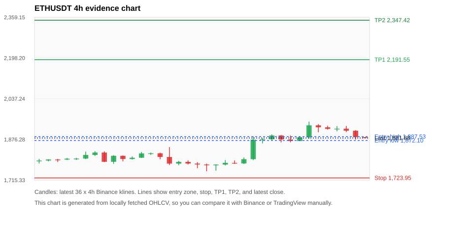
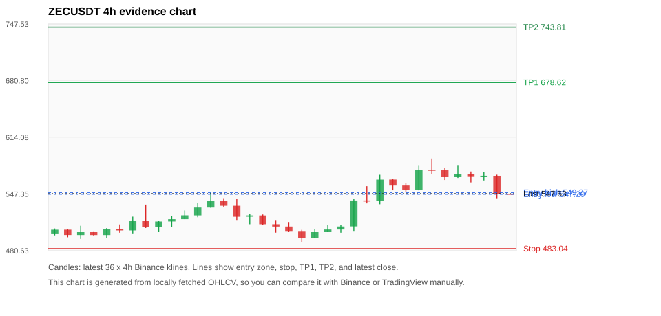
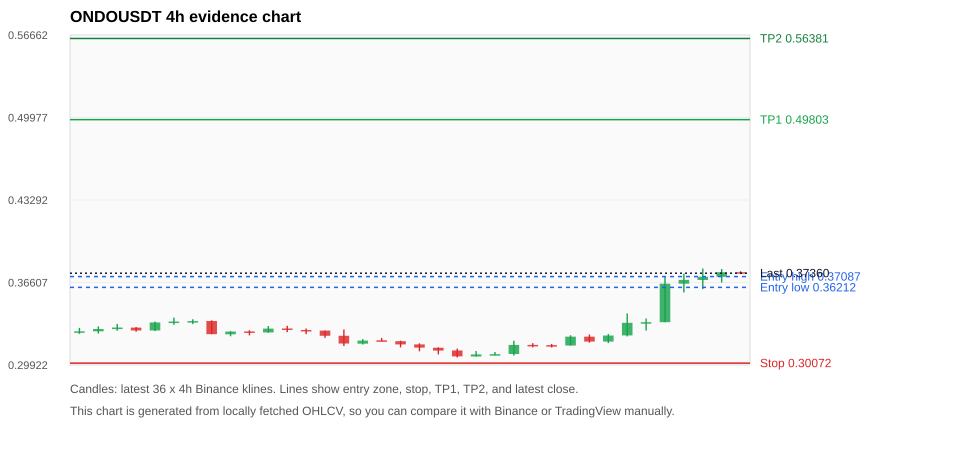
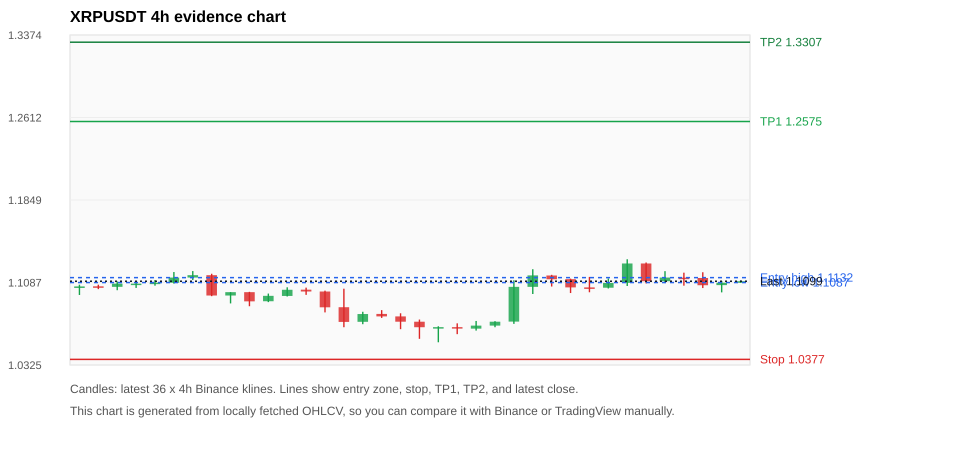
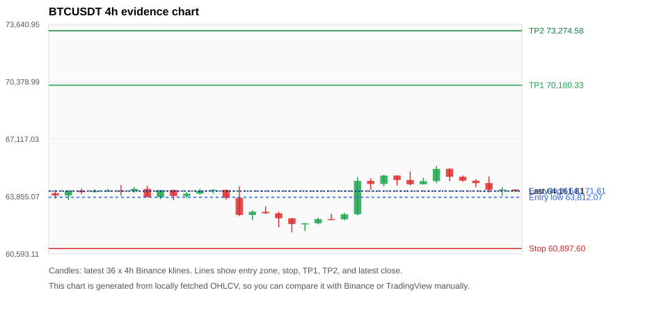

# Crypto 市场扫描报告 v1

- 报告时间：2026-07-16 20:06:15 CST
- Run ID：`20260716_120503_31bdce5a`
- Run type：`daily_full`
- 数据来源：SQLite
- 报告版本：v1
- 扫描 ID：e4779384fba8
- 数据源：Binance public spot API + CoinGecko/CoinMarketCap cross-check
- 过滤条件：USDT spot; 24h quote volume >= 30,000,000; trades >= 30,000; exclude stables/leveraged tokens; analyze 1h/4h/1d klines
- 默认单笔风险：账户权益的 1.00%

## 限制说明

- 交易信号仍以 Binance 现货公开 K 线为主源；外部数据源用于一致性复核。
- 结果是研究和模拟盘计划，不是确定收益或实盘下单指令。
- 历史长度过滤：候选币至少需要 180 根 1d K 线。
- 数据质量验证池：先验证 score 排名前 min(top_n * 2, 10) 的候选，再按 action + score 补足最终名单。
- 大盘环境过滤：RISK_OFF; BTC/ETH 大盘偏弱，山寨币买入候选降级为观察。 BTC 7d=1.4993041277874486; ETH 7d=7.854294162139852.
- 已启用数据交叉验证：Binance 主源 + CoinGecko 自动对照；CoinMarketCap 在配置 API Key 后自动对照。
- ETHUSDT 交叉验证状态 DATA_WARNING：At least one external provider needs manual review.
- ZECUSDT 交叉验证状态 DATA_WARNING：At least one external provider needs manual review.
- XRPUSDT 交叉验证状态 DATA_WARNING：At least one external provider needs manual review.
- BTCUSDT 交叉验证状态 DATA_WARNING：At least one external provider needs manual review.
- BNBUSDT 交叉验证状态 DATA_WARNING：At least one external provider needs manual review.
- DOGEUSDT 交叉验证状态 DATA_WARNING：At least one external provider needs manual review.
- SOLUSDT 交叉验证状态 DATA_WARNING：At least one external provider needs manual review.
- TRXUSDT 交叉验证状态 DATA_WARNING：At least one external provider needs manual review.

## 5 个候选交易计划

| Rank | Coin | Action | Setup | Entry Zone | Stop Loss | TP1 | TP2 / Exit Rule | R/R | Verdict |
|---:|---|---|---|---:|---:|---:|---|---:|---|
| 1 | `ETH` | `WATCH_ONLY` | 回踩支撑/4h EMA 附近 | 1,872.10 - 1,887.53 | 1,723.95 | 2,191.55 | 2,347.42 或跌破 4h 关键支撑 | 2.00-3.00 | 只观察 |
| 2 | `ZEC` | `WATCH_ONLY` | 回踩支撑/4h EMA 附近 | 547.20 - 549.27 | 483.04 | 678.62 | 743.81 或跌破 4h 关键支撑 | 2.00-3.00 | 只观察 |
| 3 | `ONDO` | `WATCH_ONLY` | 趋势中，等回调入场 | 0.36212 - 0.37087 | 0.30072 | 0.49803 | 0.56381 或跌破 4h 关键支撑 | 2.00-3.00 | 只等回调 |
| 4 | `XRP` | `WATCH_ONLY` | 回踩支撑/4h EMA 附近 | 1.1087 - 1.1132 | 1.0377 | 1.2575 | 1.3307 或跌破 4h 关键支撑 | 2.00-3.00 | 只观察 |
| 5 | `BTC` | `WATCH_ONLY` | 回踩支撑/4h EMA 附近 | 63,812.07 - 64,171.61 | 60,897.60 | 70,180.33 | 73,274.58 或跌破 4h 关键支撑 | 2.00-3.00 | 只观察 |

## 数据交叉验证摘要

价格差异以 Binance 当前价为基准；成交量口径不同，Binance 是 USDT 现货成交额，CoinGecko/CoinMarketCap 通常是全市场成交量。

| Rank | Coin | Data Status | Max Price Diff | Max 24h Diff | Message |
|---:|---|---|---:|---:|---|
| 1 | `ETH` | DATA_WARNING | 0.03% | 0.06 pts | At least one external provider needs manual review. |
| 2 | `ZEC` | DATA_WARNING | 0.15% | 0.26 pts | At least one external provider needs manual review. |
| 3 | `ONDO` | DATA_OK | 0.09% | 0.21 pts | External provider checks agree with Binance within configured thresholds. |
| 4 | `XRP` | DATA_WARNING | 0.23% | 0.21 pts | At least one external provider needs manual review. |
| 5 | `BTC` | DATA_WARNING | 0.03% | 0.12 pts | At least one external provider needs manual review. |

## 候选币说明

### 1. ETH `ETHUSDT`



- 入选原因：回踩支撑/4h EMA 附近；24h +0.00%，7d +7.72%，4h RSI 70.47，24h 成交额 $681.9M。
- 交易失效条件：跌破 1723.947 或 4h 收盘重新失守关键支撑。
- 主要风险：BTC/ETH 大盘环境未确认强势，山寨币买入信号降级；数据交叉验证需要人工复核。
- 数据交叉验证：DATA_WARNING；At least one external provider needs manual review.

#### 可点击人工验证

- [Binance 交易页](https://www.binance.com/en/trade/ETH_USDT)
- [TradingView 图表](https://www.tradingview.com/chart/?symbol=BINANCE%3AETHUSDT)
- [CoinGecko 搜索](https://www.coingecko.com/en/search?query=ETH)
- [CoinMarketCap 搜索](https://coinmarketcap.com/search/?q=ETH)

#### 多数据源对照

| Source | Status | Asset ID | Price | 24h Change | 24h Volume | Price Diff | 24h Diff | Updated | Message |
|---|---|---|---:|---:|---:|---:|---:|---|---|
| Binance | DATA_OK | ETHUSDT | 1,881.88 | +0.00% | $681.9M | 0.00% | 0.00 pts | 2026-07-16T12:05:41+00:00 | Primary market data source used by scanner. |
| CoinGecko | DATA_OK | ethereum | 1,881.34 | +0.06% | $12.44B | 0.03% | 0.06 pts | 2026-07-16T12:05:36.369Z | External source agrees with Binance within thresholds. |
| CoinMarketCap | DATA_WARNING | 1027 | 1,882.12 | -0.01% | $13.98B | 0.01% | 0.01 pts | 2026-07-16T12:04:05.000Z | CoinMarketCap symbol mapping has 6 matches; selected lowest cmc_rank |

#### 指标证据

| 指标 | 数值 | 人工核对用途 |
|---|---:|---|
| 当前价 | 1,881.88 | 与 Binance/TradingView 当前价格对照 |
| 24h 涨跌 | +0.00% | 与交易所 24h 涨跌对照 |
| 7d 涨跌 | +7.72% | 判断短线趋势是否延续 |
| 4h EMA20 | 1,868.37 | 判断短期趋势支撑 |
| 4h EMA50 | 1,821.16 | 判断中期趋势支撑 |
| 1d EMA20 | 1,782.05 | 判断日线趋势 |
| 1d EMA50 | 1,810.79 | 判断日线趋势 |
| 4h RSI14 | 70.47 | 判断是否过热/过弱 |
| 4h ATR14 | 31.4500 | 推导止损和入场缓冲 |
| 最近 18 根 4h 最低点 | 1,750.20 | 支撑/止损参考 |
| 最近 36 根 4h 最高点 | 1,946.52 | TP/压力参考 |
| 支撑位 | 1,868.37 | 入场区间推导基础 |

#### 交易计划推导

- 支撑位 = 最近低点、4h EMA20、4h EMA50、1d EMA20 中不高于当前价的最高有效支撑 = `1,868.37`。
- 入场区间 = 支撑位附近 + ATR 缓冲 = `1,872.10 - 1,887.53`。
- 止损 = min(最近 18 根 4h 最低点 * 0.985, 入场中位价 - 1.15 * ATR14) = `1,723.95`。
- TP1 = max(最近 36 根 4h 最高点 * 0.995, 入场中位价 + 2R) = `2,191.55`。
- TP2 = max(入场中位价 + 3R, TP1 * 1.04) = `2,347.42`。

#### 最近 10 根 4h K线

| UTC 开盘时间 | Open | High | Low | Close | Quote Volume | Trades |
|---|---:|---:|---:|---:|---:|---:|
| 2026-07-15T00:00+00:00 | 1,891.87 | 1,893.32 | 1,864.38 | 1,876.08 | $65.9M | 409790 |
| 2026-07-15T04:00+00:00 | 1,876.08 | 1,891.89 | 1,864.70 | 1,870.04 | $68.2M | 288693 |
| 2026-07-15T08:00+00:00 | 1,870.04 | 1,886.59 | 1,870.03 | 1,884.62 | $66.0M | 273069 |
| 2026-07-15T12:00+00:00 | 1,884.62 | 1,946.52 | 1,879.25 | 1,931.95 | $264.3M | 1078775 |
| 2026-07-15T16:00+00:00 | 1,931.96 | 1,937.00 | 1,904.36 | 1,924.15 | $106.3M | 534814 |
| 2026-07-15T20:00+00:00 | 1,924.15 | 1,930.71 | 1,914.89 | 1,917.86 | $39.7M | 181016 |
| 2026-07-16T00:00+00:00 | 1,917.86 | 1,929.00 | 1,908.12 | 1,918.70 | $54.1M | 447454 |
| 2026-07-16T04:00+00:00 | 1,918.70 | 1,929.48 | 1,905.00 | 1,910.63 | $55.9M | 261782 |
| 2026-07-16T08:00+00:00 | 1,910.64 | 1,912.85 | 1,875.56 | 1,885.26 | $161.3M | 531557 |
| 2026-07-16T12:00+00:00 | 1,885.26 | 1,885.26 | 1,881.54 | 1,881.96 | $1.3M | 7640 |

### 2. ZEC `ZECUSDT`



- 入选原因：回踩支撑/4h EMA 附近；24h -4.68%，7d +16.92%，4h RSI 66.05，24h 成交额 $122.4M。
- 交易失效条件：跌破 483.044 或 4h 收盘重新失守关键支撑。
- 主要风险：BTC/ETH 大盘环境未确认强势，山寨币买入信号降级；24h 动量未确认；数据交叉验证需要人工复核。
- 数据交叉验证：DATA_WARNING；At least one external provider needs manual review.

#### 可点击人工验证

- [Binance 交易页](https://www.binance.com/en/trade/ZEC_USDT)
- [TradingView 图表](https://www.tradingview.com/chart/?symbol=BINANCE%3AZECUSDT)
- [CoinGecko 搜索](https://www.coingecko.com/en/search?query=ZEC)
- [CoinMarketCap 搜索](https://coinmarketcap.com/search/?q=ZEC)

#### 多数据源对照

| Source | Status | Asset ID | Price | 24h Change | 24h Volume | Price Diff | 24h Diff | Updated | Message |
|---|---|---|---:|---:|---:|---:|---:|---|---|
| Binance | DATA_OK | ZECUSDT | 547.63 | -4.68% | $122.4M | 0.00% | 0.00 pts | 2026-07-16T12:05:41+00:00 | Primary market data source used by scanner. |
| CoinGecko | DATA_OK | zcash | 546.80 | -4.87% | $514.1M | 0.15% | 0.19 pts | 2026-07-16T12:05:35.934Z | External source agrees with Binance within thresholds. |
| CoinMarketCap | DATA_WARNING | 1437 | 546.85 | -4.94% | $606.7M | 0.14% | 0.26 pts | 2026-07-16T12:04:05.000Z | CoinMarketCap symbol mapping has 2 matches; selected lowest cmc_rank |

#### 指标证据

| 指标 | 数值 | 人工核对用途 |
|---|---:|---|
| 当前价 | 547.63 | 与 Binance/TradingView 当前价格对照 |
| 24h 涨跌 | -4.68% | 与交易所 24h 涨跌对照 |
| 7d 涨跌 | +16.92% | 判断短线趋势是否延续 |
| 4h EMA20 | 546.10 | 判断短期趋势支撑 |
| 4h EMA50 | 518.99 | 判断中期趋势支撑 |
| 1d EMA20 | 493.46 | 判断日线趋势 |
| 1d EMA50 | 474.95 | 判断日线趋势 |
| 4h RSI14 | 66.05 | 判断是否过热/过弱 |
| 4h ATR14 | 18.1757 | 推导止损和入场缓冲 |
| 最近 18 根 4h 最低点 | 490.40 | 支撑/止损参考 |
| 最近 36 根 4h 最高点 | 589.18 | TP/压力参考 |
| 支撑位 | 546.10 | 入场区间推导基础 |

#### 交易计划推导

- 支撑位 = 最近低点、4h EMA20、4h EMA50、1d EMA20 中不高于当前价的最高有效支撑 = `546.10`。
- 入场区间 = 支撑位附近 + ATR 缓冲 = `547.20 - 549.27`。
- 止损 = min(最近 18 根 4h 最低点 * 0.985, 入场中位价 - 1.15 * ATR14) = `483.04`。
- TP1 = max(最近 36 根 4h 最高点 * 0.995, 入场中位价 + 2R) = `678.62`。
- TP2 = max(入场中位价 + 3R, TP1 * 1.04) = `743.81`。

#### 最近 10 根 4h K线

| UTC 开盘时间 | Open | High | Low | Close | Quote Volume | Trades |
|---|---:|---:|---:|---:|---:|---:|
| 2026-07-15T00:00+00:00 | 564.39 | 565.24 | 551.76 | 557.34 | $15.3M | 46470 |
| 2026-07-15T04:00+00:00 | 557.34 | 560.00 | 549.30 | 552.36 | $10.4M | 30102 |
| 2026-07-15T08:00+00:00 | 552.42 | 581.38 | 551.63 | 575.90 | $24.4M | 59739 |
| 2026-07-15T12:00+00:00 | 575.93 | 589.18 | 570.67 | 575.92 | $30.6M | 121286 |
| 2026-07-15T16:00+00:00 | 575.94 | 577.77 | 563.88 | 567.47 | $18.2M | 52260 |
| 2026-07-15T20:00+00:00 | 567.45 | 581.50 | 566.26 | 570.54 | $15.8M | 45914 |
| 2026-07-16T00:00+00:00 | 570.53 | 573.85 | 561.00 | 568.25 | $15.8M | 42542 |
| 2026-07-16T04:00+00:00 | 568.25 | 572.99 | 563.33 | 568.85 | $8.1M | 33078 |
| 2026-07-16T08:00+00:00 | 568.80 | 570.06 | 542.39 | 547.64 | $34.2M | 88354 |
| 2026-07-16T12:00+00:00 | 547.68 | 547.77 | 546.90 | 547.63 | $73,175 | 516 |

### 3. ONDO `ONDOUSDT`



- 入选原因：趋势中，等回调入场；24h +15.67%，7d +16.82%，4h RSI 92.83，24h 成交额 $35.6M。
- 交易失效条件：跌破 0.3007205 或 4h 收盘重新失守关键支撑。
- 主要风险：距离支撑偏远，不能追市价；4h RSI 偏热；成交量突增，可能是事件驱动；BTC/ETH 大盘环境未确认强势，山寨币买入信号降级。
- 数据交叉验证：DATA_OK；External provider checks agree with Binance within configured thresholds.

#### 可点击人工验证

- [Binance 交易页](https://www.binance.com/en/trade/ONDO_USDT)
- [TradingView 图表](https://www.tradingview.com/chart/?symbol=BINANCE%3AONDOUSDT)
- [CoinGecko 搜索](https://www.coingecko.com/en/search?query=ONDO)
- [CoinMarketCap 搜索](https://coinmarketcap.com/search/?q=ONDO)

#### 多数据源对照

| Source | Status | Asset ID | Price | 24h Change | 24h Volume | Price Diff | 24h Diff | Updated | Message |
|---|---|---|---:|---:|---:|---:|---:|---|---|
| Binance | DATA_OK | ONDOUSDT | 0.37360 | +15.67% | $35.6M | 0.00% | 0.00 pts | 2026-07-16T12:05:41+00:00 | Primary market data source used by scanner. |
| CoinGecko | DATA_OK | ondo-finance | 0.37327 | +15.55% | $287.0M | 0.09% | 0.12 pts | 2026-07-16T12:05:35.583Z | External source agrees with Binance within thresholds. |
| CoinMarketCap | DATA_OK | 21159 | 0.37350 | +15.46% | $268.4M | 0.03% | 0.21 pts | 2026-07-16T12:04:05.000Z | External source agrees with Binance within thresholds. |

#### 指标证据

| 指标 | 数值 | 人工核对用途 |
|---|---:|---|
| 当前价 | 0.37360 | 与 Binance/TradingView 当前价格对照 |
| 24h 涨跌 | +15.67% | 与交易所 24h 涨跌对照 |
| 7d 涨跌 | +16.82% | 判断短线趋势是否延续 |
| 4h EMA20 | 0.34061 | 判断短期趋势支撑 |
| 4h EMA50 | 0.33058 | 判断中期趋势支撑 |
| 1d EMA20 | 0.33331 | 判断日线趋势 |
| 1d EMA50 | 0.33690 | 判断日线趋势 |
| 4h RSI14 | 92.83 | 判断是否过热/过弱 |
| 4h ATR14 | 0.01094 | 推导止损和入场缓冲 |
| 最近 18 根 4h 最低点 | 0.30530 | 支撑/止损参考 |
| 最近 36 根 4h 最高点 | 0.37740 | TP/压力参考 |
| 支撑位 | 0.34061 | 入场区间推导基础 |

#### 交易计划推导

- 支撑位 = 最近低点、4h EMA20、4h EMA50、1d EMA20 中不高于当前价的最高有效支撑 = `0.34061`。
- 入场区间 = 支撑位附近 + ATR 缓冲 = `0.36212 - 0.37087`。
- 止损 = min(最近 18 根 4h 最低点 * 0.985, 入场中位价 - 1.15 * ATR14) = `0.30072`。
- TP1 = max(最近 36 根 4h 最高点 * 0.995, 入场中位价 + 2R) = `0.49803`。
- TP2 = max(入场中位价 + 3R, TP1 * 1.04) = `0.56381`。

#### 最近 10 根 4h K线

| UTC 开盘时间 | Open | High | Low | Close | Quote Volume | Trades |
|---|---:|---:|---:|---:|---:|---:|
| 2026-07-15T00:00+00:00 | 0.31500 | 0.32330 | 0.31500 | 0.32220 | $1.2M | 7878 |
| 2026-07-15T04:00+00:00 | 0.32220 | 0.32400 | 0.31730 | 0.31820 | $934,775 | 6123 |
| 2026-07-15T08:00+00:00 | 0.31820 | 0.32430 | 0.31700 | 0.32310 | $786,812 | 5409 |
| 2026-07-15T12:00+00:00 | 0.32320 | 0.34100 | 0.32240 | 0.33340 | $7.2M | 34077 |
| 2026-07-15T16:00+00:00 | 0.33340 | 0.33690 | 0.32710 | 0.33390 | $1.6M | 9186 |
| 2026-07-15T20:00+00:00 | 0.33390 | 0.37060 | 0.33390 | 0.36510 | $11.0M | 94049 |
| 2026-07-16T00:00+00:00 | 0.36510 | 0.37320 | 0.35800 | 0.36820 | $5.4M | 38465 |
| 2026-07-16T04:00+00:00 | 0.36810 | 0.37740 | 0.36070 | 0.37070 | $5.8M | 37072 |
| 2026-07-16T08:00+00:00 | 0.37070 | 0.37700 | 0.36600 | 0.37440 | $4.6M | 31750 |
| 2026-07-16T12:00+00:00 | 0.37440 | 0.37520 | 0.37340 | 0.37350 | $54,939 | 451 |

### 4. XRP `XRPUSDT`



- 入选原因：回踩支撑/4h EMA 附近；24h +0.20%，7d +0.98%，4h RSI 68.47，24h 成交额 $78.2M。
- 交易失效条件：跌破 1.0376975 或 4h 收盘重新失守关键支撑。
- 主要风险：日线趋势未完全确认；BTC/ETH 大盘环境未确认强势，山寨币买入信号降级；数据交叉验证需要人工复核。
- 数据交叉验证：DATA_WARNING；At least one external provider needs manual review.

#### 可点击人工验证

- [Binance 交易页](https://www.binance.com/en/trade/XRP_USDT)
- [TradingView 图表](https://www.tradingview.com/chart/?symbol=BINANCE%3AXRPUSDT)
- [CoinGecko 搜索](https://www.coingecko.com/en/search?query=XRP)
- [CoinMarketCap 搜索](https://coinmarketcap.com/search/?q=XRP)

#### 多数据源对照

| Source | Status | Asset ID | Price | 24h Change | 24h Volume | Price Diff | 24h Diff | Updated | Message |
|---|---|---|---:|---:|---:|---:|---:|---|---|
| Binance | DATA_OK | XRPUSDT | 1.1099 | +0.20% | $78.2M | 0.00% | 0.00 pts | 2026-07-16T12:05:41+00:00 | Primary market data source used by scanner. |
| CoinGecko | DATA_OK | ripple | 1.1100 | +0.05% | $1.19B | 0.01% | 0.15 pts | 2026-07-16T12:04:54.404Z | External source agrees with Binance within thresholds. |
| CoinMarketCap | DATA_WARNING | 52 | 1.1073 | -0.01% | $1.24B | 0.23% | 0.21 pts | 2026-07-16T12:04:05.000Z | CoinMarketCap symbol mapping has 3 matches; selected lowest cmc_rank |

#### 指标证据

| 指标 | 数值 | 人工核对用途 |
|---|---:|---|
| 当前价 | 1.1099 | 与 Binance/TradingView 当前价格对照 |
| 24h 涨跌 | +0.20% | 与交易所 24h 涨跌对照 |
| 7d 涨跌 | +0.98% | 判断短线趋势是否延续 |
| 4h EMA20 | 1.1031 | 判断短期趋势支撑 |
| 4h EMA50 | 1.0997 | 判断中期趋势支撑 |
| 1d EMA20 | 1.1065 | 判断日线趋势 |
| 1d EMA50 | 1.1557 | 判断日线趋势 |
| 4h RSI14 | 68.47 | 判断是否过热/过弱 |
| 4h ATR14 | 0.01504 | 推导止损和入场缓冲 |
| 最近 18 根 4h 最低点 | 1.0535 | 支撑/止损参考 |
| 最近 36 根 4h 最高点 | 1.1302 | TP/压力参考 |
| 支撑位 | 1.1065 | 入场区间推导基础 |

#### 交易计划推导

- 支撑位 = 最近低点、4h EMA20、4h EMA50、1d EMA20 中不高于当前价的最高有效支撑 = `1.1065`。
- 入场区间 = 支撑位附近 + ATR 缓冲 = `1.1087 - 1.1132`。
- 止损 = min(最近 18 根 4h 最低点 * 0.985, 入场中位价 - 1.15 * ATR14) = `1.0377`。
- TP1 = max(最近 36 根 4h 最高点 * 0.995, 入场中位价 + 2R) = `1.2575`。
- TP2 = max(入场中位价 + 3R, TP1 * 1.04) = `1.3307`。

#### 最近 10 根 4h K线

| UTC 开盘时间 | Open | High | Low | Close | Quote Volume | Trades |
|---|---:|---:|---:|---:|---:|---:|
| 2026-07-15T00:00+00:00 | 1.1118 | 1.1123 | 1.0990 | 1.1042 | $9.4M | 42929 |
| 2026-07-15T04:00+00:00 | 1.1042 | 1.1139 | 1.0997 | 1.1038 | $8.6M | 50207 |
| 2026-07-15T08:00+00:00 | 1.1039 | 1.1125 | 1.1032 | 1.1083 | $6.9M | 33945 |
| 2026-07-15T12:00+00:00 | 1.1084 | 1.1302 | 1.1055 | 1.1263 | $26.9M | 158436 |
| 2026-07-15T16:00+00:00 | 1.1263 | 1.1272 | 1.1079 | 1.1099 | $13.9M | 83816 |
| 2026-07-15T20:00+00:00 | 1.1099 | 1.1192 | 1.1082 | 1.1133 | $7.3M | 44287 |
| 2026-07-16T00:00+00:00 | 1.1132 | 1.1178 | 1.1058 | 1.1129 | $8.1M | 49517 |
| 2026-07-16T04:00+00:00 | 1.1129 | 1.1182 | 1.1036 | 1.1062 | $10.2M | 46560 |
| 2026-07-16T08:00+00:00 | 1.1063 | 1.1101 | 1.0996 | 1.1085 | $11.6M | 52130 |
| 2026-07-16T12:00+00:00 | 1.1085 | 1.1105 | 1.1084 | 1.1099 | $435,939 | 1754 |

### 5. BTC `BTCUSDT`



- 入选原因：回踩支撑/4h EMA 附近；24h -0.82%，7d +1.80%，4h RSI 64.53，24h 成交额 $1.54B。
- 交易失效条件：跌破 60897.595 或 4h 收盘重新失守关键支撑。
- 主要风险：日线趋势未完全确认；BTC/ETH 大盘环境未确认强势，山寨币买入信号降级；24h 动量未确认；数据交叉验证需要人工复核。
- 数据交叉验证：DATA_WARNING；At least one external provider needs manual review.

#### 可点击人工验证

- [Binance 交易页](https://www.binance.com/en/trade/BTC_USDT)
- [TradingView 图表](https://www.tradingview.com/chart/?symbol=BINANCE%3ABTCUSDT)
- [CoinGecko 搜索](https://www.coingecko.com/en/search?query=BTC)
- [CoinMarketCap 搜索](https://coinmarketcap.com/search/?q=BTC)

#### 多数据源对照

| Source | Status | Asset ID | Price | 24h Change | 24h Volume | Price Diff | 24h Diff | Updated | Message |
|---|---|---|---:|---:|---:|---:|---:|---|---|
| Binance | DATA_OK | BTCUSDT | 64,161.81 | -0.82% | $1.54B | 0.00% | 0.00 pts | 2026-07-16T12:05:41+00:00 | Primary market data source used by scanner. |
| CoinGecko | DATA_OK | bitcoin | 64,175.00 | -0.70% | $32.21B | 0.02% | 0.12 pts | 2026-07-16T12:05:02.937Z | External source agrees with Binance within thresholds. |
| CoinMarketCap | DATA_WARNING | 1 | 64,180.56 | -0.76% | $32.25B | 0.03% | 0.06 pts | 2026-07-16T12:05:04.000Z | CoinMarketCap symbol mapping has 13 matches; selected lowest cmc_rank |

#### 指标证据

| 指标 | 数值 | 人工核对用途 |
|---|---:|---|
| 当前价 | 64,161.81 | 与 Binance/TradingView 当前价格对照 |
| 24h 涨跌 | -0.82% | 与交易所 24h 涨跌对照 |
| 7d 涨跌 | +1.80% | 判断短线趋势是否延续 |
| 4h EMA20 | 64,209.11 | 判断短期趋势支撑 |
| 4h EMA50 | 63,684.70 | 判断中期趋势支撑 |
| 1d EMA20 | 63,367.75 | 判断日线趋势 |
| 1d EMA50 | 65,116.79 | 判断日线趋势 |
| 4h RSI14 | 64.53 | 判断是否过热/过弱 |
| 4h ATR14 | 695.58 | 推导止损和入场缓冲 |
| 最近 18 根 4h 最低点 | 61,824.97 | 支撑/止损参考 |
| 最近 36 根 4h 最高点 | 65,600.00 | TP/压力参考 |
| 支撑位 | 63,684.70 | 入场区间推导基础 |

#### 交易计划推导

- 支撑位 = 最近低点、4h EMA20、4h EMA50、1d EMA20 中不高于当前价的最高有效支撑 = `63,684.70`。
- 入场区间 = 支撑位附近 + ATR 缓冲 = `63,812.07 - 64,171.61`。
- 止损 = min(最近 18 根 4h 最低点 * 0.985, 入场中位价 - 1.15 * ATR14) = `60,897.60`。
- TP1 = max(最近 36 根 4h 最高点 * 0.995, 入场中位价 + 2R) = `70,180.33`。
- TP2 = max(入场中位价 + 3R, TP1 * 1.04) = `73,274.58`。

#### 最近 10 根 4h K线

| UTC 开盘时间 | Open | High | Low | Close | Quote Volume | Trades |
|---|---:|---:|---:|---:|---:|---:|
| 2026-07-15T00:00+00:00 | 65,043.99 | 65,065.01 | 64,488.00 | 64,792.01 | $109.6M | 320579 |
| 2026-07-15T04:00+00:00 | 64,792.00 | 65,277.37 | 64,485.00 | 64,549.34 | $204.7M | 419673 |
| 2026-07-15T08:00+00:00 | 64,549.33 | 64,917.94 | 64,549.33 | 64,732.15 | $150.0M | 289157 |
| 2026-07-15T12:00+00:00 | 64,732.15 | 65,600.00 | 64,606.00 | 65,427.61 | $399.1M | 962986 |
| 2026-07-15T16:00+00:00 | 65,427.60 | 65,470.00 | 64,738.49 | 64,977.34 | $260.0M | 465383 |
| 2026-07-15T20:00+00:00 | 64,977.34 | 65,055.39 | 64,691.89 | 64,756.28 | $72.3M | 211141 |
| 2026-07-16T00:00+00:00 | 64,756.28 | 64,845.50 | 64,392.01 | 64,619.95 | $114.7M | 351949 |
| 2026-07-16T04:00+00:00 | 64,619.96 | 64,997.52 | 64,086.12 | 64,238.00 | $176.2M | 380748 |
| 2026-07-16T08:00+00:00 | 64,238.00 | 64,380.00 | 63,888.00 | 64,256.53 | $518.4M | 555339 |
| 2026-07-16T12:00+00:00 | 64,256.52 | 64,256.52 | 64,156.00 | 64,161.80 | $1.2M | 6856 |

## 组合风控

- 不要 5 个候选全部满仓买入。
- 同时持仓总风险建议控制在账户权益的 3% - 5% 以内。
- 如果 BTC/ETH 同时破位，暂停山寨币多头计划或降低仓位。
- 第一版报告用于模拟盘和人工复核，不自动下单。

## 原始数据

```json
[
  {
    "rank": 1,
    "symbol": "ETHUSDT",
    "base_asset": "ETH",
    "price": 1881.88,
    "score": 54.03064163810603,
    "setup": "回踩支撑/4h EMA 附近",
    "verdict": "只观察",
    "entry_low": 1872.102454095934,
    "entry_high": 1887.5256399999998,
    "stop_loss": 1723.9470000000001,
    "take_profit_1": 2191.548141143901,
    "take_profit_2": 2347.415188191868,
    "risk_reward_1": 2.0,
    "risk_reward_2": 3.0,
    "pct_24h": 0.002,
    "pct_3d": 6.242872466549998,
    "pct_7d": 7.721280602636549,
    "quote_volume_24h": 681875038.013706,
    "trades_24h": 3038173,
    "high_low_range_24h": 3.78340335686409,
    "rsi_1h": 25.58467504994711,
    "rsi_4h": 70.4718169626529,
    "ema20_4h": 1868.3657226506327,
    "ema50_4h": 1821.161566736012,
    "ema20_1d": 1782.0465652380474,
    "ema50_1d": 1810.7908170366702,
    "atr_4h": 31.450000000000014,
    "macd_hist_4h": 0.31402323014637545,
    "volume_ratio_24h": 1.4127567931657103,
    "support_level": 1868.3657226506327,
    "recent_low_4h_18": 1750.2,
    "recent_high_4h_36": 1946.52,
    "distance_to_support_pct": 0.7233207709567147,
    "binance_trade_url": "https://www.binance.com/en/trade/ETH_USDT",
    "tradingview_url": "https://www.tradingview.com/chart/?symbol=BINANCE%3AETHUSDT",
    "coingecko_search_url": "https://www.coingecko.com/en/search?query=ETH",
    "coinmarketcap_search_url": "https://coinmarketcap.com/search/?q=ETH",
    "invalidation": "跌破 1723.947 或 4h 收盘重新失守关键支撑",
    "recent_4h_klines": [
      {
        "open_time_utc": "2026-07-10T16:00+00:00",
        "open": 1791.11,
        "high": 1799.53,
        "low": 1781.2,
        "close": 1792.68,
        "quote_volume": 47368296.412897,
        "trades": 245279
      },
      {
        "open_time_utc": "2026-07-10T20:00+00:00",
        "open": 1792.68,
        "high": 1798.0,
        "low": 1789.6,
        "close": 1796.85,
        "quote_volume": 29647779.573534,
        "trades": 192375
      },
      {
        "open_time_utc": "2026-07-11T00:00+00:00",
        "open": 1796.85,
        "high": 1799.29,
        "low": 1786.77,
        "close": 1796.5,
        "quote_volume": 29504422.885497,
        "trades": 149024
      },
      {
        "open_time_utc": "2026-07-11T04:00+00:00",
        "open": 1796.5,
        "high": 1803.29,
        "low": 1794.6,
        "close": 1800.0,
        "quote_volume": 41393222.395037,
        "trades": 144104
      },
      {
        "open_time_utc": "2026-07-11T08:00+00:00",
        "open": 1799.99,
        "high": 1803.52,
        "low": 1795.15,
        "close": 1800.48,
        "quote_volume": 23683229.598781,
        "trades": 121112
      },
      {
        "open_time_utc": "2026-07-11T12:00+00:00",
        "open": 1800.47,
        "high": 1828.0,
        "low": 1798.42,
        "close": 1814.83,
        "quote_volume": 88826829.557453,
        "trades": 297261
      },
      {
        "open_time_utc": "2026-07-11T16:00+00:00",
        "open": 1814.82,
        "high": 1830.0,
        "low": 1810.62,
        "close": 1824.38,
        "quote_volume": 80367089.18781,
        "trades": 228758
      },
      {
        "open_time_utc": "2026-07-11T20:00+00:00",
        "open": 1824.38,
        "high": 1829.17,
        "low": 1786.58,
        "close": 1787.76,
        "quote_volume": 59683615.720579,
        "trades": 256371
      },
      {
        "open_time_utc": "2026-07-12T00:00+00:00",
        "open": 1787.76,
        "high": 1813.67,
        "low": 1779.46,
        "close": 1811.53,
        "quote_volume": 54799124.238866,
        "trades": 279870
      },
      {
        "open_time_utc": "2026-07-12T04:00+00:00",
        "open": 1811.53,
        "high": 1812.63,
        "low": 1789.44,
        "close": 1798.78,
        "quote_volume": 26061931.562103,
        "trades": 123951
      },
      {
        "open_time_utc": "2026-07-12T08:00+00:00",
        "open": 1798.78,
        "high": 1808.94,
        "low": 1796.48,
        "close": 1803.77,
        "quote_volume": 24623648.558767,
        "trades": 161726
      },
      {
        "open_time_utc": "2026-07-12T12:00+00:00",
        "open": 1803.77,
        "high": 1826.92,
        "low": 1803.0,
        "close": 1820.93,
        "quote_volume": 59384458.662347,
        "trades": 232037
      },
      {
        "open_time_utc": "2026-07-12T16:00+00:00",
        "open": 1820.94,
        "high": 1824.39,
        "low": 1814.85,
        "close": 1821.4,
        "quote_volume": 49580419.314726,
        "trades": 136910
      },
      {
        "open_time_utc": "2026-07-12T20:00+00:00",
        "open": 1821.4,
        "high": 1824.0,
        "low": 1797.63,
        "close": 1806.8,
        "quote_volume": 40749264.656368,
        "trades": 228671
      },
      {
        "open_time_utc": "2026-07-13T00:00+00:00",
        "open": 1806.8,
        "high": 1846.0,
        "low": 1775.0,
        "close": 1780.55,
        "quote_volume": 180341311.895032,
        "trades": 799801
      },
      {
        "open_time_utc": "2026-07-13T04:00+00:00",
        "open": 1780.54,
        "high": 1791.39,
        "low": 1773.99,
        "close": 1787.57,
        "quote_volume": 60874562.194488,
        "trades": 291810
      },
      {
        "open_time_utc": "2026-07-13T08:00+00:00",
        "open": 1787.58,
        "high": 1793.56,
        "low": 1777.1,
        "close": 1780.74,
        "quote_volume": 44563351.995436,
        "trades": 219523
      },
      {
        "open_time_utc": "2026-07-13T12:00+00:00",
        "open": 1780.74,
        "high": 1786.53,
        "low": 1762.44,
        "close": 1777.01,
        "quote_volume": 102116332.029664,
        "trades": 622834
      },
      {
        "open_time_utc": "2026-07-13T16:00+00:00",
        "open": 1777.0,
        "high": 1780.73,
        "low": 1750.2,
        "close": 1774.92,
        "quote_volume": 87092641.007233,
        "trades": 442620
      },
      {
        "open_time_utc": "2026-07-13T20:00+00:00",
        "open": 1774.93,
        "high": 1778.05,
        "low": 1752.59,
        "close": 1776.72,
        "quote_volume": 51946850.968449,
        "trades": 272714
      },
      {
        "open_time_utc": "2026-07-14T00:00+00:00",
        "open": 1776.71,
        "high": 1794.47,
        "low": 1773.41,
        "close": 1783.65,
        "quote_volume": 46070956.04283,
        "trades": 354675
      },
      {
        "open_time_utc": "2026-07-14T04:00+00:00",
        "open": 1783.64,
        "high": 1793.26,
        "low": 1779.41,
        "close": 1781.21,
        "quote_volume": 41308137.621747,
        "trades": 228043
      },
      {
        "open_time_utc": "2026-07-14T08:00+00:00",
        "open": 1781.21,
        "high": 1805.0,
        "low": 1779.0,
        "close": 1798.09,
        "quote_volume": 85264476.000115,
        "trades": 336202
      },
      {
        "open_time_utc": "2026-07-14T12:00+00:00",
        "open": 1798.09,
        "high": 1888.8,
        "low": 1794.37,
        "close": 1875.22,
        "quote_volume": 358144351.189966,
        "trades": 1571099
      },
      {
        "open_time_utc": "2026-07-14T16:00+00:00",
        "open": 1875.22,
        "high": 1881.56,
        "low": 1860.56,
        "close": 1876.74,
        "quote_volume": 72936315.895528,
        "trades": 437205
      },
      {
        "open_time_utc": "2026-07-14T20:00+00:00",
        "open": 1876.74,
        "high": 1896.14,
        "low": 1872.06,
        "close": 1891.87,
        "quote_volume": 76249268.519352,
        "trades": 356683
      },
      {
        "open_time_utc": "2026-07-15T00:00+00:00",
        "open": 1891.87,
        "high": 1893.32,
        "low": 1864.38,
        "close": 1876.08,
        "quote_volume": 65889958.334445,
        "trades": 409790
      },
      {
        "open_time_utc": "2026-07-15T04:00+00:00",
        "open": 1876.08,
        "high": 1891.89,
        "low": 1864.7,
        "close": 1870.04,
        "quote_volume": 68211903.296793,
        "trades": 288693
      },
      {
        "open_time_utc": "2026-07-15T08:00+00:00",
        "open": 1870.04,
        "high": 1886.59,
        "low": 1870.03,
        "close": 1884.62,
        "quote_volume": 65955633.693108,
        "trades": 273069
      },
      {
        "open_time_utc": "2026-07-15T12:00+00:00",
        "open": 1884.62,
        "high": 1946.52,
        "low": 1879.25,
        "close": 1931.95,
        "quote_volume": 264343318.43361,
        "trades": 1078775
      },
      {
        "open_time_utc": "2026-07-15T16:00+00:00",
        "open": 1931.96,
        "high": 1937.0,
        "low": 1904.36,
        "close": 1924.15,
        "quote_volume": 106323551.223143,
        "trades": 534814
      },
      {
        "open_time_utc": "2026-07-15T20:00+00:00",
        "open": 1924.15,
        "high": 1930.71,
        "low": 1914.89,
        "close": 1917.86,
        "quote_volume": 39744884.661628,
        "trades": 181016
      },
      {
        "open_time_utc": "2026-07-16T00:00+00:00",
        "open": 1917.86,
        "high": 1929.0,
        "low": 1908.12,
        "close": 1918.7,
        "quote_volume": 54089213.981933,
        "trades": 447454
      },
      {
        "open_time_utc": "2026-07-16T04:00+00:00",
        "open": 1918.7,
        "high": 1929.48,
        "low": 1905.0,
        "close": 1910.63,
        "quote_volume": 55879345.035258,
        "trades": 261782
      },
      {
        "open_time_utc": "2026-07-16T08:00+00:00",
        "open": 1910.64,
        "high": 1912.85,
        "low": 1875.56,
        "close": 1885.26,
        "quote_volume": 161340583.681969,
        "trades": 531557
      },
      {
        "open_time_utc": "2026-07-16T12:00+00:00",
        "open": 1885.26,
        "high": 1885.26,
        "low": 1881.54,
        "close": 1881.96,
        "quote_volume": 1263727.483277,
        "trades": 7640
      }
    ],
    "risks": [
      "BTC/ETH 大盘环境未确认强势，山寨币买入信号降级",
      "数据交叉验证需要人工复核"
    ],
    "data_quality_status": "DATA_WARNING",
    "data_quality_message": "At least one external provider needs manual review.",
    "data_checks": [
      {
        "provider": "Binance",
        "status": "DATA_OK",
        "provider_asset_id": "ETHUSDT",
        "provider_symbol": "ETHUSDT",
        "price_usd": 1881.88,
        "pct_24h": 0.002,
        "volume_24h": 681875038.013706,
        "last_updated": null,
        "fetched_at_utc": "2026-07-16T12:05:41+00:00",
        "price_diff_pct": 0.0,
        "pct_24h_diff": 0.0,
        "volume_note": "Binance USDT spot 24h quoteVolume.",
        "message": "Primary market data source used by scanner."
      },
      {
        "provider": "CoinGecko",
        "status": "DATA_OK",
        "provider_asset_id": "ethereum",
        "provider_symbol": "ETH",
        "price_usd": 1881.34,
        "pct_24h": 0.0642,
        "volume_24h": 12443660589.0,
        "last_updated": "2026-07-16T12:05:36.369Z",
        "fetched_at_utc": "2026-07-16T12:05:41+00:00",
        "price_diff_pct": 0.02869470954578352,
        "pct_24h_diff": 0.06219999999999999,
        "volume_note": "CoinGecko total market volume; not the same venue scope as Binance quoteVolume.",
        "message": "External source agrees with Binance within thresholds."
      },
      {
        "provider": "CoinMarketCap",
        "status": "DATA_WARNING",
        "provider_asset_id": "1027",
        "provider_symbol": "ETH",
        "price_usd": 1882.1228289431363,
        "pct_24h": -0.00735203,
        "volume_24h": 13983857569.79849,
        "last_updated": "2026-07-16T12:04:05.000Z",
        "fetched_at_utc": "2026-07-16T12:05:41+00:00",
        "price_diff_pct": 0.012903529615923772,
        "pct_24h_diff": 0.00935203,
        "volume_note": "CoinMarketCap total market volume; not the same venue scope as Binance quoteVolume.",
        "message": "CoinMarketCap symbol mapping has 6 matches; selected lowest cmc_rank"
      }
    ],
    "action": "WATCH_ONLY"
  },
  {
    "rank": 2,
    "symbol": "ZECUSDT",
    "base_asset": "ZEC",
    "price": 547.63,
    "score": 51.34744981654072,
    "setup": "回踩支撑/4h EMA 附近",
    "verdict": "只观察",
    "entry_low": 547.1969899494385,
    "entry_high": 549.27289,
    "stop_loss": 483.044,
    "take_profit_1": 678.6168199241579,
    "take_profit_2": 743.8077598988772,
    "risk_reward_1": 2.0,
    "risk_reward_2": 3.0,
    "pct_24h": -4.677,
    "pct_3d": 8.353613897627653,
    "pct_7d": 16.922518521681585,
    "quote_volume_24h": 122397904.67035,
    "trades_24h": 382205,
    "high_low_range_24h": 8.62663397186525,
    "rsi_1h": 21.099434114793922,
    "rsi_4h": 66.05315411638924,
    "ema20_4h": 546.1047803886612,
    "ema50_4h": 518.9890393053902,
    "ema20_1d": 493.4564481179895,
    "ema50_1d": 474.9526840443755,
    "atr_4h": 18.175714285714275,
    "macd_hist_4h": -1.3264004978729407,
    "volume_ratio_24h": 1.177297751180987,
    "support_level": 546.1047803886612,
    "recent_low_4h_18": 490.4,
    "recent_high_4h_36": 589.18,
    "distance_to_support_pct": 0.27929065375573714,
    "binance_trade_url": "https://www.binance.com/en/trade/ZEC_USDT",
    "tradingview_url": "https://www.tradingview.com/chart/?symbol=BINANCE%3AZECUSDT",
    "coingecko_search_url": "https://www.coingecko.com/en/search?query=ZEC",
    "coinmarketcap_search_url": "https://coinmarketcap.com/search/?q=ZEC",
    "invalidation": "跌破 483.044 或 4h 收盘重新失守关键支撑",
    "recent_4h_klines": [
      {
        "open_time_utc": "2026-07-10T16:00+00:00",
        "open": 500.91,
        "high": 506.79,
        "low": 498.66,
        "close": 505.37,
        "quote_volume": 10429574.07918,
        "trades": 37794
      },
      {
        "open_time_utc": "2026-07-10T20:00+00:00",
        "open": 505.39,
        "high": 505.87,
        "low": 496.46,
        "close": 499.13,
        "quote_volume": 5159821.03843,
        "trades": 21679
      },
      {
        "open_time_utc": "2026-07-11T00:00+00:00",
        "open": 499.1,
        "high": 509.99,
        "low": 494.51,
        "close": 502.49,
        "quote_volume": 10516184.02028,
        "trades": 33951
      },
      {
        "open_time_utc": "2026-07-11T04:00+00:00",
        "open": 502.46,
        "high": 503.48,
        "low": 497.94,
        "close": 499.08,
        "quote_volume": 5305698.4872,
        "trades": 18572
      },
      {
        "open_time_utc": "2026-07-11T08:00+00:00",
        "open": 499.09,
        "high": 507.25,
        "low": 495.37,
        "close": 505.97,
        "quote_volume": 6729220.36434,
        "trades": 25303
      },
      {
        "open_time_utc": "2026-07-11T12:00+00:00",
        "open": 505.97,
        "high": 511.57,
        "low": 501.8,
        "close": 504.51,
        "quote_volume": 9561942.02663,
        "trades": 29469
      },
      {
        "open_time_utc": "2026-07-11T16:00+00:00",
        "open": 504.52,
        "high": 520.7,
        "low": 501.0,
        "close": 515.39,
        "quote_volume": 16819614.84812,
        "trades": 52262
      },
      {
        "open_time_utc": "2026-07-11T20:00+00:00",
        "open": 515.41,
        "high": 534.91,
        "low": 507.35,
        "close": 508.69,
        "quote_volume": 24815708.72308,
        "trades": 77416
      },
      {
        "open_time_utc": "2026-07-12T00:00+00:00",
        "open": 508.76,
        "high": 516.0,
        "low": 503.27,
        "close": 515.0,
        "quote_volume": 9187989.0886,
        "trades": 41836
      },
      {
        "open_time_utc": "2026-07-12T04:00+00:00",
        "open": 515.04,
        "high": 521.34,
        "low": 508.55,
        "close": 517.74,
        "quote_volume": 8568252.35117,
        "trades": 33855
      },
      {
        "open_time_utc": "2026-07-12T08:00+00:00",
        "open": 517.76,
        "high": 528.0,
        "low": 517.76,
        "close": 522.28,
        "quote_volume": 10185487.70149,
        "trades": 37378
      },
      {
        "open_time_utc": "2026-07-12T12:00+00:00",
        "open": 522.22,
        "high": 536.82,
        "low": 520.05,
        "close": 531.44,
        "quote_volume": 16246214.67279,
        "trades": 53489
      },
      {
        "open_time_utc": "2026-07-12T16:00+00:00",
        "open": 531.43,
        "high": 549.81,
        "low": 531.1,
        "close": 539.01,
        "quote_volume": 27871265.22555,
        "trades": 128961
      },
      {
        "open_time_utc": "2026-07-12T20:00+00:00",
        "open": 539.06,
        "high": 542.46,
        "low": 532.08,
        "close": 533.53,
        "quote_volume": 17127848.34602,
        "trades": 41857
      },
      {
        "open_time_utc": "2026-07-13T00:00+00:00",
        "open": 533.53,
        "high": 541.96,
        "low": 516.84,
        "close": 520.59,
        "quote_volume": 23115946.67192,
        "trades": 105018
      },
      {
        "open_time_utc": "2026-07-13T04:00+00:00",
        "open": 520.65,
        "high": 523.72,
        "low": 511.8,
        "close": 522.14,
        "quote_volume": 15472324.10753,
        "trades": 95395
      },
      {
        "open_time_utc": "2026-07-13T08:00+00:00",
        "open": 522.12,
        "high": 523.27,
        "low": 510.77,
        "close": 511.79,
        "quote_volume": 10637459.71962,
        "trades": 67883
      },
      {
        "open_time_utc": "2026-07-13T12:00+00:00",
        "open": 511.8,
        "high": 516.75,
        "low": 501.87,
        "close": 509.06,
        "quote_volume": 15052684.40364,
        "trades": 59034
      },
      {
        "open_time_utc": "2026-07-13T16:00+00:00",
        "open": 509.1,
        "high": 514.42,
        "low": 503.12,
        "close": 503.86,
        "quote_volume": 11558070.73559,
        "trades": 43848
      },
      {
        "open_time_utc": "2026-07-13T20:00+00:00",
        "open": 503.84,
        "high": 505.19,
        "low": 490.4,
        "close": 495.57,
        "quote_volume": 14263671.87997,
        "trades": 42360
      },
      {
        "open_time_utc": "2026-07-14T00:00+00:00",
        "open": 495.67,
        "high": 506.48,
        "low": 495.67,
        "close": 502.86,
        "quote_volume": 10619851.19281,
        "trades": 59008
      },
      {
        "open_time_utc": "2026-07-14T04:00+00:00",
        "open": 502.81,
        "high": 511.34,
        "low": 502.81,
        "close": 505.59,
        "quote_volume": 9733606.76952,
        "trades": 72594
      },
      {
        "open_time_utc": "2026-07-14T08:00+00:00",
        "open": 505.61,
        "high": 511.06,
        "low": 501.8,
        "close": 509.13,
        "quote_volume": 5987173.1218,
        "trades": 23589
      },
      {
        "open_time_utc": "2026-07-14T12:00+00:00",
        "open": 509.25,
        "high": 541.6,
        "low": 503.92,
        "close": 539.73,
        "quote_volume": 32754470.35064,
        "trades": 102343
      },
      {
        "open_time_utc": "2026-07-14T16:00+00:00",
        "open": 539.76,
        "high": 556.55,
        "low": 536.33,
        "close": 539.19,
        "quote_volume": 27837312.51253,
        "trades": 79547
      },
      {
        "open_time_utc": "2026-07-14T20:00+00:00",
        "open": 539.2,
        "high": 570.0,
        "low": 535.32,
        "close": 564.31,
        "quote_volume": 29518601.87503,
        "trades": 86322
      },
      {
        "open_time_utc": "2026-07-15T00:00+00:00",
        "open": 564.39,
        "high": 565.24,
        "low": 551.76,
        "close": 557.34,
        "quote_volume": 15339188.70066,
        "trades": 46470
      },
      {
        "open_time_utc": "2026-07-15T04:00+00:00",
        "open": 557.34,
        "high": 560.0,
        "low": 549.3,
        "close": 552.36,
        "quote_volume": 10411363.36177,
        "trades": 30102
      },
      {
        "open_time_utc": "2026-07-15T08:00+00:00",
        "open": 552.42,
        "high": 581.38,
        "low": 551.63,
        "close": 575.9,
        "quote_volume": 24380620.94319,
        "trades": 59739
      },
      {
        "open_time_utc": "2026-07-15T12:00+00:00",
        "open": 575.93,
        "high": 589.18,
        "low": 570.67,
        "close": 575.92,
        "quote_volume": 30592331.45329,
        "trades": 121286
      },
      {
        "open_time_utc": "2026-07-15T16:00+00:00",
        "open": 575.94,
        "high": 577.77,
        "low": 563.88,
        "close": 567.47,
        "quote_volume": 18246370.785,
        "trades": 52260
      },
      {
        "open_time_utc": "2026-07-15T20:00+00:00",
        "open": 567.45,
        "high": 581.5,
        "low": 566.26,
        "close": 570.54,
        "quote_volume": 15803996.86293,
        "trades": 45914
      },
      {
        "open_time_utc": "2026-07-16T00:00+00:00",
        "open": 570.53,
        "high": 573.85,
        "low": 561.0,
        "close": 568.25,
        "quote_volume": 15836777.66309,
        "trades": 42542
      },
      {
        "open_time_utc": "2026-07-16T04:00+00:00",
        "open": 568.25,
        "high": 572.99,
        "low": 563.33,
        "close": 568.85,
        "quote_volume": 8127069.60641,
        "trades": 33078
      },
      {
        "open_time_utc": "2026-07-16T08:00+00:00",
        "open": 568.8,
        "high": 570.06,
        "low": 542.39,
        "close": 547.64,
        "quote_volume": 34153883.40443,
        "trades": 88354
      },
      {
        "open_time_utc": "2026-07-16T12:00+00:00",
        "open": 547.68,
        "high": 547.77,
        "low": 546.9,
        "close": 547.63,
        "quote_volume": 73175.23437,
        "trades": 516
      }
    ],
    "risks": [
      "BTC/ETH 大盘环境未确认强势，山寨币买入信号降级",
      "24h 动量未确认",
      "数据交叉验证需要人工复核"
    ],
    "data_quality_status": "DATA_WARNING",
    "data_quality_message": "At least one external provider needs manual review.",
    "data_checks": [
      {
        "provider": "Binance",
        "status": "DATA_OK",
        "provider_asset_id": "ZECUSDT",
        "provider_symbol": "ZECUSDT",
        "price_usd": 547.63,
        "pct_24h": -4.677,
        "volume_24h": 122397904.67035,
        "last_updated": null,
        "fetched_at_utc": "2026-07-16T12:05:41+00:00",
        "price_diff_pct": 0.0,
        "pct_24h_diff": 0.0,
        "volume_note": "Binance USDT spot 24h quoteVolume.",
        "message": "Primary market data source used by scanner."
      },
      {
        "provider": "CoinGecko",
        "status": "DATA_OK",
        "provider_asset_id": "zcash",
        "provider_symbol": "ZEC",
        "price_usd": 546.8,
        "pct_24h": -4.86568,
        "volume_24h": 514051001.0,
        "last_updated": "2026-07-16T12:05:35.934Z",
        "fetched_at_utc": "2026-07-16T12:05:41+00:00",
        "price_diff_pct": 0.15156218614758887,
        "pct_24h_diff": 0.18868000000000062,
        "volume_note": "CoinGecko total market volume; not the same venue scope as Binance quoteVolume.",
        "message": "External source agrees with Binance within thresholds."
      },
      {
        "provider": "CoinMarketCap",
        "status": "DATA_WARNING",
        "provider_asset_id": "1437",
        "provider_symbol": "ZEC",
        "price_usd": 546.8493365813719,
        "pct_24h": -4.93933835,
        "volume_24h": 606719560.1455524,
        "last_updated": "2026-07-16T12:04:05.000Z",
        "fetched_at_utc": "2026-07-16T12:05:41+00:00",
        "price_diff_pct": 0.1425530775575,
        "pct_24h_diff": 0.2623383500000003,
        "volume_note": "CoinMarketCap total market volume; not the same venue scope as Binance quoteVolume.",
        "message": "CoinMarketCap symbol mapping has 2 matches; selected lowest cmc_rank"
      }
    ],
    "action": "WATCH_ONLY"
  },
  {
    "rank": 3,
    "symbol": "ONDOUSDT",
    "base_asset": "ONDO",
    "price": 0.3736,
    "score": 46.82687412980704,
    "setup": "趋势中，等回调入场",
    "verdict": "只等回调",
    "entry_low": 0.3621175,
    "entry_high": 0.3708660714285714,
    "stop_loss": 0.3007205,
    "take_profit_1": 0.4980343571428571,
    "take_profit_2": 0.5638056428571427,
    "risk_reward_1": 2.0,
    "risk_reward_2": 2.999999999999999,
    "pct_24h": 15.666,
    "pct_3d": 18.377693282636255,
    "pct_7d": 16.82301438399001,
    "quote_volume_24h": 35579782.87886,
    "trades_24h": 244807,
    "high_low_range_24h": 17.059553349875923,
    "rsi_1h": 57.82178217821778,
    "rsi_4h": 92.82920469361147,
    "ema20_4h": 0.3406083537237966,
    "ema50_4h": 0.3305793105552937,
    "ema20_1d": 0.33330586758648617,
    "ema50_1d": 0.33689593529731615,
    "atr_4h": 0.01093571428571428,
    "macd_hist_4h": 0.006678543223948726,
    "volume_ratio_24h": 6.741931687740577,
    "support_level": 0.3406083537237966,
    "recent_low_4h_18": 0.3053,
    "recent_high_4h_36": 0.3774,
    "distance_to_support_pct": 9.68609428263074,
    "binance_trade_url": "https://www.binance.com/en/trade/ONDO_USDT",
    "tradingview_url": "https://www.tradingview.com/chart/?symbol=BINANCE%3AONDOUSDT",
    "coingecko_search_url": "https://www.coingecko.com/en/search?query=ONDO",
    "coinmarketcap_search_url": "https://coinmarketcap.com/search/?q=ONDO",
    "invalidation": "跌破 0.3007205 或 4h 收盘重新失守关键支撑",
    "recent_4h_klines": [
      {
        "open_time_utc": "2026-07-10T16:00+00:00",
        "open": 0.3264,
        "high": 0.3293,
        "low": 0.3244,
        "close": 0.3265,
        "quote_volume": 646475.82858,
        "trades": 4454
      },
      {
        "open_time_utc": "2026-07-10T20:00+00:00",
        "open": 0.3265,
        "high": 0.3305,
        "low": 0.3247,
        "close": 0.3284,
        "quote_volume": 438059.91522,
        "trades": 3206
      },
      {
        "open_time_utc": "2026-07-11T00:00+00:00",
        "open": 0.3283,
        "high": 0.3325,
        "low": 0.327,
        "close": 0.3296,
        "quote_volume": 745194.06288,
        "trades": 4523
      },
      {
        "open_time_utc": "2026-07-11T04:00+00:00",
        "open": 0.3295,
        "high": 0.33,
        "low": 0.3262,
        "close": 0.3272,
        "quote_volume": 367586.73384,
        "trades": 4099
      },
      {
        "open_time_utc": "2026-07-11T08:00+00:00",
        "open": 0.3272,
        "high": 0.3344,
        "low": 0.3267,
        "close": 0.3337,
        "quote_volume": 967982.14819,
        "trades": 5777
      },
      {
        "open_time_utc": "2026-07-11T12:00+00:00",
        "open": 0.3338,
        "high": 0.3376,
        "low": 0.3318,
        "close": 0.3344,
        "quote_volume": 1077264.11441,
        "trades": 7108
      },
      {
        "open_time_utc": "2026-07-11T16:00+00:00",
        "open": 0.3344,
        "high": 0.3363,
        "low": 0.3324,
        "close": 0.3348,
        "quote_volume": 499910.99333,
        "trades": 4542
      },
      {
        "open_time_utc": "2026-07-11T20:00+00:00",
        "open": 0.3349,
        "high": 0.3354,
        "low": 0.3242,
        "close": 0.3242,
        "quote_volume": 686105.31588,
        "trades": 4599
      },
      {
        "open_time_utc": "2026-07-12T00:00+00:00",
        "open": 0.3241,
        "high": 0.3266,
        "low": 0.3225,
        "close": 0.3263,
        "quote_volume": 554039.30891,
        "trades": 4929
      },
      {
        "open_time_utc": "2026-07-12T04:00+00:00",
        "open": 0.3264,
        "high": 0.3274,
        "low": 0.3232,
        "close": 0.3257,
        "quote_volume": 457114.33908,
        "trades": 2852
      },
      {
        "open_time_utc": "2026-07-12T08:00+00:00",
        "open": 0.3256,
        "high": 0.3308,
        "low": 0.3254,
        "close": 0.3287,
        "quote_volume": 516477.50612,
        "trades": 3423
      },
      {
        "open_time_utc": "2026-07-12T12:00+00:00",
        "open": 0.3288,
        "high": 0.331,
        "low": 0.3258,
        "close": 0.3276,
        "quote_volume": 493797.55397,
        "trades": 3249
      },
      {
        "open_time_utc": "2026-07-12T16:00+00:00",
        "open": 0.3276,
        "high": 0.3288,
        "low": 0.3242,
        "close": 0.3271,
        "quote_volume": 434247.83989,
        "trades": 3202
      },
      {
        "open_time_utc": "2026-07-12T20:00+00:00",
        "open": 0.3271,
        "high": 0.3271,
        "low": 0.3212,
        "close": 0.3229,
        "quote_volume": 396189.01124,
        "trades": 3367
      },
      {
        "open_time_utc": "2026-07-13T00:00+00:00",
        "open": 0.3229,
        "high": 0.328,
        "low": 0.3146,
        "close": 0.3166,
        "quote_volume": 1050465.68256,
        "trades": 10200
      },
      {
        "open_time_utc": "2026-07-13T04:00+00:00",
        "open": 0.3165,
        "high": 0.3202,
        "low": 0.3158,
        "close": 0.319,
        "quote_volume": 407371.84788,
        "trades": 3689
      },
      {
        "open_time_utc": "2026-07-13T08:00+00:00",
        "open": 0.3192,
        "high": 0.3211,
        "low": 0.3185,
        "close": 0.3185,
        "quote_volume": 291403.2592,
        "trades": 2421
      },
      {
        "open_time_utc": "2026-07-13T12:00+00:00",
        "open": 0.3185,
        "high": 0.3189,
        "low": 0.3135,
        "close": 0.3159,
        "quote_volume": 702530.8341,
        "trades": 6325
      },
      {
        "open_time_utc": "2026-07-13T16:00+00:00",
        "open": 0.3159,
        "high": 0.3168,
        "low": 0.3103,
        "close": 0.3133,
        "quote_volume": 960692.43542,
        "trades": 4940
      },
      {
        "open_time_utc": "2026-07-13T20:00+00:00",
        "open": 0.3132,
        "high": 0.3135,
        "low": 0.3078,
        "close": 0.3109,
        "quote_volume": 853958.8628,
        "trades": 3936
      },
      {
        "open_time_utc": "2026-07-14T00:00+00:00",
        "open": 0.311,
        "high": 0.3125,
        "low": 0.3053,
        "close": 0.3062,
        "quote_volume": 854806.78776,
        "trades": 6159
      },
      {
        "open_time_utc": "2026-07-14T04:00+00:00",
        "open": 0.3061,
        "high": 0.3105,
        "low": 0.3061,
        "close": 0.3078,
        "quote_volume": 426903.23918,
        "trades": 2728
      },
      {
        "open_time_utc": "2026-07-14T08:00+00:00",
        "open": 0.3078,
        "high": 0.3097,
        "low": 0.3071,
        "close": 0.308,
        "quote_volume": 805256.50535,
        "trades": 4009
      },
      {
        "open_time_utc": "2026-07-14T12:00+00:00",
        "open": 0.3081,
        "high": 0.3189,
        "low": 0.3069,
        "close": 0.3155,
        "quote_volume": 2389223.4095,
        "trades": 11840
      },
      {
        "open_time_utc": "2026-07-14T16:00+00:00",
        "open": 0.3155,
        "high": 0.3169,
        "low": 0.3135,
        "close": 0.3153,
        "quote_volume": 793116.07924,
        "trades": 4261
      },
      {
        "open_time_utc": "2026-07-14T20:00+00:00",
        "open": 0.3153,
        "high": 0.3163,
        "low": 0.3134,
        "close": 0.3149,
        "quote_volume": 352226.28895,
        "trades": 2737
      },
      {
        "open_time_utc": "2026-07-15T00:00+00:00",
        "open": 0.315,
        "high": 0.3233,
        "low": 0.315,
        "close": 0.3222,
        "quote_volume": 1173163.02583,
        "trades": 7878
      },
      {
        "open_time_utc": "2026-07-15T04:00+00:00",
        "open": 0.3222,
        "high": 0.324,
        "low": 0.3173,
        "close": 0.3182,
        "quote_volume": 934774.91975,
        "trades": 6123
      },
      {
        "open_time_utc": "2026-07-15T08:00+00:00",
        "open": 0.3182,
        "high": 0.3243,
        "low": 0.317,
        "close": 0.3231,
        "quote_volume": 786812.17158,
        "trades": 5409
      },
      {
        "open_time_utc": "2026-07-15T12:00+00:00",
        "open": 0.3232,
        "high": 0.341,
        "low": 0.3224,
        "close": 0.3334,
        "quote_volume": 7153075.10926,
        "trades": 34077
      },
      {
        "open_time_utc": "2026-07-15T16:00+00:00",
        "open": 0.3334,
        "high": 0.3369,
        "low": 0.3271,
        "close": 0.3339,
        "quote_volume": 1590423.32693,
        "trades": 9186
      },
      {
        "open_time_utc": "2026-07-15T20:00+00:00",
        "open": 0.3339,
        "high": 0.3706,
        "low": 0.3339,
        "close": 0.3651,
        "quote_volume": 10998953.24073,
        "trades": 94049
      },
      {
        "open_time_utc": "2026-07-16T00:00+00:00",
        "open": 0.3651,
        "high": 0.3732,
        "low": 0.358,
        "close": 0.3682,
        "quote_volume": 5366397.76832,
        "trades": 38465
      },
      {
        "open_time_utc": "2026-07-16T04:00+00:00",
        "open": 0.3681,
        "high": 0.3774,
        "low": 0.3607,
        "close": 0.3707,
        "quote_volume": 5805181.32812,
        "trades": 37072
      },
      {
        "open_time_utc": "2026-07-16T08:00+00:00",
        "open": 0.3707,
        "high": 0.377,
        "low": 0.366,
        "close": 0.3744,
        "quote_volume": 4648906.40714,
        "trades": 31750
      },
      {
        "open_time_utc": "2026-07-16T12:00+00:00",
        "open": 0.3744,
        "high": 0.3752,
        "low": 0.3734,
        "close": 0.3735,
        "quote_volume": 54938.51711,
        "trades": 451
      }
    ],
    "risks": [
      "距离支撑偏远，不能追市价",
      "4h RSI 偏热",
      "成交量突增，可能是事件驱动",
      "BTC/ETH 大盘环境未确认强势，山寨币买入信号降级"
    ],
    "data_quality_status": "DATA_OK",
    "data_quality_message": "External provider checks agree with Binance within configured thresholds.",
    "data_checks": [
      {
        "provider": "Binance",
        "status": "DATA_OK",
        "provider_asset_id": "ONDOUSDT",
        "provider_symbol": "ONDOUSDT",
        "price_usd": 0.3736,
        "pct_24h": 15.666,
        "volume_24h": 35579782.87886,
        "last_updated": null,
        "fetched_at_utc": "2026-07-16T12:05:41+00:00",
        "price_diff_pct": 0.0,
        "pct_24h_diff": 0.0,
        "volume_note": "Binance USDT spot 24h quoteVolume.",
        "message": "Primary market data source used by scanner."
      },
      {
        "provider": "CoinGecko",
        "status": "DATA_OK",
        "provider_asset_id": "ondo-finance",
        "provider_symbol": "ONDO",
        "price_usd": 0.373271,
        "pct_24h": 15.54572,
        "volume_24h": 286995603.0,
        "last_updated": "2026-07-16T12:05:35.583Z",
        "fetched_at_utc": "2026-07-16T12:05:41+00:00",
        "price_diff_pct": 0.08806209850106216,
        "pct_24h_diff": 0.12028000000000105,
        "volume_note": "CoinGecko total market volume; not the same venue scope as Binance quoteVolume.",
        "message": "External source agrees with Binance within thresholds."
      },
      {
        "provider": "CoinMarketCap",
        "status": "DATA_OK",
        "provider_asset_id": "21159",
        "provider_symbol": "ONDO",
        "price_usd": 0.37350246544503873,
        "pct_24h": 15.45892707,
        "volume_24h": 268432309.80493283,
        "last_updated": "2026-07-16T12:04:05.000Z",
        "fetched_at_utc": "2026-07-16T12:05:41+00:00",
        "price_diff_pct": 0.026106679593483367,
        "pct_24h_diff": 0.2070729300000007,
        "volume_note": "CoinMarketCap total market volume; not the same venue scope as Binance quoteVolume.",
        "message": "External source agrees with Binance within thresholds."
      }
    ],
    "action": "WATCH_ONLY"
  },
  {
    "rank": 4,
    "symbol": "XRPUSDT",
    "base_asset": "XRP",
    "price": 1.1099,
    "score": 43.98165583440616,
    "setup": "回踩支撑/4h EMA 附近",
    "verdict": "只观察",
    "entry_low": 1.1086817780529938,
    "entry_high": 1.1132297,
    "stop_loss": 1.0376975000000002,
    "take_profit_1": 1.2574722170794908,
    "take_profit_2": 1.3307304561059876,
    "risk_reward_1": 2.0,
    "risk_reward_2": 3.0,
    "pct_24h": 0.199,
    "pct_3d": 3.845434131736547,
    "pct_7d": 0.9826221453916872,
    "quote_volume_24h": 78237855.39655,
    "trades_24h": 435572,
    "high_low_range_24h": 2.782830120043678,
    "rsi_1h": 41.43646408839787,
    "rsi_4h": 68.46846846846853,
    "ema20_4h": 1.1030724533428165,
    "ema50_4h": 1.0996518493833356,
    "ema20_1d": 1.1064688403722494,
    "ema50_1d": 1.1557432190196955,
    "atr_4h": 0.015042857142857167,
    "macd_hist_4h": 0.0015245429739488997,
    "volume_ratio_24h": 1.2123455357666608,
    "support_level": 1.1064688403722494,
    "recent_low_4h_18": 1.0535,
    "recent_high_4h_36": 1.1302,
    "distance_to_support_pct": 0.310099977745093,
    "binance_trade_url": "https://www.binance.com/en/trade/XRP_USDT",
    "tradingview_url": "https://www.tradingview.com/chart/?symbol=BINANCE%3AXRPUSDT",
    "coingecko_search_url": "https://www.coingecko.com/en/search?query=XRP",
    "coinmarketcap_search_url": "https://coinmarketcap.com/search/?q=XRP",
    "invalidation": "跌破 1.0376975 或 4h 收盘重新失守关键支撑",
    "recent_4h_klines": [
      {
        "open_time_utc": "2026-07-10T16:00+00:00",
        "open": 1.1037,
        "high": 1.1067,
        "low": 1.0972,
        "close": 1.1051,
        "quote_volume": 11386870.67864,
        "trades": 58468
      },
      {
        "open_time_utc": "2026-07-10T20:00+00:00",
        "open": 1.1052,
        "high": 1.1067,
        "low": 1.1026,
        "close": 1.1046,
        "quote_volume": 4090072.03724,
        "trades": 29938
      },
      {
        "open_time_utc": "2026-07-11T00:00+00:00",
        "open": 1.1047,
        "high": 1.1097,
        "low": 1.1016,
        "close": 1.1077,
        "quote_volume": 3799444.38773,
        "trades": 29405
      },
      {
        "open_time_utc": "2026-07-11T04:00+00:00",
        "open": 1.1076,
        "high": 1.1093,
        "low": 1.1037,
        "close": 1.1077,
        "quote_volume": 3715625.48158,
        "trades": 24517
      },
      {
        "open_time_utc": "2026-07-11T08:00+00:00",
        "open": 1.1076,
        "high": 1.111,
        "low": 1.1058,
        "close": 1.1086,
        "quote_volume": 4326569.71647,
        "trades": 24370
      },
      {
        "open_time_utc": "2026-07-11T12:00+00:00",
        "open": 1.1085,
        "high": 1.1184,
        "low": 1.1077,
        "close": 1.1133,
        "quote_volume": 9573436.98207,
        "trades": 49132
      },
      {
        "open_time_utc": "2026-07-11T16:00+00:00",
        "open": 1.1133,
        "high": 1.1193,
        "low": 1.111,
        "close": 1.1155,
        "quote_volume": 5354166.27597,
        "trades": 35804
      },
      {
        "open_time_utc": "2026-07-11T20:00+00:00",
        "open": 1.1155,
        "high": 1.1168,
        "low": 1.0961,
        "close": 1.0967,
        "quote_volume": 9519116.3737,
        "trades": 53743
      },
      {
        "open_time_utc": "2026-07-12T00:00+00:00",
        "open": 1.0967,
        "high": 1.0998,
        "low": 1.0894,
        "close": 1.0998,
        "quote_volume": 11334861.43379,
        "trades": 64311
      },
      {
        "open_time_utc": "2026-07-12T04:00+00:00",
        "open": 1.0998,
        "high": 1.1001,
        "low": 1.0868,
        "close": 1.0913,
        "quote_volume": 7126001.81139,
        "trades": 39096
      },
      {
        "open_time_utc": "2026-07-12T08:00+00:00",
        "open": 1.0914,
        "high": 1.0985,
        "low": 1.0906,
        "close": 1.0964,
        "quote_volume": 4332968.64861,
        "trades": 26367
      },
      {
        "open_time_utc": "2026-07-12T12:00+00:00",
        "open": 1.0963,
        "high": 1.1043,
        "low": 1.0958,
        "close": 1.102,
        "quote_volume": 5203970.50598,
        "trades": 37724
      },
      {
        "open_time_utc": "2026-07-12T16:00+00:00",
        "open": 1.1021,
        "high": 1.104,
        "low": 1.0973,
        "close": 1.1004,
        "quote_volume": 3631591.60957,
        "trades": 26983
      },
      {
        "open_time_utc": "2026-07-12T20:00+00:00",
        "open": 1.1004,
        "high": 1.1012,
        "low": 1.0811,
        "close": 1.0858,
        "quote_volume": 10366747.23724,
        "trades": 55741
      },
      {
        "open_time_utc": "2026-07-13T00:00+00:00",
        "open": 1.0859,
        "high": 1.103,
        "low": 1.0674,
        "close": 1.0723,
        "quote_volume": 22148370.60728,
        "trades": 167968
      },
      {
        "open_time_utc": "2026-07-13T04:00+00:00",
        "open": 1.0724,
        "high": 1.0817,
        "low": 1.0702,
        "close": 1.0796,
        "quote_volume": 8494568.15376,
        "trades": 59922
      },
      {
        "open_time_utc": "2026-07-13T08:00+00:00",
        "open": 1.0797,
        "high": 1.0832,
        "low": 1.076,
        "close": 1.0774,
        "quote_volume": 6580484.26664,
        "trades": 40667
      },
      {
        "open_time_utc": "2026-07-13T12:00+00:00",
        "open": 1.0774,
        "high": 1.0803,
        "low": 1.0656,
        "close": 1.0725,
        "quote_volume": 15823508.5292,
        "trades": 100467
      },
      {
        "open_time_utc": "2026-07-13T16:00+00:00",
        "open": 1.0725,
        "high": 1.0745,
        "low": 1.0567,
        "close": 1.0674,
        "quote_volume": 14461518.84718,
        "trades": 72300
      },
      {
        "open_time_utc": "2026-07-13T20:00+00:00",
        "open": 1.0674,
        "high": 1.0683,
        "low": 1.0535,
        "close": 1.0675,
        "quote_volume": 8952482.20672,
        "trades": 51829
      },
      {
        "open_time_utc": "2026-07-14T00:00+00:00",
        "open": 1.0675,
        "high": 1.071,
        "low": 1.061,
        "close": 1.0662,
        "quote_volume": 7006740.96945,
        "trades": 58246
      },
      {
        "open_time_utc": "2026-07-14T04:00+00:00",
        "open": 1.0661,
        "high": 1.0732,
        "low": 1.0643,
        "close": 1.0689,
        "quote_volume": 7777924.2264,
        "trades": 40238
      },
      {
        "open_time_utc": "2026-07-14T08:00+00:00",
        "open": 1.0689,
        "high": 1.073,
        "low": 1.0674,
        "close": 1.0725,
        "quote_volume": 6841180.41377,
        "trades": 33805
      },
      {
        "open_time_utc": "2026-07-14T12:00+00:00",
        "open": 1.0726,
        "high": 1.1108,
        "low": 1.0705,
        "close": 1.1047,
        "quote_volume": 35526933.29762,
        "trades": 172445
      },
      {
        "open_time_utc": "2026-07-14T16:00+00:00",
        "open": 1.1047,
        "high": 1.121,
        "low": 1.0981,
        "close": 1.1153,
        "quote_volume": 18588617.1111,
        "trades": 82170
      },
      {
        "open_time_utc": "2026-07-14T20:00+00:00",
        "open": 1.1152,
        "high": 1.1158,
        "low": 1.105,
        "close": 1.1117,
        "quote_volume": 9858678.55989,
        "trades": 52415
      },
      {
        "open_time_utc": "2026-07-15T00:00+00:00",
        "open": 1.1118,
        "high": 1.1123,
        "low": 1.099,
        "close": 1.1042,
        "quote_volume": 9423871.42398,
        "trades": 42929
      },
      {
        "open_time_utc": "2026-07-15T04:00+00:00",
        "open": 1.1042,
        "high": 1.1139,
        "low": 1.0997,
        "close": 1.1038,
        "quote_volume": 8588056.65762,
        "trades": 50207
      },
      {
        "open_time_utc": "2026-07-15T08:00+00:00",
        "open": 1.1039,
        "high": 1.1125,
        "low": 1.1032,
        "close": 1.1083,
        "quote_volume": 6867672.01331,
        "trades": 33945
      },
      {
        "open_time_utc": "2026-07-15T12:00+00:00",
        "open": 1.1084,
        "high": 1.1302,
        "low": 1.1055,
        "close": 1.1263,
        "quote_volume": 26931294.36955,
        "trades": 158436
      },
      {
        "open_time_utc": "2026-07-15T16:00+00:00",
        "open": 1.1263,
        "high": 1.1272,
        "low": 1.1079,
        "close": 1.1099,
        "quote_volume": 13876271.09549,
        "trades": 83816
      },
      {
        "open_time_utc": "2026-07-15T20:00+00:00",
        "open": 1.1099,
        "high": 1.1192,
        "low": 1.1082,
        "close": 1.1133,
        "quote_volume": 7302772.38134,
        "trades": 44287
      },
      {
        "open_time_utc": "2026-07-16T00:00+00:00",
        "open": 1.1132,
        "high": 1.1178,
        "low": 1.1058,
        "close": 1.1129,
        "quote_volume": 8106881.03158,
        "trades": 49517
      },
      {
        "open_time_utc": "2026-07-16T04:00+00:00",
        "open": 1.1129,
        "high": 1.1182,
        "low": 1.1036,
        "close": 1.1062,
        "quote_volume": 10211914.0345,
        "trades": 46560
      },
      {
        "open_time_utc": "2026-07-16T08:00+00:00",
        "open": 1.1063,
        "high": 1.1101,
        "low": 1.0996,
        "close": 1.1085,
        "quote_volume": 11571864.41955,
        "trades": 52130
      },
      {
        "open_time_utc": "2026-07-16T12:00+00:00",
        "open": 1.1085,
        "high": 1.1105,
        "low": 1.1084,
        "close": 1.1099,
        "quote_volume": 435939.45284,
        "trades": 1754
      }
    ],
    "risks": [
      "日线趋势未完全确认",
      "BTC/ETH 大盘环境未确认强势，山寨币买入信号降级",
      "数据交叉验证需要人工复核"
    ],
    "data_quality_status": "DATA_WARNING",
    "data_quality_message": "At least one external provider needs manual review.",
    "data_checks": [
      {
        "provider": "Binance",
        "status": "DATA_OK",
        "provider_asset_id": "XRPUSDT",
        "provider_symbol": "XRPUSDT",
        "price_usd": 1.1099,
        "pct_24h": 0.199,
        "volume_24h": 78237855.39655,
        "last_updated": null,
        "fetched_at_utc": "2026-07-16T12:05:41+00:00",
        "price_diff_pct": 0.0,
        "pct_24h_diff": 0.0,
        "volume_note": "Binance USDT spot 24h quoteVolume.",
        "message": "Primary market data source used by scanner."
      },
      {
        "provider": "CoinGecko",
        "status": "DATA_OK",
        "provider_asset_id": "ripple",
        "provider_symbol": "XRP",
        "price_usd": 1.11,
        "pct_24h": 0.04763,
        "volume_24h": 1185671899.0,
        "last_updated": "2026-07-16T12:04:54.404Z",
        "fetched_at_utc": "2026-07-16T12:05:41+00:00",
        "price_diff_pct": 0.009009820704566986,
        "pct_24h_diff": 0.15137,
        "volume_note": "CoinGecko total market volume; not the same venue scope as Binance quoteVolume.",
        "message": "External source agrees with Binance within thresholds."
      },
      {
        "provider": "CoinMarketCap",
        "status": "DATA_WARNING",
        "provider_asset_id": "52",
        "provider_symbol": "XRP",
        "price_usd": 1.107320184326452,
        "pct_24h": -0.00695824,
        "volume_24h": 1243145080.2014153,
        "last_updated": "2026-07-16T12:04:05.000Z",
        "fetched_at_utc": "2026-07-16T12:05:41+00:00",
        "price_diff_pct": 0.23243676669503077,
        "pct_24h_diff": 0.20595824000000001,
        "volume_note": "CoinMarketCap total market volume; not the same venue scope as Binance quoteVolume.",
        "message": "CoinMarketCap symbol mapping has 3 matches; selected lowest cmc_rank"
      }
    ],
    "action": "WATCH_ONLY"
  },
  {
    "rank": 5,
    "symbol": "BTCUSDT",
    "base_asset": "BTC",
    "price": 64161.81,
    "score": 27.048926548543164,
    "setup": "回踩支撑/4h EMA 附近",
    "verdict": "只观察",
    "entry_low": 63812.072192177584,
    "entry_high": 64171.61128660437,
    "stop_loss": 60897.59545,
    "take_profit_1": 70180.33431817293,
    "take_profit_2": 73274.5806075639,
    "risk_reward_1": 2.0,
    "risk_reward_2": 2.999999999999998,
    "pct_24h": -0.822,
    "pct_3d": 2.9587117686703746,
    "pct_7d": 1.7983336070196865,
    "quote_volume_24h": 1538735238.340264,
    "trades_24h": 2927688,
    "high_low_range_24h": 2.6796894565489504,
    "rsi_1h": 31.69603455615895,
    "rsi_4h": 64.53326651705632,
    "ema20_4h": 64209.11000581442,
    "ema50_4h": 63684.70278660437,
    "ema20_1d": 63367.750040085964,
    "ema50_1d": 65116.785471846255,
    "atr_4h": 695.5835714285719,
    "macd_hist_4h": -26.080517909714388,
    "volume_ratio_24h": 1.3693098925271328,
    "support_level": 63684.70278660437,
    "recent_low_4h_18": 61824.97,
    "recent_high_4h_36": 65600.0,
    "distance_to_support_pct": 0.7491708252048035,
    "binance_trade_url": "https://www.binance.com/en/trade/BTC_USDT",
    "tradingview_url": "https://www.tradingview.com/chart/?symbol=BINANCE%3ABTCUSDT",
    "coingecko_search_url": "https://www.coingecko.com/en/search?query=BTC",
    "coinmarketcap_search_url": "https://coinmarketcap.com/search/?q=BTC",
    "invalidation": "跌破 60897.595 或 4h 收盘重新失守关键支撑",
    "recent_4h_klines": [
      {
        "open_time_utc": "2026-07-10T16:00+00:00",
        "open": 64039.99,
        "high": 64220.0,
        "low": 63732.66,
        "close": 63917.88,
        "quote_volume": 189060026.4147767,
        "trades": 480103
      },
      {
        "open_time_utc": "2026-07-10T20:00+00:00",
        "open": 63917.88,
        "high": 64222.61,
        "low": 63656.0,
        "close": 64161.72,
        "quote_volume": 168438851.5376846,
        "trades": 273350
      },
      {
        "open_time_utc": "2026-07-11T00:00+00:00",
        "open": 64161.72,
        "high": 64310.0,
        "low": 63984.07,
        "close": 64150.42,
        "quote_volume": 70642973.0661325,
        "trades": 251684
      },
      {
        "open_time_utc": "2026-07-11T04:00+00:00",
        "open": 64150.42,
        "high": 64278.0,
        "low": 64080.26,
        "close": 64162.18,
        "quote_volume": 95321721.9135274,
        "trades": 216737
      },
      {
        "open_time_utc": "2026-07-11T08:00+00:00",
        "open": 64162.18,
        "high": 64300.0,
        "low": 64129.99,
        "close": 64198.0,
        "quote_volume": 87005200.6546669,
        "trades": 145928
      },
      {
        "open_time_utc": "2026-07-11T12:00+00:00",
        "open": 64197.99,
        "high": 64504.11,
        "low": 63896.18,
        "close": 64175.75,
        "quote_volume": 160432933.2088289,
        "trades": 323763
      },
      {
        "open_time_utc": "2026-07-11T16:00+00:00",
        "open": 64175.75,
        "high": 64402.0,
        "low": 64084.0,
        "close": 64286.0,
        "quote_volume": 78261890.9561715,
        "trades": 235506
      },
      {
        "open_time_utc": "2026-07-11T20:00+00:00",
        "open": 64286.0,
        "high": 64463.83,
        "low": 63819.0,
        "close": 63819.0,
        "quote_volume": 95805154.7674815,
        "trades": 232560
      },
      {
        "open_time_utc": "2026-07-12T00:00+00:00",
        "open": 63819.01,
        "high": 64223.74,
        "low": 63702.16,
        "close": 64223.73,
        "quote_volume": 261736649.4773551,
        "trades": 432109
      },
      {
        "open_time_utc": "2026-07-12T04:00+00:00",
        "open": 64223.73,
        "high": 64245.87,
        "low": 63640.83,
        "close": 63885.27,
        "quote_volume": 111033178.0769413,
        "trades": 257916
      },
      {
        "open_time_utc": "2026-07-12T08:00+00:00",
        "open": 63885.28,
        "high": 64100.32,
        "low": 63764.0,
        "close": 64018.01,
        "quote_volume": 310042852.5199511,
        "trades": 500956
      },
      {
        "open_time_utc": "2026-07-12T12:00+00:00",
        "open": 64018.0,
        "high": 64290.11,
        "low": 63958.71,
        "close": 64176.0,
        "quote_volume": 75749744.3993333,
        "trades": 221163
      },
      {
        "open_time_utc": "2026-07-12T16:00+00:00",
        "open": 64176.0,
        "high": 64270.0,
        "low": 64018.69,
        "close": 64228.59,
        "quote_volume": 57094699.0334397,
        "trades": 183573
      },
      {
        "open_time_utc": "2026-07-12T20:00+00:00",
        "open": 64228.59,
        "high": 64254.0,
        "low": 63668.0,
        "close": 63780.0,
        "quote_volume": 74281448.8609228,
        "trades": 323888
      },
      {
        "open_time_utc": "2026-07-13T00:00+00:00",
        "open": 63780.0,
        "high": 64425.0,
        "low": 62741.04,
        "close": 62806.41,
        "quote_volume": 250269726.5910698,
        "trades": 870271
      },
      {
        "open_time_utc": "2026-07-13T04:00+00:00",
        "open": 62806.41,
        "high": 63070.01,
        "low": 62500.76,
        "close": 62985.52,
        "quote_volume": 210385057.4353935,
        "trades": 431082
      },
      {
        "open_time_utc": "2026-07-13T08:00+00:00",
        "open": 62985.53,
        "high": 63302.88,
        "low": 62862.28,
        "close": 62901.99,
        "quote_volume": 239865414.6456715,
        "trades": 283594
      },
      {
        "open_time_utc": "2026-07-13T12:00+00:00",
        "open": 62901.99,
        "high": 62990.04,
        "low": 62101.0,
        "close": 62618.01,
        "quote_volume": 367192718.1488072,
        "trades": 875831
      },
      {
        "open_time_utc": "2026-07-13T16:00+00:00",
        "open": 62618.0,
        "high": 62629.35,
        "low": 61824.97,
        "close": 62288.23,
        "quote_volume": 205050851.9549549,
        "trades": 566280
      },
      {
        "open_time_utc": "2026-07-13T20:00+00:00",
        "open": 62288.23,
        "high": 62347.46,
        "low": 61882.88,
        "close": 62334.52,
        "quote_volume": 88332961.1751465,
        "trades": 322654
      },
      {
        "open_time_utc": "2026-07-14T00:00+00:00",
        "open": 62334.52,
        "high": 62666.66,
        "low": 62272.2,
        "close": 62572.89,
        "quote_volume": 140485660.9764298,
        "trades": 425285
      },
      {
        "open_time_utc": "2026-07-14T04:00+00:00",
        "open": 62572.88,
        "high": 62872.0,
        "low": 62516.93,
        "close": 62560.92,
        "quote_volume": 130917558.2397465,
        "trades": 296282
      },
      {
        "open_time_utc": "2026-07-14T08:00+00:00",
        "open": 62560.92,
        "high": 62923.06,
        "low": 62500.0,
        "close": 62844.99,
        "quote_volume": 108634584.4586523,
        "trades": 305432
      },
      {
        "open_time_utc": "2026-07-14T12:00+00:00",
        "open": 62844.99,
        "high": 64966.43,
        "low": 62780.84,
        "close": 64743.99,
        "quote_volume": 562863919.9920548,
        "trades": 1148163
      },
      {
        "open_time_utc": "2026-07-14T16:00+00:00",
        "open": 64744.0,
        "high": 64896.86,
        "low": 64231.77,
        "close": 64569.59,
        "quote_volume": 212650729.386483,
        "trades": 533516
      },
      {
        "open_time_utc": "2026-07-14T20:00+00:00",
        "open": 64569.59,
        "high": 65100.0,
        "low": 64419.99,
        "close": 65043.98,
        "quote_volume": 155302047.627164,
        "trades": 372267
      },
      {
        "open_time_utc": "2026-07-15T00:00+00:00",
        "open": 65043.99,
        "high": 65065.01,
        "low": 64488.0,
        "close": 64792.01,
        "quote_volume": 109586732.7663676,
        "trades": 320579
      },
      {
        "open_time_utc": "2026-07-15T04:00+00:00",
        "open": 64792.0,
        "high": 65277.37,
        "low": 64485.0,
        "close": 64549.34,
        "quote_volume": 204726915.1325903,
        "trades": 419673
      },
      {
        "open_time_utc": "2026-07-15T08:00+00:00",
        "open": 64549.33,
        "high": 64917.94,
        "low": 64549.33,
        "close": 64732.15,
        "quote_volume": 149994663.4405093,
        "trades": 289157
      },
      {
        "open_time_utc": "2026-07-15T12:00+00:00",
        "open": 64732.15,
        "high": 65600.0,
        "low": 64606.0,
        "close": 65427.61,
        "quote_volume": 399055943.9693017,
        "trades": 962986
      },
      {
        "open_time_utc": "2026-07-15T16:00+00:00",
        "open": 65427.6,
        "high": 65470.0,
        "low": 64738.49,
        "close": 64977.34,
        "quote_volume": 260018792.6365906,
        "trades": 465383
      },
      {
        "open_time_utc": "2026-07-15T20:00+00:00",
        "open": 64977.34,
        "high": 65055.39,
        "low": 64691.89,
        "close": 64756.28,
        "quote_volume": 72265275.8231589,
        "trades": 211141
      },
      {
        "open_time_utc": "2026-07-16T00:00+00:00",
        "open": 64756.28,
        "high": 64845.5,
        "low": 64392.01,
        "close": 64619.95,
        "quote_volume": 114662853.6678437,
        "trades": 351949
      },
      {
        "open_time_utc": "2026-07-16T04:00+00:00",
        "open": 64619.96,
        "high": 64997.52,
        "low": 64086.12,
        "close": 64238.0,
        "quote_volume": 176196222.6674721,
        "trades": 380748
      },
      {
        "open_time_utc": "2026-07-16T08:00+00:00",
        "open": 64238.0,
        "high": 64380.0,
        "low": 63888.0,
        "close": 64256.53,
        "quote_volume": 518405240.0052909,
        "trades": 555339
      },
      {
        "open_time_utc": "2026-07-16T12:00+00:00",
        "open": 64256.52,
        "high": 64256.52,
        "low": 64156.0,
        "close": 64161.8,
        "quote_volume": 1231262.3182322,
        "trades": 6856
      }
    ],
    "risks": [
      "日线趋势未完全确认",
      "BTC/ETH 大盘环境未确认强势，山寨币买入信号降级",
      "24h 动量未确认",
      "数据交叉验证需要人工复核"
    ],
    "data_quality_status": "DATA_WARNING",
    "data_quality_message": "At least one external provider needs manual review.",
    "data_checks": [
      {
        "provider": "Binance",
        "status": "DATA_OK",
        "provider_asset_id": "BTCUSDT",
        "provider_symbol": "BTCUSDT",
        "price_usd": 64161.81,
        "pct_24h": -0.822,
        "volume_24h": 1538735238.340264,
        "last_updated": null,
        "fetched_at_utc": "2026-07-16T12:05:41+00:00",
        "price_diff_pct": 0.0,
        "pct_24h_diff": 0.0,
        "volume_note": "Binance USDT spot 24h quoteVolume.",
        "message": "Primary market data source used by scanner."
      },
      {
        "provider": "CoinGecko",
        "status": "DATA_OK",
        "provider_asset_id": "bitcoin",
        "provider_symbol": "BTC",
        "price_usd": 64175.0,
        "pct_24h": -0.70325,
        "volume_24h": 32211328294.0,
        "last_updated": "2026-07-16T12:05:02.937Z",
        "fetched_at_utc": "2026-07-16T12:05:41+00:00",
        "price_diff_pct": 0.020557400110754867,
        "pct_24h_diff": 0.11874999999999991,
        "volume_note": "CoinGecko total market volume; not the same venue scope as Binance quoteVolume.",
        "message": "External source agrees with Binance within thresholds."
      },
      {
        "provider": "CoinMarketCap",
        "status": "DATA_WARNING",
        "provider_asset_id": "1",
        "provider_symbol": "BTC",
        "price_usd": 64180.55872010288,
        "pct_24h": -0.76373813,
        "volume_24h": 32252789728.074837,
        "last_updated": "2026-07-16T12:05:04.000Z",
        "fetched_at_utc": "2026-07-16T12:05:41+00:00",
        "price_diff_pct": 0.029220996263798156,
        "pct_24h_diff": 0.05826186999999994,
        "volume_note": "CoinMarketCap total market volume; not the same venue scope as Binance quoteVolume.",
        "message": "CoinMarketCap symbol mapping has 13 matches; selected lowest cmc_rank"
      }
    ],
    "action": "WATCH_ONLY"
  }
]
```
