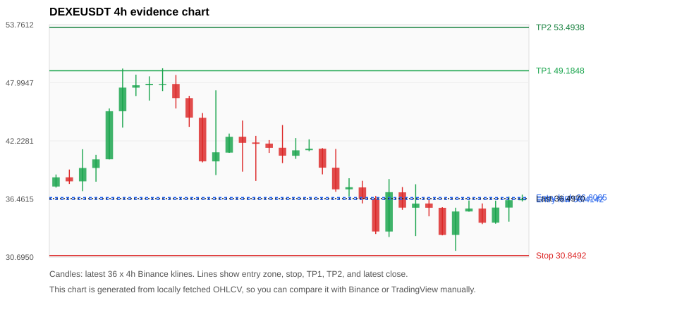
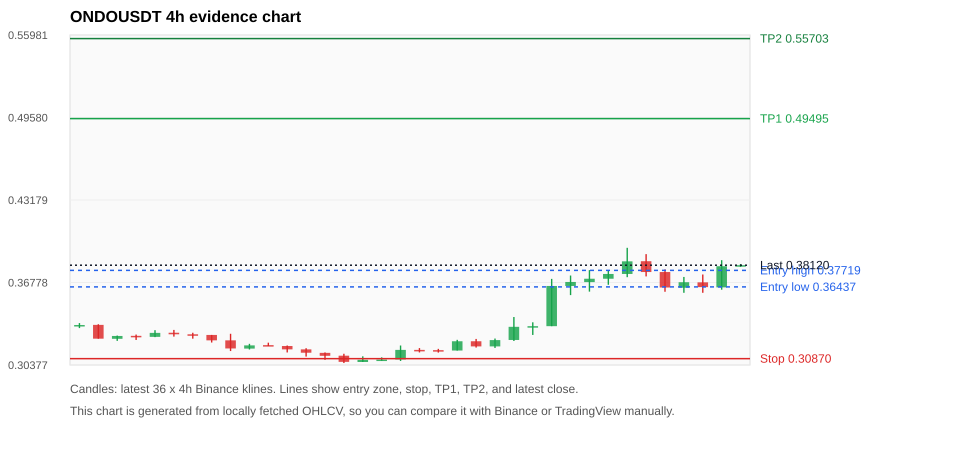
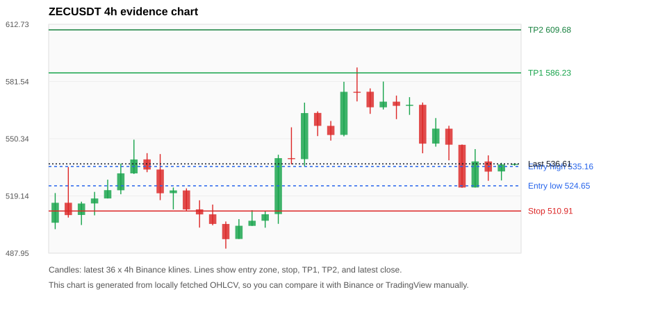
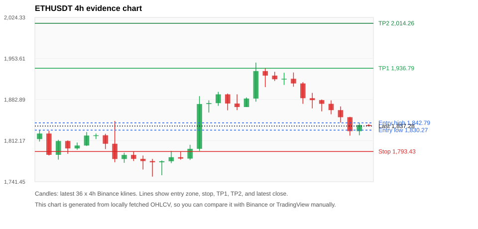
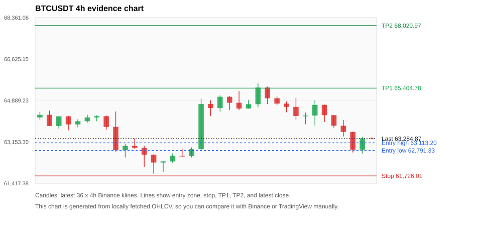

# Crypto 市场扫描报告 v1

- 报告时间：2026-07-17 20:06:27 CST
- Run ID：`20260717_120503_85cf66a6`
- Run type：`daily_full`
- 数据来源：SQLite
- 报告版本：v1
- 扫描 ID：b69201a6f091
- 数据源：Binance public spot API + CoinGecko/CoinMarketCap cross-check
- 过滤条件：USDT spot; 24h quote volume >= 30,000,000; trades >= 30,000; exclude stables/leveraged tokens; analyze 1h/4h/1d klines
- 默认单笔风险：账户权益的 1.00%

## 限制说明

- 交易信号仍以 Binance 现货公开 K 线为主源；外部数据源用于一致性复核。
- 结果是研究和模拟盘计划，不是确定收益或实盘下单指令。
- 历史长度过滤：候选币至少需要 180 根 1d K 线。
- 数据质量验证池：先验证 score 排名前 min(top_n * 2, 10) 的候选，再按 action + score 补足最终名单。
- 大盘环境过滤：RISK_OFF; BTC/ETH 大盘偏弱，山寨币买入候选降级为观察。 BTC 7d=-1.366624834870389; ETH 7d=2.26117928597267.
- 已启用数据交叉验证：Binance 主源 + CoinGecko 自动对照；CoinMarketCap 在配置 API Key 后自动对照。
- ZECUSDT 交叉验证状态 DATA_WARNING：At least one external provider needs manual review.
- ETHUSDT 交叉验证状态 DATA_WARNING：At least one external provider needs manual review.
- BTCUSDT 交叉验证状态 DATA_WARNING：At least one external provider needs manual review.
- XRPUSDT 交叉验证状态 DATA_WARNING：At least one external provider needs manual review.
- BNBUSDT 交叉验证状态 DATA_WARNING：At least one external provider needs manual review.
- SOLUSDT 交叉验证状态 DATA_WARNING：At least one external provider needs manual review.
- TREEUSDT 交叉验证状态 DATA_WARNING：At least one external provider needs manual review.

## 5 个候选交易计划

| Rank | Coin | Action | Setup | Entry Zone | Stop Loss | TP1 | TP2 / Exit Rule | R/R | Verdict |
|---:|---|---|---|---:|---:|---:|---|---:|---|
| 1 | `DEXE` | `WAIT_PULLBACK` | 回踩支撑/4h EMA 附近 | 36.4142 - 36.6065 | 30.8492 | 49.1848 | 53.4938 或跌破 4h 关键支撑 | 2.24-3.00 | 只观察 |
| 2 | `ONDO` | `WATCH_ONLY` | 趋势中，等回调入场 | 0.36437 - 0.37719 | 0.30870 | 0.49495 | 0.55703 或跌破 4h 关键支撑 | 2.00-3.00 | 只等回调 |
| 3 | `ZEC` | `WATCH_ONLY` | 回踩支撑/4h EMA 附近 | 524.65 - 535.16 | 510.91 | 586.23 | 609.68 或跌破 4h 关键支撑 | 2.97-4.20 | 只观察 |
| 4 | `ETH` | `WATCH_ONLY` | 回踩支撑/4h EMA 附近 | 1,830.27 - 1,842.79 | 1,793.43 | 1,936.79 | 2,014.26 或跌破 4h 关键支撑 | 2.33-4.12 | 只观察 |
| 5 | `BTC` | `REJECT` | 回踩支撑/4h EMA 附近 | 62,791.33 - 63,113.20 | 61,726.01 | 65,404.78 | 68,020.97 或跌破 4h 关键支撑 | 2.00-4.13 | 只观察 |

## 数据交叉验证摘要

价格差异以 Binance 当前价为基准；成交量口径不同，Binance 是 USDT 现货成交额，CoinGecko/CoinMarketCap 通常是全市场成交量。

| Rank | Coin | Data Status | Max Price Diff | Max 24h Diff | Message |
|---:|---|---|---:|---:|---|
| 1 | `DEXE` | DATA_OK | 0.08% | 0.27 pts | External provider checks agree with Binance within configured thresholds. |
| 2 | `ONDO` | DATA_OK | 0.29% | 0.41 pts | External provider checks agree with Binance within configured thresholds. |
| 3 | `ZEC` | DATA_WARNING | 0.22% | 0.12 pts | At least one external provider needs manual review. |
| 4 | `ETH` | DATA_WARNING | 0.04% | 0.06 pts | At least one external provider needs manual review. |
| 5 | `BTC` | DATA_WARNING | 0.08% | 0.03 pts | At least one external provider needs manual review. |

## 候选币说明

### 1. DEXE `DEXEUSDT`



- 入选原因：回踩支撑/4h EMA 附近；24h +3.46%，7d +3.44%，4h RSI 47.70，24h 成交额 $33.3M。
- 交易失效条件：跌破 30.849215 或 4h 收盘重新失守关键支撑。
- 主要风险：BTC/ETH 大盘环境未确认强势，山寨币买入信号降级。
- 数据交叉验证：DATA_OK；External provider checks agree with Binance within configured thresholds.

#### 可点击人工验证

- [Binance 交易页](https://www.binance.com/en/trade/DEXE_USDT)
- [TradingView 图表](https://www.tradingview.com/chart/?symbol=BINANCE%3ADEXEUSDT)
- [CoinGecko 搜索](https://www.coingecko.com/en/search?query=DEXE)
- [CoinMarketCap 搜索](https://coinmarketcap.com/search/?q=DEXE)

#### 多数据源对照

| Source | Status | Asset ID | Price | 24h Change | 24h Volume | Price Diff | 24h Diff | Updated | Message |
|---|---|---|---:|---:|---:|---:|---:|---|---|
| Binance | DATA_OK | DEXEUSDT | 36.4970 | +3.46% | $33.3M | 0.00% | 0.00 pts | 2026-07-17T12:05:59+00:00 | Primary market data source used by scanner. |
| CoinGecko | DATA_OK | dexe | 36.5200 | +3.23% | $127.9M | 0.06% | 0.23 pts | 2026-07-17T12:05:51.881Z | External source agrees with Binance within thresholds. |
| CoinMarketCap | DATA_OK | 7326 | 36.5277 | +3.19% | $170.1M | 0.08% | 0.27 pts | 2026-07-17T12:05:05.000Z | External source agrees with Binance within thresholds. |

#### 指标证据

| 指标 | 数值 | 人工核对用途 |
|---|---:|---|
| 当前价 | 36.4970 | 与 Binance/TradingView 当前价格对照 |
| 24h 涨跌 | +3.46% | 与交易所 24h 涨跌对照 |
| 7d 涨跌 | +3.44% | 判断短线趋势是否延续 |
| 4h EMA20 | 36.8164 | 判断短期趋势支撑 |
| 4h EMA50 | 36.3415 | 判断中期趋势支撑 |
| 1d EMA20 | 32.1192 | 判断日线趋势 |
| 1d EMA50 | 25.3557 | 判断日线趋势 |
| 4h RSI14 | 47.70 | 判断是否过热/过弱 |
| 4h ATR14 | 2.7436 | 推导止损和入场缓冲 |
| 最近 18 根 4h 最低点 | 31.3190 | 支撑/止损参考 |
| 最近 36 根 4h 最高点 | 49.4320 | TP/压力参考 |
| 支撑位 | 36.3415 | 入场区间推导基础 |

#### 交易计划推导

- 支撑位 = 最近低点、4h EMA20、4h EMA50、1d EMA20 中不高于当前价的最高有效支撑 = `36.3415`。
- 入场区间 = 支撑位附近 + ATR 缓冲 = `36.4142 - 36.6065`。
- 止损 = min(最近 18 根 4h 最低点 * 0.985, 入场中位价 - 1.15 * ATR14) = `30.8492`。
- TP1 = max(最近 36 根 4h 最高点 * 0.995, 入场中位价 + 2R) = `49.1848`。
- TP2 = max(入场中位价 + 3R, TP1 * 1.04) = `53.4938`。

#### 最近 10 根 4h K线

| UTC 开盘时间 | Open | High | Low | Close | Quote Volume | Trades |
|---|---:|---:|---:|---:|---:|---:|
| 2026-07-16T00:00+00:00 | 37.1220 | 37.6420 | 35.3930 | 35.6040 | $3.3M | 128053 |
| 2026-07-16T04:00+00:00 | 35.5940 | 37.9230 | 32.7820 | 36.0000 | $7.6M | 258448 |
| 2026-07-16T08:00+00:00 | 36.0120 | 36.4520 | 34.7390 | 35.5910 | $3.2M | 111237 |
| 2026-07-16T12:00+00:00 | 35.5880 | 35.6530 | 32.8500 | 32.8930 | $11.6M | 377161 |
| 2026-07-16T16:00+00:00 | 32.8940 | 35.5960 | 31.3190 | 35.2190 | $5.0M | 192966 |
| 2026-07-16T20:00+00:00 | 35.2220 | 36.3120 | 35.2050 | 35.5100 | $2.4M | 109157 |
| 2026-07-17T00:00+00:00 | 35.5100 | 36.0190 | 33.9620 | 34.1060 | $3.7M | 131509 |
| 2026-07-17T04:00+00:00 | 34.1160 | 36.2990 | 34.0000 | 35.6100 | $3.4M | 121171 |
| 2026-07-17T08:00+00:00 | 35.6100 | 36.6940 | 34.2110 | 36.3440 | $7.1M | 148143 |
| 2026-07-17T12:00+00:00 | 36.3400 | 36.8890 | 36.2140 | 36.4960 | $113,420 | 4746 |

### 2. ONDO `ONDOUSDT`



- 入选原因：趋势中，等回调入场；24h +2.03%，7d +15.69%，4h RSI 78.33，24h 成交额 $33.9M。
- 交易失效条件：跌破 0.308699 或 4h 收盘重新失守关键支撑。
- 主要风险：4h RSI 偏热；成交量突增，可能是事件驱动；BTC/ETH 大盘环境未确认强势，山寨币买入信号降级。
- 数据交叉验证：DATA_OK；External provider checks agree with Binance within configured thresholds.

#### 可点击人工验证

- [Binance 交易页](https://www.binance.com/en/trade/ONDO_USDT)
- [TradingView 图表](https://www.tradingview.com/chart/?symbol=BINANCE%3AONDOUSDT)
- [CoinGecko 搜索](https://www.coingecko.com/en/search?query=ONDO)
- [CoinMarketCap 搜索](https://coinmarketcap.com/search/?q=ONDO)

#### 多数据源对照

| Source | Status | Asset ID | Price | 24h Change | 24h Volume | Price Diff | 24h Diff | Updated | Message |
|---|---|---|---:|---:|---:|---:|---:|---|---|
| Binance | DATA_OK | ONDOUSDT | 0.38120 | +2.03% | $33.9M | 0.00% | 0.00 pts | 2026-07-17T12:05:59+00:00 | Primary market data source used by scanner. |
| CoinGecko | DATA_OK | ondo-finance | 0.38017 | +1.85% | $258.5M | 0.27% | 0.18 pts | 2026-07-17T12:05:55.458Z | External source agrees with Binance within thresholds. |
| CoinMarketCap | DATA_OK | 21159 | 0.38009 | +1.63% | $243.6M | 0.29% | 0.41 pts | 2026-07-17T12:05:05.000Z | External source agrees with Binance within thresholds. |

#### 指标证据

| 指标 | 数值 | 人工核对用途 |
|---|---:|---|
| 当前价 | 0.38120 | 与 Binance/TradingView 当前价格对照 |
| 24h 涨跌 | +2.03% | 与交易所 24h 涨跌对照 |
| 7d 涨跌 | +15.69% | 判断短线趋势是否延续 |
| 4h EMA20 | 0.35576 | 判断短期趋势支撑 |
| 4h EMA50 | 0.33983 | 判断中期趋势支撑 |
| 1d EMA20 | 0.33704 | 判断日线趋势 |
| 1d EMA50 | 0.33827 | 判断日线趋势 |
| 4h RSI14 | 78.33 | 判断是否过热/过弱 |
| 4h ATR14 | 0.01603 | 推导止损和入场缓冲 |
| 最近 18 根 4h 最低点 | 0.31340 | 支撑/止损参考 |
| 最近 36 根 4h 最高点 | 0.39470 | TP/压力参考 |
| 支撑位 | 0.35576 | 入场区间推导基础 |

#### 交易计划推导

- 支撑位 = 最近低点、4h EMA20、4h EMA50、1d EMA20 中不高于当前价的最高有效支撑 = `0.35576`。
- 入场区间 = 支撑位附近 + ATR 缓冲 = `0.36437 - 0.37719`。
- 止损 = min(最近 18 根 4h 最低点 * 0.985, 入场中位价 - 1.15 * ATR14) = `0.30870`。
- TP1 = max(最近 36 根 4h 最高点 * 0.995, 入场中位价 + 2R) = `0.49495`。
- TP2 = max(入场中位价 + 3R, TP1 * 1.04) = `0.55703`。

#### 最近 10 根 4h K线

| UTC 开盘时间 | Open | High | Low | Close | Quote Volume | Trades |
|---|---:|---:|---:|---:|---:|---:|
| 2026-07-16T00:00+00:00 | 0.36510 | 0.37320 | 0.35800 | 0.36820 | $5.4M | 38465 |
| 2026-07-16T04:00+00:00 | 0.36810 | 0.37740 | 0.36070 | 0.37070 | $5.8M | 37072 |
| 2026-07-16T08:00+00:00 | 0.37070 | 0.37700 | 0.36600 | 0.37440 | $4.6M | 31750 |
| 2026-07-16T12:00+00:00 | 0.37440 | 0.39470 | 0.37190 | 0.38420 | $11.1M | 70378 |
| 2026-07-16T16:00+00:00 | 0.38430 | 0.38980 | 0.37250 | 0.37590 | $4.2M | 39715 |
| 2026-07-16T20:00+00:00 | 0.37590 | 0.37790 | 0.36060 | 0.36390 | $4.4M | 35953 |
| 2026-07-17T00:00+00:00 | 0.36370 | 0.37210 | 0.35980 | 0.36800 | $2.9M | 22661 |
| 2026-07-17T04:00+00:00 | 0.36790 | 0.37400 | 0.35980 | 0.36420 | $6.5M | 28973 |
| 2026-07-17T08:00+00:00 | 0.36400 | 0.38510 | 0.36220 | 0.38040 | $4.8M | 26801 |
| 2026-07-17T12:00+00:00 | 0.38030 | 0.38210 | 0.37980 | 0.38120 | $132,668 | 570 |

### 3. ZEC `ZECUSDT`



- 入选原因：回踩支撑/4h EMA 附近；24h -1.95%，7d +5.82%，4h RSI 43.62，24h 成交额 $97.2M。
- 交易失效条件：跌破 510.90874 或 4h 收盘重新失守关键支撑。
- 主要风险：BTC/ETH 大盘环境未确认强势，山寨币买入信号降级；24h 动量未确认；数据交叉验证需要人工复核。
- 数据交叉验证：DATA_WARNING；At least one external provider needs manual review.

#### 可点击人工验证

- [Binance 交易页](https://www.binance.com/en/trade/ZEC_USDT)
- [TradingView 图表](https://www.tradingview.com/chart/?symbol=BINANCE%3AZECUSDT)
- [CoinGecko 搜索](https://www.coingecko.com/en/search?query=ZEC)
- [CoinMarketCap 搜索](https://coinmarketcap.com/search/?q=ZEC)

#### 多数据源对照

| Source | Status | Asset ID | Price | 24h Change | 24h Volume | Price Diff | 24h Diff | Updated | Message |
|---|---|---|---:|---:|---:|---:|---:|---|---|
| Binance | DATA_OK | ZECUSDT | 536.61 | -1.95% | $97.2M | 0.00% | 0.00 pts | 2026-07-17T12:05:59+00:00 | Primary market data source used by scanner. |
| CoinGecko | DATA_OK | zcash | 535.45 | -2.08% | $446.5M | 0.22% | 0.12 pts | 2026-07-17T12:06:01.074Z | External source agrees with Binance within thresholds. |
| CoinMarketCap | DATA_WARNING | 1437 | 535.69 | -2.03% | $529.6M | 0.17% | 0.08 pts | 2026-07-17T12:05:05.000Z | CoinMarketCap symbol mapping has 2 matches; selected lowest cmc_rank |

#### 指标证据

| 指标 | 数值 | 人工核对用途 |
|---|---:|---|
| 当前价 | 536.61 | 与 Binance/TradingView 当前价格对照 |
| 24h 涨跌 | -1.95% | 与交易所 24h 涨跌对照 |
| 7d 涨跌 | +5.82% | 判断短线趋势是否延续 |
| 4h EMA20 | 541.76 | 判断短期趋势支撑 |
| 4h EMA50 | 522.58 | 判断中期趋势支撑 |
| 1d EMA20 | 495.51 | 判断日线趋势 |
| 1d EMA50 | 476.47 | 判断日线趋势 |
| 4h RSI14 | 43.62 | 判断是否过热/过弱 |
| 4h ATR14 | 16.5186 | 推导止损和入场缓冲 |
| 最近 18 根 4h 最低点 | 523.60 | 支撑/止损参考 |
| 最近 36 根 4h 最高点 | 589.18 | TP/压力参考 |
| 支撑位 | 523.60 | 入场区间推导基础 |

#### 交易计划推导

- 支撑位 = 最近低点、4h EMA20、4h EMA50、1d EMA20 中不高于当前价的最高有效支撑 = `523.60`。
- 入场区间 = 支撑位附近 + ATR 缓冲 = `524.65 - 535.16`。
- 止损 = min(最近 18 根 4h 最低点 * 0.985, 入场中位价 - 1.15 * ATR14) = `510.91`。
- TP1 = max(最近 36 根 4h 最高点 * 0.995, 入场中位价 + 2R) = `586.23`。
- TP2 = max(入场中位价 + 3R, TP1 * 1.04) = `609.68`。

#### 最近 10 根 4h K线

| UTC 开盘时间 | Open | High | Low | Close | Quote Volume | Trades |
|---|---:|---:|---:|---:|---:|---:|
| 2026-07-16T00:00+00:00 | 570.53 | 573.85 | 561.00 | 568.25 | $15.8M | 42542 |
| 2026-07-16T04:00+00:00 | 568.25 | 572.99 | 563.33 | 568.85 | $8.1M | 33078 |
| 2026-07-16T08:00+00:00 | 568.80 | 570.06 | 542.39 | 547.64 | $34.2M | 88354 |
| 2026-07-16T12:00+00:00 | 547.68 | 561.59 | 546.00 | 555.83 | $25.4M | 68486 |
| 2026-07-16T16:00+00:00 | 555.80 | 557.38 | 538.55 | 547.07 | $17.8M | 49324 |
| 2026-07-16T20:00+00:00 | 547.00 | 547.16 | 523.60 | 523.72 | $17.4M | 67461 |
| 2026-07-17T00:00+00:00 | 523.75 | 544.67 | 523.74 | 537.95 | $15.2M | 64969 |
| 2026-07-17T04:00+00:00 | 537.93 | 541.25 | 527.38 | 532.39 | $13.2M | 62281 |
| 2026-07-17T08:00+00:00 | 532.50 | 537.18 | 527.56 | 536.28 | $8.1M | 36199 |
| 2026-07-17T12:00+00:00 | 536.34 | 536.89 | 535.62 | 536.61 | $247,657 | 784 |

### 4. ETH `ETHUSDT`



- 入选原因：回踩支撑/4h EMA 附近；24h -2.34%，7d +1.85%，4h RSI 40.87，24h 成交额 $475.8M。
- 交易失效条件：跌破 1793.4289 或 4h 收盘重新失守关键支撑。
- 主要风险：BTC/ETH 大盘环境未确认强势，山寨币买入信号降级；24h 动量未确认；数据交叉验证需要人工复核。
- 数据交叉验证：DATA_WARNING；At least one external provider needs manual review.

#### 可点击人工验证

- [Binance 交易页](https://www.binance.com/en/trade/ETH_USDT)
- [TradingView 图表](https://www.tradingview.com/chart/?symbol=BINANCE%3AETHUSDT)
- [CoinGecko 搜索](https://www.coingecko.com/en/search?query=ETH)
- [CoinMarketCap 搜索](https://coinmarketcap.com/search/?q=ETH)

#### 多数据源对照

| Source | Status | Asset ID | Price | 24h Change | 24h Volume | Price Diff | 24h Diff | Updated | Message |
|---|---|---|---:|---:|---:|---:|---:|---|---|
| Binance | DATA_OK | ETHUSDT | 1,837.28 | -2.34% | $475.8M | 0.00% | 0.00 pts | 2026-07-17T12:05:59+00:00 | Primary market data source used by scanner. |
| CoinGecko | DATA_OK | ethereum | 1,836.46 | -2.28% | $9.62B | 0.04% | 0.06 pts | 2026-07-17T12:05:55.931Z | External source agrees with Binance within thresholds. |
| CoinMarketCap | DATA_WARNING | 1027 | 1,837.35 | -2.38% | $11.02B | 0.00% | 0.04 pts | 2026-07-17T12:05:05.000Z | CoinMarketCap symbol mapping has 6 matches; selected lowest cmc_rank |

#### 指标证据

| 指标 | 数值 | 人工核对用途 |
|---|---:|---|
| 当前价 | 1,837.28 | 与 Binance/TradingView 当前价格对照 |
| 24h 涨跌 | -2.34% | 与交易所 24h 涨跌对照 |
| 7d 涨跌 | +1.85% | 判断短线趋势是否延续 |
| 4h EMA20 | 1,858.84 | 判断短期趋势支撑 |
| 4h EMA50 | 1,826.61 | 判断中期趋势支撑 |
| 1d EMA20 | 1,785.82 | 判断日线趋势 |
| 1d EMA50 | 1,811.10 | 判断日线趋势 |
| 4h RSI14 | 40.87 | 判断是否过热/过弱 |
| 4h ATR14 | 26.5350 | 推导止损和入场缓冲 |
| 最近 18 根 4h 最低点 | 1,820.74 | 支撑/止损参考 |
| 最近 36 根 4h 最高点 | 1,946.52 | TP/压力参考 |
| 支撑位 | 1,826.61 | 入场区间推导基础 |

#### 交易计划推导

- 支撑位 = 最近低点、4h EMA20、4h EMA50、1d EMA20 中不高于当前价的最高有效支撑 = `1,826.61`。
- 入场区间 = 支撑位附近 + ATR 缓冲 = `1,830.27 - 1,842.79`。
- 止损 = min(最近 18 根 4h 最低点 * 0.985, 入场中位价 - 1.15 * ATR14) = `1,793.43`。
- TP1 = max(最近 36 根 4h 最高点 * 0.995, 入场中位价 + 2R) = `1,936.79`。
- TP2 = max(入场中位价 + 3R, TP1 * 1.04) = `2,014.26`。

#### 最近 10 根 4h K线

| UTC 开盘时间 | Open | High | Low | Close | Quote Volume | Trades |
|---|---:|---:|---:|---:|---:|---:|
| 2026-07-16T00:00+00:00 | 1,917.86 | 1,929.00 | 1,908.12 | 1,918.70 | $54.1M | 447454 |
| 2026-07-16T04:00+00:00 | 1,918.70 | 1,929.48 | 1,905.00 | 1,910.63 | $55.9M | 261782 |
| 2026-07-16T08:00+00:00 | 1,910.64 | 1,912.85 | 1,875.56 | 1,885.26 | $161.3M | 531557 |
| 2026-07-16T12:00+00:00 | 1,885.26 | 1,894.38 | 1,867.68 | 1,881.88 | $120.4M | 694530 |
| 2026-07-16T16:00+00:00 | 1,881.89 | 1,883.00 | 1,862.57 | 1,875.59 | $62.4M | 367055 |
| 2026-07-16T20:00+00:00 | 1,875.59 | 1,881.59 | 1,857.54 | 1,864.71 | $59.1M | 274650 |
| 2026-07-17T00:00+00:00 | 1,864.71 | 1,871.08 | 1,843.20 | 1,852.53 | $82.5M | 524250 |
| 2026-07-17T04:00+00:00 | 1,852.53 | 1,853.08 | 1,820.74 | 1,828.52 | $83.5M | 407374 |
| 2026-07-17T08:00+00:00 | 1,828.52 | 1,843.26 | 1,821.41 | 1,839.04 | $67.6M | 286025 |
| 2026-07-17T12:00+00:00 | 1,839.05 | 1,840.58 | 1,837.28 | 1,837.29 | $1.6M | 5252 |

### 5. BTC `BTCUSDT`



- 入选原因：回踩支撑/4h EMA 附近；24h -1.36%，7d -1.86%，4h RSI 37.08，24h 成交额 $993.6M。
- 交易失效条件：跌破 61726.01 或 4h 收盘重新失守关键支撑。
- 主要风险：日线趋势未完全确认；BTC/ETH 大盘环境未确认强势，山寨币买入信号降级；24h 动量未确认；7d 趋势未确认；数据交叉验证需要人工复核。
- 数据交叉验证：DATA_WARNING；At least one external provider needs manual review.

#### 可点击人工验证

- [Binance 交易页](https://www.binance.com/en/trade/BTC_USDT)
- [TradingView 图表](https://www.tradingview.com/chart/?symbol=BINANCE%3ABTCUSDT)
- [CoinGecko 搜索](https://www.coingecko.com/en/search?query=BTC)
- [CoinMarketCap 搜索](https://coinmarketcap.com/search/?q=BTC)

#### 多数据源对照

| Source | Status | Asset ID | Price | 24h Change | 24h Volume | Price Diff | 24h Diff | Updated | Message |
|---|---|---|---:|---:|---:|---:|---:|---|---|
| Binance | DATA_OK | BTCUSDT | 63,284.87 | -1.36% | $993.6M | 0.00% | 0.00 pts | 2026-07-17T12:05:59+00:00 | Primary market data source used by scanner. |
| CoinGecko | DATA_OK | bitcoin | 63,237.00 | -1.35% | $25.13B | 0.08% | 0.01 pts | 2026-07-17T12:06:04.004Z | External source agrees with Binance within thresholds. |
| CoinMarketCap | DATA_WARNING | 1 | 63,242.15 | -1.40% | $24.60B | 0.07% | 0.03 pts | 2026-07-17T12:05:05.000Z | CoinMarketCap symbol mapping has 13 matches; selected lowest cmc_rank |

#### 指标证据

| 指标 | 数值 | 人工核对用途 |
|---|---:|---|
| 当前价 | 63,284.87 | 与 Binance/TradingView 当前价格对照 |
| 24h 涨跌 | -1.36% | 与交易所 24h 涨跌对照 |
| 7d 涨跌 | -1.86% | 判断短线趋势是否延续 |
| 4h EMA20 | 63,897.65 | 判断短期趋势支撑 |
| 4h EMA50 | 63,648.43 | 判断中期趋势支撑 |
| 1d EMA20 | 63,331.28 | 判断日线趋势 |
| 1d EMA50 | 65,030.91 | 判断日线趋势 |
| 4h RSI14 | 37.08 | 判断是否过热/过弱 |
| 4h ATR14 | 638.86 | 推导止损和入场缓冲 |
| 最近 18 根 4h 最低点 | 62,666.00 | 支撑/止损参考 |
| 最近 36 根 4h 最高点 | 65,600.00 | TP/压力参考 |
| 支撑位 | 62,666.00 | 入场区间推导基础 |

#### 交易计划推导

- 支撑位 = 最近低点、4h EMA20、4h EMA50、1d EMA20 中不高于当前价的最高有效支撑 = `62,666.00`。
- 入场区间 = 支撑位附近 + ATR 缓冲 = `62,791.33 - 63,113.20`。
- 止损 = min(最近 18 根 4h 最低点 * 0.985, 入场中位价 - 1.15 * ATR14) = `61,726.01`。
- TP1 = max(最近 36 根 4h 最高点 * 0.995, 入场中位价 + 2R) = `65,404.78`。
- TP2 = max(入场中位价 + 3R, TP1 * 1.04) = `68,020.97`。

#### 最近 10 根 4h K线

| UTC 开盘时间 | Open | High | Low | Close | Quote Volume | Trades |
|---|---:|---:|---:|---:|---:|---:|
| 2026-07-16T00:00+00:00 | 64,756.28 | 64,845.50 | 64,392.01 | 64,619.95 | $114.7M | 351949 |
| 2026-07-16T04:00+00:00 | 64,619.96 | 64,997.52 | 64,086.12 | 64,238.00 | $176.2M | 380748 |
| 2026-07-16T08:00+00:00 | 64,238.00 | 64,380.00 | 63,888.00 | 64,256.53 | $518.4M | 555339 |
| 2026-07-16T12:00+00:00 | 64,256.52 | 64,896.00 | 63,838.28 | 64,704.73 | $204.1M | 741620 |
| 2026-07-16T16:00+00:00 | 64,704.73 | 64,712.00 | 63,984.09 | 64,271.84 | $114.7M | 502323 |
| 2026-07-16T20:00+00:00 | 64,271.85 | 64,276.00 | 63,748.74 | 63,830.20 | $78.4M | 281502 |
| 2026-07-17T00:00+00:00 | 63,830.20 | 64,067.69 | 63,380.28 | 63,570.00 | $169.7M | 531177 |
| 2026-07-17T04:00+00:00 | 63,570.00 | 63,576.00 | 62,710.00 | 62,828.11 | $262.7M | 494473 |
| 2026-07-17T08:00+00:00 | 62,828.11 | 63,361.70 | 62,666.00 | 63,298.01 | $163.4M | 354967 |
| 2026-07-17T12:00+00:00 | 63,298.00 | 63,348.00 | 63,280.49 | 63,284.88 | $2.4M | 8496 |

## 组合风控

- 不要 5 个候选全部满仓买入。
- 同时持仓总风险建议控制在账户权益的 3% - 5% 以内。
- 如果 BTC/ETH 同时破位，暂停山寨币多头计划或降低仓位。
- 第一版报告用于模拟盘和人工复核，不自动下单。

## 原始数据

```json
[
  {
    "rank": 1,
    "symbol": "DEXEUSDT",
    "base_asset": "DEXE",
    "price": 36.497,
    "score": 25.874500551082107,
    "setup": "回踩支撑/4h EMA 附近",
    "verdict": "只观察",
    "entry_low": 36.414209044922345,
    "entry_high": 36.606491,
    "stop_loss": 30.849214999999997,
    "take_profit_1": 49.18484,
    "take_profit_2": 53.49375508984468,
    "risk_reward_1": 2.238860215707877,
    "risk_reward_2": 3.0000000000000004,
    "pct_24h": 3.461,
    "pct_3d": -12.50029968113926,
    "pct_7d": 3.4436823309336395,
    "quote_volume_24h": 33304911.97326,
    "trades_24h": 1083093,
    "high_low_range_24h": 17.784731313260327,
    "rsi_1h": 56.36231884057971,
    "rsi_4h": 47.69731896767728,
    "ema20_4h": 36.816403286620236,
    "ema50_4h": 36.34152599293647,
    "ema20_1d": 32.119244421521586,
    "ema50_1d": 25.355716704309316,
    "atr_4h": 2.743642857142857,
    "macd_hist_4h": -0.06969222439873435,
    "volume_ratio_24h": 1.3373222240428735,
    "support_level": 36.34152599293647,
    "recent_low_4h_18": 31.319,
    "recent_high_4h_36": 49.432,
    "distance_to_support_pct": 0.42781364517756604,
    "binance_trade_url": "https://www.binance.com/en/trade/DEXE_USDT",
    "tradingview_url": "https://www.tradingview.com/chart/?symbol=BINANCE%3ADEXEUSDT",
    "coingecko_search_url": "https://www.coingecko.com/en/search?query=DEXE",
    "coinmarketcap_search_url": "https://coinmarketcap.com/search/?q=DEXE",
    "invalidation": "跌破 30.849215 或 4h 收盘重新失守关键支撑",
    "recent_4h_klines": [
      {
        "open_time_utc": "2026-07-11T16:00+00:00",
        "open": 37.699,
        "high": 38.891,
        "low": 37.591,
        "close": 38.609,
        "quote_volume": 1304187.43866,
        "trades": 43526
      },
      {
        "open_time_utc": "2026-07-11T20:00+00:00",
        "open": 38.613,
        "high": 39.384,
        "low": 37.955,
        "close": 38.213,
        "quote_volume": 1474134.49627,
        "trades": 49705
      },
      {
        "open_time_utc": "2026-07-12T00:00+00:00",
        "open": 38.213,
        "high": 41.4,
        "low": 37.24,
        "close": 39.536,
        "quote_volume": 2909448.5565,
        "trades": 103867
      },
      {
        "open_time_utc": "2026-07-12T04:00+00:00",
        "open": 39.539,
        "high": 40.841,
        "low": 38.177,
        "close": 40.391,
        "quote_volume": 3370387.57051,
        "trades": 102521
      },
      {
        "open_time_utc": "2026-07-12T08:00+00:00",
        "open": 40.4,
        "high": 45.449,
        "low": 40.388,
        "close": 45.17,
        "quote_volume": 7131059.42127,
        "trades": 165480
      },
      {
        "open_time_utc": "2026-07-12T12:00+00:00",
        "open": 45.169,
        "high": 49.405,
        "low": 43.543,
        "close": 47.514,
        "quote_volume": 12896382.99609,
        "trades": 271562
      },
      {
        "open_time_utc": "2026-07-12T16:00+00:00",
        "open": 47.507,
        "high": 48.8,
        "low": 46.68,
        "close": 47.745,
        "quote_volume": 5798594.25629,
        "trades": 122187
      },
      {
        "open_time_utc": "2026-07-12T20:00+00:00",
        "open": 47.754,
        "high": 48.632,
        "low": 46.229,
        "close": 47.888,
        "quote_volume": 3614888.33956,
        "trades": 59495
      },
      {
        "open_time_utc": "2026-07-13T00:00+00:00",
        "open": 47.859,
        "high": 49.432,
        "low": 47.172,
        "close": 47.874,
        "quote_volume": 3581191.27374,
        "trades": 89910
      },
      {
        "open_time_utc": "2026-07-13T04:00+00:00",
        "open": 47.874,
        "high": 48.768,
        "low": 45.445,
        "close": 46.473,
        "quote_volume": 4085630.4305,
        "trades": 100248
      },
      {
        "open_time_utc": "2026-07-13T08:00+00:00",
        "open": 46.471,
        "high": 46.697,
        "low": 43.618,
        "close": 44.538,
        "quote_volume": 3556793.33474,
        "trades": 104045
      },
      {
        "open_time_utc": "2026-07-13T12:00+00:00",
        "open": 44.523,
        "high": 44.994,
        "low": 40.094,
        "close": 40.195,
        "quote_volume": 5008023.27354,
        "trades": 119607
      },
      {
        "open_time_utc": "2026-07-13T16:00+00:00",
        "open": 40.193,
        "high": 47.242,
        "low": 38.838,
        "close": 41.094,
        "quote_volume": 4781770.99867,
        "trades": 174870
      },
      {
        "open_time_utc": "2026-07-13T20:00+00:00",
        "open": 41.063,
        "high": 42.952,
        "low": 41.038,
        "close": 42.635,
        "quote_volume": 1246721.9921,
        "trades": 36140
      },
      {
        "open_time_utc": "2026-07-14T00:00+00:00",
        "open": 42.64,
        "high": 44.245,
        "low": 39.175,
        "close": 42.032,
        "quote_volume": 5032525.31327,
        "trades": 151022
      },
      {
        "open_time_utc": "2026-07-14T04:00+00:00",
        "open": 42.071,
        "high": 42.725,
        "low": 38.253,
        "close": 41.934,
        "quote_volume": 3886800.43924,
        "trades": 127949
      },
      {
        "open_time_utc": "2026-07-14T08:00+00:00",
        "open": 41.96,
        "high": 42.304,
        "low": 41.035,
        "close": 41.536,
        "quote_volume": 1387615.50721,
        "trades": 49651
      },
      {
        "open_time_utc": "2026-07-14T12:00+00:00",
        "open": 41.545,
        "high": 43.8,
        "low": 40.023,
        "close": 40.757,
        "quote_volume": 7603851.77727,
        "trades": 184703
      },
      {
        "open_time_utc": "2026-07-14T16:00+00:00",
        "open": 40.751,
        "high": 42.5,
        "low": 40.44,
        "close": 41.29,
        "quote_volume": 1281807.52394,
        "trades": 39747
      },
      {
        "open_time_utc": "2026-07-14T20:00+00:00",
        "open": 41.303,
        "high": 42.381,
        "low": 41.2,
        "close": 41.452,
        "quote_volume": 810562.29955,
        "trades": 24259
      },
      {
        "open_time_utc": "2026-07-15T00:00+00:00",
        "open": 41.45,
        "high": 41.513,
        "low": 38.904,
        "close": 39.57,
        "quote_volume": 997536.42167,
        "trades": 51495
      },
      {
        "open_time_utc": "2026-07-15T04:00+00:00",
        "open": 39.566,
        "high": 41.424,
        "low": 37.176,
        "close": 37.415,
        "quote_volume": 12005193.75212,
        "trades": 419020
      },
      {
        "open_time_utc": "2026-07-15T08:00+00:00",
        "open": 37.418,
        "high": 38.519,
        "low": 36.69,
        "close": 37.629,
        "quote_volume": 4590493.2074,
        "trades": 175020
      },
      {
        "open_time_utc": "2026-07-15T12:00+00:00",
        "open": 37.608,
        "high": 38.268,
        "low": 36.019,
        "close": 36.485,
        "quote_volume": 4550636.75399,
        "trades": 163313
      },
      {
        "open_time_utc": "2026-07-15T16:00+00:00",
        "open": 36.468,
        "high": 36.766,
        "low": 32.986,
        "close": 33.235,
        "quote_volume": 2082770.69887,
        "trades": 112392
      },
      {
        "open_time_utc": "2026-07-15T20:00+00:00",
        "open": 33.232,
        "high": 38.44,
        "low": 32.691,
        "close": 37.136,
        "quote_volume": 3428006.79357,
        "trades": 126454
      },
      {
        "open_time_utc": "2026-07-16T00:00+00:00",
        "open": 37.122,
        "high": 37.642,
        "low": 35.393,
        "close": 35.604,
        "quote_volume": 3287220.3692,
        "trades": 128053
      },
      {
        "open_time_utc": "2026-07-16T04:00+00:00",
        "open": 35.594,
        "high": 37.923,
        "low": 32.782,
        "close": 36.0,
        "quote_volume": 7579409.94442,
        "trades": 258448
      },
      {
        "open_time_utc": "2026-07-16T08:00+00:00",
        "open": 36.012,
        "high": 36.452,
        "low": 34.739,
        "close": 35.591,
        "quote_volume": 3176247.56561,
        "trades": 111237
      },
      {
        "open_time_utc": "2026-07-16T12:00+00:00",
        "open": 35.588,
        "high": 35.653,
        "low": 32.85,
        "close": 32.893,
        "quote_volume": 11631176.06974,
        "trades": 377161
      },
      {
        "open_time_utc": "2026-07-16T16:00+00:00",
        "open": 32.894,
        "high": 35.596,
        "low": 31.319,
        "close": 35.219,
        "quote_volume": 5018632.40575,
        "trades": 192966
      },
      {
        "open_time_utc": "2026-07-16T20:00+00:00",
        "open": 35.222,
        "high": 36.312,
        "low": 35.205,
        "close": 35.51,
        "quote_volume": 2449508.31232,
        "trades": 109157
      },
      {
        "open_time_utc": "2026-07-17T00:00+00:00",
        "open": 35.51,
        "high": 36.019,
        "low": 33.962,
        "close": 34.106,
        "quote_volume": 3700848.31917,
        "trades": 131509
      },
      {
        "open_time_utc": "2026-07-17T04:00+00:00",
        "open": 34.116,
        "high": 36.299,
        "low": 34.0,
        "close": 35.61,
        "quote_volume": 3364940.19149,
        "trades": 121171
      },
      {
        "open_time_utc": "2026-07-17T08:00+00:00",
        "open": 35.61,
        "high": 36.694,
        "low": 34.211,
        "close": 36.344,
        "quote_volume": 7080193.94143,
        "trades": 148143
      },
      {
        "open_time_utc": "2026-07-17T12:00+00:00",
        "open": 36.34,
        "high": 36.889,
        "low": 36.214,
        "close": 36.496,
        "quote_volume": 113420.43335,
        "trades": 4746
      }
    ],
    "risks": [
      "BTC/ETH 大盘环境未确认强势，山寨币买入信号降级"
    ],
    "data_quality_status": "DATA_OK",
    "data_quality_message": "External provider checks agree with Binance within configured thresholds.",
    "data_checks": [
      {
        "provider": "Binance",
        "status": "DATA_OK",
        "provider_asset_id": "DEXEUSDT",
        "provider_symbol": "DEXEUSDT",
        "price_usd": 36.497,
        "pct_24h": 3.461,
        "volume_24h": 33304911.97326,
        "last_updated": null,
        "fetched_at_utc": "2026-07-17T12:05:59+00:00",
        "price_diff_pct": 0.0,
        "pct_24h_diff": 0.0,
        "volume_note": "Binance USDT spot 24h quoteVolume.",
        "message": "Primary market data source used by scanner."
      },
      {
        "provider": "CoinGecko",
        "status": "DATA_OK",
        "provider_asset_id": "dexe",
        "provider_symbol": "DEXE",
        "price_usd": 36.52,
        "pct_24h": 3.22785,
        "volume_24h": 127861303.0,
        "last_updated": "2026-07-17T12:05:51.881Z",
        "fetched_at_utc": "2026-07-17T12:05:59+00:00",
        "price_diff_pct": 0.06301887826397577,
        "pct_24h_diff": 0.23314999999999975,
        "volume_note": "CoinGecko total market volume; not the same venue scope as Binance quoteVolume.",
        "message": "External source agrees with Binance within thresholds."
      },
      {
        "provider": "CoinMarketCap",
        "status": "DATA_OK",
        "provider_asset_id": "7326",
        "provider_symbol": "DEXE",
        "price_usd": 36.527746392624906,
        "pct_24h": 3.18855258,
        "volume_24h": 170129579.72208747,
        "last_updated": "2026-07-17T12:05:05.000Z",
        "fetched_at_utc": "2026-07-17T12:05:59+00:00",
        "price_diff_pct": 0.0842436162558721,
        "pct_24h_diff": 0.2724474199999998,
        "volume_note": "CoinMarketCap total market volume; not the same venue scope as Binance quoteVolume.",
        "message": "External source agrees with Binance within thresholds."
      }
    ],
    "action": "WAIT_PULLBACK"
  },
  {
    "rank": 2,
    "symbol": "ONDOUSDT",
    "base_asset": "ONDO",
    "price": 0.3812,
    "score": 41.1412178843309,
    "setup": "趋势中，等回调入场",
    "verdict": "只等回调",
    "entry_low": 0.36436999999999997,
    "entry_high": 0.3771928571428571,
    "stop_loss": 0.308699,
    "take_profit_1": 0.4949462857142856,
    "take_profit_2": 0.5570287142857142,
    "risk_reward_1": 2.0,
    "risk_reward_2": 3.000000000000001,
    "pct_24h": 2.034,
    "pct_3d": 21.208267090620026,
    "pct_7d": 15.69044006069802,
    "quote_volume_24h": 33943630.36848,
    "trades_24h": 224573,
    "high_low_range_24h": 9.699833240689259,
    "rsi_1h": 68.26086956521733,
    "rsi_4h": 78.32733812949643,
    "ema20_4h": 0.3557574813298478,
    "ema50_4h": 0.33982599640520894,
    "ema20_1d": 0.33704000266277434,
    "ema50_1d": 0.3382667945952054,
    "atr_4h": 0.01602857142857142,
    "macd_hist_4h": 0.0024767494497608417,
    "volume_ratio_24h": 3.0249193686789857,
    "support_level": 0.3557574813298478,
    "recent_low_4h_18": 0.3134,
    "recent_high_4h_36": 0.3947,
    "distance_to_support_pct": 7.151646839595949,
    "binance_trade_url": "https://www.binance.com/en/trade/ONDO_USDT",
    "tradingview_url": "https://www.tradingview.com/chart/?symbol=BINANCE%3AONDOUSDT",
    "coingecko_search_url": "https://www.coingecko.com/en/search?query=ONDO",
    "coinmarketcap_search_url": "https://coinmarketcap.com/search/?q=ONDO",
    "invalidation": "跌破 0.308699 或 4h 收盘重新失守关键支撑",
    "recent_4h_klines": [
      {
        "open_time_utc": "2026-07-11T16:00+00:00",
        "open": 0.3344,
        "high": 0.3363,
        "low": 0.3324,
        "close": 0.3348,
        "quote_volume": 499910.99333,
        "trades": 4542
      },
      {
        "open_time_utc": "2026-07-11T20:00+00:00",
        "open": 0.3349,
        "high": 0.3354,
        "low": 0.3242,
        "close": 0.3242,
        "quote_volume": 686105.31588,
        "trades": 4599
      },
      {
        "open_time_utc": "2026-07-12T00:00+00:00",
        "open": 0.3241,
        "high": 0.3266,
        "low": 0.3225,
        "close": 0.3263,
        "quote_volume": 554039.30891,
        "trades": 4929
      },
      {
        "open_time_utc": "2026-07-12T04:00+00:00",
        "open": 0.3264,
        "high": 0.3274,
        "low": 0.3232,
        "close": 0.3257,
        "quote_volume": 457114.33908,
        "trades": 2852
      },
      {
        "open_time_utc": "2026-07-12T08:00+00:00",
        "open": 0.3256,
        "high": 0.3308,
        "low": 0.3254,
        "close": 0.3287,
        "quote_volume": 516477.50612,
        "trades": 3423
      },
      {
        "open_time_utc": "2026-07-12T12:00+00:00",
        "open": 0.3288,
        "high": 0.331,
        "low": 0.3258,
        "close": 0.3276,
        "quote_volume": 493797.55397,
        "trades": 3249
      },
      {
        "open_time_utc": "2026-07-12T16:00+00:00",
        "open": 0.3276,
        "high": 0.3288,
        "low": 0.3242,
        "close": 0.3271,
        "quote_volume": 434247.83989,
        "trades": 3202
      },
      {
        "open_time_utc": "2026-07-12T20:00+00:00",
        "open": 0.3271,
        "high": 0.3271,
        "low": 0.3212,
        "close": 0.3229,
        "quote_volume": 396189.01124,
        "trades": 3367
      },
      {
        "open_time_utc": "2026-07-13T00:00+00:00",
        "open": 0.3229,
        "high": 0.328,
        "low": 0.3146,
        "close": 0.3166,
        "quote_volume": 1050465.68256,
        "trades": 10200
      },
      {
        "open_time_utc": "2026-07-13T04:00+00:00",
        "open": 0.3165,
        "high": 0.3202,
        "low": 0.3158,
        "close": 0.319,
        "quote_volume": 407371.84788,
        "trades": 3689
      },
      {
        "open_time_utc": "2026-07-13T08:00+00:00",
        "open": 0.3192,
        "high": 0.3211,
        "low": 0.3185,
        "close": 0.3185,
        "quote_volume": 291403.2592,
        "trades": 2421
      },
      {
        "open_time_utc": "2026-07-13T12:00+00:00",
        "open": 0.3185,
        "high": 0.3189,
        "low": 0.3135,
        "close": 0.3159,
        "quote_volume": 702530.8341,
        "trades": 6325
      },
      {
        "open_time_utc": "2026-07-13T16:00+00:00",
        "open": 0.3159,
        "high": 0.3168,
        "low": 0.3103,
        "close": 0.3133,
        "quote_volume": 960692.43542,
        "trades": 4940
      },
      {
        "open_time_utc": "2026-07-13T20:00+00:00",
        "open": 0.3132,
        "high": 0.3135,
        "low": 0.3078,
        "close": 0.3109,
        "quote_volume": 853958.8628,
        "trades": 3936
      },
      {
        "open_time_utc": "2026-07-14T00:00+00:00",
        "open": 0.311,
        "high": 0.3125,
        "low": 0.3053,
        "close": 0.3062,
        "quote_volume": 854806.78776,
        "trades": 6159
      },
      {
        "open_time_utc": "2026-07-14T04:00+00:00",
        "open": 0.3061,
        "high": 0.3105,
        "low": 0.3061,
        "close": 0.3078,
        "quote_volume": 426903.23918,
        "trades": 2728
      },
      {
        "open_time_utc": "2026-07-14T08:00+00:00",
        "open": 0.3078,
        "high": 0.3097,
        "low": 0.3071,
        "close": 0.308,
        "quote_volume": 805256.50535,
        "trades": 4009
      },
      {
        "open_time_utc": "2026-07-14T12:00+00:00",
        "open": 0.3081,
        "high": 0.3189,
        "low": 0.3069,
        "close": 0.3155,
        "quote_volume": 2389223.4095,
        "trades": 11840
      },
      {
        "open_time_utc": "2026-07-14T16:00+00:00",
        "open": 0.3155,
        "high": 0.3169,
        "low": 0.3135,
        "close": 0.3153,
        "quote_volume": 793116.07924,
        "trades": 4261
      },
      {
        "open_time_utc": "2026-07-14T20:00+00:00",
        "open": 0.3153,
        "high": 0.3163,
        "low": 0.3134,
        "close": 0.3149,
        "quote_volume": 352226.28895,
        "trades": 2737
      },
      {
        "open_time_utc": "2026-07-15T00:00+00:00",
        "open": 0.315,
        "high": 0.3233,
        "low": 0.315,
        "close": 0.3222,
        "quote_volume": 1173163.02583,
        "trades": 7878
      },
      {
        "open_time_utc": "2026-07-15T04:00+00:00",
        "open": 0.3222,
        "high": 0.324,
        "low": 0.3173,
        "close": 0.3182,
        "quote_volume": 934774.91975,
        "trades": 6123
      },
      {
        "open_time_utc": "2026-07-15T08:00+00:00",
        "open": 0.3182,
        "high": 0.3243,
        "low": 0.317,
        "close": 0.3231,
        "quote_volume": 786812.17158,
        "trades": 5409
      },
      {
        "open_time_utc": "2026-07-15T12:00+00:00",
        "open": 0.3232,
        "high": 0.341,
        "low": 0.3224,
        "close": 0.3334,
        "quote_volume": 7153075.10926,
        "trades": 34077
      },
      {
        "open_time_utc": "2026-07-15T16:00+00:00",
        "open": 0.3334,
        "high": 0.3369,
        "low": 0.3271,
        "close": 0.3339,
        "quote_volume": 1590423.32693,
        "trades": 9186
      },
      {
        "open_time_utc": "2026-07-15T20:00+00:00",
        "open": 0.3339,
        "high": 0.3706,
        "low": 0.3339,
        "close": 0.3651,
        "quote_volume": 10998953.24073,
        "trades": 94049
      },
      {
        "open_time_utc": "2026-07-16T00:00+00:00",
        "open": 0.3651,
        "high": 0.3732,
        "low": 0.358,
        "close": 0.3682,
        "quote_volume": 5366397.76832,
        "trades": 38465
      },
      {
        "open_time_utc": "2026-07-16T04:00+00:00",
        "open": 0.3681,
        "high": 0.3774,
        "low": 0.3607,
        "close": 0.3707,
        "quote_volume": 5805181.32812,
        "trades": 37072
      },
      {
        "open_time_utc": "2026-07-16T08:00+00:00",
        "open": 0.3707,
        "high": 0.377,
        "low": 0.366,
        "close": 0.3744,
        "quote_volume": 4648906.40714,
        "trades": 31750
      },
      {
        "open_time_utc": "2026-07-16T12:00+00:00",
        "open": 0.3744,
        "high": 0.3947,
        "low": 0.3719,
        "close": 0.3842,
        "quote_volume": 11055858.37462,
        "trades": 70378
      },
      {
        "open_time_utc": "2026-07-16T16:00+00:00",
        "open": 0.3843,
        "high": 0.3898,
        "low": 0.3725,
        "close": 0.3759,
        "quote_volume": 4205029.59224,
        "trades": 39715
      },
      {
        "open_time_utc": "2026-07-16T20:00+00:00",
        "open": 0.3759,
        "high": 0.3779,
        "low": 0.3606,
        "close": 0.3639,
        "quote_volume": 4438734.61112,
        "trades": 35953
      },
      {
        "open_time_utc": "2026-07-17T00:00+00:00",
        "open": 0.3637,
        "high": 0.3721,
        "low": 0.3598,
        "close": 0.368,
        "quote_volume": 2902244.9578,
        "trades": 22661
      },
      {
        "open_time_utc": "2026-07-17T04:00+00:00",
        "open": 0.3679,
        "high": 0.374,
        "low": 0.3598,
        "close": 0.3642,
        "quote_volume": 6467632.18833,
        "trades": 28973
      },
      {
        "open_time_utc": "2026-07-17T08:00+00:00",
        "open": 0.364,
        "high": 0.3851,
        "low": 0.3622,
        "close": 0.3804,
        "quote_volume": 4799614.63577,
        "trades": 26801
      },
      {
        "open_time_utc": "2026-07-17T12:00+00:00",
        "open": 0.3803,
        "high": 0.3821,
        "low": 0.3798,
        "close": 0.3812,
        "quote_volume": 132667.81294,
        "trades": 570
      }
    ],
    "risks": [
      "4h RSI 偏热",
      "成交量突增，可能是事件驱动",
      "BTC/ETH 大盘环境未确认强势，山寨币买入信号降级"
    ],
    "data_quality_status": "DATA_OK",
    "data_quality_message": "External provider checks agree with Binance within configured thresholds.",
    "data_checks": [
      {
        "provider": "Binance",
        "status": "DATA_OK",
        "provider_asset_id": "ONDOUSDT",
        "provider_symbol": "ONDOUSDT",
        "price_usd": 0.3812,
        "pct_24h": 2.034,
        "volume_24h": 33943630.36848,
        "last_updated": null,
        "fetched_at_utc": "2026-07-17T12:05:59+00:00",
        "price_diff_pct": 0.0,
        "pct_24h_diff": 0.0,
        "volume_note": "Binance USDT spot 24h quoteVolume.",
        "message": "Primary market data source used by scanner."
      },
      {
        "provider": "CoinGecko",
        "status": "DATA_OK",
        "provider_asset_id": "ondo-finance",
        "provider_symbol": "ONDO",
        "price_usd": 0.380174,
        "pct_24h": 1.85377,
        "volume_24h": 258511041.0,
        "last_updated": "2026-07-17T12:05:55.458Z",
        "fetched_at_utc": "2026-07-17T12:05:59+00:00",
        "price_diff_pct": 0.26915005246588963,
        "pct_24h_diff": 0.1802299999999999,
        "volume_note": "CoinGecko total market volume; not the same venue scope as Binance quoteVolume.",
        "message": "External source agrees with Binance within thresholds."
      },
      {
        "provider": "CoinMarketCap",
        "status": "DATA_OK",
        "provider_asset_id": "21159",
        "provider_symbol": "ONDO",
        "price_usd": 0.3800916901182186,
        "pct_24h": 1.62564014,
        "volume_24h": 243569724.67989263,
        "last_updated": "2026-07-17T12:05:05.000Z",
        "fetched_at_utc": "2026-07-17T12:05:59+00:00",
        "price_diff_pct": 0.29074236143268617,
        "pct_24h_diff": 0.4083598599999998,
        "volume_note": "CoinMarketCap total market volume; not the same venue scope as Binance quoteVolume.",
        "message": "External source agrees with Binance within thresholds."
      }
    ],
    "action": "WATCH_ONLY"
  },
  {
    "rank": 3,
    "symbol": "ZECUSDT",
    "base_asset": "ZEC",
    "price": 536.61,
    "score": 24.441907676954486,
    "setup": "回踩支撑/4h EMA 附近",
    "verdict": "只观察",
    "entry_low": 524.6472,
    "entry_high": 535.163,
    "stop_loss": 510.90874285714284,
    "take_profit_1": 586.2340999999999,
    "take_profit_2": 609.683464,
    "risk_reward_1": 2.965252736426912,
    "risk_reward_2": 4.199666462366853,
    "pct_24h": -1.953,
    "pct_3d": 2.2192167022249354,
    "pct_7d": 5.817278302537909,
    "quote_volume_24h": 97207116.89406,
    "trades_24h": 348974,
    "high_low_range_24h": 7.255538579067999,
    "rsi_1h": 49.13808114226014,
    "rsi_4h": 43.6229654223014,
    "ema20_4h": 541.7648245585101,
    "ema50_4h": 522.5785986337764,
    "ema20_1d": 495.5060382733503,
    "ema50_1d": 476.4656516561979,
    "atr_4h": 16.51857142857142,
    "macd_hist_4h": -4.914786875864987,
    "volume_ratio_24h": 0.9384222219426924,
    "support_level": 523.6,
    "recent_low_4h_18": 523.6,
    "recent_high_4h_36": 589.18,
    "distance_to_support_pct": 2.4847211611917386,
    "binance_trade_url": "https://www.binance.com/en/trade/ZEC_USDT",
    "tradingview_url": "https://www.tradingview.com/chart/?symbol=BINANCE%3AZECUSDT",
    "coingecko_search_url": "https://www.coingecko.com/en/search?query=ZEC",
    "coinmarketcap_search_url": "https://coinmarketcap.com/search/?q=ZEC",
    "invalidation": "跌破 510.90874 或 4h 收盘重新失守关键支撑",
    "recent_4h_klines": [
      {
        "open_time_utc": "2026-07-11T16:00+00:00",
        "open": 504.52,
        "high": 520.7,
        "low": 501.0,
        "close": 515.39,
        "quote_volume": 16819614.84812,
        "trades": 52262
      },
      {
        "open_time_utc": "2026-07-11T20:00+00:00",
        "open": 515.41,
        "high": 534.91,
        "low": 507.35,
        "close": 508.69,
        "quote_volume": 24815708.72308,
        "trades": 77416
      },
      {
        "open_time_utc": "2026-07-12T00:00+00:00",
        "open": 508.76,
        "high": 516.0,
        "low": 503.27,
        "close": 515.0,
        "quote_volume": 9187989.0886,
        "trades": 41836
      },
      {
        "open_time_utc": "2026-07-12T04:00+00:00",
        "open": 515.04,
        "high": 521.34,
        "low": 508.55,
        "close": 517.74,
        "quote_volume": 8568252.35117,
        "trades": 33855
      },
      {
        "open_time_utc": "2026-07-12T08:00+00:00",
        "open": 517.76,
        "high": 528.0,
        "low": 517.76,
        "close": 522.28,
        "quote_volume": 10185487.70149,
        "trades": 37378
      },
      {
        "open_time_utc": "2026-07-12T12:00+00:00",
        "open": 522.22,
        "high": 536.82,
        "low": 520.05,
        "close": 531.44,
        "quote_volume": 16246214.67279,
        "trades": 53489
      },
      {
        "open_time_utc": "2026-07-12T16:00+00:00",
        "open": 531.43,
        "high": 549.81,
        "low": 531.1,
        "close": 539.01,
        "quote_volume": 27871265.22555,
        "trades": 128961
      },
      {
        "open_time_utc": "2026-07-12T20:00+00:00",
        "open": 539.06,
        "high": 542.46,
        "low": 532.08,
        "close": 533.53,
        "quote_volume": 17127848.34602,
        "trades": 41857
      },
      {
        "open_time_utc": "2026-07-13T00:00+00:00",
        "open": 533.53,
        "high": 541.96,
        "low": 516.84,
        "close": 520.59,
        "quote_volume": 23115946.67192,
        "trades": 105018
      },
      {
        "open_time_utc": "2026-07-13T04:00+00:00",
        "open": 520.65,
        "high": 523.72,
        "low": 511.8,
        "close": 522.14,
        "quote_volume": 15472324.10753,
        "trades": 95395
      },
      {
        "open_time_utc": "2026-07-13T08:00+00:00",
        "open": 522.12,
        "high": 523.27,
        "low": 510.77,
        "close": 511.79,
        "quote_volume": 10637459.71962,
        "trades": 67883
      },
      {
        "open_time_utc": "2026-07-13T12:00+00:00",
        "open": 511.8,
        "high": 516.75,
        "low": 501.87,
        "close": 509.06,
        "quote_volume": 15052684.40364,
        "trades": 59034
      },
      {
        "open_time_utc": "2026-07-13T16:00+00:00",
        "open": 509.1,
        "high": 514.42,
        "low": 503.12,
        "close": 503.86,
        "quote_volume": 11558070.73559,
        "trades": 43848
      },
      {
        "open_time_utc": "2026-07-13T20:00+00:00",
        "open": 503.84,
        "high": 505.19,
        "low": 490.4,
        "close": 495.57,
        "quote_volume": 14263671.87997,
        "trades": 42360
      },
      {
        "open_time_utc": "2026-07-14T00:00+00:00",
        "open": 495.67,
        "high": 506.48,
        "low": 495.67,
        "close": 502.86,
        "quote_volume": 10619851.19281,
        "trades": 59008
      },
      {
        "open_time_utc": "2026-07-14T04:00+00:00",
        "open": 502.81,
        "high": 511.34,
        "low": 502.81,
        "close": 505.59,
        "quote_volume": 9733606.76952,
        "trades": 72594
      },
      {
        "open_time_utc": "2026-07-14T08:00+00:00",
        "open": 505.61,
        "high": 511.06,
        "low": 501.8,
        "close": 509.13,
        "quote_volume": 5987173.1218,
        "trades": 23589
      },
      {
        "open_time_utc": "2026-07-14T12:00+00:00",
        "open": 509.25,
        "high": 541.6,
        "low": 503.92,
        "close": 539.73,
        "quote_volume": 32754470.35064,
        "trades": 102343
      },
      {
        "open_time_utc": "2026-07-14T16:00+00:00",
        "open": 539.76,
        "high": 556.55,
        "low": 536.33,
        "close": 539.19,
        "quote_volume": 27837312.51253,
        "trades": 79547
      },
      {
        "open_time_utc": "2026-07-14T20:00+00:00",
        "open": 539.2,
        "high": 570.0,
        "low": 535.32,
        "close": 564.31,
        "quote_volume": 29518601.87503,
        "trades": 86322
      },
      {
        "open_time_utc": "2026-07-15T00:00+00:00",
        "open": 564.39,
        "high": 565.24,
        "low": 551.76,
        "close": 557.34,
        "quote_volume": 15339188.70066,
        "trades": 46470
      },
      {
        "open_time_utc": "2026-07-15T04:00+00:00",
        "open": 557.34,
        "high": 560.0,
        "low": 549.3,
        "close": 552.36,
        "quote_volume": 10411363.36177,
        "trades": 30102
      },
      {
        "open_time_utc": "2026-07-15T08:00+00:00",
        "open": 552.42,
        "high": 581.38,
        "low": 551.63,
        "close": 575.9,
        "quote_volume": 24380620.94319,
        "trades": 59739
      },
      {
        "open_time_utc": "2026-07-15T12:00+00:00",
        "open": 575.93,
        "high": 589.18,
        "low": 570.67,
        "close": 575.92,
        "quote_volume": 30592331.45329,
        "trades": 121286
      },
      {
        "open_time_utc": "2026-07-15T16:00+00:00",
        "open": 575.94,
        "high": 577.77,
        "low": 563.88,
        "close": 567.47,
        "quote_volume": 18246370.785,
        "trades": 52260
      },
      {
        "open_time_utc": "2026-07-15T20:00+00:00",
        "open": 567.45,
        "high": 581.5,
        "low": 566.26,
        "close": 570.54,
        "quote_volume": 15803996.86293,
        "trades": 45914
      },
      {
        "open_time_utc": "2026-07-16T00:00+00:00",
        "open": 570.53,
        "high": 573.85,
        "low": 561.0,
        "close": 568.25,
        "quote_volume": 15836777.66309,
        "trades": 42542
      },
      {
        "open_time_utc": "2026-07-16T04:00+00:00",
        "open": 568.25,
        "high": 572.99,
        "low": 563.33,
        "close": 568.85,
        "quote_volume": 8127069.60641,
        "trades": 33078
      },
      {
        "open_time_utc": "2026-07-16T08:00+00:00",
        "open": 568.8,
        "high": 570.06,
        "low": 542.39,
        "close": 547.64,
        "quote_volume": 34153883.40443,
        "trades": 88354
      },
      {
        "open_time_utc": "2026-07-16T12:00+00:00",
        "open": 547.68,
        "high": 561.59,
        "low": 546.0,
        "close": 555.83,
        "quote_volume": 25367800.85665,
        "trades": 68486
      },
      {
        "open_time_utc": "2026-07-16T16:00+00:00",
        "open": 555.8,
        "high": 557.38,
        "low": 538.55,
        "close": 547.07,
        "quote_volume": 17783126.77048,
        "trades": 49324
      },
      {
        "open_time_utc": "2026-07-16T20:00+00:00",
        "open": 547.0,
        "high": 547.16,
        "low": 523.6,
        "close": 523.72,
        "quote_volume": 17350390.22596,
        "trades": 67461
      },
      {
        "open_time_utc": "2026-07-17T00:00+00:00",
        "open": 523.75,
        "high": 544.67,
        "low": 523.74,
        "close": 537.95,
        "quote_volume": 15233836.50356,
        "trades": 64969
      },
      {
        "open_time_utc": "2026-07-17T04:00+00:00",
        "open": 537.93,
        "high": 541.25,
        "low": 527.38,
        "close": 532.39,
        "quote_volume": 13163582.15764,
        "trades": 62281
      },
      {
        "open_time_utc": "2026-07-17T08:00+00:00",
        "open": 532.5,
        "high": 537.18,
        "low": 527.56,
        "close": 536.28,
        "quote_volume": 8139752.84678,
        "trades": 36199
      },
      {
        "open_time_utc": "2026-07-17T12:00+00:00",
        "open": 536.34,
        "high": 536.89,
        "low": 535.62,
        "close": 536.61,
        "quote_volume": 247656.72558,
        "trades": 784
      }
    ],
    "risks": [
      "BTC/ETH 大盘环境未确认强势，山寨币买入信号降级",
      "24h 动量未确认",
      "数据交叉验证需要人工复核"
    ],
    "data_quality_status": "DATA_WARNING",
    "data_quality_message": "At least one external provider needs manual review.",
    "data_checks": [
      {
        "provider": "Binance",
        "status": "DATA_OK",
        "provider_asset_id": "ZECUSDT",
        "provider_symbol": "ZECUSDT",
        "price_usd": 536.61,
        "pct_24h": -1.953,
        "volume_24h": 97207116.89406,
        "last_updated": null,
        "fetched_at_utc": "2026-07-17T12:05:59+00:00",
        "price_diff_pct": 0.0,
        "pct_24h_diff": 0.0,
        "volume_note": "Binance USDT spot 24h quoteVolume.",
        "message": "Primary market data source used by scanner."
      },
      {
        "provider": "CoinGecko",
        "status": "DATA_OK",
        "provider_asset_id": "zcash",
        "provider_symbol": "ZEC",
        "price_usd": 535.45,
        "pct_24h": -2.07573,
        "volume_24h": 446533010.0,
        "last_updated": "2026-07-17T12:06:01.074Z",
        "fetched_at_utc": "2026-07-17T12:05:59+00:00",
        "price_diff_pct": 0.21617189392668196,
        "pct_24h_diff": 0.12273,
        "volume_note": "CoinGecko total market volume; not the same venue scope as Binance quoteVolume.",
        "message": "External source agrees with Binance within thresholds."
      },
      {
        "provider": "CoinMarketCap",
        "status": "DATA_WARNING",
        "provider_asset_id": "1437",
        "provider_symbol": "ZEC",
        "price_usd": 535.6914114885958,
        "pct_24h": -2.02946635,
        "volume_24h": 529631607.5478427,
        "last_updated": "2026-07-17T12:05:05.000Z",
        "fetched_at_utc": "2026-07-17T12:05:59+00:00",
        "price_diff_pct": 0.17118363642202145,
        "pct_24h_diff": 0.0764663499999998,
        "volume_note": "CoinMarketCap total market volume; not the same venue scope as Binance quoteVolume.",
        "message": "CoinMarketCap symbol mapping has 2 matches; selected lowest cmc_rank"
      }
    ],
    "action": "WATCH_ONLY"
  },
  {
    "rank": 4,
    "symbol": "ETHUSDT",
    "base_asset": "ETH",
    "price": 1837.28,
    "score": 22.532807062301714,
    "setup": "回踩支撑/4h EMA 附近",
    "verdict": "只观察",
    "entry_low": 1830.2651136869456,
    "entry_high": 1842.7918399999999,
    "stop_loss": 1793.4288999999999,
    "take_profit_1": 1936.7874,
    "take_profit_2": 2014.258896,
    "risk_reward_1": 2.3262159515079124,
    "risk_reward_2": 4.123716105195219,
    "pct_24h": -2.338,
    "pct_3d": -1.8185121652745884,
    "pct_7d": 1.8549522679646602,
    "quote_volume_24h": 475821800.964127,
    "trades_24h": 2551366,
    "high_low_range_24h": 4.044509375308936,
    "rsi_1h": 30.334702003234923,
    "rsi_4h": 40.86675218919072,
    "ema20_4h": 1858.8354598688377,
    "ema50_4h": 1826.6118899071314,
    "ema20_1d": 1785.821359269309,
    "ema50_1d": 1811.0985708376554,
    "atr_4h": 26.534999999999986,
    "macd_hist_4h": -10.73740058310895,
    "volume_ratio_24h": 0.9421130616975136,
    "support_level": 1826.6118899071314,
    "recent_low_4h_18": 1820.74,
    "recent_high_4h_36": 1946.52,
    "distance_to_support_pct": 0.584038139235532,
    "binance_trade_url": "https://www.binance.com/en/trade/ETH_USDT",
    "tradingview_url": "https://www.tradingview.com/chart/?symbol=BINANCE%3AETHUSDT",
    "coingecko_search_url": "https://www.coingecko.com/en/search?query=ETH",
    "coinmarketcap_search_url": "https://coinmarketcap.com/search/?q=ETH",
    "invalidation": "跌破 1793.4289 或 4h 收盘重新失守关键支撑",
    "recent_4h_klines": [
      {
        "open_time_utc": "2026-07-11T16:00+00:00",
        "open": 1814.82,
        "high": 1830.0,
        "low": 1810.62,
        "close": 1824.38,
        "quote_volume": 80367089.18781,
        "trades": 228758
      },
      {
        "open_time_utc": "2026-07-11T20:00+00:00",
        "open": 1824.38,
        "high": 1829.17,
        "low": 1786.58,
        "close": 1787.76,
        "quote_volume": 59683615.720579,
        "trades": 256371
      },
      {
        "open_time_utc": "2026-07-12T00:00+00:00",
        "open": 1787.76,
        "high": 1813.67,
        "low": 1779.46,
        "close": 1811.53,
        "quote_volume": 54799124.238866,
        "trades": 279870
      },
      {
        "open_time_utc": "2026-07-12T04:00+00:00",
        "open": 1811.53,
        "high": 1812.63,
        "low": 1789.44,
        "close": 1798.78,
        "quote_volume": 26061931.562103,
        "trades": 123951
      },
      {
        "open_time_utc": "2026-07-12T08:00+00:00",
        "open": 1798.78,
        "high": 1808.94,
        "low": 1796.48,
        "close": 1803.77,
        "quote_volume": 24623648.558767,
        "trades": 161726
      },
      {
        "open_time_utc": "2026-07-12T12:00+00:00",
        "open": 1803.77,
        "high": 1826.92,
        "low": 1803.0,
        "close": 1820.93,
        "quote_volume": 59384458.662347,
        "trades": 232037
      },
      {
        "open_time_utc": "2026-07-12T16:00+00:00",
        "open": 1820.94,
        "high": 1824.39,
        "low": 1814.85,
        "close": 1821.4,
        "quote_volume": 49580419.314726,
        "trades": 136910
      },
      {
        "open_time_utc": "2026-07-12T20:00+00:00",
        "open": 1821.4,
        "high": 1824.0,
        "low": 1797.63,
        "close": 1806.8,
        "quote_volume": 40749264.656368,
        "trades": 228671
      },
      {
        "open_time_utc": "2026-07-13T00:00+00:00",
        "open": 1806.8,
        "high": 1846.0,
        "low": 1775.0,
        "close": 1780.55,
        "quote_volume": 180341311.895032,
        "trades": 799801
      },
      {
        "open_time_utc": "2026-07-13T04:00+00:00",
        "open": 1780.54,
        "high": 1791.39,
        "low": 1773.99,
        "close": 1787.57,
        "quote_volume": 60874562.194488,
        "trades": 291810
      },
      {
        "open_time_utc": "2026-07-13T08:00+00:00",
        "open": 1787.58,
        "high": 1793.56,
        "low": 1777.1,
        "close": 1780.74,
        "quote_volume": 44563351.995436,
        "trades": 219523
      },
      {
        "open_time_utc": "2026-07-13T12:00+00:00",
        "open": 1780.74,
        "high": 1786.53,
        "low": 1762.44,
        "close": 1777.01,
        "quote_volume": 102116332.029664,
        "trades": 622834
      },
      {
        "open_time_utc": "2026-07-13T16:00+00:00",
        "open": 1777.0,
        "high": 1780.73,
        "low": 1750.2,
        "close": 1774.92,
        "quote_volume": 87092641.007233,
        "trades": 442620
      },
      {
        "open_time_utc": "2026-07-13T20:00+00:00",
        "open": 1774.93,
        "high": 1778.05,
        "low": 1752.59,
        "close": 1776.72,
        "quote_volume": 51946850.968449,
        "trades": 272714
      },
      {
        "open_time_utc": "2026-07-14T00:00+00:00",
        "open": 1776.71,
        "high": 1794.47,
        "low": 1773.41,
        "close": 1783.65,
        "quote_volume": 46070956.04283,
        "trades": 354675
      },
      {
        "open_time_utc": "2026-07-14T04:00+00:00",
        "open": 1783.64,
        "high": 1793.26,
        "low": 1779.41,
        "close": 1781.21,
        "quote_volume": 41308137.621747,
        "trades": 228043
      },
      {
        "open_time_utc": "2026-07-14T08:00+00:00",
        "open": 1781.21,
        "high": 1805.0,
        "low": 1779.0,
        "close": 1798.09,
        "quote_volume": 85264476.000115,
        "trades": 336202
      },
      {
        "open_time_utc": "2026-07-14T12:00+00:00",
        "open": 1798.09,
        "high": 1888.8,
        "low": 1794.37,
        "close": 1875.22,
        "quote_volume": 358144351.189966,
        "trades": 1571099
      },
      {
        "open_time_utc": "2026-07-14T16:00+00:00",
        "open": 1875.22,
        "high": 1881.56,
        "low": 1860.56,
        "close": 1876.74,
        "quote_volume": 72936315.895528,
        "trades": 437205
      },
      {
        "open_time_utc": "2026-07-14T20:00+00:00",
        "open": 1876.74,
        "high": 1896.14,
        "low": 1872.06,
        "close": 1891.87,
        "quote_volume": 76249268.519352,
        "trades": 356683
      },
      {
        "open_time_utc": "2026-07-15T00:00+00:00",
        "open": 1891.87,
        "high": 1893.32,
        "low": 1864.38,
        "close": 1876.08,
        "quote_volume": 65889958.334445,
        "trades": 409790
      },
      {
        "open_time_utc": "2026-07-15T04:00+00:00",
        "open": 1876.08,
        "high": 1891.89,
        "low": 1864.7,
        "close": 1870.04,
        "quote_volume": 68211903.296793,
        "trades": 288693
      },
      {
        "open_time_utc": "2026-07-15T08:00+00:00",
        "open": 1870.04,
        "high": 1886.59,
        "low": 1870.03,
        "close": 1884.62,
        "quote_volume": 65955633.693108,
        "trades": 273069
      },
      {
        "open_time_utc": "2026-07-15T12:00+00:00",
        "open": 1884.62,
        "high": 1946.52,
        "low": 1879.25,
        "close": 1931.95,
        "quote_volume": 264343318.43361,
        "trades": 1078775
      },
      {
        "open_time_utc": "2026-07-15T16:00+00:00",
        "open": 1931.96,
        "high": 1937.0,
        "low": 1904.36,
        "close": 1924.15,
        "quote_volume": 106323551.223143,
        "trades": 534814
      },
      {
        "open_time_utc": "2026-07-15T20:00+00:00",
        "open": 1924.15,
        "high": 1930.71,
        "low": 1914.89,
        "close": 1917.86,
        "quote_volume": 39744884.661628,
        "trades": 181016
      },
      {
        "open_time_utc": "2026-07-16T00:00+00:00",
        "open": 1917.86,
        "high": 1929.0,
        "low": 1908.12,
        "close": 1918.7,
        "quote_volume": 54089213.981933,
        "trades": 447454
      },
      {
        "open_time_utc": "2026-07-16T04:00+00:00",
        "open": 1918.7,
        "high": 1929.48,
        "low": 1905.0,
        "close": 1910.63,
        "quote_volume": 55879345.035258,
        "trades": 261782
      },
      {
        "open_time_utc": "2026-07-16T08:00+00:00",
        "open": 1910.64,
        "high": 1912.85,
        "low": 1875.56,
        "close": 1885.26,
        "quote_volume": 161340583.681969,
        "trades": 531557
      },
      {
        "open_time_utc": "2026-07-16T12:00+00:00",
        "open": 1885.26,
        "high": 1894.38,
        "low": 1867.68,
        "close": 1881.88,
        "quote_volume": 120415111.171474,
        "trades": 694530
      },
      {
        "open_time_utc": "2026-07-16T16:00+00:00",
        "open": 1881.89,
        "high": 1883.0,
        "low": 1862.57,
        "close": 1875.59,
        "quote_volume": 62446348.311839,
        "trades": 367055
      },
      {
        "open_time_utc": "2026-07-16T20:00+00:00",
        "open": 1875.59,
        "high": 1881.59,
        "low": 1857.54,
        "close": 1864.71,
        "quote_volume": 59060103.558587,
        "trades": 274650
      },
      {
        "open_time_utc": "2026-07-17T00:00+00:00",
        "open": 1864.71,
        "high": 1871.08,
        "low": 1843.2,
        "close": 1852.53,
        "quote_volume": 82539730.348917,
        "trades": 524250
      },
      {
        "open_time_utc": "2026-07-17T04:00+00:00",
        "open": 1852.53,
        "high": 1853.08,
        "low": 1820.74,
        "close": 1828.52,
        "quote_volume": 83511831.861486,
        "trades": 407374
      },
      {
        "open_time_utc": "2026-07-17T08:00+00:00",
        "open": 1828.52,
        "high": 1843.26,
        "low": 1821.41,
        "close": 1839.04,
        "quote_volume": 67599773.933898,
        "trades": 286025
      },
      {
        "open_time_utc": "2026-07-17T12:00+00:00",
        "open": 1839.05,
        "high": 1840.58,
        "low": 1837.28,
        "close": 1837.29,
        "quote_volume": 1568535.684824,
        "trades": 5252
      }
    ],
    "risks": [
      "BTC/ETH 大盘环境未确认强势，山寨币买入信号降级",
      "24h 动量未确认",
      "数据交叉验证需要人工复核"
    ],
    "data_quality_status": "DATA_WARNING",
    "data_quality_message": "At least one external provider needs manual review.",
    "data_checks": [
      {
        "provider": "Binance",
        "status": "DATA_OK",
        "provider_asset_id": "ETHUSDT",
        "provider_symbol": "ETHUSDT",
        "price_usd": 1837.28,
        "pct_24h": -2.338,
        "volume_24h": 475821800.964127,
        "last_updated": null,
        "fetched_at_utc": "2026-07-17T12:05:59+00:00",
        "price_diff_pct": 0.0,
        "pct_24h_diff": 0.0,
        "volume_note": "Binance USDT spot 24h quoteVolume.",
        "message": "Primary market data source used by scanner."
      },
      {
        "provider": "CoinGecko",
        "status": "DATA_OK",
        "provider_asset_id": "ethereum",
        "provider_symbol": "ETH",
        "price_usd": 1836.46,
        "pct_24h": -2.27919,
        "volume_24h": 9622401566.0,
        "last_updated": "2026-07-17T12:05:55.931Z",
        "fetched_at_utc": "2026-07-17T12:05:59+00:00",
        "price_diff_pct": 0.04463119393886269,
        "pct_24h_diff": 0.05881000000000025,
        "volume_note": "CoinGecko total market volume; not the same venue scope as Binance quoteVolume.",
        "message": "External source agrees with Binance within thresholds."
      },
      {
        "provider": "CoinMarketCap",
        "status": "DATA_WARNING",
        "provider_asset_id": "1027",
        "provider_symbol": "ETH",
        "price_usd": 1837.3469353830408,
        "pct_24h": -2.37901017,
        "volume_24h": 11022692556.342224,
        "last_updated": "2026-07-17T12:05:05.000Z",
        "fetched_at_utc": "2026-07-17T12:05:59+00:00",
        "price_diff_pct": 0.003643178124227115,
        "pct_24h_diff": 0.041010169999999846,
        "volume_note": "CoinMarketCap total market volume; not the same venue scope as Binance quoteVolume.",
        "message": "CoinMarketCap symbol mapping has 6 matches; selected lowest cmc_rank"
      }
    ],
    "action": "WATCH_ONLY"
  },
  {
    "rank": 5,
    "symbol": "BTCUSDT",
    "base_asset": "BTC",
    "price": 63284.87,
    "score": 8.011968842244784,
    "setup": "回踩支撑/4h EMA 附近",
    "verdict": "只观察",
    "entry_low": 62791.332,
    "entry_high": 63113.201,
    "stop_loss": 61726.01,
    "take_profit_1": 65404.77949999999,
    "take_profit_2": 68020.97068,
    "risk_reward_1": 2.0,
    "risk_reward_2": 4.133477930596101,
    "pct_24h": -1.362,
    "pct_3d": -0.8695800642888329,
    "pct_7d": -1.8595775696296668,
    "quote_volume_24h": 993582311.2328978,
    "trades_24h": 2907492,
    "high_low_range_24h": 3.558548495196767,
    "rsi_1h": 33.941542352880404,
    "rsi_4h": 37.082214675967414,
    "ema20_4h": 63897.64556766465,
    "ema50_4h": 63648.43352482942,
    "ema20_1d": 63331.28347622426,
    "ema50_1d": 65030.91467791309,
    "atr_4h": 638.8585714285717,
    "macd_hist_4h": -195.31489497490873,
    "volume_ratio_24h": 0.8439504484796343,
    "support_level": 62666.0,
    "recent_low_4h_18": 62666.0,
    "recent_high_4h_36": 65600.0,
    "distance_to_support_pct": 0.9875690166916806,
    "binance_trade_url": "https://www.binance.com/en/trade/BTC_USDT",
    "tradingview_url": "https://www.tradingview.com/chart/?symbol=BINANCE%3ABTCUSDT",
    "coingecko_search_url": "https://www.coingecko.com/en/search?query=BTC",
    "coinmarketcap_search_url": "https://coinmarketcap.com/search/?q=BTC",
    "invalidation": "跌破 61726.01 或 4h 收盘重新失守关键支撑",
    "recent_4h_klines": [
      {
        "open_time_utc": "2026-07-11T16:00+00:00",
        "open": 64175.75,
        "high": 64402.0,
        "low": 64084.0,
        "close": 64286.0,
        "quote_volume": 78261890.9561715,
        "trades": 235506
      },
      {
        "open_time_utc": "2026-07-11T20:00+00:00",
        "open": 64286.0,
        "high": 64463.83,
        "low": 63819.0,
        "close": 63819.0,
        "quote_volume": 95805154.7674815,
        "trades": 232560
      },
      {
        "open_time_utc": "2026-07-12T00:00+00:00",
        "open": 63819.01,
        "high": 64223.74,
        "low": 63702.16,
        "close": 64223.73,
        "quote_volume": 261736649.4773551,
        "trades": 432109
      },
      {
        "open_time_utc": "2026-07-12T04:00+00:00",
        "open": 64223.73,
        "high": 64245.87,
        "low": 63640.83,
        "close": 63885.27,
        "quote_volume": 111033178.0769413,
        "trades": 257916
      },
      {
        "open_time_utc": "2026-07-12T08:00+00:00",
        "open": 63885.28,
        "high": 64100.32,
        "low": 63764.0,
        "close": 64018.01,
        "quote_volume": 310042852.5199511,
        "trades": 500956
      },
      {
        "open_time_utc": "2026-07-12T12:00+00:00",
        "open": 64018.0,
        "high": 64290.11,
        "low": 63958.71,
        "close": 64176.0,
        "quote_volume": 75749744.3993333,
        "trades": 221163
      },
      {
        "open_time_utc": "2026-07-12T16:00+00:00",
        "open": 64176.0,
        "high": 64270.0,
        "low": 64018.69,
        "close": 64228.59,
        "quote_volume": 57094699.0334397,
        "trades": 183573
      },
      {
        "open_time_utc": "2026-07-12T20:00+00:00",
        "open": 64228.59,
        "high": 64254.0,
        "low": 63668.0,
        "close": 63780.0,
        "quote_volume": 74281448.8609228,
        "trades": 323888
      },
      {
        "open_time_utc": "2026-07-13T00:00+00:00",
        "open": 63780.0,
        "high": 64425.0,
        "low": 62741.04,
        "close": 62806.41,
        "quote_volume": 250269726.5910698,
        "trades": 870271
      },
      {
        "open_time_utc": "2026-07-13T04:00+00:00",
        "open": 62806.41,
        "high": 63070.01,
        "low": 62500.76,
        "close": 62985.52,
        "quote_volume": 210385057.4353935,
        "trades": 431082
      },
      {
        "open_time_utc": "2026-07-13T08:00+00:00",
        "open": 62985.53,
        "high": 63302.88,
        "low": 62862.28,
        "close": 62901.99,
        "quote_volume": 239865414.6456715,
        "trades": 283594
      },
      {
        "open_time_utc": "2026-07-13T12:00+00:00",
        "open": 62901.99,
        "high": 62990.04,
        "low": 62101.0,
        "close": 62618.01,
        "quote_volume": 367192718.1488072,
        "trades": 875831
      },
      {
        "open_time_utc": "2026-07-13T16:00+00:00",
        "open": 62618.0,
        "high": 62629.35,
        "low": 61824.97,
        "close": 62288.23,
        "quote_volume": 205050851.9549549,
        "trades": 566280
      },
      {
        "open_time_utc": "2026-07-13T20:00+00:00",
        "open": 62288.23,
        "high": 62347.46,
        "low": 61882.88,
        "close": 62334.52,
        "quote_volume": 88332961.1751465,
        "trades": 322654
      },
      {
        "open_time_utc": "2026-07-14T00:00+00:00",
        "open": 62334.52,
        "high": 62666.66,
        "low": 62272.2,
        "close": 62572.89,
        "quote_volume": 140485660.9764298,
        "trades": 425285
      },
      {
        "open_time_utc": "2026-07-14T04:00+00:00",
        "open": 62572.88,
        "high": 62872.0,
        "low": 62516.93,
        "close": 62560.92,
        "quote_volume": 130917558.2397465,
        "trades": 296282
      },
      {
        "open_time_utc": "2026-07-14T08:00+00:00",
        "open": 62560.92,
        "high": 62923.06,
        "low": 62500.0,
        "close": 62844.99,
        "quote_volume": 108634584.4586523,
        "trades": 305432
      },
      {
        "open_time_utc": "2026-07-14T12:00+00:00",
        "open": 62844.99,
        "high": 64966.43,
        "low": 62780.84,
        "close": 64743.99,
        "quote_volume": 562863919.9920548,
        "trades": 1148163
      },
      {
        "open_time_utc": "2026-07-14T16:00+00:00",
        "open": 64744.0,
        "high": 64896.86,
        "low": 64231.77,
        "close": 64569.59,
        "quote_volume": 212650729.386483,
        "trades": 533516
      },
      {
        "open_time_utc": "2026-07-14T20:00+00:00",
        "open": 64569.59,
        "high": 65100.0,
        "low": 64419.99,
        "close": 65043.98,
        "quote_volume": 155302047.627164,
        "trades": 372267
      },
      {
        "open_time_utc": "2026-07-15T00:00+00:00",
        "open": 65043.99,
        "high": 65065.01,
        "low": 64488.0,
        "close": 64792.01,
        "quote_volume": 109586732.7663676,
        "trades": 320579
      },
      {
        "open_time_utc": "2026-07-15T04:00+00:00",
        "open": 64792.0,
        "high": 65277.37,
        "low": 64485.0,
        "close": 64549.34,
        "quote_volume": 204726915.1325903,
        "trades": 419673
      },
      {
        "open_time_utc": "2026-07-15T08:00+00:00",
        "open": 64549.33,
        "high": 64917.94,
        "low": 64549.33,
        "close": 64732.15,
        "quote_volume": 149994663.4405093,
        "trades": 289157
      },
      {
        "open_time_utc": "2026-07-15T12:00+00:00",
        "open": 64732.15,
        "high": 65600.0,
        "low": 64606.0,
        "close": 65427.61,
        "quote_volume": 399055943.9693017,
        "trades": 962986
      },
      {
        "open_time_utc": "2026-07-15T16:00+00:00",
        "open": 65427.6,
        "high": 65470.0,
        "low": 64738.49,
        "close": 64977.34,
        "quote_volume": 260018792.6365906,
        "trades": 465383
      },
      {
        "open_time_utc": "2026-07-15T20:00+00:00",
        "open": 64977.34,
        "high": 65055.39,
        "low": 64691.89,
        "close": 64756.28,
        "quote_volume": 72265275.8231589,
        "trades": 211141
      },
      {
        "open_time_utc": "2026-07-16T00:00+00:00",
        "open": 64756.28,
        "high": 64845.5,
        "low": 64392.01,
        "close": 64619.95,
        "quote_volume": 114662853.6678437,
        "trades": 351949
      },
      {
        "open_time_utc": "2026-07-16T04:00+00:00",
        "open": 64619.96,
        "high": 64997.52,
        "low": 64086.12,
        "close": 64238.0,
        "quote_volume": 176196222.6674721,
        "trades": 380748
      },
      {
        "open_time_utc": "2026-07-16T08:00+00:00",
        "open": 64238.0,
        "high": 64380.0,
        "low": 63888.0,
        "close": 64256.53,
        "quote_volume": 518405240.0052909,
        "trades": 555339
      },
      {
        "open_time_utc": "2026-07-16T12:00+00:00",
        "open": 64256.52,
        "high": 64896.0,
        "low": 63838.28,
        "close": 64704.73,
        "quote_volume": 204127820.804017,
        "trades": 741620
      },
      {
        "open_time_utc": "2026-07-16T16:00+00:00",
        "open": 64704.73,
        "high": 64712.0,
        "low": 63984.09,
        "close": 64271.84,
        "quote_volume": 114685442.704316,
        "trades": 502323
      },
      {
        "open_time_utc": "2026-07-16T20:00+00:00",
        "open": 64271.85,
        "high": 64276.0,
        "low": 63748.74,
        "close": 63830.2,
        "quote_volume": 78420806.528254,
        "trades": 281502
      },
      {
        "open_time_utc": "2026-07-17T00:00+00:00",
        "open": 63830.2,
        "high": 64067.69,
        "low": 63380.28,
        "close": 63570.0,
        "quote_volume": 169659336.6829894,
        "trades": 531177
      },
      {
        "open_time_utc": "2026-07-17T04:00+00:00",
        "open": 63570.0,
        "high": 63576.0,
        "low": 62710.0,
        "close": 62828.11,
        "quote_volume": 262693644.6590385,
        "trades": 494473
      },
      {
        "open_time_utc": "2026-07-17T08:00+00:00",
        "open": 62828.11,
        "high": 63361.7,
        "low": 62666.0,
        "close": 63298.01,
        "quote_volume": 163366668.3718989,
        "trades": 354967
      },
      {
        "open_time_utc": "2026-07-17T12:00+00:00",
        "open": 63298.0,
        "high": 63348.0,
        "low": 63280.49,
        "close": 63284.88,
        "quote_volume": 2400260.6246038,
        "trades": 8496
      }
    ],
    "risks": [
      "日线趋势未完全确认",
      "BTC/ETH 大盘环境未确认强势，山寨币买入信号降级",
      "24h 动量未确认",
      "7d 趋势未确认",
      "数据交叉验证需要人工复核"
    ],
    "data_quality_status": "DATA_WARNING",
    "data_quality_message": "At least one external provider needs manual review.",
    "data_checks": [
      {
        "provider": "Binance",
        "status": "DATA_OK",
        "provider_asset_id": "BTCUSDT",
        "provider_symbol": "BTCUSDT",
        "price_usd": 63284.87,
        "pct_24h": -1.362,
        "volume_24h": 993582311.2328978,
        "last_updated": null,
        "fetched_at_utc": "2026-07-17T12:05:59+00:00",
        "price_diff_pct": 0.0,
        "pct_24h_diff": 0.0,
        "volume_note": "Binance USDT spot 24h quoteVolume.",
        "message": "Primary market data source used by scanner."
      },
      {
        "provider": "CoinGecko",
        "status": "DATA_OK",
        "provider_asset_id": "bitcoin",
        "provider_symbol": "BTC",
        "price_usd": 63237.0,
        "pct_24h": -1.35063,
        "volume_24h": 25127111108.0,
        "last_updated": "2026-07-17T12:06:04.004Z",
        "fetched_at_utc": "2026-07-17T12:05:59+00:00",
        "price_diff_pct": 0.07564209265184968,
        "pct_24h_diff": 0.011370000000000102,
        "volume_note": "CoinGecko total market volume; not the same venue scope as Binance quoteVolume.",
        "message": "External source agrees with Binance within thresholds."
      },
      {
        "provider": "CoinMarketCap",
        "status": "DATA_WARNING",
        "provider_asset_id": "1",
        "provider_symbol": "BTC",
        "price_usd": 63242.14706574732,
        "pct_24h": -1.39505637,
        "volume_24h": 24595989789.308002,
        "last_updated": "2026-07-17T12:05:05.000Z",
        "fetched_at_utc": "2026-07-17T12:05:59+00:00",
        "price_diff_pct": 0.06750892314811478,
        "pct_24h_diff": 0.033056369999999946,
        "volume_note": "CoinMarketCap total market volume; not the same venue scope as Binance quoteVolume.",
        "message": "CoinMarketCap symbol mapping has 13 matches; selected lowest cmc_rank"
      }
    ],
    "action": "REJECT"
  }
]
```
