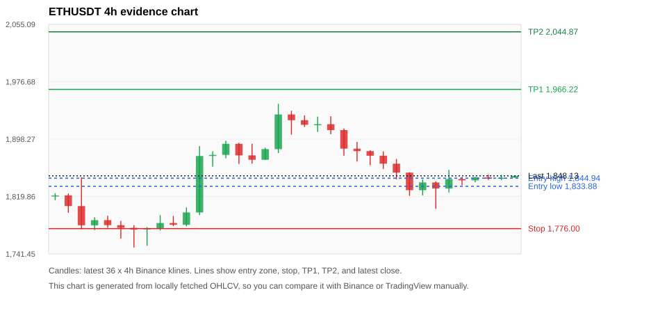
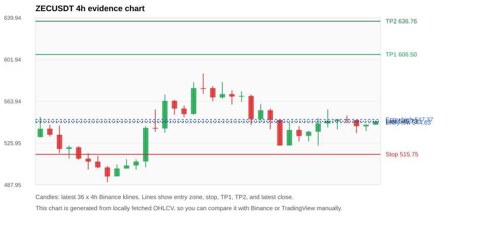
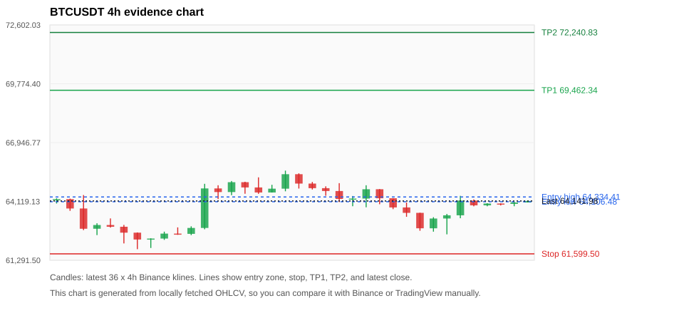
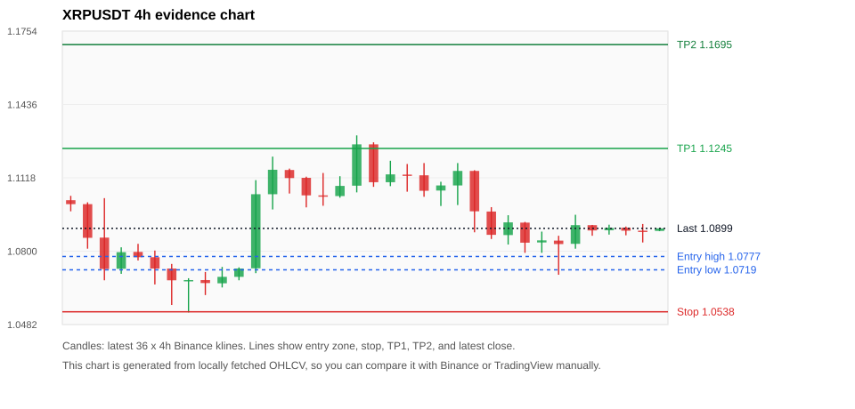
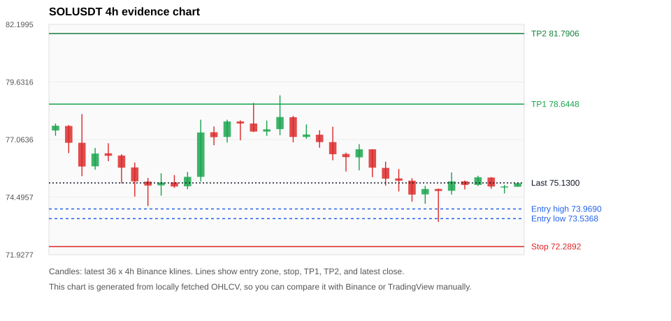

# Crypto 市场扫描报告 v1

- 报告时间：2026-07-18 20:05:38 CST
- Run ID：`20260718_120502_d427cd30`
- Run type：`daily_full`
- 数据来源：SQLite
- 报告版本：v1
- 扫描 ID：ae0bdfd19b79
- 数据源：Binance public spot API + CoinGecko/CoinMarketCap cross-check
- 过滤条件：USDT spot; 24h quote volume >= 30,000,000; trades >= 30,000; exclude stables/leveraged tokens; analyze 1h/4h/1d klines
- 默认单笔风险：账户权益的 1.00%

## 限制说明

- 交易信号仍以 Binance 现货公开 K 线为主源；外部数据源用于一致性复核。
- 结果是研究和模拟盘计划，不是确定收益或实盘下单指令。
- 历史长度过滤：候选币至少需要 180 根 1d K 线。
- 数据质量验证池：先验证 score 排名前 min(top_n * 2, 10) 的候选，再按 action + score 补足最终名单。
- 大盘环境过滤：RISK_OFF; BTC/ETH 大盘偏弱，山寨币买入候选降级为观察。 BTC 7d=0.5056174493489385; ETH 7d=3.369579809370382.
- 已启用数据交叉验证：Binance 主源 + CoinGecko 自动对照；CoinMarketCap 在配置 API Key 后自动对照。
- ZECUSDT 交叉验证状态 DATA_WARNING：At least one external provider needs manual review.
- BTCUSDT 交叉验证状态 DATA_WARNING：At least one external provider needs manual review.
- ETHUSDT 交叉验证状态 DATA_WARNING：At least one external provider needs manual review.
- XRPUSDT 交叉验证状态 DATA_WARNING：At least one external provider needs manual review.
- SOLUSDT 交叉验证状态 DATA_WARNING：At least one external provider needs manual review.
- BNBUSDT 交叉验证状态 DATA_WARNING：At least one external provider needs manual review.
- KITEUSDT 交叉验证状态 DATA_WARNING：At least one external provider needs manual review.

## 5 个候选交易计划

| Rank | Coin | Action | Setup | Entry Zone | Stop Loss | TP1 | TP2 / Exit Rule | R/R | Verdict |
|---:|---|---|---|---:|---:|---:|---|---:|---|
| 1 | `ETH` | `WAIT_PULLBACK` | 回踩支撑/4h EMA 附近 | 1,833.88 - 1,844.94 | 1,776.00 | 1,966.22 | 2,044.87 或跌破 4h 关键支撑 | 2.00-3.24 | 只观察 |
| 2 | `ZEC` | `WATCH_ONLY` | 回踩支撑/4h EMA 附近 | 544.63 - 547.37 | 515.75 | 606.50 | 636.76 或跌破 4h 关键支撑 | 2.00-3.00 | 只观察 |
| 3 | `BTC` | `WATCH_ONLY` | 回踩支撑/4h EMA 附近 | 64,106.48 - 64,334.41 | 61,599.50 | 69,462.34 | 72,240.83 或跌破 4h 关键支撑 | 2.00-3.06 | 只观察 |
| 4 | `XRP` | `REJECT` | 回踩支撑/4h EMA 附近 | 1.0719 - 1.0777 | 1.0538 | 1.1245 | 1.1695 或跌破 4h 关键支撑 | 2.36-4.49 | 只观察 |
| 5 | `SOL` | `REJECT` | 回踩支撑/4h EMA 附近 | 73.5368 - 73.9690 | 72.2892 | 78.6448 | 81.7906 或跌破 4h 关键支撑 | 3.34-5.49 | 只观察 |

## 数据交叉验证摘要

价格差异以 Binance 当前价为基准；成交量口径不同，Binance 是 USDT 现货成交额，CoinGecko/CoinMarketCap 通常是全市场成交量。

| Rank | Coin | Data Status | Max Price Diff | Max 24h Diff | Message |
|---:|---|---|---:|---:|---|
| 1 | `ETH` | DATA_WARNING | 0.13% | 0.12 pts | At least one external provider needs manual review. |
| 2 | `ZEC` | DATA_WARNING | 0.25% | 0.11 pts | At least one external provider needs manual review. |
| 3 | `BTC` | DATA_WARNING | 0.10% | 0.04 pts | At least one external provider needs manual review. |
| 4 | `XRP` | DATA_WARNING | 0.17% | 0.15 pts | At least one external provider needs manual review. |
| 5 | `SOL` | DATA_WARNING | 0.25% | 0.23 pts | At least one external provider needs manual review. |

## 候选币说明

### 1. ETH `ETHUSDT`



- 入选原因：回踩支撑/4h EMA 附近；24h +0.58%，7d +2.53%，4h RSI 25.06，24h 成交额 $292.8M。
- 交易失效条件：跌破 1776.0042 或 4h 收盘重新失守关键支撑。
- 主要风险：BTC/ETH 大盘环境未确认强势，山寨币买入信号降级；数据交叉验证需要人工复核。
- 数据交叉验证：DATA_WARNING；At least one external provider needs manual review.

#### 可点击人工验证

- [Binance 交易页](https://www.binance.com/en/trade/ETH_USDT)
- [TradingView 图表](https://www.tradingview.com/chart/?symbol=BINANCE%3AETHUSDT)
- [CoinGecko 搜索](https://www.coingecko.com/en/search?query=ETH)
- [CoinMarketCap 搜索](https://coinmarketcap.com/search/?q=ETH)

#### 多数据源对照

| Source | Status | Asset ID | Price | 24h Change | 24h Volume | Price Diff | 24h Diff | Updated | Message |
|---|---|---|---:|---:|---:|---:|---:|---|---|
| Binance | DATA_OK | ETHUSDT | 1,848.13 | +0.58% | $292.8M | 0.00% | 0.00 pts | 2026-07-18T12:05:20+00:00 | Primary market data source used by scanner. |
| CoinGecko | DATA_OK | ethereum | 1,846.01 | +0.58% | $6.23B | 0.11% | 0.00 pts | 2026-07-18T12:05:21.583Z | External source agrees with Binance within thresholds. |
| CoinMarketCap | DATA_WARNING | 1027 | 1,845.76 | +0.46% | $7.02B | 0.13% | 0.12 pts | 2026-07-18T12:04:04.000Z | CoinMarketCap symbol mapping has 6 matches; selected lowest cmc_rank |

#### 指标证据

| 指标 | 数值 | 人工核对用途 |
|---|---:|---|
| 当前价 | 1,848.13 | 与 Binance/TradingView 当前价格对照 |
| 24h 涨跌 | +0.58% | 与交易所 24h 涨跌对照 |
| 7d 涨跌 | +2.53% | 判断短线趋势是否延续 |
| 4h EMA20 | 1,852.34 | 判断短期趋势支撑 |
| 4h EMA50 | 1,830.22 | 判断中期趋势支撑 |
| 1d EMA20 | 1,792.16 | 判断日线趋势 |
| 1d EMA50 | 1,812.65 | 判断日线趋势 |
| 4h RSI14 | 25.06 | 判断是否过热/过弱 |
| 4h ATR14 | 21.0364 | 推导止损和入场缓冲 |
| 最近 18 根 4h 最低点 | 1,803.05 | 支撑/止损参考 |
| 最近 36 根 4h 最高点 | 1,946.52 | TP/压力参考 |
| 支撑位 | 1,830.22 | 入场区间推导基础 |

#### 交易计划推导

- 支撑位 = 最近低点、4h EMA20、4h EMA50、1d EMA20 中不高于当前价的最高有效支撑 = `1,830.22`。
- 入场区间 = 支撑位附近 + ATR 缓冲 = `1,833.88 - 1,844.94`。
- 止损 = min(最近 18 根 4h 最低点 * 0.985, 入场中位价 - 1.15 * ATR14) = `1,776.00`。
- TP1 = max(最近 36 根 4h 最高点 * 0.995, 入场中位价 + 2R) = `1,966.22`。
- TP2 = max(入场中位价 + 3R, TP1 * 1.04) = `2,044.87`。

#### 最近 10 根 4h K线

| UTC 开盘时间 | Open | High | Low | Close | Quote Volume | Trades |
|---|---:|---:|---:|---:|---:|---:|
| 2026-07-17T00:00+00:00 | 1,864.71 | 1,871.08 | 1,843.20 | 1,852.53 | $82.5M | 524250 |
| 2026-07-17T04:00+00:00 | 1,852.53 | 1,853.08 | 1,820.74 | 1,828.52 | $83.5M | 407374 |
| 2026-07-17T08:00+00:00 | 1,828.52 | 1,843.26 | 1,821.41 | 1,839.04 | $67.6M | 286025 |
| 2026-07-17T12:00+00:00 | 1,839.05 | 1,840.58 | 1,803.05 | 1,830.88 | $132.8M | 798408 |
| 2026-07-17T16:00+00:00 | 1,830.89 | 1,856.17 | 1,825.32 | 1,843.76 | $75.4M | 459243 |
| 2026-07-17T20:00+00:00 | 1,843.76 | 1,846.65 | 1,835.27 | 1,841.93 | $22.4M | 178801 |
| 2026-07-18T00:00+00:00 | 1,841.94 | 1,846.74 | 1,839.38 | 1,845.96 | $25.1M | 128932 |
| 2026-07-18T04:00+00:00 | 1,845.96 | 1,849.68 | 1,842.56 | 1,844.20 | $18.8M | 118273 |
| 2026-07-18T08:00+00:00 | 1,844.20 | 1,849.44 | 1,842.30 | 1,845.56 | $18.8M | 92079 |
| 2026-07-18T12:00+00:00 | 1,845.56 | 1,848.15 | 1,845.56 | 1,848.15 | $869,040 | 4283 |

### 2. ZEC `ZECUSDT`



- 入选原因：回踩支撑/4h EMA 附近；24h +1.77%，7d +8.67%，4h RSI 39.19，24h 成交额 $69.1M。
- 交易失效条件：跌破 515.746 或 4h 收盘重新失守关键支撑。
- 主要风险：BTC/ETH 大盘环境未确认强势，山寨币买入信号降级；数据交叉验证需要人工复核。
- 数据交叉验证：DATA_WARNING；At least one external provider needs manual review.

#### 可点击人工验证

- [Binance 交易页](https://www.binance.com/en/trade/ZEC_USDT)
- [TradingView 图表](https://www.tradingview.com/chart/?symbol=BINANCE%3AZECUSDT)
- [CoinGecko 搜索](https://www.coingecko.com/en/search?query=ZEC)
- [CoinMarketCap 搜索](https://coinmarketcap.com/search/?q=ZEC)

#### 多数据源对照

| Source | Status | Asset ID | Price | 24h Change | 24h Volume | Price Diff | 24h Diff | Updated | Message |
|---|---|---|---:|---:|---:|---:|---:|---|---|
| Binance | DATA_OK | ZECUSDT | 545.73 | +1.77% | $69.1M | 0.00% | 0.00 pts | 2026-07-18T12:05:20+00:00 | Primary market data source used by scanner. |
| CoinGecko | DATA_OK | zcash | 544.34 | +1.66% | $355.4M | 0.25% | 0.11 pts | 2026-07-18T12:05:18.470Z | External source agrees with Binance within thresholds. |
| CoinMarketCap | DATA_WARNING | 1437 | 544.61 | +1.69% | $425.0M | 0.20% | 0.08 pts | 2026-07-18T12:04:04.000Z | CoinMarketCap symbol mapping has 2 matches; selected lowest cmc_rank |

#### 指标证据

| 指标 | 数值 | 人工核对用途 |
|---|---:|---|
| 当前价 | 545.73 | 与 Binance/TradingView 当前价格对照 |
| 24h 涨跌 | +1.77% | 与交易所 24h 涨跌对照 |
| 7d 涨跌 | +8.67% | 判断短线趋势是否延续 |
| 4h EMA20 | 543.54 | 判断短期趋势支撑 |
| 4h EMA50 | 527.64 | 判断中期趋势支撑 |
| 1d EMA20 | 501.23 | 判断日线趋势 |
| 1d EMA50 | 479.59 | 判断日线趋势 |
| 4h RSI14 | 39.19 | 判断是否过热/过弱 |
| 4h ATR14 | 14.9514 | 推导止损和入场缓冲 |
| 最近 18 根 4h 最低点 | 523.60 | 支撑/止损参考 |
| 最近 36 根 4h 最高点 | 589.18 | TP/压力参考 |
| 支撑位 | 543.54 | 入场区间推导基础 |

#### 交易计划推导

- 支撑位 = 最近低点、4h EMA20、4h EMA50、1d EMA20 中不高于当前价的最高有效支撑 = `543.54`。
- 入场区间 = 支撑位附近 + ATR 缓冲 = `544.63 - 547.37`。
- 止损 = min(最近 18 根 4h 最低点 * 0.985, 入场中位价 - 1.15 * ATR14) = `515.75`。
- TP1 = max(最近 36 根 4h 最高点 * 0.995, 入场中位价 + 2R) = `606.50`。
- TP2 = max(入场中位价 + 3R, TP1 * 1.04) = `636.76`。

#### 最近 10 根 4h K线

| UTC 开盘时间 | Open | High | Low | Close | Quote Volume | Trades |
|---|---:|---:|---:|---:|---:|---:|
| 2026-07-17T00:00+00:00 | 523.75 | 544.67 | 523.74 | 537.95 | $15.2M | 64969 |
| 2026-07-17T04:00+00:00 | 537.93 | 541.25 | 527.38 | 532.39 | $13.2M | 62281 |
| 2026-07-17T08:00+00:00 | 532.50 | 537.18 | 527.56 | 536.28 | $8.1M | 36199 |
| 2026-07-17T12:00+00:00 | 536.34 | 548.51 | 523.72 | 543.78 | $18.8M | 76447 |
| 2026-07-17T16:00+00:00 | 543.79 | 556.53 | 540.21 | 546.18 | $26.1M | 67692 |
| 2026-07-17T20:00+00:00 | 546.11 | 547.77 | 538.28 | 547.47 | $8.2M | 23965 |
| 2026-07-18T00:00+00:00 | 547.45 | 550.96 | 544.09 | 546.90 | $6.2M | 18330 |
| 2026-07-18T04:00+00:00 | 546.91 | 547.04 | 535.04 | 541.32 | $5.1M | 27906 |
| 2026-07-18T08:00+00:00 | 541.19 | 542.86 | 536.90 | 542.69 | $4.2M | 27648 |
| 2026-07-18T12:00+00:00 | 542.69 | 546.49 | 542.69 | 545.73 | $623,100 | 2336 |

### 3. BTC `BTCUSDT`



- 入选原因：回踩支撑/4h EMA 附近；24h +1.35%，7d -0.15%，4h RSI 48.84，24h 成交额 $777.8M。
- 交易失效条件：跌破 61599.497 或 4h 收盘重新失守关键支撑。
- 主要风险：日线趋势未完全确认；BTC/ETH 大盘环境未确认强势，山寨币买入信号降级；7d 趋势未确认；数据交叉验证需要人工复核。
- 数据交叉验证：DATA_WARNING；At least one external provider needs manual review.

#### 可点击人工验证

- [Binance 交易页](https://www.binance.com/en/trade/BTC_USDT)
- [TradingView 图表](https://www.tradingview.com/chart/?symbol=BINANCE%3ABTCUSDT)
- [CoinGecko 搜索](https://www.coingecko.com/en/search?query=BTC)
- [CoinMarketCap 搜索](https://coinmarketcap.com/search/?q=BTC)

#### 多数据源对照

| Source | Status | Asset ID | Price | 24h Change | 24h Volume | Price Diff | 24h Diff | Updated | Message |
|---|---|---|---:|---:|---:|---:|---:|---|---|
| Binance | DATA_OK | BTCUSDT | 64,141.98 | +1.35% | $777.8M | 0.00% | 0.00 pts | 2026-07-18T12:05:20+00:00 | Primary market data source used by scanner. |
| CoinGecko | DATA_OK | bitcoin | 64,080.00 | +1.34% | $21.22B | 0.10% | 0.01 pts | 2026-07-18T12:05:21.089Z | External source agrees with Binance within thresholds. |
| CoinMarketCap | DATA_WARNING | 1 | 64,076.19 | +1.31% | $20.10B | 0.10% | 0.04 pts | 2026-07-18T12:04:04.000Z | CoinMarketCap symbol mapping has 13 matches; selected lowest cmc_rank |

#### 指标证据

| 指标 | 数值 | 人工核对用途 |
|---|---:|---|
| 当前价 | 64,141.98 | 与 Binance/TradingView 当前价格对照 |
| 24h 涨跌 | +1.35% | 与交易所 24h 涨跌对照 |
| 7d 涨跌 | -0.15% | 判断短线趋势是否延续 |
| 4h EMA20 | 63,978.52 | 判断短期趋势支撑 |
| 4h EMA50 | 63,731.70 | 判断中期趋势支撑 |
| 1d EMA20 | 63,464.40 | 判断日线趋势 |
| 1d EMA50 | 65,018.80 | 判断日线趋势 |
| 4h RSI14 | 48.84 | 判断是否过热/过弱 |
| 4h ATR14 | 569.28 | 推导止损和入场缓冲 |
| 最近 18 根 4h 最低点 | 62,537.56 | 支撑/止损参考 |
| 最近 36 根 4h 最高点 | 65,600.00 | TP/压力参考 |
| 支撑位 | 63,978.52 | 入场区间推导基础 |

#### 交易计划推导

- 支撑位 = 最近低点、4h EMA20、4h EMA50、1d EMA20 中不高于当前价的最高有效支撑 = `63,978.52`。
- 入场区间 = 支撑位附近 + ATR 缓冲 = `64,106.48 - 64,334.41`。
- 止损 = min(最近 18 根 4h 最低点 * 0.985, 入场中位价 - 1.15 * ATR14) = `61,599.50`。
- TP1 = max(最近 36 根 4h 最高点 * 0.995, 入场中位价 + 2R) = `69,462.34`。
- TP2 = max(入场中位价 + 3R, TP1 * 1.04) = `72,240.83`。

#### 最近 10 根 4h K线

| UTC 开盘时间 | Open | High | Low | Close | Quote Volume | Trades |
|---|---:|---:|---:|---:|---:|---:|
| 2026-07-17T00:00+00:00 | 63,830.20 | 64,067.69 | 63,380.28 | 63,570.00 | $169.7M | 531177 |
| 2026-07-17T04:00+00:00 | 63,570.00 | 63,576.00 | 62,710.00 | 62,828.11 | $262.7M | 494473 |
| 2026-07-17T08:00+00:00 | 62,828.11 | 63,361.70 | 62,666.00 | 63,298.01 | $163.4M | 354967 |
| 2026-07-17T12:00+00:00 | 63,298.00 | 63,518.00 | 62,537.56 | 63,452.00 | $246.1M | 894383 |
| 2026-07-17T16:00+00:00 | 63,452.00 | 64,387.99 | 63,312.01 | 64,160.80 | $219.4M | 728454 |
| 2026-07-17T20:00+00:00 | 64,160.80 | 64,216.61 | 63,884.35 | 63,931.67 | $91.3M | 235842 |
| 2026-07-18T00:00+00:00 | 63,931.67 | 64,032.60 | 63,886.65 | 64,017.84 | $87.6M | 150552 |
| 2026-07-18T04:00+00:00 | 64,017.84 | 64,026.03 | 63,926.39 | 64,002.75 | $60.7M | 118016 |
| 2026-07-18T08:00+00:00 | 64,002.75 | 64,097.22 | 63,887.73 | 64,069.89 | $70.6M | 85981 |
| 2026-07-18T12:00+00:00 | 64,069.89 | 64,142.00 | 64,069.89 | 64,142.00 | $3.9M | 9511 |

### 4. XRP `XRPUSDT`



- 入选原因：回踩支撑/4h EMA 附近；24h +0.57%，7d -1.70%，4h RSI 37.85，24h 成交额 $41.8M。
- 交易失效条件：跌破 1.053753 或 4h 收盘重新失守关键支撑。
- 主要风险：日线趋势未完全确认；BTC/ETH 大盘环境未确认强势，山寨币买入信号降级；7d 趋势未确认；数据交叉验证需要人工复核。
- 数据交叉验证：DATA_WARNING；At least one external provider needs manual review.

#### 可点击人工验证

- [Binance 交易页](https://www.binance.com/en/trade/XRP_USDT)
- [TradingView 图表](https://www.tradingview.com/chart/?symbol=BINANCE%3AXRPUSDT)
- [CoinGecko 搜索](https://www.coingecko.com/en/search?query=XRP)
- [CoinMarketCap 搜索](https://coinmarketcap.com/search/?q=XRP)

#### 多数据源对照

| Source | Status | Asset ID | Price | 24h Change | 24h Volume | Price Diff | 24h Diff | Updated | Message |
|---|---|---|---:|---:|---:|---:|---:|---|---|
| Binance | DATA_OK | XRPUSDT | 1.0899 | +0.57% | $41.8M | 0.00% | 0.00 pts | 2026-07-18T12:05:20+00:00 | Primary market data source used by scanner. |
| CoinGecko | DATA_OK | ripple | 1.0880 | +0.48% | $803.0M | 0.17% | 0.09 pts | 2026-07-18T12:05:22.487Z | External source agrees with Binance within thresholds. |
| CoinMarketCap | DATA_WARNING | 52 | 1.0882 | +0.42% | $792.0M | 0.16% | 0.15 pts | 2026-07-18T12:04:04.000Z | CoinMarketCap symbol mapping has 3 matches; selected lowest cmc_rank |

#### 指标证据

| 指标 | 数值 | 人工核对用途 |
|---|---:|---|
| 当前价 | 1.0899 | 与 Binance/TradingView 当前价格对照 |
| 24h 涨跌 | +0.57% | 与交易所 24h 涨跌对照 |
| 7d 涨跌 | -1.70% | 判断短线趋势是否延续 |
| 4h EMA20 | 1.0932 | 判断短期趋势支撑 |
| 4h EMA50 | 1.0953 | 判断中期趋势支撑 |
| 1d EMA20 | 1.1016 | 判断日线趋势 |
| 1d EMA50 | 1.1498 | 判断日线趋势 |
| 4h RSI14 | 37.85 | 判断是否过热/过弱 |
| 4h ATR14 | 0.01131 | 推导止损和入场缓冲 |
| 最近 18 根 4h 最低点 | 1.0698 | 支撑/止损参考 |
| 最近 36 根 4h 最高点 | 1.1302 | TP/压力参考 |
| 支撑位 | 1.0698 | 入场区间推导基础 |

#### 交易计划推导

- 支撑位 = 最近低点、4h EMA20、4h EMA50、1d EMA20 中不高于当前价的最高有效支撑 = `1.0698`。
- 入场区间 = 支撑位附近 + ATR 缓冲 = `1.0719 - 1.0777`。
- 止损 = min(最近 18 根 4h 最低点 * 0.985, 入场中位价 - 1.15 * ATR14) = `1.0538`。
- TP1 = max(最近 36 根 4h 最高点 * 0.995, 入场中位价 + 2R) = `1.1245`。
- TP2 = max(入场中位价 + 3R, TP1 * 1.04) = `1.1695`。

#### 最近 10 根 4h K线

| UTC 开盘时间 | Open | High | Low | Close | Quote Volume | Trades |
|---|---:|---:|---:|---:|---:|---:|
| 2026-07-17T00:00+00:00 | 1.0870 | 1.0956 | 1.0829 | 1.0925 | $10.5M | 65987 |
| 2026-07-17T04:00+00:00 | 1.0924 | 1.0927 | 1.0793 | 1.0837 | $7.8M | 52700 |
| 2026-07-17T08:00+00:00 | 1.0838 | 1.0885 | 1.0793 | 1.0847 | $9.4M | 44236 |
| 2026-07-17T12:00+00:00 | 1.0846 | 1.0867 | 1.0698 | 1.0831 | $18.9M | 112826 |
| 2026-07-17T16:00+00:00 | 1.0832 | 1.0958 | 1.0811 | 1.0913 | $9.7M | 70165 |
| 2026-07-17T20:00+00:00 | 1.0913 | 1.0914 | 1.0867 | 1.0890 | $3.8M | 26604 |
| 2026-07-18T00:00+00:00 | 1.0891 | 1.0915 | 1.0872 | 1.0901 | $2.6M | 18813 |
| 2026-07-18T04:00+00:00 | 1.0902 | 1.0907 | 1.0869 | 1.0889 | $2.6M | 16850 |
| 2026-07-18T08:00+00:00 | 1.0889 | 1.0918 | 1.0838 | 1.0888 | $4.0M | 23091 |
| 2026-07-18T12:00+00:00 | 1.0888 | 1.0900 | 1.0887 | 1.0899 | $297,001 | 739 |

### 5. SOL `SOLUSDT`



- 入选原因：回踩支撑/4h EMA 附近；24h +0.43%，7d -3.90%，4h RSI 35.10，24h 成交额 $75.6M。
- 交易失效条件：跌破 72.28915 或 4h 收盘重新失守关键支撑。
- 主要风险：日线趋势未完全确认；BTC/ETH 大盘环境未确认强势，山寨币买入信号降级；7d 趋势未确认；数据交叉验证需要人工复核。
- 数据交叉验证：DATA_WARNING；At least one external provider needs manual review.

#### 可点击人工验证

- [Binance 交易页](https://www.binance.com/en/trade/SOL_USDT)
- [TradingView 图表](https://www.tradingview.com/chart/?symbol=BINANCE%3ASOLUSDT)
- [CoinGecko 搜索](https://www.coingecko.com/en/search?query=SOL)
- [CoinMarketCap 搜索](https://coinmarketcap.com/search/?q=SOL)

#### 多数据源对照

| Source | Status | Asset ID | Price | 24h Change | 24h Volume | Price Diff | 24h Diff | Updated | Message |
|---|---|---|---:|---:|---:|---:|---:|---|---|
| Binance | DATA_OK | SOLUSDT | 75.1300 | +0.43% | $75.6M | 0.00% | 0.00 pts | 2026-07-18T12:05:20+00:00 | Primary market data source used by scanner. |
| CoinGecko | DATA_OK | solana | 74.9700 | +0.28% | $1.23B | 0.21% | 0.15 pts | 2026-07-18T12:05:18.367Z | External source agrees with Binance within thresholds. |
| CoinMarketCap | DATA_WARNING | 5426 | 74.9440 | +0.20% | $1.27B | 0.25% | 0.23 pts | 2026-07-18T12:04:04.000Z | CoinMarketCap symbol mapping has 8 matches; selected lowest cmc_rank |

#### 指标证据

| 指标 | 数值 | 人工核对用途 |
|---|---:|---|
| 当前价 | 75.1300 | 与 Binance/TradingView 当前价格对照 |
| 24h 涨跌 | +0.43% | 与交易所 24h 涨跌对照 |
| 7d 涨跌 | -3.90% | 判断短线趋势是否延续 |
| 4h EMA20 | 75.6282 | 判断短期趋势支撑 |
| 4h EMA50 | 76.4453 | 判断中期趋势支撑 |
| 1d EMA20 | 76.3940 | 判断日线趋势 |
| 1d EMA50 | 76.5931 | 判断日线趋势 |
| 4h RSI14 | 35.10 | 判断是否过热/过弱 |
| 4h ATR14 | 0.82714 | 推导止损和入场缓冲 |
| 最近 18 根 4h 最低点 | 73.3900 | 支撑/止损参考 |
| 最近 36 根 4h 最高点 | 79.0400 | TP/压力参考 |
| 支撑位 | 73.3900 | 入场区间推导基础 |

#### 交易计划推导

- 支撑位 = 最近低点、4h EMA20、4h EMA50、1d EMA20 中不高于当前价的最高有效支撑 = `73.3900`。
- 入场区间 = 支撑位附近 + ATR 缓冲 = `73.5368 - 73.9690`。
- 止损 = min(最近 18 根 4h 最低点 * 0.985, 入场中位价 - 1.15 * ATR14) = `72.2892`。
- TP1 = max(最近 36 根 4h 最高点 * 0.995, 入场中位价 + 2R) = `78.6448`。
- TP2 = max(入场中位价 + 3R, TP1 * 1.04) = `81.7906`。

#### 最近 10 根 4h K线

| UTC 开盘时间 | Open | High | Low | Close | Quote Volume | Trades |
|---|---:|---:|---:|---:|---:|---:|
| 2026-07-17T00:00+00:00 | 75.3300 | 75.7500 | 74.7500 | 75.2300 | $15.5M | 80278 |
| 2026-07-17T04:00+00:00 | 75.2300 | 75.3400 | 74.2900 | 74.6100 | $17.7M | 82012 |
| 2026-07-17T08:00+00:00 | 74.6200 | 75.0000 | 74.2000 | 74.8600 | $12.4M | 60399 |
| 2026-07-17T12:00+00:00 | 74.8600 | 74.8800 | 73.3900 | 74.7700 | $33.5M | 188536 |
| 2026-07-17T16:00+00:00 | 74.7800 | 75.6000 | 74.6100 | 75.2000 | $15.3M | 102092 |
| 2026-07-17T20:00+00:00 | 75.2000 | 75.2400 | 74.8400 | 75.0400 | $7.4M | 40247 |
| 2026-07-18T00:00+00:00 | 75.0400 | 75.4500 | 74.9900 | 75.3800 | $6.5M | 30198 |
| 2026-07-18T04:00+00:00 | 75.3700 | 75.3900 | 74.8700 | 74.9700 | $6.4M | 31654 |
| 2026-07-18T08:00+00:00 | 74.9700 | 75.0400 | 74.6600 | 74.9700 | $6.5M | 26019 |
| 2026-07-18T12:00+00:00 | 74.9600 | 75.1300 | 74.9600 | 75.1200 | $226,819 | 1029 |

## 组合风控

- 不要 5 个候选全部满仓买入。
- 同时持仓总风险建议控制在账户权益的 3% - 5% 以内。
- 如果 BTC/ETH 同时破位，暂停山寨币多头计划或降低仓位。
- 第一版报告用于模拟盘和人工复核，不自动下单。

## 原始数据

```json
[
  {
    "rank": 1,
    "symbol": "ETHUSDT",
    "base_asset": "ETH",
    "price": 1848.13,
    "score": 21.720927329785717,
    "setup": "回踩支撑/4h EMA 附近",
    "verdict": "只观察",
    "entry_low": 1833.8775488999809,
    "entry_high": 1844.9426146706396,
    "stop_loss": 1776.00425,
    "take_profit_1": 1966.2217453559308,
    "take_profit_2": 2044.870615170168,
    "risk_reward_1": 2.0,
    "risk_reward_2": 3.2404043539802356,
    "pct_24h": 0.577,
    "pct_3d": -4.031135759388493,
    "pct_7d": 2.5252273092904343,
    "quote_volume_24h": 292777174.342296,
    "trades_24h": 1775170,
    "high_low_range_24h": 2.946119076010101,
    "rsi_1h": 68.19395017793589,
    "rsi_4h": 25.05589268604274,
    "ema20_4h": 1852.3403697235879,
    "ema50_4h": 1830.2171146706396,
    "ema20_1d": 1792.1581002325688,
    "ema50_1d": 1812.645521326912,
    "atr_4h": 21.036428571428587,
    "macd_hist_4h": -5.377651595028216,
    "volume_ratio_24h": 0.5413123469656816,
    "support_level": 1830.2171146706396,
    "recent_low_4h_18": 1803.05,
    "recent_high_4h_36": 1946.52,
    "distance_to_support_pct": 0.9787300744690031,
    "binance_trade_url": "https://www.binance.com/en/trade/ETH_USDT",
    "tradingview_url": "https://www.tradingview.com/chart/?symbol=BINANCE%3AETHUSDT",
    "coingecko_search_url": "https://www.coingecko.com/en/search?query=ETH",
    "coinmarketcap_search_url": "https://coinmarketcap.com/search/?q=ETH",
    "invalidation": "跌破 1776.0042 或 4h 收盘重新失守关键支撑",
    "recent_4h_klines": [
      {
        "open_time_utc": "2026-07-12T16:00+00:00",
        "open": 1820.94,
        "high": 1824.39,
        "low": 1814.85,
        "close": 1821.4,
        "quote_volume": 49580419.314726,
        "trades": 136910
      },
      {
        "open_time_utc": "2026-07-12T20:00+00:00",
        "open": 1821.4,
        "high": 1824.0,
        "low": 1797.63,
        "close": 1806.8,
        "quote_volume": 40749264.656368,
        "trades": 228671
      },
      {
        "open_time_utc": "2026-07-13T00:00+00:00",
        "open": 1806.8,
        "high": 1846.0,
        "low": 1775.0,
        "close": 1780.55,
        "quote_volume": 180341311.895032,
        "trades": 799801
      },
      {
        "open_time_utc": "2026-07-13T04:00+00:00",
        "open": 1780.54,
        "high": 1791.39,
        "low": 1773.99,
        "close": 1787.57,
        "quote_volume": 60874562.194488,
        "trades": 291810
      },
      {
        "open_time_utc": "2026-07-13T08:00+00:00",
        "open": 1787.58,
        "high": 1793.56,
        "low": 1777.1,
        "close": 1780.74,
        "quote_volume": 44563351.995436,
        "trades": 219523
      },
      {
        "open_time_utc": "2026-07-13T12:00+00:00",
        "open": 1780.74,
        "high": 1786.53,
        "low": 1762.44,
        "close": 1777.01,
        "quote_volume": 102116332.029664,
        "trades": 622834
      },
      {
        "open_time_utc": "2026-07-13T16:00+00:00",
        "open": 1777.0,
        "high": 1780.73,
        "low": 1750.2,
        "close": 1774.92,
        "quote_volume": 87092641.007233,
        "trades": 442620
      },
      {
        "open_time_utc": "2026-07-13T20:00+00:00",
        "open": 1774.93,
        "high": 1778.05,
        "low": 1752.59,
        "close": 1776.72,
        "quote_volume": 51946850.968449,
        "trades": 272714
      },
      {
        "open_time_utc": "2026-07-14T00:00+00:00",
        "open": 1776.71,
        "high": 1794.47,
        "low": 1773.41,
        "close": 1783.65,
        "quote_volume": 46070956.04283,
        "trades": 354675
      },
      {
        "open_time_utc": "2026-07-14T04:00+00:00",
        "open": 1783.64,
        "high": 1793.26,
        "low": 1779.41,
        "close": 1781.21,
        "quote_volume": 41308137.621747,
        "trades": 228043
      },
      {
        "open_time_utc": "2026-07-14T08:00+00:00",
        "open": 1781.21,
        "high": 1805.0,
        "low": 1779.0,
        "close": 1798.09,
        "quote_volume": 85264476.000115,
        "trades": 336202
      },
      {
        "open_time_utc": "2026-07-14T12:00+00:00",
        "open": 1798.09,
        "high": 1888.8,
        "low": 1794.37,
        "close": 1875.22,
        "quote_volume": 358144351.189966,
        "trades": 1571099
      },
      {
        "open_time_utc": "2026-07-14T16:00+00:00",
        "open": 1875.22,
        "high": 1881.56,
        "low": 1860.56,
        "close": 1876.74,
        "quote_volume": 72936315.895528,
        "trades": 437205
      },
      {
        "open_time_utc": "2026-07-14T20:00+00:00",
        "open": 1876.74,
        "high": 1896.14,
        "low": 1872.06,
        "close": 1891.87,
        "quote_volume": 76249268.519352,
        "trades": 356683
      },
      {
        "open_time_utc": "2026-07-15T00:00+00:00",
        "open": 1891.87,
        "high": 1893.32,
        "low": 1864.38,
        "close": 1876.08,
        "quote_volume": 65889958.334445,
        "trades": 409790
      },
      {
        "open_time_utc": "2026-07-15T04:00+00:00",
        "open": 1876.08,
        "high": 1891.89,
        "low": 1864.7,
        "close": 1870.04,
        "quote_volume": 68211903.296793,
        "trades": 288693
      },
      {
        "open_time_utc": "2026-07-15T08:00+00:00",
        "open": 1870.04,
        "high": 1886.59,
        "low": 1870.03,
        "close": 1884.62,
        "quote_volume": 65955633.693108,
        "trades": 273069
      },
      {
        "open_time_utc": "2026-07-15T12:00+00:00",
        "open": 1884.62,
        "high": 1946.52,
        "low": 1879.25,
        "close": 1931.95,
        "quote_volume": 264343318.43361,
        "trades": 1078775
      },
      {
        "open_time_utc": "2026-07-15T16:00+00:00",
        "open": 1931.96,
        "high": 1937.0,
        "low": 1904.36,
        "close": 1924.15,
        "quote_volume": 106323551.223143,
        "trades": 534814
      },
      {
        "open_time_utc": "2026-07-15T20:00+00:00",
        "open": 1924.15,
        "high": 1930.71,
        "low": 1914.89,
        "close": 1917.86,
        "quote_volume": 39744884.661628,
        "trades": 181016
      },
      {
        "open_time_utc": "2026-07-16T00:00+00:00",
        "open": 1917.86,
        "high": 1929.0,
        "low": 1908.12,
        "close": 1918.7,
        "quote_volume": 54089213.981933,
        "trades": 447454
      },
      {
        "open_time_utc": "2026-07-16T04:00+00:00",
        "open": 1918.7,
        "high": 1929.48,
        "low": 1905.0,
        "close": 1910.63,
        "quote_volume": 55879345.035258,
        "trades": 261782
      },
      {
        "open_time_utc": "2026-07-16T08:00+00:00",
        "open": 1910.64,
        "high": 1912.85,
        "low": 1875.56,
        "close": 1885.26,
        "quote_volume": 161340583.681969,
        "trades": 531557
      },
      {
        "open_time_utc": "2026-07-16T12:00+00:00",
        "open": 1885.26,
        "high": 1894.38,
        "low": 1867.68,
        "close": 1881.88,
        "quote_volume": 120415111.171474,
        "trades": 694530
      },
      {
        "open_time_utc": "2026-07-16T16:00+00:00",
        "open": 1881.89,
        "high": 1883.0,
        "low": 1862.57,
        "close": 1875.59,
        "quote_volume": 62446348.311839,
        "trades": 367055
      },
      {
        "open_time_utc": "2026-07-16T20:00+00:00",
        "open": 1875.59,
        "high": 1881.59,
        "low": 1857.54,
        "close": 1864.71,
        "quote_volume": 59060103.558587,
        "trades": 274650
      },
      {
        "open_time_utc": "2026-07-17T00:00+00:00",
        "open": 1864.71,
        "high": 1871.08,
        "low": 1843.2,
        "close": 1852.53,
        "quote_volume": 82539730.348917,
        "trades": 524250
      },
      {
        "open_time_utc": "2026-07-17T04:00+00:00",
        "open": 1852.53,
        "high": 1853.08,
        "low": 1820.74,
        "close": 1828.52,
        "quote_volume": 83511831.861486,
        "trades": 407374
      },
      {
        "open_time_utc": "2026-07-17T08:00+00:00",
        "open": 1828.52,
        "high": 1843.26,
        "low": 1821.41,
        "close": 1839.04,
        "quote_volume": 67599773.933898,
        "trades": 286025
      },
      {
        "open_time_utc": "2026-07-17T12:00+00:00",
        "open": 1839.05,
        "high": 1840.58,
        "low": 1803.05,
        "close": 1830.88,
        "quote_volume": 132843157.482888,
        "trades": 798408
      },
      {
        "open_time_utc": "2026-07-17T16:00+00:00",
        "open": 1830.89,
        "high": 1856.17,
        "low": 1825.32,
        "close": 1843.76,
        "quote_volume": 75428073.814757,
        "trades": 459243
      },
      {
        "open_time_utc": "2026-07-17T20:00+00:00",
        "open": 1843.76,
        "high": 1846.65,
        "low": 1835.27,
        "close": 1841.93,
        "quote_volume": 22437794.154729,
        "trades": 178801
      },
      {
        "open_time_utc": "2026-07-18T00:00+00:00",
        "open": 1841.94,
        "high": 1846.74,
        "low": 1839.38,
        "close": 1845.96,
        "quote_volume": 25110095.56093,
        "trades": 128932
      },
      {
        "open_time_utc": "2026-07-18T04:00+00:00",
        "open": 1845.96,
        "high": 1849.68,
        "low": 1842.56,
        "close": 1844.2,
        "quote_volume": 18809339.973007,
        "trades": 118273
      },
      {
        "open_time_utc": "2026-07-18T08:00+00:00",
        "open": 1844.2,
        "high": 1849.44,
        "low": 1842.3,
        "close": 1845.56,
        "quote_volume": 18754926.018809,
        "trades": 92079
      },
      {
        "open_time_utc": "2026-07-18T12:00+00:00",
        "open": 1845.56,
        "high": 1848.15,
        "low": 1845.56,
        "close": 1848.15,
        "quote_volume": 869039.834971,
        "trades": 4283
      }
    ],
    "risks": [
      "BTC/ETH 大盘环境未确认强势，山寨币买入信号降级",
      "数据交叉验证需要人工复核"
    ],
    "data_quality_status": "DATA_WARNING",
    "data_quality_message": "At least one external provider needs manual review.",
    "data_checks": [
      {
        "provider": "Binance",
        "status": "DATA_OK",
        "provider_asset_id": "ETHUSDT",
        "provider_symbol": "ETHUSDT",
        "price_usd": 1848.13,
        "pct_24h": 0.577,
        "volume_24h": 292777174.342296,
        "last_updated": null,
        "fetched_at_utc": "2026-07-18T12:05:20+00:00",
        "price_diff_pct": 0.0,
        "pct_24h_diff": 0.0,
        "volume_note": "Binance USDT spot 24h quoteVolume.",
        "message": "Primary market data source used by scanner."
      },
      {
        "provider": "CoinGecko",
        "status": "DATA_OK",
        "provider_asset_id": "ethereum",
        "provider_symbol": "ETH",
        "price_usd": 1846.01,
        "pct_24h": 0.57966,
        "volume_24h": 6232014945.0,
        "last_updated": "2026-07-18T12:05:21.583Z",
        "fetched_at_utc": "2026-07-18T12:05:20+00:00",
        "price_diff_pct": 0.11471054525385758,
        "pct_24h_diff": 0.0026599999999999957,
        "volume_note": "CoinGecko total market volume; not the same venue scope as Binance quoteVolume.",
        "message": "External source agrees with Binance within thresholds."
      },
      {
        "provider": "CoinMarketCap",
        "status": "DATA_WARNING",
        "provider_asset_id": "1027",
        "provider_symbol": "ETH",
        "price_usd": 1845.764628270655,
        "pct_24h": 0.46004127,
        "volume_24h": 7015687396.42492,
        "last_updated": "2026-07-18T12:04:04.000Z",
        "fetched_at_utc": "2026-07-18T12:05:20+00:00",
        "price_diff_pct": 0.12798730226472396,
        "pct_24h_diff": 0.11695872999999996,
        "volume_note": "CoinMarketCap total market volume; not the same venue scope as Binance quoteVolume.",
        "message": "CoinMarketCap symbol mapping has 6 matches; selected lowest cmc_rank"
      }
    ],
    "action": "WAIT_PULLBACK"
  },
  {
    "rank": 2,
    "symbol": "ZECUSDT",
    "base_asset": "ZEC",
    "price": 545.73,
    "score": 39.73923098395119,
    "setup": "回踩支撑/4h EMA 附近",
    "verdict": "只观察",
    "entry_low": 544.6302954055445,
    "entry_high": 547.3671899999999,
    "stop_loss": 515.746,
    "take_profit_1": 606.5042281083167,
    "take_profit_2": 636.756970811089,
    "risk_reward_1": 2.0,
    "risk_reward_2": 3.0,
    "pct_24h": 1.767,
    "pct_3d": -5.9167313162658335,
    "pct_7d": 8.667861409796895,
    "quote_volume_24h": 69079731.5795,
    "trades_24h": 243634,
    "high_low_range_24h": 6.264797983655379,
    "rsi_1h": 54.85617597292724,
    "rsi_4h": 39.19020011221247,
    "ema20_4h": 543.5432089875694,
    "ema50_4h": 527.6366595290008,
    "ema20_1d": 501.22505518837573,
    "ema50_1d": 479.5862456817133,
    "atr_4h": 14.95142857142856,
    "macd_hist_4h": -1.973654311039649,
    "volume_ratio_24h": 0.6513273840816809,
    "support_level": 543.5432089875694,
    "recent_low_4h_18": 523.6,
    "recent_high_4h_36": 589.18,
    "distance_to_support_pct": 0.40232146704652916,
    "binance_trade_url": "https://www.binance.com/en/trade/ZEC_USDT",
    "tradingview_url": "https://www.tradingview.com/chart/?symbol=BINANCE%3AZECUSDT",
    "coingecko_search_url": "https://www.coingecko.com/en/search?query=ZEC",
    "coinmarketcap_search_url": "https://coinmarketcap.com/search/?q=ZEC",
    "invalidation": "跌破 515.746 或 4h 收盘重新失守关键支撑",
    "recent_4h_klines": [
      {
        "open_time_utc": "2026-07-12T16:00+00:00",
        "open": 531.43,
        "high": 549.81,
        "low": 531.1,
        "close": 539.01,
        "quote_volume": 27871265.22555,
        "trades": 128961
      },
      {
        "open_time_utc": "2026-07-12T20:00+00:00",
        "open": 539.06,
        "high": 542.46,
        "low": 532.08,
        "close": 533.53,
        "quote_volume": 17127848.34602,
        "trades": 41857
      },
      {
        "open_time_utc": "2026-07-13T00:00+00:00",
        "open": 533.53,
        "high": 541.96,
        "low": 516.84,
        "close": 520.59,
        "quote_volume": 23115946.67192,
        "trades": 105018
      },
      {
        "open_time_utc": "2026-07-13T04:00+00:00",
        "open": 520.65,
        "high": 523.72,
        "low": 511.8,
        "close": 522.14,
        "quote_volume": 15472324.10753,
        "trades": 95395
      },
      {
        "open_time_utc": "2026-07-13T08:00+00:00",
        "open": 522.12,
        "high": 523.27,
        "low": 510.77,
        "close": 511.79,
        "quote_volume": 10637459.71962,
        "trades": 67883
      },
      {
        "open_time_utc": "2026-07-13T12:00+00:00",
        "open": 511.8,
        "high": 516.75,
        "low": 501.87,
        "close": 509.06,
        "quote_volume": 15052684.40364,
        "trades": 59034
      },
      {
        "open_time_utc": "2026-07-13T16:00+00:00",
        "open": 509.1,
        "high": 514.42,
        "low": 503.12,
        "close": 503.86,
        "quote_volume": 11558070.73559,
        "trades": 43848
      },
      {
        "open_time_utc": "2026-07-13T20:00+00:00",
        "open": 503.84,
        "high": 505.19,
        "low": 490.4,
        "close": 495.57,
        "quote_volume": 14263671.87997,
        "trades": 42360
      },
      {
        "open_time_utc": "2026-07-14T00:00+00:00",
        "open": 495.67,
        "high": 506.48,
        "low": 495.67,
        "close": 502.86,
        "quote_volume": 10619851.19281,
        "trades": 59008
      },
      {
        "open_time_utc": "2026-07-14T04:00+00:00",
        "open": 502.81,
        "high": 511.34,
        "low": 502.81,
        "close": 505.59,
        "quote_volume": 9733606.76952,
        "trades": 72594
      },
      {
        "open_time_utc": "2026-07-14T08:00+00:00",
        "open": 505.61,
        "high": 511.06,
        "low": 501.8,
        "close": 509.13,
        "quote_volume": 5987173.1218,
        "trades": 23589
      },
      {
        "open_time_utc": "2026-07-14T12:00+00:00",
        "open": 509.25,
        "high": 541.6,
        "low": 503.92,
        "close": 539.73,
        "quote_volume": 32754470.35064,
        "trades": 102343
      },
      {
        "open_time_utc": "2026-07-14T16:00+00:00",
        "open": 539.76,
        "high": 556.55,
        "low": 536.33,
        "close": 539.19,
        "quote_volume": 27837312.51253,
        "trades": 79547
      },
      {
        "open_time_utc": "2026-07-14T20:00+00:00",
        "open": 539.2,
        "high": 570.0,
        "low": 535.32,
        "close": 564.31,
        "quote_volume": 29518601.87503,
        "trades": 86322
      },
      {
        "open_time_utc": "2026-07-15T00:00+00:00",
        "open": 564.39,
        "high": 565.24,
        "low": 551.76,
        "close": 557.34,
        "quote_volume": 15339188.70066,
        "trades": 46470
      },
      {
        "open_time_utc": "2026-07-15T04:00+00:00",
        "open": 557.34,
        "high": 560.0,
        "low": 549.3,
        "close": 552.36,
        "quote_volume": 10411363.36177,
        "trades": 30102
      },
      {
        "open_time_utc": "2026-07-15T08:00+00:00",
        "open": 552.42,
        "high": 581.38,
        "low": 551.63,
        "close": 575.9,
        "quote_volume": 24380620.94319,
        "trades": 59739
      },
      {
        "open_time_utc": "2026-07-15T12:00+00:00",
        "open": 575.93,
        "high": 589.18,
        "low": 570.67,
        "close": 575.92,
        "quote_volume": 30592331.45329,
        "trades": 121286
      },
      {
        "open_time_utc": "2026-07-15T16:00+00:00",
        "open": 575.94,
        "high": 577.77,
        "low": 563.88,
        "close": 567.47,
        "quote_volume": 18246370.785,
        "trades": 52260
      },
      {
        "open_time_utc": "2026-07-15T20:00+00:00",
        "open": 567.45,
        "high": 581.5,
        "low": 566.26,
        "close": 570.54,
        "quote_volume": 15803996.86293,
        "trades": 45914
      },
      {
        "open_time_utc": "2026-07-16T00:00+00:00",
        "open": 570.53,
        "high": 573.85,
        "low": 561.0,
        "close": 568.25,
        "quote_volume": 15836777.66309,
        "trades": 42542
      },
      {
        "open_time_utc": "2026-07-16T04:00+00:00",
        "open": 568.25,
        "high": 572.99,
        "low": 563.33,
        "close": 568.85,
        "quote_volume": 8127069.60641,
        "trades": 33078
      },
      {
        "open_time_utc": "2026-07-16T08:00+00:00",
        "open": 568.8,
        "high": 570.06,
        "low": 542.39,
        "close": 547.64,
        "quote_volume": 34153883.40443,
        "trades": 88354
      },
      {
        "open_time_utc": "2026-07-16T12:00+00:00",
        "open": 547.68,
        "high": 561.59,
        "low": 546.0,
        "close": 555.83,
        "quote_volume": 25367800.85665,
        "trades": 68486
      },
      {
        "open_time_utc": "2026-07-16T16:00+00:00",
        "open": 555.8,
        "high": 557.38,
        "low": 538.55,
        "close": 547.07,
        "quote_volume": 17783126.77048,
        "trades": 49324
      },
      {
        "open_time_utc": "2026-07-16T20:00+00:00",
        "open": 547.0,
        "high": 547.16,
        "low": 523.6,
        "close": 523.72,
        "quote_volume": 17350390.22596,
        "trades": 67461
      },
      {
        "open_time_utc": "2026-07-17T00:00+00:00",
        "open": 523.75,
        "high": 544.67,
        "low": 523.74,
        "close": 537.95,
        "quote_volume": 15233836.50356,
        "trades": 64969
      },
      {
        "open_time_utc": "2026-07-17T04:00+00:00",
        "open": 537.93,
        "high": 541.25,
        "low": 527.38,
        "close": 532.39,
        "quote_volume": 13163582.15764,
        "trades": 62281
      },
      {
        "open_time_utc": "2026-07-17T08:00+00:00",
        "open": 532.5,
        "high": 537.18,
        "low": 527.56,
        "close": 536.28,
        "quote_volume": 8139752.84678,
        "trades": 36199
      },
      {
        "open_time_utc": "2026-07-17T12:00+00:00",
        "open": 536.34,
        "high": 548.51,
        "low": 523.72,
        "close": 543.78,
        "quote_volume": 18769502.13819,
        "trades": 76447
      },
      {
        "open_time_utc": "2026-07-17T16:00+00:00",
        "open": 543.79,
        "high": 556.53,
        "low": 540.21,
        "close": 546.18,
        "quote_volume": 26057470.99771,
        "trades": 67692
      },
      {
        "open_time_utc": "2026-07-17T20:00+00:00",
        "open": 546.11,
        "high": 547.77,
        "low": 538.28,
        "close": 547.47,
        "quote_volume": 8243032.62883,
        "trades": 23965
      },
      {
        "open_time_utc": "2026-07-18T00:00+00:00",
        "open": 547.45,
        "high": 550.96,
        "low": 544.09,
        "close": 546.9,
        "quote_volume": 6232462.76969,
        "trades": 18330
      },
      {
        "open_time_utc": "2026-07-18T04:00+00:00",
        "open": 546.91,
        "high": 547.04,
        "low": 535.04,
        "close": 541.32,
        "quote_volume": 5120463.33607,
        "trades": 27906
      },
      {
        "open_time_utc": "2026-07-18T08:00+00:00",
        "open": 541.19,
        "high": 542.86,
        "low": 536.9,
        "close": 542.69,
        "quote_volume": 4248914.21113,
        "trades": 27648
      },
      {
        "open_time_utc": "2026-07-18T12:00+00:00",
        "open": 542.69,
        "high": 546.49,
        "low": 542.69,
        "close": 545.73,
        "quote_volume": 623099.9117,
        "trades": 2336
      }
    ],
    "risks": [
      "BTC/ETH 大盘环境未确认强势，山寨币买入信号降级",
      "数据交叉验证需要人工复核"
    ],
    "data_quality_status": "DATA_WARNING",
    "data_quality_message": "At least one external provider needs manual review.",
    "data_checks": [
      {
        "provider": "Binance",
        "status": "DATA_OK",
        "provider_asset_id": "ZECUSDT",
        "provider_symbol": "ZECUSDT",
        "price_usd": 545.73,
        "pct_24h": 1.767,
        "volume_24h": 69079731.5795,
        "last_updated": null,
        "fetched_at_utc": "2026-07-18T12:05:20+00:00",
        "price_diff_pct": 0.0,
        "pct_24h_diff": 0.0,
        "volume_note": "Binance USDT spot 24h quoteVolume.",
        "message": "Primary market data source used by scanner."
      },
      {
        "provider": "CoinGecko",
        "status": "DATA_OK",
        "provider_asset_id": "zcash",
        "provider_symbol": "ZEC",
        "price_usd": 544.34,
        "pct_24h": 1.65505,
        "volume_24h": 355366620.0,
        "last_updated": "2026-07-18T12:05:18.470Z",
        "fetched_at_utc": "2026-07-18T12:05:20+00:00",
        "price_diff_pct": 0.2547047074560655,
        "pct_24h_diff": 0.11195,
        "volume_note": "CoinGecko total market volume; not the same venue scope as Binance quoteVolume.",
        "message": "External source agrees with Binance within thresholds."
      },
      {
        "provider": "CoinMarketCap",
        "status": "DATA_WARNING",
        "provider_asset_id": "1437",
        "provider_symbol": "ZEC",
        "price_usd": 544.6117691312301,
        "pct_24h": 1.68744053,
        "volume_24h": 425023012.77657855,
        "last_updated": "2026-07-18T12:04:04.000Z",
        "fetched_at_utc": "2026-07-18T12:05:20+00:00",
        "price_diff_pct": 0.20490551532258736,
        "pct_24h_diff": 0.07955946999999997,
        "volume_note": "CoinMarketCap total market volume; not the same venue scope as Binance quoteVolume.",
        "message": "CoinMarketCap symbol mapping has 2 matches; selected lowest cmc_rank"
      }
    ],
    "action": "WATCH_ONLY"
  },
  {
    "rank": 3,
    "symbol": "BTCUSDT",
    "base_asset": "BTC",
    "price": 64141.98,
    "score": 32.57809611537254,
    "setup": "回踩支撑/4h EMA 附近",
    "verdict": "只观察",
    "entry_low": 64106.479960088975,
    "entry_high": 64334.40594,
    "stop_loss": 61599.4966,
    "take_profit_1": 69462.33565013345,
    "take_profit_2": 72240.82907613879,
    "risk_reward_1": 2.0,
    "risk_reward_2": 3.060110759595741,
    "pct_24h": 1.355,
    "pct_3d": -1.4988331181598147,
    "pct_7d": -0.1458379971498669,
    "quote_volume_24h": 777826579.7557658,
    "trades_24h": 2214647,
    "high_low_range_24h": 2.9589098135584413,
    "rsi_1h": 67.5581971272911,
    "rsi_4h": 48.84216823295576,
    "ema20_4h": 63978.52291426045,
    "ema50_4h": 63731.70491772676,
    "ema20_1d": 63464.39648207163,
    "ema50_1d": 65018.80281918814,
    "atr_4h": 569.2764285714287,
    "macd_hist_4h": -5.95614775089685,
    "volume_ratio_24h": 0.6433222305847001,
    "support_level": 63978.52291426045,
    "recent_low_4h_18": 62537.56,
    "recent_high_4h_36": 65600.0,
    "distance_to_support_pct": 0.25548743280399133,
    "binance_trade_url": "https://www.binance.com/en/trade/BTC_USDT",
    "tradingview_url": "https://www.tradingview.com/chart/?symbol=BINANCE%3ABTCUSDT",
    "coingecko_search_url": "https://www.coingecko.com/en/search?query=BTC",
    "coinmarketcap_search_url": "https://coinmarketcap.com/search/?q=BTC",
    "invalidation": "跌破 61599.497 或 4h 收盘重新失守关键支撑",
    "recent_4h_klines": [
      {
        "open_time_utc": "2026-07-12T16:00+00:00",
        "open": 64176.0,
        "high": 64270.0,
        "low": 64018.69,
        "close": 64228.59,
        "quote_volume": 57094699.0334397,
        "trades": 183573
      },
      {
        "open_time_utc": "2026-07-12T20:00+00:00",
        "open": 64228.59,
        "high": 64254.0,
        "low": 63668.0,
        "close": 63780.0,
        "quote_volume": 74281448.8609228,
        "trades": 323888
      },
      {
        "open_time_utc": "2026-07-13T00:00+00:00",
        "open": 63780.0,
        "high": 64425.0,
        "low": 62741.04,
        "close": 62806.41,
        "quote_volume": 250269726.5910698,
        "trades": 870271
      },
      {
        "open_time_utc": "2026-07-13T04:00+00:00",
        "open": 62806.41,
        "high": 63070.01,
        "low": 62500.76,
        "close": 62985.52,
        "quote_volume": 210385057.4353935,
        "trades": 431082
      },
      {
        "open_time_utc": "2026-07-13T08:00+00:00",
        "open": 62985.53,
        "high": 63302.88,
        "low": 62862.28,
        "close": 62901.99,
        "quote_volume": 239865414.6456715,
        "trades": 283594
      },
      {
        "open_time_utc": "2026-07-13T12:00+00:00",
        "open": 62901.99,
        "high": 62990.04,
        "low": 62101.0,
        "close": 62618.01,
        "quote_volume": 367192718.1488072,
        "trades": 875831
      },
      {
        "open_time_utc": "2026-07-13T16:00+00:00",
        "open": 62618.0,
        "high": 62629.35,
        "low": 61824.97,
        "close": 62288.23,
        "quote_volume": 205050851.9549549,
        "trades": 566280
      },
      {
        "open_time_utc": "2026-07-13T20:00+00:00",
        "open": 62288.23,
        "high": 62347.46,
        "low": 61882.88,
        "close": 62334.52,
        "quote_volume": 88332961.1751465,
        "trades": 322654
      },
      {
        "open_time_utc": "2026-07-14T00:00+00:00",
        "open": 62334.52,
        "high": 62666.66,
        "low": 62272.2,
        "close": 62572.89,
        "quote_volume": 140485660.9764298,
        "trades": 425285
      },
      {
        "open_time_utc": "2026-07-14T04:00+00:00",
        "open": 62572.88,
        "high": 62872.0,
        "low": 62516.93,
        "close": 62560.92,
        "quote_volume": 130917558.2397465,
        "trades": 296282
      },
      {
        "open_time_utc": "2026-07-14T08:00+00:00",
        "open": 62560.92,
        "high": 62923.06,
        "low": 62500.0,
        "close": 62844.99,
        "quote_volume": 108634584.4586523,
        "trades": 305432
      },
      {
        "open_time_utc": "2026-07-14T12:00+00:00",
        "open": 62844.99,
        "high": 64966.43,
        "low": 62780.84,
        "close": 64743.99,
        "quote_volume": 562863919.9920548,
        "trades": 1148163
      },
      {
        "open_time_utc": "2026-07-14T16:00+00:00",
        "open": 64744.0,
        "high": 64896.86,
        "low": 64231.77,
        "close": 64569.59,
        "quote_volume": 212650729.386483,
        "trades": 533516
      },
      {
        "open_time_utc": "2026-07-14T20:00+00:00",
        "open": 64569.59,
        "high": 65100.0,
        "low": 64419.99,
        "close": 65043.98,
        "quote_volume": 155302047.627164,
        "trades": 372267
      },
      {
        "open_time_utc": "2026-07-15T00:00+00:00",
        "open": 65043.99,
        "high": 65065.01,
        "low": 64488.0,
        "close": 64792.01,
        "quote_volume": 109586732.7663676,
        "trades": 320579
      },
      {
        "open_time_utc": "2026-07-15T04:00+00:00",
        "open": 64792.0,
        "high": 65277.37,
        "low": 64485.0,
        "close": 64549.34,
        "quote_volume": 204726915.1325903,
        "trades": 419673
      },
      {
        "open_time_utc": "2026-07-15T08:00+00:00",
        "open": 64549.33,
        "high": 64917.94,
        "low": 64549.33,
        "close": 64732.15,
        "quote_volume": 149994663.4405093,
        "trades": 289157
      },
      {
        "open_time_utc": "2026-07-15T12:00+00:00",
        "open": 64732.15,
        "high": 65600.0,
        "low": 64606.0,
        "close": 65427.61,
        "quote_volume": 399055943.9693017,
        "trades": 962986
      },
      {
        "open_time_utc": "2026-07-15T16:00+00:00",
        "open": 65427.6,
        "high": 65470.0,
        "low": 64738.49,
        "close": 64977.34,
        "quote_volume": 260018792.6365906,
        "trades": 465383
      },
      {
        "open_time_utc": "2026-07-15T20:00+00:00",
        "open": 64977.34,
        "high": 65055.39,
        "low": 64691.89,
        "close": 64756.28,
        "quote_volume": 72265275.8231589,
        "trades": 211141
      },
      {
        "open_time_utc": "2026-07-16T00:00+00:00",
        "open": 64756.28,
        "high": 64845.5,
        "low": 64392.01,
        "close": 64619.95,
        "quote_volume": 114662853.6678437,
        "trades": 351949
      },
      {
        "open_time_utc": "2026-07-16T04:00+00:00",
        "open": 64619.96,
        "high": 64997.52,
        "low": 64086.12,
        "close": 64238.0,
        "quote_volume": 176196222.6674721,
        "trades": 380748
      },
      {
        "open_time_utc": "2026-07-16T08:00+00:00",
        "open": 64238.0,
        "high": 64380.0,
        "low": 63888.0,
        "close": 64256.53,
        "quote_volume": 518405240.0052909,
        "trades": 555339
      },
      {
        "open_time_utc": "2026-07-16T12:00+00:00",
        "open": 64256.52,
        "high": 64896.0,
        "low": 63838.28,
        "close": 64704.73,
        "quote_volume": 204127820.804017,
        "trades": 741620
      },
      {
        "open_time_utc": "2026-07-16T16:00+00:00",
        "open": 64704.73,
        "high": 64712.0,
        "low": 63984.09,
        "close": 64271.84,
        "quote_volume": 114685442.704316,
        "trades": 502323
      },
      {
        "open_time_utc": "2026-07-16T20:00+00:00",
        "open": 64271.85,
        "high": 64276.0,
        "low": 63748.74,
        "close": 63830.2,
        "quote_volume": 78420806.528254,
        "trades": 281502
      },
      {
        "open_time_utc": "2026-07-17T00:00+00:00",
        "open": 63830.2,
        "high": 64067.69,
        "low": 63380.28,
        "close": 63570.0,
        "quote_volume": 169659336.6829894,
        "trades": 531177
      },
      {
        "open_time_utc": "2026-07-17T04:00+00:00",
        "open": 63570.0,
        "high": 63576.0,
        "low": 62710.0,
        "close": 62828.11,
        "quote_volume": 262693644.6590385,
        "trades": 494473
      },
      {
        "open_time_utc": "2026-07-17T08:00+00:00",
        "open": 62828.11,
        "high": 63361.7,
        "low": 62666.0,
        "close": 63298.01,
        "quote_volume": 163366668.3718989,
        "trades": 354967
      },
      {
        "open_time_utc": "2026-07-17T12:00+00:00",
        "open": 63298.0,
        "high": 63518.0,
        "low": 62537.56,
        "close": 63452.0,
        "quote_volume": 246111895.341298,
        "trades": 894383
      },
      {
        "open_time_utc": "2026-07-17T16:00+00:00",
        "open": 63452.0,
        "high": 64387.99,
        "low": 63312.01,
        "close": 64160.8,
        "quote_volume": 219389919.1329495,
        "trades": 728454
      },
      {
        "open_time_utc": "2026-07-17T20:00+00:00",
        "open": 64160.8,
        "high": 64216.61,
        "low": 63884.35,
        "close": 63931.67,
        "quote_volume": 91324565.1520772,
        "trades": 235842
      },
      {
        "open_time_utc": "2026-07-18T00:00+00:00",
        "open": 63931.67,
        "high": 64032.6,
        "low": 63886.65,
        "close": 64017.84,
        "quote_volume": 87640554.7560027,
        "trades": 150552
      },
      {
        "open_time_utc": "2026-07-18T04:00+00:00",
        "open": 64017.84,
        "high": 64026.03,
        "low": 63926.39,
        "close": 64002.75,
        "quote_volume": 60728056.1143949,
        "trades": 118016
      },
      {
        "open_time_utc": "2026-07-18T08:00+00:00",
        "open": 64002.75,
        "high": 64097.22,
        "low": 63887.73,
        "close": 64069.89,
        "quote_volume": 70619036.0344428,
        "trades": 85981
      },
      {
        "open_time_utc": "2026-07-18T12:00+00:00",
        "open": 64069.89,
        "high": 64142.0,
        "low": 64069.89,
        "close": 64142.0,
        "quote_volume": 3861269.1234825,
        "trades": 9511
      }
    ],
    "risks": [
      "日线趋势未完全确认",
      "BTC/ETH 大盘环境未确认强势，山寨币买入信号降级",
      "7d 趋势未确认",
      "数据交叉验证需要人工复核"
    ],
    "data_quality_status": "DATA_WARNING",
    "data_quality_message": "At least one external provider needs manual review.",
    "data_checks": [
      {
        "provider": "Binance",
        "status": "DATA_OK",
        "provider_asset_id": "BTCUSDT",
        "provider_symbol": "BTCUSDT",
        "price_usd": 64141.98,
        "pct_24h": 1.355,
        "volume_24h": 777826579.7557658,
        "last_updated": null,
        "fetched_at_utc": "2026-07-18T12:05:20+00:00",
        "price_diff_pct": 0.0,
        "pct_24h_diff": 0.0,
        "volume_note": "Binance USDT spot 24h quoteVolume.",
        "message": "Primary market data source used by scanner."
      },
      {
        "provider": "CoinGecko",
        "status": "DATA_OK",
        "provider_asset_id": "bitcoin",
        "provider_symbol": "BTC",
        "price_usd": 64080.0,
        "pct_24h": 1.34471,
        "volume_24h": 21216431791.0,
        "last_updated": "2026-07-18T12:05:21.089Z",
        "fetched_at_utc": "2026-07-18T12:05:20+00:00",
        "price_diff_pct": 0.0966293837514888,
        "pct_24h_diff": 0.01028999999999991,
        "volume_note": "CoinGecko total market volume; not the same venue scope as Binance quoteVolume.",
        "message": "External source agrees with Binance within thresholds."
      },
      {
        "provider": "CoinMarketCap",
        "status": "DATA_WARNING",
        "provider_asset_id": "1",
        "provider_symbol": "BTC",
        "price_usd": 64076.186351099146,
        "pct_24h": 1.31149984,
        "volume_24h": 20095426435.425835,
        "last_updated": "2026-07-18T12:04:04.000Z",
        "fetched_at_utc": "2026-07-18T12:05:20+00:00",
        "price_diff_pct": 0.10257502013635543,
        "pct_24h_diff": 0.04350016000000001,
        "volume_note": "CoinMarketCap total market volume; not the same venue scope as Binance quoteVolume.",
        "message": "CoinMarketCap symbol mapping has 13 matches; selected lowest cmc_rank"
      }
    ],
    "action": "WATCH_ONLY"
  },
  {
    "rank": 4,
    "symbol": "XRPUSDT",
    "base_asset": "XRP",
    "price": 1.0899,
    "score": 7.635120407772636,
    "setup": "回踩支撑/4h EMA 附近",
    "verdict": "只观察",
    "entry_low": 1.0719396,
    "entry_high": 1.07772,
    "stop_loss": 1.0537530000000002,
    "take_profit_1": 1.124549,
    "take_profit_2": 1.1695309600000001,
    "risk_reward_1": 2.358953920898818,
    "risk_reward_2": 4.493146967281586,
    "pct_24h": 0.572,
    "pct_3d": -2.8436441433410398,
    "pct_7d": -1.7045454545454475,
    "quote_volume_24h": 41837474.46601,
    "trades_24h": 268299,
    "high_low_range_24h": 2.4303608151056366,
    "rsi_1h": 55.033557046980235,
    "rsi_4h": 37.85394932935921,
    "ema20_4h": 1.0932394321883212,
    "ema50_4h": 1.095338631662243,
    "ema20_1d": 1.1016080859802622,
    "ema50_1d": 1.1497593454628114,
    "atr_4h": 0.011314285714285737,
    "macd_hist_4h": -0.0009482824215591569,
    "volume_ratio_24h": 0.5820329047802894,
    "support_level": 1.0698,
    "recent_low_4h_18": 1.0698,
    "recent_high_4h_36": 1.1302,
    "distance_to_support_pct": 1.8788558609085904,
    "binance_trade_url": "https://www.binance.com/en/trade/XRP_USDT",
    "tradingview_url": "https://www.tradingview.com/chart/?symbol=BINANCE%3AXRPUSDT",
    "coingecko_search_url": "https://www.coingecko.com/en/search?query=XRP",
    "coinmarketcap_search_url": "https://coinmarketcap.com/search/?q=XRP",
    "invalidation": "跌破 1.053753 或 4h 收盘重新失守关键支撑",
    "recent_4h_klines": [
      {
        "open_time_utc": "2026-07-12T16:00+00:00",
        "open": 1.1021,
        "high": 1.104,
        "low": 1.0973,
        "close": 1.1004,
        "quote_volume": 3631591.60957,
        "trades": 26983
      },
      {
        "open_time_utc": "2026-07-12T20:00+00:00",
        "open": 1.1004,
        "high": 1.1012,
        "low": 1.0811,
        "close": 1.0858,
        "quote_volume": 10366747.23724,
        "trades": 55741
      },
      {
        "open_time_utc": "2026-07-13T00:00+00:00",
        "open": 1.0859,
        "high": 1.103,
        "low": 1.0674,
        "close": 1.0723,
        "quote_volume": 22148370.60728,
        "trades": 167968
      },
      {
        "open_time_utc": "2026-07-13T04:00+00:00",
        "open": 1.0724,
        "high": 1.0817,
        "low": 1.0702,
        "close": 1.0796,
        "quote_volume": 8494568.15376,
        "trades": 59922
      },
      {
        "open_time_utc": "2026-07-13T08:00+00:00",
        "open": 1.0797,
        "high": 1.0832,
        "low": 1.076,
        "close": 1.0774,
        "quote_volume": 6580484.26664,
        "trades": 40667
      },
      {
        "open_time_utc": "2026-07-13T12:00+00:00",
        "open": 1.0774,
        "high": 1.0803,
        "low": 1.0656,
        "close": 1.0725,
        "quote_volume": 15823508.5292,
        "trades": 100467
      },
      {
        "open_time_utc": "2026-07-13T16:00+00:00",
        "open": 1.0725,
        "high": 1.0745,
        "low": 1.0567,
        "close": 1.0674,
        "quote_volume": 14461518.84718,
        "trades": 72300
      },
      {
        "open_time_utc": "2026-07-13T20:00+00:00",
        "open": 1.0674,
        "high": 1.0683,
        "low": 1.0535,
        "close": 1.0675,
        "quote_volume": 8952482.20672,
        "trades": 51829
      },
      {
        "open_time_utc": "2026-07-14T00:00+00:00",
        "open": 1.0675,
        "high": 1.071,
        "low": 1.061,
        "close": 1.0662,
        "quote_volume": 7006740.96945,
        "trades": 58246
      },
      {
        "open_time_utc": "2026-07-14T04:00+00:00",
        "open": 1.0661,
        "high": 1.0732,
        "low": 1.0643,
        "close": 1.0689,
        "quote_volume": 7777924.2264,
        "trades": 40238
      },
      {
        "open_time_utc": "2026-07-14T08:00+00:00",
        "open": 1.0689,
        "high": 1.073,
        "low": 1.0674,
        "close": 1.0725,
        "quote_volume": 6841180.41377,
        "trades": 33805
      },
      {
        "open_time_utc": "2026-07-14T12:00+00:00",
        "open": 1.0726,
        "high": 1.1108,
        "low": 1.0705,
        "close": 1.1047,
        "quote_volume": 35526933.29762,
        "trades": 172445
      },
      {
        "open_time_utc": "2026-07-14T16:00+00:00",
        "open": 1.1047,
        "high": 1.121,
        "low": 1.0981,
        "close": 1.1153,
        "quote_volume": 18588617.1111,
        "trades": 82170
      },
      {
        "open_time_utc": "2026-07-14T20:00+00:00",
        "open": 1.1152,
        "high": 1.1158,
        "low": 1.105,
        "close": 1.1117,
        "quote_volume": 9858678.55989,
        "trades": 52415
      },
      {
        "open_time_utc": "2026-07-15T00:00+00:00",
        "open": 1.1118,
        "high": 1.1123,
        "low": 1.099,
        "close": 1.1042,
        "quote_volume": 9423871.42398,
        "trades": 42929
      },
      {
        "open_time_utc": "2026-07-15T04:00+00:00",
        "open": 1.1042,
        "high": 1.1139,
        "low": 1.0997,
        "close": 1.1038,
        "quote_volume": 8588056.65762,
        "trades": 50207
      },
      {
        "open_time_utc": "2026-07-15T08:00+00:00",
        "open": 1.1039,
        "high": 1.1125,
        "low": 1.1032,
        "close": 1.1083,
        "quote_volume": 6867672.01331,
        "trades": 33945
      },
      {
        "open_time_utc": "2026-07-15T12:00+00:00",
        "open": 1.1084,
        "high": 1.1302,
        "low": 1.1055,
        "close": 1.1263,
        "quote_volume": 26931294.36955,
        "trades": 158436
      },
      {
        "open_time_utc": "2026-07-15T16:00+00:00",
        "open": 1.1263,
        "high": 1.1272,
        "low": 1.1079,
        "close": 1.1099,
        "quote_volume": 13876271.09549,
        "trades": 83816
      },
      {
        "open_time_utc": "2026-07-15T20:00+00:00",
        "open": 1.1099,
        "high": 1.1192,
        "low": 1.1082,
        "close": 1.1133,
        "quote_volume": 7302772.38134,
        "trades": 44287
      },
      {
        "open_time_utc": "2026-07-16T00:00+00:00",
        "open": 1.1132,
        "high": 1.1178,
        "low": 1.1058,
        "close": 1.1129,
        "quote_volume": 8106881.03158,
        "trades": 49517
      },
      {
        "open_time_utc": "2026-07-16T04:00+00:00",
        "open": 1.1129,
        "high": 1.1182,
        "low": 1.1036,
        "close": 1.1062,
        "quote_volume": 10211914.0345,
        "trades": 46560
      },
      {
        "open_time_utc": "2026-07-16T08:00+00:00",
        "open": 1.1063,
        "high": 1.1101,
        "low": 1.0996,
        "close": 1.1085,
        "quote_volume": 11571864.41955,
        "trades": 52130
      },
      {
        "open_time_utc": "2026-07-16T12:00+00:00",
        "open": 1.1085,
        "high": 1.1182,
        "low": 1.1,
        "close": 1.1148,
        "quote_volume": 16119052.21081,
        "trades": 88684
      },
      {
        "open_time_utc": "2026-07-16T16:00+00:00",
        "open": 1.1148,
        "high": 1.1151,
        "low": 1.0882,
        "close": 1.0973,
        "quote_volume": 15448759.40946,
        "trades": 83083
      },
      {
        "open_time_utc": "2026-07-16T20:00+00:00",
        "open": 1.0972,
        "high": 1.0991,
        "low": 1.0853,
        "close": 1.0871,
        "quote_volume": 8116821.89272,
        "trades": 42815
      },
      {
        "open_time_utc": "2026-07-17T00:00+00:00",
        "open": 1.087,
        "high": 1.0956,
        "low": 1.0829,
        "close": 1.0925,
        "quote_volume": 10458203.79698,
        "trades": 65987
      },
      {
        "open_time_utc": "2026-07-17T04:00+00:00",
        "open": 1.0924,
        "high": 1.0927,
        "low": 1.0793,
        "close": 1.0837,
        "quote_volume": 7793155.32314,
        "trades": 52700
      },
      {
        "open_time_utc": "2026-07-17T08:00+00:00",
        "open": 1.0838,
        "high": 1.0885,
        "low": 1.0793,
        "close": 1.0847,
        "quote_volume": 9356737.81617,
        "trades": 44236
      },
      {
        "open_time_utc": "2026-07-17T12:00+00:00",
        "open": 1.0846,
        "high": 1.0867,
        "low": 1.0698,
        "close": 1.0831,
        "quote_volume": 18941591.07526,
        "trades": 112826
      },
      {
        "open_time_utc": "2026-07-17T16:00+00:00",
        "open": 1.0832,
        "high": 1.0958,
        "low": 1.0811,
        "close": 1.0913,
        "quote_volume": 9653363.31465,
        "trades": 70165
      },
      {
        "open_time_utc": "2026-07-17T20:00+00:00",
        "open": 1.0913,
        "high": 1.0914,
        "low": 1.0867,
        "close": 1.089,
        "quote_volume": 3830698.57846,
        "trades": 26604
      },
      {
        "open_time_utc": "2026-07-18T00:00+00:00",
        "open": 1.0891,
        "high": 1.0915,
        "low": 1.0872,
        "close": 1.0901,
        "quote_volume": 2582054.94506,
        "trades": 18813
      },
      {
        "open_time_utc": "2026-07-18T04:00+00:00",
        "open": 1.0902,
        "high": 1.0907,
        "low": 1.0869,
        "close": 1.0889,
        "quote_volume": 2583271.70528,
        "trades": 16850
      },
      {
        "open_time_utc": "2026-07-18T08:00+00:00",
        "open": 1.0889,
        "high": 1.0918,
        "low": 1.0838,
        "close": 1.0888,
        "quote_volume": 4012840.13916,
        "trades": 23091
      },
      {
        "open_time_utc": "2026-07-18T12:00+00:00",
        "open": 1.0888,
        "high": 1.09,
        "low": 1.0887,
        "close": 1.0899,
        "quote_volume": 297000.73051,
        "trades": 739
      }
    ],
    "risks": [
      "日线趋势未完全确认",
      "BTC/ETH 大盘环境未确认强势，山寨币买入信号降级",
      "7d 趋势未确认",
      "数据交叉验证需要人工复核"
    ],
    "data_quality_status": "DATA_WARNING",
    "data_quality_message": "At least one external provider needs manual review.",
    "data_checks": [
      {
        "provider": "Binance",
        "status": "DATA_OK",
        "provider_asset_id": "XRPUSDT",
        "provider_symbol": "XRPUSDT",
        "price_usd": 1.0899,
        "pct_24h": 0.572,
        "volume_24h": 41837474.46601,
        "last_updated": null,
        "fetched_at_utc": "2026-07-18T12:05:20+00:00",
        "price_diff_pct": 0.0,
        "pct_24h_diff": 0.0,
        "volume_note": "Binance USDT spot 24h quoteVolume.",
        "message": "Primary market data source used by scanner."
      },
      {
        "provider": "CoinGecko",
        "status": "DATA_OK",
        "provider_asset_id": "ripple",
        "provider_symbol": "XRP",
        "price_usd": 1.088,
        "pct_24h": 0.48161,
        "volume_24h": 802993862.0,
        "last_updated": "2026-07-18T12:05:22.487Z",
        "fetched_at_utc": "2026-07-18T12:05:20+00:00",
        "price_diff_pct": 0.17432791999266103,
        "pct_24h_diff": 0.09038999999999997,
        "volume_note": "CoinGecko total market volume; not the same venue scope as Binance quoteVolume.",
        "message": "External source agrees with Binance within thresholds."
      },
      {
        "provider": "CoinMarketCap",
        "status": "DATA_WARNING",
        "provider_asset_id": "52",
        "provider_symbol": "XRP",
        "price_usd": 1.0881670568899242,
        "pct_24h": 0.41818768,
        "volume_24h": 791976574.1908323,
        "last_updated": "2026-07-18T12:04:04.000Z",
        "fetched_at_utc": "2026-07-18T12:05:20+00:00",
        "price_diff_pct": 0.1590001936027048,
        "pct_24h_diff": 0.15381231999999995,
        "volume_note": "CoinMarketCap total market volume; not the same venue scope as Binance quoteVolume.",
        "message": "CoinMarketCap symbol mapping has 3 matches; selected lowest cmc_rank"
      }
    ],
    "action": "REJECT"
  },
  {
    "rank": 5,
    "symbol": "SOLUSDT",
    "base_asset": "SOL",
    "price": 75.13,
    "score": 6.684007136244876,
    "setup": "回踩支撑/4h EMA 附近",
    "verdict": "只观察",
    "entry_low": 73.53678000000001,
    "entry_high": 73.969,
    "stop_loss": 72.28915,
    "take_profit_1": 78.6448,
    "take_profit_2": 81.790592,
    "risk_reward_1": 3.3420621148564575,
    "risk_reward_2": 5.491208821238737,
    "pct_24h": 0.428,
    "pct_3d": -3.8151325054410545,
    "pct_7d": -3.901253517523673,
    "quote_volume_24h": 75581329.84418,
    "trades_24h": 418641,
    "high_low_range_24h": 3.011309442703358,
    "rsi_1h": 54.13533834586456,
    "rsi_4h": 35.103926096997725,
    "ema20_4h": 75.62817685524021,
    "ema50_4h": 76.4452630966463,
    "ema20_1d": 76.39400703132212,
    "ema50_1d": 76.59311474663002,
    "atr_4h": 0.827142857142856,
    "macd_hist_4h": -0.021959194320839814,
    "volume_ratio_24h": 0.6071742297500947,
    "support_level": 73.39,
    "recent_low_4h_18": 73.39,
    "recent_high_4h_36": 79.04,
    "distance_to_support_pct": 2.3708952173320474,
    "binance_trade_url": "https://www.binance.com/en/trade/SOL_USDT",
    "tradingview_url": "https://www.tradingview.com/chart/?symbol=BINANCE%3ASOLUSDT",
    "coingecko_search_url": "https://www.coingecko.com/en/search?query=SOL",
    "coinmarketcap_search_url": "https://coinmarketcap.com/search/?q=SOL",
    "invalidation": "跌破 72.28915 或 4h 收盘重新失守关键支撑",
    "recent_4h_klines": [
      {
        "open_time_utc": "2026-07-12T16:00+00:00",
        "open": 77.47,
        "high": 77.78,
        "low": 77.23,
        "close": 77.68,
        "quote_volume": 8966360.41388,
        "trades": 46793
      },
      {
        "open_time_utc": "2026-07-12T20:00+00:00",
        "open": 77.67,
        "high": 77.71,
        "low": 76.46,
        "close": 76.92,
        "quote_volume": 12596847.1733,
        "trades": 79303
      },
      {
        "open_time_utc": "2026-07-13T00:00+00:00",
        "open": 76.92,
        "high": 78.2,
        "low": 75.43,
        "close": 75.86,
        "quote_volume": 31543000.07933,
        "trades": 212333
      },
      {
        "open_time_utc": "2026-07-13T04:00+00:00",
        "open": 75.87,
        "high": 76.69,
        "low": 75.72,
        "close": 76.44,
        "quote_volume": 20114808.4343,
        "trades": 95211
      },
      {
        "open_time_utc": "2026-07-13T08:00+00:00",
        "open": 76.45,
        "high": 76.9,
        "low": 76.1,
        "close": 76.34,
        "quote_volume": 12596822.51282,
        "trades": 62019
      },
      {
        "open_time_utc": "2026-07-13T12:00+00:00",
        "open": 76.35,
        "high": 76.41,
        "low": 75.11,
        "close": 75.81,
        "quote_volume": 24158241.77121,
        "trades": 151604
      },
      {
        "open_time_utc": "2026-07-13T16:00+00:00",
        "open": 75.82,
        "high": 76.04,
        "low": 74.52,
        "close": 75.2,
        "quote_volume": 18227098.87705,
        "trades": 111278
      },
      {
        "open_time_utc": "2026-07-13T20:00+00:00",
        "open": 75.19,
        "high": 75.35,
        "low": 74.1,
        "close": 75.01,
        "quote_volume": 14768324.60129,
        "trades": 79094
      },
      {
        "open_time_utc": "2026-07-14T00:00+00:00",
        "open": 75.02,
        "high": 75.56,
        "low": 74.56,
        "close": 75.15,
        "quote_volume": 13764457.4134,
        "trades": 80934
      },
      {
        "open_time_utc": "2026-07-14T04:00+00:00",
        "open": 75.15,
        "high": 75.48,
        "low": 74.91,
        "close": 74.97,
        "quote_volume": 11951119.10954,
        "trades": 62021
      },
      {
        "open_time_utc": "2026-07-14T08:00+00:00",
        "open": 74.98,
        "high": 75.62,
        "low": 74.85,
        "close": 75.4,
        "quote_volume": 14124581.56805,
        "trades": 69335
      },
      {
        "open_time_utc": "2026-07-14T12:00+00:00",
        "open": 75.4,
        "high": 77.95,
        "low": 75.19,
        "close": 77.38,
        "quote_volume": 64066321.85177,
        "trades": 281552
      },
      {
        "open_time_utc": "2026-07-14T16:00+00:00",
        "open": 77.39,
        "high": 77.65,
        "low": 76.81,
        "close": 77.17,
        "quote_volume": 16902452.83491,
        "trades": 91149
      },
      {
        "open_time_utc": "2026-07-14T20:00+00:00",
        "open": 77.18,
        "high": 77.95,
        "low": 76.93,
        "close": 77.87,
        "quote_volume": 16680533.32802,
        "trades": 69459
      },
      {
        "open_time_utc": "2026-07-15T00:00+00:00",
        "open": 77.87,
        "high": 77.92,
        "low": 77.03,
        "close": 77.78,
        "quote_volume": 17939370.73565,
        "trades": 76253
      },
      {
        "open_time_utc": "2026-07-15T04:00+00:00",
        "open": 77.78,
        "high": 78.7,
        "low": 77.4,
        "close": 77.42,
        "quote_volume": 27608247.11252,
        "trades": 113010
      },
      {
        "open_time_utc": "2026-07-15T08:00+00:00",
        "open": 77.42,
        "high": 77.91,
        "low": 77.23,
        "close": 77.52,
        "quote_volume": 14485260.55136,
        "trades": 59613
      },
      {
        "open_time_utc": "2026-07-15T12:00+00:00",
        "open": 77.53,
        "high": 79.04,
        "low": 77.26,
        "close": 78.07,
        "quote_volume": 45186479.019,
        "trades": 253203
      },
      {
        "open_time_utc": "2026-07-15T16:00+00:00",
        "open": 78.06,
        "high": 78.12,
        "low": 76.94,
        "close": 77.18,
        "quote_volume": 23987431.3351,
        "trades": 111640
      },
      {
        "open_time_utc": "2026-07-15T20:00+00:00",
        "open": 77.18,
        "high": 77.74,
        "low": 77.1,
        "close": 77.29,
        "quote_volume": 10113073.78598,
        "trades": 47865
      },
      {
        "open_time_utc": "2026-07-16T00:00+00:00",
        "open": 77.28,
        "high": 77.48,
        "low": 76.7,
        "close": 76.95,
        "quote_volume": 16298870.1135,
        "trades": 63151
      },
      {
        "open_time_utc": "2026-07-16T04:00+00:00",
        "open": 76.95,
        "high": 77.64,
        "low": 76.14,
        "close": 76.41,
        "quote_volume": 25710674.28548,
        "trades": 82823
      },
      {
        "open_time_utc": "2026-07-16T08:00+00:00",
        "open": 76.42,
        "high": 76.48,
        "low": 75.64,
        "close": 76.28,
        "quote_volume": 22367482.46109,
        "trades": 92286
      },
      {
        "open_time_utc": "2026-07-16T12:00+00:00",
        "open": 76.27,
        "high": 76.86,
        "low": 75.69,
        "close": 76.63,
        "quote_volume": 22779678.27628,
        "trades": 132213
      },
      {
        "open_time_utc": "2026-07-16T16:00+00:00",
        "open": 76.63,
        "high": 76.63,
        "low": 75.39,
        "close": 75.81,
        "quote_volume": 17742576.22678,
        "trades": 96136
      },
      {
        "open_time_utc": "2026-07-16T20:00+00:00",
        "open": 75.8,
        "high": 76.08,
        "low": 75.01,
        "close": 75.32,
        "quote_volume": 11550883.90808,
        "trades": 58852
      },
      {
        "open_time_utc": "2026-07-17T00:00+00:00",
        "open": 75.33,
        "high": 75.75,
        "low": 74.75,
        "close": 75.23,
        "quote_volume": 15452654.01239,
        "trades": 80278
      },
      {
        "open_time_utc": "2026-07-17T04:00+00:00",
        "open": 75.23,
        "high": 75.34,
        "low": 74.29,
        "close": 74.61,
        "quote_volume": 17650838.20172,
        "trades": 82012
      },
      {
        "open_time_utc": "2026-07-17T08:00+00:00",
        "open": 74.62,
        "high": 75.0,
        "low": 74.2,
        "close": 74.86,
        "quote_volume": 12384544.77995,
        "trades": 60399
      },
      {
        "open_time_utc": "2026-07-17T12:00+00:00",
        "open": 74.86,
        "high": 74.88,
        "low": 73.39,
        "close": 74.77,
        "quote_volume": 33461297.0499,
        "trades": 188536
      },
      {
        "open_time_utc": "2026-07-17T16:00+00:00",
        "open": 74.78,
        "high": 75.6,
        "low": 74.61,
        "close": 75.2,
        "quote_volume": 15319951.8623,
        "trades": 102092
      },
      {
        "open_time_utc": "2026-07-17T20:00+00:00",
        "open": 75.2,
        "high": 75.24,
        "low": 74.84,
        "close": 75.04,
        "quote_volume": 7408417.59446,
        "trades": 40247
      },
      {
        "open_time_utc": "2026-07-18T00:00+00:00",
        "open": 75.04,
        "high": 75.45,
        "low": 74.99,
        "close": 75.38,
        "quote_volume": 6508285.86545,
        "trades": 30198
      },
      {
        "open_time_utc": "2026-07-18T04:00+00:00",
        "open": 75.37,
        "high": 75.39,
        "low": 74.87,
        "close": 74.97,
        "quote_volume": 6442806.26434,
        "trades": 31654
      },
      {
        "open_time_utc": "2026-07-18T08:00+00:00",
        "open": 74.97,
        "high": 75.04,
        "low": 74.66,
        "close": 74.97,
        "quote_volume": 6462105.93868,
        "trades": 26019
      },
      {
        "open_time_utc": "2026-07-18T12:00+00:00",
        "open": 74.96,
        "high": 75.13,
        "low": 74.96,
        "close": 75.12,
        "quote_volume": 226819.41718,
        "trades": 1029
      }
    ],
    "risks": [
      "日线趋势未完全确认",
      "BTC/ETH 大盘环境未确认强势，山寨币买入信号降级",
      "7d 趋势未确认",
      "数据交叉验证需要人工复核"
    ],
    "data_quality_status": "DATA_WARNING",
    "data_quality_message": "At least one external provider needs manual review.",
    "data_checks": [
      {
        "provider": "Binance",
        "status": "DATA_OK",
        "provider_asset_id": "SOLUSDT",
        "provider_symbol": "SOLUSDT",
        "price_usd": 75.13,
        "pct_24h": 0.428,
        "volume_24h": 75581329.84418,
        "last_updated": null,
        "fetched_at_utc": "2026-07-18T12:05:20+00:00",
        "price_diff_pct": 0.0,
        "pct_24h_diff": 0.0,
        "volume_note": "Binance USDT spot 24h quoteVolume.",
        "message": "Primary market data source used by scanner."
      },
      {
        "provider": "CoinGecko",
        "status": "DATA_OK",
        "provider_asset_id": "solana",
        "provider_symbol": "SOL",
        "price_usd": 74.97,
        "pct_24h": 0.28266,
        "volume_24h": 1233996490.0,
        "last_updated": "2026-07-18T12:05:18.367Z",
        "fetched_at_utc": "2026-07-18T12:05:20+00:00",
        "price_diff_pct": 0.21296419539464473,
        "pct_24h_diff": 0.14533999999999997,
        "volume_note": "CoinGecko total market volume; not the same venue scope as Binance quoteVolume.",
        "message": "External source agrees with Binance within thresholds."
      },
      {
        "provider": "CoinMarketCap",
        "status": "DATA_WARNING",
        "provider_asset_id": "5426",
        "provider_symbol": "SOL",
        "price_usd": 74.94403737712302,
        "pct_24h": 0.20173868,
        "volume_24h": 1267838988.5085328,
        "last_updated": "2026-07-18T12:04:04.000Z",
        "fetched_at_utc": "2026-07-18T12:05:20+00:00",
        "price_diff_pct": 0.24752112721545494,
        "pct_24h_diff": 0.22626132,
        "volume_note": "CoinMarketCap total market volume; not the same venue scope as Binance quoteVolume.",
        "message": "CoinMarketCap symbol mapping has 8 matches; selected lowest cmc_rank"
      }
    ],
    "action": "REJECT"
  }
]
```
