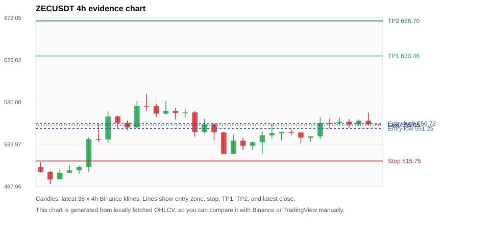
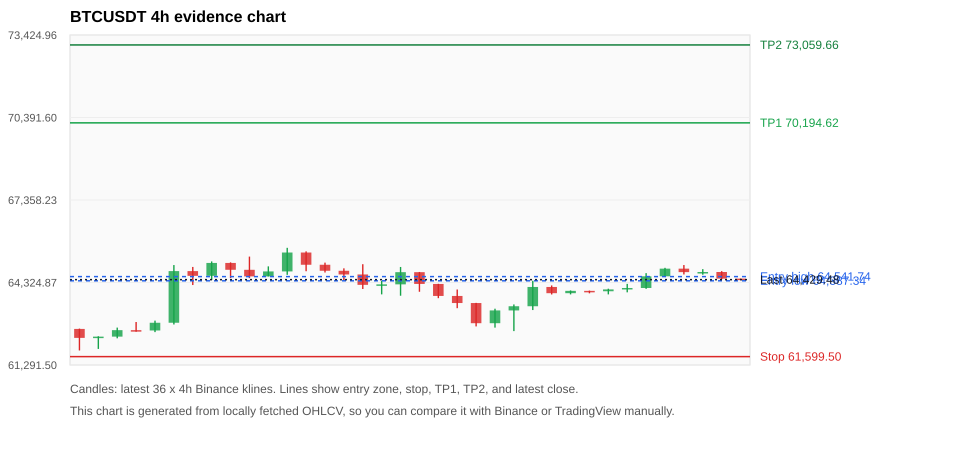
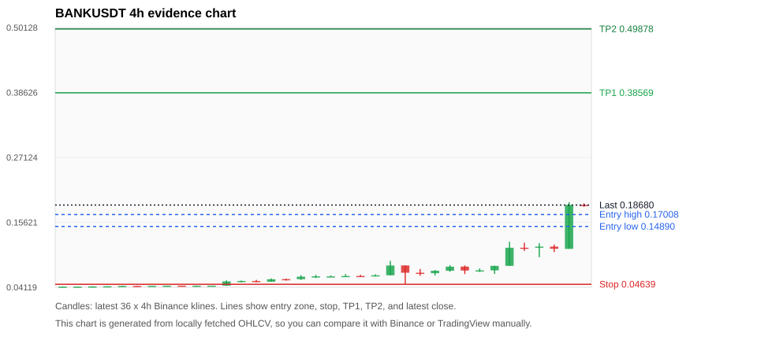
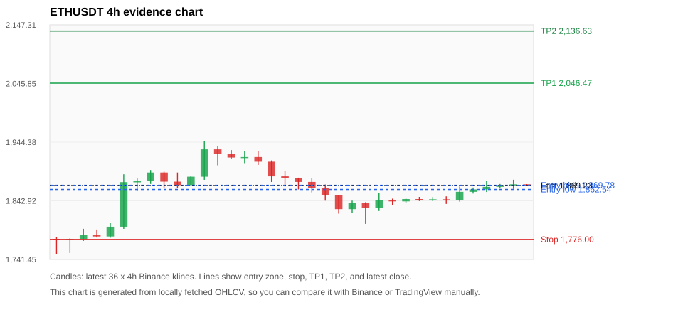
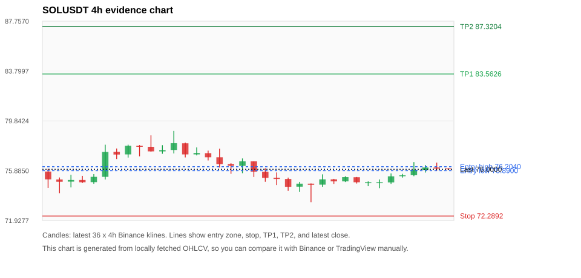

# Crypto 市场扫描报告 v1

- 报告时间：2026-07-19 20:05:36 CST
- Run ID：`20260719_120502_3140ce89`
- Run type：`daily_full`
- 数据来源：SQLite
- 报告版本：v1
- 扫描 ID：3b1acc678d5c
- 数据源：Binance public spot API + CoinGecko/CoinMarketCap cross-check
- 过滤条件：USDT spot; 24h quote volume >= 30,000,000; trades >= 30,000; exclude stables/leveraged tokens; analyze 1h/4h/1d klines
- 默认单笔风险：账户权益的 1.00%

## 限制说明

- 交易信号仍以 Binance 现货公开 K 线为主源；外部数据源用于一致性复核。
- 结果是研究和模拟盘计划，不是确定收益或实盘下单指令。
- 历史长度过滤：候选币至少需要 180 根 1d K 线。
- 数据质量验证池：先验证 score 排名前 min(top_n * 2, 10) 的候选，再按 action + score 补足最终名单。
- 大盘环境过滤：RISK_OFF; BTC/ETH 大盘偏弱，山寨币买入候选降级为观察。 BTC 7d=1.0160708686108633; ETH 7d=3.4558335178215716.
- 已启用数据交叉验证：Binance 主源 + CoinGecko 自动对照；CoinMarketCap 在配置 API Key 后自动对照。
- ZECUSDT 交叉验证状态 DATA_WARNING：At least one external provider needs manual review.
- BTCUSDT 交叉验证状态 DATA_WARNING：At least one external provider needs manual review.
- BANKUSDT 交叉验证状态 DATA_WARNING：At least one external provider needs manual review.
- ETHUSDT 交叉验证状态 DATA_WARNING：At least one external provider needs manual review.
- SOLUSDT 交叉验证状态 DATA_WARNING：At least one external provider needs manual review.
- BNBUSDT 交叉验证状态 DATA_WARNING：At least one external provider needs manual review.

## 5 个候选交易计划

| Rank | Coin | Action | Setup | Entry Zone | Stop Loss | TP1 | TP2 / Exit Rule | R/R | Verdict |
|---:|---|---|---|---:|---:|---:|---|---:|---|
| 1 | `ZEC` | `WATCH_ONLY` | 回踩支撑/4h EMA 附近 | 551.25 - 556.72 | 515.75 | 630.46 | 668.70 或跌破 4h 关键支撑 | 2.00-3.00 | 只观察 |
| 2 | `BTC` | `WATCH_ONLY` | 回踩支撑/4h EMA 附近 | 64,387.34 - 64,541.74 | 61,599.50 | 70,194.62 | 73,059.66 或跌破 4h 关键支撑 | 2.00-3.00 | 只等回调 |
| 3 | `BANK` | `WATCH_ONLY` | 涨幅较远，只等深回调 | 0.14890 - 0.17008 | 0.04639 | 0.38569 | 0.49878 或跌破 4h 关键支撑 | 2.00-3.00 | 只等回调 |
| 4 | `ETH` | `WATCH_ONLY` | 回踩支撑/4h EMA 附近 | 1,862.54 - 1,869.78 | 1,776.00 | 2,046.47 | 2,136.63 或跌破 4h 关键支撑 | 2.00-3.00 | 只等回调 |
| 5 | `SOL` | `REJECT` | 回踩支撑/4h EMA 附近 | 75.8900 - 76.2040 | 72.2892 | 83.5626 | 87.3204 或跌破 4h 关键支撑 | 2.00-3.00 | 只观察 |

## 数据交叉验证摘要

价格差异以 Binance 当前价为基准；成交量口径不同，Binance 是 USDT 现货成交额，CoinGecko/CoinMarketCap 通常是全市场成交量。

| Rank | Coin | Data Status | Max Price Diff | Max 24h Diff | Message |
|---:|---|---|---:|---:|---|
| 1 | `ZEC` | DATA_WARNING | 0.03% | 0.19 pts | At least one external provider needs manual review. |
| 2 | `BTC` | DATA_WARNING | 0.06% | 0.06 pts | At least one external provider needs manual review. |
| 3 | `BANK` | DATA_WARNING | 0.87% | 3.11 pts | At least one external provider needs manual review. |
| 4 | `ETH` | DATA_WARNING | 0.08% | 0.07 pts | At least one external provider needs manual review. |
| 5 | `SOL` | DATA_WARNING | 0.04% | 0.20 pts | At least one external provider needs manual review. |

## 候选币说明

### 1. ZEC `ZECUSDT`



- 入选原因：回踩支撑/4h EMA 附近；24h +1.75%，7d +5.50%，4h RSI 72.37，24h 成交额 $47.4M。
- 交易失效条件：跌破 515.746 或 4h 收盘重新失守关键支撑。
- 主要风险：BTC/ETH 大盘环境未确认强势，山寨币买入信号降级；数据交叉验证需要人工复核。
- 数据交叉验证：DATA_WARNING；At least one external provider needs manual review.

#### 可点击人工验证

- [Binance 交易页](https://www.binance.com/en/trade/ZEC_USDT)
- [TradingView 图表](https://www.tradingview.com/chart/?symbol=BINANCE%3AZECUSDT)
- [CoinGecko 搜索](https://www.coingecko.com/en/search?query=ZEC)
- [CoinMarketCap 搜索](https://coinmarketcap.com/search/?q=ZEC)

#### 多数据源对照

| Source | Status | Asset ID | Price | 24h Change | 24h Volume | Price Diff | 24h Diff | Updated | Message |
|---|---|---|---:|---:|---:|---:|---:|---|---|
| Binance | DATA_OK | ZECUSDT | 555.05 | +1.75% | $47.4M | 0.00% | 0.00 pts | 2026-07-19T12:05:24+00:00 | Primary market data source used by scanner. |
| CoinGecko | DATA_OK | zcash | 554.90 | +1.94% | $233.8M | 0.03% | 0.19 pts | 2026-07-19T12:05:15.552Z | External source agrees with Binance within thresholds. |
| CoinMarketCap | DATA_WARNING | 1437 | 555.07 | +1.92% | $352.4M | 0.00% | 0.17 pts | 2026-07-19T12:04:04.000Z | CoinMarketCap symbol mapping has 2 matches; selected lowest cmc_rank |

#### 指标证据

| 指标 | 数值 | 人工核对用途 |
|---|---:|---|
| 当前价 | 555.05 | 与 Binance/TradingView 当前价格对照 |
| 24h 涨跌 | +1.75% | 与交易所 24h 涨跌对照 |
| 7d 涨跌 | +5.50% | 判断短线趋势是否延续 |
| 4h EMA20 | 550.15 | 判断短期趋势支撑 |
| 4h EMA50 | 534.34 | 判断中期趋势支撑 |
| 1d EMA20 | 507.47 | 判断日线趋势 |
| 1d EMA50 | 483.03 | 判断日线趋势 |
| 4h RSI14 | 72.37 | 判断是否过热/过弱 |
| 4h ATR14 | 11.4314 | 推导止损和入场缓冲 |
| 最近 18 根 4h 最低点 | 523.60 | 支撑/止损参考 |
| 最近 36 根 4h 最高点 | 589.18 | TP/压力参考 |
| 支撑位 | 550.15 | 入场区间推导基础 |

#### 交易计划推导

- 支撑位 = 最近低点、4h EMA20、4h EMA50、1d EMA20 中不高于当前价的最高有效支撑 = `550.15`。
- 入场区间 = 支撑位附近 + ATR 缓冲 = `551.25 - 556.72`。
- 止损 = min(最近 18 根 4h 最低点 * 0.985, 入场中位价 - 1.15 * ATR14) = `515.75`。
- TP1 = max(最近 36 根 4h 最高点 * 0.995, 入场中位价 + 2R) = `630.46`。
- TP2 = max(入场中位价 + 3R, TP1 * 1.04) = `668.70`。

#### 最近 10 根 4h K线

| UTC 开盘时间 | Open | High | Low | Close | Quote Volume | Trades |
|---|---:|---:|---:|---:|---:|---:|
| 2026-07-18T00:00+00:00 | 547.45 | 550.96 | 544.09 | 546.90 | $6.2M | 18330 |
| 2026-07-18T04:00+00:00 | 546.91 | 547.04 | 535.04 | 541.32 | $5.1M | 27906 |
| 2026-07-18T08:00+00:00 | 541.19 | 542.86 | 536.90 | 542.69 | $4.2M | 27648 |
| 2026-07-18T12:00+00:00 | 542.69 | 563.73 | 540.00 | 557.23 | $17.4M | 77681 |
| 2026-07-18T16:00+00:00 | 557.23 | 562.29 | 551.23 | 557.08 | $10.7M | 50150 |
| 2026-07-18T20:00+00:00 | 557.10 | 562.96 | 554.40 | 558.70 | $4.9M | 33398 |
| 2026-07-19T00:00+00:00 | 558.65 | 561.78 | 551.46 | 555.68 | $4.8M | 29903 |
| 2026-07-19T04:00+00:00 | 555.69 | 561.00 | 554.23 | 559.72 | $3.2M | 23474 |
| 2026-07-19T08:00+00:00 | 559.78 | 568.72 | 555.46 | 555.71 | $6.8M | 42652 |
| 2026-07-19T12:00+00:00 | 555.69 | 555.94 | 554.65 | 555.05 | $324,522 | 3248 |

### 2. BTC `BTCUSDT`



- 入选原因：回踩支撑/4h EMA 附近；24h +0.44%，7d +0.63%，4h RSI 77.52，24h 成交额 $571.5M。
- 交易失效条件：跌破 61599.497 或 4h 收盘重新失守关键支撑。
- 主要风险：4h RSI 偏热；日线趋势未完全确认；BTC/ETH 大盘环境未确认强势，山寨币买入信号降级；数据交叉验证需要人工复核。
- 数据交叉验证：DATA_WARNING；At least one external provider needs manual review.

#### 可点击人工验证

- [Binance 交易页](https://www.binance.com/en/trade/BTC_USDT)
- [TradingView 图表](https://www.tradingview.com/chart/?symbol=BINANCE%3ABTCUSDT)
- [CoinGecko 搜索](https://www.coingecko.com/en/search?query=BTC)
- [CoinMarketCap 搜索](https://coinmarketcap.com/search/?q=BTC)

#### 多数据源对照

| Source | Status | Asset ID | Price | 24h Change | 24h Volume | Price Diff | 24h Diff | Updated | Message |
|---|---|---|---:|---:|---:|---:|---:|---|---|
| Binance | DATA_OK | BTCUSDT | 64,429.48 | +0.44% | $571.5M | 0.00% | 0.00 pts | 2026-07-19T12:05:24+00:00 | Primary market data source used by scanner. |
| CoinGecko | DATA_OK | bitcoin | 64,393.00 | +0.45% | $15.48B | 0.06% | 0.01 pts | 2026-07-19T12:05:23.042Z | External source agrees with Binance within thresholds. |
| CoinMarketCap | DATA_WARNING | 1 | 64,396.75 | +0.50% | $14.55B | 0.05% | 0.06 pts | 2026-07-19T12:04:04.000Z | CoinMarketCap symbol mapping has 13 matches; selected lowest cmc_rank |

#### 指标证据

| 指标 | 数值 | 人工核对用途 |
|---|---:|---|
| 当前价 | 64,429.48 | 与 Binance/TradingView 当前价格对照 |
| 24h 涨跌 | +0.44% | 与交易所 24h 涨跌对照 |
| 7d 涨跌 | +0.63% | 判断短线趋势是否延续 |
| 4h EMA20 | 64,258.82 | 判断短期趋势支撑 |
| 4h EMA50 | 63,917.01 | 判断中期趋势支撑 |
| 1d EMA20 | 63,615.80 | 判断日线趋势 |
| 1d EMA50 | 65,020.35 | 判断日线趋势 |
| 4h RSI14 | 77.52 | 判断是否过热/过弱 |
| 4h ATR14 | 404.18 | 推导止损和入场缓冲 |
| 最近 18 根 4h 最低点 | 62,537.56 | 支撑/止损参考 |
| 最近 36 根 4h 最高点 | 65,600.00 | TP/压力参考 |
| 支撑位 | 64,258.82 | 入场区间推导基础 |

#### 交易计划推导

- 支撑位 = 最近低点、4h EMA20、4h EMA50、1d EMA20 中不高于当前价的最高有效支撑 = `64,258.82`。
- 入场区间 = 支撑位附近 + ATR 缓冲 = `64,387.34 - 64,541.74`。
- 止损 = min(最近 18 根 4h 最低点 * 0.985, 入场中位价 - 1.15 * ATR14) = `61,599.50`。
- TP1 = max(最近 36 根 4h 最高点 * 0.995, 入场中位价 + 2R) = `70,194.62`。
- TP2 = max(入场中位价 + 3R, TP1 * 1.04) = `73,059.66`。

#### 最近 10 根 4h K线

| UTC 开盘时间 | Open | High | Low | Close | Quote Volume | Trades |
|---|---:|---:|---:|---:|---:|---:|
| 2026-07-18T00:00+00:00 | 63,931.67 | 64,032.60 | 63,886.65 | 64,017.84 | $87.6M | 150552 |
| 2026-07-18T04:00+00:00 | 64,017.84 | 64,026.03 | 63,926.39 | 64,002.75 | $60.7M | 118016 |
| 2026-07-18T08:00+00:00 | 64,002.75 | 64,097.22 | 63,887.73 | 64,069.89 | $70.6M | 85981 |
| 2026-07-18T12:00+00:00 | 64,069.89 | 64,274.47 | 63,963.00 | 64,123.12 | $79.6M | 210954 |
| 2026-07-18T16:00+00:00 | 64,123.13 | 64,669.50 | 64,091.48 | 64,552.79 | $111.0M | 257153 |
| 2026-07-18T20:00+00:00 | 64,552.80 | 64,865.00 | 64,528.69 | 64,834.22 | $106.4M | 266045 |
| 2026-07-19T00:00+00:00 | 64,834.21 | 64,967.25 | 64,620.44 | 64,706.18 | $106.5M | 198160 |
| 2026-07-19T04:00+00:00 | 64,706.18 | 64,815.65 | 64,610.89 | 64,711.05 | $71.3M | 143399 |
| 2026-07-19T08:00+00:00 | 64,711.04 | 64,743.00 | 64,445.00 | 64,467.64 | $99.4M | 229863 |
| 2026-07-19T12:00+00:00 | 64,467.65 | 64,467.65 | 64,424.00 | 64,429.48 | $1.3M | 4631 |

### 3. BANK `BANKUSDT`



- 入选原因：涨幅较远，只等深回调；24h +163.47%，7d +342.65%，4h RSI 85.75，24h 成交额 $54.6M。
- 交易失效条件：跌破 0.0463935 或 4h 收盘重新失守关键支撑。
- 主要风险：距离支撑偏远，不能追市价；4h RSI 偏热；24h 振幅较大，回撤风险高；成交量突增，可能是事件驱动；BTC/ETH 大盘环境未确认强势，山寨币买入信号降级；数据交叉验证需要人工复核。
- 数据交叉验证：DATA_WARNING；At least one external provider needs manual review.

#### 可点击人工验证

- [Binance 交易页](https://www.binance.com/en/trade/BANK_USDT)
- [TradingView 图表](https://www.tradingview.com/chart/?symbol=BINANCE%3ABANKUSDT)
- [CoinGecko 搜索](https://www.coingecko.com/en/search?query=BANK)
- [CoinMarketCap 搜索](https://coinmarketcap.com/search/?q=BANK)

#### 多数据源对照

| Source | Status | Asset ID | Price | 24h Change | 24h Volume | Price Diff | 24h Diff | Updated | Message |
|---|---|---|---:|---:|---:|---:|---:|---|---|
| Binance | DATA_OK | BANKUSDT | 0.18680 | +163.47% | $54.6M | 0.00% | 0.00 pts | 2026-07-19T12:05:24+00:00 | Primary market data source used by scanner. |
| CoinGecko | DATA_WARNING | lorenzo-protocol | 0.18518 | +160.36% | $194.3M | 0.87% | 3.11 pts | 2026-07-19T12:05:17.812Z | 24h change diff 3.11 points exceeds warning threshold; CoinGecko symbol mapping has 3 exact matches; selected highest market-cap rank |
| CoinMarketCap | DATA_WARNING | 36296 | 0.18681 | +161.98% | $210.8M | 0.01% | 1.49 pts | 2026-07-19T12:04:04.000Z | CoinMarketCap symbol mapping has 10 matches; selected lowest cmc_rank |

#### 指标证据

| 指标 | 数值 | 人工核对用途 |
|---|---:|---|
| 当前价 | 0.18680 | 与 Binance/TradingView 当前价格对照 |
| 24h 涨跌 | +163.47% | 与交易所 24h 涨跌对照 |
| 7d 涨跌 | +342.65% | 判断短线趋势是否延续 |
| 4h EMA20 | 0.09905 | 判断短期趋势支撑 |
| 4h EMA50 | 0.07176 | 判断中期趋势支撑 |
| 1d EMA20 | 0.06375 | 判断日线趋势 |
| 1d EMA50 | 0.04881 | 判断日线趋势 |
| 4h RSI14 | 85.75 | 判断是否过热/过弱 |
| 4h ATR14 | 0.02229 | 推导止损和入场缓冲 |
| 最近 18 根 4h 最低点 | 0.04710 | 支撑/止损参考 |
| 最近 36 根 4h 最高点 | 0.19170 | TP/压力参考 |
| 支撑位 | 0.09905 | 入场区间推导基础 |

#### 交易计划推导

- 支撑位 = 最近低点、4h EMA20、4h EMA50、1d EMA20 中不高于当前价的最高有效支撑 = `0.09905`。
- 入场区间 = 支撑位附近 + ATR 缓冲 = `0.14890 - 0.17008`。
- 止损 = min(最近 18 根 4h 最低点 * 0.985, 入场中位价 - 1.15 * ATR14) = `0.04639`。
- TP1 = max(最近 36 根 4h 最高点 * 0.995, 入场中位价 + 2R) = `0.38569`。
- TP2 = max(入场中位价 + 3R, TP1 * 1.04) = `0.49878`。

#### 最近 10 根 4h K线

| UTC 开盘时间 | Open | High | Low | Close | Quote Volume | Trades |
|---|---:|---:|---:|---:|---:|---:|
| 2026-07-18T00:00+00:00 | 0.07040 | 0.08030 | 0.06850 | 0.07770 | $3.1M | 43197 |
| 2026-07-18T04:00+00:00 | 0.07780 | 0.07980 | 0.06450 | 0.07080 | $3.3M | 55628 |
| 2026-07-18T08:00+00:00 | 0.07080 | 0.07450 | 0.06830 | 0.07110 | $1.3M | 23134 |
| 2026-07-18T12:00+00:00 | 0.07110 | 0.07940 | 0.06490 | 0.07900 | $2.4M | 34850 |
| 2026-07-18T16:00+00:00 | 0.07910 | 0.12170 | 0.07900 | 0.11120 | $16.2M | 198358 |
| 2026-07-18T20:00+00:00 | 0.11120 | 0.12000 | 0.10560 | 0.11100 | $3.6M | 55755 |
| 2026-07-19T00:00+00:00 | 0.11120 | 0.11920 | 0.09440 | 0.11320 | $4.8M | 71666 |
| 2026-07-19T04:00+00:00 | 0.11310 | 0.11680 | 0.10340 | 0.10940 | $3.7M | 50744 |
| 2026-07-19T08:00+00:00 | 0.10920 | 0.19170 | 0.10920 | 0.18700 | $23.4M | 199868 |
| 2026-07-19T12:00+00:00 | 0.18700 | 0.18980 | 0.18370 | 0.18680 | $684,454 | 5507 |

### 4. ETH `ETHUSDT`



- 入选原因：回踩支撑/4h EMA 附近；24h +1.12%，7d +3.50%，4h RSI 78.51，24h 成交额 $232.7M。
- 交易失效条件：跌破 1776.0042 或 4h 收盘重新失守关键支撑。
- 主要风险：4h RSI 偏热；BTC/ETH 大盘环境未确认强势，山寨币买入信号降级；数据交叉验证需要人工复核。
- 数据交叉验证：DATA_WARNING；At least one external provider needs manual review.

#### 可点击人工验证

- [Binance 交易页](https://www.binance.com/en/trade/ETH_USDT)
- [TradingView 图表](https://www.tradingview.com/chart/?symbol=BINANCE%3AETHUSDT)
- [CoinGecko 搜索](https://www.coingecko.com/en/search?query=ETH)
- [CoinMarketCap 搜索](https://coinmarketcap.com/search/?q=ETH)

#### 多数据源对照

| Source | Status | Asset ID | Price | 24h Change | 24h Volume | Price Diff | 24h Diff | Updated | Message |
|---|---|---|---:|---:|---:|---:|---:|---|---|
| Binance | DATA_OK | ETHUSDT | 1,869.23 | +1.12% | $232.7M | 0.00% | 0.00 pts | 2026-07-19T12:05:24+00:00 | Primary market data source used by scanner. |
| CoinGecko | DATA_OK | ethereum | 1,867.66 | +1.15% | $4.60B | 0.08% | 0.03 pts | 2026-07-19T12:05:27.962Z | External source agrees with Binance within thresholds. |
| CoinMarketCap | DATA_WARNING | 1027 | 1,867.71 | +1.19% | $5.83B | 0.08% | 0.07 pts | 2026-07-19T12:04:04.000Z | CoinMarketCap symbol mapping has 6 matches; selected lowest cmc_rank |

#### 指标证据

| 指标 | 数值 | 人工核对用途 |
|---|---:|---|
| 当前价 | 1,869.23 | 与 Binance/TradingView 当前价格对照 |
| 24h 涨跌 | +1.12% | 与交易所 24h 涨跌对照 |
| 7d 涨跌 | +3.50% | 判断短线趋势是否延续 |
| 4h EMA20 | 1,858.83 | 判断短期趋势支撑 |
| 4h EMA50 | 1,838.11 | 判断中期趋势支撑 |
| 1d EMA20 | 1,800.74 | 判断日线趋势 |
| 1d EMA50 | 1,815.35 | 判断日线趋势 |
| 4h RSI14 | 78.51 | 判断是否过热/过弱 |
| 4h ATR14 | 15.6436 | 推导止损和入场缓冲 |
| 最近 18 根 4h 最低点 | 1,803.05 | 支撑/止损参考 |
| 最近 36 根 4h 最高点 | 1,946.52 | TP/压力参考 |
| 支撑位 | 1,858.83 | 入场区间推导基础 |

#### 交易计划推导

- 支撑位 = 最近低点、4h EMA20、4h EMA50、1d EMA20 中不高于当前价的最高有效支撑 = `1,858.83`。
- 入场区间 = 支撑位附近 + ATR 缓冲 = `1,862.54 - 1,869.78`。
- 止损 = min(最近 18 根 4h 最低点 * 0.985, 入场中位价 - 1.15 * ATR14) = `1,776.00`。
- TP1 = max(最近 36 根 4h 最高点 * 0.995, 入场中位价 + 2R) = `2,046.47`。
- TP2 = max(入场中位价 + 3R, TP1 * 1.04) = `2,136.63`。

#### 最近 10 根 4h K线

| UTC 开盘时间 | Open | High | Low | Close | Quote Volume | Trades |
|---|---:|---:|---:|---:|---:|---:|
| 2026-07-18T00:00+00:00 | 1,841.94 | 1,846.74 | 1,839.38 | 1,845.96 | $25.1M | 128932 |
| 2026-07-18T04:00+00:00 | 1,845.96 | 1,849.68 | 1,842.56 | 1,844.20 | $18.8M | 118273 |
| 2026-07-18T08:00+00:00 | 1,844.20 | 1,849.44 | 1,842.30 | 1,845.56 | $18.8M | 92079 |
| 2026-07-18T12:00+00:00 | 1,845.56 | 1,850.64 | 1,837.58 | 1,844.15 | $32.5M | 192569 |
| 2026-07-18T16:00+00:00 | 1,844.15 | 1,867.58 | 1,841.51 | 1,858.45 | $50.6M | 239431 |
| 2026-07-18T20:00+00:00 | 1,858.45 | 1,865.86 | 1,855.47 | 1,862.61 | $25.4M | 126864 |
| 2026-07-19T00:00+00:00 | 1,862.61 | 1,877.33 | 1,858.17 | 1,867.08 | $51.1M | 204006 |
| 2026-07-19T04:00+00:00 | 1,867.08 | 1,871.99 | 1,864.21 | 1,870.25 | $32.0M | 103978 |
| 2026-07-19T08:00+00:00 | 1,870.26 | 1,879.38 | 1,863.46 | 1,871.41 | $40.8M | 207232 |
| 2026-07-19T12:00+00:00 | 1,871.40 | 1,871.71 | 1,868.31 | 1,869.23 | $1.0M | 10699 |

### 5. SOL `SOLUSDT`



- 入选原因：回踩支撑/4h EMA 附近；24h +1.21%，7d -1.49%，4h RSI 73.24，24h 成交额 $78.3M。
- 交易失效条件：跌破 72.28915 或 4h 收盘重新失守关键支撑。
- 主要风险：日线趋势未完全确认；BTC/ETH 大盘环境未确认强势，山寨币买入信号降级；7d 趋势未确认；数据交叉验证需要人工复核。
- 数据交叉验证：DATA_WARNING；At least one external provider needs manual review.

#### 可点击人工验证

- [Binance 交易页](https://www.binance.com/en/trade/SOL_USDT)
- [TradingView 图表](https://www.tradingview.com/chart/?symbol=BINANCE%3ASOLUSDT)
- [CoinGecko 搜索](https://www.coingecko.com/en/search?query=SOL)
- [CoinMarketCap 搜索](https://coinmarketcap.com/search/?q=SOL)

#### 多数据源对照

| Source | Status | Asset ID | Price | 24h Change | 24h Volume | Price Diff | 24h Diff | Updated | Message |
|---|---|---|---:|---:|---:|---:|---:|---|---|
| Binance | DATA_OK | SOLUSDT | 76.0000 | +1.21% | $78.3M | 0.00% | 0.00 pts | 2026-07-19T12:05:24+00:00 | Primary market data source used by scanner. |
| CoinGecko | DATA_OK | solana | 75.9800 | +1.41% | $1.13B | 0.03% | 0.20 pts | 2026-07-19T12:05:15.449Z | External source agrees with Binance within thresholds. |
| CoinMarketCap | DATA_WARNING | 5426 | 75.9716 | +1.32% | $1.18B | 0.04% | 0.11 pts | 2026-07-19T12:04:04.000Z | CoinMarketCap symbol mapping has 8 matches; selected lowest cmc_rank |

#### 指标证据

| 指标 | 数值 | 人工核对用途 |
|---|---:|---|
| 当前价 | 76.0000 | 与 Binance/TradingView 当前价格对照 |
| 24h 涨跌 | +1.21% | 与交易所 24h 涨跌对照 |
| 7d 涨跌 | -1.49% | 判断短线趋势是否延续 |
| 4h EMA20 | 75.7385 | 判断短期趋势支撑 |
| 4h EMA50 | 76.3459 | 判断中期趋势支撑 |
| 1d EMA20 | 76.3909 | 判断日线趋势 |
| 1d EMA50 | 76.5824 | 判断日线趋势 |
| 4h RSI14 | 73.24 | 判断是否过热/过弱 |
| 4h ATR14 | 0.66500 | 推导止损和入场缓冲 |
| 最近 18 根 4h 最低点 | 73.3900 | 支撑/止损参考 |
| 最近 36 根 4h 最高点 | 79.0400 | TP/压力参考 |
| 支撑位 | 75.7385 | 入场区间推导基础 |

#### 交易计划推导

- 支撑位 = 最近低点、4h EMA20、4h EMA50、1d EMA20 中不高于当前价的最高有效支撑 = `75.7385`。
- 入场区间 = 支撑位附近 + ATR 缓冲 = `75.8900 - 76.2040`。
- 止损 = min(最近 18 根 4h 最低点 * 0.985, 入场中位价 - 1.15 * ATR14) = `72.2892`。
- TP1 = max(最近 36 根 4h 最高点 * 0.995, 入场中位价 + 2R) = `83.5626`。
- TP2 = max(入场中位价 + 3R, TP1 * 1.04) = `87.3204`。

#### 最近 10 根 4h K线

| UTC 开盘时间 | Open | High | Low | Close | Quote Volume | Trades |
|---|---:|---:|---:|---:|---:|---:|
| 2026-07-18T00:00+00:00 | 75.0400 | 75.4500 | 74.9900 | 75.3800 | $6.5M | 30198 |
| 2026-07-18T04:00+00:00 | 75.3700 | 75.3900 | 74.8700 | 74.9700 | $6.4M | 31654 |
| 2026-07-18T08:00+00:00 | 74.9700 | 75.0400 | 74.6600 | 74.9700 | $6.5M | 26019 |
| 2026-07-18T12:00+00:00 | 74.9600 | 75.1900 | 74.5000 | 74.9700 | $9.0M | 51213 |
| 2026-07-18T16:00+00:00 | 74.9600 | 75.6700 | 74.8400 | 75.4400 | $13.4M | 79539 |
| 2026-07-18T20:00+00:00 | 75.4500 | 75.6400 | 75.3400 | 75.5200 | $7.1M | 30911 |
| 2026-07-19T00:00+00:00 | 75.5300 | 76.5700 | 75.4500 | 75.9600 | $20.1M | 60816 |
| 2026-07-19T04:00+00:00 | 75.9500 | 76.3400 | 75.7400 | 76.1400 | $15.5M | 32225 |
| 2026-07-19T08:00+00:00 | 76.1400 | 76.5300 | 75.9000 | 76.0600 | $13.1M | 38384 |
| 2026-07-19T12:00+00:00 | 76.0700 | 76.0700 | 75.9700 | 76.0000 | $327,850 | 1280 |

## 组合风控

- 不要 5 个候选全部满仓买入。
- 同时持仓总风险建议控制在账户权益的 3% - 5% 以内。
- 如果 BTC/ETH 同时破位，暂停山寨币多头计划或降低仓位。
- 第一版报告用于模拟盘和人工复核，不自动下单。

## 原始数据

```json
[
  {
    "rank": 1,
    "symbol": "ZECUSDT",
    "base_asset": "ZEC",
    "price": 555.05,
    "score": 37.85121829066439,
    "setup": "回踩支撑/4h EMA 附近",
    "verdict": "只观察",
    "entry_low": 551.2546619776394,
    "entry_high": 556.7151499999999,
    "stop_loss": 515.746,
    "take_profit_1": 630.4627179664592,
    "take_profit_2": 668.7016239552789,
    "risk_reward_1": 2.0,
    "risk_reward_2": 3.0,
    "pct_24h": 1.752,
    "pct_3d": 0.0,
    "pct_7d": 5.49674034934331,
    "quote_volume_24h": 47389752.37693,
    "trades_24h": 258129,
    "high_low_range_24h": 5.318518518518522,
    "rsi_1h": 40.683135102165295,
    "rsi_4h": 72.37361769352279,
    "ema20_4h": 550.1543532710972,
    "ema50_4h": 534.3355140234479,
    "ema20_1d": 507.4688369698032,
    "ema50_1d": 483.0319994480159,
    "atr_4h": 11.431428571428569,
    "macd_hist_4h": -0.009066813514363226,
    "volume_ratio_24h": 0.4498365173612187,
    "support_level": 550.1543532710972,
    "recent_low_4h_18": 523.6,
    "recent_high_4h_36": 589.18,
    "distance_to_support_pct": 0.889867852502535,
    "binance_trade_url": "https://www.binance.com/en/trade/ZEC_USDT",
    "tradingview_url": "https://www.tradingview.com/chart/?symbol=BINANCE%3AZECUSDT",
    "coingecko_search_url": "https://www.coingecko.com/en/search?query=ZEC",
    "coinmarketcap_search_url": "https://coinmarketcap.com/search/?q=ZEC",
    "invalidation": "跌破 515.746 或 4h 收盘重新失守关键支撑",
    "recent_4h_klines": [
      {
        "open_time_utc": "2026-07-13T16:00+00:00",
        "open": 509.1,
        "high": 514.42,
        "low": 503.12,
        "close": 503.86,
        "quote_volume": 11558070.73559,
        "trades": 43848
      },
      {
        "open_time_utc": "2026-07-13T20:00+00:00",
        "open": 503.84,
        "high": 505.19,
        "low": 490.4,
        "close": 495.57,
        "quote_volume": 14263671.87997,
        "trades": 42360
      },
      {
        "open_time_utc": "2026-07-14T00:00+00:00",
        "open": 495.67,
        "high": 506.48,
        "low": 495.67,
        "close": 502.86,
        "quote_volume": 10619851.19281,
        "trades": 59008
      },
      {
        "open_time_utc": "2026-07-14T04:00+00:00",
        "open": 502.81,
        "high": 511.34,
        "low": 502.81,
        "close": 505.59,
        "quote_volume": 9733606.76952,
        "trades": 72594
      },
      {
        "open_time_utc": "2026-07-14T08:00+00:00",
        "open": 505.61,
        "high": 511.06,
        "low": 501.8,
        "close": 509.13,
        "quote_volume": 5987173.1218,
        "trades": 23589
      },
      {
        "open_time_utc": "2026-07-14T12:00+00:00",
        "open": 509.25,
        "high": 541.6,
        "low": 503.92,
        "close": 539.73,
        "quote_volume": 32754470.35064,
        "trades": 102343
      },
      {
        "open_time_utc": "2026-07-14T16:00+00:00",
        "open": 539.76,
        "high": 556.55,
        "low": 536.33,
        "close": 539.19,
        "quote_volume": 27837312.51253,
        "trades": 79547
      },
      {
        "open_time_utc": "2026-07-14T20:00+00:00",
        "open": 539.2,
        "high": 570.0,
        "low": 535.32,
        "close": 564.31,
        "quote_volume": 29518601.87503,
        "trades": 86322
      },
      {
        "open_time_utc": "2026-07-15T00:00+00:00",
        "open": 564.39,
        "high": 565.24,
        "low": 551.76,
        "close": 557.34,
        "quote_volume": 15339188.70066,
        "trades": 46470
      },
      {
        "open_time_utc": "2026-07-15T04:00+00:00",
        "open": 557.34,
        "high": 560.0,
        "low": 549.3,
        "close": 552.36,
        "quote_volume": 10411363.36177,
        "trades": 30102
      },
      {
        "open_time_utc": "2026-07-15T08:00+00:00",
        "open": 552.42,
        "high": 581.38,
        "low": 551.63,
        "close": 575.9,
        "quote_volume": 24380620.94319,
        "trades": 59739
      },
      {
        "open_time_utc": "2026-07-15T12:00+00:00",
        "open": 575.93,
        "high": 589.18,
        "low": 570.67,
        "close": 575.92,
        "quote_volume": 30592331.45329,
        "trades": 121286
      },
      {
        "open_time_utc": "2026-07-15T16:00+00:00",
        "open": 575.94,
        "high": 577.77,
        "low": 563.88,
        "close": 567.47,
        "quote_volume": 18246370.785,
        "trades": 52260
      },
      {
        "open_time_utc": "2026-07-15T20:00+00:00",
        "open": 567.45,
        "high": 581.5,
        "low": 566.26,
        "close": 570.54,
        "quote_volume": 15803996.86293,
        "trades": 45914
      },
      {
        "open_time_utc": "2026-07-16T00:00+00:00",
        "open": 570.53,
        "high": 573.85,
        "low": 561.0,
        "close": 568.25,
        "quote_volume": 15836777.66309,
        "trades": 42542
      },
      {
        "open_time_utc": "2026-07-16T04:00+00:00",
        "open": 568.25,
        "high": 572.99,
        "low": 563.33,
        "close": 568.85,
        "quote_volume": 8127069.60641,
        "trades": 33078
      },
      {
        "open_time_utc": "2026-07-16T08:00+00:00",
        "open": 568.8,
        "high": 570.06,
        "low": 542.39,
        "close": 547.64,
        "quote_volume": 34153883.40443,
        "trades": 88354
      },
      {
        "open_time_utc": "2026-07-16T12:00+00:00",
        "open": 547.68,
        "high": 561.59,
        "low": 546.0,
        "close": 555.83,
        "quote_volume": 25367800.85665,
        "trades": 68486
      },
      {
        "open_time_utc": "2026-07-16T16:00+00:00",
        "open": 555.8,
        "high": 557.38,
        "low": 538.55,
        "close": 547.07,
        "quote_volume": 17783126.77048,
        "trades": 49324
      },
      {
        "open_time_utc": "2026-07-16T20:00+00:00",
        "open": 547.0,
        "high": 547.16,
        "low": 523.6,
        "close": 523.72,
        "quote_volume": 17350390.22596,
        "trades": 67461
      },
      {
        "open_time_utc": "2026-07-17T00:00+00:00",
        "open": 523.75,
        "high": 544.67,
        "low": 523.74,
        "close": 537.95,
        "quote_volume": 15233836.50356,
        "trades": 64969
      },
      {
        "open_time_utc": "2026-07-17T04:00+00:00",
        "open": 537.93,
        "high": 541.25,
        "low": 527.38,
        "close": 532.39,
        "quote_volume": 13163582.15764,
        "trades": 62281
      },
      {
        "open_time_utc": "2026-07-17T08:00+00:00",
        "open": 532.5,
        "high": 537.18,
        "low": 527.56,
        "close": 536.28,
        "quote_volume": 8139752.84678,
        "trades": 36199
      },
      {
        "open_time_utc": "2026-07-17T12:00+00:00",
        "open": 536.34,
        "high": 548.51,
        "low": 523.72,
        "close": 543.78,
        "quote_volume": 18769502.13819,
        "trades": 76447
      },
      {
        "open_time_utc": "2026-07-17T16:00+00:00",
        "open": 543.79,
        "high": 556.53,
        "low": 540.21,
        "close": 546.18,
        "quote_volume": 26057470.99771,
        "trades": 67692
      },
      {
        "open_time_utc": "2026-07-17T20:00+00:00",
        "open": 546.11,
        "high": 547.77,
        "low": 538.28,
        "close": 547.47,
        "quote_volume": 8243032.62883,
        "trades": 23965
      },
      {
        "open_time_utc": "2026-07-18T00:00+00:00",
        "open": 547.45,
        "high": 550.96,
        "low": 544.09,
        "close": 546.9,
        "quote_volume": 6232462.76969,
        "trades": 18330
      },
      {
        "open_time_utc": "2026-07-18T04:00+00:00",
        "open": 546.91,
        "high": 547.04,
        "low": 535.04,
        "close": 541.32,
        "quote_volume": 5120463.33607,
        "trades": 27906
      },
      {
        "open_time_utc": "2026-07-18T08:00+00:00",
        "open": 541.19,
        "high": 542.86,
        "low": 536.9,
        "close": 542.69,
        "quote_volume": 4248914.21113,
        "trades": 27648
      },
      {
        "open_time_utc": "2026-07-18T12:00+00:00",
        "open": 542.69,
        "high": 563.73,
        "low": 540.0,
        "close": 557.23,
        "quote_volume": 17371817.61922,
        "trades": 77681
      },
      {
        "open_time_utc": "2026-07-18T16:00+00:00",
        "open": 557.23,
        "high": 562.29,
        "low": 551.23,
        "close": 557.08,
        "quote_volume": 10652429.70639,
        "trades": 50150
      },
      {
        "open_time_utc": "2026-07-18T20:00+00:00",
        "open": 557.1,
        "high": 562.96,
        "low": 554.4,
        "close": 558.7,
        "quote_volume": 4879680.72156,
        "trades": 33398
      },
      {
        "open_time_utc": "2026-07-19T00:00+00:00",
        "open": 558.65,
        "high": 561.78,
        "low": 551.46,
        "close": 555.68,
        "quote_volume": 4761407.23185,
        "trades": 29903
      },
      {
        "open_time_utc": "2026-07-19T04:00+00:00",
        "open": 555.69,
        "high": 561.0,
        "low": 554.23,
        "close": 559.72,
        "quote_volume": 3245541.6855,
        "trades": 23474
      },
      {
        "open_time_utc": "2026-07-19T08:00+00:00",
        "open": 559.78,
        "high": 568.72,
        "low": 555.46,
        "close": 555.71,
        "quote_volume": 6779342.53119,
        "trades": 42652
      },
      {
        "open_time_utc": "2026-07-19T12:00+00:00",
        "open": 555.69,
        "high": 555.94,
        "low": 554.65,
        "close": 555.05,
        "quote_volume": 324522.31375,
        "trades": 3248
      }
    ],
    "risks": [
      "BTC/ETH 大盘环境未确认强势，山寨币买入信号降级",
      "数据交叉验证需要人工复核"
    ],
    "data_quality_status": "DATA_WARNING",
    "data_quality_message": "At least one external provider needs manual review.",
    "data_checks": [
      {
        "provider": "Binance",
        "status": "DATA_OK",
        "provider_asset_id": "ZECUSDT",
        "provider_symbol": "ZECUSDT",
        "price_usd": 555.05,
        "pct_24h": 1.752,
        "volume_24h": 47389752.37693,
        "last_updated": null,
        "fetched_at_utc": "2026-07-19T12:05:24+00:00",
        "price_diff_pct": 0.0,
        "pct_24h_diff": 0.0,
        "volume_note": "Binance USDT spot 24h quoteVolume.",
        "message": "Primary market data source used by scanner."
      },
      {
        "provider": "CoinGecko",
        "status": "DATA_OK",
        "provider_asset_id": "zcash",
        "provider_symbol": "ZEC",
        "price_usd": 554.9,
        "pct_24h": 1.9375,
        "volume_24h": 233804228.0,
        "last_updated": "2026-07-19T12:05:15.552Z",
        "fetched_at_utc": "2026-07-19T12:05:24+00:00",
        "price_diff_pct": 0.027024592379060852,
        "pct_24h_diff": 0.1855,
        "volume_note": "CoinGecko total market volume; not the same venue scope as Binance quoteVolume.",
        "message": "External source agrees with Binance within thresholds."
      },
      {
        "provider": "CoinMarketCap",
        "status": "DATA_WARNING",
        "provider_asset_id": "1437",
        "provider_symbol": "ZEC",
        "price_usd": 555.0715937847273,
        "pct_24h": 1.92060202,
        "volume_24h": 352362749.14042056,
        "last_updated": "2026-07-19T12:04:04.000Z",
        "fetched_at_utc": "2026-07-19T12:05:24+00:00",
        "price_diff_pct": 0.0038904215345131657,
        "pct_24h_diff": 0.16860202000000002,
        "volume_note": "CoinMarketCap total market volume; not the same venue scope as Binance quoteVolume.",
        "message": "CoinMarketCap symbol mapping has 2 matches; selected lowest cmc_rank"
      }
    ],
    "action": "WATCH_ONLY"
  },
  {
    "rank": 2,
    "symbol": "BTCUSDT",
    "base_asset": "BTC",
    "price": 64429.48,
    "score": 37.55456586553176,
    "setup": "回踩支撑/4h EMA 附近",
    "verdict": "只等回调",
    "entry_low": 64387.33540122486,
    "entry_high": 64541.74176569347,
    "stop_loss": 61599.4966,
    "take_profit_1": 70194.6225503775,
    "take_profit_2": 73059.66453383667,
    "risk_reward_1": 2.0000000000000027,
    "risk_reward_2": 3.0,
    "pct_24h": 0.443,
    "pct_3d": 0.08307443767863187,
    "pct_7d": 0.6346767746786552,
    "quote_volume_24h": 571542490.9410977,
    "trades_24h": 1300120,
    "high_low_range_24h": 1.570048309178751,
    "rsi_1h": 25.27941234548439,
    "rsi_4h": 77.52412316132867,
    "ema20_4h": 64258.81776569347,
    "ema50_4h": 63917.01187984558,
    "ema20_1d": 63615.802819601864,
    "ema50_1d": 65020.354094193004,
    "atr_4h": 404.17714285714203,
    "macd_hist_4h": 48.86751219021278,
    "volume_ratio_24h": 0.48582524138249883,
    "support_level": 64258.81776569347,
    "recent_low_4h_18": 62537.56,
    "recent_high_4h_36": 65600.0,
    "distance_to_support_pct": 0.2655857051849564,
    "binance_trade_url": "https://www.binance.com/en/trade/BTC_USDT",
    "tradingview_url": "https://www.tradingview.com/chart/?symbol=BINANCE%3ABTCUSDT",
    "coingecko_search_url": "https://www.coingecko.com/en/search?query=BTC",
    "coinmarketcap_search_url": "https://coinmarketcap.com/search/?q=BTC",
    "invalidation": "跌破 61599.497 或 4h 收盘重新失守关键支撑",
    "recent_4h_klines": [
      {
        "open_time_utc": "2026-07-13T16:00+00:00",
        "open": 62618.0,
        "high": 62629.35,
        "low": 61824.97,
        "close": 62288.23,
        "quote_volume": 205050851.9549549,
        "trades": 566280
      },
      {
        "open_time_utc": "2026-07-13T20:00+00:00",
        "open": 62288.23,
        "high": 62347.46,
        "low": 61882.88,
        "close": 62334.52,
        "quote_volume": 88332961.1751465,
        "trades": 322654
      },
      {
        "open_time_utc": "2026-07-14T00:00+00:00",
        "open": 62334.52,
        "high": 62666.66,
        "low": 62272.2,
        "close": 62572.89,
        "quote_volume": 140485660.9764298,
        "trades": 425285
      },
      {
        "open_time_utc": "2026-07-14T04:00+00:00",
        "open": 62572.88,
        "high": 62872.0,
        "low": 62516.93,
        "close": 62560.92,
        "quote_volume": 130917558.2397465,
        "trades": 296282
      },
      {
        "open_time_utc": "2026-07-14T08:00+00:00",
        "open": 62560.92,
        "high": 62923.06,
        "low": 62500.0,
        "close": 62844.99,
        "quote_volume": 108634584.4586523,
        "trades": 305432
      },
      {
        "open_time_utc": "2026-07-14T12:00+00:00",
        "open": 62844.99,
        "high": 64966.43,
        "low": 62780.84,
        "close": 64743.99,
        "quote_volume": 562863919.9920548,
        "trades": 1148163
      },
      {
        "open_time_utc": "2026-07-14T16:00+00:00",
        "open": 64744.0,
        "high": 64896.86,
        "low": 64231.77,
        "close": 64569.59,
        "quote_volume": 212650729.386483,
        "trades": 533516
      },
      {
        "open_time_utc": "2026-07-14T20:00+00:00",
        "open": 64569.59,
        "high": 65100.0,
        "low": 64419.99,
        "close": 65043.98,
        "quote_volume": 155302047.627164,
        "trades": 372267
      },
      {
        "open_time_utc": "2026-07-15T00:00+00:00",
        "open": 65043.99,
        "high": 65065.01,
        "low": 64488.0,
        "close": 64792.01,
        "quote_volume": 109586732.7663676,
        "trades": 320579
      },
      {
        "open_time_utc": "2026-07-15T04:00+00:00",
        "open": 64792.0,
        "high": 65277.37,
        "low": 64485.0,
        "close": 64549.34,
        "quote_volume": 204726915.1325903,
        "trades": 419673
      },
      {
        "open_time_utc": "2026-07-15T08:00+00:00",
        "open": 64549.33,
        "high": 64917.94,
        "low": 64549.33,
        "close": 64732.15,
        "quote_volume": 149994663.4405093,
        "trades": 289157
      },
      {
        "open_time_utc": "2026-07-15T12:00+00:00",
        "open": 64732.15,
        "high": 65600.0,
        "low": 64606.0,
        "close": 65427.61,
        "quote_volume": 399055943.9693017,
        "trades": 962986
      },
      {
        "open_time_utc": "2026-07-15T16:00+00:00",
        "open": 65427.6,
        "high": 65470.0,
        "low": 64738.49,
        "close": 64977.34,
        "quote_volume": 260018792.6365906,
        "trades": 465383
      },
      {
        "open_time_utc": "2026-07-15T20:00+00:00",
        "open": 64977.34,
        "high": 65055.39,
        "low": 64691.89,
        "close": 64756.28,
        "quote_volume": 72265275.8231589,
        "trades": 211141
      },
      {
        "open_time_utc": "2026-07-16T00:00+00:00",
        "open": 64756.28,
        "high": 64845.5,
        "low": 64392.01,
        "close": 64619.95,
        "quote_volume": 114662853.6678437,
        "trades": 351949
      },
      {
        "open_time_utc": "2026-07-16T04:00+00:00",
        "open": 64619.96,
        "high": 64997.52,
        "low": 64086.12,
        "close": 64238.0,
        "quote_volume": 176196222.6674721,
        "trades": 380748
      },
      {
        "open_time_utc": "2026-07-16T08:00+00:00",
        "open": 64238.0,
        "high": 64380.0,
        "low": 63888.0,
        "close": 64256.53,
        "quote_volume": 518405240.0052909,
        "trades": 555339
      },
      {
        "open_time_utc": "2026-07-16T12:00+00:00",
        "open": 64256.52,
        "high": 64896.0,
        "low": 63838.28,
        "close": 64704.73,
        "quote_volume": 204127820.804017,
        "trades": 741620
      },
      {
        "open_time_utc": "2026-07-16T16:00+00:00",
        "open": 64704.73,
        "high": 64712.0,
        "low": 63984.09,
        "close": 64271.84,
        "quote_volume": 114685442.704316,
        "trades": 502323
      },
      {
        "open_time_utc": "2026-07-16T20:00+00:00",
        "open": 64271.85,
        "high": 64276.0,
        "low": 63748.74,
        "close": 63830.2,
        "quote_volume": 78420806.528254,
        "trades": 281502
      },
      {
        "open_time_utc": "2026-07-17T00:00+00:00",
        "open": 63830.2,
        "high": 64067.69,
        "low": 63380.28,
        "close": 63570.0,
        "quote_volume": 169659336.6829894,
        "trades": 531177
      },
      {
        "open_time_utc": "2026-07-17T04:00+00:00",
        "open": 63570.0,
        "high": 63576.0,
        "low": 62710.0,
        "close": 62828.11,
        "quote_volume": 262693644.6590385,
        "trades": 494473
      },
      {
        "open_time_utc": "2026-07-17T08:00+00:00",
        "open": 62828.11,
        "high": 63361.7,
        "low": 62666.0,
        "close": 63298.01,
        "quote_volume": 163366668.3718989,
        "trades": 354967
      },
      {
        "open_time_utc": "2026-07-17T12:00+00:00",
        "open": 63298.0,
        "high": 63518.0,
        "low": 62537.56,
        "close": 63452.0,
        "quote_volume": 246111895.341298,
        "trades": 894383
      },
      {
        "open_time_utc": "2026-07-17T16:00+00:00",
        "open": 63452.0,
        "high": 64387.99,
        "low": 63312.01,
        "close": 64160.8,
        "quote_volume": 219389919.1329495,
        "trades": 728454
      },
      {
        "open_time_utc": "2026-07-17T20:00+00:00",
        "open": 64160.8,
        "high": 64216.61,
        "low": 63884.35,
        "close": 63931.67,
        "quote_volume": 91324565.1520772,
        "trades": 235842
      },
      {
        "open_time_utc": "2026-07-18T00:00+00:00",
        "open": 63931.67,
        "high": 64032.6,
        "low": 63886.65,
        "close": 64017.84,
        "quote_volume": 87640554.7560027,
        "trades": 150552
      },
      {
        "open_time_utc": "2026-07-18T04:00+00:00",
        "open": 64017.84,
        "high": 64026.03,
        "low": 63926.39,
        "close": 64002.75,
        "quote_volume": 60728056.1143949,
        "trades": 118016
      },
      {
        "open_time_utc": "2026-07-18T08:00+00:00",
        "open": 64002.75,
        "high": 64097.22,
        "low": 63887.73,
        "close": 64069.89,
        "quote_volume": 70619036.0344428,
        "trades": 85981
      },
      {
        "open_time_utc": "2026-07-18T12:00+00:00",
        "open": 64069.89,
        "high": 64274.47,
        "low": 63963.0,
        "close": 64123.12,
        "quote_volume": 79608426.7322157,
        "trades": 210954
      },
      {
        "open_time_utc": "2026-07-18T16:00+00:00",
        "open": 64123.13,
        "high": 64669.5,
        "low": 64091.48,
        "close": 64552.79,
        "quote_volume": 110998004.6017032,
        "trades": 257153
      },
      {
        "open_time_utc": "2026-07-18T20:00+00:00",
        "open": 64552.8,
        "high": 64865.0,
        "low": 64528.69,
        "close": 64834.22,
        "quote_volume": 106360570.4476106,
        "trades": 266045
      },
      {
        "open_time_utc": "2026-07-19T00:00+00:00",
        "open": 64834.21,
        "high": 64967.25,
        "low": 64620.44,
        "close": 64706.18,
        "quote_volume": 106536390.3821349,
        "trades": 198160
      },
      {
        "open_time_utc": "2026-07-19T04:00+00:00",
        "open": 64706.18,
        "high": 64815.65,
        "low": 64610.89,
        "close": 64711.05,
        "quote_volume": 71298499.0657687,
        "trades": 143399
      },
      {
        "open_time_utc": "2026-07-19T08:00+00:00",
        "open": 64711.04,
        "high": 64743.0,
        "low": 64445.0,
        "close": 64467.64,
        "quote_volume": 99445905.383701,
        "trades": 229863
      },
      {
        "open_time_utc": "2026-07-19T12:00+00:00",
        "open": 64467.65,
        "high": 64467.65,
        "low": 64424.0,
        "close": 64429.48,
        "quote_volume": 1258112.7611049,
        "trades": 4631
      }
    ],
    "risks": [
      "4h RSI 偏热",
      "日线趋势未完全确认",
      "BTC/ETH 大盘环境未确认强势，山寨币买入信号降级",
      "数据交叉验证需要人工复核"
    ],
    "data_quality_status": "DATA_WARNING",
    "data_quality_message": "At least one external provider needs manual review.",
    "data_checks": [
      {
        "provider": "Binance",
        "status": "DATA_OK",
        "provider_asset_id": "BTCUSDT",
        "provider_symbol": "BTCUSDT",
        "price_usd": 64429.48,
        "pct_24h": 0.443,
        "volume_24h": 571542490.9410977,
        "last_updated": null,
        "fetched_at_utc": "2026-07-19T12:05:24+00:00",
        "price_diff_pct": 0.0,
        "pct_24h_diff": 0.0,
        "volume_note": "Binance USDT spot 24h quoteVolume.",
        "message": "Primary market data source used by scanner."
      },
      {
        "provider": "CoinGecko",
        "status": "DATA_OK",
        "provider_asset_id": "bitcoin",
        "provider_symbol": "BTC",
        "price_usd": 64393.0,
        "pct_24h": 0.45326,
        "volume_24h": 15477134463.0,
        "last_updated": "2026-07-19T12:05:23.042Z",
        "fetched_at_utc": "2026-07-19T12:05:24+00:00",
        "price_diff_pct": 0.056620044116456006,
        "pct_24h_diff": 0.010259999999999991,
        "volume_note": "CoinGecko total market volume; not the same venue scope as Binance quoteVolume.",
        "message": "External source agrees with Binance within thresholds."
      },
      {
        "provider": "CoinMarketCap",
        "status": "DATA_WARNING",
        "provider_asset_id": "1",
        "provider_symbol": "BTC",
        "price_usd": 64396.7473760555,
        "pct_24h": 0.50221146,
        "volume_24h": 14554404831.17859,
        "last_updated": "2026-07-19T12:04:04.000Z",
        "fetched_at_utc": "2026-07-19T12:05:24+00:00",
        "price_diff_pct": 0.050803799665157696,
        "pct_24h_diff": 0.05921146000000005,
        "volume_note": "CoinMarketCap total market volume; not the same venue scope as Binance quoteVolume.",
        "message": "CoinMarketCap symbol mapping has 13 matches; selected lowest cmc_rank"
      }
    ],
    "action": "WATCH_ONLY"
  },
  {
    "rank": 3,
    "symbol": "BANKUSDT",
    "base_asset": "BANK",
    "price": 0.1868,
    "score": 36.793335834523035,
    "setup": "涨幅较远，只等深回调",
    "verdict": "只等回调",
    "entry_low": 0.14890214285714287,
    "entry_high": 0.17008035714285713,
    "stop_loss": 0.046393500000000004,
    "take_profit_1": 0.38568674999999997,
    "take_profit_2": 0.49878449999999996,
    "risk_reward_1": 1.9999999999999998,
    "risk_reward_2": 3.0,
    "pct_24h": 163.47,
    "pct_3d": 207.23684210526315,
    "pct_7d": 342.6540284360189,
    "quote_volume_24h": 54617816.47425,
    "trades_24h": 616419,
    "high_low_range_24h": 195.37750385208014,
    "rsi_1h": 89.21668362156662,
    "rsi_4h": 85.74712643678161,
    "ema20_4h": 0.09905397452049644,
    "ema50_4h": 0.07175540100010977,
    "ema20_1d": 0.06375313212977345,
    "ema50_1d": 0.048805926495878636,
    "atr_4h": 0.02229285714285714,
    "macd_hist_4h": 0.010970899917402115,
    "volume_ratio_24h": 8.151882461251008,
    "support_level": 0.09905397452049644,
    "recent_low_4h_18": 0.0471,
    "recent_high_4h_36": 0.1917,
    "distance_to_support_pct": 88.58405319349096,
    "binance_trade_url": "https://www.binance.com/en/trade/BANK_USDT",
    "tradingview_url": "https://www.tradingview.com/chart/?symbol=BINANCE%3ABANKUSDT",
    "coingecko_search_url": "https://www.coingecko.com/en/search?query=BANK",
    "coinmarketcap_search_url": "https://coinmarketcap.com/search/?q=BANK",
    "invalidation": "跌破 0.0463935 或 4h 收盘重新失守关键支撑",
    "recent_4h_klines": [
      {
        "open_time_utc": "2026-07-13T16:00+00:00",
        "open": 0.0421,
        "high": 0.0426,
        "low": 0.0414,
        "close": 0.0422,
        "quote_volume": 61995.31199,
        "trades": 1285
      },
      {
        "open_time_utc": "2026-07-13T20:00+00:00",
        "open": 0.0422,
        "high": 0.0426,
        "low": 0.0418,
        "close": 0.0422,
        "quote_volume": 32177.90938,
        "trades": 670
      },
      {
        "open_time_utc": "2026-07-14T00:00+00:00",
        "open": 0.0422,
        "high": 0.0431,
        "low": 0.0414,
        "close": 0.0426,
        "quote_volume": 111118.57985,
        "trades": 1102
      },
      {
        "open_time_utc": "2026-07-14T04:00+00:00",
        "open": 0.0425,
        "high": 0.043,
        "low": 0.0422,
        "close": 0.0429,
        "quote_volume": 43697.0484,
        "trades": 548
      },
      {
        "open_time_utc": "2026-07-14T08:00+00:00",
        "open": 0.043,
        "high": 0.044,
        "low": 0.0418,
        "close": 0.0434,
        "quote_volume": 131606.48914,
        "trades": 1628
      },
      {
        "open_time_utc": "2026-07-14T12:00+00:00",
        "open": 0.0434,
        "high": 0.0437,
        "low": 0.0428,
        "close": 0.0432,
        "quote_volume": 63019.71342,
        "trades": 910
      },
      {
        "open_time_utc": "2026-07-14T16:00+00:00",
        "open": 0.0432,
        "high": 0.0437,
        "low": 0.043,
        "close": 0.0436,
        "quote_volume": 41950.54245,
        "trades": 809
      },
      {
        "open_time_utc": "2026-07-14T20:00+00:00",
        "open": 0.0436,
        "high": 0.044,
        "low": 0.0431,
        "close": 0.0439,
        "quote_volume": 72916.1514,
        "trades": 396
      },
      {
        "open_time_utc": "2026-07-15T00:00+00:00",
        "open": 0.044,
        "high": 0.044,
        "low": 0.0428,
        "close": 0.043,
        "quote_volume": 51629.36744,
        "trades": 872
      },
      {
        "open_time_utc": "2026-07-15T04:00+00:00",
        "open": 0.043,
        "high": 0.044,
        "low": 0.0423,
        "close": 0.0439,
        "quote_volume": 129340.42434,
        "trades": 1200
      },
      {
        "open_time_utc": "2026-07-15T08:00+00:00",
        "open": 0.0439,
        "high": 0.044,
        "low": 0.0435,
        "close": 0.044,
        "quote_volume": 46448.4338,
        "trades": 841
      },
      {
        "open_time_utc": "2026-07-15T12:00+00:00",
        "open": 0.044,
        "high": 0.0533,
        "low": 0.0437,
        "close": 0.0516,
        "quote_volume": 1041602.89007,
        "trades": 12146
      },
      {
        "open_time_utc": "2026-07-15T16:00+00:00",
        "open": 0.0516,
        "high": 0.0531,
        "low": 0.0499,
        "close": 0.0523,
        "quote_volume": 702398.29783,
        "trades": 9238
      },
      {
        "open_time_utc": "2026-07-15T20:00+00:00",
        "open": 0.0523,
        "high": 0.0543,
        "low": 0.0502,
        "close": 0.051,
        "quote_volume": 488940.15164,
        "trades": 5192
      },
      {
        "open_time_utc": "2026-07-16T00:00+00:00",
        "open": 0.051,
        "high": 0.0568,
        "low": 0.051,
        "close": 0.0553,
        "quote_volume": 723536.23104,
        "trades": 8139
      },
      {
        "open_time_utc": "2026-07-16T04:00+00:00",
        "open": 0.0556,
        "high": 0.0563,
        "low": 0.0529,
        "close": 0.0555,
        "quote_volume": 762711.58143,
        "trades": 9449
      },
      {
        "open_time_utc": "2026-07-16T08:00+00:00",
        "open": 0.0555,
        "high": 0.0625,
        "low": 0.0543,
        "close": 0.0599,
        "quote_volume": 1882698.51699,
        "trades": 20248
      },
      {
        "open_time_utc": "2026-07-16T12:00+00:00",
        "open": 0.0598,
        "high": 0.063,
        "low": 0.0576,
        "close": 0.0605,
        "quote_volume": 1453707.30803,
        "trades": 17820
      },
      {
        "open_time_utc": "2026-07-16T16:00+00:00",
        "open": 0.0604,
        "high": 0.0623,
        "low": 0.0596,
        "close": 0.0604,
        "quote_volume": 732561.20314,
        "trades": 7184
      },
      {
        "open_time_utc": "2026-07-16T20:00+00:00",
        "open": 0.0607,
        "high": 0.0645,
        "low": 0.06,
        "close": 0.0611,
        "quote_volume": 848755.55334,
        "trades": 7774
      },
      {
        "open_time_utc": "2026-07-17T00:00+00:00",
        "open": 0.0612,
        "high": 0.0632,
        "low": 0.0596,
        "close": 0.0604,
        "quote_volume": 579864.7564,
        "trades": 5978
      },
      {
        "open_time_utc": "2026-07-17T04:00+00:00",
        "open": 0.0605,
        "high": 0.0641,
        "low": 0.0605,
        "close": 0.0624,
        "quote_volume": 683237.38296,
        "trades": 7571
      },
      {
        "open_time_utc": "2026-07-17T08:00+00:00",
        "open": 0.0624,
        "high": 0.088,
        "low": 0.062,
        "close": 0.0797,
        "quote_volume": 5318495.0505,
        "trades": 52323
      },
      {
        "open_time_utc": "2026-07-17T12:00+00:00",
        "open": 0.0798,
        "high": 0.0799,
        "low": 0.0471,
        "close": 0.0669,
        "quote_volume": 10377267.12887,
        "trades": 145725
      },
      {
        "open_time_utc": "2026-07-17T16:00+00:00",
        "open": 0.0669,
        "high": 0.0735,
        "low": 0.0616,
        "close": 0.066,
        "quote_volume": 3416025.54041,
        "trades": 49634
      },
      {
        "open_time_utc": "2026-07-17T20:00+00:00",
        "open": 0.0661,
        "high": 0.0717,
        "low": 0.062,
        "close": 0.0704,
        "quote_volume": 1077461.37447,
        "trades": 19524
      },
      {
        "open_time_utc": "2026-07-18T00:00+00:00",
        "open": 0.0704,
        "high": 0.0803,
        "low": 0.0685,
        "close": 0.0777,
        "quote_volume": 3052794.0434,
        "trades": 43197
      },
      {
        "open_time_utc": "2026-07-18T04:00+00:00",
        "open": 0.0778,
        "high": 0.0798,
        "low": 0.0645,
        "close": 0.0708,
        "quote_volume": 3328694.81921,
        "trades": 55628
      },
      {
        "open_time_utc": "2026-07-18T08:00+00:00",
        "open": 0.0708,
        "high": 0.0745,
        "low": 0.0683,
        "close": 0.0711,
        "quote_volume": 1276555.61959,
        "trades": 23134
      },
      {
        "open_time_utc": "2026-07-18T12:00+00:00",
        "open": 0.0711,
        "high": 0.0794,
        "low": 0.0649,
        "close": 0.079,
        "quote_volume": 2372561.93413,
        "trades": 34850
      },
      {
        "open_time_utc": "2026-07-18T16:00+00:00",
        "open": 0.0791,
        "high": 0.1217,
        "low": 0.079,
        "close": 0.1112,
        "quote_volume": 16168377.79857,
        "trades": 198358
      },
      {
        "open_time_utc": "2026-07-18T20:00+00:00",
        "open": 0.1112,
        "high": 0.12,
        "low": 0.1056,
        "close": 0.111,
        "quote_volume": 3599358.04392,
        "trades": 55755
      },
      {
        "open_time_utc": "2026-07-19T00:00+00:00",
        "open": 0.1112,
        "high": 0.1192,
        "low": 0.0944,
        "close": 0.1132,
        "quote_volume": 4784174.66602,
        "trades": 71666
      },
      {
        "open_time_utc": "2026-07-19T04:00+00:00",
        "open": 0.1131,
        "high": 0.1168,
        "low": 0.1034,
        "close": 0.1094,
        "quote_volume": 3656945.45099,
        "trades": 50744
      },
      {
        "open_time_utc": "2026-07-19T08:00+00:00",
        "open": 0.1092,
        "high": 0.1917,
        "low": 0.1092,
        "close": 0.187,
        "quote_volume": 23368965.43474,
        "trades": 199868
      },
      {
        "open_time_utc": "2026-07-19T12:00+00:00",
        "open": 0.187,
        "high": 0.1898,
        "low": 0.1837,
        "close": 0.1868,
        "quote_volume": 684453.96172,
        "trades": 5507
      }
    ],
    "risks": [
      "距离支撑偏远，不能追市价",
      "4h RSI 偏热",
      "24h 振幅较大，回撤风险高",
      "成交量突增，可能是事件驱动",
      "BTC/ETH 大盘环境未确认强势，山寨币买入信号降级",
      "数据交叉验证需要人工复核"
    ],
    "data_quality_status": "DATA_WARNING",
    "data_quality_message": "At least one external provider needs manual review.",
    "data_checks": [
      {
        "provider": "Binance",
        "status": "DATA_OK",
        "provider_asset_id": "BANKUSDT",
        "provider_symbol": "BANKUSDT",
        "price_usd": 0.1868,
        "pct_24h": 163.47,
        "volume_24h": 54617816.47425,
        "last_updated": null,
        "fetched_at_utc": "2026-07-19T12:05:24+00:00",
        "price_diff_pct": 0.0,
        "pct_24h_diff": 0.0,
        "volume_note": "Binance USDT spot 24h quoteVolume.",
        "message": "Primary market data source used by scanner."
      },
      {
        "provider": "CoinGecko",
        "status": "DATA_WARNING",
        "provider_asset_id": "lorenzo-protocol",
        "provider_symbol": "BANK",
        "price_usd": 0.185182,
        "pct_24h": 160.36368,
        "volume_24h": 194257828.0,
        "last_updated": "2026-07-19T12:05:17.812Z",
        "fetched_at_utc": "2026-07-19T12:05:24+00:00",
        "price_diff_pct": 0.8661670235545935,
        "pct_24h_diff": 3.106320000000011,
        "volume_note": "CoinGecko total market volume; not the same venue scope as Binance quoteVolume.",
        "message": "24h change diff 3.11 points exceeds warning threshold; CoinGecko symbol mapping has 3 exact matches; selected highest market-cap rank"
      },
      {
        "provider": "CoinMarketCap",
        "status": "DATA_WARNING",
        "provider_asset_id": "36296",
        "provider_symbol": "BANK",
        "price_usd": 0.1868105757608796,
        "pct_24h": 161.98116232,
        "volume_24h": 210753206.92984492,
        "last_updated": "2026-07-19T12:04:04.000Z",
        "fetched_at_utc": "2026-07-19T12:05:24+00:00",
        "price_diff_pct": 0.0056615422267635015,
        "pct_24h_diff": 1.488837679999989,
        "volume_note": "CoinMarketCap total market volume; not the same venue scope as Binance quoteVolume.",
        "message": "CoinMarketCap symbol mapping has 10 matches; selected lowest cmc_rank"
      }
    ],
    "action": "WATCH_ONLY"
  },
  {
    "rank": 4,
    "symbol": "ETHUSDT",
    "base_asset": "ETH",
    "price": 1869.23,
    "score": 35.35454029675658,
    "setup": "回踩支撑/4h EMA 附近",
    "verdict": "只等回调",
    "entry_low": 1862.5444106586517,
    "entry_high": 1869.777257144363,
    "stop_loss": 1776.00425,
    "take_profit_1": 2046.4740017045224,
    "take_profit_2": 2136.63058560603,
    "risk_reward_1": 2.0,
    "risk_reward_2": 3.0,
    "pct_24h": 1.118,
    "pct_3d": -0.7212623684811459,
    "pct_7d": 3.503972978210923,
    "quote_volume_24h": 232709197.080127,
    "trades_24h": 1080183,
    "high_low_range_24h": 2.274730896069843,
    "rsi_1h": 56.17601072146521,
    "rsi_4h": 78.51239669421514,
    "ema20_4h": 1858.826757144363,
    "ema50_4h": 1838.1134738425078,
    "ema20_1d": 1800.7442679544306,
    "ema50_1d": 1815.3489973369567,
    "atr_4h": 15.643571428571445,
    "macd_hist_4h": 0.7769659353213019,
    "volume_ratio_24h": 0.4433183142499041,
    "support_level": 1858.826757144363,
    "recent_low_4h_18": 1803.05,
    "recent_high_4h_36": 1946.52,
    "distance_to_support_pct": 0.5596671564820355,
    "binance_trade_url": "https://www.binance.com/en/trade/ETH_USDT",
    "tradingview_url": "https://www.tradingview.com/chart/?symbol=BINANCE%3AETHUSDT",
    "coingecko_search_url": "https://www.coingecko.com/en/search?query=ETH",
    "coinmarketcap_search_url": "https://coinmarketcap.com/search/?q=ETH",
    "invalidation": "跌破 1776.0042 或 4h 收盘重新失守关键支撑",
    "recent_4h_klines": [
      {
        "open_time_utc": "2026-07-13T16:00+00:00",
        "open": 1777.0,
        "high": 1780.73,
        "low": 1750.2,
        "close": 1774.92,
        "quote_volume": 87092641.007233,
        "trades": 442620
      },
      {
        "open_time_utc": "2026-07-13T20:00+00:00",
        "open": 1774.93,
        "high": 1778.05,
        "low": 1752.59,
        "close": 1776.72,
        "quote_volume": 51946850.968449,
        "trades": 272714
      },
      {
        "open_time_utc": "2026-07-14T00:00+00:00",
        "open": 1776.71,
        "high": 1794.47,
        "low": 1773.41,
        "close": 1783.65,
        "quote_volume": 46070956.04283,
        "trades": 354675
      },
      {
        "open_time_utc": "2026-07-14T04:00+00:00",
        "open": 1783.64,
        "high": 1793.26,
        "low": 1779.41,
        "close": 1781.21,
        "quote_volume": 41308137.621747,
        "trades": 228043
      },
      {
        "open_time_utc": "2026-07-14T08:00+00:00",
        "open": 1781.21,
        "high": 1805.0,
        "low": 1779.0,
        "close": 1798.09,
        "quote_volume": 85264476.000115,
        "trades": 336202
      },
      {
        "open_time_utc": "2026-07-14T12:00+00:00",
        "open": 1798.09,
        "high": 1888.8,
        "low": 1794.37,
        "close": 1875.22,
        "quote_volume": 358144351.189966,
        "trades": 1571099
      },
      {
        "open_time_utc": "2026-07-14T16:00+00:00",
        "open": 1875.22,
        "high": 1881.56,
        "low": 1860.56,
        "close": 1876.74,
        "quote_volume": 72936315.895528,
        "trades": 437205
      },
      {
        "open_time_utc": "2026-07-14T20:00+00:00",
        "open": 1876.74,
        "high": 1896.14,
        "low": 1872.06,
        "close": 1891.87,
        "quote_volume": 76249268.519352,
        "trades": 356683
      },
      {
        "open_time_utc": "2026-07-15T00:00+00:00",
        "open": 1891.87,
        "high": 1893.32,
        "low": 1864.38,
        "close": 1876.08,
        "quote_volume": 65889958.334445,
        "trades": 409790
      },
      {
        "open_time_utc": "2026-07-15T04:00+00:00",
        "open": 1876.08,
        "high": 1891.89,
        "low": 1864.7,
        "close": 1870.04,
        "quote_volume": 68211903.296793,
        "trades": 288693
      },
      {
        "open_time_utc": "2026-07-15T08:00+00:00",
        "open": 1870.04,
        "high": 1886.59,
        "low": 1870.03,
        "close": 1884.62,
        "quote_volume": 65955633.693108,
        "trades": 273069
      },
      {
        "open_time_utc": "2026-07-15T12:00+00:00",
        "open": 1884.62,
        "high": 1946.52,
        "low": 1879.25,
        "close": 1931.95,
        "quote_volume": 264343318.43361,
        "trades": 1078775
      },
      {
        "open_time_utc": "2026-07-15T16:00+00:00",
        "open": 1931.96,
        "high": 1937.0,
        "low": 1904.36,
        "close": 1924.15,
        "quote_volume": 106323551.223143,
        "trades": 534814
      },
      {
        "open_time_utc": "2026-07-15T20:00+00:00",
        "open": 1924.15,
        "high": 1930.71,
        "low": 1914.89,
        "close": 1917.86,
        "quote_volume": 39744884.661628,
        "trades": 181016
      },
      {
        "open_time_utc": "2026-07-16T00:00+00:00",
        "open": 1917.86,
        "high": 1929.0,
        "low": 1908.12,
        "close": 1918.7,
        "quote_volume": 54089213.981933,
        "trades": 447454
      },
      {
        "open_time_utc": "2026-07-16T04:00+00:00",
        "open": 1918.7,
        "high": 1929.48,
        "low": 1905.0,
        "close": 1910.63,
        "quote_volume": 55879345.035258,
        "trades": 261782
      },
      {
        "open_time_utc": "2026-07-16T08:00+00:00",
        "open": 1910.64,
        "high": 1912.85,
        "low": 1875.56,
        "close": 1885.26,
        "quote_volume": 161340583.681969,
        "trades": 531557
      },
      {
        "open_time_utc": "2026-07-16T12:00+00:00",
        "open": 1885.26,
        "high": 1894.38,
        "low": 1867.68,
        "close": 1881.88,
        "quote_volume": 120415111.171474,
        "trades": 694530
      },
      {
        "open_time_utc": "2026-07-16T16:00+00:00",
        "open": 1881.89,
        "high": 1883.0,
        "low": 1862.57,
        "close": 1875.59,
        "quote_volume": 62446348.311839,
        "trades": 367055
      },
      {
        "open_time_utc": "2026-07-16T20:00+00:00",
        "open": 1875.59,
        "high": 1881.59,
        "low": 1857.54,
        "close": 1864.71,
        "quote_volume": 59060103.558587,
        "trades": 274650
      },
      {
        "open_time_utc": "2026-07-17T00:00+00:00",
        "open": 1864.71,
        "high": 1871.08,
        "low": 1843.2,
        "close": 1852.53,
        "quote_volume": 82539730.348917,
        "trades": 524250
      },
      {
        "open_time_utc": "2026-07-17T04:00+00:00",
        "open": 1852.53,
        "high": 1853.08,
        "low": 1820.74,
        "close": 1828.52,
        "quote_volume": 83511831.861486,
        "trades": 407374
      },
      {
        "open_time_utc": "2026-07-17T08:00+00:00",
        "open": 1828.52,
        "high": 1843.26,
        "low": 1821.41,
        "close": 1839.04,
        "quote_volume": 67599773.933898,
        "trades": 286025
      },
      {
        "open_time_utc": "2026-07-17T12:00+00:00",
        "open": 1839.05,
        "high": 1840.58,
        "low": 1803.05,
        "close": 1830.88,
        "quote_volume": 132843157.482888,
        "trades": 798408
      },
      {
        "open_time_utc": "2026-07-17T16:00+00:00",
        "open": 1830.89,
        "high": 1856.17,
        "low": 1825.32,
        "close": 1843.76,
        "quote_volume": 75428073.814757,
        "trades": 459243
      },
      {
        "open_time_utc": "2026-07-17T20:00+00:00",
        "open": 1843.76,
        "high": 1846.65,
        "low": 1835.27,
        "close": 1841.93,
        "quote_volume": 22437794.154729,
        "trades": 178801
      },
      {
        "open_time_utc": "2026-07-18T00:00+00:00",
        "open": 1841.94,
        "high": 1846.74,
        "low": 1839.38,
        "close": 1845.96,
        "quote_volume": 25110095.56093,
        "trades": 128932
      },
      {
        "open_time_utc": "2026-07-18T04:00+00:00",
        "open": 1845.96,
        "high": 1849.68,
        "low": 1842.56,
        "close": 1844.2,
        "quote_volume": 18809339.973007,
        "trades": 118273
      },
      {
        "open_time_utc": "2026-07-18T08:00+00:00",
        "open": 1844.2,
        "high": 1849.44,
        "low": 1842.3,
        "close": 1845.56,
        "quote_volume": 18754926.018809,
        "trades": 92079
      },
      {
        "open_time_utc": "2026-07-18T12:00+00:00",
        "open": 1845.56,
        "high": 1850.64,
        "low": 1837.58,
        "close": 1844.15,
        "quote_volume": 32500010.651193,
        "trades": 192569
      },
      {
        "open_time_utc": "2026-07-18T16:00+00:00",
        "open": 1844.15,
        "high": 1867.58,
        "low": 1841.51,
        "close": 1858.45,
        "quote_volume": 50644842.771862,
        "trades": 239431
      },
      {
        "open_time_utc": "2026-07-18T20:00+00:00",
        "open": 1858.45,
        "high": 1865.86,
        "low": 1855.47,
        "close": 1862.61,
        "quote_volume": 25444665.062101,
        "trades": 126864
      },
      {
        "open_time_utc": "2026-07-19T00:00+00:00",
        "open": 1862.61,
        "high": 1877.33,
        "low": 1858.17,
        "close": 1867.08,
        "quote_volume": 51096557.439295,
        "trades": 204006
      },
      {
        "open_time_utc": "2026-07-19T04:00+00:00",
        "open": 1867.08,
        "high": 1871.99,
        "low": 1864.21,
        "close": 1870.25,
        "quote_volume": 32035355.048292,
        "trades": 103978
      },
      {
        "open_time_utc": "2026-07-19T08:00+00:00",
        "open": 1870.26,
        "high": 1879.38,
        "low": 1863.46,
        "close": 1871.41,
        "quote_volume": 40842585.19334,
        "trades": 207232
      },
      {
        "open_time_utc": "2026-07-19T12:00+00:00",
        "open": 1871.4,
        "high": 1871.71,
        "low": 1868.31,
        "close": 1869.23,
        "quote_volume": 1035674.746182,
        "trades": 10699
      }
    ],
    "risks": [
      "4h RSI 偏热",
      "BTC/ETH 大盘环境未确认强势，山寨币买入信号降级",
      "数据交叉验证需要人工复核"
    ],
    "data_quality_status": "DATA_WARNING",
    "data_quality_message": "At least one external provider needs manual review.",
    "data_checks": [
      {
        "provider": "Binance",
        "status": "DATA_OK",
        "provider_asset_id": "ETHUSDT",
        "provider_symbol": "ETHUSDT",
        "price_usd": 1869.23,
        "pct_24h": 1.118,
        "volume_24h": 232709197.080127,
        "last_updated": null,
        "fetched_at_utc": "2026-07-19T12:05:24+00:00",
        "price_diff_pct": 0.0,
        "pct_24h_diff": 0.0,
        "volume_note": "Binance USDT spot 24h quoteVolume.",
        "message": "Primary market data source used by scanner."
      },
      {
        "provider": "CoinGecko",
        "status": "DATA_OK",
        "provider_asset_id": "ethereum",
        "provider_symbol": "ETH",
        "price_usd": 1867.66,
        "pct_24h": 1.15254,
        "volume_24h": 4596709459.0,
        "last_updated": "2026-07-19T12:05:27.962Z",
        "fetched_at_utc": "2026-07-19T12:05:24+00:00",
        "price_diff_pct": 0.08399180411185013,
        "pct_24h_diff": 0.03453999999999979,
        "volume_note": "CoinGecko total market volume; not the same venue scope as Binance quoteVolume.",
        "message": "External source agrees with Binance within thresholds."
      },
      {
        "provider": "CoinMarketCap",
        "status": "DATA_WARNING",
        "provider_asset_id": "1027",
        "provider_symbol": "ETH",
        "price_usd": 1867.7120229222048,
        "pct_24h": 1.1890679,
        "volume_24h": 5828016755.5098,
        "last_updated": "2026-07-19T12:04:04.000Z",
        "fetched_at_utc": "2026-07-19T12:05:24+00:00",
        "price_diff_pct": 0.08120868367162919,
        "pct_24h_diff": 0.07106789999999985,
        "volume_note": "CoinMarketCap total market volume; not the same venue scope as Binance quoteVolume.",
        "message": "CoinMarketCap symbol mapping has 6 matches; selected lowest cmc_rank"
      }
    ],
    "action": "WATCH_ONLY"
  },
  {
    "rank": 5,
    "symbol": "SOLUSDT",
    "base_asset": "SOL",
    "price": 76.0,
    "score": 16.560350955151513,
    "setup": "回踩支撑/4h EMA 附近",
    "verdict": "只观察",
    "entry_low": 75.88995924485933,
    "entry_high": 76.20398228029873,
    "stop_loss": 72.28915,
    "take_profit_1": 83.5626122877371,
    "take_profit_2": 87.32043305031613,
    "risk_reward_1": 2.0,
    "risk_reward_2": 3.0,
    "pct_24h": 1.212,
    "pct_3d": -0.4714510214772094,
    "pct_7d": -1.4906027219701912,
    "quote_volume_24h": 78257704.26491,
    "trades_24h": 293415,
    "high_low_range_24h": 2.7785234899328826,
    "rsi_1h": 59.81735159817355,
    "rsi_4h": 73.24414715719068,
    "ema20_4h": 75.73848228029873,
    "ema50_4h": 76.34588932364915,
    "ema20_1d": 76.3909497070149,
    "ema50_1d": 76.58237642909234,
    "atr_4h": 0.6649999999999981,
    "macd_hist_4h": 0.17211830434138736,
    "volume_ratio_24h": 0.6815160114534154,
    "support_level": 75.73848228029873,
    "recent_low_4h_18": 73.39,
    "recent_high_4h_36": 79.04,
    "distance_to_support_pct": 0.34529041489559376,
    "binance_trade_url": "https://www.binance.com/en/trade/SOL_USDT",
    "tradingview_url": "https://www.tradingview.com/chart/?symbol=BINANCE%3ASOLUSDT",
    "coingecko_search_url": "https://www.coingecko.com/en/search?query=SOL",
    "coinmarketcap_search_url": "https://coinmarketcap.com/search/?q=SOL",
    "invalidation": "跌破 72.28915 或 4h 收盘重新失守关键支撑",
    "recent_4h_klines": [
      {
        "open_time_utc": "2026-07-13T16:00+00:00",
        "open": 75.82,
        "high": 76.04,
        "low": 74.52,
        "close": 75.2,
        "quote_volume": 18227098.87705,
        "trades": 111278
      },
      {
        "open_time_utc": "2026-07-13T20:00+00:00",
        "open": 75.19,
        "high": 75.35,
        "low": 74.1,
        "close": 75.01,
        "quote_volume": 14768324.60129,
        "trades": 79094
      },
      {
        "open_time_utc": "2026-07-14T00:00+00:00",
        "open": 75.02,
        "high": 75.56,
        "low": 74.56,
        "close": 75.15,
        "quote_volume": 13764457.4134,
        "trades": 80934
      },
      {
        "open_time_utc": "2026-07-14T04:00+00:00",
        "open": 75.15,
        "high": 75.48,
        "low": 74.91,
        "close": 74.97,
        "quote_volume": 11951119.10954,
        "trades": 62021
      },
      {
        "open_time_utc": "2026-07-14T08:00+00:00",
        "open": 74.98,
        "high": 75.62,
        "low": 74.85,
        "close": 75.4,
        "quote_volume": 14124581.56805,
        "trades": 69335
      },
      {
        "open_time_utc": "2026-07-14T12:00+00:00",
        "open": 75.4,
        "high": 77.95,
        "low": 75.19,
        "close": 77.38,
        "quote_volume": 64066321.85177,
        "trades": 281552
      },
      {
        "open_time_utc": "2026-07-14T16:00+00:00",
        "open": 77.39,
        "high": 77.65,
        "low": 76.81,
        "close": 77.17,
        "quote_volume": 16902452.83491,
        "trades": 91149
      },
      {
        "open_time_utc": "2026-07-14T20:00+00:00",
        "open": 77.18,
        "high": 77.95,
        "low": 76.93,
        "close": 77.87,
        "quote_volume": 16680533.32802,
        "trades": 69459
      },
      {
        "open_time_utc": "2026-07-15T00:00+00:00",
        "open": 77.87,
        "high": 77.92,
        "low": 77.03,
        "close": 77.78,
        "quote_volume": 17939370.73565,
        "trades": 76253
      },
      {
        "open_time_utc": "2026-07-15T04:00+00:00",
        "open": 77.78,
        "high": 78.7,
        "low": 77.4,
        "close": 77.42,
        "quote_volume": 27608247.11252,
        "trades": 113010
      },
      {
        "open_time_utc": "2026-07-15T08:00+00:00",
        "open": 77.42,
        "high": 77.91,
        "low": 77.23,
        "close": 77.52,
        "quote_volume": 14485260.55136,
        "trades": 59613
      },
      {
        "open_time_utc": "2026-07-15T12:00+00:00",
        "open": 77.53,
        "high": 79.04,
        "low": 77.26,
        "close": 78.07,
        "quote_volume": 45186479.019,
        "trades": 253203
      },
      {
        "open_time_utc": "2026-07-15T16:00+00:00",
        "open": 78.06,
        "high": 78.12,
        "low": 76.94,
        "close": 77.18,
        "quote_volume": 23987431.3351,
        "trades": 111640
      },
      {
        "open_time_utc": "2026-07-15T20:00+00:00",
        "open": 77.18,
        "high": 77.74,
        "low": 77.1,
        "close": 77.29,
        "quote_volume": 10113073.78598,
        "trades": 47865
      },
      {
        "open_time_utc": "2026-07-16T00:00+00:00",
        "open": 77.28,
        "high": 77.48,
        "low": 76.7,
        "close": 76.95,
        "quote_volume": 16298870.1135,
        "trades": 63151
      },
      {
        "open_time_utc": "2026-07-16T04:00+00:00",
        "open": 76.95,
        "high": 77.64,
        "low": 76.14,
        "close": 76.41,
        "quote_volume": 25710674.28548,
        "trades": 82823
      },
      {
        "open_time_utc": "2026-07-16T08:00+00:00",
        "open": 76.42,
        "high": 76.48,
        "low": 75.64,
        "close": 76.28,
        "quote_volume": 22367482.46109,
        "trades": 92286
      },
      {
        "open_time_utc": "2026-07-16T12:00+00:00",
        "open": 76.27,
        "high": 76.86,
        "low": 75.69,
        "close": 76.63,
        "quote_volume": 22779678.27628,
        "trades": 132213
      },
      {
        "open_time_utc": "2026-07-16T16:00+00:00",
        "open": 76.63,
        "high": 76.63,
        "low": 75.39,
        "close": 75.81,
        "quote_volume": 17742576.22678,
        "trades": 96136
      },
      {
        "open_time_utc": "2026-07-16T20:00+00:00",
        "open": 75.8,
        "high": 76.08,
        "low": 75.01,
        "close": 75.32,
        "quote_volume": 11550883.90808,
        "trades": 58852
      },
      {
        "open_time_utc": "2026-07-17T00:00+00:00",
        "open": 75.33,
        "high": 75.75,
        "low": 74.75,
        "close": 75.23,
        "quote_volume": 15452654.01239,
        "trades": 80278
      },
      {
        "open_time_utc": "2026-07-17T04:00+00:00",
        "open": 75.23,
        "high": 75.34,
        "low": 74.29,
        "close": 74.61,
        "quote_volume": 17650838.20172,
        "trades": 82012
      },
      {
        "open_time_utc": "2026-07-17T08:00+00:00",
        "open": 74.62,
        "high": 75.0,
        "low": 74.2,
        "close": 74.86,
        "quote_volume": 12384544.77995,
        "trades": 60399
      },
      {
        "open_time_utc": "2026-07-17T12:00+00:00",
        "open": 74.86,
        "high": 74.88,
        "low": 73.39,
        "close": 74.77,
        "quote_volume": 33461297.0499,
        "trades": 188536
      },
      {
        "open_time_utc": "2026-07-17T16:00+00:00",
        "open": 74.78,
        "high": 75.6,
        "low": 74.61,
        "close": 75.2,
        "quote_volume": 15319951.8623,
        "trades": 102092
      },
      {
        "open_time_utc": "2026-07-17T20:00+00:00",
        "open": 75.2,
        "high": 75.24,
        "low": 74.84,
        "close": 75.04,
        "quote_volume": 7408417.59446,
        "trades": 40247
      },
      {
        "open_time_utc": "2026-07-18T00:00+00:00",
        "open": 75.04,
        "high": 75.45,
        "low": 74.99,
        "close": 75.38,
        "quote_volume": 6508285.86545,
        "trades": 30198
      },
      {
        "open_time_utc": "2026-07-18T04:00+00:00",
        "open": 75.37,
        "high": 75.39,
        "low": 74.87,
        "close": 74.97,
        "quote_volume": 6442806.26434,
        "trades": 31654
      },
      {
        "open_time_utc": "2026-07-18T08:00+00:00",
        "open": 74.97,
        "high": 75.04,
        "low": 74.66,
        "close": 74.97,
        "quote_volume": 6462105.93868,
        "trades": 26019
      },
      {
        "open_time_utc": "2026-07-18T12:00+00:00",
        "open": 74.96,
        "high": 75.19,
        "low": 74.5,
        "close": 74.97,
        "quote_volume": 8989221.51717,
        "trades": 51213
      },
      {
        "open_time_utc": "2026-07-18T16:00+00:00",
        "open": 74.96,
        "high": 75.67,
        "low": 74.84,
        "close": 75.44,
        "quote_volume": 13434042.26521,
        "trades": 79539
      },
      {
        "open_time_utc": "2026-07-18T20:00+00:00",
        "open": 75.45,
        "high": 75.64,
        "low": 75.34,
        "close": 75.52,
        "quote_volume": 7070882.7845,
        "trades": 30911
      },
      {
        "open_time_utc": "2026-07-19T00:00+00:00",
        "open": 75.53,
        "high": 76.57,
        "low": 75.45,
        "close": 75.96,
        "quote_volume": 20068764.07505,
        "trades": 60816
      },
      {
        "open_time_utc": "2026-07-19T04:00+00:00",
        "open": 75.95,
        "high": 76.34,
        "low": 75.74,
        "close": 76.14,
        "quote_volume": 15486235.64157,
        "trades": 32225
      },
      {
        "open_time_utc": "2026-07-19T08:00+00:00",
        "open": 76.14,
        "high": 76.53,
        "low": 75.9,
        "close": 76.06,
        "quote_volume": 13104255.91745,
        "trades": 38384
      },
      {
        "open_time_utc": "2026-07-19T12:00+00:00",
        "open": 76.07,
        "high": 76.07,
        "low": 75.97,
        "close": 76.0,
        "quote_volume": 327850.17305,
        "trades": 1280
      }
    ],
    "risks": [
      "日线趋势未完全确认",
      "BTC/ETH 大盘环境未确认强势，山寨币买入信号降级",
      "7d 趋势未确认",
      "数据交叉验证需要人工复核"
    ],
    "data_quality_status": "DATA_WARNING",
    "data_quality_message": "At least one external provider needs manual review.",
    "data_checks": [
      {
        "provider": "Binance",
        "status": "DATA_OK",
        "provider_asset_id": "SOLUSDT",
        "provider_symbol": "SOLUSDT",
        "price_usd": 76.0,
        "pct_24h": 1.212,
        "volume_24h": 78257704.26491,
        "last_updated": null,
        "fetched_at_utc": "2026-07-19T12:05:24+00:00",
        "price_diff_pct": 0.0,
        "pct_24h_diff": 0.0,
        "volume_note": "Binance USDT spot 24h quoteVolume.",
        "message": "Primary market data source used by scanner."
      },
      {
        "provider": "CoinGecko",
        "status": "DATA_OK",
        "provider_asset_id": "solana",
        "provider_symbol": "SOL",
        "price_usd": 75.98,
        "pct_24h": 1.41134,
        "volume_24h": 1132719496.0,
        "last_updated": "2026-07-19T12:05:15.449Z",
        "fetched_at_utc": "2026-07-19T12:05:24+00:00",
        "price_diff_pct": 0.026315789473678974,
        "pct_24h_diff": 0.19934000000000007,
        "volume_note": "CoinGecko total market volume; not the same venue scope as Binance quoteVolume.",
        "message": "External source agrees with Binance within thresholds."
      },
      {
        "provider": "CoinMarketCap",
        "status": "DATA_WARNING",
        "provider_asset_id": "5426",
        "provider_symbol": "SOL",
        "price_usd": 75.9716358251415,
        "pct_24h": 1.31942676,
        "volume_24h": 1176949153.1585646,
        "last_updated": "2026-07-19T12:04:04.000Z",
        "fetched_at_utc": "2026-07-19T12:05:24+00:00",
        "price_diff_pct": 0.03732128270854673,
        "pct_24h_diff": 0.10742676000000007,
        "volume_note": "CoinMarketCap total market volume; not the same venue scope as Binance quoteVolume.",
        "message": "CoinMarketCap symbol mapping has 8 matches; selected lowest cmc_rank"
      }
    ],
    "action": "REJECT"
  }
]
```
