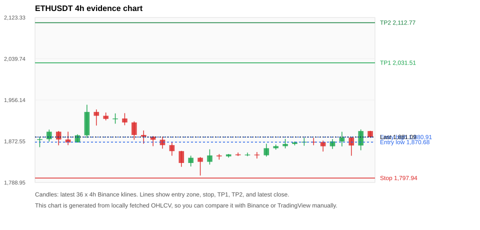
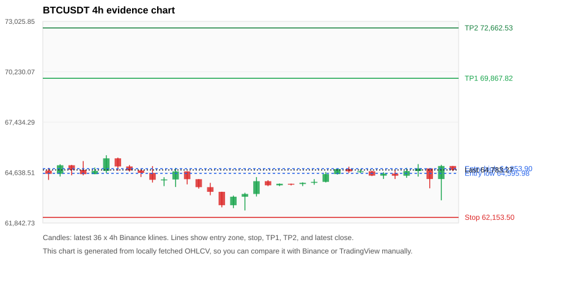
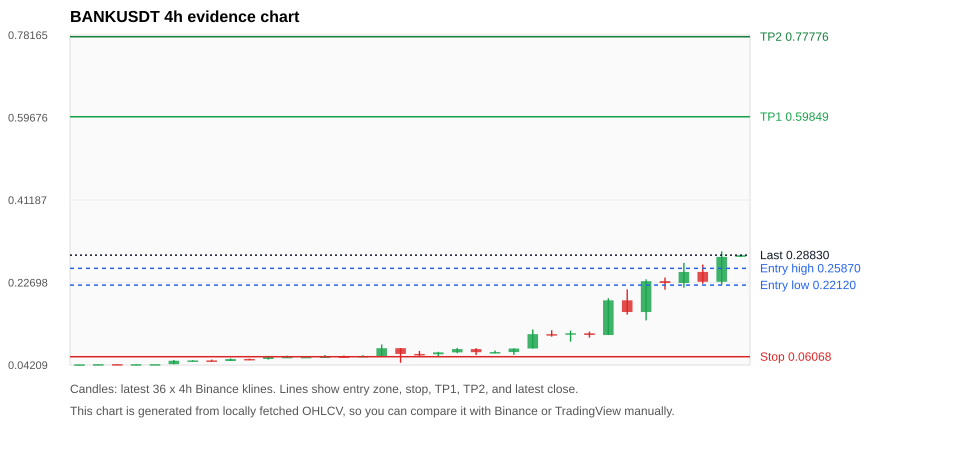
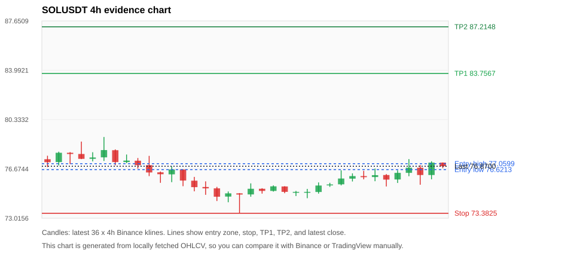
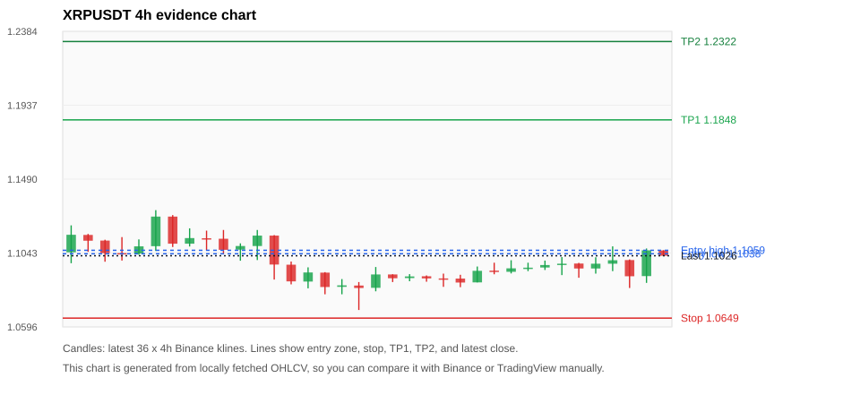

# Crypto 市场扫描报告 v1

- 报告时间：2026-07-20 20:05:56 CST
- Run ID：`20260720_120506_f9289ec8`
- Run type：`daily_full`
- 数据来源：SQLite
- 报告版本：v1
- 扫描 ID：db791a7e6ebe
- 数据源：Binance public spot API + CoinGecko/CoinMarketCap cross-check
- 过滤条件：USDT spot; 24h quote volume >= 30,000,000; trades >= 30,000; exclude stables/leveraged tokens; analyze 1h/4h/1d klines
- 默认单笔风险：账户权益的 1.00%

## 限制说明

- 交易信号仍以 Binance 现货公开 K 线为主源；外部数据源用于一致性复核。
- 结果是研究和模拟盘计划，不是确定收益或实盘下单指令。
- 历史长度过滤：候选币至少需要 180 根 1d K 线。
- 数据质量验证池：先验证 score 排名前 min(top_n * 2, 10) 的候选，再按 action + score 补足最终名单。
- 大盘环境过滤：RISK_OFF; BTC/ETH 大盘偏弱，山寨币买入候选降级为观察。 BTC 7d=3.9283851066792552; ETH 7d=5.861362510693846.
- 已启用数据交叉验证：Binance 主源 + CoinGecko 自动对照；CoinMarketCap 在配置 API Key 后自动对照。
- ETHUSDT 交叉验证状态 DATA_WARNING：At least one external provider needs manual review.
- BTCUSDT 交叉验证状态 DATA_WARNING：At least one external provider needs manual review.
- BANKUSDT 交叉验证状态 DATA_WARNING：At least one external provider needs manual review.
- SOLUSDT 交叉验证状态 DATA_WARNING：At least one external provider needs manual review.
- XRPUSDT 交叉验证状态 DATA_WARNING：At least one external provider needs manual review.
- BNBUSDT 交叉验证状态 DATA_WARNING：At least one external provider needs manual review.
- ZECUSDT 交叉验证状态 DATA_WARNING：At least one external provider needs manual review.
- KITEUSDT 交叉验证状态 DATA_WARNING：At least one external provider needs manual review.

## 5 个候选交易计划

| Rank | Coin | Action | Setup | Entry Zone | Stop Loss | TP1 | TP2 / Exit Rule | R/R | Verdict |
|---:|---|---|---|---:|---:|---:|---|---:|---|
| 1 | `ETH` | `WATCH_ONLY` | 回踩支撑/4h EMA 附近 | 1,870.68 - 1,880.91 | 1,797.94 | 2,031.51 | 2,112.77 或跌破 4h 关键支撑 | 2.00-3.04 | 只观察 |
| 2 | `BTC` | `WATCH_ONLY` | 回踩支撑/4h EMA 附近 | 64,595.98 - 64,853.90 | 62,153.50 | 69,867.82 | 72,662.53 或跌破 4h 关键支撑 | 2.00-3.09 | 只观察 |
| 3 | `BANK` | `WATCH_ONLY` | 涨幅较远，只等深回调 | 0.22120 - 0.25870 | 0.06068 | 0.59849 | 0.77776 或跌破 4h 关键支撑 | 2.00-3.00 | 只等回调 |
| 4 | `SOL` | `WATCH_ONLY` | 回踩支撑/4h EMA 附近 | 76.6213 - 77.0599 | 73.3825 | 83.7567 | 87.2148 或跌破 4h 关键支撑 | 2.00-3.00 | 只观察 |
| 5 | `XRP` | `WATCH_ONLY` | 回踩支撑/4h EMA 附近 | 1.1038 - 1.1059 | 1.0649 | 1.1848 | 1.2322 或跌破 4h 关键支撑 | 2.00-3.19 | 只观察 |

## 数据交叉验证摘要

价格差异以 Binance 当前价为基准；成交量口径不同，Binance 是 USDT 现货成交额，CoinGecko/CoinMarketCap 通常是全市场成交量。

| Rank | Coin | Data Status | Max Price Diff | Max 24h Diff | Message |
|---:|---|---|---:|---:|---|
| 1 | `ETH` | DATA_WARNING | 0.07% | 0.25 pts | At least one external provider needs manual review. |
| 2 | `BTC` | DATA_WARNING | 0.16% | 0.11 pts | At least one external provider needs manual review. |
| 3 | `BANK` | DATA_WARNING | 0.63% | 0.82 pts | At least one external provider needs manual review. |
| 4 | `SOL` | DATA_WARNING | 0.13% | 0.17 pts | At least one external provider needs manual review. |
| 5 | `XRP` | DATA_WARNING | 0.24% | 0.02 pts | At least one external provider needs manual review. |

## 候选币说明

### 1. ETH `ETHUSDT`



- 入选原因：回踩支撑/4h EMA 附近；24h +0.62%，7d +6.20%，4h RSI 66.18，24h 成交额 $385.3M。
- 交易失效条件：跌破 1797.9402 或 4h 收盘重新失守关键支撑。
- 主要风险：BTC/ETH 大盘环境未确认强势，山寨币买入信号降级；数据交叉验证需要人工复核。
- 数据交叉验证：DATA_WARNING；At least one external provider needs manual review.

#### 可点击人工验证

- [Binance 交易页](https://www.binance.com/en/trade/ETH_USDT)
- [TradingView 图表](https://www.tradingview.com/chart/?symbol=BINANCE%3AETHUSDT)
- [CoinGecko 搜索](https://www.coingecko.com/en/search?query=ETH)
- [CoinMarketCap 搜索](https://coinmarketcap.com/search/?q=ETH)

#### 多数据源对照

| Source | Status | Asset ID | Price | 24h Change | 24h Volume | Price Diff | 24h Diff | Updated | Message |
|---|---|---|---:|---:|---:|---:|---:|---|---|
| Binance | DATA_OK | ETHUSDT | 1,881.09 | +0.62% | $385.3M | 0.00% | 0.00 pts | 2026-07-20T12:05:30+00:00 | Primary market data source used by scanner. |
| CoinGecko | DATA_OK | ethereum | 1,881.75 | +0.87% | $9.57B | 0.04% | 0.25 pts | 2026-07-20T12:05:30.614Z | External source agrees with Binance within thresholds. |
| CoinMarketCap | DATA_WARNING | 1027 | 1,879.85 | +0.65% | $9.70B | 0.07% | 0.03 pts | 2026-07-20T12:04:05.000Z | CoinMarketCap symbol mapping has 6 matches; selected lowest cmc_rank |

#### 指标证据

| 指标 | 数值 | 人工核对用途 |
|---|---:|---|
| 当前价 | 1,881.09 | 与 Binance/TradingView 当前价格对照 |
| 24h 涨跌 | +0.62% | 与交易所 24h 涨跌对照 |
| 7d 涨跌 | +6.20% | 判断短线趋势是否延续 |
| 4h EMA20 | 1,866.94 | 判断短期趋势支撑 |
| 4h EMA50 | 1,846.86 | 判断中期趋势支撑 |
| 1d EMA20 | 1,808.65 | 判断日线趋势 |
| 1d EMA50 | 1,817.97 | 判断日线趋势 |
| 4h RSI14 | 66.18 | 判断是否过热/过弱 |
| 4h ATR14 | 19.9543 | 推导止损和入场缓冲 |
| 最近 18 根 4h 最低点 | 1,825.32 | 支撑/止损参考 |
| 最近 36 根 4h 最高点 | 1,946.52 | TP/压力参考 |
| 支撑位 | 1,866.94 | 入场区间推导基础 |

#### 交易计划推导

- 支撑位 = 最近低点、4h EMA20、4h EMA50、1d EMA20 中不高于当前价的最高有效支撑 = `1,866.94`。
- 入场区间 = 支撑位附近 + ATR 缓冲 = `1,870.68 - 1,880.91`。
- 止损 = min(最近 18 根 4h 最低点 * 0.985, 入场中位价 - 1.15 * ATR14) = `1,797.94`。
- TP1 = max(最近 36 根 4h 最高点 * 0.995, 入场中位价 + 2R) = `2,031.51`。
- TP2 = max(入场中位价 + 3R, TP1 * 1.04) = `2,112.77`。

#### 最近 10 根 4h K线

| UTC 开盘时间 | Open | High | Low | Close | Quote Volume | Trades |
|---|---:|---:|---:|---:|---:|---:|
| 2026-07-19T00:00+00:00 | 1,862.61 | 1,877.33 | 1,858.17 | 1,867.08 | $51.1M | 204006 |
| 2026-07-19T04:00+00:00 | 1,867.08 | 1,871.99 | 1,864.21 | 1,870.25 | $32.0M | 103978 |
| 2026-07-19T08:00+00:00 | 1,870.26 | 1,879.38 | 1,863.46 | 1,871.41 | $40.8M | 207232 |
| 2026-07-19T12:00+00:00 | 1,871.40 | 1,879.26 | 1,864.47 | 1,870.91 | $44.4M | 233247 |
| 2026-07-19T16:00+00:00 | 1,870.91 | 1,873.85 | 1,851.71 | 1,862.37 | $50.9M | 299983 |
| 2026-07-19T20:00+00:00 | 1,862.37 | 1,877.03 | 1,857.00 | 1,872.23 | $49.5M | 326699 |
| 2026-07-20T00:00+00:00 | 1,872.24 | 1,891.71 | 1,862.08 | 1,879.94 | $75.7M | 616195 |
| 2026-07-20T04:00+00:00 | 1,879.94 | 1,879.99 | 1,843.14 | 1,863.95 | $76.9M | 455920 |
| 2026-07-20T08:00+00:00 | 1,863.95 | 1,896.50 | 1,854.31 | 1,893.20 | $82.6M | 408523 |
| 2026-07-20T12:00+00:00 | 1,893.21 | 1,893.62 | 1,879.41 | 1,881.09 | $6.4M | 35022 |

### 2. BTC `BTCUSDT`



- 入选原因：回踩支撑/4h EMA 附近；24h +0.55%，7d +3.96%，4h RSI 61.53，24h 成交额 $968.5M。
- 交易失效条件：跌破 62153.5 或 4h 收盘重新失守关键支撑。
- 主要风险：BTC/ETH 大盘环境未确认强势，山寨币买入信号降级；数据交叉验证需要人工复核。
- 数据交叉验证：DATA_WARNING；At least one external provider needs manual review.

#### 可点击人工验证

- [Binance 交易页](https://www.binance.com/en/trade/BTC_USDT)
- [TradingView 图表](https://www.tradingview.com/chart/?symbol=BINANCE%3ABTCUSDT)
- [CoinGecko 搜索](https://www.coingecko.com/en/search?query=BTC)
- [CoinMarketCap 搜索](https://coinmarketcap.com/search/?q=BTC)

#### 多数据源对照

| Source | Status | Asset ID | Price | 24h Change | 24h Volume | Price Diff | 24h Diff | Updated | Message |
|---|---|---|---:|---:|---:|---:|---:|---|---|
| Binance | DATA_OK | BTCUSDT | 64,783.27 | +0.55% | $968.5M | 0.00% | 0.00 pts | 2026-07-20T12:05:30+00:00 | Primary market data source used by scanner. |
| CoinGecko | DATA_OK | bitcoin | 64,723.00 | +0.57% | $24.32B | 0.09% | 0.02 pts | 2026-07-20T12:05:30.577Z | External source agrees with Binance within thresholds. |
| CoinMarketCap | DATA_WARNING | 1 | 64,682.06 | +0.44% | $22.91B | 0.16% | 0.11 pts | 2026-07-20T12:04:05.000Z | CoinMarketCap symbol mapping has 13 matches; selected lowest cmc_rank |

#### 指标证据

| 指标 | 数值 | 人工核对用途 |
|---|---:|---|
| 当前价 | 64,783.27 | 与 Binance/TradingView 当前价格对照 |
| 24h 涨跌 | +0.55% | 与交易所 24h 涨跌对照 |
| 7d 涨跌 | +3.96% | 判断短线趋势是否延续 |
| 4h EMA20 | 64,467.04 | 判断短期趋势支撑 |
| 4h EMA50 | 64,099.69 | 判断中期趋势支撑 |
| 1d EMA20 | 63,753.84 | 判断日线趋势 |
| 1d EMA50 | 65,021.17 | 判断日线趋势 |
| 4h RSI14 | 61.53 | 判断是否过热/过弱 |
| 4h ATR14 | 552.66 | 推导止损和入场缓冲 |
| 最近 18 根 4h 最低点 | 63,100.00 | 支撑/止损参考 |
| 最近 36 根 4h 最高点 | 65,600.00 | TP/压力参考 |
| 支撑位 | 64,467.04 | 入场区间推导基础 |

#### 交易计划推导

- 支撑位 = 最近低点、4h EMA20、4h EMA50、1d EMA20 中不高于当前价的最高有效支撑 = `64,467.04`。
- 入场区间 = 支撑位附近 + ATR 缓冲 = `64,595.98 - 64,853.90`。
- 止损 = min(最近 18 根 4h 最低点 * 0.985, 入场中位价 - 1.15 * ATR14) = `62,153.50`。
- TP1 = max(最近 36 根 4h 最高点 * 0.995, 入场中位价 + 2R) = `69,867.82`。
- TP2 = max(入场中位价 + 3R, TP1 * 1.04) = `72,662.53`。

#### 最近 10 根 4h K线

| UTC 开盘时间 | Open | High | Low | Close | Quote Volume | Trades |
|---|---:|---:|---:|---:|---:|---:|
| 2026-07-19T00:00+00:00 | 64,834.21 | 64,967.25 | 64,620.44 | 64,706.18 | $106.5M | 198160 |
| 2026-07-19T04:00+00:00 | 64,706.18 | 64,815.65 | 64,610.89 | 64,711.05 | $71.3M | 143399 |
| 2026-07-19T08:00+00:00 | 64,711.04 | 64,743.00 | 64,445.00 | 64,467.64 | $99.4M | 229863 |
| 2026-07-19T12:00+00:00 | 64,467.65 | 64,663.04 | 64,285.24 | 64,585.32 | $94.4M | 274299 |
| 2026-07-19T16:00+00:00 | 64,585.33 | 64,752.00 | 64,280.00 | 64,462.58 | $74.9M | 254773 |
| 2026-07-19T20:00+00:00 | 64,462.58 | 64,900.00 | 64,347.89 | 64,722.54 | $95.0M | 363843 |
| 2026-07-20T00:00+00:00 | 64,722.55 | 65,107.99 | 64,416.00 | 64,869.80 | $120.4M | 587702 |
| 2026-07-20T04:00+00:00 | 64,869.79 | 64,869.99 | 63,765.83 | 64,280.01 | $202.9M | 587681 |
| 2026-07-20T08:00+00:00 | 64,280.01 | 65,068.00 | 63,100.00 | 65,002.01 | $371.8M | 511848 |
| 2026-07-20T12:00+00:00 | 65,002.00 | 65,002.83 | 64,716.57 | 64,783.26 | $10.4M | 30289 |

### 3. BANK `BANKUSDT`



- 入选原因：涨幅较远，只等深回调；24h +54.15%，7d +598.06%，4h RSI 82.92，24h 成交额 $129.4M。
- 交易失效条件：跌破 0.060676 或 4h 收盘重新失守关键支撑。
- 主要风险：距离支撑偏远，不能追市价；4h RSI 偏热；24h 振幅较大，回撤风险高；成交量突增，可能是事件驱动；BTC/ETH 大盘环境未确认强势，山寨币买入信号降级；数据交叉验证需要人工复核。
- 数据交叉验证：DATA_WARNING；At least one external provider needs manual review.

#### 可点击人工验证

- [Binance 交易页](https://www.binance.com/en/trade/BANK_USDT)
- [TradingView 图表](https://www.tradingview.com/chart/?symbol=BINANCE%3ABANKUSDT)
- [CoinGecko 搜索](https://www.coingecko.com/en/search?query=BANK)
- [CoinMarketCap 搜索](https://coinmarketcap.com/search/?q=BANK)

#### 多数据源对照

| Source | Status | Asset ID | Price | 24h Change | 24h Volume | Price Diff | 24h Diff | Updated | Message |
|---|---|---|---:|---:|---:|---:|---:|---|---|
| Binance | DATA_OK | BANKUSDT | 0.28830 | +54.15% | $129.4M | 0.00% | 0.00 pts | 2026-07-20T12:05:30+00:00 | Primary market data source used by scanner. |
| CoinGecko | DATA_WARNING | lorenzo-protocol | 0.28710 | +54.97% | $358.9M | 0.42% | 0.82 pts | 2026-07-20T12:05:19.607Z | CoinGecko symbol mapping has 3 exact matches; selected highest market-cap rank |
| CoinMarketCap | DATA_WARNING | 36296 | 0.28650 | +53.36% | $432.1M | 0.63% | 0.78 pts | 2026-07-20T12:04:05.000Z | CoinMarketCap symbol mapping has 10 matches; selected lowest cmc_rank |

#### 指标证据

| 指标 | 数值 | 人工核对用途 |
|---|---:|---|
| 当前价 | 0.28830 | 与 Binance/TradingView 当前价格对照 |
| 24h 涨跌 | +54.15% | 与交易所 24h 涨跌对照 |
| 7d 涨跌 | +598.06% | 判断短线趋势是否延续 |
| 4h EMA20 | 0.16813 | 判断短期趋势支撑 |
| 4h EMA50 | 0.10960 | 判断中期趋势支撑 |
| 1d EMA20 | 0.08848 | 判断日线趋势 |
| 1d EMA50 | 0.05966 | 判断日线趋势 |
| 4h RSI14 | 82.92 | 判断是否过热/过弱 |
| 4h ATR14 | 0.03947 | 推导止损和入场缓冲 |
| 最近 18 根 4h 最低点 | 0.06160 | 支撑/止损参考 |
| 最近 36 根 4h 最高点 | 0.29670 | TP/压力参考 |
| 支撑位 | 0.16813 | 入场区间推导基础 |

#### 交易计划推导

- 支撑位 = 最近低点、4h EMA20、4h EMA50、1d EMA20 中不高于当前价的最高有效支撑 = `0.16813`。
- 入场区间 = 支撑位附近 + ATR 缓冲 = `0.22120 - 0.25870`。
- 止损 = min(最近 18 根 4h 最低点 * 0.985, 入场中位价 - 1.15 * ATR14) = `0.06068`。
- TP1 = max(最近 36 根 4h 最高点 * 0.995, 入场中位价 + 2R) = `0.59849`。
- TP2 = max(入场中位价 + 3R, TP1 * 1.04) = `0.77776`。

#### 最近 10 根 4h K线

| UTC 开盘时间 | Open | High | Low | Close | Quote Volume | Trades |
|---|---:|---:|---:|---:|---:|---:|
| 2026-07-19T00:00+00:00 | 0.11120 | 0.11920 | 0.09440 | 0.11320 | $4.8M | 71666 |
| 2026-07-19T04:00+00:00 | 0.11310 | 0.11680 | 0.10340 | 0.10940 | $3.7M | 50744 |
| 2026-07-19T08:00+00:00 | 0.10920 | 0.19170 | 0.10920 | 0.18700 | $23.4M | 199868 |
| 2026-07-19T12:00+00:00 | 0.18700 | 0.21150 | 0.15500 | 0.16080 | $34.7M | 335916 |
| 2026-07-19T16:00+00:00 | 0.16080 | 0.23420 | 0.14200 | 0.23000 | $31.5M | 293545 |
| 2026-07-19T20:00+00:00 | 0.23010 | 0.23810 | 0.21080 | 0.22580 | $16.3M | 153687 |
| 2026-07-20T00:00+00:00 | 0.22590 | 0.27100 | 0.21540 | 0.25070 | $13.8M | 183561 |
| 2026-07-20T04:00+00:00 | 0.25070 | 0.26720 | 0.22440 | 0.22870 | $13.3M | 151963 |
| 2026-07-20T08:00+00:00 | 0.22860 | 0.29670 | 0.22150 | 0.28440 | $20.3M | 206094 |
| 2026-07-20T12:00+00:00 | 0.28440 | 0.28890 | 0.28440 | 0.28820 | $203,761 | 2686 |

### 4. SOL `SOLUSDT`



- 入选原因：回踩支撑/4h EMA 附近；24h +1.10%，7d +1.95%，4h RSI 71.89，24h 成交额 $108.4M。
- 交易失效条件：跌破 73.3825 或 4h 收盘重新失守关键支撑。
- 主要风险：BTC/ETH 大盘环境未确认强势，山寨币买入信号降级；数据交叉验证需要人工复核。
- 数据交叉验证：DATA_WARNING；At least one external provider needs manual review.

#### 可点击人工验证

- [Binance 交易页](https://www.binance.com/en/trade/SOL_USDT)
- [TradingView 图表](https://www.tradingview.com/chart/?symbol=BINANCE%3ASOLUSDT)
- [CoinGecko 搜索](https://www.coingecko.com/en/search?query=SOL)
- [CoinMarketCap 搜索](https://coinmarketcap.com/search/?q=SOL)

#### 多数据源对照

| Source | Status | Asset ID | Price | 24h Change | 24h Volume | Price Diff | 24h Diff | Updated | Message |
|---|---|---|---:|---:|---:|---:|---:|---|---|
| Binance | DATA_OK | SOLUSDT | 76.8700 | +1.10% | $108.4M | 0.00% | 0.00 pts | 2026-07-20T12:05:30+00:00 | Primary market data source used by scanner. |
| CoinGecko | DATA_OK | solana | 76.8600 | +1.16% | $1.60B | 0.01% | 0.05 pts | 2026-07-20T12:05:30.925Z | External source agrees with Binance within thresholds. |
| CoinMarketCap | DATA_WARNING | 5426 | 76.9681 | +1.28% | $1.67B | 0.13% | 0.17 pts | 2026-07-20T12:04:05.000Z | CoinMarketCap symbol mapping has 8 matches; selected lowest cmc_rank |

#### 指标证据

| 指标 | 数值 | 人工核对用途 |
|---|---:|---|
| 当前价 | 76.8700 | 与 Binance/TradingView 当前价格对照 |
| 24h 涨跌 | +1.10% | 与交易所 24h 涨跌对照 |
| 7d 涨跌 | +1.95% | 判断短线趋势是否延续 |
| 4h EMA20 | 76.1367 | 判断短期趋势支撑 |
| 4h EMA50 | 76.4470 | 判断中期趋势支撑 |
| 1d EMA20 | 76.4684 | 判断日线趋势 |
| 1d EMA50 | 76.6044 | 判断日线趋势 |
| 4h RSI14 | 71.89 | 判断是否过热/过弱 |
| 4h ATR14 | 0.84500 | 推导止损和入场缓冲 |
| 最近 18 根 4h 最低点 | 74.5000 | 支撑/止损参考 |
| 最近 36 根 4h 最高点 | 79.0400 | TP/压力参考 |
| 支撑位 | 76.4684 | 入场区间推导基础 |

#### 交易计划推导

- 支撑位 = 最近低点、4h EMA20、4h EMA50、1d EMA20 中不高于当前价的最高有效支撑 = `76.4684`。
- 入场区间 = 支撑位附近 + ATR 缓冲 = `76.6213 - 77.0599`。
- 止损 = min(最近 18 根 4h 最低点 * 0.985, 入场中位价 - 1.15 * ATR14) = `73.3825`。
- TP1 = max(最近 36 根 4h 最高点 * 0.995, 入场中位价 + 2R) = `83.7567`。
- TP2 = max(入场中位价 + 3R, TP1 * 1.04) = `87.2148`。

#### 最近 10 根 4h K线

| UTC 开盘时间 | Open | High | Low | Close | Quote Volume | Trades |
|---|---:|---:|---:|---:|---:|---:|
| 2026-07-19T00:00+00:00 | 75.5300 | 76.5700 | 75.4500 | 75.9600 | $20.1M | 60816 |
| 2026-07-19T04:00+00:00 | 75.9500 | 76.3400 | 75.7400 | 76.1400 | $15.5M | 32225 |
| 2026-07-19T08:00+00:00 | 76.1400 | 76.5300 | 75.9000 | 76.0600 | $13.1M | 38384 |
| 2026-07-19T12:00+00:00 | 76.0700 | 76.7000 | 75.7600 | 76.2100 | $14.1M | 60818 |
| 2026-07-19T16:00+00:00 | 76.2200 | 76.2900 | 75.3700 | 75.8800 | $13.4M | 60892 |
| 2026-07-19T20:00+00:00 | 75.8900 | 76.5700 | 75.6300 | 76.3800 | $13.3M | 69031 |
| 2026-07-20T00:00+00:00 | 76.3800 | 77.4000 | 76.1300 | 76.7600 | $25.4M | 153042 |
| 2026-07-20T04:00+00:00 | 76.7600 | 76.9500 | 75.5000 | 76.2200 | $19.3M | 105479 |
| 2026-07-20T08:00+00:00 | 76.2200 | 77.2400 | 75.9000 | 77.1400 | $21.6M | 86414 |
| 2026-07-20T12:00+00:00 | 77.1400 | 77.1500 | 76.7300 | 76.8700 | $1.6M | 6678 |

### 5. XRP `XRPUSDT`



- 入选原因：回踩支撑/4h EMA 附近；24h +0.64%，7d +3.16%，4h RSI 63.25，24h 成交额 $43.6M。
- 交易失效条件：跌破 1.0648835 或 4h 收盘重新失守关键支撑。
- 主要风险：日线趋势未完全确认；BTC/ETH 大盘环境未确认强势，山寨币买入信号降级；数据交叉验证需要人工复核。
- 数据交叉验证：DATA_WARNING；At least one external provider needs manual review.

#### 可点击人工验证

- [Binance 交易页](https://www.binance.com/en/trade/XRP_USDT)
- [TradingView 图表](https://www.tradingview.com/chart/?symbol=BINANCE%3AXRPUSDT)
- [CoinGecko 搜索](https://www.coingecko.com/en/search?query=XRP)
- [CoinMarketCap 搜索](https://coinmarketcap.com/search/?q=XRP)

#### 多数据源对照

| Source | Status | Asset ID | Price | 24h Change | 24h Volume | Price Diff | 24h Diff | Updated | Message |
|---|---|---|---:|---:|---:|---:|---:|---|---|
| Binance | DATA_OK | XRPUSDT | 1.1026 | +0.64% | $43.6M | 0.00% | 0.00 pts | 2026-07-20T12:05:30+00:00 | Primary market data source used by scanner. |
| CoinGecko | DATA_OK | ripple | 1.1000 | +0.63% | $880.0M | 0.24% | 0.01 pts | 2026-07-20T12:05:31.397Z | External source agrees with Binance within thresholds. |
| CoinMarketCap | DATA_WARNING | 52 | 1.1027 | +0.66% | $904.0M | 0.01% | 0.02 pts | 2026-07-20T12:04:05.000Z | CoinMarketCap symbol mapping has 3 matches; selected lowest cmc_rank |

#### 指标证据

| 指标 | 数值 | 人工核对用途 |
|---|---:|---|
| 当前价 | 1.1026 | 与 Binance/TradingView 当前价格对照 |
| 24h 涨跌 | +0.64% | 与交易所 24h 涨跌对照 |
| 7d 涨跌 | +3.16% | 判断短线趋势是否延续 |
| 4h EMA20 | 1.0963 | 判断短期趋势支撑 |
| 4h EMA50 | 1.0966 | 判断中期趋势支撑 |
| 1d EMA20 | 1.1016 | 判断日线趋势 |
| 1d EMA50 | 1.1460 | 判断日线趋势 |
| 4h RSI14 | 63.25 | 判断是否过热/过弱 |
| 4h ATR14 | 0.0098142857 | 推导止损和入场缓冲 |
| 最近 18 根 4h 最低点 | 1.0811 | 支撑/止损参考 |
| 最近 36 根 4h 最高点 | 1.1302 | TP/压力参考 |
| 支撑位 | 1.1016 | 入场区间推导基础 |

#### 交易计划推导

- 支撑位 = 最近低点、4h EMA20、4h EMA50、1d EMA20 中不高于当前价的最高有效支撑 = `1.1016`。
- 入场区间 = 支撑位附近 + ATR 缓冲 = `1.1038 - 1.1059`。
- 止损 = min(最近 18 根 4h 最低点 * 0.985, 入场中位价 - 1.15 * ATR14) = `1.0649`。
- TP1 = max(最近 36 根 4h 最高点 * 0.995, 入场中位价 + 2R) = `1.1848`。
- TP2 = max(入场中位价 + 3R, TP1 * 1.04) = `1.2322`。

#### 最近 10 根 4h K线

| UTC 开盘时间 | Open | High | Low | Close | Quote Volume | Trades |
|---|---:|---:|---:|---:|---:|---:|
| 2026-07-19T00:00+00:00 | 1.0929 | 1.0999 | 1.0919 | 1.0950 | $4.2M | 26136 |
| 2026-07-19T04:00+00:00 | 1.0950 | 1.0984 | 1.0933 | 1.0954 | $5.2M | 23260 |
| 2026-07-19T08:00+00:00 | 1.0955 | 1.0997 | 1.0940 | 1.0970 | $4.0M | 24825 |
| 2026-07-19T12:00+00:00 | 1.0971 | 1.1018 | 1.0909 | 1.0978 | $5.5M | 38409 |
| 2026-07-19T16:00+00:00 | 1.0979 | 1.0983 | 1.0893 | 1.0949 | $5.4M | 38222 |
| 2026-07-19T20:00+00:00 | 1.0949 | 1.1017 | 1.0918 | 1.0978 | $5.1M | 46712 |
| 2026-07-20T00:00+00:00 | 1.0978 | 1.1083 | 1.0933 | 1.0999 | $10.4M | 102526 |
| 2026-07-20T04:00+00:00 | 1.1000 | 1.1004 | 1.0831 | 1.0902 | $7.3M | 68999 |
| 2026-07-20T08:00+00:00 | 1.0903 | 1.1070 | 1.0862 | 1.1059 | $9.3M | 60496 |
| 2026-07-20T12:00+00:00 | 1.1058 | 1.1060 | 1.1025 | 1.1026 | $724,238 | 5304 |

## 组合风控

- 不要 5 个候选全部满仓买入。
- 同时持仓总风险建议控制在账户权益的 3% - 5% 以内。
- 如果 BTC/ETH 同时破位，暂停山寨币多头计划或降低仓位。
- 第一版报告用于模拟盘和人工复核，不自动下单。

## 原始数据

```json
[
  {
    "rank": 1,
    "symbol": "ETHUSDT",
    "base_asset": "ETH",
    "price": 1881.09,
    "score": 55.79604658862853,
    "setup": "回踩支撑/4h EMA 附近",
    "verdict": "只观察",
    "entry_low": 1870.6786561955582,
    "entry_high": 1880.912766662234,
    "stop_loss": 1797.9402,
    "take_profit_1": 2031.5067342866882,
    "take_profit_2": 2112.7670036581558,
    "risk_reward_1": 2.0,
    "risk_reward_2": 3.043731752320206,
    "pct_24h": 0.62,
    "pct_3d": 3.045193097781418,
    "pct_7d": 6.1982724552588575,
    "quote_volume_24h": 385297066.69195,
    "trades_24h": 2364025,
    "high_low_range_24h": 2.8950595179964678,
    "rsi_1h": 54.999530560510664,
    "rsi_4h": 66.18124396876911,
    "ema20_4h": 1866.9447666622339,
    "ema50_4h": 1846.8576144383135,
    "ema20_1d": 1808.6528412083549,
    "ema50_1d": 1817.9681850435436,
    "atr_4h": 19.954285714285692,
    "macd_hist_4h": 1.8300702326776808,
    "volume_ratio_24h": 0.8029747760821899,
    "support_level": 1866.9447666622339,
    "recent_low_4h_18": 1825.32,
    "recent_high_4h_36": 1946.52,
    "distance_to_support_pct": 0.7576674784576021,
    "binance_trade_url": "https://www.binance.com/en/trade/ETH_USDT",
    "tradingview_url": "https://www.tradingview.com/chart/?symbol=BINANCE%3AETHUSDT",
    "coingecko_search_url": "https://www.coingecko.com/en/search?query=ETH",
    "coinmarketcap_search_url": "https://coinmarketcap.com/search/?q=ETH",
    "invalidation": "跌破 1797.9402 或 4h 收盘重新失守关键支撑",
    "recent_4h_klines": [
      {
        "open_time_utc": "2026-07-14T16:00+00:00",
        "open": 1875.22,
        "high": 1881.56,
        "low": 1860.56,
        "close": 1876.74,
        "quote_volume": 72936315.895528,
        "trades": 437205
      },
      {
        "open_time_utc": "2026-07-14T20:00+00:00",
        "open": 1876.74,
        "high": 1896.14,
        "low": 1872.06,
        "close": 1891.87,
        "quote_volume": 76249268.519352,
        "trades": 356683
      },
      {
        "open_time_utc": "2026-07-15T00:00+00:00",
        "open": 1891.87,
        "high": 1893.32,
        "low": 1864.38,
        "close": 1876.08,
        "quote_volume": 65889958.334445,
        "trades": 409790
      },
      {
        "open_time_utc": "2026-07-15T04:00+00:00",
        "open": 1876.08,
        "high": 1891.89,
        "low": 1864.7,
        "close": 1870.04,
        "quote_volume": 68211903.296793,
        "trades": 288693
      },
      {
        "open_time_utc": "2026-07-15T08:00+00:00",
        "open": 1870.04,
        "high": 1886.59,
        "low": 1870.03,
        "close": 1884.62,
        "quote_volume": 65955633.693108,
        "trades": 273069
      },
      {
        "open_time_utc": "2026-07-15T12:00+00:00",
        "open": 1884.62,
        "high": 1946.52,
        "low": 1879.25,
        "close": 1931.95,
        "quote_volume": 264343318.43361,
        "trades": 1078775
      },
      {
        "open_time_utc": "2026-07-15T16:00+00:00",
        "open": 1931.96,
        "high": 1937.0,
        "low": 1904.36,
        "close": 1924.15,
        "quote_volume": 106323551.223143,
        "trades": 534814
      },
      {
        "open_time_utc": "2026-07-15T20:00+00:00",
        "open": 1924.15,
        "high": 1930.71,
        "low": 1914.89,
        "close": 1917.86,
        "quote_volume": 39744884.661628,
        "trades": 181016
      },
      {
        "open_time_utc": "2026-07-16T00:00+00:00",
        "open": 1917.86,
        "high": 1929.0,
        "low": 1908.12,
        "close": 1918.7,
        "quote_volume": 54089213.981933,
        "trades": 447454
      },
      {
        "open_time_utc": "2026-07-16T04:00+00:00",
        "open": 1918.7,
        "high": 1929.48,
        "low": 1905.0,
        "close": 1910.63,
        "quote_volume": 55879345.035258,
        "trades": 261782
      },
      {
        "open_time_utc": "2026-07-16T08:00+00:00",
        "open": 1910.64,
        "high": 1912.85,
        "low": 1875.56,
        "close": 1885.26,
        "quote_volume": 161340583.681969,
        "trades": 531557
      },
      {
        "open_time_utc": "2026-07-16T12:00+00:00",
        "open": 1885.26,
        "high": 1894.38,
        "low": 1867.68,
        "close": 1881.88,
        "quote_volume": 120415111.171474,
        "trades": 694530
      },
      {
        "open_time_utc": "2026-07-16T16:00+00:00",
        "open": 1881.89,
        "high": 1883.0,
        "low": 1862.57,
        "close": 1875.59,
        "quote_volume": 62446348.311839,
        "trades": 367055
      },
      {
        "open_time_utc": "2026-07-16T20:00+00:00",
        "open": 1875.59,
        "high": 1881.59,
        "low": 1857.54,
        "close": 1864.71,
        "quote_volume": 59060103.558587,
        "trades": 274650
      },
      {
        "open_time_utc": "2026-07-17T00:00+00:00",
        "open": 1864.71,
        "high": 1871.08,
        "low": 1843.2,
        "close": 1852.53,
        "quote_volume": 82539730.348917,
        "trades": 524250
      },
      {
        "open_time_utc": "2026-07-17T04:00+00:00",
        "open": 1852.53,
        "high": 1853.08,
        "low": 1820.74,
        "close": 1828.52,
        "quote_volume": 83511831.861486,
        "trades": 407374
      },
      {
        "open_time_utc": "2026-07-17T08:00+00:00",
        "open": 1828.52,
        "high": 1843.26,
        "low": 1821.41,
        "close": 1839.04,
        "quote_volume": 67599773.933898,
        "trades": 286025
      },
      {
        "open_time_utc": "2026-07-17T12:00+00:00",
        "open": 1839.05,
        "high": 1840.58,
        "low": 1803.05,
        "close": 1830.88,
        "quote_volume": 132843157.482888,
        "trades": 798408
      },
      {
        "open_time_utc": "2026-07-17T16:00+00:00",
        "open": 1830.89,
        "high": 1856.17,
        "low": 1825.32,
        "close": 1843.76,
        "quote_volume": 75428073.814757,
        "trades": 459243
      },
      {
        "open_time_utc": "2026-07-17T20:00+00:00",
        "open": 1843.76,
        "high": 1846.65,
        "low": 1835.27,
        "close": 1841.93,
        "quote_volume": 22437794.154729,
        "trades": 178801
      },
      {
        "open_time_utc": "2026-07-18T00:00+00:00",
        "open": 1841.94,
        "high": 1846.74,
        "low": 1839.38,
        "close": 1845.96,
        "quote_volume": 25110095.56093,
        "trades": 128932
      },
      {
        "open_time_utc": "2026-07-18T04:00+00:00",
        "open": 1845.96,
        "high": 1849.68,
        "low": 1842.56,
        "close": 1844.2,
        "quote_volume": 18809339.973007,
        "trades": 118273
      },
      {
        "open_time_utc": "2026-07-18T08:00+00:00",
        "open": 1844.2,
        "high": 1849.44,
        "low": 1842.3,
        "close": 1845.56,
        "quote_volume": 18754926.018809,
        "trades": 92079
      },
      {
        "open_time_utc": "2026-07-18T12:00+00:00",
        "open": 1845.56,
        "high": 1850.64,
        "low": 1837.58,
        "close": 1844.15,
        "quote_volume": 32500010.651193,
        "trades": 192569
      },
      {
        "open_time_utc": "2026-07-18T16:00+00:00",
        "open": 1844.15,
        "high": 1867.58,
        "low": 1841.51,
        "close": 1858.45,
        "quote_volume": 50644842.771862,
        "trades": 239431
      },
      {
        "open_time_utc": "2026-07-18T20:00+00:00",
        "open": 1858.45,
        "high": 1865.86,
        "low": 1855.47,
        "close": 1862.61,
        "quote_volume": 25444665.062101,
        "trades": 126864
      },
      {
        "open_time_utc": "2026-07-19T00:00+00:00",
        "open": 1862.61,
        "high": 1877.33,
        "low": 1858.17,
        "close": 1867.08,
        "quote_volume": 51096557.439295,
        "trades": 204006
      },
      {
        "open_time_utc": "2026-07-19T04:00+00:00",
        "open": 1867.08,
        "high": 1871.99,
        "low": 1864.21,
        "close": 1870.25,
        "quote_volume": 32035355.048292,
        "trades": 103978
      },
      {
        "open_time_utc": "2026-07-19T08:00+00:00",
        "open": 1870.26,
        "high": 1879.38,
        "low": 1863.46,
        "close": 1871.41,
        "quote_volume": 40842585.19334,
        "trades": 207232
      },
      {
        "open_time_utc": "2026-07-19T12:00+00:00",
        "open": 1871.4,
        "high": 1879.26,
        "low": 1864.47,
        "close": 1870.91,
        "quote_volume": 44426977.899933,
        "trades": 233247
      },
      {
        "open_time_utc": "2026-07-19T16:00+00:00",
        "open": 1870.91,
        "high": 1873.85,
        "low": 1851.71,
        "close": 1862.37,
        "quote_volume": 50892782.591346,
        "trades": 299983
      },
      {
        "open_time_utc": "2026-07-19T20:00+00:00",
        "open": 1862.37,
        "high": 1877.03,
        "low": 1857.0,
        "close": 1872.23,
        "quote_volume": 49535943.453386,
        "trades": 326699
      },
      {
        "open_time_utc": "2026-07-20T00:00+00:00",
        "open": 1872.24,
        "high": 1891.71,
        "low": 1862.08,
        "close": 1879.94,
        "quote_volume": 75733997.944761,
        "trades": 616195
      },
      {
        "open_time_utc": "2026-07-20T04:00+00:00",
        "open": 1879.94,
        "high": 1879.99,
        "low": 1843.14,
        "close": 1863.95,
        "quote_volume": 76871498.466917,
        "trades": 455920
      },
      {
        "open_time_utc": "2026-07-20T08:00+00:00",
        "open": 1863.95,
        "high": 1896.5,
        "low": 1854.31,
        "close": 1893.2,
        "quote_volume": 82556285.88529,
        "trades": 408523
      },
      {
        "open_time_utc": "2026-07-20T12:00+00:00",
        "open": 1893.21,
        "high": 1893.62,
        "low": 1879.41,
        "close": 1881.09,
        "quote_volume": 6368521.259899,
        "trades": 35022
      }
    ],
    "risks": [
      "BTC/ETH 大盘环境未确认强势，山寨币买入信号降级",
      "数据交叉验证需要人工复核"
    ],
    "data_quality_status": "DATA_WARNING",
    "data_quality_message": "At least one external provider needs manual review.",
    "data_checks": [
      {
        "provider": "Binance",
        "status": "DATA_OK",
        "provider_asset_id": "ETHUSDT",
        "provider_symbol": "ETHUSDT",
        "price_usd": 1881.09,
        "pct_24h": 0.62,
        "volume_24h": 385297066.69195,
        "last_updated": null,
        "fetched_at_utc": "2026-07-20T12:05:30+00:00",
        "price_diff_pct": 0.0,
        "pct_24h_diff": 0.0,
        "volume_note": "Binance USDT spot 24h quoteVolume.",
        "message": "Primary market data source used by scanner."
      },
      {
        "provider": "CoinGecko",
        "status": "DATA_OK",
        "provider_asset_id": "ethereum",
        "provider_symbol": "ETH",
        "price_usd": 1881.75,
        "pct_24h": 0.86759,
        "volume_24h": 9568032251.0,
        "last_updated": "2026-07-20T12:05:30.614Z",
        "fetched_at_utc": "2026-07-20T12:05:30+00:00",
        "price_diff_pct": 0.03508604054032938,
        "pct_24h_diff": 0.24758999999999998,
        "volume_note": "CoinGecko total market volume; not the same venue scope as Binance quoteVolume.",
        "message": "External source agrees with Binance within thresholds."
      },
      {
        "provider": "CoinMarketCap",
        "status": "DATA_WARNING",
        "provider_asset_id": "1027",
        "provider_symbol": "ETH",
        "price_usd": 1879.8546307801096,
        "pct_24h": 0.65013277,
        "volume_24h": 9703522293.525381,
        "last_updated": "2026-07-20T12:04:05.000Z",
        "fetched_at_utc": "2026-07-20T12:05:30+00:00",
        "price_diff_pct": 0.06567305232021566,
        "pct_24h_diff": 0.03013277000000003,
        "volume_note": "CoinMarketCap total market volume; not the same venue scope as Binance quoteVolume.",
        "message": "CoinMarketCap symbol mapping has 6 matches; selected lowest cmc_rank"
      }
    ],
    "action": "WATCH_ONLY"
  },
  {
    "rank": 2,
    "symbol": "BTCUSDT",
    "base_asset": "BTC",
    "price": 64783.27,
    "score": 55.54852349002533,
    "setup": "回踩支撑/4h EMA 附近",
    "verdict": "只观察",
    "entry_low": 64595.97744430792,
    "entry_high": 64853.902357592735,
    "stop_loss": 62153.5,
    "take_profit_1": 69867.81970285097,
    "take_profit_2": 72662.53249096502,
    "risk_reward_1": 2.0,
    "risk_reward_2": 3.086827962450613,
    "pct_24h": 0.549,
    "pct_3d": 2.579852832734719,
    "pct_7d": 3.9559517314419645,
    "quote_volume_24h": 968523173.1802475,
    "trades_24h": 2605780,
    "high_low_range_24h": 3.1822345483359715,
    "rsi_1h": 51.672230502962556,
    "rsi_4h": 61.525648484776895,
    "ema20_4h": 64467.04335759274,
    "ema50_4h": 64099.69111380431,
    "ema20_1d": 63753.83575558246,
    "ema50_1d": 65021.173213708294,
    "atr_4h": 552.6557142857138,
    "macd_hist_4h": 30.02963691329782,
    "volume_ratio_24h": 0.8883345736541529,
    "support_level": 64467.04335759274,
    "recent_low_4h_18": 63100.0,
    "recent_high_4h_36": 65600.0,
    "distance_to_support_pct": 0.4905245004849679,
    "binance_trade_url": "https://www.binance.com/en/trade/BTC_USDT",
    "tradingview_url": "https://www.tradingview.com/chart/?symbol=BINANCE%3ABTCUSDT",
    "coingecko_search_url": "https://www.coingecko.com/en/search?query=BTC",
    "coinmarketcap_search_url": "https://coinmarketcap.com/search/?q=BTC",
    "invalidation": "跌破 62153.5 或 4h 收盘重新失守关键支撑",
    "recent_4h_klines": [
      {
        "open_time_utc": "2026-07-14T16:00+00:00",
        "open": 64744.0,
        "high": 64896.86,
        "low": 64231.77,
        "close": 64569.59,
        "quote_volume": 212650729.386483,
        "trades": 533516
      },
      {
        "open_time_utc": "2026-07-14T20:00+00:00",
        "open": 64569.59,
        "high": 65100.0,
        "low": 64419.99,
        "close": 65043.98,
        "quote_volume": 155302047.627164,
        "trades": 372267
      },
      {
        "open_time_utc": "2026-07-15T00:00+00:00",
        "open": 65043.99,
        "high": 65065.01,
        "low": 64488.0,
        "close": 64792.01,
        "quote_volume": 109586732.7663676,
        "trades": 320579
      },
      {
        "open_time_utc": "2026-07-15T04:00+00:00",
        "open": 64792.0,
        "high": 65277.37,
        "low": 64485.0,
        "close": 64549.34,
        "quote_volume": 204726915.1325903,
        "trades": 419673
      },
      {
        "open_time_utc": "2026-07-15T08:00+00:00",
        "open": 64549.33,
        "high": 64917.94,
        "low": 64549.33,
        "close": 64732.15,
        "quote_volume": 149994663.4405093,
        "trades": 289157
      },
      {
        "open_time_utc": "2026-07-15T12:00+00:00",
        "open": 64732.15,
        "high": 65600.0,
        "low": 64606.0,
        "close": 65427.61,
        "quote_volume": 399055943.9693017,
        "trades": 962986
      },
      {
        "open_time_utc": "2026-07-15T16:00+00:00",
        "open": 65427.6,
        "high": 65470.0,
        "low": 64738.49,
        "close": 64977.34,
        "quote_volume": 260018792.6365906,
        "trades": 465383
      },
      {
        "open_time_utc": "2026-07-15T20:00+00:00",
        "open": 64977.34,
        "high": 65055.39,
        "low": 64691.89,
        "close": 64756.28,
        "quote_volume": 72265275.8231589,
        "trades": 211141
      },
      {
        "open_time_utc": "2026-07-16T00:00+00:00",
        "open": 64756.28,
        "high": 64845.5,
        "low": 64392.01,
        "close": 64619.95,
        "quote_volume": 114662853.6678437,
        "trades": 351949
      },
      {
        "open_time_utc": "2026-07-16T04:00+00:00",
        "open": 64619.96,
        "high": 64997.52,
        "low": 64086.12,
        "close": 64238.0,
        "quote_volume": 176196222.6674721,
        "trades": 380748
      },
      {
        "open_time_utc": "2026-07-16T08:00+00:00",
        "open": 64238.0,
        "high": 64380.0,
        "low": 63888.0,
        "close": 64256.53,
        "quote_volume": 518405240.0052909,
        "trades": 555339
      },
      {
        "open_time_utc": "2026-07-16T12:00+00:00",
        "open": 64256.52,
        "high": 64896.0,
        "low": 63838.28,
        "close": 64704.73,
        "quote_volume": 204127820.804017,
        "trades": 741620
      },
      {
        "open_time_utc": "2026-07-16T16:00+00:00",
        "open": 64704.73,
        "high": 64712.0,
        "low": 63984.09,
        "close": 64271.84,
        "quote_volume": 114685442.704316,
        "trades": 502323
      },
      {
        "open_time_utc": "2026-07-16T20:00+00:00",
        "open": 64271.85,
        "high": 64276.0,
        "low": 63748.74,
        "close": 63830.2,
        "quote_volume": 78420806.528254,
        "trades": 281502
      },
      {
        "open_time_utc": "2026-07-17T00:00+00:00",
        "open": 63830.2,
        "high": 64067.69,
        "low": 63380.28,
        "close": 63570.0,
        "quote_volume": 169659336.6829894,
        "trades": 531177
      },
      {
        "open_time_utc": "2026-07-17T04:00+00:00",
        "open": 63570.0,
        "high": 63576.0,
        "low": 62710.0,
        "close": 62828.11,
        "quote_volume": 262693644.6590385,
        "trades": 494473
      },
      {
        "open_time_utc": "2026-07-17T08:00+00:00",
        "open": 62828.11,
        "high": 63361.7,
        "low": 62666.0,
        "close": 63298.01,
        "quote_volume": 163366668.3718989,
        "trades": 354967
      },
      {
        "open_time_utc": "2026-07-17T12:00+00:00",
        "open": 63298.0,
        "high": 63518.0,
        "low": 62537.56,
        "close": 63452.0,
        "quote_volume": 246111895.341298,
        "trades": 894383
      },
      {
        "open_time_utc": "2026-07-17T16:00+00:00",
        "open": 63452.0,
        "high": 64387.99,
        "low": 63312.01,
        "close": 64160.8,
        "quote_volume": 219389919.1329495,
        "trades": 728454
      },
      {
        "open_time_utc": "2026-07-17T20:00+00:00",
        "open": 64160.8,
        "high": 64216.61,
        "low": 63884.35,
        "close": 63931.67,
        "quote_volume": 91324565.1520772,
        "trades": 235842
      },
      {
        "open_time_utc": "2026-07-18T00:00+00:00",
        "open": 63931.67,
        "high": 64032.6,
        "low": 63886.65,
        "close": 64017.84,
        "quote_volume": 87640554.7560027,
        "trades": 150552
      },
      {
        "open_time_utc": "2026-07-18T04:00+00:00",
        "open": 64017.84,
        "high": 64026.03,
        "low": 63926.39,
        "close": 64002.75,
        "quote_volume": 60728056.1143949,
        "trades": 118016
      },
      {
        "open_time_utc": "2026-07-18T08:00+00:00",
        "open": 64002.75,
        "high": 64097.22,
        "low": 63887.73,
        "close": 64069.89,
        "quote_volume": 70619036.0344428,
        "trades": 85981
      },
      {
        "open_time_utc": "2026-07-18T12:00+00:00",
        "open": 64069.89,
        "high": 64274.47,
        "low": 63963.0,
        "close": 64123.12,
        "quote_volume": 79608426.7322157,
        "trades": 210954
      },
      {
        "open_time_utc": "2026-07-18T16:00+00:00",
        "open": 64123.13,
        "high": 64669.5,
        "low": 64091.48,
        "close": 64552.79,
        "quote_volume": 110998004.6017032,
        "trades": 257153
      },
      {
        "open_time_utc": "2026-07-18T20:00+00:00",
        "open": 64552.8,
        "high": 64865.0,
        "low": 64528.69,
        "close": 64834.22,
        "quote_volume": 106360570.4476106,
        "trades": 266045
      },
      {
        "open_time_utc": "2026-07-19T00:00+00:00",
        "open": 64834.21,
        "high": 64967.25,
        "low": 64620.44,
        "close": 64706.18,
        "quote_volume": 106536390.3821349,
        "trades": 198160
      },
      {
        "open_time_utc": "2026-07-19T04:00+00:00",
        "open": 64706.18,
        "high": 64815.65,
        "low": 64610.89,
        "close": 64711.05,
        "quote_volume": 71298499.0657687,
        "trades": 143399
      },
      {
        "open_time_utc": "2026-07-19T08:00+00:00",
        "open": 64711.04,
        "high": 64743.0,
        "low": 64445.0,
        "close": 64467.64,
        "quote_volume": 99445905.383701,
        "trades": 229863
      },
      {
        "open_time_utc": "2026-07-19T12:00+00:00",
        "open": 64467.65,
        "high": 64663.04,
        "low": 64285.24,
        "close": 64585.32,
        "quote_volume": 94381470.0512155,
        "trades": 274299
      },
      {
        "open_time_utc": "2026-07-19T16:00+00:00",
        "open": 64585.33,
        "high": 64752.0,
        "low": 64280.0,
        "close": 64462.58,
        "quote_volume": 74890318.851404,
        "trades": 254773
      },
      {
        "open_time_utc": "2026-07-19T20:00+00:00",
        "open": 64462.58,
        "high": 64900.0,
        "low": 64347.89,
        "close": 64722.54,
        "quote_volume": 95006518.1787705,
        "trades": 363843
      },
      {
        "open_time_utc": "2026-07-20T00:00+00:00",
        "open": 64722.55,
        "high": 65107.99,
        "low": 64416.0,
        "close": 64869.8,
        "quote_volume": 120367010.7614054,
        "trades": 587702
      },
      {
        "open_time_utc": "2026-07-20T04:00+00:00",
        "open": 64869.79,
        "high": 64869.99,
        "low": 63765.83,
        "close": 64280.01,
        "quote_volume": 202948573.3207383,
        "trades": 587681
      },
      {
        "open_time_utc": "2026-07-20T08:00+00:00",
        "open": 64280.01,
        "high": 65068.0,
        "low": 63100.0,
        "close": 65002.01,
        "quote_volume": 371789253.355281,
        "trades": 511848
      },
      {
        "open_time_utc": "2026-07-20T12:00+00:00",
        "open": 65002.0,
        "high": 65002.83,
        "low": 64716.57,
        "close": 64783.26,
        "quote_volume": 10420830.2854125,
        "trades": 30289
      }
    ],
    "risks": [
      "BTC/ETH 大盘环境未确认强势，山寨币买入信号降级",
      "数据交叉验证需要人工复核"
    ],
    "data_quality_status": "DATA_WARNING",
    "data_quality_message": "At least one external provider needs manual review.",
    "data_checks": [
      {
        "provider": "Binance",
        "status": "DATA_OK",
        "provider_asset_id": "BTCUSDT",
        "provider_symbol": "BTCUSDT",
        "price_usd": 64783.27,
        "pct_24h": 0.549,
        "volume_24h": 968523173.1802475,
        "last_updated": null,
        "fetched_at_utc": "2026-07-20T12:05:30+00:00",
        "price_diff_pct": 0.0,
        "pct_24h_diff": 0.0,
        "volume_note": "Binance USDT spot 24h quoteVolume.",
        "message": "Primary market data source used by scanner."
      },
      {
        "provider": "CoinGecko",
        "status": "DATA_OK",
        "provider_asset_id": "bitcoin",
        "provider_symbol": "BTC",
        "price_usd": 64723.0,
        "pct_24h": 0.57296,
        "volume_24h": 24321635463.0,
        "last_updated": "2026-07-20T12:05:30.577Z",
        "fetched_at_utc": "2026-07-20T12:05:30+00:00",
        "price_diff_pct": 0.09303327849921253,
        "pct_24h_diff": 0.02395999999999998,
        "volume_note": "CoinGecko total market volume; not the same venue scope as Binance quoteVolume.",
        "message": "External source agrees with Binance within thresholds."
      },
      {
        "provider": "CoinMarketCap",
        "status": "DATA_WARNING",
        "provider_asset_id": "1",
        "provider_symbol": "BTC",
        "price_usd": 64682.06142480702,
        "pct_24h": 0.44303579,
        "volume_24h": 22909299397.579533,
        "last_updated": "2026-07-20T12:04:05.000Z",
        "fetched_at_utc": "2026-07-20T12:05:30+00:00",
        "price_diff_pct": 0.15622640720818376,
        "pct_24h_diff": 0.10596421000000006,
        "volume_note": "CoinMarketCap total market volume; not the same venue scope as Binance quoteVolume.",
        "message": "CoinMarketCap symbol mapping has 13 matches; selected lowest cmc_rank"
      }
    ],
    "action": "WATCH_ONLY"
  },
  {
    "rank": 3,
    "symbol": "BANKUSDT",
    "base_asset": "BANK",
    "price": 0.2883,
    "score": 37.729520065121875,
    "setup": "涨幅较远，只等深回调",
    "verdict": "只等回调",
    "entry_low": 0.2211985714285714,
    "entry_high": 0.25869642857142855,
    "stop_loss": 0.060676,
    "take_profit_1": 0.5984904999999999,
    "take_profit_2": 0.7777619999999998,
    "risk_reward_1": 2.0,
    "risk_reward_2": 2.9999999999999996,
    "pct_24h": 54.147,
    "pct_3d": 482.42424242424244,
    "pct_7d": 598.0629539951574,
    "quote_volume_24h": 129362388.6255,
    "trades_24h": 1321914,
    "high_low_range_24h": 108.943661971831,
    "rsi_1h": 74.26075268817205,
    "rsi_4h": 82.91944276196244,
    "ema20_4h": 0.1681341104327902,
    "ema50_4h": 0.10960373551562975,
    "ema20_1d": 0.08848095176507018,
    "ema50_1d": 0.0596585567916171,
    "atr_4h": 0.03947142857142858,
    "macd_hist_4h": 0.016406333557910095,
    "volume_ratio_24h": 7.252022367865207,
    "support_level": 0.1681341104327902,
    "recent_low_4h_18": 0.0616,
    "recent_high_4h_36": 0.2967,
    "distance_to_support_pct": 71.47026219598958,
    "binance_trade_url": "https://www.binance.com/en/trade/BANK_USDT",
    "tradingview_url": "https://www.tradingview.com/chart/?symbol=BINANCE%3ABANKUSDT",
    "coingecko_search_url": "https://www.coingecko.com/en/search?query=BANK",
    "coinmarketcap_search_url": "https://coinmarketcap.com/search/?q=BANK",
    "invalidation": "跌破 0.060676 或 4h 收盘重新失守关键支撑",
    "recent_4h_klines": [
      {
        "open_time_utc": "2026-07-14T16:00+00:00",
        "open": 0.0432,
        "high": 0.0437,
        "low": 0.043,
        "close": 0.0436,
        "quote_volume": 41950.54245,
        "trades": 809
      },
      {
        "open_time_utc": "2026-07-14T20:00+00:00",
        "open": 0.0436,
        "high": 0.044,
        "low": 0.0431,
        "close": 0.0439,
        "quote_volume": 72916.1514,
        "trades": 396
      },
      {
        "open_time_utc": "2026-07-15T00:00+00:00",
        "open": 0.044,
        "high": 0.044,
        "low": 0.0428,
        "close": 0.043,
        "quote_volume": 51629.36744,
        "trades": 872
      },
      {
        "open_time_utc": "2026-07-15T04:00+00:00",
        "open": 0.043,
        "high": 0.044,
        "low": 0.0423,
        "close": 0.0439,
        "quote_volume": 129340.42434,
        "trades": 1200
      },
      {
        "open_time_utc": "2026-07-15T08:00+00:00",
        "open": 0.0439,
        "high": 0.044,
        "low": 0.0435,
        "close": 0.044,
        "quote_volume": 46448.4338,
        "trades": 841
      },
      {
        "open_time_utc": "2026-07-15T12:00+00:00",
        "open": 0.044,
        "high": 0.0533,
        "low": 0.0437,
        "close": 0.0516,
        "quote_volume": 1041602.89007,
        "trades": 12146
      },
      {
        "open_time_utc": "2026-07-15T16:00+00:00",
        "open": 0.0516,
        "high": 0.0531,
        "low": 0.0499,
        "close": 0.0523,
        "quote_volume": 702398.29783,
        "trades": 9238
      },
      {
        "open_time_utc": "2026-07-15T20:00+00:00",
        "open": 0.0523,
        "high": 0.0543,
        "low": 0.0502,
        "close": 0.051,
        "quote_volume": 488940.15164,
        "trades": 5192
      },
      {
        "open_time_utc": "2026-07-16T00:00+00:00",
        "open": 0.051,
        "high": 0.0568,
        "low": 0.051,
        "close": 0.0553,
        "quote_volume": 723536.23104,
        "trades": 8139
      },
      {
        "open_time_utc": "2026-07-16T04:00+00:00",
        "open": 0.0556,
        "high": 0.0563,
        "low": 0.0529,
        "close": 0.0555,
        "quote_volume": 762711.58143,
        "trades": 9449
      },
      {
        "open_time_utc": "2026-07-16T08:00+00:00",
        "open": 0.0555,
        "high": 0.0625,
        "low": 0.0543,
        "close": 0.0599,
        "quote_volume": 1882698.51699,
        "trades": 20248
      },
      {
        "open_time_utc": "2026-07-16T12:00+00:00",
        "open": 0.0598,
        "high": 0.063,
        "low": 0.0576,
        "close": 0.0605,
        "quote_volume": 1453707.30803,
        "trades": 17820
      },
      {
        "open_time_utc": "2026-07-16T16:00+00:00",
        "open": 0.0604,
        "high": 0.0623,
        "low": 0.0596,
        "close": 0.0604,
        "quote_volume": 732561.20314,
        "trades": 7184
      },
      {
        "open_time_utc": "2026-07-16T20:00+00:00",
        "open": 0.0607,
        "high": 0.0645,
        "low": 0.06,
        "close": 0.0611,
        "quote_volume": 848755.55334,
        "trades": 7774
      },
      {
        "open_time_utc": "2026-07-17T00:00+00:00",
        "open": 0.0612,
        "high": 0.0632,
        "low": 0.0596,
        "close": 0.0604,
        "quote_volume": 579864.7564,
        "trades": 5978
      },
      {
        "open_time_utc": "2026-07-17T04:00+00:00",
        "open": 0.0605,
        "high": 0.0641,
        "low": 0.0605,
        "close": 0.0624,
        "quote_volume": 683237.38296,
        "trades": 7571
      },
      {
        "open_time_utc": "2026-07-17T08:00+00:00",
        "open": 0.0624,
        "high": 0.088,
        "low": 0.062,
        "close": 0.0797,
        "quote_volume": 5318495.0505,
        "trades": 52323
      },
      {
        "open_time_utc": "2026-07-17T12:00+00:00",
        "open": 0.0798,
        "high": 0.0799,
        "low": 0.0471,
        "close": 0.0669,
        "quote_volume": 10377267.12887,
        "trades": 145725
      },
      {
        "open_time_utc": "2026-07-17T16:00+00:00",
        "open": 0.0669,
        "high": 0.0735,
        "low": 0.0616,
        "close": 0.066,
        "quote_volume": 3416025.54041,
        "trades": 49634
      },
      {
        "open_time_utc": "2026-07-17T20:00+00:00",
        "open": 0.0661,
        "high": 0.0717,
        "low": 0.062,
        "close": 0.0704,
        "quote_volume": 1077461.37447,
        "trades": 19524
      },
      {
        "open_time_utc": "2026-07-18T00:00+00:00",
        "open": 0.0704,
        "high": 0.0803,
        "low": 0.0685,
        "close": 0.0777,
        "quote_volume": 3052794.0434,
        "trades": 43197
      },
      {
        "open_time_utc": "2026-07-18T04:00+00:00",
        "open": 0.0778,
        "high": 0.0798,
        "low": 0.0645,
        "close": 0.0708,
        "quote_volume": 3328694.81921,
        "trades": 55628
      },
      {
        "open_time_utc": "2026-07-18T08:00+00:00",
        "open": 0.0708,
        "high": 0.0745,
        "low": 0.0683,
        "close": 0.0711,
        "quote_volume": 1276555.61959,
        "trades": 23134
      },
      {
        "open_time_utc": "2026-07-18T12:00+00:00",
        "open": 0.0711,
        "high": 0.0794,
        "low": 0.0649,
        "close": 0.079,
        "quote_volume": 2372561.93413,
        "trades": 34850
      },
      {
        "open_time_utc": "2026-07-18T16:00+00:00",
        "open": 0.0791,
        "high": 0.1217,
        "low": 0.079,
        "close": 0.1112,
        "quote_volume": 16168377.79857,
        "trades": 198358
      },
      {
        "open_time_utc": "2026-07-18T20:00+00:00",
        "open": 0.1112,
        "high": 0.12,
        "low": 0.1056,
        "close": 0.111,
        "quote_volume": 3599358.04392,
        "trades": 55755
      },
      {
        "open_time_utc": "2026-07-19T00:00+00:00",
        "open": 0.1112,
        "high": 0.1192,
        "low": 0.0944,
        "close": 0.1132,
        "quote_volume": 4784174.66602,
        "trades": 71666
      },
      {
        "open_time_utc": "2026-07-19T04:00+00:00",
        "open": 0.1131,
        "high": 0.1168,
        "low": 0.1034,
        "close": 0.1094,
        "quote_volume": 3656945.45099,
        "trades": 50744
      },
      {
        "open_time_utc": "2026-07-19T08:00+00:00",
        "open": 0.1092,
        "high": 0.1917,
        "low": 0.1092,
        "close": 0.187,
        "quote_volume": 23368965.43474,
        "trades": 199868
      },
      {
        "open_time_utc": "2026-07-19T12:00+00:00",
        "open": 0.187,
        "high": 0.2115,
        "low": 0.155,
        "close": 0.1608,
        "quote_volume": 34672313.35253,
        "trades": 335916
      },
      {
        "open_time_utc": "2026-07-19T16:00+00:00",
        "open": 0.1608,
        "high": 0.2342,
        "low": 0.142,
        "close": 0.23,
        "quote_volume": 31530446.79001,
        "trades": 293545
      },
      {
        "open_time_utc": "2026-07-19T20:00+00:00",
        "open": 0.2301,
        "high": 0.2381,
        "low": 0.2108,
        "close": 0.2258,
        "quote_volume": 16259292.95524,
        "trades": 153687
      },
      {
        "open_time_utc": "2026-07-20T00:00+00:00",
        "open": 0.2259,
        "high": 0.271,
        "low": 0.2154,
        "close": 0.2507,
        "quote_volume": 13772221.95966,
        "trades": 183561
      },
      {
        "open_time_utc": "2026-07-20T04:00+00:00",
        "open": 0.2507,
        "high": 0.2672,
        "low": 0.2244,
        "close": 0.2287,
        "quote_volume": 13300317.60412,
        "trades": 151963
      },
      {
        "open_time_utc": "2026-07-20T08:00+00:00",
        "open": 0.2286,
        "high": 0.2967,
        "low": 0.2215,
        "close": 0.2844,
        "quote_volume": 20309546.2399,
        "trades": 206094
      },
      {
        "open_time_utc": "2026-07-20T12:00+00:00",
        "open": 0.2844,
        "high": 0.2889,
        "low": 0.2844,
        "close": 0.2882,
        "quote_volume": 203760.70923,
        "trades": 2686
      }
    ],
    "risks": [
      "距离支撑偏远，不能追市价",
      "4h RSI 偏热",
      "24h 振幅较大，回撤风险高",
      "成交量突增，可能是事件驱动",
      "BTC/ETH 大盘环境未确认强势，山寨币买入信号降级",
      "数据交叉验证需要人工复核"
    ],
    "data_quality_status": "DATA_WARNING",
    "data_quality_message": "At least one external provider needs manual review.",
    "data_checks": [
      {
        "provider": "Binance",
        "status": "DATA_OK",
        "provider_asset_id": "BANKUSDT",
        "provider_symbol": "BANKUSDT",
        "price_usd": 0.2883,
        "pct_24h": 54.147,
        "volume_24h": 129362388.6255,
        "last_updated": null,
        "fetched_at_utc": "2026-07-20T12:05:30+00:00",
        "price_diff_pct": 0.0,
        "pct_24h_diff": 0.0,
        "volume_note": "Binance USDT spot 24h quoteVolume.",
        "message": "Primary market data source used by scanner."
      },
      {
        "provider": "CoinGecko",
        "status": "DATA_WARNING",
        "provider_asset_id": "lorenzo-protocol",
        "provider_symbol": "BANK",
        "price_usd": 0.287098,
        "pct_24h": 54.96825,
        "volume_24h": 358882569.0,
        "last_updated": "2026-07-20T12:05:19.607Z",
        "fetched_at_utc": "2026-07-20T12:05:30+00:00",
        "price_diff_pct": 0.41692681234824175,
        "pct_24h_diff": 0.8212499999999991,
        "volume_note": "CoinGecko total market volume; not the same venue scope as Binance quoteVolume.",
        "message": "CoinGecko symbol mapping has 3 exact matches; selected highest market-cap rank"
      },
      {
        "provider": "CoinMarketCap",
        "status": "DATA_WARNING",
        "provider_asset_id": "36296",
        "provider_symbol": "BANK",
        "price_usd": 0.2864980586886584,
        "pct_24h": 53.36286906,
        "volume_24h": 432127893.6847386,
        "last_updated": "2026-07-20T12:04:05.000Z",
        "fetched_at_utc": "2026-07-20T12:05:30+00:00",
        "price_diff_pct": 0.625023000812207,
        "pct_24h_diff": 0.7841309399999972,
        "volume_note": "CoinMarketCap total market volume; not the same venue scope as Binance quoteVolume.",
        "message": "CoinMarketCap symbol mapping has 10 matches; selected lowest cmc_rank"
      }
    ],
    "action": "WATCH_ONLY"
  },
  {
    "rank": 4,
    "symbol": "SOLUSDT",
    "base_asset": "SOL",
    "price": 76.87,
    "score": 35.8296924176837,
    "setup": "回踩支撑/4h EMA 附近",
    "verdict": "只观察",
    "entry_low": 76.62130166981206,
    "entry_high": 77.05986493993218,
    "stop_loss": 73.3825,
    "take_profit_1": 83.75674991461639,
    "take_profit_2": 87.21483321948853,
    "risk_reward_1": 2.0,
    "risk_reward_2": 3.0,
    "pct_24h": 1.105,
    "pct_3d": 3.4171935961254007,
    "pct_7d": 1.9496021220159143,
    "quote_volume_24h": 108437165.19653,
    "trades_24h": 540956,
    "high_low_range_24h": 2.693379328645351,
    "rsi_1h": 58.10526315789489,
    "rsi_4h": 71.88940092165903,
    "ema20_4h": 76.13668308837164,
    "ema50_4h": 76.44700873272343,
    "ema20_1d": 76.46836493993219,
    "ema50_1d": 76.60442168467716,
    "atr_4h": 0.8449999999999999,
    "macd_hist_4h": 0.20739334861393027,
    "volume_ratio_24h": 0.9630288914012677,
    "support_level": 76.46836493993219,
    "recent_low_4h_18": 74.5,
    "recent_high_4h_36": 79.04,
    "distance_to_support_pct": 0.5252303490251409,
    "binance_trade_url": "https://www.binance.com/en/trade/SOL_USDT",
    "tradingview_url": "https://www.tradingview.com/chart/?symbol=BINANCE%3ASOLUSDT",
    "coingecko_search_url": "https://www.coingecko.com/en/search?query=SOL",
    "coinmarketcap_search_url": "https://coinmarketcap.com/search/?q=SOL",
    "invalidation": "跌破 73.3825 或 4h 收盘重新失守关键支撑",
    "recent_4h_klines": [
      {
        "open_time_utc": "2026-07-14T16:00+00:00",
        "open": 77.39,
        "high": 77.65,
        "low": 76.81,
        "close": 77.17,
        "quote_volume": 16902452.83491,
        "trades": 91149
      },
      {
        "open_time_utc": "2026-07-14T20:00+00:00",
        "open": 77.18,
        "high": 77.95,
        "low": 76.93,
        "close": 77.87,
        "quote_volume": 16680533.32802,
        "trades": 69459
      },
      {
        "open_time_utc": "2026-07-15T00:00+00:00",
        "open": 77.87,
        "high": 77.92,
        "low": 77.03,
        "close": 77.78,
        "quote_volume": 17939370.73565,
        "trades": 76253
      },
      {
        "open_time_utc": "2026-07-15T04:00+00:00",
        "open": 77.78,
        "high": 78.7,
        "low": 77.4,
        "close": 77.42,
        "quote_volume": 27608247.11252,
        "trades": 113010
      },
      {
        "open_time_utc": "2026-07-15T08:00+00:00",
        "open": 77.42,
        "high": 77.91,
        "low": 77.23,
        "close": 77.52,
        "quote_volume": 14485260.55136,
        "trades": 59613
      },
      {
        "open_time_utc": "2026-07-15T12:00+00:00",
        "open": 77.53,
        "high": 79.04,
        "low": 77.26,
        "close": 78.07,
        "quote_volume": 45186479.019,
        "trades": 253203
      },
      {
        "open_time_utc": "2026-07-15T16:00+00:00",
        "open": 78.06,
        "high": 78.12,
        "low": 76.94,
        "close": 77.18,
        "quote_volume": 23987431.3351,
        "trades": 111640
      },
      {
        "open_time_utc": "2026-07-15T20:00+00:00",
        "open": 77.18,
        "high": 77.74,
        "low": 77.1,
        "close": 77.29,
        "quote_volume": 10113073.78598,
        "trades": 47865
      },
      {
        "open_time_utc": "2026-07-16T00:00+00:00",
        "open": 77.28,
        "high": 77.48,
        "low": 76.7,
        "close": 76.95,
        "quote_volume": 16298870.1135,
        "trades": 63151
      },
      {
        "open_time_utc": "2026-07-16T04:00+00:00",
        "open": 76.95,
        "high": 77.64,
        "low": 76.14,
        "close": 76.41,
        "quote_volume": 25710674.28548,
        "trades": 82823
      },
      {
        "open_time_utc": "2026-07-16T08:00+00:00",
        "open": 76.42,
        "high": 76.48,
        "low": 75.64,
        "close": 76.28,
        "quote_volume": 22367482.46109,
        "trades": 92286
      },
      {
        "open_time_utc": "2026-07-16T12:00+00:00",
        "open": 76.27,
        "high": 76.86,
        "low": 75.69,
        "close": 76.63,
        "quote_volume": 22779678.27628,
        "trades": 132213
      },
      {
        "open_time_utc": "2026-07-16T16:00+00:00",
        "open": 76.63,
        "high": 76.63,
        "low": 75.39,
        "close": 75.81,
        "quote_volume": 17742576.22678,
        "trades": 96136
      },
      {
        "open_time_utc": "2026-07-16T20:00+00:00",
        "open": 75.8,
        "high": 76.08,
        "low": 75.01,
        "close": 75.32,
        "quote_volume": 11550883.90808,
        "trades": 58852
      },
      {
        "open_time_utc": "2026-07-17T00:00+00:00",
        "open": 75.33,
        "high": 75.75,
        "low": 74.75,
        "close": 75.23,
        "quote_volume": 15452654.01239,
        "trades": 80278
      },
      {
        "open_time_utc": "2026-07-17T04:00+00:00",
        "open": 75.23,
        "high": 75.34,
        "low": 74.29,
        "close": 74.61,
        "quote_volume": 17650838.20172,
        "trades": 82012
      },
      {
        "open_time_utc": "2026-07-17T08:00+00:00",
        "open": 74.62,
        "high": 75.0,
        "low": 74.2,
        "close": 74.86,
        "quote_volume": 12384544.77995,
        "trades": 60399
      },
      {
        "open_time_utc": "2026-07-17T12:00+00:00",
        "open": 74.86,
        "high": 74.88,
        "low": 73.39,
        "close": 74.77,
        "quote_volume": 33461297.0499,
        "trades": 188536
      },
      {
        "open_time_utc": "2026-07-17T16:00+00:00",
        "open": 74.78,
        "high": 75.6,
        "low": 74.61,
        "close": 75.2,
        "quote_volume": 15319951.8623,
        "trades": 102092
      },
      {
        "open_time_utc": "2026-07-17T20:00+00:00",
        "open": 75.2,
        "high": 75.24,
        "low": 74.84,
        "close": 75.04,
        "quote_volume": 7408417.59446,
        "trades": 40247
      },
      {
        "open_time_utc": "2026-07-18T00:00+00:00",
        "open": 75.04,
        "high": 75.45,
        "low": 74.99,
        "close": 75.38,
        "quote_volume": 6508285.86545,
        "trades": 30198
      },
      {
        "open_time_utc": "2026-07-18T04:00+00:00",
        "open": 75.37,
        "high": 75.39,
        "low": 74.87,
        "close": 74.97,
        "quote_volume": 6442806.26434,
        "trades": 31654
      },
      {
        "open_time_utc": "2026-07-18T08:00+00:00",
        "open": 74.97,
        "high": 75.04,
        "low": 74.66,
        "close": 74.97,
        "quote_volume": 6462105.93868,
        "trades": 26019
      },
      {
        "open_time_utc": "2026-07-18T12:00+00:00",
        "open": 74.96,
        "high": 75.19,
        "low": 74.5,
        "close": 74.97,
        "quote_volume": 8989221.51717,
        "trades": 51213
      },
      {
        "open_time_utc": "2026-07-18T16:00+00:00",
        "open": 74.96,
        "high": 75.67,
        "low": 74.84,
        "close": 75.44,
        "quote_volume": 13434042.26521,
        "trades": 79539
      },
      {
        "open_time_utc": "2026-07-18T20:00+00:00",
        "open": 75.45,
        "high": 75.64,
        "low": 75.34,
        "close": 75.52,
        "quote_volume": 7070882.7845,
        "trades": 30911
      },
      {
        "open_time_utc": "2026-07-19T00:00+00:00",
        "open": 75.53,
        "high": 76.57,
        "low": 75.45,
        "close": 75.96,
        "quote_volume": 20068764.07505,
        "trades": 60816
      },
      {
        "open_time_utc": "2026-07-19T04:00+00:00",
        "open": 75.95,
        "high": 76.34,
        "low": 75.74,
        "close": 76.14,
        "quote_volume": 15486235.64157,
        "trades": 32225
      },
      {
        "open_time_utc": "2026-07-19T08:00+00:00",
        "open": 76.14,
        "high": 76.53,
        "low": 75.9,
        "close": 76.06,
        "quote_volume": 13104255.91745,
        "trades": 38384
      },
      {
        "open_time_utc": "2026-07-19T12:00+00:00",
        "open": 76.07,
        "high": 76.7,
        "low": 75.76,
        "close": 76.21,
        "quote_volume": 14074270.02482,
        "trades": 60818
      },
      {
        "open_time_utc": "2026-07-19T16:00+00:00",
        "open": 76.22,
        "high": 76.29,
        "low": 75.37,
        "close": 75.88,
        "quote_volume": 13443139.44983,
        "trades": 60892
      },
      {
        "open_time_utc": "2026-07-19T20:00+00:00",
        "open": 75.89,
        "high": 76.57,
        "low": 75.63,
        "close": 76.38,
        "quote_volume": 13316490.30294,
        "trades": 69031
      },
      {
        "open_time_utc": "2026-07-20T00:00+00:00",
        "open": 76.38,
        "high": 77.4,
        "low": 76.13,
        "close": 76.76,
        "quote_volume": 25411893.84609,
        "trades": 153042
      },
      {
        "open_time_utc": "2026-07-20T04:00+00:00",
        "open": 76.76,
        "high": 76.95,
        "low": 75.5,
        "close": 76.22,
        "quote_volume": 19315588.67393,
        "trades": 105479
      },
      {
        "open_time_utc": "2026-07-20T08:00+00:00",
        "open": 76.22,
        "high": 77.24,
        "low": 75.9,
        "close": 77.14,
        "quote_volume": 21643834.37732,
        "trades": 86414
      },
      {
        "open_time_utc": "2026-07-20T12:00+00:00",
        "open": 77.14,
        "high": 77.15,
        "low": 76.73,
        "close": 76.87,
        "quote_volume": 1568460.9325,
        "trades": 6678
      }
    ],
    "risks": [
      "BTC/ETH 大盘环境未确认强势，山寨币买入信号降级",
      "数据交叉验证需要人工复核"
    ],
    "data_quality_status": "DATA_WARNING",
    "data_quality_message": "At least one external provider needs manual review.",
    "data_checks": [
      {
        "provider": "Binance",
        "status": "DATA_OK",
        "provider_asset_id": "SOLUSDT",
        "provider_symbol": "SOLUSDT",
        "price_usd": 76.87,
        "pct_24h": 1.105,
        "volume_24h": 108437165.19653,
        "last_updated": null,
        "fetched_at_utc": "2026-07-20T12:05:30+00:00",
        "price_diff_pct": 0.0,
        "pct_24h_diff": 0.0,
        "volume_note": "Binance USDT spot 24h quoteVolume.",
        "message": "Primary market data source used by scanner."
      },
      {
        "provider": "CoinGecko",
        "status": "DATA_OK",
        "provider_asset_id": "solana",
        "provider_symbol": "SOL",
        "price_usd": 76.86,
        "pct_24h": 1.15698,
        "volume_24h": 1600352161.0,
        "last_updated": "2026-07-20T12:05:30.925Z",
        "fetched_at_utc": "2026-07-20T12:05:30+00:00",
        "price_diff_pct": 0.01300897619358022,
        "pct_24h_diff": 0.051979999999999915,
        "volume_note": "CoinGecko total market volume; not the same venue scope as Binance quoteVolume.",
        "message": "External source agrees with Binance within thresholds."
      },
      {
        "provider": "CoinMarketCap",
        "status": "DATA_WARNING",
        "provider_asset_id": "5426",
        "provider_symbol": "SOL",
        "price_usd": 76.96813399434902,
        "pct_24h": 1.27541346,
        "volume_24h": 1666943401.283723,
        "last_updated": "2026-07-20T12:04:05.000Z",
        "fetched_at_utc": "2026-07-20T12:05:30+00:00",
        "price_diff_pct": 0.1276622796266589,
        "pct_24h_diff": 0.17041346000000002,
        "volume_note": "CoinMarketCap total market volume; not the same venue scope as Binance quoteVolume.",
        "message": "CoinMarketCap symbol mapping has 8 matches; selected lowest cmc_rank"
      }
    ],
    "action": "WATCH_ONLY"
  },
  {
    "rank": 5,
    "symbol": "XRPUSDT",
    "base_asset": "XRP",
    "price": 1.1026,
    "score": 29.871454272623225,
    "setup": "回踩支撑/4h EMA 附近",
    "verdict": "只观察",
    "entry_low": 1.1038115205542067,
    "entry_high": 1.1059078,
    "stop_loss": 1.0648834999999999,
    "take_profit_1": 1.1848119808313107,
    "take_profit_2": 1.2322044600645632,
    "risk_reward_1": 2.0,
    "risk_reward_2": 3.1855185416693614,
    "pct_24h": 0.639,
    "pct_3d": 2.064241414421919,
    "pct_7d": 3.1624251497005984,
    "quote_volume_24h": 43551107.78462,
    "trades_24h": 359628,
    "high_low_range_24h": 2.326654971840103,
    "rsi_1h": 55.049504950495106,
    "rsi_4h": 63.24951644100577,
    "ema20_4h": 1.0963137708022082,
    "ema50_4h": 1.0966153855283927,
    "ema20_1d": 1.101608303946314,
    "ema50_1d": 1.146002241355434,
    "atr_4h": 0.009814285714285729,
    "macd_hist_4h": 0.0012565062740220677,
    "volume_ratio_24h": 0.702584922016542,
    "support_level": 1.101608303946314,
    "recent_low_4h_18": 1.0811,
    "recent_high_4h_36": 1.1302,
    "distance_to_support_pct": 0.09002256520156404,
    "binance_trade_url": "https://www.binance.com/en/trade/XRP_USDT",
    "tradingview_url": "https://www.tradingview.com/chart/?symbol=BINANCE%3AXRPUSDT",
    "coingecko_search_url": "https://www.coingecko.com/en/search?query=XRP",
    "coinmarketcap_search_url": "https://coinmarketcap.com/search/?q=XRP",
    "invalidation": "跌破 1.0648835 或 4h 收盘重新失守关键支撑",
    "recent_4h_klines": [
      {
        "open_time_utc": "2026-07-14T16:00+00:00",
        "open": 1.1047,
        "high": 1.121,
        "low": 1.0981,
        "close": 1.1153,
        "quote_volume": 18588617.1111,
        "trades": 82170
      },
      {
        "open_time_utc": "2026-07-14T20:00+00:00",
        "open": 1.1152,
        "high": 1.1158,
        "low": 1.105,
        "close": 1.1117,
        "quote_volume": 9858678.55989,
        "trades": 52415
      },
      {
        "open_time_utc": "2026-07-15T00:00+00:00",
        "open": 1.1118,
        "high": 1.1123,
        "low": 1.099,
        "close": 1.1042,
        "quote_volume": 9423871.42398,
        "trades": 42929
      },
      {
        "open_time_utc": "2026-07-15T04:00+00:00",
        "open": 1.1042,
        "high": 1.1139,
        "low": 1.0997,
        "close": 1.1038,
        "quote_volume": 8588056.65762,
        "trades": 50207
      },
      {
        "open_time_utc": "2026-07-15T08:00+00:00",
        "open": 1.1039,
        "high": 1.1125,
        "low": 1.1032,
        "close": 1.1083,
        "quote_volume": 6867672.01331,
        "trades": 33945
      },
      {
        "open_time_utc": "2026-07-15T12:00+00:00",
        "open": 1.1084,
        "high": 1.1302,
        "low": 1.1055,
        "close": 1.1263,
        "quote_volume": 26931294.36955,
        "trades": 158436
      },
      {
        "open_time_utc": "2026-07-15T16:00+00:00",
        "open": 1.1263,
        "high": 1.1272,
        "low": 1.1079,
        "close": 1.1099,
        "quote_volume": 13876271.09549,
        "trades": 83816
      },
      {
        "open_time_utc": "2026-07-15T20:00+00:00",
        "open": 1.1099,
        "high": 1.1192,
        "low": 1.1082,
        "close": 1.1133,
        "quote_volume": 7302772.38134,
        "trades": 44287
      },
      {
        "open_time_utc": "2026-07-16T00:00+00:00",
        "open": 1.1132,
        "high": 1.1178,
        "low": 1.1058,
        "close": 1.1129,
        "quote_volume": 8106881.03158,
        "trades": 49517
      },
      {
        "open_time_utc": "2026-07-16T04:00+00:00",
        "open": 1.1129,
        "high": 1.1182,
        "low": 1.1036,
        "close": 1.1062,
        "quote_volume": 10211914.0345,
        "trades": 46560
      },
      {
        "open_time_utc": "2026-07-16T08:00+00:00",
        "open": 1.1063,
        "high": 1.1101,
        "low": 1.0996,
        "close": 1.1085,
        "quote_volume": 11571864.41955,
        "trades": 52130
      },
      {
        "open_time_utc": "2026-07-16T12:00+00:00",
        "open": 1.1085,
        "high": 1.1182,
        "low": 1.1,
        "close": 1.1148,
        "quote_volume": 16119052.21081,
        "trades": 88684
      },
      {
        "open_time_utc": "2026-07-16T16:00+00:00",
        "open": 1.1148,
        "high": 1.1151,
        "low": 1.0882,
        "close": 1.0973,
        "quote_volume": 15448759.40946,
        "trades": 83083
      },
      {
        "open_time_utc": "2026-07-16T20:00+00:00",
        "open": 1.0972,
        "high": 1.0991,
        "low": 1.0853,
        "close": 1.0871,
        "quote_volume": 8116821.89272,
        "trades": 42815
      },
      {
        "open_time_utc": "2026-07-17T00:00+00:00",
        "open": 1.087,
        "high": 1.0956,
        "low": 1.0829,
        "close": 1.0925,
        "quote_volume": 10458203.79698,
        "trades": 65987
      },
      {
        "open_time_utc": "2026-07-17T04:00+00:00",
        "open": 1.0924,
        "high": 1.0927,
        "low": 1.0793,
        "close": 1.0837,
        "quote_volume": 7793155.32314,
        "trades": 52700
      },
      {
        "open_time_utc": "2026-07-17T08:00+00:00",
        "open": 1.0838,
        "high": 1.0885,
        "low": 1.0793,
        "close": 1.0847,
        "quote_volume": 9356737.81617,
        "trades": 44236
      },
      {
        "open_time_utc": "2026-07-17T12:00+00:00",
        "open": 1.0846,
        "high": 1.0867,
        "low": 1.0698,
        "close": 1.0831,
        "quote_volume": 18941591.07526,
        "trades": 112826
      },
      {
        "open_time_utc": "2026-07-17T16:00+00:00",
        "open": 1.0832,
        "high": 1.0958,
        "low": 1.0811,
        "close": 1.0913,
        "quote_volume": 9653363.31465,
        "trades": 70165
      },
      {
        "open_time_utc": "2026-07-17T20:00+00:00",
        "open": 1.0913,
        "high": 1.0914,
        "low": 1.0867,
        "close": 1.089,
        "quote_volume": 3830698.57846,
        "trades": 26604
      },
      {
        "open_time_utc": "2026-07-18T00:00+00:00",
        "open": 1.0891,
        "high": 1.0915,
        "low": 1.0872,
        "close": 1.0901,
        "quote_volume": 2582054.94506,
        "trades": 18813
      },
      {
        "open_time_utc": "2026-07-18T04:00+00:00",
        "open": 1.0902,
        "high": 1.0907,
        "low": 1.0869,
        "close": 1.0889,
        "quote_volume": 2583271.70528,
        "trades": 16850
      },
      {
        "open_time_utc": "2026-07-18T08:00+00:00",
        "open": 1.0889,
        "high": 1.0918,
        "low": 1.0838,
        "close": 1.0888,
        "quote_volume": 4012840.13916,
        "trades": 23091
      },
      {
        "open_time_utc": "2026-07-18T12:00+00:00",
        "open": 1.0888,
        "high": 1.0911,
        "low": 1.0836,
        "close": 1.0864,
        "quote_volume": 4196977.31704,
        "trades": 29185
      },
      {
        "open_time_utc": "2026-07-18T16:00+00:00",
        "open": 1.0865,
        "high": 1.0961,
        "low": 1.0865,
        "close": 1.0935,
        "quote_volume": 6034556.87593,
        "trades": 31615
      },
      {
        "open_time_utc": "2026-07-18T20:00+00:00",
        "open": 1.0936,
        "high": 1.0984,
        "low": 1.0914,
        "close": 1.0929,
        "quote_volume": 4503420.28437,
        "trades": 28600
      },
      {
        "open_time_utc": "2026-07-19T00:00+00:00",
        "open": 1.0929,
        "high": 1.0999,
        "low": 1.0919,
        "close": 1.095,
        "quote_volume": 4241178.12217,
        "trades": 26136
      },
      {
        "open_time_utc": "2026-07-19T04:00+00:00",
        "open": 1.095,
        "high": 1.0984,
        "low": 1.0933,
        "close": 1.0954,
        "quote_volume": 5154721.90515,
        "trades": 23260
      },
      {
        "open_time_utc": "2026-07-19T08:00+00:00",
        "open": 1.0955,
        "high": 1.0997,
        "low": 1.094,
        "close": 1.097,
        "quote_volume": 4020728.35675,
        "trades": 24825
      },
      {
        "open_time_utc": "2026-07-19T12:00+00:00",
        "open": 1.0971,
        "high": 1.1018,
        "low": 1.0909,
        "close": 1.0978,
        "quote_volume": 5501945.81722,
        "trades": 38409
      },
      {
        "open_time_utc": "2026-07-19T16:00+00:00",
        "open": 1.0979,
        "high": 1.0983,
        "low": 1.0893,
        "close": 1.0949,
        "quote_volume": 5383686.80209,
        "trades": 38222
      },
      {
        "open_time_utc": "2026-07-19T20:00+00:00",
        "open": 1.0949,
        "high": 1.1017,
        "low": 1.0918,
        "close": 1.0978,
        "quote_volume": 5121401.24244,
        "trades": 46712
      },
      {
        "open_time_utc": "2026-07-20T00:00+00:00",
        "open": 1.0978,
        "high": 1.1083,
        "low": 1.0933,
        "close": 1.0999,
        "quote_volume": 10362603.27826,
        "trades": 102526
      },
      {
        "open_time_utc": "2026-07-20T04:00+00:00",
        "open": 1.1,
        "high": 1.1004,
        "low": 1.0831,
        "close": 1.0902,
        "quote_volume": 7264986.60686,
        "trades": 68999
      },
      {
        "open_time_utc": "2026-07-20T08:00+00:00",
        "open": 1.0903,
        "high": 1.107,
        "low": 1.0862,
        "close": 1.1059,
        "quote_volume": 9287324.35514,
        "trades": 60496
      },
      {
        "open_time_utc": "2026-07-20T12:00+00:00",
        "open": 1.1058,
        "high": 1.106,
        "low": 1.1025,
        "close": 1.1026,
        "quote_volume": 724237.81618,
        "trades": 5304
      }
    ],
    "risks": [
      "日线趋势未完全确认",
      "BTC/ETH 大盘环境未确认强势，山寨币买入信号降级",
      "数据交叉验证需要人工复核"
    ],
    "data_quality_status": "DATA_WARNING",
    "data_quality_message": "At least one external provider needs manual review.",
    "data_checks": [
      {
        "provider": "Binance",
        "status": "DATA_OK",
        "provider_asset_id": "XRPUSDT",
        "provider_symbol": "XRPUSDT",
        "price_usd": 1.1026,
        "pct_24h": 0.639,
        "volume_24h": 43551107.78462,
        "last_updated": null,
        "fetched_at_utc": "2026-07-20T12:05:30+00:00",
        "price_diff_pct": 0.0,
        "pct_24h_diff": 0.0,
        "volume_note": "Binance USDT spot 24h quoteVolume.",
        "message": "Primary market data source used by scanner."
      },
      {
        "provider": "CoinGecko",
        "status": "DATA_OK",
        "provider_asset_id": "ripple",
        "provider_symbol": "XRP",
        "price_usd": 1.1,
        "pct_24h": 0.62539,
        "volume_24h": 880021113.0,
        "last_updated": "2026-07-20T12:05:31.397Z",
        "fetched_at_utc": "2026-07-20T12:05:30+00:00",
        "price_diff_pct": 0.23580627607472662,
        "pct_24h_diff": 0.013610000000000011,
        "volume_note": "CoinGecko total market volume; not the same venue scope as Binance quoteVolume.",
        "message": "External source agrees with Binance within thresholds."
      },
      {
        "provider": "CoinMarketCap",
        "status": "DATA_WARNING",
        "provider_asset_id": "52",
        "provider_symbol": "XRP",
        "price_usd": 1.1027376524680153,
        "pct_24h": 0.65583327,
        "volume_24h": 903993557.2784743,
        "last_updated": "2026-07-20T12:04:05.000Z",
        "fetched_at_utc": "2026-07-20T12:05:30+00:00",
        "price_diff_pct": 0.012484352259679466,
        "pct_24h_diff": 0.01683327000000001,
        "volume_note": "CoinMarketCap total market volume; not the same venue scope as Binance quoteVolume.",
        "message": "CoinMarketCap symbol mapping has 3 matches; selected lowest cmc_rank"
      }
    ],
    "action": "WATCH_ONLY"
  }
]
```
