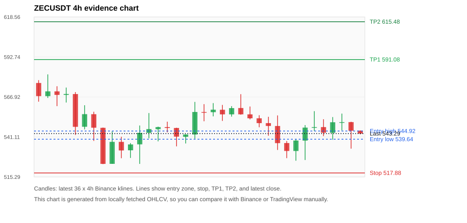
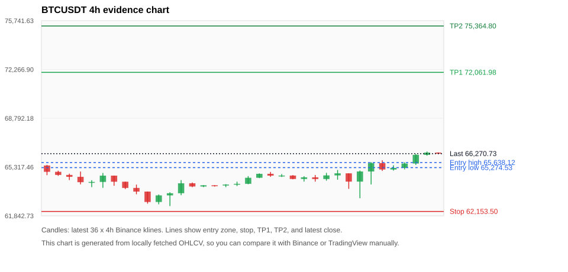
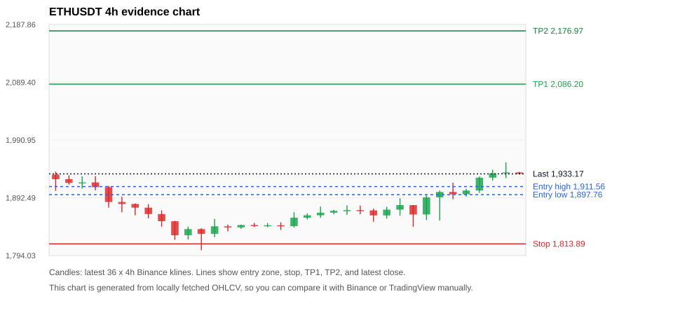
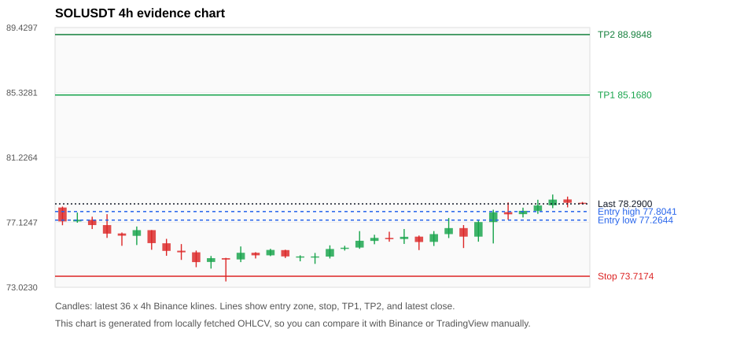
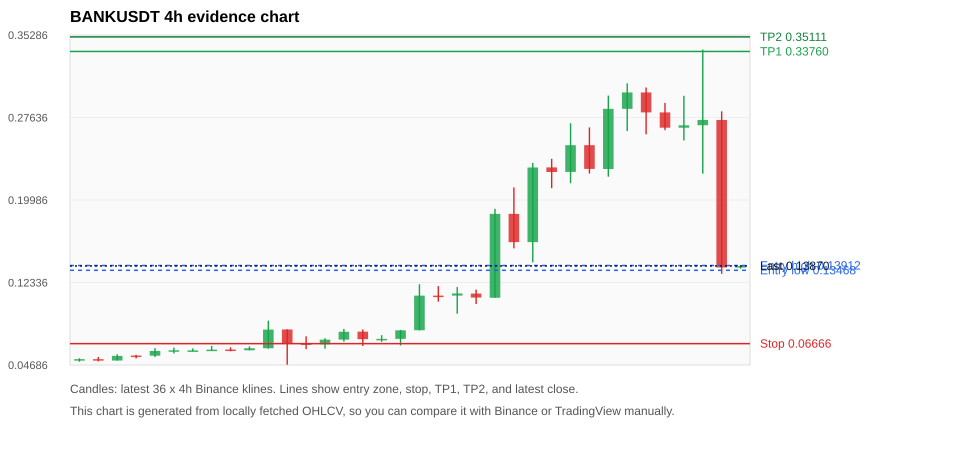

# Crypto 市场扫描报告 v1

- 报告时间：2026-07-21 20:06:14 CST
- Run ID：`20260721_120502_eba27814`
- Run type：`daily_full`
- 数据来源：SQLite
- 报告版本：v1
- 扫描 ID：eea62e96754a
- 数据源：Binance public spot API + CoinGecko/CoinMarketCap cross-check
- 过滤条件：USDT spot; 24h quote volume >= 30,000,000; trades >= 30,000; exclude stables/leveraged tokens; analyze 1h/4h/1d klines
- 默认单笔风险：账户权益的 1.00%

## 限制说明

- 交易信号仍以 Binance 现货公开 K 线为主源；外部数据源用于一致性复核。
- 结果是研究和模拟盘计划，不是确定收益或实盘下单指令。
- 历史长度过滤：候选币至少需要 180 根 1d K 线。
- 数据质量验证池：先验证 score 排名前 min(top_n * 2, 10) 的候选，再按 action + score 补足最终名单。
- 大盘环境过滤：RISK_OFF; BTC/ETH 大盘偏弱，山寨币买入候选降级为观察。 BTC 7d=1.891673910483327; ETH 7d=2.1846109933557845.
- 已启用数据交叉验证：Binance 主源 + CoinGecko 自动对照；CoinMarketCap 在配置 API Key 后自动对照。
- BTCUSDT 交叉验证状态 DATA_WARNING：At least one external provider needs manual review.
- ETHUSDT 交叉验证状态 DATA_WARNING：At least one external provider needs manual review.
- SOLUSDT 交叉验证状态 DATA_WARNING：At least one external provider needs manual review.
- BANKUSDT 交叉验证状态 DATA_WARNING：At least one external provider needs manual review.
- XRPUSDT 交叉验证状态 DATA_WARNING：At least one external provider needs manual review.
- BNBUSDT 交叉验证状态 DATA_WARNING：At least one external provider needs manual review.
- ZECUSDT 交叉验证状态 DATA_WARNING：At least one external provider needs manual review.
- DOGEUSDT 交叉验证状态 DATA_WARNING：At least one external provider needs manual review.
- TOWNSUSDT 交叉验证状态 DATA_WARNING：At least one external provider needs manual review.
- DEXEUSDT 交叉验证状态 DATA_WARNING：At least one external provider needs manual review.

## 5 个候选交易计划

| Rank | Coin | Action | Setup | Entry Zone | Stop Loss | TP1 | TP2 / Exit Rule | R/R | Verdict |
|---:|---|---|---|---:|---:|---:|---|---:|---|
| 1 | `ZEC` | `WAIT_PULLBACK` | 回踩支撑/4h EMA 附近 | 539.64 - 544.92 | 517.88 | 591.08 | 615.48 或跌破 4h 关键支撑 | 2.00-3.00 | 只观察 |
| 2 | `BTC` | `WATCH_ONLY` | 回踩支撑/4h EMA 附近 | 65,274.53 - 65,638.12 | 62,153.50 | 72,061.98 | 75,364.80 或跌破 4h 关键支撑 | 2.00-3.00 | 只观察 |
| 3 | `ETH` | `WATCH_ONLY` | 回踩支撑/4h EMA 附近 | 1,897.76 - 1,911.56 | 1,813.89 | 2,086.20 | 2,176.97 或跌破 4h 关键支撑 | 2.00-3.00 | 只等回调 |
| 4 | `SOL` | `WATCH_ONLY` | 回踩支撑/4h EMA 附近 | 77.2644 - 77.8041 | 73.7174 | 85.1680 | 88.9848 或跌破 4h 关键支撑 | 2.00-3.00 | 只观察 |
| 5 | `BANK` | `WATCH_ONLY` | 回踩支撑/4h EMA 附近 | 0.13468 - 0.13912 | 0.06666 | 0.33760 | 0.35111 或跌破 4h 关键支撑 | 2.86-3.05 | 只观察 |

## 数据交叉验证摘要

价格差异以 Binance 当前价为基准；成交量口径不同，Binance 是 USDT 现货成交额，CoinGecko/CoinMarketCap 通常是全市场成交量。

| Rank | Coin | Data Status | Max Price Diff | Max 24h Diff | Message |
|---:|---|---|---:|---:|---|
| 1 | `ZEC` | DATA_WARNING | 0.07% | 0.17 pts | At least one external provider needs manual review. |
| 2 | `BTC` | DATA_WARNING | 0.07% | 0.12 pts | At least one external provider needs manual review. |
| 3 | `ETH` | DATA_WARNING | 0.07% | 0.06 pts | At least one external provider needs manual review. |
| 4 | `SOL` | DATA_WARNING | 0.03% | 0.09 pts | At least one external provider needs manual review. |
| 5 | `BANK` | DATA_WARNING | 0.58% | 0.30 pts | At least one external provider needs manual review. |

## 候选币说明

### 1. ZEC `ZECUSDT`



- 入选原因：回踩支撑/4h EMA 附近；24h +1.43%，7d +3.49%，4h RSI 36.51，24h 成交额 $77.8M。
- 交易失效条件：跌破 517.88345 或 4h 收盘重新失守关键支撑。
- 主要风险：BTC/ETH 大盘环境未确认强势，山寨币买入信号降级；数据交叉验证需要人工复核。
- 数据交叉验证：DATA_WARNING；At least one external provider needs manual review.

#### 可点击人工验证

- [Binance 交易页](https://www.binance.com/en/trade/ZEC_USDT)
- [TradingView 图表](https://www.tradingview.com/chart/?symbol=BINANCE%3AZECUSDT)
- [CoinGecko 搜索](https://www.coingecko.com/en/search?query=ZEC)
- [CoinMarketCap 搜索](https://coinmarketcap.com/search/?q=ZEC)

#### 多数据源对照

| Source | Status | Asset ID | Price | 24h Change | 24h Volume | Price Diff | 24h Diff | Updated | Message |
|---|---|---|---:|---:|---:|---:|---:|---|---|
| Binance | DATA_OK | ZECUSDT | 543.29 | +1.43% | $77.8M | 0.00% | 0.00 pts | 2026-07-21T12:05:33+00:00 | Primary market data source used by scanner. |
| CoinGecko | DATA_WARNING | n/a | n/a | n/a | n/a | n/a | n/a | 2026-07-21T12:05:33+00:00 | Failed to fetch https://api.coingecko.com/api/v3/coins/markets?vs_currency=usd&ids=zcash&price_change_percentage=24h&per_page=1&page=1: HTTP Error 429: Too Many Requests |
| CoinMarketCap | DATA_WARNING | 1437 | 542.90 | +1.26% | $508.4M | 0.07% | 0.17 pts | 2026-07-21T12:04:05.000Z | CoinMarketCap symbol mapping has 2 matches; selected lowest cmc_rank |

#### 指标证据

| 指标 | 数值 | 人工核对用途 |
|---|---:|---|
| 当前价 | 543.29 | 与 Binance/TradingView 当前价格对照 |
| 24h 涨跌 | +1.43% | 与交易所 24h 涨跌对照 |
| 7d 涨跌 | +3.49% | 判断短线趋势是否延续 |
| 4h EMA20 | 546.48 | 判断短期趋势支撑 |
| 4h EMA50 | 538.57 | 判断中期趋势支撑 |
| 1d EMA20 | 513.48 | 判断日线趋势 |
| 1d EMA50 | 487.43 | 判断日线趋势 |
| 4h RSI14 | 36.51 | 判断是否过热/过弱 |
| 4h ATR14 | 12.8957 | 推导止损和入场缓冲 |
| 最近 18 根 4h 最低点 | 525.77 | 支撑/止损参考 |
| 最近 36 根 4h 最高点 | 581.50 | TP/压力参考 |
| 支撑位 | 538.57 | 入场区间推导基础 |

#### 交易计划推导

- 支撑位 = 最近低点、4h EMA20、4h EMA50、1d EMA20 中不高于当前价的最高有效支撑 = `538.57`。
- 入场区间 = 支撑位附近 + ATR 缓冲 = `539.64 - 544.92`。
- 止损 = min(最近 18 根 4h 最低点 * 0.985, 入场中位价 - 1.15 * ATR14) = `517.88`。
- TP1 = max(最近 36 根 4h 最高点 * 0.995, 入场中位价 + 2R) = `591.08`。
- TP2 = max(入场中位价 + 3R, TP1 * 1.04) = `615.48`。

#### 最近 10 根 4h K线

| UTC 开盘时间 | Open | High | Low | Close | Quote Volume | Trades |
|---|---:|---:|---:|---:|---:|---:|
| 2026-07-20T00:00+00:00 | 548.18 | 555.00 | 532.71 | 537.12 | $15.9M | 70144 |
| 2026-07-20T04:00+00:00 | 537.18 | 538.51 | 527.42 | 532.07 | $7.6M | 31047 |
| 2026-07-20T08:00+00:00 | 532.05 | 539.77 | 525.77 | 538.79 | $12.9M | 35933 |
| 2026-07-20T12:00+00:00 | 538.75 | 548.77 | 526.22 | 547.14 | $20.2M | 79310 |
| 2026-07-20T16:00+00:00 | 547.15 | 557.77 | 544.96 | 547.47 | $14.0M | 63040 |
| 2026-07-20T20:00+00:00 | 547.47 | 552.55 | 541.65 | 543.85 | $4.5M | 20492 |
| 2026-07-21T00:00+00:00 | 543.80 | 553.94 | 539.31 | 550.60 | $8.3M | 33646 |
| 2026-07-21T04:00+00:00 | 550.65 | 556.18 | 545.35 | 550.68 | $10.8M | 36944 |
| 2026-07-21T08:00+00:00 | 550.69 | 550.92 | 533.56 | 545.12 | $21.5M | 76979 |
| 2026-07-21T12:00+00:00 | 545.17 | 545.30 | 542.82 | 543.29 | $166,315 | 1510 |

### 2. BTC `BTCUSDT`



- 入选原因：回踩支撑/4h EMA 附近；24h +2.28%，7d +3.81%，4h RSI 67.20，24h 成交额 $1.29B。
- 交易失效条件：跌破 62153.5 或 4h 收盘重新失守关键支撑。
- 主要风险：BTC/ETH 大盘环境未确认强势，山寨币买入信号降级；数据交叉验证需要人工复核。
- 数据交叉验证：DATA_WARNING；At least one external provider needs manual review.

#### 可点击人工验证

- [Binance 交易页](https://www.binance.com/en/trade/BTC_USDT)
- [TradingView 图表](https://www.tradingview.com/chart/?symbol=BINANCE%3ABTCUSDT)
- [CoinGecko 搜索](https://www.coingecko.com/en/search?query=BTC)
- [CoinMarketCap 搜索](https://coinmarketcap.com/search/?q=BTC)

#### 多数据源对照

| Source | Status | Asset ID | Price | 24h Change | 24h Volume | Price Diff | 24h Diff | Updated | Message |
|---|---|---|---:|---:|---:|---:|---:|---|---|
| Binance | DATA_OK | BTCUSDT | 66,270.73 | +2.28% | $1.29B | 0.00% | 0.00 pts | 2026-07-21T12:05:33+00:00 | Primary market data source used by scanner. |
| CoinGecko | DATA_OK | bitcoin | 66,225.00 | +2.23% | $31.26B | 0.07% | 0.05 pts | 2026-07-21T12:05:33.985Z | External source agrees with Binance within thresholds. |
| CoinMarketCap | DATA_WARNING | 1 | 66,232.56 | +2.40% | $30.15B | 0.06% | 0.12 pts | 2026-07-21T12:04:05.000Z | CoinMarketCap symbol mapping has 13 matches; selected lowest cmc_rank |

#### 指标证据

| 指标 | 数值 | 人工核对用途 |
|---|---:|---|
| 当前价 | 66,270.73 | 与 Binance/TradingView 当前价格对照 |
| 24h 涨跌 | +2.28% | 与交易所 24h 涨跌对照 |
| 7d 涨跌 | +3.81% | 判断短线趋势是否延续 |
| 4h EMA20 | 65,144.24 | 判断短期趋势支撑 |
| 4h EMA50 | 64,510.65 | 判断中期趋势支撑 |
| 1d EMA20 | 64,032.79 | 判断日线趋势 |
| 1d EMA50 | 65,085.62 | 判断日线趋势 |
| 4h RSI14 | 67.20 | 判断是否过热/过弱 |
| 4h ATR14 | 705.53 | 推导止损和入场缓冲 |
| 最近 18 根 4h 最低点 | 63,100.00 | 支撑/止损参考 |
| 最近 36 根 4h 最高点 | 66,420.65 | TP/压力参考 |
| 支撑位 | 65,144.24 | 入场区间推导基础 |

#### 交易计划推导

- 支撑位 = 最近低点、4h EMA20、4h EMA50、1d EMA20 中不高于当前价的最高有效支撑 = `65,144.24`。
- 入场区间 = 支撑位附近 + ATR 缓冲 = `65,274.53 - 65,638.12`。
- 止损 = min(最近 18 根 4h 最低点 * 0.985, 入场中位价 - 1.15 * ATR14) = `62,153.50`。
- TP1 = max(最近 36 根 4h 最高点 * 0.995, 入场中位价 + 2R) = `72,061.98`。
- TP2 = max(入场中位价 + 3R, TP1 * 1.04) = `75,364.80`。

#### 最近 10 根 4h K线

| UTC 开盘时间 | Open | High | Low | Close | Quote Volume | Trades |
|---|---:|---:|---:|---:|---:|---:|
| 2026-07-20T00:00+00:00 | 64,722.55 | 65,107.99 | 64,416.00 | 64,869.80 | $120.4M | 587702 |
| 2026-07-20T04:00+00:00 | 64,869.79 | 64,869.99 | 63,765.83 | 64,280.01 | $202.9M | 587681 |
| 2026-07-20T08:00+00:00 | 64,280.01 | 65,068.00 | 63,100.00 | 65,002.01 | $371.8M | 511848 |
| 2026-07-20T12:00+00:00 | 65,002.00 | 65,666.80 | 64,077.76 | 65,598.75 | $379.1M | 1036177 |
| 2026-07-20T16:00+00:00 | 65,598.75 | 65,799.00 | 65,041.05 | 65,142.00 | $215.5M | 589177 |
| 2026-07-20T20:00+00:00 | 65,142.00 | 65,445.27 | 65,061.92 | 65,255.51 | $89.6M | 294262 |
| 2026-07-21T00:00+00:00 | 65,255.51 | 65,658.78 | 65,148.75 | 65,566.78 | $149.5M | 450732 |
| 2026-07-21T04:00+00:00 | 65,566.77 | 66,245.64 | 65,471.69 | 66,186.86 | $232.9M | 468544 |
| 2026-07-21T08:00+00:00 | 66,186.86 | 66,420.65 | 66,129.19 | 66,345.59 | $227.8M | 427621 |
| 2026-07-21T12:00+00:00 | 66,345.59 | 66,363.38 | 66,255.73 | 66,270.73 | $8.6M | 12128 |

### 3. ETH `ETHUSDT`



- 入选原因：回踩支撑/4h EMA 附近；24h +2.74%，7d +3.31%，4h RSI 75.01，24h 成交额 $646.1M。
- 交易失效条件：跌破 1813.8873 或 4h 收盘重新失守关键支撑。
- 主要风险：4h RSI 偏热；BTC/ETH 大盘环境未确认强势，山寨币买入信号降级；数据交叉验证需要人工复核。
- 数据交叉验证：DATA_WARNING；At least one external provider needs manual review.

#### 可点击人工验证

- [Binance 交易页](https://www.binance.com/en/trade/ETH_USDT)
- [TradingView 图表](https://www.tradingview.com/chart/?symbol=BINANCE%3AETHUSDT)
- [CoinGecko 搜索](https://www.coingecko.com/en/search?query=ETH)
- [CoinMarketCap 搜索](https://coinmarketcap.com/search/?q=ETH)

#### 多数据源对照

| Source | Status | Asset ID | Price | 24h Change | 24h Volume | Price Diff | 24h Diff | Updated | Message |
|---|---|---|---:|---:|---:|---:|---:|---|---|
| Binance | DATA_OK | ETHUSDT | 1,933.17 | +2.74% | $646.1M | 0.00% | 0.00 pts | 2026-07-21T12:05:33+00:00 | Primary market data source used by scanner. |
| CoinGecko | DATA_OK | ethereum | 1,931.83 | +2.69% | $11.75B | 0.07% | 0.06 pts | 2026-07-21T12:05:34.373Z | External source agrees with Binance within thresholds. |
| CoinMarketCap | DATA_WARNING | 1027 | 1,932.22 | +2.79% | $13.42B | 0.05% | 0.04 pts | 2026-07-21T12:04:05.000Z | CoinMarketCap symbol mapping has 6 matches; selected lowest cmc_rank |

#### 指标证据

| 指标 | 数值 | 人工核对用途 |
|---|---:|---|
| 当前价 | 1,933.17 | 与 Binance/TradingView 当前价格对照 |
| 24h 涨跌 | +2.74% | 与交易所 24h 涨跌对照 |
| 7d 涨跌 | +3.31% | 判断短线趋势是否延续 |
| 4h EMA20 | 1,893.97 | 判断短期趋势支撑 |
| 4h EMA50 | 1,864.68 | 判断中期趋势支撑 |
| 1d EMA20 | 1,822.55 | 判断日线趋势 |
| 1d EMA50 | 1,823.31 | 判断日线趋势 |
| 4h RSI14 | 75.01 | 判断是否过热/过弱 |
| 4h ATR14 | 25.1221 | 推导止损和入场缓冲 |
| 最近 18 根 4h 最低点 | 1,841.51 | 支撑/止损参考 |
| 最近 36 根 4h 最高点 | 1,953.00 | TP/压力参考 |
| 支撑位 | 1,893.97 | 入场区间推导基础 |

#### 交易计划推导

- 支撑位 = 最近低点、4h EMA20、4h EMA50、1d EMA20 中不高于当前价的最高有效支撑 = `1,893.97`。
- 入场区间 = 支撑位附近 + ATR 缓冲 = `1,897.76 - 1,911.56`。
- 止损 = min(最近 18 根 4h 最低点 * 0.985, 入场中位价 - 1.15 * ATR14) = `1,813.89`。
- TP1 = max(最近 36 根 4h 最高点 * 0.995, 入场中位价 + 2R) = `2,086.20`。
- TP2 = max(入场中位价 + 3R, TP1 * 1.04) = `2,176.97`。

#### 最近 10 根 4h K线

| UTC 开盘时间 | Open | High | Low | Close | Quote Volume | Trades |
|---|---:|---:|---:|---:|---:|---:|
| 2026-07-20T00:00+00:00 | 1,872.24 | 1,891.71 | 1,862.08 | 1,879.94 | $75.7M | 616195 |
| 2026-07-20T04:00+00:00 | 1,879.94 | 1,879.99 | 1,843.14 | 1,863.95 | $76.9M | 455920 |
| 2026-07-20T08:00+00:00 | 1,863.95 | 1,896.50 | 1,854.31 | 1,893.20 | $82.6M | 408523 |
| 2026-07-20T12:00+00:00 | 1,893.21 | 1,904.92 | 1,853.65 | 1,902.34 | $122.4M | 752281 |
| 2026-07-20T16:00+00:00 | 1,902.34 | 1,918.16 | 1,890.07 | 1,898.46 | $110.9M | 463219 |
| 2026-07-20T20:00+00:00 | 1,898.46 | 1,907.58 | 1,894.40 | 1,904.77 | $41.8M | 202624 |
| 2026-07-21T00:00+00:00 | 1,904.77 | 1,928.57 | 1,900.74 | 1,926.75 | $75.5M | 350782 |
| 2026-07-21T04:00+00:00 | 1,926.74 | 1,940.25 | 1,921.81 | 1,934.08 | $78.3M | 311313 |
| 2026-07-21T08:00+00:00 | 1,934.07 | 1,953.00 | 1,925.98 | 1,935.69 | $220.9M | 461182 |
| 2026-07-21T12:00+00:00 | 1,935.69 | 1,936.71 | 1,932.38 | 1,933.17 | $2.7M | 11967 |

### 4. SOL `SOLUSDT`



- 入选原因：回踩支撑/4h EMA 附近；24h +1.87%，7d +1.75%，4h RSI 72.31，24h 成交额 $127.1M。
- 交易失效条件：跌破 73.7174 或 4h 收盘重新失守关键支撑。
- 主要风险：BTC/ETH 大盘环境未确认强势，山寨币买入信号降级；数据交叉验证需要人工复核。
- 数据交叉验证：DATA_WARNING；At least one external provider needs manual review.

#### 可点击人工验证

- [Binance 交易页](https://www.binance.com/en/trade/SOL_USDT)
- [TradingView 图表](https://www.tradingview.com/chart/?symbol=BINANCE%3ASOLUSDT)
- [CoinGecko 搜索](https://www.coingecko.com/en/search?query=SOL)
- [CoinMarketCap 搜索](https://coinmarketcap.com/search/?q=SOL)

#### 多数据源对照

| Source | Status | Asset ID | Price | 24h Change | 24h Volume | Price Diff | 24h Diff | Updated | Message |
|---|---|---|---:|---:|---:|---:|---:|---|---|
| Binance | DATA_OK | SOLUSDT | 78.2900 | +1.87% | $127.1M | 0.00% | 0.00 pts | 2026-07-21T12:05:33+00:00 | Primary market data source used by scanner. |
| CoinGecko | DATA_OK | solana | 78.2700 | +1.84% | $1.85B | 0.03% | 0.03 pts | 2026-07-21T12:05:34.986Z | External source agrees with Binance within thresholds. |
| CoinMarketCap | DATA_WARNING | 5426 | 78.2824 | +1.97% | $1.95B | 0.01% | 0.09 pts | 2026-07-21T12:04:05.000Z | CoinMarketCap symbol mapping has 8 matches; selected lowest cmc_rank |

#### 指标证据

| 指标 | 数值 | 人工核对用途 |
|---|---:|---|
| 当前价 | 78.2900 | 与 Binance/TradingView 当前价格对照 |
| 24h 涨跌 | +1.87% | 与交易所 24h 涨跌对照 |
| 7d 涨跌 | +1.75% | 判断短线趋势是否延续 |
| 4h EMA20 | 77.1101 | 判断短期趋势支撑 |
| 4h EMA50 | 76.8889 | 判断中期趋势支撑 |
| 1d EMA20 | 76.7272 | 判断日线趋势 |
| 1d EMA50 | 76.7045 | 判断日线趋势 |
| 4h RSI14 | 72.31 | 判断是否过热/过弱 |
| 4h ATR14 | 0.99143 | 推导止损和入场缓冲 |
| 最近 18 根 4h 最低点 | 74.8400 | 支撑/止损参考 |
| 最近 36 根 4h 最高点 | 78.8800 | TP/压力参考 |
| 支撑位 | 77.1101 | 入场区间推导基础 |

#### 交易计划推导

- 支撑位 = 最近低点、4h EMA20、4h EMA50、1d EMA20 中不高于当前价的最高有效支撑 = `77.1101`。
- 入场区间 = 支撑位附近 + ATR 缓冲 = `77.2644 - 77.8041`。
- 止损 = min(最近 18 根 4h 最低点 * 0.985, 入场中位价 - 1.15 * ATR14) = `73.7174`。
- TP1 = max(最近 36 根 4h 最高点 * 0.995, 入场中位价 + 2R) = `85.1680`。
- TP2 = max(入场中位价 + 3R, TP1 * 1.04) = `88.9848`。

#### 最近 10 根 4h K线

| UTC 开盘时间 | Open | High | Low | Close | Quote Volume | Trades |
|---|---:|---:|---:|---:|---:|---:|
| 2026-07-20T00:00+00:00 | 76.3800 | 77.4000 | 76.1300 | 76.7600 | $25.4M | 153042 |
| 2026-07-20T04:00+00:00 | 76.7600 | 76.9500 | 75.5000 | 76.2200 | $19.3M | 105479 |
| 2026-07-20T08:00+00:00 | 76.2200 | 77.2400 | 75.9000 | 77.1400 | $21.6M | 86414 |
| 2026-07-20T12:00+00:00 | 77.1400 | 77.9200 | 75.7900 | 77.7600 | $35.7M | 168322 |
| 2026-07-20T16:00+00:00 | 77.7700 | 78.3800 | 77.2900 | 77.6300 | $30.3M | 111136 |
| 2026-07-20T20:00+00:00 | 77.6400 | 78.0500 | 77.4300 | 77.8500 | $11.3M | 50114 |
| 2026-07-21T00:00+00:00 | 77.8500 | 78.5500 | 77.6600 | 78.1900 | $12.5M | 64078 |
| 2026-07-21T04:00+00:00 | 78.2000 | 78.8800 | 78.0200 | 78.5600 | $19.9M | 70655 |
| 2026-07-21T08:00+00:00 | 78.5700 | 78.7500 | 78.0700 | 78.3600 | $18.7M | 58255 |
| 2026-07-21T12:00+00:00 | 78.3600 | 78.4100 | 78.2900 | 78.3000 | $245,729 | 1169 |

### 5. BANK `BANKUSDT`



- 入选原因：回踩支撑/4h EMA 附近；24h -52.08%，7d +223.31%，4h RSI 53.09，24h 成交额 $96.7M。
- 交易失效条件：跌破 0.066658401 或 4h 收盘重新失守关键支撑。
- 主要风险：24h 振幅较大，回撤风险高；BTC/ETH 大盘环境未确认强势，山寨币买入信号降级；24h 动量未确认；数据交叉验证需要人工复核。
- 数据交叉验证：DATA_WARNING；At least one external provider needs manual review.

#### 可点击人工验证

- [Binance 交易页](https://www.binance.com/en/trade/BANK_USDT)
- [TradingView 图表](https://www.tradingview.com/chart/?symbol=BINANCE%3ABANKUSDT)
- [CoinGecko 搜索](https://www.coingecko.com/en/search?query=BANK)
- [CoinMarketCap 搜索](https://coinmarketcap.com/search/?q=BANK)

#### 多数据源对照

| Source | Status | Asset ID | Price | 24h Change | 24h Volume | Price Diff | 24h Diff | Updated | Message |
|---|---|---|---:|---:|---:|---:|---:|---|---|
| Binance | DATA_OK | BANKUSDT | 0.13870 | -52.08% | $96.7M | 0.00% | 0.00 pts | 2026-07-21T12:05:33+00:00 | Primary market data source used by scanner. |
| CoinGecko | DATA_WARNING | lorenzo-protocol | 0.13790 | -51.97% | $145.9M | 0.58% | 0.11 pts | 2026-07-21T12:05:37.440Z | CoinGecko symbol mapping has 3 exact matches; selected highest market-cap rank |
| CoinMarketCap | DATA_WARNING | 36296 | 0.13814 | -51.78% | $304.0M | 0.40% | 0.30 pts | 2026-07-21T12:04:05.000Z | CoinMarketCap symbol mapping has 10 matches; selected lowest cmc_rank |

#### 指标证据

| 指标 | 数值 | 人工核对用途 |
|---|---:|---|
| 当前价 | 0.13870 | 与 Binance/TradingView 当前价格对照 |
| 24h 涨跌 | -52.08% | 与交易所 24h 涨跌对照 |
| 7d 涨跌 | +223.31% | 判断短线趋势是否延续 |
| 4h EMA20 | 0.19147 | 判断短期趋势支撑 |
| 4h EMA50 | 0.13441 | 判断中期趋势支撑 |
| 1d EMA20 | 0.09142 | 判断日线趋势 |
| 1d EMA50 | 0.06195 | 判断日线趋势 |
| 4h RSI14 | 53.09 | 判断是否过热/过弱 |
| 4h ATR14 | 0.06108 | 推导止损和入场缓冲 |
| 最近 18 根 4h 最低点 | 0.07900 | 支撑/止损参考 |
| 最近 36 根 4h 最高点 | 0.33930 | TP/压力参考 |
| 支撑位 | 0.13441 | 入场区间推导基础 |

#### 交易计划推导

- 支撑位 = 最近低点、4h EMA20、4h EMA50、1d EMA20 中不高于当前价的最高有效支撑 = `0.13441`。
- 入场区间 = 支撑位附近 + ATR 缓冲 = `0.13468 - 0.13912`。
- 止损 = min(最近 18 根 4h 最低点 * 0.985, 入场中位价 - 1.15 * ATR14) = `0.06666`。
- TP1 = max(最近 36 根 4h 最高点 * 0.995, 入场中位价 + 2R) = `0.33760`。
- TP2 = max(入场中位价 + 3R, TP1 * 1.04) = `0.35111`。

#### 最近 10 根 4h K线

| UTC 开盘时间 | Open | High | Low | Close | Quote Volume | Trades |
|---|---:|---:|---:|---:|---:|---:|
| 2026-07-20T00:00+00:00 | 0.22590 | 0.27100 | 0.21540 | 0.25070 | $13.8M | 183561 |
| 2026-07-20T04:00+00:00 | 0.25070 | 0.26720 | 0.22440 | 0.22870 | $13.3M | 151963 |
| 2026-07-20T08:00+00:00 | 0.22860 | 0.29670 | 0.22150 | 0.28440 | $20.3M | 206094 |
| 2026-07-20T12:00+00:00 | 0.28440 | 0.30800 | 0.26380 | 0.29960 | $12.8M | 154521 |
| 2026-07-20T16:00+00:00 | 0.29960 | 0.30420 | 0.26080 | 0.28110 | $13.0M | 150855 |
| 2026-07-20T20:00+00:00 | 0.28110 | 0.28990 | 0.26460 | 0.26690 | $3.9M | 62159 |
| 2026-07-21T00:00+00:00 | 0.26690 | 0.29650 | 0.25510 | 0.26910 | $7.9M | 120274 |
| 2026-07-21T04:00+00:00 | 0.26920 | 0.33930 | 0.22430 | 0.27410 | $22.0M | 266700 |
| 2026-07-21T08:00+00:00 | 0.27410 | 0.28210 | 0.13140 | 0.13730 | $36.8M | 564074 |
| 2026-07-21T12:00+00:00 | 0.13720 | 0.13920 | 0.13620 | 0.13860 | $553,875 | 2976 |

## 组合风控

- 不要 5 个候选全部满仓买入。
- 同时持仓总风险建议控制在账户权益的 3% - 5% 以内。
- 如果 BTC/ETH 同时破位，暂停山寨币多头计划或降低仓位。
- 第一版报告用于模拟盘和人工复核，不自动下单。

## 原始数据

```json
[
  {
    "rank": 1,
    "symbol": "ZECUSDT",
    "base_asset": "ZEC",
    "price": 543.29,
    "score": 28.206451612283523,
    "setup": "回踩支撑/4h EMA 附近",
    "verdict": "只观察",
    "entry_low": 539.6441595340431,
    "entry_high": 544.91987,
    "stop_loss": 517.8834499999999,
    "take_profit_1": 591.0791443010648,
    "take_profit_2": 615.4777090680865,
    "risk_reward_1": 2.0,
    "risk_reward_2": 3.0,
    "pct_24h": 1.426,
    "pct_3d": -0.19472765683844484,
    "pct_7d": 3.4916946053032527,
    "quote_volume_24h": 77828227.97942,
    "trades_24h": 309314,
    "high_low_range_24h": 5.99559119759796,
    "rsi_1h": 47.17649141440958,
    "rsi_4h": 36.50845787485621,
    "ema20_4h": 546.4831664043162,
    "ema50_4h": 538.5670254830769,
    "ema20_1d": 513.4820056118554,
    "ema50_1d": 487.4312231477431,
    "atr_4h": 12.895714285714275,
    "macd_hist_4h": -0.6896959784727335,
    "volume_ratio_24h": 0.8448475102201329,
    "support_level": 538.5670254830769,
    "recent_low_4h_18": 525.77,
    "recent_high_4h_36": 581.5,
    "distance_to_support_pct": 0.8769520400337738,
    "binance_trade_url": "https://www.binance.com/en/trade/ZEC_USDT",
    "tradingview_url": "https://www.tradingview.com/chart/?symbol=BINANCE%3AZECUSDT",
    "coingecko_search_url": "https://www.coingecko.com/en/search?query=ZEC",
    "coinmarketcap_search_url": "https://coinmarketcap.com/search/?q=ZEC",
    "invalidation": "跌破 517.88345 或 4h 收盘重新失守关键支撑",
    "recent_4h_klines": [
      {
        "open_time_utc": "2026-07-15T16:00+00:00",
        "open": 575.94,
        "high": 577.77,
        "low": 563.88,
        "close": 567.47,
        "quote_volume": 18246370.785,
        "trades": 52260
      },
      {
        "open_time_utc": "2026-07-15T20:00+00:00",
        "open": 567.45,
        "high": 581.5,
        "low": 566.26,
        "close": 570.54,
        "quote_volume": 15803996.86293,
        "trades": 45914
      },
      {
        "open_time_utc": "2026-07-16T00:00+00:00",
        "open": 570.53,
        "high": 573.85,
        "low": 561.0,
        "close": 568.25,
        "quote_volume": 15836777.66309,
        "trades": 42542
      },
      {
        "open_time_utc": "2026-07-16T04:00+00:00",
        "open": 568.25,
        "high": 572.99,
        "low": 563.33,
        "close": 568.85,
        "quote_volume": 8127069.60641,
        "trades": 33078
      },
      {
        "open_time_utc": "2026-07-16T08:00+00:00",
        "open": 568.8,
        "high": 570.06,
        "low": 542.39,
        "close": 547.64,
        "quote_volume": 34153883.40443,
        "trades": 88354
      },
      {
        "open_time_utc": "2026-07-16T12:00+00:00",
        "open": 547.68,
        "high": 561.59,
        "low": 546.0,
        "close": 555.83,
        "quote_volume": 25367800.85665,
        "trades": 68486
      },
      {
        "open_time_utc": "2026-07-16T16:00+00:00",
        "open": 555.8,
        "high": 557.38,
        "low": 538.55,
        "close": 547.07,
        "quote_volume": 17783126.77048,
        "trades": 49324
      },
      {
        "open_time_utc": "2026-07-16T20:00+00:00",
        "open": 547.0,
        "high": 547.16,
        "low": 523.6,
        "close": 523.72,
        "quote_volume": 17350390.22596,
        "trades": 67461
      },
      {
        "open_time_utc": "2026-07-17T00:00+00:00",
        "open": 523.75,
        "high": 544.67,
        "low": 523.74,
        "close": 537.95,
        "quote_volume": 15233836.50356,
        "trades": 64969
      },
      {
        "open_time_utc": "2026-07-17T04:00+00:00",
        "open": 537.93,
        "high": 541.25,
        "low": 527.38,
        "close": 532.39,
        "quote_volume": 13163582.15764,
        "trades": 62281
      },
      {
        "open_time_utc": "2026-07-17T08:00+00:00",
        "open": 532.5,
        "high": 537.18,
        "low": 527.56,
        "close": 536.28,
        "quote_volume": 8139752.84678,
        "trades": 36199
      },
      {
        "open_time_utc": "2026-07-17T12:00+00:00",
        "open": 536.34,
        "high": 548.51,
        "low": 523.72,
        "close": 543.78,
        "quote_volume": 18769502.13819,
        "trades": 76447
      },
      {
        "open_time_utc": "2026-07-17T16:00+00:00",
        "open": 543.79,
        "high": 556.53,
        "low": 540.21,
        "close": 546.18,
        "quote_volume": 26057470.99771,
        "trades": 67692
      },
      {
        "open_time_utc": "2026-07-17T20:00+00:00",
        "open": 546.11,
        "high": 547.77,
        "low": 538.28,
        "close": 547.47,
        "quote_volume": 8243032.62883,
        "trades": 23965
      },
      {
        "open_time_utc": "2026-07-18T00:00+00:00",
        "open": 547.45,
        "high": 550.96,
        "low": 544.09,
        "close": 546.9,
        "quote_volume": 6232462.76969,
        "trades": 18330
      },
      {
        "open_time_utc": "2026-07-18T04:00+00:00",
        "open": 546.91,
        "high": 547.04,
        "low": 535.04,
        "close": 541.32,
        "quote_volume": 5120463.33607,
        "trades": 27906
      },
      {
        "open_time_utc": "2026-07-18T08:00+00:00",
        "open": 541.19,
        "high": 542.86,
        "low": 536.9,
        "close": 542.69,
        "quote_volume": 4248914.21113,
        "trades": 27648
      },
      {
        "open_time_utc": "2026-07-18T12:00+00:00",
        "open": 542.69,
        "high": 563.73,
        "low": 540.0,
        "close": 557.23,
        "quote_volume": 17371817.61922,
        "trades": 77681
      },
      {
        "open_time_utc": "2026-07-18T16:00+00:00",
        "open": 557.23,
        "high": 562.29,
        "low": 551.23,
        "close": 557.08,
        "quote_volume": 10652429.70639,
        "trades": 50150
      },
      {
        "open_time_utc": "2026-07-18T20:00+00:00",
        "open": 557.1,
        "high": 562.96,
        "low": 554.4,
        "close": 558.7,
        "quote_volume": 4879680.72156,
        "trades": 33398
      },
      {
        "open_time_utc": "2026-07-19T00:00+00:00",
        "open": 558.65,
        "high": 561.78,
        "low": 551.46,
        "close": 555.68,
        "quote_volume": 4761407.23185,
        "trades": 29903
      },
      {
        "open_time_utc": "2026-07-19T04:00+00:00",
        "open": 555.69,
        "high": 561.0,
        "low": 554.23,
        "close": 559.72,
        "quote_volume": 3245541.6855,
        "trades": 23474
      },
      {
        "open_time_utc": "2026-07-19T08:00+00:00",
        "open": 559.78,
        "high": 568.72,
        "low": 555.46,
        "close": 555.71,
        "quote_volume": 6779342.53119,
        "trades": 42652
      },
      {
        "open_time_utc": "2026-07-19T12:00+00:00",
        "open": 555.69,
        "high": 560.76,
        "low": 552.42,
        "close": 553.14,
        "quote_volume": 8645873.29892,
        "trades": 55174
      },
      {
        "open_time_utc": "2026-07-19T16:00+00:00",
        "open": 553.14,
        "high": 555.15,
        "low": 547.37,
        "close": 550.04,
        "quote_volume": 9515201.05297,
        "trades": 41903
      },
      {
        "open_time_utc": "2026-07-19T20:00+00:00",
        "open": 550.04,
        "high": 554.12,
        "low": 541.9,
        "close": 548.21,
        "quote_volume": 9265786.6168,
        "trades": 30858
      },
      {
        "open_time_utc": "2026-07-20T00:00+00:00",
        "open": 548.18,
        "high": 555.0,
        "low": 532.71,
        "close": 537.12,
        "quote_volume": 15881808.82805,
        "trades": 70144
      },
      {
        "open_time_utc": "2026-07-20T04:00+00:00",
        "open": 537.18,
        "high": 538.51,
        "low": 527.42,
        "close": 532.07,
        "quote_volume": 7556626.15065,
        "trades": 31047
      },
      {
        "open_time_utc": "2026-07-20T08:00+00:00",
        "open": 532.05,
        "high": 539.77,
        "low": 525.77,
        "close": 538.79,
        "quote_volume": 12886266.85186,
        "trades": 35933
      },
      {
        "open_time_utc": "2026-07-20T12:00+00:00",
        "open": 538.75,
        "high": 548.77,
        "low": 526.22,
        "close": 547.14,
        "quote_volume": 20209288.00893,
        "trades": 79310
      },
      {
        "open_time_utc": "2026-07-20T16:00+00:00",
        "open": 547.15,
        "high": 557.77,
        "low": 544.96,
        "close": 547.47,
        "quote_volume": 13996933.38801,
        "trades": 63040
      },
      {
        "open_time_utc": "2026-07-20T20:00+00:00",
        "open": 547.47,
        "high": 552.55,
        "low": 541.65,
        "close": 543.85,
        "quote_volume": 4465555.38032,
        "trades": 20492
      },
      {
        "open_time_utc": "2026-07-21T00:00+00:00",
        "open": 543.8,
        "high": 553.94,
        "low": 539.31,
        "close": 550.6,
        "quote_volume": 8333018.848,
        "trades": 33646
      },
      {
        "open_time_utc": "2026-07-21T04:00+00:00",
        "open": 550.65,
        "high": 556.18,
        "low": 545.35,
        "close": 550.68,
        "quote_volume": 10762664.00319,
        "trades": 36944
      },
      {
        "open_time_utc": "2026-07-21T08:00+00:00",
        "open": 550.69,
        "high": 550.92,
        "low": 533.56,
        "close": 545.12,
        "quote_volume": 21461189.46513,
        "trades": 76979
      },
      {
        "open_time_utc": "2026-07-21T12:00+00:00",
        "open": 545.17,
        "high": 545.3,
        "low": 542.82,
        "close": 543.29,
        "quote_volume": 166314.82525,
        "trades": 1510
      }
    ],
    "risks": [
      "BTC/ETH 大盘环境未确认强势，山寨币买入信号降级",
      "数据交叉验证需要人工复核"
    ],
    "data_quality_status": "DATA_WARNING",
    "data_quality_message": "At least one external provider needs manual review.",
    "data_checks": [
      {
        "provider": "Binance",
        "status": "DATA_OK",
        "provider_asset_id": "ZECUSDT",
        "provider_symbol": "ZECUSDT",
        "price_usd": 543.29,
        "pct_24h": 1.426,
        "volume_24h": 77828227.97942,
        "last_updated": null,
        "fetched_at_utc": "2026-07-21T12:05:33+00:00",
        "price_diff_pct": 0.0,
        "pct_24h_diff": 0.0,
        "volume_note": "Binance USDT spot 24h quoteVolume.",
        "message": "Primary market data source used by scanner."
      },
      {
        "provider": "CoinGecko",
        "status": "DATA_WARNING",
        "provider_asset_id": null,
        "provider_symbol": "ZEC",
        "price_usd": null,
        "pct_24h": null,
        "volume_24h": null,
        "last_updated": null,
        "fetched_at_utc": "2026-07-21T12:05:33+00:00",
        "price_diff_pct": null,
        "pct_24h_diff": null,
        "volume_note": "External provider data unavailable.",
        "message": "Failed to fetch https://api.coingecko.com/api/v3/coins/markets?vs_currency=usd&ids=zcash&price_change_percentage=24h&per_page=1&page=1: HTTP Error 429: Too Many Requests"
      },
      {
        "provider": "CoinMarketCap",
        "status": "DATA_WARNING",
        "provider_asset_id": "1437",
        "provider_symbol": "ZEC",
        "price_usd": 542.9041590454327,
        "pct_24h": 1.25543705,
        "volume_24h": 508421461.72358114,
        "last_updated": "2026-07-21T12:04:05.000Z",
        "fetched_at_utc": "2026-07-21T12:05:33+00:00",
        "price_diff_pct": 0.07101933673861897,
        "pct_24h_diff": 0.17056294999999988,
        "volume_note": "CoinMarketCap total market volume; not the same venue scope as Binance quoteVolume.",
        "message": "CoinMarketCap symbol mapping has 2 matches; selected lowest cmc_rank"
      }
    ],
    "action": "WAIT_PULLBACK"
  },
  {
    "rank": 2,
    "symbol": "BTCUSDT",
    "base_asset": "BTC",
    "price": 66270.73,
    "score": 57.75410947304161,
    "setup": "回踩支撑/4h EMA 附近",
    "verdict": "只观察",
    "entry_low": 65274.53281576769,
    "entry_high": 65638.11882711346,
    "stop_loss": 62153.5,
    "take_profit_1": 72061.97746432174,
    "take_profit_2": 75364.80328576232,
    "risk_reward_1": 2.0,
    "risk_reward_2": 3.0,
    "pct_24h": 2.278,
    "pct_3d": 3.37679780363771,
    "pct_7d": 3.8075182005767205,
    "quote_volume_24h": 1292622398.6765716,
    "trades_24h": 3248780,
    "high_low_range_24h": 3.65632319232132,
    "rsi_1h": 75.0064247419027,
    "rsi_4h": 67.19686511804315,
    "ema20_4h": 65144.24432711346,
    "ema50_4h": 64510.653954697234,
    "ema20_1d": 64032.79017800579,
    "ema50_1d": 65085.62214093828,
    "atr_4h": 705.5349999999993,
    "macd_hist_4h": 155.54734461864643,
    "volume_ratio_24h": 1.1937779643846869,
    "support_level": 65144.24432711346,
    "recent_low_4h_18": 63100.0,
    "recent_high_4h_36": 66420.65,
    "distance_to_support_pct": 1.7292174995998666,
    "binance_trade_url": "https://www.binance.com/en/trade/BTC_USDT",
    "tradingview_url": "https://www.tradingview.com/chart/?symbol=BINANCE%3ABTCUSDT",
    "coingecko_search_url": "https://www.coingecko.com/en/search?query=BTC",
    "coinmarketcap_search_url": "https://coinmarketcap.com/search/?q=BTC",
    "invalidation": "跌破 62153.5 或 4h 收盘重新失守关键支撑",
    "recent_4h_klines": [
      {
        "open_time_utc": "2026-07-15T16:00+00:00",
        "open": 65427.6,
        "high": 65470.0,
        "low": 64738.49,
        "close": 64977.34,
        "quote_volume": 260018792.6365906,
        "trades": 465383
      },
      {
        "open_time_utc": "2026-07-15T20:00+00:00",
        "open": 64977.34,
        "high": 65055.39,
        "low": 64691.89,
        "close": 64756.28,
        "quote_volume": 72265275.8231589,
        "trades": 211141
      },
      {
        "open_time_utc": "2026-07-16T00:00+00:00",
        "open": 64756.28,
        "high": 64845.5,
        "low": 64392.01,
        "close": 64619.95,
        "quote_volume": 114662853.6678437,
        "trades": 351949
      },
      {
        "open_time_utc": "2026-07-16T04:00+00:00",
        "open": 64619.96,
        "high": 64997.52,
        "low": 64086.12,
        "close": 64238.0,
        "quote_volume": 176196222.6674721,
        "trades": 380748
      },
      {
        "open_time_utc": "2026-07-16T08:00+00:00",
        "open": 64238.0,
        "high": 64380.0,
        "low": 63888.0,
        "close": 64256.53,
        "quote_volume": 518405240.0052909,
        "trades": 555339
      },
      {
        "open_time_utc": "2026-07-16T12:00+00:00",
        "open": 64256.52,
        "high": 64896.0,
        "low": 63838.28,
        "close": 64704.73,
        "quote_volume": 204127820.804017,
        "trades": 741620
      },
      {
        "open_time_utc": "2026-07-16T16:00+00:00",
        "open": 64704.73,
        "high": 64712.0,
        "low": 63984.09,
        "close": 64271.84,
        "quote_volume": 114685442.704316,
        "trades": 502323
      },
      {
        "open_time_utc": "2026-07-16T20:00+00:00",
        "open": 64271.85,
        "high": 64276.0,
        "low": 63748.74,
        "close": 63830.2,
        "quote_volume": 78420806.528254,
        "trades": 281502
      },
      {
        "open_time_utc": "2026-07-17T00:00+00:00",
        "open": 63830.2,
        "high": 64067.69,
        "low": 63380.28,
        "close": 63570.0,
        "quote_volume": 169659336.6829894,
        "trades": 531177
      },
      {
        "open_time_utc": "2026-07-17T04:00+00:00",
        "open": 63570.0,
        "high": 63576.0,
        "low": 62710.0,
        "close": 62828.11,
        "quote_volume": 262693644.6590385,
        "trades": 494473
      },
      {
        "open_time_utc": "2026-07-17T08:00+00:00",
        "open": 62828.11,
        "high": 63361.7,
        "low": 62666.0,
        "close": 63298.01,
        "quote_volume": 163366668.3718989,
        "trades": 354967
      },
      {
        "open_time_utc": "2026-07-17T12:00+00:00",
        "open": 63298.0,
        "high": 63518.0,
        "low": 62537.56,
        "close": 63452.0,
        "quote_volume": 246111895.341298,
        "trades": 894383
      },
      {
        "open_time_utc": "2026-07-17T16:00+00:00",
        "open": 63452.0,
        "high": 64387.99,
        "low": 63312.01,
        "close": 64160.8,
        "quote_volume": 219389919.1329495,
        "trades": 728454
      },
      {
        "open_time_utc": "2026-07-17T20:00+00:00",
        "open": 64160.8,
        "high": 64216.61,
        "low": 63884.35,
        "close": 63931.67,
        "quote_volume": 91324565.1520772,
        "trades": 235842
      },
      {
        "open_time_utc": "2026-07-18T00:00+00:00",
        "open": 63931.67,
        "high": 64032.6,
        "low": 63886.65,
        "close": 64017.84,
        "quote_volume": 87640554.7560027,
        "trades": 150552
      },
      {
        "open_time_utc": "2026-07-18T04:00+00:00",
        "open": 64017.84,
        "high": 64026.03,
        "low": 63926.39,
        "close": 64002.75,
        "quote_volume": 60728056.1143949,
        "trades": 118016
      },
      {
        "open_time_utc": "2026-07-18T08:00+00:00",
        "open": 64002.75,
        "high": 64097.22,
        "low": 63887.73,
        "close": 64069.89,
        "quote_volume": 70619036.0344428,
        "trades": 85981
      },
      {
        "open_time_utc": "2026-07-18T12:00+00:00",
        "open": 64069.89,
        "high": 64274.47,
        "low": 63963.0,
        "close": 64123.12,
        "quote_volume": 79608426.7322157,
        "trades": 210954
      },
      {
        "open_time_utc": "2026-07-18T16:00+00:00",
        "open": 64123.13,
        "high": 64669.5,
        "low": 64091.48,
        "close": 64552.79,
        "quote_volume": 110998004.6017032,
        "trades": 257153
      },
      {
        "open_time_utc": "2026-07-18T20:00+00:00",
        "open": 64552.8,
        "high": 64865.0,
        "low": 64528.69,
        "close": 64834.22,
        "quote_volume": 106360570.4476106,
        "trades": 266045
      },
      {
        "open_time_utc": "2026-07-19T00:00+00:00",
        "open": 64834.21,
        "high": 64967.25,
        "low": 64620.44,
        "close": 64706.18,
        "quote_volume": 106536390.3821349,
        "trades": 198160
      },
      {
        "open_time_utc": "2026-07-19T04:00+00:00",
        "open": 64706.18,
        "high": 64815.65,
        "low": 64610.89,
        "close": 64711.05,
        "quote_volume": 71298499.0657687,
        "trades": 143399
      },
      {
        "open_time_utc": "2026-07-19T08:00+00:00",
        "open": 64711.04,
        "high": 64743.0,
        "low": 64445.0,
        "close": 64467.64,
        "quote_volume": 99445905.383701,
        "trades": 229863
      },
      {
        "open_time_utc": "2026-07-19T12:00+00:00",
        "open": 64467.65,
        "high": 64663.04,
        "low": 64285.24,
        "close": 64585.32,
        "quote_volume": 94381470.0512155,
        "trades": 274299
      },
      {
        "open_time_utc": "2026-07-19T16:00+00:00",
        "open": 64585.33,
        "high": 64752.0,
        "low": 64280.0,
        "close": 64462.58,
        "quote_volume": 74890318.851404,
        "trades": 254773
      },
      {
        "open_time_utc": "2026-07-19T20:00+00:00",
        "open": 64462.58,
        "high": 64900.0,
        "low": 64347.89,
        "close": 64722.54,
        "quote_volume": 95006518.1787705,
        "trades": 363843
      },
      {
        "open_time_utc": "2026-07-20T00:00+00:00",
        "open": 64722.55,
        "high": 65107.99,
        "low": 64416.0,
        "close": 64869.8,
        "quote_volume": 120367010.7614054,
        "trades": 587702
      },
      {
        "open_time_utc": "2026-07-20T04:00+00:00",
        "open": 64869.79,
        "high": 64869.99,
        "low": 63765.83,
        "close": 64280.01,
        "quote_volume": 202948573.3207383,
        "trades": 587681
      },
      {
        "open_time_utc": "2026-07-20T08:00+00:00",
        "open": 64280.01,
        "high": 65068.0,
        "low": 63100.0,
        "close": 65002.01,
        "quote_volume": 371789253.355281,
        "trades": 511848
      },
      {
        "open_time_utc": "2026-07-20T12:00+00:00",
        "open": 65002.0,
        "high": 65666.8,
        "low": 64077.76,
        "close": 65598.75,
        "quote_volume": 379053519.1860063,
        "trades": 1036177
      },
      {
        "open_time_utc": "2026-07-20T16:00+00:00",
        "open": 65598.75,
        "high": 65799.0,
        "low": 65041.05,
        "close": 65142.0,
        "quote_volume": 215471814.6428676,
        "trades": 589177
      },
      {
        "open_time_utc": "2026-07-20T20:00+00:00",
        "open": 65142.0,
        "high": 65445.27,
        "low": 65061.92,
        "close": 65255.51,
        "quote_volume": 89552538.9967458,
        "trades": 294262
      },
      {
        "open_time_utc": "2026-07-21T00:00+00:00",
        "open": 65255.51,
        "high": 65658.78,
        "low": 65148.75,
        "close": 65566.78,
        "quote_volume": 149538223.7084598,
        "trades": 450732
      },
      {
        "open_time_utc": "2026-07-21T04:00+00:00",
        "open": 65566.77,
        "high": 66245.64,
        "low": 65471.69,
        "close": 66186.86,
        "quote_volume": 232893727.7760537,
        "trades": 468544
      },
      {
        "open_time_utc": "2026-07-21T08:00+00:00",
        "open": 66186.86,
        "high": 66420.65,
        "low": 66129.19,
        "close": 66345.59,
        "quote_volume": 227803607.7517068,
        "trades": 427621
      },
      {
        "open_time_utc": "2026-07-21T12:00+00:00",
        "open": 66345.59,
        "high": 66363.38,
        "low": 66255.73,
        "close": 66270.73,
        "quote_volume": 8597467.6843593,
        "trades": 12128
      }
    ],
    "risks": [
      "BTC/ETH 大盘环境未确认强势，山寨币买入信号降级",
      "数据交叉验证需要人工复核"
    ],
    "data_quality_status": "DATA_WARNING",
    "data_quality_message": "At least one external provider needs manual review.",
    "data_checks": [
      {
        "provider": "Binance",
        "status": "DATA_OK",
        "provider_asset_id": "BTCUSDT",
        "provider_symbol": "BTCUSDT",
        "price_usd": 66270.73,
        "pct_24h": 2.278,
        "volume_24h": 1292622398.6765716,
        "last_updated": null,
        "fetched_at_utc": "2026-07-21T12:05:33+00:00",
        "price_diff_pct": 0.0,
        "pct_24h_diff": 0.0,
        "volume_note": "Binance USDT spot 24h quoteVolume.",
        "message": "Primary market data source used by scanner."
      },
      {
        "provider": "CoinGecko",
        "status": "DATA_OK",
        "provider_asset_id": "bitcoin",
        "provider_symbol": "BTC",
        "price_usd": 66225.0,
        "pct_24h": 2.23001,
        "volume_24h": 31260432509.0,
        "last_updated": "2026-07-21T12:05:33.985Z",
        "fetched_at_utc": "2026-07-21T12:05:33+00:00",
        "price_diff_pct": 0.06900482309459384,
        "pct_24h_diff": 0.04798999999999998,
        "volume_note": "CoinGecko total market volume; not the same venue scope as Binance quoteVolume.",
        "message": "External source agrees with Binance within thresholds."
      },
      {
        "provider": "CoinMarketCap",
        "status": "DATA_WARNING",
        "provider_asset_id": "1",
        "provider_symbol": "BTC",
        "price_usd": 66232.56471537109,
        "pct_24h": 2.39711484,
        "volume_24h": 30149938135.850155,
        "last_updated": "2026-07-21T12:04:05.000Z",
        "fetched_at_utc": "2026-07-21T12:05:33+00:00",
        "price_diff_pct": 0.057589956574957156,
        "pct_24h_diff": 0.11911483999999994,
        "volume_note": "CoinMarketCap total market volume; not the same venue scope as Binance quoteVolume.",
        "message": "CoinMarketCap symbol mapping has 13 matches; selected lowest cmc_rank"
      }
    ],
    "action": "WATCH_ONLY"
  },
  {
    "rank": 3,
    "symbol": "ETHUSDT",
    "base_asset": "ETH",
    "price": 1933.17,
    "score": 52.96963800828452,
    "setup": "回踩支撑/4h EMA 附近",
    "verdict": "只等回调",
    "entry_low": 1897.759842905914,
    "entry_high": 1911.5573991076985,
    "stop_loss": 1813.88735,
    "take_profit_1": 2086.201163020419,
    "take_profit_2": 2176.972434027225,
    "risk_reward_1": 2.0,
    "risk_reward_2": 3.0,
    "pct_24h": 2.743,
    "pct_3d": 4.9717366869207025,
    "pct_7d": 3.305705628677247,
    "quote_volume_24h": 646131900.275169,
    "trades_24h": 2519561,
    "high_low_range_24h": 5.359695735440884,
    "rsi_1h": 73.58015363304371,
    "rsi_4h": 75.01192558435362,
    "ema20_4h": 1893.9718991076986,
    "ema50_4h": 1864.681571549198,
    "ema20_1d": 1822.5537953069907,
    "ema50_1d": 1823.3050788048122,
    "atr_4h": 25.122142857142844,
    "macd_hist_4h": 5.997141069016088,
    "volume_ratio_24h": 1.4256129742333736,
    "support_level": 1893.9718991076986,
    "recent_low_4h_18": 1841.51,
    "recent_high_4h_36": 1953.0,
    "distance_to_support_pct": 2.0696242067144155,
    "binance_trade_url": "https://www.binance.com/en/trade/ETH_USDT",
    "tradingview_url": "https://www.tradingview.com/chart/?symbol=BINANCE%3AETHUSDT",
    "coingecko_search_url": "https://www.coingecko.com/en/search?query=ETH",
    "coinmarketcap_search_url": "https://coinmarketcap.com/search/?q=ETH",
    "invalidation": "跌破 1813.8873 或 4h 收盘重新失守关键支撑",
    "recent_4h_klines": [
      {
        "open_time_utc": "2026-07-15T16:00+00:00",
        "open": 1931.96,
        "high": 1937.0,
        "low": 1904.36,
        "close": 1924.15,
        "quote_volume": 106323551.223143,
        "trades": 534814
      },
      {
        "open_time_utc": "2026-07-15T20:00+00:00",
        "open": 1924.15,
        "high": 1930.71,
        "low": 1914.89,
        "close": 1917.86,
        "quote_volume": 39744884.661628,
        "trades": 181016
      },
      {
        "open_time_utc": "2026-07-16T00:00+00:00",
        "open": 1917.86,
        "high": 1929.0,
        "low": 1908.12,
        "close": 1918.7,
        "quote_volume": 54089213.981933,
        "trades": 447454
      },
      {
        "open_time_utc": "2026-07-16T04:00+00:00",
        "open": 1918.7,
        "high": 1929.48,
        "low": 1905.0,
        "close": 1910.63,
        "quote_volume": 55879345.035258,
        "trades": 261782
      },
      {
        "open_time_utc": "2026-07-16T08:00+00:00",
        "open": 1910.64,
        "high": 1912.85,
        "low": 1875.56,
        "close": 1885.26,
        "quote_volume": 161340583.681969,
        "trades": 531557
      },
      {
        "open_time_utc": "2026-07-16T12:00+00:00",
        "open": 1885.26,
        "high": 1894.38,
        "low": 1867.68,
        "close": 1881.88,
        "quote_volume": 120415111.171474,
        "trades": 694530
      },
      {
        "open_time_utc": "2026-07-16T16:00+00:00",
        "open": 1881.89,
        "high": 1883.0,
        "low": 1862.57,
        "close": 1875.59,
        "quote_volume": 62446348.311839,
        "trades": 367055
      },
      {
        "open_time_utc": "2026-07-16T20:00+00:00",
        "open": 1875.59,
        "high": 1881.59,
        "low": 1857.54,
        "close": 1864.71,
        "quote_volume": 59060103.558587,
        "trades": 274650
      },
      {
        "open_time_utc": "2026-07-17T00:00+00:00",
        "open": 1864.71,
        "high": 1871.08,
        "low": 1843.2,
        "close": 1852.53,
        "quote_volume": 82539730.348917,
        "trades": 524250
      },
      {
        "open_time_utc": "2026-07-17T04:00+00:00",
        "open": 1852.53,
        "high": 1853.08,
        "low": 1820.74,
        "close": 1828.52,
        "quote_volume": 83511831.861486,
        "trades": 407374
      },
      {
        "open_time_utc": "2026-07-17T08:00+00:00",
        "open": 1828.52,
        "high": 1843.26,
        "low": 1821.41,
        "close": 1839.04,
        "quote_volume": 67599773.933898,
        "trades": 286025
      },
      {
        "open_time_utc": "2026-07-17T12:00+00:00",
        "open": 1839.05,
        "high": 1840.58,
        "low": 1803.05,
        "close": 1830.88,
        "quote_volume": 132843157.482888,
        "trades": 798408
      },
      {
        "open_time_utc": "2026-07-17T16:00+00:00",
        "open": 1830.89,
        "high": 1856.17,
        "low": 1825.32,
        "close": 1843.76,
        "quote_volume": 75428073.814757,
        "trades": 459243
      },
      {
        "open_time_utc": "2026-07-17T20:00+00:00",
        "open": 1843.76,
        "high": 1846.65,
        "low": 1835.27,
        "close": 1841.93,
        "quote_volume": 22437794.154729,
        "trades": 178801
      },
      {
        "open_time_utc": "2026-07-18T00:00+00:00",
        "open": 1841.94,
        "high": 1846.74,
        "low": 1839.38,
        "close": 1845.96,
        "quote_volume": 25110095.56093,
        "trades": 128932
      },
      {
        "open_time_utc": "2026-07-18T04:00+00:00",
        "open": 1845.96,
        "high": 1849.68,
        "low": 1842.56,
        "close": 1844.2,
        "quote_volume": 18809339.973007,
        "trades": 118273
      },
      {
        "open_time_utc": "2026-07-18T08:00+00:00",
        "open": 1844.2,
        "high": 1849.44,
        "low": 1842.3,
        "close": 1845.56,
        "quote_volume": 18754926.018809,
        "trades": 92079
      },
      {
        "open_time_utc": "2026-07-18T12:00+00:00",
        "open": 1845.56,
        "high": 1850.64,
        "low": 1837.58,
        "close": 1844.15,
        "quote_volume": 32500010.651193,
        "trades": 192569
      },
      {
        "open_time_utc": "2026-07-18T16:00+00:00",
        "open": 1844.15,
        "high": 1867.58,
        "low": 1841.51,
        "close": 1858.45,
        "quote_volume": 50644842.771862,
        "trades": 239431
      },
      {
        "open_time_utc": "2026-07-18T20:00+00:00",
        "open": 1858.45,
        "high": 1865.86,
        "low": 1855.47,
        "close": 1862.61,
        "quote_volume": 25444665.062101,
        "trades": 126864
      },
      {
        "open_time_utc": "2026-07-19T00:00+00:00",
        "open": 1862.61,
        "high": 1877.33,
        "low": 1858.17,
        "close": 1867.08,
        "quote_volume": 51096557.439295,
        "trades": 204006
      },
      {
        "open_time_utc": "2026-07-19T04:00+00:00",
        "open": 1867.08,
        "high": 1871.99,
        "low": 1864.21,
        "close": 1870.25,
        "quote_volume": 32035355.048292,
        "trades": 103978
      },
      {
        "open_time_utc": "2026-07-19T08:00+00:00",
        "open": 1870.26,
        "high": 1879.38,
        "low": 1863.46,
        "close": 1871.41,
        "quote_volume": 40842585.19334,
        "trades": 207232
      },
      {
        "open_time_utc": "2026-07-19T12:00+00:00",
        "open": 1871.4,
        "high": 1879.26,
        "low": 1864.47,
        "close": 1870.91,
        "quote_volume": 44426977.899933,
        "trades": 233247
      },
      {
        "open_time_utc": "2026-07-19T16:00+00:00",
        "open": 1870.91,
        "high": 1873.85,
        "low": 1851.71,
        "close": 1862.37,
        "quote_volume": 50892782.591346,
        "trades": 299983
      },
      {
        "open_time_utc": "2026-07-19T20:00+00:00",
        "open": 1862.37,
        "high": 1877.03,
        "low": 1857.0,
        "close": 1872.23,
        "quote_volume": 49535943.453386,
        "trades": 326699
      },
      {
        "open_time_utc": "2026-07-20T00:00+00:00",
        "open": 1872.24,
        "high": 1891.71,
        "low": 1862.08,
        "close": 1879.94,
        "quote_volume": 75733997.944761,
        "trades": 616195
      },
      {
        "open_time_utc": "2026-07-20T04:00+00:00",
        "open": 1879.94,
        "high": 1879.99,
        "low": 1843.14,
        "close": 1863.95,
        "quote_volume": 76871498.466917,
        "trades": 455920
      },
      {
        "open_time_utc": "2026-07-20T08:00+00:00",
        "open": 1863.95,
        "high": 1896.5,
        "low": 1854.31,
        "close": 1893.2,
        "quote_volume": 82556285.88529,
        "trades": 408523
      },
      {
        "open_time_utc": "2026-07-20T12:00+00:00",
        "open": 1893.21,
        "high": 1904.92,
        "low": 1853.65,
        "close": 1902.34,
        "quote_volume": 122363679.282013,
        "trades": 752281
      },
      {
        "open_time_utc": "2026-07-20T16:00+00:00",
        "open": 1902.34,
        "high": 1918.16,
        "low": 1890.07,
        "close": 1898.46,
        "quote_volume": 110924838.139889,
        "trades": 463219
      },
      {
        "open_time_utc": "2026-07-20T20:00+00:00",
        "open": 1898.46,
        "high": 1907.58,
        "low": 1894.4,
        "close": 1904.77,
        "quote_volume": 41760734.103211,
        "trades": 202624
      },
      {
        "open_time_utc": "2026-07-21T00:00+00:00",
        "open": 1904.77,
        "high": 1928.57,
        "low": 1900.74,
        "close": 1926.75,
        "quote_volume": 75497345.33068,
        "trades": 350782
      },
      {
        "open_time_utc": "2026-07-21T04:00+00:00",
        "open": 1926.74,
        "high": 1940.25,
        "low": 1921.81,
        "close": 1934.08,
        "quote_volume": 78340198.82902,
        "trades": 311313
      },
      {
        "open_time_utc": "2026-07-21T08:00+00:00",
        "open": 1934.07,
        "high": 1953.0,
        "low": 1925.98,
        "close": 1935.69,
        "quote_volume": 220906489.742695,
        "trades": 461182
      },
      {
        "open_time_utc": "2026-07-21T12:00+00:00",
        "open": 1935.69,
        "high": 1936.71,
        "low": 1932.38,
        "close": 1933.17,
        "quote_volume": 2666956.668987,
        "trades": 11967
      }
    ],
    "risks": [
      "4h RSI 偏热",
      "BTC/ETH 大盘环境未确认强势，山寨币买入信号降级",
      "数据交叉验证需要人工复核"
    ],
    "data_quality_status": "DATA_WARNING",
    "data_quality_message": "At least one external provider needs manual review.",
    "data_checks": [
      {
        "provider": "Binance",
        "status": "DATA_OK",
        "provider_asset_id": "ETHUSDT",
        "provider_symbol": "ETHUSDT",
        "price_usd": 1933.17,
        "pct_24h": 2.743,
        "volume_24h": 646131900.275169,
        "last_updated": null,
        "fetched_at_utc": "2026-07-21T12:05:33+00:00",
        "price_diff_pct": 0.0,
        "pct_24h_diff": 0.0,
        "volume_note": "Binance USDT spot 24h quoteVolume.",
        "message": "Primary market data source used by scanner."
      },
      {
        "provider": "CoinGecko",
        "status": "DATA_OK",
        "provider_asset_id": "ethereum",
        "provider_symbol": "ETH",
        "price_usd": 1931.83,
        "pct_24h": 2.68501,
        "volume_24h": 11746319964.0,
        "last_updated": "2026-07-21T12:05:34.373Z",
        "fetched_at_utc": "2026-07-21T12:05:33+00:00",
        "price_diff_pct": 0.06931620085145877,
        "pct_24h_diff": 0.057989999999999764,
        "volume_note": "CoinGecko total market volume; not the same venue scope as Binance quoteVolume.",
        "message": "External source agrees with Binance within thresholds."
      },
      {
        "provider": "CoinMarketCap",
        "status": "DATA_WARNING",
        "provider_asset_id": "1027",
        "provider_symbol": "ETH",
        "price_usd": 1932.2211868226757,
        "pct_24h": 2.78567051,
        "volume_24h": 13420701954.775433,
        "last_updated": "2026-07-21T12:04:05.000Z",
        "fetched_at_utc": "2026-07-21T12:05:33+00:00",
        "price_diff_pct": 0.04908069012680634,
        "pct_24h_diff": 0.04267051000000022,
        "volume_note": "CoinMarketCap total market volume; not the same venue scope as Binance quoteVolume.",
        "message": "CoinMarketCap symbol mapping has 6 matches; selected lowest cmc_rank"
      }
    ],
    "action": "WATCH_ONLY"
  },
  {
    "rank": 4,
    "symbol": "SOLUSDT",
    "base_asset": "SOL",
    "price": 78.29,
    "score": 49.17584038269161,
    "setup": "回踩支撑/4h EMA 附近",
    "verdict": "只观察",
    "entry_low": 77.26436124895594,
    "entry_high": 77.8041409670219,
    "stop_loss": 73.7174,
    "take_profit_1": 85.16795332396677,
    "take_profit_2": 88.9848044319557,
    "risk_reward_1": 2.0,
    "risk_reward_2": 3.0,
    "pct_24h": 1.873,
    "pct_3d": 4.763816405727295,
    "pct_7d": 1.7546139849233366,
    "quote_volume_24h": 127079526.46684,
    "trades_24h": 517273,
    "high_low_range_24h": 4.077055020451237,
    "rsi_1h": 65.68265682656829,
    "rsi_4h": 72.31404958677668,
    "ema20_4h": 77.11014096702189,
    "ema50_4h": 76.888877744979,
    "ema20_1d": 76.72716012785367,
    "ema50_1d": 76.70445572194637,
    "atr_4h": 0.9914285714285691,
    "macd_hist_4h": 0.24261735036389553,
    "volume_ratio_24h": 1.1520093998105367,
    "support_level": 77.11014096702189,
    "recent_low_4h_18": 74.84,
    "recent_high_4h_36": 78.88,
    "distance_to_support_pct": 1.530095806053211,
    "binance_trade_url": "https://www.binance.com/en/trade/SOL_USDT",
    "tradingview_url": "https://www.tradingview.com/chart/?symbol=BINANCE%3ASOLUSDT",
    "coingecko_search_url": "https://www.coingecko.com/en/search?query=SOL",
    "coinmarketcap_search_url": "https://coinmarketcap.com/search/?q=SOL",
    "invalidation": "跌破 73.7174 或 4h 收盘重新失守关键支撑",
    "recent_4h_klines": [
      {
        "open_time_utc": "2026-07-15T16:00+00:00",
        "open": 78.06,
        "high": 78.12,
        "low": 76.94,
        "close": 77.18,
        "quote_volume": 23987431.3351,
        "trades": 111640
      },
      {
        "open_time_utc": "2026-07-15T20:00+00:00",
        "open": 77.18,
        "high": 77.74,
        "low": 77.1,
        "close": 77.29,
        "quote_volume": 10113073.78598,
        "trades": 47865
      },
      {
        "open_time_utc": "2026-07-16T00:00+00:00",
        "open": 77.28,
        "high": 77.48,
        "low": 76.7,
        "close": 76.95,
        "quote_volume": 16298870.1135,
        "trades": 63151
      },
      {
        "open_time_utc": "2026-07-16T04:00+00:00",
        "open": 76.95,
        "high": 77.64,
        "low": 76.14,
        "close": 76.41,
        "quote_volume": 25710674.28548,
        "trades": 82823
      },
      {
        "open_time_utc": "2026-07-16T08:00+00:00",
        "open": 76.42,
        "high": 76.48,
        "low": 75.64,
        "close": 76.28,
        "quote_volume": 22367482.46109,
        "trades": 92286
      },
      {
        "open_time_utc": "2026-07-16T12:00+00:00",
        "open": 76.27,
        "high": 76.86,
        "low": 75.69,
        "close": 76.63,
        "quote_volume": 22779678.27628,
        "trades": 132213
      },
      {
        "open_time_utc": "2026-07-16T16:00+00:00",
        "open": 76.63,
        "high": 76.63,
        "low": 75.39,
        "close": 75.81,
        "quote_volume": 17742576.22678,
        "trades": 96136
      },
      {
        "open_time_utc": "2026-07-16T20:00+00:00",
        "open": 75.8,
        "high": 76.08,
        "low": 75.01,
        "close": 75.32,
        "quote_volume": 11550883.90808,
        "trades": 58852
      },
      {
        "open_time_utc": "2026-07-17T00:00+00:00",
        "open": 75.33,
        "high": 75.75,
        "low": 74.75,
        "close": 75.23,
        "quote_volume": 15452654.01239,
        "trades": 80278
      },
      {
        "open_time_utc": "2026-07-17T04:00+00:00",
        "open": 75.23,
        "high": 75.34,
        "low": 74.29,
        "close": 74.61,
        "quote_volume": 17650838.20172,
        "trades": 82012
      },
      {
        "open_time_utc": "2026-07-17T08:00+00:00",
        "open": 74.62,
        "high": 75.0,
        "low": 74.2,
        "close": 74.86,
        "quote_volume": 12384544.77995,
        "trades": 60399
      },
      {
        "open_time_utc": "2026-07-17T12:00+00:00",
        "open": 74.86,
        "high": 74.88,
        "low": 73.39,
        "close": 74.77,
        "quote_volume": 33461297.0499,
        "trades": 188536
      },
      {
        "open_time_utc": "2026-07-17T16:00+00:00",
        "open": 74.78,
        "high": 75.6,
        "low": 74.61,
        "close": 75.2,
        "quote_volume": 15319951.8623,
        "trades": 102092
      },
      {
        "open_time_utc": "2026-07-17T20:00+00:00",
        "open": 75.2,
        "high": 75.24,
        "low": 74.84,
        "close": 75.04,
        "quote_volume": 7408417.59446,
        "trades": 40247
      },
      {
        "open_time_utc": "2026-07-18T00:00+00:00",
        "open": 75.04,
        "high": 75.45,
        "low": 74.99,
        "close": 75.38,
        "quote_volume": 6508285.86545,
        "trades": 30198
      },
      {
        "open_time_utc": "2026-07-18T04:00+00:00",
        "open": 75.37,
        "high": 75.39,
        "low": 74.87,
        "close": 74.97,
        "quote_volume": 6442806.26434,
        "trades": 31654
      },
      {
        "open_time_utc": "2026-07-18T08:00+00:00",
        "open": 74.97,
        "high": 75.04,
        "low": 74.66,
        "close": 74.97,
        "quote_volume": 6462105.93868,
        "trades": 26019
      },
      {
        "open_time_utc": "2026-07-18T12:00+00:00",
        "open": 74.96,
        "high": 75.19,
        "low": 74.5,
        "close": 74.97,
        "quote_volume": 8989221.51717,
        "trades": 51213
      },
      {
        "open_time_utc": "2026-07-18T16:00+00:00",
        "open": 74.96,
        "high": 75.67,
        "low": 74.84,
        "close": 75.44,
        "quote_volume": 13434042.26521,
        "trades": 79539
      },
      {
        "open_time_utc": "2026-07-18T20:00+00:00",
        "open": 75.45,
        "high": 75.64,
        "low": 75.34,
        "close": 75.52,
        "quote_volume": 7070882.7845,
        "trades": 30911
      },
      {
        "open_time_utc": "2026-07-19T00:00+00:00",
        "open": 75.53,
        "high": 76.57,
        "low": 75.45,
        "close": 75.96,
        "quote_volume": 20068764.07505,
        "trades": 60816
      },
      {
        "open_time_utc": "2026-07-19T04:00+00:00",
        "open": 75.95,
        "high": 76.34,
        "low": 75.74,
        "close": 76.14,
        "quote_volume": 15486235.64157,
        "trades": 32225
      },
      {
        "open_time_utc": "2026-07-19T08:00+00:00",
        "open": 76.14,
        "high": 76.53,
        "low": 75.9,
        "close": 76.06,
        "quote_volume": 13104255.91745,
        "trades": 38384
      },
      {
        "open_time_utc": "2026-07-19T12:00+00:00",
        "open": 76.07,
        "high": 76.7,
        "low": 75.76,
        "close": 76.21,
        "quote_volume": 14074270.02482,
        "trades": 60818
      },
      {
        "open_time_utc": "2026-07-19T16:00+00:00",
        "open": 76.22,
        "high": 76.29,
        "low": 75.37,
        "close": 75.88,
        "quote_volume": 13443139.44983,
        "trades": 60892
      },
      {
        "open_time_utc": "2026-07-19T20:00+00:00",
        "open": 75.89,
        "high": 76.57,
        "low": 75.63,
        "close": 76.38,
        "quote_volume": 13316490.30294,
        "trades": 69031
      },
      {
        "open_time_utc": "2026-07-20T00:00+00:00",
        "open": 76.38,
        "high": 77.4,
        "low": 76.13,
        "close": 76.76,
        "quote_volume": 25411893.84609,
        "trades": 153042
      },
      {
        "open_time_utc": "2026-07-20T04:00+00:00",
        "open": 76.76,
        "high": 76.95,
        "low": 75.5,
        "close": 76.22,
        "quote_volume": 19315588.67393,
        "trades": 105479
      },
      {
        "open_time_utc": "2026-07-20T08:00+00:00",
        "open": 76.22,
        "high": 77.24,
        "low": 75.9,
        "close": 77.14,
        "quote_volume": 21643834.37732,
        "trades": 86414
      },
      {
        "open_time_utc": "2026-07-20T12:00+00:00",
        "open": 77.14,
        "high": 77.92,
        "low": 75.79,
        "close": 77.76,
        "quote_volume": 35718616.91901,
        "trades": 168322
      },
      {
        "open_time_utc": "2026-07-20T16:00+00:00",
        "open": 77.77,
        "high": 78.38,
        "low": 77.29,
        "close": 77.63,
        "quote_volume": 30288229.33734,
        "trades": 111136
      },
      {
        "open_time_utc": "2026-07-20T20:00+00:00",
        "open": 77.64,
        "high": 78.05,
        "low": 77.43,
        "close": 77.85,
        "quote_volume": 11289404.77926,
        "trades": 50114
      },
      {
        "open_time_utc": "2026-07-21T00:00+00:00",
        "open": 77.85,
        "high": 78.55,
        "low": 77.66,
        "close": 78.19,
        "quote_volume": 12479063.5273,
        "trades": 64078
      },
      {
        "open_time_utc": "2026-07-21T04:00+00:00",
        "open": 78.2,
        "high": 78.88,
        "low": 78.02,
        "close": 78.56,
        "quote_volume": 19915181.49006,
        "trades": 70655
      },
      {
        "open_time_utc": "2026-07-21T08:00+00:00",
        "open": 78.57,
        "high": 78.75,
        "low": 78.07,
        "close": 78.36,
        "quote_volume": 18656576.7838,
        "trades": 58255
      },
      {
        "open_time_utc": "2026-07-21T12:00+00:00",
        "open": 78.36,
        "high": 78.41,
        "low": 78.29,
        "close": 78.3,
        "quote_volume": 245728.88832,
        "trades": 1169
      }
    ],
    "risks": [
      "BTC/ETH 大盘环境未确认强势，山寨币买入信号降级",
      "数据交叉验证需要人工复核"
    ],
    "data_quality_status": "DATA_WARNING",
    "data_quality_message": "At least one external provider needs manual review.",
    "data_checks": [
      {
        "provider": "Binance",
        "status": "DATA_OK",
        "provider_asset_id": "SOLUSDT",
        "provider_symbol": "SOLUSDT",
        "price_usd": 78.29,
        "pct_24h": 1.873,
        "volume_24h": 127079526.46684,
        "last_updated": null,
        "fetched_at_utc": "2026-07-21T12:05:33+00:00",
        "price_diff_pct": 0.0,
        "pct_24h_diff": 0.0,
        "volume_note": "Binance USDT spot 24h quoteVolume.",
        "message": "Primary market data source used by scanner."
      },
      {
        "provider": "CoinGecko",
        "status": "DATA_OK",
        "provider_asset_id": "solana",
        "provider_symbol": "SOL",
        "price_usd": 78.27,
        "pct_24h": 1.84013,
        "volume_24h": 1850713511.0,
        "last_updated": "2026-07-21T12:05:34.986Z",
        "fetched_at_utc": "2026-07-21T12:05:33+00:00",
        "price_diff_pct": 0.025546046749278618,
        "pct_24h_diff": 0.032869999999999955,
        "volume_note": "CoinGecko total market volume; not the same venue scope as Binance quoteVolume.",
        "message": "External source agrees with Binance within thresholds."
      },
      {
        "provider": "CoinMarketCap",
        "status": "DATA_WARNING",
        "provider_asset_id": "5426",
        "provider_symbol": "SOL",
        "price_usd": 78.28235675333917,
        "pct_24h": 1.96610901,
        "volume_24h": 1949633530.5233638,
        "last_updated": "2026-07-21T12:04:05.000Z",
        "fetched_at_utc": "2026-07-21T12:05:33+00:00",
        "price_diff_pct": 0.009762736825691435,
        "pct_24h_diff": 0.09310901000000005,
        "volume_note": "CoinMarketCap total market volume; not the same venue scope as Binance quoteVolume.",
        "message": "CoinMarketCap symbol mapping has 8 matches; selected lowest cmc_rank"
      }
    ],
    "action": "WATCH_ONLY"
  },
  {
    "rank": 5,
    "symbol": "BANKUSDT",
    "base_asset": "BANK",
    "price": 0.1387,
    "score": 47.214053201067344,
    "setup": "回踩支撑/4h EMA 附近",
    "verdict": "只观察",
    "entry_low": 0.13468141691843,
    "entry_high": 0.13911609999999996,
    "stop_loss": 0.06665840131635783,
    "take_profit_1": 0.3376035,
    "take_profit_2": 0.35110764,
    "risk_reward_1": 2.857399217555018,
    "risk_reward_2": 3.049655358458955,
    "pct_24h": -52.083,
    "pct_3d": 94.53015427769984,
    "pct_7d": 223.31002331002327,
    "quote_volume_24h": 96743385.30604,
    "trades_24h": 1318818,
    "high_low_range_24h": 158.2191780821918,
    "rsi_1h": 22.65238879736407,
    "rsi_4h": 53.086680761099366,
    "ema20_4h": 0.19146886342663058,
    "ema50_4h": 0.13441259173496006,
    "ema20_1d": 0.09141882032269392,
    "ema50_1d": 0.06195076037157082,
    "atr_4h": 0.06107857142857143,
    "macd_hist_4h": -0.011641446410948011,
    "volume_ratio_24h": 2.533385220685379,
    "support_level": 0.13441259173496006,
    "recent_low_4h_18": 0.079,
    "recent_high_4h_36": 0.3393,
    "distance_to_support_pct": 3.189737069793286,
    "binance_trade_url": "https://www.binance.com/en/trade/BANK_USDT",
    "tradingview_url": "https://www.tradingview.com/chart/?symbol=BINANCE%3ABANKUSDT",
    "coingecko_search_url": "https://www.coingecko.com/en/search?query=BANK",
    "coinmarketcap_search_url": "https://coinmarketcap.com/search/?q=BANK",
    "invalidation": "跌破 0.066658401 或 4h 收盘重新失守关键支撑",
    "recent_4h_klines": [
      {
        "open_time_utc": "2026-07-15T16:00+00:00",
        "open": 0.0516,
        "high": 0.0531,
        "low": 0.0499,
        "close": 0.0523,
        "quote_volume": 702398.29783,
        "trades": 9238
      },
      {
        "open_time_utc": "2026-07-15T20:00+00:00",
        "open": 0.0523,
        "high": 0.0543,
        "low": 0.0502,
        "close": 0.051,
        "quote_volume": 488940.15164,
        "trades": 5192
      },
      {
        "open_time_utc": "2026-07-16T00:00+00:00",
        "open": 0.051,
        "high": 0.0568,
        "low": 0.051,
        "close": 0.0553,
        "quote_volume": 723536.23104,
        "trades": 8139
      },
      {
        "open_time_utc": "2026-07-16T04:00+00:00",
        "open": 0.0556,
        "high": 0.0563,
        "low": 0.0529,
        "close": 0.0555,
        "quote_volume": 762711.58143,
        "trades": 9449
      },
      {
        "open_time_utc": "2026-07-16T08:00+00:00",
        "open": 0.0555,
        "high": 0.0625,
        "low": 0.0543,
        "close": 0.0599,
        "quote_volume": 1882698.51699,
        "trades": 20248
      },
      {
        "open_time_utc": "2026-07-16T12:00+00:00",
        "open": 0.0598,
        "high": 0.063,
        "low": 0.0576,
        "close": 0.0605,
        "quote_volume": 1453707.30803,
        "trades": 17820
      },
      {
        "open_time_utc": "2026-07-16T16:00+00:00",
        "open": 0.0604,
        "high": 0.0623,
        "low": 0.0596,
        "close": 0.0604,
        "quote_volume": 732561.20314,
        "trades": 7184
      },
      {
        "open_time_utc": "2026-07-16T20:00+00:00",
        "open": 0.0607,
        "high": 0.0645,
        "low": 0.06,
        "close": 0.0611,
        "quote_volume": 848755.55334,
        "trades": 7774
      },
      {
        "open_time_utc": "2026-07-17T00:00+00:00",
        "open": 0.0612,
        "high": 0.0632,
        "low": 0.0596,
        "close": 0.0604,
        "quote_volume": 579864.7564,
        "trades": 5978
      },
      {
        "open_time_utc": "2026-07-17T04:00+00:00",
        "open": 0.0605,
        "high": 0.0641,
        "low": 0.0605,
        "close": 0.0624,
        "quote_volume": 683237.38296,
        "trades": 7571
      },
      {
        "open_time_utc": "2026-07-17T08:00+00:00",
        "open": 0.0624,
        "high": 0.088,
        "low": 0.062,
        "close": 0.0797,
        "quote_volume": 5318495.0505,
        "trades": 52323
      },
      {
        "open_time_utc": "2026-07-17T12:00+00:00",
        "open": 0.0798,
        "high": 0.0799,
        "low": 0.0471,
        "close": 0.0669,
        "quote_volume": 10377267.12887,
        "trades": 145725
      },
      {
        "open_time_utc": "2026-07-17T16:00+00:00",
        "open": 0.0669,
        "high": 0.0735,
        "low": 0.0616,
        "close": 0.066,
        "quote_volume": 3416025.54041,
        "trades": 49634
      },
      {
        "open_time_utc": "2026-07-17T20:00+00:00",
        "open": 0.0661,
        "high": 0.0717,
        "low": 0.062,
        "close": 0.0704,
        "quote_volume": 1077461.37447,
        "trades": 19524
      },
      {
        "open_time_utc": "2026-07-18T00:00+00:00",
        "open": 0.0704,
        "high": 0.0803,
        "low": 0.0685,
        "close": 0.0777,
        "quote_volume": 3052794.0434,
        "trades": 43197
      },
      {
        "open_time_utc": "2026-07-18T04:00+00:00",
        "open": 0.0778,
        "high": 0.0798,
        "low": 0.0645,
        "close": 0.0708,
        "quote_volume": 3328694.81921,
        "trades": 55628
      },
      {
        "open_time_utc": "2026-07-18T08:00+00:00",
        "open": 0.0708,
        "high": 0.0745,
        "low": 0.0683,
        "close": 0.0711,
        "quote_volume": 1276555.61959,
        "trades": 23134
      },
      {
        "open_time_utc": "2026-07-18T12:00+00:00",
        "open": 0.0711,
        "high": 0.0794,
        "low": 0.0649,
        "close": 0.079,
        "quote_volume": 2372561.93413,
        "trades": 34850
      },
      {
        "open_time_utc": "2026-07-18T16:00+00:00",
        "open": 0.0791,
        "high": 0.1217,
        "low": 0.079,
        "close": 0.1112,
        "quote_volume": 16168377.79857,
        "trades": 198358
      },
      {
        "open_time_utc": "2026-07-18T20:00+00:00",
        "open": 0.1112,
        "high": 0.12,
        "low": 0.1056,
        "close": 0.111,
        "quote_volume": 3599358.04392,
        "trades": 55755
      },
      {
        "open_time_utc": "2026-07-19T00:00+00:00",
        "open": 0.1112,
        "high": 0.1192,
        "low": 0.0944,
        "close": 0.1132,
        "quote_volume": 4784174.66602,
        "trades": 71666
      },
      {
        "open_time_utc": "2026-07-19T04:00+00:00",
        "open": 0.1131,
        "high": 0.1168,
        "low": 0.1034,
        "close": 0.1094,
        "quote_volume": 3656945.45099,
        "trades": 50744
      },
      {
        "open_time_utc": "2026-07-19T08:00+00:00",
        "open": 0.1092,
        "high": 0.1917,
        "low": 0.1092,
        "close": 0.187,
        "quote_volume": 23368965.43474,
        "trades": 199868
      },
      {
        "open_time_utc": "2026-07-19T12:00+00:00",
        "open": 0.187,
        "high": 0.2115,
        "low": 0.155,
        "close": 0.1608,
        "quote_volume": 34672313.35253,
        "trades": 335916
      },
      {
        "open_time_utc": "2026-07-19T16:00+00:00",
        "open": 0.1608,
        "high": 0.2342,
        "low": 0.142,
        "close": 0.23,
        "quote_volume": 31530446.79001,
        "trades": 293545
      },
      {
        "open_time_utc": "2026-07-19T20:00+00:00",
        "open": 0.2301,
        "high": 0.2381,
        "low": 0.2108,
        "close": 0.2258,
        "quote_volume": 16259292.95524,
        "trades": 153687
      },
      {
        "open_time_utc": "2026-07-20T00:00+00:00",
        "open": 0.2259,
        "high": 0.271,
        "low": 0.2154,
        "close": 0.2507,
        "quote_volume": 13772221.95966,
        "trades": 183561
      },
      {
        "open_time_utc": "2026-07-20T04:00+00:00",
        "open": 0.2507,
        "high": 0.2672,
        "low": 0.2244,
        "close": 0.2287,
        "quote_volume": 13300317.60412,
        "trades": 151963
      },
      {
        "open_time_utc": "2026-07-20T08:00+00:00",
        "open": 0.2286,
        "high": 0.2967,
        "low": 0.2215,
        "close": 0.2844,
        "quote_volume": 20309546.2399,
        "trades": 206094
      },
      {
        "open_time_utc": "2026-07-20T12:00+00:00",
        "open": 0.2844,
        "high": 0.308,
        "low": 0.2638,
        "close": 0.2996,
        "quote_volume": 12756062.97528,
        "trades": 154521
      },
      {
        "open_time_utc": "2026-07-20T16:00+00:00",
        "open": 0.2996,
        "high": 0.3042,
        "low": 0.2608,
        "close": 0.2811,
        "quote_volume": 13024169.95372,
        "trades": 150855
      },
      {
        "open_time_utc": "2026-07-20T20:00+00:00",
        "open": 0.2811,
        "high": 0.2899,
        "low": 0.2646,
        "close": 0.2669,
        "quote_volume": 3901231.88935,
        "trades": 62159
      },
      {
        "open_time_utc": "2026-07-21T00:00+00:00",
        "open": 0.2669,
        "high": 0.2965,
        "low": 0.2551,
        "close": 0.2691,
        "quote_volume": 7908384.16752,
        "trades": 120274
      },
      {
        "open_time_utc": "2026-07-21T04:00+00:00",
        "open": 0.2692,
        "high": 0.3393,
        "low": 0.2243,
        "close": 0.2741,
        "quote_volume": 22009093.04561,
        "trades": 266700
      },
      {
        "open_time_utc": "2026-07-21T08:00+00:00",
        "open": 0.2741,
        "high": 0.2821,
        "low": 0.1314,
        "close": 0.1373,
        "quote_volume": 36796770.96605,
        "trades": 564074
      },
      {
        "open_time_utc": "2026-07-21T12:00+00:00",
        "open": 0.1372,
        "high": 0.1392,
        "low": 0.1362,
        "close": 0.1386,
        "quote_volume": 553874.762,
        "trades": 2976
      }
    ],
    "risks": [
      "24h 振幅较大，回撤风险高",
      "BTC/ETH 大盘环境未确认强势，山寨币买入信号降级",
      "24h 动量未确认",
      "数据交叉验证需要人工复核"
    ],
    "data_quality_status": "DATA_WARNING",
    "data_quality_message": "At least one external provider needs manual review.",
    "data_checks": [
      {
        "provider": "Binance",
        "status": "DATA_OK",
        "provider_asset_id": "BANKUSDT",
        "provider_symbol": "BANKUSDT",
        "price_usd": 0.1387,
        "pct_24h": -52.083,
        "volume_24h": 96743385.30604,
        "last_updated": null,
        "fetched_at_utc": "2026-07-21T12:05:33+00:00",
        "price_diff_pct": 0.0,
        "pct_24h_diff": 0.0,
        "volume_note": "Binance USDT spot 24h quoteVolume.",
        "message": "Primary market data source used by scanner."
      },
      {
        "provider": "CoinGecko",
        "status": "DATA_WARNING",
        "provider_asset_id": "lorenzo-protocol",
        "provider_symbol": "BANK",
        "price_usd": 0.137897,
        "pct_24h": -51.9721,
        "volume_24h": 145893551.0,
        "last_updated": "2026-07-21T12:05:37.440Z",
        "fetched_at_utc": "2026-07-21T12:05:33+00:00",
        "price_diff_pct": 0.5789473684210513,
        "pct_24h_diff": 0.11090000000000089,
        "volume_note": "CoinGecko total market volume; not the same venue scope as Binance quoteVolume.",
        "message": "CoinGecko symbol mapping has 3 exact matches; selected highest market-cap rank"
      },
      {
        "provider": "CoinMarketCap",
        "status": "DATA_WARNING",
        "provider_asset_id": "36296",
        "provider_symbol": "BANK",
        "price_usd": 0.138143362935885,
        "pct_24h": -51.78209459,
        "volume_24h": 304037183.5159886,
        "last_updated": "2026-07-21T12:04:05.000Z",
        "fetched_at_utc": "2026-07-21T12:05:33+00:00",
        "price_diff_pct": 0.4013244874657461,
        "pct_24h_diff": 0.3009054099999986,
        "volume_note": "CoinMarketCap total market volume; not the same venue scope as Binance quoteVolume.",
        "message": "CoinMarketCap symbol mapping has 10 matches; selected lowest cmc_rank"
      }
    ],
    "action": "WATCH_ONLY"
  }
]
```
