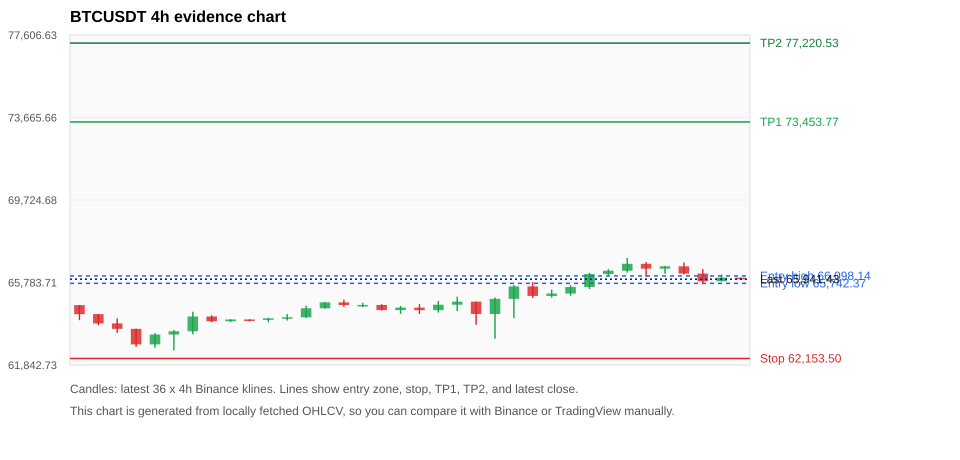
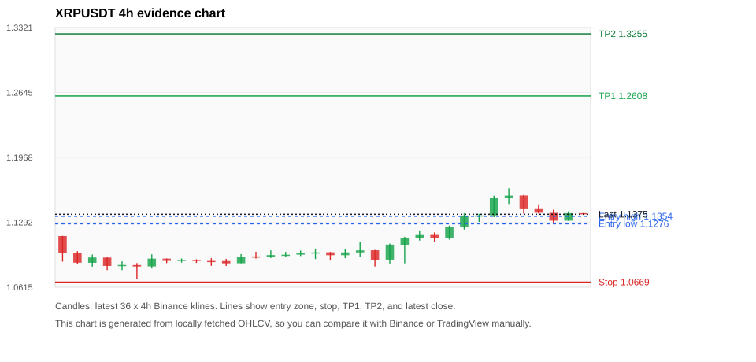
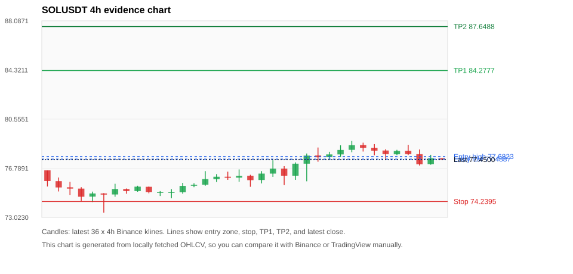
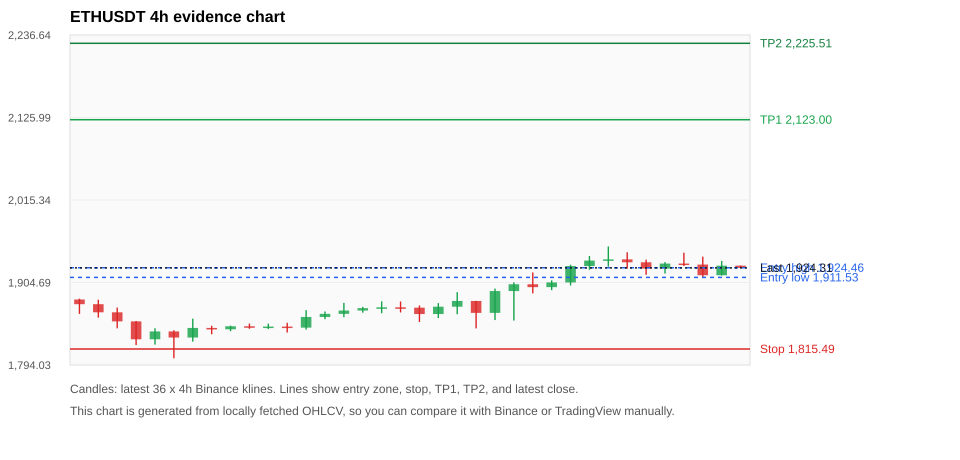
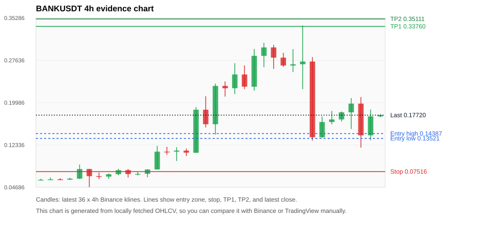

# Crypto 市场扫描报告 v1

- 报告时间：2026-07-22 20:05:44 CST
- Run ID：`20260722_120502_ee53254e`
- Run type：`daily_full`
- 数据来源：SQLite
- 报告版本：v1
- 扫描 ID：f9373c9091c9
- 数据源：Binance public spot API + CoinGecko/CoinMarketCap cross-check
- 过滤条件：USDT spot; 24h quote volume >= 30,000,000; trades >= 30,000; exclude stables/leveraged tokens; analyze 1h/4h/1d klines
- 默认单笔风险：账户权益的 1.00%

## 限制说明

- 交易信号仍以 Binance 现货公开 K 线为主源；外部数据源用于一致性复核。
- 结果是研究和模拟盘计划，不是确定收益或实盘下单指令。
- 历史长度过滤：候选币至少需要 180 根 1d K 线。
- 数据质量验证池：先验证 score 排名前 min(top_n * 2, 10) 的候选，再按 action + score 补足最终名单。
- 大盘环境过滤：NEUTRAL; BTC/ETH 大盘未完全确认强势，山寨币买入候选降级为观察。 BTC 7d=1.8301854275755147; ETH 7d=0.35508326989457384.
- 已启用数据交叉验证：Binance 主源 + CoinGecko 自动对照；CoinMarketCap 在配置 API Key 后自动对照。
- BTCUSDT 交叉验证状态 DATA_WARNING：At least one external provider needs manual review.
- XRPUSDT 交叉验证状态 DATA_WARNING：At least one external provider needs manual review.
- SOLUSDT 交叉验证状态 DATA_WARNING：At least one external provider needs manual review.
- ETHUSDT 交叉验证状态 DATA_WARNING：At least one external provider needs manual review.
- BANKUSDT 交叉验证状态 DATA_WARNING：At least one external provider needs manual review.
- BNBUSDT 交叉验证状态 DATA_WARNING：At least one external provider needs manual review.
- ZECUSDT 交叉验证状态 DATA_WARNING：At least one external provider needs manual review.

## 5 个候选交易计划

| Rank | Coin | Action | Setup | Entry Zone | Stop Loss | TP1 | TP2 / Exit Rule | R/R | Verdict |
|---:|---|---|---|---:|---:|---:|---|---:|---|
| 1 | `BTC` | `WATCH_ONLY` | 回踩支撑/4h EMA 附近 | 65,742.37 - 66,098.14 | 62,153.50 | 73,453.77 | 77,220.53 或跌破 4h 关键支撑 | 2.00-3.00 | 只观察 |
| 2 | `XRP` | `WATCH_ONLY` | 回踩支撑/4h EMA 附近 | 1.1276 - 1.1354 | 1.0669 | 1.2608 | 1.3255 或跌破 4h 关键支撑 | 2.00-3.00 | 只观察 |
| 3 | `SOL` | `WATCH_ONLY` | 回踩支撑/4h EMA 附近 | 77.4887 - 77.6823 | 74.2395 | 84.2777 | 87.6488 或跌破 4h 关键支撑 | 2.00-3.01 | 只观察 |
| 4 | `ETH` | `WATCH_ONLY` | 回踩支撑/4h EMA 附近 | 1,911.53 - 1,924.46 | 1,815.49 | 2,123.00 | 2,225.51 或跌破 4h 关键支撑 | 2.00-3.00 | 只观察 |
| 5 | `BANK` | `WATCH_ONLY` | 涨幅较远，只等深回调 | 0.13521 - 0.14387 | 0.07516 | 0.33760 | 0.35111 或跌破 4h 关键支撑 | 3.08-3.29 | 只等回调 |

## 数据交叉验证摘要

价格差异以 Binance 当前价为基准；成交量口径不同，Binance 是 USDT 现货成交额，CoinGecko/CoinMarketCap 通常是全市场成交量。

| Rank | Coin | Data Status | Max Price Diff | Max 24h Diff | Message |
|---:|---|---|---:|---:|---|
| 1 | `BTC` | DATA_WARNING | 0.05% | 0.09 pts | At least one external provider needs manual review. |
| 2 | `XRP` | DATA_WARNING | 0.22% | 0.12 pts | At least one external provider needs manual review. |
| 3 | `SOL` | DATA_WARNING | 0.07% | 0.06 pts | At least one external provider needs manual review. |
| 4 | `ETH` | DATA_WARNING | 0.03% | 0.03 pts | At least one external provider needs manual review. |
| 5 | `BANK` | DATA_WARNING | 1.17% | 1.95 pts | At least one external provider needs manual review. |

## 候选币说明

### 1. BTC `BTCUSDT`



- 入选原因：回踩支撑/4h EMA 附近；24h -0.51%，7d +1.26%，4h RSI 68.03，24h 成交额 $1.42B。
- 交易失效条件：跌破 62153.5 或 4h 收盘重新失守关键支撑。
- 主要风险：24h 动量未确认；数据交叉验证需要人工复核。
- 数据交叉验证：DATA_WARNING；At least one external provider needs manual review.

#### 可点击人工验证

- [Binance 交易页](https://www.binance.com/en/trade/BTC_USDT)
- [TradingView 图表](https://www.tradingview.com/chart/?symbol=BINANCE%3ABTCUSDT)
- [CoinGecko 搜索](https://www.coingecko.com/en/search?query=BTC)
- [CoinMarketCap 搜索](https://coinmarketcap.com/search/?q=BTC)

#### 多数据源对照

| Source | Status | Asset ID | Price | 24h Change | 24h Volume | Price Diff | 24h Diff | Updated | Message |
|---|---|---|---:|---:|---:|---:|---:|---|---|
| Binance | DATA_OK | BTCUSDT | 65,941.43 | -0.51% | $1.42B | 0.00% | 0.00 pts | 2026-07-22T12:05:29+00:00 | Primary market data source used by scanner. |
| CoinGecko | DATA_OK | bitcoin | 65,910.00 | -0.59% | $32.24B | 0.05% | 0.09 pts | 2026-07-22T12:05:29.257Z | External source agrees with Binance within thresholds. |
| CoinMarketCap | DATA_WARNING | 1 | 65,921.96 | -0.47% | $32.53B | 0.03% | 0.04 pts | 2026-07-22T12:04:04.000Z | CoinMarketCap symbol mapping has 13 matches; selected lowest cmc_rank |

#### 指标证据

| 指标 | 数值 | 人工核对用途 |
|---|---:|---|
| 当前价 | 65,941.43 | 与 Binance/TradingView 当前价格对照 |
| 24h 涨跌 | -0.51% | 与交易所 24h 涨跌对照 |
| 7d 涨跌 | +1.26% | 判断短线趋势是否延续 |
| 4h EMA20 | 65,611.15 | 判断短期趋势支撑 |
| 4h EMA50 | 64,878.13 | 判断中期趋势支撑 |
| 1d EMA20 | 64,238.84 | 判断日线趋势 |
| 1d EMA50 | 65,127.97 | 判断日线趋势 |
| 4h RSI14 | 68.03 | 判断是否过热/过弱 |
| 4h ATR14 | 695.70 | 推导止损和入场缓冲 |
| 最近 18 根 4h 最低点 | 63,100.00 | 支撑/止损参考 |
| 最近 36 根 4h 最高点 | 66,956.15 | TP/压力参考 |
| 支撑位 | 65,611.15 | 入场区间推导基础 |

#### 交易计划推导

- 支撑位 = 最近低点、4h EMA20、4h EMA50、1d EMA20 中不高于当前价的最高有效支撑 = `65,611.15`。
- 入场区间 = 支撑位附近 + ATR 缓冲 = `65,742.37 - 66,098.14`。
- 止损 = min(最近 18 根 4h 最低点 * 0.985, 入场中位价 - 1.15 * ATR14) = `62,153.50`。
- TP1 = max(最近 36 根 4h 最高点 * 0.995, 入场中位价 + 2R) = `73,453.77`。
- TP2 = max(入场中位价 + 3R, TP1 * 1.04) = `77,220.53`。

#### 最近 10 根 4h K线

| UTC 开盘时间 | Open | High | Low | Close | Quote Volume | Trades |
|---|---:|---:|---:|---:|---:|---:|
| 2026-07-21T00:00+00:00 | 65,255.51 | 65,658.78 | 65,148.75 | 65,566.78 | $149.5M | 450732 |
| 2026-07-21T04:00+00:00 | 65,566.77 | 66,245.64 | 65,471.69 | 66,186.86 | $232.9M | 468544 |
| 2026-07-21T08:00+00:00 | 66,186.86 | 66,420.65 | 66,129.19 | 66,345.59 | $227.8M | 427621 |
| 2026-07-21T12:00+00:00 | 66,345.59 | 66,956.15 | 66,255.73 | 66,676.54 | $335.4M | 858855 |
| 2026-07-21T16:00+00:00 | 66,676.53 | 66,764.00 | 66,052.63 | 66,444.76 | $195.2M | 522292 |
| 2026-07-21T20:00+00:00 | 66,444.76 | 66,576.00 | 66,204.00 | 66,556.16 | $92.0M | 277197 |
| 2026-07-22T00:00+00:00 | 66,556.15 | 66,739.89 | 66,176.00 | 66,210.00 | $191.6M | 652324 |
| 2026-07-22T04:00+00:00 | 66,209.99 | 66,424.00 | 65,701.00 | 65,843.48 | $272.4M | 668048 |
| 2026-07-22T08:00+00:00 | 65,843.48 | 66,164.57 | 65,843.47 | 66,013.36 | $341.3M | 712578 |
| 2026-07-22T12:00+00:00 | 66,013.36 | 66,013.37 | 65,939.12 | 65,941.43 | $2.0M | 5808 |

### 2. XRP `XRPUSDT`



- 入选原因：回踩支撑/4h EMA 附近；24h +0.14%，7d +1.40%，4h RSI 71.40，24h 成交额 $83.7M。
- 交易失效条件：跌破 1.0668535 或 4h 收盘重新失守关键支撑。
- 主要风险：日线趋势未完全确认；数据交叉验证需要人工复核；数据交叉验证状态为 DATA_WARNING，买入候选降级为观察。
- 数据交叉验证：DATA_WARNING；At least one external provider needs manual review.

#### 可点击人工验证

- [Binance 交易页](https://www.binance.com/en/trade/XRP_USDT)
- [TradingView 图表](https://www.tradingview.com/chart/?symbol=BINANCE%3AXRPUSDT)
- [CoinGecko 搜索](https://www.coingecko.com/en/search?query=XRP)
- [CoinMarketCap 搜索](https://coinmarketcap.com/search/?q=XRP)

#### 多数据源对照

| Source | Status | Asset ID | Price | 24h Change | 24h Volume | Price Diff | 24h Diff | Updated | Message |
|---|---|---|---:|---:|---:|---:|---:|---|---|
| Binance | DATA_OK | XRPUSDT | 1.1375 | +0.14% | $83.7M | 0.00% | 0.00 pts | 2026-07-22T12:05:29+00:00 | Primary market data source used by scanner. |
| CoinGecko | DATA_OK | ripple | 1.1400 | +0.25% | $1.34B | 0.22% | 0.11 pts | 2026-07-22T12:05:29.783Z | External source agrees with Binance within thresholds. |
| CoinMarketCap | DATA_WARNING | 52 | 1.1375 | +0.26% | $1.38B | 0.00% | 0.12 pts | 2026-07-22T12:04:04.000Z | CoinMarketCap symbol mapping has 3 matches; selected lowest cmc_rank |

#### 指标证据

| 指标 | 数值 | 人工核对用途 |
|---|---:|---|
| 当前价 | 1.1375 | 与 Binance/TradingView 当前价格对照 |
| 24h 涨跌 | +0.14% | 与交易所 24h 涨跌对照 |
| 7d 涨跌 | +1.40% | 判断短线趋势是否延续 |
| 4h EMA20 | 1.1254 | 判断短期趋势支撑 |
| 4h EMA50 | 1.1129 | 判断中期趋势支撑 |
| 1d EMA20 | 1.1094 | 判断日线趋势 |
| 1d EMA50 | 1.1459 | 判断日线趋势 |
| 4h RSI14 | 71.40 | 判断是否过热/过弱 |
| 4h ATR14 | 0.01439 | 推导止损和入场缓冲 |
| 最近 18 根 4h 最低点 | 1.0831 | 支撑/止损参考 |
| 最近 36 根 4h 最高点 | 1.1646 | TP/压力参考 |
| 支撑位 | 1.1254 | 入场区间推导基础 |

#### 交易计划推导

- 支撑位 = 最近低点、4h EMA20、4h EMA50、1d EMA20 中不高于当前价的最高有效支撑 = `1.1254`。
- 入场区间 = 支撑位附近 + ATR 缓冲 = `1.1276 - 1.1354`。
- 止损 = min(最近 18 根 4h 最低点 * 0.985, 入场中位价 - 1.15 * ATR14) = `1.0669`。
- TP1 = max(最近 36 根 4h 最高点 * 0.995, 入场中位价 + 2R) = `1.2608`。
- TP2 = max(入场中位价 + 3R, TP1 * 1.04) = `1.3255`。

#### 最近 10 根 4h K线

| UTC 开盘时间 | Open | High | Low | Close | Quote Volume | Trades |
|---|---:|---:|---:|---:|---:|---:|
| 2026-07-21T00:00+00:00 | 1.1124 | 1.1258 | 1.1111 | 1.1244 | $7.6M | 53505 |
| 2026-07-21T04:00+00:00 | 1.1244 | 1.1385 | 1.1216 | 1.1362 | $18.6M | 83218 |
| 2026-07-21T08:00+00:00 | 1.1362 | 1.1379 | 1.1296 | 1.1363 | $11.9M | 49704 |
| 2026-07-21T12:00+00:00 | 1.1364 | 1.1569 | 1.1345 | 1.1548 | $22.6M | 113424 |
| 2026-07-21T16:00+00:00 | 1.1548 | 1.1646 | 1.1482 | 1.1570 | $23.5M | 121034 |
| 2026-07-21T20:00+00:00 | 1.1571 | 1.1577 | 1.1383 | 1.1436 | $12.2M | 65431 |
| 2026-07-22T00:00+00:00 | 1.1437 | 1.1478 | 1.1384 | 1.1391 | $8.5M | 53353 |
| 2026-07-22T04:00+00:00 | 1.1390 | 1.1423 | 1.1288 | 1.1309 | $7.6M | 58156 |
| 2026-07-22T08:00+00:00 | 1.1309 | 1.1405 | 1.1308 | 1.1387 | $9.4M | 49675 |
| 2026-07-22T12:00+00:00 | 1.1387 | 1.1388 | 1.1375 | 1.1375 | $162,720 | 678 |

### 3. SOL `SOLUSDT`



- 入选原因：回踩支撑/4h EMA 附近；24h -1.10%，7d -0.84%，4h RSI 61.99，24h 成交额 $100.1M。
- 交易失效条件：跌破 74.23945 或 4h 收盘重新失守关键支撑。
- 主要风险：24h 动量未确认；7d 趋势未确认；数据交叉验证需要人工复核。
- 数据交叉验证：DATA_WARNING；At least one external provider needs manual review.

#### 可点击人工验证

- [Binance 交易页](https://www.binance.com/en/trade/SOL_USDT)
- [TradingView 图表](https://www.tradingview.com/chart/?symbol=BINANCE%3ASOLUSDT)
- [CoinGecko 搜索](https://www.coingecko.com/en/search?query=SOL)
- [CoinMarketCap 搜索](https://coinmarketcap.com/search/?q=SOL)

#### 多数据源对照

| Source | Status | Asset ID | Price | 24h Change | 24h Volume | Price Diff | 24h Diff | Updated | Message |
|---|---|---|---:|---:|---:|---:|---:|---|---|
| Binance | DATA_OK | SOLUSDT | 77.4500 | -1.10% | $100.1M | 0.00% | 0.00 pts | 2026-07-22T12:05:29+00:00 | Primary market data source used by scanner. |
| CoinGecko | DATA_OK | solana | 77.4500 | -1.05% | $1.48B | 0.00% | 0.05 pts | 2026-07-22T12:05:29.580Z | External source agrees with Binance within thresholds. |
| CoinMarketCap | DATA_WARNING | 5426 | 77.5029 | -1.04% | $1.56B | 0.07% | 0.06 pts | 2026-07-22T12:04:04.000Z | CoinMarketCap symbol mapping has 8 matches; selected lowest cmc_rank |

#### 指标证据

| 指标 | 数值 | 人工核对用途 |
|---|---:|---|
| 当前价 | 77.4500 | 与 Binance/TradingView 当前价格对照 |
| 24h 涨跌 | -1.10% | 与交易所 24h 涨跌对照 |
| 7d 涨跌 | -0.84% | 判断短线趋势是否延续 |
| 4h EMA20 | 77.3341 | 判断短期趋势支撑 |
| 4h EMA50 | 77.0644 | 判断中期趋势支撑 |
| 1d EMA20 | 76.7814 | 判断日线趋势 |
| 1d EMA50 | 76.7239 | 判断日线趋势 |
| 4h RSI14 | 61.99 | 判断是否过热/过弱 |
| 4h ATR14 | 0.89929 | 推导止损和入场缓冲 |
| 最近 18 根 4h 最低点 | 75.3700 | 支撑/止损参考 |
| 最近 36 根 4h 最高点 | 78.8800 | TP/压力参考 |
| 支撑位 | 77.3341 | 入场区间推导基础 |

#### 交易计划推导

- 支撑位 = 最近低点、4h EMA20、4h EMA50、1d EMA20 中不高于当前价的最高有效支撑 = `77.3341`。
- 入场区间 = 支撑位附近 + ATR 缓冲 = `77.4887 - 77.6823`。
- 止损 = min(最近 18 根 4h 最低点 * 0.985, 入场中位价 - 1.15 * ATR14) = `74.2395`。
- TP1 = max(最近 36 根 4h 最高点 * 0.995, 入场中位价 + 2R) = `84.2777`。
- TP2 = max(入场中位价 + 3R, TP1 * 1.04) = `87.6488`。

#### 最近 10 根 4h K线

| UTC 开盘时间 | Open | High | Low | Close | Quote Volume | Trades |
|---|---:|---:|---:|---:|---:|---:|
| 2026-07-21T00:00+00:00 | 77.8500 | 78.5500 | 77.6600 | 78.1900 | $12.5M | 64078 |
| 2026-07-21T04:00+00:00 | 78.2000 | 78.8800 | 78.0200 | 78.5600 | $19.9M | 70655 |
| 2026-07-21T08:00+00:00 | 78.5700 | 78.7500 | 78.0700 | 78.3600 | $18.7M | 58255 |
| 2026-07-21T12:00+00:00 | 78.3600 | 78.6400 | 77.7900 | 78.1400 | $25.5M | 96627 |
| 2026-07-21T16:00+00:00 | 78.1500 | 78.2500 | 77.4200 | 77.8700 | $14.5M | 66726 |
| 2026-07-21T20:00+00:00 | 77.8600 | 78.2000 | 77.8000 | 78.1200 | $9.4M | 39481 |
| 2026-07-22T00:00+00:00 | 78.1300 | 78.5900 | 77.8100 | 77.8700 | $12.2M | 59253 |
| 2026-07-22T04:00+00:00 | 77.8700 | 78.2300 | 77.0000 | 77.1000 | $22.8M | 70819 |
| 2026-07-22T08:00+00:00 | 77.1100 | 77.8200 | 77.0600 | 77.5600 | $15.8M | 46908 |
| 2026-07-22T12:00+00:00 | 77.5600 | 77.5700 | 77.4400 | 77.4500 | $228,784 | 1065 |

### 4. ETH `ETHUSDT`



- 入选原因：回踩支撑/4h EMA 附近；24h -0.46%，7d -0.08%，4h RSI 73.23，24h 成交额 $490.8M。
- 交易失效条件：跌破 1815.4929 或 4h 收盘重新失守关键支撑。
- 主要风险：24h 动量未确认；7d 趋势未确认；数据交叉验证需要人工复核。
- 数据交叉验证：DATA_WARNING；At least one external provider needs manual review.

#### 可点击人工验证

- [Binance 交易页](https://www.binance.com/en/trade/ETH_USDT)
- [TradingView 图表](https://www.tradingview.com/chart/?symbol=BINANCE%3AETHUSDT)
- [CoinGecko 搜索](https://www.coingecko.com/en/search?query=ETH)
- [CoinMarketCap 搜索](https://coinmarketcap.com/search/?q=ETH)

#### 多数据源对照

| Source | Status | Asset ID | Price | 24h Change | 24h Volume | Price Diff | 24h Diff | Updated | Message |
|---|---|---|---:|---:|---:|---:|---:|---|---|
| Binance | DATA_OK | ETHUSDT | 1,924.31 | -0.46% | $490.8M | 0.00% | 0.00 pts | 2026-07-22T12:05:29+00:00 | Primary market data source used by scanner. |
| CoinGecko | DATA_OK | ethereum | 1,923.74 | -0.49% | $9.35B | 0.03% | 0.03 pts | 2026-07-22T12:05:31.161Z | External source agrees with Binance within thresholds. |
| CoinMarketCap | DATA_WARNING | 1027 | 1,924.53 | -0.45% | $10.66B | 0.01% | 0.01 pts | 2026-07-22T12:04:04.000Z | CoinMarketCap symbol mapping has 6 matches; selected lowest cmc_rank |

#### 指标证据

| 指标 | 数值 | 人工核对用途 |
|---|---:|---|
| 当前价 | 1,924.31 | 与 Binance/TradingView 当前价格对照 |
| 24h 涨跌 | -0.46% | 与交易所 24h 涨跌对照 |
| 7d 涨跌 | -0.08% | 判断短线趋势是否延续 |
| 4h EMA20 | 1,907.71 | 判断短期趋势支撑 |
| 4h EMA50 | 1,877.95 | 判断中期趋势支撑 |
| 1d EMA20 | 1,831.98 | 判断日线趋势 |
| 1d EMA50 | 1,827.07 | 判断日线趋势 |
| 4h RSI14 | 73.23 | 判断是否过热/过弱 |
| 4h ATR14 | 23.9293 | 推导止损和入场缓冲 |
| 最近 18 根 4h 最低点 | 1,843.14 | 支撑/止损参考 |
| 最近 36 根 4h 最高点 | 1,953.00 | TP/压力参考 |
| 支撑位 | 1,907.71 | 入场区间推导基础 |

#### 交易计划推导

- 支撑位 = 最近低点、4h EMA20、4h EMA50、1d EMA20 中不高于当前价的最高有效支撑 = `1,907.71`。
- 入场区间 = 支撑位附近 + ATR 缓冲 = `1,911.53 - 1,924.46`。
- 止损 = min(最近 18 根 4h 最低点 * 0.985, 入场中位价 - 1.15 * ATR14) = `1,815.49`。
- TP1 = max(最近 36 根 4h 最高点 * 0.995, 入场中位价 + 2R) = `2,123.00`。
- TP2 = max(入场中位价 + 3R, TP1 * 1.04) = `2,225.51`。

#### 最近 10 根 4h K线

| UTC 开盘时间 | Open | High | Low | Close | Quote Volume | Trades |
|---|---:|---:|---:|---:|---:|---:|
| 2026-07-21T00:00+00:00 | 1,904.77 | 1,928.57 | 1,900.74 | 1,926.75 | $75.5M | 350782 |
| 2026-07-21T04:00+00:00 | 1,926.74 | 1,940.25 | 1,921.81 | 1,934.08 | $78.3M | 311313 |
| 2026-07-21T08:00+00:00 | 1,934.07 | 1,953.00 | 1,925.98 | 1,935.69 | $220.9M | 461182 |
| 2026-07-21T12:00+00:00 | 1,935.69 | 1,945.23 | 1,923.36 | 1,931.81 | $120.8M | 635584 |
| 2026-07-21T16:00+00:00 | 1,931.81 | 1,935.36 | 1,915.00 | 1,923.39 | $96.0M | 450944 |
| 2026-07-21T20:00+00:00 | 1,923.38 | 1,932.00 | 1,916.67 | 1,930.09 | $39.8M | 220537 |
| 2026-07-22T00:00+00:00 | 1,930.09 | 1,944.68 | 1,926.76 | 1,928.77 | $73.9M | 420834 |
| 2026-07-22T04:00+00:00 | 1,928.76 | 1,939.40 | 1,910.68 | 1,914.44 | $92.3M | 411324 |
| 2026-07-22T08:00+00:00 | 1,914.43 | 1,933.62 | 1,914.08 | 1,927.27 | $70.1M | 330907 |
| 2026-07-22T12:00+00:00 | 1,927.26 | 1,927.40 | 1,924.15 | 1,924.31 | $515,526 | 8101 |

### 5. BANK `BANKUSDT`



- 入选原因：涨幅较远，只等深回调；24h +28.73%，7d +282.72%，4h RSI 43.61，24h 成交额 $89.9M。
- 交易失效条件：跌破 0.075155301 或 4h 收盘重新失守关键支撑。
- 主要风险：距离支撑偏远，不能追市价；24h 振幅较大，回撤风险高；数据交叉验证需要人工复核。
- 数据交叉验证：DATA_WARNING；At least one external provider needs manual review.

#### 可点击人工验证

- [Binance 交易页](https://www.binance.com/en/trade/BANK_USDT)
- [TradingView 图表](https://www.tradingview.com/chart/?symbol=BINANCE%3ABANKUSDT)
- [CoinGecko 搜索](https://www.coingecko.com/en/search?query=BANK)
- [CoinMarketCap 搜索](https://coinmarketcap.com/search/?q=BANK)

#### 多数据源对照

| Source | Status | Asset ID | Price | 24h Change | 24h Volume | Price Diff | 24h Diff | Updated | Message |
|---|---|---|---:|---:|---:|---:|---:|---|---|
| Binance | DATA_OK | BANKUSDT | 0.17720 | +28.73% | $89.9M | 0.00% | 0.00 pts | 2026-07-22T12:05:29+00:00 | Primary market data source used by scanner. |
| CoinGecko | DATA_WARNING | lorenzo-protocol | 0.17555 | +27.30% | $211.3M | 0.93% | 1.42 pts | 2026-07-22T12:05:32.243Z | CoinGecko symbol mapping has 3 exact matches; selected highest market-cap rank |
| CoinMarketCap | DATA_WARNING | 36296 | 0.17513 | +26.77% | $313.2M | 1.17% | 1.95 pts | 2026-07-22T12:04:04.000Z | price diff 1.17% exceeds warning threshold; CoinMarketCap symbol mapping has 10 matches; selected lowest cmc_rank |

#### 指标证据

| 指标 | 数值 | 人工核对用途 |
|---|---:|---|
| 当前价 | 0.17720 | 与 Binance/TradingView 当前价格对照 |
| 24h 涨跌 | +28.73% | 与交易所 24h 涨跌对照 |
| 7d 涨跌 | +282.72% | 判断短线趋势是否延续 |
| 4h EMA20 | 0.18472 | 判断短期趋势支撑 |
| 4h EMA50 | 0.14358 | 判断中期趋势支撑 |
| 1d EMA20 | 0.10335 | 判断日线趋势 |
| 1d EMA50 | 0.06812 | 判断日线趋势 |
| 4h RSI14 | 43.61 | 判断是否过热/过弱 |
| 4h ATR14 | 0.05599 | 推导止损和入场缓冲 |
| 最近 18 根 4h 最低点 | 0.11850 | 支撑/止损参考 |
| 最近 36 根 4h 最高点 | 0.33930 | TP/压力参考 |
| 支撑位 | 0.14358 | 入场区间推导基础 |

#### 交易计划推导

- 支撑位 = 最近低点、4h EMA20、4h EMA50、1d EMA20 中不高于当前价的最高有效支撑 = `0.14358`。
- 入场区间 = 支撑位附近 + ATR 缓冲 = `0.13521 - 0.14387`。
- 止损 = min(最近 18 根 4h 最低点 * 0.985, 入场中位价 - 1.15 * ATR14) = `0.07516`。
- TP1 = max(最近 36 根 4h 最高点 * 0.995, 入场中位价 + 2R) = `0.33760`。
- TP2 = max(入场中位价 + 3R, TP1 * 1.04) = `0.35111`。

#### 最近 10 根 4h K线

| UTC 开盘时间 | Open | High | Low | Close | Quote Volume | Trades |
|---|---:|---:|---:|---:|---:|---:|
| 2026-07-21T00:00+00:00 | 0.26690 | 0.29650 | 0.25510 | 0.26910 | $7.9M | 120274 |
| 2026-07-21T04:00+00:00 | 0.26920 | 0.33930 | 0.22430 | 0.27410 | $22.0M | 266700 |
| 2026-07-21T08:00+00:00 | 0.27410 | 0.28210 | 0.13140 | 0.13730 | $36.8M | 564074 |
| 2026-07-21T12:00+00:00 | 0.13720 | 0.17460 | 0.13620 | 0.16480 | $15.4M | 146381 |
| 2026-07-21T16:00+00:00 | 0.16480 | 0.18490 | 0.16070 | 0.16940 | $11.8M | 114628 |
| 2026-07-21T20:00+00:00 | 0.16950 | 0.18380 | 0.16570 | 0.18230 | $3.1M | 33878 |
| 2026-07-22T00:00+00:00 | 0.18230 | 0.20800 | 0.15220 | 0.19810 | $20.3M | 279829 |
| 2026-07-22T04:00+00:00 | 0.19810 | 0.21000 | 0.11850 | 0.14070 | $22.2M | 266622 |
| 2026-07-22T08:00+00:00 | 0.14080 | 0.18740 | 0.13180 | 0.17500 | $17.5M | 199508 |
| 2026-07-22T12:00+00:00 | 0.17490 | 0.17860 | 0.17360 | 0.17730 | $178,983 | 2543 |

## 组合风控

- 不要 5 个候选全部满仓买入。
- 同时持仓总风险建议控制在账户权益的 3% - 5% 以内。
- 如果 BTC/ETH 同时破位，暂停山寨币多头计划或降低仓位。
- 第一版报告用于模拟盘和人工复核，不自动下单。

## 原始数据

```json
[
  {
    "rank": 1,
    "symbol": "BTCUSDT",
    "base_asset": "BTC",
    "price": 65941.43,
    "score": 56.61573499495747,
    "setup": "回踩支撑/4h EMA 附近",
    "verdict": "只观察",
    "entry_low": 65742.37297243117,
    "entry_high": 66098.141171089,
    "stop_loss": 62153.5,
    "take_profit_1": 73453.77121528023,
    "take_profit_2": 77220.5282870403,
    "risk_reward_1": 2.0,
    "risk_reward_2": 3.0,
    "pct_24h": -0.505,
    "pct_3d": 2.2612362795892293,
    "pct_7d": 1.2645353457623631,
    "quote_volume_24h": 1421217507.0291274,
    "trades_24h": 3685274,
    "high_low_range_24h": 1.9103971020227872,
    "rsi_1h": 40.2717335894697,
    "rsi_4h": 68.02873450962502,
    "ema20_4h": 65611.150671089,
    "ema50_4h": 64878.134672945416,
    "ema20_1d": 64238.83541837145,
    "ema50_1d": 65127.97307334926,
    "atr_4h": 695.700714285713,
    "macd_hist_4h": -10.028400787593796,
    "volume_ratio_24h": 1.3442341496633718,
    "support_level": 65611.150671089,
    "recent_low_4h_18": 63100.0,
    "recent_high_4h_36": 66956.15,
    "distance_to_support_pct": 0.5033890208185898,
    "binance_trade_url": "https://www.binance.com/en/trade/BTC_USDT",
    "tradingview_url": "https://www.tradingview.com/chart/?symbol=BINANCE%3ABTCUSDT",
    "coingecko_search_url": "https://www.coingecko.com/en/search?query=BTC",
    "coinmarketcap_search_url": "https://coinmarketcap.com/search/?q=BTC",
    "invalidation": "跌破 62153.5 或 4h 收盘重新失守关键支撑",
    "recent_4h_klines": [
      {
        "open_time_utc": "2026-07-16T16:00+00:00",
        "open": 64704.73,
        "high": 64712.0,
        "low": 63984.09,
        "close": 64271.84,
        "quote_volume": 114685442.704316,
        "trades": 502323
      },
      {
        "open_time_utc": "2026-07-16T20:00+00:00",
        "open": 64271.85,
        "high": 64276.0,
        "low": 63748.74,
        "close": 63830.2,
        "quote_volume": 78420806.528254,
        "trades": 281502
      },
      {
        "open_time_utc": "2026-07-17T00:00+00:00",
        "open": 63830.2,
        "high": 64067.69,
        "low": 63380.28,
        "close": 63570.0,
        "quote_volume": 169659336.6829894,
        "trades": 531177
      },
      {
        "open_time_utc": "2026-07-17T04:00+00:00",
        "open": 63570.0,
        "high": 63576.0,
        "low": 62710.0,
        "close": 62828.11,
        "quote_volume": 262693644.6590385,
        "trades": 494473
      },
      {
        "open_time_utc": "2026-07-17T08:00+00:00",
        "open": 62828.11,
        "high": 63361.7,
        "low": 62666.0,
        "close": 63298.01,
        "quote_volume": 163366668.3718989,
        "trades": 354967
      },
      {
        "open_time_utc": "2026-07-17T12:00+00:00",
        "open": 63298.0,
        "high": 63518.0,
        "low": 62537.56,
        "close": 63452.0,
        "quote_volume": 246111895.341298,
        "trades": 894383
      },
      {
        "open_time_utc": "2026-07-17T16:00+00:00",
        "open": 63452.0,
        "high": 64387.99,
        "low": 63312.01,
        "close": 64160.8,
        "quote_volume": 219389919.1329495,
        "trades": 728454
      },
      {
        "open_time_utc": "2026-07-17T20:00+00:00",
        "open": 64160.8,
        "high": 64216.61,
        "low": 63884.35,
        "close": 63931.67,
        "quote_volume": 91324565.1520772,
        "trades": 235842
      },
      {
        "open_time_utc": "2026-07-18T00:00+00:00",
        "open": 63931.67,
        "high": 64032.6,
        "low": 63886.65,
        "close": 64017.84,
        "quote_volume": 87640554.7560027,
        "trades": 150552
      },
      {
        "open_time_utc": "2026-07-18T04:00+00:00",
        "open": 64017.84,
        "high": 64026.03,
        "low": 63926.39,
        "close": 64002.75,
        "quote_volume": 60728056.1143949,
        "trades": 118016
      },
      {
        "open_time_utc": "2026-07-18T08:00+00:00",
        "open": 64002.75,
        "high": 64097.22,
        "low": 63887.73,
        "close": 64069.89,
        "quote_volume": 70619036.0344428,
        "trades": 85981
      },
      {
        "open_time_utc": "2026-07-18T12:00+00:00",
        "open": 64069.89,
        "high": 64274.47,
        "low": 63963.0,
        "close": 64123.12,
        "quote_volume": 79608426.7322157,
        "trades": 210954
      },
      {
        "open_time_utc": "2026-07-18T16:00+00:00",
        "open": 64123.13,
        "high": 64669.5,
        "low": 64091.48,
        "close": 64552.79,
        "quote_volume": 110998004.6017032,
        "trades": 257153
      },
      {
        "open_time_utc": "2026-07-18T20:00+00:00",
        "open": 64552.8,
        "high": 64865.0,
        "low": 64528.69,
        "close": 64834.22,
        "quote_volume": 106360570.4476106,
        "trades": 266045
      },
      {
        "open_time_utc": "2026-07-19T00:00+00:00",
        "open": 64834.21,
        "high": 64967.25,
        "low": 64620.44,
        "close": 64706.18,
        "quote_volume": 106536390.3821349,
        "trades": 198160
      },
      {
        "open_time_utc": "2026-07-19T04:00+00:00",
        "open": 64706.18,
        "high": 64815.65,
        "low": 64610.89,
        "close": 64711.05,
        "quote_volume": 71298499.0657687,
        "trades": 143399
      },
      {
        "open_time_utc": "2026-07-19T08:00+00:00",
        "open": 64711.04,
        "high": 64743.0,
        "low": 64445.0,
        "close": 64467.64,
        "quote_volume": 99445905.383701,
        "trades": 229863
      },
      {
        "open_time_utc": "2026-07-19T12:00+00:00",
        "open": 64467.65,
        "high": 64663.04,
        "low": 64285.24,
        "close": 64585.32,
        "quote_volume": 94381470.0512155,
        "trades": 274299
      },
      {
        "open_time_utc": "2026-07-19T16:00+00:00",
        "open": 64585.33,
        "high": 64752.0,
        "low": 64280.0,
        "close": 64462.58,
        "quote_volume": 74890318.851404,
        "trades": 254773
      },
      {
        "open_time_utc": "2026-07-19T20:00+00:00",
        "open": 64462.58,
        "high": 64900.0,
        "low": 64347.89,
        "close": 64722.54,
        "quote_volume": 95006518.1787705,
        "trades": 363843
      },
      {
        "open_time_utc": "2026-07-20T00:00+00:00",
        "open": 64722.55,
        "high": 65107.99,
        "low": 64416.0,
        "close": 64869.8,
        "quote_volume": 120367010.7614054,
        "trades": 587702
      },
      {
        "open_time_utc": "2026-07-20T04:00+00:00",
        "open": 64869.79,
        "high": 64869.99,
        "low": 63765.83,
        "close": 64280.01,
        "quote_volume": 202948573.3207383,
        "trades": 587681
      },
      {
        "open_time_utc": "2026-07-20T08:00+00:00",
        "open": 64280.01,
        "high": 65068.0,
        "low": 63100.0,
        "close": 65002.01,
        "quote_volume": 371789253.355281,
        "trades": 511848
      },
      {
        "open_time_utc": "2026-07-20T12:00+00:00",
        "open": 65002.0,
        "high": 65666.8,
        "low": 64077.76,
        "close": 65598.75,
        "quote_volume": 379053519.1860063,
        "trades": 1036177
      },
      {
        "open_time_utc": "2026-07-20T16:00+00:00",
        "open": 65598.75,
        "high": 65799.0,
        "low": 65041.05,
        "close": 65142.0,
        "quote_volume": 215471814.6428676,
        "trades": 589177
      },
      {
        "open_time_utc": "2026-07-20T20:00+00:00",
        "open": 65142.0,
        "high": 65445.27,
        "low": 65061.92,
        "close": 65255.51,
        "quote_volume": 89552538.9967458,
        "trades": 294262
      },
      {
        "open_time_utc": "2026-07-21T00:00+00:00",
        "open": 65255.51,
        "high": 65658.78,
        "low": 65148.75,
        "close": 65566.78,
        "quote_volume": 149538223.7084598,
        "trades": 450732
      },
      {
        "open_time_utc": "2026-07-21T04:00+00:00",
        "open": 65566.77,
        "high": 66245.64,
        "low": 65471.69,
        "close": 66186.86,
        "quote_volume": 232893727.7760537,
        "trades": 468544
      },
      {
        "open_time_utc": "2026-07-21T08:00+00:00",
        "open": 66186.86,
        "high": 66420.65,
        "low": 66129.19,
        "close": 66345.59,
        "quote_volume": 227803607.7517068,
        "trades": 427621
      },
      {
        "open_time_utc": "2026-07-21T12:00+00:00",
        "open": 66345.59,
        "high": 66956.15,
        "low": 66255.73,
        "close": 66676.54,
        "quote_volume": 335391888.9380546,
        "trades": 858855
      },
      {
        "open_time_utc": "2026-07-21T16:00+00:00",
        "open": 66676.53,
        "high": 66764.0,
        "low": 66052.63,
        "close": 66444.76,
        "quote_volume": 195205977.7344099,
        "trades": 522292
      },
      {
        "open_time_utc": "2026-07-21T20:00+00:00",
        "open": 66444.76,
        "high": 66576.0,
        "low": 66204.0,
        "close": 66556.16,
        "quote_volume": 91969264.1655351,
        "trades": 277197
      },
      {
        "open_time_utc": "2026-07-22T00:00+00:00",
        "open": 66556.15,
        "high": 66739.89,
        "low": 66176.0,
        "close": 66210.0,
        "quote_volume": 191621422.1669866,
        "trades": 652324
      },
      {
        "open_time_utc": "2026-07-22T04:00+00:00",
        "open": 66209.99,
        "high": 66424.0,
        "low": 65701.0,
        "close": 65843.48,
        "quote_volume": 272389387.6457355,
        "trades": 668048
      },
      {
        "open_time_utc": "2026-07-22T08:00+00:00",
        "open": 65843.48,
        "high": 66164.57,
        "low": 65843.47,
        "close": 66013.36,
        "quote_volume": 341268215.7845121,
        "trades": 712578
      },
      {
        "open_time_utc": "2026-07-22T12:00+00:00",
        "open": 66013.36,
        "high": 66013.37,
        "low": 65939.12,
        "close": 65941.43,
        "quote_volume": 1982721.5545659,
        "trades": 5808
      }
    ],
    "risks": [
      "24h 动量未确认",
      "数据交叉验证需要人工复核"
    ],
    "data_quality_status": "DATA_WARNING",
    "data_quality_message": "At least one external provider needs manual review.",
    "data_checks": [
      {
        "provider": "Binance",
        "status": "DATA_OK",
        "provider_asset_id": "BTCUSDT",
        "provider_symbol": "BTCUSDT",
        "price_usd": 65941.43,
        "pct_24h": -0.505,
        "volume_24h": 1421217507.0291274,
        "last_updated": null,
        "fetched_at_utc": "2026-07-22T12:05:29+00:00",
        "price_diff_pct": 0.0,
        "pct_24h_diff": 0.0,
        "volume_note": "Binance USDT spot 24h quoteVolume.",
        "message": "Primary market data source used by scanner."
      },
      {
        "provider": "CoinGecko",
        "status": "DATA_OK",
        "provider_asset_id": "bitcoin",
        "provider_symbol": "BTC",
        "price_usd": 65910.0,
        "pct_24h": -0.59438,
        "volume_24h": 32240855325.0,
        "last_updated": "2026-07-22T12:05:29.257Z",
        "fetched_at_utc": "2026-07-22T12:05:29+00:00",
        "price_diff_pct": 0.04766350987534395,
        "pct_24h_diff": 0.08938000000000001,
        "volume_note": "CoinGecko total market volume; not the same venue scope as Binance quoteVolume.",
        "message": "External source agrees with Binance within thresholds."
      },
      {
        "provider": "CoinMarketCap",
        "status": "DATA_WARNING",
        "provider_asset_id": "1",
        "provider_symbol": "BTC",
        "price_usd": 65921.9586106008,
        "pct_24h": -0.46896282,
        "volume_24h": 32531898156.189266,
        "last_updated": "2026-07-22T12:04:04.000Z",
        "fetched_at_utc": "2026-07-22T12:05:29+00:00",
        "price_diff_pct": 0.0295283092877825,
        "pct_24h_diff": 0.03603718,
        "volume_note": "CoinMarketCap total market volume; not the same venue scope as Binance quoteVolume.",
        "message": "CoinMarketCap symbol mapping has 13 matches; selected lowest cmc_rank"
      }
    ],
    "action": "WATCH_ONLY"
  },
  {
    "rank": 2,
    "symbol": "XRPUSDT",
    "base_asset": "XRP",
    "price": 1.1375,
    "score": 49.731365431158736,
    "setup": "回踩支撑/4h EMA 附近",
    "verdict": "只观察",
    "entry_low": 1.1276089868408377,
    "entry_high": 1.1354282703002372,
    "stop_loss": 1.0668535,
    "take_profit_1": 1.2608488857116125,
    "take_profit_2": 1.32551401428215,
    "risk_reward_1": 2.0,
    "risk_reward_2": 3.0,
    "pct_24h": 0.141,
    "pct_3d": 3.947729141917189,
    "pct_7d": 1.3995364592618964,
    "quote_volume_24h": 83676140.74548,
    "trades_24h": 459925,
    "high_low_range_24h": 3.1715095676825067,
    "rsi_1h": 43.1952662721894,
    "rsi_4h": 71.40271493212664,
    "ema20_4h": 1.1253582703002372,
    "ema50_4h": 1.1128632460525802,
    "ema20_1d": 1.1094089137049907,
    "ema50_1d": 1.1458611104251695,
    "atr_4h": 0.01438571428571427,
    "macd_hist_4h": 0.000961281548565493,
    "volume_ratio_24h": 1.4395737658098264,
    "support_level": 1.1253582703002372,
    "recent_low_4h_18": 1.0831,
    "recent_high_4h_36": 1.1646,
    "distance_to_support_pct": 1.0789212662491554,
    "binance_trade_url": "https://www.binance.com/en/trade/XRP_USDT",
    "tradingview_url": "https://www.tradingview.com/chart/?symbol=BINANCE%3AXRPUSDT",
    "coingecko_search_url": "https://www.coingecko.com/en/search?query=XRP",
    "coinmarketcap_search_url": "https://coinmarketcap.com/search/?q=XRP",
    "invalidation": "跌破 1.0668535 或 4h 收盘重新失守关键支撑",
    "recent_4h_klines": [
      {
        "open_time_utc": "2026-07-16T16:00+00:00",
        "open": 1.1148,
        "high": 1.1151,
        "low": 1.0882,
        "close": 1.0973,
        "quote_volume": 15448759.40946,
        "trades": 83083
      },
      {
        "open_time_utc": "2026-07-16T20:00+00:00",
        "open": 1.0972,
        "high": 1.0991,
        "low": 1.0853,
        "close": 1.0871,
        "quote_volume": 8116821.89272,
        "trades": 42815
      },
      {
        "open_time_utc": "2026-07-17T00:00+00:00",
        "open": 1.087,
        "high": 1.0956,
        "low": 1.0829,
        "close": 1.0925,
        "quote_volume": 10458203.79698,
        "trades": 65987
      },
      {
        "open_time_utc": "2026-07-17T04:00+00:00",
        "open": 1.0924,
        "high": 1.0927,
        "low": 1.0793,
        "close": 1.0837,
        "quote_volume": 7793155.32314,
        "trades": 52700
      },
      {
        "open_time_utc": "2026-07-17T08:00+00:00",
        "open": 1.0838,
        "high": 1.0885,
        "low": 1.0793,
        "close": 1.0847,
        "quote_volume": 9356737.81617,
        "trades": 44236
      },
      {
        "open_time_utc": "2026-07-17T12:00+00:00",
        "open": 1.0846,
        "high": 1.0867,
        "low": 1.0698,
        "close": 1.0831,
        "quote_volume": 18941591.07526,
        "trades": 112826
      },
      {
        "open_time_utc": "2026-07-17T16:00+00:00",
        "open": 1.0832,
        "high": 1.0958,
        "low": 1.0811,
        "close": 1.0913,
        "quote_volume": 9653363.31465,
        "trades": 70165
      },
      {
        "open_time_utc": "2026-07-17T20:00+00:00",
        "open": 1.0913,
        "high": 1.0914,
        "low": 1.0867,
        "close": 1.089,
        "quote_volume": 3830698.57846,
        "trades": 26604
      },
      {
        "open_time_utc": "2026-07-18T00:00+00:00",
        "open": 1.0891,
        "high": 1.0915,
        "low": 1.0872,
        "close": 1.0901,
        "quote_volume": 2582054.94506,
        "trades": 18813
      },
      {
        "open_time_utc": "2026-07-18T04:00+00:00",
        "open": 1.0902,
        "high": 1.0907,
        "low": 1.0869,
        "close": 1.0889,
        "quote_volume": 2583271.70528,
        "trades": 16850
      },
      {
        "open_time_utc": "2026-07-18T08:00+00:00",
        "open": 1.0889,
        "high": 1.0918,
        "low": 1.0838,
        "close": 1.0888,
        "quote_volume": 4012840.13916,
        "trades": 23091
      },
      {
        "open_time_utc": "2026-07-18T12:00+00:00",
        "open": 1.0888,
        "high": 1.0911,
        "low": 1.0836,
        "close": 1.0864,
        "quote_volume": 4196977.31704,
        "trades": 29185
      },
      {
        "open_time_utc": "2026-07-18T16:00+00:00",
        "open": 1.0865,
        "high": 1.0961,
        "low": 1.0865,
        "close": 1.0935,
        "quote_volume": 6034556.87593,
        "trades": 31615
      },
      {
        "open_time_utc": "2026-07-18T20:00+00:00",
        "open": 1.0936,
        "high": 1.0984,
        "low": 1.0914,
        "close": 1.0929,
        "quote_volume": 4503420.28437,
        "trades": 28600
      },
      {
        "open_time_utc": "2026-07-19T00:00+00:00",
        "open": 1.0929,
        "high": 1.0999,
        "low": 1.0919,
        "close": 1.095,
        "quote_volume": 4241178.12217,
        "trades": 26136
      },
      {
        "open_time_utc": "2026-07-19T04:00+00:00",
        "open": 1.095,
        "high": 1.0984,
        "low": 1.0933,
        "close": 1.0954,
        "quote_volume": 5154721.90515,
        "trades": 23260
      },
      {
        "open_time_utc": "2026-07-19T08:00+00:00",
        "open": 1.0955,
        "high": 1.0997,
        "low": 1.094,
        "close": 1.097,
        "quote_volume": 4020728.35675,
        "trades": 24825
      },
      {
        "open_time_utc": "2026-07-19T12:00+00:00",
        "open": 1.0971,
        "high": 1.1018,
        "low": 1.0909,
        "close": 1.0978,
        "quote_volume": 5501945.81722,
        "trades": 38409
      },
      {
        "open_time_utc": "2026-07-19T16:00+00:00",
        "open": 1.0979,
        "high": 1.0983,
        "low": 1.0893,
        "close": 1.0949,
        "quote_volume": 5383686.80209,
        "trades": 38222
      },
      {
        "open_time_utc": "2026-07-19T20:00+00:00",
        "open": 1.0949,
        "high": 1.1017,
        "low": 1.0918,
        "close": 1.0978,
        "quote_volume": 5121401.24244,
        "trades": 46712
      },
      {
        "open_time_utc": "2026-07-20T00:00+00:00",
        "open": 1.0978,
        "high": 1.1083,
        "low": 1.0933,
        "close": 1.0999,
        "quote_volume": 10362603.27826,
        "trades": 102526
      },
      {
        "open_time_utc": "2026-07-20T04:00+00:00",
        "open": 1.1,
        "high": 1.1004,
        "low": 1.0831,
        "close": 1.0902,
        "quote_volume": 7264986.60686,
        "trades": 68999
      },
      {
        "open_time_utc": "2026-07-20T08:00+00:00",
        "open": 1.0903,
        "high": 1.107,
        "low": 1.0862,
        "close": 1.1059,
        "quote_volume": 9287324.35514,
        "trades": 60496
      },
      {
        "open_time_utc": "2026-07-20T12:00+00:00",
        "open": 1.1058,
        "high": 1.1141,
        "low": 1.0864,
        "close": 1.1126,
        "quote_volume": 17432731.08966,
        "trades": 122584
      },
      {
        "open_time_utc": "2026-07-20T16:00+00:00",
        "open": 1.1126,
        "high": 1.1207,
        "low": 1.1101,
        "close": 1.1167,
        "quote_volume": 18954539.3125,
        "trades": 85911
      },
      {
        "open_time_utc": "2026-07-20T20:00+00:00",
        "open": 1.1168,
        "high": 1.1186,
        "low": 1.1083,
        "close": 1.1124,
        "quote_volume": 7964501.63524,
        "trades": 41508
      },
      {
        "open_time_utc": "2026-07-21T00:00+00:00",
        "open": 1.1124,
        "high": 1.1258,
        "low": 1.1111,
        "close": 1.1244,
        "quote_volume": 7571383.34953,
        "trades": 53505
      },
      {
        "open_time_utc": "2026-07-21T04:00+00:00",
        "open": 1.1244,
        "high": 1.1385,
        "low": 1.1216,
        "close": 1.1362,
        "quote_volume": 18621866.86961,
        "trades": 83218
      },
      {
        "open_time_utc": "2026-07-21T08:00+00:00",
        "open": 1.1362,
        "high": 1.1379,
        "low": 1.1296,
        "close": 1.1363,
        "quote_volume": 11871597.40634,
        "trades": 49704
      },
      {
        "open_time_utc": "2026-07-21T12:00+00:00",
        "open": 1.1364,
        "high": 1.1569,
        "low": 1.1345,
        "close": 1.1548,
        "quote_volume": 22599852.73269,
        "trades": 113424
      },
      {
        "open_time_utc": "2026-07-21T16:00+00:00",
        "open": 1.1548,
        "high": 1.1646,
        "low": 1.1482,
        "close": 1.157,
        "quote_volume": 23459169.41466,
        "trades": 121034
      },
      {
        "open_time_utc": "2026-07-21T20:00+00:00",
        "open": 1.1571,
        "high": 1.1577,
        "low": 1.1383,
        "close": 1.1436,
        "quote_volume": 12240408.21201,
        "trades": 65431
      },
      {
        "open_time_utc": "2026-07-22T00:00+00:00",
        "open": 1.1437,
        "high": 1.1478,
        "low": 1.1384,
        "close": 1.1391,
        "quote_volume": 8508256.60409,
        "trades": 53353
      },
      {
        "open_time_utc": "2026-07-22T04:00+00:00",
        "open": 1.139,
        "high": 1.1423,
        "low": 1.1288,
        "close": 1.1309,
        "quote_volume": 7564624.6506,
        "trades": 58156
      },
      {
        "open_time_utc": "2026-07-22T08:00+00:00",
        "open": 1.1309,
        "high": 1.1405,
        "low": 1.1308,
        "close": 1.1387,
        "quote_volume": 9423905.70349,
        "trades": 49675
      },
      {
        "open_time_utc": "2026-07-22T12:00+00:00",
        "open": 1.1387,
        "high": 1.1388,
        "low": 1.1375,
        "close": 1.1375,
        "quote_volume": 162720.0559,
        "trades": 678
      }
    ],
    "risks": [
      "日线趋势未完全确认",
      "数据交叉验证需要人工复核",
      "数据交叉验证状态为 DATA_WARNING，买入候选降级为观察"
    ],
    "data_quality_status": "DATA_WARNING",
    "data_quality_message": "At least one external provider needs manual review.",
    "data_checks": [
      {
        "provider": "Binance",
        "status": "DATA_OK",
        "provider_asset_id": "XRPUSDT",
        "provider_symbol": "XRPUSDT",
        "price_usd": 1.1375,
        "pct_24h": 0.141,
        "volume_24h": 83676140.74548,
        "last_updated": null,
        "fetched_at_utc": "2026-07-22T12:05:29+00:00",
        "price_diff_pct": 0.0,
        "pct_24h_diff": 0.0,
        "volume_note": "Binance USDT spot 24h quoteVolume.",
        "message": "Primary market data source used by scanner."
      },
      {
        "provider": "CoinGecko",
        "status": "DATA_OK",
        "provider_asset_id": "ripple",
        "provider_symbol": "XRP",
        "price_usd": 1.14,
        "pct_24h": 0.25426,
        "volume_24h": 1335073617.0,
        "last_updated": "2026-07-22T12:05:29.783Z",
        "fetched_at_utc": "2026-07-22T12:05:29+00:00",
        "price_diff_pct": 0.21978021978021509,
        "pct_24h_diff": 0.11326,
        "volume_note": "CoinGecko total market volume; not the same venue scope as Binance quoteVolume.",
        "message": "External source agrees with Binance within thresholds."
      },
      {
        "provider": "CoinMarketCap",
        "status": "DATA_WARNING",
        "provider_asset_id": "52",
        "provider_symbol": "XRP",
        "price_usd": 1.1374747920537644,
        "pct_24h": 0.25694773,
        "volume_24h": 1383794107.1452146,
        "last_updated": "2026-07-22T12:04:04.000Z",
        "fetched_at_utc": "2026-07-22T12:05:29+00:00",
        "price_diff_pct": 0.002216083185538983,
        "pct_24h_diff": 0.11594773,
        "volume_note": "CoinMarketCap total market volume; not the same venue scope as Binance quoteVolume.",
        "message": "CoinMarketCap symbol mapping has 3 matches; selected lowest cmc_rank"
      }
    ],
    "action": "WATCH_ONLY"
  },
  {
    "rank": 3,
    "symbol": "SOLUSDT",
    "base_asset": "SOL",
    "price": 77.45,
    "score": 45.200757883147624,
    "setup": "回踩支撑/4h EMA 附近",
    "verdict": "只观察",
    "entry_low": 77.4887349844612,
    "entry_high": 77.68235,
    "stop_loss": 74.23945,
    "take_profit_1": 84.2777274766918,
    "take_profit_2": 87.64883657575947,
    "risk_reward_1": 2.0,
    "risk_reward_2": 3.0074763644146634,
    "pct_24h": -1.098,
    "pct_3d": 1.7472411981082514,
    "pct_7d": -0.8449622327486805,
    "quote_volume_24h": 100059030.02557,
    "trades_24h": 379790,
    "high_low_range_24h": 2.1298701298701372,
    "rsi_1h": 40.86378737541534,
    "rsi_4h": 61.9883040935672,
    "ema20_4h": 77.33406685075968,
    "ema50_4h": 77.06442904467158,
    "ema20_1d": 76.78135349079007,
    "ema50_1d": 76.72387576457241,
    "atr_4h": 0.8992857142857115,
    "macd_hist_4h": -0.06298424732181435,
    "volume_ratio_24h": 0.9271870152289972,
    "support_level": 77.33406685075968,
    "recent_low_4h_18": 75.37,
    "recent_high_4h_36": 78.88,
    "distance_to_support_pct": 0.14991213311470464,
    "binance_trade_url": "https://www.binance.com/en/trade/SOL_USDT",
    "tradingview_url": "https://www.tradingview.com/chart/?symbol=BINANCE%3ASOLUSDT",
    "coingecko_search_url": "https://www.coingecko.com/en/search?query=SOL",
    "coinmarketcap_search_url": "https://coinmarketcap.com/search/?q=SOL",
    "invalidation": "跌破 74.23945 或 4h 收盘重新失守关键支撑",
    "recent_4h_klines": [
      {
        "open_time_utc": "2026-07-16T16:00+00:00",
        "open": 76.63,
        "high": 76.63,
        "low": 75.39,
        "close": 75.81,
        "quote_volume": 17742576.22678,
        "trades": 96136
      },
      {
        "open_time_utc": "2026-07-16T20:00+00:00",
        "open": 75.8,
        "high": 76.08,
        "low": 75.01,
        "close": 75.32,
        "quote_volume": 11550883.90808,
        "trades": 58852
      },
      {
        "open_time_utc": "2026-07-17T00:00+00:00",
        "open": 75.33,
        "high": 75.75,
        "low": 74.75,
        "close": 75.23,
        "quote_volume": 15452654.01239,
        "trades": 80278
      },
      {
        "open_time_utc": "2026-07-17T04:00+00:00",
        "open": 75.23,
        "high": 75.34,
        "low": 74.29,
        "close": 74.61,
        "quote_volume": 17650838.20172,
        "trades": 82012
      },
      {
        "open_time_utc": "2026-07-17T08:00+00:00",
        "open": 74.62,
        "high": 75.0,
        "low": 74.2,
        "close": 74.86,
        "quote_volume": 12384544.77995,
        "trades": 60399
      },
      {
        "open_time_utc": "2026-07-17T12:00+00:00",
        "open": 74.86,
        "high": 74.88,
        "low": 73.39,
        "close": 74.77,
        "quote_volume": 33461297.0499,
        "trades": 188536
      },
      {
        "open_time_utc": "2026-07-17T16:00+00:00",
        "open": 74.78,
        "high": 75.6,
        "low": 74.61,
        "close": 75.2,
        "quote_volume": 15319951.8623,
        "trades": 102092
      },
      {
        "open_time_utc": "2026-07-17T20:00+00:00",
        "open": 75.2,
        "high": 75.24,
        "low": 74.84,
        "close": 75.04,
        "quote_volume": 7408417.59446,
        "trades": 40247
      },
      {
        "open_time_utc": "2026-07-18T00:00+00:00",
        "open": 75.04,
        "high": 75.45,
        "low": 74.99,
        "close": 75.38,
        "quote_volume": 6508285.86545,
        "trades": 30198
      },
      {
        "open_time_utc": "2026-07-18T04:00+00:00",
        "open": 75.37,
        "high": 75.39,
        "low": 74.87,
        "close": 74.97,
        "quote_volume": 6442806.26434,
        "trades": 31654
      },
      {
        "open_time_utc": "2026-07-18T08:00+00:00",
        "open": 74.97,
        "high": 75.04,
        "low": 74.66,
        "close": 74.97,
        "quote_volume": 6462105.93868,
        "trades": 26019
      },
      {
        "open_time_utc": "2026-07-18T12:00+00:00",
        "open": 74.96,
        "high": 75.19,
        "low": 74.5,
        "close": 74.97,
        "quote_volume": 8989221.51717,
        "trades": 51213
      },
      {
        "open_time_utc": "2026-07-18T16:00+00:00",
        "open": 74.96,
        "high": 75.67,
        "low": 74.84,
        "close": 75.44,
        "quote_volume": 13434042.26521,
        "trades": 79539
      },
      {
        "open_time_utc": "2026-07-18T20:00+00:00",
        "open": 75.45,
        "high": 75.64,
        "low": 75.34,
        "close": 75.52,
        "quote_volume": 7070882.7845,
        "trades": 30911
      },
      {
        "open_time_utc": "2026-07-19T00:00+00:00",
        "open": 75.53,
        "high": 76.57,
        "low": 75.45,
        "close": 75.96,
        "quote_volume": 20068764.07505,
        "trades": 60816
      },
      {
        "open_time_utc": "2026-07-19T04:00+00:00",
        "open": 75.95,
        "high": 76.34,
        "low": 75.74,
        "close": 76.14,
        "quote_volume": 15486235.64157,
        "trades": 32225
      },
      {
        "open_time_utc": "2026-07-19T08:00+00:00",
        "open": 76.14,
        "high": 76.53,
        "low": 75.9,
        "close": 76.06,
        "quote_volume": 13104255.91745,
        "trades": 38384
      },
      {
        "open_time_utc": "2026-07-19T12:00+00:00",
        "open": 76.07,
        "high": 76.7,
        "low": 75.76,
        "close": 76.21,
        "quote_volume": 14074270.02482,
        "trades": 60818
      },
      {
        "open_time_utc": "2026-07-19T16:00+00:00",
        "open": 76.22,
        "high": 76.29,
        "low": 75.37,
        "close": 75.88,
        "quote_volume": 13443139.44983,
        "trades": 60892
      },
      {
        "open_time_utc": "2026-07-19T20:00+00:00",
        "open": 75.89,
        "high": 76.57,
        "low": 75.63,
        "close": 76.38,
        "quote_volume": 13316490.30294,
        "trades": 69031
      },
      {
        "open_time_utc": "2026-07-20T00:00+00:00",
        "open": 76.38,
        "high": 77.4,
        "low": 76.13,
        "close": 76.76,
        "quote_volume": 25411893.84609,
        "trades": 153042
      },
      {
        "open_time_utc": "2026-07-20T04:00+00:00",
        "open": 76.76,
        "high": 76.95,
        "low": 75.5,
        "close": 76.22,
        "quote_volume": 19315588.67393,
        "trades": 105479
      },
      {
        "open_time_utc": "2026-07-20T08:00+00:00",
        "open": 76.22,
        "high": 77.24,
        "low": 75.9,
        "close": 77.14,
        "quote_volume": 21643834.37732,
        "trades": 86414
      },
      {
        "open_time_utc": "2026-07-20T12:00+00:00",
        "open": 77.14,
        "high": 77.92,
        "low": 75.79,
        "close": 77.76,
        "quote_volume": 35718616.91901,
        "trades": 168322
      },
      {
        "open_time_utc": "2026-07-20T16:00+00:00",
        "open": 77.77,
        "high": 78.38,
        "low": 77.29,
        "close": 77.63,
        "quote_volume": 30288229.33734,
        "trades": 111136
      },
      {
        "open_time_utc": "2026-07-20T20:00+00:00",
        "open": 77.64,
        "high": 78.05,
        "low": 77.43,
        "close": 77.85,
        "quote_volume": 11289404.77926,
        "trades": 50114
      },
      {
        "open_time_utc": "2026-07-21T00:00+00:00",
        "open": 77.85,
        "high": 78.55,
        "low": 77.66,
        "close": 78.19,
        "quote_volume": 12479063.5273,
        "trades": 64078
      },
      {
        "open_time_utc": "2026-07-21T04:00+00:00",
        "open": 78.2,
        "high": 78.88,
        "low": 78.02,
        "close": 78.56,
        "quote_volume": 19915181.49006,
        "trades": 70655
      },
      {
        "open_time_utc": "2026-07-21T08:00+00:00",
        "open": 78.57,
        "high": 78.75,
        "low": 78.07,
        "close": 78.36,
        "quote_volume": 18656576.7838,
        "trades": 58255
      },
      {
        "open_time_utc": "2026-07-21T12:00+00:00",
        "open": 78.36,
        "high": 78.64,
        "low": 77.79,
        "close": 78.14,
        "quote_volume": 25455682.98515,
        "trades": 96627
      },
      {
        "open_time_utc": "2026-07-21T16:00+00:00",
        "open": 78.15,
        "high": 78.25,
        "low": 77.42,
        "close": 77.87,
        "quote_volume": 14496689.64406,
        "trades": 66726
      },
      {
        "open_time_utc": "2026-07-21T20:00+00:00",
        "open": 77.86,
        "high": 78.2,
        "low": 77.8,
        "close": 78.12,
        "quote_volume": 9387259.81612,
        "trades": 39481
      },
      {
        "open_time_utc": "2026-07-22T00:00+00:00",
        "open": 78.13,
        "high": 78.59,
        "low": 77.81,
        "close": 77.87,
        "quote_volume": 12158689.23732,
        "trades": 59253
      },
      {
        "open_time_utc": "2026-07-22T04:00+00:00",
        "open": 77.87,
        "high": 78.23,
        "low": 77.0,
        "close": 77.1,
        "quote_volume": 22756530.81545,
        "trades": 70819
      },
      {
        "open_time_utc": "2026-07-22T08:00+00:00",
        "open": 77.11,
        "high": 77.82,
        "low": 77.06,
        "close": 77.56,
        "quote_volume": 15818107.91803,
        "trades": 46908
      },
      {
        "open_time_utc": "2026-07-22T12:00+00:00",
        "open": 77.56,
        "high": 77.57,
        "low": 77.44,
        "close": 77.45,
        "quote_volume": 228784.18593,
        "trades": 1065
      }
    ],
    "risks": [
      "24h 动量未确认",
      "7d 趋势未确认",
      "数据交叉验证需要人工复核"
    ],
    "data_quality_status": "DATA_WARNING",
    "data_quality_message": "At least one external provider needs manual review.",
    "data_checks": [
      {
        "provider": "Binance",
        "status": "DATA_OK",
        "provider_asset_id": "SOLUSDT",
        "provider_symbol": "SOLUSDT",
        "price_usd": 77.45,
        "pct_24h": -1.098,
        "volume_24h": 100059030.02557,
        "last_updated": null,
        "fetched_at_utc": "2026-07-22T12:05:29+00:00",
        "price_diff_pct": 0.0,
        "pct_24h_diff": 0.0,
        "volume_note": "Binance USDT spot 24h quoteVolume.",
        "message": "Primary market data source used by scanner."
      },
      {
        "provider": "CoinGecko",
        "status": "DATA_OK",
        "provider_asset_id": "solana",
        "provider_symbol": "SOL",
        "price_usd": 77.45,
        "pct_24h": -1.05119,
        "volume_24h": 1477766336.0,
        "last_updated": "2026-07-22T12:05:29.580Z",
        "fetched_at_utc": "2026-07-22T12:05:29+00:00",
        "price_diff_pct": 0.0,
        "pct_24h_diff": 0.04681000000000002,
        "volume_note": "CoinGecko total market volume; not the same venue scope as Binance quoteVolume.",
        "message": "External source agrees with Binance within thresholds."
      },
      {
        "provider": "CoinMarketCap",
        "status": "DATA_WARNING",
        "provider_asset_id": "5426",
        "provider_symbol": "SOL",
        "price_usd": 77.5028826423464,
        "pct_24h": -1.03868591,
        "volume_24h": 1556800680.971385,
        "last_updated": "2026-07-22T12:04:04.000Z",
        "fetched_at_utc": "2026-07-22T12:05:29+00:00",
        "price_diff_pct": 0.06827971897534402,
        "pct_24h_diff": 0.059314089999999986,
        "volume_note": "CoinMarketCap total market volume; not the same venue scope as Binance quoteVolume.",
        "message": "CoinMarketCap symbol mapping has 8 matches; selected lowest cmc_rank"
      }
    ],
    "action": "WATCH_ONLY"
  },
  {
    "rank": 4,
    "symbol": "ETHUSDT",
    "base_asset": "ETH",
    "price": 1924.31,
    "score": 43.317229423938215,
    "setup": "回踩支撑/4h EMA 附近",
    "verdict": "只观察",
    "entry_low": 1911.5293153922344,
    "entry_high": 1924.4643876170005,
    "stop_loss": 1815.4929,
    "take_profit_1": 2123.0047545138527,
    "take_profit_2": 2225.5087060184705,
    "risk_reward_1": 2.0,
    "risk_reward_2": 3.000000000000002,
    "pct_24h": -0.459,
    "pct_3d": 2.803673410512708,
    "pct_7d": -0.07529494848786955,
    "quote_volume_24h": 490806140.534635,
    "trades_24h": 2466562,
    "high_low_range_24h": 1.808256746289283,
    "rsi_1h": 52.08812492434333,
    "rsi_4h": 73.22610435585662,
    "ema20_4h": 1907.7138876170004,
    "ema50_4h": 1877.9484967611697,
    "ema20_1d": 1831.9804175872587,
    "ema50_1d": 1827.0720639269828,
    "atr_4h": 23.929285714285715,
    "macd_hist_4h": -0.0953308177260972,
    "volume_ratio_24h": 1.0443073267270695,
    "support_level": 1907.7138876170004,
    "recent_low_4h_18": 1843.14,
    "recent_high_4h_36": 1953.0,
    "distance_to_support_pct": 0.8699476630497527,
    "binance_trade_url": "https://www.binance.com/en/trade/ETH_USDT",
    "tradingview_url": "https://www.tradingview.com/chart/?symbol=BINANCE%3AETHUSDT",
    "coingecko_search_url": "https://www.coingecko.com/en/search?query=ETH",
    "coinmarketcap_search_url": "https://coinmarketcap.com/search/?q=ETH",
    "invalidation": "跌破 1815.4929 或 4h 收盘重新失守关键支撑",
    "recent_4h_klines": [
      {
        "open_time_utc": "2026-07-16T16:00+00:00",
        "open": 1881.89,
        "high": 1883.0,
        "low": 1862.57,
        "close": 1875.59,
        "quote_volume": 62446348.311839,
        "trades": 367055
      },
      {
        "open_time_utc": "2026-07-16T20:00+00:00",
        "open": 1875.59,
        "high": 1881.59,
        "low": 1857.54,
        "close": 1864.71,
        "quote_volume": 59060103.558587,
        "trades": 274650
      },
      {
        "open_time_utc": "2026-07-17T00:00+00:00",
        "open": 1864.71,
        "high": 1871.08,
        "low": 1843.2,
        "close": 1852.53,
        "quote_volume": 82539730.348917,
        "trades": 524250
      },
      {
        "open_time_utc": "2026-07-17T04:00+00:00",
        "open": 1852.53,
        "high": 1853.08,
        "low": 1820.74,
        "close": 1828.52,
        "quote_volume": 83511831.861486,
        "trades": 407374
      },
      {
        "open_time_utc": "2026-07-17T08:00+00:00",
        "open": 1828.52,
        "high": 1843.26,
        "low": 1821.41,
        "close": 1839.04,
        "quote_volume": 67599773.933898,
        "trades": 286025
      },
      {
        "open_time_utc": "2026-07-17T12:00+00:00",
        "open": 1839.05,
        "high": 1840.58,
        "low": 1803.05,
        "close": 1830.88,
        "quote_volume": 132843157.482888,
        "trades": 798408
      },
      {
        "open_time_utc": "2026-07-17T16:00+00:00",
        "open": 1830.89,
        "high": 1856.17,
        "low": 1825.32,
        "close": 1843.76,
        "quote_volume": 75428073.814757,
        "trades": 459243
      },
      {
        "open_time_utc": "2026-07-17T20:00+00:00",
        "open": 1843.76,
        "high": 1846.65,
        "low": 1835.27,
        "close": 1841.93,
        "quote_volume": 22437794.154729,
        "trades": 178801
      },
      {
        "open_time_utc": "2026-07-18T00:00+00:00",
        "open": 1841.94,
        "high": 1846.74,
        "low": 1839.38,
        "close": 1845.96,
        "quote_volume": 25110095.56093,
        "trades": 128932
      },
      {
        "open_time_utc": "2026-07-18T04:00+00:00",
        "open": 1845.96,
        "high": 1849.68,
        "low": 1842.56,
        "close": 1844.2,
        "quote_volume": 18809339.973007,
        "trades": 118273
      },
      {
        "open_time_utc": "2026-07-18T08:00+00:00",
        "open": 1844.2,
        "high": 1849.44,
        "low": 1842.3,
        "close": 1845.56,
        "quote_volume": 18754926.018809,
        "trades": 92079
      },
      {
        "open_time_utc": "2026-07-18T12:00+00:00",
        "open": 1845.56,
        "high": 1850.64,
        "low": 1837.58,
        "close": 1844.15,
        "quote_volume": 32500010.651193,
        "trades": 192569
      },
      {
        "open_time_utc": "2026-07-18T16:00+00:00",
        "open": 1844.15,
        "high": 1867.58,
        "low": 1841.51,
        "close": 1858.45,
        "quote_volume": 50644842.771862,
        "trades": 239431
      },
      {
        "open_time_utc": "2026-07-18T20:00+00:00",
        "open": 1858.45,
        "high": 1865.86,
        "low": 1855.47,
        "close": 1862.61,
        "quote_volume": 25444665.062101,
        "trades": 126864
      },
      {
        "open_time_utc": "2026-07-19T00:00+00:00",
        "open": 1862.61,
        "high": 1877.33,
        "low": 1858.17,
        "close": 1867.08,
        "quote_volume": 51096557.439295,
        "trades": 204006
      },
      {
        "open_time_utc": "2026-07-19T04:00+00:00",
        "open": 1867.08,
        "high": 1871.99,
        "low": 1864.21,
        "close": 1870.25,
        "quote_volume": 32035355.048292,
        "trades": 103978
      },
      {
        "open_time_utc": "2026-07-19T08:00+00:00",
        "open": 1870.26,
        "high": 1879.38,
        "low": 1863.46,
        "close": 1871.41,
        "quote_volume": 40842585.19334,
        "trades": 207232
      },
      {
        "open_time_utc": "2026-07-19T12:00+00:00",
        "open": 1871.4,
        "high": 1879.26,
        "low": 1864.47,
        "close": 1870.91,
        "quote_volume": 44426977.899933,
        "trades": 233247
      },
      {
        "open_time_utc": "2026-07-19T16:00+00:00",
        "open": 1870.91,
        "high": 1873.85,
        "low": 1851.71,
        "close": 1862.37,
        "quote_volume": 50892782.591346,
        "trades": 299983
      },
      {
        "open_time_utc": "2026-07-19T20:00+00:00",
        "open": 1862.37,
        "high": 1877.03,
        "low": 1857.0,
        "close": 1872.23,
        "quote_volume": 49535943.453386,
        "trades": 326699
      },
      {
        "open_time_utc": "2026-07-20T00:00+00:00",
        "open": 1872.24,
        "high": 1891.71,
        "low": 1862.08,
        "close": 1879.94,
        "quote_volume": 75733997.944761,
        "trades": 616195
      },
      {
        "open_time_utc": "2026-07-20T04:00+00:00",
        "open": 1879.94,
        "high": 1879.99,
        "low": 1843.14,
        "close": 1863.95,
        "quote_volume": 76871498.466917,
        "trades": 455920
      },
      {
        "open_time_utc": "2026-07-20T08:00+00:00",
        "open": 1863.95,
        "high": 1896.5,
        "low": 1854.31,
        "close": 1893.2,
        "quote_volume": 82556285.88529,
        "trades": 408523
      },
      {
        "open_time_utc": "2026-07-20T12:00+00:00",
        "open": 1893.21,
        "high": 1904.92,
        "low": 1853.65,
        "close": 1902.34,
        "quote_volume": 122363679.282013,
        "trades": 752281
      },
      {
        "open_time_utc": "2026-07-20T16:00+00:00",
        "open": 1902.34,
        "high": 1918.16,
        "low": 1890.07,
        "close": 1898.46,
        "quote_volume": 110924838.139889,
        "trades": 463219
      },
      {
        "open_time_utc": "2026-07-20T20:00+00:00",
        "open": 1898.46,
        "high": 1907.58,
        "low": 1894.4,
        "close": 1904.77,
        "quote_volume": 41760734.103211,
        "trades": 202624
      },
      {
        "open_time_utc": "2026-07-21T00:00+00:00",
        "open": 1904.77,
        "high": 1928.57,
        "low": 1900.74,
        "close": 1926.75,
        "quote_volume": 75497345.33068,
        "trades": 350782
      },
      {
        "open_time_utc": "2026-07-21T04:00+00:00",
        "open": 1926.74,
        "high": 1940.25,
        "low": 1921.81,
        "close": 1934.08,
        "quote_volume": 78340198.82902,
        "trades": 311313
      },
      {
        "open_time_utc": "2026-07-21T08:00+00:00",
        "open": 1934.07,
        "high": 1953.0,
        "low": 1925.98,
        "close": 1935.69,
        "quote_volume": 220906489.742695,
        "trades": 461182
      },
      {
        "open_time_utc": "2026-07-21T12:00+00:00",
        "open": 1935.69,
        "high": 1945.23,
        "low": 1923.36,
        "close": 1931.81,
        "quote_volume": 120803100.613645,
        "trades": 635584
      },
      {
        "open_time_utc": "2026-07-21T16:00+00:00",
        "open": 1931.81,
        "high": 1935.36,
        "low": 1915.0,
        "close": 1923.39,
        "quote_volume": 96037996.769198,
        "trades": 450944
      },
      {
        "open_time_utc": "2026-07-21T20:00+00:00",
        "open": 1923.38,
        "high": 1932.0,
        "low": 1916.67,
        "close": 1930.09,
        "quote_volume": 39803033.821404,
        "trades": 220537
      },
      {
        "open_time_utc": "2026-07-22T00:00+00:00",
        "open": 1930.09,
        "high": 1944.68,
        "low": 1926.76,
        "close": 1928.77,
        "quote_volume": 73872413.045198,
        "trades": 420834
      },
      {
        "open_time_utc": "2026-07-22T04:00+00:00",
        "open": 1928.76,
        "high": 1939.4,
        "low": 1910.68,
        "close": 1914.44,
        "quote_volume": 92250525.77919,
        "trades": 411324
      },
      {
        "open_time_utc": "2026-07-22T08:00+00:00",
        "open": 1914.43,
        "high": 1933.62,
        "low": 1914.08,
        "close": 1927.27,
        "quote_volume": 70134235.562521,
        "trades": 330907
      },
      {
        "open_time_utc": "2026-07-22T12:00+00:00",
        "open": 1927.26,
        "high": 1927.4,
        "low": 1924.15,
        "close": 1924.31,
        "quote_volume": 515525.737209,
        "trades": 8101
      }
    ],
    "risks": [
      "24h 动量未确认",
      "7d 趋势未确认",
      "数据交叉验证需要人工复核"
    ],
    "data_quality_status": "DATA_WARNING",
    "data_quality_message": "At least one external provider needs manual review.",
    "data_checks": [
      {
        "provider": "Binance",
        "status": "DATA_OK",
        "provider_asset_id": "ETHUSDT",
        "provider_symbol": "ETHUSDT",
        "price_usd": 1924.31,
        "pct_24h": -0.459,
        "volume_24h": 490806140.534635,
        "last_updated": null,
        "fetched_at_utc": "2026-07-22T12:05:29+00:00",
        "price_diff_pct": 0.0,
        "pct_24h_diff": 0.0,
        "volume_note": "Binance USDT spot 24h quoteVolume.",
        "message": "Primary market data source used by scanner."
      },
      {
        "provider": "CoinGecko",
        "status": "DATA_OK",
        "provider_asset_id": "ethereum",
        "provider_symbol": "ETH",
        "price_usd": 1923.74,
        "pct_24h": -0.48992,
        "volume_24h": 9353646690.0,
        "last_updated": "2026-07-22T12:05:31.161Z",
        "fetched_at_utc": "2026-07-22T12:05:29+00:00",
        "price_diff_pct": 0.029621007010301684,
        "pct_24h_diff": 0.030920000000000003,
        "volume_note": "CoinGecko total market volume; not the same venue scope as Binance quoteVolume.",
        "message": "External source agrees with Binance within thresholds."
      },
      {
        "provider": "CoinMarketCap",
        "status": "DATA_WARNING",
        "provider_asset_id": "1027",
        "provider_symbol": "ETH",
        "price_usd": 1924.5332107958868,
        "pct_24h": -0.44627808,
        "volume_24h": 10655450266.572989,
        "last_updated": "2026-07-22T12:04:04.000Z",
        "fetched_at_utc": "2026-07-22T12:05:29+00:00",
        "price_diff_pct": 0.011599523771475021,
        "pct_24h_diff": 0.012721919999999998,
        "volume_note": "CoinMarketCap total market volume; not the same venue scope as Binance quoteVolume.",
        "message": "CoinMarketCap symbol mapping has 6 matches; selected lowest cmc_rank"
      }
    ],
    "action": "WATCH_ONLY"
  },
  {
    "rank": 5,
    "symbol": "BANKUSDT",
    "base_asset": "BANK",
    "price": 0.1772,
    "score": 36.094374591849565,
    "setup": "涨幅较远，只等深回调",
    "verdict": "只等回调",
    "entry_low": 0.1352107142857143,
    "entry_high": 0.14386702983010513,
    "stop_loss": 0.07515530062933828,
    "take_profit_1": 0.3376035,
    "take_profit_2": 0.35110764,
    "risk_reward_1": 3.076322477106254,
    "risk_reward_2": 3.286067598421585,
    "pct_24h": 28.726,
    "pct_3d": -6.785902156759594,
    "pct_7d": 282.72138228941685,
    "quote_volume_24h": 89912566.93219,
    "trades_24h": 1040341,
    "high_low_range_24h": 77.21518987341773,
    "rsi_1h": 50.650887573964496,
    "rsi_4h": 43.613320079522865,
    "ema20_4h": 0.18471939208866334,
    "ema50_4h": 0.1435798700899253,
    "ema20_1d": 0.10335398933539426,
    "ema50_1d": 0.06811557482108332,
    "atr_4h": 0.05598571428571429,
    "macd_hist_4h": -0.013259111811378888,
    "volume_ratio_24h": 1.6477971236838058,
    "support_level": 0.1435798700899253,
    "recent_low_4h_18": 0.1185,
    "recent_high_4h_36": 0.3393,
    "distance_to_support_pct": 23.41562914705113,
    "binance_trade_url": "https://www.binance.com/en/trade/BANK_USDT",
    "tradingview_url": "https://www.tradingview.com/chart/?symbol=BINANCE%3ABANKUSDT",
    "coingecko_search_url": "https://www.coingecko.com/en/search?query=BANK",
    "coinmarketcap_search_url": "https://coinmarketcap.com/search/?q=BANK",
    "invalidation": "跌破 0.075155301 或 4h 收盘重新失守关键支撑",
    "recent_4h_klines": [
      {
        "open_time_utc": "2026-07-16T16:00+00:00",
        "open": 0.0604,
        "high": 0.0623,
        "low": 0.0596,
        "close": 0.0604,
        "quote_volume": 732561.20314,
        "trades": 7184
      },
      {
        "open_time_utc": "2026-07-16T20:00+00:00",
        "open": 0.0607,
        "high": 0.0645,
        "low": 0.06,
        "close": 0.0611,
        "quote_volume": 848755.55334,
        "trades": 7774
      },
      {
        "open_time_utc": "2026-07-17T00:00+00:00",
        "open": 0.0612,
        "high": 0.0632,
        "low": 0.0596,
        "close": 0.0604,
        "quote_volume": 579864.7564,
        "trades": 5978
      },
      {
        "open_time_utc": "2026-07-17T04:00+00:00",
        "open": 0.0605,
        "high": 0.0641,
        "low": 0.0605,
        "close": 0.0624,
        "quote_volume": 683237.38296,
        "trades": 7571
      },
      {
        "open_time_utc": "2026-07-17T08:00+00:00",
        "open": 0.0624,
        "high": 0.088,
        "low": 0.062,
        "close": 0.0797,
        "quote_volume": 5318495.0505,
        "trades": 52323
      },
      {
        "open_time_utc": "2026-07-17T12:00+00:00",
        "open": 0.0798,
        "high": 0.0799,
        "low": 0.0471,
        "close": 0.0669,
        "quote_volume": 10377267.12887,
        "trades": 145725
      },
      {
        "open_time_utc": "2026-07-17T16:00+00:00",
        "open": 0.0669,
        "high": 0.0735,
        "low": 0.0616,
        "close": 0.066,
        "quote_volume": 3416025.54041,
        "trades": 49634
      },
      {
        "open_time_utc": "2026-07-17T20:00+00:00",
        "open": 0.0661,
        "high": 0.0717,
        "low": 0.062,
        "close": 0.0704,
        "quote_volume": 1077461.37447,
        "trades": 19524
      },
      {
        "open_time_utc": "2026-07-18T00:00+00:00",
        "open": 0.0704,
        "high": 0.0803,
        "low": 0.0685,
        "close": 0.0777,
        "quote_volume": 3052794.0434,
        "trades": 43197
      },
      {
        "open_time_utc": "2026-07-18T04:00+00:00",
        "open": 0.0778,
        "high": 0.0798,
        "low": 0.0645,
        "close": 0.0708,
        "quote_volume": 3328694.81921,
        "trades": 55628
      },
      {
        "open_time_utc": "2026-07-18T08:00+00:00",
        "open": 0.0708,
        "high": 0.0745,
        "low": 0.0683,
        "close": 0.0711,
        "quote_volume": 1276555.61959,
        "trades": 23134
      },
      {
        "open_time_utc": "2026-07-18T12:00+00:00",
        "open": 0.0711,
        "high": 0.0794,
        "low": 0.0649,
        "close": 0.079,
        "quote_volume": 2372561.93413,
        "trades": 34850
      },
      {
        "open_time_utc": "2026-07-18T16:00+00:00",
        "open": 0.0791,
        "high": 0.1217,
        "low": 0.079,
        "close": 0.1112,
        "quote_volume": 16168377.79857,
        "trades": 198358
      },
      {
        "open_time_utc": "2026-07-18T20:00+00:00",
        "open": 0.1112,
        "high": 0.12,
        "low": 0.1056,
        "close": 0.111,
        "quote_volume": 3599358.04392,
        "trades": 55755
      },
      {
        "open_time_utc": "2026-07-19T00:00+00:00",
        "open": 0.1112,
        "high": 0.1192,
        "low": 0.0944,
        "close": 0.1132,
        "quote_volume": 4784174.66602,
        "trades": 71666
      },
      {
        "open_time_utc": "2026-07-19T04:00+00:00",
        "open": 0.1131,
        "high": 0.1168,
        "low": 0.1034,
        "close": 0.1094,
        "quote_volume": 3656945.45099,
        "trades": 50744
      },
      {
        "open_time_utc": "2026-07-19T08:00+00:00",
        "open": 0.1092,
        "high": 0.1917,
        "low": 0.1092,
        "close": 0.187,
        "quote_volume": 23368965.43474,
        "trades": 199868
      },
      {
        "open_time_utc": "2026-07-19T12:00+00:00",
        "open": 0.187,
        "high": 0.2115,
        "low": 0.155,
        "close": 0.1608,
        "quote_volume": 34672313.35253,
        "trades": 335916
      },
      {
        "open_time_utc": "2026-07-19T16:00+00:00",
        "open": 0.1608,
        "high": 0.2342,
        "low": 0.142,
        "close": 0.23,
        "quote_volume": 31530446.79001,
        "trades": 293545
      },
      {
        "open_time_utc": "2026-07-19T20:00+00:00",
        "open": 0.2301,
        "high": 0.2381,
        "low": 0.2108,
        "close": 0.2258,
        "quote_volume": 16259292.95524,
        "trades": 153687
      },
      {
        "open_time_utc": "2026-07-20T00:00+00:00",
        "open": 0.2259,
        "high": 0.271,
        "low": 0.2154,
        "close": 0.2507,
        "quote_volume": 13772221.95966,
        "trades": 183561
      },
      {
        "open_time_utc": "2026-07-20T04:00+00:00",
        "open": 0.2507,
        "high": 0.2672,
        "low": 0.2244,
        "close": 0.2287,
        "quote_volume": 13300317.60412,
        "trades": 151963
      },
      {
        "open_time_utc": "2026-07-20T08:00+00:00",
        "open": 0.2286,
        "high": 0.2967,
        "low": 0.2215,
        "close": 0.2844,
        "quote_volume": 20309546.2399,
        "trades": 206094
      },
      {
        "open_time_utc": "2026-07-20T12:00+00:00",
        "open": 0.2844,
        "high": 0.308,
        "low": 0.2638,
        "close": 0.2996,
        "quote_volume": 12756062.97528,
        "trades": 154521
      },
      {
        "open_time_utc": "2026-07-20T16:00+00:00",
        "open": 0.2996,
        "high": 0.3042,
        "low": 0.2608,
        "close": 0.2811,
        "quote_volume": 13024169.95372,
        "trades": 150855
      },
      {
        "open_time_utc": "2026-07-20T20:00+00:00",
        "open": 0.2811,
        "high": 0.2899,
        "low": 0.2646,
        "close": 0.2669,
        "quote_volume": 3901231.88935,
        "trades": 62159
      },
      {
        "open_time_utc": "2026-07-21T00:00+00:00",
        "open": 0.2669,
        "high": 0.2965,
        "low": 0.2551,
        "close": 0.2691,
        "quote_volume": 7908384.16752,
        "trades": 120274
      },
      {
        "open_time_utc": "2026-07-21T04:00+00:00",
        "open": 0.2692,
        "high": 0.3393,
        "low": 0.2243,
        "close": 0.2741,
        "quote_volume": 22009093.04561,
        "trades": 266700
      },
      {
        "open_time_utc": "2026-07-21T08:00+00:00",
        "open": 0.2741,
        "high": 0.2821,
        "low": 0.1314,
        "close": 0.1373,
        "quote_volume": 36796770.96605,
        "trades": 564074
      },
      {
        "open_time_utc": "2026-07-21T12:00+00:00",
        "open": 0.1372,
        "high": 0.1746,
        "low": 0.1362,
        "close": 0.1648,
        "quote_volume": 15411459.06286,
        "trades": 146381
      },
      {
        "open_time_utc": "2026-07-21T16:00+00:00",
        "open": 0.1648,
        "high": 0.1849,
        "low": 0.1607,
        "close": 0.1694,
        "quote_volume": 11849582.05491,
        "trades": 114628
      },
      {
        "open_time_utc": "2026-07-21T20:00+00:00",
        "open": 0.1695,
        "high": 0.1838,
        "low": 0.1657,
        "close": 0.1823,
        "quote_volume": 3051498.55355,
        "trades": 33878
      },
      {
        "open_time_utc": "2026-07-22T00:00+00:00",
        "open": 0.1823,
        "high": 0.208,
        "low": 0.1522,
        "close": 0.1981,
        "quote_volume": 20270511.31169,
        "trades": 279829
      },
      {
        "open_time_utc": "2026-07-22T04:00+00:00",
        "open": 0.1981,
        "high": 0.21,
        "low": 0.1185,
        "close": 0.1407,
        "quote_volume": 22211587.87328,
        "trades": 266622
      },
      {
        "open_time_utc": "2026-07-22T08:00+00:00",
        "open": 0.1408,
        "high": 0.1874,
        "low": 0.1318,
        "close": 0.175,
        "quote_volume": 17504178.66821,
        "trades": 199508
      },
      {
        "open_time_utc": "2026-07-22T12:00+00:00",
        "open": 0.1749,
        "high": 0.1786,
        "low": 0.1736,
        "close": 0.1773,
        "quote_volume": 178982.85295,
        "trades": 2543
      }
    ],
    "risks": [
      "距离支撑偏远，不能追市价",
      "24h 振幅较大，回撤风险高",
      "数据交叉验证需要人工复核"
    ],
    "data_quality_status": "DATA_WARNING",
    "data_quality_message": "At least one external provider needs manual review.",
    "data_checks": [
      {
        "provider": "Binance",
        "status": "DATA_OK",
        "provider_asset_id": "BANKUSDT",
        "provider_symbol": "BANKUSDT",
        "price_usd": 0.1772,
        "pct_24h": 28.726,
        "volume_24h": 89912566.93219,
        "last_updated": null,
        "fetched_at_utc": "2026-07-22T12:05:29+00:00",
        "price_diff_pct": 0.0,
        "pct_24h_diff": 0.0,
        "volume_note": "Binance USDT spot 24h quoteVolume.",
        "message": "Primary market data source used by scanner."
      },
      {
        "provider": "CoinGecko",
        "status": "DATA_WARNING",
        "provider_asset_id": "lorenzo-protocol",
        "provider_symbol": "BANK",
        "price_usd": 0.175547,
        "pct_24h": 27.30311,
        "volume_24h": 211252448.0,
        "last_updated": "2026-07-22T12:05:32.243Z",
        "fetched_at_utc": "2026-07-22T12:05:29+00:00",
        "price_diff_pct": 0.9328442437923181,
        "pct_24h_diff": 1.4228899999999989,
        "volume_note": "CoinGecko total market volume; not the same venue scope as Binance quoteVolume.",
        "message": "CoinGecko symbol mapping has 3 exact matches; selected highest market-cap rank"
      },
      {
        "provider": "CoinMarketCap",
        "status": "DATA_WARNING",
        "provider_asset_id": "36296",
        "provider_symbol": "BANK",
        "price_usd": 0.1751304885786578,
        "pct_24h": 26.77445,
        "volume_24h": 313174294.67657727,
        "last_updated": "2026-07-22T12:04:04.000Z",
        "fetched_at_utc": "2026-07-22T12:05:29+00:00",
        "price_diff_pct": 1.1678958359719003,
        "pct_24h_diff": 1.9515499999999975,
        "volume_note": "CoinMarketCap total market volume; not the same venue scope as Binance quoteVolume.",
        "message": "price diff 1.17% exceeds warning threshold; CoinMarketCap symbol mapping has 10 matches; selected lowest cmc_rank"
      }
    ],
    "action": "WATCH_ONLY"
  }
]
```
