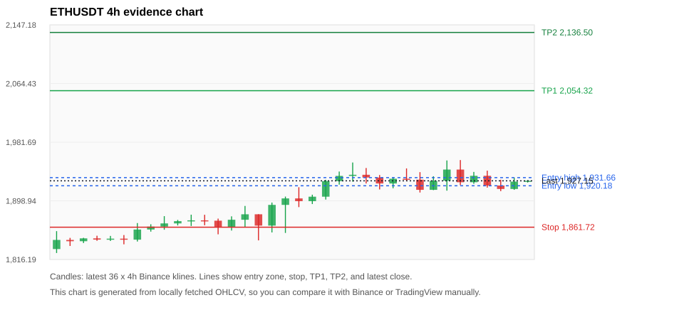
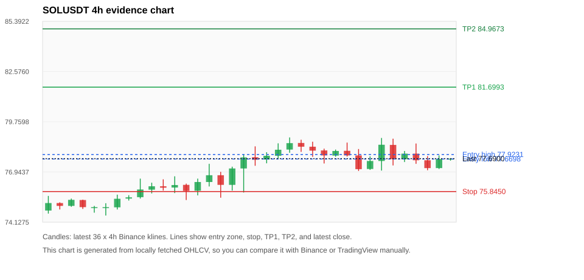
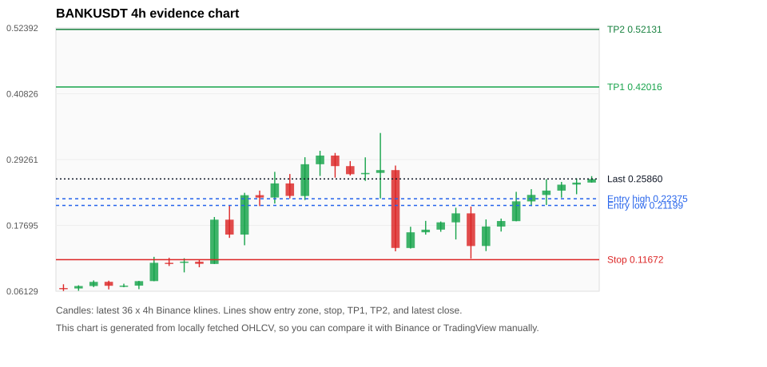
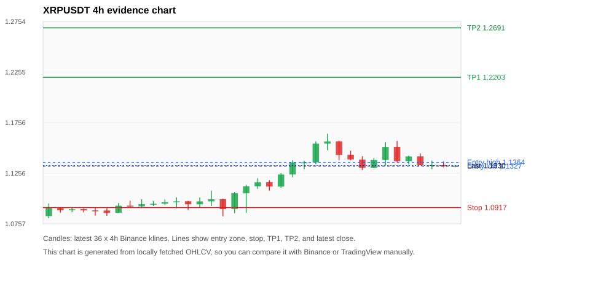
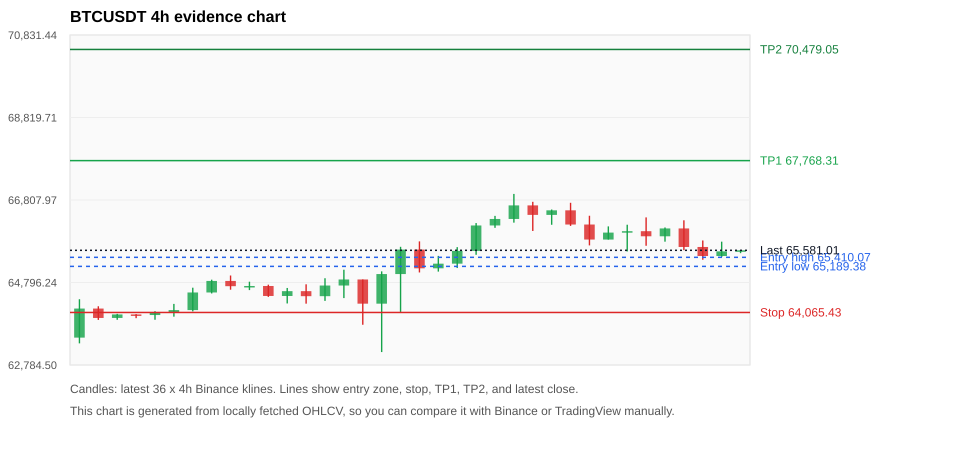

# Crypto 市场扫描报告 v1

- 报告时间：2026-07-23 20:05:50 CST
- Run ID：`20260723_120503_4a1d6d5f`
- Run type：`daily_full`
- 数据来源：SQLite
- 报告版本：v1
- 扫描 ID：8140da228bbb
- 数据源：Binance public spot API + CoinGecko/CoinMarketCap cross-check
- 过滤条件：USDT spot; 24h quote volume >= 30,000,000; trades >= 30,000; exclude stables/leveraged tokens; analyze 1h/4h/1d klines
- 默认单笔风险：账户权益的 1.00%

## 限制说明

- 交易信号仍以 Binance 现货公开 K 线为主源；外部数据源用于一致性复核。
- 结果是研究和模拟盘计划，不是确定收益或实盘下单指令。
- 历史长度过滤：候选币至少需要 180 根 1d K 线。
- 数据质量验证池：先验证 score 排名前 min(top_n * 2, 10) 的候选，再按 action + score 补足最终名单。
- 大盘环境过滤：NEUTRAL; BTC/ETH 大盘未完全确认强势，山寨币买入候选降级为观察。 BTC 7d=2.7381866263931576; ETH 7d=3.3485099559717124.
- 已启用数据交叉验证：Binance 主源 + CoinGecko 自动对照；CoinMarketCap 在配置 API Key 后自动对照。
- ETHUSDT 交叉验证状态 DATA_WARNING：At least one external provider needs manual review.
- SOLUSDT 交叉验证状态 DATA_WARNING：At least one external provider needs manual review.
- BANKUSDT 交叉验证状态 DATA_ERROR：At least one external provider disagrees materially or symbol mapping failed.
- XRPUSDT 交叉验证状态 DATA_WARNING：At least one external provider needs manual review.
- BTCUSDT 交叉验证状态 DATA_WARNING：At least one external provider needs manual review.
- ZECUSDT 交叉验证状态 DATA_WARNING：At least one external provider needs manual review.
- KITEUSDT 交叉验证状态 DATA_WARNING：At least one external provider needs manual review.
- BNBUSDT 交叉验证状态 DATA_WARNING：At least one external provider needs manual review.

## 5 个候选交易计划

| Rank | Coin | Action | Setup | Entry Zone | Stop Loss | TP1 | TP2 / Exit Rule | R/R | Verdict |
|---:|---|---|---|---:|---:|---:|---|---:|---|
| 1 | `ETH` | `WATCH_ONLY` | 回踩支撑/4h EMA 附近 | 1,920.18 - 1,931.66 | 1,861.72 | 2,054.32 | 2,136.50 或跌破 4h 关键支撑 | 2.00-3.28 | 只观察 |
| 2 | `SOL` | `WATCH_ONLY` | 回踩支撑/4h EMA 附近 | 77.6698 - 77.9231 | 75.8450 | 81.6993 | 84.9673 或跌破 4h 关键支撑 | 2.00-3.67 | 只观察 |
| 3 | `BANK` | `WATCH_ONLY` | 涨幅较远，只等深回调 | 0.21199 - 0.22375 | 0.11672 | 0.42016 | 0.52131 或跌破 4h 关键支撑 | 2.00-3.00 | 只观察 |
| 4 | `XRP` | `WATCH_ONLY` | 回踩支撑/4h EMA 附近 | 1.1327 - 1.1364 | 1.0917 | 1.2203 | 1.2691 或跌破 4h 关键支撑 | 2.00-3.14 | 只观察 |
| 5 | `BTC` | `WATCH_ONLY` | 回踩支撑/4h EMA 附近 | 65,189.38 - 65,410.07 | 64,065.43 | 67,768.31 | 70,479.05 或跌破 4h 关键支撑 | 2.00-4.20 | 只观察 |

## 数据交叉验证摘要

价格差异以 Binance 当前价为基准；成交量口径不同，Binance 是 USDT 现货成交额，CoinGecko/CoinMarketCap 通常是全市场成交量。

| Rank | Coin | Data Status | Max Price Diff | Max 24h Diff | Message |
|---:|---|---|---:|---:|---|
| 1 | `ETH` | DATA_WARNING | 0.09% | 0.33 pts | At least one external provider needs manual review. |
| 2 | `SOL` | DATA_WARNING | 0.12% | 0.28 pts | At least one external provider needs manual review. |
| 3 | `BANK` | DATA_ERROR | 2.31% | 1.66 pts | At least one external provider disagrees materially or symbol mapping failed. |
| 4 | `XRP` | DATA_WARNING | 0.26% | 0.12 pts | At least one external provider needs manual review. |
| 5 | `BTC` | DATA_WARNING | 0.08% | 0.04 pts | At least one external provider needs manual review. |

## 候选币说明

### 1. ETH `ETHUSDT`



- 入选原因：回踩支撑/4h EMA 附近；24h +0.13%，7d +2.35%，4h RSI 47.19，24h 成交额 $401.2M。
- 交易失效条件：跌破 1861.7189 或 4h 收盘重新失守关键支撑。
- 主要风险：主要风险是大盘同步回撤；数据交叉验证需要人工复核；数据交叉验证状态为 DATA_WARNING，买入候选降级为观察。
- 数据交叉验证：DATA_WARNING；At least one external provider needs manual review.

#### 可点击人工验证

- [Binance 交易页](https://www.binance.com/en/trade/ETH_USDT)
- [TradingView 图表](https://www.tradingview.com/chart/?symbol=BINANCE%3AETHUSDT)
- [CoinGecko 搜索](https://www.coingecko.com/en/search?query=ETH)
- [CoinMarketCap 搜索](https://coinmarketcap.com/search/?q=ETH)

#### 多数据源对照

| Source | Status | Asset ID | Price | 24h Change | 24h Volume | Price Diff | 24h Diff | Updated | Message |
|---|---|---|---:|---:|---:|---:|---:|---|---|
| Binance | DATA_OK | ETHUSDT | 1,927.15 | +0.13% | $401.2M | 0.00% | 0.00 pts | 2026-07-23T12:05:20+00:00 | Primary market data source used by scanner. |
| CoinGecko | DATA_OK | ethereum | 1,925.49 | -0.20% | $9.13B | 0.09% | 0.33 pts | 2026-07-23T12:03:20.000Z | External source agrees with Binance within thresholds. |
| CoinMarketCap | DATA_WARNING | 1027 | 1,925.99 | +0.11% | $9.50B | 0.06% | 0.02 pts | 2026-07-23T12:04:04.000Z | CoinMarketCap symbol mapping has 6 matches; selected lowest cmc_rank |

#### 指标证据

| 指标 | 数值 | 人工核对用途 |
|---|---:|---|
| 当前价 | 1,927.15 | 与 Binance/TradingView 当前价格对照 |
| 24h 涨跌 | +0.13% | 与交易所 24h 涨跌对照 |
| 7d 涨跌 | +2.35% | 判断短线趋势是否延续 |
| 4h EMA20 | 1,916.35 | 判断短期趋势支撑 |
| 4h EMA50 | 1,888.61 | 判断中期趋势支撑 |
| 1d EMA20 | 1,841.91 | 判断日线趋势 |
| 1d EMA50 | 1,831.28 | 判断日线趋势 |
| 4h RSI14 | 47.19 | 判断是否过热/过弱 |
| 4h ATR14 | 21.8664 | 推导止损和入场缓冲 |
| 最近 18 根 4h 最低点 | 1,890.07 | 支撑/止损参考 |
| 最近 36 根 4h 最高点 | 1,956.45 | TP/压力参考 |
| 支撑位 | 1,916.35 | 入场区间推导基础 |

#### 交易计划推导

- 支撑位 = 最近低点、4h EMA20、4h EMA50、1d EMA20 中不高于当前价的最高有效支撑 = `1,916.35`。
- 入场区间 = 支撑位附近 + ATR 缓冲 = `1,920.18 - 1,931.66`。
- 止损 = min(最近 18 根 4h 最低点 * 0.985, 入场中位价 - 1.15 * ATR14) = `1,861.72`。
- TP1 = max(最近 36 根 4h 最高点 * 0.995, 入场中位价 + 2R) = `2,054.32`。
- TP2 = max(入场中位价 + 3R, TP1 * 1.04) = `2,136.50`。

#### 最近 10 根 4h K线

| UTC 开盘时间 | Open | High | Low | Close | Quote Volume | Trades |
|---|---:|---:|---:|---:|---:|---:|
| 2026-07-22T00:00+00:00 | 1,930.09 | 1,944.68 | 1,926.76 | 1,928.77 | $73.9M | 420834 |
| 2026-07-22T04:00+00:00 | 1,928.76 | 1,939.40 | 1,910.68 | 1,914.44 | $92.3M | 411324 |
| 2026-07-22T08:00+00:00 | 1,914.43 | 1,933.62 | 1,914.08 | 1,927.27 | $70.1M | 330907 |
| 2026-07-22T12:00+00:00 | 1,927.26 | 1,955.92 | 1,913.26 | 1,943.03 | $119.8M | 640676 |
| 2026-07-22T16:00+00:00 | 1,943.04 | 1,956.45 | 1,921.00 | 1,925.13 | $80.1M | 474808 |
| 2026-07-22T20:00+00:00 | 1,925.14 | 1,939.70 | 1,922.95 | 1,934.25 | $49.0M | 256919 |
| 2026-07-23T00:00+00:00 | 1,934.26 | 1,941.50 | 1,917.57 | 1,920.55 | $48.2M | 238170 |
| 2026-07-23T04:00+00:00 | 1,920.56 | 1,928.69 | 1,912.60 | 1,915.65 | $54.4M | 253043 |
| 2026-07-23T08:00+00:00 | 1,915.65 | 1,931.66 | 1,914.44 | 1,926.04 | $48.9M | 255383 |
| 2026-07-23T12:00+00:00 | 1,926.03 | 1,927.99 | 1,924.72 | 1,927.21 | $1.2M | 8099 |

### 2. SOL `SOLUSDT`



- 入选原因：回踩支撑/4h EMA 附近；24h +0.28%，7d +1.74%，4h RSI 42.49，24h 成交额 $102.5M。
- 交易失效条件：跌破 75.845 或 4h 收盘重新失守关键支撑。
- 主要风险：主要风险是大盘同步回撤；数据交叉验证需要人工复核；数据交叉验证状态为 DATA_WARNING，买入候选降级为观察。
- 数据交叉验证：DATA_WARNING；At least one external provider needs manual review.

#### 可点击人工验证

- [Binance 交易页](https://www.binance.com/en/trade/SOL_USDT)
- [TradingView 图表](https://www.tradingview.com/chart/?symbol=BINANCE%3ASOLUSDT)
- [CoinGecko 搜索](https://www.coingecko.com/en/search?query=SOL)
- [CoinMarketCap 搜索](https://coinmarketcap.com/search/?q=SOL)

#### 多数据源对照

| Source | Status | Asset ID | Price | 24h Change | 24h Volume | Price Diff | 24h Diff | Updated | Message |
|---|---|---|---:|---:|---:|---:|---:|---|---|
| Binance | DATA_OK | SOLUSDT | 77.6900 | +0.28% | $102.5M | 0.00% | 0.00 pts | 2026-07-23T12:05:20+00:00 | Primary market data source used by scanner. |
| CoinGecko | DATA_OK | solana | 77.6000 | +0.00% | $1.53B | 0.12% | 0.28 pts | 2026-07-23T12:03:20.000Z | External source agrees with Binance within thresholds. |
| CoinMarketCap | DATA_WARNING | 5426 | 77.6066 | +0.13% | $1.56B | 0.11% | 0.15 pts | 2026-07-23T12:04:04.000Z | CoinMarketCap symbol mapping has 8 matches; selected lowest cmc_rank |

#### 指标证据

| 指标 | 数值 | 人工核对用途 |
|---|---:|---|
| 当前价 | 77.6900 | 与 Binance/TradingView 当前价格对照 |
| 24h 涨跌 | +0.28% | 与交易所 24h 涨跌对照 |
| 7d 涨跌 | +1.74% | 判断短线趋势是否延续 |
| 4h EMA20 | 77.5148 | 判断短期趋势支撑 |
| 4h EMA50 | 77.2221 | 判断中期趋势支撑 |
| 1d EMA20 | 76.9127 | 判断日线趋势 |
| 1d EMA50 | 76.7773 | 判断日线趋势 |
| 4h RSI14 | 42.49 | 判断是否过热/过弱 |
| 4h ATR14 | 0.87857 | 推导止损和入场缓冲 |
| 最近 18 根 4h 最低点 | 77.0000 | 支撑/止损参考 |
| 最近 36 根 4h 最高点 | 78.8800 | TP/压力参考 |
| 支撑位 | 77.5148 | 入场区间推导基础 |

#### 交易计划推导

- 支撑位 = 最近低点、4h EMA20、4h EMA50、1d EMA20 中不高于当前价的最高有效支撑 = `77.5148`。
- 入场区间 = 支撑位附近 + ATR 缓冲 = `77.6698 - 77.9231`。
- 止损 = min(最近 18 根 4h 最低点 * 0.985, 入场中位价 - 1.15 * ATR14) = `75.8450`。
- TP1 = max(最近 36 根 4h 最高点 * 0.995, 入场中位价 + 2R) = `81.6993`。
- TP2 = max(入场中位价 + 3R, TP1 * 1.04) = `84.9673`。

#### 最近 10 根 4h K线

| UTC 开盘时间 | Open | High | Low | Close | Quote Volume | Trades |
|---|---:|---:|---:|---:|---:|---:|
| 2026-07-22T00:00+00:00 | 78.1300 | 78.5900 | 77.8100 | 77.8700 | $12.2M | 59253 |
| 2026-07-22T04:00+00:00 | 77.8700 | 78.2300 | 77.0000 | 77.1000 | $22.8M | 70819 |
| 2026-07-22T08:00+00:00 | 77.1100 | 77.8200 | 77.0600 | 77.5600 | $15.8M | 46908 |
| 2026-07-22T12:00+00:00 | 77.5600 | 78.8500 | 77.0200 | 78.4700 | $29.1M | 140662 |
| 2026-07-22T16:00+00:00 | 78.4600 | 78.8100 | 77.3100 | 77.6600 | $19.3M | 108214 |
| 2026-07-22T20:00+00:00 | 77.6600 | 78.1200 | 77.5000 | 77.9700 | $11.8M | 71436 |
| 2026-07-23T00:00+00:00 | 77.9700 | 78.5400 | 77.4000 | 77.6000 | $15.6M | 96515 |
| 2026-07-23T04:00+00:00 | 77.6000 | 77.8300 | 77.0400 | 77.1600 | $15.8M | 50573 |
| 2026-07-23T08:00+00:00 | 77.1600 | 77.8700 | 77.1100 | 77.6700 | $10.8M | 40746 |
| 2026-07-23T12:00+00:00 | 77.6700 | 77.7100 | 77.5800 | 77.6900 | $281,623 | 1418 |

### 3. BANK `BANKUSDT`



- 入选原因：涨幅较远，只等深回调；24h +45.36%，7d +325.33%，4h RSI 47.88，24h 成交额 $68.6M。
- 交易失效条件：跌破 0.1167225 或 4h 收盘重新失守关键支撑。
- 主要风险：距离支撑偏远，不能追市价；24h 振幅较大，回撤风险高；数据交叉验证出现重大差异或映射失败，先不要直接执行计划。
- 数据交叉验证：DATA_ERROR；At least one external provider disagrees materially or symbol mapping failed.

#### 可点击人工验证

- [Binance 交易页](https://www.binance.com/en/trade/BANK_USDT)
- [TradingView 图表](https://www.tradingview.com/chart/?symbol=BINANCE%3ABANKUSDT)
- [CoinGecko 搜索](https://www.coingecko.com/en/search?query=BANK)
- [CoinMarketCap 搜索](https://coinmarketcap.com/search/?q=BANK)

#### 多数据源对照

| Source | Status | Asset ID | Price | 24h Change | 24h Volume | Price Diff | 24h Diff | Updated | Message |
|---|---|---|---:|---:|---:|---:|---:|---|---|
| Binance | DATA_OK | BANKUSDT | 0.25860 | +45.36% | $68.6M | 0.00% | 0.00 pts | 2026-07-23T12:05:20+00:00 | Primary market data source used by scanner. |
| CoinGecko | DATA_WARNING | lorenzo-protocol | 0.25728 | +43.70% | $184.7M | 0.51% | 1.66 pts | 2026-07-23T12:03:20.000Z | CoinGecko symbol mapping has 3 exact matches; selected highest market-cap rank |
| CoinMarketCap | DATA_ERROR | 36296 | 0.25262 | +44.47% | $250.3M | 2.31% | 0.89 pts | 2026-07-23T12:04:04.000Z | price diff 2.31% exceeds error threshold; CoinMarketCap symbol mapping has 10 matches; selected lowest cmc_rank |

#### 指标证据

| 指标 | 数值 | 人工核对用途 |
|---|---:|---|
| 当前价 | 0.25860 | 与 Binance/TradingView 当前价格对照 |
| 24h 涨跌 | +45.36% | 与交易所 24h 涨跌对照 |
| 7d 涨跌 | +325.33% | 判断短线趋势是否延续 |
| 4h EMA20 | 0.21156 | 判断短期趋势支撑 |
| 4h EMA50 | 0.16479 | 判断中期趋势支撑 |
| 1d EMA20 | 0.12270 | 判断日线趋势 |
| 1d EMA50 | 0.07758 | 判断日线趋势 |
| 4h RSI14 | 47.88 | 判断是否过热/过弱 |
| 4h ATR14 | 0.04646 | 推导止损和入场缓冲 |
| 最近 18 根 4h 最低点 | 0.11850 | 支撑/止损参考 |
| 最近 36 根 4h 最高点 | 0.33930 | TP/压力参考 |
| 支撑位 | 0.21156 | 入场区间推导基础 |

#### 交易计划推导

- 支撑位 = 最近低点、4h EMA20、4h EMA50、1d EMA20 中不高于当前价的最高有效支撑 = `0.21156`。
- 入场区间 = 支撑位附近 + ATR 缓冲 = `0.21199 - 0.22375`。
- 止损 = min(最近 18 根 4h 最低点 * 0.985, 入场中位价 - 1.15 * ATR14) = `0.11672`。
- TP1 = max(最近 36 根 4h 最高点 * 0.995, 入场中位价 + 2R) = `0.42016`。
- TP2 = max(入场中位价 + 3R, TP1 * 1.04) = `0.52131`。

#### 最近 10 根 4h K线

| UTC 开盘时间 | Open | High | Low | Close | Quote Volume | Trades |
|---|---:|---:|---:|---:|---:|---:|
| 2026-07-22T00:00+00:00 | 0.18230 | 0.20800 | 0.15220 | 0.19810 | $20.3M | 279829 |
| 2026-07-22T04:00+00:00 | 0.19810 | 0.21000 | 0.11850 | 0.14070 | $22.2M | 266622 |
| 2026-07-22T08:00+00:00 | 0.14080 | 0.18740 | 0.13180 | 0.17500 | $17.5M | 199508 |
| 2026-07-22T12:00+00:00 | 0.17490 | 0.18890 | 0.16610 | 0.18460 | $11.9M | 116777 |
| 2026-07-22T16:00+00:00 | 0.18440 | 0.23590 | 0.18420 | 0.21920 | $17.6M | 174586 |
| 2026-07-22T20:00+00:00 | 0.21910 | 0.24060 | 0.21090 | 0.23050 | $7.6M | 91387 |
| 2026-07-23T00:00+00:00 | 0.23040 | 0.25800 | 0.21280 | 0.23810 | $13.1M | 175883 |
| 2026-07-23T04:00+00:00 | 0.23800 | 0.25330 | 0.22570 | 0.24850 | $6.3M | 82944 |
| 2026-07-23T08:00+00:00 | 0.24870 | 0.25950 | 0.23170 | 0.25210 | $10.5M | 116661 |
| 2026-07-23T12:00+00:00 | 0.25220 | 0.26350 | 0.25220 | 0.25830 | $1.7M | 10628 |

### 4. XRP `XRPUSDT`



- 入选原因：回踩支撑/4h EMA 附近；24h -0.40%，7d +2.07%，4h RSI 48.34，24h 成交额 $48.6M。
- 交易失效条件：跌破 1.0916755 或 4h 收盘重新失守关键支撑。
- 主要风险：日线趋势未完全确认；24h 动量未确认；数据交叉验证需要人工复核。
- 数据交叉验证：DATA_WARNING；At least one external provider needs manual review.

#### 可点击人工验证

- [Binance 交易页](https://www.binance.com/en/trade/XRP_USDT)
- [TradingView 图表](https://www.tradingview.com/chart/?symbol=BINANCE%3AXRPUSDT)
- [CoinGecko 搜索](https://www.coingecko.com/en/search?query=XRP)
- [CoinMarketCap 搜索](https://coinmarketcap.com/search/?q=XRP)

#### 多数据源对照

| Source | Status | Asset ID | Price | 24h Change | 24h Volume | Price Diff | 24h Diff | Updated | Message |
|---|---|---|---:|---:|---:|---:|---:|---|---|
| Binance | DATA_OK | XRPUSDT | 1.1330 | -0.40% | $48.6M | 0.00% | 0.00 pts | 2026-07-23T12:05:20+00:00 | Primary market data source used by scanner. |
| CoinGecko | DATA_OK | ripple | 1.1300 | -0.50% | $894.0M | 0.26% | 0.10 pts | 2026-07-23T12:02:20.000Z | External source agrees with Binance within thresholds. |
| CoinMarketCap | DATA_WARNING | 52 | 1.1319 | -0.52% | $938.8M | 0.10% | 0.12 pts | 2026-07-23T12:04:04.000Z | CoinMarketCap symbol mapping has 3 matches; selected lowest cmc_rank |

#### 指标证据

| 指标 | 数值 | 人工核对用途 |
|---|---:|---|
| 当前价 | 1.1330 | 与 Binance/TradingView 当前价格对照 |
| 24h 涨跌 | -0.40% | 与交易所 24h 涨跌对照 |
| 7d 涨跌 | +2.07% | 判断短线趋势是否延续 |
| 4h EMA20 | 1.1304 | 判断短期趋势支撑 |
| 4h EMA50 | 1.1183 | 判断中期趋势支撑 |
| 1d EMA20 | 1.1121 | 判断日线趋势 |
| 1d EMA50 | 1.1455 | 判断日线趋势 |
| 4h RSI14 | 48.34 | 判断是否过热/过弱 |
| 4h ATR14 | 0.01280 | 推导止损和入场缓冲 |
| 最近 18 根 4h 最低点 | 1.1083 | 支撑/止损参考 |
| 最近 36 根 4h 最高点 | 1.1646 | TP/压力参考 |
| 支撑位 | 1.1304 | 入场区间推导基础 |

#### 交易计划推导

- 支撑位 = 最近低点、4h EMA20、4h EMA50、1d EMA20 中不高于当前价的最高有效支撑 = `1.1304`。
- 入场区间 = 支撑位附近 + ATR 缓冲 = `1.1327 - 1.1364`。
- 止损 = min(最近 18 根 4h 最低点 * 0.985, 入场中位价 - 1.15 * ATR14) = `1.0917`。
- TP1 = max(最近 36 根 4h 最高点 * 0.995, 入场中位价 + 2R) = `1.2203`。
- TP2 = max(入场中位价 + 3R, TP1 * 1.04) = `1.2691`。

#### 最近 10 根 4h K线

| UTC 开盘时间 | Open | High | Low | Close | Quote Volume | Trades |
|---|---:|---:|---:|---:|---:|---:|
| 2026-07-22T00:00+00:00 | 1.1437 | 1.1478 | 1.1384 | 1.1391 | $8.5M | 53353 |
| 2026-07-22T04:00+00:00 | 1.1390 | 1.1423 | 1.1288 | 1.1309 | $7.6M | 58156 |
| 2026-07-22T08:00+00:00 | 1.1309 | 1.1405 | 1.1308 | 1.1387 | $9.4M | 49675 |
| 2026-07-22T12:00+00:00 | 1.1387 | 1.1560 | 1.1334 | 1.1513 | $17.2M | 91132 |
| 2026-07-22T16:00+00:00 | 1.1514 | 1.1574 | 1.1361 | 1.1373 | $10.1M | 76456 |
| 2026-07-22T20:00+00:00 | 1.1373 | 1.1430 | 1.1342 | 1.1421 | $5.5M | 40056 |
| 2026-07-23T00:00+00:00 | 1.1422 | 1.1452 | 1.1334 | 1.1338 | $5.5M | 42437 |
| 2026-07-23T04:00+00:00 | 1.1337 | 1.1379 | 1.1296 | 1.1338 | $5.3M | 36157 |
| 2026-07-23T08:00+00:00 | 1.1337 | 1.1373 | 1.1315 | 1.1324 | $4.9M | 29653 |
| 2026-07-23T12:00+00:00 | 1.1324 | 1.1332 | 1.1317 | 1.1330 | $139,521 | 817 |

### 5. BTC `BTCUSDT`



- 入选原因：回踩支撑/4h EMA 附近；24h -0.55%，7d +1.87%，4h RSI 39.47，24h 成交额 $797.3M。
- 交易失效条件：跌破 64065.434 或 4h 收盘重新失守关键支撑。
- 主要风险：24h 动量未确认；数据交叉验证需要人工复核。
- 数据交叉验证：DATA_WARNING；At least one external provider needs manual review.

#### 可点击人工验证

- [Binance 交易页](https://www.binance.com/en/trade/BTC_USDT)
- [TradingView 图表](https://www.tradingview.com/chart/?symbol=BINANCE%3ABTCUSDT)
- [CoinGecko 搜索](https://www.coingecko.com/en/search?query=BTC)
- [CoinMarketCap 搜索](https://coinmarketcap.com/search/?q=BTC)

#### 多数据源对照

| Source | Status | Asset ID | Price | 24h Change | 24h Volume | Price Diff | 24h Diff | Updated | Message |
|---|---|---|---:|---:|---:|---:|---:|---|---|
| Binance | DATA_OK | BTCUSDT | 65,581.01 | -0.55% | $797.3M | 0.00% | 0.00 pts | 2026-07-23T12:05:20+00:00 | Primary market data source used by scanner. |
| CoinGecko | DATA_WARNING | n/a | n/a | n/a | n/a | n/a | n/a | 2026-07-23T12:05:20+00:00 | Failed to fetch https://api.coingecko.com/api/v3/coins/markets?vs_currency=usd&ids=bitcoin&price_change_percentage=24h&per_page=1&page=1: HTTP Error 429: Too Many Requests |
| CoinMarketCap | DATA_WARNING | 1 | 65,530.47 | -0.59% | $21.39B | 0.08% | 0.04 pts | 2026-07-23T12:04:04.000Z | CoinMarketCap symbol mapping has 13 matches; selected lowest cmc_rank |

#### 指标证据

| 指标 | 数值 | 人工核对用途 |
|---|---:|---|
| 当前价 | 65,581.01 | 与 Binance/TradingView 当前价格对照 |
| 24h 涨跌 | -0.55% | 与交易所 24h 涨跌对照 |
| 7d 涨跌 | +1.87% | 判断短线趋势是否延续 |
| 4h EMA20 | 65,649.58 | 判断短期趋势支撑 |
| 4h EMA50 | 65,059.26 | 判断中期趋势支撑 |
| 1d EMA20 | 64,381.87 | 判断日线趋势 |
| 1d EMA50 | 65,150.35 | 判断日线趋势 |
| 4h RSI14 | 39.47 | 判断是否过热/过弱 |
| 4h ATR14 | 501.15 | 推导止损和入场缓冲 |
| 最近 18 根 4h 最低点 | 65,041.05 | 支撑/止损参考 |
| 最近 36 根 4h 最高点 | 66,956.15 | TP/压力参考 |
| 支撑位 | 65,059.26 | 入场区间推导基础 |

#### 交易计划推导

- 支撑位 = 最近低点、4h EMA20、4h EMA50、1d EMA20 中不高于当前价的最高有效支撑 = `65,059.26`。
- 入场区间 = 支撑位附近 + ATR 缓冲 = `65,189.38 - 65,410.07`。
- 止损 = min(最近 18 根 4h 最低点 * 0.985, 入场中位价 - 1.15 * ATR14) = `64,065.43`。
- TP1 = max(最近 36 根 4h 最高点 * 0.995, 入场中位价 + 2R) = `67,768.31`。
- TP2 = max(入场中位价 + 3R, TP1 * 1.04) = `70,479.05`。

#### 最近 10 根 4h K线

| UTC 开盘时间 | Open | High | Low | Close | Quote Volume | Trades |
|---|---:|---:|---:|---:|---:|---:|
| 2026-07-22T00:00+00:00 | 66,556.15 | 66,739.89 | 66,176.00 | 66,210.00 | $191.6M | 652324 |
| 2026-07-22T04:00+00:00 | 66,209.99 | 66,424.00 | 65,701.00 | 65,843.48 | $272.4M | 668048 |
| 2026-07-22T08:00+00:00 | 65,843.48 | 66,164.57 | 65,843.47 | 66,013.36 | $341.3M | 712578 |
| 2026-07-22T12:00+00:00 | 66,013.36 | 66,204.98 | 65,553.67 | 66,047.39 | $197.7M | 662744 |
| 2026-07-22T16:00+00:00 | 66,047.38 | 66,384.00 | 65,691.93 | 65,923.19 | $100.4M | 427993 |
| 2026-07-22T20:00+00:00 | 65,923.19 | 66,138.24 | 65,791.79 | 66,114.49 | $90.6M | 258138 |
| 2026-07-23T00:00+00:00 | 66,114.50 | 66,313.14 | 65,585.11 | 65,662.53 | $180.5M | 390926 |
| 2026-07-23T04:00+00:00 | 65,662.53 | 65,821.17 | 65,351.02 | 65,442.13 | $115.2M | 313412 |
| 2026-07-23T08:00+00:00 | 65,442.12 | 65,792.09 | 65,419.75 | 65,555.21 | $111.4M | 263480 |
| 2026-07-23T12:00+00:00 | 65,555.21 | 65,584.00 | 65,511.44 | 65,581.00 | $3.5M | 10720 |

## 组合风控

- 不要 5 个候选全部满仓买入。
- 同时持仓总风险建议控制在账户权益的 3% - 5% 以内。
- 如果 BTC/ETH 同时破位，暂停山寨币多头计划或降低仓位。
- 第一版报告用于模拟盘和人工复核，不自动下单。

## 原始数据

```json
[
  {
    "rank": 1,
    "symbol": "ETHUSDT",
    "base_asset": "ETH",
    "price": 1927.15,
    "score": 51.78345859567982,
    "setup": "回踩支撑/4h EMA 附近",
    "verdict": "只观察",
    "entry_low": 1920.1839620594264,
    "entry_high": 1931.6577595403458,
    "stop_loss": 1861.71895,
    "take_profit_1": 2054.3246823996587,
    "take_profit_2": 2136.497669695645,
    "risk_reward_1": 2.0,
    "risk_reward_2": 3.2799149787319397,
    "pct_24h": 0.128,
    "pct_3d": 3.4611420104365687,
    "pct_7d": 2.354990678825808,
    "quote_volume_24h": 401182043.693389,
    "trades_24h": 2119242,
    "high_low_range_24h": 2.2926905782704177,
    "rsi_1h": 39.589876223905534,
    "rsi_4h": 47.18511841350491,
    "ema20_4h": 1916.3512595403458,
    "ema50_4h": 1888.6053147743726,
    "ema20_1d": 1841.9055464738694,
    "ema50_1d": 1831.2827769203936,
    "atr_4h": 21.866428571428596,
    "macd_hist_4h": -2.545801032992646,
    "volume_ratio_24h": 0.9291587015802051,
    "support_level": 1916.3512595403458,
    "recent_low_4h_18": 1890.07,
    "recent_high_4h_36": 1956.45,
    "distance_to_support_pct": 0.5635052762845039,
    "binance_trade_url": "https://www.binance.com/en/trade/ETH_USDT",
    "tradingview_url": "https://www.tradingview.com/chart/?symbol=BINANCE%3AETHUSDT",
    "coingecko_search_url": "https://www.coingecko.com/en/search?query=ETH",
    "coinmarketcap_search_url": "https://coinmarketcap.com/search/?q=ETH",
    "invalidation": "跌破 1861.7189 或 4h 收盘重新失守关键支撑",
    "recent_4h_klines": [
      {
        "open_time_utc": "2026-07-17T16:00+00:00",
        "open": 1830.89,
        "high": 1856.17,
        "low": 1825.32,
        "close": 1843.76,
        "quote_volume": 75428073.814757,
        "trades": 459243
      },
      {
        "open_time_utc": "2026-07-17T20:00+00:00",
        "open": 1843.76,
        "high": 1846.65,
        "low": 1835.27,
        "close": 1841.93,
        "quote_volume": 22437794.154729,
        "trades": 178801
      },
      {
        "open_time_utc": "2026-07-18T00:00+00:00",
        "open": 1841.94,
        "high": 1846.74,
        "low": 1839.38,
        "close": 1845.96,
        "quote_volume": 25110095.56093,
        "trades": 128932
      },
      {
        "open_time_utc": "2026-07-18T04:00+00:00",
        "open": 1845.96,
        "high": 1849.68,
        "low": 1842.56,
        "close": 1844.2,
        "quote_volume": 18809339.973007,
        "trades": 118273
      },
      {
        "open_time_utc": "2026-07-18T08:00+00:00",
        "open": 1844.2,
        "high": 1849.44,
        "low": 1842.3,
        "close": 1845.56,
        "quote_volume": 18754926.018809,
        "trades": 92079
      },
      {
        "open_time_utc": "2026-07-18T12:00+00:00",
        "open": 1845.56,
        "high": 1850.64,
        "low": 1837.58,
        "close": 1844.15,
        "quote_volume": 32500010.651193,
        "trades": 192569
      },
      {
        "open_time_utc": "2026-07-18T16:00+00:00",
        "open": 1844.15,
        "high": 1867.58,
        "low": 1841.51,
        "close": 1858.45,
        "quote_volume": 50644842.771862,
        "trades": 239431
      },
      {
        "open_time_utc": "2026-07-18T20:00+00:00",
        "open": 1858.45,
        "high": 1865.86,
        "low": 1855.47,
        "close": 1862.61,
        "quote_volume": 25444665.062101,
        "trades": 126864
      },
      {
        "open_time_utc": "2026-07-19T00:00+00:00",
        "open": 1862.61,
        "high": 1877.33,
        "low": 1858.17,
        "close": 1867.08,
        "quote_volume": 51096557.439295,
        "trades": 204006
      },
      {
        "open_time_utc": "2026-07-19T04:00+00:00",
        "open": 1867.08,
        "high": 1871.99,
        "low": 1864.21,
        "close": 1870.25,
        "quote_volume": 32035355.048292,
        "trades": 103978
      },
      {
        "open_time_utc": "2026-07-19T08:00+00:00",
        "open": 1870.26,
        "high": 1879.38,
        "low": 1863.46,
        "close": 1871.41,
        "quote_volume": 40842585.19334,
        "trades": 207232
      },
      {
        "open_time_utc": "2026-07-19T12:00+00:00",
        "open": 1871.4,
        "high": 1879.26,
        "low": 1864.47,
        "close": 1870.91,
        "quote_volume": 44426977.899933,
        "trades": 233247
      },
      {
        "open_time_utc": "2026-07-19T16:00+00:00",
        "open": 1870.91,
        "high": 1873.85,
        "low": 1851.71,
        "close": 1862.37,
        "quote_volume": 50892782.591346,
        "trades": 299983
      },
      {
        "open_time_utc": "2026-07-19T20:00+00:00",
        "open": 1862.37,
        "high": 1877.03,
        "low": 1857.0,
        "close": 1872.23,
        "quote_volume": 49535943.453386,
        "trades": 326699
      },
      {
        "open_time_utc": "2026-07-20T00:00+00:00",
        "open": 1872.24,
        "high": 1891.71,
        "low": 1862.08,
        "close": 1879.94,
        "quote_volume": 75733997.944761,
        "trades": 616195
      },
      {
        "open_time_utc": "2026-07-20T04:00+00:00",
        "open": 1879.94,
        "high": 1879.99,
        "low": 1843.14,
        "close": 1863.95,
        "quote_volume": 76871498.466917,
        "trades": 455920
      },
      {
        "open_time_utc": "2026-07-20T08:00+00:00",
        "open": 1863.95,
        "high": 1896.5,
        "low": 1854.31,
        "close": 1893.2,
        "quote_volume": 82556285.88529,
        "trades": 408523
      },
      {
        "open_time_utc": "2026-07-20T12:00+00:00",
        "open": 1893.21,
        "high": 1904.92,
        "low": 1853.65,
        "close": 1902.34,
        "quote_volume": 122363679.282013,
        "trades": 752281
      },
      {
        "open_time_utc": "2026-07-20T16:00+00:00",
        "open": 1902.34,
        "high": 1918.16,
        "low": 1890.07,
        "close": 1898.46,
        "quote_volume": 110924838.139889,
        "trades": 463219
      },
      {
        "open_time_utc": "2026-07-20T20:00+00:00",
        "open": 1898.46,
        "high": 1907.58,
        "low": 1894.4,
        "close": 1904.77,
        "quote_volume": 41760734.103211,
        "trades": 202624
      },
      {
        "open_time_utc": "2026-07-21T00:00+00:00",
        "open": 1904.77,
        "high": 1928.57,
        "low": 1900.74,
        "close": 1926.75,
        "quote_volume": 75497345.33068,
        "trades": 350782
      },
      {
        "open_time_utc": "2026-07-21T04:00+00:00",
        "open": 1926.74,
        "high": 1940.25,
        "low": 1921.81,
        "close": 1934.08,
        "quote_volume": 78340198.82902,
        "trades": 311313
      },
      {
        "open_time_utc": "2026-07-21T08:00+00:00",
        "open": 1934.07,
        "high": 1953.0,
        "low": 1925.98,
        "close": 1935.69,
        "quote_volume": 220906489.742695,
        "trades": 461182
      },
      {
        "open_time_utc": "2026-07-21T12:00+00:00",
        "open": 1935.69,
        "high": 1945.23,
        "low": 1923.36,
        "close": 1931.81,
        "quote_volume": 120803100.613645,
        "trades": 635584
      },
      {
        "open_time_utc": "2026-07-21T16:00+00:00",
        "open": 1931.81,
        "high": 1935.36,
        "low": 1915.0,
        "close": 1923.39,
        "quote_volume": 96037996.769198,
        "trades": 450944
      },
      {
        "open_time_utc": "2026-07-21T20:00+00:00",
        "open": 1923.38,
        "high": 1932.0,
        "low": 1916.67,
        "close": 1930.09,
        "quote_volume": 39803033.821404,
        "trades": 220537
      },
      {
        "open_time_utc": "2026-07-22T00:00+00:00",
        "open": 1930.09,
        "high": 1944.68,
        "low": 1926.76,
        "close": 1928.77,
        "quote_volume": 73872413.045198,
        "trades": 420834
      },
      {
        "open_time_utc": "2026-07-22T04:00+00:00",
        "open": 1928.76,
        "high": 1939.4,
        "low": 1910.68,
        "close": 1914.44,
        "quote_volume": 92250525.77919,
        "trades": 411324
      },
      {
        "open_time_utc": "2026-07-22T08:00+00:00",
        "open": 1914.43,
        "high": 1933.62,
        "low": 1914.08,
        "close": 1927.27,
        "quote_volume": 70134235.562521,
        "trades": 330907
      },
      {
        "open_time_utc": "2026-07-22T12:00+00:00",
        "open": 1927.26,
        "high": 1955.92,
        "low": 1913.26,
        "close": 1943.03,
        "quote_volume": 119835277.616543,
        "trades": 640676
      },
      {
        "open_time_utc": "2026-07-22T16:00+00:00",
        "open": 1943.04,
        "high": 1956.45,
        "low": 1921.0,
        "close": 1925.13,
        "quote_volume": 80123330.781702,
        "trades": 474808
      },
      {
        "open_time_utc": "2026-07-22T20:00+00:00",
        "open": 1925.14,
        "high": 1939.7,
        "low": 1922.95,
        "close": 1934.25,
        "quote_volume": 48980304.458261,
        "trades": 256919
      },
      {
        "open_time_utc": "2026-07-23T00:00+00:00",
        "open": 1934.26,
        "high": 1941.5,
        "low": 1917.57,
        "close": 1920.55,
        "quote_volume": 48214379.808529,
        "trades": 238170
      },
      {
        "open_time_utc": "2026-07-23T04:00+00:00",
        "open": 1920.56,
        "high": 1928.69,
        "low": 1912.6,
        "close": 1915.65,
        "quote_volume": 54407839.033107,
        "trades": 253043
      },
      {
        "open_time_utc": "2026-07-23T08:00+00:00",
        "open": 1915.65,
        "high": 1931.66,
        "low": 1914.44,
        "close": 1926.04,
        "quote_volume": 48913071.262119,
        "trades": 255383
      },
      {
        "open_time_utc": "2026-07-23T12:00+00:00",
        "open": 1926.03,
        "high": 1927.99,
        "low": 1924.72,
        "close": 1927.21,
        "quote_volume": 1211096.806502,
        "trades": 8099
      }
    ],
    "risks": [
      "主要风险是大盘同步回撤",
      "数据交叉验证需要人工复核",
      "数据交叉验证状态为 DATA_WARNING，买入候选降级为观察"
    ],
    "data_quality_status": "DATA_WARNING",
    "data_quality_message": "At least one external provider needs manual review.",
    "data_checks": [
      {
        "provider": "Binance",
        "status": "DATA_OK",
        "provider_asset_id": "ETHUSDT",
        "provider_symbol": "ETHUSDT",
        "price_usd": 1927.15,
        "pct_24h": 0.128,
        "volume_24h": 401182043.693389,
        "last_updated": null,
        "fetched_at_utc": "2026-07-23T12:05:20+00:00",
        "price_diff_pct": 0.0,
        "pct_24h_diff": 0.0,
        "volume_note": "Binance USDT spot 24h quoteVolume.",
        "message": "Primary market data source used by scanner."
      },
      {
        "provider": "CoinGecko",
        "status": "DATA_OK",
        "provider_asset_id": "ethereum",
        "provider_symbol": "ETH",
        "price_usd": 1925.49,
        "pct_24h": -0.2,
        "volume_24h": 9128562159.0,
        "last_updated": "2026-07-23T12:03:20.000Z",
        "fetched_at_utc": "2026-07-23T12:05:20+00:00",
        "price_diff_pct": 0.08613756064655485,
        "pct_24h_diff": 0.328,
        "volume_note": "CoinGecko total market volume; not the same venue scope as Binance quoteVolume.",
        "message": "External source agrees with Binance within thresholds."
      },
      {
        "provider": "CoinMarketCap",
        "status": "DATA_WARNING",
        "provider_asset_id": "1027",
        "provider_symbol": "ETH",
        "price_usd": 1925.9939627205783,
        "pct_24h": 0.10871848,
        "volume_24h": 9496053775.992012,
        "last_updated": "2026-07-23T12:04:04.000Z",
        "fetched_at_utc": "2026-07-23T12:05:20+00:00",
        "price_diff_pct": 0.05998688630473771,
        "pct_24h_diff": 0.019281519999999996,
        "volume_note": "CoinMarketCap total market volume; not the same venue scope as Binance quoteVolume.",
        "message": "CoinMarketCap symbol mapping has 6 matches; selected lowest cmc_rank"
      }
    ],
    "action": "WATCH_ONLY"
  },
  {
    "rank": 2,
    "symbol": "SOLUSDT",
    "base_asset": "SOL",
    "price": 77.69,
    "score": 49.734777520365526,
    "setup": "回踩支撑/4h EMA 附近",
    "verdict": "只观察",
    "entry_low": 77.66982553460907,
    "entry_high": 77.92307,
    "stop_loss": 75.845,
    "take_profit_1": 81.69934330191359,
    "take_profit_2": 84.96731703399013,
    "risk_reward_1": 2.0,
    "risk_reward_2": 3.6746406369822986,
    "pct_24h": 0.284,
    "pct_3d": 1.83510289684099,
    "pct_7d": 1.7417496071241434,
    "quote_volume_24h": 102487895.44751,
    "trades_24h": 508437,
    "high_low_range_24h": 2.3760062321474873,
    "rsi_1h": 42.72727272727248,
    "rsi_4h": 42.48704663212434,
    "ema20_4h": 77.51479594272362,
    "ema50_4h": 77.22208610717504,
    "ema20_1d": 76.91269845174317,
    "ema50_1d": 76.77734527065819,
    "atr_4h": 0.8785714285714283,
    "macd_hist_4h": -0.0978234333957258,
    "volume_ratio_24h": 1.0075014647721658,
    "support_level": 77.51479594272362,
    "recent_low_4h_18": 77.0,
    "recent_high_4h_36": 78.88,
    "distance_to_support_pct": 0.22602659936798997,
    "binance_trade_url": "https://www.binance.com/en/trade/SOL_USDT",
    "tradingview_url": "https://www.tradingview.com/chart/?symbol=BINANCE%3ASOLUSDT",
    "coingecko_search_url": "https://www.coingecko.com/en/search?query=SOL",
    "coinmarketcap_search_url": "https://coinmarketcap.com/search/?q=SOL",
    "invalidation": "跌破 75.845 或 4h 收盘重新失守关键支撑",
    "recent_4h_klines": [
      {
        "open_time_utc": "2026-07-17T16:00+00:00",
        "open": 74.78,
        "high": 75.6,
        "low": 74.61,
        "close": 75.2,
        "quote_volume": 15319951.8623,
        "trades": 102092
      },
      {
        "open_time_utc": "2026-07-17T20:00+00:00",
        "open": 75.2,
        "high": 75.24,
        "low": 74.84,
        "close": 75.04,
        "quote_volume": 7408417.59446,
        "trades": 40247
      },
      {
        "open_time_utc": "2026-07-18T00:00+00:00",
        "open": 75.04,
        "high": 75.45,
        "low": 74.99,
        "close": 75.38,
        "quote_volume": 6508285.86545,
        "trades": 30198
      },
      {
        "open_time_utc": "2026-07-18T04:00+00:00",
        "open": 75.37,
        "high": 75.39,
        "low": 74.87,
        "close": 74.97,
        "quote_volume": 6442806.26434,
        "trades": 31654
      },
      {
        "open_time_utc": "2026-07-18T08:00+00:00",
        "open": 74.97,
        "high": 75.04,
        "low": 74.66,
        "close": 74.97,
        "quote_volume": 6462105.93868,
        "trades": 26019
      },
      {
        "open_time_utc": "2026-07-18T12:00+00:00",
        "open": 74.96,
        "high": 75.19,
        "low": 74.5,
        "close": 74.97,
        "quote_volume": 8989221.51717,
        "trades": 51213
      },
      {
        "open_time_utc": "2026-07-18T16:00+00:00",
        "open": 74.96,
        "high": 75.67,
        "low": 74.84,
        "close": 75.44,
        "quote_volume": 13434042.26521,
        "trades": 79539
      },
      {
        "open_time_utc": "2026-07-18T20:00+00:00",
        "open": 75.45,
        "high": 75.64,
        "low": 75.34,
        "close": 75.52,
        "quote_volume": 7070882.7845,
        "trades": 30911
      },
      {
        "open_time_utc": "2026-07-19T00:00+00:00",
        "open": 75.53,
        "high": 76.57,
        "low": 75.45,
        "close": 75.96,
        "quote_volume": 20068764.07505,
        "trades": 60816
      },
      {
        "open_time_utc": "2026-07-19T04:00+00:00",
        "open": 75.95,
        "high": 76.34,
        "low": 75.74,
        "close": 76.14,
        "quote_volume": 15486235.64157,
        "trades": 32225
      },
      {
        "open_time_utc": "2026-07-19T08:00+00:00",
        "open": 76.14,
        "high": 76.53,
        "low": 75.9,
        "close": 76.06,
        "quote_volume": 13104255.91745,
        "trades": 38384
      },
      {
        "open_time_utc": "2026-07-19T12:00+00:00",
        "open": 76.07,
        "high": 76.7,
        "low": 75.76,
        "close": 76.21,
        "quote_volume": 14074270.02482,
        "trades": 60818
      },
      {
        "open_time_utc": "2026-07-19T16:00+00:00",
        "open": 76.22,
        "high": 76.29,
        "low": 75.37,
        "close": 75.88,
        "quote_volume": 13443139.44983,
        "trades": 60892
      },
      {
        "open_time_utc": "2026-07-19T20:00+00:00",
        "open": 75.89,
        "high": 76.57,
        "low": 75.63,
        "close": 76.38,
        "quote_volume": 13316490.30294,
        "trades": 69031
      },
      {
        "open_time_utc": "2026-07-20T00:00+00:00",
        "open": 76.38,
        "high": 77.4,
        "low": 76.13,
        "close": 76.76,
        "quote_volume": 25411893.84609,
        "trades": 153042
      },
      {
        "open_time_utc": "2026-07-20T04:00+00:00",
        "open": 76.76,
        "high": 76.95,
        "low": 75.5,
        "close": 76.22,
        "quote_volume": 19315588.67393,
        "trades": 105479
      },
      {
        "open_time_utc": "2026-07-20T08:00+00:00",
        "open": 76.22,
        "high": 77.24,
        "low": 75.9,
        "close": 77.14,
        "quote_volume": 21643834.37732,
        "trades": 86414
      },
      {
        "open_time_utc": "2026-07-20T12:00+00:00",
        "open": 77.14,
        "high": 77.92,
        "low": 75.79,
        "close": 77.76,
        "quote_volume": 35718616.91901,
        "trades": 168322
      },
      {
        "open_time_utc": "2026-07-20T16:00+00:00",
        "open": 77.77,
        "high": 78.38,
        "low": 77.29,
        "close": 77.63,
        "quote_volume": 30288229.33734,
        "trades": 111136
      },
      {
        "open_time_utc": "2026-07-20T20:00+00:00",
        "open": 77.64,
        "high": 78.05,
        "low": 77.43,
        "close": 77.85,
        "quote_volume": 11289404.77926,
        "trades": 50114
      },
      {
        "open_time_utc": "2026-07-21T00:00+00:00",
        "open": 77.85,
        "high": 78.55,
        "low": 77.66,
        "close": 78.19,
        "quote_volume": 12479063.5273,
        "trades": 64078
      },
      {
        "open_time_utc": "2026-07-21T04:00+00:00",
        "open": 78.2,
        "high": 78.88,
        "low": 78.02,
        "close": 78.56,
        "quote_volume": 19915181.49006,
        "trades": 70655
      },
      {
        "open_time_utc": "2026-07-21T08:00+00:00",
        "open": 78.57,
        "high": 78.75,
        "low": 78.07,
        "close": 78.36,
        "quote_volume": 18656576.7838,
        "trades": 58255
      },
      {
        "open_time_utc": "2026-07-21T12:00+00:00",
        "open": 78.36,
        "high": 78.64,
        "low": 77.79,
        "close": 78.14,
        "quote_volume": 25455682.98515,
        "trades": 96627
      },
      {
        "open_time_utc": "2026-07-21T16:00+00:00",
        "open": 78.15,
        "high": 78.25,
        "low": 77.42,
        "close": 77.87,
        "quote_volume": 14496689.64406,
        "trades": 66726
      },
      {
        "open_time_utc": "2026-07-21T20:00+00:00",
        "open": 77.86,
        "high": 78.2,
        "low": 77.8,
        "close": 78.12,
        "quote_volume": 9387259.81612,
        "trades": 39481
      },
      {
        "open_time_utc": "2026-07-22T00:00+00:00",
        "open": 78.13,
        "high": 78.59,
        "low": 77.81,
        "close": 77.87,
        "quote_volume": 12158689.23732,
        "trades": 59253
      },
      {
        "open_time_utc": "2026-07-22T04:00+00:00",
        "open": 77.87,
        "high": 78.23,
        "low": 77.0,
        "close": 77.1,
        "quote_volume": 22756530.81545,
        "trades": 70819
      },
      {
        "open_time_utc": "2026-07-22T08:00+00:00",
        "open": 77.11,
        "high": 77.82,
        "low": 77.06,
        "close": 77.56,
        "quote_volume": 15818107.91803,
        "trades": 46908
      },
      {
        "open_time_utc": "2026-07-22T12:00+00:00",
        "open": 77.56,
        "high": 78.85,
        "low": 77.02,
        "close": 78.47,
        "quote_volume": 29111618.51177,
        "trades": 140662
      },
      {
        "open_time_utc": "2026-07-22T16:00+00:00",
        "open": 78.46,
        "high": 78.81,
        "low": 77.31,
        "close": 77.66,
        "quote_volume": 19314890.33883,
        "trades": 108214
      },
      {
        "open_time_utc": "2026-07-22T20:00+00:00",
        "open": 77.66,
        "high": 78.12,
        "low": 77.5,
        "close": 77.97,
        "quote_volume": 11757284.5358,
        "trades": 71436
      },
      {
        "open_time_utc": "2026-07-23T00:00+00:00",
        "open": 77.97,
        "high": 78.54,
        "low": 77.4,
        "close": 77.6,
        "quote_volume": 15648398.31948,
        "trades": 96515
      },
      {
        "open_time_utc": "2026-07-23T04:00+00:00",
        "open": 77.6,
        "high": 77.83,
        "low": 77.04,
        "close": 77.16,
        "quote_volume": 15783769.62413,
        "trades": 50573
      },
      {
        "open_time_utc": "2026-07-23T08:00+00:00",
        "open": 77.16,
        "high": 77.87,
        "low": 77.11,
        "close": 77.67,
        "quote_volume": 10817336.56346,
        "trades": 40746
      },
      {
        "open_time_utc": "2026-07-23T12:00+00:00",
        "open": 77.67,
        "high": 77.71,
        "low": 77.58,
        "close": 77.69,
        "quote_volume": 281622.83452,
        "trades": 1418
      }
    ],
    "risks": [
      "主要风险是大盘同步回撤",
      "数据交叉验证需要人工复核",
      "数据交叉验证状态为 DATA_WARNING，买入候选降级为观察"
    ],
    "data_quality_status": "DATA_WARNING",
    "data_quality_message": "At least one external provider needs manual review.",
    "data_checks": [
      {
        "provider": "Binance",
        "status": "DATA_OK",
        "provider_asset_id": "SOLUSDT",
        "provider_symbol": "SOLUSDT",
        "price_usd": 77.69,
        "pct_24h": 0.284,
        "volume_24h": 102487895.44751,
        "last_updated": null,
        "fetched_at_utc": "2026-07-23T12:05:20+00:00",
        "price_diff_pct": 0.0,
        "pct_24h_diff": 0.0,
        "volume_note": "Binance USDT spot 24h quoteVolume.",
        "message": "Primary market data source used by scanner."
      },
      {
        "provider": "CoinGecko",
        "status": "DATA_OK",
        "provider_asset_id": "solana",
        "provider_symbol": "SOL",
        "price_usd": 77.6,
        "pct_24h": 0.0,
        "volume_24h": 1530888999.0,
        "last_updated": "2026-07-23T12:03:20.000Z",
        "fetched_at_utc": "2026-07-23T12:05:20+00:00",
        "price_diff_pct": 0.11584502509975983,
        "pct_24h_diff": 0.284,
        "volume_note": "CoinGecko total market volume; not the same venue scope as Binance quoteVolume.",
        "message": "External source agrees with Binance within thresholds."
      },
      {
        "provider": "CoinMarketCap",
        "status": "DATA_WARNING",
        "provider_asset_id": "5426",
        "provider_symbol": "SOL",
        "price_usd": 77.60658249024695,
        "pct_24h": 0.13380128,
        "volume_24h": 1564270053.5913527,
        "last_updated": "2026-07-23T12:04:04.000Z",
        "fetched_at_utc": "2026-07-23T12:05:20+00:00",
        "price_diff_pct": 0.1073722612344544,
        "pct_24h_diff": 0.15019871999999998,
        "volume_note": "CoinMarketCap total market volume; not the same venue scope as Binance quoteVolume.",
        "message": "CoinMarketCap symbol mapping has 8 matches; selected lowest cmc_rank"
      }
    ],
    "action": "WATCH_ONLY"
  },
  {
    "rank": 3,
    "symbol": "BANKUSDT",
    "base_asset": "BANK",
    "price": 0.2586,
    "score": 49.1390438768955,
    "setup": "涨幅较远，只等深回调",
    "verdict": "只观察",
    "entry_low": 0.21198790402700315,
    "entry_high": 0.22375178571428572,
    "stop_loss": 0.11672249999999999,
    "take_profit_1": 0.42016453461193326,
    "take_profit_2": 0.5213118794825777,
    "risk_reward_1": 1.9999999999999998,
    "risk_reward_2": 3.0,
    "pct_24h": 45.363,
    "pct_3d": -11.28644939965694,
    "pct_7d": 325.32894736842104,
    "quote_volume_24h": 68559308.83948,
    "trades_24h": 766492,
    "high_low_range_24h": 58.63937387116196,
    "rsi_1h": 67.44186046511629,
    "rsi_4h": 47.8797638217928,
    "ema20_4h": 0.21156477447804706,
    "ema50_4h": 0.1647879247212726,
    "ema20_1d": 0.12270349596792104,
    "ema50_1d": 0.07758108579485505,
    "atr_4h": 0.04646428571428572,
    "macd_hist_4h": 0.0019355706416665994,
    "volume_ratio_24h": 0.9924063099899799,
    "support_level": 0.21156477447804706,
    "recent_low_4h_18": 0.1185,
    "recent_high_4h_36": 0.3393,
    "distance_to_support_pct": 22.232068470752697,
    "binance_trade_url": "https://www.binance.com/en/trade/BANK_USDT",
    "tradingview_url": "https://www.tradingview.com/chart/?symbol=BINANCE%3ABANKUSDT",
    "coingecko_search_url": "https://www.coingecko.com/en/search?query=BANK",
    "coinmarketcap_search_url": "https://coinmarketcap.com/search/?q=BANK",
    "invalidation": "跌破 0.1167225 或 4h 收盘重新失守关键支撑",
    "recent_4h_klines": [
      {
        "open_time_utc": "2026-07-17T16:00+00:00",
        "open": 0.0669,
        "high": 0.0735,
        "low": 0.0616,
        "close": 0.066,
        "quote_volume": 3416025.54041,
        "trades": 49634
      },
      {
        "open_time_utc": "2026-07-17T20:00+00:00",
        "open": 0.0661,
        "high": 0.0717,
        "low": 0.062,
        "close": 0.0704,
        "quote_volume": 1077461.37447,
        "trades": 19524
      },
      {
        "open_time_utc": "2026-07-18T00:00+00:00",
        "open": 0.0704,
        "high": 0.0803,
        "low": 0.0685,
        "close": 0.0777,
        "quote_volume": 3052794.0434,
        "trades": 43197
      },
      {
        "open_time_utc": "2026-07-18T04:00+00:00",
        "open": 0.0778,
        "high": 0.0798,
        "low": 0.0645,
        "close": 0.0708,
        "quote_volume": 3328694.81921,
        "trades": 55628
      },
      {
        "open_time_utc": "2026-07-18T08:00+00:00",
        "open": 0.0708,
        "high": 0.0745,
        "low": 0.0683,
        "close": 0.0711,
        "quote_volume": 1276555.61959,
        "trades": 23134
      },
      {
        "open_time_utc": "2026-07-18T12:00+00:00",
        "open": 0.0711,
        "high": 0.0794,
        "low": 0.0649,
        "close": 0.079,
        "quote_volume": 2372561.93413,
        "trades": 34850
      },
      {
        "open_time_utc": "2026-07-18T16:00+00:00",
        "open": 0.0791,
        "high": 0.1217,
        "low": 0.079,
        "close": 0.1112,
        "quote_volume": 16168377.79857,
        "trades": 198358
      },
      {
        "open_time_utc": "2026-07-18T20:00+00:00",
        "open": 0.1112,
        "high": 0.12,
        "low": 0.1056,
        "close": 0.111,
        "quote_volume": 3599358.04392,
        "trades": 55755
      },
      {
        "open_time_utc": "2026-07-19T00:00+00:00",
        "open": 0.1112,
        "high": 0.1192,
        "low": 0.0944,
        "close": 0.1132,
        "quote_volume": 4784174.66602,
        "trades": 71666
      },
      {
        "open_time_utc": "2026-07-19T04:00+00:00",
        "open": 0.1131,
        "high": 0.1168,
        "low": 0.1034,
        "close": 0.1094,
        "quote_volume": 3656945.45099,
        "trades": 50744
      },
      {
        "open_time_utc": "2026-07-19T08:00+00:00",
        "open": 0.1092,
        "high": 0.1917,
        "low": 0.1092,
        "close": 0.187,
        "quote_volume": 23368965.43474,
        "trades": 199868
      },
      {
        "open_time_utc": "2026-07-19T12:00+00:00",
        "open": 0.187,
        "high": 0.2115,
        "low": 0.155,
        "close": 0.1608,
        "quote_volume": 34672313.35253,
        "trades": 335916
      },
      {
        "open_time_utc": "2026-07-19T16:00+00:00",
        "open": 0.1608,
        "high": 0.2342,
        "low": 0.142,
        "close": 0.23,
        "quote_volume": 31530446.79001,
        "trades": 293545
      },
      {
        "open_time_utc": "2026-07-19T20:00+00:00",
        "open": 0.2301,
        "high": 0.2381,
        "low": 0.2108,
        "close": 0.2258,
        "quote_volume": 16259292.95524,
        "trades": 153687
      },
      {
        "open_time_utc": "2026-07-20T00:00+00:00",
        "open": 0.2259,
        "high": 0.271,
        "low": 0.2154,
        "close": 0.2507,
        "quote_volume": 13772221.95966,
        "trades": 183561
      },
      {
        "open_time_utc": "2026-07-20T04:00+00:00",
        "open": 0.2507,
        "high": 0.2672,
        "low": 0.2244,
        "close": 0.2287,
        "quote_volume": 13300317.60412,
        "trades": 151963
      },
      {
        "open_time_utc": "2026-07-20T08:00+00:00",
        "open": 0.2286,
        "high": 0.2967,
        "low": 0.2215,
        "close": 0.2844,
        "quote_volume": 20309546.2399,
        "trades": 206094
      },
      {
        "open_time_utc": "2026-07-20T12:00+00:00",
        "open": 0.2844,
        "high": 0.308,
        "low": 0.2638,
        "close": 0.2996,
        "quote_volume": 12756062.97528,
        "trades": 154521
      },
      {
        "open_time_utc": "2026-07-20T16:00+00:00",
        "open": 0.2996,
        "high": 0.3042,
        "low": 0.2608,
        "close": 0.2811,
        "quote_volume": 13024169.95372,
        "trades": 150855
      },
      {
        "open_time_utc": "2026-07-20T20:00+00:00",
        "open": 0.2811,
        "high": 0.2899,
        "low": 0.2646,
        "close": 0.2669,
        "quote_volume": 3901231.88935,
        "trades": 62159
      },
      {
        "open_time_utc": "2026-07-21T00:00+00:00",
        "open": 0.2669,
        "high": 0.2965,
        "low": 0.2551,
        "close": 0.2691,
        "quote_volume": 7908384.16752,
        "trades": 120274
      },
      {
        "open_time_utc": "2026-07-21T04:00+00:00",
        "open": 0.2692,
        "high": 0.3393,
        "low": 0.2243,
        "close": 0.2741,
        "quote_volume": 22009093.04561,
        "trades": 266700
      },
      {
        "open_time_utc": "2026-07-21T08:00+00:00",
        "open": 0.2741,
        "high": 0.2821,
        "low": 0.1314,
        "close": 0.1373,
        "quote_volume": 36796770.96605,
        "trades": 564074
      },
      {
        "open_time_utc": "2026-07-21T12:00+00:00",
        "open": 0.1372,
        "high": 0.1746,
        "low": 0.1362,
        "close": 0.1648,
        "quote_volume": 15411459.06286,
        "trades": 146381
      },
      {
        "open_time_utc": "2026-07-21T16:00+00:00",
        "open": 0.1648,
        "high": 0.1849,
        "low": 0.1607,
        "close": 0.1694,
        "quote_volume": 11849582.05491,
        "trades": 114628
      },
      {
        "open_time_utc": "2026-07-21T20:00+00:00",
        "open": 0.1695,
        "high": 0.1838,
        "low": 0.1657,
        "close": 0.1823,
        "quote_volume": 3051498.55355,
        "trades": 33878
      },
      {
        "open_time_utc": "2026-07-22T00:00+00:00",
        "open": 0.1823,
        "high": 0.208,
        "low": 0.1522,
        "close": 0.1981,
        "quote_volume": 20270511.31169,
        "trades": 279829
      },
      {
        "open_time_utc": "2026-07-22T04:00+00:00",
        "open": 0.1981,
        "high": 0.21,
        "low": 0.1185,
        "close": 0.1407,
        "quote_volume": 22211587.87328,
        "trades": 266622
      },
      {
        "open_time_utc": "2026-07-22T08:00+00:00",
        "open": 0.1408,
        "high": 0.1874,
        "low": 0.1318,
        "close": 0.175,
        "quote_volume": 17504178.66821,
        "trades": 199508
      },
      {
        "open_time_utc": "2026-07-22T12:00+00:00",
        "open": 0.1749,
        "high": 0.1889,
        "low": 0.1661,
        "close": 0.1846,
        "quote_volume": 11865002.45501,
        "trades": 116777
      },
      {
        "open_time_utc": "2026-07-22T16:00+00:00",
        "open": 0.1844,
        "high": 0.2359,
        "low": 0.1842,
        "close": 0.2192,
        "quote_volume": 17620028.88124,
        "trades": 174586
      },
      {
        "open_time_utc": "2026-07-22T20:00+00:00",
        "open": 0.2191,
        "high": 0.2406,
        "low": 0.2109,
        "close": 0.2305,
        "quote_volume": 7628261.19402,
        "trades": 91387
      },
      {
        "open_time_utc": "2026-07-23T00:00+00:00",
        "open": 0.2304,
        "high": 0.258,
        "low": 0.2128,
        "close": 0.2381,
        "quote_volume": 13059172.99562,
        "trades": 175883
      },
      {
        "open_time_utc": "2026-07-23T04:00+00:00",
        "open": 0.238,
        "high": 0.2533,
        "low": 0.2257,
        "close": 0.2485,
        "quote_volume": 6318441.44353,
        "trades": 82944
      },
      {
        "open_time_utc": "2026-07-23T08:00+00:00",
        "open": 0.2487,
        "high": 0.2595,
        "low": 0.2317,
        "close": 0.2521,
        "quote_volume": 10518439.57259,
        "trades": 116661
      },
      {
        "open_time_utc": "2026-07-23T12:00+00:00",
        "open": 0.2522,
        "high": 0.2635,
        "low": 0.2522,
        "close": 0.2583,
        "quote_volume": 1713159.0746,
        "trades": 10628
      }
    ],
    "risks": [
      "距离支撑偏远，不能追市价",
      "24h 振幅较大，回撤风险高",
      "数据交叉验证出现重大差异或映射失败，先不要直接执行计划"
    ],
    "data_quality_status": "DATA_ERROR",
    "data_quality_message": "At least one external provider disagrees materially or symbol mapping failed.",
    "data_checks": [
      {
        "provider": "Binance",
        "status": "DATA_OK",
        "provider_asset_id": "BANKUSDT",
        "provider_symbol": "BANKUSDT",
        "price_usd": 0.2586,
        "pct_24h": 45.363,
        "volume_24h": 68559308.83948,
        "last_updated": null,
        "fetched_at_utc": "2026-07-23T12:05:20+00:00",
        "price_diff_pct": 0.0,
        "pct_24h_diff": 0.0,
        "volume_note": "Binance USDT spot 24h quoteVolume.",
        "message": "Primary market data source used by scanner."
      },
      {
        "provider": "CoinGecko",
        "status": "DATA_WARNING",
        "provider_asset_id": "lorenzo-protocol",
        "provider_symbol": "BANK",
        "price_usd": 0.257278,
        "pct_24h": 43.7,
        "volume_24h": 184737366.0,
        "last_updated": "2026-07-23T12:03:20.000Z",
        "fetched_at_utc": "2026-07-23T12:05:20+00:00",
        "price_diff_pct": 0.5112142304717672,
        "pct_24h_diff": 1.6629999999999967,
        "volume_note": "CoinGecko total market volume; not the same venue scope as Binance quoteVolume.",
        "message": "CoinGecko symbol mapping has 3 exact matches; selected highest market-cap rank"
      },
      {
        "provider": "CoinMarketCap",
        "status": "DATA_ERROR",
        "provider_asset_id": "36296",
        "provider_symbol": "BANK",
        "price_usd": 0.2526237394745653,
        "pct_24h": 44.46859165,
        "volume_24h": 250339446.90787986,
        "last_updated": "2026-07-23T12:04:04.000Z",
        "fetched_at_utc": "2026-07-23T12:05:20+00:00",
        "price_diff_pct": 2.311005616950776,
        "pct_24h_diff": 0.8944083499999991,
        "volume_note": "CoinMarketCap total market volume; not the same venue scope as Binance quoteVolume.",
        "message": "price diff 2.31% exceeds error threshold; CoinMarketCap symbol mapping has 10 matches; selected lowest cmc_rank"
      }
    ],
    "action": "WATCH_ONLY"
  },
  {
    "rank": 4,
    "symbol": "XRPUSDT",
    "base_asset": "XRP",
    "price": 1.133,
    "score": 43.24468978352548,
    "setup": "回踩支撑/4h EMA 附近",
    "verdict": "只观察",
    "entry_low": 1.1326864792341353,
    "entry_high": 1.136399,
    "stop_loss": 1.0916755,
    "take_profit_1": 1.2202772188512032,
    "take_profit_2": 1.2690883076052515,
    "risk_reward_1": 2.0,
    "risk_reward_2": 3.1386571468113376,
    "pct_24h": -0.404,
    "pct_3d": 3.840161305104939,
    "pct_7d": 2.072072072072073,
    "quote_volume_24h": 48555753.82912,
    "trades_24h": 315989,
    "high_low_range_24h": 2.4610481586402333,
    "rsi_1h": 33.096085409252694,
    "rsi_4h": 48.340248962655544,
    "ema20_4h": 1.130425627978179,
    "ema50_4h": 1.1182707307396358,
    "ema20_1d": 1.1120520549772137,
    "ema50_1d": 1.1454859648644227,
    "atr_4h": 0.01279999999999997,
    "macd_hist_4h": -0.0020355381524549358,
    "volume_ratio_24h": 0.7836657885937081,
    "support_level": 1.130425627978179,
    "recent_low_4h_18": 1.1083,
    "recent_high_4h_36": 1.1646,
    "distance_to_support_pct": 0.22773475389312736,
    "binance_trade_url": "https://www.binance.com/en/trade/XRP_USDT",
    "tradingview_url": "https://www.tradingview.com/chart/?symbol=BINANCE%3AXRPUSDT",
    "coingecko_search_url": "https://www.coingecko.com/en/search?query=XRP",
    "coinmarketcap_search_url": "https://coinmarketcap.com/search/?q=XRP",
    "invalidation": "跌破 1.0916755 或 4h 收盘重新失守关键支撑",
    "recent_4h_klines": [
      {
        "open_time_utc": "2026-07-17T16:00+00:00",
        "open": 1.0832,
        "high": 1.0958,
        "low": 1.0811,
        "close": 1.0913,
        "quote_volume": 9653363.31465,
        "trades": 70165
      },
      {
        "open_time_utc": "2026-07-17T20:00+00:00",
        "open": 1.0913,
        "high": 1.0914,
        "low": 1.0867,
        "close": 1.089,
        "quote_volume": 3830698.57846,
        "trades": 26604
      },
      {
        "open_time_utc": "2026-07-18T00:00+00:00",
        "open": 1.0891,
        "high": 1.0915,
        "low": 1.0872,
        "close": 1.0901,
        "quote_volume": 2582054.94506,
        "trades": 18813
      },
      {
        "open_time_utc": "2026-07-18T04:00+00:00",
        "open": 1.0902,
        "high": 1.0907,
        "low": 1.0869,
        "close": 1.0889,
        "quote_volume": 2583271.70528,
        "trades": 16850
      },
      {
        "open_time_utc": "2026-07-18T08:00+00:00",
        "open": 1.0889,
        "high": 1.0918,
        "low": 1.0838,
        "close": 1.0888,
        "quote_volume": 4012840.13916,
        "trades": 23091
      },
      {
        "open_time_utc": "2026-07-18T12:00+00:00",
        "open": 1.0888,
        "high": 1.0911,
        "low": 1.0836,
        "close": 1.0864,
        "quote_volume": 4196977.31704,
        "trades": 29185
      },
      {
        "open_time_utc": "2026-07-18T16:00+00:00",
        "open": 1.0865,
        "high": 1.0961,
        "low": 1.0865,
        "close": 1.0935,
        "quote_volume": 6034556.87593,
        "trades": 31615
      },
      {
        "open_time_utc": "2026-07-18T20:00+00:00",
        "open": 1.0936,
        "high": 1.0984,
        "low": 1.0914,
        "close": 1.0929,
        "quote_volume": 4503420.28437,
        "trades": 28600
      },
      {
        "open_time_utc": "2026-07-19T00:00+00:00",
        "open": 1.0929,
        "high": 1.0999,
        "low": 1.0919,
        "close": 1.095,
        "quote_volume": 4241178.12217,
        "trades": 26136
      },
      {
        "open_time_utc": "2026-07-19T04:00+00:00",
        "open": 1.095,
        "high": 1.0984,
        "low": 1.0933,
        "close": 1.0954,
        "quote_volume": 5154721.90515,
        "trades": 23260
      },
      {
        "open_time_utc": "2026-07-19T08:00+00:00",
        "open": 1.0955,
        "high": 1.0997,
        "low": 1.094,
        "close": 1.097,
        "quote_volume": 4020728.35675,
        "trades": 24825
      },
      {
        "open_time_utc": "2026-07-19T12:00+00:00",
        "open": 1.0971,
        "high": 1.1018,
        "low": 1.0909,
        "close": 1.0978,
        "quote_volume": 5501945.81722,
        "trades": 38409
      },
      {
        "open_time_utc": "2026-07-19T16:00+00:00",
        "open": 1.0979,
        "high": 1.0983,
        "low": 1.0893,
        "close": 1.0949,
        "quote_volume": 5383686.80209,
        "trades": 38222
      },
      {
        "open_time_utc": "2026-07-19T20:00+00:00",
        "open": 1.0949,
        "high": 1.1017,
        "low": 1.0918,
        "close": 1.0978,
        "quote_volume": 5121401.24244,
        "trades": 46712
      },
      {
        "open_time_utc": "2026-07-20T00:00+00:00",
        "open": 1.0978,
        "high": 1.1083,
        "low": 1.0933,
        "close": 1.0999,
        "quote_volume": 10362603.27826,
        "trades": 102526
      },
      {
        "open_time_utc": "2026-07-20T04:00+00:00",
        "open": 1.1,
        "high": 1.1004,
        "low": 1.0831,
        "close": 1.0902,
        "quote_volume": 7264986.60686,
        "trades": 68999
      },
      {
        "open_time_utc": "2026-07-20T08:00+00:00",
        "open": 1.0903,
        "high": 1.107,
        "low": 1.0862,
        "close": 1.1059,
        "quote_volume": 9287324.35514,
        "trades": 60496
      },
      {
        "open_time_utc": "2026-07-20T12:00+00:00",
        "open": 1.1058,
        "high": 1.1141,
        "low": 1.0864,
        "close": 1.1126,
        "quote_volume": 17432731.08966,
        "trades": 122584
      },
      {
        "open_time_utc": "2026-07-20T16:00+00:00",
        "open": 1.1126,
        "high": 1.1207,
        "low": 1.1101,
        "close": 1.1167,
        "quote_volume": 18954539.3125,
        "trades": 85911
      },
      {
        "open_time_utc": "2026-07-20T20:00+00:00",
        "open": 1.1168,
        "high": 1.1186,
        "low": 1.1083,
        "close": 1.1124,
        "quote_volume": 7964501.63524,
        "trades": 41508
      },
      {
        "open_time_utc": "2026-07-21T00:00+00:00",
        "open": 1.1124,
        "high": 1.1258,
        "low": 1.1111,
        "close": 1.1244,
        "quote_volume": 7571383.34953,
        "trades": 53505
      },
      {
        "open_time_utc": "2026-07-21T04:00+00:00",
        "open": 1.1244,
        "high": 1.1385,
        "low": 1.1216,
        "close": 1.1362,
        "quote_volume": 18621866.86961,
        "trades": 83218
      },
      {
        "open_time_utc": "2026-07-21T08:00+00:00",
        "open": 1.1362,
        "high": 1.1379,
        "low": 1.1296,
        "close": 1.1363,
        "quote_volume": 11871597.40634,
        "trades": 49704
      },
      {
        "open_time_utc": "2026-07-21T12:00+00:00",
        "open": 1.1364,
        "high": 1.1569,
        "low": 1.1345,
        "close": 1.1548,
        "quote_volume": 22599852.73269,
        "trades": 113424
      },
      {
        "open_time_utc": "2026-07-21T16:00+00:00",
        "open": 1.1548,
        "high": 1.1646,
        "low": 1.1482,
        "close": 1.157,
        "quote_volume": 23459169.41466,
        "trades": 121034
      },
      {
        "open_time_utc": "2026-07-21T20:00+00:00",
        "open": 1.1571,
        "high": 1.1577,
        "low": 1.1383,
        "close": 1.1436,
        "quote_volume": 12240408.21201,
        "trades": 65431
      },
      {
        "open_time_utc": "2026-07-22T00:00+00:00",
        "open": 1.1437,
        "high": 1.1478,
        "low": 1.1384,
        "close": 1.1391,
        "quote_volume": 8508256.60409,
        "trades": 53353
      },
      {
        "open_time_utc": "2026-07-22T04:00+00:00",
        "open": 1.139,
        "high": 1.1423,
        "low": 1.1288,
        "close": 1.1309,
        "quote_volume": 7564624.6506,
        "trades": 58156
      },
      {
        "open_time_utc": "2026-07-22T08:00+00:00",
        "open": 1.1309,
        "high": 1.1405,
        "low": 1.1308,
        "close": 1.1387,
        "quote_volume": 9423905.70349,
        "trades": 49675
      },
      {
        "open_time_utc": "2026-07-22T12:00+00:00",
        "open": 1.1387,
        "high": 1.156,
        "low": 1.1334,
        "close": 1.1513,
        "quote_volume": 17210628.88266,
        "trades": 91132
      },
      {
        "open_time_utc": "2026-07-22T16:00+00:00",
        "open": 1.1514,
        "high": 1.1574,
        "low": 1.1361,
        "close": 1.1373,
        "quote_volume": 10063864.81986,
        "trades": 76456
      },
      {
        "open_time_utc": "2026-07-22T20:00+00:00",
        "open": 1.1373,
        "high": 1.143,
        "low": 1.1342,
        "close": 1.1421,
        "quote_volume": 5528347.12148,
        "trades": 40056
      },
      {
        "open_time_utc": "2026-07-23T00:00+00:00",
        "open": 1.1422,
        "high": 1.1452,
        "low": 1.1334,
        "close": 1.1338,
        "quote_volume": 5544007.02653,
        "trades": 42437
      },
      {
        "open_time_utc": "2026-07-23T04:00+00:00",
        "open": 1.1337,
        "high": 1.1379,
        "low": 1.1296,
        "close": 1.1338,
        "quote_volume": 5325142.02004,
        "trades": 36157
      },
      {
        "open_time_utc": "2026-07-23T08:00+00:00",
        "open": 1.1337,
        "high": 1.1373,
        "low": 1.1315,
        "close": 1.1324,
        "quote_volume": 4901608.91571,
        "trades": 29653
      },
      {
        "open_time_utc": "2026-07-23T12:00+00:00",
        "open": 1.1324,
        "high": 1.1332,
        "low": 1.1317,
        "close": 1.133,
        "quote_volume": 139520.98396,
        "trades": 817
      }
    ],
    "risks": [
      "日线趋势未完全确认",
      "24h 动量未确认",
      "数据交叉验证需要人工复核"
    ],
    "data_quality_status": "DATA_WARNING",
    "data_quality_message": "At least one external provider needs manual review.",
    "data_checks": [
      {
        "provider": "Binance",
        "status": "DATA_OK",
        "provider_asset_id": "XRPUSDT",
        "provider_symbol": "XRPUSDT",
        "price_usd": 1.133,
        "pct_24h": -0.404,
        "volume_24h": 48555753.82912,
        "last_updated": null,
        "fetched_at_utc": "2026-07-23T12:05:20+00:00",
        "price_diff_pct": 0.0,
        "pct_24h_diff": 0.0,
        "volume_note": "Binance USDT spot 24h quoteVolume.",
        "message": "Primary market data source used by scanner."
      },
      {
        "provider": "CoinGecko",
        "status": "DATA_OK",
        "provider_asset_id": "ripple",
        "provider_symbol": "XRP",
        "price_usd": 1.13,
        "pct_24h": -0.5,
        "volume_24h": 894036974.0,
        "last_updated": "2026-07-23T12:02:20.000Z",
        "fetched_at_utc": "2026-07-23T12:05:20+00:00",
        "price_diff_pct": 0.26478375992940106,
        "pct_24h_diff": 0.09599999999999997,
        "volume_note": "CoinGecko total market volume; not the same venue scope as Binance quoteVolume.",
        "message": "External source agrees with Binance within thresholds."
      },
      {
        "provider": "CoinMarketCap",
        "status": "DATA_WARNING",
        "provider_asset_id": "52",
        "provider_symbol": "XRP",
        "price_usd": 1.1318848512957222,
        "pct_24h": -0.51987497,
        "volume_24h": 938773389.8687364,
        "last_updated": "2026-07-23T12:04:04.000Z",
        "fetched_at_utc": "2026-07-23T12:05:20+00:00",
        "price_diff_pct": 0.09842442226635105,
        "pct_24h_diff": 0.11587497000000002,
        "volume_note": "CoinMarketCap total market volume; not the same venue scope as Binance quoteVolume.",
        "message": "CoinMarketCap symbol mapping has 3 matches; selected lowest cmc_rank"
      }
    ],
    "action": "WATCH_ONLY"
  },
  {
    "rank": 5,
    "symbol": "BTCUSDT",
    "base_asset": "BTC",
    "price": 65581.01,
    "score": 33.502178498065305,
    "setup": "回踩支撑/4h EMA 附近",
    "verdict": "只观察",
    "entry_low": 65189.38257301966,
    "entry_high": 65410.07154492981,
    "stop_loss": 64065.43425,
    "take_profit_1": 67768.31267692421,
    "take_profit_2": 70479.04518400118,
    "risk_reward_1": 2.0,
    "risk_reward_2": 4.196182694549309,
    "pct_24h": -0.551,
    "pct_3d": 1.9224788756560196,
    "pct_7d": 1.8718311171865176,
    "quote_volume_24h": 797317118.1605686,
    "trades_24h": 2321568,
    "high_low_range_24h": 1.5806639284283497,
    "rsi_1h": 35.50976736037238,
    "rsi_4h": 39.46762719996669,
    "ema20_4h": 65649.58468954315,
    "ema50_4h": 65059.264044929805,
    "ema20_1d": 64381.86843575151,
    "ema50_1d": 65150.349802649274,
    "atr_4h": 501.1535714285715,
    "macd_hist_4h": -130.12375428309196,
    "volume_ratio_24h": 0.7596445135394623,
    "support_level": 65059.264044929805,
    "recent_low_4h_18": 65041.05,
    "recent_high_4h_36": 66956.15,
    "distance_to_support_pct": 0.8019548987056924,
    "binance_trade_url": "https://www.binance.com/en/trade/BTC_USDT",
    "tradingview_url": "https://www.tradingview.com/chart/?symbol=BINANCE%3ABTCUSDT",
    "coingecko_search_url": "https://www.coingecko.com/en/search?query=BTC",
    "coinmarketcap_search_url": "https://coinmarketcap.com/search/?q=BTC",
    "invalidation": "跌破 64065.434 或 4h 收盘重新失守关键支撑",
    "recent_4h_klines": [
      {
        "open_time_utc": "2026-07-17T16:00+00:00",
        "open": 63452.0,
        "high": 64387.99,
        "low": 63312.01,
        "close": 64160.8,
        "quote_volume": 219389919.1329495,
        "trades": 728454
      },
      {
        "open_time_utc": "2026-07-17T20:00+00:00",
        "open": 64160.8,
        "high": 64216.61,
        "low": 63884.35,
        "close": 63931.67,
        "quote_volume": 91324565.1520772,
        "trades": 235842
      },
      {
        "open_time_utc": "2026-07-18T00:00+00:00",
        "open": 63931.67,
        "high": 64032.6,
        "low": 63886.65,
        "close": 64017.84,
        "quote_volume": 87640554.7560027,
        "trades": 150552
      },
      {
        "open_time_utc": "2026-07-18T04:00+00:00",
        "open": 64017.84,
        "high": 64026.03,
        "low": 63926.39,
        "close": 64002.75,
        "quote_volume": 60728056.1143949,
        "trades": 118016
      },
      {
        "open_time_utc": "2026-07-18T08:00+00:00",
        "open": 64002.75,
        "high": 64097.22,
        "low": 63887.73,
        "close": 64069.89,
        "quote_volume": 70619036.0344428,
        "trades": 85981
      },
      {
        "open_time_utc": "2026-07-18T12:00+00:00",
        "open": 64069.89,
        "high": 64274.47,
        "low": 63963.0,
        "close": 64123.12,
        "quote_volume": 79608426.7322157,
        "trades": 210954
      },
      {
        "open_time_utc": "2026-07-18T16:00+00:00",
        "open": 64123.13,
        "high": 64669.5,
        "low": 64091.48,
        "close": 64552.79,
        "quote_volume": 110998004.6017032,
        "trades": 257153
      },
      {
        "open_time_utc": "2026-07-18T20:00+00:00",
        "open": 64552.8,
        "high": 64865.0,
        "low": 64528.69,
        "close": 64834.22,
        "quote_volume": 106360570.4476106,
        "trades": 266045
      },
      {
        "open_time_utc": "2026-07-19T00:00+00:00",
        "open": 64834.21,
        "high": 64967.25,
        "low": 64620.44,
        "close": 64706.18,
        "quote_volume": 106536390.3821349,
        "trades": 198160
      },
      {
        "open_time_utc": "2026-07-19T04:00+00:00",
        "open": 64706.18,
        "high": 64815.65,
        "low": 64610.89,
        "close": 64711.05,
        "quote_volume": 71298499.0657687,
        "trades": 143399
      },
      {
        "open_time_utc": "2026-07-19T08:00+00:00",
        "open": 64711.04,
        "high": 64743.0,
        "low": 64445.0,
        "close": 64467.64,
        "quote_volume": 99445905.383701,
        "trades": 229863
      },
      {
        "open_time_utc": "2026-07-19T12:00+00:00",
        "open": 64467.65,
        "high": 64663.04,
        "low": 64285.24,
        "close": 64585.32,
        "quote_volume": 94381470.0512155,
        "trades": 274299
      },
      {
        "open_time_utc": "2026-07-19T16:00+00:00",
        "open": 64585.33,
        "high": 64752.0,
        "low": 64280.0,
        "close": 64462.58,
        "quote_volume": 74890318.851404,
        "trades": 254773
      },
      {
        "open_time_utc": "2026-07-19T20:00+00:00",
        "open": 64462.58,
        "high": 64900.0,
        "low": 64347.89,
        "close": 64722.54,
        "quote_volume": 95006518.1787705,
        "trades": 363843
      },
      {
        "open_time_utc": "2026-07-20T00:00+00:00",
        "open": 64722.55,
        "high": 65107.99,
        "low": 64416.0,
        "close": 64869.8,
        "quote_volume": 120367010.7614054,
        "trades": 587702
      },
      {
        "open_time_utc": "2026-07-20T04:00+00:00",
        "open": 64869.79,
        "high": 64869.99,
        "low": 63765.83,
        "close": 64280.01,
        "quote_volume": 202948573.3207383,
        "trades": 587681
      },
      {
        "open_time_utc": "2026-07-20T08:00+00:00",
        "open": 64280.01,
        "high": 65068.0,
        "low": 63100.0,
        "close": 65002.01,
        "quote_volume": 371789253.355281,
        "trades": 511848
      },
      {
        "open_time_utc": "2026-07-20T12:00+00:00",
        "open": 65002.0,
        "high": 65666.8,
        "low": 64077.76,
        "close": 65598.75,
        "quote_volume": 379053519.1860063,
        "trades": 1036177
      },
      {
        "open_time_utc": "2026-07-20T16:00+00:00",
        "open": 65598.75,
        "high": 65799.0,
        "low": 65041.05,
        "close": 65142.0,
        "quote_volume": 215471814.6428676,
        "trades": 589177
      },
      {
        "open_time_utc": "2026-07-20T20:00+00:00",
        "open": 65142.0,
        "high": 65445.27,
        "low": 65061.92,
        "close": 65255.51,
        "quote_volume": 89552538.9967458,
        "trades": 294262
      },
      {
        "open_time_utc": "2026-07-21T00:00+00:00",
        "open": 65255.51,
        "high": 65658.78,
        "low": 65148.75,
        "close": 65566.78,
        "quote_volume": 149538223.7084598,
        "trades": 450732
      },
      {
        "open_time_utc": "2026-07-21T04:00+00:00",
        "open": 65566.77,
        "high": 66245.64,
        "low": 65471.69,
        "close": 66186.86,
        "quote_volume": 232893727.7760537,
        "trades": 468544
      },
      {
        "open_time_utc": "2026-07-21T08:00+00:00",
        "open": 66186.86,
        "high": 66420.65,
        "low": 66129.19,
        "close": 66345.59,
        "quote_volume": 227803607.7517068,
        "trades": 427621
      },
      {
        "open_time_utc": "2026-07-21T12:00+00:00",
        "open": 66345.59,
        "high": 66956.15,
        "low": 66255.73,
        "close": 66676.54,
        "quote_volume": 335391888.9380546,
        "trades": 858855
      },
      {
        "open_time_utc": "2026-07-21T16:00+00:00",
        "open": 66676.53,
        "high": 66764.0,
        "low": 66052.63,
        "close": 66444.76,
        "quote_volume": 195205977.7344099,
        "trades": 522292
      },
      {
        "open_time_utc": "2026-07-21T20:00+00:00",
        "open": 66444.76,
        "high": 66576.0,
        "low": 66204.0,
        "close": 66556.16,
        "quote_volume": 91969264.1655351,
        "trades": 277197
      },
      {
        "open_time_utc": "2026-07-22T00:00+00:00",
        "open": 66556.15,
        "high": 66739.89,
        "low": 66176.0,
        "close": 66210.0,
        "quote_volume": 191621422.1669866,
        "trades": 652324
      },
      {
        "open_time_utc": "2026-07-22T04:00+00:00",
        "open": 66209.99,
        "high": 66424.0,
        "low": 65701.0,
        "close": 65843.48,
        "quote_volume": 272389387.6457355,
        "trades": 668048
      },
      {
        "open_time_utc": "2026-07-22T08:00+00:00",
        "open": 65843.48,
        "high": 66164.57,
        "low": 65843.47,
        "close": 66013.36,
        "quote_volume": 341268215.7845121,
        "trades": 712578
      },
      {
        "open_time_utc": "2026-07-22T12:00+00:00",
        "open": 66013.36,
        "high": 66204.98,
        "low": 65553.67,
        "close": 66047.39,
        "quote_volume": 197651196.7168623,
        "trades": 662744
      },
      {
        "open_time_utc": "2026-07-22T16:00+00:00",
        "open": 66047.38,
        "high": 66384.0,
        "low": 65691.93,
        "close": 65923.19,
        "quote_volume": 100444842.6386147,
        "trades": 427993
      },
      {
        "open_time_utc": "2026-07-22T20:00+00:00",
        "open": 65923.19,
        "high": 66138.24,
        "low": 65791.79,
        "close": 66114.49,
        "quote_volume": 90583853.3541208,
        "trades": 258138
      },
      {
        "open_time_utc": "2026-07-23T00:00+00:00",
        "open": 66114.5,
        "high": 66313.14,
        "low": 65585.11,
        "close": 65662.53,
        "quote_volume": 180505912.366509,
        "trades": 390926
      },
      {
        "open_time_utc": "2026-07-23T04:00+00:00",
        "open": 65662.53,
        "high": 65821.17,
        "low": 65351.02,
        "close": 65442.13,
        "quote_volume": 115169792.6132061,
        "trades": 313412
      },
      {
        "open_time_utc": "2026-07-23T08:00+00:00",
        "open": 65442.12,
        "high": 65792.09,
        "low": 65419.75,
        "close": 65555.21,
        "quote_volume": 111411329.7332665,
        "trades": 263480
      },
      {
        "open_time_utc": "2026-07-23T12:00+00:00",
        "open": 65555.21,
        "high": 65584.0,
        "low": 65511.44,
        "close": 65581.0,
        "quote_volume": 3489705.1175327,
        "trades": 10720
      }
    ],
    "risks": [
      "24h 动量未确认",
      "数据交叉验证需要人工复核"
    ],
    "data_quality_status": "DATA_WARNING",
    "data_quality_message": "At least one external provider needs manual review.",
    "data_checks": [
      {
        "provider": "Binance",
        "status": "DATA_OK",
        "provider_asset_id": "BTCUSDT",
        "provider_symbol": "BTCUSDT",
        "price_usd": 65581.01,
        "pct_24h": -0.551,
        "volume_24h": 797317118.1605686,
        "last_updated": null,
        "fetched_at_utc": "2026-07-23T12:05:20+00:00",
        "price_diff_pct": 0.0,
        "pct_24h_diff": 0.0,
        "volume_note": "Binance USDT spot 24h quoteVolume.",
        "message": "Primary market data source used by scanner."
      },
      {
        "provider": "CoinGecko",
        "status": "DATA_WARNING",
        "provider_asset_id": null,
        "provider_symbol": "BTC",
        "price_usd": null,
        "pct_24h": null,
        "volume_24h": null,
        "last_updated": null,
        "fetched_at_utc": "2026-07-23T12:05:20+00:00",
        "price_diff_pct": null,
        "pct_24h_diff": null,
        "volume_note": "External provider data unavailable.",
        "message": "Failed to fetch https://api.coingecko.com/api/v3/coins/markets?vs_currency=usd&ids=bitcoin&price_change_percentage=24h&per_page=1&page=1: HTTP Error 429: Too Many Requests"
      },
      {
        "provider": "CoinMarketCap",
        "status": "DATA_WARNING",
        "provider_asset_id": "1",
        "provider_symbol": "BTC",
        "price_usd": 65530.473178566775,
        "pct_24h": -0.59386195,
        "volume_24h": 21388605440.197346,
        "last_updated": "2026-07-23T12:04:04.000Z",
        "fetched_at_utc": "2026-07-23T12:05:20+00:00",
        "price_diff_pct": 0.07706014505299523,
        "pct_24h_diff": 0.042861949999999926,
        "volume_note": "CoinMarketCap total market volume; not the same venue scope as Binance quoteVolume.",
        "message": "CoinMarketCap symbol mapping has 13 matches; selected lowest cmc_rank"
      }
    ],
    "action": "WATCH_ONLY"
  }
]
```
